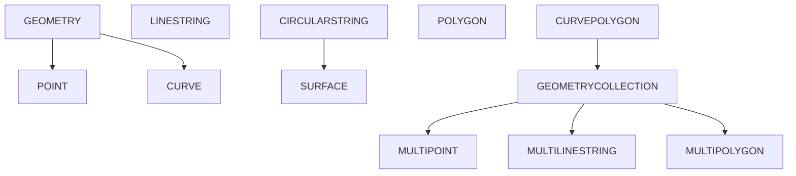
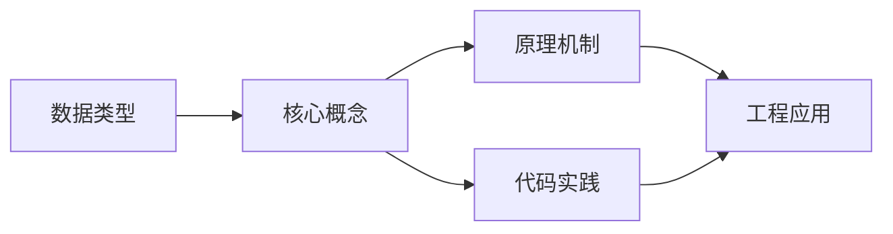
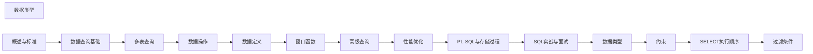

## 1. 学习目标（Bloom 分类）

本节按照布鲁姆教育目标分类学组织学习路径。本文主题为《数据类型》，属于 SQL 模块，读者可以根据自身阶段选择阅读深度。

记忆层面：能够准确复述本文的核心概念、术语与基本语法或操作步骤，并能够在提问或检索时快速定位对应知识点。能够说出 SQL 的核心概念、语法与常用对象。

理解层面：能够用自己的语言解释核心原理与工作机制，说明概念之间的因果关系，而不是机械记忆结论。能够解释 SQL 的执行原理与优化机制。

应用层面：能够在真实项目或练习场景中运用本文知识解决具体问题，写出正确且可维护的实现。能够编写正确、高效的 SQL 语句与操作。

分析层面：能够拆解复杂问题，比较本文主题与相邻概念的异同，识别边界条件与例外情况。能够分析 SQL 相关方案在性能与一致性上的权衡。

评价层面：能够根据约束条件（性能、可读性、安全、成本）评价不同方案的优劣，做出有依据的技术决策。能够根据业务场景评价 SQL 技术选型。

创造层面：能够把本文知识与其他模块知识组合，设计出新的解决方案或可复用的工程模式。能够组合 SQL 与其他技术设计数据架构。

通过本节学习，读者应当能够把《数据类型》纳入自己的知识网络，并与 SQL 模块的其他主题（DDL/DML、查询、索引、事务）建立关联。

## 2. 历史动机与发展脉络

《数据类型》是 SQL 领域的重要主题。要真正理解它，需要先了解它解决的问题与演进过程。

SQL（结构化查询语言）源于 1970 年 Codd 的关系模型，1974 年由 Chamberlin 与 Boyce 设计（SEQUEL），1986 年成为 ANSI 标准；SQL:2023 是当前国际标准。
SQL 分为 DDL（建表）、DML（增删改）、DQL（查询）、DCL（权限）与 TCL（事务）；各大数据库在标准基础上扩展方言。
SQL 是声明式语言：描述“要什么”而非“怎么做”，优化器负责执行计划；这一设计让 SQL 具有跨数据库的表达一致性。

回到本文主题：数据类型 的提出与成熟，正是上述技术背景下的必然产物。早期实现往往以简单可用为目标，随着工程规模扩大，社区逐渐沉淀出标准做法与最佳实践；理解这一脉络，可以帮助读者判断“为什么文档中的推荐写法是现在这个样子”，也能在遇到历史遗留代码时准确识别其设计年代与取舍。


## 3. 形式化定义与核心概念精讲

本节把《数据类型》涉及的核心概念以“定义 + 讲解”的形式展开。读者应把定义当作工具，把讲解当作理解路径；两者结合才能形成可迁移的知识。

关系模型：表（关系）、行（元组）、列（属性）；主键唯一标识、外键表达关联、范式消除冗余。
查询执行：解析 -> 绑定 -> 优化（基于代价选择计划）-> 执行；索引、统计信息与连接算法决定性能。
事务 ACID：原子性（Atomicity）、一致性（Consistency）、隔离性（Isolation）、持久性（Durability）；隔离级别控制并发行为。

### 3.1 原文章节逐一精讲

原文档把主题拆分为 19 个小节，下面按顺序给出每一节的导读讲解，随后保留原文细节供精读。

#### 原文精读（完整保留）

# 数据类型

> **符号约定**：`< >` 必填参数 | `[ ]` 可选参数

---

#### 1. 数据类型概述

SQL 数据类型定义了列、参数和表达式可以存储的数据种类及其操作。合理选择数据类型直接影响存储效率、查询性能和数据完整性。

##### 1.1 数据类型分类

| 类别       | 典型类型                             | 用途           |
| ---------- | ------------------------------------ | -------------- |
| 数值类型   | INTEGER, DECIMAL, FLOAT, DOUBLE      | 数值计算与存储 |
| 字符串类型 | CHAR, VARCHAR, TEXT, CLOB            | 文本数据       |
| 日期时间   | DATE, TIME, TIMESTAMP, INTERVAL      | 时间相关数据   |
| 布尔类型   | BOOLEAN                              | 逻辑真/假      |
| JSON 类型  | JSON, JSONB                          | 半结构化数据   |
| 空间类型   | GEOMETRY, POINT, LINESTRING, POLYGON | 地理空间数据   |
| 二进制类型 | BLOB, BINARY, VARBINARY              | 二进制大对象   |

##### 1.2 类型选择原则

- **最小化原则**：选择能满足需求的最小数据类型，减少存储和 I/O 开销
- **精确性原则**：货币等精确数值使用 `DECIMAL`，避免浮点精度丢失
- **兼容性原则**：考虑跨数据库的 SQL 标准兼容性

#### 2. 数值类型

##### 2.1 精确数值类型

| 类型          | 字节 | 范围                    | 说明         |
| ------------- | ---- | ----------------------- | ------------ |
| SMALLINT      | 2    | $-32768 \sim 32767$     | 小整数       |
| INTEGER / INT | 4    | $-2^{31} \sim 2^{31}-1$ | 标准整数     |
| BIGINT        | 8    | $-2^{63} \sim 2^{63}-1$ | 大整数       |
| DECIMAL(p, s) | 变长 | 取决于精度              | 精确小数     |
| NUMERIC(p, s) | 变长 | 同 DECIMAL              | SQL 标准别名 |

**DECIMAL 精度说明**：

- `p`（precision）：总位数，不含小数点，范围 1~38（标准）或更大（实现相关）
- `s`（scale）：小数位数，$0 \le s \le p$

```sql
-- 货币存储：精确到分
CREATE TABLE products (
    price DECIMAL(10, 2)  -- 最大 99999999.99
);

-- 科学测量：精确到微米
CREATE TABLE measurements (
    length DECIMAL(12, 6)  -- 最大 999999.999999
);
```

##### 2.2 近似数值类型

| 类型             | 字节 | 精度      | 范围                                            |
| ---------------- | ---- | --------- | ----------------------------------------------- |
| REAL / FLOAT     | 4    | 6 位有效  | $-3.4 \times 10^{38} \sim 3.4 \times 10^{38}$   |
| DOUBLE PRECISION | 8    | 15 位有效 | $-1.7 \times 10^{308} \sim 1.7 \times 10^{308}$ |

> **注意**：浮点类型遵循 IEEE 754 标准，存在精度丢失问题。比较浮点数时需使用容差：

```sql
-- 错误：浮点等值比较
SELECT * FROM sensors WHERE reading = 0.1;

-- 正确：使用容差范围
SELECT * FROM sensors WHERE ABS(reading - 0.1) < 1e-9;
```

##### 2.3 自增类型

```sql
-- SQL 标准自增
CREATE TABLE users (
    id INTEGER GENERATED ALWAYS AS IDENTITY PRIMARY KEY,
    name VARCHAR(100)
);

-- 兼容写法（MySQL AUTO_INCREMENT, PostgreSQL SERIAL）
CREATE TABLE orders (
    id BIGINT AUTO_INCREMENT PRIMARY KEY  -- MySQL
);
```

#### 3. 字符串类型

##### 3.1 定长与变长字符串

| 类型        | 最大长度 | 说明                    |
| ----------- | -------- | ----------------------- |
| CHAR(n)     | n 字符   | 定长，不足补空格        |
| VARCHAR(n)  | n 字符   | 变长，按实际存储        |
| TEXT / CLOB | 无限制   | 大文本，SQL 标准为 CLOB |

**CHAR vs VARCHAR 选择**：

- 长度恒定的数据（如国家代码 `CHAR(2)`、MD5 `CHAR(32)`）使用 `CHAR`
- 长度变化的数据使用 `VARCHAR`，避免尾部空格浪费

```sql
CREATE TABLE customers (
    country_code CHAR(2),        -- 固定2位国家代码
    name VARCHAR(100),           -- 变长姓名
    bio TEXT                     -- 不限长度简介
);
```

##### 3.2 国家字符集类型

| 类型        | 说明                 |
| ----------- | -------------------- |
| NCHAR(n)    | 国家字符集定长字符串 |
| NVARCHAR(n) | 国家字符集变长字符串 |
| NCLOB       | 国家字符集大文本     |

```sql
-- 存储多语言文本
CREATE TABLE i18n_messages (
    msg_key VARCHAR(50),
    content_zh NVARCHAR(500),   -- 中文
    content_ja NVARCHAR(500)    -- 日文
);
```

##### 3.3 字符集与排序规则

```sql
-- 指定字符集和排序规则
CREATE TABLE articles (
    title VARCHAR(200) CHARACTER SET utf8mb4 COLLATE utf8mb4_unicode_ci,
    content TEXT CHARACTER SET utf8mb4
);

-- 排序规则影响比较和排序
-- utf8mb4_general_ci: 不区分大小写，速度快
-- utf8mb4_unicode_ci: 不区分大小写，Unicode 正确排序
-- utf8mb4_bin: 区分大小写，二进制比较
```

#### 4. 日期时间类型

##### 4.1 标准日期时间类型

| 类型                     | 格式                      | 精度 | 范围                       |
| ------------------------ | ------------------------- | ---- | -------------------------- |
| DATE                     | YYYY-MM-DD                | 天   | 0001-01-01 ~ 9999-12-31    |
| TIME                     | HH:MM:SS[.ffffff]         | 微秒 | 00:00:00 ~ 23:59:59.999999 |
| TIMESTAMP                | YYYY-MM-DD HH:MM:SS[.fff] | 微秒 | 0001 ~ 9999 年             |
| TIME WITH TIME ZONE      | 含时区偏移                | 微秒 | —                          |
| TIMESTAMP WITH TIME ZONE | 含时区偏移                | 微秒 | —                          |

```sql
CREATE TABLE events (
    event_date DATE,
    event_time TIME(3),                    -- 精确到毫秒
    created_at TIMESTAMP WITH TIME ZONE    -- 含时区
);

-- 插入日期时间值
INSERT INTO events VALUES (
    DATE '2026-06-14',
    TIME '14:30:00.123',
    TIMESTAMP WITH TIME ZONE '2026-06-14 14:30:00+08:00'
);
```

##### 4.2 INTERVAL 类型

`INTERVAL` 表示时间跨度，用于日期时间运算：

```sql
-- 年-月间隔
INTERVAL '3-2' YEAR TO MONTH     -- 3年2个月

-- 日-时间隔
INTERVAL '5 12:30:00' DAY TO SECOND  -- 5天12小时30分

-- 日期运算
SELECT
    DATE '2026-06-14' + INTERVAL '30' DAY AS thirty_days_later,
    TIMESTAMP '2026-06-14 10:00:00' - INTERVAL '2' HOUR AS two_hours_ago;
```

##### 4.3 时区处理最佳实践

```sql
-- 推荐：存储 UTC 时间，查询时转换时区
CREATE TABLE logs (
    created_at TIMESTAMP WITH TIME ZONE DEFAULT CURRENT_TIMESTAMP
);

-- 查询时转换为本地时区
SELECT created_at AT TIME ZONE 'Asia/Shanghai' AS local_time
FROM logs;
```

#### 5. JSON 类型

##### 5.1 JSON 与 JSONB

| 特性     | JSON             | JSONB             |
| -------- | ---------------- | ----------------- |
| 存储     | 文本原样存储     | 二进制解析后存储  |
| 写入速度 | 快（无需解析）   | 慢（需解析转换）  |
| 查询速度 | 慢（每次需解析） | 快（已解析）      |
| 索引支持 | 有限             | 完整 GIN 索引支持 |
| 空格保留 | 保留             | 不保留            |
| 键顺序   | 保留             | 不保证            |

```sql
-- PostgreSQL JSONB
CREATE TABLE api_logs (
    id BIGSERIAL PRIMARY KEY,
    payload JSONB,
    created_at TIMESTAMP DEFAULT NOW()
);

-- 插入 JSON 数据
INSERT INTO api_logs (payload) VALUES (
    '{"user_id": 42, "action": "login", "meta": {"ip": "192.168.1.1"}}'
);

-- JSON 查询操作符
SELECT payload->>'user_id' AS user_id,          -- 文本提取
       payload->'meta'->>'ip' AS ip,            -- 嵌套提取
       jsonb_pretty(payload) AS formatted       -- 格式化输出
FROM api_logs
WHERE payload @> '{"action": "login"}'::jsonb;  -- 包含查询
```

##### 5.2 JSON 路径查询（SQL:2016 标准）

```sql
-- SQL/JSON 路径表达式
SELECT *
FROM api_logs
WHERE payload ? '$.meta.ip ? (@ == "192.168.1.1")';

-- JSON_TABLE：将 JSON 转为关系表
SELECT jt.user_id, jt.action
FROM api_logs,
     JSON_TABLE(payload, '$' COLUMNS (
         user_id INTEGER PATH '$.user_id',
         action  VARCHAR(50) PATH '$.action'
     )) AS jt;
```

#### 6. 空间数据类型

##### 6.1 OGC 简单要素模型

SQL/MM 标准定义了空间数据类型层次：



##### 6.2 空间类型使用

```sql
-- PostgreSQL + PostGIS
CREATE TABLE locations (
    id SERIAL PRIMARY KEY,
    name VARCHAR(100),
    geom GEOMETRY(Point, 4326)    -- SRID 4326 = WGS84
);

-- 插入空间数据
INSERT INTO locations (name, geom) VALUES (
    '天安门',
    ST_SetSRID(ST_MakePoint(116.3975, 39.9087), 4326)
);

-- 空间查询：3公里范围内的地点
SELECT name,
       ST_Distance(geom::geography,
                   ST_SetSRID(ST_MakePoint(116.4, 39.9), 4326)::geography
       ) AS distance_meters
FROM locations
WHERE ST_DWithin(
    geom::geography,
    ST_SetSRID(ST_MakePoint(116.4, 39.9), 4326)::geography,
    3000  -- 3公里
);
```

##### 6.3 空间索引

```sql
-- 创建 GIST 空间索引
CREATE INDEX idx_locations_geom ON locations USING GIST (geom);

-- 空间操作符（使用索引）
SELECT * FROM locations
WHERE geom && ST_MakeEnvelope(116.3, 39.8, 116.5, 40.0, 4326);
```

#### 7. 类型转换

##### 7.1 显式转换

```sql
-- CAST 函数（SQL 标准）
SELECT CAST('123' AS INTEGER);
SELECT CAST(price AS VARCHAR(20));

-- 类型转换简写（PostgreSQL）
SELECT '123'::INTEGER;
SELECT created_at::DATE;

-- 格式化转换
SELECT TO_CHAR(created_at, 'YYYY-MM-DD HH24:MI:SS') AS formatted;
SELECT TO_NUMBER('1,234.56', '9G999D99');
```

##### 7.2 隐式转换规则

数据库在以下场景自动进行类型转换：

1. **赋值转换**：插入值与列类型不匹配时
2. **比较转换**：不同类型比较时，通常向"更宽"类型转换
3. **运算转换**：如 `INTEGER + DECIMAL → DECIMAL`

```sql
-- 隐式转换示例
SELECT * FROM users WHERE id = '42';     -- '42' → 42
SELECT '2026-06-14'::DATE + 1;           -- DATE + INTEGER → DATE
```

> **最佳实践**：避免依赖隐式转换，显式使用 `CAST` 提高代码可读性和可移植性。
#### 整数类型

**单行写法：定义 TINYINT 列**
`<列名> TINYINT`
```sql
-- 定义 TINYINT 类型列（1 字节，-128 到 127）
CREATE TABLE products (id INT, stock TINYINT);
```

**单行写法：定义 SMALLINT 列**
`<列名> SMALLINT`
```sql
-- 定义 SMALLINT 类型列（2 字节，-32768 到 32767）
CREATE TABLE products (id INT, quantity SMALLINT);
```

**单行写法：定义 INT 列**
`<列名> INT`
```sql
-- 定义 INT 类型列（4 字节，-2147483648 到 2147483647）
CREATE TABLE users (id INT, age INT);
```

**单行写法：定义 BIGINT 列**
`<列名> BIGINT`
```sql
-- 定义 BIGINT 类型列（8 字节，大范围整数）
CREATE TABLE orders (id BIGINT, user_id BIGINT);
```

**单行写法：定义无符号整数**
`<列名> INT UNSIGNED`
```sql
-- 定义无符号 INT 列（MySQL，0 到 4294967295）
CREATE TABLE products (id INT UNSIGNED, price INT UNSIGNED);
```

---

#### 定点数与浮点数

**单行写法：定义 DECIMAL 列**
`<列名> DECIMAL(<精度>, <标度>)`
```sql
-- 定义 DECIMAL 类型列（精确小数，推荐用于金额）
CREATE TABLE products (id INT, price DECIMAL(10, 2));
```

**单行写法：定义 NUMERIC 列**
`<列名> NUMERIC(<精度>, <标度>)`
```sql
-- 定义 NUMERIC 类型列（等价于 DECIMAL）
CREATE TABLE accounts (id INT, balance NUMERIC(15, 2));
```

**单行写法：定义 FLOAT 列**
`<列名> FLOAT`
```sql
-- 定义 FLOAT 类型列（单精度浮点数，4 字节）
CREATE TABLE sensors (id INT, temperature FLOAT);
```

**单行写法：定义 DOUBLE 列**
`<列名> DOUBLE`
```sql
-- 定义 DOUBLE 类型列（双精度浮点数，8 字节）
CREATE TABLE measurements (id INT, value DOUBLE);
```

**单行写法：定义 REAL 列**
`<列名> REAL`
```sql
-- 定义 REAL 类型列（单精度浮点数）
CREATE TABLE sensors (id INT, temperature REAL);
```

---

#### 字符串类型

**单行写法：定义 CHAR 列**
`<列名> CHAR(<长度>)`
```sql
-- 定义 CHAR 类型列（固定长度字符串）
CREATE TABLE users (id INT, gender CHAR(1));
```

**单行写法：定义 VARCHAR 列**
`<列名> VARCHAR(<最大长度>)`
```sql
-- 定义 VARCHAR 类型列（可变长度字符串）
CREATE TABLE users (id INT, name VARCHAR(100));
```

**单行写法：定义 TEXT 列**
`<列名> TEXT`
```sql
-- 定义 TEXT 类型列（大文本数据）
CREATE TABLE articles (id INT, content TEXT);
```

**单行写法：定义 PostgreSQL TEXT 列**
`<列名> TEXT`
```sql
-- PostgreSQL 中 TEXT 无长度限制
CREATE TABLE articles (id INT, content TEXT);
```

---

#### 日期时间类型

**单行写法：定义 DATE 列**
`<列名> DATE`
```sql
-- 定义 DATE 类型列（仅日期，YYYY-MM-DD）
CREATE TABLE users (id INT, birth_date DATE);
```

**单行写法：定义 TIME 列**
`<列名> TIME`
```sql
-- 定义 TIME 类型列（仅时间，HH:MM:SS）
CREATE TABLE events (id INT, start_time TIME);
```

**单行写法：定义 DATETIME 列**
`<列名> DATETIME`
```sql
-- 定义 DATETIME 类型列（日期时间，MySQL）
CREATE TABLE orders (id INT, created_at DATETIME);
```

**单行写法：定义 TIMESTAMP 列**
`<列名> TIMESTAMP`
```sql
-- 定义 TIMESTAMP 类型列（时间戳）
CREATE TABLE logs (id INT, log_time TIMESTAMP);
```

**单行写法：定义带时区的 TIMESTAMP 列**
`<列名> TIMESTAMP WITH TIME ZONE`
```sql
-- 定义带时区的 TIMESTAMP 列（PostgreSQL）
CREATE TABLE events (id INT, event_time TIMESTAMP WITH TIME ZONE);
```

---

#### 布尔类型

**单行写法：定义 BOOLEAN 列**
`<列名> BOOLEAN`
```sql
-- 定义 BOOLEAN 类型列（PostgreSQL）
CREATE TABLE users (id INT, is_active BOOLEAN);
```

**单行写法：MySQL 用 TINYINT 模拟 BOOLEAN**
`<列名> TINYINT(1)`
```sql
-- MySQL 用 TINYINT(1) 模拟布尔类型
CREATE TABLE users (id INT, is_active TINYINT(1));
```

---

#### 二进制类型

**单行写法：定义 BLOB 列**
`<列名> BLOB`
```sql
-- 定义 BLOB 类型列（二进制大对象）
CREATE TABLE files (id INT, file_data BLOB);
```

**单行写法：定义 BYTEA 列**
`<列名> BYTEA`
```sql
-- 定义 BYTEA 类型列（PostgreSQL 二进制数据）
CREATE TABLE files (id INT, file_data BYTEA);
```

**单行写法：定义 VARBINARY 列**
`<列名> VARBINARY(<最大长度>)`
```sql
-- 定义 VARBINARY 类型列（可变长度二进制）
CREATE TABLE images (id INT, thumbnail VARBINARY(1024));
```

---

#### JSON 类型

**单行写法：定义 JSON 列**
`<列名> JSON`
```sql
-- 定义 JSON 类型列（MySQL 5.7+/PostgreSQL）
CREATE TABLE users (id INT, preferences JSON);
```

**单行写法：定义 JSONB 列**
`<列名> JSONB`
```sql
-- 定义 JSONB 类型列（PostgreSQL，二进制 JSON，支持索引）
CREATE TABLE users (id INT, preferences JSONB);
```

---

#### 枚举类型

**换行写法：PostgreSQL 创建枚举类型**
`CREATE TYPE <类型名> AS ENUM (<值 1>, <值 2>, ...)`
```sql
-- 创建订单状态枚举类型
CREATE TYPE order_status AS ENUM ('pending', 'processing', 'shipped', 'delivered');
```

**单行写法：使用枚举类型**
`<列名> <枚举类型名>`
```sql
-- 使用枚举类型定义列
CREATE TABLE orders (id INT, status order_status);
```

**单行写法：MySQL ENUM 类型**
`<列名> ENUM(<值 1>, <值 2>, ...)`
```sql
-- MySQL 直接在列定义中使用 ENUM
CREATE TABLE orders (id INT, status ENUM('pending', 'processing', 'shipped', 'delivered'));
```

---

#### 数组类型

**单行写法：PostgreSQL 数组类型**
`<列名> <类型>[]`
```sql
-- 定义整数数组列
CREATE TABLE teams (id INT, member_ids INT[]);
```

**单行写法：定义字符串数组列**
`<列名> VARCHAR[]`
```sql
-- 定义字符串数组列
CREATE TABLE articles (id INT, tags VARCHAR[]);
```

---

#### UUID 类型

**单行写法：定义 UUID 列**
`<列名> UUID`
```sql
-- 定义 UUID 类型列（PostgreSQL）
CREATE TABLE users (id UUID PRIMARY KEY, name VARCHAR(100));
```

**单行写法：定义默认 UUID 列**
`<列名> UUID DEFAULT gen_random_uuid()`
```sql
-- 定义默认生成 UUID 的列
CREATE TABLE users (id UUID DEFAULT gen_random_uuid() PRIMARY KEY, name VARCHAR(100));
```

---

#### 自增类型

**单行写法：MySQL AUTO_INCREMENT**
`<列名> INT AUTO_INCREMENT PRIMARY KEY`
```sql
-- MySQL 自增主键
CREATE TABLE users (id INT AUTO_INCREMENT PRIMARY KEY, name VARCHAR(100));
```

**单行写法：PostgreSQL SERIAL**
`<列名> SERIAL PRIMARY KEY`
```sql
-- PostgreSQL 自增主键
CREATE TABLE users (id SERIAL PRIMARY KEY, name VARCHAR(100));
```

**单行写法：PostgreSQL BIGSERIAL**
`<列名> BIGSERIAL PRIMARY KEY`
```sql
-- PostgreSQL 大范围自增主键
CREATE TABLE orders (id BIGSERIAL PRIMARY KEY, user_id BIGINT);
```

**单行写法：SQL Server IDENTITY**
`<列名> INT IDENTITY(1, 1) PRIMARY KEY`
```sql
-- SQL Server 自增主键
CREATE TABLE users (id INT IDENTITY(1, 1) PRIMARY KEY, name VARCHAR(100));
```

---

#### 货币类型

**单行写法：定义 MONEY 列**
`<列名> MONEY`
```sql
-- 定义 MONEY 类型列（PostgreSQL）
CREATE TABLE products (id INT, price MONEY);
```

**单行写法：推荐用 DECIMAL 存储金额**
`<列名> DECIMAL(<精度>, 2)`
```sql
-- 推荐使用 DECIMAL 存储金额
CREATE TABLE products (id INT, price DECIMAL(10, 2));
```


### 3.2 概念关系图

下面用 Mermaid 图表达本文核心概念之间的关系，帮助读者建立整体图景：



图中展示的是本文知识的结构化关系：核心概念是入口，原理机制解释“为什么”，代码实践演示“怎么做”，工程应用回答“何时用”。读者学习时可以把每个小节的内容挂接到对应节点上。

## 4. 理论推导与原理解析

本节深入《数据类型》背后的原理。理论部分不求面面俱到，而是聚焦“能解释现象、能指导实践”的关键推导。

关系模型：表（关系）、行（元组）、列（属性）；主键唯一标识、外键表达关联、范式消除冗余。
查询执行：解析 -> 绑定 -> 优化（基于代价选择计划）-> 执行；索引、统计信息与连接算法决定性能。
事务 ACID：原子性（Atomicity）、一致性（Consistency）、隔离性（Isolation）、持久性（Durability）；隔离级别控制并发行为。
集合语义：SELECT 返回结果集；JOIN 组合关系，GROUP BY 聚合，子查询与 CTE 表达复杂逻辑。

需要强调的是，理论推导与工程实践之间存在翻译层：理论给出的是理想化模型与边界条件，工程代码则必须处理真实环境中的例外。读者在学习时应先掌握理论的“标准情形”，再通过陷阱章节了解“非标准情形”。

## 5. 代码示例与逐行讲解

本节把原文中的代码示例系统整理，并为每个示例补充用途说明与讲解。读者不应只浏览代码，而应逐段对照讲解理解设计意图。

### 5.1 示例：2.1 精确数值类型

该示例来自原文《2.1 精确数值类型》小节，用于演示数据类型相关操作。阅读时请先看代码结构，再看其后的讲解。

```sql
-- 货币存储：精确到分
CREATE TABLE products (
    price DECIMAL(10, 2)  -- 最大 99999999.99
);

-- 科学测量：精确到微米
CREATE TABLE measurements (
    length DECIMAL(12, 6)  -- 最大 999999.999999
);
```

讲解：这段代码演示了本节核心知识点。代码中的关键操作可以归纳为三步：准备（定义或初始化）、执行（核心逻辑）、收尾（释放资源或返回结果）。实际项目中，这三步往往被封装为函数或类，以提升复用性与可测试性。

关键点分析：

该示例共 8 行有效代码，包含 1 类关键结构（CREATE）。其中：

- 入口与初始化部分负责建立上下文，对应实际项目中的启动或装配逻辑；
- 核心逻辑部分体现本文主题的主要操作，是阅读时最需要对照讲解理解的部分；
- 输出或返回部分把结果交给调用方，注意其类型与边界条件。

进阶思考路径：先尝试修改参数观察行为变化，再把示例中的模式迁移到自己的项目中；每次修改都记录预期与实测差异，这是把示例转化为能力的最快方式。

### 5.2 示例：2.2 近似数值类型

该示例来自原文《2.2 近似数值类型》小节，用于演示数据类型相关操作。阅读时请先看代码结构，再看其后的讲解。

```sql
-- 错误：浮点等值比较
SELECT * FROM sensors WHERE reading = 0.1;

-- 正确：使用容差范围
SELECT * FROM sensors WHERE ABS(reading - 0.1) < 1e-9;
```

讲解：这段代码演示了本节核心知识点。代码中的关键操作可以归纳为三步：准备（定义或初始化）、执行（核心逻辑）、收尾（释放资源或返回结果）。实际项目中，这三步往往被封装为函数或类，以提升复用性与可测试性。

关键点分析：

该示例共 4 行有效代码，包含 2 类关键结构（SELECT、FROM）。其中：

- 入口与初始化部分负责建立上下文，对应实际项目中的启动或装配逻辑；
- 核心逻辑部分体现本文主题的主要操作，是阅读时最需要对照讲解理解的部分；
- 输出或返回部分把结果交给调用方，注意其类型与边界条件。

进阶思考路径：先尝试修改参数观察行为变化，再把示例中的模式迁移到自己的项目中；每次修改都记录预期与实测差异，这是把示例转化为能力的最快方式。

### 5.3 示例：2.3 自增类型

该示例来自原文《2.3 自增类型》小节，用于演示数据类型相关操作。阅读时请先看代码结构，再看其后的讲解。

```sql
-- SQL 标准自增
CREATE TABLE users (
    id INTEGER GENERATED ALWAYS AS IDENTITY PRIMARY KEY,
    name VARCHAR(100)
);

-- 兼容写法（MySQL AUTO_INCREMENT, PostgreSQL SERIAL）
CREATE TABLE orders (
    id BIGINT AUTO_INCREMENT PRIMARY KEY  -- MySQL
);
```

讲解：这段代码演示了本节核心知识点。代码中的关键操作可以归纳为三步：准备（定义或初始化）、执行（核心逻辑）、收尾（释放资源或返回结果）。实际项目中，这三步往往被封装为函数或类，以提升复用性与可测试性。

关键点分析：

该示例共 9 行有效代码，包含 1 类关键结构（CREATE）。其中：

- 入口与初始化部分负责建立上下文，对应实际项目中的启动或装配逻辑；
- 核心逻辑部分体现本文主题的主要操作，是阅读时最需要对照讲解理解的部分；
- 输出或返回部分把结果交给调用方，注意其类型与边界条件。

进阶思考路径：先尝试修改参数观察行为变化，再把示例中的模式迁移到自己的项目中；每次修改都记录预期与实测差异，这是把示例转化为能力的最快方式。

### 5.4 示例：3.1 定长与变长字符串

该示例来自原文《3.1 定长与变长字符串》小节，用于演示数据类型相关操作。阅读时请先看代码结构，再看其后的讲解。

```sql
CREATE TABLE customers (
    country_code CHAR(2),        -- 固定2位国家代码
    name VARCHAR(100),           -- 变长姓名
    bio TEXT                     -- 不限长度简介
);
```

讲解：这段代码演示了本节核心知识点。代码中的关键操作可以归纳为三步：准备（定义或初始化）、执行（核心逻辑）、收尾（释放资源或返回结果）。实际项目中，这三步往往被封装为函数或类，以提升复用性与可测试性。

关键点分析：

该示例共 5 行有效代码，包含 1 类关键结构（CREATE）。其中：

- 入口与初始化部分负责建立上下文，对应实际项目中的启动或装配逻辑；
- 核心逻辑部分体现本文主题的主要操作，是阅读时最需要对照讲解理解的部分；
- 输出或返回部分把结果交给调用方，注意其类型与边界条件。

进阶思考路径：先尝试修改参数观察行为变化，再把示例中的模式迁移到自己的项目中；每次修改都记录预期与实测差异，这是把示例转化为能力的最快方式。

### 5.5 示例：3.2 国家字符集类型

该示例来自原文《3.2 国家字符集类型》小节，用于演示数据类型相关操作。阅读时请先看代码结构，再看其后的讲解。

```sql
-- 存储多语言文本
CREATE TABLE i18n_messages (
    msg_key VARCHAR(50),
    content_zh NVARCHAR(500),   -- 中文
    content_ja NVARCHAR(500)    -- 日文
);
```

讲解：这段代码演示了本节核心知识点。代码中的关键操作可以归纳为三步：准备（定义或初始化）、执行（核心逻辑）、收尾（释放资源或返回结果）。实际项目中，这三步往往被封装为函数或类，以提升复用性与可测试性。

关键点分析：

该示例共 6 行有效代码，包含 1 类关键结构（CREATE）。其中：

- 入口与初始化部分负责建立上下文，对应实际项目中的启动或装配逻辑；
- 核心逻辑部分体现本文主题的主要操作，是阅读时最需要对照讲解理解的部分；
- 输出或返回部分把结果交给调用方，注意其类型与边界条件。

进阶思考路径：先尝试修改参数观察行为变化，再把示例中的模式迁移到自己的项目中；每次修改都记录预期与实测差异，这是把示例转化为能力的最快方式。

### 5.6 示例：3.3 字符集与排序规则

该示例来自原文《3.3 字符集与排序规则》小节，用于演示数据类型相关操作。阅读时请先看代码结构，再看其后的讲解。

```sql
-- 指定字符集和排序规则
CREATE TABLE articles (
    title VARCHAR(200) CHARACTER SET utf8mb4 COLLATE utf8mb4_unicode_ci,
    content TEXT CHARACTER SET utf8mb4
);

-- 排序规则影响比较和排序
-- utf8mb4_general_ci: 不区分大小写，速度快
-- utf8mb4_unicode_ci: 不区分大小写，Unicode 正确排序
-- utf8mb4_bin: 区分大小写，二进制比较
```

讲解：这段代码演示了本节核心知识点。代码中的关键操作可以归纳为三步：准备（定义或初始化）、执行（核心逻辑）、收尾（释放资源或返回结果）。实际项目中，这三步往往被封装为函数或类，以提升复用性与可测试性。

关键点分析：

该示例共 9 行有效代码，包含 1 类关键结构（CREATE）。其中：

- 入口与初始化部分负责建立上下文，对应实际项目中的启动或装配逻辑；
- 核心逻辑部分体现本文主题的主要操作，是阅读时最需要对照讲解理解的部分；
- 输出或返回部分把结果交给调用方，注意其类型与边界条件。

进阶思考路径：先尝试修改参数观察行为变化，再把示例中的模式迁移到自己的项目中；每次修改都记录预期与实测差异，这是把示例转化为能力的最快方式。

### 5.7 示例：4.1 标准日期时间类型

该示例来自原文《4.1 标准日期时间类型》小节，用于演示数据类型相关操作。阅读时请先看代码结构，再看其后的讲解。

```sql
CREATE TABLE events (
    event_date DATE,
    event_time TIME(3),                    -- 精确到毫秒
    created_at TIMESTAMP WITH TIME ZONE    -- 含时区
);

-- 插入日期时间值
INSERT INTO events VALUES (
    DATE '2026-06-14',
    TIME '14:30:00.123',
    TIMESTAMP WITH TIME ZONE '2026-06-14 14:30:00+08:00'
);
```

讲解：这段代码演示了本节核心知识点。代码中的关键操作可以归纳为三步：准备（定义或初始化）、执行（核心逻辑）、收尾（释放资源或返回结果）。实际项目中，这三步往往被封装为函数或类，以提升复用性与可测试性。

关键点分析：

该示例共 11 行有效代码，包含 2 类关键结构（INSERT、CREATE）。其中：

- 入口与初始化部分负责建立上下文，对应实际项目中的启动或装配逻辑；
- 核心逻辑部分体现本文主题的主要操作，是阅读时最需要对照讲解理解的部分；
- 输出或返回部分把结果交给调用方，注意其类型与边界条件。

进阶思考路径：先尝试修改参数观察行为变化，再把示例中的模式迁移到自己的项目中；每次修改都记录预期与实测差异，这是把示例转化为能力的最快方式。

### 5.8 示例：4.2 INTERVAL 类型

该示例来自原文《4.2 INTERVAL 类型》小节，用于演示数据类型相关操作。阅读时请先看代码结构，再看其后的讲解。

```sql
-- 年-月间隔
INTERVAL '3-2' YEAR TO MONTH     -- 3年2个月

-- 日-时间隔
INTERVAL '5 12:30:00' DAY TO SECOND  -- 5天12小时30分

-- 日期运算
SELECT
    DATE '2026-06-14' + INTERVAL '30' DAY AS thirty_days_later,
    TIMESTAMP '2026-06-14 10:00:00' - INTERVAL '2' HOUR AS two_hours_ago;
```

讲解：这段代码演示了本节核心知识点。代码中的关键操作可以归纳为三步：准备（定义或初始化）、执行（核心逻辑）、收尾（释放资源或返回结果）。实际项目中，这三步往往被封装为函数或类，以提升复用性与可测试性。

关键点分析：

该示例共 8 行有效代码，包含 1 类关键结构（SELECT）。其中：

- 入口与初始化部分负责建立上下文，对应实际项目中的启动或装配逻辑；
- 核心逻辑部分体现本文主题的主要操作，是阅读时最需要对照讲解理解的部分；
- 输出或返回部分把结果交给调用方，注意其类型与边界条件。

进阶思考路径：先尝试修改参数观察行为变化，再把示例中的模式迁移到自己的项目中；每次修改都记录预期与实测差异，这是把示例转化为能力的最快方式。

### 5.9 示例：4.3 时区处理最佳实践

该示例来自原文《4.3 时区处理最佳实践》小节，用于演示数据类型相关操作。阅读时请先看代码结构，再看其后的讲解。

```sql
-- 推荐：存储 UTC 时间，查询时转换时区
CREATE TABLE logs (
    created_at TIMESTAMP WITH TIME ZONE DEFAULT CURRENT_TIMESTAMP
);

-- 查询时转换为本地时区
SELECT created_at AT TIME ZONE 'Asia/Shanghai' AS local_time
FROM logs;
```

讲解：这段代码演示了本节核心知识点。代码中的关键操作可以归纳为三步：准备（定义或初始化）、执行（核心逻辑）、收尾（释放资源或返回结果）。实际项目中，这三步往往被封装为函数或类，以提升复用性与可测试性。

关键点分析：

该示例共 7 行有效代码，包含 3 类关键结构（SELECT、CREATE、FROM）。其中：

- 入口与初始化部分负责建立上下文，对应实际项目中的启动或装配逻辑；
- 核心逻辑部分体现本文主题的主要操作，是阅读时最需要对照讲解理解的部分；
- 输出或返回部分把结果交给调用方，注意其类型与边界条件。

进阶思考路径：先尝试修改参数观察行为变化，再把示例中的模式迁移到自己的项目中；每次修改都记录预期与实测差异，这是把示例转化为能力的最快方式。

### 5.10 示例：5.1 JSON 与 JSONB

该示例来自原文《5.1 JSON 与 JSONB》小节，用于演示数据类型相关操作。阅读时请先看代码结构，再看其后的讲解。

```sql
-- PostgreSQL JSONB
CREATE TABLE api_logs (
    id BIGSERIAL PRIMARY KEY,
    payload JSONB,
    created_at TIMESTAMP DEFAULT NOW()
);

-- 插入 JSON 数据
INSERT INTO api_logs (payload) VALUES (
    '{"user_id": 42, "action": "login", "meta": {"ip": "192.168.1.1"}}'
);

-- JSON 查询操作符
SELECT payload->>'user_id' AS user_id,          -- 文本提取
       payload->'meta'->>'ip' AS ip,            -- 嵌套提取
       jsonb_pretty(payload) AS formatted       -- 格式化输出
FROM api_logs
WHERE payload @> '{"action": "login"}'::jsonb;  -- 包含查询
```

讲解：这段代码演示了本节核心知识点。代码中的关键操作可以归纳为三步：准备（定义或初始化）、执行（核心逻辑）、收尾（释放资源或返回结果）。实际项目中，这三步往往被封装为函数或类，以提升复用性与可测试性。

关键点分析：

该示例共 16 行有效代码，包含 4 类关键结构（SELECT、INSERT、CREATE、FROM）。其中：

- 入口与初始化部分负责建立上下文，对应实际项目中的启动或装配逻辑；
- 核心逻辑部分体现本文主题的主要操作，是阅读时最需要对照讲解理解的部分；
- 输出或返回部分把结果交给调用方，注意其类型与边界条件。

进阶思考路径：先尝试修改参数观察行为变化，再把示例中的模式迁移到自己的项目中；每次修改都记录预期与实测差异，这是把示例转化为能力的最快方式。

### 5.11 示例：5.2 JSON 路径查询（SQL:2016 标准）

该示例来自原文《5.2 JSON 路径查询（SQL:2016 标准）》小节，用于演示数据类型相关操作。阅读时请先看代码结构，再看其后的讲解。

```sql
-- SQL/JSON 路径表达式
SELECT *
FROM api_logs
WHERE payload ? '$.meta.ip ? (@ == "192.168.1.1")';

-- JSON_TABLE：将 JSON 转为关系表
SELECT jt.user_id, jt.action
FROM api_logs,
     JSON_TABLE(payload, '$' COLUMNS (
         user_id INTEGER PATH '$.user_id',
         action  VARCHAR(50) PATH '$.action'
     )) AS jt;
```

讲解：这段代码演示了本节核心知识点。代码中的关键操作可以归纳为三步：准备（定义或初始化）、执行（核心逻辑）、收尾（释放资源或返回结果）。实际项目中，这三步往往被封装为函数或类，以提升复用性与可测试性。

关键点分析：

该示例共 11 行有效代码，包含 2 类关键结构（SELECT、FROM）。其中：

- 入口与初始化部分负责建立上下文，对应实际项目中的启动或装配逻辑；
- 核心逻辑部分体现本文主题的主要操作，是阅读时最需要对照讲解理解的部分；
- 输出或返回部分把结果交给调用方，注意其类型与边界条件。

进阶思考路径：先尝试修改参数观察行为变化，再把示例中的模式迁移到自己的项目中；每次修改都记录预期与实测差异，这是把示例转化为能力的最快方式。

### 5.12 示例：6.1 OGC 简单要素模型

该示例来自原文《6.1 OGC 简单要素模型》小节，用于演示数据类型相关操作。阅读时请先看代码结构，再看其后的讲解。


讲解：这段代码演示了本节核心知识点。代码中的关键操作可以归纳为三步：准备（定义或初始化）、执行（核心逻辑）、收尾（释放资源或返回结果）。实际项目中，这三步往往被封装为函数或类，以提升复用性与可测试性。

关键点分析：

该示例共 20 行有效代码，结构以数据或配置为主。阅读时应关注：数据字段的含义、配置项的作用，以及它们与运行行为的对应关系。

进阶思考路径：先尝试修改参数观察行为变化，再把示例中的模式迁移到自己的项目中；每次修改都记录预期与实测差异，这是把示例转化为能力的最快方式。

### 5.13 示例：6.2 空间类型使用

该示例来自原文《6.2 空间类型使用》小节，用于演示数据类型相关操作。阅读时请先看代码结构，再看其后的讲解。

```sql
-- PostgreSQL + PostGIS
CREATE TABLE locations (
    id SERIAL PRIMARY KEY,
    name VARCHAR(100),
    geom GEOMETRY(Point, 4326)    -- SRID 4326 = WGS84
);

-- 插入空间数据
INSERT INTO locations (name, geom) VALUES (
    '天安门',
    ST_SetSRID(ST_MakePoint(116.3975, 39.9087), 4326)
);

-- 空间查询：3公里范围内的地点
SELECT name,
       ST_Distance(geom::geography,
                   ST_SetSRID(ST_MakePoint(116.4, 39.9), 4326)::geography
       ) AS distance_meters
FROM locations
WHERE ST_DWithin(
    geom::geography,
    ST_SetSRID(ST_MakePoint(116.4, 39.9), 4326)::geography,
    3000  -- 3公里
);
```

讲解：这段代码演示了本节核心知识点。代码中的关键操作可以归纳为三步：准备（定义或初始化）、执行（核心逻辑）、收尾（释放资源或返回结果）。实际项目中，这三步往往被封装为函数或类，以提升复用性与可测试性。

关键点分析：

该示例共 22 行有效代码，包含 4 类关键结构（SELECT、INSERT、CREATE、FROM）。其中：

- 入口与初始化部分负责建立上下文，对应实际项目中的启动或装配逻辑；
- 核心逻辑部分体现本文主题的主要操作，是阅读时最需要对照讲解理解的部分；
- 输出或返回部分把结果交给调用方，注意其类型与边界条件。

进阶思考路径：先尝试修改参数观察行为变化，再把示例中的模式迁移到自己的项目中；每次修改都记录预期与实测差异，这是把示例转化为能力的最快方式。

### 5.14 示例：6.3 空间索引

该示例来自原文《6.3 空间索引》小节，用于演示数据类型相关操作。阅读时请先看代码结构，再看其后的讲解。

```sql
-- 创建 GIST 空间索引
CREATE INDEX idx_locations_geom ON locations USING GIST (geom);

-- 空间操作符（使用索引）
SELECT * FROM locations
WHERE geom && ST_MakeEnvelope(116.3, 39.8, 116.5, 40.0, 4326);
```

讲解：这段代码演示了本节核心知识点。代码中的关键操作可以归纳为三步：准备（定义或初始化）、执行（核心逻辑）、收尾（释放资源或返回结果）。实际项目中，这三步往往被封装为函数或类，以提升复用性与可测试性。

关键点分析：

该示例共 5 行有效代码，包含 3 类关键结构（SELECT、CREATE、FROM）。其中：

- 入口与初始化部分负责建立上下文，对应实际项目中的启动或装配逻辑；
- 核心逻辑部分体现本文主题的主要操作，是阅读时最需要对照讲解理解的部分；
- 输出或返回部分把结果交给调用方，注意其类型与边界条件。

进阶思考路径：先尝试修改参数观察行为变化，再把示例中的模式迁移到自己的项目中；每次修改都记录预期与实测差异，这是把示例转化为能力的最快方式。

### 5.15 示例：7.1 显式转换

该示例来自原文《7.1 显式转换》小节，用于演示数据类型相关操作。阅读时请先看代码结构，再看其后的讲解。

```sql
-- CAST 函数（SQL 标准）
SELECT CAST('123' AS INTEGER);
SELECT CAST(price AS VARCHAR(20));

-- 类型转换简写（PostgreSQL）
SELECT '123'::INTEGER;
SELECT created_at::DATE;

-- 格式化转换
SELECT TO_CHAR(created_at, 'YYYY-MM-DD HH24:MI:SS') AS formatted;
SELECT TO_NUMBER('1,234.56', '9G999D99');
```

讲解：这段代码演示了本节核心知识点。代码中的关键操作可以归纳为三步：准备（定义或初始化）、执行（核心逻辑）、收尾（释放资源或返回结果）。实际项目中，这三步往往被封装为函数或类，以提升复用性与可测试性。

关键点分析：

该示例共 9 行有效代码，包含 1 类关键结构（SELECT）。其中：

- 入口与初始化部分负责建立上下文，对应实际项目中的启动或装配逻辑；
- 核心逻辑部分体现本文主题的主要操作，是阅读时最需要对照讲解理解的部分；
- 输出或返回部分把结果交给调用方，注意其类型与边界条件。

进阶思考路径：先尝试修改参数观察行为变化，再把示例中的模式迁移到自己的项目中；每次修改都记录预期与实测差异，这是把示例转化为能力的最快方式。

### 5.16 示例：7.2 隐式转换规则

该示例来自原文《7.2 隐式转换规则》小节，用于演示数据类型相关操作。阅读时请先看代码结构，再看其后的讲解。

```sql
-- 隐式转换示例
SELECT * FROM users WHERE id = '42';     -- '42' → 42
SELECT '2026-06-14'::DATE + 1;           -- DATE + INTEGER → DATE
```

讲解：这段代码演示了本节核心知识点。代码中的关键操作可以归纳为三步：准备（定义或初始化）、执行（核心逻辑）、收尾（释放资源或返回结果）。实际项目中，这三步往往被封装为函数或类，以提升复用性与可测试性。

关键点分析：

该示例共 3 行有效代码，包含 2 类关键结构（SELECT、FROM）。其中：

- 入口与初始化部分负责建立上下文，对应实际项目中的启动或装配逻辑；
- 核心逻辑部分体现本文主题的主要操作，是阅读时最需要对照讲解理解的部分；
- 输出或返回部分把结果交给调用方，注意其类型与边界条件。

进阶思考路径：先尝试修改参数观察行为变化，再把示例中的模式迁移到自己的项目中；每次修改都记录预期与实测差异，这是把示例转化为能力的最快方式。

### 5.17 示例：整数类型

该示例来自原文《整数类型》小节，用于演示数据类型相关操作。阅读时请先看代码结构，再看其后的讲解。

```sql
-- 定义 TINYINT 类型列（1 字节，-128 到 127）
CREATE TABLE products (id INT, stock TINYINT);
```

讲解：这段代码演示了本节核心知识点。代码中的关键操作可以归纳为三步：准备（定义或初始化）、执行（核心逻辑）、收尾（释放资源或返回结果）。实际项目中，这三步往往被封装为函数或类，以提升复用性与可测试性。

关键点分析：

该示例共 2 行有效代码，包含 1 类关键结构（CREATE）。其中：

- 入口与初始化部分负责建立上下文，对应实际项目中的启动或装配逻辑；
- 核心逻辑部分体现本文主题的主要操作，是阅读时最需要对照讲解理解的部分；
- 输出或返回部分把结果交给调用方，注意其类型与边界条件。

进阶思考路径：先尝试修改参数观察行为变化，再把示例中的模式迁移到自己的项目中；每次修改都记录预期与实测差异，这是把示例转化为能力的最快方式。

### 5.18 示例：整数类型

该示例来自原文《整数类型》小节，用于演示数据类型相关操作。阅读时请先看代码结构，再看其后的讲解。

```sql
-- 定义 SMALLINT 类型列（2 字节，-32768 到 32767）
CREATE TABLE products (id INT, quantity SMALLINT);
```

讲解：这段代码演示了本节核心知识点。代码中的关键操作可以归纳为三步：准备（定义或初始化）、执行（核心逻辑）、收尾（释放资源或返回结果）。实际项目中，这三步往往被封装为函数或类，以提升复用性与可测试性。

关键点分析：

该示例共 2 行有效代码，包含 1 类关键结构（CREATE）。其中：

- 入口与初始化部分负责建立上下文，对应实际项目中的启动或装配逻辑；
- 核心逻辑部分体现本文主题的主要操作，是阅读时最需要对照讲解理解的部分；
- 输出或返回部分把结果交给调用方，注意其类型与边界条件。

进阶思考路径：先尝试修改参数观察行为变化，再把示例中的模式迁移到自己的项目中；每次修改都记录预期与实测差异，这是把示例转化为能力的最快方式。

### 5.19 示例：整数类型

该示例来自原文《整数类型》小节，用于演示数据类型相关操作。阅读时请先看代码结构，再看其后的讲解。

```sql
-- 定义 INT 类型列（4 字节，-2147483648 到 2147483647）
CREATE TABLE users (id INT, age INT);
```

讲解：这段代码演示了本节核心知识点。代码中的关键操作可以归纳为三步：准备（定义或初始化）、执行（核心逻辑）、收尾（释放资源或返回结果）。实际项目中，这三步往往被封装为函数或类，以提升复用性与可测试性。

关键点分析：

该示例共 2 行有效代码，包含 1 类关键结构（CREATE）。其中：

- 入口与初始化部分负责建立上下文，对应实际项目中的启动或装配逻辑；
- 核心逻辑部分体现本文主题的主要操作，是阅读时最需要对照讲解理解的部分；
- 输出或返回部分把结果交给调用方，注意其类型与边界条件。

进阶思考路径：先尝试修改参数观察行为变化，再把示例中的模式迁移到自己的项目中；每次修改都记录预期与实测差异，这是把示例转化为能力的最快方式。

### 5.20 示例：整数类型

该示例来自原文《整数类型》小节，用于演示数据类型相关操作。阅读时请先看代码结构，再看其后的讲解。

```sql
-- 定义 BIGINT 类型列（8 字节，大范围整数）
CREATE TABLE orders (id BIGINT, user_id BIGINT);
```

讲解：这段代码演示了本节核心知识点。代码中的关键操作可以归纳为三步：准备（定义或初始化）、执行（核心逻辑）、收尾（释放资源或返回结果）。实际项目中，这三步往往被封装为函数或类，以提升复用性与可测试性。

关键点分析：

该示例共 2 行有效代码，包含 1 类关键结构（CREATE）。其中：

- 入口与初始化部分负责建立上下文，对应实际项目中的启动或装配逻辑；
- 核心逻辑部分体现本文主题的主要操作，是阅读时最需要对照讲解理解的部分；
- 输出或返回部分把结果交给调用方，注意其类型与边界条件。

进阶思考路径：先尝试修改参数观察行为变化，再把示例中的模式迁移到自己的项目中；每次修改都记录预期与实测差异，这是把示例转化为能力的最快方式。

### 5.21 示例：整数类型

该示例来自原文《整数类型》小节，用于演示数据类型相关操作。阅读时请先看代码结构，再看其后的讲解。

```sql
-- 定义无符号 INT 列（MySQL，0 到 4294967295）
CREATE TABLE products (id INT UNSIGNED, price INT UNSIGNED);
```

讲解：这段代码演示了本节核心知识点。代码中的关键操作可以归纳为三步：准备（定义或初始化）、执行（核心逻辑）、收尾（释放资源或返回结果）。实际项目中，这三步往往被封装为函数或类，以提升复用性与可测试性。

关键点分析：

该示例共 2 行有效代码，包含 1 类关键结构（CREATE）。其中：

- 入口与初始化部分负责建立上下文，对应实际项目中的启动或装配逻辑；
- 核心逻辑部分体现本文主题的主要操作，是阅读时最需要对照讲解理解的部分；
- 输出或返回部分把结果交给调用方，注意其类型与边界条件。

进阶思考路径：先尝试修改参数观察行为变化，再把示例中的模式迁移到自己的项目中；每次修改都记录预期与实测差异，这是把示例转化为能力的最快方式。

### 5.22 示例：定点数与浮点数

该示例来自原文《定点数与浮点数》小节，用于演示数据类型相关操作。阅读时请先看代码结构，再看其后的讲解。

```sql
-- 定义 DECIMAL 类型列（精确小数，推荐用于金额）
CREATE TABLE products (id INT, price DECIMAL(10, 2));
```

讲解：这段代码演示了本节核心知识点。代码中的关键操作可以归纳为三步：准备（定义或初始化）、执行（核心逻辑）、收尾（释放资源或返回结果）。实际项目中，这三步往往被封装为函数或类，以提升复用性与可测试性。

关键点分析：

该示例共 2 行有效代码，包含 1 类关键结构（CREATE）。其中：

- 入口与初始化部分负责建立上下文，对应实际项目中的启动或装配逻辑；
- 核心逻辑部分体现本文主题的主要操作，是阅读时最需要对照讲解理解的部分；
- 输出或返回部分把结果交给调用方，注意其类型与边界条件。

进阶思考路径：先尝试修改参数观察行为变化，再把示例中的模式迁移到自己的项目中；每次修改都记录预期与实测差异，这是把示例转化为能力的最快方式。

### 5.23 示例：定点数与浮点数

该示例来自原文《定点数与浮点数》小节，用于演示数据类型相关操作。阅读时请先看代码结构，再看其后的讲解。

```sql
-- 定义 NUMERIC 类型列（等价于 DECIMAL）
CREATE TABLE accounts (id INT, balance NUMERIC(15, 2));
```

讲解：这段代码演示了本节核心知识点。代码中的关键操作可以归纳为三步：准备（定义或初始化）、执行（核心逻辑）、收尾（释放资源或返回结果）。实际项目中，这三步往往被封装为函数或类，以提升复用性与可测试性。

关键点分析：

该示例共 2 行有效代码，包含 1 类关键结构（CREATE）。其中：

- 入口与初始化部分负责建立上下文，对应实际项目中的启动或装配逻辑；
- 核心逻辑部分体现本文主题的主要操作，是阅读时最需要对照讲解理解的部分；
- 输出或返回部分把结果交给调用方，注意其类型与边界条件。

进阶思考路径：先尝试修改参数观察行为变化，再把示例中的模式迁移到自己的项目中；每次修改都记录预期与实测差异，这是把示例转化为能力的最快方式。

### 5.24 示例：定点数与浮点数

该示例来自原文《定点数与浮点数》小节，用于演示数据类型相关操作。阅读时请先看代码结构，再看其后的讲解。

```sql
-- 定义 FLOAT 类型列（单精度浮点数，4 字节）
CREATE TABLE sensors (id INT, temperature FLOAT);
```

讲解：这段代码演示了本节核心知识点。代码中的关键操作可以归纳为三步：准备（定义或初始化）、执行（核心逻辑）、收尾（释放资源或返回结果）。实际项目中，这三步往往被封装为函数或类，以提升复用性与可测试性。

关键点分析：

该示例共 2 行有效代码，包含 1 类关键结构（CREATE）。其中：

- 入口与初始化部分负责建立上下文，对应实际项目中的启动或装配逻辑；
- 核心逻辑部分体现本文主题的主要操作，是阅读时最需要对照讲解理解的部分；
- 输出或返回部分把结果交给调用方，注意其类型与边界条件。

进阶思考路径：先尝试修改参数观察行为变化，再把示例中的模式迁移到自己的项目中；每次修改都记录预期与实测差异，这是把示例转化为能力的最快方式。

### 5.25 示例：定点数与浮点数

该示例来自原文《定点数与浮点数》小节，用于演示数据类型相关操作。阅读时请先看代码结构，再看其后的讲解。

```sql
-- 定义 DOUBLE 类型列（双精度浮点数，8 字节）
CREATE TABLE measurements (id INT, value DOUBLE);
```

讲解：这段代码演示了本节核心知识点。代码中的关键操作可以归纳为三步：准备（定义或初始化）、执行（核心逻辑）、收尾（释放资源或返回结果）。实际项目中，这三步往往被封装为函数或类，以提升复用性与可测试性。

关键点分析：

该示例共 2 行有效代码，包含 1 类关键结构（CREATE）。其中：

- 入口与初始化部分负责建立上下文，对应实际项目中的启动或装配逻辑；
- 核心逻辑部分体现本文主题的主要操作，是阅读时最需要对照讲解理解的部分；
- 输出或返回部分把结果交给调用方，注意其类型与边界条件。

进阶思考路径：先尝试修改参数观察行为变化，再把示例中的模式迁移到自己的项目中；每次修改都记录预期与实测差异，这是把示例转化为能力的最快方式。

### 5.26 示例：定点数与浮点数

该示例来自原文《定点数与浮点数》小节，用于演示数据类型相关操作。阅读时请先看代码结构，再看其后的讲解。

```sql
-- 定义 REAL 类型列（单精度浮点数）
CREATE TABLE sensors (id INT, temperature REAL);
```

讲解：这段代码演示了本节核心知识点。代码中的关键操作可以归纳为三步：准备（定义或初始化）、执行（核心逻辑）、收尾（释放资源或返回结果）。实际项目中，这三步往往被封装为函数或类，以提升复用性与可测试性。

关键点分析：

该示例共 2 行有效代码，包含 1 类关键结构（CREATE）。其中：

- 入口与初始化部分负责建立上下文，对应实际项目中的启动或装配逻辑；
- 核心逻辑部分体现本文主题的主要操作，是阅读时最需要对照讲解理解的部分；
- 输出或返回部分把结果交给调用方，注意其类型与边界条件。

进阶思考路径：先尝试修改参数观察行为变化，再把示例中的模式迁移到自己的项目中；每次修改都记录预期与实测差异，这是把示例转化为能力的最快方式。

### 5.27 示例：字符串类型

该示例来自原文《字符串类型》小节，用于演示数据类型相关操作。阅读时请先看代码结构，再看其后的讲解。

```sql
-- 定义 CHAR 类型列（固定长度字符串）
CREATE TABLE users (id INT, gender CHAR(1));
```

讲解：这段代码演示了本节核心知识点。代码中的关键操作可以归纳为三步：准备（定义或初始化）、执行（核心逻辑）、收尾（释放资源或返回结果）。实际项目中，这三步往往被封装为函数或类，以提升复用性与可测试性。

关键点分析：

该示例共 2 行有效代码，包含 1 类关键结构（CREATE）。其中：

- 入口与初始化部分负责建立上下文，对应实际项目中的启动或装配逻辑；
- 核心逻辑部分体现本文主题的主要操作，是阅读时最需要对照讲解理解的部分；
- 输出或返回部分把结果交给调用方，注意其类型与边界条件。

进阶思考路径：先尝试修改参数观察行为变化，再把示例中的模式迁移到自己的项目中；每次修改都记录预期与实测差异，这是把示例转化为能力的最快方式。

### 5.28 示例：字符串类型

该示例来自原文《字符串类型》小节，用于演示数据类型相关操作。阅读时请先看代码结构，再看其后的讲解。

```sql
-- 定义 VARCHAR 类型列（可变长度字符串）
CREATE TABLE users (id INT, name VARCHAR(100));
```

讲解：这段代码演示了本节核心知识点。代码中的关键操作可以归纳为三步：准备（定义或初始化）、执行（核心逻辑）、收尾（释放资源或返回结果）。实际项目中，这三步往往被封装为函数或类，以提升复用性与可测试性。

关键点分析：

该示例共 2 行有效代码，包含 1 类关键结构（CREATE）。其中：

- 入口与初始化部分负责建立上下文，对应实际项目中的启动或装配逻辑；
- 核心逻辑部分体现本文主题的主要操作，是阅读时最需要对照讲解理解的部分；
- 输出或返回部分把结果交给调用方，注意其类型与边界条件。

进阶思考路径：先尝试修改参数观察行为变化，再把示例中的模式迁移到自己的项目中；每次修改都记录预期与实测差异，这是把示例转化为能力的最快方式。

### 5.29 示例：字符串类型

该示例来自原文《字符串类型》小节，用于演示数据类型相关操作。阅读时请先看代码结构，再看其后的讲解。

```sql
-- 定义 TEXT 类型列（大文本数据）
CREATE TABLE articles (id INT, content TEXT);
```

讲解：这段代码演示了本节核心知识点。代码中的关键操作可以归纳为三步：准备（定义或初始化）、执行（核心逻辑）、收尾（释放资源或返回结果）。实际项目中，这三步往往被封装为函数或类，以提升复用性与可测试性。

关键点分析：

该示例共 2 行有效代码，包含 1 类关键结构（CREATE）。其中：

- 入口与初始化部分负责建立上下文，对应实际项目中的启动或装配逻辑；
- 核心逻辑部分体现本文主题的主要操作，是阅读时最需要对照讲解理解的部分；
- 输出或返回部分把结果交给调用方，注意其类型与边界条件。

进阶思考路径：先尝试修改参数观察行为变化，再把示例中的模式迁移到自己的项目中；每次修改都记录预期与实测差异，这是把示例转化为能力的最快方式。

### 5.30 示例：字符串类型

该示例来自原文《字符串类型》小节，用于演示数据类型相关操作。阅读时请先看代码结构，再看其后的讲解。

```sql
-- PostgreSQL 中 TEXT 无长度限制
CREATE TABLE articles (id INT, content TEXT);
```

讲解：这段代码演示了本节核心知识点。代码中的关键操作可以归纳为三步：准备（定义或初始化）、执行（核心逻辑）、收尾（释放资源或返回结果）。实际项目中，这三步往往被封装为函数或类，以提升复用性与可测试性。

关键点分析：

该示例共 2 行有效代码，包含 1 类关键结构（CREATE）。其中：

- 入口与初始化部分负责建立上下文，对应实际项目中的启动或装配逻辑；
- 核心逻辑部分体现本文主题的主要操作，是阅读时最需要对照讲解理解的部分；
- 输出或返回部分把结果交给调用方，注意其类型与边界条件。

进阶思考路径：先尝试修改参数观察行为变化，再把示例中的模式迁移到自己的项目中；每次修改都记录预期与实测差异，这是把示例转化为能力的最快方式。

### 5.31 示例：日期时间类型

该示例来自原文《日期时间类型》小节，用于演示数据类型相关操作。阅读时请先看代码结构，再看其后的讲解。

```sql
-- 定义 DATE 类型列（仅日期，YYYY-MM-DD）
CREATE TABLE users (id INT, birth_date DATE);
```

讲解：这段代码演示了本节核心知识点。代码中的关键操作可以归纳为三步：准备（定义或初始化）、执行（核心逻辑）、收尾（释放资源或返回结果）。实际项目中，这三步往往被封装为函数或类，以提升复用性与可测试性。

关键点分析：

该示例共 2 行有效代码，包含 1 类关键结构（CREATE）。其中：

- 入口与初始化部分负责建立上下文，对应实际项目中的启动或装配逻辑；
- 核心逻辑部分体现本文主题的主要操作，是阅读时最需要对照讲解理解的部分；
- 输出或返回部分把结果交给调用方，注意其类型与边界条件。

进阶思考路径：先尝试修改参数观察行为变化，再把示例中的模式迁移到自己的项目中；每次修改都记录预期与实测差异，这是把示例转化为能力的最快方式。

### 5.32 示例：日期时间类型

该示例来自原文《日期时间类型》小节，用于演示数据类型相关操作。阅读时请先看代码结构，再看其后的讲解。

```sql
-- 定义 TIME 类型列（仅时间，HH:MM:SS）
CREATE TABLE events (id INT, start_time TIME);
```

讲解：这段代码演示了本节核心知识点。代码中的关键操作可以归纳为三步：准备（定义或初始化）、执行（核心逻辑）、收尾（释放资源或返回结果）。实际项目中，这三步往往被封装为函数或类，以提升复用性与可测试性。

关键点分析：

该示例共 2 行有效代码，包含 1 类关键结构（CREATE）。其中：

- 入口与初始化部分负责建立上下文，对应实际项目中的启动或装配逻辑；
- 核心逻辑部分体现本文主题的主要操作，是阅读时最需要对照讲解理解的部分；
- 输出或返回部分把结果交给调用方，注意其类型与边界条件。

进阶思考路径：先尝试修改参数观察行为变化，再把示例中的模式迁移到自己的项目中；每次修改都记录预期与实测差异，这是把示例转化为能力的最快方式。

### 5.33 示例：日期时间类型

该示例来自原文《日期时间类型》小节，用于演示数据类型相关操作。阅读时请先看代码结构，再看其后的讲解。

```sql
-- 定义 DATETIME 类型列（日期时间，MySQL）
CREATE TABLE orders (id INT, created_at DATETIME);
```

讲解：这段代码演示了本节核心知识点。代码中的关键操作可以归纳为三步：准备（定义或初始化）、执行（核心逻辑）、收尾（释放资源或返回结果）。实际项目中，这三步往往被封装为函数或类，以提升复用性与可测试性。

关键点分析：

该示例共 2 行有效代码，包含 1 类关键结构（CREATE）。其中：

- 入口与初始化部分负责建立上下文，对应实际项目中的启动或装配逻辑；
- 核心逻辑部分体现本文主题的主要操作，是阅读时最需要对照讲解理解的部分；
- 输出或返回部分把结果交给调用方，注意其类型与边界条件。

进阶思考路径：先尝试修改参数观察行为变化，再把示例中的模式迁移到自己的项目中；每次修改都记录预期与实测差异，这是把示例转化为能力的最快方式。

### 5.34 示例：日期时间类型

该示例来自原文《日期时间类型》小节，用于演示数据类型相关操作。阅读时请先看代码结构，再看其后的讲解。

```sql
-- 定义 TIMESTAMP 类型列（时间戳）
CREATE TABLE logs (id INT, log_time TIMESTAMP);
```

讲解：这段代码演示了本节核心知识点。代码中的关键操作可以归纳为三步：准备（定义或初始化）、执行（核心逻辑）、收尾（释放资源或返回结果）。实际项目中，这三步往往被封装为函数或类，以提升复用性与可测试性。

关键点分析：

该示例共 2 行有效代码，包含 1 类关键结构（CREATE）。其中：

- 入口与初始化部分负责建立上下文，对应实际项目中的启动或装配逻辑；
- 核心逻辑部分体现本文主题的主要操作，是阅读时最需要对照讲解理解的部分；
- 输出或返回部分把结果交给调用方，注意其类型与边界条件。

进阶思考路径：先尝试修改参数观察行为变化，再把示例中的模式迁移到自己的项目中；每次修改都记录预期与实测差异，这是把示例转化为能力的最快方式。

### 5.35 示例：日期时间类型

该示例来自原文《日期时间类型》小节，用于演示数据类型相关操作。阅读时请先看代码结构，再看其后的讲解。

```sql
-- 定义带时区的 TIMESTAMP 列（PostgreSQL）
CREATE TABLE events (id INT, event_time TIMESTAMP WITH TIME ZONE);
```

讲解：这段代码演示了本节核心知识点。代码中的关键操作可以归纳为三步：准备（定义或初始化）、执行（核心逻辑）、收尾（释放资源或返回结果）。实际项目中，这三步往往被封装为函数或类，以提升复用性与可测试性。

关键点分析：

该示例共 2 行有效代码，包含 1 类关键结构（CREATE）。其中：

- 入口与初始化部分负责建立上下文，对应实际项目中的启动或装配逻辑；
- 核心逻辑部分体现本文主题的主要操作，是阅读时最需要对照讲解理解的部分；
- 输出或返回部分把结果交给调用方，注意其类型与边界条件。

进阶思考路径：先尝试修改参数观察行为变化，再把示例中的模式迁移到自己的项目中；每次修改都记录预期与实测差异，这是把示例转化为能力的最快方式。

### 5.36 示例：布尔类型

该示例来自原文《布尔类型》小节，用于演示数据类型相关操作。阅读时请先看代码结构，再看其后的讲解。

```sql
-- 定义 BOOLEAN 类型列（PostgreSQL）
CREATE TABLE users (id INT, is_active BOOLEAN);
```

讲解：这段代码演示了本节核心知识点。代码中的关键操作可以归纳为三步：准备（定义或初始化）、执行（核心逻辑）、收尾（释放资源或返回结果）。实际项目中，这三步往往被封装为函数或类，以提升复用性与可测试性。

关键点分析：

该示例共 2 行有效代码，包含 1 类关键结构（CREATE）。其中：

- 入口与初始化部分负责建立上下文，对应实际项目中的启动或装配逻辑；
- 核心逻辑部分体现本文主题的主要操作，是阅读时最需要对照讲解理解的部分；
- 输出或返回部分把结果交给调用方，注意其类型与边界条件。

进阶思考路径：先尝试修改参数观察行为变化，再把示例中的模式迁移到自己的项目中；每次修改都记录预期与实测差异，这是把示例转化为能力的最快方式。

### 5.37 示例：布尔类型

该示例来自原文《布尔类型》小节，用于演示数据类型相关操作。阅读时请先看代码结构，再看其后的讲解。

```sql
-- MySQL 用 TINYINT(1) 模拟布尔类型
CREATE TABLE users (id INT, is_active TINYINT(1));
```

讲解：这段代码演示了本节核心知识点。代码中的关键操作可以归纳为三步：准备（定义或初始化）、执行（核心逻辑）、收尾（释放资源或返回结果）。实际项目中，这三步往往被封装为函数或类，以提升复用性与可测试性。

关键点分析：

该示例共 2 行有效代码，包含 1 类关键结构（CREATE）。其中：

- 入口与初始化部分负责建立上下文，对应实际项目中的启动或装配逻辑；
- 核心逻辑部分体现本文主题的主要操作，是阅读时最需要对照讲解理解的部分；
- 输出或返回部分把结果交给调用方，注意其类型与边界条件。

进阶思考路径：先尝试修改参数观察行为变化，再把示例中的模式迁移到自己的项目中；每次修改都记录预期与实测差异，这是把示例转化为能力的最快方式。

### 5.38 示例：二进制类型

该示例来自原文《二进制类型》小节，用于演示数据类型相关操作。阅读时请先看代码结构，再看其后的讲解。

```sql
-- 定义 BLOB 类型列（二进制大对象）
CREATE TABLE files (id INT, file_data BLOB);
```

讲解：这段代码演示了本节核心知识点。代码中的关键操作可以归纳为三步：准备（定义或初始化）、执行（核心逻辑）、收尾（释放资源或返回结果）。实际项目中，这三步往往被封装为函数或类，以提升复用性与可测试性。

关键点分析：

该示例共 2 行有效代码，包含 1 类关键结构（CREATE）。其中：

- 入口与初始化部分负责建立上下文，对应实际项目中的启动或装配逻辑；
- 核心逻辑部分体现本文主题的主要操作，是阅读时最需要对照讲解理解的部分；
- 输出或返回部分把结果交给调用方，注意其类型与边界条件。

进阶思考路径：先尝试修改参数观察行为变化，再把示例中的模式迁移到自己的项目中；每次修改都记录预期与实测差异，这是把示例转化为能力的最快方式。

### 5.39 示例：二进制类型

该示例来自原文《二进制类型》小节，用于演示数据类型相关操作。阅读时请先看代码结构，再看其后的讲解。

```sql
-- 定义 BYTEA 类型列（PostgreSQL 二进制数据）
CREATE TABLE files (id INT, file_data BYTEA);
```

讲解：这段代码演示了本节核心知识点。代码中的关键操作可以归纳为三步：准备（定义或初始化）、执行（核心逻辑）、收尾（释放资源或返回结果）。实际项目中，这三步往往被封装为函数或类，以提升复用性与可测试性。

关键点分析：

该示例共 2 行有效代码，包含 1 类关键结构（CREATE）。其中：

- 入口与初始化部分负责建立上下文，对应实际项目中的启动或装配逻辑；
- 核心逻辑部分体现本文主题的主要操作，是阅读时最需要对照讲解理解的部分；
- 输出或返回部分把结果交给调用方，注意其类型与边界条件。

进阶思考路径：先尝试修改参数观察行为变化，再把示例中的模式迁移到自己的项目中；每次修改都记录预期与实测差异，这是把示例转化为能力的最快方式。

### 5.40 示例：二进制类型

该示例来自原文《二进制类型》小节，用于演示数据类型相关操作。阅读时请先看代码结构，再看其后的讲解。

```sql
-- 定义 VARBINARY 类型列（可变长度二进制）
CREATE TABLE images (id INT, thumbnail VARBINARY(1024));
```

讲解：这段代码演示了本节核心知识点。代码中的关键操作可以归纳为三步：准备（定义或初始化）、执行（核心逻辑）、收尾（释放资源或返回结果）。实际项目中，这三步往往被封装为函数或类，以提升复用性与可测试性。

关键点分析：

该示例共 2 行有效代码，包含 1 类关键结构（CREATE）。其中：

- 入口与初始化部分负责建立上下文，对应实际项目中的启动或装配逻辑；
- 核心逻辑部分体现本文主题的主要操作，是阅读时最需要对照讲解理解的部分；
- 输出或返回部分把结果交给调用方，注意其类型与边界条件。

进阶思考路径：先尝试修改参数观察行为变化，再把示例中的模式迁移到自己的项目中；每次修改都记录预期与实测差异，这是把示例转化为能力的最快方式。

### 5.41 示例：JSON 类型

该示例来自原文《JSON 类型》小节，用于演示数据类型相关操作。阅读时请先看代码结构，再看其后的讲解。

```sql
-- 定义 JSON 类型列（MySQL 5.7+/PostgreSQL）
CREATE TABLE users (id INT, preferences JSON);
```

讲解：这段代码演示了本节核心知识点。代码中的关键操作可以归纳为三步：准备（定义或初始化）、执行（核心逻辑）、收尾（释放资源或返回结果）。实际项目中，这三步往往被封装为函数或类，以提升复用性与可测试性。

关键点分析：

该示例共 2 行有效代码，包含 1 类关键结构（CREATE）。其中：

- 入口与初始化部分负责建立上下文，对应实际项目中的启动或装配逻辑；
- 核心逻辑部分体现本文主题的主要操作，是阅读时最需要对照讲解理解的部分；
- 输出或返回部分把结果交给调用方，注意其类型与边界条件。

进阶思考路径：先尝试修改参数观察行为变化，再把示例中的模式迁移到自己的项目中；每次修改都记录预期与实测差异，这是把示例转化为能力的最快方式。

### 5.42 示例：JSON 类型

该示例来自原文《JSON 类型》小节，用于演示数据类型相关操作。阅读时请先看代码结构，再看其后的讲解。

```sql
-- 定义 JSONB 类型列（PostgreSQL，二进制 JSON，支持索引）
CREATE TABLE users (id INT, preferences JSONB);
```

讲解：这段代码演示了本节核心知识点。代码中的关键操作可以归纳为三步：准备（定义或初始化）、执行（核心逻辑）、收尾（释放资源或返回结果）。实际项目中，这三步往往被封装为函数或类，以提升复用性与可测试性。

关键点分析：

该示例共 2 行有效代码，包含 1 类关键结构（CREATE）。其中：

- 入口与初始化部分负责建立上下文，对应实际项目中的启动或装配逻辑；
- 核心逻辑部分体现本文主题的主要操作，是阅读时最需要对照讲解理解的部分；
- 输出或返回部分把结果交给调用方，注意其类型与边界条件。

进阶思考路径：先尝试修改参数观察行为变化，再把示例中的模式迁移到自己的项目中；每次修改都记录预期与实测差异，这是把示例转化为能力的最快方式。

### 5.43 示例：枚举类型

该示例来自原文《枚举类型》小节，用于演示数据类型相关操作。阅读时请先看代码结构，再看其后的讲解。

```sql
-- 创建订单状态枚举类型
CREATE TYPE order_status AS ENUM ('pending', 'processing', 'shipped', 'delivered');
```

讲解：这段代码演示了本节核心知识点。代码中的关键操作可以归纳为三步：准备（定义或初始化）、执行（核心逻辑）、收尾（释放资源或返回结果）。实际项目中，这三步往往被封装为函数或类，以提升复用性与可测试性。

关键点分析：

该示例共 2 行有效代码，包含 1 类关键结构（CREATE）。其中：

- 入口与初始化部分负责建立上下文，对应实际项目中的启动或装配逻辑；
- 核心逻辑部分体现本文主题的主要操作，是阅读时最需要对照讲解理解的部分；
- 输出或返回部分把结果交给调用方，注意其类型与边界条件。

进阶思考路径：先尝试修改参数观察行为变化，再把示例中的模式迁移到自己的项目中；每次修改都记录预期与实测差异，这是把示例转化为能力的最快方式。

### 5.44 示例：枚举类型

该示例来自原文《枚举类型》小节，用于演示数据类型相关操作。阅读时请先看代码结构，再看其后的讲解。

```sql
-- 使用枚举类型定义列
CREATE TABLE orders (id INT, status order_status);
```

讲解：这段代码演示了本节核心知识点。代码中的关键操作可以归纳为三步：准备（定义或初始化）、执行（核心逻辑）、收尾（释放资源或返回结果）。实际项目中，这三步往往被封装为函数或类，以提升复用性与可测试性。

关键点分析：

该示例共 2 行有效代码，包含 1 类关键结构（CREATE）。其中：

- 入口与初始化部分负责建立上下文，对应实际项目中的启动或装配逻辑；
- 核心逻辑部分体现本文主题的主要操作，是阅读时最需要对照讲解理解的部分；
- 输出或返回部分把结果交给调用方，注意其类型与边界条件。

进阶思考路径：先尝试修改参数观察行为变化，再把示例中的模式迁移到自己的项目中；每次修改都记录预期与实测差异，这是把示例转化为能力的最快方式。

### 5.45 示例：枚举类型

该示例来自原文《枚举类型》小节，用于演示数据类型相关操作。阅读时请先看代码结构，再看其后的讲解。

```sql
-- MySQL 直接在列定义中使用 ENUM
CREATE TABLE orders (id INT, status ENUM('pending', 'processing', 'shipped', 'delivered'));
```

讲解：这段代码演示了本节核心知识点。代码中的关键操作可以归纳为三步：准备（定义或初始化）、执行（核心逻辑）、收尾（释放资源或返回结果）。实际项目中，这三步往往被封装为函数或类，以提升复用性与可测试性。

关键点分析：

该示例共 2 行有效代码，包含 1 类关键结构（CREATE）。其中：

- 入口与初始化部分负责建立上下文，对应实际项目中的启动或装配逻辑；
- 核心逻辑部分体现本文主题的主要操作，是阅读时最需要对照讲解理解的部分；
- 输出或返回部分把结果交给调用方，注意其类型与边界条件。

进阶思考路径：先尝试修改参数观察行为变化，再把示例中的模式迁移到自己的项目中；每次修改都记录预期与实测差异，这是把示例转化为能力的最快方式。

### 5.46 示例：数组类型

该示例来自原文《数组类型》小节，用于演示数据类型相关操作。阅读时请先看代码结构，再看其后的讲解。

```sql
-- 定义整数数组列
CREATE TABLE teams (id INT, member_ids INT[]);
```

讲解：这段代码演示了本节核心知识点。代码中的关键操作可以归纳为三步：准备（定义或初始化）、执行（核心逻辑）、收尾（释放资源或返回结果）。实际项目中，这三步往往被封装为函数或类，以提升复用性与可测试性。

关键点分析：

该示例共 2 行有效代码，包含 1 类关键结构（CREATE）。其中：

- 入口与初始化部分负责建立上下文，对应实际项目中的启动或装配逻辑；
- 核心逻辑部分体现本文主题的主要操作，是阅读时最需要对照讲解理解的部分；
- 输出或返回部分把结果交给调用方，注意其类型与边界条件。

进阶思考路径：先尝试修改参数观察行为变化，再把示例中的模式迁移到自己的项目中；每次修改都记录预期与实测差异，这是把示例转化为能力的最快方式。

### 5.47 示例：数组类型

该示例来自原文《数组类型》小节，用于演示数据类型相关操作。阅读时请先看代码结构，再看其后的讲解。

```sql
-- 定义字符串数组列
CREATE TABLE articles (id INT, tags VARCHAR[]);
```

讲解：这段代码演示了本节核心知识点。代码中的关键操作可以归纳为三步：准备（定义或初始化）、执行（核心逻辑）、收尾（释放资源或返回结果）。实际项目中，这三步往往被封装为函数或类，以提升复用性与可测试性。

关键点分析：

该示例共 2 行有效代码，包含 1 类关键结构（CREATE）。其中：

- 入口与初始化部分负责建立上下文，对应实际项目中的启动或装配逻辑；
- 核心逻辑部分体现本文主题的主要操作，是阅读时最需要对照讲解理解的部分；
- 输出或返回部分把结果交给调用方，注意其类型与边界条件。

进阶思考路径：先尝试修改参数观察行为变化，再把示例中的模式迁移到自己的项目中；每次修改都记录预期与实测差异，这是把示例转化为能力的最快方式。

### 5.48 示例：UUID 类型

该示例来自原文《UUID 类型》小节，用于演示数据类型相关操作。阅读时请先看代码结构，再看其后的讲解。

```sql
-- 定义 UUID 类型列（PostgreSQL）
CREATE TABLE users (id UUID PRIMARY KEY, name VARCHAR(100));
```

讲解：这段代码演示了本节核心知识点。代码中的关键操作可以归纳为三步：准备（定义或初始化）、执行（核心逻辑）、收尾（释放资源或返回结果）。实际项目中，这三步往往被封装为函数或类，以提升复用性与可测试性。

关键点分析：

该示例共 2 行有效代码，包含 1 类关键结构（CREATE）。其中：

- 入口与初始化部分负责建立上下文，对应实际项目中的启动或装配逻辑；
- 核心逻辑部分体现本文主题的主要操作，是阅读时最需要对照讲解理解的部分；
- 输出或返回部分把结果交给调用方，注意其类型与边界条件。

进阶思考路径：先尝试修改参数观察行为变化，再把示例中的模式迁移到自己的项目中；每次修改都记录预期与实测差异，这是把示例转化为能力的最快方式。

### 5.49 示例：UUID 类型

该示例来自原文《UUID 类型》小节，用于演示数据类型相关操作。阅读时请先看代码结构，再看其后的讲解。

```sql
-- 定义默认生成 UUID 的列
CREATE TABLE users (id UUID DEFAULT gen_random_uuid() PRIMARY KEY, name VARCHAR(100));
```

讲解：这段代码演示了本节核心知识点。代码中的关键操作可以归纳为三步：准备（定义或初始化）、执行（核心逻辑）、收尾（释放资源或返回结果）。实际项目中，这三步往往被封装为函数或类，以提升复用性与可测试性。

关键点分析：

该示例共 2 行有效代码，包含 1 类关键结构（CREATE）。其中：

- 入口与初始化部分负责建立上下文，对应实际项目中的启动或装配逻辑；
- 核心逻辑部分体现本文主题的主要操作，是阅读时最需要对照讲解理解的部分；
- 输出或返回部分把结果交给调用方，注意其类型与边界条件。

进阶思考路径：先尝试修改参数观察行为变化，再把示例中的模式迁移到自己的项目中；每次修改都记录预期与实测差异，这是把示例转化为能力的最快方式。

### 5.50 示例：自增类型

该示例来自原文《自增类型》小节，用于演示数据类型相关操作。阅读时请先看代码结构，再看其后的讲解。

```sql
-- MySQL 自增主键
CREATE TABLE users (id INT AUTO_INCREMENT PRIMARY KEY, name VARCHAR(100));
```

讲解：这段代码演示了本节核心知识点。代码中的关键操作可以归纳为三步：准备（定义或初始化）、执行（核心逻辑）、收尾（释放资源或返回结果）。实际项目中，这三步往往被封装为函数或类，以提升复用性与可测试性。

关键点分析：

该示例共 2 行有效代码，包含 1 类关键结构（CREATE）。其中：

- 入口与初始化部分负责建立上下文，对应实际项目中的启动或装配逻辑；
- 核心逻辑部分体现本文主题的主要操作，是阅读时最需要对照讲解理解的部分；
- 输出或返回部分把结果交给调用方，注意其类型与边界条件。

进阶思考路径：先尝试修改参数观察行为变化，再把示例中的模式迁移到自己的项目中；每次修改都记录预期与实测差异，这是把示例转化为能力的最快方式。

### 5.51 示例：自增类型

该示例来自原文《自增类型》小节，用于演示数据类型相关操作。阅读时请先看代码结构，再看其后的讲解。

```sql
-- PostgreSQL 自增主键
CREATE TABLE users (id SERIAL PRIMARY KEY, name VARCHAR(100));
```

讲解：这段代码演示了本节核心知识点。代码中的关键操作可以归纳为三步：准备（定义或初始化）、执行（核心逻辑）、收尾（释放资源或返回结果）。实际项目中，这三步往往被封装为函数或类，以提升复用性与可测试性。

关键点分析：

该示例共 2 行有效代码，包含 1 类关键结构（CREATE）。其中：

- 入口与初始化部分负责建立上下文，对应实际项目中的启动或装配逻辑；
- 核心逻辑部分体现本文主题的主要操作，是阅读时最需要对照讲解理解的部分；
- 输出或返回部分把结果交给调用方，注意其类型与边界条件。

进阶思考路径：先尝试修改参数观察行为变化，再把示例中的模式迁移到自己的项目中；每次修改都记录预期与实测差异，这是把示例转化为能力的最快方式。

### 5.52 示例：自增类型

该示例来自原文《自增类型》小节，用于演示数据类型相关操作。阅读时请先看代码结构，再看其后的讲解。

```sql
-- PostgreSQL 大范围自增主键
CREATE TABLE orders (id BIGSERIAL PRIMARY KEY, user_id BIGINT);
```

讲解：这段代码演示了本节核心知识点。代码中的关键操作可以归纳为三步：准备（定义或初始化）、执行（核心逻辑）、收尾（释放资源或返回结果）。实际项目中，这三步往往被封装为函数或类，以提升复用性与可测试性。

关键点分析：

该示例共 2 行有效代码，包含 1 类关键结构（CREATE）。其中：

- 入口与初始化部分负责建立上下文，对应实际项目中的启动或装配逻辑；
- 核心逻辑部分体现本文主题的主要操作，是阅读时最需要对照讲解理解的部分；
- 输出或返回部分把结果交给调用方，注意其类型与边界条件。

进阶思考路径：先尝试修改参数观察行为变化，再把示例中的模式迁移到自己的项目中；每次修改都记录预期与实测差异，这是把示例转化为能力的最快方式。

### 5.53 示例：自增类型

该示例来自原文《自增类型》小节，用于演示数据类型相关操作。阅读时请先看代码结构，再看其后的讲解。

```sql
-- SQL Server 自增主键
CREATE TABLE users (id INT IDENTITY(1, 1) PRIMARY KEY, name VARCHAR(100));
```

讲解：这段代码演示了本节核心知识点。代码中的关键操作可以归纳为三步：准备（定义或初始化）、执行（核心逻辑）、收尾（释放资源或返回结果）。实际项目中，这三步往往被封装为函数或类，以提升复用性与可测试性。

关键点分析：

该示例共 2 行有效代码，包含 1 类关键结构（CREATE）。其中：

- 入口与初始化部分负责建立上下文，对应实际项目中的启动或装配逻辑；
- 核心逻辑部分体现本文主题的主要操作，是阅读时最需要对照讲解理解的部分；
- 输出或返回部分把结果交给调用方，注意其类型与边界条件。

进阶思考路径：先尝试修改参数观察行为变化，再把示例中的模式迁移到自己的项目中；每次修改都记录预期与实测差异，这是把示例转化为能力的最快方式。

### 5.54 示例：货币类型

该示例来自原文《货币类型》小节，用于演示数据类型相关操作。阅读时请先看代码结构，再看其后的讲解。

```sql
-- 定义 MONEY 类型列（PostgreSQL）
CREATE TABLE products (id INT, price MONEY);
```

讲解：这段代码演示了本节核心知识点。代码中的关键操作可以归纳为三步：准备（定义或初始化）、执行（核心逻辑）、收尾（释放资源或返回结果）。实际项目中，这三步往往被封装为函数或类，以提升复用性与可测试性。

关键点分析：

该示例共 2 行有效代码，包含 1 类关键结构（CREATE）。其中：

- 入口与初始化部分负责建立上下文，对应实际项目中的启动或装配逻辑；
- 核心逻辑部分体现本文主题的主要操作，是阅读时最需要对照讲解理解的部分；
- 输出或返回部分把结果交给调用方，注意其类型与边界条件。

进阶思考路径：先尝试修改参数观察行为变化，再把示例中的模式迁移到自己的项目中；每次修改都记录预期与实测差异，这是把示例转化为能力的最快方式。

### 5.55 示例：货币类型

该示例来自原文《货币类型》小节，用于演示数据类型相关操作。阅读时请先看代码结构，再看其后的讲解。

```sql
-- 推荐使用 DECIMAL 存储金额
CREATE TABLE products (id INT, price DECIMAL(10, 2));
```

讲解：这段代码演示了本节核心知识点。代码中的关键操作可以归纳为三步：准备（定义或初始化）、执行（核心逻辑）、收尾（释放资源或返回结果）。实际项目中，这三步往往被封装为函数或类，以提升复用性与可测试性。

关键点分析：

该示例共 2 行有效代码，包含 1 类关键结构（CREATE）。其中：

- 入口与初始化部分负责建立上下文，对应实际项目中的启动或装配逻辑；
- 核心逻辑部分体现本文主题的主要操作，是阅读时最需要对照讲解理解的部分；
- 输出或返回部分把结果交给调用方，注意其类型与边界条件。

进阶思考路径：先尝试修改参数观察行为变化，再把示例中的模式迁移到自己的项目中；每次修改都记录预期与实测差异，这是把示例转化为能力的最快方式。


综合以上示例，可以总结出本主题的代码实践要点：第一，先定义清晰的输入输出契约；第二，核心逻辑保持单一职责；第三，错误处理与边界条件不可省略；第四，命名与注释表达意图而非复述代码。

## 6. 对比分析

对比是理解《数据类型》定位的最快路径。下面从多个维度与相邻方案进行对比。

SQL 与 NoSQL：SQL 适合关系与事务，NoSQL（文档/键值/宽表）适合弹性扩展与特定模型；混合架构常见。
MySQL 与 PostgreSQL：MySQL 生态普及、复制成熟；PostgreSQL 功能全面（窗口、JSON、扩展）。
存储过程与业务代码：复杂逻辑放应用层更可测试；存储过程适合强封装场景。

对比的目的不是分出绝对优劣，而是建立选择依据：不同约束条件下，最优解不同。读者应把每个对比维度转化为决策检查清单。

## 7. 常见陷阱与最佳实践

本节整理该主题的高频错误与推荐做法。每个陷阱先描述现象，再解释原因，最后给出最佳实践。

### 7.1 SELECT * 滥用

返回多余列浪费带宽且破坏视图依赖。显式列出所需列。

深入讲解：该问题之所以被归类为“常见陷阱”，是因为它在初学者的代码中反复出现，而且往往不在第一时间暴露——错误通常隐藏在特定数据或特定时序下。

从成因上看，SELECT * 滥用 一般源于对 SQL 某个机制的理解偏差：要么误用了默认行为，要么忽略了边界条件，要么把其他语言的思维惯性带了过来。

从影响上看，SELECT * 滥用 轻则产生错误结果，重则导致资源泄漏、数据损坏或安全事故；这也是为什么工程评审中会把它列为检查项。

从修复策略上看，处理SELECT * 滥用的正确顺序是：先复现（构造最小用例），再定位（确认机制层面的根因），最后修复并补充回归测试。跳过复现直接改代码，往往治标不治本。

### 7.2 隐式类型转换

字符串与数字比较走转换，索引失效。保持类型一致。

深入讲解：该问题之所以被归类为“常见陷阱”，是因为它在初学者的代码中反复出现，而且往往不在第一时间暴露——错误通常隐藏在特定数据或特定时序下。

从成因上看，隐式类型转换 一般源于对 SQL 某个机制的理解偏差：要么误用了默认行为，要么忽略了边界条件，要么把其他语言的思维惯性带了过来。

从影响上看，隐式类型转换 轻则产生错误结果，重则导致资源泄漏、数据损坏或安全事故；这也是为什么工程评审中会把它列为检查项。

从修复策略上看，处理隐式类型转换的正确顺序是：先复现（构造最小用例），再定位（确认机制层面的根因），最后修复并补充回归测试。跳过复现直接改代码，往往治标不治本。

### 7.3 函数包裹索引列

WHERE DATE(ts)=... 无法用索引。使用范围条件。

深入讲解：该问题之所以被归类为“常见陷阱”，是因为它在初学者的代码中反复出现，而且往往不在第一时间暴露——错误通常隐藏在特定数据或特定时序下。

从成因上看，函数包裹索引列 一般源于对 SQL 某个机制的理解偏差：要么误用了默认行为，要么忽略了边界条件，要么把其他语言的思维惯性带了过来。

从影响上看，函数包裹索引列 轻则产生错误结果，重则导致资源泄漏、数据损坏或安全事故；这也是为什么工程评审中会把它列为检查项。

从修复策略上看，处理函数包裹索引列的正确顺序是：先复现（构造最小用例），再定位（确认机制层面的根因），最后修复并补充回归测试。跳过复现直接改代码，往往治标不治本。

### 7.4 分页偏移过大

OFFSET 大时扫描大量行。使用游标或键集分页。

深入讲解：该问题之所以被归类为“常见陷阱”，是因为它在初学者的代码中反复出现，而且往往不在第一时间暴露——错误通常隐藏在特定数据或特定时序下。

从成因上看，分页偏移过大 一般源于对 SQL 某个机制的理解偏差：要么误用了默认行为，要么忽略了边界条件，要么把其他语言的思维惯性带了过来。

从影响上看，分页偏移过大 轻则产生错误结果，重则导致资源泄漏、数据损坏或安全事故；这也是为什么工程评审中会把它列为检查项。

从修复策略上看，处理分页偏移过大的正确顺序是：先复现（构造最小用例），再定位（确认机制层面的根因），最后修复并补充回归测试。跳过复现直接改代码，往往治标不治本。

### 7.5 事务内做慢查询

长事务锁资源。事务保持短小。

深入讲解：该问题之所以被归类为“常见陷阱”，是因为它在初学者的代码中反复出现，而且往往不在第一时间暴露——错误通常隐藏在特定数据或特定时序下。

从成因上看，事务内做慢查询 一般源于对 SQL 某个机制的理解偏差：要么误用了默认行为，要么忽略了边界条件，要么把其他语言的思维惯性带了过来。

从影响上看，事务内做慢查询 轻则产生错误结果，重则导致资源泄漏、数据损坏或安全事故；这也是为什么工程评审中会把它列为检查项。

从修复策略上看，处理事务内做慢查询的正确顺序是：先复现（构造最小用例），再定位（确认机制层面的根因），最后修复并补充回归测试。跳过复现直接改代码，往往治标不治本。

### 7.6 N+1 查询

循环查库。使用 JOIN 或批量查询。

深入讲解：该问题之所以被归类为“常见陷阱”，是因为它在初学者的代码中反复出现，而且往往不在第一时间暴露——错误通常隐藏在特定数据或特定时序下。

从成因上看，N+1 查询 一般源于对 SQL 某个机制的理解偏差：要么误用了默认行为，要么忽略了边界条件，要么把其他语言的思维惯性带了过来。

从影响上看，N+1 查询 轻则产生错误结果，重则导致资源泄漏、数据损坏或安全事故；这也是为什么工程评审中会把它列为检查项。

从修复策略上看，处理N+1 查询的正确顺序是：先复现（构造最小用例），再定位（确认机制层面的根因），最后修复并补充回归测试。跳过复现直接改代码，往往治标不治本。

### 7.7 不设外键约束

应用层维护引用完整性易漏。关键关系使用外键。

深入讲解：该问题之所以被归类为“常见陷阱”，是因为它在初学者的代码中反复出现，而且往往不在第一时间暴露——错误通常隐藏在特定数据或特定时序下。

从成因上看，不设外键约束 一般源于对 SQL 某个机制的理解偏差：要么误用了默认行为，要么忽略了边界条件，要么把其他语言的思维惯性带了过来。

从影响上看，不设外键约束 轻则产生错误结果，重则导致资源泄漏、数据损坏或安全事故；这也是为什么工程评审中会把它列为检查项。

从修复策略上看，处理不设外键约束的正确顺序是：先复现（构造最小用例），再定位（确认机制层面的根因），最后修复并补充回归测试。跳过复现直接改代码，往往治标不治本。

### 7.8 忽略执行计划

凭直觉优化。用 EXPLAIN 验证。

深入讲解：该问题之所以被归类为“常见陷阱”，是因为它在初学者的代码中反复出现，而且往往不在第一时间暴露——错误通常隐藏在特定数据或特定时序下。

从成因上看，忽略执行计划 一般源于对 SQL 某个机制的理解偏差：要么误用了默认行为，要么忽略了边界条件，要么把其他语言的思维惯性带了过来。

从影响上看，忽略执行计划 轻则产生错误结果，重则导致资源泄漏、数据损坏或安全事故；这也是为什么工程评审中会把它列为检查项。

从修复策略上看，处理忽略执行计划的正确顺序是：先复现（构造最小用例），再定位（确认机制层面的根因），最后修复并补充回归测试。跳过复现直接改代码，往往治标不治本。

### 7.0 最佳实践总览

1. 命名规范：表名复数或单数统一，列名小写下划线，主键 id。
2. 每个表必须有主键，时间戳列记录变更。
3. 查询先 WHERE 缩小数据量，再 JOIN 与聚合。
4. 迁移脚本版本化，变更可回滚。
5. 生产查询全部过 EXPLAIN 与慢日志检查。

把这些最佳实践固化为团队规范与代码评审检查项，是避免同类问题反复出现的关键。

## 8. 工程实践

本节把《数据类型》放入真实工程场景，给出可复用的模式与组织方法。

连接池管理数据库连接；迁移工具（Flyway/Alembic）版本化 schema。
读写分离与分库分表按量级引入；缓存（Redis）承担热数据。
监控：慢查询日志、连接数、QPS、复制延迟。

### 8.1 工程实践的原则拆解

以上工程实践可以归纳为四条原则。第一，配置与代码分离：SQL 项目中环境差异应通过配置注入，而不是散落在代码分支中；这保证同一份代码可以在开发、测试、生产环境一致运行。

第二，接口稳定优先：对外接口（函数签名、协议、数据格式）一旦被消费方依赖，变更成本极高；设计时应预留扩展点并保持向后兼容。

第三，可观测性内置：日志、指标与追踪应该在功能开发时同步设计，而不是故障发生后补救；没有观测手段的模块等于黑盒。

第四，变更可回滚：任何发布都应有对应的回滚方案；数据库迁移、配置变更与代码发布一样需要版本管理与逆向路径。

### 8.2 实践落地的检查清单

- [ ] 实践 1：对照本节描述，检查当前项目是否已经落实；未落实的项列入技术债并排期处理。
- [ ] 实践 2：对照本节描述，检查当前项目是否已经落实；未落实的项列入技术债并排期处理。
- [ ] 监控：对照本节描述，检查当前项目是否已经落实；未落实的项列入技术债并排期处理。

工程实践的共性原则：配置与代码分离、接口稳定优先、可观测性内置、变更可回滚。这些原则适用于本主题的所有实现。

## 9. 案例研究

本节通过一个完整案例把《数据类型》的知识串起来。案例按“需求分析、方案设计、实现、验证”四步展开。

需求：为订单系统设计表结构与核心查询。
方案：订单主表 + 明细表 + 用户表；事务保证一致；索引覆盖高频查询。
要点：金额用 decimal；状态用枚举；时间用 UTC；分页用键集。
验证：EXPLAIN 检查索引；并发插入测试唯一约束；压测查询延迟。

### 9.1 案例的扩展讨论

把案例中的方案放大到真实规模，需要额外考虑三个问题：

第一，规模：当数据量或并发量上升一个数量级时，原方案中的数据结构、缓存策略与任务调度是否仍然成立？通常需要引入分层与异步。

第二，团队：多人协作时，模块边界、接口契约与代码所有权必须明确；案例中的实现应拆分为可独立测试的单元，并配合文档说明设计意图。

第三，演进：上线后的需求变化不可避免；方案设计时应预留扩展点（配置化、插件化、事件化），并定期用真实指标验证假设。


案例研究的学习方法：先独立阅读需求，尝试在脑中形成方案，再对照实现与讲解，最后思考“如果约束变化（数据量、并发、团队规模），方案应如何调整”。

## 10. 知识要点总结与深入讲解

本节以讲解形式汇总全文要点，替代传统的习题与自测，读者不需要答题，只需跟随解释建立完整的认知框架。

关于《数据类型》的核心结论：

SQL 的声明式表达力建立在关系代数之上，理解集合思维是进阶关键。
索引、执行计划与事务是三大实战主题。
工程化：迁移、连接池、监控与慢查询治理缺一不可。

原文档各小节的要点回顾：

- 1. 数据类型概述：该小节围绕数据类型展开具体细节，阅读时应关注其与核心结论的对应关系；每个小节都是核心结论在某一个侧面的展开。
- 2. 数值类型：该小节围绕数据类型展开具体细节，阅读时应关注其与核心结论的对应关系；每个小节都是核心结论在某一个侧面的展开。
- 3. 字符串类型：该小节围绕数据类型展开具体细节，阅读时应关注其与核心结论的对应关系；每个小节都是核心结论在某一个侧面的展开。
- 4. 日期时间类型：该小节围绕数据类型展开具体细节，阅读时应关注其与核心结论的对应关系；每个小节都是核心结论在某一个侧面的展开。
- 5. JSON 类型：该小节围绕数据类型展开具体细节，阅读时应关注其与核心结论的对应关系；每个小节都是核心结论在某一个侧面的展开。
- 6. 空间数据类型：该小节围绕数据类型展开具体细节，阅读时应关注其与核心结论的对应关系；每个小节都是核心结论在某一个侧面的展开。
- 7. 类型转换：该小节围绕数据类型展开具体细节，阅读时应关注其与核心结论的对应关系；每个小节都是核心结论在某一个侧面的展开。
- 整数类型：该小节围绕数据类型展开具体细节，阅读时应关注其与核心结论的对应关系；每个小节都是核心结论在某一个侧面的展开。
- 定点数与浮点数：该小节围绕数据类型展开具体细节，阅读时应关注其与核心结论的对应关系；每个小节都是核心结论在某一个侧面的展开。
- 字符串类型：该小节围绕数据类型展开具体细节，阅读时应关注其与核心结论的对应关系；每个小节都是核心结论在某一个侧面的展开。
- 日期时间类型：该小节围绕数据类型展开具体细节，阅读时应关注其与核心结论的对应关系；每个小节都是核心结论在某一个侧面的展开。
- 布尔类型：该小节围绕数据类型展开具体细节，阅读时应关注其与核心结论的对应关系；每个小节都是核心结论在某一个侧面的展开。
- 二进制类型：该小节围绕数据类型展开具体细节，阅读时应关注其与核心结论的对应关系；每个小节都是核心结论在某一个侧面的展开。
- JSON 类型：该小节围绕数据类型展开具体细节，阅读时应关注其与核心结论的对应关系；每个小节都是核心结论在某一个侧面的展开。
- 枚举类型：该小节围绕数据类型展开具体细节，阅读时应关注其与核心结论的对应关系；每个小节都是核心结论在某一个侧面的展开。
- 数组类型：该小节围绕数据类型展开具体细节，阅读时应关注其与核心结论的对应关系；每个小节都是核心结论在某一个侧面的展开。
- UUID 类型：该小节围绕数据类型展开具体细节，阅读时应关注其与核心结论的对应关系；每个小节都是核心结论在某一个侧面的展开。
- 自增类型：该小节围绕数据类型展开具体细节，阅读时应关注其与核心结论的对应关系；每个小节都是核心结论在某一个侧面的展开。
- 货币类型：该小节围绕数据类型展开具体细节，阅读时应关注其与核心结论的对应关系；每个小节都是核心结论在某一个侧面的展开。

把以上要点与第 3-9 节的内容对照复习，即可完成对本文主题的闭环学习。

## 11. 参考文献


SQL 标准（ISO/IEC 9075）：https://www.iso.org/standard/76583.html
PostgreSQL 文档（SQL 章节）：https://www.postgresql.org/docs/current/sql.html
MySQL 文档：https://dev.mysql.com/doc/
SQLite 文档：https://www.sqlite.org/docs.html
Use The Index, Luke：https://use-the-index-luke.com/

## 12. 延伸阅读


SQL 连接与子查询，见 019-sql 模块文档。
SQL 自连接与递归，见 019-sql/019-SelfJoin 文档。
MySQL 深入，见 020-mysql 模块。
PostgreSQL 深入，见 021-postgresql 模块。
尚硅谷 Bilibili 空间（https://space.bilibili.com/302417610 ）提供 MySQL 课程。

## 14. 模块知识图谱与学习路径

本文属于 SQL 模块。为了把《数据类型》放入完整的知识网络，下面列出本模块的全部主题并给出相互关联的导读。学习时建议按模块内顺序推进，并在每个文档中留意交叉引用。



上图为模块主题的推荐学习顺序示意图（仅展示前若干主题）。各主题之间存在三类关联：

第一，前置依赖关系：早期主题是后期主题的基础，例如环境与语法先行、进阶主题随后；

第二，横向并列关系：同一层级主题从不同角度覆盖模块能力，学习顺序可以按兴趣调整；

第三，工程组合关系：多个主题在真实项目中组合使用，例如配置、性能与安全主题往往出现在同一系统的不同层面。

### 14.1 模块主题速查表

| 文档 | 主题 | 与本文的关联 |
| --- | --- | --- |
| 概述与标准 | 001-OverviewStandard | 本文的前置基础 |
| 数据查询基础 | 002-DataQueryBasics | 本文的前置基础 |
| 多表查询 | 003-MultiTableQuery | 本文的并列主题 |
| 数据操作 | 004-DML | 本文的并列主题 |
| 数据定义 | 005-DDL | 本文的并列主题 |
| 窗口函数 | 006-WindowFunction | 本文的并列主题 |
| 高级查询 | 007-AdvancedQuery | 本文的并列主题 |
| 性能优化 | 008-PerformanceOptimization | 本文的性能延伸 |
| PL-SQL与存储过程 | 009-PLSQLStoredProcedure | 本文的并列主题 |
| SQL实战与面试 | 010-SQLPracticeInterview | 本文的综合应用 |
| 数据类型 | 011-DataType | 本文自身 |
| 约束 | 012-Constraint | 本文的并列主题 |
| SELECT执行顺序 | 013-SelectExecutionOrder | 本文的并列主题 |
| 过滤条件 | 014-FilterCondition | 本文的并列主题 |
| 聚合函数 | 015-AggregateFunction | 本文的并列主题 |
| GROUP BY与分组集 | 016-GROUPBYGroupingSet | 本文的并列主题 |
| 连接查询 | 017-JoinQuery | 本文的并列主题 |
| 自然连接与USING | 018-NaturalJoinUsing | 本文的并列主题 |
| 自连接 | 019-SelfJoin | 本文的并列主题 |
| 半连接与反半连接 | 020-SemiAntiJoin | 本文的并列主题 |
| LATERAL派生表 | 021-LateralDerivedTable | 本文的并列主题 |
| 子查询 | 022-Subquery | 本文的并列主题 |
| CTE | 023-CTE | 本文的并列主题 |
| 递归CTE | 024-RecursiveCTE | 本文的并列主题 |
| PIVOT与UNPIVOT | 025-PivotUnpivot | 本文的并列主题 |
| 集合操作 | 026-SetOperation | 本文的并列主题 |
| DCL | 027-DCL | 本文的并列主题 |
| TCL | 028-TCL | 本文的并列主题 |
| 索引 | 029-Index | 本文的并列主题 |
| 执行计划 | 030-ExecutionPlan | 本文的并列主题 |
| 事务ACID特性 | 031-TransactionACIDProperty | 本文的并列主题 |
| 隔离级别 | 032-IsolationLevel | 本文的并列主题 |
| 脏读不可重复读幻读 | 033-DirtyReadNonRepeatablePhantom | 本文的并列主题 |
| 锁机制 | 034-LockMechanism | 本文的原理深化 |
| MVCC | 035-MVCC | 本文的并列主题 |
| 窗口函数框架 | 036-WindowFunctionFramework | 本文的并列主题 |
| 递归CTE遍历树结构 | 037-RecursiveCTETreeTraversal | 本文的并列主题 |
| 乐观锁与悲观锁 | 038-OptimisticPessimisticLock | 本文的并列主题 |
| 常见SQL反模式 | 039-SQLAntipattern | 本文的并列主题 |
| SQL MERGE / UPSERT 语句语法速查手册 | 040-MergeStatement | 本文的并列主题 |
| SQL EXCEPT / INTERSECT 集合操作语法速查手册 | 041-ExceptIntersect | 本文的并列主题 |
| 类型转换 语法速查手册 | 042-TypeConversion | 本文的并列主题 |

速查表的作用是让读者快速判断：哪些文档应在阅读本文前掌握（前置基础），哪些文档应在阅读本文后继续（延伸主题）。本模块的交叉引用体系即以此表为基础。

## 15. 术语表

下表整理《数据类型》及 SQL 模块中出现的高频术语，给出简明释义。术语按字母序或逻辑序排列，供查阅。

| 术语 | 释义 |
| --- | --- |
| 关系模型 | 表（关系）、行（元组）、列（属性）；主键唯一标识、外键表达关联、范式消除冗余。 |
| 查询执行 | 解析 -> 绑定 -> 优化（基于代价选择计划）-> 执行；索引、统计信息与连接算法决定性能。 |
| 事务 ACID | 原子性（Atomicity）、一致性（Consistency）、隔离性（Isolation）、持久性（Durability）；隔离级别控制并发行为。 |
| 集合语义 | SELECT 返回结果集；JOIN 组合关系，GROUP BY 聚合，子查询与 CTE 表达复杂逻辑。 |
| SELECT * 滥用（易错点） | 参见常见陷阱章节的详细讲解 |
| 隐式类型转换（易错点） | 参见常见陷阱章节的详细讲解 |
| 函数包裹索引列（易错点） | 参见常见陷阱章节的详细讲解 |
| 分页偏移过大（易错点） | 参见常见陷阱章节的详细讲解 |
| 事务内做慢查询（易错点） | 参见常见陷阱章节的详细讲解 |
| N+1 查询（易错点） | 参见常见陷阱章节的详细讲解 |

术语表与正文配合使用：先通读正文，遇到模糊术语回查本表；长期使用后术语会自然进入工作记忆。
