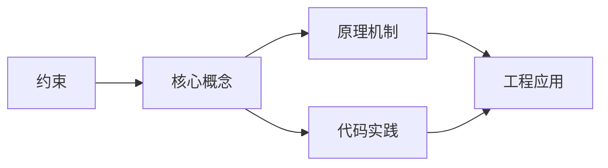
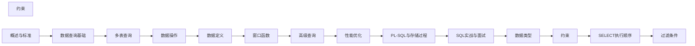

## 1. 学习目标（Bloom 分类）

本节按照布鲁姆教育目标分类学组织学习路径。本文主题为《约束》，属于 SQL 模块，读者可以根据自身阶段选择阅读深度。

记忆层面：能够准确复述本文的核心概念、术语与基本语法或操作步骤，并能够在提问或检索时快速定位对应知识点。能够说出 SQL 的核心概念、语法与常用对象。

理解层面：能够用自己的语言解释核心原理与工作机制，说明概念之间的因果关系，而不是机械记忆结论。能够解释 SQL 的执行原理与优化机制。

应用层面：能够在真实项目或练习场景中运用本文知识解决具体问题，写出正确且可维护的实现。能够编写正确、高效的 SQL 语句与操作。

分析层面：能够拆解复杂问题，比较本文主题与相邻概念的异同，识别边界条件与例外情况。能够分析 SQL 相关方案在性能与一致性上的权衡。

评价层面：能够根据约束条件（性能、可读性、安全、成本）评价不同方案的优劣，做出有依据的技术决策。能够根据业务场景评价 SQL 技术选型。

创造层面：能够把本文知识与其他模块知识组合，设计出新的解决方案或可复用的工程模式。能够组合 SQL 与其他技术设计数据架构。

通过本节学习，读者应当能够把《约束》纳入自己的知识网络，并与 SQL 模块的其他主题（DDL/DML、查询、索引、事务）建立关联。

## 2. 历史动机与发展脉络

《约束》是 SQL 领域的重要主题。要真正理解它，需要先了解它解决的问题与演进过程。

SQL（结构化查询语言）源于 1970 年 Codd 的关系模型，1974 年由 Chamberlin 与 Boyce 设计（SEQUEL），1986 年成为 ANSI 标准；SQL:2023 是当前国际标准。
SQL 分为 DDL（建表）、DML（增删改）、DQL（查询）、DCL（权限）与 TCL（事务）；各大数据库在标准基础上扩展方言。
SQL 是声明式语言：描述“要什么”而非“怎么做”，优化器负责执行计划；这一设计让 SQL 具有跨数据库的表达一致性。

回到本文主题：约束 的提出与成熟，正是上述技术背景下的必然产物。早期实现往往以简单可用为目标，随着工程规模扩大，社区逐渐沉淀出标准做法与最佳实践；理解这一脉络，可以帮助读者判断“为什么文档中的推荐写法是现在这个样子”，也能在遇到历史遗留代码时准确识别其设计年代与取舍。


## 3. 形式化定义与核心概念精讲

本节把《约束》涉及的核心概念以“定义 + 讲解”的形式展开。读者应把定义当作工具，把讲解当作理解路径；两者结合才能形成可迁移的知识。

关系模型：表（关系）、行（元组）、列（属性）；主键唯一标识、外键表达关联、范式消除冗余。
查询执行：解析 -> 绑定 -> 优化（基于代价选择计划）-> 执行；索引、统计信息与连接算法决定性能。
事务 ACID：原子性（Atomicity）、一致性（Consistency）、隔离性（Isolation）、持久性（Durability）；隔离级别控制并发行为。

### 3.1 原文章节逐一精讲

原文档把主题拆分为 16 个小节，下面按顺序给出每一节的导读讲解，随后保留原文细节供精读。

#### 原文精读（完整保留）

# 约束

> **符号约定**：`< >` 必填参数 | `[ ]` 可选参数

---

#### 1. 约束概述

约束（Constraint）是数据库强制执行的数据完整性规则，确保数据满足业务逻辑要求。约束在 DDL 层面保证数据质量，比应用层验证更可靠。

##### 1.1 约束分类

| 类别     | 约束类型                         | 作用域 | 说明               |
| -------- | -------------------------------- | ------ | ------------------ |
| 列级约束 | NOT NULL, UNIQUE, CHECK, DEFAULT | 单列   | 附加在列定义中     |
| 表级约束 | PRIMARY KEY, FOREIGN KEY, UNIQUE | 多列   | 独立于列定义       |
| 域约束   | DOMAIN                           | 域     | 自定义数据类型约束 |

##### 1.2 约束命名规范

```sql
-- 推荐命名规范：表名_列名_约束类型
CREATE TABLE orders (
    order_id    BIGINT,
    user_id     BIGINT,
    status      VARCHAR(20),

    CONSTRAINT pk_orders_order_id PRIMARY KEY (order_id),
    CONSTRAINT fk_orders_user_id FOREIGN KEY (user_id) REFERENCES users(id),
    CONSTRAINT uk_orders_user_status UNIQUE (user_id, status),
    CONSTRAINT ck_orders_status CHECK (status IN ('pending', 'paid', 'shipped'))
);
```

#### 2. NOT NULL 约束

##### 2.1 基本语法

```sql
-- 列级定义
CREATE TABLE employees (
    emp_id  INTEGER NOT NULL,
    name    VARCHAR(100) NOT NULL,
    email   VARCHAR(200),           -- 允许 NULL
    phone   VARCHAR(20) NOT NULL
);

-- 添加 NOT NULL 约束
ALTER TABLE employees ALTER COLUMN email SET NOT NULL;

-- 移除 NOT NULL 约束
ALTER TABLE employees ALTER COLUMN email DROP NOT NULL;
```

##### 2.2 NULL 的三值逻辑

SQL 中 NULL 表示"未知"，导致三值逻辑（Three-Valued Logic）：

| A     | B    | A = B | A <> B | A AND B | A OR B |
| ----- | ---- | ----- | ------ | ------- | ------ |
| TRUE  | NULL | NULL  | NULL   | NULL    | TRUE   |
| FALSE | NULL | NULL  | NULL   | FALSE   | NULL   |
| NULL  | NULL | NULL  | NULL   | NULL    | NULL   |

```sql
-- NULL 比较陷阱
SELECT * FROM users WHERE age = NULL;     -- 永远返回空集！
SELECT * FROM users WHERE age <> NULL;    -- 永远返回空集！
SELECT * FROM users WHERE age IS NULL;    -- 正确写法
SELECT * FROM users WHERE age IS NOT NULL; -- 正确写法
```

##### 2.3 NULL 与聚合函数

```sql
-- COUNT 的差异
SELECT
    COUNT(*) AS total_rows,        -- 包含 NULL 行
    COUNT(age) AS non_null_age,    -- 排除 NULL
    AVG(age) AS avg_age            -- 自动忽略 NULL
FROM users;

-- COALESCE 处理 NULL
SELECT COALESCE(phone, 'N/A') AS phone_display FROM employees;
```

#### 3. UNIQUE 约束

##### 3.1 单列与复合唯一约束

```sql
CREATE TABLE accounts (
    id         BIGSERIAL PRIMARY KEY,
    username   VARCHAR(50) UNIQUE,              -- 单列唯一
    email      VARCHAR(200),
    phone      VARCHAR(20),

    CONSTRAINT uk_accounts_email_phone UNIQUE (email, phone)  -- 复合唯一
);
```

##### 3.2 UNIQUE 与 NULL

- **SQL 标准**：UNIQUE 约束中，多个 NULL 被视为不同值（即允许存在多个 NULL）
- **MySQL InnoDB**：与 SQL 标准一致，允许多个 NULL
- **PostgreSQL**：与 SQL 标准一致，允许多个 NULL
- **SQL Server**：将 NULL 视为相同值，只允许一个 NULL

```sql
-- 以下在 PostgreSQL/MySQL 中合法，SQL Server 中违反约束
INSERT INTO accounts (id, username, email) VALUES (1, 'alice', NULL);
INSERT INTO accounts (id, username, email) VALUES (2, 'bob', NULL);  -- 允许
```

##### 3.3 唯一约束与唯一索引

```sql
-- 唯一约束自动创建唯一索引
-- 以下两种方式等价：
ALTER TABLE accounts ADD CONSTRAINT uk_accounts_username UNIQUE (username);
CREATE UNIQUE INDEX uk_accounts_username ON accounts (username);

-- 部分唯一索引（PostgreSQL）：每个用户只能有一个活跃订阅
CREATE UNIQUE INDEX uk_active_subscription
ON subscriptions (user_id) WHERE status = 'active';
```

#### 4. PRIMARY KEY 约束

##### 4.1 主键特性

- **唯一性**：主键列值在表中唯一
- **非空性**：主键列不允许 NULL
- **不可变性**：主键值通常不应修改

```sql
-- 单列主键
CREATE TABLE departments (
    dept_id INTEGER PRIMARY KEY,
    name    VARCHAR(100) NOT NULL
);

-- 复合主键
CREATE TABLE enrollments (
    student_id INTEGER NOT NULL,
    course_id  INTEGER NOT NULL,
    enrolled_at TIMESTAMP DEFAULT CURRENT_TIMESTAMP,
    PRIMARY KEY (student_id, course_id)
);
```

##### 4.2 代理键 vs 自然键

| 方案   | 示例            | 优点                 | 缺点               |
| ------ | --------------- | -------------------- | ------------------ |
| 代理键 | 自增 ID / UUID  | 简单、不变、索引高效 | 额外列、无业务含义 |
| 自然键 | 身份证号 / ISBN | 有业务含义           | 可能变化、格式复杂 |

```sql
-- 代理键（推荐）
CREATE TABLE users (
    id    BIGSERIAL PRIMARY KEY,
    email VARCHAR(200) NOT NULL UNIQUE
);

-- UUID 代理键
CREATE TABLE orders (
    id UUID DEFAULT gen_random_uuid() PRIMARY KEY,
    data JSONB
);
```

#### 5. FOREIGN KEY 约束

##### 5.1 外键定义

```sql
CREATE TABLE orders (
    order_id  BIGSERIAL PRIMARY KEY,
    user_id   BIGINT NOT NULL,
    status    VARCHAR(20) DEFAULT 'pending',

    CONSTRAINT fk_orders_user_id
        FOREIGN KEY (user_id)
        REFERENCES users(id)
);

-- 自引用外键
CREATE TABLE categories (
    id        SERIAL PRIMARY KEY,
    name      VARCHAR(100) NOT NULL,
    parent_id INTEGER,
    CONSTRAINT fk_categories_parent
        FOREIGN KEY (parent_id) REFERENCES categories(id)
);
```

##### 5.2 引用操作

当被引用行被删除或更新时，外键可定义级联行为：

| 操作        | 说明                           |
| ----------- | ------------------------------ |
| CASCADE     | 级联删除/更新引用行            |
| SET NULL    | 将引用列设为 NULL              |
| SET DEFAULT | 将引用列设为默认值             |
| RESTRICT    | 拒绝操作（立即检查）           |
| NO ACTION   | 拒绝操作（延迟检查，SQL 标准） |

```sql
CREATE TABLE order_items (
    item_id   BIGSERIAL PRIMARY KEY,
    order_id  BIGINT NOT NULL,
    product_id BIGINT NOT NULL,

    CONSTRAINT fk_items_order
        FOREIGN KEY (order_id)
        REFERENCES orders(order_id)
        ON DELETE CASCADE           -- 删除订单时级联删除明细
        ON UPDATE CASCADE,

    CONSTRAINT fk_items_product
        FOREIGN KEY (product_id)
        REFERENCES products(id)
        ON DELETE RESTRICT          -- 有引用时禁止删除产品
);
```

##### 5.3 外键性能考量

```sql
-- 外键自动创建索引（部分数据库）
-- PostgreSQL/SQL Server：不自动创建索引
-- MySQL InnoDB：自动创建索引

-- 推荐手动为外键列创建索引
CREATE INDEX idx_order_items_order_id ON order_items(order_id);
```

##### 5.4 延迟约束检查

```sql
-- PostgreSQL：延迟约束到事务结束
INSERT INTO orders (order_id, user_id) VALUES (1, 999);  -- 引用不存在用户
INSERT INTO users (id, name) VALUES (999, 'new_user');    -- 补充用户
-- 需要延迟约束检查

SET CONSTRAINTS fk_orders_user_id DEFERRED;

BEGIN;
INSERT INTO orders (order_id, user_id) VALUES (1, 999);
INSERT INTO users (id, name) VALUES (999, 'new_user');
COMMIT;  -- 事务提交时检查约束
```

#### 6. CHECK 约束

##### 6.1 列级与表级 CHECK

```sql
CREATE TABLE products (
    id          SERIAL PRIMARY KEY,
    name        VARCHAR(200) NOT NULL,
    price       DECIMAL(10, 2) CHECK (price > 0),           -- 列级
    discount    DECIMAL(5, 2) CHECK (discount >= 0 AND discount <= 100),
    stock       INTEGER CHECK (stock >= 0),

    -- 表级 CHECK：跨列条件
    CONSTRAINT ck_products_price_discount
        CHECK (price * (1 - discount / 100.0) > 0)
);
```

##### 6.2 CHECK 约束的限制

- **不能包含子查询**：`CHECK (user_id IN (SELECT id FROM users))` 无效
- **不能包含聚合函数**：`CHECK (salary > AVG(salary))` 无效
- **不能引用其他行**：无法实现"本行值必须大于前一行"等约束
- **可为 NULL**：如果 CHECK 表达式求值为 NULL，约束视为通过

```sql
-- 注意：NULL 导致 CHECK 约束通过
INSERT INTO products (id, name, price) VALUES (1, 'test', NULL);
-- CHECK (price > 0) 对 NULL 求值为 UNKNOWN，约束通过！

-- 修正：同时添加 NOT NULL
price DECIMAL(10, 2) NOT NULL CHECK (price > 0)
```

#### 7. DEFAULT 约束

```sql
CREATE TABLE audit_log (
    id         BIGSERIAL PRIMARY KEY,
    action     VARCHAR(50) NOT NULL,
    user_id    BIGINT,
    created_at TIMESTAMP DEFAULT CURRENT_TIMESTAMP,
    status     VARCHAR(20) DEFAULT 'pending'
);

-- 使用默认值插入
INSERT INTO audit_log (action, user_id) VALUES ('login', 42);
-- created_at 自动填充当前时间，status 自动填充 'pending'
```

#### 8. 约束管理

##### 8.1 查看约束信息

```sql
-- PostgreSQL
SELECT conname, contype, conrelid::regclass AS table_name
FROM pg_constraint
WHERE conrelid = 'orders'::regclass;

-- 信息模式（SQL 标准）
SELECT constraint_name, constraint_type
FROM information_schema.table_constraints
WHERE table_name = 'orders';
```

##### 8.2 禁用与启用约束

```sql
-- PostgreSQL
ALTER TABLE orders DISABLE TRIGGER ALL;     -- 禁用所有触发器（含约束）
ALTER TABLE orders ENABLE TRIGGER ALL;      -- 重新启用

-- SQL Server
ALTER TABLE orders NOCHECK CONSTRAINT ALL;  -- 禁用约束检查
ALTER TABLE orders CHECK CONSTRAINT ALL;    -- 启用约束检查

-- MySQL（无直接禁用约束语法，需删除重建）
ALTER TABLE orders DROP FOREIGN KEY fk_orders_user_id;
-- ... 数据操作 ...
ALTER TABLE orders ADD CONSTRAINT fk_orders_user_id
    FOREIGN KEY (user_id) REFERENCES users(id);
```
#### PRIMARY KEY 主键

**单行写法：列级主键约束**
`<列名> <类型> PRIMARY KEY`
```sql
-- 在列定义时直接指定主键
CREATE TABLE users (id INT PRIMARY KEY, name VARCHAR(100));
```

**换行写法：表级单列主键约束**
`CONSTRAINT <约束名> PRIMARY KEY (<列>)`
```sql
-- 在表级定义主键并命名
CREATE TABLE users (
  id INT,
  name VARCHAR(100),
  CONSTRAINT pk_users PRIMARY KEY (id)
);
```

**换行写法：表级复合主键约束**
`CONSTRAINT <约束名> PRIMARY KEY (<列 1>, <列 2>)`
```sql
-- 定义复合主键
CREATE TABLE order_items (
  order_id INT,
  product_id INT,
  quantity INT,
  CONSTRAINT pk_order_items PRIMARY KEY (order_id, product_id)
);
```

---

#### FOREIGN KEY 外键

**换行写法：列级外键约束**
`<列名> <类型> REFERENCES <引用表>(<引用列>)`
```sql
-- 在列定义时直接指定外键
CREATE TABLE orders (
  id INT PRIMARY KEY,
  user_id INT REFERENCES users(id),
  amount DECIMAL(10, 2)
);
```

**换行写法：表级外键约束**
`CONSTRAINT <约束名> FOREIGN KEY (<列>) REFERENCES <引用表>(<引用列>)`
```sql
-- 在表级定义外键并命名
CREATE TABLE orders (
  id INT PRIMARY KEY,
  user_id INT,
  amount DECIMAL(10, 2),
  CONSTRAINT fk_orders_user FOREIGN KEY (user_id) REFERENCES users(id)
);
```

**换行写法：外键级联删除**
`FOREIGN KEY (<列>) REFERENCES <引用表>(<引用列>) ON DELETE CASCADE`
```sql
-- 父记录删除时级联删除子记录
CREATE TABLE orders (
  id INT PRIMARY KEY,
  user_id INT,
  CONSTRAINT fk_orders_user FOREIGN KEY (user_id) REFERENCES users(id) ON DELETE CASCADE
);
```

**换行写法：外键级联更新**
`FOREIGN KEY (<列>) REFERENCES <引用表>(<引用列>) ON UPDATE CASCADE`
```sql
-- 父记录主键更新时级联更新子记录外键
CREATE TABLE orders (
  id INT PRIMARY KEY,
  user_id INT,
  CONSTRAINT fk_orders_user FOREIGN KEY (user_id) REFERENCES users(id) ON UPDATE CASCADE
);
```

**换行写法：外键 SET NULL**
`FOREIGN KEY (<列>) REFERENCES <引用表>(<引用列>) ON DELETE SET NULL`
```sql
-- 父记录删除时子记录外键设为 NULL
CREATE TABLE orders (
  id INT PRIMARY KEY,
  user_id INT,
  CONSTRAINT fk_orders_user FOREIGN KEY (user_id) REFERENCES users(id) ON DELETE SET NULL
);
```

---

#### UNIQUE 唯一约束

**单行写法：列级唯一约束**
`<列名> <类型> UNIQUE`
```sql
-- 在列定义时直接指定唯一约束
CREATE TABLE users (id INT PRIMARY KEY, email VARCHAR(255) UNIQUE);
```

**换行写法：表级唯一约束**
`CONSTRAINT <约束名> UNIQUE (<列>)`
```sql
-- 在表级定义唯一约束并命名
CREATE TABLE users (
  id INT PRIMARY KEY,
  email VARCHAR(255),
  CONSTRAINT uk_users_email UNIQUE (email)
);
```

**换行写法：复合唯一约束**
`CONSTRAINT <约束名> UNIQUE (<列 1>, <列 2>)`
```sql
-- 定义复合唯一约束
CREATE TABLE user_roles (
  user_id INT,
  role_id INT,
  CONSTRAINT uk_user_role UNIQUE (user_id, role_id)
);
```

---

#### NOT NULL 非空约束

**单行写法：列级非空约束**
`<列名> <类型> NOT NULL`
```sql
-- 在列定义时指定非空约束
CREATE TABLE users (id INT PRIMARY KEY, name VARCHAR(100) NOT NULL);
```

---

#### DEFAULT 默认值

**单行写法：列级默认值**
`<列名> <类型> DEFAULT <默认值>`
```sql
-- 在列定义时指定默认值
CREATE TABLE users (id INT PRIMARY KEY, status VARCHAR(20) DEFAULT 'active');
```

**单行写法：使用函数作为默认值**
`<列名> <类型> DEFAULT <函数>()`
```sql
-- 使用 CURRENT_TIMESTAMP 作为默认值
CREATE TABLE users (id INT PRIMARY KEY, created_at TIMESTAMP DEFAULT CURRENT_TIMESTAMP);
```

---

#### CHECK 检查约束

**单行写法：列级 CHECK 约束**
`<列名> <类型> CHECK (<条件>)`
```sql
-- 在列定义时指定检查约束
CREATE TABLE products (id INT PRIMARY KEY, price DECIMAL(10, 2) CHECK (price >= 0));
```

**换行写法：表级 CHECK 约束**
`CONSTRAINT <约束名> CHECK (<条件>)`
```sql
-- 在表级定义检查约束并命名
CREATE TABLE employees (
  id INT PRIMARY KEY,
  salary DECIMAL(10, 2),
  CONSTRAINT chk_salary CHECK (salary > 0 AND salary < 1000000)
);
```

**换行写法：多列 CHECK 约束**
`CONSTRAINT <约束名> CHECK (<列 1> <运算符> <列 2>)`
```sql
-- 检查结束日期大于开始日期
CREATE TABLE events (
  id INT PRIMARY KEY,
  start_date DATE,
  end_date DATE,
  CONSTRAINT chk_dates CHECK (end_date > start_date)
);
```

---

#### AUTO_INCREMENT 自增

**单行写法：MySQL 自增主键**
`<列名> INT AUTO_INCREMENT PRIMARY KEY`
```sql
-- MySQL 自增主键
CREATE TABLE users (id INT AUTO_INCREMENT PRIMARY KEY, name VARCHAR(100));
```

---

#### 约束管理

**单行写法：添加约束**
`ALTER TABLE <表名> ADD CONSTRAINT <约束名> <约束定义>;`
```sql
-- 向现有表添加唯一约束
ALTER TABLE users ADD CONSTRAINT uk_email UNIQUE (email);
```

**单行写法：删除约束**
`ALTER TABLE <表名> DROP CONSTRAINT <约束名>;`
```sql
-- 删除表上的约束
ALTER TABLE users DROP CONSTRAINT uk_email;
```

**单行写法：MySQL 删除外键**
`ALTER TABLE <表名> DROP FOREIGN KEY <外键名>;`
```sql
-- MySQL 删除外键约束
ALTER TABLE orders DROP FOREIGN KEY fk_orders_user;
```

**单行写法：禁用约束**
`ALTER TABLE <表名> DISABLE CONSTRAINT <约束名>;`
```sql
-- 临时禁用约束（Oracle/PostgreSQL）
ALTER TABLE users DISABLE CONSTRAINT uk_email;
```

**单行写法：启用约束**
`ALTER TABLE <表名> ENABLE CONSTRAINT <约束名>;`
```sql
-- 重新启用约束
ALTER TABLE users ENABLE CONSTRAINT uk_email;
```


### 3.2 概念关系图

下面用 Mermaid 图表达本文核心概念之间的关系，帮助读者建立整体图景：



图中展示的是本文知识的结构化关系：核心概念是入口，原理机制解释“为什么”，代码实践演示“怎么做”，工程应用回答“何时用”。读者学习时可以把每个小节的内容挂接到对应节点上。

## 4. 理论推导与原理解析

本节深入《约束》背后的原理。理论部分不求面面俱到，而是聚焦“能解释现象、能指导实践”的关键推导。

关系模型：表（关系）、行（元组）、列（属性）；主键唯一标识、外键表达关联、范式消除冗余。
查询执行：解析 -> 绑定 -> 优化（基于代价选择计划）-> 执行；索引、统计信息与连接算法决定性能。
事务 ACID：原子性（Atomicity）、一致性（Consistency）、隔离性（Isolation）、持久性（Durability）；隔离级别控制并发行为。
集合语义：SELECT 返回结果集；JOIN 组合关系，GROUP BY 聚合，子查询与 CTE 表达复杂逻辑。

需要强调的是，理论推导与工程实践之间存在翻译层：理论给出的是理想化模型与边界条件，工程代码则必须处理真实环境中的例外。读者在学习时应先掌握理论的“标准情形”，再通过陷阱章节了解“非标准情形”。

## 5. 代码示例与逐行讲解

本节把原文中的代码示例系统整理，并为每个示例补充用途说明与讲解。读者不应只浏览代码，而应逐段对照讲解理解设计意图。

### 5.1 示例：1.2 约束命名规范

该示例来自原文《1.2 约束命名规范》小节，用于演示约束相关操作。阅读时请先看代码结构，再看其后的讲解。

```sql
-- 推荐命名规范：表名_列名_约束类型
CREATE TABLE orders (
    order_id    BIGINT,
    user_id     BIGINT,
    status      VARCHAR(20),

    CONSTRAINT pk_orders_order_id PRIMARY KEY (order_id),
    CONSTRAINT fk_orders_user_id FOREIGN KEY (user_id) REFERENCES users(id),
    CONSTRAINT uk_orders_user_status UNIQUE (user_id, status),
    CONSTRAINT ck_orders_status CHECK (status IN ('pending', 'paid', 'shipped'))
);
```

讲解：这段代码演示了本节核心知识点。代码中的关键操作可以归纳为三步：准备（定义或初始化）、执行（核心逻辑）、收尾（释放资源或返回结果）。实际项目中，这三步往往被封装为函数或类，以提升复用性与可测试性。

关键点分析：

该示例共 10 行有效代码，包含 1 类关键结构（CREATE）。其中：

- 入口与初始化部分负责建立上下文，对应实际项目中的启动或装配逻辑；
- 核心逻辑部分体现本文主题的主要操作，是阅读时最需要对照讲解理解的部分；
- 输出或返回部分把结果交给调用方，注意其类型与边界条件。

进阶思考路径：先尝试修改参数观察行为变化，再把示例中的模式迁移到自己的项目中；每次修改都记录预期与实测差异，这是把示例转化为能力的最快方式。

### 5.2 示例：2.1 基本语法

该示例来自原文《2.1 基本语法》小节，用于演示约束相关操作。阅读时请先看代码结构，再看其后的讲解。

```sql
-- 列级定义
CREATE TABLE employees (
    emp_id  INTEGER NOT NULL,
    name    VARCHAR(100) NOT NULL,
    email   VARCHAR(200),           -- 允许 NULL
    phone   VARCHAR(20) NOT NULL
);

-- 添加 NOT NULL 约束
ALTER TABLE employees ALTER COLUMN email SET NOT NULL;

-- 移除 NOT NULL 约束
ALTER TABLE employees ALTER COLUMN email DROP NOT NULL;
```

讲解：这段代码演示了本节核心知识点。代码中的关键操作可以归纳为三步：准备（定义或初始化）、执行（核心逻辑）、收尾（释放资源或返回结果）。实际项目中，这三步往往被封装为函数或类，以提升复用性与可测试性。

关键点分析：

该示例共 11 行有效代码，包含 2 类关键结构（CREATE、ALTER）。其中：

- 入口与初始化部分负责建立上下文，对应实际项目中的启动或装配逻辑；
- 核心逻辑部分体现本文主题的主要操作，是阅读时最需要对照讲解理解的部分；
- 输出或返回部分把结果交给调用方，注意其类型与边界条件。

进阶思考路径：先尝试修改参数观察行为变化，再把示例中的模式迁移到自己的项目中；每次修改都记录预期与实测差异，这是把示例转化为能力的最快方式。

### 5.3 示例：2.2 NULL 的三值逻辑

该示例来自原文《2.2 NULL 的三值逻辑》小节，用于演示约束相关操作。阅读时请先看代码结构，再看其后的讲解。

```sql
-- NULL 比较陷阱
SELECT * FROM users WHERE age = NULL;     -- 永远返回空集！
SELECT * FROM users WHERE age <> NULL;    -- 永远返回空集！
SELECT * FROM users WHERE age IS NULL;    -- 正确写法
SELECT * FROM users WHERE age IS NOT NULL; -- 正确写法
```

讲解：这段代码演示了本节核心知识点。代码中的关键操作可以归纳为三步：准备（定义或初始化）、执行（核心逻辑）、收尾（释放资源或返回结果）。实际项目中，这三步往往被封装为函数或类，以提升复用性与可测试性。

关键点分析：

该示例共 5 行有效代码，包含 2 类关键结构（SELECT、FROM）。其中：

- 入口与初始化部分负责建立上下文，对应实际项目中的启动或装配逻辑；
- 核心逻辑部分体现本文主题的主要操作，是阅读时最需要对照讲解理解的部分；
- 输出或返回部分把结果交给调用方，注意其类型与边界条件。

进阶思考路径：先尝试修改参数观察行为变化，再把示例中的模式迁移到自己的项目中；每次修改都记录预期与实测差异，这是把示例转化为能力的最快方式。

### 5.4 示例：2.3 NULL 与聚合函数

该示例来自原文《2.3 NULL 与聚合函数》小节，用于演示约束相关操作。阅读时请先看代码结构，再看其后的讲解。

```sql
-- COUNT 的差异
SELECT
    COUNT(*) AS total_rows,        -- 包含 NULL 行
    COUNT(age) AS non_null_age,    -- 排除 NULL
    AVG(age) AS avg_age            -- 自动忽略 NULL
FROM users;

-- COALESCE 处理 NULL
SELECT COALESCE(phone, 'N/A') AS phone_display FROM employees;
```

讲解：这段代码演示了本节核心知识点。代码中的关键操作可以归纳为三步：准备（定义或初始化）、执行（核心逻辑）、收尾（释放资源或返回结果）。实际项目中，这三步往往被封装为函数或类，以提升复用性与可测试性。

关键点分析：

该示例共 8 行有效代码，包含 2 类关键结构（SELECT、FROM）。其中：

- 入口与初始化部分负责建立上下文，对应实际项目中的启动或装配逻辑；
- 核心逻辑部分体现本文主题的主要操作，是阅读时最需要对照讲解理解的部分；
- 输出或返回部分把结果交给调用方，注意其类型与边界条件。

进阶思考路径：先尝试修改参数观察行为变化，再把示例中的模式迁移到自己的项目中；每次修改都记录预期与实测差异，这是把示例转化为能力的最快方式。

### 5.5 示例：3.1 单列与复合唯一约束

该示例来自原文《3.1 单列与复合唯一约束》小节，用于演示约束相关操作。阅读时请先看代码结构，再看其后的讲解。

```sql
CREATE TABLE accounts (
    id         BIGSERIAL PRIMARY KEY,
    username   VARCHAR(50) UNIQUE,              -- 单列唯一
    email      VARCHAR(200),
    phone      VARCHAR(20),

    CONSTRAINT uk_accounts_email_phone UNIQUE (email, phone)  -- 复合唯一
);
```

讲解：这段代码演示了本节核心知识点。代码中的关键操作可以归纳为三步：准备（定义或初始化）、执行（核心逻辑）、收尾（释放资源或返回结果）。实际项目中，这三步往往被封装为函数或类，以提升复用性与可测试性。

关键点分析：

该示例共 7 行有效代码，包含 1 类关键结构（CREATE）。其中：

- 入口与初始化部分负责建立上下文，对应实际项目中的启动或装配逻辑；
- 核心逻辑部分体现本文主题的主要操作，是阅读时最需要对照讲解理解的部分；
- 输出或返回部分把结果交给调用方，注意其类型与边界条件。

进阶思考路径：先尝试修改参数观察行为变化，再把示例中的模式迁移到自己的项目中；每次修改都记录预期与实测差异，这是把示例转化为能力的最快方式。

### 5.6 示例：3.2 UNIQUE 与 NULL

该示例来自原文《3.2 UNIQUE 与 NULL》小节，用于演示约束相关操作。阅读时请先看代码结构，再看其后的讲解。

```sql
-- 以下在 PostgreSQL/MySQL 中合法，SQL Server 中违反约束
INSERT INTO accounts (id, username, email) VALUES (1, 'alice', NULL);
INSERT INTO accounts (id, username, email) VALUES (2, 'bob', NULL);  -- 允许
```

讲解：这段代码演示了本节核心知识点。代码中的关键操作可以归纳为三步：准备（定义或初始化）、执行（核心逻辑）、收尾（释放资源或返回结果）。实际项目中，这三步往往被封装为函数或类，以提升复用性与可测试性。

关键点分析：

该示例共 3 行有效代码，包含 1 类关键结构（INSERT）。其中：

- 入口与初始化部分负责建立上下文，对应实际项目中的启动或装配逻辑；
- 核心逻辑部分体现本文主题的主要操作，是阅读时最需要对照讲解理解的部分；
- 输出或返回部分把结果交给调用方，注意其类型与边界条件。

进阶思考路径：先尝试修改参数观察行为变化，再把示例中的模式迁移到自己的项目中；每次修改都记录预期与实测差异，这是把示例转化为能力的最快方式。

### 5.7 示例：3.3 唯一约束与唯一索引

该示例来自原文《3.3 唯一约束与唯一索引》小节，用于演示约束相关操作。阅读时请先看代码结构，再看其后的讲解。

```sql
-- 唯一约束自动创建唯一索引
-- 以下两种方式等价：
ALTER TABLE accounts ADD CONSTRAINT uk_accounts_username UNIQUE (username);
CREATE UNIQUE INDEX uk_accounts_username ON accounts (username);

-- 部分唯一索引（PostgreSQL）：每个用户只能有一个活跃订阅
CREATE UNIQUE INDEX uk_active_subscription
ON subscriptions (user_id) WHERE status = 'active';
```

讲解：这段代码演示了本节核心知识点。代码中的关键操作可以归纳为三步：准备（定义或初始化）、执行（核心逻辑）、收尾（释放资源或返回结果）。实际项目中，这三步往往被封装为函数或类，以提升复用性与可测试性。

关键点分析：

该示例共 7 行有效代码，包含 2 类关键结构（CREATE、ALTER）。其中：

- 入口与初始化部分负责建立上下文，对应实际项目中的启动或装配逻辑；
- 核心逻辑部分体现本文主题的主要操作，是阅读时最需要对照讲解理解的部分；
- 输出或返回部分把结果交给调用方，注意其类型与边界条件。

进阶思考路径：先尝试修改参数观察行为变化，再把示例中的模式迁移到自己的项目中；每次修改都记录预期与实测差异，这是把示例转化为能力的最快方式。

### 5.8 示例：4.1 主键特性

该示例来自原文《4.1 主键特性》小节，用于演示约束相关操作。阅读时请先看代码结构，再看其后的讲解。

```sql
-- 单列主键
CREATE TABLE departments (
    dept_id INTEGER PRIMARY KEY,
    name    VARCHAR(100) NOT NULL
);

-- 复合主键
CREATE TABLE enrollments (
    student_id INTEGER NOT NULL,
    course_id  INTEGER NOT NULL,
    enrolled_at TIMESTAMP DEFAULT CURRENT_TIMESTAMP,
    PRIMARY KEY (student_id, course_id)
);
```

讲解：这段代码演示了本节核心知识点。代码中的关键操作可以归纳为三步：准备（定义或初始化）、执行（核心逻辑）、收尾（释放资源或返回结果）。实际项目中，这三步往往被封装为函数或类，以提升复用性与可测试性。

关键点分析：

该示例共 12 行有效代码，包含 1 类关键结构（CREATE）。其中：

- 入口与初始化部分负责建立上下文，对应实际项目中的启动或装配逻辑；
- 核心逻辑部分体现本文主题的主要操作，是阅读时最需要对照讲解理解的部分；
- 输出或返回部分把结果交给调用方，注意其类型与边界条件。

进阶思考路径：先尝试修改参数观察行为变化，再把示例中的模式迁移到自己的项目中；每次修改都记录预期与实测差异，这是把示例转化为能力的最快方式。

### 5.9 示例：4.2 代理键 vs 自然键

该示例来自原文《4.2 代理键 vs 自然键》小节，用于演示约束相关操作。阅读时请先看代码结构，再看其后的讲解。

```sql
-- 代理键（推荐）
CREATE TABLE users (
    id    BIGSERIAL PRIMARY KEY,
    email VARCHAR(200) NOT NULL UNIQUE
);

-- UUID 代理键
CREATE TABLE orders (
    id UUID DEFAULT gen_random_uuid() PRIMARY KEY,
    data JSONB
);
```

讲解：这段代码演示了本节核心知识点。代码中的关键操作可以归纳为三步：准备（定义或初始化）、执行（核心逻辑）、收尾（释放资源或返回结果）。实际项目中，这三步往往被封装为函数或类，以提升复用性与可测试性。

关键点分析：

该示例共 10 行有效代码，包含 1 类关键结构（CREATE）。其中：

- 入口与初始化部分负责建立上下文，对应实际项目中的启动或装配逻辑；
- 核心逻辑部分体现本文主题的主要操作，是阅读时最需要对照讲解理解的部分；
- 输出或返回部分把结果交给调用方，注意其类型与边界条件。

进阶思考路径：先尝试修改参数观察行为变化，再把示例中的模式迁移到自己的项目中；每次修改都记录预期与实测差异，这是把示例转化为能力的最快方式。

### 5.10 示例：5.1 外键定义

该示例来自原文《5.1 外键定义》小节，用于演示约束相关操作。阅读时请先看代码结构，再看其后的讲解。

```sql
CREATE TABLE orders (
    order_id  BIGSERIAL PRIMARY KEY,
    user_id   BIGINT NOT NULL,
    status    VARCHAR(20) DEFAULT 'pending',

    CONSTRAINT fk_orders_user_id
        FOREIGN KEY (user_id)
        REFERENCES users(id)
);

-- 自引用外键
CREATE TABLE categories (
    id        SERIAL PRIMARY KEY,
    name      VARCHAR(100) NOT NULL,
    parent_id INTEGER,
    CONSTRAINT fk_categories_parent
        FOREIGN KEY (parent_id) REFERENCES categories(id)
);
```

讲解：这段代码演示了本节核心知识点。代码中的关键操作可以归纳为三步：准备（定义或初始化）、执行（核心逻辑）、收尾（释放资源或返回结果）。实际项目中，这三步往往被封装为函数或类，以提升复用性与可测试性。

关键点分析：

该示例共 16 行有效代码，包含 1 类关键结构（CREATE）。其中：

- 入口与初始化部分负责建立上下文，对应实际项目中的启动或装配逻辑；
- 核心逻辑部分体现本文主题的主要操作，是阅读时最需要对照讲解理解的部分；
- 输出或返回部分把结果交给调用方，注意其类型与边界条件。

进阶思考路径：先尝试修改参数观察行为变化，再把示例中的模式迁移到自己的项目中；每次修改都记录预期与实测差异，这是把示例转化为能力的最快方式。

### 5.11 示例：5.2 引用操作

该示例来自原文《5.2 引用操作》小节，用于演示约束相关操作。阅读时请先看代码结构，再看其后的讲解。

```sql
CREATE TABLE order_items (
    item_id   BIGSERIAL PRIMARY KEY,
    order_id  BIGINT NOT NULL,
    product_id BIGINT NOT NULL,

    CONSTRAINT fk_items_order
        FOREIGN KEY (order_id)
        REFERENCES orders(order_id)
        ON DELETE CASCADE           -- 删除订单时级联删除明细
        ON UPDATE CASCADE,

    CONSTRAINT fk_items_product
        FOREIGN KEY (product_id)
        REFERENCES products(id)
        ON DELETE RESTRICT          -- 有引用时禁止删除产品
);
```

讲解：这段代码演示了本节核心知识点。代码中的关键操作可以归纳为三步：准备（定义或初始化）、执行（核心逻辑）、收尾（释放资源或返回结果）。实际项目中，这三步往往被封装为函数或类，以提升复用性与可测试性。

关键点分析：

该示例共 14 行有效代码，包含 1 类关键结构（CREATE）。其中：

- 入口与初始化部分负责建立上下文，对应实际项目中的启动或装配逻辑；
- 核心逻辑部分体现本文主题的主要操作，是阅读时最需要对照讲解理解的部分；
- 输出或返回部分把结果交给调用方，注意其类型与边界条件。

进阶思考路径：先尝试修改参数观察行为变化，再把示例中的模式迁移到自己的项目中；每次修改都记录预期与实测差异，这是把示例转化为能力的最快方式。

### 5.12 示例：5.3 外键性能考量

该示例来自原文《5.3 外键性能考量》小节，用于演示约束相关操作。阅读时请先看代码结构，再看其后的讲解。

```sql
-- 外键自动创建索引（部分数据库）
-- PostgreSQL/SQL Server：不自动创建索引
-- MySQL InnoDB：自动创建索引

-- 推荐手动为外键列创建索引
CREATE INDEX idx_order_items_order_id ON order_items(order_id);
```

讲解：这段代码演示了本节核心知识点。代码中的关键操作可以归纳为三步：准备（定义或初始化）、执行（核心逻辑）、收尾（释放资源或返回结果）。实际项目中，这三步往往被封装为函数或类，以提升复用性与可测试性。

关键点分析：

该示例共 5 行有效代码，包含 1 类关键结构（CREATE）。其中：

- 入口与初始化部分负责建立上下文，对应实际项目中的启动或装配逻辑；
- 核心逻辑部分体现本文主题的主要操作，是阅读时最需要对照讲解理解的部分；
- 输出或返回部分把结果交给调用方，注意其类型与边界条件。

进阶思考路径：先尝试修改参数观察行为变化，再把示例中的模式迁移到自己的项目中；每次修改都记录预期与实测差异，这是把示例转化为能力的最快方式。

### 5.13 示例：5.4 延迟约束检查

该示例来自原文《5.4 延迟约束检查》小节，用于演示约束相关操作。阅读时请先看代码结构，再看其后的讲解。

```sql
-- PostgreSQL：延迟约束到事务结束
INSERT INTO orders (order_id, user_id) VALUES (1, 999);  -- 引用不存在用户
INSERT INTO users (id, name) VALUES (999, 'new_user');    -- 补充用户
-- 需要延迟约束检查

SET CONSTRAINTS fk_orders_user_id DEFERRED;

BEGIN;
INSERT INTO orders (order_id, user_id) VALUES (1, 999);
INSERT INTO users (id, name) VALUES (999, 'new_user');
COMMIT;  -- 事务提交时检查约束
```

讲解：这段代码演示了本节核心知识点。代码中的关键操作可以归纳为三步：准备（定义或初始化）、执行（核心逻辑）、收尾（释放资源或返回结果）。实际项目中，这三步往往被封装为函数或类，以提升复用性与可测试性。

关键点分析：

该示例共 9 行有效代码，包含 1 类关键结构（INSERT）。其中：

- 入口与初始化部分负责建立上下文，对应实际项目中的启动或装配逻辑；
- 核心逻辑部分体现本文主题的主要操作，是阅读时最需要对照讲解理解的部分；
- 输出或返回部分把结果交给调用方，注意其类型与边界条件。

进阶思考路径：先尝试修改参数观察行为变化，再把示例中的模式迁移到自己的项目中；每次修改都记录预期与实测差异，这是把示例转化为能力的最快方式。

### 5.14 示例：6.1 列级与表级 CHECK

该示例来自原文《6.1 列级与表级 CHECK》小节，用于演示约束相关操作。阅读时请先看代码结构，再看其后的讲解。

```sql
CREATE TABLE products (
    id          SERIAL PRIMARY KEY,
    name        VARCHAR(200) NOT NULL,
    price       DECIMAL(10, 2) CHECK (price > 0),           -- 列级
    discount    DECIMAL(5, 2) CHECK (discount >= 0 AND discount <= 100),
    stock       INTEGER CHECK (stock >= 0),

    -- 表级 CHECK：跨列条件
    CONSTRAINT ck_products_price_discount
        CHECK (price * (1 - discount / 100.0) > 0)
);
```

讲解：这段代码演示了本节核心知识点。代码中的关键操作可以归纳为三步：准备（定义或初始化）、执行（核心逻辑）、收尾（释放资源或返回结果）。实际项目中，这三步往往被封装为函数或类，以提升复用性与可测试性。

关键点分析：

该示例共 10 行有效代码，包含 1 类关键结构（CREATE）。其中：

- 入口与初始化部分负责建立上下文，对应实际项目中的启动或装配逻辑；
- 核心逻辑部分体现本文主题的主要操作，是阅读时最需要对照讲解理解的部分；
- 输出或返回部分把结果交给调用方，注意其类型与边界条件。

进阶思考路径：先尝试修改参数观察行为变化，再把示例中的模式迁移到自己的项目中；每次修改都记录预期与实测差异，这是把示例转化为能力的最快方式。

### 5.15 示例：6.2 CHECK 约束的限制

该示例来自原文《6.2 CHECK 约束的限制》小节，用于演示约束相关操作。阅读时请先看代码结构，再看其后的讲解。

```sql
-- 注意：NULL 导致 CHECK 约束通过
INSERT INTO products (id, name, price) VALUES (1, 'test', NULL);
-- CHECK (price > 0) 对 NULL 求值为 UNKNOWN，约束通过！

-- 修正：同时添加 NOT NULL
price DECIMAL(10, 2) NOT NULL CHECK (price > 0)
```

讲解：这段代码演示了本节核心知识点。代码中的关键操作可以归纳为三步：准备（定义或初始化）、执行（核心逻辑）、收尾（释放资源或返回结果）。实际项目中，这三步往往被封装为函数或类，以提升复用性与可测试性。

关键点分析：

该示例共 5 行有效代码，包含 1 类关键结构（INSERT）。其中：

- 入口与初始化部分负责建立上下文，对应实际项目中的启动或装配逻辑；
- 核心逻辑部分体现本文主题的主要操作，是阅读时最需要对照讲解理解的部分；
- 输出或返回部分把结果交给调用方，注意其类型与边界条件。

进阶思考路径：先尝试修改参数观察行为变化，再把示例中的模式迁移到自己的项目中；每次修改都记录预期与实测差异，这是把示例转化为能力的最快方式。

### 5.16 示例：7. DEFAULT 约束

该示例来自原文《7. DEFAULT 约束》小节，用于演示约束相关操作。阅读时请先看代码结构，再看其后的讲解。

```sql
CREATE TABLE audit_log (
    id         BIGSERIAL PRIMARY KEY,
    action     VARCHAR(50) NOT NULL,
    user_id    BIGINT,
    created_at TIMESTAMP DEFAULT CURRENT_TIMESTAMP,
    status     VARCHAR(20) DEFAULT 'pending'
);

-- 使用默认值插入
INSERT INTO audit_log (action, user_id) VALUES ('login', 42);
-- created_at 自动填充当前时间，status 自动填充 'pending'
```

讲解：这段代码演示了本节核心知识点。代码中的关键操作可以归纳为三步：准备（定义或初始化）、执行（核心逻辑）、收尾（释放资源或返回结果）。实际项目中，这三步往往被封装为函数或类，以提升复用性与可测试性。

关键点分析：

该示例共 10 行有效代码，包含 2 类关键结构（INSERT、CREATE）。其中：

- 入口与初始化部分负责建立上下文，对应实际项目中的启动或装配逻辑；
- 核心逻辑部分体现本文主题的主要操作，是阅读时最需要对照讲解理解的部分；
- 输出或返回部分把结果交给调用方，注意其类型与边界条件。

进阶思考路径：先尝试修改参数观察行为变化，再把示例中的模式迁移到自己的项目中；每次修改都记录预期与实测差异，这是把示例转化为能力的最快方式。

### 5.17 示例：8.1 查看约束信息

该示例来自原文《8.1 查看约束信息》小节，用于演示约束相关操作。阅读时请先看代码结构，再看其后的讲解。

```sql
-- PostgreSQL
SELECT conname, contype, conrelid::regclass AS table_name
FROM pg_constraint
WHERE conrelid = 'orders'::regclass;

-- 信息模式（SQL 标准）
SELECT constraint_name, constraint_type
FROM information_schema.table_constraints
WHERE table_name = 'orders';
```

讲解：这段代码演示了本节核心知识点。代码中的关键操作可以归纳为三步：准备（定义或初始化）、执行（核心逻辑）、收尾（释放资源或返回结果）。实际项目中，这三步往往被封装为函数或类，以提升复用性与可测试性。

关键点分析：

该示例共 8 行有效代码，包含 3 类关键结构（class、SELECT、FROM）。其中：

- 入口与初始化部分负责建立上下文，对应实际项目中的启动或装配逻辑；
- 核心逻辑部分体现本文主题的主要操作，是阅读时最需要对照讲解理解的部分；
- 输出或返回部分把结果交给调用方，注意其类型与边界条件。

进阶思考路径：先尝试修改参数观察行为变化，再把示例中的模式迁移到自己的项目中；每次修改都记录预期与实测差异，这是把示例转化为能力的最快方式。

### 5.18 示例：8.2 禁用与启用约束

该示例来自原文《8.2 禁用与启用约束》小节，用于演示约束相关操作。阅读时请先看代码结构，再看其后的讲解。

```sql
-- PostgreSQL
ALTER TABLE orders DISABLE TRIGGER ALL;     -- 禁用所有触发器（含约束）
ALTER TABLE orders ENABLE TRIGGER ALL;      -- 重新启用

-- SQL Server
ALTER TABLE orders NOCHECK CONSTRAINT ALL;  -- 禁用约束检查
ALTER TABLE orders CHECK CONSTRAINT ALL;    -- 启用约束检查

-- MySQL（无直接禁用约束语法，需删除重建）
ALTER TABLE orders DROP FOREIGN KEY fk_orders_user_id;
-- ... 数据操作 ...
ALTER TABLE orders ADD CONSTRAINT fk_orders_user_id
    FOREIGN KEY (user_id) REFERENCES users(id);
```

讲解：这段代码演示了本节核心知识点。代码中的关键操作可以归纳为三步：准备（定义或初始化）、执行（核心逻辑）、收尾（释放资源或返回结果）。实际项目中，这三步往往被封装为函数或类，以提升复用性与可测试性。

关键点分析：

该示例共 11 行有效代码，包含 1 类关键结构（ALTER）。其中：

- 入口与初始化部分负责建立上下文，对应实际项目中的启动或装配逻辑；
- 核心逻辑部分体现本文主题的主要操作，是阅读时最需要对照讲解理解的部分；
- 输出或返回部分把结果交给调用方，注意其类型与边界条件。

进阶思考路径：先尝试修改参数观察行为变化，再把示例中的模式迁移到自己的项目中；每次修改都记录预期与实测差异，这是把示例转化为能力的最快方式。

### 5.19 示例：PRIMARY KEY 主键

该示例来自原文《PRIMARY KEY 主键》小节，用于演示约束相关操作。阅读时请先看代码结构，再看其后的讲解。

```sql
-- 在列定义时直接指定主键
CREATE TABLE users (id INT PRIMARY KEY, name VARCHAR(100));
```

讲解：这段代码演示了本节核心知识点。代码中的关键操作可以归纳为三步：准备（定义或初始化）、执行（核心逻辑）、收尾（释放资源或返回结果）。实际项目中，这三步往往被封装为函数或类，以提升复用性与可测试性。

关键点分析：

该示例共 2 行有效代码，包含 1 类关键结构（CREATE）。其中：

- 入口与初始化部分负责建立上下文，对应实际项目中的启动或装配逻辑；
- 核心逻辑部分体现本文主题的主要操作，是阅读时最需要对照讲解理解的部分；
- 输出或返回部分把结果交给调用方，注意其类型与边界条件。

进阶思考路径：先尝试修改参数观察行为变化，再把示例中的模式迁移到自己的项目中；每次修改都记录预期与实测差异，这是把示例转化为能力的最快方式。

### 5.20 示例：PRIMARY KEY 主键

该示例来自原文《PRIMARY KEY 主键》小节，用于演示约束相关操作。阅读时请先看代码结构，再看其后的讲解。

```sql
-- 在表级定义主键并命名
CREATE TABLE users (
  id INT,
  name VARCHAR(100),
  CONSTRAINT pk_users PRIMARY KEY (id)
);
```

讲解：这段代码演示了本节核心知识点。代码中的关键操作可以归纳为三步：准备（定义或初始化）、执行（核心逻辑）、收尾（释放资源或返回结果）。实际项目中，这三步往往被封装为函数或类，以提升复用性与可测试性。

关键点分析：

该示例共 6 行有效代码，包含 1 类关键结构（CREATE）。其中：

- 入口与初始化部分负责建立上下文，对应实际项目中的启动或装配逻辑；
- 核心逻辑部分体现本文主题的主要操作，是阅读时最需要对照讲解理解的部分；
- 输出或返回部分把结果交给调用方，注意其类型与边界条件。

进阶思考路径：先尝试修改参数观察行为变化，再把示例中的模式迁移到自己的项目中；每次修改都记录预期与实测差异，这是把示例转化为能力的最快方式。

### 5.21 示例：PRIMARY KEY 主键

该示例来自原文《PRIMARY KEY 主键》小节，用于演示约束相关操作。阅读时请先看代码结构，再看其后的讲解。

```sql
-- 定义复合主键
CREATE TABLE order_items (
  order_id INT,
  product_id INT,
  quantity INT,
  CONSTRAINT pk_order_items PRIMARY KEY (order_id, product_id)
);
```

讲解：这段代码演示了本节核心知识点。代码中的关键操作可以归纳为三步：准备（定义或初始化）、执行（核心逻辑）、收尾（释放资源或返回结果）。实际项目中，这三步往往被封装为函数或类，以提升复用性与可测试性。

关键点分析：

该示例共 7 行有效代码，包含 1 类关键结构（CREATE）。其中：

- 入口与初始化部分负责建立上下文，对应实际项目中的启动或装配逻辑；
- 核心逻辑部分体现本文主题的主要操作，是阅读时最需要对照讲解理解的部分；
- 输出或返回部分把结果交给调用方，注意其类型与边界条件。

进阶思考路径：先尝试修改参数观察行为变化，再把示例中的模式迁移到自己的项目中；每次修改都记录预期与实测差异，这是把示例转化为能力的最快方式。

### 5.22 示例：FOREIGN KEY 外键

该示例来自原文《FOREIGN KEY 外键》小节，用于演示约束相关操作。阅读时请先看代码结构，再看其后的讲解。

```sql
-- 在列定义时直接指定外键
CREATE TABLE orders (
  id INT PRIMARY KEY,
  user_id INT REFERENCES users(id),
  amount DECIMAL(10, 2)
);
```

讲解：这段代码演示了本节核心知识点。代码中的关键操作可以归纳为三步：准备（定义或初始化）、执行（核心逻辑）、收尾（释放资源或返回结果）。实际项目中，这三步往往被封装为函数或类，以提升复用性与可测试性。

关键点分析：

该示例共 6 行有效代码，包含 1 类关键结构（CREATE）。其中：

- 入口与初始化部分负责建立上下文，对应实际项目中的启动或装配逻辑；
- 核心逻辑部分体现本文主题的主要操作，是阅读时最需要对照讲解理解的部分；
- 输出或返回部分把结果交给调用方，注意其类型与边界条件。

进阶思考路径：先尝试修改参数观察行为变化，再把示例中的模式迁移到自己的项目中；每次修改都记录预期与实测差异，这是把示例转化为能力的最快方式。

### 5.23 示例：FOREIGN KEY 外键

该示例来自原文《FOREIGN KEY 外键》小节，用于演示约束相关操作。阅读时请先看代码结构，再看其后的讲解。

```sql
-- 在表级定义外键并命名
CREATE TABLE orders (
  id INT PRIMARY KEY,
  user_id INT,
  amount DECIMAL(10, 2),
  CONSTRAINT fk_orders_user FOREIGN KEY (user_id) REFERENCES users(id)
);
```

讲解：这段代码演示了本节核心知识点。代码中的关键操作可以归纳为三步：准备（定义或初始化）、执行（核心逻辑）、收尾（释放资源或返回结果）。实际项目中，这三步往往被封装为函数或类，以提升复用性与可测试性。

关键点分析：

该示例共 7 行有效代码，包含 1 类关键结构（CREATE）。其中：

- 入口与初始化部分负责建立上下文，对应实际项目中的启动或装配逻辑；
- 核心逻辑部分体现本文主题的主要操作，是阅读时最需要对照讲解理解的部分；
- 输出或返回部分把结果交给调用方，注意其类型与边界条件。

进阶思考路径：先尝试修改参数观察行为变化，再把示例中的模式迁移到自己的项目中；每次修改都记录预期与实测差异，这是把示例转化为能力的最快方式。

### 5.24 示例：FOREIGN KEY 外键

该示例来自原文《FOREIGN KEY 外键》小节，用于演示约束相关操作。阅读时请先看代码结构，再看其后的讲解。

```sql
-- 父记录删除时级联删除子记录
CREATE TABLE orders (
  id INT PRIMARY KEY,
  user_id INT,
  CONSTRAINT fk_orders_user FOREIGN KEY (user_id) REFERENCES users(id) ON DELETE CASCADE
);
```

讲解：这段代码演示了本节核心知识点。代码中的关键操作可以归纳为三步：准备（定义或初始化）、执行（核心逻辑）、收尾（释放资源或返回结果）。实际项目中，这三步往往被封装为函数或类，以提升复用性与可测试性。

关键点分析：

该示例共 6 行有效代码，包含 1 类关键结构（CREATE）。其中：

- 入口与初始化部分负责建立上下文，对应实际项目中的启动或装配逻辑；
- 核心逻辑部分体现本文主题的主要操作，是阅读时最需要对照讲解理解的部分；
- 输出或返回部分把结果交给调用方，注意其类型与边界条件。

进阶思考路径：先尝试修改参数观察行为变化，再把示例中的模式迁移到自己的项目中；每次修改都记录预期与实测差异，这是把示例转化为能力的最快方式。

### 5.25 示例：FOREIGN KEY 外键

该示例来自原文《FOREIGN KEY 外键》小节，用于演示约束相关操作。阅读时请先看代码结构，再看其后的讲解。

```sql
-- 父记录主键更新时级联更新子记录外键
CREATE TABLE orders (
  id INT PRIMARY KEY,
  user_id INT,
  CONSTRAINT fk_orders_user FOREIGN KEY (user_id) REFERENCES users(id) ON UPDATE CASCADE
);
```

讲解：这段代码演示了本节核心知识点。代码中的关键操作可以归纳为三步：准备（定义或初始化）、执行（核心逻辑）、收尾（释放资源或返回结果）。实际项目中，这三步往往被封装为函数或类，以提升复用性与可测试性。

关键点分析：

该示例共 6 行有效代码，包含 1 类关键结构（CREATE）。其中：

- 入口与初始化部分负责建立上下文，对应实际项目中的启动或装配逻辑；
- 核心逻辑部分体现本文主题的主要操作，是阅读时最需要对照讲解理解的部分；
- 输出或返回部分把结果交给调用方，注意其类型与边界条件。

进阶思考路径：先尝试修改参数观察行为变化，再把示例中的模式迁移到自己的项目中；每次修改都记录预期与实测差异，这是把示例转化为能力的最快方式。

### 5.26 示例：FOREIGN KEY 外键

该示例来自原文《FOREIGN KEY 外键》小节，用于演示约束相关操作。阅读时请先看代码结构，再看其后的讲解。

```sql
-- 父记录删除时子记录外键设为 NULL
CREATE TABLE orders (
  id INT PRIMARY KEY,
  user_id INT,
  CONSTRAINT fk_orders_user FOREIGN KEY (user_id) REFERENCES users(id) ON DELETE SET NULL
);
```

讲解：这段代码演示了本节核心知识点。代码中的关键操作可以归纳为三步：准备（定义或初始化）、执行（核心逻辑）、收尾（释放资源或返回结果）。实际项目中，这三步往往被封装为函数或类，以提升复用性与可测试性。

关键点分析：

该示例共 6 行有效代码，包含 1 类关键结构（CREATE）。其中：

- 入口与初始化部分负责建立上下文，对应实际项目中的启动或装配逻辑；
- 核心逻辑部分体现本文主题的主要操作，是阅读时最需要对照讲解理解的部分；
- 输出或返回部分把结果交给调用方，注意其类型与边界条件。

进阶思考路径：先尝试修改参数观察行为变化，再把示例中的模式迁移到自己的项目中；每次修改都记录预期与实测差异，这是把示例转化为能力的最快方式。

### 5.27 示例：UNIQUE 唯一约束

该示例来自原文《UNIQUE 唯一约束》小节，用于演示约束相关操作。阅读时请先看代码结构，再看其后的讲解。

```sql
-- 在列定义时直接指定唯一约束
CREATE TABLE users (id INT PRIMARY KEY, email VARCHAR(255) UNIQUE);
```

讲解：这段代码演示了本节核心知识点。代码中的关键操作可以归纳为三步：准备（定义或初始化）、执行（核心逻辑）、收尾（释放资源或返回结果）。实际项目中，这三步往往被封装为函数或类，以提升复用性与可测试性。

关键点分析：

该示例共 2 行有效代码，包含 1 类关键结构（CREATE）。其中：

- 入口与初始化部分负责建立上下文，对应实际项目中的启动或装配逻辑；
- 核心逻辑部分体现本文主题的主要操作，是阅读时最需要对照讲解理解的部分；
- 输出或返回部分把结果交给调用方，注意其类型与边界条件。

进阶思考路径：先尝试修改参数观察行为变化，再把示例中的模式迁移到自己的项目中；每次修改都记录预期与实测差异，这是把示例转化为能力的最快方式。

### 5.28 示例：UNIQUE 唯一约束

该示例来自原文《UNIQUE 唯一约束》小节，用于演示约束相关操作。阅读时请先看代码结构，再看其后的讲解。

```sql
-- 在表级定义唯一约束并命名
CREATE TABLE users (
  id INT PRIMARY KEY,
  email VARCHAR(255),
  CONSTRAINT uk_users_email UNIQUE (email)
);
```

讲解：这段代码演示了本节核心知识点。代码中的关键操作可以归纳为三步：准备（定义或初始化）、执行（核心逻辑）、收尾（释放资源或返回结果）。实际项目中，这三步往往被封装为函数或类，以提升复用性与可测试性。

关键点分析：

该示例共 6 行有效代码，包含 1 类关键结构（CREATE）。其中：

- 入口与初始化部分负责建立上下文，对应实际项目中的启动或装配逻辑；
- 核心逻辑部分体现本文主题的主要操作，是阅读时最需要对照讲解理解的部分；
- 输出或返回部分把结果交给调用方，注意其类型与边界条件。

进阶思考路径：先尝试修改参数观察行为变化，再把示例中的模式迁移到自己的项目中；每次修改都记录预期与实测差异，这是把示例转化为能力的最快方式。

### 5.29 示例：UNIQUE 唯一约束

该示例来自原文《UNIQUE 唯一约束》小节，用于演示约束相关操作。阅读时请先看代码结构，再看其后的讲解。

```sql
-- 定义复合唯一约束
CREATE TABLE user_roles (
  user_id INT,
  role_id INT,
  CONSTRAINT uk_user_role UNIQUE (user_id, role_id)
);
```

讲解：这段代码演示了本节核心知识点。代码中的关键操作可以归纳为三步：准备（定义或初始化）、执行（核心逻辑）、收尾（释放资源或返回结果）。实际项目中，这三步往往被封装为函数或类，以提升复用性与可测试性。

关键点分析：

该示例共 6 行有效代码，包含 1 类关键结构（CREATE）。其中：

- 入口与初始化部分负责建立上下文，对应实际项目中的启动或装配逻辑；
- 核心逻辑部分体现本文主题的主要操作，是阅读时最需要对照讲解理解的部分；
- 输出或返回部分把结果交给调用方，注意其类型与边界条件。

进阶思考路径：先尝试修改参数观察行为变化，再把示例中的模式迁移到自己的项目中；每次修改都记录预期与实测差异，这是把示例转化为能力的最快方式。

### 5.30 示例：NOT NULL 非空约束

该示例来自原文《NOT NULL 非空约束》小节，用于演示约束相关操作。阅读时请先看代码结构，再看其后的讲解。

```sql
-- 在列定义时指定非空约束
CREATE TABLE users (id INT PRIMARY KEY, name VARCHAR(100) NOT NULL);
```

讲解：这段代码演示了本节核心知识点。代码中的关键操作可以归纳为三步：准备（定义或初始化）、执行（核心逻辑）、收尾（释放资源或返回结果）。实际项目中，这三步往往被封装为函数或类，以提升复用性与可测试性。

关键点分析：

该示例共 2 行有效代码，包含 1 类关键结构（CREATE）。其中：

- 入口与初始化部分负责建立上下文，对应实际项目中的启动或装配逻辑；
- 核心逻辑部分体现本文主题的主要操作，是阅读时最需要对照讲解理解的部分；
- 输出或返回部分把结果交给调用方，注意其类型与边界条件。

进阶思考路径：先尝试修改参数观察行为变化，再把示例中的模式迁移到自己的项目中；每次修改都记录预期与实测差异，这是把示例转化为能力的最快方式。

### 5.31 示例：DEFAULT 默认值

该示例来自原文《DEFAULT 默认值》小节，用于演示约束相关操作。阅读时请先看代码结构，再看其后的讲解。

```sql
-- 在列定义时指定默认值
CREATE TABLE users (id INT PRIMARY KEY, status VARCHAR(20) DEFAULT 'active');
```

讲解：这段代码演示了本节核心知识点。代码中的关键操作可以归纳为三步：准备（定义或初始化）、执行（核心逻辑）、收尾（释放资源或返回结果）。实际项目中，这三步往往被封装为函数或类，以提升复用性与可测试性。

关键点分析：

该示例共 2 行有效代码，包含 1 类关键结构（CREATE）。其中：

- 入口与初始化部分负责建立上下文，对应实际项目中的启动或装配逻辑；
- 核心逻辑部分体现本文主题的主要操作，是阅读时最需要对照讲解理解的部分；
- 输出或返回部分把结果交给调用方，注意其类型与边界条件。

进阶思考路径：先尝试修改参数观察行为变化，再把示例中的模式迁移到自己的项目中；每次修改都记录预期与实测差异，这是把示例转化为能力的最快方式。

### 5.32 示例：DEFAULT 默认值

该示例来自原文《DEFAULT 默认值》小节，用于演示约束相关操作。阅读时请先看代码结构，再看其后的讲解。

```sql
-- 使用 CURRENT_TIMESTAMP 作为默认值
CREATE TABLE users (id INT PRIMARY KEY, created_at TIMESTAMP DEFAULT CURRENT_TIMESTAMP);
```

讲解：这段代码演示了本节核心知识点。代码中的关键操作可以归纳为三步：准备（定义或初始化）、执行（核心逻辑）、收尾（释放资源或返回结果）。实际项目中，这三步往往被封装为函数或类，以提升复用性与可测试性。

关键点分析：

该示例共 2 行有效代码，包含 1 类关键结构（CREATE）。其中：

- 入口与初始化部分负责建立上下文，对应实际项目中的启动或装配逻辑；
- 核心逻辑部分体现本文主题的主要操作，是阅读时最需要对照讲解理解的部分；
- 输出或返回部分把结果交给调用方，注意其类型与边界条件。

进阶思考路径：先尝试修改参数观察行为变化，再把示例中的模式迁移到自己的项目中；每次修改都记录预期与实测差异，这是把示例转化为能力的最快方式。

### 5.33 示例：CHECK 检查约束

该示例来自原文《CHECK 检查约束》小节，用于演示约束相关操作。阅读时请先看代码结构，再看其后的讲解。

```sql
-- 在列定义时指定检查约束
CREATE TABLE products (id INT PRIMARY KEY, price DECIMAL(10, 2) CHECK (price >= 0));
```

讲解：这段代码演示了本节核心知识点。代码中的关键操作可以归纳为三步：准备（定义或初始化）、执行（核心逻辑）、收尾（释放资源或返回结果）。实际项目中，这三步往往被封装为函数或类，以提升复用性与可测试性。

关键点分析：

该示例共 2 行有效代码，包含 1 类关键结构（CREATE）。其中：

- 入口与初始化部分负责建立上下文，对应实际项目中的启动或装配逻辑；
- 核心逻辑部分体现本文主题的主要操作，是阅读时最需要对照讲解理解的部分；
- 输出或返回部分把结果交给调用方，注意其类型与边界条件。

进阶思考路径：先尝试修改参数观察行为变化，再把示例中的模式迁移到自己的项目中；每次修改都记录预期与实测差异，这是把示例转化为能力的最快方式。

### 5.34 示例：CHECK 检查约束

该示例来自原文《CHECK 检查约束》小节，用于演示约束相关操作。阅读时请先看代码结构，再看其后的讲解。

```sql
-- 在表级定义检查约束并命名
CREATE TABLE employees (
  id INT PRIMARY KEY,
  salary DECIMAL(10, 2),
  CONSTRAINT chk_salary CHECK (salary > 0 AND salary < 1000000)
);
```

讲解：这段代码演示了本节核心知识点。代码中的关键操作可以归纳为三步：准备（定义或初始化）、执行（核心逻辑）、收尾（释放资源或返回结果）。实际项目中，这三步往往被封装为函数或类，以提升复用性与可测试性。

关键点分析：

该示例共 6 行有效代码，包含 1 类关键结构（CREATE）。其中：

- 入口与初始化部分负责建立上下文，对应实际项目中的启动或装配逻辑；
- 核心逻辑部分体现本文主题的主要操作，是阅读时最需要对照讲解理解的部分；
- 输出或返回部分把结果交给调用方，注意其类型与边界条件。

进阶思考路径：先尝试修改参数观察行为变化，再把示例中的模式迁移到自己的项目中；每次修改都记录预期与实测差异，这是把示例转化为能力的最快方式。

### 5.35 示例：CHECK 检查约束

该示例来自原文《CHECK 检查约束》小节，用于演示约束相关操作。阅读时请先看代码结构，再看其后的讲解。

```sql
-- 检查结束日期大于开始日期
CREATE TABLE events (
  id INT PRIMARY KEY,
  start_date DATE,
  end_date DATE,
  CONSTRAINT chk_dates CHECK (end_date > start_date)
);
```

讲解：这段代码演示了本节核心知识点。代码中的关键操作可以归纳为三步：准备（定义或初始化）、执行（核心逻辑）、收尾（释放资源或返回结果）。实际项目中，这三步往往被封装为函数或类，以提升复用性与可测试性。

关键点分析：

该示例共 7 行有效代码，包含 1 类关键结构（CREATE）。其中：

- 入口与初始化部分负责建立上下文，对应实际项目中的启动或装配逻辑；
- 核心逻辑部分体现本文主题的主要操作，是阅读时最需要对照讲解理解的部分；
- 输出或返回部分把结果交给调用方，注意其类型与边界条件。

进阶思考路径：先尝试修改参数观察行为变化，再把示例中的模式迁移到自己的项目中；每次修改都记录预期与实测差异，这是把示例转化为能力的最快方式。

### 5.36 示例：AUTO_INCREMENT 自增

该示例来自原文《AUTO_INCREMENT 自增》小节，用于演示约束相关操作。阅读时请先看代码结构，再看其后的讲解。

```sql
-- MySQL 自增主键
CREATE TABLE users (id INT AUTO_INCREMENT PRIMARY KEY, name VARCHAR(100));
```

讲解：这段代码演示了本节核心知识点。代码中的关键操作可以归纳为三步：准备（定义或初始化）、执行（核心逻辑）、收尾（释放资源或返回结果）。实际项目中，这三步往往被封装为函数或类，以提升复用性与可测试性。

关键点分析：

该示例共 2 行有效代码，包含 1 类关键结构（CREATE）。其中：

- 入口与初始化部分负责建立上下文，对应实际项目中的启动或装配逻辑；
- 核心逻辑部分体现本文主题的主要操作，是阅读时最需要对照讲解理解的部分；
- 输出或返回部分把结果交给调用方，注意其类型与边界条件。

进阶思考路径：先尝试修改参数观察行为变化，再把示例中的模式迁移到自己的项目中；每次修改都记录预期与实测差异，这是把示例转化为能力的最快方式。

### 5.37 示例：约束管理

该示例来自原文《约束管理》小节，用于演示约束相关操作。阅读时请先看代码结构，再看其后的讲解。

```sql
-- 向现有表添加唯一约束
ALTER TABLE users ADD CONSTRAINT uk_email UNIQUE (email);
```

讲解：这段代码演示了本节核心知识点。代码中的关键操作可以归纳为三步：准备（定义或初始化）、执行（核心逻辑）、收尾（释放资源或返回结果）。实际项目中，这三步往往被封装为函数或类，以提升复用性与可测试性。

关键点分析：

该示例共 2 行有效代码，包含 1 类关键结构（ALTER）。其中：

- 入口与初始化部分负责建立上下文，对应实际项目中的启动或装配逻辑；
- 核心逻辑部分体现本文主题的主要操作，是阅读时最需要对照讲解理解的部分；
- 输出或返回部分把结果交给调用方，注意其类型与边界条件。

进阶思考路径：先尝试修改参数观察行为变化，再把示例中的模式迁移到自己的项目中；每次修改都记录预期与实测差异，这是把示例转化为能力的最快方式。

### 5.38 示例：约束管理

该示例来自原文《约束管理》小节，用于演示约束相关操作。阅读时请先看代码结构，再看其后的讲解。

```sql
-- 删除表上的约束
ALTER TABLE users DROP CONSTRAINT uk_email;
```

讲解：这段代码演示了本节核心知识点。代码中的关键操作可以归纳为三步：准备（定义或初始化）、执行（核心逻辑）、收尾（释放资源或返回结果）。实际项目中，这三步往往被封装为函数或类，以提升复用性与可测试性。

关键点分析：

该示例共 2 行有效代码，包含 1 类关键结构（ALTER）。其中：

- 入口与初始化部分负责建立上下文，对应实际项目中的启动或装配逻辑；
- 核心逻辑部分体现本文主题的主要操作，是阅读时最需要对照讲解理解的部分；
- 输出或返回部分把结果交给调用方，注意其类型与边界条件。

进阶思考路径：先尝试修改参数观察行为变化，再把示例中的模式迁移到自己的项目中；每次修改都记录预期与实测差异，这是把示例转化为能力的最快方式。

### 5.39 示例：约束管理

该示例来自原文《约束管理》小节，用于演示约束相关操作。阅读时请先看代码结构，再看其后的讲解。

```sql
-- MySQL 删除外键约束
ALTER TABLE orders DROP FOREIGN KEY fk_orders_user;
```

讲解：这段代码演示了本节核心知识点。代码中的关键操作可以归纳为三步：准备（定义或初始化）、执行（核心逻辑）、收尾（释放资源或返回结果）。实际项目中，这三步往往被封装为函数或类，以提升复用性与可测试性。

关键点分析：

该示例共 2 行有效代码，包含 1 类关键结构（ALTER）。其中：

- 入口与初始化部分负责建立上下文，对应实际项目中的启动或装配逻辑；
- 核心逻辑部分体现本文主题的主要操作，是阅读时最需要对照讲解理解的部分；
- 输出或返回部分把结果交给调用方，注意其类型与边界条件。

进阶思考路径：先尝试修改参数观察行为变化，再把示例中的模式迁移到自己的项目中；每次修改都记录预期与实测差异，这是把示例转化为能力的最快方式。

### 5.40 示例：约束管理

该示例来自原文《约束管理》小节，用于演示约束相关操作。阅读时请先看代码结构，再看其后的讲解。

```sql
-- 临时禁用约束（Oracle/PostgreSQL）
ALTER TABLE users DISABLE CONSTRAINT uk_email;
```

讲解：这段代码演示了本节核心知识点。代码中的关键操作可以归纳为三步：准备（定义或初始化）、执行（核心逻辑）、收尾（释放资源或返回结果）。实际项目中，这三步往往被封装为函数或类，以提升复用性与可测试性。

关键点分析：

该示例共 2 行有效代码，包含 1 类关键结构（ALTER）。其中：

- 入口与初始化部分负责建立上下文，对应实际项目中的启动或装配逻辑；
- 核心逻辑部分体现本文主题的主要操作，是阅读时最需要对照讲解理解的部分；
- 输出或返回部分把结果交给调用方，注意其类型与边界条件。

进阶思考路径：先尝试修改参数观察行为变化，再把示例中的模式迁移到自己的项目中；每次修改都记录预期与实测差异，这是把示例转化为能力的最快方式。

### 5.41 示例：约束管理

该示例来自原文《约束管理》小节，用于演示约束相关操作。阅读时请先看代码结构，再看其后的讲解。

```sql
-- 重新启用约束
ALTER TABLE users ENABLE CONSTRAINT uk_email;
```

讲解：这段代码演示了本节核心知识点。代码中的关键操作可以归纳为三步：准备（定义或初始化）、执行（核心逻辑）、收尾（释放资源或返回结果）。实际项目中，这三步往往被封装为函数或类，以提升复用性与可测试性。

关键点分析：

该示例共 2 行有效代码，包含 1 类关键结构（ALTER）。其中：

- 入口与初始化部分负责建立上下文，对应实际项目中的启动或装配逻辑；
- 核心逻辑部分体现本文主题的主要操作，是阅读时最需要对照讲解理解的部分；
- 输出或返回部分把结果交给调用方，注意其类型与边界条件。

进阶思考路径：先尝试修改参数观察行为变化，再把示例中的模式迁移到自己的项目中；每次修改都记录预期与实测差异，这是把示例转化为能力的最快方式。


综合以上示例，可以总结出本主题的代码实践要点：第一，先定义清晰的输入输出契约；第二，核心逻辑保持单一职责；第三，错误处理与边界条件不可省略；第四，命名与注释表达意图而非复述代码。

## 6. 对比分析

对比是理解《约束》定位的最快路径。下面从多个维度与相邻方案进行对比。

SQL 与 NoSQL：SQL 适合关系与事务，NoSQL（文档/键值/宽表）适合弹性扩展与特定模型；混合架构常见。
MySQL 与 PostgreSQL：MySQL 生态普及、复制成熟；PostgreSQL 功能全面（窗口、JSON、扩展）。
存储过程与业务代码：复杂逻辑放应用层更可测试；存储过程适合强封装场景。

对比的目的不是分出绝对优劣，而是建立选择依据：不同约束条件下，最优解不同。读者应把每个对比维度转化为决策检查清单。

## 7. 常见陷阱与最佳实践

本节整理该主题的高频错误与推荐做法。每个陷阱先描述现象，再解释原因，最后给出最佳实践。

### 7.1 SELECT * 滥用

返回多余列浪费带宽且破坏视图依赖。显式列出所需列。

深入讲解：该问题之所以被归类为“常见陷阱”，是因为它在初学者的代码中反复出现，而且往往不在第一时间暴露——错误通常隐藏在特定数据或特定时序下。

从成因上看，SELECT * 滥用 一般源于对 SQL 某个机制的理解偏差：要么误用了默认行为，要么忽略了边界条件，要么把其他语言的思维惯性带了过来。

从影响上看，SELECT * 滥用 轻则产生错误结果，重则导致资源泄漏、数据损坏或安全事故；这也是为什么工程评审中会把它列为检查项。

从修复策略上看，处理SELECT * 滥用的正确顺序是：先复现（构造最小用例），再定位（确认机制层面的根因），最后修复并补充回归测试。跳过复现直接改代码，往往治标不治本。

### 7.2 隐式类型转换

字符串与数字比较走转换，索引失效。保持类型一致。

深入讲解：该问题之所以被归类为“常见陷阱”，是因为它在初学者的代码中反复出现，而且往往不在第一时间暴露——错误通常隐藏在特定数据或特定时序下。

从成因上看，隐式类型转换 一般源于对 SQL 某个机制的理解偏差：要么误用了默认行为，要么忽略了边界条件，要么把其他语言的思维惯性带了过来。

从影响上看，隐式类型转换 轻则产生错误结果，重则导致资源泄漏、数据损坏或安全事故；这也是为什么工程评审中会把它列为检查项。

从修复策略上看，处理隐式类型转换的正确顺序是：先复现（构造最小用例），再定位（确认机制层面的根因），最后修复并补充回归测试。跳过复现直接改代码，往往治标不治本。

### 7.3 函数包裹索引列

WHERE DATE(ts)=... 无法用索引。使用范围条件。

深入讲解：该问题之所以被归类为“常见陷阱”，是因为它在初学者的代码中反复出现，而且往往不在第一时间暴露——错误通常隐藏在特定数据或特定时序下。

从成因上看，函数包裹索引列 一般源于对 SQL 某个机制的理解偏差：要么误用了默认行为，要么忽略了边界条件，要么把其他语言的思维惯性带了过来。

从影响上看，函数包裹索引列 轻则产生错误结果，重则导致资源泄漏、数据损坏或安全事故；这也是为什么工程评审中会把它列为检查项。

从修复策略上看，处理函数包裹索引列的正确顺序是：先复现（构造最小用例），再定位（确认机制层面的根因），最后修复并补充回归测试。跳过复现直接改代码，往往治标不治本。

### 7.4 分页偏移过大

OFFSET 大时扫描大量行。使用游标或键集分页。

深入讲解：该问题之所以被归类为“常见陷阱”，是因为它在初学者的代码中反复出现，而且往往不在第一时间暴露——错误通常隐藏在特定数据或特定时序下。

从成因上看，分页偏移过大 一般源于对 SQL 某个机制的理解偏差：要么误用了默认行为，要么忽略了边界条件，要么把其他语言的思维惯性带了过来。

从影响上看，分页偏移过大 轻则产生错误结果，重则导致资源泄漏、数据损坏或安全事故；这也是为什么工程评审中会把它列为检查项。

从修复策略上看，处理分页偏移过大的正确顺序是：先复现（构造最小用例），再定位（确认机制层面的根因），最后修复并补充回归测试。跳过复现直接改代码，往往治标不治本。

### 7.5 事务内做慢查询

长事务锁资源。事务保持短小。

深入讲解：该问题之所以被归类为“常见陷阱”，是因为它在初学者的代码中反复出现，而且往往不在第一时间暴露——错误通常隐藏在特定数据或特定时序下。

从成因上看，事务内做慢查询 一般源于对 SQL 某个机制的理解偏差：要么误用了默认行为，要么忽略了边界条件，要么把其他语言的思维惯性带了过来。

从影响上看，事务内做慢查询 轻则产生错误结果，重则导致资源泄漏、数据损坏或安全事故；这也是为什么工程评审中会把它列为检查项。

从修复策略上看，处理事务内做慢查询的正确顺序是：先复现（构造最小用例），再定位（确认机制层面的根因），最后修复并补充回归测试。跳过复现直接改代码，往往治标不治本。

### 7.6 N+1 查询

循环查库。使用 JOIN 或批量查询。

深入讲解：该问题之所以被归类为“常见陷阱”，是因为它在初学者的代码中反复出现，而且往往不在第一时间暴露——错误通常隐藏在特定数据或特定时序下。

从成因上看，N+1 查询 一般源于对 SQL 某个机制的理解偏差：要么误用了默认行为，要么忽略了边界条件，要么把其他语言的思维惯性带了过来。

从影响上看，N+1 查询 轻则产生错误结果，重则导致资源泄漏、数据损坏或安全事故；这也是为什么工程评审中会把它列为检查项。

从修复策略上看，处理N+1 查询的正确顺序是：先复现（构造最小用例），再定位（确认机制层面的根因），最后修复并补充回归测试。跳过复现直接改代码，往往治标不治本。

### 7.7 不设外键约束

应用层维护引用完整性易漏。关键关系使用外键。

深入讲解：该问题之所以被归类为“常见陷阱”，是因为它在初学者的代码中反复出现，而且往往不在第一时间暴露——错误通常隐藏在特定数据或特定时序下。

从成因上看，不设外键约束 一般源于对 SQL 某个机制的理解偏差：要么误用了默认行为，要么忽略了边界条件，要么把其他语言的思维惯性带了过来。

从影响上看，不设外键约束 轻则产生错误结果，重则导致资源泄漏、数据损坏或安全事故；这也是为什么工程评审中会把它列为检查项。

从修复策略上看，处理不设外键约束的正确顺序是：先复现（构造最小用例），再定位（确认机制层面的根因），最后修复并补充回归测试。跳过复现直接改代码，往往治标不治本。

### 7.8 忽略执行计划

凭直觉优化。用 EXPLAIN 验证。

深入讲解：该问题之所以被归类为“常见陷阱”，是因为它在初学者的代码中反复出现，而且往往不在第一时间暴露——错误通常隐藏在特定数据或特定时序下。

从成因上看，忽略执行计划 一般源于对 SQL 某个机制的理解偏差：要么误用了默认行为，要么忽略了边界条件，要么把其他语言的思维惯性带了过来。

从影响上看，忽略执行计划 轻则产生错误结果，重则导致资源泄漏、数据损坏或安全事故；这也是为什么工程评审中会把它列为检查项。

从修复策略上看，处理忽略执行计划的正确顺序是：先复现（构造最小用例），再定位（确认机制层面的根因），最后修复并补充回归测试。跳过复现直接改代码，往往治标不治本。

### 7.0 最佳实践总览

1. 命名规范：表名复数或单数统一，列名小写下划线，主键 id。
2. 每个表必须有主键，时间戳列记录变更。
3. 查询先 WHERE 缩小数据量，再 JOIN 与聚合。
4. 迁移脚本版本化，变更可回滚。
5. 生产查询全部过 EXPLAIN 与慢日志检查。

把这些最佳实践固化为团队规范与代码评审检查项，是避免同类问题反复出现的关键。

## 8. 工程实践

本节把《约束》放入真实工程场景，给出可复用的模式与组织方法。

连接池管理数据库连接；迁移工具（Flyway/Alembic）版本化 schema。
读写分离与分库分表按量级引入；缓存（Redis）承担热数据。
监控：慢查询日志、连接数、QPS、复制延迟。

### 8.1 工程实践的原则拆解

以上工程实践可以归纳为四条原则。第一，配置与代码分离：SQL 项目中环境差异应通过配置注入，而不是散落在代码分支中；这保证同一份代码可以在开发、测试、生产环境一致运行。

第二，接口稳定优先：对外接口（函数签名、协议、数据格式）一旦被消费方依赖，变更成本极高；设计时应预留扩展点并保持向后兼容。

第三，可观测性内置：日志、指标与追踪应该在功能开发时同步设计，而不是故障发生后补救；没有观测手段的模块等于黑盒。

第四，变更可回滚：任何发布都应有对应的回滚方案；数据库迁移、配置变更与代码发布一样需要版本管理与逆向路径。

### 8.2 实践落地的检查清单

- [ ] 实践 1：对照本节描述，检查当前项目是否已经落实；未落实的项列入技术债并排期处理。
- [ ] 实践 2：对照本节描述，检查当前项目是否已经落实；未落实的项列入技术债并排期处理。
- [ ] 监控：对照本节描述，检查当前项目是否已经落实；未落实的项列入技术债并排期处理。

工程实践的共性原则：配置与代码分离、接口稳定优先、可观测性内置、变更可回滚。这些原则适用于本主题的所有实现。

## 9. 案例研究

本节通过一个完整案例把《约束》的知识串起来。案例按“需求分析、方案设计、实现、验证”四步展开。

需求：为订单系统设计表结构与核心查询。
方案：订单主表 + 明细表 + 用户表；事务保证一致；索引覆盖高频查询。
要点：金额用 decimal；状态用枚举；时间用 UTC；分页用键集。
验证：EXPLAIN 检查索引；并发插入测试唯一约束；压测查询延迟。

### 9.1 案例的扩展讨论

把案例中的方案放大到真实规模，需要额外考虑三个问题：

第一，规模：当数据量或并发量上升一个数量级时，原方案中的数据结构、缓存策略与任务调度是否仍然成立？通常需要引入分层与异步。

第二，团队：多人协作时，模块边界、接口契约与代码所有权必须明确；案例中的实现应拆分为可独立测试的单元，并配合文档说明设计意图。

第三，演进：上线后的需求变化不可避免；方案设计时应预留扩展点（配置化、插件化、事件化），并定期用真实指标验证假设。


案例研究的学习方法：先独立阅读需求，尝试在脑中形成方案，再对照实现与讲解，最后思考“如果约束变化（数据量、并发、团队规模），方案应如何调整”。

## 10. 知识要点总结与深入讲解

本节以讲解形式汇总全文要点，替代传统的习题与自测，读者不需要答题，只需跟随解释建立完整的认知框架。

关于《约束》的核心结论：

SQL 的声明式表达力建立在关系代数之上，理解集合思维是进阶关键。
索引、执行计划与事务是三大实战主题。
工程化：迁移、连接池、监控与慢查询治理缺一不可。

原文档各小节的要点回顾：

- 1. 约束概述：该小节围绕约束展开具体细节，阅读时应关注其与核心结论的对应关系；每个小节都是核心结论在某一个侧面的展开。
- 2. NOT NULL 约束：该小节围绕约束展开具体细节，阅读时应关注其与核心结论的对应关系；每个小节都是核心结论在某一个侧面的展开。
- 3. UNIQUE 约束：该小节围绕约束展开具体细节，阅读时应关注其与核心结论的对应关系；每个小节都是核心结论在某一个侧面的展开。
- 4. PRIMARY KEY 约束：该小节围绕约束展开具体细节，阅读时应关注其与核心结论的对应关系；每个小节都是核心结论在某一个侧面的展开。
- 5. FOREIGN KEY 约束：该小节围绕约束展开具体细节，阅读时应关注其与核心结论的对应关系；每个小节都是核心结论在某一个侧面的展开。
- 6. CHECK 约束：该小节围绕约束展开具体细节，阅读时应关注其与核心结论的对应关系；每个小节都是核心结论在某一个侧面的展开。
- 7. DEFAULT 约束：该小节围绕约束展开具体细节，阅读时应关注其与核心结论的对应关系；每个小节都是核心结论在某一个侧面的展开。
- 8. 约束管理：该小节围绕约束展开具体细节，阅读时应关注其与核心结论的对应关系；每个小节都是核心结论在某一个侧面的展开。
- PRIMARY KEY 主键：该小节围绕约束展开具体细节，阅读时应关注其与核心结论的对应关系；每个小节都是核心结论在某一个侧面的展开。
- FOREIGN KEY 外键：该小节围绕约束展开具体细节，阅读时应关注其与核心结论的对应关系；每个小节都是核心结论在某一个侧面的展开。
- UNIQUE 唯一约束：该小节围绕约束展开具体细节，阅读时应关注其与核心结论的对应关系；每个小节都是核心结论在某一个侧面的展开。
- NOT NULL 非空约束：该小节围绕约束展开具体细节，阅读时应关注其与核心结论的对应关系；每个小节都是核心结论在某一个侧面的展开。
- DEFAULT 默认值：该小节围绕约束展开具体细节，阅读时应关注其与核心结论的对应关系；每个小节都是核心结论在某一个侧面的展开。
- CHECK 检查约束：该小节围绕约束展开具体细节，阅读时应关注其与核心结论的对应关系；每个小节都是核心结论在某一个侧面的展开。
- AUTO_INCREMENT 自增：该小节围绕约束展开具体细节，阅读时应关注其与核心结论的对应关系；每个小节都是核心结论在某一个侧面的展开。
- 约束管理：该小节围绕约束展开具体细节，阅读时应关注其与核心结论的对应关系；每个小节都是核心结论在某一个侧面的展开。

把以上要点与第 3-9 节的内容对照复习，即可完成对本文主题的闭环学习。

## 11. 参考文献


SQL 标准（ISO/IEC 9075）：https://www.iso.org/standard/76583.html
PostgreSQL 文档（SQL 章节）：https://www.postgresql.org/docs/current/sql.html
MySQL 文档：https://dev.mysql.com/doc/
SQLite 文档：https://www.sqlite.org/docs.html
Use The Index, Luke：https://use-the-index-luke.com/

## 12. 延伸阅读


SQL 连接与子查询，见 019-sql 模块文档。
SQL 自连接与递归，见 019-sql/019-SelfJoin 文档。
MySQL 深入，见 020-mysql 模块。
PostgreSQL 深入，见 021-postgresql 模块。
尚硅谷 Bilibili 空间（https://space.bilibili.com/302417610 ）提供 MySQL 课程。

## 14. 模块知识图谱与学习路径

本文属于 SQL 模块。为了把《约束》放入完整的知识网络，下面列出本模块的全部主题并给出相互关联的导读。学习时建议按模块内顺序推进，并在每个文档中留意交叉引用。



上图为模块主题的推荐学习顺序示意图（仅展示前若干主题）。各主题之间存在三类关联：

第一，前置依赖关系：早期主题是后期主题的基础，例如环境与语法先行、进阶主题随后；

第二，横向并列关系：同一层级主题从不同角度覆盖模块能力，学习顺序可以按兴趣调整；

第三，工程组合关系：多个主题在真实项目中组合使用，例如配置、性能与安全主题往往出现在同一系统的不同层面。

### 14.1 模块主题速查表

| 文档 | 主题 | 与本文的关联 |
| --- | --- | --- |
| 概述与标准 | 001-OverviewStandard | 本文的前置基础 |
| 数据查询基础 | 002-DataQueryBasics | 本文的前置基础 |
| 多表查询 | 003-MultiTableQuery | 本文的并列主题 |
| 数据操作 | 004-DML | 本文的并列主题 |
| 数据定义 | 005-DDL | 本文的并列主题 |
| 窗口函数 | 006-WindowFunction | 本文的并列主题 |
| 高级查询 | 007-AdvancedQuery | 本文的并列主题 |
| 性能优化 | 008-PerformanceOptimization | 本文的性能延伸 |
| PL-SQL与存储过程 | 009-PLSQLStoredProcedure | 本文的并列主题 |
| SQL实战与面试 | 010-SQLPracticeInterview | 本文的综合应用 |
| 数据类型 | 011-DataType | 本文的并列主题 |
| 约束 | 012-Constraint | 本文自身 |
| SELECT执行顺序 | 013-SelectExecutionOrder | 本文的并列主题 |
| 过滤条件 | 014-FilterCondition | 本文的并列主题 |
| 聚合函数 | 015-AggregateFunction | 本文的并列主题 |
| GROUP BY与分组集 | 016-GROUPBYGroupingSet | 本文的并列主题 |
| 连接查询 | 017-JoinQuery | 本文的并列主题 |
| 自然连接与USING | 018-NaturalJoinUsing | 本文的并列主题 |
| 自连接 | 019-SelfJoin | 本文的并列主题 |
| 半连接与反半连接 | 020-SemiAntiJoin | 本文的并列主题 |
| LATERAL派生表 | 021-LateralDerivedTable | 本文的并列主题 |
| 子查询 | 022-Subquery | 本文的并列主题 |
| CTE | 023-CTE | 本文的并列主题 |
| 递归CTE | 024-RecursiveCTE | 本文的并列主题 |
| PIVOT与UNPIVOT | 025-PivotUnpivot | 本文的并列主题 |
| 集合操作 | 026-SetOperation | 本文的并列主题 |
| DCL | 027-DCL | 本文的并列主题 |
| TCL | 028-TCL | 本文的并列主题 |
| 索引 | 029-Index | 本文的并列主题 |
| 执行计划 | 030-ExecutionPlan | 本文的并列主题 |
| 事务ACID特性 | 031-TransactionACIDProperty | 本文的并列主题 |
| 隔离级别 | 032-IsolationLevel | 本文的并列主题 |
| 脏读不可重复读幻读 | 033-DirtyReadNonRepeatablePhantom | 本文的并列主题 |
| 锁机制 | 034-LockMechanism | 本文的原理深化 |
| MVCC | 035-MVCC | 本文的并列主题 |
| 窗口函数框架 | 036-WindowFunctionFramework | 本文的并列主题 |
| 递归CTE遍历树结构 | 037-RecursiveCTETreeTraversal | 本文的并列主题 |
| 乐观锁与悲观锁 | 038-OptimisticPessimisticLock | 本文的并列主题 |
| 常见SQL反模式 | 039-SQLAntipattern | 本文的并列主题 |
| SQL MERGE / UPSERT 语句语法速查手册 | 040-MergeStatement | 本文的并列主题 |
| SQL EXCEPT / INTERSECT 集合操作语法速查手册 | 041-ExceptIntersect | 本文的并列主题 |
| 类型转换 语法速查手册 | 042-TypeConversion | 本文的并列主题 |

速查表的作用是让读者快速判断：哪些文档应在阅读本文前掌握（前置基础），哪些文档应在阅读本文后继续（延伸主题）。本模块的交叉引用体系即以此表为基础。

## 15. 术语表

下表整理《约束》及 SQL 模块中出现的高频术语，给出简明释义。术语按字母序或逻辑序排列，供查阅。

| 术语 | 释义 |
| --- | --- |
| 关系模型 | 表（关系）、行（元组）、列（属性）；主键唯一标识、外键表达关联、范式消除冗余。 |
| 查询执行 | 解析 -> 绑定 -> 优化（基于代价选择计划）-> 执行；索引、统计信息与连接算法决定性能。 |
| 事务 ACID | 原子性（Atomicity）、一致性（Consistency）、隔离性（Isolation）、持久性（Durability）；隔离级别控制并发行为。 |
| 集合语义 | SELECT 返回结果集；JOIN 组合关系，GROUP BY 聚合，子查询与 CTE 表达复杂逻辑。 |
| SELECT * 滥用（易错点） | 参见常见陷阱章节的详细讲解 |
| 隐式类型转换（易错点） | 参见常见陷阱章节的详细讲解 |
| 函数包裹索引列（易错点） | 参见常见陷阱章节的详细讲解 |
| 分页偏移过大（易错点） | 参见常见陷阱章节的详细讲解 |
| 事务内做慢查询（易错点） | 参见常见陷阱章节的详细讲解 |
| N+1 查询（易错点） | 参见常见陷阱章节的详细讲解 |

术语表与正文配合使用：先通读正文，遇到模糊术语回查本表；长期使用后术语会自然进入工作记忆。
