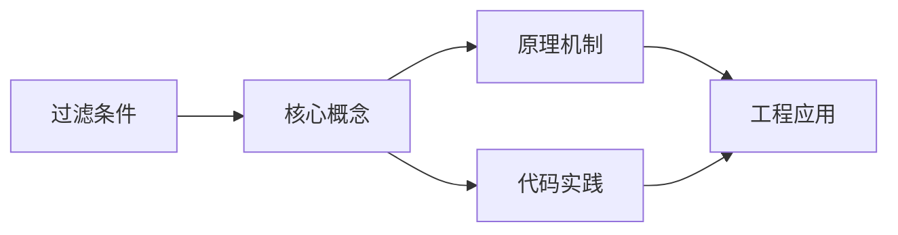
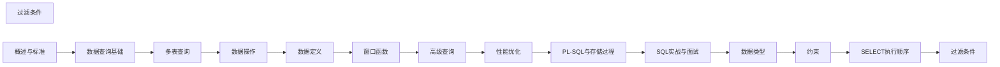

## 1. 学习目标（Bloom 分类）

本节按照布鲁姆教育目标分类学组织学习路径。本文主题为《过滤条件》，属于 SQL 模块，读者可以根据自身阶段选择阅读深度。

记忆层面：能够准确复述本文的核心概念、术语与基本语法或操作步骤，并能够在提问或检索时快速定位对应知识点。能够说出 SQL 的核心概念、语法与常用对象。

理解层面：能够用自己的语言解释核心原理与工作机制，说明概念之间的因果关系，而不是机械记忆结论。能够解释 SQL 的执行原理与优化机制。

应用层面：能够在真实项目或练习场景中运用本文知识解决具体问题，写出正确且可维护的实现。能够编写正确、高效的 SQL 语句与操作。

分析层面：能够拆解复杂问题，比较本文主题与相邻概念的异同，识别边界条件与例外情况。能够分析 SQL 相关方案在性能与一致性上的权衡。

评价层面：能够根据约束条件（性能、可读性、安全、成本）评价不同方案的优劣，做出有依据的技术决策。能够根据业务场景评价 SQL 技术选型。

创造层面：能够把本文知识与其他模块知识组合，设计出新的解决方案或可复用的工程模式。能够组合 SQL 与其他技术设计数据架构。

通过本节学习，读者应当能够把《过滤条件》纳入自己的知识网络，并与 SQL 模块的其他主题（DDL/DML、查询、索引、事务）建立关联。

## 2. 历史动机与发展脉络

《过滤条件》是 SQL 领域的重要主题。要真正理解它，需要先了解它解决的问题与演进过程。

SQL（结构化查询语言）源于 1970 年 Codd 的关系模型，1974 年由 Chamberlin 与 Boyce 设计（SEQUEL），1986 年成为 ANSI 标准；SQL:2023 是当前国际标准。
SQL 分为 DDL（建表）、DML（增删改）、DQL（查询）、DCL（权限）与 TCL（事务）；各大数据库在标准基础上扩展方言。
SQL 是声明式语言：描述“要什么”而非“怎么做”，优化器负责执行计划；这一设计让 SQL 具有跨数据库的表达一致性。

回到本文主题：过滤条件 的提出与成熟，正是上述技术背景下的必然产物。早期实现往往以简单可用为目标，随着工程规模扩大，社区逐渐沉淀出标准做法与最佳实践；理解这一脉络，可以帮助读者判断“为什么文档中的推荐写法是现在这个样子”，也能在遇到历史遗留代码时准确识别其设计年代与取舍。


## 3. 形式化定义与核心概念精讲

本节把《过滤条件》涉及的核心概念以“定义 + 讲解”的形式展开。读者应把定义当作工具，把讲解当作理解路径；两者结合才能形成可迁移的知识。

关系模型：表（关系）、行（元组）、列（属性）；主键唯一标识、外键表达关联、范式消除冗余。
查询执行：解析 -> 绑定 -> 优化（基于代价选择计划）-> 执行；索引、统计信息与连接算法决定性能。
事务 ACID：原子性（Atomicity）、一致性（Consistency）、隔离性（Isolation）、持久性（Durability）；隔离级别控制并发行为。

### 3.1 原文章节逐一精讲

原文档把主题拆分为 19 个小节，下面按顺序给出每一节的导读讲解，随后保留原文细节供精读。

#### 原文精读（完整保留）

# 过滤条件

> **符号约定**：`< >` 必填参数 | `[ ]` 可选参数

---

#### 1. WHERE 子句概述

WHERE 子句用于过滤 FROM/JION 结果集中的行，只保留满足条件的行。它是 SQL 查询中最基本也最重要的过滤机制。

```sql
SELECT select_list
FROM table_source
WHERE search_condition;
```

#### 2. 比较运算符

##### 2.1 基本比较运算符

| 运算符  | 含义     | 示例                       |
| ------- | -------- | -------------------------- |
| =       | 等于     | `WHERE age = 25`           |
| <> / != | 不等于   | `WHERE status <> 'closed'` |
| <       | 小于     | `WHERE price < 100`        |
| >       | 大于     | `WHERE salary > 50000`     |
| <=      | 小于等于 | `WHERE quantity <= 0`      |
| >=      | 大于等于 | `WHERE score >= 60`        |

##### 2.2 比较运算符与 NULL

任何与 NULL 的比较结果都是 NULL（未知），而非 TRUE 或 FALSE：

```sql
-- 以下查询不会返回任何行
SELECT * FROM users WHERE phone = NULL;
SELECT * FROM users WHERE phone <> NULL;

-- 必须使用 IS NULL / IS NOT NULL
SELECT * FROM users WHERE phone IS NULL;
SELECT * FROM users WHERE phone IS NOT NULL;
```

##### 2.3 安全等于运算符

```sql
-- MySQL 的 <=> 运算符（NULL 安全等于）
SELECT * FROM users WHERE phone <=> NULL;   -- 等价于 phone IS NULL
SELECT * FROM users WHERE phone <=> '123';  -- 等价于 phone = '123'

-- IS DISTINCT FROM（SQL 标准，PostgreSQL 支持）
SELECT * FROM users WHERE phone IS DISTINCT FROM NULL;  -- 等价于 phone IS NOT NULL
SELECT * FROM users WHERE phone IS NOT DISTINCT FROM NULL; -- 等价于 phone IS NULL
```

#### 3. 逻辑运算符

##### 3.1 AND、OR、NOT

```sql
-- AND：所有条件都为 TRUE
SELECT * FROM employees
WHERE dept_id = 5 AND salary > 50000;

-- OR：任一条件为 TRUE
SELECT * FROM employees
WHERE dept_id = 5 OR dept_id = 10;

-- NOT：取反
SELECT * FROM employees
WHERE NOT (dept_id = 5 OR dept_id = 10);
```

##### 3.2 运算符优先级

NOT > AND > OR，建议使用括号明确逻辑：

```sql
-- 以下两个查询含义不同
SELECT * FROM products
WHERE category = 'A' OR category = 'B' AND price > 100;
-- 等价于：category = 'A' OR (category = 'B' AND price > 100)

SELECT * FROM products
WHERE (category = 'A' OR category = 'B') AND price > 100;
-- 等价于：(category = 'A' OR category = 'B') AND price > 100
```

#### 4. IN 运算符

##### 4.1 基本用法

```sql
-- 离散值匹配
SELECT * FROM orders
WHERE status IN ('pending', 'processing', 'shipped');

-- 等价于
SELECT * FROM orders
WHERE status = 'pending' OR status = 'processing' OR status = 'shipped';

-- NOT IN
SELECT * FROM orders
WHERE status NOT IN ('cancelled', 'returned');
```

##### 4.2 IN 与 NULL 的陷阱

```sql
-- NOT IN 遇到 NULL 的陷阱
SELECT * FROM products
WHERE category_id NOT IN (1, 2, NULL);
-- 等价于：category_id <> 1 AND category_id <> 2 AND category_id <> NULL
-- category_id <> NULL 结果为 NULL，整个条件为 NULL/FALSE
-- 结果：返回空集！

-- 解决方案：使用 NOT EXISTS
SELECT * FROM products p
WHERE NOT EXISTS (
    SELECT 1 FROM categories c
    WHERE c.id = p.category_id AND c.id IN (1, 2)
);
```

##### 4.3 子查询中的 IN

```sql
-- 子查询 IN
SELECT * FROM orders
WHERE user_id IN (
    SELECT id FROM users WHERE vip_level >= 3
);

-- 性能提示：大数据量时 NOT EXISTS 通常比 NOT IN 更高效
SELECT * FROM orders o
WHERE NOT EXISTS (
    SELECT 1 FROM cancelled_orders c WHERE c.order_id = o.id
);
```

#### 5. BETWEEN 运算符

##### 5.1 基本用法

```sql
-- 包含边界的范围查询
SELECT * FROM products
WHERE price BETWEEN 100 AND 500;
-- 等价于 price >= 100 AND price <= 500

-- NOT BETWEEN
SELECT * FROM products
WHERE price NOT BETWEEN 100 AND 500;

-- 日期范围
SELECT * FROM orders
WHERE created_at BETWEEN DATE '2026-01-01' AND DATE '2026-06-30';
```

##### 5.2 BETWEEN 注意事项

```sql
-- BETWEEN 包含边界
SELECT * FROM products WHERE price BETWEEN 100 AND 500;
-- 包含 price = 100 和 price = 500

-- 时间戳 BETWEEN 的精度问题
SELECT * FROM logs
WHERE created_at BETWEEN '2026-06-14 00:00:00' AND '2026-06-14 23:59:59';
-- 可能遗漏 23:59:59.001 ~ 23:59:59.999 的记录

-- 推荐写法
SELECT * FROM logs
WHERE created_at >= '2026-06-14 00:00:00'
  AND created_at < '2026-06-15 00:00:00';
```

##### 5.3 对称性

```sql
-- BETWEEN 要求下界 <= 上界
SELECT * FROM products WHERE price BETWEEN 500 AND 100;
-- 等价于 price >= 500 AND price <= 100，永远为 FALSE

-- SYMMETRIC 关键字（PostgreSQL）
SELECT * FROM products WHERE price BETWEEN SYMMETRIC 500 AND 100;
-- 自动交换边界，等价于 price BETWEEN 100 AND 500
```

#### 6. LIKE 运算符

##### 6.1 通配符

| 通配符 | 含义               | 示例    |
| ------ | ------------------ | ------- |
| %      | 零个或多个任意字符 | `'张%'` |
| \_     | 恰好一个任意字符   | `'张_'` |

```sql
-- 前缀匹配（可利用索引）
SELECT * FROM users WHERE name LIKE '张%';

-- 后缀匹配（无法利用普通索引）
SELECT * FROM users WHERE name LIKE '%明';

-- 包含匹配（无法利用普通索引）
SELECT * FROM users WHERE name LIKE '%华%';

-- 单字符匹配
SELECT * FROM users WHERE name LIKE '张_';  -- 张三、张四，不包括张三四
```

##### 6.2 转义特殊字符

```sql
-- 查找包含 % 或 _ 的字符串
SELECT * FROM files WHERE filename LIKE '100\%' ESCAPE '\';   -- 匹配 "100%"
SELECT * FROM files WHERE filename LIKE 'report\_2026' ESCAPE '\';  -- 匹配 "report_2026"

-- 默认转义字符因数据库而异
-- PostgreSQL: 默认无转义，需指定 ESCAPE
-- MySQL: 默认 \ 为转义字符
```

##### 6.3 正则表达式匹配

```sql
-- PostgreSQL: ~ （区分大小写）、~* （不区分）
SELECT * FROM users WHERE name ~ '^张[三四五]$';

-- MySQL: REGEXP / RLIKE
SELECT * FROM users WHERE name REGEXP '^张[三四五]$';

-- SQL 标准：SIMILAR TO
SELECT * FROM users WHERE name SIMILAR TO '张(三|四|五)';
```

#### 7. IS NULL / IS NOT NULL

##### 7.1 基本用法

```sql
-- 检查 NULL 值
SELECT * FROM users WHERE phone IS NULL;
SELECT * FROM users WHERE phone IS NOT NULL;

-- 多列 NULL 检查
SELECT * FROM orders
WHERE shipping_date IS NULL AND payment_date IS NOT NULL;
```

##### 7.2 NULL 相关函数

```sql
-- COALESCE：返回第一个非 NULL 参数
SELECT COALESCE(phone, email, 'N/A') AS contact FROM users;

-- NULLIF：两参数相等返回 NULL，否则返回第一个
SELECT NULLIF(score, 0) AS safe_score FROM exams;  -- 避免除零

-- ISNULL / IFNULL（非标准）
SELECT ISNULL(phone, 'N/A') FROM users;           -- SQL Server
SELECT IFNULL(phone, 'N/A') FROM users;           -- MySQL
```

#### 8. 组合条件与性能优化

##### 8.1 可索引条件

| 条件类型             | 索引利用 | 说明                 |
| -------------------- | -------- | -------------------- |
| `col = value`        |          | 等值查询最有效       |
| `col IN (...)`       |          | 等价于多个等值查询   |
| `col BETWEEN`        |          | 范围扫描             |
| `col LIKE 'prefix%'` |          | 前缀匹配可用索引     |
| `col LIKE '%suffix'` |          | 后缀匹配无法用索引   |
| `col IS NULL`        |          | 大多数数据库支持     |
| `NOT col = value`    |          | 否定条件通常不用索引 |
| `col <> value`       |          | 不等于通常不用索引   |

##### 8.2 SARGable 条件

SARGable（Search ARGument able）指能利用索引的条件：

```sql
-- 非 SARGable：对列使用函数
SELECT * FROM orders WHERE YEAR(created_at) = 2026;
SELECT * FROM users WHERE LOWER(email) = 'test@example.com';

-- SARGable：改写条件
SELECT * FROM orders WHERE created_at >= '2026-01-01' AND created_at < '2027-01-01';
SELECT * FROM users WHERE email = 'test@example.com' COLLATE utf8mb4_general_ci;
```

##### 8.3 多条件查询优化

```sql
-- 将选择性高的条件放在前面（逻辑上无差别，但优化器可能受益）
SELECT * FROM orders
WHERE user_id = 42             -- 高选择性
  AND status = 'pending'       -- 低选择性
  AND created_at >= '2026-01-01';

-- 复合索引应遵循最左前缀原则
CREATE INDEX idx_orders_user_status_date
ON orders (user_id, status, created_at);
```
#### WHERE 基本语法

**换行写法：WHERE 子句过滤行**
`SELECT <select_list> FROM <table_source> WHERE <search_condition>;`
```sql
-- 使用 WHERE 子句过滤满足条件的行
SELECT select_list
FROM table_source
WHERE search_condition;
```

---

#### 比较运算符

**单行写法：等于比较**
`WHERE <列> = <值>;`
```sql
-- 查询年龄等于 25 的记录
SELECT * FROM users WHERE age = 25;
```

**单行写法：不等于比较**
`WHERE <列> <> <值>;`
```sql
-- 查询状态不为 closed 的订单
SELECT * FROM orders WHERE status <> 'closed';
```

**单行写法：小于比较**
`WHERE <列> < <值>;`
```sql
-- 查询价格小于 100 的商品
SELECT * FROM products WHERE price < 100;
```

**单行写法：大于比较**
`WHERE <列> > <值>;`
```sql
-- 查询薪资大于 50000 的员工
SELECT * FROM employees WHERE salary > 50000;
```

**单行写法：小于等于比较**
`WHERE <列> <= <值>;`
```sql
-- 查询库存小于等于 0 的商品
SELECT * FROM products WHERE quantity <= 0;
```

**单行写法：大于等于比较**
`WHERE <列> >= <值>;`
```sql
-- 查询成绩大于等于 60 的记录
SELECT * FROM exams WHERE score >= 60;
```

---

#### 安全等于运算符

**单行写法：MySQL NULL 安全等于**
`WHERE <列> <=> <值>;`
```sql
-- 查询手机号为 NULL 的用户（等价于 IS NULL）
SELECT * FROM users WHERE phone <=> NULL;
```

**单行写法：IS DISTINCT FROM**
`WHERE <列> IS DISTINCT FROM <值>;`
```sql
-- 查询手机号不为 NULL 的用户（等价于 IS NOT NULL）
SELECT * FROM users WHERE phone IS DISTINCT FROM NULL;
```

**单行写法：IS NOT DISTINCT FROM**
`WHERE <列> IS NOT DISTINCT FROM <值>;`
```sql
-- 查询手机号为 NULL 的用户（等价于 IS NULL）
SELECT * FROM users WHERE phone IS NOT DISTINCT FROM NULL;
```

---

#### 逻辑运算符

**单行写法：AND 组合条件**
`WHERE <条件 1> AND <条件 2>;`
```sql
-- 查询部门 ID 为 5 且薪资大于 50000 的员工
SELECT * FROM employees
WHERE dept_id = 5 AND salary > 50000;
```

**单行写法：OR 组合条件**
`WHERE <条件 1> OR <条件 2>;`
```sql
-- 查询部门 ID 为 5 或 10 的员工
SELECT * FROM employees
WHERE dept_id = 5 OR dept_id = 10;
```

**单行写法：NOT 取反条件**
`WHERE NOT (<条件>);`
```sql
-- 查询部门 ID 不为 5 且不为 10 的员工
SELECT * FROM employees
WHERE NOT (dept_id = 5 OR dept_id = 10);
```

**换行写法：运算符优先级（AND 优先于 OR）**
`WHERE <条件 1> OR <条件 2> AND <条件 3>;`
```sql
-- AND 优先于 OR，等价于 category = 'A' OR (category = 'B' AND price > 100)
SELECT * FROM products
WHERE category = 'A' OR category = 'B' AND price > 100;
```

**换行写法：括号改变优先级**
`WHERE (<条件 1> OR <条件 2>) AND <条件 3>;`
```sql
-- 使用括号改变优先级
SELECT * FROM products
WHERE (category = 'A' OR category = 'B') AND price > 100;
```

---

#### IN 运算符

**单行写法：离散值匹配**
`WHERE <列> IN (<值 1>, <值 2>, ...);`
```sql
-- 查询状态为待处理、处理中、已发货的订单
SELECT * FROM orders
WHERE status IN ('pending', 'processing', 'shipped');
```

**单行写法：排除离散值**
`WHERE <列> NOT IN (<值 1>, <值 2>, ...);`
```sql
-- 查询状态不为已取消、已退货的订单
SELECT * FROM orders
WHERE status NOT IN ('cancelled', 'returned');
```

**换行写法：子查询中的 IN**
`WHERE <列> IN (SELECT ...);`
```sql
-- 查询 VIP 等级大于等于 3 的用户的订单
SELECT * FROM orders
WHERE user_id IN (
    SELECT id FROM users WHERE vip_level >= 3
);
```

---

#### BETWEEN 运算符

**单行写法：范围查询（包含边界）**
`WHERE <列> BETWEEN <下界> AND <上界>;`
```sql
-- 查询价格在 100 到 500 之间的商品
SELECT * FROM products
WHERE price BETWEEN 100 AND 500;
```

**单行写法：排除范围**
`WHERE <列> NOT BETWEEN <下界> AND <上界>;`
```sql
-- 查询价格不在 100 到 500 之间的商品
SELECT * FROM products
WHERE price NOT BETWEEN 100 AND 500;
```

**单行写法：日期范围查询**
`WHERE <列> BETWEEN DATE '<开始>' AND DATE '<结束>';`
```sql
-- 查询 2026 年上半年的订单
SELECT * FROM orders
WHERE created_at BETWEEN DATE '2026-01-01' AND DATE '2026-06-30';
```

**换行写法：时间戳范围查询（避免精度问题）**
`WHERE <列> >= <开始> AND <列> < <结束>;`
```sql
-- 查询 2026-06-14 全天的日志（避免 BETWEEN 精度问题）
SELECT * FROM logs
WHERE created_at >= '2026-06-14 00:00:00'
  AND created_at < '2026-06-15 00:00:00';
```

---

#### LIKE 运算符

**单行写法：前缀匹配**
`WHERE <列> LIKE '<前缀>%';`
```sql
-- 查询姓"张"的用户（可利用索引）
SELECT * FROM users WHERE name LIKE '张%';
```

**单行写法：后缀匹配**
`WHERE <列> LIKE '%<后缀>';`
```sql
-- 查询名字以"明"结尾的用户（无法利用普通索引）
SELECT * FROM users WHERE name LIKE '%明';
```

**单行写法：包含匹配**
`WHERE <列> LIKE '%<关键字>%';`
```sql
-- 查询名字包含"华"的用户
SELECT * FROM users WHERE name LIKE '%华%';
```

**单行写法：单字符匹配**
`WHERE <列> LIKE '<前缀>_<后缀>';`
```sql
-- 查询"张三"、"张四"等两字姓名
SELECT * FROM users WHERE name LIKE '张_';
```

**单行写法：ESCAPE 转义特殊字符**
`WHERE <列> LIKE '<模式>' ESCAPE '<转义字符>';`
```sql
-- 查找文件名为"100%"的记录
SELECT * FROM files WHERE filename LIKE '100\%' ESCAPE '\';
```

---

#### 正则表达式匹配

**单行写法：PostgreSQL 正则匹配**
`WHERE <列> ~ '<正则>';`
```sql
-- 查询姓张、三、四、五的用户
SELECT * FROM users WHERE name ~ '^张[三四五]$';
```

**单行写法：MySQL 正则匹配**
`WHERE <列> REGEXP '<正则>';`
```sql
-- 查询姓张、三、四、五的用户
SELECT * FROM users WHERE name REGEXP '^张[三四五]$';
```

**单行写法：SQL 标准模式匹配**
`WHERE <列> SIMILAR TO '<模式>';`
```sql
-- 查询姓张、三、四、五的用户
SELECT * FROM users WHERE name SIMILAR TO '张(三|四|五)';
```

---

#### IS NULL / IS NOT NULL

**单行写法：检查 NULL 值**
`WHERE <列> IS NULL;`
```sql
-- 查询没有手机号的用户
SELECT * FROM users WHERE phone IS NULL;
```

**单行写法：检查非 NULL 值**
`WHERE <列> IS NOT NULL;`
```sql
-- 查询有手机号的用户
SELECT * FROM users WHERE phone IS NOT NULL;
```

**换行写法：多列 NULL 检查**
`WHERE <列 1> IS NULL AND <列 2> IS NOT NULL;`
```sql
-- 查询已付款但未发货的订单
SELECT * FROM orders
WHERE shipping_date IS NULL AND payment_date IS NOT NULL;
```

---

#### NULL 相关函数

**单行写法：COALESCE 返回第一个非 NULL 参数**
`SELECT COALESCE(<列 1>, <列 2>, <默认值>) FROM <表名>;`
```sql
-- 查询用户联系方式，优先手机号，其次邮箱，最后显示 N/A
SELECT COALESCE(phone, email, 'N/A') AS contact FROM users;
```

**单行写法：NULLIF 相等返回 NULL**
`SELECT NULLIF(<列 1>, <列 2>) FROM <表名>;`
```sql
-- 查询成绩，为 0 时返回 NULL 避免除零
SELECT NULLIF(score, 0) AS safe_score FROM exams;
```

**单行写法：MySQL IFNULL**
`SELECT IFNULL(<列>, <默认值>) FROM <表名>;`
```sql
-- 查询用户手机号，未填写则显示 N/A
SELECT IFNULL(phone, 'N/A') FROM users;
```

---

#### SARGable 条件

**单行写法：非 SARGable 条件（无法利用索引）**
`WHERE <函数>(<列>) = <值>;`
```sql
-- 对列使用函数导致无法利用索引
SELECT * FROM orders WHERE YEAR(created_at) = 2026;
```

**换行写法：SARGable 条件改写（可利用索引）**
`WHERE <列> >= <开始> AND <列> < <结束>;`
```sql
-- 改写为范围查询以利用索引
SELECT * FROM orders WHERE created_at >= '2026-01-01' AND created_at < '2027-01-01';
```


### 3.2 概念关系图

下面用 Mermaid 图表达本文核心概念之间的关系，帮助读者建立整体图景：



图中展示的是本文知识的结构化关系：核心概念是入口，原理机制解释“为什么”，代码实践演示“怎么做”，工程应用回答“何时用”。读者学习时可以把每个小节的内容挂接到对应节点上。

## 4. 理论推导与原理解析

本节深入《过滤条件》背后的原理。理论部分不求面面俱到，而是聚焦“能解释现象、能指导实践”的关键推导。

关系模型：表（关系）、行（元组）、列（属性）；主键唯一标识、外键表达关联、范式消除冗余。
查询执行：解析 -> 绑定 -> 优化（基于代价选择计划）-> 执行；索引、统计信息与连接算法决定性能。
事务 ACID：原子性（Atomicity）、一致性（Consistency）、隔离性（Isolation）、持久性（Durability）；隔离级别控制并发行为。
集合语义：SELECT 返回结果集；JOIN 组合关系，GROUP BY 聚合，子查询与 CTE 表达复杂逻辑。

需要强调的是，理论推导与工程实践之间存在翻译层：理论给出的是理想化模型与边界条件，工程代码则必须处理真实环境中的例外。读者在学习时应先掌握理论的“标准情形”，再通过陷阱章节了解“非标准情形”。

## 5. 代码示例与逐行讲解

本节把原文中的代码示例系统整理，并为每个示例补充用途说明与讲解。读者不应只浏览代码，而应逐段对照讲解理解设计意图。

### 5.1 示例：1. WHERE 子句概述

该示例来自原文《1. WHERE 子句概述》小节，用于演示过滤条件相关操作。阅读时请先看代码结构，再看其后的讲解。

```sql
SELECT select_list
FROM table_source
WHERE search_condition;
```

讲解：这段代码演示了本节核心知识点。代码中的关键操作可以归纳为三步：准备（定义或初始化）、执行（核心逻辑）、收尾（释放资源或返回结果）。实际项目中，这三步往往被封装为函数或类，以提升复用性与可测试性。

关键点分析：

该示例共 3 行有效代码，包含 2 类关键结构（SELECT、FROM）。其中：

- 入口与初始化部分负责建立上下文，对应实际项目中的启动或装配逻辑；
- 核心逻辑部分体现本文主题的主要操作，是阅读时最需要对照讲解理解的部分；
- 输出或返回部分把结果交给调用方，注意其类型与边界条件。

进阶思考路径：先尝试修改参数观察行为变化，再把示例中的模式迁移到自己的项目中；每次修改都记录预期与实测差异，这是把示例转化为能力的最快方式。

### 5.2 示例：2.2 比较运算符与 NULL

该示例来自原文《2.2 比较运算符与 NULL》小节，用于演示过滤条件相关操作。阅读时请先看代码结构，再看其后的讲解。

```sql
-- 以下查询不会返回任何行
SELECT * FROM users WHERE phone = NULL;
SELECT * FROM users WHERE phone <> NULL;

-- 必须使用 IS NULL / IS NOT NULL
SELECT * FROM users WHERE phone IS NULL;
SELECT * FROM users WHERE phone IS NOT NULL;
```

讲解：这段代码演示了本节核心知识点。代码中的关键操作可以归纳为三步：准备（定义或初始化）、执行（核心逻辑）、收尾（释放资源或返回结果）。实际项目中，这三步往往被封装为函数或类，以提升复用性与可测试性。

关键点分析：

该示例共 6 行有效代码，包含 2 类关键结构（SELECT、FROM）。其中：

- 入口与初始化部分负责建立上下文，对应实际项目中的启动或装配逻辑；
- 核心逻辑部分体现本文主题的主要操作，是阅读时最需要对照讲解理解的部分；
- 输出或返回部分把结果交给调用方，注意其类型与边界条件。

进阶思考路径：先尝试修改参数观察行为变化，再把示例中的模式迁移到自己的项目中；每次修改都记录预期与实测差异，这是把示例转化为能力的最快方式。

### 5.3 示例：2.3 安全等于运算符

该示例来自原文《2.3 安全等于运算符》小节，用于演示过滤条件相关操作。阅读时请先看代码结构，再看其后的讲解。

```sql
-- MySQL 的 <=> 运算符（NULL 安全等于）
SELECT * FROM users WHERE phone <=> NULL;   -- 等价于 phone IS NULL
SELECT * FROM users WHERE phone <=> '123';  -- 等价于 phone = '123'

-- IS DISTINCT FROM（SQL 标准，PostgreSQL 支持）
SELECT * FROM users WHERE phone IS DISTINCT FROM NULL;  -- 等价于 phone IS NOT NULL
SELECT * FROM users WHERE phone IS NOT DISTINCT FROM NULL; -- 等价于 phone IS NULL
```

讲解：这段代码演示了本节核心知识点。代码中的关键操作可以归纳为三步：准备（定义或初始化）、执行（核心逻辑）、收尾（释放资源或返回结果）。实际项目中，这三步往往被封装为函数或类，以提升复用性与可测试性。

关键点分析：

该示例共 6 行有效代码，包含 2 类关键结构（SELECT、FROM）。其中：

- 入口与初始化部分负责建立上下文，对应实际项目中的启动或装配逻辑；
- 核心逻辑部分体现本文主题的主要操作，是阅读时最需要对照讲解理解的部分；
- 输出或返回部分把结果交给调用方，注意其类型与边界条件。

进阶思考路径：先尝试修改参数观察行为变化，再把示例中的模式迁移到自己的项目中；每次修改都记录预期与实测差异，这是把示例转化为能力的最快方式。

### 5.4 示例：3.1 AND、OR、NOT

该示例来自原文《3.1 AND、OR、NOT》小节，用于演示过滤条件相关操作。阅读时请先看代码结构，再看其后的讲解。

```sql
-- AND：所有条件都为 TRUE
SELECT * FROM employees
WHERE dept_id = 5 AND salary > 50000;

-- OR：任一条件为 TRUE
SELECT * FROM employees
WHERE dept_id = 5 OR dept_id = 10;

-- NOT：取反
SELECT * FROM employees
WHERE NOT (dept_id = 5 OR dept_id = 10);
```

讲解：这段代码演示了本节核心知识点。代码中的关键操作可以归纳为三步：准备（定义或初始化）、执行（核心逻辑）、收尾（释放资源或返回结果）。实际项目中，这三步往往被封装为函数或类，以提升复用性与可测试性。

关键点分析：

该示例共 9 行有效代码，包含 2 类关键结构（SELECT、FROM）。其中：

- 入口与初始化部分负责建立上下文，对应实际项目中的启动或装配逻辑；
- 核心逻辑部分体现本文主题的主要操作，是阅读时最需要对照讲解理解的部分；
- 输出或返回部分把结果交给调用方，注意其类型与边界条件。

进阶思考路径：先尝试修改参数观察行为变化，再把示例中的模式迁移到自己的项目中；每次修改都记录预期与实测差异，这是把示例转化为能力的最快方式。

### 5.5 示例：3.2 运算符优先级

该示例来自原文《3.2 运算符优先级》小节，用于演示过滤条件相关操作。阅读时请先看代码结构，再看其后的讲解。

```sql
-- 以下两个查询含义不同
SELECT * FROM products
WHERE category = 'A' OR category = 'B' AND price > 100;
-- 等价于：category = 'A' OR (category = 'B' AND price > 100)

SELECT * FROM products
WHERE (category = 'A' OR category = 'B') AND price > 100;
-- 等价于：(category = 'A' OR category = 'B') AND price > 100
```

讲解：这段代码演示了本节核心知识点。代码中的关键操作可以归纳为三步：准备（定义或初始化）、执行（核心逻辑）、收尾（释放资源或返回结果）。实际项目中，这三步往往被封装为函数或类，以提升复用性与可测试性。

关键点分析：

该示例共 7 行有效代码，包含 2 类关键结构（SELECT、FROM）。其中：

- 入口与初始化部分负责建立上下文，对应实际项目中的启动或装配逻辑；
- 核心逻辑部分体现本文主题的主要操作，是阅读时最需要对照讲解理解的部分；
- 输出或返回部分把结果交给调用方，注意其类型与边界条件。

进阶思考路径：先尝试修改参数观察行为变化，再把示例中的模式迁移到自己的项目中；每次修改都记录预期与实测差异，这是把示例转化为能力的最快方式。

### 5.6 示例：4.1 基本用法

该示例来自原文《4.1 基本用法》小节，用于演示过滤条件相关操作。阅读时请先看代码结构，再看其后的讲解。

```sql
-- 离散值匹配
SELECT * FROM orders
WHERE status IN ('pending', 'processing', 'shipped');

-- 等价于
SELECT * FROM orders
WHERE status = 'pending' OR status = 'processing' OR status = 'shipped';

-- NOT IN
SELECT * FROM orders
WHERE status NOT IN ('cancelled', 'returned');
```

讲解：这段代码演示了本节核心知识点。代码中的关键操作可以归纳为三步：准备（定义或初始化）、执行（核心逻辑）、收尾（释放资源或返回结果）。实际项目中，这三步往往被封装为函数或类，以提升复用性与可测试性。

关键点分析：

该示例共 9 行有效代码，包含 3 类关键结构（return、SELECT、FROM）。其中：

- 入口与初始化部分负责建立上下文，对应实际项目中的启动或装配逻辑；
- 核心逻辑部分体现本文主题的主要操作，是阅读时最需要对照讲解理解的部分；
- 输出或返回部分把结果交给调用方，注意其类型与边界条件。

进阶思考路径：先尝试修改参数观察行为变化，再把示例中的模式迁移到自己的项目中；每次修改都记录预期与实测差异，这是把示例转化为能力的最快方式。

### 5.7 示例：4.2 IN 与 NULL 的陷阱

该示例来自原文《4.2 IN 与 NULL 的陷阱》小节，用于演示过滤条件相关操作。阅读时请先看代码结构，再看其后的讲解。

```sql
-- NOT IN 遇到 NULL 的陷阱
SELECT * FROM products
WHERE category_id NOT IN (1, 2, NULL);
-- 等价于：category_id <> 1 AND category_id <> 2 AND category_id <> NULL
-- category_id <> NULL 结果为 NULL，整个条件为 NULL/FALSE
-- 结果：返回空集！

-- 解决方案：使用 NOT EXISTS
SELECT * FROM products p
WHERE NOT EXISTS (
    SELECT 1 FROM categories c
    WHERE c.id = p.category_id AND c.id IN (1, 2)
);
```

讲解：这段代码演示了本节核心知识点。代码中的关键操作可以归纳为三步：准备（定义或初始化）、执行（核心逻辑）、收尾（释放资源或返回结果）。实际项目中，这三步往往被封装为函数或类，以提升复用性与可测试性。

关键点分析：

该示例共 12 行有效代码，包含 2 类关键结构（SELECT、FROM）。其中：

- 入口与初始化部分负责建立上下文，对应实际项目中的启动或装配逻辑；
- 核心逻辑部分体现本文主题的主要操作，是阅读时最需要对照讲解理解的部分；
- 输出或返回部分把结果交给调用方，注意其类型与边界条件。

进阶思考路径：先尝试修改参数观察行为变化，再把示例中的模式迁移到自己的项目中；每次修改都记录预期与实测差异，这是把示例转化为能力的最快方式。

### 5.8 示例：4.3 子查询中的 IN

该示例来自原文《4.3 子查询中的 IN》小节，用于演示过滤条件相关操作。阅读时请先看代码结构，再看其后的讲解。

```sql
-- 子查询 IN
SELECT * FROM orders
WHERE user_id IN (
    SELECT id FROM users WHERE vip_level >= 3
);

-- 性能提示：大数据量时 NOT EXISTS 通常比 NOT IN 更高效
SELECT * FROM orders o
WHERE NOT EXISTS (
    SELECT 1 FROM cancelled_orders c WHERE c.order_id = o.id
);
```

讲解：这段代码演示了本节核心知识点。代码中的关键操作可以归纳为三步：准备（定义或初始化）、执行（核心逻辑）、收尾（释放资源或返回结果）。实际项目中，这三步往往被封装为函数或类，以提升复用性与可测试性。

关键点分析：

该示例共 10 行有效代码，包含 2 类关键结构（SELECT、FROM）。其中：

- 入口与初始化部分负责建立上下文，对应实际项目中的启动或装配逻辑；
- 核心逻辑部分体现本文主题的主要操作，是阅读时最需要对照讲解理解的部分；
- 输出或返回部分把结果交给调用方，注意其类型与边界条件。

进阶思考路径：先尝试修改参数观察行为变化，再把示例中的模式迁移到自己的项目中；每次修改都记录预期与实测差异，这是把示例转化为能力的最快方式。

### 5.9 示例：5.1 基本用法

该示例来自原文《5.1 基本用法》小节，用于演示过滤条件相关操作。阅读时请先看代码结构，再看其后的讲解。

```sql
-- 包含边界的范围查询
SELECT * FROM products
WHERE price BETWEEN 100 AND 500;
-- 等价于 price >= 100 AND price <= 500

-- NOT BETWEEN
SELECT * FROM products
WHERE price NOT BETWEEN 100 AND 500;

-- 日期范围
SELECT * FROM orders
WHERE created_at BETWEEN DATE '2026-01-01' AND DATE '2026-06-30';
```

讲解：这段代码演示了本节核心知识点。代码中的关键操作可以归纳为三步：准备（定义或初始化）、执行（核心逻辑）、收尾（释放资源或返回结果）。实际项目中，这三步往往被封装为函数或类，以提升复用性与可测试性。

关键点分析：

该示例共 10 行有效代码，包含 2 类关键结构（SELECT、FROM）。其中：

- 入口与初始化部分负责建立上下文，对应实际项目中的启动或装配逻辑；
- 核心逻辑部分体现本文主题的主要操作，是阅读时最需要对照讲解理解的部分；
- 输出或返回部分把结果交给调用方，注意其类型与边界条件。

进阶思考路径：先尝试修改参数观察行为变化，再把示例中的模式迁移到自己的项目中；每次修改都记录预期与实测差异，这是把示例转化为能力的最快方式。

### 5.10 示例：5.2 BETWEEN 注意事项

该示例来自原文《5.2 BETWEEN 注意事项》小节，用于演示过滤条件相关操作。阅读时请先看代码结构，再看其后的讲解。

```sql
-- BETWEEN 包含边界
SELECT * FROM products WHERE price BETWEEN 100 AND 500;
-- 包含 price = 100 和 price = 500

-- 时间戳 BETWEEN 的精度问题
SELECT * FROM logs
WHERE created_at BETWEEN '2026-06-14 00:00:00' AND '2026-06-14 23:59:59';
-- 可能遗漏 23:59:59.001 ~ 23:59:59.999 的记录

-- 推荐写法
SELECT * FROM logs
WHERE created_at >= '2026-06-14 00:00:00'
  AND created_at < '2026-06-15 00:00:00';
```

讲解：这段代码演示了本节核心知识点。代码中的关键操作可以归纳为三步：准备（定义或初始化）、执行（核心逻辑）、收尾（释放资源或返回结果）。实际项目中，这三步往往被封装为函数或类，以提升复用性与可测试性。

关键点分析：

该示例共 11 行有效代码，包含 2 类关键结构（SELECT、FROM）。其中：

- 入口与初始化部分负责建立上下文，对应实际项目中的启动或装配逻辑；
- 核心逻辑部分体现本文主题的主要操作，是阅读时最需要对照讲解理解的部分；
- 输出或返回部分把结果交给调用方，注意其类型与边界条件。

进阶思考路径：先尝试修改参数观察行为变化，再把示例中的模式迁移到自己的项目中；每次修改都记录预期与实测差异，这是把示例转化为能力的最快方式。

### 5.11 示例：5.3 对称性

该示例来自原文《5.3 对称性》小节，用于演示过滤条件相关操作。阅读时请先看代码结构，再看其后的讲解。

```sql
-- BETWEEN 要求下界 <= 上界
SELECT * FROM products WHERE price BETWEEN 500 AND 100;
-- 等价于 price >= 500 AND price <= 100，永远为 FALSE

-- SYMMETRIC 关键字（PostgreSQL）
SELECT * FROM products WHERE price BETWEEN SYMMETRIC 500 AND 100;
-- 自动交换边界，等价于 price BETWEEN 100 AND 500
```

讲解：这段代码演示了本节核心知识点。代码中的关键操作可以归纳为三步：准备（定义或初始化）、执行（核心逻辑）、收尾（释放资源或返回结果）。实际项目中，这三步往往被封装为函数或类，以提升复用性与可测试性。

关键点分析：

该示例共 6 行有效代码，包含 2 类关键结构（SELECT、FROM）。其中：

- 入口与初始化部分负责建立上下文，对应实际项目中的启动或装配逻辑；
- 核心逻辑部分体现本文主题的主要操作，是阅读时最需要对照讲解理解的部分；
- 输出或返回部分把结果交给调用方，注意其类型与边界条件。

进阶思考路径：先尝试修改参数观察行为变化，再把示例中的模式迁移到自己的项目中；每次修改都记录预期与实测差异，这是把示例转化为能力的最快方式。

### 5.12 示例：6.1 通配符

该示例来自原文《6.1 通配符》小节，用于演示过滤条件相关操作。阅读时请先看代码结构，再看其后的讲解。

```sql
-- 前缀匹配（可利用索引）
SELECT * FROM users WHERE name LIKE '张%';

-- 后缀匹配（无法利用普通索引）
SELECT * FROM users WHERE name LIKE '%明';

-- 包含匹配（无法利用普通索引）
SELECT * FROM users WHERE name LIKE '%华%';

-- 单字符匹配
SELECT * FROM users WHERE name LIKE '张_';  -- 张三、张四，不包括张三四
```

讲解：这段代码演示了本节核心知识点。代码中的关键操作可以归纳为三步：准备（定义或初始化）、执行（核心逻辑）、收尾（释放资源或返回结果）。实际项目中，这三步往往被封装为函数或类，以提升复用性与可测试性。

关键点分析：

该示例共 8 行有效代码，包含 2 类关键结构（SELECT、FROM）。其中：

- 入口与初始化部分负责建立上下文，对应实际项目中的启动或装配逻辑；
- 核心逻辑部分体现本文主题的主要操作，是阅读时最需要对照讲解理解的部分；
- 输出或返回部分把结果交给调用方，注意其类型与边界条件。

进阶思考路径：先尝试修改参数观察行为变化，再把示例中的模式迁移到自己的项目中；每次修改都记录预期与实测差异，这是把示例转化为能力的最快方式。

### 5.13 示例：6.2 转义特殊字符

该示例来自原文《6.2 转义特殊字符》小节，用于演示过滤条件相关操作。阅读时请先看代码结构，再看其后的讲解。

```sql
-- 查找包含 % 或 _ 的字符串
SELECT * FROM files WHERE filename LIKE '100\%' ESCAPE '\';   -- 匹配 "100%"
SELECT * FROM files WHERE filename LIKE 'report\_2026' ESCAPE '\';  -- 匹配 "report_2026"

-- 默认转义字符因数据库而异
-- PostgreSQL: 默认无转义，需指定 ESCAPE
-- MySQL: 默认 \ 为转义字符
```

讲解：这段代码演示了本节核心知识点。代码中的关键操作可以归纳为三步：准备（定义或初始化）、执行（核心逻辑）、收尾（释放资源或返回结果）。实际项目中，这三步往往被封装为函数或类，以提升复用性与可测试性。

关键点分析：

该示例共 6 行有效代码，包含 2 类关键结构（SELECT、FROM）。其中：

- 入口与初始化部分负责建立上下文，对应实际项目中的启动或装配逻辑；
- 核心逻辑部分体现本文主题的主要操作，是阅读时最需要对照讲解理解的部分；
- 输出或返回部分把结果交给调用方，注意其类型与边界条件。

进阶思考路径：先尝试修改参数观察行为变化，再把示例中的模式迁移到自己的项目中；每次修改都记录预期与实测差异，这是把示例转化为能力的最快方式。

### 5.14 示例：6.3 正则表达式匹配

该示例来自原文《6.3 正则表达式匹配》小节，用于演示过滤条件相关操作。阅读时请先看代码结构，再看其后的讲解。

```sql
-- PostgreSQL: ~ （区分大小写）、~* （不区分）
SELECT * FROM users WHERE name ~ '^张[三四五]$';

-- MySQL: REGEXP / RLIKE
SELECT * FROM users WHERE name REGEXP '^张[三四五]$';

-- SQL 标准：SIMILAR TO
SELECT * FROM users WHERE name SIMILAR TO '张(三|四|五)';
```

讲解：这段代码演示了本节核心知识点。代码中的关键操作可以归纳为三步：准备（定义或初始化）、执行（核心逻辑）、收尾（释放资源或返回结果）。实际项目中，这三步往往被封装为函数或类，以提升复用性与可测试性。

关键点分析：

该示例共 6 行有效代码，包含 2 类关键结构（SELECT、FROM）。其中：

- 入口与初始化部分负责建立上下文，对应实际项目中的启动或装配逻辑；
- 核心逻辑部分体现本文主题的主要操作，是阅读时最需要对照讲解理解的部分；
- 输出或返回部分把结果交给调用方，注意其类型与边界条件。

进阶思考路径：先尝试修改参数观察行为变化，再把示例中的模式迁移到自己的项目中；每次修改都记录预期与实测差异，这是把示例转化为能力的最快方式。

### 5.15 示例：7.1 基本用法

该示例来自原文《7.1 基本用法》小节，用于演示过滤条件相关操作。阅读时请先看代码结构，再看其后的讲解。

```sql
-- 检查 NULL 值
SELECT * FROM users WHERE phone IS NULL;
SELECT * FROM users WHERE phone IS NOT NULL;

-- 多列 NULL 检查
SELECT * FROM orders
WHERE shipping_date IS NULL AND payment_date IS NOT NULL;
```

讲解：这段代码演示了本节核心知识点。代码中的关键操作可以归纳为三步：准备（定义或初始化）、执行（核心逻辑）、收尾（释放资源或返回结果）。实际项目中，这三步往往被封装为函数或类，以提升复用性与可测试性。

关键点分析：

该示例共 6 行有效代码，包含 2 类关键结构（SELECT、FROM）。其中：

- 入口与初始化部分负责建立上下文，对应实际项目中的启动或装配逻辑；
- 核心逻辑部分体现本文主题的主要操作，是阅读时最需要对照讲解理解的部分；
- 输出或返回部分把结果交给调用方，注意其类型与边界条件。

进阶思考路径：先尝试修改参数观察行为变化，再把示例中的模式迁移到自己的项目中；每次修改都记录预期与实测差异，这是把示例转化为能力的最快方式。

### 5.16 示例：7.2 NULL 相关函数

该示例来自原文《7.2 NULL 相关函数》小节，用于演示过滤条件相关操作。阅读时请先看代码结构，再看其后的讲解。

```sql
-- COALESCE：返回第一个非 NULL 参数
SELECT COALESCE(phone, email, 'N/A') AS contact FROM users;

-- NULLIF：两参数相等返回 NULL，否则返回第一个
SELECT NULLIF(score, 0) AS safe_score FROM exams;  -- 避免除零

-- ISNULL / IFNULL（非标准）
SELECT ISNULL(phone, 'N/A') FROM users;           -- SQL Server
SELECT IFNULL(phone, 'N/A') FROM users;           -- MySQL
```

讲解：这段代码演示了本节核心知识点。代码中的关键操作可以归纳为三步：准备（定义或初始化）、执行（核心逻辑）、收尾（释放资源或返回结果）。实际项目中，这三步往往被封装为函数或类，以提升复用性与可测试性。

关键点分析：

该示例共 7 行有效代码，包含 2 类关键结构（SELECT、FROM）。其中：

- 入口与初始化部分负责建立上下文，对应实际项目中的启动或装配逻辑；
- 核心逻辑部分体现本文主题的主要操作，是阅读时最需要对照讲解理解的部分；
- 输出或返回部分把结果交给调用方，注意其类型与边界条件。

进阶思考路径：先尝试修改参数观察行为变化，再把示例中的模式迁移到自己的项目中；每次修改都记录预期与实测差异，这是把示例转化为能力的最快方式。

### 5.17 示例：8.2 SARGable 条件

该示例来自原文《8.2 SARGable 条件》小节，用于演示过滤条件相关操作。阅读时请先看代码结构，再看其后的讲解。

```sql
-- 非 SARGable：对列使用函数
SELECT * FROM orders WHERE YEAR(created_at) = 2026;
SELECT * FROM users WHERE LOWER(email) = 'test@example.com';

-- SARGable：改写条件
SELECT * FROM orders WHERE created_at >= '2026-01-01' AND created_at < '2027-01-01';
SELECT * FROM users WHERE email = 'test@example.com' COLLATE utf8mb4_general_ci;
```

讲解：这段代码演示了本节核心知识点。代码中的关键操作可以归纳为三步：准备（定义或初始化）、执行（核心逻辑）、收尾（释放资源或返回结果）。实际项目中，这三步往往被封装为函数或类，以提升复用性与可测试性。

关键点分析：

该示例共 6 行有效代码，包含 2 类关键结构（SELECT、FROM）。其中：

- 入口与初始化部分负责建立上下文，对应实际项目中的启动或装配逻辑；
- 核心逻辑部分体现本文主题的主要操作，是阅读时最需要对照讲解理解的部分；
- 输出或返回部分把结果交给调用方，注意其类型与边界条件。

进阶思考路径：先尝试修改参数观察行为变化，再把示例中的模式迁移到自己的项目中；每次修改都记录预期与实测差异，这是把示例转化为能力的最快方式。

### 5.18 示例：8.3 多条件查询优化

该示例来自原文《8.3 多条件查询优化》小节，用于演示过滤条件相关操作。阅读时请先看代码结构，再看其后的讲解。

```sql
-- 将选择性高的条件放在前面（逻辑上无差别，但优化器可能受益）
SELECT * FROM orders
WHERE user_id = 42             -- 高选择性
  AND status = 'pending'       -- 低选择性
  AND created_at >= '2026-01-01';

-- 复合索引应遵循最左前缀原则
CREATE INDEX idx_orders_user_status_date
ON orders (user_id, status, created_at);
```

讲解：这段代码演示了本节核心知识点。代码中的关键操作可以归纳为三步：准备（定义或初始化）、执行（核心逻辑）、收尾（释放资源或返回结果）。实际项目中，这三步往往被封装为函数或类，以提升复用性与可测试性。

关键点分析：

该示例共 8 行有效代码，包含 3 类关键结构（SELECT、CREATE、FROM）。其中：

- 入口与初始化部分负责建立上下文，对应实际项目中的启动或装配逻辑；
- 核心逻辑部分体现本文主题的主要操作，是阅读时最需要对照讲解理解的部分；
- 输出或返回部分把结果交给调用方，注意其类型与边界条件。

进阶思考路径：先尝试修改参数观察行为变化，再把示例中的模式迁移到自己的项目中；每次修改都记录预期与实测差异，这是把示例转化为能力的最快方式。

### 5.19 示例：WHERE 基本语法

该示例来自原文《WHERE 基本语法》小节，用于演示过滤条件相关操作。阅读时请先看代码结构，再看其后的讲解。

```sql
-- 使用 WHERE 子句过滤满足条件的行
SELECT select_list
FROM table_source
WHERE search_condition;
```

讲解：这段代码演示了本节核心知识点。代码中的关键操作可以归纳为三步：准备（定义或初始化）、执行（核心逻辑）、收尾（释放资源或返回结果）。实际项目中，这三步往往被封装为函数或类，以提升复用性与可测试性。

关键点分析：

该示例共 4 行有效代码，包含 2 类关键结构（SELECT、FROM）。其中：

- 入口与初始化部分负责建立上下文，对应实际项目中的启动或装配逻辑；
- 核心逻辑部分体现本文主题的主要操作，是阅读时最需要对照讲解理解的部分；
- 输出或返回部分把结果交给调用方，注意其类型与边界条件。

进阶思考路径：先尝试修改参数观察行为变化，再把示例中的模式迁移到自己的项目中；每次修改都记录预期与实测差异，这是把示例转化为能力的最快方式。

### 5.20 示例：比较运算符

该示例来自原文《比较运算符》小节，用于演示过滤条件相关操作。阅读时请先看代码结构，再看其后的讲解。

```sql
-- 查询年龄等于 25 的记录
SELECT * FROM users WHERE age = 25;
```

讲解：这段代码演示了本节核心知识点。代码中的关键操作可以归纳为三步：准备（定义或初始化）、执行（核心逻辑）、收尾（释放资源或返回结果）。实际项目中，这三步往往被封装为函数或类，以提升复用性与可测试性。

关键点分析：

该示例共 2 行有效代码，包含 2 类关键结构（SELECT、FROM）。其中：

- 入口与初始化部分负责建立上下文，对应实际项目中的启动或装配逻辑；
- 核心逻辑部分体现本文主题的主要操作，是阅读时最需要对照讲解理解的部分；
- 输出或返回部分把结果交给调用方，注意其类型与边界条件。

进阶思考路径：先尝试修改参数观察行为变化，再把示例中的模式迁移到自己的项目中；每次修改都记录预期与实测差异，这是把示例转化为能力的最快方式。

### 5.21 示例：比较运算符

该示例来自原文《比较运算符》小节，用于演示过滤条件相关操作。阅读时请先看代码结构，再看其后的讲解。

```sql
-- 查询状态不为 closed 的订单
SELECT * FROM orders WHERE status <> 'closed';
```

讲解：这段代码演示了本节核心知识点。代码中的关键操作可以归纳为三步：准备（定义或初始化）、执行（核心逻辑）、收尾（释放资源或返回结果）。实际项目中，这三步往往被封装为函数或类，以提升复用性与可测试性。

关键点分析：

该示例共 2 行有效代码，包含 2 类关键结构（SELECT、FROM）。其中：

- 入口与初始化部分负责建立上下文，对应实际项目中的启动或装配逻辑；
- 核心逻辑部分体现本文主题的主要操作，是阅读时最需要对照讲解理解的部分；
- 输出或返回部分把结果交给调用方，注意其类型与边界条件。

进阶思考路径：先尝试修改参数观察行为变化，再把示例中的模式迁移到自己的项目中；每次修改都记录预期与实测差异，这是把示例转化为能力的最快方式。

### 5.22 示例：比较运算符

该示例来自原文《比较运算符》小节，用于演示过滤条件相关操作。阅读时请先看代码结构，再看其后的讲解。

```sql
-- 查询价格小于 100 的商品
SELECT * FROM products WHERE price < 100;
```

讲解：这段代码演示了本节核心知识点。代码中的关键操作可以归纳为三步：准备（定义或初始化）、执行（核心逻辑）、收尾（释放资源或返回结果）。实际项目中，这三步往往被封装为函数或类，以提升复用性与可测试性。

关键点分析：

该示例共 2 行有效代码，包含 2 类关键结构（SELECT、FROM）。其中：

- 入口与初始化部分负责建立上下文，对应实际项目中的启动或装配逻辑；
- 核心逻辑部分体现本文主题的主要操作，是阅读时最需要对照讲解理解的部分；
- 输出或返回部分把结果交给调用方，注意其类型与边界条件。

进阶思考路径：先尝试修改参数观察行为变化，再把示例中的模式迁移到自己的项目中；每次修改都记录预期与实测差异，这是把示例转化为能力的最快方式。

### 5.23 示例：比较运算符

该示例来自原文《比较运算符》小节，用于演示过滤条件相关操作。阅读时请先看代码结构，再看其后的讲解。

```sql
-- 查询薪资大于 50000 的员工
SELECT * FROM employees WHERE salary > 50000;
```

讲解：这段代码演示了本节核心知识点。代码中的关键操作可以归纳为三步：准备（定义或初始化）、执行（核心逻辑）、收尾（释放资源或返回结果）。实际项目中，这三步往往被封装为函数或类，以提升复用性与可测试性。

关键点分析：

该示例共 2 行有效代码，包含 2 类关键结构（SELECT、FROM）。其中：

- 入口与初始化部分负责建立上下文，对应实际项目中的启动或装配逻辑；
- 核心逻辑部分体现本文主题的主要操作，是阅读时最需要对照讲解理解的部分；
- 输出或返回部分把结果交给调用方，注意其类型与边界条件。

进阶思考路径：先尝试修改参数观察行为变化，再把示例中的模式迁移到自己的项目中；每次修改都记录预期与实测差异，这是把示例转化为能力的最快方式。

### 5.24 示例：比较运算符

该示例来自原文《比较运算符》小节，用于演示过滤条件相关操作。阅读时请先看代码结构，再看其后的讲解。

```sql
-- 查询库存小于等于 0 的商品
SELECT * FROM products WHERE quantity <= 0;
```

讲解：这段代码演示了本节核心知识点。代码中的关键操作可以归纳为三步：准备（定义或初始化）、执行（核心逻辑）、收尾（释放资源或返回结果）。实际项目中，这三步往往被封装为函数或类，以提升复用性与可测试性。

关键点分析：

该示例共 2 行有效代码，包含 2 类关键结构（SELECT、FROM）。其中：

- 入口与初始化部分负责建立上下文，对应实际项目中的启动或装配逻辑；
- 核心逻辑部分体现本文主题的主要操作，是阅读时最需要对照讲解理解的部分；
- 输出或返回部分把结果交给调用方，注意其类型与边界条件。

进阶思考路径：先尝试修改参数观察行为变化，再把示例中的模式迁移到自己的项目中；每次修改都记录预期与实测差异，这是把示例转化为能力的最快方式。

### 5.25 示例：比较运算符

该示例来自原文《比较运算符》小节，用于演示过滤条件相关操作。阅读时请先看代码结构，再看其后的讲解。

```sql
-- 查询成绩大于等于 60 的记录
SELECT * FROM exams WHERE score >= 60;
```

讲解：这段代码演示了本节核心知识点。代码中的关键操作可以归纳为三步：准备（定义或初始化）、执行（核心逻辑）、收尾（释放资源或返回结果）。实际项目中，这三步往往被封装为函数或类，以提升复用性与可测试性。

关键点分析：

该示例共 2 行有效代码，包含 2 类关键结构（SELECT、FROM）。其中：

- 入口与初始化部分负责建立上下文，对应实际项目中的启动或装配逻辑；
- 核心逻辑部分体现本文主题的主要操作，是阅读时最需要对照讲解理解的部分；
- 输出或返回部分把结果交给调用方，注意其类型与边界条件。

进阶思考路径：先尝试修改参数观察行为变化，再把示例中的模式迁移到自己的项目中；每次修改都记录预期与实测差异，这是把示例转化为能力的最快方式。

### 5.26 示例：安全等于运算符

该示例来自原文《安全等于运算符》小节，用于演示过滤条件相关操作。阅读时请先看代码结构，再看其后的讲解。

```sql
-- 查询手机号为 NULL 的用户（等价于 IS NULL）
SELECT * FROM users WHERE phone <=> NULL;
```

讲解：这段代码演示了本节核心知识点。代码中的关键操作可以归纳为三步：准备（定义或初始化）、执行（核心逻辑）、收尾（释放资源或返回结果）。实际项目中，这三步往往被封装为函数或类，以提升复用性与可测试性。

关键点分析：

该示例共 2 行有效代码，包含 2 类关键结构（SELECT、FROM）。其中：

- 入口与初始化部分负责建立上下文，对应实际项目中的启动或装配逻辑；
- 核心逻辑部分体现本文主题的主要操作，是阅读时最需要对照讲解理解的部分；
- 输出或返回部分把结果交给调用方，注意其类型与边界条件。

进阶思考路径：先尝试修改参数观察行为变化，再把示例中的模式迁移到自己的项目中；每次修改都记录预期与实测差异，这是把示例转化为能力的最快方式。

### 5.27 示例：安全等于运算符

该示例来自原文《安全等于运算符》小节，用于演示过滤条件相关操作。阅读时请先看代码结构，再看其后的讲解。

```sql
-- 查询手机号不为 NULL 的用户（等价于 IS NOT NULL）
SELECT * FROM users WHERE phone IS DISTINCT FROM NULL;
```

讲解：这段代码演示了本节核心知识点。代码中的关键操作可以归纳为三步：准备（定义或初始化）、执行（核心逻辑）、收尾（释放资源或返回结果）。实际项目中，这三步往往被封装为函数或类，以提升复用性与可测试性。

关键点分析：

该示例共 2 行有效代码，包含 2 类关键结构（SELECT、FROM）。其中：

- 入口与初始化部分负责建立上下文，对应实际项目中的启动或装配逻辑；
- 核心逻辑部分体现本文主题的主要操作，是阅读时最需要对照讲解理解的部分；
- 输出或返回部分把结果交给调用方，注意其类型与边界条件。

进阶思考路径：先尝试修改参数观察行为变化，再把示例中的模式迁移到自己的项目中；每次修改都记录预期与实测差异，这是把示例转化为能力的最快方式。

### 5.28 示例：安全等于运算符

该示例来自原文《安全等于运算符》小节，用于演示过滤条件相关操作。阅读时请先看代码结构，再看其后的讲解。

```sql
-- 查询手机号为 NULL 的用户（等价于 IS NULL）
SELECT * FROM users WHERE phone IS NOT DISTINCT FROM NULL;
```

讲解：这段代码演示了本节核心知识点。代码中的关键操作可以归纳为三步：准备（定义或初始化）、执行（核心逻辑）、收尾（释放资源或返回结果）。实际项目中，这三步往往被封装为函数或类，以提升复用性与可测试性。

关键点分析：

该示例共 2 行有效代码，包含 2 类关键结构（SELECT、FROM）。其中：

- 入口与初始化部分负责建立上下文，对应实际项目中的启动或装配逻辑；
- 核心逻辑部分体现本文主题的主要操作，是阅读时最需要对照讲解理解的部分；
- 输出或返回部分把结果交给调用方，注意其类型与边界条件。

进阶思考路径：先尝试修改参数观察行为变化，再把示例中的模式迁移到自己的项目中；每次修改都记录预期与实测差异，这是把示例转化为能力的最快方式。

### 5.29 示例：逻辑运算符

该示例来自原文《逻辑运算符》小节，用于演示过滤条件相关操作。阅读时请先看代码结构，再看其后的讲解。

```sql
-- 查询部门 ID 为 5 且薪资大于 50000 的员工
SELECT * FROM employees
WHERE dept_id = 5 AND salary > 50000;
```

讲解：这段代码演示了本节核心知识点。代码中的关键操作可以归纳为三步：准备（定义或初始化）、执行（核心逻辑）、收尾（释放资源或返回结果）。实际项目中，这三步往往被封装为函数或类，以提升复用性与可测试性。

关键点分析：

该示例共 3 行有效代码，包含 2 类关键结构（SELECT、FROM）。其中：

- 入口与初始化部分负责建立上下文，对应实际项目中的启动或装配逻辑；
- 核心逻辑部分体现本文主题的主要操作，是阅读时最需要对照讲解理解的部分；
- 输出或返回部分把结果交给调用方，注意其类型与边界条件。

进阶思考路径：先尝试修改参数观察行为变化，再把示例中的模式迁移到自己的项目中；每次修改都记录预期与实测差异，这是把示例转化为能力的最快方式。

### 5.30 示例：逻辑运算符

该示例来自原文《逻辑运算符》小节，用于演示过滤条件相关操作。阅读时请先看代码结构，再看其后的讲解。

```sql
-- 查询部门 ID 为 5 或 10 的员工
SELECT * FROM employees
WHERE dept_id = 5 OR dept_id = 10;
```

讲解：这段代码演示了本节核心知识点。代码中的关键操作可以归纳为三步：准备（定义或初始化）、执行（核心逻辑）、收尾（释放资源或返回结果）。实际项目中，这三步往往被封装为函数或类，以提升复用性与可测试性。

关键点分析：

该示例共 3 行有效代码，包含 2 类关键结构（SELECT、FROM）。其中：

- 入口与初始化部分负责建立上下文，对应实际项目中的启动或装配逻辑；
- 核心逻辑部分体现本文主题的主要操作，是阅读时最需要对照讲解理解的部分；
- 输出或返回部分把结果交给调用方，注意其类型与边界条件。

进阶思考路径：先尝试修改参数观察行为变化，再把示例中的模式迁移到自己的项目中；每次修改都记录预期与实测差异，这是把示例转化为能力的最快方式。

### 5.31 示例：逻辑运算符

该示例来自原文《逻辑运算符》小节，用于演示过滤条件相关操作。阅读时请先看代码结构，再看其后的讲解。

```sql
-- 查询部门 ID 不为 5 且不为 10 的员工
SELECT * FROM employees
WHERE NOT (dept_id = 5 OR dept_id = 10);
```

讲解：这段代码演示了本节核心知识点。代码中的关键操作可以归纳为三步：准备（定义或初始化）、执行（核心逻辑）、收尾（释放资源或返回结果）。实际项目中，这三步往往被封装为函数或类，以提升复用性与可测试性。

关键点分析：

该示例共 3 行有效代码，包含 2 类关键结构（SELECT、FROM）。其中：

- 入口与初始化部分负责建立上下文，对应实际项目中的启动或装配逻辑；
- 核心逻辑部分体现本文主题的主要操作，是阅读时最需要对照讲解理解的部分；
- 输出或返回部分把结果交给调用方，注意其类型与边界条件。

进阶思考路径：先尝试修改参数观察行为变化，再把示例中的模式迁移到自己的项目中；每次修改都记录预期与实测差异，这是把示例转化为能力的最快方式。

### 5.32 示例：逻辑运算符

该示例来自原文《逻辑运算符》小节，用于演示过滤条件相关操作。阅读时请先看代码结构，再看其后的讲解。

```sql
-- AND 优先于 OR，等价于 category = 'A' OR (category = 'B' AND price > 100)
SELECT * FROM products
WHERE category = 'A' OR category = 'B' AND price > 100;
```

讲解：这段代码演示了本节核心知识点。代码中的关键操作可以归纳为三步：准备（定义或初始化）、执行（核心逻辑）、收尾（释放资源或返回结果）。实际项目中，这三步往往被封装为函数或类，以提升复用性与可测试性。

关键点分析：

该示例共 3 行有效代码，包含 2 类关键结构（SELECT、FROM）。其中：

- 入口与初始化部分负责建立上下文，对应实际项目中的启动或装配逻辑；
- 核心逻辑部分体现本文主题的主要操作，是阅读时最需要对照讲解理解的部分；
- 输出或返回部分把结果交给调用方，注意其类型与边界条件。

进阶思考路径：先尝试修改参数观察行为变化，再把示例中的模式迁移到自己的项目中；每次修改都记录预期与实测差异，这是把示例转化为能力的最快方式。

### 5.33 示例：逻辑运算符

该示例来自原文《逻辑运算符》小节，用于演示过滤条件相关操作。阅读时请先看代码结构，再看其后的讲解。

```sql
-- 使用括号改变优先级
SELECT * FROM products
WHERE (category = 'A' OR category = 'B') AND price > 100;
```

讲解：这段代码演示了本节核心知识点。代码中的关键操作可以归纳为三步：准备（定义或初始化）、执行（核心逻辑）、收尾（释放资源或返回结果）。实际项目中，这三步往往被封装为函数或类，以提升复用性与可测试性。

关键点分析：

该示例共 3 行有效代码，包含 2 类关键结构（SELECT、FROM）。其中：

- 入口与初始化部分负责建立上下文，对应实际项目中的启动或装配逻辑；
- 核心逻辑部分体现本文主题的主要操作，是阅读时最需要对照讲解理解的部分；
- 输出或返回部分把结果交给调用方，注意其类型与边界条件。

进阶思考路径：先尝试修改参数观察行为变化，再把示例中的模式迁移到自己的项目中；每次修改都记录预期与实测差异，这是把示例转化为能力的最快方式。

### 5.34 示例：IN 运算符

该示例来自原文《IN 运算符》小节，用于演示过滤条件相关操作。阅读时请先看代码结构，再看其后的讲解。

```sql
-- 查询状态为待处理、处理中、已发货的订单
SELECT * FROM orders
WHERE status IN ('pending', 'processing', 'shipped');
```

讲解：这段代码演示了本节核心知识点。代码中的关键操作可以归纳为三步：准备（定义或初始化）、执行（核心逻辑）、收尾（释放资源或返回结果）。实际项目中，这三步往往被封装为函数或类，以提升复用性与可测试性。

关键点分析：

该示例共 3 行有效代码，包含 2 类关键结构（SELECT、FROM）。其中：

- 入口与初始化部分负责建立上下文，对应实际项目中的启动或装配逻辑；
- 核心逻辑部分体现本文主题的主要操作，是阅读时最需要对照讲解理解的部分；
- 输出或返回部分把结果交给调用方，注意其类型与边界条件。

进阶思考路径：先尝试修改参数观察行为变化，再把示例中的模式迁移到自己的项目中；每次修改都记录预期与实测差异，这是把示例转化为能力的最快方式。

### 5.35 示例：IN 运算符

该示例来自原文《IN 运算符》小节，用于演示过滤条件相关操作。阅读时请先看代码结构，再看其后的讲解。

```sql
-- 查询状态不为已取消、已退货的订单
SELECT * FROM orders
WHERE status NOT IN ('cancelled', 'returned');
```

讲解：这段代码演示了本节核心知识点。代码中的关键操作可以归纳为三步：准备（定义或初始化）、执行（核心逻辑）、收尾（释放资源或返回结果）。实际项目中，这三步往往被封装为函数或类，以提升复用性与可测试性。

关键点分析：

该示例共 3 行有效代码，包含 3 类关键结构（return、SELECT、FROM）。其中：

- 入口与初始化部分负责建立上下文，对应实际项目中的启动或装配逻辑；
- 核心逻辑部分体现本文主题的主要操作，是阅读时最需要对照讲解理解的部分；
- 输出或返回部分把结果交给调用方，注意其类型与边界条件。

进阶思考路径：先尝试修改参数观察行为变化，再把示例中的模式迁移到自己的项目中；每次修改都记录预期与实测差异，这是把示例转化为能力的最快方式。

### 5.36 示例：IN 运算符

该示例来自原文《IN 运算符》小节，用于演示过滤条件相关操作。阅读时请先看代码结构，再看其后的讲解。

```sql
-- 查询 VIP 等级大于等于 3 的用户的订单
SELECT * FROM orders
WHERE user_id IN (
    SELECT id FROM users WHERE vip_level >= 3
);
```

讲解：这段代码演示了本节核心知识点。代码中的关键操作可以归纳为三步：准备（定义或初始化）、执行（核心逻辑）、收尾（释放资源或返回结果）。实际项目中，这三步往往被封装为函数或类，以提升复用性与可测试性。

关键点分析：

该示例共 5 行有效代码，包含 2 类关键结构（SELECT、FROM）。其中：

- 入口与初始化部分负责建立上下文，对应实际项目中的启动或装配逻辑；
- 核心逻辑部分体现本文主题的主要操作，是阅读时最需要对照讲解理解的部分；
- 输出或返回部分把结果交给调用方，注意其类型与边界条件。

进阶思考路径：先尝试修改参数观察行为变化，再把示例中的模式迁移到自己的项目中；每次修改都记录预期与实测差异，这是把示例转化为能力的最快方式。

### 5.37 示例：BETWEEN 运算符

该示例来自原文《BETWEEN 运算符》小节，用于演示过滤条件相关操作。阅读时请先看代码结构，再看其后的讲解。

```sql
-- 查询价格在 100 到 500 之间的商品
SELECT * FROM products
WHERE price BETWEEN 100 AND 500;
```

讲解：这段代码演示了本节核心知识点。代码中的关键操作可以归纳为三步：准备（定义或初始化）、执行（核心逻辑）、收尾（释放资源或返回结果）。实际项目中，这三步往往被封装为函数或类，以提升复用性与可测试性。

关键点分析：

该示例共 3 行有效代码，包含 2 类关键结构（SELECT、FROM）。其中：

- 入口与初始化部分负责建立上下文，对应实际项目中的启动或装配逻辑；
- 核心逻辑部分体现本文主题的主要操作，是阅读时最需要对照讲解理解的部分；
- 输出或返回部分把结果交给调用方，注意其类型与边界条件。

进阶思考路径：先尝试修改参数观察行为变化，再把示例中的模式迁移到自己的项目中；每次修改都记录预期与实测差异，这是把示例转化为能力的最快方式。

### 5.38 示例：BETWEEN 运算符

该示例来自原文《BETWEEN 运算符》小节，用于演示过滤条件相关操作。阅读时请先看代码结构，再看其后的讲解。

```sql
-- 查询价格不在 100 到 500 之间的商品
SELECT * FROM products
WHERE price NOT BETWEEN 100 AND 500;
```

讲解：这段代码演示了本节核心知识点。代码中的关键操作可以归纳为三步：准备（定义或初始化）、执行（核心逻辑）、收尾（释放资源或返回结果）。实际项目中，这三步往往被封装为函数或类，以提升复用性与可测试性。

关键点分析：

该示例共 3 行有效代码，包含 2 类关键结构（SELECT、FROM）。其中：

- 入口与初始化部分负责建立上下文，对应实际项目中的启动或装配逻辑；
- 核心逻辑部分体现本文主题的主要操作，是阅读时最需要对照讲解理解的部分；
- 输出或返回部分把结果交给调用方，注意其类型与边界条件。

进阶思考路径：先尝试修改参数观察行为变化，再把示例中的模式迁移到自己的项目中；每次修改都记录预期与实测差异，这是把示例转化为能力的最快方式。

### 5.39 示例：BETWEEN 运算符

该示例来自原文《BETWEEN 运算符》小节，用于演示过滤条件相关操作。阅读时请先看代码结构，再看其后的讲解。

```sql
-- 查询 2026 年上半年的订单
SELECT * FROM orders
WHERE created_at BETWEEN DATE '2026-01-01' AND DATE '2026-06-30';
```

讲解：这段代码演示了本节核心知识点。代码中的关键操作可以归纳为三步：准备（定义或初始化）、执行（核心逻辑）、收尾（释放资源或返回结果）。实际项目中，这三步往往被封装为函数或类，以提升复用性与可测试性。

关键点分析：

该示例共 3 行有效代码，包含 2 类关键结构（SELECT、FROM）。其中：

- 入口与初始化部分负责建立上下文，对应实际项目中的启动或装配逻辑；
- 核心逻辑部分体现本文主题的主要操作，是阅读时最需要对照讲解理解的部分；
- 输出或返回部分把结果交给调用方，注意其类型与边界条件。

进阶思考路径：先尝试修改参数观察行为变化，再把示例中的模式迁移到自己的项目中；每次修改都记录预期与实测差异，这是把示例转化为能力的最快方式。

### 5.40 示例：BETWEEN 运算符

该示例来自原文《BETWEEN 运算符》小节，用于演示过滤条件相关操作。阅读时请先看代码结构，再看其后的讲解。

```sql
-- 查询 2026-06-14 全天的日志（避免 BETWEEN 精度问题）
SELECT * FROM logs
WHERE created_at >= '2026-06-14 00:00:00'
  AND created_at < '2026-06-15 00:00:00';
```

讲解：这段代码演示了本节核心知识点。代码中的关键操作可以归纳为三步：准备（定义或初始化）、执行（核心逻辑）、收尾（释放资源或返回结果）。实际项目中，这三步往往被封装为函数或类，以提升复用性与可测试性。

关键点分析：

该示例共 4 行有效代码，包含 2 类关键结构（SELECT、FROM）。其中：

- 入口与初始化部分负责建立上下文，对应实际项目中的启动或装配逻辑；
- 核心逻辑部分体现本文主题的主要操作，是阅读时最需要对照讲解理解的部分；
- 输出或返回部分把结果交给调用方，注意其类型与边界条件。

进阶思考路径：先尝试修改参数观察行为变化，再把示例中的模式迁移到自己的项目中；每次修改都记录预期与实测差异，这是把示例转化为能力的最快方式。

### 5.41 示例：LIKE 运算符

该示例来自原文《LIKE 运算符》小节，用于演示过滤条件相关操作。阅读时请先看代码结构，再看其后的讲解。

```sql
-- 查询姓"张"的用户（可利用索引）
SELECT * FROM users WHERE name LIKE '张%';
```

讲解：这段代码演示了本节核心知识点。代码中的关键操作可以归纳为三步：准备（定义或初始化）、执行（核心逻辑）、收尾（释放资源或返回结果）。实际项目中，这三步往往被封装为函数或类，以提升复用性与可测试性。

关键点分析：

该示例共 2 行有效代码，包含 2 类关键结构（SELECT、FROM）。其中：

- 入口与初始化部分负责建立上下文，对应实际项目中的启动或装配逻辑；
- 核心逻辑部分体现本文主题的主要操作，是阅读时最需要对照讲解理解的部分；
- 输出或返回部分把结果交给调用方，注意其类型与边界条件。

进阶思考路径：先尝试修改参数观察行为变化，再把示例中的模式迁移到自己的项目中；每次修改都记录预期与实测差异，这是把示例转化为能力的最快方式。

### 5.42 示例：LIKE 运算符

该示例来自原文《LIKE 运算符》小节，用于演示过滤条件相关操作。阅读时请先看代码结构，再看其后的讲解。

```sql
-- 查询名字以"明"结尾的用户（无法利用普通索引）
SELECT * FROM users WHERE name LIKE '%明';
```

讲解：这段代码演示了本节核心知识点。代码中的关键操作可以归纳为三步：准备（定义或初始化）、执行（核心逻辑）、收尾（释放资源或返回结果）。实际项目中，这三步往往被封装为函数或类，以提升复用性与可测试性。

关键点分析：

该示例共 2 行有效代码，包含 2 类关键结构（SELECT、FROM）。其中：

- 入口与初始化部分负责建立上下文，对应实际项目中的启动或装配逻辑；
- 核心逻辑部分体现本文主题的主要操作，是阅读时最需要对照讲解理解的部分；
- 输出或返回部分把结果交给调用方，注意其类型与边界条件。

进阶思考路径：先尝试修改参数观察行为变化，再把示例中的模式迁移到自己的项目中；每次修改都记录预期与实测差异，这是把示例转化为能力的最快方式。

### 5.43 示例：LIKE 运算符

该示例来自原文《LIKE 运算符》小节，用于演示过滤条件相关操作。阅读时请先看代码结构，再看其后的讲解。

```sql
-- 查询名字包含"华"的用户
SELECT * FROM users WHERE name LIKE '%华%';
```

讲解：这段代码演示了本节核心知识点。代码中的关键操作可以归纳为三步：准备（定义或初始化）、执行（核心逻辑）、收尾（释放资源或返回结果）。实际项目中，这三步往往被封装为函数或类，以提升复用性与可测试性。

关键点分析：

该示例共 2 行有效代码，包含 2 类关键结构（SELECT、FROM）。其中：

- 入口与初始化部分负责建立上下文，对应实际项目中的启动或装配逻辑；
- 核心逻辑部分体现本文主题的主要操作，是阅读时最需要对照讲解理解的部分；
- 输出或返回部分把结果交给调用方，注意其类型与边界条件。

进阶思考路径：先尝试修改参数观察行为变化，再把示例中的模式迁移到自己的项目中；每次修改都记录预期与实测差异，这是把示例转化为能力的最快方式。

### 5.44 示例：LIKE 运算符

该示例来自原文《LIKE 运算符》小节，用于演示过滤条件相关操作。阅读时请先看代码结构，再看其后的讲解。

```sql
-- 查询"张三"、"张四"等两字姓名
SELECT * FROM users WHERE name LIKE '张_';
```

讲解：这段代码演示了本节核心知识点。代码中的关键操作可以归纳为三步：准备（定义或初始化）、执行（核心逻辑）、收尾（释放资源或返回结果）。实际项目中，这三步往往被封装为函数或类，以提升复用性与可测试性。

关键点分析：

该示例共 2 行有效代码，包含 2 类关键结构（SELECT、FROM）。其中：

- 入口与初始化部分负责建立上下文，对应实际项目中的启动或装配逻辑；
- 核心逻辑部分体现本文主题的主要操作，是阅读时最需要对照讲解理解的部分；
- 输出或返回部分把结果交给调用方，注意其类型与边界条件。

进阶思考路径：先尝试修改参数观察行为变化，再把示例中的模式迁移到自己的项目中；每次修改都记录预期与实测差异，这是把示例转化为能力的最快方式。

### 5.45 示例：LIKE 运算符

该示例来自原文《LIKE 运算符》小节，用于演示过滤条件相关操作。阅读时请先看代码结构，再看其后的讲解。

```sql
-- 查找文件名为"100%"的记录
SELECT * FROM files WHERE filename LIKE '100\%' ESCAPE '\';
```

讲解：这段代码演示了本节核心知识点。代码中的关键操作可以归纳为三步：准备（定义或初始化）、执行（核心逻辑）、收尾（释放资源或返回结果）。实际项目中，这三步往往被封装为函数或类，以提升复用性与可测试性。

关键点分析：

该示例共 2 行有效代码，包含 2 类关键结构（SELECT、FROM）。其中：

- 入口与初始化部分负责建立上下文，对应实际项目中的启动或装配逻辑；
- 核心逻辑部分体现本文主题的主要操作，是阅读时最需要对照讲解理解的部分；
- 输出或返回部分把结果交给调用方，注意其类型与边界条件。

进阶思考路径：先尝试修改参数观察行为变化，再把示例中的模式迁移到自己的项目中；每次修改都记录预期与实测差异，这是把示例转化为能力的最快方式。

### 5.46 示例：正则表达式匹配

该示例来自原文《正则表达式匹配》小节，用于演示过滤条件相关操作。阅读时请先看代码结构，再看其后的讲解。

```sql
-- 查询姓张、三、四、五的用户
SELECT * FROM users WHERE name ~ '^张[三四五]$';
```

讲解：这段代码演示了本节核心知识点。代码中的关键操作可以归纳为三步：准备（定义或初始化）、执行（核心逻辑）、收尾（释放资源或返回结果）。实际项目中，这三步往往被封装为函数或类，以提升复用性与可测试性。

关键点分析：

该示例共 2 行有效代码，包含 2 类关键结构（SELECT、FROM）。其中：

- 入口与初始化部分负责建立上下文，对应实际项目中的启动或装配逻辑；
- 核心逻辑部分体现本文主题的主要操作，是阅读时最需要对照讲解理解的部分；
- 输出或返回部分把结果交给调用方，注意其类型与边界条件。

进阶思考路径：先尝试修改参数观察行为变化，再把示例中的模式迁移到自己的项目中；每次修改都记录预期与实测差异，这是把示例转化为能力的最快方式。

### 5.47 示例：正则表达式匹配

该示例来自原文《正则表达式匹配》小节，用于演示过滤条件相关操作。阅读时请先看代码结构，再看其后的讲解。

```sql
-- 查询姓张、三、四、五的用户
SELECT * FROM users WHERE name REGEXP '^张[三四五]$';
```

讲解：这段代码演示了本节核心知识点。代码中的关键操作可以归纳为三步：准备（定义或初始化）、执行（核心逻辑）、收尾（释放资源或返回结果）。实际项目中，这三步往往被封装为函数或类，以提升复用性与可测试性。

关键点分析：

该示例共 2 行有效代码，包含 2 类关键结构（SELECT、FROM）。其中：

- 入口与初始化部分负责建立上下文，对应实际项目中的启动或装配逻辑；
- 核心逻辑部分体现本文主题的主要操作，是阅读时最需要对照讲解理解的部分；
- 输出或返回部分把结果交给调用方，注意其类型与边界条件。

进阶思考路径：先尝试修改参数观察行为变化，再把示例中的模式迁移到自己的项目中；每次修改都记录预期与实测差异，这是把示例转化为能力的最快方式。

### 5.48 示例：正则表达式匹配

该示例来自原文《正则表达式匹配》小节，用于演示过滤条件相关操作。阅读时请先看代码结构，再看其后的讲解。

```sql
-- 查询姓张、三、四、五的用户
SELECT * FROM users WHERE name SIMILAR TO '张(三|四|五)';
```

讲解：这段代码演示了本节核心知识点。代码中的关键操作可以归纳为三步：准备（定义或初始化）、执行（核心逻辑）、收尾（释放资源或返回结果）。实际项目中，这三步往往被封装为函数或类，以提升复用性与可测试性。

关键点分析：

该示例共 2 行有效代码，包含 2 类关键结构（SELECT、FROM）。其中：

- 入口与初始化部分负责建立上下文，对应实际项目中的启动或装配逻辑；
- 核心逻辑部分体现本文主题的主要操作，是阅读时最需要对照讲解理解的部分；
- 输出或返回部分把结果交给调用方，注意其类型与边界条件。

进阶思考路径：先尝试修改参数观察行为变化，再把示例中的模式迁移到自己的项目中；每次修改都记录预期与实测差异，这是把示例转化为能力的最快方式。

### 5.49 示例：IS NULL / IS NOT NULL

该示例来自原文《IS NULL / IS NOT NULL》小节，用于演示过滤条件相关操作。阅读时请先看代码结构，再看其后的讲解。

```sql
-- 查询没有手机号的用户
SELECT * FROM users WHERE phone IS NULL;
```

讲解：这段代码演示了本节核心知识点。代码中的关键操作可以归纳为三步：准备（定义或初始化）、执行（核心逻辑）、收尾（释放资源或返回结果）。实际项目中，这三步往往被封装为函数或类，以提升复用性与可测试性。

关键点分析：

该示例共 2 行有效代码，包含 2 类关键结构（SELECT、FROM）。其中：

- 入口与初始化部分负责建立上下文，对应实际项目中的启动或装配逻辑；
- 核心逻辑部分体现本文主题的主要操作，是阅读时最需要对照讲解理解的部分；
- 输出或返回部分把结果交给调用方，注意其类型与边界条件。

进阶思考路径：先尝试修改参数观察行为变化，再把示例中的模式迁移到自己的项目中；每次修改都记录预期与实测差异，这是把示例转化为能力的最快方式。

### 5.50 示例：IS NULL / IS NOT NULL

该示例来自原文《IS NULL / IS NOT NULL》小节，用于演示过滤条件相关操作。阅读时请先看代码结构，再看其后的讲解。

```sql
-- 查询有手机号的用户
SELECT * FROM users WHERE phone IS NOT NULL;
```

讲解：这段代码演示了本节核心知识点。代码中的关键操作可以归纳为三步：准备（定义或初始化）、执行（核心逻辑）、收尾（释放资源或返回结果）。实际项目中，这三步往往被封装为函数或类，以提升复用性与可测试性。

关键点分析：

该示例共 2 行有效代码，包含 2 类关键结构（SELECT、FROM）。其中：

- 入口与初始化部分负责建立上下文，对应实际项目中的启动或装配逻辑；
- 核心逻辑部分体现本文主题的主要操作，是阅读时最需要对照讲解理解的部分；
- 输出或返回部分把结果交给调用方，注意其类型与边界条件。

进阶思考路径：先尝试修改参数观察行为变化，再把示例中的模式迁移到自己的项目中；每次修改都记录预期与实测差异，这是把示例转化为能力的最快方式。

### 5.51 示例：IS NULL / IS NOT NULL

该示例来自原文《IS NULL / IS NOT NULL》小节，用于演示过滤条件相关操作。阅读时请先看代码结构，再看其后的讲解。

```sql
-- 查询已付款但未发货的订单
SELECT * FROM orders
WHERE shipping_date IS NULL AND payment_date IS NOT NULL;
```

讲解：这段代码演示了本节核心知识点。代码中的关键操作可以归纳为三步：准备（定义或初始化）、执行（核心逻辑）、收尾（释放资源或返回结果）。实际项目中，这三步往往被封装为函数或类，以提升复用性与可测试性。

关键点分析：

该示例共 3 行有效代码，包含 2 类关键结构（SELECT、FROM）。其中：

- 入口与初始化部分负责建立上下文，对应实际项目中的启动或装配逻辑；
- 核心逻辑部分体现本文主题的主要操作，是阅读时最需要对照讲解理解的部分；
- 输出或返回部分把结果交给调用方，注意其类型与边界条件。

进阶思考路径：先尝试修改参数观察行为变化，再把示例中的模式迁移到自己的项目中；每次修改都记录预期与实测差异，这是把示例转化为能力的最快方式。

### 5.52 示例：NULL 相关函数

该示例来自原文《NULL 相关函数》小节，用于演示过滤条件相关操作。阅读时请先看代码结构，再看其后的讲解。

```sql
-- 查询用户联系方式，优先手机号，其次邮箱，最后显示 N/A
SELECT COALESCE(phone, email, 'N/A') AS contact FROM users;
```

讲解：这段代码演示了本节核心知识点。代码中的关键操作可以归纳为三步：准备（定义或初始化）、执行（核心逻辑）、收尾（释放资源或返回结果）。实际项目中，这三步往往被封装为函数或类，以提升复用性与可测试性。

关键点分析：

该示例共 2 行有效代码，包含 2 类关键结构（SELECT、FROM）。其中：

- 入口与初始化部分负责建立上下文，对应实际项目中的启动或装配逻辑；
- 核心逻辑部分体现本文主题的主要操作，是阅读时最需要对照讲解理解的部分；
- 输出或返回部分把结果交给调用方，注意其类型与边界条件。

进阶思考路径：先尝试修改参数观察行为变化，再把示例中的模式迁移到自己的项目中；每次修改都记录预期与实测差异，这是把示例转化为能力的最快方式。

### 5.53 示例：NULL 相关函数

该示例来自原文《NULL 相关函数》小节，用于演示过滤条件相关操作。阅读时请先看代码结构，再看其后的讲解。

```sql
-- 查询成绩，为 0 时返回 NULL 避免除零
SELECT NULLIF(score, 0) AS safe_score FROM exams;
```

讲解：这段代码演示了本节核心知识点。代码中的关键操作可以归纳为三步：准备（定义或初始化）、执行（核心逻辑）、收尾（释放资源或返回结果）。实际项目中，这三步往往被封装为函数或类，以提升复用性与可测试性。

关键点分析：

该示例共 2 行有效代码，包含 2 类关键结构（SELECT、FROM）。其中：

- 入口与初始化部分负责建立上下文，对应实际项目中的启动或装配逻辑；
- 核心逻辑部分体现本文主题的主要操作，是阅读时最需要对照讲解理解的部分；
- 输出或返回部分把结果交给调用方，注意其类型与边界条件。

进阶思考路径：先尝试修改参数观察行为变化，再把示例中的模式迁移到自己的项目中；每次修改都记录预期与实测差异，这是把示例转化为能力的最快方式。

### 5.54 示例：NULL 相关函数

该示例来自原文《NULL 相关函数》小节，用于演示过滤条件相关操作。阅读时请先看代码结构，再看其后的讲解。

```sql
-- 查询用户手机号，未填写则显示 N/A
SELECT IFNULL(phone, 'N/A') FROM users;
```

讲解：这段代码演示了本节核心知识点。代码中的关键操作可以归纳为三步：准备（定义或初始化）、执行（核心逻辑）、收尾（释放资源或返回结果）。实际项目中，这三步往往被封装为函数或类，以提升复用性与可测试性。

关键点分析：

该示例共 2 行有效代码，包含 2 类关键结构（SELECT、FROM）。其中：

- 入口与初始化部分负责建立上下文，对应实际项目中的启动或装配逻辑；
- 核心逻辑部分体现本文主题的主要操作，是阅读时最需要对照讲解理解的部分；
- 输出或返回部分把结果交给调用方，注意其类型与边界条件。

进阶思考路径：先尝试修改参数观察行为变化，再把示例中的模式迁移到自己的项目中；每次修改都记录预期与实测差异，这是把示例转化为能力的最快方式。

### 5.55 示例：SARGable 条件

该示例来自原文《SARGable 条件》小节，用于演示过滤条件相关操作。阅读时请先看代码结构，再看其后的讲解。

```sql
-- 对列使用函数导致无法利用索引
SELECT * FROM orders WHERE YEAR(created_at) = 2026;
```

讲解：这段代码演示了本节核心知识点。代码中的关键操作可以归纳为三步：准备（定义或初始化）、执行（核心逻辑）、收尾（释放资源或返回结果）。实际项目中，这三步往往被封装为函数或类，以提升复用性与可测试性。

关键点分析：

该示例共 2 行有效代码，包含 2 类关键结构（SELECT、FROM）。其中：

- 入口与初始化部分负责建立上下文，对应实际项目中的启动或装配逻辑；
- 核心逻辑部分体现本文主题的主要操作，是阅读时最需要对照讲解理解的部分；
- 输出或返回部分把结果交给调用方，注意其类型与边界条件。

进阶思考路径：先尝试修改参数观察行为变化，再把示例中的模式迁移到自己的项目中；每次修改都记录预期与实测差异，这是把示例转化为能力的最快方式。

### 5.56 示例：SARGable 条件

该示例来自原文《SARGable 条件》小节，用于演示过滤条件相关操作。阅读时请先看代码结构，再看其后的讲解。

```sql
-- 改写为范围查询以利用索引
SELECT * FROM orders WHERE created_at >= '2026-01-01' AND created_at < '2027-01-01';
```

讲解：这段代码演示了本节核心知识点。代码中的关键操作可以归纳为三步：准备（定义或初始化）、执行（核心逻辑）、收尾（释放资源或返回结果）。实际项目中，这三步往往被封装为函数或类，以提升复用性与可测试性。

关键点分析：

该示例共 2 行有效代码，包含 2 类关键结构（SELECT、FROM）。其中：

- 入口与初始化部分负责建立上下文，对应实际项目中的启动或装配逻辑；
- 核心逻辑部分体现本文主题的主要操作，是阅读时最需要对照讲解理解的部分；
- 输出或返回部分把结果交给调用方，注意其类型与边界条件。

进阶思考路径：先尝试修改参数观察行为变化，再把示例中的模式迁移到自己的项目中；每次修改都记录预期与实测差异，这是把示例转化为能力的最快方式。


综合以上示例，可以总结出本主题的代码实践要点：第一，先定义清晰的输入输出契约；第二，核心逻辑保持单一职责；第三，错误处理与边界条件不可省略；第四，命名与注释表达意图而非复述代码。

## 6. 对比分析

对比是理解《过滤条件》定位的最快路径。下面从多个维度与相邻方案进行对比。

SQL 与 NoSQL：SQL 适合关系与事务，NoSQL（文档/键值/宽表）适合弹性扩展与特定模型；混合架构常见。
MySQL 与 PostgreSQL：MySQL 生态普及、复制成熟；PostgreSQL 功能全面（窗口、JSON、扩展）。
存储过程与业务代码：复杂逻辑放应用层更可测试；存储过程适合强封装场景。

对比的目的不是分出绝对优劣，而是建立选择依据：不同约束条件下，最优解不同。读者应把每个对比维度转化为决策检查清单。

## 7. 常见陷阱与最佳实践

本节整理该主题的高频错误与推荐做法。每个陷阱先描述现象，再解释原因，最后给出最佳实践。

### 7.1 SELECT * 滥用

返回多余列浪费带宽且破坏视图依赖。显式列出所需列。

深入讲解：该问题之所以被归类为“常见陷阱”，是因为它在初学者的代码中反复出现，而且往往不在第一时间暴露——错误通常隐藏在特定数据或特定时序下。

从成因上看，SELECT * 滥用 一般源于对 SQL 某个机制的理解偏差：要么误用了默认行为，要么忽略了边界条件，要么把其他语言的思维惯性带了过来。

从影响上看，SELECT * 滥用 轻则产生错误结果，重则导致资源泄漏、数据损坏或安全事故；这也是为什么工程评审中会把它列为检查项。

从修复策略上看，处理SELECT * 滥用的正确顺序是：先复现（构造最小用例），再定位（确认机制层面的根因），最后修复并补充回归测试。跳过复现直接改代码，往往治标不治本。

### 7.2 隐式类型转换

字符串与数字比较走转换，索引失效。保持类型一致。

深入讲解：该问题之所以被归类为“常见陷阱”，是因为它在初学者的代码中反复出现，而且往往不在第一时间暴露——错误通常隐藏在特定数据或特定时序下。

从成因上看，隐式类型转换 一般源于对 SQL 某个机制的理解偏差：要么误用了默认行为，要么忽略了边界条件，要么把其他语言的思维惯性带了过来。

从影响上看，隐式类型转换 轻则产生错误结果，重则导致资源泄漏、数据损坏或安全事故；这也是为什么工程评审中会把它列为检查项。

从修复策略上看，处理隐式类型转换的正确顺序是：先复现（构造最小用例），再定位（确认机制层面的根因），最后修复并补充回归测试。跳过复现直接改代码，往往治标不治本。

### 7.3 函数包裹索引列

WHERE DATE(ts)=... 无法用索引。使用范围条件。

深入讲解：该问题之所以被归类为“常见陷阱”，是因为它在初学者的代码中反复出现，而且往往不在第一时间暴露——错误通常隐藏在特定数据或特定时序下。

从成因上看，函数包裹索引列 一般源于对 SQL 某个机制的理解偏差：要么误用了默认行为，要么忽略了边界条件，要么把其他语言的思维惯性带了过来。

从影响上看，函数包裹索引列 轻则产生错误结果，重则导致资源泄漏、数据损坏或安全事故；这也是为什么工程评审中会把它列为检查项。

从修复策略上看，处理函数包裹索引列的正确顺序是：先复现（构造最小用例），再定位（确认机制层面的根因），最后修复并补充回归测试。跳过复现直接改代码，往往治标不治本。

### 7.4 分页偏移过大

OFFSET 大时扫描大量行。使用游标或键集分页。

深入讲解：该问题之所以被归类为“常见陷阱”，是因为它在初学者的代码中反复出现，而且往往不在第一时间暴露——错误通常隐藏在特定数据或特定时序下。

从成因上看，分页偏移过大 一般源于对 SQL 某个机制的理解偏差：要么误用了默认行为，要么忽略了边界条件，要么把其他语言的思维惯性带了过来。

从影响上看，分页偏移过大 轻则产生错误结果，重则导致资源泄漏、数据损坏或安全事故；这也是为什么工程评审中会把它列为检查项。

从修复策略上看，处理分页偏移过大的正确顺序是：先复现（构造最小用例），再定位（确认机制层面的根因），最后修复并补充回归测试。跳过复现直接改代码，往往治标不治本。

### 7.5 事务内做慢查询

长事务锁资源。事务保持短小。

深入讲解：该问题之所以被归类为“常见陷阱”，是因为它在初学者的代码中反复出现，而且往往不在第一时间暴露——错误通常隐藏在特定数据或特定时序下。

从成因上看，事务内做慢查询 一般源于对 SQL 某个机制的理解偏差：要么误用了默认行为，要么忽略了边界条件，要么把其他语言的思维惯性带了过来。

从影响上看，事务内做慢查询 轻则产生错误结果，重则导致资源泄漏、数据损坏或安全事故；这也是为什么工程评审中会把它列为检查项。

从修复策略上看，处理事务内做慢查询的正确顺序是：先复现（构造最小用例），再定位（确认机制层面的根因），最后修复并补充回归测试。跳过复现直接改代码，往往治标不治本。

### 7.6 N+1 查询

循环查库。使用 JOIN 或批量查询。

深入讲解：该问题之所以被归类为“常见陷阱”，是因为它在初学者的代码中反复出现，而且往往不在第一时间暴露——错误通常隐藏在特定数据或特定时序下。

从成因上看，N+1 查询 一般源于对 SQL 某个机制的理解偏差：要么误用了默认行为，要么忽略了边界条件，要么把其他语言的思维惯性带了过来。

从影响上看，N+1 查询 轻则产生错误结果，重则导致资源泄漏、数据损坏或安全事故；这也是为什么工程评审中会把它列为检查项。

从修复策略上看，处理N+1 查询的正确顺序是：先复现（构造最小用例），再定位（确认机制层面的根因），最后修复并补充回归测试。跳过复现直接改代码，往往治标不治本。

### 7.7 不设外键约束

应用层维护引用完整性易漏。关键关系使用外键。

深入讲解：该问题之所以被归类为“常见陷阱”，是因为它在初学者的代码中反复出现，而且往往不在第一时间暴露——错误通常隐藏在特定数据或特定时序下。

从成因上看，不设外键约束 一般源于对 SQL 某个机制的理解偏差：要么误用了默认行为，要么忽略了边界条件，要么把其他语言的思维惯性带了过来。

从影响上看，不设外键约束 轻则产生错误结果，重则导致资源泄漏、数据损坏或安全事故；这也是为什么工程评审中会把它列为检查项。

从修复策略上看，处理不设外键约束的正确顺序是：先复现（构造最小用例），再定位（确认机制层面的根因），最后修复并补充回归测试。跳过复现直接改代码，往往治标不治本。

### 7.8 忽略执行计划

凭直觉优化。用 EXPLAIN 验证。

深入讲解：该问题之所以被归类为“常见陷阱”，是因为它在初学者的代码中反复出现，而且往往不在第一时间暴露——错误通常隐藏在特定数据或特定时序下。

从成因上看，忽略执行计划 一般源于对 SQL 某个机制的理解偏差：要么误用了默认行为，要么忽略了边界条件，要么把其他语言的思维惯性带了过来。

从影响上看，忽略执行计划 轻则产生错误结果，重则导致资源泄漏、数据损坏或安全事故；这也是为什么工程评审中会把它列为检查项。

从修复策略上看，处理忽略执行计划的正确顺序是：先复现（构造最小用例），再定位（确认机制层面的根因），最后修复并补充回归测试。跳过复现直接改代码，往往治标不治本。

### 7.0 最佳实践总览

1. 命名规范：表名复数或单数统一，列名小写下划线，主键 id。
2. 每个表必须有主键，时间戳列记录变更。
3. 查询先 WHERE 缩小数据量，再 JOIN 与聚合。
4. 迁移脚本版本化，变更可回滚。
5. 生产查询全部过 EXPLAIN 与慢日志检查。

把这些最佳实践固化为团队规范与代码评审检查项，是避免同类问题反复出现的关键。

## 8. 工程实践

本节把《过滤条件》放入真实工程场景，给出可复用的模式与组织方法。

连接池管理数据库连接；迁移工具（Flyway/Alembic）版本化 schema。
读写分离与分库分表按量级引入；缓存（Redis）承担热数据。
监控：慢查询日志、连接数、QPS、复制延迟。

### 8.1 工程实践的原则拆解

以上工程实践可以归纳为四条原则。第一，配置与代码分离：SQL 项目中环境差异应通过配置注入，而不是散落在代码分支中；这保证同一份代码可以在开发、测试、生产环境一致运行。

第二，接口稳定优先：对外接口（函数签名、协议、数据格式）一旦被消费方依赖，变更成本极高；设计时应预留扩展点并保持向后兼容。

第三，可观测性内置：日志、指标与追踪应该在功能开发时同步设计，而不是故障发生后补救；没有观测手段的模块等于黑盒。

第四，变更可回滚：任何发布都应有对应的回滚方案；数据库迁移、配置变更与代码发布一样需要版本管理与逆向路径。

### 8.2 实践落地的检查清单

- [ ] 实践 1：对照本节描述，检查当前项目是否已经落实；未落实的项列入技术债并排期处理。
- [ ] 实践 2：对照本节描述，检查当前项目是否已经落实；未落实的项列入技术债并排期处理。
- [ ] 监控：对照本节描述，检查当前项目是否已经落实；未落实的项列入技术债并排期处理。

工程实践的共性原则：配置与代码分离、接口稳定优先、可观测性内置、变更可回滚。这些原则适用于本主题的所有实现。

## 9. 案例研究

本节通过一个完整案例把《过滤条件》的知识串起来。案例按“需求分析、方案设计、实现、验证”四步展开。

需求：为订单系统设计表结构与核心查询。
方案：订单主表 + 明细表 + 用户表；事务保证一致；索引覆盖高频查询。
要点：金额用 decimal；状态用枚举；时间用 UTC；分页用键集。
验证：EXPLAIN 检查索引；并发插入测试唯一约束；压测查询延迟。

### 9.1 案例的扩展讨论

把案例中的方案放大到真实规模，需要额外考虑三个问题：

第一，规模：当数据量或并发量上升一个数量级时，原方案中的数据结构、缓存策略与任务调度是否仍然成立？通常需要引入分层与异步。

第二，团队：多人协作时，模块边界、接口契约与代码所有权必须明确；案例中的实现应拆分为可独立测试的单元，并配合文档说明设计意图。

第三，演进：上线后的需求变化不可避免；方案设计时应预留扩展点（配置化、插件化、事件化），并定期用真实指标验证假设。


案例研究的学习方法：先独立阅读需求，尝试在脑中形成方案，再对照实现与讲解，最后思考“如果约束变化（数据量、并发、团队规模），方案应如何调整”。

## 10. 知识要点总结与深入讲解

本节以讲解形式汇总全文要点，替代传统的习题与自测，读者不需要答题，只需跟随解释建立完整的认知框架。

关于《过滤条件》的核心结论：

SQL 的声明式表达力建立在关系代数之上，理解集合思维是进阶关键。
索引、执行计划与事务是三大实战主题。
工程化：迁移、连接池、监控与慢查询治理缺一不可。

原文档各小节的要点回顾：

- 1. WHERE 子句概述：该小节围绕过滤条件展开具体细节，阅读时应关注其与核心结论的对应关系；每个小节都是核心结论在某一个侧面的展开。
- 2. 比较运算符：该小节围绕过滤条件展开具体细节，阅读时应关注其与核心结论的对应关系；每个小节都是核心结论在某一个侧面的展开。
- 3. 逻辑运算符：该小节围绕过滤条件展开具体细节，阅读时应关注其与核心结论的对应关系；每个小节都是核心结论在某一个侧面的展开。
- 4. IN 运算符：该小节围绕过滤条件展开具体细节，阅读时应关注其与核心结论的对应关系；每个小节都是核心结论在某一个侧面的展开。
- 5. BETWEEN 运算符：该小节围绕过滤条件展开具体细节，阅读时应关注其与核心结论的对应关系；每个小节都是核心结论在某一个侧面的展开。
- 6. LIKE 运算符：该小节围绕过滤条件展开具体细节，阅读时应关注其与核心结论的对应关系；每个小节都是核心结论在某一个侧面的展开。
- 7. IS NULL / IS NOT NULL：该小节围绕过滤条件展开具体细节，阅读时应关注其与核心结论的对应关系；每个小节都是核心结论在某一个侧面的展开。
- 8. 组合条件与性能优化：该小节围绕过滤条件展开具体细节，阅读时应关注其与核心结论的对应关系；每个小节都是核心结论在某一个侧面的展开。
- WHERE 基本语法：该小节围绕过滤条件展开具体细节，阅读时应关注其与核心结论的对应关系；每个小节都是核心结论在某一个侧面的展开。
- 比较运算符：该小节围绕过滤条件展开具体细节，阅读时应关注其与核心结论的对应关系；每个小节都是核心结论在某一个侧面的展开。
- 安全等于运算符：该小节围绕过滤条件展开具体细节，阅读时应关注其与核心结论的对应关系；每个小节都是核心结论在某一个侧面的展开。
- 逻辑运算符：该小节围绕过滤条件展开具体细节，阅读时应关注其与核心结论的对应关系；每个小节都是核心结论在某一个侧面的展开。
- IN 运算符：该小节围绕过滤条件展开具体细节，阅读时应关注其与核心结论的对应关系；每个小节都是核心结论在某一个侧面的展开。
- BETWEEN 运算符：该小节围绕过滤条件展开具体细节，阅读时应关注其与核心结论的对应关系；每个小节都是核心结论在某一个侧面的展开。
- LIKE 运算符：该小节围绕过滤条件展开具体细节，阅读时应关注其与核心结论的对应关系；每个小节都是核心结论在某一个侧面的展开。
- 正则表达式匹配：该小节围绕过滤条件展开具体细节，阅读时应关注其与核心结论的对应关系；每个小节都是核心结论在某一个侧面的展开。
- IS NULL / IS NOT NULL：该小节围绕过滤条件展开具体细节，阅读时应关注其与核心结论的对应关系；每个小节都是核心结论在某一个侧面的展开。
- NULL 相关函数：该小节围绕过滤条件展开具体细节，阅读时应关注其与核心结论的对应关系；每个小节都是核心结论在某一个侧面的展开。
- SARGable 条件：该小节围绕过滤条件展开具体细节，阅读时应关注其与核心结论的对应关系；每个小节都是核心结论在某一个侧面的展开。

把以上要点与第 3-9 节的内容对照复习，即可完成对本文主题的闭环学习。

## 11. 参考文献


SQL 标准（ISO/IEC 9075）：https://www.iso.org/standard/76583.html
PostgreSQL 文档（SQL 章节）：https://www.postgresql.org/docs/current/sql.html
MySQL 文档：https://dev.mysql.com/doc/
SQLite 文档：https://www.sqlite.org/docs.html
Use The Index, Luke：https://use-the-index-luke.com/

## 12. 延伸阅读


SQL 连接与子查询，见 019-sql 模块文档。
SQL 自连接与递归，见 019-sql/019-SelfJoin 文档。
MySQL 深入，见 020-mysql 模块。
PostgreSQL 深入，见 021-postgresql 模块。
尚硅谷 Bilibili 空间（https://space.bilibili.com/302417610 ）提供 MySQL 课程。

## 14. 模块知识图谱与学习路径

本文属于 SQL 模块。为了把《过滤条件》放入完整的知识网络，下面列出本模块的全部主题并给出相互关联的导读。学习时建议按模块内顺序推进，并在每个文档中留意交叉引用。



上图为模块主题的推荐学习顺序示意图（仅展示前若干主题）。各主题之间存在三类关联：

第一，前置依赖关系：早期主题是后期主题的基础，例如环境与语法先行、进阶主题随后；

第二，横向并列关系：同一层级主题从不同角度覆盖模块能力，学习顺序可以按兴趣调整；

第三，工程组合关系：多个主题在真实项目中组合使用，例如配置、性能与安全主题往往出现在同一系统的不同层面。

### 14.1 模块主题速查表

| 文档 | 主题 | 与本文的关联 |
| --- | --- | --- |
| 概述与标准 | 001-OverviewStandard | 本文的前置基础 |
| 数据查询基础 | 002-DataQueryBasics | 本文的前置基础 |
| 多表查询 | 003-MultiTableQuery | 本文的并列主题 |
| 数据操作 | 004-DML | 本文的并列主题 |
| 数据定义 | 005-DDL | 本文的并列主题 |
| 窗口函数 | 006-WindowFunction | 本文的并列主题 |
| 高级查询 | 007-AdvancedQuery | 本文的并列主题 |
| 性能优化 | 008-PerformanceOptimization | 本文的性能延伸 |
| PL-SQL与存储过程 | 009-PLSQLStoredProcedure | 本文的并列主题 |
| SQL实战与面试 | 010-SQLPracticeInterview | 本文的综合应用 |
| 数据类型 | 011-DataType | 本文的并列主题 |
| 约束 | 012-Constraint | 本文的并列主题 |
| SELECT执行顺序 | 013-SelectExecutionOrder | 本文的并列主题 |
| 过滤条件 | 014-FilterCondition | 本文自身 |
| 聚合函数 | 015-AggregateFunction | 本文的并列主题 |
| GROUP BY与分组集 | 016-GROUPBYGroupingSet | 本文的并列主题 |
| 连接查询 | 017-JoinQuery | 本文的并列主题 |
| 自然连接与USING | 018-NaturalJoinUsing | 本文的并列主题 |
| 自连接 | 019-SelfJoin | 本文的并列主题 |
| 半连接与反半连接 | 020-SemiAntiJoin | 本文的并列主题 |
| LATERAL派生表 | 021-LateralDerivedTable | 本文的并列主题 |
| 子查询 | 022-Subquery | 本文的并列主题 |
| CTE | 023-CTE | 本文的并列主题 |
| 递归CTE | 024-RecursiveCTE | 本文的并列主题 |
| PIVOT与UNPIVOT | 025-PivotUnpivot | 本文的并列主题 |
| 集合操作 | 026-SetOperation | 本文的并列主题 |
| DCL | 027-DCL | 本文的并列主题 |
| TCL | 028-TCL | 本文的并列主题 |
| 索引 | 029-Index | 本文的并列主题 |
| 执行计划 | 030-ExecutionPlan | 本文的并列主题 |
| 事务ACID特性 | 031-TransactionACIDProperty | 本文的并列主题 |
| 隔离级别 | 032-IsolationLevel | 本文的并列主题 |
| 脏读不可重复读幻读 | 033-DirtyReadNonRepeatablePhantom | 本文的并列主题 |
| 锁机制 | 034-LockMechanism | 本文的原理深化 |
| MVCC | 035-MVCC | 本文的并列主题 |
| 窗口函数框架 | 036-WindowFunctionFramework | 本文的并列主题 |
| 递归CTE遍历树结构 | 037-RecursiveCTETreeTraversal | 本文的并列主题 |
| 乐观锁与悲观锁 | 038-OptimisticPessimisticLock | 本文的并列主题 |
| 常见SQL反模式 | 039-SQLAntipattern | 本文的并列主题 |
| SQL MERGE / UPSERT 语句语法速查手册 | 040-MergeStatement | 本文的并列主题 |
| SQL EXCEPT / INTERSECT 集合操作语法速查手册 | 041-ExceptIntersect | 本文的并列主题 |
| 类型转换 语法速查手册 | 042-TypeConversion | 本文的并列主题 |

速查表的作用是让读者快速判断：哪些文档应在阅读本文前掌握（前置基础），哪些文档应在阅读本文后继续（延伸主题）。本模块的交叉引用体系即以此表为基础。

## 15. 术语表

下表整理《过滤条件》及 SQL 模块中出现的高频术语，给出简明释义。术语按字母序或逻辑序排列，供查阅。

| 术语 | 释义 |
| --- | --- |
| 关系模型 | 表（关系）、行（元组）、列（属性）；主键唯一标识、外键表达关联、范式消除冗余。 |
| 查询执行 | 解析 -> 绑定 -> 优化（基于代价选择计划）-> 执行；索引、统计信息与连接算法决定性能。 |
| 事务 ACID | 原子性（Atomicity）、一致性（Consistency）、隔离性（Isolation）、持久性（Durability）；隔离级别控制并发行为。 |
| 集合语义 | SELECT 返回结果集；JOIN 组合关系，GROUP BY 聚合，子查询与 CTE 表达复杂逻辑。 |
| SELECT * 滥用（易错点） | 参见常见陷阱章节的详细讲解 |
| 隐式类型转换（易错点） | 参见常见陷阱章节的详细讲解 |
| 函数包裹索引列（易错点） | 参见常见陷阱章节的详细讲解 |
| 分页偏移过大（易错点） | 参见常见陷阱章节的详细讲解 |
| 事务内做慢查询（易错点） | 参见常见陷阱章节的详细讲解 |
| N+1 查询（易错点） | 参见常见陷阱章节的详细讲解 |

术语表与正文配合使用：先通读正文，遇到模糊术语回查本表；长期使用后术语会自然进入工作记忆。
