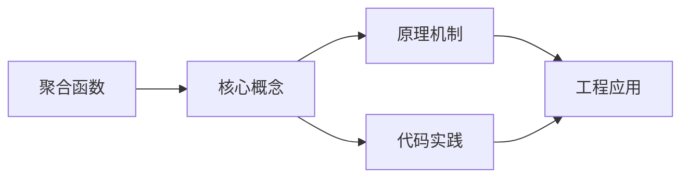
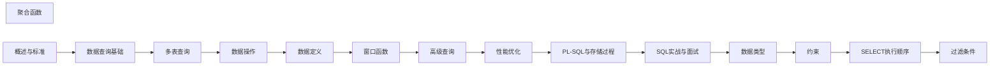

## 1. 学习目标（Bloom 分类）

本节按照布鲁姆教育目标分类学组织学习路径。本文主题为《聚合函数》，属于 SQL 模块，读者可以根据自身阶段选择阅读深度。

记忆层面：能够准确复述本文的核心概念、术语与基本语法或操作步骤，并能够在提问或检索时快速定位对应知识点。能够说出 SQL 的核心概念、语法与常用对象。

理解层面：能够用自己的语言解释核心原理与工作机制，说明概念之间的因果关系，而不是机械记忆结论。能够解释 SQL 的执行原理与优化机制。

应用层面：能够在真实项目或练习场景中运用本文知识解决具体问题，写出正确且可维护的实现。能够编写正确、高效的 SQL 语句与操作。

分析层面：能够拆解复杂问题，比较本文主题与相邻概念的异同，识别边界条件与例外情况。能够分析 SQL 相关方案在性能与一致性上的权衡。

评价层面：能够根据约束条件（性能、可读性、安全、成本）评价不同方案的优劣，做出有依据的技术决策。能够根据业务场景评价 SQL 技术选型。

创造层面：能够把本文知识与其他模块知识组合，设计出新的解决方案或可复用的工程模式。能够组合 SQL 与其他技术设计数据架构。

通过本节学习，读者应当能够把《聚合函数》纳入自己的知识网络，并与 SQL 模块的其他主题（DDL/DML、查询、索引、事务）建立关联。

## 2. 历史动机与发展脉络

《聚合函数》是 SQL 领域的重要主题。要真正理解它，需要先了解它解决的问题与演进过程。

SQL（结构化查询语言）源于 1970 年 Codd 的关系模型，1974 年由 Chamberlin 与 Boyce 设计（SEQUEL），1986 年成为 ANSI 标准；SQL:2023 是当前国际标准。
SQL 分为 DDL（建表）、DML（增删改）、DQL（查询）、DCL（权限）与 TCL（事务）；各大数据库在标准基础上扩展方言。
SQL 是声明式语言：描述“要什么”而非“怎么做”，优化器负责执行计划；这一设计让 SQL 具有跨数据库的表达一致性。

回到本文主题：聚合函数 的提出与成熟，正是上述技术背景下的必然产物。早期实现往往以简单可用为目标，随着工程规模扩大，社区逐渐沉淀出标准做法与最佳实践；理解这一脉络，可以帮助读者判断“为什么文档中的推荐写法是现在这个样子”，也能在遇到历史遗留代码时准确识别其设计年代与取舍。


## 3. 形式化定义与核心概念精讲

本节把《聚合函数》涉及的核心概念以“定义 + 讲解”的形式展开。读者应把定义当作工具，把讲解当作理解路径；两者结合才能形成可迁移的知识。

关系模型：表（关系）、行（元组）、列（属性）；主键唯一标识、外键表达关联、范式消除冗余。
查询执行：解析 -> 绑定 -> 优化（基于代价选择计划）-> 执行；索引、统计信息与连接算法决定性能。
事务 ACID：原子性（Atomicity）、一致性（Consistency）、隔离性（Isolation）、持久性（Durability）；隔离级别控制并发行为。

### 3.1 原文章节逐一精讲

原文档把主题拆分为 19 个小节，下面按顺序给出每一节的导读讲解，随后保留原文细节供精读。

#### 原文精读（完整保留）

# 聚合函数

> **符号约定**：`< >` 必填参数 | `[ ]` 可选参数

---

#### 1. 聚合函数概述

聚合函数对一组值进行计算，返回单个汇总值。它们常与 GROUP BY 子句配合使用，也可单独使用对整个表进行汇总。

##### 1.1 核心聚合函数

| 函数        | 作用         | 返回类型   | NULL 处理 |
| ----------- | ------------ | ---------- | --------- |
| COUNT(\*)   | 计算行数     | BIGINT     | 包含 NULL |
| COUNT(expr) | 计算非NULL值 | BIGINT     | 忽略 NULL |
| SUM(expr)   | 求和         | 数值类型   | 忽略 NULL |
| AVG(expr)   | 求平均值     | 数值类型   | 忽略 NULL |
| MAX(expr)   | 最大值       | 同输入类型 | 忽略 NULL |
| MIN(expr)   | 最小值       | 同输入类型 | 忽略 NULL |

#### 2. COUNT 函数

##### 2.1 COUNT 的三种形式

```sql
-- COUNT(*)：计算所有行，包括 NULL
SELECT COUNT(*) FROM employees;          -- 总行数

-- COUNT(expr)：计算 expr 非 NULL 的行数
SELECT COUNT(phone) FROM employees;      -- 有电话号码的员工数

-- COUNT(DISTINCT expr)：计算不同非 NULL 值的数量
SELECT COUNT(DISTINCT dept_id) FROM employees;  -- 不同部门数
```

##### 2.2 COUNT 性能差异

```sql
-- COUNT(*) vs COUNT(1)：在大多数数据库中性能相同
-- MySQL InnoDB：COUNT(*) 和 COUNT(1) 等价，选择最小索引扫描
-- PostgreSQL：COUNT(*) 需要全表扫描（MVCC 机制），可使用估算
SELECT reltuples::bigint AS estimate
FROM pg_class WHERE relname = 'employees';

-- 条件计数
SELECT
    COUNT(*) AS total,
    COUNT(CASE WHEN status = 'active' THEN 1 END) AS active_count,
    COUNT(CASE WHEN status = 'inactive' THEN 1 END) AS inactive_count
FROM employees;
```

##### 2.3 条件计数的多种写法

```sql
-- 方法1：CASE 表达式（通用）
COUNT(CASE WHEN status = 'active' THEN 1 END)

-- 方法2：FILTER 子句（PostgreSQL）
COUNT(*) FILTER (WHERE status = 'active')

-- 方法3：SUM + 布尔（MySQL/PostgreSQL）
SUM(CASE WHEN status = 'active' THEN 1 ELSE 0 END)
SUM(status = 'active')  -- MySQL/PostgreSQL 布尔转整数
```

#### 3. SUM 函数

##### 3.1 基本用法

```sql
-- 简单求和
SELECT SUM(salary) AS total_salary FROM employees;

-- 分组求和
SELECT dept_id, SUM(salary) AS dept_total
FROM employees
GROUP BY dept_id;

-- 条件求和
SELECT
    SUM(CASE WHEN type = 'income' THEN amount ELSE 0 END) AS total_income,
    SUM(CASE WHEN type = 'expense' THEN amount ELSE 0 END) AS total_expense
FROM transactions;
```

##### 3.2 SUM 与 NULL

```sql
-- SUM 忽略 NULL 值
SELECT SUM(bonus) FROM employees;  -- NULL bonus 不参与计算

-- 全部为 NULL 时返回 NULL
SELECT SUM(NULL::INTEGER);  -- 返回 NULL

-- 使用 COALESCE 提供默认值
SELECT COALESCE(SUM(bonus), 0) AS total_bonus FROM employees;
```

##### 3.3 精度问题

```sql
-- 浮点数求和可能丢失精度
SELECT SUM(0.1) FROM generate_series(1, 10);  -- 可能不等于 1.0

-- 使用 DECIMAL 保证精度
SELECT SUM(0.1::DECIMAL) FROM generate_series(1, 10);  -- 等于 1.0
```

#### 4. AVG 函数

##### 4.1 基本用法

```sql
-- 简单平均
SELECT AVG(salary) AS avg_salary FROM employees;

-- 分组平均
SELECT dept_id, AVG(salary) AS avg_salary
FROM employees
GROUP BY dept_id;
```

##### 4.2 AVG 的 NULL 处理

```sql
-- AVG 忽略 NULL，只对非 NULL 值计算平均
-- 假设 salary 值为：100, 200, NULL, 300
SELECT AVG(salary) FROM employees;
-- 结果 = (100 + 200 + 300) / 3 = 200，而非 / 4

-- 如果需要将 NULL 视为 0
SELECT AVG(COALESCE(salary, 0)) FROM employees;
-- 结果 = (100 + 200 + 0 + 300) / 4 = 150
```

##### 4.3 加权平均

```sql
-- 加权平均 = SUM(值 × 权重) / SUM(权重)
SELECT
    SUM(score * weight) / SUM(weight) AS weighted_avg
FROM exam_results;
```

##### 4.4 中位数

SQL 标准没有内置中位数函数，需要手动计算：

```sql
-- PostgreSQL：使用 PERCENTILE_CONT
SELECT PERCENTILE_CONT(0.5) WITHIN GROUP (ORDER BY salary) AS median_salary
FROM employees;

-- 通用方法：使用窗口函数
SELECT AVG(salary) AS median_salary
FROM (
    SELECT salary,
           ROW_NUMBER() OVER (ORDER BY salary) AS rn,
           COUNT(*) OVER () AS total
    FROM employees
    WHERE salary IS NOT NULL
) t
WHERE rn IN (FLOOR((total + 1) / 2.0), CEIL((total + 1) / 2.0));
```

#### 5. MAX 与 MIN 函数

##### 5.1 基本用法

```sql
-- 数值最大/最小值
SELECT MAX(salary) AS max_salary, MIN(salary) AS min_salary
FROM employees;

-- 日期最大/最小值
SELECT MAX(created_at) AS latest, MIN(created_at) AS earliest
FROM orders;

-- 字符串最大/最小值（按排序规则）
SELECT MAX(name) AS last_name, MIN(name) AS first_name
FROM employees;
```

##### 5.2 获取最大/最小值所在行

```sql
-- 方法1：子查询
SELECT * FROM employees
WHERE salary = (SELECT MAX(salary) FROM employees);

-- 方法2：ORDER BY + LIMIT
SELECT * FROM employees ORDER BY salary DESC LIMIT 1;

-- 方法3：DISTINCT ON（PostgreSQL）
SELECT DISTINCT ON (dept_id) *
FROM employees
ORDER BY dept_id, salary DESC;  -- 每个部门薪资最高的员工
```

##### 5.3 MAX/MIN 与索引

```sql
-- MAX/MIN 可以利用索引优化，无需全表扫描
CREATE INDEX idx_employees_salary ON employees(salary);
SELECT MAX(salary) FROM employees;  -- 直接取 B+ 树最右叶节点

-- 同时获取 MAX 和 MIN 时，索引优化有限
-- 某些数据库可以一次索引扫描获取两者
```

#### 6. DISTINCT 聚合

##### 6.1 基本用法

```sql
-- 计算不同值的聚合
SELECT COUNT(DISTINCT dept_id) AS dept_count FROM employees;
SELECT SUM(DISTINCT price) AS distinct_total FROM products;

-- 多列 DISTINCT
SELECT COUNT(DISTINCT dept_id || '-' || job_id) FROM employees;
```

##### 6.2 DISTINCT 聚合的性能问题

```sql
-- COUNT(DISTINCT) 需要去重，大数据量下性能较差
-- 优化方案1：近似计数（HyperLogLog）
-- PostgreSQL 扩展
SELECT hll_cardinality(hll_agg(user_id)) FROM page_views;

-- 优化方案2：预聚合表
CREATE TABLE daily_stats AS
SELECT
    DATE(created_at) AS stat_date,
    COUNT(DISTINCT user_id) AS dau,
    COUNT(*) AS pv
FROM page_views
GROUP BY DATE(created_at);
```

#### 7. 高级聚合技巧

##### 7.1 行列转换聚合

```sql
-- 透视表：将行数据转为列
SELECT
    dept_id,
    SUM(CASE WHEN quarter = 1 THEN revenue ELSE 0 END) AS q1,
    SUM(CASE WHEN quarter = 2 THEN revenue ELSE 0 END) AS q2,
    SUM(CASE WHEN quarter = 3 THEN revenue ELSE 0 END) AS q3,
    SUM(CASE WHEN quarter = 4 THEN revenue ELSE 0 END) AS q4
FROM quarterly_revenue
GROUP BY dept_id;
```

##### 7.2 累计聚合

```sql
-- 累计求和（使用窗口函数）
SELECT
    order_date,
    daily_amount,
    SUM(daily_amount) OVER (ORDER BY order_date) AS cumulative_amount
FROM (
    SELECT DATE(created_at) AS order_date, SUM(amount) AS daily_amount
    FROM orders
    GROUP BY DATE(created_at)
) daily;
```

##### 7.3 字符串聚合

```sql
-- PostgreSQL: STRING_AGG
SELECT dept_id, STRING_AGG(name, ', ' ORDER BY name) AS employee_names
FROM employees
GROUP BY dept_id;

-- MySQL: GROUP_CONCAT
SELECT dept_id, GROUP_CONCAT(name ORDER BY name SEPARATOR ', ') AS employee_names
FROM employees
GROUP BY dept_id;

-- SQL Server: STRING_AGG
SELECT dept_id, STRING_AGG(name, ', ') WITHIN GROUP (ORDER BY name) AS employee_names
FROM employees
GROUP BY dept_id;
```

##### 7.4 JSON 聚合

```sql
-- PostgreSQL: JSON 聚合
SELECT
    dept_id,
    JSON_AGG(JSON_BUILD_OBJECT('name', name, 'salary', salary)) AS employees
FROM employees
GROUP BY dept_id;

-- MySQL: JSON_ARRAYAGG / JSON_OBJECTAGG
SELECT
    dept_id,
    JSON_ARRAYAGG(JSON_OBJECT('name', name, 'salary', salary)) AS employees
FROM employees
GROUP BY dept_id;
```

#### 8. 聚合函数与空结果集

```sql
-- 空结果集上聚合函数的行为
SELECT COUNT(*) FROM employees WHERE 1 = 0;   -- 返回 0
SELECT SUM(salary) FROM employees WHERE 1 = 0; -- 返回 NULL
SELECT AVG(salary) FROM employees WHERE 1 = 0; -- 返回 NULL
SELECT MAX(salary) FROM employees WHERE 1 = 0; -- 返回 NULL

-- COUNT(*) 返回 0，其他返回 NULL
-- 原因：COUNT(*) 计算行数（0行=0），其他需要有效值（无值=NULL）
```
#### COUNT 统计

**单行写法：统计所有行（包括 NULL）**
`SELECT COUNT(*) FROM <表名>;`
```sql
-- 统计员工总数
SELECT COUNT(*) FROM employees;
```

**单行写法：统计非 NULL 行数**
`SELECT COUNT(<列>) FROM <表名>;`
```sql
-- 统计有手机号的员工数
SELECT COUNT(phone) FROM employees;
```

**单行写法：统计去重后的行数**
`SELECT COUNT(DISTINCT <列>) FROM <表名>;`
```sql
-- 统计不同部门的数量
SELECT COUNT(DISTINCT department) FROM employees;
```

---

#### SUM 求和

**单行写法：求和（自动忽略 NULL）**
`SELECT SUM(<列>) AS <别名> FROM <表名>;`
```sql
-- 计算所有员工薪资总和
SELECT SUM(salary) AS total_salary FROM employees;
```

**单行写法：去重后求和**
`SELECT SUM(DISTINCT <列>) FROM <表名>;`
```sql
-- 去重后计算薪资总和
SELECT SUM(DISTINCT salary) FROM employees;
```

---

#### AVG 平均值

**单行写法：平均值（自动忽略 NULL）**
`SELECT AVG(<列>) AS <别名> FROM <表名>;`
```sql
-- 计算员工平均薪资
SELECT AVG(salary) AS avg_salary FROM employees;
```

**单行写法：去重后求平均**
`SELECT AVG(DISTINCT <列>) FROM <表名>;`
```sql
-- 去重后计算平均薪资
SELECT AVG(DISTINCT salary) FROM employees;
```

---

#### MAX / MIN 最值

**单行写法：最大值与最小值**
`SELECT MAX(<列>) AS <别名 1>, MIN(<列>) AS <别名 2> FROM <表名>;`
```sql
-- 查询最高薪资和最低薪资
SELECT MAX(salary) AS max_salary, MIN(salary) AS min_salary
FROM employees;
```

**单行写法：日期最值**
`SELECT MAX(<日期列>) AS <别名 1>, MIN(<日期列>) AS <别名 2> FROM <表名>;`
```sql
-- 查询最新入职日期和最早入职日期
SELECT MAX(hire_date) AS latest_hire, MIN(hire_date) AS earliest_hire
FROM employees;
```

---

#### GROUP BY 分组

**换行写法：按单列分组聚合**
`SELECT <分组列>, <聚合函数> FROM <表名> GROUP BY <分组列>;`
```sql
-- 按部门分组统计员工数和平均薪资
SELECT department, COUNT(*) AS emp_count, AVG(salary) AS avg_salary
FROM employees
GROUP BY department;
```

**换行写法：按多列分组聚合**
`SELECT <列 1>, <列 2>, <聚合函数> FROM <表名> GROUP BY <列 1>, <列 2>;`
```sql
-- 按部门和职位分组统计
SELECT department, job_title, COUNT(*) AS cnt, AVG(salary) AS avg_salary
FROM employees
GROUP BY department, job_title;
```

**换行写法：GROUP BY 与 ORDER BY**
`SELECT <列>, <聚合函数> FROM <表名> GROUP BY <列> ORDER BY <聚合函数> DESC;`
```sql
-- 按部门分组并按平均薪资降序排列
SELECT department, AVG(salary) AS avg_salary
FROM employees
GROUP BY department
ORDER BY avg_salary DESC;
```

---

#### HAVING 分组过滤

**换行写法：分组后过滤**
`HAVING <分组条件>;`
```sql
-- 查询员工数大于 5 且平均薪资大于 50000 的部门
SELECT department, COUNT(*) AS emp_count, AVG(salary) AS avg_salary
FROM employees
GROUP BY department
HAVING COUNT(*) > 5 AND AVG(salary) > 50000;
```

**换行写法：WHERE 与 HAVING 区别**
`WHERE <行条件> ... GROUP BY ... HAVING <组条件>;`
```sql
-- 先过滤 2024 年后入职的员工，再按部门分组过滤
SELECT department, COUNT(*) AS cnt
FROM employees
WHERE hire_date >= '2024-01-01'
GROUP BY department
HAVING COUNT(*) > 3;
```

---

#### GROUP_CONCAT 字符串聚合

**换行写法：MySQL 分组拼接字符串**
`GROUP_CONCAT([DISTINCT] <列> [ORDER BY <列>] SEPARATOR '<分隔符>')`
```sql
-- 按部门分组拼接员工姓名
SELECT
  department,
  GROUP_CONCAT(name SEPARATOR ', ') AS employees
FROM employees
GROUP BY department;
```

**换行写法：去重拼接**
`GROUP_CONCAT(DISTINCT <列> ORDER BY <列> SEPARATOR '<分隔符>')`
```sql
-- 按部门分组去重拼接职位
SELECT
  department,
  GROUP_CONCAT(DISTINCT job_title ORDER BY job_title SEPARATOR ', ') AS titles
FROM employees
GROUP BY department;
```

---

#### STRING_AGG 字符串聚合

**换行写法：PostgreSQL/SQL Server 字符串聚合**
`STRING_AGG(<列>, '<分隔符>')`
```sql
-- 按部门分组拼接员工姓名
SELECT
  department,
  STRING_AGG(name, ', ') AS employees
FROM employees
GROUP BY department;
```

**换行写法：带排序的拼接**
`STRING_AGG(<列>, '<分隔符>' ORDER BY <列> DESC)`
```sql
-- 按部门分组按薪资降序拼接员工姓名
SELECT
  department,
  STRING_AGG(name, ', ' ORDER BY salary DESC) AS employees
FROM employees
GROUP BY department;
```

---

#### 统计聚合函数

**单行写法：样本标准差**
`SELECT STDDEV(<列>) AS <别名> FROM <表名>;`
```sql
-- 计算薪资的样本标准差
SELECT STDDEV(salary) AS salary_std FROM employees;
```

**单行写法：总体标准差**
`SELECT STDDEV_POP(<列>) AS <别名> FROM <表名>;`
```sql
-- 计算薪资的总体标准差
SELECT STDDEV_POP(salary) AS salary_std_pop FROM employees;
```

**单行写法：样本方差**
`SELECT VARIANCE(<列>) AS <别名> FROM <表名>;`
```sql
-- 计算薪资的样本方差
SELECT VARIANCE(salary) AS salary_var FROM employees;
```

**单行写法：总体方差**
`SELECT VAR_POP(<列>) AS <别名> FROM <表名>;`
```sql
-- 计算薪资的总体方差
SELECT VAR_POP(salary) AS salary_var_pop FROM employees;
```

---

#### 布尔聚合

**换行写法：PostgreSQL 布尔聚合**
`BOOL_AND(<表达式>) | BOOL_OR(<表达式>)`
```sql
-- 按部门统计是否全部高薪及是否存在超高薪
SELECT
  department,
  BOOL_AND(salary > 50000) AS all_high_paid,
  BOOL_OR(salary > 100000) AS any_high_paid
FROM employees
GROUP BY department;
```

**换行写法：MySQL 等价写法**
`MIN(<表达式>) | MAX(<表达式>)`
```sql
-- MySQL 使用 MIN/MAX 模拟 BOOL_AND/BOOL_OR
SELECT
  department,
  MIN(salary > 50000) AS all_high_paid,
  MAX(salary > 100000) AS any_high_paid
FROM employees
GROUP BY department;
```

---

#### JSON 聚合

**换行写法：聚合为 JSON 数组**
`JSON_ARRAYAGG(<列|表达式>)`
```sql
-- 按部门分组将员工姓名聚合为 JSON 数组
SELECT
  department,
  JSON_ARRAYAGG(name) AS employee_names
FROM employees
GROUP BY department;
```

**换行写法：聚合为 JSON 对象**
`JSON_OBJECTAGG(<键列>, <值列>)`
```sql
-- 按部门分组将姓名和薪资聚合为 JSON 对象
SELECT
  department,
  JSON_OBJECTAGG(name, salary) AS name_salary_map
FROM employees
GROUP BY department;
```


### 3.2 概念关系图

下面用 Mermaid 图表达本文核心概念之间的关系，帮助读者建立整体图景：



图中展示的是本文知识的结构化关系：核心概念是入口，原理机制解释“为什么”，代码实践演示“怎么做”，工程应用回答“何时用”。读者学习时可以把每个小节的内容挂接到对应节点上。

## 4. 理论推导与原理解析

本节深入《聚合函数》背后的原理。理论部分不求面面俱到，而是聚焦“能解释现象、能指导实践”的关键推导。

关系模型：表（关系）、行（元组）、列（属性）；主键唯一标识、外键表达关联、范式消除冗余。
查询执行：解析 -> 绑定 -> 优化（基于代价选择计划）-> 执行；索引、统计信息与连接算法决定性能。
事务 ACID：原子性（Atomicity）、一致性（Consistency）、隔离性（Isolation）、持久性（Durability）；隔离级别控制并发行为。
集合语义：SELECT 返回结果集；JOIN 组合关系，GROUP BY 聚合，子查询与 CTE 表达复杂逻辑。

需要强调的是，理论推导与工程实践之间存在翻译层：理论给出的是理想化模型与边界条件，工程代码则必须处理真实环境中的例外。读者在学习时应先掌握理论的“标准情形”，再通过陷阱章节了解“非标准情形”。

## 5. 代码示例与逐行讲解

本节把原文中的代码示例系统整理，并为每个示例补充用途说明与讲解。读者不应只浏览代码，而应逐段对照讲解理解设计意图。

### 5.1 示例：2.1 COUNT 的三种形式

该示例来自原文《2.1 COUNT 的三种形式》小节，用于演示聚合函数相关操作。阅读时请先看代码结构，再看其后的讲解。

```sql
-- COUNT(*)：计算所有行，包括 NULL
SELECT COUNT(*) FROM employees;          -- 总行数

-- COUNT(expr)：计算 expr 非 NULL 的行数
SELECT COUNT(phone) FROM employees;      -- 有电话号码的员工数

-- COUNT(DISTINCT expr)：计算不同非 NULL 值的数量
SELECT COUNT(DISTINCT dept_id) FROM employees;  -- 不同部门数
```

讲解：这段代码演示了本节核心知识点。代码中的关键操作可以归纳为三步：准备（定义或初始化）、执行（核心逻辑）、收尾（释放资源或返回结果）。实际项目中，这三步往往被封装为函数或类，以提升复用性与可测试性。

关键点分析：

该示例共 6 行有效代码，包含 2 类关键结构（SELECT、FROM）。其中：

- 入口与初始化部分负责建立上下文，对应实际项目中的启动或装配逻辑；
- 核心逻辑部分体现本文主题的主要操作，是阅读时最需要对照讲解理解的部分；
- 输出或返回部分把结果交给调用方，注意其类型与边界条件。

进阶思考路径：先尝试修改参数观察行为变化，再把示例中的模式迁移到自己的项目中；每次修改都记录预期与实测差异，这是把示例转化为能力的最快方式。

### 5.2 示例：2.2 COUNT 性能差异

该示例来自原文《2.2 COUNT 性能差异》小节，用于演示聚合函数相关操作。阅读时请先看代码结构，再看其后的讲解。

```sql
-- COUNT(*) vs COUNT(1)：在大多数数据库中性能相同
-- MySQL InnoDB：COUNT(*) 和 COUNT(1) 等价，选择最小索引扫描
-- PostgreSQL：COUNT(*) 需要全表扫描（MVCC 机制），可使用估算
SELECT reltuples::bigint AS estimate
FROM pg_class WHERE relname = 'employees';

-- 条件计数
SELECT
    COUNT(*) AS total,
    COUNT(CASE WHEN status = 'active' THEN 1 END) AS active_count,
    COUNT(CASE WHEN status = 'inactive' THEN 1 END) AS inactive_count
FROM employees;
```

讲解：这段代码演示了本节核心知识点。代码中的关键操作可以归纳为三步：准备（定义或初始化）、执行（核心逻辑）、收尾（释放资源或返回结果）。实际项目中，这三步往往被封装为函数或类，以提升复用性与可测试性。

关键点分析：

该示例共 11 行有效代码，包含 3 类关键结构（class、SELECT、FROM）。其中：

- 入口与初始化部分负责建立上下文，对应实际项目中的启动或装配逻辑；
- 核心逻辑部分体现本文主题的主要操作，是阅读时最需要对照讲解理解的部分；
- 输出或返回部分把结果交给调用方，注意其类型与边界条件。

进阶思考路径：先尝试修改参数观察行为变化，再把示例中的模式迁移到自己的项目中；每次修改都记录预期与实测差异，这是把示例转化为能力的最快方式。

### 5.3 示例：2.3 条件计数的多种写法

该示例来自原文《2.3 条件计数的多种写法》小节，用于演示聚合函数相关操作。阅读时请先看代码结构，再看其后的讲解。

```sql
-- 方法1：CASE 表达式（通用）
COUNT(CASE WHEN status = 'active' THEN 1 END)

-- 方法2：FILTER 子句（PostgreSQL）
COUNT(*) FILTER (WHERE status = 'active')

-- 方法3：SUM + 布尔（MySQL/PostgreSQL）
SUM(CASE WHEN status = 'active' THEN 1 ELSE 0 END)
SUM(status = 'active')  -- MySQL/PostgreSQL 布尔转整数
```

讲解：这段代码演示了本节核心知识点。代码中的关键操作可以归纳为三步：准备（定义或初始化）、执行（核心逻辑）、收尾（释放资源或返回结果）。实际项目中，这三步往往被封装为函数或类，以提升复用性与可测试性。

关键点分析：

该示例共 7 行有效代码，结构以数据或配置为主。阅读时应关注：数据字段的含义、配置项的作用，以及它们与运行行为的对应关系。

进阶思考路径：先尝试修改参数观察行为变化，再把示例中的模式迁移到自己的项目中；每次修改都记录预期与实测差异，这是把示例转化为能力的最快方式。

### 5.4 示例：3.1 基本用法

该示例来自原文《3.1 基本用法》小节，用于演示聚合函数相关操作。阅读时请先看代码结构，再看其后的讲解。

```sql
-- 简单求和
SELECT SUM(salary) AS total_salary FROM employees;

-- 分组求和
SELECT dept_id, SUM(salary) AS dept_total
FROM employees
GROUP BY dept_id;

-- 条件求和
SELECT
    SUM(CASE WHEN type = 'income' THEN amount ELSE 0 END) AS total_income,
    SUM(CASE WHEN type = 'expense' THEN amount ELSE 0 END) AS total_expense
FROM transactions;
```

讲解：这段代码演示了本节核心知识点。代码中的关键操作可以归纳为三步：准备（定义或初始化）、执行（核心逻辑）、收尾（释放资源或返回结果）。实际项目中，这三步往往被封装为函数或类，以提升复用性与可测试性。

关键点分析：

该示例共 11 行有效代码，包含 2 类关键结构（SELECT、FROM）。其中：

- 入口与初始化部分负责建立上下文，对应实际项目中的启动或装配逻辑；
- 核心逻辑部分体现本文主题的主要操作，是阅读时最需要对照讲解理解的部分；
- 输出或返回部分把结果交给调用方，注意其类型与边界条件。

进阶思考路径：先尝试修改参数观察行为变化，再把示例中的模式迁移到自己的项目中；每次修改都记录预期与实测差异，这是把示例转化为能力的最快方式。

### 5.5 示例：3.2 SUM 与 NULL

该示例来自原文《3.2 SUM 与 NULL》小节，用于演示聚合函数相关操作。阅读时请先看代码结构，再看其后的讲解。

```sql
-- SUM 忽略 NULL 值
SELECT SUM(bonus) FROM employees;  -- NULL bonus 不参与计算

-- 全部为 NULL 时返回 NULL
SELECT SUM(NULL::INTEGER);  -- 返回 NULL

-- 使用 COALESCE 提供默认值
SELECT COALESCE(SUM(bonus), 0) AS total_bonus FROM employees;
```

讲解：这段代码演示了本节核心知识点。代码中的关键操作可以归纳为三步：准备（定义或初始化）、执行（核心逻辑）、收尾（释放资源或返回结果）。实际项目中，这三步往往被封装为函数或类，以提升复用性与可测试性。

关键点分析：

该示例共 6 行有效代码，包含 2 类关键结构（SELECT、FROM）。其中：

- 入口与初始化部分负责建立上下文，对应实际项目中的启动或装配逻辑；
- 核心逻辑部分体现本文主题的主要操作，是阅读时最需要对照讲解理解的部分；
- 输出或返回部分把结果交给调用方，注意其类型与边界条件。

进阶思考路径：先尝试修改参数观察行为变化，再把示例中的模式迁移到自己的项目中；每次修改都记录预期与实测差异，这是把示例转化为能力的最快方式。

### 5.6 示例：3.3 精度问题

该示例来自原文《3.3 精度问题》小节，用于演示聚合函数相关操作。阅读时请先看代码结构，再看其后的讲解。

```sql
-- 浮点数求和可能丢失精度
SELECT SUM(0.1) FROM generate_series(1, 10);  -- 可能不等于 1.0

-- 使用 DECIMAL 保证精度
SELECT SUM(0.1::DECIMAL) FROM generate_series(1, 10);  -- 等于 1.0
```

讲解：这段代码演示了本节核心知识点。代码中的关键操作可以归纳为三步：准备（定义或初始化）、执行（核心逻辑）、收尾（释放资源或返回结果）。实际项目中，这三步往往被封装为函数或类，以提升复用性与可测试性。

关键点分析：

该示例共 4 行有效代码，包含 2 类关键结构（SELECT、FROM）。其中：

- 入口与初始化部分负责建立上下文，对应实际项目中的启动或装配逻辑；
- 核心逻辑部分体现本文主题的主要操作，是阅读时最需要对照讲解理解的部分；
- 输出或返回部分把结果交给调用方，注意其类型与边界条件。

进阶思考路径：先尝试修改参数观察行为变化，再把示例中的模式迁移到自己的项目中；每次修改都记录预期与实测差异，这是把示例转化为能力的最快方式。

### 5.7 示例：4.1 基本用法

该示例来自原文《4.1 基本用法》小节，用于演示聚合函数相关操作。阅读时请先看代码结构，再看其后的讲解。

```sql
-- 简单平均
SELECT AVG(salary) AS avg_salary FROM employees;

-- 分组平均
SELECT dept_id, AVG(salary) AS avg_salary
FROM employees
GROUP BY dept_id;
```

讲解：这段代码演示了本节核心知识点。代码中的关键操作可以归纳为三步：准备（定义或初始化）、执行（核心逻辑）、收尾（释放资源或返回结果）。实际项目中，这三步往往被封装为函数或类，以提升复用性与可测试性。

关键点分析：

该示例共 6 行有效代码，包含 2 类关键结构（SELECT、FROM）。其中：

- 入口与初始化部分负责建立上下文，对应实际项目中的启动或装配逻辑；
- 核心逻辑部分体现本文主题的主要操作，是阅读时最需要对照讲解理解的部分；
- 输出或返回部分把结果交给调用方，注意其类型与边界条件。

进阶思考路径：先尝试修改参数观察行为变化，再把示例中的模式迁移到自己的项目中；每次修改都记录预期与实测差异，这是把示例转化为能力的最快方式。

### 5.8 示例：4.2 AVG 的 NULL 处理

该示例来自原文《4.2 AVG 的 NULL 处理》小节，用于演示聚合函数相关操作。阅读时请先看代码结构，再看其后的讲解。

```sql
-- AVG 忽略 NULL，只对非 NULL 值计算平均
-- 假设 salary 值为：100, 200, NULL, 300
SELECT AVG(salary) FROM employees;
-- 结果 = (100 + 200 + 300) / 3 = 200，而非 / 4

-- 如果需要将 NULL 视为 0
SELECT AVG(COALESCE(salary, 0)) FROM employees;
-- 结果 = (100 + 200 + 0 + 300) / 4 = 150
```

讲解：这段代码演示了本节核心知识点。代码中的关键操作可以归纳为三步：准备（定义或初始化）、执行（核心逻辑）、收尾（释放资源或返回结果）。实际项目中，这三步往往被封装为函数或类，以提升复用性与可测试性。

关键点分析：

该示例共 7 行有效代码，包含 2 类关键结构（SELECT、FROM）。其中：

- 入口与初始化部分负责建立上下文，对应实际项目中的启动或装配逻辑；
- 核心逻辑部分体现本文主题的主要操作，是阅读时最需要对照讲解理解的部分；
- 输出或返回部分把结果交给调用方，注意其类型与边界条件。

进阶思考路径：先尝试修改参数观察行为变化，再把示例中的模式迁移到自己的项目中；每次修改都记录预期与实测差异，这是把示例转化为能力的最快方式。

### 5.9 示例：4.3 加权平均

该示例来自原文《4.3 加权平均》小节，用于演示聚合函数相关操作。阅读时请先看代码结构，再看其后的讲解。

```sql
-- 加权平均 = SUM(值 × 权重) / SUM(权重)
SELECT
    SUM(score * weight) / SUM(weight) AS weighted_avg
FROM exam_results;
```

讲解：这段代码演示了本节核心知识点。代码中的关键操作可以归纳为三步：准备（定义或初始化）、执行（核心逻辑）、收尾（释放资源或返回结果）。实际项目中，这三步往往被封装为函数或类，以提升复用性与可测试性。

关键点分析：

该示例共 4 行有效代码，包含 2 类关键结构（SELECT、FROM）。其中：

- 入口与初始化部分负责建立上下文，对应实际项目中的启动或装配逻辑；
- 核心逻辑部分体现本文主题的主要操作，是阅读时最需要对照讲解理解的部分；
- 输出或返回部分把结果交给调用方，注意其类型与边界条件。

进阶思考路径：先尝试修改参数观察行为变化，再把示例中的模式迁移到自己的项目中；每次修改都记录预期与实测差异，这是把示例转化为能力的最快方式。

### 5.10 示例：4.4 中位数

该示例来自原文《4.4 中位数》小节，用于演示聚合函数相关操作。阅读时请先看代码结构，再看其后的讲解。

```sql
-- PostgreSQL：使用 PERCENTILE_CONT
SELECT PERCENTILE_CONT(0.5) WITHIN GROUP (ORDER BY salary) AS median_salary
FROM employees;

-- 通用方法：使用窗口函数
SELECT AVG(salary) AS median_salary
FROM (
    SELECT salary,
           ROW_NUMBER() OVER (ORDER BY salary) AS rn,
           COUNT(*) OVER () AS total
    FROM employees
    WHERE salary IS NOT NULL
) t
WHERE rn IN (FLOOR((total + 1) / 2.0), CEIL((total + 1) / 2.0));
```

讲解：这段代码演示了本节核心知识点。代码中的关键操作可以归纳为三步：准备（定义或初始化）、执行（核心逻辑）、收尾（释放资源或返回结果）。实际项目中，这三步往往被封装为函数或类，以提升复用性与可测试性。

关键点分析：

该示例共 13 行有效代码，包含 2 类关键结构（SELECT、FROM）。其中：

- 入口与初始化部分负责建立上下文，对应实际项目中的启动或装配逻辑；
- 核心逻辑部分体现本文主题的主要操作，是阅读时最需要对照讲解理解的部分；
- 输出或返回部分把结果交给调用方，注意其类型与边界条件。

进阶思考路径：先尝试修改参数观察行为变化，再把示例中的模式迁移到自己的项目中；每次修改都记录预期与实测差异，这是把示例转化为能力的最快方式。

### 5.11 示例：5.1 基本用法

该示例来自原文《5.1 基本用法》小节，用于演示聚合函数相关操作。阅读时请先看代码结构，再看其后的讲解。

```sql
-- 数值最大/最小值
SELECT MAX(salary) AS max_salary, MIN(salary) AS min_salary
FROM employees;

-- 日期最大/最小值
SELECT MAX(created_at) AS latest, MIN(created_at) AS earliest
FROM orders;

-- 字符串最大/最小值（按排序规则）
SELECT MAX(name) AS last_name, MIN(name) AS first_name
FROM employees;
```

讲解：这段代码演示了本节核心知识点。代码中的关键操作可以归纳为三步：准备（定义或初始化）、执行（核心逻辑）、收尾（释放资源或返回结果）。实际项目中，这三步往往被封装为函数或类，以提升复用性与可测试性。

关键点分析：

该示例共 9 行有效代码，包含 2 类关键结构（SELECT、FROM）。其中：

- 入口与初始化部分负责建立上下文，对应实际项目中的启动或装配逻辑；
- 核心逻辑部分体现本文主题的主要操作，是阅读时最需要对照讲解理解的部分；
- 输出或返回部分把结果交给调用方，注意其类型与边界条件。

进阶思考路径：先尝试修改参数观察行为变化，再把示例中的模式迁移到自己的项目中；每次修改都记录预期与实测差异，这是把示例转化为能力的最快方式。

### 5.12 示例：5.2 获取最大/最小值所在行

该示例来自原文《5.2 获取最大/最小值所在行》小节，用于演示聚合函数相关操作。阅读时请先看代码结构，再看其后的讲解。

```sql
-- 方法1：子查询
SELECT * FROM employees
WHERE salary = (SELECT MAX(salary) FROM employees);

-- 方法2：ORDER BY + LIMIT
SELECT * FROM employees ORDER BY salary DESC LIMIT 1;

-- 方法3：DISTINCT ON（PostgreSQL）
SELECT DISTINCT ON (dept_id) *
FROM employees
ORDER BY dept_id, salary DESC;  -- 每个部门薪资最高的员工
```

讲解：这段代码演示了本节核心知识点。代码中的关键操作可以归纳为三步：准备（定义或初始化）、执行（核心逻辑）、收尾（释放资源或返回结果）。实际项目中，这三步往往被封装为函数或类，以提升复用性与可测试性。

关键点分析：

该示例共 9 行有效代码，包含 2 类关键结构（SELECT、FROM）。其中：

- 入口与初始化部分负责建立上下文，对应实际项目中的启动或装配逻辑；
- 核心逻辑部分体现本文主题的主要操作，是阅读时最需要对照讲解理解的部分；
- 输出或返回部分把结果交给调用方，注意其类型与边界条件。

进阶思考路径：先尝试修改参数观察行为变化，再把示例中的模式迁移到自己的项目中；每次修改都记录预期与实测差异，这是把示例转化为能力的最快方式。

### 5.13 示例：5.3 MAX/MIN 与索引

该示例来自原文《5.3 MAX/MIN 与索引》小节，用于演示聚合函数相关操作。阅读时请先看代码结构，再看其后的讲解。

```sql
-- MAX/MIN 可以利用索引优化，无需全表扫描
CREATE INDEX idx_employees_salary ON employees(salary);
SELECT MAX(salary) FROM employees;  -- 直接取 B+ 树最右叶节点

-- 同时获取 MAX 和 MIN 时，索引优化有限
-- 某些数据库可以一次索引扫描获取两者
```

讲解：这段代码演示了本节核心知识点。代码中的关键操作可以归纳为三步：准备（定义或初始化）、执行（核心逻辑）、收尾（释放资源或返回结果）。实际项目中，这三步往往被封装为函数或类，以提升复用性与可测试性。

关键点分析：

该示例共 5 行有效代码，包含 3 类关键结构（SELECT、CREATE、FROM）。其中：

- 入口与初始化部分负责建立上下文，对应实际项目中的启动或装配逻辑；
- 核心逻辑部分体现本文主题的主要操作，是阅读时最需要对照讲解理解的部分；
- 输出或返回部分把结果交给调用方，注意其类型与边界条件。

进阶思考路径：先尝试修改参数观察行为变化，再把示例中的模式迁移到自己的项目中；每次修改都记录预期与实测差异，这是把示例转化为能力的最快方式。

### 5.14 示例：6.1 基本用法

该示例来自原文《6.1 基本用法》小节，用于演示聚合函数相关操作。阅读时请先看代码结构，再看其后的讲解。

```sql
-- 计算不同值的聚合
SELECT COUNT(DISTINCT dept_id) AS dept_count FROM employees;
SELECT SUM(DISTINCT price) AS distinct_total FROM products;

-- 多列 DISTINCT
SELECT COUNT(DISTINCT dept_id || '-' || job_id) FROM employees;
```

讲解：这段代码演示了本节核心知识点。代码中的关键操作可以归纳为三步：准备（定义或初始化）、执行（核心逻辑）、收尾（释放资源或返回结果）。实际项目中，这三步往往被封装为函数或类，以提升复用性与可测试性。

关键点分析：

该示例共 5 行有效代码，包含 2 类关键结构（SELECT、FROM）。其中：

- 入口与初始化部分负责建立上下文，对应实际项目中的启动或装配逻辑；
- 核心逻辑部分体现本文主题的主要操作，是阅读时最需要对照讲解理解的部分；
- 输出或返回部分把结果交给调用方，注意其类型与边界条件。

进阶思考路径：先尝试修改参数观察行为变化，再把示例中的模式迁移到自己的项目中；每次修改都记录预期与实测差异，这是把示例转化为能力的最快方式。

### 5.15 示例：6.2 DISTINCT 聚合的性能问题

该示例来自原文《6.2 DISTINCT 聚合的性能问题》小节，用于演示聚合函数相关操作。阅读时请先看代码结构，再看其后的讲解。

```sql
-- COUNT(DISTINCT) 需要去重，大数据量下性能较差
-- 优化方案1：近似计数（HyperLogLog）
-- PostgreSQL 扩展
SELECT hll_cardinality(hll_agg(user_id)) FROM page_views;

-- 优化方案2：预聚合表
CREATE TABLE daily_stats AS
SELECT
    DATE(created_at) AS stat_date,
    COUNT(DISTINCT user_id) AS dau,
    COUNT(*) AS pv
FROM page_views
GROUP BY DATE(created_at);
```

讲解：这段代码演示了本节核心知识点。代码中的关键操作可以归纳为三步：准备（定义或初始化）、执行（核心逻辑）、收尾（释放资源或返回结果）。实际项目中，这三步往往被封装为函数或类，以提升复用性与可测试性。

关键点分析：

该示例共 12 行有效代码，包含 3 类关键结构（SELECT、CREATE、FROM）。其中：

- 入口与初始化部分负责建立上下文，对应实际项目中的启动或装配逻辑；
- 核心逻辑部分体现本文主题的主要操作，是阅读时最需要对照讲解理解的部分；
- 输出或返回部分把结果交给调用方，注意其类型与边界条件。

进阶思考路径：先尝试修改参数观察行为变化，再把示例中的模式迁移到自己的项目中；每次修改都记录预期与实测差异，这是把示例转化为能力的最快方式。

### 5.16 示例：7.1 行列转换聚合

该示例来自原文《7.1 行列转换聚合》小节，用于演示聚合函数相关操作。阅读时请先看代码结构，再看其后的讲解。

```sql
-- 透视表：将行数据转为列
SELECT
    dept_id,
    SUM(CASE WHEN quarter = 1 THEN revenue ELSE 0 END) AS q1,
    SUM(CASE WHEN quarter = 2 THEN revenue ELSE 0 END) AS q2,
    SUM(CASE WHEN quarter = 3 THEN revenue ELSE 0 END) AS q3,
    SUM(CASE WHEN quarter = 4 THEN revenue ELSE 0 END) AS q4
FROM quarterly_revenue
GROUP BY dept_id;
```

讲解：这段代码演示了本节核心知识点。代码中的关键操作可以归纳为三步：准备（定义或初始化）、执行（核心逻辑）、收尾（释放资源或返回结果）。实际项目中，这三步往往被封装为函数或类，以提升复用性与可测试性。

关键点分析：

该示例共 9 行有效代码，包含 2 类关键结构（SELECT、FROM）。其中：

- 入口与初始化部分负责建立上下文，对应实际项目中的启动或装配逻辑；
- 核心逻辑部分体现本文主题的主要操作，是阅读时最需要对照讲解理解的部分；
- 输出或返回部分把结果交给调用方，注意其类型与边界条件。

进阶思考路径：先尝试修改参数观察行为变化，再把示例中的模式迁移到自己的项目中；每次修改都记录预期与实测差异，这是把示例转化为能力的最快方式。

### 5.17 示例：7.2 累计聚合

该示例来自原文《7.2 累计聚合》小节，用于演示聚合函数相关操作。阅读时请先看代码结构，再看其后的讲解。

```sql
-- 累计求和（使用窗口函数）
SELECT
    order_date,
    daily_amount,
    SUM(daily_amount) OVER (ORDER BY order_date) AS cumulative_amount
FROM (
    SELECT DATE(created_at) AS order_date, SUM(amount) AS daily_amount
    FROM orders
    GROUP BY DATE(created_at)
) daily;
```

讲解：这段代码演示了本节核心知识点。代码中的关键操作可以归纳为三步：准备（定义或初始化）、执行（核心逻辑）、收尾（释放资源或返回结果）。实际项目中，这三步往往被封装为函数或类，以提升复用性与可测试性。

关键点分析：

该示例共 10 行有效代码，包含 2 类关键结构（SELECT、FROM）。其中：

- 入口与初始化部分负责建立上下文，对应实际项目中的启动或装配逻辑；
- 核心逻辑部分体现本文主题的主要操作，是阅读时最需要对照讲解理解的部分；
- 输出或返回部分把结果交给调用方，注意其类型与边界条件。

进阶思考路径：先尝试修改参数观察行为变化，再把示例中的模式迁移到自己的项目中；每次修改都记录预期与实测差异，这是把示例转化为能力的最快方式。

### 5.18 示例：7.3 字符串聚合

该示例来自原文《7.3 字符串聚合》小节，用于演示聚合函数相关操作。阅读时请先看代码结构，再看其后的讲解。

```sql
-- PostgreSQL: STRING_AGG
SELECT dept_id, STRING_AGG(name, ', ' ORDER BY name) AS employee_names
FROM employees
GROUP BY dept_id;

-- MySQL: GROUP_CONCAT
SELECT dept_id, GROUP_CONCAT(name ORDER BY name SEPARATOR ', ') AS employee_names
FROM employees
GROUP BY dept_id;

-- SQL Server: STRING_AGG
SELECT dept_id, STRING_AGG(name, ', ') WITHIN GROUP (ORDER BY name) AS employee_names
FROM employees
GROUP BY dept_id;
```

讲解：这段代码演示了本节核心知识点。代码中的关键操作可以归纳为三步：准备（定义或初始化）、执行（核心逻辑）、收尾（释放资源或返回结果）。实际项目中，这三步往往被封装为函数或类，以提升复用性与可测试性。

关键点分析：

该示例共 12 行有效代码，包含 2 类关键结构（SELECT、FROM）。其中：

- 入口与初始化部分负责建立上下文，对应实际项目中的启动或装配逻辑；
- 核心逻辑部分体现本文主题的主要操作，是阅读时最需要对照讲解理解的部分；
- 输出或返回部分把结果交给调用方，注意其类型与边界条件。

进阶思考路径：先尝试修改参数观察行为变化，再把示例中的模式迁移到自己的项目中；每次修改都记录预期与实测差异，这是把示例转化为能力的最快方式。

### 5.19 示例：7.4 JSON 聚合

该示例来自原文《7.4 JSON 聚合》小节，用于演示聚合函数相关操作。阅读时请先看代码结构，再看其后的讲解。

```sql
-- PostgreSQL: JSON 聚合
SELECT
    dept_id,
    JSON_AGG(JSON_BUILD_OBJECT('name', name, 'salary', salary)) AS employees
FROM employees
GROUP BY dept_id;

-- MySQL: JSON_ARRAYAGG / JSON_OBJECTAGG
SELECT
    dept_id,
    JSON_ARRAYAGG(JSON_OBJECT('name', name, 'salary', salary)) AS employees
FROM employees
GROUP BY dept_id;
```

讲解：这段代码演示了本节核心知识点。代码中的关键操作可以归纳为三步：准备（定义或初始化）、执行（核心逻辑）、收尾（释放资源或返回结果）。实际项目中，这三步往往被封装为函数或类，以提升复用性与可测试性。

关键点分析：

该示例共 12 行有效代码，包含 2 类关键结构（SELECT、FROM）。其中：

- 入口与初始化部分负责建立上下文，对应实际项目中的启动或装配逻辑；
- 核心逻辑部分体现本文主题的主要操作，是阅读时最需要对照讲解理解的部分；
- 输出或返回部分把结果交给调用方，注意其类型与边界条件。

进阶思考路径：先尝试修改参数观察行为变化，再把示例中的模式迁移到自己的项目中；每次修改都记录预期与实测差异，这是把示例转化为能力的最快方式。

### 5.20 示例：8. 聚合函数与空结果集

该示例来自原文《8. 聚合函数与空结果集》小节，用于演示聚合函数相关操作。阅读时请先看代码结构，再看其后的讲解。

```sql
-- 空结果集上聚合函数的行为
SELECT COUNT(*) FROM employees WHERE 1 = 0;   -- 返回 0
SELECT SUM(salary) FROM employees WHERE 1 = 0; -- 返回 NULL
SELECT AVG(salary) FROM employees WHERE 1 = 0; -- 返回 NULL
SELECT MAX(salary) FROM employees WHERE 1 = 0; -- 返回 NULL

-- COUNT(*) 返回 0，其他返回 NULL
-- 原因：COUNT(*) 计算行数（0行=0），其他需要有效值（无值=NULL）
```

讲解：这段代码演示了本节核心知识点。代码中的关键操作可以归纳为三步：准备（定义或初始化）、执行（核心逻辑）、收尾（释放资源或返回结果）。实际项目中，这三步往往被封装为函数或类，以提升复用性与可测试性。

关键点分析：

该示例共 7 行有效代码，包含 2 类关键结构（SELECT、FROM）。其中：

- 入口与初始化部分负责建立上下文，对应实际项目中的启动或装配逻辑；
- 核心逻辑部分体现本文主题的主要操作，是阅读时最需要对照讲解理解的部分；
- 输出或返回部分把结果交给调用方，注意其类型与边界条件。

进阶思考路径：先尝试修改参数观察行为变化，再把示例中的模式迁移到自己的项目中；每次修改都记录预期与实测差异，这是把示例转化为能力的最快方式。

### 5.21 示例：COUNT 统计

该示例来自原文《COUNT 统计》小节，用于演示聚合函数相关操作。阅读时请先看代码结构，再看其后的讲解。

```sql
-- 统计员工总数
SELECT COUNT(*) FROM employees;
```

讲解：这段代码演示了本节核心知识点。代码中的关键操作可以归纳为三步：准备（定义或初始化）、执行（核心逻辑）、收尾（释放资源或返回结果）。实际项目中，这三步往往被封装为函数或类，以提升复用性与可测试性。

关键点分析：

该示例共 2 行有效代码，包含 2 类关键结构（SELECT、FROM）。其中：

- 入口与初始化部分负责建立上下文，对应实际项目中的启动或装配逻辑；
- 核心逻辑部分体现本文主题的主要操作，是阅读时最需要对照讲解理解的部分；
- 输出或返回部分把结果交给调用方，注意其类型与边界条件。

进阶思考路径：先尝试修改参数观察行为变化，再把示例中的模式迁移到自己的项目中；每次修改都记录预期与实测差异，这是把示例转化为能力的最快方式。

### 5.22 示例：COUNT 统计

该示例来自原文《COUNT 统计》小节，用于演示聚合函数相关操作。阅读时请先看代码结构，再看其后的讲解。

```sql
-- 统计有手机号的员工数
SELECT COUNT(phone) FROM employees;
```

讲解：这段代码演示了本节核心知识点。代码中的关键操作可以归纳为三步：准备（定义或初始化）、执行（核心逻辑）、收尾（释放资源或返回结果）。实际项目中，这三步往往被封装为函数或类，以提升复用性与可测试性。

关键点分析：

该示例共 2 行有效代码，包含 2 类关键结构（SELECT、FROM）。其中：

- 入口与初始化部分负责建立上下文，对应实际项目中的启动或装配逻辑；
- 核心逻辑部分体现本文主题的主要操作，是阅读时最需要对照讲解理解的部分；
- 输出或返回部分把结果交给调用方，注意其类型与边界条件。

进阶思考路径：先尝试修改参数观察行为变化，再把示例中的模式迁移到自己的项目中；每次修改都记录预期与实测差异，这是把示例转化为能力的最快方式。

### 5.23 示例：COUNT 统计

该示例来自原文《COUNT 统计》小节，用于演示聚合函数相关操作。阅读时请先看代码结构，再看其后的讲解。

```sql
-- 统计不同部门的数量
SELECT COUNT(DISTINCT department) FROM employees;
```

讲解：这段代码演示了本节核心知识点。代码中的关键操作可以归纳为三步：准备（定义或初始化）、执行（核心逻辑）、收尾（释放资源或返回结果）。实际项目中，这三步往往被封装为函数或类，以提升复用性与可测试性。

关键点分析：

该示例共 2 行有效代码，包含 2 类关键结构（SELECT、FROM）。其中：

- 入口与初始化部分负责建立上下文，对应实际项目中的启动或装配逻辑；
- 核心逻辑部分体现本文主题的主要操作，是阅读时最需要对照讲解理解的部分；
- 输出或返回部分把结果交给调用方，注意其类型与边界条件。

进阶思考路径：先尝试修改参数观察行为变化，再把示例中的模式迁移到自己的项目中；每次修改都记录预期与实测差异，这是把示例转化为能力的最快方式。

### 5.24 示例：SUM 求和

该示例来自原文《SUM 求和》小节，用于演示聚合函数相关操作。阅读时请先看代码结构，再看其后的讲解。

```sql
-- 计算所有员工薪资总和
SELECT SUM(salary) AS total_salary FROM employees;
```

讲解：这段代码演示了本节核心知识点。代码中的关键操作可以归纳为三步：准备（定义或初始化）、执行（核心逻辑）、收尾（释放资源或返回结果）。实际项目中，这三步往往被封装为函数或类，以提升复用性与可测试性。

关键点分析：

该示例共 2 行有效代码，包含 2 类关键结构（SELECT、FROM）。其中：

- 入口与初始化部分负责建立上下文，对应实际项目中的启动或装配逻辑；
- 核心逻辑部分体现本文主题的主要操作，是阅读时最需要对照讲解理解的部分；
- 输出或返回部分把结果交给调用方，注意其类型与边界条件。

进阶思考路径：先尝试修改参数观察行为变化，再把示例中的模式迁移到自己的项目中；每次修改都记录预期与实测差异，这是把示例转化为能力的最快方式。

### 5.25 示例：SUM 求和

该示例来自原文《SUM 求和》小节，用于演示聚合函数相关操作。阅读时请先看代码结构，再看其后的讲解。

```sql
-- 去重后计算薪资总和
SELECT SUM(DISTINCT salary) FROM employees;
```

讲解：这段代码演示了本节核心知识点。代码中的关键操作可以归纳为三步：准备（定义或初始化）、执行（核心逻辑）、收尾（释放资源或返回结果）。实际项目中，这三步往往被封装为函数或类，以提升复用性与可测试性。

关键点分析：

该示例共 2 行有效代码，包含 2 类关键结构（SELECT、FROM）。其中：

- 入口与初始化部分负责建立上下文，对应实际项目中的启动或装配逻辑；
- 核心逻辑部分体现本文主题的主要操作，是阅读时最需要对照讲解理解的部分；
- 输出或返回部分把结果交给调用方，注意其类型与边界条件。

进阶思考路径：先尝试修改参数观察行为变化，再把示例中的模式迁移到自己的项目中；每次修改都记录预期与实测差异，这是把示例转化为能力的最快方式。

### 5.26 示例：AVG 平均值

该示例来自原文《AVG 平均值》小节，用于演示聚合函数相关操作。阅读时请先看代码结构，再看其后的讲解。

```sql
-- 计算员工平均薪资
SELECT AVG(salary) AS avg_salary FROM employees;
```

讲解：这段代码演示了本节核心知识点。代码中的关键操作可以归纳为三步：准备（定义或初始化）、执行（核心逻辑）、收尾（释放资源或返回结果）。实际项目中，这三步往往被封装为函数或类，以提升复用性与可测试性。

关键点分析：

该示例共 2 行有效代码，包含 2 类关键结构（SELECT、FROM）。其中：

- 入口与初始化部分负责建立上下文，对应实际项目中的启动或装配逻辑；
- 核心逻辑部分体现本文主题的主要操作，是阅读时最需要对照讲解理解的部分；
- 输出或返回部分把结果交给调用方，注意其类型与边界条件。

进阶思考路径：先尝试修改参数观察行为变化，再把示例中的模式迁移到自己的项目中；每次修改都记录预期与实测差异，这是把示例转化为能力的最快方式。

### 5.27 示例：AVG 平均值

该示例来自原文《AVG 平均值》小节，用于演示聚合函数相关操作。阅读时请先看代码结构，再看其后的讲解。

```sql
-- 去重后计算平均薪资
SELECT AVG(DISTINCT salary) FROM employees;
```

讲解：这段代码演示了本节核心知识点。代码中的关键操作可以归纳为三步：准备（定义或初始化）、执行（核心逻辑）、收尾（释放资源或返回结果）。实际项目中，这三步往往被封装为函数或类，以提升复用性与可测试性。

关键点分析：

该示例共 2 行有效代码，包含 2 类关键结构（SELECT、FROM）。其中：

- 入口与初始化部分负责建立上下文，对应实际项目中的启动或装配逻辑；
- 核心逻辑部分体现本文主题的主要操作，是阅读时最需要对照讲解理解的部分；
- 输出或返回部分把结果交给调用方，注意其类型与边界条件。

进阶思考路径：先尝试修改参数观察行为变化，再把示例中的模式迁移到自己的项目中；每次修改都记录预期与实测差异，这是把示例转化为能力的最快方式。

### 5.28 示例：MAX / MIN 最值

该示例来自原文《MAX / MIN 最值》小节，用于演示聚合函数相关操作。阅读时请先看代码结构，再看其后的讲解。

```sql
-- 查询最高薪资和最低薪资
SELECT MAX(salary) AS max_salary, MIN(salary) AS min_salary
FROM employees;
```

讲解：这段代码演示了本节核心知识点。代码中的关键操作可以归纳为三步：准备（定义或初始化）、执行（核心逻辑）、收尾（释放资源或返回结果）。实际项目中，这三步往往被封装为函数或类，以提升复用性与可测试性。

关键点分析：

该示例共 3 行有效代码，包含 2 类关键结构（SELECT、FROM）。其中：

- 入口与初始化部分负责建立上下文，对应实际项目中的启动或装配逻辑；
- 核心逻辑部分体现本文主题的主要操作，是阅读时最需要对照讲解理解的部分；
- 输出或返回部分把结果交给调用方，注意其类型与边界条件。

进阶思考路径：先尝试修改参数观察行为变化，再把示例中的模式迁移到自己的项目中；每次修改都记录预期与实测差异，这是把示例转化为能力的最快方式。

### 5.29 示例：MAX / MIN 最值

该示例来自原文《MAX / MIN 最值》小节，用于演示聚合函数相关操作。阅读时请先看代码结构，再看其后的讲解。

```sql
-- 查询最新入职日期和最早入职日期
SELECT MAX(hire_date) AS latest_hire, MIN(hire_date) AS earliest_hire
FROM employees;
```

讲解：这段代码演示了本节核心知识点。代码中的关键操作可以归纳为三步：准备（定义或初始化）、执行（核心逻辑）、收尾（释放资源或返回结果）。实际项目中，这三步往往被封装为函数或类，以提升复用性与可测试性。

关键点分析：

该示例共 3 行有效代码，包含 2 类关键结构（SELECT、FROM）。其中：

- 入口与初始化部分负责建立上下文，对应实际项目中的启动或装配逻辑；
- 核心逻辑部分体现本文主题的主要操作，是阅读时最需要对照讲解理解的部分；
- 输出或返回部分把结果交给调用方，注意其类型与边界条件。

进阶思考路径：先尝试修改参数观察行为变化，再把示例中的模式迁移到自己的项目中；每次修改都记录预期与实测差异，这是把示例转化为能力的最快方式。

### 5.30 示例：GROUP BY 分组

该示例来自原文《GROUP BY 分组》小节，用于演示聚合函数相关操作。阅读时请先看代码结构，再看其后的讲解。

```sql
-- 按部门分组统计员工数和平均薪资
SELECT department, COUNT(*) AS emp_count, AVG(salary) AS avg_salary
FROM employees
GROUP BY department;
```

讲解：这段代码演示了本节核心知识点。代码中的关键操作可以归纳为三步：准备（定义或初始化）、执行（核心逻辑）、收尾（释放资源或返回结果）。实际项目中，这三步往往被封装为函数或类，以提升复用性与可测试性。

关键点分析：

该示例共 4 行有效代码，包含 2 类关键结构（SELECT、FROM）。其中：

- 入口与初始化部分负责建立上下文，对应实际项目中的启动或装配逻辑；
- 核心逻辑部分体现本文主题的主要操作，是阅读时最需要对照讲解理解的部分；
- 输出或返回部分把结果交给调用方，注意其类型与边界条件。

进阶思考路径：先尝试修改参数观察行为变化，再把示例中的模式迁移到自己的项目中；每次修改都记录预期与实测差异，这是把示例转化为能力的最快方式。

### 5.31 示例：GROUP BY 分组

该示例来自原文《GROUP BY 分组》小节，用于演示聚合函数相关操作。阅读时请先看代码结构，再看其后的讲解。

```sql
-- 按部门和职位分组统计
SELECT department, job_title, COUNT(*) AS cnt, AVG(salary) AS avg_salary
FROM employees
GROUP BY department, job_title;
```

讲解：这段代码演示了本节核心知识点。代码中的关键操作可以归纳为三步：准备（定义或初始化）、执行（核心逻辑）、收尾（释放资源或返回结果）。实际项目中，这三步往往被封装为函数或类，以提升复用性与可测试性。

关键点分析：

该示例共 4 行有效代码，包含 2 类关键结构（SELECT、FROM）。其中：

- 入口与初始化部分负责建立上下文，对应实际项目中的启动或装配逻辑；
- 核心逻辑部分体现本文主题的主要操作，是阅读时最需要对照讲解理解的部分；
- 输出或返回部分把结果交给调用方，注意其类型与边界条件。

进阶思考路径：先尝试修改参数观察行为变化，再把示例中的模式迁移到自己的项目中；每次修改都记录预期与实测差异，这是把示例转化为能力的最快方式。

### 5.32 示例：GROUP BY 分组

该示例来自原文《GROUP BY 分组》小节，用于演示聚合函数相关操作。阅读时请先看代码结构，再看其后的讲解。

```sql
-- 按部门分组并按平均薪资降序排列
SELECT department, AVG(salary) AS avg_salary
FROM employees
GROUP BY department
ORDER BY avg_salary DESC;
```

讲解：这段代码演示了本节核心知识点。代码中的关键操作可以归纳为三步：准备（定义或初始化）、执行（核心逻辑）、收尾（释放资源或返回结果）。实际项目中，这三步往往被封装为函数或类，以提升复用性与可测试性。

关键点分析：

该示例共 5 行有效代码，包含 2 类关键结构（SELECT、FROM）。其中：

- 入口与初始化部分负责建立上下文，对应实际项目中的启动或装配逻辑；
- 核心逻辑部分体现本文主题的主要操作，是阅读时最需要对照讲解理解的部分；
- 输出或返回部分把结果交给调用方，注意其类型与边界条件。

进阶思考路径：先尝试修改参数观察行为变化，再把示例中的模式迁移到自己的项目中；每次修改都记录预期与实测差异，这是把示例转化为能力的最快方式。

### 5.33 示例：HAVING 分组过滤

该示例来自原文《HAVING 分组过滤》小节，用于演示聚合函数相关操作。阅读时请先看代码结构，再看其后的讲解。

```sql
-- 查询员工数大于 5 且平均薪资大于 50000 的部门
SELECT department, COUNT(*) AS emp_count, AVG(salary) AS avg_salary
FROM employees
GROUP BY department
HAVING COUNT(*) > 5 AND AVG(salary) > 50000;
```

讲解：这段代码演示了本节核心知识点。代码中的关键操作可以归纳为三步：准备（定义或初始化）、执行（核心逻辑）、收尾（释放资源或返回结果）。实际项目中，这三步往往被封装为函数或类，以提升复用性与可测试性。

关键点分析：

该示例共 5 行有效代码，包含 2 类关键结构（SELECT、FROM）。其中：

- 入口与初始化部分负责建立上下文，对应实际项目中的启动或装配逻辑；
- 核心逻辑部分体现本文主题的主要操作，是阅读时最需要对照讲解理解的部分；
- 输出或返回部分把结果交给调用方，注意其类型与边界条件。

进阶思考路径：先尝试修改参数观察行为变化，再把示例中的模式迁移到自己的项目中；每次修改都记录预期与实测差异，这是把示例转化为能力的最快方式。

### 5.34 示例：HAVING 分组过滤

该示例来自原文《HAVING 分组过滤》小节，用于演示聚合函数相关操作。阅读时请先看代码结构，再看其后的讲解。

```sql
-- 先过滤 2024 年后入职的员工，再按部门分组过滤
SELECT department, COUNT(*) AS cnt
FROM employees
WHERE hire_date >= '2024-01-01'
GROUP BY department
HAVING COUNT(*) > 3;
```

讲解：这段代码演示了本节核心知识点。代码中的关键操作可以归纳为三步：准备（定义或初始化）、执行（核心逻辑）、收尾（释放资源或返回结果）。实际项目中，这三步往往被封装为函数或类，以提升复用性与可测试性。

关键点分析：

该示例共 6 行有效代码，包含 2 类关键结构（SELECT、FROM）。其中：

- 入口与初始化部分负责建立上下文，对应实际项目中的启动或装配逻辑；
- 核心逻辑部分体现本文主题的主要操作，是阅读时最需要对照讲解理解的部分；
- 输出或返回部分把结果交给调用方，注意其类型与边界条件。

进阶思考路径：先尝试修改参数观察行为变化，再把示例中的模式迁移到自己的项目中；每次修改都记录预期与实测差异，这是把示例转化为能力的最快方式。

### 5.35 示例：GROUP_CONCAT 字符串聚合

该示例来自原文《GROUP_CONCAT 字符串聚合》小节，用于演示聚合函数相关操作。阅读时请先看代码结构，再看其后的讲解。

```sql
-- 按部门分组拼接员工姓名
SELECT
  department,
  GROUP_CONCAT(name SEPARATOR ', ') AS employees
FROM employees
GROUP BY department;
```

讲解：这段代码演示了本节核心知识点。代码中的关键操作可以归纳为三步：准备（定义或初始化）、执行（核心逻辑）、收尾（释放资源或返回结果）。实际项目中，这三步往往被封装为函数或类，以提升复用性与可测试性。

关键点分析：

该示例共 6 行有效代码，包含 2 类关键结构（SELECT、FROM）。其中：

- 入口与初始化部分负责建立上下文，对应实际项目中的启动或装配逻辑；
- 核心逻辑部分体现本文主题的主要操作，是阅读时最需要对照讲解理解的部分；
- 输出或返回部分把结果交给调用方，注意其类型与边界条件。

进阶思考路径：先尝试修改参数观察行为变化，再把示例中的模式迁移到自己的项目中；每次修改都记录预期与实测差异，这是把示例转化为能力的最快方式。

### 5.36 示例：GROUP_CONCAT 字符串聚合

该示例来自原文《GROUP_CONCAT 字符串聚合》小节，用于演示聚合函数相关操作。阅读时请先看代码结构，再看其后的讲解。

```sql
-- 按部门分组去重拼接职位
SELECT
  department,
  GROUP_CONCAT(DISTINCT job_title ORDER BY job_title SEPARATOR ', ') AS titles
FROM employees
GROUP BY department;
```

讲解：这段代码演示了本节核心知识点。代码中的关键操作可以归纳为三步：准备（定义或初始化）、执行（核心逻辑）、收尾（释放资源或返回结果）。实际项目中，这三步往往被封装为函数或类，以提升复用性与可测试性。

关键点分析：

该示例共 6 行有效代码，包含 2 类关键结构（SELECT、FROM）。其中：

- 入口与初始化部分负责建立上下文，对应实际项目中的启动或装配逻辑；
- 核心逻辑部分体现本文主题的主要操作，是阅读时最需要对照讲解理解的部分；
- 输出或返回部分把结果交给调用方，注意其类型与边界条件。

进阶思考路径：先尝试修改参数观察行为变化，再把示例中的模式迁移到自己的项目中；每次修改都记录预期与实测差异，这是把示例转化为能力的最快方式。

### 5.37 示例：STRING_AGG 字符串聚合

该示例来自原文《STRING_AGG 字符串聚合》小节，用于演示聚合函数相关操作。阅读时请先看代码结构，再看其后的讲解。

```sql
-- 按部门分组拼接员工姓名
SELECT
  department,
  STRING_AGG(name, ', ') AS employees
FROM employees
GROUP BY department;
```

讲解：这段代码演示了本节核心知识点。代码中的关键操作可以归纳为三步：准备（定义或初始化）、执行（核心逻辑）、收尾（释放资源或返回结果）。实际项目中，这三步往往被封装为函数或类，以提升复用性与可测试性。

关键点分析：

该示例共 6 行有效代码，包含 2 类关键结构（SELECT、FROM）。其中：

- 入口与初始化部分负责建立上下文，对应实际项目中的启动或装配逻辑；
- 核心逻辑部分体现本文主题的主要操作，是阅读时最需要对照讲解理解的部分；
- 输出或返回部分把结果交给调用方，注意其类型与边界条件。

进阶思考路径：先尝试修改参数观察行为变化，再把示例中的模式迁移到自己的项目中；每次修改都记录预期与实测差异，这是把示例转化为能力的最快方式。

### 5.38 示例：STRING_AGG 字符串聚合

该示例来自原文《STRING_AGG 字符串聚合》小节，用于演示聚合函数相关操作。阅读时请先看代码结构，再看其后的讲解。

```sql
-- 按部门分组按薪资降序拼接员工姓名
SELECT
  department,
  STRING_AGG(name, ', ' ORDER BY salary DESC) AS employees
FROM employees
GROUP BY department;
```

讲解：这段代码演示了本节核心知识点。代码中的关键操作可以归纳为三步：准备（定义或初始化）、执行（核心逻辑）、收尾（释放资源或返回结果）。实际项目中，这三步往往被封装为函数或类，以提升复用性与可测试性。

关键点分析：

该示例共 6 行有效代码，包含 2 类关键结构（SELECT、FROM）。其中：

- 入口与初始化部分负责建立上下文，对应实际项目中的启动或装配逻辑；
- 核心逻辑部分体现本文主题的主要操作，是阅读时最需要对照讲解理解的部分；
- 输出或返回部分把结果交给调用方，注意其类型与边界条件。

进阶思考路径：先尝试修改参数观察行为变化，再把示例中的模式迁移到自己的项目中；每次修改都记录预期与实测差异，这是把示例转化为能力的最快方式。

### 5.39 示例：统计聚合函数

该示例来自原文《统计聚合函数》小节，用于演示聚合函数相关操作。阅读时请先看代码结构，再看其后的讲解。

```sql
-- 计算薪资的样本标准差
SELECT STDDEV(salary) AS salary_std FROM employees;
```

讲解：这段代码演示了本节核心知识点。代码中的关键操作可以归纳为三步：准备（定义或初始化）、执行（核心逻辑）、收尾（释放资源或返回结果）。实际项目中，这三步往往被封装为函数或类，以提升复用性与可测试性。

关键点分析：

该示例共 2 行有效代码，包含 2 类关键结构（SELECT、FROM）。其中：

- 入口与初始化部分负责建立上下文，对应实际项目中的启动或装配逻辑；
- 核心逻辑部分体现本文主题的主要操作，是阅读时最需要对照讲解理解的部分；
- 输出或返回部分把结果交给调用方，注意其类型与边界条件。

进阶思考路径：先尝试修改参数观察行为变化，再把示例中的模式迁移到自己的项目中；每次修改都记录预期与实测差异，这是把示例转化为能力的最快方式。

### 5.40 示例：统计聚合函数

该示例来自原文《统计聚合函数》小节，用于演示聚合函数相关操作。阅读时请先看代码结构，再看其后的讲解。

```sql
-- 计算薪资的总体标准差
SELECT STDDEV_POP(salary) AS salary_std_pop FROM employees;
```

讲解：这段代码演示了本节核心知识点。代码中的关键操作可以归纳为三步：准备（定义或初始化）、执行（核心逻辑）、收尾（释放资源或返回结果）。实际项目中，这三步往往被封装为函数或类，以提升复用性与可测试性。

关键点分析：

该示例共 2 行有效代码，包含 2 类关键结构（SELECT、FROM）。其中：

- 入口与初始化部分负责建立上下文，对应实际项目中的启动或装配逻辑；
- 核心逻辑部分体现本文主题的主要操作，是阅读时最需要对照讲解理解的部分；
- 输出或返回部分把结果交给调用方，注意其类型与边界条件。

进阶思考路径：先尝试修改参数观察行为变化，再把示例中的模式迁移到自己的项目中；每次修改都记录预期与实测差异，这是把示例转化为能力的最快方式。

### 5.41 示例：统计聚合函数

该示例来自原文《统计聚合函数》小节，用于演示聚合函数相关操作。阅读时请先看代码结构，再看其后的讲解。

```sql
-- 计算薪资的样本方差
SELECT VARIANCE(salary) AS salary_var FROM employees;
```

讲解：这段代码演示了本节核心知识点。代码中的关键操作可以归纳为三步：准备（定义或初始化）、执行（核心逻辑）、收尾（释放资源或返回结果）。实际项目中，这三步往往被封装为函数或类，以提升复用性与可测试性。

关键点分析：

该示例共 2 行有效代码，包含 2 类关键结构（SELECT、FROM）。其中：

- 入口与初始化部分负责建立上下文，对应实际项目中的启动或装配逻辑；
- 核心逻辑部分体现本文主题的主要操作，是阅读时最需要对照讲解理解的部分；
- 输出或返回部分把结果交给调用方，注意其类型与边界条件。

进阶思考路径：先尝试修改参数观察行为变化，再把示例中的模式迁移到自己的项目中；每次修改都记录预期与实测差异，这是把示例转化为能力的最快方式。

### 5.42 示例：统计聚合函数

该示例来自原文《统计聚合函数》小节，用于演示聚合函数相关操作。阅读时请先看代码结构，再看其后的讲解。

```sql
-- 计算薪资的总体方差
SELECT VAR_POP(salary) AS salary_var_pop FROM employees;
```

讲解：这段代码演示了本节核心知识点。代码中的关键操作可以归纳为三步：准备（定义或初始化）、执行（核心逻辑）、收尾（释放资源或返回结果）。实际项目中，这三步往往被封装为函数或类，以提升复用性与可测试性。

关键点分析：

该示例共 2 行有效代码，包含 2 类关键结构（SELECT、FROM）。其中：

- 入口与初始化部分负责建立上下文，对应实际项目中的启动或装配逻辑；
- 核心逻辑部分体现本文主题的主要操作，是阅读时最需要对照讲解理解的部分；
- 输出或返回部分把结果交给调用方，注意其类型与边界条件。

进阶思考路径：先尝试修改参数观察行为变化，再把示例中的模式迁移到自己的项目中；每次修改都记录预期与实测差异，这是把示例转化为能力的最快方式。

### 5.43 示例：布尔聚合

该示例来自原文《布尔聚合》小节，用于演示聚合函数相关操作。阅读时请先看代码结构，再看其后的讲解。

```sql
-- 按部门统计是否全部高薪及是否存在超高薪
SELECT
  department,
  BOOL_AND(salary > 50000) AS all_high_paid,
  BOOL_OR(salary > 100000) AS any_high_paid
FROM employees
GROUP BY department;
```

讲解：这段代码演示了本节核心知识点。代码中的关键操作可以归纳为三步：准备（定义或初始化）、执行（核心逻辑）、收尾（释放资源或返回结果）。实际项目中，这三步往往被封装为函数或类，以提升复用性与可测试性。

关键点分析：

该示例共 7 行有效代码，包含 2 类关键结构（SELECT、FROM）。其中：

- 入口与初始化部分负责建立上下文，对应实际项目中的启动或装配逻辑；
- 核心逻辑部分体现本文主题的主要操作，是阅读时最需要对照讲解理解的部分；
- 输出或返回部分把结果交给调用方，注意其类型与边界条件。

进阶思考路径：先尝试修改参数观察行为变化，再把示例中的模式迁移到自己的项目中；每次修改都记录预期与实测差异，这是把示例转化为能力的最快方式。

### 5.44 示例：布尔聚合

该示例来自原文《布尔聚合》小节，用于演示聚合函数相关操作。阅读时请先看代码结构，再看其后的讲解。

```sql
-- MySQL 使用 MIN/MAX 模拟 BOOL_AND/BOOL_OR
SELECT
  department,
  MIN(salary > 50000) AS all_high_paid,
  MAX(salary > 100000) AS any_high_paid
FROM employees
GROUP BY department;
```

讲解：这段代码演示了本节核心知识点。代码中的关键操作可以归纳为三步：准备（定义或初始化）、执行（核心逻辑）、收尾（释放资源或返回结果）。实际项目中，这三步往往被封装为函数或类，以提升复用性与可测试性。

关键点分析：

该示例共 7 行有效代码，包含 2 类关键结构（SELECT、FROM）。其中：

- 入口与初始化部分负责建立上下文，对应实际项目中的启动或装配逻辑；
- 核心逻辑部分体现本文主题的主要操作，是阅读时最需要对照讲解理解的部分；
- 输出或返回部分把结果交给调用方，注意其类型与边界条件。

进阶思考路径：先尝试修改参数观察行为变化，再把示例中的模式迁移到自己的项目中；每次修改都记录预期与实测差异，这是把示例转化为能力的最快方式。

### 5.45 示例：JSON 聚合

该示例来自原文《JSON 聚合》小节，用于演示聚合函数相关操作。阅读时请先看代码结构，再看其后的讲解。

```sql
-- 按部门分组将员工姓名聚合为 JSON 数组
SELECT
  department,
  JSON_ARRAYAGG(name) AS employee_names
FROM employees
GROUP BY department;
```

讲解：这段代码演示了本节核心知识点。代码中的关键操作可以归纳为三步：准备（定义或初始化）、执行（核心逻辑）、收尾（释放资源或返回结果）。实际项目中，这三步往往被封装为函数或类，以提升复用性与可测试性。

关键点分析：

该示例共 6 行有效代码，包含 2 类关键结构（SELECT、FROM）。其中：

- 入口与初始化部分负责建立上下文，对应实际项目中的启动或装配逻辑；
- 核心逻辑部分体现本文主题的主要操作，是阅读时最需要对照讲解理解的部分；
- 输出或返回部分把结果交给调用方，注意其类型与边界条件。

进阶思考路径：先尝试修改参数观察行为变化，再把示例中的模式迁移到自己的项目中；每次修改都记录预期与实测差异，这是把示例转化为能力的最快方式。

### 5.46 示例：JSON 聚合

该示例来自原文《JSON 聚合》小节，用于演示聚合函数相关操作。阅读时请先看代码结构，再看其后的讲解。

```sql
-- 按部门分组将姓名和薪资聚合为 JSON 对象
SELECT
  department,
  JSON_OBJECTAGG(name, salary) AS name_salary_map
FROM employees
GROUP BY department;
```

讲解：这段代码演示了本节核心知识点。代码中的关键操作可以归纳为三步：准备（定义或初始化）、执行（核心逻辑）、收尾（释放资源或返回结果）。实际项目中，这三步往往被封装为函数或类，以提升复用性与可测试性。

关键点分析：

该示例共 6 行有效代码，包含 2 类关键结构（SELECT、FROM）。其中：

- 入口与初始化部分负责建立上下文，对应实际项目中的启动或装配逻辑；
- 核心逻辑部分体现本文主题的主要操作，是阅读时最需要对照讲解理解的部分；
- 输出或返回部分把结果交给调用方，注意其类型与边界条件。

进阶思考路径：先尝试修改参数观察行为变化，再把示例中的模式迁移到自己的项目中；每次修改都记录预期与实测差异，这是把示例转化为能力的最快方式。


综合以上示例，可以总结出本主题的代码实践要点：第一，先定义清晰的输入输出契约；第二，核心逻辑保持单一职责；第三，错误处理与边界条件不可省略；第四，命名与注释表达意图而非复述代码。

## 6. 对比分析

对比是理解《聚合函数》定位的最快路径。下面从多个维度与相邻方案进行对比。

SQL 与 NoSQL：SQL 适合关系与事务，NoSQL（文档/键值/宽表）适合弹性扩展与特定模型；混合架构常见。
MySQL 与 PostgreSQL：MySQL 生态普及、复制成熟；PostgreSQL 功能全面（窗口、JSON、扩展）。
存储过程与业务代码：复杂逻辑放应用层更可测试；存储过程适合强封装场景。

对比的目的不是分出绝对优劣，而是建立选择依据：不同约束条件下，最优解不同。读者应把每个对比维度转化为决策检查清单。

## 7. 常见陷阱与最佳实践

本节整理该主题的高频错误与推荐做法。每个陷阱先描述现象，再解释原因，最后给出最佳实践。

### 7.1 SELECT * 滥用

返回多余列浪费带宽且破坏视图依赖。显式列出所需列。

深入讲解：该问题之所以被归类为“常见陷阱”，是因为它在初学者的代码中反复出现，而且往往不在第一时间暴露——错误通常隐藏在特定数据或特定时序下。

从成因上看，SELECT * 滥用 一般源于对 SQL 某个机制的理解偏差：要么误用了默认行为，要么忽略了边界条件，要么把其他语言的思维惯性带了过来。

从影响上看，SELECT * 滥用 轻则产生错误结果，重则导致资源泄漏、数据损坏或安全事故；这也是为什么工程评审中会把它列为检查项。

从修复策略上看，处理SELECT * 滥用的正确顺序是：先复现（构造最小用例），再定位（确认机制层面的根因），最后修复并补充回归测试。跳过复现直接改代码，往往治标不治本。

### 7.2 隐式类型转换

字符串与数字比较走转换，索引失效。保持类型一致。

深入讲解：该问题之所以被归类为“常见陷阱”，是因为它在初学者的代码中反复出现，而且往往不在第一时间暴露——错误通常隐藏在特定数据或特定时序下。

从成因上看，隐式类型转换 一般源于对 SQL 某个机制的理解偏差：要么误用了默认行为，要么忽略了边界条件，要么把其他语言的思维惯性带了过来。

从影响上看，隐式类型转换 轻则产生错误结果，重则导致资源泄漏、数据损坏或安全事故；这也是为什么工程评审中会把它列为检查项。

从修复策略上看，处理隐式类型转换的正确顺序是：先复现（构造最小用例），再定位（确认机制层面的根因），最后修复并补充回归测试。跳过复现直接改代码，往往治标不治本。

### 7.3 函数包裹索引列

WHERE DATE(ts)=... 无法用索引。使用范围条件。

深入讲解：该问题之所以被归类为“常见陷阱”，是因为它在初学者的代码中反复出现，而且往往不在第一时间暴露——错误通常隐藏在特定数据或特定时序下。

从成因上看，函数包裹索引列 一般源于对 SQL 某个机制的理解偏差：要么误用了默认行为，要么忽略了边界条件，要么把其他语言的思维惯性带了过来。

从影响上看，函数包裹索引列 轻则产生错误结果，重则导致资源泄漏、数据损坏或安全事故；这也是为什么工程评审中会把它列为检查项。

从修复策略上看，处理函数包裹索引列的正确顺序是：先复现（构造最小用例），再定位（确认机制层面的根因），最后修复并补充回归测试。跳过复现直接改代码，往往治标不治本。

### 7.4 分页偏移过大

OFFSET 大时扫描大量行。使用游标或键集分页。

深入讲解：该问题之所以被归类为“常见陷阱”，是因为它在初学者的代码中反复出现，而且往往不在第一时间暴露——错误通常隐藏在特定数据或特定时序下。

从成因上看，分页偏移过大 一般源于对 SQL 某个机制的理解偏差：要么误用了默认行为，要么忽略了边界条件，要么把其他语言的思维惯性带了过来。

从影响上看，分页偏移过大 轻则产生错误结果，重则导致资源泄漏、数据损坏或安全事故；这也是为什么工程评审中会把它列为检查项。

从修复策略上看，处理分页偏移过大的正确顺序是：先复现（构造最小用例），再定位（确认机制层面的根因），最后修复并补充回归测试。跳过复现直接改代码，往往治标不治本。

### 7.5 事务内做慢查询

长事务锁资源。事务保持短小。

深入讲解：该问题之所以被归类为“常见陷阱”，是因为它在初学者的代码中反复出现，而且往往不在第一时间暴露——错误通常隐藏在特定数据或特定时序下。

从成因上看，事务内做慢查询 一般源于对 SQL 某个机制的理解偏差：要么误用了默认行为，要么忽略了边界条件，要么把其他语言的思维惯性带了过来。

从影响上看，事务内做慢查询 轻则产生错误结果，重则导致资源泄漏、数据损坏或安全事故；这也是为什么工程评审中会把它列为检查项。

从修复策略上看，处理事务内做慢查询的正确顺序是：先复现（构造最小用例），再定位（确认机制层面的根因），最后修复并补充回归测试。跳过复现直接改代码，往往治标不治本。

### 7.6 N+1 查询

循环查库。使用 JOIN 或批量查询。

深入讲解：该问题之所以被归类为“常见陷阱”，是因为它在初学者的代码中反复出现，而且往往不在第一时间暴露——错误通常隐藏在特定数据或特定时序下。

从成因上看，N+1 查询 一般源于对 SQL 某个机制的理解偏差：要么误用了默认行为，要么忽略了边界条件，要么把其他语言的思维惯性带了过来。

从影响上看，N+1 查询 轻则产生错误结果，重则导致资源泄漏、数据损坏或安全事故；这也是为什么工程评审中会把它列为检查项。

从修复策略上看，处理N+1 查询的正确顺序是：先复现（构造最小用例），再定位（确认机制层面的根因），最后修复并补充回归测试。跳过复现直接改代码，往往治标不治本。

### 7.7 不设外键约束

应用层维护引用完整性易漏。关键关系使用外键。

深入讲解：该问题之所以被归类为“常见陷阱”，是因为它在初学者的代码中反复出现，而且往往不在第一时间暴露——错误通常隐藏在特定数据或特定时序下。

从成因上看，不设外键约束 一般源于对 SQL 某个机制的理解偏差：要么误用了默认行为，要么忽略了边界条件，要么把其他语言的思维惯性带了过来。

从影响上看，不设外键约束 轻则产生错误结果，重则导致资源泄漏、数据损坏或安全事故；这也是为什么工程评审中会把它列为检查项。

从修复策略上看，处理不设外键约束的正确顺序是：先复现（构造最小用例），再定位（确认机制层面的根因），最后修复并补充回归测试。跳过复现直接改代码，往往治标不治本。

### 7.8 忽略执行计划

凭直觉优化。用 EXPLAIN 验证。

深入讲解：该问题之所以被归类为“常见陷阱”，是因为它在初学者的代码中反复出现，而且往往不在第一时间暴露——错误通常隐藏在特定数据或特定时序下。

从成因上看，忽略执行计划 一般源于对 SQL 某个机制的理解偏差：要么误用了默认行为，要么忽略了边界条件，要么把其他语言的思维惯性带了过来。

从影响上看，忽略执行计划 轻则产生错误结果，重则导致资源泄漏、数据损坏或安全事故；这也是为什么工程评审中会把它列为检查项。

从修复策略上看，处理忽略执行计划的正确顺序是：先复现（构造最小用例），再定位（确认机制层面的根因），最后修复并补充回归测试。跳过复现直接改代码，往往治标不治本。

### 7.0 最佳实践总览

1. 命名规范：表名复数或单数统一，列名小写下划线，主键 id。
2. 每个表必须有主键，时间戳列记录变更。
3. 查询先 WHERE 缩小数据量，再 JOIN 与聚合。
4. 迁移脚本版本化，变更可回滚。
5. 生产查询全部过 EXPLAIN 与慢日志检查。

把这些最佳实践固化为团队规范与代码评审检查项，是避免同类问题反复出现的关键。

## 8. 工程实践

本节把《聚合函数》放入真实工程场景，给出可复用的模式与组织方法。

连接池管理数据库连接；迁移工具（Flyway/Alembic）版本化 schema。
读写分离与分库分表按量级引入；缓存（Redis）承担热数据。
监控：慢查询日志、连接数、QPS、复制延迟。

### 8.1 工程实践的原则拆解

以上工程实践可以归纳为四条原则。第一，配置与代码分离：SQL 项目中环境差异应通过配置注入，而不是散落在代码分支中；这保证同一份代码可以在开发、测试、生产环境一致运行。

第二，接口稳定优先：对外接口（函数签名、协议、数据格式）一旦被消费方依赖，变更成本极高；设计时应预留扩展点并保持向后兼容。

第三，可观测性内置：日志、指标与追踪应该在功能开发时同步设计，而不是故障发生后补救；没有观测手段的模块等于黑盒。

第四，变更可回滚：任何发布都应有对应的回滚方案；数据库迁移、配置变更与代码发布一样需要版本管理与逆向路径。

### 8.2 实践落地的检查清单

- [ ] 实践 1：对照本节描述，检查当前项目是否已经落实；未落实的项列入技术债并排期处理。
- [ ] 实践 2：对照本节描述，检查当前项目是否已经落实；未落实的项列入技术债并排期处理。
- [ ] 监控：对照本节描述，检查当前项目是否已经落实；未落实的项列入技术债并排期处理。

工程实践的共性原则：配置与代码分离、接口稳定优先、可观测性内置、变更可回滚。这些原则适用于本主题的所有实现。

## 9. 案例研究

本节通过一个完整案例把《聚合函数》的知识串起来。案例按“需求分析、方案设计、实现、验证”四步展开。

需求：为订单系统设计表结构与核心查询。
方案：订单主表 + 明细表 + 用户表；事务保证一致；索引覆盖高频查询。
要点：金额用 decimal；状态用枚举；时间用 UTC；分页用键集。
验证：EXPLAIN 检查索引；并发插入测试唯一约束；压测查询延迟。

### 9.1 案例的扩展讨论

把案例中的方案放大到真实规模，需要额外考虑三个问题：

第一，规模：当数据量或并发量上升一个数量级时，原方案中的数据结构、缓存策略与任务调度是否仍然成立？通常需要引入分层与异步。

第二，团队：多人协作时，模块边界、接口契约与代码所有权必须明确；案例中的实现应拆分为可独立测试的单元，并配合文档说明设计意图。

第三，演进：上线后的需求变化不可避免；方案设计时应预留扩展点（配置化、插件化、事件化），并定期用真实指标验证假设。


案例研究的学习方法：先独立阅读需求，尝试在脑中形成方案，再对照实现与讲解，最后思考“如果约束变化（数据量、并发、团队规模），方案应如何调整”。

## 10. 知识要点总结与深入讲解

本节以讲解形式汇总全文要点，替代传统的习题与自测，读者不需要答题，只需跟随解释建立完整的认知框架。

关于《聚合函数》的核心结论：

SQL 的声明式表达力建立在关系代数之上，理解集合思维是进阶关键。
索引、执行计划与事务是三大实战主题。
工程化：迁移、连接池、监控与慢查询治理缺一不可。

原文档各小节的要点回顾：

- 1. 聚合函数概述：该小节围绕聚合函数展开具体细节，阅读时应关注其与核心结论的对应关系；每个小节都是核心结论在某一个侧面的展开。
- 2. COUNT 函数：该小节围绕聚合函数展开具体细节，阅读时应关注其与核心结论的对应关系；每个小节都是核心结论在某一个侧面的展开。
- 3. SUM 函数：该小节围绕聚合函数展开具体细节，阅读时应关注其与核心结论的对应关系；每个小节都是核心结论在某一个侧面的展开。
- 4. AVG 函数：该小节围绕聚合函数展开具体细节，阅读时应关注其与核心结论的对应关系；每个小节都是核心结论在某一个侧面的展开。
- 5. MAX 与 MIN 函数：该小节围绕聚合函数展开具体细节，阅读时应关注其与核心结论的对应关系；每个小节都是核心结论在某一个侧面的展开。
- 6. DISTINCT 聚合：该小节围绕聚合函数展开具体细节，阅读时应关注其与核心结论的对应关系；每个小节都是核心结论在某一个侧面的展开。
- 7. 高级聚合技巧：该小节围绕聚合函数展开具体细节，阅读时应关注其与核心结论的对应关系；每个小节都是核心结论在某一个侧面的展开。
- 8. 聚合函数与空结果集：该小节围绕聚合函数展开具体细节，阅读时应关注其与核心结论的对应关系；每个小节都是核心结论在某一个侧面的展开。
- COUNT 统计：该小节围绕聚合函数展开具体细节，阅读时应关注其与核心结论的对应关系；每个小节都是核心结论在某一个侧面的展开。
- SUM 求和：该小节围绕聚合函数展开具体细节，阅读时应关注其与核心结论的对应关系；每个小节都是核心结论在某一个侧面的展开。
- AVG 平均值：该小节围绕聚合函数展开具体细节，阅读时应关注其与核心结论的对应关系；每个小节都是核心结论在某一个侧面的展开。
- MAX / MIN 最值：该小节围绕聚合函数展开具体细节，阅读时应关注其与核心结论的对应关系；每个小节都是核心结论在某一个侧面的展开。
- GROUP BY 分组：该小节围绕聚合函数展开具体细节，阅读时应关注其与核心结论的对应关系；每个小节都是核心结论在某一个侧面的展开。
- HAVING 分组过滤：该小节围绕聚合函数展开具体细节，阅读时应关注其与核心结论的对应关系；每个小节都是核心结论在某一个侧面的展开。
- GROUP_CONCAT 字符串聚合：该小节围绕聚合函数展开具体细节，阅读时应关注其与核心结论的对应关系；每个小节都是核心结论在某一个侧面的展开。
- STRING_AGG 字符串聚合：该小节围绕聚合函数展开具体细节，阅读时应关注其与核心结论的对应关系；每个小节都是核心结论在某一个侧面的展开。
- 统计聚合函数：该小节围绕聚合函数展开具体细节，阅读时应关注其与核心结论的对应关系；每个小节都是核心结论在某一个侧面的展开。
- 布尔聚合：该小节围绕聚合函数展开具体细节，阅读时应关注其与核心结论的对应关系；每个小节都是核心结论在某一个侧面的展开。
- JSON 聚合：该小节围绕聚合函数展开具体细节，阅读时应关注其与核心结论的对应关系；每个小节都是核心结论在某一个侧面的展开。

把以上要点与第 3-9 节的内容对照复习，即可完成对本文主题的闭环学习。

## 11. 参考文献


SQL 标准（ISO/IEC 9075）：https://www.iso.org/standard/76583.html
PostgreSQL 文档（SQL 章节）：https://www.postgresql.org/docs/current/sql.html
MySQL 文档：https://dev.mysql.com/doc/
SQLite 文档：https://www.sqlite.org/docs.html
Use The Index, Luke：https://use-the-index-luke.com/

## 12. 延伸阅读


SQL 连接与子查询，见 019-sql 模块文档。
SQL 自连接与递归，见 019-sql/019-SelfJoin 文档。
MySQL 深入，见 020-mysql 模块。
PostgreSQL 深入，见 021-postgresql 模块。
尚硅谷 Bilibili 空间（https://space.bilibili.com/302417610 ）提供 MySQL 课程。

## 14. 模块知识图谱与学习路径

本文属于 SQL 模块。为了把《聚合函数》放入完整的知识网络，下面列出本模块的全部主题并给出相互关联的导读。学习时建议按模块内顺序推进，并在每个文档中留意交叉引用。



上图为模块主题的推荐学习顺序示意图（仅展示前若干主题）。各主题之间存在三类关联：

第一，前置依赖关系：早期主题是后期主题的基础，例如环境与语法先行、进阶主题随后；

第二，横向并列关系：同一层级主题从不同角度覆盖模块能力，学习顺序可以按兴趣调整；

第三，工程组合关系：多个主题在真实项目中组合使用，例如配置、性能与安全主题往往出现在同一系统的不同层面。

### 14.1 模块主题速查表

| 文档 | 主题 | 与本文的关联 |
| --- | --- | --- |
| 概述与标准 | 001-OverviewStandard | 本文的前置基础 |
| 数据查询基础 | 002-DataQueryBasics | 本文的前置基础 |
| 多表查询 | 003-MultiTableQuery | 本文的并列主题 |
| 数据操作 | 004-DML | 本文的并列主题 |
| 数据定义 | 005-DDL | 本文的并列主题 |
| 窗口函数 | 006-WindowFunction | 本文的并列主题 |
| 高级查询 | 007-AdvancedQuery | 本文的并列主题 |
| 性能优化 | 008-PerformanceOptimization | 本文的性能延伸 |
| PL-SQL与存储过程 | 009-PLSQLStoredProcedure | 本文的并列主题 |
| SQL实战与面试 | 010-SQLPracticeInterview | 本文的综合应用 |
| 数据类型 | 011-DataType | 本文的并列主题 |
| 约束 | 012-Constraint | 本文的并列主题 |
| SELECT执行顺序 | 013-SelectExecutionOrder | 本文的并列主题 |
| 过滤条件 | 014-FilterCondition | 本文的并列主题 |
| 聚合函数 | 015-AggregateFunction | 本文自身 |
| GROUP BY与分组集 | 016-GROUPBYGroupingSet | 本文的并列主题 |
| 连接查询 | 017-JoinQuery | 本文的并列主题 |
| 自然连接与USING | 018-NaturalJoinUsing | 本文的并列主题 |
| 自连接 | 019-SelfJoin | 本文的并列主题 |
| 半连接与反半连接 | 020-SemiAntiJoin | 本文的并列主题 |
| LATERAL派生表 | 021-LateralDerivedTable | 本文的并列主题 |
| 子查询 | 022-Subquery | 本文的并列主题 |
| CTE | 023-CTE | 本文的并列主题 |
| 递归CTE | 024-RecursiveCTE | 本文的并列主题 |
| PIVOT与UNPIVOT | 025-PivotUnpivot | 本文的并列主题 |
| 集合操作 | 026-SetOperation | 本文的并列主题 |
| DCL | 027-DCL | 本文的并列主题 |
| TCL | 028-TCL | 本文的并列主题 |
| 索引 | 029-Index | 本文的并列主题 |
| 执行计划 | 030-ExecutionPlan | 本文的并列主题 |
| 事务ACID特性 | 031-TransactionACIDProperty | 本文的并列主题 |
| 隔离级别 | 032-IsolationLevel | 本文的并列主题 |
| 脏读不可重复读幻读 | 033-DirtyReadNonRepeatablePhantom | 本文的并列主题 |
| 锁机制 | 034-LockMechanism | 本文的原理深化 |
| MVCC | 035-MVCC | 本文的并列主题 |
| 窗口函数框架 | 036-WindowFunctionFramework | 本文的并列主题 |
| 递归CTE遍历树结构 | 037-RecursiveCTETreeTraversal | 本文的并列主题 |
| 乐观锁与悲观锁 | 038-OptimisticPessimisticLock | 本文的并列主题 |
| 常见SQL反模式 | 039-SQLAntipattern | 本文的并列主题 |
| SQL MERGE / UPSERT 语句语法速查手册 | 040-MergeStatement | 本文的并列主题 |
| SQL EXCEPT / INTERSECT 集合操作语法速查手册 | 041-ExceptIntersect | 本文的并列主题 |
| 类型转换 语法速查手册 | 042-TypeConversion | 本文的并列主题 |

速查表的作用是让读者快速判断：哪些文档应在阅读本文前掌握（前置基础），哪些文档应在阅读本文后继续（延伸主题）。本模块的交叉引用体系即以此表为基础。

## 15. 术语表

下表整理《聚合函数》及 SQL 模块中出现的高频术语，给出简明释义。术语按字母序或逻辑序排列，供查阅。

| 术语 | 释义 |
| --- | --- |
| 关系模型 | 表（关系）、行（元组）、列（属性）；主键唯一标识、外键表达关联、范式消除冗余。 |
| 查询执行 | 解析 -> 绑定 -> 优化（基于代价选择计划）-> 执行；索引、统计信息与连接算法决定性能。 |
| 事务 ACID | 原子性（Atomicity）、一致性（Consistency）、隔离性（Isolation）、持久性（Durability）；隔离级别控制并发行为。 |
| 集合语义 | SELECT 返回结果集；JOIN 组合关系，GROUP BY 聚合，子查询与 CTE 表达复杂逻辑。 |
| SELECT * 滥用（易错点） | 参见常见陷阱章节的详细讲解 |
| 隐式类型转换（易错点） | 参见常见陷阱章节的详细讲解 |
| 函数包裹索引列（易错点） | 参见常见陷阱章节的详细讲解 |
| 分页偏移过大（易错点） | 参见常见陷阱章节的详细讲解 |
| 事务内做慢查询（易错点） | 参见常见陷阱章节的详细讲解 |
| N+1 查询（易错点） | 参见常见陷阱章节的详细讲解 |

术语表与正文配合使用：先通读正文，遇到模糊术语回查本表；长期使用后术语会自然进入工作记忆。
