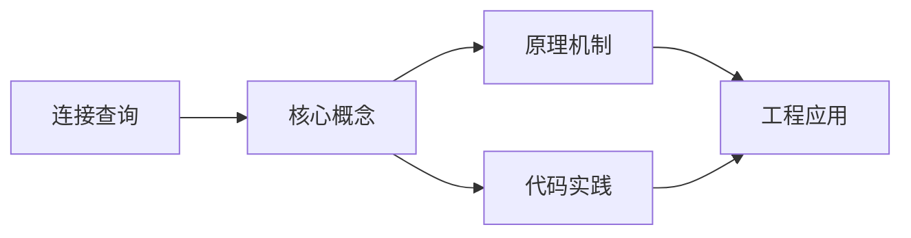
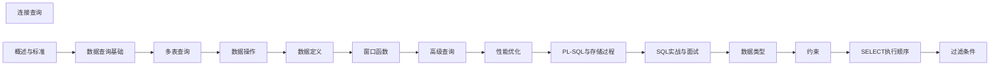

## 1. 学习目标（Bloom 分类）

本节按照布鲁姆教育目标分类学组织学习路径。本文主题为《连接查询》，属于 SQL 模块，读者可以根据自身阶段选择阅读深度。

记忆层面：能够准确复述本文的核心概念、术语与基本语法或操作步骤，并能够在提问或检索时快速定位对应知识点。能够说出 SQL 的核心概念、语法与常用对象。

理解层面：能够用自己的语言解释核心原理与工作机制，说明概念之间的因果关系，而不是机械记忆结论。能够解释 SQL 的执行原理与优化机制。

应用层面：能够在真实项目或练习场景中运用本文知识解决具体问题，写出正确且可维护的实现。能够编写正确、高效的 SQL 语句与操作。

分析层面：能够拆解复杂问题，比较本文主题与相邻概念的异同，识别边界条件与例外情况。能够分析 SQL 相关方案在性能与一致性上的权衡。

评价层面：能够根据约束条件（性能、可读性、安全、成本）评价不同方案的优劣，做出有依据的技术决策。能够根据业务场景评价 SQL 技术选型。

创造层面：能够把本文知识与其他模块知识组合，设计出新的解决方案或可复用的工程模式。能够组合 SQL 与其他技术设计数据架构。

通过本节学习，读者应当能够把《连接查询》纳入自己的知识网络，并与 SQL 模块的其他主题（DDL/DML、查询、索引、事务）建立关联。

## 2. 历史动机与发展脉络

《连接查询》是 SQL 领域的重要主题。要真正理解它，需要先了解它解决的问题与演进过程。

SQL（结构化查询语言）源于 1970 年 Codd 的关系模型，1974 年由 Chamberlin 与 Boyce 设计（SEQUEL），1986 年成为 ANSI 标准；SQL:2023 是当前国际标准。
SQL 分为 DDL（建表）、DML（增删改）、DQL（查询）、DCL（权限）与 TCL（事务）；各大数据库在标准基础上扩展方言。
SQL 是声明式语言：描述“要什么”而非“怎么做”，优化器负责执行计划；这一设计让 SQL 具有跨数据库的表达一致性。

回到本文主题：连接查询 的提出与成熟，正是上述技术背景下的必然产物。早期实现往往以简单可用为目标，随着工程规模扩大，社区逐渐沉淀出标准做法与最佳实践；理解这一脉络，可以帮助读者判断“为什么文档中的推荐写法是现在这个样子”，也能在遇到历史遗留代码时准确识别其设计年代与取舍。


## 3. 形式化定义与核心概念精讲

本节把《连接查询》涉及的核心概念以“定义 + 讲解”的形式展开。读者应把定义当作工具，把讲解当作理解路径；两者结合才能形成可迁移的知识。

关系模型：表（关系）、行（元组）、列（属性）；主键唯一标识、外键表达关联、范式消除冗余。
查询执行：解析 -> 绑定 -> 优化（基于代价选择计划）-> 执行；索引、统计信息与连接算法决定性能。
事务 ACID：原子性（Atomicity）、一致性（Consistency）、隔离性（Isolation）、持久性（Durability）；隔离级别控制并发行为。

### 3.1 原文章节逐一精讲

原文档把主题拆分为 15 个小节，下面按顺序给出每一节的导读讲解，随后保留原文细节供精读。

#### 原文精读（完整保留）

# 连接查询

> **符号约定**：`< >` 必填参数 | `[ ]` 可选参数

---

#### 1. 连接查询概述

连接（JOIN）是 SQL 最强大的特性之一，用于根据列之间的关系组合两个或多个表中的行。

##### 1.1 连接类型分类

| 类型     | 关键字       | 说明                    |
| -------- | ------------ | ----------------------- |
| 内连接   | INNER JOIN   | 只返回匹配行            |
| 左外连接 | LEFT JOIN    | 左表全部 + 右表匹配     |
| 右外连接 | RIGHT JOIN   | 右表全部 + 左表匹配     |
| 全外连接 | FULL JOIN    | 两表全部，不匹配填 NULL |
| 交叉连接 | CROSS JOIN   | 笛卡尔积                |
| 自然连接 | NATURAL JOIN | 同名列自动等值连接      |

##### 1.2 连接的基本语法

```sql
SELECT select_list
FROM left_table [AS] alias
[JOIN_TYPE] right_table [AS] alias
ON join_condition;
```

#### 2. INNER JOIN

##### 2.1 基本用法

```sql
-- 只返回两表中满足连接条件的行
SELECT e.name, d.dept_name
FROM employees e
INNER JOIN departments d ON e.dept_id = d.id;
```

##### 2.2 等值连接与非等值连接

```sql
-- 等值连接（最常见）
SELECT e.name, d.dept_name
FROM employees e
JOIN departments d ON e.dept_id = d.id;

-- 非等值连接
SELECT e.name, g.grade
FROM employees e
JOIN salary_grades g ON e.salary BETWEEN g.min_salary AND g.max_salary;
```

##### 2.3 多表连接

```sql
SELECT e.name, d.dept_name, j.job_title
FROM employees e
JOIN departments d ON e.dept_id = d.id
JOIN jobs j ON e.job_id = j.id
WHERE d.region = 'East';
```

#### 3. LEFT JOIN（左外连接）

##### 3.1 基本用法

```sql
-- 返回左表所有行，右表无匹配时填 NULL
SELECT d.dept_name, e.name
FROM departments d
LEFT JOIN employees e ON d.id = e.dept_id;
```

##### 3.2 LEFT JOIN 的典型场景

```sql
-- 场景1：查找没有员工的部门
SELECT d.dept_name
FROM departments d
LEFT JOIN employees e ON d.id = e.dept_id
WHERE e.id IS NULL;

-- 场景2：统计每个部门的员工数（包括0人部门）
SELECT d.dept_name, COUNT(e.id) AS emp_count
FROM departments d
LEFT JOIN employees e ON d.id = e.dept_id
GROUP BY d.id, d.dept_name;
```

##### 3.3 LEFT JOIN + WHERE 陷阱

```sql
-- 错误：WHERE 条件使 LEFT JOIN 退化为 INNER JOIN
SELECT d.dept_name, e.name
FROM departments d
LEFT JOIN employees e ON d.id = e.dept_id
WHERE e.status = 'active';  -- 过滤掉了没有员工的部门

-- 正确：将右表过滤条件移到 ON 子句
SELECT d.dept_name, e.name
FROM departments d
LEFT JOIN employees e ON d.id = e.dept_id AND e.status = 'active';
```

#### 4. RIGHT JOIN（右外连接）

```sql
-- 返回右表所有行，左表无匹配时填 NULL
-- RIGHT JOIN 等价于交换表顺序的 LEFT JOIN
SELECT e.name, d.dept_name
FROM employees e
RIGHT JOIN departments d ON e.dept_id = d.id;

-- 等价写法
SELECT e.name, d.dept_name
FROM departments d
LEFT JOIN employees e ON e.dept_id = d.id;
```

> **最佳实践**：统一使用 LEFT JOIN，避免混用 LEFT/RIGHT 增加可读性难度。

#### 5. FULL JOIN（全外连接）

##### 5.1 基本用法

```sql
-- 返回两表所有行，不匹配时填 NULL
SELECT e.name, d.dept_name
FROM employees e
FULL JOIN departments d ON e.dept_id = d.id;
```

##### 5.2 典型场景

```sql
-- 场景1：查找两表不匹配的行
SELECT e.name, d.dept_name
FROM employees e
FULL JOIN departments d ON e.dept_id = d.id
WHERE e.id IS NULL OR d.id IS NULL;

-- 场景2：合并两表数据（去重 UNION）
SELECT COALESCE(a.id, b.id) AS id,
       COALESCE(a.name, b.name) AS name
FROM table_a a
FULL JOIN table_b b ON a.id = b.id;
```

##### 5.3 MySQL 中的 FULL JOIN 替代

```sql
-- MySQL 不支持 FULL JOIN，使用 UNION ALL 替代
SELECT e.name, d.dept_name
FROM employees e
LEFT JOIN departments d ON e.dept_id = d.id
UNION ALL
SELECT e.name, d.dept_name
FROM employees e
RIGHT JOIN departments d ON e.dept_id = d.id
WHERE e.id IS NULL;
```

#### 6. CROSS JOIN（交叉连接）

##### 6.1 基本用法

```sql
-- 笛卡尔积：m行 × n行 = m×n行
SELECT d.dept_name, j.job_title
FROM departments d
CROSS JOIN jobs j;

-- 隐式交叉连接
SELECT d.dept_name, j.job_title
FROM departments d, jobs j;
```

##### 6.2 典型场景

```sql
-- 场景1：生成日期×产品的组合矩阵
SELECT d.date_key, p.product_id
FROM dim_date d
CROSS JOIN dim_product p
WHERE d.date_key BETWEEN '2026-01-01' AND '2026-12-31';

-- 场景2：生成序列
SELECT x.n, y.m
FROM (SELECT generate_series(1, 12) AS n) x
CROSS JOIN (SELECT generate_series(1, 31) AS m) y;
```

#### 7. 连接的执行原理

##### 7.1 连接算法

| 算法              | 时间复杂度               | 适用场景         |
| ----------------- | ------------------------ | ---------------- |
| Nested Loop Join  | $O(m \times n)$          | 小表驱动大表     |
| Block Nested Loop | $O(m \times n / B)$      | 利用 join_buffer |
| Hash Join         | $O(m + n)$               | 等值连接，大表   |
| Sort-Merge Join   | $O(m \log m + n \log n)$ | 已排序数据       |

##### 7.2 连接顺序优化

```sql
-- 优化器可能重排连接顺序
-- 原始写法
SELECT * FROM a JOIN b ON a.id = b.a_id JOIN c ON b.id = c.b_id;

-- 优化器可能选择更优顺序
-- 如：先连接小表 a 和 c，再连接 b
```

##### 7.3 连接条件与过滤条件

```sql
-- ON：连接条件，决定如何匹配行
-- WHERE：过滤条件，在连接后过滤结果

-- INNER JOIN 中 ON 和 WHERE 等价（逻辑上）
SELECT * FROM a INNER JOIN b ON a.id = b.a_id AND a.status = 'active';
-- 等价于
SELECT * FROM a INNER JOIN b ON a.id = b.a_id WHERE a.status = 'active';

-- OUTER JOIN 中 ON 和 WHERE 不等价
SELECT * FROM a LEFT JOIN b ON a.id = b.a_id AND a.status = 'active';
-- a.status = 'active' 只影响右表匹配，左表行仍保留

SELECT * FROM a LEFT JOIN b ON a.id = b.a_id WHERE a.status = 'active';
-- a.status = 'active' 过滤最终结果，左表不满足的行被移除
```

#### 8. 多表连接最佳实践

##### 8.1 连接数控制

```sql
-- 避免过多表连接（一般不超过 5-7 个）
-- 过多连接导致：
-- 1. 执行计划搜索空间指数增长
-- 2. 中间结果集膨胀
-- 3. 可读性下降

-- 替代方案：使用 CTE 拆分复杂查询
WITH dept_employees AS (
    SELECT d.dept_name, e.name, e.salary
    FROM departments d
    JOIN employees e ON d.id = e.dept_id
)
SELECT dept_name, name, salary
FROM dept_employees
WHERE salary > (SELECT AVG(salary) FROM dept_employees);
```

##### 8.2 索引支持

```sql
-- 连接列应建立索引
CREATE INDEX idx_employees_dept_id ON employees(dept_id);
CREATE INDEX idx_employees_job_id ON employees(job_id);

-- 覆盖索引避免回表
CREATE INDEX idx_employees_dept_cover ON employees(dept_id, name, salary);
```

##### 8.3 去重连接

```sql
-- 连接导致行数膨胀时，先去重再连接
SELECT d.dept_name, e_cnt.emp_count
FROM departments d
JOIN (
    SELECT dept_id, COUNT(*) AS emp_count
    FROM employees
    GROUP BY dept_id
) e_cnt ON d.id = e_cnt.dept_id;
```
#### INNER JOIN

**换行写法：内连接返回两表匹配行**
`FROM <左表> INNER JOIN <右表> ON <条件>`
```sql
-- 查询员工及其所属部门名称
SELECT e.name, d.dept_name
FROM employees e
INNER JOIN departments d ON e.dept_id = d.id;
```

**换行写法：省略 INNER 的内连接**
`FROM <左表> JOIN <右表> ON <条件>`
```sql
-- 省略 INNER 关键字的内连接
SELECT e.name, d.dept_name
FROM employees e
JOIN departments d ON e.dept_id = d.id;
```

**换行写法：非等值连接**
`FROM <左表> JOIN <右表> ON <非等值条件>`
```sql
-- 根据薪资范围匹配薪资等级
SELECT e.name, g.grade
FROM employees e
JOIN salary_grades g ON e.salary BETWEEN g.min_salary AND g.max_salary;
```

**换行写法：多表连接**
`FROM <表 1> JOIN <表 2> ON ... JOIN <表 3> ON ...`
```sql
-- 连接员工表、部门表和职位表
SELECT e.name, d.dept_name, j.job_title
FROM employees e
JOIN departments d ON e.dept_id = d.id
JOIN jobs j ON e.job_id = j.id
WHERE d.region = 'East';
```

---

#### LEFT JOIN

**换行写法：左外连接返回左表全部行**
`FROM <左表> LEFT JOIN <右表> ON <条件>`
```sql
-- 查询所有部门及其员工（包括没有员工的部门）
SELECT d.dept_name, e.name
FROM departments d
LEFT JOIN employees e ON d.id = e.dept_id;
```

**换行写法：左连接查找无匹配行**
`FROM <左表> LEFT JOIN <右表> ON <条件> WHERE <右表>.<列> IS NULL`
```sql
-- 查找没有员工的部门
SELECT d.dept_name
FROM departments d
LEFT JOIN employees e ON d.id = e.dept_id
WHERE e.id IS NULL;
```

**换行写法：左连接统计含零值分组**
`FROM <左表> LEFT JOIN <右表> ON <条件> GROUP BY ...`
```sql
-- 统计每个部门的员工数（包括 0 人部门）
SELECT d.dept_name, COUNT(e.id) AS emp_count
FROM departments d
LEFT JOIN employees e ON d.id = e.dept_id
GROUP BY d.id, d.dept_name;
```

**换行写法：左连接右表过滤条件放 ON 子句**
`FROM <左表> LEFT JOIN <右表> ON <条件> AND <右表过滤>`
```sql
-- 查询所有部门及活跃状态的员工（右表过滤条件放 ON 子句）
SELECT d.dept_name, e.name
FROM departments d
LEFT JOIN employees e ON d.id = e.dept_id AND e.status = 'active';
```

---

#### RIGHT JOIN

**换行写法：右外连接返回右表全部行**
`FROM <左表> RIGHT JOIN <右表> ON <条件>`
```sql
-- 查询所有部门及其员工（包括没有员工的部门）
SELECT e.name, d.dept_name
FROM employees e
RIGHT JOIN departments d ON e.dept_id = d.id;
```

---

#### FULL JOIN

**换行写法：全外连接返回两表所有行**
`FROM <左表> FULL JOIN <右表> ON <条件>`
```sql
-- 返回员工和部门的所有行，不匹配时填 NULL
SELECT e.name, d.dept_name
FROM employees e
FULL JOIN departments d ON e.dept_id = d.id;
```

**换行写法：全外连接查找不匹配行**
`FROM <左表> FULL JOIN <右表> ON <条件> WHERE <左表>.<id> IS NULL OR <右表>.<id> IS NULL`
```sql
-- 查找两表不匹配的行
SELECT e.name, d.dept_name
FROM employees e
FULL JOIN departments d ON e.dept_id = d.id
WHERE e.id IS NULL OR d.id IS NULL;
```

**换行写法：MySQL 用 UNION ALL 模拟全外连接**
`LEFT JOIN ... UNION ALL RIGHT JOIN ... WHERE IS NULL`
```sql
-- MySQL 不支持 FULL JOIN，使用 UNION ALL 替代
SELECT e.name, d.dept_name
FROM employees e
LEFT JOIN departments d ON e.dept_id = d.id
UNION ALL
SELECT e.name, d.dept_name
FROM employees e
RIGHT JOIN departments d ON e.dept_id = d.id
WHERE e.id IS NULL;
```

---

#### CROSS JOIN

**换行写法：显式交叉连接（笛卡尔积）**
`FROM <左表> CROSS JOIN <右表>`
```sql
-- 生成部门和职位的笛卡尔积
SELECT d.dept_name, j.job_title
FROM departments d
CROSS JOIN jobs j;
```

**换行写法：隐式交叉连接**
`FROM <表 1>, <表 2>`
```sql
-- 使用逗号分隔的隐式交叉连接
SELECT d.dept_name, j.job_title
FROM departments d, jobs j;
```

---

#### 自连接

**换行写法：表与自身连接**
`FROM <表> AS <别名 1> JOIN <表> AS <别名 2> ON <条件>`
```sql
-- 查询员工及其经理
SELECT
  e.name AS employee,
  m.name AS manager
FROM employees e
LEFT JOIN employees m ON e.manager_id = m.id;
```

**换行写法：自连接查找同组数据**
`FROM <表> AS <别名 1> JOIN <表> AS <别名 2> ON <条件>`
```sql
-- 查找同一部门中薪资相同的员工
SELECT a.name, b.name, a.salary
FROM employees a
JOIN employees b ON a.dept_id = b.dept_id AND a.salary = b.salary AND a.id < b.id;
```

---

#### USING 子句

**换行写法：USING 指定同名列连接**
`FROM <左表> JOIN <右表> USING (<列>)`
```sql
-- 使用 USING 指定同名列连接
SELECT e.name, department_id
FROM employees e
JOIN departments d USING (department_id);
```

**换行写法：NATURAL JOIN 自动按同名列连接**
`FROM <左表> NATURAL JOIN <右表>`
```sql
-- 自动按同名列连接（不推荐，不可控）
SELECT * FROM employees NATURAL JOIN departments;
```


### 3.2 概念关系图

下面用 Mermaid 图表达本文核心概念之间的关系，帮助读者建立整体图景：



图中展示的是本文知识的结构化关系：核心概念是入口，原理机制解释“为什么”，代码实践演示“怎么做”，工程应用回答“何时用”。读者学习时可以把每个小节的内容挂接到对应节点上。

## 4. 理论推导与原理解析

本节深入《连接查询》背后的原理。理论部分不求面面俱到，而是聚焦“能解释现象、能指导实践”的关键推导。

关系模型：表（关系）、行（元组）、列（属性）；主键唯一标识、外键表达关联、范式消除冗余。
查询执行：解析 -> 绑定 -> 优化（基于代价选择计划）-> 执行；索引、统计信息与连接算法决定性能。
事务 ACID：原子性（Atomicity）、一致性（Consistency）、隔离性（Isolation）、持久性（Durability）；隔离级别控制并发行为。
集合语义：SELECT 返回结果集；JOIN 组合关系，GROUP BY 聚合，子查询与 CTE 表达复杂逻辑。

需要强调的是，理论推导与工程实践之间存在翻译层：理论给出的是理想化模型与边界条件，工程代码则必须处理真实环境中的例外。读者在学习时应先掌握理论的“标准情形”，再通过陷阱章节了解“非标准情形”。

## 5. 代码示例与逐行讲解

本节把原文中的代码示例系统整理，并为每个示例补充用途说明与讲解。读者不应只浏览代码，而应逐段对照讲解理解设计意图。

### 5.1 示例：1.2 连接的基本语法

该示例来自原文《1.2 连接的基本语法》小节，用于演示连接查询相关操作。阅读时请先看代码结构，再看其后的讲解。

```sql
SELECT select_list
FROM left_table [AS] alias
[JOIN_TYPE] right_table [AS] alias
ON join_condition;
```

讲解：这段代码演示了本节核心知识点。代码中的关键操作可以归纳为三步：准备（定义或初始化）、执行（核心逻辑）、收尾（释放资源或返回结果）。实际项目中，这三步往往被封装为函数或类，以提升复用性与可测试性。

关键点分析：

该示例共 4 行有效代码，包含 2 类关键结构（SELECT、FROM）。其中：

- 入口与初始化部分负责建立上下文，对应实际项目中的启动或装配逻辑；
- 核心逻辑部分体现本文主题的主要操作，是阅读时最需要对照讲解理解的部分；
- 输出或返回部分把结果交给调用方，注意其类型与边界条件。

进阶思考路径：先尝试修改参数观察行为变化，再把示例中的模式迁移到自己的项目中；每次修改都记录预期与实测差异，这是把示例转化为能力的最快方式。

### 5.2 示例：2.1 基本用法

该示例来自原文《2.1 基本用法》小节，用于演示连接查询相关操作。阅读时请先看代码结构，再看其后的讲解。

```sql
-- 只返回两表中满足连接条件的行
SELECT e.name, d.dept_name
FROM employees e
INNER JOIN departments d ON e.dept_id = d.id;
```

讲解：这段代码演示了本节核心知识点。代码中的关键操作可以归纳为三步：准备（定义或初始化）、执行（核心逻辑）、收尾（释放资源或返回结果）。实际项目中，这三步往往被封装为函数或类，以提升复用性与可测试性。

关键点分析：

该示例共 4 行有效代码，包含 2 类关键结构（SELECT、FROM）。其中：

- 入口与初始化部分负责建立上下文，对应实际项目中的启动或装配逻辑；
- 核心逻辑部分体现本文主题的主要操作，是阅读时最需要对照讲解理解的部分；
- 输出或返回部分把结果交给调用方，注意其类型与边界条件。

进阶思考路径：先尝试修改参数观察行为变化，再把示例中的模式迁移到自己的项目中；每次修改都记录预期与实测差异，这是把示例转化为能力的最快方式。

### 5.3 示例：2.2 等值连接与非等值连接

该示例来自原文《2.2 等值连接与非等值连接》小节，用于演示连接查询相关操作。阅读时请先看代码结构，再看其后的讲解。

```sql
-- 等值连接（最常见）
SELECT e.name, d.dept_name
FROM employees e
JOIN departments d ON e.dept_id = d.id;

-- 非等值连接
SELECT e.name, g.grade
FROM employees e
JOIN salary_grades g ON e.salary BETWEEN g.min_salary AND g.max_salary;
```

讲解：这段代码演示了本节核心知识点。代码中的关键操作可以归纳为三步：准备（定义或初始化）、执行（核心逻辑）、收尾（释放资源或返回结果）。实际项目中，这三步往往被封装为函数或类，以提升复用性与可测试性。

关键点分析：

该示例共 8 行有效代码，包含 2 类关键结构（SELECT、FROM）。其中：

- 入口与初始化部分负责建立上下文，对应实际项目中的启动或装配逻辑；
- 核心逻辑部分体现本文主题的主要操作，是阅读时最需要对照讲解理解的部分；
- 输出或返回部分把结果交给调用方，注意其类型与边界条件。

进阶思考路径：先尝试修改参数观察行为变化，再把示例中的模式迁移到自己的项目中；每次修改都记录预期与实测差异，这是把示例转化为能力的最快方式。

### 5.4 示例：2.3 多表连接

该示例来自原文《2.3 多表连接》小节，用于演示连接查询相关操作。阅读时请先看代码结构，再看其后的讲解。

```sql
SELECT e.name, d.dept_name, j.job_title
FROM employees e
JOIN departments d ON e.dept_id = d.id
JOIN jobs j ON e.job_id = j.id
WHERE d.region = 'East';
```

讲解：这段代码演示了本节核心知识点。代码中的关键操作可以归纳为三步：准备（定义或初始化）、执行（核心逻辑）、收尾（释放资源或返回结果）。实际项目中，这三步往往被封装为函数或类，以提升复用性与可测试性。

关键点分析：

该示例共 5 行有效代码，包含 2 类关键结构（SELECT、FROM）。其中：

- 入口与初始化部分负责建立上下文，对应实际项目中的启动或装配逻辑；
- 核心逻辑部分体现本文主题的主要操作，是阅读时最需要对照讲解理解的部分；
- 输出或返回部分把结果交给调用方，注意其类型与边界条件。

进阶思考路径：先尝试修改参数观察行为变化，再把示例中的模式迁移到自己的项目中；每次修改都记录预期与实测差异，这是把示例转化为能力的最快方式。

### 5.5 示例：3.1 基本用法

该示例来自原文《3.1 基本用法》小节，用于演示连接查询相关操作。阅读时请先看代码结构，再看其后的讲解。

```sql
-- 返回左表所有行，右表无匹配时填 NULL
SELECT d.dept_name, e.name
FROM departments d
LEFT JOIN employees e ON d.id = e.dept_id;
```

讲解：这段代码演示了本节核心知识点。代码中的关键操作可以归纳为三步：准备（定义或初始化）、执行（核心逻辑）、收尾（释放资源或返回结果）。实际项目中，这三步往往被封装为函数或类，以提升复用性与可测试性。

关键点分析：

该示例共 4 行有效代码，包含 2 类关键结构（SELECT、FROM）。其中：

- 入口与初始化部分负责建立上下文，对应实际项目中的启动或装配逻辑；
- 核心逻辑部分体现本文主题的主要操作，是阅读时最需要对照讲解理解的部分；
- 输出或返回部分把结果交给调用方，注意其类型与边界条件。

进阶思考路径：先尝试修改参数观察行为变化，再把示例中的模式迁移到自己的项目中；每次修改都记录预期与实测差异，这是把示例转化为能力的最快方式。

### 5.6 示例：3.2 LEFT JOIN 的典型场景

该示例来自原文《3.2 LEFT JOIN 的典型场景》小节，用于演示连接查询相关操作。阅读时请先看代码结构，再看其后的讲解。

```sql
-- 场景1：查找没有员工的部门
SELECT d.dept_name
FROM departments d
LEFT JOIN employees e ON d.id = e.dept_id
WHERE e.id IS NULL;

-- 场景2：统计每个部门的员工数（包括0人部门）
SELECT d.dept_name, COUNT(e.id) AS emp_count
FROM departments d
LEFT JOIN employees e ON d.id = e.dept_id
GROUP BY d.id, d.dept_name;
```

讲解：这段代码演示了本节核心知识点。代码中的关键操作可以归纳为三步：准备（定义或初始化）、执行（核心逻辑）、收尾（释放资源或返回结果）。实际项目中，这三步往往被封装为函数或类，以提升复用性与可测试性。

关键点分析：

该示例共 10 行有效代码，包含 2 类关键结构（SELECT、FROM）。其中：

- 入口与初始化部分负责建立上下文，对应实际项目中的启动或装配逻辑；
- 核心逻辑部分体现本文主题的主要操作，是阅读时最需要对照讲解理解的部分；
- 输出或返回部分把结果交给调用方，注意其类型与边界条件。

进阶思考路径：先尝试修改参数观察行为变化，再把示例中的模式迁移到自己的项目中；每次修改都记录预期与实测差异，这是把示例转化为能力的最快方式。

### 5.7 示例：3.3 LEFT JOIN + WHERE 陷阱

该示例来自原文《3.3 LEFT JOIN + WHERE 陷阱》小节，用于演示连接查询相关操作。阅读时请先看代码结构，再看其后的讲解。

```sql
-- 错误：WHERE 条件使 LEFT JOIN 退化为 INNER JOIN
SELECT d.dept_name, e.name
FROM departments d
LEFT JOIN employees e ON d.id = e.dept_id
WHERE e.status = 'active';  -- 过滤掉了没有员工的部门

-- 正确：将右表过滤条件移到 ON 子句
SELECT d.dept_name, e.name
FROM departments d
LEFT JOIN employees e ON d.id = e.dept_id AND e.status = 'active';
```

讲解：这段代码演示了本节核心知识点。代码中的关键操作可以归纳为三步：准备（定义或初始化）、执行（核心逻辑）、收尾（释放资源或返回结果）。实际项目中，这三步往往被封装为函数或类，以提升复用性与可测试性。

关键点分析：

该示例共 9 行有效代码，包含 2 类关键结构（SELECT、FROM）。其中：

- 入口与初始化部分负责建立上下文，对应实际项目中的启动或装配逻辑；
- 核心逻辑部分体现本文主题的主要操作，是阅读时最需要对照讲解理解的部分；
- 输出或返回部分把结果交给调用方，注意其类型与边界条件。

进阶思考路径：先尝试修改参数观察行为变化，再把示例中的模式迁移到自己的项目中；每次修改都记录预期与实测差异，这是把示例转化为能力的最快方式。

### 5.8 示例：4. RIGHT JOIN（右外连接）

该示例来自原文《4. RIGHT JOIN（右外连接）》小节，用于演示连接查询相关操作。阅读时请先看代码结构，再看其后的讲解。

```sql
-- 返回右表所有行，左表无匹配时填 NULL
-- RIGHT JOIN 等价于交换表顺序的 LEFT JOIN
SELECT e.name, d.dept_name
FROM employees e
RIGHT JOIN departments d ON e.dept_id = d.id;

-- 等价写法
SELECT e.name, d.dept_name
FROM departments d
LEFT JOIN employees e ON e.dept_id = d.id;
```

讲解：这段代码演示了本节核心知识点。代码中的关键操作可以归纳为三步：准备（定义或初始化）、执行（核心逻辑）、收尾（释放资源或返回结果）。实际项目中，这三步往往被封装为函数或类，以提升复用性与可测试性。

关键点分析：

该示例共 9 行有效代码，包含 2 类关键结构（SELECT、FROM）。其中：

- 入口与初始化部分负责建立上下文，对应实际项目中的启动或装配逻辑；
- 核心逻辑部分体现本文主题的主要操作，是阅读时最需要对照讲解理解的部分；
- 输出或返回部分把结果交给调用方，注意其类型与边界条件。

进阶思考路径：先尝试修改参数观察行为变化，再把示例中的模式迁移到自己的项目中；每次修改都记录预期与实测差异，这是把示例转化为能力的最快方式。

### 5.9 示例：5.1 基本用法

该示例来自原文《5.1 基本用法》小节，用于演示连接查询相关操作。阅读时请先看代码结构，再看其后的讲解。

```sql
-- 返回两表所有行，不匹配时填 NULL
SELECT e.name, d.dept_name
FROM employees e
FULL JOIN departments d ON e.dept_id = d.id;
```

讲解：这段代码演示了本节核心知识点。代码中的关键操作可以归纳为三步：准备（定义或初始化）、执行（核心逻辑）、收尾（释放资源或返回结果）。实际项目中，这三步往往被封装为函数或类，以提升复用性与可测试性。

关键点分析：

该示例共 4 行有效代码，包含 2 类关键结构（SELECT、FROM）。其中：

- 入口与初始化部分负责建立上下文，对应实际项目中的启动或装配逻辑；
- 核心逻辑部分体现本文主题的主要操作，是阅读时最需要对照讲解理解的部分；
- 输出或返回部分把结果交给调用方，注意其类型与边界条件。

进阶思考路径：先尝试修改参数观察行为变化，再把示例中的模式迁移到自己的项目中；每次修改都记录预期与实测差异，这是把示例转化为能力的最快方式。

### 5.10 示例：5.2 典型场景

该示例来自原文《5.2 典型场景》小节，用于演示连接查询相关操作。阅读时请先看代码结构，再看其后的讲解。

```sql
-- 场景1：查找两表不匹配的行
SELECT e.name, d.dept_name
FROM employees e
FULL JOIN departments d ON e.dept_id = d.id
WHERE e.id IS NULL OR d.id IS NULL;

-- 场景2：合并两表数据（去重 UNION）
SELECT COALESCE(a.id, b.id) AS id,
       COALESCE(a.name, b.name) AS name
FROM table_a a
FULL JOIN table_b b ON a.id = b.id;
```

讲解：这段代码演示了本节核心知识点。代码中的关键操作可以归纳为三步：准备（定义或初始化）、执行（核心逻辑）、收尾（释放资源或返回结果）。实际项目中，这三步往往被封装为函数或类，以提升复用性与可测试性。

关键点分析：

该示例共 10 行有效代码，包含 2 类关键结构（SELECT、FROM）。其中：

- 入口与初始化部分负责建立上下文，对应实际项目中的启动或装配逻辑；
- 核心逻辑部分体现本文主题的主要操作，是阅读时最需要对照讲解理解的部分；
- 输出或返回部分把结果交给调用方，注意其类型与边界条件。

进阶思考路径：先尝试修改参数观察行为变化，再把示例中的模式迁移到自己的项目中；每次修改都记录预期与实测差异，这是把示例转化为能力的最快方式。

### 5.11 示例：5.3 MySQL 中的 FULL JOIN 替代

该示例来自原文《5.3 MySQL 中的 FULL JOIN 替代》小节，用于演示连接查询相关操作。阅读时请先看代码结构，再看其后的讲解。

```sql
-- MySQL 不支持 FULL JOIN，使用 UNION ALL 替代
SELECT e.name, d.dept_name
FROM employees e
LEFT JOIN departments d ON e.dept_id = d.id
UNION ALL
SELECT e.name, d.dept_name
FROM employees e
RIGHT JOIN departments d ON e.dept_id = d.id
WHERE e.id IS NULL;
```

讲解：这段代码演示了本节核心知识点。代码中的关键操作可以归纳为三步：准备（定义或初始化）、执行（核心逻辑）、收尾（释放资源或返回结果）。实际项目中，这三步往往被封装为函数或类，以提升复用性与可测试性。

关键点分析：

该示例共 9 行有效代码，包含 2 类关键结构（SELECT、FROM）。其中：

- 入口与初始化部分负责建立上下文，对应实际项目中的启动或装配逻辑；
- 核心逻辑部分体现本文主题的主要操作，是阅读时最需要对照讲解理解的部分；
- 输出或返回部分把结果交给调用方，注意其类型与边界条件。

进阶思考路径：先尝试修改参数观察行为变化，再把示例中的模式迁移到自己的项目中；每次修改都记录预期与实测差异，这是把示例转化为能力的最快方式。

### 5.12 示例：6.1 基本用法

该示例来自原文《6.1 基本用法》小节，用于演示连接查询相关操作。阅读时请先看代码结构，再看其后的讲解。

```sql
-- 笛卡尔积：m行 × n行 = m×n行
SELECT d.dept_name, j.job_title
FROM departments d
CROSS JOIN jobs j;

-- 隐式交叉连接
SELECT d.dept_name, j.job_title
FROM departments d, jobs j;
```

讲解：这段代码演示了本节核心知识点。代码中的关键操作可以归纳为三步：准备（定义或初始化）、执行（核心逻辑）、收尾（释放资源或返回结果）。实际项目中，这三步往往被封装为函数或类，以提升复用性与可测试性。

关键点分析：

该示例共 7 行有效代码，包含 2 类关键结构（SELECT、FROM）。其中：

- 入口与初始化部分负责建立上下文，对应实际项目中的启动或装配逻辑；
- 核心逻辑部分体现本文主题的主要操作，是阅读时最需要对照讲解理解的部分；
- 输出或返回部分把结果交给调用方，注意其类型与边界条件。

进阶思考路径：先尝试修改参数观察行为变化，再把示例中的模式迁移到自己的项目中；每次修改都记录预期与实测差异，这是把示例转化为能力的最快方式。

### 5.13 示例：6.2 典型场景

该示例来自原文《6.2 典型场景》小节，用于演示连接查询相关操作。阅读时请先看代码结构，再看其后的讲解。

```sql
-- 场景1：生成日期×产品的组合矩阵
SELECT d.date_key, p.product_id
FROM dim_date d
CROSS JOIN dim_product p
WHERE d.date_key BETWEEN '2026-01-01' AND '2026-12-31';

-- 场景2：生成序列
SELECT x.n, y.m
FROM (SELECT generate_series(1, 12) AS n) x
CROSS JOIN (SELECT generate_series(1, 31) AS m) y;
```

讲解：这段代码演示了本节核心知识点。代码中的关键操作可以归纳为三步：准备（定义或初始化）、执行（核心逻辑）、收尾（释放资源或返回结果）。实际项目中，这三步往往被封装为函数或类，以提升复用性与可测试性。

关键点分析：

该示例共 9 行有效代码，包含 2 类关键结构（SELECT、FROM）。其中：

- 入口与初始化部分负责建立上下文，对应实际项目中的启动或装配逻辑；
- 核心逻辑部分体现本文主题的主要操作，是阅读时最需要对照讲解理解的部分；
- 输出或返回部分把结果交给调用方，注意其类型与边界条件。

进阶思考路径：先尝试修改参数观察行为变化，再把示例中的模式迁移到自己的项目中；每次修改都记录预期与实测差异，这是把示例转化为能力的最快方式。

### 5.14 示例：7.2 连接顺序优化

该示例来自原文《7.2 连接顺序优化》小节，用于演示连接查询相关操作。阅读时请先看代码结构，再看其后的讲解。

```sql
-- 优化器可能重排连接顺序
-- 原始写法
SELECT * FROM a JOIN b ON a.id = b.a_id JOIN c ON b.id = c.b_id;

-- 优化器可能选择更优顺序
-- 如：先连接小表 a 和 c，再连接 b
```

讲解：这段代码演示了本节核心知识点。代码中的关键操作可以归纳为三步：准备（定义或初始化）、执行（核心逻辑）、收尾（释放资源或返回结果）。实际项目中，这三步往往被封装为函数或类，以提升复用性与可测试性。

关键点分析：

该示例共 5 行有效代码，包含 2 类关键结构（SELECT、FROM）。其中：

- 入口与初始化部分负责建立上下文，对应实际项目中的启动或装配逻辑；
- 核心逻辑部分体现本文主题的主要操作，是阅读时最需要对照讲解理解的部分；
- 输出或返回部分把结果交给调用方，注意其类型与边界条件。

进阶思考路径：先尝试修改参数观察行为变化，再把示例中的模式迁移到自己的项目中；每次修改都记录预期与实测差异，这是把示例转化为能力的最快方式。

### 5.15 示例：7.3 连接条件与过滤条件

该示例来自原文《7.3 连接条件与过滤条件》小节，用于演示连接查询相关操作。阅读时请先看代码结构，再看其后的讲解。

```sql
-- ON：连接条件，决定如何匹配行
-- WHERE：过滤条件，在连接后过滤结果

-- INNER JOIN 中 ON 和 WHERE 等价（逻辑上）
SELECT * FROM a INNER JOIN b ON a.id = b.a_id AND a.status = 'active';
-- 等价于
SELECT * FROM a INNER JOIN b ON a.id = b.a_id WHERE a.status = 'active';

-- OUTER JOIN 中 ON 和 WHERE 不等价
SELECT * FROM a LEFT JOIN b ON a.id = b.a_id AND a.status = 'active';
-- a.status = 'active' 只影响右表匹配，左表行仍保留

SELECT * FROM a LEFT JOIN b ON a.id = b.a_id WHERE a.status = 'active';
-- a.status = 'active' 过滤最终结果，左表不满足的行被移除
```

讲解：这段代码演示了本节核心知识点。代码中的关键操作可以归纳为三步：准备（定义或初始化）、执行（核心逻辑）、收尾（释放资源或返回结果）。实际项目中，这三步往往被封装为函数或类，以提升复用性与可测试性。

关键点分析：

该示例共 11 行有效代码，包含 2 类关键结构（SELECT、FROM）。其中：

- 入口与初始化部分负责建立上下文，对应实际项目中的启动或装配逻辑；
- 核心逻辑部分体现本文主题的主要操作，是阅读时最需要对照讲解理解的部分；
- 输出或返回部分把结果交给调用方，注意其类型与边界条件。

进阶思考路径：先尝试修改参数观察行为变化，再把示例中的模式迁移到自己的项目中；每次修改都记录预期与实测差异，这是把示例转化为能力的最快方式。

### 5.16 示例：8.1 连接数控制

该示例来自原文《8.1 连接数控制》小节，用于演示连接查询相关操作。阅读时请先看代码结构，再看其后的讲解。

```sql
-- 避免过多表连接（一般不超过 5-7 个）
-- 过多连接导致：
-- 1. 执行计划搜索空间指数增长
-- 2. 中间结果集膨胀
-- 3. 可读性下降

-- 替代方案：使用 CTE 拆分复杂查询
WITH dept_employees AS (
    SELECT d.dept_name, e.name, e.salary
    FROM departments d
    JOIN employees e ON d.id = e.dept_id
)
SELECT dept_name, name, salary
FROM dept_employees
WHERE salary > (SELECT AVG(salary) FROM dept_employees);
```

讲解：这段代码演示了本节核心知识点。代码中的关键操作可以归纳为三步：准备（定义或初始化）、执行（核心逻辑）、收尾（释放资源或返回结果）。实际项目中，这三步往往被封装为函数或类，以提升复用性与可测试性。

关键点分析：

该示例共 14 行有效代码，包含 2 类关键结构（SELECT、FROM）。其中：

- 入口与初始化部分负责建立上下文，对应实际项目中的启动或装配逻辑；
- 核心逻辑部分体现本文主题的主要操作，是阅读时最需要对照讲解理解的部分；
- 输出或返回部分把结果交给调用方，注意其类型与边界条件。

进阶思考路径：先尝试修改参数观察行为变化，再把示例中的模式迁移到自己的项目中；每次修改都记录预期与实测差异，这是把示例转化为能力的最快方式。

### 5.17 示例：8.2 索引支持

该示例来自原文《8.2 索引支持》小节，用于演示连接查询相关操作。阅读时请先看代码结构，再看其后的讲解。

```sql
-- 连接列应建立索引
CREATE INDEX idx_employees_dept_id ON employees(dept_id);
CREATE INDEX idx_employees_job_id ON employees(job_id);

-- 覆盖索引避免回表
CREATE INDEX idx_employees_dept_cover ON employees(dept_id, name, salary);
```

讲解：这段代码演示了本节核心知识点。代码中的关键操作可以归纳为三步：准备（定义或初始化）、执行（核心逻辑）、收尾（释放资源或返回结果）。实际项目中，这三步往往被封装为函数或类，以提升复用性与可测试性。

关键点分析：

该示例共 5 行有效代码，包含 1 类关键结构（CREATE）。其中：

- 入口与初始化部分负责建立上下文，对应实际项目中的启动或装配逻辑；
- 核心逻辑部分体现本文主题的主要操作，是阅读时最需要对照讲解理解的部分；
- 输出或返回部分把结果交给调用方，注意其类型与边界条件。

进阶思考路径：先尝试修改参数观察行为变化，再把示例中的模式迁移到自己的项目中；每次修改都记录预期与实测差异，这是把示例转化为能力的最快方式。

### 5.18 示例：8.3 去重连接

该示例来自原文《8.3 去重连接》小节，用于演示连接查询相关操作。阅读时请先看代码结构，再看其后的讲解。

```sql
-- 连接导致行数膨胀时，先去重再连接
SELECT d.dept_name, e_cnt.emp_count
FROM departments d
JOIN (
    SELECT dept_id, COUNT(*) AS emp_count
    FROM employees
    GROUP BY dept_id
) e_cnt ON d.id = e_cnt.dept_id;
```

讲解：这段代码演示了本节核心知识点。代码中的关键操作可以归纳为三步：准备（定义或初始化）、执行（核心逻辑）、收尾（释放资源或返回结果）。实际项目中，这三步往往被封装为函数或类，以提升复用性与可测试性。

关键点分析：

该示例共 8 行有效代码，包含 2 类关键结构（SELECT、FROM）。其中：

- 入口与初始化部分负责建立上下文，对应实际项目中的启动或装配逻辑；
- 核心逻辑部分体现本文主题的主要操作，是阅读时最需要对照讲解理解的部分；
- 输出或返回部分把结果交给调用方，注意其类型与边界条件。

进阶思考路径：先尝试修改参数观察行为变化，再把示例中的模式迁移到自己的项目中；每次修改都记录预期与实测差异，这是把示例转化为能力的最快方式。

### 5.19 示例：INNER JOIN

该示例来自原文《INNER JOIN》小节，用于演示连接查询相关操作。阅读时请先看代码结构，再看其后的讲解。

```sql
-- 查询员工及其所属部门名称
SELECT e.name, d.dept_name
FROM employees e
INNER JOIN departments d ON e.dept_id = d.id;
```

讲解：这段代码演示了本节核心知识点。代码中的关键操作可以归纳为三步：准备（定义或初始化）、执行（核心逻辑）、收尾（释放资源或返回结果）。实际项目中，这三步往往被封装为函数或类，以提升复用性与可测试性。

关键点分析：

该示例共 4 行有效代码，包含 2 类关键结构（SELECT、FROM）。其中：

- 入口与初始化部分负责建立上下文，对应实际项目中的启动或装配逻辑；
- 核心逻辑部分体现本文主题的主要操作，是阅读时最需要对照讲解理解的部分；
- 输出或返回部分把结果交给调用方，注意其类型与边界条件。

进阶思考路径：先尝试修改参数观察行为变化，再把示例中的模式迁移到自己的项目中；每次修改都记录预期与实测差异，这是把示例转化为能力的最快方式。

### 5.20 示例：INNER JOIN

该示例来自原文《INNER JOIN》小节，用于演示连接查询相关操作。阅读时请先看代码结构，再看其后的讲解。

```sql
-- 省略 INNER 关键字的内连接
SELECT e.name, d.dept_name
FROM employees e
JOIN departments d ON e.dept_id = d.id;
```

讲解：这段代码演示了本节核心知识点。代码中的关键操作可以归纳为三步：准备（定义或初始化）、执行（核心逻辑）、收尾（释放资源或返回结果）。实际项目中，这三步往往被封装为函数或类，以提升复用性与可测试性。

关键点分析：

该示例共 4 行有效代码，包含 2 类关键结构（SELECT、FROM）。其中：

- 入口与初始化部分负责建立上下文，对应实际项目中的启动或装配逻辑；
- 核心逻辑部分体现本文主题的主要操作，是阅读时最需要对照讲解理解的部分；
- 输出或返回部分把结果交给调用方，注意其类型与边界条件。

进阶思考路径：先尝试修改参数观察行为变化，再把示例中的模式迁移到自己的项目中；每次修改都记录预期与实测差异，这是把示例转化为能力的最快方式。

### 5.21 示例：INNER JOIN

该示例来自原文《INNER JOIN》小节，用于演示连接查询相关操作。阅读时请先看代码结构，再看其后的讲解。

```sql
-- 根据薪资范围匹配薪资等级
SELECT e.name, g.grade
FROM employees e
JOIN salary_grades g ON e.salary BETWEEN g.min_salary AND g.max_salary;
```

讲解：这段代码演示了本节核心知识点。代码中的关键操作可以归纳为三步：准备（定义或初始化）、执行（核心逻辑）、收尾（释放资源或返回结果）。实际项目中，这三步往往被封装为函数或类，以提升复用性与可测试性。

关键点分析：

该示例共 4 行有效代码，包含 2 类关键结构（SELECT、FROM）。其中：

- 入口与初始化部分负责建立上下文，对应实际项目中的启动或装配逻辑；
- 核心逻辑部分体现本文主题的主要操作，是阅读时最需要对照讲解理解的部分；
- 输出或返回部分把结果交给调用方，注意其类型与边界条件。

进阶思考路径：先尝试修改参数观察行为变化，再把示例中的模式迁移到自己的项目中；每次修改都记录预期与实测差异，这是把示例转化为能力的最快方式。

### 5.22 示例：INNER JOIN

该示例来自原文《INNER JOIN》小节，用于演示连接查询相关操作。阅读时请先看代码结构，再看其后的讲解。

```sql
-- 连接员工表、部门表和职位表
SELECT e.name, d.dept_name, j.job_title
FROM employees e
JOIN departments d ON e.dept_id = d.id
JOIN jobs j ON e.job_id = j.id
WHERE d.region = 'East';
```

讲解：这段代码演示了本节核心知识点。代码中的关键操作可以归纳为三步：准备（定义或初始化）、执行（核心逻辑）、收尾（释放资源或返回结果）。实际项目中，这三步往往被封装为函数或类，以提升复用性与可测试性。

关键点分析：

该示例共 6 行有效代码，包含 2 类关键结构（SELECT、FROM）。其中：

- 入口与初始化部分负责建立上下文，对应实际项目中的启动或装配逻辑；
- 核心逻辑部分体现本文主题的主要操作，是阅读时最需要对照讲解理解的部分；
- 输出或返回部分把结果交给调用方，注意其类型与边界条件。

进阶思考路径：先尝试修改参数观察行为变化，再把示例中的模式迁移到自己的项目中；每次修改都记录预期与实测差异，这是把示例转化为能力的最快方式。

### 5.23 示例：LEFT JOIN

该示例来自原文《LEFT JOIN》小节，用于演示连接查询相关操作。阅读时请先看代码结构，再看其后的讲解。

```sql
-- 查询所有部门及其员工（包括没有员工的部门）
SELECT d.dept_name, e.name
FROM departments d
LEFT JOIN employees e ON d.id = e.dept_id;
```

讲解：这段代码演示了本节核心知识点。代码中的关键操作可以归纳为三步：准备（定义或初始化）、执行（核心逻辑）、收尾（释放资源或返回结果）。实际项目中，这三步往往被封装为函数或类，以提升复用性与可测试性。

关键点分析：

该示例共 4 行有效代码，包含 2 类关键结构（SELECT、FROM）。其中：

- 入口与初始化部分负责建立上下文，对应实际项目中的启动或装配逻辑；
- 核心逻辑部分体现本文主题的主要操作，是阅读时最需要对照讲解理解的部分；
- 输出或返回部分把结果交给调用方，注意其类型与边界条件。

进阶思考路径：先尝试修改参数观察行为变化，再把示例中的模式迁移到自己的项目中；每次修改都记录预期与实测差异，这是把示例转化为能力的最快方式。

### 5.24 示例：LEFT JOIN

该示例来自原文《LEFT JOIN》小节，用于演示连接查询相关操作。阅读时请先看代码结构，再看其后的讲解。

```sql
-- 查找没有员工的部门
SELECT d.dept_name
FROM departments d
LEFT JOIN employees e ON d.id = e.dept_id
WHERE e.id IS NULL;
```

讲解：这段代码演示了本节核心知识点。代码中的关键操作可以归纳为三步：准备（定义或初始化）、执行（核心逻辑）、收尾（释放资源或返回结果）。实际项目中，这三步往往被封装为函数或类，以提升复用性与可测试性。

关键点分析：

该示例共 5 行有效代码，包含 2 类关键结构（SELECT、FROM）。其中：

- 入口与初始化部分负责建立上下文，对应实际项目中的启动或装配逻辑；
- 核心逻辑部分体现本文主题的主要操作，是阅读时最需要对照讲解理解的部分；
- 输出或返回部分把结果交给调用方，注意其类型与边界条件。

进阶思考路径：先尝试修改参数观察行为变化，再把示例中的模式迁移到自己的项目中；每次修改都记录预期与实测差异，这是把示例转化为能力的最快方式。

### 5.25 示例：LEFT JOIN

该示例来自原文《LEFT JOIN》小节，用于演示连接查询相关操作。阅读时请先看代码结构，再看其后的讲解。

```sql
-- 统计每个部门的员工数（包括 0 人部门）
SELECT d.dept_name, COUNT(e.id) AS emp_count
FROM departments d
LEFT JOIN employees e ON d.id = e.dept_id
GROUP BY d.id, d.dept_name;
```

讲解：这段代码演示了本节核心知识点。代码中的关键操作可以归纳为三步：准备（定义或初始化）、执行（核心逻辑）、收尾（释放资源或返回结果）。实际项目中，这三步往往被封装为函数或类，以提升复用性与可测试性。

关键点分析：

该示例共 5 行有效代码，包含 2 类关键结构（SELECT、FROM）。其中：

- 入口与初始化部分负责建立上下文，对应实际项目中的启动或装配逻辑；
- 核心逻辑部分体现本文主题的主要操作，是阅读时最需要对照讲解理解的部分；
- 输出或返回部分把结果交给调用方，注意其类型与边界条件。

进阶思考路径：先尝试修改参数观察行为变化，再把示例中的模式迁移到自己的项目中；每次修改都记录预期与实测差异，这是把示例转化为能力的最快方式。

### 5.26 示例：LEFT JOIN

该示例来自原文《LEFT JOIN》小节，用于演示连接查询相关操作。阅读时请先看代码结构，再看其后的讲解。

```sql
-- 查询所有部门及活跃状态的员工（右表过滤条件放 ON 子句）
SELECT d.dept_name, e.name
FROM departments d
LEFT JOIN employees e ON d.id = e.dept_id AND e.status = 'active';
```

讲解：这段代码演示了本节核心知识点。代码中的关键操作可以归纳为三步：准备（定义或初始化）、执行（核心逻辑）、收尾（释放资源或返回结果）。实际项目中，这三步往往被封装为函数或类，以提升复用性与可测试性。

关键点分析：

该示例共 4 行有效代码，包含 2 类关键结构（SELECT、FROM）。其中：

- 入口与初始化部分负责建立上下文，对应实际项目中的启动或装配逻辑；
- 核心逻辑部分体现本文主题的主要操作，是阅读时最需要对照讲解理解的部分；
- 输出或返回部分把结果交给调用方，注意其类型与边界条件。

进阶思考路径：先尝试修改参数观察行为变化，再把示例中的模式迁移到自己的项目中；每次修改都记录预期与实测差异，这是把示例转化为能力的最快方式。

### 5.27 示例：RIGHT JOIN

该示例来自原文《RIGHT JOIN》小节，用于演示连接查询相关操作。阅读时请先看代码结构，再看其后的讲解。

```sql
-- 查询所有部门及其员工（包括没有员工的部门）
SELECT e.name, d.dept_name
FROM employees e
RIGHT JOIN departments d ON e.dept_id = d.id;
```

讲解：这段代码演示了本节核心知识点。代码中的关键操作可以归纳为三步：准备（定义或初始化）、执行（核心逻辑）、收尾（释放资源或返回结果）。实际项目中，这三步往往被封装为函数或类，以提升复用性与可测试性。

关键点分析：

该示例共 4 行有效代码，包含 2 类关键结构（SELECT、FROM）。其中：

- 入口与初始化部分负责建立上下文，对应实际项目中的启动或装配逻辑；
- 核心逻辑部分体现本文主题的主要操作，是阅读时最需要对照讲解理解的部分；
- 输出或返回部分把结果交给调用方，注意其类型与边界条件。

进阶思考路径：先尝试修改参数观察行为变化，再把示例中的模式迁移到自己的项目中；每次修改都记录预期与实测差异，这是把示例转化为能力的最快方式。

### 5.28 示例：FULL JOIN

该示例来自原文《FULL JOIN》小节，用于演示连接查询相关操作。阅读时请先看代码结构，再看其后的讲解。

```sql
-- 返回员工和部门的所有行，不匹配时填 NULL
SELECT e.name, d.dept_name
FROM employees e
FULL JOIN departments d ON e.dept_id = d.id;
```

讲解：这段代码演示了本节核心知识点。代码中的关键操作可以归纳为三步：准备（定义或初始化）、执行（核心逻辑）、收尾（释放资源或返回结果）。实际项目中，这三步往往被封装为函数或类，以提升复用性与可测试性。

关键点分析：

该示例共 4 行有效代码，包含 2 类关键结构（SELECT、FROM）。其中：

- 入口与初始化部分负责建立上下文，对应实际项目中的启动或装配逻辑；
- 核心逻辑部分体现本文主题的主要操作，是阅读时最需要对照讲解理解的部分；
- 输出或返回部分把结果交给调用方，注意其类型与边界条件。

进阶思考路径：先尝试修改参数观察行为变化，再把示例中的模式迁移到自己的项目中；每次修改都记录预期与实测差异，这是把示例转化为能力的最快方式。

### 5.29 示例：FULL JOIN

该示例来自原文《FULL JOIN》小节，用于演示连接查询相关操作。阅读时请先看代码结构，再看其后的讲解。

```sql
-- 查找两表不匹配的行
SELECT e.name, d.dept_name
FROM employees e
FULL JOIN departments d ON e.dept_id = d.id
WHERE e.id IS NULL OR d.id IS NULL;
```

讲解：这段代码演示了本节核心知识点。代码中的关键操作可以归纳为三步：准备（定义或初始化）、执行（核心逻辑）、收尾（释放资源或返回结果）。实际项目中，这三步往往被封装为函数或类，以提升复用性与可测试性。

关键点分析：

该示例共 5 行有效代码，包含 2 类关键结构（SELECT、FROM）。其中：

- 入口与初始化部分负责建立上下文，对应实际项目中的启动或装配逻辑；
- 核心逻辑部分体现本文主题的主要操作，是阅读时最需要对照讲解理解的部分；
- 输出或返回部分把结果交给调用方，注意其类型与边界条件。

进阶思考路径：先尝试修改参数观察行为变化，再把示例中的模式迁移到自己的项目中；每次修改都记录预期与实测差异，这是把示例转化为能力的最快方式。

### 5.30 示例：FULL JOIN

该示例来自原文《FULL JOIN》小节，用于演示连接查询相关操作。阅读时请先看代码结构，再看其后的讲解。

```sql
-- MySQL 不支持 FULL JOIN，使用 UNION ALL 替代
SELECT e.name, d.dept_name
FROM employees e
LEFT JOIN departments d ON e.dept_id = d.id
UNION ALL
SELECT e.name, d.dept_name
FROM employees e
RIGHT JOIN departments d ON e.dept_id = d.id
WHERE e.id IS NULL;
```

讲解：这段代码演示了本节核心知识点。代码中的关键操作可以归纳为三步：准备（定义或初始化）、执行（核心逻辑）、收尾（释放资源或返回结果）。实际项目中，这三步往往被封装为函数或类，以提升复用性与可测试性。

关键点分析：

该示例共 9 行有效代码，包含 2 类关键结构（SELECT、FROM）。其中：

- 入口与初始化部分负责建立上下文，对应实际项目中的启动或装配逻辑；
- 核心逻辑部分体现本文主题的主要操作，是阅读时最需要对照讲解理解的部分；
- 输出或返回部分把结果交给调用方，注意其类型与边界条件。

进阶思考路径：先尝试修改参数观察行为变化，再把示例中的模式迁移到自己的项目中；每次修改都记录预期与实测差异，这是把示例转化为能力的最快方式。

### 5.31 示例：CROSS JOIN

该示例来自原文《CROSS JOIN》小节，用于演示连接查询相关操作。阅读时请先看代码结构，再看其后的讲解。

```sql
-- 生成部门和职位的笛卡尔积
SELECT d.dept_name, j.job_title
FROM departments d
CROSS JOIN jobs j;
```

讲解：这段代码演示了本节核心知识点。代码中的关键操作可以归纳为三步：准备（定义或初始化）、执行（核心逻辑）、收尾（释放资源或返回结果）。实际项目中，这三步往往被封装为函数或类，以提升复用性与可测试性。

关键点分析：

该示例共 4 行有效代码，包含 2 类关键结构（SELECT、FROM）。其中：

- 入口与初始化部分负责建立上下文，对应实际项目中的启动或装配逻辑；
- 核心逻辑部分体现本文主题的主要操作，是阅读时最需要对照讲解理解的部分；
- 输出或返回部分把结果交给调用方，注意其类型与边界条件。

进阶思考路径：先尝试修改参数观察行为变化，再把示例中的模式迁移到自己的项目中；每次修改都记录预期与实测差异，这是把示例转化为能力的最快方式。

### 5.32 示例：CROSS JOIN

该示例来自原文《CROSS JOIN》小节，用于演示连接查询相关操作。阅读时请先看代码结构，再看其后的讲解。

```sql
-- 使用逗号分隔的隐式交叉连接
SELECT d.dept_name, j.job_title
FROM departments d, jobs j;
```

讲解：这段代码演示了本节核心知识点。代码中的关键操作可以归纳为三步：准备（定义或初始化）、执行（核心逻辑）、收尾（释放资源或返回结果）。实际项目中，这三步往往被封装为函数或类，以提升复用性与可测试性。

关键点分析：

该示例共 3 行有效代码，包含 2 类关键结构（SELECT、FROM）。其中：

- 入口与初始化部分负责建立上下文，对应实际项目中的启动或装配逻辑；
- 核心逻辑部分体现本文主题的主要操作，是阅读时最需要对照讲解理解的部分；
- 输出或返回部分把结果交给调用方，注意其类型与边界条件。

进阶思考路径：先尝试修改参数观察行为变化，再把示例中的模式迁移到自己的项目中；每次修改都记录预期与实测差异，这是把示例转化为能力的最快方式。

### 5.33 示例：自连接

该示例来自原文《自连接》小节，用于演示连接查询相关操作。阅读时请先看代码结构，再看其后的讲解。

```sql
-- 查询员工及其经理
SELECT
  e.name AS employee,
  m.name AS manager
FROM employees e
LEFT JOIN employees m ON e.manager_id = m.id;
```

讲解：这段代码演示了本节核心知识点。代码中的关键操作可以归纳为三步：准备（定义或初始化）、执行（核心逻辑）、收尾（释放资源或返回结果）。实际项目中，这三步往往被封装为函数或类，以提升复用性与可测试性。

关键点分析：

该示例共 6 行有效代码，包含 2 类关键结构（SELECT、FROM）。其中：

- 入口与初始化部分负责建立上下文，对应实际项目中的启动或装配逻辑；
- 核心逻辑部分体现本文主题的主要操作，是阅读时最需要对照讲解理解的部分；
- 输出或返回部分把结果交给调用方，注意其类型与边界条件。

进阶思考路径：先尝试修改参数观察行为变化，再把示例中的模式迁移到自己的项目中；每次修改都记录预期与实测差异，这是把示例转化为能力的最快方式。

### 5.34 示例：自连接

该示例来自原文《自连接》小节，用于演示连接查询相关操作。阅读时请先看代码结构，再看其后的讲解。

```sql
-- 查找同一部门中薪资相同的员工
SELECT a.name, b.name, a.salary
FROM employees a
JOIN employees b ON a.dept_id = b.dept_id AND a.salary = b.salary AND a.id < b.id;
```

讲解：这段代码演示了本节核心知识点。代码中的关键操作可以归纳为三步：准备（定义或初始化）、执行（核心逻辑）、收尾（释放资源或返回结果）。实际项目中，这三步往往被封装为函数或类，以提升复用性与可测试性。

关键点分析：

该示例共 4 行有效代码，包含 2 类关键结构（SELECT、FROM）。其中：

- 入口与初始化部分负责建立上下文，对应实际项目中的启动或装配逻辑；
- 核心逻辑部分体现本文主题的主要操作，是阅读时最需要对照讲解理解的部分；
- 输出或返回部分把结果交给调用方，注意其类型与边界条件。

进阶思考路径：先尝试修改参数观察行为变化，再把示例中的模式迁移到自己的项目中；每次修改都记录预期与实测差异，这是把示例转化为能力的最快方式。

### 5.35 示例：USING 子句

该示例来自原文《USING 子句》小节，用于演示连接查询相关操作。阅读时请先看代码结构，再看其后的讲解。

```sql
-- 使用 USING 指定同名列连接
SELECT e.name, department_id
FROM employees e
JOIN departments d USING (department_id);
```

讲解：这段代码演示了本节核心知识点。代码中的关键操作可以归纳为三步：准备（定义或初始化）、执行（核心逻辑）、收尾（释放资源或返回结果）。实际项目中，这三步往往被封装为函数或类，以提升复用性与可测试性。

关键点分析：

该示例共 4 行有效代码，包含 2 类关键结构（SELECT、FROM）。其中：

- 入口与初始化部分负责建立上下文，对应实际项目中的启动或装配逻辑；
- 核心逻辑部分体现本文主题的主要操作，是阅读时最需要对照讲解理解的部分；
- 输出或返回部分把结果交给调用方，注意其类型与边界条件。

进阶思考路径：先尝试修改参数观察行为变化，再把示例中的模式迁移到自己的项目中；每次修改都记录预期与实测差异，这是把示例转化为能力的最快方式。

### 5.36 示例：USING 子句

该示例来自原文《USING 子句》小节，用于演示连接查询相关操作。阅读时请先看代码结构，再看其后的讲解。

```sql
-- 自动按同名列连接（不推荐，不可控）
SELECT * FROM employees NATURAL JOIN departments;
```

讲解：这段代码演示了本节核心知识点。代码中的关键操作可以归纳为三步：准备（定义或初始化）、执行（核心逻辑）、收尾（释放资源或返回结果）。实际项目中，这三步往往被封装为函数或类，以提升复用性与可测试性。

关键点分析：

该示例共 2 行有效代码，包含 2 类关键结构（SELECT、FROM）。其中：

- 入口与初始化部分负责建立上下文，对应实际项目中的启动或装配逻辑；
- 核心逻辑部分体现本文主题的主要操作，是阅读时最需要对照讲解理解的部分；
- 输出或返回部分把结果交给调用方，注意其类型与边界条件。

进阶思考路径：先尝试修改参数观察行为变化，再把示例中的模式迁移到自己的项目中；每次修改都记录预期与实测差异，这是把示例转化为能力的最快方式。


综合以上示例，可以总结出本主题的代码实践要点：第一，先定义清晰的输入输出契约；第二，核心逻辑保持单一职责；第三，错误处理与边界条件不可省略；第四，命名与注释表达意图而非复述代码。

## 6. 对比分析

对比是理解《连接查询》定位的最快路径。下面从多个维度与相邻方案进行对比。

SQL 与 NoSQL：SQL 适合关系与事务，NoSQL（文档/键值/宽表）适合弹性扩展与特定模型；混合架构常见。
MySQL 与 PostgreSQL：MySQL 生态普及、复制成熟；PostgreSQL 功能全面（窗口、JSON、扩展）。
存储过程与业务代码：复杂逻辑放应用层更可测试；存储过程适合强封装场景。

对比的目的不是分出绝对优劣，而是建立选择依据：不同约束条件下，最优解不同。读者应把每个对比维度转化为决策检查清单。

## 7. 常见陷阱与最佳实践

本节整理该主题的高频错误与推荐做法。每个陷阱先描述现象，再解释原因，最后给出最佳实践。

### 7.1 SELECT * 滥用

返回多余列浪费带宽且破坏视图依赖。显式列出所需列。

深入讲解：该问题之所以被归类为“常见陷阱”，是因为它在初学者的代码中反复出现，而且往往不在第一时间暴露——错误通常隐藏在特定数据或特定时序下。

从成因上看，SELECT * 滥用 一般源于对 SQL 某个机制的理解偏差：要么误用了默认行为，要么忽略了边界条件，要么把其他语言的思维惯性带了过来。

从影响上看，SELECT * 滥用 轻则产生错误结果，重则导致资源泄漏、数据损坏或安全事故；这也是为什么工程评审中会把它列为检查项。

从修复策略上看，处理SELECT * 滥用的正确顺序是：先复现（构造最小用例），再定位（确认机制层面的根因），最后修复并补充回归测试。跳过复现直接改代码，往往治标不治本。

### 7.2 隐式类型转换

字符串与数字比较走转换，索引失效。保持类型一致。

深入讲解：该问题之所以被归类为“常见陷阱”，是因为它在初学者的代码中反复出现，而且往往不在第一时间暴露——错误通常隐藏在特定数据或特定时序下。

从成因上看，隐式类型转换 一般源于对 SQL 某个机制的理解偏差：要么误用了默认行为，要么忽略了边界条件，要么把其他语言的思维惯性带了过来。

从影响上看，隐式类型转换 轻则产生错误结果，重则导致资源泄漏、数据损坏或安全事故；这也是为什么工程评审中会把它列为检查项。

从修复策略上看，处理隐式类型转换的正确顺序是：先复现（构造最小用例），再定位（确认机制层面的根因），最后修复并补充回归测试。跳过复现直接改代码，往往治标不治本。

### 7.3 函数包裹索引列

WHERE DATE(ts)=... 无法用索引。使用范围条件。

深入讲解：该问题之所以被归类为“常见陷阱”，是因为它在初学者的代码中反复出现，而且往往不在第一时间暴露——错误通常隐藏在特定数据或特定时序下。

从成因上看，函数包裹索引列 一般源于对 SQL 某个机制的理解偏差：要么误用了默认行为，要么忽略了边界条件，要么把其他语言的思维惯性带了过来。

从影响上看，函数包裹索引列 轻则产生错误结果，重则导致资源泄漏、数据损坏或安全事故；这也是为什么工程评审中会把它列为检查项。

从修复策略上看，处理函数包裹索引列的正确顺序是：先复现（构造最小用例），再定位（确认机制层面的根因），最后修复并补充回归测试。跳过复现直接改代码，往往治标不治本。

### 7.4 分页偏移过大

OFFSET 大时扫描大量行。使用游标或键集分页。

深入讲解：该问题之所以被归类为“常见陷阱”，是因为它在初学者的代码中反复出现，而且往往不在第一时间暴露——错误通常隐藏在特定数据或特定时序下。

从成因上看，分页偏移过大 一般源于对 SQL 某个机制的理解偏差：要么误用了默认行为，要么忽略了边界条件，要么把其他语言的思维惯性带了过来。

从影响上看，分页偏移过大 轻则产生错误结果，重则导致资源泄漏、数据损坏或安全事故；这也是为什么工程评审中会把它列为检查项。

从修复策略上看，处理分页偏移过大的正确顺序是：先复现（构造最小用例），再定位（确认机制层面的根因），最后修复并补充回归测试。跳过复现直接改代码，往往治标不治本。

### 7.5 事务内做慢查询

长事务锁资源。事务保持短小。

深入讲解：该问题之所以被归类为“常见陷阱”，是因为它在初学者的代码中反复出现，而且往往不在第一时间暴露——错误通常隐藏在特定数据或特定时序下。

从成因上看，事务内做慢查询 一般源于对 SQL 某个机制的理解偏差：要么误用了默认行为，要么忽略了边界条件，要么把其他语言的思维惯性带了过来。

从影响上看，事务内做慢查询 轻则产生错误结果，重则导致资源泄漏、数据损坏或安全事故；这也是为什么工程评审中会把它列为检查项。

从修复策略上看，处理事务内做慢查询的正确顺序是：先复现（构造最小用例），再定位（确认机制层面的根因），最后修复并补充回归测试。跳过复现直接改代码，往往治标不治本。

### 7.6 N+1 查询

循环查库。使用 JOIN 或批量查询。

深入讲解：该问题之所以被归类为“常见陷阱”，是因为它在初学者的代码中反复出现，而且往往不在第一时间暴露——错误通常隐藏在特定数据或特定时序下。

从成因上看，N+1 查询 一般源于对 SQL 某个机制的理解偏差：要么误用了默认行为，要么忽略了边界条件，要么把其他语言的思维惯性带了过来。

从影响上看，N+1 查询 轻则产生错误结果，重则导致资源泄漏、数据损坏或安全事故；这也是为什么工程评审中会把它列为检查项。

从修复策略上看，处理N+1 查询的正确顺序是：先复现（构造最小用例），再定位（确认机制层面的根因），最后修复并补充回归测试。跳过复现直接改代码，往往治标不治本。

### 7.7 不设外键约束

应用层维护引用完整性易漏。关键关系使用外键。

深入讲解：该问题之所以被归类为“常见陷阱”，是因为它在初学者的代码中反复出现，而且往往不在第一时间暴露——错误通常隐藏在特定数据或特定时序下。

从成因上看，不设外键约束 一般源于对 SQL 某个机制的理解偏差：要么误用了默认行为，要么忽略了边界条件，要么把其他语言的思维惯性带了过来。

从影响上看，不设外键约束 轻则产生错误结果，重则导致资源泄漏、数据损坏或安全事故；这也是为什么工程评审中会把它列为检查项。

从修复策略上看，处理不设外键约束的正确顺序是：先复现（构造最小用例），再定位（确认机制层面的根因），最后修复并补充回归测试。跳过复现直接改代码，往往治标不治本。

### 7.8 忽略执行计划

凭直觉优化。用 EXPLAIN 验证。

深入讲解：该问题之所以被归类为“常见陷阱”，是因为它在初学者的代码中反复出现，而且往往不在第一时间暴露——错误通常隐藏在特定数据或特定时序下。

从成因上看，忽略执行计划 一般源于对 SQL 某个机制的理解偏差：要么误用了默认行为，要么忽略了边界条件，要么把其他语言的思维惯性带了过来。

从影响上看，忽略执行计划 轻则产生错误结果，重则导致资源泄漏、数据损坏或安全事故；这也是为什么工程评审中会把它列为检查项。

从修复策略上看，处理忽略执行计划的正确顺序是：先复现（构造最小用例），再定位（确认机制层面的根因），最后修复并补充回归测试。跳过复现直接改代码，往往治标不治本。

### 7.0 最佳实践总览

1. 命名规范：表名复数或单数统一，列名小写下划线，主键 id。
2. 每个表必须有主键，时间戳列记录变更。
3. 查询先 WHERE 缩小数据量，再 JOIN 与聚合。
4. 迁移脚本版本化，变更可回滚。
5. 生产查询全部过 EXPLAIN 与慢日志检查。

把这些最佳实践固化为团队规范与代码评审检查项，是避免同类问题反复出现的关键。

## 8. 工程实践

本节把《连接查询》放入真实工程场景，给出可复用的模式与组织方法。

连接池管理数据库连接；迁移工具（Flyway/Alembic）版本化 schema。
读写分离与分库分表按量级引入；缓存（Redis）承担热数据。
监控：慢查询日志、连接数、QPS、复制延迟。

### 8.1 工程实践的原则拆解

以上工程实践可以归纳为四条原则。第一，配置与代码分离：SQL 项目中环境差异应通过配置注入，而不是散落在代码分支中；这保证同一份代码可以在开发、测试、生产环境一致运行。

第二，接口稳定优先：对外接口（函数签名、协议、数据格式）一旦被消费方依赖，变更成本极高；设计时应预留扩展点并保持向后兼容。

第三，可观测性内置：日志、指标与追踪应该在功能开发时同步设计，而不是故障发生后补救；没有观测手段的模块等于黑盒。

第四，变更可回滚：任何发布都应有对应的回滚方案；数据库迁移、配置变更与代码发布一样需要版本管理与逆向路径。

### 8.2 实践落地的检查清单

- [ ] 实践 1：对照本节描述，检查当前项目是否已经落实；未落实的项列入技术债并排期处理。
- [ ] 实践 2：对照本节描述，检查当前项目是否已经落实；未落实的项列入技术债并排期处理。
- [ ] 监控：对照本节描述，检查当前项目是否已经落实；未落实的项列入技术债并排期处理。

工程实践的共性原则：配置与代码分离、接口稳定优先、可观测性内置、变更可回滚。这些原则适用于本主题的所有实现。

## 9. 案例研究

本节通过一个完整案例把《连接查询》的知识串起来。案例按“需求分析、方案设计、实现、验证”四步展开。

需求：为订单系统设计表结构与核心查询。
方案：订单主表 + 明细表 + 用户表；事务保证一致；索引覆盖高频查询。
要点：金额用 decimal；状态用枚举；时间用 UTC；分页用键集。
验证：EXPLAIN 检查索引；并发插入测试唯一约束；压测查询延迟。

### 9.1 案例的扩展讨论

把案例中的方案放大到真实规模，需要额外考虑三个问题：

第一，规模：当数据量或并发量上升一个数量级时，原方案中的数据结构、缓存策略与任务调度是否仍然成立？通常需要引入分层与异步。

第二，团队：多人协作时，模块边界、接口契约与代码所有权必须明确；案例中的实现应拆分为可独立测试的单元，并配合文档说明设计意图。

第三，演进：上线后的需求变化不可避免；方案设计时应预留扩展点（配置化、插件化、事件化），并定期用真实指标验证假设。


案例研究的学习方法：先独立阅读需求，尝试在脑中形成方案，再对照实现与讲解，最后思考“如果约束变化（数据量、并发、团队规模），方案应如何调整”。

## 10. 知识要点总结与深入讲解

本节以讲解形式汇总全文要点，替代传统的习题与自测，读者不需要答题，只需跟随解释建立完整的认知框架。

关于《连接查询》的核心结论：

SQL 的声明式表达力建立在关系代数之上，理解集合思维是进阶关键。
索引、执行计划与事务是三大实战主题。
工程化：迁移、连接池、监控与慢查询治理缺一不可。

原文档各小节的要点回顾：

- 1. 连接查询概述：该小节围绕连接查询展开具体细节，阅读时应关注其与核心结论的对应关系；每个小节都是核心结论在某一个侧面的展开。
- 2. INNER JOIN：该小节围绕连接查询展开具体细节，阅读时应关注其与核心结论的对应关系；每个小节都是核心结论在某一个侧面的展开。
- 3. LEFT JOIN（左外连接）：该小节围绕连接查询展开具体细节，阅读时应关注其与核心结论的对应关系；每个小节都是核心结论在某一个侧面的展开。
- 4. RIGHT JOIN（右外连接）：该小节围绕连接查询展开具体细节，阅读时应关注其与核心结论的对应关系；每个小节都是核心结论在某一个侧面的展开。
- 5. FULL JOIN（全外连接）：该小节围绕连接查询展开具体细节，阅读时应关注其与核心结论的对应关系；每个小节都是核心结论在某一个侧面的展开。
- 6. CROSS JOIN（交叉连接）：该小节围绕连接查询展开具体细节，阅读时应关注其与核心结论的对应关系；每个小节都是核心结论在某一个侧面的展开。
- 7. 连接的执行原理：该小节围绕连接查询展开具体细节，阅读时应关注其与核心结论的对应关系；每个小节都是核心结论在某一个侧面的展开。
- 8. 多表连接最佳实践：该小节围绕连接查询展开具体细节，阅读时应关注其与核心结论的对应关系；每个小节都是核心结论在某一个侧面的展开。
- INNER JOIN：该小节围绕连接查询展开具体细节，阅读时应关注其与核心结论的对应关系；每个小节都是核心结论在某一个侧面的展开。
- LEFT JOIN：该小节围绕连接查询展开具体细节，阅读时应关注其与核心结论的对应关系；每个小节都是核心结论在某一个侧面的展开。
- RIGHT JOIN：该小节围绕连接查询展开具体细节，阅读时应关注其与核心结论的对应关系；每个小节都是核心结论在某一个侧面的展开。
- FULL JOIN：该小节围绕连接查询展开具体细节，阅读时应关注其与核心结论的对应关系；每个小节都是核心结论在某一个侧面的展开。
- CROSS JOIN：该小节围绕连接查询展开具体细节，阅读时应关注其与核心结论的对应关系；每个小节都是核心结论在某一个侧面的展开。
- 自连接：该小节围绕连接查询展开具体细节，阅读时应关注其与核心结论的对应关系；每个小节都是核心结论在某一个侧面的展开。
- USING 子句：该小节围绕连接查询展开具体细节，阅读时应关注其与核心结论的对应关系；每个小节都是核心结论在某一个侧面的展开。

把以上要点与第 3-9 节的内容对照复习，即可完成对本文主题的闭环学习。

## 11. 参考文献


SQL 标准（ISO/IEC 9075）：https://www.iso.org/standard/76583.html
PostgreSQL 文档（SQL 章节）：https://www.postgresql.org/docs/current/sql.html
MySQL 文档：https://dev.mysql.com/doc/
SQLite 文档：https://www.sqlite.org/docs.html
Use The Index, Luke：https://use-the-index-luke.com/

## 12. 延伸阅读


SQL 连接与子查询，见 019-sql 模块文档。
SQL 自连接与递归，见 019-sql/019-SelfJoin 文档。
MySQL 深入，见 020-mysql 模块。
PostgreSQL 深入，见 021-postgresql 模块。
尚硅谷 Bilibili 空间（https://space.bilibili.com/302417610 ）提供 MySQL 课程。

## 14. 模块知识图谱与学习路径

本文属于 SQL 模块。为了把《连接查询》放入完整的知识网络，下面列出本模块的全部主题并给出相互关联的导读。学习时建议按模块内顺序推进，并在每个文档中留意交叉引用。



上图为模块主题的推荐学习顺序示意图（仅展示前若干主题）。各主题之间存在三类关联：

第一，前置依赖关系：早期主题是后期主题的基础，例如环境与语法先行、进阶主题随后；

第二，横向并列关系：同一层级主题从不同角度覆盖模块能力，学习顺序可以按兴趣调整；

第三，工程组合关系：多个主题在真实项目中组合使用，例如配置、性能与安全主题往往出现在同一系统的不同层面。

### 14.1 模块主题速查表

| 文档 | 主题 | 与本文的关联 |
| --- | --- | --- |
| 概述与标准 | 001-OverviewStandard | 本文的前置基础 |
| 数据查询基础 | 002-DataQueryBasics | 本文的前置基础 |
| 多表查询 | 003-MultiTableQuery | 本文的并列主题 |
| 数据操作 | 004-DML | 本文的并列主题 |
| 数据定义 | 005-DDL | 本文的并列主题 |
| 窗口函数 | 006-WindowFunction | 本文的并列主题 |
| 高级查询 | 007-AdvancedQuery | 本文的并列主题 |
| 性能优化 | 008-PerformanceOptimization | 本文的性能延伸 |
| PL-SQL与存储过程 | 009-PLSQLStoredProcedure | 本文的并列主题 |
| SQL实战与面试 | 010-SQLPracticeInterview | 本文的综合应用 |
| 数据类型 | 011-DataType | 本文的并列主题 |
| 约束 | 012-Constraint | 本文的并列主题 |
| SELECT执行顺序 | 013-SelectExecutionOrder | 本文的并列主题 |
| 过滤条件 | 014-FilterCondition | 本文的并列主题 |
| 聚合函数 | 015-AggregateFunction | 本文的并列主题 |
| GROUP BY与分组集 | 016-GROUPBYGroupingSet | 本文的并列主题 |
| 连接查询 | 017-JoinQuery | 本文自身 |
| 自然连接与USING | 018-NaturalJoinUsing | 本文的并列主题 |
| 自连接 | 019-SelfJoin | 本文的并列主题 |
| 半连接与反半连接 | 020-SemiAntiJoin | 本文的并列主题 |
| LATERAL派生表 | 021-LateralDerivedTable | 本文的并列主题 |
| 子查询 | 022-Subquery | 本文的并列主题 |
| CTE | 023-CTE | 本文的并列主题 |
| 递归CTE | 024-RecursiveCTE | 本文的并列主题 |
| PIVOT与UNPIVOT | 025-PivotUnpivot | 本文的并列主题 |
| 集合操作 | 026-SetOperation | 本文的并列主题 |
| DCL | 027-DCL | 本文的并列主题 |
| TCL | 028-TCL | 本文的并列主题 |
| 索引 | 029-Index | 本文的并列主题 |
| 执行计划 | 030-ExecutionPlan | 本文的并列主题 |
| 事务ACID特性 | 031-TransactionACIDProperty | 本文的并列主题 |
| 隔离级别 | 032-IsolationLevel | 本文的并列主题 |
| 脏读不可重复读幻读 | 033-DirtyReadNonRepeatablePhantom | 本文的并列主题 |
| 锁机制 | 034-LockMechanism | 本文的原理深化 |
| MVCC | 035-MVCC | 本文的并列主题 |
| 窗口函数框架 | 036-WindowFunctionFramework | 本文的并列主题 |
| 递归CTE遍历树结构 | 037-RecursiveCTETreeTraversal | 本文的并列主题 |
| 乐观锁与悲观锁 | 038-OptimisticPessimisticLock | 本文的并列主题 |
| 常见SQL反模式 | 039-SQLAntipattern | 本文的并列主题 |
| SQL MERGE / UPSERT 语句语法速查手册 | 040-MergeStatement | 本文的并列主题 |
| SQL EXCEPT / INTERSECT 集合操作语法速查手册 | 041-ExceptIntersect | 本文的并列主题 |
| 类型转换 语法速查手册 | 042-TypeConversion | 本文的并列主题 |

速查表的作用是让读者快速判断：哪些文档应在阅读本文前掌握（前置基础），哪些文档应在阅读本文后继续（延伸主题）。本模块的交叉引用体系即以此表为基础。

## 15. 术语表

下表整理《连接查询》及 SQL 模块中出现的高频术语，给出简明释义。术语按字母序或逻辑序排列，供查阅。

| 术语 | 释义 |
| --- | --- |
| 关系模型 | 表（关系）、行（元组）、列（属性）；主键唯一标识、外键表达关联、范式消除冗余。 |
| 查询执行 | 解析 -> 绑定 -> 优化（基于代价选择计划）-> 执行；索引、统计信息与连接算法决定性能。 |
| 事务 ACID | 原子性（Atomicity）、一致性（Consistency）、隔离性（Isolation）、持久性（Durability）；隔离级别控制并发行为。 |
| 集合语义 | SELECT 返回结果集；JOIN 组合关系，GROUP BY 聚合，子查询与 CTE 表达复杂逻辑。 |
| SELECT * 滥用（易错点） | 参见常见陷阱章节的详细讲解 |
| 隐式类型转换（易错点） | 参见常见陷阱章节的详细讲解 |
| 函数包裹索引列（易错点） | 参见常见陷阱章节的详细讲解 |
| 分页偏移过大（易错点） | 参见常见陷阱章节的详细讲解 |
| 事务内做慢查询（易错点） | 参见常见陷阱章节的详细讲解 |
| N+1 查询（易错点） | 参见常见陷阱章节的详细讲解 |

术语表与正文配合使用：先通读正文，遇到模糊术语回查本表；长期使用后术语会自然进入工作记忆。
