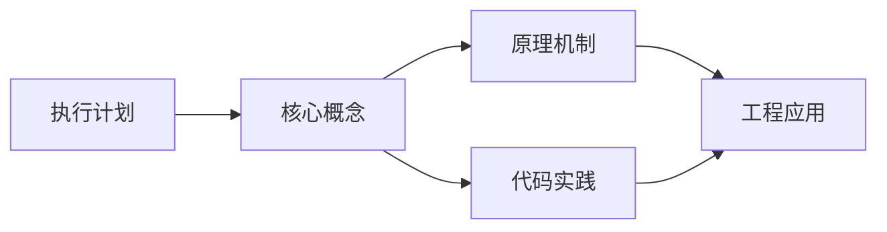
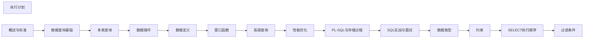

## 1. 学习目标（Bloom 分类）

本节按照布鲁姆教育目标分类学组织学习路径。本文主题为《执行计划》，属于 SQL 模块，读者可以根据自身阶段选择阅读深度。

记忆层面：能够准确复述本文的核心概念、术语与基本语法或操作步骤，并能够在提问或检索时快速定位对应知识点。能够说出 SQL 的核心概念、语法与常用对象。

理解层面：能够用自己的语言解释核心原理与工作机制，说明概念之间的因果关系，而不是机械记忆结论。能够解释 SQL 的执行原理与优化机制。

应用层面：能够在真实项目或练习场景中运用本文知识解决具体问题，写出正确且可维护的实现。能够编写正确、高效的 SQL 语句与操作。

分析层面：能够拆解复杂问题，比较本文主题与相邻概念的异同，识别边界条件与例外情况。能够分析 SQL 相关方案在性能与一致性上的权衡。

评价层面：能够根据约束条件（性能、可读性、安全、成本）评价不同方案的优劣，做出有依据的技术决策。能够根据业务场景评价 SQL 技术选型。

创造层面：能够把本文知识与其他模块知识组合，设计出新的解决方案或可复用的工程模式。能够组合 SQL 与其他技术设计数据架构。

通过本节学习，读者应当能够把《执行计划》纳入自己的知识网络，并与 SQL 模块的其他主题（DDL/DML、查询、索引、事务）建立关联。

## 2. 历史动机与发展脉络

《执行计划》是 SQL 领域的重要主题。要真正理解它，需要先了解它解决的问题与演进过程。

SQL（结构化查询语言）源于 1970 年 Codd 的关系模型，1974 年由 Chamberlin 与 Boyce 设计（SEQUEL），1986 年成为 ANSI 标准；SQL:2023 是当前国际标准。
SQL 分为 DDL（建表）、DML（增删改）、DQL（查询）、DCL（权限）与 TCL（事务）；各大数据库在标准基础上扩展方言。
SQL 是声明式语言：描述“要什么”而非“怎么做”，优化器负责执行计划；这一设计让 SQL 具有跨数据库的表达一致性。

回到本文主题：执行计划 的提出与成熟，正是上述技术背景下的必然产物。早期实现往往以简单可用为目标，随着工程规模扩大，社区逐渐沉淀出标准做法与最佳实践；理解这一脉络，可以帮助读者判断“为什么文档中的推荐写法是现在这个样子”，也能在遇到历史遗留代码时准确识别其设计年代与取舍。


## 3. 形式化定义与核心概念精讲

本节把《执行计划》涉及的核心概念以“定义 + 讲解”的形式展开。读者应把定义当作工具，把讲解当作理解路径；两者结合才能形成可迁移的知识。

关系模型：表（关系）、行（元组）、列（属性）；主键唯一标识、外键表达关联、范式消除冗余。
查询执行：解析 -> 绑定 -> 优化（基于代价选择计划）-> 执行；索引、统计信息与连接算法决定性能。
事务 ACID：原子性（Atomicity）、一致性（Consistency）、隔离性（Isolation）、持久性（Durability）；隔离级别控制并发行为。

### 3.1 原文章节逐一精讲

原文档把主题拆分为 11 个小节，下面按顺序给出每一节的导读讲解，随后保留原文细节供精读。

#### 原文精读（完整保留）

# SQL 执行计划 语法速查手册

> **符号约定**：`< >` 必填参数 | `[ ]` 可选参数

---

#### 1. 执行计划概述

执行计划（Execution Plan）是数据库优化器为 SQL 查询选择的执行策略。理解执行计划是 SQL 性能优化的核心技能。

##### 1.1 优化器类型

| 类型            | 说明                         |
| --------------- | ---------------------------- |
| 基于规则（RBO） | 根据预定义规则选择执行计划   |
| 基于代价（CBO） | 估算各方案代价，选择最优方案 |

现代数据库主要使用 CBO，RBO 作为后备。

#### 2. EXPLAIN 语法

##### 2.1 各数据库语法

```sql
-- PostgreSQL
EXPLAIN SELECT * FROM employees WHERE dept_id = 5;
EXPLAIN ANALYZE SELECT * FROM employees WHERE dept_id = 5;  -- 实际执行

-- MySQL
EXPLAIN SELECT * FROM employees WHERE dept_id = 5;
EXPLAIN ANALYZE SELECT * FROM employees WHERE dept_id = 5;  -- MySQL 8.0+

-- SQL Server
SET SHOWPLAN_TEXT ON;
SELECT * FROM employees WHERE dept_id = 5;

-- Oracle
EXPLAIN PLAN FOR SELECT * FROM employees WHERE dept_id = 5;
SELECT * FROM TABLE(DBMS_XPLAN.DISPLAY);
```

##### 2.2 EXPLAIN vs EXPLAIN ANALYZE

| 特性     | EXPLAIN | EXPLAIN ANALYZE |
| -------- | ------- | --------------- |
| 执行查询 | 否      | 是              |
| 估算代价 | 是      | 是              |
| 实际时间 | 否      | 是              |
| 实际行数 | 否      | 是              |
| 副作用   | 无      | DML 会实际执行  |

#### 3. PostgreSQL 执行计划解读

##### 3.1 基本输出

```sql
EXPLAIN ANALYZE SELECT * FROM employees WHERE dept_id = 5;

-- 输出：
-- Seq Scan on employees  (cost=0.00..15.50 rows=5 width=68) (actual time=0.01..0.03 rows=5 loops=1)
--   Filter: (dept_id = 5)
--   Rows Removed by Filter: 45
-- Planning Time: 0.05 ms
-- Execution Time: 0.05 ms
```

**关键字段解读**：

| 字段        | 含义                         |
| ----------- | ---------------------------- |
| cost=X..Y   | X=启动代价，Y=总代价（估算） |
| rows=N      | 估算返回行数                 |
| width=N     | 估算每行平均字节数           |
| actual time | 实际执行时间（毫秒）         |
| actual rows | 实际返回行数                 |
| loops       | 执行次数                     |

##### 3.2 扫描类型

```sql
-- 顺序扫描（Seq Scan）：全表扫描
Seq Scan on employees
-- 适合：小表、大部分行需要返回

-- 索引扫描（Index Scan）：使用B+树索引
Index Scan using idx_employees_dept on employees
-- 适合：选择性高的查询

-- 仅索引扫描（Index Only Scan）：覆盖索引
Index Only Scan using idx_employees_dept_name on employees
-- 适合：索引包含所有需要的列

-- 位图扫描（Bitmap Heap Scan + Bitmap Index Scan）
Bitmap Heap Scan on employees
  -> Bitmap Index Scan on idx_employees_dept
-- 适合：选择性中等，返回多行

-- 并行扫描（Parallel Seq Scan）
Parallel Seq Scan on employees
  Workers: 2
-- 适合：大表扫描
```

##### 3.3 连接策略

```sql
-- Nested Loop Join
Nested Loop
  -> Index Scan on departments
  -> Index Scan on employees
-- 适合：小表驱动大表

-- Hash Join
Hash Join
  -> Seq Scan on departments
  -> Hash
    -> Seq Scan on employees
-- 适合：大表等值连接

-- Merge Join
Merge Join
  -> Index Scan on departments
  -> Index Scan on employees
-- 适合：已排序数据
```

#### 4. MySQL 执行计划解读

##### 4.1 EXPLAIN 输出列

```sql
EXPLAIN SELECT * FROM employees WHERE dept_id = 5;
```

| 列            | 含义                                  |
| ------------- | ------------------------------------- |
| id            | 查询标识符                            |
| select_type   | 查询类型（SIMPLE, PRIMARY, SUBQUERY） |
| table         | 访问的表                              |
| partitions    | 匹配的分区                            |
| type          | 访问类型（最重要）                    |
| possible_keys | 可能使用的索引                        |
| key           | 实际使用的索引                        |
| key_len       | 使用的索引长度                        |
| ref           | 与索引比较的列                        |
| rows          | 估算扫描行数                          |
| filtered      | 过滤比例                              |
| Extra         | 额外信息                              |

##### 4.2 type 列（访问类型）

从优到劣排序：

| type   | 说明                          | 索引使用 |
| ------ | ----------------------------- | -------- |
| system | 表中只有一行                  | —        |
| const  | 最多匹配一行（主键/唯一索引） | 精确匹配 |
| eq_ref | 每行匹配一行（主键/唯一索引） | 精确匹配 |
| ref    | 匹配多行（非唯一索引）        | 前缀匹配 |
| range  | 范围扫描                      | 范围条件 |
| index  | 全索引扫描                    | 全索引   |
| ALL    | 全表扫描                      | 无索引   |

```sql
-- const：主键等值查询
EXPLAIN SELECT * FROM employees WHERE id = 1;
-- type: const

-- ref：非唯一索引等值查询
EXPLAIN SELECT * FROM employees WHERE dept_id = 5;
-- type: ref

-- range：范围查询
EXPLAIN SELECT * FROM employees WHERE salary > 50000;
-- type: range

-- ALL：全表扫描
EXPLAIN SELECT * FROM employees WHERE YEAR(created_at) = 2026;
-- type: ALL（函数导致索引失效）
```

##### 4.3 Extra 列关键信息

| Extra 值              | 含义                   |
| --------------------- | ---------------------- |
| Using index           | 覆盖索引，无需回表     |
| Using where           | 服务层过滤             |
| Using index condition | 索引下推（ICP）        |
| Using temporary       | 使用临时表             |
| Using filesort        | 额外排序（非索引排序） |
| Using join buffer     | 使用连接缓冲区         |
| Impossible WHERE      | WHERE 条件不可能为真   |

#### 5. 执行计划诊断

##### 5.1 估算 vs 实际

```sql
-- PostgreSQL：对比估算与实际
EXPLAIN ANALYZE SELECT * FROM employees WHERE dept_id = 5;

-- 估算 rows=5 vs 实际 rows=5000
-- 说明统计信息过时，需要 ANALYZE
ANALYZE employees;
```

##### 5.2 常见问题与解决

```sql
-- 问题1：全表扫描
-- 原因：缺少索引或索引失效
-- 解决：创建索引或改写查询
CREATE INDEX idx_employees_dept ON employees(dept_id);

-- 问题2：Using filesort
-- 原因：排序无法利用索引
-- 解决：创建排序索引
CREATE INDEX idx_employees_dept_salary ON employees(dept_id, salary DESC);

-- 问题3：Using temporary
-- 原因：GROUP BY/DISTINCT 需要临时表
-- 解决：优化 GROUP BY 列顺序，使其与索引一致

-- 问题4：rows 估算偏差大
-- 原因：统计信息过时
-- 解决：更新统计信息
ANALYZE employees;  -- PostgreSQL
ANALYZE TABLE employees;  -- MySQL
```

##### 5.3 强制/提示索引

```sql
-- PostgreSQL：禁用顺序扫描
SET enable_seqscan = off;

-- MySQL：USE INDEX / FORCE INDEX
SELECT * FROM employees USE INDEX (idx_dept) WHERE dept_id = 5;
SELECT * FROM employees FORCE INDEX (idx_dept) WHERE dept_id = 5;

-- Oracle：提示
SELECT /*+ INDEX(e idx_dept) */ * FROM employees e WHERE dept_id = 5;
```
#### EXPLAIN 基本用法

**基本写法：MySQL EXPLAIN**
`EXPLAIN <SQL语句>`
```sql
-- 查看 SELECT 执行计划
EXPLAIN SELECT * FROM employees WHERE dept_id = 5;

-- 查看 UPDATE/DELETE 执行计划
EXPLAIN UPDATE employees SET salary = salary * 1.1 WHERE dept_id = 5;
```

---

**基本写法：EXPLAIN ANALYZE 实际执行**
`EXPLAIN ANALYZE <SQL语句>`
```sql
-- PostgreSQL：实际执行并返回耗时统计
EXPLAIN ANALYZE
SELECT * FROM employees WHERE dept_id = 5;

-- MySQL 8.0+ 也支持
EXPLAIN ANALYZE
SELECT * FROM employees e JOIN departments d ON e.dept_id = d.id;
```

---

**基本写法：EXPLAIN FORMAT**
`EXPLAIN FORMAT=JSON <SQL语句>`
```sql
-- MySQL JSON 格式输出更详细信息
EXPLAIN FORMAT=JSON
SELECT * FROM employees WHERE salary > 50000;
```

---

**基本写法：PostgreSQL 详细格式**
`EXPLAIN (FORMAT <格式>) <SQL语句>`
```sql
-- PostgreSQL 输出格式选项
EXPLAIN (FORMAT TEXT) SELECT * FROM employees;
EXPLAIN (FORMAT JSON) SELECT * FROM employees;
EXPLAIN (FORMAT YAML) SELECT * FROM employees;
```

---

**基本写法：查看开销估算**
`EXPLAIN (COSTS ON) <SQL语句>`
```sql
-- PostgreSQL 显示成本估算
EXPLAIN (COSTS ON, ANALYZE ON, BUFFERS ON)
SELECT * FROM employees WHERE salary > 50000;
-- 输出含 cost=0.00..35.50 rows=100 width=256
-- buffers: shared hit=5 read=2
```

---

#### MySQL 执行计划字段

**基本写法：type 字段（访问类型）**
`-- type 表示 MySQL 访问数据的方式`
```sql
-- type 性能从好到差：
-- system   表仅一行
-- const    主键/唯一索引等值查询
-- eq_ref   JOIN 时主键/唯一索引等值匹配
-- ref       非唯一索引等值匹配
-- range    索引范围扫描
-- index    全索引扫描
-- ALL      全表扫描（最差）
```

---

**基本写法：key 字段（实际使用的索引）**
`-- key 显示 MySQL 实际使用的索引名`
```sql
-- 查看是否走了索引
EXPLAIN SELECT * FROM employees WHERE emp_id = 100;
-- key: PRIMARY（走了主键索引）

EXPLAIN SELECT * FROM employees WHERE name = 'Alice';
-- key: NULL（未走索引，全表扫描）
```

---

**基本写法：rows 字段（扫描行数估算）**
`-- rows 表示预估需要扫描的行数`
```sql
-- rows 越小越好
EXPLAIN SELECT * FROM employees WHERE emp_id = 100;
-- rows: 1（高效）

EXPLAIN SELECT * FROM employees WHERE salary > 1000;
-- rows: 5000（较差，可能需要优化）
```

---

**基本写法：Extra 字段（额外信息）**
`-- Extra 显示额外的执行信息`
```sql
-- 常见 Extra 信息：
-- Using index        覆盖索引，无需回表
-- Using where        使用 WHERE 过滤
-- Using temporary    使用临时表（需优化）
-- Using filesort     使用文件排序（需优化）
-- Using join buffer   使用连接缓冲（需优化）
-- Impossible WHERE   WHERE 条件恒假
```

---

**基本写法：possible_keys 字段**
`-- possible_keys 显示可能使用的索引`
```sql
EXPLAIN SELECT * FROM employees WHERE dept_id = 5;
-- possible_keys: idx_dept_id
-- key: idx_dept_id  ← 实际用了
```

---

#### PostgreSQL 执行计划节点

**基本写法：常见扫描节点**
`-- EXPLAIN 输出的节点类型`
```sql
-- Seq Scan        全表顺序扫描
-- Index Scan      索引扫描（回表）
-- Index Only Scan  仅索引扫描（覆盖索引）
-- Bitmap Index Scan + Bitmap Heap Scan 位图扫描
-- Tid Scan        按 CTID 扫描

EXPLAIN SELECT * FROM employees WHERE id = 100;
-- Index Scan using employees_pkey on employees
```

---

**基本写法：连接节点**
`-- JOIN 操作的执行节点`
```sql
-- Nested Loop    嵌套循环（适合小表）
-- Hash Join      哈希连接（适合大表等值连接）
-- Merge Join     合并连接（有序数据）

EXPLAIN SELECT * FROM employees e
JOIN departments d ON e.dept_id = d.id;
-- Hash Join
```

---

**基本写法：聚合与排序节点**
`-- 聚合和排序的执行方式`
```sql
-- HashAggregate    哈希聚合
-- GroupAggregate   分组聚合
-- Sort             排序
-- Limit            限制行数
-- Unique           去重

EXPLAIN SELECT dept, COUNT(*) FROM employees GROUP BY dept;
-- HashAggregate
```

---

#### 索引使用分析

**基本写法：检查索引是否命中**
`EXPLAIN SELECT * FROM <表> WHERE <索引列> = <值>`
```sql
-- 验证索引是否被使用
EXPLAIN SELECT * FROM employees WHERE email = 'test@example.com';
-- key: idx_email ← 索引命中

EXPLAIN SELECT * FROM employees WHERE LEFT(email, 5) = 'test@';
-- key: NULL ← 索引失效（函数操作导致）
```

---

**基本写法：覆盖索引验证**
`EXPLAIN SELECT <索引列> FROM <表> WHERE <条件>`
```sql
-- Extra 显示 Using index 表示覆盖索引
EXPLAIN SELECT emp_id, name FROM employees WHERE dept_id = 5;
-- Extra: Using index ← 覆盖索引，无需回表
```

---

**基本写法：复合索引最左前缀**
`EXPLAIN SELECT * FROM <表> WHERE <复合索引第二列> = <值>`
```sql
-- 验证复合索引是否遵循最左前缀
CREATE INDEX idx_dept_name ON employees(dept_id, name);

-- 能用索引（从 dept_id 开始）
EXPLAIN SELECT * FROM employees WHERE dept_id = 5 AND name = 'Alice';
-- key: idx_dept_name

-- 不能用索引（跳过 dept_id）
EXPLAIN SELECT * FROM employees WHERE name = 'Alice';
-- key: NULL ← 索引失效
```

---

#### 慢查询分析

**基本写法：开启慢查询日志**
`SET GLOBAL slow_query_log = ON;`
```sql
-- MySQL 开启慢查询日志
SET GLOBAL slow_query_log = ON;
SET GLOBAL long_query_time = 1;  -- 超过 1 秒记录
SET GLOBAL slow_query_log_file = '/var/log/mysql/slow.log';
```

---

**基本写法：查看慢查询**
`-- 分析慢查询日志`
```bash
# 使用 mysqldumpslow 分析慢日志
mysqldumpslow -s t -t 10 /var/log/mysql/slow.log
# -s t 按总时间排序
# -t 10 显示前 10 条
```

---

**基本写法：PostgreSQL 慢查询**
`-- 修改 postgresql.conf`
```ini
# postgresql.conf 配置
log_min_duration_statement = 1000  # 记录超过 1 秒的查询
log_statement = 'none'
log_duration = off
```

---

#### 优化器提示

**基本写法：MySQL 索引提示**
`SELECT * FROM <表> FORCE INDEX(<索引名>) WHERE <条件>`
```sql
-- 强制使用指定索引
SELECT * FROM employees FORCE INDEX(idx_dept)
WHERE dept_id = 5;

-- 忽略指定索引
SELECT * FROM employees IGNORE INDEX(idx_name)
WHERE dept_id = 5;
```

---

**基本写法：PostgreSQL 优化器开关**
`SET enable_seqscan = off;`
```sql
-- 临时关闭顺序扫描强制使用索引
SET enable_seqscan = off;
EXPLAIN SELECT * FROM employees WHERE dept_id = 5;
-- 恢复
SET enable_seqscan = on;
```

---

**基本写法：PostgreSQL JOIN 方法控制**
`SET enable_hashjoin = off;`
```sql
-- 强制使用 Nested Loop 而非 Hash Join
SET enable_hashjoin = off;
SET enable_mergejoin = off;
EXPLAIN SELECT * FROM employees e JOIN departments d ON e.dept_id = d.id;
```


### 3.2 概念关系图

下面用 Mermaid 图表达本文核心概念之间的关系，帮助读者建立整体图景：



图中展示的是本文知识的结构化关系：核心概念是入口，原理机制解释“为什么”，代码实践演示“怎么做”，工程应用回答“何时用”。读者学习时可以把每个小节的内容挂接到对应节点上。

## 4. 理论推导与原理解析

本节深入《执行计划》背后的原理。理论部分不求面面俱到，而是聚焦“能解释现象、能指导实践”的关键推导。

关系模型：表（关系）、行（元组）、列（属性）；主键唯一标识、外键表达关联、范式消除冗余。
查询执行：解析 -> 绑定 -> 优化（基于代价选择计划）-> 执行；索引、统计信息与连接算法决定性能。
事务 ACID：原子性（Atomicity）、一致性（Consistency）、隔离性（Isolation）、持久性（Durability）；隔离级别控制并发行为。
集合语义：SELECT 返回结果集；JOIN 组合关系，GROUP BY 聚合，子查询与 CTE 表达复杂逻辑。

需要强调的是，理论推导与工程实践之间存在翻译层：理论给出的是理想化模型与边界条件，工程代码则必须处理真实环境中的例外。读者在学习时应先掌握理论的“标准情形”，再通过陷阱章节了解“非标准情形”。

## 5. 代码示例与逐行讲解

本节把原文中的代码示例系统整理，并为每个示例补充用途说明与讲解。读者不应只浏览代码，而应逐段对照讲解理解设计意图。

### 5.1 示例：2.1 各数据库语法

该示例来自原文《2.1 各数据库语法》小节，用于演示执行计划相关操作。阅读时请先看代码结构，再看其后的讲解。

```sql
-- PostgreSQL
EXPLAIN SELECT * FROM employees WHERE dept_id = 5;
EXPLAIN ANALYZE SELECT * FROM employees WHERE dept_id = 5;  -- 实际执行

-- MySQL
EXPLAIN SELECT * FROM employees WHERE dept_id = 5;
EXPLAIN ANALYZE SELECT * FROM employees WHERE dept_id = 5;  -- MySQL 8.0+

-- SQL Server
SET SHOWPLAN_TEXT ON;
SELECT * FROM employees WHERE dept_id = 5;

-- Oracle
EXPLAIN PLAN FOR SELECT * FROM employees WHERE dept_id = 5;
SELECT * FROM TABLE(DBMS_XPLAN.DISPLAY);
```

讲解：这段代码演示了本节核心知识点。代码中的关键操作可以归纳为三步：准备（定义或初始化）、执行（核心逻辑）、收尾（释放资源或返回结果）。实际项目中，这三步往往被封装为函数或类，以提升复用性与可测试性。

关键点分析：

该示例共 12 行有效代码，包含 2 类关键结构（SELECT、FROM）。其中：

- 入口与初始化部分负责建立上下文，对应实际项目中的启动或装配逻辑；
- 核心逻辑部分体现本文主题的主要操作，是阅读时最需要对照讲解理解的部分；
- 输出或返回部分把结果交给调用方，注意其类型与边界条件。

进阶思考路径：先尝试修改参数观察行为变化，再把示例中的模式迁移到自己的项目中；每次修改都记录预期与实测差异，这是把示例转化为能力的最快方式。

### 5.2 示例：3.1 基本输出

该示例来自原文《3.1 基本输出》小节，用于演示执行计划相关操作。阅读时请先看代码结构，再看其后的讲解。

```sql
EXPLAIN ANALYZE SELECT * FROM employees WHERE dept_id = 5;

-- 输出：
-- Seq Scan on employees  (cost=0.00..15.50 rows=5 width=68) (actual time=0.01..0.03 rows=5 loops=1)
--   Filter: (dept_id = 5)
--   Rows Removed by Filter: 45
-- Planning Time: 0.05 ms
-- Execution Time: 0.05 ms
```

讲解：这段代码演示了本节核心知识点。代码中的关键操作可以归纳为三步：准备（定义或初始化）、执行（核心逻辑）、收尾（释放资源或返回结果）。实际项目中，这三步往往被封装为函数或类，以提升复用性与可测试性。

关键点分析：

该示例共 7 行有效代码，包含 2 类关键结构（SELECT、FROM）。其中：

- 入口与初始化部分负责建立上下文，对应实际项目中的启动或装配逻辑；
- 核心逻辑部分体现本文主题的主要操作，是阅读时最需要对照讲解理解的部分；
- 输出或返回部分把结果交给调用方，注意其类型与边界条件。

进阶思考路径：先尝试修改参数观察行为变化，再把示例中的模式迁移到自己的项目中；每次修改都记录预期与实测差异，这是把示例转化为能力的最快方式。

### 5.3 示例：3.2 扫描类型

该示例来自原文《3.2 扫描类型》小节，用于演示执行计划相关操作。阅读时请先看代码结构，再看其后的讲解。

```sql
-- 顺序扫描（Seq Scan）：全表扫描
Seq Scan on employees
-- 适合：小表、大部分行需要返回

-- 索引扫描（Index Scan）：使用B+树索引
Index Scan using idx_employees_dept on employees
-- 适合：选择性高的查询

-- 仅索引扫描（Index Only Scan）：覆盖索引
Index Only Scan using idx_employees_dept_name on employees
-- 适合：索引包含所有需要的列

-- 位图扫描（Bitmap Heap Scan + Bitmap Index Scan）
Bitmap Heap Scan on employees
  -> Bitmap Index Scan on idx_employees_dept
-- 适合：选择性中等，返回多行

-- 并行扫描（Parallel Seq Scan）
Parallel Seq Scan on employees
  Workers: 2
-- 适合：大表扫描
```

讲解：这段代码演示了本节核心知识点。代码中的关键操作可以归纳为三步：准备（定义或初始化）、执行（核心逻辑）、收尾（释放资源或返回结果）。实际项目中，这三步往往被封装为函数或类，以提升复用性与可测试性。

关键点分析：

该示例共 17 行有效代码，结构以数据或配置为主。阅读时应关注：数据字段的含义、配置项的作用，以及它们与运行行为的对应关系。

进阶思考路径：先尝试修改参数观察行为变化，再把示例中的模式迁移到自己的项目中；每次修改都记录预期与实测差异，这是把示例转化为能力的最快方式。

### 5.4 示例：3.3 连接策略

该示例来自原文《3.3 连接策略》小节，用于演示执行计划相关操作。阅读时请先看代码结构，再看其后的讲解。

```sql
-- Nested Loop Join
Nested Loop
  -> Index Scan on departments
  -> Index Scan on employees
-- 适合：小表驱动大表

-- Hash Join
Hash Join
  -> Seq Scan on departments
  -> Hash
    -> Seq Scan on employees
-- 适合：大表等值连接

-- Merge Join
Merge Join
  -> Index Scan on departments
  -> Index Scan on employees
-- 适合：已排序数据
```

讲解：这段代码演示了本节核心知识点。代码中的关键操作可以归纳为三步：准备（定义或初始化）、执行（核心逻辑）、收尾（释放资源或返回结果）。实际项目中，这三步往往被封装为函数或类，以提升复用性与可测试性。

关键点分析：

该示例共 16 行有效代码，结构以数据或配置为主。阅读时应关注：数据字段的含义、配置项的作用，以及它们与运行行为的对应关系。

进阶思考路径：先尝试修改参数观察行为变化，再把示例中的模式迁移到自己的项目中；每次修改都记录预期与实测差异，这是把示例转化为能力的最快方式。

### 5.5 示例：4.1 EXPLAIN 输出列

该示例来自原文《4.1 EXPLAIN 输出列》小节，用于演示执行计划相关操作。阅读时请先看代码结构，再看其后的讲解。

```sql
EXPLAIN SELECT * FROM employees WHERE dept_id = 5;
```

讲解：这段代码演示了本节核心知识点。代码中的关键操作可以归纳为三步：准备（定义或初始化）、执行（核心逻辑）、收尾（释放资源或返回结果）。实际项目中，这三步往往被封装为函数或类，以提升复用性与可测试性。

关键点分析：

该示例共 1 行有效代码，包含 2 类关键结构（SELECT、FROM）。其中：

- 入口与初始化部分负责建立上下文，对应实际项目中的启动或装配逻辑；
- 核心逻辑部分体现本文主题的主要操作，是阅读时最需要对照讲解理解的部分；
- 输出或返回部分把结果交给调用方，注意其类型与边界条件。

进阶思考路径：先尝试修改参数观察行为变化，再把示例中的模式迁移到自己的项目中；每次修改都记录预期与实测差异，这是把示例转化为能力的最快方式。

### 5.6 示例：4.2 type 列（访问类型）

该示例来自原文《4.2 type 列（访问类型）》小节，用于演示执行计划相关操作。阅读时请先看代码结构，再看其后的讲解。

```sql
-- const：主键等值查询
EXPLAIN SELECT * FROM employees WHERE id = 1;
-- type: const

-- ref：非唯一索引等值查询
EXPLAIN SELECT * FROM employees WHERE dept_id = 5;
-- type: ref

-- range：范围查询
EXPLAIN SELECT * FROM employees WHERE salary > 50000;
-- type: range

-- ALL：全表扫描
EXPLAIN SELECT * FROM employees WHERE YEAR(created_at) = 2026;
-- type: ALL（函数导致索引失效）
```

讲解：这段代码演示了本节核心知识点。代码中的关键操作可以归纳为三步：准备（定义或初始化）、执行（核心逻辑）、收尾（释放资源或返回结果）。实际项目中，这三步往往被封装为函数或类，以提升复用性与可测试性。

关键点分析：

该示例共 12 行有效代码，包含 2 类关键结构（SELECT、FROM）。其中：

- 入口与初始化部分负责建立上下文，对应实际项目中的启动或装配逻辑；
- 核心逻辑部分体现本文主题的主要操作，是阅读时最需要对照讲解理解的部分；
- 输出或返回部分把结果交给调用方，注意其类型与边界条件。

进阶思考路径：先尝试修改参数观察行为变化，再把示例中的模式迁移到自己的项目中；每次修改都记录预期与实测差异，这是把示例转化为能力的最快方式。

### 5.7 示例：5.1 估算 vs 实际

该示例来自原文《5.1 估算 vs 实际》小节，用于演示执行计划相关操作。阅读时请先看代码结构，再看其后的讲解。

```sql
-- PostgreSQL：对比估算与实际
EXPLAIN ANALYZE SELECT * FROM employees WHERE dept_id = 5;

-- 估算 rows=5 vs 实际 rows=5000
-- 说明统计信息过时，需要 ANALYZE
ANALYZE employees;
```

讲解：这段代码演示了本节核心知识点。代码中的关键操作可以归纳为三步：准备（定义或初始化）、执行（核心逻辑）、收尾（释放资源或返回结果）。实际项目中，这三步往往被封装为函数或类，以提升复用性与可测试性。

关键点分析：

该示例共 5 行有效代码，包含 2 类关键结构（SELECT、FROM）。其中：

- 入口与初始化部分负责建立上下文，对应实际项目中的启动或装配逻辑；
- 核心逻辑部分体现本文主题的主要操作，是阅读时最需要对照讲解理解的部分；
- 输出或返回部分把结果交给调用方，注意其类型与边界条件。

进阶思考路径：先尝试修改参数观察行为变化，再把示例中的模式迁移到自己的项目中；每次修改都记录预期与实测差异，这是把示例转化为能力的最快方式。

### 5.8 示例：5.2 常见问题与解决

该示例来自原文《5.2 常见问题与解决》小节，用于演示执行计划相关操作。阅读时请先看代码结构，再看其后的讲解。

```sql
-- 问题1：全表扫描
-- 原因：缺少索引或索引失效
-- 解决：创建索引或改写查询
CREATE INDEX idx_employees_dept ON employees(dept_id);

-- 问题2：Using filesort
-- 原因：排序无法利用索引
-- 解决：创建排序索引
CREATE INDEX idx_employees_dept_salary ON employees(dept_id, salary DESC);

-- 问题3：Using temporary
-- 原因：GROUP BY/DISTINCT 需要临时表
-- 解决：优化 GROUP BY 列顺序，使其与索引一致

-- 问题4：rows 估算偏差大
-- 原因：统计信息过时
-- 解决：更新统计信息
ANALYZE employees;  -- PostgreSQL
ANALYZE TABLE employees;  -- MySQL
```

讲解：这段代码演示了本节核心知识点。代码中的关键操作可以归纳为三步：准备（定义或初始化）、执行（核心逻辑）、收尾（释放资源或返回结果）。实际项目中，这三步往往被封装为函数或类，以提升复用性与可测试性。

关键点分析：

该示例共 16 行有效代码，包含 1 类关键结构（CREATE）。其中：

- 入口与初始化部分负责建立上下文，对应实际项目中的启动或装配逻辑；
- 核心逻辑部分体现本文主题的主要操作，是阅读时最需要对照讲解理解的部分；
- 输出或返回部分把结果交给调用方，注意其类型与边界条件。

进阶思考路径：先尝试修改参数观察行为变化，再把示例中的模式迁移到自己的项目中；每次修改都记录预期与实测差异，这是把示例转化为能力的最快方式。

### 5.9 示例：5.3 强制/提示索引

该示例来自原文《5.3 强制/提示索引》小节，用于演示执行计划相关操作。阅读时请先看代码结构，再看其后的讲解。

```sql
-- PostgreSQL：禁用顺序扫描
SET enable_seqscan = off;

-- MySQL：USE INDEX / FORCE INDEX
SELECT * FROM employees USE INDEX (idx_dept) WHERE dept_id = 5;
SELECT * FROM employees FORCE INDEX (idx_dept) WHERE dept_id = 5;

-- Oracle：提示
SELECT /*+ INDEX(e idx_dept) */ * FROM employees e WHERE dept_id = 5;
```

讲解：这段代码演示了本节核心知识点。代码中的关键操作可以归纳为三步：准备（定义或初始化）、执行（核心逻辑）、收尾（释放资源或返回结果）。实际项目中，这三步往往被封装为函数或类，以提升复用性与可测试性。

关键点分析：

该示例共 7 行有效代码，包含 2 类关键结构（SELECT、FROM）。其中：

- 入口与初始化部分负责建立上下文，对应实际项目中的启动或装配逻辑；
- 核心逻辑部分体现本文主题的主要操作，是阅读时最需要对照讲解理解的部分；
- 输出或返回部分把结果交给调用方，注意其类型与边界条件。

进阶思考路径：先尝试修改参数观察行为变化，再把示例中的模式迁移到自己的项目中；每次修改都记录预期与实测差异，这是把示例转化为能力的最快方式。

### 5.10 示例：EXPLAIN 基本用法

该示例来自原文《EXPLAIN 基本用法》小节，用于演示执行计划相关操作。阅读时请先看代码结构，再看其后的讲解。

```sql
-- 查看 SELECT 执行计划
EXPLAIN SELECT * FROM employees WHERE dept_id = 5;

-- 查看 UPDATE/DELETE 执行计划
EXPLAIN UPDATE employees SET salary = salary * 1.1 WHERE dept_id = 5;
```

讲解：这段代码演示了本节核心知识点。代码中的关键操作可以归纳为三步：准备（定义或初始化）、执行（核心逻辑）、收尾（释放资源或返回结果）。实际项目中，这三步往往被封装为函数或类，以提升复用性与可测试性。

关键点分析：

该示例共 4 行有效代码，包含 2 类关键结构（SELECT、FROM）。其中：

- 入口与初始化部分负责建立上下文，对应实际项目中的启动或装配逻辑；
- 核心逻辑部分体现本文主题的主要操作，是阅读时最需要对照讲解理解的部分；
- 输出或返回部分把结果交给调用方，注意其类型与边界条件。

进阶思考路径：先尝试修改参数观察行为变化，再把示例中的模式迁移到自己的项目中；每次修改都记录预期与实测差异，这是把示例转化为能力的最快方式。

### 5.11 示例：EXPLAIN 基本用法

该示例来自原文《EXPLAIN 基本用法》小节，用于演示执行计划相关操作。阅读时请先看代码结构，再看其后的讲解。

```sql
-- PostgreSQL：实际执行并返回耗时统计
EXPLAIN ANALYZE
SELECT * FROM employees WHERE dept_id = 5;

-- MySQL 8.0+ 也支持
EXPLAIN ANALYZE
SELECT * FROM employees e JOIN departments d ON e.dept_id = d.id;
```

讲解：这段代码演示了本节核心知识点。代码中的关键操作可以归纳为三步：准备（定义或初始化）、执行（核心逻辑）、收尾（释放资源或返回结果）。实际项目中，这三步往往被封装为函数或类，以提升复用性与可测试性。

关键点分析：

该示例共 6 行有效代码，包含 2 类关键结构（SELECT、FROM）。其中：

- 入口与初始化部分负责建立上下文，对应实际项目中的启动或装配逻辑；
- 核心逻辑部分体现本文主题的主要操作，是阅读时最需要对照讲解理解的部分；
- 输出或返回部分把结果交给调用方，注意其类型与边界条件。

进阶思考路径：先尝试修改参数观察行为变化，再把示例中的模式迁移到自己的项目中；每次修改都记录预期与实测差异，这是把示例转化为能力的最快方式。

### 5.12 示例：EXPLAIN 基本用法

该示例来自原文《EXPLAIN 基本用法》小节，用于演示执行计划相关操作。阅读时请先看代码结构，再看其后的讲解。

```sql
-- MySQL JSON 格式输出更详细信息
EXPLAIN FORMAT=JSON
SELECT * FROM employees WHERE salary > 50000;
```

讲解：这段代码演示了本节核心知识点。代码中的关键操作可以归纳为三步：准备（定义或初始化）、执行（核心逻辑）、收尾（释放资源或返回结果）。实际项目中，这三步往往被封装为函数或类，以提升复用性与可测试性。

关键点分析：

该示例共 3 行有效代码，包含 2 类关键结构（SELECT、FROM）。其中：

- 入口与初始化部分负责建立上下文，对应实际项目中的启动或装配逻辑；
- 核心逻辑部分体现本文主题的主要操作，是阅读时最需要对照讲解理解的部分；
- 输出或返回部分把结果交给调用方，注意其类型与边界条件。

进阶思考路径：先尝试修改参数观察行为变化，再把示例中的模式迁移到自己的项目中；每次修改都记录预期与实测差异，这是把示例转化为能力的最快方式。

### 5.13 示例：EXPLAIN 基本用法

该示例来自原文《EXPLAIN 基本用法》小节，用于演示执行计划相关操作。阅读时请先看代码结构，再看其后的讲解。

```sql
-- PostgreSQL 输出格式选项
EXPLAIN (FORMAT TEXT) SELECT * FROM employees;
EXPLAIN (FORMAT JSON) SELECT * FROM employees;
EXPLAIN (FORMAT YAML) SELECT * FROM employees;
```

讲解：这段代码演示了本节核心知识点。代码中的关键操作可以归纳为三步：准备（定义或初始化）、执行（核心逻辑）、收尾（释放资源或返回结果）。实际项目中，这三步往往被封装为函数或类，以提升复用性与可测试性。

关键点分析：

该示例共 4 行有效代码，包含 2 类关键结构（SELECT、FROM）。其中：

- 入口与初始化部分负责建立上下文，对应实际项目中的启动或装配逻辑；
- 核心逻辑部分体现本文主题的主要操作，是阅读时最需要对照讲解理解的部分；
- 输出或返回部分把结果交给调用方，注意其类型与边界条件。

进阶思考路径：先尝试修改参数观察行为变化，再把示例中的模式迁移到自己的项目中；每次修改都记录预期与实测差异，这是把示例转化为能力的最快方式。

### 5.14 示例：EXPLAIN 基本用法

该示例来自原文《EXPLAIN 基本用法》小节，用于演示执行计划相关操作。阅读时请先看代码结构，再看其后的讲解。

```sql
-- PostgreSQL 显示成本估算
EXPLAIN (COSTS ON, ANALYZE ON, BUFFERS ON)
SELECT * FROM employees WHERE salary > 50000;
-- 输出含 cost=0.00..35.50 rows=100 width=256
-- buffers: shared hit=5 read=2
```

讲解：这段代码演示了本节核心知识点。代码中的关键操作可以归纳为三步：准备（定义或初始化）、执行（核心逻辑）、收尾（释放资源或返回结果）。实际项目中，这三步往往被封装为函数或类，以提升复用性与可测试性。

关键点分析：

该示例共 5 行有效代码，包含 2 类关键结构（SELECT、FROM）。其中：

- 入口与初始化部分负责建立上下文，对应实际项目中的启动或装配逻辑；
- 核心逻辑部分体现本文主题的主要操作，是阅读时最需要对照讲解理解的部分；
- 输出或返回部分把结果交给调用方，注意其类型与边界条件。

进阶思考路径：先尝试修改参数观察行为变化，再把示例中的模式迁移到自己的项目中；每次修改都记录预期与实测差异，这是把示例转化为能力的最快方式。

### 5.15 示例：MySQL 执行计划字段

该示例来自原文《MySQL 执行计划字段》小节，用于演示执行计划相关操作。阅读时请先看代码结构，再看其后的讲解。

```sql
-- type 性能从好到差：
-- system   表仅一行
-- const    主键/唯一索引等值查询
-- eq_ref   JOIN 时主键/唯一索引等值匹配
-- ref       非唯一索引等值匹配
-- range    索引范围扫描
-- index    全索引扫描
-- ALL      全表扫描（最差）
```

讲解：这段代码演示了本节核心知识点。代码中的关键操作可以归纳为三步：准备（定义或初始化）、执行（核心逻辑）、收尾（释放资源或返回结果）。实际项目中，这三步往往被封装为函数或类，以提升复用性与可测试性。

关键点分析：

该示例共 8 行有效代码，结构以数据或配置为主。阅读时应关注：数据字段的含义、配置项的作用，以及它们与运行行为的对应关系。

进阶思考路径：先尝试修改参数观察行为变化，再把示例中的模式迁移到自己的项目中；每次修改都记录预期与实测差异，这是把示例转化为能力的最快方式。

### 5.16 示例：MySQL 执行计划字段

该示例来自原文《MySQL 执行计划字段》小节，用于演示执行计划相关操作。阅读时请先看代码结构，再看其后的讲解。

```sql
-- 查看是否走了索引
EXPLAIN SELECT * FROM employees WHERE emp_id = 100;
-- key: PRIMARY（走了主键索引）

EXPLAIN SELECT * FROM employees WHERE name = 'Alice';
-- key: NULL（未走索引，全表扫描）
```

讲解：这段代码演示了本节核心知识点。代码中的关键操作可以归纳为三步：准备（定义或初始化）、执行（核心逻辑）、收尾（释放资源或返回结果）。实际项目中，这三步往往被封装为函数或类，以提升复用性与可测试性。

关键点分析：

该示例共 5 行有效代码，包含 2 类关键结构（SELECT、FROM）。其中：

- 入口与初始化部分负责建立上下文，对应实际项目中的启动或装配逻辑；
- 核心逻辑部分体现本文主题的主要操作，是阅读时最需要对照讲解理解的部分；
- 输出或返回部分把结果交给调用方，注意其类型与边界条件。

进阶思考路径：先尝试修改参数观察行为变化，再把示例中的模式迁移到自己的项目中；每次修改都记录预期与实测差异，这是把示例转化为能力的最快方式。

### 5.17 示例：MySQL 执行计划字段

该示例来自原文《MySQL 执行计划字段》小节，用于演示执行计划相关操作。阅读时请先看代码结构，再看其后的讲解。

```sql
-- rows 越小越好
EXPLAIN SELECT * FROM employees WHERE emp_id = 100;
-- rows: 1（高效）

EXPLAIN SELECT * FROM employees WHERE salary > 1000;
-- rows: 5000（较差，可能需要优化）
```

讲解：这段代码演示了本节核心知识点。代码中的关键操作可以归纳为三步：准备（定义或初始化）、执行（核心逻辑）、收尾（释放资源或返回结果）。实际项目中，这三步往往被封装为函数或类，以提升复用性与可测试性。

关键点分析：

该示例共 5 行有效代码，包含 2 类关键结构（SELECT、FROM）。其中：

- 入口与初始化部分负责建立上下文，对应实际项目中的启动或装配逻辑；
- 核心逻辑部分体现本文主题的主要操作，是阅读时最需要对照讲解理解的部分；
- 输出或返回部分把结果交给调用方，注意其类型与边界条件。

进阶思考路径：先尝试修改参数观察行为变化，再把示例中的模式迁移到自己的项目中；每次修改都记录预期与实测差异，这是把示例转化为能力的最快方式。

### 5.18 示例：MySQL 执行计划字段

该示例来自原文《MySQL 执行计划字段》小节，用于演示执行计划相关操作。阅读时请先看代码结构，再看其后的讲解。

```sql
-- 常见 Extra 信息：
-- Using index        覆盖索引，无需回表
-- Using where        使用 WHERE 过滤
-- Using temporary    使用临时表（需优化）
-- Using filesort     使用文件排序（需优化）
-- Using join buffer   使用连接缓冲（需优化）
-- Impossible WHERE   WHERE 条件恒假
```

讲解：这段代码演示了本节核心知识点。代码中的关键操作可以归纳为三步：准备（定义或初始化）、执行（核心逻辑）、收尾（释放资源或返回结果）。实际项目中，这三步往往被封装为函数或类，以提升复用性与可测试性。

关键点分析：

该示例共 7 行有效代码，结构以数据或配置为主。阅读时应关注：数据字段的含义、配置项的作用，以及它们与运行行为的对应关系。

进阶思考路径：先尝试修改参数观察行为变化，再把示例中的模式迁移到自己的项目中；每次修改都记录预期与实测差异，这是把示例转化为能力的最快方式。

### 5.19 示例：MySQL 执行计划字段

该示例来自原文《MySQL 执行计划字段》小节，用于演示执行计划相关操作。阅读时请先看代码结构，再看其后的讲解。

```sql
EXPLAIN SELECT * FROM employees WHERE dept_id = 5;
-- possible_keys: idx_dept_id
-- key: idx_dept_id  ← 实际用了
```

讲解：这段代码演示了本节核心知识点。代码中的关键操作可以归纳为三步：准备（定义或初始化）、执行（核心逻辑）、收尾（释放资源或返回结果）。实际项目中，这三步往往被封装为函数或类，以提升复用性与可测试性。

关键点分析：

该示例共 3 行有效代码，包含 2 类关键结构（SELECT、FROM）。其中：

- 入口与初始化部分负责建立上下文，对应实际项目中的启动或装配逻辑；
- 核心逻辑部分体现本文主题的主要操作，是阅读时最需要对照讲解理解的部分；
- 输出或返回部分把结果交给调用方，注意其类型与边界条件。

进阶思考路径：先尝试修改参数观察行为变化，再把示例中的模式迁移到自己的项目中；每次修改都记录预期与实测差异，这是把示例转化为能力的最快方式。

### 5.20 示例：PostgreSQL 执行计划节点

该示例来自原文《PostgreSQL 执行计划节点》小节，用于演示执行计划相关操作。阅读时请先看代码结构，再看其后的讲解。

```sql
-- Seq Scan        全表顺序扫描
-- Index Scan      索引扫描（回表）
-- Index Only Scan  仅索引扫描（覆盖索引）
-- Bitmap Index Scan + Bitmap Heap Scan 位图扫描
-- Tid Scan        按 CTID 扫描

EXPLAIN SELECT * FROM employees WHERE id = 100;
-- Index Scan using employees_pkey on employees
```

讲解：这段代码演示了本节核心知识点。代码中的关键操作可以归纳为三步：准备（定义或初始化）、执行（核心逻辑）、收尾（释放资源或返回结果）。实际项目中，这三步往往被封装为函数或类，以提升复用性与可测试性。

关键点分析：

该示例共 7 行有效代码，包含 2 类关键结构（SELECT、FROM）。其中：

- 入口与初始化部分负责建立上下文，对应实际项目中的启动或装配逻辑；
- 核心逻辑部分体现本文主题的主要操作，是阅读时最需要对照讲解理解的部分；
- 输出或返回部分把结果交给调用方，注意其类型与边界条件。

进阶思考路径：先尝试修改参数观察行为变化，再把示例中的模式迁移到自己的项目中；每次修改都记录预期与实测差异，这是把示例转化为能力的最快方式。

### 5.21 示例：PostgreSQL 执行计划节点

该示例来自原文《PostgreSQL 执行计划节点》小节，用于演示执行计划相关操作。阅读时请先看代码结构，再看其后的讲解。

```sql
-- Nested Loop    嵌套循环（适合小表）
-- Hash Join      哈希连接（适合大表等值连接）
-- Merge Join     合并连接（有序数据）

EXPLAIN SELECT * FROM employees e
JOIN departments d ON e.dept_id = d.id;
-- Hash Join
```

讲解：这段代码演示了本节核心知识点。代码中的关键操作可以归纳为三步：准备（定义或初始化）、执行（核心逻辑）、收尾（释放资源或返回结果）。实际项目中，这三步往往被封装为函数或类，以提升复用性与可测试性。

关键点分析：

该示例共 6 行有效代码，包含 2 类关键结构（SELECT、FROM）。其中：

- 入口与初始化部分负责建立上下文，对应实际项目中的启动或装配逻辑；
- 核心逻辑部分体现本文主题的主要操作，是阅读时最需要对照讲解理解的部分；
- 输出或返回部分把结果交给调用方，注意其类型与边界条件。

进阶思考路径：先尝试修改参数观察行为变化，再把示例中的模式迁移到自己的项目中；每次修改都记录预期与实测差异，这是把示例转化为能力的最快方式。

### 5.22 示例：PostgreSQL 执行计划节点

该示例来自原文《PostgreSQL 执行计划节点》小节，用于演示执行计划相关操作。阅读时请先看代码结构，再看其后的讲解。

```sql
-- HashAggregate    哈希聚合
-- GroupAggregate   分组聚合
-- Sort             排序
-- Limit            限制行数
-- Unique           去重

EXPLAIN SELECT dept, COUNT(*) FROM employees GROUP BY dept;
-- HashAggregate
```

讲解：这段代码演示了本节核心知识点。代码中的关键操作可以归纳为三步：准备（定义或初始化）、执行（核心逻辑）、收尾（释放资源或返回结果）。实际项目中，这三步往往被封装为函数或类，以提升复用性与可测试性。

关键点分析：

该示例共 7 行有效代码，包含 2 类关键结构（SELECT、FROM）。其中：

- 入口与初始化部分负责建立上下文，对应实际项目中的启动或装配逻辑；
- 核心逻辑部分体现本文主题的主要操作，是阅读时最需要对照讲解理解的部分；
- 输出或返回部分把结果交给调用方，注意其类型与边界条件。

进阶思考路径：先尝试修改参数观察行为变化，再把示例中的模式迁移到自己的项目中；每次修改都记录预期与实测差异，这是把示例转化为能力的最快方式。

### 5.23 示例：索引使用分析

该示例来自原文《索引使用分析》小节，用于演示执行计划相关操作。阅读时请先看代码结构，再看其后的讲解。

```sql
-- 验证索引是否被使用
EXPLAIN SELECT * FROM employees WHERE email = 'test@example.com';
-- key: idx_email ← 索引命中

EXPLAIN SELECT * FROM employees WHERE LEFT(email, 5) = 'test@';
-- key: NULL ← 索引失效（函数操作导致）
```

讲解：这段代码演示了本节核心知识点。代码中的关键操作可以归纳为三步：准备（定义或初始化）、执行（核心逻辑）、收尾（释放资源或返回结果）。实际项目中，这三步往往被封装为函数或类，以提升复用性与可测试性。

关键点分析：

该示例共 5 行有效代码，包含 2 类关键结构（SELECT、FROM）。其中：

- 入口与初始化部分负责建立上下文，对应实际项目中的启动或装配逻辑；
- 核心逻辑部分体现本文主题的主要操作，是阅读时最需要对照讲解理解的部分；
- 输出或返回部分把结果交给调用方，注意其类型与边界条件。

进阶思考路径：先尝试修改参数观察行为变化，再把示例中的模式迁移到自己的项目中；每次修改都记录预期与实测差异，这是把示例转化为能力的最快方式。

### 5.24 示例：索引使用分析

该示例来自原文《索引使用分析》小节，用于演示执行计划相关操作。阅读时请先看代码结构，再看其后的讲解。

```sql
-- Extra 显示 Using index 表示覆盖索引
EXPLAIN SELECT emp_id, name FROM employees WHERE dept_id = 5;
-- Extra: Using index ← 覆盖索引，无需回表
```

讲解：这段代码演示了本节核心知识点。代码中的关键操作可以归纳为三步：准备（定义或初始化）、执行（核心逻辑）、收尾（释放资源或返回结果）。实际项目中，这三步往往被封装为函数或类，以提升复用性与可测试性。

关键点分析：

该示例共 3 行有效代码，包含 2 类关键结构（SELECT、FROM）。其中：

- 入口与初始化部分负责建立上下文，对应实际项目中的启动或装配逻辑；
- 核心逻辑部分体现本文主题的主要操作，是阅读时最需要对照讲解理解的部分；
- 输出或返回部分把结果交给调用方，注意其类型与边界条件。

进阶思考路径：先尝试修改参数观察行为变化，再把示例中的模式迁移到自己的项目中；每次修改都记录预期与实测差异，这是把示例转化为能力的最快方式。

### 5.25 示例：索引使用分析

该示例来自原文《索引使用分析》小节，用于演示执行计划相关操作。阅读时请先看代码结构，再看其后的讲解。

```sql
-- 验证复合索引是否遵循最左前缀
CREATE INDEX idx_dept_name ON employees(dept_id, name);

-- 能用索引（从 dept_id 开始）
EXPLAIN SELECT * FROM employees WHERE dept_id = 5 AND name = 'Alice';
-- key: idx_dept_name

-- 不能用索引（跳过 dept_id）
EXPLAIN SELECT * FROM employees WHERE name = 'Alice';
-- key: NULL ← 索引失效
```

讲解：这段代码演示了本节核心知识点。代码中的关键操作可以归纳为三步：准备（定义或初始化）、执行（核心逻辑）、收尾（释放资源或返回结果）。实际项目中，这三步往往被封装为函数或类，以提升复用性与可测试性。

关键点分析：

该示例共 8 行有效代码，包含 3 类关键结构（SELECT、CREATE、FROM）。其中：

- 入口与初始化部分负责建立上下文，对应实际项目中的启动或装配逻辑；
- 核心逻辑部分体现本文主题的主要操作，是阅读时最需要对照讲解理解的部分；
- 输出或返回部分把结果交给调用方，注意其类型与边界条件。

进阶思考路径：先尝试修改参数观察行为变化，再把示例中的模式迁移到自己的项目中；每次修改都记录预期与实测差异，这是把示例转化为能力的最快方式。

### 5.26 示例：慢查询分析

该示例来自原文《慢查询分析》小节，用于演示执行计划相关操作。阅读时请先看代码结构，再看其后的讲解。

```sql
-- MySQL 开启慢查询日志
SET GLOBAL slow_query_log = ON;
SET GLOBAL long_query_time = 1;  -- 超过 1 秒记录
SET GLOBAL slow_query_log_file = '/var/log/mysql/slow.log';
```

讲解：这段代码演示了本节核心知识点。代码中的关键操作可以归纳为三步：准备（定义或初始化）、执行（核心逻辑）、收尾（释放资源或返回结果）。实际项目中，这三步往往被封装为函数或类，以提升复用性与可测试性。

关键点分析：

该示例共 4 行有效代码，结构以数据或配置为主。阅读时应关注：数据字段的含义、配置项的作用，以及它们与运行行为的对应关系。

进阶思考路径：先尝试修改参数观察行为变化，再把示例中的模式迁移到自己的项目中；每次修改都记录预期与实测差异，这是把示例转化为能力的最快方式。

### 5.27 示例：慢查询分析

该示例来自原文《慢查询分析》小节，用于演示执行计划相关操作。阅读时请先看代码结构，再看其后的讲解。

```bash
# 使用 mysqldumpslow 分析慢日志
mysqldumpslow -s t -t 10 /var/log/mysql/slow.log
# -s t 按总时间排序
# -t 10 显示前 10 条
```

讲解：这段代码演示了本节核心知识点。代码中的关键操作可以归纳为三步：准备（定义或初始化）、执行（核心逻辑）、收尾（释放资源或返回结果）。实际项目中，这三步往往被封装为函数或类，以提升复用性与可测试性。

关键点分析：

该示例共 4 行有效代码，结构以数据或配置为主。阅读时应关注：数据字段的含义、配置项的作用，以及它们与运行行为的对应关系。

进阶思考路径：先尝试修改参数观察行为变化，再把示例中的模式迁移到自己的项目中；每次修改都记录预期与实测差异，这是把示例转化为能力的最快方式。

### 5.28 示例：慢查询分析

该示例来自原文《慢查询分析》小节，用于演示执行计划相关操作。阅读时请先看代码结构，再看其后的讲解。

```ini
# postgresql.conf 配置
log_min_duration_statement = 1000  # 记录超过 1 秒的查询
log_statement = 'none'
log_duration = off
```

讲解：这段代码演示了本节核心知识点。代码中的关键操作可以归纳为三步：准备（定义或初始化）、执行（核心逻辑）、收尾（释放资源或返回结果）。实际项目中，这三步往往被封装为函数或类，以提升复用性与可测试性。

关键点分析：

该示例共 4 行有效代码，结构以数据或配置为主。阅读时应关注：数据字段的含义、配置项的作用，以及它们与运行行为的对应关系。

进阶思考路径：先尝试修改参数观察行为变化，再把示例中的模式迁移到自己的项目中；每次修改都记录预期与实测差异，这是把示例转化为能力的最快方式。

### 5.29 示例：优化器提示

该示例来自原文《优化器提示》小节，用于演示执行计划相关操作。阅读时请先看代码结构，再看其后的讲解。

```sql
-- 强制使用指定索引
SELECT * FROM employees FORCE INDEX(idx_dept)
WHERE dept_id = 5;

-- 忽略指定索引
SELECT * FROM employees IGNORE INDEX(idx_name)
WHERE dept_id = 5;
```

讲解：这段代码演示了本节核心知识点。代码中的关键操作可以归纳为三步：准备（定义或初始化）、执行（核心逻辑）、收尾（释放资源或返回结果）。实际项目中，这三步往往被封装为函数或类，以提升复用性与可测试性。

关键点分析：

该示例共 6 行有效代码，包含 2 类关键结构（SELECT、FROM）。其中：

- 入口与初始化部分负责建立上下文，对应实际项目中的启动或装配逻辑；
- 核心逻辑部分体现本文主题的主要操作，是阅读时最需要对照讲解理解的部分；
- 输出或返回部分把结果交给调用方，注意其类型与边界条件。

进阶思考路径：先尝试修改参数观察行为变化，再把示例中的模式迁移到自己的项目中；每次修改都记录预期与实测差异，这是把示例转化为能力的最快方式。

### 5.30 示例：优化器提示

该示例来自原文《优化器提示》小节，用于演示执行计划相关操作。阅读时请先看代码结构，再看其后的讲解。

```sql
-- 临时关闭顺序扫描强制使用索引
SET enable_seqscan = off;
EXPLAIN SELECT * FROM employees WHERE dept_id = 5;
-- 恢复
SET enable_seqscan = on;
```

讲解：这段代码演示了本节核心知识点。代码中的关键操作可以归纳为三步：准备（定义或初始化）、执行（核心逻辑）、收尾（释放资源或返回结果）。实际项目中，这三步往往被封装为函数或类，以提升复用性与可测试性。

关键点分析：

该示例共 5 行有效代码，包含 2 类关键结构（SELECT、FROM）。其中：

- 入口与初始化部分负责建立上下文，对应实际项目中的启动或装配逻辑；
- 核心逻辑部分体现本文主题的主要操作，是阅读时最需要对照讲解理解的部分；
- 输出或返回部分把结果交给调用方，注意其类型与边界条件。

进阶思考路径：先尝试修改参数观察行为变化，再把示例中的模式迁移到自己的项目中；每次修改都记录预期与实测差异，这是把示例转化为能力的最快方式。

### 5.31 示例：优化器提示

该示例来自原文《优化器提示》小节，用于演示执行计划相关操作。阅读时请先看代码结构，再看其后的讲解。

```sql
-- 强制使用 Nested Loop 而非 Hash Join
SET enable_hashjoin = off;
SET enable_mergejoin = off;
EXPLAIN SELECT * FROM employees e JOIN departments d ON e.dept_id = d.id;
```

讲解：这段代码演示了本节核心知识点。代码中的关键操作可以归纳为三步：准备（定义或初始化）、执行（核心逻辑）、收尾（释放资源或返回结果）。实际项目中，这三步往往被封装为函数或类，以提升复用性与可测试性。

关键点分析：

该示例共 4 行有效代码，包含 2 类关键结构（SELECT、FROM）。其中：

- 入口与初始化部分负责建立上下文，对应实际项目中的启动或装配逻辑；
- 核心逻辑部分体现本文主题的主要操作，是阅读时最需要对照讲解理解的部分；
- 输出或返回部分把结果交给调用方，注意其类型与边界条件。

进阶思考路径：先尝试修改参数观察行为变化，再把示例中的模式迁移到自己的项目中；每次修改都记录预期与实测差异，这是把示例转化为能力的最快方式。


综合以上示例，可以总结出本主题的代码实践要点：第一，先定义清晰的输入输出契约；第二，核心逻辑保持单一职责；第三，错误处理与边界条件不可省略；第四，命名与注释表达意图而非复述代码。

## 6. 对比分析

对比是理解《执行计划》定位的最快路径。下面从多个维度与相邻方案进行对比。

SQL 与 NoSQL：SQL 适合关系与事务，NoSQL（文档/键值/宽表）适合弹性扩展与特定模型；混合架构常见。
MySQL 与 PostgreSQL：MySQL 生态普及、复制成熟；PostgreSQL 功能全面（窗口、JSON、扩展）。
存储过程与业务代码：复杂逻辑放应用层更可测试；存储过程适合强封装场景。

对比的目的不是分出绝对优劣，而是建立选择依据：不同约束条件下，最优解不同。读者应把每个对比维度转化为决策检查清单。

## 7. 常见陷阱与最佳实践

本节整理该主题的高频错误与推荐做法。每个陷阱先描述现象，再解释原因，最后给出最佳实践。

### 7.1 SELECT * 滥用

返回多余列浪费带宽且破坏视图依赖。显式列出所需列。

深入讲解：该问题之所以被归类为“常见陷阱”，是因为它在初学者的代码中反复出现，而且往往不在第一时间暴露——错误通常隐藏在特定数据或特定时序下。

从成因上看，SELECT * 滥用 一般源于对 SQL 某个机制的理解偏差：要么误用了默认行为，要么忽略了边界条件，要么把其他语言的思维惯性带了过来。

从影响上看，SELECT * 滥用 轻则产生错误结果，重则导致资源泄漏、数据损坏或安全事故；这也是为什么工程评审中会把它列为检查项。

从修复策略上看，处理SELECT * 滥用的正确顺序是：先复现（构造最小用例），再定位（确认机制层面的根因），最后修复并补充回归测试。跳过复现直接改代码，往往治标不治本。

### 7.2 隐式类型转换

字符串与数字比较走转换，索引失效。保持类型一致。

深入讲解：该问题之所以被归类为“常见陷阱”，是因为它在初学者的代码中反复出现，而且往往不在第一时间暴露——错误通常隐藏在特定数据或特定时序下。

从成因上看，隐式类型转换 一般源于对 SQL 某个机制的理解偏差：要么误用了默认行为，要么忽略了边界条件，要么把其他语言的思维惯性带了过来。

从影响上看，隐式类型转换 轻则产生错误结果，重则导致资源泄漏、数据损坏或安全事故；这也是为什么工程评审中会把它列为检查项。

从修复策略上看，处理隐式类型转换的正确顺序是：先复现（构造最小用例），再定位（确认机制层面的根因），最后修复并补充回归测试。跳过复现直接改代码，往往治标不治本。

### 7.3 函数包裹索引列

WHERE DATE(ts)=... 无法用索引。使用范围条件。

深入讲解：该问题之所以被归类为“常见陷阱”，是因为它在初学者的代码中反复出现，而且往往不在第一时间暴露——错误通常隐藏在特定数据或特定时序下。

从成因上看，函数包裹索引列 一般源于对 SQL 某个机制的理解偏差：要么误用了默认行为，要么忽略了边界条件，要么把其他语言的思维惯性带了过来。

从影响上看，函数包裹索引列 轻则产生错误结果，重则导致资源泄漏、数据损坏或安全事故；这也是为什么工程评审中会把它列为检查项。

从修复策略上看，处理函数包裹索引列的正确顺序是：先复现（构造最小用例），再定位（确认机制层面的根因），最后修复并补充回归测试。跳过复现直接改代码，往往治标不治本。

### 7.4 分页偏移过大

OFFSET 大时扫描大量行。使用游标或键集分页。

深入讲解：该问题之所以被归类为“常见陷阱”，是因为它在初学者的代码中反复出现，而且往往不在第一时间暴露——错误通常隐藏在特定数据或特定时序下。

从成因上看，分页偏移过大 一般源于对 SQL 某个机制的理解偏差：要么误用了默认行为，要么忽略了边界条件，要么把其他语言的思维惯性带了过来。

从影响上看，分页偏移过大 轻则产生错误结果，重则导致资源泄漏、数据损坏或安全事故；这也是为什么工程评审中会把它列为检查项。

从修复策略上看，处理分页偏移过大的正确顺序是：先复现（构造最小用例），再定位（确认机制层面的根因），最后修复并补充回归测试。跳过复现直接改代码，往往治标不治本。

### 7.5 事务内做慢查询

长事务锁资源。事务保持短小。

深入讲解：该问题之所以被归类为“常见陷阱”，是因为它在初学者的代码中反复出现，而且往往不在第一时间暴露——错误通常隐藏在特定数据或特定时序下。

从成因上看，事务内做慢查询 一般源于对 SQL 某个机制的理解偏差：要么误用了默认行为，要么忽略了边界条件，要么把其他语言的思维惯性带了过来。

从影响上看，事务内做慢查询 轻则产生错误结果，重则导致资源泄漏、数据损坏或安全事故；这也是为什么工程评审中会把它列为检查项。

从修复策略上看，处理事务内做慢查询的正确顺序是：先复现（构造最小用例），再定位（确认机制层面的根因），最后修复并补充回归测试。跳过复现直接改代码，往往治标不治本。

### 7.6 N+1 查询

循环查库。使用 JOIN 或批量查询。

深入讲解：该问题之所以被归类为“常见陷阱”，是因为它在初学者的代码中反复出现，而且往往不在第一时间暴露——错误通常隐藏在特定数据或特定时序下。

从成因上看，N+1 查询 一般源于对 SQL 某个机制的理解偏差：要么误用了默认行为，要么忽略了边界条件，要么把其他语言的思维惯性带了过来。

从影响上看，N+1 查询 轻则产生错误结果，重则导致资源泄漏、数据损坏或安全事故；这也是为什么工程评审中会把它列为检查项。

从修复策略上看，处理N+1 查询的正确顺序是：先复现（构造最小用例），再定位（确认机制层面的根因），最后修复并补充回归测试。跳过复现直接改代码，往往治标不治本。

### 7.7 不设外键约束

应用层维护引用完整性易漏。关键关系使用外键。

深入讲解：该问题之所以被归类为“常见陷阱”，是因为它在初学者的代码中反复出现，而且往往不在第一时间暴露——错误通常隐藏在特定数据或特定时序下。

从成因上看，不设外键约束 一般源于对 SQL 某个机制的理解偏差：要么误用了默认行为，要么忽略了边界条件，要么把其他语言的思维惯性带了过来。

从影响上看，不设外键约束 轻则产生错误结果，重则导致资源泄漏、数据损坏或安全事故；这也是为什么工程评审中会把它列为检查项。

从修复策略上看，处理不设外键约束的正确顺序是：先复现（构造最小用例），再定位（确认机制层面的根因），最后修复并补充回归测试。跳过复现直接改代码，往往治标不治本。

### 7.8 忽略执行计划

凭直觉优化。用 EXPLAIN 验证。

深入讲解：该问题之所以被归类为“常见陷阱”，是因为它在初学者的代码中反复出现，而且往往不在第一时间暴露——错误通常隐藏在特定数据或特定时序下。

从成因上看，忽略执行计划 一般源于对 SQL 某个机制的理解偏差：要么误用了默认行为，要么忽略了边界条件，要么把其他语言的思维惯性带了过来。

从影响上看，忽略执行计划 轻则产生错误结果，重则导致资源泄漏、数据损坏或安全事故；这也是为什么工程评审中会把它列为检查项。

从修复策略上看，处理忽略执行计划的正确顺序是：先复现（构造最小用例），再定位（确认机制层面的根因），最后修复并补充回归测试。跳过复现直接改代码，往往治标不治本。

### 7.0 最佳实践总览

1. 命名规范：表名复数或单数统一，列名小写下划线，主键 id。
2. 每个表必须有主键，时间戳列记录变更。
3. 查询先 WHERE 缩小数据量，再 JOIN 与聚合。
4. 迁移脚本版本化，变更可回滚。
5. 生产查询全部过 EXPLAIN 与慢日志检查。

把这些最佳实践固化为团队规范与代码评审检查项，是避免同类问题反复出现的关键。

## 8. 工程实践

本节把《执行计划》放入真实工程场景，给出可复用的模式与组织方法。

连接池管理数据库连接；迁移工具（Flyway/Alembic）版本化 schema。
读写分离与分库分表按量级引入；缓存（Redis）承担热数据。
监控：慢查询日志、连接数、QPS、复制延迟。

### 8.1 工程实践的原则拆解

以上工程实践可以归纳为四条原则。第一，配置与代码分离：SQL 项目中环境差异应通过配置注入，而不是散落在代码分支中；这保证同一份代码可以在开发、测试、生产环境一致运行。

第二，接口稳定优先：对外接口（函数签名、协议、数据格式）一旦被消费方依赖，变更成本极高；设计时应预留扩展点并保持向后兼容。

第三，可观测性内置：日志、指标与追踪应该在功能开发时同步设计，而不是故障发生后补救；没有观测手段的模块等于黑盒。

第四，变更可回滚：任何发布都应有对应的回滚方案；数据库迁移、配置变更与代码发布一样需要版本管理与逆向路径。

### 8.2 实践落地的检查清单

- [ ] 实践 1：对照本节描述，检查当前项目是否已经落实；未落实的项列入技术债并排期处理。
- [ ] 实践 2：对照本节描述，检查当前项目是否已经落实；未落实的项列入技术债并排期处理。
- [ ] 监控：对照本节描述，检查当前项目是否已经落实；未落实的项列入技术债并排期处理。

工程实践的共性原则：配置与代码分离、接口稳定优先、可观测性内置、变更可回滚。这些原则适用于本主题的所有实现。

## 9. 案例研究

本节通过一个完整案例把《执行计划》的知识串起来。案例按“需求分析、方案设计、实现、验证”四步展开。

需求：为订单系统设计表结构与核心查询。
方案：订单主表 + 明细表 + 用户表；事务保证一致；索引覆盖高频查询。
要点：金额用 decimal；状态用枚举；时间用 UTC；分页用键集。
验证：EXPLAIN 检查索引；并发插入测试唯一约束；压测查询延迟。

### 9.1 案例的扩展讨论

把案例中的方案放大到真实规模，需要额外考虑三个问题：

第一，规模：当数据量或并发量上升一个数量级时，原方案中的数据结构、缓存策略与任务调度是否仍然成立？通常需要引入分层与异步。

第二，团队：多人协作时，模块边界、接口契约与代码所有权必须明确；案例中的实现应拆分为可独立测试的单元，并配合文档说明设计意图。

第三，演进：上线后的需求变化不可避免；方案设计时应预留扩展点（配置化、插件化、事件化），并定期用真实指标验证假设。


案例研究的学习方法：先独立阅读需求，尝试在脑中形成方案，再对照实现与讲解，最后思考“如果约束变化（数据量、并发、团队规模），方案应如何调整”。

## 10. 知识要点总结与深入讲解

本节以讲解形式汇总全文要点，替代传统的习题与自测，读者不需要答题，只需跟随解释建立完整的认知框架。

关于《执行计划》的核心结论：

SQL 的声明式表达力建立在关系代数之上，理解集合思维是进阶关键。
索引、执行计划与事务是三大实战主题。
工程化：迁移、连接池、监控与慢查询治理缺一不可。

原文档各小节的要点回顾：

- 1. 执行计划概述：该小节围绕执行计划展开具体细节，阅读时应关注其与核心结论的对应关系；每个小节都是核心结论在某一个侧面的展开。
- 2. EXPLAIN 语法：该小节围绕执行计划展开具体细节，阅读时应关注其与核心结论的对应关系；每个小节都是核心结论在某一个侧面的展开。
- 3. PostgreSQL 执行计划解读：该小节围绕执行计划展开具体细节，阅读时应关注其与核心结论的对应关系；每个小节都是核心结论在某一个侧面的展开。
- 4. MySQL 执行计划解读：该小节围绕执行计划展开具体细节，阅读时应关注其与核心结论的对应关系；每个小节都是核心结论在某一个侧面的展开。
- 5. 执行计划诊断：该小节围绕执行计划展开具体细节，阅读时应关注其与核心结论的对应关系；每个小节都是核心结论在某一个侧面的展开。
- EXPLAIN 基本用法：该小节围绕执行计划展开具体细节，阅读时应关注其与核心结论的对应关系；每个小节都是核心结论在某一个侧面的展开。
- MySQL 执行计划字段：该小节围绕执行计划展开具体细节，阅读时应关注其与核心结论的对应关系；每个小节都是核心结论在某一个侧面的展开。
- PostgreSQL 执行计划节点：该小节围绕执行计划展开具体细节，阅读时应关注其与核心结论的对应关系；每个小节都是核心结论在某一个侧面的展开。
- 索引使用分析：该小节围绕执行计划展开具体细节，阅读时应关注其与核心结论的对应关系；每个小节都是核心结论在某一个侧面的展开。
- 慢查询分析：该小节围绕执行计划展开具体细节，阅读时应关注其与核心结论的对应关系；每个小节都是核心结论在某一个侧面的展开。
- 优化器提示：该小节围绕执行计划展开具体细节，阅读时应关注其与核心结论的对应关系；每个小节都是核心结论在某一个侧面的展开。

把以上要点与第 3-9 节的内容对照复习，即可完成对本文主题的闭环学习。

## 11. 参考文献


SQL 标准（ISO/IEC 9075）：https://www.iso.org/standard/76583.html
PostgreSQL 文档（SQL 章节）：https://www.postgresql.org/docs/current/sql.html
MySQL 文档：https://dev.mysql.com/doc/
SQLite 文档：https://www.sqlite.org/docs.html
Use The Index, Luke：https://use-the-index-luke.com/

## 12. 延伸阅读


SQL 连接与子查询，见 019-sql 模块文档。
SQL 自连接与递归，见 019-sql/019-SelfJoin 文档。
MySQL 深入，见 020-mysql 模块。
PostgreSQL 深入，见 021-postgresql 模块。
尚硅谷 Bilibili 空间（https://space.bilibili.com/302417610 ）提供 MySQL 课程。

## 14. 模块知识图谱与学习路径

本文属于 SQL 模块。为了把《执行计划》放入完整的知识网络，下面列出本模块的全部主题并给出相互关联的导读。学习时建议按模块内顺序推进，并在每个文档中留意交叉引用。



上图为模块主题的推荐学习顺序示意图（仅展示前若干主题）。各主题之间存在三类关联：

第一，前置依赖关系：早期主题是后期主题的基础，例如环境与语法先行、进阶主题随后；

第二，横向并列关系：同一层级主题从不同角度覆盖模块能力，学习顺序可以按兴趣调整；

第三，工程组合关系：多个主题在真实项目中组合使用，例如配置、性能与安全主题往往出现在同一系统的不同层面。

### 14.1 模块主题速查表

| 文档 | 主题 | 与本文的关联 |
| --- | --- | --- |
| 概述与标准 | 001-OverviewStandard | 本文的前置基础 |
| 数据查询基础 | 002-DataQueryBasics | 本文的前置基础 |
| 多表查询 | 003-MultiTableQuery | 本文的并列主题 |
| 数据操作 | 004-DML | 本文的并列主题 |
| 数据定义 | 005-DDL | 本文的并列主题 |
| 窗口函数 | 006-WindowFunction | 本文的并列主题 |
| 高级查询 | 007-AdvancedQuery | 本文的并列主题 |
| 性能优化 | 008-PerformanceOptimization | 本文的性能延伸 |
| PL-SQL与存储过程 | 009-PLSQLStoredProcedure | 本文的并列主题 |
| SQL实战与面试 | 010-SQLPracticeInterview | 本文的综合应用 |
| 数据类型 | 011-DataType | 本文的并列主题 |
| 约束 | 012-Constraint | 本文的并列主题 |
| SELECT执行顺序 | 013-SelectExecutionOrder | 本文的并列主题 |
| 过滤条件 | 014-FilterCondition | 本文的并列主题 |
| 聚合函数 | 015-AggregateFunction | 本文的并列主题 |
| GROUP BY与分组集 | 016-GROUPBYGroupingSet | 本文的并列主题 |
| 连接查询 | 017-JoinQuery | 本文的并列主题 |
| 自然连接与USING | 018-NaturalJoinUsing | 本文的并列主题 |
| 自连接 | 019-SelfJoin | 本文的并列主题 |
| 半连接与反半连接 | 020-SemiAntiJoin | 本文的并列主题 |
| LATERAL派生表 | 021-LateralDerivedTable | 本文的并列主题 |
| 子查询 | 022-Subquery | 本文的并列主题 |
| CTE | 023-CTE | 本文的并列主题 |
| 递归CTE | 024-RecursiveCTE | 本文的并列主题 |
| PIVOT与UNPIVOT | 025-PivotUnpivot | 本文的并列主题 |
| 集合操作 | 026-SetOperation | 本文的并列主题 |
| DCL | 027-DCL | 本文的并列主题 |
| TCL | 028-TCL | 本文的并列主题 |
| 索引 | 029-Index | 本文的并列主题 |
| 执行计划 | 030-ExecutionPlan | 本文自身 |
| 事务ACID特性 | 031-TransactionACIDProperty | 本文的并列主题 |
| 隔离级别 | 032-IsolationLevel | 本文的并列主题 |
| 脏读不可重复读幻读 | 033-DirtyReadNonRepeatablePhantom | 本文的并列主题 |
| 锁机制 | 034-LockMechanism | 本文的原理深化 |
| MVCC | 035-MVCC | 本文的并列主题 |
| 窗口函数框架 | 036-WindowFunctionFramework | 本文的并列主题 |
| 递归CTE遍历树结构 | 037-RecursiveCTETreeTraversal | 本文的并列主题 |
| 乐观锁与悲观锁 | 038-OptimisticPessimisticLock | 本文的并列主题 |
| 常见SQL反模式 | 039-SQLAntipattern | 本文的并列主题 |
| SQL MERGE / UPSERT 语句语法速查手册 | 040-MergeStatement | 本文的并列主题 |
| SQL EXCEPT / INTERSECT 集合操作语法速查手册 | 041-ExceptIntersect | 本文的并列主题 |
| 类型转换 语法速查手册 | 042-TypeConversion | 本文的并列主题 |

速查表的作用是让读者快速判断：哪些文档应在阅读本文前掌握（前置基础），哪些文档应在阅读本文后继续（延伸主题）。本模块的交叉引用体系即以此表为基础。

## 15. 术语表

下表整理《执行计划》及 SQL 模块中出现的高频术语，给出简明释义。术语按字母序或逻辑序排列，供查阅。

| 术语 | 释义 |
| --- | --- |
| 关系模型 | 表（关系）、行（元组）、列（属性）；主键唯一标识、外键表达关联、范式消除冗余。 |
| 查询执行 | 解析 -> 绑定 -> 优化（基于代价选择计划）-> 执行；索引、统计信息与连接算法决定性能。 |
| 事务 ACID | 原子性（Atomicity）、一致性（Consistency）、隔离性（Isolation）、持久性（Durability）；隔离级别控制并发行为。 |
| 集合语义 | SELECT 返回结果集；JOIN 组合关系，GROUP BY 聚合，子查询与 CTE 表达复杂逻辑。 |
| SELECT * 滥用（易错点） | 参见常见陷阱章节的详细讲解 |
| 隐式类型转换（易错点） | 参见常见陷阱章节的详细讲解 |
| 函数包裹索引列（易错点） | 参见常见陷阱章节的详细讲解 |
| 分页偏移过大（易错点） | 参见常见陷阱章节的详细讲解 |
| 事务内做慢查询（易错点） | 参见常见陷阱章节的详细讲解 |
| N+1 查询（易错点） | 参见常见陷阱章节的详细讲解 |

术语表与正文配合使用：先通读正文，遇到模糊术语回查本表；长期使用后术语会自然进入工作记忆。
