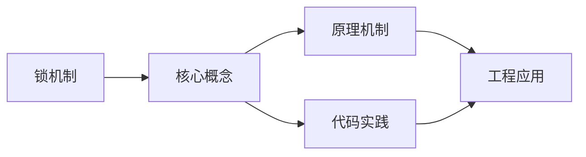
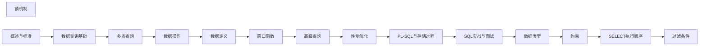

## 1. 学习目标（Bloom 分类）

本节按照布鲁姆教育目标分类学组织学习路径。本文主题为《锁机制》，属于 SQL 模块，读者可以根据自身阶段选择阅读深度。

记忆层面：能够准确复述本文的核心概念、术语与基本语法或操作步骤，并能够在提问或检索时快速定位对应知识点。能够说出 SQL 的核心概念、语法与常用对象。

理解层面：能够用自己的语言解释核心原理与工作机制，说明概念之间的因果关系，而不是机械记忆结论。能够解释 SQL 的执行原理与优化机制。

应用层面：能够在真实项目或练习场景中运用本文知识解决具体问题，写出正确且可维护的实现。能够编写正确、高效的 SQL 语句与操作。

分析层面：能够拆解复杂问题，比较本文主题与相邻概念的异同，识别边界条件与例外情况。能够分析 SQL 相关方案在性能与一致性上的权衡。

评价层面：能够根据约束条件（性能、可读性、安全、成本）评价不同方案的优劣，做出有依据的技术决策。能够根据业务场景评价 SQL 技术选型。

创造层面：能够把本文知识与其他模块知识组合，设计出新的解决方案或可复用的工程模式。能够组合 SQL 与其他技术设计数据架构。

通过本节学习，读者应当能够把《锁机制》纳入自己的知识网络，并与 SQL 模块的其他主题（DDL/DML、查询、索引、事务）建立关联。

## 2. 历史动机与发展脉络

《锁机制》是 SQL 领域的重要主题。要真正理解它，需要先了解它解决的问题与演进过程。

SQL（结构化查询语言）源于 1970 年 Codd 的关系模型，1974 年由 Chamberlin 与 Boyce 设计（SEQUEL），1986 年成为 ANSI 标准；SQL:2023 是当前国际标准。
SQL 分为 DDL（建表）、DML（增删改）、DQL（查询）、DCL（权限）与 TCL（事务）；各大数据库在标准基础上扩展方言。
SQL 是声明式语言：描述“要什么”而非“怎么做”，优化器负责执行计划；这一设计让 SQL 具有跨数据库的表达一致性。

回到本文主题：锁机制 的提出与成熟，正是上述技术背景下的必然产物。早期实现往往以简单可用为目标，随着工程规模扩大，社区逐渐沉淀出标准做法与最佳实践；理解这一脉络，可以帮助读者判断“为什么文档中的推荐写法是现在这个样子”，也能在遇到历史遗留代码时准确识别其设计年代与取舍。


## 3. 形式化定义与核心概念精讲

本节把《锁机制》涉及的核心概念以“定义 + 讲解”的形式展开。读者应把定义当作工具，把讲解当作理解路径；两者结合才能形成可迁移的知识。

关系模型：表（关系）、行（元组）、列（属性）；主键唯一标识、外键表达关联、范式消除冗余。
查询执行：解析 -> 绑定 -> 优化（基于代价选择计划）-> 执行；索引、统计信息与连接算法决定性能。
事务 ACID：原子性（Atomicity）、一致性（Consistency）、隔离性（Isolation）、持久性（Durability）；隔离级别控制并发行为。

### 3.1 原文章节逐一精讲

原文档把主题拆分为 14 个小节，下面按顺序给出每一节的导读讲解，随后保留原文细节供精读。

#### 原文精读（完整保留）

# SQL 锁机制 语法速查手册

> **符号约定**：`< >` 必填参数 | `[ ]` 可选参数

---

#### 1. 锁概述

锁是数据库实现事务隔离的核心机制，通过限制并发访问来保证数据一致性。

##### 1.1 锁的分类维度

| 维度 | 类型                               |
| ---- | ---------------------------------- |
| 粒度 | 全局锁、表级锁、行级锁             |
| 模式 | 共享锁（S）、排他锁（X）           |
| 意向 | 意向共享锁（IS）、意向排他锁（IX） |
| 算法 | 记录锁、间隙锁、临键锁             |

#### 2. 共享锁与排他锁

##### 2.1 共享锁（S Lock / Read Lock）

允许多个事务同时读取同一资源，但阻止排他锁。

```sql
-- 获取共享锁
SELECT * FROM employees WHERE id = 1 LOCK IN SHARE MODE;  -- MySQL
SELECT * FROM employees WHERE id = 1 FOR SHARE;            -- PostgreSQL

-- 事务A持有共享锁
BEGIN;
SELECT * FROM employees WHERE id = 1 FOR SHARE;

-- 事务B也可以获取共享锁
BEGIN;
SELECT * FROM employees WHERE id = 1 FOR SHARE;  -- 成功

-- 事务C无法获取排他锁
UPDATE employees SET salary = 50000 WHERE id = 1;  -- 等待
```

##### 2.2 排他锁（X Lock / Write Lock）

只允许一个事务访问资源，阻止所有其他锁。

```sql
-- 获取排他锁
SELECT * FROM employees WHERE id = 1 FOR UPDATE;

-- 事务A持有排他锁
BEGIN;
SELECT * FROM employees WHERE id = 1 FOR UPDATE;

-- 事务B无法获取任何锁
SELECT * FROM employees WHERE id = 1 FOR SHARE;   -- 等待
SELECT * FROM employees WHERE id = 1 FOR UPDATE;  -- 等待
UPDATE employees SET salary = 50000 WHERE id = 1;  -- 等待
```

##### 2.3 锁兼容性矩阵

|       | S   | X   |
| ----- | --- | --- |
| **S** |     |     |
| **X** |     |     |

#### 3. 意向锁

##### 3.1 概念

意向锁是表级锁，表示事务打算在表中的行上获取锁。用于快速判断表中是否存在行级锁，避免逐行检查。

```
意向锁的目的：
事务A在行上持有S锁 → 表上自动加IS锁
事务B想加表级X锁 → 检查表上是否有IS/IX锁 → 有则等待
→ 无需逐行检查行级锁
```

##### 3.2 意向锁类型

| 锁类型         | 含义                |
| -------------- | ------------------- |
| IS（意向共享） | 事务打算在行上加S锁 |
| IX（意向排他） | 事务打算在行上加X锁 |

##### 3.3 完整锁兼容性矩阵

|        | IS  | IX  | S   | X   |
| ------ | --- | --- | --- | --- |
| **IS** |     |     |     |     |
| **IX** |     |     |     |     |
| **S**  |     |     |     |     |
| **X**  |     |     |     |     |

```sql
-- 意向锁自动获取
BEGIN;
SELECT * FROM employees WHERE id = 1 FOR UPDATE;
-- 自动在 employees 表上加 IX 锁
-- 在 id=1 行上加 X 锁

-- 另一个事务尝试加表级锁
LOCK TABLE employees IN EXCLUSIVE MODE;  -- 等待，因为表上有 IX 锁
```

#### 4. 间隙锁（Gap Lock）

##### 4.1 概念

间隙锁锁定索引记录之间的间隙，防止其他事务在间隙中插入新记录，是 InnoDB 防止幻读的关键机制。

```
索引记录：  [10]  [20]  [30]  [40]
间隙：     (−∞,10) (10,20) (20,30) (30,40) (40,+∞)

间隙锁锁定间隙，不锁定记录本身
```

##### 4.2 间隙锁行为

```sql
-- 事务A
BEGIN;
SELECT * FROM employees WHERE id BETWEEN 10 AND 20 FOR UPDATE;
-- 锁定间隙 (10, 20) 和记录 [10], [20]

-- 事务B
INSERT INTO employees (id, name) VALUES (15, 'new');
-- 被阻塞！id=15 在间隙 (10, 20) 内

-- 事务B
INSERT INTO employees (id, name) VALUES (25, 'new');
-- 成功！id=25 不在锁定间隙内
```

##### 4.3 间隙锁的特性

- 间隙锁之间**不冲突**：多个事务可以同时持有同一间隙的间隙锁
- 间隙锁只阻止**插入**，不阻止读取
- 间隙锁在 REPEATABLE READ 隔离级别下自动使用

```sql
-- 间隙锁不冲突
-- 事务A
SELECT * FROM t WHERE id > 10 FOR UPDATE;  -- 锁定 (10, +∞) 间隙

-- 事务B
SELECT * FROM t WHERE id > 10 FOR UPDATE;  -- 也锁定 (10, +∞) 间隙，不冲突！

-- 但插入会冲突
INSERT INTO t VALUES (15, 'x');  -- 等待事务A或B释放间隙锁
```

#### 5. 临键锁（Next-Key Lock）

##### 5.1 概念

临键锁 = 记录锁 + 间隙锁，锁定索引记录及其前面的间隙。是 InnoDB 在 REPEATABLE READ 下的默认行锁算法。

```
索引记录：  [10]  [20]  [30]
临键锁：    (−∞,10] (10,20] (20,30] (30,+∞)
```

##### 5.2 临键锁示例

```sql
-- 事务A
BEGIN;
SELECT * FROM employees WHERE dept_id = 5 FOR UPDATE;
-- 假设 dept_id = 5 的记录为 [3, 7, 12]
-- 临键锁锁定：(prev, 3], (3, 7], (7, 12], (12, next]

-- 事务B
INSERT INTO employees (dept_id, name) VALUES (5, 'new');
-- 被阻塞！所有 dept_id = 5 的间隙都被锁定
```

##### 5.3 临键锁退化为记录锁

```sql
-- 使用唯一索引等值查询且记录存在时，退化为记录锁
BEGIN;
SELECT * FROM employees WHERE id = 5 FOR UPDATE;
-- id 是主键（唯一索引），且 id=5 存在
-- 只锁定 id=5 这一行，不锁定间隙

-- 使用唯一索引等值查询但记录不存在时，退化为间隙锁
BEGIN;
SELECT * FROM employees WHERE id = 5 FOR UPDATE;
-- id=5 不存在
-- 锁定 (prev_id, next_id) 间隙
```

#### 6. 锁的查看与诊断

##### 6.1 MySQL 查看锁

```sql
-- MySQL 8.0+
SELECT * FROM performance_schema.data_locks;
SELECT * FROM performance_schema.data_lock_waits;

-- 查看InnoDB锁状态
SHOW ENGINE INNODB STATUS;
```

##### 6.2 PostgreSQL 查看锁

```sql
-- 查看当前锁
SELECT locktype, relation::regclass, mode, pid, granted
FROM pg_locks
WHERE pid != pg_backend_pid();

-- 查看阻塞关系
SELECT
    blocked.pid AS blocked_pid,
    blocker.pid AS blocker_pid,
    blocked.query AS blocked_query,
    blocker.query AS blocker_query
FROM pg_locks blocked
JOIN pg_locks blocker ON blocked.locktype = blocker.locktype
    AND blocked.database IS NOT DISTINCT FROM blocker.database
    AND blocked.relation IS NOT DISTINCT FROM blocker.relation
    AND blocked.page IS NOT DISTINCT FROM blocker.page
    AND blocked.tuple IS NOT DISTINCT FROM blocker.tuple
    AND blocked.pid != blocker.pid
    AND NOT blocked.granted
    AND blocker.granted;
```

#### 7. 死锁

##### 7.1 死锁条件

死锁需要同时满足四个条件：

1. 互斥：资源只能被一个事务持有
2. 持有并等待：持有资源的事务等待其他资源
3. 不可抢占：资源不能被强制释放
4. 循环等待：事务之间形成环形等待

##### 7.2 死锁示例

```sql
-- 事务A
BEGIN;
UPDATE accounts SET balance = balance - 100 WHERE id = 1;  -- 锁定 id=1

-- 事务B
BEGIN;
UPDATE accounts SET balance = balance - 100 WHERE id = 2;  -- 锁定 id=2

-- 事务A
UPDATE accounts SET balance = balance + 100 WHERE id = 2;  -- 等待 id=2

-- 事务B
UPDATE accounts SET balance = balance + 100 WHERE id = 1;  -- 死锁！
```

##### 7.3 死锁预防

```sql
-- 方法1：按固定顺序访问资源
-- 所有事务都先锁 id=1 再锁 id=2

-- 方法2：缩短事务时间
-- 减少锁持有时间

-- 方法3：使用低隔离级别
-- READ COMMITTED 比 REPEATABLE READ 锁范围更小

-- 方法4：设置锁超时
SET innodb_lock_wait_timeout = 5;  -- MySQL，5秒超时
SET lock_timeout = '5s';           -- PostgreSQL
```
#### 行级锁

**基本写法：共享锁（S 锁）**
`SELECT * FROM <表> WHERE <条件> LOCK IN SHARE MODE;`
```sql
-- MySQL 共享锁：允许其他事务读，不允许写
BEGIN;
SELECT * FROM accounts WHERE id = 1 LOCK IN SHARE MODE;
-- 其他事务可以读，但不能修改此行
COMMIT;
```

---

**基本写法：PostgreSQL 共享锁**
`SELECT * FROM <表> WHERE <条件> FOR SHARE;`
```sql
-- PostgreSQL 共享锁
BEGIN;
SELECT * FROM accounts WHERE id = 1 FOR SHARE;
-- 其他事务可加 SHARE 锁，不能加 EXCLUSIVE 锁
COMMIT;
```

---

**基本写法：排他锁（X 锁）**
`SELECT * FROM <表> WHERE <条件> FOR UPDATE;`
```sql
-- 排他锁：阻止其他事务读写
BEGIN;
SELECT * FROM accounts WHERE id = 1 FOR UPDATE;
-- 其他事务无法读取或修改此行
UPDATE accounts SET balance = balance - 100 WHERE id = 1;
COMMIT;
```

---

**基本写法：NOWAIT 不等待锁**
`SELECT * FROM <表> WHERE <条件> FOR UPDATE NOWAIT;`
```sql
-- 获取不到锁立即报错，不等待
BEGIN;
SELECT * FROM accounts WHERE id = 1 FOR UPDATE NOWAIT;
-- 如果行被锁定，立即报错：ERROR: could not obtain lock
COMMIT;
```

---

**基本写法：SKIP LOCKED 跳过锁定行**
`SELECT * FROM <表> WHERE <条件> FOR UPDATE SKIP LOCKED;`
```sql
-- 跳过被锁定的行（适合任务队列）
BEGIN;
SELECT id FROM task_queue WHERE status = 'pending'
FOR UPDATE SKIP LOCKED LIMIT 10;
-- 只返回未被锁定的行
COMMIT;
```

---

#### 表级锁

**基本写法：MySQL 表锁**
`LOCK TABLES <表> [READ|WRITE];`
```sql
-- MySQL 表锁
LOCK TABLES employees WRITE;
-- 只有当前会话可读写
UNLOCK TABLES;

LOCK TABLES employees READ;
-- 所有会话只能读
UNLOCK TABLES;
```

---

**基本写法：PostgreSQL 表锁**
`LOCK TABLE <表> IN <模式> MODE;`
```sql
-- PostgreSQL 表级锁
LOCK TABLE employees IN SHARE MODE;
-- 允许并发读，阻止写

LOCK TABLE employees IN EXCLUSIVE MODE;
-- 只允许当前事务读写

LOCK TABLE employees IN ACCESS EXCLUSIVE MODE;
-- 最严格：阻止一切并发访问
```

---

**基本写法：锁模式层级**
`-- PostgreSQL 锁模式从弱到强`
```sql
-- ACCESS SHARE        SELECT 自动加（最弱）
-- ROW SHARE          SELECT FOR UPDATE/SHARE 自动加
-- ROW EXCLUSIVE      INSERT/UPDATE/DELETE 自动加
-- SHARE UPDATE       （预留）
-- SHARE              LOCK TABLE ... IN SHARE MODE
-- SHARE ROW EXCLUSIVE
-- EXCLUSIVE
-- ACCESS EXCLUSIVE   DROP/TRUNCATE/ALTER 自动加（最强）
```

---

#### 间隙锁（MySQL InnoDB）

**基本写法：间隙锁防止幻读**
`SELECT * FROM <表> WHERE <范围条件> FOR UPDATE;`
```sql
-- REPEATABLE READ 下，范围查询加间隙锁
BEGIN;
SELECT * FROM accounts WHERE id BETWEEN 10 AND 20 FOR UPDATE;
-- 锁定 id=10 到 id=20 之间的间隙
-- 其他事务无法在此范围内插入数据
COMMIT;
```

---

**基本写法：临键锁（Next-Key Lock）**
`-- InnoDB 默认使用临键锁（行锁+间隙锁）`
```sql
-- 临键锁锁定的范围
-- 如果索引有 10, 15, 20
-- SELECT WHERE id > 10 AND id < 20 FOR UPDATE
-- 锁定：(10, 15], (15, 20)
-- 即锁住了 10 到 20 之间所有可能的位置
```

---

**基本写法：查看锁信息**
`SELECT * FROM information_schema.innodb_locks;`
```sql
-- MySQL 查看当前锁
SELECT * FROM performance_schema.data_locks;
SELECT * FROM performance_schema.data_lock_waits;

-- 查看锁等待
SELECT * FROM sys.innodb_lock_waits;
```

---

#### 死锁

**基本写法：死锁产生场景**
`-- 两个事务互相等待对方释放锁`
```sql
-- 事务A
BEGIN;
UPDATE accounts SET balance = balance - 100 WHERE id = 1;  -- 锁 id=1
UPDATE accounts SET balance = balance + 100 WHERE id = 2;  -- 等待 id=2 的锁

-- 事务B（同时执行）
BEGIN;
UPDATE accounts SET balance = balance - 200 WHERE id = 2;  -- 锁 id=2
UPDATE accounts SET balance = balance + 200 WHERE id = 1;  -- 等待 id=1 的锁
-- 死锁！
```

---

**基本写法：避免死锁**
`-- 按固定顺序访问资源`
```sql
-- 始终按 id 升序加锁，避免交叉等待
-- 事务A 和 事务B 都先锁 id=1 再锁 id=2
BEGIN;
UPDATE accounts SET balance = balance - 100 WHERE id = 1;
UPDATE accounts SET balance = balance + 100 WHERE id = 2;
COMMIT;
```

---

**基本写法：设置锁等待超时**
`SET innodb_lock_wait_timeout = <秒>;`
```sql
-- 设置锁等待超时（默认 50 秒）
SET innodb_lock_wait_timeout = 10;
-- 超时后报错并回滚当前语句
```

---

**基本写法：查看死锁日志**
`SHOW ENGINE INNODB STATUS\G`
```sql
-- 查看最近死锁信息
SHOW ENGINE INNODB STATUS\G
-- 查看 LATEST DETECTED DEADLOCK 部分
```

---

#### 悲观锁

**基本写法：悲观锁模式**
`SELECT ... FOR UPDATE`
```sql
-- 先锁定再修改，确保安全
BEGIN;
SELECT balance FROM accounts WHERE id = 1 FOR UPDATE;
-- 应用层判断余额是否足够
-- 如果 balance >= 100
UPDATE accounts SET balance = balance - 100 WHERE id = 1;
COMMIT;
```

---

**基本写法：悲观锁实现库存扣减**
`SELECT stock FROM products WHERE id = 1 FOR UPDATE;`
```sql
-- 库存扣减使用悲观锁
BEGIN;
SELECT stock FROM products WHERE id = 1 FOR UPDATE;
-- 检查 stock >= order_qty
-- 如果足够
UPDATE products SET stock = stock - 1 WHERE id = 1;
INSERT INTO orders (product_id, qty) VALUES (1, 1);
COMMIT;
```

---

#### 乐观锁

**基本写法：版本号实现乐观锁**
`UPDATE <表> SET <列>=<新值>, version=version+1 WHERE id=<ID> AND version=<版本>`
```sql
-- 乐观锁：先读后写，写入时检查版本
-- 1. 读取数据
SELECT id, balance, version FROM accounts WHERE id = 1;
-- 结果: id=1, balance=1000, version=3

-- 2. 写入时检查版本
UPDATE accounts
SET balance = 900, version = version + 1
WHERE id = 1 AND version = 3;
-- 如果受影响行数 = 0，说明已被其他人修改，需重试
```

---

**基本写法：时间戳实现乐观锁**
`UPDATE <表> SET <列>=<值>, updated_at=NOW() WHERE id=<ID> AND updated_at=<时间>`
```sql
-- 使用时间戳替代版本号
SELECT id, balance, updated_at FROM accounts WHERE id = 1;
-- 假设 updated_at = '2026-07-31 10:00:00'

UPDATE accounts
SET balance = 900, updated_at = NOW()
WHERE id = 1 AND updated_at = '2026-07-31 10:00:00';
```

---

**基本写法：CAS 模式**
`UPDATE <表> SET <列>=<新值> WHERE id=<ID> AND <列>=<旧值>`
```sql
-- Compare And Swap 模式
-- 扣减余额：条件是当前余额足够
UPDATE accounts
SET balance = balance - 100
WHERE id = 1 AND balance >= 100;
-- 如果受影响行数 = 0，说明余额不足或被修改
```

---

#### 锁监控

**基本写法：MySQL 锁等待查询**
`SELECT * FROM performance_schema.data_lock_waits;`
```sql
-- 查看锁等待情况
SELECT
  r.trx_id AS waiting_trx,
  r.trx_mysql_thread_id AS waiting_thread,
  b.trx_id AS blocking_trx,
  b.trx_mysql_thread_id AS blocking_thread
FROM information_schema.innodb_trx r
JOIN information_schema.innodb_trx b
  ON r.trx_requested_lock_id = b.trx_lock_id;
```

---

**基本写法：PostgreSQL 锁查询**
`SELECT * FROM pg_locks;`
```sql
-- 查看当前所有锁
SELECT pid, locktype, relation::regclass, mode, granted
FROM pg_locks;

-- 查看阻塞的会话
SELECT
  blocked.pid AS blocked_pid,
  blocking.pid AS blocking_pid,
  query
FROM pg_stat_activity blocked
JOIN pg_locks bl ON bl.pid = blocked.pid AND NOT bl.granted
JOIN pg_locks ul ON ul.locktype = bl.locktype
  AND ul.relation = bl.relation AND ul.granted
JOIN pg_stat_activity blocking ON blocking.pid = ul.pid;
```

---

**基本写法：终止阻塞会话**
`SELECT pg_terminate_backend(<pid>);`
```sql
-- PostgreSQL 终止阻塞进程
SELECT pg_terminate_backend(12345);

-- MySQL 杀死会话
KILL 12345;
```


### 3.2 概念关系图

下面用 Mermaid 图表达本文核心概念之间的关系，帮助读者建立整体图景：



图中展示的是本文知识的结构化关系：核心概念是入口，原理机制解释“为什么”，代码实践演示“怎么做”，工程应用回答“何时用”。读者学习时可以把每个小节的内容挂接到对应节点上。

## 4. 理论推导与原理解析

本节深入《锁机制》背后的原理。理论部分不求面面俱到，而是聚焦“能解释现象、能指导实践”的关键推导。

关系模型：表（关系）、行（元组）、列（属性）；主键唯一标识、外键表达关联、范式消除冗余。
查询执行：解析 -> 绑定 -> 优化（基于代价选择计划）-> 执行；索引、统计信息与连接算法决定性能。
事务 ACID：原子性（Atomicity）、一致性（Consistency）、隔离性（Isolation）、持久性（Durability）；隔离级别控制并发行为。
集合语义：SELECT 返回结果集；JOIN 组合关系，GROUP BY 聚合，子查询与 CTE 表达复杂逻辑。

需要强调的是，理论推导与工程实践之间存在翻译层：理论给出的是理想化模型与边界条件，工程代码则必须处理真实环境中的例外。读者在学习时应先掌握理论的“标准情形”，再通过陷阱章节了解“非标准情形”。

## 5. 代码示例与逐行讲解

本节把原文中的代码示例系统整理，并为每个示例补充用途说明与讲解。读者不应只浏览代码，而应逐段对照讲解理解设计意图。

### 5.1 示例：2.1 共享锁（S Lock / Read Lock）

该示例来自原文《2.1 共享锁（S Lock / Read Lock）》小节，用于演示锁机制相关操作。阅读时请先看代码结构，再看其后的讲解。

```sql
-- 获取共享锁
SELECT * FROM employees WHERE id = 1 LOCK IN SHARE MODE;  -- MySQL
SELECT * FROM employees WHERE id = 1 FOR SHARE;            -- PostgreSQL

-- 事务A持有共享锁
BEGIN;
SELECT * FROM employees WHERE id = 1 FOR SHARE;

-- 事务B也可以获取共享锁
BEGIN;
SELECT * FROM employees WHERE id = 1 FOR SHARE;  -- 成功

-- 事务C无法获取排他锁
UPDATE employees SET salary = 50000 WHERE id = 1;  -- 等待
```

讲解：这段代码演示了本节核心知识点。代码中的关键操作可以归纳为三步：准备（定义或初始化）、执行（核心逻辑）、收尾（释放资源或返回结果）。实际项目中，这三步往往被封装为函数或类，以提升复用性与可测试性。

关键点分析：

该示例共 11 行有效代码，包含 2 类关键结构（SELECT、FROM）。其中：

- 入口与初始化部分负责建立上下文，对应实际项目中的启动或装配逻辑；
- 核心逻辑部分体现本文主题的主要操作，是阅读时最需要对照讲解理解的部分；
- 输出或返回部分把结果交给调用方，注意其类型与边界条件。

进阶思考路径：先尝试修改参数观察行为变化，再把示例中的模式迁移到自己的项目中；每次修改都记录预期与实测差异，这是把示例转化为能力的最快方式。

### 5.2 示例：2.2 排他锁（X Lock / Write Lock）

该示例来自原文《2.2 排他锁（X Lock / Write Lock）》小节，用于演示锁机制相关操作。阅读时请先看代码结构，再看其后的讲解。

```sql
-- 获取排他锁
SELECT * FROM employees WHERE id = 1 FOR UPDATE;

-- 事务A持有排他锁
BEGIN;
SELECT * FROM employees WHERE id = 1 FOR UPDATE;

-- 事务B无法获取任何锁
SELECT * FROM employees WHERE id = 1 FOR SHARE;   -- 等待
SELECT * FROM employees WHERE id = 1 FOR UPDATE;  -- 等待
UPDATE employees SET salary = 50000 WHERE id = 1;  -- 等待
```

讲解：这段代码演示了本节核心知识点。代码中的关键操作可以归纳为三步：准备（定义或初始化）、执行（核心逻辑）、收尾（释放资源或返回结果）。实际项目中，这三步往往被封装为函数或类，以提升复用性与可测试性。

关键点分析：

该示例共 9 行有效代码，包含 2 类关键结构（SELECT、FROM）。其中：

- 入口与初始化部分负责建立上下文，对应实际项目中的启动或装配逻辑；
- 核心逻辑部分体现本文主题的主要操作，是阅读时最需要对照讲解理解的部分；
- 输出或返回部分把结果交给调用方，注意其类型与边界条件。

进阶思考路径：先尝试修改参数观察行为变化，再把示例中的模式迁移到自己的项目中；每次修改都记录预期与实测差异，这是把示例转化为能力的最快方式。

### 5.3 示例：3.1 概念

该示例来自原文《3.1 概念》小节，用于演示锁机制相关操作。阅读时请先看代码结构，再看其后的讲解。

```text
意向锁的目的：
事务A在行上持有S锁 → 表上自动加IS锁
事务B想加表级X锁 → 检查表上是否有IS/IX锁 → 有则等待
→ 无需逐行检查行级锁
```

讲解：这段代码演示了本节核心知识点。代码中的关键操作可以归纳为三步：准备（定义或初始化）、执行（核心逻辑）、收尾（释放资源或返回结果）。实际项目中，这三步往往被封装为函数或类，以提升复用性与可测试性。

关键点分析：

该示例共 4 行有效代码，结构以数据或配置为主。阅读时应关注：数据字段的含义、配置项的作用，以及它们与运行行为的对应关系。

进阶思考路径：先尝试修改参数观察行为变化，再把示例中的模式迁移到自己的项目中；每次修改都记录预期与实测差异，这是把示例转化为能力的最快方式。

### 5.4 示例：3.3 完整锁兼容性矩阵

该示例来自原文《3.3 完整锁兼容性矩阵》小节，用于演示锁机制相关操作。阅读时请先看代码结构，再看其后的讲解。

```sql
-- 意向锁自动获取
BEGIN;
SELECT * FROM employees WHERE id = 1 FOR UPDATE;
-- 自动在 employees 表上加 IX 锁
-- 在 id=1 行上加 X 锁

-- 另一个事务尝试加表级锁
LOCK TABLE employees IN EXCLUSIVE MODE;  -- 等待，因为表上有 IX 锁
```

讲解：这段代码演示了本节核心知识点。代码中的关键操作可以归纳为三步：准备（定义或初始化）、执行（核心逻辑）、收尾（释放资源或返回结果）。实际项目中，这三步往往被封装为函数或类，以提升复用性与可测试性。

关键点分析：

该示例共 7 行有效代码，包含 2 类关键结构（SELECT、FROM）。其中：

- 入口与初始化部分负责建立上下文，对应实际项目中的启动或装配逻辑；
- 核心逻辑部分体现本文主题的主要操作，是阅读时最需要对照讲解理解的部分；
- 输出或返回部分把结果交给调用方，注意其类型与边界条件。

进阶思考路径：先尝试修改参数观察行为变化，再把示例中的模式迁移到自己的项目中；每次修改都记录预期与实测差异，这是把示例转化为能力的最快方式。

### 5.5 示例：4.1 概念

该示例来自原文《4.1 概念》小节，用于演示锁机制相关操作。阅读时请先看代码结构，再看其后的讲解。

```text
索引记录：  [10]  [20]  [30]  [40]
间隙：     (−∞,10) (10,20) (20,30) (30,40) (40,+∞)

间隙锁锁定间隙，不锁定记录本身
```

讲解：这段代码演示了本节核心知识点。代码中的关键操作可以归纳为三步：准备（定义或初始化）、执行（核心逻辑）、收尾（释放资源或返回结果）。实际项目中，这三步往往被封装为函数或类，以提升复用性与可测试性。

关键点分析：

该示例共 3 行有效代码，结构以数据或配置为主。阅读时应关注：数据字段的含义、配置项的作用，以及它们与运行行为的对应关系。

进阶思考路径：先尝试修改参数观察行为变化，再把示例中的模式迁移到自己的项目中；每次修改都记录预期与实测差异，这是把示例转化为能力的最快方式。

### 5.6 示例：4.2 间隙锁行为

该示例来自原文《4.2 间隙锁行为》小节，用于演示锁机制相关操作。阅读时请先看代码结构，再看其后的讲解。

```sql
-- 事务A
BEGIN;
SELECT * FROM employees WHERE id BETWEEN 10 AND 20 FOR UPDATE;
-- 锁定间隙 (10, 20) 和记录 [10], [20]

-- 事务B
INSERT INTO employees (id, name) VALUES (15, 'new');
-- 被阻塞！id=15 在间隙 (10, 20) 内

-- 事务B
INSERT INTO employees (id, name) VALUES (25, 'new');
-- 成功！id=25 不在锁定间隙内
```

讲解：这段代码演示了本节核心知识点。代码中的关键操作可以归纳为三步：准备（定义或初始化）、执行（核心逻辑）、收尾（释放资源或返回结果）。实际项目中，这三步往往被封装为函数或类，以提升复用性与可测试性。

关键点分析：

该示例共 10 行有效代码，包含 3 类关键结构（SELECT、INSERT、FROM）。其中：

- 入口与初始化部分负责建立上下文，对应实际项目中的启动或装配逻辑；
- 核心逻辑部分体现本文主题的主要操作，是阅读时最需要对照讲解理解的部分；
- 输出或返回部分把结果交给调用方，注意其类型与边界条件。

进阶思考路径：先尝试修改参数观察行为变化，再把示例中的模式迁移到自己的项目中；每次修改都记录预期与实测差异，这是把示例转化为能力的最快方式。

### 5.7 示例：4.3 间隙锁的特性

该示例来自原文《4.3 间隙锁的特性》小节，用于演示锁机制相关操作。阅读时请先看代码结构，再看其后的讲解。

```sql
-- 间隙锁不冲突
-- 事务A
SELECT * FROM t WHERE id > 10 FOR UPDATE;  -- 锁定 (10, +∞) 间隙

-- 事务B
SELECT * FROM t WHERE id > 10 FOR UPDATE;  -- 也锁定 (10, +∞) 间隙，不冲突！

-- 但插入会冲突
INSERT INTO t VALUES (15, 'x');  -- 等待事务A或B释放间隙锁
```

讲解：这段代码演示了本节核心知识点。代码中的关键操作可以归纳为三步：准备（定义或初始化）、执行（核心逻辑）、收尾（释放资源或返回结果）。实际项目中，这三步往往被封装为函数或类，以提升复用性与可测试性。

关键点分析：

该示例共 7 行有效代码，包含 3 类关键结构（SELECT、INSERT、FROM）。其中：

- 入口与初始化部分负责建立上下文，对应实际项目中的启动或装配逻辑；
- 核心逻辑部分体现本文主题的主要操作，是阅读时最需要对照讲解理解的部分；
- 输出或返回部分把结果交给调用方，注意其类型与边界条件。

进阶思考路径：先尝试修改参数观察行为变化，再把示例中的模式迁移到自己的项目中；每次修改都记录预期与实测差异，这是把示例转化为能力的最快方式。

### 5.8 示例：5.1 概念

该示例来自原文《5.1 概念》小节，用于演示锁机制相关操作。阅读时请先看代码结构，再看其后的讲解。

```text
索引记录：  [10]  [20]  [30]
临键锁：    (−∞,10] (10,20] (20,30] (30,+∞)
```

讲解：这段代码演示了本节核心知识点。代码中的关键操作可以归纳为三步：准备（定义或初始化）、执行（核心逻辑）、收尾（释放资源或返回结果）。实际项目中，这三步往往被封装为函数或类，以提升复用性与可测试性。

关键点分析：

该示例共 2 行有效代码，结构以数据或配置为主。阅读时应关注：数据字段的含义、配置项的作用，以及它们与运行行为的对应关系。

进阶思考路径：先尝试修改参数观察行为变化，再把示例中的模式迁移到自己的项目中；每次修改都记录预期与实测差异，这是把示例转化为能力的最快方式。

### 5.9 示例：5.2 临键锁示例

该示例来自原文《5.2 临键锁示例》小节，用于演示锁机制相关操作。阅读时请先看代码结构，再看其后的讲解。

```sql
-- 事务A
BEGIN;
SELECT * FROM employees WHERE dept_id = 5 FOR UPDATE;
-- 假设 dept_id = 5 的记录为 [3, 7, 12]
-- 临键锁锁定：(prev, 3], (3, 7], (7, 12], (12, next]

-- 事务B
INSERT INTO employees (dept_id, name) VALUES (5, 'new');
-- 被阻塞！所有 dept_id = 5 的间隙都被锁定
```

讲解：这段代码演示了本节核心知识点。代码中的关键操作可以归纳为三步：准备（定义或初始化）、执行（核心逻辑）、收尾（释放资源或返回结果）。实际项目中，这三步往往被封装为函数或类，以提升复用性与可测试性。

关键点分析：

该示例共 8 行有效代码，包含 3 类关键结构（SELECT、INSERT、FROM）。其中：

- 入口与初始化部分负责建立上下文，对应实际项目中的启动或装配逻辑；
- 核心逻辑部分体现本文主题的主要操作，是阅读时最需要对照讲解理解的部分；
- 输出或返回部分把结果交给调用方，注意其类型与边界条件。

进阶思考路径：先尝试修改参数观察行为变化，再把示例中的模式迁移到自己的项目中；每次修改都记录预期与实测差异，这是把示例转化为能力的最快方式。

### 5.10 示例：5.3 临键锁退化为记录锁

该示例来自原文《5.3 临键锁退化为记录锁》小节，用于演示锁机制相关操作。阅读时请先看代码结构，再看其后的讲解。

```sql
-- 使用唯一索引等值查询且记录存在时，退化为记录锁
BEGIN;
SELECT * FROM employees WHERE id = 5 FOR UPDATE;
-- id 是主键（唯一索引），且 id=5 存在
-- 只锁定 id=5 这一行，不锁定间隙

-- 使用唯一索引等值查询但记录不存在时，退化为间隙锁
BEGIN;
SELECT * FROM employees WHERE id = 5 FOR UPDATE;
-- id=5 不存在
-- 锁定 (prev_id, next_id) 间隙
```

讲解：这段代码演示了本节核心知识点。代码中的关键操作可以归纳为三步：准备（定义或初始化）、执行（核心逻辑）、收尾（释放资源或返回结果）。实际项目中，这三步往往被封装为函数或类，以提升复用性与可测试性。

关键点分析：

该示例共 10 行有效代码，包含 2 类关键结构（SELECT、FROM）。其中：

- 入口与初始化部分负责建立上下文，对应实际项目中的启动或装配逻辑；
- 核心逻辑部分体现本文主题的主要操作，是阅读时最需要对照讲解理解的部分；
- 输出或返回部分把结果交给调用方，注意其类型与边界条件。

进阶思考路径：先尝试修改参数观察行为变化，再把示例中的模式迁移到自己的项目中；每次修改都记录预期与实测差异，这是把示例转化为能力的最快方式。

### 5.11 示例：6.1 MySQL 查看锁

该示例来自原文《6.1 MySQL 查看锁》小节，用于演示锁机制相关操作。阅读时请先看代码结构，再看其后的讲解。

```sql
-- MySQL 8.0+
SELECT * FROM performance_schema.data_locks;
SELECT * FROM performance_schema.data_lock_waits;

-- 查看InnoDB锁状态
SHOW ENGINE INNODB STATUS;
```

讲解：这段代码演示了本节核心知识点。代码中的关键操作可以归纳为三步：准备（定义或初始化）、执行（核心逻辑）、收尾（释放资源或返回结果）。实际项目中，这三步往往被封装为函数或类，以提升复用性与可测试性。

关键点分析：

该示例共 5 行有效代码，包含 2 类关键结构（SELECT、FROM）。其中：

- 入口与初始化部分负责建立上下文，对应实际项目中的启动或装配逻辑；
- 核心逻辑部分体现本文主题的主要操作，是阅读时最需要对照讲解理解的部分；
- 输出或返回部分把结果交给调用方，注意其类型与边界条件。

进阶思考路径：先尝试修改参数观察行为变化，再把示例中的模式迁移到自己的项目中；每次修改都记录预期与实测差异，这是把示例转化为能力的最快方式。

### 5.12 示例：6.2 PostgreSQL 查看锁

该示例来自原文《6.2 PostgreSQL 查看锁》小节，用于演示锁机制相关操作。阅读时请先看代码结构，再看其后的讲解。

```sql
-- 查看当前锁
SELECT locktype, relation::regclass, mode, pid, granted
FROM pg_locks
WHERE pid != pg_backend_pid();

-- 查看阻塞关系
SELECT
    blocked.pid AS blocked_pid,
    blocker.pid AS blocker_pid,
    blocked.query AS blocked_query,
    blocker.query AS blocker_query
FROM pg_locks blocked
JOIN pg_locks blocker ON blocked.locktype = blocker.locktype
    AND blocked.database IS NOT DISTINCT FROM blocker.database
    AND blocked.relation IS NOT DISTINCT FROM blocker.relation
    AND blocked.page IS NOT DISTINCT FROM blocker.page
    AND blocked.tuple IS NOT DISTINCT FROM blocker.tuple
    AND blocked.pid != blocker.pid
    AND NOT blocked.granted
    AND blocker.granted;
```

讲解：这段代码演示了本节核心知识点。代码中的关键操作可以归纳为三步：准备（定义或初始化）、执行（核心逻辑）、收尾（释放资源或返回结果）。实际项目中，这三步往往被封装为函数或类，以提升复用性与可测试性。

关键点分析：

该示例共 19 行有效代码，包含 3 类关键结构（class、SELECT、FROM）。其中：

- 入口与初始化部分负责建立上下文，对应实际项目中的启动或装配逻辑；
- 核心逻辑部分体现本文主题的主要操作，是阅读时最需要对照讲解理解的部分；
- 输出或返回部分把结果交给调用方，注意其类型与边界条件。

进阶思考路径：先尝试修改参数观察行为变化，再把示例中的模式迁移到自己的项目中；每次修改都记录预期与实测差异，这是把示例转化为能力的最快方式。

### 5.13 示例：7.2 死锁示例

该示例来自原文《7.2 死锁示例》小节，用于演示锁机制相关操作。阅读时请先看代码结构，再看其后的讲解。

```sql
-- 事务A
BEGIN;
UPDATE accounts SET balance = balance - 100 WHERE id = 1;  -- 锁定 id=1

-- 事务B
BEGIN;
UPDATE accounts SET balance = balance - 100 WHERE id = 2;  -- 锁定 id=2

-- 事务A
UPDATE accounts SET balance = balance + 100 WHERE id = 2;  -- 等待 id=2

-- 事务B
UPDATE accounts SET balance = balance + 100 WHERE id = 1;  -- 死锁！
```

讲解：这段代码演示了本节核心知识点。代码中的关键操作可以归纳为三步：准备（定义或初始化）、执行（核心逻辑）、收尾（释放资源或返回结果）。实际项目中，这三步往往被封装为函数或类，以提升复用性与可测试性。

关键点分析：

该示例共 10 行有效代码，结构以数据或配置为主。阅读时应关注：数据字段的含义、配置项的作用，以及它们与运行行为的对应关系。

进阶思考路径：先尝试修改参数观察行为变化，再把示例中的模式迁移到自己的项目中；每次修改都记录预期与实测差异，这是把示例转化为能力的最快方式。

### 5.14 示例：7.3 死锁预防

该示例来自原文《7.3 死锁预防》小节，用于演示锁机制相关操作。阅读时请先看代码结构，再看其后的讲解。

```sql
-- 方法1：按固定顺序访问资源
-- 所有事务都先锁 id=1 再锁 id=2

-- 方法2：缩短事务时间
-- 减少锁持有时间

-- 方法3：使用低隔离级别
-- READ COMMITTED 比 REPEATABLE READ 锁范围更小

-- 方法4：设置锁超时
SET innodb_lock_wait_timeout = 5;  -- MySQL，5秒超时
SET lock_timeout = '5s';           -- PostgreSQL
```

讲解：这段代码演示了本节核心知识点。代码中的关键操作可以归纳为三步：准备（定义或初始化）、执行（核心逻辑）、收尾（释放资源或返回结果）。实际项目中，这三步往往被封装为函数或类，以提升复用性与可测试性。

关键点分析：

该示例共 9 行有效代码，结构以数据或配置为主。阅读时应关注：数据字段的含义、配置项的作用，以及它们与运行行为的对应关系。

进阶思考路径：先尝试修改参数观察行为变化，再把示例中的模式迁移到自己的项目中；每次修改都记录预期与实测差异，这是把示例转化为能力的最快方式。

### 5.15 示例：行级锁

该示例来自原文《行级锁》小节，用于演示锁机制相关操作。阅读时请先看代码结构，再看其后的讲解。

```sql
-- MySQL 共享锁：允许其他事务读，不允许写
BEGIN;
SELECT * FROM accounts WHERE id = 1 LOCK IN SHARE MODE;
-- 其他事务可以读，但不能修改此行
COMMIT;
```

讲解：这段代码演示了本节核心知识点。代码中的关键操作可以归纳为三步：准备（定义或初始化）、执行（核心逻辑）、收尾（释放资源或返回结果）。实际项目中，这三步往往被封装为函数或类，以提升复用性与可测试性。

关键点分析：

该示例共 5 行有效代码，包含 2 类关键结构（SELECT、FROM）。其中：

- 入口与初始化部分负责建立上下文，对应实际项目中的启动或装配逻辑；
- 核心逻辑部分体现本文主题的主要操作，是阅读时最需要对照讲解理解的部分；
- 输出或返回部分把结果交给调用方，注意其类型与边界条件。

进阶思考路径：先尝试修改参数观察行为变化，再把示例中的模式迁移到自己的项目中；每次修改都记录预期与实测差异，这是把示例转化为能力的最快方式。

### 5.16 示例：行级锁

该示例来自原文《行级锁》小节，用于演示锁机制相关操作。阅读时请先看代码结构，再看其后的讲解。

```sql
-- PostgreSQL 共享锁
BEGIN;
SELECT * FROM accounts WHERE id = 1 FOR SHARE;
-- 其他事务可加 SHARE 锁，不能加 EXCLUSIVE 锁
COMMIT;
```

讲解：这段代码演示了本节核心知识点。代码中的关键操作可以归纳为三步：准备（定义或初始化）、执行（核心逻辑）、收尾（释放资源或返回结果）。实际项目中，这三步往往被封装为函数或类，以提升复用性与可测试性。

关键点分析：

该示例共 5 行有效代码，包含 2 类关键结构（SELECT、FROM）。其中：

- 入口与初始化部分负责建立上下文，对应实际项目中的启动或装配逻辑；
- 核心逻辑部分体现本文主题的主要操作，是阅读时最需要对照讲解理解的部分；
- 输出或返回部分把结果交给调用方，注意其类型与边界条件。

进阶思考路径：先尝试修改参数观察行为变化，再把示例中的模式迁移到自己的项目中；每次修改都记录预期与实测差异，这是把示例转化为能力的最快方式。

### 5.17 示例：行级锁

该示例来自原文《行级锁》小节，用于演示锁机制相关操作。阅读时请先看代码结构，再看其后的讲解。

```sql
-- 排他锁：阻止其他事务读写
BEGIN;
SELECT * FROM accounts WHERE id = 1 FOR UPDATE;
-- 其他事务无法读取或修改此行
UPDATE accounts SET balance = balance - 100 WHERE id = 1;
COMMIT;
```

讲解：这段代码演示了本节核心知识点。代码中的关键操作可以归纳为三步：准备（定义或初始化）、执行（核心逻辑）、收尾（释放资源或返回结果）。实际项目中，这三步往往被封装为函数或类，以提升复用性与可测试性。

关键点分析：

该示例共 6 行有效代码，包含 2 类关键结构（SELECT、FROM）。其中：

- 入口与初始化部分负责建立上下文，对应实际项目中的启动或装配逻辑；
- 核心逻辑部分体现本文主题的主要操作，是阅读时最需要对照讲解理解的部分；
- 输出或返回部分把结果交给调用方，注意其类型与边界条件。

进阶思考路径：先尝试修改参数观察行为变化，再把示例中的模式迁移到自己的项目中；每次修改都记录预期与实测差异，这是把示例转化为能力的最快方式。

### 5.18 示例：行级锁

该示例来自原文《行级锁》小节，用于演示锁机制相关操作。阅读时请先看代码结构，再看其后的讲解。

```sql
-- 获取不到锁立即报错，不等待
BEGIN;
SELECT * FROM accounts WHERE id = 1 FOR UPDATE NOWAIT;
-- 如果行被锁定，立即报错：ERROR: could not obtain lock
COMMIT;
```

讲解：这段代码演示了本节核心知识点。代码中的关键操作可以归纳为三步：准备（定义或初始化）、执行（核心逻辑）、收尾（释放资源或返回结果）。实际项目中，这三步往往被封装为函数或类，以提升复用性与可测试性。

关键点分析：

该示例共 5 行有效代码，包含 2 类关键结构（SELECT、FROM）。其中：

- 入口与初始化部分负责建立上下文，对应实际项目中的启动或装配逻辑；
- 核心逻辑部分体现本文主题的主要操作，是阅读时最需要对照讲解理解的部分；
- 输出或返回部分把结果交给调用方，注意其类型与边界条件。

进阶思考路径：先尝试修改参数观察行为变化，再把示例中的模式迁移到自己的项目中；每次修改都记录预期与实测差异，这是把示例转化为能力的最快方式。

### 5.19 示例：行级锁

该示例来自原文《行级锁》小节，用于演示锁机制相关操作。阅读时请先看代码结构，再看其后的讲解。

```sql
-- 跳过被锁定的行（适合任务队列）
BEGIN;
SELECT id FROM task_queue WHERE status = 'pending'
FOR UPDATE SKIP LOCKED LIMIT 10;
-- 只返回未被锁定的行
COMMIT;
```

讲解：这段代码演示了本节核心知识点。代码中的关键操作可以归纳为三步：准备（定义或初始化）、执行（核心逻辑）、收尾（释放资源或返回结果）。实际项目中，这三步往往被封装为函数或类，以提升复用性与可测试性。

关键点分析：

该示例共 6 行有效代码，包含 2 类关键结构（SELECT、FROM）。其中：

- 入口与初始化部分负责建立上下文，对应实际项目中的启动或装配逻辑；
- 核心逻辑部分体现本文主题的主要操作，是阅读时最需要对照讲解理解的部分；
- 输出或返回部分把结果交给调用方，注意其类型与边界条件。

进阶思考路径：先尝试修改参数观察行为变化，再把示例中的模式迁移到自己的项目中；每次修改都记录预期与实测差异，这是把示例转化为能力的最快方式。

### 5.20 示例：表级锁

该示例来自原文《表级锁》小节，用于演示锁机制相关操作。阅读时请先看代码结构，再看其后的讲解。

```sql
-- MySQL 表锁
LOCK TABLES employees WRITE;
-- 只有当前会话可读写
UNLOCK TABLES;

LOCK TABLES employees READ;
-- 所有会话只能读
UNLOCK TABLES;
```

讲解：这段代码演示了本节核心知识点。代码中的关键操作可以归纳为三步：准备（定义或初始化）、执行（核心逻辑）、收尾（释放资源或返回结果）。实际项目中，这三步往往被封装为函数或类，以提升复用性与可测试性。

关键点分析：

该示例共 7 行有效代码，结构以数据或配置为主。阅读时应关注：数据字段的含义、配置项的作用，以及它们与运行行为的对应关系。

进阶思考路径：先尝试修改参数观察行为变化，再把示例中的模式迁移到自己的项目中；每次修改都记录预期与实测差异，这是把示例转化为能力的最快方式。

### 5.21 示例：表级锁

该示例来自原文《表级锁》小节，用于演示锁机制相关操作。阅读时请先看代码结构，再看其后的讲解。

```sql
-- PostgreSQL 表级锁
LOCK TABLE employees IN SHARE MODE;
-- 允许并发读，阻止写

LOCK TABLE employees IN EXCLUSIVE MODE;
-- 只允许当前事务读写

LOCK TABLE employees IN ACCESS EXCLUSIVE MODE;
-- 最严格：阻止一切并发访问
```

讲解：这段代码演示了本节核心知识点。代码中的关键操作可以归纳为三步：准备（定义或初始化）、执行（核心逻辑）、收尾（释放资源或返回结果）。实际项目中，这三步往往被封装为函数或类，以提升复用性与可测试性。

关键点分析：

该示例共 7 行有效代码，结构以数据或配置为主。阅读时应关注：数据字段的含义、配置项的作用，以及它们与运行行为的对应关系。

进阶思考路径：先尝试修改参数观察行为变化，再把示例中的模式迁移到自己的项目中；每次修改都记录预期与实测差异，这是把示例转化为能力的最快方式。

### 5.22 示例：表级锁

该示例来自原文《表级锁》小节，用于演示锁机制相关操作。阅读时请先看代码结构，再看其后的讲解。

```sql
-- ACCESS SHARE        SELECT 自动加（最弱）
-- ROW SHARE          SELECT FOR UPDATE/SHARE 自动加
-- ROW EXCLUSIVE      INSERT/UPDATE/DELETE 自动加
-- SHARE UPDATE       （预留）
-- SHARE              LOCK TABLE ... IN SHARE MODE
-- SHARE ROW EXCLUSIVE
-- EXCLUSIVE
-- ACCESS EXCLUSIVE   DROP/TRUNCATE/ALTER 自动加（最强）
```

讲解：这段代码演示了本节核心知识点。代码中的关键操作可以归纳为三步：准备（定义或初始化）、执行（核心逻辑）、收尾（释放资源或返回结果）。实际项目中，这三步往往被封装为函数或类，以提升复用性与可测试性。

关键点分析：

该示例共 8 行有效代码，包含 3 类关键结构（SELECT、INSERT、ALTER）。其中：

- 入口与初始化部分负责建立上下文，对应实际项目中的启动或装配逻辑；
- 核心逻辑部分体现本文主题的主要操作，是阅读时最需要对照讲解理解的部分；
- 输出或返回部分把结果交给调用方，注意其类型与边界条件。

进阶思考路径：先尝试修改参数观察行为变化，再把示例中的模式迁移到自己的项目中；每次修改都记录预期与实测差异，这是把示例转化为能力的最快方式。

### 5.23 示例：间隙锁（MySQL InnoDB）

该示例来自原文《间隙锁（MySQL InnoDB）》小节，用于演示锁机制相关操作。阅读时请先看代码结构，再看其后的讲解。

```sql
-- REPEATABLE READ 下，范围查询加间隙锁
BEGIN;
SELECT * FROM accounts WHERE id BETWEEN 10 AND 20 FOR UPDATE;
-- 锁定 id=10 到 id=20 之间的间隙
-- 其他事务无法在此范围内插入数据
COMMIT;
```

讲解：这段代码演示了本节核心知识点。代码中的关键操作可以归纳为三步：准备（定义或初始化）、执行（核心逻辑）、收尾（释放资源或返回结果）。实际项目中，这三步往往被封装为函数或类，以提升复用性与可测试性。

关键点分析：

该示例共 6 行有效代码，包含 2 类关键结构（SELECT、FROM）。其中：

- 入口与初始化部分负责建立上下文，对应实际项目中的启动或装配逻辑；
- 核心逻辑部分体现本文主题的主要操作，是阅读时最需要对照讲解理解的部分；
- 输出或返回部分把结果交给调用方，注意其类型与边界条件。

进阶思考路径：先尝试修改参数观察行为变化，再把示例中的模式迁移到自己的项目中；每次修改都记录预期与实测差异，这是把示例转化为能力的最快方式。

### 5.24 示例：间隙锁（MySQL InnoDB）

该示例来自原文《间隙锁（MySQL InnoDB）》小节，用于演示锁机制相关操作。阅读时请先看代码结构，再看其后的讲解。

```sql
-- 临键锁锁定的范围
-- 如果索引有 10, 15, 20
-- SELECT WHERE id > 10 AND id < 20 FOR UPDATE
-- 锁定：(10, 15], (15, 20)
-- 即锁住了 10 到 20 之间所有可能的位置
```

讲解：这段代码演示了本节核心知识点。代码中的关键操作可以归纳为三步：准备（定义或初始化）、执行（核心逻辑）、收尾（释放资源或返回结果）。实际项目中，这三步往往被封装为函数或类，以提升复用性与可测试性。

关键点分析：

该示例共 5 行有效代码，包含 1 类关键结构（SELECT）。其中：

- 入口与初始化部分负责建立上下文，对应实际项目中的启动或装配逻辑；
- 核心逻辑部分体现本文主题的主要操作，是阅读时最需要对照讲解理解的部分；
- 输出或返回部分把结果交给调用方，注意其类型与边界条件。

进阶思考路径：先尝试修改参数观察行为变化，再把示例中的模式迁移到自己的项目中；每次修改都记录预期与实测差异，这是把示例转化为能力的最快方式。

### 5.25 示例：间隙锁（MySQL InnoDB）

该示例来自原文《间隙锁（MySQL InnoDB）》小节，用于演示锁机制相关操作。阅读时请先看代码结构，再看其后的讲解。

```sql
-- MySQL 查看当前锁
SELECT * FROM performance_schema.data_locks;
SELECT * FROM performance_schema.data_lock_waits;

-- 查看锁等待
SELECT * FROM sys.innodb_lock_waits;
```

讲解：这段代码演示了本节核心知识点。代码中的关键操作可以归纳为三步：准备（定义或初始化）、执行（核心逻辑）、收尾（释放资源或返回结果）。实际项目中，这三步往往被封装为函数或类，以提升复用性与可测试性。

关键点分析：

该示例共 5 行有效代码，包含 2 类关键结构（SELECT、FROM）。其中：

- 入口与初始化部分负责建立上下文，对应实际项目中的启动或装配逻辑；
- 核心逻辑部分体现本文主题的主要操作，是阅读时最需要对照讲解理解的部分；
- 输出或返回部分把结果交给调用方，注意其类型与边界条件。

进阶思考路径：先尝试修改参数观察行为变化，再把示例中的模式迁移到自己的项目中；每次修改都记录预期与实测差异，这是把示例转化为能力的最快方式。

### 5.26 示例：死锁

该示例来自原文《死锁》小节，用于演示锁机制相关操作。阅读时请先看代码结构，再看其后的讲解。

```sql
-- 事务A
BEGIN;
UPDATE accounts SET balance = balance - 100 WHERE id = 1;  -- 锁 id=1
UPDATE accounts SET balance = balance + 100 WHERE id = 2;  -- 等待 id=2 的锁

-- 事务B（同时执行）
BEGIN;
UPDATE accounts SET balance = balance - 200 WHERE id = 2;  -- 锁 id=2
UPDATE accounts SET balance = balance + 200 WHERE id = 1;  -- 等待 id=1 的锁
-- 死锁！
```

讲解：这段代码演示了本节核心知识点。代码中的关键操作可以归纳为三步：准备（定义或初始化）、执行（核心逻辑）、收尾（释放资源或返回结果）。实际项目中，这三步往往被封装为函数或类，以提升复用性与可测试性。

关键点分析：

该示例共 9 行有效代码，结构以数据或配置为主。阅读时应关注：数据字段的含义、配置项的作用，以及它们与运行行为的对应关系。

进阶思考路径：先尝试修改参数观察行为变化，再把示例中的模式迁移到自己的项目中；每次修改都记录预期与实测差异，这是把示例转化为能力的最快方式。

### 5.27 示例：死锁

该示例来自原文《死锁》小节，用于演示锁机制相关操作。阅读时请先看代码结构，再看其后的讲解。

```sql
-- 始终按 id 升序加锁，避免交叉等待
-- 事务A 和 事务B 都先锁 id=1 再锁 id=2
BEGIN;
UPDATE accounts SET balance = balance - 100 WHERE id = 1;
UPDATE accounts SET balance = balance + 100 WHERE id = 2;
COMMIT;
```

讲解：这段代码演示了本节核心知识点。代码中的关键操作可以归纳为三步：准备（定义或初始化）、执行（核心逻辑）、收尾（释放资源或返回结果）。实际项目中，这三步往往被封装为函数或类，以提升复用性与可测试性。

关键点分析：

该示例共 6 行有效代码，结构以数据或配置为主。阅读时应关注：数据字段的含义、配置项的作用，以及它们与运行行为的对应关系。

进阶思考路径：先尝试修改参数观察行为变化，再把示例中的模式迁移到自己的项目中；每次修改都记录预期与实测差异，这是把示例转化为能力的最快方式。

### 5.28 示例：死锁

该示例来自原文《死锁》小节，用于演示锁机制相关操作。阅读时请先看代码结构，再看其后的讲解。

```sql
-- 设置锁等待超时（默认 50 秒）
SET innodb_lock_wait_timeout = 10;
-- 超时后报错并回滚当前语句
```

讲解：这段代码演示了本节核心知识点。代码中的关键操作可以归纳为三步：准备（定义或初始化）、执行（核心逻辑）、收尾（释放资源或返回结果）。实际项目中，这三步往往被封装为函数或类，以提升复用性与可测试性。

关键点分析：

该示例共 3 行有效代码，结构以数据或配置为主。阅读时应关注：数据字段的含义、配置项的作用，以及它们与运行行为的对应关系。

进阶思考路径：先尝试修改参数观察行为变化，再把示例中的模式迁移到自己的项目中；每次修改都记录预期与实测差异，这是把示例转化为能力的最快方式。

### 5.29 示例：死锁

该示例来自原文《死锁》小节，用于演示锁机制相关操作。阅读时请先看代码结构，再看其后的讲解。

```sql
-- 查看最近死锁信息
SHOW ENGINE INNODB STATUS\G
-- 查看 LATEST DETECTED DEADLOCK 部分
```

讲解：这段代码演示了本节核心知识点。代码中的关键操作可以归纳为三步：准备（定义或初始化）、执行（核心逻辑）、收尾（释放资源或返回结果）。实际项目中，这三步往往被封装为函数或类，以提升复用性与可测试性。

关键点分析：

该示例共 3 行有效代码，结构以数据或配置为主。阅读时应关注：数据字段的含义、配置项的作用，以及它们与运行行为的对应关系。

进阶思考路径：先尝试修改参数观察行为变化，再把示例中的模式迁移到自己的项目中；每次修改都记录预期与实测差异，这是把示例转化为能力的最快方式。

### 5.30 示例：悲观锁

该示例来自原文《悲观锁》小节，用于演示锁机制相关操作。阅读时请先看代码结构，再看其后的讲解。

```sql
-- 先锁定再修改，确保安全
BEGIN;
SELECT balance FROM accounts WHERE id = 1 FOR UPDATE;
-- 应用层判断余额是否足够
-- 如果 balance >= 100
UPDATE accounts SET balance = balance - 100 WHERE id = 1;
COMMIT;
```

讲解：这段代码演示了本节核心知识点。代码中的关键操作可以归纳为三步：准备（定义或初始化）、执行（核心逻辑）、收尾（释放资源或返回结果）。实际项目中，这三步往往被封装为函数或类，以提升复用性与可测试性。

关键点分析：

该示例共 7 行有效代码，包含 2 类关键结构（SELECT、FROM）。其中：

- 入口与初始化部分负责建立上下文，对应实际项目中的启动或装配逻辑；
- 核心逻辑部分体现本文主题的主要操作，是阅读时最需要对照讲解理解的部分；
- 输出或返回部分把结果交给调用方，注意其类型与边界条件。

进阶思考路径：先尝试修改参数观察行为变化，再把示例中的模式迁移到自己的项目中；每次修改都记录预期与实测差异，这是把示例转化为能力的最快方式。

### 5.31 示例：悲观锁

该示例来自原文《悲观锁》小节，用于演示锁机制相关操作。阅读时请先看代码结构，再看其后的讲解。

```sql
-- 库存扣减使用悲观锁
BEGIN;
SELECT stock FROM products WHERE id = 1 FOR UPDATE;
-- 检查 stock >= order_qty
-- 如果足够
UPDATE products SET stock = stock - 1 WHERE id = 1;
INSERT INTO orders (product_id, qty) VALUES (1, 1);
COMMIT;
```

讲解：这段代码演示了本节核心知识点。代码中的关键操作可以归纳为三步：准备（定义或初始化）、执行（核心逻辑）、收尾（释放资源或返回结果）。实际项目中，这三步往往被封装为函数或类，以提升复用性与可测试性。

关键点分析：

该示例共 8 行有效代码，包含 3 类关键结构（SELECT、INSERT、FROM）。其中：

- 入口与初始化部分负责建立上下文，对应实际项目中的启动或装配逻辑；
- 核心逻辑部分体现本文主题的主要操作，是阅读时最需要对照讲解理解的部分；
- 输出或返回部分把结果交给调用方，注意其类型与边界条件。

进阶思考路径：先尝试修改参数观察行为变化，再把示例中的模式迁移到自己的项目中；每次修改都记录预期与实测差异，这是把示例转化为能力的最快方式。

### 5.32 示例：乐观锁

该示例来自原文《乐观锁》小节，用于演示锁机制相关操作。阅读时请先看代码结构，再看其后的讲解。

```sql
-- 乐观锁：先读后写，写入时检查版本
-- 1. 读取数据
SELECT id, balance, version FROM accounts WHERE id = 1;
-- 结果: id=1, balance=1000, version=3

-- 2. 写入时检查版本
UPDATE accounts
SET balance = 900, version = version + 1
WHERE id = 1 AND version = 3;
-- 如果受影响行数 = 0，说明已被其他人修改，需重试
```

讲解：这段代码演示了本节核心知识点。代码中的关键操作可以归纳为三步：准备（定义或初始化）、执行（核心逻辑）、收尾（释放资源或返回结果）。实际项目中，这三步往往被封装为函数或类，以提升复用性与可测试性。

关键点分析：

该示例共 9 行有效代码，包含 2 类关键结构（SELECT、FROM）。其中：

- 入口与初始化部分负责建立上下文，对应实际项目中的启动或装配逻辑；
- 核心逻辑部分体现本文主题的主要操作，是阅读时最需要对照讲解理解的部分；
- 输出或返回部分把结果交给调用方，注意其类型与边界条件。

进阶思考路径：先尝试修改参数观察行为变化，再把示例中的模式迁移到自己的项目中；每次修改都记录预期与实测差异，这是把示例转化为能力的最快方式。

### 5.33 示例：乐观锁

该示例来自原文《乐观锁》小节，用于演示锁机制相关操作。阅读时请先看代码结构，再看其后的讲解。

```sql
-- 使用时间戳替代版本号
SELECT id, balance, updated_at FROM accounts WHERE id = 1;
-- 假设 updated_at = '2026-07-31 10:00:00'

UPDATE accounts
SET balance = 900, updated_at = NOW()
WHERE id = 1 AND updated_at = '2026-07-31 10:00:00';
```

讲解：这段代码演示了本节核心知识点。代码中的关键操作可以归纳为三步：准备（定义或初始化）、执行（核心逻辑）、收尾（释放资源或返回结果）。实际项目中，这三步往往被封装为函数或类，以提升复用性与可测试性。

关键点分析：

该示例共 6 行有效代码，包含 2 类关键结构（SELECT、FROM）。其中：

- 入口与初始化部分负责建立上下文，对应实际项目中的启动或装配逻辑；
- 核心逻辑部分体现本文主题的主要操作，是阅读时最需要对照讲解理解的部分；
- 输出或返回部分把结果交给调用方，注意其类型与边界条件。

进阶思考路径：先尝试修改参数观察行为变化，再把示例中的模式迁移到自己的项目中；每次修改都记录预期与实测差异，这是把示例转化为能力的最快方式。

### 5.34 示例：乐观锁

该示例来自原文《乐观锁》小节，用于演示锁机制相关操作。阅读时请先看代码结构，再看其后的讲解。

```sql
-- Compare And Swap 模式
-- 扣减余额：条件是当前余额足够
UPDATE accounts
SET balance = balance - 100
WHERE id = 1 AND balance >= 100;
-- 如果受影响行数 = 0，说明余额不足或被修改
```

讲解：这段代码演示了本节核心知识点。代码中的关键操作可以归纳为三步：准备（定义或初始化）、执行（核心逻辑）、收尾（释放资源或返回结果）。实际项目中，这三步往往被封装为函数或类，以提升复用性与可测试性。

关键点分析：

该示例共 6 行有效代码，结构以数据或配置为主。阅读时应关注：数据字段的含义、配置项的作用，以及它们与运行行为的对应关系。

进阶思考路径：先尝试修改参数观察行为变化，再把示例中的模式迁移到自己的项目中；每次修改都记录预期与实测差异，这是把示例转化为能力的最快方式。

### 5.35 示例：锁监控

该示例来自原文《锁监控》小节，用于演示锁机制相关操作。阅读时请先看代码结构，再看其后的讲解。

```sql
-- 查看锁等待情况
SELECT
  r.trx_id AS waiting_trx,
  r.trx_mysql_thread_id AS waiting_thread,
  b.trx_id AS blocking_trx,
  b.trx_mysql_thread_id AS blocking_thread
FROM information_schema.innodb_trx r
JOIN information_schema.innodb_trx b
  ON r.trx_requested_lock_id = b.trx_lock_id;
```

讲解：这段代码演示了本节核心知识点。代码中的关键操作可以归纳为三步：准备（定义或初始化）、执行（核心逻辑）、收尾（释放资源或返回结果）。实际项目中，这三步往往被封装为函数或类，以提升复用性与可测试性。

关键点分析：

该示例共 9 行有效代码，包含 2 类关键结构（SELECT、FROM）。其中：

- 入口与初始化部分负责建立上下文，对应实际项目中的启动或装配逻辑；
- 核心逻辑部分体现本文主题的主要操作，是阅读时最需要对照讲解理解的部分；
- 输出或返回部分把结果交给调用方，注意其类型与边界条件。

进阶思考路径：先尝试修改参数观察行为变化，再把示例中的模式迁移到自己的项目中；每次修改都记录预期与实测差异，这是把示例转化为能力的最快方式。

### 5.36 示例：锁监控

该示例来自原文《锁监控》小节，用于演示锁机制相关操作。阅读时请先看代码结构，再看其后的讲解。

```sql
-- 查看当前所有锁
SELECT pid, locktype, relation::regclass, mode, granted
FROM pg_locks;

-- 查看阻塞的会话
SELECT
  blocked.pid AS blocked_pid,
  blocking.pid AS blocking_pid,
  query
FROM pg_stat_activity blocked
JOIN pg_locks bl ON bl.pid = blocked.pid AND NOT bl.granted
JOIN pg_locks ul ON ul.locktype = bl.locktype
  AND ul.relation = bl.relation AND ul.granted
JOIN pg_stat_activity blocking ON blocking.pid = ul.pid;
```

讲解：这段代码演示了本节核心知识点。代码中的关键操作可以归纳为三步：准备（定义或初始化）、执行（核心逻辑）、收尾（释放资源或返回结果）。实际项目中，这三步往往被封装为函数或类，以提升复用性与可测试性。

关键点分析：

该示例共 13 行有效代码，包含 3 类关键结构（class、SELECT、FROM）。其中：

- 入口与初始化部分负责建立上下文，对应实际项目中的启动或装配逻辑；
- 核心逻辑部分体现本文主题的主要操作，是阅读时最需要对照讲解理解的部分；
- 输出或返回部分把结果交给调用方，注意其类型与边界条件。

进阶思考路径：先尝试修改参数观察行为变化，再把示例中的模式迁移到自己的项目中；每次修改都记录预期与实测差异，这是把示例转化为能力的最快方式。

### 5.37 示例：锁监控

该示例来自原文《锁监控》小节，用于演示锁机制相关操作。阅读时请先看代码结构，再看其后的讲解。

```sql
-- PostgreSQL 终止阻塞进程
SELECT pg_terminate_backend(12345);

-- MySQL 杀死会话
KILL 12345;
```

讲解：这段代码演示了本节核心知识点。代码中的关键操作可以归纳为三步：准备（定义或初始化）、执行（核心逻辑）、收尾（释放资源或返回结果）。实际项目中，这三步往往被封装为函数或类，以提升复用性与可测试性。

关键点分析：

该示例共 4 行有效代码，包含 1 类关键结构（SELECT）。其中：

- 入口与初始化部分负责建立上下文，对应实际项目中的启动或装配逻辑；
- 核心逻辑部分体现本文主题的主要操作，是阅读时最需要对照讲解理解的部分；
- 输出或返回部分把结果交给调用方，注意其类型与边界条件。

进阶思考路径：先尝试修改参数观察行为变化，再把示例中的模式迁移到自己的项目中；每次修改都记录预期与实测差异，这是把示例转化为能力的最快方式。


综合以上示例，可以总结出本主题的代码实践要点：第一，先定义清晰的输入输出契约；第二，核心逻辑保持单一职责；第三，错误处理与边界条件不可省略；第四，命名与注释表达意图而非复述代码。

## 6. 对比分析

对比是理解《锁机制》定位的最快路径。下面从多个维度与相邻方案进行对比。

SQL 与 NoSQL：SQL 适合关系与事务，NoSQL（文档/键值/宽表）适合弹性扩展与特定模型；混合架构常见。
MySQL 与 PostgreSQL：MySQL 生态普及、复制成熟；PostgreSQL 功能全面（窗口、JSON、扩展）。
存储过程与业务代码：复杂逻辑放应用层更可测试；存储过程适合强封装场景。

对比的目的不是分出绝对优劣，而是建立选择依据：不同约束条件下，最优解不同。读者应把每个对比维度转化为决策检查清单。

## 7. 常见陷阱与最佳实践

本节整理该主题的高频错误与推荐做法。每个陷阱先描述现象，再解释原因，最后给出最佳实践。

### 7.1 SELECT * 滥用

返回多余列浪费带宽且破坏视图依赖。显式列出所需列。

深入讲解：该问题之所以被归类为“常见陷阱”，是因为它在初学者的代码中反复出现，而且往往不在第一时间暴露——错误通常隐藏在特定数据或特定时序下。

从成因上看，SELECT * 滥用 一般源于对 SQL 某个机制的理解偏差：要么误用了默认行为，要么忽略了边界条件，要么把其他语言的思维惯性带了过来。

从影响上看，SELECT * 滥用 轻则产生错误结果，重则导致资源泄漏、数据损坏或安全事故；这也是为什么工程评审中会把它列为检查项。

从修复策略上看，处理SELECT * 滥用的正确顺序是：先复现（构造最小用例），再定位（确认机制层面的根因），最后修复并补充回归测试。跳过复现直接改代码，往往治标不治本。

### 7.2 隐式类型转换

字符串与数字比较走转换，索引失效。保持类型一致。

深入讲解：该问题之所以被归类为“常见陷阱”，是因为它在初学者的代码中反复出现，而且往往不在第一时间暴露——错误通常隐藏在特定数据或特定时序下。

从成因上看，隐式类型转换 一般源于对 SQL 某个机制的理解偏差：要么误用了默认行为，要么忽略了边界条件，要么把其他语言的思维惯性带了过来。

从影响上看，隐式类型转换 轻则产生错误结果，重则导致资源泄漏、数据损坏或安全事故；这也是为什么工程评审中会把它列为检查项。

从修复策略上看，处理隐式类型转换的正确顺序是：先复现（构造最小用例），再定位（确认机制层面的根因），最后修复并补充回归测试。跳过复现直接改代码，往往治标不治本。

### 7.3 函数包裹索引列

WHERE DATE(ts)=... 无法用索引。使用范围条件。

深入讲解：该问题之所以被归类为“常见陷阱”，是因为它在初学者的代码中反复出现，而且往往不在第一时间暴露——错误通常隐藏在特定数据或特定时序下。

从成因上看，函数包裹索引列 一般源于对 SQL 某个机制的理解偏差：要么误用了默认行为，要么忽略了边界条件，要么把其他语言的思维惯性带了过来。

从影响上看，函数包裹索引列 轻则产生错误结果，重则导致资源泄漏、数据损坏或安全事故；这也是为什么工程评审中会把它列为检查项。

从修复策略上看，处理函数包裹索引列的正确顺序是：先复现（构造最小用例），再定位（确认机制层面的根因），最后修复并补充回归测试。跳过复现直接改代码，往往治标不治本。

### 7.4 分页偏移过大

OFFSET 大时扫描大量行。使用游标或键集分页。

深入讲解：该问题之所以被归类为“常见陷阱”，是因为它在初学者的代码中反复出现，而且往往不在第一时间暴露——错误通常隐藏在特定数据或特定时序下。

从成因上看，分页偏移过大 一般源于对 SQL 某个机制的理解偏差：要么误用了默认行为，要么忽略了边界条件，要么把其他语言的思维惯性带了过来。

从影响上看，分页偏移过大 轻则产生错误结果，重则导致资源泄漏、数据损坏或安全事故；这也是为什么工程评审中会把它列为检查项。

从修复策略上看，处理分页偏移过大的正确顺序是：先复现（构造最小用例），再定位（确认机制层面的根因），最后修复并补充回归测试。跳过复现直接改代码，往往治标不治本。

### 7.5 事务内做慢查询

长事务锁资源。事务保持短小。

深入讲解：该问题之所以被归类为“常见陷阱”，是因为它在初学者的代码中反复出现，而且往往不在第一时间暴露——错误通常隐藏在特定数据或特定时序下。

从成因上看，事务内做慢查询 一般源于对 SQL 某个机制的理解偏差：要么误用了默认行为，要么忽略了边界条件，要么把其他语言的思维惯性带了过来。

从影响上看，事务内做慢查询 轻则产生错误结果，重则导致资源泄漏、数据损坏或安全事故；这也是为什么工程评审中会把它列为检查项。

从修复策略上看，处理事务内做慢查询的正确顺序是：先复现（构造最小用例），再定位（确认机制层面的根因），最后修复并补充回归测试。跳过复现直接改代码，往往治标不治本。

### 7.6 N+1 查询

循环查库。使用 JOIN 或批量查询。

深入讲解：该问题之所以被归类为“常见陷阱”，是因为它在初学者的代码中反复出现，而且往往不在第一时间暴露——错误通常隐藏在特定数据或特定时序下。

从成因上看，N+1 查询 一般源于对 SQL 某个机制的理解偏差：要么误用了默认行为，要么忽略了边界条件，要么把其他语言的思维惯性带了过来。

从影响上看，N+1 查询 轻则产生错误结果，重则导致资源泄漏、数据损坏或安全事故；这也是为什么工程评审中会把它列为检查项。

从修复策略上看，处理N+1 查询的正确顺序是：先复现（构造最小用例），再定位（确认机制层面的根因），最后修复并补充回归测试。跳过复现直接改代码，往往治标不治本。

### 7.7 不设外键约束

应用层维护引用完整性易漏。关键关系使用外键。

深入讲解：该问题之所以被归类为“常见陷阱”，是因为它在初学者的代码中反复出现，而且往往不在第一时间暴露——错误通常隐藏在特定数据或特定时序下。

从成因上看，不设外键约束 一般源于对 SQL 某个机制的理解偏差：要么误用了默认行为，要么忽略了边界条件，要么把其他语言的思维惯性带了过来。

从影响上看，不设外键约束 轻则产生错误结果，重则导致资源泄漏、数据损坏或安全事故；这也是为什么工程评审中会把它列为检查项。

从修复策略上看，处理不设外键约束的正确顺序是：先复现（构造最小用例），再定位（确认机制层面的根因），最后修复并补充回归测试。跳过复现直接改代码，往往治标不治本。

### 7.8 忽略执行计划

凭直觉优化。用 EXPLAIN 验证。

深入讲解：该问题之所以被归类为“常见陷阱”，是因为它在初学者的代码中反复出现，而且往往不在第一时间暴露——错误通常隐藏在特定数据或特定时序下。

从成因上看，忽略执行计划 一般源于对 SQL 某个机制的理解偏差：要么误用了默认行为，要么忽略了边界条件，要么把其他语言的思维惯性带了过来。

从影响上看，忽略执行计划 轻则产生错误结果，重则导致资源泄漏、数据损坏或安全事故；这也是为什么工程评审中会把它列为检查项。

从修复策略上看，处理忽略执行计划的正确顺序是：先复现（构造最小用例），再定位（确认机制层面的根因），最后修复并补充回归测试。跳过复现直接改代码，往往治标不治本。

### 7.0 最佳实践总览

1. 命名规范：表名复数或单数统一，列名小写下划线，主键 id。
2. 每个表必须有主键，时间戳列记录变更。
3. 查询先 WHERE 缩小数据量，再 JOIN 与聚合。
4. 迁移脚本版本化，变更可回滚。
5. 生产查询全部过 EXPLAIN 与慢日志检查。

把这些最佳实践固化为团队规范与代码评审检查项，是避免同类问题反复出现的关键。

## 8. 工程实践

本节把《锁机制》放入真实工程场景，给出可复用的模式与组织方法。

连接池管理数据库连接；迁移工具（Flyway/Alembic）版本化 schema。
读写分离与分库分表按量级引入；缓存（Redis）承担热数据。
监控：慢查询日志、连接数、QPS、复制延迟。

### 8.1 工程实践的原则拆解

以上工程实践可以归纳为四条原则。第一，配置与代码分离：SQL 项目中环境差异应通过配置注入，而不是散落在代码分支中；这保证同一份代码可以在开发、测试、生产环境一致运行。

第二，接口稳定优先：对外接口（函数签名、协议、数据格式）一旦被消费方依赖，变更成本极高；设计时应预留扩展点并保持向后兼容。

第三，可观测性内置：日志、指标与追踪应该在功能开发时同步设计，而不是故障发生后补救；没有观测手段的模块等于黑盒。

第四，变更可回滚：任何发布都应有对应的回滚方案；数据库迁移、配置变更与代码发布一样需要版本管理与逆向路径。

### 8.2 实践落地的检查清单

- [ ] 实践 1：对照本节描述，检查当前项目是否已经落实；未落实的项列入技术债并排期处理。
- [ ] 实践 2：对照本节描述，检查当前项目是否已经落实；未落实的项列入技术债并排期处理。
- [ ] 监控：对照本节描述，检查当前项目是否已经落实；未落实的项列入技术债并排期处理。

工程实践的共性原则：配置与代码分离、接口稳定优先、可观测性内置、变更可回滚。这些原则适用于本主题的所有实现。

## 9. 案例研究

本节通过一个完整案例把《锁机制》的知识串起来。案例按“需求分析、方案设计、实现、验证”四步展开。

需求：为订单系统设计表结构与核心查询。
方案：订单主表 + 明细表 + 用户表；事务保证一致；索引覆盖高频查询。
要点：金额用 decimal；状态用枚举；时间用 UTC；分页用键集。
验证：EXPLAIN 检查索引；并发插入测试唯一约束；压测查询延迟。

### 9.1 案例的扩展讨论

把案例中的方案放大到真实规模，需要额外考虑三个问题：

第一，规模：当数据量或并发量上升一个数量级时，原方案中的数据结构、缓存策略与任务调度是否仍然成立？通常需要引入分层与异步。

第二，团队：多人协作时，模块边界、接口契约与代码所有权必须明确；案例中的实现应拆分为可独立测试的单元，并配合文档说明设计意图。

第三，演进：上线后的需求变化不可避免；方案设计时应预留扩展点（配置化、插件化、事件化），并定期用真实指标验证假设。


案例研究的学习方法：先独立阅读需求，尝试在脑中形成方案，再对照实现与讲解，最后思考“如果约束变化（数据量、并发、团队规模），方案应如何调整”。

## 10. 知识要点总结与深入讲解

本节以讲解形式汇总全文要点，替代传统的习题与自测，读者不需要答题，只需跟随解释建立完整的认知框架。

关于《锁机制》的核心结论：

SQL 的声明式表达力建立在关系代数之上，理解集合思维是进阶关键。
索引、执行计划与事务是三大实战主题。
工程化：迁移、连接池、监控与慢查询治理缺一不可。

原文档各小节的要点回顾：

- 1. 锁概述：该小节围绕锁机制展开具体细节，阅读时应关注其与核心结论的对应关系；每个小节都是核心结论在某一个侧面的展开。
- 2. 共享锁与排他锁：该小节围绕锁机制展开具体细节，阅读时应关注其与核心结论的对应关系；每个小节都是核心结论在某一个侧面的展开。
- 3. 意向锁：该小节围绕锁机制展开具体细节，阅读时应关注其与核心结论的对应关系；每个小节都是核心结论在某一个侧面的展开。
- 4. 间隙锁（Gap Lock）：该小节围绕锁机制展开具体细节，阅读时应关注其与核心结论的对应关系；每个小节都是核心结论在某一个侧面的展开。
- 5. 临键锁（Next-Key Lock）：该小节围绕锁机制展开具体细节，阅读时应关注其与核心结论的对应关系；每个小节都是核心结论在某一个侧面的展开。
- 6. 锁的查看与诊断：该小节围绕锁机制展开具体细节，阅读时应关注其与核心结论的对应关系；每个小节都是核心结论在某一个侧面的展开。
- 7. 死锁：该小节围绕锁机制展开具体细节，阅读时应关注其与核心结论的对应关系；每个小节都是核心结论在某一个侧面的展开。
- 行级锁：该小节围绕锁机制展开具体细节，阅读时应关注其与核心结论的对应关系；每个小节都是核心结论在某一个侧面的展开。
- 表级锁：该小节围绕锁机制展开具体细节，阅读时应关注其与核心结论的对应关系；每个小节都是核心结论在某一个侧面的展开。
- 间隙锁（MySQL InnoDB）：该小节围绕锁机制展开具体细节，阅读时应关注其与核心结论的对应关系；每个小节都是核心结论在某一个侧面的展开。
- 死锁：该小节围绕锁机制展开具体细节，阅读时应关注其与核心结论的对应关系；每个小节都是核心结论在某一个侧面的展开。
- 悲观锁：该小节围绕锁机制展开具体细节，阅读时应关注其与核心结论的对应关系；每个小节都是核心结论在某一个侧面的展开。
- 乐观锁：该小节围绕锁机制展开具体细节，阅读时应关注其与核心结论的对应关系；每个小节都是核心结论在某一个侧面的展开。
- 锁监控：该小节围绕锁机制展开具体细节，阅读时应关注其与核心结论的对应关系；每个小节都是核心结论在某一个侧面的展开。

把以上要点与第 3-9 节的内容对照复习，即可完成对本文主题的闭环学习。

## 11. 参考文献


SQL 标准（ISO/IEC 9075）：https://www.iso.org/standard/76583.html
PostgreSQL 文档（SQL 章节）：https://www.postgresql.org/docs/current/sql.html
MySQL 文档：https://dev.mysql.com/doc/
SQLite 文档：https://www.sqlite.org/docs.html
Use The Index, Luke：https://use-the-index-luke.com/

## 12. 延伸阅读


SQL 连接与子查询，见 019-sql 模块文档。
SQL 自连接与递归，见 019-sql/019-SelfJoin 文档。
MySQL 深入，见 020-mysql 模块。
PostgreSQL 深入，见 021-postgresql 模块。
尚硅谷 Bilibili 空间（https://space.bilibili.com/302417610 ）提供 MySQL 课程。

## 14. 模块知识图谱与学习路径

本文属于 SQL 模块。为了把《锁机制》放入完整的知识网络，下面列出本模块的全部主题并给出相互关联的导读。学习时建议按模块内顺序推进，并在每个文档中留意交叉引用。



上图为模块主题的推荐学习顺序示意图（仅展示前若干主题）。各主题之间存在三类关联：

第一，前置依赖关系：早期主题是后期主题的基础，例如环境与语法先行、进阶主题随后；

第二，横向并列关系：同一层级主题从不同角度覆盖模块能力，学习顺序可以按兴趣调整；

第三，工程组合关系：多个主题在真实项目中组合使用，例如配置、性能与安全主题往往出现在同一系统的不同层面。

### 14.1 模块主题速查表

| 文档 | 主题 | 与本文的关联 |
| --- | --- | --- |
| 概述与标准 | 001-OverviewStandard | 本文的前置基础 |
| 数据查询基础 | 002-DataQueryBasics | 本文的前置基础 |
| 多表查询 | 003-MultiTableQuery | 本文的并列主题 |
| 数据操作 | 004-DML | 本文的并列主题 |
| 数据定义 | 005-DDL | 本文的并列主题 |
| 窗口函数 | 006-WindowFunction | 本文的并列主题 |
| 高级查询 | 007-AdvancedQuery | 本文的并列主题 |
| 性能优化 | 008-PerformanceOptimization | 本文的性能延伸 |
| PL-SQL与存储过程 | 009-PLSQLStoredProcedure | 本文的并列主题 |
| SQL实战与面试 | 010-SQLPracticeInterview | 本文的综合应用 |
| 数据类型 | 011-DataType | 本文的并列主题 |
| 约束 | 012-Constraint | 本文的并列主题 |
| SELECT执行顺序 | 013-SelectExecutionOrder | 本文的并列主题 |
| 过滤条件 | 014-FilterCondition | 本文的并列主题 |
| 聚合函数 | 015-AggregateFunction | 本文的并列主题 |
| GROUP BY与分组集 | 016-GROUPBYGroupingSet | 本文的并列主题 |
| 连接查询 | 017-JoinQuery | 本文的并列主题 |
| 自然连接与USING | 018-NaturalJoinUsing | 本文的并列主题 |
| 自连接 | 019-SelfJoin | 本文的并列主题 |
| 半连接与反半连接 | 020-SemiAntiJoin | 本文的并列主题 |
| LATERAL派生表 | 021-LateralDerivedTable | 本文的并列主题 |
| 子查询 | 022-Subquery | 本文的并列主题 |
| CTE | 023-CTE | 本文的并列主题 |
| 递归CTE | 024-RecursiveCTE | 本文的并列主题 |
| PIVOT与UNPIVOT | 025-PivotUnpivot | 本文的并列主题 |
| 集合操作 | 026-SetOperation | 本文的并列主题 |
| DCL | 027-DCL | 本文的并列主题 |
| TCL | 028-TCL | 本文的并列主题 |
| 索引 | 029-Index | 本文的并列主题 |
| 执行计划 | 030-ExecutionPlan | 本文的并列主题 |
| 事务ACID特性 | 031-TransactionACIDProperty | 本文的并列主题 |
| 隔离级别 | 032-IsolationLevel | 本文的并列主题 |
| 脏读不可重复读幻读 | 033-DirtyReadNonRepeatablePhantom | 本文的并列主题 |
| 锁机制 | 034-LockMechanism | 本文自身 |
| MVCC | 035-MVCC | 本文的并列主题 |
| 窗口函数框架 | 036-WindowFunctionFramework | 本文的并列主题 |
| 递归CTE遍历树结构 | 037-RecursiveCTETreeTraversal | 本文的并列主题 |
| 乐观锁与悲观锁 | 038-OptimisticPessimisticLock | 本文的并列主题 |
| 常见SQL反模式 | 039-SQLAntipattern | 本文的并列主题 |
| SQL MERGE / UPSERT 语句语法速查手册 | 040-MergeStatement | 本文的并列主题 |
| SQL EXCEPT / INTERSECT 集合操作语法速查手册 | 041-ExceptIntersect | 本文的并列主题 |
| 类型转换 语法速查手册 | 042-TypeConversion | 本文的并列主题 |

速查表的作用是让读者快速判断：哪些文档应在阅读本文前掌握（前置基础），哪些文档应在阅读本文后继续（延伸主题）。本模块的交叉引用体系即以此表为基础。

## 15. 术语表

下表整理《锁机制》及 SQL 模块中出现的高频术语，给出简明释义。术语按字母序或逻辑序排列，供查阅。

| 术语 | 释义 |
| --- | --- |
| 关系模型 | 表（关系）、行（元组）、列（属性）；主键唯一标识、外键表达关联、范式消除冗余。 |
| 查询执行 | 解析 -> 绑定 -> 优化（基于代价选择计划）-> 执行；索引、统计信息与连接算法决定性能。 |
| 事务 ACID | 原子性（Atomicity）、一致性（Consistency）、隔离性（Isolation）、持久性（Durability）；隔离级别控制并发行为。 |
| 集合语义 | SELECT 返回结果集；JOIN 组合关系，GROUP BY 聚合，子查询与 CTE 表达复杂逻辑。 |
| SELECT * 滥用（易错点） | 参见常见陷阱章节的详细讲解 |
| 隐式类型转换（易错点） | 参见常见陷阱章节的详细讲解 |
| 函数包裹索引列（易错点） | 参见常见陷阱章节的详细讲解 |
| 分页偏移过大（易错点） | 参见常见陷阱章节的详细讲解 |
| 事务内做慢查询（易错点） | 参见常见陷阱章节的详细讲解 |
| N+1 查询（易错点） | 参见常见陷阱章节的详细讲解 |

术语表与正文配合使用：先通读正文，遇到模糊术语回查本表；长期使用后术语会自然进入工作记忆。
