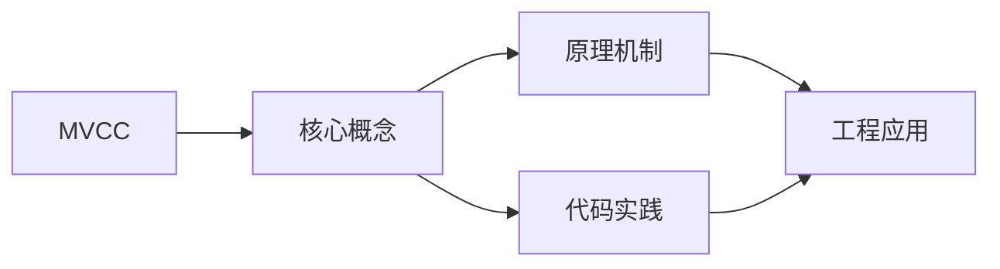
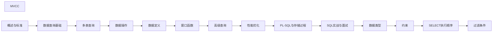

## 1. 学习目标（Bloom 分类）

本节按照布鲁姆教育目标分类学组织学习路径。本文主题为《MVCC》，属于 SQL 模块，读者可以根据自身阶段选择阅读深度。

记忆层面：能够准确复述本文的核心概念、术语与基本语法或操作步骤，并能够在提问或检索时快速定位对应知识点。能够说出 SQL 的核心概念、语法与常用对象。

理解层面：能够用自己的语言解释核心原理与工作机制，说明概念之间的因果关系，而不是机械记忆结论。能够解释 SQL 的执行原理与优化机制。

应用层面：能够在真实项目或练习场景中运用本文知识解决具体问题，写出正确且可维护的实现。能够编写正确、高效的 SQL 语句与操作。

分析层面：能够拆解复杂问题，比较本文主题与相邻概念的异同，识别边界条件与例外情况。能够分析 SQL 相关方案在性能与一致性上的权衡。

评价层面：能够根据约束条件（性能、可读性、安全、成本）评价不同方案的优劣，做出有依据的技术决策。能够根据业务场景评价 SQL 技术选型。

创造层面：能够把本文知识与其他模块知识组合，设计出新的解决方案或可复用的工程模式。能够组合 SQL 与其他技术设计数据架构。

通过本节学习，读者应当能够把《MVCC》纳入自己的知识网络，并与 SQL 模块的其他主题（DDL/DML、查询、索引、事务）建立关联。

## 2. 历史动机与发展脉络

《MVCC》是 SQL 领域的重要主题。要真正理解它，需要先了解它解决的问题与演进过程。

SQL（结构化查询语言）源于 1970 年 Codd 的关系模型，1974 年由 Chamberlin 与 Boyce 设计（SEQUEL），1986 年成为 ANSI 标准；SQL:2023 是当前国际标准。
SQL 分为 DDL（建表）、DML（增删改）、DQL（查询）、DCL（权限）与 TCL（事务）；各大数据库在标准基础上扩展方言。
SQL 是声明式语言：描述“要什么”而非“怎么做”，优化器负责执行计划；这一设计让 SQL 具有跨数据库的表达一致性。

回到本文主题：MVCC 的提出与成熟，正是上述技术背景下的必然产物。早期实现往往以简单可用为目标，随着工程规模扩大，社区逐渐沉淀出标准做法与最佳实践；理解这一脉络，可以帮助读者判断“为什么文档中的推荐写法是现在这个样子”，也能在遇到历史遗留代码时准确识别其设计年代与取舍。


## 3. 形式化定义与核心概念精讲

本节把《MVCC》涉及的核心概念以“定义 + 讲解”的形式展开。读者应把定义当作工具，把讲解当作理解路径；两者结合才能形成可迁移的知识。

关系模型：表（关系）、行（元组）、列（属性）；主键唯一标识、外键表达关联、范式消除冗余。
查询执行：解析 -> 绑定 -> 优化（基于代价选择计划）-> 执行；索引、统计信息与连接算法决定性能。
事务 ACID：原子性（Atomicity）、一致性（Consistency）、隔离性（Isolation）、持久性（Durability）；隔离级别控制并发行为。

### 3.1 原文章节逐一精讲

原文档把主题拆分为 16 个小节，下面按顺序给出每一节的导读讲解，随后保留原文细节供精读。

#### 原文精读（完整保留）

# SQL 多版本并发控制（MVCC） 语法速查手册

> **符号约定**：`< >` 必填参数 | `[ ]` 可选参数

---

#### 1. MVCC 概述

多版本并发控制（Multi-Version Concurrency Control，MVCC）是现代数据库实现高并发读写的核心机制。通过保存数据的多个版本，实现读不阻塞写、写不阻塞读。

##### 1.1 MVCC 核心思想

$$
\text{读操作} \perp \text{写操作}
$$

- **读操作**：访问数据的历史版本（快照读），不需要加锁
- **写操作**：创建数据的新版本，不影响正在读取旧版本的事务

##### 1.2 MVCC vs 锁机制

| 特性     | MVCC       | 锁机制     |
| -------- | ---------- | ---------- |
| 读写冲突 | 无         | 有         |
| 并发度   | 高         | 低         |
| 存储开销 | 多版本存储 | 锁管理开销 |
| 适用场景 | 读多写少   | 写多       |

#### 2. MVCC 实现原理

##### 2.1 版本链

每行数据包含隐藏列，用于构建版本链：

**InnoDB 隐藏列**：

| 列名        | 大小  | 用途                             |
| ----------- | ----- | -------------------------------- |
| DB_TRX_ID   | 6字节 | 最后修改该行的事务ID             |
| DB_ROLL_PTR | 7字节 | 回滚指针，指向undo log中的前版本 |
| DB_ROW_ID   | 6字节 | 隐藏自增ID（无主键时使用）       |

```
当前行：{data_v3, trx_id=300, roll_ptr → undo_v2}
                                          ↓
undo_v2：{data_v2, trx_id=200, roll_ptr → undo_v1}
                                          ↓
undo_v1：{data_v1, trx_id=100, roll_ptr → NULL}
```

##### 2.2 Read View（读视图）

Read View 决定当前事务能看到哪些版本的数据。

**InnoDB Read View 结构**：

| 字段           | 含义                                |
| -------------- | ----------------------------------- |
| m_ids          | 创建 Read View 时所有活跃事务ID列表 |
| min_trx_id     | 活跃事务中最小的事务ID              |
| max_trx_id     | 下一个将分配的事务ID（最大ID + 1）  |
| creator_trx_id | 创建该 Read View 的事务ID           |

##### 2.3 可见性判断规则

对于版本链中某个版本（trx_id）：

$$
\text{visible}(trx\_id) = \begin{cases}
\text{true} & \text{if } trx\_id < \text{min\_trx\_id} \\
\text{false} & \text{if } \text{min\_trx\_id} \leq trx\_id < \text{max\_trx\_id} \land trx\_id \in \text{m\_ids} \\
\text{true} & \text{if } \text{min\_trx\_id} \leq trx\_id < \text{max\_trx\_id} \land trx\_id \notin \text{m\_ids} \\
\text{false} & \text{if } trx\_id \geq \text{max\_trx\_id}
\end{cases}
$$

**简化规则**：

1. 版本的事务ID < min_trx_id → **可见**（事务已提交）
2. 版本的事务ID 在 m_ids 中 → **不可见**（事务未提交）
3. 版本的事务ID ≥ max_trx_id → **不可见**（事务在 Read View 创建后开始）
4. 版本的事务ID 在 [min, max) 但不在 m_ids 中 → **可见**（事务已提交）

##### 2.4 版本遍历过程

```
1. 读取当前行的 trx_id
2. 判断当前版本是否可见
3. 如果不可见，沿 roll_ptr 找到上一个版本
4. 重复步骤2-3，直到找到可见版本或版本链结束
```

#### 3. 不同隔离级别的 MVCC 行为

##### 3.1 READ COMMITTED

```sql
-- 每次 SELECT 创建新的 Read View
BEGIN;
SELECT * FROM accounts WHERE id = 1;  -- 创建 Read View 1
-- 事务B修改并提交
SELECT * FROM accounts WHERE id = 1;  -- 创建 Read View 2，能看到事务B的修改
COMMIT;
```

##### 3.2 REPEATABLE READ

```sql
-- 事务开始时创建 Read View，后续复用
BEGIN;
SELECT * FROM accounts WHERE id = 1;  -- 创建 Read View（唯一）
-- 事务B修改并提交
SELECT * FROM accounts WHERE id = 1;  -- 复用 Read View，看不到事务B的修改
COMMIT;
```

#### 4. PostgreSQL 的 MVCC 实现

##### 4.1 行头信息

PostgreSQL 每行数据包含：

| 字段 | 含义                                 |
| ---- | ------------------------------------ |
| xmin | 插入该行的事务ID                     |
| xmax | 删除/更新该行的事务ID（0表示未删除） |

```sql
-- 查看行版本信息
SELECT xmin, xmax, * FROM employees WHERE id = 1;
```

##### 4.2 可见性判断

```sql
-- PostgreSQL 可见性规则（简化）
-- 行可见当：
-- 1. xmin 对应的事务已提交
-- 2. xmax 为 0 或 xmax 对应的事务未提交

-- 使用 pg_snapshot 理解可见性
SELECT txid_current();           -- 当前事务ID
SELECT txid_snapshot_current();  -- 当前快照
```

##### 4.3 UPDATE = DELETE + INSERT

```sql
-- PostgreSQL 的 UPDATE 创建新行版本
UPDATE employees SET salary = 60000 WHERE id = 1;
-- 旧行：xmax = 当前事务ID（标记为已删除）
-- 新行：xmin = 当前事务ID（新版本）
```

#### 5. MVCC 与当前读

##### 5.1 快照读 vs 当前读

| 类型   | 语句                      | 读取内容       |
| ------ | ------------------------- | -------------- |
| 快照读 | 普通 SELECT               | MVCC 历史版本  |
| 当前读 | SELECT FOR UPDATE         | 最新已提交数据 |
| 当前读 | SELECT LOCK IN SHARE MODE | 最新已提交数据 |
| 当前读 | INSERT, UPDATE, DELETE    | 最新已提交数据 |

```sql
-- 快照读：使用 MVCC
SELECT * FROM employees WHERE id = 1;

-- 当前读：读取最新数据并加锁
SELECT * FROM employees WHERE id = 1 FOR UPDATE;
UPDATE employees SET salary = 60000 WHERE id = 1;
```

#### 6. MVCC 的空间回收

##### 6.1 版本堆积问题

MVCC 保留历史版本，导致空间不断增长：

- 已提交事务的旧版本可能仍被其他事务引用
- 长事务会阻止旧版本清理
- 频繁更新导致表膨胀

##### 6.2 清理机制

**InnoDB**：

- Purge 线程：清理不再需要的 undo log
- 条件：该版本对所有活跃事务都不可见

**PostgreSQL**：

- VACUUM：标记死行空间为可重用
- Autovacuum：自动触发清理
- VACUUM FULL：重建表，回收所有空间

```sql
-- PostgreSQL 手动清理
VACUUM employees;           -- 标记死行空间可重用
VACUUM FULL employees;      -- 重建表，回收空间（锁表）

-- 查看表膨胀
SELECT schemaname, relname,
       pg_size_pretty(pg_total_relation_size(relid)) AS total_size,
       n_dead_tup
FROM pg_stat_user_tables
ORDER BY n_dead_tup DESC;
```

##### 6.3 防止版本堆积

```sql
-- 避免长事务
SELECT pid, now() - xact_start AS duration, query
FROM pg_stat_activity
WHERE xact_start IS NOT NULL
ORDER BY duration DESC;

-- 设置事务超时
SET idle_in_transaction_session_timeout = '5min';  -- PostgreSQL
SET innodb_kill_idle_transaction = 60;             -- MySQL

-- 定期 VACUUM（PostgreSQL）
-- 配置 autovacuum 参数
ALTER TABLE employees SET (autovacuum_vacuum_scale_factor = 0.1);
```
#### MVCC 基本概念

**基本写法：MVCC 原理**
`-- 每行保存多个版本，读操作不加锁`
```sql
-- MVCC（Multi-Version Concurrency Control）
-- 每行数据隐藏两个字段：
--   trx_id   最后修改该行的事务 ID
--   roll_ptr 指向 undo log 中该行的上一个版本
-- 读操作根据 Read View 选择合适的版本，不加锁
```

---

**基本写法：查看隐藏字段**
`-- InnoDB 每行隐藏字段`
```sql
-- MySQL InnoDB 每行记录的隐藏列
-- DB_TRX_ID    事务 ID（6 字节）
-- DB_ROLL_PTR  回滚指针（7 字节）
-- DB_ROW_ID     行 ID（6 字节，无主键时自动生成）
```

---

#### Read View（读视图）

**基本写法：Read View 创建时机**
`-- 在 READ COMMITTED 下每次 SELECT 创建新 Read View`
```sql
-- READ COMMITTED 隔离级别
-- 每次 SELECT 都创建新的 Read View
-- 因此能看到其他事务已提交的最新数据

-- REPEATABLE READ 隔离级别
-- 事务第一次 SELECT 时创建 Read View
-- 整个事务使用同一个 Read View
-- 因此看到的是事务开始时的快照
```

---

**基本写法：可见性判断规则**
`-- 行版本对当前事务可见的条件`
```sql
-- Read View 包含：
--   m_ids       活跃事务 ID 列表
--   min_trx_id  最小活跃事务 ID
--   max_trx_id  下一个事务 ID
--   creator_trx_id 当前事务 ID

-- 判断规则：
-- 1. trx_id == creator_trx_id → 可见（自己修改的）
-- 2. trx_id < min_trx_id      → 可见（已提交）
-- 3. trx_id >= max_trx_id     → 不可见（未来事务）
-- 4. min_trx_id <= trx_id < max_trx_id 且不在 m_ids → 可见
--    在 m_ids 中 → 不可见，沿 roll_ptr 找历史版本
```

---

#### 快照读

**基本写法：普通 SELECT 是快照读**
`SELECT * FROM <表> WHERE <条件>`
```sql
-- 快照读：读取 MVCC 版本链中的可见版本，不加锁
-- READ COMMITTED 下读到最新已提交版本
-- REPEATABLE READ 下读到事务开始时的快照

SELECT * FROM accounts WHERE id = 1;
-- 不加锁，读的是快照
```

---

**基本写法：不同隔离级别的快照读**
`-- 同一查询在不同隔离级别下结果不同`
```sql
-- 会话A（REPEATABLE READ）
BEGIN;
SELECT balance FROM accounts WHERE id = 1;  -- 1000

-- 会话B 修改并提交
-- UPDATE accounts SET balance = 500 WHERE id = 1; COMMIT;

-- 会话A 再次查询（快照读）
SELECT balance FROM accounts WHERE id = 1;  -- 仍为 1000（使用旧快照）
COMMIT;
```

---

#### 当前读

**基本写法：加锁查询是当前读**
`SELECT * FROM <表> WHERE <条件> FOR UPDATE`
```sql
-- 当前读：读取最新版本并加锁
-- FOR UPDATE / LOCK IN SHARE MODE / UPDATE / DELETE 都是当前读

BEGIN;
SELECT * FROM accounts WHERE id = 1 FOR UPDATE;
-- 读取最新版本（即使其他事务已提交），并加排他锁
COMMIT;
```

---

**基本写法：UPDATE 是当前读**
`UPDATE <表> SET <列>=<值> WHERE <条件>`
```sql
-- UPDATE/DELETE 操作需要读取最新版本（当前读）
BEGIN;
-- 快照读（读旧版本）
SELECT balance FROM accounts WHERE id = 1;  -- 1000

-- 当前读（读最新版本）
UPDATE accounts SET balance = balance - 100 WHERE id = 1;
-- 此处读到的是最新余额（可能是 2000），更新后为 1900
COMMIT;
```

---

#### undo log 版本链

**基本写法：版本链结构**
`-- 每次修改生成 undo log，形成版本链`
```sql
-- 版本链示例
-- 当前行:  trx_id=200, balance=300
--          ↓ roll_ptr
-- undo1:  trx_id=150, balance=500
--          ↓ roll_ptr
-- undo2:  trx_id=100, balance=1000

-- 事务 trx_id=120 的 Read View：
-- 200 不可见（活跃），150 不可见（活跃），100 可见 → 读到 balance=1000
```

---

**基本写法：purge 清理 undo log**
`-- 没有活跃事务引用的旧版本会被清理`
```sql
-- MySQL InnoDB 后台 purge 线程清理 undo log
-- 当 Read View 不再需要某个旧版本时，purge 线程删除它

-- 查看 purge 状态
SHOW ENGINE INNODB STATUS\G
-- 查看 purge 相关信息
```

---

#### MVCC 与隔离级别

**基本写法：READ COMMITTED 下的 MVCC**
`-- 每次查询创建新 Read View`
```sql
-- READ COMMITTED 隔离级别
BEGIN;
SELECT * FROM accounts WHERE id = 1;  -- Read View 1，读到余额 1000

-- 其他事务提交修改

SELECT * FROM accounts WHERE id = 1;  -- Read View 2，读到新余额 500
-- 因为每次 SELECT 都创建新的 Read View
COMMIT;
```

---

**基本写法：REPEATABLE READ 下的 MVCC**
`-- 事务内使用同一个 Read View`
```sql
-- REPEATABLE READ 隔离级别
BEGIN;
SELECT * FROM accounts WHERE id = 1;  -- Read View 创建，读到余额 1000

-- 其他事务提交修改

SELECT * FROM accounts WHERE id = 1;  -- 仍为 1000（使用同一 Read View）
COMMIT;
```

---

#### MVCC 相关参数

**基本写法：查看 undo 相关参数**
`SHOW VARIABLES LIKE 'innodb_undo%';`
```sql
-- 查看 undo 表空间配置
SHOW VARIABLES LIKE 'innodb_undo%';
-- innodb_undo_directory: undo log 目录
-- innodb_undo_log_truncate: 是否自动截断
-- innodb_undo_tablespaces: undo 表空间数量
```

---

**基本写法：查看隔离级别**
`SELECT @@transaction_isolation;`
```sql
-- 当前隔离级别决定了 MVCC 的行为
SELECT @@transaction_isolation;
-- REPEATABLE-READ（MySQL 默认，MVCC 效果最佳）
```

---

#### MVCC 优势

**基本写法：读不加锁**
`-- 读操作不阻塞写，写不阻塞读`
```sql
-- 传统锁机制：
--   读加共享锁 → 阻塞写
--   写加排他锁 → 阻塞读

-- MVCC：
--   快照读不加锁 → 不阻塞写
--   写加排他锁 → 不阻塞快照读
--   大幅提升读多写少场景的并发性能
```

---

#### MVCC 局限性

**基本写法：长事务导致 undo 膨胀**
`-- 长事务持有旧 Read View，旧版本无法清理`
```sql
-- 长事务问题
BEGIN;
SELECT * FROM accounts;  -- 创建 Read View

-- ... 长时间不提交
-- 其他事务大量更新
-- undo log 持续增长，无法 purge
-- 导致 ibdata 或 undo 表空间膨胀

COMMIT;  -- 提交后 purge 才能清理旧版本
```

---

**基本写法：更新频繁的表性能下降**
`-- 版本链过长时，查找可见版本需要遍历`
```sql
-- 高频更新场景下，版本链可能很长
-- 读操作需要遍历版本链找到可见版本
-- 导致读性能下降

-- 建议：
-- 1. 避免长事务
-- 2. 高频更新表考虑降低隔离级别
-- 3. 定期 COMMIT 释放 Read View
```

---

#### PostgreSQL MVCC

**基本写法：PostgreSQL MVCC 实现**
`-- 每行存储 xmin（创建事务）和 xmax（删除事务）`
```sql
-- PostgreSQL MVCC 使用 xmin/xmax 标记
-- xmin   插入/更新该行的事务 ID
-- xmax   删除/更新该行的事务 ID（0 表示未删除）

-- 查看行的事务信息（需要超级用户）
SELECT xmin, xmax, * FROM accounts WHERE id = 1;
```

---

**基本写法：PostgreSQL 表膨胀**
`-- 更新产生死元组，需要 VACUUM 清理`
```sql
-- PostgreSQL 更新 = 删除旧行 + 插入新行
-- 旧行标记为 dead tuple

-- 手动清理
VACUUM accounts;

-- 分析并清理
VACUUM ANALYZE accounts;

-- 完全清理（锁表）
VACUUM FULL accounts;

-- 自动清理配置
SHOW autovacuum;
```


### 3.2 概念关系图

下面用 Mermaid 图表达本文核心概念之间的关系，帮助读者建立整体图景：



图中展示的是本文知识的结构化关系：核心概念是入口，原理机制解释“为什么”，代码实践演示“怎么做”，工程应用回答“何时用”。读者学习时可以把每个小节的内容挂接到对应节点上。

## 4. 理论推导与原理解析

本节深入《MVCC》背后的原理。理论部分不求面面俱到，而是聚焦“能解释现象、能指导实践”的关键推导。

关系模型：表（关系）、行（元组）、列（属性）；主键唯一标识、外键表达关联、范式消除冗余。
查询执行：解析 -> 绑定 -> 优化（基于代价选择计划）-> 执行；索引、统计信息与连接算法决定性能。
事务 ACID：原子性（Atomicity）、一致性（Consistency）、隔离性（Isolation）、持久性（Durability）；隔离级别控制并发行为。
集合语义：SELECT 返回结果集；JOIN 组合关系，GROUP BY 聚合，子查询与 CTE 表达复杂逻辑。

需要强调的是，理论推导与工程实践之间存在翻译层：理论给出的是理想化模型与边界条件，工程代码则必须处理真实环境中的例外。读者在学习时应先掌握理论的“标准情形”，再通过陷阱章节了解“非标准情形”。

## 5. 代码示例与逐行讲解

本节把原文中的代码示例系统整理，并为每个示例补充用途说明与讲解。读者不应只浏览代码，而应逐段对照讲解理解设计意图。

### 5.1 示例：2.1 版本链

该示例来自原文《2.1 版本链》小节，用于演示MVCC相关操作。阅读时请先看代码结构，再看其后的讲解。

```text
当前行：{data_v3, trx_id=300, roll_ptr → undo_v2}
                                          ↓
undo_v2：{data_v2, trx_id=200, roll_ptr → undo_v1}
                                          ↓
undo_v1：{data_v1, trx_id=100, roll_ptr → NULL}
```

讲解：这段代码演示了本节核心知识点。代码中的关键操作可以归纳为三步：准备（定义或初始化）、执行（核心逻辑）、收尾（释放资源或返回结果）。实际项目中，这三步往往被封装为函数或类，以提升复用性与可测试性。

关键点分析：

该示例共 5 行有效代码，结构以数据或配置为主。阅读时应关注：数据字段的含义、配置项的作用，以及它们与运行行为的对应关系。

进阶思考路径：先尝试修改参数观察行为变化，再把示例中的模式迁移到自己的项目中；每次修改都记录预期与实测差异，这是把示例转化为能力的最快方式。

### 5.2 示例：2.4 版本遍历过程

该示例来自原文《2.4 版本遍历过程》小节，用于演示MVCC相关操作。阅读时请先看代码结构，再看其后的讲解。

```text
1. 读取当前行的 trx_id
2. 判断当前版本是否可见
3. 如果不可见，沿 roll_ptr 找到上一个版本
4. 重复步骤2-3，直到找到可见版本或版本链结束
```

讲解：这段代码演示了本节核心知识点。代码中的关键操作可以归纳为三步：准备（定义或初始化）、执行（核心逻辑）、收尾（释放资源或返回结果）。实际项目中，这三步往往被封装为函数或类，以提升复用性与可测试性。

关键点分析：

该示例共 4 行有效代码，结构以数据或配置为主。阅读时应关注：数据字段的含义、配置项的作用，以及它们与运行行为的对应关系。

进阶思考路径：先尝试修改参数观察行为变化，再把示例中的模式迁移到自己的项目中；每次修改都记录预期与实测差异，这是把示例转化为能力的最快方式。

### 5.3 示例：3.1 READ COMMITTED

该示例来自原文《3.1 READ COMMITTED》小节，用于演示MVCC相关操作。阅读时请先看代码结构，再看其后的讲解。

```sql
-- 每次 SELECT 创建新的 Read View
BEGIN;
SELECT * FROM accounts WHERE id = 1;  -- 创建 Read View 1
-- 事务B修改并提交
SELECT * FROM accounts WHERE id = 1;  -- 创建 Read View 2，能看到事务B的修改
COMMIT;
```

讲解：这段代码演示了本节核心知识点。代码中的关键操作可以归纳为三步：准备（定义或初始化）、执行（核心逻辑）、收尾（释放资源或返回结果）。实际项目中，这三步往往被封装为函数或类，以提升复用性与可测试性。

关键点分析：

该示例共 6 行有效代码，包含 2 类关键结构（SELECT、FROM）。其中：

- 入口与初始化部分负责建立上下文，对应实际项目中的启动或装配逻辑；
- 核心逻辑部分体现本文主题的主要操作，是阅读时最需要对照讲解理解的部分；
- 输出或返回部分把结果交给调用方，注意其类型与边界条件。

进阶思考路径：先尝试修改参数观察行为变化，再把示例中的模式迁移到自己的项目中；每次修改都记录预期与实测差异，这是把示例转化为能力的最快方式。

### 5.4 示例：3.2 REPEATABLE READ

该示例来自原文《3.2 REPEATABLE READ》小节，用于演示MVCC相关操作。阅读时请先看代码结构，再看其后的讲解。

```sql
-- 事务开始时创建 Read View，后续复用
BEGIN;
SELECT * FROM accounts WHERE id = 1;  -- 创建 Read View（唯一）
-- 事务B修改并提交
SELECT * FROM accounts WHERE id = 1;  -- 复用 Read View，看不到事务B的修改
COMMIT;
```

讲解：这段代码演示了本节核心知识点。代码中的关键操作可以归纳为三步：准备（定义或初始化）、执行（核心逻辑）、收尾（释放资源或返回结果）。实际项目中，这三步往往被封装为函数或类，以提升复用性与可测试性。

关键点分析：

该示例共 6 行有效代码，包含 2 类关键结构（SELECT、FROM）。其中：

- 入口与初始化部分负责建立上下文，对应实际项目中的启动或装配逻辑；
- 核心逻辑部分体现本文主题的主要操作，是阅读时最需要对照讲解理解的部分；
- 输出或返回部分把结果交给调用方，注意其类型与边界条件。

进阶思考路径：先尝试修改参数观察行为变化，再把示例中的模式迁移到自己的项目中；每次修改都记录预期与实测差异，这是把示例转化为能力的最快方式。

### 5.5 示例：4.1 行头信息

该示例来自原文《4.1 行头信息》小节，用于演示MVCC相关操作。阅读时请先看代码结构，再看其后的讲解。

```sql
-- 查看行版本信息
SELECT xmin, xmax, * FROM employees WHERE id = 1;
```

讲解：这段代码演示了本节核心知识点。代码中的关键操作可以归纳为三步：准备（定义或初始化）、执行（核心逻辑）、收尾（释放资源或返回结果）。实际项目中，这三步往往被封装为函数或类，以提升复用性与可测试性。

关键点分析：

该示例共 2 行有效代码，包含 2 类关键结构（SELECT、FROM）。其中：

- 入口与初始化部分负责建立上下文，对应实际项目中的启动或装配逻辑；
- 核心逻辑部分体现本文主题的主要操作，是阅读时最需要对照讲解理解的部分；
- 输出或返回部分把结果交给调用方，注意其类型与边界条件。

进阶思考路径：先尝试修改参数观察行为变化，再把示例中的模式迁移到自己的项目中；每次修改都记录预期与实测差异，这是把示例转化为能力的最快方式。

### 5.6 示例：4.2 可见性判断

该示例来自原文《4.2 可见性判断》小节，用于演示MVCC相关操作。阅读时请先看代码结构，再看其后的讲解。

```sql
-- PostgreSQL 可见性规则（简化）
-- 行可见当：
-- 1. xmin 对应的事务已提交
-- 2. xmax 为 0 或 xmax 对应的事务未提交

-- 使用 pg_snapshot 理解可见性
SELECT txid_current();           -- 当前事务ID
SELECT txid_snapshot_current();  -- 当前快照
```

讲解：这段代码演示了本节核心知识点。代码中的关键操作可以归纳为三步：准备（定义或初始化）、执行（核心逻辑）、收尾（释放资源或返回结果）。实际项目中，这三步往往被封装为函数或类，以提升复用性与可测试性。

关键点分析：

该示例共 7 行有效代码，包含 1 类关键结构（SELECT）。其中：

- 入口与初始化部分负责建立上下文，对应实际项目中的启动或装配逻辑；
- 核心逻辑部分体现本文主题的主要操作，是阅读时最需要对照讲解理解的部分；
- 输出或返回部分把结果交给调用方，注意其类型与边界条件。

进阶思考路径：先尝试修改参数观察行为变化，再把示例中的模式迁移到自己的项目中；每次修改都记录预期与实测差异，这是把示例转化为能力的最快方式。

### 5.7 示例：4.3 UPDATE = DELETE + INSERT

该示例来自原文《4.3 UPDATE = DELETE + INSERT》小节，用于演示MVCC相关操作。阅读时请先看代码结构，再看其后的讲解。

```sql
-- PostgreSQL 的 UPDATE 创建新行版本
UPDATE employees SET salary = 60000 WHERE id = 1;
-- 旧行：xmax = 当前事务ID（标记为已删除）
-- 新行：xmin = 当前事务ID（新版本）
```

讲解：这段代码演示了本节核心知识点。代码中的关键操作可以归纳为三步：准备（定义或初始化）、执行（核心逻辑）、收尾（释放资源或返回结果）。实际项目中，这三步往往被封装为函数或类，以提升复用性与可测试性。

关键点分析：

该示例共 4 行有效代码，结构以数据或配置为主。阅读时应关注：数据字段的含义、配置项的作用，以及它们与运行行为的对应关系。

进阶思考路径：先尝试修改参数观察行为变化，再把示例中的模式迁移到自己的项目中；每次修改都记录预期与实测差异，这是把示例转化为能力的最快方式。

### 5.8 示例：5.1 快照读 vs 当前读

该示例来自原文《5.1 快照读 vs 当前读》小节，用于演示MVCC相关操作。阅读时请先看代码结构，再看其后的讲解。

```sql
-- 快照读：使用 MVCC
SELECT * FROM employees WHERE id = 1;

-- 当前读：读取最新数据并加锁
SELECT * FROM employees WHERE id = 1 FOR UPDATE;
UPDATE employees SET salary = 60000 WHERE id = 1;
```

讲解：这段代码演示了本节核心知识点。代码中的关键操作可以归纳为三步：准备（定义或初始化）、执行（核心逻辑）、收尾（释放资源或返回结果）。实际项目中，这三步往往被封装为函数或类，以提升复用性与可测试性。

关键点分析：

该示例共 5 行有效代码，包含 2 类关键结构（SELECT、FROM）。其中：

- 入口与初始化部分负责建立上下文，对应实际项目中的启动或装配逻辑；
- 核心逻辑部分体现本文主题的主要操作，是阅读时最需要对照讲解理解的部分；
- 输出或返回部分把结果交给调用方，注意其类型与边界条件。

进阶思考路径：先尝试修改参数观察行为变化，再把示例中的模式迁移到自己的项目中；每次修改都记录预期与实测差异，这是把示例转化为能力的最快方式。

### 5.9 示例：6.2 清理机制

该示例来自原文《6.2 清理机制》小节，用于演示MVCC相关操作。阅读时请先看代码结构，再看其后的讲解。

```sql
-- PostgreSQL 手动清理
VACUUM employees;           -- 标记死行空间可重用
VACUUM FULL employees;      -- 重建表，回收空间（锁表）

-- 查看表膨胀
SELECT schemaname, relname,
       pg_size_pretty(pg_total_relation_size(relid)) AS total_size,
       n_dead_tup
FROM pg_stat_user_tables
ORDER BY n_dead_tup DESC;
```

讲解：这段代码演示了本节核心知识点。代码中的关键操作可以归纳为三步：准备（定义或初始化）、执行（核心逻辑）、收尾（释放资源或返回结果）。实际项目中，这三步往往被封装为函数或类，以提升复用性与可测试性。

关键点分析：

该示例共 9 行有效代码，包含 2 类关键结构（SELECT、FROM）。其中：

- 入口与初始化部分负责建立上下文，对应实际项目中的启动或装配逻辑；
- 核心逻辑部分体现本文主题的主要操作，是阅读时最需要对照讲解理解的部分；
- 输出或返回部分把结果交给调用方，注意其类型与边界条件。

进阶思考路径：先尝试修改参数观察行为变化，再把示例中的模式迁移到自己的项目中；每次修改都记录预期与实测差异，这是把示例转化为能力的最快方式。

### 5.10 示例：6.3 防止版本堆积

该示例来自原文《6.3 防止版本堆积》小节，用于演示MVCC相关操作。阅读时请先看代码结构，再看其后的讲解。

```sql
-- 避免长事务
SELECT pid, now() - xact_start AS duration, query
FROM pg_stat_activity
WHERE xact_start IS NOT NULL
ORDER BY duration DESC;

-- 设置事务超时
SET idle_in_transaction_session_timeout = '5min';  -- PostgreSQL
SET innodb_kill_idle_transaction = 60;             -- MySQL

-- 定期 VACUUM（PostgreSQL）
-- 配置 autovacuum 参数
ALTER TABLE employees SET (autovacuum_vacuum_scale_factor = 0.1);
```

讲解：这段代码演示了本节核心知识点。代码中的关键操作可以归纳为三步：准备（定义或初始化）、执行（核心逻辑）、收尾（释放资源或返回结果）。实际项目中，这三步往往被封装为函数或类，以提升复用性与可测试性。

关键点分析：

该示例共 11 行有效代码，包含 3 类关键结构（SELECT、ALTER、FROM）。其中：

- 入口与初始化部分负责建立上下文，对应实际项目中的启动或装配逻辑；
- 核心逻辑部分体现本文主题的主要操作，是阅读时最需要对照讲解理解的部分；
- 输出或返回部分把结果交给调用方，注意其类型与边界条件。

进阶思考路径：先尝试修改参数观察行为变化，再把示例中的模式迁移到自己的项目中；每次修改都记录预期与实测差异，这是把示例转化为能力的最快方式。

### 5.11 示例：MVCC 基本概念

该示例来自原文《MVCC 基本概念》小节，用于演示MVCC相关操作。阅读时请先看代码结构，再看其后的讲解。

```sql
-- MVCC（Multi-Version Concurrency Control）
-- 每行数据隐藏两个字段：
--   trx_id   最后修改该行的事务 ID
--   roll_ptr 指向 undo log 中该行的上一个版本
-- 读操作根据 Read View 选择合适的版本，不加锁
```

讲解：这段代码演示了本节核心知识点。代码中的关键操作可以归纳为三步：准备（定义或初始化）、执行（核心逻辑）、收尾（释放资源或返回结果）。实际项目中，这三步往往被封装为函数或类，以提升复用性与可测试性。

关键点分析：

该示例共 5 行有效代码，结构以数据或配置为主。阅读时应关注：数据字段的含义、配置项的作用，以及它们与运行行为的对应关系。

进阶思考路径：先尝试修改参数观察行为变化，再把示例中的模式迁移到自己的项目中；每次修改都记录预期与实测差异，这是把示例转化为能力的最快方式。

### 5.12 示例：MVCC 基本概念

该示例来自原文《MVCC 基本概念》小节，用于演示MVCC相关操作。阅读时请先看代码结构，再看其后的讲解。

```sql
-- MySQL InnoDB 每行记录的隐藏列
-- DB_TRX_ID    事务 ID（6 字节）
-- DB_ROLL_PTR  回滚指针（7 字节）
-- DB_ROW_ID     行 ID（6 字节，无主键时自动生成）
```

讲解：这段代码演示了本节核心知识点。代码中的关键操作可以归纳为三步：准备（定义或初始化）、执行（核心逻辑）、收尾（释放资源或返回结果）。实际项目中，这三步往往被封装为函数或类，以提升复用性与可测试性。

关键点分析：

该示例共 4 行有效代码，结构以数据或配置为主。阅读时应关注：数据字段的含义、配置项的作用，以及它们与运行行为的对应关系。

进阶思考路径：先尝试修改参数观察行为变化，再把示例中的模式迁移到自己的项目中；每次修改都记录预期与实测差异，这是把示例转化为能力的最快方式。

### 5.13 示例：Read View（读视图）

该示例来自原文《Read View（读视图）》小节，用于演示MVCC相关操作。阅读时请先看代码结构，再看其后的讲解。

```sql
-- READ COMMITTED 隔离级别
-- 每次 SELECT 都创建新的 Read View
-- 因此能看到其他事务已提交的最新数据

-- REPEATABLE READ 隔离级别
-- 事务第一次 SELECT 时创建 Read View
-- 整个事务使用同一个 Read View
-- 因此看到的是事务开始时的快照
```

讲解：这段代码演示了本节核心知识点。代码中的关键操作可以归纳为三步：准备（定义或初始化）、执行（核心逻辑）、收尾（释放资源或返回结果）。实际项目中，这三步往往被封装为函数或类，以提升复用性与可测试性。

关键点分析：

该示例共 7 行有效代码，包含 1 类关键结构（SELECT）。其中：

- 入口与初始化部分负责建立上下文，对应实际项目中的启动或装配逻辑；
- 核心逻辑部分体现本文主题的主要操作，是阅读时最需要对照讲解理解的部分；
- 输出或返回部分把结果交给调用方，注意其类型与边界条件。

进阶思考路径：先尝试修改参数观察行为变化，再把示例中的模式迁移到自己的项目中；每次修改都记录预期与实测差异，这是把示例转化为能力的最快方式。

### 5.14 示例：Read View（读视图）

该示例来自原文《Read View（读视图）》小节，用于演示MVCC相关操作。阅读时请先看代码结构，再看其后的讲解。

```sql
-- Read View 包含：
--   m_ids       活跃事务 ID 列表
--   min_trx_id  最小活跃事务 ID
--   max_trx_id  下一个事务 ID
--   creator_trx_id 当前事务 ID

-- 判断规则：
-- 1. trx_id == creator_trx_id → 可见（自己修改的）
-- 2. trx_id < min_trx_id      → 可见（已提交）
-- 3. trx_id >= max_trx_id     → 不可见（未来事务）
-- 4. min_trx_id <= trx_id < max_trx_id 且不在 m_ids → 可见
--    在 m_ids 中 → 不可见，沿 roll_ptr 找历史版本
```

讲解：这段代码演示了本节核心知识点。代码中的关键操作可以归纳为三步：准备（定义或初始化）、执行（核心逻辑）、收尾（释放资源或返回结果）。实际项目中，这三步往往被封装为函数或类，以提升复用性与可测试性。

关键点分析：

该示例共 11 行有效代码，结构以数据或配置为主。阅读时应关注：数据字段的含义、配置项的作用，以及它们与运行行为的对应关系。

进阶思考路径：先尝试修改参数观察行为变化，再把示例中的模式迁移到自己的项目中；每次修改都记录预期与实测差异，这是把示例转化为能力的最快方式。

### 5.15 示例：快照读

该示例来自原文《快照读》小节，用于演示MVCC相关操作。阅读时请先看代码结构，再看其后的讲解。

```sql
-- 快照读：读取 MVCC 版本链中的可见版本，不加锁
-- READ COMMITTED 下读到最新已提交版本
-- REPEATABLE READ 下读到事务开始时的快照

SELECT * FROM accounts WHERE id = 1;
-- 不加锁，读的是快照
```

讲解：这段代码演示了本节核心知识点。代码中的关键操作可以归纳为三步：准备（定义或初始化）、执行（核心逻辑）、收尾（释放资源或返回结果）。实际项目中，这三步往往被封装为函数或类，以提升复用性与可测试性。

关键点分析：

该示例共 5 行有效代码，包含 2 类关键结构（SELECT、FROM）。其中：

- 入口与初始化部分负责建立上下文，对应实际项目中的启动或装配逻辑；
- 核心逻辑部分体现本文主题的主要操作，是阅读时最需要对照讲解理解的部分；
- 输出或返回部分把结果交给调用方，注意其类型与边界条件。

进阶思考路径：先尝试修改参数观察行为变化，再把示例中的模式迁移到自己的项目中；每次修改都记录预期与实测差异，这是把示例转化为能力的最快方式。

### 5.16 示例：快照读

该示例来自原文《快照读》小节，用于演示MVCC相关操作。阅读时请先看代码结构，再看其后的讲解。

```sql
-- 会话A（REPEATABLE READ）
BEGIN;
SELECT balance FROM accounts WHERE id = 1;  -- 1000

-- 会话B 修改并提交
-- UPDATE accounts SET balance = 500 WHERE id = 1; COMMIT;

-- 会话A 再次查询（快照读）
SELECT balance FROM accounts WHERE id = 1;  -- 仍为 1000（使用旧快照）
COMMIT;
```

讲解：这段代码演示了本节核心知识点。代码中的关键操作可以归纳为三步：准备（定义或初始化）、执行（核心逻辑）、收尾（释放资源或返回结果）。实际项目中，这三步往往被封装为函数或类，以提升复用性与可测试性。

关键点分析：

该示例共 8 行有效代码，包含 2 类关键结构（SELECT、FROM）。其中：

- 入口与初始化部分负责建立上下文，对应实际项目中的启动或装配逻辑；
- 核心逻辑部分体现本文主题的主要操作，是阅读时最需要对照讲解理解的部分；
- 输出或返回部分把结果交给调用方，注意其类型与边界条件。

进阶思考路径：先尝试修改参数观察行为变化，再把示例中的模式迁移到自己的项目中；每次修改都记录预期与实测差异，这是把示例转化为能力的最快方式。

### 5.17 示例：当前读

该示例来自原文《当前读》小节，用于演示MVCC相关操作。阅读时请先看代码结构，再看其后的讲解。

```sql
-- 当前读：读取最新版本并加锁
-- FOR UPDATE / LOCK IN SHARE MODE / UPDATE / DELETE 都是当前读

BEGIN;
SELECT * FROM accounts WHERE id = 1 FOR UPDATE;
-- 读取最新版本（即使其他事务已提交），并加排他锁
COMMIT;
```

讲解：这段代码演示了本节核心知识点。代码中的关键操作可以归纳为三步：准备（定义或初始化）、执行（核心逻辑）、收尾（释放资源或返回结果）。实际项目中，这三步往往被封装为函数或类，以提升复用性与可测试性。

关键点分析：

该示例共 6 行有效代码，包含 2 类关键结构（SELECT、FROM）。其中：

- 入口与初始化部分负责建立上下文，对应实际项目中的启动或装配逻辑；
- 核心逻辑部分体现本文主题的主要操作，是阅读时最需要对照讲解理解的部分；
- 输出或返回部分把结果交给调用方，注意其类型与边界条件。

进阶思考路径：先尝试修改参数观察行为变化，再把示例中的模式迁移到自己的项目中；每次修改都记录预期与实测差异，这是把示例转化为能力的最快方式。

### 5.18 示例：当前读

该示例来自原文《当前读》小节，用于演示MVCC相关操作。阅读时请先看代码结构，再看其后的讲解。

```sql
-- UPDATE/DELETE 操作需要读取最新版本（当前读）
BEGIN;
-- 快照读（读旧版本）
SELECT balance FROM accounts WHERE id = 1;  -- 1000

-- 当前读（读最新版本）
UPDATE accounts SET balance = balance - 100 WHERE id = 1;
-- 此处读到的是最新余额（可能是 2000），更新后为 1900
COMMIT;
```

讲解：这段代码演示了本节核心知识点。代码中的关键操作可以归纳为三步：准备（定义或初始化）、执行（核心逻辑）、收尾（释放资源或返回结果）。实际项目中，这三步往往被封装为函数或类，以提升复用性与可测试性。

关键点分析：

该示例共 8 行有效代码，包含 2 类关键结构（SELECT、FROM）。其中：

- 入口与初始化部分负责建立上下文，对应实际项目中的启动或装配逻辑；
- 核心逻辑部分体现本文主题的主要操作，是阅读时最需要对照讲解理解的部分；
- 输出或返回部分把结果交给调用方，注意其类型与边界条件。

进阶思考路径：先尝试修改参数观察行为变化，再把示例中的模式迁移到自己的项目中；每次修改都记录预期与实测差异，这是把示例转化为能力的最快方式。

### 5.19 示例：undo log 版本链

该示例来自原文《undo log 版本链》小节，用于演示MVCC相关操作。阅读时请先看代码结构，再看其后的讲解。

```sql
-- 版本链示例
-- 当前行:  trx_id=200, balance=300
--          ↓ roll_ptr
-- undo1:  trx_id=150, balance=500
--          ↓ roll_ptr
-- undo2:  trx_id=100, balance=1000

-- 事务 trx_id=120 的 Read View：
-- 200 不可见（活跃），150 不可见（活跃），100 可见 → 读到 balance=1000
```

讲解：这段代码演示了本节核心知识点。代码中的关键操作可以归纳为三步：准备（定义或初始化）、执行（核心逻辑）、收尾（释放资源或返回结果）。实际项目中，这三步往往被封装为函数或类，以提升复用性与可测试性。

关键点分析：

该示例共 8 行有效代码，结构以数据或配置为主。阅读时应关注：数据字段的含义、配置项的作用，以及它们与运行行为的对应关系。

进阶思考路径：先尝试修改参数观察行为变化，再把示例中的模式迁移到自己的项目中；每次修改都记录预期与实测差异，这是把示例转化为能力的最快方式。

### 5.20 示例：undo log 版本链

该示例来自原文《undo log 版本链》小节，用于演示MVCC相关操作。阅读时请先看代码结构，再看其后的讲解。

```sql
-- MySQL InnoDB 后台 purge 线程清理 undo log
-- 当 Read View 不再需要某个旧版本时，purge 线程删除它

-- 查看 purge 状态
SHOW ENGINE INNODB STATUS\G
-- 查看 purge 相关信息
```

讲解：这段代码演示了本节核心知识点。代码中的关键操作可以归纳为三步：准备（定义或初始化）、执行（核心逻辑）、收尾（释放资源或返回结果）。实际项目中，这三步往往被封装为函数或类，以提升复用性与可测试性。

关键点分析：

该示例共 5 行有效代码，结构以数据或配置为主。阅读时应关注：数据字段的含义、配置项的作用，以及它们与运行行为的对应关系。

进阶思考路径：先尝试修改参数观察行为变化，再把示例中的模式迁移到自己的项目中；每次修改都记录预期与实测差异，这是把示例转化为能力的最快方式。

### 5.21 示例：MVCC 与隔离级别

该示例来自原文《MVCC 与隔离级别》小节，用于演示MVCC相关操作。阅读时请先看代码结构，再看其后的讲解。

```sql
-- READ COMMITTED 隔离级别
BEGIN;
SELECT * FROM accounts WHERE id = 1;  -- Read View 1，读到余额 1000

-- 其他事务提交修改

SELECT * FROM accounts WHERE id = 1;  -- Read View 2，读到新余额 500
-- 因为每次 SELECT 都创建新的 Read View
COMMIT;
```

讲解：这段代码演示了本节核心知识点。代码中的关键操作可以归纳为三步：准备（定义或初始化）、执行（核心逻辑）、收尾（释放资源或返回结果）。实际项目中，这三步往往被封装为函数或类，以提升复用性与可测试性。

关键点分析：

该示例共 7 行有效代码，包含 2 类关键结构（SELECT、FROM）。其中：

- 入口与初始化部分负责建立上下文，对应实际项目中的启动或装配逻辑；
- 核心逻辑部分体现本文主题的主要操作，是阅读时最需要对照讲解理解的部分；
- 输出或返回部分把结果交给调用方，注意其类型与边界条件。

进阶思考路径：先尝试修改参数观察行为变化，再把示例中的模式迁移到自己的项目中；每次修改都记录预期与实测差异，这是把示例转化为能力的最快方式。

### 5.22 示例：MVCC 与隔离级别

该示例来自原文《MVCC 与隔离级别》小节，用于演示MVCC相关操作。阅读时请先看代码结构，再看其后的讲解。

```sql
-- REPEATABLE READ 隔离级别
BEGIN;
SELECT * FROM accounts WHERE id = 1;  -- Read View 创建，读到余额 1000

-- 其他事务提交修改

SELECT * FROM accounts WHERE id = 1;  -- 仍为 1000（使用同一 Read View）
COMMIT;
```

讲解：这段代码演示了本节核心知识点。代码中的关键操作可以归纳为三步：准备（定义或初始化）、执行（核心逻辑）、收尾（释放资源或返回结果）。实际项目中，这三步往往被封装为函数或类，以提升复用性与可测试性。

关键点分析：

该示例共 6 行有效代码，包含 2 类关键结构（SELECT、FROM）。其中：

- 入口与初始化部分负责建立上下文，对应实际项目中的启动或装配逻辑；
- 核心逻辑部分体现本文主题的主要操作，是阅读时最需要对照讲解理解的部分；
- 输出或返回部分把结果交给调用方，注意其类型与边界条件。

进阶思考路径：先尝试修改参数观察行为变化，再把示例中的模式迁移到自己的项目中；每次修改都记录预期与实测差异，这是把示例转化为能力的最快方式。

### 5.23 示例：MVCC 相关参数

该示例来自原文《MVCC 相关参数》小节，用于演示MVCC相关操作。阅读时请先看代码结构，再看其后的讲解。

```sql
-- 查看 undo 表空间配置
SHOW VARIABLES LIKE 'innodb_undo%';
-- innodb_undo_directory: undo log 目录
-- innodb_undo_log_truncate: 是否自动截断
-- innodb_undo_tablespaces: undo 表空间数量
```

讲解：这段代码演示了本节核心知识点。代码中的关键操作可以归纳为三步：准备（定义或初始化）、执行（核心逻辑）、收尾（释放资源或返回结果）。实际项目中，这三步往往被封装为函数或类，以提升复用性与可测试性。

关键点分析：

该示例共 5 行有效代码，结构以数据或配置为主。阅读时应关注：数据字段的含义、配置项的作用，以及它们与运行行为的对应关系。

进阶思考路径：先尝试修改参数观察行为变化，再把示例中的模式迁移到自己的项目中；每次修改都记录预期与实测差异，这是把示例转化为能力的最快方式。

### 5.24 示例：MVCC 相关参数

该示例来自原文《MVCC 相关参数》小节，用于演示MVCC相关操作。阅读时请先看代码结构，再看其后的讲解。

```sql
-- 当前隔离级别决定了 MVCC 的行为
SELECT @@transaction_isolation;
-- REPEATABLE-READ（MySQL 默认，MVCC 效果最佳）
```

讲解：这段代码演示了本节核心知识点。代码中的关键操作可以归纳为三步：准备（定义或初始化）、执行（核心逻辑）、收尾（释放资源或返回结果）。实际项目中，这三步往往被封装为函数或类，以提升复用性与可测试性。

关键点分析：

该示例共 3 行有效代码，包含 1 类关键结构（SELECT）。其中：

- 入口与初始化部分负责建立上下文，对应实际项目中的启动或装配逻辑；
- 核心逻辑部分体现本文主题的主要操作，是阅读时最需要对照讲解理解的部分；
- 输出或返回部分把结果交给调用方，注意其类型与边界条件。

进阶思考路径：先尝试修改参数观察行为变化，再把示例中的模式迁移到自己的项目中；每次修改都记录预期与实测差异，这是把示例转化为能力的最快方式。

### 5.25 示例：MVCC 优势

该示例来自原文《MVCC 优势》小节，用于演示MVCC相关操作。阅读时请先看代码结构，再看其后的讲解。

```sql
-- 传统锁机制：
--   读加共享锁 → 阻塞写
--   写加排他锁 → 阻塞读

-- MVCC：
--   快照读不加锁 → 不阻塞写
--   写加排他锁 → 不阻塞快照读
--   大幅提升读多写少场景的并发性能
```

讲解：这段代码演示了本节核心知识点。代码中的关键操作可以归纳为三步：准备（定义或初始化）、执行（核心逻辑）、收尾（释放资源或返回结果）。实际项目中，这三步往往被封装为函数或类，以提升复用性与可测试性。

关键点分析：

该示例共 7 行有效代码，结构以数据或配置为主。阅读时应关注：数据字段的含义、配置项的作用，以及它们与运行行为的对应关系。

进阶思考路径：先尝试修改参数观察行为变化，再把示例中的模式迁移到自己的项目中；每次修改都记录预期与实测差异，这是把示例转化为能力的最快方式。

### 5.26 示例：MVCC 局限性

该示例来自原文《MVCC 局限性》小节，用于演示MVCC相关操作。阅读时请先看代码结构，再看其后的讲解。

```sql
-- 长事务问题
BEGIN;
SELECT * FROM accounts;  -- 创建 Read View

-- ... 长时间不提交
-- 其他事务大量更新
-- undo log 持续增长，无法 purge
-- 导致 ibdata 或 undo 表空间膨胀

COMMIT;  -- 提交后 purge 才能清理旧版本
```

讲解：这段代码演示了本节核心知识点。代码中的关键操作可以归纳为三步：准备（定义或初始化）、执行（核心逻辑）、收尾（释放资源或返回结果）。实际项目中，这三步往往被封装为函数或类，以提升复用性与可测试性。

关键点分析：

该示例共 8 行有效代码，包含 2 类关键结构（SELECT、FROM）。其中：

- 入口与初始化部分负责建立上下文，对应实际项目中的启动或装配逻辑；
- 核心逻辑部分体现本文主题的主要操作，是阅读时最需要对照讲解理解的部分；
- 输出或返回部分把结果交给调用方，注意其类型与边界条件。

进阶思考路径：先尝试修改参数观察行为变化，再把示例中的模式迁移到自己的项目中；每次修改都记录预期与实测差异，这是把示例转化为能力的最快方式。

### 5.27 示例：MVCC 局限性

该示例来自原文《MVCC 局限性》小节，用于演示MVCC相关操作。阅读时请先看代码结构，再看其后的讲解。

```sql
-- 高频更新场景下，版本链可能很长
-- 读操作需要遍历版本链找到可见版本
-- 导致读性能下降

-- 建议：
-- 1. 避免长事务
-- 2. 高频更新表考虑降低隔离级别
-- 3. 定期 COMMIT 释放 Read View
```

讲解：这段代码演示了本节核心知识点。代码中的关键操作可以归纳为三步：准备（定义或初始化）、执行（核心逻辑）、收尾（释放资源或返回结果）。实际项目中，这三步往往被封装为函数或类，以提升复用性与可测试性。

关键点分析：

该示例共 7 行有效代码，结构以数据或配置为主。阅读时应关注：数据字段的含义、配置项的作用，以及它们与运行行为的对应关系。

进阶思考路径：先尝试修改参数观察行为变化，再把示例中的模式迁移到自己的项目中；每次修改都记录预期与实测差异，这是把示例转化为能力的最快方式。

### 5.28 示例：PostgreSQL MVCC

该示例来自原文《PostgreSQL MVCC》小节，用于演示MVCC相关操作。阅读时请先看代码结构，再看其后的讲解。

```sql
-- PostgreSQL MVCC 使用 xmin/xmax 标记
-- xmin   插入/更新该行的事务 ID
-- xmax   删除/更新该行的事务 ID（0 表示未删除）

-- 查看行的事务信息（需要超级用户）
SELECT xmin, xmax, * FROM accounts WHERE id = 1;
```

讲解：这段代码演示了本节核心知识点。代码中的关键操作可以归纳为三步：准备（定义或初始化）、执行（核心逻辑）、收尾（释放资源或返回结果）。实际项目中，这三步往往被封装为函数或类，以提升复用性与可测试性。

关键点分析：

该示例共 5 行有效代码，包含 2 类关键结构（SELECT、FROM）。其中：

- 入口与初始化部分负责建立上下文，对应实际项目中的启动或装配逻辑；
- 核心逻辑部分体现本文主题的主要操作，是阅读时最需要对照讲解理解的部分；
- 输出或返回部分把结果交给调用方，注意其类型与边界条件。

进阶思考路径：先尝试修改参数观察行为变化，再把示例中的模式迁移到自己的项目中；每次修改都记录预期与实测差异，这是把示例转化为能力的最快方式。

### 5.29 示例：PostgreSQL MVCC

该示例来自原文《PostgreSQL MVCC》小节，用于演示MVCC相关操作。阅读时请先看代码结构，再看其后的讲解。

```sql
-- PostgreSQL 更新 = 删除旧行 + 插入新行
-- 旧行标记为 dead tuple

-- 手动清理
VACUUM accounts;

-- 分析并清理
VACUUM ANALYZE accounts;

-- 完全清理（锁表）
VACUUM FULL accounts;

-- 自动清理配置
SHOW autovacuum;
```

讲解：这段代码演示了本节核心知识点。代码中的关键操作可以归纳为三步：准备（定义或初始化）、执行（核心逻辑）、收尾（释放资源或返回结果）。实际项目中，这三步往往被封装为函数或类，以提升复用性与可测试性。

关键点分析：

该示例共 10 行有效代码，结构以数据或配置为主。阅读时应关注：数据字段的含义、配置项的作用，以及它们与运行行为的对应关系。

进阶思考路径：先尝试修改参数观察行为变化，再把示例中的模式迁移到自己的项目中；每次修改都记录预期与实测差异，这是把示例转化为能力的最快方式。


综合以上示例，可以总结出本主题的代码实践要点：第一，先定义清晰的输入输出契约；第二，核心逻辑保持单一职责；第三，错误处理与边界条件不可省略；第四，命名与注释表达意图而非复述代码。

## 6. 对比分析

对比是理解《MVCC》定位的最快路径。下面从多个维度与相邻方案进行对比。

SQL 与 NoSQL：SQL 适合关系与事务，NoSQL（文档/键值/宽表）适合弹性扩展与特定模型；混合架构常见。
MySQL 与 PostgreSQL：MySQL 生态普及、复制成熟；PostgreSQL 功能全面（窗口、JSON、扩展）。
存储过程与业务代码：复杂逻辑放应用层更可测试；存储过程适合强封装场景。

对比的目的不是分出绝对优劣，而是建立选择依据：不同约束条件下，最优解不同。读者应把每个对比维度转化为决策检查清单。

## 7. 常见陷阱与最佳实践

本节整理该主题的高频错误与推荐做法。每个陷阱先描述现象，再解释原因，最后给出最佳实践。

### 7.1 SELECT * 滥用

返回多余列浪费带宽且破坏视图依赖。显式列出所需列。

深入讲解：该问题之所以被归类为“常见陷阱”，是因为它在初学者的代码中反复出现，而且往往不在第一时间暴露——错误通常隐藏在特定数据或特定时序下。

从成因上看，SELECT * 滥用 一般源于对 SQL 某个机制的理解偏差：要么误用了默认行为，要么忽略了边界条件，要么把其他语言的思维惯性带了过来。

从影响上看，SELECT * 滥用 轻则产生错误结果，重则导致资源泄漏、数据损坏或安全事故；这也是为什么工程评审中会把它列为检查项。

从修复策略上看，处理SELECT * 滥用的正确顺序是：先复现（构造最小用例），再定位（确认机制层面的根因），最后修复并补充回归测试。跳过复现直接改代码，往往治标不治本。

### 7.2 隐式类型转换

字符串与数字比较走转换，索引失效。保持类型一致。

深入讲解：该问题之所以被归类为“常见陷阱”，是因为它在初学者的代码中反复出现，而且往往不在第一时间暴露——错误通常隐藏在特定数据或特定时序下。

从成因上看，隐式类型转换 一般源于对 SQL 某个机制的理解偏差：要么误用了默认行为，要么忽略了边界条件，要么把其他语言的思维惯性带了过来。

从影响上看，隐式类型转换 轻则产生错误结果，重则导致资源泄漏、数据损坏或安全事故；这也是为什么工程评审中会把它列为检查项。

从修复策略上看，处理隐式类型转换的正确顺序是：先复现（构造最小用例），再定位（确认机制层面的根因），最后修复并补充回归测试。跳过复现直接改代码，往往治标不治本。

### 7.3 函数包裹索引列

WHERE DATE(ts)=... 无法用索引。使用范围条件。

深入讲解：该问题之所以被归类为“常见陷阱”，是因为它在初学者的代码中反复出现，而且往往不在第一时间暴露——错误通常隐藏在特定数据或特定时序下。

从成因上看，函数包裹索引列 一般源于对 SQL 某个机制的理解偏差：要么误用了默认行为，要么忽略了边界条件，要么把其他语言的思维惯性带了过来。

从影响上看，函数包裹索引列 轻则产生错误结果，重则导致资源泄漏、数据损坏或安全事故；这也是为什么工程评审中会把它列为检查项。

从修复策略上看，处理函数包裹索引列的正确顺序是：先复现（构造最小用例），再定位（确认机制层面的根因），最后修复并补充回归测试。跳过复现直接改代码，往往治标不治本。

### 7.4 分页偏移过大

OFFSET 大时扫描大量行。使用游标或键集分页。

深入讲解：该问题之所以被归类为“常见陷阱”，是因为它在初学者的代码中反复出现，而且往往不在第一时间暴露——错误通常隐藏在特定数据或特定时序下。

从成因上看，分页偏移过大 一般源于对 SQL 某个机制的理解偏差：要么误用了默认行为，要么忽略了边界条件，要么把其他语言的思维惯性带了过来。

从影响上看，分页偏移过大 轻则产生错误结果，重则导致资源泄漏、数据损坏或安全事故；这也是为什么工程评审中会把它列为检查项。

从修复策略上看，处理分页偏移过大的正确顺序是：先复现（构造最小用例），再定位（确认机制层面的根因），最后修复并补充回归测试。跳过复现直接改代码，往往治标不治本。

### 7.5 事务内做慢查询

长事务锁资源。事务保持短小。

深入讲解：该问题之所以被归类为“常见陷阱”，是因为它在初学者的代码中反复出现，而且往往不在第一时间暴露——错误通常隐藏在特定数据或特定时序下。

从成因上看，事务内做慢查询 一般源于对 SQL 某个机制的理解偏差：要么误用了默认行为，要么忽略了边界条件，要么把其他语言的思维惯性带了过来。

从影响上看，事务内做慢查询 轻则产生错误结果，重则导致资源泄漏、数据损坏或安全事故；这也是为什么工程评审中会把它列为检查项。

从修复策略上看，处理事务内做慢查询的正确顺序是：先复现（构造最小用例），再定位（确认机制层面的根因），最后修复并补充回归测试。跳过复现直接改代码，往往治标不治本。

### 7.6 N+1 查询

循环查库。使用 JOIN 或批量查询。

深入讲解：该问题之所以被归类为“常见陷阱”，是因为它在初学者的代码中反复出现，而且往往不在第一时间暴露——错误通常隐藏在特定数据或特定时序下。

从成因上看，N+1 查询 一般源于对 SQL 某个机制的理解偏差：要么误用了默认行为，要么忽略了边界条件，要么把其他语言的思维惯性带了过来。

从影响上看，N+1 查询 轻则产生错误结果，重则导致资源泄漏、数据损坏或安全事故；这也是为什么工程评审中会把它列为检查项。

从修复策略上看，处理N+1 查询的正确顺序是：先复现（构造最小用例），再定位（确认机制层面的根因），最后修复并补充回归测试。跳过复现直接改代码，往往治标不治本。

### 7.7 不设外键约束

应用层维护引用完整性易漏。关键关系使用外键。

深入讲解：该问题之所以被归类为“常见陷阱”，是因为它在初学者的代码中反复出现，而且往往不在第一时间暴露——错误通常隐藏在特定数据或特定时序下。

从成因上看，不设外键约束 一般源于对 SQL 某个机制的理解偏差：要么误用了默认行为，要么忽略了边界条件，要么把其他语言的思维惯性带了过来。

从影响上看，不设外键约束 轻则产生错误结果，重则导致资源泄漏、数据损坏或安全事故；这也是为什么工程评审中会把它列为检查项。

从修复策略上看，处理不设外键约束的正确顺序是：先复现（构造最小用例），再定位（确认机制层面的根因），最后修复并补充回归测试。跳过复现直接改代码，往往治标不治本。

### 7.8 忽略执行计划

凭直觉优化。用 EXPLAIN 验证。

深入讲解：该问题之所以被归类为“常见陷阱”，是因为它在初学者的代码中反复出现，而且往往不在第一时间暴露——错误通常隐藏在特定数据或特定时序下。

从成因上看，忽略执行计划 一般源于对 SQL 某个机制的理解偏差：要么误用了默认行为，要么忽略了边界条件，要么把其他语言的思维惯性带了过来。

从影响上看，忽略执行计划 轻则产生错误结果，重则导致资源泄漏、数据损坏或安全事故；这也是为什么工程评审中会把它列为检查项。

从修复策略上看，处理忽略执行计划的正确顺序是：先复现（构造最小用例），再定位（确认机制层面的根因），最后修复并补充回归测试。跳过复现直接改代码，往往治标不治本。

### 7.0 最佳实践总览

1. 命名规范：表名复数或单数统一，列名小写下划线，主键 id。
2. 每个表必须有主键，时间戳列记录变更。
3. 查询先 WHERE 缩小数据量，再 JOIN 与聚合。
4. 迁移脚本版本化，变更可回滚。
5. 生产查询全部过 EXPLAIN 与慢日志检查。

把这些最佳实践固化为团队规范与代码评审检查项，是避免同类问题反复出现的关键。

## 8. 工程实践

本节把《MVCC》放入真实工程场景，给出可复用的模式与组织方法。

连接池管理数据库连接；迁移工具（Flyway/Alembic）版本化 schema。
读写分离与分库分表按量级引入；缓存（Redis）承担热数据。
监控：慢查询日志、连接数、QPS、复制延迟。

### 8.1 工程实践的原则拆解

以上工程实践可以归纳为四条原则。第一，配置与代码分离：SQL 项目中环境差异应通过配置注入，而不是散落在代码分支中；这保证同一份代码可以在开发、测试、生产环境一致运行。

第二，接口稳定优先：对外接口（函数签名、协议、数据格式）一旦被消费方依赖，变更成本极高；设计时应预留扩展点并保持向后兼容。

第三，可观测性内置：日志、指标与追踪应该在功能开发时同步设计，而不是故障发生后补救；没有观测手段的模块等于黑盒。

第四，变更可回滚：任何发布都应有对应的回滚方案；数据库迁移、配置变更与代码发布一样需要版本管理与逆向路径。

### 8.2 实践落地的检查清单

- [ ] 实践 1：对照本节描述，检查当前项目是否已经落实；未落实的项列入技术债并排期处理。
- [ ] 实践 2：对照本节描述，检查当前项目是否已经落实；未落实的项列入技术债并排期处理。
- [ ] 监控：对照本节描述，检查当前项目是否已经落实；未落实的项列入技术债并排期处理。

工程实践的共性原则：配置与代码分离、接口稳定优先、可观测性内置、变更可回滚。这些原则适用于本主题的所有实现。

## 9. 案例研究

本节通过一个完整案例把《MVCC》的知识串起来。案例按“需求分析、方案设计、实现、验证”四步展开。

需求：为订单系统设计表结构与核心查询。
方案：订单主表 + 明细表 + 用户表；事务保证一致；索引覆盖高频查询。
要点：金额用 decimal；状态用枚举；时间用 UTC；分页用键集。
验证：EXPLAIN 检查索引；并发插入测试唯一约束；压测查询延迟。

### 9.1 案例的扩展讨论

把案例中的方案放大到真实规模，需要额外考虑三个问题：

第一，规模：当数据量或并发量上升一个数量级时，原方案中的数据结构、缓存策略与任务调度是否仍然成立？通常需要引入分层与异步。

第二，团队：多人协作时，模块边界、接口契约与代码所有权必须明确；案例中的实现应拆分为可独立测试的单元，并配合文档说明设计意图。

第三，演进：上线后的需求变化不可避免；方案设计时应预留扩展点（配置化、插件化、事件化），并定期用真实指标验证假设。


案例研究的学习方法：先独立阅读需求，尝试在脑中形成方案，再对照实现与讲解，最后思考“如果约束变化（数据量、并发、团队规模），方案应如何调整”。

## 10. 知识要点总结与深入讲解

本节以讲解形式汇总全文要点，替代传统的习题与自测，读者不需要答题，只需跟随解释建立完整的认知框架。

关于《MVCC》的核心结论：

SQL 的声明式表达力建立在关系代数之上，理解集合思维是进阶关键。
索引、执行计划与事务是三大实战主题。
工程化：迁移、连接池、监控与慢查询治理缺一不可。

原文档各小节的要点回顾：

- 1. MVCC 概述：该小节围绕MVCC展开具体细节，阅读时应关注其与核心结论的对应关系；每个小节都是核心结论在某一个侧面的展开。
- 2. MVCC 实现原理：该小节围绕MVCC展开具体细节，阅读时应关注其与核心结论的对应关系；每个小节都是核心结论在某一个侧面的展开。
- 3. 不同隔离级别的 MVCC 行为：该小节围绕MVCC展开具体细节，阅读时应关注其与核心结论的对应关系；每个小节都是核心结论在某一个侧面的展开。
- 4. PostgreSQL 的 MVCC 实现：该小节围绕MVCC展开具体细节，阅读时应关注其与核心结论的对应关系；每个小节都是核心结论在某一个侧面的展开。
- 5. MVCC 与当前读：该小节围绕MVCC展开具体细节，阅读时应关注其与核心结论的对应关系；每个小节都是核心结论在某一个侧面的展开。
- 6. MVCC 的空间回收：该小节围绕MVCC展开具体细节，阅读时应关注其与核心结论的对应关系；每个小节都是核心结论在某一个侧面的展开。
- MVCC 基本概念：该小节围绕MVCC展开具体细节，阅读时应关注其与核心结论的对应关系；每个小节都是核心结论在某一个侧面的展开。
- Read View（读视图）：该小节围绕MVCC展开具体细节，阅读时应关注其与核心结论的对应关系；每个小节都是核心结论在某一个侧面的展开。
- 快照读：该小节围绕MVCC展开具体细节，阅读时应关注其与核心结论的对应关系；每个小节都是核心结论在某一个侧面的展开。
- 当前读：该小节围绕MVCC展开具体细节，阅读时应关注其与核心结论的对应关系；每个小节都是核心结论在某一个侧面的展开。
- undo log 版本链：该小节围绕MVCC展开具体细节，阅读时应关注其与核心结论的对应关系；每个小节都是核心结论在某一个侧面的展开。
- MVCC 与隔离级别：该小节围绕MVCC展开具体细节，阅读时应关注其与核心结论的对应关系；每个小节都是核心结论在某一个侧面的展开。
- MVCC 相关参数：该小节围绕MVCC展开具体细节，阅读时应关注其与核心结论的对应关系；每个小节都是核心结论在某一个侧面的展开。
- MVCC 优势：该小节围绕MVCC展开具体细节，阅读时应关注其与核心结论的对应关系；每个小节都是核心结论在某一个侧面的展开。
- MVCC 局限性：该小节围绕MVCC展开具体细节，阅读时应关注其与核心结论的对应关系；每个小节都是核心结论在某一个侧面的展开。
- PostgreSQL MVCC：该小节围绕MVCC展开具体细节，阅读时应关注其与核心结论的对应关系；每个小节都是核心结论在某一个侧面的展开。

把以上要点与第 3-9 节的内容对照复习，即可完成对本文主题的闭环学习。

## 11. 参考文献


SQL 标准（ISO/IEC 9075）：https://www.iso.org/standard/76583.html
PostgreSQL 文档（SQL 章节）：https://www.postgresql.org/docs/current/sql.html
MySQL 文档：https://dev.mysql.com/doc/
SQLite 文档：https://www.sqlite.org/docs.html
Use The Index, Luke：https://use-the-index-luke.com/

## 12. 延伸阅读


SQL 连接与子查询，见 019-sql 模块文档。
SQL 自连接与递归，见 019-sql/019-SelfJoin 文档。
MySQL 深入，见 020-mysql 模块。
PostgreSQL 深入，见 021-postgresql 模块。
尚硅谷 Bilibili 空间（https://space.bilibili.com/302417610 ）提供 MySQL 课程。

## 14. 模块知识图谱与学习路径

本文属于 SQL 模块。为了把《MVCC》放入完整的知识网络，下面列出本模块的全部主题并给出相互关联的导读。学习时建议按模块内顺序推进，并在每个文档中留意交叉引用。



上图为模块主题的推荐学习顺序示意图（仅展示前若干主题）。各主题之间存在三类关联：

第一，前置依赖关系：早期主题是后期主题的基础，例如环境与语法先行、进阶主题随后；

第二，横向并列关系：同一层级主题从不同角度覆盖模块能力，学习顺序可以按兴趣调整；

第三，工程组合关系：多个主题在真实项目中组合使用，例如配置、性能与安全主题往往出现在同一系统的不同层面。

### 14.1 模块主题速查表

| 文档 | 主题 | 与本文的关联 |
| --- | --- | --- |
| 概述与标准 | 001-OverviewStandard | 本文的前置基础 |
| 数据查询基础 | 002-DataQueryBasics | 本文的前置基础 |
| 多表查询 | 003-MultiTableQuery | 本文的并列主题 |
| 数据操作 | 004-DML | 本文的并列主题 |
| 数据定义 | 005-DDL | 本文的并列主题 |
| 窗口函数 | 006-WindowFunction | 本文的并列主题 |
| 高级查询 | 007-AdvancedQuery | 本文的并列主题 |
| 性能优化 | 008-PerformanceOptimization | 本文的性能延伸 |
| PL-SQL与存储过程 | 009-PLSQLStoredProcedure | 本文的并列主题 |
| SQL实战与面试 | 010-SQLPracticeInterview | 本文的综合应用 |
| 数据类型 | 011-DataType | 本文的并列主题 |
| 约束 | 012-Constraint | 本文的并列主题 |
| SELECT执行顺序 | 013-SelectExecutionOrder | 本文的并列主题 |
| 过滤条件 | 014-FilterCondition | 本文的并列主题 |
| 聚合函数 | 015-AggregateFunction | 本文的并列主题 |
| GROUP BY与分组集 | 016-GROUPBYGroupingSet | 本文的并列主题 |
| 连接查询 | 017-JoinQuery | 本文的并列主题 |
| 自然连接与USING | 018-NaturalJoinUsing | 本文的并列主题 |
| 自连接 | 019-SelfJoin | 本文的并列主题 |
| 半连接与反半连接 | 020-SemiAntiJoin | 本文的并列主题 |
| LATERAL派生表 | 021-LateralDerivedTable | 本文的并列主题 |
| 子查询 | 022-Subquery | 本文的并列主题 |
| CTE | 023-CTE | 本文的并列主题 |
| 递归CTE | 024-RecursiveCTE | 本文的并列主题 |
| PIVOT与UNPIVOT | 025-PivotUnpivot | 本文的并列主题 |
| 集合操作 | 026-SetOperation | 本文的并列主题 |
| DCL | 027-DCL | 本文的并列主题 |
| TCL | 028-TCL | 本文的并列主题 |
| 索引 | 029-Index | 本文的并列主题 |
| 执行计划 | 030-ExecutionPlan | 本文的并列主题 |
| 事务ACID特性 | 031-TransactionACIDProperty | 本文的并列主题 |
| 隔离级别 | 032-IsolationLevel | 本文的并列主题 |
| 脏读不可重复读幻读 | 033-DirtyReadNonRepeatablePhantom | 本文的并列主题 |
| 锁机制 | 034-LockMechanism | 本文的原理深化 |
| MVCC | 035-MVCC | 本文自身 |
| 窗口函数框架 | 036-WindowFunctionFramework | 本文的并列主题 |
| 递归CTE遍历树结构 | 037-RecursiveCTETreeTraversal | 本文的并列主题 |
| 乐观锁与悲观锁 | 038-OptimisticPessimisticLock | 本文的并列主题 |
| 常见SQL反模式 | 039-SQLAntipattern | 本文的并列主题 |
| SQL MERGE / UPSERT 语句语法速查手册 | 040-MergeStatement | 本文的并列主题 |
| SQL EXCEPT / INTERSECT 集合操作语法速查手册 | 041-ExceptIntersect | 本文的并列主题 |
| 类型转换 语法速查手册 | 042-TypeConversion | 本文的并列主题 |

速查表的作用是让读者快速判断：哪些文档应在阅读本文前掌握（前置基础），哪些文档应在阅读本文后继续（延伸主题）。本模块的交叉引用体系即以此表为基础。

## 15. 术语表

下表整理《MVCC》及 SQL 模块中出现的高频术语，给出简明释义。术语按字母序或逻辑序排列，供查阅。

| 术语 | 释义 |
| --- | --- |
| 关系模型 | 表（关系）、行（元组）、列（属性）；主键唯一标识、外键表达关联、范式消除冗余。 |
| 查询执行 | 解析 -> 绑定 -> 优化（基于代价选择计划）-> 执行；索引、统计信息与连接算法决定性能。 |
| 事务 ACID | 原子性（Atomicity）、一致性（Consistency）、隔离性（Isolation）、持久性（Durability）；隔离级别控制并发行为。 |
| 集合语义 | SELECT 返回结果集；JOIN 组合关系，GROUP BY 聚合，子查询与 CTE 表达复杂逻辑。 |
| SELECT * 滥用（易错点） | 参见常见陷阱章节的详细讲解 |
| 隐式类型转换（易错点） | 参见常见陷阱章节的详细讲解 |
| 函数包裹索引列（易错点） | 参见常见陷阱章节的详细讲解 |
| 分页偏移过大（易错点） | 参见常见陷阱章节的详细讲解 |
| 事务内做慢查询（易错点） | 参见常见陷阱章节的详细讲解 |
| N+1 查询（易错点） | 参见常见陷阱章节的详细讲解 |

术语表与正文配合使用：先通读正文，遇到模糊术语回查本表；长期使用后术语会自然进入工作记忆。
