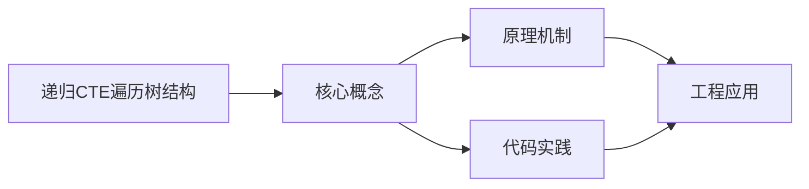
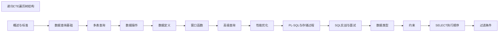

## 1. 学习目标（Bloom 分类）

本节按照布鲁姆教育目标分类学组织学习路径。本文主题为《递归CTE遍历树结构》，属于 SQL 模块，读者可以根据自身阶段选择阅读深度。

记忆层面：能够准确复述本文的核心概念、术语与基本语法或操作步骤，并能够在提问或检索时快速定位对应知识点。能够说出 SQL 的核心概念、语法与常用对象。

理解层面：能够用自己的语言解释核心原理与工作机制，说明概念之间的因果关系，而不是机械记忆结论。能够解释 SQL 的执行原理与优化机制。

应用层面：能够在真实项目或练习场景中运用本文知识解决具体问题，写出正确且可维护的实现。能够编写正确、高效的 SQL 语句与操作。

分析层面：能够拆解复杂问题，比较本文主题与相邻概念的异同，识别边界条件与例外情况。能够分析 SQL 相关方案在性能与一致性上的权衡。

评价层面：能够根据约束条件（性能、可读性、安全、成本）评价不同方案的优劣，做出有依据的技术决策。能够根据业务场景评价 SQL 技术选型。

创造层面：能够把本文知识与其他模块知识组合，设计出新的解决方案或可复用的工程模式。能够组合 SQL 与其他技术设计数据架构。

通过本节学习，读者应当能够把《递归CTE遍历树结构》纳入自己的知识网络，并与 SQL 模块的其他主题（DDL/DML、查询、索引、事务）建立关联。

## 2. 历史动机与发展脉络

《递归CTE遍历树结构》是 SQL 领域的重要主题。要真正理解它，需要先了解它解决的问题与演进过程。

SQL（结构化查询语言）源于 1970 年 Codd 的关系模型，1974 年由 Chamberlin 与 Boyce 设计（SEQUEL），1986 年成为 ANSI 标准；SQL:2023 是当前国际标准。
SQL 分为 DDL（建表）、DML（增删改）、DQL（查询）、DCL（权限）与 TCL（事务）；各大数据库在标准基础上扩展方言。
SQL 是声明式语言：描述“要什么”而非“怎么做”，优化器负责执行计划；这一设计让 SQL 具有跨数据库的表达一致性。

回到本文主题：递归CTE遍历树结构 的提出与成熟，正是上述技术背景下的必然产物。早期实现往往以简单可用为目标，随着工程规模扩大，社区逐渐沉淀出标准做法与最佳实践；理解这一脉络，可以帮助读者判断“为什么文档中的推荐写法是现在这个样子”，也能在遇到历史遗留代码时准确识别其设计年代与取舍。


## 3. 形式化定义与核心概念精讲

本节把《递归CTE遍历树结构》涉及的核心概念以“定义 + 讲解”的形式展开。读者应把定义当作工具，把讲解当作理解路径；两者结合才能形成可迁移的知识。

关系模型：表（关系）、行（元组）、列（属性）；主键唯一标识、外键表达关联、范式消除冗余。
查询执行：解析 -> 绑定 -> 优化（基于代价选择计划）-> 执行；索引、统计信息与连接算法决定性能。
事务 ACID：原子性（Atomicity）、一致性（Consistency）、隔离性（Isolation）、持久性（Durability）；隔离级别控制并发行为。

### 3.1 原文章节逐一精讲

原文档把主题拆分为 5 个小节，下面按顺序给出每一节的导读讲解，随后保留原文细节供精读。

#### 原文精读（完整保留）


#### 1. 递归 CTE 基础

##### 1.1 递归 CTE 语法结构

递归 CTE（Common Table Expression）由**锚点成员**和**递归成员**通过 `UNION ALL` 连接：

```sql
WITH RECURSIVE cte_name AS (
    -- 锚点查询：非递归的初始行集
    SELECT ...
    FROM ...
    WHERE ...

    UNION ALL

    -- 递归查询：引用 cte_name 自身
    SELECT ...
    FROM cte_name
    JOIN ... ON ...
    WHERE ...
)
SELECT * FROM cte_name;
```

**执行流程**：

```
1. 执行锚点查询，得到初始结果集 R0
2. 用 R0 作为输入执行递归查询，得到 R1
3. 用 R1 作为输入执行递归查询，得到 R2
4. 重复直到递归查询返回空集
5. 最终结果 = R0 ∪ R1 ∪ R2 ∪ ...
```

##### 1.2 递归深度限制

```sql
-- MySQL 默认限制 1000 层
SET cte_max_recursion_depth = 10000;

-- PostgreSQL 默认无限制，但可设置
SET max_recursion_depth = 10000;
```

#### 2. 组织架构层级查询

##### 2.1 自引用表设计

```sql
CREATE TABLE employees (
    emp_id      INT PRIMARY KEY,
    emp_name    VARCHAR(50),
    manager_id  INT,           -- 上级经理ID，顶级为 NULL
    dept_name   VARCHAR(50),
    FOREIGN KEY (manager_id) REFERENCES employees(emp_id)
);

-- 示例数据
INSERT INTO employees VALUES
(1, 'CEO', NULL, 'Executive'),
(2, 'CTO', 1, 'Technology'),
(3, 'CFO', 1, 'Finance'),
(4, 'VP Eng', 2, 'Technology'),
(5, 'VP Finance', 3, 'Finance'),
(6, 'Dev Lead', 4, 'Technology'),
(7, 'Dev Senior', 6, 'Technology');
```

##### 2.2 自顶向下遍历：查询某人的所有下属

```sql
WITH RECURSIVE subordinates AS (
    -- 锚点：从指定员工开始
    SELECT emp_id, emp_name, manager_id, 0 AS level, CAST(emp_name AS CHAR(500)) AS path
    FROM employees
    WHERE emp_id = 1  -- 从 CEO 开始

    UNION ALL

    -- 递归：查找下一级下属
    SELECT
        e.emp_id,
        e.emp_name,
        e.manager_id,
        s.level + 1,
        CONCAT(s.path, ' → ', e.emp_name)
    FROM employees e
    INNER JOIN subordinates s ON e.manager_id = s.emp_id
)
SELECT emp_id, emp_name, level, path
FROM subordinates
ORDER BY level, emp_id;
```

输出：

```
emp_id | emp_name   | level | path
-------|------------|-------|---------------------------
1      | CEO        | 0     | CEO
2      | CTO        | 1     | CEO → CTO
3      | CFO        | 1     | CEO → CFO
4      | VP Eng     | 2     | CEO → CTO → VP Eng
5      | VP Finance | 2     | CEO → CFO → VP Finance
6      | Dev Lead   | 3     | CEO → CTO → VP Eng → Dev Lead
7      | Dev Senior | 4     | CEO → CTO → VP Eng → Dev Lead → Dev Senior
```

##### 2.3 自底向上遍历：查询某人的所有上级

```sql
WITH RECURSIVE managers AS (
    -- 锚点：从指定员工开始
    SELECT emp_id, emp_name, manager_id, 0 AS level
    FROM employees
    WHERE emp_id = 7  -- 从 Dev Senior 开始

    UNION ALL

    -- 递归：向上查找经理
    SELECT
        e.emp_id,
        e.emp_name,
        e.manager_id,
        m.level + 1
    FROM employees e
    INNER JOIN managers m ON e.emp_id = m.manager_id
)
SELECT emp_id, emp_name, level
FROM managers
ORDER BY level DESC;
```

##### 2.4 计算每人的下属人数

```sql
WITH RECURSIVE sub_tree AS (
    SELECT emp_id, emp_name, manager_id
    FROM employees
    WHERE manager_id IS NULL  -- 顶级

    UNION ALL

    SELECT e.emp_id, e.emp_name, e.manager_id
    FROM employees e
    INNER JOIN sub_tree s ON e.manager_id = s.emp_id
)
SELECT
    s.emp_id,
    s.emp_name,
    COUNT(child.emp_id) AS direct_reports,
    (SELECT COUNT(*) FROM sub_tree st WHERE st.manager_id = s.emp_id) AS total_reports
FROM sub_tree s
LEFT JOIN employees child ON child.manager_id = s.emp_id
GROUP BY s.emp_id, s.emp_name;
```

#### 3. 评论回复树

##### 3.1 邻接表模型

```sql
CREATE TABLE comments (
    comment_id  INT PRIMARY KEY AUTO_INCREMENT,
    post_id     INT NOT NULL,
    parent_id   INT,           -- 父评论ID，顶级评论为 NULL
    user_id     INT NOT NULL,
    content     TEXT,
    created_at  TIMESTAMP DEFAULT CURRENT_TIMESTAMP,
    FOREIGN KEY (parent_id) REFERENCES comments(comment_id)
);
```

##### 3.2 构建评论树

```sql
WITH RECURSIVE comment_tree AS (
    -- 锚点：顶级评论
    SELECT
        comment_id,
        post_id,
        parent_id,
        user_id,
        content,
        created_at,
        0 AS depth,
        CAST(comment_id AS CHAR(1000)) AS path,
        CAST(LPAD(comment_id, 10, '0') AS CHAR(1000)) AS sort_path
    FROM comments
    WHERE post_id = 42 AND parent_id IS NULL

    UNION ALL

    -- 递归：子评论
    SELECT
        c.comment_id,
        c.post_id,
        c.parent_id,
        c.user_id,
        c.content,
        c.created_at,
        ct.depth + 1,
        CONCAT(ct.path, '.', c.comment_id),
        CONCAT(ct.sort_path, '.', LPAD(c.comment_id, 10, '0'))
    FROM comments c
    INNER JOIN comment_tree ct ON c.parent_id = ct.comment_id
)
SELECT
    comment_id,
    parent_id,
    content,
    depth,
    REPEAT('  ', depth) || content AS indented_content,
    path
FROM comment_tree
ORDER BY sort_path;
```

##### 3.3 限制递归深度

```sql
-- 只获取2级评论（顶级 + 1层回复）
WITH RECURSIVE comment_tree AS (
    SELECT comment_id, parent_id, content, 0 AS depth
    FROM comments WHERE post_id = 42 AND parent_id IS NULL

    UNION ALL

    SELECT c.comment_id, c.parent_id, c.content, ct.depth + 1
    FROM comments c
    INNER JOIN comment_tree ct ON c.parent_id = ct.comment_id
    WHERE ct.depth < 1  -- 限制深度
)
SELECT * FROM comment_tree;
```

#### 4. 环检测与防护

##### 4.1 检测循环引用

```sql
WITH RECURSIVE org_path AS (
    SELECT
        emp_id,
        emp_name,
        manager_id,
        CAST(emp_id AS CHAR(1000)) AS visited_path,
        0 AS depth
    FROM employees
    WHERE emp_id = 1

    UNION ALL

    SELECT
        e.emp_id,
        e.emp_name,
        e.manager_id,
        CONCAT(o.visited_path, ',', e.emp_id),
        o.depth + 1
    FROM employees e
    INNER JOIN org_path o ON e.manager_id = o.emp_id
    -- 环检测：确保当前节点不在已访问路径中
    WHERE FIND_IN_SET(e.emp_id, o.visited_path) = 0
      AND o.depth < 20  -- 安全深度限制
)
SELECT * FROM org_path;
```

##### 4.2 PostgreSQL 数组环检测

```sql
WITH RECURSIVE org_path AS (
    SELECT
        emp_id,
        emp_name,
        manager_id,
        ARRAY[emp_id] AS visited,
        0 AS depth
    FROM employees
    WHERE emp_id = 1

    UNION ALL

    SELECT
        e.emp_id,
        e.emp_name,
        e.manager_id,
        o.visited || e.emp_id,
        o.depth + 1
    FROM employees e
    INNER JOIN org_path o ON e.manager_id = o.emp_id
    WHERE e.emp_id <> ALL(o.visited)  -- 数组包含检测
      AND o.depth < 20
)
SELECT * FROM org_path;
```

#### 5. 递归 CTE 与其他树模型对比

##### 5.1 四种树存储模型

| 模型                         | 查询子树 | 插入     | 移动节点 | 空间 |
| ---------------------------- | -------- | -------- | -------- | ---- |
| 邻接表（Adjacency List）     | 递归 CTE | O(1)     | O(1)     | 优   |
| 路径枚举（Path Enumeration） | LIKE     | O(1)     | O(n)     | 中   |
| 嵌套集（Nested Set）         | BETWEEN  | O(n)     | O(n)     | 优   |
| 闭包表（Closure Table）      | JOIN     | O(depth) | O(n)     | 差   |

##### 5.2 闭包表 + 递归 CTE

```sql
-- 闭包表：存储所有祖先-后代关系
CREATE TABLE tree_closure (
    ancestor_id   INT NOT NULL,
    descendant_id INT NOT NULL,
    depth         INT NOT NULL,
    PRIMARY KEY (ancestor_id, descendant_id),
    FOREIGN KEY (ancestor_id) REFERENCES employees(emp_id),
    FOREIGN KEY (descendant_id) REFERENCES employees(emp_id)
);

-- 查询子树：无需递归
SELECT e.*
FROM tree_closure tc
JOIN employees e ON e.emp_id = tc.descendant_id
WHERE tc.ancestor_id = 1;

-- 查询深度
SELECT depth FROM tree_closure
WHERE ancestor_id = 1 AND descendant_id = 7;
-- 结果: 4
```

##### 5.3 递归 CTE 实现图遍历

```sql
-- 有向图最短路径
CREATE TABLE edges (
    from_node VARCHAR(10),
    to_node   VARCHAR(10),
    weight    INT
);

WITH RECURSIVE paths AS (
    SELECT
        from_node,
        to_node,
        weight,
        CAST(from_node || '→' || to_node AS VARCHAR(500)) AS path,
        weight AS total_weight
    FROM edges
    WHERE from_node = 'A'

    UNION ALL

    SELECT
        p.from_node,
        e.to_node,
        e.weight,
        p.path || '→' || e.to_node,
        p.total_weight + e.weight
    FROM paths p
    JOIN edges e ON p.to_node = e.from_node
    WHERE p.path NOT LIKE '%' || e.to_node || '%'  -- 避免环
)
SELECT path, total_weight
FROM paths
WHERE to_node = 'G'
ORDER BY total_weight
LIMIT 1;  -- 最短路径
```


### 3.2 概念关系图

下面用 Mermaid 图表达本文核心概念之间的关系，帮助读者建立整体图景：



图中展示的是本文知识的结构化关系：核心概念是入口，原理机制解释“为什么”，代码实践演示“怎么做”，工程应用回答“何时用”。读者学习时可以把每个小节的内容挂接到对应节点上。

## 4. 理论推导与原理解析

本节深入《递归CTE遍历树结构》背后的原理。理论部分不求面面俱到，而是聚焦“能解释现象、能指导实践”的关键推导。

关系模型：表（关系）、行（元组）、列（属性）；主键唯一标识、外键表达关联、范式消除冗余。
查询执行：解析 -> 绑定 -> 优化（基于代价选择计划）-> 执行；索引、统计信息与连接算法决定性能。
事务 ACID：原子性（Atomicity）、一致性（Consistency）、隔离性（Isolation）、持久性（Durability）；隔离级别控制并发行为。
集合语义：SELECT 返回结果集；JOIN 组合关系，GROUP BY 聚合，子查询与 CTE 表达复杂逻辑。

需要强调的是，理论推导与工程实践之间存在翻译层：理论给出的是理想化模型与边界条件，工程代码则必须处理真实环境中的例外。读者在学习时应先掌握理论的“标准情形”，再通过陷阱章节了解“非标准情形”。

## 5. 代码示例与逐行讲解

本节把原文中的代码示例系统整理，并为每个示例补充用途说明与讲解。读者不应只浏览代码，而应逐段对照讲解理解设计意图。

### 5.1 示例：1.1 递归 CTE 语法结构

该示例来自原文《1.1 递归 CTE 语法结构》小节，用于演示递归CTE遍历树结构相关操作。阅读时请先看代码结构，再看其后的讲解。

```sql
WITH RECURSIVE cte_name AS (
    -- 锚点查询：非递归的初始行集
    SELECT ...
    FROM ...
    WHERE ...

    UNION ALL

    -- 递归查询：引用 cte_name 自身
    SELECT ...
    FROM cte_name
    JOIN ... ON ...
    WHERE ...
)
SELECT * FROM cte_name;
```

讲解：这段代码演示了本节核心知识点。代码中的关键操作可以归纳为三步：准备（定义或初始化）、执行（核心逻辑）、收尾（释放资源或返回结果）。实际项目中，这三步往往被封装为函数或类，以提升复用性与可测试性。

关键点分析：

该示例共 13 行有效代码，包含 2 类关键结构（SELECT、FROM）。其中：

- 入口与初始化部分负责建立上下文，对应实际项目中的启动或装配逻辑；
- 核心逻辑部分体现本文主题的主要操作，是阅读时最需要对照讲解理解的部分；
- 输出或返回部分把结果交给调用方，注意其类型与边界条件。

进阶思考路径：先尝试修改参数观察行为变化，再把示例中的模式迁移到自己的项目中；每次修改都记录预期与实测差异，这是把示例转化为能力的最快方式。

### 5.2 示例：1.1 递归 CTE 语法结构

该示例来自原文《1.1 递归 CTE 语法结构》小节，用于演示递归CTE遍历树结构相关操作。阅读时请先看代码结构，再看其后的讲解。

```text
1. 执行锚点查询，得到初始结果集 R0
2. 用 R0 作为输入执行递归查询，得到 R1
3. 用 R1 作为输入执行递归查询，得到 R2
4. 重复直到递归查询返回空集
5. 最终结果 = R0 ∪ R1 ∪ R2 ∪ ...
```

讲解：这段代码演示了本节核心知识点。代码中的关键操作可以归纳为三步：准备（定义或初始化）、执行（核心逻辑）、收尾（释放资源或返回结果）。实际项目中，这三步往往被封装为函数或类，以提升复用性与可测试性。

关键点分析：

该示例共 5 行有效代码，结构以数据或配置为主。阅读时应关注：数据字段的含义、配置项的作用，以及它们与运行行为的对应关系。

进阶思考路径：先尝试修改参数观察行为变化，再把示例中的模式迁移到自己的项目中；每次修改都记录预期与实测差异，这是把示例转化为能力的最快方式。

### 5.3 示例：1.2 递归深度限制

该示例来自原文《1.2 递归深度限制》小节，用于演示递归CTE遍历树结构相关操作。阅读时请先看代码结构，再看其后的讲解。

```sql
-- MySQL 默认限制 1000 层
SET cte_max_recursion_depth = 10000;

-- PostgreSQL 默认无限制，但可设置
SET max_recursion_depth = 10000;
```

讲解：这段代码演示了本节核心知识点。代码中的关键操作可以归纳为三步：准备（定义或初始化）、执行（核心逻辑）、收尾（释放资源或返回结果）。实际项目中，这三步往往被封装为函数或类，以提升复用性与可测试性。

关键点分析：

该示例共 4 行有效代码，结构以数据或配置为主。阅读时应关注：数据字段的含义、配置项的作用，以及它们与运行行为的对应关系。

进阶思考路径：先尝试修改参数观察行为变化，再把示例中的模式迁移到自己的项目中；每次修改都记录预期与实测差异，这是把示例转化为能力的最快方式。

### 5.4 示例：2.1 自引用表设计

该示例来自原文《2.1 自引用表设计》小节，用于演示递归CTE遍历树结构相关操作。阅读时请先看代码结构，再看其后的讲解。

```sql
CREATE TABLE employees (
    emp_id      INT PRIMARY KEY,
    emp_name    VARCHAR(50),
    manager_id  INT,           -- 上级经理ID，顶级为 NULL
    dept_name   VARCHAR(50),
    FOREIGN KEY (manager_id) REFERENCES employees(emp_id)
);

-- 示例数据
INSERT INTO employees VALUES
(1, 'CEO', NULL, 'Executive'),
(2, 'CTO', 1, 'Technology'),
(3, 'CFO', 1, 'Finance'),
(4, 'VP Eng', 2, 'Technology'),
(5, 'VP Finance', 3, 'Finance'),
(6, 'Dev Lead', 4, 'Technology'),
(7, 'Dev Senior', 6, 'Technology');
```

讲解：这段代码演示了本节核心知识点。代码中的关键操作可以归纳为三步：准备（定义或初始化）、执行（核心逻辑）、收尾（释放资源或返回结果）。实际项目中，这三步往往被封装为函数或类，以提升复用性与可测试性。

关键点分析：

该示例共 16 行有效代码，包含 2 类关键结构（INSERT、CREATE）。其中：

- 入口与初始化部分负责建立上下文，对应实际项目中的启动或装配逻辑；
- 核心逻辑部分体现本文主题的主要操作，是阅读时最需要对照讲解理解的部分；
- 输出或返回部分把结果交给调用方，注意其类型与边界条件。

进阶思考路径：先尝试修改参数观察行为变化，再把示例中的模式迁移到自己的项目中；每次修改都记录预期与实测差异，这是把示例转化为能力的最快方式。

### 5.5 示例：2.2 自顶向下遍历：查询某人的所有下属

该示例来自原文《2.2 自顶向下遍历：查询某人的所有下属》小节，用于演示递归CTE遍历树结构相关操作。阅读时请先看代码结构，再看其后的讲解。

```sql
WITH RECURSIVE subordinates AS (
    -- 锚点：从指定员工开始
    SELECT emp_id, emp_name, manager_id, 0 AS level, CAST(emp_name AS CHAR(500)) AS path
    FROM employees
    WHERE emp_id = 1  -- 从 CEO 开始

    UNION ALL

    -- 递归：查找下一级下属
    SELECT
        e.emp_id,
        e.emp_name,
        e.manager_id,
        s.level + 1,
        CONCAT(s.path, ' → ', e.emp_name)
    FROM employees e
    INNER JOIN subordinates s ON e.manager_id = s.emp_id
)
SELECT emp_id, emp_name, level, path
FROM subordinates
ORDER BY level, emp_id;
```

讲解：这段代码演示了本节核心知识点。代码中的关键操作可以归纳为三步：准备（定义或初始化）、执行（核心逻辑）、收尾（释放资源或返回结果）。实际项目中，这三步往往被封装为函数或类，以提升复用性与可测试性。

关键点分析：

该示例共 19 行有效代码，包含 2 类关键结构（SELECT、FROM）。其中：

- 入口与初始化部分负责建立上下文，对应实际项目中的启动或装配逻辑；
- 核心逻辑部分体现本文主题的主要操作，是阅读时最需要对照讲解理解的部分；
- 输出或返回部分把结果交给调用方，注意其类型与边界条件。

进阶思考路径：先尝试修改参数观察行为变化，再把示例中的模式迁移到自己的项目中；每次修改都记录预期与实测差异，这是把示例转化为能力的最快方式。

### 5.6 示例：2.2 自顶向下遍历：查询某人的所有下属

该示例来自原文《2.2 自顶向下遍历：查询某人的所有下属》小节，用于演示递归CTE遍历树结构相关操作。阅读时请先看代码结构，再看其后的讲解。

```text
emp_id | emp_name   | level | path
-------|------------|-------|---------------------------
1      | CEO        | 0     | CEO
2      | CTO        | 1     | CEO → CTO
3      | CFO        | 1     | CEO → CFO
4      | VP Eng     | 2     | CEO → CTO → VP Eng
5      | VP Finance | 2     | CEO → CFO → VP Finance
6      | Dev Lead   | 3     | CEO → CTO → VP Eng → Dev Lead
7      | Dev Senior | 4     | CEO → CTO → VP Eng → Dev Lead → Dev Senior
```

讲解：这段代码演示了本节核心知识点。代码中的关键操作可以归纳为三步：准备（定义或初始化）、执行（核心逻辑）、收尾（释放资源或返回结果）。实际项目中，这三步往往被封装为函数或类，以提升复用性与可测试性。

关键点分析：

该示例共 9 行有效代码，结构以数据或配置为主。阅读时应关注：数据字段的含义、配置项的作用，以及它们与运行行为的对应关系。

进阶思考路径：先尝试修改参数观察行为变化，再把示例中的模式迁移到自己的项目中；每次修改都记录预期与实测差异，这是把示例转化为能力的最快方式。

### 5.7 示例：2.3 自底向上遍历：查询某人的所有上级

该示例来自原文《2.3 自底向上遍历：查询某人的所有上级》小节，用于演示递归CTE遍历树结构相关操作。阅读时请先看代码结构，再看其后的讲解。

```sql
WITH RECURSIVE managers AS (
    -- 锚点：从指定员工开始
    SELECT emp_id, emp_name, manager_id, 0 AS level
    FROM employees
    WHERE emp_id = 7  -- 从 Dev Senior 开始

    UNION ALL

    -- 递归：向上查找经理
    SELECT
        e.emp_id,
        e.emp_name,
        e.manager_id,
        m.level + 1
    FROM employees e
    INNER JOIN managers m ON e.emp_id = m.manager_id
)
SELECT emp_id, emp_name, level
FROM managers
ORDER BY level DESC;
```

讲解：这段代码演示了本节核心知识点。代码中的关键操作可以归纳为三步：准备（定义或初始化）、执行（核心逻辑）、收尾（释放资源或返回结果）。实际项目中，这三步往往被封装为函数或类，以提升复用性与可测试性。

关键点分析：

该示例共 18 行有效代码，包含 2 类关键结构（SELECT、FROM）。其中：

- 入口与初始化部分负责建立上下文，对应实际项目中的启动或装配逻辑；
- 核心逻辑部分体现本文主题的主要操作，是阅读时最需要对照讲解理解的部分；
- 输出或返回部分把结果交给调用方，注意其类型与边界条件。

进阶思考路径：先尝试修改参数观察行为变化，再把示例中的模式迁移到自己的项目中；每次修改都记录预期与实测差异，这是把示例转化为能力的最快方式。

### 5.8 示例：2.4 计算每人的下属人数

该示例来自原文《2.4 计算每人的下属人数》小节，用于演示递归CTE遍历树结构相关操作。阅读时请先看代码结构，再看其后的讲解。

```sql
WITH RECURSIVE sub_tree AS (
    SELECT emp_id, emp_name, manager_id
    FROM employees
    WHERE manager_id IS NULL  -- 顶级

    UNION ALL

    SELECT e.emp_id, e.emp_name, e.manager_id
    FROM employees e
    INNER JOIN sub_tree s ON e.manager_id = s.emp_id
)
SELECT
    s.emp_id,
    s.emp_name,
    COUNT(child.emp_id) AS direct_reports,
    (SELECT COUNT(*) FROM sub_tree st WHERE st.manager_id = s.emp_id) AS total_reports
FROM sub_tree s
LEFT JOIN employees child ON child.manager_id = s.emp_id
GROUP BY s.emp_id, s.emp_name;
```

讲解：这段代码演示了本节核心知识点。代码中的关键操作可以归纳为三步：准备（定义或初始化）、执行（核心逻辑）、收尾（释放资源或返回结果）。实际项目中，这三步往往被封装为函数或类，以提升复用性与可测试性。

关键点分析：

该示例共 17 行有效代码，包含 2 类关键结构（SELECT、FROM）。其中：

- 入口与初始化部分负责建立上下文，对应实际项目中的启动或装配逻辑；
- 核心逻辑部分体现本文主题的主要操作，是阅读时最需要对照讲解理解的部分；
- 输出或返回部分把结果交给调用方，注意其类型与边界条件。

进阶思考路径：先尝试修改参数观察行为变化，再把示例中的模式迁移到自己的项目中；每次修改都记录预期与实测差异，这是把示例转化为能力的最快方式。

### 5.9 示例：3.1 邻接表模型

该示例来自原文《3.1 邻接表模型》小节，用于演示递归CTE遍历树结构相关操作。阅读时请先看代码结构，再看其后的讲解。

```sql
CREATE TABLE comments (
    comment_id  INT PRIMARY KEY AUTO_INCREMENT,
    post_id     INT NOT NULL,
    parent_id   INT,           -- 父评论ID，顶级评论为 NULL
    user_id     INT NOT NULL,
    content     TEXT,
    created_at  TIMESTAMP DEFAULT CURRENT_TIMESTAMP,
    FOREIGN KEY (parent_id) REFERENCES comments(comment_id)
);
```

讲解：这段代码演示了本节核心知识点。代码中的关键操作可以归纳为三步：准备（定义或初始化）、执行（核心逻辑）、收尾（释放资源或返回结果）。实际项目中，这三步往往被封装为函数或类，以提升复用性与可测试性。

关键点分析：

该示例共 9 行有效代码，包含 1 类关键结构（CREATE）。其中：

- 入口与初始化部分负责建立上下文，对应实际项目中的启动或装配逻辑；
- 核心逻辑部分体现本文主题的主要操作，是阅读时最需要对照讲解理解的部分；
- 输出或返回部分把结果交给调用方，注意其类型与边界条件。

进阶思考路径：先尝试修改参数观察行为变化，再把示例中的模式迁移到自己的项目中；每次修改都记录预期与实测差异，这是把示例转化为能力的最快方式。

### 5.10 示例：3.2 构建评论树

该示例来自原文《3.2 构建评论树》小节，用于演示递归CTE遍历树结构相关操作。阅读时请先看代码结构，再看其后的讲解。

```sql
WITH RECURSIVE comment_tree AS (
    -- 锚点：顶级评论
    SELECT
        comment_id,
        post_id,
        parent_id,
        user_id,
        content,
        created_at,
        0 AS depth,
        CAST(comment_id AS CHAR(1000)) AS path,
        CAST(LPAD(comment_id, 10, '0') AS CHAR(1000)) AS sort_path
    FROM comments
    WHERE post_id = 42 AND parent_id IS NULL

    UNION ALL

    -- 递归：子评论
    SELECT
        c.comment_id,
        c.post_id,
        c.parent_id,
        c.user_id,
        c.content,
        c.created_at,
        ct.depth + 1,
        CONCAT(ct.path, '.', c.comment_id),
        CONCAT(ct.sort_path, '.', LPAD(c.comment_id, 10, '0'))
    FROM comments c
    INNER JOIN comment_tree ct ON c.parent_id = ct.comment_id
)
SELECT
    comment_id,
    parent_id,
    content,
    depth,
    REPEAT('  ', depth) || content AS indented_content,
    path
FROM comment_tree
ORDER BY sort_path;
```

讲解：这段代码演示了本节核心知识点。代码中的关键操作可以归纳为三步：准备（定义或初始化）、执行（核心逻辑）、收尾（释放资源或返回结果）。实际项目中，这三步往往被封装为函数或类，以提升复用性与可测试性。

关键点分析：

该示例共 38 行有效代码，包含 2 类关键结构（SELECT、FROM）。其中：

- 入口与初始化部分负责建立上下文，对应实际项目中的启动或装配逻辑；
- 核心逻辑部分体现本文主题的主要操作，是阅读时最需要对照讲解理解的部分；
- 输出或返回部分把结果交给调用方，注意其类型与边界条件。

进阶思考路径：先尝试修改参数观察行为变化，再把示例中的模式迁移到自己的项目中；每次修改都记录预期与实测差异，这是把示例转化为能力的最快方式。

### 5.11 示例：3.3 限制递归深度

该示例来自原文《3.3 限制递归深度》小节，用于演示递归CTE遍历树结构相关操作。阅读时请先看代码结构，再看其后的讲解。

```sql
-- 只获取2级评论（顶级 + 1层回复）
WITH RECURSIVE comment_tree AS (
    SELECT comment_id, parent_id, content, 0 AS depth
    FROM comments WHERE post_id = 42 AND parent_id IS NULL

    UNION ALL

    SELECT c.comment_id, c.parent_id, c.content, ct.depth + 1
    FROM comments c
    INNER JOIN comment_tree ct ON c.parent_id = ct.comment_id
    WHERE ct.depth < 1  -- 限制深度
)
SELECT * FROM comment_tree;
```

讲解：这段代码演示了本节核心知识点。代码中的关键操作可以归纳为三步：准备（定义或初始化）、执行（核心逻辑）、收尾（释放资源或返回结果）。实际项目中，这三步往往被封装为函数或类，以提升复用性与可测试性。

关键点分析：

该示例共 11 行有效代码，包含 2 类关键结构（SELECT、FROM）。其中：

- 入口与初始化部分负责建立上下文，对应实际项目中的启动或装配逻辑；
- 核心逻辑部分体现本文主题的主要操作，是阅读时最需要对照讲解理解的部分；
- 输出或返回部分把结果交给调用方，注意其类型与边界条件。

进阶思考路径：先尝试修改参数观察行为变化，再把示例中的模式迁移到自己的项目中；每次修改都记录预期与实测差异，这是把示例转化为能力的最快方式。

### 5.12 示例：4.1 检测循环引用

该示例来自原文《4.1 检测循环引用》小节，用于演示递归CTE遍历树结构相关操作。阅读时请先看代码结构，再看其后的讲解。

```sql
WITH RECURSIVE org_path AS (
    SELECT
        emp_id,
        emp_name,
        manager_id,
        CAST(emp_id AS CHAR(1000)) AS visited_path,
        0 AS depth
    FROM employees
    WHERE emp_id = 1

    UNION ALL

    SELECT
        e.emp_id,
        e.emp_name,
        e.manager_id,
        CONCAT(o.visited_path, ',', e.emp_id),
        o.depth + 1
    FROM employees e
    INNER JOIN org_path o ON e.manager_id = o.emp_id
    -- 环检测：确保当前节点不在已访问路径中
    WHERE FIND_IN_SET(e.emp_id, o.visited_path) = 0
      AND o.depth < 20  -- 安全深度限制
)
SELECT * FROM org_path;
```

讲解：这段代码演示了本节核心知识点。代码中的关键操作可以归纳为三步：准备（定义或初始化）、执行（核心逻辑）、收尾（释放资源或返回结果）。实际项目中，这三步往往被封装为函数或类，以提升复用性与可测试性。

关键点分析：

该示例共 23 行有效代码，包含 2 类关键结构（SELECT、FROM）。其中：

- 入口与初始化部分负责建立上下文，对应实际项目中的启动或装配逻辑；
- 核心逻辑部分体现本文主题的主要操作，是阅读时最需要对照讲解理解的部分；
- 输出或返回部分把结果交给调用方，注意其类型与边界条件。

进阶思考路径：先尝试修改参数观察行为变化，再把示例中的模式迁移到自己的项目中；每次修改都记录预期与实测差异，这是把示例转化为能力的最快方式。

### 5.13 示例：4.2 PostgreSQL 数组环检测

该示例来自原文《4.2 PostgreSQL 数组环检测》小节，用于演示递归CTE遍历树结构相关操作。阅读时请先看代码结构，再看其后的讲解。

```sql
WITH RECURSIVE org_path AS (
    SELECT
        emp_id,
        emp_name,
        manager_id,
        ARRAY[emp_id] AS visited,
        0 AS depth
    FROM employees
    WHERE emp_id = 1

    UNION ALL

    SELECT
        e.emp_id,
        e.emp_name,
        e.manager_id,
        o.visited || e.emp_id,
        o.depth + 1
    FROM employees e
    INNER JOIN org_path o ON e.manager_id = o.emp_id
    WHERE e.emp_id <> ALL(o.visited)  -- 数组包含检测
      AND o.depth < 20
)
SELECT * FROM org_path;
```

讲解：这段代码演示了本节核心知识点。代码中的关键操作可以归纳为三步：准备（定义或初始化）、执行（核心逻辑）、收尾（释放资源或返回结果）。实际项目中，这三步往往被封装为函数或类，以提升复用性与可测试性。

关键点分析：

该示例共 22 行有效代码，包含 2 类关键结构（SELECT、FROM）。其中：

- 入口与初始化部分负责建立上下文，对应实际项目中的启动或装配逻辑；
- 核心逻辑部分体现本文主题的主要操作，是阅读时最需要对照讲解理解的部分；
- 输出或返回部分把结果交给调用方，注意其类型与边界条件。

进阶思考路径：先尝试修改参数观察行为变化，再把示例中的模式迁移到自己的项目中；每次修改都记录预期与实测差异，这是把示例转化为能力的最快方式。

### 5.14 示例：5.2 闭包表 + 递归 CTE

该示例来自原文《5.2 闭包表 + 递归 CTE》小节，用于演示递归CTE遍历树结构相关操作。阅读时请先看代码结构，再看其后的讲解。

```sql
-- 闭包表：存储所有祖先-后代关系
CREATE TABLE tree_closure (
    ancestor_id   INT NOT NULL,
    descendant_id INT NOT NULL,
    depth         INT NOT NULL,
    PRIMARY KEY (ancestor_id, descendant_id),
    FOREIGN KEY (ancestor_id) REFERENCES employees(emp_id),
    FOREIGN KEY (descendant_id) REFERENCES employees(emp_id)
);

-- 查询子树：无需递归
SELECT e.*
FROM tree_closure tc
JOIN employees e ON e.emp_id = tc.descendant_id
WHERE tc.ancestor_id = 1;

-- 查询深度
SELECT depth FROM tree_closure
WHERE ancestor_id = 1 AND descendant_id = 7;
-- 结果: 4
```

讲解：这段代码演示了本节核心知识点。代码中的关键操作可以归纳为三步：准备（定义或初始化）、执行（核心逻辑）、收尾（释放资源或返回结果）。实际项目中，这三步往往被封装为函数或类，以提升复用性与可测试性。

关键点分析：

该示例共 18 行有效代码，包含 3 类关键结构（SELECT、CREATE、FROM）。其中：

- 入口与初始化部分负责建立上下文，对应实际项目中的启动或装配逻辑；
- 核心逻辑部分体现本文主题的主要操作，是阅读时最需要对照讲解理解的部分；
- 输出或返回部分把结果交给调用方，注意其类型与边界条件。

进阶思考路径：先尝试修改参数观察行为变化，再把示例中的模式迁移到自己的项目中；每次修改都记录预期与实测差异，这是把示例转化为能力的最快方式。

### 5.15 示例：5.3 递归 CTE 实现图遍历

该示例来自原文《5.3 递归 CTE 实现图遍历》小节，用于演示递归CTE遍历树结构相关操作。阅读时请先看代码结构，再看其后的讲解。

```sql
-- 有向图最短路径
CREATE TABLE edges (
    from_node VARCHAR(10),
    to_node   VARCHAR(10),
    weight    INT
);

WITH RECURSIVE paths AS (
    SELECT
        from_node,
        to_node,
        weight,
        CAST(from_node || '→' || to_node AS VARCHAR(500)) AS path,
        weight AS total_weight
    FROM edges
    WHERE from_node = 'A'

    UNION ALL

    SELECT
        p.from_node,
        e.to_node,
        e.weight,
        p.path || '→' || e.to_node,
        p.total_weight + e.weight
    FROM paths p
    JOIN edges e ON p.to_node = e.from_node
    WHERE p.path NOT LIKE '%' || e.to_node || '%'  -- 避免环
)
SELECT path, total_weight
FROM paths
WHERE to_node = 'G'
ORDER BY total_weight
LIMIT 1;  -- 最短路径
```

讲解：这段代码演示了本节核心知识点。代码中的关键操作可以归纳为三步：准备（定义或初始化）、执行（核心逻辑）、收尾（释放资源或返回结果）。实际项目中，这三步往往被封装为函数或类，以提升复用性与可测试性。

关键点分析：

该示例共 31 行有效代码，包含 3 类关键结构（SELECT、CREATE、FROM）。其中：

- 入口与初始化部分负责建立上下文，对应实际项目中的启动或装配逻辑；
- 核心逻辑部分体现本文主题的主要操作，是阅读时最需要对照讲解理解的部分；
- 输出或返回部分把结果交给调用方，注意其类型与边界条件。

进阶思考路径：先尝试修改参数观察行为变化，再把示例中的模式迁移到自己的项目中；每次修改都记录预期与实测差异，这是把示例转化为能力的最快方式。


综合以上示例，可以总结出本主题的代码实践要点：第一，先定义清晰的输入输出契约；第二，核心逻辑保持单一职责；第三，错误处理与边界条件不可省略；第四，命名与注释表达意图而非复述代码。

## 6. 对比分析

对比是理解《递归CTE遍历树结构》定位的最快路径。下面从多个维度与相邻方案进行对比。

SQL 与 NoSQL：SQL 适合关系与事务，NoSQL（文档/键值/宽表）适合弹性扩展与特定模型；混合架构常见。
MySQL 与 PostgreSQL：MySQL 生态普及、复制成熟；PostgreSQL 功能全面（窗口、JSON、扩展）。
存储过程与业务代码：复杂逻辑放应用层更可测试；存储过程适合强封装场景。

对比的目的不是分出绝对优劣，而是建立选择依据：不同约束条件下，最优解不同。读者应把每个对比维度转化为决策检查清单。

## 7. 常见陷阱与最佳实践

本节整理该主题的高频错误与推荐做法。每个陷阱先描述现象，再解释原因，最后给出最佳实践。

### 7.1 SELECT * 滥用

返回多余列浪费带宽且破坏视图依赖。显式列出所需列。

深入讲解：该问题之所以被归类为“常见陷阱”，是因为它在初学者的代码中反复出现，而且往往不在第一时间暴露——错误通常隐藏在特定数据或特定时序下。

从成因上看，SELECT * 滥用 一般源于对 SQL 某个机制的理解偏差：要么误用了默认行为，要么忽略了边界条件，要么把其他语言的思维惯性带了过来。

从影响上看，SELECT * 滥用 轻则产生错误结果，重则导致资源泄漏、数据损坏或安全事故；这也是为什么工程评审中会把它列为检查项。

从修复策略上看，处理SELECT * 滥用的正确顺序是：先复现（构造最小用例），再定位（确认机制层面的根因），最后修复并补充回归测试。跳过复现直接改代码，往往治标不治本。

### 7.2 隐式类型转换

字符串与数字比较走转换，索引失效。保持类型一致。

深入讲解：该问题之所以被归类为“常见陷阱”，是因为它在初学者的代码中反复出现，而且往往不在第一时间暴露——错误通常隐藏在特定数据或特定时序下。

从成因上看，隐式类型转换 一般源于对 SQL 某个机制的理解偏差：要么误用了默认行为，要么忽略了边界条件，要么把其他语言的思维惯性带了过来。

从影响上看，隐式类型转换 轻则产生错误结果，重则导致资源泄漏、数据损坏或安全事故；这也是为什么工程评审中会把它列为检查项。

从修复策略上看，处理隐式类型转换的正确顺序是：先复现（构造最小用例），再定位（确认机制层面的根因），最后修复并补充回归测试。跳过复现直接改代码，往往治标不治本。

### 7.3 函数包裹索引列

WHERE DATE(ts)=... 无法用索引。使用范围条件。

深入讲解：该问题之所以被归类为“常见陷阱”，是因为它在初学者的代码中反复出现，而且往往不在第一时间暴露——错误通常隐藏在特定数据或特定时序下。

从成因上看，函数包裹索引列 一般源于对 SQL 某个机制的理解偏差：要么误用了默认行为，要么忽略了边界条件，要么把其他语言的思维惯性带了过来。

从影响上看，函数包裹索引列 轻则产生错误结果，重则导致资源泄漏、数据损坏或安全事故；这也是为什么工程评审中会把它列为检查项。

从修复策略上看，处理函数包裹索引列的正确顺序是：先复现（构造最小用例），再定位（确认机制层面的根因），最后修复并补充回归测试。跳过复现直接改代码，往往治标不治本。

### 7.4 分页偏移过大

OFFSET 大时扫描大量行。使用游标或键集分页。

深入讲解：该问题之所以被归类为“常见陷阱”，是因为它在初学者的代码中反复出现，而且往往不在第一时间暴露——错误通常隐藏在特定数据或特定时序下。

从成因上看，分页偏移过大 一般源于对 SQL 某个机制的理解偏差：要么误用了默认行为，要么忽略了边界条件，要么把其他语言的思维惯性带了过来。

从影响上看，分页偏移过大 轻则产生错误结果，重则导致资源泄漏、数据损坏或安全事故；这也是为什么工程评审中会把它列为检查项。

从修复策略上看，处理分页偏移过大的正确顺序是：先复现（构造最小用例），再定位（确认机制层面的根因），最后修复并补充回归测试。跳过复现直接改代码，往往治标不治本。

### 7.5 事务内做慢查询

长事务锁资源。事务保持短小。

深入讲解：该问题之所以被归类为“常见陷阱”，是因为它在初学者的代码中反复出现，而且往往不在第一时间暴露——错误通常隐藏在特定数据或特定时序下。

从成因上看，事务内做慢查询 一般源于对 SQL 某个机制的理解偏差：要么误用了默认行为，要么忽略了边界条件，要么把其他语言的思维惯性带了过来。

从影响上看，事务内做慢查询 轻则产生错误结果，重则导致资源泄漏、数据损坏或安全事故；这也是为什么工程评审中会把它列为检查项。

从修复策略上看，处理事务内做慢查询的正确顺序是：先复现（构造最小用例），再定位（确认机制层面的根因），最后修复并补充回归测试。跳过复现直接改代码，往往治标不治本。

### 7.6 N+1 查询

循环查库。使用 JOIN 或批量查询。

深入讲解：该问题之所以被归类为“常见陷阱”，是因为它在初学者的代码中反复出现，而且往往不在第一时间暴露——错误通常隐藏在特定数据或特定时序下。

从成因上看，N+1 查询 一般源于对 SQL 某个机制的理解偏差：要么误用了默认行为，要么忽略了边界条件，要么把其他语言的思维惯性带了过来。

从影响上看，N+1 查询 轻则产生错误结果，重则导致资源泄漏、数据损坏或安全事故；这也是为什么工程评审中会把它列为检查项。

从修复策略上看，处理N+1 查询的正确顺序是：先复现（构造最小用例），再定位（确认机制层面的根因），最后修复并补充回归测试。跳过复现直接改代码，往往治标不治本。

### 7.7 不设外键约束

应用层维护引用完整性易漏。关键关系使用外键。

深入讲解：该问题之所以被归类为“常见陷阱”，是因为它在初学者的代码中反复出现，而且往往不在第一时间暴露——错误通常隐藏在特定数据或特定时序下。

从成因上看，不设外键约束 一般源于对 SQL 某个机制的理解偏差：要么误用了默认行为，要么忽略了边界条件，要么把其他语言的思维惯性带了过来。

从影响上看，不设外键约束 轻则产生错误结果，重则导致资源泄漏、数据损坏或安全事故；这也是为什么工程评审中会把它列为检查项。

从修复策略上看，处理不设外键约束的正确顺序是：先复现（构造最小用例），再定位（确认机制层面的根因），最后修复并补充回归测试。跳过复现直接改代码，往往治标不治本。

### 7.8 忽略执行计划

凭直觉优化。用 EXPLAIN 验证。

深入讲解：该问题之所以被归类为“常见陷阱”，是因为它在初学者的代码中反复出现，而且往往不在第一时间暴露——错误通常隐藏在特定数据或特定时序下。

从成因上看，忽略执行计划 一般源于对 SQL 某个机制的理解偏差：要么误用了默认行为，要么忽略了边界条件，要么把其他语言的思维惯性带了过来。

从影响上看，忽略执行计划 轻则产生错误结果，重则导致资源泄漏、数据损坏或安全事故；这也是为什么工程评审中会把它列为检查项。

从修复策略上看，处理忽略执行计划的正确顺序是：先复现（构造最小用例），再定位（确认机制层面的根因），最后修复并补充回归测试。跳过复现直接改代码，往往治标不治本。

### 7.0 最佳实践总览

1. 命名规范：表名复数或单数统一，列名小写下划线，主键 id。
2. 每个表必须有主键，时间戳列记录变更。
3. 查询先 WHERE 缩小数据量，再 JOIN 与聚合。
4. 迁移脚本版本化，变更可回滚。
5. 生产查询全部过 EXPLAIN 与慢日志检查。

把这些最佳实践固化为团队规范与代码评审检查项，是避免同类问题反复出现的关键。

## 8. 工程实践

本节把《递归CTE遍历树结构》放入真实工程场景，给出可复用的模式与组织方法。

连接池管理数据库连接；迁移工具（Flyway/Alembic）版本化 schema。
读写分离与分库分表按量级引入；缓存（Redis）承担热数据。
监控：慢查询日志、连接数、QPS、复制延迟。

### 8.1 工程实践的原则拆解

以上工程实践可以归纳为四条原则。第一，配置与代码分离：SQL 项目中环境差异应通过配置注入，而不是散落在代码分支中；这保证同一份代码可以在开发、测试、生产环境一致运行。

第二，接口稳定优先：对外接口（函数签名、协议、数据格式）一旦被消费方依赖，变更成本极高；设计时应预留扩展点并保持向后兼容。

第三，可观测性内置：日志、指标与追踪应该在功能开发时同步设计，而不是故障发生后补救；没有观测手段的模块等于黑盒。

第四，变更可回滚：任何发布都应有对应的回滚方案；数据库迁移、配置变更与代码发布一样需要版本管理与逆向路径。

### 8.2 实践落地的检查清单

- [ ] 实践 1：对照本节描述，检查当前项目是否已经落实；未落实的项列入技术债并排期处理。
- [ ] 实践 2：对照本节描述，检查当前项目是否已经落实；未落实的项列入技术债并排期处理。
- [ ] 监控：对照本节描述，检查当前项目是否已经落实；未落实的项列入技术债并排期处理。

工程实践的共性原则：配置与代码分离、接口稳定优先、可观测性内置、变更可回滚。这些原则适用于本主题的所有实现。

## 9. 案例研究

本节通过一个完整案例把《递归CTE遍历树结构》的知识串起来。案例按“需求分析、方案设计、实现、验证”四步展开。

需求：为订单系统设计表结构与核心查询。
方案：订单主表 + 明细表 + 用户表；事务保证一致；索引覆盖高频查询。
要点：金额用 decimal；状态用枚举；时间用 UTC；分页用键集。
验证：EXPLAIN 检查索引；并发插入测试唯一约束；压测查询延迟。

### 9.1 案例的扩展讨论

把案例中的方案放大到真实规模，需要额外考虑三个问题：

第一，规模：当数据量或并发量上升一个数量级时，原方案中的数据结构、缓存策略与任务调度是否仍然成立？通常需要引入分层与异步。

第二，团队：多人协作时，模块边界、接口契约与代码所有权必须明确；案例中的实现应拆分为可独立测试的单元，并配合文档说明设计意图。

第三，演进：上线后的需求变化不可避免；方案设计时应预留扩展点（配置化、插件化、事件化），并定期用真实指标验证假设。


案例研究的学习方法：先独立阅读需求，尝试在脑中形成方案，再对照实现与讲解，最后思考“如果约束变化（数据量、并发、团队规模），方案应如何调整”。

## 10. 知识要点总结与深入讲解

本节以讲解形式汇总全文要点，替代传统的习题与自测，读者不需要答题，只需跟随解释建立完整的认知框架。

关于《递归CTE遍历树结构》的核心结论：

SQL 的声明式表达力建立在关系代数之上，理解集合思维是进阶关键。
索引、执行计划与事务是三大实战主题。
工程化：迁移、连接池、监控与慢查询治理缺一不可。

原文档各小节的要点回顾：

- 1. 递归 CTE 基础：该小节围绕递归CTE遍历树结构展开具体细节，阅读时应关注其与核心结论的对应关系；每个小节都是核心结论在某一个侧面的展开。
- 2. 组织架构层级查询：该小节围绕递归CTE遍历树结构展开具体细节，阅读时应关注其与核心结论的对应关系；每个小节都是核心结论在某一个侧面的展开。
- 3. 评论回复树：该小节围绕递归CTE遍历树结构展开具体细节，阅读时应关注其与核心结论的对应关系；每个小节都是核心结论在某一个侧面的展开。
- 4. 环检测与防护：该小节围绕递归CTE遍历树结构展开具体细节，阅读时应关注其与核心结论的对应关系；每个小节都是核心结论在某一个侧面的展开。
- 5. 递归 CTE 与其他树模型对比：该小节围绕递归CTE遍历树结构展开具体细节，阅读时应关注其与核心结论的对应关系；每个小节都是核心结论在某一个侧面的展开。

把以上要点与第 3-9 节的内容对照复习，即可完成对本文主题的闭环学习。

## 11. 参考文献


SQL 标准（ISO/IEC 9075）：https://www.iso.org/standard/76583.html
PostgreSQL 文档（SQL 章节）：https://www.postgresql.org/docs/current/sql.html
MySQL 文档：https://dev.mysql.com/doc/
SQLite 文档：https://www.sqlite.org/docs.html
Use The Index, Luke：https://use-the-index-luke.com/

## 12. 延伸阅读


SQL 连接与子查询，见 019-sql 模块文档。
SQL 自连接与递归，见 019-sql/019-SelfJoin 文档。
MySQL 深入，见 020-mysql 模块。
PostgreSQL 深入，见 021-postgresql 模块。
尚硅谷 Bilibili 空间（https://space.bilibili.com/302417610 ）提供 MySQL 课程。

## 14. 模块知识图谱与学习路径

本文属于 SQL 模块。为了把《递归CTE遍历树结构》放入完整的知识网络，下面列出本模块的全部主题并给出相互关联的导读。学习时建议按模块内顺序推进，并在每个文档中留意交叉引用。



上图为模块主题的推荐学习顺序示意图（仅展示前若干主题）。各主题之间存在三类关联：

第一，前置依赖关系：早期主题是后期主题的基础，例如环境与语法先行、进阶主题随后；

第二，横向并列关系：同一层级主题从不同角度覆盖模块能力，学习顺序可以按兴趣调整；

第三，工程组合关系：多个主题在真实项目中组合使用，例如配置、性能与安全主题往往出现在同一系统的不同层面。

### 14.1 模块主题速查表

| 文档 | 主题 | 与本文的关联 |
| --- | --- | --- |
| 概述与标准 | 001-OverviewStandard | 本文的前置基础 |
| 数据查询基础 | 002-DataQueryBasics | 本文的前置基础 |
| 多表查询 | 003-MultiTableQuery | 本文的并列主题 |
| 数据操作 | 004-DML | 本文的并列主题 |
| 数据定义 | 005-DDL | 本文的并列主题 |
| 窗口函数 | 006-WindowFunction | 本文的并列主题 |
| 高级查询 | 007-AdvancedQuery | 本文的并列主题 |
| 性能优化 | 008-PerformanceOptimization | 本文的性能延伸 |
| PL-SQL与存储过程 | 009-PLSQLStoredProcedure | 本文的并列主题 |
| SQL实战与面试 | 010-SQLPracticeInterview | 本文的综合应用 |
| 数据类型 | 011-DataType | 本文的并列主题 |
| 约束 | 012-Constraint | 本文的并列主题 |
| SELECT执行顺序 | 013-SelectExecutionOrder | 本文的并列主题 |
| 过滤条件 | 014-FilterCondition | 本文的并列主题 |
| 聚合函数 | 015-AggregateFunction | 本文的并列主题 |
| GROUP BY与分组集 | 016-GROUPBYGroupingSet | 本文的并列主题 |
| 连接查询 | 017-JoinQuery | 本文的并列主题 |
| 自然连接与USING | 018-NaturalJoinUsing | 本文的并列主题 |
| 自连接 | 019-SelfJoin | 本文的并列主题 |
| 半连接与反半连接 | 020-SemiAntiJoin | 本文的并列主题 |
| LATERAL派生表 | 021-LateralDerivedTable | 本文的并列主题 |
| 子查询 | 022-Subquery | 本文的并列主题 |
| CTE | 023-CTE | 本文的并列主题 |
| 递归CTE | 024-RecursiveCTE | 本文的并列主题 |
| PIVOT与UNPIVOT | 025-PivotUnpivot | 本文的并列主题 |
| 集合操作 | 026-SetOperation | 本文的并列主题 |
| DCL | 027-DCL | 本文的并列主题 |
| TCL | 028-TCL | 本文的并列主题 |
| 索引 | 029-Index | 本文的并列主题 |
| 执行计划 | 030-ExecutionPlan | 本文的并列主题 |
| 事务ACID特性 | 031-TransactionACIDProperty | 本文的并列主题 |
| 隔离级别 | 032-IsolationLevel | 本文的并列主题 |
| 脏读不可重复读幻读 | 033-DirtyReadNonRepeatablePhantom | 本文的并列主题 |
| 锁机制 | 034-LockMechanism | 本文的原理深化 |
| MVCC | 035-MVCC | 本文的并列主题 |
| 窗口函数框架 | 036-WindowFunctionFramework | 本文的并列主题 |
| 递归CTE遍历树结构 | 037-RecursiveCTETreeTraversal | 本文自身 |
| 乐观锁与悲观锁 | 038-OptimisticPessimisticLock | 本文的并列主题 |
| 常见SQL反模式 | 039-SQLAntipattern | 本文的并列主题 |
| SQL MERGE / UPSERT 语句语法速查手册 | 040-MergeStatement | 本文的并列主题 |
| SQL EXCEPT / INTERSECT 集合操作语法速查手册 | 041-ExceptIntersect | 本文的并列主题 |
| 类型转换 语法速查手册 | 042-TypeConversion | 本文的并列主题 |

速查表的作用是让读者快速判断：哪些文档应在阅读本文前掌握（前置基础），哪些文档应在阅读本文后继续（延伸主题）。本模块的交叉引用体系即以此表为基础。

## 15. 术语表

下表整理《递归CTE遍历树结构》及 SQL 模块中出现的高频术语，给出简明释义。术语按字母序或逻辑序排列，供查阅。

| 术语 | 释义 |
| --- | --- |
| 关系模型 | 表（关系）、行（元组）、列（属性）；主键唯一标识、外键表达关联、范式消除冗余。 |
| 查询执行 | 解析 -> 绑定 -> 优化（基于代价选择计划）-> 执行；索引、统计信息与连接算法决定性能。 |
| 事务 ACID | 原子性（Atomicity）、一致性（Consistency）、隔离性（Isolation）、持久性（Durability）；隔离级别控制并发行为。 |
| 集合语义 | SELECT 返回结果集；JOIN 组合关系，GROUP BY 聚合，子查询与 CTE 表达复杂逻辑。 |
| SELECT * 滥用（易错点） | 参见常见陷阱章节的详细讲解 |
| 隐式类型转换（易错点） | 参见常见陷阱章节的详细讲解 |
| 函数包裹索引列（易错点） | 参见常见陷阱章节的详细讲解 |
| 分页偏移过大（易错点） | 参见常见陷阱章节的详细讲解 |
| 事务内做慢查询（易错点） | 参见常见陷阱章节的详细讲解 |
| N+1 查询（易错点） | 参见常见陷阱章节的详细讲解 |

术语表与正文配合使用：先通读正文，遇到模糊术语回查本表；长期使用后术语会自然进入工作记忆。

## 13. 深度专题扩展

以下专题从不同角度深入本文主题，供有进阶需求的读者研读。每个专题独立成节，内容相互补充。

### 13.1 索引原理与 B+ 树

B+ 树：非叶节点存索引键，叶节点存数据指针并链表相连；高度低（3-4 层）支撑千万级数据。
聚集索引（主键）决定数据物理顺序；二级索引存主键值，回表取行；覆盖索引避免回表。
最左前缀：复合索引按定义顺序匹配；范围查询后列失效。
选择率：区分度高的列放前面；低基数列（性别）单列索引收益低。

### 13.2 事务隔离与 MVCC

四种隔离级别：读未提交、读已提交、可重复读、可串行化；各自解决脏读、不可重复读、幻读。
MVCC（多版本并发控制）：快照读不加锁，写通过版本链与回滚段实现；读写互不阻塞。
PostgreSQL 默认读已提交，MySQL InnoDB 默认可重复读；理解差异避免跨库移植踩坑。
死锁处理：锁顺序一致、超时检测、重试策略。

## 16. 核心概念串讲（复习视角）

本节以“把知识讲给他人听”的方式，把《递归CTE遍历树结构》的核心概念重新串讲一遍。与前文按章节展开不同，这里的叙述更接近课堂总结：先说整体，再逐个展开，最后收束。

《递归CTE遍历树结构》属于 SQL 模块。要理解它，先要理解它在模块中的位置：它解决的是该领域的一个具体问题，并依赖模块内若干前置概念；反过来，它又为后续进阶主题提供基础。

第一个概念是关系模型。表（关系）、行（元组）、列（属性）；主键唯一标识、外键表达关联、范式消除冗余。

在实际使用中，关系模型需要与相邻概念区分：它们的区别不在于名称，而在于适用条件与行为边界；这正是前文对比分析章节的意义。

第一个概念是查询执行。解析 -> 绑定 -> 优化（基于代价选择计划）-> 执行；索引、统计信息与连接算法决定性能。

在实际使用中，查询执行需要与相邻概念区分：它们的区别不在于名称，而在于适用条件与行为边界；这正是前文对比分析章节的意义。

第一个概念是事务 ACID。原子性（Atomicity）、一致性（Consistency）、隔离性（Isolation）、持久性（Durability）；隔离级别控制并发行为。

在实际使用中，事务 ACID需要与相邻概念区分：它们的区别不在于名称，而在于适用条件与行为边界；这正是前文对比分析章节的意义。

接下来是关系模型。表（关系）、行（元组）、列（属性）；主键唯一标识、外键表达关联、范式消除冗余。

理解该原理的关键不是记住结论，而是记住“它从什么假设出发、推出了什么、假设不成立时会怎样”。带着这个框架复习，原理之间就会连成网络。

接下来是查询执行。解析 -> 绑定 -> 优化（基于代价选择计划）-> 执行；索引、统计信息与连接算法决定性能。

理解该原理的关键不是记住结论，而是记住“它从什么假设出发、推出了什么、假设不成立时会怎样”。带着这个框架复习，原理之间就会连成网络。

接下来是事务 ACID。原子性（Atomicity）、一致性（Consistency）、隔离性（Isolation）、持久性（Durability）；隔离级别控制并发行为。

理解该原理的关键不是记住结论，而是记住“它从什么假设出发、推出了什么、假设不成立时会怎样”。带着这个框架复习，原理之间就会连成网络。

接下来是集合语义。SELECT 返回结果集；JOIN 组合关系，GROUP BY 聚合，子查询与 CTE 表达复杂逻辑。

理解该原理的关键不是记住结论，而是记住“它从什么假设出发、推出了什么、假设不成立时会怎样”。带着这个框架复习，原理之间就会连成网络。

串讲收束：把概念与原理放回本文主题，可以得出一个总纲——定义描述是什么，原理解释为什么，实践回答怎么做。三者构成完整的学习闭环；后续遇到相关问题，都可以按这个总纲检索知识。
