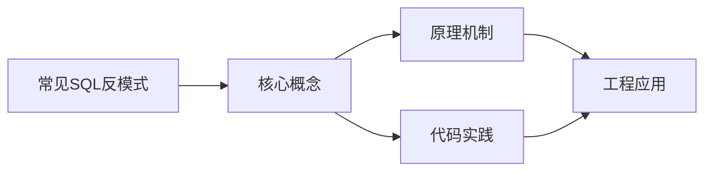
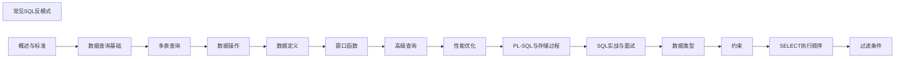

## 1. 学习目标（Bloom 分类）

本节按照布鲁姆教育目标分类学组织学习路径。本文主题为《常见SQL反模式》，属于 SQL 模块，读者可以根据自身阶段选择阅读深度。

记忆层面：能够准确复述本文的核心概念、术语与基本语法或操作步骤，并能够在提问或检索时快速定位对应知识点。能够说出 SQL 的核心概念、语法与常用对象。

理解层面：能够用自己的语言解释核心原理与工作机制，说明概念之间的因果关系，而不是机械记忆结论。能够解释 SQL 的执行原理与优化机制。

应用层面：能够在真实项目或练习场景中运用本文知识解决具体问题，写出正确且可维护的实现。能够编写正确、高效的 SQL 语句与操作。

分析层面：能够拆解复杂问题，比较本文主题与相邻概念的异同，识别边界条件与例外情况。能够分析 SQL 相关方案在性能与一致性上的权衡。

评价层面：能够根据约束条件（性能、可读性、安全、成本）评价不同方案的优劣，做出有依据的技术决策。能够根据业务场景评价 SQL 技术选型。

创造层面：能够把本文知识与其他模块知识组合，设计出新的解决方案或可复用的工程模式。能够组合 SQL 与其他技术设计数据架构。

通过本节学习，读者应当能够把《常见SQL反模式》纳入自己的知识网络，并与 SQL 模块的其他主题（DDL/DML、查询、索引、事务）建立关联。

## 2. 历史动机与发展脉络

《常见SQL反模式》是 SQL 领域的重要主题。要真正理解它，需要先了解它解决的问题与演进过程。

SQL（结构化查询语言）源于 1970 年 Codd 的关系模型，1974 年由 Chamberlin 与 Boyce 设计（SEQUEL），1986 年成为 ANSI 标准；SQL:2023 是当前国际标准。
SQL 分为 DDL（建表）、DML（增删改）、DQL（查询）、DCL（权限）与 TCL（事务）；各大数据库在标准基础上扩展方言。
SQL 是声明式语言：描述“要什么”而非“怎么做”，优化器负责执行计划；这一设计让 SQL 具有跨数据库的表达一致性。

回到本文主题：常见SQL反模式 的提出与成熟，正是上述技术背景下的必然产物。早期实现往往以简单可用为目标，随着工程规模扩大，社区逐渐沉淀出标准做法与最佳实践；理解这一脉络，可以帮助读者判断“为什么文档中的推荐写法是现在这个样子”，也能在遇到历史遗留代码时准确识别其设计年代与取舍。


## 3. 形式化定义与核心概念精讲

本节把《常见SQL反模式》涉及的核心概念以“定义 + 讲解”的形式展开。读者应把定义当作工具，把讲解当作理解路径；两者结合才能形成可迁移的知识。

关系模型：表（关系）、行（元组）、列（属性）；主键唯一标识、外键表达关联、范式消除冗余。
查询执行：解析 -> 绑定 -> 优化（基于代价选择计划）-> 执行；索引、统计信息与连接算法决定性能。
事务 ACID：原子性（Atomicity）、一致性（Consistency）、隔离性（Isolation）、持久性（Durability）；隔离级别控制并发行为。

### 3.1 原文章节逐一精讲

原文档把主题拆分为 20 个小节，下面按顺序给出每一节的导读讲解，随后保留原文细节供精读。

#### 原文精读（完整保留）

# SQL 反模式 语法速查手册

> **符号约定**：`< >` 必填参数 | `[ ]` 可选参数

---

#### 1. 存储 CSV 列

##### 1.1 反模式描述

将多个值以逗号分隔存储在单个列中：

```sql
-- 反模式
CREATE TABLE products (
    id       INT PRIMARY KEY,
    name     VARCHAR(100),
    tag_ids  VARCHAR(255)  -- "1,3,7,12" ← 灾难！
);
```

##### 1.2 问题分析

| 问题               | 示例                                |
| ------------------ | ----------------------------------- |
| 无法保证引用完整性 | `tag_ids` 中的值无法建立外键        |
| 无法使用索引       | `WHERE tag_ids LIKE '%3%'` 全表扫描 |
| 查询困难           | 查找包含标签3的产品需要 LIKE 或正则 |
| 聚合困难           | 统计每个标签的产品数需要字符串拆分  |
| 更新困难           | 删除某个标签需要字符串操作          |
| 顺序依赖           | "1,3" ≠ "3,1" 但语义相同            |

```sql
-- 查找包含标签3的产品：性能极差且可能误匹配
SELECT * FROM products WHERE tag_ids LIKE '%3%';
-- 误匹配: "13,27" 中的 3

-- 稍好但仍差
SELECT * FROM products WHERE CONCAT(',', tag_ids, ',') LIKE '%,3,%';
```

##### 1.3 正确方案：关联表

```sql
-- 正确：多对多关联表
CREATE TABLE products (
    id   INT PRIMARY KEY,
    name VARCHAR(100)
);

CREATE TABLE tags (
    id   INT PRIMARY KEY,
    name VARCHAR(50)
);

CREATE TABLE product_tags (
    product_id INT,
    tag_id     INT,
    PRIMARY KEY (product_id, tag_id),
    FOREIGN KEY (product_id) REFERENCES products(id),
    FOREIGN KEY (tag_id) REFERENCES tags(id)
);

-- 查找包含标签3的产品：索引高效
SELECT p.* FROM products p
JOIN product_tags pt ON p.id = pt.product_id
WHERE pt.tag_id = 3;

-- 统计每个标签的产品数
SELECT tag_id, COUNT(*) AS product_count
FROM product_tags
GROUP BY tag_id;
```

##### 1.4 何时可以存储 CSV

极少数场景下 CSV 列是合理的：

- **纯展示数据**：仅存储不查询，如日志快照
- **JSON 替代**：数据库不支持 JSON 类型时的妥协
- **只读归档**：数据不再变更

#### 2. 滥用枚举列

##### 2.1 反模式描述

```sql
-- 反模式：用 ENUM 表示状态
CREATE TABLE orders (
    id     INT PRIMARY KEY,
    status ENUM('pending', 'processing', 'shipped', 'delivered', 'cancelled')
);
```

##### 2.2 ENUM 的问题

| 问题                 | 说明                                                        |
| -------------------- | ----------------------------------------------------------- |
| 新增值需 ALTER TABLE | `ALTER TABLE orders MODIFY status ENUM(...)` — 大表可能锁表 |
| 值顺序固定           | 枚举值按定义顺序存储为整数，修改顺序危险                    |
| 可移植性差           | 非 MySQL 数据库不支持 ENUM                                  |
| 值与索引混淆         | `status = 1` 可能匹配 'processing' 而非 'pending'           |
| 不支持 i18n          | 枚举值直接存储在 DDL 中                                     |

```sql
-- 危险：隐式类型转换
INSERT INTO orders (id, status) VALUES (1, 2);  -- 插入 'processing' 而非 'pending'
SELECT * FROM orders WHERE status = 1;           -- 返回 'processing' 的行
```

##### 2.3 正确方案：查找表

```sql
-- 正确：使用查找表
CREATE TABLE order_statuses (
    id   INT PRIMARY KEY,
    name VARCHAR(50) NOT NULL UNIQUE,
    description TEXT
);

INSERT INTO order_statuses VALUES
(1, 'pending', '订单已创建'),
(2, 'processing', '订单处理中'),
(3, 'shipped', '已发货'),
(4, 'delivered', '已送达'),
(5, 'cancelled', '已取消');

CREATE TABLE orders (
    id        INT PRIMARY KEY,
    status_id INT NOT NULL DEFAULT 1,
    FOREIGN KEY (status_id) REFERENCES order_statuses(id)
);

-- 新增状态只需 INSERT，无需 ALTER TABLE
INSERT INTO order_statuses VALUES (6, 'refunded', '已退款');
```

##### 2.4 小型枚举的例外

当枚举值**极其稳定**且**数量极少**时，ENUM 是可接受的：

```sql
-- 可接受：性别（几乎不会变）
gender ENUM('male', 'female', 'other')

-- 可接受：布尔类型（MySQL 8.0 前）
is_active ENUM('Y', 'N')
```

#### 3. 预优化

##### 3.1 反模式描述

在没有性能问题之前就进行优化，导致：

- 代码复杂度增加
- 维护成本上升
- 优化方向可能错误
- 过早引入分库分表等复杂架构

##### 3.2 常见预优化错误

```sql
-- 错误1：过早添加索引
-- 每个索引都有写入开销，不要为"可能用到"的查询建索引
CREATE INDEX idx_xxx ON orders(col_a, col_b, col_c, col_d, col_e);  -- 5列联合索引

-- 错误2：过度反范式化
-- 为了避免 JOIN 而冗余存储，导致数据不一致
CREATE TABLE order_items (
    id          INT PRIMARY KEY,
    order_id    INT,
    product_id  INT,
    product_name VARCHAR(100),  -- 冗余！产品改名需同步更新
    unit_price  DECIMAL(10,2),  -- 冗余！价格变动需同步
    quantity    INT
);

-- 错误3：过早分库分表
-- 单表 100 万行就考虑分表，实际 MySQL 可轻松处理千万级
```

##### 3.3 正确的优化流程

```
1. 先写正确的 SQL → 功能正确
2. 压测发现瓶颈 → 数据驱动
3. 针对性优化   → 最小改动
4. 验证优化效果 → 量化收益
```

```sql
-- 用 EXPLAIN 验证是否真的需要索引
EXPLAIN ANALYZE
SELECT * FROM orders WHERE user_id = 100 AND created_at > '2026-01-01';

-- 只在确认需要时才添加索引
CREATE INDEX idx_orders_user_created ON orders(user_id, created_at);
```

##### 3.4 优化优先级

| 优先级 | 优化手段       | 收益      |
| ------ | -------------- | --------- |
| 1      | 添加合适的索引 | 10x-1000x |
| 2      | 优化查询写法   | 2x-10x    |
| 3      | 表结构调整     | 2x-5x     |
| 4      | 缓存层         | 5x-100x   |
| 5      | 分库分表       | 按需扩展  |

#### 4. 隐式类型转换

##### 4.1 反模式描述

```sql
-- 表定义
CREATE TABLE users (
    id       INT PRIMARY KEY,
    phone    VARCHAR(20),
    age      INT
);

-- 反模式：字符串与数字比较
SELECT * FROM users WHERE phone = 13800138000;     -- VARCHAR vs INT
SELECT * FROM users WHERE id = '100';               -- INT vs VARCHAR
```

##### 4.2 转换规则与陷阱

MySQL 的隐式转换规则：

1. **一方为数字**：将字符串转为数字比较
2. **双方为字符串**：按字符串比较
3. **数字与字符串列比较**：**列被转换**，索引失效！

```sql
-- phone 是 VARCHAR，与数字比较时 phone 列被转为数字
-- 索引失效！全表扫描！
SELECT * FROM users WHERE phone = 13800138000;
-- 等价于: WHERE CAST(phone AS DECIMAL) = 13800138000

-- 正确：使用字符串常量
SELECT * FROM users WHERE phone = '13800138000';
-- 索引有效

-- 另一个陷阱：字符串数字比较
SELECT '100' = 100;     -- 1 (true) — 字符串被转为数字
SELECT 'abc' = 0;       -- 1 (true) — 'abc' 转为 0！
SELECT '100a' = 100;    -- 1 (true) — '100a' 截断为 100
```

##### 4.3 防范措施

```sql
-- 1. 始终使用与列类型匹配的常量类型
WHERE phone = '13800138000'   -- VARCHAR 列用字符串
WHERE id = 100                -- INT 列用数字

-- 2. 使用显式 CAST
WHERE CAST(phone AS CHAR) = '13800138000'

-- 3. 应用层参数化查询（ORM 通常自动处理）
-- Python: cursor.execute("SELECT * FROM users WHERE phone = %s", ('13800138000',))
```

#### 5. 其他常见反模式

##### 5.1 SELECT \*

```sql
-- 反模式：返回所有列
SELECT * FROM users WHERE id = 1;

-- 问题：
-- 1. 网络传输浪费（可能包含大 TEXT/BLOB 列）
-- 2. 无法利用覆盖索引
-- 3. 表结构变更时可能破坏应用
-- 4. 列顺序不确定

-- 正确：只查需要的列
SELECT id, name, email FROM users WHERE id = 1;
```

##### 5.2 NULL 误用

```sql
-- 反模式：用 NULL 表示业务含义
CREATE TABLE users (
    id       INT PRIMARY KEY,
    spouse   VARCHAR(50)  -- NULL 表示未婚？还是未知？
);

-- NULL 的三值逻辑陷阱
SELECT * FROM users WHERE spouse != 'Alice';
-- 不包含 spouse IS NULL 的行！

-- 正确：使用 NOT NULL + 默认值或查找表
CREATE TABLE users (
    id          INT PRIMARY KEY,
    spouse      VARCHAR(50) NOT NULL DEFAULT '',
    marital_status VARCHAR(20) NOT NULL DEFAULT 'single'
);
```

##### 5.3 无界查询

```sql
-- 反模式：无 LIMIT 的查询
SELECT * FROM orders WHERE user_id = 100;

-- 可能返回百万行，导致 OOM
-- 正确：始终加 LIMIT
SELECT * FROM orders WHERE user_id = 100 ORDER BY created_at DESC LIMIT 50;

-- 分页查询
SELECT * FROM orders WHERE user_id = 100
ORDER BY created_at DESC
LIMIT 20 OFFSET 40;  -- 第3页，每页20条

-- 深分页优化：游标分页
SELECT * FROM orders
WHERE user_id = 100 AND created_at < '2026-06-01 00:00:00'
ORDER BY created_at DESC
LIMIT 20;
```

##### 5.4 在 WHERE 中使用函数

```sql
-- 反模式：列上使用函数，索引失效
SELECT * FROM orders WHERE DATE(created_at) = '2026-06-14';
SELECT * FROM users WHERE LOWER(email) = 'user@example.com';
SELECT * FROM products WHERE YEAR(created_at) = 2026;

-- 正确：使用范围查询或函数索引
SELECT * FROM orders
WHERE created_at >= '2026-06-14' AND created_at < '2026-06-15';

-- PostgreSQL 函数索引
CREATE INDEX idx_users_email_lower ON users(LOWER(email));

-- MySQL 8.0+ 函数索引
CREATE INDEX idx_orders_date ON orders((DATE(created_at)));
```
#### SELECT * 滥用

**基本写法：避免 SELECT ***
`SELECT <明确列名> FROM <表>`
```sql
-- 反模式：SELECT * 性能差且不安全
-- SELECT * FROM employees;

-- 正确：明确指定列
SELECT id, name, dept_id FROM employees;

-- 使用覆盖索引时更需明确列
SELECT id, name FROM employees WHERE dept_id = 5;
```

---

#### 不使用 LIMIT 的查询

**基本写法：查询必须限制行数**
`SELECT * FROM <表> LIMIT <数量>`
```sql
-- 反模式：可能返回百万行
-- SELECT * FROM large_table;

-- 正确：加 LIMIT 或分页
SELECT * FROM large_table LIMIT 100;
-- 分页
SELECT * FROM large_table LIMIT 100 OFFSET 200;
```

---

#### 索引列使用函数

**基本写法：避免对索引列使用函数**
`WHERE <列> = <值>`
```sql
-- 反模式：函数导致索引失效
-- SELECT * FROM orders WHERE YEAR(create_time) = 2026;

-- 正确：范围查询使用索引
SELECT * FROM orders
WHERE create_time >= '2026-01-01'
  AND create_time < '2027-01-01';
```

---

**基本写法：避免隐式类型转换**
`WHERE <列> = <同类型值>`
```sql
-- 反模式：字符串列用数字查询（隐式转换，索引失效）
-- SELECT * FROM users WHERE phone = 13800138000;

-- 正确：用引号
SELECT * FROM users WHERE phone = '13800138000';
```

---

#### 前导通配符

**基本写法：避免 LIKE 前导通配符**
`WHERE <列> LIKE '<前缀>%'`
```sql
-- 反模式：前导 % 导致全表扫描
-- SELECT * FROM users WHERE name LIKE '%abc';

-- 正确：前缀匹配可使用索引
SELECT * FROM users WHERE name LIKE 'abc%';

-- 需要全文搜索时用全文索引
-- MySQL
ALTER TABLE users ADD FULLTEXT INDEX ft_name(name);
SELECT * FROM users WHERE MATCH(name) AGAINST('abc');
```

---

#### N+1 查询问题

**基本写法：使用 JOIN 替代循环查询**
`SELECT ... FROM <表1> JOIN <表2> ON <条件>`
```sql
-- 反模式：循环中逐条查询（N+1 查询）
-- 代码中：
-- for user in users:
--   SELECT * FROM orders WHERE user_id = user.id

-- 正确：一次性 JOIN 查询
SELECT u.name, o.order_id, o.amount
FROM users u
LEFT JOIN orders o ON o.user_id = u.id
WHERE u.id IN (1, 2, 3, 4, 5);
```

---

**基本写法：使用 IN 批量查询**
`WHERE <列> IN (<值1>, <值2>, ...)`
```sql
-- 反模式：逐条查询
-- SELECT * FROM users WHERE id = 1;
-- SELECT * FROM users WHERE id = 2;
-- SELECT * FROM users WHERE id = 3;

-- 正确：批量查询
SELECT * FROM users WHERE id IN (1, 2, 3);
```

---

#### 事务过大

**基本写法：事务应短小**
`-- 事务中只包含必要的数据库操作`
```sql
-- 反模式：事务中包含网络请求或大量计算
BEGIN;
SELECT * FROM accounts WHERE id = 1;
-- ... HTTP 请求外部服务（耗时 5 秒）
-- ... 大量计算
UPDATE accounts SET balance = balance - 100 WHERE id = 1;
COMMIT;

-- 正确：先准备数据，事务中只做写操作
SELECT * FROM accounts WHERE id = 1;  -- 事务外
-- ... 外部请求和计算
BEGIN;
UPDATE accounts SET balance = balance - 100 WHERE id = 1;
COMMIT;
```

---

#### 过度使用子查询

**基本写法：用 JOIN 替代子查询**
`SELECT ... FROM <表1> JOIN <表2> ON <条件>`
```sql
-- 反模式：相关子查询性能差
-- SELECT name,
--   (SELECT dept_name FROM departments WHERE id = e.dept_id) AS dept
-- FROM employees e;

-- 正确：使用 JOIN
SELECT e.name, d.dept_name
FROM employees e
LEFT JOIN departments d ON d.id = e.dept_id;
```

---

#### 缺少索引

**基本写法：WHERE 和 JOIN 条件列建索引**
`CREATE INDEX <索引名> ON <表>(<列>)`
```sql
-- 反模式：高频查询条件无索引
-- SELECT * FROM orders WHERE user_id = 100 AND status = 'paid';

-- 正确：创建复合索引
CREATE INDEX idx_user_status ON orders(user_id, status);
-- 遵循最左前缀原则
```

---

#### 复合索引顺序错误

**基本写法：高选择性列放前面**
`CREATE INDEX <索引名> ON <表>(<高选择性列>, <低选择性列>)`
```sql
-- 反模式：低选择性列在前
-- CREATE INDEX idx_status_user ON orders(status, user_id);

-- 正确：高选择性列在前（user_id 区分度高）
CREATE INDEX idx_user_status ON orders(user_id, status);
```

---

#### 存储 JSON 大对象

**基本写法：避免在 SQL 中存储大 JSON**
`-- 关系数据使用规范表结构`
```sql
-- 反模式：单列存储大量 JSON
-- CREATE TABLE config (id INT, data JSON);
-- INSERT INTO config VALUES (1, '{"a":1,"b":2,"c":3,...}');

-- 正确：拆分为关系表
CREATE TABLE config_items (
  config_id INT,
  key_name VARCHAR(100),
  value TEXT
);

-- 如果必须用 JSON，建函数索引（MySQL 5.7+）
ALTER TABLE config ADD COLUMN a INT
  GENERATED ALWAYS AS (JSON_EXTRACT(data, '$.a')) STORED;
CREATE INDEX idx_a ON config(a);
```

---

#### 使用 COUNT(*) 判断是否存在

**基本写法：用 EXISTS 替代 COUNT(*)**
`SELECT EXISTS(SELECT 1 FROM <表> WHERE <条件>)`
```sql
-- 反模式：COUNT(*) 需要扫描所有匹配行
-- SELECT COUNT(*) FROM orders WHERE user_id = 1;

-- 正确：EXISTS 找到一行即返回
SELECT EXISTS(
  SELECT 1 FROM orders WHERE user_id = 1
);
```

---

#### 日期存储为字符串

**基本写法：使用 DATE/TIMESTAMP 类型**
`CREATE TABLE <表> (<日期列> DATE)`
```sql
-- 反模式：用 VARCHAR 存日期
-- CREATE TABLE events (event_date VARCHAR(20));

-- 正确：使用原生日期类型
CREATE TABLE events (
  event_date DATE,
  create_time TIMESTAMP DEFAULT CURRENT_TIMESTAMP
);
-- 可用日期函数比较和计算
SELECT * FROM events WHERE event_date BETWEEN '2026-01-01' AND '2026-12-31';
```

---

#### 忽略外键约束

**基本写法：声明外键保证数据完整性**
`FOREIGN KEY (<列>) REFERENCES <父表>(<列>)`
```sql
-- 反模式：应用层维护关系，可能产生孤儿数据
-- CREATE TABLE orders (id INT, user_id INT);  -- 无外键

-- 正确：数据库层约束
CREATE TABLE orders (
  id INT PRIMARY KEY,
  user_id INT,
  FOREIGN KEY (user_id) REFERENCES users(id)
    ON DELETE CASCADE
    ON UPDATE CASCADE
);
```

---

#### 过度使用 ORM 生成的 SQL

**基本写法：关键查询手写优化**
`-- ORM 适用于简单 CRUD，复杂查询需手写`
```sql
-- 反模式：ORM 生成的 N+1 查询或低效 SQL
-- ORM: user.orders.filter(status='paid')  -- 可能生成多条查询

-- 正确：复杂查询手写 SQL 或使用 ORM 的 JOIN 预加载
SELECT u.*, o.*
FROM users u
JOIN orders o ON o.user_id = u.id
WHERE o.status = 'paid';
```

---

#### 不使用 EXPLAIN 验证

**基本写法：上线前用 EXPLAIN 检查**
`EXPLAIN <关键查询>`
```sql
-- 反模式：直接上线未经执行计划检查的查询

-- 正确：检查执行计划
EXPLAIN SELECT * FROM orders
WHERE user_id = 100 AND status = 'paid';
-- 确认 type 不是 ALL（全表扫描）
-- 确认 key 使用了正确的索引
-- 确认 rows 不过大
```


### 3.2 概念关系图

下面用 Mermaid 图表达本文核心概念之间的关系，帮助读者建立整体图景：



图中展示的是本文知识的结构化关系：核心概念是入口，原理机制解释“为什么”，代码实践演示“怎么做”，工程应用回答“何时用”。读者学习时可以把每个小节的内容挂接到对应节点上。

## 4. 理论推导与原理解析

本节深入《常见SQL反模式》背后的原理。理论部分不求面面俱到，而是聚焦“能解释现象、能指导实践”的关键推导。

关系模型：表（关系）、行（元组）、列（属性）；主键唯一标识、外键表达关联、范式消除冗余。
查询执行：解析 -> 绑定 -> 优化（基于代价选择计划）-> 执行；索引、统计信息与连接算法决定性能。
事务 ACID：原子性（Atomicity）、一致性（Consistency）、隔离性（Isolation）、持久性（Durability）；隔离级别控制并发行为。
集合语义：SELECT 返回结果集；JOIN 组合关系，GROUP BY 聚合，子查询与 CTE 表达复杂逻辑。

需要强调的是，理论推导与工程实践之间存在翻译层：理论给出的是理想化模型与边界条件，工程代码则必须处理真实环境中的例外。读者在学习时应先掌握理论的“标准情形”，再通过陷阱章节了解“非标准情形”。

## 5. 代码示例与逐行讲解

本节把原文中的代码示例系统整理，并为每个示例补充用途说明与讲解。读者不应只浏览代码，而应逐段对照讲解理解设计意图。

### 5.1 示例：1.1 反模式描述

该示例来自原文《1.1 反模式描述》小节，用于演示常见SQL反模式相关操作。阅读时请先看代码结构，再看其后的讲解。

```sql
-- 反模式
CREATE TABLE products (
    id       INT PRIMARY KEY,
    name     VARCHAR(100),
    tag_ids  VARCHAR(255)  -- "1,3,7,12" ← 灾难！
);
```

讲解：这段代码演示了本节核心知识点。代码中的关键操作可以归纳为三步：准备（定义或初始化）、执行（核心逻辑）、收尾（释放资源或返回结果）。实际项目中，这三步往往被封装为函数或类，以提升复用性与可测试性。

关键点分析：

该示例共 6 行有效代码，包含 1 类关键结构（CREATE）。其中：

- 入口与初始化部分负责建立上下文，对应实际项目中的启动或装配逻辑；
- 核心逻辑部分体现本文主题的主要操作，是阅读时最需要对照讲解理解的部分；
- 输出或返回部分把结果交给调用方，注意其类型与边界条件。

进阶思考路径：先尝试修改参数观察行为变化，再把示例中的模式迁移到自己的项目中；每次修改都记录预期与实测差异，这是把示例转化为能力的最快方式。

### 5.2 示例：1.2 问题分析

该示例来自原文《1.2 问题分析》小节，用于演示常见SQL反模式相关操作。阅读时请先看代码结构，再看其后的讲解。

```sql
-- 查找包含标签3的产品：性能极差且可能误匹配
SELECT * FROM products WHERE tag_ids LIKE '%3%';
-- 误匹配: "13,27" 中的 3

-- 稍好但仍差
SELECT * FROM products WHERE CONCAT(',', tag_ids, ',') LIKE '%,3,%';
```

讲解：这段代码演示了本节核心知识点。代码中的关键操作可以归纳为三步：准备（定义或初始化）、执行（核心逻辑）、收尾（释放资源或返回结果）。实际项目中，这三步往往被封装为函数或类，以提升复用性与可测试性。

关键点分析：

该示例共 5 行有效代码，包含 2 类关键结构（SELECT、FROM）。其中：

- 入口与初始化部分负责建立上下文，对应实际项目中的启动或装配逻辑；
- 核心逻辑部分体现本文主题的主要操作，是阅读时最需要对照讲解理解的部分；
- 输出或返回部分把结果交给调用方，注意其类型与边界条件。

进阶思考路径：先尝试修改参数观察行为变化，再把示例中的模式迁移到自己的项目中；每次修改都记录预期与实测差异，这是把示例转化为能力的最快方式。

### 5.3 示例：1.3 正确方案：关联表

该示例来自原文《1.3 正确方案：关联表》小节，用于演示常见SQL反模式相关操作。阅读时请先看代码结构，再看其后的讲解。

```sql
-- 正确：多对多关联表
CREATE TABLE products (
    id   INT PRIMARY KEY,
    name VARCHAR(100)
);

CREATE TABLE tags (
    id   INT PRIMARY KEY,
    name VARCHAR(50)
);

CREATE TABLE product_tags (
    product_id INT,
    tag_id     INT,
    PRIMARY KEY (product_id, tag_id),
    FOREIGN KEY (product_id) REFERENCES products(id),
    FOREIGN KEY (tag_id) REFERENCES tags(id)
);

-- 查找包含标签3的产品：索引高效
SELECT p.* FROM products p
JOIN product_tags pt ON p.id = pt.product_id
WHERE pt.tag_id = 3;

-- 统计每个标签的产品数
SELECT tag_id, COUNT(*) AS product_count
FROM product_tags
GROUP BY tag_id;
```

讲解：这段代码演示了本节核心知识点。代码中的关键操作可以归纳为三步：准备（定义或初始化）、执行（核心逻辑）、收尾（释放资源或返回结果）。实际项目中，这三步往往被封装为函数或类，以提升复用性与可测试性。

关键点分析：

该示例共 24 行有效代码，包含 3 类关键结构（SELECT、CREATE、FROM）。其中：

- 入口与初始化部分负责建立上下文，对应实际项目中的启动或装配逻辑；
- 核心逻辑部分体现本文主题的主要操作，是阅读时最需要对照讲解理解的部分；
- 输出或返回部分把结果交给调用方，注意其类型与边界条件。

进阶思考路径：先尝试修改参数观察行为变化，再把示例中的模式迁移到自己的项目中；每次修改都记录预期与实测差异，这是把示例转化为能力的最快方式。

### 5.4 示例：2.1 反模式描述

该示例来自原文《2.1 反模式描述》小节，用于演示常见SQL反模式相关操作。阅读时请先看代码结构，再看其后的讲解。

```sql
-- 反模式：用 ENUM 表示状态
CREATE TABLE orders (
    id     INT PRIMARY KEY,
    status ENUM('pending', 'processing', 'shipped', 'delivered', 'cancelled')
);
```

讲解：这段代码演示了本节核心知识点。代码中的关键操作可以归纳为三步：准备（定义或初始化）、执行（核心逻辑）、收尾（释放资源或返回结果）。实际项目中，这三步往往被封装为函数或类，以提升复用性与可测试性。

关键点分析：

该示例共 5 行有效代码，包含 1 类关键结构（CREATE）。其中：

- 入口与初始化部分负责建立上下文，对应实际项目中的启动或装配逻辑；
- 核心逻辑部分体现本文主题的主要操作，是阅读时最需要对照讲解理解的部分；
- 输出或返回部分把结果交给调用方，注意其类型与边界条件。

进阶思考路径：先尝试修改参数观察行为变化，再把示例中的模式迁移到自己的项目中；每次修改都记录预期与实测差异，这是把示例转化为能力的最快方式。

### 5.5 示例：2.2 ENUM 的问题

该示例来自原文《2.2 ENUM 的问题》小节，用于演示常见SQL反模式相关操作。阅读时请先看代码结构，再看其后的讲解。

```sql
-- 危险：隐式类型转换
INSERT INTO orders (id, status) VALUES (1, 2);  -- 插入 'processing' 而非 'pending'
SELECT * FROM orders WHERE status = 1;           -- 返回 'processing' 的行
```

讲解：这段代码演示了本节核心知识点。代码中的关键操作可以归纳为三步：准备（定义或初始化）、执行（核心逻辑）、收尾（释放资源或返回结果）。实际项目中，这三步往往被封装为函数或类，以提升复用性与可测试性。

关键点分析：

该示例共 3 行有效代码，包含 3 类关键结构（SELECT、INSERT、FROM）。其中：

- 入口与初始化部分负责建立上下文，对应实际项目中的启动或装配逻辑；
- 核心逻辑部分体现本文主题的主要操作，是阅读时最需要对照讲解理解的部分；
- 输出或返回部分把结果交给调用方，注意其类型与边界条件。

进阶思考路径：先尝试修改参数观察行为变化，再把示例中的模式迁移到自己的项目中；每次修改都记录预期与实测差异，这是把示例转化为能力的最快方式。

### 5.6 示例：2.3 正确方案：查找表

该示例来自原文《2.3 正确方案：查找表》小节，用于演示常见SQL反模式相关操作。阅读时请先看代码结构，再看其后的讲解。

```sql
-- 正确：使用查找表
CREATE TABLE order_statuses (
    id   INT PRIMARY KEY,
    name VARCHAR(50) NOT NULL UNIQUE,
    description TEXT
);

INSERT INTO order_statuses VALUES
(1, 'pending', '订单已创建'),
(2, 'processing', '订单处理中'),
(3, 'shipped', '已发货'),
(4, 'delivered', '已送达'),
(5, 'cancelled', '已取消');

CREATE TABLE orders (
    id        INT PRIMARY KEY,
    status_id INT NOT NULL DEFAULT 1,
    FOREIGN KEY (status_id) REFERENCES order_statuses(id)
);

-- 新增状态只需 INSERT，无需 ALTER TABLE
INSERT INTO order_statuses VALUES (6, 'refunded', '已退款');
```

讲解：这段代码演示了本节核心知识点。代码中的关键操作可以归纳为三步：准备（定义或初始化）、执行（核心逻辑）、收尾（释放资源或返回结果）。实际项目中，这三步往往被封装为函数或类，以提升复用性与可测试性。

关键点分析：

该示例共 19 行有效代码，包含 3 类关键结构（INSERT、CREATE、ALTER）。其中：

- 入口与初始化部分负责建立上下文，对应实际项目中的启动或装配逻辑；
- 核心逻辑部分体现本文主题的主要操作，是阅读时最需要对照讲解理解的部分；
- 输出或返回部分把结果交给调用方，注意其类型与边界条件。

进阶思考路径：先尝试修改参数观察行为变化，再把示例中的模式迁移到自己的项目中；每次修改都记录预期与实测差异，这是把示例转化为能力的最快方式。

### 5.7 示例：2.4 小型枚举的例外

该示例来自原文《2.4 小型枚举的例外》小节，用于演示常见SQL反模式相关操作。阅读时请先看代码结构，再看其后的讲解。

```sql
-- 可接受：性别（几乎不会变）
gender ENUM('male', 'female', 'other')

-- 可接受：布尔类型（MySQL 8.0 前）
is_active ENUM('Y', 'N')
```

讲解：这段代码演示了本节核心知识点。代码中的关键操作可以归纳为三步：准备（定义或初始化）、执行（核心逻辑）、收尾（释放资源或返回结果）。实际项目中，这三步往往被封装为函数或类，以提升复用性与可测试性。

关键点分析：

该示例共 4 行有效代码，结构以数据或配置为主。阅读时应关注：数据字段的含义、配置项的作用，以及它们与运行行为的对应关系。

进阶思考路径：先尝试修改参数观察行为变化，再把示例中的模式迁移到自己的项目中；每次修改都记录预期与实测差异，这是把示例转化为能力的最快方式。

### 5.8 示例：3.2 常见预优化错误

该示例来自原文《3.2 常见预优化错误》小节，用于演示常见SQL反模式相关操作。阅读时请先看代码结构，再看其后的讲解。

```sql
-- 错误1：过早添加索引
-- 每个索引都有写入开销，不要为"可能用到"的查询建索引
CREATE INDEX idx_xxx ON orders(col_a, col_b, col_c, col_d, col_e);  -- 5列联合索引

-- 错误2：过度反范式化
-- 为了避免 JOIN 而冗余存储，导致数据不一致
CREATE TABLE order_items (
    id          INT PRIMARY KEY,
    order_id    INT,
    product_id  INT,
    product_name VARCHAR(100),  -- 冗余！产品改名需同步更新
    unit_price  DECIMAL(10,2),  -- 冗余！价格变动需同步
    quantity    INT
);

-- 错误3：过早分库分表
-- 单表 100 万行就考虑分表，实际 MySQL 可轻松处理千万级
```

讲解：这段代码演示了本节核心知识点。代码中的关键操作可以归纳为三步：准备（定义或初始化）、执行（核心逻辑）、收尾（释放资源或返回结果）。实际项目中，这三步往往被封装为函数或类，以提升复用性与可测试性。

关键点分析：

该示例共 15 行有效代码，包含 1 类关键结构（CREATE）。其中：

- 入口与初始化部分负责建立上下文，对应实际项目中的启动或装配逻辑；
- 核心逻辑部分体现本文主题的主要操作，是阅读时最需要对照讲解理解的部分；
- 输出或返回部分把结果交给调用方，注意其类型与边界条件。

进阶思考路径：先尝试修改参数观察行为变化，再把示例中的模式迁移到自己的项目中；每次修改都记录预期与实测差异，这是把示例转化为能力的最快方式。

### 5.9 示例：3.3 正确的优化流程

该示例来自原文《3.3 正确的优化流程》小节，用于演示常见SQL反模式相关操作。阅读时请先看代码结构，再看其后的讲解。

```text
1. 先写正确的 SQL → 功能正确
2. 压测发现瓶颈 → 数据驱动
3. 针对性优化   → 最小改动
4. 验证优化效果 → 量化收益
```

讲解：这段代码演示了本节核心知识点。代码中的关键操作可以归纳为三步：准备（定义或初始化）、执行（核心逻辑）、收尾（释放资源或返回结果）。实际项目中，这三步往往被封装为函数或类，以提升复用性与可测试性。

关键点分析：

该示例共 4 行有效代码，结构以数据或配置为主。阅读时应关注：数据字段的含义、配置项的作用，以及它们与运行行为的对应关系。

进阶思考路径：先尝试修改参数观察行为变化，再把示例中的模式迁移到自己的项目中；每次修改都记录预期与实测差异，这是把示例转化为能力的最快方式。

### 5.10 示例：3.3 正确的优化流程

该示例来自原文《3.3 正确的优化流程》小节，用于演示常见SQL反模式相关操作。阅读时请先看代码结构，再看其后的讲解。

```sql
-- 用 EXPLAIN 验证是否真的需要索引
EXPLAIN ANALYZE
SELECT * FROM orders WHERE user_id = 100 AND created_at > '2026-01-01';

-- 只在确认需要时才添加索引
CREATE INDEX idx_orders_user_created ON orders(user_id, created_at);
```

讲解：这段代码演示了本节核心知识点。代码中的关键操作可以归纳为三步：准备（定义或初始化）、执行（核心逻辑）、收尾（释放资源或返回结果）。实际项目中，这三步往往被封装为函数或类，以提升复用性与可测试性。

关键点分析：

该示例共 5 行有效代码，包含 3 类关键结构（SELECT、CREATE、FROM）。其中：

- 入口与初始化部分负责建立上下文，对应实际项目中的启动或装配逻辑；
- 核心逻辑部分体现本文主题的主要操作，是阅读时最需要对照讲解理解的部分；
- 输出或返回部分把结果交给调用方，注意其类型与边界条件。

进阶思考路径：先尝试修改参数观察行为变化，再把示例中的模式迁移到自己的项目中；每次修改都记录预期与实测差异，这是把示例转化为能力的最快方式。

### 5.11 示例：4.1 反模式描述

该示例来自原文《4.1 反模式描述》小节，用于演示常见SQL反模式相关操作。阅读时请先看代码结构，再看其后的讲解。

```sql
-- 表定义
CREATE TABLE users (
    id       INT PRIMARY KEY,
    phone    VARCHAR(20),
    age      INT
);

-- 反模式：字符串与数字比较
SELECT * FROM users WHERE phone = 13800138000;     -- VARCHAR vs INT
SELECT * FROM users WHERE id = '100';               -- INT vs VARCHAR
```

讲解：这段代码演示了本节核心知识点。代码中的关键操作可以归纳为三步：准备（定义或初始化）、执行（核心逻辑）、收尾（释放资源或返回结果）。实际项目中，这三步往往被封装为函数或类，以提升复用性与可测试性。

关键点分析：

该示例共 9 行有效代码，包含 3 类关键结构（SELECT、CREATE、FROM）。其中：

- 入口与初始化部分负责建立上下文，对应实际项目中的启动或装配逻辑；
- 核心逻辑部分体现本文主题的主要操作，是阅读时最需要对照讲解理解的部分；
- 输出或返回部分把结果交给调用方，注意其类型与边界条件。

进阶思考路径：先尝试修改参数观察行为变化，再把示例中的模式迁移到自己的项目中；每次修改都记录预期与实测差异，这是把示例转化为能力的最快方式。

### 5.12 示例：4.2 转换规则与陷阱

该示例来自原文《4.2 转换规则与陷阱》小节，用于演示常见SQL反模式相关操作。阅读时请先看代码结构，再看其后的讲解。

```sql
-- phone 是 VARCHAR，与数字比较时 phone 列被转为数字
-- 索引失效！全表扫描！
SELECT * FROM users WHERE phone = 13800138000;
-- 等价于: WHERE CAST(phone AS DECIMAL) = 13800138000

-- 正确：使用字符串常量
SELECT * FROM users WHERE phone = '13800138000';
-- 索引有效

-- 另一个陷阱：字符串数字比较
SELECT '100' = 100;     -- 1 (true) — 字符串被转为数字
SELECT 'abc' = 0;       -- 1 (true) — 'abc' 转为 0！
SELECT '100a' = 100;    -- 1 (true) — '100a' 截断为 100
```

讲解：这段代码演示了本节核心知识点。代码中的关键操作可以归纳为三步：准备（定义或初始化）、执行（核心逻辑）、收尾（释放资源或返回结果）。实际项目中，这三步往往被封装为函数或类，以提升复用性与可测试性。

关键点分析：

该示例共 11 行有效代码，包含 2 类关键结构（SELECT、FROM）。其中：

- 入口与初始化部分负责建立上下文，对应实际项目中的启动或装配逻辑；
- 核心逻辑部分体现本文主题的主要操作，是阅读时最需要对照讲解理解的部分；
- 输出或返回部分把结果交给调用方，注意其类型与边界条件。

进阶思考路径：先尝试修改参数观察行为变化，再把示例中的模式迁移到自己的项目中；每次修改都记录预期与实测差异，这是把示例转化为能力的最快方式。

### 5.13 示例：4.3 防范措施

该示例来自原文《4.3 防范措施》小节，用于演示常见SQL反模式相关操作。阅读时请先看代码结构，再看其后的讲解。

```sql
-- 1. 始终使用与列类型匹配的常量类型
WHERE phone = '13800138000'   -- VARCHAR 列用字符串
WHERE id = 100                -- INT 列用数字

-- 2. 使用显式 CAST
WHERE CAST(phone AS CHAR) = '13800138000'

-- 3. 应用层参数化查询（ORM 通常自动处理）
-- Python: cursor.execute("SELECT * FROM users WHERE phone = %s", ('13800138000',))
```

讲解：这段代码演示了本节核心知识点。代码中的关键操作可以归纳为三步：准备（定义或初始化）、执行（核心逻辑）、收尾（释放资源或返回结果）。实际项目中，这三步往往被封装为函数或类，以提升复用性与可测试性。

关键点分析：

该示例共 7 行有效代码，包含 2 类关键结构（SELECT、FROM）。其中：

- 入口与初始化部分负责建立上下文，对应实际项目中的启动或装配逻辑；
- 核心逻辑部分体现本文主题的主要操作，是阅读时最需要对照讲解理解的部分；
- 输出或返回部分把结果交给调用方，注意其类型与边界条件。

进阶思考路径：先尝试修改参数观察行为变化，再把示例中的模式迁移到自己的项目中；每次修改都记录预期与实测差异，这是把示例转化为能力的最快方式。

### 5.14 示例：5.1 SELECT \*

该示例来自原文《5.1 SELECT \*》小节，用于演示常见SQL反模式相关操作。阅读时请先看代码结构，再看其后的讲解。

```sql
-- 反模式：返回所有列
SELECT * FROM users WHERE id = 1;

-- 问题：
-- 1. 网络传输浪费（可能包含大 TEXT/BLOB 列）
-- 2. 无法利用覆盖索引
-- 3. 表结构变更时可能破坏应用
-- 4. 列顺序不确定

-- 正确：只查需要的列
SELECT id, name, email FROM users WHERE id = 1;
```

讲解：这段代码演示了本节核心知识点。代码中的关键操作可以归纳为三步：准备（定义或初始化）、执行（核心逻辑）、收尾（释放资源或返回结果）。实际项目中，这三步往往被封装为函数或类，以提升复用性与可测试性。

关键点分析：

该示例共 9 行有效代码，包含 2 类关键结构（SELECT、FROM）。其中：

- 入口与初始化部分负责建立上下文，对应实际项目中的启动或装配逻辑；
- 核心逻辑部分体现本文主题的主要操作，是阅读时最需要对照讲解理解的部分；
- 输出或返回部分把结果交给调用方，注意其类型与边界条件。

进阶思考路径：先尝试修改参数观察行为变化，再把示例中的模式迁移到自己的项目中；每次修改都记录预期与实测差异，这是把示例转化为能力的最快方式。

### 5.15 示例：5.2 NULL 误用

该示例来自原文《5.2 NULL 误用》小节，用于演示常见SQL反模式相关操作。阅读时请先看代码结构，再看其后的讲解。

```sql
-- 反模式：用 NULL 表示业务含义
CREATE TABLE users (
    id       INT PRIMARY KEY,
    spouse   VARCHAR(50)  -- NULL 表示未婚？还是未知？
);

-- NULL 的三值逻辑陷阱
SELECT * FROM users WHERE spouse != 'Alice';
-- 不包含 spouse IS NULL 的行！

-- 正确：使用 NOT NULL + 默认值或查找表
CREATE TABLE users (
    id          INT PRIMARY KEY,
    spouse      VARCHAR(50) NOT NULL DEFAULT '',
    marital_status VARCHAR(20) NOT NULL DEFAULT 'single'
);
```

讲解：这段代码演示了本节核心知识点。代码中的关键操作可以归纳为三步：准备（定义或初始化）、执行（核心逻辑）、收尾（释放资源或返回结果）。实际项目中，这三步往往被封装为函数或类，以提升复用性与可测试性。

关键点分析：

该示例共 14 行有效代码，包含 3 类关键结构（SELECT、CREATE、FROM）。其中：

- 入口与初始化部分负责建立上下文，对应实际项目中的启动或装配逻辑；
- 核心逻辑部分体现本文主题的主要操作，是阅读时最需要对照讲解理解的部分；
- 输出或返回部分把结果交给调用方，注意其类型与边界条件。

进阶思考路径：先尝试修改参数观察行为变化，再把示例中的模式迁移到自己的项目中；每次修改都记录预期与实测差异，这是把示例转化为能力的最快方式。

### 5.16 示例：5.3 无界查询

该示例来自原文《5.3 无界查询》小节，用于演示常见SQL反模式相关操作。阅读时请先看代码结构，再看其后的讲解。

```sql
-- 反模式：无 LIMIT 的查询
SELECT * FROM orders WHERE user_id = 100;

-- 可能返回百万行，导致 OOM
-- 正确：始终加 LIMIT
SELECT * FROM orders WHERE user_id = 100 ORDER BY created_at DESC LIMIT 50;

-- 分页查询
SELECT * FROM orders WHERE user_id = 100
ORDER BY created_at DESC
LIMIT 20 OFFSET 40;  -- 第3页，每页20条

-- 深分页优化：游标分页
SELECT * FROM orders
WHERE user_id = 100 AND created_at < '2026-06-01 00:00:00'
ORDER BY created_at DESC
LIMIT 20;
```

讲解：这段代码演示了本节核心知识点。代码中的关键操作可以归纳为三步：准备（定义或初始化）、执行（核心逻辑）、收尾（释放资源或返回结果）。实际项目中，这三步往往被封装为函数或类，以提升复用性与可测试性。

关键点分析：

该示例共 14 行有效代码，包含 2 类关键结构（SELECT、FROM）。其中：

- 入口与初始化部分负责建立上下文，对应实际项目中的启动或装配逻辑；
- 核心逻辑部分体现本文主题的主要操作，是阅读时最需要对照讲解理解的部分；
- 输出或返回部分把结果交给调用方，注意其类型与边界条件。

进阶思考路径：先尝试修改参数观察行为变化，再把示例中的模式迁移到自己的项目中；每次修改都记录预期与实测差异，这是把示例转化为能力的最快方式。

### 5.17 示例：5.4 在 WHERE 中使用函数

该示例来自原文《5.4 在 WHERE 中使用函数》小节，用于演示常见SQL反模式相关操作。阅读时请先看代码结构，再看其后的讲解。

```sql
-- 反模式：列上使用函数，索引失效
SELECT * FROM orders WHERE DATE(created_at) = '2026-06-14';
SELECT * FROM users WHERE LOWER(email) = 'user@example.com';
SELECT * FROM products WHERE YEAR(created_at) = 2026;

-- 正确：使用范围查询或函数索引
SELECT * FROM orders
WHERE created_at >= '2026-06-14' AND created_at < '2026-06-15';

-- PostgreSQL 函数索引
CREATE INDEX idx_users_email_lower ON users(LOWER(email));

-- MySQL 8.0+ 函数索引
CREATE INDEX idx_orders_date ON orders((DATE(created_at)));
```

讲解：这段代码演示了本节核心知识点。代码中的关键操作可以归纳为三步：准备（定义或初始化）、执行（核心逻辑）、收尾（释放资源或返回结果）。实际项目中，这三步往往被封装为函数或类，以提升复用性与可测试性。

关键点分析：

该示例共 11 行有效代码，包含 3 类关键结构（SELECT、CREATE、FROM）。其中：

- 入口与初始化部分负责建立上下文，对应实际项目中的启动或装配逻辑；
- 核心逻辑部分体现本文主题的主要操作，是阅读时最需要对照讲解理解的部分；
- 输出或返回部分把结果交给调用方，注意其类型与边界条件。

进阶思考路径：先尝试修改参数观察行为变化，再把示例中的模式迁移到自己的项目中；每次修改都记录预期与实测差异，这是把示例转化为能力的最快方式。

### 5.18 示例：SELECT * 滥用

该示例来自原文《SELECT * 滥用》小节，用于演示常见SQL反模式相关操作。阅读时请先看代码结构，再看其后的讲解。

```sql
-- 反模式：SELECT * 性能差且不安全
-- SELECT * FROM employees;

-- 正确：明确指定列
SELECT id, name, dept_id FROM employees;

-- 使用覆盖索引时更需明确列
SELECT id, name FROM employees WHERE dept_id = 5;
```

讲解：这段代码演示了本节核心知识点。代码中的关键操作可以归纳为三步：准备（定义或初始化）、执行（核心逻辑）、收尾（释放资源或返回结果）。实际项目中，这三步往往被封装为函数或类，以提升复用性与可测试性。

关键点分析：

该示例共 6 行有效代码，包含 2 类关键结构（SELECT、FROM）。其中：

- 入口与初始化部分负责建立上下文，对应实际项目中的启动或装配逻辑；
- 核心逻辑部分体现本文主题的主要操作，是阅读时最需要对照讲解理解的部分；
- 输出或返回部分把结果交给调用方，注意其类型与边界条件。

进阶思考路径：先尝试修改参数观察行为变化，再把示例中的模式迁移到自己的项目中；每次修改都记录预期与实测差异，这是把示例转化为能力的最快方式。

### 5.19 示例：不使用 LIMIT 的查询

该示例来自原文《不使用 LIMIT 的查询》小节，用于演示常见SQL反模式相关操作。阅读时请先看代码结构，再看其后的讲解。

```sql
-- 反模式：可能返回百万行
-- SELECT * FROM large_table;

-- 正确：加 LIMIT 或分页
SELECT * FROM large_table LIMIT 100;
-- 分页
SELECT * FROM large_table LIMIT 100 OFFSET 200;
```

讲解：这段代码演示了本节核心知识点。代码中的关键操作可以归纳为三步：准备（定义或初始化）、执行（核心逻辑）、收尾（释放资源或返回结果）。实际项目中，这三步往往被封装为函数或类，以提升复用性与可测试性。

关键点分析：

该示例共 6 行有效代码，包含 2 类关键结构（SELECT、FROM）。其中：

- 入口与初始化部分负责建立上下文，对应实际项目中的启动或装配逻辑；
- 核心逻辑部分体现本文主题的主要操作，是阅读时最需要对照讲解理解的部分；
- 输出或返回部分把结果交给调用方，注意其类型与边界条件。

进阶思考路径：先尝试修改参数观察行为变化，再把示例中的模式迁移到自己的项目中；每次修改都记录预期与实测差异，这是把示例转化为能力的最快方式。

### 5.20 示例：索引列使用函数

该示例来自原文《索引列使用函数》小节，用于演示常见SQL反模式相关操作。阅读时请先看代码结构，再看其后的讲解。

```sql
-- 反模式：函数导致索引失效
-- SELECT * FROM orders WHERE YEAR(create_time) = 2026;

-- 正确：范围查询使用索引
SELECT * FROM orders
WHERE create_time >= '2026-01-01'
  AND create_time < '2027-01-01';
```

讲解：这段代码演示了本节核心知识点。代码中的关键操作可以归纳为三步：准备（定义或初始化）、执行（核心逻辑）、收尾（释放资源或返回结果）。实际项目中，这三步往往被封装为函数或类，以提升复用性与可测试性。

关键点分析：

该示例共 6 行有效代码，包含 2 类关键结构（SELECT、FROM）。其中：

- 入口与初始化部分负责建立上下文，对应实际项目中的启动或装配逻辑；
- 核心逻辑部分体现本文主题的主要操作，是阅读时最需要对照讲解理解的部分；
- 输出或返回部分把结果交给调用方，注意其类型与边界条件。

进阶思考路径：先尝试修改参数观察行为变化，再把示例中的模式迁移到自己的项目中；每次修改都记录预期与实测差异，这是把示例转化为能力的最快方式。

### 5.21 示例：索引列使用函数

该示例来自原文《索引列使用函数》小节，用于演示常见SQL反模式相关操作。阅读时请先看代码结构，再看其后的讲解。

```sql
-- 反模式：字符串列用数字查询（隐式转换，索引失效）
-- SELECT * FROM users WHERE phone = 13800138000;

-- 正确：用引号
SELECT * FROM users WHERE phone = '13800138000';
```

讲解：这段代码演示了本节核心知识点。代码中的关键操作可以归纳为三步：准备（定义或初始化）、执行（核心逻辑）、收尾（释放资源或返回结果）。实际项目中，这三步往往被封装为函数或类，以提升复用性与可测试性。

关键点分析：

该示例共 4 行有效代码，包含 2 类关键结构（SELECT、FROM）。其中：

- 入口与初始化部分负责建立上下文，对应实际项目中的启动或装配逻辑；
- 核心逻辑部分体现本文主题的主要操作，是阅读时最需要对照讲解理解的部分；
- 输出或返回部分把结果交给调用方，注意其类型与边界条件。

进阶思考路径：先尝试修改参数观察行为变化，再把示例中的模式迁移到自己的项目中；每次修改都记录预期与实测差异，这是把示例转化为能力的最快方式。

### 5.22 示例：前导通配符

该示例来自原文《前导通配符》小节，用于演示常见SQL反模式相关操作。阅读时请先看代码结构，再看其后的讲解。

```sql
-- 反模式：前导 % 导致全表扫描
-- SELECT * FROM users WHERE name LIKE '%abc';

-- 正确：前缀匹配可使用索引
SELECT * FROM users WHERE name LIKE 'abc%';

-- 需要全文搜索时用全文索引
-- MySQL
ALTER TABLE users ADD FULLTEXT INDEX ft_name(name);
SELECT * FROM users WHERE MATCH(name) AGAINST('abc');
```

讲解：这段代码演示了本节核心知识点。代码中的关键操作可以归纳为三步：准备（定义或初始化）、执行（核心逻辑）、收尾（释放资源或返回结果）。实际项目中，这三步往往被封装为函数或类，以提升复用性与可测试性。

关键点分析：

该示例共 8 行有效代码，包含 3 类关键结构（SELECT、ALTER、FROM）。其中：

- 入口与初始化部分负责建立上下文，对应实际项目中的启动或装配逻辑；
- 核心逻辑部分体现本文主题的主要操作，是阅读时最需要对照讲解理解的部分；
- 输出或返回部分把结果交给调用方，注意其类型与边界条件。

进阶思考路径：先尝试修改参数观察行为变化，再把示例中的模式迁移到自己的项目中；每次修改都记录预期与实测差异，这是把示例转化为能力的最快方式。

### 5.23 示例：N+1 查询问题

该示例来自原文《N+1 查询问题》小节，用于演示常见SQL反模式相关操作。阅读时请先看代码结构，再看其后的讲解。

```sql
-- 反模式：循环中逐条查询（N+1 查询）
-- 代码中：
-- for user in users:
--   SELECT * FROM orders WHERE user_id = user.id

-- 正确：一次性 JOIN 查询
SELECT u.name, o.order_id, o.amount
FROM users u
LEFT JOIN orders o ON o.user_id = u.id
WHERE u.id IN (1, 2, 3, 4, 5);
```

讲解：这段代码演示了本节核心知识点。代码中的关键操作可以归纳为三步：准备（定义或初始化）、执行（核心逻辑）、收尾（释放资源或返回结果）。实际项目中，这三步往往被封装为函数或类，以提升复用性与可测试性。

关键点分析：

该示例共 9 行有效代码，包含 3 类关键结构（for、SELECT、FROM）。其中：

- 入口与初始化部分负责建立上下文，对应实际项目中的启动或装配逻辑；
- 核心逻辑部分体现本文主题的主要操作，是阅读时最需要对照讲解理解的部分；
- 输出或返回部分把结果交给调用方，注意其类型与边界条件。

进阶思考路径：先尝试修改参数观察行为变化，再把示例中的模式迁移到自己的项目中；每次修改都记录预期与实测差异，这是把示例转化为能力的最快方式。

### 5.24 示例：N+1 查询问题

该示例来自原文《N+1 查询问题》小节，用于演示常见SQL反模式相关操作。阅读时请先看代码结构，再看其后的讲解。

```sql
-- 反模式：逐条查询
-- SELECT * FROM users WHERE id = 1;
-- SELECT * FROM users WHERE id = 2;
-- SELECT * FROM users WHERE id = 3;

-- 正确：批量查询
SELECT * FROM users WHERE id IN (1, 2, 3);
```

讲解：这段代码演示了本节核心知识点。代码中的关键操作可以归纳为三步：准备（定义或初始化）、执行（核心逻辑）、收尾（释放资源或返回结果）。实际项目中，这三步往往被封装为函数或类，以提升复用性与可测试性。

关键点分析：

该示例共 6 行有效代码，包含 2 类关键结构（SELECT、FROM）。其中：

- 入口与初始化部分负责建立上下文，对应实际项目中的启动或装配逻辑；
- 核心逻辑部分体现本文主题的主要操作，是阅读时最需要对照讲解理解的部分；
- 输出或返回部分把结果交给调用方，注意其类型与边界条件。

进阶思考路径：先尝试修改参数观察行为变化，再把示例中的模式迁移到自己的项目中；每次修改都记录预期与实测差异，这是把示例转化为能力的最快方式。

### 5.25 示例：事务过大

该示例来自原文《事务过大》小节，用于演示常见SQL反模式相关操作。阅读时请先看代码结构，再看其后的讲解。

```sql
-- 反模式：事务中包含网络请求或大量计算
BEGIN;
SELECT * FROM accounts WHERE id = 1;
-- ... HTTP 请求外部服务（耗时 5 秒）
-- ... 大量计算
UPDATE accounts SET balance = balance - 100 WHERE id = 1;
COMMIT;

-- 正确：先准备数据，事务中只做写操作
SELECT * FROM accounts WHERE id = 1;  -- 事务外
-- ... 外部请求和计算
BEGIN;
UPDATE accounts SET balance = balance - 100 WHERE id = 1;
COMMIT;
```

讲解：这段代码演示了本节核心知识点。代码中的关键操作可以归纳为三步：准备（定义或初始化）、执行（核心逻辑）、收尾（释放资源或返回结果）。实际项目中，这三步往往被封装为函数或类，以提升复用性与可测试性。

关键点分析：

该示例共 13 行有效代码，包含 2 类关键结构（SELECT、FROM）。其中：

- 入口与初始化部分负责建立上下文，对应实际项目中的启动或装配逻辑；
- 核心逻辑部分体现本文主题的主要操作，是阅读时最需要对照讲解理解的部分；
- 输出或返回部分把结果交给调用方，注意其类型与边界条件。

进阶思考路径：先尝试修改参数观察行为变化，再把示例中的模式迁移到自己的项目中；每次修改都记录预期与实测差异，这是把示例转化为能力的最快方式。

### 5.26 示例：过度使用子查询

该示例来自原文《过度使用子查询》小节，用于演示常见SQL反模式相关操作。阅读时请先看代码结构，再看其后的讲解。

```sql
-- 反模式：相关子查询性能差
-- SELECT name,
--   (SELECT dept_name FROM departments WHERE id = e.dept_id) AS dept
-- FROM employees e;

-- 正确：使用 JOIN
SELECT e.name, d.dept_name
FROM employees e
LEFT JOIN departments d ON d.id = e.dept_id;
```

讲解：这段代码演示了本节核心知识点。代码中的关键操作可以归纳为三步：准备（定义或初始化）、执行（核心逻辑）、收尾（释放资源或返回结果）。实际项目中，这三步往往被封装为函数或类，以提升复用性与可测试性。

关键点分析：

该示例共 8 行有效代码，包含 2 类关键结构（SELECT、FROM）。其中：

- 入口与初始化部分负责建立上下文，对应实际项目中的启动或装配逻辑；
- 核心逻辑部分体现本文主题的主要操作，是阅读时最需要对照讲解理解的部分；
- 输出或返回部分把结果交给调用方，注意其类型与边界条件。

进阶思考路径：先尝试修改参数观察行为变化，再把示例中的模式迁移到自己的项目中；每次修改都记录预期与实测差异，这是把示例转化为能力的最快方式。

### 5.27 示例：缺少索引

该示例来自原文《缺少索引》小节，用于演示常见SQL反模式相关操作。阅读时请先看代码结构，再看其后的讲解。

```sql
-- 反模式：高频查询条件无索引
-- SELECT * FROM orders WHERE user_id = 100 AND status = 'paid';

-- 正确：创建复合索引
CREATE INDEX idx_user_status ON orders(user_id, status);
-- 遵循最左前缀原则
```

讲解：这段代码演示了本节核心知识点。代码中的关键操作可以归纳为三步：准备（定义或初始化）、执行（核心逻辑）、收尾（释放资源或返回结果）。实际项目中，这三步往往被封装为函数或类，以提升复用性与可测试性。

关键点分析：

该示例共 5 行有效代码，包含 3 类关键结构（SELECT、CREATE、FROM）。其中：

- 入口与初始化部分负责建立上下文，对应实际项目中的启动或装配逻辑；
- 核心逻辑部分体现本文主题的主要操作，是阅读时最需要对照讲解理解的部分；
- 输出或返回部分把结果交给调用方，注意其类型与边界条件。

进阶思考路径：先尝试修改参数观察行为变化，再把示例中的模式迁移到自己的项目中；每次修改都记录预期与实测差异，这是把示例转化为能力的最快方式。

### 5.28 示例：复合索引顺序错误

该示例来自原文《复合索引顺序错误》小节，用于演示常见SQL反模式相关操作。阅读时请先看代码结构，再看其后的讲解。

```sql
-- 反模式：低选择性列在前
-- CREATE INDEX idx_status_user ON orders(status, user_id);

-- 正确：高选择性列在前（user_id 区分度高）
CREATE INDEX idx_user_status ON orders(user_id, status);
```

讲解：这段代码演示了本节核心知识点。代码中的关键操作可以归纳为三步：准备（定义或初始化）、执行（核心逻辑）、收尾（释放资源或返回结果）。实际项目中，这三步往往被封装为函数或类，以提升复用性与可测试性。

关键点分析：

该示例共 4 行有效代码，包含 1 类关键结构（CREATE）。其中：

- 入口与初始化部分负责建立上下文，对应实际项目中的启动或装配逻辑；
- 核心逻辑部分体现本文主题的主要操作，是阅读时最需要对照讲解理解的部分；
- 输出或返回部分把结果交给调用方，注意其类型与边界条件。

进阶思考路径：先尝试修改参数观察行为变化，再把示例中的模式迁移到自己的项目中；每次修改都记录预期与实测差异，这是把示例转化为能力的最快方式。

### 5.29 示例：存储 JSON 大对象

该示例来自原文《存储 JSON 大对象》小节，用于演示常见SQL反模式相关操作。阅读时请先看代码结构，再看其后的讲解。

```sql
-- 反模式：单列存储大量 JSON
-- CREATE TABLE config (id INT, data JSON);
-- INSERT INTO config VALUES (1, '{"a":1,"b":2,"c":3,...}');

-- 正确：拆分为关系表
CREATE TABLE config_items (
  config_id INT,
  key_name VARCHAR(100),
  value TEXT
);

-- 如果必须用 JSON，建函数索引（MySQL 5.7+）
ALTER TABLE config ADD COLUMN a INT
  GENERATED ALWAYS AS (JSON_EXTRACT(data, '$.a')) STORED;
CREATE INDEX idx_a ON config(a);
```

讲解：这段代码演示了本节核心知识点。代码中的关键操作可以归纳为三步：准备（定义或初始化）、执行（核心逻辑）、收尾（释放资源或返回结果）。实际项目中，这三步往往被封装为函数或类，以提升复用性与可测试性。

关键点分析：

该示例共 13 行有效代码，包含 3 类关键结构（INSERT、CREATE、ALTER）。其中：

- 入口与初始化部分负责建立上下文，对应实际项目中的启动或装配逻辑；
- 核心逻辑部分体现本文主题的主要操作，是阅读时最需要对照讲解理解的部分；
- 输出或返回部分把结果交给调用方，注意其类型与边界条件。

进阶思考路径：先尝试修改参数观察行为变化，再把示例中的模式迁移到自己的项目中；每次修改都记录预期与实测差异，这是把示例转化为能力的最快方式。

### 5.30 示例：使用 COUNT(*) 判断是否存在

该示例来自原文《使用 COUNT(*) 判断是否存在》小节，用于演示常见SQL反模式相关操作。阅读时请先看代码结构，再看其后的讲解。

```sql
-- 反模式：COUNT(*) 需要扫描所有匹配行
-- SELECT COUNT(*) FROM orders WHERE user_id = 1;

-- 正确：EXISTS 找到一行即返回
SELECT EXISTS(
  SELECT 1 FROM orders WHERE user_id = 1
);
```

讲解：这段代码演示了本节核心知识点。代码中的关键操作可以归纳为三步：准备（定义或初始化）、执行（核心逻辑）、收尾（释放资源或返回结果）。实际项目中，这三步往往被封装为函数或类，以提升复用性与可测试性。

关键点分析：

该示例共 6 行有效代码，包含 2 类关键结构（SELECT、FROM）。其中：

- 入口与初始化部分负责建立上下文，对应实际项目中的启动或装配逻辑；
- 核心逻辑部分体现本文主题的主要操作，是阅读时最需要对照讲解理解的部分；
- 输出或返回部分把结果交给调用方，注意其类型与边界条件。

进阶思考路径：先尝试修改参数观察行为变化，再把示例中的模式迁移到自己的项目中；每次修改都记录预期与实测差异，这是把示例转化为能力的最快方式。

### 5.31 示例：日期存储为字符串

该示例来自原文《日期存储为字符串》小节，用于演示常见SQL反模式相关操作。阅读时请先看代码结构，再看其后的讲解。

```sql
-- 反模式：用 VARCHAR 存日期
-- CREATE TABLE events (event_date VARCHAR(20));

-- 正确：使用原生日期类型
CREATE TABLE events (
  event_date DATE,
  create_time TIMESTAMP DEFAULT CURRENT_TIMESTAMP
);
-- 可用日期函数比较和计算
SELECT * FROM events WHERE event_date BETWEEN '2026-01-01' AND '2026-12-31';
```

讲解：这段代码演示了本节核心知识点。代码中的关键操作可以归纳为三步：准备（定义或初始化）、执行（核心逻辑）、收尾（释放资源或返回结果）。实际项目中，这三步往往被封装为函数或类，以提升复用性与可测试性。

关键点分析：

该示例共 9 行有效代码，包含 3 类关键结构（SELECT、CREATE、FROM）。其中：

- 入口与初始化部分负责建立上下文，对应实际项目中的启动或装配逻辑；
- 核心逻辑部分体现本文主题的主要操作，是阅读时最需要对照讲解理解的部分；
- 输出或返回部分把结果交给调用方，注意其类型与边界条件。

进阶思考路径：先尝试修改参数观察行为变化，再把示例中的模式迁移到自己的项目中；每次修改都记录预期与实测差异，这是把示例转化为能力的最快方式。

### 5.32 示例：忽略外键约束

该示例来自原文《忽略外键约束》小节，用于演示常见SQL反模式相关操作。阅读时请先看代码结构，再看其后的讲解。

```sql
-- 反模式：应用层维护关系，可能产生孤儿数据
-- CREATE TABLE orders (id INT, user_id INT);  -- 无外键

-- 正确：数据库层约束
CREATE TABLE orders (
  id INT PRIMARY KEY,
  user_id INT,
  FOREIGN KEY (user_id) REFERENCES users(id)
    ON DELETE CASCADE
    ON UPDATE CASCADE
);
```

讲解：这段代码演示了本节核心知识点。代码中的关键操作可以归纳为三步：准备（定义或初始化）、执行（核心逻辑）、收尾（释放资源或返回结果）。实际项目中，这三步往往被封装为函数或类，以提升复用性与可测试性。

关键点分析：

该示例共 10 行有效代码，包含 1 类关键结构（CREATE）。其中：

- 入口与初始化部分负责建立上下文，对应实际项目中的启动或装配逻辑；
- 核心逻辑部分体现本文主题的主要操作，是阅读时最需要对照讲解理解的部分；
- 输出或返回部分把结果交给调用方，注意其类型与边界条件。

进阶思考路径：先尝试修改参数观察行为变化，再把示例中的模式迁移到自己的项目中；每次修改都记录预期与实测差异，这是把示例转化为能力的最快方式。

### 5.33 示例：过度使用 ORM 生成的 SQL

该示例来自原文《过度使用 ORM 生成的 SQL》小节，用于演示常见SQL反模式相关操作。阅读时请先看代码结构，再看其后的讲解。

```sql
-- 反模式：ORM 生成的 N+1 查询或低效 SQL
-- ORM: user.orders.filter(status='paid')  -- 可能生成多条查询

-- 正确：复杂查询手写 SQL 或使用 ORM 的 JOIN 预加载
SELECT u.*, o.*
FROM users u
JOIN orders o ON o.user_id = u.id
WHERE o.status = 'paid';
```

讲解：这段代码演示了本节核心知识点。代码中的关键操作可以归纳为三步：准备（定义或初始化）、执行（核心逻辑）、收尾（释放资源或返回结果）。实际项目中，这三步往往被封装为函数或类，以提升复用性与可测试性。

关键点分析：

该示例共 7 行有效代码，包含 2 类关键结构（SELECT、FROM）。其中：

- 入口与初始化部分负责建立上下文，对应实际项目中的启动或装配逻辑；
- 核心逻辑部分体现本文主题的主要操作，是阅读时最需要对照讲解理解的部分；
- 输出或返回部分把结果交给调用方，注意其类型与边界条件。

进阶思考路径：先尝试修改参数观察行为变化，再把示例中的模式迁移到自己的项目中；每次修改都记录预期与实测差异，这是把示例转化为能力的最快方式。

### 5.34 示例：不使用 EXPLAIN 验证

该示例来自原文《不使用 EXPLAIN 验证》小节，用于演示常见SQL反模式相关操作。阅读时请先看代码结构，再看其后的讲解。

```sql
-- 反模式：直接上线未经执行计划检查的查询

-- 正确：检查执行计划
EXPLAIN SELECT * FROM orders
WHERE user_id = 100 AND status = 'paid';
-- 确认 type 不是 ALL（全表扫描）
-- 确认 key 使用了正确的索引
-- 确认 rows 不过大
```

讲解：这段代码演示了本节核心知识点。代码中的关键操作可以归纳为三步：准备（定义或初始化）、执行（核心逻辑）、收尾（释放资源或返回结果）。实际项目中，这三步往往被封装为函数或类，以提升复用性与可测试性。

关键点分析：

该示例共 7 行有效代码，包含 2 类关键结构（SELECT、FROM）。其中：

- 入口与初始化部分负责建立上下文，对应实际项目中的启动或装配逻辑；
- 核心逻辑部分体现本文主题的主要操作，是阅读时最需要对照讲解理解的部分；
- 输出或返回部分把结果交给调用方，注意其类型与边界条件。

进阶思考路径：先尝试修改参数观察行为变化，再把示例中的模式迁移到自己的项目中；每次修改都记录预期与实测差异，这是把示例转化为能力的最快方式。


综合以上示例，可以总结出本主题的代码实践要点：第一，先定义清晰的输入输出契约；第二，核心逻辑保持单一职责；第三，错误处理与边界条件不可省略；第四，命名与注释表达意图而非复述代码。

## 6. 对比分析

对比是理解《常见SQL反模式》定位的最快路径。下面从多个维度与相邻方案进行对比。

SQL 与 NoSQL：SQL 适合关系与事务，NoSQL（文档/键值/宽表）适合弹性扩展与特定模型；混合架构常见。
MySQL 与 PostgreSQL：MySQL 生态普及、复制成熟；PostgreSQL 功能全面（窗口、JSON、扩展）。
存储过程与业务代码：复杂逻辑放应用层更可测试；存储过程适合强封装场景。

对比的目的不是分出绝对优劣，而是建立选择依据：不同约束条件下，最优解不同。读者应把每个对比维度转化为决策检查清单。

## 7. 常见陷阱与最佳实践

本节整理该主题的高频错误与推荐做法。每个陷阱先描述现象，再解释原因，最后给出最佳实践。

### 7.1 SELECT * 滥用

返回多余列浪费带宽且破坏视图依赖。显式列出所需列。

深入讲解：该问题之所以被归类为“常见陷阱”，是因为它在初学者的代码中反复出现，而且往往不在第一时间暴露——错误通常隐藏在特定数据或特定时序下。

从成因上看，SELECT * 滥用 一般源于对 SQL 某个机制的理解偏差：要么误用了默认行为，要么忽略了边界条件，要么把其他语言的思维惯性带了过来。

从影响上看，SELECT * 滥用 轻则产生错误结果，重则导致资源泄漏、数据损坏或安全事故；这也是为什么工程评审中会把它列为检查项。

从修复策略上看，处理SELECT * 滥用的正确顺序是：先复现（构造最小用例），再定位（确认机制层面的根因），最后修复并补充回归测试。跳过复现直接改代码，往往治标不治本。

### 7.2 隐式类型转换

字符串与数字比较走转换，索引失效。保持类型一致。

深入讲解：该问题之所以被归类为“常见陷阱”，是因为它在初学者的代码中反复出现，而且往往不在第一时间暴露——错误通常隐藏在特定数据或特定时序下。

从成因上看，隐式类型转换 一般源于对 SQL 某个机制的理解偏差：要么误用了默认行为，要么忽略了边界条件，要么把其他语言的思维惯性带了过来。

从影响上看，隐式类型转换 轻则产生错误结果，重则导致资源泄漏、数据损坏或安全事故；这也是为什么工程评审中会把它列为检查项。

从修复策略上看，处理隐式类型转换的正确顺序是：先复现（构造最小用例），再定位（确认机制层面的根因），最后修复并补充回归测试。跳过复现直接改代码，往往治标不治本。

### 7.3 函数包裹索引列

WHERE DATE(ts)=... 无法用索引。使用范围条件。

深入讲解：该问题之所以被归类为“常见陷阱”，是因为它在初学者的代码中反复出现，而且往往不在第一时间暴露——错误通常隐藏在特定数据或特定时序下。

从成因上看，函数包裹索引列 一般源于对 SQL 某个机制的理解偏差：要么误用了默认行为，要么忽略了边界条件，要么把其他语言的思维惯性带了过来。

从影响上看，函数包裹索引列 轻则产生错误结果，重则导致资源泄漏、数据损坏或安全事故；这也是为什么工程评审中会把它列为检查项。

从修复策略上看，处理函数包裹索引列的正确顺序是：先复现（构造最小用例），再定位（确认机制层面的根因），最后修复并补充回归测试。跳过复现直接改代码，往往治标不治本。

### 7.4 分页偏移过大

OFFSET 大时扫描大量行。使用游标或键集分页。

深入讲解：该问题之所以被归类为“常见陷阱”，是因为它在初学者的代码中反复出现，而且往往不在第一时间暴露——错误通常隐藏在特定数据或特定时序下。

从成因上看，分页偏移过大 一般源于对 SQL 某个机制的理解偏差：要么误用了默认行为，要么忽略了边界条件，要么把其他语言的思维惯性带了过来。

从影响上看，分页偏移过大 轻则产生错误结果，重则导致资源泄漏、数据损坏或安全事故；这也是为什么工程评审中会把它列为检查项。

从修复策略上看，处理分页偏移过大的正确顺序是：先复现（构造最小用例），再定位（确认机制层面的根因），最后修复并补充回归测试。跳过复现直接改代码，往往治标不治本。

### 7.5 事务内做慢查询

长事务锁资源。事务保持短小。

深入讲解：该问题之所以被归类为“常见陷阱”，是因为它在初学者的代码中反复出现，而且往往不在第一时间暴露——错误通常隐藏在特定数据或特定时序下。

从成因上看，事务内做慢查询 一般源于对 SQL 某个机制的理解偏差：要么误用了默认行为，要么忽略了边界条件，要么把其他语言的思维惯性带了过来。

从影响上看，事务内做慢查询 轻则产生错误结果，重则导致资源泄漏、数据损坏或安全事故；这也是为什么工程评审中会把它列为检查项。

从修复策略上看，处理事务内做慢查询的正确顺序是：先复现（构造最小用例），再定位（确认机制层面的根因），最后修复并补充回归测试。跳过复现直接改代码，往往治标不治本。

### 7.6 N+1 查询

循环查库。使用 JOIN 或批量查询。

深入讲解：该问题之所以被归类为“常见陷阱”，是因为它在初学者的代码中反复出现，而且往往不在第一时间暴露——错误通常隐藏在特定数据或特定时序下。

从成因上看，N+1 查询 一般源于对 SQL 某个机制的理解偏差：要么误用了默认行为，要么忽略了边界条件，要么把其他语言的思维惯性带了过来。

从影响上看，N+1 查询 轻则产生错误结果，重则导致资源泄漏、数据损坏或安全事故；这也是为什么工程评审中会把它列为检查项。

从修复策略上看，处理N+1 查询的正确顺序是：先复现（构造最小用例），再定位（确认机制层面的根因），最后修复并补充回归测试。跳过复现直接改代码，往往治标不治本。

### 7.7 不设外键约束

应用层维护引用完整性易漏。关键关系使用外键。

深入讲解：该问题之所以被归类为“常见陷阱”，是因为它在初学者的代码中反复出现，而且往往不在第一时间暴露——错误通常隐藏在特定数据或特定时序下。

从成因上看，不设外键约束 一般源于对 SQL 某个机制的理解偏差：要么误用了默认行为，要么忽略了边界条件，要么把其他语言的思维惯性带了过来。

从影响上看，不设外键约束 轻则产生错误结果，重则导致资源泄漏、数据损坏或安全事故；这也是为什么工程评审中会把它列为检查项。

从修复策略上看，处理不设外键约束的正确顺序是：先复现（构造最小用例），再定位（确认机制层面的根因），最后修复并补充回归测试。跳过复现直接改代码，往往治标不治本。

### 7.8 忽略执行计划

凭直觉优化。用 EXPLAIN 验证。

深入讲解：该问题之所以被归类为“常见陷阱”，是因为它在初学者的代码中反复出现，而且往往不在第一时间暴露——错误通常隐藏在特定数据或特定时序下。

从成因上看，忽略执行计划 一般源于对 SQL 某个机制的理解偏差：要么误用了默认行为，要么忽略了边界条件，要么把其他语言的思维惯性带了过来。

从影响上看，忽略执行计划 轻则产生错误结果，重则导致资源泄漏、数据损坏或安全事故；这也是为什么工程评审中会把它列为检查项。

从修复策略上看，处理忽略执行计划的正确顺序是：先复现（构造最小用例），再定位（确认机制层面的根因），最后修复并补充回归测试。跳过复现直接改代码，往往治标不治本。

### 7.0 最佳实践总览

1. 命名规范：表名复数或单数统一，列名小写下划线，主键 id。
2. 每个表必须有主键，时间戳列记录变更。
3. 查询先 WHERE 缩小数据量，再 JOIN 与聚合。
4. 迁移脚本版本化，变更可回滚。
5. 生产查询全部过 EXPLAIN 与慢日志检查。

把这些最佳实践固化为团队规范与代码评审检查项，是避免同类问题反复出现的关键。

## 8. 工程实践

本节把《常见SQL反模式》放入真实工程场景，给出可复用的模式与组织方法。

连接池管理数据库连接；迁移工具（Flyway/Alembic）版本化 schema。
读写分离与分库分表按量级引入；缓存（Redis）承担热数据。
监控：慢查询日志、连接数、QPS、复制延迟。

### 8.1 工程实践的原则拆解

以上工程实践可以归纳为四条原则。第一，配置与代码分离：SQL 项目中环境差异应通过配置注入，而不是散落在代码分支中；这保证同一份代码可以在开发、测试、生产环境一致运行。

第二，接口稳定优先：对外接口（函数签名、协议、数据格式）一旦被消费方依赖，变更成本极高；设计时应预留扩展点并保持向后兼容。

第三，可观测性内置：日志、指标与追踪应该在功能开发时同步设计，而不是故障发生后补救；没有观测手段的模块等于黑盒。

第四，变更可回滚：任何发布都应有对应的回滚方案；数据库迁移、配置变更与代码发布一样需要版本管理与逆向路径。

### 8.2 实践落地的检查清单

- [ ] 实践 1：对照本节描述，检查当前项目是否已经落实；未落实的项列入技术债并排期处理。
- [ ] 实践 2：对照本节描述，检查当前项目是否已经落实；未落实的项列入技术债并排期处理。
- [ ] 监控：对照本节描述，检查当前项目是否已经落实；未落实的项列入技术债并排期处理。

工程实践的共性原则：配置与代码分离、接口稳定优先、可观测性内置、变更可回滚。这些原则适用于本主题的所有实现。

## 9. 案例研究

本节通过一个完整案例把《常见SQL反模式》的知识串起来。案例按“需求分析、方案设计、实现、验证”四步展开。

需求：为订单系统设计表结构与核心查询。
方案：订单主表 + 明细表 + 用户表；事务保证一致；索引覆盖高频查询。
要点：金额用 decimal；状态用枚举；时间用 UTC；分页用键集。
验证：EXPLAIN 检查索引；并发插入测试唯一约束；压测查询延迟。

### 9.1 案例的扩展讨论

把案例中的方案放大到真实规模，需要额外考虑三个问题：

第一，规模：当数据量或并发量上升一个数量级时，原方案中的数据结构、缓存策略与任务调度是否仍然成立？通常需要引入分层与异步。

第二，团队：多人协作时，模块边界、接口契约与代码所有权必须明确；案例中的实现应拆分为可独立测试的单元，并配合文档说明设计意图。

第三，演进：上线后的需求变化不可避免；方案设计时应预留扩展点（配置化、插件化、事件化），并定期用真实指标验证假设。


案例研究的学习方法：先独立阅读需求，尝试在脑中形成方案，再对照实现与讲解，最后思考“如果约束变化（数据量、并发、团队规模），方案应如何调整”。

## 10. 知识要点总结与深入讲解

本节以讲解形式汇总全文要点，替代传统的习题与自测，读者不需要答题，只需跟随解释建立完整的认知框架。

关于《常见SQL反模式》的核心结论：

SQL 的声明式表达力建立在关系代数之上，理解集合思维是进阶关键。
索引、执行计划与事务是三大实战主题。
工程化：迁移、连接池、监控与慢查询治理缺一不可。

原文档各小节的要点回顾：

- 1. 存储 CSV 列：该小节围绕常见SQL反模式展开具体细节，阅读时应关注其与核心结论的对应关系；每个小节都是核心结论在某一个侧面的展开。
- 2. 滥用枚举列：该小节围绕常见SQL反模式展开具体细节，阅读时应关注其与核心结论的对应关系；每个小节都是核心结论在某一个侧面的展开。
- 3. 预优化：该小节围绕常见SQL反模式展开具体细节，阅读时应关注其与核心结论的对应关系；每个小节都是核心结论在某一个侧面的展开。
- 4. 隐式类型转换：该小节围绕常见SQL反模式展开具体细节，阅读时应关注其与核心结论的对应关系；每个小节都是核心结论在某一个侧面的展开。
- 5. 其他常见反模式：该小节围绕常见SQL反模式展开具体细节，阅读时应关注其与核心结论的对应关系；每个小节都是核心结论在某一个侧面的展开。
- SELECT * 滥用：该小节围绕常见SQL反模式展开具体细节，阅读时应关注其与核心结论的对应关系；每个小节都是核心结论在某一个侧面的展开。
- 不使用 LIMIT 的查询：该小节围绕常见SQL反模式展开具体细节，阅读时应关注其与核心结论的对应关系；每个小节都是核心结论在某一个侧面的展开。
- 索引列使用函数：该小节围绕常见SQL反模式展开具体细节，阅读时应关注其与核心结论的对应关系；每个小节都是核心结论在某一个侧面的展开。
- 前导通配符：该小节围绕常见SQL反模式展开具体细节，阅读时应关注其与核心结论的对应关系；每个小节都是核心结论在某一个侧面的展开。
- N+1 查询问题：该小节围绕常见SQL反模式展开具体细节，阅读时应关注其与核心结论的对应关系；每个小节都是核心结论在某一个侧面的展开。
- 事务过大：该小节围绕常见SQL反模式展开具体细节，阅读时应关注其与核心结论的对应关系；每个小节都是核心结论在某一个侧面的展开。
- 过度使用子查询：该小节围绕常见SQL反模式展开具体细节，阅读时应关注其与核心结论的对应关系；每个小节都是核心结论在某一个侧面的展开。
- 缺少索引：该小节围绕常见SQL反模式展开具体细节，阅读时应关注其与核心结论的对应关系；每个小节都是核心结论在某一个侧面的展开。
- 复合索引顺序错误：该小节围绕常见SQL反模式展开具体细节，阅读时应关注其与核心结论的对应关系；每个小节都是核心结论在某一个侧面的展开。
- 存储 JSON 大对象：该小节围绕常见SQL反模式展开具体细节，阅读时应关注其与核心结论的对应关系；每个小节都是核心结论在某一个侧面的展开。
- 使用 COUNT(*) 判断是否存在：该小节围绕常见SQL反模式展开具体细节，阅读时应关注其与核心结论的对应关系；每个小节都是核心结论在某一个侧面的展开。
- 日期存储为字符串：该小节围绕常见SQL反模式展开具体细节，阅读时应关注其与核心结论的对应关系；每个小节都是核心结论在某一个侧面的展开。
- 忽略外键约束：该小节围绕常见SQL反模式展开具体细节，阅读时应关注其与核心结论的对应关系；每个小节都是核心结论在某一个侧面的展开。
- 过度使用 ORM 生成的 SQL：该小节围绕常见SQL反模式展开具体细节，阅读时应关注其与核心结论的对应关系；每个小节都是核心结论在某一个侧面的展开。
- 不使用 EXPLAIN 验证：该小节围绕常见SQL反模式展开具体细节，阅读时应关注其与核心结论的对应关系；每个小节都是核心结论在某一个侧面的展开。

把以上要点与第 3-9 节的内容对照复习，即可完成对本文主题的闭环学习。

## 11. 参考文献


SQL 标准（ISO/IEC 9075）：https://www.iso.org/standard/76583.html
PostgreSQL 文档（SQL 章节）：https://www.postgresql.org/docs/current/sql.html
MySQL 文档：https://dev.mysql.com/doc/
SQLite 文档：https://www.sqlite.org/docs.html
Use The Index, Luke：https://use-the-index-luke.com/

## 12. 延伸阅读


SQL 连接与子查询，见 019-sql 模块文档。
SQL 自连接与递归，见 019-sql/019-SelfJoin 文档。
MySQL 深入，见 020-mysql 模块。
PostgreSQL 深入，见 021-postgresql 模块。
尚硅谷 Bilibili 空间（https://space.bilibili.com/302417610 ）提供 MySQL 课程。

## 14. 模块知识图谱与学习路径

本文属于 SQL 模块。为了把《常见SQL反模式》放入完整的知识网络，下面列出本模块的全部主题并给出相互关联的导读。学习时建议按模块内顺序推进，并在每个文档中留意交叉引用。



上图为模块主题的推荐学习顺序示意图（仅展示前若干主题）。各主题之间存在三类关联：

第一，前置依赖关系：早期主题是后期主题的基础，例如环境与语法先行、进阶主题随后；

第二，横向并列关系：同一层级主题从不同角度覆盖模块能力，学习顺序可以按兴趣调整；

第三，工程组合关系：多个主题在真实项目中组合使用，例如配置、性能与安全主题往往出现在同一系统的不同层面。

### 14.1 模块主题速查表

| 文档 | 主题 | 与本文的关联 |
| --- | --- | --- |
| 概述与标准 | 001-OverviewStandard | 本文的前置基础 |
| 数据查询基础 | 002-DataQueryBasics | 本文的前置基础 |
| 多表查询 | 003-MultiTableQuery | 本文的并列主题 |
| 数据操作 | 004-DML | 本文的并列主题 |
| 数据定义 | 005-DDL | 本文的并列主题 |
| 窗口函数 | 006-WindowFunction | 本文的并列主题 |
| 高级查询 | 007-AdvancedQuery | 本文的并列主题 |
| 性能优化 | 008-PerformanceOptimization | 本文的性能延伸 |
| PL-SQL与存储过程 | 009-PLSQLStoredProcedure | 本文的并列主题 |
| SQL实战与面试 | 010-SQLPracticeInterview | 本文的综合应用 |
| 数据类型 | 011-DataType | 本文的并列主题 |
| 约束 | 012-Constraint | 本文的并列主题 |
| SELECT执行顺序 | 013-SelectExecutionOrder | 本文的并列主题 |
| 过滤条件 | 014-FilterCondition | 本文的并列主题 |
| 聚合函数 | 015-AggregateFunction | 本文的并列主题 |
| GROUP BY与分组集 | 016-GROUPBYGroupingSet | 本文的并列主题 |
| 连接查询 | 017-JoinQuery | 本文的并列主题 |
| 自然连接与USING | 018-NaturalJoinUsing | 本文的并列主题 |
| 自连接 | 019-SelfJoin | 本文的并列主题 |
| 半连接与反半连接 | 020-SemiAntiJoin | 本文的并列主题 |
| LATERAL派生表 | 021-LateralDerivedTable | 本文的并列主题 |
| 子查询 | 022-Subquery | 本文的并列主题 |
| CTE | 023-CTE | 本文的并列主题 |
| 递归CTE | 024-RecursiveCTE | 本文的并列主题 |
| PIVOT与UNPIVOT | 025-PivotUnpivot | 本文的并列主题 |
| 集合操作 | 026-SetOperation | 本文的并列主题 |
| DCL | 027-DCL | 本文的并列主题 |
| TCL | 028-TCL | 本文的并列主题 |
| 索引 | 029-Index | 本文的并列主题 |
| 执行计划 | 030-ExecutionPlan | 本文的并列主题 |
| 事务ACID特性 | 031-TransactionACIDProperty | 本文的并列主题 |
| 隔离级别 | 032-IsolationLevel | 本文的并列主题 |
| 脏读不可重复读幻读 | 033-DirtyReadNonRepeatablePhantom | 本文的并列主题 |
| 锁机制 | 034-LockMechanism | 本文的原理深化 |
| MVCC | 035-MVCC | 本文的并列主题 |
| 窗口函数框架 | 036-WindowFunctionFramework | 本文的并列主题 |
| 递归CTE遍历树结构 | 037-RecursiveCTETreeTraversal | 本文的并列主题 |
| 乐观锁与悲观锁 | 038-OptimisticPessimisticLock | 本文的并列主题 |
| 常见SQL反模式 | 039-SQLAntipattern | 本文自身 |
| SQL MERGE / UPSERT 语句语法速查手册 | 040-MergeStatement | 本文的并列主题 |
| SQL EXCEPT / INTERSECT 集合操作语法速查手册 | 041-ExceptIntersect | 本文的并列主题 |
| 类型转换 语法速查手册 | 042-TypeConversion | 本文的并列主题 |

速查表的作用是让读者快速判断：哪些文档应在阅读本文前掌握（前置基础），哪些文档应在阅读本文后继续（延伸主题）。本模块的交叉引用体系即以此表为基础。

## 15. 术语表

下表整理《常见SQL反模式》及 SQL 模块中出现的高频术语，给出简明释义。术语按字母序或逻辑序排列，供查阅。

| 术语 | 释义 |
| --- | --- |
| 关系模型 | 表（关系）、行（元组）、列（属性）；主键唯一标识、外键表达关联、范式消除冗余。 |
| 查询执行 | 解析 -> 绑定 -> 优化（基于代价选择计划）-> 执行；索引、统计信息与连接算法决定性能。 |
| 事务 ACID | 原子性（Atomicity）、一致性（Consistency）、隔离性（Isolation）、持久性（Durability）；隔离级别控制并发行为。 |
| 集合语义 | SELECT 返回结果集；JOIN 组合关系，GROUP BY 聚合，子查询与 CTE 表达复杂逻辑。 |
| SELECT * 滥用（易错点） | 参见常见陷阱章节的详细讲解 |
| 隐式类型转换（易错点） | 参见常见陷阱章节的详细讲解 |
| 函数包裹索引列（易错点） | 参见常见陷阱章节的详细讲解 |
| 分页偏移过大（易错点） | 参见常见陷阱章节的详细讲解 |
| 事务内做慢查询（易错点） | 参见常见陷阱章节的详细讲解 |
| N+1 查询（易错点） | 参见常见陷阱章节的详细讲解 |

术语表与正文配合使用：先通读正文，遇到模糊术语回查本表；长期使用后术语会自然进入工作记忆。
