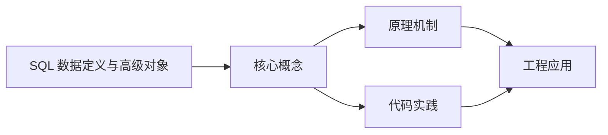

## 1. 学习目标（Bloom 分类）

本节按照布鲁姆教育目标分类学组织学习路径。本文主题为《SQL 数据定义与高级对象》，属于 MySQL 模块，读者可以根据自身阶段选择阅读深度。

记忆层面：能够准确复述本文的核心概念、术语与基本语法或操作步骤，并能够在提问或检索时快速定位对应知识点。能够说出 MySQL 的核心概念、语法与常用对象。

理解层面：能够用自己的语言解释核心原理与工作机制，说明概念之间的因果关系，而不是机械记忆结论。能够解释 MySQL 的执行原理与优化机制。

应用层面：能够在真实项目或练习场景中运用本文知识解决具体问题，写出正确且可维护的实现。能够编写正确、高效的 MySQL 语句与操作。

分析层面：能够拆解复杂问题，比较本文主题与相邻概念的异同，识别边界条件与例外情况。能够分析 MySQL 相关方案在性能与一致性上的权衡。

评价层面：能够根据约束条件（性能、可读性、安全、成本）评价不同方案的优劣，做出有依据的技术决策。能够根据业务场景评价 MySQL 技术选型。

创造层面：能够把本文知识与其他模块知识组合，设计出新的解决方案或可复用的工程模式。能够组合 MySQL 与其他技术设计数据架构。

通过本节学习，读者应当能够把《SQL 数据定义与高级对象》纳入自己的知识网络，并与 MySQL 模块的其他主题（InnoDB、索引、日志、主从、性能调优）建立关联。

## 2. 历史动机与发展脉络

《SQL 数据定义与高级对象》是 MySQL 领域的重要主题。要真正理解它，需要先了解它解决的问题与演进过程。

MySQL 于 1995 年由 MySQL AB 发布，2008 年被 Sun 收购，2010 年随 Sun 并入 Oracle；MariaDB 是社区分支。
MySQL 8.0（2018）重写优化器、引入窗口函数与 CTE、默认 utf8mb4、数据字典升级；MySQL 8.4 与 9.x 继续演进（Oracle 创新版 + LTS 双轨）。
InnoDB 是默认存储引擎：事务、行锁、MVCC、崩溃恢复（redo/undo）；MyISAM 仅存于历史场景。

回到本文主题：SQL 数据定义与高级对象 的提出与成熟，正是上述技术背景下的必然产物。早期实现往往以简单可用为目标，随着工程规模扩大，社区逐渐沉淀出标准做法与最佳实践；理解这一脉络，可以帮助读者判断“为什么文档中的推荐写法是现在这个样子”，也能在遇到历史遗留代码时准确识别其设计年代与取舍。


## 3. 形式化定义与核心概念精讲

本节把《SQL 数据定义与高级对象》涉及的核心概念以“定义 + 讲解”的形式展开。读者应把定义当作工具，把讲解当作理解路径；两者结合才能形成可迁移的知识。

InnoDB 架构：缓冲池（Buffer Pool）、日志缓冲、redo/undo 日志；脏页刷盘与 checkpoint 机制。
索引：B+ 树主键聚集索引、二级索引、覆盖索引；索引下推（ICP）与 MRR 优化。
事务与锁：两阶段锁、间隙锁/临键锁（可重复读防幻读）、MVCC 快照读；隔离级别。

### 3.1 原文章节逐一精讲

原文档把主题拆分为 13 个小节，下面按顺序给出每一节的导读讲解，随后保留原文细节供精读。

#### 原文精读（完整保留）

# MySQL SQL 数据定义与高级对象

> **符号约定**：`< >` 必填参数 | `[ ]` 可选参数

---

#### 1. DDL (数据定义语言) - Data Definition Language

DDL 用于创建、修改和删除数据库对象，包括数据库、表、索引、视图等。

##### 1.1 数据库操作详解

###### 1.1.1 创建数据库

```sql
 -
 CREATE DATABASE mydb;
 -
 CREATE DATABASE mydb
  CHARACTER SET utf8mb4
  COLLATE utf8mb4_unicode_ci;
 -
 CREATE DATABASE IF NOT EXISTS mydb
  CHARACTER SET utf8mb4
  COLLATE utf8mb4_unicode_ci;
```

###### 1.1.2 查看数据库

```sql
 -
 SHOW DATABASES;
 -
 SHOW CREATE DATABASE mydb;
 -
 SELECT DATABASE();
```

###### 1.1.3 选择数据库

```sql
 use mydb;
```

###### 1.1.4 删除数据库

```sql
 -
 DROP DATABASE mydb;
 -
 DROP DATABASE IF EXISTS mydb;
```

###### 1.1.5 修改数据库

```sql
 -
 ALTER DATABASE mydb CHARACTER SET utf8mb4 COLLATE utf8mb4_unicode_ci;
```

##### 1.2 表操作详解

###### 1.2.1 创建表

```sql
 -
 CREATE TABLE users (
  id INT PRIMARY KEY AUTO_INCREMENT COMMENT '用户ID',
  username VARCHAR(50) NOT NULL UNIQUE COMMENT '用户名',
  email VARCHAR(100) NOT NULL COMMENT '邮箱',
  password VARCHAR(255) NOT NULL COMMENT '密码（加密存储）',
  phone VARCHAR(20) COMMENT '手机号',
  age INT UNSIGNED COMMENT '年龄',
  gender ENUM('男', '女', '保密') DEFAULT '保密' COMMENT '性别',
  avatar VARCHAR(255) COMMENT '头像URL',
  status TINYINT DEFAULT 1 COMMENT '状态：1-正常，0-禁用',
  balance DECIMAL(10,2) DEFAULT 0.00 COMMENT '账户余额',
  last_login_time DATETIME COMMENT '最后登录时间',
  created_at TIMESTAMP DEFAULT CURRENT_TIMESTAMP COMMENT '创建时间',
  updated_at TIMESTAMP DEFAULT CURRENT_TIMESTAMP ON UPDATE CURRENT_TIMESTAMP COMMENT '更新时间',
  INDEX idx_username (username),
  INDEX idx_email (email),
  INDEX idx_status (status)
 )
```

###### 1.2.2 表结构设计原则

**设计要点**：

- 主键：每个表必须有主键，推荐使用自增 INT 或 BIGINT
- 字段命名：使用有意义的名称，采用小写下划线命名法
- 数据类型：选择合适的数据类型，避免浪费存储空间
- 索引设计：为常用查询条件的字段创建索引
- 注释：为重要字段添加注释说明
  **字段类型选择指南**：
  | 场景      | 推荐类型                  | 原因                     |
  | :-------- | :------------------------ | :----------------------- |
  | ID 主键   | INT/BIGINT AUTO_INCREMENT | 高效、自增、占用空间小   |
  | 状态标志  | TINYINT                   | 占用空间最小             |
  | 年龄      | TINYINT UNSIGNED          | 范围 0-255，足够存储年龄 |
  | 金额/价格 | DECIMAL(M,N)              | 精确存储，避免浮点误差   |
  | 手机号    | VARCHAR(20)               | 可能有+86等前缀          |
  | 文本描述  | VARCHAR/TEXT              | 根据长度选择             |
  | 日期时间  | DATETIME/TIMESTAMP        | 根据是否需要时区选择     |
  | UUID      | VARCHAR(36)               | 跨系统使用               |

###### 1.2.3 查看表结构

```sql
 -
 DESC users;
 -
 SHOW COLUMNS FROM users;
 -
 SHOW CREATE TABLE users;
 -
 SHOW TABLES;
 -
 SHOW TABLE STATUS FROM mydb;
 -
 SHOW TABLES LIKE '%user%';
```

###### 1.2.4 修改表结构

```sql
 -
 ALTER TABLE users ADD COLUMN address VARCHAR(255) AFTER email;
 ALTER TABLE users ADD COLUMN is_verified TINYINT DEFAULT 0 AFTER status;
 -
 ALTER TABLE users MODIFY COLUMN phone VARCHAR(20) NOT NULL;
 -
 ALTER TABLE users CHANGE COLUMN phone telephone VARCHAR(20) NOT NULL;
 -
 ALTER TABLE users DROP COLUMN address;
 -
 ALTER TABLE users ADD INDEX idx_age (age);
 ALTER TABLE users ADD UNIQUE INDEX idx_phone (phone);
 ALTER TABLE users ADD INDEX idx_age_gender (age, gender);
 -
 ALTER TABLE orders ADD CONSTRAINT fk_user_id FOREIGN KEY (user_id) REFERENCES users(id);
 -
 ALTER TABLE orders DROP FOREIGN KEY fk_user_id;
 -
 ALTER TABLE users COMMENT '用户信息表';
 -
 ALTER TABLE users RENAME TO user_info;
 RENAME TABLE users TO user_info, orders TO order_info;
```

###### 1.2.5 删除表

```sql
 -
 DROP TABLE users;
 -
 DROP TABLE IF EXISTS users;
 -
 DROP TABLE IF EXISTS users, orders, products;
 -
 TRUNCATE TABLE users;
```

###### 1.2.6 表复制

```sql
 -
 CREATE TABLE users_copy LIKE users;
 -
 CREATE TABLE users_copy AS SELECT * FROM users;
 -
 CREATE TABLE users_copy AS SELECT id, username, email FROM users WHERE 1=0;
 -
 CREATE TABLE users_copy AS SELECT * FROM users WHERE status = 1;
```

##### 1.3 索引操作详解

###### 1.3.1 索引基础概念

索引是一种特殊的数据结构，用于加速数据检索。类似于书籍的目录，索引可以快速定位数据，减少查询时间。
**索引类型**：

| 类型     | 说明         | 示例                                   |
| :------- | :----------- | :------------------------------------- |
| 普通索引 | 最基本的索引 | `INDEX idx_name (name)`                |
| 唯一索引 | 索引值唯一   | `UNIQUE INDEX idx_email (email)`       |
| 主键索引 | 主键自动创建 | 主键列                                 |
| 复合索引 | 多列组合索引 | `INDEX idx_name_age (name, age)`       |
| 全文索引 | 文本搜索     | `FULLTEXT INDEX ft_content (content)`  |
| 空间索引 | 地理空间数据 | `SPATIAL INDEX sx_location (location)` |

###### 1.3.2 创建索引

```sql
 -
 CREATE INDEX idx_username ON users(username);
 -
 CREATE UNIQUE INDEX idx_email ON users(email);
 -
 CREATE INDEX idx_name_status ON users(username, status);
 -
 CREATE UNIQUE INDEX idx_order_product ON order_items(order_id, product_id);
 -
 ALTER TABLE articles ADD FULLTEXT INDEX ft_title_content (title, content);
 -
 CREATE INDEX idx_email_prefix ON users(email(10));
```

###### 1.3.3 查看索引

```sql
 -
 SHOW INDEX FROM users;
 -
 SHOW INDEX FROM users\G
 -
 EXPLAIN SELECT * FROM users WHERE username = 'test';
```

###### 1.3.4 删除索引

```sql
 -
 DROP INDEX idx_username ON users;
 -
 ALTER TABLE users MODIFY id INT NOT NULL;
 ALTER TABLE users DROP PRIMARY KEY;
```

###### 1.3.5 索引设计原则

**适合创建索引的场景**：

- WHERE 子句中经常使用的列
- JOIN 操作中经常使用的列
- ORDER BY、GROUP BY 后面的列
- SELECT 中频繁查询的列
  **不适合创建索引的场景**：
- 列中数据重复度很高（如性别只有男/女）
- 表数据量很小
- 经常更新的列
- 不出现在 WHERE 子句中的列
  **复合索引最左前缀原则**：

```sql
 -
 CREATE INDEX idx_status_created ON users(status, created_at);
 -
 SELECT * FROM users WHERE status = 1;
 SELECT * FROM users WHERE status = 1 AND created_at > '2024-01-01';
 -
 SELECT * FROM users WHERE created_at > '2024-01-01';
```

##### 1.4 约束详解

###### 1.4.1 约束类型

| 约束类型 | 说明             | 关键字         |
| :------- | :--------------- | :------------- |
| 主键约束 | 唯一标识每行记录 | PRIMARY KEY    |
| 唯一约束 | 字段值唯一       | UNIQUE         |
| 非空约束 | 字段值不能为空   | NOT NULL       |
| 默认约束 | 字段默认值       | DEFAULT        |
| 检查约束 | 字段值满足条件   | CHECK          |
| 外键约束 | 表之间关联       | FOREIGN KEY    |
| 自动增长 | 数值自动递增     | AUTO_INCREMENT |

###### 1.4.2 约束示例

```sql
 CREATE TABLE orders (
  id INT PRIMARY KEY AUTO_INCREMENT,
  order_no VARCHAR(32) NOT NULL UNIQUE COMMENT '订单编号',
  user_id INT NOT NULL COMMENT '用户ID',
  total_amount DECIMAL(10,2) NOT NULL DEFAULT 0.00 COMMENT '订单总额',
  status TINYINT NOT NULL DEFAULT 1 COMMENT '状态',
  created_at TIMESTAMP DEFAULT CURRENT_TIMESTAMP,
  -- 外键约束
  FOREIGN KEY (user_id) REFERENCES users(id)
  ON DELETE RESTRICT -- 限制删除
  ON UPDATE CASCADE, -- 级联更新
  -- 检查约束
  CHECK (total_amount >= 0),
  CHECK (status IN (1, 2, 3, 4, 5))
 )
```

###### 1.4.3 外键约束行为

| 行为      | 说明                              |
| :-------- | :-------------------------------- |
| RESTRICT  | 阻止删除/更新有外键关联的记录     |
| CASCADE   | 级联删除/更新子表记录             |
| SET NULL  | 将子表外键设为 NULL               |
| NO ACTION | 拒绝删除/更新（与 RESTRICT 类似） |

#### 2. 事务详解

##### 2.1 事务概念

事务是指一组操作，这些操作要么全部成功，要么全部失败，是一个不可分割的工作单元。
**ACID 特性**：

- Atomicity（原子性）：事务是最小执行单元，不可分割
- Consistency（一致性）：事务执行前后，数据保持一致
- Isolation（隔离性）：并发执行的事务相互隔离
- Durability（持久性）：事务提交后，修改永久保存

##### 2.2 事务基本语法

```sql
 -
 START TRANSACTION;
 -
 BEGIN;
 -
 inSERT INTO users (username, email) VALUES ('张三', 'zhangsan@example.com');
 UPDATE accounts SET balance = balance - 100 WHERE user_id = 1;
 UPDATE accounts SET balance = balance + 100 WHERE user_id = 2;
 -
 commit;
 -
 ROLLBACK;
 -
 START TRANSACTION;
 inSERT INTO users (username) VALUES ('张三');
 SAVEPOINT sp1;
 inSERT INTO users (username) VALUES ('李四');
 ROLLBACK TO sp1; -- 回滚到保存点
 commit;
```

##### 2.3 事务隔离级别

| 隔离级别               | 脏读   | 不可重复读 | 幻读   |
| :--------------------- | :----- | :--------- | :----- |
| READ UNCOMMITTED       | 可能   | 可能       | 可能   |
| READ COMMITTED         | 不可能 | 可能       | 可能   |
| REPEATABLE READ (默认) | 不可能 | 不可能     | 可能   |
| SERIALIZABLE           | 不可能 | 不可能     | 不可能 |

```sql
 -
 SELECT @@tx_isolation;
 SELECT @@transaction_isolation;
 -
 SET SESSION TRANSACTION ISOLATION LEVEL READ COMMITTED;
 -
 SET GLOBAL TRANSACTION ISOLATION LEVEL SERIALIZABLE;
```

##### 2.4 事务实战

```sql
 -
 START TRANSACTION;
 UPDATE accounts SET balance = balance - 1000 WHERE user_id = 1;
 UPDATE accounts SET balance = balance + 1000 WHERE user_id = 2;
 -
 SELECT balance FROM accounts WHERE user_id IN (1, 2);
 -
 if (SELECT balance FROM accounts WHERE user_id = 1) < 0 THEN
  ROLLBACK;
 else
  COMMIT;
 END IF;
 -
 START TRANSACTION;
 inSERT INTO orders (user_id, total_amount) VALUES (1, 500);
 SET @order_id = LAST_INSERT_ID();
 inSERT INTO order_items (order_id, product_id, quantity, price) VALUES
 (@order_id, 101, 2, 200),
 (@order_id, 102, 1, 100);
 UPDATE products SET stock = stock - 3 WHERE id IN (101, 102);
 commit;
```

#### 3. 视图详解

##### 3.1 视图概念

视图是基于 SQL 查询结果的虚拟表，可以简化复杂查询、保护数据安全。

##### 3.2 创建视图

```sql
 -
 CREATE VIEW active_users AS
 SELECT id, username, email, status
 from users
 WHERE status = 1;
 -
 CREATE VIEW order_details AS
 SELECT
  o.id AS order_id,
  o.order_no,
  u.username,
  u.email,
  o.total_amount,
  o.status,
  o.created_at
 from orders o
 inNER JOIN users u ON o.user_id = u.id;
 -
 CREATE VIEW user_stats AS
 SELECT
  u.id,
  u.username,
  COUNT(o.id) AS order_count,
  IFNULL(SUM(o.total_amount), 0) AS total_spent,
  MAX(o.created_at) AS last_order_time
 from users u
 LEFT JOIN orders o ON u.id = o.user_id
 GROUP BY u.id, u.username;
```

##### 3.3 使用视图

```sql
 -
 SELECT * FROM active_users WHERE username LIKE '张%';
 -
 SELECT v.username, v.order_count, o.order_no
 from user_stats v
 LEFT JOIN orders o ON v.id = o.user_id
 WHERE o.created_at > '2024-01-01';
 -
 CREATE TABLE monthly_sales AS
 SELECT
  DATE_FORMAT(created_at, '%Y-%m') AS month,
  COUNT(*) AS order_count,
  SUM(total_amount) AS total_amount
 from orders
 GROUP BY DATE_FORMAT(created_at, '%Y-%m');
```

##### 3.4 修改和删除视图

```sql
 -
 CREATE OR REPLACE VIEW active_users AS
 SELECT id, username, email, status, created_at
 from users
 WHERE status = 1;
 -
 DROP VIEW IF EXISTS active_users;
 -
 SHOW CREATE VIEW order_details;
```

##### 3.5 视图限制

```sql
 -
 -
 -
 -
```

#### 4. 存储过程详解

##### 4.1 存储过程概念

存储过程是预编译的 SQL 代码块，可以接收参数、返回值，用于实现复杂的业务逻辑。

##### 4.2 创建存储过程

```sql
 DELIMITER //
 CREATE PROCEDURE get_user_by_age(IN min_age INT, IN max_age INT)
 BEGIN
  SELECT * FROM users
  WHERE age BETWEEN min_age AND max_age
  ORDER BY age;
 END //
 CREATE PROCEDURE count_users_by_status(OUT active_count INT, OUT inactive_count INT)
 BEGIN
  SELECT COUNT(*) INTO active_count FROM users WHERE status = 1;
  SELECT COUNT(*) INTO inactive_count FROM users WHERE status = 0;
 END //
 CREATE PROCEDURE update_user_status(IN user_id INT, IN new_status INT)
 BEGIN
  UPDATE users SET status = new_status, updated_at = NOW() WHERE id = user_id;
 END //
 DELIMITER ;
```

##### 4.3 调用存储过程

```sql
 -
 CALL get_all_users();
 -
 CALL get_user_by_age(20, 30);
 -
 CALL count_users_by_status(@active, @inactive);
 SELECT @active AS active_users, @inactive AS inactive_users;
 -
 SET @user_id = 1;
 CALL update_user_status(@user_id, 0);
```

##### 4.4 删除存储过程

```sql
 DROP PROCEDURE IF EXISTS get_user_by_age;
```

#### 5. 触发器详解

##### 5.1 触发器概念

触发器是在表发生特定事件（INSERT、UPDATE、DELETE）时自动执行的代码块。

##### 5.2 创建触发器

```sql
 DELIMITER //
 -
 CREATE TRIGGER before_user_insert
 BEFORE INSERT ON users
 for EACH ROW
 BEGIN
  SET NEW.created_at = NOW();
  SET NEW.updated_at = NOW();
  IF NEW.status IS NULL THEN
  SET NEW.status = 1;
  END IF;
 END //
 -
 CREATE TRIGGER after_order_update
 AFTER UPDATE ON orders
 for EACH ROW
 BEGIN
  IF OLD.status != NEW.status THEN
  INSERT INTO order_status_log (order_id, old_status, new_status, changed_at)
  VALUES (OLD.id, OLD.status, NEW.status, NOW());
  END IF;
 END //
 -
 CREATE TRIGGER after_user_delete
 AFTER DELETE ON users
 for EACH ROW
 BEGIN
  INSERT INTO user_delete_log (user_id, username, deleted_at)
  VALUES (OLD.id, OLD.username, NOW());
 END //
 DELIMITER ;
```

##### 5.3 删除触发器

```sql
 DROP TRIGGER IF EXISTS before_user_insert;
```

---

#### 数据库操作

**单行写法：创建数据库**
`CREATE DATABASE <库名>`
```sql
-- 创建数据库
CREATE DATABASE mydb;
```

**换行写法：创建数据库并指定字符集**
`CREATE DATABASE <库名> CHARACTER SET <字符集> COLLATE <排序规则>`
```sql
-- 创建数据库并指定字符集与排序规则
CREATE DATABASE mydb
  CHARACTER SET utf8mb4
  COLLATE utf8mb4_unicode_ci;
```

**换行写法：不存在时创建数据库**
`CREATE DATABASE IF NOT EXISTS <库名> [CHARACTER SET <字符集>] [COLLATE <排序规则>]`
```sql
-- 数据库不存在时才创建
CREATE DATABASE IF NOT EXISTS mydb
  CHARACTER SET utf8mb4
  COLLATE utf8mb4_unicode_ci;
```

**单行写法：查看所有数据库**
`SHOW DATABASES`
```sql
-- 查看所有数据库
SHOW DATABASES;
```

**单行写法：查看建库语句**
`SHOW CREATE DATABASE <库名>`
```sql
-- 查看数据库的建库语句
SHOW CREATE DATABASE mydb;
```

**单行写法：查看当前数据库**
`SELECT DATABASE()`
```sql
-- 查看当前使用的数据库
SELECT DATABASE();
```

**单行写法：选择数据库**
`USE <库名>`
```sql
-- 切换到指定数据库
USE mydb;
```

**单行写法：删除数据库**
`DROP DATABASE <库名>`
```sql
-- 删除数据库
DROP DATABASE mydb;
```

**单行写法：存在时删除数据库**
`DROP DATABASE IF EXISTS <库名>`
```sql
-- 数据库存在时才删除
DROP DATABASE IF EXISTS mydb;
```

**单行写法：修改数据库字符集**
`ALTER DATABASE <库名> CHARACTER SET <字符集> COLLATE <排序规则>`
```sql
-- 修改数据库的字符集与排序规则
ALTER DATABASE mydb CHARACTER SET utf8mb4 COLLATE utf8mb4_unicode_ci;
```

---

#### 表操作

**换行写法：创建表**
`CREATE TABLE [IF NOT EXISTS] <表名> (<列定义>[, <表约束>...])`
```sql
-- 创建用户表并包含索引
CREATE TABLE users (
  id INT PRIMARY KEY AUTO_INCREMENT COMMENT '用户ID',
  username VARCHAR(50) NOT NULL UNIQUE COMMENT '用户名',
  email VARCHAR(100) NOT NULL COMMENT '邮箱',
  password VARCHAR(255) NOT NULL COMMENT '密码',
  phone VARCHAR(20) COMMENT '手机号',
  age INT UNSIGNED COMMENT '年龄',
  gender ENUM('男', '女', '保密') DEFAULT '保密' COMMENT '性别',
  status TINYINT DEFAULT 1 COMMENT '状态',
  balance DECIMAL(10,2) DEFAULT 0.00 COMMENT '账户余额',
  created_at TIMESTAMP DEFAULT CURRENT_TIMESTAMP COMMENT '创建时间',
  updated_at TIMESTAMP DEFAULT CURRENT_TIMESTAMP ON UPDATE CURRENT_TIMESTAMP COMMENT '更新时间',
  INDEX idx_username (username),
  INDEX idx_email (email),
  INDEX idx_status (status)
);
```

**单行写法：查看表字段**
`DESC <表名>`
```sql
-- 查看表字段信息
DESC users;
```

**单行写法：查看列信息**
`SHOW COLUMNS FROM <表名>`
```sql
-- 查看表的列详细信息
SHOW COLUMNS FROM users;
```

**单行写法：查看建表语句**
`SHOW CREATE TABLE <表名>`
```sql
-- 查看表的建表语句
SHOW CREATE TABLE users;
```

**单行写法：查看所有表**
`SHOW TABLES`
```sql
-- 查看当前数据库的所有表
SHOW TABLES;
```

**单行写法：模糊查表**
`SHOW TABLES LIKE '<模式>'`
```sql
-- 模糊查询表名
SHOW TABLES LIKE '%user%';
```

**单行写法：添加列**
`ALTER TABLE <表名> ADD COLUMN <列定义> [AFTER <列名>]`
```sql
-- 在指定列后添加新列
ALTER TABLE users ADD COLUMN address VARCHAR(255) AFTER email;
```

**单行写法：修改列类型**
`ALTER TABLE <表名> MODIFY COLUMN <列名> <新类型> [<约束>]`
```sql
-- 修改列的定义
ALTER TABLE users MODIFY COLUMN phone VARCHAR(20) NOT NULL;
```

**单行写法：重命名列**
`ALTER TABLE <表名> CHANGE COLUMN <旧列名> <新列名> <类型> [<约束>]`
```sql
-- 重命名列并保留类型
ALTER TABLE users CHANGE COLUMN phone telephone VARCHAR(20) NOT NULL;
```

**单行写法：删除列**
`ALTER TABLE <表名> DROP COLUMN <列名>`
```sql
-- 删除指定列
ALTER TABLE users DROP COLUMN address;
```

**单行写法：添加普通索引**
`ALTER TABLE <表名> ADD INDEX <索引名> (<列名>[, <列名>...])`
```sql
-- 添加普通索引
ALTER TABLE users ADD INDEX idx_age (age);
```

**单行写法：添加唯一索引**
`ALTER TABLE <表名> ADD UNIQUE INDEX <索引名> (<列名>[, <列名>...])`
```sql
-- 添加唯一索引
ALTER TABLE users ADD UNIQUE INDEX idx_phone (phone);
```

**单行写法：添加复合索引**
`ALTER TABLE <表名> ADD INDEX <索引名> (<列名1>, <列名2>[, ...])`
```sql
-- 添加复合索引
ALTER TABLE users ADD INDEX idx_age_gender (age, gender);
```

**单行写法：添加外键**
`ALTER TABLE <表名> ADD CONSTRAINT <约束名> FOREIGN KEY (<列名>) REFERENCES <父表>(<父列>)`
```sql
-- 添加外键约束
ALTER TABLE orders ADD CONSTRAINT fk_user_id FOREIGN KEY (user_id) REFERENCES users(id);
```

**单行写法：删除外键**
`ALTER TABLE <表名> DROP FOREIGN KEY <约束名>`
```sql
-- 删除外键约束
ALTER TABLE orders DROP FOREIGN KEY fk_user_id;
```

**单行写法：重命名表**
`ALTER TABLE <旧表名> RENAME TO <新表名>`
```sql
-- 重命名表
ALTER TABLE users RENAME TO user_info;
```

**单行写法：多表重命名**
`RENAME TABLE <旧表名1> TO <新表名1>, <旧表名2> TO <新表名2>`
```sql
-- 同时重命名多个表
RENAME TABLE users TO user_info, orders TO order_info;
```

**单行写法：删除表**
`DROP TABLE <表名>`
```sql
-- 删除表
DROP TABLE users;
```

**单行写法：存在时删除表**
`DROP TABLE IF EXISTS <表名>`
```sql
-- 表存在时才删除
DROP TABLE IF EXISTS users;
```

**单行写法：删除多表**
`DROP TABLE IF EXISTS <表名1>, <表名2>[, ...]`
```sql
-- 同时删除多个表
DROP TABLE IF EXISTS users, orders, products;
```

**单行写法：清空表**
`TRUNCATE TABLE <表名>`
```sql
-- 清空表数据
TRUNCATE TABLE users;
```

**单行写法：仅复制表结构**
`CREATE TABLE <新表> LIKE <源表>`
```sql
-- 仅复制表结构不复制数据
CREATE TABLE users_copy LIKE users;
```

**单行写法：复制结构和数据**
`CREATE TABLE <新表> AS SELECT * FROM <源表>`
```sql
-- 复制表结构和全部数据
CREATE TABLE users_copy AS SELECT * FROM users;
```

**单行写法：复制部分数据**
`CREATE TABLE <新表> AS SELECT * FROM <源表> WHERE <条件>`
```sql
-- 复制表结构并复制符合条件的数据
CREATE TABLE users_copy AS SELECT * FROM users WHERE status = 1;
```

---

#### 索引操作

**单行写法：创建普通索引**
`CREATE INDEX <索引名> ON <表名>(<列名>[, <列名>...])`
```sql
-- 创建单列普通索引
CREATE INDEX idx_username ON users(username);
```

**单行写法：创建复合索引**
`CREATE INDEX <索引名> ON <表名>(<列名1>, <列名2>[, ...])`
```sql
-- 创建多列复合索引
CREATE INDEX idx_name_status ON users(username, status);
```

**单行写法：创建唯一索引**
`CREATE UNIQUE INDEX <索引名> ON <表名>(<列名>[, <列名>...])`
```sql
-- 创建单列唯一索引
CREATE UNIQUE INDEX idx_email ON users(email);
```

**单行写法：创建复合唯一索引**
`CREATE UNIQUE INDEX <索引名> ON <表名>(<列名1>, <列名2>[, ...])`
```sql
-- 创建多列复合唯一索引
CREATE UNIQUE INDEX idx_order_product ON order_items(order_id, product_id);
```

**单行写法：创建前缀索引**
`CREATE INDEX <索引名> ON <表名>(<列名>(<长度>))`
```sql
-- 为长字符串创建前缀索引
CREATE INDEX idx_email_prefix ON users(email(10));
```

**单行写法：创建全文索引**
`ALTER TABLE <表名> ADD FULLTEXT INDEX <索引名> (<列名>[, <列名>...])`
```sql
-- 为文本列创建全文索引
ALTER TABLE articles ADD FULLTEXT INDEX ft_title_content (title, content);
```

**单行写法：查看表索引**
`SHOW INDEX FROM <表名>`
```sql
-- 查看表的索引信息
SHOW INDEX FROM users;
```

**单行写法：删除索引**
`DROP INDEX <索引名> ON <表名>`
```sql
-- 删除指定索引
DROP INDEX idx_username ON users;
```

**单行写法：删除主键**
`ALTER TABLE <表名> DROP PRIMARY KEY`
```sql
-- 删除主键索引
ALTER TABLE users DROP PRIMARY KEY;
```

---

#### 约束

**换行写法：综合约束建表**
`CREATE TABLE <表名> (<列定义>, <约束定义>...)`
```sql
-- 创建包含多种约束的订单表
CREATE TABLE orders (
  id INT PRIMARY KEY AUTO_INCREMENT,
  order_no VARCHAR(32) NOT NULL UNIQUE COMMENT '订单编号',
  user_id INT NOT NULL COMMENT '用户ID',
  total_amount DECIMAL(10,2) NOT NULL DEFAULT 0.00 COMMENT '订单总额',
  status TINYINT NOT NULL DEFAULT 1 COMMENT '状态',
  created_at TIMESTAMP DEFAULT CURRENT_TIMESTAMP,
  FOREIGN KEY (user_id) REFERENCES users(id)
    ON DELETE RESTRICT
    ON UPDATE CASCADE,
  CHECK (total_amount >= 0),
  CHECK (status IN (1, 2, 3, 4, 5))
);
```

---

#### 事务

**单行写法：开启事务**
`START TRANSACTION` / `BEGIN`
```sql
-- 开启事务
START TRANSACTION;
```

**换行写法：提交事务**
`COMMIT`
```sql
-- 提交事务并持久化变更
START TRANSACTION;
INSERT INTO users (username, email) VALUES ('张三', 'zhangsan@example.com');
UPDATE accounts SET balance = balance - 100 WHERE user_id = 1;
COMMIT;
```

**单行写法：回滚事务**
`ROLLBACK`
```sql
-- 回滚事务撤销变更
ROLLBACK;
```

**换行写法：使用保存点**
`SAVEPOINT <保存点名>` / `ROLLBACK TO <保存点名>`
```sql
-- 使用保存点部分回滚
START TRANSACTION;
INSERT INTO users (username) VALUES ('张三');
SAVEPOINT sp1;
INSERT INTO users (username) VALUES ('李四');
ROLLBACK TO sp1;
COMMIT;
```

**单行写法：查看隔离级别**
`SELECT @@transaction_isolation`
```sql
-- 查看当前事务隔离级别
SELECT @@transaction_isolation;
```

**单行写法：设置会话隔离级别**
`SET SESSION TRANSACTION ISOLATION LEVEL <级别>`
```sql
-- 设置会话隔离级别为读已提交
SET SESSION TRANSACTION ISOLATION LEVEL READ COMMITTED;
```

**单行写法：设置全局隔离级别**
`SET GLOBAL TRANSACTION ISOLATION LEVEL <级别>`
```sql
-- 设置全局隔离级别为可序列化
SET GLOBAL TRANSACTION ISOLATION LEVEL SERIALIZABLE;
```

---

#### 视图

**换行写法：创建简单视图**
`CREATE VIEW <视图名> AS <SELECT 语句>`
```sql
-- 创建只读视图
CREATE VIEW active_users AS
SELECT id, username, email, status
FROM users
WHERE status = 1;
```

**换行写法：创建多表视图**
`CREATE VIEW <视图名> AS <多表 JOIN 查询>`
```sql
-- 创建多表关联视图
CREATE VIEW order_details AS
SELECT
  o.id AS order_id,
  o.order_no,
  u.username,
  u.email,
  o.total_amount,
  o.status
FROM orders o
INNER JOIN users u ON o.user_id = u.id;
```

**单行写法：查询视图**
`SELECT <列名> FROM <视图名> [WHERE <条件>]`
```sql
-- 查询视图数据
SELECT * FROM active_users WHERE username LIKE '张%';
```

**换行写法：替换视图定义**
`CREATE OR REPLACE VIEW <视图名> AS <SELECT 语句>`
```sql
-- 替换已有视图的定义
CREATE OR REPLACE VIEW active_users AS
SELECT id, username, email, status, created_at
FROM users
WHERE status = 1;
```

**单行写法：删除视图**
`DROP VIEW [IF EXISTS] <视图名>`
```sql
-- 删除视图
DROP VIEW IF EXISTS active_users;
```

**单行写法：查看视图定义**
`SHOW CREATE VIEW <视图名>`
```sql
-- 查看视图的建语句
SHOW CREATE VIEW order_details;
```

---

#### 存储过程

**换行写法：创建带 IN 参数的存储过程**
`CREATE PROCEDURE <过程名>(IN <参数名> <类型>[, ...]) BEGIN <过程体> END`
```sql
-- 创建带输入参数的存储过程
DELIMITER //
CREATE PROCEDURE get_user_by_age(IN min_age INT, IN max_age INT)
BEGIN
  SELECT * FROM users
  WHERE age BETWEEN min_age AND max_age
  ORDER BY age;
END //
DELIMITER ;
```

**换行写法：创建带 OUT 参数的存储过程**
`CREATE PROCEDURE <过程名>(OUT <参数名> <类型>[, ...]) BEGIN <过程体> END`
```sql
-- 创建带输出参数的存储过程
DELIMITER //
CREATE PROCEDURE count_users_by_status(OUT active_count INT, OUT inactive_count INT)
BEGIN
  SELECT COUNT(*) INTO active_count FROM users WHERE status = 1;
  SELECT COUNT(*) INTO inactive_count FROM users WHERE status = 0;
END //
DELIMITER ;
```

**单行写法：调用无参存储过程**
`CALL <过程名>()`
```sql
-- 调用无参存储过程
CALL get_all_users();
```

**单行写法：调用带 IN 参数的存储过程**
`CALL <过程名>(<参数值>[, ...])`
```sql
-- 调用带输入参数的存储过程
CALL get_user_by_age(20, 30);
```

**换行写法：调用带 OUT 参数的存储过程**
`CALL <过程名>(@<变量名>[, ...])`
```sql
-- 调用带输出参数的存储过程并查看结果
CALL count_users_by_status(@active, @inactive);
SELECT @active AS active_users, @inactive AS inactive_users;
```

**单行写法：删除存储过程**
`DROP PROCEDURE [IF EXISTS] <过程名>`
```sql
-- 删除存储过程
DROP PROCEDURE IF EXISTS get_user_by_age;
```

---

#### 触发器

**换行写法：创建插入前触发器**
`CREATE TRIGGER <触发器名> BEFORE INSERT ON <表名> FOR EACH ROW BEGIN <触发体> END`
```sql
-- 插入前自动填充时间字段
DELIMITER //
CREATE TRIGGER before_user_insert
BEFORE INSERT ON users
FOR EACH ROW
BEGIN
  SET NEW.created_at = NOW();
  SET NEW.updated_at = NOW();
  IF NEW.status IS NULL THEN
    SET NEW.status = 1;
  END IF;
END //
DELIMITER ;
```

**换行写法：创建更新后触发器**
`CREATE TRIGGER <触发器名> AFTER UPDATE ON <表名> FOR EACH ROW BEGIN <触发体> END`
```sql
-- 更新后记录状态变更日志
DELIMITER //
CREATE TRIGGER after_order_update
AFTER UPDATE ON orders
FOR EACH ROW
BEGIN
  IF OLD.status != NEW.status THEN
    INSERT INTO order_status_log (order_id, old_status, new_status, changed_at)
    VALUES (OLD.id, OLD.status, NEW.status, NOW());
  END IF;
END //
DELIMITER ;
```

**单行写法：删除触发器**
`DROP TRIGGER [IF EXISTS] <触发器名>`
```sql
-- 删除触发器
DROP TRIGGER IF EXISTS before_user_insert;
```


### 3.2 概念关系图

下面用 Mermaid 图表达本文核心概念之间的关系，帮助读者建立整体图景：



图中展示的是本文知识的结构化关系：核心概念是入口，原理机制解释“为什么”，代码实践演示“怎么做”，工程应用回答“何时用”。读者学习时可以把每个小节的内容挂接到对应节点上。

## 4. 理论推导与原理解析

本节深入《SQL 数据定义与高级对象》背后的原理。理论部分不求面面俱到，而是聚焦“能解释现象、能指导实践”的关键推导。

InnoDB 架构：缓冲池（Buffer Pool）、日志缓冲、redo/undo 日志；脏页刷盘与 checkpoint 机制。
索引：B+ 树主键聚集索引、二级索引、覆盖索引；索引下推（ICP）与 MRR 优化。
事务与锁：两阶段锁、间隙锁/临键锁（可重复读防幻读）、MVCC 快照读；隔离级别。
复制：binlog 逻辑复制（statement/row/mixed），主从异步、半同步与组复制。

需要强调的是，理论推导与工程实践之间存在翻译层：理论给出的是理想化模型与边界条件，工程代码则必须处理真实环境中的例外。读者在学习时应先掌握理论的“标准情形”，再通过陷阱章节了解“非标准情形”。

## 5. 代码示例与逐行讲解

本节把原文中的代码示例系统整理，并为每个示例补充用途说明与讲解。读者不应只浏览代码，而应逐段对照讲解理解设计意图。

### 5.1 示例：1.1.1 创建数据库

该示例来自原文《1.1.1 创建数据库》小节，用于演示SQL 数据定义与高级对象相关操作。阅读时请先看代码结构，再看其后的讲解。

```sql
 -
 CREATE DATABASE mydb;
 -
 CREATE DATABASE mydb
  CHARACTER SET utf8mb4
  COLLATE utf8mb4_unicode_ci;
 -
 CREATE DATABASE IF NOT EXISTS mydb
  CHARACTER SET utf8mb4
  COLLATE utf8mb4_unicode_ci;
```

讲解：这段代码演示了本节核心知识点。代码中的关键操作可以归纳为三步：准备（定义或初始化）、执行（核心逻辑）、收尾（释放资源或返回结果）。实际项目中，这三步往往被封装为函数或类，以提升复用性与可测试性。

关键点分析：

该示例共 10 行有效代码，包含 1 类关键结构（CREATE）。其中：

- 入口与初始化部分负责建立上下文，对应实际项目中的启动或装配逻辑；
- 核心逻辑部分体现本文主题的主要操作，是阅读时最需要对照讲解理解的部分；
- 输出或返回部分把结果交给调用方，注意其类型与边界条件。

进阶思考路径：先尝试修改参数观察行为变化，再把示例中的模式迁移到自己的项目中；每次修改都记录预期与实测差异，这是把示例转化为能力的最快方式。

### 5.2 示例：1.1.2 查看数据库

该示例来自原文《1.1.2 查看数据库》小节，用于演示SQL 数据定义与高级对象相关操作。阅读时请先看代码结构，再看其后的讲解。

```sql
 -
 SHOW DATABASES;
 -
 SHOW CREATE DATABASE mydb;
 -
 SELECT DATABASE();
```

讲解：这段代码演示了本节核心知识点。代码中的关键操作可以归纳为三步：准备（定义或初始化）、执行（核心逻辑）、收尾（释放资源或返回结果）。实际项目中，这三步往往被封装为函数或类，以提升复用性与可测试性。

关键点分析：

该示例共 6 行有效代码，包含 2 类关键结构（SELECT、CREATE）。其中：

- 入口与初始化部分负责建立上下文，对应实际项目中的启动或装配逻辑；
- 核心逻辑部分体现本文主题的主要操作，是阅读时最需要对照讲解理解的部分；
- 输出或返回部分把结果交给调用方，注意其类型与边界条件。

进阶思考路径：先尝试修改参数观察行为变化，再把示例中的模式迁移到自己的项目中；每次修改都记录预期与实测差异，这是把示例转化为能力的最快方式。

### 5.3 示例：1.1.3 选择数据库

该示例来自原文《1.1.3 选择数据库》小节，用于演示SQL 数据定义与高级对象相关操作。阅读时请先看代码结构，再看其后的讲解。

```sql
 use mydb;
```

讲解：这段代码演示了本节核心知识点。代码中的关键操作可以归纳为三步：准备（定义或初始化）、执行（核心逻辑）、收尾（释放资源或返回结果）。实际项目中，这三步往往被封装为函数或类，以提升复用性与可测试性。

关键点分析：

该示例共 1 行有效代码，结构以数据或配置为主。阅读时应关注：数据字段的含义、配置项的作用，以及它们与运行行为的对应关系。

进阶思考路径：先尝试修改参数观察行为变化，再把示例中的模式迁移到自己的项目中；每次修改都记录预期与实测差异，这是把示例转化为能力的最快方式。

### 5.4 示例：1.1.4 删除数据库

该示例来自原文《1.1.4 删除数据库》小节，用于演示SQL 数据定义与高级对象相关操作。阅读时请先看代码结构，再看其后的讲解。

```sql
 -
 DROP DATABASE mydb;
 -
 DROP DATABASE IF EXISTS mydb;
```

讲解：这段代码演示了本节核心知识点。代码中的关键操作可以归纳为三步：准备（定义或初始化）、执行（核心逻辑）、收尾（释放资源或返回结果）。实际项目中，这三步往往被封装为函数或类，以提升复用性与可测试性。

关键点分析：

该示例共 4 行有效代码，结构以数据或配置为主。阅读时应关注：数据字段的含义、配置项的作用，以及它们与运行行为的对应关系。

进阶思考路径：先尝试修改参数观察行为变化，再把示例中的模式迁移到自己的项目中；每次修改都记录预期与实测差异，这是把示例转化为能力的最快方式。

### 5.5 示例：1.1.5 修改数据库

该示例来自原文《1.1.5 修改数据库》小节，用于演示SQL 数据定义与高级对象相关操作。阅读时请先看代码结构，再看其后的讲解。

```sql
 -
 ALTER DATABASE mydb CHARACTER SET utf8mb4 COLLATE utf8mb4_unicode_ci;
```

讲解：这段代码演示了本节核心知识点。代码中的关键操作可以归纳为三步：准备（定义或初始化）、执行（核心逻辑）、收尾（释放资源或返回结果）。实际项目中，这三步往往被封装为函数或类，以提升复用性与可测试性。

关键点分析：

该示例共 2 行有效代码，包含 1 类关键结构（ALTER）。其中：

- 入口与初始化部分负责建立上下文，对应实际项目中的启动或装配逻辑；
- 核心逻辑部分体现本文主题的主要操作，是阅读时最需要对照讲解理解的部分；
- 输出或返回部分把结果交给调用方，注意其类型与边界条件。

进阶思考路径：先尝试修改参数观察行为变化，再把示例中的模式迁移到自己的项目中；每次修改都记录预期与实测差异，这是把示例转化为能力的最快方式。

### 5.6 示例：1.2.1 创建表

该示例来自原文《1.2.1 创建表》小节，用于演示SQL 数据定义与高级对象相关操作。阅读时请先看代码结构，再看其后的讲解。

```sql
 -
 CREATE TABLE users (
  id INT PRIMARY KEY AUTO_INCREMENT COMMENT '用户ID',
  username VARCHAR(50) NOT NULL UNIQUE COMMENT '用户名',
  email VARCHAR(100) NOT NULL COMMENT '邮箱',
  password VARCHAR(255) NOT NULL COMMENT '密码（加密存储）',
  phone VARCHAR(20) COMMENT '手机号',
  age INT UNSIGNED COMMENT '年龄',
  gender ENUM('男', '女', '保密') DEFAULT '保密' COMMENT '性别',
  avatar VARCHAR(255) COMMENT '头像URL',
  status TINYINT DEFAULT 1 COMMENT '状态：1-正常，0-禁用',
  balance DECIMAL(10,2) DEFAULT 0.00 COMMENT '账户余额',
  last_login_time DATETIME COMMENT '最后登录时间',
  created_at TIMESTAMP DEFAULT CURRENT_TIMESTAMP COMMENT '创建时间',
  updated_at TIMESTAMP DEFAULT CURRENT_TIMESTAMP ON UPDATE CURRENT_TIMESTAMP COMMENT '更新时间',
  INDEX idx_username (username),
  INDEX idx_email (email),
  INDEX idx_status (status)
 )
```

讲解：这段代码演示了本节核心知识点。代码中的关键操作可以归纳为三步：准备（定义或初始化）、执行（核心逻辑）、收尾（释放资源或返回结果）。实际项目中，这三步往往被封装为函数或类，以提升复用性与可测试性。

关键点分析：

该示例共 19 行有效代码，包含 1 类关键结构（CREATE）。其中：

- 入口与初始化部分负责建立上下文，对应实际项目中的启动或装配逻辑；
- 核心逻辑部分体现本文主题的主要操作，是阅读时最需要对照讲解理解的部分；
- 输出或返回部分把结果交给调用方，注意其类型与边界条件。

进阶思考路径：先尝试修改参数观察行为变化，再把示例中的模式迁移到自己的项目中；每次修改都记录预期与实测差异，这是把示例转化为能力的最快方式。

### 5.7 示例：1.2.3 查看表结构

该示例来自原文《1.2.3 查看表结构》小节，用于演示SQL 数据定义与高级对象相关操作。阅读时请先看代码结构，再看其后的讲解。

```sql
 -
 DESC users;
 -
 SHOW COLUMNS FROM users;
 -
 SHOW CREATE TABLE users;
 -
 SHOW TABLES;
 -
 SHOW TABLE STATUS FROM mydb;
 -
 SHOW TABLES LIKE '%user%';
```

讲解：这段代码演示了本节核心知识点。代码中的关键操作可以归纳为三步：准备（定义或初始化）、执行（核心逻辑）、收尾（释放资源或返回结果）。实际项目中，这三步往往被封装为函数或类，以提升复用性与可测试性。

关键点分析：

该示例共 12 行有效代码，包含 2 类关键结构（CREATE、FROM）。其中：

- 入口与初始化部分负责建立上下文，对应实际项目中的启动或装配逻辑；
- 核心逻辑部分体现本文主题的主要操作，是阅读时最需要对照讲解理解的部分；
- 输出或返回部分把结果交给调用方，注意其类型与边界条件。

进阶思考路径：先尝试修改参数观察行为变化，再把示例中的模式迁移到自己的项目中；每次修改都记录预期与实测差异，这是把示例转化为能力的最快方式。

### 5.8 示例：1.2.4 修改表结构

该示例来自原文《1.2.4 修改表结构》小节，用于演示SQL 数据定义与高级对象相关操作。阅读时请先看代码结构，再看其后的讲解。

```sql
 -
 ALTER TABLE users ADD COLUMN address VARCHAR(255) AFTER email;
 ALTER TABLE users ADD COLUMN is_verified TINYINT DEFAULT 0 AFTER status;
 -
 ALTER TABLE users MODIFY COLUMN phone VARCHAR(20) NOT NULL;
 -
 ALTER TABLE users CHANGE COLUMN phone telephone VARCHAR(20) NOT NULL;
 -
 ALTER TABLE users DROP COLUMN address;
 -
 ALTER TABLE users ADD INDEX idx_age (age);
 ALTER TABLE users ADD UNIQUE INDEX idx_phone (phone);
 ALTER TABLE users ADD INDEX idx_age_gender (age, gender);
 -
 ALTER TABLE orders ADD CONSTRAINT fk_user_id FOREIGN KEY (user_id) REFERENCES users(id);
 -
 ALTER TABLE orders DROP FOREIGN KEY fk_user_id;
 -
 ALTER TABLE users COMMENT '用户信息表';
 -
 ALTER TABLE users RENAME TO user_info;
 RENAME TABLE users TO user_info, orders TO order_info;
```

讲解：这段代码演示了本节核心知识点。代码中的关键操作可以归纳为三步：准备（定义或初始化）、执行（核心逻辑）、收尾（释放资源或返回结果）。实际项目中，这三步往往被封装为函数或类，以提升复用性与可测试性。

关键点分析：

该示例共 22 行有效代码，包含 1 类关键结构（ALTER）。其中：

- 入口与初始化部分负责建立上下文，对应实际项目中的启动或装配逻辑；
- 核心逻辑部分体现本文主题的主要操作，是阅读时最需要对照讲解理解的部分；
- 输出或返回部分把结果交给调用方，注意其类型与边界条件。

进阶思考路径：先尝试修改参数观察行为变化，再把示例中的模式迁移到自己的项目中；每次修改都记录预期与实测差异，这是把示例转化为能力的最快方式。

### 5.9 示例：1.2.5 删除表

该示例来自原文《1.2.5 删除表》小节，用于演示SQL 数据定义与高级对象相关操作。阅读时请先看代码结构，再看其后的讲解。

```sql
 -
 DROP TABLE users;
 -
 DROP TABLE IF EXISTS users;
 -
 DROP TABLE IF EXISTS users, orders, products;
 -
 TRUNCATE TABLE users;
```

讲解：这段代码演示了本节核心知识点。代码中的关键操作可以归纳为三步：准备（定义或初始化）、执行（核心逻辑）、收尾（释放资源或返回结果）。实际项目中，这三步往往被封装为函数或类，以提升复用性与可测试性。

关键点分析：

该示例共 8 行有效代码，结构以数据或配置为主。阅读时应关注：数据字段的含义、配置项的作用，以及它们与运行行为的对应关系。

进阶思考路径：先尝试修改参数观察行为变化，再把示例中的模式迁移到自己的项目中；每次修改都记录预期与实测差异，这是把示例转化为能力的最快方式。

### 5.10 示例：1.2.6 表复制

该示例来自原文《1.2.6 表复制》小节，用于演示SQL 数据定义与高级对象相关操作。阅读时请先看代码结构，再看其后的讲解。

```sql
 -
 CREATE TABLE users_copy LIKE users;
 -
 CREATE TABLE users_copy AS SELECT * FROM users;
 -
 CREATE TABLE users_copy AS SELECT id, username, email FROM users WHERE 1=0;
 -
 CREATE TABLE users_copy AS SELECT * FROM users WHERE status = 1;
```

讲解：这段代码演示了本节核心知识点。代码中的关键操作可以归纳为三步：准备（定义或初始化）、执行（核心逻辑）、收尾（释放资源或返回结果）。实际项目中，这三步往往被封装为函数或类，以提升复用性与可测试性。

关键点分析：

该示例共 8 行有效代码，包含 3 类关键结构（SELECT、CREATE、FROM）。其中：

- 入口与初始化部分负责建立上下文，对应实际项目中的启动或装配逻辑；
- 核心逻辑部分体现本文主题的主要操作，是阅读时最需要对照讲解理解的部分；
- 输出或返回部分把结果交给调用方，注意其类型与边界条件。

进阶思考路径：先尝试修改参数观察行为变化，再把示例中的模式迁移到自己的项目中；每次修改都记录预期与实测差异，这是把示例转化为能力的最快方式。

### 5.11 示例：1.3.2 创建索引

该示例来自原文《1.3.2 创建索引》小节，用于演示SQL 数据定义与高级对象相关操作。阅读时请先看代码结构，再看其后的讲解。

```sql
 -
 CREATE INDEX idx_username ON users(username);
 -
 CREATE UNIQUE INDEX idx_email ON users(email);
 -
 CREATE INDEX idx_name_status ON users(username, status);
 -
 CREATE UNIQUE INDEX idx_order_product ON order_items(order_id, product_id);
 -
 ALTER TABLE articles ADD FULLTEXT INDEX ft_title_content (title, content);
 -
 CREATE INDEX idx_email_prefix ON users(email(10));
```

讲解：这段代码演示了本节核心知识点。代码中的关键操作可以归纳为三步：准备（定义或初始化）、执行（核心逻辑）、收尾（释放资源或返回结果）。实际项目中，这三步往往被封装为函数或类，以提升复用性与可测试性。

关键点分析：

该示例共 12 行有效代码，包含 2 类关键结构（CREATE、ALTER）。其中：

- 入口与初始化部分负责建立上下文，对应实际项目中的启动或装配逻辑；
- 核心逻辑部分体现本文主题的主要操作，是阅读时最需要对照讲解理解的部分；
- 输出或返回部分把结果交给调用方，注意其类型与边界条件。

进阶思考路径：先尝试修改参数观察行为变化，再把示例中的模式迁移到自己的项目中；每次修改都记录预期与实测差异，这是把示例转化为能力的最快方式。

### 5.12 示例：1.3.3 查看索引

该示例来自原文《1.3.3 查看索引》小节，用于演示SQL 数据定义与高级对象相关操作。阅读时请先看代码结构，再看其后的讲解。

```sql
 -
 SHOW INDEX FROM users;
 -
 SHOW INDEX FROM users\G
 -
 EXPLAIN SELECT * FROM users WHERE username = 'test';
```

讲解：这段代码演示了本节核心知识点。代码中的关键操作可以归纳为三步：准备（定义或初始化）、执行（核心逻辑）、收尾（释放资源或返回结果）。实际项目中，这三步往往被封装为函数或类，以提升复用性与可测试性。

关键点分析：

该示例共 6 行有效代码，包含 2 类关键结构（SELECT、FROM）。其中：

- 入口与初始化部分负责建立上下文，对应实际项目中的启动或装配逻辑；
- 核心逻辑部分体现本文主题的主要操作，是阅读时最需要对照讲解理解的部分；
- 输出或返回部分把结果交给调用方，注意其类型与边界条件。

进阶思考路径：先尝试修改参数观察行为变化，再把示例中的模式迁移到自己的项目中；每次修改都记录预期与实测差异，这是把示例转化为能力的最快方式。

### 5.13 示例：1.3.4 删除索引

该示例来自原文《1.3.4 删除索引》小节，用于演示SQL 数据定义与高级对象相关操作。阅读时请先看代码结构，再看其后的讲解。

```sql
 -
 DROP INDEX idx_username ON users;
 -
 ALTER TABLE users MODIFY id INT NOT NULL;
 ALTER TABLE users DROP PRIMARY KEY;
```

讲解：这段代码演示了本节核心知识点。代码中的关键操作可以归纳为三步：准备（定义或初始化）、执行（核心逻辑）、收尾（释放资源或返回结果）。实际项目中，这三步往往被封装为函数或类，以提升复用性与可测试性。

关键点分析：

该示例共 5 行有效代码，包含 1 类关键结构（ALTER）。其中：

- 入口与初始化部分负责建立上下文，对应实际项目中的启动或装配逻辑；
- 核心逻辑部分体现本文主题的主要操作，是阅读时最需要对照讲解理解的部分；
- 输出或返回部分把结果交给调用方，注意其类型与边界条件。

进阶思考路径：先尝试修改参数观察行为变化，再把示例中的模式迁移到自己的项目中；每次修改都记录预期与实测差异，这是把示例转化为能力的最快方式。

### 5.14 示例：1.3.5 索引设计原则

该示例来自原文《1.3.5 索引设计原则》小节，用于演示SQL 数据定义与高级对象相关操作。阅读时请先看代码结构，再看其后的讲解。

```sql
 -
 CREATE INDEX idx_status_created ON users(status, created_at);
 -
 SELECT * FROM users WHERE status = 1;
 SELECT * FROM users WHERE status = 1 AND created_at > '2024-01-01';
 -
 SELECT * FROM users WHERE created_at > '2024-01-01';
```

讲解：这段代码演示了本节核心知识点。代码中的关键操作可以归纳为三步：准备（定义或初始化）、执行（核心逻辑）、收尾（释放资源或返回结果）。实际项目中，这三步往往被封装为函数或类，以提升复用性与可测试性。

关键点分析：

该示例共 7 行有效代码，包含 3 类关键结构（SELECT、CREATE、FROM）。其中：

- 入口与初始化部分负责建立上下文，对应实际项目中的启动或装配逻辑；
- 核心逻辑部分体现本文主题的主要操作，是阅读时最需要对照讲解理解的部分；
- 输出或返回部分把结果交给调用方，注意其类型与边界条件。

进阶思考路径：先尝试修改参数观察行为变化，再把示例中的模式迁移到自己的项目中；每次修改都记录预期与实测差异，这是把示例转化为能力的最快方式。

### 5.15 示例：1.4.2 约束示例

该示例来自原文《1.4.2 约束示例》小节，用于演示SQL 数据定义与高级对象相关操作。阅读时请先看代码结构，再看其后的讲解。

```sql
 CREATE TABLE orders (
  id INT PRIMARY KEY AUTO_INCREMENT,
  order_no VARCHAR(32) NOT NULL UNIQUE COMMENT '订单编号',
  user_id INT NOT NULL COMMENT '用户ID',
  total_amount DECIMAL(10,2) NOT NULL DEFAULT 0.00 COMMENT '订单总额',
  status TINYINT NOT NULL DEFAULT 1 COMMENT '状态',
  created_at TIMESTAMP DEFAULT CURRENT_TIMESTAMP,
  -- 外键约束
  FOREIGN KEY (user_id) REFERENCES users(id)
  ON DELETE RESTRICT -- 限制删除
  ON UPDATE CASCADE, -- 级联更新
  -- 检查约束
  CHECK (total_amount >= 0),
  CHECK (status IN (1, 2, 3, 4, 5))
 )
```

讲解：这段代码演示了本节核心知识点。代码中的关键操作可以归纳为三步：准备（定义或初始化）、执行（核心逻辑）、收尾（释放资源或返回结果）。实际项目中，这三步往往被封装为函数或类，以提升复用性与可测试性。

关键点分析：

该示例共 15 行有效代码，包含 1 类关键结构（CREATE）。其中：

- 入口与初始化部分负责建立上下文，对应实际项目中的启动或装配逻辑；
- 核心逻辑部分体现本文主题的主要操作，是阅读时最需要对照讲解理解的部分；
- 输出或返回部分把结果交给调用方，注意其类型与边界条件。

进阶思考路径：先尝试修改参数观察行为变化，再把示例中的模式迁移到自己的项目中；每次修改都记录预期与实测差异，这是把示例转化为能力的最快方式。

### 5.16 示例：2.2 事务基本语法

该示例来自原文《2.2 事务基本语法》小节，用于演示SQL 数据定义与高级对象相关操作。阅读时请先看代码结构，再看其后的讲解。

```sql
 -
 START TRANSACTION;
 -
 BEGIN;
 -
 inSERT INTO users (username, email) VALUES ('张三', 'zhangsan@example.com');
 UPDATE accounts SET balance = balance - 100 WHERE user_id = 1;
 UPDATE accounts SET balance = balance + 100 WHERE user_id = 2;
 -
 commit;
 -
 ROLLBACK;
 -
 START TRANSACTION;
 inSERT INTO users (username) VALUES ('张三');
 SAVEPOINT sp1;
 inSERT INTO users (username) VALUES ('李四');
 ROLLBACK TO sp1; -- 回滚到保存点
 commit;
```

讲解：这段代码演示了本节核心知识点。代码中的关键操作可以归纳为三步：准备（定义或初始化）、执行（核心逻辑）、收尾（释放资源或返回结果）。实际项目中，这三步往往被封装为函数或类，以提升复用性与可测试性。

关键点分析：

该示例共 19 行有效代码，结构以数据或配置为主。阅读时应关注：数据字段的含义、配置项的作用，以及它们与运行行为的对应关系。

进阶思考路径：先尝试修改参数观察行为变化，再把示例中的模式迁移到自己的项目中；每次修改都记录预期与实测差异，这是把示例转化为能力的最快方式。

### 5.17 示例：2.3 事务隔离级别

该示例来自原文《2.3 事务隔离级别》小节，用于演示SQL 数据定义与高级对象相关操作。阅读时请先看代码结构，再看其后的讲解。

```sql
 -
 SELECT @@tx_isolation;
 SELECT @@transaction_isolation;
 -
 SET SESSION TRANSACTION ISOLATION LEVEL READ COMMITTED;
 -
 SET GLOBAL TRANSACTION ISOLATION LEVEL SERIALIZABLE;
```

讲解：这段代码演示了本节核心知识点。代码中的关键操作可以归纳为三步：准备（定义或初始化）、执行（核心逻辑）、收尾（释放资源或返回结果）。实际项目中，这三步往往被封装为函数或类，以提升复用性与可测试性。

关键点分析：

该示例共 7 行有效代码，包含 1 类关键结构（SELECT）。其中：

- 入口与初始化部分负责建立上下文，对应实际项目中的启动或装配逻辑；
- 核心逻辑部分体现本文主题的主要操作，是阅读时最需要对照讲解理解的部分；
- 输出或返回部分把结果交给调用方，注意其类型与边界条件。

进阶思考路径：先尝试修改参数观察行为变化，再把示例中的模式迁移到自己的项目中；每次修改都记录预期与实测差异，这是把示例转化为能力的最快方式。

### 5.18 示例：2.4 事务实战

该示例来自原文《2.4 事务实战》小节，用于演示SQL 数据定义与高级对象相关操作。阅读时请先看代码结构，再看其后的讲解。

```sql
 -
 START TRANSACTION;
 UPDATE accounts SET balance = balance - 1000 WHERE user_id = 1;
 UPDATE accounts SET balance = balance + 1000 WHERE user_id = 2;
 -
 SELECT balance FROM accounts WHERE user_id IN (1, 2);
 -
 if (SELECT balance FROM accounts WHERE user_id = 1) < 0 THEN
  ROLLBACK;
 else
  COMMIT;
 END IF;
 -
 START TRANSACTION;
 inSERT INTO orders (user_id, total_amount) VALUES (1, 500);
 SET @order_id = LAST_INSERT_ID();
 inSERT INTO order_items (order_id, product_id, quantity, price) VALUES
 (@order_id, 101, 2, 200),
 (@order_id, 102, 1, 100);
 UPDATE products SET stock = stock - 3 WHERE id IN (101, 102);
 commit;
```

讲解：这段代码演示了本节核心知识点。代码中的关键操作可以归纳为三步：准备（定义或初始化）、执行（核心逻辑）、收尾（释放资源或返回结果）。实际项目中，这三步往往被封装为函数或类，以提升复用性与可测试性。

关键点分析：

该示例共 21 行有效代码，包含 4 类关键结构（if、SELECT、INSERT、FROM）。其中：

- 入口与初始化部分负责建立上下文，对应实际项目中的启动或装配逻辑；
- 核心逻辑部分体现本文主题的主要操作，是阅读时最需要对照讲解理解的部分；
- 输出或返回部分把结果交给调用方，注意其类型与边界条件。

进阶思考路径：先尝试修改参数观察行为变化，再把示例中的模式迁移到自己的项目中；每次修改都记录预期与实测差异，这是把示例转化为能力的最快方式。

### 5.19 示例：3.2 创建视图

该示例来自原文《3.2 创建视图》小节，用于演示SQL 数据定义与高级对象相关操作。阅读时请先看代码结构，再看其后的讲解。

```sql
 -
 CREATE VIEW active_users AS
 SELECT id, username, email, status
 from users
 WHERE status = 1;
 -
 CREATE VIEW order_details AS
 SELECT
  o.id AS order_id,
  o.order_no,
  u.username,
  u.email,
  o.total_amount,
  o.status,
  o.created_at
 from orders o
 inNER JOIN users u ON o.user_id = u.id;
 -
 CREATE VIEW user_stats AS
 SELECT
  u.id,
  u.username,
  COUNT(o.id) AS order_count,
  IFNULL(SUM(o.total_amount), 0) AS total_spent,
  MAX(o.created_at) AS last_order_time
 from users u
 LEFT JOIN orders o ON u.id = o.user_id
 GROUP BY u.id, u.username;
```

讲解：这段代码演示了本节核心知识点。代码中的关键操作可以归纳为三步：准备（定义或初始化）、执行（核心逻辑）、收尾（释放资源或返回结果）。实际项目中，这三步往往被封装为函数或类，以提升复用性与可测试性。

关键点分析：

该示例共 28 行有效代码，包含 3 类关键结构（from、SELECT、CREATE）。其中：

- 入口与初始化部分负责建立上下文，对应实际项目中的启动或装配逻辑；
- 核心逻辑部分体现本文主题的主要操作，是阅读时最需要对照讲解理解的部分；
- 输出或返回部分把结果交给调用方，注意其类型与边界条件。

进阶思考路径：先尝试修改参数观察行为变化，再把示例中的模式迁移到自己的项目中；每次修改都记录预期与实测差异，这是把示例转化为能力的最快方式。

### 5.20 示例：3.3 使用视图

该示例来自原文《3.3 使用视图》小节，用于演示SQL 数据定义与高级对象相关操作。阅读时请先看代码结构，再看其后的讲解。

```sql
 -
 SELECT * FROM active_users WHERE username LIKE '张%';
 -
 SELECT v.username, v.order_count, o.order_no
 from user_stats v
 LEFT JOIN orders o ON v.id = o.user_id
 WHERE o.created_at > '2024-01-01';
 -
 CREATE TABLE monthly_sales AS
 SELECT
  DATE_FORMAT(created_at, '%Y-%m') AS month,
  COUNT(*) AS order_count,
  SUM(total_amount) AS total_amount
 from orders
 GROUP BY DATE_FORMAT(created_at, '%Y-%m');
```

讲解：这段代码演示了本节核心知识点。代码中的关键操作可以归纳为三步：准备（定义或初始化）、执行（核心逻辑）、收尾（释放资源或返回结果）。实际项目中，这三步往往被封装为函数或类，以提升复用性与可测试性。

关键点分析：

该示例共 15 行有效代码，包含 4 类关键结构（from、SELECT、CREATE、FROM）。其中：

- 入口与初始化部分负责建立上下文，对应实际项目中的启动或装配逻辑；
- 核心逻辑部分体现本文主题的主要操作，是阅读时最需要对照讲解理解的部分；
- 输出或返回部分把结果交给调用方，注意其类型与边界条件。

进阶思考路径：先尝试修改参数观察行为变化，再把示例中的模式迁移到自己的项目中；每次修改都记录预期与实测差异，这是把示例转化为能力的最快方式。

### 5.21 示例：3.4 修改和删除视图

该示例来自原文《3.4 修改和删除视图》小节，用于演示SQL 数据定义与高级对象相关操作。阅读时请先看代码结构，再看其后的讲解。

```sql
 -
 CREATE OR REPLACE VIEW active_users AS
 SELECT id, username, email, status, created_at
 from users
 WHERE status = 1;
 -
 DROP VIEW IF EXISTS active_users;
 -
 SHOW CREATE VIEW order_details;
```

讲解：这段代码演示了本节核心知识点。代码中的关键操作可以归纳为三步：准备（定义或初始化）、执行（核心逻辑）、收尾（释放资源或返回结果）。实际项目中，这三步往往被封装为函数或类，以提升复用性与可测试性。

关键点分析：

该示例共 9 行有效代码，包含 3 类关键结构（from、SELECT、CREATE）。其中：

- 入口与初始化部分负责建立上下文，对应实际项目中的启动或装配逻辑；
- 核心逻辑部分体现本文主题的主要操作，是阅读时最需要对照讲解理解的部分；
- 输出或返回部分把结果交给调用方，注意其类型与边界条件。

进阶思考路径：先尝试修改参数观察行为变化，再把示例中的模式迁移到自己的项目中；每次修改都记录预期与实测差异，这是把示例转化为能力的最快方式。

### 5.22 示例：3.5 视图限制

该示例来自原文《3.5 视图限制》小节，用于演示SQL 数据定义与高级对象相关操作。阅读时请先看代码结构，再看其后的讲解。

```sql
 -
 -
 -
 -
```

讲解：这段代码演示了本节核心知识点。代码中的关键操作可以归纳为三步：准备（定义或初始化）、执行（核心逻辑）、收尾（释放资源或返回结果）。实际项目中，这三步往往被封装为函数或类，以提升复用性与可测试性。

关键点分析：

该示例共 4 行有效代码，结构以数据或配置为主。阅读时应关注：数据字段的含义、配置项的作用，以及它们与运行行为的对应关系。

进阶思考路径：先尝试修改参数观察行为变化，再把示例中的模式迁移到自己的项目中；每次修改都记录预期与实测差异，这是把示例转化为能力的最快方式。

### 5.23 示例：4.2 创建存储过程

该示例来自原文《4.2 创建存储过程》小节，用于演示SQL 数据定义与高级对象相关操作。阅读时请先看代码结构，再看其后的讲解。

```sql
 DELIMITER //
 CREATE PROCEDURE get_user_by_age(IN min_age INT, IN max_age INT)
 BEGIN
  SELECT * FROM users
  WHERE age BETWEEN min_age AND max_age
  ORDER BY age;
 END //
 CREATE PROCEDURE count_users_by_status(OUT active_count INT, OUT inactive_count INT)
 BEGIN
  SELECT COUNT(*) INTO active_count FROM users WHERE status = 1;
  SELECT COUNT(*) INTO inactive_count FROM users WHERE status = 0;
 END //
 CREATE PROCEDURE update_user_status(IN user_id INT, IN new_status INT)
 BEGIN
  UPDATE users SET status = new_status, updated_at = NOW() WHERE id = user_id;
 END //
 DELIMITER ;
```

讲解：这段代码演示了本节核心知识点。代码中的关键操作可以归纳为三步：准备（定义或初始化）、执行（核心逻辑）、收尾（释放资源或返回结果）。实际项目中，这三步往往被封装为函数或类，以提升复用性与可测试性。

关键点分析：

该示例共 17 行有效代码，包含 3 类关键结构（SELECT、CREATE、FROM）。其中：

- 入口与初始化部分负责建立上下文，对应实际项目中的启动或装配逻辑；
- 核心逻辑部分体现本文主题的主要操作，是阅读时最需要对照讲解理解的部分；
- 输出或返回部分把结果交给调用方，注意其类型与边界条件。

进阶思考路径：先尝试修改参数观察行为变化，再把示例中的模式迁移到自己的项目中；每次修改都记录预期与实测差异，这是把示例转化为能力的最快方式。

### 5.24 示例：4.3 调用存储过程

该示例来自原文《4.3 调用存储过程》小节，用于演示SQL 数据定义与高级对象相关操作。阅读时请先看代码结构，再看其后的讲解。

```sql
 -
 CALL get_all_users();
 -
 CALL get_user_by_age(20, 30);
 -
 CALL count_users_by_status(@active, @inactive);
 SELECT @active AS active_users, @inactive AS inactive_users;
 -
 SET @user_id = 1;
 CALL update_user_status(@user_id, 0);
```

讲解：这段代码演示了本节核心知识点。代码中的关键操作可以归纳为三步：准备（定义或初始化）、执行（核心逻辑）、收尾（释放资源或返回结果）。实际项目中，这三步往往被封装为函数或类，以提升复用性与可测试性。

关键点分析：

该示例共 10 行有效代码，包含 1 类关键结构（SELECT）。其中：

- 入口与初始化部分负责建立上下文，对应实际项目中的启动或装配逻辑；
- 核心逻辑部分体现本文主题的主要操作，是阅读时最需要对照讲解理解的部分；
- 输出或返回部分把结果交给调用方，注意其类型与边界条件。

进阶思考路径：先尝试修改参数观察行为变化，再把示例中的模式迁移到自己的项目中；每次修改都记录预期与实测差异，这是把示例转化为能力的最快方式。

### 5.25 示例：4.4 删除存储过程

该示例来自原文《4.4 删除存储过程》小节，用于演示SQL 数据定义与高级对象相关操作。阅读时请先看代码结构，再看其后的讲解。

```sql
 DROP PROCEDURE IF EXISTS get_user_by_age;
```

讲解：这段代码演示了本节核心知识点。代码中的关键操作可以归纳为三步：准备（定义或初始化）、执行（核心逻辑）、收尾（释放资源或返回结果）。实际项目中，这三步往往被封装为函数或类，以提升复用性与可测试性。

关键点分析：

该示例共 1 行有效代码，结构以数据或配置为主。阅读时应关注：数据字段的含义、配置项的作用，以及它们与运行行为的对应关系。

进阶思考路径：先尝试修改参数观察行为变化，再把示例中的模式迁移到自己的项目中；每次修改都记录预期与实测差异，这是把示例转化为能力的最快方式。

### 5.26 示例：5.2 创建触发器

该示例来自原文《5.2 创建触发器》小节，用于演示SQL 数据定义与高级对象相关操作。阅读时请先看代码结构，再看其后的讲解。

```sql
 DELIMITER //
 -
 CREATE TRIGGER before_user_insert
 BEFORE INSERT ON users
 for EACH ROW
 BEGIN
  SET NEW.created_at = NOW();
  SET NEW.updated_at = NOW();
  IF NEW.status IS NULL THEN
  SET NEW.status = 1;
  END IF;
 END //
 -
 CREATE TRIGGER after_order_update
 AFTER UPDATE ON orders
 for EACH ROW
 BEGIN
  IF OLD.status != NEW.status THEN
  INSERT INTO order_status_log (order_id, old_status, new_status, changed_at)
  VALUES (OLD.id, OLD.status, NEW.status, NOW());
  END IF;
 END //
 -
 CREATE TRIGGER after_user_delete
 AFTER DELETE ON users
 for EACH ROW
 BEGIN
  INSERT INTO user_delete_log (user_id, username, deleted_at)
  VALUES (OLD.id, OLD.username, NOW());
 END //
 DELIMITER ;
```

讲解：这段代码演示了本节核心知识点。代码中的关键操作可以归纳为三步：准备（定义或初始化）、执行（核心逻辑）、收尾（释放资源或返回结果）。实际项目中，这三步往往被封装为函数或类，以提升复用性与可测试性。

关键点分析：

该示例共 31 行有效代码，包含 3 类关键结构（for、INSERT、CREATE）。其中：

- 入口与初始化部分负责建立上下文，对应实际项目中的启动或装配逻辑；
- 核心逻辑部分体现本文主题的主要操作，是阅读时最需要对照讲解理解的部分；
- 输出或返回部分把结果交给调用方，注意其类型与边界条件。

进阶思考路径：先尝试修改参数观察行为变化，再把示例中的模式迁移到自己的项目中；每次修改都记录预期与实测差异，这是把示例转化为能力的最快方式。

### 5.27 示例：5.3 删除触发器

该示例来自原文《5.3 删除触发器》小节，用于演示SQL 数据定义与高级对象相关操作。阅读时请先看代码结构，再看其后的讲解。

```sql
 DROP TRIGGER IF EXISTS before_user_insert;
```

讲解：这段代码演示了本节核心知识点。代码中的关键操作可以归纳为三步：准备（定义或初始化）、执行（核心逻辑）、收尾（释放资源或返回结果）。实际项目中，这三步往往被封装为函数或类，以提升复用性与可测试性。

关键点分析：

该示例共 1 行有效代码，结构以数据或配置为主。阅读时应关注：数据字段的含义、配置项的作用，以及它们与运行行为的对应关系。

进阶思考路径：先尝试修改参数观察行为变化，再把示例中的模式迁移到自己的项目中；每次修改都记录预期与实测差异，这是把示例转化为能力的最快方式。

### 5.28 示例：数据库操作

该示例来自原文《数据库操作》小节，用于演示SQL 数据定义与高级对象相关操作。阅读时请先看代码结构，再看其后的讲解。

```sql
-- 创建数据库
CREATE DATABASE mydb;
```

讲解：这段代码演示了本节核心知识点。代码中的关键操作可以归纳为三步：准备（定义或初始化）、执行（核心逻辑）、收尾（释放资源或返回结果）。实际项目中，这三步往往被封装为函数或类，以提升复用性与可测试性。

关键点分析：

该示例共 2 行有效代码，包含 1 类关键结构（CREATE）。其中：

- 入口与初始化部分负责建立上下文，对应实际项目中的启动或装配逻辑；
- 核心逻辑部分体现本文主题的主要操作，是阅读时最需要对照讲解理解的部分；
- 输出或返回部分把结果交给调用方，注意其类型与边界条件。

进阶思考路径：先尝试修改参数观察行为变化，再把示例中的模式迁移到自己的项目中；每次修改都记录预期与实测差异，这是把示例转化为能力的最快方式。

### 5.29 示例：数据库操作

该示例来自原文《数据库操作》小节，用于演示SQL 数据定义与高级对象相关操作。阅读时请先看代码结构，再看其后的讲解。

```sql
-- 创建数据库并指定字符集与排序规则
CREATE DATABASE mydb
  CHARACTER SET utf8mb4
  COLLATE utf8mb4_unicode_ci;
```

讲解：这段代码演示了本节核心知识点。代码中的关键操作可以归纳为三步：准备（定义或初始化）、执行（核心逻辑）、收尾（释放资源或返回结果）。实际项目中，这三步往往被封装为函数或类，以提升复用性与可测试性。

关键点分析：

该示例共 4 行有效代码，包含 1 类关键结构（CREATE）。其中：

- 入口与初始化部分负责建立上下文，对应实际项目中的启动或装配逻辑；
- 核心逻辑部分体现本文主题的主要操作，是阅读时最需要对照讲解理解的部分；
- 输出或返回部分把结果交给调用方，注意其类型与边界条件。

进阶思考路径：先尝试修改参数观察行为变化，再把示例中的模式迁移到自己的项目中；每次修改都记录预期与实测差异，这是把示例转化为能力的最快方式。

### 5.30 示例：数据库操作

该示例来自原文《数据库操作》小节，用于演示SQL 数据定义与高级对象相关操作。阅读时请先看代码结构，再看其后的讲解。

```sql
-- 数据库不存在时才创建
CREATE DATABASE IF NOT EXISTS mydb
  CHARACTER SET utf8mb4
  COLLATE utf8mb4_unicode_ci;
```

讲解：这段代码演示了本节核心知识点。代码中的关键操作可以归纳为三步：准备（定义或初始化）、执行（核心逻辑）、收尾（释放资源或返回结果）。实际项目中，这三步往往被封装为函数或类，以提升复用性与可测试性。

关键点分析：

该示例共 4 行有效代码，包含 1 类关键结构（CREATE）。其中：

- 入口与初始化部分负责建立上下文，对应实际项目中的启动或装配逻辑；
- 核心逻辑部分体现本文主题的主要操作，是阅读时最需要对照讲解理解的部分；
- 输出或返回部分把结果交给调用方，注意其类型与边界条件。

进阶思考路径：先尝试修改参数观察行为变化，再把示例中的模式迁移到自己的项目中；每次修改都记录预期与实测差异，这是把示例转化为能力的最快方式。

### 5.31 示例：数据库操作

该示例来自原文《数据库操作》小节，用于演示SQL 数据定义与高级对象相关操作。阅读时请先看代码结构，再看其后的讲解。

```sql
-- 查看所有数据库
SHOW DATABASES;
```

讲解：这段代码演示了本节核心知识点。代码中的关键操作可以归纳为三步：准备（定义或初始化）、执行（核心逻辑）、收尾（释放资源或返回结果）。实际项目中，这三步往往被封装为函数或类，以提升复用性与可测试性。

关键点分析：

该示例共 2 行有效代码，结构以数据或配置为主。阅读时应关注：数据字段的含义、配置项的作用，以及它们与运行行为的对应关系。

进阶思考路径：先尝试修改参数观察行为变化，再把示例中的模式迁移到自己的项目中；每次修改都记录预期与实测差异，这是把示例转化为能力的最快方式。

### 5.32 示例：数据库操作

该示例来自原文《数据库操作》小节，用于演示SQL 数据定义与高级对象相关操作。阅读时请先看代码结构，再看其后的讲解。

```sql
-- 查看数据库的建库语句
SHOW CREATE DATABASE mydb;
```

讲解：这段代码演示了本节核心知识点。代码中的关键操作可以归纳为三步：准备（定义或初始化）、执行（核心逻辑）、收尾（释放资源或返回结果）。实际项目中，这三步往往被封装为函数或类，以提升复用性与可测试性。

关键点分析：

该示例共 2 行有效代码，包含 1 类关键结构（CREATE）。其中：

- 入口与初始化部分负责建立上下文，对应实际项目中的启动或装配逻辑；
- 核心逻辑部分体现本文主题的主要操作，是阅读时最需要对照讲解理解的部分；
- 输出或返回部分把结果交给调用方，注意其类型与边界条件。

进阶思考路径：先尝试修改参数观察行为变化，再把示例中的模式迁移到自己的项目中；每次修改都记录预期与实测差异，这是把示例转化为能力的最快方式。

### 5.33 示例：数据库操作

该示例来自原文《数据库操作》小节，用于演示SQL 数据定义与高级对象相关操作。阅读时请先看代码结构，再看其后的讲解。

```sql
-- 查看当前使用的数据库
SELECT DATABASE();
```

讲解：这段代码演示了本节核心知识点。代码中的关键操作可以归纳为三步：准备（定义或初始化）、执行（核心逻辑）、收尾（释放资源或返回结果）。实际项目中，这三步往往被封装为函数或类，以提升复用性与可测试性。

关键点分析：

该示例共 2 行有效代码，包含 1 类关键结构（SELECT）。其中：

- 入口与初始化部分负责建立上下文，对应实际项目中的启动或装配逻辑；
- 核心逻辑部分体现本文主题的主要操作，是阅读时最需要对照讲解理解的部分；
- 输出或返回部分把结果交给调用方，注意其类型与边界条件。

进阶思考路径：先尝试修改参数观察行为变化，再把示例中的模式迁移到自己的项目中；每次修改都记录预期与实测差异，这是把示例转化为能力的最快方式。

### 5.34 示例：数据库操作

该示例来自原文《数据库操作》小节，用于演示SQL 数据定义与高级对象相关操作。阅读时请先看代码结构，再看其后的讲解。

```sql
-- 切换到指定数据库
USE mydb;
```

讲解：这段代码演示了本节核心知识点。代码中的关键操作可以归纳为三步：准备（定义或初始化）、执行（核心逻辑）、收尾（释放资源或返回结果）。实际项目中，这三步往往被封装为函数或类，以提升复用性与可测试性。

关键点分析：

该示例共 2 行有效代码，结构以数据或配置为主。阅读时应关注：数据字段的含义、配置项的作用，以及它们与运行行为的对应关系。

进阶思考路径：先尝试修改参数观察行为变化，再把示例中的模式迁移到自己的项目中；每次修改都记录预期与实测差异，这是把示例转化为能力的最快方式。

### 5.35 示例：数据库操作

该示例来自原文《数据库操作》小节，用于演示SQL 数据定义与高级对象相关操作。阅读时请先看代码结构，再看其后的讲解。

```sql
-- 删除数据库
DROP DATABASE mydb;
```

讲解：这段代码演示了本节核心知识点。代码中的关键操作可以归纳为三步：准备（定义或初始化）、执行（核心逻辑）、收尾（释放资源或返回结果）。实际项目中，这三步往往被封装为函数或类，以提升复用性与可测试性。

关键点分析：

该示例共 2 行有效代码，结构以数据或配置为主。阅读时应关注：数据字段的含义、配置项的作用，以及它们与运行行为的对应关系。

进阶思考路径：先尝试修改参数观察行为变化，再把示例中的模式迁移到自己的项目中；每次修改都记录预期与实测差异，这是把示例转化为能力的最快方式。

### 5.36 示例：数据库操作

该示例来自原文《数据库操作》小节，用于演示SQL 数据定义与高级对象相关操作。阅读时请先看代码结构，再看其后的讲解。

```sql
-- 数据库存在时才删除
DROP DATABASE IF EXISTS mydb;
```

讲解：这段代码演示了本节核心知识点。代码中的关键操作可以归纳为三步：准备（定义或初始化）、执行（核心逻辑）、收尾（释放资源或返回结果）。实际项目中，这三步往往被封装为函数或类，以提升复用性与可测试性。

关键点分析：

该示例共 2 行有效代码，结构以数据或配置为主。阅读时应关注：数据字段的含义、配置项的作用，以及它们与运行行为的对应关系。

进阶思考路径：先尝试修改参数观察行为变化，再把示例中的模式迁移到自己的项目中；每次修改都记录预期与实测差异，这是把示例转化为能力的最快方式。

### 5.37 示例：数据库操作

该示例来自原文《数据库操作》小节，用于演示SQL 数据定义与高级对象相关操作。阅读时请先看代码结构，再看其后的讲解。

```sql
-- 修改数据库的字符集与排序规则
ALTER DATABASE mydb CHARACTER SET utf8mb4 COLLATE utf8mb4_unicode_ci;
```

讲解：这段代码演示了本节核心知识点。代码中的关键操作可以归纳为三步：准备（定义或初始化）、执行（核心逻辑）、收尾（释放资源或返回结果）。实际项目中，这三步往往被封装为函数或类，以提升复用性与可测试性。

关键点分析：

该示例共 2 行有效代码，包含 1 类关键结构（ALTER）。其中：

- 入口与初始化部分负责建立上下文，对应实际项目中的启动或装配逻辑；
- 核心逻辑部分体现本文主题的主要操作，是阅读时最需要对照讲解理解的部分；
- 输出或返回部分把结果交给调用方，注意其类型与边界条件。

进阶思考路径：先尝试修改参数观察行为变化，再把示例中的模式迁移到自己的项目中；每次修改都记录预期与实测差异，这是把示例转化为能力的最快方式。

### 5.38 示例：表操作

该示例来自原文《表操作》小节，用于演示SQL 数据定义与高级对象相关操作。阅读时请先看代码结构，再看其后的讲解。

```sql
-- 创建用户表并包含索引
CREATE TABLE users (
  id INT PRIMARY KEY AUTO_INCREMENT COMMENT '用户ID',
  username VARCHAR(50) NOT NULL UNIQUE COMMENT '用户名',
  email VARCHAR(100) NOT NULL COMMENT '邮箱',
  password VARCHAR(255) NOT NULL COMMENT '密码',
  phone VARCHAR(20) COMMENT '手机号',
  age INT UNSIGNED COMMENT '年龄',
  gender ENUM('男', '女', '保密') DEFAULT '保密' COMMENT '性别',
  status TINYINT DEFAULT 1 COMMENT '状态',
  balance DECIMAL(10,2) DEFAULT 0.00 COMMENT '账户余额',
  created_at TIMESTAMP DEFAULT CURRENT_TIMESTAMP COMMENT '创建时间',
  updated_at TIMESTAMP DEFAULT CURRENT_TIMESTAMP ON UPDATE CURRENT_TIMESTAMP COMMENT '更新时间',
  INDEX idx_username (username),
  INDEX idx_email (email),
  INDEX idx_status (status)
);
```

讲解：这段代码演示了本节核心知识点。代码中的关键操作可以归纳为三步：准备（定义或初始化）、执行（核心逻辑）、收尾（释放资源或返回结果）。实际项目中，这三步往往被封装为函数或类，以提升复用性与可测试性。

关键点分析：

该示例共 17 行有效代码，包含 1 类关键结构（CREATE）。其中：

- 入口与初始化部分负责建立上下文，对应实际项目中的启动或装配逻辑；
- 核心逻辑部分体现本文主题的主要操作，是阅读时最需要对照讲解理解的部分；
- 输出或返回部分把结果交给调用方，注意其类型与边界条件。

进阶思考路径：先尝试修改参数观察行为变化，再把示例中的模式迁移到自己的项目中；每次修改都记录预期与实测差异，这是把示例转化为能力的最快方式。

### 5.39 示例：表操作

该示例来自原文《表操作》小节，用于演示SQL 数据定义与高级对象相关操作。阅读时请先看代码结构，再看其后的讲解。

```sql
-- 查看表字段信息
DESC users;
```

讲解：这段代码演示了本节核心知识点。代码中的关键操作可以归纳为三步：准备（定义或初始化）、执行（核心逻辑）、收尾（释放资源或返回结果）。实际项目中，这三步往往被封装为函数或类，以提升复用性与可测试性。

关键点分析：

该示例共 2 行有效代码，结构以数据或配置为主。阅读时应关注：数据字段的含义、配置项的作用，以及它们与运行行为的对应关系。

进阶思考路径：先尝试修改参数观察行为变化，再把示例中的模式迁移到自己的项目中；每次修改都记录预期与实测差异，这是把示例转化为能力的最快方式。

### 5.40 示例：表操作

该示例来自原文《表操作》小节，用于演示SQL 数据定义与高级对象相关操作。阅读时请先看代码结构，再看其后的讲解。

```sql
-- 查看表的列详细信息
SHOW COLUMNS FROM users;
```

讲解：这段代码演示了本节核心知识点。代码中的关键操作可以归纳为三步：准备（定义或初始化）、执行（核心逻辑）、收尾（释放资源或返回结果）。实际项目中，这三步往往被封装为函数或类，以提升复用性与可测试性。

关键点分析：

该示例共 2 行有效代码，包含 1 类关键结构（FROM）。其中：

- 入口与初始化部分负责建立上下文，对应实际项目中的启动或装配逻辑；
- 核心逻辑部分体现本文主题的主要操作，是阅读时最需要对照讲解理解的部分；
- 输出或返回部分把结果交给调用方，注意其类型与边界条件。

进阶思考路径：先尝试修改参数观察行为变化，再把示例中的模式迁移到自己的项目中；每次修改都记录预期与实测差异，这是把示例转化为能力的最快方式。

### 5.41 示例：表操作

该示例来自原文《表操作》小节，用于演示SQL 数据定义与高级对象相关操作。阅读时请先看代码结构，再看其后的讲解。

```sql
-- 查看表的建表语句
SHOW CREATE TABLE users;
```

讲解：这段代码演示了本节核心知识点。代码中的关键操作可以归纳为三步：准备（定义或初始化）、执行（核心逻辑）、收尾（释放资源或返回结果）。实际项目中，这三步往往被封装为函数或类，以提升复用性与可测试性。

关键点分析：

该示例共 2 行有效代码，包含 1 类关键结构（CREATE）。其中：

- 入口与初始化部分负责建立上下文，对应实际项目中的启动或装配逻辑；
- 核心逻辑部分体现本文主题的主要操作，是阅读时最需要对照讲解理解的部分；
- 输出或返回部分把结果交给调用方，注意其类型与边界条件。

进阶思考路径：先尝试修改参数观察行为变化，再把示例中的模式迁移到自己的项目中；每次修改都记录预期与实测差异，这是把示例转化为能力的最快方式。

### 5.42 示例：表操作

该示例来自原文《表操作》小节，用于演示SQL 数据定义与高级对象相关操作。阅读时请先看代码结构，再看其后的讲解。

```sql
-- 查看当前数据库的所有表
SHOW TABLES;
```

讲解：这段代码演示了本节核心知识点。代码中的关键操作可以归纳为三步：准备（定义或初始化）、执行（核心逻辑）、收尾（释放资源或返回结果）。实际项目中，这三步往往被封装为函数或类，以提升复用性与可测试性。

关键点分析：

该示例共 2 行有效代码，结构以数据或配置为主。阅读时应关注：数据字段的含义、配置项的作用，以及它们与运行行为的对应关系。

进阶思考路径：先尝试修改参数观察行为变化，再把示例中的模式迁移到自己的项目中；每次修改都记录预期与实测差异，这是把示例转化为能力的最快方式。

### 5.43 示例：表操作

该示例来自原文《表操作》小节，用于演示SQL 数据定义与高级对象相关操作。阅读时请先看代码结构，再看其后的讲解。

```sql
-- 模糊查询表名
SHOW TABLES LIKE '%user%';
```

讲解：这段代码演示了本节核心知识点。代码中的关键操作可以归纳为三步：准备（定义或初始化）、执行（核心逻辑）、收尾（释放资源或返回结果）。实际项目中，这三步往往被封装为函数或类，以提升复用性与可测试性。

关键点分析：

该示例共 2 行有效代码，结构以数据或配置为主。阅读时应关注：数据字段的含义、配置项的作用，以及它们与运行行为的对应关系。

进阶思考路径：先尝试修改参数观察行为变化，再把示例中的模式迁移到自己的项目中；每次修改都记录预期与实测差异，这是把示例转化为能力的最快方式。

### 5.44 示例：表操作

该示例来自原文《表操作》小节，用于演示SQL 数据定义与高级对象相关操作。阅读时请先看代码结构，再看其后的讲解。

```sql
-- 在指定列后添加新列
ALTER TABLE users ADD COLUMN address VARCHAR(255) AFTER email;
```

讲解：这段代码演示了本节核心知识点。代码中的关键操作可以归纳为三步：准备（定义或初始化）、执行（核心逻辑）、收尾（释放资源或返回结果）。实际项目中，这三步往往被封装为函数或类，以提升复用性与可测试性。

关键点分析：

该示例共 2 行有效代码，包含 1 类关键结构（ALTER）。其中：

- 入口与初始化部分负责建立上下文，对应实际项目中的启动或装配逻辑；
- 核心逻辑部分体现本文主题的主要操作，是阅读时最需要对照讲解理解的部分；
- 输出或返回部分把结果交给调用方，注意其类型与边界条件。

进阶思考路径：先尝试修改参数观察行为变化，再把示例中的模式迁移到自己的项目中；每次修改都记录预期与实测差异，这是把示例转化为能力的最快方式。

### 5.45 示例：表操作

该示例来自原文《表操作》小节，用于演示SQL 数据定义与高级对象相关操作。阅读时请先看代码结构，再看其后的讲解。

```sql
-- 修改列的定义
ALTER TABLE users MODIFY COLUMN phone VARCHAR(20) NOT NULL;
```

讲解：这段代码演示了本节核心知识点。代码中的关键操作可以归纳为三步：准备（定义或初始化）、执行（核心逻辑）、收尾（释放资源或返回结果）。实际项目中，这三步往往被封装为函数或类，以提升复用性与可测试性。

关键点分析：

该示例共 2 行有效代码，包含 1 类关键结构（ALTER）。其中：

- 入口与初始化部分负责建立上下文，对应实际项目中的启动或装配逻辑；
- 核心逻辑部分体现本文主题的主要操作，是阅读时最需要对照讲解理解的部分；
- 输出或返回部分把结果交给调用方，注意其类型与边界条件。

进阶思考路径：先尝试修改参数观察行为变化，再把示例中的模式迁移到自己的项目中；每次修改都记录预期与实测差异，这是把示例转化为能力的最快方式。

### 5.46 示例：表操作

该示例来自原文《表操作》小节，用于演示SQL 数据定义与高级对象相关操作。阅读时请先看代码结构，再看其后的讲解。

```sql
-- 重命名列并保留类型
ALTER TABLE users CHANGE COLUMN phone telephone VARCHAR(20) NOT NULL;
```

讲解：这段代码演示了本节核心知识点。代码中的关键操作可以归纳为三步：准备（定义或初始化）、执行（核心逻辑）、收尾（释放资源或返回结果）。实际项目中，这三步往往被封装为函数或类，以提升复用性与可测试性。

关键点分析：

该示例共 2 行有效代码，包含 1 类关键结构（ALTER）。其中：

- 入口与初始化部分负责建立上下文，对应实际项目中的启动或装配逻辑；
- 核心逻辑部分体现本文主题的主要操作，是阅读时最需要对照讲解理解的部分；
- 输出或返回部分把结果交给调用方，注意其类型与边界条件。

进阶思考路径：先尝试修改参数观察行为变化，再把示例中的模式迁移到自己的项目中；每次修改都记录预期与实测差异，这是把示例转化为能力的最快方式。

### 5.47 示例：表操作

该示例来自原文《表操作》小节，用于演示SQL 数据定义与高级对象相关操作。阅读时请先看代码结构，再看其后的讲解。

```sql
-- 删除指定列
ALTER TABLE users DROP COLUMN address;
```

讲解：这段代码演示了本节核心知识点。代码中的关键操作可以归纳为三步：准备（定义或初始化）、执行（核心逻辑）、收尾（释放资源或返回结果）。实际项目中，这三步往往被封装为函数或类，以提升复用性与可测试性。

关键点分析：

该示例共 2 行有效代码，包含 1 类关键结构（ALTER）。其中：

- 入口与初始化部分负责建立上下文，对应实际项目中的启动或装配逻辑；
- 核心逻辑部分体现本文主题的主要操作，是阅读时最需要对照讲解理解的部分；
- 输出或返回部分把结果交给调用方，注意其类型与边界条件。

进阶思考路径：先尝试修改参数观察行为变化，再把示例中的模式迁移到自己的项目中；每次修改都记录预期与实测差异，这是把示例转化为能力的最快方式。

### 5.48 示例：表操作

该示例来自原文《表操作》小节，用于演示SQL 数据定义与高级对象相关操作。阅读时请先看代码结构，再看其后的讲解。

```sql
-- 添加普通索引
ALTER TABLE users ADD INDEX idx_age (age);
```

讲解：这段代码演示了本节核心知识点。代码中的关键操作可以归纳为三步：准备（定义或初始化）、执行（核心逻辑）、收尾（释放资源或返回结果）。实际项目中，这三步往往被封装为函数或类，以提升复用性与可测试性。

关键点分析：

该示例共 2 行有效代码，包含 1 类关键结构（ALTER）。其中：

- 入口与初始化部分负责建立上下文，对应实际项目中的启动或装配逻辑；
- 核心逻辑部分体现本文主题的主要操作，是阅读时最需要对照讲解理解的部分；
- 输出或返回部分把结果交给调用方，注意其类型与边界条件。

进阶思考路径：先尝试修改参数观察行为变化，再把示例中的模式迁移到自己的项目中；每次修改都记录预期与实测差异，这是把示例转化为能力的最快方式。

### 5.49 示例：表操作

该示例来自原文《表操作》小节，用于演示SQL 数据定义与高级对象相关操作。阅读时请先看代码结构，再看其后的讲解。

```sql
-- 添加唯一索引
ALTER TABLE users ADD UNIQUE INDEX idx_phone (phone);
```

讲解：这段代码演示了本节核心知识点。代码中的关键操作可以归纳为三步：准备（定义或初始化）、执行（核心逻辑）、收尾（释放资源或返回结果）。实际项目中，这三步往往被封装为函数或类，以提升复用性与可测试性。

关键点分析：

该示例共 2 行有效代码，包含 1 类关键结构（ALTER）。其中：

- 入口与初始化部分负责建立上下文，对应实际项目中的启动或装配逻辑；
- 核心逻辑部分体现本文主题的主要操作，是阅读时最需要对照讲解理解的部分；
- 输出或返回部分把结果交给调用方，注意其类型与边界条件。

进阶思考路径：先尝试修改参数观察行为变化，再把示例中的模式迁移到自己的项目中；每次修改都记录预期与实测差异，这是把示例转化为能力的最快方式。

### 5.50 示例：表操作

该示例来自原文《表操作》小节，用于演示SQL 数据定义与高级对象相关操作。阅读时请先看代码结构，再看其后的讲解。

```sql
-- 添加复合索引
ALTER TABLE users ADD INDEX idx_age_gender (age, gender);
```

讲解：这段代码演示了本节核心知识点。代码中的关键操作可以归纳为三步：准备（定义或初始化）、执行（核心逻辑）、收尾（释放资源或返回结果）。实际项目中，这三步往往被封装为函数或类，以提升复用性与可测试性。

关键点分析：

该示例共 2 行有效代码，包含 1 类关键结构（ALTER）。其中：

- 入口与初始化部分负责建立上下文，对应实际项目中的启动或装配逻辑；
- 核心逻辑部分体现本文主题的主要操作，是阅读时最需要对照讲解理解的部分；
- 输出或返回部分把结果交给调用方，注意其类型与边界条件。

进阶思考路径：先尝试修改参数观察行为变化，再把示例中的模式迁移到自己的项目中；每次修改都记录预期与实测差异，这是把示例转化为能力的最快方式。

### 5.51 示例：表操作

该示例来自原文《表操作》小节，用于演示SQL 数据定义与高级对象相关操作。阅读时请先看代码结构，再看其后的讲解。

```sql
-- 添加外键约束
ALTER TABLE orders ADD CONSTRAINT fk_user_id FOREIGN KEY (user_id) REFERENCES users(id);
```

讲解：这段代码演示了本节核心知识点。代码中的关键操作可以归纳为三步：准备（定义或初始化）、执行（核心逻辑）、收尾（释放资源或返回结果）。实际项目中，这三步往往被封装为函数或类，以提升复用性与可测试性。

关键点分析：

该示例共 2 行有效代码，包含 1 类关键结构（ALTER）。其中：

- 入口与初始化部分负责建立上下文，对应实际项目中的启动或装配逻辑；
- 核心逻辑部分体现本文主题的主要操作，是阅读时最需要对照讲解理解的部分；
- 输出或返回部分把结果交给调用方，注意其类型与边界条件。

进阶思考路径：先尝试修改参数观察行为变化，再把示例中的模式迁移到自己的项目中；每次修改都记录预期与实测差异，这是把示例转化为能力的最快方式。

### 5.52 示例：表操作

该示例来自原文《表操作》小节，用于演示SQL 数据定义与高级对象相关操作。阅读时请先看代码结构，再看其后的讲解。

```sql
-- 删除外键约束
ALTER TABLE orders DROP FOREIGN KEY fk_user_id;
```

讲解：这段代码演示了本节核心知识点。代码中的关键操作可以归纳为三步：准备（定义或初始化）、执行（核心逻辑）、收尾（释放资源或返回结果）。实际项目中，这三步往往被封装为函数或类，以提升复用性与可测试性。

关键点分析：

该示例共 2 行有效代码，包含 1 类关键结构（ALTER）。其中：

- 入口与初始化部分负责建立上下文，对应实际项目中的启动或装配逻辑；
- 核心逻辑部分体现本文主题的主要操作，是阅读时最需要对照讲解理解的部分；
- 输出或返回部分把结果交给调用方，注意其类型与边界条件。

进阶思考路径：先尝试修改参数观察行为变化，再把示例中的模式迁移到自己的项目中；每次修改都记录预期与实测差异，这是把示例转化为能力的最快方式。

### 5.53 示例：表操作

该示例来自原文《表操作》小节，用于演示SQL 数据定义与高级对象相关操作。阅读时请先看代码结构，再看其后的讲解。

```sql
-- 重命名表
ALTER TABLE users RENAME TO user_info;
```

讲解：这段代码演示了本节核心知识点。代码中的关键操作可以归纳为三步：准备（定义或初始化）、执行（核心逻辑）、收尾（释放资源或返回结果）。实际项目中，这三步往往被封装为函数或类，以提升复用性与可测试性。

关键点分析：

该示例共 2 行有效代码，包含 1 类关键结构（ALTER）。其中：

- 入口与初始化部分负责建立上下文，对应实际项目中的启动或装配逻辑；
- 核心逻辑部分体现本文主题的主要操作，是阅读时最需要对照讲解理解的部分；
- 输出或返回部分把结果交给调用方，注意其类型与边界条件。

进阶思考路径：先尝试修改参数观察行为变化，再把示例中的模式迁移到自己的项目中；每次修改都记录预期与实测差异，这是把示例转化为能力的最快方式。

### 5.54 示例：表操作

该示例来自原文《表操作》小节，用于演示SQL 数据定义与高级对象相关操作。阅读时请先看代码结构，再看其后的讲解。

```sql
-- 同时重命名多个表
RENAME TABLE users TO user_info, orders TO order_info;
```

讲解：这段代码演示了本节核心知识点。代码中的关键操作可以归纳为三步：准备（定义或初始化）、执行（核心逻辑）、收尾（释放资源或返回结果）。实际项目中，这三步往往被封装为函数或类，以提升复用性与可测试性。

关键点分析：

该示例共 2 行有效代码，结构以数据或配置为主。阅读时应关注：数据字段的含义、配置项的作用，以及它们与运行行为的对应关系。

进阶思考路径：先尝试修改参数观察行为变化，再把示例中的模式迁移到自己的项目中；每次修改都记录预期与实测差异，这是把示例转化为能力的最快方式。

### 5.55 示例：表操作

该示例来自原文《表操作》小节，用于演示SQL 数据定义与高级对象相关操作。阅读时请先看代码结构，再看其后的讲解。

```sql
-- 删除表
DROP TABLE users;
```

讲解：这段代码演示了本节核心知识点。代码中的关键操作可以归纳为三步：准备（定义或初始化）、执行（核心逻辑）、收尾（释放资源或返回结果）。实际项目中，这三步往往被封装为函数或类，以提升复用性与可测试性。

关键点分析：

该示例共 2 行有效代码，结构以数据或配置为主。阅读时应关注：数据字段的含义、配置项的作用，以及它们与运行行为的对应关系。

进阶思考路径：先尝试修改参数观察行为变化，再把示例中的模式迁移到自己的项目中；每次修改都记录预期与实测差异，这是把示例转化为能力的最快方式。

### 5.56 示例：表操作

该示例来自原文《表操作》小节，用于演示SQL 数据定义与高级对象相关操作。阅读时请先看代码结构，再看其后的讲解。

```sql
-- 表存在时才删除
DROP TABLE IF EXISTS users;
```

讲解：这段代码演示了本节核心知识点。代码中的关键操作可以归纳为三步：准备（定义或初始化）、执行（核心逻辑）、收尾（释放资源或返回结果）。实际项目中，这三步往往被封装为函数或类，以提升复用性与可测试性。

关键点分析：

该示例共 2 行有效代码，结构以数据或配置为主。阅读时应关注：数据字段的含义、配置项的作用，以及它们与运行行为的对应关系。

进阶思考路径：先尝试修改参数观察行为变化，再把示例中的模式迁移到自己的项目中；每次修改都记录预期与实测差异，这是把示例转化为能力的最快方式。

### 5.57 示例：表操作

该示例来自原文《表操作》小节，用于演示SQL 数据定义与高级对象相关操作。阅读时请先看代码结构，再看其后的讲解。

```sql
-- 同时删除多个表
DROP TABLE IF EXISTS users, orders, products;
```

讲解：这段代码演示了本节核心知识点。代码中的关键操作可以归纳为三步：准备（定义或初始化）、执行（核心逻辑）、收尾（释放资源或返回结果）。实际项目中，这三步往往被封装为函数或类，以提升复用性与可测试性。

关键点分析：

该示例共 2 行有效代码，结构以数据或配置为主。阅读时应关注：数据字段的含义、配置项的作用，以及它们与运行行为的对应关系。

进阶思考路径：先尝试修改参数观察行为变化，再把示例中的模式迁移到自己的项目中；每次修改都记录预期与实测差异，这是把示例转化为能力的最快方式。

### 5.58 示例：表操作

该示例来自原文《表操作》小节，用于演示SQL 数据定义与高级对象相关操作。阅读时请先看代码结构，再看其后的讲解。

```sql
-- 清空表数据
TRUNCATE TABLE users;
```

讲解：这段代码演示了本节核心知识点。代码中的关键操作可以归纳为三步：准备（定义或初始化）、执行（核心逻辑）、收尾（释放资源或返回结果）。实际项目中，这三步往往被封装为函数或类，以提升复用性与可测试性。

关键点分析：

该示例共 2 行有效代码，结构以数据或配置为主。阅读时应关注：数据字段的含义、配置项的作用，以及它们与运行行为的对应关系。

进阶思考路径：先尝试修改参数观察行为变化，再把示例中的模式迁移到自己的项目中；每次修改都记录预期与实测差异，这是把示例转化为能力的最快方式。

### 5.59 示例：表操作

该示例来自原文《表操作》小节，用于演示SQL 数据定义与高级对象相关操作。阅读时请先看代码结构，再看其后的讲解。

```sql
-- 仅复制表结构不复制数据
CREATE TABLE users_copy LIKE users;
```

讲解：这段代码演示了本节核心知识点。代码中的关键操作可以归纳为三步：准备（定义或初始化）、执行（核心逻辑）、收尾（释放资源或返回结果）。实际项目中，这三步往往被封装为函数或类，以提升复用性与可测试性。

关键点分析：

该示例共 2 行有效代码，包含 1 类关键结构（CREATE）。其中：

- 入口与初始化部分负责建立上下文，对应实际项目中的启动或装配逻辑；
- 核心逻辑部分体现本文主题的主要操作，是阅读时最需要对照讲解理解的部分；
- 输出或返回部分把结果交给调用方，注意其类型与边界条件。

进阶思考路径：先尝试修改参数观察行为变化，再把示例中的模式迁移到自己的项目中；每次修改都记录预期与实测差异，这是把示例转化为能力的最快方式。

### 5.60 示例：表操作

该示例来自原文《表操作》小节，用于演示SQL 数据定义与高级对象相关操作。阅读时请先看代码结构，再看其后的讲解。

```sql
-- 复制表结构和全部数据
CREATE TABLE users_copy AS SELECT * FROM users;
```

讲解：这段代码演示了本节核心知识点。代码中的关键操作可以归纳为三步：准备（定义或初始化）、执行（核心逻辑）、收尾（释放资源或返回结果）。实际项目中，这三步往往被封装为函数或类，以提升复用性与可测试性。

关键点分析：

该示例共 2 行有效代码，包含 3 类关键结构（SELECT、CREATE、FROM）。其中：

- 入口与初始化部分负责建立上下文，对应实际项目中的启动或装配逻辑；
- 核心逻辑部分体现本文主题的主要操作，是阅读时最需要对照讲解理解的部分；
- 输出或返回部分把结果交给调用方，注意其类型与边界条件。

进阶思考路径：先尝试修改参数观察行为变化，再把示例中的模式迁移到自己的项目中；每次修改都记录预期与实测差异，这是把示例转化为能力的最快方式。

### 5.61 示例：表操作

该示例来自原文《表操作》小节，用于演示SQL 数据定义与高级对象相关操作。阅读时请先看代码结构，再看其后的讲解。

```sql
-- 复制表结构并复制符合条件的数据
CREATE TABLE users_copy AS SELECT * FROM users WHERE status = 1;
```

讲解：这段代码演示了本节核心知识点。代码中的关键操作可以归纳为三步：准备（定义或初始化）、执行（核心逻辑）、收尾（释放资源或返回结果）。实际项目中，这三步往往被封装为函数或类，以提升复用性与可测试性。

关键点分析：

该示例共 2 行有效代码，包含 3 类关键结构（SELECT、CREATE、FROM）。其中：

- 入口与初始化部分负责建立上下文，对应实际项目中的启动或装配逻辑；
- 核心逻辑部分体现本文主题的主要操作，是阅读时最需要对照讲解理解的部分；
- 输出或返回部分把结果交给调用方，注意其类型与边界条件。

进阶思考路径：先尝试修改参数观察行为变化，再把示例中的模式迁移到自己的项目中；每次修改都记录预期与实测差异，这是把示例转化为能力的最快方式。

### 5.62 示例：索引操作

该示例来自原文《索引操作》小节，用于演示SQL 数据定义与高级对象相关操作。阅读时请先看代码结构，再看其后的讲解。

```sql
-- 创建单列普通索引
CREATE INDEX idx_username ON users(username);
```

讲解：这段代码演示了本节核心知识点。代码中的关键操作可以归纳为三步：准备（定义或初始化）、执行（核心逻辑）、收尾（释放资源或返回结果）。实际项目中，这三步往往被封装为函数或类，以提升复用性与可测试性。

关键点分析：

该示例共 2 行有效代码，包含 1 类关键结构（CREATE）。其中：

- 入口与初始化部分负责建立上下文，对应实际项目中的启动或装配逻辑；
- 核心逻辑部分体现本文主题的主要操作，是阅读时最需要对照讲解理解的部分；
- 输出或返回部分把结果交给调用方，注意其类型与边界条件。

进阶思考路径：先尝试修改参数观察行为变化，再把示例中的模式迁移到自己的项目中；每次修改都记录预期与实测差异，这是把示例转化为能力的最快方式。

### 5.63 示例：索引操作

该示例来自原文《索引操作》小节，用于演示SQL 数据定义与高级对象相关操作。阅读时请先看代码结构，再看其后的讲解。

```sql
-- 创建多列复合索引
CREATE INDEX idx_name_status ON users(username, status);
```

讲解：这段代码演示了本节核心知识点。代码中的关键操作可以归纳为三步：准备（定义或初始化）、执行（核心逻辑）、收尾（释放资源或返回结果）。实际项目中，这三步往往被封装为函数或类，以提升复用性与可测试性。

关键点分析：

该示例共 2 行有效代码，包含 1 类关键结构（CREATE）。其中：

- 入口与初始化部分负责建立上下文，对应实际项目中的启动或装配逻辑；
- 核心逻辑部分体现本文主题的主要操作，是阅读时最需要对照讲解理解的部分；
- 输出或返回部分把结果交给调用方，注意其类型与边界条件。

进阶思考路径：先尝试修改参数观察行为变化，再把示例中的模式迁移到自己的项目中；每次修改都记录预期与实测差异，这是把示例转化为能力的最快方式。

### 5.64 示例：索引操作

该示例来自原文《索引操作》小节，用于演示SQL 数据定义与高级对象相关操作。阅读时请先看代码结构，再看其后的讲解。

```sql
-- 创建单列唯一索引
CREATE UNIQUE INDEX idx_email ON users(email);
```

讲解：这段代码演示了本节核心知识点。代码中的关键操作可以归纳为三步：准备（定义或初始化）、执行（核心逻辑）、收尾（释放资源或返回结果）。实际项目中，这三步往往被封装为函数或类，以提升复用性与可测试性。

关键点分析：

该示例共 2 行有效代码，包含 1 类关键结构（CREATE）。其中：

- 入口与初始化部分负责建立上下文，对应实际项目中的启动或装配逻辑；
- 核心逻辑部分体现本文主题的主要操作，是阅读时最需要对照讲解理解的部分；
- 输出或返回部分把结果交给调用方，注意其类型与边界条件。

进阶思考路径：先尝试修改参数观察行为变化，再把示例中的模式迁移到自己的项目中；每次修改都记录预期与实测差异，这是把示例转化为能力的最快方式。

### 5.65 示例：索引操作

该示例来自原文《索引操作》小节，用于演示SQL 数据定义与高级对象相关操作。阅读时请先看代码结构，再看其后的讲解。

```sql
-- 创建多列复合唯一索引
CREATE UNIQUE INDEX idx_order_product ON order_items(order_id, product_id);
```

讲解：这段代码演示了本节核心知识点。代码中的关键操作可以归纳为三步：准备（定义或初始化）、执行（核心逻辑）、收尾（释放资源或返回结果）。实际项目中，这三步往往被封装为函数或类，以提升复用性与可测试性。

关键点分析：

该示例共 2 行有效代码，包含 1 类关键结构（CREATE）。其中：

- 入口与初始化部分负责建立上下文，对应实际项目中的启动或装配逻辑；
- 核心逻辑部分体现本文主题的主要操作，是阅读时最需要对照讲解理解的部分；
- 输出或返回部分把结果交给调用方，注意其类型与边界条件。

进阶思考路径：先尝试修改参数观察行为变化，再把示例中的模式迁移到自己的项目中；每次修改都记录预期与实测差异，这是把示例转化为能力的最快方式。

### 5.66 示例：索引操作

该示例来自原文《索引操作》小节，用于演示SQL 数据定义与高级对象相关操作。阅读时请先看代码结构，再看其后的讲解。

```sql
-- 为长字符串创建前缀索引
CREATE INDEX idx_email_prefix ON users(email(10));
```

讲解：这段代码演示了本节核心知识点。代码中的关键操作可以归纳为三步：准备（定义或初始化）、执行（核心逻辑）、收尾（释放资源或返回结果）。实际项目中，这三步往往被封装为函数或类，以提升复用性与可测试性。

关键点分析：

该示例共 2 行有效代码，包含 1 类关键结构（CREATE）。其中：

- 入口与初始化部分负责建立上下文，对应实际项目中的启动或装配逻辑；
- 核心逻辑部分体现本文主题的主要操作，是阅读时最需要对照讲解理解的部分；
- 输出或返回部分把结果交给调用方，注意其类型与边界条件。

进阶思考路径：先尝试修改参数观察行为变化，再把示例中的模式迁移到自己的项目中；每次修改都记录预期与实测差异，这是把示例转化为能力的最快方式。

### 5.67 示例：索引操作

该示例来自原文《索引操作》小节，用于演示SQL 数据定义与高级对象相关操作。阅读时请先看代码结构，再看其后的讲解。

```sql
-- 为文本列创建全文索引
ALTER TABLE articles ADD FULLTEXT INDEX ft_title_content (title, content);
```

讲解：这段代码演示了本节核心知识点。代码中的关键操作可以归纳为三步：准备（定义或初始化）、执行（核心逻辑）、收尾（释放资源或返回结果）。实际项目中，这三步往往被封装为函数或类，以提升复用性与可测试性。

关键点分析：

该示例共 2 行有效代码，包含 1 类关键结构（ALTER）。其中：

- 入口与初始化部分负责建立上下文，对应实际项目中的启动或装配逻辑；
- 核心逻辑部分体现本文主题的主要操作，是阅读时最需要对照讲解理解的部分；
- 输出或返回部分把结果交给调用方，注意其类型与边界条件。

进阶思考路径：先尝试修改参数观察行为变化，再把示例中的模式迁移到自己的项目中；每次修改都记录预期与实测差异，这是把示例转化为能力的最快方式。

### 5.68 示例：索引操作

该示例来自原文《索引操作》小节，用于演示SQL 数据定义与高级对象相关操作。阅读时请先看代码结构，再看其后的讲解。

```sql
-- 查看表的索引信息
SHOW INDEX FROM users;
```

讲解：这段代码演示了本节核心知识点。代码中的关键操作可以归纳为三步：准备（定义或初始化）、执行（核心逻辑）、收尾（释放资源或返回结果）。实际项目中，这三步往往被封装为函数或类，以提升复用性与可测试性。

关键点分析：

该示例共 2 行有效代码，包含 1 类关键结构（FROM）。其中：

- 入口与初始化部分负责建立上下文，对应实际项目中的启动或装配逻辑；
- 核心逻辑部分体现本文主题的主要操作，是阅读时最需要对照讲解理解的部分；
- 输出或返回部分把结果交给调用方，注意其类型与边界条件。

进阶思考路径：先尝试修改参数观察行为变化，再把示例中的模式迁移到自己的项目中；每次修改都记录预期与实测差异，这是把示例转化为能力的最快方式。

### 5.69 示例：索引操作

该示例来自原文《索引操作》小节，用于演示SQL 数据定义与高级对象相关操作。阅读时请先看代码结构，再看其后的讲解。

```sql
-- 删除指定索引
DROP INDEX idx_username ON users;
```

讲解：这段代码演示了本节核心知识点。代码中的关键操作可以归纳为三步：准备（定义或初始化）、执行（核心逻辑）、收尾（释放资源或返回结果）。实际项目中，这三步往往被封装为函数或类，以提升复用性与可测试性。

关键点分析：

该示例共 2 行有效代码，结构以数据或配置为主。阅读时应关注：数据字段的含义、配置项的作用，以及它们与运行行为的对应关系。

进阶思考路径：先尝试修改参数观察行为变化，再把示例中的模式迁移到自己的项目中；每次修改都记录预期与实测差异，这是把示例转化为能力的最快方式。

### 5.70 示例：索引操作

该示例来自原文《索引操作》小节，用于演示SQL 数据定义与高级对象相关操作。阅读时请先看代码结构，再看其后的讲解。

```sql
-- 删除主键索引
ALTER TABLE users DROP PRIMARY KEY;
```

讲解：这段代码演示了本节核心知识点。代码中的关键操作可以归纳为三步：准备（定义或初始化）、执行（核心逻辑）、收尾（释放资源或返回结果）。实际项目中，这三步往往被封装为函数或类，以提升复用性与可测试性。

关键点分析：

该示例共 2 行有效代码，包含 1 类关键结构（ALTER）。其中：

- 入口与初始化部分负责建立上下文，对应实际项目中的启动或装配逻辑；
- 核心逻辑部分体现本文主题的主要操作，是阅读时最需要对照讲解理解的部分；
- 输出或返回部分把结果交给调用方，注意其类型与边界条件。

进阶思考路径：先尝试修改参数观察行为变化，再把示例中的模式迁移到自己的项目中；每次修改都记录预期与实测差异，这是把示例转化为能力的最快方式。

### 5.71 示例：约束

该示例来自原文《约束》小节，用于演示SQL 数据定义与高级对象相关操作。阅读时请先看代码结构，再看其后的讲解。

```sql
-- 创建包含多种约束的订单表
CREATE TABLE orders (
  id INT PRIMARY KEY AUTO_INCREMENT,
  order_no VARCHAR(32) NOT NULL UNIQUE COMMENT '订单编号',
  user_id INT NOT NULL COMMENT '用户ID',
  total_amount DECIMAL(10,2) NOT NULL DEFAULT 0.00 COMMENT '订单总额',
  status TINYINT NOT NULL DEFAULT 1 COMMENT '状态',
  created_at TIMESTAMP DEFAULT CURRENT_TIMESTAMP,
  FOREIGN KEY (user_id) REFERENCES users(id)
    ON DELETE RESTRICT
    ON UPDATE CASCADE,
  CHECK (total_amount >= 0),
  CHECK (status IN (1, 2, 3, 4, 5))
);
```

讲解：这段代码演示了本节核心知识点。代码中的关键操作可以归纳为三步：准备（定义或初始化）、执行（核心逻辑）、收尾（释放资源或返回结果）。实际项目中，这三步往往被封装为函数或类，以提升复用性与可测试性。

关键点分析：

该示例共 14 行有效代码，包含 1 类关键结构（CREATE）。其中：

- 入口与初始化部分负责建立上下文，对应实际项目中的启动或装配逻辑；
- 核心逻辑部分体现本文主题的主要操作，是阅读时最需要对照讲解理解的部分；
- 输出或返回部分把结果交给调用方，注意其类型与边界条件。

进阶思考路径：先尝试修改参数观察行为变化，再把示例中的模式迁移到自己的项目中；每次修改都记录预期与实测差异，这是把示例转化为能力的最快方式。

### 5.72 示例：事务

该示例来自原文《事务》小节，用于演示SQL 数据定义与高级对象相关操作。阅读时请先看代码结构，再看其后的讲解。

```sql
-- 开启事务
START TRANSACTION;
```

讲解：这段代码演示了本节核心知识点。代码中的关键操作可以归纳为三步：准备（定义或初始化）、执行（核心逻辑）、收尾（释放资源或返回结果）。实际项目中，这三步往往被封装为函数或类，以提升复用性与可测试性。

关键点分析：

该示例共 2 行有效代码，结构以数据或配置为主。阅读时应关注：数据字段的含义、配置项的作用，以及它们与运行行为的对应关系。

进阶思考路径：先尝试修改参数观察行为变化，再把示例中的模式迁移到自己的项目中；每次修改都记录预期与实测差异，这是把示例转化为能力的最快方式。

### 5.73 示例：事务

该示例来自原文《事务》小节，用于演示SQL 数据定义与高级对象相关操作。阅读时请先看代码结构，再看其后的讲解。

```sql
-- 提交事务并持久化变更
START TRANSACTION;
INSERT INTO users (username, email) VALUES ('张三', 'zhangsan@example.com');
UPDATE accounts SET balance = balance - 100 WHERE user_id = 1;
COMMIT;
```

讲解：这段代码演示了本节核心知识点。代码中的关键操作可以归纳为三步：准备（定义或初始化）、执行（核心逻辑）、收尾（释放资源或返回结果）。实际项目中，这三步往往被封装为函数或类，以提升复用性与可测试性。

关键点分析：

该示例共 5 行有效代码，包含 1 类关键结构（INSERT）。其中：

- 入口与初始化部分负责建立上下文，对应实际项目中的启动或装配逻辑；
- 核心逻辑部分体现本文主题的主要操作，是阅读时最需要对照讲解理解的部分；
- 输出或返回部分把结果交给调用方，注意其类型与边界条件。

进阶思考路径：先尝试修改参数观察行为变化，再把示例中的模式迁移到自己的项目中；每次修改都记录预期与实测差异，这是把示例转化为能力的最快方式。

### 5.74 示例：事务

该示例来自原文《事务》小节，用于演示SQL 数据定义与高级对象相关操作。阅读时请先看代码结构，再看其后的讲解。

```sql
-- 回滚事务撤销变更
ROLLBACK;
```

讲解：这段代码演示了本节核心知识点。代码中的关键操作可以归纳为三步：准备（定义或初始化）、执行（核心逻辑）、收尾（释放资源或返回结果）。实际项目中，这三步往往被封装为函数或类，以提升复用性与可测试性。

关键点分析：

该示例共 2 行有效代码，结构以数据或配置为主。阅读时应关注：数据字段的含义、配置项的作用，以及它们与运行行为的对应关系。

进阶思考路径：先尝试修改参数观察行为变化，再把示例中的模式迁移到自己的项目中；每次修改都记录预期与实测差异，这是把示例转化为能力的最快方式。

### 5.75 示例：事务

该示例来自原文《事务》小节，用于演示SQL 数据定义与高级对象相关操作。阅读时请先看代码结构，再看其后的讲解。

```sql
-- 使用保存点部分回滚
START TRANSACTION;
INSERT INTO users (username) VALUES ('张三');
SAVEPOINT sp1;
INSERT INTO users (username) VALUES ('李四');
ROLLBACK TO sp1;
COMMIT;
```

讲解：这段代码演示了本节核心知识点。代码中的关键操作可以归纳为三步：准备（定义或初始化）、执行（核心逻辑）、收尾（释放资源或返回结果）。实际项目中，这三步往往被封装为函数或类，以提升复用性与可测试性。

关键点分析：

该示例共 7 行有效代码，包含 1 类关键结构（INSERT）。其中：

- 入口与初始化部分负责建立上下文，对应实际项目中的启动或装配逻辑；
- 核心逻辑部分体现本文主题的主要操作，是阅读时最需要对照讲解理解的部分；
- 输出或返回部分把结果交给调用方，注意其类型与边界条件。

进阶思考路径：先尝试修改参数观察行为变化，再把示例中的模式迁移到自己的项目中；每次修改都记录预期与实测差异，这是把示例转化为能力的最快方式。

### 5.76 示例：事务

该示例来自原文《事务》小节，用于演示SQL 数据定义与高级对象相关操作。阅读时请先看代码结构，再看其后的讲解。

```sql
-- 查看当前事务隔离级别
SELECT @@transaction_isolation;
```

讲解：这段代码演示了本节核心知识点。代码中的关键操作可以归纳为三步：准备（定义或初始化）、执行（核心逻辑）、收尾（释放资源或返回结果）。实际项目中，这三步往往被封装为函数或类，以提升复用性与可测试性。

关键点分析：

该示例共 2 行有效代码，包含 1 类关键结构（SELECT）。其中：

- 入口与初始化部分负责建立上下文，对应实际项目中的启动或装配逻辑；
- 核心逻辑部分体现本文主题的主要操作，是阅读时最需要对照讲解理解的部分；
- 输出或返回部分把结果交给调用方，注意其类型与边界条件。

进阶思考路径：先尝试修改参数观察行为变化，再把示例中的模式迁移到自己的项目中；每次修改都记录预期与实测差异，这是把示例转化为能力的最快方式。

### 5.77 示例：事务

该示例来自原文《事务》小节，用于演示SQL 数据定义与高级对象相关操作。阅读时请先看代码结构，再看其后的讲解。

```sql
-- 设置会话隔离级别为读已提交
SET SESSION TRANSACTION ISOLATION LEVEL READ COMMITTED;
```

讲解：这段代码演示了本节核心知识点。代码中的关键操作可以归纳为三步：准备（定义或初始化）、执行（核心逻辑）、收尾（释放资源或返回结果）。实际项目中，这三步往往被封装为函数或类，以提升复用性与可测试性。

关键点分析：

该示例共 2 行有效代码，结构以数据或配置为主。阅读时应关注：数据字段的含义、配置项的作用，以及它们与运行行为的对应关系。

进阶思考路径：先尝试修改参数观察行为变化，再把示例中的模式迁移到自己的项目中；每次修改都记录预期与实测差异，这是把示例转化为能力的最快方式。

### 5.78 示例：事务

该示例来自原文《事务》小节，用于演示SQL 数据定义与高级对象相关操作。阅读时请先看代码结构，再看其后的讲解。

```sql
-- 设置全局隔离级别为可序列化
SET GLOBAL TRANSACTION ISOLATION LEVEL SERIALIZABLE;
```

讲解：这段代码演示了本节核心知识点。代码中的关键操作可以归纳为三步：准备（定义或初始化）、执行（核心逻辑）、收尾（释放资源或返回结果）。实际项目中，这三步往往被封装为函数或类，以提升复用性与可测试性。

关键点分析：

该示例共 2 行有效代码，结构以数据或配置为主。阅读时应关注：数据字段的含义、配置项的作用，以及它们与运行行为的对应关系。

进阶思考路径：先尝试修改参数观察行为变化，再把示例中的模式迁移到自己的项目中；每次修改都记录预期与实测差异，这是把示例转化为能力的最快方式。

### 5.79 示例：视图

该示例来自原文《视图》小节，用于演示SQL 数据定义与高级对象相关操作。阅读时请先看代码结构，再看其后的讲解。

```sql
-- 创建只读视图
CREATE VIEW active_users AS
SELECT id, username, email, status
FROM users
WHERE status = 1;
```

讲解：这段代码演示了本节核心知识点。代码中的关键操作可以归纳为三步：准备（定义或初始化）、执行（核心逻辑）、收尾（释放资源或返回结果）。实际项目中，这三步往往被封装为函数或类，以提升复用性与可测试性。

关键点分析：

该示例共 5 行有效代码，包含 3 类关键结构（SELECT、CREATE、FROM）。其中：

- 入口与初始化部分负责建立上下文，对应实际项目中的启动或装配逻辑；
- 核心逻辑部分体现本文主题的主要操作，是阅读时最需要对照讲解理解的部分；
- 输出或返回部分把结果交给调用方，注意其类型与边界条件。

进阶思考路径：先尝试修改参数观察行为变化，再把示例中的模式迁移到自己的项目中；每次修改都记录预期与实测差异，这是把示例转化为能力的最快方式。

### 5.80 示例：视图

该示例来自原文《视图》小节，用于演示SQL 数据定义与高级对象相关操作。阅读时请先看代码结构，再看其后的讲解。

```sql
-- 创建多表关联视图
CREATE VIEW order_details AS
SELECT
  o.id AS order_id,
  o.order_no,
  u.username,
  u.email,
  o.total_amount,
  o.status
FROM orders o
INNER JOIN users u ON o.user_id = u.id;
```

讲解：这段代码演示了本节核心知识点。代码中的关键操作可以归纳为三步：准备（定义或初始化）、执行（核心逻辑）、收尾（释放资源或返回结果）。实际项目中，这三步往往被封装为函数或类，以提升复用性与可测试性。

关键点分析：

该示例共 11 行有效代码，包含 3 类关键结构（SELECT、CREATE、FROM）。其中：

- 入口与初始化部分负责建立上下文，对应实际项目中的启动或装配逻辑；
- 核心逻辑部分体现本文主题的主要操作，是阅读时最需要对照讲解理解的部分；
- 输出或返回部分把结果交给调用方，注意其类型与边界条件。

进阶思考路径：先尝试修改参数观察行为变化，再把示例中的模式迁移到自己的项目中；每次修改都记录预期与实测差异，这是把示例转化为能力的最快方式。

### 5.81 示例：视图

该示例来自原文《视图》小节，用于演示SQL 数据定义与高级对象相关操作。阅读时请先看代码结构，再看其后的讲解。

```sql
-- 查询视图数据
SELECT * FROM active_users WHERE username LIKE '张%';
```

讲解：这段代码演示了本节核心知识点。代码中的关键操作可以归纳为三步：准备（定义或初始化）、执行（核心逻辑）、收尾（释放资源或返回结果）。实际项目中，这三步往往被封装为函数或类，以提升复用性与可测试性。

关键点分析：

该示例共 2 行有效代码，包含 2 类关键结构（SELECT、FROM）。其中：

- 入口与初始化部分负责建立上下文，对应实际项目中的启动或装配逻辑；
- 核心逻辑部分体现本文主题的主要操作，是阅读时最需要对照讲解理解的部分；
- 输出或返回部分把结果交给调用方，注意其类型与边界条件。

进阶思考路径：先尝试修改参数观察行为变化，再把示例中的模式迁移到自己的项目中；每次修改都记录预期与实测差异，这是把示例转化为能力的最快方式。

### 5.82 示例：视图

该示例来自原文《视图》小节，用于演示SQL 数据定义与高级对象相关操作。阅读时请先看代码结构，再看其后的讲解。

```sql
-- 替换已有视图的定义
CREATE OR REPLACE VIEW active_users AS
SELECT id, username, email, status, created_at
FROM users
WHERE status = 1;
```

讲解：这段代码演示了本节核心知识点。代码中的关键操作可以归纳为三步：准备（定义或初始化）、执行（核心逻辑）、收尾（释放资源或返回结果）。实际项目中，这三步往往被封装为函数或类，以提升复用性与可测试性。

关键点分析：

该示例共 5 行有效代码，包含 3 类关键结构（SELECT、CREATE、FROM）。其中：

- 入口与初始化部分负责建立上下文，对应实际项目中的启动或装配逻辑；
- 核心逻辑部分体现本文主题的主要操作，是阅读时最需要对照讲解理解的部分；
- 输出或返回部分把结果交给调用方，注意其类型与边界条件。

进阶思考路径：先尝试修改参数观察行为变化，再把示例中的模式迁移到自己的项目中；每次修改都记录预期与实测差异，这是把示例转化为能力的最快方式。

### 5.83 示例：视图

该示例来自原文《视图》小节，用于演示SQL 数据定义与高级对象相关操作。阅读时请先看代码结构，再看其后的讲解。

```sql
-- 删除视图
DROP VIEW IF EXISTS active_users;
```

讲解：这段代码演示了本节核心知识点。代码中的关键操作可以归纳为三步：准备（定义或初始化）、执行（核心逻辑）、收尾（释放资源或返回结果）。实际项目中，这三步往往被封装为函数或类，以提升复用性与可测试性。

关键点分析：

该示例共 2 行有效代码，结构以数据或配置为主。阅读时应关注：数据字段的含义、配置项的作用，以及它们与运行行为的对应关系。

进阶思考路径：先尝试修改参数观察行为变化，再把示例中的模式迁移到自己的项目中；每次修改都记录预期与实测差异，这是把示例转化为能力的最快方式。

### 5.84 示例：视图

该示例来自原文《视图》小节，用于演示SQL 数据定义与高级对象相关操作。阅读时请先看代码结构，再看其后的讲解。

```sql
-- 查看视图的建语句
SHOW CREATE VIEW order_details;
```

讲解：这段代码演示了本节核心知识点。代码中的关键操作可以归纳为三步：准备（定义或初始化）、执行（核心逻辑）、收尾（释放资源或返回结果）。实际项目中，这三步往往被封装为函数或类，以提升复用性与可测试性。

关键点分析：

该示例共 2 行有效代码，包含 1 类关键结构（CREATE）。其中：

- 入口与初始化部分负责建立上下文，对应实际项目中的启动或装配逻辑；
- 核心逻辑部分体现本文主题的主要操作，是阅读时最需要对照讲解理解的部分；
- 输出或返回部分把结果交给调用方，注意其类型与边界条件。

进阶思考路径：先尝试修改参数观察行为变化，再把示例中的模式迁移到自己的项目中；每次修改都记录预期与实测差异，这是把示例转化为能力的最快方式。

### 5.85 示例：存储过程

该示例来自原文《存储过程》小节，用于演示SQL 数据定义与高级对象相关操作。阅读时请先看代码结构，再看其后的讲解。

```sql
-- 创建带输入参数的存储过程
DELIMITER //
CREATE PROCEDURE get_user_by_age(IN min_age INT, IN max_age INT)
BEGIN
  SELECT * FROM users
  WHERE age BETWEEN min_age AND max_age
  ORDER BY age;
END //
DELIMITER ;
```

讲解：这段代码演示了本节核心知识点。代码中的关键操作可以归纳为三步：准备（定义或初始化）、执行（核心逻辑）、收尾（释放资源或返回结果）。实际项目中，这三步往往被封装为函数或类，以提升复用性与可测试性。

关键点分析：

该示例共 9 行有效代码，包含 3 类关键结构（SELECT、CREATE、FROM）。其中：

- 入口与初始化部分负责建立上下文，对应实际项目中的启动或装配逻辑；
- 核心逻辑部分体现本文主题的主要操作，是阅读时最需要对照讲解理解的部分；
- 输出或返回部分把结果交给调用方，注意其类型与边界条件。

进阶思考路径：先尝试修改参数观察行为变化，再把示例中的模式迁移到自己的项目中；每次修改都记录预期与实测差异，这是把示例转化为能力的最快方式。

### 5.86 示例：存储过程

该示例来自原文《存储过程》小节，用于演示SQL 数据定义与高级对象相关操作。阅读时请先看代码结构，再看其后的讲解。

```sql
-- 创建带输出参数的存储过程
DELIMITER //
CREATE PROCEDURE count_users_by_status(OUT active_count INT, OUT inactive_count INT)
BEGIN
  SELECT COUNT(*) INTO active_count FROM users WHERE status = 1;
  SELECT COUNT(*) INTO inactive_count FROM users WHERE status = 0;
END //
DELIMITER ;
```

讲解：这段代码演示了本节核心知识点。代码中的关键操作可以归纳为三步：准备（定义或初始化）、执行（核心逻辑）、收尾（释放资源或返回结果）。实际项目中，这三步往往被封装为函数或类，以提升复用性与可测试性。

关键点分析：

该示例共 8 行有效代码，包含 3 类关键结构（SELECT、CREATE、FROM）。其中：

- 入口与初始化部分负责建立上下文，对应实际项目中的启动或装配逻辑；
- 核心逻辑部分体现本文主题的主要操作，是阅读时最需要对照讲解理解的部分；
- 输出或返回部分把结果交给调用方，注意其类型与边界条件。

进阶思考路径：先尝试修改参数观察行为变化，再把示例中的模式迁移到自己的项目中；每次修改都记录预期与实测差异，这是把示例转化为能力的最快方式。

### 5.87 示例：存储过程

该示例来自原文《存储过程》小节，用于演示SQL 数据定义与高级对象相关操作。阅读时请先看代码结构，再看其后的讲解。

```sql
-- 调用无参存储过程
CALL get_all_users();
```

讲解：这段代码演示了本节核心知识点。代码中的关键操作可以归纳为三步：准备（定义或初始化）、执行（核心逻辑）、收尾（释放资源或返回结果）。实际项目中，这三步往往被封装为函数或类，以提升复用性与可测试性。

关键点分析：

该示例共 2 行有效代码，结构以数据或配置为主。阅读时应关注：数据字段的含义、配置项的作用，以及它们与运行行为的对应关系。

进阶思考路径：先尝试修改参数观察行为变化，再把示例中的模式迁移到自己的项目中；每次修改都记录预期与实测差异，这是把示例转化为能力的最快方式。

### 5.88 示例：存储过程

该示例来自原文《存储过程》小节，用于演示SQL 数据定义与高级对象相关操作。阅读时请先看代码结构，再看其后的讲解。

```sql
-- 调用带输入参数的存储过程
CALL get_user_by_age(20, 30);
```

讲解：这段代码演示了本节核心知识点。代码中的关键操作可以归纳为三步：准备（定义或初始化）、执行（核心逻辑）、收尾（释放资源或返回结果）。实际项目中，这三步往往被封装为函数或类，以提升复用性与可测试性。

关键点分析：

该示例共 2 行有效代码，结构以数据或配置为主。阅读时应关注：数据字段的含义、配置项的作用，以及它们与运行行为的对应关系。

进阶思考路径：先尝试修改参数观察行为变化，再把示例中的模式迁移到自己的项目中；每次修改都记录预期与实测差异，这是把示例转化为能力的最快方式。

### 5.89 示例：存储过程

该示例来自原文《存储过程》小节，用于演示SQL 数据定义与高级对象相关操作。阅读时请先看代码结构，再看其后的讲解。

```sql
-- 调用带输出参数的存储过程并查看结果
CALL count_users_by_status(@active, @inactive);
SELECT @active AS active_users, @inactive AS inactive_users;
```

讲解：这段代码演示了本节核心知识点。代码中的关键操作可以归纳为三步：准备（定义或初始化）、执行（核心逻辑）、收尾（释放资源或返回结果）。实际项目中，这三步往往被封装为函数或类，以提升复用性与可测试性。

关键点分析：

该示例共 3 行有效代码，包含 1 类关键结构（SELECT）。其中：

- 入口与初始化部分负责建立上下文，对应实际项目中的启动或装配逻辑；
- 核心逻辑部分体现本文主题的主要操作，是阅读时最需要对照讲解理解的部分；
- 输出或返回部分把结果交给调用方，注意其类型与边界条件。

进阶思考路径：先尝试修改参数观察行为变化，再把示例中的模式迁移到自己的项目中；每次修改都记录预期与实测差异，这是把示例转化为能力的最快方式。

### 5.90 示例：存储过程

该示例来自原文《存储过程》小节，用于演示SQL 数据定义与高级对象相关操作。阅读时请先看代码结构，再看其后的讲解。

```sql
-- 删除存储过程
DROP PROCEDURE IF EXISTS get_user_by_age;
```

讲解：这段代码演示了本节核心知识点。代码中的关键操作可以归纳为三步：准备（定义或初始化）、执行（核心逻辑）、收尾（释放资源或返回结果）。实际项目中，这三步往往被封装为函数或类，以提升复用性与可测试性。

关键点分析：

该示例共 2 行有效代码，结构以数据或配置为主。阅读时应关注：数据字段的含义、配置项的作用，以及它们与运行行为的对应关系。

进阶思考路径：先尝试修改参数观察行为变化，再把示例中的模式迁移到自己的项目中；每次修改都记录预期与实测差异，这是把示例转化为能力的最快方式。

### 5.91 示例：触发器

该示例来自原文《触发器》小节，用于演示SQL 数据定义与高级对象相关操作。阅读时请先看代码结构，再看其后的讲解。

```sql
-- 插入前自动填充时间字段
DELIMITER //
CREATE TRIGGER before_user_insert
BEFORE INSERT ON users
FOR EACH ROW
BEGIN
  SET NEW.created_at = NOW();
  SET NEW.updated_at = NOW();
  IF NEW.status IS NULL THEN
    SET NEW.status = 1;
  END IF;
END //
DELIMITER ;
```

讲解：这段代码演示了本节核心知识点。代码中的关键操作可以归纳为三步：准备（定义或初始化）、执行（核心逻辑）、收尾（释放资源或返回结果）。实际项目中，这三步往往被封装为函数或类，以提升复用性与可测试性。

关键点分析：

该示例共 13 行有效代码，包含 2 类关键结构（INSERT、CREATE）。其中：

- 入口与初始化部分负责建立上下文，对应实际项目中的启动或装配逻辑；
- 核心逻辑部分体现本文主题的主要操作，是阅读时最需要对照讲解理解的部分；
- 输出或返回部分把结果交给调用方，注意其类型与边界条件。

进阶思考路径：先尝试修改参数观察行为变化，再把示例中的模式迁移到自己的项目中；每次修改都记录预期与实测差异，这是把示例转化为能力的最快方式。

### 5.92 示例：触发器

该示例来自原文《触发器》小节，用于演示SQL 数据定义与高级对象相关操作。阅读时请先看代码结构，再看其后的讲解。

```sql
-- 更新后记录状态变更日志
DELIMITER //
CREATE TRIGGER after_order_update
AFTER UPDATE ON orders
FOR EACH ROW
BEGIN
  IF OLD.status != NEW.status THEN
    INSERT INTO order_status_log (order_id, old_status, new_status, changed_at)
    VALUES (OLD.id, OLD.status, NEW.status, NOW());
  END IF;
END //
DELIMITER ;
```

讲解：这段代码演示了本节核心知识点。代码中的关键操作可以归纳为三步：准备（定义或初始化）、执行（核心逻辑）、收尾（释放资源或返回结果）。实际项目中，这三步往往被封装为函数或类，以提升复用性与可测试性。

关键点分析：

该示例共 12 行有效代码，包含 2 类关键结构（INSERT、CREATE）。其中：

- 入口与初始化部分负责建立上下文，对应实际项目中的启动或装配逻辑；
- 核心逻辑部分体现本文主题的主要操作，是阅读时最需要对照讲解理解的部分；
- 输出或返回部分把结果交给调用方，注意其类型与边界条件。

进阶思考路径：先尝试修改参数观察行为变化，再把示例中的模式迁移到自己的项目中；每次修改都记录预期与实测差异，这是把示例转化为能力的最快方式。

### 5.93 示例：触发器

该示例来自原文《触发器》小节，用于演示SQL 数据定义与高级对象相关操作。阅读时请先看代码结构，再看其后的讲解。

```sql
-- 删除触发器
DROP TRIGGER IF EXISTS before_user_insert;
```

讲解：这段代码演示了本节核心知识点。代码中的关键操作可以归纳为三步：准备（定义或初始化）、执行（核心逻辑）、收尾（释放资源或返回结果）。实际项目中，这三步往往被封装为函数或类，以提升复用性与可测试性。

关键点分析：

该示例共 2 行有效代码，结构以数据或配置为主。阅读时应关注：数据字段的含义、配置项的作用，以及它们与运行行为的对应关系。

进阶思考路径：先尝试修改参数观察行为变化，再把示例中的模式迁移到自己的项目中；每次修改都记录预期与实测差异，这是把示例转化为能力的最快方式。


综合以上示例，可以总结出本主题的代码实践要点：第一，先定义清晰的输入输出契约；第二，核心逻辑保持单一职责；第三，错误处理与边界条件不可省略；第四，命名与注释表达意图而非复述代码。

## 6. 对比分析

对比是理解《SQL 数据定义与高级对象》定位的最快路径。下面从多个维度与相邻方案进行对比。

MySQL 与 PostgreSQL：MySQL 简单易用、复制生态成熟；PostgreSQL 功能与扩展更强。
InnoDB 与 MyISAM：事务/行锁/崩溃恢复 vs 表锁/压缩；新表一律 InnoDB。
异步复制与组复制：异步简单、组复制强一致；按可用性需求选择。

对比的目的不是分出绝对优劣，而是建立选择依据：不同约束条件下，最优解不同。读者应把每个对比维度转化为决策检查清单。

## 7. 常见陷阱与最佳实践

本节整理该主题的高频错误与推荐做法。每个陷阱先描述现象，再解释原因，最后给出最佳实践。

### 7.1 最大连接数耗尽

连接池过小或慢查询占连接。调大连接池与优化 SQL。

深入讲解：该问题之所以被归类为“常见陷阱”，是因为它在初学者的代码中反复出现，而且往往不在第一时间暴露——错误通常隐藏在特定数据或特定时序下。

从成因上看，最大连接数耗尽 一般源于对 MySQL 某个机制的理解偏差：要么误用了默认行为，要么忽略了边界条件，要么把其他语言的思维惯性带了过来。

从影响上看，最大连接数耗尽 轻则产生错误结果，重则导致资源泄漏、数据损坏或安全事故；这也是为什么工程评审中会把它列为检查项。

从修复策略上看，处理最大连接数耗尽的正确顺序是：先复现（构造最小用例），再定位（确认机制层面的根因），最后修复并补充回归测试。跳过复现直接改代码，往往治标不治本。

### 7.2 索引失效

隐式转换、函数包裹、LIKE 前导通配。检查执行计划。

深入讲解：该问题之所以被归类为“常见陷阱”，是因为它在初学者的代码中反复出现，而且往往不在第一时间暴露——错误通常隐藏在特定数据或特定时序下。

从成因上看，索引失效 一般源于对 MySQL 某个机制的理解偏差：要么误用了默认行为，要么忽略了边界条件，要么把其他语言的思维惯性带了过来。

从影响上看，索引失效 轻则产生错误结果，重则导致资源泄漏、数据损坏或安全事故；这也是为什么工程评审中会把它列为检查项。

从修复策略上看，处理索引失效的正确顺序是：先复现（构造最小用例），再定位（确认机制层面的根因），最后修复并补充回归测试。跳过复现直接改代码，往往治标不治本。

### 7.3 大表 DDL 锁表

8.0 的 INSTANT/INPLACE 减少锁；仍评估窗口。

深入讲解：该问题之所以被归类为“常见陷阱”，是因为它在初学者的代码中反复出现，而且往往不在第一时间暴露——错误通常隐藏在特定数据或特定时序下。

从成因上看，大表 DDL 锁表 一般源于对 MySQL 某个机制的理解偏差：要么误用了默认行为，要么忽略了边界条件，要么把其他语言的思维惯性带了过来。

从影响上看，大表 DDL 锁表 轻则产生错误结果，重则导致资源泄漏、数据损坏或安全事故；这也是为什么工程评审中会把它列为检查项。

从修复策略上看，处理大表 DDL 锁表的正确顺序是：先复现（构造最小用例），再定位（确认机制层面的根因），最后修复并补充回归测试。跳过复现直接改代码，往往治标不治本。

### 7.4 缓冲池过小

命中率低全盘 IO。调 innodb_buffer_pool_size（约内存 60-70%）。

深入讲解：该问题之所以被归类为“常见陷阱”，是因为它在初学者的代码中反复出现，而且往往不在第一时间暴露——错误通常隐藏在特定数据或特定时序下。

从成因上看，缓冲池过小 一般源于对 MySQL 某个机制的理解偏差：要么误用了默认行为，要么忽略了边界条件，要么把其他语言的思维惯性带了过来。

从影响上看，缓冲池过小 轻则产生错误结果，重则导致资源泄漏、数据损坏或安全事故；这也是为什么工程评审中会把它列为检查项。

从修复策略上看，处理缓冲池过小的正确顺序是：先复现（构造最小用例），再定位（确认机制层面的根因），最后修复并补充回归测试。跳过复现直接改代码，往往治标不治本。

### 7.5 隐式提交

DDL 隐式提交事务。事务内避免 DDL。

深入讲解：该问题之所以被归类为“常见陷阱”，是因为它在初学者的代码中反复出现，而且往往不在第一时间暴露——错误通常隐藏在特定数据或特定时序下。

从成因上看，隐式提交 一般源于对 MySQL 某个机制的理解偏差：要么误用了默认行为，要么忽略了边界条件，要么把其他语言的思维惯性带了过来。

从影响上看，隐式提交 轻则产生错误结果，重则导致资源泄漏、数据损坏或安全事故；这也是为什么工程评审中会把它列为检查项。

从修复策略上看，处理隐式提交的正确顺序是：先复现（构造最小用例），再定位（确认机制层面的根因），最后修复并补充回归测试。跳过复现直接改代码，往往治标不治本。

### 7.6 utf8 与 utf8mb4

utf8 非完整 UTF-8，emoji 报错。统一 utf8mb4。

深入讲解：该问题之所以被归类为“常见陷阱”，是因为它在初学者的代码中反复出现，而且往往不在第一时间暴露——错误通常隐藏在特定数据或特定时序下。

从成因上看，utf8 与 utf8mb4 一般源于对 MySQL 某个机制的理解偏差：要么误用了默认行为，要么忽略了边界条件，要么把其他语言的思维惯性带了过来。

从影响上看，utf8 与 utf8mb4 轻则产生错误结果，重则导致资源泄漏、数据损坏或安全事故；这也是为什么工程评审中会把它列为检查项。

从修复策略上看，处理utf8 与 utf8mb4的正确顺序是：先复现（构造最小用例），再定位（确认机制层面的根因），最后修复并补充回归测试。跳过复现直接改代码，往往治标不治本。

### 7.7 主从延迟

大事务与长查询放大延迟。拆事务、并行复制。

深入讲解：该问题之所以被归类为“常见陷阱”，是因为它在初学者的代码中反复出现，而且往往不在第一时间暴露——错误通常隐藏在特定数据或特定时序下。

从成因上看，主从延迟 一般源于对 MySQL 某个机制的理解偏差：要么误用了默认行为，要么忽略了边界条件，要么把其他语言的思维惯性带了过来。

从影响上看，主从延迟 轻则产生错误结果，重则导致资源泄漏、数据损坏或安全事故；这也是为什么工程评审中会把它列为检查项。

从修复策略上看，处理主从延迟的正确顺序是：先复现（构造最小用例），再定位（确认机制层面的根因），最后修复并补充回归测试。跳过复现直接改代码，往往治标不治本。

### 7.8 备份缺失

无备份无法恢复。binlog + 定期全备并演练恢复。

深入讲解：该问题之所以被归类为“常见陷阱”，是因为它在初学者的代码中反复出现，而且往往不在第一时间暴露——错误通常隐藏在特定数据或特定时序下。

从成因上看，备份缺失 一般源于对 MySQL 某个机制的理解偏差：要么误用了默认行为，要么忽略了边界条件，要么把其他语言的思维惯性带了过来。

从影响上看，备份缺失 轻则产生错误结果，重则导致资源泄漏、数据损坏或安全事故；这也是为什么工程评审中会把它列为检查项。

从修复策略上看，处理备份缺失的正确顺序是：先复现（构造最小用例），再定位（确认机制层面的根因），最后修复并补充回归测试。跳过复现直接改代码，往往治标不治本。

### 7.0 最佳实践总览

1. 表与字段：主键自增或有序 UUID；金额 decimal；时间戳统一。
2. 索引：高频查询建覆盖索引；写密集控制索引数量。
3. 配置：字符集 utf8mb4、排序规则 utf8mb4_0900_ai_ci（8.0）。
4. 安全：最小权限账号、SSL 连接、敏感字段加密。

把这些最佳实践固化为团队规范与代码评审检查项，是避免同类问题反复出现的关键。

## 8. 工程实践

本节把《SQL 数据定义与高级对象》放入真实工程场景，给出可复用的模式与组织方法。

架构：主从读写分离、分库分表（ShardingSphere）、Proxy（ProxySQL）；容量规划。
运维：Percona Toolkit 巡检、慢日志分析（pt-query-digest）、备份（Xtrabackup）。
监控：QPS、连接、复制延迟、InnoDB 状态（SHOW ENGINE INNODB STATUS）。

### 8.1 工程实践的原则拆解

以上工程实践可以归纳为四条原则。第一，配置与代码分离：MySQL 项目中环境差异应通过配置注入，而不是散落在代码分支中；这保证同一份代码可以在开发、测试、生产环境一致运行。

第二，接口稳定优先：对外接口（函数签名、协议、数据格式）一旦被消费方依赖，变更成本极高；设计时应预留扩展点并保持向后兼容。

第三，可观测性内置：日志、指标与追踪应该在功能开发时同步设计，而不是故障发生后补救；没有观测手段的模块等于黑盒。

第四，变更可回滚：任何发布都应有对应的回滚方案；数据库迁移、配置变更与代码发布一样需要版本管理与逆向路径。

### 8.2 实践落地的检查清单

- [ ] 架构：对照本节描述，检查当前项目是否已经落实；未落实的项列入技术债并排期处理。
- [ ] 运维：对照本节描述，检查当前项目是否已经落实；未落实的项列入技术债并排期处理。
- [ ] 监控：对照本节描述，检查当前项目是否已经落实；未落实的项列入技术债并排期处理。

工程实践的共性原则：配置与代码分离、接口稳定优先、可观测性内置、变更可回滚。这些原则适用于本主题的所有实现。

## 9. 案例研究

本节通过一个完整案例把《SQL 数据定义与高级对象》的知识串起来。案例按“需求分析、方案设计、实现、验证”四步展开。

需求：电商订单库优化：订单查询从 2 秒降到 50ms。
方案：复合索引（user_id, status, created_at）、覆盖查询列、分页键集化。
要点：EXPLAIN 前后对比；慢日志验证；避免 SELECT *。
验证：压测 P95 延迟、索引使用率、无全表扫描。

### 9.1 案例的扩展讨论

把案例中的方案放大到真实规模，需要额外考虑三个问题：

第一，规模：当数据量或并发量上升一个数量级时，原方案中的数据结构、缓存策略与任务调度是否仍然成立？通常需要引入分层与异步。

第二，团队：多人协作时，模块边界、接口契约与代码所有权必须明确；案例中的实现应拆分为可独立测试的单元，并配合文档说明设计意图。

第三，演进：上线后的需求变化不可避免；方案设计时应预留扩展点（配置化、插件化、事件化），并定期用真实指标验证假设。


案例研究的学习方法：先独立阅读需求，尝试在脑中形成方案，再对照实现与讲解，最后思考“如果约束变化（数据量、并发、团队规模），方案应如何调整”。

## 10. 知识要点总结与深入讲解

本节以讲解形式汇总全文要点，替代传统的习题与自测，读者不需要答题，只需跟随解释建立完整的认知框架。

关于《SQL 数据定义与高级对象》的核心结论：

MySQL 的性能核心是 InnoDB 的缓冲池与索引设计。
日志（redo/undo/binlog）理解是故障恢复与复制的基础。
工程化：字符集、连接池、备份、监控四件套。

原文档各小节的要点回顾：

- 1. DDL (数据定义语言) - Data Definition Language：该小节围绕SQL 数据定义与高级对象展开具体细节，阅读时应关注其与核心结论的对应关系；每个小节都是核心结论在某一个侧面的展开。
- 2. 事务详解：该小节围绕SQL 数据定义与高级对象展开具体细节，阅读时应关注其与核心结论的对应关系；每个小节都是核心结论在某一个侧面的展开。
- 3. 视图详解：该小节围绕SQL 数据定义与高级对象展开具体细节，阅读时应关注其与核心结论的对应关系；每个小节都是核心结论在某一个侧面的展开。
- 4. 存储过程详解：该小节围绕SQL 数据定义与高级对象展开具体细节，阅读时应关注其与核心结论的对应关系；每个小节都是核心结论在某一个侧面的展开。
- 5. 触发器详解：该小节围绕SQL 数据定义与高级对象展开具体细节，阅读时应关注其与核心结论的对应关系；每个小节都是核心结论在某一个侧面的展开。
- 数据库操作：该小节围绕SQL 数据定义与高级对象展开具体细节，阅读时应关注其与核心结论的对应关系；每个小节都是核心结论在某一个侧面的展开。
- 表操作：该小节围绕SQL 数据定义与高级对象展开具体细节，阅读时应关注其与核心结论的对应关系；每个小节都是核心结论在某一个侧面的展开。
- 索引操作：该小节围绕SQL 数据定义与高级对象展开具体细节，阅读时应关注其与核心结论的对应关系；每个小节都是核心结论在某一个侧面的展开。
- 约束：该小节围绕SQL 数据定义与高级对象展开具体细节，阅读时应关注其与核心结论的对应关系；每个小节都是核心结论在某一个侧面的展开。
- 事务：该小节围绕SQL 数据定义与高级对象展开具体细节，阅读时应关注其与核心结论的对应关系；每个小节都是核心结论在某一个侧面的展开。
- 视图：该小节围绕SQL 数据定义与高级对象展开具体细节，阅读时应关注其与核心结论的对应关系；每个小节都是核心结论在某一个侧面的展开。
- 存储过程：该小节围绕SQL 数据定义与高级对象展开具体细节，阅读时应关注其与核心结论的对应关系；每个小节都是核心结论在某一个侧面的展开。
- 触发器：该小节围绕SQL 数据定义与高级对象展开具体细节，阅读时应关注其与核心结论的对应关系；每个小节都是核心结论在某一个侧面的展开。

把以上要点与第 3-9 节的内容对照复习，即可完成对本文主题的闭环学习。

## 11. 参考文献


MySQL 官方文档：https://dev.mysql.com/doc/
MySQL 8.0 参考手册：https://dev.mysql.com/doc/refman/8.0/en/
High Performance MySQL（O'Reilly）：https://www.oreilly.com/library/view/high-performance-mysql/
Percona 博客：https://www.percona.com/blog/

## 12. 延伸阅读


MySQL 索引与优化，见 020-mysql 模块文档。
MySQL 日志体系，见 020-mysql 模块 redo/binlog 文档。
Redis 缓存与 MySQL 组合，见 022-redis 模块。
尚硅谷 Bilibili 空间（https://space.bilibili.com/302417610 ）提供 MySQL 高级课程。

## 14. 模块知识图谱与学习路径

本文属于 MySQL 模块。为了把《SQL 数据定义与高级对象》放入完整的知识网络，下面列出本模块的全部主题并给出相互关联的导读。学习时建议按模块内顺序推进，并在每个文档中留意交叉引用。

```mermaid
flowchart LR
    A["SQL 数据定义与高级对象"]
    N0["MySQL 概述与数据库设计"]
    N1["MySQL 环境搭建"]
    N0 --> N1
    N2["MySQL 数据类型与约束"]
    N1 --> N2
    N3["SQL 数据定义与高级对象"]
    N2 --> N3
    N4["MyISAM存储引擎"]
    N3 --> N4
    N5["SQL 数据操作与查询"]
    N4 --> N5
    N6["Memory存储引擎"]
    N5 --> N6
    N7["NDB-Cluster"]
    N6 --> N7
    N8["聚簇索引与二级索引"]
    N7 --> N8
    N9["联合索引与最左前缀原则"]
    N8 --> N9
    N10["索引下推"]
    N9 --> N10
    N11["全文索引"]
    N10 --> N11
    N12["前缀索引"]
    N11 --> N12
    N13["索引提示与强制索引"]
    N12 --> N13
```



上图为模块主题的推荐学习顺序示意图（仅展示前若干主题）。各主题之间存在三类关联：

第一，前置依赖关系：早期主题是后期主题的基础，例如环境与语法先行、进阶主题随后；

第二，横向并列关系：同一层级主题从不同角度覆盖模块能力，学习顺序可以按兴趣调整；

第三，工程组合关系：多个主题在真实项目中组合使用，例如配置、性能与安全主题往往出现在同一系统的不同层面。

### 14.1 模块主题速查表

| 文档 | 主题 | 与本文的关联 |
| --- | --- | --- |
| MySQL 概述与数据库设计 | 001-MySQLOverviewDatabaseDesign | 本文的前置基础 |
| MySQL 环境搭建 | 002-MySQLEnvSetup | 本文的前置基础 |
| MySQL 数据类型与约束 | 003-MySQLDataTypeConstraint | 本文的并列主题 |
| SQL 数据定义与高级对象 | 004-SQLDataDefinitionAdvanced | 本文自身 |
| MyISAM存储引擎 | 005-MyISAMStorageEngine | 本文的并列主题 |
| SQL 数据操作与查询 | 006-SQLDataOperationQuery | 本文的并列主题 |
| Memory存储引擎 | 007-MemoryStorageEngine | 本文的并列主题 |
| NDB-Cluster | 008-NDBCluster | 本文的并列主题 |
| 聚簇索引与二级索引 | 009-ClusteredIndexSecondaryIndex | 本文的并列主题 |
| 联合索引与最左前缀原则 | 010-CompositeIndexLeftmostPrefixPrinciple | 本文的并列主题 |
| 索引下推 | 011-IndexConditionPushdown | 本文的并列主题 |
| 全文索引 | 012-FullTextIndex | 本文的并列主题 |
| 前缀索引 | 013-PrefixIndex | 本文的并列主题 |
| 索引提示与强制索引 | 014-IndexHintForceIndex | 本文的并列主题 |
| 索引统计信息与直方图 | 015-IndexStatsHistogram | 本文的并列主题 |
| SQL 函数与高级查询 | 016-SQLFunctionAndAdvancedQuery | 本文的并列主题 |
| 索引失效场景 | 017-IndexFailureScene | 本文的并列主题 |
| EXPLAIN输出详解 | 018-EXPLAINDetailed | 本文的并列主题 |
| 慢查询日志 | 019-SlowQueryLog | 本文的并列主题 |
| 优化器追踪 | 020-OptimizerTrace | 本文的性能延伸 |
| 子查询优化 | 021-SubqueryOptimization | 本文的性能延伸 |
| 派生表优化 | 022-DerivedTableOptimization | 本文的性能延伸 |
| GROUP-BY与ORDER-BY优化 | 023-GroupByOrderByOptimization | 本文的性能延伸 |
| JOIN算法 | 024-JOINAlgorithm | 本文的并列主题 |
| 事务隔离级别底层实现 | 025-TransactionIsolationImplementation | 本文的并列主题 |
| MVCC原理 | 026-MVCCPrinciple | 本文的原理深化 |
| 多表联查详解 | 027-MultiTableJoinDetailed | 本文的并列主题 |
| 锁分类 | 028-LockClassification | 本文的并列主题 |
| 死锁检测与处理 | 029-DeadlockDetectionHandling | 本文的并列主题 |
| 分布式事务 | 030-DistributedTransaction | 本文的并列主题 |
| 二进制日志 | 031-Binlog | 本文的并列主题 |
| 重做日志 | 032-RedoLog | 本文的并列主题 |
| 撤销日志 | 033-UndoLog | 本文的并列主题 |
| 日志系统 | 034-LogSystem | 本文的并列主题 |
| 逻辑备份 | 035-LogicalBackup | 本文的并列主题 |
| 物理备份 | 036-PhysicalBackup | 本文的并列主题 |
| 基于时间点恢复 | 037-PITR | 本文的并列主题 |
| 主从复制 | 038-Replication | 本文的并列主题 |
| 进阶查询与多表操作 | 039-AdvancedQueryMultiTableOperation | 本文的并列主题 |
| GTID | 040-GTID | 本文的并列主题 |
| 并行复制 | 041-ParallelReplication | 本文的并列主题 |
| 组复制 | 042-GroupReplication | 本文的并列主题 |
| InnoDB-Cluster | 043-InnoDBCluster | 本文的并列主题 |
| 分区表 | 044-PartitionedTable | 本文的并列主题 |
| 分库分表中间件 | 045-ShardingMiddleware | 本文的并列主题 |
| 账户与权限管理 | 046-AccountPermissionManagement | 本文的安全延伸 |
| SSL-TLS加密 | 047-SSLEncryption | 本文的安全延伸 |
| 防火墙插件 | 048-FirewallPlugin | 本文的并列主题 |
| InnoDB体系架构 | 049-InnoDBSystemArchitecture | 本文的原理深化 |
| 数据加密 | 050-DataEncryption | 本文的安全延伸 |
| MySQL 索引与执行计划 | 051-MySQLIndexExecutionPlan | 本文的并列主题 |
| MySQL9新特性与并行查询 | 052-MySQL9NewFeaturesParallelQuery | 本文的并列主题 |
| VECTOR向量类型 | 053-VectorType | 本文的并列主题 |
| JSON模式验证与聚合函数 | 054-JSONSchemaValidationAggregate | 本文的并列主题 |
| 复制与高可用 | 055-ReplicationHA | 本文的并列主题 |
| 不可见索引 | 056-InvisibleIndex | 本文的并列主题 |
| 性能调优与安全 | 057-PerformanceTuningSecurity | 本文的性能延伸 |
| 函数索引 | 058-FunctionalIndex | 本文的并列主题 |
| 存储过程与函数 | 059-StoredProcedureAndFunction | 本文的并列主题 |
| MVCC快照读与当前读 | 060-MVCCSnapshotCurrentRead | 本文的并列主题 |
| 索引原理与性能优化 | 061-IndexPrinciplePerformanceOptimization | 本文的性能延伸 |
| 触发器与事件 | 062-TriggerEvent | 本文的并列主题 |
| Redo与Undo与Binlog写入时机 | 063-RedoUndoBinlogWriteTiming | 本文的并列主题 |
| 两阶段提交 | 064-TwoPhaseCommit | 本文的并列主题 |
| 间隙锁与临键锁解决幻读 | 065-GapLockNextKeyLockSolutionPhantomRead | 本文的并列主题 |
| 主从复制延迟原因与解决 | 066-ReplicationDelayCauseSolution | 本文的并列主题 |
| 分库分表策略 | 067-ShardingStrategy | 本文的并列主题 |
| JSON类型与JSON-TABLE | 068-JSONTypeJSONTable | 本文的并列主题 |
| 事务与锁机制 | 069-TransactionLockMechanism | 本文的原理深化 |
| MySQL 配置与运维 | 070-MySQLConfigOps | 本文的并列主题 |
| MySQL 快速查阅 | 071-MySQLQuickLookup | 本文的并列主题 |
| MySQL 控制器与应用 | 072-MySQLControlApplication | 本文的并列主题 |
| SQL 注入基础与检测 | 073-SQLInjectionBasicsDetection | 本文的前置基础 |
| SQL 注入攻击类型与实战 | 074-SQLInjectionAttackTypePractice | 本文的综合应用 |
| SQL 注入防御策略 | 075-SQLInjectionDefenseStrategy | 本文的并列主题 |
| MySQL 项目示例：电商数据库设计 | 076-MySQLProjectExampleDatabaseDesign | 本文的综合应用 |
| MySQL 理论知识点 | 077-MySQLTheoryKnowledge | 本文的并列主题 |
| MySQL DDL 数据定义 | 078-DDL | 本文的并列主题 |
| MySQL DML 数据操作 | 079-DML | 本文的并列主题 |
| MySQL DQL 查询速查 | 080-DQL | 本文的并列主题 |
| MySQL 索引管理 | 081-IndexManagement | 本文的并列主题 |
| MySQL 用户与权限管理 | 082-UserPermission | 本文的安全延伸 |
| MySQL CLI 命令 | 083-CLI | 本文的并列主题 |
| mysqladmin 管理命令 语法速查手册 | 084-Mysqladmin | 本文的并列主题 |
| 视图 语法速查手册 | 085-View | 本文的并列主题 |
| 事件调度器 语法速查手册 | 086-EventScheduler | 本文的并列主题 |
| 字符集与排序规则 语法速查手册 | 087-CharsetCollation | 本文的并列主题 |

速查表的作用是让读者快速判断：哪些文档应在阅读本文前掌握（前置基础），哪些文档应在阅读本文后继续（延伸主题）。本模块的交叉引用体系即以此表为基础。

## 15. 术语表

下表整理《SQL 数据定义与高级对象》及 MySQL 模块中出现的高频术语，给出简明释义。术语按字母序或逻辑序排列，供查阅。

| 术语 | 释义 |
| --- | --- |
| InnoDB 架构 | 缓冲池（Buffer Pool）、日志缓冲、redo/undo 日志；脏页刷盘与 checkpoint 机制。 |
| 索引 | B+ 树主键聚集索引、二级索引、覆盖索引；索引下推（ICP）与 MRR 优化。 |
| 事务与锁 | 两阶段锁、间隙锁/临键锁（可重复读防幻读）、MVCC 快照读；隔离级别。 |
| 复制 | binlog 逻辑复制（statement/row/mixed），主从异步、半同步与组复制。 |
| 最大连接数耗尽（易错点） | 参见常见陷阱章节的详细讲解 |
| 索引失效（易错点） | 参见常见陷阱章节的详细讲解 |
| 大表 DDL 锁表（易错点） | 参见常见陷阱章节的详细讲解 |
| 缓冲池过小（易错点） | 参见常见陷阱章节的详细讲解 |
| 隐式提交（易错点） | 参见常见陷阱章节的详细讲解 |
| utf8 与 utf8mb4（易错点） | 参见常见陷阱章节的详细讲解 |

术语表与正文配合使用：先通读正文，遇到模糊术语回查本表；长期使用后术语会自然进入工作记忆。
