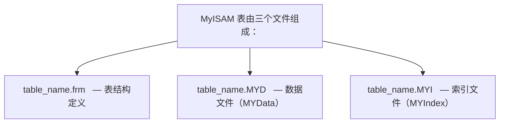

# 存储引擎 语法速查手册

> **符号约定**:`< >` 必填参数 | `[ ]` 可选参数

---

## 1. MyISAM 概述

MyISAM 是 MySQL 最早的默认存储引擎（5.5 之前），以简单高效著称，但不支持事务和行级锁。

### 1.1 核心特性

| 特性     | 说明                         |
| -------- | ---------------------------- |
| 事务支持 | 不支持                       |
| 锁粒度   | 表级锁                       |
| 外键     | 不支持                       |
| 崩溃恢复 | 需要手动修复（REPAIR TABLE） |
| 全文索引 | 支持                         |
| 空间索引 | 支持                         |
| 压缩表   | 支持（myisampack）           |
| MVCC     | 不支持                       |

### 1.2 存储文件



## 2. 表级锁机制

### 2.1 锁类型

| 锁类型 | 说明                 |
| ------ | -------------------- |
| 读锁   | 共享锁，多个读可并发 |
| 写锁   | 排他锁，独占表       |

### 2.2 锁兼容性

|      | 读锁 | 写锁 |
| ---- | ---- | ---- |
| 读锁 |      |      |
| 写锁 |      |      |

```sql
-- 手动加锁
LOCK TABLES employees READ;     -- 读锁
LOCK TABLES employees WRITE;    -- 写锁
UNLOCK TABLES;                  -- 释放所有锁

-- MyISAM 写操作自动加写锁
INSERT INTO myisam_table VALUES (1, 'test');
-- 整个表被锁定，其他连接无法读写
```

### 2.3 并发插入

```sql
-- MyISAM 支持并发插入（CONCURRENT INSERT）
-- 条件：表没有空洞（未删除过行）或使用动态行格式

-- 设置并发插入
ALTER TABLE myisam_table CONCURRENT_INSERT = 1;  -- 默认
-- = 0：禁止并发插入
-- = 1：无空洞时允许
-- = 2：始终允许（在表末尾插入）
```

## 3. 行格式

### 3.1 静态行格式（FIXED）

```sql
-- 所有列使用定长类型时使用静态行格式
CREATE TABLE fixed_table (
    id    INT NOT NULL,
    name  CHAR(50) NOT NULL,
    age   SMALLINT NOT NULL
) ENGINE = MyISAM ROW_FORMAT = FIXED;

-- 特点：
-- - 每行长度固定，查找速度快
-- - 可直接计算行位置
-- - 空间利用率低
```

### 3.2 动态行格式（DYNAMIC）

```sql
-- 包含变长列时使用动态行格式
CREATE TABLE dynamic_table (
    id    INT NOT NULL,
    name  VARCHAR(200),
    bio   TEXT
) ENGINE = MyISAM ROW_FORMAT = DYNAMIC;

-- 特点：
-- - 行长度可变，空间利用率高
-- - 更新可能导致行碎片
-- - 需要定期 OPTIMIZE TABLE
```

### 3.3 压缩行格式（COMPRESSED）

```bash
# 使用 myisampack 压缩只读表
myisampack table_name

# 压缩后表只读，空间节省 40%-70%
```

## 4. 全文索引

```sql
-- MyISAM 原生支持全文索引
CREATE FULLTEXT INDEX idx_content ON articles(title, content);

SELECT * FROM articles
WHERE MATCH(title, content) AGAINST('MySQL 索引');

-- 布尔模式
SELECT * FROM articles
WHERE MATCH(title, content) AGAINST('+MySQL +索引 -优化' IN BOOLEAN MODE);
```

## 5. 崩溃恢复

```sql
-- 检查表
CHECK TABLE myisam_table;

-- 修复表
REPAIR TABLE myisam_table;
REPAIR TABLE myisam_table EXTENDED;  -- 更彻底的修复

-- 优化表（消除碎片）
OPTIMIZE TABLE myisam_table;
```

## 6. MyISAM vs InnoDB

| 特性      | MyISAM           | InnoDB         |
| --------- | ---------------- | -------------- |
| 事务      | 不支持           | 支持           |
| 锁粒度    | 表级锁           | 行级锁         |
| 外键      | 不支持           | 支持           |
| 崩溃恢复  | 手动修复         | 自动恢复       |
| MVCC      | 不支持           | 支持           |
| 全文索引  | 支持             | 5.6+ 支持      |
| COUNT(\*) | 极快（存储行数） | 需要扫描       |
| 适用场景  | 读密集、不需事务 | 通用、事务场景 |

## 7. 适用场景

```sql
-- 适合 MyISAM 的场景：
-- 1. 只读或读多写少的表
-- 2. 不需要事务的日志表
-- 3. 需要全文索引（MySQL 5.5 之前）
-- 4. COUNT(*) 频繁且不需要精确的统计

-- 不适合 MyISAM 的场景：
-- 1. 需要事务的 OLTP 系统
-- 2. 高并发写入
-- 3. 需要外键约束
-- 4. 对数据安全要求高
```
## 引擎查看

**基本写法：查看服务器支持的引擎**
`SHOW ENGINES;`

```sql
-- 查看所有存储引擎及默认引擎
SHOW ENGINES;
```

**基本写法：查看当前默认引擎**
`SHOW VARIABLES LIKE 'default_storage_engine';`

```sql
-- 查看默认存储引擎（MySQL 8.0+ 默认 InnoDB）
SHOW VARIABLES LIKE 'default_storage_engine';
```

**基本写法：查看表使用的引擎**
`SHOW TABLE STATUS FROM <数据库名> [LIKE '<表名>'];`

```sql
-- 查看 mydb 库所有表的引擎
SHOW TABLE STATUS FROM mydb;
-- 查看指定表引擎
SHOW TABLE STATUS FROM mydb LIKE 'users';
```

---

## 引擎指定与修改

**基本写法：建表时指定引擎**
`CREATE TABLE <表名> (...) ENGINE = <引擎名>;`

```sql
-- 创建 InnoDB 表（默认）
CREATE TABLE orders (
  id BIGINT PRIMARY KEY,
  amount DECIMAL(10,2)
) ENGINE = InnoDB;

-- 创建 MyISAM 表（只读分析场景）
CREATE TABLE logs (
  id BIGINT PRIMARY KEY,
  msg TEXT
) ENGINE = MyISAM;
```

**基本写法：修改表引擎**
`ALTER TABLE <表名> ENGINE = <新引擎>;`

```sql
-- 将 MyISAM 表转为 InnoDB（支持事务）
ALTER TABLE logs ENGINE = InnoDB;
```

---

## InnoDB 配置

**基本写法：查看 InnoDB 状态**
`SHOW ENGINE INNODB STATUS;`

```sql
-- 查看 InnoDB 内部状态（锁、死锁、缓冲池等）
SHOW ENGINE INNODB STATUS\G
```

**基本写法：查看 InnoDB 缓冲池状态**
`SELECT * FROM information_schema.INNODB_BUFFER_POOL_STATS;`

```sql
-- 查看缓冲池命中率与页信息
SELECT
  pool_id, pool_size, free_buffers, database_pages,
  hit_rate FROM information_schema.INNODB_BUFFER_POOL_STATS;
```

**基本写法：查看 InnoDB 数据字典**
`SELECT * FROM information_schema.INNODB_TABLES WHERE name LIKE '<库>/<表>';`

```sql
-- 查看 InnoDB 内部表元数据
SELECT * FROM information_schema.INNODB_TABLES WHERE name LIKE 'mydb/users';
```

---

## 引擎特性对比命令

**基本写法：查看表行格式与特性**
`SHOW TABLE STATUS FROM <库> LIKE '<表>'\G`

```sql
-- 查看 orders 表的行格式、数据长度、索引长度等
SHOW TABLE STATUS FROM mydb LIKE 'orders'\G
```

**基本写法：查看 InnoDB 页大小**
`SHOW VARIABLES LIKE 'innodb_page_size';`

```sql
-- 查看 InnoDB 页大小（默认 16K）
SHOW VARIABLES LIKE 'innodb_page_size';
```

---

## MyISAM 与 MEMORY 操作

**基本写法：MyISAM 表检查**
`CHECK TABLE <表名> [QUICK|FAST|MEDIUM|EXTENDED];`

```sql
-- 检查 MyISAM 表完整性
CHECK TABLE logs MEDIUM;
```

**基本写法：MyISAM 表修复**
`REPAIR TABLE <表名> [QUICK|EXTENDED];`

```sql
-- 修复损坏的 MyISAM 表
REPAIR TABLE logs EXTENDED;
```

**基本写法：优化表（回收空间）**
`OPTIMIZE TABLE <表名> [, <表2> ...];`

```sql
-- 优化表回收碎片空间（8.4 需 OPTIMIZE_LOCAL_TABLE 权限才可免 binlog）
OPTIMIZE TABLE users, orders;
```

**基本写法：MEMORY 引擎建表**
`CREATE TABLE <表名> (...) ENGINE = MEMORY [MAX_ROWS = <行数>];`

```sql
-- 创建内存表（数据不持久化，重启丢失）
CREATE TABLE session_cache (
  sid VARCHAR(64) PRIMARY KEY,
  data TEXT
) ENGINE = MEMORY MAX_ROWS = 10000;
```

---

## 参考文献


MySQL 官方文档：https://dev.mysql.com/doc/
MySQL 8.0 参考手册：https://dev.mysql.com/doc/refman/8.0/en/
High Performance MySQL（O'Reilly）：https://www.oreilly.com/library/view/high-performance-mysql/
Percona 博客：https://www.percona.com/blog/

## 延伸阅读


MySQL 索引与优化，见 020-mysql 模块文档。
MySQL 日志体系，见 020-mysql 模块 redo/binlog 文档。
Redis 缓存与 MySQL 组合，见 022-redis 模块。
尚硅谷 Bilibili 空间（https://space.bilibili.com/302417610 ）提供 MySQL 高级课程。

## 深度专题扩展


以下专题从不同角度深入本文主题，供有进阶需求的读者研读。每个专题独立成节，内容相互补充。

### 13.1 InnoDB 日志与崩溃恢复

redo log 记录物理页修改（WAL：先写日志再写数据页），崩溃后重放恢复；环形文件组 + checkpoint 推进。
undo log 记录事务前镜像，支持回滚与 MVCC 版本链；purge 线程清理。
两阶段提交：redo prepare -> binlog -> redo commit，保证两份日志一致，主从不丢数据。
刷盘策略：innodb_flush_log_at_trx_commit=1 最安全（每次提交 fsync），2 每秒刷。

### 13.2 执行计划与优化器

EXPLAIN 关键列：type（const/ref/range/index/ALL）、key、rows、Extra（Using index/Using filesort）。
优化器基于统计信息选计划；analyze table 更新统计；hint（FORCE INDEX）谨慎使用。
排序与分组：filesort 优化为索引序；避免临时表。
慢查询治理流程：慢日志 -> 计划分析 -> 索引/改写 -> 验证。

## 模块文档速查表

| 文档 | 主题 | 与本文的关联 |
| --- | --- | --- |
| MySQL 概述与数据库设计 | 001-MySQLOverviewDatabaseDesign | 本文的前置基础 |
| MySQL 环境搭建 | 002-MySQLEnvSetup | 本文的前置基础 |
| MySQL 数据类型与约束 | 003-MySQLDataTypeConstraint | 本文的并列主题 |
| SQL 数据定义与高级对象 | 004-SQLDataDefinitionAdvanced | 本文的并列主题 |
| MyISAM存储引擎 | 005-MyISAMStorageEngine | 本文自身 |
| SQL 数据操作与查询 | 006-SQLDataOperationQuery | 本文的并列主题 |
| Memory存储引擎 | 007-MemoryStorageEngine | 本文的并列主题 |
| NDB-Cluster | 008-NDBCluster | 本文的并列主题 |
| 聚簇索引与二级索引 | 009-ClusteredIndexSecondaryIndex | 本文的并列主题 |
| 联合索引与最左前缀原则 | 010-CompositeIndexLeftmostPrefixPrinciple | 本文的并列主题 |
| 索引下推 | 011-IndexConditionPushdown | 本文的并列主题 |
| 全文索引 | 012-FullTextIndex | 本文的并列主题 |
| 前缀索引 | 013-PrefixIndex | 本文的并列主题 |
| 索引提示与强制索引 | 014-IndexHintForceIndex | 本文的并列主题 |
| 索引统计信息与直方图 | 015-IndexStatsHistogram | 本文的并列主题 |
| SQL 函数与高级查询 | 016-SQLFunctionAndAdvancedQuery | 本文的并列主题 |
| 索引失效场景 | 017-IndexFailureScene | 本文的并列主题 |
| EXPLAIN输出详解 | 018-EXPLAINDetailed | 本文的并列主题 |
| 慢查询日志 | 019-SlowQueryLog | 本文的并列主题 |
| 优化器追踪 | 020-OptimizerTrace | 本文的性能延伸 |
| 子查询优化 | 021-SubqueryOptimization | 本文的性能延伸 |
| 派生表优化 | 022-DerivedTableOptimization | 本文的性能延伸 |
| GROUP-BY与ORDER-BY优化 | 023-GroupByOrderByOptimization | 本文的性能延伸 |
| JOIN算法 | 024-JOINAlgorithm | 本文的并列主题 |
| 事务隔离级别底层实现 | 025-TransactionIsolationImplementation | 本文的并列主题 |
| MVCC原理 | 026-MVCCPrinciple | 本文的原理深化 |
| 多表联查详解 | 027-MultiTableJoinDetailed | 本文的并列主题 |
| 锁分类 | 028-LockClassification | 本文的并列主题 |
| 死锁检测与处理 | 029-DeadlockDetectionHandling | 本文的并列主题 |
| 分布式事务 | 030-DistributedTransaction | 本文的并列主题 |
| 二进制日志 | 031-Binlog | 本文的并列主题 |
| 重做日志 | 032-RedoLog | 本文的并列主题 |
| 撤销日志 | 033-UndoLog | 本文的并列主题 |
| 日志系统 | 034-LogSystem | 本文的并列主题 |
| 逻辑备份 | 035-LogicalBackup | 本文的并列主题 |
| 物理备份 | 036-PhysicalBackup | 本文的并列主题 |
| 基于时间点恢复 | 037-PITR | 本文的并列主题 |
| 主从复制 | 038-Replication | 本文的并列主题 |
| 进阶查询与多表操作 | 039-AdvancedQueryMultiTableOperation | 本文的并列主题 |
| GTID | 040-GTID | 本文的并列主题 |
| 并行复制 | 041-ParallelReplication | 本文的并列主题 |
| 组复制 | 042-GroupReplication | 本文的并列主题 |
| InnoDB-Cluster | 043-InnoDBCluster | 本文的并列主题 |
| 分区表 | 044-PartitionedTable | 本文的并列主题 |
| 分库分表中间件 | 045-ShardingMiddleware | 本文的并列主题 |
| 账户与权限管理 | 046-AccountPermissionManagement | 本文的安全延伸 |
| SSL-TLS加密 | 047-SSLEncryption | 本文的安全延伸 |
| 防火墙插件 | 048-FirewallPlugin | 本文的并列主题 |
| InnoDB体系架构 | 049-InnoDBSystemArchitecture | 本文的原理深化 |
| 数据加密 | 050-DataEncryption | 本文的安全延伸 |
| MySQL 索引与执行计划 | 051-MySQLIndexExecutionPlan | 本文的并列主题 |
| MySQL9新特性与并行查询 | 052-MySQL9NewFeaturesParallelQuery | 本文的并列主题 |
| VECTOR向量类型 | 053-VectorType | 本文的并列主题 |
| JSON模式验证与聚合函数 | 054-JSONSchemaValidationAggregate | 本文的并列主题 |
| 复制与高可用 | 055-ReplicationHA | 本文的并列主题 |
| 不可见索引 | 056-InvisibleIndex | 本文的并列主题 |
| 性能调优与安全 | 057-PerformanceTuningSecurity | 本文的性能延伸 |
| 函数索引 | 058-FunctionalIndex | 本文的并列主题 |
| 存储过程与函数 | 059-StoredProcedureAndFunction | 本文的并列主题 |
| MVCC快照读与当前读 | 060-MVCCSnapshotCurrentRead | 本文的并列主题 |
| 索引原理与性能优化 | 061-IndexPrinciplePerformanceOptimization | 本文的性能延伸 |
| 触发器与事件 | 062-TriggerEvent | 本文的并列主题 |
| Redo与Undo与Binlog写入时机 | 063-RedoUndoBinlogWriteTiming | 本文的并列主题 |
| 两阶段提交 | 064-TwoPhaseCommit | 本文的并列主题 |
| 间隙锁与临键锁解决幻读 | 065-GapLockNextKeyLockSolutionPhantomRead | 本文的并列主题 |
| 主从复制延迟原因与解决 | 066-ReplicationDelayCauseSolution | 本文的并列主题 |
| 分库分表策略 | 067-ShardingStrategy | 本文的并列主题 |
| JSON类型与JSON-TABLE | 068-JSONTypeJSONTable | 本文的并列主题 |
| 事务与锁机制 | 069-TransactionLockMechanism | 本文的原理深化 |
| MySQL 配置与运维 | 070-MySQLConfigOps | 本文的并列主题 |
| MySQL 快速查阅 | 071-MySQLQuickLookup | 本文的并列主题 |
| MySQL 控制器与应用 | 072-MySQLControlApplication | 本文的并列主题 |
| SQL 注入基础与检测 | 073-SQLInjectionBasicsDetection | 本文的前置基础 |
| SQL 注入攻击类型与实战 | 074-SQLInjectionAttackTypePractice | 本文的综合应用 |
| SQL 注入防御策略 | 075-SQLInjectionDefenseStrategy | 本文的并列主题 |
| MySQL 项目示例：电商数据库设计 | 076-MySQLProjectExampleDatabaseDesign | 本文的综合应用 |
| MySQL 理论知识点 | 077-MySQLTheoryKnowledge | 本文的并列主题 |
| MySQL DDL 数据定义 | 078-DDL | 本文的并列主题 |
| MySQL DML 数据操作 | 079-DML | 本文的并列主题 |
| MySQL DQL 查询速查 | 080-DQL | 本文的并列主题 |
| MySQL 索引管理 | 081-IndexManagement | 本文的并列主题 |
| MySQL 用户与权限管理 | 082-UserPermission | 本文的安全延伸 |
| MySQL CLI 命令 | 083-CLI | 本文的并列主题 |
| mysqladmin 管理命令 语法速查手册 | 084-Mysqladmin | 本文的并列主题 |
| 视图 语法速查手册 | 085-View | 本文的并列主题 |
| 事件调度器 语法速查手册 | 086-EventScheduler | 本文的并列主题 |
| 字符集与排序规则 语法速查手册 | 087-CharsetCollation | 本文的并列主题 |
