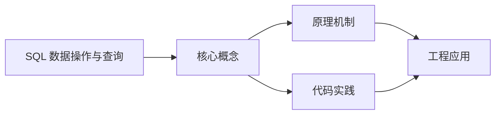
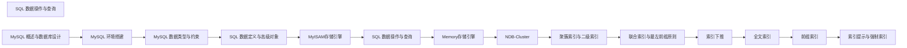

## 1. 学习目标（Bloom 分类）

本节按照布鲁姆教育目标分类学组织学习路径。本文主题为《SQL 数据操作与查询》，属于 MySQL 模块，读者可以根据自身阶段选择阅读深度。

记忆层面：能够准确复述本文的核心概念、术语与基本语法或操作步骤，并能够在提问或检索时快速定位对应知识点。能够说出 MySQL 的核心概念、语法与常用对象。

理解层面：能够用自己的语言解释核心原理与工作机制，说明概念之间的因果关系，而不是机械记忆结论。能够解释 MySQL 的执行原理与优化机制。

应用层面：能够在真实项目或练习场景中运用本文知识解决具体问题，写出正确且可维护的实现。能够编写正确、高效的 MySQL 语句与操作。

分析层面：能够拆解复杂问题，比较本文主题与相邻概念的异同，识别边界条件与例外情况。能够分析 MySQL 相关方案在性能与一致性上的权衡。

评价层面：能够根据约束条件（性能、可读性、安全、成本）评价不同方案的优劣，做出有依据的技术决策。能够根据业务场景评价 MySQL 技术选型。

创造层面：能够把本文知识与其他模块知识组合，设计出新的解决方案或可复用的工程模式。能够组合 MySQL 与其他技术设计数据架构。

通过本节学习，读者应当能够把《SQL 数据操作与查询》纳入自己的知识网络，并与 MySQL 模块的其他主题（InnoDB、索引、日志、主从、性能调优）建立关联。

## 2. 历史动机与发展脉络

《SQL 数据操作与查询》是 MySQL 领域的重要主题。要真正理解它，需要先了解它解决的问题与演进过程。

MySQL 于 1995 年由 MySQL AB 发布，2008 年被 Sun 收购，2010 年随 Sun 并入 Oracle；MariaDB 是社区分支。
MySQL 8.0（2018）重写优化器、引入窗口函数与 CTE、默认 utf8mb4、数据字典升级；MySQL 8.4 与 9.x 继续演进（Oracle 创新版 + LTS 双轨）。
InnoDB 是默认存储引擎：事务、行锁、MVCC、崩溃恢复（redo/undo）；MyISAM 仅存于历史场景。

回到本文主题：SQL 数据操作与查询 的提出与成熟，正是上述技术背景下的必然产物。早期实现往往以简单可用为目标，随着工程规模扩大，社区逐渐沉淀出标准做法与最佳实践；理解这一脉络，可以帮助读者判断“为什么文档中的推荐写法是现在这个样子”，也能在遇到历史遗留代码时准确识别其设计年代与取舍。


## 3. 形式化定义与核心概念精讲

本节把《SQL 数据操作与查询》涉及的核心概念以“定义 + 讲解”的形式展开。读者应把定义当作工具，把讲解当作理解路径；两者结合才能形成可迁移的知识。

InnoDB 架构：缓冲池（Buffer Pool）、日志缓冲、redo/undo 日志；脏页刷盘与 checkpoint 机制。
索引：B+ 树主键聚集索引、二级索引、覆盖索引；索引下推（ICP）与 MRR 优化。
事务与锁：两阶段锁、间隙锁/临键锁（可重复读防幻读）、MVCC 快照读；隔离级别。

### 3.1 原文章节逐一精讲

原文档把主题拆分为 12 个小节，下面按顺序给出每一节的导读讲解，随后保留原文细节供精读。

#### 原文精读（完整保留）

# MySQL SQL 数据操作与查询

> **符号约定**：`< >` 必填参数 | `[ ]` 可选参数

---

#### 1. SQL 概述

##### 1.1 SQL 是什么

SQL（Structured Query Language，结构化查询语言）是一种用于管理关系型数据库的标准编程语言。SQL 由 IBM 在 1970 年代开发，后来成为 ANSI（美国国家标准协会）和 ISO（国际标准化组织）的标准。

##### 1.2 SQL 语句分类

| 分类    | 全称                         | 说明                             | 典型语句               |
| :------ | :--------------------------- | :------------------------------- | :--------------------- |
| **DDL** | Data Definition Language     | 数据定义语言，用于定义数据库对象 | CREATE、ALTER、DROP    |
| **DML** | Data Manipulation Language   | 数据操作语言，用于操作数据       | INSERT、UPDATE、DELETE |
| **DQL** | Data Query Language          | 数据查询语言，用于查询数据       | SELECT                 |
| **DCL** | Data Control Language        | 数据控制语言，用于控制权限       | GRANT、REVOKE          |
| **TCL** | Transaction Control Language | 事务控制语言，用于管理事务       | COMMIT、ROLLBACK       |

##### 1.3 SQL 基本规则

- SQL 语句以分号 `;` 结尾
- SQL 不区分大小写（但习惯上关键字大写）
- 字符串值使用单引号 `' '` 包裹
- 注释使用 `--` 或 `/* */`

#### 2. DML (数据操作语言) - Data Manipulation Language

DML 用于插入、更新、删除数据。

##### 2.1 插入数据详解

###### 2.1.1 基本 INSERT

```sql
 -
 inSERT INTO users (id, username, email, password, age)
 VALUES (1, '张三', 'zhangsan@example.com', 'encrypted_pass', 25);
 -
 inSERT INTO users (username, email, password, age)
 VALUES ('张三', 'zhangsan@example.com', 'encrypted_pass', 25);
 -
 inSERT INTO users SET
  username = '李四',
  email = 'lisi@example.com',
  password = 'encrypted_pass',
  age = 30;
```

###### 2.1.2 批量插入

```sql
 -
 inSERT INTO users (username, email, password, age) VALUES
 ('王五', 'wangwu@example.com', 'pass1', 28),
 ('赵六', 'zhaoliu@example.com', 'pass2', 32),
 ('钱七', 'qianqi@example.com', 'pass3', 27);
 -
 inSERT INTO users (username, email) VALUES
 ('孙八', 'sunba@example.com'),
 ('周九', 'zhoujiu@example.com');
```

###### 2.1.3 插入查询结果

```sql
 -
 inSERT INTO users (username, email, password, age)
 SELECT username, email, password, age FROM old_users WHERE status = 1;
 -
 inSERT IGNORE INTO users (username, email)
 SELECT username, email FROM temp_users;
```

###### 2.1.4 INSERT 高级用法

```sql
 -
 inSERT INTO users (id, username, email) VALUES (1, '张三', 'new_email@example.com')
 ON DUPLICATE KEY UPDATE email = 'new_email@example.com', updated_at = NOW();
 -
 inSERT IGNORE INTO users (username, email) VALUES ('张三', 'test@example.com');
 -
 replace INTO users (id, username, email) VALUES (1, '张三', 'new_email@example.com');
 -
 inSERT INTO users (username, email) VALUES ('测试', 'test@example.com');
 SELECT LAST_INSERT_ID();
```

##### 2.2 更新数据详解

###### 2.2.1 基本 UPDATE

```sql
 -
 UPDATE users SET age = 26 WHERE id = 1;
 -
 UPDATE users SET age = age + 1 WHERE age < 30;
 -
 UPDATE users
 SET age = 27, email = 'new_email@example.com', updated_at = NOW()
 WHERE id = 1;
```

###### 2.2.2 UPDATE 高级用法

```sql
 -
 UPDATE users u
 JOIN user_profiles p ON u.id = p.user_id
 SET u.avatar = p.avatar_url, u.status = p.status
 WHERE u.id = 1;
 -
 UPDATE users
 SET balance = (SELECT SUM(amount) FROM orders WHERE user_id = users.id)
 WHERE id = 1;
 -
 UPDATE users SET last_login_time = NOW() WHERE last_login_time IS NULL;
 -
 START TRANSACTION;
 UPDATE accounts SET balance = balance - 100 WHERE id = 1;
 UPDATE accounts SET balance = balance + 100 WHERE id = 2;
 commit;
```

###### 2.2.3 UPDATE 实战示例

```sql
 -
 UPDATE employees_info SET Employees_name = '王西' WHERE Employees_id = 'xz100101';
 -
 UPDATE employees_info SET Post_id = 'xs1001' WHERE Employees_id = 'xs100103';
 -
 UPDATE customer_info
 SET Customer_name = '柳甜', Customer_Birth = NULL, Telephone = '13879008942'
 WHERE Customer_name = '柳田';
 -
 UPDATE sales_list SET Sales_Number = Sales_Number + 5 WHERE Sales_Number < 10;
 -
 UPDATE orders SET status = 3, shipped_at = NOW() WHERE status = 2 AND shipped_at IS NULL;
```

##### 2.3 删除数据详解

###### 2.3.1 基本 DELETE

```sql
 -
 delete FROM users WHERE id = 1;
 -
 delete FROM users WHERE status = 0 AND created_at < '2024-01-01';
 -
 delete FROM users;
 -
 delete FROM users ORDER BY created_at DESC LIMIT 10;
```

###### 2.3.2 DELETE 高级用法

```sql
 -
 delete u FROM users u
 JOIN inactive_users i ON u.email = i.email
 WHERE u.status = 0;
 -
 delete FROM users WHERE id IN (SELECT user_id FROM old_users WHERE created_at < '2023-01-01');
 -
 delete FROM users WHERE id = 1; -- 订单表中的相关记录会自动删除
```

###### 2.3.3 DELETE 与 TRUNCATE 区别

| 特性   | DELETE             | TRUNCATE             |
| :----- | :----------------- | :------------------- |
| 速度   | 慢（一行一行删除） | 快（直接删除数据页） |
| 事务   | 记录日志，可回滚   | 不记录日志，不可回滚 |
| 自增ID | 不会重置           | 重置为 1             |
| WHERE  | 支持               | 不支持               |
| 触发器 | 触发 DELETE 触发器 | 不触发               |

###### 2.3.4 DELETE 实战示例

```sql
 -
 delete FROM mark WHERE studentno = 'xx100104' AND courseno = 'kc1002';
 -
 delete FROM orders WHERE status = 5 AND created_at < DATE_SUB(NOW(), INTERVAL 30 DAY);
 -
 delete FROM logs WHERE created_at < DATE_SUB(NOW(), INTERVAL 3 MONTH);
```

##### 2.4 数据操作最佳实践

```sql
 -
 SELECT * FROM users WHERE id = 1 FOR UPDATE;
 -
 START TRANSACTION;
 UPDATE users SET status = 0 WHERE last_login_time < '2023-01-01';
 UPDATE stats SET inactive_users = inactive_users + 1;
 commit;
 -
 EXPLAIN UPDATE users SET status = 0 WHERE last_login_time < '2023-01-01';
 -
 delete FROM logs WHERE created_at < '2023-01-01' LIMIT 1000;
```

#### 3. DQL (数据查询语言) - Data Query Language

DQL 是最重要的 SQL 部分，用于从数据库中查询数据。

##### 3.1 基础查询详解

###### 3.1.1 SELECT 基础语法

```sql
 -
 SELECT * FROM users;
 -
 SELECT id, username, email FROM users;
 -
 SELECT username, price, quantity, price * quantity AS total FROM order_items;
 -
 SELECT
  id AS user_id,
  username AS name,
  email AS "邮箱地址"
 from users;
 -
 SELECT
  username,
  price,
  quantity,
  price * quantity AS subtotal,
  price * quantity * 0.1 AS tax
 from order_items;
 -
 SELECT DISTINCT status FROM users;
 SELECT DISTINCT province, city FROM addresses;
```

###### 3.1.2 列类型转换

```sql
 -
 SELECT CONCAT(username, ' (', email, ')') AS user_info FROM users;
 SELECT CONCAT_WS(' - ', province, city, district) AS full_address FROM addresses;
 -
 SELECT CAST(price AS CHAR) FROM products;
 SELECT CONVERT(price, CHAR) FROM products;
 SELECT DATE_FORMAT(created_at, '%Y年%m月%d日') AS formatted_date FROM users;
```

##### 3.2 条件查询详解

###### 3.2.1 WHERE 子句

```sql
 -
 SELECT * FROM users WHERE age > 25;
 SELECT * FROM users WHERE age >= 25;
 SELECT * FROM users WHERE age < 30;
 SELECT * FROM users WHERE age <= 30;
 SELECT * FROM users WHERE age = 25;
 SELECT * FROM users WHERE age != 25;
 SELECT * FROM users WHERE age <> 25;
```

###### 3.2.2 逻辑运算符

```sql
 -
 SELECT * FROM users WHERE age > 25 AND status = 1;
 SELECT * FROM users WHERE age > 20 AND age < 30 AND gender = '男';
 -
 SELECT * FROM users WHERE status = 1 OR status = 2;
 SELECT * FROM users WHERE username = '张三' OR username = '李四';
 -
 SELECT * FROM users WHERE NOT status = 0;
 SELECT * FROM users WHERE NOT (age < 20 OR age > 30);
 -
 SELECT * FROM users
 WHERE (age > 25 AND status = 1) OR (age < 20 AND status = 2);
```

###### 3.2.3 范围查询

```sql
 -
 SELECT * FROM users WHERE age BETWEEN 20 AND 30;
 SELECT * FROM users WHERE created_at BETWEEN '2024-01-01' AND '2024-12-31';
 -
 SELECT * FROM users WHERE age NOT BETWEEN 20 AND 30;
```

###### 3.2.4 IN 和 NOT IN

```sql
 -
 SELECT * FROM users WHERE status IN (1, 2, 3);
 SELECT * FROM users WHERE username IN ('张三', '李四', '王五');
 -
 SELECT * FROM users WHERE id IN (SELECT user_id FROM vip_users);
 -
 SELECT * FROM users WHERE status NOT IN (0, -1);
```

###### 3.2.5 LIKE 模糊查询

```sql
 -
 SELECT * FROM users WHERE username LIKE '张%'; -- 以张开头
 SELECT * FROM users WHERE username LIKE '%张%'; -- 包含张
 SELECT * FROM users WHERE username LIKE '%张'; -- 以张结尾
 -
 SELECT * FROM users WHERE username LIKE '张_'; -- 张后面一个字
 SELECT * FROM users WHERE username LIKE '__张'; -- 张前面两个字
 -
 SELECT * FROM users WHERE phone LIKE '138%'; -- 手机号以138开头
 SELECT * FROM users WHERE email LIKE '%@gmail.com'; -- Gmail邮箱
 -
 SELECT * FROM users WHERE username NOT LIKE '%admin%';
 -
 SELECT * FROM users WHERE username LIKE '%100%%' ESCAPE '%';
```

###### 3.2.6 NULL 值查询

```sql
 -
 SELECT * FROM users WHERE email IS NULL;
 SELECT * FROM users WHERE deleted_at IS NULL;
 -
 SELECT * FROM users WHERE email IS NOT NULL;
 -
 -
 -
```

###### 3.2.7 条件查询实战

```sql
 -
 SELECT * FROM employees_info WHERE Employees_sex = '女';
 -
 SELECT * FROM employees_info WHERE Employees_sex = '女' AND Hiredate < '2015-01-01';
 -
 SELECT *, YEAR(NOW()) - YEAR(Hiredate) AS 工龄
 from employees_info
 WHERE YEAR(NOW()) - YEAR(Hiredate) > 15;
 -
 SELECT * FROM employees_info WHERE Post_id BETWEEN 'cg1001' AND 'hr1001';
 -
 SELECT * FROM employees_info WHERE Post_id IN ('cg1001', 'hr1001');
 -
 SELECT * FROM employees_info WHERE Employees_name LIKE '%王%';
 -
 SELECT *, YEAR(NOW()) - YEAR(Customer_Birth) AS 年龄
 from customer_info
 WHERE YEAR(NOW()) - YEAR(Customer_Birth) > 30;
 -
 SELECT * FROM customer_info WHERE Customer_Birth IS NULL;
```

##### 3.3 排序与分页详解

###### 3.3.1 ORDER BY 排序

```sql
 -
 SELECT * FROM users ORDER BY age ASC;
 SELECT * FROM users ORDER BY age; -- 默认升序
 -
 SELECT * FROM users ORDER BY created_at DESC;
 -
 SELECT * FROM users ORDER BY status ASC, age DESC;
 -
 SELECT *, age * 365 AS days_alive FROM users ORDER BY days_alive DESC;
 -
 SELECT *, price * quantity AS subtotal FROM order_items ORDER BY subtotal DESC;
 -
 SELECT id, username, email FROM users ORDER BY 3; -- 按第3列排序
```

###### 3.3.2 LIMIT 分页

```sql
 -
 SELECT * FROM users LIMIT 10;
 -
 SELECT * FROM users LIMIT 10 OFFSET 10;
 SELECT * FROM users LIMIT 10, 10; -- 简写形式
 -
 SELECT * FROM users ORDER BY id DESC LIMIT 5;
 -
 -
 SELECT * FROM users ORDER BY id LIMIT 10 OFFSET 0;
 -
 SELECT * FROM users ORDER BY id LIMIT 10 OFFSET 10;
 -
 SELECT * FROM users ORDER BY id LIMIT 10 OFFSET 20;
 -
 SELECT * FROM users LIMIT 1;
```

##### 3.4 分组查询详解

###### 3.4.1 GROUP BY 基础

```sql
 -
 SELECT status, COUNT(*) AS count FROM users GROUP BY status;
 -
 SELECT province, city, COUNT(*) AS count FROM users GROUP BY province, city;
 -
 SELECT status, AVG(age) AS avg_age FROM users GROUP BY status;
 -
 SELECT status, SUM(balance) AS total_balance FROM users GROUP BY status;
```

###### 3.4.2 HAVING 子句

HAVING 用于过滤分组后的结果，WHERE 用于过滤分组前的记录。

```sql
 -
 SELECT status, COUNT(*) AS count
 from users
 GROUP BY status
 HAVING count > 10;
 -
 SELECT status, AVG(age) AS avg_age, COUNT(*) AS count
 from users
 WHERE age > 0 -- 先过滤
 GROUP BY status -- 再分组
 HAVING count > 5; -- 最后过滤分组结果
 -
 SELECT status, COUNT(*) AS count, AVG(age) AS avg_age
 from users
 GROUP BY status
 HAVING count > 10 AND avg_age > 25;
```

###### 3.4.3 GROUP BY 实战

```sql
 -
 SELECT COUNT(Customer_name) AS 人数, Customer_sex AS 性别
 from customer_info GROUP BY Customer_sex;
 -
 SELECT Commodity_id, SUM(Sales_Number) AS 总数
 from sales_list GROUP BY Commodity_id;
 -
 SELECT Commodity_id, AVG(Sales_price) AS 平均售价
 from sales_list
 GROUP BY Commodity_id
 HAVING AVG(Sales_price) > 1500;
 -
 SELECT Commodity_id, SUM(Sales_Number) AS 总数量
 from sales_list
 GROUP BY Commodity_id
 HAVING SUM(Sales_Number) > 50;
```

###### 3.4.4 GROUP BY 注意事项

```sql
 -
 -
 -
 -
 -
 SELECT status, COUNT(*) FROM users GROUP BY status;
 SELECT ANY_VALUE(id), status, COUNT(*) FROM users GROUP BY status;
```

##### 3.5 聚合函数详解

###### 3.5.1 常用聚合函数

| 函数         | 说明       | 示例                                             |
| :----------- | :--------- | :----------------------------------------------- |
| COUNT        | 计数       | COUNT(\*)、COUNT(column)、COUNT(DISTINCT column) |
| SUM          | 求和       | SUM(price)、SUM(quantity)                        |
| AVG          | 平均值     | AVG(price)                                       |
| MAX          | 最大值     | MAX(price)、MAX(created_at)                      |
| MIN          | 最小值     | MIN(price)、MIN(created_at)                      |
| GROUP_CONCAT | 拼接字符串 | GROUP_CONCAT(username SEPARATOR ',')             |

###### 3.5.2 COUNT 用法

```sql
 -
 SELECT COUNT(*) FROM users;
 -
 SELECT COUNT(email) FROM users;
 -
 SELECT COUNT(DISTINCT status) FROM users;
 SELECT COUNT(DISTINCT province, city) FROM users;
```

###### 3.5.3 聚合函数综合示例

```sql
 -
 SELECT SUM(Purchase_price * Purchase_Number) AS 总成本 FROM purchase_list;
 -
 SELECT
  AVG(Purchase_Number) AS 平均采购数量,
  MAX(Purchase_Number) AS 最大采购数量,
  MIN(Purchase_Number) AS 最小采购数量
 from purchase_list;
 -
 SELECT
  Purchase_id,
  SUM(Purchase_Number) AS 总量,
  AVG(Purchase_Number) AS 平均,
  MAX(Purchase_Number) AS 最大,
  MIN(Purchase_Number) AS 最小
 from purchase_list
 GROUP BY Purchase_id;
```

---

#### 延伸阅读

- [Pandas 数据操作](data-analysis/pandas)
#### 插入数据

**单行写法：指定列插入单行**
`INSERT INTO <表名> (<列名>[, <列名>...]) VALUES (<值>[, <值>...])`
```sql
-- 指定列插入单行数据
INSERT INTO users (id, username, email, password, age)
VALUES (1, '张三', 'zhangsan@example.com', 'encrypted_pass', 25);
```

**单行写法：省略自增列插入**
`INSERT INTO <表名> (<非自增列>[, ...]) VALUES (<值>[, ...])`
```sql
-- 省略自增主键列插入数据
INSERT INTO users (username, email, password, age)
VALUES ('张三', 'zhangsan@example.com', 'encrypted_pass', 25);
```

**换行写法：SET 语法插入**
`INSERT INTO <表名> SET <列名> = <值>[, <列名> = <值>...]`
```sql
-- 使用 SET 形式插入数据
INSERT INTO users SET
  username = '李四',
  email = 'lisi@example.com',
  password = 'encrypted_pass',
  age = 30;
```

**换行写法：批量插入多行**
`INSERT INTO <表名> (<列名>) VALUES (<值1>), (<值2>)[, ...]`
```sql
-- 批量插入多行数据
INSERT INTO users (username, email, password, age) VALUES
('王五', 'wangwu@example.com', 'pass1', 28),
('赵六', 'zhaoliu@example.com', 'pass2', 32),
('钱七', 'qianqi@example.com', 'pass3', 27);
```

**换行写法：插入查询结果**
`INSERT INTO <表名> (<列名>) SELECT <列名> FROM <源表> [WHERE <条件>]`
```sql
-- 从旧表迁移符合条件的数据
INSERT INTO users (username, email, password, age)
SELECT username, email, password, age FROM old_users WHERE status = 1;
```

**换行写法：插入或更新**
`INSERT INTO <表名> (<列名>) VALUES (<值>) ON DUPLICATE KEY UPDATE <列名> = <值>`
```sql
-- 主键冲突时更新指定字段
INSERT INTO users (id, username, email) VALUES (1, '张三', 'new@example.com')
ON DUPLICATE KEY UPDATE email = 'new@example.com', updated_at = NOW();
```

**单行写法：忽略冲突插入**
`INSERT IGNORE INTO <表名> (<列名>) VALUES (<值>)`
```sql
-- 主键冲突时跳过插入
INSERT IGNORE INTO users (username, email) VALUES ('张三', 'test@example.com');
```

**单行写法：替换插入**
`REPLACE INTO <表名> (<列名>) VALUES (<值>)`
```sql
-- 主键冲突时删除原行再插入
REPLACE INTO users (id, username, email) VALUES (1, '张三', 'new@example.com');
```

**单行写法：获取自增 ID**
`SELECT LAST_INSERT_ID();`
```sql
-- 插入后获取自增主键值
SELECT LAST_INSERT_ID();
```

---

#### 更新数据

**单行写法：更新单列**
`UPDATE <表名> SET <列名> = <值> WHERE <条件>`
```sql
-- 更新指定行的单列
UPDATE users SET age = 26 WHERE id = 1;
```

**单行写法：基于原值更新**
`UPDATE <表名> SET <列名> = <列名> <运算符> <值> WHERE <条件>`
```sql
-- 基于原值进行累加更新
UPDATE users SET age = age + 1 WHERE age < 30;
```

**换行写法：多列更新**
`UPDATE <表名> SET <列名> = <值>[, <列名> = <值>...] WHERE <条件>`
```sql
-- 同时更新多个字段
UPDATE users
SET age = 27, email = 'new@example.com', updated_at = NOW()
WHERE id = 1;
```

**换行写法：JOIN 关联更新**
`UPDATE <表1> [AS <别名>] JOIN <表2> [AS <别名>] ON <条件> SET <列名> = <值>`
```sql
-- 关联其他表更新数据
UPDATE users u
JOIN user_profiles p ON u.id = p.user_id
SET u.avatar = p.avatar_url, u.status = p.status
WHERE u.id = 1;
```

**换行写法：子查询更新**
`UPDATE <表名> SET <列名> = (SELECT <聚合> FROM <表> WHERE <条件>)`
```sql
-- 用子查询结果更新字段
UPDATE users
SET balance = (SELECT SUM(amount) FROM orders WHERE user_id = users.id)
WHERE id = 1;
```

---

#### 删除数据

**单行写法：条件删除**
`DELETE FROM <表名> WHERE <条件>`
```sql
-- 删除符合条件的行
DELETE FROM users WHERE id = 1;
```

**单行写法：范围删除**
`DELETE FROM <表名> WHERE <条件1> AND <条件2>`
```sql
-- 删除符合多条件的行
DELETE FROM users WHERE status = 0 AND created_at < '2024-01-01';
```

**单行写法：排序后删除指定行数**
`DELETE FROM <表名> ORDER BY <列名> [ASC|DESC] LIMIT <行数>`
```sql
-- 按排序删除前 N 行
DELETE FROM users ORDER BY created_at DESC LIMIT 10;
```

**换行写法：JOIN 关联删除**
`DELETE <别名> FROM <表1> [AS <别名>] JOIN <表2> [AS <别名>] ON <条件> WHERE <条件>`
```sql
-- 关联其他表删除数据
DELETE u FROM users u
JOIN inactive_users i ON u.email = i.email
WHERE u.status = 0;
```

**换行写法：子查询删除**
`DELETE FROM <表名> WHERE <列名> IN (SELECT <列名> FROM <表> WHERE <条件>)`
```sql
-- 用子查询结果删除数据
DELETE FROM users WHERE id IN (SELECT user_id FROM old_users WHERE created_at < '2023-01-01');
```

**单行写法：清空表**
`TRUNCATE TABLE <表名>`
```sql
-- 清空表数据并重置自增值
TRUNCATE TABLE users;
```

---

#### 基础查询

**单行写法：查询所有列**
`SELECT * FROM <表名>`
```sql
-- 查询表中所有字段
SELECT * FROM users;
```

**单行写法：查询指定列**
`SELECT <列名>[, <列名>...] FROM <表名>`
```sql
-- 查询指定列数据
SELECT id, username, email FROM users;
```

**单行写法：列别名**
`SELECT <列名> [AS] <别名>`
```sql
-- 使用别名查询字段
SELECT username AS name, email AS "邮箱地址" FROM users;
```

**单行写法：计算列别名**
`SELECT <表达式> AS <别名>`
```sql
-- 计算列并设置别名
SELECT price, quantity, price * quantity AS total FROM order_items;
```

**单行写法：单列去重**
`SELECT DISTINCT <列名> FROM <表名>`
```sql
-- 查询单列去重结果
SELECT DISTINCT status FROM users;
```

**单行写法：多列去重**
`SELECT DISTINCT <列名1>, <列名2>[, ...] FROM <表名>`
```sql
-- 查询多列组合去重结果
SELECT DISTINCT province, city FROM addresses;
```

---

#### 条件查询

**单行写法：大于比较**
`WHERE <列名> > <值>`
```sql
-- 查询年龄大于 25 的用户
SELECT * FROM users WHERE age > 25;
```

**单行写法：大于等于比较**
`WHERE <列名> >= <值>`
```sql
-- 查询年龄大于等于 25 的用户
SELECT * FROM users WHERE age >= 25;
```

**单行写法：小于比较**
`WHERE <列名> < <值>`
```sql
-- 查询年龄小于 30 的用户
SELECT * FROM users WHERE age < 30;
```

**单行写法：不等于比较**
`WHERE <列名> <!=|<>> <值>`
```sql
-- 查询年龄不等于 25 的用户
SELECT * FROM users WHERE age != 25;
```

**单行写法：AND 逻辑与**
`WHERE <条件1> AND <条件2>`
```sql
-- 查询同时满足多条件的用户
SELECT * FROM users WHERE age > 25 AND status = 1;
```

**单行写法：OR 逻辑或**
`WHERE <条件1> OR <条件2>`
```sql
-- 查询满足任一条件的用户
SELECT * FROM users WHERE status = 1 OR status = 2;
```

**单行写法：NOT 逻辑非**
`WHERE NOT <条件>`
```sql
-- 查询不满足条件的用户
SELECT * FROM users WHERE NOT status = 0;
```

**换行写法：括号组合条件**
`WHERE (<条件1> AND <条件2>) OR (<条件3> AND <条件4>)`
```sql
-- 使用括号组合复杂条件
SELECT * FROM users
WHERE (age > 25 AND status = 1) OR (age < 20 AND status = 2);
```

**单行写法：数值范围查询**
`WHERE <列名> [NOT] BETWEEN <起始> AND <结束>`
```sql
-- 查询年龄在 20 到 30 之间的用户
SELECT * FROM users WHERE age BETWEEN 20 AND 30;
```

**单行写法：日期范围查询**
`WHERE <日期列> BETWEEN '<起始日期>' AND '<结束日期>'`
```sql
-- 查询指定日期范围内的用户
SELECT * FROM users WHERE created_at BETWEEN '2024-01-01' AND '2024-12-31';
```

**单行写法：IN 多值匹配**
`WHERE <列名> [NOT] IN (<值1>, <值2>[, ...])`
```sql
-- 查询状态为指定值的用户
SELECT * FROM users WHERE status IN (1, 2, 3);
```

**单行写法：IN 子查询**
`WHERE <列名> IN (SELECT <列名> FROM <表名>)`
```sql
-- 查询属于 VIP 用户表的用户
SELECT * FROM users WHERE id IN (SELECT user_id FROM vip_users);
```

**单行写法：前缀模糊查询**
`WHERE <列名> [NOT] LIKE '<前缀>%'`
```sql
-- 查询以指定字符开头的用户名
SELECT * FROM users WHERE username LIKE '张%';
```

**单行写法：包含模糊查询**
`WHERE <列名> LIKE '%<子串>%'`
```sql
-- 查询包含指定字符的用户名
SELECT * FROM users WHERE username LIKE '%张%';
```

**单行写法：单字符匹配模糊查询**
`WHERE <列名> LIKE '<前缀>_'`
```sql
-- 查询指定前缀加单字符的用户名
SELECT * FROM users WHERE username LIKE '张_';
```

**单行写法：指定转义符模糊查询**
`WHERE <列名> LIKE '<模式>' ESCAPE '<转义符>'`
```sql
-- 使用指定转义符查询包含百分号的数据
SELECT * FROM users WHERE username LIKE '%100\%%' ESCAPE '\';
```

**单行写法：查询空值**
`WHERE <列名> IS NULL`
```sql
-- 查询邮箱为空的用户
SELECT * FROM users WHERE email IS NULL;
```

**单行写法：查询非空值**
`WHERE <列名> IS NOT NULL`
```sql
-- 查询已删除的用户
SELECT * FROM users WHERE deleted_at IS NOT NULL;
```

---

#### 排序与分页

**单行写法：升序排序**
`ORDER BY <列名> ASC`
```sql
-- 按年龄升序排序
SELECT * FROM users ORDER BY age ASC;
```

**单行写法：降序排序**
`ORDER BY <列名> DESC`
```sql
-- 按创建时间降序排序
SELECT * FROM users ORDER BY created_at DESC;
```

**单行写法：多列排序**
`ORDER BY <列名1> [ASC|DESC], <列名2> [ASC|DESC]`
```sql
-- 先按状态升序再按年龄降序排序
SELECT * FROM users ORDER BY status ASC, age DESC;
```

**单行写法：按列位置排序**
`ORDER BY <列位置序号>`
```sql
-- 按查询列的位置序号排序
SELECT id, username, email FROM users ORDER BY 3;
```

**单行写法：取前 N 行**
`LIMIT <行数>`
```sql
-- 取前 10 行数据
SELECT * FROM users LIMIT 10;
```

**单行写法：分页查询**
`LIMIT <行数> OFFSET <偏移>`
```sql
-- 查询第 2 页数据（每页 10 行）
SELECT * FROM users LIMIT 10 OFFSET 10;
```

**单行写法：分页简写形式**
`LIMIT <偏移>, <行数>`
```sql
-- 使用简写形式分页查询
SELECT * FROM users LIMIT 10, 10;
```

**单行写法：排序后取前 N 行**
`SELECT * FROM <表名> ORDER BY <列名> [DESC] LIMIT <行数>`
```sql
-- 按降序排序后取前 5 行
SELECT * FROM users ORDER BY id DESC LIMIT 5;
```

---

#### 分组查询

**换行写法：单列分组统计**
`SELECT <分组列>, <聚合函数>(<列名>) FROM <表名> GROUP BY <分组列>`
```sql
-- 按状态分组统计用户数量
SELECT status, COUNT(*) AS count FROM users GROUP BY status;
```

**换行写法：多列分组统计**
`SELECT <列名1>, <列名2>, <聚合函数>(<列名>) FROM <表名> GROUP BY <列名1>, <列名2>`
```sql
-- 按省份和城市分组统计用户数量
SELECT province, city, COUNT(*) AS count FROM users GROUP BY province, city;
```

**换行写法：分组求平均值**
`SELECT <分组列>, AVG(<列名>) FROM <表名> GROUP BY <分组列>`
```sql
-- 按状态分组求平均年龄
SELECT status, AVG(age) AS avg_age FROM users GROUP BY status;
```

**换行写法：分组过滤**
`SELECT <列名> FROM <表名> GROUP BY <列名> HAVING <过滤条件>`
```sql
-- 过滤分组结果只保留数量大于 10 的组
SELECT status, COUNT(*) AS count
FROM users
GROUP BY status
HAVING count > 10;
```

**换行写法：WHERE 与 HAVING 组合**
`SELECT <列名> FROM <表名> WHERE <条件> GROUP BY <列名> HAVING <过滤条件>`
```sql
-- 先过滤行再分组最后过滤分组
SELECT status, AVG(age) AS avg_age, COUNT(*) AS count
FROM users
WHERE age > 0
GROUP BY status
HAVING count > 5 AND avg_age > 25;
```

---

#### 聚合函数

**单行写法：总行数计数**
`COUNT(*)`
```sql
-- 统计表的总行数
SELECT COUNT(*) FROM users;
```

**单行写法：非空计数**
`COUNT(<列名>)`
```sql
-- 统计邮箱非空的行数
SELECT COUNT(email) FROM users;
```

**单行写法：去重计数**
`COUNT(DISTINCT <列名>)`
```sql
-- 统计状态去重后的数量
SELECT COUNT(DISTINCT status) FROM users;
```

**单行写法：求和**
`SUM(<列名>)`
```sql
-- 统计所有用户余额总和
SELECT SUM(balance) AS total_balance FROM users;
```

**单行写法：求平均值**
`AVG(<列名>)`
```sql
-- 统计用户平均年龄
SELECT AVG(age) AS avg_age FROM users;
```

**单行写法：求最大值**
`MAX(<列名>)`
```sql
-- 查询商品最高价格
SELECT MAX(price) AS max_price FROM products;
```

**单行写法：求最小值**
`MIN(<列名>)`
```sql
-- 查询商品最低价格
SELECT MIN(price) AS min_price FROM products;
```

**换行写法：分组拼接字符串**
`GROUP_CONCAT(<列名> [SEPARATOR '<分隔符>'])`
```sql
-- 按状态分组拼接用户名
SELECT status, GROUP_CONCAT(username SEPARATOR ',') AS names
FROM users GROUP BY status;
```


### 3.2 概念关系图

下面用 Mermaid 图表达本文核心概念之间的关系，帮助读者建立整体图景：



图中展示的是本文知识的结构化关系：核心概念是入口，原理机制解释“为什么”，代码实践演示“怎么做”，工程应用回答“何时用”。读者学习时可以把每个小节的内容挂接到对应节点上。

## 4. 理论推导与原理解析

本节深入《SQL 数据操作与查询》背后的原理。理论部分不求面面俱到，而是聚焦“能解释现象、能指导实践”的关键推导。

InnoDB 架构：缓冲池（Buffer Pool）、日志缓冲、redo/undo 日志；脏页刷盘与 checkpoint 机制。
索引：B+ 树主键聚集索引、二级索引、覆盖索引；索引下推（ICP）与 MRR 优化。
事务与锁：两阶段锁、间隙锁/临键锁（可重复读防幻读）、MVCC 快照读；隔离级别。
复制：binlog 逻辑复制（statement/row/mixed），主从异步、半同步与组复制。

需要强调的是，理论推导与工程实践之间存在翻译层：理论给出的是理想化模型与边界条件，工程代码则必须处理真实环境中的例外。读者在学习时应先掌握理论的“标准情形”，再通过陷阱章节了解“非标准情形”。

## 5. 代码示例与逐行讲解

本节把原文中的代码示例系统整理，并为每个示例补充用途说明与讲解。读者不应只浏览代码，而应逐段对照讲解理解设计意图。

### 5.1 示例：2.1.1 基本 INSERT

该示例来自原文《2.1.1 基本 INSERT》小节，用于演示SQL 数据操作与查询相关操作。阅读时请先看代码结构，再看其后的讲解。

```sql
 -
 inSERT INTO users (id, username, email, password, age)
 VALUES (1, '张三', 'zhangsan@example.com', 'encrypted_pass', 25);
 -
 inSERT INTO users (username, email, password, age)
 VALUES ('张三', 'zhangsan@example.com', 'encrypted_pass', 25);
 -
 inSERT INTO users SET
  username = '李四',
  email = 'lisi@example.com',
  password = 'encrypted_pass',
  age = 30;
```

讲解：这段代码演示了本节核心知识点。代码中的关键操作可以归纳为三步：准备（定义或初始化）、执行（核心逻辑）、收尾（释放资源或返回结果）。实际项目中，这三步往往被封装为函数或类，以提升复用性与可测试性。

关键点分析：

该示例共 12 行有效代码，结构以数据或配置为主。阅读时应关注：数据字段的含义、配置项的作用，以及它们与运行行为的对应关系。

进阶思考路径：先尝试修改参数观察行为变化，再把示例中的模式迁移到自己的项目中；每次修改都记录预期与实测差异，这是把示例转化为能力的最快方式。

### 5.2 示例：2.1.2 批量插入

该示例来自原文《2.1.2 批量插入》小节，用于演示SQL 数据操作与查询相关操作。阅读时请先看代码结构，再看其后的讲解。

```sql
 -
 inSERT INTO users (username, email, password, age) VALUES
 ('王五', 'wangwu@example.com', 'pass1', 28),
 ('赵六', 'zhaoliu@example.com', 'pass2', 32),
 ('钱七', 'qianqi@example.com', 'pass3', 27);
 -
 inSERT INTO users (username, email) VALUES
 ('孙八', 'sunba@example.com'),
 ('周九', 'zhoujiu@example.com');
```

讲解：这段代码演示了本节核心知识点。代码中的关键操作可以归纳为三步：准备（定义或初始化）、执行（核心逻辑）、收尾（释放资源或返回结果）。实际项目中，这三步往往被封装为函数或类，以提升复用性与可测试性。

关键点分析：

该示例共 9 行有效代码，结构以数据或配置为主。阅读时应关注：数据字段的含义、配置项的作用，以及它们与运行行为的对应关系。

进阶思考路径：先尝试修改参数观察行为变化，再把示例中的模式迁移到自己的项目中；每次修改都记录预期与实测差异，这是把示例转化为能力的最快方式。

### 5.3 示例：2.1.3 插入查询结果

该示例来自原文《2.1.3 插入查询结果》小节，用于演示SQL 数据操作与查询相关操作。阅读时请先看代码结构，再看其后的讲解。

```sql
 -
 inSERT INTO users (username, email, password, age)
 SELECT username, email, password, age FROM old_users WHERE status = 1;
 -
 inSERT IGNORE INTO users (username, email)
 SELECT username, email FROM temp_users;
```

讲解：这段代码演示了本节核心知识点。代码中的关键操作可以归纳为三步：准备（定义或初始化）、执行（核心逻辑）、收尾（释放资源或返回结果）。实际项目中，这三步往往被封装为函数或类，以提升复用性与可测试性。

关键点分析：

该示例共 6 行有效代码，包含 2 类关键结构（SELECT、FROM）。其中：

- 入口与初始化部分负责建立上下文，对应实际项目中的启动或装配逻辑；
- 核心逻辑部分体现本文主题的主要操作，是阅读时最需要对照讲解理解的部分；
- 输出或返回部分把结果交给调用方，注意其类型与边界条件。

进阶思考路径：先尝试修改参数观察行为变化，再把示例中的模式迁移到自己的项目中；每次修改都记录预期与实测差异，这是把示例转化为能力的最快方式。

### 5.4 示例：2.1.4 INSERT 高级用法

该示例来自原文《2.1.4 INSERT 高级用法》小节，用于演示SQL 数据操作与查询相关操作。阅读时请先看代码结构，再看其后的讲解。

```sql
 -
 inSERT INTO users (id, username, email) VALUES (1, '张三', 'new_email@example.com')
 ON DUPLICATE KEY UPDATE email = 'new_email@example.com', updated_at = NOW();
 -
 inSERT IGNORE INTO users (username, email) VALUES ('张三', 'test@example.com');
 -
 replace INTO users (id, username, email) VALUES (1, '张三', 'new_email@example.com');
 -
 inSERT INTO users (username, email) VALUES ('测试', 'test@example.com');
 SELECT LAST_INSERT_ID();
```

讲解：这段代码演示了本节核心知识点。代码中的关键操作可以归纳为三步：准备（定义或初始化）、执行（核心逻辑）、收尾（释放资源或返回结果）。实际项目中，这三步往往被封装为函数或类，以提升复用性与可测试性。

关键点分析：

该示例共 10 行有效代码，包含 2 类关键结构（SELECT、INSERT）。其中：

- 入口与初始化部分负责建立上下文，对应实际项目中的启动或装配逻辑；
- 核心逻辑部分体现本文主题的主要操作，是阅读时最需要对照讲解理解的部分；
- 输出或返回部分把结果交给调用方，注意其类型与边界条件。

进阶思考路径：先尝试修改参数观察行为变化，再把示例中的模式迁移到自己的项目中；每次修改都记录预期与实测差异，这是把示例转化为能力的最快方式。

### 5.5 示例：2.2.1 基本 UPDATE

该示例来自原文《2.2.1 基本 UPDATE》小节，用于演示SQL 数据操作与查询相关操作。阅读时请先看代码结构，再看其后的讲解。

```sql
 -
 UPDATE users SET age = 26 WHERE id = 1;
 -
 UPDATE users SET age = age + 1 WHERE age < 30;
 -
 UPDATE users
 SET age = 27, email = 'new_email@example.com', updated_at = NOW()
 WHERE id = 1;
```

讲解：这段代码演示了本节核心知识点。代码中的关键操作可以归纳为三步：准备（定义或初始化）、执行（核心逻辑）、收尾（释放资源或返回结果）。实际项目中，这三步往往被封装为函数或类，以提升复用性与可测试性。

关键点分析：

该示例共 8 行有效代码，结构以数据或配置为主。阅读时应关注：数据字段的含义、配置项的作用，以及它们与运行行为的对应关系。

进阶思考路径：先尝试修改参数观察行为变化，再把示例中的模式迁移到自己的项目中；每次修改都记录预期与实测差异，这是把示例转化为能力的最快方式。

### 5.6 示例：2.2.2 UPDATE 高级用法

该示例来自原文《2.2.2 UPDATE 高级用法》小节，用于演示SQL 数据操作与查询相关操作。阅读时请先看代码结构，再看其后的讲解。

```sql
 -
 UPDATE users u
 JOIN user_profiles p ON u.id = p.user_id
 SET u.avatar = p.avatar_url, u.status = p.status
 WHERE u.id = 1;
 -
 UPDATE users
 SET balance = (SELECT SUM(amount) FROM orders WHERE user_id = users.id)
 WHERE id = 1;
 -
 UPDATE users SET last_login_time = NOW() WHERE last_login_time IS NULL;
 -
 START TRANSACTION;
 UPDATE accounts SET balance = balance - 100 WHERE id = 1;
 UPDATE accounts SET balance = balance + 100 WHERE id = 2;
 commit;
```

讲解：这段代码演示了本节核心知识点。代码中的关键操作可以归纳为三步：准备（定义或初始化）、执行（核心逻辑）、收尾（释放资源或返回结果）。实际项目中，这三步往往被封装为函数或类，以提升复用性与可测试性。

关键点分析：

该示例共 16 行有效代码，包含 2 类关键结构（SELECT、FROM）。其中：

- 入口与初始化部分负责建立上下文，对应实际项目中的启动或装配逻辑；
- 核心逻辑部分体现本文主题的主要操作，是阅读时最需要对照讲解理解的部分；
- 输出或返回部分把结果交给调用方，注意其类型与边界条件。

进阶思考路径：先尝试修改参数观察行为变化，再把示例中的模式迁移到自己的项目中；每次修改都记录预期与实测差异，这是把示例转化为能力的最快方式。

### 5.7 示例：2.2.3 UPDATE 实战示例

该示例来自原文《2.2.3 UPDATE 实战示例》小节，用于演示SQL 数据操作与查询相关操作。阅读时请先看代码结构，再看其后的讲解。

```sql
 -
 UPDATE employees_info SET Employees_name = '王西' WHERE Employees_id = 'xz100101';
 -
 UPDATE employees_info SET Post_id = 'xs1001' WHERE Employees_id = 'xs100103';
 -
 UPDATE customer_info
 SET Customer_name = '柳甜', Customer_Birth = NULL, Telephone = '13879008942'
 WHERE Customer_name = '柳田';
 -
 UPDATE sales_list SET Sales_Number = Sales_Number + 5 WHERE Sales_Number < 10;
 -
 UPDATE orders SET status = 3, shipped_at = NOW() WHERE status = 2 AND shipped_at IS NULL;
```

讲解：这段代码演示了本节核心知识点。代码中的关键操作可以归纳为三步：准备（定义或初始化）、执行（核心逻辑）、收尾（释放资源或返回结果）。实际项目中，这三步往往被封装为函数或类，以提升复用性与可测试性。

关键点分析：

该示例共 12 行有效代码，结构以数据或配置为主。阅读时应关注：数据字段的含义、配置项的作用，以及它们与运行行为的对应关系。

进阶思考路径：先尝试修改参数观察行为变化，再把示例中的模式迁移到自己的项目中；每次修改都记录预期与实测差异，这是把示例转化为能力的最快方式。

### 5.8 示例：2.3.1 基本 DELETE

该示例来自原文《2.3.1 基本 DELETE》小节，用于演示SQL 数据操作与查询相关操作。阅读时请先看代码结构，再看其后的讲解。

```sql
 -
 delete FROM users WHERE id = 1;
 -
 delete FROM users WHERE status = 0 AND created_at < '2024-01-01';
 -
 delete FROM users;
 -
 delete FROM users ORDER BY created_at DESC LIMIT 10;
```

讲解：这段代码演示了本节核心知识点。代码中的关键操作可以归纳为三步：准备（定义或初始化）、执行（核心逻辑）、收尾（释放资源或返回结果）。实际项目中，这三步往往被封装为函数或类，以提升复用性与可测试性。

关键点分析：

该示例共 8 行有效代码，包含 1 类关键结构（FROM）。其中：

- 入口与初始化部分负责建立上下文，对应实际项目中的启动或装配逻辑；
- 核心逻辑部分体现本文主题的主要操作，是阅读时最需要对照讲解理解的部分；
- 输出或返回部分把结果交给调用方，注意其类型与边界条件。

进阶思考路径：先尝试修改参数观察行为变化，再把示例中的模式迁移到自己的项目中；每次修改都记录预期与实测差异，这是把示例转化为能力的最快方式。

### 5.9 示例：2.3.2 DELETE 高级用法

该示例来自原文《2.3.2 DELETE 高级用法》小节，用于演示SQL 数据操作与查询相关操作。阅读时请先看代码结构，再看其后的讲解。

```sql
 -
 delete u FROM users u
 JOIN inactive_users i ON u.email = i.email
 WHERE u.status = 0;
 -
 delete FROM users WHERE id IN (SELECT user_id FROM old_users WHERE created_at < '2023-01-01');
 -
 delete FROM users WHERE id = 1; -- 订单表中的相关记录会自动删除
```

讲解：这段代码演示了本节核心知识点。代码中的关键操作可以归纳为三步：准备（定义或初始化）、执行（核心逻辑）、收尾（释放资源或返回结果）。实际项目中，这三步往往被封装为函数或类，以提升复用性与可测试性。

关键点分析：

该示例共 8 行有效代码，包含 2 类关键结构（SELECT、FROM）。其中：

- 入口与初始化部分负责建立上下文，对应实际项目中的启动或装配逻辑；
- 核心逻辑部分体现本文主题的主要操作，是阅读时最需要对照讲解理解的部分；
- 输出或返回部分把结果交给调用方，注意其类型与边界条件。

进阶思考路径：先尝试修改参数观察行为变化，再把示例中的模式迁移到自己的项目中；每次修改都记录预期与实测差异，这是把示例转化为能力的最快方式。

### 5.10 示例：2.3.4 DELETE 实战示例

该示例来自原文《2.3.4 DELETE 实战示例》小节，用于演示SQL 数据操作与查询相关操作。阅读时请先看代码结构，再看其后的讲解。

```sql
 -
 delete FROM mark WHERE studentno = 'xx100104' AND courseno = 'kc1002';
 -
 delete FROM orders WHERE status = 5 AND created_at < DATE_SUB(NOW(), INTERVAL 30 DAY);
 -
 delete FROM logs WHERE created_at < DATE_SUB(NOW(), INTERVAL 3 MONTH);
```

讲解：这段代码演示了本节核心知识点。代码中的关键操作可以归纳为三步：准备（定义或初始化）、执行（核心逻辑）、收尾（释放资源或返回结果）。实际项目中，这三步往往被封装为函数或类，以提升复用性与可测试性。

关键点分析：

该示例共 6 行有效代码，包含 1 类关键结构（FROM）。其中：

- 入口与初始化部分负责建立上下文，对应实际项目中的启动或装配逻辑；
- 核心逻辑部分体现本文主题的主要操作，是阅读时最需要对照讲解理解的部分；
- 输出或返回部分把结果交给调用方，注意其类型与边界条件。

进阶思考路径：先尝试修改参数观察行为变化，再把示例中的模式迁移到自己的项目中；每次修改都记录预期与实测差异，这是把示例转化为能力的最快方式。

### 5.11 示例：2.4 数据操作最佳实践

该示例来自原文《2.4 数据操作最佳实践》小节，用于演示SQL 数据操作与查询相关操作。阅读时请先看代码结构，再看其后的讲解。

```sql
 -
 SELECT * FROM users WHERE id = 1 FOR UPDATE;
 -
 START TRANSACTION;
 UPDATE users SET status = 0 WHERE last_login_time < '2023-01-01';
 UPDATE stats SET inactive_users = inactive_users + 1;
 commit;
 -
 EXPLAIN UPDATE users SET status = 0 WHERE last_login_time < '2023-01-01';
 -
 delete FROM logs WHERE created_at < '2023-01-01' LIMIT 1000;
```

讲解：这段代码演示了本节核心知识点。代码中的关键操作可以归纳为三步：准备（定义或初始化）、执行（核心逻辑）、收尾（释放资源或返回结果）。实际项目中，这三步往往被封装为函数或类，以提升复用性与可测试性。

关键点分析：

该示例共 11 行有效代码，包含 2 类关键结构（SELECT、FROM）。其中：

- 入口与初始化部分负责建立上下文，对应实际项目中的启动或装配逻辑；
- 核心逻辑部分体现本文主题的主要操作，是阅读时最需要对照讲解理解的部分；
- 输出或返回部分把结果交给调用方，注意其类型与边界条件。

进阶思考路径：先尝试修改参数观察行为变化，再把示例中的模式迁移到自己的项目中；每次修改都记录预期与实测差异，这是把示例转化为能力的最快方式。

### 5.12 示例：3.1.1 SELECT 基础语法

该示例来自原文《3.1.1 SELECT 基础语法》小节，用于演示SQL 数据操作与查询相关操作。阅读时请先看代码结构，再看其后的讲解。

```sql
 -
 SELECT * FROM users;
 -
 SELECT id, username, email FROM users;
 -
 SELECT username, price, quantity, price * quantity AS total FROM order_items;
 -
 SELECT
  id AS user_id,
  username AS name,
  email AS "邮箱地址"
 from users;
 -
 SELECT
  username,
  price,
  quantity,
  price * quantity AS subtotal,
  price * quantity * 0.1 AS tax
 from order_items;
 -
 SELECT DISTINCT status FROM users;
 SELECT DISTINCT province, city FROM addresses;
```

讲解：这段代码演示了本节核心知识点。代码中的关键操作可以归纳为三步：准备（定义或初始化）、执行（核心逻辑）、收尾（释放资源或返回结果）。实际项目中，这三步往往被封装为函数或类，以提升复用性与可测试性。

关键点分析：

该示例共 23 行有效代码，包含 3 类关键结构（from、SELECT、FROM）。其中：

- 入口与初始化部分负责建立上下文，对应实际项目中的启动或装配逻辑；
- 核心逻辑部分体现本文主题的主要操作，是阅读时最需要对照讲解理解的部分；
- 输出或返回部分把结果交给调用方，注意其类型与边界条件。

进阶思考路径：先尝试修改参数观察行为变化，再把示例中的模式迁移到自己的项目中；每次修改都记录预期与实测差异，这是把示例转化为能力的最快方式。

### 5.13 示例：3.1.2 列类型转换

该示例来自原文《3.1.2 列类型转换》小节，用于演示SQL 数据操作与查询相关操作。阅读时请先看代码结构，再看其后的讲解。

```sql
 -
 SELECT CONCAT(username, ' (', email, ')') AS user_info FROM users;
 SELECT CONCAT_WS(' - ', province, city, district) AS full_address FROM addresses;
 -
 SELECT CAST(price AS CHAR) FROM products;
 SELECT CONVERT(price, CHAR) FROM products;
 SELECT DATE_FORMAT(created_at, '%Y年%m月%d日') AS formatted_date FROM users;
```

讲解：这段代码演示了本节核心知识点。代码中的关键操作可以归纳为三步：准备（定义或初始化）、执行（核心逻辑）、收尾（释放资源或返回结果）。实际项目中，这三步往往被封装为函数或类，以提升复用性与可测试性。

关键点分析：

该示例共 7 行有效代码，包含 2 类关键结构（SELECT、FROM）。其中：

- 入口与初始化部分负责建立上下文，对应实际项目中的启动或装配逻辑；
- 核心逻辑部分体现本文主题的主要操作，是阅读时最需要对照讲解理解的部分；
- 输出或返回部分把结果交给调用方，注意其类型与边界条件。

进阶思考路径：先尝试修改参数观察行为变化，再把示例中的模式迁移到自己的项目中；每次修改都记录预期与实测差异，这是把示例转化为能力的最快方式。

### 5.14 示例：3.2.1 WHERE 子句

该示例来自原文《3.2.1 WHERE 子句》小节，用于演示SQL 数据操作与查询相关操作。阅读时请先看代码结构，再看其后的讲解。

```sql
 -
 SELECT * FROM users WHERE age > 25;
 SELECT * FROM users WHERE age >= 25;
 SELECT * FROM users WHERE age < 30;
 SELECT * FROM users WHERE age <= 30;
 SELECT * FROM users WHERE age = 25;
 SELECT * FROM users WHERE age != 25;
 SELECT * FROM users WHERE age <> 25;
```

讲解：这段代码演示了本节核心知识点。代码中的关键操作可以归纳为三步：准备（定义或初始化）、执行（核心逻辑）、收尾（释放资源或返回结果）。实际项目中，这三步往往被封装为函数或类，以提升复用性与可测试性。

关键点分析：

该示例共 8 行有效代码，包含 2 类关键结构（SELECT、FROM）。其中：

- 入口与初始化部分负责建立上下文，对应实际项目中的启动或装配逻辑；
- 核心逻辑部分体现本文主题的主要操作，是阅读时最需要对照讲解理解的部分；
- 输出或返回部分把结果交给调用方，注意其类型与边界条件。

进阶思考路径：先尝试修改参数观察行为变化，再把示例中的模式迁移到自己的项目中；每次修改都记录预期与实测差异，这是把示例转化为能力的最快方式。

### 5.15 示例：3.2.2 逻辑运算符

该示例来自原文《3.2.2 逻辑运算符》小节，用于演示SQL 数据操作与查询相关操作。阅读时请先看代码结构，再看其后的讲解。

```sql
 -
 SELECT * FROM users WHERE age > 25 AND status = 1;
 SELECT * FROM users WHERE age > 20 AND age < 30 AND gender = '男';
 -
 SELECT * FROM users WHERE status = 1 OR status = 2;
 SELECT * FROM users WHERE username = '张三' OR username = '李四';
 -
 SELECT * FROM users WHERE NOT status = 0;
 SELECT * FROM users WHERE NOT (age < 20 OR age > 30);
 -
 SELECT * FROM users
 WHERE (age > 25 AND status = 1) OR (age < 20 AND status = 2);
```

讲解：这段代码演示了本节核心知识点。代码中的关键操作可以归纳为三步：准备（定义或初始化）、执行（核心逻辑）、收尾（释放资源或返回结果）。实际项目中，这三步往往被封装为函数或类，以提升复用性与可测试性。

关键点分析：

该示例共 12 行有效代码，包含 2 类关键结构（SELECT、FROM）。其中：

- 入口与初始化部分负责建立上下文，对应实际项目中的启动或装配逻辑；
- 核心逻辑部分体现本文主题的主要操作，是阅读时最需要对照讲解理解的部分；
- 输出或返回部分把结果交给调用方，注意其类型与边界条件。

进阶思考路径：先尝试修改参数观察行为变化，再把示例中的模式迁移到自己的项目中；每次修改都记录预期与实测差异，这是把示例转化为能力的最快方式。

### 5.16 示例：3.2.3 范围查询

该示例来自原文《3.2.3 范围查询》小节，用于演示SQL 数据操作与查询相关操作。阅读时请先看代码结构，再看其后的讲解。

```sql
 -
 SELECT * FROM users WHERE age BETWEEN 20 AND 30;
 SELECT * FROM users WHERE created_at BETWEEN '2024-01-01' AND '2024-12-31';
 -
 SELECT * FROM users WHERE age NOT BETWEEN 20 AND 30;
```

讲解：这段代码演示了本节核心知识点。代码中的关键操作可以归纳为三步：准备（定义或初始化）、执行（核心逻辑）、收尾（释放资源或返回结果）。实际项目中，这三步往往被封装为函数或类，以提升复用性与可测试性。

关键点分析：

该示例共 5 行有效代码，包含 2 类关键结构（SELECT、FROM）。其中：

- 入口与初始化部分负责建立上下文，对应实际项目中的启动或装配逻辑；
- 核心逻辑部分体现本文主题的主要操作，是阅读时最需要对照讲解理解的部分；
- 输出或返回部分把结果交给调用方，注意其类型与边界条件。

进阶思考路径：先尝试修改参数观察行为变化，再把示例中的模式迁移到自己的项目中；每次修改都记录预期与实测差异，这是把示例转化为能力的最快方式。

### 5.17 示例：3.2.4 IN 和 NOT IN

该示例来自原文《3.2.4 IN 和 NOT IN》小节，用于演示SQL 数据操作与查询相关操作。阅读时请先看代码结构，再看其后的讲解。

```sql
 -
 SELECT * FROM users WHERE status IN (1, 2, 3);
 SELECT * FROM users WHERE username IN ('张三', '李四', '王五');
 -
 SELECT * FROM users WHERE id IN (SELECT user_id FROM vip_users);
 -
 SELECT * FROM users WHERE status NOT IN (0, -1);
```

讲解：这段代码演示了本节核心知识点。代码中的关键操作可以归纳为三步：准备（定义或初始化）、执行（核心逻辑）、收尾（释放资源或返回结果）。实际项目中，这三步往往被封装为函数或类，以提升复用性与可测试性。

关键点分析：

该示例共 7 行有效代码，包含 2 类关键结构（SELECT、FROM）。其中：

- 入口与初始化部分负责建立上下文，对应实际项目中的启动或装配逻辑；
- 核心逻辑部分体现本文主题的主要操作，是阅读时最需要对照讲解理解的部分；
- 输出或返回部分把结果交给调用方，注意其类型与边界条件。

进阶思考路径：先尝试修改参数观察行为变化，再把示例中的模式迁移到自己的项目中；每次修改都记录预期与实测差异，这是把示例转化为能力的最快方式。

### 5.18 示例：3.2.5 LIKE 模糊查询

该示例来自原文《3.2.5 LIKE 模糊查询》小节，用于演示SQL 数据操作与查询相关操作。阅读时请先看代码结构，再看其后的讲解。

```sql
 -
 SELECT * FROM users WHERE username LIKE '张%'; -- 以张开头
 SELECT * FROM users WHERE username LIKE '%张%'; -- 包含张
 SELECT * FROM users WHERE username LIKE '%张'; -- 以张结尾
 -
 SELECT * FROM users WHERE username LIKE '张_'; -- 张后面一个字
 SELECT * FROM users WHERE username LIKE '__张'; -- 张前面两个字
 -
 SELECT * FROM users WHERE phone LIKE '138%'; -- 手机号以138开头
 SELECT * FROM users WHERE email LIKE '%@gmail.com'; -- Gmail邮箱
 -
 SELECT * FROM users WHERE username NOT LIKE '%admin%';
 -
 SELECT * FROM users WHERE username LIKE '%100%%' ESCAPE '%';
```

讲解：这段代码演示了本节核心知识点。代码中的关键操作可以归纳为三步：准备（定义或初始化）、执行（核心逻辑）、收尾（释放资源或返回结果）。实际项目中，这三步往往被封装为函数或类，以提升复用性与可测试性。

关键点分析：

该示例共 14 行有效代码，包含 2 类关键结构（SELECT、FROM）。其中：

- 入口与初始化部分负责建立上下文，对应实际项目中的启动或装配逻辑；
- 核心逻辑部分体现本文主题的主要操作，是阅读时最需要对照讲解理解的部分；
- 输出或返回部分把结果交给调用方，注意其类型与边界条件。

进阶思考路径：先尝试修改参数观察行为变化，再把示例中的模式迁移到自己的项目中；每次修改都记录预期与实测差异，这是把示例转化为能力的最快方式。

### 5.19 示例：3.2.6 NULL 值查询

该示例来自原文《3.2.6 NULL 值查询》小节，用于演示SQL 数据操作与查询相关操作。阅读时请先看代码结构，再看其后的讲解。

```sql
 -
 SELECT * FROM users WHERE email IS NULL;
 SELECT * FROM users WHERE deleted_at IS NULL;
 -
 SELECT * FROM users WHERE email IS NOT NULL;
 -
 -
 -
```

讲解：这段代码演示了本节核心知识点。代码中的关键操作可以归纳为三步：准备（定义或初始化）、执行（核心逻辑）、收尾（释放资源或返回结果）。实际项目中，这三步往往被封装为函数或类，以提升复用性与可测试性。

关键点分析：

该示例共 8 行有效代码，包含 2 类关键结构（SELECT、FROM）。其中：

- 入口与初始化部分负责建立上下文，对应实际项目中的启动或装配逻辑；
- 核心逻辑部分体现本文主题的主要操作，是阅读时最需要对照讲解理解的部分；
- 输出或返回部分把结果交给调用方，注意其类型与边界条件。

进阶思考路径：先尝试修改参数观察行为变化，再把示例中的模式迁移到自己的项目中；每次修改都记录预期与实测差异，这是把示例转化为能力的最快方式。

### 5.20 示例：3.2.7 条件查询实战

该示例来自原文《3.2.7 条件查询实战》小节，用于演示SQL 数据操作与查询相关操作。阅读时请先看代码结构，再看其后的讲解。

```sql
 -
 SELECT * FROM employees_info WHERE Employees_sex = '女';
 -
 SELECT * FROM employees_info WHERE Employees_sex = '女' AND Hiredate < '2015-01-01';
 -
 SELECT *, YEAR(NOW()) - YEAR(Hiredate) AS 工龄
 from employees_info
 WHERE YEAR(NOW()) - YEAR(Hiredate) > 15;
 -
 SELECT * FROM employees_info WHERE Post_id BETWEEN 'cg1001' AND 'hr1001';
 -
 SELECT * FROM employees_info WHERE Post_id IN ('cg1001', 'hr1001');
 -
 SELECT * FROM employees_info WHERE Employees_name LIKE '%王%';
 -
 SELECT *, YEAR(NOW()) - YEAR(Customer_Birth) AS 年龄
 from customer_info
 WHERE YEAR(NOW()) - YEAR(Customer_Birth) > 30;
 -
 SELECT * FROM customer_info WHERE Customer_Birth IS NULL;
```

讲解：这段代码演示了本节核心知识点。代码中的关键操作可以归纳为三步：准备（定义或初始化）、执行（核心逻辑）、收尾（释放资源或返回结果）。实际项目中，这三步往往被封装为函数或类，以提升复用性与可测试性。

关键点分析：

该示例共 20 行有效代码，包含 3 类关键结构（from、SELECT、FROM）。其中：

- 入口与初始化部分负责建立上下文，对应实际项目中的启动或装配逻辑；
- 核心逻辑部分体现本文主题的主要操作，是阅读时最需要对照讲解理解的部分；
- 输出或返回部分把结果交给调用方，注意其类型与边界条件。

进阶思考路径：先尝试修改参数观察行为变化，再把示例中的模式迁移到自己的项目中；每次修改都记录预期与实测差异，这是把示例转化为能力的最快方式。

### 5.21 示例：3.3.1 ORDER BY 排序

该示例来自原文《3.3.1 ORDER BY 排序》小节，用于演示SQL 数据操作与查询相关操作。阅读时请先看代码结构，再看其后的讲解。

```sql
 -
 SELECT * FROM users ORDER BY age ASC;
 SELECT * FROM users ORDER BY age; -- 默认升序
 -
 SELECT * FROM users ORDER BY created_at DESC;
 -
 SELECT * FROM users ORDER BY status ASC, age DESC;
 -
 SELECT *, age * 365 AS days_alive FROM users ORDER BY days_alive DESC;
 -
 SELECT *, price * quantity AS subtotal FROM order_items ORDER BY subtotal DESC;
 -
 SELECT id, username, email FROM users ORDER BY 3; -- 按第3列排序
```

讲解：这段代码演示了本节核心知识点。代码中的关键操作可以归纳为三步：准备（定义或初始化）、执行（核心逻辑）、收尾（释放资源或返回结果）。实际项目中，这三步往往被封装为函数或类，以提升复用性与可测试性。

关键点分析：

该示例共 13 行有效代码，包含 2 类关键结构（SELECT、FROM）。其中：

- 入口与初始化部分负责建立上下文，对应实际项目中的启动或装配逻辑；
- 核心逻辑部分体现本文主题的主要操作，是阅读时最需要对照讲解理解的部分；
- 输出或返回部分把结果交给调用方，注意其类型与边界条件。

进阶思考路径：先尝试修改参数观察行为变化，再把示例中的模式迁移到自己的项目中；每次修改都记录预期与实测差异，这是把示例转化为能力的最快方式。

### 5.22 示例：3.3.2 LIMIT 分页

该示例来自原文《3.3.2 LIMIT 分页》小节，用于演示SQL 数据操作与查询相关操作。阅读时请先看代码结构，再看其后的讲解。

```sql
 -
 SELECT * FROM users LIMIT 10;
 -
 SELECT * FROM users LIMIT 10 OFFSET 10;
 SELECT * FROM users LIMIT 10, 10; -- 简写形式
 -
 SELECT * FROM users ORDER BY id DESC LIMIT 5;
 -
 -
 SELECT * FROM users ORDER BY id LIMIT 10 OFFSET 0;
 -
 SELECT * FROM users ORDER BY id LIMIT 10 OFFSET 10;
 -
 SELECT * FROM users ORDER BY id LIMIT 10 OFFSET 20;
 -
 SELECT * FROM users LIMIT 1;
```

讲解：这段代码演示了本节核心知识点。代码中的关键操作可以归纳为三步：准备（定义或初始化）、执行（核心逻辑）、收尾（释放资源或返回结果）。实际项目中，这三步往往被封装为函数或类，以提升复用性与可测试性。

关键点分析：

该示例共 16 行有效代码，包含 2 类关键结构（SELECT、FROM）。其中：

- 入口与初始化部分负责建立上下文，对应实际项目中的启动或装配逻辑；
- 核心逻辑部分体现本文主题的主要操作，是阅读时最需要对照讲解理解的部分；
- 输出或返回部分把结果交给调用方，注意其类型与边界条件。

进阶思考路径：先尝试修改参数观察行为变化，再把示例中的模式迁移到自己的项目中；每次修改都记录预期与实测差异，这是把示例转化为能力的最快方式。

### 5.23 示例：3.4.1 GROUP BY 基础

该示例来自原文《3.4.1 GROUP BY 基础》小节，用于演示SQL 数据操作与查询相关操作。阅读时请先看代码结构，再看其后的讲解。

```sql
 -
 SELECT status, COUNT(*) AS count FROM users GROUP BY status;
 -
 SELECT province, city, COUNT(*) AS count FROM users GROUP BY province, city;
 -
 SELECT status, AVG(age) AS avg_age FROM users GROUP BY status;
 -
 SELECT status, SUM(balance) AS total_balance FROM users GROUP BY status;
```

讲解：这段代码演示了本节核心知识点。代码中的关键操作可以归纳为三步：准备（定义或初始化）、执行（核心逻辑）、收尾（释放资源或返回结果）。实际项目中，这三步往往被封装为函数或类，以提升复用性与可测试性。

关键点分析：

该示例共 8 行有效代码，包含 2 类关键结构（SELECT、FROM）。其中：

- 入口与初始化部分负责建立上下文，对应实际项目中的启动或装配逻辑；
- 核心逻辑部分体现本文主题的主要操作，是阅读时最需要对照讲解理解的部分；
- 输出或返回部分把结果交给调用方，注意其类型与边界条件。

进阶思考路径：先尝试修改参数观察行为变化，再把示例中的模式迁移到自己的项目中；每次修改都记录预期与实测差异，这是把示例转化为能力的最快方式。

### 5.24 示例：3.4.2 HAVING 子句

该示例来自原文《3.4.2 HAVING 子句》小节，用于演示SQL 数据操作与查询相关操作。阅读时请先看代码结构，再看其后的讲解。

```sql
 -
 SELECT status, COUNT(*) AS count
 from users
 GROUP BY status
 HAVING count > 10;
 -
 SELECT status, AVG(age) AS avg_age, COUNT(*) AS count
 from users
 WHERE age > 0 -- 先过滤
 GROUP BY status -- 再分组
 HAVING count > 5; -- 最后过滤分组结果
 -
 SELECT status, COUNT(*) AS count, AVG(age) AS avg_age
 from users
 GROUP BY status
 HAVING count > 10 AND avg_age > 25;
```

讲解：这段代码演示了本节核心知识点。代码中的关键操作可以归纳为三步：准备（定义或初始化）、执行（核心逻辑）、收尾（释放资源或返回结果）。实际项目中，这三步往往被封装为函数或类，以提升复用性与可测试性。

关键点分析：

该示例共 16 行有效代码，包含 2 类关键结构（from、SELECT）。其中：

- 入口与初始化部分负责建立上下文，对应实际项目中的启动或装配逻辑；
- 核心逻辑部分体现本文主题的主要操作，是阅读时最需要对照讲解理解的部分；
- 输出或返回部分把结果交给调用方，注意其类型与边界条件。

进阶思考路径：先尝试修改参数观察行为变化，再把示例中的模式迁移到自己的项目中；每次修改都记录预期与实测差异，这是把示例转化为能力的最快方式。

### 5.25 示例：3.4.3 GROUP BY 实战

该示例来自原文《3.4.3 GROUP BY 实战》小节，用于演示SQL 数据操作与查询相关操作。阅读时请先看代码结构，再看其后的讲解。

```sql
 -
 SELECT COUNT(Customer_name) AS 人数, Customer_sex AS 性别
 from customer_info GROUP BY Customer_sex;
 -
 SELECT Commodity_id, SUM(Sales_Number) AS 总数
 from sales_list GROUP BY Commodity_id;
 -
 SELECT Commodity_id, AVG(Sales_price) AS 平均售价
 from sales_list
 GROUP BY Commodity_id
 HAVING AVG(Sales_price) > 1500;
 -
 SELECT Commodity_id, SUM(Sales_Number) AS 总数量
 from sales_list
 GROUP BY Commodity_id
 HAVING SUM(Sales_Number) > 50;
```

讲解：这段代码演示了本节核心知识点。代码中的关键操作可以归纳为三步：准备（定义或初始化）、执行（核心逻辑）、收尾（释放资源或返回结果）。实际项目中，这三步往往被封装为函数或类，以提升复用性与可测试性。

关键点分析：

该示例共 16 行有效代码，包含 2 类关键结构（from、SELECT）。其中：

- 入口与初始化部分负责建立上下文，对应实际项目中的启动或装配逻辑；
- 核心逻辑部分体现本文主题的主要操作，是阅读时最需要对照讲解理解的部分；
- 输出或返回部分把结果交给调用方，注意其类型与边界条件。

进阶思考路径：先尝试修改参数观察行为变化，再把示例中的模式迁移到自己的项目中；每次修改都记录预期与实测差异，这是把示例转化为能力的最快方式。

### 5.26 示例：3.4.4 GROUP BY 注意事项

该示例来自原文《3.4.4 GROUP BY 注意事项》小节，用于演示SQL 数据操作与查询相关操作。阅读时请先看代码结构，再看其后的讲解。

```sql
 -
 -
 -
 -
 -
 SELECT status, COUNT(*) FROM users GROUP BY status;
 SELECT ANY_VALUE(id), status, COUNT(*) FROM users GROUP BY status;
```

讲解：这段代码演示了本节核心知识点。代码中的关键操作可以归纳为三步：准备（定义或初始化）、执行（核心逻辑）、收尾（释放资源或返回结果）。实际项目中，这三步往往被封装为函数或类，以提升复用性与可测试性。

关键点分析：

该示例共 7 行有效代码，包含 2 类关键结构（SELECT、FROM）。其中：

- 入口与初始化部分负责建立上下文，对应实际项目中的启动或装配逻辑；
- 核心逻辑部分体现本文主题的主要操作，是阅读时最需要对照讲解理解的部分；
- 输出或返回部分把结果交给调用方，注意其类型与边界条件。

进阶思考路径：先尝试修改参数观察行为变化，再把示例中的模式迁移到自己的项目中；每次修改都记录预期与实测差异，这是把示例转化为能力的最快方式。

### 5.27 示例：3.5.2 COUNT 用法

该示例来自原文《3.5.2 COUNT 用法》小节，用于演示SQL 数据操作与查询相关操作。阅读时请先看代码结构，再看其后的讲解。

```sql
 -
 SELECT COUNT(*) FROM users;
 -
 SELECT COUNT(email) FROM users;
 -
 SELECT COUNT(DISTINCT status) FROM users;
 SELECT COUNT(DISTINCT province, city) FROM users;
```

讲解：这段代码演示了本节核心知识点。代码中的关键操作可以归纳为三步：准备（定义或初始化）、执行（核心逻辑）、收尾（释放资源或返回结果）。实际项目中，这三步往往被封装为函数或类，以提升复用性与可测试性。

关键点分析：

该示例共 7 行有效代码，包含 2 类关键结构（SELECT、FROM）。其中：

- 入口与初始化部分负责建立上下文，对应实际项目中的启动或装配逻辑；
- 核心逻辑部分体现本文主题的主要操作，是阅读时最需要对照讲解理解的部分；
- 输出或返回部分把结果交给调用方，注意其类型与边界条件。

进阶思考路径：先尝试修改参数观察行为变化，再把示例中的模式迁移到自己的项目中；每次修改都记录预期与实测差异，这是把示例转化为能力的最快方式。

### 5.28 示例：3.5.3 聚合函数综合示例

该示例来自原文《3.5.3 聚合函数综合示例》小节，用于演示SQL 数据操作与查询相关操作。阅读时请先看代码结构，再看其后的讲解。

```sql
 -
 SELECT SUM(Purchase_price * Purchase_Number) AS 总成本 FROM purchase_list;
 -
 SELECT
  AVG(Purchase_Number) AS 平均采购数量,
  MAX(Purchase_Number) AS 最大采购数量,
  MIN(Purchase_Number) AS 最小采购数量
 from purchase_list;
 -
 SELECT
  Purchase_id,
  SUM(Purchase_Number) AS 总量,
  AVG(Purchase_Number) AS 平均,
  MAX(Purchase_Number) AS 最大,
  MIN(Purchase_Number) AS 最小
 from purchase_list
 GROUP BY Purchase_id;
```

讲解：这段代码演示了本节核心知识点。代码中的关键操作可以归纳为三步：准备（定义或初始化）、执行（核心逻辑）、收尾（释放资源或返回结果）。实际项目中，这三步往往被封装为函数或类，以提升复用性与可测试性。

关键点分析：

该示例共 17 行有效代码，包含 3 类关键结构（from、SELECT、FROM）。其中：

- 入口与初始化部分负责建立上下文，对应实际项目中的启动或装配逻辑；
- 核心逻辑部分体现本文主题的主要操作，是阅读时最需要对照讲解理解的部分；
- 输出或返回部分把结果交给调用方，注意其类型与边界条件。

进阶思考路径：先尝试修改参数观察行为变化，再把示例中的模式迁移到自己的项目中；每次修改都记录预期与实测差异，这是把示例转化为能力的最快方式。

### 5.29 示例：插入数据

该示例来自原文《插入数据》小节，用于演示SQL 数据操作与查询相关操作。阅读时请先看代码结构，再看其后的讲解。

```sql
-- 指定列插入单行数据
INSERT INTO users (id, username, email, password, age)
VALUES (1, '张三', 'zhangsan@example.com', 'encrypted_pass', 25);
```

讲解：这段代码演示了本节核心知识点。代码中的关键操作可以归纳为三步：准备（定义或初始化）、执行（核心逻辑）、收尾（释放资源或返回结果）。实际项目中，这三步往往被封装为函数或类，以提升复用性与可测试性。

关键点分析：

该示例共 3 行有效代码，包含 1 类关键结构（INSERT）。其中：

- 入口与初始化部分负责建立上下文，对应实际项目中的启动或装配逻辑；
- 核心逻辑部分体现本文主题的主要操作，是阅读时最需要对照讲解理解的部分；
- 输出或返回部分把结果交给调用方，注意其类型与边界条件。

进阶思考路径：先尝试修改参数观察行为变化，再把示例中的模式迁移到自己的项目中；每次修改都记录预期与实测差异，这是把示例转化为能力的最快方式。

### 5.30 示例：插入数据

该示例来自原文《插入数据》小节，用于演示SQL 数据操作与查询相关操作。阅读时请先看代码结构，再看其后的讲解。

```sql
-- 省略自增主键列插入数据
INSERT INTO users (username, email, password, age)
VALUES ('张三', 'zhangsan@example.com', 'encrypted_pass', 25);
```

讲解：这段代码演示了本节核心知识点。代码中的关键操作可以归纳为三步：准备（定义或初始化）、执行（核心逻辑）、收尾（释放资源或返回结果）。实际项目中，这三步往往被封装为函数或类，以提升复用性与可测试性。

关键点分析：

该示例共 3 行有效代码，包含 1 类关键结构（INSERT）。其中：

- 入口与初始化部分负责建立上下文，对应实际项目中的启动或装配逻辑；
- 核心逻辑部分体现本文主题的主要操作，是阅读时最需要对照讲解理解的部分；
- 输出或返回部分把结果交给调用方，注意其类型与边界条件。

进阶思考路径：先尝试修改参数观察行为变化，再把示例中的模式迁移到自己的项目中；每次修改都记录预期与实测差异，这是把示例转化为能力的最快方式。

### 5.31 示例：插入数据

该示例来自原文《插入数据》小节，用于演示SQL 数据操作与查询相关操作。阅读时请先看代码结构，再看其后的讲解。

```sql
-- 使用 SET 形式插入数据
INSERT INTO users SET
  username = '李四',
  email = 'lisi@example.com',
  password = 'encrypted_pass',
  age = 30;
```

讲解：这段代码演示了本节核心知识点。代码中的关键操作可以归纳为三步：准备（定义或初始化）、执行（核心逻辑）、收尾（释放资源或返回结果）。实际项目中，这三步往往被封装为函数或类，以提升复用性与可测试性。

关键点分析：

该示例共 6 行有效代码，包含 1 类关键结构（INSERT）。其中：

- 入口与初始化部分负责建立上下文，对应实际项目中的启动或装配逻辑；
- 核心逻辑部分体现本文主题的主要操作，是阅读时最需要对照讲解理解的部分；
- 输出或返回部分把结果交给调用方，注意其类型与边界条件。

进阶思考路径：先尝试修改参数观察行为变化，再把示例中的模式迁移到自己的项目中；每次修改都记录预期与实测差异，这是把示例转化为能力的最快方式。

### 5.32 示例：插入数据

该示例来自原文《插入数据》小节，用于演示SQL 数据操作与查询相关操作。阅读时请先看代码结构，再看其后的讲解。

```sql
-- 批量插入多行数据
INSERT INTO users (username, email, password, age) VALUES
('王五', 'wangwu@example.com', 'pass1', 28),
('赵六', 'zhaoliu@example.com', 'pass2', 32),
('钱七', 'qianqi@example.com', 'pass3', 27);
```

讲解：这段代码演示了本节核心知识点。代码中的关键操作可以归纳为三步：准备（定义或初始化）、执行（核心逻辑）、收尾（释放资源或返回结果）。实际项目中，这三步往往被封装为函数或类，以提升复用性与可测试性。

关键点分析：

该示例共 5 行有效代码，包含 1 类关键结构（INSERT）。其中：

- 入口与初始化部分负责建立上下文，对应实际项目中的启动或装配逻辑；
- 核心逻辑部分体现本文主题的主要操作，是阅读时最需要对照讲解理解的部分；
- 输出或返回部分把结果交给调用方，注意其类型与边界条件。

进阶思考路径：先尝试修改参数观察行为变化，再把示例中的模式迁移到自己的项目中；每次修改都记录预期与实测差异，这是把示例转化为能力的最快方式。

### 5.33 示例：插入数据

该示例来自原文《插入数据》小节，用于演示SQL 数据操作与查询相关操作。阅读时请先看代码结构，再看其后的讲解。

```sql
-- 从旧表迁移符合条件的数据
INSERT INTO users (username, email, password, age)
SELECT username, email, password, age FROM old_users WHERE status = 1;
```

讲解：这段代码演示了本节核心知识点。代码中的关键操作可以归纳为三步：准备（定义或初始化）、执行（核心逻辑）、收尾（释放资源或返回结果）。实际项目中，这三步往往被封装为函数或类，以提升复用性与可测试性。

关键点分析：

该示例共 3 行有效代码，包含 3 类关键结构（SELECT、INSERT、FROM）。其中：

- 入口与初始化部分负责建立上下文，对应实际项目中的启动或装配逻辑；
- 核心逻辑部分体现本文主题的主要操作，是阅读时最需要对照讲解理解的部分；
- 输出或返回部分把结果交给调用方，注意其类型与边界条件。

进阶思考路径：先尝试修改参数观察行为变化，再把示例中的模式迁移到自己的项目中；每次修改都记录预期与实测差异，这是把示例转化为能力的最快方式。

### 5.34 示例：插入数据

该示例来自原文《插入数据》小节，用于演示SQL 数据操作与查询相关操作。阅读时请先看代码结构，再看其后的讲解。

```sql
-- 主键冲突时更新指定字段
INSERT INTO users (id, username, email) VALUES (1, '张三', 'new@example.com')
ON DUPLICATE KEY UPDATE email = 'new@example.com', updated_at = NOW();
```

讲解：这段代码演示了本节核心知识点。代码中的关键操作可以归纳为三步：准备（定义或初始化）、执行（核心逻辑）、收尾（释放资源或返回结果）。实际项目中，这三步往往被封装为函数或类，以提升复用性与可测试性。

关键点分析：

该示例共 3 行有效代码，包含 1 类关键结构（INSERT）。其中：

- 入口与初始化部分负责建立上下文，对应实际项目中的启动或装配逻辑；
- 核心逻辑部分体现本文主题的主要操作，是阅读时最需要对照讲解理解的部分；
- 输出或返回部分把结果交给调用方，注意其类型与边界条件。

进阶思考路径：先尝试修改参数观察行为变化，再把示例中的模式迁移到自己的项目中；每次修改都记录预期与实测差异，这是把示例转化为能力的最快方式。

### 5.35 示例：插入数据

该示例来自原文《插入数据》小节，用于演示SQL 数据操作与查询相关操作。阅读时请先看代码结构，再看其后的讲解。

```sql
-- 主键冲突时跳过插入
INSERT IGNORE INTO users (username, email) VALUES ('张三', 'test@example.com');
```

讲解：这段代码演示了本节核心知识点。代码中的关键操作可以归纳为三步：准备（定义或初始化）、执行（核心逻辑）、收尾（释放资源或返回结果）。实际项目中，这三步往往被封装为函数或类，以提升复用性与可测试性。

关键点分析：

该示例共 2 行有效代码，包含 1 类关键结构（INSERT）。其中：

- 入口与初始化部分负责建立上下文，对应实际项目中的启动或装配逻辑；
- 核心逻辑部分体现本文主题的主要操作，是阅读时最需要对照讲解理解的部分；
- 输出或返回部分把结果交给调用方，注意其类型与边界条件。

进阶思考路径：先尝试修改参数观察行为变化，再把示例中的模式迁移到自己的项目中；每次修改都记录预期与实测差异，这是把示例转化为能力的最快方式。

### 5.36 示例：插入数据

该示例来自原文《插入数据》小节，用于演示SQL 数据操作与查询相关操作。阅读时请先看代码结构，再看其后的讲解。

```sql
-- 主键冲突时删除原行再插入
REPLACE INTO users (id, username, email) VALUES (1, '张三', 'new@example.com');
```

讲解：这段代码演示了本节核心知识点。代码中的关键操作可以归纳为三步：准备（定义或初始化）、执行（核心逻辑）、收尾（释放资源或返回结果）。实际项目中，这三步往往被封装为函数或类，以提升复用性与可测试性。

关键点分析：

该示例共 2 行有效代码，结构以数据或配置为主。阅读时应关注：数据字段的含义、配置项的作用，以及它们与运行行为的对应关系。

进阶思考路径：先尝试修改参数观察行为变化，再把示例中的模式迁移到自己的项目中；每次修改都记录预期与实测差异，这是把示例转化为能力的最快方式。

### 5.37 示例：插入数据

该示例来自原文《插入数据》小节，用于演示SQL 数据操作与查询相关操作。阅读时请先看代码结构，再看其后的讲解。

```sql
-- 插入后获取自增主键值
SELECT LAST_INSERT_ID();
```

讲解：这段代码演示了本节核心知识点。代码中的关键操作可以归纳为三步：准备（定义或初始化）、执行（核心逻辑）、收尾（释放资源或返回结果）。实际项目中，这三步往往被封装为函数或类，以提升复用性与可测试性。

关键点分析：

该示例共 2 行有效代码，包含 2 类关键结构（SELECT、INSERT）。其中：

- 入口与初始化部分负责建立上下文，对应实际项目中的启动或装配逻辑；
- 核心逻辑部分体现本文主题的主要操作，是阅读时最需要对照讲解理解的部分；
- 输出或返回部分把结果交给调用方，注意其类型与边界条件。

进阶思考路径：先尝试修改参数观察行为变化，再把示例中的模式迁移到自己的项目中；每次修改都记录预期与实测差异，这是把示例转化为能力的最快方式。

### 5.38 示例：更新数据

该示例来自原文《更新数据》小节，用于演示SQL 数据操作与查询相关操作。阅读时请先看代码结构，再看其后的讲解。

```sql
-- 更新指定行的单列
UPDATE users SET age = 26 WHERE id = 1;
```

讲解：这段代码演示了本节核心知识点。代码中的关键操作可以归纳为三步：准备（定义或初始化）、执行（核心逻辑）、收尾（释放资源或返回结果）。实际项目中，这三步往往被封装为函数或类，以提升复用性与可测试性。

关键点分析：

该示例共 2 行有效代码，结构以数据或配置为主。阅读时应关注：数据字段的含义、配置项的作用，以及它们与运行行为的对应关系。

进阶思考路径：先尝试修改参数观察行为变化，再把示例中的模式迁移到自己的项目中；每次修改都记录预期与实测差异，这是把示例转化为能力的最快方式。

### 5.39 示例：更新数据

该示例来自原文《更新数据》小节，用于演示SQL 数据操作与查询相关操作。阅读时请先看代码结构，再看其后的讲解。

```sql
-- 基于原值进行累加更新
UPDATE users SET age = age + 1 WHERE age < 30;
```

讲解：这段代码演示了本节核心知识点。代码中的关键操作可以归纳为三步：准备（定义或初始化）、执行（核心逻辑）、收尾（释放资源或返回结果）。实际项目中，这三步往往被封装为函数或类，以提升复用性与可测试性。

关键点分析：

该示例共 2 行有效代码，结构以数据或配置为主。阅读时应关注：数据字段的含义、配置项的作用，以及它们与运行行为的对应关系。

进阶思考路径：先尝试修改参数观察行为变化，再把示例中的模式迁移到自己的项目中；每次修改都记录预期与实测差异，这是把示例转化为能力的最快方式。

### 5.40 示例：更新数据

该示例来自原文《更新数据》小节，用于演示SQL 数据操作与查询相关操作。阅读时请先看代码结构，再看其后的讲解。

```sql
-- 同时更新多个字段
UPDATE users
SET age = 27, email = 'new@example.com', updated_at = NOW()
WHERE id = 1;
```

讲解：这段代码演示了本节核心知识点。代码中的关键操作可以归纳为三步：准备（定义或初始化）、执行（核心逻辑）、收尾（释放资源或返回结果）。实际项目中，这三步往往被封装为函数或类，以提升复用性与可测试性。

关键点分析：

该示例共 4 行有效代码，结构以数据或配置为主。阅读时应关注：数据字段的含义、配置项的作用，以及它们与运行行为的对应关系。

进阶思考路径：先尝试修改参数观察行为变化，再把示例中的模式迁移到自己的项目中；每次修改都记录预期与实测差异，这是把示例转化为能力的最快方式。

### 5.41 示例：更新数据

该示例来自原文《更新数据》小节，用于演示SQL 数据操作与查询相关操作。阅读时请先看代码结构，再看其后的讲解。

```sql
-- 关联其他表更新数据
UPDATE users u
JOIN user_profiles p ON u.id = p.user_id
SET u.avatar = p.avatar_url, u.status = p.status
WHERE u.id = 1;
```

讲解：这段代码演示了本节核心知识点。代码中的关键操作可以归纳为三步：准备（定义或初始化）、执行（核心逻辑）、收尾（释放资源或返回结果）。实际项目中，这三步往往被封装为函数或类，以提升复用性与可测试性。

关键点分析：

该示例共 5 行有效代码，结构以数据或配置为主。阅读时应关注：数据字段的含义、配置项的作用，以及它们与运行行为的对应关系。

进阶思考路径：先尝试修改参数观察行为变化，再把示例中的模式迁移到自己的项目中；每次修改都记录预期与实测差异，这是把示例转化为能力的最快方式。

### 5.42 示例：更新数据

该示例来自原文《更新数据》小节，用于演示SQL 数据操作与查询相关操作。阅读时请先看代码结构，再看其后的讲解。

```sql
-- 用子查询结果更新字段
UPDATE users
SET balance = (SELECT SUM(amount) FROM orders WHERE user_id = users.id)
WHERE id = 1;
```

讲解：这段代码演示了本节核心知识点。代码中的关键操作可以归纳为三步：准备（定义或初始化）、执行（核心逻辑）、收尾（释放资源或返回结果）。实际项目中，这三步往往被封装为函数或类，以提升复用性与可测试性。

关键点分析：

该示例共 4 行有效代码，包含 2 类关键结构（SELECT、FROM）。其中：

- 入口与初始化部分负责建立上下文，对应实际项目中的启动或装配逻辑；
- 核心逻辑部分体现本文主题的主要操作，是阅读时最需要对照讲解理解的部分；
- 输出或返回部分把结果交给调用方，注意其类型与边界条件。

进阶思考路径：先尝试修改参数观察行为变化，再把示例中的模式迁移到自己的项目中；每次修改都记录预期与实测差异，这是把示例转化为能力的最快方式。

### 5.43 示例：删除数据

该示例来自原文《删除数据》小节，用于演示SQL 数据操作与查询相关操作。阅读时请先看代码结构，再看其后的讲解。

```sql
-- 删除符合条件的行
DELETE FROM users WHERE id = 1;
```

讲解：这段代码演示了本节核心知识点。代码中的关键操作可以归纳为三步：准备（定义或初始化）、执行（核心逻辑）、收尾（释放资源或返回结果）。实际项目中，这三步往往被封装为函数或类，以提升复用性与可测试性。

关键点分析：

该示例共 2 行有效代码，包含 1 类关键结构（FROM）。其中：

- 入口与初始化部分负责建立上下文，对应实际项目中的启动或装配逻辑；
- 核心逻辑部分体现本文主题的主要操作，是阅读时最需要对照讲解理解的部分；
- 输出或返回部分把结果交给调用方，注意其类型与边界条件。

进阶思考路径：先尝试修改参数观察行为变化，再把示例中的模式迁移到自己的项目中；每次修改都记录预期与实测差异，这是把示例转化为能力的最快方式。

### 5.44 示例：删除数据

该示例来自原文《删除数据》小节，用于演示SQL 数据操作与查询相关操作。阅读时请先看代码结构，再看其后的讲解。

```sql
-- 删除符合多条件的行
DELETE FROM users WHERE status = 0 AND created_at < '2024-01-01';
```

讲解：这段代码演示了本节核心知识点。代码中的关键操作可以归纳为三步：准备（定义或初始化）、执行（核心逻辑）、收尾（释放资源或返回结果）。实际项目中，这三步往往被封装为函数或类，以提升复用性与可测试性。

关键点分析：

该示例共 2 行有效代码，包含 1 类关键结构（FROM）。其中：

- 入口与初始化部分负责建立上下文，对应实际项目中的启动或装配逻辑；
- 核心逻辑部分体现本文主题的主要操作，是阅读时最需要对照讲解理解的部分；
- 输出或返回部分把结果交给调用方，注意其类型与边界条件。

进阶思考路径：先尝试修改参数观察行为变化，再把示例中的模式迁移到自己的项目中；每次修改都记录预期与实测差异，这是把示例转化为能力的最快方式。

### 5.45 示例：删除数据

该示例来自原文《删除数据》小节，用于演示SQL 数据操作与查询相关操作。阅读时请先看代码结构，再看其后的讲解。

```sql
-- 按排序删除前 N 行
DELETE FROM users ORDER BY created_at DESC LIMIT 10;
```

讲解：这段代码演示了本节核心知识点。代码中的关键操作可以归纳为三步：准备（定义或初始化）、执行（核心逻辑）、收尾（释放资源或返回结果）。实际项目中，这三步往往被封装为函数或类，以提升复用性与可测试性。

关键点分析：

该示例共 2 行有效代码，包含 1 类关键结构（FROM）。其中：

- 入口与初始化部分负责建立上下文，对应实际项目中的启动或装配逻辑；
- 核心逻辑部分体现本文主题的主要操作，是阅读时最需要对照讲解理解的部分；
- 输出或返回部分把结果交给调用方，注意其类型与边界条件。

进阶思考路径：先尝试修改参数观察行为变化，再把示例中的模式迁移到自己的项目中；每次修改都记录预期与实测差异，这是把示例转化为能力的最快方式。

### 5.46 示例：删除数据

该示例来自原文《删除数据》小节，用于演示SQL 数据操作与查询相关操作。阅读时请先看代码结构，再看其后的讲解。

```sql
-- 关联其他表删除数据
DELETE u FROM users u
JOIN inactive_users i ON u.email = i.email
WHERE u.status = 0;
```

讲解：这段代码演示了本节核心知识点。代码中的关键操作可以归纳为三步：准备（定义或初始化）、执行（核心逻辑）、收尾（释放资源或返回结果）。实际项目中，这三步往往被封装为函数或类，以提升复用性与可测试性。

关键点分析：

该示例共 4 行有效代码，包含 1 类关键结构（FROM）。其中：

- 入口与初始化部分负责建立上下文，对应实际项目中的启动或装配逻辑；
- 核心逻辑部分体现本文主题的主要操作，是阅读时最需要对照讲解理解的部分；
- 输出或返回部分把结果交给调用方，注意其类型与边界条件。

进阶思考路径：先尝试修改参数观察行为变化，再把示例中的模式迁移到自己的项目中；每次修改都记录预期与实测差异，这是把示例转化为能力的最快方式。

### 5.47 示例：删除数据

该示例来自原文《删除数据》小节，用于演示SQL 数据操作与查询相关操作。阅读时请先看代码结构，再看其后的讲解。

```sql
-- 用子查询结果删除数据
DELETE FROM users WHERE id IN (SELECT user_id FROM old_users WHERE created_at < '2023-01-01');
```

讲解：这段代码演示了本节核心知识点。代码中的关键操作可以归纳为三步：准备（定义或初始化）、执行（核心逻辑）、收尾（释放资源或返回结果）。实际项目中，这三步往往被封装为函数或类，以提升复用性与可测试性。

关键点分析：

该示例共 2 行有效代码，包含 2 类关键结构（SELECT、FROM）。其中：

- 入口与初始化部分负责建立上下文，对应实际项目中的启动或装配逻辑；
- 核心逻辑部分体现本文主题的主要操作，是阅读时最需要对照讲解理解的部分；
- 输出或返回部分把结果交给调用方，注意其类型与边界条件。

进阶思考路径：先尝试修改参数观察行为变化，再把示例中的模式迁移到自己的项目中；每次修改都记录预期与实测差异，这是把示例转化为能力的最快方式。

### 5.48 示例：删除数据

该示例来自原文《删除数据》小节，用于演示SQL 数据操作与查询相关操作。阅读时请先看代码结构，再看其后的讲解。

```sql
-- 清空表数据并重置自增值
TRUNCATE TABLE users;
```

讲解：这段代码演示了本节核心知识点。代码中的关键操作可以归纳为三步：准备（定义或初始化）、执行（核心逻辑）、收尾（释放资源或返回结果）。实际项目中，这三步往往被封装为函数或类，以提升复用性与可测试性。

关键点分析：

该示例共 2 行有效代码，结构以数据或配置为主。阅读时应关注：数据字段的含义、配置项的作用，以及它们与运行行为的对应关系。

进阶思考路径：先尝试修改参数观察行为变化，再把示例中的模式迁移到自己的项目中；每次修改都记录预期与实测差异，这是把示例转化为能力的最快方式。

### 5.49 示例：基础查询

该示例来自原文《基础查询》小节，用于演示SQL 数据操作与查询相关操作。阅读时请先看代码结构，再看其后的讲解。

```sql
-- 查询表中所有字段
SELECT * FROM users;
```

讲解：这段代码演示了本节核心知识点。代码中的关键操作可以归纳为三步：准备（定义或初始化）、执行（核心逻辑）、收尾（释放资源或返回结果）。实际项目中，这三步往往被封装为函数或类，以提升复用性与可测试性。

关键点分析：

该示例共 2 行有效代码，包含 2 类关键结构（SELECT、FROM）。其中：

- 入口与初始化部分负责建立上下文，对应实际项目中的启动或装配逻辑；
- 核心逻辑部分体现本文主题的主要操作，是阅读时最需要对照讲解理解的部分；
- 输出或返回部分把结果交给调用方，注意其类型与边界条件。

进阶思考路径：先尝试修改参数观察行为变化，再把示例中的模式迁移到自己的项目中；每次修改都记录预期与实测差异，这是把示例转化为能力的最快方式。

### 5.50 示例：基础查询

该示例来自原文《基础查询》小节，用于演示SQL 数据操作与查询相关操作。阅读时请先看代码结构，再看其后的讲解。

```sql
-- 查询指定列数据
SELECT id, username, email FROM users;
```

讲解：这段代码演示了本节核心知识点。代码中的关键操作可以归纳为三步：准备（定义或初始化）、执行（核心逻辑）、收尾（释放资源或返回结果）。实际项目中，这三步往往被封装为函数或类，以提升复用性与可测试性。

关键点分析：

该示例共 2 行有效代码，包含 2 类关键结构（SELECT、FROM）。其中：

- 入口与初始化部分负责建立上下文，对应实际项目中的启动或装配逻辑；
- 核心逻辑部分体现本文主题的主要操作，是阅读时最需要对照讲解理解的部分；
- 输出或返回部分把结果交给调用方，注意其类型与边界条件。

进阶思考路径：先尝试修改参数观察行为变化，再把示例中的模式迁移到自己的项目中；每次修改都记录预期与实测差异，这是把示例转化为能力的最快方式。

### 5.51 示例：基础查询

该示例来自原文《基础查询》小节，用于演示SQL 数据操作与查询相关操作。阅读时请先看代码结构，再看其后的讲解。

```sql
-- 使用别名查询字段
SELECT username AS name, email AS "邮箱地址" FROM users;
```

讲解：这段代码演示了本节核心知识点。代码中的关键操作可以归纳为三步：准备（定义或初始化）、执行（核心逻辑）、收尾（释放资源或返回结果）。实际项目中，这三步往往被封装为函数或类，以提升复用性与可测试性。

关键点分析：

该示例共 2 行有效代码，包含 2 类关键结构（SELECT、FROM）。其中：

- 入口与初始化部分负责建立上下文，对应实际项目中的启动或装配逻辑；
- 核心逻辑部分体现本文主题的主要操作，是阅读时最需要对照讲解理解的部分；
- 输出或返回部分把结果交给调用方，注意其类型与边界条件。

进阶思考路径：先尝试修改参数观察行为变化，再把示例中的模式迁移到自己的项目中；每次修改都记录预期与实测差异，这是把示例转化为能力的最快方式。

### 5.52 示例：基础查询

该示例来自原文《基础查询》小节，用于演示SQL 数据操作与查询相关操作。阅读时请先看代码结构，再看其后的讲解。

```sql
-- 计算列并设置别名
SELECT price, quantity, price * quantity AS total FROM order_items;
```

讲解：这段代码演示了本节核心知识点。代码中的关键操作可以归纳为三步：准备（定义或初始化）、执行（核心逻辑）、收尾（释放资源或返回结果）。实际项目中，这三步往往被封装为函数或类，以提升复用性与可测试性。

关键点分析：

该示例共 2 行有效代码，包含 2 类关键结构（SELECT、FROM）。其中：

- 入口与初始化部分负责建立上下文，对应实际项目中的启动或装配逻辑；
- 核心逻辑部分体现本文主题的主要操作，是阅读时最需要对照讲解理解的部分；
- 输出或返回部分把结果交给调用方，注意其类型与边界条件。

进阶思考路径：先尝试修改参数观察行为变化，再把示例中的模式迁移到自己的项目中；每次修改都记录预期与实测差异，这是把示例转化为能力的最快方式。

### 5.53 示例：基础查询

该示例来自原文《基础查询》小节，用于演示SQL 数据操作与查询相关操作。阅读时请先看代码结构，再看其后的讲解。

```sql
-- 查询单列去重结果
SELECT DISTINCT status FROM users;
```

讲解：这段代码演示了本节核心知识点。代码中的关键操作可以归纳为三步：准备（定义或初始化）、执行（核心逻辑）、收尾（释放资源或返回结果）。实际项目中，这三步往往被封装为函数或类，以提升复用性与可测试性。

关键点分析：

该示例共 2 行有效代码，包含 2 类关键结构（SELECT、FROM）。其中：

- 入口与初始化部分负责建立上下文，对应实际项目中的启动或装配逻辑；
- 核心逻辑部分体现本文主题的主要操作，是阅读时最需要对照讲解理解的部分；
- 输出或返回部分把结果交给调用方，注意其类型与边界条件。

进阶思考路径：先尝试修改参数观察行为变化，再把示例中的模式迁移到自己的项目中；每次修改都记录预期与实测差异，这是把示例转化为能力的最快方式。

### 5.54 示例：基础查询

该示例来自原文《基础查询》小节，用于演示SQL 数据操作与查询相关操作。阅读时请先看代码结构，再看其后的讲解。

```sql
-- 查询多列组合去重结果
SELECT DISTINCT province, city FROM addresses;
```

讲解：这段代码演示了本节核心知识点。代码中的关键操作可以归纳为三步：准备（定义或初始化）、执行（核心逻辑）、收尾（释放资源或返回结果）。实际项目中，这三步往往被封装为函数或类，以提升复用性与可测试性。

关键点分析：

该示例共 2 行有效代码，包含 2 类关键结构（SELECT、FROM）。其中：

- 入口与初始化部分负责建立上下文，对应实际项目中的启动或装配逻辑；
- 核心逻辑部分体现本文主题的主要操作，是阅读时最需要对照讲解理解的部分；
- 输出或返回部分把结果交给调用方，注意其类型与边界条件。

进阶思考路径：先尝试修改参数观察行为变化，再把示例中的模式迁移到自己的项目中；每次修改都记录预期与实测差异，这是把示例转化为能力的最快方式。

### 5.55 示例：条件查询

该示例来自原文《条件查询》小节，用于演示SQL 数据操作与查询相关操作。阅读时请先看代码结构，再看其后的讲解。

```sql
-- 查询年龄大于 25 的用户
SELECT * FROM users WHERE age > 25;
```

讲解：这段代码演示了本节核心知识点。代码中的关键操作可以归纳为三步：准备（定义或初始化）、执行（核心逻辑）、收尾（释放资源或返回结果）。实际项目中，这三步往往被封装为函数或类，以提升复用性与可测试性。

关键点分析：

该示例共 2 行有效代码，包含 2 类关键结构（SELECT、FROM）。其中：

- 入口与初始化部分负责建立上下文，对应实际项目中的启动或装配逻辑；
- 核心逻辑部分体现本文主题的主要操作，是阅读时最需要对照讲解理解的部分；
- 输出或返回部分把结果交给调用方，注意其类型与边界条件。

进阶思考路径：先尝试修改参数观察行为变化，再把示例中的模式迁移到自己的项目中；每次修改都记录预期与实测差异，这是把示例转化为能力的最快方式。

### 5.56 示例：条件查询

该示例来自原文《条件查询》小节，用于演示SQL 数据操作与查询相关操作。阅读时请先看代码结构，再看其后的讲解。

```sql
-- 查询年龄大于等于 25 的用户
SELECT * FROM users WHERE age >= 25;
```

讲解：这段代码演示了本节核心知识点。代码中的关键操作可以归纳为三步：准备（定义或初始化）、执行（核心逻辑）、收尾（释放资源或返回结果）。实际项目中，这三步往往被封装为函数或类，以提升复用性与可测试性。

关键点分析：

该示例共 2 行有效代码，包含 2 类关键结构（SELECT、FROM）。其中：

- 入口与初始化部分负责建立上下文，对应实际项目中的启动或装配逻辑；
- 核心逻辑部分体现本文主题的主要操作，是阅读时最需要对照讲解理解的部分；
- 输出或返回部分把结果交给调用方，注意其类型与边界条件。

进阶思考路径：先尝试修改参数观察行为变化，再把示例中的模式迁移到自己的项目中；每次修改都记录预期与实测差异，这是把示例转化为能力的最快方式。

### 5.57 示例：条件查询

该示例来自原文《条件查询》小节，用于演示SQL 数据操作与查询相关操作。阅读时请先看代码结构，再看其后的讲解。

```sql
-- 查询年龄小于 30 的用户
SELECT * FROM users WHERE age < 30;
```

讲解：这段代码演示了本节核心知识点。代码中的关键操作可以归纳为三步：准备（定义或初始化）、执行（核心逻辑）、收尾（释放资源或返回结果）。实际项目中，这三步往往被封装为函数或类，以提升复用性与可测试性。

关键点分析：

该示例共 2 行有效代码，包含 2 类关键结构（SELECT、FROM）。其中：

- 入口与初始化部分负责建立上下文，对应实际项目中的启动或装配逻辑；
- 核心逻辑部分体现本文主题的主要操作，是阅读时最需要对照讲解理解的部分；
- 输出或返回部分把结果交给调用方，注意其类型与边界条件。

进阶思考路径：先尝试修改参数观察行为变化，再把示例中的模式迁移到自己的项目中；每次修改都记录预期与实测差异，这是把示例转化为能力的最快方式。

### 5.58 示例：条件查询

该示例来自原文《条件查询》小节，用于演示SQL 数据操作与查询相关操作。阅读时请先看代码结构，再看其后的讲解。

```sql
-- 查询年龄不等于 25 的用户
SELECT * FROM users WHERE age != 25;
```

讲解：这段代码演示了本节核心知识点。代码中的关键操作可以归纳为三步：准备（定义或初始化）、执行（核心逻辑）、收尾（释放资源或返回结果）。实际项目中，这三步往往被封装为函数或类，以提升复用性与可测试性。

关键点分析：

该示例共 2 行有效代码，包含 2 类关键结构（SELECT、FROM）。其中：

- 入口与初始化部分负责建立上下文，对应实际项目中的启动或装配逻辑；
- 核心逻辑部分体现本文主题的主要操作，是阅读时最需要对照讲解理解的部分；
- 输出或返回部分把结果交给调用方，注意其类型与边界条件。

进阶思考路径：先尝试修改参数观察行为变化，再把示例中的模式迁移到自己的项目中；每次修改都记录预期与实测差异，这是把示例转化为能力的最快方式。

### 5.59 示例：条件查询

该示例来自原文《条件查询》小节，用于演示SQL 数据操作与查询相关操作。阅读时请先看代码结构，再看其后的讲解。

```sql
-- 查询同时满足多条件的用户
SELECT * FROM users WHERE age > 25 AND status = 1;
```

讲解：这段代码演示了本节核心知识点。代码中的关键操作可以归纳为三步：准备（定义或初始化）、执行（核心逻辑）、收尾（释放资源或返回结果）。实际项目中，这三步往往被封装为函数或类，以提升复用性与可测试性。

关键点分析：

该示例共 2 行有效代码，包含 2 类关键结构（SELECT、FROM）。其中：

- 入口与初始化部分负责建立上下文，对应实际项目中的启动或装配逻辑；
- 核心逻辑部分体现本文主题的主要操作，是阅读时最需要对照讲解理解的部分；
- 输出或返回部分把结果交给调用方，注意其类型与边界条件。

进阶思考路径：先尝试修改参数观察行为变化，再把示例中的模式迁移到自己的项目中；每次修改都记录预期与实测差异，这是把示例转化为能力的最快方式。

### 5.60 示例：条件查询

该示例来自原文《条件查询》小节，用于演示SQL 数据操作与查询相关操作。阅读时请先看代码结构，再看其后的讲解。

```sql
-- 查询满足任一条件的用户
SELECT * FROM users WHERE status = 1 OR status = 2;
```

讲解：这段代码演示了本节核心知识点。代码中的关键操作可以归纳为三步：准备（定义或初始化）、执行（核心逻辑）、收尾（释放资源或返回结果）。实际项目中，这三步往往被封装为函数或类，以提升复用性与可测试性。

关键点分析：

该示例共 2 行有效代码，包含 2 类关键结构（SELECT、FROM）。其中：

- 入口与初始化部分负责建立上下文，对应实际项目中的启动或装配逻辑；
- 核心逻辑部分体现本文主题的主要操作，是阅读时最需要对照讲解理解的部分；
- 输出或返回部分把结果交给调用方，注意其类型与边界条件。

进阶思考路径：先尝试修改参数观察行为变化，再把示例中的模式迁移到自己的项目中；每次修改都记录预期与实测差异，这是把示例转化为能力的最快方式。

### 5.61 示例：条件查询

该示例来自原文《条件查询》小节，用于演示SQL 数据操作与查询相关操作。阅读时请先看代码结构，再看其后的讲解。

```sql
-- 查询不满足条件的用户
SELECT * FROM users WHERE NOT status = 0;
```

讲解：这段代码演示了本节核心知识点。代码中的关键操作可以归纳为三步：准备（定义或初始化）、执行（核心逻辑）、收尾（释放资源或返回结果）。实际项目中，这三步往往被封装为函数或类，以提升复用性与可测试性。

关键点分析：

该示例共 2 行有效代码，包含 2 类关键结构（SELECT、FROM）。其中：

- 入口与初始化部分负责建立上下文，对应实际项目中的启动或装配逻辑；
- 核心逻辑部分体现本文主题的主要操作，是阅读时最需要对照讲解理解的部分；
- 输出或返回部分把结果交给调用方，注意其类型与边界条件。

进阶思考路径：先尝试修改参数观察行为变化，再把示例中的模式迁移到自己的项目中；每次修改都记录预期与实测差异，这是把示例转化为能力的最快方式。

### 5.62 示例：条件查询

该示例来自原文《条件查询》小节，用于演示SQL 数据操作与查询相关操作。阅读时请先看代码结构，再看其后的讲解。

```sql
-- 使用括号组合复杂条件
SELECT * FROM users
WHERE (age > 25 AND status = 1) OR (age < 20 AND status = 2);
```

讲解：这段代码演示了本节核心知识点。代码中的关键操作可以归纳为三步：准备（定义或初始化）、执行（核心逻辑）、收尾（释放资源或返回结果）。实际项目中，这三步往往被封装为函数或类，以提升复用性与可测试性。

关键点分析：

该示例共 3 行有效代码，包含 2 类关键结构（SELECT、FROM）。其中：

- 入口与初始化部分负责建立上下文，对应实际项目中的启动或装配逻辑；
- 核心逻辑部分体现本文主题的主要操作，是阅读时最需要对照讲解理解的部分；
- 输出或返回部分把结果交给调用方，注意其类型与边界条件。

进阶思考路径：先尝试修改参数观察行为变化，再把示例中的模式迁移到自己的项目中；每次修改都记录预期与实测差异，这是把示例转化为能力的最快方式。

### 5.63 示例：条件查询

该示例来自原文《条件查询》小节，用于演示SQL 数据操作与查询相关操作。阅读时请先看代码结构，再看其后的讲解。

```sql
-- 查询年龄在 20 到 30 之间的用户
SELECT * FROM users WHERE age BETWEEN 20 AND 30;
```

讲解：这段代码演示了本节核心知识点。代码中的关键操作可以归纳为三步：准备（定义或初始化）、执行（核心逻辑）、收尾（释放资源或返回结果）。实际项目中，这三步往往被封装为函数或类，以提升复用性与可测试性。

关键点分析：

该示例共 2 行有效代码，包含 2 类关键结构（SELECT、FROM）。其中：

- 入口与初始化部分负责建立上下文，对应实际项目中的启动或装配逻辑；
- 核心逻辑部分体现本文主题的主要操作，是阅读时最需要对照讲解理解的部分；
- 输出或返回部分把结果交给调用方，注意其类型与边界条件。

进阶思考路径：先尝试修改参数观察行为变化，再把示例中的模式迁移到自己的项目中；每次修改都记录预期与实测差异，这是把示例转化为能力的最快方式。

### 5.64 示例：条件查询

该示例来自原文《条件查询》小节，用于演示SQL 数据操作与查询相关操作。阅读时请先看代码结构，再看其后的讲解。

```sql
-- 查询指定日期范围内的用户
SELECT * FROM users WHERE created_at BETWEEN '2024-01-01' AND '2024-12-31';
```

讲解：这段代码演示了本节核心知识点。代码中的关键操作可以归纳为三步：准备（定义或初始化）、执行（核心逻辑）、收尾（释放资源或返回结果）。实际项目中，这三步往往被封装为函数或类，以提升复用性与可测试性。

关键点分析：

该示例共 2 行有效代码，包含 2 类关键结构（SELECT、FROM）。其中：

- 入口与初始化部分负责建立上下文，对应实际项目中的启动或装配逻辑；
- 核心逻辑部分体现本文主题的主要操作，是阅读时最需要对照讲解理解的部分；
- 输出或返回部分把结果交给调用方，注意其类型与边界条件。

进阶思考路径：先尝试修改参数观察行为变化，再把示例中的模式迁移到自己的项目中；每次修改都记录预期与实测差异，这是把示例转化为能力的最快方式。

### 5.65 示例：条件查询

该示例来自原文《条件查询》小节，用于演示SQL 数据操作与查询相关操作。阅读时请先看代码结构，再看其后的讲解。

```sql
-- 查询状态为指定值的用户
SELECT * FROM users WHERE status IN (1, 2, 3);
```

讲解：这段代码演示了本节核心知识点。代码中的关键操作可以归纳为三步：准备（定义或初始化）、执行（核心逻辑）、收尾（释放资源或返回结果）。实际项目中，这三步往往被封装为函数或类，以提升复用性与可测试性。

关键点分析：

该示例共 2 行有效代码，包含 2 类关键结构（SELECT、FROM）。其中：

- 入口与初始化部分负责建立上下文，对应实际项目中的启动或装配逻辑；
- 核心逻辑部分体现本文主题的主要操作，是阅读时最需要对照讲解理解的部分；
- 输出或返回部分把结果交给调用方，注意其类型与边界条件。

进阶思考路径：先尝试修改参数观察行为变化，再把示例中的模式迁移到自己的项目中；每次修改都记录预期与实测差异，这是把示例转化为能力的最快方式。

### 5.66 示例：条件查询

该示例来自原文《条件查询》小节，用于演示SQL 数据操作与查询相关操作。阅读时请先看代码结构，再看其后的讲解。

```sql
-- 查询属于 VIP 用户表的用户
SELECT * FROM users WHERE id IN (SELECT user_id FROM vip_users);
```

讲解：这段代码演示了本节核心知识点。代码中的关键操作可以归纳为三步：准备（定义或初始化）、执行（核心逻辑）、收尾（释放资源或返回结果）。实际项目中，这三步往往被封装为函数或类，以提升复用性与可测试性。

关键点分析：

该示例共 2 行有效代码，包含 2 类关键结构（SELECT、FROM）。其中：

- 入口与初始化部分负责建立上下文，对应实际项目中的启动或装配逻辑；
- 核心逻辑部分体现本文主题的主要操作，是阅读时最需要对照讲解理解的部分；
- 输出或返回部分把结果交给调用方，注意其类型与边界条件。

进阶思考路径：先尝试修改参数观察行为变化，再把示例中的模式迁移到自己的项目中；每次修改都记录预期与实测差异，这是把示例转化为能力的最快方式。

### 5.67 示例：条件查询

该示例来自原文《条件查询》小节，用于演示SQL 数据操作与查询相关操作。阅读时请先看代码结构，再看其后的讲解。

```sql
-- 查询以指定字符开头的用户名
SELECT * FROM users WHERE username LIKE '张%';
```

讲解：这段代码演示了本节核心知识点。代码中的关键操作可以归纳为三步：准备（定义或初始化）、执行（核心逻辑）、收尾（释放资源或返回结果）。实际项目中，这三步往往被封装为函数或类，以提升复用性与可测试性。

关键点分析：

该示例共 2 行有效代码，包含 2 类关键结构（SELECT、FROM）。其中：

- 入口与初始化部分负责建立上下文，对应实际项目中的启动或装配逻辑；
- 核心逻辑部分体现本文主题的主要操作，是阅读时最需要对照讲解理解的部分；
- 输出或返回部分把结果交给调用方，注意其类型与边界条件。

进阶思考路径：先尝试修改参数观察行为变化，再把示例中的模式迁移到自己的项目中；每次修改都记录预期与实测差异，这是把示例转化为能力的最快方式。

### 5.68 示例：条件查询

该示例来自原文《条件查询》小节，用于演示SQL 数据操作与查询相关操作。阅读时请先看代码结构，再看其后的讲解。

```sql
-- 查询包含指定字符的用户名
SELECT * FROM users WHERE username LIKE '%张%';
```

讲解：这段代码演示了本节核心知识点。代码中的关键操作可以归纳为三步：准备（定义或初始化）、执行（核心逻辑）、收尾（释放资源或返回结果）。实际项目中，这三步往往被封装为函数或类，以提升复用性与可测试性。

关键点分析：

该示例共 2 行有效代码，包含 2 类关键结构（SELECT、FROM）。其中：

- 入口与初始化部分负责建立上下文，对应实际项目中的启动或装配逻辑；
- 核心逻辑部分体现本文主题的主要操作，是阅读时最需要对照讲解理解的部分；
- 输出或返回部分把结果交给调用方，注意其类型与边界条件。

进阶思考路径：先尝试修改参数观察行为变化，再把示例中的模式迁移到自己的项目中；每次修改都记录预期与实测差异，这是把示例转化为能力的最快方式。

### 5.69 示例：条件查询

该示例来自原文《条件查询》小节，用于演示SQL 数据操作与查询相关操作。阅读时请先看代码结构，再看其后的讲解。

```sql
-- 查询指定前缀加单字符的用户名
SELECT * FROM users WHERE username LIKE '张_';
```

讲解：这段代码演示了本节核心知识点。代码中的关键操作可以归纳为三步：准备（定义或初始化）、执行（核心逻辑）、收尾（释放资源或返回结果）。实际项目中，这三步往往被封装为函数或类，以提升复用性与可测试性。

关键点分析：

该示例共 2 行有效代码，包含 2 类关键结构（SELECT、FROM）。其中：

- 入口与初始化部分负责建立上下文，对应实际项目中的启动或装配逻辑；
- 核心逻辑部分体现本文主题的主要操作，是阅读时最需要对照讲解理解的部分；
- 输出或返回部分把结果交给调用方，注意其类型与边界条件。

进阶思考路径：先尝试修改参数观察行为变化，再把示例中的模式迁移到自己的项目中；每次修改都记录预期与实测差异，这是把示例转化为能力的最快方式。

### 5.70 示例：条件查询

该示例来自原文《条件查询》小节，用于演示SQL 数据操作与查询相关操作。阅读时请先看代码结构，再看其后的讲解。

```sql
-- 使用指定转义符查询包含百分号的数据
SELECT * FROM users WHERE username LIKE '%100\%%' ESCAPE '\';
```

讲解：这段代码演示了本节核心知识点。代码中的关键操作可以归纳为三步：准备（定义或初始化）、执行（核心逻辑）、收尾（释放资源或返回结果）。实际项目中，这三步往往被封装为函数或类，以提升复用性与可测试性。

关键点分析：

该示例共 2 行有效代码，包含 2 类关键结构（SELECT、FROM）。其中：

- 入口与初始化部分负责建立上下文，对应实际项目中的启动或装配逻辑；
- 核心逻辑部分体现本文主题的主要操作，是阅读时最需要对照讲解理解的部分；
- 输出或返回部分把结果交给调用方，注意其类型与边界条件。

进阶思考路径：先尝试修改参数观察行为变化，再把示例中的模式迁移到自己的项目中；每次修改都记录预期与实测差异，这是把示例转化为能力的最快方式。

### 5.71 示例：条件查询

该示例来自原文《条件查询》小节，用于演示SQL 数据操作与查询相关操作。阅读时请先看代码结构，再看其后的讲解。

```sql
-- 查询邮箱为空的用户
SELECT * FROM users WHERE email IS NULL;
```

讲解：这段代码演示了本节核心知识点。代码中的关键操作可以归纳为三步：准备（定义或初始化）、执行（核心逻辑）、收尾（释放资源或返回结果）。实际项目中，这三步往往被封装为函数或类，以提升复用性与可测试性。

关键点分析：

该示例共 2 行有效代码，包含 2 类关键结构（SELECT、FROM）。其中：

- 入口与初始化部分负责建立上下文，对应实际项目中的启动或装配逻辑；
- 核心逻辑部分体现本文主题的主要操作，是阅读时最需要对照讲解理解的部分；
- 输出或返回部分把结果交给调用方，注意其类型与边界条件。

进阶思考路径：先尝试修改参数观察行为变化，再把示例中的模式迁移到自己的项目中；每次修改都记录预期与实测差异，这是把示例转化为能力的最快方式。

### 5.72 示例：条件查询

该示例来自原文《条件查询》小节，用于演示SQL 数据操作与查询相关操作。阅读时请先看代码结构，再看其后的讲解。

```sql
-- 查询已删除的用户
SELECT * FROM users WHERE deleted_at IS NOT NULL;
```

讲解：这段代码演示了本节核心知识点。代码中的关键操作可以归纳为三步：准备（定义或初始化）、执行（核心逻辑）、收尾（释放资源或返回结果）。实际项目中，这三步往往被封装为函数或类，以提升复用性与可测试性。

关键点分析：

该示例共 2 行有效代码，包含 2 类关键结构（SELECT、FROM）。其中：

- 入口与初始化部分负责建立上下文，对应实际项目中的启动或装配逻辑；
- 核心逻辑部分体现本文主题的主要操作，是阅读时最需要对照讲解理解的部分；
- 输出或返回部分把结果交给调用方，注意其类型与边界条件。

进阶思考路径：先尝试修改参数观察行为变化，再把示例中的模式迁移到自己的项目中；每次修改都记录预期与实测差异，这是把示例转化为能力的最快方式。

### 5.73 示例：排序与分页

该示例来自原文《排序与分页》小节，用于演示SQL 数据操作与查询相关操作。阅读时请先看代码结构，再看其后的讲解。

```sql
-- 按年龄升序排序
SELECT * FROM users ORDER BY age ASC;
```

讲解：这段代码演示了本节核心知识点。代码中的关键操作可以归纳为三步：准备（定义或初始化）、执行（核心逻辑）、收尾（释放资源或返回结果）。实际项目中，这三步往往被封装为函数或类，以提升复用性与可测试性。

关键点分析：

该示例共 2 行有效代码，包含 2 类关键结构（SELECT、FROM）。其中：

- 入口与初始化部分负责建立上下文，对应实际项目中的启动或装配逻辑；
- 核心逻辑部分体现本文主题的主要操作，是阅读时最需要对照讲解理解的部分；
- 输出或返回部分把结果交给调用方，注意其类型与边界条件。

进阶思考路径：先尝试修改参数观察行为变化，再把示例中的模式迁移到自己的项目中；每次修改都记录预期与实测差异，这是把示例转化为能力的最快方式。

### 5.74 示例：排序与分页

该示例来自原文《排序与分页》小节，用于演示SQL 数据操作与查询相关操作。阅读时请先看代码结构，再看其后的讲解。

```sql
-- 按创建时间降序排序
SELECT * FROM users ORDER BY created_at DESC;
```

讲解：这段代码演示了本节核心知识点。代码中的关键操作可以归纳为三步：准备（定义或初始化）、执行（核心逻辑）、收尾（释放资源或返回结果）。实际项目中，这三步往往被封装为函数或类，以提升复用性与可测试性。

关键点分析：

该示例共 2 行有效代码，包含 2 类关键结构（SELECT、FROM）。其中：

- 入口与初始化部分负责建立上下文，对应实际项目中的启动或装配逻辑；
- 核心逻辑部分体现本文主题的主要操作，是阅读时最需要对照讲解理解的部分；
- 输出或返回部分把结果交给调用方，注意其类型与边界条件。

进阶思考路径：先尝试修改参数观察行为变化，再把示例中的模式迁移到自己的项目中；每次修改都记录预期与实测差异，这是把示例转化为能力的最快方式。

### 5.75 示例：排序与分页

该示例来自原文《排序与分页》小节，用于演示SQL 数据操作与查询相关操作。阅读时请先看代码结构，再看其后的讲解。

```sql
-- 先按状态升序再按年龄降序排序
SELECT * FROM users ORDER BY status ASC, age DESC;
```

讲解：这段代码演示了本节核心知识点。代码中的关键操作可以归纳为三步：准备（定义或初始化）、执行（核心逻辑）、收尾（释放资源或返回结果）。实际项目中，这三步往往被封装为函数或类，以提升复用性与可测试性。

关键点分析：

该示例共 2 行有效代码，包含 2 类关键结构（SELECT、FROM）。其中：

- 入口与初始化部分负责建立上下文，对应实际项目中的启动或装配逻辑；
- 核心逻辑部分体现本文主题的主要操作，是阅读时最需要对照讲解理解的部分；
- 输出或返回部分把结果交给调用方，注意其类型与边界条件。

进阶思考路径：先尝试修改参数观察行为变化，再把示例中的模式迁移到自己的项目中；每次修改都记录预期与实测差异，这是把示例转化为能力的最快方式。

### 5.76 示例：排序与分页

该示例来自原文《排序与分页》小节，用于演示SQL 数据操作与查询相关操作。阅读时请先看代码结构，再看其后的讲解。

```sql
-- 按查询列的位置序号排序
SELECT id, username, email FROM users ORDER BY 3;
```

讲解：这段代码演示了本节核心知识点。代码中的关键操作可以归纳为三步：准备（定义或初始化）、执行（核心逻辑）、收尾（释放资源或返回结果）。实际项目中，这三步往往被封装为函数或类，以提升复用性与可测试性。

关键点分析：

该示例共 2 行有效代码，包含 2 类关键结构（SELECT、FROM）。其中：

- 入口与初始化部分负责建立上下文，对应实际项目中的启动或装配逻辑；
- 核心逻辑部分体现本文主题的主要操作，是阅读时最需要对照讲解理解的部分；
- 输出或返回部分把结果交给调用方，注意其类型与边界条件。

进阶思考路径：先尝试修改参数观察行为变化，再把示例中的模式迁移到自己的项目中；每次修改都记录预期与实测差异，这是把示例转化为能力的最快方式。

### 5.77 示例：排序与分页

该示例来自原文《排序与分页》小节，用于演示SQL 数据操作与查询相关操作。阅读时请先看代码结构，再看其后的讲解。

```sql
-- 取前 10 行数据
SELECT * FROM users LIMIT 10;
```

讲解：这段代码演示了本节核心知识点。代码中的关键操作可以归纳为三步：准备（定义或初始化）、执行（核心逻辑）、收尾（释放资源或返回结果）。实际项目中，这三步往往被封装为函数或类，以提升复用性与可测试性。

关键点分析：

该示例共 2 行有效代码，包含 2 类关键结构（SELECT、FROM）。其中：

- 入口与初始化部分负责建立上下文，对应实际项目中的启动或装配逻辑；
- 核心逻辑部分体现本文主题的主要操作，是阅读时最需要对照讲解理解的部分；
- 输出或返回部分把结果交给调用方，注意其类型与边界条件。

进阶思考路径：先尝试修改参数观察行为变化，再把示例中的模式迁移到自己的项目中；每次修改都记录预期与实测差异，这是把示例转化为能力的最快方式。

### 5.78 示例：排序与分页

该示例来自原文《排序与分页》小节，用于演示SQL 数据操作与查询相关操作。阅读时请先看代码结构，再看其后的讲解。

```sql
-- 查询第 2 页数据（每页 10 行）
SELECT * FROM users LIMIT 10 OFFSET 10;
```

讲解：这段代码演示了本节核心知识点。代码中的关键操作可以归纳为三步：准备（定义或初始化）、执行（核心逻辑）、收尾（释放资源或返回结果）。实际项目中，这三步往往被封装为函数或类，以提升复用性与可测试性。

关键点分析：

该示例共 2 行有效代码，包含 2 类关键结构（SELECT、FROM）。其中：

- 入口与初始化部分负责建立上下文，对应实际项目中的启动或装配逻辑；
- 核心逻辑部分体现本文主题的主要操作，是阅读时最需要对照讲解理解的部分；
- 输出或返回部分把结果交给调用方，注意其类型与边界条件。

进阶思考路径：先尝试修改参数观察行为变化，再把示例中的模式迁移到自己的项目中；每次修改都记录预期与实测差异，这是把示例转化为能力的最快方式。

### 5.79 示例：排序与分页

该示例来自原文《排序与分页》小节，用于演示SQL 数据操作与查询相关操作。阅读时请先看代码结构，再看其后的讲解。

```sql
-- 使用简写形式分页查询
SELECT * FROM users LIMIT 10, 10;
```

讲解：这段代码演示了本节核心知识点。代码中的关键操作可以归纳为三步：准备（定义或初始化）、执行（核心逻辑）、收尾（释放资源或返回结果）。实际项目中，这三步往往被封装为函数或类，以提升复用性与可测试性。

关键点分析：

该示例共 2 行有效代码，包含 2 类关键结构（SELECT、FROM）。其中：

- 入口与初始化部分负责建立上下文，对应实际项目中的启动或装配逻辑；
- 核心逻辑部分体现本文主题的主要操作，是阅读时最需要对照讲解理解的部分；
- 输出或返回部分把结果交给调用方，注意其类型与边界条件。

进阶思考路径：先尝试修改参数观察行为变化，再把示例中的模式迁移到自己的项目中；每次修改都记录预期与实测差异，这是把示例转化为能力的最快方式。

### 5.80 示例：排序与分页

该示例来自原文《排序与分页》小节，用于演示SQL 数据操作与查询相关操作。阅读时请先看代码结构，再看其后的讲解。

```sql
-- 按降序排序后取前 5 行
SELECT * FROM users ORDER BY id DESC LIMIT 5;
```

讲解：这段代码演示了本节核心知识点。代码中的关键操作可以归纳为三步：准备（定义或初始化）、执行（核心逻辑）、收尾（释放资源或返回结果）。实际项目中，这三步往往被封装为函数或类，以提升复用性与可测试性。

关键点分析：

该示例共 2 行有效代码，包含 2 类关键结构（SELECT、FROM）。其中：

- 入口与初始化部分负责建立上下文，对应实际项目中的启动或装配逻辑；
- 核心逻辑部分体现本文主题的主要操作，是阅读时最需要对照讲解理解的部分；
- 输出或返回部分把结果交给调用方，注意其类型与边界条件。

进阶思考路径：先尝试修改参数观察行为变化，再把示例中的模式迁移到自己的项目中；每次修改都记录预期与实测差异，这是把示例转化为能力的最快方式。

### 5.81 示例：分组查询

该示例来自原文《分组查询》小节，用于演示SQL 数据操作与查询相关操作。阅读时请先看代码结构，再看其后的讲解。

```sql
-- 按状态分组统计用户数量
SELECT status, COUNT(*) AS count FROM users GROUP BY status;
```

讲解：这段代码演示了本节核心知识点。代码中的关键操作可以归纳为三步：准备（定义或初始化）、执行（核心逻辑）、收尾（释放资源或返回结果）。实际项目中，这三步往往被封装为函数或类，以提升复用性与可测试性。

关键点分析：

该示例共 2 行有效代码，包含 2 类关键结构（SELECT、FROM）。其中：

- 入口与初始化部分负责建立上下文，对应实际项目中的启动或装配逻辑；
- 核心逻辑部分体现本文主题的主要操作，是阅读时最需要对照讲解理解的部分；
- 输出或返回部分把结果交给调用方，注意其类型与边界条件。

进阶思考路径：先尝试修改参数观察行为变化，再把示例中的模式迁移到自己的项目中；每次修改都记录预期与实测差异，这是把示例转化为能力的最快方式。

### 5.82 示例：分组查询

该示例来自原文《分组查询》小节，用于演示SQL 数据操作与查询相关操作。阅读时请先看代码结构，再看其后的讲解。

```sql
-- 按省份和城市分组统计用户数量
SELECT province, city, COUNT(*) AS count FROM users GROUP BY province, city;
```

讲解：这段代码演示了本节核心知识点。代码中的关键操作可以归纳为三步：准备（定义或初始化）、执行（核心逻辑）、收尾（释放资源或返回结果）。实际项目中，这三步往往被封装为函数或类，以提升复用性与可测试性。

关键点分析：

该示例共 2 行有效代码，包含 2 类关键结构（SELECT、FROM）。其中：

- 入口与初始化部分负责建立上下文，对应实际项目中的启动或装配逻辑；
- 核心逻辑部分体现本文主题的主要操作，是阅读时最需要对照讲解理解的部分；
- 输出或返回部分把结果交给调用方，注意其类型与边界条件。

进阶思考路径：先尝试修改参数观察行为变化，再把示例中的模式迁移到自己的项目中；每次修改都记录预期与实测差异，这是把示例转化为能力的最快方式。

### 5.83 示例：分组查询

该示例来自原文《分组查询》小节，用于演示SQL 数据操作与查询相关操作。阅读时请先看代码结构，再看其后的讲解。

```sql
-- 按状态分组求平均年龄
SELECT status, AVG(age) AS avg_age FROM users GROUP BY status;
```

讲解：这段代码演示了本节核心知识点。代码中的关键操作可以归纳为三步：准备（定义或初始化）、执行（核心逻辑）、收尾（释放资源或返回结果）。实际项目中，这三步往往被封装为函数或类，以提升复用性与可测试性。

关键点分析：

该示例共 2 行有效代码，包含 2 类关键结构（SELECT、FROM）。其中：

- 入口与初始化部分负责建立上下文，对应实际项目中的启动或装配逻辑；
- 核心逻辑部分体现本文主题的主要操作，是阅读时最需要对照讲解理解的部分；
- 输出或返回部分把结果交给调用方，注意其类型与边界条件。

进阶思考路径：先尝试修改参数观察行为变化，再把示例中的模式迁移到自己的项目中；每次修改都记录预期与实测差异，这是把示例转化为能力的最快方式。

### 5.84 示例：分组查询

该示例来自原文《分组查询》小节，用于演示SQL 数据操作与查询相关操作。阅读时请先看代码结构，再看其后的讲解。

```sql
-- 过滤分组结果只保留数量大于 10 的组
SELECT status, COUNT(*) AS count
FROM users
GROUP BY status
HAVING count > 10;
```

讲解：这段代码演示了本节核心知识点。代码中的关键操作可以归纳为三步：准备（定义或初始化）、执行（核心逻辑）、收尾（释放资源或返回结果）。实际项目中，这三步往往被封装为函数或类，以提升复用性与可测试性。

关键点分析：

该示例共 5 行有效代码，包含 2 类关键结构（SELECT、FROM）。其中：

- 入口与初始化部分负责建立上下文，对应实际项目中的启动或装配逻辑；
- 核心逻辑部分体现本文主题的主要操作，是阅读时最需要对照讲解理解的部分；
- 输出或返回部分把结果交给调用方，注意其类型与边界条件。

进阶思考路径：先尝试修改参数观察行为变化，再把示例中的模式迁移到自己的项目中；每次修改都记录预期与实测差异，这是把示例转化为能力的最快方式。

### 5.85 示例：分组查询

该示例来自原文《分组查询》小节，用于演示SQL 数据操作与查询相关操作。阅读时请先看代码结构，再看其后的讲解。

```sql
-- 先过滤行再分组最后过滤分组
SELECT status, AVG(age) AS avg_age, COUNT(*) AS count
FROM users
WHERE age > 0
GROUP BY status
HAVING count > 5 AND avg_age > 25;
```

讲解：这段代码演示了本节核心知识点。代码中的关键操作可以归纳为三步：准备（定义或初始化）、执行（核心逻辑）、收尾（释放资源或返回结果）。实际项目中，这三步往往被封装为函数或类，以提升复用性与可测试性。

关键点分析：

该示例共 6 行有效代码，包含 2 类关键结构（SELECT、FROM）。其中：

- 入口与初始化部分负责建立上下文，对应实际项目中的启动或装配逻辑；
- 核心逻辑部分体现本文主题的主要操作，是阅读时最需要对照讲解理解的部分；
- 输出或返回部分把结果交给调用方，注意其类型与边界条件。

进阶思考路径：先尝试修改参数观察行为变化，再把示例中的模式迁移到自己的项目中；每次修改都记录预期与实测差异，这是把示例转化为能力的最快方式。

### 5.86 示例：聚合函数

该示例来自原文《聚合函数》小节，用于演示SQL 数据操作与查询相关操作。阅读时请先看代码结构，再看其后的讲解。

```sql
-- 统计表的总行数
SELECT COUNT(*) FROM users;
```

讲解：这段代码演示了本节核心知识点。代码中的关键操作可以归纳为三步：准备（定义或初始化）、执行（核心逻辑）、收尾（释放资源或返回结果）。实际项目中，这三步往往被封装为函数或类，以提升复用性与可测试性。

关键点分析：

该示例共 2 行有效代码，包含 2 类关键结构（SELECT、FROM）。其中：

- 入口与初始化部分负责建立上下文，对应实际项目中的启动或装配逻辑；
- 核心逻辑部分体现本文主题的主要操作，是阅读时最需要对照讲解理解的部分；
- 输出或返回部分把结果交给调用方，注意其类型与边界条件。

进阶思考路径：先尝试修改参数观察行为变化，再把示例中的模式迁移到自己的项目中；每次修改都记录预期与实测差异，这是把示例转化为能力的最快方式。

### 5.87 示例：聚合函数

该示例来自原文《聚合函数》小节，用于演示SQL 数据操作与查询相关操作。阅读时请先看代码结构，再看其后的讲解。

```sql
-- 统计邮箱非空的行数
SELECT COUNT(email) FROM users;
```

讲解：这段代码演示了本节核心知识点。代码中的关键操作可以归纳为三步：准备（定义或初始化）、执行（核心逻辑）、收尾（释放资源或返回结果）。实际项目中，这三步往往被封装为函数或类，以提升复用性与可测试性。

关键点分析：

该示例共 2 行有效代码，包含 2 类关键结构（SELECT、FROM）。其中：

- 入口与初始化部分负责建立上下文，对应实际项目中的启动或装配逻辑；
- 核心逻辑部分体现本文主题的主要操作，是阅读时最需要对照讲解理解的部分；
- 输出或返回部分把结果交给调用方，注意其类型与边界条件。

进阶思考路径：先尝试修改参数观察行为变化，再把示例中的模式迁移到自己的项目中；每次修改都记录预期与实测差异，这是把示例转化为能力的最快方式。

### 5.88 示例：聚合函数

该示例来自原文《聚合函数》小节，用于演示SQL 数据操作与查询相关操作。阅读时请先看代码结构，再看其后的讲解。

```sql
-- 统计状态去重后的数量
SELECT COUNT(DISTINCT status) FROM users;
```

讲解：这段代码演示了本节核心知识点。代码中的关键操作可以归纳为三步：准备（定义或初始化）、执行（核心逻辑）、收尾（释放资源或返回结果）。实际项目中，这三步往往被封装为函数或类，以提升复用性与可测试性。

关键点分析：

该示例共 2 行有效代码，包含 2 类关键结构（SELECT、FROM）。其中：

- 入口与初始化部分负责建立上下文，对应实际项目中的启动或装配逻辑；
- 核心逻辑部分体现本文主题的主要操作，是阅读时最需要对照讲解理解的部分；
- 输出或返回部分把结果交给调用方，注意其类型与边界条件。

进阶思考路径：先尝试修改参数观察行为变化，再把示例中的模式迁移到自己的项目中；每次修改都记录预期与实测差异，这是把示例转化为能力的最快方式。

### 5.89 示例：聚合函数

该示例来自原文《聚合函数》小节，用于演示SQL 数据操作与查询相关操作。阅读时请先看代码结构，再看其后的讲解。

```sql
-- 统计所有用户余额总和
SELECT SUM(balance) AS total_balance FROM users;
```

讲解：这段代码演示了本节核心知识点。代码中的关键操作可以归纳为三步：准备（定义或初始化）、执行（核心逻辑）、收尾（释放资源或返回结果）。实际项目中，这三步往往被封装为函数或类，以提升复用性与可测试性。

关键点分析：

该示例共 2 行有效代码，包含 2 类关键结构（SELECT、FROM）。其中：

- 入口与初始化部分负责建立上下文，对应实际项目中的启动或装配逻辑；
- 核心逻辑部分体现本文主题的主要操作，是阅读时最需要对照讲解理解的部分；
- 输出或返回部分把结果交给调用方，注意其类型与边界条件。

进阶思考路径：先尝试修改参数观察行为变化，再把示例中的模式迁移到自己的项目中；每次修改都记录预期与实测差异，这是把示例转化为能力的最快方式。

### 5.90 示例：聚合函数

该示例来自原文《聚合函数》小节，用于演示SQL 数据操作与查询相关操作。阅读时请先看代码结构，再看其后的讲解。

```sql
-- 统计用户平均年龄
SELECT AVG(age) AS avg_age FROM users;
```

讲解：这段代码演示了本节核心知识点。代码中的关键操作可以归纳为三步：准备（定义或初始化）、执行（核心逻辑）、收尾（释放资源或返回结果）。实际项目中，这三步往往被封装为函数或类，以提升复用性与可测试性。

关键点分析：

该示例共 2 行有效代码，包含 2 类关键结构（SELECT、FROM）。其中：

- 入口与初始化部分负责建立上下文，对应实际项目中的启动或装配逻辑；
- 核心逻辑部分体现本文主题的主要操作，是阅读时最需要对照讲解理解的部分；
- 输出或返回部分把结果交给调用方，注意其类型与边界条件。

进阶思考路径：先尝试修改参数观察行为变化，再把示例中的模式迁移到自己的项目中；每次修改都记录预期与实测差异，这是把示例转化为能力的最快方式。

### 5.91 示例：聚合函数

该示例来自原文《聚合函数》小节，用于演示SQL 数据操作与查询相关操作。阅读时请先看代码结构，再看其后的讲解。

```sql
-- 查询商品最高价格
SELECT MAX(price) AS max_price FROM products;
```

讲解：这段代码演示了本节核心知识点。代码中的关键操作可以归纳为三步：准备（定义或初始化）、执行（核心逻辑）、收尾（释放资源或返回结果）。实际项目中，这三步往往被封装为函数或类，以提升复用性与可测试性。

关键点分析：

该示例共 2 行有效代码，包含 2 类关键结构（SELECT、FROM）。其中：

- 入口与初始化部分负责建立上下文，对应实际项目中的启动或装配逻辑；
- 核心逻辑部分体现本文主题的主要操作，是阅读时最需要对照讲解理解的部分；
- 输出或返回部分把结果交给调用方，注意其类型与边界条件。

进阶思考路径：先尝试修改参数观察行为变化，再把示例中的模式迁移到自己的项目中；每次修改都记录预期与实测差异，这是把示例转化为能力的最快方式。

### 5.92 示例：聚合函数

该示例来自原文《聚合函数》小节，用于演示SQL 数据操作与查询相关操作。阅读时请先看代码结构，再看其后的讲解。

```sql
-- 查询商品最低价格
SELECT MIN(price) AS min_price FROM products;
```

讲解：这段代码演示了本节核心知识点。代码中的关键操作可以归纳为三步：准备（定义或初始化）、执行（核心逻辑）、收尾（释放资源或返回结果）。实际项目中，这三步往往被封装为函数或类，以提升复用性与可测试性。

关键点分析：

该示例共 2 行有效代码，包含 2 类关键结构（SELECT、FROM）。其中：

- 入口与初始化部分负责建立上下文，对应实际项目中的启动或装配逻辑；
- 核心逻辑部分体现本文主题的主要操作，是阅读时最需要对照讲解理解的部分；
- 输出或返回部分把结果交给调用方，注意其类型与边界条件。

进阶思考路径：先尝试修改参数观察行为变化，再把示例中的模式迁移到自己的项目中；每次修改都记录预期与实测差异，这是把示例转化为能力的最快方式。

### 5.93 示例：聚合函数

该示例来自原文《聚合函数》小节，用于演示SQL 数据操作与查询相关操作。阅读时请先看代码结构，再看其后的讲解。

```sql
-- 按状态分组拼接用户名
SELECT status, GROUP_CONCAT(username SEPARATOR ',') AS names
FROM users GROUP BY status;
```

讲解：这段代码演示了本节核心知识点。代码中的关键操作可以归纳为三步：准备（定义或初始化）、执行（核心逻辑）、收尾（释放资源或返回结果）。实际项目中，这三步往往被封装为函数或类，以提升复用性与可测试性。

关键点分析：

该示例共 3 行有效代码，包含 2 类关键结构（SELECT、FROM）。其中：

- 入口与初始化部分负责建立上下文，对应实际项目中的启动或装配逻辑；
- 核心逻辑部分体现本文主题的主要操作，是阅读时最需要对照讲解理解的部分；
- 输出或返回部分把结果交给调用方，注意其类型与边界条件。

进阶思考路径：先尝试修改参数观察行为变化，再把示例中的模式迁移到自己的项目中；每次修改都记录预期与实测差异，这是把示例转化为能力的最快方式。


综合以上示例，可以总结出本主题的代码实践要点：第一，先定义清晰的输入输出契约；第二，核心逻辑保持单一职责；第三，错误处理与边界条件不可省略；第四，命名与注释表达意图而非复述代码。

## 6. 对比分析

对比是理解《SQL 数据操作与查询》定位的最快路径。下面从多个维度与相邻方案进行对比。

MySQL 与 PostgreSQL：MySQL 简单易用、复制生态成熟；PostgreSQL 功能与扩展更强。
InnoDB 与 MyISAM：事务/行锁/崩溃恢复 vs 表锁/压缩；新表一律 InnoDB。
异步复制与组复制：异步简单、组复制强一致；按可用性需求选择。

对比的目的不是分出绝对优劣，而是建立选择依据：不同约束条件下，最优解不同。读者应把每个对比维度转化为决策检查清单。

## 7. 常见陷阱与最佳实践

本节整理该主题的高频错误与推荐做法。每个陷阱先描述现象，再解释原因，最后给出最佳实践。

### 7.1 最大连接数耗尽

连接池过小或慢查询占连接。调大连接池与优化 SQL。

深入讲解：该问题之所以被归类为“常见陷阱”，是因为它在初学者的代码中反复出现，而且往往不在第一时间暴露——错误通常隐藏在特定数据或特定时序下。

从成因上看，最大连接数耗尽 一般源于对 MySQL 某个机制的理解偏差：要么误用了默认行为，要么忽略了边界条件，要么把其他语言的思维惯性带了过来。

从影响上看，最大连接数耗尽 轻则产生错误结果，重则导致资源泄漏、数据损坏或安全事故；这也是为什么工程评审中会把它列为检查项。

从修复策略上看，处理最大连接数耗尽的正确顺序是：先复现（构造最小用例），再定位（确认机制层面的根因），最后修复并补充回归测试。跳过复现直接改代码，往往治标不治本。

### 7.2 索引失效

隐式转换、函数包裹、LIKE 前导通配。检查执行计划。

深入讲解：该问题之所以被归类为“常见陷阱”，是因为它在初学者的代码中反复出现，而且往往不在第一时间暴露——错误通常隐藏在特定数据或特定时序下。

从成因上看，索引失效 一般源于对 MySQL 某个机制的理解偏差：要么误用了默认行为，要么忽略了边界条件，要么把其他语言的思维惯性带了过来。

从影响上看，索引失效 轻则产生错误结果，重则导致资源泄漏、数据损坏或安全事故；这也是为什么工程评审中会把它列为检查项。

从修复策略上看，处理索引失效的正确顺序是：先复现（构造最小用例），再定位（确认机制层面的根因），最后修复并补充回归测试。跳过复现直接改代码，往往治标不治本。

### 7.3 大表 DDL 锁表

8.0 的 INSTANT/INPLACE 减少锁；仍评估窗口。

深入讲解：该问题之所以被归类为“常见陷阱”，是因为它在初学者的代码中反复出现，而且往往不在第一时间暴露——错误通常隐藏在特定数据或特定时序下。

从成因上看，大表 DDL 锁表 一般源于对 MySQL 某个机制的理解偏差：要么误用了默认行为，要么忽略了边界条件，要么把其他语言的思维惯性带了过来。

从影响上看，大表 DDL 锁表 轻则产生错误结果，重则导致资源泄漏、数据损坏或安全事故；这也是为什么工程评审中会把它列为检查项。

从修复策略上看，处理大表 DDL 锁表的正确顺序是：先复现（构造最小用例），再定位（确认机制层面的根因），最后修复并补充回归测试。跳过复现直接改代码，往往治标不治本。

### 7.4 缓冲池过小

命中率低全盘 IO。调 innodb_buffer_pool_size（约内存 60-70%）。

深入讲解：该问题之所以被归类为“常见陷阱”，是因为它在初学者的代码中反复出现，而且往往不在第一时间暴露——错误通常隐藏在特定数据或特定时序下。

从成因上看，缓冲池过小 一般源于对 MySQL 某个机制的理解偏差：要么误用了默认行为，要么忽略了边界条件，要么把其他语言的思维惯性带了过来。

从影响上看，缓冲池过小 轻则产生错误结果，重则导致资源泄漏、数据损坏或安全事故；这也是为什么工程评审中会把它列为检查项。

从修复策略上看，处理缓冲池过小的正确顺序是：先复现（构造最小用例），再定位（确认机制层面的根因），最后修复并补充回归测试。跳过复现直接改代码，往往治标不治本。

### 7.5 隐式提交

DDL 隐式提交事务。事务内避免 DDL。

深入讲解：该问题之所以被归类为“常见陷阱”，是因为它在初学者的代码中反复出现，而且往往不在第一时间暴露——错误通常隐藏在特定数据或特定时序下。

从成因上看，隐式提交 一般源于对 MySQL 某个机制的理解偏差：要么误用了默认行为，要么忽略了边界条件，要么把其他语言的思维惯性带了过来。

从影响上看，隐式提交 轻则产生错误结果，重则导致资源泄漏、数据损坏或安全事故；这也是为什么工程评审中会把它列为检查项。

从修复策略上看，处理隐式提交的正确顺序是：先复现（构造最小用例），再定位（确认机制层面的根因），最后修复并补充回归测试。跳过复现直接改代码，往往治标不治本。

### 7.6 utf8 与 utf8mb4

utf8 非完整 UTF-8，emoji 报错。统一 utf8mb4。

深入讲解：该问题之所以被归类为“常见陷阱”，是因为它在初学者的代码中反复出现，而且往往不在第一时间暴露——错误通常隐藏在特定数据或特定时序下。

从成因上看，utf8 与 utf8mb4 一般源于对 MySQL 某个机制的理解偏差：要么误用了默认行为，要么忽略了边界条件，要么把其他语言的思维惯性带了过来。

从影响上看，utf8 与 utf8mb4 轻则产生错误结果，重则导致资源泄漏、数据损坏或安全事故；这也是为什么工程评审中会把它列为检查项。

从修复策略上看，处理utf8 与 utf8mb4的正确顺序是：先复现（构造最小用例），再定位（确认机制层面的根因），最后修复并补充回归测试。跳过复现直接改代码，往往治标不治本。

### 7.7 主从延迟

大事务与长查询放大延迟。拆事务、并行复制。

深入讲解：该问题之所以被归类为“常见陷阱”，是因为它在初学者的代码中反复出现，而且往往不在第一时间暴露——错误通常隐藏在特定数据或特定时序下。

从成因上看，主从延迟 一般源于对 MySQL 某个机制的理解偏差：要么误用了默认行为，要么忽略了边界条件，要么把其他语言的思维惯性带了过来。

从影响上看，主从延迟 轻则产生错误结果，重则导致资源泄漏、数据损坏或安全事故；这也是为什么工程评审中会把它列为检查项。

从修复策略上看，处理主从延迟的正确顺序是：先复现（构造最小用例），再定位（确认机制层面的根因），最后修复并补充回归测试。跳过复现直接改代码，往往治标不治本。

### 7.8 备份缺失

无备份无法恢复。binlog + 定期全备并演练恢复。

深入讲解：该问题之所以被归类为“常见陷阱”，是因为它在初学者的代码中反复出现，而且往往不在第一时间暴露——错误通常隐藏在特定数据或特定时序下。

从成因上看，备份缺失 一般源于对 MySQL 某个机制的理解偏差：要么误用了默认行为，要么忽略了边界条件，要么把其他语言的思维惯性带了过来。

从影响上看，备份缺失 轻则产生错误结果，重则导致资源泄漏、数据损坏或安全事故；这也是为什么工程评审中会把它列为检查项。

从修复策略上看，处理备份缺失的正确顺序是：先复现（构造最小用例），再定位（确认机制层面的根因），最后修复并补充回归测试。跳过复现直接改代码，往往治标不治本。

### 7.0 最佳实践总览

1. 表与字段：主键自增或有序 UUID；金额 decimal；时间戳统一。
2. 索引：高频查询建覆盖索引；写密集控制索引数量。
3. 配置：字符集 utf8mb4、排序规则 utf8mb4_0900_ai_ci（8.0）。
4. 安全：最小权限账号、SSL 连接、敏感字段加密。

把这些最佳实践固化为团队规范与代码评审检查项，是避免同类问题反复出现的关键。

## 8. 工程实践

本节把《SQL 数据操作与查询》放入真实工程场景，给出可复用的模式与组织方法。

架构：主从读写分离、分库分表（ShardingSphere）、Proxy（ProxySQL）；容量规划。
运维：Percona Toolkit 巡检、慢日志分析（pt-query-digest）、备份（Xtrabackup）。
监控：QPS、连接、复制延迟、InnoDB 状态（SHOW ENGINE INNODB STATUS）。

### 8.1 工程实践的原则拆解

以上工程实践可以归纳为四条原则。第一，配置与代码分离：MySQL 项目中环境差异应通过配置注入，而不是散落在代码分支中；这保证同一份代码可以在开发、测试、生产环境一致运行。

第二，接口稳定优先：对外接口（函数签名、协议、数据格式）一旦被消费方依赖，变更成本极高；设计时应预留扩展点并保持向后兼容。

第三，可观测性内置：日志、指标与追踪应该在功能开发时同步设计，而不是故障发生后补救；没有观测手段的模块等于黑盒。

第四，变更可回滚：任何发布都应有对应的回滚方案；数据库迁移、配置变更与代码发布一样需要版本管理与逆向路径。

### 8.2 实践落地的检查清单

- [ ] 架构：对照本节描述，检查当前项目是否已经落实；未落实的项列入技术债并排期处理。
- [ ] 运维：对照本节描述，检查当前项目是否已经落实；未落实的项列入技术债并排期处理。
- [ ] 监控：对照本节描述，检查当前项目是否已经落实；未落实的项列入技术债并排期处理。

工程实践的共性原则：配置与代码分离、接口稳定优先、可观测性内置、变更可回滚。这些原则适用于本主题的所有实现。

## 9. 案例研究

本节通过一个完整案例把《SQL 数据操作与查询》的知识串起来。案例按“需求分析、方案设计、实现、验证”四步展开。

需求：电商订单库优化：订单查询从 2 秒降到 50ms。
方案：复合索引（user_id, status, created_at）、覆盖查询列、分页键集化。
要点：EXPLAIN 前后对比；慢日志验证；避免 SELECT *。
验证：压测 P95 延迟、索引使用率、无全表扫描。

### 9.1 案例的扩展讨论

把案例中的方案放大到真实规模，需要额外考虑三个问题：

第一，规模：当数据量或并发量上升一个数量级时，原方案中的数据结构、缓存策略与任务调度是否仍然成立？通常需要引入分层与异步。

第二，团队：多人协作时，模块边界、接口契约与代码所有权必须明确；案例中的实现应拆分为可独立测试的单元，并配合文档说明设计意图。

第三，演进：上线后的需求变化不可避免；方案设计时应预留扩展点（配置化、插件化、事件化），并定期用真实指标验证假设。


案例研究的学习方法：先独立阅读需求，尝试在脑中形成方案，再对照实现与讲解，最后思考“如果约束变化（数据量、并发、团队规模），方案应如何调整”。

## 10. 知识要点总结与深入讲解

本节以讲解形式汇总全文要点，替代传统的习题与自测，读者不需要答题，只需跟随解释建立完整的认知框架。

关于《SQL 数据操作与查询》的核心结论：

MySQL 的性能核心是 InnoDB 的缓冲池与索引设计。
日志（redo/undo/binlog）理解是故障恢复与复制的基础。
工程化：字符集、连接池、备份、监控四件套。

原文档各小节的要点回顾：

- 1. SQL 概述：该小节围绕SQL 数据操作与查询展开具体细节，阅读时应关注其与核心结论的对应关系；每个小节都是核心结论在某一个侧面的展开。
- 2. DML (数据操作语言) - Data Manipulation Language：该小节围绕SQL 数据操作与查询展开具体细节，阅读时应关注其与核心结论的对应关系；每个小节都是核心结论在某一个侧面的展开。
- 3. DQL (数据查询语言) - Data Query Language：该小节围绕SQL 数据操作与查询展开具体细节，阅读时应关注其与核心结论的对应关系；每个小节都是核心结论在某一个侧面的展开。
- 延伸阅读：该小节围绕SQL 数据操作与查询展开具体细节，阅读时应关注其与核心结论的对应关系；每个小节都是核心结论在某一个侧面的展开。
- 插入数据：该小节围绕SQL 数据操作与查询展开具体细节，阅读时应关注其与核心结论的对应关系；每个小节都是核心结论在某一个侧面的展开。
- 更新数据：该小节围绕SQL 数据操作与查询展开具体细节，阅读时应关注其与核心结论的对应关系；每个小节都是核心结论在某一个侧面的展开。
- 删除数据：该小节围绕SQL 数据操作与查询展开具体细节，阅读时应关注其与核心结论的对应关系；每个小节都是核心结论在某一个侧面的展开。
- 基础查询：该小节围绕SQL 数据操作与查询展开具体细节，阅读时应关注其与核心结论的对应关系；每个小节都是核心结论在某一个侧面的展开。
- 条件查询：该小节围绕SQL 数据操作与查询展开具体细节，阅读时应关注其与核心结论的对应关系；每个小节都是核心结论在某一个侧面的展开。
- 排序与分页：该小节围绕SQL 数据操作与查询展开具体细节，阅读时应关注其与核心结论的对应关系；每个小节都是核心结论在某一个侧面的展开。
- 分组查询：该小节围绕SQL 数据操作与查询展开具体细节，阅读时应关注其与核心结论的对应关系；每个小节都是核心结论在某一个侧面的展开。
- 聚合函数：该小节围绕SQL 数据操作与查询展开具体细节，阅读时应关注其与核心结论的对应关系；每个小节都是核心结论在某一个侧面的展开。

把以上要点与第 3-9 节的内容对照复习，即可完成对本文主题的闭环学习。

## 11. 参考文献


MySQL 官方文档：https://dev.mysql.com/doc/
MySQL 8.0 参考手册：https://dev.mysql.com/doc/refman/8.0/en/
High Performance MySQL（O'Reilly）：https://www.oreilly.com/library/view/high-performance-mysql/
Percona 博客：https://www.percona.com/blog/

## 12. 延伸阅读


MySQL 索引与优化，见 020-mysql 模块文档。
MySQL 日志体系，见 020-mysql 模块 redo/binlog 文档。
Redis 缓存与 MySQL 组合，见 022-redis 模块。
尚硅谷 Bilibili 空间（https://space.bilibili.com/302417610 ）提供 MySQL 高级课程。

## 14. 模块知识图谱与学习路径

本文属于 MySQL 模块。为了把《SQL 数据操作与查询》放入完整的知识网络，下面列出本模块的全部主题并给出相互关联的导读。学习时建议按模块内顺序推进，并在每个文档中留意交叉引用。



上图为模块主题的推荐学习顺序示意图（仅展示前若干主题）。各主题之间存在三类关联：

第一，前置依赖关系：早期主题是后期主题的基础，例如环境与语法先行、进阶主题随后；

第二，横向并列关系：同一层级主题从不同角度覆盖模块能力，学习顺序可以按兴趣调整；

第三，工程组合关系：多个主题在真实项目中组合使用，例如配置、性能与安全主题往往出现在同一系统的不同层面。

### 14.1 模块主题速查表

| 文档 | 主题 | 与本文的关联 |
| --- | --- | --- |
| MySQL 概述与数据库设计 | 001-MySQLOverviewDatabaseDesign | 本文的前置基础 |
| MySQL 环境搭建 | 002-MySQLEnvSetup | 本文的前置基础 |
| MySQL 数据类型与约束 | 003-MySQLDataTypeConstraint | 本文的并列主题 |
| SQL 数据定义与高级对象 | 004-SQLDataDefinitionAdvanced | 本文的并列主题 |
| MyISAM存储引擎 | 005-MyISAMStorageEngine | 本文的并列主题 |
| SQL 数据操作与查询 | 006-SQLDataOperationQuery | 本文自身 |
| Memory存储引擎 | 007-MemoryStorageEngine | 本文的并列主题 |
| NDB-Cluster | 008-NDBCluster | 本文的并列主题 |
| 聚簇索引与二级索引 | 009-ClusteredIndexSecondaryIndex | 本文的并列主题 |
| 联合索引与最左前缀原则 | 010-CompositeIndexLeftmostPrefixPrinciple | 本文的并列主题 |
| 索引下推 | 011-IndexConditionPushdown | 本文的并列主题 |
| 全文索引 | 012-FullTextIndex | 本文的并列主题 |
| 前缀索引 | 013-PrefixIndex | 本文的并列主题 |
| 索引提示与强制索引 | 014-IndexHintForceIndex | 本文的并列主题 |
| 索引统计信息与直方图 | 015-IndexStatsHistogram | 本文的并列主题 |
| SQL 函数与高级查询 | 016-SQLFunctionAndAdvancedQuery | 本文的并列主题 |
| 索引失效场景 | 017-IndexFailureScene | 本文的并列主题 |
| EXPLAIN输出详解 | 018-EXPLAINDetailed | 本文的并列主题 |
| 慢查询日志 | 019-SlowQueryLog | 本文的并列主题 |
| 优化器追踪 | 020-OptimizerTrace | 本文的性能延伸 |
| 子查询优化 | 021-SubqueryOptimization | 本文的性能延伸 |
| 派生表优化 | 022-DerivedTableOptimization | 本文的性能延伸 |
| GROUP-BY与ORDER-BY优化 | 023-GroupByOrderByOptimization | 本文的性能延伸 |
| JOIN算法 | 024-JOINAlgorithm | 本文的并列主题 |
| 事务隔离级别底层实现 | 025-TransactionIsolationImplementation | 本文的并列主题 |
| MVCC原理 | 026-MVCCPrinciple | 本文的原理深化 |
| 多表联查详解 | 027-MultiTableJoinDetailed | 本文的并列主题 |
| 锁分类 | 028-LockClassification | 本文的并列主题 |
| 死锁检测与处理 | 029-DeadlockDetectionHandling | 本文的并列主题 |
| 分布式事务 | 030-DistributedTransaction | 本文的并列主题 |
| 二进制日志 | 031-Binlog | 本文的并列主题 |
| 重做日志 | 032-RedoLog | 本文的并列主题 |
| 撤销日志 | 033-UndoLog | 本文的并列主题 |
| 日志系统 | 034-LogSystem | 本文的并列主题 |
| 逻辑备份 | 035-LogicalBackup | 本文的并列主题 |
| 物理备份 | 036-PhysicalBackup | 本文的并列主题 |
| 基于时间点恢复 | 037-PITR | 本文的并列主题 |
| 主从复制 | 038-Replication | 本文的并列主题 |
| 进阶查询与多表操作 | 039-AdvancedQueryMultiTableOperation | 本文的并列主题 |
| GTID | 040-GTID | 本文的并列主题 |
| 并行复制 | 041-ParallelReplication | 本文的并列主题 |
| 组复制 | 042-GroupReplication | 本文的并列主题 |
| InnoDB-Cluster | 043-InnoDBCluster | 本文的并列主题 |
| 分区表 | 044-PartitionedTable | 本文的并列主题 |
| 分库分表中间件 | 045-ShardingMiddleware | 本文的并列主题 |
| 账户与权限管理 | 046-AccountPermissionManagement | 本文的安全延伸 |
| SSL-TLS加密 | 047-SSLEncryption | 本文的安全延伸 |
| 防火墙插件 | 048-FirewallPlugin | 本文的并列主题 |
| InnoDB体系架构 | 049-InnoDBSystemArchitecture | 本文的原理深化 |
| 数据加密 | 050-DataEncryption | 本文的安全延伸 |
| MySQL 索引与执行计划 | 051-MySQLIndexExecutionPlan | 本文的并列主题 |
| MySQL9新特性与并行查询 | 052-MySQL9NewFeaturesParallelQuery | 本文的并列主题 |
| VECTOR向量类型 | 053-VectorType | 本文的并列主题 |
| JSON模式验证与聚合函数 | 054-JSONSchemaValidationAggregate | 本文的并列主题 |
| 复制与高可用 | 055-ReplicationHA | 本文的并列主题 |
| 不可见索引 | 056-InvisibleIndex | 本文的并列主题 |
| 性能调优与安全 | 057-PerformanceTuningSecurity | 本文的性能延伸 |
| 函数索引 | 058-FunctionalIndex | 本文的并列主题 |
| 存储过程与函数 | 059-StoredProcedureAndFunction | 本文的并列主题 |
| MVCC快照读与当前读 | 060-MVCCSnapshotCurrentRead | 本文的并列主题 |
| 索引原理与性能优化 | 061-IndexPrinciplePerformanceOptimization | 本文的性能延伸 |
| 触发器与事件 | 062-TriggerEvent | 本文的并列主题 |
| Redo与Undo与Binlog写入时机 | 063-RedoUndoBinlogWriteTiming | 本文的并列主题 |
| 两阶段提交 | 064-TwoPhaseCommit | 本文的并列主题 |
| 间隙锁与临键锁解决幻读 | 065-GapLockNextKeyLockSolutionPhantomRead | 本文的并列主题 |
| 主从复制延迟原因与解决 | 066-ReplicationDelayCauseSolution | 本文的并列主题 |
| 分库分表策略 | 067-ShardingStrategy | 本文的并列主题 |
| JSON类型与JSON-TABLE | 068-JSONTypeJSONTable | 本文的并列主题 |
| 事务与锁机制 | 069-TransactionLockMechanism | 本文的原理深化 |
| MySQL 配置与运维 | 070-MySQLConfigOps | 本文的并列主题 |
| MySQL 快速查阅 | 071-MySQLQuickLookup | 本文的并列主题 |
| MySQL 控制器与应用 | 072-MySQLControlApplication | 本文的并列主题 |
| SQL 注入基础与检测 | 073-SQLInjectionBasicsDetection | 本文的前置基础 |
| SQL 注入攻击类型与实战 | 074-SQLInjectionAttackTypePractice | 本文的综合应用 |
| SQL 注入防御策略 | 075-SQLInjectionDefenseStrategy | 本文的并列主题 |
| MySQL 项目示例：电商数据库设计 | 076-MySQLProjectExampleDatabaseDesign | 本文的综合应用 |
| MySQL 理论知识点 | 077-MySQLTheoryKnowledge | 本文的并列主题 |
| MySQL DDL 数据定义 | 078-DDL | 本文的并列主题 |
| MySQL DML 数据操作 | 079-DML | 本文的并列主题 |
| MySQL DQL 查询速查 | 080-DQL | 本文的并列主题 |
| MySQL 索引管理 | 081-IndexManagement | 本文的并列主题 |
| MySQL 用户与权限管理 | 082-UserPermission | 本文的安全延伸 |
| MySQL CLI 命令 | 083-CLI | 本文的并列主题 |
| mysqladmin 管理命令 语法速查手册 | 084-Mysqladmin | 本文的并列主题 |
| 视图 语法速查手册 | 085-View | 本文的并列主题 |
| 事件调度器 语法速查手册 | 086-EventScheduler | 本文的并列主题 |
| 字符集与排序规则 语法速查手册 | 087-CharsetCollation | 本文的并列主题 |

速查表的作用是让读者快速判断：哪些文档应在阅读本文前掌握（前置基础），哪些文档应在阅读本文后继续（延伸主题）。本模块的交叉引用体系即以此表为基础。

## 15. 术语表

下表整理《SQL 数据操作与查询》及 MySQL 模块中出现的高频术语，给出简明释义。术语按字母序或逻辑序排列，供查阅。

| 术语 | 释义 |
| --- | --- |
| InnoDB 架构 | 缓冲池（Buffer Pool）、日志缓冲、redo/undo 日志；脏页刷盘与 checkpoint 机制。 |
| 索引 | B+ 树主键聚集索引、二级索引、覆盖索引；索引下推（ICP）与 MRR 优化。 |
| 事务与锁 | 两阶段锁、间隙锁/临键锁（可重复读防幻读）、MVCC 快照读；隔离级别。 |
| 复制 | binlog 逻辑复制（statement/row/mixed），主从异步、半同步与组复制。 |
| 最大连接数耗尽（易错点） | 参见常见陷阱章节的详细讲解 |
| 索引失效（易错点） | 参见常见陷阱章节的详细讲解 |
| 大表 DDL 锁表（易错点） | 参见常见陷阱章节的详细讲解 |
| 缓冲池过小（易错点） | 参见常见陷阱章节的详细讲解 |
| 隐式提交（易错点） | 参见常见陷阱章节的详细讲解 |
| utf8 与 utf8mb4（易错点） | 参见常见陷阱章节的详细讲解 |

术语表与正文配合使用：先通读正文，遇到模糊术语回查本表；长期使用后术语会自然进入工作记忆。
