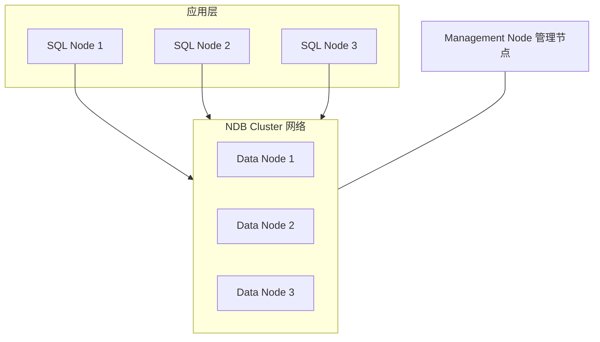

## 1. NDB Cluster 概述

MySQL NDB Cluster 是 MySQL 的高可用、高冗余分布式存储引擎，基于 NDB（Network DataBase）存储引擎，提供 99.999% 可用性。

### 1.1 核心特性

| 特性     | 说明                               |
| -------- | ---------------------------------- |
| 分布式   | 数据自动分片到多个数据节点         |
| 高可用   | 无单点故障，自动故障转移           |
| 事务     | 支持 ACID 事务                     |
| 内存存储 | 数据主要存储在内存（可溢出到磁盘） |
| 同步复制 | 数据同步复制到多个节点             |
| 在线扩容 | 支持在线添加数据节点               |

### 1.2 架构组件



## 2. 三种节点类型

### 2.1 管理节点（Management Node）

```ini
# config.ini
[ndbd default]
NoOfReplicas = 2
DataMemory = 4G
IndexMemory = 1G

[ndb_mgmd]
NodeId = 1
HostName = mgm-node1

[ndb_mgmd]
NodeId = 2
HostName = mgm-node2
```

### 2.2 数据节点（Data Node）

```ini
[ndbd]
NodeId = 3
HostName = data-node1
DataDir = /var/lib/mysql-cluster

[ndbd]
NodeId = 4
HostName = data-node2
DataDir = /var/lib/mysql-cluster
```

### 2.3 SQL 节点（SQL Node）

```ini
[mysqld]
NodeId = 5
HostName = sql-node1

[mysqld]
NodeId = 6
HostName = sql-node2
```

## 3. 数据分布

### 3.1 分片（Partition）

```sql
-- NDB Cluster 自动按主键哈希分片
CREATE TABLE orders (
    order_id BIGINT PRIMARY KEY,
    user_id BIGINT,
    amount DECIMAL(10, 2)
) ENGINE = NDB;

-- 指定分区数
CREATE TABLE orders (
    order_id BIGINT PRIMARY KEY,
    user_id BIGINT,
    amount DECIMAL(10, 2)
) ENGINE = NDB PARTITION BY KEY(order_id) PARTITIONS 4;
```

### 3.2 副本与可用性

```
NoOfReplicas = 2 时：
Node Group 0: Data Node 1 (主) + Data Node 2 (备)
Node Group 1: Data Node 3 (主) + Data Node 4 (备)

任一数据节点故障，副本自动接管
```

## 4. NDB vs InnoDB

| 特性      | NDB Cluster        | InnoDB       |
| --------- | ------------------ | ------------ |
| 存储      | 内存为主           | 磁盘为主     |
| 分布式    | 原生支持           | 需中间件     |
| 事务      | 支持               | 支持         |
| JOIN 性能 | 较差（网络开销）   | 优秀（本地） |
| 外键      | 不支持             | 支持         |
| 适用场景  | 高可用、电信、游戏 | 通用 OLTP    |

## 5. 适用场景

- 电信计费系统（99.999% 可用性）
- 游戏服务器（低延迟读写）
- 实时会话管理
- 分布式缓存

## 延伸阅读
MySQL 索引与优化，见 020-mysql 模块文档。
MySQL 日志体系，见 020-mysql 模块 redo/binlog 文档。
Redis 缓存与 MySQL 组合，见 022-redis 模块。
## 深度专题扩展

以下专题从不同角度深入本文主题，供有进阶需求的读者研读。每个专题独立成节，内容相互补充。

### 13.1 InnoDB 日志与崩溃恢复

redo log 记录物理页修改（WAL：先写日志再写数据页），崩溃后重放恢复；环形文件组 + checkpoint 推进。
undo log 记录事务前镜像，支持回滚与 MVCC 版本链；purge 线程清理。
两阶段提交：redo prepare -> binlog -> redo commit，保证两份日志一致，主从不丢数据。
刷盘策略：innodb_flush_log_at_trx_commit=1 最安全（每次提交 fsync），2 每秒刷。

### 13.2 执行计划与优化器

EXPLAIN 关键列：type（const/ref/range/index/ALL）、key、rows、Extra（Using index/Using filesort）。
优化器基于统计信息选计划；analyze table 更新统计；hint（FORCE INDEX）谨慎使用。
排序与分组：filesort 优化为索引序；避免临时表。
慢查询治理流程：慢日志 -> 计划分析 -> 索引/改写 -> 验证。
