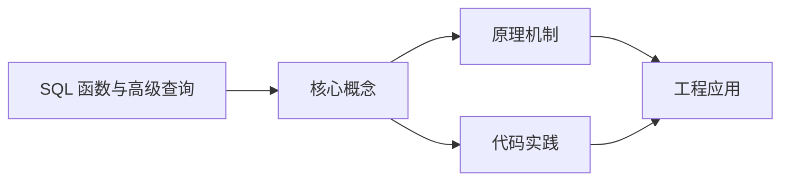
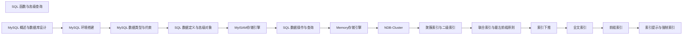

## 1. 学习目标（Bloom 分类）

本节按照布鲁姆教育目标分类学组织学习路径。本文主题为《SQL 函数与高级查询》，属于 MySQL 模块，读者可以根据自身阶段选择阅读深度。

记忆层面：能够准确复述本文的核心概念、术语与基本语法或操作步骤，并能够在提问或检索时快速定位对应知识点。能够说出 MySQL 的核心概念、语法与常用对象。

理解层面：能够用自己的语言解释核心原理与工作机制，说明概念之间的因果关系，而不是机械记忆结论。能够解释 MySQL 的执行原理与优化机制。

应用层面：能够在真实项目或练习场景中运用本文知识解决具体问题，写出正确且可维护的实现。能够编写正确、高效的 MySQL 语句与操作。

分析层面：能够拆解复杂问题，比较本文主题与相邻概念的异同，识别边界条件与例外情况。能够分析 MySQL 相关方案在性能与一致性上的权衡。

评价层面：能够根据约束条件（性能、可读性、安全、成本）评价不同方案的优劣，做出有依据的技术决策。能够根据业务场景评价 MySQL 技术选型。

创造层面：能够把本文知识与其他模块知识组合，设计出新的解决方案或可复用的工程模式。能够组合 MySQL 与其他技术设计数据架构。

通过本节学习，读者应当能够把《SQL 函数与高级查询》纳入自己的知识网络，并与 MySQL 模块的其他主题（InnoDB、索引、日志、主从、性能调优）建立关联。

## 2. 历史动机与发展脉络

《SQL 函数与高级查询》是 MySQL 领域的重要主题。要真正理解它，需要先了解它解决的问题与演进过程。

MySQL 于 1995 年由 MySQL AB 发布，2008 年被 Sun 收购，2010 年随 Sun 并入 Oracle；MariaDB 是社区分支。
MySQL 8.0（2018）重写优化器、引入窗口函数与 CTE、默认 utf8mb4、数据字典升级；MySQL 8.4 与 9.x 继续演进（Oracle 创新版 + LTS 双轨）。
InnoDB 是默认存储引擎：事务、行锁、MVCC、崩溃恢复（redo/undo）；MyISAM 仅存于历史场景。

回到本文主题：SQL 函数与高级查询 的提出与成熟，正是上述技术背景下的必然产物。早期实现往往以简单可用为目标，随着工程规模扩大，社区逐渐沉淀出标准做法与最佳实践；理解这一脉络，可以帮助读者判断“为什么文档中的推荐写法是现在这个样子”，也能在遇到历史遗留代码时准确识别其设计年代与取舍。


## 3. 形式化定义与核心概念精讲

本节把《SQL 函数与高级查询》涉及的核心概念以“定义 + 讲解”的形式展开。读者应把定义当作工具，把讲解当作理解路径；两者结合才能形成可迁移的知识。

InnoDB 架构：缓冲池（Buffer Pool）、日志缓冲、redo/undo 日志；脏页刷盘与 checkpoint 机制。
索引：B+ 树主键聚集索引、二级索引、覆盖索引；索引下推（ICP）与 MRR 优化。
事务与锁：两阶段锁、间隙锁/临键锁（可重复读防幻读）、MVCC 快照读；隔离级别。

### 3.1 原文章节逐一精讲

原文档把主题拆分为 14 个小节，下面按顺序给出每一节的导读讲解，随后保留原文细节供精读。

#### 原文精读（完整保留）

# MySQL SQL 函数与高级查询

> **符号约定**：`< >` 必填参数 | `[ ]` 可选参数

---

#### 1. 内置函数详解

##### 1.1 字符串函数

| 函数        | 说明         | 示例                               |
| :---------- | :----------- | :--------------------------------- |
| CONCAT      | 连接字符串   | CONCAT('Hello', ' ', 'World')      |
| CONCAT_WS   | 带分隔符连接 | CONCAT_WS('-', '2024', '01', '01') |
| LENGTH      | 字节长度     | LENGTH('你好') = 6                 |
| CHAR_LENGTH | 字符长度     | CHAR_LENGTH('你好') = 2            |
| SUBSTRING   | 截取字符串   | SUBSTRING('Hello', 1, 3) = 'Hel'   |
| LEFT/RIGHT  | 从左/右截取  | LEFT('Hello', 2) = 'He'            |
| TRIM        | 去除首尾空格 | TRIM(' Hello ')                    |
| LOWER/UPPER | 转小/大写    | LOWER('HELLO')                     |
| REPLACE     | 替换字符串   | REPLACE('Hello', 'l', 'w')         |
| REVERSE     | 反转字符串   | REVERSE('Hello')                   |
| LPAD/RPAD   | 左/右填充    | LPAD('5', 3, '0') = '005'          |
| INSTR       | 查找子串位置 | INSTR('Hello', 'll') = 3           |

**字符串函数示例**：

```sql
 SELECT
  username,
  CONCAT(username, ' (', email, ')') AS user_info,
  LENGTH(username) AS name_bytes,
  CHAR_LENGTH(username) AS name_chars,
  LOWER(email) AS email_lower,
  UPPER(username) AS name_upper,
  SUBSTRING(phone, 1, 3) AS phone_prefix
 from users;
 -
 SELECT CONCAT_WS('', province, city, district, detail_address) AS full_address FROM addresses;
```

##### 1.2 日期时间函数

| 函数               | 说明         | 示例                                           |
| :----------------- | :----------- | :--------------------------------------------- |
| NOW                | 当前日期时间 | NOW() = '2024-01-15 10:30:00'                  |
| CURDATE            | 当前日期     | CURDATE() = '2024-01-15'                       |
| CURTIME            | 当前时间     | CURTIME() = '10:30:00'                         |
| DATE               | 提取日期部分 | DATE('2024-01-15 10:30:00')                    |
| TIME               | 提取时间部分 | TIME('2024-01-15 10:30:00')                    |
| YEAR/MONTH/DAY     | 提取年月日   | YEAR(NOW()) = 2024                             |
| HOUR/MINUTE/SECOND | 提取时分秒   | HOUR(NOW()) = 10                               |
| DATE_FORMAT        | 格式化日期   | DATE_FORMAT(NOW(), '%Y-%m-%d')                 |
| DATE_ADD/DATE_SUB  | 日期加减     | DATE_ADD(NOW(), INTERVAL 1 DAY)                |
| DATEDIFF           | 日期差       | DATEDIFF('2024-01-15', '2024-01-01')           |
| TIMESTAMPDIFF      | 时间差       | TIMESTAMPDIFF(DAY, '2024-01-01', '2024-01-15') |
| DAYOFWEEK          | 星期几       | DAYOFWEEK(NOW()) = 2 (周一=2)                  |
| LAST_DAY           | 月份最后一天 | LAST_DAY('2024-01-15')                         |

**日期函数示例**：

```sql
 -
 SELECT
  NOW() AS now,
  CURDATE() AS today,
  DATE_ADD(NOW(), INTERVAL 7 DAY) AS next_week,
  DATE_SUB(NOW(), INTERVAL 1 MONTH) AS last_month,
  DATE_FORMAT(NOW(), '%Y年%m月%d日 %H:%i:%s') AS formatted;
 -
 SELECT
  username,
  DATEDIFF(NOW(), created_at) AS days_since_join,
  TIMESTAMPDIFF(YEAR, created_at, NOW()) AS years_since_join
 from users;
 -
 SELECT
  username,
  DATE_FORMAT(birthday, '%Y年%m月%d日') AS birthday_formatted,
  TIMESTAMPDIFF(YEAR, birthday, NOW()) AS age
 from users;
```

##### 1.3 数值函数

| 函数         | 说明     | 示例                         |
| :----------- | :------- | :--------------------------- |
| ABS          | 绝对值   | ABS(-10) = 10                |
| ROUND        | 四舍五入 | ROUND(3.14159, 2) = 3.14     |
| CEIL/CEILING | 向上取整 | CEIL(3.1) = 4                |
| FLOOR        | 向下取整 | FLOOR(3.9) = 3               |
| MOD          | 取模     | MOD(10, 3) = 1               |
| POW/POWER    | 幂运算   | POW(2, 3) = 8                |
| SQRT         | 平方根   | SQRT(16) = 4                 |
| RAND         | 随机数   | RAND() = 0.123...            |
| TRUNCATE     | 截断     | TRUNCATE(3.14159, 3) = 3.141 |
| SIGN         | 符号     | SIGN(-10) = -1               |

**数值函数示例**：

```sql
 -
 SELECT
  price,
  ROUND(price, 2) AS rounded,
  CEIL(price) AS ceil_price,
  FLOOR(price) AS floor_price,
  ABS(price - 100) AS price_diff
 from products;
 -
 SELECT * FROM users ORDER BY RAND() LIMIT 5; -- 随机取5条
 UPDATE users SET verification_code = FLOOR(RAND() * 900000 + 100000) WHERE status = 0;
```

##### 1.4 条件函数

| 函数   | 说明       | 示例                           |
| :----- | :--------- | :----------------------------- |
| IF     | 条件判断   | IF(age > 18, '成人', '未成年') |
| IFNULL | NULL 替换  | IFNULL(email, '未填写')        |
| NULLIF | NULL 条件  | NULLIF(a, b)                   |
| CASE   | 多条件判断 | CASE WHEN ... THEN ... END     |

**条件函数示例**：

```sql
 -
 SELECT
  username,
  age,
  IF(age >= 18, '成人', '未成年') AS age_desc,
  IF(status = 1, '正常', '禁用') AS status_desc
 from users;
 -
 SELECT
  username,
  IFNULL(email, '未填写') AS email,
  IFNULL(phone, IFNULL(telephone, '无')) AS contact
 from users;
 -
 SELECT
  username,
  age,
  CASE
  WHEN age < 18 THEN '未成年'
  WHEN age < 30 THEN '青年'
  WHEN age < 60 THEN '中年'
  ELSE '老年'
  END AS age_group,
  CASE status
  WHEN 1 THEN '正常'
  WHEN 2 THEN '冻结'
  WHEN 0 THEN '禁用'
  ELSE '未知'
  END AS status_desc
 from users;
 -
 SELECT
  SUM(CASE WHEN status = 1 THEN 1 ELSE 0 END) AS active_count,
  SUM(CASE WHEN status = 0 THEN 1 ELSE 0 END) AS inactive_count,
  SUM(CASE WHEN gender = '男' THEN 1 ELSE 0 END) AS male_count,
  SUM(CASE WHEN gender = '女' THEN 1 ELSE 0 END) AS female_count
 from users;
```

##### 1.5 其他常用函数

```sql
 -
 SELECT
  CAST(price AS CHAR) AS price_str,
  CONVERT(price, DECIMAL(10,2)) AS price_dec,
  FORMAT(price, 2) AS price_formatted -- 千位分隔符
 from products;
 -
 SELECT
  MD5('password') AS md5_hash,
  SHA1('password') AS sha1_hash,
  SHA2('password', 256) AS sha256_hash
 from users;
 -
 SELECT UUID() AS uuid;
 -
 SET @total = 0;
 SELECT @total := @total + price FROM products;
```

#### 2. 子查询详解

子查询是嵌套在另一个查询中的查询，可以用于 WHERE、FROM、SELECT 等子句。

##### 2.1 子查询类型

###### 2.1.1 按位置分类

| 类型              | 说明                | 示例                      |
| :---------------- | :------------------ | :------------------------ |
| WHERE 子句子查询  | 在 WHERE 条件中使用 | `WHERE id IN (SELECT...)` |
| FROM 子句子查询   | 作为临时表          | `FROM (SELECT...) AS t`   |
| SELECT 子句子查询 | 作为列              | `SELECT (SELECT...)`      |

###### 2.1.2 按返回结果分类

| 类型       | 返回值   | 示例                                     |
| :--------- | :------- | :--------------------------------------- |
| 标量子查询 | 单个值   | `SELECT * WHERE age = (SELECT MAX(age))` |
| 列子查询   | 一列值   | `WHERE id IN (SELECT user_id...)`        |
| 行子查询   | 一行值   | `WHERE (id, name) = (SELECT...)`         |
| 表子查询   | 多行多列 | `FROM (SELECT...) AS t`                  |

##### 2.2 标量子查询

```sql
 -
 SELECT * FROM users WHERE age = (SELECT MAX(age) FROM users);
 -
 SELECT * FROM users WHERE age > (SELECT AVG(age) FROM users);
 -
 SELECT * FROM users WHERE created_at = (SELECT MAX(created_at) FROM users);
 -
 UPDATE users SET age = (SELECT MAX(age) FROM users) + 1 WHERE id = 1;
```

##### 2.3 列子查询 (IN/ANY/ALL)

```sql
 -
 SELECT * FROM users WHERE id IN (SELECT user_id FROM vip_users);
 -
 SELECT * FROM users WHERE id NOT IN (SELECT user_id FROM blocked_users);
 -
 SELECT * FROM products WHERE price > ANY (SELECT price FROM products WHERE category_id = 1);
 -
 SELECT * FROM products WHERE price > ALL (SELECT price FROM products WHERE status = 0);
 -
 SELECT * FROM users u WHERE EXISTS (SELECT 1 FROM orders o WHERE o.user_id = u.id);
 -
 SELECT * FROM users u WHERE NOT EXISTS (SELECT 1 FROM orders o WHERE o.user_id = u.id);
```

##### 2.4 FROM 子句子查询

```sql
 -
 SELECT * FROM (SELECT * FROM users WHERE status = 1) AS active_users;
 -
 SELECT * FROM (
  SELECT
  status,
  COUNT(*) AS count,
  AVG(age) AS avg_age
  FROM users
  GROUP BY status
 )
 -
 SELECT * FROM (
  SELECT u.*, COUNT(o.id) AS order_count
  FROM users u
  LEFT JOIN orders o ON u.id = o.user_id
  GROUP BY u.id
 )
```

##### 2.5 SELECT 子句子查询

```sql
 -
 SELECT
  u.id,
  u.username,
  (SELECT COUNT(*) FROM orders WHERE user_id = u.id) AS order_count
 from users u;
 -
 SELECT
  u.id,
  u.username,
  (SELECT MAX(created_at) FROM orders WHERE user_id = u.id) AS last_order_time
 from users u;
 -
 SELECT
  u.username,
  (SELECT COUNT(*) FROM orders WHERE user_id = u.id AND status = 1) AS active_orders
 from users u;
```

##### 2.6 子查询实战

```sql
 -
 SELECT DISTINCT user_id FROM order_items WHERE product_id = 'A'
 AND user_id IN (SELECT user_id FROM order_items WHERE product_id = 'B');
 -
 SELECT * FROM products
 WHERE id IN (
  SELECT product_id FROM order_items
  GROUP BY product_id
  HAVING SUM(price * quantity) > (SELECT AVG(total) FROM (SELECT SUM(price * quantity) AS total FROM order_items GROUP BY product_id) AS avg_total)
 )
 -
 SELECT * FROM employees e
 WHERE (dept_id, salary) IN (
  SELECT dept_id, MAX(salary) FROM employees GROUP BY dept_id
 )
```

#### 3. 多表查询详解

##### 3.1 连接类型

```mermaid
flowchart LR
    subgraph A[表A]
        A1[1] A2[2] A3[3] A4[4]
    end
    subgraph B[表B]
        B1[A] B2[B] B3[C]
    end
    A1 --- B1
    A2 --- B2
    A3 --- B3
```

- 内连接（INNER JOIN）：1, 2, 3（两边都有的）
- 左连接（LEFT JOIN）：1, 2, 3, 4（A 全部 + B 匹配的）
- 右连接（RIGHT JOIN）：1, 2, 3, A, B, C（B 全部 + A 匹配的）
- 全连接（FULL JOIN）：1, 2, 3, 4, A, B, C（两边全部）

##### 3.2 内连接 (INNER JOIN)

```sql
 -
 SELECT u.username, o.order_no, o.total_amount
 from users u
 inNER JOIN orders o ON u.id = o.user_id;
 -
 SELECT u.username, o.order_no, p.product_name, oi.quantity
 from users u
 inNER JOIN orders o ON u.id = o.user_id
 inNER JOIN order_items oi ON o.id = oi.order_id
 inNER JOIN products p ON oi.product_id = p.id;
 -
 SELECT u.username, o.order_no
 from users u
 inNER JOIN orders o USING (user_id);
```

##### 3.3 外连接 (LEFT/RIGHT JOIN)

```sql
 -
 SELECT u.username, o.order_no, o.total_amount
 from users u
 LEFT JOIN orders o ON u.id = o.user_id;
 -
 -
 SELECT u.username, o.order_no
 from users u
 RIGHT JOIN orders o ON u.id = o.user_id;
 -
 -
 SELECT u.username, COUNT(o.id) AS order_count
 from users u
 LEFT JOIN orders o ON u.id = o.user_id
 GROUP BY u.id, u.username;
 -
 SELECT u.*
 from users u
 LEFT JOIN orders o ON u.id = o.user_id
 WHERE o.id IS NULL;
 -
 SELECT e.*
 from employees e
 RIGHT JOIN departments d ON e.dept_id = d.id
 WHERE e.id IS NULL;
```

##### 3.4 自连接 (SELF JOIN)

```sql
 -
 SELECT e1.name AS employee, e2.name AS colleague, d.name AS dept
 from employees e1
 JOIN employees e2 ON e1.dept_id = e2.dept_id AND e1.id != e2.id
 JOIN departments d ON e1.dept_id = d.id
 WHERE e1.name = '张三';
 -
 SELECT s1.Supplier_name, s1.Address, s2.Supplier_name AS 同城市供应商
 from supplier_info s1
 inNER JOIN supplier_info s2 ON s1.Address = s2.Address
 WHERE s1.Supplier_name = '翔云公司' AND s1.Supplier_id <> s2.Supplier_id;
 -
 SELECT e.name AS employee, m.name AS manager
 from employees e
 LEFT JOIN employees m ON e.manager_id = m.id;
```

##### 3.5 全连接 (FULL OUTER JOIN)

MySQL 不直接支持 FULL OUTER JOIN，可使用 UNION 实现：

```sql
 -
 SELECT u.username, o.order_no
 from users u
 LEFT JOIN orders o ON u.id = o.user_id
 UNION
 SELECT u.username, o.order_no
 from users u
 RIGHT JOIN orders o ON u.id = o.user_id;
```

##### 3.6 交叉连接 (CROSS JOIN)

```sql
 -
 SELECT u.username, p.product_name
 from users u
 CROSS JOIN products p;
 -
 -
 SELECT
  DATE_ADD('2024-01-01', INTERVAL n DAY) AS date
 from (SELECT 0 AS n UNION SELECT 1 UNION SELECT 2...) AS numbers;
```

##### 3.7 多表连接实战

```sql
 -
 SELECT e.Employees_name, s.Sales_id, c.Customer_name
 from employees_info e
 inNER JOIN sales_info s ON e.Employees_id = s.Employees_id
 inNER JOIN customer_info c ON s.Customer_id = c.Customer_id;
 -
 SELECT e.Employees_id, e.Employees_name,
  SUM(sl.Sales_price * sl.Sales_Number) AS 销售总业绩
 from employees_info e
 inNER JOIN sales_info s ON e.Employees_id = s.Employees_id
 inNER JOIN sales_list sl ON s.Sales_id = sl.Sales_id
 GROUP BY e.Employees_id, e.Employees_name
 ORDER BY 销售总业绩 DESC;
 -
 SELECT c.Customer_name, m.Commodity_name, SUM(sl.Sales_Number) AS 购买数量
 from customer_info c
 inNER JOIN sales_info s ON c.Customer_id = s.Customer_id
 inNER JOIN sales_list sl ON s.Sales_id = sl.Sales_id
 inNER JOIN commodity_info m ON sl.Commodity_id = m.Commodity_id
 GROUP BY c.Customer_name, m.Commodity_name;
 -
 SELECT e.Employees_name, s.Sales_id, c.Customer_name,
  m.Commodity_name, s.Sales_time, sl.Sales_Number
 from employees_info e
 inNER JOIN sales_info s ON e.Employees_id = s.Employees_id
 inNER JOIN customer_info c ON s.Customer_id = c.Customer_id
 inNER JOIN sales_list sl ON s.Sales_id = sl.Sales_id
 inNER JOIN commodity_info m ON sl.Commodity_id = m.Commodity_id;
```

#### 4. 最佳实践

##### 4.1 SQL 编写规范

1. **使用大写关键字**：提高可读性

```sql
 -- 推荐
 SELECT id, username, email FROM users WHERE status = 1;
 -- 不推荐
 select id, username, email from users where status = 1;
```

2. **使用缩进和对齐**：使代码结构清晰

```sql
 SELECT
 u.id,
 u.username,
 o.order_no,
 o.total_amount
 FROM users u
 INNER JOIN orders o ON u.id = o.user_id
 WHERE o.status = 1
 ORDER BY o.created_at DESC;
```

3. **添加注释**：解释复杂逻辑

```sql
 -- 查询活跃用户（30天内有登录）
 SELECT * FROM users
 WHERE last_login_time > DATE_SUB(NOW(), INTERVAL 30 DAY);
```

4. **避免 SELECT \***：只选择需要的列

```sql
 -- 推荐
 SELECT id, username, email FROM users;
 -- 不推荐
 SELECT * FROM users;
```

5. **使用有意义别名**：提高可读性

```sql
 -- 推荐
 SELECT u.username, o.order_no FROM users u INNER JOIN orders o ON u.id = o.user_id;
 -- 不推荐
 SELECT a.username, b.order_no FROM users a INNER JOIN orders b ON a.id = b.user_id;
```

##### 4.2 性能优化

1. **使用索引**：为常用查询列创建索引
2. **避免 SELECT \***：减少网络传输
3. **使用 LIMIT**：限制返回行数
4. **避免在 WHERE 中使用函数**：导致索引失效
5. **合理使用 JOIN**：避免过多表连接
6. **优化 GROUP BY**：确保有适当的索引
7. **使用 EXPLAIN**：分析查询计划

##### 4.3 安全实践

1. **参数化查询**：防止 SQL 注入
2. **最小权限原则**：为用户分配最小必要权限
3. **加密敏感数据**：密码、身份证号等
4. **输入验证**：验证和过滤用户输入
5. **定期备份**：确保数据安全

#### 5. 常见问题与解决方案

##### 5.1 SQL 注入

**问题**：恶意用户通过输入特殊字符来修改 SQL 语句
**解决方案**：

- 使用参数化查询/预编译语句
- 对输入进行验证和过滤
- 使用存储过程封装数据访问

##### 5.2 索引失效

**问题**：查询没有使用索引，导致性能下降
**原因**：

- 在 WHERE 子句中使用函数
- 使用 != 或 <> 操作符
- 使用 LIKE '%...' 模式
- 数据类型不匹配
  **解决方案**：
- 避免在索引列上使用函数
- 使用 EXPLAIN 分析查询
- 创建合适的索引

##### 5.3 死锁

**问题**：多个事务相互等待对方释放资源
**解决方案**：

- 保持事务简短
- 按相同顺序访问表
- 使用适当的隔离级别
- 避免长时间锁定资源

#### 6. 总结

本章节详细介绍了 SQL 的高级特性，包括：

1. **内置函数**：字符串、日期、数值、条件函数
2. **子查询**：嵌套查询的各种用法
3. **多表查询**：内连接、外连接、自连接
4. **最佳实践**：SQL 编写规范、性能优化、安全实践
5. **常见问题**：SQL 注入、索引失效、死锁

---

#### 字符串函数

**单行写法：CONCAT 连接字符串**
`CONCAT(<字符串1>[, <字符串2>...])`
```sql
-- 连接用户名和邮箱
SELECT CONCAT(username, ' (', email, ')') AS user_info FROM users;
```

**单行写法：CONCAT_WS 带分隔符连接**
`CONCAT_WS('<分隔符>', <字符串1>[, <字符串2>...])`
```sql
-- 带分隔符连接地址字段
SELECT CONCAT_WS('-', province, city, district) AS full_address FROM addresses;
```

**单行写法：LENGTH 字节长度**
`LENGTH(<字符串>)`
```sql
-- 获取用户名的字节长度
SELECT LENGTH(username) AS name_bytes FROM users;
```

**单行写法：CHAR_LENGTH 字符长度**
`CHAR_LENGTH(<字符串>)`
```sql
-- 获取用户名的字符长度
SELECT CHAR_LENGTH(username) AS name_chars FROM users;
```

**单行写法：SUBSTRING 截取字符串**
`SUBSTRING(<字符串>, <起始位置>[, <长度>])`
```sql
-- 截取手机号前 3 位
SELECT SUBSTRING(phone, 1, 3) AS phone_prefix FROM users;
```

**单行写法：LEFT 从左截取**
`LEFT(<字符串>, <长度>)`
```sql
-- 从左截取用户名前 2 位
SELECT LEFT(username, 2) FROM users;
```

**单行写法：RIGHT 从右截取**
`RIGHT(<字符串>, <长度>)`
```sql
-- 从右截取用户名后 2 位
SELECT RIGHT(username, 2) FROM users;
```

**单行写法：TRIM 去除首尾空格**
`TRIM(<字符串>)`
```sql
-- 去除字符串首尾空格
SELECT TRIM(' Hello ');
```

**单行写法：LOWER 转小写**
`LOWER(<字符串>)`
```sql
-- 将邮箱转为小写
SELECT LOWER(email) AS email_lower FROM users;
```

**单行写法：UPPER 转大写**
`UPPER(<字符串>)`
```sql
-- 将用户名转为大写
SELECT UPPER(username) AS name_upper FROM users;
```

**单行写法：REPLACE 替换字符串**
`REPLACE(<字符串>, '<旧子串>', '<新子串>')`
```sql
-- 替换字符串中的字符
SELECT REPLACE('Hello', 'l', 'w');
```

**单行写法：REVERSE 反转字符串**
`REVERSE(<字符串>)`
```sql
-- 反转字符串
SELECT REVERSE('Hello');
```

**单行写法：LPAD 左填充**
`LPAD(<字符串>, <长度>, '<填充字符>')`
```sql
-- 左填充数字到 3 位
SELECT LPAD('5', 3, '0');
```

**单行写法：RPAD 右填充**
`RPAD(<字符串>, <长度>, '<填充字符>')`
```sql
-- 右填充字符串到 5 位
SELECT RPAD('5', 5, '0');
```

**单行写法：INSTR 查找子串位置**
`INSTR(<字符串>, '<子串>')`
```sql
-- 查找子串位置
SELECT INSTR('Hello', 'll');
```

---

#### 日期时间函数

**单行写法：NOW 当前日期时间**
`NOW()`
```sql
-- 获取当前日期时间
SELECT NOW() AS now;
```

**单行写法：CURDATE 当前日期**
`CURDATE()`
```sql
-- 获取当前日期
SELECT CURDATE() AS today;
```

**单行写法：CURTIME 当前时间**
`CURTIME()`
```sql
-- 获取当前时间
SELECT CURTIME() AS current_time;
```

**单行写法：DATE 提取日期**
`DATE(<日期时间>)`
```sql
-- 提取日期部分
SELECT DATE('2024-01-15 10:30:00');
```

**单行写法：TIME 提取时间**
`TIME(<日期时间>)`
```sql
-- 提取时间部分
SELECT TIME('2024-01-15 10:30:00');
```

**单行写法：YEAR 提取年份**
`YEAR(<日期>)`
```sql
-- 提取当前年份
SELECT YEAR(NOW());
```

**单行写法：MONTH 提取月份**
`MONTH(<日期>)`
```sql
-- 提取当前月份
SELECT MONTH(NOW());
```

**单行写法：DAY 提取日**
`DAY(<日期>)`
```sql
-- 提取当前日
SELECT DAY(NOW());
```

**单行写法：HOUR 提取小时**
`HOUR(<时间>)`
```sql
-- 提取当前小时
SELECT HOUR(NOW());
```

**单行写法：MINUTE 提取分钟**
`MINUTE(<时间>)`
```sql
-- 提取当前分钟
SELECT MINUTE(NOW());
```

**单行写法：SECOND 提取秒**
`SECOND(<时间>)`
```sql
-- 提取当前秒
SELECT SECOND(NOW());
```

**单行写法：DATE_FORMAT 格式化日期**
`DATE_FORMAT(<日期>, '<格式>')`
```sql
-- 格式化日期显示
SELECT DATE_FORMAT(NOW(), '%Y年%m月%d日 %H:%i:%s') AS formatted;
```

**单行写法：DATE_ADD 日期加**
`DATE_ADD(<日期>, INTERVAL <值> <单位>)`
```sql
-- 日期加 7 天
SELECT DATE_ADD(NOW(), INTERVAL 7 DAY) AS next_week;
```

**单行写法：DATE_SUB 日期减**
`DATE_SUB(<日期>, INTERVAL <值> <单位>)`
```sql
-- 日期减 1 个月
SELECT DATE_SUB(NOW(), INTERVAL 1 MONTH) AS last_month;
```

**单行写法：DATEDIFF 日期差**
`DATEDIFF(<日期1>, <日期2>)`
```sql
-- 计算注册至今天数
SELECT DATEDIFF(NOW(), created_at) AS days_since_join FROM users;
```

**单行写法：TIMESTAMPDIFF 时间差**
`TIMESTAMPDIFF(<单位>, <开始>, <结束>)`
```sql
-- 计算注册至今年数
SELECT TIMESTAMPDIFF(YEAR, created_at, NOW()) AS years_since_join FROM users;
```

**单行写法：计算年龄**
`TIMESTAMPDIFF(YEAR, <生日列>, NOW())`
```sql
-- 根据生日计算年龄
SELECT TIMESTAMPDIFF(YEAR, birthday, NOW()) AS age FROM users;
```

**单行写法：DAYOFWEEK 星期几**
`DAYOFWEEK(<日期>)`
```sql
-- 获取星期几
SELECT DAYOFWEEK(NOW());
```

**单行写法：LAST_DAY 月份最后一天**
`LAST_DAY(<日期>)`
```sql
-- 获取月份最后一天
SELECT LAST_DAY('2024-01-15');
```

---

#### 数值函数

**单行写法：ABS 绝对值**
`ABS(<数值>)`
```sql
-- 获取绝对值
SELECT ABS(-10);
```

**单行写法：ROUND 四舍五入**
`ROUND(<数值>[, <小数位>])`
```sql
-- 四舍五入保留 2 位小数
SELECT ROUND(price, 2) AS rounded FROM products;
```

**单行写法：CEIL 向上取整**
`CEIL(<数值>)`
```sql
-- 向上取整
SELECT CEIL(price) AS ceil_price FROM products;
```

**单行写法：FLOOR 向下取整**
`FLOOR(<数值>)`
```sql
-- 向下取整
SELECT FLOOR(price) AS floor_price FROM products;
```

**单行写法：MOD 取模**
`MOD(<数值1>, <数值2>)`
```sql
-- 取模运算
SELECT MOD(10, 3);
```

**单行写法：POW 幂运算**
`POW(<底数>, <指数>)`
```sql
-- 幂运算
SELECT POW(2, 3);
```

**单行写法：SQRT 平方根**
`SQRT(<数值>)`
```sql
-- 平方根
SELECT SQRT(16);
```

**单行写法：RAND 随机数**
`RAND()`
```sql
-- 随机排序取 5 行
SELECT * FROM users ORDER BY RAND() LIMIT 5;
```

**单行写法：TRUNCATE 截断**
`TRUNCATE(<数值>, <小数位>)`
```sql
-- 截断到 3 位小数
SELECT TRUNCATE(3.14159, 3);
```

**单行写法：SIGN 符号**
`SIGN(<数值>)`
```sql
-- 获取数值符号
SELECT SIGN(-10);
```

---

#### 条件函数

**单行写法：IF 条件判断**
`IF(<条件>, <真值>, <假值>)`
```sql
-- 根据年龄判断成人或未成年
SELECT username, age, IF(age >= 18, '成人', '未成年') AS age_desc FROM users;
```

**单行写法：IFNULL NULL 替换**
`IFNULL(<值>, <默认值>)`
```sql
-- 替换 NULL 值为默认值
SELECT username, IFNULL(email, '未填写') AS email FROM users;
```

**单行写法：嵌套 IFNULL**
`IFNULL(<值>, IFNULL(<值2>, <默认值>))`
```sql
-- 嵌套 IFNULL 处理多个可能为空的字段
SELECT IFNULL(phone, IFNULL(telephone, '无')) AS contact FROM users;
```

**单行写法：NULLIF 相等返回 NULL**
`NULLIF(<值1>, <值2>)`
```sql
-- 两值相等返回 NULL
SELECT NULLIF(a, b);
```

**换行写法：CASE WHEN 多条件判断**
`CASE WHEN <条件> THEN <值> [WHEN ...] [ELSE <值>] END`
```sql
-- 多条件判断年龄分组
SELECT
  username,
  age,
  CASE
    WHEN age < 18 THEN '未成年'
    WHEN age < 30 THEN '青年'
    WHEN age < 60 THEN '中年'
    ELSE '老年'
  END AS age_group
FROM users;
```

**换行写法：CASE 表达式等值匹配**
`CASE <表达式> WHEN <值> THEN <结果> [WHEN ...] [ELSE <结果>] END`
```sql
-- 等值匹配状态值
SELECT
  username,
  CASE status
    WHEN 1 THEN '正常'
    WHEN 2 THEN '冻结'
    WHEN 0 THEN '禁用'
    ELSE '未知'
  END AS status_desc
FROM users;
```

**换行写法：CASE 聚合条件计数**
`SUM(CASE WHEN <条件> THEN 1 ELSE 0 END)`
```sql
-- 条件计数统计不同状态数量
SELECT
  SUM(CASE WHEN status = 1 THEN 1 ELSE 0 END) AS active_count,
  SUM(CASE WHEN status = 0 THEN 1 ELSE 0 END) AS inactive_count
FROM users;
```

---

#### 类型转换与系统函数

**单行写法：CAST 类型转换**
`CAST(<值> AS <类型>)`
```sql
-- 将价格转换为字符类型
SELECT CAST(price AS CHAR) FROM products;
```

**单行写法：CONVERT 类型转换**
`CONVERT(<值>, <类型>)`
```sql
-- 将价格转换为 DECIMAL 类型
SELECT CONVERT(price, DECIMAL(10,2)) FROM products;
```

**单行写法：FORMAT 格式化数字**
`FORMAT(<数值>, <小数位>)`
```sql
-- 格式化数字带千位分隔符
SELECT FORMAT(price, 2) AS price_formatted FROM products;
```

**单行写法：MD5 哈希**
`MD5('<字符串>')`
```sql
-- 计算 MD5 哈希
SELECT MD5('password') AS md5_hash;
```

**单行写法：SHA1 哈希**
`SHA1('<字符串>')`
```sql
-- 计算 SHA1 哈希
SELECT SHA1('password') AS sha1_hash;
```

**单行写法：SHA2 哈希**
`SHA2('<字符串>', <长度>)`
```sql
-- 计算 SHA256 哈希
SELECT SHA2('password', 256) AS sha256_hash;
```

**单行写法：UUID 生成**
`UUID()`
```sql
-- 生成 UUID
SELECT UUID() AS uuid;
```

**单行写法：SET 用户变量**
`SET @<变量名> = <值>`
```sql
-- 设置用户变量
SET @total = 0;
```

**单行写法：SELECT 变量累加**
`SELECT @<变量名> := @<变量名> + <表达式>`
```sql
-- 用户变量累加
SELECT @total := @total + price FROM products;
```

---

#### 子查询

**单行写法：标量子查询最大值**
`SELECT * FROM <表名> WHERE <列名> = (SELECT MAX(<列名>) FROM <表名>)`
```sql
-- 查询年龄最大的用户
SELECT * FROM users WHERE age = (SELECT MAX(age) FROM users);
```

**单行写法：标量子查询平均值**
`SELECT * FROM <表名> WHERE <列名> > (SELECT AVG(<列名>) FROM <表名>)`
```sql
-- 查询年龄大于平均年龄的用户
SELECT * FROM users WHERE age > (SELECT AVG(age) FROM users);
```

**单行写法：用子查询更新**
`UPDATE <表名> SET <列名> = (SELECT <聚合> FROM <表名>) WHERE <条件>`
```sql
-- 用子查询结果更新字段
UPDATE users SET age = (SELECT MAX(age) FROM users) + 1 WHERE id = 1;
```

**单行写法：IN 子查询**
`WHERE <列名> IN (SELECT <列名> FROM <表名>)`
```sql
-- 查询属于 VIP 用户表的用户
SELECT * FROM users WHERE id IN (SELECT user_id FROM vip_users);
```

**单行写法：NOT IN 子查询**
`WHERE <列名> NOT IN (SELECT <列名> FROM <表名>)`
```sql
-- 查询不在黑名单中的用户
SELECT * FROM users WHERE id NOT IN (SELECT user_id FROM blocked_users);
```

**单行写法：ANY 子查询**
`WHERE <列名> <操作符> ANY (SELECT ...)`
```sql
-- 满足子查询中任意一个值
SELECT * FROM products WHERE price > ANY (SELECT price FROM products WHERE category_id = 1);
```

**单行写法：ALL 子查询**
`WHERE <列名> <操作符> ALL (SELECT ...)`
```sql
-- 满足子查询中所有值
SELECT * FROM products WHERE price > ALL (SELECT price FROM products WHERE status = 0);
```

**换行写法：EXISTS 子查询**
`WHERE EXISTS (SELECT 1 FROM <表名> WHERE <条件>)`
```sql
-- 查询有订单的用户
SELECT * FROM users u WHERE EXISTS (SELECT 1 FROM orders o WHERE o.user_id = u.id);
```

**换行写法：NOT EXISTS 子查询**
`WHERE NOT EXISTS (SELECT 1 FROM <表名> WHERE <条件>)`
```sql
-- 查询没有订单的用户
SELECT * FROM users u WHERE NOT EXISTS (SELECT 1 FROM orders o WHERE o.user_id = u.id);
```

**换行写法：FROM 子查询作为临时表**
`SELECT * FROM (SELECT ...) AS <别名>`
```sql
-- 子查询作为临时表查询
SELECT * FROM (SELECT * FROM users WHERE status = 1) AS active_users;
```

**换行写法：分组统计子查询**
`SELECT * FROM (SELECT <列名>, <聚合> FROM <表名> GROUP BY <列名>) AS <别名>`
```sql
-- 分组统计子查询
SELECT * FROM (
  SELECT status, COUNT(*) AS count, AVG(age) AS avg_age
  FROM users
  GROUP BY status
) AS stats;
```

**换行写法：SELECT 列子查询**
`SELECT <列名>, (SELECT ...) AS <别名>`
```sql
-- 列子查询统计订单数
SELECT
  u.id,
  u.username,
  (SELECT COUNT(*) FROM orders WHERE user_id = u.id) AS order_count
FROM users u;
```

**换行写法：SELECT 列子查询最新时间**
`SELECT <列名>, (SELECT MAX(<列名>) FROM <表名> WHERE <条件>) AS <别名>`
```sql
-- 查询用户最新订单时间
SELECT
  u.id,
  u.username,
  (SELECT MAX(created_at) FROM orders WHERE user_id = u.id) AS last_order_time
FROM users u;
```

---

#### 多表查询

**换行写法：两表内连接**
`SELECT <列名> FROM <表1> [AS <别名>] INNER JOIN <表2> [AS <别名>] ON <条件>`
```sql
-- 两表内连接查询
SELECT u.username, o.order_no, o.total_amount
FROM users u
INNER JOIN orders o ON u.id = o.user_id;
```

**换行写法：多表内连接**
`SELECT <列名> FROM <表1> JOIN <表2> ON <条件> JOIN <表3> ON <条件>`
```sql
-- 多表内连接查询
SELECT u.username, o.order_no, p.product_name, oi.quantity
FROM users u
INNER JOIN orders o ON u.id = o.user_id
INNER JOIN order_items oi ON o.id = oi.order_id
INNER JOIN products p ON oi.product_id = p.id;
```

**换行写法：USING 简写内连接**
`SELECT <列名> FROM <表1> INNER JOIN <表2> USING (<列名>)`
```sql
-- 使用 USING 简写连接条件
SELECT u.username, o.order_no
FROM users u
INNER JOIN orders o USING (user_id);
```

**换行写法：左连接**
`SELECT <列名> FROM <表1> LEFT JOIN <表2> ON <条件>`
```sql
-- 左连接查询左表全部数据
SELECT u.username, o.order_no, o.total_amount
FROM users u
LEFT JOIN orders o ON u.id = o.user_id;
```

**换行写法：左连接分组统计**
`SELECT <列名>, COUNT(<列名>) FROM <表1> LEFT JOIN <表2> ON <条件> GROUP BY <列名>`
```sql
-- 左连接分组统计订单数
SELECT u.username, COUNT(o.id) AS order_count
FROM users u
LEFT JOIN orders o ON u.id = o.user_id
GROUP BY u.id, u.username;
```

**换行写法：左连接找出无关联数据**
`SELECT <列名> FROM <表1> LEFT JOIN <表2> ON <条件> WHERE <表2.列> IS NULL`
```sql
-- 找出没有订单的用户
SELECT u.*
FROM users u
LEFT JOIN orders o ON u.id = o.user_id
WHERE o.id IS NULL;
```

**换行写法：右连接**
`SELECT <列名> FROM <表1> RIGHT JOIN <表2> ON <条件>`
```sql
-- 右连接查询右表全部数据
SELECT u.username, o.order_no
FROM users u
RIGHT JOIN orders o ON u.id = o.user_id;
```

**换行写法：自连接**
`SELECT <列名> FROM <表> [AS <别名1>] JOIN <表> [AS <别名2>] ON <条件>`
```sql
-- 员工与经理自连接
SELECT e.name AS employee, m.name AS manager
FROM employees e
LEFT JOIN employees m ON e.manager_id = m.id;
```

**换行写法：UNION 实现全连接**
`SELECT ... LEFT JOIN ... UNION SELECT ... RIGHT JOIN ...`
```sql
-- MySQL 用 UNION 实现 FULL OUTER JOIN
SELECT u.username, o.order_no
FROM users u
LEFT JOIN orders o ON u.id = o.user_id
UNION
SELECT u.username, o.order_no
FROM users u
RIGHT JOIN orders o ON u.id = o.user_id;
```

**换行写法：交叉连接**
`SELECT <列名> FROM <表1> CROSS JOIN <表2>`
```sql
-- 笛卡尔积交叉连接
SELECT u.username, p.product_name
FROM users u
CROSS JOIN products p;
```

---

#### UNION 合并查询

**换行写法：UNION 去重合并**
`SELECT ... UNION SELECT ...`
```sql
-- 合并结果集并去重
SELECT username FROM users WHERE status = 1
UNION
SELECT username FROM users WHERE age > 30;
```

**换行写法：UNION ALL 保留重复合并**
`SELECT ... UNION ALL SELECT ...`
```sql
-- 合并结果集保留重复
SELECT username FROM users WHERE status = 1
UNION ALL
SELECT username FROM users WHERE age > 30;
```


### 3.2 概念关系图

下面用 Mermaid 图表达本文核心概念之间的关系，帮助读者建立整体图景：



图中展示的是本文知识的结构化关系：核心概念是入口，原理机制解释“为什么”，代码实践演示“怎么做”，工程应用回答“何时用”。读者学习时可以把每个小节的内容挂接到对应节点上。

## 4. 理论推导与原理解析

本节深入《SQL 函数与高级查询》背后的原理。理论部分不求面面俱到，而是聚焦“能解释现象、能指导实践”的关键推导。

InnoDB 架构：缓冲池（Buffer Pool）、日志缓冲、redo/undo 日志；脏页刷盘与 checkpoint 机制。
索引：B+ 树主键聚集索引、二级索引、覆盖索引；索引下推（ICP）与 MRR 优化。
事务与锁：两阶段锁、间隙锁/临键锁（可重复读防幻读）、MVCC 快照读；隔离级别。
复制：binlog 逻辑复制（statement/row/mixed），主从异步、半同步与组复制。

需要强调的是，理论推导与工程实践之间存在翻译层：理论给出的是理想化模型与边界条件，工程代码则必须处理真实环境中的例外。读者在学习时应先掌握理论的“标准情形”，再通过陷阱章节了解“非标准情形”。

## 5. 代码示例与逐行讲解

本节把原文中的代码示例系统整理，并为每个示例补充用途说明与讲解。读者不应只浏览代码，而应逐段对照讲解理解设计意图。

### 5.1 示例：1.1 字符串函数

该示例来自原文《1.1 字符串函数》小节，用于演示SQL 函数与高级查询相关操作。阅读时请先看代码结构，再看其后的讲解。

```sql
 SELECT
  username,
  CONCAT(username, ' (', email, ')') AS user_info,
  LENGTH(username) AS name_bytes,
  CHAR_LENGTH(username) AS name_chars,
  LOWER(email) AS email_lower,
  UPPER(username) AS name_upper,
  SUBSTRING(phone, 1, 3) AS phone_prefix
 from users;
 -
 SELECT CONCAT_WS('', province, city, district, detail_address) AS full_address FROM addresses;
```

讲解：这段代码演示了本节核心知识点。代码中的关键操作可以归纳为三步：准备（定义或初始化）、执行（核心逻辑）、收尾（释放资源或返回结果）。实际项目中，这三步往往被封装为函数或类，以提升复用性与可测试性。

关键点分析：

该示例共 11 行有效代码，包含 3 类关键结构（from、SELECT、FROM）。其中：

- 入口与初始化部分负责建立上下文，对应实际项目中的启动或装配逻辑；
- 核心逻辑部分体现本文主题的主要操作，是阅读时最需要对照讲解理解的部分；
- 输出或返回部分把结果交给调用方，注意其类型与边界条件。

进阶思考路径：先尝试修改参数观察行为变化，再把示例中的模式迁移到自己的项目中；每次修改都记录预期与实测差异，这是把示例转化为能力的最快方式。

### 5.2 示例：1.2 日期时间函数

该示例来自原文《1.2 日期时间函数》小节，用于演示SQL 函数与高级查询相关操作。阅读时请先看代码结构，再看其后的讲解。

```sql
 -
 SELECT
  NOW() AS now,
  CURDATE() AS today,
  DATE_ADD(NOW(), INTERVAL 7 DAY) AS next_week,
  DATE_SUB(NOW(), INTERVAL 1 MONTH) AS last_month,
  DATE_FORMAT(NOW(), '%Y年%m月%d日 %H:%i:%s') AS formatted;
 -
 SELECT
  username,
  DATEDIFF(NOW(), created_at) AS days_since_join,
  TIMESTAMPDIFF(YEAR, created_at, NOW()) AS years_since_join
 from users;
 -
 SELECT
  username,
  DATE_FORMAT(birthday, '%Y年%m月%d日') AS birthday_formatted,
  TIMESTAMPDIFF(YEAR, birthday, NOW()) AS age
 from users;
```

讲解：这段代码演示了本节核心知识点。代码中的关键操作可以归纳为三步：准备（定义或初始化）、执行（核心逻辑）、收尾（释放资源或返回结果）。实际项目中，这三步往往被封装为函数或类，以提升复用性与可测试性。

关键点分析：

该示例共 19 行有效代码，包含 2 类关键结构（from、SELECT）。其中：

- 入口与初始化部分负责建立上下文，对应实际项目中的启动或装配逻辑；
- 核心逻辑部分体现本文主题的主要操作，是阅读时最需要对照讲解理解的部分；
- 输出或返回部分把结果交给调用方，注意其类型与边界条件。

进阶思考路径：先尝试修改参数观察行为变化，再把示例中的模式迁移到自己的项目中；每次修改都记录预期与实测差异，这是把示例转化为能力的最快方式。

### 5.3 示例：1.3 数值函数

该示例来自原文《1.3 数值函数》小节，用于演示SQL 函数与高级查询相关操作。阅读时请先看代码结构，再看其后的讲解。

```sql
 -
 SELECT
  price,
  ROUND(price, 2) AS rounded,
  CEIL(price) AS ceil_price,
  FLOOR(price) AS floor_price,
  ABS(price - 100) AS price_diff
 from products;
 -
 SELECT * FROM users ORDER BY RAND() LIMIT 5; -- 随机取5条
 UPDATE users SET verification_code = FLOOR(RAND() * 900000 + 100000) WHERE status = 0;
```

讲解：这段代码演示了本节核心知识点。代码中的关键操作可以归纳为三步：准备（定义或初始化）、执行（核心逻辑）、收尾（释放资源或返回结果）。实际项目中，这三步往往被封装为函数或类，以提升复用性与可测试性。

关键点分析：

该示例共 11 行有效代码，包含 3 类关键结构（from、SELECT、FROM）。其中：

- 入口与初始化部分负责建立上下文，对应实际项目中的启动或装配逻辑；
- 核心逻辑部分体现本文主题的主要操作，是阅读时最需要对照讲解理解的部分；
- 输出或返回部分把结果交给调用方，注意其类型与边界条件。

进阶思考路径：先尝试修改参数观察行为变化，再把示例中的模式迁移到自己的项目中；每次修改都记录预期与实测差异，这是把示例转化为能力的最快方式。

### 5.4 示例：1.4 条件函数

该示例来自原文《1.4 条件函数》小节，用于演示SQL 函数与高级查询相关操作。阅读时请先看代码结构，再看其后的讲解。

```sql
 -
 SELECT
  username,
  age,
  IF(age >= 18, '成人', '未成年') AS age_desc,
  IF(status = 1, '正常', '禁用') AS status_desc
 from users;
 -
 SELECT
  username,
  IFNULL(email, '未填写') AS email,
  IFNULL(phone, IFNULL(telephone, '无')) AS contact
 from users;
 -
 SELECT
  username,
  age,
  CASE
  WHEN age < 18 THEN '未成年'
  WHEN age < 30 THEN '青年'
  WHEN age < 60 THEN '中年'
  ELSE '老年'
  END AS age_group,
  CASE status
  WHEN 1 THEN '正常'
  WHEN 2 THEN '冻结'
  WHEN 0 THEN '禁用'
  ELSE '未知'
  END AS status_desc
 from users;
 -
 SELECT
  SUM(CASE WHEN status = 1 THEN 1 ELSE 0 END) AS active_count,
  SUM(CASE WHEN status = 0 THEN 1 ELSE 0 END) AS inactive_count,
  SUM(CASE WHEN gender = '男' THEN 1 ELSE 0 END) AS male_count,
  SUM(CASE WHEN gender = '女' THEN 1 ELSE 0 END) AS female_count
 from users;
```

讲解：这段代码演示了本节核心知识点。代码中的关键操作可以归纳为三步：准备（定义或初始化）、执行（核心逻辑）、收尾（释放资源或返回结果）。实际项目中，这三步往往被封装为函数或类，以提升复用性与可测试性。

关键点分析：

该示例共 37 行有效代码，包含 2 类关键结构（from、SELECT）。其中：

- 入口与初始化部分负责建立上下文，对应实际项目中的启动或装配逻辑；
- 核心逻辑部分体现本文主题的主要操作，是阅读时最需要对照讲解理解的部分；
- 输出或返回部分把结果交给调用方，注意其类型与边界条件。

进阶思考路径：先尝试修改参数观察行为变化，再把示例中的模式迁移到自己的项目中；每次修改都记录预期与实测差异，这是把示例转化为能力的最快方式。

### 5.5 示例：1.5 其他常用函数

该示例来自原文《1.5 其他常用函数》小节，用于演示SQL 函数与高级查询相关操作。阅读时请先看代码结构，再看其后的讲解。

```sql
 -
 SELECT
  CAST(price AS CHAR) AS price_str,
  CONVERT(price, DECIMAL(10,2)) AS price_dec,
  FORMAT(price, 2) AS price_formatted -- 千位分隔符
 from products;
 -
 SELECT
  MD5('password') AS md5_hash,
  SHA1('password') AS sha1_hash,
  SHA2('password', 256) AS sha256_hash
 from users;
 -
 SELECT UUID() AS uuid;
 -
 SET @total = 0;
 SELECT @total := @total + price FROM products;
```

讲解：这段代码演示了本节核心知识点。代码中的关键操作可以归纳为三步：准备（定义或初始化）、执行（核心逻辑）、收尾（释放资源或返回结果）。实际项目中，这三步往往被封装为函数或类，以提升复用性与可测试性。

关键点分析：

该示例共 17 行有效代码，包含 3 类关键结构（from、SELECT、FROM）。其中：

- 入口与初始化部分负责建立上下文，对应实际项目中的启动或装配逻辑；
- 核心逻辑部分体现本文主题的主要操作，是阅读时最需要对照讲解理解的部分；
- 输出或返回部分把结果交给调用方，注意其类型与边界条件。

进阶思考路径：先尝试修改参数观察行为变化，再把示例中的模式迁移到自己的项目中；每次修改都记录预期与实测差异，这是把示例转化为能力的最快方式。

### 5.6 示例：2.2 标量子查询

该示例来自原文《2.2 标量子查询》小节，用于演示SQL 函数与高级查询相关操作。阅读时请先看代码结构，再看其后的讲解。

```sql
 -
 SELECT * FROM users WHERE age = (SELECT MAX(age) FROM users);
 -
 SELECT * FROM users WHERE age > (SELECT AVG(age) FROM users);
 -
 SELECT * FROM users WHERE created_at = (SELECT MAX(created_at) FROM users);
 -
 UPDATE users SET age = (SELECT MAX(age) FROM users) + 1 WHERE id = 1;
```

讲解：这段代码演示了本节核心知识点。代码中的关键操作可以归纳为三步：准备（定义或初始化）、执行（核心逻辑）、收尾（释放资源或返回结果）。实际项目中，这三步往往被封装为函数或类，以提升复用性与可测试性。

关键点分析：

该示例共 8 行有效代码，包含 2 类关键结构（SELECT、FROM）。其中：

- 入口与初始化部分负责建立上下文，对应实际项目中的启动或装配逻辑；
- 核心逻辑部分体现本文主题的主要操作，是阅读时最需要对照讲解理解的部分；
- 输出或返回部分把结果交给调用方，注意其类型与边界条件。

进阶思考路径：先尝试修改参数观察行为变化，再把示例中的模式迁移到自己的项目中；每次修改都记录预期与实测差异，这是把示例转化为能力的最快方式。

### 5.7 示例：2.3 列子查询 (IN/ANY/ALL)

该示例来自原文《2.3 列子查询 (IN/ANY/ALL)》小节，用于演示SQL 函数与高级查询相关操作。阅读时请先看代码结构，再看其后的讲解。

```sql
 -
 SELECT * FROM users WHERE id IN (SELECT user_id FROM vip_users);
 -
 SELECT * FROM users WHERE id NOT IN (SELECT user_id FROM blocked_users);
 -
 SELECT * FROM products WHERE price > ANY (SELECT price FROM products WHERE category_id = 1);
 -
 SELECT * FROM products WHERE price > ALL (SELECT price FROM products WHERE status = 0);
 -
 SELECT * FROM users u WHERE EXISTS (SELECT 1 FROM orders o WHERE o.user_id = u.id);
 -
 SELECT * FROM users u WHERE NOT EXISTS (SELECT 1 FROM orders o WHERE o.user_id = u.id);
```

讲解：这段代码演示了本节核心知识点。代码中的关键操作可以归纳为三步：准备（定义或初始化）、执行（核心逻辑）、收尾（释放资源或返回结果）。实际项目中，这三步往往被封装为函数或类，以提升复用性与可测试性。

关键点分析：

该示例共 12 行有效代码，包含 2 类关键结构（SELECT、FROM）。其中：

- 入口与初始化部分负责建立上下文，对应实际项目中的启动或装配逻辑；
- 核心逻辑部分体现本文主题的主要操作，是阅读时最需要对照讲解理解的部分；
- 输出或返回部分把结果交给调用方，注意其类型与边界条件。

进阶思考路径：先尝试修改参数观察行为变化，再把示例中的模式迁移到自己的项目中；每次修改都记录预期与实测差异，这是把示例转化为能力的最快方式。

### 5.8 示例：2.4 FROM 子句子查询

该示例来自原文《2.4 FROM 子句子查询》小节，用于演示SQL 函数与高级查询相关操作。阅读时请先看代码结构，再看其后的讲解。

```sql
 -
 SELECT * FROM (SELECT * FROM users WHERE status = 1) AS active_users;
 -
 SELECT * FROM (
  SELECT
  status,
  COUNT(*) AS count,
  AVG(age) AS avg_age
  FROM users
  GROUP BY status
 )
 -
 SELECT * FROM (
  SELECT u.*, COUNT(o.id) AS order_count
  FROM users u
  LEFT JOIN orders o ON u.id = o.user_id
  GROUP BY u.id
 )
```

讲解：这段代码演示了本节核心知识点。代码中的关键操作可以归纳为三步：准备（定义或初始化）、执行（核心逻辑）、收尾（释放资源或返回结果）。实际项目中，这三步往往被封装为函数或类，以提升复用性与可测试性。

关键点分析：

该示例共 18 行有效代码，包含 2 类关键结构（SELECT、FROM）。其中：

- 入口与初始化部分负责建立上下文，对应实际项目中的启动或装配逻辑；
- 核心逻辑部分体现本文主题的主要操作，是阅读时最需要对照讲解理解的部分；
- 输出或返回部分把结果交给调用方，注意其类型与边界条件。

进阶思考路径：先尝试修改参数观察行为变化，再把示例中的模式迁移到自己的项目中；每次修改都记录预期与实测差异，这是把示例转化为能力的最快方式。

### 5.9 示例：2.5 SELECT 子句子查询

该示例来自原文《2.5 SELECT 子句子查询》小节，用于演示SQL 函数与高级查询相关操作。阅读时请先看代码结构，再看其后的讲解。

```sql
 -
 SELECT
  u.id,
  u.username,
  (SELECT COUNT(*) FROM orders WHERE user_id = u.id) AS order_count
 from users u;
 -
 SELECT
  u.id,
  u.username,
  (SELECT MAX(created_at) FROM orders WHERE user_id = u.id) AS last_order_time
 from users u;
 -
 SELECT
  u.username,
  (SELECT COUNT(*) FROM orders WHERE user_id = u.id AND status = 1) AS active_orders
 from users u;
```

讲解：这段代码演示了本节核心知识点。代码中的关键操作可以归纳为三步：准备（定义或初始化）、执行（核心逻辑）、收尾（释放资源或返回结果）。实际项目中，这三步往往被封装为函数或类，以提升复用性与可测试性。

关键点分析：

该示例共 17 行有效代码，包含 3 类关键结构（from、SELECT、FROM）。其中：

- 入口与初始化部分负责建立上下文，对应实际项目中的启动或装配逻辑；
- 核心逻辑部分体现本文主题的主要操作，是阅读时最需要对照讲解理解的部分；
- 输出或返回部分把结果交给调用方，注意其类型与边界条件。

进阶思考路径：先尝试修改参数观察行为变化，再把示例中的模式迁移到自己的项目中；每次修改都记录预期与实测差异，这是把示例转化为能力的最快方式。

### 5.10 示例：2.6 子查询实战

该示例来自原文《2.6 子查询实战》小节，用于演示SQL 函数与高级查询相关操作。阅读时请先看代码结构，再看其后的讲解。

```sql
 -
 SELECT DISTINCT user_id FROM order_items WHERE product_id = 'A'
 AND user_id IN (SELECT user_id FROM order_items WHERE product_id = 'B');
 -
 SELECT * FROM products
 WHERE id IN (
  SELECT product_id FROM order_items
  GROUP BY product_id
  HAVING SUM(price * quantity) > (SELECT AVG(total) FROM (SELECT SUM(price * quantity) AS total FROM order_items GROUP BY product_id) AS avg_total)
 )
 -
 SELECT * FROM employees e
 WHERE (dept_id, salary) IN (
  SELECT dept_id, MAX(salary) FROM employees GROUP BY dept_id
 )
```

讲解：这段代码演示了本节核心知识点。代码中的关键操作可以归纳为三步：准备（定义或初始化）、执行（核心逻辑）、收尾（释放资源或返回结果）。实际项目中，这三步往往被封装为函数或类，以提升复用性与可测试性。

关键点分析：

该示例共 15 行有效代码，包含 2 类关键结构（SELECT、FROM）。其中：

- 入口与初始化部分负责建立上下文，对应实际项目中的启动或装配逻辑；
- 核心逻辑部分体现本文主题的主要操作，是阅读时最需要对照讲解理解的部分；
- 输出或返回部分把结果交给调用方，注意其类型与边界条件。

进阶思考路径：先尝试修改参数观察行为变化，再把示例中的模式迁移到自己的项目中；每次修改都记录预期与实测差异，这是把示例转化为能力的最快方式。

### 5.11 示例：3.1 连接类型

该示例来自原文《3.1 连接类型》小节，用于演示SQL 函数与高级查询相关操作。阅读时请先看代码结构，再看其后的讲解。

```mermaid
flowchart LR
    subgraph A[表A]
        A1[1] A2[2] A3[3] A4[4]
    end
    subgraph B[表B]
        B1[A] B2[B] B3[C]
    end
    A1 --- B1
    A2 --- B2
    A3 --- B3
```

讲解：这段代码演示了本节核心知识点。代码中的关键操作可以归纳为三步：准备（定义或初始化）、执行（核心逻辑）、收尾（释放资源或返回结果）。实际项目中，这三步往往被封装为函数或类，以提升复用性与可测试性。

关键点分析：

该示例共 10 行有效代码，结构以数据或配置为主。阅读时应关注：数据字段的含义、配置项的作用，以及它们与运行行为的对应关系。

进阶思考路径：先尝试修改参数观察行为变化，再把示例中的模式迁移到自己的项目中；每次修改都记录预期与实测差异，这是把示例转化为能力的最快方式。

### 5.12 示例：3.2 内连接 (INNER JOIN)

该示例来自原文《3.2 内连接 (INNER JOIN)》小节，用于演示SQL 函数与高级查询相关操作。阅读时请先看代码结构，再看其后的讲解。

```sql
 -
 SELECT u.username, o.order_no, o.total_amount
 from users u
 inNER JOIN orders o ON u.id = o.user_id;
 -
 SELECT u.username, o.order_no, p.product_name, oi.quantity
 from users u
 inNER JOIN orders o ON u.id = o.user_id
 inNER JOIN order_items oi ON o.id = oi.order_id
 inNER JOIN products p ON oi.product_id = p.id;
 -
 SELECT u.username, o.order_no
 from users u
 inNER JOIN orders o USING (user_id);
```

讲解：这段代码演示了本节核心知识点。代码中的关键操作可以归纳为三步：准备（定义或初始化）、执行（核心逻辑）、收尾（释放资源或返回结果）。实际项目中，这三步往往被封装为函数或类，以提升复用性与可测试性。

关键点分析：

该示例共 14 行有效代码，包含 2 类关键结构（from、SELECT）。其中：

- 入口与初始化部分负责建立上下文，对应实际项目中的启动或装配逻辑；
- 核心逻辑部分体现本文主题的主要操作，是阅读时最需要对照讲解理解的部分；
- 输出或返回部分把结果交给调用方，注意其类型与边界条件。

进阶思考路径：先尝试修改参数观察行为变化，再把示例中的模式迁移到自己的项目中；每次修改都记录预期与实测差异，这是把示例转化为能力的最快方式。

### 5.13 示例：3.3 外连接 (LEFT/RIGHT JOIN)

该示例来自原文《3.3 外连接 (LEFT/RIGHT JOIN)》小节，用于演示SQL 函数与高级查询相关操作。阅读时请先看代码结构，再看其后的讲解。

```sql
 -
 SELECT u.username, o.order_no, o.total_amount
 from users u
 LEFT JOIN orders o ON u.id = o.user_id;
 -
 -
 SELECT u.username, o.order_no
 from users u
 RIGHT JOIN orders o ON u.id = o.user_id;
 -
 -
 SELECT u.username, COUNT(o.id) AS order_count
 from users u
 LEFT JOIN orders o ON u.id = o.user_id
 GROUP BY u.id, u.username;
 -
 SELECT u.*
 from users u
 LEFT JOIN orders o ON u.id = o.user_id
 WHERE o.id IS NULL;
 -
 SELECT e.*
 from employees e
 RIGHT JOIN departments d ON e.dept_id = d.id
 WHERE e.id IS NULL;
```

讲解：这段代码演示了本节核心知识点。代码中的关键操作可以归纳为三步：准备（定义或初始化）、执行（核心逻辑）、收尾（释放资源或返回结果）。实际项目中，这三步往往被封装为函数或类，以提升复用性与可测试性。

关键点分析：

该示例共 25 行有效代码，包含 2 类关键结构（from、SELECT）。其中：

- 入口与初始化部分负责建立上下文，对应实际项目中的启动或装配逻辑；
- 核心逻辑部分体现本文主题的主要操作，是阅读时最需要对照讲解理解的部分；
- 输出或返回部分把结果交给调用方，注意其类型与边界条件。

进阶思考路径：先尝试修改参数观察行为变化，再把示例中的模式迁移到自己的项目中；每次修改都记录预期与实测差异，这是把示例转化为能力的最快方式。

### 5.14 示例：3.4 自连接 (SELF JOIN)

该示例来自原文《3.4 自连接 (SELF JOIN)》小节，用于演示SQL 函数与高级查询相关操作。阅读时请先看代码结构，再看其后的讲解。

```sql
 -
 SELECT e1.name AS employee, e2.name AS colleague, d.name AS dept
 from employees e1
 JOIN employees e2 ON e1.dept_id = e2.dept_id AND e1.id != e2.id
 JOIN departments d ON e1.dept_id = d.id
 WHERE e1.name = '张三';
 -
 SELECT s1.Supplier_name, s1.Address, s2.Supplier_name AS 同城市供应商
 from supplier_info s1
 inNER JOIN supplier_info s2 ON s1.Address = s2.Address
 WHERE s1.Supplier_name = '翔云公司' AND s1.Supplier_id <> s2.Supplier_id;
 -
 SELECT e.name AS employee, m.name AS manager
 from employees e
 LEFT JOIN employees m ON e.manager_id = m.id;
```

讲解：这段代码演示了本节核心知识点。代码中的关键操作可以归纳为三步：准备（定义或初始化）、执行（核心逻辑）、收尾（释放资源或返回结果）。实际项目中，这三步往往被封装为函数或类，以提升复用性与可测试性。

关键点分析：

该示例共 15 行有效代码，包含 2 类关键结构（from、SELECT）。其中：

- 入口与初始化部分负责建立上下文，对应实际项目中的启动或装配逻辑；
- 核心逻辑部分体现本文主题的主要操作，是阅读时最需要对照讲解理解的部分；
- 输出或返回部分把结果交给调用方，注意其类型与边界条件。

进阶思考路径：先尝试修改参数观察行为变化，再把示例中的模式迁移到自己的项目中；每次修改都记录预期与实测差异，这是把示例转化为能力的最快方式。

### 5.15 示例：3.5 全连接 (FULL OUTER JOIN)

该示例来自原文《3.5 全连接 (FULL OUTER JOIN)》小节，用于演示SQL 函数与高级查询相关操作。阅读时请先看代码结构，再看其后的讲解。

```sql
 -
 SELECT u.username, o.order_no
 from users u
 LEFT JOIN orders o ON u.id = o.user_id
 UNION
 SELECT u.username, o.order_no
 from users u
 RIGHT JOIN orders o ON u.id = o.user_id;
```

讲解：这段代码演示了本节核心知识点。代码中的关键操作可以归纳为三步：准备（定义或初始化）、执行（核心逻辑）、收尾（释放资源或返回结果）。实际项目中，这三步往往被封装为函数或类，以提升复用性与可测试性。

关键点分析：

该示例共 8 行有效代码，包含 2 类关键结构（from、SELECT）。其中：

- 入口与初始化部分负责建立上下文，对应实际项目中的启动或装配逻辑；
- 核心逻辑部分体现本文主题的主要操作，是阅读时最需要对照讲解理解的部分；
- 输出或返回部分把结果交给调用方，注意其类型与边界条件。

进阶思考路径：先尝试修改参数观察行为变化，再把示例中的模式迁移到自己的项目中；每次修改都记录预期与实测差异，这是把示例转化为能力的最快方式。

### 5.16 示例：3.6 交叉连接 (CROSS JOIN)

该示例来自原文《3.6 交叉连接 (CROSS JOIN)》小节，用于演示SQL 函数与高级查询相关操作。阅读时请先看代码结构，再看其后的讲解。

```sql
 -
 SELECT u.username, p.product_name
 from users u
 CROSS JOIN products p;
 -
 -
 SELECT
  DATE_ADD('2024-01-01', INTERVAL n DAY) AS date
 from (SELECT 0 AS n UNION SELECT 1 UNION SELECT 2...) AS numbers;
```

讲解：这段代码演示了本节核心知识点。代码中的关键操作可以归纳为三步：准备（定义或初始化）、执行（核心逻辑）、收尾（释放资源或返回结果）。实际项目中，这三步往往被封装为函数或类，以提升复用性与可测试性。

关键点分析：

该示例共 9 行有效代码，包含 2 类关键结构（from、SELECT）。其中：

- 入口与初始化部分负责建立上下文，对应实际项目中的启动或装配逻辑；
- 核心逻辑部分体现本文主题的主要操作，是阅读时最需要对照讲解理解的部分；
- 输出或返回部分把结果交给调用方，注意其类型与边界条件。

进阶思考路径：先尝试修改参数观察行为变化，再把示例中的模式迁移到自己的项目中；每次修改都记录预期与实测差异，这是把示例转化为能力的最快方式。

### 5.17 示例：3.7 多表连接实战

该示例来自原文《3.7 多表连接实战》小节，用于演示SQL 函数与高级查询相关操作。阅读时请先看代码结构，再看其后的讲解。

```sql
 -
 SELECT e.Employees_name, s.Sales_id, c.Customer_name
 from employees_info e
 inNER JOIN sales_info s ON e.Employees_id = s.Employees_id
 inNER JOIN customer_info c ON s.Customer_id = c.Customer_id;
 -
 SELECT e.Employees_id, e.Employees_name,
  SUM(sl.Sales_price * sl.Sales_Number) AS 销售总业绩
 from employees_info e
 inNER JOIN sales_info s ON e.Employees_id = s.Employees_id
 inNER JOIN sales_list sl ON s.Sales_id = sl.Sales_id
 GROUP BY e.Employees_id, e.Employees_name
 ORDER BY 销售总业绩 DESC;
 -
 SELECT c.Customer_name, m.Commodity_name, SUM(sl.Sales_Number) AS 购买数量
 from customer_info c
 inNER JOIN sales_info s ON c.Customer_id = s.Customer_id
 inNER JOIN sales_list sl ON s.Sales_id = sl.Sales_id
 inNER JOIN commodity_info m ON sl.Commodity_id = m.Commodity_id
 GROUP BY c.Customer_name, m.Commodity_name;
 -
 SELECT e.Employees_name, s.Sales_id, c.Customer_name,
  m.Commodity_name, s.Sales_time, sl.Sales_Number
 from employees_info e
 inNER JOIN sales_info s ON e.Employees_id = s.Employees_id
 inNER JOIN customer_info c ON s.Customer_id = c.Customer_id
 inNER JOIN sales_list sl ON s.Sales_id = sl.Sales_id
 inNER JOIN commodity_info m ON sl.Commodity_id = m.Commodity_id;
```

讲解：这段代码演示了本节核心知识点。代码中的关键操作可以归纳为三步：准备（定义或初始化）、执行（核心逻辑）、收尾（释放资源或返回结果）。实际项目中，这三步往往被封装为函数或类，以提升复用性与可测试性。

关键点分析：

该示例共 28 行有效代码，包含 2 类关键结构（from、SELECT）。其中：

- 入口与初始化部分负责建立上下文，对应实际项目中的启动或装配逻辑；
- 核心逻辑部分体现本文主题的主要操作，是阅读时最需要对照讲解理解的部分；
- 输出或返回部分把结果交给调用方，注意其类型与边界条件。

进阶思考路径：先尝试修改参数观察行为变化，再把示例中的模式迁移到自己的项目中；每次修改都记录预期与实测差异，这是把示例转化为能力的最快方式。

### 5.18 示例：4.1 SQL 编写规范

该示例来自原文《4.1 SQL 编写规范》小节，用于演示SQL 函数与高级查询相关操作。阅读时请先看代码结构，再看其后的讲解。

```sql
 -- 推荐
 SELECT id, username, email FROM users WHERE status = 1;
 -- 不推荐
 select id, username, email from users where status = 1;
```

讲解：这段代码演示了本节核心知识点。代码中的关键操作可以归纳为三步：准备（定义或初始化）、执行（核心逻辑）、收尾（释放资源或返回结果）。实际项目中，这三步往往被封装为函数或类，以提升复用性与可测试性。

关键点分析：

该示例共 4 行有效代码，包含 3 类关键结构（from、SELECT、FROM）。其中：

- 入口与初始化部分负责建立上下文，对应实际项目中的启动或装配逻辑；
- 核心逻辑部分体现本文主题的主要操作，是阅读时最需要对照讲解理解的部分；
- 输出或返回部分把结果交给调用方，注意其类型与边界条件。

进阶思考路径：先尝试修改参数观察行为变化，再把示例中的模式迁移到自己的项目中；每次修改都记录预期与实测差异，这是把示例转化为能力的最快方式。

### 5.19 示例：4.1 SQL 编写规范

该示例来自原文《4.1 SQL 编写规范》小节，用于演示SQL 函数与高级查询相关操作。阅读时请先看代码结构，再看其后的讲解。

```sql
 SELECT
 u.id,
 u.username,
 o.order_no,
 o.total_amount
 FROM users u
 INNER JOIN orders o ON u.id = o.user_id
 WHERE o.status = 1
 ORDER BY o.created_at DESC;
```

讲解：这段代码演示了本节核心知识点。代码中的关键操作可以归纳为三步：准备（定义或初始化）、执行（核心逻辑）、收尾（释放资源或返回结果）。实际项目中，这三步往往被封装为函数或类，以提升复用性与可测试性。

关键点分析：

该示例共 9 行有效代码，包含 2 类关键结构（SELECT、FROM）。其中：

- 入口与初始化部分负责建立上下文，对应实际项目中的启动或装配逻辑；
- 核心逻辑部分体现本文主题的主要操作，是阅读时最需要对照讲解理解的部分；
- 输出或返回部分把结果交给调用方，注意其类型与边界条件。

进阶思考路径：先尝试修改参数观察行为变化，再把示例中的模式迁移到自己的项目中；每次修改都记录预期与实测差异，这是把示例转化为能力的最快方式。

### 5.20 示例：4.1 SQL 编写规范

该示例来自原文《4.1 SQL 编写规范》小节，用于演示SQL 函数与高级查询相关操作。阅读时请先看代码结构，再看其后的讲解。

```sql
 -- 查询活跃用户（30天内有登录）
 SELECT * FROM users
 WHERE last_login_time > DATE_SUB(NOW(), INTERVAL 30 DAY);
```

讲解：这段代码演示了本节核心知识点。代码中的关键操作可以归纳为三步：准备（定义或初始化）、执行（核心逻辑）、收尾（释放资源或返回结果）。实际项目中，这三步往往被封装为函数或类，以提升复用性与可测试性。

关键点分析：

该示例共 3 行有效代码，包含 2 类关键结构（SELECT、FROM）。其中：

- 入口与初始化部分负责建立上下文，对应实际项目中的启动或装配逻辑；
- 核心逻辑部分体现本文主题的主要操作，是阅读时最需要对照讲解理解的部分；
- 输出或返回部分把结果交给调用方，注意其类型与边界条件。

进阶思考路径：先尝试修改参数观察行为变化，再把示例中的模式迁移到自己的项目中；每次修改都记录预期与实测差异，这是把示例转化为能力的最快方式。

### 5.21 示例：4.1 SQL 编写规范

该示例来自原文《4.1 SQL 编写规范》小节，用于演示SQL 函数与高级查询相关操作。阅读时请先看代码结构，再看其后的讲解。

```sql
 -- 推荐
 SELECT id, username, email FROM users;
 -- 不推荐
 SELECT * FROM users;
```

讲解：这段代码演示了本节核心知识点。代码中的关键操作可以归纳为三步：准备（定义或初始化）、执行（核心逻辑）、收尾（释放资源或返回结果）。实际项目中，这三步往往被封装为函数或类，以提升复用性与可测试性。

关键点分析：

该示例共 4 行有效代码，包含 2 类关键结构（SELECT、FROM）。其中：

- 入口与初始化部分负责建立上下文，对应实际项目中的启动或装配逻辑；
- 核心逻辑部分体现本文主题的主要操作，是阅读时最需要对照讲解理解的部分；
- 输出或返回部分把结果交给调用方，注意其类型与边界条件。

进阶思考路径：先尝试修改参数观察行为变化，再把示例中的模式迁移到自己的项目中；每次修改都记录预期与实测差异，这是把示例转化为能力的最快方式。

### 5.22 示例：4.1 SQL 编写规范

该示例来自原文《4.1 SQL 编写规范》小节，用于演示SQL 函数与高级查询相关操作。阅读时请先看代码结构，再看其后的讲解。

```sql
 -- 推荐
 SELECT u.username, o.order_no FROM users u INNER JOIN orders o ON u.id = o.user_id;
 -- 不推荐
 SELECT a.username, b.order_no FROM users a INNER JOIN orders b ON a.id = b.user_id;
```

讲解：这段代码演示了本节核心知识点。代码中的关键操作可以归纳为三步：准备（定义或初始化）、执行（核心逻辑）、收尾（释放资源或返回结果）。实际项目中，这三步往往被封装为函数或类，以提升复用性与可测试性。

关键点分析：

该示例共 4 行有效代码，包含 2 类关键结构（SELECT、FROM）。其中：

- 入口与初始化部分负责建立上下文，对应实际项目中的启动或装配逻辑；
- 核心逻辑部分体现本文主题的主要操作，是阅读时最需要对照讲解理解的部分；
- 输出或返回部分把结果交给调用方，注意其类型与边界条件。

进阶思考路径：先尝试修改参数观察行为变化，再把示例中的模式迁移到自己的项目中；每次修改都记录预期与实测差异，这是把示例转化为能力的最快方式。

### 5.23 示例：字符串函数

该示例来自原文《字符串函数》小节，用于演示SQL 函数与高级查询相关操作。阅读时请先看代码结构，再看其后的讲解。

```sql
-- 连接用户名和邮箱
SELECT CONCAT(username, ' (', email, ')') AS user_info FROM users;
```

讲解：这段代码演示了本节核心知识点。代码中的关键操作可以归纳为三步：准备（定义或初始化）、执行（核心逻辑）、收尾（释放资源或返回结果）。实际项目中，这三步往往被封装为函数或类，以提升复用性与可测试性。

关键点分析：

该示例共 2 行有效代码，包含 2 类关键结构（SELECT、FROM）。其中：

- 入口与初始化部分负责建立上下文，对应实际项目中的启动或装配逻辑；
- 核心逻辑部分体现本文主题的主要操作，是阅读时最需要对照讲解理解的部分；
- 输出或返回部分把结果交给调用方，注意其类型与边界条件。

进阶思考路径：先尝试修改参数观察行为变化，再把示例中的模式迁移到自己的项目中；每次修改都记录预期与实测差异，这是把示例转化为能力的最快方式。

### 5.24 示例：字符串函数

该示例来自原文《字符串函数》小节，用于演示SQL 函数与高级查询相关操作。阅读时请先看代码结构，再看其后的讲解。

```sql
-- 带分隔符连接地址字段
SELECT CONCAT_WS('-', province, city, district) AS full_address FROM addresses;
```

讲解：这段代码演示了本节核心知识点。代码中的关键操作可以归纳为三步：准备（定义或初始化）、执行（核心逻辑）、收尾（释放资源或返回结果）。实际项目中，这三步往往被封装为函数或类，以提升复用性与可测试性。

关键点分析：

该示例共 2 行有效代码，包含 2 类关键结构（SELECT、FROM）。其中：

- 入口与初始化部分负责建立上下文，对应实际项目中的启动或装配逻辑；
- 核心逻辑部分体现本文主题的主要操作，是阅读时最需要对照讲解理解的部分；
- 输出或返回部分把结果交给调用方，注意其类型与边界条件。

进阶思考路径：先尝试修改参数观察行为变化，再把示例中的模式迁移到自己的项目中；每次修改都记录预期与实测差异，这是把示例转化为能力的最快方式。

### 5.25 示例：字符串函数

该示例来自原文《字符串函数》小节，用于演示SQL 函数与高级查询相关操作。阅读时请先看代码结构，再看其后的讲解。

```sql
-- 获取用户名的字节长度
SELECT LENGTH(username) AS name_bytes FROM users;
```

讲解：这段代码演示了本节核心知识点。代码中的关键操作可以归纳为三步：准备（定义或初始化）、执行（核心逻辑）、收尾（释放资源或返回结果）。实际项目中，这三步往往被封装为函数或类，以提升复用性与可测试性。

关键点分析：

该示例共 2 行有效代码，包含 2 类关键结构（SELECT、FROM）。其中：

- 入口与初始化部分负责建立上下文，对应实际项目中的启动或装配逻辑；
- 核心逻辑部分体现本文主题的主要操作，是阅读时最需要对照讲解理解的部分；
- 输出或返回部分把结果交给调用方，注意其类型与边界条件。

进阶思考路径：先尝试修改参数观察行为变化，再把示例中的模式迁移到自己的项目中；每次修改都记录预期与实测差异，这是把示例转化为能力的最快方式。

### 5.26 示例：字符串函数

该示例来自原文《字符串函数》小节，用于演示SQL 函数与高级查询相关操作。阅读时请先看代码结构，再看其后的讲解。

```sql
-- 获取用户名的字符长度
SELECT CHAR_LENGTH(username) AS name_chars FROM users;
```

讲解：这段代码演示了本节核心知识点。代码中的关键操作可以归纳为三步：准备（定义或初始化）、执行（核心逻辑）、收尾（释放资源或返回结果）。实际项目中，这三步往往被封装为函数或类，以提升复用性与可测试性。

关键点分析：

该示例共 2 行有效代码，包含 2 类关键结构（SELECT、FROM）。其中：

- 入口与初始化部分负责建立上下文，对应实际项目中的启动或装配逻辑；
- 核心逻辑部分体现本文主题的主要操作，是阅读时最需要对照讲解理解的部分；
- 输出或返回部分把结果交给调用方，注意其类型与边界条件。

进阶思考路径：先尝试修改参数观察行为变化，再把示例中的模式迁移到自己的项目中；每次修改都记录预期与实测差异，这是把示例转化为能力的最快方式。

### 5.27 示例：字符串函数

该示例来自原文《字符串函数》小节，用于演示SQL 函数与高级查询相关操作。阅读时请先看代码结构，再看其后的讲解。

```sql
-- 截取手机号前 3 位
SELECT SUBSTRING(phone, 1, 3) AS phone_prefix FROM users;
```

讲解：这段代码演示了本节核心知识点。代码中的关键操作可以归纳为三步：准备（定义或初始化）、执行（核心逻辑）、收尾（释放资源或返回结果）。实际项目中，这三步往往被封装为函数或类，以提升复用性与可测试性。

关键点分析：

该示例共 2 行有效代码，包含 2 类关键结构（SELECT、FROM）。其中：

- 入口与初始化部分负责建立上下文，对应实际项目中的启动或装配逻辑；
- 核心逻辑部分体现本文主题的主要操作，是阅读时最需要对照讲解理解的部分；
- 输出或返回部分把结果交给调用方，注意其类型与边界条件。

进阶思考路径：先尝试修改参数观察行为变化，再把示例中的模式迁移到自己的项目中；每次修改都记录预期与实测差异，这是把示例转化为能力的最快方式。

### 5.28 示例：字符串函数

该示例来自原文《字符串函数》小节，用于演示SQL 函数与高级查询相关操作。阅读时请先看代码结构，再看其后的讲解。

```sql
-- 从左截取用户名前 2 位
SELECT LEFT(username, 2) FROM users;
```

讲解：这段代码演示了本节核心知识点。代码中的关键操作可以归纳为三步：准备（定义或初始化）、执行（核心逻辑）、收尾（释放资源或返回结果）。实际项目中，这三步往往被封装为函数或类，以提升复用性与可测试性。

关键点分析：

该示例共 2 行有效代码，包含 2 类关键结构（SELECT、FROM）。其中：

- 入口与初始化部分负责建立上下文，对应实际项目中的启动或装配逻辑；
- 核心逻辑部分体现本文主题的主要操作，是阅读时最需要对照讲解理解的部分；
- 输出或返回部分把结果交给调用方，注意其类型与边界条件。

进阶思考路径：先尝试修改参数观察行为变化，再把示例中的模式迁移到自己的项目中；每次修改都记录预期与实测差异，这是把示例转化为能力的最快方式。

### 5.29 示例：字符串函数

该示例来自原文《字符串函数》小节，用于演示SQL 函数与高级查询相关操作。阅读时请先看代码结构，再看其后的讲解。

```sql
-- 从右截取用户名后 2 位
SELECT RIGHT(username, 2) FROM users;
```

讲解：这段代码演示了本节核心知识点。代码中的关键操作可以归纳为三步：准备（定义或初始化）、执行（核心逻辑）、收尾（释放资源或返回结果）。实际项目中，这三步往往被封装为函数或类，以提升复用性与可测试性。

关键点分析：

该示例共 2 行有效代码，包含 2 类关键结构（SELECT、FROM）。其中：

- 入口与初始化部分负责建立上下文，对应实际项目中的启动或装配逻辑；
- 核心逻辑部分体现本文主题的主要操作，是阅读时最需要对照讲解理解的部分；
- 输出或返回部分把结果交给调用方，注意其类型与边界条件。

进阶思考路径：先尝试修改参数观察行为变化，再把示例中的模式迁移到自己的项目中；每次修改都记录预期与实测差异，这是把示例转化为能力的最快方式。

### 5.30 示例：字符串函数

该示例来自原文《字符串函数》小节，用于演示SQL 函数与高级查询相关操作。阅读时请先看代码结构，再看其后的讲解。

```sql
-- 去除字符串首尾空格
SELECT TRIM(' Hello ');
```

讲解：这段代码演示了本节核心知识点。代码中的关键操作可以归纳为三步：准备（定义或初始化）、执行（核心逻辑）、收尾（释放资源或返回结果）。实际项目中，这三步往往被封装为函数或类，以提升复用性与可测试性。

关键点分析：

该示例共 2 行有效代码，包含 1 类关键结构（SELECT）。其中：

- 入口与初始化部分负责建立上下文，对应实际项目中的启动或装配逻辑；
- 核心逻辑部分体现本文主题的主要操作，是阅读时最需要对照讲解理解的部分；
- 输出或返回部分把结果交给调用方，注意其类型与边界条件。

进阶思考路径：先尝试修改参数观察行为变化，再把示例中的模式迁移到自己的项目中；每次修改都记录预期与实测差异，这是把示例转化为能力的最快方式。

### 5.31 示例：字符串函数

该示例来自原文《字符串函数》小节，用于演示SQL 函数与高级查询相关操作。阅读时请先看代码结构，再看其后的讲解。

```sql
-- 将邮箱转为小写
SELECT LOWER(email) AS email_lower FROM users;
```

讲解：这段代码演示了本节核心知识点。代码中的关键操作可以归纳为三步：准备（定义或初始化）、执行（核心逻辑）、收尾（释放资源或返回结果）。实际项目中，这三步往往被封装为函数或类，以提升复用性与可测试性。

关键点分析：

该示例共 2 行有效代码，包含 2 类关键结构（SELECT、FROM）。其中：

- 入口与初始化部分负责建立上下文，对应实际项目中的启动或装配逻辑；
- 核心逻辑部分体现本文主题的主要操作，是阅读时最需要对照讲解理解的部分；
- 输出或返回部分把结果交给调用方，注意其类型与边界条件。

进阶思考路径：先尝试修改参数观察行为变化，再把示例中的模式迁移到自己的项目中；每次修改都记录预期与实测差异，这是把示例转化为能力的最快方式。

### 5.32 示例：字符串函数

该示例来自原文《字符串函数》小节，用于演示SQL 函数与高级查询相关操作。阅读时请先看代码结构，再看其后的讲解。

```sql
-- 将用户名转为大写
SELECT UPPER(username) AS name_upper FROM users;
```

讲解：这段代码演示了本节核心知识点。代码中的关键操作可以归纳为三步：准备（定义或初始化）、执行（核心逻辑）、收尾（释放资源或返回结果）。实际项目中，这三步往往被封装为函数或类，以提升复用性与可测试性。

关键点分析：

该示例共 2 行有效代码，包含 2 类关键结构（SELECT、FROM）。其中：

- 入口与初始化部分负责建立上下文，对应实际项目中的启动或装配逻辑；
- 核心逻辑部分体现本文主题的主要操作，是阅读时最需要对照讲解理解的部分；
- 输出或返回部分把结果交给调用方，注意其类型与边界条件。

进阶思考路径：先尝试修改参数观察行为变化，再把示例中的模式迁移到自己的项目中；每次修改都记录预期与实测差异，这是把示例转化为能力的最快方式。

### 5.33 示例：字符串函数

该示例来自原文《字符串函数》小节，用于演示SQL 函数与高级查询相关操作。阅读时请先看代码结构，再看其后的讲解。

```sql
-- 替换字符串中的字符
SELECT REPLACE('Hello', 'l', 'w');
```

讲解：这段代码演示了本节核心知识点。代码中的关键操作可以归纳为三步：准备（定义或初始化）、执行（核心逻辑）、收尾（释放资源或返回结果）。实际项目中，这三步往往被封装为函数或类，以提升复用性与可测试性。

关键点分析：

该示例共 2 行有效代码，包含 1 类关键结构（SELECT）。其中：

- 入口与初始化部分负责建立上下文，对应实际项目中的启动或装配逻辑；
- 核心逻辑部分体现本文主题的主要操作，是阅读时最需要对照讲解理解的部分；
- 输出或返回部分把结果交给调用方，注意其类型与边界条件。

进阶思考路径：先尝试修改参数观察行为变化，再把示例中的模式迁移到自己的项目中；每次修改都记录预期与实测差异，这是把示例转化为能力的最快方式。

### 5.34 示例：字符串函数

该示例来自原文《字符串函数》小节，用于演示SQL 函数与高级查询相关操作。阅读时请先看代码结构，再看其后的讲解。

```sql
-- 反转字符串
SELECT REVERSE('Hello');
```

讲解：这段代码演示了本节核心知识点。代码中的关键操作可以归纳为三步：准备（定义或初始化）、执行（核心逻辑）、收尾（释放资源或返回结果）。实际项目中，这三步往往被封装为函数或类，以提升复用性与可测试性。

关键点分析：

该示例共 2 行有效代码，包含 1 类关键结构（SELECT）。其中：

- 入口与初始化部分负责建立上下文，对应实际项目中的启动或装配逻辑；
- 核心逻辑部分体现本文主题的主要操作，是阅读时最需要对照讲解理解的部分；
- 输出或返回部分把结果交给调用方，注意其类型与边界条件。

进阶思考路径：先尝试修改参数观察行为变化，再把示例中的模式迁移到自己的项目中；每次修改都记录预期与实测差异，这是把示例转化为能力的最快方式。

### 5.35 示例：字符串函数

该示例来自原文《字符串函数》小节，用于演示SQL 函数与高级查询相关操作。阅读时请先看代码结构，再看其后的讲解。

```sql
-- 左填充数字到 3 位
SELECT LPAD('5', 3, '0');
```

讲解：这段代码演示了本节核心知识点。代码中的关键操作可以归纳为三步：准备（定义或初始化）、执行（核心逻辑）、收尾（释放资源或返回结果）。实际项目中，这三步往往被封装为函数或类，以提升复用性与可测试性。

关键点分析：

该示例共 2 行有效代码，包含 1 类关键结构（SELECT）。其中：

- 入口与初始化部分负责建立上下文，对应实际项目中的启动或装配逻辑；
- 核心逻辑部分体现本文主题的主要操作，是阅读时最需要对照讲解理解的部分；
- 输出或返回部分把结果交给调用方，注意其类型与边界条件。

进阶思考路径：先尝试修改参数观察行为变化，再把示例中的模式迁移到自己的项目中；每次修改都记录预期与实测差异，这是把示例转化为能力的最快方式。

### 5.36 示例：字符串函数

该示例来自原文《字符串函数》小节，用于演示SQL 函数与高级查询相关操作。阅读时请先看代码结构，再看其后的讲解。

```sql
-- 右填充字符串到 5 位
SELECT RPAD('5', 5, '0');
```

讲解：这段代码演示了本节核心知识点。代码中的关键操作可以归纳为三步：准备（定义或初始化）、执行（核心逻辑）、收尾（释放资源或返回结果）。实际项目中，这三步往往被封装为函数或类，以提升复用性与可测试性。

关键点分析：

该示例共 2 行有效代码，包含 1 类关键结构（SELECT）。其中：

- 入口与初始化部分负责建立上下文，对应实际项目中的启动或装配逻辑；
- 核心逻辑部分体现本文主题的主要操作，是阅读时最需要对照讲解理解的部分；
- 输出或返回部分把结果交给调用方，注意其类型与边界条件。

进阶思考路径：先尝试修改参数观察行为变化，再把示例中的模式迁移到自己的项目中；每次修改都记录预期与实测差异，这是把示例转化为能力的最快方式。

### 5.37 示例：字符串函数

该示例来自原文《字符串函数》小节，用于演示SQL 函数与高级查询相关操作。阅读时请先看代码结构，再看其后的讲解。

```sql
-- 查找子串位置
SELECT INSTR('Hello', 'll');
```

讲解：这段代码演示了本节核心知识点。代码中的关键操作可以归纳为三步：准备（定义或初始化）、执行（核心逻辑）、收尾（释放资源或返回结果）。实际项目中，这三步往往被封装为函数或类，以提升复用性与可测试性。

关键点分析：

该示例共 2 行有效代码，包含 1 类关键结构（SELECT）。其中：

- 入口与初始化部分负责建立上下文，对应实际项目中的启动或装配逻辑；
- 核心逻辑部分体现本文主题的主要操作，是阅读时最需要对照讲解理解的部分；
- 输出或返回部分把结果交给调用方，注意其类型与边界条件。

进阶思考路径：先尝试修改参数观察行为变化，再把示例中的模式迁移到自己的项目中；每次修改都记录预期与实测差异，这是把示例转化为能力的最快方式。

### 5.38 示例：日期时间函数

该示例来自原文《日期时间函数》小节，用于演示SQL 函数与高级查询相关操作。阅读时请先看代码结构，再看其后的讲解。

```sql
-- 获取当前日期时间
SELECT NOW() AS now;
```

讲解：这段代码演示了本节核心知识点。代码中的关键操作可以归纳为三步：准备（定义或初始化）、执行（核心逻辑）、收尾（释放资源或返回结果）。实际项目中，这三步往往被封装为函数或类，以提升复用性与可测试性。

关键点分析：

该示例共 2 行有效代码，包含 1 类关键结构（SELECT）。其中：

- 入口与初始化部分负责建立上下文，对应实际项目中的启动或装配逻辑；
- 核心逻辑部分体现本文主题的主要操作，是阅读时最需要对照讲解理解的部分；
- 输出或返回部分把结果交给调用方，注意其类型与边界条件。

进阶思考路径：先尝试修改参数观察行为变化，再把示例中的模式迁移到自己的项目中；每次修改都记录预期与实测差异，这是把示例转化为能力的最快方式。

### 5.39 示例：日期时间函数

该示例来自原文《日期时间函数》小节，用于演示SQL 函数与高级查询相关操作。阅读时请先看代码结构，再看其后的讲解。

```sql
-- 获取当前日期
SELECT CURDATE() AS today;
```

讲解：这段代码演示了本节核心知识点。代码中的关键操作可以归纳为三步：准备（定义或初始化）、执行（核心逻辑）、收尾（释放资源或返回结果）。实际项目中，这三步往往被封装为函数或类，以提升复用性与可测试性。

关键点分析：

该示例共 2 行有效代码，包含 1 类关键结构（SELECT）。其中：

- 入口与初始化部分负责建立上下文，对应实际项目中的启动或装配逻辑；
- 核心逻辑部分体现本文主题的主要操作，是阅读时最需要对照讲解理解的部分；
- 输出或返回部分把结果交给调用方，注意其类型与边界条件。

进阶思考路径：先尝试修改参数观察行为变化，再把示例中的模式迁移到自己的项目中；每次修改都记录预期与实测差异，这是把示例转化为能力的最快方式。

### 5.40 示例：日期时间函数

该示例来自原文《日期时间函数》小节，用于演示SQL 函数与高级查询相关操作。阅读时请先看代码结构，再看其后的讲解。

```sql
-- 获取当前时间
SELECT CURTIME() AS current_time;
```

讲解：这段代码演示了本节核心知识点。代码中的关键操作可以归纳为三步：准备（定义或初始化）、执行（核心逻辑）、收尾（释放资源或返回结果）。实际项目中，这三步往往被封装为函数或类，以提升复用性与可测试性。

关键点分析：

该示例共 2 行有效代码，包含 1 类关键结构（SELECT）。其中：

- 入口与初始化部分负责建立上下文，对应实际项目中的启动或装配逻辑；
- 核心逻辑部分体现本文主题的主要操作，是阅读时最需要对照讲解理解的部分；
- 输出或返回部分把结果交给调用方，注意其类型与边界条件。

进阶思考路径：先尝试修改参数观察行为变化，再把示例中的模式迁移到自己的项目中；每次修改都记录预期与实测差异，这是把示例转化为能力的最快方式。

### 5.41 示例：日期时间函数

该示例来自原文《日期时间函数》小节，用于演示SQL 函数与高级查询相关操作。阅读时请先看代码结构，再看其后的讲解。

```sql
-- 提取日期部分
SELECT DATE('2024-01-15 10:30:00');
```

讲解：这段代码演示了本节核心知识点。代码中的关键操作可以归纳为三步：准备（定义或初始化）、执行（核心逻辑）、收尾（释放资源或返回结果）。实际项目中，这三步往往被封装为函数或类，以提升复用性与可测试性。

关键点分析：

该示例共 2 行有效代码，包含 1 类关键结构（SELECT）。其中：

- 入口与初始化部分负责建立上下文，对应实际项目中的启动或装配逻辑；
- 核心逻辑部分体现本文主题的主要操作，是阅读时最需要对照讲解理解的部分；
- 输出或返回部分把结果交给调用方，注意其类型与边界条件。

进阶思考路径：先尝试修改参数观察行为变化，再把示例中的模式迁移到自己的项目中；每次修改都记录预期与实测差异，这是把示例转化为能力的最快方式。

### 5.42 示例：日期时间函数

该示例来自原文《日期时间函数》小节，用于演示SQL 函数与高级查询相关操作。阅读时请先看代码结构，再看其后的讲解。

```sql
-- 提取时间部分
SELECT TIME('2024-01-15 10:30:00');
```

讲解：这段代码演示了本节核心知识点。代码中的关键操作可以归纳为三步：准备（定义或初始化）、执行（核心逻辑）、收尾（释放资源或返回结果）。实际项目中，这三步往往被封装为函数或类，以提升复用性与可测试性。

关键点分析：

该示例共 2 行有效代码，包含 1 类关键结构（SELECT）。其中：

- 入口与初始化部分负责建立上下文，对应实际项目中的启动或装配逻辑；
- 核心逻辑部分体现本文主题的主要操作，是阅读时最需要对照讲解理解的部分；
- 输出或返回部分把结果交给调用方，注意其类型与边界条件。

进阶思考路径：先尝试修改参数观察行为变化，再把示例中的模式迁移到自己的项目中；每次修改都记录预期与实测差异，这是把示例转化为能力的最快方式。

### 5.43 示例：日期时间函数

该示例来自原文《日期时间函数》小节，用于演示SQL 函数与高级查询相关操作。阅读时请先看代码结构，再看其后的讲解。

```sql
-- 提取当前年份
SELECT YEAR(NOW());
```

讲解：这段代码演示了本节核心知识点。代码中的关键操作可以归纳为三步：准备（定义或初始化）、执行（核心逻辑）、收尾（释放资源或返回结果）。实际项目中，这三步往往被封装为函数或类，以提升复用性与可测试性。

关键点分析：

该示例共 2 行有效代码，包含 1 类关键结构（SELECT）。其中：

- 入口与初始化部分负责建立上下文，对应实际项目中的启动或装配逻辑；
- 核心逻辑部分体现本文主题的主要操作，是阅读时最需要对照讲解理解的部分；
- 输出或返回部分把结果交给调用方，注意其类型与边界条件。

进阶思考路径：先尝试修改参数观察行为变化，再把示例中的模式迁移到自己的项目中；每次修改都记录预期与实测差异，这是把示例转化为能力的最快方式。

### 5.44 示例：日期时间函数

该示例来自原文《日期时间函数》小节，用于演示SQL 函数与高级查询相关操作。阅读时请先看代码结构，再看其后的讲解。

```sql
-- 提取当前月份
SELECT MONTH(NOW());
```

讲解：这段代码演示了本节核心知识点。代码中的关键操作可以归纳为三步：准备（定义或初始化）、执行（核心逻辑）、收尾（释放资源或返回结果）。实际项目中，这三步往往被封装为函数或类，以提升复用性与可测试性。

关键点分析：

该示例共 2 行有效代码，包含 1 类关键结构（SELECT）。其中：

- 入口与初始化部分负责建立上下文，对应实际项目中的启动或装配逻辑；
- 核心逻辑部分体现本文主题的主要操作，是阅读时最需要对照讲解理解的部分；
- 输出或返回部分把结果交给调用方，注意其类型与边界条件。

进阶思考路径：先尝试修改参数观察行为变化，再把示例中的模式迁移到自己的项目中；每次修改都记录预期与实测差异，这是把示例转化为能力的最快方式。

### 5.45 示例：日期时间函数

该示例来自原文《日期时间函数》小节，用于演示SQL 函数与高级查询相关操作。阅读时请先看代码结构，再看其后的讲解。

```sql
-- 提取当前日
SELECT DAY(NOW());
```

讲解：这段代码演示了本节核心知识点。代码中的关键操作可以归纳为三步：准备（定义或初始化）、执行（核心逻辑）、收尾（释放资源或返回结果）。实际项目中，这三步往往被封装为函数或类，以提升复用性与可测试性。

关键点分析：

该示例共 2 行有效代码，包含 1 类关键结构（SELECT）。其中：

- 入口与初始化部分负责建立上下文，对应实际项目中的启动或装配逻辑；
- 核心逻辑部分体现本文主题的主要操作，是阅读时最需要对照讲解理解的部分；
- 输出或返回部分把结果交给调用方，注意其类型与边界条件。

进阶思考路径：先尝试修改参数观察行为变化，再把示例中的模式迁移到自己的项目中；每次修改都记录预期与实测差异，这是把示例转化为能力的最快方式。

### 5.46 示例：日期时间函数

该示例来自原文《日期时间函数》小节，用于演示SQL 函数与高级查询相关操作。阅读时请先看代码结构，再看其后的讲解。

```sql
-- 提取当前小时
SELECT HOUR(NOW());
```

讲解：这段代码演示了本节核心知识点。代码中的关键操作可以归纳为三步：准备（定义或初始化）、执行（核心逻辑）、收尾（释放资源或返回结果）。实际项目中，这三步往往被封装为函数或类，以提升复用性与可测试性。

关键点分析：

该示例共 2 行有效代码，包含 1 类关键结构（SELECT）。其中：

- 入口与初始化部分负责建立上下文，对应实际项目中的启动或装配逻辑；
- 核心逻辑部分体现本文主题的主要操作，是阅读时最需要对照讲解理解的部分；
- 输出或返回部分把结果交给调用方，注意其类型与边界条件。

进阶思考路径：先尝试修改参数观察行为变化，再把示例中的模式迁移到自己的项目中；每次修改都记录预期与实测差异，这是把示例转化为能力的最快方式。

### 5.47 示例：日期时间函数

该示例来自原文《日期时间函数》小节，用于演示SQL 函数与高级查询相关操作。阅读时请先看代码结构，再看其后的讲解。

```sql
-- 提取当前分钟
SELECT MINUTE(NOW());
```

讲解：这段代码演示了本节核心知识点。代码中的关键操作可以归纳为三步：准备（定义或初始化）、执行（核心逻辑）、收尾（释放资源或返回结果）。实际项目中，这三步往往被封装为函数或类，以提升复用性与可测试性。

关键点分析：

该示例共 2 行有效代码，包含 1 类关键结构（SELECT）。其中：

- 入口与初始化部分负责建立上下文，对应实际项目中的启动或装配逻辑；
- 核心逻辑部分体现本文主题的主要操作，是阅读时最需要对照讲解理解的部分；
- 输出或返回部分把结果交给调用方，注意其类型与边界条件。

进阶思考路径：先尝试修改参数观察行为变化，再把示例中的模式迁移到自己的项目中；每次修改都记录预期与实测差异，这是把示例转化为能力的最快方式。

### 5.48 示例：日期时间函数

该示例来自原文《日期时间函数》小节，用于演示SQL 函数与高级查询相关操作。阅读时请先看代码结构，再看其后的讲解。

```sql
-- 提取当前秒
SELECT SECOND(NOW());
```

讲解：这段代码演示了本节核心知识点。代码中的关键操作可以归纳为三步：准备（定义或初始化）、执行（核心逻辑）、收尾（释放资源或返回结果）。实际项目中，这三步往往被封装为函数或类，以提升复用性与可测试性。

关键点分析：

该示例共 2 行有效代码，包含 1 类关键结构（SELECT）。其中：

- 入口与初始化部分负责建立上下文，对应实际项目中的启动或装配逻辑；
- 核心逻辑部分体现本文主题的主要操作，是阅读时最需要对照讲解理解的部分；
- 输出或返回部分把结果交给调用方，注意其类型与边界条件。

进阶思考路径：先尝试修改参数观察行为变化，再把示例中的模式迁移到自己的项目中；每次修改都记录预期与实测差异，这是把示例转化为能力的最快方式。

### 5.49 示例：日期时间函数

该示例来自原文《日期时间函数》小节，用于演示SQL 函数与高级查询相关操作。阅读时请先看代码结构，再看其后的讲解。

```sql
-- 格式化日期显示
SELECT DATE_FORMAT(NOW(), '%Y年%m月%d日 %H:%i:%s') AS formatted;
```

讲解：这段代码演示了本节核心知识点。代码中的关键操作可以归纳为三步：准备（定义或初始化）、执行（核心逻辑）、收尾（释放资源或返回结果）。实际项目中，这三步往往被封装为函数或类，以提升复用性与可测试性。

关键点分析：

该示例共 2 行有效代码，包含 1 类关键结构（SELECT）。其中：

- 入口与初始化部分负责建立上下文，对应实际项目中的启动或装配逻辑；
- 核心逻辑部分体现本文主题的主要操作，是阅读时最需要对照讲解理解的部分；
- 输出或返回部分把结果交给调用方，注意其类型与边界条件。

进阶思考路径：先尝试修改参数观察行为变化，再把示例中的模式迁移到自己的项目中；每次修改都记录预期与实测差异，这是把示例转化为能力的最快方式。

### 5.50 示例：日期时间函数

该示例来自原文《日期时间函数》小节，用于演示SQL 函数与高级查询相关操作。阅读时请先看代码结构，再看其后的讲解。

```sql
-- 日期加 7 天
SELECT DATE_ADD(NOW(), INTERVAL 7 DAY) AS next_week;
```

讲解：这段代码演示了本节核心知识点。代码中的关键操作可以归纳为三步：准备（定义或初始化）、执行（核心逻辑）、收尾（释放资源或返回结果）。实际项目中，这三步往往被封装为函数或类，以提升复用性与可测试性。

关键点分析：

该示例共 2 行有效代码，包含 1 类关键结构（SELECT）。其中：

- 入口与初始化部分负责建立上下文，对应实际项目中的启动或装配逻辑；
- 核心逻辑部分体现本文主题的主要操作，是阅读时最需要对照讲解理解的部分；
- 输出或返回部分把结果交给调用方，注意其类型与边界条件。

进阶思考路径：先尝试修改参数观察行为变化，再把示例中的模式迁移到自己的项目中；每次修改都记录预期与实测差异，这是把示例转化为能力的最快方式。

### 5.51 示例：日期时间函数

该示例来自原文《日期时间函数》小节，用于演示SQL 函数与高级查询相关操作。阅读时请先看代码结构，再看其后的讲解。

```sql
-- 日期减 1 个月
SELECT DATE_SUB(NOW(), INTERVAL 1 MONTH) AS last_month;
```

讲解：这段代码演示了本节核心知识点。代码中的关键操作可以归纳为三步：准备（定义或初始化）、执行（核心逻辑）、收尾（释放资源或返回结果）。实际项目中，这三步往往被封装为函数或类，以提升复用性与可测试性。

关键点分析：

该示例共 2 行有效代码，包含 1 类关键结构（SELECT）。其中：

- 入口与初始化部分负责建立上下文，对应实际项目中的启动或装配逻辑；
- 核心逻辑部分体现本文主题的主要操作，是阅读时最需要对照讲解理解的部分；
- 输出或返回部分把结果交给调用方，注意其类型与边界条件。

进阶思考路径：先尝试修改参数观察行为变化，再把示例中的模式迁移到自己的项目中；每次修改都记录预期与实测差异，这是把示例转化为能力的最快方式。

### 5.52 示例：日期时间函数

该示例来自原文《日期时间函数》小节，用于演示SQL 函数与高级查询相关操作。阅读时请先看代码结构，再看其后的讲解。

```sql
-- 计算注册至今天数
SELECT DATEDIFF(NOW(), created_at) AS days_since_join FROM users;
```

讲解：这段代码演示了本节核心知识点。代码中的关键操作可以归纳为三步：准备（定义或初始化）、执行（核心逻辑）、收尾（释放资源或返回结果）。实际项目中，这三步往往被封装为函数或类，以提升复用性与可测试性。

关键点分析：

该示例共 2 行有效代码，包含 2 类关键结构（SELECT、FROM）。其中：

- 入口与初始化部分负责建立上下文，对应实际项目中的启动或装配逻辑；
- 核心逻辑部分体现本文主题的主要操作，是阅读时最需要对照讲解理解的部分；
- 输出或返回部分把结果交给调用方，注意其类型与边界条件。

进阶思考路径：先尝试修改参数观察行为变化，再把示例中的模式迁移到自己的项目中；每次修改都记录预期与实测差异，这是把示例转化为能力的最快方式。

### 5.53 示例：日期时间函数

该示例来自原文《日期时间函数》小节，用于演示SQL 函数与高级查询相关操作。阅读时请先看代码结构，再看其后的讲解。

```sql
-- 计算注册至今年数
SELECT TIMESTAMPDIFF(YEAR, created_at, NOW()) AS years_since_join FROM users;
```

讲解：这段代码演示了本节核心知识点。代码中的关键操作可以归纳为三步：准备（定义或初始化）、执行（核心逻辑）、收尾（释放资源或返回结果）。实际项目中，这三步往往被封装为函数或类，以提升复用性与可测试性。

关键点分析：

该示例共 2 行有效代码，包含 2 类关键结构（SELECT、FROM）。其中：

- 入口与初始化部分负责建立上下文，对应实际项目中的启动或装配逻辑；
- 核心逻辑部分体现本文主题的主要操作，是阅读时最需要对照讲解理解的部分；
- 输出或返回部分把结果交给调用方，注意其类型与边界条件。

进阶思考路径：先尝试修改参数观察行为变化，再把示例中的模式迁移到自己的项目中；每次修改都记录预期与实测差异，这是把示例转化为能力的最快方式。

### 5.54 示例：日期时间函数

该示例来自原文《日期时间函数》小节，用于演示SQL 函数与高级查询相关操作。阅读时请先看代码结构，再看其后的讲解。

```sql
-- 根据生日计算年龄
SELECT TIMESTAMPDIFF(YEAR, birthday, NOW()) AS age FROM users;
```

讲解：这段代码演示了本节核心知识点。代码中的关键操作可以归纳为三步：准备（定义或初始化）、执行（核心逻辑）、收尾（释放资源或返回结果）。实际项目中，这三步往往被封装为函数或类，以提升复用性与可测试性。

关键点分析：

该示例共 2 行有效代码，包含 2 类关键结构（SELECT、FROM）。其中：

- 入口与初始化部分负责建立上下文，对应实际项目中的启动或装配逻辑；
- 核心逻辑部分体现本文主题的主要操作，是阅读时最需要对照讲解理解的部分；
- 输出或返回部分把结果交给调用方，注意其类型与边界条件。

进阶思考路径：先尝试修改参数观察行为变化，再把示例中的模式迁移到自己的项目中；每次修改都记录预期与实测差异，这是把示例转化为能力的最快方式。

### 5.55 示例：日期时间函数

该示例来自原文《日期时间函数》小节，用于演示SQL 函数与高级查询相关操作。阅读时请先看代码结构，再看其后的讲解。

```sql
-- 获取星期几
SELECT DAYOFWEEK(NOW());
```

讲解：这段代码演示了本节核心知识点。代码中的关键操作可以归纳为三步：准备（定义或初始化）、执行（核心逻辑）、收尾（释放资源或返回结果）。实际项目中，这三步往往被封装为函数或类，以提升复用性与可测试性。

关键点分析：

该示例共 2 行有效代码，包含 1 类关键结构（SELECT）。其中：

- 入口与初始化部分负责建立上下文，对应实际项目中的启动或装配逻辑；
- 核心逻辑部分体现本文主题的主要操作，是阅读时最需要对照讲解理解的部分；
- 输出或返回部分把结果交给调用方，注意其类型与边界条件。

进阶思考路径：先尝试修改参数观察行为变化，再把示例中的模式迁移到自己的项目中；每次修改都记录预期与实测差异，这是把示例转化为能力的最快方式。

### 5.56 示例：日期时间函数

该示例来自原文《日期时间函数》小节，用于演示SQL 函数与高级查询相关操作。阅读时请先看代码结构，再看其后的讲解。

```sql
-- 获取月份最后一天
SELECT LAST_DAY('2024-01-15');
```

讲解：这段代码演示了本节核心知识点。代码中的关键操作可以归纳为三步：准备（定义或初始化）、执行（核心逻辑）、收尾（释放资源或返回结果）。实际项目中，这三步往往被封装为函数或类，以提升复用性与可测试性。

关键点分析：

该示例共 2 行有效代码，包含 1 类关键结构（SELECT）。其中：

- 入口与初始化部分负责建立上下文，对应实际项目中的启动或装配逻辑；
- 核心逻辑部分体现本文主题的主要操作，是阅读时最需要对照讲解理解的部分；
- 输出或返回部分把结果交给调用方，注意其类型与边界条件。

进阶思考路径：先尝试修改参数观察行为变化，再把示例中的模式迁移到自己的项目中；每次修改都记录预期与实测差异，这是把示例转化为能力的最快方式。

### 5.57 示例：数值函数

该示例来自原文《数值函数》小节，用于演示SQL 函数与高级查询相关操作。阅读时请先看代码结构，再看其后的讲解。

```sql
-- 获取绝对值
SELECT ABS(-10);
```

讲解：这段代码演示了本节核心知识点。代码中的关键操作可以归纳为三步：准备（定义或初始化）、执行（核心逻辑）、收尾（释放资源或返回结果）。实际项目中，这三步往往被封装为函数或类，以提升复用性与可测试性。

关键点分析：

该示例共 2 行有效代码，包含 1 类关键结构（SELECT）。其中：

- 入口与初始化部分负责建立上下文，对应实际项目中的启动或装配逻辑；
- 核心逻辑部分体现本文主题的主要操作，是阅读时最需要对照讲解理解的部分；
- 输出或返回部分把结果交给调用方，注意其类型与边界条件。

进阶思考路径：先尝试修改参数观察行为变化，再把示例中的模式迁移到自己的项目中；每次修改都记录预期与实测差异，这是把示例转化为能力的最快方式。

### 5.58 示例：数值函数

该示例来自原文《数值函数》小节，用于演示SQL 函数与高级查询相关操作。阅读时请先看代码结构，再看其后的讲解。

```sql
-- 四舍五入保留 2 位小数
SELECT ROUND(price, 2) AS rounded FROM products;
```

讲解：这段代码演示了本节核心知识点。代码中的关键操作可以归纳为三步：准备（定义或初始化）、执行（核心逻辑）、收尾（释放资源或返回结果）。实际项目中，这三步往往被封装为函数或类，以提升复用性与可测试性。

关键点分析：

该示例共 2 行有效代码，包含 2 类关键结构（SELECT、FROM）。其中：

- 入口与初始化部分负责建立上下文，对应实际项目中的启动或装配逻辑；
- 核心逻辑部分体现本文主题的主要操作，是阅读时最需要对照讲解理解的部分；
- 输出或返回部分把结果交给调用方，注意其类型与边界条件。

进阶思考路径：先尝试修改参数观察行为变化，再把示例中的模式迁移到自己的项目中；每次修改都记录预期与实测差异，这是把示例转化为能力的最快方式。

### 5.59 示例：数值函数

该示例来自原文《数值函数》小节，用于演示SQL 函数与高级查询相关操作。阅读时请先看代码结构，再看其后的讲解。

```sql
-- 向上取整
SELECT CEIL(price) AS ceil_price FROM products;
```

讲解：这段代码演示了本节核心知识点。代码中的关键操作可以归纳为三步：准备（定义或初始化）、执行（核心逻辑）、收尾（释放资源或返回结果）。实际项目中，这三步往往被封装为函数或类，以提升复用性与可测试性。

关键点分析：

该示例共 2 行有效代码，包含 2 类关键结构（SELECT、FROM）。其中：

- 入口与初始化部分负责建立上下文，对应实际项目中的启动或装配逻辑；
- 核心逻辑部分体现本文主题的主要操作，是阅读时最需要对照讲解理解的部分；
- 输出或返回部分把结果交给调用方，注意其类型与边界条件。

进阶思考路径：先尝试修改参数观察行为变化，再把示例中的模式迁移到自己的项目中；每次修改都记录预期与实测差异，这是把示例转化为能力的最快方式。

### 5.60 示例：数值函数

该示例来自原文《数值函数》小节，用于演示SQL 函数与高级查询相关操作。阅读时请先看代码结构，再看其后的讲解。

```sql
-- 向下取整
SELECT FLOOR(price) AS floor_price FROM products;
```

讲解：这段代码演示了本节核心知识点。代码中的关键操作可以归纳为三步：准备（定义或初始化）、执行（核心逻辑）、收尾（释放资源或返回结果）。实际项目中，这三步往往被封装为函数或类，以提升复用性与可测试性。

关键点分析：

该示例共 2 行有效代码，包含 2 类关键结构（SELECT、FROM）。其中：

- 入口与初始化部分负责建立上下文，对应实际项目中的启动或装配逻辑；
- 核心逻辑部分体现本文主题的主要操作，是阅读时最需要对照讲解理解的部分；
- 输出或返回部分把结果交给调用方，注意其类型与边界条件。

进阶思考路径：先尝试修改参数观察行为变化，再把示例中的模式迁移到自己的项目中；每次修改都记录预期与实测差异，这是把示例转化为能力的最快方式。

### 5.61 示例：数值函数

该示例来自原文《数值函数》小节，用于演示SQL 函数与高级查询相关操作。阅读时请先看代码结构，再看其后的讲解。

```sql
-- 取模运算
SELECT MOD(10, 3);
```

讲解：这段代码演示了本节核心知识点。代码中的关键操作可以归纳为三步：准备（定义或初始化）、执行（核心逻辑）、收尾（释放资源或返回结果）。实际项目中，这三步往往被封装为函数或类，以提升复用性与可测试性。

关键点分析：

该示例共 2 行有效代码，包含 1 类关键结构（SELECT）。其中：

- 入口与初始化部分负责建立上下文，对应实际项目中的启动或装配逻辑；
- 核心逻辑部分体现本文主题的主要操作，是阅读时最需要对照讲解理解的部分；
- 输出或返回部分把结果交给调用方，注意其类型与边界条件。

进阶思考路径：先尝试修改参数观察行为变化，再把示例中的模式迁移到自己的项目中；每次修改都记录预期与实测差异，这是把示例转化为能力的最快方式。

### 5.62 示例：数值函数

该示例来自原文《数值函数》小节，用于演示SQL 函数与高级查询相关操作。阅读时请先看代码结构，再看其后的讲解。

```sql
-- 幂运算
SELECT POW(2, 3);
```

讲解：这段代码演示了本节核心知识点。代码中的关键操作可以归纳为三步：准备（定义或初始化）、执行（核心逻辑）、收尾（释放资源或返回结果）。实际项目中，这三步往往被封装为函数或类，以提升复用性与可测试性。

关键点分析：

该示例共 2 行有效代码，包含 1 类关键结构（SELECT）。其中：

- 入口与初始化部分负责建立上下文，对应实际项目中的启动或装配逻辑；
- 核心逻辑部分体现本文主题的主要操作，是阅读时最需要对照讲解理解的部分；
- 输出或返回部分把结果交给调用方，注意其类型与边界条件。

进阶思考路径：先尝试修改参数观察行为变化，再把示例中的模式迁移到自己的项目中；每次修改都记录预期与实测差异，这是把示例转化为能力的最快方式。

### 5.63 示例：数值函数

该示例来自原文《数值函数》小节，用于演示SQL 函数与高级查询相关操作。阅读时请先看代码结构，再看其后的讲解。

```sql
-- 平方根
SELECT SQRT(16);
```

讲解：这段代码演示了本节核心知识点。代码中的关键操作可以归纳为三步：准备（定义或初始化）、执行（核心逻辑）、收尾（释放资源或返回结果）。实际项目中，这三步往往被封装为函数或类，以提升复用性与可测试性。

关键点分析：

该示例共 2 行有效代码，包含 1 类关键结构（SELECT）。其中：

- 入口与初始化部分负责建立上下文，对应实际项目中的启动或装配逻辑；
- 核心逻辑部分体现本文主题的主要操作，是阅读时最需要对照讲解理解的部分；
- 输出或返回部分把结果交给调用方，注意其类型与边界条件。

进阶思考路径：先尝试修改参数观察行为变化，再把示例中的模式迁移到自己的项目中；每次修改都记录预期与实测差异，这是把示例转化为能力的最快方式。

### 5.64 示例：数值函数

该示例来自原文《数值函数》小节，用于演示SQL 函数与高级查询相关操作。阅读时请先看代码结构，再看其后的讲解。

```sql
-- 随机排序取 5 行
SELECT * FROM users ORDER BY RAND() LIMIT 5;
```

讲解：这段代码演示了本节核心知识点。代码中的关键操作可以归纳为三步：准备（定义或初始化）、执行（核心逻辑）、收尾（释放资源或返回结果）。实际项目中，这三步往往被封装为函数或类，以提升复用性与可测试性。

关键点分析：

该示例共 2 行有效代码，包含 2 类关键结构（SELECT、FROM）。其中：

- 入口与初始化部分负责建立上下文，对应实际项目中的启动或装配逻辑；
- 核心逻辑部分体现本文主题的主要操作，是阅读时最需要对照讲解理解的部分；
- 输出或返回部分把结果交给调用方，注意其类型与边界条件。

进阶思考路径：先尝试修改参数观察行为变化，再把示例中的模式迁移到自己的项目中；每次修改都记录预期与实测差异，这是把示例转化为能力的最快方式。

### 5.65 示例：数值函数

该示例来自原文《数值函数》小节，用于演示SQL 函数与高级查询相关操作。阅读时请先看代码结构，再看其后的讲解。

```sql
-- 截断到 3 位小数
SELECT TRUNCATE(3.14159, 3);
```

讲解：这段代码演示了本节核心知识点。代码中的关键操作可以归纳为三步：准备（定义或初始化）、执行（核心逻辑）、收尾（释放资源或返回结果）。实际项目中，这三步往往被封装为函数或类，以提升复用性与可测试性。

关键点分析：

该示例共 2 行有效代码，包含 1 类关键结构（SELECT）。其中：

- 入口与初始化部分负责建立上下文，对应实际项目中的启动或装配逻辑；
- 核心逻辑部分体现本文主题的主要操作，是阅读时最需要对照讲解理解的部分；
- 输出或返回部分把结果交给调用方，注意其类型与边界条件。

进阶思考路径：先尝试修改参数观察行为变化，再把示例中的模式迁移到自己的项目中；每次修改都记录预期与实测差异，这是把示例转化为能力的最快方式。

### 5.66 示例：数值函数

该示例来自原文《数值函数》小节，用于演示SQL 函数与高级查询相关操作。阅读时请先看代码结构，再看其后的讲解。

```sql
-- 获取数值符号
SELECT SIGN(-10);
```

讲解：这段代码演示了本节核心知识点。代码中的关键操作可以归纳为三步：准备（定义或初始化）、执行（核心逻辑）、收尾（释放资源或返回结果）。实际项目中，这三步往往被封装为函数或类，以提升复用性与可测试性。

关键点分析：

该示例共 2 行有效代码，包含 1 类关键结构（SELECT）。其中：

- 入口与初始化部分负责建立上下文，对应实际项目中的启动或装配逻辑；
- 核心逻辑部分体现本文主题的主要操作，是阅读时最需要对照讲解理解的部分；
- 输出或返回部分把结果交给调用方，注意其类型与边界条件。

进阶思考路径：先尝试修改参数观察行为变化，再把示例中的模式迁移到自己的项目中；每次修改都记录预期与实测差异，这是把示例转化为能力的最快方式。

### 5.67 示例：条件函数

该示例来自原文《条件函数》小节，用于演示SQL 函数与高级查询相关操作。阅读时请先看代码结构，再看其后的讲解。

```sql
-- 根据年龄判断成人或未成年
SELECT username, age, IF(age >= 18, '成人', '未成年') AS age_desc FROM users;
```

讲解：这段代码演示了本节核心知识点。代码中的关键操作可以归纳为三步：准备（定义或初始化）、执行（核心逻辑）、收尾（释放资源或返回结果）。实际项目中，这三步往往被封装为函数或类，以提升复用性与可测试性。

关键点分析：

该示例共 2 行有效代码，包含 2 类关键结构（SELECT、FROM）。其中：

- 入口与初始化部分负责建立上下文，对应实际项目中的启动或装配逻辑；
- 核心逻辑部分体现本文主题的主要操作，是阅读时最需要对照讲解理解的部分；
- 输出或返回部分把结果交给调用方，注意其类型与边界条件。

进阶思考路径：先尝试修改参数观察行为变化，再把示例中的模式迁移到自己的项目中；每次修改都记录预期与实测差异，这是把示例转化为能力的最快方式。

### 5.68 示例：条件函数

该示例来自原文《条件函数》小节，用于演示SQL 函数与高级查询相关操作。阅读时请先看代码结构，再看其后的讲解。

```sql
-- 替换 NULL 值为默认值
SELECT username, IFNULL(email, '未填写') AS email FROM users;
```

讲解：这段代码演示了本节核心知识点。代码中的关键操作可以归纳为三步：准备（定义或初始化）、执行（核心逻辑）、收尾（释放资源或返回结果）。实际项目中，这三步往往被封装为函数或类，以提升复用性与可测试性。

关键点分析：

该示例共 2 行有效代码，包含 2 类关键结构（SELECT、FROM）。其中：

- 入口与初始化部分负责建立上下文，对应实际项目中的启动或装配逻辑；
- 核心逻辑部分体现本文主题的主要操作，是阅读时最需要对照讲解理解的部分；
- 输出或返回部分把结果交给调用方，注意其类型与边界条件。

进阶思考路径：先尝试修改参数观察行为变化，再把示例中的模式迁移到自己的项目中；每次修改都记录预期与实测差异，这是把示例转化为能力的最快方式。

### 5.69 示例：条件函数

该示例来自原文《条件函数》小节，用于演示SQL 函数与高级查询相关操作。阅读时请先看代码结构，再看其后的讲解。

```sql
-- 嵌套 IFNULL 处理多个可能为空的字段
SELECT IFNULL(phone, IFNULL(telephone, '无')) AS contact FROM users;
```

讲解：这段代码演示了本节核心知识点。代码中的关键操作可以归纳为三步：准备（定义或初始化）、执行（核心逻辑）、收尾（释放资源或返回结果）。实际项目中，这三步往往被封装为函数或类，以提升复用性与可测试性。

关键点分析：

该示例共 2 行有效代码，包含 2 类关键结构（SELECT、FROM）。其中：

- 入口与初始化部分负责建立上下文，对应实际项目中的启动或装配逻辑；
- 核心逻辑部分体现本文主题的主要操作，是阅读时最需要对照讲解理解的部分；
- 输出或返回部分把结果交给调用方，注意其类型与边界条件。

进阶思考路径：先尝试修改参数观察行为变化，再把示例中的模式迁移到自己的项目中；每次修改都记录预期与实测差异，这是把示例转化为能力的最快方式。

### 5.70 示例：条件函数

该示例来自原文《条件函数》小节，用于演示SQL 函数与高级查询相关操作。阅读时请先看代码结构，再看其后的讲解。

```sql
-- 两值相等返回 NULL
SELECT NULLIF(a, b);
```

讲解：这段代码演示了本节核心知识点。代码中的关键操作可以归纳为三步：准备（定义或初始化）、执行（核心逻辑）、收尾（释放资源或返回结果）。实际项目中，这三步往往被封装为函数或类，以提升复用性与可测试性。

关键点分析：

该示例共 2 行有效代码，包含 1 类关键结构（SELECT）。其中：

- 入口与初始化部分负责建立上下文，对应实际项目中的启动或装配逻辑；
- 核心逻辑部分体现本文主题的主要操作，是阅读时最需要对照讲解理解的部分；
- 输出或返回部分把结果交给调用方，注意其类型与边界条件。

进阶思考路径：先尝试修改参数观察行为变化，再把示例中的模式迁移到自己的项目中；每次修改都记录预期与实测差异，这是把示例转化为能力的最快方式。

### 5.71 示例：条件函数

该示例来自原文《条件函数》小节，用于演示SQL 函数与高级查询相关操作。阅读时请先看代码结构，再看其后的讲解。

```sql
-- 多条件判断年龄分组
SELECT
  username,
  age,
  CASE
    WHEN age < 18 THEN '未成年'
    WHEN age < 30 THEN '青年'
    WHEN age < 60 THEN '中年'
    ELSE '老年'
  END AS age_group
FROM users;
```

讲解：这段代码演示了本节核心知识点。代码中的关键操作可以归纳为三步：准备（定义或初始化）、执行（核心逻辑）、收尾（释放资源或返回结果）。实际项目中，这三步往往被封装为函数或类，以提升复用性与可测试性。

关键点分析：

该示例共 11 行有效代码，包含 2 类关键结构（SELECT、FROM）。其中：

- 入口与初始化部分负责建立上下文，对应实际项目中的启动或装配逻辑；
- 核心逻辑部分体现本文主题的主要操作，是阅读时最需要对照讲解理解的部分；
- 输出或返回部分把结果交给调用方，注意其类型与边界条件。

进阶思考路径：先尝试修改参数观察行为变化，再把示例中的模式迁移到自己的项目中；每次修改都记录预期与实测差异，这是把示例转化为能力的最快方式。

### 5.72 示例：条件函数

该示例来自原文《条件函数》小节，用于演示SQL 函数与高级查询相关操作。阅读时请先看代码结构，再看其后的讲解。

```sql
-- 等值匹配状态值
SELECT
  username,
  CASE status
    WHEN 1 THEN '正常'
    WHEN 2 THEN '冻结'
    WHEN 0 THEN '禁用'
    ELSE '未知'
  END AS status_desc
FROM users;
```

讲解：这段代码演示了本节核心知识点。代码中的关键操作可以归纳为三步：准备（定义或初始化）、执行（核心逻辑）、收尾（释放资源或返回结果）。实际项目中，这三步往往被封装为函数或类，以提升复用性与可测试性。

关键点分析：

该示例共 10 行有效代码，包含 2 类关键结构（SELECT、FROM）。其中：

- 入口与初始化部分负责建立上下文，对应实际项目中的启动或装配逻辑；
- 核心逻辑部分体现本文主题的主要操作，是阅读时最需要对照讲解理解的部分；
- 输出或返回部分把结果交给调用方，注意其类型与边界条件。

进阶思考路径：先尝试修改参数观察行为变化，再把示例中的模式迁移到自己的项目中；每次修改都记录预期与实测差异，这是把示例转化为能力的最快方式。

### 5.73 示例：条件函数

该示例来自原文《条件函数》小节，用于演示SQL 函数与高级查询相关操作。阅读时请先看代码结构，再看其后的讲解。

```sql
-- 条件计数统计不同状态数量
SELECT
  SUM(CASE WHEN status = 1 THEN 1 ELSE 0 END) AS active_count,
  SUM(CASE WHEN status = 0 THEN 1 ELSE 0 END) AS inactive_count
FROM users;
```

讲解：这段代码演示了本节核心知识点。代码中的关键操作可以归纳为三步：准备（定义或初始化）、执行（核心逻辑）、收尾（释放资源或返回结果）。实际项目中，这三步往往被封装为函数或类，以提升复用性与可测试性。

关键点分析：

该示例共 5 行有效代码，包含 2 类关键结构（SELECT、FROM）。其中：

- 入口与初始化部分负责建立上下文，对应实际项目中的启动或装配逻辑；
- 核心逻辑部分体现本文主题的主要操作，是阅读时最需要对照讲解理解的部分；
- 输出或返回部分把结果交给调用方，注意其类型与边界条件。

进阶思考路径：先尝试修改参数观察行为变化，再把示例中的模式迁移到自己的项目中；每次修改都记录预期与实测差异，这是把示例转化为能力的最快方式。

### 5.74 示例：类型转换与系统函数

该示例来自原文《类型转换与系统函数》小节，用于演示SQL 函数与高级查询相关操作。阅读时请先看代码结构，再看其后的讲解。

```sql
-- 将价格转换为字符类型
SELECT CAST(price AS CHAR) FROM products;
```

讲解：这段代码演示了本节核心知识点。代码中的关键操作可以归纳为三步：准备（定义或初始化）、执行（核心逻辑）、收尾（释放资源或返回结果）。实际项目中，这三步往往被封装为函数或类，以提升复用性与可测试性。

关键点分析：

该示例共 2 行有效代码，包含 2 类关键结构（SELECT、FROM）。其中：

- 入口与初始化部分负责建立上下文，对应实际项目中的启动或装配逻辑；
- 核心逻辑部分体现本文主题的主要操作，是阅读时最需要对照讲解理解的部分；
- 输出或返回部分把结果交给调用方，注意其类型与边界条件。

进阶思考路径：先尝试修改参数观察行为变化，再把示例中的模式迁移到自己的项目中；每次修改都记录预期与实测差异，这是把示例转化为能力的最快方式。

### 5.75 示例：类型转换与系统函数

该示例来自原文《类型转换与系统函数》小节，用于演示SQL 函数与高级查询相关操作。阅读时请先看代码结构，再看其后的讲解。

```sql
-- 将价格转换为 DECIMAL 类型
SELECT CONVERT(price, DECIMAL(10,2)) FROM products;
```

讲解：这段代码演示了本节核心知识点。代码中的关键操作可以归纳为三步：准备（定义或初始化）、执行（核心逻辑）、收尾（释放资源或返回结果）。实际项目中，这三步往往被封装为函数或类，以提升复用性与可测试性。

关键点分析：

该示例共 2 行有效代码，包含 2 类关键结构（SELECT、FROM）。其中：

- 入口与初始化部分负责建立上下文，对应实际项目中的启动或装配逻辑；
- 核心逻辑部分体现本文主题的主要操作，是阅读时最需要对照讲解理解的部分；
- 输出或返回部分把结果交给调用方，注意其类型与边界条件。

进阶思考路径：先尝试修改参数观察行为变化，再把示例中的模式迁移到自己的项目中；每次修改都记录预期与实测差异，这是把示例转化为能力的最快方式。

### 5.76 示例：类型转换与系统函数

该示例来自原文《类型转换与系统函数》小节，用于演示SQL 函数与高级查询相关操作。阅读时请先看代码结构，再看其后的讲解。

```sql
-- 格式化数字带千位分隔符
SELECT FORMAT(price, 2) AS price_formatted FROM products;
```

讲解：这段代码演示了本节核心知识点。代码中的关键操作可以归纳为三步：准备（定义或初始化）、执行（核心逻辑）、收尾（释放资源或返回结果）。实际项目中，这三步往往被封装为函数或类，以提升复用性与可测试性。

关键点分析：

该示例共 2 行有效代码，包含 2 类关键结构（SELECT、FROM）。其中：

- 入口与初始化部分负责建立上下文，对应实际项目中的启动或装配逻辑；
- 核心逻辑部分体现本文主题的主要操作，是阅读时最需要对照讲解理解的部分；
- 输出或返回部分把结果交给调用方，注意其类型与边界条件。

进阶思考路径：先尝试修改参数观察行为变化，再把示例中的模式迁移到自己的项目中；每次修改都记录预期与实测差异，这是把示例转化为能力的最快方式。

### 5.77 示例：类型转换与系统函数

该示例来自原文《类型转换与系统函数》小节，用于演示SQL 函数与高级查询相关操作。阅读时请先看代码结构，再看其后的讲解。

```sql
-- 计算 MD5 哈希
SELECT MD5('password') AS md5_hash;
```

讲解：这段代码演示了本节核心知识点。代码中的关键操作可以归纳为三步：准备（定义或初始化）、执行（核心逻辑）、收尾（释放资源或返回结果）。实际项目中，这三步往往被封装为函数或类，以提升复用性与可测试性。

关键点分析：

该示例共 2 行有效代码，包含 1 类关键结构（SELECT）。其中：

- 入口与初始化部分负责建立上下文，对应实际项目中的启动或装配逻辑；
- 核心逻辑部分体现本文主题的主要操作，是阅读时最需要对照讲解理解的部分；
- 输出或返回部分把结果交给调用方，注意其类型与边界条件。

进阶思考路径：先尝试修改参数观察行为变化，再把示例中的模式迁移到自己的项目中；每次修改都记录预期与实测差异，这是把示例转化为能力的最快方式。

### 5.78 示例：类型转换与系统函数

该示例来自原文《类型转换与系统函数》小节，用于演示SQL 函数与高级查询相关操作。阅读时请先看代码结构，再看其后的讲解。

```sql
-- 计算 SHA1 哈希
SELECT SHA1('password') AS sha1_hash;
```

讲解：这段代码演示了本节核心知识点。代码中的关键操作可以归纳为三步：准备（定义或初始化）、执行（核心逻辑）、收尾（释放资源或返回结果）。实际项目中，这三步往往被封装为函数或类，以提升复用性与可测试性。

关键点分析：

该示例共 2 行有效代码，包含 1 类关键结构（SELECT）。其中：

- 入口与初始化部分负责建立上下文，对应实际项目中的启动或装配逻辑；
- 核心逻辑部分体现本文主题的主要操作，是阅读时最需要对照讲解理解的部分；
- 输出或返回部分把结果交给调用方，注意其类型与边界条件。

进阶思考路径：先尝试修改参数观察行为变化，再把示例中的模式迁移到自己的项目中；每次修改都记录预期与实测差异，这是把示例转化为能力的最快方式。

### 5.79 示例：类型转换与系统函数

该示例来自原文《类型转换与系统函数》小节，用于演示SQL 函数与高级查询相关操作。阅读时请先看代码结构，再看其后的讲解。

```sql
-- 计算 SHA256 哈希
SELECT SHA2('password', 256) AS sha256_hash;
```

讲解：这段代码演示了本节核心知识点。代码中的关键操作可以归纳为三步：准备（定义或初始化）、执行（核心逻辑）、收尾（释放资源或返回结果）。实际项目中，这三步往往被封装为函数或类，以提升复用性与可测试性。

关键点分析：

该示例共 2 行有效代码，包含 1 类关键结构（SELECT）。其中：

- 入口与初始化部分负责建立上下文，对应实际项目中的启动或装配逻辑；
- 核心逻辑部分体现本文主题的主要操作，是阅读时最需要对照讲解理解的部分；
- 输出或返回部分把结果交给调用方，注意其类型与边界条件。

进阶思考路径：先尝试修改参数观察行为变化，再把示例中的模式迁移到自己的项目中；每次修改都记录预期与实测差异，这是把示例转化为能力的最快方式。

### 5.80 示例：类型转换与系统函数

该示例来自原文《类型转换与系统函数》小节，用于演示SQL 函数与高级查询相关操作。阅读时请先看代码结构，再看其后的讲解。

```sql
-- 生成 UUID
SELECT UUID() AS uuid;
```

讲解：这段代码演示了本节核心知识点。代码中的关键操作可以归纳为三步：准备（定义或初始化）、执行（核心逻辑）、收尾（释放资源或返回结果）。实际项目中，这三步往往被封装为函数或类，以提升复用性与可测试性。

关键点分析：

该示例共 2 行有效代码，包含 1 类关键结构（SELECT）。其中：

- 入口与初始化部分负责建立上下文，对应实际项目中的启动或装配逻辑；
- 核心逻辑部分体现本文主题的主要操作，是阅读时最需要对照讲解理解的部分；
- 输出或返回部分把结果交给调用方，注意其类型与边界条件。

进阶思考路径：先尝试修改参数观察行为变化，再把示例中的模式迁移到自己的项目中；每次修改都记录预期与实测差异，这是把示例转化为能力的最快方式。

### 5.81 示例：类型转换与系统函数

该示例来自原文《类型转换与系统函数》小节，用于演示SQL 函数与高级查询相关操作。阅读时请先看代码结构，再看其后的讲解。

```sql
-- 设置用户变量
SET @total = 0;
```

讲解：这段代码演示了本节核心知识点。代码中的关键操作可以归纳为三步：准备（定义或初始化）、执行（核心逻辑）、收尾（释放资源或返回结果）。实际项目中，这三步往往被封装为函数或类，以提升复用性与可测试性。

关键点分析：

该示例共 2 行有效代码，结构以数据或配置为主。阅读时应关注：数据字段的含义、配置项的作用，以及它们与运行行为的对应关系。

进阶思考路径：先尝试修改参数观察行为变化，再把示例中的模式迁移到自己的项目中；每次修改都记录预期与实测差异，这是把示例转化为能力的最快方式。

### 5.82 示例：类型转换与系统函数

该示例来自原文《类型转换与系统函数》小节，用于演示SQL 函数与高级查询相关操作。阅读时请先看代码结构，再看其后的讲解。

```sql
-- 用户变量累加
SELECT @total := @total + price FROM products;
```

讲解：这段代码演示了本节核心知识点。代码中的关键操作可以归纳为三步：准备（定义或初始化）、执行（核心逻辑）、收尾（释放资源或返回结果）。实际项目中，这三步往往被封装为函数或类，以提升复用性与可测试性。

关键点分析：

该示例共 2 行有效代码，包含 2 类关键结构（SELECT、FROM）。其中：

- 入口与初始化部分负责建立上下文，对应实际项目中的启动或装配逻辑；
- 核心逻辑部分体现本文主题的主要操作，是阅读时最需要对照讲解理解的部分；
- 输出或返回部分把结果交给调用方，注意其类型与边界条件。

进阶思考路径：先尝试修改参数观察行为变化，再把示例中的模式迁移到自己的项目中；每次修改都记录预期与实测差异，这是把示例转化为能力的最快方式。

### 5.83 示例：子查询

该示例来自原文《子查询》小节，用于演示SQL 函数与高级查询相关操作。阅读时请先看代码结构，再看其后的讲解。

```sql
-- 查询年龄最大的用户
SELECT * FROM users WHERE age = (SELECT MAX(age) FROM users);
```

讲解：这段代码演示了本节核心知识点。代码中的关键操作可以归纳为三步：准备（定义或初始化）、执行（核心逻辑）、收尾（释放资源或返回结果）。实际项目中，这三步往往被封装为函数或类，以提升复用性与可测试性。

关键点分析：

该示例共 2 行有效代码，包含 2 类关键结构（SELECT、FROM）。其中：

- 入口与初始化部分负责建立上下文，对应实际项目中的启动或装配逻辑；
- 核心逻辑部分体现本文主题的主要操作，是阅读时最需要对照讲解理解的部分；
- 输出或返回部分把结果交给调用方，注意其类型与边界条件。

进阶思考路径：先尝试修改参数观察行为变化，再把示例中的模式迁移到自己的项目中；每次修改都记录预期与实测差异，这是把示例转化为能力的最快方式。

### 5.84 示例：子查询

该示例来自原文《子查询》小节，用于演示SQL 函数与高级查询相关操作。阅读时请先看代码结构，再看其后的讲解。

```sql
-- 查询年龄大于平均年龄的用户
SELECT * FROM users WHERE age > (SELECT AVG(age) FROM users);
```

讲解：这段代码演示了本节核心知识点。代码中的关键操作可以归纳为三步：准备（定义或初始化）、执行（核心逻辑）、收尾（释放资源或返回结果）。实际项目中，这三步往往被封装为函数或类，以提升复用性与可测试性。

关键点分析：

该示例共 2 行有效代码，包含 2 类关键结构（SELECT、FROM）。其中：

- 入口与初始化部分负责建立上下文，对应实际项目中的启动或装配逻辑；
- 核心逻辑部分体现本文主题的主要操作，是阅读时最需要对照讲解理解的部分；
- 输出或返回部分把结果交给调用方，注意其类型与边界条件。

进阶思考路径：先尝试修改参数观察行为变化，再把示例中的模式迁移到自己的项目中；每次修改都记录预期与实测差异，这是把示例转化为能力的最快方式。

### 5.85 示例：子查询

该示例来自原文《子查询》小节，用于演示SQL 函数与高级查询相关操作。阅读时请先看代码结构，再看其后的讲解。

```sql
-- 用子查询结果更新字段
UPDATE users SET age = (SELECT MAX(age) FROM users) + 1 WHERE id = 1;
```

讲解：这段代码演示了本节核心知识点。代码中的关键操作可以归纳为三步：准备（定义或初始化）、执行（核心逻辑）、收尾（释放资源或返回结果）。实际项目中，这三步往往被封装为函数或类，以提升复用性与可测试性。

关键点分析：

该示例共 2 行有效代码，包含 2 类关键结构（SELECT、FROM）。其中：

- 入口与初始化部分负责建立上下文，对应实际项目中的启动或装配逻辑；
- 核心逻辑部分体现本文主题的主要操作，是阅读时最需要对照讲解理解的部分；
- 输出或返回部分把结果交给调用方，注意其类型与边界条件。

进阶思考路径：先尝试修改参数观察行为变化，再把示例中的模式迁移到自己的项目中；每次修改都记录预期与实测差异，这是把示例转化为能力的最快方式。

### 5.86 示例：子查询

该示例来自原文《子查询》小节，用于演示SQL 函数与高级查询相关操作。阅读时请先看代码结构，再看其后的讲解。

```sql
-- 查询属于 VIP 用户表的用户
SELECT * FROM users WHERE id IN (SELECT user_id FROM vip_users);
```

讲解：这段代码演示了本节核心知识点。代码中的关键操作可以归纳为三步：准备（定义或初始化）、执行（核心逻辑）、收尾（释放资源或返回结果）。实际项目中，这三步往往被封装为函数或类，以提升复用性与可测试性。

关键点分析：

该示例共 2 行有效代码，包含 2 类关键结构（SELECT、FROM）。其中：

- 入口与初始化部分负责建立上下文，对应实际项目中的启动或装配逻辑；
- 核心逻辑部分体现本文主题的主要操作，是阅读时最需要对照讲解理解的部分；
- 输出或返回部分把结果交给调用方，注意其类型与边界条件。

进阶思考路径：先尝试修改参数观察行为变化，再把示例中的模式迁移到自己的项目中；每次修改都记录预期与实测差异，这是把示例转化为能力的最快方式。

### 5.87 示例：子查询

该示例来自原文《子查询》小节，用于演示SQL 函数与高级查询相关操作。阅读时请先看代码结构，再看其后的讲解。

```sql
-- 查询不在黑名单中的用户
SELECT * FROM users WHERE id NOT IN (SELECT user_id FROM blocked_users);
```

讲解：这段代码演示了本节核心知识点。代码中的关键操作可以归纳为三步：准备（定义或初始化）、执行（核心逻辑）、收尾（释放资源或返回结果）。实际项目中，这三步往往被封装为函数或类，以提升复用性与可测试性。

关键点分析：

该示例共 2 行有效代码，包含 2 类关键结构（SELECT、FROM）。其中：

- 入口与初始化部分负责建立上下文，对应实际项目中的启动或装配逻辑；
- 核心逻辑部分体现本文主题的主要操作，是阅读时最需要对照讲解理解的部分；
- 输出或返回部分把结果交给调用方，注意其类型与边界条件。

进阶思考路径：先尝试修改参数观察行为变化，再把示例中的模式迁移到自己的项目中；每次修改都记录预期与实测差异，这是把示例转化为能力的最快方式。

### 5.88 示例：子查询

该示例来自原文《子查询》小节，用于演示SQL 函数与高级查询相关操作。阅读时请先看代码结构，再看其后的讲解。

```sql
-- 满足子查询中任意一个值
SELECT * FROM products WHERE price > ANY (SELECT price FROM products WHERE category_id = 1);
```

讲解：这段代码演示了本节核心知识点。代码中的关键操作可以归纳为三步：准备（定义或初始化）、执行（核心逻辑）、收尾（释放资源或返回结果）。实际项目中，这三步往往被封装为函数或类，以提升复用性与可测试性。

关键点分析：

该示例共 2 行有效代码，包含 2 类关键结构（SELECT、FROM）。其中：

- 入口与初始化部分负责建立上下文，对应实际项目中的启动或装配逻辑；
- 核心逻辑部分体现本文主题的主要操作，是阅读时最需要对照讲解理解的部分；
- 输出或返回部分把结果交给调用方，注意其类型与边界条件。

进阶思考路径：先尝试修改参数观察行为变化，再把示例中的模式迁移到自己的项目中；每次修改都记录预期与实测差异，这是把示例转化为能力的最快方式。

### 5.89 示例：子查询

该示例来自原文《子查询》小节，用于演示SQL 函数与高级查询相关操作。阅读时请先看代码结构，再看其后的讲解。

```sql
-- 满足子查询中所有值
SELECT * FROM products WHERE price > ALL (SELECT price FROM products WHERE status = 0);
```

讲解：这段代码演示了本节核心知识点。代码中的关键操作可以归纳为三步：准备（定义或初始化）、执行（核心逻辑）、收尾（释放资源或返回结果）。实际项目中，这三步往往被封装为函数或类，以提升复用性与可测试性。

关键点分析：

该示例共 2 行有效代码，包含 2 类关键结构（SELECT、FROM）。其中：

- 入口与初始化部分负责建立上下文，对应实际项目中的启动或装配逻辑；
- 核心逻辑部分体现本文主题的主要操作，是阅读时最需要对照讲解理解的部分；
- 输出或返回部分把结果交给调用方，注意其类型与边界条件。

进阶思考路径：先尝试修改参数观察行为变化，再把示例中的模式迁移到自己的项目中；每次修改都记录预期与实测差异，这是把示例转化为能力的最快方式。

### 5.90 示例：子查询

该示例来自原文《子查询》小节，用于演示SQL 函数与高级查询相关操作。阅读时请先看代码结构，再看其后的讲解。

```sql
-- 查询有订单的用户
SELECT * FROM users u WHERE EXISTS (SELECT 1 FROM orders o WHERE o.user_id = u.id);
```

讲解：这段代码演示了本节核心知识点。代码中的关键操作可以归纳为三步：准备（定义或初始化）、执行（核心逻辑）、收尾（释放资源或返回结果）。实际项目中，这三步往往被封装为函数或类，以提升复用性与可测试性。

关键点分析：

该示例共 2 行有效代码，包含 2 类关键结构（SELECT、FROM）。其中：

- 入口与初始化部分负责建立上下文，对应实际项目中的启动或装配逻辑；
- 核心逻辑部分体现本文主题的主要操作，是阅读时最需要对照讲解理解的部分；
- 输出或返回部分把结果交给调用方，注意其类型与边界条件。

进阶思考路径：先尝试修改参数观察行为变化，再把示例中的模式迁移到自己的项目中；每次修改都记录预期与实测差异，这是把示例转化为能力的最快方式。

### 5.91 示例：子查询

该示例来自原文《子查询》小节，用于演示SQL 函数与高级查询相关操作。阅读时请先看代码结构，再看其后的讲解。

```sql
-- 查询没有订单的用户
SELECT * FROM users u WHERE NOT EXISTS (SELECT 1 FROM orders o WHERE o.user_id = u.id);
```

讲解：这段代码演示了本节核心知识点。代码中的关键操作可以归纳为三步：准备（定义或初始化）、执行（核心逻辑）、收尾（释放资源或返回结果）。实际项目中，这三步往往被封装为函数或类，以提升复用性与可测试性。

关键点分析：

该示例共 2 行有效代码，包含 2 类关键结构（SELECT、FROM）。其中：

- 入口与初始化部分负责建立上下文，对应实际项目中的启动或装配逻辑；
- 核心逻辑部分体现本文主题的主要操作，是阅读时最需要对照讲解理解的部分；
- 输出或返回部分把结果交给调用方，注意其类型与边界条件。

进阶思考路径：先尝试修改参数观察行为变化，再把示例中的模式迁移到自己的项目中；每次修改都记录预期与实测差异，这是把示例转化为能力的最快方式。

### 5.92 示例：子查询

该示例来自原文《子查询》小节，用于演示SQL 函数与高级查询相关操作。阅读时请先看代码结构，再看其后的讲解。

```sql
-- 子查询作为临时表查询
SELECT * FROM (SELECT * FROM users WHERE status = 1) AS active_users;
```

讲解：这段代码演示了本节核心知识点。代码中的关键操作可以归纳为三步：准备（定义或初始化）、执行（核心逻辑）、收尾（释放资源或返回结果）。实际项目中，这三步往往被封装为函数或类，以提升复用性与可测试性。

关键点分析：

该示例共 2 行有效代码，包含 2 类关键结构（SELECT、FROM）。其中：

- 入口与初始化部分负责建立上下文，对应实际项目中的启动或装配逻辑；
- 核心逻辑部分体现本文主题的主要操作，是阅读时最需要对照讲解理解的部分；
- 输出或返回部分把结果交给调用方，注意其类型与边界条件。

进阶思考路径：先尝试修改参数观察行为变化，再把示例中的模式迁移到自己的项目中；每次修改都记录预期与实测差异，这是把示例转化为能力的最快方式。

### 5.93 示例：子查询

该示例来自原文《子查询》小节，用于演示SQL 函数与高级查询相关操作。阅读时请先看代码结构，再看其后的讲解。

```sql
-- 分组统计子查询
SELECT * FROM (
  SELECT status, COUNT(*) AS count, AVG(age) AS avg_age
  FROM users
  GROUP BY status
) AS stats;
```

讲解：这段代码演示了本节核心知识点。代码中的关键操作可以归纳为三步：准备（定义或初始化）、执行（核心逻辑）、收尾（释放资源或返回结果）。实际项目中，这三步往往被封装为函数或类，以提升复用性与可测试性。

关键点分析：

该示例共 6 行有效代码，包含 2 类关键结构（SELECT、FROM）。其中：

- 入口与初始化部分负责建立上下文，对应实际项目中的启动或装配逻辑；
- 核心逻辑部分体现本文主题的主要操作，是阅读时最需要对照讲解理解的部分；
- 输出或返回部分把结果交给调用方，注意其类型与边界条件。

进阶思考路径：先尝试修改参数观察行为变化，再把示例中的模式迁移到自己的项目中；每次修改都记录预期与实测差异，这是把示例转化为能力的最快方式。

### 5.94 示例：子查询

该示例来自原文《子查询》小节，用于演示SQL 函数与高级查询相关操作。阅读时请先看代码结构，再看其后的讲解。

```sql
-- 列子查询统计订单数
SELECT
  u.id,
  u.username,
  (SELECT COUNT(*) FROM orders WHERE user_id = u.id) AS order_count
FROM users u;
```

讲解：这段代码演示了本节核心知识点。代码中的关键操作可以归纳为三步：准备（定义或初始化）、执行（核心逻辑）、收尾（释放资源或返回结果）。实际项目中，这三步往往被封装为函数或类，以提升复用性与可测试性。

关键点分析：

该示例共 6 行有效代码，包含 2 类关键结构（SELECT、FROM）。其中：

- 入口与初始化部分负责建立上下文，对应实际项目中的启动或装配逻辑；
- 核心逻辑部分体现本文主题的主要操作，是阅读时最需要对照讲解理解的部分；
- 输出或返回部分把结果交给调用方，注意其类型与边界条件。

进阶思考路径：先尝试修改参数观察行为变化，再把示例中的模式迁移到自己的项目中；每次修改都记录预期与实测差异，这是把示例转化为能力的最快方式。

### 5.95 示例：子查询

该示例来自原文《子查询》小节，用于演示SQL 函数与高级查询相关操作。阅读时请先看代码结构，再看其后的讲解。

```sql
-- 查询用户最新订单时间
SELECT
  u.id,
  u.username,
  (SELECT MAX(created_at) FROM orders WHERE user_id = u.id) AS last_order_time
FROM users u;
```

讲解：这段代码演示了本节核心知识点。代码中的关键操作可以归纳为三步：准备（定义或初始化）、执行（核心逻辑）、收尾（释放资源或返回结果）。实际项目中，这三步往往被封装为函数或类，以提升复用性与可测试性。

关键点分析：

该示例共 6 行有效代码，包含 2 类关键结构（SELECT、FROM）。其中：

- 入口与初始化部分负责建立上下文，对应实际项目中的启动或装配逻辑；
- 核心逻辑部分体现本文主题的主要操作，是阅读时最需要对照讲解理解的部分；
- 输出或返回部分把结果交给调用方，注意其类型与边界条件。

进阶思考路径：先尝试修改参数观察行为变化，再把示例中的模式迁移到自己的项目中；每次修改都记录预期与实测差异，这是把示例转化为能力的最快方式。

### 5.96 示例：多表查询

该示例来自原文《多表查询》小节，用于演示SQL 函数与高级查询相关操作。阅读时请先看代码结构，再看其后的讲解。

```sql
-- 两表内连接查询
SELECT u.username, o.order_no, o.total_amount
FROM users u
INNER JOIN orders o ON u.id = o.user_id;
```

讲解：这段代码演示了本节核心知识点。代码中的关键操作可以归纳为三步：准备（定义或初始化）、执行（核心逻辑）、收尾（释放资源或返回结果）。实际项目中，这三步往往被封装为函数或类，以提升复用性与可测试性。

关键点分析：

该示例共 4 行有效代码，包含 2 类关键结构（SELECT、FROM）。其中：

- 入口与初始化部分负责建立上下文，对应实际项目中的启动或装配逻辑；
- 核心逻辑部分体现本文主题的主要操作，是阅读时最需要对照讲解理解的部分；
- 输出或返回部分把结果交给调用方，注意其类型与边界条件。

进阶思考路径：先尝试修改参数观察行为变化，再把示例中的模式迁移到自己的项目中；每次修改都记录预期与实测差异，这是把示例转化为能力的最快方式。

### 5.97 示例：多表查询

该示例来自原文《多表查询》小节，用于演示SQL 函数与高级查询相关操作。阅读时请先看代码结构，再看其后的讲解。

```sql
-- 多表内连接查询
SELECT u.username, o.order_no, p.product_name, oi.quantity
FROM users u
INNER JOIN orders o ON u.id = o.user_id
INNER JOIN order_items oi ON o.id = oi.order_id
INNER JOIN products p ON oi.product_id = p.id;
```

讲解：这段代码演示了本节核心知识点。代码中的关键操作可以归纳为三步：准备（定义或初始化）、执行（核心逻辑）、收尾（释放资源或返回结果）。实际项目中，这三步往往被封装为函数或类，以提升复用性与可测试性。

关键点分析：

该示例共 6 行有效代码，包含 2 类关键结构（SELECT、FROM）。其中：

- 入口与初始化部分负责建立上下文，对应实际项目中的启动或装配逻辑；
- 核心逻辑部分体现本文主题的主要操作，是阅读时最需要对照讲解理解的部分；
- 输出或返回部分把结果交给调用方，注意其类型与边界条件。

进阶思考路径：先尝试修改参数观察行为变化，再把示例中的模式迁移到自己的项目中；每次修改都记录预期与实测差异，这是把示例转化为能力的最快方式。

### 5.98 示例：多表查询

该示例来自原文《多表查询》小节，用于演示SQL 函数与高级查询相关操作。阅读时请先看代码结构，再看其后的讲解。

```sql
-- 使用 USING 简写连接条件
SELECT u.username, o.order_no
FROM users u
INNER JOIN orders o USING (user_id);
```

讲解：这段代码演示了本节核心知识点。代码中的关键操作可以归纳为三步：准备（定义或初始化）、执行（核心逻辑）、收尾（释放资源或返回结果）。实际项目中，这三步往往被封装为函数或类，以提升复用性与可测试性。

关键点分析：

该示例共 4 行有效代码，包含 2 类关键结构（SELECT、FROM）。其中：

- 入口与初始化部分负责建立上下文，对应实际项目中的启动或装配逻辑；
- 核心逻辑部分体现本文主题的主要操作，是阅读时最需要对照讲解理解的部分；
- 输出或返回部分把结果交给调用方，注意其类型与边界条件。

进阶思考路径：先尝试修改参数观察行为变化，再把示例中的模式迁移到自己的项目中；每次修改都记录预期与实测差异，这是把示例转化为能力的最快方式。

### 5.99 示例：多表查询

该示例来自原文《多表查询》小节，用于演示SQL 函数与高级查询相关操作。阅读时请先看代码结构，再看其后的讲解。

```sql
-- 左连接查询左表全部数据
SELECT u.username, o.order_no, o.total_amount
FROM users u
LEFT JOIN orders o ON u.id = o.user_id;
```

讲解：这段代码演示了本节核心知识点。代码中的关键操作可以归纳为三步：准备（定义或初始化）、执行（核心逻辑）、收尾（释放资源或返回结果）。实际项目中，这三步往往被封装为函数或类，以提升复用性与可测试性。

关键点分析：

该示例共 4 行有效代码，包含 2 类关键结构（SELECT、FROM）。其中：

- 入口与初始化部分负责建立上下文，对应实际项目中的启动或装配逻辑；
- 核心逻辑部分体现本文主题的主要操作，是阅读时最需要对照讲解理解的部分；
- 输出或返回部分把结果交给调用方，注意其类型与边界条件。

进阶思考路径：先尝试修改参数观察行为变化，再把示例中的模式迁移到自己的项目中；每次修改都记录预期与实测差异，这是把示例转化为能力的最快方式。

### 5.100 示例：多表查询

该示例来自原文《多表查询》小节，用于演示SQL 函数与高级查询相关操作。阅读时请先看代码结构，再看其后的讲解。

```sql
-- 左连接分组统计订单数
SELECT u.username, COUNT(o.id) AS order_count
FROM users u
LEFT JOIN orders o ON u.id = o.user_id
GROUP BY u.id, u.username;
```

讲解：这段代码演示了本节核心知识点。代码中的关键操作可以归纳为三步：准备（定义或初始化）、执行（核心逻辑）、收尾（释放资源或返回结果）。实际项目中，这三步往往被封装为函数或类，以提升复用性与可测试性。

关键点分析：

该示例共 5 行有效代码，包含 2 类关键结构（SELECT、FROM）。其中：

- 入口与初始化部分负责建立上下文，对应实际项目中的启动或装配逻辑；
- 核心逻辑部分体现本文主题的主要操作，是阅读时最需要对照讲解理解的部分；
- 输出或返回部分把结果交给调用方，注意其类型与边界条件。

进阶思考路径：先尝试修改参数观察行为变化，再把示例中的模式迁移到自己的项目中；每次修改都记录预期与实测差异，这是把示例转化为能力的最快方式。

### 5.101 示例：多表查询

该示例来自原文《多表查询》小节，用于演示SQL 函数与高级查询相关操作。阅读时请先看代码结构，再看其后的讲解。

```sql
-- 找出没有订单的用户
SELECT u.*
FROM users u
LEFT JOIN orders o ON u.id = o.user_id
WHERE o.id IS NULL;
```

讲解：这段代码演示了本节核心知识点。代码中的关键操作可以归纳为三步：准备（定义或初始化）、执行（核心逻辑）、收尾（释放资源或返回结果）。实际项目中，这三步往往被封装为函数或类，以提升复用性与可测试性。

关键点分析：

该示例共 5 行有效代码，包含 2 类关键结构（SELECT、FROM）。其中：

- 入口与初始化部分负责建立上下文，对应实际项目中的启动或装配逻辑；
- 核心逻辑部分体现本文主题的主要操作，是阅读时最需要对照讲解理解的部分；
- 输出或返回部分把结果交给调用方，注意其类型与边界条件。

进阶思考路径：先尝试修改参数观察行为变化，再把示例中的模式迁移到自己的项目中；每次修改都记录预期与实测差异，这是把示例转化为能力的最快方式。

### 5.102 示例：多表查询

该示例来自原文《多表查询》小节，用于演示SQL 函数与高级查询相关操作。阅读时请先看代码结构，再看其后的讲解。

```sql
-- 右连接查询右表全部数据
SELECT u.username, o.order_no
FROM users u
RIGHT JOIN orders o ON u.id = o.user_id;
```

讲解：这段代码演示了本节核心知识点。代码中的关键操作可以归纳为三步：准备（定义或初始化）、执行（核心逻辑）、收尾（释放资源或返回结果）。实际项目中，这三步往往被封装为函数或类，以提升复用性与可测试性。

关键点分析：

该示例共 4 行有效代码，包含 2 类关键结构（SELECT、FROM）。其中：

- 入口与初始化部分负责建立上下文，对应实际项目中的启动或装配逻辑；
- 核心逻辑部分体现本文主题的主要操作，是阅读时最需要对照讲解理解的部分；
- 输出或返回部分把结果交给调用方，注意其类型与边界条件。

进阶思考路径：先尝试修改参数观察行为变化，再把示例中的模式迁移到自己的项目中；每次修改都记录预期与实测差异，这是把示例转化为能力的最快方式。

### 5.103 示例：多表查询

该示例来自原文《多表查询》小节，用于演示SQL 函数与高级查询相关操作。阅读时请先看代码结构，再看其后的讲解。

```sql
-- 员工与经理自连接
SELECT e.name AS employee, m.name AS manager
FROM employees e
LEFT JOIN employees m ON e.manager_id = m.id;
```

讲解：这段代码演示了本节核心知识点。代码中的关键操作可以归纳为三步：准备（定义或初始化）、执行（核心逻辑）、收尾（释放资源或返回结果）。实际项目中，这三步往往被封装为函数或类，以提升复用性与可测试性。

关键点分析：

该示例共 4 行有效代码，包含 2 类关键结构（SELECT、FROM）。其中：

- 入口与初始化部分负责建立上下文，对应实际项目中的启动或装配逻辑；
- 核心逻辑部分体现本文主题的主要操作，是阅读时最需要对照讲解理解的部分；
- 输出或返回部分把结果交给调用方，注意其类型与边界条件。

进阶思考路径：先尝试修改参数观察行为变化，再把示例中的模式迁移到自己的项目中；每次修改都记录预期与实测差异，这是把示例转化为能力的最快方式。

### 5.104 示例：多表查询

该示例来自原文《多表查询》小节，用于演示SQL 函数与高级查询相关操作。阅读时请先看代码结构，再看其后的讲解。

```sql
-- MySQL 用 UNION 实现 FULL OUTER JOIN
SELECT u.username, o.order_no
FROM users u
LEFT JOIN orders o ON u.id = o.user_id
UNION
SELECT u.username, o.order_no
FROM users u
RIGHT JOIN orders o ON u.id = o.user_id;
```

讲解：这段代码演示了本节核心知识点。代码中的关键操作可以归纳为三步：准备（定义或初始化）、执行（核心逻辑）、收尾（释放资源或返回结果）。实际项目中，这三步往往被封装为函数或类，以提升复用性与可测试性。

关键点分析：

该示例共 8 行有效代码，包含 2 类关键结构（SELECT、FROM）。其中：

- 入口与初始化部分负责建立上下文，对应实际项目中的启动或装配逻辑；
- 核心逻辑部分体现本文主题的主要操作，是阅读时最需要对照讲解理解的部分；
- 输出或返回部分把结果交给调用方，注意其类型与边界条件。

进阶思考路径：先尝试修改参数观察行为变化，再把示例中的模式迁移到自己的项目中；每次修改都记录预期与实测差异，这是把示例转化为能力的最快方式。

### 5.105 示例：多表查询

该示例来自原文《多表查询》小节，用于演示SQL 函数与高级查询相关操作。阅读时请先看代码结构，再看其后的讲解。

```sql
-- 笛卡尔积交叉连接
SELECT u.username, p.product_name
FROM users u
CROSS JOIN products p;
```

讲解：这段代码演示了本节核心知识点。代码中的关键操作可以归纳为三步：准备（定义或初始化）、执行（核心逻辑）、收尾（释放资源或返回结果）。实际项目中，这三步往往被封装为函数或类，以提升复用性与可测试性。

关键点分析：

该示例共 4 行有效代码，包含 2 类关键结构（SELECT、FROM）。其中：

- 入口与初始化部分负责建立上下文，对应实际项目中的启动或装配逻辑；
- 核心逻辑部分体现本文主题的主要操作，是阅读时最需要对照讲解理解的部分；
- 输出或返回部分把结果交给调用方，注意其类型与边界条件。

进阶思考路径：先尝试修改参数观察行为变化，再把示例中的模式迁移到自己的项目中；每次修改都记录预期与实测差异，这是把示例转化为能力的最快方式。

### 5.106 示例：UNION 合并查询

该示例来自原文《UNION 合并查询》小节，用于演示SQL 函数与高级查询相关操作。阅读时请先看代码结构，再看其后的讲解。

```sql
-- 合并结果集并去重
SELECT username FROM users WHERE status = 1
UNION
SELECT username FROM users WHERE age > 30;
```

讲解：这段代码演示了本节核心知识点。代码中的关键操作可以归纳为三步：准备（定义或初始化）、执行（核心逻辑）、收尾（释放资源或返回结果）。实际项目中，这三步往往被封装为函数或类，以提升复用性与可测试性。

关键点分析：

该示例共 4 行有效代码，包含 2 类关键结构（SELECT、FROM）。其中：

- 入口与初始化部分负责建立上下文，对应实际项目中的启动或装配逻辑；
- 核心逻辑部分体现本文主题的主要操作，是阅读时最需要对照讲解理解的部分；
- 输出或返回部分把结果交给调用方，注意其类型与边界条件。

进阶思考路径：先尝试修改参数观察行为变化，再把示例中的模式迁移到自己的项目中；每次修改都记录预期与实测差异，这是把示例转化为能力的最快方式。

### 5.107 示例：UNION 合并查询

该示例来自原文《UNION 合并查询》小节，用于演示SQL 函数与高级查询相关操作。阅读时请先看代码结构，再看其后的讲解。

```sql
-- 合并结果集保留重复
SELECT username FROM users WHERE status = 1
UNION ALL
SELECT username FROM users WHERE age > 30;
```

讲解：这段代码演示了本节核心知识点。代码中的关键操作可以归纳为三步：准备（定义或初始化）、执行（核心逻辑）、收尾（释放资源或返回结果）。实际项目中，这三步往往被封装为函数或类，以提升复用性与可测试性。

关键点分析：

该示例共 4 行有效代码，包含 2 类关键结构（SELECT、FROM）。其中：

- 入口与初始化部分负责建立上下文，对应实际项目中的启动或装配逻辑；
- 核心逻辑部分体现本文主题的主要操作，是阅读时最需要对照讲解理解的部分；
- 输出或返回部分把结果交给调用方，注意其类型与边界条件。

进阶思考路径：先尝试修改参数观察行为变化，再把示例中的模式迁移到自己的项目中；每次修改都记录预期与实测差异，这是把示例转化为能力的最快方式。


综合以上示例，可以总结出本主题的代码实践要点：第一，先定义清晰的输入输出契约；第二，核心逻辑保持单一职责；第三，错误处理与边界条件不可省略；第四，命名与注释表达意图而非复述代码。

## 6. 对比分析

对比是理解《SQL 函数与高级查询》定位的最快路径。下面从多个维度与相邻方案进行对比。

MySQL 与 PostgreSQL：MySQL 简单易用、复制生态成熟；PostgreSQL 功能与扩展更强。
InnoDB 与 MyISAM：事务/行锁/崩溃恢复 vs 表锁/压缩；新表一律 InnoDB。
异步复制与组复制：异步简单、组复制强一致；按可用性需求选择。

对比的目的不是分出绝对优劣，而是建立选择依据：不同约束条件下，最优解不同。读者应把每个对比维度转化为决策检查清单。

## 7. 常见陷阱与最佳实践

本节整理该主题的高频错误与推荐做法。每个陷阱先描述现象，再解释原因，最后给出最佳实践。

### 7.1 最大连接数耗尽

连接池过小或慢查询占连接。调大连接池与优化 SQL。

深入讲解：该问题之所以被归类为“常见陷阱”，是因为它在初学者的代码中反复出现，而且往往不在第一时间暴露——错误通常隐藏在特定数据或特定时序下。

从成因上看，最大连接数耗尽 一般源于对 MySQL 某个机制的理解偏差：要么误用了默认行为，要么忽略了边界条件，要么把其他语言的思维惯性带了过来。

从影响上看，最大连接数耗尽 轻则产生错误结果，重则导致资源泄漏、数据损坏或安全事故；这也是为什么工程评审中会把它列为检查项。

从修复策略上看，处理最大连接数耗尽的正确顺序是：先复现（构造最小用例），再定位（确认机制层面的根因），最后修复并补充回归测试。跳过复现直接改代码，往往治标不治本。

### 7.2 索引失效

隐式转换、函数包裹、LIKE 前导通配。检查执行计划。

深入讲解：该问题之所以被归类为“常见陷阱”，是因为它在初学者的代码中反复出现，而且往往不在第一时间暴露——错误通常隐藏在特定数据或特定时序下。

从成因上看，索引失效 一般源于对 MySQL 某个机制的理解偏差：要么误用了默认行为，要么忽略了边界条件，要么把其他语言的思维惯性带了过来。

从影响上看，索引失效 轻则产生错误结果，重则导致资源泄漏、数据损坏或安全事故；这也是为什么工程评审中会把它列为检查项。

从修复策略上看，处理索引失效的正确顺序是：先复现（构造最小用例），再定位（确认机制层面的根因），最后修复并补充回归测试。跳过复现直接改代码，往往治标不治本。

### 7.3 大表 DDL 锁表

8.0 的 INSTANT/INPLACE 减少锁；仍评估窗口。

深入讲解：该问题之所以被归类为“常见陷阱”，是因为它在初学者的代码中反复出现，而且往往不在第一时间暴露——错误通常隐藏在特定数据或特定时序下。

从成因上看，大表 DDL 锁表 一般源于对 MySQL 某个机制的理解偏差：要么误用了默认行为，要么忽略了边界条件，要么把其他语言的思维惯性带了过来。

从影响上看，大表 DDL 锁表 轻则产生错误结果，重则导致资源泄漏、数据损坏或安全事故；这也是为什么工程评审中会把它列为检查项。

从修复策略上看，处理大表 DDL 锁表的正确顺序是：先复现（构造最小用例），再定位（确认机制层面的根因），最后修复并补充回归测试。跳过复现直接改代码，往往治标不治本。

### 7.4 缓冲池过小

命中率低全盘 IO。调 innodb_buffer_pool_size（约内存 60-70%）。

深入讲解：该问题之所以被归类为“常见陷阱”，是因为它在初学者的代码中反复出现，而且往往不在第一时间暴露——错误通常隐藏在特定数据或特定时序下。

从成因上看，缓冲池过小 一般源于对 MySQL 某个机制的理解偏差：要么误用了默认行为，要么忽略了边界条件，要么把其他语言的思维惯性带了过来。

从影响上看，缓冲池过小 轻则产生错误结果，重则导致资源泄漏、数据损坏或安全事故；这也是为什么工程评审中会把它列为检查项。

从修复策略上看，处理缓冲池过小的正确顺序是：先复现（构造最小用例），再定位（确认机制层面的根因），最后修复并补充回归测试。跳过复现直接改代码，往往治标不治本。

### 7.5 隐式提交

DDL 隐式提交事务。事务内避免 DDL。

深入讲解：该问题之所以被归类为“常见陷阱”，是因为它在初学者的代码中反复出现，而且往往不在第一时间暴露——错误通常隐藏在特定数据或特定时序下。

从成因上看，隐式提交 一般源于对 MySQL 某个机制的理解偏差：要么误用了默认行为，要么忽略了边界条件，要么把其他语言的思维惯性带了过来。

从影响上看，隐式提交 轻则产生错误结果，重则导致资源泄漏、数据损坏或安全事故；这也是为什么工程评审中会把它列为检查项。

从修复策略上看，处理隐式提交的正确顺序是：先复现（构造最小用例），再定位（确认机制层面的根因），最后修复并补充回归测试。跳过复现直接改代码，往往治标不治本。

### 7.6 utf8 与 utf8mb4

utf8 非完整 UTF-8，emoji 报错。统一 utf8mb4。

深入讲解：该问题之所以被归类为“常见陷阱”，是因为它在初学者的代码中反复出现，而且往往不在第一时间暴露——错误通常隐藏在特定数据或特定时序下。

从成因上看，utf8 与 utf8mb4 一般源于对 MySQL 某个机制的理解偏差：要么误用了默认行为，要么忽略了边界条件，要么把其他语言的思维惯性带了过来。

从影响上看，utf8 与 utf8mb4 轻则产生错误结果，重则导致资源泄漏、数据损坏或安全事故；这也是为什么工程评审中会把它列为检查项。

从修复策略上看，处理utf8 与 utf8mb4的正确顺序是：先复现（构造最小用例），再定位（确认机制层面的根因），最后修复并补充回归测试。跳过复现直接改代码，往往治标不治本。

### 7.7 主从延迟

大事务与长查询放大延迟。拆事务、并行复制。

深入讲解：该问题之所以被归类为“常见陷阱”，是因为它在初学者的代码中反复出现，而且往往不在第一时间暴露——错误通常隐藏在特定数据或特定时序下。

从成因上看，主从延迟 一般源于对 MySQL 某个机制的理解偏差：要么误用了默认行为，要么忽略了边界条件，要么把其他语言的思维惯性带了过来。

从影响上看，主从延迟 轻则产生错误结果，重则导致资源泄漏、数据损坏或安全事故；这也是为什么工程评审中会把它列为检查项。

从修复策略上看，处理主从延迟的正确顺序是：先复现（构造最小用例），再定位（确认机制层面的根因），最后修复并补充回归测试。跳过复现直接改代码，往往治标不治本。

### 7.8 备份缺失

无备份无法恢复。binlog + 定期全备并演练恢复。

深入讲解：该问题之所以被归类为“常见陷阱”，是因为它在初学者的代码中反复出现，而且往往不在第一时间暴露——错误通常隐藏在特定数据或特定时序下。

从成因上看，备份缺失 一般源于对 MySQL 某个机制的理解偏差：要么误用了默认行为，要么忽略了边界条件，要么把其他语言的思维惯性带了过来。

从影响上看，备份缺失 轻则产生错误结果，重则导致资源泄漏、数据损坏或安全事故；这也是为什么工程评审中会把它列为检查项。

从修复策略上看，处理备份缺失的正确顺序是：先复现（构造最小用例），再定位（确认机制层面的根因），最后修复并补充回归测试。跳过复现直接改代码，往往治标不治本。

### 7.0 最佳实践总览

1. 表与字段：主键自增或有序 UUID；金额 decimal；时间戳统一。
2. 索引：高频查询建覆盖索引；写密集控制索引数量。
3. 配置：字符集 utf8mb4、排序规则 utf8mb4_0900_ai_ci（8.0）。
4. 安全：最小权限账号、SSL 连接、敏感字段加密。

把这些最佳实践固化为团队规范与代码评审检查项，是避免同类问题反复出现的关键。

## 8. 工程实践

本节把《SQL 函数与高级查询》放入真实工程场景，给出可复用的模式与组织方法。

架构：主从读写分离、分库分表（ShardingSphere）、Proxy（ProxySQL）；容量规划。
运维：Percona Toolkit 巡检、慢日志分析（pt-query-digest）、备份（Xtrabackup）。
监控：QPS、连接、复制延迟、InnoDB 状态（SHOW ENGINE INNODB STATUS）。

### 8.1 工程实践的原则拆解

以上工程实践可以归纳为四条原则。第一，配置与代码分离：MySQL 项目中环境差异应通过配置注入，而不是散落在代码分支中；这保证同一份代码可以在开发、测试、生产环境一致运行。

第二，接口稳定优先：对外接口（函数签名、协议、数据格式）一旦被消费方依赖，变更成本极高；设计时应预留扩展点并保持向后兼容。

第三，可观测性内置：日志、指标与追踪应该在功能开发时同步设计，而不是故障发生后补救；没有观测手段的模块等于黑盒。

第四，变更可回滚：任何发布都应有对应的回滚方案；数据库迁移、配置变更与代码发布一样需要版本管理与逆向路径。

### 8.2 实践落地的检查清单

- [ ] 架构：对照本节描述，检查当前项目是否已经落实；未落实的项列入技术债并排期处理。
- [ ] 运维：对照本节描述，检查当前项目是否已经落实；未落实的项列入技术债并排期处理。
- [ ] 监控：对照本节描述，检查当前项目是否已经落实；未落实的项列入技术债并排期处理。

工程实践的共性原则：配置与代码分离、接口稳定优先、可观测性内置、变更可回滚。这些原则适用于本主题的所有实现。

## 9. 案例研究

本节通过一个完整案例把《SQL 函数与高级查询》的知识串起来。案例按“需求分析、方案设计、实现、验证”四步展开。

需求：电商订单库优化：订单查询从 2 秒降到 50ms。
方案：复合索引（user_id, status, created_at）、覆盖查询列、分页键集化。
要点：EXPLAIN 前后对比；慢日志验证；避免 SELECT *。
验证：压测 P95 延迟、索引使用率、无全表扫描。

### 9.1 案例的扩展讨论

把案例中的方案放大到真实规模，需要额外考虑三个问题：

第一，规模：当数据量或并发量上升一个数量级时，原方案中的数据结构、缓存策略与任务调度是否仍然成立？通常需要引入分层与异步。

第二，团队：多人协作时，模块边界、接口契约与代码所有权必须明确；案例中的实现应拆分为可独立测试的单元，并配合文档说明设计意图。

第三，演进：上线后的需求变化不可避免；方案设计时应预留扩展点（配置化、插件化、事件化），并定期用真实指标验证假设。


案例研究的学习方法：先独立阅读需求，尝试在脑中形成方案，再对照实现与讲解，最后思考“如果约束变化（数据量、并发、团队规模），方案应如何调整”。

## 10. 知识要点总结与深入讲解

本节以讲解形式汇总全文要点，替代传统的习题与自测，读者不需要答题，只需跟随解释建立完整的认知框架。

关于《SQL 函数与高级查询》的核心结论：

MySQL 的性能核心是 InnoDB 的缓冲池与索引设计。
日志（redo/undo/binlog）理解是故障恢复与复制的基础。
工程化：字符集、连接池、备份、监控四件套。

原文档各小节的要点回顾：

- 1. 内置函数详解：该小节围绕SQL 函数与高级查询展开具体细节，阅读时应关注其与核心结论的对应关系；每个小节都是核心结论在某一个侧面的展开。
- 2. 子查询详解：该小节围绕SQL 函数与高级查询展开具体细节，阅读时应关注其与核心结论的对应关系；每个小节都是核心结论在某一个侧面的展开。
- 3. 多表查询详解：该小节围绕SQL 函数与高级查询展开具体细节，阅读时应关注其与核心结论的对应关系；每个小节都是核心结论在某一个侧面的展开。
- 4. 最佳实践：该小节围绕SQL 函数与高级查询展开具体细节，阅读时应关注其与核心结论的对应关系；每个小节都是核心结论在某一个侧面的展开。
- 5. 常见问题与解决方案：该小节围绕SQL 函数与高级查询展开具体细节，阅读时应关注其与核心结论的对应关系；每个小节都是核心结论在某一个侧面的展开。
- 6. 总结：该小节围绕SQL 函数与高级查询展开具体细节，阅读时应关注其与核心结论的对应关系；每个小节都是核心结论在某一个侧面的展开。
- 字符串函数：该小节围绕SQL 函数与高级查询展开具体细节，阅读时应关注其与核心结论的对应关系；每个小节都是核心结论在某一个侧面的展开。
- 日期时间函数：该小节围绕SQL 函数与高级查询展开具体细节，阅读时应关注其与核心结论的对应关系；每个小节都是核心结论在某一个侧面的展开。
- 数值函数：该小节围绕SQL 函数与高级查询展开具体细节，阅读时应关注其与核心结论的对应关系；每个小节都是核心结论在某一个侧面的展开。
- 条件函数：该小节围绕SQL 函数与高级查询展开具体细节，阅读时应关注其与核心结论的对应关系；每个小节都是核心结论在某一个侧面的展开。
- 类型转换与系统函数：该小节围绕SQL 函数与高级查询展开具体细节，阅读时应关注其与核心结论的对应关系；每个小节都是核心结论在某一个侧面的展开。
- 子查询：该小节围绕SQL 函数与高级查询展开具体细节，阅读时应关注其与核心结论的对应关系；每个小节都是核心结论在某一个侧面的展开。
- 多表查询：该小节围绕SQL 函数与高级查询展开具体细节，阅读时应关注其与核心结论的对应关系；每个小节都是核心结论在某一个侧面的展开。
- UNION 合并查询：该小节围绕SQL 函数与高级查询展开具体细节，阅读时应关注其与核心结论的对应关系；每个小节都是核心结论在某一个侧面的展开。

把以上要点与第 3-9 节的内容对照复习，即可完成对本文主题的闭环学习。

## 11. 参考文献


MySQL 官方文档：https://dev.mysql.com/doc/
MySQL 8.0 参考手册：https://dev.mysql.com/doc/refman/8.0/en/
High Performance MySQL（O'Reilly）：https://www.oreilly.com/library/view/high-performance-mysql/
Percona 博客：https://www.percona.com/blog/

## 12. 延伸阅读


MySQL 索引与优化，见 020-mysql 模块文档。
MySQL 日志体系，见 020-mysql 模块 redo/binlog 文档。
Redis 缓存与 MySQL 组合，见 022-redis 模块。
尚硅谷 Bilibili 空间（https://space.bilibili.com/302417610 ）提供 MySQL 高级课程。

## 14. 模块知识图谱与学习路径

本文属于 MySQL 模块。为了把《SQL 函数与高级查询》放入完整的知识网络，下面列出本模块的全部主题并给出相互关联的导读。学习时建议按模块内顺序推进，并在每个文档中留意交叉引用。



上图为模块主题的推荐学习顺序示意图（仅展示前若干主题）。各主题之间存在三类关联：

第一，前置依赖关系：早期主题是后期主题的基础，例如环境与语法先行、进阶主题随后；

第二，横向并列关系：同一层级主题从不同角度覆盖模块能力，学习顺序可以按兴趣调整；

第三，工程组合关系：多个主题在真实项目中组合使用，例如配置、性能与安全主题往往出现在同一系统的不同层面。

### 14.1 模块主题速查表

| 文档 | 主题 | 与本文的关联 |
| --- | --- | --- |
| MySQL 概述与数据库设计 | 001-MySQLOverviewDatabaseDesign | 本文的前置基础 |
| MySQL 环境搭建 | 002-MySQLEnvSetup | 本文的前置基础 |
| MySQL 数据类型与约束 | 003-MySQLDataTypeConstraint | 本文的并列主题 |
| SQL 数据定义与高级对象 | 004-SQLDataDefinitionAdvanced | 本文的并列主题 |
| MyISAM存储引擎 | 005-MyISAMStorageEngine | 本文的并列主题 |
| SQL 数据操作与查询 | 006-SQLDataOperationQuery | 本文的并列主题 |
| Memory存储引擎 | 007-MemoryStorageEngine | 本文的并列主题 |
| NDB-Cluster | 008-NDBCluster | 本文的并列主题 |
| 聚簇索引与二级索引 | 009-ClusteredIndexSecondaryIndex | 本文的并列主题 |
| 联合索引与最左前缀原则 | 010-CompositeIndexLeftmostPrefixPrinciple | 本文的并列主题 |
| 索引下推 | 011-IndexConditionPushdown | 本文的并列主题 |
| 全文索引 | 012-FullTextIndex | 本文的并列主题 |
| 前缀索引 | 013-PrefixIndex | 本文的并列主题 |
| 索引提示与强制索引 | 014-IndexHintForceIndex | 本文的并列主题 |
| 索引统计信息与直方图 | 015-IndexStatsHistogram | 本文的并列主题 |
| SQL 函数与高级查询 | 016-SQLFunctionAndAdvancedQuery | 本文自身 |
| 索引失效场景 | 017-IndexFailureScene | 本文的并列主题 |
| EXPLAIN输出详解 | 018-EXPLAINDetailed | 本文的并列主题 |
| 慢查询日志 | 019-SlowQueryLog | 本文的并列主题 |
| 优化器追踪 | 020-OptimizerTrace | 本文的性能延伸 |
| 子查询优化 | 021-SubqueryOptimization | 本文的性能延伸 |
| 派生表优化 | 022-DerivedTableOptimization | 本文的性能延伸 |
| GROUP-BY与ORDER-BY优化 | 023-GroupByOrderByOptimization | 本文的性能延伸 |
| JOIN算法 | 024-JOINAlgorithm | 本文的并列主题 |
| 事务隔离级别底层实现 | 025-TransactionIsolationImplementation | 本文的并列主题 |
| MVCC原理 | 026-MVCCPrinciple | 本文的原理深化 |
| 多表联查详解 | 027-MultiTableJoinDetailed | 本文的并列主题 |
| 锁分类 | 028-LockClassification | 本文的并列主题 |
| 死锁检测与处理 | 029-DeadlockDetectionHandling | 本文的并列主题 |
| 分布式事务 | 030-DistributedTransaction | 本文的并列主题 |
| 二进制日志 | 031-Binlog | 本文的并列主题 |
| 重做日志 | 032-RedoLog | 本文的并列主题 |
| 撤销日志 | 033-UndoLog | 本文的并列主题 |
| 日志系统 | 034-LogSystem | 本文的并列主题 |
| 逻辑备份 | 035-LogicalBackup | 本文的并列主题 |
| 物理备份 | 036-PhysicalBackup | 本文的并列主题 |
| 基于时间点恢复 | 037-PITR | 本文的并列主题 |
| 主从复制 | 038-Replication | 本文的并列主题 |
| 进阶查询与多表操作 | 039-AdvancedQueryMultiTableOperation | 本文的并列主题 |
| GTID | 040-GTID | 本文的并列主题 |
| 并行复制 | 041-ParallelReplication | 本文的并列主题 |
| 组复制 | 042-GroupReplication | 本文的并列主题 |
| InnoDB-Cluster | 043-InnoDBCluster | 本文的并列主题 |
| 分区表 | 044-PartitionedTable | 本文的并列主题 |
| 分库分表中间件 | 045-ShardingMiddleware | 本文的并列主题 |
| 账户与权限管理 | 046-AccountPermissionManagement | 本文的安全延伸 |
| SSL-TLS加密 | 047-SSLEncryption | 本文的安全延伸 |
| 防火墙插件 | 048-FirewallPlugin | 本文的并列主题 |
| InnoDB体系架构 | 049-InnoDBSystemArchitecture | 本文的原理深化 |
| 数据加密 | 050-DataEncryption | 本文的安全延伸 |
| MySQL 索引与执行计划 | 051-MySQLIndexExecutionPlan | 本文的并列主题 |
| MySQL9新特性与并行查询 | 052-MySQL9NewFeaturesParallelQuery | 本文的并列主题 |
| VECTOR向量类型 | 053-VectorType | 本文的并列主题 |
| JSON模式验证与聚合函数 | 054-JSONSchemaValidationAggregate | 本文的并列主题 |
| 复制与高可用 | 055-ReplicationHA | 本文的并列主题 |
| 不可见索引 | 056-InvisibleIndex | 本文的并列主题 |
| 性能调优与安全 | 057-PerformanceTuningSecurity | 本文的性能延伸 |
| 函数索引 | 058-FunctionalIndex | 本文的并列主题 |
| 存储过程与函数 | 059-StoredProcedureAndFunction | 本文的并列主题 |
| MVCC快照读与当前读 | 060-MVCCSnapshotCurrentRead | 本文的并列主题 |
| 索引原理与性能优化 | 061-IndexPrinciplePerformanceOptimization | 本文的性能延伸 |
| 触发器与事件 | 062-TriggerEvent | 本文的并列主题 |
| Redo与Undo与Binlog写入时机 | 063-RedoUndoBinlogWriteTiming | 本文的并列主题 |
| 两阶段提交 | 064-TwoPhaseCommit | 本文的并列主题 |
| 间隙锁与临键锁解决幻读 | 065-GapLockNextKeyLockSolutionPhantomRead | 本文的并列主题 |
| 主从复制延迟原因与解决 | 066-ReplicationDelayCauseSolution | 本文的并列主题 |
| 分库分表策略 | 067-ShardingStrategy | 本文的并列主题 |
| JSON类型与JSON-TABLE | 068-JSONTypeJSONTable | 本文的并列主题 |
| 事务与锁机制 | 069-TransactionLockMechanism | 本文的原理深化 |
| MySQL 配置与运维 | 070-MySQLConfigOps | 本文的并列主题 |
| MySQL 快速查阅 | 071-MySQLQuickLookup | 本文的并列主题 |
| MySQL 控制器与应用 | 072-MySQLControlApplication | 本文的并列主题 |
| SQL 注入基础与检测 | 073-SQLInjectionBasicsDetection | 本文的前置基础 |
| SQL 注入攻击类型与实战 | 074-SQLInjectionAttackTypePractice | 本文的综合应用 |
| SQL 注入防御策略 | 075-SQLInjectionDefenseStrategy | 本文的并列主题 |
| MySQL 项目示例：电商数据库设计 | 076-MySQLProjectExampleDatabaseDesign | 本文的综合应用 |
| MySQL 理论知识点 | 077-MySQLTheoryKnowledge | 本文的并列主题 |
| MySQL DDL 数据定义 | 078-DDL | 本文的并列主题 |
| MySQL DML 数据操作 | 079-DML | 本文的并列主题 |
| MySQL DQL 查询速查 | 080-DQL | 本文的并列主题 |
| MySQL 索引管理 | 081-IndexManagement | 本文的并列主题 |
| MySQL 用户与权限管理 | 082-UserPermission | 本文的安全延伸 |
| MySQL CLI 命令 | 083-CLI | 本文的并列主题 |
| mysqladmin 管理命令 语法速查手册 | 084-Mysqladmin | 本文的并列主题 |
| 视图 语法速查手册 | 085-View | 本文的并列主题 |
| 事件调度器 语法速查手册 | 086-EventScheduler | 本文的并列主题 |
| 字符集与排序规则 语法速查手册 | 087-CharsetCollation | 本文的并列主题 |

速查表的作用是让读者快速判断：哪些文档应在阅读本文前掌握（前置基础），哪些文档应在阅读本文后继续（延伸主题）。本模块的交叉引用体系即以此表为基础。

## 15. 术语表

下表整理《SQL 函数与高级查询》及 MySQL 模块中出现的高频术语，给出简明释义。术语按字母序或逻辑序排列，供查阅。

| 术语 | 释义 |
| --- | --- |
| InnoDB 架构 | 缓冲池（Buffer Pool）、日志缓冲、redo/undo 日志；脏页刷盘与 checkpoint 机制。 |
| 索引 | B+ 树主键聚集索引、二级索引、覆盖索引；索引下推（ICP）与 MRR 优化。 |
| 事务与锁 | 两阶段锁、间隙锁/临键锁（可重复读防幻读）、MVCC 快照读；隔离级别。 |
| 复制 | binlog 逻辑复制（statement/row/mixed），主从异步、半同步与组复制。 |
| 最大连接数耗尽（易错点） | 参见常见陷阱章节的详细讲解 |
| 索引失效（易错点） | 参见常见陷阱章节的详细讲解 |
| 大表 DDL 锁表（易错点） | 参见常见陷阱章节的详细讲解 |
| 缓冲池过小（易错点） | 参见常见陷阱章节的详细讲解 |
| 隐式提交（易错点） | 参见常见陷阱章节的详细讲解 |
| utf8 与 utf8mb4（易错点） | 参见常见陷阱章节的详细讲解 |

术语表与正文配合使用：先通读正文，遇到模糊术语回查本表；长期使用后术语会自然进入工作记忆。
