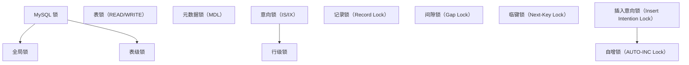

## 1. 锁分类总览



## 2. 全局锁

```sql
-- 全局读锁（用于备份）
FLUSH TABLES WITH READ LOCK;

-- 备份
mysqldump --single-transaction mydb > backup.sql

-- 释放
UNLOCK TABLES;
```

## 3. 表级锁

### 3.1 表锁

```sql
LOCK TABLES employees READ;       -- 读锁
LOCK TABLES employees WRITE;      -- 写锁
UNLOCK TABLES;
```

### 3.2 元数据锁（MDL）

```sql
-- MDL 自动获取，防止 DDL 与 DML 冲突
-- SELECT → MDL 读锁
-- ALTER → MDL 写锁

-- 长事务阻塞 DDL
-- 事务A: BEGIN; SELECT * FROM t;  -- 持有 MDL 读锁
-- 事务B: ALTER TABLE t ADD COLUMN ...;  -- 等待 MDL 写锁
-- 事务C: SELECT * FROM t;  -- 等待事务B的 MDL 写锁！

-- 查看MDL等待
SELECT * FROM performance_schema.metadata_locks;
```

### 3.3 意向锁

```sql
-- 行级锁的前置声明，快速检测表级锁冲突
-- IS：打算加行级S锁
-- IX：打算加行级X锁

-- 兼容性：
-- IS-IS , IS-IX , IS-S , IS-X
-- IX-IX , IX-S , IX-X
```

## 4. 行级锁

### 4.1 记录锁（Record Lock）

```sql
-- 锁定索引记录
SELECT * FROM t WHERE id = 5 FOR UPDATE;
-- 锁定 id=5 的索引记录
```

### 4.2 间隙锁（Gap Lock）

```sql
-- 锁定索引记录之间的间隙
SELECT * FROM t WHERE id BETWEEN 5 AND 10 FOR UPDATE;
-- 锁定 (5, 10) 间隙，阻止插入 id=6,7,8,9

-- 间隙锁之间不冲突
-- 间隙锁与插入意向锁冲突
```

### 4.3 临键锁（Next-Key Lock）

```sql
-- 记录锁 + 间隙锁
-- InnoDB 在 REPEATABLE READ 下的默认行锁算法

-- 退化为记录锁：唯一索引等值查询且记录存在
SELECT * FROM t WHERE id = 5 FOR UPDATE;  -- id 是主键，存在
-- 只锁 id=5 行

-- 退化为间隙锁：唯一索引等值查询但记录不存在
SELECT * FROM t WHERE id = 5 FOR UPDATE;  -- id=5 不存在
-- 锁 (prev, next) 间隙
```

### 4.4 插入意向锁

```sql
-- INSERT 操作在插入前获取插入意向锁
-- 是一种特殊的间隙锁，不阻止其他插入意向锁
-- 只与间隙锁冲突

-- 多个事务向同一间隙的不同位置插入不冲突
INSERT INTO t VALUES (6, ...);  -- 事务A
INSERT INTO t VALUES (7, ...);  -- 事务B
-- 不冲突
```

## 5. 自增锁

```sql
-- AUTO-INC 锁模式
-- innodb_autoinc_lock_mode = 0：传统模式（每次INSERT加表级锁）
-- innodb_autoinc_lock_mode = 1：连续模式（批量INSERT加锁，单行轻量锁）
-- innodb_autoinc_lock_mode = 2：交叉模式（无锁，最高并发，主从不安全）

SET GLOBAL innodb_autoinc_lock_mode = 2;
```

## 6. 查看锁信息

```sql
-- MySQL 8.0+
SELECT * FROM performance_schema.data_locks;
SELECT * FROM performance_schema.data_lock_waits;

-- 查看锁等待
SELECT
    waiting.pid AS waiting_pid,
    blocking.pid AS blocking_pid,
    waiting.sql_text AS waiting_query,
    blocking.sql_text AS blocking_query
FROM performance_schema.data_lock_waits w
JOIN performance_schema.events_statements_current waiting
    ON w.THREAD_ID = waiting.THREAD_ID
JOIN performance_schema.events_statements_current blocking
    ON w.BLOCKING_THREAD_ID = blocking.THREAD_ID;
```

## 参考文献

MySQL 官方文档：https://dev.mysql.com/doc/
MySQL 8.0 参考手册：https://dev.mysql.com/doc/refman/8.0/en/
High Performance MySQL（O'Reilly）：https://www.oreilly.com/library/view/high-performance-mysql/
Percona 博客：https://www.percona.com/blog/

## 延伸阅读

MySQL 索引与优化，见 020-mysql 模块文档。
MySQL 日志体系，见 020-mysql 模块 redo/binlog 文档。
Redis 缓存与 MySQL 组合，见 022-redis 模块。
尚硅谷 Bilibili 空间（https://space.bilibili.com/302417610 ）提供 MySQL 高级课程。

## 深度专题扩展

以下专题从不同角度深入本文主题，供有进阶需求的读者研读。每个专题独立成节，内容相互补充。

### 13.1 InnoDB 日志与崩溃恢复

redo log 记录物理页修改（WAL：先写日志再写数据页），崩溃后重放恢复；环形文件组 + checkpoint 推进。
undo log 记录事务前镜像，支持回滚与 MVCC 版本链；purge 线程清理。
两阶段提交：redo prepare -> binlog -> redo commit，保证两份日志一致，主从不丢数据。
刷盘策略：innodb_flush_log_at_trx_commit=1 最安全（每次提交 fsync），2 每秒刷。

### 13.2 执行计划与优化器

EXPLAIN 关键列：type（const/ref/range/index/ALL）、key、rows、Extra（Using index/Using filesort）。
优化器基于统计信息选计划；analyze table 更新统计；hint（FORCE INDEX）谨慎使用。
排序与分组：filesort 优化为索引序；避免临时表。
慢查询治理流程：慢日志 -> 计划分析 -> 索引/改写 -> 验证。

## 模块文档速查表

| 文档 | 主题 | 与本文的关联 |
| --- | --- | --- |
| MySQL 概述与数据库设计 | 001-MySQLOverviewDatabaseDesign | 本文的前置基础 |
| MySQL 环境搭建 | 002-MySQLEnvSetup | 本文的前置基础 |
| MySQL 数据类型与约束 | 003-MySQLDataTypeConstraint | 本文的并列主题 |
| SQL 数据定义与高级对象 | 004-SQLDataDefinitionAdvanced | 本文的并列主题 |
| MyISAM存储引擎 | 005-MyISAMStorageEngine | 本文的并列主题 |
| SQL 数据操作与查询 | 006-SQLDataOperationQuery | 本文的并列主题 |
| Memory存储引擎 | 007-MemoryStorageEngine | 本文的并列主题 |
| NDB-Cluster | 008-NDBCluster | 本文的并列主题 |
| 聚簇索引与二级索引 | 009-ClusteredIndexSecondaryIndex | 本文的并列主题 |
| 联合索引与最左前缀原则 | 010-CompositeIndexLeftmostPrefixPrinciple | 本文的并列主题 |
| 索引下推 | 011-IndexConditionPushdown | 本文的并列主题 |
| 全文索引 | 012-FullTextIndex | 本文的并列主题 |
| 前缀索引 | 013-PrefixIndex | 本文的并列主题 |
| 索引提示与强制索引 | 014-IndexHintForceIndex | 本文的并列主题 |
| 索引统计信息与直方图 | 015-IndexStatsHistogram | 本文的并列主题 |
| SQL 函数与高级查询 | 016-SQLFunctionAndAdvancedQuery | 本文的并列主题 |
| 索引失效场景 | 017-IndexFailureScene | 本文的并列主题 |
| EXPLAIN输出详解 | 018-EXPLAINDetailed | 本文的并列主题 |
| 慢查询日志 | 019-SlowQueryLog | 本文的并列主题 |
| 优化器追踪 | 020-OptimizerTrace | 本文的性能延伸 |
| 子查询优化 | 021-SubqueryOptimization | 本文的性能延伸 |
| 派生表优化 | 022-DerivedTableOptimization | 本文的性能延伸 |
| GROUP-BY与ORDER-BY优化 | 023-GroupByOrderByOptimization | 本文的性能延伸 |
| JOIN算法 | 024-JOINAlgorithm | 本文的并列主题 |
| 事务隔离级别底层实现 | 025-TransactionIsolationImplementation | 本文的并列主题 |
| MVCC原理 | 026-MVCCPrinciple | 本文的原理深化 |
| 多表联查详解 | 027-MultiTableJoinDetailed | 本文的并列主题 |
| 锁分类 | 028-LockClassification | 本文自身 |
| 死锁检测与处理 | 029-DeadlockDetectionHandling | 本文的并列主题 |
| 分布式事务 | 030-DistributedTransaction | 本文的并列主题 |
| 二进制日志 | 031-Binlog | 本文的并列主题 |
| 重做日志 | 032-RedoLog | 本文的并列主题 |
| 撤销日志 | 033-UndoLog | 本文的并列主题 |
| 日志系统 | 034-LogSystem | 本文的并列主题 |
| 逻辑备份 | 035-LogicalBackup | 本文的并列主题 |
| 物理备份 | 036-PhysicalBackup | 本文的并列主题 |
| 基于时间点恢复 | 037-PITR | 本文的并列主题 |
| 主从复制 | 038-Replication | 本文的并列主题 |
| 进阶查询与多表操作 | 039-AdvancedQueryMultiTableOperation | 本文的并列主题 |
| GTID | 040-GTID | 本文的并列主题 |
| 并行复制 | 041-ParallelReplication | 本文的并列主题 |
| 组复制 | 042-GroupReplication | 本文的并列主题 |
| InnoDB-Cluster | 043-InnoDBCluster | 本文的并列主题 |
| 分区表 | 044-PartitionedTable | 本文的并列主题 |
| 分库分表中间件 | 045-ShardingMiddleware | 本文的并列主题 |
| 账户与权限管理 | 046-AccountPermissionManagement | 本文的安全延伸 |
| SSL-TLS加密 | 047-SSLEncryption | 本文的安全延伸 |
| 防火墙插件 | 048-FirewallPlugin | 本文的并列主题 |
| InnoDB体系架构 | 049-InnoDBSystemArchitecture | 本文的原理深化 |
| 数据加密 | 050-DataEncryption | 本文的安全延伸 |
| MySQL 索引与执行计划 | 051-MySQLIndexExecutionPlan | 本文的并列主题 |
| MySQL9新特性与并行查询 | 052-MySQL9NewFeaturesParallelQuery | 本文的并列主题 |
| VECTOR向量类型 | 053-VectorType | 本文的并列主题 |
| JSON模式验证与聚合函数 | 054-JSONSchemaValidationAggregate | 本文的并列主题 |
| 复制与高可用 | 055-ReplicationHA | 本文的并列主题 |
| 不可见索引 | 056-InvisibleIndex | 本文的并列主题 |
| 性能调优与安全 | 057-PerformanceTuningSecurity | 本文的性能延伸 |
| 函数索引 | 058-FunctionalIndex | 本文的并列主题 |
| 存储过程与函数 | 059-StoredProcedureAndFunction | 本文的并列主题 |
| MVCC快照读与当前读 | 060-MVCCSnapshotCurrentRead | 本文的并列主题 |
| 索引原理与性能优化 | 061-IndexPrinciplePerformanceOptimization | 本文的性能延伸 |
| 触发器与事件 | 062-TriggerEvent | 本文的并列主题 |
| Redo与Undo与Binlog写入时机 | 063-RedoUndoBinlogWriteTiming | 本文的并列主题 |
| 两阶段提交 | 064-TwoPhaseCommit | 本文的并列主题 |
| 间隙锁与临键锁解决幻读 | 065-GapLockNextKeyLockSolutionPhantomRead | 本文的并列主题 |
| 主从复制延迟原因与解决 | 066-ReplicationDelayCauseSolution | 本文的并列主题 |
| 分库分表策略 | 067-ShardingStrategy | 本文的并列主题 |
| JSON类型与JSON-TABLE | 068-JSONTypeJSONTable | 本文的并列主题 |
| 事务与锁机制 | 069-TransactionLockMechanism | 本文的原理深化 |
| MySQL 配置与运维 | 070-MySQLConfigOps | 本文的并列主题 |
| MySQL 快速查阅 | 071-MySQLQuickLookup | 本文的并列主题 |
| MySQL 控制器与应用 | 072-MySQLControlApplication | 本文的并列主题 |
| SQL 注入基础与检测 | 073-SQLInjectionBasicsDetection | 本文的前置基础 |
| SQL 注入攻击类型与实战 | 074-SQLInjectionAttackTypePractice | 本文的综合应用 |
| SQL 注入防御策略 | 075-SQLInjectionDefenseStrategy | 本文的并列主题 |
| MySQL 项目示例：电商数据库设计 | 076-MySQLProjectExampleDatabaseDesign | 本文的综合应用 |
| MySQL 理论知识点 | 077-MySQLTheoryKnowledge | 本文的并列主题 |
| MySQL DDL 数据定义 | 078-DDL | 本文的并列主题 |
| MySQL DML 数据操作 | 079-DML | 本文的并列主题 |
| MySQL DQL 查询速查 | 080-DQL | 本文的并列主题 |
| MySQL 索引管理 | 081-IndexManagement | 本文的并列主题 |
| MySQL 用户与权限管理 | 082-UserPermission | 本文的安全延伸 |
| MySQL CLI 命令 | 083-CLI | 本文的并列主题 |
| mysqladmin 管理命令 语法速查手册 | 084-Mysqladmin | 本文的并列主题 |
| 视图 语法速查手册 | 085-View | 本文的并列主题 |
| 事件调度器 语法速查手册 | 086-EventScheduler | 本文的并列主题 |
| 字符集与排序规则 语法速查手册 | 087-CharsetCollation | 本文的并列主题 |
