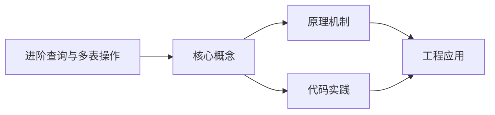
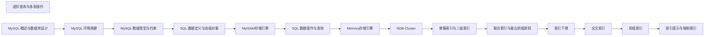

## 1. 学习目标（Bloom 分类）

本节按照布鲁姆教育目标分类学组织学习路径。本文主题为《进阶查询与多表操作》，属于 MySQL 模块，读者可以根据自身阶段选择阅读深度。

记忆层面：能够准确复述本文的核心概念、术语与基本语法或操作步骤，并能够在提问或检索时快速定位对应知识点。能够说出 MySQL 的核心概念、语法与常用对象。

理解层面：能够用自己的语言解释核心原理与工作机制，说明概念之间的因果关系，而不是机械记忆结论。能够解释 MySQL 的执行原理与优化机制。

应用层面：能够在真实项目或练习场景中运用本文知识解决具体问题，写出正确且可维护的实现。能够编写正确、高效的 MySQL 语句与操作。

分析层面：能够拆解复杂问题，比较本文主题与相邻概念的异同，识别边界条件与例外情况。能够分析 MySQL 相关方案在性能与一致性上的权衡。

评价层面：能够根据约束条件（性能、可读性、安全、成本）评价不同方案的优劣，做出有依据的技术决策。能够根据业务场景评价 MySQL 技术选型。

创造层面：能够把本文知识与其他模块知识组合，设计出新的解决方案或可复用的工程模式。能够组合 MySQL 与其他技术设计数据架构。

通过本节学习，读者应当能够把《进阶查询与多表操作》纳入自己的知识网络，并与 MySQL 模块的其他主题（InnoDB、索引、日志、主从、性能调优）建立关联。

## 2. 历史动机与发展脉络

《进阶查询与多表操作》是 MySQL 领域的重要主题。要真正理解它，需要先了解它解决的问题与演进过程。

MySQL 于 1995 年由 MySQL AB 发布，2008 年被 Sun 收购，2010 年随 Sun 并入 Oracle；MariaDB 是社区分支。
MySQL 8.0（2018）重写优化器、引入窗口函数与 CTE、默认 utf8mb4、数据字典升级；MySQL 8.4 与 9.x 继续演进（Oracle 创新版 + LTS 双轨）。
InnoDB 是默认存储引擎：事务、行锁、MVCC、崩溃恢复（redo/undo）；MyISAM 仅存于历史场景。

回到本文主题：进阶查询与多表操作 的提出与成熟，正是上述技术背景下的必然产物。早期实现往往以简单可用为目标，随着工程规模扩大，社区逐渐沉淀出标准做法与最佳实践；理解这一脉络，可以帮助读者判断“为什么文档中的推荐写法是现在这个样子”，也能在遇到历史遗留代码时准确识别其设计年代与取舍。


## 3. 形式化定义与核心概念精讲

本节把《进阶查询与多表操作》涉及的核心概念以“定义 + 讲解”的形式展开。读者应把定义当作工具，把讲解当作理解路径；两者结合才能形成可迁移的知识。

InnoDB 架构：缓冲池（Buffer Pool）、日志缓冲、redo/undo 日志；脏页刷盘与 checkpoint 机制。
索引：B+ 树主键聚集索引、二级索引、覆盖索引；索引下推（ICP）与 MRR 优化。
事务与锁：两阶段锁、间隙锁/临键锁（可重复读防幻读）、MVCC 快照读；隔离级别。

### 3.1 原文章节逐一精讲

原文档把主题拆分为 5 个小节，下面按顺序给出每一节的导读讲解，随后保留原文细节供精读。

#### 原文精读（完整保留）


#### 1. 多表联查 (Joins)

##### 1.1 基本联查类型

###### 1.1.1 联查类型总览

| 联查类型       | 描述     | 返回结果                          |
| -------------- | -------- | --------------------------------- |
| **INNER JOIN** | 内连接   | 只返回两表匹配的行                |
| **LEFT JOIN**  | 左外连接 | 返回左表所有行，右表不匹配补 NULL |
| **RIGHT JOIN** | 右外连接 | 返回右表所有行，左表不匹配补 NULL |
| **FULL JOIN**  | 全外连接 | 返回两表所有行，不匹配的补 NULL   |

###### 1.1.2 联查类型详解

###### INNER JOIN（内连接）

**作用**：只返回两个表中匹配条件的行。
**语法**：

```sql
 SELECT *
 from table1
 inNER JOIN table2
  ON table1.id = table2.id;
```

**图解**：

```mermaid
flowchart LR
    subgraph A[表A]
        A1[1] A2[2] A3[3] A4[4]
    end
    subgraph B[表B]
        B1[A] B2[B] B3[C]
    end
    A1 --- B1
    A2 --- B2
    A3 --- B3
```

**特点**：只有两边都匹配的数据才会出现在结果中。

---

###### LEFT JOIN（左外连接）

**作用**：返回左表的所有行，以及右表中匹配的行；右表不匹配的部分用 NULL 填充。
**语法**：

```sql
 SELECT *
 from table1
 LEFT JOIN table2
  ON table1.id = table2.id;
```

**图解**：

```mermaid
flowchart LR
    subgraph A[表A]
        A1[1] A2[2] A3[3] A4[4]
    end
    subgraph B[表B]
        B1[A] B2[B] B3[C]
    end
    A1 --- B1
    A2 --- B2
    A3 --- B3
```

**特点**：左表的数据全部保留，右表没有匹配的用 NULL 填充。

---

###### RIGHT JOIN（右外连接）

**作用**：返回右表的所有行，以及左表中匹配的行；左表不匹配的部分用 NULL 填充。
**语法**：

```sql
 SELECT *
 from table1
 RIGHT JOIN table2
  ON table1.id = table2.id;
```

**图解**：

```mermaid
flowchart LR
    subgraph A[表A]
        A1[1] A2[2] A3[3] A4[4]
    end
    subgraph B[表B]
        B1[A] B2[B] B3[C]
    end
    A1 --- B1
    A2 --- B2
    A3 --- B3
```

**特点**：右表的数据全部保留，左表没有匹配的用 NULL 填充。

---

###### FULL JOIN（全外连接）

**作用**：返回两个表的所有行，不匹配的部分用 NULL 填充。
**注意**：MySQL 不直接支持 FULL JOIN，需要通过 `UNION` 模拟。
**语法**：

```sql
 -
 SELECT *
 from table1
 LEFT JOIN table2
  ON table1.id = table2.id
 UNION
 SELECT *
 from table1
 RIGHT JOIN table2
  ON table1.id = table2.id;
```

**图解**：

```mermaid
flowchart LR
    subgraph A[表A]
        A1[1] A2[2] A3[3] A4[4]
    end
    subgraph B[表B]
        B1[A] B2[B] B3[C]
    end
    A1 --- B1
    A2 --- B2
    A3 --- B3
```

**特点**：两个表的数据全部保留，没有匹配的用 NULL 填充。

##### 1.2 联查示例

**示例表结构**:

```sql
 -
 CREATE TABLE departments (
  dept_id INT PRIMARY KEY,
  dept_name VARCHAR(50) NOT NULL
 )
 -
 CREATE TABLE employees (
  emp_id INT PRIMARY KEY,
  emp_name VARCHAR(50) NOT NULL,
  dept_id INT,
  salary DECIMAL(10, 2),
  hire_date DATE,
  FOREIGN KEY (dept_id) REFERENCES departments(dept_id)
 )
 -
 inSERT INTO departments VALUES (1, '技术部'), (2, '市场部'), (3, '财务部');
 inSERT INTO employees VALUES
 (1, '张三', 1, 8000, '2020-01-01'),
 (2, '李四', 1, 9000, '2020-02-01'),
 (3, '王五', 2, 7000, '2020-03-01'),
 (4, '赵六', 2, 6000, '2020-04-01'),
 (5, '钱七', 3, 10000, '2020-05-01');
```

**INNER JOIN 示例**:

```sql
 -
 SELECT e.emp_id, e.emp_name, d.dept_name, e.salary
 from employees e
 inNER JOIN departments d ON e.dept_id = d.dept_id;
 -
 -
 -
 -
 -
 -
 -
```

**LEFT JOIN 示例**:

```sql
 -
 SELECT d.dept_id, d.dept_name, e.emp_name, e.salary
 from departments d
 LEFT JOIN employees e ON d.dept_id = e.dept_id;
 -
 -
 -
 -
 -
 -
 -
```

**RIGHT JOIN 示例**:

```sql
 -
 SELECT e.emp_id, e.emp_name, d.dept_name, e.salary
 from departments d
 RIGHT JOIN employees e ON d.dept_id = e.dept_id;
 -
 -
 -
 -
 -
 -
 -
```

**FULL JOIN 模拟**:

```sql
 -
 SELECT d.dept_id, d.dept_name, e.emp_name, e.salary
 from departments d
 LEFT JOIN employees e ON d.dept_id = e.dept_id
 UNION
 SELECT d.dept_id, d.dept_name, e.emp_name, e.salary
 from departments d
 RIGHT JOIN employees e ON d.dept_id = e.dept_id;
```

##### 1.3 多表联查实战（商品管理系统）

以下示例基于商品管理系统数据库，包含完整的多表联查实战场景：

```sql
 -
 -
 -
 -
 -
 -
```

**实战示例1：查询员工及其销售订单**

```sql
 SELECT
  e.Employees_id,
  e.Employees_name,
  s.Sales_id,
  s.Sales_time,
  s.Customer_id
 from employees_info e
 inNER JOIN sales_info s
  ON e.Employees_id = s.Employees_id;
```

**实战示例2：查询员工销售订单详情（含客户信息）**

```sql
 SELECT
  e.Employees_name,
  s.Sales_id,
  c.Customer_name,
  c.Telephone,
  s.Sales_time
 from employees_info e
 inNER JOIN sales_info s
  ON e.Employees_id = s.Employees_id
 inNER JOIN customer_info c
  ON s.Customer_id = c.Customer_id;
```

**实战示例3：查询完整订单信息（五表联查）**

```sql
 SELECT
  e.Employees_name AS 员工姓名,
  s.Sales_id AS 订单编号,
  c.Customer_name AS 客户姓名,
  m.Commodity_name AS 商品名称,
  sl.Sales_price AS 销售单价,
  sl.Sales_Number AS 销售数量,
  sl.Sales_price * sl.Sales_Number AS 小计金额,
  s.Sales_time AS 销售时间
 from employees_info e
 inNER JOIN sales_info s
  ON e.Employees_id = s.Employees_id
 inNER JOIN customer_info c
  ON s.Customer_id = c.Customer_id
 inNER JOIN sales_list sl
  ON s.Sales_id = sl.Sales_id
 inNER JOIN commodity_info m
  ON sl.Commodity_id = m.Commodity_id
 ORDER BY s.Sales_time DESC;
```

**实战示例4：统计各销售员的销售业绩**

```sql
 SELECT
  e.Employees_name AS 销售员,
  COUNT(DISTINCT s.Sales_id) AS 订单数,
  SUM(sl.Sales_Number) AS 销售总量,
  SUM(sl.Sales_price * sl.Sales_Number) AS 销售总业绩
 from employees_info e
 inNER JOIN sales_info s
  ON e.Employees_id = s.Employees_id
 inNER JOIN sales_list sl
  ON s.Sales_id = sl.Sales_id
 GROUP BY e.Employees_id, e.Employees_name
 ORDER BY 销售总业绩 DESC;
```

**实战示例5：查询客户购买的商品明细**

```sql
 SELECT
  c.Customer_name AS 客户姓名,
  m.Commodity_name AS 商品名称,
  SUM(sl.Sales_Number) AS 购买数量,
  SUM(sl.Sales_price * sl.Sales_Number) AS 消费金额
 from customer_info c
 inNER JOIN sales_info s
  ON c.Customer_id = s.Customer_id
 inNER JOIN sales_list sl
  ON s.Sales_id = sl.Sales_id
 inNER JOIN commodity_info m
  ON sl.Commodity_id = m.Commodity_id
 GROUP BY c.Customer_id, c.Customer_name, m.Commodity_name
 ORDER BY c.Customer_name, 消费金额 DESC;
```

**实战示例6：自连接查询 - 查询同名员工**

```sql
 SELECT
  e1.Employees_name AS 姓名,
  e1.Employees_id AS 员工ID1,
  e2.Employees_id AS 员工ID2
 from employees_info e1
 inNER JOIN employees_info e2
  ON e1.Employees_name = e2.Employees_name
 WHERE e1.Employees_id < e2.Employees_id;
```

**实战示例7：自连接查询 - 同城市供应商**

```sql
 SELECT
  s1.Supplier_name AS 供应商1,
  s1.Address AS 城市,
  s2.Supplier_name AS 同城市供应商
 from supplier_info s1
 inNER JOIN supplier_info s2
  ON s1.Address = s2.Address
 WHERE s1.Supplier_id <> s2.Supplier_id
 ORDER BY s1.Address, s1.Supplier_name;
```

**外连接实战示例1：查询所有员工及他们的销售记录**

```sql
 SELECT
  e.Employees_name,
  s.Sales_id,
  s.Sales_time
 from employees_info e
 LEFT JOIN sales_info s
  ON e.Employees_id = s.Employees_id;
```

**外连接实战示例2：统计每种商品的销量（包含未销售的商品）**

```sql
 SELECT
  c.Commodity_name,
  IFNULL(SUM(sl.Sales_Number), 0) AS 销售数量
 from commodity_info c
 LEFT JOIN sales_list sl
  ON c.Commodity_id = sl.Commodity_id
 GROUP BY c.Commodity_id, c.Commodity_name
 ORDER BY 销售数量 DESC;
```

**外连接实战示例3：查询采购信息（包含没有采购的商品）**

```sql
 SELECT
  c.Commodity_name,
  pi.Purchase_id,
  pi.Purchase_time,
  pl.Purchase_Number,
  pl.Purchase_price,
  su.Supplier_name,
  e.Employees_name
 from commodity_info c
 LEFT JOIN purchase_list pl
  ON c.Commodity_id = pl.Commodity_id
 LEFT JOIN purchase_info pi
  ON pl.Purchase_id = pi.Purchase_id
 LEFT JOIN supplier_info su
  ON pi.Supplier_id = su.Supplier_id
 LEFT JOIN employees_info e
  ON pi.Employees_id = e.Employees_id;
```

**外连接实战示例4：查询有销售记录的员工**

```sql
 SELECT DISTINCT
  e.Employees_name
 from employees_info e
 RIGHT JOIN sales_info s
  ON e.Employees_id = s.Employees_id
 WHERE e.Employees_id IS NOT NULL;
```

##### 1.4 其他连接类型

###### 1.4.1 交叉连接 (CROSS JOIN)

返回两个表的笛卡尔积：

```sql
 -
 SELECT * FROM table1 CROSS JOIN table2;
 -
 SELECT * FROM table1, table2;
 -
 SELECT d.dept_name, e.emp_name
 from departments d
 CROSS JOIN employees e;
```

###### 1.4.2 自然连接 (NATURAL JOIN)

自动根据相同列名进行连接：

```sql
 -
 SELECT * FROM employees NATURAL JOIN departments;
 -
 SELECT * FROM employees NATURAL LEFT JOIN departments;
 -
 SELECT * FROM employees NATURAL RIGHT JOIN departments;
```

###### 1.4.3 USING 子句

当两个表有相同列名时，可以使用 USING 简化连接：

```sql
 -
 SELECT e.emp_name, d.dept_name
 from employees e
 JOIN departments d USING (dept_id);
```

##### 1.5 连接优先级与括号

```sql
 -
 SELECT *
 from employees e
 LEFT JOIN (
  departments d
  JOIN projects p ON d.dept_id = p.dept_id
 )
```

#### 2. 分组统计 (Grouping)

##### 2.1 基本分组

使用 `GROUP BY` 配合聚合函数进行分组统计：

```sql
 -
 SELECT dept_id, AVG(salary) as avg_salary
 from employees
 GROUP BY dept_id;
 -
 -
 -
 -
 -
```

##### 2.2 HAVING 子句

`HAVING` 用于对分组后的结果进行过滤，而 `WHERE` 是在分组前过滤：

```sql
 -
 SELECT dept_id, AVG(salary) as avg_salary
 from employees
 GROUP BY dept_id
 HAVING AVG(salary) > 7000;
 -
 -
 -
 -
```

##### 2.3 多列分组

```sql
 -
 SELECT dept_id, YEAR(hire_date) as hire_year, AVG(salary) as avg_salary
 from employees
 GROUP BY dept_id, YEAR(hire_date);
```

##### 2.4 常用聚合函数

| 聚合函数         | 描述         | 示例                                                  |
| ---------------- | ------------ | ----------------------------------------------------- |
| `COUNT()`        | 计算行数     | `COUNT(*)`、`COUNT(column)`、`COUNT(DISTINCT column)` |
| `SUM()`          | 计算数值总和 | `SUM(price)`、`SUM(quantity * price)`                 |
| `AVG()`          | 计算平均值   | `AVG(salary)`、`AVG(DISTINCT price)`                  |
| `MAX()`          | 计算最大值   | `MAX(price)`、`MAX(created_at)`                       |
| `MIN()`          | 计算最小值   | `MIN(price)`、`MIN(created_at)`                       |
| `GROUP_CONCAT()` | 拼接字符串   | `GROUP_CONCAT(name SEPARATOR ',')`                    |

```sql
 -
 SELECT
  COUNT(*) as total_employees,
  SUM(salary) as total_salary,
  AVG(salary) as avg_salary,
  MAX(salary) as max_salary,
  MIN(salary) as min_salary
 from employees;
```

##### 2.5 ROLLUP 和 CUBE

###### 2.5.1 ROLLUP

生成小计和总计：

```sql
 -
 SELECT
  dept_id,
  YEAR(hire_date) as hire_year,
  COUNT(*) as employee_count
 from employees
 GROUP BY dept_id, YEAR(hire_date) WITH ROLLUP;
 -
 -
 -
 -
 -
 -
 -
 -
 -
```

###### 2.5.2 GROUPING SETS

灵活指定分组组合：

```sql
 -
 SELECT
  dept_id,
  YEAR(hire_date) as hire_year,
  COUNT(*) as employee_count
 from employees
 GROUP BY GROUPING SETS (
  (dept_id, YEAR(hire_date)), -- 部门+年份
  (dept_id), -- 仅部门
  () -- 总计
 )
```

##### 2.6 GROUP_CONCAT 的高级用法

```sql
 -
 SELECT
  dept_id,
  GROUP_CONCAT(emp_name SEPARATOR ', ') as employees
 from employees
 GROUP BY dept_id;
 -
 -
 -
 -
 -
 -
 SELECT
  dept_id,
  GROUP_CONCAT(emp_name ORDER BY salary DESC SEPARATOR ', ') as employees
 from employees
 GROUP BY dept_id;
```

#### 3. 子查询 (Subqueries)

##### 3.1 标量子查询

返回单一值的子查询：

```sql
 -
 SELECT emp_name, salary
 from employees
 WHERE salary > (SELECT AVG(salary) FROM employees);
 -
 -
 -
 -
```

##### 3.2 列子查询

返回一列值的子查询，通常配合 `IN`, `ANY`, `ALL` 使用：

```sql
 -
 SELECT emp_name, dept_id
 from employees
 WHERE dept_id IN (SELECT dept_id FROM departments WHERE dept_name IN ('技术部', '市场部'));
 -
 -
 -
 -
 -
 -
```

##### 3.3 行子查询

返回一行多列的子查询：

```sql
 -
 SELECT emp_name, dept_id, salary
 from employees
 WHERE (dept_id, salary) = (SELECT dept_id, salary FROM employees WHERE emp_name = '张三');
```

##### 3.4 表子查询

返回一个表的子查询，可以作为临时表使用：

```sql
 -
 SELECT e.emp_name, e.dept_id, e.salary
 from employees e
 JOIN (
  SELECT dept_id, MAX(salary) as max_salary
  FROM employees
  GROUP BY dept_id
 )
 -
 -
 -
 -
 -
```

##### 3.5 相关子查询

子查询中使用了外部查询的列：

```sql
 -
 SELECT
  emp_name,
  dept_id,
  salary,
  (SELECT COUNT(*) + 1
  FROM employees e2
  WHERE e2.dept_id = e1.dept_id AND e2.salary > e1.salary) as rank
 from employees e1
 ORDER BY dept_id, rank;
 -
 -
 -
 -
 -
 -
 -
```

##### 3.6 EXISTS 子查询

检查子查询是否返回任何行：

```sql
 -
 SELECT dept_id, dept_name
 from departments d
 WHERE EXISTS (
  SELECT 1 FROM employees e WHERE e.dept_id = d.dept_id
 )
 -
 SELECT dept_id, dept_name
 from departments d
 WHERE NOT EXISTS (
  SELECT 1 FROM employees e WHERE e.dept_id = d.dept_id
 )
 -
 SELECT dept_id, dept_name
 from departments d
 WHERE EXISTS (
  SELECT 1 FROM employees e
  WHERE e.dept_id = d.dept_id AND e.salary > 8000
 )
```

##### 3.7 ANY/SOME 和 ALL

```sql
 -
 SELECT emp_name, salary
 from employees
 WHERE salary > ANY (
  SELECT AVG(salary) FROM employees GROUP BY dept_id
 )
 -
 SELECT emp_name, salary
 from employees
 WHERE salary > ALL (
  SELECT AVG(salary) FROM employees GROUP BY dept_id
 )
 -
 SELECT emp_name, salary
 from employees
 WHERE salary > SOME (
  SELECT AVG(salary) FROM employees GROUP BY dept_id
 )
```

##### 3.8 子查询的性能考虑

```sql
 -
 SELECT e.emp_name, e.salary
 from employees e
 JOIN (SELECT AVG(salary) as avg_sal FROM employees) t
 WHERE e.salary > t.avg_sal;
 -
 SELECT emp_name, salary
 from employees e1
 WHERE salary > (SELECT AVG(salary) FROM employees e2 WHERE e2.dept_id = e1.dept_id);
```

#### 4. 窗口函数 (Window Functions - MySQL 8.0+)

窗口函数允许在不分组的情况下进行聚合计算，为每行数据生成一个结果。

##### 4.1 基本语法

```sql
 <窗口函数> OVER (
  [PARTITION BY <分区列>]
  [ORDER BY <排序列>]
  [ROWS/RANGE <窗口范围>]
 )
```

##### 4.2 常用窗口函数

###### 4.2.1 排名函数

| 函数           | 描述                 | 相同值处理                     | 示例结果（假设两行值相同） |
| -------------- | -------------------- | ------------------------------ | -------------------------- |
| `ROW_NUMBER()` | 为每行分配唯一的序号 | 即使值相同也分配不同序号       | 1, 2                       |
| `RANK()`       | 相同值会有相同的排名 | 相同值排名相同，后续排名跳过   | 1, 1, 3（跳过2）           |
| `DENSE_RANK()` | 相同值会有相同的排名 | 相同值排名相同，后续排名不跳过 | 1, 1, 2                    |

**示例**:

```sql
 -
 SELECT
  emp_name,
  dept_id,
  salary,
  ROW_NUMBER() OVER (PARTITION BY dept_id ORDER BY salary DESC) as row_num,
  RANK() OVER (PARTITION BY dept_id ORDER BY salary DESC) as rank,
  DENSE_RANK() OVER (PARTITION BY dept_id ORDER BY salary DESC) as dense_rank
 from employees;
 -
 -
 -
 -
 -
 -
 -
```

###### 4.2.2 聚合函数作为窗口函数

```sql
 -
 SELECT
  emp_name,
  dept_id,
  salary,
  SUM(salary) OVER (PARTITION BY dept_id ORDER BY salary) as cumulative_salary,
  AVG(salary) OVER (PARTITION BY dept_id) as dept_avg_salary,
  MAX(salary) OVER (PARTITION BY dept_id) as dept_max_salary
 from employees;
 -
 -
 -
 -
 -
 -
 -
```

###### 4.2.3 分析函数

| 函数            | 描述                   | 语法示例               | 说明                   |
| --------------- | ---------------------- | ---------------------- | ---------------------- |
| `LAG()`         | 获取前 N 行的值        | `LAG(salary, 1)`       | 获取上一行的 salary 值 |
| `LEAD()`        | 获取后 N 行的值        | `LEAD(salary, 2)`      | 获取下两行的 salary 值 |
| `FIRST_VALUE()` | 获取窗口内的第一个值   | `FIRST_VALUE(salary)`  | 获取分组内的第一个值   |
| `LAST_VALUE()`  | 获取窗口内的最后一个值 | `LAST_VALUE(salary)`   | 获取分组内的最后一个值 |
| `NTH_VALUE()`   | 获取窗口内第 N 个值    | `NTH_VALUE(salary, 3)` | 获取分组内的第三个值   |

**示例**:

```sql
 -
 SELECT
  emp_name,
  dept_id,
  salary,
  LAG(salary, 1) OVER (PARTITION BY dept_id ORDER BY salary) as prev_salary,
  salary - LAG(salary, 1) OVER (PARTITION BY dept_id ORDER BY salary) as salary_diff
 from employees;
 -
 -
 -
 -
 -
 -
 -
```

##### 4.3 窗口范围

```sql
 -
 SELECT
  emp_name,
  dept_id,
  salary,
  SUM(salary) OVER (
  PARTITION BY dept_id
  ORDER BY salary
  ROWS BETWEEN 1 PRECEDING AND 1 FOLLOWING
  ) as moving_sum
 from employees;
 -
 -
 -
 -
 -
 -
 -
```

##### 4.4 其他常用窗口函数

###### 4.4.1 百分比排名函数

```sql
 -
 SELECT
  emp_name,
  dept_id,
  salary,
  PERCENT_RANK() OVER (PARTITION BY dept_id ORDER BY salary DESC) as percent_rank
 from employees;
 -
 -
 -
 -
 -
 -
 -
 -
 SELECT
  emp_name,
  dept_id,
  salary,
  CUME_DIST() OVER (PARTITION BY dept_id ORDER BY salary) as cume_dist
 from employees;
```

###### 4.4.2 NTILE 函数

```sql
 -
 SELECT
  emp_name,
  dept_id,
  salary,
  NTILE(2) OVER (PARTITION BY dept_id ORDER BY salary DESC) as bucket
 from employees;
 -
 -
 -
 -
 -
 -
 -
```

###### 4.4.3 LAG 和 LEAD 的高级用法

```sql
 -
 SELECT
  emp_name,
  dept_id,
  salary,
  LAG(salary, 1, 0) OVER (PARTITION BY dept_id ORDER BY salary) as prev_salary,
  LEAD(salary, 1, 0) OVER (PARTITION BY dept_id ORDER BY salary) as next_salary
 from employees;
 -
 SELECT
  emp_name,
  dept_id,
  salary,
  ROUND((salary - LAG(salary) OVER (PARTITION BY dept_id ORDER BY salary))
  / LAG(salary) OVER (PARTITION BY dept_id ORDER BY salary) * 100, 2)
  as growth_rate
 from employees;
```

##### 4.5 命名窗口

```sql
 -
 SELECT
  emp_name,
  dept_id,
  salary,
  ROW_NUMBER() OVER w as row_num,
  RANK() OVER w as rank,
  DENSE_RANK() OVER w as dense_rank,
  AVG(salary) OVER (PARTITION BY dept_id) as dept_avg
 from employees
 WINDOW w AS (PARTITION BY dept_id ORDER BY salary DESC);
```

#### 5. 实际应用示例

##### 5.1 复杂查询示例

```sql
 -
 SELECT
  emp_name,
  dept_name,
  salary,
  rank
 from (
  SELECT
  e.emp_name,
  d.dept_name,
  e.salary,
  ROW_NUMBER() OVER (PARTITION BY e.dept_id ORDER BY e.salary DESC) as rank
  FROM employees e
  JOIN departments d ON e.dept_id = d.dept_id
 )
 WHERE rank <= 2;
 -
 -
 -
 -
 -
 -
 -
```

##### 5.2 内连接实战 (商品管理系统)

```sql
 -
 SELECT employees_info.Employees_name, post_info.Post_name
 from employees_info
 JOIN post_info ON employees_info.Post_id = post_info.Post_id;
 -
 SELECT commodity_info.Commodity_name, SUM(sales_list.Sales_Number) AS 销售数量
 from commodity_info
 JOIN sales_list ON commodity_info.Commodity_id = sales_list.Commodity_id
 GROUP BY commodity_info.Commodity_name;
 -
 SELECT employees_info.*, sales_info.*
 from employees_info
 inNER JOIN sales_info ON employees_info.Employees_id = sales_info.Employees_id;
 -
 SELECT employees_info.Employees_id, employees_info.Employees_name, employees_info.Employees_sex,
  sales_info.Sales_id, sales_info.Customer_id, sales_info.Sales_time
 from employees_info
 inNER JOIN sales_info ON employees_info.Employees_id = sales_info.Employees_id;
 -
 SELECT employees_info.Employees_id, employees_info.Employees_name, employees_info.Employees_sex,
  sales_info.Sales_id, sales_info.Customer_id, customer_info.Customer_name, sales_info.Sales_time
 from employees_info
 inNER JOIN sales_info ON employees_info.Employees_id = sales_info.Employees_id
 inNER JOIN customer_info ON sales_info.Customer_id = customer_info.Customer_id
 WHERE employees_info.Employees_name = '王小妮';
 -
 SELECT employees_info.Employees_id, employees_info.Employees_name, employees_info.Employees_sex,
  sales_info.Sales_id, sales_info.Customer_id, customer_info.Customer_name, sales_info.Sales_time
 from employees_info, sales_info, customer_info
 WHERE employees_info.Employees_id = sales_info.Employees_id
  AND sales_info.Customer_id = customer_info.Customer_id
  AND employees_info.Employees_name = '王小妮';
 -
 SELECT employees_info.Employees_id, employees_info.Employees_name,
  SUM(sales_list.Sales_price * sales_list.Sales_Number) AS 销售总业绩
 from employees_info
 inNER JOIN sales_info ON employees_info.Employees_id = sales_info.Employees_id
 inNER JOIN sales_list ON sales_info.Sales_id = sales_list.Sales_id
 GROUP BY employees_info.Employees_id, employees_info.Employees_name
 ORDER BY 销售总业绩 DESC;
 -
 SELECT customer_info.Customer_name, commodity_info.Commodity_name,
  SUM(sales_list.Sales_Number) AS 购买数量
 from customer_info
 inNER JOIN sales_info ON customer_info.Customer_id = sales_info.Customer_id
 inNER JOIN sales_list ON sales_info.Sales_id = sales_list.Sales_id
 inNER JOIN commodity_info ON sales_list.Commodity_id = commodity_info.Commodity_id
 GROUP BY customer_info.Customer_name, commodity_info.Commodity_name;
 -
 SELECT employees_info.Employees_name, sales_info.Sales_id, customer_info.Customer_name,
  commodity_info.Commodity_name, sales_info.Sales_time, sales_list.Sales_Number
 from employees_info
 inNER JOIN sales_info ON employees_info.Employees_id = sales_info.Employees_id
 inNER JOIN customer_info ON sales_info.Customer_id = customer_info.Customer_id
 inNER JOIN sales_list ON sales_info.Sales_id = sales_list.Sales_id
 inNER JOIN commodity_info ON sales_list.Commodity_id = commodity_info.Commodity_id;
 -
 SELECT s1.Supplier_name, s1.Address, s2.Supplier_name AS 同城市供应商
 from supplier_info s1
 inNER JOIN supplier_info s2 ON s1.Address = s2.Address
 WHERE s1.Supplier_name = '翔云公司' AND s1.Supplier_id <> s2.Supplier_id;
 -
 SELECT e1.Employees_name, e1.Employees_id, e2.Employees_id AS 同名员工ID
 from employees_info e1
 inNER JOIN employees_info e2 ON e1.Employees_name = e2.Employees_name
 WHERE e1.Employees_name = '王华' AND e1.Employees_id <> e2.Employees_id;
```

##### 5.3 外连接实战 (商品管理系统)

```sql
 -
 SELECT Employees_name, b.*
 from employees_info a
 JOIN sales_info b ON a.Employees_id = b.Employees_id;
 -
 SELECT Employees_name, b.*
 from employees_info a
 LEFT JOIN sales_info b ON a.Employees_id = b.Employees_id;
 -
 SELECT Employees_name, b.*
 from sales_info b
 RIGHT JOIN employees_info a ON a.Employees_id = b.Employees_id;
 -
 SELECT Commodity_name, IFNULL(SUM(Sales_Number), 0) AS 销售数量
 from commodity_info a
 LEFT JOIN sales_list b ON a.Commodity_id = b.Commodity_id
 GROUP BY Commodity_name;
 -
 SELECT Commodity_name, Purchase_id, Purchase_time, Purchase_Number, Purchase_price,
  supplier_info.Supplier_name, employees_info.Employees_name
 from commodity_info a
 LEFT JOIN purchase_list b ON a.Commodity_id = b.Commodity_id
 LEFT JOIN purchase_info c ON b.Purchase_id = c.Purchase_id
 LEFT JOIN supplier_info ON c.Supplier_id = supplier_info.Supplier_id
 LEFT JOIN employees_info ON c.Employees_id = employees_info.Employees_id;
```

##### 5.4 性能优化建议

1. **使用索引**: 确保联查的连接列和 WHERE 子句中的列有索引
2. **合理使用子查询**: 避免过于复杂的子查询，考虑使用 JOIN 替代
3. **限制返回数据**: 使用 LIMIT 限制返回行数
4. **避免 SELECT \***: 只选择需要的列
5. **使用 EXPLAIN**: 分析查询执行计划，找出性能瓶颈

##### 5.5 复杂报表查询示例

```sql
 -
 SELECT
  DATE_FORMAT(s.sales_time, '%Y-%m') as month,
  d.dept_name,
  COUNT(DISTINCT s.sales_id) as order_count,
  SUM(sl.sales_price * sl.sales_number) as total_amount,
  AVG(sl.sales_price * sl.sales_number) as avg_order_amount,
  MAX(sl.sales_price * sl.sales_number) as max_order_amount
 from sales_info s
 JOIN sales_list sl ON s.sales_id = sl.sales_id
 JOIN employees_info e ON s.employees_id = e.employees_id
 JOIN departments d ON e.dept_id = d.dept_id
 GROUP BY month, d.dept_name
 ORDER BY month DESC, total_amount DESC;
 -
 SELECT
  c.customer_name,
  COUNT(DISTINCT s.sales_id) as order_count,
  SUM(sl.sales_number) as total_quantity,
  SUM(sl.sales_price * sl.sales_number) as total_spent,
  ROUND(SUM(sl.sales_price * sl.sales_number) / (SELECT SUM(sl2.sales_price * sl2.sales_number) FROM sales_list sl2) * 100, 2) as percentage
 from customer_info c
 JOIN sales_info s ON c.customer_id = s.customer_id
 JOIN sales_list sl ON s.sales_id = sl.sales_id
 GROUP BY c.customer_id, c.customer_name
 ORDER BY total_spent DESC
 LIMIT 10;
 -
 SELECT
  DATE_FORMAT(s.sales_time, '%Y-%m-%d') as date,
  ci.commodity_name,
  SUM(sl.sales_number) as daily_sales,
  SUM(sl.sales_price * sl.sales_number) as daily_revenue,
  LAG(SUM(sl.sales_number)) OVER (PARTITION BY ci.commodity_id ORDER BY DATE_FORMAT(s.sales_time, '%Y-%m-%d')) as prev_day_sales,
  ROUND((SUM(sl.sales_number) - LAG(SUM(sl.sales_number)) OVER (PARTITION BY ci.commodity_id ORDER BY DATE_FORMAT(s.sales_time, '%Y-%m-%d')))
  / LAG(SUM(sl.sales_number)) OVER (PARTITION BY ci.commodity_id ORDER BY DATE_FORMAT(s.sales_time, '%Y-%m-%d')) * 100, 2) as growth_rate
 from sales_info s
 JOIN sales_list sl ON s.sales_id = sl.sales_id
 JOIN commodity_info ci ON sl.commodity_id = ci.commodity_id
 WHERE s.sales_time >= DATE_SUB(CURDATE(), INTERVAL 7 DAY)
 GROUP BY date, ci.commodity_id, ci.commodity_name
 ORDER BY date, ci.commodity_name;
```

##### 5.6 使用 CTE (Common Table Expressions)

```sql
 -
 with monthly_sales AS (
  SELECT
  DATE_FORMAT(sales_time, '%Y-%m') as month,
  SUM(sales_price * sales_number) as total_sales
  FROM sales_info s
  JOIN sales_list sl ON s.sales_id = sl.sales_id
  GROUP BY month
 )
 monthly_growth AS (
  SELECT
  month,
  total_sales,
  LAG(total_sales) OVER (ORDER BY month) as prev_month_sales,
  ROUND((total_sales - LAG(total_sales) OVER (ORDER BY month))
  / LAG(total_sales) OVER (ORDER BY month) * 100, 2) as growth_rate
  FROM monthly_sales
 )
 SELECT * FROM monthly_growth ORDER BY month DESC;
 -
 with RECURSIVE dept_hierarchy AS (
  SELECT
  dept_id,
  dept_name,
  parent_dept_id,
  1 as level
  FROM departments
  WHERE parent_dept_id IS NULL
  UNION ALL
  SELECT
  d.dept_id,
  d.dept_name,
  d.parent_dept_id,
  dh.level + 1 as level
  FROM departments d
  JOIN dept_hierarchy dh ON d.parent_dept_id = dh.dept_id
 )
 SELECT * FROM dept_hierarchy ORDER BY level, dept_id;
```

---


### 3.2 概念关系图

下面用 Mermaid 图表达本文核心概念之间的关系，帮助读者建立整体图景：



图中展示的是本文知识的结构化关系：核心概念是入口，原理机制解释“为什么”，代码实践演示“怎么做”，工程应用回答“何时用”。读者学习时可以把每个小节的内容挂接到对应节点上。

## 4. 理论推导与原理解析

本节深入《进阶查询与多表操作》背后的原理。理论部分不求面面俱到，而是聚焦“能解释现象、能指导实践”的关键推导。

InnoDB 架构：缓冲池（Buffer Pool）、日志缓冲、redo/undo 日志；脏页刷盘与 checkpoint 机制。
索引：B+ 树主键聚集索引、二级索引、覆盖索引；索引下推（ICP）与 MRR 优化。
事务与锁：两阶段锁、间隙锁/临键锁（可重复读防幻读）、MVCC 快照读；隔离级别。
复制：binlog 逻辑复制（statement/row/mixed），主从异步、半同步与组复制。

需要强调的是，理论推导与工程实践之间存在翻译层：理论给出的是理想化模型与边界条件，工程代码则必须处理真实环境中的例外。读者在学习时应先掌握理论的“标准情形”，再通过陷阱章节了解“非标准情形”。

## 5. 代码示例与逐行讲解

本节把原文中的代码示例系统整理，并为每个示例补充用途说明与讲解。读者不应只浏览代码，而应逐段对照讲解理解设计意图。

### 5.1 示例：INNER JOIN（内连接）

该示例来自原文《INNER JOIN（内连接）》小节，用于演示进阶查询与多表操作相关操作。阅读时请先看代码结构，再看其后的讲解。

```sql
 SELECT *
 from table1
 inNER JOIN table2
  ON table1.id = table2.id;
```

讲解：这段代码演示了本节核心知识点。代码中的关键操作可以归纳为三步：准备（定义或初始化）、执行（核心逻辑）、收尾（释放资源或返回结果）。实际项目中，这三步往往被封装为函数或类，以提升复用性与可测试性。

关键点分析：

该示例共 4 行有效代码，包含 2 类关键结构（from、SELECT）。其中：

- 入口与初始化部分负责建立上下文，对应实际项目中的启动或装配逻辑；
- 核心逻辑部分体现本文主题的主要操作，是阅读时最需要对照讲解理解的部分；
- 输出或返回部分把结果交给调用方，注意其类型与边界条件。

进阶思考路径：先尝试修改参数观察行为变化，再把示例中的模式迁移到自己的项目中；每次修改都记录预期与实测差异，这是把示例转化为能力的最快方式。

### 5.2 示例：INNER JOIN（内连接）

该示例来自原文《INNER JOIN（内连接）》小节，用于演示进阶查询与多表操作相关操作。阅读时请先看代码结构，再看其后的讲解。

```mermaid
flowchart LR
    subgraph A[表A]
        A1[1] A2[2] A3[3] A4[4]
    end
    subgraph B[表B]
        B1[A] B2[B] B3[C]
    end
    A1 --- B1
    A2 --- B2
    A3 --- B3
```

讲解：这段代码演示了本节核心知识点。代码中的关键操作可以归纳为三步：准备（定义或初始化）、执行（核心逻辑）、收尾（释放资源或返回结果）。实际项目中，这三步往往被封装为函数或类，以提升复用性与可测试性。

关键点分析：

该示例共 10 行有效代码，结构以数据或配置为主。阅读时应关注：数据字段的含义、配置项的作用，以及它们与运行行为的对应关系。

进阶思考路径：先尝试修改参数观察行为变化，再把示例中的模式迁移到自己的项目中；每次修改都记录预期与实测差异，这是把示例转化为能力的最快方式。

### 5.3 示例：LEFT JOIN（左外连接）

该示例来自原文《LEFT JOIN（左外连接）》小节，用于演示进阶查询与多表操作相关操作。阅读时请先看代码结构，再看其后的讲解。

```sql
 SELECT *
 from table1
 LEFT JOIN table2
  ON table1.id = table2.id;
```

讲解：这段代码演示了本节核心知识点。代码中的关键操作可以归纳为三步：准备（定义或初始化）、执行（核心逻辑）、收尾（释放资源或返回结果）。实际项目中，这三步往往被封装为函数或类，以提升复用性与可测试性。

关键点分析：

该示例共 4 行有效代码，包含 2 类关键结构（from、SELECT）。其中：

- 入口与初始化部分负责建立上下文，对应实际项目中的启动或装配逻辑；
- 核心逻辑部分体现本文主题的主要操作，是阅读时最需要对照讲解理解的部分；
- 输出或返回部分把结果交给调用方，注意其类型与边界条件。

进阶思考路径：先尝试修改参数观察行为变化，再把示例中的模式迁移到自己的项目中；每次修改都记录预期与实测差异，这是把示例转化为能力的最快方式。

### 5.4 示例：LEFT JOIN（左外连接）

该示例来自原文《LEFT JOIN（左外连接）》小节，用于演示进阶查询与多表操作相关操作。阅读时请先看代码结构，再看其后的讲解。

```mermaid
flowchart LR
    subgraph A[表A]
        A1[1] A2[2] A3[3] A4[4]
    end
    subgraph B[表B]
        B1[A] B2[B] B3[C]
    end
    A1 --- B1
    A2 --- B2
    A3 --- B3
```

讲解：这段代码演示了本节核心知识点。代码中的关键操作可以归纳为三步：准备（定义或初始化）、执行（核心逻辑）、收尾（释放资源或返回结果）。实际项目中，这三步往往被封装为函数或类，以提升复用性与可测试性。

关键点分析：

该示例共 10 行有效代码，结构以数据或配置为主。阅读时应关注：数据字段的含义、配置项的作用，以及它们与运行行为的对应关系。

进阶思考路径：先尝试修改参数观察行为变化，再把示例中的模式迁移到自己的项目中；每次修改都记录预期与实测差异，这是把示例转化为能力的最快方式。

### 5.5 示例：RIGHT JOIN（右外连接）

该示例来自原文《RIGHT JOIN（右外连接）》小节，用于演示进阶查询与多表操作相关操作。阅读时请先看代码结构，再看其后的讲解。

```sql
 SELECT *
 from table1
 RIGHT JOIN table2
  ON table1.id = table2.id;
```

讲解：这段代码演示了本节核心知识点。代码中的关键操作可以归纳为三步：准备（定义或初始化）、执行（核心逻辑）、收尾（释放资源或返回结果）。实际项目中，这三步往往被封装为函数或类，以提升复用性与可测试性。

关键点分析：

该示例共 4 行有效代码，包含 2 类关键结构（from、SELECT）。其中：

- 入口与初始化部分负责建立上下文，对应实际项目中的启动或装配逻辑；
- 核心逻辑部分体现本文主题的主要操作，是阅读时最需要对照讲解理解的部分；
- 输出或返回部分把结果交给调用方，注意其类型与边界条件。

进阶思考路径：先尝试修改参数观察行为变化，再把示例中的模式迁移到自己的项目中；每次修改都记录预期与实测差异，这是把示例转化为能力的最快方式。

### 5.6 示例：RIGHT JOIN（右外连接）

该示例来自原文《RIGHT JOIN（右外连接）》小节，用于演示进阶查询与多表操作相关操作。阅读时请先看代码结构，再看其后的讲解。

```mermaid
flowchart LR
    subgraph A[表A]
        A1[1] A2[2] A3[3] A4[4]
    end
    subgraph B[表B]
        B1[A] B2[B] B3[C]
    end
    A1 --- B1
    A2 --- B2
    A3 --- B3
```

讲解：这段代码演示了本节核心知识点。代码中的关键操作可以归纳为三步：准备（定义或初始化）、执行（核心逻辑）、收尾（释放资源或返回结果）。实际项目中，这三步往往被封装为函数或类，以提升复用性与可测试性。

关键点分析：

该示例共 10 行有效代码，结构以数据或配置为主。阅读时应关注：数据字段的含义、配置项的作用，以及它们与运行行为的对应关系。

进阶思考路径：先尝试修改参数观察行为变化，再把示例中的模式迁移到自己的项目中；每次修改都记录预期与实测差异，这是把示例转化为能力的最快方式。

### 5.7 示例：FULL JOIN（全外连接）

该示例来自原文《FULL JOIN（全外连接）》小节，用于演示进阶查询与多表操作相关操作。阅读时请先看代码结构，再看其后的讲解。

```sql
 -
 SELECT *
 from table1
 LEFT JOIN table2
  ON table1.id = table2.id
 UNION
 SELECT *
 from table1
 RIGHT JOIN table2
  ON table1.id = table2.id;
```

讲解：这段代码演示了本节核心知识点。代码中的关键操作可以归纳为三步：准备（定义或初始化）、执行（核心逻辑）、收尾（释放资源或返回结果）。实际项目中，这三步往往被封装为函数或类，以提升复用性与可测试性。

关键点分析：

该示例共 10 行有效代码，包含 2 类关键结构（from、SELECT）。其中：

- 入口与初始化部分负责建立上下文，对应实际项目中的启动或装配逻辑；
- 核心逻辑部分体现本文主题的主要操作，是阅读时最需要对照讲解理解的部分；
- 输出或返回部分把结果交给调用方，注意其类型与边界条件。

进阶思考路径：先尝试修改参数观察行为变化，再把示例中的模式迁移到自己的项目中；每次修改都记录预期与实测差异，这是把示例转化为能力的最快方式。

### 5.8 示例：FULL JOIN（全外连接）

该示例来自原文《FULL JOIN（全外连接）》小节，用于演示进阶查询与多表操作相关操作。阅读时请先看代码结构，再看其后的讲解。

```mermaid
flowchart LR
    subgraph A[表A]
        A1[1] A2[2] A3[3] A4[4]
    end
    subgraph B[表B]
        B1[A] B2[B] B3[C]
    end
    A1 --- B1
    A2 --- B2
    A3 --- B3
```

讲解：这段代码演示了本节核心知识点。代码中的关键操作可以归纳为三步：准备（定义或初始化）、执行（核心逻辑）、收尾（释放资源或返回结果）。实际项目中，这三步往往被封装为函数或类，以提升复用性与可测试性。

关键点分析：

该示例共 10 行有效代码，结构以数据或配置为主。阅读时应关注：数据字段的含义、配置项的作用，以及它们与运行行为的对应关系。

进阶思考路径：先尝试修改参数观察行为变化，再把示例中的模式迁移到自己的项目中；每次修改都记录预期与实测差异，这是把示例转化为能力的最快方式。

### 5.9 示例：1.2 联查示例

该示例来自原文《1.2 联查示例》小节，用于演示进阶查询与多表操作相关操作。阅读时请先看代码结构，再看其后的讲解。

```sql
 -
 CREATE TABLE departments (
  dept_id INT PRIMARY KEY,
  dept_name VARCHAR(50) NOT NULL
 )
 -
 CREATE TABLE employees (
  emp_id INT PRIMARY KEY,
  emp_name VARCHAR(50) NOT NULL,
  dept_id INT,
  salary DECIMAL(10, 2),
  hire_date DATE,
  FOREIGN KEY (dept_id) REFERENCES departments(dept_id)
 )
 -
 inSERT INTO departments VALUES (1, '技术部'), (2, '市场部'), (3, '财务部');
 inSERT INTO employees VALUES
 (1, '张三', 1, 8000, '2020-01-01'),
 (2, '李四', 1, 9000, '2020-02-01'),
 (3, '王五', 2, 7000, '2020-03-01'),
 (4, '赵六', 2, 6000, '2020-04-01'),
 (5, '钱七', 3, 10000, '2020-05-01');
```

讲解：这段代码演示了本节核心知识点。代码中的关键操作可以归纳为三步：准备（定义或初始化）、执行（核心逻辑）、收尾（释放资源或返回结果）。实际项目中，这三步往往被封装为函数或类，以提升复用性与可测试性。

关键点分析：

该示例共 22 行有效代码，包含 1 类关键结构（CREATE）。其中：

- 入口与初始化部分负责建立上下文，对应实际项目中的启动或装配逻辑；
- 核心逻辑部分体现本文主题的主要操作，是阅读时最需要对照讲解理解的部分；
- 输出或返回部分把结果交给调用方，注意其类型与边界条件。

进阶思考路径：先尝试修改参数观察行为变化，再把示例中的模式迁移到自己的项目中；每次修改都记录预期与实测差异，这是把示例转化为能力的最快方式。

### 5.10 示例：1.2 联查示例

该示例来自原文《1.2 联查示例》小节，用于演示进阶查询与多表操作相关操作。阅读时请先看代码结构，再看其后的讲解。

```sql
 -
 SELECT e.emp_id, e.emp_name, d.dept_name, e.salary
 from employees e
 inNER JOIN departments d ON e.dept_id = d.dept_id;
 -
 -
 -
 -
 -
 -
 -
```

讲解：这段代码演示了本节核心知识点。代码中的关键操作可以归纳为三步：准备（定义或初始化）、执行（核心逻辑）、收尾（释放资源或返回结果）。实际项目中，这三步往往被封装为函数或类，以提升复用性与可测试性。

关键点分析：

该示例共 11 行有效代码，包含 2 类关键结构（from、SELECT）。其中：

- 入口与初始化部分负责建立上下文，对应实际项目中的启动或装配逻辑；
- 核心逻辑部分体现本文主题的主要操作，是阅读时最需要对照讲解理解的部分；
- 输出或返回部分把结果交给调用方，注意其类型与边界条件。

进阶思考路径：先尝试修改参数观察行为变化，再把示例中的模式迁移到自己的项目中；每次修改都记录预期与实测差异，这是把示例转化为能力的最快方式。

### 5.11 示例：1.2 联查示例

该示例来自原文《1.2 联查示例》小节，用于演示进阶查询与多表操作相关操作。阅读时请先看代码结构，再看其后的讲解。

```sql
 -
 SELECT d.dept_id, d.dept_name, e.emp_name, e.salary
 from departments d
 LEFT JOIN employees e ON d.dept_id = e.dept_id;
 -
 -
 -
 -
 -
 -
 -
```

讲解：这段代码演示了本节核心知识点。代码中的关键操作可以归纳为三步：准备（定义或初始化）、执行（核心逻辑）、收尾（释放资源或返回结果）。实际项目中，这三步往往被封装为函数或类，以提升复用性与可测试性。

关键点分析：

该示例共 11 行有效代码，包含 2 类关键结构（from、SELECT）。其中：

- 入口与初始化部分负责建立上下文，对应实际项目中的启动或装配逻辑；
- 核心逻辑部分体现本文主题的主要操作，是阅读时最需要对照讲解理解的部分；
- 输出或返回部分把结果交给调用方，注意其类型与边界条件。

进阶思考路径：先尝试修改参数观察行为变化，再把示例中的模式迁移到自己的项目中；每次修改都记录预期与实测差异，这是把示例转化为能力的最快方式。

### 5.12 示例：1.2 联查示例

该示例来自原文《1.2 联查示例》小节，用于演示进阶查询与多表操作相关操作。阅读时请先看代码结构，再看其后的讲解。

```sql
 -
 SELECT e.emp_id, e.emp_name, d.dept_name, e.salary
 from departments d
 RIGHT JOIN employees e ON d.dept_id = e.dept_id;
 -
 -
 -
 -
 -
 -
 -
```

讲解：这段代码演示了本节核心知识点。代码中的关键操作可以归纳为三步：准备（定义或初始化）、执行（核心逻辑）、收尾（释放资源或返回结果）。实际项目中，这三步往往被封装为函数或类，以提升复用性与可测试性。

关键点分析：

该示例共 11 行有效代码，包含 2 类关键结构（from、SELECT）。其中：

- 入口与初始化部分负责建立上下文，对应实际项目中的启动或装配逻辑；
- 核心逻辑部分体现本文主题的主要操作，是阅读时最需要对照讲解理解的部分；
- 输出或返回部分把结果交给调用方，注意其类型与边界条件。

进阶思考路径：先尝试修改参数观察行为变化，再把示例中的模式迁移到自己的项目中；每次修改都记录预期与实测差异，这是把示例转化为能力的最快方式。

### 5.13 示例：1.2 联查示例

该示例来自原文《1.2 联查示例》小节，用于演示进阶查询与多表操作相关操作。阅读时请先看代码结构，再看其后的讲解。

```sql
 -
 SELECT d.dept_id, d.dept_name, e.emp_name, e.salary
 from departments d
 LEFT JOIN employees e ON d.dept_id = e.dept_id
 UNION
 SELECT d.dept_id, d.dept_name, e.emp_name, e.salary
 from departments d
 RIGHT JOIN employees e ON d.dept_id = e.dept_id;
```

讲解：这段代码演示了本节核心知识点。代码中的关键操作可以归纳为三步：准备（定义或初始化）、执行（核心逻辑）、收尾（释放资源或返回结果）。实际项目中，这三步往往被封装为函数或类，以提升复用性与可测试性。

关键点分析：

该示例共 8 行有效代码，包含 2 类关键结构（from、SELECT）。其中：

- 入口与初始化部分负责建立上下文，对应实际项目中的启动或装配逻辑；
- 核心逻辑部分体现本文主题的主要操作，是阅读时最需要对照讲解理解的部分；
- 输出或返回部分把结果交给调用方，注意其类型与边界条件。

进阶思考路径：先尝试修改参数观察行为变化，再把示例中的模式迁移到自己的项目中；每次修改都记录预期与实测差异，这是把示例转化为能力的最快方式。

### 5.14 示例：1.3 多表联查实战（商品管理系统）

该示例来自原文《1.3 多表联查实战（商品管理系统）》小节，用于演示进阶查询与多表操作相关操作。阅读时请先看代码结构，再看其后的讲解。

```sql
 -
 -
 -
 -
 -
 -
```

讲解：这段代码演示了本节核心知识点。代码中的关键操作可以归纳为三步：准备（定义或初始化）、执行（核心逻辑）、收尾（释放资源或返回结果）。实际项目中，这三步往往被封装为函数或类，以提升复用性与可测试性。

关键点分析：

该示例共 6 行有效代码，结构以数据或配置为主。阅读时应关注：数据字段的含义、配置项的作用，以及它们与运行行为的对应关系。

进阶思考路径：先尝试修改参数观察行为变化，再把示例中的模式迁移到自己的项目中；每次修改都记录预期与实测差异，这是把示例转化为能力的最快方式。

### 5.15 示例：1.3 多表联查实战（商品管理系统）

该示例来自原文《1.3 多表联查实战（商品管理系统）》小节，用于演示进阶查询与多表操作相关操作。阅读时请先看代码结构，再看其后的讲解。

```sql
 SELECT
  e.Employees_id,
  e.Employees_name,
  s.Sales_id,
  s.Sales_time,
  s.Customer_id
 from employees_info e
 inNER JOIN sales_info s
  ON e.Employees_id = s.Employees_id;
```

讲解：这段代码演示了本节核心知识点。代码中的关键操作可以归纳为三步：准备（定义或初始化）、执行（核心逻辑）、收尾（释放资源或返回结果）。实际项目中，这三步往往被封装为函数或类，以提升复用性与可测试性。

关键点分析：

该示例共 9 行有效代码，包含 2 类关键结构（from、SELECT）。其中：

- 入口与初始化部分负责建立上下文，对应实际项目中的启动或装配逻辑；
- 核心逻辑部分体现本文主题的主要操作，是阅读时最需要对照讲解理解的部分；
- 输出或返回部分把结果交给调用方，注意其类型与边界条件。

进阶思考路径：先尝试修改参数观察行为变化，再把示例中的模式迁移到自己的项目中；每次修改都记录预期与实测差异，这是把示例转化为能力的最快方式。

### 5.16 示例：1.3 多表联查实战（商品管理系统）

该示例来自原文《1.3 多表联查实战（商品管理系统）》小节，用于演示进阶查询与多表操作相关操作。阅读时请先看代码结构，再看其后的讲解。

```sql
 SELECT
  e.Employees_name,
  s.Sales_id,
  c.Customer_name,
  c.Telephone,
  s.Sales_time
 from employees_info e
 inNER JOIN sales_info s
  ON e.Employees_id = s.Employees_id
 inNER JOIN customer_info c
  ON s.Customer_id = c.Customer_id;
```

讲解：这段代码演示了本节核心知识点。代码中的关键操作可以归纳为三步：准备（定义或初始化）、执行（核心逻辑）、收尾（释放资源或返回结果）。实际项目中，这三步往往被封装为函数或类，以提升复用性与可测试性。

关键点分析：

该示例共 11 行有效代码，包含 2 类关键结构（from、SELECT）。其中：

- 入口与初始化部分负责建立上下文，对应实际项目中的启动或装配逻辑；
- 核心逻辑部分体现本文主题的主要操作，是阅读时最需要对照讲解理解的部分；
- 输出或返回部分把结果交给调用方，注意其类型与边界条件。

进阶思考路径：先尝试修改参数观察行为变化，再把示例中的模式迁移到自己的项目中；每次修改都记录预期与实测差异，这是把示例转化为能力的最快方式。

### 5.17 示例：1.3 多表联查实战（商品管理系统）

该示例来自原文《1.3 多表联查实战（商品管理系统）》小节，用于演示进阶查询与多表操作相关操作。阅读时请先看代码结构，再看其后的讲解。

```sql
 SELECT
  e.Employees_name AS 员工姓名,
  s.Sales_id AS 订单编号,
  c.Customer_name AS 客户姓名,
  m.Commodity_name AS 商品名称,
  sl.Sales_price AS 销售单价,
  sl.Sales_Number AS 销售数量,
  sl.Sales_price * sl.Sales_Number AS 小计金额,
  s.Sales_time AS 销售时间
 from employees_info e
 inNER JOIN sales_info s
  ON e.Employees_id = s.Employees_id
 inNER JOIN customer_info c
  ON s.Customer_id = c.Customer_id
 inNER JOIN sales_list sl
  ON s.Sales_id = sl.Sales_id
 inNER JOIN commodity_info m
  ON sl.Commodity_id = m.Commodity_id
 ORDER BY s.Sales_time DESC;
```

讲解：这段代码演示了本节核心知识点。代码中的关键操作可以归纳为三步：准备（定义或初始化）、执行（核心逻辑）、收尾（释放资源或返回结果）。实际项目中，这三步往往被封装为函数或类，以提升复用性与可测试性。

关键点分析：

该示例共 19 行有效代码，包含 2 类关键结构（from、SELECT）。其中：

- 入口与初始化部分负责建立上下文，对应实际项目中的启动或装配逻辑；
- 核心逻辑部分体现本文主题的主要操作，是阅读时最需要对照讲解理解的部分；
- 输出或返回部分把结果交给调用方，注意其类型与边界条件。

进阶思考路径：先尝试修改参数观察行为变化，再把示例中的模式迁移到自己的项目中；每次修改都记录预期与实测差异，这是把示例转化为能力的最快方式。

### 5.18 示例：1.3 多表联查实战（商品管理系统）

该示例来自原文《1.3 多表联查实战（商品管理系统）》小节，用于演示进阶查询与多表操作相关操作。阅读时请先看代码结构，再看其后的讲解。

```sql
 SELECT
  e.Employees_name AS 销售员,
  COUNT(DISTINCT s.Sales_id) AS 订单数,
  SUM(sl.Sales_Number) AS 销售总量,
  SUM(sl.Sales_price * sl.Sales_Number) AS 销售总业绩
 from employees_info e
 inNER JOIN sales_info s
  ON e.Employees_id = s.Employees_id
 inNER JOIN sales_list sl
  ON s.Sales_id = sl.Sales_id
 GROUP BY e.Employees_id, e.Employees_name
 ORDER BY 销售总业绩 DESC;
```

讲解：这段代码演示了本节核心知识点。代码中的关键操作可以归纳为三步：准备（定义或初始化）、执行（核心逻辑）、收尾（释放资源或返回结果）。实际项目中，这三步往往被封装为函数或类，以提升复用性与可测试性。

关键点分析：

该示例共 12 行有效代码，包含 2 类关键结构（from、SELECT）。其中：

- 入口与初始化部分负责建立上下文，对应实际项目中的启动或装配逻辑；
- 核心逻辑部分体现本文主题的主要操作，是阅读时最需要对照讲解理解的部分；
- 输出或返回部分把结果交给调用方，注意其类型与边界条件。

进阶思考路径：先尝试修改参数观察行为变化，再把示例中的模式迁移到自己的项目中；每次修改都记录预期与实测差异，这是把示例转化为能力的最快方式。

### 5.19 示例：1.3 多表联查实战（商品管理系统）

该示例来自原文《1.3 多表联查实战（商品管理系统）》小节，用于演示进阶查询与多表操作相关操作。阅读时请先看代码结构，再看其后的讲解。

```sql
 SELECT
  c.Customer_name AS 客户姓名,
  m.Commodity_name AS 商品名称,
  SUM(sl.Sales_Number) AS 购买数量,
  SUM(sl.Sales_price * sl.Sales_Number) AS 消费金额
 from customer_info c
 inNER JOIN sales_info s
  ON c.Customer_id = s.Customer_id
 inNER JOIN sales_list sl
  ON s.Sales_id = sl.Sales_id
 inNER JOIN commodity_info m
  ON sl.Commodity_id = m.Commodity_id
 GROUP BY c.Customer_id, c.Customer_name, m.Commodity_name
 ORDER BY c.Customer_name, 消费金额 DESC;
```

讲解：这段代码演示了本节核心知识点。代码中的关键操作可以归纳为三步：准备（定义或初始化）、执行（核心逻辑）、收尾（释放资源或返回结果）。实际项目中，这三步往往被封装为函数或类，以提升复用性与可测试性。

关键点分析：

该示例共 14 行有效代码，包含 2 类关键结构（from、SELECT）。其中：

- 入口与初始化部分负责建立上下文，对应实际项目中的启动或装配逻辑；
- 核心逻辑部分体现本文主题的主要操作，是阅读时最需要对照讲解理解的部分；
- 输出或返回部分把结果交给调用方，注意其类型与边界条件。

进阶思考路径：先尝试修改参数观察行为变化，再把示例中的模式迁移到自己的项目中；每次修改都记录预期与实测差异，这是把示例转化为能力的最快方式。

### 5.20 示例：1.3 多表联查实战（商品管理系统）

该示例来自原文《1.3 多表联查实战（商品管理系统）》小节，用于演示进阶查询与多表操作相关操作。阅读时请先看代码结构，再看其后的讲解。

```sql
 SELECT
  e1.Employees_name AS 姓名,
  e1.Employees_id AS 员工ID1,
  e2.Employees_id AS 员工ID2
 from employees_info e1
 inNER JOIN employees_info e2
  ON e1.Employees_name = e2.Employees_name
 WHERE e1.Employees_id < e2.Employees_id;
```

讲解：这段代码演示了本节核心知识点。代码中的关键操作可以归纳为三步：准备（定义或初始化）、执行（核心逻辑）、收尾（释放资源或返回结果）。实际项目中，这三步往往被封装为函数或类，以提升复用性与可测试性。

关键点分析：

该示例共 8 行有效代码，包含 2 类关键结构（from、SELECT）。其中：

- 入口与初始化部分负责建立上下文，对应实际项目中的启动或装配逻辑；
- 核心逻辑部分体现本文主题的主要操作，是阅读时最需要对照讲解理解的部分；
- 输出或返回部分把结果交给调用方，注意其类型与边界条件。

进阶思考路径：先尝试修改参数观察行为变化，再把示例中的模式迁移到自己的项目中；每次修改都记录预期与实测差异，这是把示例转化为能力的最快方式。

### 5.21 示例：1.3 多表联查实战（商品管理系统）

该示例来自原文《1.3 多表联查实战（商品管理系统）》小节，用于演示进阶查询与多表操作相关操作。阅读时请先看代码结构，再看其后的讲解。

```sql
 SELECT
  s1.Supplier_name AS 供应商1,
  s1.Address AS 城市,
  s2.Supplier_name AS 同城市供应商
 from supplier_info s1
 inNER JOIN supplier_info s2
  ON s1.Address = s2.Address
 WHERE s1.Supplier_id <> s2.Supplier_id
 ORDER BY s1.Address, s1.Supplier_name;
```

讲解：这段代码演示了本节核心知识点。代码中的关键操作可以归纳为三步：准备（定义或初始化）、执行（核心逻辑）、收尾（释放资源或返回结果）。实际项目中，这三步往往被封装为函数或类，以提升复用性与可测试性。

关键点分析：

该示例共 9 行有效代码，包含 2 类关键结构（from、SELECT）。其中：

- 入口与初始化部分负责建立上下文，对应实际项目中的启动或装配逻辑；
- 核心逻辑部分体现本文主题的主要操作，是阅读时最需要对照讲解理解的部分；
- 输出或返回部分把结果交给调用方，注意其类型与边界条件。

进阶思考路径：先尝试修改参数观察行为变化，再把示例中的模式迁移到自己的项目中；每次修改都记录预期与实测差异，这是把示例转化为能力的最快方式。

### 5.22 示例：1.3 多表联查实战（商品管理系统）

该示例来自原文《1.3 多表联查实战（商品管理系统）》小节，用于演示进阶查询与多表操作相关操作。阅读时请先看代码结构，再看其后的讲解。

```sql
 SELECT
  e.Employees_name,
  s.Sales_id,
  s.Sales_time
 from employees_info e
 LEFT JOIN sales_info s
  ON e.Employees_id = s.Employees_id;
```

讲解：这段代码演示了本节核心知识点。代码中的关键操作可以归纳为三步：准备（定义或初始化）、执行（核心逻辑）、收尾（释放资源或返回结果）。实际项目中，这三步往往被封装为函数或类，以提升复用性与可测试性。

关键点分析：

该示例共 7 行有效代码，包含 2 类关键结构（from、SELECT）。其中：

- 入口与初始化部分负责建立上下文，对应实际项目中的启动或装配逻辑；
- 核心逻辑部分体现本文主题的主要操作，是阅读时最需要对照讲解理解的部分；
- 输出或返回部分把结果交给调用方，注意其类型与边界条件。

进阶思考路径：先尝试修改参数观察行为变化，再把示例中的模式迁移到自己的项目中；每次修改都记录预期与实测差异，这是把示例转化为能力的最快方式。

### 5.23 示例：1.3 多表联查实战（商品管理系统）

该示例来自原文《1.3 多表联查实战（商品管理系统）》小节，用于演示进阶查询与多表操作相关操作。阅读时请先看代码结构，再看其后的讲解。

```sql
 SELECT
  c.Commodity_name,
  IFNULL(SUM(sl.Sales_Number), 0) AS 销售数量
 from commodity_info c
 LEFT JOIN sales_list sl
  ON c.Commodity_id = sl.Commodity_id
 GROUP BY c.Commodity_id, c.Commodity_name
 ORDER BY 销售数量 DESC;
```

讲解：这段代码演示了本节核心知识点。代码中的关键操作可以归纳为三步：准备（定义或初始化）、执行（核心逻辑）、收尾（释放资源或返回结果）。实际项目中，这三步往往被封装为函数或类，以提升复用性与可测试性。

关键点分析：

该示例共 8 行有效代码，包含 2 类关键结构（from、SELECT）。其中：

- 入口与初始化部分负责建立上下文，对应实际项目中的启动或装配逻辑；
- 核心逻辑部分体现本文主题的主要操作，是阅读时最需要对照讲解理解的部分；
- 输出或返回部分把结果交给调用方，注意其类型与边界条件。

进阶思考路径：先尝试修改参数观察行为变化，再把示例中的模式迁移到自己的项目中；每次修改都记录预期与实测差异，这是把示例转化为能力的最快方式。

### 5.24 示例：1.3 多表联查实战（商品管理系统）

该示例来自原文《1.3 多表联查实战（商品管理系统）》小节，用于演示进阶查询与多表操作相关操作。阅读时请先看代码结构，再看其后的讲解。

```sql
 SELECT
  c.Commodity_name,
  pi.Purchase_id,
  pi.Purchase_time,
  pl.Purchase_Number,
  pl.Purchase_price,
  su.Supplier_name,
  e.Employees_name
 from commodity_info c
 LEFT JOIN purchase_list pl
  ON c.Commodity_id = pl.Commodity_id
 LEFT JOIN purchase_info pi
  ON pl.Purchase_id = pi.Purchase_id
 LEFT JOIN supplier_info su
  ON pi.Supplier_id = su.Supplier_id
 LEFT JOIN employees_info e
  ON pi.Employees_id = e.Employees_id;
```

讲解：这段代码演示了本节核心知识点。代码中的关键操作可以归纳为三步：准备（定义或初始化）、执行（核心逻辑）、收尾（释放资源或返回结果）。实际项目中，这三步往往被封装为函数或类，以提升复用性与可测试性。

关键点分析：

该示例共 17 行有效代码，包含 2 类关键结构（from、SELECT）。其中：

- 入口与初始化部分负责建立上下文，对应实际项目中的启动或装配逻辑；
- 核心逻辑部分体现本文主题的主要操作，是阅读时最需要对照讲解理解的部分；
- 输出或返回部分把结果交给调用方，注意其类型与边界条件。

进阶思考路径：先尝试修改参数观察行为变化，再把示例中的模式迁移到自己的项目中；每次修改都记录预期与实测差异，这是把示例转化为能力的最快方式。

### 5.25 示例：1.3 多表联查实战（商品管理系统）

该示例来自原文《1.3 多表联查实战（商品管理系统）》小节，用于演示进阶查询与多表操作相关操作。阅读时请先看代码结构，再看其后的讲解。

```sql
 SELECT DISTINCT
  e.Employees_name
 from employees_info e
 RIGHT JOIN sales_info s
  ON e.Employees_id = s.Employees_id
 WHERE e.Employees_id IS NOT NULL;
```

讲解：这段代码演示了本节核心知识点。代码中的关键操作可以归纳为三步：准备（定义或初始化）、执行（核心逻辑）、收尾（释放资源或返回结果）。实际项目中，这三步往往被封装为函数或类，以提升复用性与可测试性。

关键点分析：

该示例共 6 行有效代码，包含 2 类关键结构（from、SELECT）。其中：

- 入口与初始化部分负责建立上下文，对应实际项目中的启动或装配逻辑；
- 核心逻辑部分体现本文主题的主要操作，是阅读时最需要对照讲解理解的部分；
- 输出或返回部分把结果交给调用方，注意其类型与边界条件。

进阶思考路径：先尝试修改参数观察行为变化，再把示例中的模式迁移到自己的项目中；每次修改都记录预期与实测差异，这是把示例转化为能力的最快方式。

### 5.26 示例：1.4.1 交叉连接 (CROSS JOIN)

该示例来自原文《1.4.1 交叉连接 (CROSS JOIN)》小节，用于演示进阶查询与多表操作相关操作。阅读时请先看代码结构，再看其后的讲解。

```sql
 -
 SELECT * FROM table1 CROSS JOIN table2;
 -
 SELECT * FROM table1, table2;
 -
 SELECT d.dept_name, e.emp_name
 from departments d
 CROSS JOIN employees e;
```

讲解：这段代码演示了本节核心知识点。代码中的关键操作可以归纳为三步：准备（定义或初始化）、执行（核心逻辑）、收尾（释放资源或返回结果）。实际项目中，这三步往往被封装为函数或类，以提升复用性与可测试性。

关键点分析：

该示例共 8 行有效代码，包含 3 类关键结构（from、SELECT、FROM）。其中：

- 入口与初始化部分负责建立上下文，对应实际项目中的启动或装配逻辑；
- 核心逻辑部分体现本文主题的主要操作，是阅读时最需要对照讲解理解的部分；
- 输出或返回部分把结果交给调用方，注意其类型与边界条件。

进阶思考路径：先尝试修改参数观察行为变化，再把示例中的模式迁移到自己的项目中；每次修改都记录预期与实测差异，这是把示例转化为能力的最快方式。

### 5.27 示例：1.4.2 自然连接 (NATURAL JOIN)

该示例来自原文《1.4.2 自然连接 (NATURAL JOIN)》小节，用于演示进阶查询与多表操作相关操作。阅读时请先看代码结构，再看其后的讲解。

```sql
 -
 SELECT * FROM employees NATURAL JOIN departments;
 -
 SELECT * FROM employees NATURAL LEFT JOIN departments;
 -
 SELECT * FROM employees NATURAL RIGHT JOIN departments;
```

讲解：这段代码演示了本节核心知识点。代码中的关键操作可以归纳为三步：准备（定义或初始化）、执行（核心逻辑）、收尾（释放资源或返回结果）。实际项目中，这三步往往被封装为函数或类，以提升复用性与可测试性。

关键点分析：

该示例共 6 行有效代码，包含 2 类关键结构（SELECT、FROM）。其中：

- 入口与初始化部分负责建立上下文，对应实际项目中的启动或装配逻辑；
- 核心逻辑部分体现本文主题的主要操作，是阅读时最需要对照讲解理解的部分；
- 输出或返回部分把结果交给调用方，注意其类型与边界条件。

进阶思考路径：先尝试修改参数观察行为变化，再把示例中的模式迁移到自己的项目中；每次修改都记录预期与实测差异，这是把示例转化为能力的最快方式。

### 5.28 示例：1.4.3 USING 子句

该示例来自原文《1.4.3 USING 子句》小节，用于演示进阶查询与多表操作相关操作。阅读时请先看代码结构，再看其后的讲解。

```sql
 -
 SELECT e.emp_name, d.dept_name
 from employees e
 JOIN departments d USING (dept_id);
```

讲解：这段代码演示了本节核心知识点。代码中的关键操作可以归纳为三步：准备（定义或初始化）、执行（核心逻辑）、收尾（释放资源或返回结果）。实际项目中，这三步往往被封装为函数或类，以提升复用性与可测试性。

关键点分析：

该示例共 4 行有效代码，包含 2 类关键结构（from、SELECT）。其中：

- 入口与初始化部分负责建立上下文，对应实际项目中的启动或装配逻辑；
- 核心逻辑部分体现本文主题的主要操作，是阅读时最需要对照讲解理解的部分；
- 输出或返回部分把结果交给调用方，注意其类型与边界条件。

进阶思考路径：先尝试修改参数观察行为变化，再把示例中的模式迁移到自己的项目中；每次修改都记录预期与实测差异，这是把示例转化为能力的最快方式。

### 5.29 示例：1.5 连接优先级与括号

该示例来自原文《1.5 连接优先级与括号》小节，用于演示进阶查询与多表操作相关操作。阅读时请先看代码结构，再看其后的讲解。

```sql
 -
 SELECT *
 from employees e
 LEFT JOIN (
  departments d
  JOIN projects p ON d.dept_id = p.dept_id
 )
```

讲解：这段代码演示了本节核心知识点。代码中的关键操作可以归纳为三步：准备（定义或初始化）、执行（核心逻辑）、收尾（释放资源或返回结果）。实际项目中，这三步往往被封装为函数或类，以提升复用性与可测试性。

关键点分析：

该示例共 7 行有效代码，包含 2 类关键结构（from、SELECT）。其中：

- 入口与初始化部分负责建立上下文，对应实际项目中的启动或装配逻辑；
- 核心逻辑部分体现本文主题的主要操作，是阅读时最需要对照讲解理解的部分；
- 输出或返回部分把结果交给调用方，注意其类型与边界条件。

进阶思考路径：先尝试修改参数观察行为变化，再把示例中的模式迁移到自己的项目中；每次修改都记录预期与实测差异，这是把示例转化为能力的最快方式。

### 5.30 示例：2.1 基本分组

该示例来自原文《2.1 基本分组》小节，用于演示进阶查询与多表操作相关操作。阅读时请先看代码结构，再看其后的讲解。

```sql
 -
 SELECT dept_id, AVG(salary) as avg_salary
 from employees
 GROUP BY dept_id;
 -
 -
 -
 -
 -
```

讲解：这段代码演示了本节核心知识点。代码中的关键操作可以归纳为三步：准备（定义或初始化）、执行（核心逻辑）、收尾（释放资源或返回结果）。实际项目中，这三步往往被封装为函数或类，以提升复用性与可测试性。

关键点分析：

该示例共 9 行有效代码，包含 2 类关键结构（from、SELECT）。其中：

- 入口与初始化部分负责建立上下文，对应实际项目中的启动或装配逻辑；
- 核心逻辑部分体现本文主题的主要操作，是阅读时最需要对照讲解理解的部分；
- 输出或返回部分把结果交给调用方，注意其类型与边界条件。

进阶思考路径：先尝试修改参数观察行为变化，再把示例中的模式迁移到自己的项目中；每次修改都记录预期与实测差异，这是把示例转化为能力的最快方式。

### 5.31 示例：2.2 HAVING 子句

该示例来自原文《2.2 HAVING 子句》小节，用于演示进阶查询与多表操作相关操作。阅读时请先看代码结构，再看其后的讲解。

```sql
 -
 SELECT dept_id, AVG(salary) as avg_salary
 from employees
 GROUP BY dept_id
 HAVING AVG(salary) > 7000;
 -
 -
 -
 -
```

讲解：这段代码演示了本节核心知识点。代码中的关键操作可以归纳为三步：准备（定义或初始化）、执行（核心逻辑）、收尾（释放资源或返回结果）。实际项目中，这三步往往被封装为函数或类，以提升复用性与可测试性。

关键点分析：

该示例共 9 行有效代码，包含 2 类关键结构（from、SELECT）。其中：

- 入口与初始化部分负责建立上下文，对应实际项目中的启动或装配逻辑；
- 核心逻辑部分体现本文主题的主要操作，是阅读时最需要对照讲解理解的部分；
- 输出或返回部分把结果交给调用方，注意其类型与边界条件。

进阶思考路径：先尝试修改参数观察行为变化，再把示例中的模式迁移到自己的项目中；每次修改都记录预期与实测差异，这是把示例转化为能力的最快方式。

### 5.32 示例：2.3 多列分组

该示例来自原文《2.3 多列分组》小节，用于演示进阶查询与多表操作相关操作。阅读时请先看代码结构，再看其后的讲解。

```sql
 -
 SELECT dept_id, YEAR(hire_date) as hire_year, AVG(salary) as avg_salary
 from employees
 GROUP BY dept_id, YEAR(hire_date);
```

讲解：这段代码演示了本节核心知识点。代码中的关键操作可以归纳为三步：准备（定义或初始化）、执行（核心逻辑）、收尾（释放资源或返回结果）。实际项目中，这三步往往被封装为函数或类，以提升复用性与可测试性。

关键点分析：

该示例共 4 行有效代码，包含 2 类关键结构（from、SELECT）。其中：

- 入口与初始化部分负责建立上下文，对应实际项目中的启动或装配逻辑；
- 核心逻辑部分体现本文主题的主要操作，是阅读时最需要对照讲解理解的部分；
- 输出或返回部分把结果交给调用方，注意其类型与边界条件。

进阶思考路径：先尝试修改参数观察行为变化，再把示例中的模式迁移到自己的项目中；每次修改都记录预期与实测差异，这是把示例转化为能力的最快方式。

### 5.33 示例：2.4 常用聚合函数

该示例来自原文《2.4 常用聚合函数》小节，用于演示进阶查询与多表操作相关操作。阅读时请先看代码结构，再看其后的讲解。

```sql
 -
 SELECT
  COUNT(*) as total_employees,
  SUM(salary) as total_salary,
  AVG(salary) as avg_salary,
  MAX(salary) as max_salary,
  MIN(salary) as min_salary
 from employees;
```

讲解：这段代码演示了本节核心知识点。代码中的关键操作可以归纳为三步：准备（定义或初始化）、执行（核心逻辑）、收尾（释放资源或返回结果）。实际项目中，这三步往往被封装为函数或类，以提升复用性与可测试性。

关键点分析：

该示例共 8 行有效代码，包含 2 类关键结构（from、SELECT）。其中：

- 入口与初始化部分负责建立上下文，对应实际项目中的启动或装配逻辑；
- 核心逻辑部分体现本文主题的主要操作，是阅读时最需要对照讲解理解的部分；
- 输出或返回部分把结果交给调用方，注意其类型与边界条件。

进阶思考路径：先尝试修改参数观察行为变化，再把示例中的模式迁移到自己的项目中；每次修改都记录预期与实测差异，这是把示例转化为能力的最快方式。

### 5.34 示例：2.5.1 ROLLUP

该示例来自原文《2.5.1 ROLLUP》小节，用于演示进阶查询与多表操作相关操作。阅读时请先看代码结构，再看其后的讲解。

```sql
 -
 SELECT
  dept_id,
  YEAR(hire_date) as hire_year,
  COUNT(*) as employee_count
 from employees
 GROUP BY dept_id, YEAR(hire_date) WITH ROLLUP;
 -
 -
 -
 -
 -
 -
 -
 -
 -
```

讲解：这段代码演示了本节核心知识点。代码中的关键操作可以归纳为三步：准备（定义或初始化）、执行（核心逻辑）、收尾（释放资源或返回结果）。实际项目中，这三步往往被封装为函数或类，以提升复用性与可测试性。

关键点分析：

该示例共 16 行有效代码，包含 2 类关键结构（from、SELECT）。其中：

- 入口与初始化部分负责建立上下文，对应实际项目中的启动或装配逻辑；
- 核心逻辑部分体现本文主题的主要操作，是阅读时最需要对照讲解理解的部分；
- 输出或返回部分把结果交给调用方，注意其类型与边界条件。

进阶思考路径：先尝试修改参数观察行为变化，再把示例中的模式迁移到自己的项目中；每次修改都记录预期与实测差异，这是把示例转化为能力的最快方式。

### 5.35 示例：2.5.2 GROUPING SETS

该示例来自原文《2.5.2 GROUPING SETS》小节，用于演示进阶查询与多表操作相关操作。阅读时请先看代码结构，再看其后的讲解。

```sql
 -
 SELECT
  dept_id,
  YEAR(hire_date) as hire_year,
  COUNT(*) as employee_count
 from employees
 GROUP BY GROUPING SETS (
  (dept_id, YEAR(hire_date)), -- 部门+年份
  (dept_id), -- 仅部门
  () -- 总计
 )
```

讲解：这段代码演示了本节核心知识点。代码中的关键操作可以归纳为三步：准备（定义或初始化）、执行（核心逻辑）、收尾（释放资源或返回结果）。实际项目中，这三步往往被封装为函数或类，以提升复用性与可测试性。

关键点分析：

该示例共 11 行有效代码，包含 2 类关键结构（from、SELECT）。其中：

- 入口与初始化部分负责建立上下文，对应实际项目中的启动或装配逻辑；
- 核心逻辑部分体现本文主题的主要操作，是阅读时最需要对照讲解理解的部分；
- 输出或返回部分把结果交给调用方，注意其类型与边界条件。

进阶思考路径：先尝试修改参数观察行为变化，再把示例中的模式迁移到自己的项目中；每次修改都记录预期与实测差异，这是把示例转化为能力的最快方式。

### 5.36 示例：2.6 GROUP_CONCAT 的高级用法

该示例来自原文《2.6 GROUP_CONCAT 的高级用法》小节，用于演示进阶查询与多表操作相关操作。阅读时请先看代码结构，再看其后的讲解。

```sql
 -
 SELECT
  dept_id,
  GROUP_CONCAT(emp_name SEPARATOR ', ') as employees
 from employees
 GROUP BY dept_id;
 -
 -
 -
 -
 -
 -
 SELECT
  dept_id,
  GROUP_CONCAT(emp_name ORDER BY salary DESC SEPARATOR ', ') as employees
 from employees
 GROUP BY dept_id;
```

讲解：这段代码演示了本节核心知识点。代码中的关键操作可以归纳为三步：准备（定义或初始化）、执行（核心逻辑）、收尾（释放资源或返回结果）。实际项目中，这三步往往被封装为函数或类，以提升复用性与可测试性。

关键点分析：

该示例共 17 行有效代码，包含 2 类关键结构（from、SELECT）。其中：

- 入口与初始化部分负责建立上下文，对应实际项目中的启动或装配逻辑；
- 核心逻辑部分体现本文主题的主要操作，是阅读时最需要对照讲解理解的部分；
- 输出或返回部分把结果交给调用方，注意其类型与边界条件。

进阶思考路径：先尝试修改参数观察行为变化，再把示例中的模式迁移到自己的项目中；每次修改都记录预期与实测差异，这是把示例转化为能力的最快方式。

### 5.37 示例：3.1 标量子查询

该示例来自原文《3.1 标量子查询》小节，用于演示进阶查询与多表操作相关操作。阅读时请先看代码结构，再看其后的讲解。

```sql
 -
 SELECT emp_name, salary
 from employees
 WHERE salary > (SELECT AVG(salary) FROM employees);
 -
 -
 -
 -
```

讲解：这段代码演示了本节核心知识点。代码中的关键操作可以归纳为三步：准备（定义或初始化）、执行（核心逻辑）、收尾（释放资源或返回结果）。实际项目中，这三步往往被封装为函数或类，以提升复用性与可测试性。

关键点分析：

该示例共 8 行有效代码，包含 3 类关键结构（from、SELECT、FROM）。其中：

- 入口与初始化部分负责建立上下文，对应实际项目中的启动或装配逻辑；
- 核心逻辑部分体现本文主题的主要操作，是阅读时最需要对照讲解理解的部分；
- 输出或返回部分把结果交给调用方，注意其类型与边界条件。

进阶思考路径：先尝试修改参数观察行为变化，再把示例中的模式迁移到自己的项目中；每次修改都记录预期与实测差异，这是把示例转化为能力的最快方式。

### 5.38 示例：3.2 列子查询

该示例来自原文《3.2 列子查询》小节，用于演示进阶查询与多表操作相关操作。阅读时请先看代码结构，再看其后的讲解。

```sql
 -
 SELECT emp_name, dept_id
 from employees
 WHERE dept_id IN (SELECT dept_id FROM departments WHERE dept_name IN ('技术部', '市场部'));
 -
 -
 -
 -
 -
 -
```

讲解：这段代码演示了本节核心知识点。代码中的关键操作可以归纳为三步：准备（定义或初始化）、执行（核心逻辑）、收尾（释放资源或返回结果）。实际项目中，这三步往往被封装为函数或类，以提升复用性与可测试性。

关键点分析：

该示例共 10 行有效代码，包含 3 类关键结构（from、SELECT、FROM）。其中：

- 入口与初始化部分负责建立上下文，对应实际项目中的启动或装配逻辑；
- 核心逻辑部分体现本文主题的主要操作，是阅读时最需要对照讲解理解的部分；
- 输出或返回部分把结果交给调用方，注意其类型与边界条件。

进阶思考路径：先尝试修改参数观察行为变化，再把示例中的模式迁移到自己的项目中；每次修改都记录预期与实测差异，这是把示例转化为能力的最快方式。

### 5.39 示例：3.3 行子查询

该示例来自原文《3.3 行子查询》小节，用于演示进阶查询与多表操作相关操作。阅读时请先看代码结构，再看其后的讲解。

```sql
 -
 SELECT emp_name, dept_id, salary
 from employees
 WHERE (dept_id, salary) = (SELECT dept_id, salary FROM employees WHERE emp_name = '张三');
```

讲解：这段代码演示了本节核心知识点。代码中的关键操作可以归纳为三步：准备（定义或初始化）、执行（核心逻辑）、收尾（释放资源或返回结果）。实际项目中，这三步往往被封装为函数或类，以提升复用性与可测试性。

关键点分析：

该示例共 4 行有效代码，包含 3 类关键结构（from、SELECT、FROM）。其中：

- 入口与初始化部分负责建立上下文，对应实际项目中的启动或装配逻辑；
- 核心逻辑部分体现本文主题的主要操作，是阅读时最需要对照讲解理解的部分；
- 输出或返回部分把结果交给调用方，注意其类型与边界条件。

进阶思考路径：先尝试修改参数观察行为变化，再把示例中的模式迁移到自己的项目中；每次修改都记录预期与实测差异，这是把示例转化为能力的最快方式。

### 5.40 示例：3.4 表子查询

该示例来自原文《3.4 表子查询》小节，用于演示进阶查询与多表操作相关操作。阅读时请先看代码结构，再看其后的讲解。

```sql
 -
 SELECT e.emp_name, e.dept_id, e.salary
 from employees e
 JOIN (
  SELECT dept_id, MAX(salary) as max_salary
  FROM employees
  GROUP BY dept_id
 )
 -
 -
 -
 -
 -
```

讲解：这段代码演示了本节核心知识点。代码中的关键操作可以归纳为三步：准备（定义或初始化）、执行（核心逻辑）、收尾（释放资源或返回结果）。实际项目中，这三步往往被封装为函数或类，以提升复用性与可测试性。

关键点分析：

该示例共 13 行有效代码，包含 3 类关键结构（from、SELECT、FROM）。其中：

- 入口与初始化部分负责建立上下文，对应实际项目中的启动或装配逻辑；
- 核心逻辑部分体现本文主题的主要操作，是阅读时最需要对照讲解理解的部分；
- 输出或返回部分把结果交给调用方，注意其类型与边界条件。

进阶思考路径：先尝试修改参数观察行为变化，再把示例中的模式迁移到自己的项目中；每次修改都记录预期与实测差异，这是把示例转化为能力的最快方式。

### 5.41 示例：3.5 相关子查询

该示例来自原文《3.5 相关子查询》小节，用于演示进阶查询与多表操作相关操作。阅读时请先看代码结构，再看其后的讲解。

```sql
 -
 SELECT
  emp_name,
  dept_id,
  salary,
  (SELECT COUNT(*) + 1
  FROM employees e2
  WHERE e2.dept_id = e1.dept_id AND e2.salary > e1.salary) as rank
 from employees e1
 ORDER BY dept_id, rank;
 -
 -
 -
 -
 -
 -
 -
```

讲解：这段代码演示了本节核心知识点。代码中的关键操作可以归纳为三步：准备（定义或初始化）、执行（核心逻辑）、收尾（释放资源或返回结果）。实际项目中，这三步往往被封装为函数或类，以提升复用性与可测试性。

关键点分析：

该示例共 17 行有效代码，包含 3 类关键结构（from、SELECT、FROM）。其中：

- 入口与初始化部分负责建立上下文，对应实际项目中的启动或装配逻辑；
- 核心逻辑部分体现本文主题的主要操作，是阅读时最需要对照讲解理解的部分；
- 输出或返回部分把结果交给调用方，注意其类型与边界条件。

进阶思考路径：先尝试修改参数观察行为变化，再把示例中的模式迁移到自己的项目中；每次修改都记录预期与实测差异，这是把示例转化为能力的最快方式。

### 5.42 示例：3.6 EXISTS 子查询

该示例来自原文《3.6 EXISTS 子查询》小节，用于演示进阶查询与多表操作相关操作。阅读时请先看代码结构，再看其后的讲解。

```sql
 -
 SELECT dept_id, dept_name
 from departments d
 WHERE EXISTS (
  SELECT 1 FROM employees e WHERE e.dept_id = d.dept_id
 )
 -
 SELECT dept_id, dept_name
 from departments d
 WHERE NOT EXISTS (
  SELECT 1 FROM employees e WHERE e.dept_id = d.dept_id
 )
 -
 SELECT dept_id, dept_name
 from departments d
 WHERE EXISTS (
  SELECT 1 FROM employees e
  WHERE e.dept_id = d.dept_id AND e.salary > 8000
 )
```

讲解：这段代码演示了本节核心知识点。代码中的关键操作可以归纳为三步：准备（定义或初始化）、执行（核心逻辑）、收尾（释放资源或返回结果）。实际项目中，这三步往往被封装为函数或类，以提升复用性与可测试性。

关键点分析：

该示例共 19 行有效代码，包含 3 类关键结构（from、SELECT、FROM）。其中：

- 入口与初始化部分负责建立上下文，对应实际项目中的启动或装配逻辑；
- 核心逻辑部分体现本文主题的主要操作，是阅读时最需要对照讲解理解的部分；
- 输出或返回部分把结果交给调用方，注意其类型与边界条件。

进阶思考路径：先尝试修改参数观察行为变化，再把示例中的模式迁移到自己的项目中；每次修改都记录预期与实测差异，这是把示例转化为能力的最快方式。

### 5.43 示例：3.7 ANY/SOME 和 ALL

该示例来自原文《3.7 ANY/SOME 和 ALL》小节，用于演示进阶查询与多表操作相关操作。阅读时请先看代码结构，再看其后的讲解。

```sql
 -
 SELECT emp_name, salary
 from employees
 WHERE salary > ANY (
  SELECT AVG(salary) FROM employees GROUP BY dept_id
 )
 -
 SELECT emp_name, salary
 from employees
 WHERE salary > ALL (
  SELECT AVG(salary) FROM employees GROUP BY dept_id
 )
 -
 SELECT emp_name, salary
 from employees
 WHERE salary > SOME (
  SELECT AVG(salary) FROM employees GROUP BY dept_id
 )
```

讲解：这段代码演示了本节核心知识点。代码中的关键操作可以归纳为三步：准备（定义或初始化）、执行（核心逻辑）、收尾（释放资源或返回结果）。实际项目中，这三步往往被封装为函数或类，以提升复用性与可测试性。

关键点分析：

该示例共 18 行有效代码，包含 3 类关键结构（from、SELECT、FROM）。其中：

- 入口与初始化部分负责建立上下文，对应实际项目中的启动或装配逻辑；
- 核心逻辑部分体现本文主题的主要操作，是阅读时最需要对照讲解理解的部分；
- 输出或返回部分把结果交给调用方，注意其类型与边界条件。

进阶思考路径：先尝试修改参数观察行为变化，再把示例中的模式迁移到自己的项目中；每次修改都记录预期与实测差异，这是把示例转化为能力的最快方式。

### 5.44 示例：3.8 子查询的性能考虑

该示例来自原文《3.8 子查询的性能考虑》小节，用于演示进阶查询与多表操作相关操作。阅读时请先看代码结构，再看其后的讲解。

```sql
 -
 SELECT e.emp_name, e.salary
 from employees e
 JOIN (SELECT AVG(salary) as avg_sal FROM employees) t
 WHERE e.salary > t.avg_sal;
 -
 SELECT emp_name, salary
 from employees e1
 WHERE salary > (SELECT AVG(salary) FROM employees e2 WHERE e2.dept_id = e1.dept_id);
```

讲解：这段代码演示了本节核心知识点。代码中的关键操作可以归纳为三步：准备（定义或初始化）、执行（核心逻辑）、收尾（释放资源或返回结果）。实际项目中，这三步往往被封装为函数或类，以提升复用性与可测试性。

关键点分析：

该示例共 9 行有效代码，包含 3 类关键结构（from、SELECT、FROM）。其中：

- 入口与初始化部分负责建立上下文，对应实际项目中的启动或装配逻辑；
- 核心逻辑部分体现本文主题的主要操作，是阅读时最需要对照讲解理解的部分；
- 输出或返回部分把结果交给调用方，注意其类型与边界条件。

进阶思考路径：先尝试修改参数观察行为变化，再把示例中的模式迁移到自己的项目中；每次修改都记录预期与实测差异，这是把示例转化为能力的最快方式。

### 5.45 示例：4.1 基本语法

该示例来自原文《4.1 基本语法》小节，用于演示进阶查询与多表操作相关操作。阅读时请先看代码结构，再看其后的讲解。

```sql
 <窗口函数> OVER (
  [PARTITION BY <分区列>]
  [ORDER BY <排序列>]
  [ROWS/RANGE <窗口范围>]
 )
```

讲解：这段代码演示了本节核心知识点。代码中的关键操作可以归纳为三步：准备（定义或初始化）、执行（核心逻辑）、收尾（释放资源或返回结果）。实际项目中，这三步往往被封装为函数或类，以提升复用性与可测试性。

关键点分析：

该示例共 5 行有效代码，结构以数据或配置为主。阅读时应关注：数据字段的含义、配置项的作用，以及它们与运行行为的对应关系。

进阶思考路径：先尝试修改参数观察行为变化，再把示例中的模式迁移到自己的项目中；每次修改都记录预期与实测差异，这是把示例转化为能力的最快方式。

### 5.46 示例：4.2.1 排名函数

该示例来自原文《4.2.1 排名函数》小节，用于演示进阶查询与多表操作相关操作。阅读时请先看代码结构，再看其后的讲解。

```sql
 -
 SELECT
  emp_name,
  dept_id,
  salary,
  ROW_NUMBER() OVER (PARTITION BY dept_id ORDER BY salary DESC) as row_num,
  RANK() OVER (PARTITION BY dept_id ORDER BY salary DESC) as rank,
  DENSE_RANK() OVER (PARTITION BY dept_id ORDER BY salary DESC) as dense_rank
 from employees;
 -
 -
 -
 -
 -
 -
 -
```

讲解：这段代码演示了本节核心知识点。代码中的关键操作可以归纳为三步：准备（定义或初始化）、执行（核心逻辑）、收尾（释放资源或返回结果）。实际项目中，这三步往往被封装为函数或类，以提升复用性与可测试性。

关键点分析：

该示例共 16 行有效代码，包含 2 类关键结构（from、SELECT）。其中：

- 入口与初始化部分负责建立上下文，对应实际项目中的启动或装配逻辑；
- 核心逻辑部分体现本文主题的主要操作，是阅读时最需要对照讲解理解的部分；
- 输出或返回部分把结果交给调用方，注意其类型与边界条件。

进阶思考路径：先尝试修改参数观察行为变化，再把示例中的模式迁移到自己的项目中；每次修改都记录预期与实测差异，这是把示例转化为能力的最快方式。

### 5.47 示例：4.2.2 聚合函数作为窗口函数

该示例来自原文《4.2.2 聚合函数作为窗口函数》小节，用于演示进阶查询与多表操作相关操作。阅读时请先看代码结构，再看其后的讲解。

```sql
 -
 SELECT
  emp_name,
  dept_id,
  salary,
  SUM(salary) OVER (PARTITION BY dept_id ORDER BY salary) as cumulative_salary,
  AVG(salary) OVER (PARTITION BY dept_id) as dept_avg_salary,
  MAX(salary) OVER (PARTITION BY dept_id) as dept_max_salary
 from employees;
 -
 -
 -
 -
 -
 -
 -
```

讲解：这段代码演示了本节核心知识点。代码中的关键操作可以归纳为三步：准备（定义或初始化）、执行（核心逻辑）、收尾（释放资源或返回结果）。实际项目中，这三步往往被封装为函数或类，以提升复用性与可测试性。

关键点分析：

该示例共 16 行有效代码，包含 2 类关键结构（from、SELECT）。其中：

- 入口与初始化部分负责建立上下文，对应实际项目中的启动或装配逻辑；
- 核心逻辑部分体现本文主题的主要操作，是阅读时最需要对照讲解理解的部分；
- 输出或返回部分把结果交给调用方，注意其类型与边界条件。

进阶思考路径：先尝试修改参数观察行为变化，再把示例中的模式迁移到自己的项目中；每次修改都记录预期与实测差异，这是把示例转化为能力的最快方式。

### 5.48 示例：4.2.3 分析函数

该示例来自原文《4.2.3 分析函数》小节，用于演示进阶查询与多表操作相关操作。阅读时请先看代码结构，再看其后的讲解。

```sql
 -
 SELECT
  emp_name,
  dept_id,
  salary,
  LAG(salary, 1) OVER (PARTITION BY dept_id ORDER BY salary) as prev_salary,
  salary - LAG(salary, 1) OVER (PARTITION BY dept_id ORDER BY salary) as salary_diff
 from employees;
 -
 -
 -
 -
 -
 -
 -
```

讲解：这段代码演示了本节核心知识点。代码中的关键操作可以归纳为三步：准备（定义或初始化）、执行（核心逻辑）、收尾（释放资源或返回结果）。实际项目中，这三步往往被封装为函数或类，以提升复用性与可测试性。

关键点分析：

该示例共 15 行有效代码，包含 2 类关键结构（from、SELECT）。其中：

- 入口与初始化部分负责建立上下文，对应实际项目中的启动或装配逻辑；
- 核心逻辑部分体现本文主题的主要操作，是阅读时最需要对照讲解理解的部分；
- 输出或返回部分把结果交给调用方，注意其类型与边界条件。

进阶思考路径：先尝试修改参数观察行为变化，再把示例中的模式迁移到自己的项目中；每次修改都记录预期与实测差异，这是把示例转化为能力的最快方式。

### 5.49 示例：4.3 窗口范围

该示例来自原文《4.3 窗口范围》小节，用于演示进阶查询与多表操作相关操作。阅读时请先看代码结构，再看其后的讲解。

```sql
 -
 SELECT
  emp_name,
  dept_id,
  salary,
  SUM(salary) OVER (
  PARTITION BY dept_id
  ORDER BY salary
  ROWS BETWEEN 1 PRECEDING AND 1 FOLLOWING
  ) as moving_sum
 from employees;
 -
 -
 -
 -
 -
 -
 -
```

讲解：这段代码演示了本节核心知识点。代码中的关键操作可以归纳为三步：准备（定义或初始化）、执行（核心逻辑）、收尾（释放资源或返回结果）。实际项目中，这三步往往被封装为函数或类，以提升复用性与可测试性。

关键点分析：

该示例共 18 行有效代码，包含 2 类关键结构（from、SELECT）。其中：

- 入口与初始化部分负责建立上下文，对应实际项目中的启动或装配逻辑；
- 核心逻辑部分体现本文主题的主要操作，是阅读时最需要对照讲解理解的部分；
- 输出或返回部分把结果交给调用方，注意其类型与边界条件。

进阶思考路径：先尝试修改参数观察行为变化，再把示例中的模式迁移到自己的项目中；每次修改都记录预期与实测差异，这是把示例转化为能力的最快方式。

### 5.50 示例：4.4.1 百分比排名函数

该示例来自原文《4.4.1 百分比排名函数》小节，用于演示进阶查询与多表操作相关操作。阅读时请先看代码结构，再看其后的讲解。

```sql
 -
 SELECT
  emp_name,
  dept_id,
  salary,
  PERCENT_RANK() OVER (PARTITION BY dept_id ORDER BY salary DESC) as percent_rank
 from employees;
 -
 -
 -
 -
 -
 -
 -
 -
 SELECT
  emp_name,
  dept_id,
  salary,
  CUME_DIST() OVER (PARTITION BY dept_id ORDER BY salary) as cume_dist
 from employees;
```

讲解：这段代码演示了本节核心知识点。代码中的关键操作可以归纳为三步：准备（定义或初始化）、执行（核心逻辑）、收尾（释放资源或返回结果）。实际项目中，这三步往往被封装为函数或类，以提升复用性与可测试性。

关键点分析：

该示例共 21 行有效代码，包含 2 类关键结构（from、SELECT）。其中：

- 入口与初始化部分负责建立上下文，对应实际项目中的启动或装配逻辑；
- 核心逻辑部分体现本文主题的主要操作，是阅读时最需要对照讲解理解的部分；
- 输出或返回部分把结果交给调用方，注意其类型与边界条件。

进阶思考路径：先尝试修改参数观察行为变化，再把示例中的模式迁移到自己的项目中；每次修改都记录预期与实测差异，这是把示例转化为能力的最快方式。

### 5.51 示例：4.4.2 NTILE 函数

该示例来自原文《4.4.2 NTILE 函数》小节，用于演示进阶查询与多表操作相关操作。阅读时请先看代码结构，再看其后的讲解。

```sql
 -
 SELECT
  emp_name,
  dept_id,
  salary,
  NTILE(2) OVER (PARTITION BY dept_id ORDER BY salary DESC) as bucket
 from employees;
 -
 -
 -
 -
 -
 -
 -
```

讲解：这段代码演示了本节核心知识点。代码中的关键操作可以归纳为三步：准备（定义或初始化）、执行（核心逻辑）、收尾（释放资源或返回结果）。实际项目中，这三步往往被封装为函数或类，以提升复用性与可测试性。

关键点分析：

该示例共 14 行有效代码，包含 2 类关键结构（from、SELECT）。其中：

- 入口与初始化部分负责建立上下文，对应实际项目中的启动或装配逻辑；
- 核心逻辑部分体现本文主题的主要操作，是阅读时最需要对照讲解理解的部分；
- 输出或返回部分把结果交给调用方，注意其类型与边界条件。

进阶思考路径：先尝试修改参数观察行为变化，再把示例中的模式迁移到自己的项目中；每次修改都记录预期与实测差异，这是把示例转化为能力的最快方式。

### 5.52 示例：4.4.3 LAG 和 LEAD 的高级用法

该示例来自原文《4.4.3 LAG 和 LEAD 的高级用法》小节，用于演示进阶查询与多表操作相关操作。阅读时请先看代码结构，再看其后的讲解。

```sql
 -
 SELECT
  emp_name,
  dept_id,
  salary,
  LAG(salary, 1, 0) OVER (PARTITION BY dept_id ORDER BY salary) as prev_salary,
  LEAD(salary, 1, 0) OVER (PARTITION BY dept_id ORDER BY salary) as next_salary
 from employees;
 -
 SELECT
  emp_name,
  dept_id,
  salary,
  ROUND((salary - LAG(salary) OVER (PARTITION BY dept_id ORDER BY salary))
  / LAG(salary) OVER (PARTITION BY dept_id ORDER BY salary) * 100, 2)
  as growth_rate
 from employees;
```

讲解：这段代码演示了本节核心知识点。代码中的关键操作可以归纳为三步：准备（定义或初始化）、执行（核心逻辑）、收尾（释放资源或返回结果）。实际项目中，这三步往往被封装为函数或类，以提升复用性与可测试性。

关键点分析：

该示例共 17 行有效代码，包含 2 类关键结构（from、SELECT）。其中：

- 入口与初始化部分负责建立上下文，对应实际项目中的启动或装配逻辑；
- 核心逻辑部分体现本文主题的主要操作，是阅读时最需要对照讲解理解的部分；
- 输出或返回部分把结果交给调用方，注意其类型与边界条件。

进阶思考路径：先尝试修改参数观察行为变化，再把示例中的模式迁移到自己的项目中；每次修改都记录预期与实测差异，这是把示例转化为能力的最快方式。

### 5.53 示例：4.5 命名窗口

该示例来自原文《4.5 命名窗口》小节，用于演示进阶查询与多表操作相关操作。阅读时请先看代码结构，再看其后的讲解。

```sql
 -
 SELECT
  emp_name,
  dept_id,
  salary,
  ROW_NUMBER() OVER w as row_num,
  RANK() OVER w as rank,
  DENSE_RANK() OVER w as dense_rank,
  AVG(salary) OVER (PARTITION BY dept_id) as dept_avg
 from employees
 WINDOW w AS (PARTITION BY dept_id ORDER BY salary DESC);
```

讲解：这段代码演示了本节核心知识点。代码中的关键操作可以归纳为三步：准备（定义或初始化）、执行（核心逻辑）、收尾（释放资源或返回结果）。实际项目中，这三步往往被封装为函数或类，以提升复用性与可测试性。

关键点分析：

该示例共 11 行有效代码，包含 2 类关键结构（from、SELECT）。其中：

- 入口与初始化部分负责建立上下文，对应实际项目中的启动或装配逻辑；
- 核心逻辑部分体现本文主题的主要操作，是阅读时最需要对照讲解理解的部分；
- 输出或返回部分把结果交给调用方，注意其类型与边界条件。

进阶思考路径：先尝试修改参数观察行为变化，再把示例中的模式迁移到自己的项目中；每次修改都记录预期与实测差异，这是把示例转化为能力的最快方式。

### 5.54 示例：5.1 复杂查询示例

该示例来自原文《5.1 复杂查询示例》小节，用于演示进阶查询与多表操作相关操作。阅读时请先看代码结构，再看其后的讲解。

```sql
 -
 SELECT
  emp_name,
  dept_name,
  salary,
  rank
 from (
  SELECT
  e.emp_name,
  d.dept_name,
  e.salary,
  ROW_NUMBER() OVER (PARTITION BY e.dept_id ORDER BY e.salary DESC) as rank
  FROM employees e
  JOIN departments d ON e.dept_id = d.dept_id
 )
 WHERE rank <= 2;
 -
 -
 -
 -
 -
 -
 -
```

讲解：这段代码演示了本节核心知识点。代码中的关键操作可以归纳为三步：准备（定义或初始化）、执行（核心逻辑）、收尾（释放资源或返回结果）。实际项目中，这三步往往被封装为函数或类，以提升复用性与可测试性。

关键点分析：

该示例共 23 行有效代码，包含 3 类关键结构（from、SELECT、FROM）。其中：

- 入口与初始化部分负责建立上下文，对应实际项目中的启动或装配逻辑；
- 核心逻辑部分体现本文主题的主要操作，是阅读时最需要对照讲解理解的部分；
- 输出或返回部分把结果交给调用方，注意其类型与边界条件。

进阶思考路径：先尝试修改参数观察行为变化，再把示例中的模式迁移到自己的项目中；每次修改都记录预期与实测差异，这是把示例转化为能力的最快方式。

### 5.55 示例：5.2 内连接实战 (商品管理系统)

该示例来自原文《5.2 内连接实战 (商品管理系统)》小节，用于演示进阶查询与多表操作相关操作。阅读时请先看代码结构，再看其后的讲解。

```sql
 -
 SELECT employees_info.Employees_name, post_info.Post_name
 from employees_info
 JOIN post_info ON employees_info.Post_id = post_info.Post_id;
 -
 SELECT commodity_info.Commodity_name, SUM(sales_list.Sales_Number) AS 销售数量
 from commodity_info
 JOIN sales_list ON commodity_info.Commodity_id = sales_list.Commodity_id
 GROUP BY commodity_info.Commodity_name;
 -
 SELECT employees_info.*, sales_info.*
 from employees_info
 inNER JOIN sales_info ON employees_info.Employees_id = sales_info.Employees_id;
 -
 SELECT employees_info.Employees_id, employees_info.Employees_name, employees_info.Employees_sex,
  sales_info.Sales_id, sales_info.Customer_id, sales_info.Sales_time
 from employees_info
 inNER JOIN sales_info ON employees_info.Employees_id = sales_info.Employees_id;
 -
 SELECT employees_info.Employees_id, employees_info.Employees_name, employees_info.Employees_sex,
  sales_info.Sales_id, sales_info.Customer_id, customer_info.Customer_name, sales_info.Sales_time
 from employees_info
 inNER JOIN sales_info ON employees_info.Employees_id = sales_info.Employees_id
 inNER JOIN customer_info ON sales_info.Customer_id = customer_info.Customer_id
 WHERE employees_info.Employees_name = '王小妮';
 -
 SELECT employees_info.Employees_id, employees_info.Employees_name, employees_info.Employees_sex,
  sales_info.Sales_id, sales_info.Customer_id, customer_info.Customer_name, sales_info.Sales_time
 from employees_info, sales_info, customer_info
 WHERE employees_info.Employees_id = sales_info.Employees_id
  AND sales_info.Customer_id = customer_info.Customer_id
  AND employees_info.Employees_name = '王小妮';
 -
 SELECT employees_info.Employees_id, employees_info.Employees_name,
  SUM(sales_list.Sales_price * sales_list.Sales_Number) AS 销售总业绩
 from employees_info
 inNER JOIN sales_info ON employees_info.Employees_id = sales_info.Employees_id
 inNER JOIN sales_list ON sales_info.Sales_id = sales_list.Sales_id
 GROUP BY employees_info.Employees_id, employees_info.Employees_name
 ORDER BY 销售总业绩 DESC;
 -
 SELECT customer_info.Customer_name, commodity_info.Commodity_name,
  SUM(sales_list.Sales_Number) AS 购买数量
 from customer_info
 inNER JOIN sales_info ON customer_info.Customer_id = sales_info.Customer_id
 inNER JOIN sales_list ON sales_info.Sales_id = sales_list.Sales_id
 inNER JOIN commodity_info ON sales_list.Commodity_id = commodity_info.Commodity_id
 GROUP BY customer_info.Customer_name, commodity_info.Commodity_name;
 -
 SELECT employees_info.Employees_name, sales_info.Sales_id, customer_info.Customer_name,
  commodity_info.Commodity_name, sales_info.Sales_time, sales_list.Sales_Number
 from employees_info
 inNER JOIN sales_info ON employees_info.Employees_id = sales_info.Employees_id
 inNER JOIN customer_info ON sales_info.Customer_id = customer_info.Customer_id
 inNER JOIN sales_list ON sales_info.Sales_id = sales_list.Sales_id
 inNER JOIN commodity_info ON sales_list.Commodity_id = commodity_info.Commodity_id;
 -
 SELECT s1.Supplier_name, s1.Address, s2.Supplier_name AS 同城市供应商
 from supplier_info s1
 inNER JOIN supplier_info s2 ON s1.Address = s2.Address
 WHERE s1.Supplier_name = '翔云公司' AND s1.Supplier_id <> s2.Supplier_id;
 -
 SELECT e1.Employees_name, e1.Employees_id, e2.Employees_id AS 同名员工ID
 from employees_info e1
 inNER JOIN employees_info e2 ON e1.Employees_name = e2.Employees_name
 WHERE e1.Employees_name = '王华' AND e1.Employees_id <> e2.Employees_id;
```

讲解：这段代码演示了本节核心知识点。代码中的关键操作可以归纳为三步：准备（定义或初始化）、执行（核心逻辑）、收尾（释放资源或返回结果）。实际项目中，这三步往往被封装为函数或类，以提升复用性与可测试性。

关键点分析：

该示例共 66 行有效代码，包含 2 类关键结构（from、SELECT）。其中：

- 入口与初始化部分负责建立上下文，对应实际项目中的启动或装配逻辑；
- 核心逻辑部分体现本文主题的主要操作，是阅读时最需要对照讲解理解的部分；
- 输出或返回部分把结果交给调用方，注意其类型与边界条件。

进阶思考路径：先尝试修改参数观察行为变化，再把示例中的模式迁移到自己的项目中；每次修改都记录预期与实测差异，这是把示例转化为能力的最快方式。

### 5.56 示例：5.3 外连接实战 (商品管理系统)

该示例来自原文《5.3 外连接实战 (商品管理系统)》小节，用于演示进阶查询与多表操作相关操作。阅读时请先看代码结构，再看其后的讲解。

```sql
 -
 SELECT Employees_name, b.*
 from employees_info a
 JOIN sales_info b ON a.Employees_id = b.Employees_id;
 -
 SELECT Employees_name, b.*
 from employees_info a
 LEFT JOIN sales_info b ON a.Employees_id = b.Employees_id;
 -
 SELECT Employees_name, b.*
 from sales_info b
 RIGHT JOIN employees_info a ON a.Employees_id = b.Employees_id;
 -
 SELECT Commodity_name, IFNULL(SUM(Sales_Number), 0) AS 销售数量
 from commodity_info a
 LEFT JOIN sales_list b ON a.Commodity_id = b.Commodity_id
 GROUP BY Commodity_name;
 -
 SELECT Commodity_name, Purchase_id, Purchase_time, Purchase_Number, Purchase_price,
  supplier_info.Supplier_name, employees_info.Employees_name
 from commodity_info a
 LEFT JOIN purchase_list b ON a.Commodity_id = b.Commodity_id
 LEFT JOIN purchase_info c ON b.Purchase_id = c.Purchase_id
 LEFT JOIN supplier_info ON c.Supplier_id = supplier_info.Supplier_id
 LEFT JOIN employees_info ON c.Employees_id = employees_info.Employees_id;
```

讲解：这段代码演示了本节核心知识点。代码中的关键操作可以归纳为三步：准备（定义或初始化）、执行（核心逻辑）、收尾（释放资源或返回结果）。实际项目中，这三步往往被封装为函数或类，以提升复用性与可测试性。

关键点分析：

该示例共 25 行有效代码，包含 2 类关键结构（from、SELECT）。其中：

- 入口与初始化部分负责建立上下文，对应实际项目中的启动或装配逻辑；
- 核心逻辑部分体现本文主题的主要操作，是阅读时最需要对照讲解理解的部分；
- 输出或返回部分把结果交给调用方，注意其类型与边界条件。

进阶思考路径：先尝试修改参数观察行为变化，再把示例中的模式迁移到自己的项目中；每次修改都记录预期与实测差异，这是把示例转化为能力的最快方式。

### 5.57 示例：5.5 复杂报表查询示例

该示例来自原文《5.5 复杂报表查询示例》小节，用于演示进阶查询与多表操作相关操作。阅读时请先看代码结构，再看其后的讲解。

```sql
 -
 SELECT
  DATE_FORMAT(s.sales_time, '%Y-%m') as month,
  d.dept_name,
  COUNT(DISTINCT s.sales_id) as order_count,
  SUM(sl.sales_price * sl.sales_number) as total_amount,
  AVG(sl.sales_price * sl.sales_number) as avg_order_amount,
  MAX(sl.sales_price * sl.sales_number) as max_order_amount
 from sales_info s
 JOIN sales_list sl ON s.sales_id = sl.sales_id
 JOIN employees_info e ON s.employees_id = e.employees_id
 JOIN departments d ON e.dept_id = d.dept_id
 GROUP BY month, d.dept_name
 ORDER BY month DESC, total_amount DESC;
 -
 SELECT
  c.customer_name,
  COUNT(DISTINCT s.sales_id) as order_count,
  SUM(sl.sales_number) as total_quantity,
  SUM(sl.sales_price * sl.sales_number) as total_spent,
  ROUND(SUM(sl.sales_price * sl.sales_number) / (SELECT SUM(sl2.sales_price * sl2.sales_number) FROM sales_list sl2) * 100, 2) as percentage
 from customer_info c
 JOIN sales_info s ON c.customer_id = s.customer_id
 JOIN sales_list sl ON s.sales_id = sl.sales_id
 GROUP BY c.customer_id, c.customer_name
 ORDER BY total_spent DESC
 LIMIT 10;
 -
 SELECT
  DATE_FORMAT(s.sales_time, '%Y-%m-%d') as date,
  ci.commodity_name,
  SUM(sl.sales_number) as daily_sales,
  SUM(sl.sales_price * sl.sales_number) as daily_revenue,
  LAG(SUM(sl.sales_number)) OVER (PARTITION BY ci.commodity_id ORDER BY DATE_FORMAT(s.sales_time, '%Y-%m-%d')) as prev_day_sales,
  ROUND((SUM(sl.sales_number) - LAG(SUM(sl.sales_number)) OVER (PARTITION BY ci.commodity_id ORDER BY DATE_FORMAT(s.sales_time, '%Y-%m-%d')))
  / LAG(SUM(sl.sales_number)) OVER (PARTITION BY ci.commodity_id ORDER BY DATE_FORMAT(s.sales_time, '%Y-%m-%d')) * 100, 2) as growth_rate
 from sales_info s
 JOIN sales_list sl ON s.sales_id = sl.sales_id
 JOIN commodity_info ci ON sl.commodity_id = ci.commodity_id
 WHERE s.sales_time >= DATE_SUB(CURDATE(), INTERVAL 7 DAY)
 GROUP BY date, ci.commodity_id, ci.commodity_name
 ORDER BY date, ci.commodity_name;
```

讲解：这段代码演示了本节核心知识点。代码中的关键操作可以归纳为三步：准备（定义或初始化）、执行（核心逻辑）、收尾（释放资源或返回结果）。实际项目中，这三步往往被封装为函数或类，以提升复用性与可测试性。

关键点分析：

该示例共 42 行有效代码，包含 3 类关键结构（from、SELECT、FROM）。其中：

- 入口与初始化部分负责建立上下文，对应实际项目中的启动或装配逻辑；
- 核心逻辑部分体现本文主题的主要操作，是阅读时最需要对照讲解理解的部分；
- 输出或返回部分把结果交给调用方，注意其类型与边界条件。

进阶思考路径：先尝试修改参数观察行为变化，再把示例中的模式迁移到自己的项目中；每次修改都记录预期与实测差异，这是把示例转化为能力的最快方式。

### 5.58 示例：5.6 使用 CTE (Common Table Expressions)

该示例来自原文《5.6 使用 CTE (Common Table Expressions)》小节，用于演示进阶查询与多表操作相关操作。阅读时请先看代码结构，再看其后的讲解。

```sql
 -
 with monthly_sales AS (
  SELECT
  DATE_FORMAT(sales_time, '%Y-%m') as month,
  SUM(sales_price * sales_number) as total_sales
  FROM sales_info s
  JOIN sales_list sl ON s.sales_id = sl.sales_id
  GROUP BY month
 )
 monthly_growth AS (
  SELECT
  month,
  total_sales,
  LAG(total_sales) OVER (ORDER BY month) as prev_month_sales,
  ROUND((total_sales - LAG(total_sales) OVER (ORDER BY month))
  / LAG(total_sales) OVER (ORDER BY month) * 100, 2) as growth_rate
  FROM monthly_sales
 )
 SELECT * FROM monthly_growth ORDER BY month DESC;
 -
 with RECURSIVE dept_hierarchy AS (
  SELECT
  dept_id,
  dept_name,
  parent_dept_id,
  1 as level
  FROM departments
  WHERE parent_dept_id IS NULL
  UNION ALL
  SELECT
  d.dept_id,
  d.dept_name,
  d.parent_dept_id,
  dh.level + 1 as level
  FROM departments d
  JOIN dept_hierarchy dh ON d.parent_dept_id = dh.dept_id
 )
 SELECT * FROM dept_hierarchy ORDER BY level, dept_id;
```

讲解：这段代码演示了本节核心知识点。代码中的关键操作可以归纳为三步：准备（定义或初始化）、执行（核心逻辑）、收尾（释放资源或返回结果）。实际项目中，这三步往往被封装为函数或类，以提升复用性与可测试性。

关键点分析：

该示例共 38 行有效代码，包含 2 类关键结构（SELECT、FROM）。其中：

- 入口与初始化部分负责建立上下文，对应实际项目中的启动或装配逻辑；
- 核心逻辑部分体现本文主题的主要操作，是阅读时最需要对照讲解理解的部分；
- 输出或返回部分把结果交给调用方，注意其类型与边界条件。

进阶思考路径：先尝试修改参数观察行为变化，再把示例中的模式迁移到自己的项目中；每次修改都记录预期与实测差异，这是把示例转化为能力的最快方式。


综合以上示例，可以总结出本主题的代码实践要点：第一，先定义清晰的输入输出契约；第二，核心逻辑保持单一职责；第三，错误处理与边界条件不可省略；第四，命名与注释表达意图而非复述代码。

## 6. 对比分析

对比是理解《进阶查询与多表操作》定位的最快路径。下面从多个维度与相邻方案进行对比。

MySQL 与 PostgreSQL：MySQL 简单易用、复制生态成熟；PostgreSQL 功能与扩展更强。
InnoDB 与 MyISAM：事务/行锁/崩溃恢复 vs 表锁/压缩；新表一律 InnoDB。
异步复制与组复制：异步简单、组复制强一致；按可用性需求选择。

对比的目的不是分出绝对优劣，而是建立选择依据：不同约束条件下，最优解不同。读者应把每个对比维度转化为决策检查清单。

## 7. 常见陷阱与最佳实践

本节整理该主题的高频错误与推荐做法。每个陷阱先描述现象，再解释原因，最后给出最佳实践。

### 7.1 最大连接数耗尽

连接池过小或慢查询占连接。调大连接池与优化 SQL。

深入讲解：该问题之所以被归类为“常见陷阱”，是因为它在初学者的代码中反复出现，而且往往不在第一时间暴露——错误通常隐藏在特定数据或特定时序下。

从成因上看，最大连接数耗尽 一般源于对 MySQL 某个机制的理解偏差：要么误用了默认行为，要么忽略了边界条件，要么把其他语言的思维惯性带了过来。

从影响上看，最大连接数耗尽 轻则产生错误结果，重则导致资源泄漏、数据损坏或安全事故；这也是为什么工程评审中会把它列为检查项。

从修复策略上看，处理最大连接数耗尽的正确顺序是：先复现（构造最小用例），再定位（确认机制层面的根因），最后修复并补充回归测试。跳过复现直接改代码，往往治标不治本。

### 7.2 索引失效

隐式转换、函数包裹、LIKE 前导通配。检查执行计划。

深入讲解：该问题之所以被归类为“常见陷阱”，是因为它在初学者的代码中反复出现，而且往往不在第一时间暴露——错误通常隐藏在特定数据或特定时序下。

从成因上看，索引失效 一般源于对 MySQL 某个机制的理解偏差：要么误用了默认行为，要么忽略了边界条件，要么把其他语言的思维惯性带了过来。

从影响上看，索引失效 轻则产生错误结果，重则导致资源泄漏、数据损坏或安全事故；这也是为什么工程评审中会把它列为检查项。

从修复策略上看，处理索引失效的正确顺序是：先复现（构造最小用例），再定位（确认机制层面的根因），最后修复并补充回归测试。跳过复现直接改代码，往往治标不治本。

### 7.3 大表 DDL 锁表

8.0 的 INSTANT/INPLACE 减少锁；仍评估窗口。

深入讲解：该问题之所以被归类为“常见陷阱”，是因为它在初学者的代码中反复出现，而且往往不在第一时间暴露——错误通常隐藏在特定数据或特定时序下。

从成因上看，大表 DDL 锁表 一般源于对 MySQL 某个机制的理解偏差：要么误用了默认行为，要么忽略了边界条件，要么把其他语言的思维惯性带了过来。

从影响上看，大表 DDL 锁表 轻则产生错误结果，重则导致资源泄漏、数据损坏或安全事故；这也是为什么工程评审中会把它列为检查项。

从修复策略上看，处理大表 DDL 锁表的正确顺序是：先复现（构造最小用例），再定位（确认机制层面的根因），最后修复并补充回归测试。跳过复现直接改代码，往往治标不治本。

### 7.4 缓冲池过小

命中率低全盘 IO。调 innodb_buffer_pool_size（约内存 60-70%）。

深入讲解：该问题之所以被归类为“常见陷阱”，是因为它在初学者的代码中反复出现，而且往往不在第一时间暴露——错误通常隐藏在特定数据或特定时序下。

从成因上看，缓冲池过小 一般源于对 MySQL 某个机制的理解偏差：要么误用了默认行为，要么忽略了边界条件，要么把其他语言的思维惯性带了过来。

从影响上看，缓冲池过小 轻则产生错误结果，重则导致资源泄漏、数据损坏或安全事故；这也是为什么工程评审中会把它列为检查项。

从修复策略上看，处理缓冲池过小的正确顺序是：先复现（构造最小用例），再定位（确认机制层面的根因），最后修复并补充回归测试。跳过复现直接改代码，往往治标不治本。

### 7.5 隐式提交

DDL 隐式提交事务。事务内避免 DDL。

深入讲解：该问题之所以被归类为“常见陷阱”，是因为它在初学者的代码中反复出现，而且往往不在第一时间暴露——错误通常隐藏在特定数据或特定时序下。

从成因上看，隐式提交 一般源于对 MySQL 某个机制的理解偏差：要么误用了默认行为，要么忽略了边界条件，要么把其他语言的思维惯性带了过来。

从影响上看，隐式提交 轻则产生错误结果，重则导致资源泄漏、数据损坏或安全事故；这也是为什么工程评审中会把它列为检查项。

从修复策略上看，处理隐式提交的正确顺序是：先复现（构造最小用例），再定位（确认机制层面的根因），最后修复并补充回归测试。跳过复现直接改代码，往往治标不治本。

### 7.6 utf8 与 utf8mb4

utf8 非完整 UTF-8，emoji 报错。统一 utf8mb4。

深入讲解：该问题之所以被归类为“常见陷阱”，是因为它在初学者的代码中反复出现，而且往往不在第一时间暴露——错误通常隐藏在特定数据或特定时序下。

从成因上看，utf8 与 utf8mb4 一般源于对 MySQL 某个机制的理解偏差：要么误用了默认行为，要么忽略了边界条件，要么把其他语言的思维惯性带了过来。

从影响上看，utf8 与 utf8mb4 轻则产生错误结果，重则导致资源泄漏、数据损坏或安全事故；这也是为什么工程评审中会把它列为检查项。

从修复策略上看，处理utf8 与 utf8mb4的正确顺序是：先复现（构造最小用例），再定位（确认机制层面的根因），最后修复并补充回归测试。跳过复现直接改代码，往往治标不治本。

### 7.7 主从延迟

大事务与长查询放大延迟。拆事务、并行复制。

深入讲解：该问题之所以被归类为“常见陷阱”，是因为它在初学者的代码中反复出现，而且往往不在第一时间暴露——错误通常隐藏在特定数据或特定时序下。

从成因上看，主从延迟 一般源于对 MySQL 某个机制的理解偏差：要么误用了默认行为，要么忽略了边界条件，要么把其他语言的思维惯性带了过来。

从影响上看，主从延迟 轻则产生错误结果，重则导致资源泄漏、数据损坏或安全事故；这也是为什么工程评审中会把它列为检查项。

从修复策略上看，处理主从延迟的正确顺序是：先复现（构造最小用例），再定位（确认机制层面的根因），最后修复并补充回归测试。跳过复现直接改代码，往往治标不治本。

### 7.8 备份缺失

无备份无法恢复。binlog + 定期全备并演练恢复。

深入讲解：该问题之所以被归类为“常见陷阱”，是因为它在初学者的代码中反复出现，而且往往不在第一时间暴露——错误通常隐藏在特定数据或特定时序下。

从成因上看，备份缺失 一般源于对 MySQL 某个机制的理解偏差：要么误用了默认行为，要么忽略了边界条件，要么把其他语言的思维惯性带了过来。

从影响上看，备份缺失 轻则产生错误结果，重则导致资源泄漏、数据损坏或安全事故；这也是为什么工程评审中会把它列为检查项。

从修复策略上看，处理备份缺失的正确顺序是：先复现（构造最小用例），再定位（确认机制层面的根因），最后修复并补充回归测试。跳过复现直接改代码，往往治标不治本。

### 7.0 最佳实践总览

1. 表与字段：主键自增或有序 UUID；金额 decimal；时间戳统一。
2. 索引：高频查询建覆盖索引；写密集控制索引数量。
3. 配置：字符集 utf8mb4、排序规则 utf8mb4_0900_ai_ci（8.0）。
4. 安全：最小权限账号、SSL 连接、敏感字段加密。

把这些最佳实践固化为团队规范与代码评审检查项，是避免同类问题反复出现的关键。

## 8. 工程实践

本节把《进阶查询与多表操作》放入真实工程场景，给出可复用的模式与组织方法。

架构：主从读写分离、分库分表（ShardingSphere）、Proxy（ProxySQL）；容量规划。
运维：Percona Toolkit 巡检、慢日志分析（pt-query-digest）、备份（Xtrabackup）。
监控：QPS、连接、复制延迟、InnoDB 状态（SHOW ENGINE INNODB STATUS）。

### 8.1 工程实践的原则拆解

以上工程实践可以归纳为四条原则。第一，配置与代码分离：MySQL 项目中环境差异应通过配置注入，而不是散落在代码分支中；这保证同一份代码可以在开发、测试、生产环境一致运行。

第二，接口稳定优先：对外接口（函数签名、协议、数据格式）一旦被消费方依赖，变更成本极高；设计时应预留扩展点并保持向后兼容。

第三，可观测性内置：日志、指标与追踪应该在功能开发时同步设计，而不是故障发生后补救；没有观测手段的模块等于黑盒。

第四，变更可回滚：任何发布都应有对应的回滚方案；数据库迁移、配置变更与代码发布一样需要版本管理与逆向路径。

### 8.2 实践落地的检查清单

- [ ] 架构：对照本节描述，检查当前项目是否已经落实；未落实的项列入技术债并排期处理。
- [ ] 运维：对照本节描述，检查当前项目是否已经落实；未落实的项列入技术债并排期处理。
- [ ] 监控：对照本节描述，检查当前项目是否已经落实；未落实的项列入技术债并排期处理。

工程实践的共性原则：配置与代码分离、接口稳定优先、可观测性内置、变更可回滚。这些原则适用于本主题的所有实现。

## 9. 案例研究

本节通过一个完整案例把《进阶查询与多表操作》的知识串起来。案例按“需求分析、方案设计、实现、验证”四步展开。

需求：电商订单库优化：订单查询从 2 秒降到 50ms。
方案：复合索引（user_id, status, created_at）、覆盖查询列、分页键集化。
要点：EXPLAIN 前后对比；慢日志验证；避免 SELECT *。
验证：压测 P95 延迟、索引使用率、无全表扫描。

### 9.1 案例的扩展讨论

把案例中的方案放大到真实规模，需要额外考虑三个问题：

第一，规模：当数据量或并发量上升一个数量级时，原方案中的数据结构、缓存策略与任务调度是否仍然成立？通常需要引入分层与异步。

第二，团队：多人协作时，模块边界、接口契约与代码所有权必须明确；案例中的实现应拆分为可独立测试的单元，并配合文档说明设计意图。

第三，演进：上线后的需求变化不可避免；方案设计时应预留扩展点（配置化、插件化、事件化），并定期用真实指标验证假设。


案例研究的学习方法：先独立阅读需求，尝试在脑中形成方案，再对照实现与讲解，最后思考“如果约束变化（数据量、并发、团队规模），方案应如何调整”。

## 10. 知识要点总结与深入讲解

本节以讲解形式汇总全文要点，替代传统的习题与自测，读者不需要答题，只需跟随解释建立完整的认知框架。

关于《进阶查询与多表操作》的核心结论：

MySQL 的性能核心是 InnoDB 的缓冲池与索引设计。
日志（redo/undo/binlog）理解是故障恢复与复制的基础。
工程化：字符集、连接池、备份、监控四件套。

原文档各小节的要点回顾：

- 1. 多表联查 (Joins)：该小节围绕进阶查询与多表操作展开具体细节，阅读时应关注其与核心结论的对应关系；每个小节都是核心结论在某一个侧面的展开。
- 2. 分组统计 (Grouping)：该小节围绕进阶查询与多表操作展开具体细节，阅读时应关注其与核心结论的对应关系；每个小节都是核心结论在某一个侧面的展开。
- 3. 子查询 (Subqueries)：该小节围绕进阶查询与多表操作展开具体细节，阅读时应关注其与核心结论的对应关系；每个小节都是核心结论在某一个侧面的展开。
- 4. 窗口函数 (Window Functions - MySQL 8.0+)：该小节围绕进阶查询与多表操作展开具体细节，阅读时应关注其与核心结论的对应关系；每个小节都是核心结论在某一个侧面的展开。
- 5. 实际应用示例：该小节围绕进阶查询与多表操作展开具体细节，阅读时应关注其与核心结论的对应关系；每个小节都是核心结论在某一个侧面的展开。

把以上要点与第 3-9 节的内容对照复习，即可完成对本文主题的闭环学习。

## 11. 参考文献


MySQL 官方文档：https://dev.mysql.com/doc/
MySQL 8.0 参考手册：https://dev.mysql.com/doc/refman/8.0/en/
High Performance MySQL（O'Reilly）：https://www.oreilly.com/library/view/high-performance-mysql/
Percona 博客：https://www.percona.com/blog/

## 12. 延伸阅读


MySQL 索引与优化，见 020-mysql 模块文档。
MySQL 日志体系，见 020-mysql 模块 redo/binlog 文档。
Redis 缓存与 MySQL 组合，见 022-redis 模块。
尚硅谷 Bilibili 空间（https://space.bilibili.com/302417610 ）提供 MySQL 高级课程。

## 14. 模块知识图谱与学习路径

本文属于 MySQL 模块。为了把《进阶查询与多表操作》放入完整的知识网络，下面列出本模块的全部主题并给出相互关联的导读。学习时建议按模块内顺序推进，并在每个文档中留意交叉引用。



上图为模块主题的推荐学习顺序示意图（仅展示前若干主题）。各主题之间存在三类关联：

第一，前置依赖关系：早期主题是后期主题的基础，例如环境与语法先行、进阶主题随后；

第二，横向并列关系：同一层级主题从不同角度覆盖模块能力，学习顺序可以按兴趣调整；

第三，工程组合关系：多个主题在真实项目中组合使用，例如配置、性能与安全主题往往出现在同一系统的不同层面。

### 14.1 模块主题速查表

| 文档 | 主题 | 与本文的关联 |
| --- | --- | --- |
| MySQL 概述与数据库设计 | 001-MySQLOverviewDatabaseDesign | 本文的前置基础 |
| MySQL 环境搭建 | 002-MySQLEnvSetup | 本文的前置基础 |
| MySQL 数据类型与约束 | 003-MySQLDataTypeConstraint | 本文的并列主题 |
| SQL 数据定义与高级对象 | 004-SQLDataDefinitionAdvanced | 本文的并列主题 |
| MyISAM存储引擎 | 005-MyISAMStorageEngine | 本文的并列主题 |
| SQL 数据操作与查询 | 006-SQLDataOperationQuery | 本文的并列主题 |
| Memory存储引擎 | 007-MemoryStorageEngine | 本文的并列主题 |
| NDB-Cluster | 008-NDBCluster | 本文的并列主题 |
| 聚簇索引与二级索引 | 009-ClusteredIndexSecondaryIndex | 本文的并列主题 |
| 联合索引与最左前缀原则 | 010-CompositeIndexLeftmostPrefixPrinciple | 本文的并列主题 |
| 索引下推 | 011-IndexConditionPushdown | 本文的并列主题 |
| 全文索引 | 012-FullTextIndex | 本文的并列主题 |
| 前缀索引 | 013-PrefixIndex | 本文的并列主题 |
| 索引提示与强制索引 | 014-IndexHintForceIndex | 本文的并列主题 |
| 索引统计信息与直方图 | 015-IndexStatsHistogram | 本文的并列主题 |
| SQL 函数与高级查询 | 016-SQLFunctionAndAdvancedQuery | 本文的并列主题 |
| 索引失效场景 | 017-IndexFailureScene | 本文的并列主题 |
| EXPLAIN输出详解 | 018-EXPLAINDetailed | 本文的并列主题 |
| 慢查询日志 | 019-SlowQueryLog | 本文的并列主题 |
| 优化器追踪 | 020-OptimizerTrace | 本文的性能延伸 |
| 子查询优化 | 021-SubqueryOptimization | 本文的性能延伸 |
| 派生表优化 | 022-DerivedTableOptimization | 本文的性能延伸 |
| GROUP-BY与ORDER-BY优化 | 023-GroupByOrderByOptimization | 本文的性能延伸 |
| JOIN算法 | 024-JOINAlgorithm | 本文的并列主题 |
| 事务隔离级别底层实现 | 025-TransactionIsolationImplementation | 本文的并列主题 |
| MVCC原理 | 026-MVCCPrinciple | 本文的原理深化 |
| 多表联查详解 | 027-MultiTableJoinDetailed | 本文的并列主题 |
| 锁分类 | 028-LockClassification | 本文的并列主题 |
| 死锁检测与处理 | 029-DeadlockDetectionHandling | 本文的并列主题 |
| 分布式事务 | 030-DistributedTransaction | 本文的并列主题 |
| 二进制日志 | 031-Binlog | 本文的并列主题 |
| 重做日志 | 032-RedoLog | 本文的并列主题 |
| 撤销日志 | 033-UndoLog | 本文的并列主题 |
| 日志系统 | 034-LogSystem | 本文的并列主题 |
| 逻辑备份 | 035-LogicalBackup | 本文的并列主题 |
| 物理备份 | 036-PhysicalBackup | 本文的并列主题 |
| 基于时间点恢复 | 037-PITR | 本文的并列主题 |
| 主从复制 | 038-Replication | 本文的并列主题 |
| 进阶查询与多表操作 | 039-AdvancedQueryMultiTableOperation | 本文自身 |
| GTID | 040-GTID | 本文的并列主题 |
| 并行复制 | 041-ParallelReplication | 本文的并列主题 |
| 组复制 | 042-GroupReplication | 本文的并列主题 |
| InnoDB-Cluster | 043-InnoDBCluster | 本文的并列主题 |
| 分区表 | 044-PartitionedTable | 本文的并列主题 |
| 分库分表中间件 | 045-ShardingMiddleware | 本文的并列主题 |
| 账户与权限管理 | 046-AccountPermissionManagement | 本文的安全延伸 |
| SSL-TLS加密 | 047-SSLEncryption | 本文的安全延伸 |
| 防火墙插件 | 048-FirewallPlugin | 本文的并列主题 |
| InnoDB体系架构 | 049-InnoDBSystemArchitecture | 本文的原理深化 |
| 数据加密 | 050-DataEncryption | 本文的安全延伸 |
| MySQL 索引与执行计划 | 051-MySQLIndexExecutionPlan | 本文的并列主题 |
| MySQL9新特性与并行查询 | 052-MySQL9NewFeaturesParallelQuery | 本文的并列主题 |
| VECTOR向量类型 | 053-VectorType | 本文的并列主题 |
| JSON模式验证与聚合函数 | 054-JSONSchemaValidationAggregate | 本文的并列主题 |
| 复制与高可用 | 055-ReplicationHA | 本文的并列主题 |
| 不可见索引 | 056-InvisibleIndex | 本文的并列主题 |
| 性能调优与安全 | 057-PerformanceTuningSecurity | 本文的性能延伸 |
| 函数索引 | 058-FunctionalIndex | 本文的并列主题 |
| 存储过程与函数 | 059-StoredProcedureAndFunction | 本文的并列主题 |
| MVCC快照读与当前读 | 060-MVCCSnapshotCurrentRead | 本文的并列主题 |
| 索引原理与性能优化 | 061-IndexPrinciplePerformanceOptimization | 本文的性能延伸 |
| 触发器与事件 | 062-TriggerEvent | 本文的并列主题 |
| Redo与Undo与Binlog写入时机 | 063-RedoUndoBinlogWriteTiming | 本文的并列主题 |
| 两阶段提交 | 064-TwoPhaseCommit | 本文的并列主题 |
| 间隙锁与临键锁解决幻读 | 065-GapLockNextKeyLockSolutionPhantomRead | 本文的并列主题 |
| 主从复制延迟原因与解决 | 066-ReplicationDelayCauseSolution | 本文的并列主题 |
| 分库分表策略 | 067-ShardingStrategy | 本文的并列主题 |
| JSON类型与JSON-TABLE | 068-JSONTypeJSONTable | 本文的并列主题 |
| 事务与锁机制 | 069-TransactionLockMechanism | 本文的原理深化 |
| MySQL 配置与运维 | 070-MySQLConfigOps | 本文的并列主题 |
| MySQL 快速查阅 | 071-MySQLQuickLookup | 本文的并列主题 |
| MySQL 控制器与应用 | 072-MySQLControlApplication | 本文的并列主题 |
| SQL 注入基础与检测 | 073-SQLInjectionBasicsDetection | 本文的前置基础 |
| SQL 注入攻击类型与实战 | 074-SQLInjectionAttackTypePractice | 本文的综合应用 |
| SQL 注入防御策略 | 075-SQLInjectionDefenseStrategy | 本文的并列主题 |
| MySQL 项目示例：电商数据库设计 | 076-MySQLProjectExampleDatabaseDesign | 本文的综合应用 |
| MySQL 理论知识点 | 077-MySQLTheoryKnowledge | 本文的并列主题 |
| MySQL DDL 数据定义 | 078-DDL | 本文的并列主题 |
| MySQL DML 数据操作 | 079-DML | 本文的并列主题 |
| MySQL DQL 查询速查 | 080-DQL | 本文的并列主题 |
| MySQL 索引管理 | 081-IndexManagement | 本文的并列主题 |
| MySQL 用户与权限管理 | 082-UserPermission | 本文的安全延伸 |
| MySQL CLI 命令 | 083-CLI | 本文的并列主题 |
| mysqladmin 管理命令 语法速查手册 | 084-Mysqladmin | 本文的并列主题 |
| 视图 语法速查手册 | 085-View | 本文的并列主题 |
| 事件调度器 语法速查手册 | 086-EventScheduler | 本文的并列主题 |
| 字符集与排序规则 语法速查手册 | 087-CharsetCollation | 本文的并列主题 |

速查表的作用是让读者快速判断：哪些文档应在阅读本文前掌握（前置基础），哪些文档应在阅读本文后继续（延伸主题）。本模块的交叉引用体系即以此表为基础。

## 15. 术语表

下表整理《进阶查询与多表操作》及 MySQL 模块中出现的高频术语，给出简明释义。术语按字母序或逻辑序排列，供查阅。

| 术语 | 释义 |
| --- | --- |
| InnoDB 架构 | 缓冲池（Buffer Pool）、日志缓冲、redo/undo 日志；脏页刷盘与 checkpoint 机制。 |
| 索引 | B+ 树主键聚集索引、二级索引、覆盖索引；索引下推（ICP）与 MRR 优化。 |
| 事务与锁 | 两阶段锁、间隙锁/临键锁（可重复读防幻读）、MVCC 快照读；隔离级别。 |
| 复制 | binlog 逻辑复制（statement/row/mixed），主从异步、半同步与组复制。 |
| 最大连接数耗尽（易错点） | 参见常见陷阱章节的详细讲解 |
| 索引失效（易错点） | 参见常见陷阱章节的详细讲解 |
| 大表 DDL 锁表（易错点） | 参见常见陷阱章节的详细讲解 |
| 缓冲池过小（易错点） | 参见常见陷阱章节的详细讲解 |
| 隐式提交（易错点） | 参见常见陷阱章节的详细讲解 |
| utf8 与 utf8mb4（易错点） | 参见常见陷阱章节的详细讲解 |

术语表与正文配合使用：先通读正文，遇到模糊术语回查本表；长期使用后术语会自然进入工作记忆。
