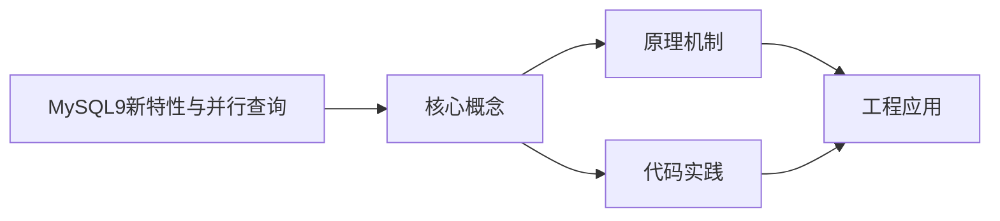

## 1. 学习目标（Bloom 分类）

本节按照布鲁姆教育目标分类学组织学习路径。本文主题为《MySQL9新特性与并行查询》，属于 MySQL 模块，读者可以根据自身阶段选择阅读深度。

记忆层面：能够准确复述本文的核心概念、术语与基本语法或操作步骤，并能够在提问或检索时快速定位对应知识点。能够说出 MySQL 的核心概念、语法与常用对象。

理解层面：能够用自己的语言解释核心原理与工作机制，说明概念之间的因果关系，而不是机械记忆结论。能够解释 MySQL 的执行原理与优化机制。

应用层面：能够在真实项目或练习场景中运用本文知识解决具体问题，写出正确且可维护的实现。能够编写正确、高效的 MySQL 语句与操作。

分析层面：能够拆解复杂问题，比较本文主题与相邻概念的异同，识别边界条件与例外情况。能够分析 MySQL 相关方案在性能与一致性上的权衡。

评价层面：能够根据约束条件（性能、可读性、安全、成本）评价不同方案的优劣，做出有依据的技术决策。能够根据业务场景评价 MySQL 技术选型。

创造层面：能够把本文知识与其他模块知识组合，设计出新的解决方案或可复用的工程模式。能够组合 MySQL 与其他技术设计数据架构。

通过本节学习，读者应当能够把《MySQL9新特性与并行查询》纳入自己的知识网络，并与 MySQL 模块的其他主题（InnoDB、索引、日志、主从、性能调优）建立关联。

## 2. 历史动机与发展脉络

《MySQL9新特性与并行查询》是 MySQL 领域的重要主题。要真正理解它，需要先了解它解决的问题与演进过程。

MySQL 于 1995 年由 MySQL AB 发布，2008 年被 Sun 收购，2010 年随 Sun 并入 Oracle；MariaDB 是社区分支。
MySQL 8.0（2018）重写优化器、引入窗口函数与 CTE、默认 utf8mb4、数据字典升级；MySQL 8.4 与 9.x 继续演进（Oracle 创新版 + LTS 双轨）。
InnoDB 是默认存储引擎：事务、行锁、MVCC、崩溃恢复（redo/undo）；MyISAM 仅存于历史场景。

回到本文主题：MySQL9新特性与并行查询 的提出与成熟，正是上述技术背景下的必然产物。早期实现往往以简单可用为目标，随着工程规模扩大，社区逐渐沉淀出标准做法与最佳实践；理解这一脉络，可以帮助读者判断“为什么文档中的推荐写法是现在这个样子”，也能在遇到历史遗留代码时准确识别其设计年代与取舍。


## 3. 形式化定义与核心概念精讲

本节把《MySQL9新特性与并行查询》涉及的核心概念以“定义 + 讲解”的形式展开。读者应把定义当作工具，把讲解当作理解路径；两者结合才能形成可迁移的知识。

InnoDB 架构：缓冲池（Buffer Pool）、日志缓冲、redo/undo 日志；脏页刷盘与 checkpoint 机制。
索引：B+ 树主键聚集索引、二级索引、覆盖索引；索引下推（ICP）与 MRR 优化。
事务与锁：两阶段锁、间隙锁/临键锁（可重复读防幻读）、MVCC 快照读；隔离级别。

### 3.1 原文章节逐一精讲

原文档把主题拆分为 9 个小节，下面按顺序给出每一节的导读讲解，随后保留原文细节供精读。

#### 原文精读（完整保留）


#### 1. MySQL 9.x 概述

MySQL 9.x 是 MySQL 数据库的最新主要版本，引入了大量面向现代应用场景的特性，包括 AI 向量搜索支持、JSON 功能增强、查询优化器改进和并行查询能力提升。本章系统梳理 MySQL 9.x 的核心新特性及并行查询机制。

##### 1.1 版本演进路线

| 版本      | 发布时间 | 核心特性                                   |
| :-------- | :------- | :----------------------------------------- |
| MySQL 8.0 | 2018     | 窗口函数、CTE、JSON增强、角色管理          |
| MySQL 8.4 | 2024     | LTS版本、性能改进、直方图增强              |
| MySQL 9.0 | 2024.7   | VECTOR类型、自动JSON模式验证、并行查询增强 |
| MySQL 9.x | 2025+    | 持续增强向量搜索、优化器改进               |

##### 1.2 MySQL 9.x 安装与版本确认

```sql
-- 查看当前版本
SELECT VERSION();

-- 查看支持的特性
SELECT * FROM performance_schema.global_variables
WHERE VARIABLE_NAME LIKE '%vector%';

-- 检查并行查询支持
SHOW VARIABLES LIKE '%parallel%';
```

#### 2. VECTOR 向量类型

##### 2.1 向量类型基础

MySQL 9.0 引入 `VECTOR` 数据类型，原生支持向量数据的存储与检索，为 AI/ML 应用场景（语义搜索、推荐系统、相似度匹配）提供数据库层面的支持。

```sql
-- 创建包含向量列的表
CREATE TABLE product_embeddings (
    product_id INT PRIMARY KEY,
    product_name VARCHAR(200),
    description TEXT,
    embedding VECTOR(768)   -- 768维向量（如 BERT 模型输出）
);

-- 插入向量数据（以 JSON 数组格式传入）
INSERT INTO product_embeddings VALUES (
    1,
    '无线蓝牙耳机',
    '高品质音效，降噪功能',
    '[0.123, -0.456, 0.789, ..., 0.012]'  -- 768维向量
);

-- 查询向量数据（返回 JSON 数组格式）
SELECT product_id, product_name,
       VECTOR_TO_STRING(embedding) AS embedding_str
FROM product_embeddings;
```

##### 2.2 向量距离函数

```sql
-- 欧几里得距离（L2距离）
SELECT product_id, product_name,
       DISTANCE(embedding, '[0.1, -0.5, 0.8, ...]') AS distance
FROM product_embeddings
ORDER BY distance ASC
LIMIT 10;

-- 余弦相似度
SELECT product_id, product_name,
       1 - DISTANCE(embedding, '[0.1, -0.5, 0.8, ...]', 'COSINE') AS similarity
FROM product_embeddings
ORDER BY similarity DESC
LIMIT 10;

-- 内积（点积）
SELECT product_id, product_name,
       DISTANCE(embedding, '[0.1, -0.5, 0.8, ...]', 'DOT') AS dot_product
FROM product_embeddings
ORDER BY dot_product DESC
LIMIT 10;
```

##### 2.3 向量索引

```sql
-- 创建向量索引以加速近似最近邻搜索
ALTER TABLE product_embeddings
ADD VECTOR INDEX idx_embedding (embedding)
WITH (DISTANCE = 'COSINE', M = 16, EF_CONSTRUCTION = 256);

-- 使用向量索引的近似搜索
SELECT product_id, product_name,
       1 - DISTANCE(embedding, '[0.1, -0.5, 0.8, ...]', 'COSINE') AS similarity
FROM product_embeddings
ORDER BY similarity DESC
LIMIT 20;

-- 查看向量索引信息
SELECT * FROM information_schema.VECTOR_INDEXES
WHERE TABLE_NAME = 'product_embeddings';
```

##### 2.4 向量类型应用场景

```sql
-- 语义搜索：查找与查询文本语义相似的商品
CREATE TABLE search_cache (
    query_hash VARCHAR(64) PRIMARY KEY,
    query_text TEXT,
    query_embedding VECTOR(768),
    created_at TIMESTAMP DEFAULT CURRENT_TIMESTAMP
);

-- 推荐系统：基于用户偏好向量推荐商品
CREATE TABLE user_profiles (
    user_id INT PRIMARY KEY,
    preference_vector VECTOR(256),
    updated_at TIMESTAMP DEFAULT CURRENT_TIMESTAMP ON UPDATE CURRENT_TIMESTAMP
);

-- 相似度匹配：图像特征向量检索
CREATE TABLE image_features (
    image_id BIGINT PRIMARY KEY,
    feature_vector VECTOR(512),
    image_url VARCHAR(500)
);
```

#### 3. JSON 功能增强

##### 3.1 自动 JSON 模式验证

MySQL 9.0 支持为 JSON 列定义 JSON Schema，自动验证插入和更新的 JSON 数据是否符合预定义的结构。

```sql
-- 创建带 JSON Schema 验证的表
CREATE TABLE user_profiles (
    id INT PRIMARY KEY AUTO_INCREMENT,
    profile JSON,
    CHECK (
        JSON_SCHEMA_VALID(
            '{
                "type": "object",
                "required": ["name", "email"],
                "properties": {
                    "name": {"type": "string", "minLength": 1},
                    "email": {"type": "string", "format": "email"},
                    "age": {"type": "integer", "minimum": 0, "maximum": 150},
                    "tags": {
                        "type": "array",
                        "items": {"type": "string"}
                    }
                }
            }',
            profile
        )
    )
);

-- 合法数据：包含必填字段且类型正确
INSERT INTO user_profiles (profile) VALUES (
    '{"name": "张三", "email": "zhang@example.com", "age": 28, "tags": ["vip"]}'
);

-- 非法数据：缺少必填字段 → 报错
INSERT INTO user_profiles (profile) VALUES (
    '{"name": "李四"}'
);
-- ERROR: Check constraint failed

-- 非法数据：类型不匹配 → 报错
INSERT INTO user_profiles (profile) VALUES (
    '{"name": "王五", "email": "wang@example.com", "age": "not_a_number"}'
);
```

##### 3.2 JSON 聚合函数

```sql
-- JSON_ARRAYAGG：将多行值聚合为 JSON 数组
SELECT department,
       JSON_ARRAYAGG(JSON_OBJECT('name', name, 'salary', salary)) AS employees
FROM employees
GROUP BY department;

-- JSON_OBJECTAGG：将键值对聚合为 JSON 对象
SELECT department,
       JSON_OBJECTAGG(name, salary) AS salary_map
FROM employees
GROUP BY department;

-- MySQL 9.x 增强的 JSON_TABLE 嵌套路径
SELECT jt.*
FROM orders,
     JSON_TABLE(
         order_items,
         '$[*]' COLUMNS(
             item_id VARCHAR(20) PATH '$.id',
             quantity INT PATH '$.qty',
             NESTED PATH '$.details[*]' COLUMNS(
                 detail_name VARCHAR(50) PATH '$.name',
                 detail_value VARCHAR(100) PATH '$.value'
             )
         )
     ) AS jt;
```

##### 3.3 JSON 空间优化

```sql
-- MySQL 9.x 对 JSON 存储进行了优化
-- JSON 列的存储更紧凑，部分更新不再重写整个 JSON 文档

-- 查看表的 JSON 列信息
SELECT TABLE_NAME, COLUMN_NAME, COLUMN_TYPE
FROM information_schema.COLUMNS
WHERE DATA_TYPE = 'json'
AND TABLE_SCHEMA = 'your_database';

-- JSON 部分更新（in-place update）
UPDATE user_profiles
SET profile = JSON_SET(profile, '$.age', 29)
WHERE id = 1;
-- 如果修改的字段大小未超出原值，可原地更新，避免重写整个 JSON
```

#### 4. 窗口函数完善

##### 4.1 MySQL 9.x 窗口函数增强

```sql
-- 窗口函数中的 IGNORE NULLS 支持
SELECT
    employee_id,
    department,
    salary,
    FIRST_VALUE(salary) IGNORE NULLS OVER (
        PARTITION BY department ORDER BY hire_date
    ) AS first_salary,
    LAST_VALUE(salary) IGNORE NULLS OVER (
        PARTITION BY department ORDER BY hire_date
        ROWS BETWEEN UNBOUNDED PRECEDING AND UNBOUNDED FOLLOWING
    ) AS last_salary
FROM employees;

-- 增强的 NTILE 函数
SELECT
    product_id,
    category,
    price,
    NTILE(4) OVER (PARTITION BY category ORDER BY price) AS price_quartile
FROM products;

-- 增强的 GROUPS 窗口帧
SELECT
    order_date,
    amount,
    SUM(amount) OVER (
        ORDER BY order_date
        GROUPS BETWEEN 1 PRECEDING AND 1 FOLLOWING
    ) AS moving_sum
FROM daily_sales;
```

##### 4.2 窗口函数性能优化

```sql
-- 使用窗口函数替代自连接，提升性能
-- 旧写法：自连接
SELECT e1.employee_id, e1.salary,
       (SELECT AVG(e2.salary)
        FROM employees e2
        WHERE e2.department = e1.department) AS dept_avg
FROM employees e1;

-- 新写法：窗口函数（更高效）
SELECT
    employee_id,
    department,
    salary,
    AVG(salary) OVER (PARTITION BY department) AS dept_avg,
    salary - AVG(salary) OVER (PARTITION BY department) AS diff_from_avg
FROM employees;
```

#### 5. CTE 与递归查询

##### 5.1 通用表表达式 (CTE)

```sql
-- 非递归 CTE：简化复杂查询
WITH monthly_revenue AS (
    SELECT
        DATE_FORMAT(order_date, '%Y-%m') AS month,
        SUM(amount) AS revenue,
        COUNT(*) AS order_count
    FROM orders
    WHERE status = 'completed'
    GROUP BY month
),
monthly_avg AS (
    SELECT AVG(revenue) AS avg_revenue FROM monthly_revenue
)
SELECT
    m.month,
    m.revenue,
    m.order_count,
    a.avg_revenue,
    ROUND((m.revenue - a.avg_revenue) / a.avg_revenue * 100, 2) AS pct_diff
FROM monthly_revenue m
CROSS JOIN monthly_avg a
ORDER BY m.month;
```

##### 5.2 递归 CTE

```sql
-- 组织架构层级查询
WITH RECURSIVE org_hierarchy AS (
    -- 锚点查询：顶级管理者
    SELECT
        employee_id,
        name,
        manager_id,
        1 AS level,
        CAST(name AS CHAR(500)) AS path
    FROM employees
    WHERE manager_id IS NULL

    UNION ALL

    -- 递归查询：逐级展开
    SELECT
        e.employee_id,
        e.name,
        e.manager_id,
        h.level + 1 AS level,
        CONCAT(h.path, ' → ', e.name) AS path
    FROM employees e
    INNER JOIN org_hierarchy h ON e.manager_id = h.employee_id
)
SELECT * FROM org_hierarchy ORDER BY level, path;

-- 物料清单 (BOM) 展开
WITH RECURSIVE bom AS (
    SELECT
        parent_part,
        child_part,
        quantity,
        1 AS level
    FROM parts_relation
    WHERE parent_part = 'PRODUCT-A'

    UNION ALL

    SELECT
        p.parent_part,
        p.child_part,
        p.quantity,
        b.level + 1
    FROM parts_relation p
    INNER JOIN bom b ON p.parent_part = b.child_part
)
SELECT
    level,
    parent_part,
    child_part,
    quantity,
    RPAD('', level * 2, '  ') || child_part AS indented_name
FROM bom
ORDER BY level, parent_part;
```

##### 5.3 递归 CTE 注意事项

```sql
-- 设置递归深度限制（防止无限递归）
SET cte_max_recursion_depth = 1000;  -- 默认1000

-- 使用 LIMIT 控制递归层级
WITH RECURSIVE tree AS (
    SELECT id, parent_id, name, 1 AS lvl
    FROM categories WHERE parent_id IS NULL
    UNION ALL
    SELECT c.id, c.parent_id, c.name, t.lvl + 1
    FROM categories c JOIN tree t ON c.parent_id = t.id
    WHERE t.lvl < 5  -- 限制最大5层
)
SELECT * FROM tree;
```

#### 6. 函数索引与不可见索引

##### 6.1 函数索引

MySQL 8.0+ 支持基于函数表达式的索引，解决列上函数运算导致索引失效的问题。

```sql
-- 传统方式：WHERE 条件中使用函数导致索引失效
SELECT * FROM users WHERE YEAR(created_at) = 2024;
-- 无法使用 created_at 上的索引

-- 函数索引：为函数表达式创建索引
CREATE INDEX idx_year ON users ((YEAR(created_at)));
SELECT * FROM users WHERE YEAR(created_at) = 2024;
-- 可以使用 idx_year 索引

-- 常用函数索引场景
-- 大小写不敏感查询
CREATE INDEX idx_lower_name ON users ((LOWER(name)));
SELECT * FROM users WHERE LOWER(name) = 'zhang san';

-- JSON 字段索引
CREATE INDEX idx_json_age ON user_profiles ((CAST(profile->'$.age' AS UNSIGNED)));
SELECT * FROM user_profiles WHERE CAST(profile->'$.age' AS UNSIGNED) > 25;

-- 计算列索引
CREATE INDEX idx_full_name ON employees ((CONCAT(first_name, ' ', last_name)));
SELECT * FROM employees WHERE CONCAT(first_name, ' ', last_name) = 'Zhang San';
```

##### 6.2 不可见索引

不可见索引不会被优化器使用，但仍然维护更新，用于安全地测试删除索引的影响。

```sql
-- 创建不可见索引
CREATE INDEX idx_status ON orders(status) INVISIBLE;

-- 将已有索引设为不可见
ALTER TABLE orders ALTER INDEX idx_status SET INVISIBLE;

-- 恢复可见
ALTER TABLE orders ALTER INDEX idx_status SET VISIBLE;

-- 会话级别强制使用不可见索引（仅用于测试）
SET SESSION optimizer_switch = 'use_invisible_indexes=on';

-- 验证索引是否被使用
EXPLAIN SELECT * FROM orders WHERE status = 'shipped';
-- 不可见索引不会出现在执行计划中
```

#### 7. 直方图统计

##### 7.1 直方图基础

直方图提供列值分布的统计信息，帮助优化器在索引不可用时做出更好的执行计划选择。

```sql
-- 创建直方图
ANALYZE TABLE orders UPDATE HISTOGRAM ON status, customer_id WITH 100 BUCKETS;

-- 查看直方图信息
SELECT TABLE_NAME, COLUMN_NAME, HISTOGRAM
FROM information_schema.COLUMN_STATISTICS
WHERE TABLE_SCHEMA = 'your_database';

-- 删除直方图
ANALYZE TABLE orders DROP HISTOGRAM ON status;

-- 查看直方图详细内容
SELECT JSON_PRETTY(HISTOGRAM) AS histogram_detail
FROM information_schema.COLUMN_STATISTICS
WHERE TABLE_NAME = 'orders' AND COLUMN_NAME = 'status';
```

##### 7.2 直方图适用场景

```sql
-- 场景1：低基数列的选择性评估
-- status 列只有几个值，直方图帮助优化器判断过滤性
ANALYZE TABLE orders UPDATE HISTOGRAM ON status WITH 10 BUCKETS;

-- 场景2：关联查询的行数估算
-- 无索引的关联列，直方图改善估算精度
ANALYZE TABLE order_items UPDATE HISTOGRAM ON product_id WITH 256 BUCKETS;

-- 场景3：范围查询的选择性
-- 价格范围查询，直方图帮助估算匹配行数
ANALYZE TABLE products UPDATE HISTOGRAM ON price WITH 100 BUCKETS;

-- 对比执行计划
EXPLAIN FORMAT=JSON
SELECT * FROM orders WHERE status = 'shipped';
-- 查看 "filtered" 字段，直方图可改善此估算值
```

#### 8. 并行查询

##### 8.1 InnoDB 并行读线程

MySQL 9.x 增强了 InnoDB 的并行读取能力，利用多线程并行扫描大表，显著提升全表扫描和范围查询的性能。

```sql
-- 配置并行读线程数
SET SESSION innodb_parallel_read_threads = 4;  -- 默认4，最大256

-- 并行扫描大表
SET innodb_parallel_read_threads = 8;
SELECT COUNT(*) FROM large_table;  -- 使用8个线程并行扫描

-- 并行范围查询
SET innodb_parallel_read_threads = 4;
SELECT SUM(amount) FROM orders
WHERE order_date BETWEEN '2024-01-01' AND '2024-12-31';
```

##### 8.2 并行排序

```sql
-- 大结果集的 ORDER BY 可利用并行排序
SET SESSION innodb_parallel_read_threads = 4;

-- 并行排序 + LIMIT
SELECT * FROM large_table
ORDER BY created_at DESC
LIMIT 1000;

-- 并行排序 + 聚合
SELECT category, AVG(price) AS avg_price
FROM products
GROUP BY category
ORDER BY avg_price DESC;
```

##### 8.3 并行索引扫描

```sql
-- 并行索引范围扫描
SET SESSION innodb_parallel_read_threads = 4;

SELECT * FROM orders
FORCE INDEX (idx_order_date)
WHERE order_date BETWEEN '2024-01-01' AND '2024-06-30'
ORDER BY order_date;

-- 并行覆盖索引扫描
SELECT customer_id, COUNT(*) AS order_count
FROM orders
FORCE INDEX (idx_customer_date)
WHERE order_date >= '2024-01-01'
GROUP BY customer_id
ORDER BY order_count DESC;
```

##### 8.4 并行 GROUP BY 优化

```sql
-- 并行聚合查询
SET SESSION innodb_parallel_read_threads = 8;

-- 大表分组聚合
SELECT
    DATE_FORMAT(order_date, '%Y-%m') AS month,
    region,
    COUNT(*) AS order_count,
    SUM(amount) AS total_amount,
    AVG(amount) AS avg_amount
FROM orders
WHERE order_date >= '2024-01-01'
GROUP BY month, region
ORDER BY month, total_amount DESC;

-- 并行 DISTINCT
SELECT DISTINCT category FROM large_product_table;
```

##### 8.5 并行查询监控与调优

```sql
-- 查看并行查询执行信息
EXPLAIN FORMAT=TREE
SELECT COUNT(*) FROM large_table;
-- 输出中会显示 "parallel" 相关信息

-- 监控并行线程使用
SELECT * FROM performance_schema.threads
WHERE NAME LIKE '%parallel%';

-- 并行查询参数调优
SET GLOBAL innodb_parallel_read_threads = 8;        -- 全局默认并行线程数
SET SESSION innodb_parallel_read_threads = 16;      -- 会话级别覆盖

-- 并行查询适用场景
--  大表全表扫描
--  大范围索引扫描
--  聚合查询（COUNT/SUM/AVG）
--  排序查询
--  小表查询（并行开销大于收益）
--  高并发 OLTP（线程资源有限）
--  包含子查询的复杂查询
```

#### 9. 其他 MySQL 9.x 新特性

##### 9.1 性能改进

```sql
-- 改进的查询优化器
-- 优化器现在能更好地处理 OR 条件
SELECT * FROM orders
WHERE customer_id = 1001 OR status = 'urgent';
-- 9.x 可能使用 index merge 优化

-- EXPLAIN ANALYZE（实际执行并返回耗时）
EXPLAIN ANALYZE
SELECT * FROM orders WHERE customer_id = 1001;
-- 返回实际执行时间、行数等信息
```

##### 9.2 DDL 增强

```sql
-- 原子 DDL：DDL 操作要么完全成功，要么完全回滚
-- MySQL 8.0+ 支持，9.x 进一步增强
CREATE TABLE test_atomic (
    id INT PRIMARY KEY,
    name VARCHAR(100)
);
-- 如果创建失败，不会留下残留文件

-- 在线 DDL 改进
ALTER TABLE large_table
ADD COLUMN new_col VARCHAR(50),
ALGORITHM=INPLACE, LOCK=NONE;
-- 9.x 减少了在线 DDL 期间的锁等待
```

##### 9.3 权限与安全增强

```sql
-- MySQL 9.0 默认使用 caching_sha2_password
-- 创建用户时指定认证插件
CREATE USER 'app_user'@'%'
IDENTIFIED WITH caching_sha2_password BY 'StrongP@ss123!';

-- 角色管理增强
CREATE ROLE 'read_only', 'read_write', 'admin';
GRANT SELECT ON app_db.* TO 'read_only';
GRANT SELECT, INSERT, UPDATE ON app_db.* TO 'read_write';
GRANT ALL ON app_db.* TO 'admin';

-- 将角色赋予用户
GRANT 'read_write' TO 'developer1'@'%';

-- 用户激活角色
SET ROLE 'read_write';

-- 设置默认角色
ALTER USER 'developer1'@'%' DEFAULT ROLE 'read_write';
```


### 3.2 概念关系图

下面用 Mermaid 图表达本文核心概念之间的关系，帮助读者建立整体图景：



图中展示的是本文知识的结构化关系：核心概念是入口，原理机制解释“为什么”，代码实践演示“怎么做”，工程应用回答“何时用”。读者学习时可以把每个小节的内容挂接到对应节点上。

## 4. 理论推导与原理解析

本节深入《MySQL9新特性与并行查询》背后的原理。理论部分不求面面俱到，而是聚焦“能解释现象、能指导实践”的关键推导。

InnoDB 架构：缓冲池（Buffer Pool）、日志缓冲、redo/undo 日志；脏页刷盘与 checkpoint 机制。
索引：B+ 树主键聚集索引、二级索引、覆盖索引；索引下推（ICP）与 MRR 优化。
事务与锁：两阶段锁、间隙锁/临键锁（可重复读防幻读）、MVCC 快照读；隔离级别。
复制：binlog 逻辑复制（statement/row/mixed），主从异步、半同步与组复制。

需要强调的是，理论推导与工程实践之间存在翻译层：理论给出的是理想化模型与边界条件，工程代码则必须处理真实环境中的例外。读者在学习时应先掌握理论的“标准情形”，再通过陷阱章节了解“非标准情形”。

## 5. 代码示例与逐行讲解

本节把原文中的代码示例系统整理，并为每个示例补充用途说明与讲解。读者不应只浏览代码，而应逐段对照讲解理解设计意图。

### 5.1 示例：1.2 MySQL 9.x 安装与版本确认

该示例来自原文《1.2 MySQL 9.x 安装与版本确认》小节，用于演示MySQL9新特性与并行查询相关操作。阅读时请先看代码结构，再看其后的讲解。

```sql
-- 查看当前版本
SELECT VERSION();

-- 查看支持的特性
SELECT * FROM performance_schema.global_variables
WHERE VARIABLE_NAME LIKE '%vector%';

-- 检查并行查询支持
SHOW VARIABLES LIKE '%parallel%';
```

讲解：这段代码演示了本节核心知识点。代码中的关键操作可以归纳为三步：准备（定义或初始化）、执行（核心逻辑）、收尾（释放资源或返回结果）。实际项目中，这三步往往被封装为函数或类，以提升复用性与可测试性。

关键点分析：

该示例共 7 行有效代码，包含 2 类关键结构（SELECT、FROM）。其中：

- 入口与初始化部分负责建立上下文，对应实际项目中的启动或装配逻辑；
- 核心逻辑部分体现本文主题的主要操作，是阅读时最需要对照讲解理解的部分；
- 输出或返回部分把结果交给调用方，注意其类型与边界条件。

进阶思考路径：先尝试修改参数观察行为变化，再把示例中的模式迁移到自己的项目中；每次修改都记录预期与实测差异，这是把示例转化为能力的最快方式。

### 5.2 示例：2.1 向量类型基础

该示例来自原文《2.1 向量类型基础》小节，用于演示MySQL9新特性与并行查询相关操作。阅读时请先看代码结构，再看其后的讲解。

```sql
-- 创建包含向量列的表
CREATE TABLE product_embeddings (
    product_id INT PRIMARY KEY,
    product_name VARCHAR(200),
    description TEXT,
    embedding VECTOR(768)   -- 768维向量（如 BERT 模型输出）
);

-- 插入向量数据（以 JSON 数组格式传入）
INSERT INTO product_embeddings VALUES (
    1,
    '无线蓝牙耳机',
    '高品质音效，降噪功能',
    '[0.123, -0.456, 0.789, ..., 0.012]'  -- 768维向量
);

-- 查询向量数据（返回 JSON 数组格式）
SELECT product_id, product_name,
       VECTOR_TO_STRING(embedding) AS embedding_str
FROM product_embeddings;
```

讲解：这段代码演示了本节核心知识点。代码中的关键操作可以归纳为三步：准备（定义或初始化）、执行（核心逻辑）、收尾（释放资源或返回结果）。实际项目中，这三步往往被封装为函数或类，以提升复用性与可测试性。

关键点分析：

该示例共 18 行有效代码，包含 4 类关键结构（SELECT、INSERT、CREATE、FROM）。其中：

- 入口与初始化部分负责建立上下文，对应实际项目中的启动或装配逻辑；
- 核心逻辑部分体现本文主题的主要操作，是阅读时最需要对照讲解理解的部分；
- 输出或返回部分把结果交给调用方，注意其类型与边界条件。

进阶思考路径：先尝试修改参数观察行为变化，再把示例中的模式迁移到自己的项目中；每次修改都记录预期与实测差异，这是把示例转化为能力的最快方式。

### 5.3 示例：2.2 向量距离函数

该示例来自原文《2.2 向量距离函数》小节，用于演示MySQL9新特性与并行查询相关操作。阅读时请先看代码结构，再看其后的讲解。

```sql
-- 欧几里得距离（L2距离）
SELECT product_id, product_name,
       DISTANCE(embedding, '[0.1, -0.5, 0.8, ...]') AS distance
FROM product_embeddings
ORDER BY distance ASC
LIMIT 10;

-- 余弦相似度
SELECT product_id, product_name,
       1 - DISTANCE(embedding, '[0.1, -0.5, 0.8, ...]', 'COSINE') AS similarity
FROM product_embeddings
ORDER BY similarity DESC
LIMIT 10;

-- 内积（点积）
SELECT product_id, product_name,
       DISTANCE(embedding, '[0.1, -0.5, 0.8, ...]', 'DOT') AS dot_product
FROM product_embeddings
ORDER BY dot_product DESC
LIMIT 10;
```

讲解：这段代码演示了本节核心知识点。代码中的关键操作可以归纳为三步：准备（定义或初始化）、执行（核心逻辑）、收尾（释放资源或返回结果）。实际项目中，这三步往往被封装为函数或类，以提升复用性与可测试性。

关键点分析：

该示例共 18 行有效代码，包含 2 类关键结构（SELECT、FROM）。其中：

- 入口与初始化部分负责建立上下文，对应实际项目中的启动或装配逻辑；
- 核心逻辑部分体现本文主题的主要操作，是阅读时最需要对照讲解理解的部分；
- 输出或返回部分把结果交给调用方，注意其类型与边界条件。

进阶思考路径：先尝试修改参数观察行为变化，再把示例中的模式迁移到自己的项目中；每次修改都记录预期与实测差异，这是把示例转化为能力的最快方式。

### 5.4 示例：2.3 向量索引

该示例来自原文《2.3 向量索引》小节，用于演示MySQL9新特性与并行查询相关操作。阅读时请先看代码结构，再看其后的讲解。

```sql
-- 创建向量索引以加速近似最近邻搜索
ALTER TABLE product_embeddings
ADD VECTOR INDEX idx_embedding (embedding)
WITH (DISTANCE = 'COSINE', M = 16, EF_CONSTRUCTION = 256);

-- 使用向量索引的近似搜索
SELECT product_id, product_name,
       1 - DISTANCE(embedding, '[0.1, -0.5, 0.8, ...]', 'COSINE') AS similarity
FROM product_embeddings
ORDER BY similarity DESC
LIMIT 20;

-- 查看向量索引信息
SELECT * FROM information_schema.VECTOR_INDEXES
WHERE TABLE_NAME = 'product_embeddings';
```

讲解：这段代码演示了本节核心知识点。代码中的关键操作可以归纳为三步：准备（定义或初始化）、执行（核心逻辑）、收尾（释放资源或返回结果）。实际项目中，这三步往往被封装为函数或类，以提升复用性与可测试性。

关键点分析：

该示例共 13 行有效代码，包含 3 类关键结构（SELECT、ALTER、FROM）。其中：

- 入口与初始化部分负责建立上下文，对应实际项目中的启动或装配逻辑；
- 核心逻辑部分体现本文主题的主要操作，是阅读时最需要对照讲解理解的部分；
- 输出或返回部分把结果交给调用方，注意其类型与边界条件。

进阶思考路径：先尝试修改参数观察行为变化，再把示例中的模式迁移到自己的项目中；每次修改都记录预期与实测差异，这是把示例转化为能力的最快方式。

### 5.5 示例：2.4 向量类型应用场景

该示例来自原文《2.4 向量类型应用场景》小节，用于演示MySQL9新特性与并行查询相关操作。阅读时请先看代码结构，再看其后的讲解。

```sql
-- 语义搜索：查找与查询文本语义相似的商品
CREATE TABLE search_cache (
    query_hash VARCHAR(64) PRIMARY KEY,
    query_text TEXT,
    query_embedding VECTOR(768),
    created_at TIMESTAMP DEFAULT CURRENT_TIMESTAMP
);

-- 推荐系统：基于用户偏好向量推荐商品
CREATE TABLE user_profiles (
    user_id INT PRIMARY KEY,
    preference_vector VECTOR(256),
    updated_at TIMESTAMP DEFAULT CURRENT_TIMESTAMP ON UPDATE CURRENT_TIMESTAMP
);

-- 相似度匹配：图像特征向量检索
CREATE TABLE image_features (
    image_id BIGINT PRIMARY KEY,
    feature_vector VECTOR(512),
    image_url VARCHAR(500)
);
```

讲解：这段代码演示了本节核心知识点。代码中的关键操作可以归纳为三步：准备（定义或初始化）、执行（核心逻辑）、收尾（释放资源或返回结果）。实际项目中，这三步往往被封装为函数或类，以提升复用性与可测试性。

关键点分析：

该示例共 19 行有效代码，包含 1 类关键结构（CREATE）。其中：

- 入口与初始化部分负责建立上下文，对应实际项目中的启动或装配逻辑；
- 核心逻辑部分体现本文主题的主要操作，是阅读时最需要对照讲解理解的部分；
- 输出或返回部分把结果交给调用方，注意其类型与边界条件。

进阶思考路径：先尝试修改参数观察行为变化，再把示例中的模式迁移到自己的项目中；每次修改都记录预期与实测差异，这是把示例转化为能力的最快方式。

### 5.6 示例：3.1 自动 JSON 模式验证

该示例来自原文《3.1 自动 JSON 模式验证》小节，用于演示MySQL9新特性与并行查询相关操作。阅读时请先看代码结构，再看其后的讲解。

```sql
-- 创建带 JSON Schema 验证的表
CREATE TABLE user_profiles (
    id INT PRIMARY KEY AUTO_INCREMENT,
    profile JSON,
    CHECK (
        JSON_SCHEMA_VALID(
            '{
                "type": "object",
                "required": ["name", "email"],
                "properties": {
                    "name": {"type": "string", "minLength": 1},
                    "email": {"type": "string", "format": "email"},
                    "age": {"type": "integer", "minimum": 0, "maximum": 150},
                    "tags": {
                        "type": "array",
                        "items": {"type": "string"}
                    }
                }
            }',
            profile
        )
    )
);

-- 合法数据：包含必填字段且类型正确
INSERT INTO user_profiles (profile) VALUES (
    '{"name": "张三", "email": "zhang@example.com", "age": 28, "tags": ["vip"]}'
);

-- 非法数据：缺少必填字段 → 报错
INSERT INTO user_profiles (profile) VALUES (
    '{"name": "李四"}'
);
-- ERROR: Check constraint failed

-- 非法数据：类型不匹配 → 报错
INSERT INTO user_profiles (profile) VALUES (
    '{"name": "王五", "email": "wang@example.com", "age": "not_a_number"}'
);
```

讲解：这段代码演示了本节核心知识点。代码中的关键操作可以归纳为三步：准备（定义或初始化）、执行（核心逻辑）、收尾（释放资源或返回结果）。实际项目中，这三步往往被封装为函数或类，以提升复用性与可测试性。

关键点分析：

该示例共 36 行有效代码，包含 2 类关键结构（INSERT、CREATE）。其中：

- 入口与初始化部分负责建立上下文，对应实际项目中的启动或装配逻辑；
- 核心逻辑部分体现本文主题的主要操作，是阅读时最需要对照讲解理解的部分；
- 输出或返回部分把结果交给调用方，注意其类型与边界条件。

进阶思考路径：先尝试修改参数观察行为变化，再把示例中的模式迁移到自己的项目中；每次修改都记录预期与实测差异，这是把示例转化为能力的最快方式。

### 5.7 示例：3.2 JSON 聚合函数

该示例来自原文《3.2 JSON 聚合函数》小节，用于演示MySQL9新特性与并行查询相关操作。阅读时请先看代码结构，再看其后的讲解。

```sql
-- JSON_ARRAYAGG：将多行值聚合为 JSON 数组
SELECT department,
       JSON_ARRAYAGG(JSON_OBJECT('name', name, 'salary', salary)) AS employees
FROM employees
GROUP BY department;

-- JSON_OBJECTAGG：将键值对聚合为 JSON 对象
SELECT department,
       JSON_OBJECTAGG(name, salary) AS salary_map
FROM employees
GROUP BY department;

-- MySQL 9.x 增强的 JSON_TABLE 嵌套路径
SELECT jt.*
FROM orders,
     JSON_TABLE(
         order_items,
         '$[*]' COLUMNS(
             item_id VARCHAR(20) PATH '$.id',
             quantity INT PATH '$.qty',
             NESTED PATH '$.details[*]' COLUMNS(
                 detail_name VARCHAR(50) PATH '$.name',
                 detail_value VARCHAR(100) PATH '$.value'
             )
         )
     ) AS jt;
```

讲解：这段代码演示了本节核心知识点。代码中的关键操作可以归纳为三步：准备（定义或初始化）、执行（核心逻辑）、收尾（释放资源或返回结果）。实际项目中，这三步往往被封装为函数或类，以提升复用性与可测试性。

关键点分析：

该示例共 24 行有效代码，包含 2 类关键结构（SELECT、FROM）。其中：

- 入口与初始化部分负责建立上下文，对应实际项目中的启动或装配逻辑；
- 核心逻辑部分体现本文主题的主要操作，是阅读时最需要对照讲解理解的部分；
- 输出或返回部分把结果交给调用方，注意其类型与边界条件。

进阶思考路径：先尝试修改参数观察行为变化，再把示例中的模式迁移到自己的项目中；每次修改都记录预期与实测差异，这是把示例转化为能力的最快方式。

### 5.8 示例：3.3 JSON 空间优化

该示例来自原文《3.3 JSON 空间优化》小节，用于演示MySQL9新特性与并行查询相关操作。阅读时请先看代码结构，再看其后的讲解。

```sql
-- MySQL 9.x 对 JSON 存储进行了优化
-- JSON 列的存储更紧凑，部分更新不再重写整个 JSON 文档

-- 查看表的 JSON 列信息
SELECT TABLE_NAME, COLUMN_NAME, COLUMN_TYPE
FROM information_schema.COLUMNS
WHERE DATA_TYPE = 'json'
AND TABLE_SCHEMA = 'your_database';

-- JSON 部分更新（in-place update）
UPDATE user_profiles
SET profile = JSON_SET(profile, '$.age', 29)
WHERE id = 1;
-- 如果修改的字段大小未超出原值，可原地更新，避免重写整个 JSON
```

讲解：这段代码演示了本节核心知识点。代码中的关键操作可以归纳为三步：准备（定义或初始化）、执行（核心逻辑）、收尾（释放资源或返回结果）。实际项目中，这三步往往被封装为函数或类，以提升复用性与可测试性。

关键点分析：

该示例共 12 行有效代码，包含 2 类关键结构（SELECT、FROM）。其中：

- 入口与初始化部分负责建立上下文，对应实际项目中的启动或装配逻辑；
- 核心逻辑部分体现本文主题的主要操作，是阅读时最需要对照讲解理解的部分；
- 输出或返回部分把结果交给调用方，注意其类型与边界条件。

进阶思考路径：先尝试修改参数观察行为变化，再把示例中的模式迁移到自己的项目中；每次修改都记录预期与实测差异，这是把示例转化为能力的最快方式。

### 5.9 示例：4.1 MySQL 9.x 窗口函数增强

该示例来自原文《4.1 MySQL 9.x 窗口函数增强》小节，用于演示MySQL9新特性与并行查询相关操作。阅读时请先看代码结构，再看其后的讲解。

```sql
-- 窗口函数中的 IGNORE NULLS 支持
SELECT
    employee_id,
    department,
    salary,
    FIRST_VALUE(salary) IGNORE NULLS OVER (
        PARTITION BY department ORDER BY hire_date
    ) AS first_salary,
    LAST_VALUE(salary) IGNORE NULLS OVER (
        PARTITION BY department ORDER BY hire_date
        ROWS BETWEEN UNBOUNDED PRECEDING AND UNBOUNDED FOLLOWING
    ) AS last_salary
FROM employees;

-- 增强的 NTILE 函数
SELECT
    product_id,
    category,
    price,
    NTILE(4) OVER (PARTITION BY category ORDER BY price) AS price_quartile
FROM products;

-- 增强的 GROUPS 窗口帧
SELECT
    order_date,
    amount,
    SUM(amount) OVER (
        ORDER BY order_date
        GROUPS BETWEEN 1 PRECEDING AND 1 FOLLOWING
    ) AS moving_sum
FROM daily_sales;
```

讲解：这段代码演示了本节核心知识点。代码中的关键操作可以归纳为三步：准备（定义或初始化）、执行（核心逻辑）、收尾（释放资源或返回结果）。实际项目中，这三步往往被封装为函数或类，以提升复用性与可测试性。

关键点分析：

该示例共 29 行有效代码，包含 2 类关键结构（SELECT、FROM）。其中：

- 入口与初始化部分负责建立上下文，对应实际项目中的启动或装配逻辑；
- 核心逻辑部分体现本文主题的主要操作，是阅读时最需要对照讲解理解的部分；
- 输出或返回部分把结果交给调用方，注意其类型与边界条件。

进阶思考路径：先尝试修改参数观察行为变化，再把示例中的模式迁移到自己的项目中；每次修改都记录预期与实测差异，这是把示例转化为能力的最快方式。

### 5.10 示例：4.2 窗口函数性能优化

该示例来自原文《4.2 窗口函数性能优化》小节，用于演示MySQL9新特性与并行查询相关操作。阅读时请先看代码结构，再看其后的讲解。

```sql
-- 使用窗口函数替代自连接，提升性能
-- 旧写法：自连接
SELECT e1.employee_id, e1.salary,
       (SELECT AVG(e2.salary)
        FROM employees e2
        WHERE e2.department = e1.department) AS dept_avg
FROM employees e1;

-- 新写法：窗口函数（更高效）
SELECT
    employee_id,
    department,
    salary,
    AVG(salary) OVER (PARTITION BY department) AS dept_avg,
    salary - AVG(salary) OVER (PARTITION BY department) AS diff_from_avg
FROM employees;
```

讲解：这段代码演示了本节核心知识点。代码中的关键操作可以归纳为三步：准备（定义或初始化）、执行（核心逻辑）、收尾（释放资源或返回结果）。实际项目中，这三步往往被封装为函数或类，以提升复用性与可测试性。

关键点分析：

该示例共 15 行有效代码，包含 2 类关键结构（SELECT、FROM）。其中：

- 入口与初始化部分负责建立上下文，对应实际项目中的启动或装配逻辑；
- 核心逻辑部分体现本文主题的主要操作，是阅读时最需要对照讲解理解的部分；
- 输出或返回部分把结果交给调用方，注意其类型与边界条件。

进阶思考路径：先尝试修改参数观察行为变化，再把示例中的模式迁移到自己的项目中；每次修改都记录预期与实测差异，这是把示例转化为能力的最快方式。

### 5.11 示例：5.1 通用表表达式 (CTE)

该示例来自原文《5.1 通用表表达式 (CTE)》小节，用于演示MySQL9新特性与并行查询相关操作。阅读时请先看代码结构，再看其后的讲解。

```sql
-- 非递归 CTE：简化复杂查询
WITH monthly_revenue AS (
    SELECT
        DATE_FORMAT(order_date, '%Y-%m') AS month,
        SUM(amount) AS revenue,
        COUNT(*) AS order_count
    FROM orders
    WHERE status = 'completed'
    GROUP BY month
),
monthly_avg AS (
    SELECT AVG(revenue) AS avg_revenue FROM monthly_revenue
)
SELECT
    m.month,
    m.revenue,
    m.order_count,
    a.avg_revenue,
    ROUND((m.revenue - a.avg_revenue) / a.avg_revenue * 100, 2) AS pct_diff
FROM monthly_revenue m
CROSS JOIN monthly_avg a
ORDER BY m.month;
```

讲解：这段代码演示了本节核心知识点。代码中的关键操作可以归纳为三步：准备（定义或初始化）、执行（核心逻辑）、收尾（释放资源或返回结果）。实际项目中，这三步往往被封装为函数或类，以提升复用性与可测试性。

关键点分析：

该示例共 22 行有效代码，包含 2 类关键结构（SELECT、FROM）。其中：

- 入口与初始化部分负责建立上下文，对应实际项目中的启动或装配逻辑；
- 核心逻辑部分体现本文主题的主要操作，是阅读时最需要对照讲解理解的部分；
- 输出或返回部分把结果交给调用方，注意其类型与边界条件。

进阶思考路径：先尝试修改参数观察行为变化，再把示例中的模式迁移到自己的项目中；每次修改都记录预期与实测差异，这是把示例转化为能力的最快方式。

### 5.12 示例：5.2 递归 CTE

该示例来自原文《5.2 递归 CTE》小节，用于演示MySQL9新特性与并行查询相关操作。阅读时请先看代码结构，再看其后的讲解。

```sql
-- 组织架构层级查询
WITH RECURSIVE org_hierarchy AS (
    -- 锚点查询：顶级管理者
    SELECT
        employee_id,
        name,
        manager_id,
        1 AS level,
        CAST(name AS CHAR(500)) AS path
    FROM employees
    WHERE manager_id IS NULL

    UNION ALL

    -- 递归查询：逐级展开
    SELECT
        e.employee_id,
        e.name,
        e.manager_id,
        h.level + 1 AS level,
        CONCAT(h.path, ' → ', e.name) AS path
    FROM employees e
    INNER JOIN org_hierarchy h ON e.manager_id = h.employee_id
)
SELECT * FROM org_hierarchy ORDER BY level, path;

-- 物料清单 (BOM) 展开
WITH RECURSIVE bom AS (
    SELECT
        parent_part,
        child_part,
        quantity,
        1 AS level
    FROM parts_relation
    WHERE parent_part = 'PRODUCT-A'

    UNION ALL

    SELECT
        p.parent_part,
        p.child_part,
        p.quantity,
        b.level + 1
    FROM parts_relation p
    INNER JOIN bom b ON p.parent_part = b.child_part
)
SELECT
    level,
    parent_part,
    child_part,
    quantity,
    RPAD('', level * 2, '  ') || child_part AS indented_name
FROM bom
ORDER BY level, parent_part;
```

讲解：这段代码演示了本节核心知识点。代码中的关键操作可以归纳为三步：准备（定义或初始化）、执行（核心逻辑）、收尾（释放资源或返回结果）。实际项目中，这三步往往被封装为函数或类，以提升复用性与可测试性。

关键点分析：

该示例共 49 行有效代码，包含 2 类关键结构（SELECT、FROM）。其中：

- 入口与初始化部分负责建立上下文，对应实际项目中的启动或装配逻辑；
- 核心逻辑部分体现本文主题的主要操作，是阅读时最需要对照讲解理解的部分；
- 输出或返回部分把结果交给调用方，注意其类型与边界条件。

进阶思考路径：先尝试修改参数观察行为变化，再把示例中的模式迁移到自己的项目中；每次修改都记录预期与实测差异，这是把示例转化为能力的最快方式。

### 5.13 示例：5.3 递归 CTE 注意事项

该示例来自原文《5.3 递归 CTE 注意事项》小节，用于演示MySQL9新特性与并行查询相关操作。阅读时请先看代码结构，再看其后的讲解。

```sql
-- 设置递归深度限制（防止无限递归）
SET cte_max_recursion_depth = 1000;  -- 默认1000

-- 使用 LIMIT 控制递归层级
WITH RECURSIVE tree AS (
    SELECT id, parent_id, name, 1 AS lvl
    FROM categories WHERE parent_id IS NULL
    UNION ALL
    SELECT c.id, c.parent_id, c.name, t.lvl + 1
    FROM categories c JOIN tree t ON c.parent_id = t.id
    WHERE t.lvl < 5  -- 限制最大5层
)
SELECT * FROM tree;
```

讲解：这段代码演示了本节核心知识点。代码中的关键操作可以归纳为三步：准备（定义或初始化）、执行（核心逻辑）、收尾（释放资源或返回结果）。实际项目中，这三步往往被封装为函数或类，以提升复用性与可测试性。

关键点分析：

该示例共 12 行有效代码，包含 2 类关键结构（SELECT、FROM）。其中：

- 入口与初始化部分负责建立上下文，对应实际项目中的启动或装配逻辑；
- 核心逻辑部分体现本文主题的主要操作，是阅读时最需要对照讲解理解的部分；
- 输出或返回部分把结果交给调用方，注意其类型与边界条件。

进阶思考路径：先尝试修改参数观察行为变化，再把示例中的模式迁移到自己的项目中；每次修改都记录预期与实测差异，这是把示例转化为能力的最快方式。

### 5.14 示例：6.1 函数索引

该示例来自原文《6.1 函数索引》小节，用于演示MySQL9新特性与并行查询相关操作。阅读时请先看代码结构，再看其后的讲解。

```sql
-- 传统方式：WHERE 条件中使用函数导致索引失效
SELECT * FROM users WHERE YEAR(created_at) = 2024;
-- 无法使用 created_at 上的索引

-- 函数索引：为函数表达式创建索引
CREATE INDEX idx_year ON users ((YEAR(created_at)));
SELECT * FROM users WHERE YEAR(created_at) = 2024;
-- 可以使用 idx_year 索引

-- 常用函数索引场景
-- 大小写不敏感查询
CREATE INDEX idx_lower_name ON users ((LOWER(name)));
SELECT * FROM users WHERE LOWER(name) = 'zhang san';

-- JSON 字段索引
CREATE INDEX idx_json_age ON user_profiles ((CAST(profile->'$.age' AS UNSIGNED)));
SELECT * FROM user_profiles WHERE CAST(profile->'$.age' AS UNSIGNED) > 25;

-- 计算列索引
CREATE INDEX idx_full_name ON employees ((CONCAT(first_name, ' ', last_name)));
SELECT * FROM employees WHERE CONCAT(first_name, ' ', last_name) = 'Zhang San';
```

讲解：这段代码演示了本节核心知识点。代码中的关键操作可以归纳为三步：准备（定义或初始化）、执行（核心逻辑）、收尾（释放资源或返回结果）。实际项目中，这三步往往被封装为函数或类，以提升复用性与可测试性。

关键点分析：

该示例共 17 行有效代码，包含 3 类关键结构（SELECT、CREATE、FROM）。其中：

- 入口与初始化部分负责建立上下文，对应实际项目中的启动或装配逻辑；
- 核心逻辑部分体现本文主题的主要操作，是阅读时最需要对照讲解理解的部分；
- 输出或返回部分把结果交给调用方，注意其类型与边界条件。

进阶思考路径：先尝试修改参数观察行为变化，再把示例中的模式迁移到自己的项目中；每次修改都记录预期与实测差异，这是把示例转化为能力的最快方式。

### 5.15 示例：6.2 不可见索引

该示例来自原文《6.2 不可见索引》小节，用于演示MySQL9新特性与并行查询相关操作。阅读时请先看代码结构，再看其后的讲解。

```sql
-- 创建不可见索引
CREATE INDEX idx_status ON orders(status) INVISIBLE;

-- 将已有索引设为不可见
ALTER TABLE orders ALTER INDEX idx_status SET INVISIBLE;

-- 恢复可见
ALTER TABLE orders ALTER INDEX idx_status SET VISIBLE;

-- 会话级别强制使用不可见索引（仅用于测试）
SET SESSION optimizer_switch = 'use_invisible_indexes=on';

-- 验证索引是否被使用
EXPLAIN SELECT * FROM orders WHERE status = 'shipped';
-- 不可见索引不会出现在执行计划中
```

讲解：这段代码演示了本节核心知识点。代码中的关键操作可以归纳为三步：准备（定义或初始化）、执行（核心逻辑）、收尾（释放资源或返回结果）。实际项目中，这三步往往被封装为函数或类，以提升复用性与可测试性。

关键点分析：

该示例共 11 行有效代码，包含 4 类关键结构（SELECT、CREATE、ALTER、FROM）。其中：

- 入口与初始化部分负责建立上下文，对应实际项目中的启动或装配逻辑；
- 核心逻辑部分体现本文主题的主要操作，是阅读时最需要对照讲解理解的部分；
- 输出或返回部分把结果交给调用方，注意其类型与边界条件。

进阶思考路径：先尝试修改参数观察行为变化，再把示例中的模式迁移到自己的项目中；每次修改都记录预期与实测差异，这是把示例转化为能力的最快方式。

### 5.16 示例：7.1 直方图基础

该示例来自原文《7.1 直方图基础》小节，用于演示MySQL9新特性与并行查询相关操作。阅读时请先看代码结构，再看其后的讲解。

```sql
-- 创建直方图
ANALYZE TABLE orders UPDATE HISTOGRAM ON status, customer_id WITH 100 BUCKETS;

-- 查看直方图信息
SELECT TABLE_NAME, COLUMN_NAME, HISTOGRAM
FROM information_schema.COLUMN_STATISTICS
WHERE TABLE_SCHEMA = 'your_database';

-- 删除直方图
ANALYZE TABLE orders DROP HISTOGRAM ON status;

-- 查看直方图详细内容
SELECT JSON_PRETTY(HISTOGRAM) AS histogram_detail
FROM information_schema.COLUMN_STATISTICS
WHERE TABLE_NAME = 'orders' AND COLUMN_NAME = 'status';
```

讲解：这段代码演示了本节核心知识点。代码中的关键操作可以归纳为三步：准备（定义或初始化）、执行（核心逻辑）、收尾（释放资源或返回结果）。实际项目中，这三步往往被封装为函数或类，以提升复用性与可测试性。

关键点分析：

该示例共 12 行有效代码，包含 2 类关键结构（SELECT、FROM）。其中：

- 入口与初始化部分负责建立上下文，对应实际项目中的启动或装配逻辑；
- 核心逻辑部分体现本文主题的主要操作，是阅读时最需要对照讲解理解的部分；
- 输出或返回部分把结果交给调用方，注意其类型与边界条件。

进阶思考路径：先尝试修改参数观察行为变化，再把示例中的模式迁移到自己的项目中；每次修改都记录预期与实测差异，这是把示例转化为能力的最快方式。

### 5.17 示例：7.2 直方图适用场景

该示例来自原文《7.2 直方图适用场景》小节，用于演示MySQL9新特性与并行查询相关操作。阅读时请先看代码结构，再看其后的讲解。

```sql
-- 场景1：低基数列的选择性评估
-- status 列只有几个值，直方图帮助优化器判断过滤性
ANALYZE TABLE orders UPDATE HISTOGRAM ON status WITH 10 BUCKETS;

-- 场景2：关联查询的行数估算
-- 无索引的关联列，直方图改善估算精度
ANALYZE TABLE order_items UPDATE HISTOGRAM ON product_id WITH 256 BUCKETS;

-- 场景3：范围查询的选择性
-- 价格范围查询，直方图帮助估算匹配行数
ANALYZE TABLE products UPDATE HISTOGRAM ON price WITH 100 BUCKETS;

-- 对比执行计划
EXPLAIN FORMAT=JSON
SELECT * FROM orders WHERE status = 'shipped';
-- 查看 "filtered" 字段，直方图可改善此估算值
```

讲解：这段代码演示了本节核心知识点。代码中的关键操作可以归纳为三步：准备（定义或初始化）、执行（核心逻辑）、收尾（释放资源或返回结果）。实际项目中，这三步往往被封装为函数或类，以提升复用性与可测试性。

关键点分析：

该示例共 13 行有效代码，包含 2 类关键结构（SELECT、FROM）。其中：

- 入口与初始化部分负责建立上下文，对应实际项目中的启动或装配逻辑；
- 核心逻辑部分体现本文主题的主要操作，是阅读时最需要对照讲解理解的部分；
- 输出或返回部分把结果交给调用方，注意其类型与边界条件。

进阶思考路径：先尝试修改参数观察行为变化，再把示例中的模式迁移到自己的项目中；每次修改都记录预期与实测差异，这是把示例转化为能力的最快方式。

### 5.18 示例：8.1 InnoDB 并行读线程

该示例来自原文《8.1 InnoDB 并行读线程》小节，用于演示MySQL9新特性与并行查询相关操作。阅读时请先看代码结构，再看其后的讲解。

```sql
-- 配置并行读线程数
SET SESSION innodb_parallel_read_threads = 4;  -- 默认4，最大256

-- 并行扫描大表
SET innodb_parallel_read_threads = 8;
SELECT COUNT(*) FROM large_table;  -- 使用8个线程并行扫描

-- 并行范围查询
SET innodb_parallel_read_threads = 4;
SELECT SUM(amount) FROM orders
WHERE order_date BETWEEN '2024-01-01' AND '2024-12-31';
```

讲解：这段代码演示了本节核心知识点。代码中的关键操作可以归纳为三步：准备（定义或初始化）、执行（核心逻辑）、收尾（释放资源或返回结果）。实际项目中，这三步往往被封装为函数或类，以提升复用性与可测试性。

关键点分析：

该示例共 9 行有效代码，包含 2 类关键结构（SELECT、FROM）。其中：

- 入口与初始化部分负责建立上下文，对应实际项目中的启动或装配逻辑；
- 核心逻辑部分体现本文主题的主要操作，是阅读时最需要对照讲解理解的部分；
- 输出或返回部分把结果交给调用方，注意其类型与边界条件。

进阶思考路径：先尝试修改参数观察行为变化，再把示例中的模式迁移到自己的项目中；每次修改都记录预期与实测差异，这是把示例转化为能力的最快方式。

### 5.19 示例：8.2 并行排序

该示例来自原文《8.2 并行排序》小节，用于演示MySQL9新特性与并行查询相关操作。阅读时请先看代码结构，再看其后的讲解。

```sql
-- 大结果集的 ORDER BY 可利用并行排序
SET SESSION innodb_parallel_read_threads = 4;

-- 并行排序 + LIMIT
SELECT * FROM large_table
ORDER BY created_at DESC
LIMIT 1000;

-- 并行排序 + 聚合
SELECT category, AVG(price) AS avg_price
FROM products
GROUP BY category
ORDER BY avg_price DESC;
```

讲解：这段代码演示了本节核心知识点。代码中的关键操作可以归纳为三步：准备（定义或初始化）、执行（核心逻辑）、收尾（释放资源或返回结果）。实际项目中，这三步往往被封装为函数或类，以提升复用性与可测试性。

关键点分析：

该示例共 11 行有效代码，包含 2 类关键结构（SELECT、FROM）。其中：

- 入口与初始化部分负责建立上下文，对应实际项目中的启动或装配逻辑；
- 核心逻辑部分体现本文主题的主要操作，是阅读时最需要对照讲解理解的部分；
- 输出或返回部分把结果交给调用方，注意其类型与边界条件。

进阶思考路径：先尝试修改参数观察行为变化，再把示例中的模式迁移到自己的项目中；每次修改都记录预期与实测差异，这是把示例转化为能力的最快方式。

### 5.20 示例：8.3 并行索引扫描

该示例来自原文《8.3 并行索引扫描》小节，用于演示MySQL9新特性与并行查询相关操作。阅读时请先看代码结构，再看其后的讲解。

```sql
-- 并行索引范围扫描
SET SESSION innodb_parallel_read_threads = 4;

SELECT * FROM orders
FORCE INDEX (idx_order_date)
WHERE order_date BETWEEN '2024-01-01' AND '2024-06-30'
ORDER BY order_date;

-- 并行覆盖索引扫描
SELECT customer_id, COUNT(*) AS order_count
FROM orders
FORCE INDEX (idx_customer_date)
WHERE order_date >= '2024-01-01'
GROUP BY customer_id
ORDER BY order_count DESC;
```

讲解：这段代码演示了本节核心知识点。代码中的关键操作可以归纳为三步：准备（定义或初始化）、执行（核心逻辑）、收尾（释放资源或返回结果）。实际项目中，这三步往往被封装为函数或类，以提升复用性与可测试性。

关键点分析：

该示例共 13 行有效代码，包含 2 类关键结构（SELECT、FROM）。其中：

- 入口与初始化部分负责建立上下文，对应实际项目中的启动或装配逻辑；
- 核心逻辑部分体现本文主题的主要操作，是阅读时最需要对照讲解理解的部分；
- 输出或返回部分把结果交给调用方，注意其类型与边界条件。

进阶思考路径：先尝试修改参数观察行为变化，再把示例中的模式迁移到自己的项目中；每次修改都记录预期与实测差异，这是把示例转化为能力的最快方式。

### 5.21 示例：8.4 并行 GROUP BY 优化

该示例来自原文《8.4 并行 GROUP BY 优化》小节，用于演示MySQL9新特性与并行查询相关操作。阅读时请先看代码结构，再看其后的讲解。

```sql
-- 并行聚合查询
SET SESSION innodb_parallel_read_threads = 8;

-- 大表分组聚合
SELECT
    DATE_FORMAT(order_date, '%Y-%m') AS month,
    region,
    COUNT(*) AS order_count,
    SUM(amount) AS total_amount,
    AVG(amount) AS avg_amount
FROM orders
WHERE order_date >= '2024-01-01'
GROUP BY month, region
ORDER BY month, total_amount DESC;

-- 并行 DISTINCT
SELECT DISTINCT category FROM large_product_table;
```

讲解：这段代码演示了本节核心知识点。代码中的关键操作可以归纳为三步：准备（定义或初始化）、执行（核心逻辑）、收尾（释放资源或返回结果）。实际项目中，这三步往往被封装为函数或类，以提升复用性与可测试性。

关键点分析：

该示例共 15 行有效代码，包含 2 类关键结构（SELECT、FROM）。其中：

- 入口与初始化部分负责建立上下文，对应实际项目中的启动或装配逻辑；
- 核心逻辑部分体现本文主题的主要操作，是阅读时最需要对照讲解理解的部分；
- 输出或返回部分把结果交给调用方，注意其类型与边界条件。

进阶思考路径：先尝试修改参数观察行为变化，再把示例中的模式迁移到自己的项目中；每次修改都记录预期与实测差异，这是把示例转化为能力的最快方式。

### 5.22 示例：8.5 并行查询监控与调优

该示例来自原文《8.5 并行查询监控与调优》小节，用于演示MySQL9新特性与并行查询相关操作。阅读时请先看代码结构，再看其后的讲解。

```sql
-- 查看并行查询执行信息
EXPLAIN FORMAT=TREE
SELECT COUNT(*) FROM large_table;
-- 输出中会显示 "parallel" 相关信息

-- 监控并行线程使用
SELECT * FROM performance_schema.threads
WHERE NAME LIKE '%parallel%';

-- 并行查询参数调优
SET GLOBAL innodb_parallel_read_threads = 8;        -- 全局默认并行线程数
SET SESSION innodb_parallel_read_threads = 16;      -- 会话级别覆盖

-- 并行查询适用场景
--  大表全表扫描
--  大范围索引扫描
--  聚合查询（COUNT/SUM/AVG）
--  排序查询
--  小表查询（并行开销大于收益）
--  高并发 OLTP（线程资源有限）
--  包含子查询的复杂查询
```

讲解：这段代码演示了本节核心知识点。代码中的关键操作可以归纳为三步：准备（定义或初始化）、执行（核心逻辑）、收尾（释放资源或返回结果）。实际项目中，这三步往往被封装为函数或类，以提升复用性与可测试性。

关键点分析：

该示例共 18 行有效代码，包含 2 类关键结构（SELECT、FROM）。其中：

- 入口与初始化部分负责建立上下文，对应实际项目中的启动或装配逻辑；
- 核心逻辑部分体现本文主题的主要操作，是阅读时最需要对照讲解理解的部分；
- 输出或返回部分把结果交给调用方，注意其类型与边界条件。

进阶思考路径：先尝试修改参数观察行为变化，再把示例中的模式迁移到自己的项目中；每次修改都记录预期与实测差异，这是把示例转化为能力的最快方式。

### 5.23 示例：9.1 性能改进

该示例来自原文《9.1 性能改进》小节，用于演示MySQL9新特性与并行查询相关操作。阅读时请先看代码结构，再看其后的讲解。

```sql
-- 改进的查询优化器
-- 优化器现在能更好地处理 OR 条件
SELECT * FROM orders
WHERE customer_id = 1001 OR status = 'urgent';
-- 9.x 可能使用 index merge 优化

-- EXPLAIN ANALYZE（实际执行并返回耗时）
EXPLAIN ANALYZE
SELECT * FROM orders WHERE customer_id = 1001;
-- 返回实际执行时间、行数等信息
```

讲解：这段代码演示了本节核心知识点。代码中的关键操作可以归纳为三步：准备（定义或初始化）、执行（核心逻辑）、收尾（释放资源或返回结果）。实际项目中，这三步往往被封装为函数或类，以提升复用性与可测试性。

关键点分析：

该示例共 9 行有效代码，包含 2 类关键结构（SELECT、FROM）。其中：

- 入口与初始化部分负责建立上下文，对应实际项目中的启动或装配逻辑；
- 核心逻辑部分体现本文主题的主要操作，是阅读时最需要对照讲解理解的部分；
- 输出或返回部分把结果交给调用方，注意其类型与边界条件。

进阶思考路径：先尝试修改参数观察行为变化，再把示例中的模式迁移到自己的项目中；每次修改都记录预期与实测差异，这是把示例转化为能力的最快方式。

### 5.24 示例：9.2 DDL 增强

该示例来自原文《9.2 DDL 增强》小节，用于演示MySQL9新特性与并行查询相关操作。阅读时请先看代码结构，再看其后的讲解。

```sql
-- 原子 DDL：DDL 操作要么完全成功，要么完全回滚
-- MySQL 8.0+ 支持，9.x 进一步增强
CREATE TABLE test_atomic (
    id INT PRIMARY KEY,
    name VARCHAR(100)
);
-- 如果创建失败，不会留下残留文件

-- 在线 DDL 改进
ALTER TABLE large_table
ADD COLUMN new_col VARCHAR(50),
ALGORITHM=INPLACE, LOCK=NONE;
-- 9.x 减少了在线 DDL 期间的锁等待
```

讲解：这段代码演示了本节核心知识点。代码中的关键操作可以归纳为三步：准备（定义或初始化）、执行（核心逻辑）、收尾（释放资源或返回结果）。实际项目中，这三步往往被封装为函数或类，以提升复用性与可测试性。

关键点分析：

该示例共 12 行有效代码，包含 2 类关键结构（CREATE、ALTER）。其中：

- 入口与初始化部分负责建立上下文，对应实际项目中的启动或装配逻辑；
- 核心逻辑部分体现本文主题的主要操作，是阅读时最需要对照讲解理解的部分；
- 输出或返回部分把结果交给调用方，注意其类型与边界条件。

进阶思考路径：先尝试修改参数观察行为变化，再把示例中的模式迁移到自己的项目中；每次修改都记录预期与实测差异，这是把示例转化为能力的最快方式。

### 5.25 示例：9.3 权限与安全增强

该示例来自原文《9.3 权限与安全增强》小节，用于演示MySQL9新特性与并行查询相关操作。阅读时请先看代码结构，再看其后的讲解。

```sql
-- MySQL 9.0 默认使用 caching_sha2_password
-- 创建用户时指定认证插件
CREATE USER 'app_user'@'%'
IDENTIFIED WITH caching_sha2_password BY 'StrongP@ss123!';

-- 角色管理增强
CREATE ROLE 'read_only', 'read_write', 'admin';
GRANT SELECT ON app_db.* TO 'read_only';
GRANT SELECT, INSERT, UPDATE ON app_db.* TO 'read_write';
GRANT ALL ON app_db.* TO 'admin';

-- 将角色赋予用户
GRANT 'read_write' TO 'developer1'@'%';

-- 用户激活角色
SET ROLE 'read_write';

-- 设置默认角色
ALTER USER 'developer1'@'%' DEFAULT ROLE 'read_write';
```

讲解：这段代码演示了本节核心知识点。代码中的关键操作可以归纳为三步：准备（定义或初始化）、执行（核心逻辑）、收尾（释放资源或返回结果）。实际项目中，这三步往往被封装为函数或类，以提升复用性与可测试性。

关键点分析：

该示例共 15 行有效代码，包含 4 类关键结构（SELECT、INSERT、CREATE、ALTER）。其中：

- 入口与初始化部分负责建立上下文，对应实际项目中的启动或装配逻辑；
- 核心逻辑部分体现本文主题的主要操作，是阅读时最需要对照讲解理解的部分；
- 输出或返回部分把结果交给调用方，注意其类型与边界条件。

进阶思考路径：先尝试修改参数观察行为变化，再把示例中的模式迁移到自己的项目中；每次修改都记录预期与实测差异，这是把示例转化为能力的最快方式。


综合以上示例，可以总结出本主题的代码实践要点：第一，先定义清晰的输入输出契约；第二，核心逻辑保持单一职责；第三，错误处理与边界条件不可省略；第四，命名与注释表达意图而非复述代码。

## 6. 对比分析

对比是理解《MySQL9新特性与并行查询》定位的最快路径。下面从多个维度与相邻方案进行对比。

MySQL 与 PostgreSQL：MySQL 简单易用、复制生态成熟；PostgreSQL 功能与扩展更强。
InnoDB 与 MyISAM：事务/行锁/崩溃恢复 vs 表锁/压缩；新表一律 InnoDB。
异步复制与组复制：异步简单、组复制强一致；按可用性需求选择。

对比的目的不是分出绝对优劣，而是建立选择依据：不同约束条件下，最优解不同。读者应把每个对比维度转化为决策检查清单。

## 7. 常见陷阱与最佳实践

本节整理该主题的高频错误与推荐做法。每个陷阱先描述现象，再解释原因，最后给出最佳实践。

### 7.1 最大连接数耗尽

连接池过小或慢查询占连接。调大连接池与优化 SQL。

深入讲解：该问题之所以被归类为“常见陷阱”，是因为它在初学者的代码中反复出现，而且往往不在第一时间暴露——错误通常隐藏在特定数据或特定时序下。

从成因上看，最大连接数耗尽 一般源于对 MySQL 某个机制的理解偏差：要么误用了默认行为，要么忽略了边界条件，要么把其他语言的思维惯性带了过来。

从影响上看，最大连接数耗尽 轻则产生错误结果，重则导致资源泄漏、数据损坏或安全事故；这也是为什么工程评审中会把它列为检查项。

从修复策略上看，处理最大连接数耗尽的正确顺序是：先复现（构造最小用例），再定位（确认机制层面的根因），最后修复并补充回归测试。跳过复现直接改代码，往往治标不治本。

### 7.2 索引失效

隐式转换、函数包裹、LIKE 前导通配。检查执行计划。

深入讲解：该问题之所以被归类为“常见陷阱”，是因为它在初学者的代码中反复出现，而且往往不在第一时间暴露——错误通常隐藏在特定数据或特定时序下。

从成因上看，索引失效 一般源于对 MySQL 某个机制的理解偏差：要么误用了默认行为，要么忽略了边界条件，要么把其他语言的思维惯性带了过来。

从影响上看，索引失效 轻则产生错误结果，重则导致资源泄漏、数据损坏或安全事故；这也是为什么工程评审中会把它列为检查项。

从修复策略上看，处理索引失效的正确顺序是：先复现（构造最小用例），再定位（确认机制层面的根因），最后修复并补充回归测试。跳过复现直接改代码，往往治标不治本。

### 7.3 大表 DDL 锁表

8.0 的 INSTANT/INPLACE 减少锁；仍评估窗口。

深入讲解：该问题之所以被归类为“常见陷阱”，是因为它在初学者的代码中反复出现，而且往往不在第一时间暴露——错误通常隐藏在特定数据或特定时序下。

从成因上看，大表 DDL 锁表 一般源于对 MySQL 某个机制的理解偏差：要么误用了默认行为，要么忽略了边界条件，要么把其他语言的思维惯性带了过来。

从影响上看，大表 DDL 锁表 轻则产生错误结果，重则导致资源泄漏、数据损坏或安全事故；这也是为什么工程评审中会把它列为检查项。

从修复策略上看，处理大表 DDL 锁表的正确顺序是：先复现（构造最小用例），再定位（确认机制层面的根因），最后修复并补充回归测试。跳过复现直接改代码，往往治标不治本。

### 7.4 缓冲池过小

命中率低全盘 IO。调 innodb_buffer_pool_size（约内存 60-70%）。

深入讲解：该问题之所以被归类为“常见陷阱”，是因为它在初学者的代码中反复出现，而且往往不在第一时间暴露——错误通常隐藏在特定数据或特定时序下。

从成因上看，缓冲池过小 一般源于对 MySQL 某个机制的理解偏差：要么误用了默认行为，要么忽略了边界条件，要么把其他语言的思维惯性带了过来。

从影响上看，缓冲池过小 轻则产生错误结果，重则导致资源泄漏、数据损坏或安全事故；这也是为什么工程评审中会把它列为检查项。

从修复策略上看，处理缓冲池过小的正确顺序是：先复现（构造最小用例），再定位（确认机制层面的根因），最后修复并补充回归测试。跳过复现直接改代码，往往治标不治本。

### 7.5 隐式提交

DDL 隐式提交事务。事务内避免 DDL。

深入讲解：该问题之所以被归类为“常见陷阱”，是因为它在初学者的代码中反复出现，而且往往不在第一时间暴露——错误通常隐藏在特定数据或特定时序下。

从成因上看，隐式提交 一般源于对 MySQL 某个机制的理解偏差：要么误用了默认行为，要么忽略了边界条件，要么把其他语言的思维惯性带了过来。

从影响上看，隐式提交 轻则产生错误结果，重则导致资源泄漏、数据损坏或安全事故；这也是为什么工程评审中会把它列为检查项。

从修复策略上看，处理隐式提交的正确顺序是：先复现（构造最小用例），再定位（确认机制层面的根因），最后修复并补充回归测试。跳过复现直接改代码，往往治标不治本。

### 7.6 utf8 与 utf8mb4

utf8 非完整 UTF-8，emoji 报错。统一 utf8mb4。

深入讲解：该问题之所以被归类为“常见陷阱”，是因为它在初学者的代码中反复出现，而且往往不在第一时间暴露——错误通常隐藏在特定数据或特定时序下。

从成因上看，utf8 与 utf8mb4 一般源于对 MySQL 某个机制的理解偏差：要么误用了默认行为，要么忽略了边界条件，要么把其他语言的思维惯性带了过来。

从影响上看，utf8 与 utf8mb4 轻则产生错误结果，重则导致资源泄漏、数据损坏或安全事故；这也是为什么工程评审中会把它列为检查项。

从修复策略上看，处理utf8 与 utf8mb4的正确顺序是：先复现（构造最小用例），再定位（确认机制层面的根因），最后修复并补充回归测试。跳过复现直接改代码，往往治标不治本。

### 7.7 主从延迟

大事务与长查询放大延迟。拆事务、并行复制。

深入讲解：该问题之所以被归类为“常见陷阱”，是因为它在初学者的代码中反复出现，而且往往不在第一时间暴露——错误通常隐藏在特定数据或特定时序下。

从成因上看，主从延迟 一般源于对 MySQL 某个机制的理解偏差：要么误用了默认行为，要么忽略了边界条件，要么把其他语言的思维惯性带了过来。

从影响上看，主从延迟 轻则产生错误结果，重则导致资源泄漏、数据损坏或安全事故；这也是为什么工程评审中会把它列为检查项。

从修复策略上看，处理主从延迟的正确顺序是：先复现（构造最小用例），再定位（确认机制层面的根因），最后修复并补充回归测试。跳过复现直接改代码，往往治标不治本。

### 7.8 备份缺失

无备份无法恢复。binlog + 定期全备并演练恢复。

深入讲解：该问题之所以被归类为“常见陷阱”，是因为它在初学者的代码中反复出现，而且往往不在第一时间暴露——错误通常隐藏在特定数据或特定时序下。

从成因上看，备份缺失 一般源于对 MySQL 某个机制的理解偏差：要么误用了默认行为，要么忽略了边界条件，要么把其他语言的思维惯性带了过来。

从影响上看，备份缺失 轻则产生错误结果，重则导致资源泄漏、数据损坏或安全事故；这也是为什么工程评审中会把它列为检查项。

从修复策略上看，处理备份缺失的正确顺序是：先复现（构造最小用例），再定位（确认机制层面的根因），最后修复并补充回归测试。跳过复现直接改代码，往往治标不治本。

### 7.0 最佳实践总览

1. 表与字段：主键自增或有序 UUID；金额 decimal；时间戳统一。
2. 索引：高频查询建覆盖索引；写密集控制索引数量。
3. 配置：字符集 utf8mb4、排序规则 utf8mb4_0900_ai_ci（8.0）。
4. 安全：最小权限账号、SSL 连接、敏感字段加密。

把这些最佳实践固化为团队规范与代码评审检查项，是避免同类问题反复出现的关键。

## 8. 工程实践

本节把《MySQL9新特性与并行查询》放入真实工程场景，给出可复用的模式与组织方法。

架构：主从读写分离、分库分表（ShardingSphere）、Proxy（ProxySQL）；容量规划。
运维：Percona Toolkit 巡检、慢日志分析（pt-query-digest）、备份（Xtrabackup）。
监控：QPS、连接、复制延迟、InnoDB 状态（SHOW ENGINE INNODB STATUS）。

### 8.1 工程实践的原则拆解

以上工程实践可以归纳为四条原则。第一，配置与代码分离：MySQL 项目中环境差异应通过配置注入，而不是散落在代码分支中；这保证同一份代码可以在开发、测试、生产环境一致运行。

第二，接口稳定优先：对外接口（函数签名、协议、数据格式）一旦被消费方依赖，变更成本极高；设计时应预留扩展点并保持向后兼容。

第三，可观测性内置：日志、指标与追踪应该在功能开发时同步设计，而不是故障发生后补救；没有观测手段的模块等于黑盒。

第四，变更可回滚：任何发布都应有对应的回滚方案；数据库迁移、配置变更与代码发布一样需要版本管理与逆向路径。

### 8.2 实践落地的检查清单

- [ ] 架构：对照本节描述，检查当前项目是否已经落实；未落实的项列入技术债并排期处理。
- [ ] 运维：对照本节描述，检查当前项目是否已经落实；未落实的项列入技术债并排期处理。
- [ ] 监控：对照本节描述，检查当前项目是否已经落实；未落实的项列入技术债并排期处理。

工程实践的共性原则：配置与代码分离、接口稳定优先、可观测性内置、变更可回滚。这些原则适用于本主题的所有实现。

## 9. 案例研究

本节通过一个完整案例把《MySQL9新特性与并行查询》的知识串起来。案例按“需求分析、方案设计、实现、验证”四步展开。

需求：电商订单库优化：订单查询从 2 秒降到 50ms。
方案：复合索引（user_id, status, created_at）、覆盖查询列、分页键集化。
要点：EXPLAIN 前后对比；慢日志验证；避免 SELECT *。
验证：压测 P95 延迟、索引使用率、无全表扫描。

### 9.1 案例的扩展讨论

把案例中的方案放大到真实规模，需要额外考虑三个问题：

第一，规模：当数据量或并发量上升一个数量级时，原方案中的数据结构、缓存策略与任务调度是否仍然成立？通常需要引入分层与异步。

第二，团队：多人协作时，模块边界、接口契约与代码所有权必须明确；案例中的实现应拆分为可独立测试的单元，并配合文档说明设计意图。

第三，演进：上线后的需求变化不可避免；方案设计时应预留扩展点（配置化、插件化、事件化），并定期用真实指标验证假设。


案例研究的学习方法：先独立阅读需求，尝试在脑中形成方案，再对照实现与讲解，最后思考“如果约束变化（数据量、并发、团队规模），方案应如何调整”。

## 10. 知识要点总结与深入讲解

本节以讲解形式汇总全文要点，替代传统的习题与自测，读者不需要答题，只需跟随解释建立完整的认知框架。

关于《MySQL9新特性与并行查询》的核心结论：

MySQL 的性能核心是 InnoDB 的缓冲池与索引设计。
日志（redo/undo/binlog）理解是故障恢复与复制的基础。
工程化：字符集、连接池、备份、监控四件套。

原文档各小节的要点回顾：

- 1. MySQL 9.x 概述：该小节围绕MySQL9新特性与并行查询展开具体细节，阅读时应关注其与核心结论的对应关系；每个小节都是核心结论在某一个侧面的展开。
- 2. VECTOR 向量类型：该小节围绕MySQL9新特性与并行查询展开具体细节，阅读时应关注其与核心结论的对应关系；每个小节都是核心结论在某一个侧面的展开。
- 3. JSON 功能增强：该小节围绕MySQL9新特性与并行查询展开具体细节，阅读时应关注其与核心结论的对应关系；每个小节都是核心结论在某一个侧面的展开。
- 4. 窗口函数完善：该小节围绕MySQL9新特性与并行查询展开具体细节，阅读时应关注其与核心结论的对应关系；每个小节都是核心结论在某一个侧面的展开。
- 5. CTE 与递归查询：该小节围绕MySQL9新特性与并行查询展开具体细节，阅读时应关注其与核心结论的对应关系；每个小节都是核心结论在某一个侧面的展开。
- 6. 函数索引与不可见索引：该小节围绕MySQL9新特性与并行查询展开具体细节，阅读时应关注其与核心结论的对应关系；每个小节都是核心结论在某一个侧面的展开。
- 7. 直方图统计：该小节围绕MySQL9新特性与并行查询展开具体细节，阅读时应关注其与核心结论的对应关系；每个小节都是核心结论在某一个侧面的展开。
- 8. 并行查询：该小节围绕MySQL9新特性与并行查询展开具体细节，阅读时应关注其与核心结论的对应关系；每个小节都是核心结论在某一个侧面的展开。
- 9. 其他 MySQL 9.x 新特性：该小节围绕MySQL9新特性与并行查询展开具体细节，阅读时应关注其与核心结论的对应关系；每个小节都是核心结论在某一个侧面的展开。

把以上要点与第 3-9 节的内容对照复习，即可完成对本文主题的闭环学习。

## 11. 参考文献


MySQL 官方文档：https://dev.mysql.com/doc/
MySQL 8.0 参考手册：https://dev.mysql.com/doc/refman/8.0/en/
High Performance MySQL（O'Reilly）：https://www.oreilly.com/library/view/high-performance-mysql/
Percona 博客：https://www.percona.com/blog/

## 12. 延伸阅读


MySQL 索引与优化，见 020-mysql 模块文档。
MySQL 日志体系，见 020-mysql 模块 redo/binlog 文档。
Redis 缓存与 MySQL 组合，见 022-redis 模块。
尚硅谷 Bilibili 空间（https://space.bilibili.com/302417610 ）提供 MySQL 高级课程。

## 14. 模块知识图谱与学习路径

本文属于 MySQL 模块。为了把《MySQL9新特性与并行查询》放入完整的知识网络，下面列出本模块的全部主题并给出相互关联的导读。学习时建议按模块内顺序推进，并在每个文档中留意交叉引用。


上图为模块主题的推荐学习顺序示意图（仅展示前若干主题）。各主题之间存在三类关联：

第一，前置依赖关系：早期主题是后期主题的基础，例如环境与语法先行、进阶主题随后；

第二，横向并列关系：同一层级主题从不同角度覆盖模块能力，学习顺序可以按兴趣调整；

第三，工程组合关系：多个主题在真实项目中组合使用，例如配置、性能与安全主题往往出现在同一系统的不同层面。

### 14.1 模块主题速查表

| 文档 | 主题 | 与本文的关联 |
| --- | --- | --- |
| MySQL 概述与数据库设计 | 001-MySQLOverviewDatabaseDesign | 本文的前置基础 |
| MySQL 环境搭建 | 002-MySQLEnvSetup | 本文的前置基础 |
| MySQL 数据类型与约束 | 003-MySQLDataTypeConstraint | 本文的并列主题 |
| SQL 数据定义与高级对象 | 004-SQLDataDefinitionAdvanced | 本文的并列主题 |
| MyISAM存储引擎 | 005-MyISAMStorageEngine | 本文的并列主题 |
| SQL 数据操作与查询 | 006-SQLDataOperationQuery | 本文的并列主题 |
| Memory存储引擎 | 007-MemoryStorageEngine | 本文的并列主题 |
| NDB-Cluster | 008-NDBCluster | 本文的并列主题 |
| 聚簇索引与二级索引 | 009-ClusteredIndexSecondaryIndex | 本文的并列主题 |
| 联合索引与最左前缀原则 | 010-CompositeIndexLeftmostPrefixPrinciple | 本文的并列主题 |
| 索引下推 | 011-IndexConditionPushdown | 本文的并列主题 |
| 全文索引 | 012-FullTextIndex | 本文的并列主题 |
| 前缀索引 | 013-PrefixIndex | 本文的并列主题 |
| 索引提示与强制索引 | 014-IndexHintForceIndex | 本文的并列主题 |
| 索引统计信息与直方图 | 015-IndexStatsHistogram | 本文的并列主题 |
| SQL 函数与高级查询 | 016-SQLFunctionAndAdvancedQuery | 本文的并列主题 |
| 索引失效场景 | 017-IndexFailureScene | 本文的并列主题 |
| EXPLAIN输出详解 | 018-EXPLAINDetailed | 本文的并列主题 |
| 慢查询日志 | 019-SlowQueryLog | 本文的并列主题 |
| 优化器追踪 | 020-OptimizerTrace | 本文的性能延伸 |
| 子查询优化 | 021-SubqueryOptimization | 本文的性能延伸 |
| 派生表优化 | 022-DerivedTableOptimization | 本文的性能延伸 |
| GROUP-BY与ORDER-BY优化 | 023-GroupByOrderByOptimization | 本文的性能延伸 |
| JOIN算法 | 024-JOINAlgorithm | 本文的并列主题 |
| 事务隔离级别底层实现 | 025-TransactionIsolationImplementation | 本文的并列主题 |
| MVCC原理 | 026-MVCCPrinciple | 本文的原理深化 |
| 多表联查详解 | 027-MultiTableJoinDetailed | 本文的并列主题 |
| 锁分类 | 028-LockClassification | 本文的并列主题 |
| 死锁检测与处理 | 029-DeadlockDetectionHandling | 本文的并列主题 |
| 分布式事务 | 030-DistributedTransaction | 本文的并列主题 |
| 二进制日志 | 031-Binlog | 本文的并列主题 |
| 重做日志 | 032-RedoLog | 本文的并列主题 |
| 撤销日志 | 033-UndoLog | 本文的并列主题 |
| 日志系统 | 034-LogSystem | 本文的并列主题 |
| 逻辑备份 | 035-LogicalBackup | 本文的并列主题 |
| 物理备份 | 036-PhysicalBackup | 本文的并列主题 |
| 基于时间点恢复 | 037-PITR | 本文的并列主题 |
| 主从复制 | 038-Replication | 本文的并列主题 |
| 进阶查询与多表操作 | 039-AdvancedQueryMultiTableOperation | 本文的并列主题 |
| GTID | 040-GTID | 本文的并列主题 |
| 并行复制 | 041-ParallelReplication | 本文的并列主题 |
| 组复制 | 042-GroupReplication | 本文的并列主题 |
| InnoDB-Cluster | 043-InnoDBCluster | 本文的并列主题 |
| 分区表 | 044-PartitionedTable | 本文的并列主题 |
| 分库分表中间件 | 045-ShardingMiddleware | 本文的并列主题 |
| 账户与权限管理 | 046-AccountPermissionManagement | 本文的安全延伸 |
| SSL-TLS加密 | 047-SSLEncryption | 本文的安全延伸 |
| 防火墙插件 | 048-FirewallPlugin | 本文的并列主题 |
| InnoDB体系架构 | 049-InnoDBSystemArchitecture | 本文的原理深化 |
| 数据加密 | 050-DataEncryption | 本文的安全延伸 |
| MySQL 索引与执行计划 | 051-MySQLIndexExecutionPlan | 本文的并列主题 |
| MySQL9新特性与并行查询 | 052-MySQL9NewFeaturesParallelQuery | 本文自身 |
| VECTOR向量类型 | 053-VectorType | 本文的并列主题 |
| JSON模式验证与聚合函数 | 054-JSONSchemaValidationAggregate | 本文的并列主题 |
| 复制与高可用 | 055-ReplicationHA | 本文的并列主题 |
| 不可见索引 | 056-InvisibleIndex | 本文的并列主题 |
| 性能调优与安全 | 057-PerformanceTuningSecurity | 本文的性能延伸 |
| 函数索引 | 058-FunctionalIndex | 本文的并列主题 |
| 存储过程与函数 | 059-StoredProcedureAndFunction | 本文的并列主题 |
| MVCC快照读与当前读 | 060-MVCCSnapshotCurrentRead | 本文的并列主题 |
| 索引原理与性能优化 | 061-IndexPrinciplePerformanceOptimization | 本文的性能延伸 |
| 触发器与事件 | 062-TriggerEvent | 本文的并列主题 |
| Redo与Undo与Binlog写入时机 | 063-RedoUndoBinlogWriteTiming | 本文的并列主题 |
| 两阶段提交 | 064-TwoPhaseCommit | 本文的并列主题 |
| 间隙锁与临键锁解决幻读 | 065-GapLockNextKeyLockSolutionPhantomRead | 本文的并列主题 |
| 主从复制延迟原因与解决 | 066-ReplicationDelayCauseSolution | 本文的并列主题 |
| 分库分表策略 | 067-ShardingStrategy | 本文的并列主题 |
| JSON类型与JSON-TABLE | 068-JSONTypeJSONTable | 本文的并列主题 |
| 事务与锁机制 | 069-TransactionLockMechanism | 本文的原理深化 |
| MySQL 配置与运维 | 070-MySQLConfigOps | 本文的并列主题 |
| MySQL 快速查阅 | 071-MySQLQuickLookup | 本文的并列主题 |
| MySQL 控制器与应用 | 072-MySQLControlApplication | 本文的并列主题 |
| SQL 注入基础与检测 | 073-SQLInjectionBasicsDetection | 本文的前置基础 |
| SQL 注入攻击类型与实战 | 074-SQLInjectionAttackTypePractice | 本文的综合应用 |
| SQL 注入防御策略 | 075-SQLInjectionDefenseStrategy | 本文的并列主题 |
| MySQL 项目示例：电商数据库设计 | 076-MySQLProjectExampleDatabaseDesign | 本文的综合应用 |
| MySQL 理论知识点 | 077-MySQLTheoryKnowledge | 本文的并列主题 |
| MySQL DDL 数据定义 | 078-DDL | 本文的并列主题 |
| MySQL DML 数据操作 | 079-DML | 本文的并列主题 |
| MySQL DQL 查询速查 | 080-DQL | 本文的并列主题 |
| MySQL 索引管理 | 081-IndexManagement | 本文的并列主题 |
| MySQL 用户与权限管理 | 082-UserPermission | 本文的安全延伸 |
| MySQL CLI 命令 | 083-CLI | 本文的并列主题 |
| mysqladmin 管理命令 语法速查手册 | 084-Mysqladmin | 本文的并列主题 |
| 视图 语法速查手册 | 085-View | 本文的并列主题 |
| 事件调度器 语法速查手册 | 086-EventScheduler | 本文的并列主题 |
| 字符集与排序规则 语法速查手册 | 087-CharsetCollation | 本文的并列主题 |

速查表的作用是让读者快速判断：哪些文档应在阅读本文前掌握（前置基础），哪些文档应在阅读本文后继续（延伸主题）。本模块的交叉引用体系即以此表为基础。

## 15. 术语表

下表整理《MySQL9新特性与并行查询》及 MySQL 模块中出现的高频术语，给出简明释义。术语按字母序或逻辑序排列，供查阅。

| 术语 | 释义 |
| --- | --- |
| InnoDB 架构 | 缓冲池（Buffer Pool）、日志缓冲、redo/undo 日志；脏页刷盘与 checkpoint 机制。 |
| 索引 | B+ 树主键聚集索引、二级索引、覆盖索引；索引下推（ICP）与 MRR 优化。 |
| 事务与锁 | 两阶段锁、间隙锁/临键锁（可重复读防幻读）、MVCC 快照读；隔离级别。 |
| 复制 | binlog 逻辑复制（statement/row/mixed），主从异步、半同步与组复制。 |
| 最大连接数耗尽（易错点） | 参见常见陷阱章节的详细讲解 |
| 索引失效（易错点） | 参见常见陷阱章节的详细讲解 |
| 大表 DDL 锁表（易错点） | 参见常见陷阱章节的详细讲解 |
| 缓冲池过小（易错点） | 参见常见陷阱章节的详细讲解 |
| 隐式提交（易错点） | 参见常见陷阱章节的详细讲解 |
| utf8 与 utf8mb4（易错点） | 参见常见陷阱章节的详细讲解 |

术语表与正文配合使用：先通读正文，遇到模糊术语回查本表；长期使用后术语会自然进入工作记忆。
