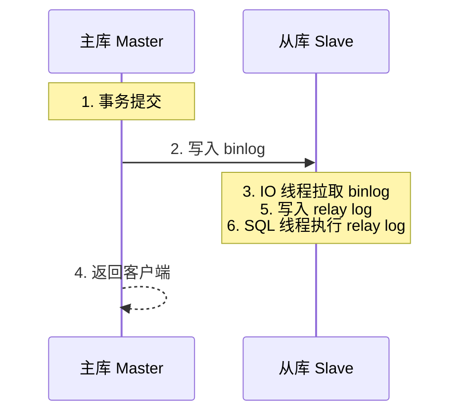
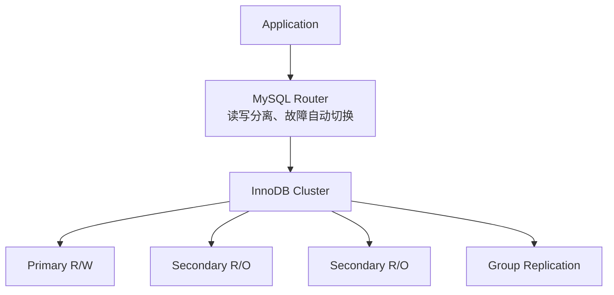

## 1. 学习目标（Bloom 分类）

本节按照布鲁姆教育目标分类学组织学习路径。本文主题为《复制与高可用》，属于 MySQL 模块，读者可以根据自身阶段选择阅读深度。

记忆层面：能够准确复述本文的核心概念、术语与基本语法或操作步骤，并能够在提问或检索时快速定位对应知识点。能够说出 MySQL 的核心概念、语法与常用对象。

理解层面：能够用自己的语言解释核心原理与工作机制，说明概念之间的因果关系，而不是机械记忆结论。能够解释 MySQL 的执行原理与优化机制。

应用层面：能够在真实项目或练习场景中运用本文知识解决具体问题，写出正确且可维护的实现。能够编写正确、高效的 MySQL 语句与操作。

分析层面：能够拆解复杂问题，比较本文主题与相邻概念的异同，识别边界条件与例外情况。能够分析 MySQL 相关方案在性能与一致性上的权衡。

评价层面：能够根据约束条件（性能、可读性、安全、成本）评价不同方案的优劣，做出有依据的技术决策。能够根据业务场景评价 MySQL 技术选型。

创造层面：能够把本文知识与其他模块知识组合，设计出新的解决方案或可复用的工程模式。能够组合 MySQL 与其他技术设计数据架构。

通过本节学习，读者应当能够把《复制与高可用》纳入自己的知识网络，并与 MySQL 模块的其他主题（InnoDB、索引、日志、主从、性能调优）建立关联。

## 2. 历史动机与发展脉络

《复制与高可用》是 MySQL 领域的重要主题。要真正理解它，需要先了解它解决的问题与演进过程。

MySQL 于 1995 年由 MySQL AB 发布，2008 年被 Sun 收购，2010 年随 Sun 并入 Oracle；MariaDB 是社区分支。
MySQL 8.0（2018）重写优化器、引入窗口函数与 CTE、默认 utf8mb4、数据字典升级；MySQL 8.4 与 9.x 继续演进（Oracle 创新版 + LTS 双轨）。
InnoDB 是默认存储引擎：事务、行锁、MVCC、崩溃恢复（redo/undo）；MyISAM 仅存于历史场景。

回到本文主题：复制与高可用 的提出与成熟，正是上述技术背景下的必然产物。早期实现往往以简单可用为目标，随着工程规模扩大，社区逐渐沉淀出标准做法与最佳实践；理解这一脉络，可以帮助读者判断“为什么文档中的推荐写法是现在这个样子”，也能在遇到历史遗留代码时准确识别其设计年代与取舍。


## 3. 形式化定义与核心概念精讲

本节把《复制与高可用》涉及的核心概念以“定义 + 讲解”的形式展开。读者应把定义当作工具，把讲解当作理解路径；两者结合才能形成可迁移的知识。

InnoDB 架构：缓冲池（Buffer Pool）、日志缓冲、redo/undo 日志；脏页刷盘与 checkpoint 机制。
索引：B+ 树主键聚集索引、二级索引、覆盖索引；索引下推（ICP）与 MRR 优化。
事务与锁：两阶段锁、间隙锁/临键锁（可重复读防幻读）、MVCC 快照读；隔离级别。

### 3.1 原文章节逐一精讲

原文档把主题拆分为 9 个小节，下面按顺序给出每一节的导读讲解，随后保留原文细节供精读。

#### 原文精读（完整保留）


#### 1. 二进制日志 (Binary Log)

##### 1.1 Binlog 概述

二进制日志记录所有对数据库进行修改的操作（DDL 和 DML），是 MySQL 复制和数据恢复的基础。Binlog 与 InnoDB 的 redo log 不同：redo log 是引擎级别的物理日志，而 binlog 是 Server 级别的逻辑日志。

```sql
-- 启用二进制日志
-- my.cnf 配置
-- [mysqld]
-- log-bin=mysql-bin
-- binlog_format=ROW
-- server-id=1
-- expire_logs_days=7

-- 查看二进制日志状态
SHOW VARIABLES LIKE 'log_bin%';
SHOW VARIABLES LIKE 'binlog%';

-- 查看当前二进制日志文件列表
SHOW BINARY LOGS;

-- 查看当前正在使用的 binlog 文件
SHOW MASTER STATUS;

-- 查看 binlog 事件内容
SHOW BINLOG EVENTS IN 'mysql-bin.000001';
```

##### 1.2 Binlog 格式

| 格式      | 记录内容   | 优点             | 缺点                   |
| :-------- | :--------- | :--------------- | :--------------------- |
| STATEMENT | SQL 语句   | 日志量小         | 非确定性函数结果不一致 |
| ROW       | 行变更数据 | 数据一致性最高   | 日志量大               |
| MIXED     | 自动切换   | 兼顾大小与一致性 | 切换逻辑复杂           |

```sql
-- 设置 binlog 格式
SET GLOBAL binlog_format = 'ROW';     -- 推荐：数据一致性最好
SET GLOBAL binlog_format = 'STATEMENT';
SET GLOBAL binlog_format = 'MIXED';

-- STATEMENT 格式示例
-- binlog 中记录：UPDATE orders SET status='shipped' WHERE id=1;
-- 问题：NOW()、UUID()、USER() 等函数在主从上执行结果不同

-- ROW 格式示例
-- binlog 中记录：
-- ### UPDATE `app_db`.`orders`
-- ### WHERE @1=1 @5='pending'
-- ### SET @5='shipped'
-- 精确记录行变更，无一致性问题

-- 查看当前格式
SHOW VARIABLES LIKE 'binlog_format';
```

##### 1.3 Binlog 管理

```sql
-- 手动切换到新的 binlog 文件
FLUSH BINARY LOGS;

-- 设置 binlog 过期时间（秒）
SET GLOBAL binlog_expire_logs_seconds = 604800;  -- 7天

-- 清理过期的 binlog
PURGE BINARY LOGS BEFORE '2024-12-01 00:00:00';
PURGE BINARY LOGS TO 'mysql-bin.000010';  -- 删除指定文件之前的日志

-- 查看 binlog 空间占用
SHOW VARIABLES LIKE 'max_binlog_size';  -- 单个文件最大大小，默认1GB
```

#### 2. 异步复制

##### 2.1 异步复制架构

异步复制是 MySQL 最基础的复制模式，主库执行事务后立即返回客户端，不等待从库确认接收。



##### 2.2 搭建异步复制

```sql
-- ===== 主库配置 =====
-- my.cnf
-- [mysqld]
-- server-id=1
-- log-bin=mysql-bin
-- binlog_format=ROW
-- binlog_do_db=app_db          -- 可选：只复制指定库

-- 创建复制用户
CREATE USER 'repl'@'%' IDENTIFIED WITH caching_sha2_password BY 'ReplP@ss123!';
GRANT REPLICATION SLAVE ON *.* TO 'repl'@'%';

-- 获取主库状态
SHOW MASTER STATUS;
-- 记录 File 和 Position 值

-- ===== 从库配置 =====
-- my.cnf
-- [mysqld]
-- server-id=2
-- relay-log=relay-bin
-- read_only=ON
-- super_read_only=ON          -- 防止超级用户写入

-- 配置复制源
CHANGE REPLICATION SOURCE TO
    SOURCE_HOST='master-host',
    SOURCE_PORT=3306,
    SOURCE_USER='repl',
    SOURCE_PASSWORD='ReplP@ss123!',
    SOURCE_LOG_FILE='mysql-bin.000001',
    SOURCE_LOG_POS=157,
    GET_SOURCE_PUBLIC_KEY=1;   -- caching_sha2_password 需要

-- 启动复制
START REPLICA;  -- MySQL 8.0+ 使用 START REPLICA（替代 START SLAVE）

-- 查看复制状态
SHOW REPLICA STATUS\G
-- 关键字段：
-- Replica_IO_Running: Yes
-- Replica_SQL_Running: Yes
-- Seconds_Behind_Master: 0
-- Last_Error: (空表示无错误)
```

##### 2.3 复制过滤

```sql
-- 主库过滤：只记录指定库的 binlog
-- binlog_do_db=app_db
-- binlog_ignore_db=test_db

-- 从库过滤：只应用指定库的 relay log
CHANGE REPLICATION FILTER
    REPLICATE_DO_DB=(app_db),
    REPLICATE_IGNORE_TABLE=(app_db.temp_data),
    REPLICATE_WILD_DO_TABLE=('app_db.log_%');

-- 注意：基于库的过滤可能引发跨库操作问题
-- 推荐使用 REPLICATE_WILD_DO_TABLE 进行表级别过滤
```

#### 3. 半同步复制

##### 3.1 半同步复制原理

半同步复制要求主库事务提交后，至少一个从库确认接收到该事务的 binlog 事件后，主库才向客户端返回提交成功。

```sql
-- 安装半同步复制插件（主库）
INSTALL PLUGIN rpl_semi_sync_master SONAME 'semisync_master.so';

-- 安装半同步复制插件（从库）
INSTALL PLUGIN rpl_semi_sync_slave SONAME 'semisync_slave.so';

-- 主库配置
SET GLOBAL rpl_semi_sync_master_enabled = ON;
SET GLOBAL rpl_semi_sync_master_timeout = 5000;  -- 超时5秒降级为异步
SET GLOBAL rpl_semi_sync_master_wait_for_replica_count = 1;  -- 至少1个从库确认

-- 从库配置
SET GLOBAL rpl_semi_sync_slave_enabled = ON;

-- 从库重启复制线程以启用半同步
STOP REPLICA;
START REPLICA;

-- 查看半同步状态
SHOW STATUS LIKE 'Rpl_semi_sync_master%';
-- Rpl_semi_sync_master_clients: 当前半同步从库数
-- Rpl_semi_sync_master_status: ON/OFF
-- Rpl_semi_sync_master_no_tx: 未成功半同步的事务数
-- Rpl_semi_sync_master_yes_tx: 成功半同步的事务数
```

##### 3.2 半同步复制等待策略

```sql
-- AFTER_SYNC（默认，推荐）：主库将事务写入binlog后等待从库确认，再提交事务
SET GLOBAL rpl_semi_sync_master_wait_point = 'AFTER_SYNC';
-- 优点：从库确认后才提交，不会丢失已提交事务

-- AFTER_COMMIT：主库先提交事务，再等待从库确认
SET GLOBAL rpl_semi_sync_master_wait_point = 'AFTER_COMMIT';
-- 缺点：主库已提交但从库未收到时，其他会话可能看到"幻影"数据
```

#### 4. 延迟复制

##### 4.1 延迟复制配置

延迟复制让从库故意落后主库指定时间，用于误操作恢复（如误删数据）和读负载分离。

```sql
-- 配置延迟复制（从库落后主库1小时）
CHANGE REPLICATION SOURCE TO
    SOURCE_DELAY = 3600;  -- 延迟3600秒（1小时）

-- 查看延迟状态
SHOW REPLICA STATUS\G
-- SQL_Delay: 3600
-- SQL_Remaining_Delay: 剩余延迟秒数

-- 临时跳过延迟（紧急情况）
START REPLICA UNTIL SQL_AFTER_MTS_GAPS;  -- 跳过多线程复制间隙
```

##### 4.2 延迟复制恢复误操作

```sql
-- 场景：主库误删数据，延迟从库尚未执行该操作
-- 1. 停止延迟从库的 SQL 线程
STOP REPLICA SQL_THREAD;

-- 2. 查看 relay log 定位误操作位置
SHOW RELAYLOG EVENTS IN 'relay-bin.000005';

-- 3. 将从库设为可读写
SET GLOBAL read_only = OFF;
SET GLOBAL super_read_only = OFF;

-- 4. 导出误删的数据
SELECT * FROM important_table WHERE id IN (1, 2, 3)
INTO OUTFILE '/tmp/recovery_data.csv';

-- 5. 恢复到主库
-- 在主库执行：LOAD DATA INFILE '/tmp/recovery_data.csv' ...
```

#### 5. 组复制 (Group Replication)

##### 5.1 组复制概述

组复制基于 Paxos 协议实现多主一致性，提供自动成员管理、故障检测和自动恢复能力。

```sql
-- 组复制配置（每个节点）
-- my.cnf
-- [mysqld]
-- server-id=1
-- log-bin=mysql-bin
-- binlog_format=ROW
-- gtid_mode=ON
-- enforce_gtid_consistency=ON
-- plugin_load_add='group_replication.so'
-- group_replication_group_name='aaaaaaaa-bbbb-cccc-dddd-eeeeeeeeeeee'
-- group_replication_start_on_boot=OFF
-- group_replication_local_address='node1:33061'
-- group_replication_group_seeds='node1:33061,node2:33061,node3:33061'
-- group_replication_bootstrap_group=OFF  -- 仅引导节点设为ON

-- 单主模式（默认）
SET GLOBAL group_replication_single_primary_mode = ON;

-- 多主模式
SET GLOBAL group_replication_single_primary_mode = OFF;
```

##### 5.2 启动组复制

```sql
-- 引导节点（第一个节点）
SET GLOBAL group_replication_bootstrap_group = ON;
START GROUP_REPLICATION;
SET GLOBAL group_replication_bootstrap_group = OFF;

-- 其他节点加入
START GROUP_REPLICATION;

-- 查看组成员
SELECT * FROM performance_schema.replication_group_members;
-- +---------------------------+-------------+-------------+--------------+
-- | MEMBER_HOST               | MEMBER_PORT | MEMBER_STATE | MEMBER_ROLE  |
-- +---------------------------+-------------+-------------+--------------+
-- | node1                     |        3306 | ONLINE      | PRIMARY      |
-- | node2                     |        3306 | ONLINE      | SECONDARY    |
-- | node3                     |        3306 | ONLINE      | SECONDARY    |
-- +---------------------------+-------------+-------------+--------------+

-- 查看当前主节点
SELECT * FROM performance_schema.replication_group_members
WHERE MEMBER_ROLE = 'PRIMARY';
```

##### 5.3 组复制监控

```sql
-- 查看组复制状态
SELECT * FROM performance_schema.replication_group_member_stats\G

-- 关键指标
-- COUNT_TRANSACTIONS_IN_QUEUE: 等待冲突检测的事务数
-- COUNT_TRANSACTIONS_CHECKED: 已通过冲突检测的事务数
-- COUNT_CONFLICTS_DETECTED: 冲突事务数
-- COUNT_TRANSACTIONS_REMOTE_APPLYING: 远程事务正在应用数
-- TRANSACTIONS_COMMITTED_ALL_MEMBERS: 已在所有成员提交的GTID集

-- 查看组复制事务详情
SELECT * FROM performance_schema.replication_applier_status;
```

#### 6. InnoDB Cluster

##### 6.1 InnoDB Cluster 架构

InnoDB Cluster 是 MySQL 官方的高可用解决方案，整合了 Group Replication、MySQL Router 和 MySQL Shell。



##### 6.2 使用 MySQL Shell AdminAPI 管理

```javascript
// MySQL Shell (JavaScript 模式)

// 创建 InnoDB Cluster
var cluster = dba.createCluster('prodCluster', {
  memberWeight: 50, // 故障切换优先级
  expelTimeout: 5, // 驱逐超时（秒）
  autoRejoinTries: 3, // 自动重连尝试次数
  consistency: 'BEFORE_ON_PRIMARY_FAILOVER', // 一致性级别
});

// 添加实例
cluster.addInstance('node2:3306', {
  recoveryMethod: 'clone', // 使用克隆恢复数据
  replicationConsistency: 'EVENTUAL',
});

cluster.addInstance('node3:3306', {
  recoveryMethod: 'incremental', // 增量恢复
});

// 查看集群状态
cluster.status();
// 输出包含每个节点的状态、角色、地址信息

// 集群描述
cluster.describe();

// 设置主节点（手动切换）
cluster.setPrimaryInstance('node2:3306');

// 移除实例
cluster.removeInstance('node3:3306');

// 重新加入实例
cluster.rejoinInstance('node3:3306');
```

##### 6.3 MySQL Router 配置

```bash
# 引导 MySQL Router（自动生成配置）
mysqlrouter --bootstrap root@node1:3306 --user=mysqlrouter

# 配置文件自动生成在 /etc/mysqlrouter/mysqlrouter.conf
# 关键配置：
# [routing:read_write]
# bind_address=0.0.0.0
# bind_port=6446           # 读写端口
# destinations=metadata-cache://prodCluster/?role=PRIMARY
# routing_strategy=first-available

# [routing:read_only]
# bind_address=0.0.0.0
# bind_port=6447           # 只读端口
# destinations=metadata-cache://prodCluster/?role=SECONDARY
# routing_strategy=round-robin

# 启动 Router
systemctl start mysqlrouter
```

```sql
-- 应用连接方式
-- 写操作 → Router 6446 端口 → Primary 节点
-- 读操作 → Router 6447 端口 → Secondary 节点（轮询）
```

#### 7. InnoDB ClusterSet

##### 7.1 ClusterSet 架构

ClusterSet 是跨数据中心的灾备方案，将多个 InnoDB Cluster 组成一个集群集，提供全局高可用和灾难恢复能力。

```mermaid
flowchart TD
    subgraph CS[InnoDB ClusterSet]
        subgraph DC1[Primary Cluster DC1]
            P[P] S1[S]
        end
        subgraph DC2[Replica Cluster DC2]
            S2[S] S3[S]
        end
        DC1 -->|异步复制| DC2
    end
```

##### 7.2 ClusterSet 管理

```javascript
// MySQL Shell

// 创建 ClusterSet
var cluster = dba.getCluster();
var cs = cluster.createClusterSet('globalCS');

// 添加副本集群
cs.createReplicaCluster('node4:3306', 'replicaCluster', {
  recoveryMethod: 'clone',
  replicationConsistency: 'EVENTUAL',
});

// 查看 ClusterSet 状态
cs.status();

// 灾难切换（主集群不可用时）
cs.forcePrimaryCluster('replicaCluster');

// 计划内切换
cs.setPrimaryCluster('replicaCluster');
```

#### 8. GTID 复制

##### 8.1 GTID 概念

GTID（Global Transaction Identifier）为每个事务分配全局唯一标识符，简化复制管理和故障恢复。

```sql
-- GTID 格式：server_uuid:transaction_id
-- 例如：3E11FA47-71CA-11E1-9E33-C80AA9429562:1-5

-- 启用 GTID
-- my.cnf
-- gtid_mode=ON
-- enforce_gtid_consistency=ON

-- 查看已执行的 GTID
SHOW MASTER STATUS;
-- Executed_Gtid_Set: 3E11FA47-71CA-11E1-9E33-C80AA9429562:1-100

-- 基于 GTID 配置复制（无需指定 binlog 文件和位置）
CHANGE REPLICATION SOURCE TO
    SOURCE_HOST='master-host',
    SOURCE_PORT=3306,
    SOURCE_USER='repl',
    SOURCE_PASSWORD='ReplP@ss123!',
    SOURCE_AUTO_POSITION=1;  -- 使用 GTID 自动定位
```

##### 8.2 GTID 故障恢复

```sql
-- 注入空事务跳过有问题的 GTID
SET GTID_NEXT='3E11FA47-71CA-11E1-9E33-C80AA9429562:101';
BEGIN;
COMMIT;
SET GTID_NEXT='AUTOMATIC';

-- 重置从库的 GTID 执行位置
RESET MASTER;  -- 危险操作，仅在新从库上使用

-- 查看从库已检索的 GTID
SHOW REPLICA STATUS\G
-- Retrieved_Gtid_Set: 已从主库拉取的 GTID
-- Executed_Gtid_Set: 已执行的 GTID
```

#### 9. 备份与恢复

##### 9.1 mysqldump 逻辑备份

```bash
# 全库逻辑备份
mysqldump -u root -p --single-transaction --routines --triggers --events \
    --all-databases > full_backup.sql

# 单库备份
mysqldump -u root -p --single-transaction app_db > app_db_backup.sql

# 仅表结构
mysqldump -u root -p --no-data app_db > schema_only.sql

# 仅数据
mysqldump -u root -p --no-create-info app_db > data_only.sql

# 压缩备份
mysqldump -u root -p --single-transaction app_db | gzip > app_db.sql.gz

# 恢复
mysql -u root -p app_db < app_db_backup.sql
gunzip < app_db.sql.gz | mysql -u root -p app_db
```

```sql
-- --single-transaction：使用一致性快照，不锁表（InnoDB 推荐）
-- --routines：包含存储过程和函数
-- --triggers：包含触发器
-- --events：包含事件
-- --set-gtid-purged=OFF：不输出 GTID 信息（用于非 GTID 环境）
-- --where：条件导出
```

##### 9.2 mysqlpump 并行逻辑备份

```bash
# 并行备份（MySQL 8.0+）
mysqlpump -u root -p --default-parallelism=4 \
    --single-transaction app_db > app_db_pump.sql

# 按库并行
mysqlpump -u root -p --parallel-schemas=4:app_db \
    --parallel-schemas=2:log_db \
    --single-transaction > multi_db.sql

# 压缩输出
mysqlpump -u root -p --compress-output=LZ4 \
    --single-transaction app_db > app_db.sql.lz4
```

##### 9.3 MySQL Enterprise Backup 物理备份

```bash
# 全量物理备份
mysqlbackup --user=root --password --backup-dir=/backup/full \
    backup

# 增量备份
mysqlbackup --user=root --password --backup-dir=/backup/incr \
    --incremental --incremental-base=dir:/backup/full \
    backup

# 恢复
mysqlbackup --backup-dir=/backup/full copy-back
# 恢复前需确保数据目录为空

# 压缩备份
mysqlbackup --user=root --password --backup-dir=/backup/compressed \
    --compress backup
```

##### 9.4 基于时间点的恢复 (PITR)

```bash
# 1. 先恢复全量备份
mysql -u root -p < full_backup.sql

# 2. 查看全量备份后的 binlog 文件
head -20 full_backup.sql | grep 'MASTER_DATA'

# 3. 从 binlog 中提取指定时间段的操作
mysqlbinlog --start-datetime="2024-12-01 00:00:00" \
    --stop-datetime="2024-12-01 14:30:00" \
    mysql-bin.000010 mysql-bin.000011 | mysql -u root -p

# 4. 或基于位置提取
mysqlbinlog --start-position=157 --stop-position=1024 \
    mysql-bin.000010 | mysql -u root -p
```

```sql
-- 查看误操作的时间点
SHOW BINLOG EVENTS IN 'mysql-bin.000010'
FROM 157 LIMIT 100;

-- 跳过误操作（基于 GTID）
-- 找到误操作的 GTID 后注入空事务跳过
SET GTID_NEXT='3E11FA47-71CA-11E1-9E33-C80AA9429562:50';
BEGIN;
COMMIT;
SET GTID_NEXT='AUTOMATIC';
```

##### 9.5 备份策略建议

| 策略         | 频率 | 工具                                  | 保留周期 |
| :----------- | :--- | :------------------------------------ | :------- |
| 全量逻辑备份 | 每日 | mysqldump                             | 7天      |
| 全量物理备份 | 每周 | MySQL Enterprise Backup               | 4周      |
| 增量物理备份 | 每日 | MySQL Enterprise Backup               | 7天      |
| Binlog 备份  | 实时 | mysqlbinlog --read-from-remote-server | 7天      |
| 延迟从库     | 实时 | 延迟复制                              | 持续运行 |

```sql
-- 自动化备份验证：定期检查备份可恢复性
-- 在测试环境恢复备份并执行校验查询
SELECT COUNT(*) FROM critical_table;
CHECK TABLE critical_table;
```


### 3.2 概念关系图

下面用 Mermaid 图表达本文核心概念之间的关系，帮助读者建立整体图景：


图中展示的是本文知识的结构化关系：核心概念是入口，原理机制解释“为什么”，代码实践演示“怎么做”，工程应用回答“何时用”。读者学习时可以把每个小节的内容挂接到对应节点上。

## 4. 理论推导与原理解析

本节深入《复制与高可用》背后的原理。理论部分不求面面俱到，而是聚焦“能解释现象、能指导实践”的关键推导。

InnoDB 架构：缓冲池（Buffer Pool）、日志缓冲、redo/undo 日志；脏页刷盘与 checkpoint 机制。
索引：B+ 树主键聚集索引、二级索引、覆盖索引；索引下推（ICP）与 MRR 优化。
事务与锁：两阶段锁、间隙锁/临键锁（可重复读防幻读）、MVCC 快照读；隔离级别。
复制：binlog 逻辑复制（statement/row/mixed），主从异步、半同步与组复制。

需要强调的是，理论推导与工程实践之间存在翻译层：理论给出的是理想化模型与边界条件，工程代码则必须处理真实环境中的例外。读者在学习时应先掌握理论的“标准情形”，再通过陷阱章节了解“非标准情形”。

## 5. 代码示例与逐行讲解

本节把原文中的代码示例系统整理，并为每个示例补充用途说明与讲解。读者不应只浏览代码，而应逐段对照讲解理解设计意图。

### 5.1 示例：1.1 Binlog 概述

该示例来自原文《1.1 Binlog 概述》小节，用于演示复制与高可用相关操作。阅读时请先看代码结构，再看其后的讲解。

```sql
-- 启用二进制日志
-- my.cnf 配置
-- [mysqld]
-- log-bin=mysql-bin
-- binlog_format=ROW
-- server-id=1
-- expire_logs_days=7

-- 查看二进制日志状态
SHOW VARIABLES LIKE 'log_bin%';
SHOW VARIABLES LIKE 'binlog%';

-- 查看当前二进制日志文件列表
SHOW BINARY LOGS;

-- 查看当前正在使用的 binlog 文件
SHOW MASTER STATUS;

-- 查看 binlog 事件内容
SHOW BINLOG EVENTS IN 'mysql-bin.000001';
```

讲解：这段代码演示了本节核心知识点。代码中的关键操作可以归纳为三步：准备（定义或初始化）、执行（核心逻辑）、收尾（释放资源或返回结果）。实际项目中，这三步往往被封装为函数或类，以提升复用性与可测试性。

关键点分析：

该示例共 16 行有效代码，结构以数据或配置为主。阅读时应关注：数据字段的含义、配置项的作用，以及它们与运行行为的对应关系。

进阶思考路径：先尝试修改参数观察行为变化，再把示例中的模式迁移到自己的项目中；每次修改都记录预期与实测差异，这是把示例转化为能力的最快方式。

### 5.2 示例：1.2 Binlog 格式

该示例来自原文《1.2 Binlog 格式》小节，用于演示复制与高可用相关操作。阅读时请先看代码结构，再看其后的讲解。

```sql
-- 设置 binlog 格式
SET GLOBAL binlog_format = 'ROW';     -- 推荐：数据一致性最好
SET GLOBAL binlog_format = 'STATEMENT';
SET GLOBAL binlog_format = 'MIXED';

-- STATEMENT 格式示例
-- binlog 中记录：UPDATE orders SET status='shipped' WHERE id=1;
-- 问题：NOW()、UUID()、USER() 等函数在主从上执行结果不同

-- ROW 格式示例
-- binlog 中记录：
-- ### UPDATE `app_db`.`orders`
-- ### WHERE @1=1 @5='pending'
-- ### SET @5='shipped'
-- 精确记录行变更，无一致性问题

-- 查看当前格式
SHOW VARIABLES LIKE 'binlog_format';
```

讲解：这段代码演示了本节核心知识点。代码中的关键操作可以归纳为三步：准备（定义或初始化）、执行（核心逻辑）、收尾（释放资源或返回结果）。实际项目中，这三步往往被封装为函数或类，以提升复用性与可测试性。

关键点分析：

该示例共 15 行有效代码，结构以数据或配置为主。阅读时应关注：数据字段的含义、配置项的作用，以及它们与运行行为的对应关系。

进阶思考路径：先尝试修改参数观察行为变化，再把示例中的模式迁移到自己的项目中；每次修改都记录预期与实测差异，这是把示例转化为能力的最快方式。

### 5.3 示例：1.3 Binlog 管理

该示例来自原文《1.3 Binlog 管理》小节，用于演示复制与高可用相关操作。阅读时请先看代码结构，再看其后的讲解。

```sql
-- 手动切换到新的 binlog 文件
FLUSH BINARY LOGS;

-- 设置 binlog 过期时间（秒）
SET GLOBAL binlog_expire_logs_seconds = 604800;  -- 7天

-- 清理过期的 binlog
PURGE BINARY LOGS BEFORE '2024-12-01 00:00:00';
PURGE BINARY LOGS TO 'mysql-bin.000010';  -- 删除指定文件之前的日志

-- 查看 binlog 空间占用
SHOW VARIABLES LIKE 'max_binlog_size';  -- 单个文件最大大小，默认1GB
```

讲解：这段代码演示了本节核心知识点。代码中的关键操作可以归纳为三步：准备（定义或初始化）、执行（核心逻辑）、收尾（释放资源或返回结果）。实际项目中，这三步往往被封装为函数或类，以提升复用性与可测试性。

关键点分析：

该示例共 9 行有效代码，结构以数据或配置为主。阅读时应关注：数据字段的含义、配置项的作用，以及它们与运行行为的对应关系。

进阶思考路径：先尝试修改参数观察行为变化，再把示例中的模式迁移到自己的项目中；每次修改都记录预期与实测差异，这是把示例转化为能力的最快方式。

### 5.4 示例：2.1 异步复制架构

该示例来自原文《2.1 异步复制架构》小节，用于演示复制与高可用相关操作。阅读时请先看代码结构，再看其后的讲解。


讲解：这段代码演示了本节核心知识点。代码中的关键操作可以归纳为三步：准备（定义或初始化）、执行（核心逻辑）、收尾（释放资源或返回结果）。实际项目中，这三步往往被封装为函数或类，以提升复用性与可测试性。

关键点分析：

该示例共 7 行有效代码，结构以数据或配置为主。阅读时应关注：数据字段的含义、配置项的作用，以及它们与运行行为的对应关系。

进阶思考路径：先尝试修改参数观察行为变化，再把示例中的模式迁移到自己的项目中；每次修改都记录预期与实测差异，这是把示例转化为能力的最快方式。

### 5.5 示例：2.2 搭建异步复制

该示例来自原文《2.2 搭建异步复制》小节，用于演示复制与高可用相关操作。阅读时请先看代码结构，再看其后的讲解。

```sql
-- ===== 主库配置 =====
-- my.cnf
-- [mysqld]
-- server-id=1
-- log-bin=mysql-bin
-- binlog_format=ROW
-- binlog_do_db=app_db          -- 可选：只复制指定库

-- 创建复制用户
CREATE USER 'repl'@'%' IDENTIFIED WITH caching_sha2_password BY 'ReplP@ss123!';
GRANT REPLICATION SLAVE ON *.* TO 'repl'@'%';

-- 获取主库状态
SHOW MASTER STATUS;
-- 记录 File 和 Position 值

-- ===== 从库配置 =====
-- my.cnf
-- [mysqld]
-- server-id=2
-- relay-log=relay-bin
-- read_only=ON
-- super_read_only=ON          -- 防止超级用户写入

-- 配置复制源
CHANGE REPLICATION SOURCE TO
    SOURCE_HOST='master-host',
    SOURCE_PORT=3306,
    SOURCE_USER='repl',
    SOURCE_PASSWORD='ReplP@ss123!',
    SOURCE_LOG_FILE='mysql-bin.000001',
    SOURCE_LOG_POS=157,
    GET_SOURCE_PUBLIC_KEY=1;   -- caching_sha2_password 需要

-- 启动复制
START REPLICA;  -- MySQL 8.0+ 使用 START REPLICA（替代 START SLAVE）

-- 查看复制状态
SHOW REPLICA STATUS\G
-- 关键字段：
-- Replica_IO_Running: Yes
-- Replica_SQL_Running: Yes
-- Seconds_Behind_Master: 0
-- Last_Error: (空表示无错误)
```

讲解：这段代码演示了本节核心知识点。代码中的关键操作可以归纳为三步：准备（定义或初始化）、执行（核心逻辑）、收尾（释放资源或返回结果）。实际项目中，这三步往往被封装为函数或类，以提升复用性与可测试性。

关键点分析：

该示例共 38 行有效代码，包含 1 类关键结构（CREATE）。其中：

- 入口与初始化部分负责建立上下文，对应实际项目中的启动或装配逻辑；
- 核心逻辑部分体现本文主题的主要操作，是阅读时最需要对照讲解理解的部分；
- 输出或返回部分把结果交给调用方，注意其类型与边界条件。

进阶思考路径：先尝试修改参数观察行为变化，再把示例中的模式迁移到自己的项目中；每次修改都记录预期与实测差异，这是把示例转化为能力的最快方式。

### 5.6 示例：2.3 复制过滤

该示例来自原文《2.3 复制过滤》小节，用于演示复制与高可用相关操作。阅读时请先看代码结构，再看其后的讲解。

```sql
-- 主库过滤：只记录指定库的 binlog
-- binlog_do_db=app_db
-- binlog_ignore_db=test_db

-- 从库过滤：只应用指定库的 relay log
CHANGE REPLICATION FILTER
    REPLICATE_DO_DB=(app_db),
    REPLICATE_IGNORE_TABLE=(app_db.temp_data),
    REPLICATE_WILD_DO_TABLE=('app_db.log_%');

-- 注意：基于库的过滤可能引发跨库操作问题
-- 推荐使用 REPLICATE_WILD_DO_TABLE 进行表级别过滤
```

讲解：这段代码演示了本节核心知识点。代码中的关键操作可以归纳为三步：准备（定义或初始化）、执行（核心逻辑）、收尾（释放资源或返回结果）。实际项目中，这三步往往被封装为函数或类，以提升复用性与可测试性。

关键点分析：

该示例共 10 行有效代码，结构以数据或配置为主。阅读时应关注：数据字段的含义、配置项的作用，以及它们与运行行为的对应关系。

进阶思考路径：先尝试修改参数观察行为变化，再把示例中的模式迁移到自己的项目中；每次修改都记录预期与实测差异，这是把示例转化为能力的最快方式。

### 5.7 示例：3.1 半同步复制原理

该示例来自原文《3.1 半同步复制原理》小节，用于演示复制与高可用相关操作。阅读时请先看代码结构，再看其后的讲解。

```sql
-- 安装半同步复制插件（主库）
INSTALL PLUGIN rpl_semi_sync_master SONAME 'semisync_master.so';

-- 安装半同步复制插件（从库）
INSTALL PLUGIN rpl_semi_sync_slave SONAME 'semisync_slave.so';

-- 主库配置
SET GLOBAL rpl_semi_sync_master_enabled = ON;
SET GLOBAL rpl_semi_sync_master_timeout = 5000;  -- 超时5秒降级为异步
SET GLOBAL rpl_semi_sync_master_wait_for_replica_count = 1;  -- 至少1个从库确认

-- 从库配置
SET GLOBAL rpl_semi_sync_slave_enabled = ON;

-- 从库重启复制线程以启用半同步
STOP REPLICA;
START REPLICA;

-- 查看半同步状态
SHOW STATUS LIKE 'Rpl_semi_sync_master%';
-- Rpl_semi_sync_master_clients: 当前半同步从库数
-- Rpl_semi_sync_master_status: ON/OFF
-- Rpl_semi_sync_master_no_tx: 未成功半同步的事务数
-- Rpl_semi_sync_master_yes_tx: 成功半同步的事务数
```

讲解：这段代码演示了本节核心知识点。代码中的关键操作可以归纳为三步：准备（定义或初始化）、执行（核心逻辑）、收尾（释放资源或返回结果）。实际项目中，这三步往往被封装为函数或类，以提升复用性与可测试性。

关键点分析：

该示例共 19 行有效代码，结构以数据或配置为主。阅读时应关注：数据字段的含义、配置项的作用，以及它们与运行行为的对应关系。

进阶思考路径：先尝试修改参数观察行为变化，再把示例中的模式迁移到自己的项目中；每次修改都记录预期与实测差异，这是把示例转化为能力的最快方式。

### 5.8 示例：3.2 半同步复制等待策略

该示例来自原文《3.2 半同步复制等待策略》小节，用于演示复制与高可用相关操作。阅读时请先看代码结构，再看其后的讲解。

```sql
-- AFTER_SYNC（默认，推荐）：主库将事务写入binlog后等待从库确认，再提交事务
SET GLOBAL rpl_semi_sync_master_wait_point = 'AFTER_SYNC';
-- 优点：从库确认后才提交，不会丢失已提交事务

-- AFTER_COMMIT：主库先提交事务，再等待从库确认
SET GLOBAL rpl_semi_sync_master_wait_point = 'AFTER_COMMIT';
-- 缺点：主库已提交但从库未收到时，其他会话可能看到"幻影"数据
```

讲解：这段代码演示了本节核心知识点。代码中的关键操作可以归纳为三步：准备（定义或初始化）、执行（核心逻辑）、收尾（释放资源或返回结果）。实际项目中，这三步往往被封装为函数或类，以提升复用性与可测试性。

关键点分析：

该示例共 6 行有效代码，结构以数据或配置为主。阅读时应关注：数据字段的含义、配置项的作用，以及它们与运行行为的对应关系。

进阶思考路径：先尝试修改参数观察行为变化，再把示例中的模式迁移到自己的项目中；每次修改都记录预期与实测差异，这是把示例转化为能力的最快方式。

### 5.9 示例：4.1 延迟复制配置

该示例来自原文《4.1 延迟复制配置》小节，用于演示复制与高可用相关操作。阅读时请先看代码结构，再看其后的讲解。

```sql
-- 配置延迟复制（从库落后主库1小时）
CHANGE REPLICATION SOURCE TO
    SOURCE_DELAY = 3600;  -- 延迟3600秒（1小时）

-- 查看延迟状态
SHOW REPLICA STATUS\G
-- SQL_Delay: 3600
-- SQL_Remaining_Delay: 剩余延迟秒数

-- 临时跳过延迟（紧急情况）
START REPLICA UNTIL SQL_AFTER_MTS_GAPS;  -- 跳过多线程复制间隙
```

讲解：这段代码演示了本节核心知识点。代码中的关键操作可以归纳为三步：准备（定义或初始化）、执行（核心逻辑）、收尾（释放资源或返回结果）。实际项目中，这三步往往被封装为函数或类，以提升复用性与可测试性。

关键点分析：

该示例共 9 行有效代码，结构以数据或配置为主。阅读时应关注：数据字段的含义、配置项的作用，以及它们与运行行为的对应关系。

进阶思考路径：先尝试修改参数观察行为变化，再把示例中的模式迁移到自己的项目中；每次修改都记录预期与实测差异，这是把示例转化为能力的最快方式。

### 5.10 示例：4.2 延迟复制恢复误操作

该示例来自原文《4.2 延迟复制恢复误操作》小节，用于演示复制与高可用相关操作。阅读时请先看代码结构，再看其后的讲解。

```sql
-- 场景：主库误删数据，延迟从库尚未执行该操作
-- 1. 停止延迟从库的 SQL 线程
STOP REPLICA SQL_THREAD;

-- 2. 查看 relay log 定位误操作位置
SHOW RELAYLOG EVENTS IN 'relay-bin.000005';

-- 3. 将从库设为可读写
SET GLOBAL read_only = OFF;
SET GLOBAL super_read_only = OFF;

-- 4. 导出误删的数据
SELECT * FROM important_table WHERE id IN (1, 2, 3)
INTO OUTFILE '/tmp/recovery_data.csv';

-- 5. 恢复到主库
-- 在主库执行：LOAD DATA INFILE '/tmp/recovery_data.csv' ...
```

讲解：这段代码演示了本节核心知识点。代码中的关键操作可以归纳为三步：准备（定义或初始化）、执行（核心逻辑）、收尾（释放资源或返回结果）。实际项目中，这三步往往被封装为函数或类，以提升复用性与可测试性。

关键点分析：

该示例共 13 行有效代码，包含 3 类关键结构（import、SELECT、FROM）。其中：

- 入口与初始化部分负责建立上下文，对应实际项目中的启动或装配逻辑；
- 核心逻辑部分体现本文主题的主要操作，是阅读时最需要对照讲解理解的部分；
- 输出或返回部分把结果交给调用方，注意其类型与边界条件。

进阶思考路径：先尝试修改参数观察行为变化，再把示例中的模式迁移到自己的项目中；每次修改都记录预期与实测差异，这是把示例转化为能力的最快方式。

### 5.11 示例：5.1 组复制概述

该示例来自原文《5.1 组复制概述》小节，用于演示复制与高可用相关操作。阅读时请先看代码结构，再看其后的讲解。

```sql
-- 组复制配置（每个节点）
-- my.cnf
-- [mysqld]
-- server-id=1
-- log-bin=mysql-bin
-- binlog_format=ROW
-- gtid_mode=ON
-- enforce_gtid_consistency=ON
-- plugin_load_add='group_replication.so'
-- group_replication_group_name='aaaaaaaa-bbbb-cccc-dddd-eeeeeeeeeeee'
-- group_replication_start_on_boot=OFF
-- group_replication_local_address='node1:33061'
-- group_replication_group_seeds='node1:33061,node2:33061,node3:33061'
-- group_replication_bootstrap_group=OFF  -- 仅引导节点设为ON

-- 单主模式（默认）
SET GLOBAL group_replication_single_primary_mode = ON;

-- 多主模式
SET GLOBAL group_replication_single_primary_mode = OFF;
```

讲解：这段代码演示了本节核心知识点。代码中的关键操作可以归纳为三步：准备（定义或初始化）、执行（核心逻辑）、收尾（释放资源或返回结果）。实际项目中，这三步往往被封装为函数或类，以提升复用性与可测试性。

关键点分析：

该示例共 18 行有效代码，结构以数据或配置为主。阅读时应关注：数据字段的含义、配置项的作用，以及它们与运行行为的对应关系。

进阶思考路径：先尝试修改参数观察行为变化，再把示例中的模式迁移到自己的项目中；每次修改都记录预期与实测差异，这是把示例转化为能力的最快方式。

### 5.12 示例：5.2 启动组复制

该示例来自原文《5.2 启动组复制》小节，用于演示复制与高可用相关操作。阅读时请先看代码结构，再看其后的讲解。

```sql
-- 引导节点（第一个节点）
SET GLOBAL group_replication_bootstrap_group = ON;
START GROUP_REPLICATION;
SET GLOBAL group_replication_bootstrap_group = OFF;

-- 其他节点加入
START GROUP_REPLICATION;

-- 查看组成员
SELECT * FROM performance_schema.replication_group_members;
-- +---------------------------+-------------+-------------+--------------+
-- | MEMBER_HOST               | MEMBER_PORT | MEMBER_STATE | MEMBER_ROLE  |
-- +---------------------------+-------------+-------------+--------------+
-- | node1                     |        3306 | ONLINE      | PRIMARY      |
-- | node2                     |        3306 | ONLINE      | SECONDARY    |
-- | node3                     |        3306 | ONLINE      | SECONDARY    |
-- +---------------------------+-------------+-------------+--------------+

-- 查看当前主节点
SELECT * FROM performance_schema.replication_group_members
WHERE MEMBER_ROLE = 'PRIMARY';
```

讲解：这段代码演示了本节核心知识点。代码中的关键操作可以归纳为三步：准备（定义或初始化）、执行（核心逻辑）、收尾（释放资源或返回结果）。实际项目中，这三步往往被封装为函数或类，以提升复用性与可测试性。

关键点分析：

该示例共 18 行有效代码，包含 2 类关键结构（SELECT、FROM）。其中：

- 入口与初始化部分负责建立上下文，对应实际项目中的启动或装配逻辑；
- 核心逻辑部分体现本文主题的主要操作，是阅读时最需要对照讲解理解的部分；
- 输出或返回部分把结果交给调用方，注意其类型与边界条件。

进阶思考路径：先尝试修改参数观察行为变化，再把示例中的模式迁移到自己的项目中；每次修改都记录预期与实测差异，这是把示例转化为能力的最快方式。

### 5.13 示例：5.3 组复制监控

该示例来自原文《5.3 组复制监控》小节，用于演示复制与高可用相关操作。阅读时请先看代码结构，再看其后的讲解。

```sql
-- 查看组复制状态
SELECT * FROM performance_schema.replication_group_member_stats\G

-- 关键指标
-- COUNT_TRANSACTIONS_IN_QUEUE: 等待冲突检测的事务数
-- COUNT_TRANSACTIONS_CHECKED: 已通过冲突检测的事务数
-- COUNT_CONFLICTS_DETECTED: 冲突事务数
-- COUNT_TRANSACTIONS_REMOTE_APPLYING: 远程事务正在应用数
-- TRANSACTIONS_COMMITTED_ALL_MEMBERS: 已在所有成员提交的GTID集

-- 查看组复制事务详情
SELECT * FROM performance_schema.replication_applier_status;
```

讲解：这段代码演示了本节核心知识点。代码中的关键操作可以归纳为三步：准备（定义或初始化）、执行（核心逻辑）、收尾（释放资源或返回结果）。实际项目中，这三步往往被封装为函数或类，以提升复用性与可测试性。

关键点分析：

该示例共 10 行有效代码，包含 2 类关键结构（SELECT、FROM）。其中：

- 入口与初始化部分负责建立上下文，对应实际项目中的启动或装配逻辑；
- 核心逻辑部分体现本文主题的主要操作，是阅读时最需要对照讲解理解的部分；
- 输出或返回部分把结果交给调用方，注意其类型与边界条件。

进阶思考路径：先尝试修改参数观察行为变化，再把示例中的模式迁移到自己的项目中；每次修改都记录预期与实测差异，这是把示例转化为能力的最快方式。

### 5.14 示例：6.1 InnoDB Cluster 架构

该示例来自原文《6.1 InnoDB Cluster 架构》小节，用于演示复制与高可用相关操作。阅读时请先看代码结构，再看其后的讲解。


讲解：这段代码演示了本节核心知识点。代码中的关键操作可以归纳为三步：准备（定义或初始化）、执行（核心逻辑）、收尾（释放资源或返回结果）。实际项目中，这三步往往被封装为函数或类，以提升复用性与可测试性。

关键点分析：

该示例共 7 行有效代码，结构以数据或配置为主。阅读时应关注：数据字段的含义、配置项的作用，以及它们与运行行为的对应关系。

进阶思考路径：先尝试修改参数观察行为变化，再把示例中的模式迁移到自己的项目中；每次修改都记录预期与实测差异，这是把示例转化为能力的最快方式。

### 5.15 示例：6.2 使用 MySQL Shell AdminAPI 管理

该示例来自原文《6.2 使用 MySQL Shell AdminAPI 管理》小节，用于演示复制与高可用相关操作。阅读时请先看代码结构，再看其后的讲解。

```javascript
// MySQL Shell (JavaScript 模式)

// 创建 InnoDB Cluster
var cluster = dba.createCluster('prodCluster', {
  memberWeight: 50, // 故障切换优先级
  expelTimeout: 5, // 驱逐超时（秒）
  autoRejoinTries: 3, // 自动重连尝试次数
  consistency: 'BEFORE_ON_PRIMARY_FAILOVER', // 一致性级别
});

// 添加实例
cluster.addInstance('node2:3306', {
  recoveryMethod: 'clone', // 使用克隆恢复数据
  replicationConsistency: 'EVENTUAL',
});

cluster.addInstance('node3:3306', {
  recoveryMethod: 'incremental', // 增量恢复
});

// 查看集群状态
cluster.status();
// 输出包含每个节点的状态、角色、地址信息

// 集群描述
cluster.describe();

// 设置主节点（手动切换）
cluster.setPrimaryInstance('node2:3306');

// 移除实例
cluster.removeInstance('node3:3306');

// 重新加入实例
cluster.rejoinInstance('node3:3306');
```

讲解：这段代码演示了本节核心知识点。代码中的关键操作可以归纳为三步：准备（定义或初始化）、执行（核心逻辑）、收尾（释放资源或返回结果）。实际项目中，这三步往往被封装为函数或类，以提升复用性与可测试性。

关键点分析：

该示例共 27 行有效代码，结构以数据或配置为主。阅读时应关注：数据字段的含义、配置项的作用，以及它们与运行行为的对应关系。

进阶思考路径：先尝试修改参数观察行为变化，再把示例中的模式迁移到自己的项目中；每次修改都记录预期与实测差异，这是把示例转化为能力的最快方式。

### 5.16 示例：6.3 MySQL Router 配置

该示例来自原文《6.3 MySQL Router 配置》小节，用于演示复制与高可用相关操作。阅读时请先看代码结构，再看其后的讲解。

```bash
# 引导 MySQL Router（自动生成配置）
mysqlrouter --bootstrap root@node1:3306 --user=mysqlrouter

# 配置文件自动生成在 /etc/mysqlrouter/mysqlrouter.conf
# 关键配置：
# [routing:read_write]
# bind_address=0.0.0.0
# bind_port=6446           # 读写端口
# destinations=metadata-cache://prodCluster/?role=PRIMARY
# routing_strategy=first-available

# [routing:read_only]
# bind_address=0.0.0.0
# bind_port=6447           # 只读端口
# destinations=metadata-cache://prodCluster/?role=SECONDARY
# routing_strategy=round-robin

# 启动 Router
systemctl start mysqlrouter
```

讲解：这段代码演示了本节核心知识点。代码中的关键操作可以归纳为三步：准备（定义或初始化）、执行（核心逻辑）、收尾（释放资源或返回结果）。实际项目中，这三步往往被封装为函数或类，以提升复用性与可测试性。

关键点分析：

该示例共 16 行有效代码，结构以数据或配置为主。阅读时应关注：数据字段的含义、配置项的作用，以及它们与运行行为的对应关系。

进阶思考路径：先尝试修改参数观察行为变化，再把示例中的模式迁移到自己的项目中；每次修改都记录预期与实测差异，这是把示例转化为能力的最快方式。

### 5.17 示例：6.3 MySQL Router 配置

该示例来自原文《6.3 MySQL Router 配置》小节，用于演示复制与高可用相关操作。阅读时请先看代码结构，再看其后的讲解。

```sql
-- 应用连接方式
-- 写操作 → Router 6446 端口 → Primary 节点
-- 读操作 → Router 6447 端口 → Secondary 节点（轮询）
```

讲解：这段代码演示了本节核心知识点。代码中的关键操作可以归纳为三步：准备（定义或初始化）、执行（核心逻辑）、收尾（释放资源或返回结果）。实际项目中，这三步往往被封装为函数或类，以提升复用性与可测试性。

关键点分析：

该示例共 3 行有效代码，结构以数据或配置为主。阅读时应关注：数据字段的含义、配置项的作用，以及它们与运行行为的对应关系。

进阶思考路径：先尝试修改参数观察行为变化，再把示例中的模式迁移到自己的项目中；每次修改都记录预期与实测差异，这是把示例转化为能力的最快方式。

### 5.18 示例：7.1 ClusterSet 架构

该示例来自原文《7.1 ClusterSet 架构》小节，用于演示复制与高可用相关操作。阅读时请先看代码结构，再看其后的讲解。

```mermaid
flowchart TD
    subgraph CS[InnoDB ClusterSet]
        subgraph DC1[Primary Cluster DC1]
            P[P] S1[S]
        end
        subgraph DC2[Replica Cluster DC2]
            S2[S] S3[S]
        end
        DC1 -->|异步复制| DC2
    end
```

讲解：这段代码演示了本节核心知识点。代码中的关键操作可以归纳为三步：准备（定义或初始化）、执行（核心逻辑）、收尾（释放资源或返回结果）。实际项目中，这三步往往被封装为函数或类，以提升复用性与可测试性。

关键点分析：

该示例共 10 行有效代码，结构以数据或配置为主。阅读时应关注：数据字段的含义、配置项的作用，以及它们与运行行为的对应关系。

进阶思考路径：先尝试修改参数观察行为变化，再把示例中的模式迁移到自己的项目中；每次修改都记录预期与实测差异，这是把示例转化为能力的最快方式。

### 5.19 示例：7.2 ClusterSet 管理

该示例来自原文《7.2 ClusterSet 管理》小节，用于演示复制与高可用相关操作。阅读时请先看代码结构，再看其后的讲解。

```javascript
// MySQL Shell

// 创建 ClusterSet
var cluster = dba.getCluster();
var cs = cluster.createClusterSet('globalCS');

// 添加副本集群
cs.createReplicaCluster('node4:3306', 'replicaCluster', {
  recoveryMethod: 'clone',
  replicationConsistency: 'EVENTUAL',
});

// 查看 ClusterSet 状态
cs.status();

// 灾难切换（主集群不可用时）
cs.forcePrimaryCluster('replicaCluster');

// 计划内切换
cs.setPrimaryCluster('replicaCluster');
```

讲解：这段代码演示了本节核心知识点。代码中的关键操作可以归纳为三步：准备（定义或初始化）、执行（核心逻辑）、收尾（释放资源或返回结果）。实际项目中，这三步往往被封装为函数或类，以提升复用性与可测试性。

关键点分析：

该示例共 15 行有效代码，结构以数据或配置为主。阅读时应关注：数据字段的含义、配置项的作用，以及它们与运行行为的对应关系。

进阶思考路径：先尝试修改参数观察行为变化，再把示例中的模式迁移到自己的项目中；每次修改都记录预期与实测差异，这是把示例转化为能力的最快方式。

### 5.20 示例：8.1 GTID 概念

该示例来自原文《8.1 GTID 概念》小节，用于演示复制与高可用相关操作。阅读时请先看代码结构，再看其后的讲解。

```sql
-- GTID 格式：server_uuid:transaction_id
-- 例如：3E11FA47-71CA-11E1-9E33-C80AA9429562:1-5

-- 启用 GTID
-- my.cnf
-- gtid_mode=ON
-- enforce_gtid_consistency=ON

-- 查看已执行的 GTID
SHOW MASTER STATUS;
-- Executed_Gtid_Set: 3E11FA47-71CA-11E1-9E33-C80AA9429562:1-100

-- 基于 GTID 配置复制（无需指定 binlog 文件和位置）
CHANGE REPLICATION SOURCE TO
    SOURCE_HOST='master-host',
    SOURCE_PORT=3306,
    SOURCE_USER='repl',
    SOURCE_PASSWORD='ReplP@ss123!',
    SOURCE_AUTO_POSITION=1;  -- 使用 GTID 自动定位
```

讲解：这段代码演示了本节核心知识点。代码中的关键操作可以归纳为三步：准备（定义或初始化）、执行（核心逻辑）、收尾（释放资源或返回结果）。实际项目中，这三步往往被封装为函数或类，以提升复用性与可测试性。

关键点分析：

该示例共 16 行有效代码，结构以数据或配置为主。阅读时应关注：数据字段的含义、配置项的作用，以及它们与运行行为的对应关系。

进阶思考路径：先尝试修改参数观察行为变化，再把示例中的模式迁移到自己的项目中；每次修改都记录预期与实测差异，这是把示例转化为能力的最快方式。

### 5.21 示例：8.2 GTID 故障恢复

该示例来自原文《8.2 GTID 故障恢复》小节，用于演示复制与高可用相关操作。阅读时请先看代码结构，再看其后的讲解。

```sql
-- 注入空事务跳过有问题的 GTID
SET GTID_NEXT='3E11FA47-71CA-11E1-9E33-C80AA9429562:101';
BEGIN;
COMMIT;
SET GTID_NEXT='AUTOMATIC';

-- 重置从库的 GTID 执行位置
RESET MASTER;  -- 危险操作，仅在新从库上使用

-- 查看从库已检索的 GTID
SHOW REPLICA STATUS\G
-- Retrieved_Gtid_Set: 已从主库拉取的 GTID
-- Executed_Gtid_Set: 已执行的 GTID
```

讲解：这段代码演示了本节核心知识点。代码中的关键操作可以归纳为三步：准备（定义或初始化）、执行（核心逻辑）、收尾（释放资源或返回结果）。实际项目中，这三步往往被封装为函数或类，以提升复用性与可测试性。

关键点分析：

该示例共 11 行有效代码，结构以数据或配置为主。阅读时应关注：数据字段的含义、配置项的作用，以及它们与运行行为的对应关系。

进阶思考路径：先尝试修改参数观察行为变化，再把示例中的模式迁移到自己的项目中；每次修改都记录预期与实测差异，这是把示例转化为能力的最快方式。

### 5.22 示例：9.1 mysqldump 逻辑备份

该示例来自原文《9.1 mysqldump 逻辑备份》小节，用于演示复制与高可用相关操作。阅读时请先看代码结构，再看其后的讲解。

```bash
# 全库逻辑备份
mysqldump -u root -p --single-transaction --routines --triggers --events \
    --all-databases > full_backup.sql

# 单库备份
mysqldump -u root -p --single-transaction app_db > app_db_backup.sql

# 仅表结构
mysqldump -u root -p --no-data app_db > schema_only.sql

# 仅数据
mysqldump -u root -p --no-create-info app_db > data_only.sql

# 压缩备份
mysqldump -u root -p --single-transaction app_db | gzip > app_db.sql.gz

# 恢复
mysql -u root -p app_db < app_db_backup.sql
gunzip < app_db.sql.gz | mysql -u root -p app_db
```

讲解：这段代码演示了本节核心知识点。代码中的关键操作可以归纳为三步：准备（定义或初始化）、执行（核心逻辑）、收尾（释放资源或返回结果）。实际项目中，这三步往往被封装为函数或类，以提升复用性与可测试性。

关键点分析：

该示例共 14 行有效代码，结构以数据或配置为主。阅读时应关注：数据字段的含义、配置项的作用，以及它们与运行行为的对应关系。

进阶思考路径：先尝试修改参数观察行为变化，再把示例中的模式迁移到自己的项目中；每次修改都记录预期与实测差异，这是把示例转化为能力的最快方式。

### 5.23 示例：9.1 mysqldump 逻辑备份

该示例来自原文《9.1 mysqldump 逻辑备份》小节，用于演示复制与高可用相关操作。阅读时请先看代码结构，再看其后的讲解。

```sql
-- --single-transaction：使用一致性快照，不锁表（InnoDB 推荐）
-- --routines：包含存储过程和函数
-- --triggers：包含触发器
-- --events：包含事件
-- --set-gtid-purged=OFF：不输出 GTID 信息（用于非 GTID 环境）
-- --where：条件导出
```

讲解：这段代码演示了本节核心知识点。代码中的关键操作可以归纳为三步：准备（定义或初始化）、执行（核心逻辑）、收尾（释放资源或返回结果）。实际项目中，这三步往往被封装为函数或类，以提升复用性与可测试性。

关键点分析：

该示例共 6 行有效代码，结构以数据或配置为主。阅读时应关注：数据字段的含义、配置项的作用，以及它们与运行行为的对应关系。

进阶思考路径：先尝试修改参数观察行为变化，再把示例中的模式迁移到自己的项目中；每次修改都记录预期与实测差异，这是把示例转化为能力的最快方式。

### 5.24 示例：9.2 mysqlpump 并行逻辑备份

该示例来自原文《9.2 mysqlpump 并行逻辑备份》小节，用于演示复制与高可用相关操作。阅读时请先看代码结构，再看其后的讲解。

```bash
# 并行备份（MySQL 8.0+）
mysqlpump -u root -p --default-parallelism=4 \
    --single-transaction app_db > app_db_pump.sql

# 按库并行
mysqlpump -u root -p --parallel-schemas=4:app_db \
    --parallel-schemas=2:log_db \
    --single-transaction > multi_db.sql

# 压缩输出
mysqlpump -u root -p --compress-output=LZ4 \
    --single-transaction app_db > app_db.sql.lz4
```

讲解：这段代码演示了本节核心知识点。代码中的关键操作可以归纳为三步：准备（定义或初始化）、执行（核心逻辑）、收尾（释放资源或返回结果）。实际项目中，这三步往往被封装为函数或类，以提升复用性与可测试性。

关键点分析：

该示例共 10 行有效代码，结构以数据或配置为主。阅读时应关注：数据字段的含义、配置项的作用，以及它们与运行行为的对应关系。

进阶思考路径：先尝试修改参数观察行为变化，再把示例中的模式迁移到自己的项目中；每次修改都记录预期与实测差异，这是把示例转化为能力的最快方式。

### 5.25 示例：9.3 MySQL Enterprise Backup 物理备份

该示例来自原文《9.3 MySQL Enterprise Backup 物理备份》小节，用于演示复制与高可用相关操作。阅读时请先看代码结构，再看其后的讲解。

```bash
# 全量物理备份
mysqlbackup --user=root --password --backup-dir=/backup/full \
    backup

# 增量备份
mysqlbackup --user=root --password --backup-dir=/backup/incr \
    --incremental --incremental-base=dir:/backup/full \
    backup

# 恢复
mysqlbackup --backup-dir=/backup/full copy-back
# 恢复前需确保数据目录为空

# 压缩备份
mysqlbackup --user=root --password --backup-dir=/backup/compressed \
    --compress backup
```

讲解：这段代码演示了本节核心知识点。代码中的关键操作可以归纳为三步：准备（定义或初始化）、执行（核心逻辑）、收尾（释放资源或返回结果）。实际项目中，这三步往往被封装为函数或类，以提升复用性与可测试性。

关键点分析：

该示例共 13 行有效代码，结构以数据或配置为主。阅读时应关注：数据字段的含义、配置项的作用，以及它们与运行行为的对应关系。

进阶思考路径：先尝试修改参数观察行为变化，再把示例中的模式迁移到自己的项目中；每次修改都记录预期与实测差异，这是把示例转化为能力的最快方式。

### 5.26 示例：9.4 基于时间点的恢复 (PITR)

该示例来自原文《9.4 基于时间点的恢复 (PITR)》小节，用于演示复制与高可用相关操作。阅读时请先看代码结构，再看其后的讲解。

```bash
# 1. 先恢复全量备份
mysql -u root -p < full_backup.sql

# 2. 查看全量备份后的 binlog 文件
head -20 full_backup.sql | grep 'MASTER_DATA'

# 3. 从 binlog 中提取指定时间段的操作
mysqlbinlog --start-datetime="2024-12-01 00:00:00" \
    --stop-datetime="2024-12-01 14:30:00" \
    mysql-bin.000010 mysql-bin.000011 | mysql -u root -p

# 4. 或基于位置提取
mysqlbinlog --start-position=157 --stop-position=1024 \
    mysql-bin.000010 | mysql -u root -p
```

讲解：这段代码演示了本节核心知识点。代码中的关键操作可以归纳为三步：准备（定义或初始化）、执行（核心逻辑）、收尾（释放资源或返回结果）。实际项目中，这三步往往被封装为函数或类，以提升复用性与可测试性。

关键点分析：

该示例共 11 行有效代码，结构以数据或配置为主。阅读时应关注：数据字段的含义、配置项的作用，以及它们与运行行为的对应关系。

进阶思考路径：先尝试修改参数观察行为变化，再把示例中的模式迁移到自己的项目中；每次修改都记录预期与实测差异，这是把示例转化为能力的最快方式。

### 5.27 示例：9.4 基于时间点的恢复 (PITR)

该示例来自原文《9.4 基于时间点的恢复 (PITR)》小节，用于演示复制与高可用相关操作。阅读时请先看代码结构，再看其后的讲解。

```sql
-- 查看误操作的时间点
SHOW BINLOG EVENTS IN 'mysql-bin.000010'
FROM 157 LIMIT 100;

-- 跳过误操作（基于 GTID）
-- 找到误操作的 GTID 后注入空事务跳过
SET GTID_NEXT='3E11FA47-71CA-11E1-9E33-C80AA9429562:50';
BEGIN;
COMMIT;
SET GTID_NEXT='AUTOMATIC';
```

讲解：这段代码演示了本节核心知识点。代码中的关键操作可以归纳为三步：准备（定义或初始化）、执行（核心逻辑）、收尾（释放资源或返回结果）。实际项目中，这三步往往被封装为函数或类，以提升复用性与可测试性。

关键点分析：

该示例共 9 行有效代码，包含 1 类关键结构（FROM）。其中：

- 入口与初始化部分负责建立上下文，对应实际项目中的启动或装配逻辑；
- 核心逻辑部分体现本文主题的主要操作，是阅读时最需要对照讲解理解的部分；
- 输出或返回部分把结果交给调用方，注意其类型与边界条件。

进阶思考路径：先尝试修改参数观察行为变化，再把示例中的模式迁移到自己的项目中；每次修改都记录预期与实测差异，这是把示例转化为能力的最快方式。

### 5.28 示例：9.5 备份策略建议

该示例来自原文《9.5 备份策略建议》小节，用于演示复制与高可用相关操作。阅读时请先看代码结构，再看其后的讲解。

```sql
-- 自动化备份验证：定期检查备份可恢复性
-- 在测试环境恢复备份并执行校验查询
SELECT COUNT(*) FROM critical_table;
CHECK TABLE critical_table;
```

讲解：这段代码演示了本节核心知识点。代码中的关键操作可以归纳为三步：准备（定义或初始化）、执行（核心逻辑）、收尾（释放资源或返回结果）。实际项目中，这三步往往被封装为函数或类，以提升复用性与可测试性。

关键点分析：

该示例共 4 行有效代码，包含 2 类关键结构（SELECT、FROM）。其中：

- 入口与初始化部分负责建立上下文，对应实际项目中的启动或装配逻辑；
- 核心逻辑部分体现本文主题的主要操作，是阅读时最需要对照讲解理解的部分；
- 输出或返回部分把结果交给调用方，注意其类型与边界条件。

进阶思考路径：先尝试修改参数观察行为变化，再把示例中的模式迁移到自己的项目中；每次修改都记录预期与实测差异，这是把示例转化为能力的最快方式。


综合以上示例，可以总结出本主题的代码实践要点：第一，先定义清晰的输入输出契约；第二，核心逻辑保持单一职责；第三，错误处理与边界条件不可省略；第四，命名与注释表达意图而非复述代码。

## 6. 对比分析

对比是理解《复制与高可用》定位的最快路径。下面从多个维度与相邻方案进行对比。

MySQL 与 PostgreSQL：MySQL 简单易用、复制生态成熟；PostgreSQL 功能与扩展更强。
InnoDB 与 MyISAM：事务/行锁/崩溃恢复 vs 表锁/压缩；新表一律 InnoDB。
异步复制与组复制：异步简单、组复制强一致；按可用性需求选择。

对比的目的不是分出绝对优劣，而是建立选择依据：不同约束条件下，最优解不同。读者应把每个对比维度转化为决策检查清单。

## 7. 常见陷阱与最佳实践

本节整理该主题的高频错误与推荐做法。每个陷阱先描述现象，再解释原因，最后给出最佳实践。

### 7.1 最大连接数耗尽

连接池过小或慢查询占连接。调大连接池与优化 SQL。

深入讲解：该问题之所以被归类为“常见陷阱”，是因为它在初学者的代码中反复出现，而且往往不在第一时间暴露——错误通常隐藏在特定数据或特定时序下。

从成因上看，最大连接数耗尽 一般源于对 MySQL 某个机制的理解偏差：要么误用了默认行为，要么忽略了边界条件，要么把其他语言的思维惯性带了过来。

从影响上看，最大连接数耗尽 轻则产生错误结果，重则导致资源泄漏、数据损坏或安全事故；这也是为什么工程评审中会把它列为检查项。

从修复策略上看，处理最大连接数耗尽的正确顺序是：先复现（构造最小用例），再定位（确认机制层面的根因），最后修复并补充回归测试。跳过复现直接改代码，往往治标不治本。

### 7.2 索引失效

隐式转换、函数包裹、LIKE 前导通配。检查执行计划。

深入讲解：该问题之所以被归类为“常见陷阱”，是因为它在初学者的代码中反复出现，而且往往不在第一时间暴露——错误通常隐藏在特定数据或特定时序下。

从成因上看，索引失效 一般源于对 MySQL 某个机制的理解偏差：要么误用了默认行为，要么忽略了边界条件，要么把其他语言的思维惯性带了过来。

从影响上看，索引失效 轻则产生错误结果，重则导致资源泄漏、数据损坏或安全事故；这也是为什么工程评审中会把它列为检查项。

从修复策略上看，处理索引失效的正确顺序是：先复现（构造最小用例），再定位（确认机制层面的根因），最后修复并补充回归测试。跳过复现直接改代码，往往治标不治本。

### 7.3 大表 DDL 锁表

8.0 的 INSTANT/INPLACE 减少锁；仍评估窗口。

深入讲解：该问题之所以被归类为“常见陷阱”，是因为它在初学者的代码中反复出现，而且往往不在第一时间暴露——错误通常隐藏在特定数据或特定时序下。

从成因上看，大表 DDL 锁表 一般源于对 MySQL 某个机制的理解偏差：要么误用了默认行为，要么忽略了边界条件，要么把其他语言的思维惯性带了过来。

从影响上看，大表 DDL 锁表 轻则产生错误结果，重则导致资源泄漏、数据损坏或安全事故；这也是为什么工程评审中会把它列为检查项。

从修复策略上看，处理大表 DDL 锁表的正确顺序是：先复现（构造最小用例），再定位（确认机制层面的根因），最后修复并补充回归测试。跳过复现直接改代码，往往治标不治本。

### 7.4 缓冲池过小

命中率低全盘 IO。调 innodb_buffer_pool_size（约内存 60-70%）。

深入讲解：该问题之所以被归类为“常见陷阱”，是因为它在初学者的代码中反复出现，而且往往不在第一时间暴露——错误通常隐藏在特定数据或特定时序下。

从成因上看，缓冲池过小 一般源于对 MySQL 某个机制的理解偏差：要么误用了默认行为，要么忽略了边界条件，要么把其他语言的思维惯性带了过来。

从影响上看，缓冲池过小 轻则产生错误结果，重则导致资源泄漏、数据损坏或安全事故；这也是为什么工程评审中会把它列为检查项。

从修复策略上看，处理缓冲池过小的正确顺序是：先复现（构造最小用例），再定位（确认机制层面的根因），最后修复并补充回归测试。跳过复现直接改代码，往往治标不治本。

### 7.5 隐式提交

DDL 隐式提交事务。事务内避免 DDL。

深入讲解：该问题之所以被归类为“常见陷阱”，是因为它在初学者的代码中反复出现，而且往往不在第一时间暴露——错误通常隐藏在特定数据或特定时序下。

从成因上看，隐式提交 一般源于对 MySQL 某个机制的理解偏差：要么误用了默认行为，要么忽略了边界条件，要么把其他语言的思维惯性带了过来。

从影响上看，隐式提交 轻则产生错误结果，重则导致资源泄漏、数据损坏或安全事故；这也是为什么工程评审中会把它列为检查项。

从修复策略上看，处理隐式提交的正确顺序是：先复现（构造最小用例），再定位（确认机制层面的根因），最后修复并补充回归测试。跳过复现直接改代码，往往治标不治本。

### 7.6 utf8 与 utf8mb4

utf8 非完整 UTF-8，emoji 报错。统一 utf8mb4。

深入讲解：该问题之所以被归类为“常见陷阱”，是因为它在初学者的代码中反复出现，而且往往不在第一时间暴露——错误通常隐藏在特定数据或特定时序下。

从成因上看，utf8 与 utf8mb4 一般源于对 MySQL 某个机制的理解偏差：要么误用了默认行为，要么忽略了边界条件，要么把其他语言的思维惯性带了过来。

从影响上看，utf8 与 utf8mb4 轻则产生错误结果，重则导致资源泄漏、数据损坏或安全事故；这也是为什么工程评审中会把它列为检查项。

从修复策略上看，处理utf8 与 utf8mb4的正确顺序是：先复现（构造最小用例），再定位（确认机制层面的根因），最后修复并补充回归测试。跳过复现直接改代码，往往治标不治本。

### 7.7 主从延迟

大事务与长查询放大延迟。拆事务、并行复制。

深入讲解：该问题之所以被归类为“常见陷阱”，是因为它在初学者的代码中反复出现，而且往往不在第一时间暴露——错误通常隐藏在特定数据或特定时序下。

从成因上看，主从延迟 一般源于对 MySQL 某个机制的理解偏差：要么误用了默认行为，要么忽略了边界条件，要么把其他语言的思维惯性带了过来。

从影响上看，主从延迟 轻则产生错误结果，重则导致资源泄漏、数据损坏或安全事故；这也是为什么工程评审中会把它列为检查项。

从修复策略上看，处理主从延迟的正确顺序是：先复现（构造最小用例），再定位（确认机制层面的根因），最后修复并补充回归测试。跳过复现直接改代码，往往治标不治本。

### 7.8 备份缺失

无备份无法恢复。binlog + 定期全备并演练恢复。

深入讲解：该问题之所以被归类为“常见陷阱”，是因为它在初学者的代码中反复出现，而且往往不在第一时间暴露——错误通常隐藏在特定数据或特定时序下。

从成因上看，备份缺失 一般源于对 MySQL 某个机制的理解偏差：要么误用了默认行为，要么忽略了边界条件，要么把其他语言的思维惯性带了过来。

从影响上看，备份缺失 轻则产生错误结果，重则导致资源泄漏、数据损坏或安全事故；这也是为什么工程评审中会把它列为检查项。

从修复策略上看，处理备份缺失的正确顺序是：先复现（构造最小用例），再定位（确认机制层面的根因），最后修复并补充回归测试。跳过复现直接改代码，往往治标不治本。

### 7.0 最佳实践总览

1. 表与字段：主键自增或有序 UUID；金额 decimal；时间戳统一。
2. 索引：高频查询建覆盖索引；写密集控制索引数量。
3. 配置：字符集 utf8mb4、排序规则 utf8mb4_0900_ai_ci（8.0）。
4. 安全：最小权限账号、SSL 连接、敏感字段加密。

把这些最佳实践固化为团队规范与代码评审检查项，是避免同类问题反复出现的关键。

## 8. 工程实践

本节把《复制与高可用》放入真实工程场景，给出可复用的模式与组织方法。

架构：主从读写分离、分库分表（ShardingSphere）、Proxy（ProxySQL）；容量规划。
运维：Percona Toolkit 巡检、慢日志分析（pt-query-digest）、备份（Xtrabackup）。
监控：QPS、连接、复制延迟、InnoDB 状态（SHOW ENGINE INNODB STATUS）。

### 8.1 工程实践的原则拆解

以上工程实践可以归纳为四条原则。第一，配置与代码分离：MySQL 项目中环境差异应通过配置注入，而不是散落在代码分支中；这保证同一份代码可以在开发、测试、生产环境一致运行。

第二，接口稳定优先：对外接口（函数签名、协议、数据格式）一旦被消费方依赖，变更成本极高；设计时应预留扩展点并保持向后兼容。

第三，可观测性内置：日志、指标与追踪应该在功能开发时同步设计，而不是故障发生后补救；没有观测手段的模块等于黑盒。

第四，变更可回滚：任何发布都应有对应的回滚方案；数据库迁移、配置变更与代码发布一样需要版本管理与逆向路径。

### 8.2 实践落地的检查清单

- [ ] 架构：对照本节描述，检查当前项目是否已经落实；未落实的项列入技术债并排期处理。
- [ ] 运维：对照本节描述，检查当前项目是否已经落实；未落实的项列入技术债并排期处理。
- [ ] 监控：对照本节描述，检查当前项目是否已经落实；未落实的项列入技术债并排期处理。

工程实践的共性原则：配置与代码分离、接口稳定优先、可观测性内置、变更可回滚。这些原则适用于本主题的所有实现。

## 9. 案例研究

本节通过一个完整案例把《复制与高可用》的知识串起来。案例按“需求分析、方案设计、实现、验证”四步展开。

需求：电商订单库优化：订单查询从 2 秒降到 50ms。
方案：复合索引（user_id, status, created_at）、覆盖查询列、分页键集化。
要点：EXPLAIN 前后对比；慢日志验证；避免 SELECT *。
验证：压测 P95 延迟、索引使用率、无全表扫描。

### 9.1 案例的扩展讨论

把案例中的方案放大到真实规模，需要额外考虑三个问题：

第一，规模：当数据量或并发量上升一个数量级时，原方案中的数据结构、缓存策略与任务调度是否仍然成立？通常需要引入分层与异步。

第二，团队：多人协作时，模块边界、接口契约与代码所有权必须明确；案例中的实现应拆分为可独立测试的单元，并配合文档说明设计意图。

第三，演进：上线后的需求变化不可避免；方案设计时应预留扩展点（配置化、插件化、事件化），并定期用真实指标验证假设。


案例研究的学习方法：先独立阅读需求，尝试在脑中形成方案，再对照实现与讲解，最后思考“如果约束变化（数据量、并发、团队规模），方案应如何调整”。

## 10. 知识要点总结与深入讲解

本节以讲解形式汇总全文要点，替代传统的习题与自测，读者不需要答题，只需跟随解释建立完整的认知框架。

关于《复制与高可用》的核心结论：

MySQL 的性能核心是 InnoDB 的缓冲池与索引设计。
日志（redo/undo/binlog）理解是故障恢复与复制的基础。
工程化：字符集、连接池、备份、监控四件套。

原文档各小节的要点回顾：

- 1. 二进制日志 (Binary Log)：该小节围绕复制与高可用展开具体细节，阅读时应关注其与核心结论的对应关系；每个小节都是核心结论在某一个侧面的展开。
- 2. 异步复制：该小节围绕复制与高可用展开具体细节，阅读时应关注其与核心结论的对应关系；每个小节都是核心结论在某一个侧面的展开。
- 3. 半同步复制：该小节围绕复制与高可用展开具体细节，阅读时应关注其与核心结论的对应关系；每个小节都是核心结论在某一个侧面的展开。
- 4. 延迟复制：该小节围绕复制与高可用展开具体细节，阅读时应关注其与核心结论的对应关系；每个小节都是核心结论在某一个侧面的展开。
- 5. 组复制 (Group Replication)：该小节围绕复制与高可用展开具体细节，阅读时应关注其与核心结论的对应关系；每个小节都是核心结论在某一个侧面的展开。
- 6. InnoDB Cluster：该小节围绕复制与高可用展开具体细节，阅读时应关注其与核心结论的对应关系；每个小节都是核心结论在某一个侧面的展开。
- 7. InnoDB ClusterSet：该小节围绕复制与高可用展开具体细节，阅读时应关注其与核心结论的对应关系；每个小节都是核心结论在某一个侧面的展开。
- 8. GTID 复制：该小节围绕复制与高可用展开具体细节，阅读时应关注其与核心结论的对应关系；每个小节都是核心结论在某一个侧面的展开。
- 9. 备份与恢复：该小节围绕复制与高可用展开具体细节，阅读时应关注其与核心结论的对应关系；每个小节都是核心结论在某一个侧面的展开。

把以上要点与第 3-9 节的内容对照复习，即可完成对本文主题的闭环学习。

## 11. 参考文献


MySQL 官方文档：https://dev.mysql.com/doc/
MySQL 8.0 参考手册：https://dev.mysql.com/doc/refman/8.0/en/
High Performance MySQL（O'Reilly）：https://www.oreilly.com/library/view/high-performance-mysql/
Percona 博客：https://www.percona.com/blog/

## 12. 延伸阅读


MySQL 索引与优化，见 020-mysql 模块文档。
MySQL 日志体系，见 020-mysql 模块 redo/binlog 文档。
Redis 缓存与 MySQL 组合，见 022-redis 模块。
尚硅谷 Bilibili 空间（https://space.bilibili.com/302417610 ）提供 MySQL 高级课程。

## 14. 模块知识图谱与学习路径

本文属于 MySQL 模块。为了把《复制与高可用》放入完整的知识网络，下面列出本模块的全部主题并给出相互关联的导读。学习时建议按模块内顺序推进，并在每个文档中留意交叉引用。


上图为模块主题的推荐学习顺序示意图（仅展示前若干主题）。各主题之间存在三类关联：

第一，前置依赖关系：早期主题是后期主题的基础，例如环境与语法先行、进阶主题随后；

第二，横向并列关系：同一层级主题从不同角度覆盖模块能力，学习顺序可以按兴趣调整；

第三，工程组合关系：多个主题在真实项目中组合使用，例如配置、性能与安全主题往往出现在同一系统的不同层面。

### 14.1 模块主题速查表

| 文档 | 主题 | 与本文的关联 |
| --- | --- | --- |
| MySQL 概述与数据库设计 | 001-MySQLOverviewDatabaseDesign | 本文的前置基础 |
| MySQL 环境搭建 | 002-MySQLEnvSetup | 本文的前置基础 |
| MySQL 数据类型与约束 | 003-MySQLDataTypeConstraint | 本文的并列主题 |
| SQL 数据定义与高级对象 | 004-SQLDataDefinitionAdvanced | 本文的并列主题 |
| MyISAM存储引擎 | 005-MyISAMStorageEngine | 本文的并列主题 |
| SQL 数据操作与查询 | 006-SQLDataOperationQuery | 本文的并列主题 |
| Memory存储引擎 | 007-MemoryStorageEngine | 本文的并列主题 |
| NDB-Cluster | 008-NDBCluster | 本文的并列主题 |
| 聚簇索引与二级索引 | 009-ClusteredIndexSecondaryIndex | 本文的并列主题 |
| 联合索引与最左前缀原则 | 010-CompositeIndexLeftmostPrefixPrinciple | 本文的并列主题 |
| 索引下推 | 011-IndexConditionPushdown | 本文的并列主题 |
| 全文索引 | 012-FullTextIndex | 本文的并列主题 |
| 前缀索引 | 013-PrefixIndex | 本文的并列主题 |
| 索引提示与强制索引 | 014-IndexHintForceIndex | 本文的并列主题 |
| 索引统计信息与直方图 | 015-IndexStatsHistogram | 本文的并列主题 |
| SQL 函数与高级查询 | 016-SQLFunctionAndAdvancedQuery | 本文的并列主题 |
| 索引失效场景 | 017-IndexFailureScene | 本文的并列主题 |
| EXPLAIN输出详解 | 018-EXPLAINDetailed | 本文的并列主题 |
| 慢查询日志 | 019-SlowQueryLog | 本文的并列主题 |
| 优化器追踪 | 020-OptimizerTrace | 本文的性能延伸 |
| 子查询优化 | 021-SubqueryOptimization | 本文的性能延伸 |
| 派生表优化 | 022-DerivedTableOptimization | 本文的性能延伸 |
| GROUP-BY与ORDER-BY优化 | 023-GroupByOrderByOptimization | 本文的性能延伸 |
| JOIN算法 | 024-JOINAlgorithm | 本文的并列主题 |
| 事务隔离级别底层实现 | 025-TransactionIsolationImplementation | 本文的并列主题 |
| MVCC原理 | 026-MVCCPrinciple | 本文的原理深化 |
| 多表联查详解 | 027-MultiTableJoinDetailed | 本文的并列主题 |
| 锁分类 | 028-LockClassification | 本文的并列主题 |
| 死锁检测与处理 | 029-DeadlockDetectionHandling | 本文的并列主题 |
| 分布式事务 | 030-DistributedTransaction | 本文的并列主题 |
| 二进制日志 | 031-Binlog | 本文的并列主题 |
| 重做日志 | 032-RedoLog | 本文的并列主题 |
| 撤销日志 | 033-UndoLog | 本文的并列主题 |
| 日志系统 | 034-LogSystem | 本文的并列主题 |
| 逻辑备份 | 035-LogicalBackup | 本文的并列主题 |
| 物理备份 | 036-PhysicalBackup | 本文的并列主题 |
| 基于时间点恢复 | 037-PITR | 本文的并列主题 |
| 主从复制 | 038-Replication | 本文的并列主题 |
| 进阶查询与多表操作 | 039-AdvancedQueryMultiTableOperation | 本文的并列主题 |
| GTID | 040-GTID | 本文的并列主题 |
| 并行复制 | 041-ParallelReplication | 本文的并列主题 |
| 组复制 | 042-GroupReplication | 本文的并列主题 |
| InnoDB-Cluster | 043-InnoDBCluster | 本文的并列主题 |
| 分区表 | 044-PartitionedTable | 本文的并列主题 |
| 分库分表中间件 | 045-ShardingMiddleware | 本文的并列主题 |
| 账户与权限管理 | 046-AccountPermissionManagement | 本文的安全延伸 |
| SSL-TLS加密 | 047-SSLEncryption | 本文的安全延伸 |
| 防火墙插件 | 048-FirewallPlugin | 本文的并列主题 |
| InnoDB体系架构 | 049-InnoDBSystemArchitecture | 本文的原理深化 |
| 数据加密 | 050-DataEncryption | 本文的安全延伸 |
| MySQL 索引与执行计划 | 051-MySQLIndexExecutionPlan | 本文的并列主题 |
| MySQL9新特性与并行查询 | 052-MySQL9NewFeaturesParallelQuery | 本文的并列主题 |
| VECTOR向量类型 | 053-VectorType | 本文的并列主题 |
| JSON模式验证与聚合函数 | 054-JSONSchemaValidationAggregate | 本文的并列主题 |
| 复制与高可用 | 055-ReplicationHA | 本文自身 |
| 不可见索引 | 056-InvisibleIndex | 本文的并列主题 |
| 性能调优与安全 | 057-PerformanceTuningSecurity | 本文的性能延伸 |
| 函数索引 | 058-FunctionalIndex | 本文的并列主题 |
| 存储过程与函数 | 059-StoredProcedureAndFunction | 本文的并列主题 |
| MVCC快照读与当前读 | 060-MVCCSnapshotCurrentRead | 本文的并列主题 |
| 索引原理与性能优化 | 061-IndexPrinciplePerformanceOptimization | 本文的性能延伸 |
| 触发器与事件 | 062-TriggerEvent | 本文的并列主题 |
| Redo与Undo与Binlog写入时机 | 063-RedoUndoBinlogWriteTiming | 本文的并列主题 |
| 两阶段提交 | 064-TwoPhaseCommit | 本文的并列主题 |
| 间隙锁与临键锁解决幻读 | 065-GapLockNextKeyLockSolutionPhantomRead | 本文的并列主题 |
| 主从复制延迟原因与解决 | 066-ReplicationDelayCauseSolution | 本文的并列主题 |
| 分库分表策略 | 067-ShardingStrategy | 本文的并列主题 |
| JSON类型与JSON-TABLE | 068-JSONTypeJSONTable | 本文的并列主题 |
| 事务与锁机制 | 069-TransactionLockMechanism | 本文的原理深化 |
| MySQL 配置与运维 | 070-MySQLConfigOps | 本文的并列主题 |
| MySQL 快速查阅 | 071-MySQLQuickLookup | 本文的并列主题 |
| MySQL 控制器与应用 | 072-MySQLControlApplication | 本文的并列主题 |
| SQL 注入基础与检测 | 073-SQLInjectionBasicsDetection | 本文的前置基础 |
| SQL 注入攻击类型与实战 | 074-SQLInjectionAttackTypePractice | 本文的综合应用 |
| SQL 注入防御策略 | 075-SQLInjectionDefenseStrategy | 本文的并列主题 |
| MySQL 项目示例：电商数据库设计 | 076-MySQLProjectExampleDatabaseDesign | 本文的综合应用 |
| MySQL 理论知识点 | 077-MySQLTheoryKnowledge | 本文的并列主题 |
| MySQL DDL 数据定义 | 078-DDL | 本文的并列主题 |
| MySQL DML 数据操作 | 079-DML | 本文的并列主题 |
| MySQL DQL 查询速查 | 080-DQL | 本文的并列主题 |
| MySQL 索引管理 | 081-IndexManagement | 本文的并列主题 |
| MySQL 用户与权限管理 | 082-UserPermission | 本文的安全延伸 |
| MySQL CLI 命令 | 083-CLI | 本文的并列主题 |
| mysqladmin 管理命令 语法速查手册 | 084-Mysqladmin | 本文的并列主题 |
| 视图 语法速查手册 | 085-View | 本文的并列主题 |
| 事件调度器 语法速查手册 | 086-EventScheduler | 本文的并列主题 |
| 字符集与排序规则 语法速查手册 | 087-CharsetCollation | 本文的并列主题 |

速查表的作用是让读者快速判断：哪些文档应在阅读本文前掌握（前置基础），哪些文档应在阅读本文后继续（延伸主题）。本模块的交叉引用体系即以此表为基础。

## 15. 术语表

下表整理《复制与高可用》及 MySQL 模块中出现的高频术语，给出简明释义。术语按字母序或逻辑序排列，供查阅。

| 术语 | 释义 |
| --- | --- |
| InnoDB 架构 | 缓冲池（Buffer Pool）、日志缓冲、redo/undo 日志；脏页刷盘与 checkpoint 机制。 |
| 索引 | B+ 树主键聚集索引、二级索引、覆盖索引；索引下推（ICP）与 MRR 优化。 |
| 事务与锁 | 两阶段锁、间隙锁/临键锁（可重复读防幻读）、MVCC 快照读；隔离级别。 |
| 复制 | binlog 逻辑复制（statement/row/mixed），主从异步、半同步与组复制。 |
| 最大连接数耗尽（易错点） | 参见常见陷阱章节的详细讲解 |
| 索引失效（易错点） | 参见常见陷阱章节的详细讲解 |
| 大表 DDL 锁表（易错点） | 参见常见陷阱章节的详细讲解 |
| 缓冲池过小（易错点） | 参见常见陷阱章节的详细讲解 |
| 隐式提交（易错点） | 参见常见陷阱章节的详细讲解 |
| utf8 与 utf8mb4（易错点） | 参见常见陷阱章节的详细讲解 |

术语表与正文配合使用：先通读正文，遇到模糊术语回查本表；长期使用后术语会自然进入工作记忆。
