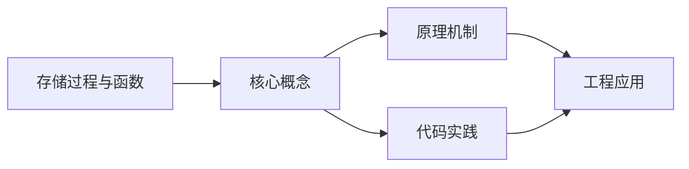
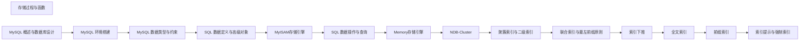

## 1. 学习目标（Bloom 分类）

本节按照布鲁姆教育目标分类学组织学习路径。本文主题为《存储过程与函数》，属于 MySQL 模块，读者可以根据自身阶段选择阅读深度。

记忆层面：能够准确复述本文的核心概念、术语与基本语法或操作步骤，并能够在提问或检索时快速定位对应知识点。能够说出 MySQL 的核心概念、语法与常用对象。

理解层面：能够用自己的语言解释核心原理与工作机制，说明概念之间的因果关系，而不是机械记忆结论。能够解释 MySQL 的执行原理与优化机制。

应用层面：能够在真实项目或练习场景中运用本文知识解决具体问题，写出正确且可维护的实现。能够编写正确、高效的 MySQL 语句与操作。

分析层面：能够拆解复杂问题，比较本文主题与相邻概念的异同，识别边界条件与例外情况。能够分析 MySQL 相关方案在性能与一致性上的权衡。

评价层面：能够根据约束条件（性能、可读性、安全、成本）评价不同方案的优劣，做出有依据的技术决策。能够根据业务场景评价 MySQL 技术选型。

创造层面：能够把本文知识与其他模块知识组合，设计出新的解决方案或可复用的工程模式。能够组合 MySQL 与其他技术设计数据架构。

通过本节学习，读者应当能够把《存储过程与函数》纳入自己的知识网络，并与 MySQL 模块的其他主题（InnoDB、索引、日志、主从、性能调优）建立关联。

## 2. 历史动机与发展脉络

《存储过程与函数》是 MySQL 领域的重要主题。要真正理解它，需要先了解它解决的问题与演进过程。

MySQL 于 1995 年由 MySQL AB 发布，2008 年被 Sun 收购，2010 年随 Sun 并入 Oracle；MariaDB 是社区分支。
MySQL 8.0（2018）重写优化器、引入窗口函数与 CTE、默认 utf8mb4、数据字典升级；MySQL 8.4 与 9.x 继续演进（Oracle 创新版 + LTS 双轨）。
InnoDB 是默认存储引擎：事务、行锁、MVCC、崩溃恢复（redo/undo）；MyISAM 仅存于历史场景。

回到本文主题：存储过程与函数 的提出与成熟，正是上述技术背景下的必然产物。早期实现往往以简单可用为目标，随着工程规模扩大，社区逐渐沉淀出标准做法与最佳实践；理解这一脉络，可以帮助读者判断“为什么文档中的推荐写法是现在这个样子”，也能在遇到历史遗留代码时准确识别其设计年代与取舍。


## 3. 形式化定义与核心概念精讲

本节把《存储过程与函数》涉及的核心概念以“定义 + 讲解”的形式展开。读者应把定义当作工具，把讲解当作理解路径；两者结合才能形成可迁移的知识。

InnoDB 架构：缓冲池（Buffer Pool）、日志缓冲、redo/undo 日志；脏页刷盘与 checkpoint 机制。
索引：B+ 树主键聚集索引、二级索引、覆盖索引；索引下推（ICP）与 MRR 优化。
事务与锁：两阶段锁、间隙锁/临键锁（可重复读防幻读）、MVCC 快照读；隔离级别。

### 3.1 原文章节逐一精讲

原文档把主题拆分为 16 个小节，下面按顺序给出每一节的导读讲解，随后保留原文细节供精读。

#### 原文精读（完整保留）

# MySQL 存储过程与函数

> **符号约定**：`< >` 必填参数 | `[ ]` 可选参数

---

#### 1. 存储过程基础

##### 1.1 什么是存储过程

存储过程是一组预编译的SQL语句集合，存储在数据库中，可通过名称调用执行。

**优势**：

- **性能**：预编译执行，减少网络传输
- **安全**：可控制数据访问权限
- **复用**：封装业务逻辑，多处调用
- **维护**：修改逻辑只需更新存储过程

##### 1.2 创建与调用

```sql
-- 创建简单存储过程
DELIMITER //

CREATE PROCEDURE GetAllUsers()
BEGIN
    SELECT id, username, email, created_at
    FROM users
    ORDER BY created_at DESC;
END //

DELIMITER ;

-- 调用存储过程
CALL GetAllUsers();

-- 删除存储过程
DROP PROCEDURE IF EXISTS GetAllUsers;

-- 查看存储过程定义
SHOW CREATE PROCEDURE GetAllUsers;
```

##### 1.3 参数类型

```sql
DELIMITER //

-- IN 参数（默认，传入值）
CREATE PROCEDURE GetUserById(IN p_user_id INT)
BEGIN
    SELECT id, username, email
    FROM users
    WHERE id = p_user_id;
END //

-- OUT 参数（返回值）
CREATE PROCEDURE GetUserCount(OUT p_count INT)
BEGIN
    SELECT COUNT(*) INTO p_count FROM users;
END //

-- INOUT 参数（传入并返回）
CREATE PROCEDURE DoubleValue(INOUT p_value INT)
BEGIN
    SET p_value = p_value * 2;
END //

DELIMITER ;

-- 调用带参数的存储过程
CALL GetUserById(1);

-- 调用OUT参数
CALL GetUserCount(@total);
SELECT @total;

-- 调用INOUT参数
SET @num = 10;
CALL DoubleValue(@num);
SELECT @num;  -- 20
```

#### 2. 变量与流程控制

##### 2.1 变量声明

```sql
DELIMITER //

CREATE PROCEDURE VariableDemo()
BEGIN
    -- 局部变量（用DECLARE声明，有默认值）
    DECLARE v_name VARCHAR(100) DEFAULT 'Unknown';
    DECLARE v_count INT DEFAULT 0;
    DECLARE v_total DECIMAL(10, 2);

    -- 使用SELECT INTO赋值
    SELECT COUNT(*) INTO v_count FROM users;

    -- 使用SET赋值
    SET v_total = v_count * 9.99;

    -- 用户变量（@前缀，会话级别）
    SET @user_var = 'Hello';

    SELECT v_name, v_count, v_total;
END //

DELIMITER ;
```

##### 2.2 条件判断

```sql
DELIMITER //

-- IF语句
CREATE PROCEDURE GetDiscount(IN p_amount DECIMAL(10, 2))
BEGIN
    DECLARE v_discount DECIMAL(4, 2);

    IF p_amount >= 1000 THEN
        SET v_discount = 0.20;
    ELSEIF p_amount >= 500 THEN
        SET v_discount = 0.10;
    ELSEIF p_amount >= 100 THEN
        SET v_discount = 0.05;
    ELSE
        SET v_discount = 0.00;
    END IF;

    SELECT p_amount AS original,
           p_amount * (1 - v_discount) AS discounted,
           v_discount AS discount_rate;
END //

-- CASE语句
CREATE PROCEDURE GetShippingCost(IN p_region VARCHAR(50))
BEGIN
    DECLARE v_cost DECIMAL(10, 2);

    CASE p_region
        WHEN 'North' THEN SET v_cost = 10.00;
        WHEN 'South' THEN SET v_cost = 15.00;
        WHEN 'East' THEN SET v_cost = 12.00;
        WHEN 'West' THEN SET v_cost = 12.00;
        ELSE SET v_cost = 20.00;
    END CASE;

    SELECT v_cost AS shipping_cost;
END //

DELIMITER ;
```

##### 2.3 循环

```sql
DELIMITER //

-- WHILE循环
CREATE PROCEDURE GenerateNumbers(IN p_count INT)
BEGIN
    DECLARE i INT DEFAULT 1;
    DECLARE result VARCHAR(1000) DEFAULT '';

    WHILE i <= p_count DO
        SET result = CONCAT(result, IF(i > 1, ',', ''), i);
        SET i = i + 1;
    END WHILE;

    SELECT result AS numbers;
END //

-- REPEAT循环（至少执行一次）
CREATE PROCEDURE RepeatDemo(IN p_limit INT)
BEGIN
    DECLARE i INT DEFAULT 1;
    DECLARE total INT DEFAULT 0;

    REPEAT
        SET total = total + i;
        SET i = i + 1;
    UNTIL i > p_limit
    END REPEAT;

    SELECT total AS sum_result;
END //

-- LOOP + LEAVE（类似break）
CREATE PROCEDURE LoopDemo(IN p_limit INT)
BEGIN
    DECLARE i INT DEFAULT 0;
    DECLARE total INT DEFAULT 0;

    add_loop: LOOP
        SET i = i + 1;
        IF i > p_limit THEN
            LEAVE add_loop;  -- 跳出循环
        END IF;
        SET total = total + i;
    END LOOP;

    SELECT total AS sum_result;
END //

-- ITERATE（类似continue）
CREATE PROCEDURE OddSum(IN p_limit INT)
BEGIN
    DECLARE i INT DEFAULT 0;
    DECLARE total INT DEFAULT 0;

    odd_loop: LOOP
        SET i = i + 1;
        IF i > p_limit THEN
            LEAVE odd_loop;
        END IF;
        IF i % 2 = 0 THEN
            ITERATE odd_loop;  -- 跳过偶数
        END IF;
        SET total = total + i;
    END LOOP;

    SELECT total AS odd_sum;
END //

DELIMITER ;
```

#### 3. 游标

##### 3.1 游标基本用法

```sql
DELIMITER //

CREATE PROCEDURE ProcessUsers()
BEGIN
    -- 声明变量
    DECLARE v_done INT DEFAULT FALSE;
    DECLARE v_id INT;
    DECLARE v_username VARCHAR(50);
    DECLARE v_email VARCHAR(100);

    -- 声明游标
    DECLARE cur CURSOR FOR
        SELECT id, username, email FROM users WHERE status = 'active';

    -- 声明结束处理程序
    DECLARE CONTINUE HANDLER FOR NOT FOUND SET v_done = TRUE;

    -- 打开游标
    OPEN cur;

    -- 循环读取
    read_loop: LOOP
        FETCH cur INTO v_id, v_username, v_email;
        IF v_done THEN
            LEAVE read_loop;
        END IF;

        -- 处理每行数据
        INSERT INTO user_log (user_id, action, created_at)
        VALUES (v_id, CONCAT('Processed user: ', v_username), NOW());
    END LOOP;

    -- 关闭游标
    CLOSE cur;

    SELECT 'Processing complete' AS status;
END //

DELIMITER ;
```

##### 3.2 游标与分组统计

```sql
DELIMITER //

CREATE PROCEDURE CategoryStats()
BEGIN
    DECLARE v_done INT DEFAULT FALSE;
    DECLARE v_category VARCHAR(50);
    DECLARE v_count INT;
    DECLARE v_avg_price DECIMAL(10, 2);

    DECLARE cur CURSOR FOR
        SELECT category,
               COUNT(*) AS cnt,
               AVG(price) AS avg_price
        FROM products
        GROUP BY category;

    DECLARE CONTINUE HANDLER FOR NOT FOUND SET v_done = TRUE;

    -- 创建临时结果表
    DROP TEMPORARY TABLE IF EXISTS temp_stats;
    CREATE TEMPORARY TABLE temp_stats (
        category VARCHAR(50),
        product_count INT,
        avg_price DECIMAL(10, 2)
    );

    OPEN cur;

    read_loop: LOOP
        FETCH cur INTO v_category, v_count, v_avg_price;
        IF v_done THEN
            LEAVE read_loop;
        END IF;

        INSERT INTO temp_stats VALUES (v_category, v_count, v_avg_price);
    END LOOP;

    CLOSE cur;

    SELECT * FROM temp_stats;
    DROP TEMPORARY TABLE IF EXISTS temp_stats;
END //

DELIMITER ;
```

#### 4. 异常处理

##### 4.1 Handler 类型

```sql
DELIMITER //

CREATE PROCEDURE SafeInsertUser(
    IN p_username VARCHAR(50),
    IN p_email VARCHAR(100)
)
BEGIN
    -- 声明异常状态变量
    DECLARE v_error VARCHAR(255) DEFAULT '';

    -- CONTINUE HANDLER: 捕获异常后继续执行
    DECLARE CONTINUE HANDLER FOR SQLEXCEPTION
    BEGIN
        GET DIAGNOSTICS CONDITION 1 v_error = MESSAGE_TEXT;
        SELECT CONCAT('Error: ', v_error) AS error_message;
    END;

    INSERT INTO users (username, email, created_at)
    VALUES (p_username, p_email, NOW());

    IF v_error = '' THEN
        SELECT 'User inserted successfully' AS result;
    END IF;
END //

-- 特定错误码处理
CREATE PROCEDURE SafeTransfer(
    IN p_from_id INT,
    IN p_to_id INT,
    IN p_amount DECIMAL(10, 2)
)
BEGIN
    DECLARE EXIT HANDLER FOR SQLEXCEPTION
    BEGIN
        ROLLBACK;
        SELECT 'Transfer failed, transaction rolled back' AS result;
    END;

    START TRANSACTION;

    UPDATE accounts SET balance = balance - p_amount WHERE id = p_from_id;
    UPDATE accounts SET balance = balance + p_amount WHERE id = p_to_id;

    COMMIT;
    SELECT 'Transfer completed' AS result;
END //

DELIMITER ;
```

#### 5. 自定义函数

##### 5.1 创建函数

```sql
DELIMITER //

-- 计算订单总金额
CREATE FUNCTION CalculateOrderTotal(p_order_id INT)
RETURNS DECIMAL(12, 2)
DETERMINISTIC
READS SQL DATA
BEGIN
    DECLARE v_total DECIMAL(12, 2);

    SELECT SUM(oi.quantity * oi.unit_price)
    INTO v_total
    FROM order_items oi
    WHERE oi.order_id = p_order_id;

    RETURN IFNULL(v_total, 0);
END //

-- 格式化金额
CREATE FUNCTION FormatCurrency(
    p_amount DECIMAL(12, 2),
    p_currency VARCHAR(3)
)
RETURNS VARCHAR(20)
DETERMINISTIC
BEGIN
    RETURN CONCAT(p_currency, ' ', FORMAT(p_amount, 2));
END //

-- 计算年龄
CREATE FUNCTION CalculateAge(p_birthdate DATE)
RETURNS INT
DETERMINISTIC
BEGIN
    RETURN TIMESTAMPDIFF(YEAR, p_birthdate, CURDATE());
END //

DELIMITER ;

-- 使用自定义函数
SELECT CalculateOrderTotal(1001) AS total;
SELECT FormatCurrency(1234.56, 'CNY') AS formatted;
SELECT name, CalculateAge(birthdate) AS age FROM employees;
```

##### 5.2 存储过程 vs 函数

| 特性     | 存储过程        | 函数           |
| :------- | :-------------- | :------------- |
| 返回值   | OUT参数或结果集 | 单个标量值     |
| SQL调用  | CALL            | SELECT中使用   |
| DML操作  | 允许            | 不允许（一般） |
| 事务控制 | 允许            | 不允许         |
| 结果集   | 可返回多个      | 只返回一个值   |

#### 6. 常见问题与解决方案

##### 6.1 DELIMITER 问题

```sql
-- 问题：在存储过程中使用分号导致提前结束
-- 解决方案：临时更改分隔符

DELIMITER //
CREATE PROCEDURE MyProc()
BEGIN
    -- 这里的分号不会结束CREATE PROCEDURE
    SELECT * FROM users;
END //
DELIMITER ;  -- 恢复默认分隔符
```

##### 6.2 游标性能

```sql
-- 问题：大数据量游标处理慢
-- 解决方案：尽量用集合操作替代游标

-- 不推荐：逐行处理
-- 游标循环UPDATE...

-- 推荐：批量操作
UPDATE orders o
JOIN customers c ON o.customer_id = c.id
SET o.discount = CASE
    WHEN c.tier = 'gold' THEN 0.20
    WHEN c.tier = 'silver' THEN 0.10
    ELSE 0.00
END;
```

##### 6.3 函数中不能执行DML

```sql
-- 问题：函数中执行INSERT/UPDATE/DELETE报错
-- 解决方案：改用存储过程

-- 函数只能做计算，不能修改数据
-- 如果需要修改数据，使用存储过程
```

#### 7. 总结与最佳实践

##### 7.1 选择指南

- **简单计算**：用自定义函数，可在SQL中直接调用
- **复杂业务逻辑**：用存储过程，支持事务和DML
- **批量数据处理**：优先用集合操作，游标作为最后手段

##### 7.2 最佳实践

1. **命名规范**：存储过程用 `sp_` 前缀，函数用 `fn_` 前缀
2. **参数校验**：在存储过程开头验证输入参数
3. **错误处理**：始终包含异常处理逻辑
4. **避免游标**：能用集合操作就不用游标
5. **添加注释**：存储过程和函数应包含用途说明
6. **权限控制**：通过存储过程控制数据访问，不直接暴露表
#### 存储过程基础

**换行写法：创建无参存储过程**
`CREATE PROCEDURE <过程名>() BEGIN <过程体> END`
```sql
-- 创建查询所有用户的存储过程
DELIMITER //
CREATE PROCEDURE GetAllUsers()
BEGIN
    SELECT id, username, email, created_at
    FROM users
    ORDER BY created_at DESC;
END //
DELIMITER ;
```

**单行写法：调用存储过程**
`CALL <过程名>([<参数>...])`
```sql
-- 调用存储过程
CALL GetAllUsers();
```

**单行写法：删除存储过程**
`DROP PROCEDURE [IF EXISTS] <过程名>`
```sql
-- 删除存储过程
DROP PROCEDURE IF EXISTS GetAllUsers;
```

**单行写法：查看存储过程定义**
`SHOW CREATE PROCEDURE <过程名>`
```sql
-- 查看存储过程定义
SHOW CREATE PROCEDURE GetAllUsers;
```

---

#### 参数类型

**换行写法：IN 参数**
`IN <参数名> <类型>`
```sql
-- 创建带 IN 输入参数的存储过程
DELIMITER //
CREATE PROCEDURE GetUserById(IN p_user_id INT)
BEGIN
    SELECT id, username, email
    FROM users
    WHERE id = p_user_id;
END //
DELIMITER ;
```

**换行写法：OUT 参数**
`OUT <参数名> <类型>`
```sql
-- 创建带 OUT 输出参数的存储过程
DELIMITER //
CREATE PROCEDURE GetUserCount(OUT p_count INT)
BEGIN
    SELECT COUNT(*) INTO p_count FROM users;
END //
DELIMITER ;
```

**换行写法：INOUT 参数**
`INOUT <参数名> <类型>`
```sql
-- 创建带 INOUT 输入输出参数的存储过程
DELIMITER //
CREATE PROCEDURE DoubleValue(INOUT p_value INT)
BEGIN
    SET p_value = p_value * 2;
END //
DELIMITER ;
```

---

#### 变量声明

**单行写法：声明局部变量**
`DECLARE <变量名> <类型> [DEFAULT <默认值>]`
```sql
-- 声明带默认值的局部变量
DECLARE v_name VARCHAR(100) DEFAULT 'Unknown';
```

**单行写法：SELECT INTO 赋值**
`SELECT <列名> INTO <变量名> FROM <表名> WHERE <条件>`
```sql
-- 查询结果赋值给变量
SELECT COUNT(*) INTO v_count FROM users;
```

**单行写法：SET 变量赋值**
`SET <变量名> = <值>`
```sql
-- 为局部变量赋值
SET v_total = v_count * 9.99;
```

**单行写法：设置用户变量**
`SET @<变量名> = <值>`
```sql
-- 设置会话级别的用户变量
SET @user_var = 'Hello';
```

---

#### 条件判断

**换行写法：IF 多分支**
`IF <条件> THEN <语句> [ELSEIF <条件> THEN <语句>] [ELSE <语句>] END IF`
```sql
-- 根据金额计算折扣率
DELIMITER //
CREATE PROCEDURE GetDiscount(IN p_amount DECIMAL(10, 2))
BEGIN
    DECLARE v_discount DECIMAL(4, 2);

    IF p_amount >= 1000 THEN
        SET v_discount = 0.20;
    ELSEIF p_amount >= 500 THEN
        SET v_discount = 0.10;
    ELSEIF p_amount >= 100 THEN
        SET v_discount = 0.05;
    ELSE
        SET v_discount = 0.00;
    END IF;

    SELECT p_amount AS original,
           p_amount * (1 - v_discount) AS discounted,
           v_discount AS discount_rate;
END //
DELIMITER ;
```

**换行写法：CASE 多分支**
`CASE <表达式> WHEN <值> THEN <语句> [WHEN ...] [ELSE <语句>] END CASE`
```sql
-- 根据地区计算运费
DELIMITER //
CREATE PROCEDURE GetShippingCost(IN p_region VARCHAR(50))
BEGIN
    DECLARE v_cost DECIMAL(10, 2);

    CASE p_region
        WHEN 'North' THEN SET v_cost = 10.00;
        WHEN 'South' THEN SET v_cost = 15.00;
        WHEN 'East' THEN SET v_cost = 12.00;
        WHEN 'West' THEN SET v_cost = 12.00;
        ELSE SET v_cost = 20.00;
    END CASE;

    SELECT v_cost AS shipping_cost;
END //
DELIMITER ;
```

---

#### 循环

**换行写法：WHILE 循环**
`[<标签>:] WHILE <条件> DO <语句> END WHILE [<标签>]`
```sql
-- WHILE 循环生成数字串
DELIMITER //
CREATE PROCEDURE GenerateNumbers(IN p_count INT)
BEGIN
    DECLARE i INT DEFAULT 1;
    DECLARE result VARCHAR(1000) DEFAULT '';

    WHILE i <= p_count DO
        SET result = CONCAT(result, IF(i > 1, ',', ''), i);
        SET i = i + 1;
    END WHILE;

    SELECT result AS numbers;
END //
DELIMITER ;
```

**换行写法：REPEAT 循环**
`[<标签>:] REPEAT <语句> UNTIL <条件> END REPEAT [<标签>]`
```sql
-- REPEAT 循环至少执行一次
DELIMITER //
CREATE PROCEDURE RepeatDemo(IN p_limit INT)
BEGIN
    DECLARE i INT DEFAULT 1;
    DECLARE total INT DEFAULT 0;

    REPEAT
        SET total = total + i;
        SET i = i + 1;
    UNTIL i > p_limit
    END REPEAT;

    SELECT total AS sum_result;
END //
DELIMITER ;
```

**换行写法：LOOP 循环**
`[<标签>:] LOOP <语句> END LOOP [<标签>]`
```sql
-- LOOP 配合 LEAVE 跳出循环
DELIMITER //
CREATE PROCEDURE LoopDemo(IN p_limit INT)
BEGIN
    DECLARE i INT DEFAULT 0;
    DECLARE total INT DEFAULT 0;

    add_loop: LOOP
        SET i = i + 1;
        IF i > p_limit THEN
            LEAVE add_loop;
        END IF;
        SET total = total + i;
    END LOOP;

    SELECT total AS sum_result;
END //
DELIMITER ;
```

**单行写法：ITERATE 跳过当前循环**
`ITERATE <标签>`
```sql
-- ITERATE 跳过偶数只累加奇数
DELIMITER //
CREATE PROCEDURE OddSum(IN p_limit INT)
BEGIN
    DECLARE i INT DEFAULT 0;
    DECLARE total INT DEFAULT 0;

    odd_loop: LOOP
        SET i = i + 1;
        IF i > p_limit THEN
            LEAVE odd_loop;
        END IF;
        IF i % 2 = 0 THEN
            ITERATE odd_loop;
        END IF;
        SET total = total + i;
    END LOOP;

    SELECT total AS odd_sum;
END //
DELIMITER ;
```

---

#### 游标

**换行写法：游标基本遍历**
`DECLARE <游标名> CURSOR FOR <SELECT 语句>`
```sql
-- 游标遍历用户并记录日志
DELIMITER //
CREATE PROCEDURE ProcessUsers()
BEGIN
    DECLARE v_done INT DEFAULT FALSE;
    DECLARE v_id INT;
    DECLARE v_username VARCHAR(50);
    DECLARE v_email VARCHAR(100);

    DECLARE cur CURSOR FOR
        SELECT id, username, email FROM users WHERE status = 'active';

    DECLARE CONTINUE HANDLER FOR NOT FOUND SET v_done = TRUE;

    OPEN cur;

    read_loop: LOOP
        FETCH cur INTO v_id, v_username, v_email;
        IF v_done THEN
            LEAVE read_loop;
        END IF;

        INSERT INTO user_log (user_id, action, created_at)
        VALUES (v_id, CONCAT('Processed user: ', v_username), NOW());
    END LOOP;

    CLOSE cur;

    SELECT 'Processing complete' AS status;
END //
DELIMITER ;
```

**换行写法：游标配合临时表**
`DECLARE <游标名> CURSOR FOR <聚合查询>`
```sql
-- 游标遍历聚合结果写入临时表
DELIMITER //
CREATE PROCEDURE CategoryStats()
BEGIN
    DECLARE v_done INT DEFAULT FALSE;
    DECLARE v_category VARCHAR(50);
    DECLARE v_count INT;
    DECLARE v_avg_price DECIMAL(10, 2);

    DECLARE cur CURSOR FOR
        SELECT category, COUNT(*) AS cnt, AVG(price) AS avg_price
        FROM products
        GROUP BY category;

    DECLARE CONTINUE HANDLER FOR NOT FOUND SET v_done = TRUE;

    DROP TEMPORARY TABLE IF EXISTS temp_stats;
    CREATE TEMPORARY TABLE temp_stats (
        category VARCHAR(50),
        product_count INT,
        avg_price DECIMAL(10, 2)
    );

    OPEN cur;

    read_loop: LOOP
        FETCH cur INTO v_category, v_count, v_avg_price;
        IF v_done THEN
            LEAVE read_loop;
        END IF;

        INSERT INTO temp_stats VALUES (v_category, v_count, v_avg_price);
    END LOOP;

    CLOSE cur;

    SELECT * FROM temp_stats;
    DROP TEMPORARY TABLE IF EXISTS temp_stats;
END //
DELIMITER ;
```

---

#### 异常处理

**换行写法：CONTINUE HANDLER**
`DECLARE CONTINUE HANDLER FOR <异常> BEGIN <处理> END`
```sql
-- 捕获异常后继续执行
DELIMITER //
CREATE PROCEDURE SafeInsertUser(
    IN p_username VARCHAR(50),
    IN p_email VARCHAR(100)
)
BEGIN
    DECLARE v_error VARCHAR(255) DEFAULT '';

    DECLARE CONTINUE HANDLER FOR SQLEXCEPTION
    BEGIN
        GET DIAGNOSTICS CONDITION 1 v_error = MESSAGE_TEXT;
        SELECT CONCAT('Error: ', v_error) AS error_message;
    END;

    INSERT INTO users (username, email, created_at)
    VALUES (p_username, p_email, NOW());

    IF v_error = '' THEN
        SELECT 'User inserted successfully' AS result;
    END IF;
END //
DELIMITER ;
```

**换行写法：EXIT HANDLER**
`DECLARE EXIT HANDLER FOR <异常> BEGIN <处理> END`
```sql
-- 捕获异常后退出并回滚
DELIMITER //
CREATE PROCEDURE SafeTransfer(
    IN p_from_id INT,
    IN p_to_id INT,
    IN p_amount DECIMAL(10, 2)
)
BEGIN
    DECLARE EXIT HANDLER FOR SQLEXCEPTION
    BEGIN
        ROLLBACK;
        SELECT 'Transfer failed, transaction rolled back' AS result;
    END;

    START TRANSACTION;

    UPDATE accounts SET balance = balance - p_amount WHERE id = p_from_id;
    UPDATE accounts SET balance = balance + p_amount WHERE id = p_to_id;

    COMMIT;
    SELECT 'Transfer completed' AS result;
END //
DELIMITER ;
```

---

#### 自定义函数

**换行写法：创建函数**
`CREATE FUNCTION <函数名>([<参数>]) RETURNS <返回类型> [DETERMINISTIC] BEGIN <函数体> RETURN <值> END`
```sql
-- 计算订单总金额的函数
DELIMITER //
CREATE FUNCTION CalculateOrderTotal(p_order_id INT)
RETURNS DECIMAL(12, 2)
DETERMINISTIC
READS SQL DATA
BEGIN
    DECLARE v_total DECIMAL(12, 2);

    SELECT SUM(oi.quantity * oi.unit_price)
    INTO v_total
    FROM order_items oi
    WHERE oi.order_id = p_order_id;

    RETURN IFNULL(v_total, 0);
END //
DELIMITER ;
```

**换行写法：创建格式化函数**
`CREATE FUNCTION <函数名>(<参数>) RETURNS <返回类型> BEGIN RETURN <表达式> END`
```sql
-- 格式化金额显示的函数
DELIMITER //
CREATE FUNCTION FormatCurrency(
    p_amount DECIMAL(12, 2),
    p_currency VARCHAR(3)
)
RETURNS VARCHAR(20)
DETERMINISTIC
BEGIN
    RETURN CONCAT(p_currency, ' ', FORMAT(p_amount, 2));
END //
DELIMITER ;
```

**单行写法：调用函数**
`SELECT <函数名>(<参数>)`
```sql
-- 使用自定义函数查询
SELECT CalculateOrderTotal(1001) AS total;
```

**单行写法：在查询中使用函数**
`SELECT <列名>, <函数名>(<列名>) AS <别名> FROM <表名>`
```sql
-- 在 SELECT 中使用函数计算年龄
SELECT name, CalculateAge(birthdate) AS age FROM employees;
```

---

#### DELIMITER 使用

**单行写法：修改分隔符**
`DELIMITER <分隔符>`
```sql
-- 临时更改语句分隔符
DELIMITER //
```

**换行写法：DELIMITER 完整用法**
`DELIMITER <分隔符> <创建语句> <分隔符> DELIMITER ;`
```sql
-- 使用 DELIMITER 创建存储过程
DELIMITER //
CREATE PROCEDURE MyProc()
BEGIN
    SELECT * FROM users;
END //
DELIMITER ;
```


### 3.2 概念关系图

下面用 Mermaid 图表达本文核心概念之间的关系，帮助读者建立整体图景：



图中展示的是本文知识的结构化关系：核心概念是入口，原理机制解释“为什么”，代码实践演示“怎么做”，工程应用回答“何时用”。读者学习时可以把每个小节的内容挂接到对应节点上。

## 4. 理论推导与原理解析

本节深入《存储过程与函数》背后的原理。理论部分不求面面俱到，而是聚焦“能解释现象、能指导实践”的关键推导。

InnoDB 架构：缓冲池（Buffer Pool）、日志缓冲、redo/undo 日志；脏页刷盘与 checkpoint 机制。
索引：B+ 树主键聚集索引、二级索引、覆盖索引；索引下推（ICP）与 MRR 优化。
事务与锁：两阶段锁、间隙锁/临键锁（可重复读防幻读）、MVCC 快照读；隔离级别。
复制：binlog 逻辑复制（statement/row/mixed），主从异步、半同步与组复制。

需要强调的是，理论推导与工程实践之间存在翻译层：理论给出的是理想化模型与边界条件，工程代码则必须处理真实环境中的例外。读者在学习时应先掌握理论的“标准情形”，再通过陷阱章节了解“非标准情形”。

## 5. 代码示例与逐行讲解

本节把原文中的代码示例系统整理，并为每个示例补充用途说明与讲解。读者不应只浏览代码，而应逐段对照讲解理解设计意图。

### 5.1 示例：1.2 创建与调用

该示例来自原文《1.2 创建与调用》小节，用于演示存储过程与函数相关操作。阅读时请先看代码结构，再看其后的讲解。

```sql
-- 创建简单存储过程
DELIMITER //

CREATE PROCEDURE GetAllUsers()
BEGIN
    SELECT id, username, email, created_at
    FROM users
    ORDER BY created_at DESC;
END //

DELIMITER ;

-- 调用存储过程
CALL GetAllUsers();

-- 删除存储过程
DROP PROCEDURE IF EXISTS GetAllUsers;

-- 查看存储过程定义
SHOW CREATE PROCEDURE GetAllUsers;
```

讲解：这段代码演示了本节核心知识点。代码中的关键操作可以归纳为三步：准备（定义或初始化）、执行（核心逻辑）、收尾（释放资源或返回结果）。实际项目中，这三步往往被封装为函数或类，以提升复用性与可测试性。

关键点分析：

该示例共 15 行有效代码，包含 3 类关键结构（SELECT、CREATE、FROM）。其中：

- 入口与初始化部分负责建立上下文，对应实际项目中的启动或装配逻辑；
- 核心逻辑部分体现本文主题的主要操作，是阅读时最需要对照讲解理解的部分；
- 输出或返回部分把结果交给调用方，注意其类型与边界条件。

进阶思考路径：先尝试修改参数观察行为变化，再把示例中的模式迁移到自己的项目中；每次修改都记录预期与实测差异，这是把示例转化为能力的最快方式。

### 5.2 示例：1.3 参数类型

该示例来自原文《1.3 参数类型》小节，用于演示存储过程与函数相关操作。阅读时请先看代码结构，再看其后的讲解。

```sql
DELIMITER //

-- IN 参数（默认，传入值）
CREATE PROCEDURE GetUserById(IN p_user_id INT)
BEGIN
    SELECT id, username, email
    FROM users
    WHERE id = p_user_id;
END //

-- OUT 参数（返回值）
CREATE PROCEDURE GetUserCount(OUT p_count INT)
BEGIN
    SELECT COUNT(*) INTO p_count FROM users;
END //

-- INOUT 参数（传入并返回）
CREATE PROCEDURE DoubleValue(INOUT p_value INT)
BEGIN
    SET p_value = p_value * 2;
END //

DELIMITER ;

-- 调用带参数的存储过程
CALL GetUserById(1);

-- 调用OUT参数
CALL GetUserCount(@total);
SELECT @total;

-- 调用INOUT参数
SET @num = 10;
CALL DoubleValue(@num);
SELECT @num;  -- 20
```

讲解：这段代码演示了本节核心知识点。代码中的关键操作可以归纳为三步：准备（定义或初始化）、执行（核心逻辑）、收尾（释放资源或返回结果）。实际项目中，这三步往往被封装为函数或类，以提升复用性与可测试性。

关键点分析：

该示例共 28 行有效代码，包含 3 类关键结构（SELECT、CREATE、FROM）。其中：

- 入口与初始化部分负责建立上下文，对应实际项目中的启动或装配逻辑；
- 核心逻辑部分体现本文主题的主要操作，是阅读时最需要对照讲解理解的部分；
- 输出或返回部分把结果交给调用方，注意其类型与边界条件。

进阶思考路径：先尝试修改参数观察行为变化，再把示例中的模式迁移到自己的项目中；每次修改都记录预期与实测差异，这是把示例转化为能力的最快方式。

### 5.3 示例：2.1 变量声明

该示例来自原文《2.1 变量声明》小节，用于演示存储过程与函数相关操作。阅读时请先看代码结构，再看其后的讲解。

```sql
DELIMITER //

CREATE PROCEDURE VariableDemo()
BEGIN
    -- 局部变量（用DECLARE声明，有默认值）
    DECLARE v_name VARCHAR(100) DEFAULT 'Unknown';
    DECLARE v_count INT DEFAULT 0;
    DECLARE v_total DECIMAL(10, 2);

    -- 使用SELECT INTO赋值
    SELECT COUNT(*) INTO v_count FROM users;

    -- 使用SET赋值
    SET v_total = v_count * 9.99;

    -- 用户变量（@前缀，会话级别）
    SET @user_var = 'Hello';

    SELECT v_name, v_count, v_total;
END //

DELIMITER ;
```

讲解：这段代码演示了本节核心知识点。代码中的关键操作可以归纳为三步：准备（定义或初始化）、执行（核心逻辑）、收尾（释放资源或返回结果）。实际项目中，这三步往往被封装为函数或类，以提升复用性与可测试性。

关键点分析：

该示例共 16 行有效代码，包含 3 类关键结构（SELECT、CREATE、FROM）。其中：

- 入口与初始化部分负责建立上下文，对应实际项目中的启动或装配逻辑；
- 核心逻辑部分体现本文主题的主要操作，是阅读时最需要对照讲解理解的部分；
- 输出或返回部分把结果交给调用方，注意其类型与边界条件。

进阶思考路径：先尝试修改参数观察行为变化，再把示例中的模式迁移到自己的项目中；每次修改都记录预期与实测差异，这是把示例转化为能力的最快方式。

### 5.4 示例：2.2 条件判断

该示例来自原文《2.2 条件判断》小节，用于演示存储过程与函数相关操作。阅读时请先看代码结构，再看其后的讲解。

```sql
DELIMITER //

-- IF语句
CREATE PROCEDURE GetDiscount(IN p_amount DECIMAL(10, 2))
BEGIN
    DECLARE v_discount DECIMAL(4, 2);

    IF p_amount >= 1000 THEN
        SET v_discount = 0.20;
    ELSEIF p_amount >= 500 THEN
        SET v_discount = 0.10;
    ELSEIF p_amount >= 100 THEN
        SET v_discount = 0.05;
    ELSE
        SET v_discount = 0.00;
    END IF;

    SELECT p_amount AS original,
           p_amount * (1 - v_discount) AS discounted,
           v_discount AS discount_rate;
END //

-- CASE语句
CREATE PROCEDURE GetShippingCost(IN p_region VARCHAR(50))
BEGIN
    DECLARE v_cost DECIMAL(10, 2);

    CASE p_region
        WHEN 'North' THEN SET v_cost = 10.00;
        WHEN 'South' THEN SET v_cost = 15.00;
        WHEN 'East' THEN SET v_cost = 12.00;
        WHEN 'West' THEN SET v_cost = 12.00;
        ELSE SET v_cost = 20.00;
    END CASE;

    SELECT v_cost AS shipping_cost;
END //

DELIMITER ;
```

讲解：这段代码演示了本节核心知识点。代码中的关键操作可以归纳为三步：准备（定义或初始化）、执行（核心逻辑）、收尾（释放资源或返回结果）。实际项目中，这三步往往被封装为函数或类，以提升复用性与可测试性。

关键点分析：

该示例共 32 行有效代码，包含 2 类关键结构（SELECT、CREATE）。其中：

- 入口与初始化部分负责建立上下文，对应实际项目中的启动或装配逻辑；
- 核心逻辑部分体现本文主题的主要操作，是阅读时最需要对照讲解理解的部分；
- 输出或返回部分把结果交给调用方，注意其类型与边界条件。

进阶思考路径：先尝试修改参数观察行为变化，再把示例中的模式迁移到自己的项目中；每次修改都记录预期与实测差异，这是把示例转化为能力的最快方式。

### 5.5 示例：2.3 循环

该示例来自原文《2.3 循环》小节，用于演示存储过程与函数相关操作。阅读时请先看代码结构，再看其后的讲解。

```sql
DELIMITER //

-- WHILE循环
CREATE PROCEDURE GenerateNumbers(IN p_count INT)
BEGIN
    DECLARE i INT DEFAULT 1;
    DECLARE result VARCHAR(1000) DEFAULT '';

    WHILE i <= p_count DO
        SET result = CONCAT(result, IF(i > 1, ',', ''), i);
        SET i = i + 1;
    END WHILE;

    SELECT result AS numbers;
END //

-- REPEAT循环（至少执行一次）
CREATE PROCEDURE RepeatDemo(IN p_limit INT)
BEGIN
    DECLARE i INT DEFAULT 1;
    DECLARE total INT DEFAULT 0;

    REPEAT
        SET total = total + i;
        SET i = i + 1;
    UNTIL i > p_limit
    END REPEAT;

    SELECT total AS sum_result;
END //

-- LOOP + LEAVE（类似break）
CREATE PROCEDURE LoopDemo(IN p_limit INT)
BEGIN
    DECLARE i INT DEFAULT 0;
    DECLARE total INT DEFAULT 0;

    add_loop: LOOP
        SET i = i + 1;
        IF i > p_limit THEN
            LEAVE add_loop;  -- 跳出循环
        END IF;
        SET total = total + i;
    END LOOP;

    SELECT total AS sum_result;
END //

-- ITERATE（类似continue）
CREATE PROCEDURE OddSum(IN p_limit INT)
BEGIN
    DECLARE i INT DEFAULT 0;
    DECLARE total INT DEFAULT 0;

    odd_loop: LOOP
        SET i = i + 1;
        IF i > p_limit THEN
            LEAVE odd_loop;
        END IF;
        IF i % 2 = 0 THEN
            ITERATE odd_loop;  -- 跳过偶数
        END IF;
        SET total = total + i;
    END LOOP;

    SELECT total AS odd_sum;
END //

DELIMITER ;
```

讲解：这段代码演示了本节核心知识点。代码中的关键操作可以归纳为三步：准备（定义或初始化）、执行（核心逻辑）、收尾（释放资源或返回结果）。实际项目中，这三步往往被封装为函数或类，以提升复用性与可测试性。

关键点分析：

该示例共 56 行有效代码，包含 2 类关键结构（SELECT、CREATE）。其中：

- 入口与初始化部分负责建立上下文，对应实际项目中的启动或装配逻辑；
- 核心逻辑部分体现本文主题的主要操作，是阅读时最需要对照讲解理解的部分；
- 输出或返回部分把结果交给调用方，注意其类型与边界条件。

进阶思考路径：先尝试修改参数观察行为变化，再把示例中的模式迁移到自己的项目中；每次修改都记录预期与实测差异，这是把示例转化为能力的最快方式。

### 5.6 示例：3.1 游标基本用法

该示例来自原文《3.1 游标基本用法》小节，用于演示存储过程与函数相关操作。阅读时请先看代码结构，再看其后的讲解。

```sql
DELIMITER //

CREATE PROCEDURE ProcessUsers()
BEGIN
    -- 声明变量
    DECLARE v_done INT DEFAULT FALSE;
    DECLARE v_id INT;
    DECLARE v_username VARCHAR(50);
    DECLARE v_email VARCHAR(100);

    -- 声明游标
    DECLARE cur CURSOR FOR
        SELECT id, username, email FROM users WHERE status = 'active';

    -- 声明结束处理程序
    DECLARE CONTINUE HANDLER FOR NOT FOUND SET v_done = TRUE;

    -- 打开游标
    OPEN cur;

    -- 循环读取
    read_loop: LOOP
        FETCH cur INTO v_id, v_username, v_email;
        IF v_done THEN
            LEAVE read_loop;
        END IF;

        -- 处理每行数据
        INSERT INTO user_log (user_id, action, created_at)
        VALUES (v_id, CONCAT('Processed user: ', v_username), NOW());
    END LOOP;

    -- 关闭游标
    CLOSE cur;

    SELECT 'Processing complete' AS status;
END //

DELIMITER ;
```

讲解：这段代码演示了本节核心知识点。代码中的关键操作可以归纳为三步：准备（定义或初始化）、执行（核心逻辑）、收尾（释放资源或返回结果）。实际项目中，这三步往往被封装为函数或类，以提升复用性与可测试性。

关键点分析：

该示例共 30 行有效代码，包含 4 类关键结构（SELECT、INSERT、CREATE、FROM）。其中：

- 入口与初始化部分负责建立上下文，对应实际项目中的启动或装配逻辑；
- 核心逻辑部分体现本文主题的主要操作，是阅读时最需要对照讲解理解的部分；
- 输出或返回部分把结果交给调用方，注意其类型与边界条件。

进阶思考路径：先尝试修改参数观察行为变化，再把示例中的模式迁移到自己的项目中；每次修改都记录预期与实测差异，这是把示例转化为能力的最快方式。

### 5.7 示例：3.2 游标与分组统计

该示例来自原文《3.2 游标与分组统计》小节，用于演示存储过程与函数相关操作。阅读时请先看代码结构，再看其后的讲解。

```sql
DELIMITER //

CREATE PROCEDURE CategoryStats()
BEGIN
    DECLARE v_done INT DEFAULT FALSE;
    DECLARE v_category VARCHAR(50);
    DECLARE v_count INT;
    DECLARE v_avg_price DECIMAL(10, 2);

    DECLARE cur CURSOR FOR
        SELECT category,
               COUNT(*) AS cnt,
               AVG(price) AS avg_price
        FROM products
        GROUP BY category;

    DECLARE CONTINUE HANDLER FOR NOT FOUND SET v_done = TRUE;

    -- 创建临时结果表
    DROP TEMPORARY TABLE IF EXISTS temp_stats;
    CREATE TEMPORARY TABLE temp_stats (
        category VARCHAR(50),
        product_count INT,
        avg_price DECIMAL(10, 2)
    );

    OPEN cur;

    read_loop: LOOP
        FETCH cur INTO v_category, v_count, v_avg_price;
        IF v_done THEN
            LEAVE read_loop;
        END IF;

        INSERT INTO temp_stats VALUES (v_category, v_count, v_avg_price);
    END LOOP;

    CLOSE cur;

    SELECT * FROM temp_stats;
    DROP TEMPORARY TABLE IF EXISTS temp_stats;
END //

DELIMITER ;
```

讲解：这段代码演示了本节核心知识点。代码中的关键操作可以归纳为三步：准备（定义或初始化）、执行（核心逻辑）、收尾（释放资源或返回结果）。实际项目中，这三步往往被封装为函数或类，以提升复用性与可测试性。

关键点分析：

该示例共 34 行有效代码，包含 4 类关键结构（SELECT、INSERT、CREATE、FROM）。其中：

- 入口与初始化部分负责建立上下文，对应实际项目中的启动或装配逻辑；
- 核心逻辑部分体现本文主题的主要操作，是阅读时最需要对照讲解理解的部分；
- 输出或返回部分把结果交给调用方，注意其类型与边界条件。

进阶思考路径：先尝试修改参数观察行为变化，再把示例中的模式迁移到自己的项目中；每次修改都记录预期与实测差异，这是把示例转化为能力的最快方式。

### 5.8 示例：4.1 Handler 类型

该示例来自原文《4.1 Handler 类型》小节，用于演示存储过程与函数相关操作。阅读时请先看代码结构，再看其后的讲解。

```sql
DELIMITER //

CREATE PROCEDURE SafeInsertUser(
    IN p_username VARCHAR(50),
    IN p_email VARCHAR(100)
)
BEGIN
    -- 声明异常状态变量
    DECLARE v_error VARCHAR(255) DEFAULT '';

    -- CONTINUE HANDLER: 捕获异常后继续执行
    DECLARE CONTINUE HANDLER FOR SQLEXCEPTION
    BEGIN
        GET DIAGNOSTICS CONDITION 1 v_error = MESSAGE_TEXT;
        SELECT CONCAT('Error: ', v_error) AS error_message;
    END;

    INSERT INTO users (username, email, created_at)
    VALUES (p_username, p_email, NOW());

    IF v_error = '' THEN
        SELECT 'User inserted successfully' AS result;
    END IF;
END //

-- 特定错误码处理
CREATE PROCEDURE SafeTransfer(
    IN p_from_id INT,
    IN p_to_id INT,
    IN p_amount DECIMAL(10, 2)
)
BEGIN
    DECLARE EXIT HANDLER FOR SQLEXCEPTION
    BEGIN
        ROLLBACK;
        SELECT 'Transfer failed, transaction rolled back' AS result;
    END;

    START TRANSACTION;

    UPDATE accounts SET balance = balance - p_amount WHERE id = p_from_id;
    UPDATE accounts SET balance = balance + p_amount WHERE id = p_to_id;

    COMMIT;
    SELECT 'Transfer completed' AS result;
END //

DELIMITER ;
```

讲解：这段代码演示了本节核心知识点。代码中的关键操作可以归纳为三步：准备（定义或初始化）、执行（核心逻辑）、收尾（释放资源或返回结果）。实际项目中，这三步往往被封装为函数或类，以提升复用性与可测试性。

关键点分析：

该示例共 39 行有效代码，包含 3 类关键结构（SELECT、INSERT、CREATE）。其中：

- 入口与初始化部分负责建立上下文，对应实际项目中的启动或装配逻辑；
- 核心逻辑部分体现本文主题的主要操作，是阅读时最需要对照讲解理解的部分；
- 输出或返回部分把结果交给调用方，注意其类型与边界条件。

进阶思考路径：先尝试修改参数观察行为变化，再把示例中的模式迁移到自己的项目中；每次修改都记录预期与实测差异，这是把示例转化为能力的最快方式。

### 5.9 示例：5.1 创建函数

该示例来自原文《5.1 创建函数》小节，用于演示存储过程与函数相关操作。阅读时请先看代码结构，再看其后的讲解。

```sql
DELIMITER //

-- 计算订单总金额
CREATE FUNCTION CalculateOrderTotal(p_order_id INT)
RETURNS DECIMAL(12, 2)
DETERMINISTIC
READS SQL DATA
BEGIN
    DECLARE v_total DECIMAL(12, 2);

    SELECT SUM(oi.quantity * oi.unit_price)
    INTO v_total
    FROM order_items oi
    WHERE oi.order_id = p_order_id;

    RETURN IFNULL(v_total, 0);
END //

-- 格式化金额
CREATE FUNCTION FormatCurrency(
    p_amount DECIMAL(12, 2),
    p_currency VARCHAR(3)
)
RETURNS VARCHAR(20)
DETERMINISTIC
BEGIN
    RETURN CONCAT(p_currency, ' ', FORMAT(p_amount, 2));
END //

-- 计算年龄
CREATE FUNCTION CalculateAge(p_birthdate DATE)
RETURNS INT
DETERMINISTIC
BEGIN
    RETURN TIMESTAMPDIFF(YEAR, p_birthdate, CURDATE());
END //

DELIMITER ;

-- 使用自定义函数
SELECT CalculateOrderTotal(1001) AS total;
SELECT FormatCurrency(1234.56, 'CNY') AS formatted;
SELECT name, CalculateAge(birthdate) AS age FROM employees;
```

讲解：这段代码演示了本节核心知识点。代码中的关键操作可以归纳为三步：准备（定义或初始化）、执行（核心逻辑）、收尾（释放资源或返回结果）。实际项目中，这三步往往被封装为函数或类，以提升复用性与可测试性。

关键点分析：

该示例共 36 行有效代码，包含 3 类关键结构（SELECT、CREATE、FROM）。其中：

- 入口与初始化部分负责建立上下文，对应实际项目中的启动或装配逻辑；
- 核心逻辑部分体现本文主题的主要操作，是阅读时最需要对照讲解理解的部分；
- 输出或返回部分把结果交给调用方，注意其类型与边界条件。

进阶思考路径：先尝试修改参数观察行为变化，再把示例中的模式迁移到自己的项目中；每次修改都记录预期与实测差异，这是把示例转化为能力的最快方式。

### 5.10 示例：6.1 DELIMITER 问题

该示例来自原文《6.1 DELIMITER 问题》小节，用于演示存储过程与函数相关操作。阅读时请先看代码结构，再看其后的讲解。

```sql
-- 问题：在存储过程中使用分号导致提前结束
-- 解决方案：临时更改分隔符

DELIMITER //
CREATE PROCEDURE MyProc()
BEGIN
    -- 这里的分号不会结束CREATE PROCEDURE
    SELECT * FROM users;
END //
DELIMITER ;  -- 恢复默认分隔符
```

讲解：这段代码演示了本节核心知识点。代码中的关键操作可以归纳为三步：准备（定义或初始化）、执行（核心逻辑）、收尾（释放资源或返回结果）。实际项目中，这三步往往被封装为函数或类，以提升复用性与可测试性。

关键点分析：

该示例共 9 行有效代码，包含 3 类关键结构（SELECT、CREATE、FROM）。其中：

- 入口与初始化部分负责建立上下文，对应实际项目中的启动或装配逻辑；
- 核心逻辑部分体现本文主题的主要操作，是阅读时最需要对照讲解理解的部分；
- 输出或返回部分把结果交给调用方，注意其类型与边界条件。

进阶思考路径：先尝试修改参数观察行为变化，再把示例中的模式迁移到自己的项目中；每次修改都记录预期与实测差异，这是把示例转化为能力的最快方式。

### 5.11 示例：6.2 游标性能

该示例来自原文《6.2 游标性能》小节，用于演示存储过程与函数相关操作。阅读时请先看代码结构，再看其后的讲解。

```sql
-- 问题：大数据量游标处理慢
-- 解决方案：尽量用集合操作替代游标

-- 不推荐：逐行处理
-- 游标循环UPDATE...

-- 推荐：批量操作
UPDATE orders o
JOIN customers c ON o.customer_id = c.id
SET o.discount = CASE
    WHEN c.tier = 'gold' THEN 0.20
    WHEN c.tier = 'silver' THEN 0.10
    ELSE 0.00
END;
```

讲解：这段代码演示了本节核心知识点。代码中的关键操作可以归纳为三步：准备（定义或初始化）、执行（核心逻辑）、收尾（释放资源或返回结果）。实际项目中，这三步往往被封装为函数或类，以提升复用性与可测试性。

关键点分析：

该示例共 12 行有效代码，结构以数据或配置为主。阅读时应关注：数据字段的含义、配置项的作用，以及它们与运行行为的对应关系。

进阶思考路径：先尝试修改参数观察行为变化，再把示例中的模式迁移到自己的项目中；每次修改都记录预期与实测差异，这是把示例转化为能力的最快方式。

### 5.12 示例：6.3 函数中不能执行DML

该示例来自原文《6.3 函数中不能执行DML》小节，用于演示存储过程与函数相关操作。阅读时请先看代码结构，再看其后的讲解。

```sql
-- 问题：函数中执行INSERT/UPDATE/DELETE报错
-- 解决方案：改用存储过程

-- 函数只能做计算，不能修改数据
-- 如果需要修改数据，使用存储过程
```

讲解：这段代码演示了本节核心知识点。代码中的关键操作可以归纳为三步：准备（定义或初始化）、执行（核心逻辑）、收尾（释放资源或返回结果）。实际项目中，这三步往往被封装为函数或类，以提升复用性与可测试性。

关键点分析：

该示例共 4 行有效代码，包含 1 类关键结构（INSERT）。其中：

- 入口与初始化部分负责建立上下文，对应实际项目中的启动或装配逻辑；
- 核心逻辑部分体现本文主题的主要操作，是阅读时最需要对照讲解理解的部分；
- 输出或返回部分把结果交给调用方，注意其类型与边界条件。

进阶思考路径：先尝试修改参数观察行为变化，再把示例中的模式迁移到自己的项目中；每次修改都记录预期与实测差异，这是把示例转化为能力的最快方式。

### 5.13 示例：存储过程基础

该示例来自原文《存储过程基础》小节，用于演示存储过程与函数相关操作。阅读时请先看代码结构，再看其后的讲解。

```sql
-- 创建查询所有用户的存储过程
DELIMITER //
CREATE PROCEDURE GetAllUsers()
BEGIN
    SELECT id, username, email, created_at
    FROM users
    ORDER BY created_at DESC;
END //
DELIMITER ;
```

讲解：这段代码演示了本节核心知识点。代码中的关键操作可以归纳为三步：准备（定义或初始化）、执行（核心逻辑）、收尾（释放资源或返回结果）。实际项目中，这三步往往被封装为函数或类，以提升复用性与可测试性。

关键点分析：

该示例共 9 行有效代码，包含 3 类关键结构（SELECT、CREATE、FROM）。其中：

- 入口与初始化部分负责建立上下文，对应实际项目中的启动或装配逻辑；
- 核心逻辑部分体现本文主题的主要操作，是阅读时最需要对照讲解理解的部分；
- 输出或返回部分把结果交给调用方，注意其类型与边界条件。

进阶思考路径：先尝试修改参数观察行为变化，再把示例中的模式迁移到自己的项目中；每次修改都记录预期与实测差异，这是把示例转化为能力的最快方式。

### 5.14 示例：存储过程基础

该示例来自原文《存储过程基础》小节，用于演示存储过程与函数相关操作。阅读时请先看代码结构，再看其后的讲解。

```sql
-- 调用存储过程
CALL GetAllUsers();
```

讲解：这段代码演示了本节核心知识点。代码中的关键操作可以归纳为三步：准备（定义或初始化）、执行（核心逻辑）、收尾（释放资源或返回结果）。实际项目中，这三步往往被封装为函数或类，以提升复用性与可测试性。

关键点分析：

该示例共 2 行有效代码，结构以数据或配置为主。阅读时应关注：数据字段的含义、配置项的作用，以及它们与运行行为的对应关系。

进阶思考路径：先尝试修改参数观察行为变化，再把示例中的模式迁移到自己的项目中；每次修改都记录预期与实测差异，这是把示例转化为能力的最快方式。

### 5.15 示例：存储过程基础

该示例来自原文《存储过程基础》小节，用于演示存储过程与函数相关操作。阅读时请先看代码结构，再看其后的讲解。

```sql
-- 删除存储过程
DROP PROCEDURE IF EXISTS GetAllUsers;
```

讲解：这段代码演示了本节核心知识点。代码中的关键操作可以归纳为三步：准备（定义或初始化）、执行（核心逻辑）、收尾（释放资源或返回结果）。实际项目中，这三步往往被封装为函数或类，以提升复用性与可测试性。

关键点分析：

该示例共 2 行有效代码，结构以数据或配置为主。阅读时应关注：数据字段的含义、配置项的作用，以及它们与运行行为的对应关系。

进阶思考路径：先尝试修改参数观察行为变化，再把示例中的模式迁移到自己的项目中；每次修改都记录预期与实测差异，这是把示例转化为能力的最快方式。

### 5.16 示例：存储过程基础

该示例来自原文《存储过程基础》小节，用于演示存储过程与函数相关操作。阅读时请先看代码结构，再看其后的讲解。

```sql
-- 查看存储过程定义
SHOW CREATE PROCEDURE GetAllUsers;
```

讲解：这段代码演示了本节核心知识点。代码中的关键操作可以归纳为三步：准备（定义或初始化）、执行（核心逻辑）、收尾（释放资源或返回结果）。实际项目中，这三步往往被封装为函数或类，以提升复用性与可测试性。

关键点分析：

该示例共 2 行有效代码，包含 1 类关键结构（CREATE）。其中：

- 入口与初始化部分负责建立上下文，对应实际项目中的启动或装配逻辑；
- 核心逻辑部分体现本文主题的主要操作，是阅读时最需要对照讲解理解的部分；
- 输出或返回部分把结果交给调用方，注意其类型与边界条件。

进阶思考路径：先尝试修改参数观察行为变化，再把示例中的模式迁移到自己的项目中；每次修改都记录预期与实测差异，这是把示例转化为能力的最快方式。

### 5.17 示例：参数类型

该示例来自原文《参数类型》小节，用于演示存储过程与函数相关操作。阅读时请先看代码结构，再看其后的讲解。

```sql
-- 创建带 IN 输入参数的存储过程
DELIMITER //
CREATE PROCEDURE GetUserById(IN p_user_id INT)
BEGIN
    SELECT id, username, email
    FROM users
    WHERE id = p_user_id;
END //
DELIMITER ;
```

讲解：这段代码演示了本节核心知识点。代码中的关键操作可以归纳为三步：准备（定义或初始化）、执行（核心逻辑）、收尾（释放资源或返回结果）。实际项目中，这三步往往被封装为函数或类，以提升复用性与可测试性。

关键点分析：

该示例共 9 行有效代码，包含 3 类关键结构（SELECT、CREATE、FROM）。其中：

- 入口与初始化部分负责建立上下文，对应实际项目中的启动或装配逻辑；
- 核心逻辑部分体现本文主题的主要操作，是阅读时最需要对照讲解理解的部分；
- 输出或返回部分把结果交给调用方，注意其类型与边界条件。

进阶思考路径：先尝试修改参数观察行为变化，再把示例中的模式迁移到自己的项目中；每次修改都记录预期与实测差异，这是把示例转化为能力的最快方式。

### 5.18 示例：参数类型

该示例来自原文《参数类型》小节，用于演示存储过程与函数相关操作。阅读时请先看代码结构，再看其后的讲解。

```sql
-- 创建带 OUT 输出参数的存储过程
DELIMITER //
CREATE PROCEDURE GetUserCount(OUT p_count INT)
BEGIN
    SELECT COUNT(*) INTO p_count FROM users;
END //
DELIMITER ;
```

讲解：这段代码演示了本节核心知识点。代码中的关键操作可以归纳为三步：准备（定义或初始化）、执行（核心逻辑）、收尾（释放资源或返回结果）。实际项目中，这三步往往被封装为函数或类，以提升复用性与可测试性。

关键点分析：

该示例共 7 行有效代码，包含 3 类关键结构（SELECT、CREATE、FROM）。其中：

- 入口与初始化部分负责建立上下文，对应实际项目中的启动或装配逻辑；
- 核心逻辑部分体现本文主题的主要操作，是阅读时最需要对照讲解理解的部分；
- 输出或返回部分把结果交给调用方，注意其类型与边界条件。

进阶思考路径：先尝试修改参数观察行为变化，再把示例中的模式迁移到自己的项目中；每次修改都记录预期与实测差异，这是把示例转化为能力的最快方式。

### 5.19 示例：参数类型

该示例来自原文《参数类型》小节，用于演示存储过程与函数相关操作。阅读时请先看代码结构，再看其后的讲解。

```sql
-- 创建带 INOUT 输入输出参数的存储过程
DELIMITER //
CREATE PROCEDURE DoubleValue(INOUT p_value INT)
BEGIN
    SET p_value = p_value * 2;
END //
DELIMITER ;
```

讲解：这段代码演示了本节核心知识点。代码中的关键操作可以归纳为三步：准备（定义或初始化）、执行（核心逻辑）、收尾（释放资源或返回结果）。实际项目中，这三步往往被封装为函数或类，以提升复用性与可测试性。

关键点分析：

该示例共 7 行有效代码，包含 1 类关键结构（CREATE）。其中：

- 入口与初始化部分负责建立上下文，对应实际项目中的启动或装配逻辑；
- 核心逻辑部分体现本文主题的主要操作，是阅读时最需要对照讲解理解的部分；
- 输出或返回部分把结果交给调用方，注意其类型与边界条件。

进阶思考路径：先尝试修改参数观察行为变化，再把示例中的模式迁移到自己的项目中；每次修改都记录预期与实测差异，这是把示例转化为能力的最快方式。

### 5.20 示例：变量声明

该示例来自原文《变量声明》小节，用于演示存储过程与函数相关操作。阅读时请先看代码结构，再看其后的讲解。

```sql
-- 声明带默认值的局部变量
DECLARE v_name VARCHAR(100) DEFAULT 'Unknown';
```

讲解：这段代码演示了本节核心知识点。代码中的关键操作可以归纳为三步：准备（定义或初始化）、执行（核心逻辑）、收尾（释放资源或返回结果）。实际项目中，这三步往往被封装为函数或类，以提升复用性与可测试性。

关键点分析：

该示例共 2 行有效代码，结构以数据或配置为主。阅读时应关注：数据字段的含义、配置项的作用，以及它们与运行行为的对应关系。

进阶思考路径：先尝试修改参数观察行为变化，再把示例中的模式迁移到自己的项目中；每次修改都记录预期与实测差异，这是把示例转化为能力的最快方式。

### 5.21 示例：变量声明

该示例来自原文《变量声明》小节，用于演示存储过程与函数相关操作。阅读时请先看代码结构，再看其后的讲解。

```sql
-- 查询结果赋值给变量
SELECT COUNT(*) INTO v_count FROM users;
```

讲解：这段代码演示了本节核心知识点。代码中的关键操作可以归纳为三步：准备（定义或初始化）、执行（核心逻辑）、收尾（释放资源或返回结果）。实际项目中，这三步往往被封装为函数或类，以提升复用性与可测试性。

关键点分析：

该示例共 2 行有效代码，包含 2 类关键结构（SELECT、FROM）。其中：

- 入口与初始化部分负责建立上下文，对应实际项目中的启动或装配逻辑；
- 核心逻辑部分体现本文主题的主要操作，是阅读时最需要对照讲解理解的部分；
- 输出或返回部分把结果交给调用方，注意其类型与边界条件。

进阶思考路径：先尝试修改参数观察行为变化，再把示例中的模式迁移到自己的项目中；每次修改都记录预期与实测差异，这是把示例转化为能力的最快方式。

### 5.22 示例：变量声明

该示例来自原文《变量声明》小节，用于演示存储过程与函数相关操作。阅读时请先看代码结构，再看其后的讲解。

```sql
-- 为局部变量赋值
SET v_total = v_count * 9.99;
```

讲解：这段代码演示了本节核心知识点。代码中的关键操作可以归纳为三步：准备（定义或初始化）、执行（核心逻辑）、收尾（释放资源或返回结果）。实际项目中，这三步往往被封装为函数或类，以提升复用性与可测试性。

关键点分析：

该示例共 2 行有效代码，结构以数据或配置为主。阅读时应关注：数据字段的含义、配置项的作用，以及它们与运行行为的对应关系。

进阶思考路径：先尝试修改参数观察行为变化，再把示例中的模式迁移到自己的项目中；每次修改都记录预期与实测差异，这是把示例转化为能力的最快方式。

### 5.23 示例：变量声明

该示例来自原文《变量声明》小节，用于演示存储过程与函数相关操作。阅读时请先看代码结构，再看其后的讲解。

```sql
-- 设置会话级别的用户变量
SET @user_var = 'Hello';
```

讲解：这段代码演示了本节核心知识点。代码中的关键操作可以归纳为三步：准备（定义或初始化）、执行（核心逻辑）、收尾（释放资源或返回结果）。实际项目中，这三步往往被封装为函数或类，以提升复用性与可测试性。

关键点分析：

该示例共 2 行有效代码，结构以数据或配置为主。阅读时应关注：数据字段的含义、配置项的作用，以及它们与运行行为的对应关系。

进阶思考路径：先尝试修改参数观察行为变化，再把示例中的模式迁移到自己的项目中；每次修改都记录预期与实测差异，这是把示例转化为能力的最快方式。

### 5.24 示例：条件判断

该示例来自原文《条件判断》小节，用于演示存储过程与函数相关操作。阅读时请先看代码结构，再看其后的讲解。

```sql
-- 根据金额计算折扣率
DELIMITER //
CREATE PROCEDURE GetDiscount(IN p_amount DECIMAL(10, 2))
BEGIN
    DECLARE v_discount DECIMAL(4, 2);

    IF p_amount >= 1000 THEN
        SET v_discount = 0.20;
    ELSEIF p_amount >= 500 THEN
        SET v_discount = 0.10;
    ELSEIF p_amount >= 100 THEN
        SET v_discount = 0.05;
    ELSE
        SET v_discount = 0.00;
    END IF;

    SELECT p_amount AS original,
           p_amount * (1 - v_discount) AS discounted,
           v_discount AS discount_rate;
END //
DELIMITER ;
```

讲解：这段代码演示了本节核心知识点。代码中的关键操作可以归纳为三步：准备（定义或初始化）、执行（核心逻辑）、收尾（释放资源或返回结果）。实际项目中，这三步往往被封装为函数或类，以提升复用性与可测试性。

关键点分析：

该示例共 19 行有效代码，包含 2 类关键结构（SELECT、CREATE）。其中：

- 入口与初始化部分负责建立上下文，对应实际项目中的启动或装配逻辑；
- 核心逻辑部分体现本文主题的主要操作，是阅读时最需要对照讲解理解的部分；
- 输出或返回部分把结果交给调用方，注意其类型与边界条件。

进阶思考路径：先尝试修改参数观察行为变化，再把示例中的模式迁移到自己的项目中；每次修改都记录预期与实测差异，这是把示例转化为能力的最快方式。

### 5.25 示例：条件判断

该示例来自原文《条件判断》小节，用于演示存储过程与函数相关操作。阅读时请先看代码结构，再看其后的讲解。

```sql
-- 根据地区计算运费
DELIMITER //
CREATE PROCEDURE GetShippingCost(IN p_region VARCHAR(50))
BEGIN
    DECLARE v_cost DECIMAL(10, 2);

    CASE p_region
        WHEN 'North' THEN SET v_cost = 10.00;
        WHEN 'South' THEN SET v_cost = 15.00;
        WHEN 'East' THEN SET v_cost = 12.00;
        WHEN 'West' THEN SET v_cost = 12.00;
        ELSE SET v_cost = 20.00;
    END CASE;

    SELECT v_cost AS shipping_cost;
END //
DELIMITER ;
```

讲解：这段代码演示了本节核心知识点。代码中的关键操作可以归纳为三步：准备（定义或初始化）、执行（核心逻辑）、收尾（释放资源或返回结果）。实际项目中，这三步往往被封装为函数或类，以提升复用性与可测试性。

关键点分析：

该示例共 15 行有效代码，包含 2 类关键结构（SELECT、CREATE）。其中：

- 入口与初始化部分负责建立上下文，对应实际项目中的启动或装配逻辑；
- 核心逻辑部分体现本文主题的主要操作，是阅读时最需要对照讲解理解的部分；
- 输出或返回部分把结果交给调用方，注意其类型与边界条件。

进阶思考路径：先尝试修改参数观察行为变化，再把示例中的模式迁移到自己的项目中；每次修改都记录预期与实测差异，这是把示例转化为能力的最快方式。

### 5.26 示例：循环

该示例来自原文《循环》小节，用于演示存储过程与函数相关操作。阅读时请先看代码结构，再看其后的讲解。

```sql
-- WHILE 循环生成数字串
DELIMITER //
CREATE PROCEDURE GenerateNumbers(IN p_count INT)
BEGIN
    DECLARE i INT DEFAULT 1;
    DECLARE result VARCHAR(1000) DEFAULT '';

    WHILE i <= p_count DO
        SET result = CONCAT(result, IF(i > 1, ',', ''), i);
        SET i = i + 1;
    END WHILE;

    SELECT result AS numbers;
END //
DELIMITER ;
```

讲解：这段代码演示了本节核心知识点。代码中的关键操作可以归纳为三步：准备（定义或初始化）、执行（核心逻辑）、收尾（释放资源或返回结果）。实际项目中，这三步往往被封装为函数或类，以提升复用性与可测试性。

关键点分析：

该示例共 13 行有效代码，包含 2 类关键结构（SELECT、CREATE）。其中：

- 入口与初始化部分负责建立上下文，对应实际项目中的启动或装配逻辑；
- 核心逻辑部分体现本文主题的主要操作，是阅读时最需要对照讲解理解的部分；
- 输出或返回部分把结果交给调用方，注意其类型与边界条件。

进阶思考路径：先尝试修改参数观察行为变化，再把示例中的模式迁移到自己的项目中；每次修改都记录预期与实测差异，这是把示例转化为能力的最快方式。

### 5.27 示例：循环

该示例来自原文《循环》小节，用于演示存储过程与函数相关操作。阅读时请先看代码结构，再看其后的讲解。

```sql
-- REPEAT 循环至少执行一次
DELIMITER //
CREATE PROCEDURE RepeatDemo(IN p_limit INT)
BEGIN
    DECLARE i INT DEFAULT 1;
    DECLARE total INT DEFAULT 0;

    REPEAT
        SET total = total + i;
        SET i = i + 1;
    UNTIL i > p_limit
    END REPEAT;

    SELECT total AS sum_result;
END //
DELIMITER ;
```

讲解：这段代码演示了本节核心知识点。代码中的关键操作可以归纳为三步：准备（定义或初始化）、执行（核心逻辑）、收尾（释放资源或返回结果）。实际项目中，这三步往往被封装为函数或类，以提升复用性与可测试性。

关键点分析：

该示例共 14 行有效代码，包含 2 类关键结构（SELECT、CREATE）。其中：

- 入口与初始化部分负责建立上下文，对应实际项目中的启动或装配逻辑；
- 核心逻辑部分体现本文主题的主要操作，是阅读时最需要对照讲解理解的部分；
- 输出或返回部分把结果交给调用方，注意其类型与边界条件。

进阶思考路径：先尝试修改参数观察行为变化，再把示例中的模式迁移到自己的项目中；每次修改都记录预期与实测差异，这是把示例转化为能力的最快方式。

### 5.28 示例：循环

该示例来自原文《循环》小节，用于演示存储过程与函数相关操作。阅读时请先看代码结构，再看其后的讲解。

```sql
-- LOOP 配合 LEAVE 跳出循环
DELIMITER //
CREATE PROCEDURE LoopDemo(IN p_limit INT)
BEGIN
    DECLARE i INT DEFAULT 0;
    DECLARE total INT DEFAULT 0;

    add_loop: LOOP
        SET i = i + 1;
        IF i > p_limit THEN
            LEAVE add_loop;
        END IF;
        SET total = total + i;
    END LOOP;

    SELECT total AS sum_result;
END //
DELIMITER ;
```

讲解：这段代码演示了本节核心知识点。代码中的关键操作可以归纳为三步：准备（定义或初始化）、执行（核心逻辑）、收尾（释放资源或返回结果）。实际项目中，这三步往往被封装为函数或类，以提升复用性与可测试性。

关键点分析：

该示例共 16 行有效代码，包含 2 类关键结构（SELECT、CREATE）。其中：

- 入口与初始化部分负责建立上下文，对应实际项目中的启动或装配逻辑；
- 核心逻辑部分体现本文主题的主要操作，是阅读时最需要对照讲解理解的部分；
- 输出或返回部分把结果交给调用方，注意其类型与边界条件。

进阶思考路径：先尝试修改参数观察行为变化，再把示例中的模式迁移到自己的项目中；每次修改都记录预期与实测差异，这是把示例转化为能力的最快方式。

### 5.29 示例：循环

该示例来自原文《循环》小节，用于演示存储过程与函数相关操作。阅读时请先看代码结构，再看其后的讲解。

```sql
-- ITERATE 跳过偶数只累加奇数
DELIMITER //
CREATE PROCEDURE OddSum(IN p_limit INT)
BEGIN
    DECLARE i INT DEFAULT 0;
    DECLARE total INT DEFAULT 0;

    odd_loop: LOOP
        SET i = i + 1;
        IF i > p_limit THEN
            LEAVE odd_loop;
        END IF;
        IF i % 2 = 0 THEN
            ITERATE odd_loop;
        END IF;
        SET total = total + i;
    END LOOP;

    SELECT total AS odd_sum;
END //
DELIMITER ;
```

讲解：这段代码演示了本节核心知识点。代码中的关键操作可以归纳为三步：准备（定义或初始化）、执行（核心逻辑）、收尾（释放资源或返回结果）。实际项目中，这三步往往被封装为函数或类，以提升复用性与可测试性。

关键点分析：

该示例共 19 行有效代码，包含 2 类关键结构（SELECT、CREATE）。其中：

- 入口与初始化部分负责建立上下文，对应实际项目中的启动或装配逻辑；
- 核心逻辑部分体现本文主题的主要操作，是阅读时最需要对照讲解理解的部分；
- 输出或返回部分把结果交给调用方，注意其类型与边界条件。

进阶思考路径：先尝试修改参数观察行为变化，再把示例中的模式迁移到自己的项目中；每次修改都记录预期与实测差异，这是把示例转化为能力的最快方式。

### 5.30 示例：游标

该示例来自原文《游标》小节，用于演示存储过程与函数相关操作。阅读时请先看代码结构，再看其后的讲解。

```sql
-- 游标遍历用户并记录日志
DELIMITER //
CREATE PROCEDURE ProcessUsers()
BEGIN
    DECLARE v_done INT DEFAULT FALSE;
    DECLARE v_id INT;
    DECLARE v_username VARCHAR(50);
    DECLARE v_email VARCHAR(100);

    DECLARE cur CURSOR FOR
        SELECT id, username, email FROM users WHERE status = 'active';

    DECLARE CONTINUE HANDLER FOR NOT FOUND SET v_done = TRUE;

    OPEN cur;

    read_loop: LOOP
        FETCH cur INTO v_id, v_username, v_email;
        IF v_done THEN
            LEAVE read_loop;
        END IF;

        INSERT INTO user_log (user_id, action, created_at)
        VALUES (v_id, CONCAT('Processed user: ', v_username), NOW());
    END LOOP;

    CLOSE cur;

    SELECT 'Processing complete' AS status;
END //
DELIMITER ;
```

讲解：这段代码演示了本节核心知识点。代码中的关键操作可以归纳为三步：准备（定义或初始化）、执行（核心逻辑）、收尾（释放资源或返回结果）。实际项目中，这三步往往被封装为函数或类，以提升复用性与可测试性。

关键点分析：

该示例共 24 行有效代码，包含 4 类关键结构（SELECT、INSERT、CREATE、FROM）。其中：

- 入口与初始化部分负责建立上下文，对应实际项目中的启动或装配逻辑；
- 核心逻辑部分体现本文主题的主要操作，是阅读时最需要对照讲解理解的部分；
- 输出或返回部分把结果交给调用方，注意其类型与边界条件。

进阶思考路径：先尝试修改参数观察行为变化，再把示例中的模式迁移到自己的项目中；每次修改都记录预期与实测差异，这是把示例转化为能力的最快方式。

### 5.31 示例：游标

该示例来自原文《游标》小节，用于演示存储过程与函数相关操作。阅读时请先看代码结构，再看其后的讲解。

```sql
-- 游标遍历聚合结果写入临时表
DELIMITER //
CREATE PROCEDURE CategoryStats()
BEGIN
    DECLARE v_done INT DEFAULT FALSE;
    DECLARE v_category VARCHAR(50);
    DECLARE v_count INT;
    DECLARE v_avg_price DECIMAL(10, 2);

    DECLARE cur CURSOR FOR
        SELECT category, COUNT(*) AS cnt, AVG(price) AS avg_price
        FROM products
        GROUP BY category;

    DECLARE CONTINUE HANDLER FOR NOT FOUND SET v_done = TRUE;

    DROP TEMPORARY TABLE IF EXISTS temp_stats;
    CREATE TEMPORARY TABLE temp_stats (
        category VARCHAR(50),
        product_count INT,
        avg_price DECIMAL(10, 2)
    );

    OPEN cur;

    read_loop: LOOP
        FETCH cur INTO v_category, v_count, v_avg_price;
        IF v_done THEN
            LEAVE read_loop;
        END IF;

        INSERT INTO temp_stats VALUES (v_category, v_count, v_avg_price);
    END LOOP;

    CLOSE cur;

    SELECT * FROM temp_stats;
    DROP TEMPORARY TABLE IF EXISTS temp_stats;
END //
DELIMITER ;
```

讲解：这段代码演示了本节核心知识点。代码中的关键操作可以归纳为三步：准备（定义或初始化）、执行（核心逻辑）、收尾（释放资源或返回结果）。实际项目中，这三步往往被封装为函数或类，以提升复用性与可测试性。

关键点分析：

该示例共 32 行有效代码，包含 4 类关键结构（SELECT、INSERT、CREATE、FROM）。其中：

- 入口与初始化部分负责建立上下文，对应实际项目中的启动或装配逻辑；
- 核心逻辑部分体现本文主题的主要操作，是阅读时最需要对照讲解理解的部分；
- 输出或返回部分把结果交给调用方，注意其类型与边界条件。

进阶思考路径：先尝试修改参数观察行为变化，再把示例中的模式迁移到自己的项目中；每次修改都记录预期与实测差异，这是把示例转化为能力的最快方式。

### 5.32 示例：异常处理

该示例来自原文《异常处理》小节，用于演示存储过程与函数相关操作。阅读时请先看代码结构，再看其后的讲解。

```sql
-- 捕获异常后继续执行
DELIMITER //
CREATE PROCEDURE SafeInsertUser(
    IN p_username VARCHAR(50),
    IN p_email VARCHAR(100)
)
BEGIN
    DECLARE v_error VARCHAR(255) DEFAULT '';

    DECLARE CONTINUE HANDLER FOR SQLEXCEPTION
    BEGIN
        GET DIAGNOSTICS CONDITION 1 v_error = MESSAGE_TEXT;
        SELECT CONCAT('Error: ', v_error) AS error_message;
    END;

    INSERT INTO users (username, email, created_at)
    VALUES (p_username, p_email, NOW());

    IF v_error = '' THEN
        SELECT 'User inserted successfully' AS result;
    END IF;
END //
DELIMITER ;
```

讲解：这段代码演示了本节核心知识点。代码中的关键操作可以归纳为三步：准备（定义或初始化）、执行（核心逻辑）、收尾（释放资源或返回结果）。实际项目中，这三步往往被封装为函数或类，以提升复用性与可测试性。

关键点分析：

该示例共 20 行有效代码，包含 3 类关键结构（SELECT、INSERT、CREATE）。其中：

- 入口与初始化部分负责建立上下文，对应实际项目中的启动或装配逻辑；
- 核心逻辑部分体现本文主题的主要操作，是阅读时最需要对照讲解理解的部分；
- 输出或返回部分把结果交给调用方，注意其类型与边界条件。

进阶思考路径：先尝试修改参数观察行为变化，再把示例中的模式迁移到自己的项目中；每次修改都记录预期与实测差异，这是把示例转化为能力的最快方式。

### 5.33 示例：异常处理

该示例来自原文《异常处理》小节，用于演示存储过程与函数相关操作。阅读时请先看代码结构，再看其后的讲解。

```sql
-- 捕获异常后退出并回滚
DELIMITER //
CREATE PROCEDURE SafeTransfer(
    IN p_from_id INT,
    IN p_to_id INT,
    IN p_amount DECIMAL(10, 2)
)
BEGIN
    DECLARE EXIT HANDLER FOR SQLEXCEPTION
    BEGIN
        ROLLBACK;
        SELECT 'Transfer failed, transaction rolled back' AS result;
    END;

    START TRANSACTION;

    UPDATE accounts SET balance = balance - p_amount WHERE id = p_from_id;
    UPDATE accounts SET balance = balance + p_amount WHERE id = p_to_id;

    COMMIT;
    SELECT 'Transfer completed' AS result;
END //
DELIMITER ;
```

讲解：这段代码演示了本节核心知识点。代码中的关键操作可以归纳为三步：准备（定义或初始化）、执行（核心逻辑）、收尾（释放资源或返回结果）。实际项目中，这三步往往被封装为函数或类，以提升复用性与可测试性。

关键点分析：

该示例共 20 行有效代码，包含 2 类关键结构（SELECT、CREATE）。其中：

- 入口与初始化部分负责建立上下文，对应实际项目中的启动或装配逻辑；
- 核心逻辑部分体现本文主题的主要操作，是阅读时最需要对照讲解理解的部分；
- 输出或返回部分把结果交给调用方，注意其类型与边界条件。

进阶思考路径：先尝试修改参数观察行为变化，再把示例中的模式迁移到自己的项目中；每次修改都记录预期与实测差异，这是把示例转化为能力的最快方式。

### 5.34 示例：自定义函数

该示例来自原文《自定义函数》小节，用于演示存储过程与函数相关操作。阅读时请先看代码结构，再看其后的讲解。

```sql
-- 计算订单总金额的函数
DELIMITER //
CREATE FUNCTION CalculateOrderTotal(p_order_id INT)
RETURNS DECIMAL(12, 2)
DETERMINISTIC
READS SQL DATA
BEGIN
    DECLARE v_total DECIMAL(12, 2);

    SELECT SUM(oi.quantity * oi.unit_price)
    INTO v_total
    FROM order_items oi
    WHERE oi.order_id = p_order_id;

    RETURN IFNULL(v_total, 0);
END //
DELIMITER ;
```

讲解：这段代码演示了本节核心知识点。代码中的关键操作可以归纳为三步：准备（定义或初始化）、执行（核心逻辑）、收尾（释放资源或返回结果）。实际项目中，这三步往往被封装为函数或类，以提升复用性与可测试性。

关键点分析：

该示例共 15 行有效代码，包含 3 类关键结构（SELECT、CREATE、FROM）。其中：

- 入口与初始化部分负责建立上下文，对应实际项目中的启动或装配逻辑；
- 核心逻辑部分体现本文主题的主要操作，是阅读时最需要对照讲解理解的部分；
- 输出或返回部分把结果交给调用方，注意其类型与边界条件。

进阶思考路径：先尝试修改参数观察行为变化，再把示例中的模式迁移到自己的项目中；每次修改都记录预期与实测差异，这是把示例转化为能力的最快方式。

### 5.35 示例：自定义函数

该示例来自原文《自定义函数》小节，用于演示存储过程与函数相关操作。阅读时请先看代码结构，再看其后的讲解。

```sql
-- 格式化金额显示的函数
DELIMITER //
CREATE FUNCTION FormatCurrency(
    p_amount DECIMAL(12, 2),
    p_currency VARCHAR(3)
)
RETURNS VARCHAR(20)
DETERMINISTIC
BEGIN
    RETURN CONCAT(p_currency, ' ', FORMAT(p_amount, 2));
END //
DELIMITER ;
```

讲解：这段代码演示了本节核心知识点。代码中的关键操作可以归纳为三步：准备（定义或初始化）、执行（核心逻辑）、收尾（释放资源或返回结果）。实际项目中，这三步往往被封装为函数或类，以提升复用性与可测试性。

关键点分析：

该示例共 12 行有效代码，包含 1 类关键结构（CREATE）。其中：

- 入口与初始化部分负责建立上下文，对应实际项目中的启动或装配逻辑；
- 核心逻辑部分体现本文主题的主要操作，是阅读时最需要对照讲解理解的部分；
- 输出或返回部分把结果交给调用方，注意其类型与边界条件。

进阶思考路径：先尝试修改参数观察行为变化，再把示例中的模式迁移到自己的项目中；每次修改都记录预期与实测差异，这是把示例转化为能力的最快方式。

### 5.36 示例：自定义函数

该示例来自原文《自定义函数》小节，用于演示存储过程与函数相关操作。阅读时请先看代码结构，再看其后的讲解。

```sql
-- 使用自定义函数查询
SELECT CalculateOrderTotal(1001) AS total;
```

讲解：这段代码演示了本节核心知识点。代码中的关键操作可以归纳为三步：准备（定义或初始化）、执行（核心逻辑）、收尾（释放资源或返回结果）。实际项目中，这三步往往被封装为函数或类，以提升复用性与可测试性。

关键点分析：

该示例共 2 行有效代码，包含 1 类关键结构（SELECT）。其中：

- 入口与初始化部分负责建立上下文，对应实际项目中的启动或装配逻辑；
- 核心逻辑部分体现本文主题的主要操作，是阅读时最需要对照讲解理解的部分；
- 输出或返回部分把结果交给调用方，注意其类型与边界条件。

进阶思考路径：先尝试修改参数观察行为变化，再把示例中的模式迁移到自己的项目中；每次修改都记录预期与实测差异，这是把示例转化为能力的最快方式。

### 5.37 示例：自定义函数

该示例来自原文《自定义函数》小节，用于演示存储过程与函数相关操作。阅读时请先看代码结构，再看其后的讲解。

```sql
-- 在 SELECT 中使用函数计算年龄
SELECT name, CalculateAge(birthdate) AS age FROM employees;
```

讲解：这段代码演示了本节核心知识点。代码中的关键操作可以归纳为三步：准备（定义或初始化）、执行（核心逻辑）、收尾（释放资源或返回结果）。实际项目中，这三步往往被封装为函数或类，以提升复用性与可测试性。

关键点分析：

该示例共 2 行有效代码，包含 2 类关键结构（SELECT、FROM）。其中：

- 入口与初始化部分负责建立上下文，对应实际项目中的启动或装配逻辑；
- 核心逻辑部分体现本文主题的主要操作，是阅读时最需要对照讲解理解的部分；
- 输出或返回部分把结果交给调用方，注意其类型与边界条件。

进阶思考路径：先尝试修改参数观察行为变化，再把示例中的模式迁移到自己的项目中；每次修改都记录预期与实测差异，这是把示例转化为能力的最快方式。

### 5.38 示例：DELIMITER 使用

该示例来自原文《DELIMITER 使用》小节，用于演示存储过程与函数相关操作。阅读时请先看代码结构，再看其后的讲解。

```sql
-- 临时更改语句分隔符
DELIMITER //
```

讲解：这段代码演示了本节核心知识点。代码中的关键操作可以归纳为三步：准备（定义或初始化）、执行（核心逻辑）、收尾（释放资源或返回结果）。实际项目中，这三步往往被封装为函数或类，以提升复用性与可测试性。

关键点分析：

该示例共 2 行有效代码，结构以数据或配置为主。阅读时应关注：数据字段的含义、配置项的作用，以及它们与运行行为的对应关系。

进阶思考路径：先尝试修改参数观察行为变化，再把示例中的模式迁移到自己的项目中；每次修改都记录预期与实测差异，这是把示例转化为能力的最快方式。

### 5.39 示例：DELIMITER 使用

该示例来自原文《DELIMITER 使用》小节，用于演示存储过程与函数相关操作。阅读时请先看代码结构，再看其后的讲解。

```sql
-- 使用 DELIMITER 创建存储过程
DELIMITER //
CREATE PROCEDURE MyProc()
BEGIN
    SELECT * FROM users;
END //
DELIMITER ;
```

讲解：这段代码演示了本节核心知识点。代码中的关键操作可以归纳为三步：准备（定义或初始化）、执行（核心逻辑）、收尾（释放资源或返回结果）。实际项目中，这三步往往被封装为函数或类，以提升复用性与可测试性。

关键点分析：

该示例共 7 行有效代码，包含 3 类关键结构（SELECT、CREATE、FROM）。其中：

- 入口与初始化部分负责建立上下文，对应实际项目中的启动或装配逻辑；
- 核心逻辑部分体现本文主题的主要操作，是阅读时最需要对照讲解理解的部分；
- 输出或返回部分把结果交给调用方，注意其类型与边界条件。

进阶思考路径：先尝试修改参数观察行为变化，再把示例中的模式迁移到自己的项目中；每次修改都记录预期与实测差异，这是把示例转化为能力的最快方式。


综合以上示例，可以总结出本主题的代码实践要点：第一，先定义清晰的输入输出契约；第二，核心逻辑保持单一职责；第三，错误处理与边界条件不可省略；第四，命名与注释表达意图而非复述代码。

## 6. 对比分析

对比是理解《存储过程与函数》定位的最快路径。下面从多个维度与相邻方案进行对比。

MySQL 与 PostgreSQL：MySQL 简单易用、复制生态成熟；PostgreSQL 功能与扩展更强。
InnoDB 与 MyISAM：事务/行锁/崩溃恢复 vs 表锁/压缩；新表一律 InnoDB。
异步复制与组复制：异步简单、组复制强一致；按可用性需求选择。

对比的目的不是分出绝对优劣，而是建立选择依据：不同约束条件下，最优解不同。读者应把每个对比维度转化为决策检查清单。

## 7. 常见陷阱与最佳实践

本节整理该主题的高频错误与推荐做法。每个陷阱先描述现象，再解释原因，最后给出最佳实践。

### 7.1 最大连接数耗尽

连接池过小或慢查询占连接。调大连接池与优化 SQL。

深入讲解：该问题之所以被归类为“常见陷阱”，是因为它在初学者的代码中反复出现，而且往往不在第一时间暴露——错误通常隐藏在特定数据或特定时序下。

从成因上看，最大连接数耗尽 一般源于对 MySQL 某个机制的理解偏差：要么误用了默认行为，要么忽略了边界条件，要么把其他语言的思维惯性带了过来。

从影响上看，最大连接数耗尽 轻则产生错误结果，重则导致资源泄漏、数据损坏或安全事故；这也是为什么工程评审中会把它列为检查项。

从修复策略上看，处理最大连接数耗尽的正确顺序是：先复现（构造最小用例），再定位（确认机制层面的根因），最后修复并补充回归测试。跳过复现直接改代码，往往治标不治本。

### 7.2 索引失效

隐式转换、函数包裹、LIKE 前导通配。检查执行计划。

深入讲解：该问题之所以被归类为“常见陷阱”，是因为它在初学者的代码中反复出现，而且往往不在第一时间暴露——错误通常隐藏在特定数据或特定时序下。

从成因上看，索引失效 一般源于对 MySQL 某个机制的理解偏差：要么误用了默认行为，要么忽略了边界条件，要么把其他语言的思维惯性带了过来。

从影响上看，索引失效 轻则产生错误结果，重则导致资源泄漏、数据损坏或安全事故；这也是为什么工程评审中会把它列为检查项。

从修复策略上看，处理索引失效的正确顺序是：先复现（构造最小用例），再定位（确认机制层面的根因），最后修复并补充回归测试。跳过复现直接改代码，往往治标不治本。

### 7.3 大表 DDL 锁表

8.0 的 INSTANT/INPLACE 减少锁；仍评估窗口。

深入讲解：该问题之所以被归类为“常见陷阱”，是因为它在初学者的代码中反复出现，而且往往不在第一时间暴露——错误通常隐藏在特定数据或特定时序下。

从成因上看，大表 DDL 锁表 一般源于对 MySQL 某个机制的理解偏差：要么误用了默认行为，要么忽略了边界条件，要么把其他语言的思维惯性带了过来。

从影响上看，大表 DDL 锁表 轻则产生错误结果，重则导致资源泄漏、数据损坏或安全事故；这也是为什么工程评审中会把它列为检查项。

从修复策略上看，处理大表 DDL 锁表的正确顺序是：先复现（构造最小用例），再定位（确认机制层面的根因），最后修复并补充回归测试。跳过复现直接改代码，往往治标不治本。

### 7.4 缓冲池过小

命中率低全盘 IO。调 innodb_buffer_pool_size（约内存 60-70%）。

深入讲解：该问题之所以被归类为“常见陷阱”，是因为它在初学者的代码中反复出现，而且往往不在第一时间暴露——错误通常隐藏在特定数据或特定时序下。

从成因上看，缓冲池过小 一般源于对 MySQL 某个机制的理解偏差：要么误用了默认行为，要么忽略了边界条件，要么把其他语言的思维惯性带了过来。

从影响上看，缓冲池过小 轻则产生错误结果，重则导致资源泄漏、数据损坏或安全事故；这也是为什么工程评审中会把它列为检查项。

从修复策略上看，处理缓冲池过小的正确顺序是：先复现（构造最小用例），再定位（确认机制层面的根因），最后修复并补充回归测试。跳过复现直接改代码，往往治标不治本。

### 7.5 隐式提交

DDL 隐式提交事务。事务内避免 DDL。

深入讲解：该问题之所以被归类为“常见陷阱”，是因为它在初学者的代码中反复出现，而且往往不在第一时间暴露——错误通常隐藏在特定数据或特定时序下。

从成因上看，隐式提交 一般源于对 MySQL 某个机制的理解偏差：要么误用了默认行为，要么忽略了边界条件，要么把其他语言的思维惯性带了过来。

从影响上看，隐式提交 轻则产生错误结果，重则导致资源泄漏、数据损坏或安全事故；这也是为什么工程评审中会把它列为检查项。

从修复策略上看，处理隐式提交的正确顺序是：先复现（构造最小用例），再定位（确认机制层面的根因），最后修复并补充回归测试。跳过复现直接改代码，往往治标不治本。

### 7.6 utf8 与 utf8mb4

utf8 非完整 UTF-8，emoji 报错。统一 utf8mb4。

深入讲解：该问题之所以被归类为“常见陷阱”，是因为它在初学者的代码中反复出现，而且往往不在第一时间暴露——错误通常隐藏在特定数据或特定时序下。

从成因上看，utf8 与 utf8mb4 一般源于对 MySQL 某个机制的理解偏差：要么误用了默认行为，要么忽略了边界条件，要么把其他语言的思维惯性带了过来。

从影响上看，utf8 与 utf8mb4 轻则产生错误结果，重则导致资源泄漏、数据损坏或安全事故；这也是为什么工程评审中会把它列为检查项。

从修复策略上看，处理utf8 与 utf8mb4的正确顺序是：先复现（构造最小用例），再定位（确认机制层面的根因），最后修复并补充回归测试。跳过复现直接改代码，往往治标不治本。

### 7.7 主从延迟

大事务与长查询放大延迟。拆事务、并行复制。

深入讲解：该问题之所以被归类为“常见陷阱”，是因为它在初学者的代码中反复出现，而且往往不在第一时间暴露——错误通常隐藏在特定数据或特定时序下。

从成因上看，主从延迟 一般源于对 MySQL 某个机制的理解偏差：要么误用了默认行为，要么忽略了边界条件，要么把其他语言的思维惯性带了过来。

从影响上看，主从延迟 轻则产生错误结果，重则导致资源泄漏、数据损坏或安全事故；这也是为什么工程评审中会把它列为检查项。

从修复策略上看，处理主从延迟的正确顺序是：先复现（构造最小用例），再定位（确认机制层面的根因），最后修复并补充回归测试。跳过复现直接改代码，往往治标不治本。

### 7.8 备份缺失

无备份无法恢复。binlog + 定期全备并演练恢复。

深入讲解：该问题之所以被归类为“常见陷阱”，是因为它在初学者的代码中反复出现，而且往往不在第一时间暴露——错误通常隐藏在特定数据或特定时序下。

从成因上看，备份缺失 一般源于对 MySQL 某个机制的理解偏差：要么误用了默认行为，要么忽略了边界条件，要么把其他语言的思维惯性带了过来。

从影响上看，备份缺失 轻则产生错误结果，重则导致资源泄漏、数据损坏或安全事故；这也是为什么工程评审中会把它列为检查项。

从修复策略上看，处理备份缺失的正确顺序是：先复现（构造最小用例），再定位（确认机制层面的根因），最后修复并补充回归测试。跳过复现直接改代码，往往治标不治本。

### 7.0 最佳实践总览

1. 表与字段：主键自增或有序 UUID；金额 decimal；时间戳统一。
2. 索引：高频查询建覆盖索引；写密集控制索引数量。
3. 配置：字符集 utf8mb4、排序规则 utf8mb4_0900_ai_ci（8.0）。
4. 安全：最小权限账号、SSL 连接、敏感字段加密。

把这些最佳实践固化为团队规范与代码评审检查项，是避免同类问题反复出现的关键。

## 8. 工程实践

本节把《存储过程与函数》放入真实工程场景，给出可复用的模式与组织方法。

架构：主从读写分离、分库分表（ShardingSphere）、Proxy（ProxySQL）；容量规划。
运维：Percona Toolkit 巡检、慢日志分析（pt-query-digest）、备份（Xtrabackup）。
监控：QPS、连接、复制延迟、InnoDB 状态（SHOW ENGINE INNODB STATUS）。

### 8.1 工程实践的原则拆解

以上工程实践可以归纳为四条原则。第一，配置与代码分离：MySQL 项目中环境差异应通过配置注入，而不是散落在代码分支中；这保证同一份代码可以在开发、测试、生产环境一致运行。

第二，接口稳定优先：对外接口（函数签名、协议、数据格式）一旦被消费方依赖，变更成本极高；设计时应预留扩展点并保持向后兼容。

第三，可观测性内置：日志、指标与追踪应该在功能开发时同步设计，而不是故障发生后补救；没有观测手段的模块等于黑盒。

第四，变更可回滚：任何发布都应有对应的回滚方案；数据库迁移、配置变更与代码发布一样需要版本管理与逆向路径。

### 8.2 实践落地的检查清单

- [ ] 架构：对照本节描述，检查当前项目是否已经落实；未落实的项列入技术债并排期处理。
- [ ] 运维：对照本节描述，检查当前项目是否已经落实；未落实的项列入技术债并排期处理。
- [ ] 监控：对照本节描述，检查当前项目是否已经落实；未落实的项列入技术债并排期处理。

工程实践的共性原则：配置与代码分离、接口稳定优先、可观测性内置、变更可回滚。这些原则适用于本主题的所有实现。

## 9. 案例研究

本节通过一个完整案例把《存储过程与函数》的知识串起来。案例按“需求分析、方案设计、实现、验证”四步展开。

需求：电商订单库优化：订单查询从 2 秒降到 50ms。
方案：复合索引（user_id, status, created_at）、覆盖查询列、分页键集化。
要点：EXPLAIN 前后对比；慢日志验证；避免 SELECT *。
验证：压测 P95 延迟、索引使用率、无全表扫描。

### 9.1 案例的扩展讨论

把案例中的方案放大到真实规模，需要额外考虑三个问题：

第一，规模：当数据量或并发量上升一个数量级时，原方案中的数据结构、缓存策略与任务调度是否仍然成立？通常需要引入分层与异步。

第二，团队：多人协作时，模块边界、接口契约与代码所有权必须明确；案例中的实现应拆分为可独立测试的单元，并配合文档说明设计意图。

第三，演进：上线后的需求变化不可避免；方案设计时应预留扩展点（配置化、插件化、事件化），并定期用真实指标验证假设。


案例研究的学习方法：先独立阅读需求，尝试在脑中形成方案，再对照实现与讲解，最后思考“如果约束变化（数据量、并发、团队规模），方案应如何调整”。

## 10. 知识要点总结与深入讲解

本节以讲解形式汇总全文要点，替代传统的习题与自测，读者不需要答题，只需跟随解释建立完整的认知框架。

关于《存储过程与函数》的核心结论：

MySQL 的性能核心是 InnoDB 的缓冲池与索引设计。
日志（redo/undo/binlog）理解是故障恢复与复制的基础。
工程化：字符集、连接池、备份、监控四件套。

原文档各小节的要点回顾：

- 1. 存储过程基础：该小节围绕存储过程与函数展开具体细节，阅读时应关注其与核心结论的对应关系；每个小节都是核心结论在某一个侧面的展开。
- 2. 变量与流程控制：该小节围绕存储过程与函数展开具体细节，阅读时应关注其与核心结论的对应关系；每个小节都是核心结论在某一个侧面的展开。
- 3. 游标：该小节围绕存储过程与函数展开具体细节，阅读时应关注其与核心结论的对应关系；每个小节都是核心结论在某一个侧面的展开。
- 4. 异常处理：该小节围绕存储过程与函数展开具体细节，阅读时应关注其与核心结论的对应关系；每个小节都是核心结论在某一个侧面的展开。
- 5. 自定义函数：该小节围绕存储过程与函数展开具体细节，阅读时应关注其与核心结论的对应关系；每个小节都是核心结论在某一个侧面的展开。
- 6. 常见问题与解决方案：该小节围绕存储过程与函数展开具体细节，阅读时应关注其与核心结论的对应关系；每个小节都是核心结论在某一个侧面的展开。
- 7. 总结与最佳实践：该小节围绕存储过程与函数展开具体细节，阅读时应关注其与核心结论的对应关系；每个小节都是核心结论在某一个侧面的展开。
- 存储过程基础：该小节围绕存储过程与函数展开具体细节，阅读时应关注其与核心结论的对应关系；每个小节都是核心结论在某一个侧面的展开。
- 参数类型：该小节围绕存储过程与函数展开具体细节，阅读时应关注其与核心结论的对应关系；每个小节都是核心结论在某一个侧面的展开。
- 变量声明：该小节围绕存储过程与函数展开具体细节，阅读时应关注其与核心结论的对应关系；每个小节都是核心结论在某一个侧面的展开。
- 条件判断：该小节围绕存储过程与函数展开具体细节，阅读时应关注其与核心结论的对应关系；每个小节都是核心结论在某一个侧面的展开。
- 循环：该小节围绕存储过程与函数展开具体细节，阅读时应关注其与核心结论的对应关系；每个小节都是核心结论在某一个侧面的展开。
- 游标：该小节围绕存储过程与函数展开具体细节，阅读时应关注其与核心结论的对应关系；每个小节都是核心结论在某一个侧面的展开。
- 异常处理：该小节围绕存储过程与函数展开具体细节，阅读时应关注其与核心结论的对应关系；每个小节都是核心结论在某一个侧面的展开。
- 自定义函数：该小节围绕存储过程与函数展开具体细节，阅读时应关注其与核心结论的对应关系；每个小节都是核心结论在某一个侧面的展开。
- DELIMITER 使用：该小节围绕存储过程与函数展开具体细节，阅读时应关注其与核心结论的对应关系；每个小节都是核心结论在某一个侧面的展开。

把以上要点与第 3-9 节的内容对照复习，即可完成对本文主题的闭环学习。

## 11. 参考文献


MySQL 官方文档：https://dev.mysql.com/doc/
MySQL 8.0 参考手册：https://dev.mysql.com/doc/refman/8.0/en/
High Performance MySQL（O'Reilly）：https://www.oreilly.com/library/view/high-performance-mysql/
Percona 博客：https://www.percona.com/blog/

## 12. 延伸阅读


MySQL 索引与优化，见 020-mysql 模块文档。
MySQL 日志体系，见 020-mysql 模块 redo/binlog 文档。
Redis 缓存与 MySQL 组合，见 022-redis 模块。
尚硅谷 Bilibili 空间（https://space.bilibili.com/302417610 ）提供 MySQL 高级课程。

## 14. 模块知识图谱与学习路径

本文属于 MySQL 模块。为了把《存储过程与函数》放入完整的知识网络，下面列出本模块的全部主题并给出相互关联的导读。学习时建议按模块内顺序推进，并在每个文档中留意交叉引用。



上图为模块主题的推荐学习顺序示意图（仅展示前若干主题）。各主题之间存在三类关联：

第一，前置依赖关系：早期主题是后期主题的基础，例如环境与语法先行、进阶主题随后；

第二，横向并列关系：同一层级主题从不同角度覆盖模块能力，学习顺序可以按兴趣调整；

第三，工程组合关系：多个主题在真实项目中组合使用，例如配置、性能与安全主题往往出现在同一系统的不同层面。

### 14.1 模块主题速查表

| 文档 | 主题 | 与本文的关联 |
| --- | --- | --- |
| MySQL 概述与数据库设计 | 001-MySQLOverviewDatabaseDesign | 本文的前置基础 |
| MySQL 环境搭建 | 002-MySQLEnvSetup | 本文的前置基础 |
| MySQL 数据类型与约束 | 003-MySQLDataTypeConstraint | 本文的并列主题 |
| SQL 数据定义与高级对象 | 004-SQLDataDefinitionAdvanced | 本文的并列主题 |
| MyISAM存储引擎 | 005-MyISAMStorageEngine | 本文的并列主题 |
| SQL 数据操作与查询 | 006-SQLDataOperationQuery | 本文的并列主题 |
| Memory存储引擎 | 007-MemoryStorageEngine | 本文的并列主题 |
| NDB-Cluster | 008-NDBCluster | 本文的并列主题 |
| 聚簇索引与二级索引 | 009-ClusteredIndexSecondaryIndex | 本文的并列主题 |
| 联合索引与最左前缀原则 | 010-CompositeIndexLeftmostPrefixPrinciple | 本文的并列主题 |
| 索引下推 | 011-IndexConditionPushdown | 本文的并列主题 |
| 全文索引 | 012-FullTextIndex | 本文的并列主题 |
| 前缀索引 | 013-PrefixIndex | 本文的并列主题 |
| 索引提示与强制索引 | 014-IndexHintForceIndex | 本文的并列主题 |
| 索引统计信息与直方图 | 015-IndexStatsHistogram | 本文的并列主题 |
| SQL 函数与高级查询 | 016-SQLFunctionAndAdvancedQuery | 本文的并列主题 |
| 索引失效场景 | 017-IndexFailureScene | 本文的并列主题 |
| EXPLAIN输出详解 | 018-EXPLAINDetailed | 本文的并列主题 |
| 慢查询日志 | 019-SlowQueryLog | 本文的并列主题 |
| 优化器追踪 | 020-OptimizerTrace | 本文的性能延伸 |
| 子查询优化 | 021-SubqueryOptimization | 本文的性能延伸 |
| 派生表优化 | 022-DerivedTableOptimization | 本文的性能延伸 |
| GROUP-BY与ORDER-BY优化 | 023-GroupByOrderByOptimization | 本文的性能延伸 |
| JOIN算法 | 024-JOINAlgorithm | 本文的并列主题 |
| 事务隔离级别底层实现 | 025-TransactionIsolationImplementation | 本文的并列主题 |
| MVCC原理 | 026-MVCCPrinciple | 本文的原理深化 |
| 多表联查详解 | 027-MultiTableJoinDetailed | 本文的并列主题 |
| 锁分类 | 028-LockClassification | 本文的并列主题 |
| 死锁检测与处理 | 029-DeadlockDetectionHandling | 本文的并列主题 |
| 分布式事务 | 030-DistributedTransaction | 本文的并列主题 |
| 二进制日志 | 031-Binlog | 本文的并列主题 |
| 重做日志 | 032-RedoLog | 本文的并列主题 |
| 撤销日志 | 033-UndoLog | 本文的并列主题 |
| 日志系统 | 034-LogSystem | 本文的并列主题 |
| 逻辑备份 | 035-LogicalBackup | 本文的并列主题 |
| 物理备份 | 036-PhysicalBackup | 本文的并列主题 |
| 基于时间点恢复 | 037-PITR | 本文的并列主题 |
| 主从复制 | 038-Replication | 本文的并列主题 |
| 进阶查询与多表操作 | 039-AdvancedQueryMultiTableOperation | 本文的并列主题 |
| GTID | 040-GTID | 本文的并列主题 |
| 并行复制 | 041-ParallelReplication | 本文的并列主题 |
| 组复制 | 042-GroupReplication | 本文的并列主题 |
| InnoDB-Cluster | 043-InnoDBCluster | 本文的并列主题 |
| 分区表 | 044-PartitionedTable | 本文的并列主题 |
| 分库分表中间件 | 045-ShardingMiddleware | 本文的并列主题 |
| 账户与权限管理 | 046-AccountPermissionManagement | 本文的安全延伸 |
| SSL-TLS加密 | 047-SSLEncryption | 本文的安全延伸 |
| 防火墙插件 | 048-FirewallPlugin | 本文的并列主题 |
| InnoDB体系架构 | 049-InnoDBSystemArchitecture | 本文的原理深化 |
| 数据加密 | 050-DataEncryption | 本文的安全延伸 |
| MySQL 索引与执行计划 | 051-MySQLIndexExecutionPlan | 本文的并列主题 |
| MySQL9新特性与并行查询 | 052-MySQL9NewFeaturesParallelQuery | 本文的并列主题 |
| VECTOR向量类型 | 053-VectorType | 本文的并列主题 |
| JSON模式验证与聚合函数 | 054-JSONSchemaValidationAggregate | 本文的并列主题 |
| 复制与高可用 | 055-ReplicationHA | 本文的并列主题 |
| 不可见索引 | 056-InvisibleIndex | 本文的并列主题 |
| 性能调优与安全 | 057-PerformanceTuningSecurity | 本文的性能延伸 |
| 函数索引 | 058-FunctionalIndex | 本文的并列主题 |
| 存储过程与函数 | 059-StoredProcedureAndFunction | 本文自身 |
| MVCC快照读与当前读 | 060-MVCCSnapshotCurrentRead | 本文的并列主题 |
| 索引原理与性能优化 | 061-IndexPrinciplePerformanceOptimization | 本文的性能延伸 |
| 触发器与事件 | 062-TriggerEvent | 本文的并列主题 |
| Redo与Undo与Binlog写入时机 | 063-RedoUndoBinlogWriteTiming | 本文的并列主题 |
| 两阶段提交 | 064-TwoPhaseCommit | 本文的并列主题 |
| 间隙锁与临键锁解决幻读 | 065-GapLockNextKeyLockSolutionPhantomRead | 本文的并列主题 |
| 主从复制延迟原因与解决 | 066-ReplicationDelayCauseSolution | 本文的并列主题 |
| 分库分表策略 | 067-ShardingStrategy | 本文的并列主题 |
| JSON类型与JSON-TABLE | 068-JSONTypeJSONTable | 本文的并列主题 |
| 事务与锁机制 | 069-TransactionLockMechanism | 本文的原理深化 |
| MySQL 配置与运维 | 070-MySQLConfigOps | 本文的并列主题 |
| MySQL 快速查阅 | 071-MySQLQuickLookup | 本文的并列主题 |
| MySQL 控制器与应用 | 072-MySQLControlApplication | 本文的并列主题 |
| SQL 注入基础与检测 | 073-SQLInjectionBasicsDetection | 本文的前置基础 |
| SQL 注入攻击类型与实战 | 074-SQLInjectionAttackTypePractice | 本文的综合应用 |
| SQL 注入防御策略 | 075-SQLInjectionDefenseStrategy | 本文的并列主题 |
| MySQL 项目示例：电商数据库设计 | 076-MySQLProjectExampleDatabaseDesign | 本文的综合应用 |
| MySQL 理论知识点 | 077-MySQLTheoryKnowledge | 本文的并列主题 |
| MySQL DDL 数据定义 | 078-DDL | 本文的并列主题 |
| MySQL DML 数据操作 | 079-DML | 本文的并列主题 |
| MySQL DQL 查询速查 | 080-DQL | 本文的并列主题 |
| MySQL 索引管理 | 081-IndexManagement | 本文的并列主题 |
| MySQL 用户与权限管理 | 082-UserPermission | 本文的安全延伸 |
| MySQL CLI 命令 | 083-CLI | 本文的并列主题 |
| mysqladmin 管理命令 语法速查手册 | 084-Mysqladmin | 本文的并列主题 |
| 视图 语法速查手册 | 085-View | 本文的并列主题 |
| 事件调度器 语法速查手册 | 086-EventScheduler | 本文的并列主题 |
| 字符集与排序规则 语法速查手册 | 087-CharsetCollation | 本文的并列主题 |

速查表的作用是让读者快速判断：哪些文档应在阅读本文前掌握（前置基础），哪些文档应在阅读本文后继续（延伸主题）。本模块的交叉引用体系即以此表为基础。

## 15. 术语表

下表整理《存储过程与函数》及 MySQL 模块中出现的高频术语，给出简明释义。术语按字母序或逻辑序排列，供查阅。

| 术语 | 释义 |
| --- | --- |
| InnoDB 架构 | 缓冲池（Buffer Pool）、日志缓冲、redo/undo 日志；脏页刷盘与 checkpoint 机制。 |
| 索引 | B+ 树主键聚集索引、二级索引、覆盖索引；索引下推（ICP）与 MRR 优化。 |
| 事务与锁 | 两阶段锁、间隙锁/临键锁（可重复读防幻读）、MVCC 快照读；隔离级别。 |
| 复制 | binlog 逻辑复制（statement/row/mixed），主从异步、半同步与组复制。 |
| 最大连接数耗尽（易错点） | 参见常见陷阱章节的详细讲解 |
| 索引失效（易错点） | 参见常见陷阱章节的详细讲解 |
| 大表 DDL 锁表（易错点） | 参见常见陷阱章节的详细讲解 |
| 缓冲池过小（易错点） | 参见常见陷阱章节的详细讲解 |
| 隐式提交（易错点） | 参见常见陷阱章节的详细讲解 |
| utf8 与 utf8mb4（易错点） | 参见常见陷阱章节的详细讲解 |

术语表与正文配合使用：先通读正文，遇到模糊术语回查本表；长期使用后术语会自然进入工作记忆。
