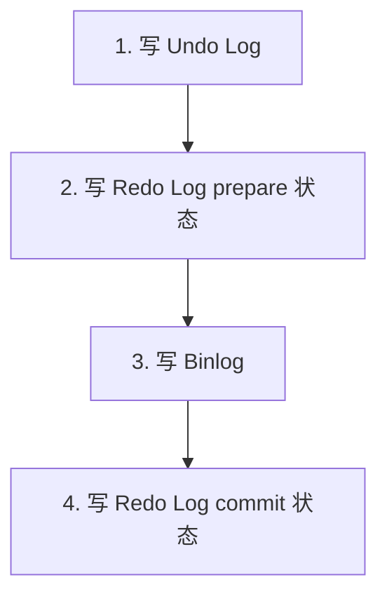

## 1. 三种日志概览

### 1.1 日志定位

| 日志     | 层级          | 作用                   | 写入方式       |
| -------- | ------------- | ---------------------- | -------------- |
| Redo Log | InnoDB 引擎层 | 崩溃恢复（crash-safe） | 顺序写，循环写 |
| Undo Log | InnoDB 引擎层 | 事务回滚 + MVCC 版本链 | 随机写         |
| Binlog   | Server 层     | 主从复制 + 数据恢复    | 顺序写，追加写 |

### 1.2 日志内容对比

```
Redo Log:  记录"物理修改"——某页某偏移量写入了什么数据
Undo Log:  记录"逻辑反向"——如何将数据恢复到修改前
Binlog:    记录"逻辑操作"——执行了什么 SQL 语句（STATEMENT）或行变更（ROW）
```

## 2. Redo Log 写入机制

### 2.1 Redo Log 架构

```mermaid
flowchart TD
    BP[InnoDB Buffer Pool<br/>脏页 Dirty Pages] -->|刷盘 Checkpoint| RL[Redo Log Files ib_logfile0/1<br/>write pos → checkpoint 之间的区域]<br/>```

### 2.2 写入流程

```
1. 事务修改数据页 → 生成 Redo Record
2. 写入 Redo Log Buffer（内存）
3. 写入 OS Buffer Cache（write）
4. 刷盘到 Redo Log File（fsync）
```

### 2.3 刷盘策略（innodb_flush_log_at_trx_commit）

| 值  | 行为                       | 安全性       | 性能 |
| --- | -------------------------- | ------------ | ---- |
| 0   | 每秒刷盘一次               | 丢失1秒数据  | 最高 |
| 1   | 每次提交都 fsync           | 不丢数据     | 最低 |
| 2   | 每次提交 write，每秒 fsync | OS崩溃丢数据 | 中等 |

```sql
-- 查看当前设置
SHOW VARIABLES LIKE 'innodb_flush_log_at_trx_commit';

-- 生产推荐：设为 1（最安全）
SET GLOBAL innodb_flush_log_at_trx_commit = 1;
```

### 2.4 Redo Log 组提交（Group Commit）

多个事务同时提交时，只需一次 fsync：

```
事务A提交 → 进入 fsync 队列
事务B提交 → 进入 fsync 队列  ──→ 一次 fsync 刷入所有 Redo
事务C提交 → 进入 fsync 队列
```

## 3. Undo Log 写入机制

### 3.1 Undo Log 的双重作用

1. **事务回滚**：保存修改前的数据，ROLLBACK 时恢复
2. **MVCC 版本链**：通过 `DB_ROLL_PTR` 串联历史版本

### 3.2 写入时机

```
1. 事务执行 UPDATE/DELETE → 先将旧值写入 Undo Log
2. 事务执行 INSERT → 写入 Undo Log（记录主键值，用于回滚时删除）
3. 事务 COMMIT → Undo Log 标记为可清理（但不立即删除，供 MVCC 使用）
4. 当没有事务需要访问该 Undo Log → 由 Purge 线程清理
```

### 3.3 Undo Log 类型

| 类型        | 对应操作      | 回滚操作                   |
| ----------- | ------------- | -------------------------- |
| INSERT Undo | INSERT        | DELETE                     |
| UPDATE Undo | UPDATE/DELETE | UPDATE（恢复旧值）/ INSERT |

### 3.4 Undo Log 与 MVCC 的关系

```
事务A (trx_id=100) 修改行: name='Alice' → 'Bob'

当前行: {name='Bob', trx_id=100, roll_ptr→undo_1}
                                        ↓
Undo Log: {name='Alice', trx_id=50, roll_ptr→undo_2}

事务B (trx_id=200) 快照读:
  ReadView: m_ids=[100], min_trx_id=100
  → trx_id=100 在 m_ids 中，不可见
  → 遍历到 undo_1: trx_id=50 < min_trx_id，可见
  → 返回 name='Alice'
```

## 4. Binlog 写入机制

### 4.1 Binlog 格式

| 格式      | 内容         | 优缺点                                            |
| --------- | ------------ | ------------------------------------------------- |
| STATEMENT | SQL 语句     | 日志量小，但不确定函数（NOW()、UUID()）导致不一致 |
| ROW       | 行变更前后值 | 数据一致性好，但日志量大                          |
| MIXED     | 混合模式     | 默认 STATEMENT，不确定函数切 ROW                  |

### 4.2 写入流程

```
1. 事务执行 DML → 写入 Binlog Cache（线程级内存）
2. 事务 COMMIT → Binlog Cache 写入 Binlog File
3. 根据 sync_binlog 设置决定 fsync 时机
```

### 4.3 刷盘策略（sync_binlog）

| 值  | 行为                   | 安全性        | 性能 |
| --- | ---------------------- | ------------- | ---- |
| 0   | 由 OS 决定何时 fsync   | 可能丢数据    | 最高 |
| 1   | 每次提交都 fsync       | 不丢数据      | 最低 |
| N   | 每 N 次提交 fsync 一次 | 丢 N-1 个事务 | 中等 |

```sql
-- 生产推荐：设为 1
SET GLOBAL sync_binlog = 1;
```

## 5. 三种日志的写入顺序

### 5.1 事务提交时的写入顺序

```
1. 写入 Undo Log（保证可回滚）
2. 写入 Redo Log（prepare 阶段）
3. 写入 Binlog
4. 写入 Redo Log（commit 阶段）
```

这就是**两阶段提交**的核心流程：



### 5.2 为什么要两阶段提交

如果 Redo Log 和 Binlog 不保证一致性，主从数据会不一致：

```
场景1：先写 Redo Log，再写 Binlog（Redo 写完崩溃）
  主库：事务已提交（Redo Log 有记录）
  从库：事务未复制（Binlog 无记录）
  → 主从数据不一致！

场景2：先写 Binlog，再写 Redo Log（Binlog 写完崩溃）
  主库：事务未提交（Redo Log 无记录）
  从库：事务已复制（Binlog 有记录）
  → 主从数据不一致！

两阶段提交：
  崩溃恢复时检查 Redo Log 状态：
  - prepare + Binlog 完整 → 提交事务
  - prepare + Binlog 不完整 → 回滚事务
  → 保证主从数据一致！
```

## 参考文献

MySQL 官方文档：https://dev.mysql.com/doc/
MySQL 8.0 参考手册：https://dev.mysql.com/doc/refman/8.0/en/
High Performance MySQL（O'Reilly）：https://www.oreilly.com/library/view/high-performance-mysql/
Percona 博客：https://www.percona.com/blog/

## 延伸阅读

MySQL 索引与优化，见 020-mysql 模块文档。
MySQL 日志体系，见 020-mysql 模块 redo/binlog 文档。
Redis 缓存与 MySQL 组合，见 022-redis 模块。
尚硅谷 Bilibili 空间（https://space.bilibili.com/302417610 ）提供 MySQL 高级课程。

## 深度专题扩展

以下专题从不同角度深入本文主题，供有进阶需求的读者研读。每个专题独立成节，内容相互补充。

### 13.1 InnoDB 日志与崩溃恢复

redo log 记录物理页修改（WAL：先写日志再写数据页），崩溃后重放恢复；环形文件组 + checkpoint 推进。
undo log 记录事务前镜像，支持回滚与 MVCC 版本链；purge 线程清理。
两阶段提交：redo prepare -> binlog -> redo commit，保证两份日志一致，主从不丢数据。
刷盘策略：innodb_flush_log_at_trx_commit=1 最安全（每次提交 fsync），2 每秒刷。

### 13.2 执行计划与优化器

EXPLAIN 关键列：type（const/ref/range/index/ALL）、key、rows、Extra（Using index/Using filesort）。
优化器基于统计信息选计划；analyze table 更新统计；hint（FORCE INDEX）谨慎使用。
排序与分组：filesort 优化为索引序；避免临时表。
慢查询治理流程：慢日志 -> 计划分析 -> 索引/改写 -> 验证。

## 模块文档速查表

| 文档 | 主题 | 与本文的关联 |
| --- | --- | --- |
| MySQL 概述与数据库设计 | 001-MySQLOverviewDatabaseDesign | 本文的前置基础 |
| MySQL 环境搭建 | 002-MySQLEnvSetup | 本文的前置基础 |
| MySQL 数据类型与约束 | 003-MySQLDataTypeConstraint | 本文的并列主题 |
| SQL 数据定义与高级对象 | 004-SQLDataDefinitionAdvanced | 本文的并列主题 |
| MyISAM存储引擎 | 005-MyISAMStorageEngine | 本文的并列主题 |
| SQL 数据操作与查询 | 006-SQLDataOperationQuery | 本文的并列主题 |
| Memory存储引擎 | 007-MemoryStorageEngine | 本文的并列主题 |
| NDB-Cluster | 008-NDBCluster | 本文的并列主题 |
| 聚簇索引与二级索引 | 009-ClusteredIndexSecondaryIndex | 本文的并列主题 |
| 联合索引与最左前缀原则 | 010-CompositeIndexLeftmostPrefixPrinciple | 本文的并列主题 |
| 索引下推 | 011-IndexConditionPushdown | 本文的并列主题 |
| 全文索引 | 012-FullTextIndex | 本文的并列主题 |
| 前缀索引 | 013-PrefixIndex | 本文的并列主题 |
| 索引提示与强制索引 | 014-IndexHintForceIndex | 本文的并列主题 |
| 索引统计信息与直方图 | 015-IndexStatsHistogram | 本文的并列主题 |
| SQL 函数与高级查询 | 016-SQLFunctionAndAdvancedQuery | 本文的并列主题 |
| 索引失效场景 | 017-IndexFailureScene | 本文的并列主题 |
| EXPLAIN输出详解 | 018-EXPLAINDetailed | 本文的并列主题 |
| 慢查询日志 | 019-SlowQueryLog | 本文的并列主题 |
| 优化器追踪 | 020-OptimizerTrace | 本文的性能延伸 |
| 子查询优化 | 021-SubqueryOptimization | 本文的性能延伸 |
| 派生表优化 | 022-DerivedTableOptimization | 本文的性能延伸 |
| GROUP-BY与ORDER-BY优化 | 023-GroupByOrderByOptimization | 本文的性能延伸 |
| JOIN算法 | 024-JOINAlgorithm | 本文的并列主题 |
| 事务隔离级别底层实现 | 025-TransactionIsolationImplementation | 本文的并列主题 |
| MVCC原理 | 026-MVCCPrinciple | 本文的原理深化 |
| 多表联查详解 | 027-MultiTableJoinDetailed | 本文的并列主题 |
| 锁分类 | 028-LockClassification | 本文的并列主题 |
| 死锁检测与处理 | 029-DeadlockDetectionHandling | 本文的并列主题 |
| 分布式事务 | 030-DistributedTransaction | 本文的并列主题 |
| 二进制日志 | 031-Binlog | 本文的并列主题 |
| 重做日志 | 032-RedoLog | 本文的并列主题 |
| 撤销日志 | 033-UndoLog | 本文的并列主题 |
| 日志系统 | 034-LogSystem | 本文的并列主题 |
| 逻辑备份 | 035-LogicalBackup | 本文的并列主题 |
| 物理备份 | 036-PhysicalBackup | 本文的并列主题 |
| 基于时间点恢复 | 037-PITR | 本文的并列主题 |
| 主从复制 | 038-Replication | 本文的并列主题 |
| 进阶查询与多表操作 | 039-AdvancedQueryMultiTableOperation | 本文的并列主题 |
| GTID | 040-GTID | 本文的并列主题 |
| 并行复制 | 041-ParallelReplication | 本文的并列主题 |
| 组复制 | 042-GroupReplication | 本文的并列主题 |
| InnoDB-Cluster | 043-InnoDBCluster | 本文的并列主题 |
| 分区表 | 044-PartitionedTable | 本文的并列主题 |
| 分库分表中间件 | 045-ShardingMiddleware | 本文的并列主题 |
| 账户与权限管理 | 046-AccountPermissionManagement | 本文的安全延伸 |
| SSL-TLS加密 | 047-SSLEncryption | 本文的安全延伸 |
| 防火墙插件 | 048-FirewallPlugin | 本文的并列主题 |
| InnoDB体系架构 | 049-InnoDBSystemArchitecture | 本文的原理深化 |
| 数据加密 | 050-DataEncryption | 本文的安全延伸 |
| MySQL 索引与执行计划 | 051-MySQLIndexExecutionPlan | 本文的并列主题 |
| MySQL9新特性与并行查询 | 052-MySQL9NewFeaturesParallelQuery | 本文的并列主题 |
| VECTOR向量类型 | 053-VectorType | 本文的并列主题 |
| JSON模式验证与聚合函数 | 054-JSONSchemaValidationAggregate | 本文的并列主题 |
| 复制与高可用 | 055-ReplicationHA | 本文的并列主题 |
| 不可见索引 | 056-InvisibleIndex | 本文的并列主题 |
| 性能调优与安全 | 057-PerformanceTuningSecurity | 本文的性能延伸 |
| 函数索引 | 058-FunctionalIndex | 本文的并列主题 |
| 存储过程与函数 | 059-StoredProcedureAndFunction | 本文的并列主题 |
| MVCC快照读与当前读 | 060-MVCCSnapshotCurrentRead | 本文的并列主题 |
| 索引原理与性能优化 | 061-IndexPrinciplePerformanceOptimization | 本文的性能延伸 |
| 触发器与事件 | 062-TriggerEvent | 本文的并列主题 |
| Redo与Undo与Binlog写入时机 | 063-RedoUndoBinlogWriteTiming | 本文自身 |
| 两阶段提交 | 064-TwoPhaseCommit | 本文的并列主题 |
| 间隙锁与临键锁解决幻读 | 065-GapLockNextKeyLockSolutionPhantomRead | 本文的并列主题 |
| 主从复制延迟原因与解决 | 066-ReplicationDelayCauseSolution | 本文的并列主题 |
| 分库分表策略 | 067-ShardingStrategy | 本文的并列主题 |
| JSON类型与JSON-TABLE | 068-JSONTypeJSONTable | 本文的并列主题 |
| 事务与锁机制 | 069-TransactionLockMechanism | 本文的原理深化 |
| MySQL 配置与运维 | 070-MySQLConfigOps | 本文的并列主题 |
| MySQL 快速查阅 | 071-MySQLQuickLookup | 本文的并列主题 |
| MySQL 控制器与应用 | 072-MySQLControlApplication | 本文的并列主题 |
| SQL 注入基础与检测 | 073-SQLInjectionBasicsDetection | 本文的前置基础 |
| SQL 注入攻击类型与实战 | 074-SQLInjectionAttackTypePractice | 本文的综合应用 |
| SQL 注入防御策略 | 075-SQLInjectionDefenseStrategy | 本文的并列主题 |
| MySQL 项目示例：电商数据库设计 | 076-MySQLProjectExampleDatabaseDesign | 本文的综合应用 |
| MySQL 理论知识点 | 077-MySQLTheoryKnowledge | 本文的并列主题 |
| MySQL DDL 数据定义 | 078-DDL | 本文的并列主题 |
| MySQL DML 数据操作 | 079-DML | 本文的并列主题 |
| MySQL DQL 查询速查 | 080-DQL | 本文的并列主题 |
| MySQL 索引管理 | 081-IndexManagement | 本文的并列主题 |
| MySQL 用户与权限管理 | 082-UserPermission | 本文的安全延伸 |
| MySQL CLI 命令 | 083-CLI | 本文的并列主题 |
| mysqladmin 管理命令 语法速查手册 | 084-Mysqladmin | 本文的并列主题 |
| 视图 语法速查手册 | 085-View | 本文的并列主题 |
| 事件调度器 语法速查手册 | 086-EventScheduler | 本文的并列主题 |
| 字符集与排序规则 语法速查手册 | 087-CharsetCollation | 本文的并列主题 |
