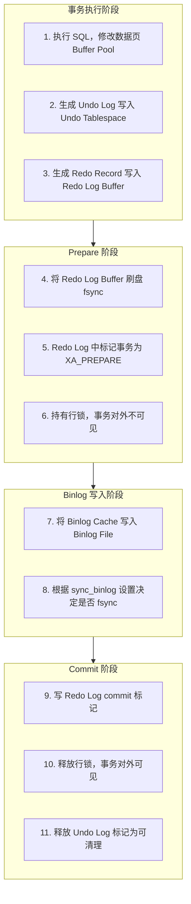
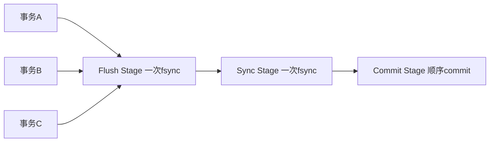

## 1. 两阶段提交的必要性

### 1.1 问题背景

InnoDB 的 Redo Log 和 Server 层的 Binlog 是两个独立的日志系统。如果不协调写入顺序，崩溃后会导致数据不一致：

```
主库执行: UPDATE accounts SET balance = balance - 100 WHERE id = 1;

情况1: Redo Log 写入成功，Binlog 未写入 → 主库已扣款，从库未扣款
情况2: Binlog 写入成功，Redo Log 未写入 → 主库未扣款，从库已扣款
```

### 1.2 两阶段提交方案

将事务提交分为 **Prepare** 和 **Commit** 两个阶段，中间插入 Binlog 写入：

```
阶段1 (Prepare):  写 Redo Log，标记为 prepare 状态
阶段间:           写 Binlog
阶段2 (Commit):   写 Redo Log，标记为 commit 状态
```

## 2. 两阶段提交流程

### 2.1 详细执行步骤



### 2.2 组提交优化

多个事务同时提交时，可以合并 fsync 操作：



阶段1（Flush）：多个事务的 Redo Log 一起 fsync；阶段2（Sync）：多个事务的 Binlog 一起 fsync；阶段3（Commit）：依次标记 commit

## 3. 崩溃恢复

### 3.1 恢复流程

MySQL 重启时，InnoDB 扫描 Redo Log 进行崩溃恢复：

```
1. 从 Checkpoint 点开始扫描 Redo Log
2. 重做（Redo）：重放所有已提交事务的修改
3. 回滚（Undo）：撤销所有未提交事务的修改
4. 处理 XA PREPARE 状态的事务：
   a. 检查 Binlog 中是否有该事务的记录
   b. 有 → 提交事务（commit）
   c. 无 → 回滚事务（rollback）
```

### 3.2 各种崩溃场景分析

| 崩溃时机                  | Redo Log 状态 | Binlog 状态 | 恢复动作         |
| ------------------------- | ------------- | ----------- | ---------------- |
| Prepare 之前              | 无记录        | 无记录      | 无需恢复         |
| Prepare 之后、Binlog 之前 | prepare       | 无记录      | 回滚事务         |
| Binlog 之后、Commit 之前  | prepare       | 有记录      | 提交事务         |
| Commit 之后               | commit        | 有记录      | 已完成，无需处理 |

### 3.3 Binlog 完整性判断

```sql
-- MySQL 通过 XID（事务ID）匹配 Redo Log 和 Binlog
-- 每个 Binlog 事务组以 XID event 结尾

-- Binlog 中的事务格式：
-- BEGIN
-- ... (行变更事件)
-- XID 12345  ← 事务标识

-- 恢复时：在 Binlog 中查找 XID=12345
-- 找到 → 事务完整，提交
-- 找不到 → 事务不完整，回滚
```

## 4. XA 事务

### 4.1 外部 XA 事务

MySQL 支持 X/Open XA 规范，实现跨数据库的分布式事务：

```sql
-- XA 事务语法
XA START 'txn1';
UPDATE accounts SET balance = balance - 100 WHERE id = 1;
XA END 'txn1';
XA PREPARE 'txn1';   -- 第一阶段：准备
-- 此时可以查询事务状态
XA RECOVER;
XA COMMIT 'txn1';    -- 第二阶段：提交
-- 或 XA ROLLBACK 'txn1';  -- 第二阶段：回滚
```

### 4.2 XA 事务状态机

```
START → END → PREPARE → COMMIT
                ↓
            ROLLBACK

状态: ACTIVE → IDLE → PREPARED → COMMITTED
                              → ROLLED_BACK
```

### 4.3 XA 事务的注意事项

- **悬挂事务**：PREPARE 后未 COMMIT 也未 ROLLBACK，占用锁资源
- **超时处理**：`xa_wait_timeout` 控制等待时间
- **监控**：定期执行 `XA RECOVER` 检查悬挂事务

```sql
-- 查看悬挂事务
XA RECOVER;

-- 手动回滚悬挂事务
XA ROLLBACK 'txn1';
```

## 5. 半同步复制与两阶段提交

### 5.1 半同步复制对两阶段提交的影响

```
异步复制:    主库提交 → 返回客户端 → 从库异步拉取 Binlog
半同步复制:  主库提交 → 等待至少1个从库确认收到 Binlog → 返回客户端
```

半同步复制在 Binlog 写入后增加了一个等待步骤：

```
Prepare → Binlog → 等待从库ACK → Commit
```

### 5.2 After Sync vs After Commit

| 模式         | 等待时机                 | 数据安全           | 性能 |
| ------------ | ------------------------ | ------------------ | ---- |
| After Sync   | Binlog 写入后、Commit 前 | 主库崩溃不丢数据   | 较好 |
| After Commit | Commit 后                | 主库崩溃可能丢数据 | 较差 |

```sql
-- MySQL 5.7+ 默认 After Sync
SET GLOBAL rpl_semi_sync_master_wait_point = AFTER_SYNC;
```

### 5.3 After Sync 的优势

```
After Sync 流程:
1. Prepare
2. 写 Binlog
3. 等待从库 ACK  ← 在 Commit 之前
4. Commit

如果主库在步骤3后崩溃：
- 从库已收到 Binlog → 从库会提交
- 主库未 Commit → 恢复时检查 Binlog 完整 → 提交
- 数据一致！
```

## 参考文献

MySQL 官方文档：https://dev.mysql.com/doc/
MySQL 8.0 参考手册：https://dev.mysql.com/doc/refman/8.0/en/
High Performance MySQL（O'Reilly）：https://www.oreilly.com/library/view/high-performance-mysql/
Percona 博客：https://www.percona.com/blog/

## 延伸阅读

MySQL 索引与优化，见 020-mysql 模块文档。
MySQL 日志体系，见 020-mysql 模块 redo/binlog 文档。
Redis 缓存与 MySQL 组合，见 022-redis 模块。
尚硅谷 Bilibili 空间（https://space.bilibili.com/302417610 ）提供 MySQL 高级课程。

## 深度专题扩展

以下专题从不同角度深入本文主题，供有进阶需求的读者研读。每个专题独立成节，内容相互补充。

### 13.1 InnoDB 日志与崩溃恢复

redo log 记录物理页修改（WAL：先写日志再写数据页），崩溃后重放恢复；环形文件组 + checkpoint 推进。
undo log 记录事务前镜像，支持回滚与 MVCC 版本链；purge 线程清理。
两阶段提交：redo prepare -> binlog -> redo commit，保证两份日志一致，主从不丢数据。
刷盘策略：innodb_flush_log_at_trx_commit=1 最安全（每次提交 fsync），2 每秒刷。

### 13.2 执行计划与优化器

EXPLAIN 关键列：type（const/ref/range/index/ALL）、key、rows、Extra（Using index/Using filesort）。
优化器基于统计信息选计划；analyze table 更新统计；hint（FORCE INDEX）谨慎使用。
排序与分组：filesort 优化为索引序；避免临时表。
慢查询治理流程：慢日志 -> 计划分析 -> 索引/改写 -> 验证。

## 模块文档速查表

| 文档 | 主题 | 与本文的关联 |
| --- | --- | --- |
| MySQL 概述与数据库设计 | 001-MySQLOverviewDatabaseDesign | 本文的前置基础 |
| MySQL 环境搭建 | 002-MySQLEnvSetup | 本文的前置基础 |
| MySQL 数据类型与约束 | 003-MySQLDataTypeConstraint | 本文的并列主题 |
| SQL 数据定义与高级对象 | 004-SQLDataDefinitionAdvanced | 本文的并列主题 |
| MyISAM存储引擎 | 005-MyISAMStorageEngine | 本文的并列主题 |
| SQL 数据操作与查询 | 006-SQLDataOperationQuery | 本文的并列主题 |
| Memory存储引擎 | 007-MemoryStorageEngine | 本文的并列主题 |
| NDB-Cluster | 008-NDBCluster | 本文的并列主题 |
| 聚簇索引与二级索引 | 009-ClusteredIndexSecondaryIndex | 本文的并列主题 |
| 联合索引与最左前缀原则 | 010-CompositeIndexLeftmostPrefixPrinciple | 本文的并列主题 |
| 索引下推 | 011-IndexConditionPushdown | 本文的并列主题 |
| 全文索引 | 012-FullTextIndex | 本文的并列主题 |
| 前缀索引 | 013-PrefixIndex | 本文的并列主题 |
| 索引提示与强制索引 | 014-IndexHintForceIndex | 本文的并列主题 |
| 索引统计信息与直方图 | 015-IndexStatsHistogram | 本文的并列主题 |
| SQL 函数与高级查询 | 016-SQLFunctionAndAdvancedQuery | 本文的并列主题 |
| 索引失效场景 | 017-IndexFailureScene | 本文的并列主题 |
| EXPLAIN输出详解 | 018-EXPLAINDetailed | 本文的并列主题 |
| 慢查询日志 | 019-SlowQueryLog | 本文的并列主题 |
| 优化器追踪 | 020-OptimizerTrace | 本文的性能延伸 |
| 子查询优化 | 021-SubqueryOptimization | 本文的性能延伸 |
| 派生表优化 | 022-DerivedTableOptimization | 本文的性能延伸 |
| GROUP-BY与ORDER-BY优化 | 023-GroupByOrderByOptimization | 本文的性能延伸 |
| JOIN算法 | 024-JOINAlgorithm | 本文的并列主题 |
| 事务隔离级别底层实现 | 025-TransactionIsolationImplementation | 本文的并列主题 |
| MVCC原理 | 026-MVCCPrinciple | 本文的原理深化 |
| 多表联查详解 | 027-MultiTableJoinDetailed | 本文的并列主题 |
| 锁分类 | 028-LockClassification | 本文的并列主题 |
| 死锁检测与处理 | 029-DeadlockDetectionHandling | 本文的并列主题 |
| 分布式事务 | 030-DistributedTransaction | 本文的并列主题 |
| 二进制日志 | 031-Binlog | 本文的并列主题 |
| 重做日志 | 032-RedoLog | 本文的并列主题 |
| 撤销日志 | 033-UndoLog | 本文的并列主题 |
| 日志系统 | 034-LogSystem | 本文的并列主题 |
| 逻辑备份 | 035-LogicalBackup | 本文的并列主题 |
| 物理备份 | 036-PhysicalBackup | 本文的并列主题 |
| 基于时间点恢复 | 037-PITR | 本文的并列主题 |
| 主从复制 | 038-Replication | 本文的并列主题 |
| 进阶查询与多表操作 | 039-AdvancedQueryMultiTableOperation | 本文的并列主题 |
| GTID | 040-GTID | 本文的并列主题 |
| 并行复制 | 041-ParallelReplication | 本文的并列主题 |
| 组复制 | 042-GroupReplication | 本文的并列主题 |
| InnoDB-Cluster | 043-InnoDBCluster | 本文的并列主题 |
| 分区表 | 044-PartitionedTable | 本文的并列主题 |
| 分库分表中间件 | 045-ShardingMiddleware | 本文的并列主题 |
| 账户与权限管理 | 046-AccountPermissionManagement | 本文的安全延伸 |
| SSL-TLS加密 | 047-SSLEncryption | 本文的安全延伸 |
| 防火墙插件 | 048-FirewallPlugin | 本文的并列主题 |
| InnoDB体系架构 | 049-InnoDBSystemArchitecture | 本文的原理深化 |
| 数据加密 | 050-DataEncryption | 本文的安全延伸 |
| MySQL 索引与执行计划 | 051-MySQLIndexExecutionPlan | 本文的并列主题 |
| MySQL9新特性与并行查询 | 052-MySQL9NewFeaturesParallelQuery | 本文的并列主题 |
| VECTOR向量类型 | 053-VectorType | 本文的并列主题 |
| JSON模式验证与聚合函数 | 054-JSONSchemaValidationAggregate | 本文的并列主题 |
| 复制与高可用 | 055-ReplicationHA | 本文的并列主题 |
| 不可见索引 | 056-InvisibleIndex | 本文的并列主题 |
| 性能调优与安全 | 057-PerformanceTuningSecurity | 本文的性能延伸 |
| 函数索引 | 058-FunctionalIndex | 本文的并列主题 |
| 存储过程与函数 | 059-StoredProcedureAndFunction | 本文的并列主题 |
| MVCC快照读与当前读 | 060-MVCCSnapshotCurrentRead | 本文的并列主题 |
| 索引原理与性能优化 | 061-IndexPrinciplePerformanceOptimization | 本文的性能延伸 |
| 触发器与事件 | 062-TriggerEvent | 本文的并列主题 |
| Redo与Undo与Binlog写入时机 | 063-RedoUndoBinlogWriteTiming | 本文的并列主题 |
| 两阶段提交 | 064-TwoPhaseCommit | 本文自身 |
| 间隙锁与临键锁解决幻读 | 065-GapLockNextKeyLockSolutionPhantomRead | 本文的并列主题 |
| 主从复制延迟原因与解决 | 066-ReplicationDelayCauseSolution | 本文的并列主题 |
| 分库分表策略 | 067-ShardingStrategy | 本文的并列主题 |
| JSON类型与JSON-TABLE | 068-JSONTypeJSONTable | 本文的并列主题 |
| 事务与锁机制 | 069-TransactionLockMechanism | 本文的原理深化 |
| MySQL 配置与运维 | 070-MySQLConfigOps | 本文的并列主题 |
| MySQL 快速查阅 | 071-MySQLQuickLookup | 本文的并列主题 |
| MySQL 控制器与应用 | 072-MySQLControlApplication | 本文的并列主题 |
| SQL 注入基础与检测 | 073-SQLInjectionBasicsDetection | 本文的前置基础 |
| SQL 注入攻击类型与实战 | 074-SQLInjectionAttackTypePractice | 本文的综合应用 |
| SQL 注入防御策略 | 075-SQLInjectionDefenseStrategy | 本文的并列主题 |
| MySQL 项目示例：电商数据库设计 | 076-MySQLProjectExampleDatabaseDesign | 本文的综合应用 |
| MySQL 理论知识点 | 077-MySQLTheoryKnowledge | 本文的并列主题 |
| MySQL DDL 数据定义 | 078-DDL | 本文的并列主题 |
| MySQL DML 数据操作 | 079-DML | 本文的并列主题 |
| MySQL DQL 查询速查 | 080-DQL | 本文的并列主题 |
| MySQL 索引管理 | 081-IndexManagement | 本文的并列主题 |
| MySQL 用户与权限管理 | 082-UserPermission | 本文的安全延伸 |
| MySQL CLI 命令 | 083-CLI | 本文的并列主题 |
| mysqladmin 管理命令 语法速查手册 | 084-Mysqladmin | 本文的并列主题 |
| 视图 语法速查手册 | 085-View | 本文的并列主题 |
| 事件调度器 语法速查手册 | 086-EventScheduler | 本文的并列主题 |
| 字符集与排序规则 语法速查手册 | 087-CharsetCollation | 本文的并列主题 |
