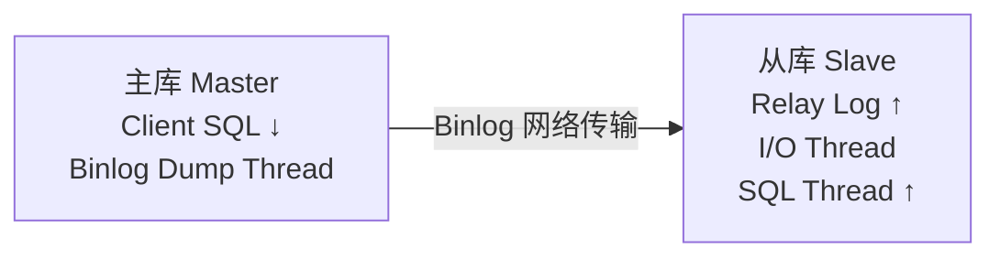

## 1. 主从复制架构

### 1.1 复制流程



**三线程模型**（MySQL 5.7+）：

| 线程               | 位置 | 作用                       |
| ------------------ | ---- | -------------------------- |
| Binlog Dump Thread | 主库 | 发送 Binlog 事件给从库     |
| I/O Thread         | 从库 | 接收 Binlog 写入 Relay Log |
| SQL Thread         | 从库 | 回放 Relay Log 中的事件    |

### 1.2 延迟定义

```
延迟 = 主库执行时间 - 从库回放完成时间

监控命令:
SHOW SLAVE STATUS\G
-- Seconds_Behind_Master: 延迟秒数
```

## 2. 延迟根因分析

### 2.1 单线程回放瓶颈

传统从库只有**一个 SQL Thread** 回放事务，主库可以并行写入，从库只能串行回放：

```
主库（并行）:  T1 | T2 | T3 | T4  ← 同时执行
从库（串行）:  T1 → T2 → T3 → T4  ← 逐个回放

如果主库 QPS=10000，从库回放速度 < 10000 → 延迟持续增长
```

### 2.2 大事务

```sql
-- 单条大事务包含百万行修改
BEGIN;
DELETE FROM logs WHERE created_at < '2025-01-01';  -- 500万行
COMMIT;

-- 从库必须完整回放这个事务
-- 回放期间无法回放其他事务 → 延迟飙升
```

### 2.3 DDL 操作

```sql
-- ALTER TABLE 需要拷贝全表数据
ALTER TABLE big_table ADD COLUMN new_col INT;
-- 大表 ALTER 可能耗时数小时
-- 从库回放时阻塞所有其他事务
```

### 2.4 从库硬件差异

| 资源 | 主库     | 从库  | 影响          |
| ---- | -------- | ----- | ------------- |
| CPU  | 32核     | 8核   | 回放速度慢    |
| 磁盘 | NVMe SSD | HDD   | 刷盘慢        |
| 网络 | 10Gbps   | 1Gbps | Binlog 传输慢 |

### 2.5 主从不一致的查询

```sql
-- 从库上执行长查询，阻塞 SQL Thread
-- 从库用于读查询时，长事务可能持有锁
SELECT * FROM big_table WHERE ...;  -- 扫描全表，持锁时间长

-- SQL Thread 等待锁释放 → 延迟
```

## 3. 解决方案

### 3.1 多线程并行复制（MTS）

**库级并行**（MySQL 5.6）：

```sql
-- 按数据库维度并行
SET GLOBAL slave_parallel_type = 'DATABASE';
SET GLOBAL slave_parallel_workers = 8;
```

限制：单库场景无法并行。

**组提交并行**（MySQL 5.7）：

```sql
-- 基于 Binlog Group Commit 的并行
SET GLOBAL slave_parallel_type = 'LOGICAL_CLOCK';
SET GLOBAL slave_parallel_workers = 16;
-- 同一组提交的事务可以并行回放
```

**WRITESET 并行**（MySQL 8.0）：

```sql
-- 基于行修改的依赖关系并行
SET GLOBAL binlog_transaction_dependency_tracking = WRITESET;
SET GLOBAL slave_parallel_workers = 32;
SET Global transaction_write_set_extraction = XXHASH64;
-- 修改不同行的事务可以并行回放
```

| 方案          | 并行度     | 适用场景   |
| ------------- | ---------- | ---------- |
| DATABASE      | 库数量     | 多库业务   |
| LOGICAL_CLOCK | 组提交大小 | 中等并发   |
| WRITESET      | 行级无冲突 | 高并发单库 |

### 3.2 半同步复制

```sql
-- 安装半同步插件
INSTALL PLUGIN rpl_semi_sync_master SONAME 'semisync_master.so';
INSTALL PLUGIN rpl_semi_sync_slave SONAME 'semisync_slave.so';

-- 启用半同步
SET GLOBAL rpl_semi_sync_master_enabled = 1;
SET GLOBAL rpl_semi_sync_slave_enabled = 1;

-- 等待超时（毫秒）
SET GLOBAL rpl_semi_sync_master_timeout = 3000;
```

半同步不直接解决延迟，但保证数据不丢失，从库至少收到 Binlog。

### 3.3 并行复制监控

```sql
-- 查看并行复制状态
SHOW SLAVE STATUS\G

-- 关键指标:
-- Seconds_Behind_Master: 延迟秒数
-- Slave_SQL_Running_State: SQL线程状态
-- Exec_Master_Log_Pos: 已回放位置

-- MySQL 8.0 性能库
SELECT * FROM performance_schema.replication_applier_status_by_worker;
```

### 3.4 大事务拆分

```sql
-- 反模式：单条大事务
DELETE FROM logs WHERE created_at < '2025-01-01';  -- 500万行

-- 正确：分批删除
-- 方案1：LIMIT 分批
DELETE FROM logs WHERE created_at < '2025-01-01' LIMIT 10000;
-- 重复执行直到影响行数为0

-- 方案2：按时间分批
DELETE FROM logs WHERE created_at BETWEEN '2024-01-01' AND '2024-02-01';
DELETE FROM logs WHERE created_at BETWEEN '2024-02-01' AND '2024-03-01';
-- ...

-- 方案3：pt-archiver 工具
pt-archiver --source h=host,D=db,t=logs \
  --where "created_at < '2025-01-01'" \
  --purge --limit 10000 --commit-each
```

### 3.5 从库读流量优化

```sql
-- 1. 使用 READ COMMITTED 减少锁持有时间
SET SESSION TRANSACTION ISOLATION LEVEL READ COMMITTED;

-- 2. 避免长事务
SET SESSION innodb_lock_wait_timeout = 5;

-- 3. 使用 pt-query-digest 分析慢查询
-- pt-query-digest slow.log

-- 4. 从库使用 read_only
SET GLOBAL read_only = ON;
SET GLOBAL super_read_only = ON;
```

## 4. 延迟监控与告警

### 4.1 监控指标

```sql
-- 延迟秒数
SHOW SLAVE STATUS\G  -- Seconds_Behind_Master

-- Binlog 位置差异
-- Master_Log_File vs Relay_Master_Log_File
-- Read_Master_Log_Pos vs Exec_Master_Log_Pos

-- MySQL 8.0 延迟直方图
SELECT * FROM performance_schema.replication_connection_status;
```

### 4.2 延迟容忍策略

```
应用层策略：
1. 读写分离时，关键业务读主库
2. 从库延迟超过阈值时，降级读主库
3. 使用 ProxySQL / MaxSQL 自动路由
4. 业务层缓存减少从库读压力
```

## 参考文献


MySQL 官方文档：https://dev.mysql.com/doc/
MySQL 8.0 参考手册：https://dev.mysql.com/doc/refman/8.0/en/
High Performance MySQL（O'Reilly）：https://www.oreilly.com/library/view/high-performance-mysql/
Percona 博客：https://www.percona.com/blog/

## 延伸阅读


MySQL 索引与优化，见 020-mysql 模块文档。
MySQL 日志体系，见 020-mysql 模块 redo/binlog 文档。
Redis 缓存与 MySQL 组合，见 022-redis 模块。
尚硅谷 Bilibili 空间（https://space.bilibili.com/302417610 ）提供 MySQL 高级课程。

## 深度专题扩展


以下专题从不同角度深入本文主题，供有进阶需求的读者研读。每个专题独立成节，内容相互补充。

### 13.1 InnoDB 日志与崩溃恢复

redo log 记录物理页修改（WAL：先写日志再写数据页），崩溃后重放恢复；环形文件组 + checkpoint 推进。
undo log 记录事务前镜像，支持回滚与 MVCC 版本链；purge 线程清理。
两阶段提交：redo prepare -> binlog -> redo commit，保证两份日志一致，主从不丢数据。
刷盘策略：innodb_flush_log_at_trx_commit=1 最安全（每次提交 fsync），2 每秒刷。

### 13.2 执行计划与优化器

EXPLAIN 关键列：type（const/ref/range/index/ALL）、key、rows、Extra（Using index/Using filesort）。
优化器基于统计信息选计划；analyze table 更新统计；hint（FORCE INDEX）谨慎使用。
排序与分组：filesort 优化为索引序；避免临时表。
慢查询治理流程：慢日志 -> 计划分析 -> 索引/改写 -> 验证。

## 模块文档速查表

| 文档 | 主题 | 与本文的关联 |
| --- | --- | --- |
| MySQL 概述与数据库设计 | 001-MySQLOverviewDatabaseDesign | 本文的前置基础 |
| MySQL 环境搭建 | 002-MySQLEnvSetup | 本文的前置基础 |
| MySQL 数据类型与约束 | 003-MySQLDataTypeConstraint | 本文的并列主题 |
| SQL 数据定义与高级对象 | 004-SQLDataDefinitionAdvanced | 本文的并列主题 |
| MyISAM存储引擎 | 005-MyISAMStorageEngine | 本文的并列主题 |
| SQL 数据操作与查询 | 006-SQLDataOperationQuery | 本文的并列主题 |
| Memory存储引擎 | 007-MemoryStorageEngine | 本文的并列主题 |
| NDB-Cluster | 008-NDBCluster | 本文的并列主题 |
| 聚簇索引与二级索引 | 009-ClusteredIndexSecondaryIndex | 本文的并列主题 |
| 联合索引与最左前缀原则 | 010-CompositeIndexLeftmostPrefixPrinciple | 本文的并列主题 |
| 索引下推 | 011-IndexConditionPushdown | 本文的并列主题 |
| 全文索引 | 012-FullTextIndex | 本文的并列主题 |
| 前缀索引 | 013-PrefixIndex | 本文的并列主题 |
| 索引提示与强制索引 | 014-IndexHintForceIndex | 本文的并列主题 |
| 索引统计信息与直方图 | 015-IndexStatsHistogram | 本文的并列主题 |
| SQL 函数与高级查询 | 016-SQLFunctionAndAdvancedQuery | 本文的并列主题 |
| 索引失效场景 | 017-IndexFailureScene | 本文的并列主题 |
| EXPLAIN输出详解 | 018-EXPLAINDetailed | 本文的并列主题 |
| 慢查询日志 | 019-SlowQueryLog | 本文的并列主题 |
| 优化器追踪 | 020-OptimizerTrace | 本文的性能延伸 |
| 子查询优化 | 021-SubqueryOptimization | 本文的性能延伸 |
| 派生表优化 | 022-DerivedTableOptimization | 本文的性能延伸 |
| GROUP-BY与ORDER-BY优化 | 023-GroupByOrderByOptimization | 本文的性能延伸 |
| JOIN算法 | 024-JOINAlgorithm | 本文的并列主题 |
| 事务隔离级别底层实现 | 025-TransactionIsolationImplementation | 本文的并列主题 |
| MVCC原理 | 026-MVCCPrinciple | 本文的原理深化 |
| 多表联查详解 | 027-MultiTableJoinDetailed | 本文的并列主题 |
| 锁分类 | 028-LockClassification | 本文的并列主题 |
| 死锁检测与处理 | 029-DeadlockDetectionHandling | 本文的并列主题 |
| 分布式事务 | 030-DistributedTransaction | 本文的并列主题 |
| 二进制日志 | 031-Binlog | 本文的并列主题 |
| 重做日志 | 032-RedoLog | 本文的并列主题 |
| 撤销日志 | 033-UndoLog | 本文的并列主题 |
| 日志系统 | 034-LogSystem | 本文的并列主题 |
| 逻辑备份 | 035-LogicalBackup | 本文的并列主题 |
| 物理备份 | 036-PhysicalBackup | 本文的并列主题 |
| 基于时间点恢复 | 037-PITR | 本文的并列主题 |
| 主从复制 | 038-Replication | 本文的并列主题 |
| 进阶查询与多表操作 | 039-AdvancedQueryMultiTableOperation | 本文的并列主题 |
| GTID | 040-GTID | 本文的并列主题 |
| 并行复制 | 041-ParallelReplication | 本文的并列主题 |
| 组复制 | 042-GroupReplication | 本文的并列主题 |
| InnoDB-Cluster | 043-InnoDBCluster | 本文的并列主题 |
| 分区表 | 044-PartitionedTable | 本文的并列主题 |
| 分库分表中间件 | 045-ShardingMiddleware | 本文的并列主题 |
| 账户与权限管理 | 046-AccountPermissionManagement | 本文的安全延伸 |
| SSL-TLS加密 | 047-SSLEncryption | 本文的安全延伸 |
| 防火墙插件 | 048-FirewallPlugin | 本文的并列主题 |
| InnoDB体系架构 | 049-InnoDBSystemArchitecture | 本文的原理深化 |
| 数据加密 | 050-DataEncryption | 本文的安全延伸 |
| MySQL 索引与执行计划 | 051-MySQLIndexExecutionPlan | 本文的并列主题 |
| MySQL9新特性与并行查询 | 052-MySQL9NewFeaturesParallelQuery | 本文的并列主题 |
| VECTOR向量类型 | 053-VectorType | 本文的并列主题 |
| JSON模式验证与聚合函数 | 054-JSONSchemaValidationAggregate | 本文的并列主题 |
| 复制与高可用 | 055-ReplicationHA | 本文的并列主题 |
| 不可见索引 | 056-InvisibleIndex | 本文的并列主题 |
| 性能调优与安全 | 057-PerformanceTuningSecurity | 本文的性能延伸 |
| 函数索引 | 058-FunctionalIndex | 本文的并列主题 |
| 存储过程与函数 | 059-StoredProcedureAndFunction | 本文的并列主题 |
| MVCC快照读与当前读 | 060-MVCCSnapshotCurrentRead | 本文的并列主题 |
| 索引原理与性能优化 | 061-IndexPrinciplePerformanceOptimization | 本文的性能延伸 |
| 触发器与事件 | 062-TriggerEvent | 本文的并列主题 |
| Redo与Undo与Binlog写入时机 | 063-RedoUndoBinlogWriteTiming | 本文的并列主题 |
| 两阶段提交 | 064-TwoPhaseCommit | 本文的并列主题 |
| 间隙锁与临键锁解决幻读 | 065-GapLockNextKeyLockSolutionPhantomRead | 本文的并列主题 |
| 主从复制延迟原因与解决 | 066-ReplicationDelayCauseSolution | 本文自身 |
| 分库分表策略 | 067-ShardingStrategy | 本文的并列主题 |
| JSON类型与JSON-TABLE | 068-JSONTypeJSONTable | 本文的并列主题 |
| 事务与锁机制 | 069-TransactionLockMechanism | 本文的原理深化 |
| MySQL 配置与运维 | 070-MySQLConfigOps | 本文的并列主题 |
| MySQL 快速查阅 | 071-MySQLQuickLookup | 本文的并列主题 |
| MySQL 控制器与应用 | 072-MySQLControlApplication | 本文的并列主题 |
| SQL 注入基础与检测 | 073-SQLInjectionBasicsDetection | 本文的前置基础 |
| SQL 注入攻击类型与实战 | 074-SQLInjectionAttackTypePractice | 本文的综合应用 |
| SQL 注入防御策略 | 075-SQLInjectionDefenseStrategy | 本文的并列主题 |
| MySQL 项目示例：电商数据库设计 | 076-MySQLProjectExampleDatabaseDesign | 本文的综合应用 |
| MySQL 理论知识点 | 077-MySQLTheoryKnowledge | 本文的并列主题 |
| MySQL DDL 数据定义 | 078-DDL | 本文的并列主题 |
| MySQL DML 数据操作 | 079-DML | 本文的并列主题 |
| MySQL DQL 查询速查 | 080-DQL | 本文的并列主题 |
| MySQL 索引管理 | 081-IndexManagement | 本文的并列主题 |
| MySQL 用户与权限管理 | 082-UserPermission | 本文的安全延伸 |
| MySQL CLI 命令 | 083-CLI | 本文的并列主题 |
| mysqladmin 管理命令 语法速查手册 | 084-Mysqladmin | 本文的并列主题 |
| 视图 语法速查手册 | 085-View | 本文的并列主题 |
| 事件调度器 语法速查手册 | 086-EventScheduler | 本文的并列主题 |
| 字符集与排序规则 语法速查手册 | 087-CharsetCollation | 本文的并列主题 |
