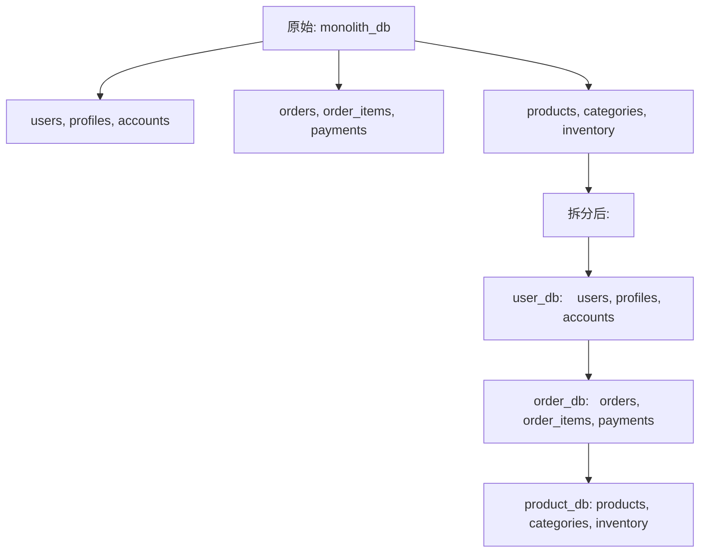

## 1. 分库分表概述

### 1.1 为什么需要分库分表

| 问题             | 阈值        | 影响         |
| ---------------- | ----------- | ------------ |
| 单表数据量过大   | > 5000万行  | 查询性能下降 |
| 单库连接数过多   | > 5000      | 连接池耗尽   |
| 单机磁盘容量不足 | > 2TB       | 无法写入     |
| 写入瓶颈         | > 10000 TPS | 主库延迟     |

### 1.2 拆分维度

```
垂直拆分：按业务/模块拆分（微服务化）
水平拆分：按数据行拆分（同结构多表/多库）

垂直分库: 用户库 | 订单库 | 商品库
垂直分表: 订单基础信息表 | 订单详情表
水平分库: order_db_0 | order_db_1 | order_db_2
水平分表: order_0 | order_1 | ... | order_15
```

## 2. 垂直拆分

### 2.1 垂直分库

将不同业务的表拆分到不同数据库：



**优点**：业务解耦、独立扩展、故障隔离
**缺点**：跨库 JOIN、分布式事务

### 2.2 垂直分表

将大表的列拆分为多个表：

```sql
-- 原始表
CREATE TABLE users (
    id          INT PRIMARY KEY,
    name        VARCHAR(50),
    email       VARCHAR(100),
    avatar_url  VARCHAR(500),   -- 大字段
    bio         TEXT,            -- 大字段
    settings    JSON,            -- 低频访问
    created_at  TIMESTAMP
);

-- 拆分后
CREATE TABLE users_base (
    id          INT PRIMARY KEY,
    name        VARCHAR(50),
    email       VARCHAR(100),
    created_at  TIMESTAMP
);

CREATE TABLE users_profile (
    user_id     INT PRIMARY KEY,
    avatar_url  VARCHAR(500),
    bio         TEXT,
    settings    JSON,
    FOREIGN KEY (user_id) REFERENCES users_base(id)
);
```

## 3. 水平拆分

### 3.1 分片键选择

分片键（Sharding Key）决定了数据如何分布：

| 分片键      | 优点                 | 缺点                 |
| ----------- | -------------------- | -------------------- |
| user_id     | 按用户隔离，查询集中 | 数据倾斜（大用户）   |
| order_id    | 均匀分布             | 按用户查询需扫描多片 |
| create_time | 按时间归档           | 热点写入             |

**选择原则**：

1. 高频查询条件包含分片键
2. 数据分布均匀
3. 尽量避免跨片查询

### 3.2 分片算法

**Hash 取模**：

```
分片号 = hash(shard_key) % N

user_id=123 → 123 % 4 = 3 → 分片3
user_id=456 → 456 % 4 = 0 → 分片0

优点: 数据分布均匀
缺点: 扩容需要数据迁移（rehash）
```

**Range 范围**：

```
user_id 1-100万    → 分片0
user_id 100万-200万 → 分片1
user_id 200万-300万 → 分片2

优点: 扩容方便（新增范围）
缺点: 数据可能倾斜（热点范围）
```

**一致性哈希**：

```
将分片节点映射到 0-2^32 的环上
数据 key 的 hash 值顺时针找到最近的节点

优点: 扩容只需迁移少量数据
缺点: 实现复杂
```

### 3.3 分片数量规划

```
目标数据量: 10亿行
单表推荐量: 2000万行
分表数: 10亿 / 2000万 = 50

分库数: 根据连接数和磁盘容量
  单库 2000连接 → 5个库 → 每库 10张表

最终: 5库 × 10表 = 50张表
命名: order_db_0.order_0 ~ order_db_4.order_9
```

## 4. ShardingSphere

### 4.1 ShardingSphere-JDBC 配置

```yaml
# application.yml
spring:
  shardingsphere:
    datasource:
      names: ds0, ds1
      ds0:
        type: com.zaxxer.hikari.HikariDataSource
        jdbc-url: jdbc:mysql://localhost:3306/order_db_0
        username: root
        password: root
      ds1:
        type: com.zaxxer.hikari.HikariDataSource
        jdbc-url: jdbc:mysql://localhost:3306/order_db_1
        username: root
        password: root
    rules:
      sharding:
        tables:
          t_order:
            actual-data-nodes: ds${0..1}.t_order_${0..15}
            table-strategy:
              standard:
                sharding-column: user_id
                sharding-algorithm-name: order-table-mod
            database-strategy:
              standard:
                sharding-column: user_id
                sharding-algorithm-name: order-db-mod
            key-generate-strategy:
              column: order_id
              key-generator-name: snowflake
        sharding-algorithms:
          order-table-mod:
            type: MOD
            props:
              sharding-count: 16
          order-db-mod:
            type: MOD
            props:
              sharding-count: 2
        key-generators:
          snowflake:
            type: SNOWFLAKE
```

### 4.2 分布式主键

| 方案           | 原理           | 优点         | 缺点         |
| -------------- | -------------- | ------------ | ------------ |
| Auto Increment | 各片不同起始值 | 简单         | 扩容困难     |
| UUID           | 随机生成       | 无需协调     | 无序、索引差 |
| Snowflake      | 时间+机器+序列 | 有序、高性能 | 时钟回拨     |
| 号段模式       | 预分配号段     | 高性能       | 依赖中心服务 |

```sql
-- Snowflake ID 结构 (64位)
-- 1位符号 | 41位时间戳 | 10位机器ID | 12位序列号
-- 每毫秒可生成 4096 个ID
-- 可用约69年
```

### 4.3 跨片查询处理

```sql
-- ShardingSphere 自动路由
SELECT * FROM t_order WHERE user_id = 100;
-- 路由到: ds0.t_order_4

-- 跨片查询
SELECT * FROM t_order WHERE status = 'pending';
-- 广播到所有分片，合并结果

-- 排序分页
SELECT * FROM t_order ORDER BY created_at DESC LIMIT 10;
-- 各分片取 TOP 10 → 合并排序 → 取全局 TOP 10
```

## 5. MyCAT

### 5.1 MyCAT 架构

```
应用 → MyCAT (代理层) → 后端 MySQL 实例

MyCAT 作为数据库代理，应用连接 MyCAT 如同连接 MySQL
MyCAT 负责路由、合并、过滤
```

### 5.2 MyCAT 配置

```xml
<!-- schema.xml -->
<schema name="ORDER_DB" checkSQLschema="false">
    <table name="t_order" primaryKey="order_id"
           dataNode="dn1,dn2,dn3,dn4"
           rule="mod-long" />
</schema>

<dataNode name="dn1" dataHost="host1" database="order_db_0" />
<dataNode name="dn2" dataHost="host1" database="order_db_1" />
<dataNode name="dn3" dataHost="host2" database="order_db_0" />
<dataNode name="dn4" dataHost="host2" database="order_db_1" />

<!-- rule.xml -->
<tableRule name="mod-long">
    <rule>
        <columns>user_id</columns>
        <algorithm>mod-long</algorithm>
    </rule>
</tableRule>
<function name="mod-long" class="io.mycat.route.function.PartitionByMod">
    <property name="count">4</property>
</function>
```

### 5.3 ShardingSphere vs MyCAT

| 维度   | ShardingSphere  | MyCAT        |
| ------ | --------------- | ------------ |
| 架构   | JDBC/Proxy      | Proxy        |
| 性能   | JDBC直连更高    | 网络开销     |
| 部署   | 无需独立部署    | 需要独立部署 |
| 语言   | Java            | Java         |
| 社区   | Apache 顶级项目 | 社区维护     |
| 推荐度 |                 |              |

## 6. 分库分表后的挑战

### 6.1 跨库 JOIN

```sql
-- 无法直接 JOIN
SELECT o.*, u.name FROM t_order o JOIN t_user u ON o.user_id = u.id;

-- 解决方案:
-- 1. 冗余字段: t_order 中冗余 user_name
-- 2. 应用层组装: 分别查询后代码合并
-- 3. 广播表: 小表复制到所有库
-- 4. ER分片: 关联表按相同分片键分布
```

### 6.2 分布式事务

```sql
-- ShardingSphere 分布式事务
-- XA 事务
SET GLOBAL transaction_type = XA;
BEGIN;
INSERT INTO t_order ...;  -- 分片1
INSERT INTO t_order ...;  -- 分片2
COMMIT;  -- 两阶段提交

-- BASE 事务（Saga）
SET GLOBAL transaction_type = BASE;
-- 最终一致性
```

### 6.3 扩容与数据迁移

```
扩容方案:
1. 停机迁移: 停服 → 数据迁移 → 启动新配置
2. 双写迁移: 新旧双写 → 历史数据迁移 → 切换
3. 一致性哈希: 仅迁移少量数据

推荐: ShardingSphere Scaling 模块
  在线扩容，自动数据迁移，无需停服
```

## 参考文献

MySQL 官方文档：https://dev.mysql.com/doc/
MySQL 8.0 参考手册：https://dev.mysql.com/doc/refman/8.0/en/
High Performance MySQL（O'Reilly）：https://www.oreilly.com/library/view/high-performance-mysql/
Percona 博客：https://www.percona.com/blog/

## 延伸阅读

MySQL 索引与优化，见 020-mysql 模块文档。
MySQL 日志体系，见 020-mysql 模块 redo/binlog 文档。
Redis 缓存与 MySQL 组合，见 022-redis 模块。
尚硅谷 Bilibili 空间（https://space.bilibili.com/302417610 ）提供 MySQL 高级课程。

## 深度专题扩展

以下专题从不同角度深入本文主题，供有进阶需求的读者研读。每个专题独立成节，内容相互补充。

### 13.1 InnoDB 日志与崩溃恢复

redo log 记录物理页修改（WAL：先写日志再写数据页），崩溃后重放恢复；环形文件组 + checkpoint 推进。
undo log 记录事务前镜像，支持回滚与 MVCC 版本链；purge 线程清理。
两阶段提交：redo prepare -> binlog -> redo commit，保证两份日志一致，主从不丢数据。
刷盘策略：innodb_flush_log_at_trx_commit=1 最安全（每次提交 fsync），2 每秒刷。

### 13.2 执行计划与优化器

EXPLAIN 关键列：type（const/ref/range/index/ALL）、key、rows、Extra（Using index/Using filesort）。
优化器基于统计信息选计划；analyze table 更新统计；hint（FORCE INDEX）谨慎使用。
排序与分组：filesort 优化为索引序；避免临时表。
慢查询治理流程：慢日志 -> 计划分析 -> 索引/改写 -> 验证。

## 模块文档速查表

| 文档 | 主题 | 与本文的关联 |
| --- | --- | --- |
| MySQL 概述与数据库设计 | 001-MySQLOverviewDatabaseDesign | 本文的前置基础 |
| MySQL 环境搭建 | 002-MySQLEnvSetup | 本文的前置基础 |
| MySQL 数据类型与约束 | 003-MySQLDataTypeConstraint | 本文的并列主题 |
| SQL 数据定义与高级对象 | 004-SQLDataDefinitionAdvanced | 本文的并列主题 |
| MyISAM存储引擎 | 005-MyISAMStorageEngine | 本文的并列主题 |
| SQL 数据操作与查询 | 006-SQLDataOperationQuery | 本文的并列主题 |
| Memory存储引擎 | 007-MemoryStorageEngine | 本文的并列主题 |
| NDB-Cluster | 008-NDBCluster | 本文的并列主题 |
| 聚簇索引与二级索引 | 009-ClusteredIndexSecondaryIndex | 本文的并列主题 |
| 联合索引与最左前缀原则 | 010-CompositeIndexLeftmostPrefixPrinciple | 本文的并列主题 |
| 索引下推 | 011-IndexConditionPushdown | 本文的并列主题 |
| 全文索引 | 012-FullTextIndex | 本文的并列主题 |
| 前缀索引 | 013-PrefixIndex | 本文的并列主题 |
| 索引提示与强制索引 | 014-IndexHintForceIndex | 本文的并列主题 |
| 索引统计信息与直方图 | 015-IndexStatsHistogram | 本文的并列主题 |
| SQL 函数与高级查询 | 016-SQLFunctionAndAdvancedQuery | 本文的并列主题 |
| 索引失效场景 | 017-IndexFailureScene | 本文的并列主题 |
| EXPLAIN输出详解 | 018-EXPLAINDetailed | 本文的并列主题 |
| 慢查询日志 | 019-SlowQueryLog | 本文的并列主题 |
| 优化器追踪 | 020-OptimizerTrace | 本文的性能延伸 |
| 子查询优化 | 021-SubqueryOptimization | 本文的性能延伸 |
| 派生表优化 | 022-DerivedTableOptimization | 本文的性能延伸 |
| GROUP-BY与ORDER-BY优化 | 023-GroupByOrderByOptimization | 本文的性能延伸 |
| JOIN算法 | 024-JOINAlgorithm | 本文的并列主题 |
| 事务隔离级别底层实现 | 025-TransactionIsolationImplementation | 本文的并列主题 |
| MVCC原理 | 026-MVCCPrinciple | 本文的原理深化 |
| 多表联查详解 | 027-MultiTableJoinDetailed | 本文的并列主题 |
| 锁分类 | 028-LockClassification | 本文的并列主题 |
| 死锁检测与处理 | 029-DeadlockDetectionHandling | 本文的并列主题 |
| 分布式事务 | 030-DistributedTransaction | 本文的并列主题 |
| 二进制日志 | 031-Binlog | 本文的并列主题 |
| 重做日志 | 032-RedoLog | 本文的并列主题 |
| 撤销日志 | 033-UndoLog | 本文的并列主题 |
| 日志系统 | 034-LogSystem | 本文的并列主题 |
| 逻辑备份 | 035-LogicalBackup | 本文的并列主题 |
| 物理备份 | 036-PhysicalBackup | 本文的并列主题 |
| 基于时间点恢复 | 037-PITR | 本文的并列主题 |
| 主从复制 | 038-Replication | 本文的并列主题 |
| 进阶查询与多表操作 | 039-AdvancedQueryMultiTableOperation | 本文的并列主题 |
| GTID | 040-GTID | 本文的并列主题 |
| 并行复制 | 041-ParallelReplication | 本文的并列主题 |
| 组复制 | 042-GroupReplication | 本文的并列主题 |
| InnoDB-Cluster | 043-InnoDBCluster | 本文的并列主题 |
| 分区表 | 044-PartitionedTable | 本文的并列主题 |
| 分库分表中间件 | 045-ShardingMiddleware | 本文的并列主题 |
| 账户与权限管理 | 046-AccountPermissionManagement | 本文的安全延伸 |
| SSL-TLS加密 | 047-SSLEncryption | 本文的安全延伸 |
| 防火墙插件 | 048-FirewallPlugin | 本文的并列主题 |
| InnoDB体系架构 | 049-InnoDBSystemArchitecture | 本文的原理深化 |
| 数据加密 | 050-DataEncryption | 本文的安全延伸 |
| MySQL 索引与执行计划 | 051-MySQLIndexExecutionPlan | 本文的并列主题 |
| MySQL9新特性与并行查询 | 052-MySQL9NewFeaturesParallelQuery | 本文的并列主题 |
| VECTOR向量类型 | 053-VectorType | 本文的并列主题 |
| JSON模式验证与聚合函数 | 054-JSONSchemaValidationAggregate | 本文的并列主题 |
| 复制与高可用 | 055-ReplicationHA | 本文的并列主题 |
| 不可见索引 | 056-InvisibleIndex | 本文的并列主题 |
| 性能调优与安全 | 057-PerformanceTuningSecurity | 本文的性能延伸 |
| 函数索引 | 058-FunctionalIndex | 本文的并列主题 |
| 存储过程与函数 | 059-StoredProcedureAndFunction | 本文的并列主题 |
| MVCC快照读与当前读 | 060-MVCCSnapshotCurrentRead | 本文的并列主题 |
| 索引原理与性能优化 | 061-IndexPrinciplePerformanceOptimization | 本文的性能延伸 |
| 触发器与事件 | 062-TriggerEvent | 本文的并列主题 |
| Redo与Undo与Binlog写入时机 | 063-RedoUndoBinlogWriteTiming | 本文的并列主题 |
| 两阶段提交 | 064-TwoPhaseCommit | 本文的并列主题 |
| 间隙锁与临键锁解决幻读 | 065-GapLockNextKeyLockSolutionPhantomRead | 本文的并列主题 |
| 主从复制延迟原因与解决 | 066-ReplicationDelayCauseSolution | 本文的并列主题 |
| 分库分表策略 | 067-ShardingStrategy | 本文自身 |
| JSON类型与JSON-TABLE | 068-JSONTypeJSONTable | 本文的并列主题 |
| 事务与锁机制 | 069-TransactionLockMechanism | 本文的原理深化 |
| MySQL 配置与运维 | 070-MySQLConfigOps | 本文的并列主题 |
| MySQL 快速查阅 | 071-MySQLQuickLookup | 本文的并列主题 |
| MySQL 控制器与应用 | 072-MySQLControlApplication | 本文的并列主题 |
| SQL 注入基础与检测 | 073-SQLInjectionBasicsDetection | 本文的前置基础 |
| SQL 注入攻击类型与实战 | 074-SQLInjectionAttackTypePractice | 本文的综合应用 |
| SQL 注入防御策略 | 075-SQLInjectionDefenseStrategy | 本文的并列主题 |
| MySQL 项目示例：电商数据库设计 | 076-MySQLProjectExampleDatabaseDesign | 本文的综合应用 |
| MySQL 理论知识点 | 077-MySQLTheoryKnowledge | 本文的并列主题 |
| MySQL DDL 数据定义 | 078-DDL | 本文的并列主题 |
| MySQL DML 数据操作 | 079-DML | 本文的并列主题 |
| MySQL DQL 查询速查 | 080-DQL | 本文的并列主题 |
| MySQL 索引管理 | 081-IndexManagement | 本文的并列主题 |
| MySQL 用户与权限管理 | 082-UserPermission | 本文的安全延伸 |
| MySQL CLI 命令 | 083-CLI | 本文的并列主题 |
| mysqladmin 管理命令 语法速查手册 | 084-Mysqladmin | 本文的并列主题 |
| 视图 语法速查手册 | 085-View | 本文的并列主题 |
| 事件调度器 语法速查手册 | 086-EventScheduler | 本文的并列主题 |
| 字符集与排序规则 语法速查手册 | 087-CharsetCollation | 本文的并列主题 |
