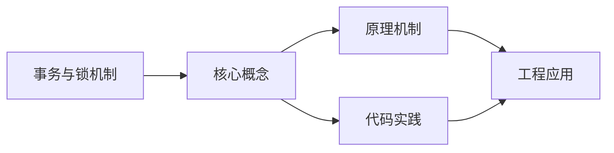

## 1. 学习目标（Bloom 分类）

本节按照布鲁姆教育目标分类学组织学习路径。本文主题为《事务与锁机制》，属于 MySQL 模块，读者可以根据自身阶段选择阅读深度。

记忆层面：能够准确复述本文的核心概念、术语与基本语法或操作步骤，并能够在提问或检索时快速定位对应知识点。能够说出 MySQL 的核心概念、语法与常用对象。

理解层面：能够用自己的语言解释核心原理与工作机制，说明概念之间的因果关系，而不是机械记忆结论。能够解释 MySQL 的执行原理与优化机制。

应用层面：能够在真实项目或练习场景中运用本文知识解决具体问题，写出正确且可维护的实现。能够编写正确、高效的 MySQL 语句与操作。

分析层面：能够拆解复杂问题，比较本文主题与相邻概念的异同，识别边界条件与例外情况。能够分析 MySQL 相关方案在性能与一致性上的权衡。

评价层面：能够根据约束条件（性能、可读性、安全、成本）评价不同方案的优劣，做出有依据的技术决策。能够根据业务场景评价 MySQL 技术选型。

创造层面：能够把本文知识与其他模块知识组合，设计出新的解决方案或可复用的工程模式。能够组合 MySQL 与其他技术设计数据架构。

通过本节学习，读者应当能够把《事务与锁机制》纳入自己的知识网络，并与 MySQL 模块的其他主题（InnoDB、索引、日志、主从、性能调优）建立关联。

## 2. 历史动机与发展脉络

《事务与锁机制》是 MySQL 领域的重要主题。要真正理解它，需要先了解它解决的问题与演进过程。

MySQL 于 1995 年由 MySQL AB 发布，2008 年被 Sun 收购，2010 年随 Sun 并入 Oracle；MariaDB 是社区分支。
MySQL 8.0（2018）重写优化器、引入窗口函数与 CTE、默认 utf8mb4、数据字典升级；MySQL 8.4 与 9.x 继续演进（Oracle 创新版 + LTS 双轨）。
InnoDB 是默认存储引擎：事务、行锁、MVCC、崩溃恢复（redo/undo）；MyISAM 仅存于历史场景。

回到本文主题：事务与锁机制 的提出与成熟，正是上述技术背景下的必然产物。早期实现往往以简单可用为目标，随着工程规模扩大，社区逐渐沉淀出标准做法与最佳实践；理解这一脉络，可以帮助读者判断“为什么文档中的推荐写法是现在这个样子”，也能在遇到历史遗留代码时准确识别其设计年代与取舍。


## 3. 形式化定义与核心概念精讲

本节把《事务与锁机制》涉及的核心概念以“定义 + 讲解”的形式展开。读者应把定义当作工具，把讲解当作理解路径；两者结合才能形成可迁移的知识。

InnoDB 架构：缓冲池（Buffer Pool）、日志缓冲、redo/undo 日志；脏页刷盘与 checkpoint 机制。
索引：B+ 树主键聚集索引、二级索引、覆盖索引；索引下推（ICP）与 MRR 优化。
事务与锁：两阶段锁、间隙锁/临键锁（可重复读防幻读）、MVCC 快照读；隔离级别。

### 3.1 原文章节逐一精讲

原文档把主题拆分为 16 个小节，下面按顺序给出每一节的导读讲解，随后保留原文细节供精读。

#### 原文精读（完整保留）

# MySQL 事务与锁机制

> **符号约定**：`< >` 必填参数 | `[ ]` 可选参数

---

#### 1. 事务特性 (ACID)

##### 1.1 原子性 (Atomicity)

- **定义**：事务是一个不可分割的工作单位，事务中的操作要么全部成功，要么全部失败
- **实现原理**：通过 Undo Log 实现，当事务失败时，回滚到事务开始前的状态
- **示例**：银行转账操作，扣款和存款要么同时成功，要么同时失败

##### 1.2 一致性 (Consistency)

- **定义**：事务执行前后，数据库从一个一致性状态转换到另一个一致性状态
- **实现原理**：由应用程序和数据库共同保证，数据库确保数据的完整性约束
- **示例**：转账前后，两个账户的总金额保持不变

##### 1.3 隔离性 (Isolation)

- **定义**：多个事务并发执行时，一个事务的执行不应影响其他事务的执行
- **实现原理**：通过锁机制和 MVCC 实现
- **示例**：两个事务同时操作同一数据时，不会互相干扰

##### 1.4 持久性 (Durability)

- **定义**：事务提交后，其结果永久保存到数据库，即使系统崩溃也不会丢失
- **实现原理**：通过 Redo Log 实现，事务提交时将修改记录到 Redo Log
- **示例**：事务提交后，即使数据库重启，修改仍然存在

#### 2. 事务隔离级别 (Isolation Levels)

##### 2.1 隔离级别的类型

| 隔离级别                    | 脏读   | 不可重复读 | 幻读            | 并发性能 |
| :-------------------------- | :----- | :--------- | :-------------- | :------- |
| 读未提交 (Read Uncommitted) | 可能   | 可能       | 可能            | 最高     |
| 读已提交 (Read Committed)   | 不可能 | 可能       | 可能            | 高       |
| 可重复读 (Repeatable Read)  | 不可能 | 不可能     | 不可能 (InnoDB) | 中       |
| 串行化 (Serializable)       | 不可能 | 不可能     | 不可能          | 最低     |

##### 2.2 各隔离级别的特点

###### 2.2.1 读未提交 (Read Uncommitted)

- **特点**：事务可以读取其他事务未提交的数据
- **问题**：可能出现脏读
- **适用场景**：对数据一致性要求不高的场景

###### 2.2.2 读已提交 (Read Committed)

- **特点**：事务只能读取其他事务已提交的数据
- **问题**：可能出现不可重复读
- **适用场景**：大多数应用场景

###### 2.2.3 可重复读 (Repeatable Read)

- **特点**：MySQL InnoDB 默认隔离级别，保证同一事务中多次读取同一数据的结果一致
- **问题**：在其他数据库中可能出现幻读，但 InnoDB 通过 Next-Key Lock 解决了这个问题
- **适用场景**：对数据一致性要求较高的场景

###### 2.2.4 串行化 (Serializable)

- **特点**：事务串行执行，完全隔离
- **问题**：并发性能最差
- **适用场景**：对数据一致性要求极高的场景

##### 2.3 设置隔离级别

```sql
 -
 SELECT @@transaction_isolation;
 -
 SET GLOBAL transaction_isolation = 'READ-COMMITTED';
 -
 SET SESSION transaction_isolation = 'REPEATABLE-READ';
```

#### 3. MVCC (多版本并发控制)

##### 3.1 MVCC 概述

MVCC (Multi-Version Concurrency Control) 是 InnoDB 实现隔离级别的核心技术，它通过保存数据的多个版本，实现了读写并发，提高了数据库的并发性能。

##### 3.2 MVCC 的工作原理

###### 3.2.1 数据版本管理

- **行记录中的隐藏列**：
- `DB_TRX_ID`：事务 ID，记录最后修改该行的事务 ID
- `DB_ROLL_PTR`：回滚指针，指向 Undo Log 中的历史版本
- `DB_ROW_ID`：行 ID，自增，用于聚簇索引

###### 3.2.2 Undo Log

- **作用**：保存数据的历史版本，用于事务回滚和 MVCC
- **类型**：
- `INSERT Undo Log`：记录插入操作，事务提交后可删除
- `UPDATE Undo Log`：记录更新操作，事务提交后需要保留，用于 MVCC
- `DELETE Undo Log`：记录删除操作，事务提交后需要保留，用于 MVCC

###### 3.2.3 ReadView

- **作用**：判断数据版本的可见性
- **组成**：
- `m_ids`：当前活跃事务的 ID 集合
- `min_trx_id`：活跃事务中最小的 ID
- `max_trx_id`：下一个将要分配的事务 ID
- `creator_trx_id`：创建 ReadView 的事务 ID

###### 3.2.4 可见性判断规则

- 如果数据的 `DB_TRX_ID` 等于 `creator_trx_id`，则可见
- 如果数据的 `DB_TRX_ID` 小于 `min_trx_id`，则可见
- 如果数据的 `DB_TRX_ID` 大于等于 `max_trx_id`，则不可见
- 如果数据的 `DB_TRX_ID` 在 `m_ids` 中，则不可见；否则可见

##### 3.3 MVCC 在不同隔离级别下的表现

- **读未提交**：不使用 MVCC，直接读取最新数据
- **读已提交**：每次查询都会创建新的 ReadView
- **可重复读**：事务开始时创建 ReadView，之后不再创建
- **串行化**：不使用 MVCC，使用锁机制

#### 4. 锁机制 (Locks)

##### 4.1 锁的分类

###### 4.1.1 按粒度分类

- **行锁**：锁定单行数据，粒度最小，并发性能最高
- **页锁**：锁定数据页，粒度中等
- **表锁**：锁定整个表，粒度最大，并发性能最低

###### 4.1.2 按类型分类

- **共享锁 (S Lock)**：读锁，允许并发读，阻塞写
- **排他锁 (X Lock)**：写锁，阻塞读写
- **意向共享锁 (IS Lock)**：表级锁，表示事务准备对表中的某些行加共享锁
- **意向排他锁 (IX Lock)**：表级锁，表示事务准备对表中的某些行加排他锁

###### 4.1.3 按算法分类

- **记录锁 (Record Lock)**：锁定单行记录
- **间隙锁 (Gap Lock)**：锁定索引间隙，防止插入
- **临键锁 (Next-Key Lock)**：记录锁 + 间隙锁，解决幻读
- **插入意向锁 (Insert Intention Lock)**：插入操作时的间隙锁

##### 4.2 锁的使用场景

###### 4.2.1 共享锁

```sql
 -
 SELECT * FROM users WHERE id = 1 LOCK IN SHARE MODE;
```

###### 4.2.2 排他锁

```sql
 -
 SELECT * FROM users WHERE id = 1 FOR UPDATE;
 -
 inSERT INTO users (name) VALUES ('John');
 UPDATE users SET name = 'John' WHERE id = 1;
 delete FROM users WHERE id = 1;
```

###### 4.2.3 间隙锁和临键锁

- **间隙锁**：在可重复读隔离级别下，使用范围查询时会自动添加间隙锁
- **临键锁**：InnoDB 默认使用的锁算法，解决幻读问题

##### 4.3 锁的兼容性

|                 | 共享锁 (S) | 排他锁 (X) | 意向共享锁 (IS) | 意向排他锁 (IX) |
| :-------------- | :--------- | :--------- | :-------------- | :-------------- |
| 共享锁 (S)      | 兼容       | 冲突       | 兼容            | 冲突            |
| 排他锁 (X)      | 冲突       | 冲突       | 冲突            | 冲突            |
| 意向共享锁 (IS) | 兼容       | 冲突       | 兼容            | 兼容            |
| 意向排他锁 (IX) | 冲突       | 冲突       | 兼容            | 兼容            |

#### 5. 死锁 (Deadlocks)

##### 5.1 死锁的定义

死锁是指两个或多个事务相互等待对方释放锁的状态，导致所有事务都无法继续执行。

##### 5.2 死锁的产生条件

- **互斥条件**：资源不能被共享，一次只能被一个事务使用
- **请求与保持条件**：事务已经保持了至少一个资源，又提出了新的资源请求
- **不剥夺条件**：事务获得的资源在未使用完之前，不能被强行剥夺
- **循环等待条件**：若干事务之间形成头尾相接的循环等待资源关系

##### 5.3 死锁的检测与处理

###### 5.3.1 死锁检测

```sql
 -
 SHOW ENGINE INNODB STATUS;
 -
 SET GLOBAL innodb_deadlock_detect = ON;
```

###### 5.3.2 死锁处理

- **自动检测**：InnoDB 会自动检测死锁，并回滚其中一个事务
- **手动处理**：当死锁检测关闭时，需要手动处理

##### 5.4 死锁的预防

- **按固定顺序访问表**：避免循环等待
- **减小事务粒度**：减少事务持有锁的时间
- **使用索引**：避免全表扫描，减少锁的范围
- **避免长时间事务**：尽快提交或回滚事务
- **使用较低的隔离级别**：减少锁的竞争
- **设置合理的锁超时**：`SET SESSION innodb_lock_wait_timeout = 30;`

#### 6. 事务的实现原理

##### 6.1 日志系统

###### 6.1.1 Redo Log

- **作用**：保证事务的持久性
- **工作原理**：事务提交时，将修改记录到 Redo Log，即使系统崩溃，重启后也可以通过 Redo Log 恢复数据
- **特点**：顺序写入，性能高

###### 6.1.2 Undo Log

- **作用**：保证事务的原子性和 MVCC
- **工作原理**：记录数据的历史版本，用于事务回滚和 MVCC 查询
- **特点**：逆序写入，支持多版本

##### 6.2 两阶段提交

- **准备阶段**：事务将修改写入 Undo Log 和 Redo Log，但不提交
- **提交阶段**：事务提交，释放锁

##### 6.3 事务的状态

- **活跃 (Active)**：事务正在执行
- **部分提交 (Partially Committed)**：事务执行完成，但修改还未写入磁盘
- **提交 (Committed)**：事务已提交
- **失败 (Failed)**：事务执行失败
- **中止 (Aborted)**：事务已回滚

#### 7. 事务的最佳实践

##### 7.1 事务设计最佳实践

- **保持事务简短**：减少事务持有锁的时间
- **避免在事务中进行网络操作**：网络操作可能导致事务长时间持有锁
- **避免在事务中进行大量计算**：计算操作可能导致事务长时间持有锁
- **合理设置隔离级别**：根据业务需求选择合适的隔离级别
- **使用批量操作**：减少事务数量

##### 7.2 锁的使用最佳实践

- **使用索引**：避免全表扫描，减少锁的范围
- **选择合适的锁粒度**：根据业务需求选择合适的锁粒度
- **避免死锁**：按固定顺序访问表，减小事务粒度
- **使用乐观锁**：对于并发冲突较少的场景，使用乐观锁
- **监控锁等待**：定期检查锁等待情况

##### 7.3 性能优化

- **使用连接池**：减少连接创建和销毁的开销
- **批量提交**：减少事务提交的次数
- **合理使用索引**：提高查询效率，减少锁的竞争
- **监控事务性能**：定期分析慢事务
- **优化 SQL**：减少事务中的复杂查询

#### 8. 实际案例分析

##### 8.1 案例 1：死锁排查

**问题**：应用程序出现死锁错误
**分析**：

1. 查看死锁日志：`SHOW ENGINE INNODB STATUS;`
2. 发现两个事务相互等待对方的锁
3. 分析 SQL 语句，发现访问表的顺序不同
   **解决方案**：
4. 统一访问表的顺序
5. 减小事务粒度
6. 使用索引优化查询

##### 8.2 案例 2：事务性能优化

**问题**：事务执行时间过长，导致并发性能下降
**分析**：

1. 查看慢查询日志
2. 发现事务中包含大量计算和网络操作
3. 事务持有锁的时间过长
   **解决方案**：
4. 将计算和网络操作移到事务外
5. 拆分大事务为小事务
6. 优化 SQL 查询

##### 8.3 案例 3：隔离级别选择

**问题**：应用程序出现幻读
**分析**：

1. 检查隔离级别：`SELECT @@transaction_isolation;`
2. 发现使用的是读已提交隔离级别
3. 业务需求需要可重复读
   **解决方案**：
4. 将隔离级别设置为可重复读：`SET SESSION transaction_isolation = 'REPEATABLE-READ';`
5. 优化查询，使用索引

#### 9. 常见问题与解决方案

##### 9.1 事务超时

**问题**：事务执行时间过长，导致超时
**解决方案**：

- 减小事务粒度
- 优化 SQL 查询
- 增加超时时间：`SET SESSION innodb_lock_wait_timeout = 60;`

##### 9.2 死锁

**问题**：应用程序出现死锁错误
**解决方案**：

- 按固定顺序访问表
- 减小事务粒度
- 使用索引优化查询
- 监控死锁日志

##### 9.3 并发性能低

**问题**：并发访问时性能下降
**解决方案**：

- 使用合理的隔离级别
- 优化锁的使用
- 提高索引效率
- 使用连接池

##### 9.4 数据一致性问题

**问题**：事务执行后数据不一致
**解决方案**：

- 确保事务的 ACID 特性
- 使用合适的隔离级别
- 检查应用程序逻辑
- 定期备份数据

#### 10. 总结

事务和锁机制是 MySQL 数据库并发控制的核心，通过理解 ACID 特性、隔离级别、MVCC 原理和锁机制，可以有效地设计和优化数据库应用，提高并发性能，保证数据一致性。

##### 核心要点

- **事务特性**：ACID（原子性、一致性、隔离性、持久性）
- **隔离级别**：读未提交、读已提交、可重复读、串行化
- **MVCC**：多版本并发控制，通过 Undo Log 和 ReadView 实现
- **锁机制**：行锁、表锁、共享锁、排他锁、间隙锁等
- **死锁**：预防和处理死锁的方法
- **最佳实践**：事务设计、锁的使用、性能优化

##### 学习建议

- **实践**：通过实际操作熟悉事务和锁的使用
- **分析**：使用 `SHOW ENGINE INNODB STATUS;` 分析死锁
- **监控**：监控事务性能和锁等待情况
- **优化**：根据实际情况调整事务和锁的使用
- **持续学习**：关注 MySQL 的新特性和优化技巧

---

#### 事务控制

**单行写法：开启事务**
`START TRANSACTION` / `BEGIN`
```sql
-- 开启事务
START TRANSACTION;
```

**换行写法：提交事务**
`COMMIT`
```sql
-- 提交事务并持久化变更
START TRANSACTION;
INSERT INTO users (username, email) VALUES ('张三', 'zhangsan@example.com');
UPDATE accounts SET balance = balance - 100 WHERE user_id = 1;
UPDATE accounts SET balance = balance + 100 WHERE user_id = 2;
COMMIT;
```

**单行写法：回滚事务**
`ROLLBACK`
```sql
-- 回滚事务撤销变更
ROLLBACK;
```

**换行写法：使用保存点**
`SAVEPOINT <保存点名>` / `ROLLBACK TO <保存点名>`
```sql
-- 使用保存点部分回滚
START TRANSACTION;
INSERT INTO users (username) VALUES ('张三');
SAVEPOINT sp1;
INSERT INTO users (username) VALUES ('李四');
ROLLBACK TO sp1;
COMMIT;
```

**单行写法：释放保存点**
`RELEASE SAVEPOINT <保存点名>`
```sql
-- 释放指定保存点
RELEASE SAVEPOINT sp1;
```

---

#### 隔离级别

**单行写法：查看隔离级别**
`SELECT @@transaction_isolation`
```sql
-- 查看当前事务隔离级别
SELECT @@transaction_isolation;
```

**单行写法：查看旧变量名隔离级别**
`SELECT @@tx_isolation`
```sql
-- 查看旧版本隔离级别变量
SELECT @@tx_isolation;
```

**单行写法：设置会话隔离级别**
`SET SESSION TRANSACTION ISOLATION LEVEL <级别>`
```sql
-- 设置会话隔离级别为读已提交
SET SESSION TRANSACTION ISOLATION LEVEL READ COMMITTED;
```

**单行写法：设置全局隔离级别**
`SET GLOBAL TRANSACTION ISOLATION LEVEL <级别>`
```sql
-- 设置全局隔离级别为可序列化
SET GLOBAL TRANSACTION ISOLATION LEVEL SERIALIZABLE;
```

**单行写法：通过变量设置全局隔离级别**
`SET GLOBAL transaction_isolation = '<级别>'`
```sql
-- 通过变量设置全局隔离级别
SET GLOBAL transaction_isolation = 'READ-COMMITTED';
```

**单行写法：通过变量设置会话隔离级别**
`SET SESSION transaction_isolation = '<级别>'`
```sql
-- 通过变量设置会话隔离级别
SET SESSION transaction_isolation = 'REPEATABLE-READ';
```

---

#### 锁机制

**单行写法：加共享锁**
`SELECT ... LOCK IN SHARE MODE`
```sql
-- 查询时加共享锁
SELECT * FROM users WHERE id = 1 LOCK IN SHARE MODE;
```

**单行写法：加排他锁**
`SELECT ... FOR UPDATE`
```sql
-- 查询时加排他锁
SELECT * FROM users WHERE id = 1 FOR UPDATE;
```

**单行写法：INSERT 自动加排他锁**
`INSERT INTO <表名> (<列名>) VALUES (<值>)`
```sql
-- 插入操作自动加排他锁
INSERT INTO users (name) VALUES ('John');
```

**单行写法：UPDATE 自动加排他锁**
`UPDATE <表名> SET <列名> = <值> WHERE <条件>`
```sql
-- 更新操作自动加排他锁
UPDATE users SET name = 'John' WHERE id = 1;
```

**单行写法：DELETE 自动加排他锁**
`DELETE FROM <表名> WHERE <条件>`
```sql
-- 删除操作自动加排他锁
DELETE FROM users WHERE id = 1;
```

---

#### 锁等待与超时

**单行写法：查看锁等待超时**
`SELECT @@innodb_lock_wait_timeout`
```sql
-- 查看锁等待超时时间
SELECT @@innodb_lock_wait_timeout;
```

**单行写法：设置锁等待超时**
`SET SESSION innodb_lock_wait_timeout = <秒数>`
```sql
-- 设置锁等待超时为 30 秒
SET SESSION innodb_lock_wait_timeout = 30;
```

---

#### 死锁检测

**单行写法：查看 InnoDB 状态**
`SHOW ENGINE INNODB STATUS`
```sql
-- 查看死锁日志
SHOW ENGINE INNODB STATUS;
```

**单行写法：开启死锁检测**
`SET GLOBAL innodb_deadlock_detect = ON`
```sql
-- 开启死锁检测
SET GLOBAL innodb_deadlock_detect = ON;
```

---

#### 事务实战

**换行写法：转账事务**
`START TRANSACTION; <DML>; COMMIT;`
```sql
-- 转账事务保证原子性
START TRANSACTION;
UPDATE accounts SET balance = balance - 1000 WHERE user_id = 1;
UPDATE accounts SET balance = balance + 1000 WHERE user_id = 2;
COMMIT;
```

**换行写法：条件提交**
`IF <条件> THEN COMMIT; ELSE ROLLBACK; END IF`
```sql
-- 检查余额后决定提交或回滚
START TRANSACTION;
UPDATE accounts SET balance = balance - 1000 WHERE user_id = 1;
UPDATE accounts SET balance = balance + 1000 WHERE user_id = 2;

IF (SELECT balance FROM accounts WHERE user_id = 1) < 0 THEN
  ROLLBACK;
ELSE
  COMMIT;
END IF;
```

**换行写法：订单创建事务**
`START TRANSACTION; <DML>; SET @变量; <DML>; COMMIT;`
```sql
-- 订单创建事务包含订单和订单项
START TRANSACTION;
INSERT INTO orders (user_id, total_amount) VALUES (1, 500);
SET @order_id = LAST_INSERT_ID();
INSERT INTO order_items (order_id, product_id, quantity, price) VALUES
  (@order_id, 101, 2, 200),
  (@order_id, 102, 1, 100);
UPDATE products SET stock = stock - 3 WHERE id IN (101, 102);
COMMIT;
```

**换行写法：悲观锁查询**
`SELECT ... FOR UPDATE`
```sql
-- 先锁定再更新
SELECT * FROM users WHERE id = 1 FOR UPDATE;
UPDATE users SET status = 0 WHERE last_login_time < '2023-01-01';
```

**换行写法：批量删除事务**
`START TRANSACTION; <DML>; COMMIT;`
```sql
-- 批量更新避免长事务
START TRANSACTION;
UPDATE users SET status = 0 WHERE last_login_time < '2023-01-01';
UPDATE stats SET inactive_users = inactive_users + 1;
COMMIT;
```

**单行写法：分批删除**
`DELETE FROM <表名> WHERE <条件> LIMIT <N>`
```sql
-- 分批删除避免锁表
DELETE FROM logs WHERE created_at < '2023-01-01' LIMIT 1000;
```


### 3.2 概念关系图

下面用 Mermaid 图表达本文核心概念之间的关系，帮助读者建立整体图景：



图中展示的是本文知识的结构化关系：核心概念是入口，原理机制解释“为什么”，代码实践演示“怎么做”，工程应用回答“何时用”。读者学习时可以把每个小节的内容挂接到对应节点上。

## 4. 理论推导与原理解析

本节深入《事务与锁机制》背后的原理。理论部分不求面面俱到，而是聚焦“能解释现象、能指导实践”的关键推导。

InnoDB 架构：缓冲池（Buffer Pool）、日志缓冲、redo/undo 日志；脏页刷盘与 checkpoint 机制。
索引：B+ 树主键聚集索引、二级索引、覆盖索引；索引下推（ICP）与 MRR 优化。
事务与锁：两阶段锁、间隙锁/临键锁（可重复读防幻读）、MVCC 快照读；隔离级别。
复制：binlog 逻辑复制（statement/row/mixed），主从异步、半同步与组复制。

需要强调的是，理论推导与工程实践之间存在翻译层：理论给出的是理想化模型与边界条件，工程代码则必须处理真实环境中的例外。读者在学习时应先掌握理论的“标准情形”，再通过陷阱章节了解“非标准情形”。

## 5. 代码示例与逐行讲解

本节把原文中的代码示例系统整理，并为每个示例补充用途说明与讲解。读者不应只浏览代码，而应逐段对照讲解理解设计意图。

### 5.1 示例：2.3 设置隔离级别

该示例来自原文《2.3 设置隔离级别》小节，用于演示事务与锁机制相关操作。阅读时请先看代码结构，再看其后的讲解。

```sql
 -
 SELECT @@transaction_isolation;
 -
 SET GLOBAL transaction_isolation = 'READ-COMMITTED';
 -
 SET SESSION transaction_isolation = 'REPEATABLE-READ';
```

讲解：这段代码演示了本节核心知识点。代码中的关键操作可以归纳为三步：准备（定义或初始化）、执行（核心逻辑）、收尾（释放资源或返回结果）。实际项目中，这三步往往被封装为函数或类，以提升复用性与可测试性。

关键点分析：

该示例共 6 行有效代码，包含 1 类关键结构（SELECT）。其中：

- 入口与初始化部分负责建立上下文，对应实际项目中的启动或装配逻辑；
- 核心逻辑部分体现本文主题的主要操作，是阅读时最需要对照讲解理解的部分；
- 输出或返回部分把结果交给调用方，注意其类型与边界条件。

进阶思考路径：先尝试修改参数观察行为变化，再把示例中的模式迁移到自己的项目中；每次修改都记录预期与实测差异，这是把示例转化为能力的最快方式。

### 5.2 示例：4.2.1 共享锁

该示例来自原文《4.2.1 共享锁》小节，用于演示事务与锁机制相关操作。阅读时请先看代码结构，再看其后的讲解。

```sql
 -
 SELECT * FROM users WHERE id = 1 LOCK IN SHARE MODE;
```

讲解：这段代码演示了本节核心知识点。代码中的关键操作可以归纳为三步：准备（定义或初始化）、执行（核心逻辑）、收尾（释放资源或返回结果）。实际项目中，这三步往往被封装为函数或类，以提升复用性与可测试性。

关键点分析：

该示例共 2 行有效代码，包含 2 类关键结构（SELECT、FROM）。其中：

- 入口与初始化部分负责建立上下文，对应实际项目中的启动或装配逻辑；
- 核心逻辑部分体现本文主题的主要操作，是阅读时最需要对照讲解理解的部分；
- 输出或返回部分把结果交给调用方，注意其类型与边界条件。

进阶思考路径：先尝试修改参数观察行为变化，再把示例中的模式迁移到自己的项目中；每次修改都记录预期与实测差异，这是把示例转化为能力的最快方式。

### 5.3 示例：4.2.2 排他锁

该示例来自原文《4.2.2 排他锁》小节，用于演示事务与锁机制相关操作。阅读时请先看代码结构，再看其后的讲解。

```sql
 -
 SELECT * FROM users WHERE id = 1 FOR UPDATE;
 -
 inSERT INTO users (name) VALUES ('John');
 UPDATE users SET name = 'John' WHERE id = 1;
 delete FROM users WHERE id = 1;
```

讲解：这段代码演示了本节核心知识点。代码中的关键操作可以归纳为三步：准备（定义或初始化）、执行（核心逻辑）、收尾（释放资源或返回结果）。实际项目中，这三步往往被封装为函数或类，以提升复用性与可测试性。

关键点分析：

该示例共 6 行有效代码，包含 2 类关键结构（SELECT、FROM）。其中：

- 入口与初始化部分负责建立上下文，对应实际项目中的启动或装配逻辑；
- 核心逻辑部分体现本文主题的主要操作，是阅读时最需要对照讲解理解的部分；
- 输出或返回部分把结果交给调用方，注意其类型与边界条件。

进阶思考路径：先尝试修改参数观察行为变化，再把示例中的模式迁移到自己的项目中；每次修改都记录预期与实测差异，这是把示例转化为能力的最快方式。

### 5.4 示例：5.3.1 死锁检测

该示例来自原文《5.3.1 死锁检测》小节，用于演示事务与锁机制相关操作。阅读时请先看代码结构，再看其后的讲解。

```sql
 -
 SHOW ENGINE INNODB STATUS;
 -
 SET GLOBAL innodb_deadlock_detect = ON;
```

讲解：这段代码演示了本节核心知识点。代码中的关键操作可以归纳为三步：准备（定义或初始化）、执行（核心逻辑）、收尾（释放资源或返回结果）。实际项目中，这三步往往被封装为函数或类，以提升复用性与可测试性。

关键点分析：

该示例共 4 行有效代码，结构以数据或配置为主。阅读时应关注：数据字段的含义、配置项的作用，以及它们与运行行为的对应关系。

进阶思考路径：先尝试修改参数观察行为变化，再把示例中的模式迁移到自己的项目中；每次修改都记录预期与实测差异，这是把示例转化为能力的最快方式。

### 5.5 示例：事务控制

该示例来自原文《事务控制》小节，用于演示事务与锁机制相关操作。阅读时请先看代码结构，再看其后的讲解。

```sql
-- 开启事务
START TRANSACTION;
```

讲解：这段代码演示了本节核心知识点。代码中的关键操作可以归纳为三步：准备（定义或初始化）、执行（核心逻辑）、收尾（释放资源或返回结果）。实际项目中，这三步往往被封装为函数或类，以提升复用性与可测试性。

关键点分析：

该示例共 2 行有效代码，结构以数据或配置为主。阅读时应关注：数据字段的含义、配置项的作用，以及它们与运行行为的对应关系。

进阶思考路径：先尝试修改参数观察行为变化，再把示例中的模式迁移到自己的项目中；每次修改都记录预期与实测差异，这是把示例转化为能力的最快方式。

### 5.6 示例：事务控制

该示例来自原文《事务控制》小节，用于演示事务与锁机制相关操作。阅读时请先看代码结构，再看其后的讲解。

```sql
-- 提交事务并持久化变更
START TRANSACTION;
INSERT INTO users (username, email) VALUES ('张三', 'zhangsan@example.com');
UPDATE accounts SET balance = balance - 100 WHERE user_id = 1;
UPDATE accounts SET balance = balance + 100 WHERE user_id = 2;
COMMIT;
```

讲解：这段代码演示了本节核心知识点。代码中的关键操作可以归纳为三步：准备（定义或初始化）、执行（核心逻辑）、收尾（释放资源或返回结果）。实际项目中，这三步往往被封装为函数或类，以提升复用性与可测试性。

关键点分析：

该示例共 6 行有效代码，包含 1 类关键结构（INSERT）。其中：

- 入口与初始化部分负责建立上下文，对应实际项目中的启动或装配逻辑；
- 核心逻辑部分体现本文主题的主要操作，是阅读时最需要对照讲解理解的部分；
- 输出或返回部分把结果交给调用方，注意其类型与边界条件。

进阶思考路径：先尝试修改参数观察行为变化，再把示例中的模式迁移到自己的项目中；每次修改都记录预期与实测差异，这是把示例转化为能力的最快方式。

### 5.7 示例：事务控制

该示例来自原文《事务控制》小节，用于演示事务与锁机制相关操作。阅读时请先看代码结构，再看其后的讲解。

```sql
-- 回滚事务撤销变更
ROLLBACK;
```

讲解：这段代码演示了本节核心知识点。代码中的关键操作可以归纳为三步：准备（定义或初始化）、执行（核心逻辑）、收尾（释放资源或返回结果）。实际项目中，这三步往往被封装为函数或类，以提升复用性与可测试性。

关键点分析：

该示例共 2 行有效代码，结构以数据或配置为主。阅读时应关注：数据字段的含义、配置项的作用，以及它们与运行行为的对应关系。

进阶思考路径：先尝试修改参数观察行为变化，再把示例中的模式迁移到自己的项目中；每次修改都记录预期与实测差异，这是把示例转化为能力的最快方式。

### 5.8 示例：事务控制

该示例来自原文《事务控制》小节，用于演示事务与锁机制相关操作。阅读时请先看代码结构，再看其后的讲解。

```sql
-- 使用保存点部分回滚
START TRANSACTION;
INSERT INTO users (username) VALUES ('张三');
SAVEPOINT sp1;
INSERT INTO users (username) VALUES ('李四');
ROLLBACK TO sp1;
COMMIT;
```

讲解：这段代码演示了本节核心知识点。代码中的关键操作可以归纳为三步：准备（定义或初始化）、执行（核心逻辑）、收尾（释放资源或返回结果）。实际项目中，这三步往往被封装为函数或类，以提升复用性与可测试性。

关键点分析：

该示例共 7 行有效代码，包含 1 类关键结构（INSERT）。其中：

- 入口与初始化部分负责建立上下文，对应实际项目中的启动或装配逻辑；
- 核心逻辑部分体现本文主题的主要操作，是阅读时最需要对照讲解理解的部分；
- 输出或返回部分把结果交给调用方，注意其类型与边界条件。

进阶思考路径：先尝试修改参数观察行为变化，再把示例中的模式迁移到自己的项目中；每次修改都记录预期与实测差异，这是把示例转化为能力的最快方式。

### 5.9 示例：事务控制

该示例来自原文《事务控制》小节，用于演示事务与锁机制相关操作。阅读时请先看代码结构，再看其后的讲解。

```sql
-- 释放指定保存点
RELEASE SAVEPOINT sp1;
```

讲解：这段代码演示了本节核心知识点。代码中的关键操作可以归纳为三步：准备（定义或初始化）、执行（核心逻辑）、收尾（释放资源或返回结果）。实际项目中，这三步往往被封装为函数或类，以提升复用性与可测试性。

关键点分析：

该示例共 2 行有效代码，结构以数据或配置为主。阅读时应关注：数据字段的含义、配置项的作用，以及它们与运行行为的对应关系。

进阶思考路径：先尝试修改参数观察行为变化，再把示例中的模式迁移到自己的项目中；每次修改都记录预期与实测差异，这是把示例转化为能力的最快方式。

### 5.10 示例：隔离级别

该示例来自原文《隔离级别》小节，用于演示事务与锁机制相关操作。阅读时请先看代码结构，再看其后的讲解。

```sql
-- 查看当前事务隔离级别
SELECT @@transaction_isolation;
```

讲解：这段代码演示了本节核心知识点。代码中的关键操作可以归纳为三步：准备（定义或初始化）、执行（核心逻辑）、收尾（释放资源或返回结果）。实际项目中，这三步往往被封装为函数或类，以提升复用性与可测试性。

关键点分析：

该示例共 2 行有效代码，包含 1 类关键结构（SELECT）。其中：

- 入口与初始化部分负责建立上下文，对应实际项目中的启动或装配逻辑；
- 核心逻辑部分体现本文主题的主要操作，是阅读时最需要对照讲解理解的部分；
- 输出或返回部分把结果交给调用方，注意其类型与边界条件。

进阶思考路径：先尝试修改参数观察行为变化，再把示例中的模式迁移到自己的项目中；每次修改都记录预期与实测差异，这是把示例转化为能力的最快方式。

### 5.11 示例：隔离级别

该示例来自原文《隔离级别》小节，用于演示事务与锁机制相关操作。阅读时请先看代码结构，再看其后的讲解。

```sql
-- 查看旧版本隔离级别变量
SELECT @@tx_isolation;
```

讲解：这段代码演示了本节核心知识点。代码中的关键操作可以归纳为三步：准备（定义或初始化）、执行（核心逻辑）、收尾（释放资源或返回结果）。实际项目中，这三步往往被封装为函数或类，以提升复用性与可测试性。

关键点分析：

该示例共 2 行有效代码，包含 1 类关键结构（SELECT）。其中：

- 入口与初始化部分负责建立上下文，对应实际项目中的启动或装配逻辑；
- 核心逻辑部分体现本文主题的主要操作，是阅读时最需要对照讲解理解的部分；
- 输出或返回部分把结果交给调用方，注意其类型与边界条件。

进阶思考路径：先尝试修改参数观察行为变化，再把示例中的模式迁移到自己的项目中；每次修改都记录预期与实测差异，这是把示例转化为能力的最快方式。

### 5.12 示例：隔离级别

该示例来自原文《隔离级别》小节，用于演示事务与锁机制相关操作。阅读时请先看代码结构，再看其后的讲解。

```sql
-- 设置会话隔离级别为读已提交
SET SESSION TRANSACTION ISOLATION LEVEL READ COMMITTED;
```

讲解：这段代码演示了本节核心知识点。代码中的关键操作可以归纳为三步：准备（定义或初始化）、执行（核心逻辑）、收尾（释放资源或返回结果）。实际项目中，这三步往往被封装为函数或类，以提升复用性与可测试性。

关键点分析：

该示例共 2 行有效代码，结构以数据或配置为主。阅读时应关注：数据字段的含义、配置项的作用，以及它们与运行行为的对应关系。

进阶思考路径：先尝试修改参数观察行为变化，再把示例中的模式迁移到自己的项目中；每次修改都记录预期与实测差异，这是把示例转化为能力的最快方式。

### 5.13 示例：隔离级别

该示例来自原文《隔离级别》小节，用于演示事务与锁机制相关操作。阅读时请先看代码结构，再看其后的讲解。

```sql
-- 设置全局隔离级别为可序列化
SET GLOBAL TRANSACTION ISOLATION LEVEL SERIALIZABLE;
```

讲解：这段代码演示了本节核心知识点。代码中的关键操作可以归纳为三步：准备（定义或初始化）、执行（核心逻辑）、收尾（释放资源或返回结果）。实际项目中，这三步往往被封装为函数或类，以提升复用性与可测试性。

关键点分析：

该示例共 2 行有效代码，结构以数据或配置为主。阅读时应关注：数据字段的含义、配置项的作用，以及它们与运行行为的对应关系。

进阶思考路径：先尝试修改参数观察行为变化，再把示例中的模式迁移到自己的项目中；每次修改都记录预期与实测差异，这是把示例转化为能力的最快方式。

### 5.14 示例：隔离级别

该示例来自原文《隔离级别》小节，用于演示事务与锁机制相关操作。阅读时请先看代码结构，再看其后的讲解。

```sql
-- 通过变量设置全局隔离级别
SET GLOBAL transaction_isolation = 'READ-COMMITTED';
```

讲解：这段代码演示了本节核心知识点。代码中的关键操作可以归纳为三步：准备（定义或初始化）、执行（核心逻辑）、收尾（释放资源或返回结果）。实际项目中，这三步往往被封装为函数或类，以提升复用性与可测试性。

关键点分析：

该示例共 2 行有效代码，结构以数据或配置为主。阅读时应关注：数据字段的含义、配置项的作用，以及它们与运行行为的对应关系。

进阶思考路径：先尝试修改参数观察行为变化，再把示例中的模式迁移到自己的项目中；每次修改都记录预期与实测差异，这是把示例转化为能力的最快方式。

### 5.15 示例：隔离级别

该示例来自原文《隔离级别》小节，用于演示事务与锁机制相关操作。阅读时请先看代码结构，再看其后的讲解。

```sql
-- 通过变量设置会话隔离级别
SET SESSION transaction_isolation = 'REPEATABLE-READ';
```

讲解：这段代码演示了本节核心知识点。代码中的关键操作可以归纳为三步：准备（定义或初始化）、执行（核心逻辑）、收尾（释放资源或返回结果）。实际项目中，这三步往往被封装为函数或类，以提升复用性与可测试性。

关键点分析：

该示例共 2 行有效代码，结构以数据或配置为主。阅读时应关注：数据字段的含义、配置项的作用，以及它们与运行行为的对应关系。

进阶思考路径：先尝试修改参数观察行为变化，再把示例中的模式迁移到自己的项目中；每次修改都记录预期与实测差异，这是把示例转化为能力的最快方式。

### 5.16 示例：锁机制

该示例来自原文《锁机制》小节，用于演示事务与锁机制相关操作。阅读时请先看代码结构，再看其后的讲解。

```sql
-- 查询时加共享锁
SELECT * FROM users WHERE id = 1 LOCK IN SHARE MODE;
```

讲解：这段代码演示了本节核心知识点。代码中的关键操作可以归纳为三步：准备（定义或初始化）、执行（核心逻辑）、收尾（释放资源或返回结果）。实际项目中，这三步往往被封装为函数或类，以提升复用性与可测试性。

关键点分析：

该示例共 2 行有效代码，包含 2 类关键结构（SELECT、FROM）。其中：

- 入口与初始化部分负责建立上下文，对应实际项目中的启动或装配逻辑；
- 核心逻辑部分体现本文主题的主要操作，是阅读时最需要对照讲解理解的部分；
- 输出或返回部分把结果交给调用方，注意其类型与边界条件。

进阶思考路径：先尝试修改参数观察行为变化，再把示例中的模式迁移到自己的项目中；每次修改都记录预期与实测差异，这是把示例转化为能力的最快方式。

### 5.17 示例：锁机制

该示例来自原文《锁机制》小节，用于演示事务与锁机制相关操作。阅读时请先看代码结构，再看其后的讲解。

```sql
-- 查询时加排他锁
SELECT * FROM users WHERE id = 1 FOR UPDATE;
```

讲解：这段代码演示了本节核心知识点。代码中的关键操作可以归纳为三步：准备（定义或初始化）、执行（核心逻辑）、收尾（释放资源或返回结果）。实际项目中，这三步往往被封装为函数或类，以提升复用性与可测试性。

关键点分析：

该示例共 2 行有效代码，包含 2 类关键结构（SELECT、FROM）。其中：

- 入口与初始化部分负责建立上下文，对应实际项目中的启动或装配逻辑；
- 核心逻辑部分体现本文主题的主要操作，是阅读时最需要对照讲解理解的部分；
- 输出或返回部分把结果交给调用方，注意其类型与边界条件。

进阶思考路径：先尝试修改参数观察行为变化，再把示例中的模式迁移到自己的项目中；每次修改都记录预期与实测差异，这是把示例转化为能力的最快方式。

### 5.18 示例：锁机制

该示例来自原文《锁机制》小节，用于演示事务与锁机制相关操作。阅读时请先看代码结构，再看其后的讲解。

```sql
-- 插入操作自动加排他锁
INSERT INTO users (name) VALUES ('John');
```

讲解：这段代码演示了本节核心知识点。代码中的关键操作可以归纳为三步：准备（定义或初始化）、执行（核心逻辑）、收尾（释放资源或返回结果）。实际项目中，这三步往往被封装为函数或类，以提升复用性与可测试性。

关键点分析：

该示例共 2 行有效代码，包含 1 类关键结构（INSERT）。其中：

- 入口与初始化部分负责建立上下文，对应实际项目中的启动或装配逻辑；
- 核心逻辑部分体现本文主题的主要操作，是阅读时最需要对照讲解理解的部分；
- 输出或返回部分把结果交给调用方，注意其类型与边界条件。

进阶思考路径：先尝试修改参数观察行为变化，再把示例中的模式迁移到自己的项目中；每次修改都记录预期与实测差异，这是把示例转化为能力的最快方式。

### 5.19 示例：锁机制

该示例来自原文《锁机制》小节，用于演示事务与锁机制相关操作。阅读时请先看代码结构，再看其后的讲解。

```sql
-- 更新操作自动加排他锁
UPDATE users SET name = 'John' WHERE id = 1;
```

讲解：这段代码演示了本节核心知识点。代码中的关键操作可以归纳为三步：准备（定义或初始化）、执行（核心逻辑）、收尾（释放资源或返回结果）。实际项目中，这三步往往被封装为函数或类，以提升复用性与可测试性。

关键点分析：

该示例共 2 行有效代码，结构以数据或配置为主。阅读时应关注：数据字段的含义、配置项的作用，以及它们与运行行为的对应关系。

进阶思考路径：先尝试修改参数观察行为变化，再把示例中的模式迁移到自己的项目中；每次修改都记录预期与实测差异，这是把示例转化为能力的最快方式。

### 5.20 示例：锁机制

该示例来自原文《锁机制》小节，用于演示事务与锁机制相关操作。阅读时请先看代码结构，再看其后的讲解。

```sql
-- 删除操作自动加排他锁
DELETE FROM users WHERE id = 1;
```

讲解：这段代码演示了本节核心知识点。代码中的关键操作可以归纳为三步：准备（定义或初始化）、执行（核心逻辑）、收尾（释放资源或返回结果）。实际项目中，这三步往往被封装为函数或类，以提升复用性与可测试性。

关键点分析：

该示例共 2 行有效代码，包含 1 类关键结构（FROM）。其中：

- 入口与初始化部分负责建立上下文，对应实际项目中的启动或装配逻辑；
- 核心逻辑部分体现本文主题的主要操作，是阅读时最需要对照讲解理解的部分；
- 输出或返回部分把结果交给调用方，注意其类型与边界条件。

进阶思考路径：先尝试修改参数观察行为变化，再把示例中的模式迁移到自己的项目中；每次修改都记录预期与实测差异，这是把示例转化为能力的最快方式。

### 5.21 示例：锁等待与超时

该示例来自原文《锁等待与超时》小节，用于演示事务与锁机制相关操作。阅读时请先看代码结构，再看其后的讲解。

```sql
-- 查看锁等待超时时间
SELECT @@innodb_lock_wait_timeout;
```

讲解：这段代码演示了本节核心知识点。代码中的关键操作可以归纳为三步：准备（定义或初始化）、执行（核心逻辑）、收尾（释放资源或返回结果）。实际项目中，这三步往往被封装为函数或类，以提升复用性与可测试性。

关键点分析：

该示例共 2 行有效代码，包含 1 类关键结构（SELECT）。其中：

- 入口与初始化部分负责建立上下文，对应实际项目中的启动或装配逻辑；
- 核心逻辑部分体现本文主题的主要操作，是阅读时最需要对照讲解理解的部分；
- 输出或返回部分把结果交给调用方，注意其类型与边界条件。

进阶思考路径：先尝试修改参数观察行为变化，再把示例中的模式迁移到自己的项目中；每次修改都记录预期与实测差异，这是把示例转化为能力的最快方式。

### 5.22 示例：锁等待与超时

该示例来自原文《锁等待与超时》小节，用于演示事务与锁机制相关操作。阅读时请先看代码结构，再看其后的讲解。

```sql
-- 设置锁等待超时为 30 秒
SET SESSION innodb_lock_wait_timeout = 30;
```

讲解：这段代码演示了本节核心知识点。代码中的关键操作可以归纳为三步：准备（定义或初始化）、执行（核心逻辑）、收尾（释放资源或返回结果）。实际项目中，这三步往往被封装为函数或类，以提升复用性与可测试性。

关键点分析：

该示例共 2 行有效代码，结构以数据或配置为主。阅读时应关注：数据字段的含义、配置项的作用，以及它们与运行行为的对应关系。

进阶思考路径：先尝试修改参数观察行为变化，再把示例中的模式迁移到自己的项目中；每次修改都记录预期与实测差异，这是把示例转化为能力的最快方式。

### 5.23 示例：死锁检测

该示例来自原文《死锁检测》小节，用于演示事务与锁机制相关操作。阅读时请先看代码结构，再看其后的讲解。

```sql
-- 查看死锁日志
SHOW ENGINE INNODB STATUS;
```

讲解：这段代码演示了本节核心知识点。代码中的关键操作可以归纳为三步：准备（定义或初始化）、执行（核心逻辑）、收尾（释放资源或返回结果）。实际项目中，这三步往往被封装为函数或类，以提升复用性与可测试性。

关键点分析：

该示例共 2 行有效代码，结构以数据或配置为主。阅读时应关注：数据字段的含义、配置项的作用，以及它们与运行行为的对应关系。

进阶思考路径：先尝试修改参数观察行为变化，再把示例中的模式迁移到自己的项目中；每次修改都记录预期与实测差异，这是把示例转化为能力的最快方式。

### 5.24 示例：死锁检测

该示例来自原文《死锁检测》小节，用于演示事务与锁机制相关操作。阅读时请先看代码结构，再看其后的讲解。

```sql
-- 开启死锁检测
SET GLOBAL innodb_deadlock_detect = ON;
```

讲解：这段代码演示了本节核心知识点。代码中的关键操作可以归纳为三步：准备（定义或初始化）、执行（核心逻辑）、收尾（释放资源或返回结果）。实际项目中，这三步往往被封装为函数或类，以提升复用性与可测试性。

关键点分析：

该示例共 2 行有效代码，结构以数据或配置为主。阅读时应关注：数据字段的含义、配置项的作用，以及它们与运行行为的对应关系。

进阶思考路径：先尝试修改参数观察行为变化，再把示例中的模式迁移到自己的项目中；每次修改都记录预期与实测差异，这是把示例转化为能力的最快方式。

### 5.25 示例：事务实战

该示例来自原文《事务实战》小节，用于演示事务与锁机制相关操作。阅读时请先看代码结构，再看其后的讲解。

```sql
-- 转账事务保证原子性
START TRANSACTION;
UPDATE accounts SET balance = balance - 1000 WHERE user_id = 1;
UPDATE accounts SET balance = balance + 1000 WHERE user_id = 2;
COMMIT;
```

讲解：这段代码演示了本节核心知识点。代码中的关键操作可以归纳为三步：准备（定义或初始化）、执行（核心逻辑）、收尾（释放资源或返回结果）。实际项目中，这三步往往被封装为函数或类，以提升复用性与可测试性。

关键点分析：

该示例共 5 行有效代码，结构以数据或配置为主。阅读时应关注：数据字段的含义、配置项的作用，以及它们与运行行为的对应关系。

进阶思考路径：先尝试修改参数观察行为变化，再把示例中的模式迁移到自己的项目中；每次修改都记录预期与实测差异，这是把示例转化为能力的最快方式。

### 5.26 示例：事务实战

该示例来自原文《事务实战》小节，用于演示事务与锁机制相关操作。阅读时请先看代码结构，再看其后的讲解。

```sql
-- 检查余额后决定提交或回滚
START TRANSACTION;
UPDATE accounts SET balance = balance - 1000 WHERE user_id = 1;
UPDATE accounts SET balance = balance + 1000 WHERE user_id = 2;

IF (SELECT balance FROM accounts WHERE user_id = 1) < 0 THEN
  ROLLBACK;
ELSE
  COMMIT;
END IF;
```

讲解：这段代码演示了本节核心知识点。代码中的关键操作可以归纳为三步：准备（定义或初始化）、执行（核心逻辑）、收尾（释放资源或返回结果）。实际项目中，这三步往往被封装为函数或类，以提升复用性与可测试性。

关键点分析：

该示例共 9 行有效代码，包含 2 类关键结构（SELECT、FROM）。其中：

- 入口与初始化部分负责建立上下文，对应实际项目中的启动或装配逻辑；
- 核心逻辑部分体现本文主题的主要操作，是阅读时最需要对照讲解理解的部分；
- 输出或返回部分把结果交给调用方，注意其类型与边界条件。

进阶思考路径：先尝试修改参数观察行为变化，再把示例中的模式迁移到自己的项目中；每次修改都记录预期与实测差异，这是把示例转化为能力的最快方式。

### 5.27 示例：事务实战

该示例来自原文《事务实战》小节，用于演示事务与锁机制相关操作。阅读时请先看代码结构，再看其后的讲解。

```sql
-- 订单创建事务包含订单和订单项
START TRANSACTION;
INSERT INTO orders (user_id, total_amount) VALUES (1, 500);
SET @order_id = LAST_INSERT_ID();
INSERT INTO order_items (order_id, product_id, quantity, price) VALUES
  (@order_id, 101, 2, 200),
  (@order_id, 102, 1, 100);
UPDATE products SET stock = stock - 3 WHERE id IN (101, 102);
COMMIT;
```

讲解：这段代码演示了本节核心知识点。代码中的关键操作可以归纳为三步：准备（定义或初始化）、执行（核心逻辑）、收尾（释放资源或返回结果）。实际项目中，这三步往往被封装为函数或类，以提升复用性与可测试性。

关键点分析：

该示例共 9 行有效代码，包含 1 类关键结构（INSERT）。其中：

- 入口与初始化部分负责建立上下文，对应实际项目中的启动或装配逻辑；
- 核心逻辑部分体现本文主题的主要操作，是阅读时最需要对照讲解理解的部分；
- 输出或返回部分把结果交给调用方，注意其类型与边界条件。

进阶思考路径：先尝试修改参数观察行为变化，再把示例中的模式迁移到自己的项目中；每次修改都记录预期与实测差异，这是把示例转化为能力的最快方式。

### 5.28 示例：事务实战

该示例来自原文《事务实战》小节，用于演示事务与锁机制相关操作。阅读时请先看代码结构，再看其后的讲解。

```sql
-- 先锁定再更新
SELECT * FROM users WHERE id = 1 FOR UPDATE;
UPDATE users SET status = 0 WHERE last_login_time < '2023-01-01';
```

讲解：这段代码演示了本节核心知识点。代码中的关键操作可以归纳为三步：准备（定义或初始化）、执行（核心逻辑）、收尾（释放资源或返回结果）。实际项目中，这三步往往被封装为函数或类，以提升复用性与可测试性。

关键点分析：

该示例共 3 行有效代码，包含 2 类关键结构（SELECT、FROM）。其中：

- 入口与初始化部分负责建立上下文，对应实际项目中的启动或装配逻辑；
- 核心逻辑部分体现本文主题的主要操作，是阅读时最需要对照讲解理解的部分；
- 输出或返回部分把结果交给调用方，注意其类型与边界条件。

进阶思考路径：先尝试修改参数观察行为变化，再把示例中的模式迁移到自己的项目中；每次修改都记录预期与实测差异，这是把示例转化为能力的最快方式。

### 5.29 示例：事务实战

该示例来自原文《事务实战》小节，用于演示事务与锁机制相关操作。阅读时请先看代码结构，再看其后的讲解。

```sql
-- 批量更新避免长事务
START TRANSACTION;
UPDATE users SET status = 0 WHERE last_login_time < '2023-01-01';
UPDATE stats SET inactive_users = inactive_users + 1;
COMMIT;
```

讲解：这段代码演示了本节核心知识点。代码中的关键操作可以归纳为三步：准备（定义或初始化）、执行（核心逻辑）、收尾（释放资源或返回结果）。实际项目中，这三步往往被封装为函数或类，以提升复用性与可测试性。

关键点分析：

该示例共 5 行有效代码，结构以数据或配置为主。阅读时应关注：数据字段的含义、配置项的作用，以及它们与运行行为的对应关系。

进阶思考路径：先尝试修改参数观察行为变化，再把示例中的模式迁移到自己的项目中；每次修改都记录预期与实测差异，这是把示例转化为能力的最快方式。

### 5.30 示例：事务实战

该示例来自原文《事务实战》小节，用于演示事务与锁机制相关操作。阅读时请先看代码结构，再看其后的讲解。

```sql
-- 分批删除避免锁表
DELETE FROM logs WHERE created_at < '2023-01-01' LIMIT 1000;
```

讲解：这段代码演示了本节核心知识点。代码中的关键操作可以归纳为三步：准备（定义或初始化）、执行（核心逻辑）、收尾（释放资源或返回结果）。实际项目中，这三步往往被封装为函数或类，以提升复用性与可测试性。

关键点分析：

该示例共 2 行有效代码，包含 1 类关键结构（FROM）。其中：

- 入口与初始化部分负责建立上下文，对应实际项目中的启动或装配逻辑；
- 核心逻辑部分体现本文主题的主要操作，是阅读时最需要对照讲解理解的部分；
- 输出或返回部分把结果交给调用方，注意其类型与边界条件。

进阶思考路径：先尝试修改参数观察行为变化，再把示例中的模式迁移到自己的项目中；每次修改都记录预期与实测差异，这是把示例转化为能力的最快方式。


综合以上示例，可以总结出本主题的代码实践要点：第一，先定义清晰的输入输出契约；第二，核心逻辑保持单一职责；第三，错误处理与边界条件不可省略；第四，命名与注释表达意图而非复述代码。

## 6. 对比分析

对比是理解《事务与锁机制》定位的最快路径。下面从多个维度与相邻方案进行对比。

MySQL 与 PostgreSQL：MySQL 简单易用、复制生态成熟；PostgreSQL 功能与扩展更强。
InnoDB 与 MyISAM：事务/行锁/崩溃恢复 vs 表锁/压缩；新表一律 InnoDB。
异步复制与组复制：异步简单、组复制强一致；按可用性需求选择。

对比的目的不是分出绝对优劣，而是建立选择依据：不同约束条件下，最优解不同。读者应把每个对比维度转化为决策检查清单。

## 7. 常见陷阱与最佳实践

本节整理该主题的高频错误与推荐做法。每个陷阱先描述现象，再解释原因，最后给出最佳实践。

### 7.1 最大连接数耗尽

连接池过小或慢查询占连接。调大连接池与优化 SQL。

深入讲解：该问题之所以被归类为“常见陷阱”，是因为它在初学者的代码中反复出现，而且往往不在第一时间暴露——错误通常隐藏在特定数据或特定时序下。

从成因上看，最大连接数耗尽 一般源于对 MySQL 某个机制的理解偏差：要么误用了默认行为，要么忽略了边界条件，要么把其他语言的思维惯性带了过来。

从影响上看，最大连接数耗尽 轻则产生错误结果，重则导致资源泄漏、数据损坏或安全事故；这也是为什么工程评审中会把它列为检查项。

从修复策略上看，处理最大连接数耗尽的正确顺序是：先复现（构造最小用例），再定位（确认机制层面的根因），最后修复并补充回归测试。跳过复现直接改代码，往往治标不治本。

### 7.2 索引失效

隐式转换、函数包裹、LIKE 前导通配。检查执行计划。

深入讲解：该问题之所以被归类为“常见陷阱”，是因为它在初学者的代码中反复出现，而且往往不在第一时间暴露——错误通常隐藏在特定数据或特定时序下。

从成因上看，索引失效 一般源于对 MySQL 某个机制的理解偏差：要么误用了默认行为，要么忽略了边界条件，要么把其他语言的思维惯性带了过来。

从影响上看，索引失效 轻则产生错误结果，重则导致资源泄漏、数据损坏或安全事故；这也是为什么工程评审中会把它列为检查项。

从修复策略上看，处理索引失效的正确顺序是：先复现（构造最小用例），再定位（确认机制层面的根因），最后修复并补充回归测试。跳过复现直接改代码，往往治标不治本。

### 7.3 大表 DDL 锁表

8.0 的 INSTANT/INPLACE 减少锁；仍评估窗口。

深入讲解：该问题之所以被归类为“常见陷阱”，是因为它在初学者的代码中反复出现，而且往往不在第一时间暴露——错误通常隐藏在特定数据或特定时序下。

从成因上看，大表 DDL 锁表 一般源于对 MySQL 某个机制的理解偏差：要么误用了默认行为，要么忽略了边界条件，要么把其他语言的思维惯性带了过来。

从影响上看，大表 DDL 锁表 轻则产生错误结果，重则导致资源泄漏、数据损坏或安全事故；这也是为什么工程评审中会把它列为检查项。

从修复策略上看，处理大表 DDL 锁表的正确顺序是：先复现（构造最小用例），再定位（确认机制层面的根因），最后修复并补充回归测试。跳过复现直接改代码，往往治标不治本。

### 7.4 缓冲池过小

命中率低全盘 IO。调 innodb_buffer_pool_size（约内存 60-70%）。

深入讲解：该问题之所以被归类为“常见陷阱”，是因为它在初学者的代码中反复出现，而且往往不在第一时间暴露——错误通常隐藏在特定数据或特定时序下。

从成因上看，缓冲池过小 一般源于对 MySQL 某个机制的理解偏差：要么误用了默认行为，要么忽略了边界条件，要么把其他语言的思维惯性带了过来。

从影响上看，缓冲池过小 轻则产生错误结果，重则导致资源泄漏、数据损坏或安全事故；这也是为什么工程评审中会把它列为检查项。

从修复策略上看，处理缓冲池过小的正确顺序是：先复现（构造最小用例），再定位（确认机制层面的根因），最后修复并补充回归测试。跳过复现直接改代码，往往治标不治本。

### 7.5 隐式提交

DDL 隐式提交事务。事务内避免 DDL。

深入讲解：该问题之所以被归类为“常见陷阱”，是因为它在初学者的代码中反复出现，而且往往不在第一时间暴露——错误通常隐藏在特定数据或特定时序下。

从成因上看，隐式提交 一般源于对 MySQL 某个机制的理解偏差：要么误用了默认行为，要么忽略了边界条件，要么把其他语言的思维惯性带了过来。

从影响上看，隐式提交 轻则产生错误结果，重则导致资源泄漏、数据损坏或安全事故；这也是为什么工程评审中会把它列为检查项。

从修复策略上看，处理隐式提交的正确顺序是：先复现（构造最小用例），再定位（确认机制层面的根因），最后修复并补充回归测试。跳过复现直接改代码，往往治标不治本。

### 7.6 utf8 与 utf8mb4

utf8 非完整 UTF-8，emoji 报错。统一 utf8mb4。

深入讲解：该问题之所以被归类为“常见陷阱”，是因为它在初学者的代码中反复出现，而且往往不在第一时间暴露——错误通常隐藏在特定数据或特定时序下。

从成因上看，utf8 与 utf8mb4 一般源于对 MySQL 某个机制的理解偏差：要么误用了默认行为，要么忽略了边界条件，要么把其他语言的思维惯性带了过来。

从影响上看，utf8 与 utf8mb4 轻则产生错误结果，重则导致资源泄漏、数据损坏或安全事故；这也是为什么工程评审中会把它列为检查项。

从修复策略上看，处理utf8 与 utf8mb4的正确顺序是：先复现（构造最小用例），再定位（确认机制层面的根因），最后修复并补充回归测试。跳过复现直接改代码，往往治标不治本。

### 7.7 主从延迟

大事务与长查询放大延迟。拆事务、并行复制。

深入讲解：该问题之所以被归类为“常见陷阱”，是因为它在初学者的代码中反复出现，而且往往不在第一时间暴露——错误通常隐藏在特定数据或特定时序下。

从成因上看，主从延迟 一般源于对 MySQL 某个机制的理解偏差：要么误用了默认行为，要么忽略了边界条件，要么把其他语言的思维惯性带了过来。

从影响上看，主从延迟 轻则产生错误结果，重则导致资源泄漏、数据损坏或安全事故；这也是为什么工程评审中会把它列为检查项。

从修复策略上看，处理主从延迟的正确顺序是：先复现（构造最小用例），再定位（确认机制层面的根因），最后修复并补充回归测试。跳过复现直接改代码，往往治标不治本。

### 7.8 备份缺失

无备份无法恢复。binlog + 定期全备并演练恢复。

深入讲解：该问题之所以被归类为“常见陷阱”，是因为它在初学者的代码中反复出现，而且往往不在第一时间暴露——错误通常隐藏在特定数据或特定时序下。

从成因上看，备份缺失 一般源于对 MySQL 某个机制的理解偏差：要么误用了默认行为，要么忽略了边界条件，要么把其他语言的思维惯性带了过来。

从影响上看，备份缺失 轻则产生错误结果，重则导致资源泄漏、数据损坏或安全事故；这也是为什么工程评审中会把它列为检查项。

从修复策略上看，处理备份缺失的正确顺序是：先复现（构造最小用例），再定位（确认机制层面的根因），最后修复并补充回归测试。跳过复现直接改代码，往往治标不治本。

### 7.0 最佳实践总览

1. 表与字段：主键自增或有序 UUID；金额 decimal；时间戳统一。
2. 索引：高频查询建覆盖索引；写密集控制索引数量。
3. 配置：字符集 utf8mb4、排序规则 utf8mb4_0900_ai_ci（8.0）。
4. 安全：最小权限账号、SSL 连接、敏感字段加密。

把这些最佳实践固化为团队规范与代码评审检查项，是避免同类问题反复出现的关键。

## 8. 工程实践

本节把《事务与锁机制》放入真实工程场景，给出可复用的模式与组织方法。

架构：主从读写分离、分库分表（ShardingSphere）、Proxy（ProxySQL）；容量规划。
运维：Percona Toolkit 巡检、慢日志分析（pt-query-digest）、备份（Xtrabackup）。
监控：QPS、连接、复制延迟、InnoDB 状态（SHOW ENGINE INNODB STATUS）。

### 8.1 工程实践的原则拆解

以上工程实践可以归纳为四条原则。第一，配置与代码分离：MySQL 项目中环境差异应通过配置注入，而不是散落在代码分支中；这保证同一份代码可以在开发、测试、生产环境一致运行。

第二，接口稳定优先：对外接口（函数签名、协议、数据格式）一旦被消费方依赖，变更成本极高；设计时应预留扩展点并保持向后兼容。

第三，可观测性内置：日志、指标与追踪应该在功能开发时同步设计，而不是故障发生后补救；没有观测手段的模块等于黑盒。

第四，变更可回滚：任何发布都应有对应的回滚方案；数据库迁移、配置变更与代码发布一样需要版本管理与逆向路径。

### 8.2 实践落地的检查清单

- [ ] 架构：对照本节描述，检查当前项目是否已经落实；未落实的项列入技术债并排期处理。
- [ ] 运维：对照本节描述，检查当前项目是否已经落实；未落实的项列入技术债并排期处理。
- [ ] 监控：对照本节描述，检查当前项目是否已经落实；未落实的项列入技术债并排期处理。

工程实践的共性原则：配置与代码分离、接口稳定优先、可观测性内置、变更可回滚。这些原则适用于本主题的所有实现。

## 9. 案例研究

本节通过一个完整案例把《事务与锁机制》的知识串起来。案例按“需求分析、方案设计、实现、验证”四步展开。

需求：电商订单库优化：订单查询从 2 秒降到 50ms。
方案：复合索引（user_id, status, created_at）、覆盖查询列、分页键集化。
要点：EXPLAIN 前后对比；慢日志验证；避免 SELECT *。
验证：压测 P95 延迟、索引使用率、无全表扫描。

### 9.1 案例的扩展讨论

把案例中的方案放大到真实规模，需要额外考虑三个问题：

第一，规模：当数据量或并发量上升一个数量级时，原方案中的数据结构、缓存策略与任务调度是否仍然成立？通常需要引入分层与异步。

第二，团队：多人协作时，模块边界、接口契约与代码所有权必须明确；案例中的实现应拆分为可独立测试的单元，并配合文档说明设计意图。

第三，演进：上线后的需求变化不可避免；方案设计时应预留扩展点（配置化、插件化、事件化），并定期用真实指标验证假设。


案例研究的学习方法：先独立阅读需求，尝试在脑中形成方案，再对照实现与讲解，最后思考“如果约束变化（数据量、并发、团队规模），方案应如何调整”。

## 10. 知识要点总结与深入讲解

本节以讲解形式汇总全文要点，替代传统的习题与自测，读者不需要答题，只需跟随解释建立完整的认知框架。

关于《事务与锁机制》的核心结论：

MySQL 的性能核心是 InnoDB 的缓冲池与索引设计。
日志（redo/undo/binlog）理解是故障恢复与复制的基础。
工程化：字符集、连接池、备份、监控四件套。

原文档各小节的要点回顾：

- 1. 事务特性 (ACID)：该小节围绕事务与锁机制展开具体细节，阅读时应关注其与核心结论的对应关系；每个小节都是核心结论在某一个侧面的展开。
- 2. 事务隔离级别 (Isolation Levels)：该小节围绕事务与锁机制展开具体细节，阅读时应关注其与核心结论的对应关系；每个小节都是核心结论在某一个侧面的展开。
- 3. MVCC (多版本并发控制)：该小节围绕事务与锁机制展开具体细节，阅读时应关注其与核心结论的对应关系；每个小节都是核心结论在某一个侧面的展开。
- 4. 锁机制 (Locks)：该小节围绕事务与锁机制展开具体细节，阅读时应关注其与核心结论的对应关系；每个小节都是核心结论在某一个侧面的展开。
- 5. 死锁 (Deadlocks)：该小节围绕事务与锁机制展开具体细节，阅读时应关注其与核心结论的对应关系；每个小节都是核心结论在某一个侧面的展开。
- 6. 事务的实现原理：该小节围绕事务与锁机制展开具体细节，阅读时应关注其与核心结论的对应关系；每个小节都是核心结论在某一个侧面的展开。
- 7. 事务的最佳实践：该小节围绕事务与锁机制展开具体细节，阅读时应关注其与核心结论的对应关系；每个小节都是核心结论在某一个侧面的展开。
- 8. 实际案例分析：该小节围绕事务与锁机制展开具体细节，阅读时应关注其与核心结论的对应关系；每个小节都是核心结论在某一个侧面的展开。
- 9. 常见问题与解决方案：该小节围绕事务与锁机制展开具体细节，阅读时应关注其与核心结论的对应关系；每个小节都是核心结论在某一个侧面的展开。
- 10. 总结：该小节围绕事务与锁机制展开具体细节，阅读时应关注其与核心结论的对应关系；每个小节都是核心结论在某一个侧面的展开。
- 事务控制：该小节围绕事务与锁机制展开具体细节，阅读时应关注其与核心结论的对应关系；每个小节都是核心结论在某一个侧面的展开。
- 隔离级别：该小节围绕事务与锁机制展开具体细节，阅读时应关注其与核心结论的对应关系；每个小节都是核心结论在某一个侧面的展开。
- 锁机制：该小节围绕事务与锁机制展开具体细节，阅读时应关注其与核心结论的对应关系；每个小节都是核心结论在某一个侧面的展开。
- 锁等待与超时：该小节围绕事务与锁机制展开具体细节，阅读时应关注其与核心结论的对应关系；每个小节都是核心结论在某一个侧面的展开。
- 死锁检测：该小节围绕事务与锁机制展开具体细节，阅读时应关注其与核心结论的对应关系；每个小节都是核心结论在某一个侧面的展开。
- 事务实战：该小节围绕事务与锁机制展开具体细节，阅读时应关注其与核心结论的对应关系；每个小节都是核心结论在某一个侧面的展开。

把以上要点与第 3-9 节的内容对照复习，即可完成对本文主题的闭环学习。

## 11. 参考文献


MySQL 官方文档：https://dev.mysql.com/doc/
MySQL 8.0 参考手册：https://dev.mysql.com/doc/refman/8.0/en/
High Performance MySQL（O'Reilly）：https://www.oreilly.com/library/view/high-performance-mysql/
Percona 博客：https://www.percona.com/blog/

## 12. 延伸阅读


MySQL 索引与优化，见 020-mysql 模块文档。
MySQL 日志体系，见 020-mysql 模块 redo/binlog 文档。
Redis 缓存与 MySQL 组合，见 022-redis 模块。
尚硅谷 Bilibili 空间（https://space.bilibili.com/302417610 ）提供 MySQL 高级课程。

## 14. 模块知识图谱与学习路径

本文属于 MySQL 模块。为了把《事务与锁机制》放入完整的知识网络，下面列出本模块的全部主题并给出相互关联的导读。学习时建议按模块内顺序推进，并在每个文档中留意交叉引用。


上图为模块主题的推荐学习顺序示意图（仅展示前若干主题）。各主题之间存在三类关联：

第一，前置依赖关系：早期主题是后期主题的基础，例如环境与语法先行、进阶主题随后；

第二，横向并列关系：同一层级主题从不同角度覆盖模块能力，学习顺序可以按兴趣调整；

第三，工程组合关系：多个主题在真实项目中组合使用，例如配置、性能与安全主题往往出现在同一系统的不同层面。

### 14.1 模块主题速查表

| 文档 | 主题 | 与本文的关联 |
| --- | --- | --- |
| MySQL 概述与数据库设计 | 001-MySQLOverviewDatabaseDesign | 本文的前置基础 |
| MySQL 环境搭建 | 002-MySQLEnvSetup | 本文的前置基础 |
| MySQL 数据类型与约束 | 003-MySQLDataTypeConstraint | 本文的并列主题 |
| SQL 数据定义与高级对象 | 004-SQLDataDefinitionAdvanced | 本文的并列主题 |
| MyISAM存储引擎 | 005-MyISAMStorageEngine | 本文的并列主题 |
| SQL 数据操作与查询 | 006-SQLDataOperationQuery | 本文的并列主题 |
| Memory存储引擎 | 007-MemoryStorageEngine | 本文的并列主题 |
| NDB-Cluster | 008-NDBCluster | 本文的并列主题 |
| 聚簇索引与二级索引 | 009-ClusteredIndexSecondaryIndex | 本文的并列主题 |
| 联合索引与最左前缀原则 | 010-CompositeIndexLeftmostPrefixPrinciple | 本文的并列主题 |
| 索引下推 | 011-IndexConditionPushdown | 本文的并列主题 |
| 全文索引 | 012-FullTextIndex | 本文的并列主题 |
| 前缀索引 | 013-PrefixIndex | 本文的并列主题 |
| 索引提示与强制索引 | 014-IndexHintForceIndex | 本文的并列主题 |
| 索引统计信息与直方图 | 015-IndexStatsHistogram | 本文的并列主题 |
| SQL 函数与高级查询 | 016-SQLFunctionAndAdvancedQuery | 本文的并列主题 |
| 索引失效场景 | 017-IndexFailureScene | 本文的并列主题 |
| EXPLAIN输出详解 | 018-EXPLAINDetailed | 本文的并列主题 |
| 慢查询日志 | 019-SlowQueryLog | 本文的并列主题 |
| 优化器追踪 | 020-OptimizerTrace | 本文的性能延伸 |
| 子查询优化 | 021-SubqueryOptimization | 本文的性能延伸 |
| 派生表优化 | 022-DerivedTableOptimization | 本文的性能延伸 |
| GROUP-BY与ORDER-BY优化 | 023-GroupByOrderByOptimization | 本文的性能延伸 |
| JOIN算法 | 024-JOINAlgorithm | 本文的并列主题 |
| 事务隔离级别底层实现 | 025-TransactionIsolationImplementation | 本文的并列主题 |
| MVCC原理 | 026-MVCCPrinciple | 本文的原理深化 |
| 多表联查详解 | 027-MultiTableJoinDetailed | 本文的并列主题 |
| 锁分类 | 028-LockClassification | 本文的并列主题 |
| 死锁检测与处理 | 029-DeadlockDetectionHandling | 本文的并列主题 |
| 分布式事务 | 030-DistributedTransaction | 本文的并列主题 |
| 二进制日志 | 031-Binlog | 本文的并列主题 |
| 重做日志 | 032-RedoLog | 本文的并列主题 |
| 撤销日志 | 033-UndoLog | 本文的并列主题 |
| 日志系统 | 034-LogSystem | 本文的并列主题 |
| 逻辑备份 | 035-LogicalBackup | 本文的并列主题 |
| 物理备份 | 036-PhysicalBackup | 本文的并列主题 |
| 基于时间点恢复 | 037-PITR | 本文的并列主题 |
| 主从复制 | 038-Replication | 本文的并列主题 |
| 进阶查询与多表操作 | 039-AdvancedQueryMultiTableOperation | 本文的并列主题 |
| GTID | 040-GTID | 本文的并列主题 |
| 并行复制 | 041-ParallelReplication | 本文的并列主题 |
| 组复制 | 042-GroupReplication | 本文的并列主题 |
| InnoDB-Cluster | 043-InnoDBCluster | 本文的并列主题 |
| 分区表 | 044-PartitionedTable | 本文的并列主题 |
| 分库分表中间件 | 045-ShardingMiddleware | 本文的并列主题 |
| 账户与权限管理 | 046-AccountPermissionManagement | 本文的安全延伸 |
| SSL-TLS加密 | 047-SSLEncryption | 本文的安全延伸 |
| 防火墙插件 | 048-FirewallPlugin | 本文的并列主题 |
| InnoDB体系架构 | 049-InnoDBSystemArchitecture | 本文的原理深化 |
| 数据加密 | 050-DataEncryption | 本文的安全延伸 |
| MySQL 索引与执行计划 | 051-MySQLIndexExecutionPlan | 本文的并列主题 |
| MySQL9新特性与并行查询 | 052-MySQL9NewFeaturesParallelQuery | 本文的并列主题 |
| VECTOR向量类型 | 053-VectorType | 本文的并列主题 |
| JSON模式验证与聚合函数 | 054-JSONSchemaValidationAggregate | 本文的并列主题 |
| 复制与高可用 | 055-ReplicationHA | 本文的并列主题 |
| 不可见索引 | 056-InvisibleIndex | 本文的并列主题 |
| 性能调优与安全 | 057-PerformanceTuningSecurity | 本文的性能延伸 |
| 函数索引 | 058-FunctionalIndex | 本文的并列主题 |
| 存储过程与函数 | 059-StoredProcedureAndFunction | 本文的并列主题 |
| MVCC快照读与当前读 | 060-MVCCSnapshotCurrentRead | 本文的并列主题 |
| 索引原理与性能优化 | 061-IndexPrinciplePerformanceOptimization | 本文的性能延伸 |
| 触发器与事件 | 062-TriggerEvent | 本文的并列主题 |
| Redo与Undo与Binlog写入时机 | 063-RedoUndoBinlogWriteTiming | 本文的并列主题 |
| 两阶段提交 | 064-TwoPhaseCommit | 本文的并列主题 |
| 间隙锁与临键锁解决幻读 | 065-GapLockNextKeyLockSolutionPhantomRead | 本文的并列主题 |
| 主从复制延迟原因与解决 | 066-ReplicationDelayCauseSolution | 本文的并列主题 |
| 分库分表策略 | 067-ShardingStrategy | 本文的并列主题 |
| JSON类型与JSON-TABLE | 068-JSONTypeJSONTable | 本文的并列主题 |
| 事务与锁机制 | 069-TransactionLockMechanism | 本文自身 |
| MySQL 配置与运维 | 070-MySQLConfigOps | 本文的并列主题 |
| MySQL 快速查阅 | 071-MySQLQuickLookup | 本文的并列主题 |
| MySQL 控制器与应用 | 072-MySQLControlApplication | 本文的并列主题 |
| SQL 注入基础与检测 | 073-SQLInjectionBasicsDetection | 本文的前置基础 |
| SQL 注入攻击类型与实战 | 074-SQLInjectionAttackTypePractice | 本文的综合应用 |
| SQL 注入防御策略 | 075-SQLInjectionDefenseStrategy | 本文的并列主题 |
| MySQL 项目示例：电商数据库设计 | 076-MySQLProjectExampleDatabaseDesign | 本文的综合应用 |
| MySQL 理论知识点 | 077-MySQLTheoryKnowledge | 本文的并列主题 |
| MySQL DDL 数据定义 | 078-DDL | 本文的并列主题 |
| MySQL DML 数据操作 | 079-DML | 本文的并列主题 |
| MySQL DQL 查询速查 | 080-DQL | 本文的并列主题 |
| MySQL 索引管理 | 081-IndexManagement | 本文的并列主题 |
| MySQL 用户与权限管理 | 082-UserPermission | 本文的安全延伸 |
| MySQL CLI 命令 | 083-CLI | 本文的并列主题 |
| mysqladmin 管理命令 语法速查手册 | 084-Mysqladmin | 本文的并列主题 |
| 视图 语法速查手册 | 085-View | 本文的并列主题 |
| 事件调度器 语法速查手册 | 086-EventScheduler | 本文的并列主题 |
| 字符集与排序规则 语法速查手册 | 087-CharsetCollation | 本文的并列主题 |

速查表的作用是让读者快速判断：哪些文档应在阅读本文前掌握（前置基础），哪些文档应在阅读本文后继续（延伸主题）。本模块的交叉引用体系即以此表为基础。

## 15. 术语表

下表整理《事务与锁机制》及 MySQL 模块中出现的高频术语，给出简明释义。术语按字母序或逻辑序排列，供查阅。

| 术语 | 释义 |
| --- | --- |
| InnoDB 架构 | 缓冲池（Buffer Pool）、日志缓冲、redo/undo 日志；脏页刷盘与 checkpoint 机制。 |
| 索引 | B+ 树主键聚集索引、二级索引、覆盖索引；索引下推（ICP）与 MRR 优化。 |
| 事务与锁 | 两阶段锁、间隙锁/临键锁（可重复读防幻读）、MVCC 快照读；隔离级别。 |
| 复制 | binlog 逻辑复制（statement/row/mixed），主从异步、半同步与组复制。 |
| 最大连接数耗尽（易错点） | 参见常见陷阱章节的详细讲解 |
| 索引失效（易错点） | 参见常见陷阱章节的详细讲解 |
| 大表 DDL 锁表（易错点） | 参见常见陷阱章节的详细讲解 |
| 缓冲池过小（易错点） | 参见常见陷阱章节的详细讲解 |
| 隐式提交（易错点） | 参见常见陷阱章节的详细讲解 |
| utf8 与 utf8mb4（易错点） | 参见常见陷阱章节的详细讲解 |

术语表与正文配合使用：先通读正文，遇到模糊术语回查本表；长期使用后术语会自然进入工作记忆。
