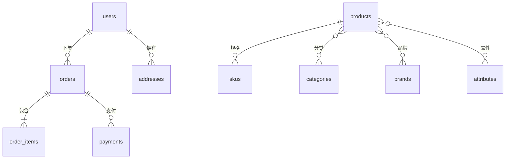

| 商品管理 | SPU/SKU、分类、品牌、属性    |
| -------- | ---------------------------- |
| 购物车   | 加购、修改数量、删除         |
| 订单系统 | 下单、支付、发货、收货、退款 |
| 搜索     | 全文搜索、分类筛选、排序     |
| 统计报表 | 销售统计、用户分析、库存预警 |

## 需求分析

### ER 图设计



### 核心实体关系

- 用户 1:N 订单
- 订单 1:N 订单项
- 订单 1:1 支付
- 商品 1:N SKU
- 分类 1:N 商品（支持多级分类）
- SKU 1:N 订单项

## 完整建表 SQL

### 用户模块

```sql
CREATE TABLE users (
    id              BIGINT UNSIGNED NOT NULL AUTO_INCREMENT,
    username        VARCHAR(50)     NOT NULL,
    email           VARCHAR(100)    NOT NULL,
    phone           VARCHAR(20)     DEFAULT NULL,
    password_hash   VARCHAR(255)    NOT NULL,
    nickname        VARCHAR(50)     DEFAULT NULL,
    avatar_url      VARCHAR(500)    DEFAULT NULL,
    gender          TINYINT         DEFAULT 0 COMMENT '0-unknown, 1-male, 2-female',
    birthday        DATE            DEFAULT NULL,
    status          TINYINT         NOT NULL DEFAULT 1 COMMENT '0-disabled, 1-active, 2-banned',
    last_login_at   DATETIME        DEFAULT NULL,
    last_login_ip   VARCHAR(45)     DEFAULT NULL,
    created_at      DATETIME        NOT NULL DEFAULT CURRENT_TIMESTAMP,
    updated_at      DATETIME        NOT NULL DEFAULT CURRENT_TIMESTAMP ON UPDATE CURRENT_TIMESTAMP,
    PRIMARY KEY (id),
    UNIQUE KEY uk_username (username),
    UNIQUE KEY uk_email (email),
    UNIQUE KEY uk_phone (phone),
    KEY idx_status (status),
    KEY idx_created_at (created_at)
) ENGINE=InnoDB DEFAULT CHARSET=utf8mb4 COLLATE=utf8mb4_unicode_ci
  COMMENT='User accounts';

CREATE TABLE user_addresses (
    id              BIGINT UNSIGNED NOT NULL AUTO_INCREMENT,
    user_id         BIGINT UNSIGNED NOT NULL,
    receiver_name   VARCHAR(50)     NOT NULL,
    receiver_phone  VARCHAR(20)     NOT NULL,
    province        VARCHAR(50)     NOT NULL,
    city            VARCHAR(50)     NOT NULL,
    district        VARCHAR(50)     NOT NULL,
    detail_address  VARCHAR(255)    NOT NULL,
    postal_code     VARCHAR(10)     DEFAULT NULL,
    is_default      TINYINT         NOT NULL DEFAULT 0,
    created_at      DATETIME        NOT NULL DEFAULT CURRENT_TIMESTAMP,
    updated_at      DATETIME        NOT NULL DEFAULT CURRENT_TIMESTAMP ON UPDATE CURRENT_TIMESTAMP,
    PRIMARY KEY (id),
    KEY idx_user_id (user_id),
    CONSTRAINT fk_address_user FOREIGN KEY (user_id) REFERENCES users(id) ON DELETE CASCADE
) ENGINE=InnoDB DEFAULT CHARSET=utf8mb4 COLLATE=utf8mb4_unicode_ci
  COMMENT='User shipping addresses';
```

### 商品模块

```sql
CREATE TABLE categories (
    id              INT UNSIGNED    NOT NULL AUTO_INCREMENT,
    parent_id       INT UNSIGNED    DEFAULT 0 COMMENT '0 means root category',
    name            VARCHAR(50)     NOT NULL,
    icon            VARCHAR(255)    DEFAULT NULL,
    sort_order      INT             NOT NULL DEFAULT 0,
    is_visible      TINYINT         NOT NULL DEFAULT 1,
    created_at      DATETIME        NOT NULL DEFAULT CURRENT_TIMESTAMP,
    updated_at      DATETIME        NOT NULL DEFAULT CURRENT_TIMESTAMP ON UPDATE CURRENT_TIMESTAMP,
    PRIMARY KEY (id),
    KEY idx_parent_id (parent_id),
    KEY idx_sort_order (sort_order)
) ENGINE=InnoDB DEFAULT CHARSET=utf8mb4 COLLATE=utf8mb4_unicode_ci
  COMMENT='Product categories (tree structure)';

CREATE TABLE brands (
    id              INT UNSIGNED    NOT NULL AUTO_INCREMENT,
    name            VARCHAR(100)    NOT NULL,
    logo_url        VARCHAR(500)    DEFAULT NULL,
    description     TEXT            DEFAULT NULL,
    sort_order      INT             NOT NULL DEFAULT 0,
    created_at      DATETIME        NOT NULL DEFAULT CURRENT_TIMESTAMP,
    PRIMARY KEY (id),
    UNIQUE KEY uk_name (name)
) ENGINE=InnoDB DEFAULT CHARSET=utf8mb4 COLLATE=utf8mb4_unicode_ci
  COMMENT='Product brands';

CREATE TABLE products (
    id              BIGINT UNSIGNED NOT NULL AUTO_INCREMENT,
    category_id     INT UNSIGNED    NOT NULL,
    brand_id        INT UNSIGNED    DEFAULT NULL,
    name            VARCHAR(200)    NOT NULL,
    subtitle        VARCHAR(255)    DEFAULT NULL,
    main_image      VARCHAR(500)    DEFAULT NULL,
    sub_images      JSON            DEFAULT NULL COMMENT 'Array of image URLs',
    detail          TEXT            DEFAULT NULL COMMENT 'Product detail HTML',
    detail_html     MEDIUMTEXT      DEFAULT NULL,
    price_min       DECIMAL(10,2)   NOT NULL COMMENT 'Minimum SKU price',
    price_max       DECIMAL(10,2)   NOT NULL COMMENT 'Maximum SKU price',
    status          TINYINT         NOT NULL DEFAULT 0 COMMENT '0-draft, 1-on_sale, 2-off_sale, 3-deleted',
    sort_order      INT             NOT NULL DEFAULT 0,
    sales_count     INT UNSIGNED    NOT NULL DEFAULT 0,
    created_at      DATETIME        NOT NULL DEFAULT CURRENT_TIMESTAMP,
    updated_at      DATETIME        NOT NULL DEFAULT CURRENT_TIMESTAMP ON UPDATE CURRENT_TIMESTAMP,
    PRIMARY KEY (id),
    KEY idx_category_id (category_id),
    KEY idx_brand_id (brand_id),
    KEY idx_status_sort (status, sort_order),
    KEY idx_price_min (price_min),
    KEY idx_sales_count (sales_count),
    KEY idx_name (name),
    FULLTEXT KEY ft_name_subtitle (name, subtitle),
    CONSTRAINT fk_product_category FOREIGN KEY (category_id) REFERENCES categories(id),
    CONSTRAINT fk_product_brand FOREIGN KEY (brand_id) REFERENCES brands(id)
) ENGINE=InnoDB DEFAULT CHARSET=utf8mb4 COLLATE=utf8mb4_unicode_ci
  COMMENT='Product SPU';

CREATE TABLE product_skus (
    id              BIGINT UNSIGNED NOT NULL AUTO_INCREMENT,
    product_id      BIGINT UNSIGNED NOT NULL,
    sku_code        VARCHAR(64)     NOT NULL,
    name            VARCHAR(200)    NOT NULL,
    attributes      JSON            NOT NULL COMMENT 'SKU attributes, e.g. {"color":"red","size":"XL"}',
    price           DECIMAL(10,2)   NOT NULL,
    original_price  DECIMAL(10,2)   DEFAULT NULL,
    stock           INT UNSIGNED    NOT NULL DEFAULT 0,
    low_stock       INT UNSIGNED    NOT NULL DEFAULT 10 COMMENT 'Low stock threshold',
    sales           INT UNSIGNED    NOT NULL DEFAULT 0,
    image_url       VARCHAR(500)    DEFAULT NULL,
    status          TINYINT         NOT NULL DEFAULT 1 COMMENT '0-disabled, 1-enabled',
    created_at      DATETIME        NOT NULL DEFAULT CURRENT_TIMESTAMP,
    updated_at      DATETIME        NOT NULL DEFAULT CURRENT_TIMESTAMP ON UPDATE CURRENT_TIMESTAMP,
    PRIMARY KEY (id),
    UNIQUE KEY uk_sku_code (sku_code),
    KEY idx_product_id (product_id),
    KEY idx_price (price),
    KEY idx_stock (stock),
    CONSTRAINT fk_sku_product FOREIGN KEY (product_id) REFERENCES products(id) ON DELETE CASCADE
) ENGINE=InnoDB DEFAULT CHARSET=utf8mb4 COLLATE=utf8mb4_unicode_ci
  COMMENT='Product SKU';
```

### 购物车模块

```sql
CREATE TABLE cart_items (
    id              BIGINT UNSIGNED NOT NULL AUTO_INCREMENT,
    user_id         BIGINT UNSIGNED NOT NULL,
    sku_id          BIGINT UNSIGNED NOT NULL,
    quantity        INT UNSIGNED    NOT NULL DEFAULT 1,
    checked         TINYINT         NOT NULL DEFAULT 1 COMMENT '0-unchecked, 1-checked',
    created_at      DATETIME        NOT NULL DEFAULT CURRENT_TIMESTAMP,
    updated_at      DATETIME        NOT NULL DEFAULT CURRENT_TIMESTAMP ON UPDATE CURRENT_TIMESTAMP,
    PRIMARY KEY (id),
    UNIQUE KEY uk_user_sku (user_id, sku_id),
    KEY idx_user_id (user_id),
    CONSTRAINT fk_cart_user FOREIGN KEY (user_id) REFERENCES users(id) ON DELETE CASCADE,
    CONSTRAINT fk_cart_sku FOREIGN KEY (sku_id) REFERENCES product_skus(id)
) ENGINE=InnoDB DEFAULT CHARSET=utf8mb4 COLLATE=utf8mb4_unicode_ci
  COMMENT='Shopping cart items';
```

### 订单模块

```sql
CREATE TABLE orders (
    id              BIGINT UNSIGNED NOT NULL AUTO_INCREMENT,
    order_no        VARCHAR(32)     NOT NULL,
    user_id         BIGINT UNSIGNED NOT NULL,
    total_amount    DECIMAL(12,2)   NOT NULL,
    pay_amount      DECIMAL(12,2)   NOT NULL COMMENT 'Actual payment amount',
    freight_amount  DECIMAL(10,2)   NOT NULL DEFAULT 0.00,
    discount_amount DECIMAL(10,2)   NOT NULL DEFAULT 0.00,
    pay_type        TINYINT         DEFAULT NULL COMMENT '1-alipay, 2-wechat, 3-card',
    status          TINYINT         NOT NULL DEFAULT 0 COMMENT '0-pending, 1-paid, 2-shipped, 3-delivered, 4-cancelled, 5-refunding, 6-refunded',
    receiver_name   VARCHAR(50)     NOT NULL,
    receiver_phone  VARCHAR(20)     NOT NULL,
    receiver_address VARCHAR(500)   NOT NULL,
    remark          VARCHAR(500)    DEFAULT NULL,
    paid_at         DATETIME        DEFAULT NULL,
    shipped_at      DATETIME        DEFAULT NULL,
    delivered_at    DATETIME        DEFAULT NULL,
    cancelled_at    DATETIME        DEFAULT NULL,
    created_at      DATETIME        NOT NULL DEFAULT CURRENT_TIMESTAMP,
    updated_at      DATETIME        NOT NULL DEFAULT CURRENT_TIMESTAMP ON UPDATE CURRENT_TIMESTAMP,
    PRIMARY KEY (id),
    UNIQUE KEY uk_order_no (order_no),
    KEY idx_user_id (user_id),
    KEY idx_status (status),
    KEY idx_created_at (created_at),
    KEY idx_user_status (user_id, status)
) ENGINE=InnoDB DEFAULT CHARSET=utf8mb4 COLLATE=utf8mb4_unicode_ci
  COMMENT='Orders';

CREATE TABLE order_items (
    id              BIGINT UNSIGNED NOT NULL AUTO_INCREMENT,
    order_id        BIGINT UNSIGNED NOT NULL,
    sku_id          BIGINT UNSIGNED NOT NULL,
    product_id      BIGINT UNSIGNED NOT NULL,
    product_name    VARCHAR(200)    NOT NULL COMMENT 'Snapshot at order time',
    sku_name        VARCHAR(200)    NOT NULL,
    sku_attributes  JSON            DEFAULT NULL,
    product_image   VARCHAR(500)    DEFAULT NULL,
    price           DECIMAL(10,2)   NOT NULL COMMENT 'Unit price at order time',
    quantity        INT UNSIGNED    NOT NULL,
    subtotal        DECIMAL(12,2)   NOT NULL,
    created_at      DATETIME        NOT NULL DEFAULT CURRENT_TIMESTAMP,
    PRIMARY KEY (id),
    KEY idx_order_id (order_id),
    KEY idx_product_id (product_id),
    KEY idx_sku_id (sku_id),
    CONSTRAINT fk_item_order FOREIGN KEY (order_id) REFERENCES orders(id),
    CONSTRAINT fk_item_product FOREIGN KEY (product_id) REFERENCES products(id),
    CONSTRAINT fk_item_sku FOREIGN KEY (sku_id) REFERENCES product_skus(id)
) ENGINE=InnoDB DEFAULT CHARSET=utf8mb4 COLLATE=utf8mb4_unicode_ci
  COMMENT='Order line items';

CREATE TABLE payments (
    id              BIGINT UNSIGNED NOT NULL AUTO_INCREMENT,
    order_id        BIGINT UNSIGNED NOT NULL,
    transaction_no  VARCHAR(64)     DEFAULT NULL COMMENT 'Third-party payment transaction number',
    pay_type        TINYINT         NOT NULL COMMENT '1-alipay, 2-wechat, 3-card',
    amount          DECIMAL(12,2)   NOT NULL,
    status          TINYINT         NOT NULL DEFAULT 0 COMMENT '0-pending, 1-success, 2-failed, 3-refunded',
    paid_at         DATETIME        DEFAULT NULL,
    callback_data   JSON            DEFAULT NULL COMMENT 'Payment gateway callback data',
    created_at      DATETIME        NOT NULL DEFAULT CURRENT_TIMESTAMP,
    updated_at      DATETIME        NOT NULL DEFAULT CURRENT_TIMESTAMP ON UPDATE CURRENT_TIMESTAMP,
    PRIMARY KEY (id),
    UNIQUE KEY uk_order_id (order_id),
    KEY idx_transaction_no (transaction_no),
    KEY idx_status (status),
    CONSTRAINT fk_payment_order FOREIGN KEY (order_id) REFERENCES orders(id)
) ENGINE=InnoDB DEFAULT CHARSET=utf8mb4 COLLATE=utf8mb4_unicode_ci
  COMMENT='Payment records';
```

## 常用查询

### 商品搜索与筛选

```sql
SELECT p.id, p.name, p.subtitle, p.main_image, p.price_min, p.price_max,
       p.sales_count, c.name AS category_name, b.name AS brand_name
FROM products p
LEFT JOIN categories c ON p.category_id = c.id
LEFT JOIN brands b ON p.brand_id = b.id
WHERE p.status = 1
  AND p.category_id = 5
  AND p.price_min BETWEEN 100 AND 500
ORDER BY p.sales_count DESC
LIMIT 20 OFFSET 0;
```

### 用户订单查询

```sql
SELECT o.order_no, o.total_amount, o.status, o.created_at,
       oi.product_name, oi.sku_name, oi.price, oi.quantity, oi.subtotal
FROM orders o
JOIN order_items oi ON o.id = oi.order_id
WHERE o.user_id = 1001
ORDER BY o.created_at DESC
LIMIT 10;
```

### 销售统计

```sql
SELECT DATE(o.created_at) AS order_date,
       COUNT(DISTINCT o.id) AS order_count,
       SUM(o.pay_amount) AS total_revenue,
       AVG(o.pay_amount) AS avg_order_value
FROM orders o
WHERE o.status IN (1, 2, 3)
  AND o.created_at >= DATE_SUB(CURDATE(), INTERVAL 30 DAY)
GROUP BY DATE(o.created_at)
ORDER BY order_date DESC;
```

### 热销商品排行

```sql
SELECT p.id, p.name, p.main_image,
       SUM(oi.quantity) AS total_sold,
       SUM(oi.subtotal) AS total_revenue
FROM order_items oi
JOIN products p ON oi.product_id = p.id
JOIN orders o ON oi.order_id = o.id
WHERE o.status IN (1, 2, 3)
  AND o.created_at >= DATE_SUB(CURDATE(), INTERVAL 7 DAY)
GROUP BY p.id, p.name, p.main_image
ORDER BY total_sold DESC
LIMIT 20;
```

### 库存预警

```sql
SELECT s.id, s.sku_code, s.name, s.stock, s.low_stock,
       p.name AS product_name
FROM product_skus s
JOIN products p ON s.product_id = p.id
WHERE s.stock <= s.low_stock
  AND s.status = 1
  AND p.status = 1
ORDER BY s.stock ASC;
```

## 索引优化策略

### 索引设计原则

1. **选择性高的列优先** -- 区分度高的列建索引效果更好
2. **覆盖索引** -- 查询的列都在索引中，无需回表
3. **最左前缀** -- 联合索引遵循最左前缀匹配
4. **避免冗余索引** -- (a,b) 包含 (a)，不需要单独建 (a)
5. **控制索引数量** -- 每个索引增加写入开销

### 典型优化案例

```sql
-- 优化前：全表扫描
SELECT * FROM orders WHERE user_id = 1001 AND status = 1;

-- 优化后：使用联合索引
ALTER TABLE orders ADD INDEX idx_user_status (user_id, status);

-- 覆盖索引优化
SELECT order_no, total_amount, created_at
FROM orders
WHERE user_id = 1001 AND status = 1;
-- 联合索引 idx_user_status (user_id, status, created_at, total_amount) 可覆盖
```

## 扩展方向

1. **分库分表** -- 订单表按用户 ID 分片
2. **读写分离** -- 主从复制，读走从库
3. **缓存层** -- Redis 缓存热点商品和库存
4. **ES 搜索** -- Elasticsearch 替代 MySQL 全文搜索
5. **数据仓库** -- 订单数据同步到 ClickHouse 做分析
6. **消息队列** -- 订单创建发送 MQ 异步处理库存扣减

---

## 关键代码速查

### 建表模板

```sql
CREATE TABLE table_name (
    id          BIGINT UNSIGNED NOT NULL AUTO_INCREMENT,
    -- columns
    created_at  DATETIME NOT NULL DEFAULT CURRENT_TIMESTAMP,
    updated_at  DATETIME NOT NULL DEFAULT CURRENT_TIMESTAMP ON UPDATE CURRENT_TIMESTAMP,
    PRIMARY KEY (id),
    KEY idx_col (col)
) ENGINE=InnoDB DEFAULT CHARSET=utf8mb4 COLLATE=utf8mb4_unicode_ci;
```

### 联合索引

```sql
ALTER TABLE orders ADD INDEX idx_user_status_created (user_id, status, created_at);
-- 查询 WHERE user_id = ? AND status = ? 可使用前两列
-- 查询 WHERE user_id = ? 可使用第一列
-- 查询 WHERE status = ? 无法使用此索引
```

### EXPLAIN 分析

```sql
EXPLAIN SELECT * FROM orders WHERE user_id = 1001;
-- 关注：type（ref/range 优于 ALL），key（使用了哪个索引），rows（预估扫描行数）
```

### 事务处理

```sql
START TRANSACTION;
UPDATE product_skus SET stock = stock - 1 WHERE id = 100 AND stock >= 1;
INSERT INTO orders (...) VALUES (...);
COMMIT;
```

## 参考文献


MySQL 官方文档：https://dev.mysql.com/doc/
MySQL 8.0 参考手册：https://dev.mysql.com/doc/refman/8.0/en/
High Performance MySQL（O'Reilly）：https://www.oreilly.com/library/view/high-performance-mysql/
Percona 博客：https://www.percona.com/blog/

## 延伸阅读


MySQL 索引与优化，见 020-mysql 模块文档。
MySQL 日志体系，见 020-mysql 模块 redo/binlog 文档。
Redis 缓存与 MySQL 组合，见 022-redis 模块。
尚硅谷 Bilibili 空间（https://space.bilibili.com/302417610 ）提供 MySQL 高级课程。

## 深度专题扩展


以下专题从不同角度深入本文主题，供有进阶需求的读者研读。每个专题独立成节，内容相互补充。

### 13.1 InnoDB 日志与崩溃恢复

redo log 记录物理页修改（WAL：先写日志再写数据页），崩溃后重放恢复；环形文件组 + checkpoint 推进。
undo log 记录事务前镜像，支持回滚与 MVCC 版本链；purge 线程清理。
两阶段提交：redo prepare -> binlog -> redo commit，保证两份日志一致，主从不丢数据。
刷盘策略：innodb_flush_log_at_trx_commit=1 最安全（每次提交 fsync），2 每秒刷。

### 13.2 执行计划与优化器

EXPLAIN 关键列：type（const/ref/range/index/ALL）、key、rows、Extra（Using index/Using filesort）。
优化器基于统计信息选计划；analyze table 更新统计；hint（FORCE INDEX）谨慎使用。
排序与分组：filesort 优化为索引序；避免临时表。
慢查询治理流程：慢日志 -> 计划分析 -> 索引/改写 -> 验证。

## 模块文档速查表

| 文档 | 主题 | 与本文的关联 |
| --- | --- | --- |
| MySQL 概述与数据库设计 | 001-MySQLOverviewDatabaseDesign | 本文的前置基础 |
| MySQL 环境搭建 | 002-MySQLEnvSetup | 本文的前置基础 |
| MySQL 数据类型与约束 | 003-MySQLDataTypeConstraint | 本文的并列主题 |
| SQL 数据定义与高级对象 | 004-SQLDataDefinitionAdvanced | 本文的并列主题 |
| MyISAM存储引擎 | 005-MyISAMStorageEngine | 本文的并列主题 |
| SQL 数据操作与查询 | 006-SQLDataOperationQuery | 本文的并列主题 |
| Memory存储引擎 | 007-MemoryStorageEngine | 本文的并列主题 |
| NDB-Cluster | 008-NDBCluster | 本文的并列主题 |
| 聚簇索引与二级索引 | 009-ClusteredIndexSecondaryIndex | 本文的并列主题 |
| 联合索引与最左前缀原则 | 010-CompositeIndexLeftmostPrefixPrinciple | 本文的并列主题 |
| 索引下推 | 011-IndexConditionPushdown | 本文的并列主题 |
| 全文索引 | 012-FullTextIndex | 本文的并列主题 |
| 前缀索引 | 013-PrefixIndex | 本文的并列主题 |
| 索引提示与强制索引 | 014-IndexHintForceIndex | 本文的并列主题 |
| 索引统计信息与直方图 | 015-IndexStatsHistogram | 本文的并列主题 |
| SQL 函数与高级查询 | 016-SQLFunctionAndAdvancedQuery | 本文的并列主题 |
| 索引失效场景 | 017-IndexFailureScene | 本文的并列主题 |
| EXPLAIN输出详解 | 018-EXPLAINDetailed | 本文的并列主题 |
| 慢查询日志 | 019-SlowQueryLog | 本文的并列主题 |
| 优化器追踪 | 020-OptimizerTrace | 本文的性能延伸 |
| 子查询优化 | 021-SubqueryOptimization | 本文的性能延伸 |
| 派生表优化 | 022-DerivedTableOptimization | 本文的性能延伸 |
| GROUP-BY与ORDER-BY优化 | 023-GroupByOrderByOptimization | 本文的性能延伸 |
| JOIN算法 | 024-JOINAlgorithm | 本文的并列主题 |
| 事务隔离级别底层实现 | 025-TransactionIsolationImplementation | 本文的并列主题 |
| MVCC原理 | 026-MVCCPrinciple | 本文的原理深化 |
| 多表联查详解 | 027-MultiTableJoinDetailed | 本文的并列主题 |
| 锁分类 | 028-LockClassification | 本文的并列主题 |
| 死锁检测与处理 | 029-DeadlockDetectionHandling | 本文的并列主题 |
| 分布式事务 | 030-DistributedTransaction | 本文的并列主题 |
| 二进制日志 | 031-Binlog | 本文的并列主题 |
| 重做日志 | 032-RedoLog | 本文的并列主题 |
| 撤销日志 | 033-UndoLog | 本文的并列主题 |
| 日志系统 | 034-LogSystem | 本文的并列主题 |
| 逻辑备份 | 035-LogicalBackup | 本文的并列主题 |
| 物理备份 | 036-PhysicalBackup | 本文的并列主题 |
| 基于时间点恢复 | 037-PITR | 本文的并列主题 |
| 主从复制 | 038-Replication | 本文的并列主题 |
| 进阶查询与多表操作 | 039-AdvancedQueryMultiTableOperation | 本文的并列主题 |
| GTID | 040-GTID | 本文的并列主题 |
| 并行复制 | 041-ParallelReplication | 本文的并列主题 |
| 组复制 | 042-GroupReplication | 本文的并列主题 |
| InnoDB-Cluster | 043-InnoDBCluster | 本文的并列主题 |
| 分区表 | 044-PartitionedTable | 本文的并列主题 |
| 分库分表中间件 | 045-ShardingMiddleware | 本文的并列主题 |
| 账户与权限管理 | 046-AccountPermissionManagement | 本文的安全延伸 |
| SSL-TLS加密 | 047-SSLEncryption | 本文的安全延伸 |
| 防火墙插件 | 048-FirewallPlugin | 本文的并列主题 |
| InnoDB体系架构 | 049-InnoDBSystemArchitecture | 本文的原理深化 |
| 数据加密 | 050-DataEncryption | 本文的安全延伸 |
| MySQL 索引与执行计划 | 051-MySQLIndexExecutionPlan | 本文的并列主题 |
| MySQL9新特性与并行查询 | 052-MySQL9NewFeaturesParallelQuery | 本文的并列主题 |
| VECTOR向量类型 | 053-VectorType | 本文的并列主题 |
| JSON模式验证与聚合函数 | 054-JSONSchemaValidationAggregate | 本文的并列主题 |
| 复制与高可用 | 055-ReplicationHA | 本文的并列主题 |
| 不可见索引 | 056-InvisibleIndex | 本文的并列主题 |
| 性能调优与安全 | 057-PerformanceTuningSecurity | 本文的性能延伸 |
| 函数索引 | 058-FunctionalIndex | 本文的并列主题 |
| 存储过程与函数 | 059-StoredProcedureAndFunction | 本文的并列主题 |
| MVCC快照读与当前读 | 060-MVCCSnapshotCurrentRead | 本文的并列主题 |
| 索引原理与性能优化 | 061-IndexPrinciplePerformanceOptimization | 本文的性能延伸 |
| 触发器与事件 | 062-TriggerEvent | 本文的并列主题 |
| Redo与Undo与Binlog写入时机 | 063-RedoUndoBinlogWriteTiming | 本文的并列主题 |
| 两阶段提交 | 064-TwoPhaseCommit | 本文的并列主题 |
| 间隙锁与临键锁解决幻读 | 065-GapLockNextKeyLockSolutionPhantomRead | 本文的并列主题 |
| 主从复制延迟原因与解决 | 066-ReplicationDelayCauseSolution | 本文的并列主题 |
| 分库分表策略 | 067-ShardingStrategy | 本文的并列主题 |
| JSON类型与JSON-TABLE | 068-JSONTypeJSONTable | 本文的并列主题 |
| 事务与锁机制 | 069-TransactionLockMechanism | 本文的原理深化 |
| MySQL 配置与运维 | 070-MySQLConfigOps | 本文的并列主题 |
| MySQL 快速查阅 | 071-MySQLQuickLookup | 本文的并列主题 |
| MySQL 控制器与应用 | 072-MySQLControlApplication | 本文的并列主题 |
| SQL 注入基础与检测 | 073-SQLInjectionBasicsDetection | 本文的前置基础 |
| SQL 注入攻击类型与实战 | 074-SQLInjectionAttackTypePractice | 本文的综合应用 |
| SQL 注入防御策略 | 075-SQLInjectionDefenseStrategy | 本文的并列主题 |
| MySQL 项目示例：电商数据库设计 | 076-MySQLProjectExampleDatabaseDesign | 本文自身 |
| MySQL 理论知识点 | 077-MySQLTheoryKnowledge | 本文的并列主题 |
| MySQL DDL 数据定义 | 078-DDL | 本文的并列主题 |
| MySQL DML 数据操作 | 079-DML | 本文的并列主题 |
| MySQL DQL 查询速查 | 080-DQL | 本文的并列主题 |
| MySQL 索引管理 | 081-IndexManagement | 本文的并列主题 |
| MySQL 用户与权限管理 | 082-UserPermission | 本文的安全延伸 |
| MySQL CLI 命令 | 083-CLI | 本文的并列主题 |
| mysqladmin 管理命令 语法速查手册 | 084-Mysqladmin | 本文的并列主题 |
| 视图 语法速查手册 | 085-View | 本文的并列主题 |
| 事件调度器 语法速查手册 | 086-EventScheduler | 本文的并列主题 |
| 字符集与排序规则 语法速查手册 | 087-CharsetCollation | 本文的并列主题 |
