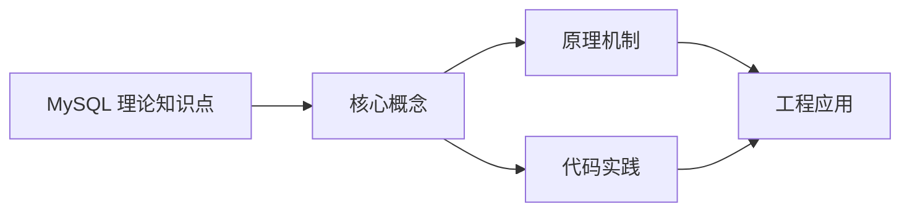

## 1. 学习目标（Bloom 分类）

本节按照布鲁姆教育目标分类学组织学习路径。本文主题为《MySQL 理论知识点》，属于 MySQL 模块，读者可以根据自身阶段选择阅读深度。

记忆层面：能够准确复述本文的核心概念、术语与基本语法或操作步骤，并能够在提问或检索时快速定位对应知识点。能够说出 MySQL 的核心概念、语法与常用对象。

理解层面：能够用自己的语言解释核心原理与工作机制，说明概念之间的因果关系，而不是机械记忆结论。能够解释 MySQL 的执行原理与优化机制。

应用层面：能够在真实项目或练习场景中运用本文知识解决具体问题，写出正确且可维护的实现。能够编写正确、高效的 MySQL 语句与操作。

分析层面：能够拆解复杂问题，比较本文主题与相邻概念的异同，识别边界条件与例外情况。能够分析 MySQL 相关方案在性能与一致性上的权衡。

评价层面：能够根据约束条件（性能、可读性、安全、成本）评价不同方案的优劣，做出有依据的技术决策。能够根据业务场景评价 MySQL 技术选型。

创造层面：能够把本文知识与其他模块知识组合，设计出新的解决方案或可复用的工程模式。能够组合 MySQL 与其他技术设计数据架构。

通过本节学习，读者应当能够把《MySQL 理论知识点》纳入自己的知识网络，并与 MySQL 模块的其他主题（InnoDB、索引、日志、主从、性能调优）建立关联。

## 2. 历史动机与发展脉络

《MySQL 理论知识点》是 MySQL 领域的重要主题。要真正理解它，需要先了解它解决的问题与演进过程。

MySQL 于 1995 年由 MySQL AB 发布，2008 年被 Sun 收购，2010 年随 Sun 并入 Oracle；MariaDB 是社区分支。
MySQL 8.0（2018）重写优化器、引入窗口函数与 CTE、默认 utf8mb4、数据字典升级；MySQL 8.4 与 9.x 继续演进（Oracle 创新版 + LTS 双轨）。
InnoDB 是默认存储引擎：事务、行锁、MVCC、崩溃恢复（redo/undo）；MyISAM 仅存于历史场景。

回到本文主题：MySQL 理论知识点 的提出与成熟，正是上述技术背景下的必然产物。早期实现往往以简单可用为目标，随着工程规模扩大，社区逐渐沉淀出标准做法与最佳实践；理解这一脉络，可以帮助读者判断“为什么文档中的推荐写法是现在这个样子”，也能在遇到历史遗留代码时准确识别其设计年代与取舍。


## 3. 形式化定义与核心概念精讲

本节把《MySQL 理论知识点》涉及的核心概念以“定义 + 讲解”的形式展开。读者应把定义当作工具，把讲解当作理解路径；两者结合才能形成可迁移的知识。

InnoDB 架构：缓冲池（Buffer Pool）、日志缓冲、redo/undo 日志；脏页刷盘与 checkpoint 机制。
索引：B+ 树主键聚集索引、二级索引、覆盖索引；索引下推（ICP）与 MRR 优化。
事务与锁：两阶段锁、间隙锁/临键锁（可重复读防幻读）、MVCC 快照读；隔离级别。

### 3.1 原文章节逐一精讲

原文档把主题拆分为 5 个小节，下面按顺序给出每一节的导读讲解，随后保留原文细节供精读。

#### 原文精读（完整保留）


          [10|20]   [30|40|50]   [60|70|80]
          /    \     /  |  \      /  |  \
        ->10->20->  ->30->40->50->  ->60->70->80->
        |___________leaf linked list______________|

```

##### B+ 树 vs B 树

| 特性 | B+ 树 | B 树 |
|------|-------|------|
| 数据存储位置 | 仅叶子节点 | 所有节点 |
| 叶子节点链接 | 双向链表 | 无 |
| 非叶子节点 | 仅存键值+指针 | 存键值+数据+指针 |
| 单次查找 | 必须到叶子节点 | 可能在中间节点找到 |
| 范围查询 | 高效（遍历链表） | 需要中序遍历 |
| 空间利用率 | 非叶子节点更紧凑 | 非叶子节点存数据，扇出低 |

##### 为什么 MySQL 选择 B+ 树

1. **磁盘 I/O 优化** -- B+ 树的扇出（fan-out）远大于 B 树，因为非叶子节点不存数据，同样大小的磁盘页能容纳更多键值。一棵 3 层的 B+ 树（假设每页 16KB，键值 8 字节+指针 6 字节）可存储约 2000 万条记录。

2. **范围查询高效** -- 叶子节点的双向链表使得范围查询只需找到起点后顺序遍历，无需回溯父节点。

3. **查询性能稳定** -- 每次查找都从根到叶子，路径长度相同，查询时间稳定。

##### B+ 树的插入与分裂

当叶子节点的键值数超过阶数时，节点分裂：

1. 将节点分为两半
2. 中间键值提升到父节点
3. 如果父节点也满了，递归分裂

树的高度增长是从底部向上传播的，这保证了树的平衡性。

##### B+ 树与哈希索引的对比

| 特性 | B+ 树 | 哈希索引 |
|------|-------|---------|
| 等值查询 | O(log n) | O(1) |
| 范围查询 | 支持 | 不支持 |
| 排序 | 支持 | 不支持 |
| 最左前缀 | 支持 | 不支持 |
| 存储空间 | 较大 | 较小 |
| 适用场景 | 通用 | 等值查询密集 |

InnoDB 的自适应哈希索引（AHI）会在检测到某些索引页被频繁访问时，自动为这些页构建哈希索引。

---

#### MVCC（Multi-Version Concurrency Control）

##### MVCC 的目的

MVCC 解决读写冲突问题，使得读操作不阻塞写操作，写操作不阻塞读操作。每个事务看到的是数据在某个时间点的一致性快照。

##### InnoDB 的 MVCC 实现

MVCC 通过三个机制协同工作：

1. **隐藏列** -- 每行记录包含两个隐藏列
2. **Undo Log** -- 存储数据的历史版本
3. **Read View** -- 决定事务能看到哪个版本

###### 隐藏列

每行记录包含：
- `DB_TRX_ID`（6 字节）-- 最后修改该行的事务 ID
- `DB_ROLL_PTR`（7 字节）-- 指向 undo log 中该行的前一个版本
- `DB_ROW_ID`（6 字节）-- 隐藏自增 ID（无主键时使用）

###### 版本链

通过 `DB_ROLL_PTR` 将一行数据的多个版本串联成链表：

```

当前版本: {data_v3, trx_id=300, roll_ptr -> v2}
|
v
历史版本: {data_v2, trx_id=200, roll_ptr -> v1}
|
v
历史版本: {data_v1, trx_id=100, roll_ptr -> NULL}

```

###### Read View

Read View 记录当前活跃事务的 ID 列表，用于判断某个版本对当前事务是否可见。

Read View 包含：
- `m_ids` -- 创建 Read View 时活跃事务 ID 列表
- `min_trx_id` -- `m_ids` 中的最小值
- `max_trx_id` -- 下一个将分配的事务 ID（即当前最大事务 ID + 1）
- `creator_trx_id` -- 创建该 Read View 的事务 ID

可见性判断规则：

1. 如果 `trx_id == creator_trx_id`，可见（自己修改的）
2. 如果 `trx_id < min_trx_id`，可见（事务已提交）
3. 如果 `trx_id >= max_trx_id`，不可见（事务在 Read View 创建后开始）
4. 如果 `min_trx_id <= trx_id < max_trx_id`：
   - 如果 `trx_id` 在 `m_ids` 中，不可见（事务未提交）
   - 如果 `trx_id` 不在 `m_ids` 中，可见（事务已提交）

如果当前版本不可见，沿版本链继续查找前一个版本。

##### 不同隔离级别的 Read View 策略

| 隔离级别 | Read View 创建时机 | 效果 |
|---------|-------------------|------|
| READ COMMITTED | 每次 SELECT 创建新 Read View | 可看到其他事务已提交的修改 |
| REPEATABLE READ | 事务中第一次 SELECT 创建 Read View | 事务中始终看到一致的快照 |
| READ UNCOMMITTED | 不使用 Read View | 可看到未提交的修改 |
| SERIALIZABLE | 不使用 MVCC，加锁 | 完全串行化 |

---

#### WAL（Write-Ahead Logging）

##### WAL 的原理

WAL 的核心思想：在修改数据页之前，先将修改记录写入日志。保证即使系统崩溃，也可以通过日志恢复数据。

```

事务操作 --> 写入 Redo Log Buffer --> 刷入 Redo Log File --> 修改内存数据页 --> 刷入磁盘数据文件

```

##### Redo Log

Redo Log 记录的是物理修改（"在某个页的某个偏移量写入了什么值"），用于崩溃恢复。

Redo Log 的写入流程：

1. 事务修改数据时，先写入 Redo Log Buffer（内存）
2. 根据刷盘策略，将 Redo Log Buffer 刷入 Redo Log File
3. 事务提交时，必须将 Redo Log 刷盘（保证持久性）

刷盘策略由 `innodb_flush_log_at_trx_commit` 控制：

| 值 | 行为 | 安全性 | 性能 |
|----|------|--------|------|
| 0 | 每秒刷盘 | 可能丢失 1 秒数据 | 最高 |
| 1 | 每次提交刷盘 | 不丢数据 | 最低 |
| 2 | 每次提交写入 OS 缓存，每秒 fsync | OS 崩溃可能丢数据 | 中等 |

##### Undo Log

Undo Log 记录的是逻辑修改的反向操作（"插入的行需要删除，更新的行需要恢复旧值"），用于：
- 事务回滚
- MVCC 版本链

##### Binlog vs Redo Log

| 特性 | Redo Log | Binlog |
|------|----------|--------|
| 存储引擎 | InnoDB 特有 | MySQL Server 层 |
| 内容 | 物理日志（页修改） | 逻辑日志（SQL/行变更） |
| 写入方式 | 循环写，空间固定 | 追加写，文件递增 |
| 用途 | 崩溃恢复 | 主从复制、数据恢复 |
| 事务性 | 事务中持续写入 | 事务提交时一次写入 |

##### 两阶段提交

为保证 Redo Log 和 Binlog 的一致性，InnoDB 采用两阶段提交：

1. **Prepare 阶段** -- 写入 Redo Log，标记为 prepare 状态
2. **Commit 阶段** -- 写入 Binlog，将 Redo Log 标记为 commit 状态

如果崩溃发生在 Prepare 后、Commit 前，恢复时检查 Binlog 中是否有对应事务：
- 有：提交事务
- 无：回滚事务

---

#### 查询优化器

##### 优化器的工作流程

```

SQL 文本 --> 解析器 --> AST --> 预处理器 --> 逻辑查询计划 --> 优化器 --> 物理查询计划 --> 执行器

```

优化器分为逻辑优化和物理优化：

1. **逻辑优化** -- 基于规则的优化（RBO）
   - 条件下推（Predicate Pushdown）
   - 列裁剪（Column Pruning）
   - 子查询展开
   - 外连接消除
   - 视图合并

2. **物理优化** -- 基于代价的优化（CBO）
   - 选择访问路径（全表扫描 vs 索引扫描）
   - 选择连接算法（Nested Loop、Hash Join、Merge Join）
   - 选择连接顺序
   - 估算代价选择最优计划

##### 代价模型

优化器使用代价模型估算不同执行计划的代价：

```

Total Cost = IO Cost + CPU Cost

IO Cost = 页面读取次数 _ 页面读取代价
CPU Cost = 评估条件次数 _ 条件评估代价 + 排序记录数 \* 排序代价

````

##### 索引选择的因素

1. **索引选择性** -- `COUNT(DISTINCT col) / COUNT(*)`，选择性越高越好
2. **索引基数（Cardinality）** -- 索引中不同值的数量
3. **回表代价** -- 二级索引需要回表查询聚簇索引
4. **覆盖索引** -- 查询列都在索引中，无需回表
5. **索引排序** -- 索引本身有序，可避免 filesort
6. **范围条件** -- 范围条件后的索引列无法使用

##### 优化器追踪

```sql
SET optimizer_trace = 'enabled=on';
SELECT * FROM orders WHERE user_id = 1001;
SELECT * FROM information_schema.OPTIMIZER_TRACE;
SET optimizer_trace = 'enabled=off';
````

---

#### 索引选择

##### 索引失效的常见场景

1. **对索引列使用函数**

   ```sql
   SELECT * FROM users WHERE YEAR(created_at) = 2024;  -- 索引失效
   SELECT * FROM users WHERE created_at >= '2024-01-01' AND created_at < '2025-01-01';  -- 索引有效
   ```

2. **隐式类型转换**

   ```sql
   SELECT * FROM users WHERE phone = 13800138000;  -- phone 是 VARCHAR，索引失效
   SELECT * FROM users WHERE phone = '13800138000';  -- 索引有效
   ```

3. **LIKE 以通配符开头**

   ```sql
   SELECT * FROM products WHERE name LIKE '%phone';  -- 索引失效
   SELECT * FROM products WHERE name LIKE 'phone%';  -- 索引有效
   ```

4. **OR 条件包含非索引列**

   ```sql
   SELECT * FROM users WHERE email = 'a@b.com' OR nickname = 'test';  -- nickname 无索引，整体失效
   ```

5. **不满足最左前缀**

   ```sql
   INDEX (a, b, c)
   WHERE b = 1 AND c = 2  -- 无法使用索引
   WHERE a = 1 AND c = 2  -- 只能使用 a 列
   WHERE a = 1 AND b = 1  -- 可使用 a, b 两列
   ```

6. **使用 NOT IN、NOT EXISTS、!=**
   ```sql
   SELECT * FROM users WHERE status != 0;  -- 优化器可能选择全表扫描
   ```

##### 索引优化策略

1. **联合索引顺序** -- 将选择性高的列放在前面，将范围查询列放在最后
2. **覆盖索引** -- 将查询需要的列包含在索引中，避免回表
3. **索引下推（ICP）** -- MySQL 5.6+ 在存储引擎层过滤索引条件，减少回表次数
4. **MRR（Multi-Range Read）** -- 将随机 I/O 转换为顺序 I/O
5. **索引合并** -- 多个索引合并使用（通常不如联合索引高效）

---

#### 理论速查表

| 概念       | 核心要点                         | 关键细节                                |
| ---------- | -------------------------------- | --------------------------------------- |
| B+ 树      | 非叶子节点仅存键值，叶子节点链表 | 3 层约 2000 万行，范围查询高效          |
| MVCC       | 多版本并发控制，读不阻塞写       | 隐藏列 + Undo Log + Read View           |
| WAL        | 先写日志再写数据                 | Redo Log 保证持久性                     |
| Redo Log   | 物理日志，循环写                 | innodb_flush_log_at_trx_commit 控制刷盘 |
| Undo Log   | 逻辑日志，版本链                 | 用于回滚和 MVCC                         |
| Binlog     | 逻辑日志，追加写                 | 用于主从复制                            |
| 两阶段提交 | 保证 Redo Log 和 Binlog 一致     | Prepare -> Binlog -> Commit             |
| 查询优化器 | RBO + CBO                        | 代价模型选择最优执行计划                |
| 索引选择   | 选择性、回表代价、覆盖索引       | 避免索引失效场景                        |

```

```

```

```


### 3.2 概念关系图

下面用 Mermaid 图表达本文核心概念之间的关系，帮助读者建立整体图景：



图中展示的是本文知识的结构化关系：核心概念是入口，原理机制解释“为什么”，代码实践演示“怎么做”，工程应用回答“何时用”。读者学习时可以把每个小节的内容挂接到对应节点上。

## 4. 理论推导与原理解析

本节深入《MySQL 理论知识点》背后的原理。理论部分不求面面俱到，而是聚焦“能解释现象、能指导实践”的关键推导。

InnoDB 架构：缓冲池（Buffer Pool）、日志缓冲、redo/undo 日志；脏页刷盘与 checkpoint 机制。
索引：B+ 树主键聚集索引、二级索引、覆盖索引；索引下推（ICP）与 MRR 优化。
事务与锁：两阶段锁、间隙锁/临键锁（可重复读防幻读）、MVCC 快照读；隔离级别。
复制：binlog 逻辑复制（statement/row/mixed），主从异步、半同步与组复制。

需要强调的是，理论推导与工程实践之间存在翻译层：理论给出的是理想化模型与边界条件，工程代码则必须处理真实环境中的例外。读者在学习时应先掌握理论的“标准情形”，再通过陷阱章节了解“非标准情形”。

## 5. 代码示例与逐行讲解

本节把原文中的代码示例系统整理，并为每个示例补充用途说明与讲解。读者不应只浏览代码，而应逐段对照讲解理解设计意图。

### 5.1 示例：概述

该示例来自原文《概述》小节，用于演示MySQL 理论知识点相关操作。阅读时请先看代码结构，再看其后的讲解。

```text

### B+ 树 vs B 树

| 特性 | B+ 树 | B 树 |
|------|-------|------|
| 数据存储位置 | 仅叶子节点 | 所有节点 |
| 叶子节点链接 | 双向链表 | 无 |
| 非叶子节点 | 仅存键值+指针 | 存键值+数据+指针 |
| 单次查找 | 必须到叶子节点 | 可能在中间节点找到 |
| 范围查询 | 高效（遍历链表） | 需要中序遍历 |
| 空间利用率 | 非叶子节点更紧凑 | 非叶子节点存数据，扇出低 |

### 为什么 MySQL 选择 B+ 树

1. **磁盘 I/O 优化** -- B+ 树的扇出（fan-out）远大于 B 树，因为非叶子节点不存数据，同样大小的磁盘页能容纳更多键值。一棵 3 层的 B+ 树（假设每页 16KB，键值 8 字节+指针 6 字节）可存储约 2000 万条记录。

2. **范围查询高效** -- 叶子节点的双向链表使得范围查询只需找到起点后顺序遍历，无需回溯父节点。

3. **查询性能稳定** -- 每次查找都从根到叶子，路径长度相同，查询时间稳定。

### B+ 树的插入与分裂

当叶子节点的键值数超过阶数时，节点分裂：

1. 将节点分为两半
2. 中间键值提升到父节点
3. 如果父节点也满了，递归分裂

树的高度增长是从底部向上传播的，这保证了树的平衡性。

### B+ 树与哈希索引的对比

| 特性 | B+ 树 | 哈希索引 |
|------|-------|---------|
| 等值查询 | O(log n) | O(1) |
| 范围查询 | 支持 | 不支持 |
| 排序 | 支持 | 不支持 |
| 最左前缀 | 支持 | 不支持 |
| 存储空间 | 较大 | 较小 |
| 适用场景 | 通用 | 等值查询密集 |

InnoDB 的自适应哈希索引（AHI）会在检测到某些索引页被频繁访问时，自动为这些页构建哈希索引。

---

## MVCC（Multi-Version Concurrency Control）

### MVCC 的目的

MVCC 解决读写冲突问题，使得读操作不阻塞写操作，写操作不阻塞读操作。每个事务看到的是数据在某个时间点的一致性快照。

### InnoDB 的 MVCC 实现

MVCC 通过三个机制协同工作：

1. **隐藏列** -- 每行记录包含两个隐藏列
2. **Undo Log** -- 存储数据的历史版本
3. **Read View** -- 决定事务能看到哪个版本

#### 隐藏列

每行记录包含：
- `DB_TRX_ID`（6 字节）-- 最后修改该行的事务 ID
- `DB_ROLL_PTR`（7 字节）-- 指向 undo log 中该行的前一个版本
- `DB_ROW_ID`（6 字节）-- 隐藏自增 ID（无主键时使用）

#### 版本链

通过 `DB_ROLL_PTR` 将一行数据的多个版本串联成链表：

```

讲解：这段代码演示了本节核心知识点。代码中的关键操作可以归纳为三步：准备（定义或初始化）、执行（核心逻辑）、收尾（释放资源或返回结果）。实际项目中，这三步往往被封装为函数或类，以提升复用性与可测试性。

关键点分析：

该示例共 45 行有效代码，结构以数据或配置为主。阅读时应关注：数据字段的含义、配置项的作用，以及它们与运行行为的对应关系。

进阶思考路径：先尝试修改参数观察行为变化，再把示例中的模式迁移到自己的项目中；每次修改都记录预期与实测差异，这是把示例转化为能力的最快方式。

### 5.2 示例：概述

该示例来自原文《概述》小节，用于演示MySQL 理论知识点相关操作。阅读时请先看代码结构，再看其后的讲解。

```text

#### Read View

Read View 记录当前活跃事务的 ID 列表，用于判断某个版本对当前事务是否可见。

Read View 包含：
- `m_ids` -- 创建 Read View 时活跃事务 ID 列表
- `min_trx_id` -- `m_ids` 中的最小值
- `max_trx_id` -- 下一个将分配的事务 ID（即当前最大事务 ID + 1）
- `creator_trx_id` -- 创建该 Read View 的事务 ID

可见性判断规则：

1. 如果 `trx_id == creator_trx_id`，可见（自己修改的）
2. 如果 `trx_id < min_trx_id`，可见（事务已提交）
3. 如果 `trx_id >= max_trx_id`，不可见（事务在 Read View 创建后开始）
4. 如果 `min_trx_id <= trx_id < max_trx_id`：
   - 如果 `trx_id` 在 `m_ids` 中，不可见（事务未提交）
   - 如果 `trx_id` 不在 `m_ids` 中，可见（事务已提交）

如果当前版本不可见，沿版本链继续查找前一个版本。

### 不同隔离级别的 Read View 策略

| 隔离级别 | Read View 创建时机 | 效果 |
|---------|-------------------|------|
| READ COMMITTED | 每次 SELECT 创建新 Read View | 可看到其他事务已提交的修改 |
| REPEATABLE READ | 事务中第一次 SELECT 创建 Read View | 事务中始终看到一致的快照 |
| READ UNCOMMITTED | 不使用 Read View | 可看到未提交的修改 |
| SERIALIZABLE | 不使用 MVCC，加锁 | 完全串行化 |

---

## WAL（Write-Ahead Logging）

### WAL 的原理

WAL 的核心思想：在修改数据页之前，先将修改记录写入日志。保证即使系统崩溃，也可以通过日志恢复数据。

```

讲解：这段代码演示了本节核心知识点。代码中的关键操作可以归纳为三步：准备（定义或初始化）、执行（核心逻辑）、收尾（释放资源或返回结果）。实际项目中，这三步往往被封装为函数或类，以提升复用性与可测试性。

关键点分析：

该示例共 26 行有效代码，包含 1 类关键结构（SELECT）。其中：

- 入口与初始化部分负责建立上下文，对应实际项目中的启动或装配逻辑；
- 核心逻辑部分体现本文主题的主要操作，是阅读时最需要对照讲解理解的部分；
- 输出或返回部分把结果交给调用方，注意其类型与边界条件。

进阶思考路径：先尝试修改参数观察行为变化，再把示例中的模式迁移到自己的项目中；每次修改都记录预期与实测差异，这是把示例转化为能力的最快方式。

### 5.3 示例：概述

该示例来自原文《概述》小节，用于演示MySQL 理论知识点相关操作。阅读时请先看代码结构，再看其后的讲解。

```text

### Redo Log

Redo Log 记录的是物理修改（"在某个页的某个偏移量写入了什么值"），用于崩溃恢复。

Redo Log 的写入流程：

1. 事务修改数据时，先写入 Redo Log Buffer（内存）
2. 根据刷盘策略，将 Redo Log Buffer 刷入 Redo Log File
3. 事务提交时，必须将 Redo Log 刷盘（保证持久性）

刷盘策略由 `innodb_flush_log_at_trx_commit` 控制：

| 值 | 行为 | 安全性 | 性能 |
|----|------|--------|------|
| 0 | 每秒刷盘 | 可能丢失 1 秒数据 | 最高 |
| 1 | 每次提交刷盘 | 不丢数据 | 最低 |
| 2 | 每次提交写入 OS 缓存，每秒 fsync | OS 崩溃可能丢数据 | 中等 |

### Undo Log

Undo Log 记录的是逻辑修改的反向操作（"插入的行需要删除，更新的行需要恢复旧值"），用于：
- 事务回滚
- MVCC 版本链

### Binlog vs Redo Log

| 特性 | Redo Log | Binlog |
|------|----------|--------|
| 存储引擎 | InnoDB 特有 | MySQL Server 层 |
| 内容 | 物理日志（页修改） | 逻辑日志（SQL/行变更） |
| 写入方式 | 循环写，空间固定 | 追加写，文件递增 |
| 用途 | 崩溃恢复 | 主从复制、数据恢复 |
| 事务性 | 事务中持续写入 | 事务提交时一次写入 |

### 两阶段提交

为保证 Redo Log 和 Binlog 的一致性，InnoDB 采用两阶段提交：

1. **Prepare 阶段** -- 写入 Redo Log，标记为 prepare 状态
2. **Commit 阶段** -- 写入 Binlog，将 Redo Log 标记为 commit 状态

如果崩溃发生在 Prepare 后、Commit 前，恢复时检查 Binlog 中是否有对应事务：
- 有：提交事务
- 无：回滚事务

---

## 查询优化器

### 优化器的工作流程

```

讲解：这段代码演示了本节核心知识点。代码中的关键操作可以归纳为三步：准备（定义或初始化）、执行（核心逻辑）、收尾（释放资源或返回结果）。实际项目中，这三步往往被封装为函数或类，以提升复用性与可测试性。

关键点分析：

该示例共 34 行有效代码，结构以数据或配置为主。阅读时应关注：数据字段的含义、配置项的作用，以及它们与运行行为的对应关系。

进阶思考路径：先尝试修改参数观察行为变化，再把示例中的模式迁移到自己的项目中；每次修改都记录预期与实测差异，这是把示例转化为能力的最快方式。

### 5.4 示例：概述

该示例来自原文《概述》小节，用于演示MySQL 理论知识点相关操作。阅读时请先看代码结构，再看其后的讲解。

```text

优化器分为逻辑优化和物理优化：

1. **逻辑优化** -- 基于规则的优化（RBO）
   - 条件下推（Predicate Pushdown）
   - 列裁剪（Column Pruning）
   - 子查询展开
   - 外连接消除
   - 视图合并

2. **物理优化** -- 基于代价的优化（CBO）
   - 选择访问路径（全表扫描 vs 索引扫描）
   - 选择连接算法（Nested Loop、Hash Join、Merge Join）
   - 选择连接顺序
   - 估算代价选择最优计划

### 代价模型

优化器使用代价模型估算不同执行计划的代价：

```

讲解：这段代码演示了本节核心知识点。代码中的关键操作可以归纳为三步：准备（定义或初始化）、执行（核心逻辑）、收尾（释放资源或返回结果）。实际项目中，这三步往往被封装为函数或类，以提升复用性与可测试性。

关键点分析：

该示例共 14 行有效代码，结构以数据或配置为主。阅读时应关注：数据字段的含义、配置项的作用，以及它们与运行行为的对应关系。

进阶思考路径：先尝试修改参数观察行为变化，再把示例中的模式迁移到自己的项目中；每次修改都记录预期与实测差异，这是把示例转化为能力的最快方式。

### 5.5 示例：概述

该示例来自原文《概述》小节，用于演示MySQL 理论知识点相关操作。阅读时请先看代码结构，再看其后的讲解。

````

### 索引选择的因素

1. **索引选择性** -- `COUNT(DISTINCT col) / COUNT(*)`，选择性越高越好
2. **索引基数（Cardinality）** -- 索引中不同值的数量
3. **回表代价** -- 二级索引需要回表查询聚簇索引
4. **覆盖索引** -- 查询列都在索引中，无需回表
5. **索引排序** -- 索引本身有序，可避免 filesort
6. **范围条件** -- 范围条件后的索引列无法使用

### 优化器追踪

```

讲解：这段代码演示了本节核心知识点。代码中的关键操作可以归纳为三步：准备（定义或初始化）、执行（核心逻辑）、收尾（释放资源或返回结果）。实际项目中，这三步往往被封装为函数或类，以提升复用性与可测试性。

关键点分析：

该示例共 8 行有效代码，结构以数据或配置为主。阅读时应关注：数据字段的含义、配置项的作用，以及它们与运行行为的对应关系。

进阶思考路径：先尝试修改参数观察行为变化，再把示例中的模式迁移到自己的项目中；每次修改都记录预期与实测差异，这是把示例转化为能力的最快方式。

### 5.6 示例：概述

该示例来自原文《概述》小节，用于演示MySQL 理论知识点相关操作。阅读时请先看代码结构，再看其后的讲解。

````

---

## 索引选择

### 索引失效的常见场景

1. **对索引列使用函数**

   ```sql
   SELECT * FROM users WHERE YEAR(created_at) = 2024;  -- 索引失效
   SELECT * FROM users WHERE created_at >= '2024-01-01' AND created_at < '2025-01-01';  -- 索引有效
   ```

2. **隐式类型转换**

   ```sql
   SELECT * FROM users WHERE phone = 13800138000;  -- phone 是 VARCHAR，索引失效
   SELECT * FROM users WHERE phone = '13800138000';  -- 索引有效
   ```

3. **LIKE 以通配符开头**

   ```sql
   SELECT * FROM products WHERE name LIKE '%phone';  -- 索引失效
   SELECT * FROM products WHERE name LIKE 'phone%';  -- 索引有效
   ```

4. **OR 条件包含非索引列**

   ```sql
   SELECT * FROM users WHERE email = 'a@b.com' OR nickname = 'test';  -- nickname 无索引，整体失效
   ```

5. **不满足最左前缀**

   ```sql
   INDEX (a, b, c)
   WHERE b = 1 AND c = 2  -- 无法使用索引
   WHERE a = 1 AND c = 2  -- 只能使用 a 列
   WHERE a = 1 AND b = 1  -- 可使用 a, b 两列
   ```

6. **使用 NOT IN、NOT EXISTS、!=**
   ```sql
   SELECT * FROM users WHERE status != 0;  -- 优化器可能选择全表扫描
   ```

### 索引优化策略

1. **联合索引顺序** -- 将选择性高的列放在前面，将范围查询列放在最后
2. **覆盖索引** -- 将查询需要的列包含在索引中，避免回表
3. **索引下推（ICP）** -- MySQL 5.6+ 在存储引擎层过滤索引条件，减少回表次数
4. **MRR（Multi-Range Read）** -- 将随机 I/O 转换为顺序 I/O
5. **索引合并** -- 多个索引合并使用（通常不如联合索引高效）

---

## 理论速查表

| 概念       | 核心要点                         | 关键细节                                |
| ---------- | -------------------------------- | --------------------------------------- |
| B+ 树      | 非叶子节点仅存键值，叶子节点链表 | 3 层约 2000 万行，范围查询高效          |
| MVCC       | 多版本并发控制，读不阻塞写       | 隐藏列 + Undo Log + Read View           |
| WAL        | 先写日志再写数据                 | Redo Log 保证持久性                     |
| Redo Log   | 物理日志，循环写                 | innodb_flush_log_at_trx_commit 控制刷盘 |
| Undo Log   | 逻辑日志，版本链                 | 用于回滚和 MVCC                         |
| Binlog     | 逻辑日志，追加写                 | 用于主从复制                            |
| 两阶段提交 | 保证 Redo Log 和 Binlog 一致     | Prepare -> Binlog -> Commit             |
| 查询优化器 | RBO + CBO                        | 代价模型选择最优执行计划                |
| 索引选择   | 选择性、回表代价、覆盖索引       | 避免索引失效场景                        |

```

讲解：这段代码演示了本节核心知识点。代码中的关键操作可以归纳为三步：准备（定义或初始化）、执行（核心逻辑）、收尾（释放资源或返回结果）。实际项目中，这三步往往被封装为函数或类，以提升复用性与可测试性。

关键点分析：

该示例共 52 行有效代码，包含 2 类关键结构（SELECT、FROM）。其中：

- 入口与初始化部分负责建立上下文，对应实际项目中的启动或装配逻辑；
- 核心逻辑部分体现本文主题的主要操作，是阅读时最需要对照讲解理解的部分；
- 输出或返回部分把结果交给调用方，注意其类型与边界条件。

进阶思考路径：先尝试修改参数观察行为变化，再把示例中的模式迁移到自己的项目中；每次修改都记录预期与实测差异，这是把示例转化为能力的最快方式。

### 5.7 示例：概述

该示例来自原文《概述》小节，用于演示MySQL 理论知识点相关操作。阅读时请先看代码结构，再看其后的讲解。

```text

```

讲解：这段代码演示了本节核心知识点。代码中的关键操作可以归纳为三步：准备（定义或初始化）、执行（核心逻辑）、收尾（释放资源或返回结果）。实际项目中，这三步往往被封装为函数或类，以提升复用性与可测试性。

关键点分析：

该示例共 0 行有效代码，结构以数据或配置为主。阅读时应关注：数据字段的含义、配置项的作用，以及它们与运行行为的对应关系。

进阶思考路径：先尝试修改参数观察行为变化，再把示例中的模式迁移到自己的项目中；每次修改都记录预期与实测差异，这是把示例转化为能力的最快方式。

### 5.8 示例：概述

该示例来自原文《概述》小节，用于演示MySQL 理论知识点相关操作。阅读时请先看代码结构，再看其后的讲解。

```text

```

讲解：这段代码演示了本节核心知识点。代码中的关键操作可以归纳为三步：准备（定义或初始化）、执行（核心逻辑）、收尾（释放资源或返回结果）。实际项目中，这三步往往被封装为函数或类，以提升复用性与可测试性。

关键点分析：

该示例共 0 行有效代码，结构以数据或配置为主。阅读时应关注：数据字段的含义、配置项的作用，以及它们与运行行为的对应关系。

进阶思考路径：先尝试修改参数观察行为变化，再把示例中的模式迁移到自己的项目中；每次修改都记录预期与实测差异，这是把示例转化为能力的最快方式。


综合以上示例，可以总结出本主题的代码实践要点：第一，先定义清晰的输入输出契约；第二，核心逻辑保持单一职责；第三，错误处理与边界条件不可省略；第四，命名与注释表达意图而非复述代码。

## 6. 对比分析

对比是理解《MySQL 理论知识点》定位的最快路径。下面从多个维度与相邻方案进行对比。

MySQL 与 PostgreSQL：MySQL 简单易用、复制生态成熟；PostgreSQL 功能与扩展更强。
InnoDB 与 MyISAM：事务/行锁/崩溃恢复 vs 表锁/压缩；新表一律 InnoDB。
异步复制与组复制：异步简单、组复制强一致；按可用性需求选择。

对比的目的不是分出绝对优劣，而是建立选择依据：不同约束条件下，最优解不同。读者应把每个对比维度转化为决策检查清单。

## 7. 常见陷阱与最佳实践

本节整理该主题的高频错误与推荐做法。每个陷阱先描述现象，再解释原因，最后给出最佳实践。

### 7.1 最大连接数耗尽

连接池过小或慢查询占连接。调大连接池与优化 SQL。

深入讲解：该问题之所以被归类为“常见陷阱”，是因为它在初学者的代码中反复出现，而且往往不在第一时间暴露——错误通常隐藏在特定数据或特定时序下。

从成因上看，最大连接数耗尽 一般源于对 MySQL 某个机制的理解偏差：要么误用了默认行为，要么忽略了边界条件，要么把其他语言的思维惯性带了过来。

从影响上看，最大连接数耗尽 轻则产生错误结果，重则导致资源泄漏、数据损坏或安全事故；这也是为什么工程评审中会把它列为检查项。

从修复策略上看，处理最大连接数耗尽的正确顺序是：先复现（构造最小用例），再定位（确认机制层面的根因），最后修复并补充回归测试。跳过复现直接改代码，往往治标不治本。

### 7.2 索引失效

隐式转换、函数包裹、LIKE 前导通配。检查执行计划。

深入讲解：该问题之所以被归类为“常见陷阱”，是因为它在初学者的代码中反复出现，而且往往不在第一时间暴露——错误通常隐藏在特定数据或特定时序下。

从成因上看，索引失效 一般源于对 MySQL 某个机制的理解偏差：要么误用了默认行为，要么忽略了边界条件，要么把其他语言的思维惯性带了过来。

从影响上看，索引失效 轻则产生错误结果，重则导致资源泄漏、数据损坏或安全事故；这也是为什么工程评审中会把它列为检查项。

从修复策略上看，处理索引失效的正确顺序是：先复现（构造最小用例），再定位（确认机制层面的根因），最后修复并补充回归测试。跳过复现直接改代码，往往治标不治本。

### 7.3 大表 DDL 锁表

8.0 的 INSTANT/INPLACE 减少锁；仍评估窗口。

深入讲解：该问题之所以被归类为“常见陷阱”，是因为它在初学者的代码中反复出现，而且往往不在第一时间暴露——错误通常隐藏在特定数据或特定时序下。

从成因上看，大表 DDL 锁表 一般源于对 MySQL 某个机制的理解偏差：要么误用了默认行为，要么忽略了边界条件，要么把其他语言的思维惯性带了过来。

从影响上看，大表 DDL 锁表 轻则产生错误结果，重则导致资源泄漏、数据损坏或安全事故；这也是为什么工程评审中会把它列为检查项。

从修复策略上看，处理大表 DDL 锁表的正确顺序是：先复现（构造最小用例），再定位（确认机制层面的根因），最后修复并补充回归测试。跳过复现直接改代码，往往治标不治本。

### 7.4 缓冲池过小

命中率低全盘 IO。调 innodb_buffer_pool_size（约内存 60-70%）。

深入讲解：该问题之所以被归类为“常见陷阱”，是因为它在初学者的代码中反复出现，而且往往不在第一时间暴露——错误通常隐藏在特定数据或特定时序下。

从成因上看，缓冲池过小 一般源于对 MySQL 某个机制的理解偏差：要么误用了默认行为，要么忽略了边界条件，要么把其他语言的思维惯性带了过来。

从影响上看，缓冲池过小 轻则产生错误结果，重则导致资源泄漏、数据损坏或安全事故；这也是为什么工程评审中会把它列为检查项。

从修复策略上看，处理缓冲池过小的正确顺序是：先复现（构造最小用例），再定位（确认机制层面的根因），最后修复并补充回归测试。跳过复现直接改代码，往往治标不治本。

### 7.5 隐式提交

DDL 隐式提交事务。事务内避免 DDL。

深入讲解：该问题之所以被归类为“常见陷阱”，是因为它在初学者的代码中反复出现，而且往往不在第一时间暴露——错误通常隐藏在特定数据或特定时序下。

从成因上看，隐式提交 一般源于对 MySQL 某个机制的理解偏差：要么误用了默认行为，要么忽略了边界条件，要么把其他语言的思维惯性带了过来。

从影响上看，隐式提交 轻则产生错误结果，重则导致资源泄漏、数据损坏或安全事故；这也是为什么工程评审中会把它列为检查项。

从修复策略上看，处理隐式提交的正确顺序是：先复现（构造最小用例），再定位（确认机制层面的根因），最后修复并补充回归测试。跳过复现直接改代码，往往治标不治本。

### 7.6 utf8 与 utf8mb4

utf8 非完整 UTF-8，emoji 报错。统一 utf8mb4。

深入讲解：该问题之所以被归类为“常见陷阱”，是因为它在初学者的代码中反复出现，而且往往不在第一时间暴露——错误通常隐藏在特定数据或特定时序下。

从成因上看，utf8 与 utf8mb4 一般源于对 MySQL 某个机制的理解偏差：要么误用了默认行为，要么忽略了边界条件，要么把其他语言的思维惯性带了过来。

从影响上看，utf8 与 utf8mb4 轻则产生错误结果，重则导致资源泄漏、数据损坏或安全事故；这也是为什么工程评审中会把它列为检查项。

从修复策略上看，处理utf8 与 utf8mb4的正确顺序是：先复现（构造最小用例），再定位（确认机制层面的根因），最后修复并补充回归测试。跳过复现直接改代码，往往治标不治本。

### 7.7 主从延迟

大事务与长查询放大延迟。拆事务、并行复制。

深入讲解：该问题之所以被归类为“常见陷阱”，是因为它在初学者的代码中反复出现，而且往往不在第一时间暴露——错误通常隐藏在特定数据或特定时序下。

从成因上看，主从延迟 一般源于对 MySQL 某个机制的理解偏差：要么误用了默认行为，要么忽略了边界条件，要么把其他语言的思维惯性带了过来。

从影响上看，主从延迟 轻则产生错误结果，重则导致资源泄漏、数据损坏或安全事故；这也是为什么工程评审中会把它列为检查项。

从修复策略上看，处理主从延迟的正确顺序是：先复现（构造最小用例），再定位（确认机制层面的根因），最后修复并补充回归测试。跳过复现直接改代码，往往治标不治本。

### 7.8 备份缺失

无备份无法恢复。binlog + 定期全备并演练恢复。

深入讲解：该问题之所以被归类为“常见陷阱”，是因为它在初学者的代码中反复出现，而且往往不在第一时间暴露——错误通常隐藏在特定数据或特定时序下。

从成因上看，备份缺失 一般源于对 MySQL 某个机制的理解偏差：要么误用了默认行为，要么忽略了边界条件，要么把其他语言的思维惯性带了过来。

从影响上看，备份缺失 轻则产生错误结果，重则导致资源泄漏、数据损坏或安全事故；这也是为什么工程评审中会把它列为检查项。

从修复策略上看，处理备份缺失的正确顺序是：先复现（构造最小用例），再定位（确认机制层面的根因），最后修复并补充回归测试。跳过复现直接改代码，往往治标不治本。

### 7.0 最佳实践总览

1. 表与字段：主键自增或有序 UUID；金额 decimal；时间戳统一。
2. 索引：高频查询建覆盖索引；写密集控制索引数量。
3. 配置：字符集 utf8mb4、排序规则 utf8mb4_0900_ai_ci（8.0）。
4. 安全：最小权限账号、SSL 连接、敏感字段加密。

把这些最佳实践固化为团队规范与代码评审检查项，是避免同类问题反复出现的关键。

## 8. 工程实践

本节把《MySQL 理论知识点》放入真实工程场景，给出可复用的模式与组织方法。

架构：主从读写分离、分库分表（ShardingSphere）、Proxy（ProxySQL）；容量规划。
运维：Percona Toolkit 巡检、慢日志分析（pt-query-digest）、备份（Xtrabackup）。
监控：QPS、连接、复制延迟、InnoDB 状态（SHOW ENGINE INNODB STATUS）。

### 8.1 工程实践的原则拆解

以上工程实践可以归纳为四条原则。第一，配置与代码分离：MySQL 项目中环境差异应通过配置注入，而不是散落在代码分支中；这保证同一份代码可以在开发、测试、生产环境一致运行。

第二，接口稳定优先：对外接口（函数签名、协议、数据格式）一旦被消费方依赖，变更成本极高；设计时应预留扩展点并保持向后兼容。

第三，可观测性内置：日志、指标与追踪应该在功能开发时同步设计，而不是故障发生后补救；没有观测手段的模块等于黑盒。

第四，变更可回滚：任何发布都应有对应的回滚方案；数据库迁移、配置变更与代码发布一样需要版本管理与逆向路径。

### 8.2 实践落地的检查清单

- [ ] 架构：对照本节描述，检查当前项目是否已经落实；未落实的项列入技术债并排期处理。
- [ ] 运维：对照本节描述，检查当前项目是否已经落实；未落实的项列入技术债并排期处理。
- [ ] 监控：对照本节描述，检查当前项目是否已经落实；未落实的项列入技术债并排期处理。

工程实践的共性原则：配置与代码分离、接口稳定优先、可观测性内置、变更可回滚。这些原则适用于本主题的所有实现。

## 9. 案例研究

本节通过一个完整案例把《MySQL 理论知识点》的知识串起来。案例按“需求分析、方案设计、实现、验证”四步展开。

需求：电商订单库优化：订单查询从 2 秒降到 50ms。
方案：复合索引（user_id, status, created_at）、覆盖查询列、分页键集化。
要点：EXPLAIN 前后对比；慢日志验证；避免 SELECT *。
验证：压测 P95 延迟、索引使用率、无全表扫描。

### 9.1 案例的扩展讨论

把案例中的方案放大到真实规模，需要额外考虑三个问题：

第一，规模：当数据量或并发量上升一个数量级时，原方案中的数据结构、缓存策略与任务调度是否仍然成立？通常需要引入分层与异步。

第二，团队：多人协作时，模块边界、接口契约与代码所有权必须明确；案例中的实现应拆分为可独立测试的单元，并配合文档说明设计意图。

第三，演进：上线后的需求变化不可避免；方案设计时应预留扩展点（配置化、插件化、事件化），并定期用真实指标验证假设。


案例研究的学习方法：先独立阅读需求，尝试在脑中形成方案，再对照实现与讲解，最后思考“如果约束变化（数据量、并发、团队规模），方案应如何调整”。

## 10. 知识要点总结与深入讲解

本节以讲解形式汇总全文要点，替代传统的习题与自测，读者不需要答题，只需跟随解释建立完整的认知框架。

关于《MySQL 理论知识点》的核心结论：

MySQL 的性能核心是 InnoDB 的缓冲池与索引设计。
日志（redo/undo/binlog）理解是故障恢复与复制的基础。
工程化：字符集、连接池、备份、监控四件套。

原文档各小节的要点回顾：

- MVCC（Multi-Version Concurrency Control）：该小节围绕MySQL 理论知识点展开具体细节，阅读时应关注其与核心结论的对应关系；每个小节都是核心结论在某一个侧面的展开。
- WAL（Write-Ahead Logging）：该小节围绕MySQL 理论知识点展开具体细节，阅读时应关注其与核心结论的对应关系；每个小节都是核心结论在某一个侧面的展开。
- 查询优化器：该小节围绕MySQL 理论知识点展开具体细节，阅读时应关注其与核心结论的对应关系；每个小节都是核心结论在某一个侧面的展开。
- 索引选择：该小节围绕MySQL 理论知识点展开具体细节，阅读时应关注其与核心结论的对应关系；每个小节都是核心结论在某一个侧面的展开。
- 理论速查表：该小节围绕MySQL 理论知识点展开具体细节，阅读时应关注其与核心结论的对应关系；每个小节都是核心结论在某一个侧面的展开。

把以上要点与第 3-9 节的内容对照复习，即可完成对本文主题的闭环学习。

## 11. 参考文献


MySQL 官方文档：https://dev.mysql.com/doc/
MySQL 8.0 参考手册：https://dev.mysql.com/doc/refman/8.0/en/
High Performance MySQL（O'Reilly）：https://www.oreilly.com/library/view/high-performance-mysql/
Percona 博客：https://www.percona.com/blog/

## 12. 延伸阅读


MySQL 索引与优化，见 020-mysql 模块文档。
MySQL 日志体系，见 020-mysql 模块 redo/binlog 文档。
Redis 缓存与 MySQL 组合，见 022-redis 模块。
尚硅谷 Bilibili 空间（https://space.bilibili.com/302417610 ）提供 MySQL 高级课程。

## 14. 模块知识图谱与学习路径

本文属于 MySQL 模块。为了把《MySQL 理论知识点》放入完整的知识网络，下面列出本模块的全部主题并给出相互关联的导读。学习时建议按模块内顺序推进，并在每个文档中留意交叉引用。


上图为模块主题的推荐学习顺序示意图（仅展示前若干主题）。各主题之间存在三类关联：

第一，前置依赖关系：早期主题是后期主题的基础，例如环境与语法先行、进阶主题随后；

第二，横向并列关系：同一层级主题从不同角度覆盖模块能力，学习顺序可以按兴趣调整；

第三，工程组合关系：多个主题在真实项目中组合使用，例如配置、性能与安全主题往往出现在同一系统的不同层面。

### 14.1 模块主题速查表

| 文档 | 主题 | 与本文的关联 |
| --- | --- | --- |
| MySQL 概述与数据库设计 | 001-MySQLOverviewDatabaseDesign | 本文的前置基础 |
| MySQL 环境搭建 | 002-MySQLEnvSetup | 本文的前置基础 |
| MySQL 数据类型与约束 | 003-MySQLDataTypeConstraint | 本文的并列主题 |
| SQL 数据定义与高级对象 | 004-SQLDataDefinitionAdvanced | 本文的并列主题 |
| MyISAM存储引擎 | 005-MyISAMStorageEngine | 本文的并列主题 |
| SQL 数据操作与查询 | 006-SQLDataOperationQuery | 本文的并列主题 |
| Memory存储引擎 | 007-MemoryStorageEngine | 本文的并列主题 |
| NDB-Cluster | 008-NDBCluster | 本文的并列主题 |
| 聚簇索引与二级索引 | 009-ClusteredIndexSecondaryIndex | 本文的并列主题 |
| 联合索引与最左前缀原则 | 010-CompositeIndexLeftmostPrefixPrinciple | 本文的并列主题 |
| 索引下推 | 011-IndexConditionPushdown | 本文的并列主题 |
| 全文索引 | 012-FullTextIndex | 本文的并列主题 |
| 前缀索引 | 013-PrefixIndex | 本文的并列主题 |
| 索引提示与强制索引 | 014-IndexHintForceIndex | 本文的并列主题 |
| 索引统计信息与直方图 | 015-IndexStatsHistogram | 本文的并列主题 |
| SQL 函数与高级查询 | 016-SQLFunctionAndAdvancedQuery | 本文的并列主题 |
| 索引失效场景 | 017-IndexFailureScene | 本文的并列主题 |
| EXPLAIN输出详解 | 018-EXPLAINDetailed | 本文的并列主题 |
| 慢查询日志 | 019-SlowQueryLog | 本文的并列主题 |
| 优化器追踪 | 020-OptimizerTrace | 本文的性能延伸 |
| 子查询优化 | 021-SubqueryOptimization | 本文的性能延伸 |
| 派生表优化 | 022-DerivedTableOptimization | 本文的性能延伸 |
| GROUP-BY与ORDER-BY优化 | 023-GroupByOrderByOptimization | 本文的性能延伸 |
| JOIN算法 | 024-JOINAlgorithm | 本文的并列主题 |
| 事务隔离级别底层实现 | 025-TransactionIsolationImplementation | 本文的并列主题 |
| MVCC原理 | 026-MVCCPrinciple | 本文的原理深化 |
| 多表联查详解 | 027-MultiTableJoinDetailed | 本文的并列主题 |
| 锁分类 | 028-LockClassification | 本文的并列主题 |
| 死锁检测与处理 | 029-DeadlockDetectionHandling | 本文的并列主题 |
| 分布式事务 | 030-DistributedTransaction | 本文的并列主题 |
| 二进制日志 | 031-Binlog | 本文的并列主题 |
| 重做日志 | 032-RedoLog | 本文的并列主题 |
| 撤销日志 | 033-UndoLog | 本文的并列主题 |
| 日志系统 | 034-LogSystem | 本文的并列主题 |
| 逻辑备份 | 035-LogicalBackup | 本文的并列主题 |
| 物理备份 | 036-PhysicalBackup | 本文的并列主题 |
| 基于时间点恢复 | 037-PITR | 本文的并列主题 |
| 主从复制 | 038-Replication | 本文的并列主题 |
| 进阶查询与多表操作 | 039-AdvancedQueryMultiTableOperation | 本文的并列主题 |
| GTID | 040-GTID | 本文的并列主题 |
| 并行复制 | 041-ParallelReplication | 本文的并列主题 |
| 组复制 | 042-GroupReplication | 本文的并列主题 |
| InnoDB-Cluster | 043-InnoDBCluster | 本文的并列主题 |
| 分区表 | 044-PartitionedTable | 本文的并列主题 |
| 分库分表中间件 | 045-ShardingMiddleware | 本文的并列主题 |
| 账户与权限管理 | 046-AccountPermissionManagement | 本文的安全延伸 |
| SSL-TLS加密 | 047-SSLEncryption | 本文的安全延伸 |
| 防火墙插件 | 048-FirewallPlugin | 本文的并列主题 |
| InnoDB体系架构 | 049-InnoDBSystemArchitecture | 本文的原理深化 |
| 数据加密 | 050-DataEncryption | 本文的安全延伸 |
| MySQL 索引与执行计划 | 051-MySQLIndexExecutionPlan | 本文的并列主题 |
| MySQL9新特性与并行查询 | 052-MySQL9NewFeaturesParallelQuery | 本文的并列主题 |
| VECTOR向量类型 | 053-VectorType | 本文的并列主题 |
| JSON模式验证与聚合函数 | 054-JSONSchemaValidationAggregate | 本文的并列主题 |
| 复制与高可用 | 055-ReplicationHA | 本文的并列主题 |
| 不可见索引 | 056-InvisibleIndex | 本文的并列主题 |
| 性能调优与安全 | 057-PerformanceTuningSecurity | 本文的性能延伸 |
| 函数索引 | 058-FunctionalIndex | 本文的并列主题 |
| 存储过程与函数 | 059-StoredProcedureAndFunction | 本文的并列主题 |
| MVCC快照读与当前读 | 060-MVCCSnapshotCurrentRead | 本文的并列主题 |
| 索引原理与性能优化 | 061-IndexPrinciplePerformanceOptimization | 本文的性能延伸 |
| 触发器与事件 | 062-TriggerEvent | 本文的并列主题 |
| Redo与Undo与Binlog写入时机 | 063-RedoUndoBinlogWriteTiming | 本文的并列主题 |
| 两阶段提交 | 064-TwoPhaseCommit | 本文的并列主题 |
| 间隙锁与临键锁解决幻读 | 065-GapLockNextKeyLockSolutionPhantomRead | 本文的并列主题 |
| 主从复制延迟原因与解决 | 066-ReplicationDelayCauseSolution | 本文的并列主题 |
| 分库分表策略 | 067-ShardingStrategy | 本文的并列主题 |
| JSON类型与JSON-TABLE | 068-JSONTypeJSONTable | 本文的并列主题 |
| 事务与锁机制 | 069-TransactionLockMechanism | 本文的原理深化 |
| MySQL 配置与运维 | 070-MySQLConfigOps | 本文的并列主题 |
| MySQL 快速查阅 | 071-MySQLQuickLookup | 本文的并列主题 |
| MySQL 控制器与应用 | 072-MySQLControlApplication | 本文的并列主题 |
| SQL 注入基础与检测 | 073-SQLInjectionBasicsDetection | 本文的前置基础 |
| SQL 注入攻击类型与实战 | 074-SQLInjectionAttackTypePractice | 本文的综合应用 |
| SQL 注入防御策略 | 075-SQLInjectionDefenseStrategy | 本文的并列主题 |
| MySQL 项目示例：电商数据库设计 | 076-MySQLProjectExampleDatabaseDesign | 本文的综合应用 |
| MySQL 理论知识点 | 077-MySQLTheoryKnowledge | 本文自身 |
| MySQL DDL 数据定义 | 078-DDL | 本文的并列主题 |
| MySQL DML 数据操作 | 079-DML | 本文的并列主题 |
| MySQL DQL 查询速查 | 080-DQL | 本文的并列主题 |
| MySQL 索引管理 | 081-IndexManagement | 本文的并列主题 |
| MySQL 用户与权限管理 | 082-UserPermission | 本文的安全延伸 |
| MySQL CLI 命令 | 083-CLI | 本文的并列主题 |
| mysqladmin 管理命令 语法速查手册 | 084-Mysqladmin | 本文的并列主题 |
| 视图 语法速查手册 | 085-View | 本文的并列主题 |
| 事件调度器 语法速查手册 | 086-EventScheduler | 本文的并列主题 |
| 字符集与排序规则 语法速查手册 | 087-CharsetCollation | 本文的并列主题 |

速查表的作用是让读者快速判断：哪些文档应在阅读本文前掌握（前置基础），哪些文档应在阅读本文后继续（延伸主题）。本模块的交叉引用体系即以此表为基础。

## 15. 术语表

下表整理《MySQL 理论知识点》及 MySQL 模块中出现的高频术语，给出简明释义。术语按字母序或逻辑序排列，供查阅。

| 术语 | 释义 |
| --- | --- |
| InnoDB 架构 | 缓冲池（Buffer Pool）、日志缓冲、redo/undo 日志；脏页刷盘与 checkpoint 机制。 |
| 索引 | B+ 树主键聚集索引、二级索引、覆盖索引；索引下推（ICP）与 MRR 优化。 |
| 事务与锁 | 两阶段锁、间隙锁/临键锁（可重复读防幻读）、MVCC 快照读；隔离级别。 |
| 复制 | binlog 逻辑复制（statement/row/mixed），主从异步、半同步与组复制。 |
| 最大连接数耗尽（易错点） | 参见常见陷阱章节的详细讲解 |
| 索引失效（易错点） | 参见常见陷阱章节的详细讲解 |
| 大表 DDL 锁表（易错点） | 参见常见陷阱章节的详细讲解 |
| 缓冲池过小（易错点） | 参见常见陷阱章节的详细讲解 |
| 隐式提交（易错点） | 参见常见陷阱章节的详细讲解 |
| utf8 与 utf8mb4（易错点） | 参见常见陷阱章节的详细讲解 |

术语表与正文配合使用：先通读正文，遇到模糊术语回查本表；长期使用后术语会自然进入工作记忆。

## 13. 深度专题扩展

以下专题从不同角度深入本文主题，供有进阶需求的读者研读。每个专题独立成节，内容相互补充。

### 13.1 InnoDB 日志与崩溃恢复

redo log 记录物理页修改（WAL：先写日志再写数据页），崩溃后重放恢复；环形文件组 + checkpoint 推进。
undo log 记录事务前镜像，支持回滚与 MVCC 版本链；purge 线程清理。
两阶段提交：redo prepare -> binlog -> redo commit，保证两份日志一致，主从不丢数据。
刷盘策略：innodb_flush_log_at_trx_commit=1 最安全（每次提交 fsync），2 每秒刷。

### 13.2 执行计划与优化器

EXPLAIN 关键列：type（const/ref/range/index/ALL）、key、rows、Extra（Using index/Using filesort）。
优化器基于统计信息选计划；analyze table 更新统计；hint（FORCE INDEX）谨慎使用。
排序与分组：filesort 优化为索引序；避免临时表。
慢查询治理流程：慢日志 -> 计划分析 -> 索引/改写 -> 验证。

## 16. 核心概念串讲（复习视角）

本节以“把知识讲给他人听”的方式，把《MySQL 理论知识点》的核心概念重新串讲一遍。与前文按章节展开不同，这里的叙述更接近课堂总结：先说整体，再逐个展开，最后收束。

《MySQL 理论知识点》属于 MySQL 模块。要理解它，先要理解它在模块中的位置：它解决的是该领域的一个具体问题，并依赖模块内若干前置概念；反过来，它又为后续进阶主题提供基础。

第一个概念是InnoDB 架构。缓冲池（Buffer Pool）、日志缓冲、redo/undo 日志；脏页刷盘与 checkpoint 机制。

在实际使用中，InnoDB 架构需要与相邻概念区分：它们的区别不在于名称，而在于适用条件与行为边界；这正是前文对比分析章节的意义。

第一个概念是索引。B+ 树主键聚集索引、二级索引、覆盖索引；索引下推（ICP）与 MRR 优化。

在实际使用中，索引需要与相邻概念区分：它们的区别不在于名称，而在于适用条件与行为边界；这正是前文对比分析章节的意义。

第一个概念是事务与锁。两阶段锁、间隙锁/临键锁（可重复读防幻读）、MVCC 快照读；隔离级别。

在实际使用中，事务与锁需要与相邻概念区分：它们的区别不在于名称，而在于适用条件与行为边界；这正是前文对比分析章节的意义。

接下来是InnoDB 架构。缓冲池（Buffer Pool）、日志缓冲、redo/undo 日志；脏页刷盘与 checkpoint 机制。

理解该原理的关键不是记住结论，而是记住“它从什么假设出发、推出了什么、假设不成立时会怎样”。带着这个框架复习，原理之间就会连成网络。

接下来是索引。B+ 树主键聚集索引、二级索引、覆盖索引；索引下推（ICP）与 MRR 优化。

理解该原理的关键不是记住结论，而是记住“它从什么假设出发、推出了什么、假设不成立时会怎样”。带着这个框架复习，原理之间就会连成网络。

接下来是事务与锁。两阶段锁、间隙锁/临键锁（可重复读防幻读）、MVCC 快照读；隔离级别。

理解该原理的关键不是记住结论，而是记住“它从什么假设出发、推出了什么、假设不成立时会怎样”。带着这个框架复习，原理之间就会连成网络。

接下来是复制。binlog 逻辑复制（statement/row/mixed），主从异步、半同步与组复制。

理解该原理的关键不是记住结论，而是记住“它从什么假设出发、推出了什么、假设不成立时会怎样”。带着这个框架复习，原理之间就会连成网络。

串讲收束：把概念与原理放回本文主题，可以得出一个总纲——定义描述是什么，原理解释为什么，实践回答怎么做。三者构成完整的学习闭环；后续遇到相关问题，都可以按这个总纲检索知识。
