<!-- ============================================================ cs-fundamentals/001-ComputerOverview ============================================================ -->

## 1. 学科定义与边界

### 1.1 核心问题

计算机科学的核心问题不是"计算机是什么"，而是"什么是可计算的"。这一区别至关重要：

- **工程学视角**：关注如何构建更快、更可靠的计算装置
- **数学视角**：关注哪些问题在原则上可以被算法求解
- **计算机科学视角**：关注可计算性的边界、计算的复杂性、以及信息处理的本质

三个奠基性成果定义了学科的边界：

| 成果       | 人物           | 年份 | 核心贡献                 |
| ---------- | -------------- | ---- | ------------------------ |
| 图灵机模型 | Alan Turing    | 1936 | 定义了"可计算"的精确边界 |
| lambda演算 | Alonzo Church  | 1936 | 从函数式角度定义可计算性 |
| 信息论     | Claude Shannon | 1948 | 量化信息的度量与传输极限 |

### 1.2 与数学的边界

计算机科学从数学继承了形式化推理的传统，但两者有本质区别：

- 数学关注**存在性证明**（存在一个解）
- 计算机科学关注**构造性证明**（如何找到这个解，以及找到它的代价）

```
数学: EXISTS x: P(x)           -- 存在性
CS:   FIND x: P(x) in T(n)    -- 构造性 + 复杂性
```

### 1.3 与工程的边界

工程学关注"如何在约束下实现目标"，计算机科学同样如此，但约束的性质不同：

- 传统工程：物理约束（材料强度、热力学极限）
- 计算机工程：逻辑约束（可计算性、复杂度类、信息熵）

### 1.4 学科演进时间线

```
1936  图灵机 / lambda演算         -- 可计算性理论奠基
1945  冯诺依曼架构                 -- 存储程序概念
1948  信息论                       -- 信息的数学基础
1950s 编译器 / 高级语言            -- 抽象层级跃升
1960s 操作系统 / 分时系统          -- 资源管理抽象
1970s 关系数据库 / TCP/IP          -- 数据与通信抽象
1980s 面向对象 / 分布式系统        -- 设计范式变革
1990s 万维网 / 开源运动            -- 全球互联
2000s 多核 / 云计算 / 大数据       -- 规模化并行
2010s 深度学习 / 容器化            -- 智能与部署
2020s 大语言模型 / RISC-V          -- 生成式AI与开放架构
```

---

## 2. 知识体系全景图

### 2.1 分支树

以树状结构呈现 CS 的主要分支，每个分支标注与本书其他模块的映射关系：

```
Computer Science
+-- Theory of Computation -------> [离散数学](discrete-math)
|   +-- Automata Theory
|   +-- Computability
|   +-- Complexity Theory
+-- Computer Architecture -------> [体系结构](architecture)
|   +-- ISA Design
|   +-- Pipeline & Superscalar
|   +-- Memory Hierarchy
+-- Systems Software -----------> [操作系统](os) / [编译原理](compiler)
|   +-- Process Management
|   +-- Memory Management
|   +-- Code Generation
+-- Networking -----------------> [计算机网络](network)
|   +-- Protocol Stack
|   +-- Routing & Switching
|   +-- Application Protocols
+-- Programming Languages ------> [编译原理](compiler) / [设计模式](design-patterns)
|   +-- Syntax & Semantics
|   +-- Type Systems
|   +-- Paradigms (OOP/FP/LP)
+-- Algorithms & DS ------------> (贯穿全模块)
|   +-- Sorting & Searching
|   +-- Graph Algorithms
|   +-- NP-Completeness
+-- Software Engineering -------> [设计模式](design-patterns)
    +-- Design Patterns
    +-- Architecture Patterns
    +-- Testing & Verification
```

### 2.2 分支间交叉矩阵

各分支并非孤立，以下矩阵展示核心交叉关系：

```
              Theory  Arch  SysSoft  Net  PL  Algo  SE
Theory         -      x      x      .    x    x    .
Arch           x      -      x      .    .    .    .
SysSoft        x      x      -      x    x    .    x
Net            .      .      x      -    .    x    .
PL             x      .      x      .    -    x    x
Algo           x      .      .      x    x    -    x
SE             .      .      x      .    x    x    -
```

`x` = 强交叉，`.` = 弱交叉，`-` = 自身

---

## 3. 抽象层级模型

### 3.1 七层抽象模型

从晶体管到应用的自底向上分层，每一层都定义了清晰的接口契约与信息隐藏原理：

```
Layer 7: Application Layer        -- 用户可感知的功能
         |  API / System Call Interface
Layer 6: Language Runtime Layer    -- GC, Thread Scheduler, Type System
         |  ABI / Bytecode / IR
Layer 5: Operating System Layer    -- Process, VFS, Socket
         |  System Call Interface (syscall)
Layer 4: Instruction Set Layer     -- ISA (x86, ARM, RISC-V)
         |  Instruction Encoding
Layer 3: Microarchitecture Layer   -- Pipeline, Cache, Branch Predictor
         |  Micro-ops / Control Signals
Layer 2: Digital Logic Layer       -- ALU, Register File, FSM
         |  Boolean Functions / Gates
Layer 1: Physics Layer             -- Transistor, CMOS, Voltage Levels
         |  Device Physics
```

### 3.2 接口契约原理

每一层向上提供**接口契约**（Interface Contract），向下隐藏**实现细节**（Implementation Detail）。这是计算机科学最核心的设计原则：

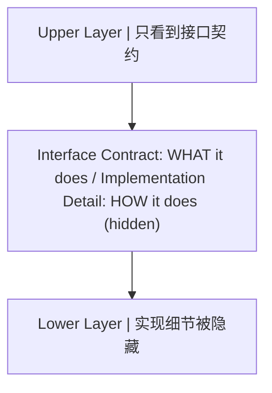

**关键洞察**：接口契约的稳定性决定了系统的可演化性。只要接口不变，下层实现可以任意替换（例如：同一ISA可以有不同的微架构实现）。

### 3.3 跨层交互模式

| 模式     | 描述                 | 示例                             |
| -------- | -------------------- | -------------------------------- |
| 逐层调用 | 上层严格调用下层接口 | 应用 -> 系统调用 -> 内核 -> 驱动 |
| 跨层优化 | 跳过中间层直接交互   | 用户态IO (DPDK) / 用户态网络栈   |
| 层泄漏   | 下层细节穿透到上层   | CPU缓存行对齐影响程序性能        |
| 反向通知 | 下层主动通知上层     | 中断 / 信号 / 回调               |

### 3.4 抽象的代价

抽象并非免费，每次跨越抽象边界都有代价：

- **性能代价**：系统调用开销（上下文切换）、虚拟化开销（地址翻译）
- **语义鸿沟**：高层语义与底层实现的不匹配（如：C++虚函数 vs 分支预测）
- **调试困难**：跨层问题难以定位（如：内存屏障导致的并发Bug）

> 跨模块引用：[C语言](c/overview)的指针操作直接穿透了语言运行时层到达指令集层，这是C语言"接近硬件"的本质原因。[C++](cpp/overview)的RAII则在语言运行时层提供了资源管理的抽象。

---

## 4. 三大主线：体系结构 / 协议栈 / 状态机

本模块以三条主线贯穿所有章节，它们分别回答了计算系统的三个根本问题：

### 4.1 体系结构主线 -- "资源如何组织"

**核心问题**：硬件资源如何被组织、寻址、调度？

体系结构主线关注的是**空间维度**的布局：计算单元、存储层次、互连网络如何构成一个可编程的系统。

```
体系结构主线贯穿图:

[architecture]  CPU微架构 + 存储层次 + 总线协议
      |
      v
[os]            虚拟化体系: 虚拟CPU(进程) + 虚拟内存 + 虚拟文件系统
      |
      v
[network]       网络拓扑: 端系统 + 路由器 + 链路
      |
      v
[compiler]      代码布局: 指令调度 + 寄存器分配 + 缓存优化
```

### 4.2 协议栈主线 -- "数据如何传输"

**核心问题**：数据如何在不同抽象层间被封装、传输、解封？

协议栈主线关注的是**通信维度**的规则：每一层添加自己的头部/尾部，形成封装-传输-解封的流水线。

```
协议栈主线贯穿图:

[architecture]  总线协议: 请求/响应握手、缓存一致性协议(MESI)
      |
      v
[os]            系统调用协议: ABI约定、进程间通信协议
      |
      v
[network]       TCP/IP协议栈: 应用层/传输层/网络层/链路层
      |
      v
[compiler]      编译协议: 词法->语法->语义->中间码->目标码
```

**封装原理的统一性**：无论是网络包的封装还是函数调用的栈帧构建，本质都是同一模式：

```
// 封装模式伪代码
struct EncapsulatedData {
    Header  header;      // 本层的元数据
    Payload payload;     // 上层传递下来的数据
    Trailer trailer;     // 可选的尾部校验
};
```

### 4.3 状态机主线 -- "行为如何建模"

**核心问题**：动态行为如何被建模为状态转移图？

状态机主线关注的是**时间维度**的演化：系统在不同状态间如何转移，转移条件是什么，哪些状态是安全的。

```
状态机主线贯穿图:

[architecture]  CPU控制单元FSM: 取指->译码->执行->访存->写回
      |
      v
[os]            进程状态机: 创建->就绪->运行->阻塞->终止
      |
      v
[network]       TCP状态机: CLOSED->SYN_SENT->ESTABLISHED->...
      |
      v
[compiler]      词法分析器FSM / 解析器状态栈
```

**状态机的形式化定义**：

```
FSM = (Q, Sigma, delta, q0, F)

Q     = 有限状态集合
Sigma = 输入字母表
delta = Q x Sigma -> Q  (转移函数)
q0    = 初始状态
F     = 接受状态集合
```

> 跨模块引用：[离散数学](discrete-math)中的自动机理论是状态机主线的数学基础。[Java](java/overview)线程的状态模型与OS进程状态机直接对应。

### 4.4 三线交叉矩阵

| 章节            | 体系结构       | 协议栈           | 状态机              |
| --------------- | -------------- | ---------------- | ------------------- |
| architecture    | 主导           | 辅助(总线协议)   | 辅助(控制单元FSM)   |
| os              | 主导(虚拟化)   | 辅助(IPC协议)    | 主导(进程/线程状态) |
| network         | 辅助(拓扑)     | 主导(TCP/IP)     | 主导(TCP FSM)       |
| compiler        | 辅助(目标机)   | 辅助(编译流水线) | 主导(词法/语法FSM)  |
| discrete-math   | -              | -                | 主导(自动机理论)    |
| design-patterns | 辅助(架构模式) | 辅助(通信模式)   | 主导(状态模式)      |

---

## 5. 计算理论的哲学基础

### 5.1 可计算性理论

**丘奇-图灵论题**（Church-Turing Thesis）：任何"可有效计算"的函数都可以被图灵机计算。这不是定理，而是关于"计算"这一直觉概念的论题。

**图灵机的形式化定义**：

```
TM = (Q, Sigma, Gamma, delta, q0, B, F)

Q      = 状态集合
Sigma  = 输入字母表 (不含空白符B)
Gamma  = 纸带字母表 (Sigma的超集, 含B)
delta  = Q x Gamma -> Q x Gamma x {L, R}
q0     = 初始状态
B      = 空白符
F      = 终止状态集合
```

**图灵机模拟器伪代码**：

```python
def turing_machine(tape, transition_fn, initial_state, accept_states):
    head = 0
    state = initial_state
    while state not in accept_states:
        symbol = tape[head]
        new_state, new_symbol, direction = transition_fn(state, symbol)
        tape[head] = new_symbol
        state = new_state
        head += 1 if direction == 'R' else -1
    return tape
```

### 5.2 停机问题

**定理**：不存在通用算法H，使得对任意程序P和输入I，H(P, I)能判定P(I)是否停机。

**反证法证明概要**：

```
假设存在停机判定器 H(P, I):
  H(P, I) =   如果 P(I) 停机
  H(P, I) = false 如果 P(I) 不停机

构造悖论程序 D:
  D(P):
    if H(P, P) == true:
      loop_forever()    // 如果P(P)停机，则D(P)不停机
    else:
      halt()            // 如果P(P)不停机，则D(P)停机

考虑 D(D):
  若 H(D, D) ==   => D(D)不停机 => 矛盾
  若 H(D, D) == false => D(D)停机   => 矛盾
故 H 不存在。
```

### 5.3 计算复杂性类

```
复杂性类层次:

ALL (所有判定问题)
 |
PSPACE (多项式空间可解)
 |
 NP (非确定性多项式时间可解)
  |
  P (确定性多项式时间可解)
   |
  LOGSPACE (对数空间可解)
```

| 复杂性类    | 定义                    | 典型问题                    |
| ----------- | ----------------------- | --------------------------- |
| P           | O(n^k) 时间可解         | 排序、最短路径、矩阵乘法    |
| NP          | 多项式时间可验证        | 旅行商(判定版)、SAT、子集和 |
| NP-complete | NP中最难的问题          | 3-SAT、图着色、背包         |
| NP-hard     | 至少和NP-complete一样难 | 停机问题、最优旅行商        |
| PSPACE      | 多项式空间可解          | QBF、地理游戏               |

**P vs NP问题**：P = NP 是否成立是千禧年数学难题之一。若P=NP，则所有可快速验证的问题都可快速求解，密码学体系将崩塌。

### 5.4 对后续模块的影响

| 理论结果         | 影响的模块                  | 具体影响                                           |
| ---------------- | --------------------------- | -------------------------------------------------- |
| 停机问题不可判定 | [编译原理](compiler)        | 无法构建完美的程序分析器                           |
| Chomsky层次      | [编译原理](compiler)        | 正则语言/上下文无关语言决定词法/语法分析的能力边界 |
| NP-completeness  | [设计模式](design-patterns) | 某些优化问题需要启发式/近似算法                    |
| 信息熵           | [计算机网络](network)       | 信道容量、数据压缩的理论极限                       |
| 自动机理论       | [离散数学](discrete-math)   | DFA/NFA/正则表达式的等价性                         |

---

## 6. 本模块的知识依赖图

### 6.1 DAG依赖关系

以有向无环图（DAG）呈现各章节间的前置依赖关系：

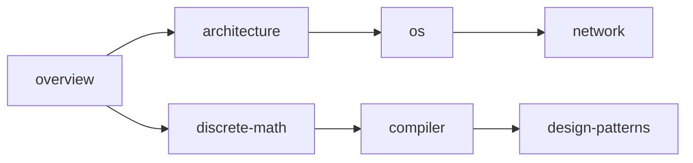

### 6.2 与其他模块的交叉引用

| 本模块章节      | 外部模块引用                                  | 交叉原因                     |
| --------------- | --------------------------------------------- | ---------------------------- |
| architecture    | [C语言](c/overview\)                          | C的内存模型直接映射到硬件    |
| os              | [C++](cpp/overview\)                          | C++的线程模型与OS线程对应    |
| compiler        | [Java](java/overview\)                        | JVM是编译目标+运行时的统一体 |
| network         | [Java](java/overview\)                        | Java NIO/Netty与网络编程     |
| design-patterns | [C++](cpp/overview\) / [Java](java/overview\) | 设计模式的语言实现差异       |

---

## 7. 速查表

### 7.1 核心概念速查

| 概念         | 一句话定义             | 所属主线        |
| ------------ | ---------------------- | --------------- |
| 冯诺依曼架构 | 存储程序 + 顺序执行    | 体系结构        |
| 缓存一致性   | 多核间数据一致性协议   | 体系结构/协议栈 |
| 进程         | 资源分配的基本单位     | 体系结构/状态机 |
| 虚拟内存     | 地址空间的间接映射     | 体系结构        |
| TCP三次握手  | 连接建立的状态同步     | 协议栈/状态机   |
| 词法分析     | 字符流到Token流的FSM   | 状态机          |
| P vs NP      | 验证与求解的复杂度鸿沟 | 计算理论        |

### 7.2 抽象层级速查

| 层级        | 关键抽象         | 接口类型     | 典型实现              |
| ----------- | ---------------- | ------------ | --------------------- |
| L7 应用     | 用户功能         | API / GUI    | 浏览器、编辑器        |
| L6 运行时   | 类型/线程/GC     | ABI / 字节码 | JVM、CLR、V8          |
| L5 操作系统 | 进程/文件/Socket | 系统调用     | Linux、Windows        |
| L4 指令集   | 指令/寄存器      | ISA规范      | x86-64、ARMv8、RISC-V |
| L3 微架构   | 流水线/缓存      | 微操作       | Intel Core、Apple M1  |
| L2 数字逻辑 | 门/触发器/FSM    | 布尔函数     | ALU、寄存器堆         |
| L1 物理     | 晶体管/电压      | 电信号       | CMOS工艺              |

### 7.3 三大主线速查

```
体系结构主线:  空间布局  -- "在哪里"
  CPU -> Cache -> Memory -> Disk -> Network
  核心问题: 寻址、层次、局部性

协议栈主线:    通信规则  -- "怎么传"
  封装 -> 传输 -> 解封
  核心问题: 头部格式、握手协议、错误恢复

状态机主线:    时间演化  -- "何时变"
  状态 -> 事件 -> 新状态
  核心问题: 状态定义、转移条件、终止判定
```

<!-- ============================================================ cs-fundamentals/002-ComputerArchitectureBasics ============================================================ -->

## 1. 冯·诺依曼体系结构

现代计算机的理论基础来自1945年约翰·冯·诺依曼提出的"存储程序"思想。其核心观点是：**程序和数据以同等地位存储在同一存储器中，由控制器按顺序从存储器中取出指令并执行**。

### 1.1 五大组成部分

冯·诺依曼体系结构将计算机划分为五个功能部件：

| 部件     | 功能                                     | 类比      |
| -------- | ---------------------------------------- | --------- |
| 控制器   | 从存储器取指令、译码、控制各部件协调工作 | 乐队指挥  |
| 运算器   | 执行算术运算和逻辑运算                   | 计算器    |
| 存储器   | 存放程序和数据                           | 书架      |
| 输入设备 | 将外部信息转换为计算机能识别的数据       | 眼睛/耳朵 |
| 输出设备 | 将计算结果转换为人类可感知的形式         | 嘴巴/手   |

> 控制器和运算器合称为**中央处理器（CPU）**。

### 1.2 存储程序原理

存储程序是冯·诺依曼体系结构最核心的思想：

1. 程序和数据以二进制形式存放在存储器中
2. 计算机运行时，从存储器中依次取出指令并执行
3. 指令的执行顺序可以通过跳转指令改变
4. 存储器中的内容既可以被读取也可以被修改

```mermaid
flowchart TD
    subgraph Mem[存储器]<br/>指令1 指令2 指令3 数据1 数据2
    end
    Mem -->|取指令| C[控制器<br/>指令寄存器/程序计数器]
    Mem -->|读/写数据| A[运算器<br/>累加器/ALU]
```

### 1.3 冯·诺依曼瓶颈

由于指令和数据共享同一条总线，CPU与存储器之间的数据传输速率成为系统性能的瓶颈，这被称为**冯·诺依曼瓶颈**。现代计算机通过缓存、流水线等技术缓解此问题。

## 2. CPU 工作原理

CPU是计算机的"大脑"，由控制器和运算器两部分组成。

### 2.1 控制器

控制器负责协调计算机各部件的工作，主要包含以下寄存器：

| 寄存器            | 作用                           |
| ----------------- | ------------------------------ |
| PC（程序计数器）  | 存放下一条要执行的指令地址     |
| IR（指令寄存器）  | 存放当前正在执行的指令         |
| MAR（地址寄存器） | 存放要访问的存储器地址         |
| MDR（数据寄存器） | 存放从存储器读出或要写入的数据 |

### 2.2 运算器

运算器（ALU，算术逻辑单元）执行具体的计算：

- **算术运算**：加、减、乘、除
- **逻辑运算**：与、或、非、异或
- **移位操作**：左移、右移
- **比较操作**：等于、大于、小于

```c
// ALU 的简化模型
int ALU(int operand1, int operand2, int opcode) {
    switch (opcode) {
        case ADD: return operand1 + operand2;
        case SUB: return operand1 - operand2;
        case AND: return operand1 & operand2;
        case OR:  return operand1 | operand2;
        case XOR: return operand1 ^ operand2;
        case SHL: return operand1 << operand2;
        case SHR: return operand1 >> operand2;
        default:  return 0;
    }
}
```

### 2.3 CPU 内部结构示意

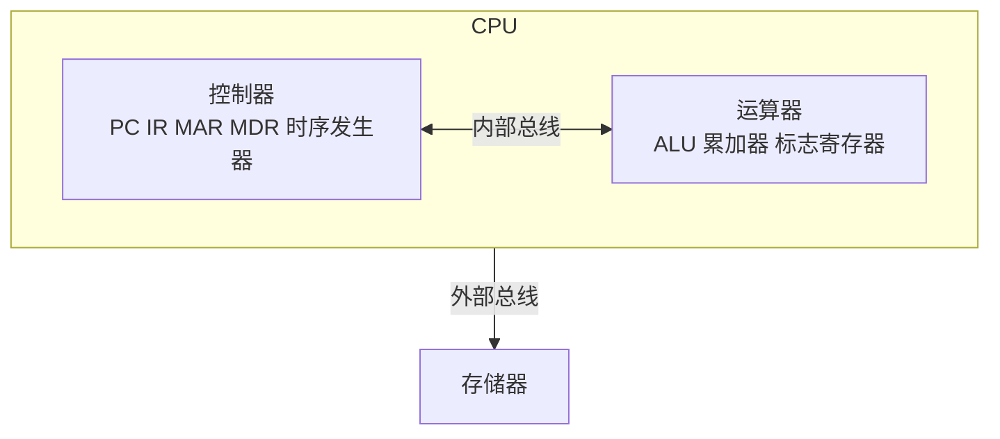

## 3. 指令周期

CPU执行一条指令的过程称为**指令周期**，通常分为以下几个阶段：

### 3.1 取指（Fetch）

1. 将 PC 中的地址送入 MAR
2. 通过地址总线将 MAR 中的地址发送给存储器
3. 存储器将对应地址的数据通过数据总线送入 MDR
4. 将 MDR 中的指令送入 IR
5. PC 自增，指向下一条指令

### 3.2 译码（Decode）

1. 分析 IR 中指令的操作码
2. 确定要执行的操作类型
3. 识别操作数地址

### 3.3 执行（Execute）

1. 根据译码结果执行相应操作
2. 可能需要从存储器读取操作数
3. ALU 执行计算
4. 将结果写回寄存器或存储器

### 3.4 指令周期流程

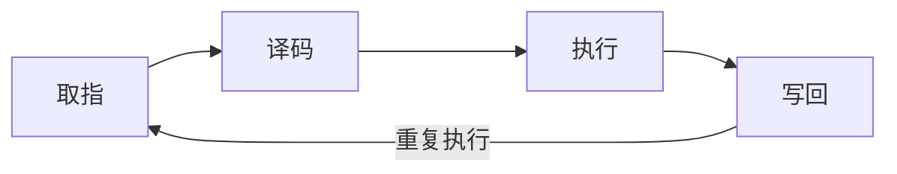

### 3.5 用代码理解指令周期

```c
// 模拟简化的指令周期
void cpu_run() {
    while (running) {
        // 取指：从存储器取出PC指向的指令
        int instruction = memory[PC];

        // 译码：分离操作码和操作数
        int opcode  = (instruction >> 12) & 0xF;  // 高4位为操作码
        int operand = instruction & 0xFFF;         // 低12位为操作数

        // 执行：根据操作码执行对应操作
        switch (opcode) {
            case LOAD:  // 加载数据到累加器
                accumulator = memory[operand];
                break;
            case STORE: // 将累加器数据存入存储器
                memory[operand] = accumulator;
                break;
            case ADD:   // 加法
                accumulator += memory[operand];
                break;
            case SUB:   // 减法
                accumulator -= memory[operand];
                break;
            case JUMP:  // 无条件跳转
                PC = operand;
                continue;  // 跳过PC自增
            case HALT:  // 停机
                running = 0;
                break;
        }

        PC++;  // 程序计数器自增
    }
}
```

### 3.6 时钟周期与指令周期

| 概念     | 定义                                 | 关系                |
| -------- | ------------------------------------ | ------------------- |
| 时钟周期 | CPU 时钟脉冲的一个周期，最小时间单位 | 基本单位            |
| 机器周期 | 完成一个基本操作所需的时间           | 通常 = 若干时钟周期 |
| 指令周期 | 执行一条指令所需的时间               | = 若干机器周期      |

> 现代CPU通过**流水线技术**让多条指令的不同阶段重叠执行，大幅提升吞吐量。例如五级流水线：取指→译码→执行→访存→写回，五条指令可以同时在不同阶段运行。

## 4. 存储层次

计算机的存储系统按照速度、容量和价格形成层次结构，从快到慢、从小到大：

### 4.1 存储层次结构

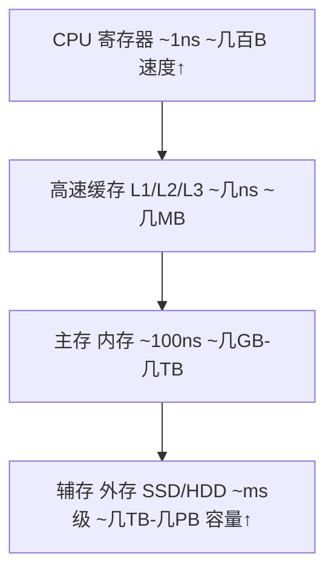

### 4.2 各级存储详细对比

| 层次       | 典型容量    | 访问时间   | 是否易失 | 典型用途             |
| ---------- | ----------- | ---------- | -------- | -------------------- |
| 寄存器     | 几十~几百B  | < 1ns      | 是       | 指令执行中的临时数据 |
| L1 缓存    | 32~64 KB    | 1~2 ns     | 是       | 最频繁使用的数据     |
| L2 缓存    | 256 KB~1 MB | 3~10 ns    | 是       | 较频繁使用的数据     |
| L3 缓存    | 4~64 MB     | 10~30 ns   | 是       | 多核共享数据         |
| 主存(DRAM) | 8~128 GB    | 50~100 ns  | 是       | 运行中的程序和数据   |
| SSD        | 256 GB~4 TB | 0.1~0.5 ms | 否       | 持久化存储           |
| HDD        | 1~20 TB     | 5~15 ms    | 否       | 大容量归档存储       |

### 4.3 缓存工作原理

缓存利用了**局部性原理**：

- **时间局部性**：最近被访问的数据，很可能在不久后再次被访问
- **空间局部性**：被访问数据附近的数据，很可能也会被访问

```c
// 缓存命中与未命中的概念
int data[1000];

// 时间局部性：sum 被反复读写
int sum = 0;
for (int i = 0; i < 1000; i++) {
    sum += data[i];  // sum 会被缓存
}

// 空间局部性：顺序访问数组
// data[0] 被访问后，data[1], data[2]... 也会被预取到缓存
for (int i = 0; i < 1000; i++) {
    process(data[i]);
}
```

### 4.4 缓存命中率

缓存命中率是衡量缓存效率的关键指标：

```
命中率 = 缓存命中次数 / 总访问次数 × 100%
```

| 场景    | 典型命中率 | 说明                     |
| ------- | ---------- | ------------------------ |
| L1 缓存 | 90%~95%    | 大多数指令和数据在L1命中 |
| L2 缓存 | 80%~90%    | L1未命中的大部分在L2命中 |
| L3 缓存 | 70%~85%    | L2未命中的大部分在L3命中 |

> 缓存每提升1%的命中率，程序性能可能有数个百分点的提升。编写缓存友好的代码是性能优化的重要手段。

## 5. 总线系统

总线是计算机各部件之间传送信息的公共通道。

### 5.1 总线分类

按功能划分，总线分为三类：

| 总线类型 | 传输内容            | 方向          | 宽度           |
| -------- | ------------------- | ------------- | -------------- |
| 地址总线 | 内存地址/IO端口地址 | CPU→存储器/IO | 决定寻址空间   |
| 数据总线 | 数据                | 双向          | 决定一次传输量 |
| 控制总线 | 控制信号            | 双向          | 读写/中断等    |

### 5.2 总线工作示例：读内存

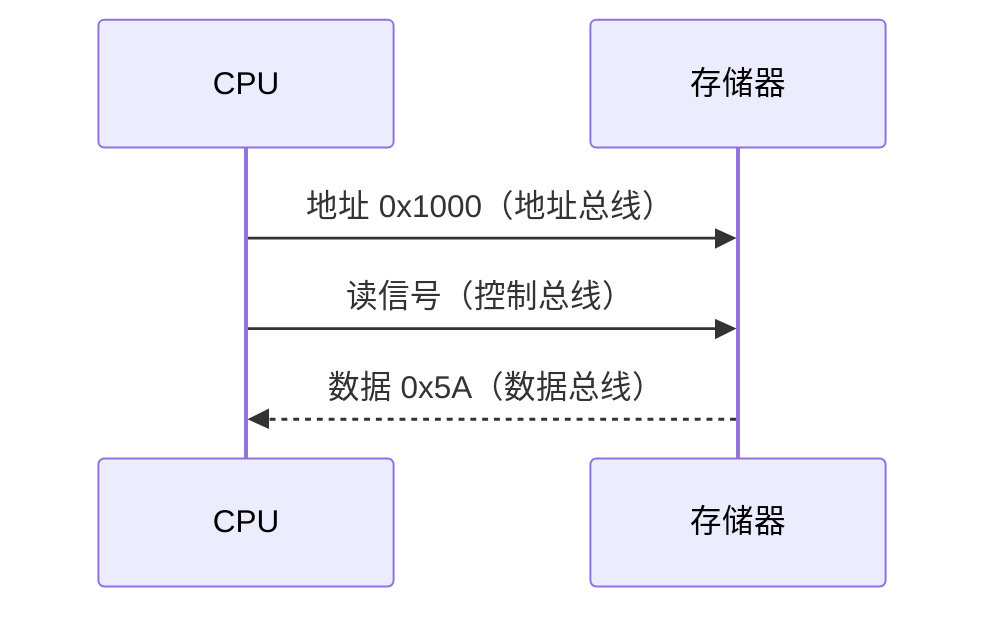

### 5.3 地址总线与寻址空间

地址总线的宽度决定了CPU能直接寻址的内存空间大小：

| 地址总线宽度 | 寻址空间 | 计算               |
| ------------ | -------- | ------------------ |
| 16 位        | 64 KB    | 2^16 = 65,536 B    |
| 20 位        | 1 MB     | 2^20 = 1,048,576 B |
| 32 位        | 4 GB     | 2^32 ≈ 4.3×10^9 B  |
| 64 位        | 16 EB    | 2^64 ≈ 1.8×10^19 B |

```c
// 32位系统的寻址空间计算
// 地址总线32根，每根线0或1
// 可表示地址数 = 2^32 = 4,294,967,296
// 每个地址对应1字节
// 总寻址空间 = 4,294,967,296 字节 = 4 GB

#include <stdio.h>
int main() {
    // 32位指针的大小
    printf("指针大小: %zu 字节\n", sizeof(void*));  // 4 (32位) 或 8 (64位)

    // 理论寻址空间
    unsigned long long addr_space = 1ULL << 32;
    printf("32位寻址空间: %llu 字节 = %llu GB\n",
           addr_space, addr_space / (1024*1024*1024));
    return 0;
}
```

### 5.4 数据总线与传输效率

数据总线的宽度决定了CPU一次能传输的数据量：

| 数据总线宽度 | 一次传输 | 说明           |
| ------------ | -------- | -------------- |
| 8 位         | 1 字节   | 早期8位机      |
| 16 位        | 2 字节   | 8086等16位机   |
| 32 位        | 4 字节   | 80386等32位机  |
| 64 位        | 8 字节   | 现代64位处理器 |

### 5.5 总线仲裁

当多个设备同时请求使用总线时，需要通过总线仲裁决定优先级：

- **链式查询**：设备串行连接，离仲裁器越近优先级越高
- **计数器定时**：从某个起始地址开始计数，被计数的设备获得总线
- **独立请求**：每个设备有独立的请求线和授权线，响应最快

## 6. 哈佛架构与冯·诺依曼架构对比

| 特性         | 冯·诺依曼架构    | 哈佛架构           |
| ------------ | ---------------- | ------------------ |
| 指令与数据   | 共用存储器和总线 | 分开存储，独立总线 |
| 总线数量     | 1套              | 2套                |
| 取指与取数据 | 不能同时进行     | 可以同时进行       |
| 实现复杂度   | 较低             | 较高               |
| 典型应用     | 通用计算机       | DSP、嵌入式、ARM   |

> 现代CPU通常采用**改进型哈佛架构**：在CPU内部（L1缓存层）使用哈佛架构（指令缓存和数据缓存分离），在外部使用冯·诺依曼架构（统一主存），兼顾两者优势。

## 7. 小结

| 概念          | 要点                                     |
| ------------- | ---------------------------------------- |
| 冯·诺依曼架构 | 五大部件、存储程序原理、指令数据共享总线 |
| CPU           | 控制器+运算器，通过寄存器暂存中间结果    |
| 指令周期      | 取指→译码→执行→写回，流水线提升吞吐量    |
| 存储层次      | 寄存器→缓存→内存→外存，速度递减容量递增  |
| 总线系统      | 地址总线定寻址空间，数据总线定传输宽度   |

理解计算机体系结构是学习操作系统、编译原理和性能优化的基础。后续章节将在此基础上深入探讨数据表示和程序设计。

<!-- ============================================================ cs-fundamentals/003-ComputerArchitecture ============================================================ -->

## 1. 冯诺依曼体系与哈佛体系

### 1.1 冯诺依曼体系的核心思想

冯诺依曼体系结构的三大核心原则：

1. **存储程序**：指令和数据存储在同一存储器中
2. **顺序执行**：指令按存储顺序依次执行（除非遇到分支）
3. **二进制表示**：指令和数据均以二进制编码

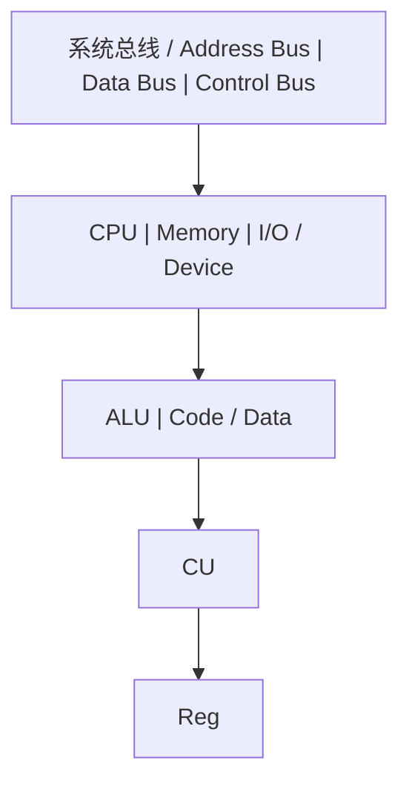

### 1.2 冯诺依曼瓶颈

指令和数据共享同一总线，CPU无法同时读取指令和数据。这是冯诺依曼体系最根本的性能瓶颈。

```
执行一条指令的时间线:

|---取指---|---译码---|---执行---|---访存---|---写回---|
   ^                                                ^
   |          指令和数据争用同一总线                   |
   +------------------------------------------------+
```

**缓解策略**：

- 缓存分离：L1 Cache分为L1I（指令）和L1D（数据），在缓存层实现哈佛体系
- 预取：提前将指令/数据加载到缓存
- 乱序执行：在等待访存时执行其他指令

### 1.3 哈佛体系

哈佛体系将指令存储器和数据存储器分离，拥有独立的总线：

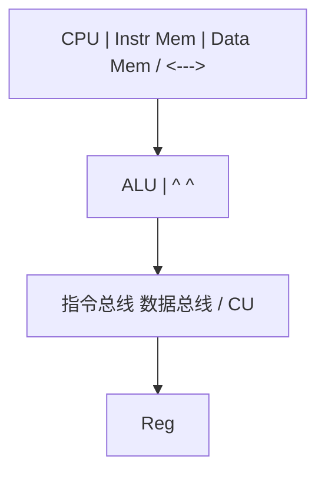

**对比**：

| 特性          | 冯诺依曼         | 哈佛          |
| ------------- | ---------------- | ------------- |
| 指令/数据存储 | 统一             | 分离          |
| 总线          | 共享             | 独立          |
| 带宽          | 受限             | 双倍          |
| 灵活性        | 高（代码即数据） | 低            |
| 典型应用      | 通用计算机       | DSP、微控制器 |

> 跨模块引用：[C语言](c/overview)的函数指针特性直接利用了冯诺依曼体系中"代码即数据"的本质。[操作系统](os)的虚拟内存管理通过MMU在冯诺依曼体系上实现了地址空间的隔离。

---

## 2. 指令集体系结构 (ISA)

### 2.1 ISA的设计哲学

ISA是硬件和软件之间的**接口契约**（参见[概述](overview)的抽象层级模型）。ISA定义了：

- 指令格式与编码
- 寄存器集合
- 寻址模式
- 数据类型
- 异常/中断模型
- 内存模型

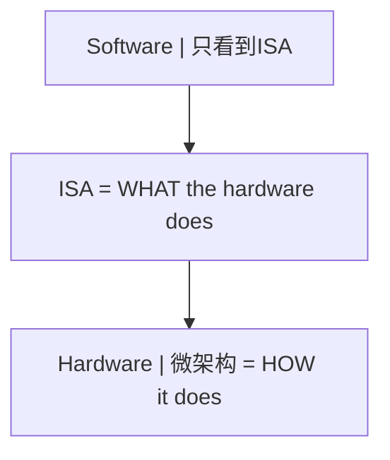

### 2.2 CISC vs RISC

| 维度     | CISC (x86)       | RISC (ARM/RISC-V) |
| -------- | ---------------- | ----------------- |
| 指令长度 | 可变 (1-15字节)  | 固定 (4字节)      |
| 指令数量 | 多 (>1000)       | 少 (<200)         |
| 寻址模式 | 丰富             | 简单 (Load/Store) |
| 微操作   | 需要解码为微操作 | 指令即微操作      |
| 编码密度 | 高               | 低                |
| 流水线   | 复杂             | 简单              |
| 功耗     | 高               | 低                |

**设计哲学差异**：

```
CISC哲学:  让硬件做更多事，简化编译器
  MOV EAX, [EBX + ECX*4 + 0x10]   // 一条指令完成复杂操作

RISC哲学:  让编译器做更多事，简化硬件
  SLLI T0, T1, 2      // 移位
  ADD  T0, T0, T2     // 加基址
  LW   T3, 16(T0)     // 加载
```

### 2.3 RISC-V指令集示例

```
RISC-V寄存器约定:

x0  (zero) - 硬连线0
x1  (ra)   - 返回地址
x2  (sp)   - 栈指针
x5-x7  (t0-t2) - 临时寄存器
x8-x9  (s0-s1) - 保存寄存器
x10-x17 (a0-a7) - 参数/返回值
x18-x27 (s2-s11) - 保存寄存器
x28-x31 (t3-t6) - 临时寄存器
```

**RISC-V指令编码格式**：

```
R-type (寄存器-寄存器操作):
|31    25|24   20|19   15|14  12|11    7|6     0|
| funct7 |  rs2  |  rs1  |funct3|  rd   |opcode |

I-type (立即数操作):
|31      20|19   15|14  12|11    7|6     0|
|  imm[11:0]|  rs1  |funct3|  rd   |opcode |

S-type (存储操作):
|31    25|24   20|19   15|14  12|11    7|6     0|
|imm[11:5]|  rs2  |  rs1  |funct3|imm[4:0]|opcode |
```

### 2.4 寻址模式

```
寻址模式分类:

1. 立即寻址:    ADDI x1, x2, 100        // 操作数在指令中
2. 寄存器寻址:  ADD  x1, x2, x3         // 操作数在寄存器中
3. 基址偏移:    LW   x1, 100(x2)        // 基址+偏移量
4. PC相对:      BEQ  x1, x2, offset     // PC + 偏移量
5. 间接寻址:    JR   x1                  // 跳转到寄存器值
```

> 跨模块引用：[编译原理](compiler)的代码生成阶段需要根据ISA选择合适的寻址模式和指令调度。[C语言](c/overview)的指针算术直接映射到基址偏移寻址模式。

---

## 3. 流水线原理

### 3.1 五级流水线

经典的RISC五级流水线：

```
五级流水线时空图:

周期:    1     2     3     4     5     6     7
指令1:  IF    ID    EX    MEM   WB
指令2:        IF    ID    EX    MEM   WB
指令3:              IF    ID    EX    MEM   WB
指令4:                    IF    ID    EX    MEM   WB
指令5:                          IF    ID    EX    MEM   WB

IF  = Instruction Fetch (取指)
ID  = Instruction Decode (译码)
EX  = Execute (执行)
MEM = Memory Access (访存)
WB  = Write Back (写回)
```

**流水线加速比**：

```
理论加速比 = 流水线级数 n

实际加速比 = n / (1 + (n-1) * p)

其中 p = 由于冒险导致的停顿概率

CPI_ideal = 1 (每周期完成一条指令)
CPI_actual = 1 + stall_cycles_per_instruction
```

### 3.2 流水线冒险

三类冒险及其解决方案：

**数据冒险**：

```
RAW (Read After Write) -- 真依赖:
  ADD x1, x2, x3    // 写x1
  SUB x4, x1, x5    // 读x1 (需要ADD的结果)

解决方案: 数据前递 (Forwarding/Bypassing)

  ADD x1, x2, x3    [IF][ID][EX][MEM][WB]
                           |_______________^
  SUB x4, x1, x5         [IF][ID] [EX] [MEM][WB]
                                    ^
                              前递路径: EX/MEM -> EX
```

**控制冒险**：

```
分支指令导致的流水线冲刷:

  BEQ x1, x2, target  [IF][ID][EX][MEM][WB]
  instr2 (wrong)           [IF] [X] [X] [X]  <- 冲刷
  instr2 (wrong)                [IF] [X] [X]  <- 冲刷
  target_instr                      [IF][ID][EX]...

解决方案:
  1. 分支预测 (静态/动态)
  2. 延迟分支 (分支延迟槽)
  3. 分支目标缓存 (BTB)
```

**结构冒险**：

```
硬件资源冲突 (如指令和数据同时访存):

解决方案:
  1. 哈佛缓存 (L1I / L1D分离)
  2. 资源复制
  3. 流水线停顿
```

### 3.3 动态分支预测

```
2-bit饱和计数器状态机:

         Weakly Taken
          /    ^    \
    NT   /     |     \  T
        v      |      v
  Weakly NT    |    Strongly Taken
        \      |      /
    NT   \     |     /  T
          v    |    v
         Strongly NT

状态转移:
  00: Strongly Not Taken
  01: Weakly Not Taken
  10: Weakly Taken
  11: Strongly Taken

预测规则: 高位为1则预测Taken，高位为0则预测Not Taken
```

**两级自适应预测器**：

```
GShare预测器:

  全局历史寄存器 (GHR): 记录最近k次分支结果
       |
       v
  GHR XOR PC -> 索引模式历史表 (PHT)
                    |
                    v
              2-bit饱和计数器 -> 预测结果
```

### 3.4 超标量与乱序执行

```
超标量流水线 (每个周期发射多条指令):

  取指 -> 译码 -> 重命名 -> 发射 -> 执行 -> 写回 -> 提交
   |       |       |        |       |       |       |
  多条    多条   消除假    保留站  多功能  重排    顺序
  指令    指令   依赖(WAR  (RS)   单元    缓冲    提交
                 WAW)

乱序执行的关键数据结构:

  Register Alias Table (RAT): 逻辑寄存器 -> 物理寄存器映射
  Reorder Buffer (ROB): 保证顺序提交
  Reservation Station (RS): 等待操作数就绪
```

> 跨模块引用：[操作系统](os)的进程上下文切换需要保存/恢复流水线状态。[编译原理](compiler)的指令调度需要理解流水线冒险以避免性能损失。

---

## 4. 存储层次结构

### 4.1 存储层次金字塔

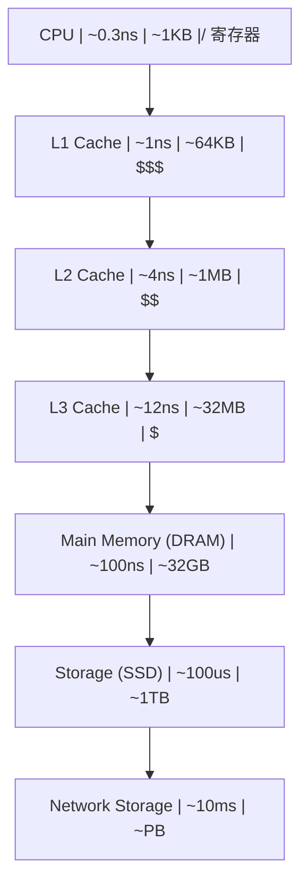

### 4.2 局部性原理

局部性是存储层次有效性的理论基础：

**时间局部性**（Temporal Locality）：最近访问的数据很可能再次被访问

```
for (i = 0; i < N; i++) {
    sum += a[i];  // sum 在每次迭代都被访问 -> 时间局部性
}
```

**空间局部性**（Spatial Locality）：访问某地址后，附近地址很可能被访问

```
for (i = 0; i < N; i++) {
    a[i] = 0;  // a[i], a[i+1] 相邻 -> 空间局部性
}
```

### 4.3 缓存设计

**缓存映射方式**：

```
1. 直接映射 (Direct-Mapped):
   每个内存块只能映射到一个缓存行
   index = block_address % cache_lines

   优点: 硬件简单，查找快
   缺点: 冲突率高

2. 组相联 (Set-Associative):
   每个内存块可映射到一组中的任意行
   index = block_address % num_sets
   组内全相联查找

   优点: 冲突率低
   缺点: 硬件复杂度增加

3. 全相联 (Fully-Associative):
   内存块可映射到任意缓存行
   全部行并行查找

   优点: 冲突率最低
   缺点: 硬件最复杂，功耗高
```

**缓存寻址分解**：

```
内存地址分解:

|-------- Tag --------|--- Index ---|--- Offset ---|
|                     |             |              |
| 标识哪个内存块       | 映射到哪一组  | 块内偏移      |

缓存查找过程:
  1. 用 Index 选择组
  2. 用 Tag 与组内所有行的Tag比较
  3. 若匹配且Valid=1 -> 命中 (Hit)
  4. 否则 -> 未命中 (Miss)
```

**缓存替换策略**：

```
LRU (Least Recently Used):
  替换最久未访问的行
  实现方式: 年龄计数器 / 伪LRU树

伪LRU (PLRU) 树形结构 (4路示例):

          bit0
         /    \
      bit1    bit2
      / \     / \
    W0  W1  W2  W3

  bit=0: 左子树更久未用
  bit=1: 右子树更久未用
  访问时翻转路径上的位
  替换时沿位指示方向走到叶节点
```

### 4.4 缓存一致性协议 (MESI)

多核系统中，每个核心有自己的L1/L2缓存，必须保证一致性：

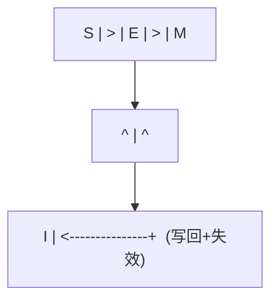

**MESI伪代码**：

```python
def cache_read(cache, addr):
    line = cache.find(addr)
    if line and line.state != INVALID:
        return line.data                    # Cache Hit
    # Cache Miss
    bus_broadcast(BusRd, addr)
    if other_cache_has(addr, MODIFIED):
        other_cache.flush_and_downgrade(addr)  # M -> S
        data = memory_or_bus_read(addr)
        cache.store(addr, data, SHARED)
    elif other_cache_has(addr, EXCLUSIVE):
        other_cache.downgrade(addr)            # E -> S
        data = memory_read(addr)
        cache.store(addr, data, SHARED)
    else:
        data = memory_read(addr)
        cache.store(addr, data, EXCLUSIVE)
    return data
```

### 4.5 虚拟内存

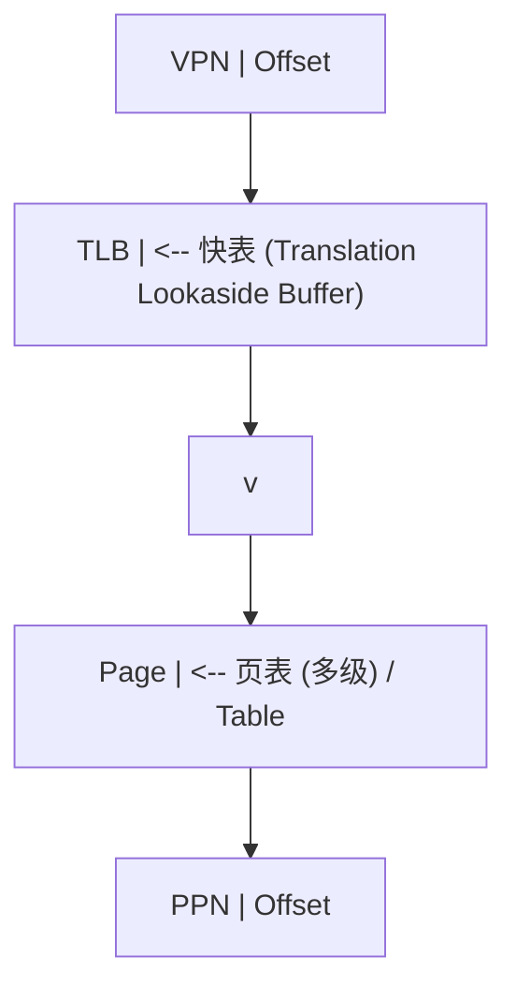

**多级页表结构**（以x86-64的4级页表为例）：

```
虚拟地址 (48位有效):
| PML4 (9b) | PDPT (9b) | PD (9b) | PT (9b) | Offset (12b) |

翻译过程:
  CR3 -> PML4表 -> PDPT表 -> PD表 -> PT表 -> 物理页

每级页表项 (PTE) 格式:
|--- Physical Frame Number ---| D | A | PC | G | U | W | P |
                               |   |   |    |   |   |   |
                               |   |   |    |   |   |   +-- Present
                               |   |   |    |   |   +------ Write
                               |   |   |    |   +---------- User
                               |   |   |    +-------------- Global
                               |   |   +------------------- Page Cache
                               |   +----------------------- Accessed
                               +--------------------------- Dirty
```

> 跨模块引用：[操作系统](os)的内存管理建立在虚拟内存机制之上。[C语言](c/overview)的指针解引用触发完整的地址翻译链路。[C++](cpp/overview)的智能指针在虚拟内存之上增加了语义层。

---

## 5. 总线与互连

### 5.1 总线分类

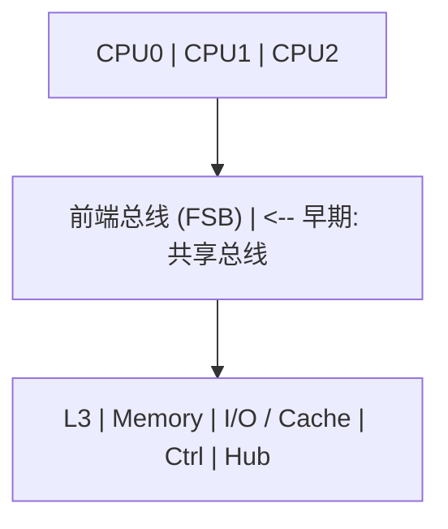

### 5.2 AMBA AXI协议

AXI (Advanced eXtensible Interface) 是ARM定义的高性能总线协议，包含5个独立通道：

```
AXI5通道架构:

  读地址通道 (AR):  ARADDR, ARLEN, ARSIZE, ARBURST, ARVALID, ARREADY
  读数据通道 (R):   RDATA, RRESP, RLAST, RVALID, RREADY
  写地址通道 (AW):  AWADDR, AWLEN, AWSIZE, AWBURST, AWVALID, AWREADY
  写数据通道 (W):   WDATA, WSTRB, WLAST, WVALID, WREADY
  写响应通道 (B):   BRESP, BVALID, BREADY

握手协议:
  VALID = 主设备数据有效
  READY = 从设备准备接收
  传输发生在 VALID && READY 的时钟沿

       CLK:  _|^|_|^|_|^|_|^|_|^|_|^|_|^|_
     VALID:  _________|^^^^^^^^^|_________
     READY:  _______________|^^^^^^^^^^^^^
     TRANS:  _______________|     |________
                           ^     ^
                        传输发生
```

### 5.3 PCIe协议栈

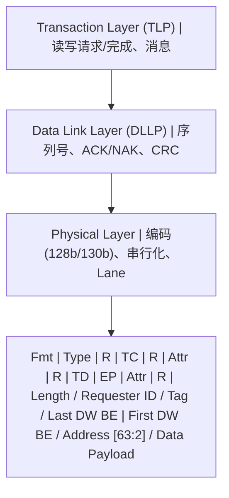

---

## 6. 并行体系结构

### 6.1 并行分类 (Flynn分类法)

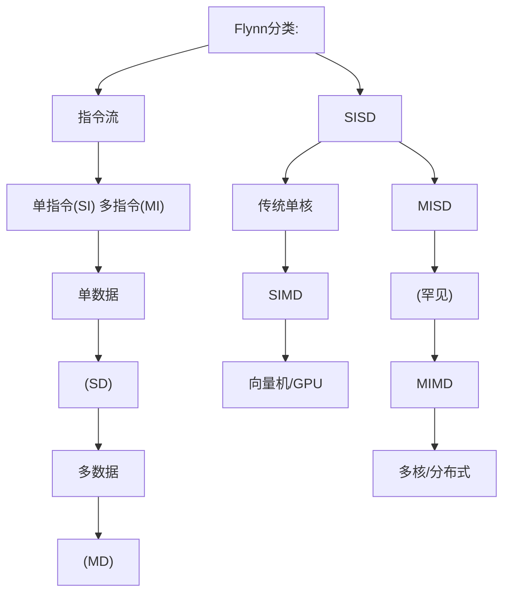

### 6.2 SIMD与向量化

```
SIMD执行模型:

标量执行 (SISD):
  ADD r1, r2, r3    // 1对数据相加

SIMD执行:
  VADD v1, v2, v3   // N对数据同时相加

  v1 = [a0, a1, a2, a3, a4, a5, a6, a7]  (256-bit AVX)
  v2 = [b0, b1, b2, b3, b4, b5, b6, b7]
  v3 = [a0+b0, a1+b1, a2+b2, a3+b3, a4+b4, a5+b5, a6+b6, a7+b7]

SIMD指令集演进:
  x86: MMX(64b) -> SSE(128b) -> AVX(256b) -> AVX-512(512b)
  ARM: NEON(128b) -> SVE(可变128-2048b)
```

### 6.3 GPU体系结构

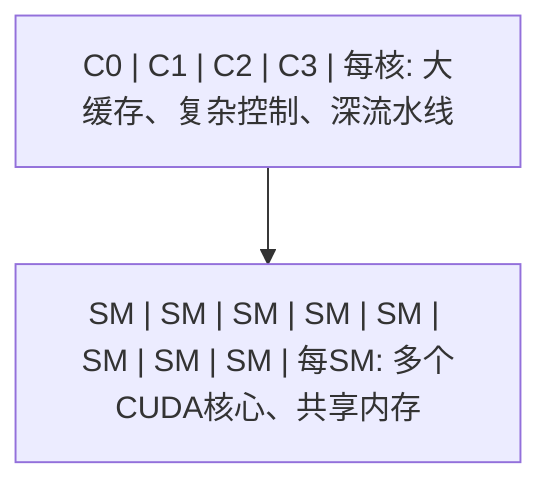

### 6.4 多核缓存一致性

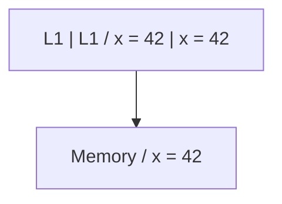

### 6.5 内存一致性模型

```
内存一致性模型谱系:

严格 <---> 宽松

Sequential Consistency (SC):
  所有线程看到相同的操作顺序
  等价于所有操作某种全局交错

Total Store Order (TSO) [x86]:
  写操作进入Store Buffer，后续读可先于写完成
  仅允许 Store -> Load 重排

Relaxed Consistency [ARM/RISC-V]:
  允许更多重排: Store->Store, Load->Load, Store->Load, Load->Store
  需要显式内存屏障 (FENCE) 同步

屏障指令:
  x86:    MFENCE, LFENCE, SFENCE
  ARM:    DMB, DSB, ISB
  RISC-V: FENCE, FENCE.I
```

> 跨模块引用：[C++](cpp/overview)的内存模型（memory_order_relaxed/acquire/release/seq_cst）直接映射到硬件一致性模型。[Java](java/overview)的volatile关键字在x86上无需额外屏障，但在ARM上需要dmb。

---

## 7. 速查表

### 7.1 ISA速查

| 特性       | x86-64   | ARMv8   | RISC-V     |
| ---------- | -------- | ------- | ---------- |
| 类型       | CISC     | RISC    | RISC       |
| 指令长度   | 1-15B    | 4B      | 4B(可扩展) |
| 通用寄存器 | 16       | 31      | 31         |
| 地址宽度   | 48/57b   | 48b     | 39/48/57b  |
| 字节序     | Little   | 双端    | Little     |
| 特权级     | Ring 0-3 | EL0-EL3 | U/S/M      |

### 7.2 流水线冒险速查

| 冒险类型 | 原因       | 解决方案      |
| -------- | ---------- | ------------- |
| RAW      | 真数据依赖 | 前递/转发     |
| WAR      | 反依赖     | 寄存器重命名  |
| WAW      | 输出依赖   | 寄存器重命名  |
| 控制     | 分支       | 预测/延迟槽   |
| 结构     | 资源冲突   | 资源复制/分离 |

### 7.3 存储层次速查

| 层级   | 延迟   | 容量  | 管理   |
| ------ | ------ | ----- | ------ |
| 寄存器 | ~0.3ns | ~1KB  | 编译器 |
| L1     | ~1ns   | ~64KB | 硬件   |
| L2     | ~4ns   | ~1MB  | 硬件   |
| L3     | ~12ns  | ~32MB | 硬件   |
| DRAM   | ~100ns | ~32GB | OS     |
| SSD    | ~100us | ~1TB  | OS     |
| HDD    | ~10ms  | ~10TB | OS     |

### 7.4 缓存一致性速查

| MESI状态 | 含义   | 可读 | 可写       | 与内存一致 |
| -------- | ------ | ---- | ---------- | ---------- |
| M        | 已修改 | 是   | 是         | 否         |
| E        | 独占   | 是   | 是         | 是         |
| S        | 共享   | 是   | 否(需升级) | 是         |
| I        | 无效   | 否   | 否         | -          |

<!-- ============================================================ cs-fundamentals/004-OperatingSystem ============================================================ -->

## 1. 操作系统概述

### 1.1 操作系统的定义与角色

操作系统是硬件与应用之间的**中间层**，提供三个核心抽象：

| 抽象     | 对应硬件资源    | 接口                  |
| -------- | --------------- | --------------------- |
| 进程     | CPU + 寄存器    | fork/exec/wait        |
| 虚拟内存 | 物理内存 + 磁盘 | mmap/brk/malloc       |
| 文件     | 磁盘/设备       | open/read/write/close |

```
操作系统在抽象层级中的位置 (参见 [概述](overview) 3.1节):

Layer 6: Application
         |  API
Layer 5: Language Runtime
         |  ABI / System Call
Layer 4: Operating System  <-- 本章节
         |  ISA / Driver Interface
Layer 3: Hardware

操作系统的双重角色:
  1. 面向上层: 提供简洁的抽象接口 (What)
  2. 面向下层: 管理复杂的硬件资源 (How)
```

### 1.2 内核架构

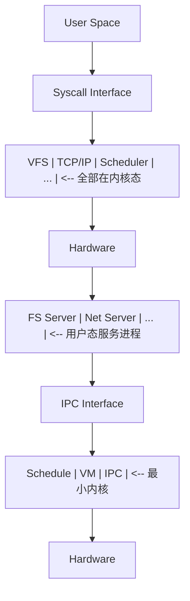

### 1.3 系统调用机制

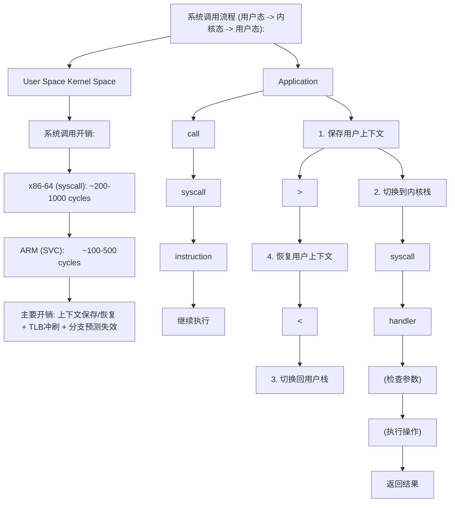

> 跨模块引用：[体系结构](architecture)的特权级（Ring 0/3, EL0/EL1）是系统调用机制的基础。[C语言](c/overview)的标准库(glibc)封装了系统调用接口。

---

## 2. 进程与线程

### 2.1 进程的状态机模型

进程是操作系统对运行程序的抽象，其生命周期可用状态机描述：

```mermaid
flowchart TD
    B0["fork/exec / v / scheduler / Ready | > | Running"]
    B1["^ / preempt/ / yield"]
    B0 --> B1
    B2["Blocked | <--IO/wait"]
    B1 --> B2
    B3["IO完成/wakeup / v"]
    B2 --> B3
    B4["Terminated"]
    B3 --> B4
```

### 2.2 进程控制块 (PCB)

```
进程控制块 (task_struct in Linux) 关键字段:

struct task_struct {
    pid_t               pid;          // 进程ID
    volatile long        state;        // 进程状态
    int                  prio;         // 优先级
    struct mm_struct    *mm;           // 内存管理信息
    struct files_struct *files;        // 打开文件表
    struct signal_struct*signal;       // 信号处理
    struct thread_info   thread_info;  // 底层线程信息
    struct sched_entity  se;           // 调度实体
    struct list_head     tasks;        // 进程链表
    void                *stack;        // 内核栈
    // ... 数百个字段
};
```

### 2.3 进程创建: fork()

```mermaid
flowchart TD
    B0["pid = 100 | pid = 101 / ppid = 1 | ppid = 100"]
    B1["fork() / 分配PCB / 复制页表(COW) / 复制fd表 / 设置ppid / 加入调度队列 / return 101 (child_pid) | return 0"]
    B0 --> B1
```

**fork伪代码**：

```c
pid_t fork(void) {
    struct task_struct *child = alloc_task_struct();
    copy_process(current, child);       // 复制PCB
    dup_mm(child, current->mm);         // 复制页表(COW)
    dup_fd(child, current->files);      // 复制文件描述符表
    wake_up_process(child);             // 加入调度队列
    if (current == child) return 0;     // 子进程返回0
    else return child->pid;             // 父进程返回子PID
}
```

### 2.4 线程模型

```mermaid
flowchart TD
    B0["Process"]
    B1["Thread | Thread | Thread / 栈 | 栈 | 栈"]
    B0 --> B1
    B2["共享: 代码段 | 数据段 | 堆 | fd表"]
    B1 --> B2
```

> 跨模块引用：[Java](java/overview)的Thread类在Linux上使用1:1模型(pthread)。[C++](cpp/overview)的std::thread同样映射到OS线程。Go的goroutine使用M:N模型。

---

## 3. 进程调度

### 3.1 调度算法

```
调度算法对比:

1. FCFS (先来先服务):
   队列: P1(24) -> P2(3) -> P3(3)
   等待时间: P1=0, P2=24, P3=27
   平均等待: (0+24+27)/3 = 17
   缺点: 护航效应 (短作业等长作业)

2. SJF (最短作业优先):
   队列: P2(3) -> P3(3) -> P1(24)
   等待时间: P2=0, P3=3, P1=6
   平均等待: (0+3+6)/3 = 3
   缺点: 长作业饥饿，需预知执行时间

3. RR (时间片轮转):
   时间片 q=4
   P1(24): run 4 -> run 4 -> run 4 -> ... -> run 4
   P2(3):  run 3 -> done
   P3(3):  run 3 -> done
   优点: 公平，响应快
   缺点: 时间片大小影响性能

4. 优先级调度:
   每个进程有优先级，高优先级先执行
   可配合: 老化(aging)防止饥饿
```

### 3.2 Linux CFS调度器

```
CFS (Completely Fair Scheduler) 核心思想:

  目标: 公平分配CPU时间给所有可运行进程

  虚拟运行时间 (vruntime):
    vruntime += 实际运行时间 * (NICE_0_LOAD / 进程权重)

    权重越高(优先级越高) -> vruntime增长越慢
    -> 被调度的机会越多

  红黑树:
    所有可运行进程按vruntime排序
    左下角 = vruntime最小 = 下一个被调度

  调度决策:
    1. 选择红黑树最左节点
    2. 运行直到vruntime不再是最小
    3. 重新插入红黑树

  时间片计算:
    time_slice = (调度周期 * 进程权重) / 总权重
```

**CFS伪代码**：

```python
def cfs_schedule(rq):
    leftmost = rq.rbtree.leftmost()
    next_task = leftmost.task
    current_task = rq.current

    if current_task.state == RUNNING:
        update_vruntime(current_task)
        rbtree_insert(rq.rbtree, current_task)

    rq.current = next_task
    rbtree_remove(rq.rbtree, next_task)
    context_switch(current_task, next_task)
```

### 3.3 上下文切换

```mermaid
flowchart TD
    B0["用户态上下文 | 用户态上下文 / 寄存器 | 寄存器 / 栈指针 | 栈指针 / PC | PC"]
    B1["^ / 1. 保存A的上下文到A的内核栈 / 2. 切换内核栈(A -> B) / 3. 从B的内核栈恢复B的上下文"]
    B0 --> B1
```

---

## 4. 同步与互斥

### 4.1 临界区问题

```
临界区问题的三个条件:

1. 互斥 (Mutual Exclusion):  同一时刻只有一个进程进入临界区
2. 前进 (Progress):          临界区空闲时，等待进程应能进入
3. 有限等待 (Bounded Wait):  进程等待进入临界区的时间有限

Peterson算法 (两进程互斥的软件方案):

  // 进程 Pi (i=0, j=1-i)
  flag[i] = true;
  turn = j;
  while (flag[j] && turn == j) { /* wait */ }
  // --- 临界区 ---
  flag[i] = false;
  // --- 剩余区 ---
```

### 4.2 硬件同步原语

```
Test-And-Set (TAS):

  boolean TestAndSet(boolean *target) {
    boolean rv = *target;
    *target = true;
    return rv;
  }

  // 使用TAS实现互斥锁
  while (TestAndSet(&lock)) { /* spin */ }
  // --- 临界区 ---
  lock = false;

Compare-And-Swap (CAS):

  boolean CAS(int *addr, int expected, int new_val) {
    if (*addr == expected) {
      *addr = new_val;
      return true;
    }
    return false;
  }

  // 使用CAS实现无锁计数器
  do {
    old = counter;
    new = old + 1;
  } while (!CAS(&counter, old, new));
```

### 4.3 信号量

```
信号量定义 (Dijkstra, 1965):

  semaphore S = integer value;

  P(S) / wait(S) / down(S):     // Proberen (尝试)
    while (S <= 0) { block(); }
    S--;

  V(S) / signal(S) / up(S):     // Verhogen (增加)
    S++;
    wakeup_one_waiter();

信号量的两种用途:
  1. 互斥: 初值 = 1 (二元信号量 = 互斥锁)
  2. 同步: 初值 = 0 (事件通知)

生产者-消费者问题:

  semaphore mutex = 1;    // 互斥访问缓冲区
  semaphore empty = N;    // 空槽位数
  semaphore full  = 0;    // 已占槽位数

  Producer:                      Consumer:
    produce(item);                 P(full);
    P(empty);                      P(mutex);
    P(mutex);                      item = remove();
    insert(item);                  V(mutex);
    V(mutex);                      V(empty);
    V(full);                       consume(item);
```

### 4.4 经典同步问题

**读者-写者问题**：

```
读者优先:

  semaphore rw_mutex = 1;   // 读写互斥
  semaphore mutex = 1;      // 保护read_count
  int read_count = 0;

  Reader:                        Writer:
    P(mutex);                      P(rw_mutex);
    read_count++;                  // 写操作
    if (read_count == 1)           V(rw_mutex);
      P(rw_mutex);
    V(mutex);
    // 读操作
    P(mutex);
    read_count--;
    if (read_count == 0)
      V(rw_mutex);
    V(mutex);

问题: 写者可能饥饿
解决: 写者优先变体 (增加写者等待计数)
```

**哲学家就餐问题**：

```
5个哲学家，5根筷子，左右各一根

死锁方案 (每人先拿左筷子):
  Philosopher i:
    P(chopstick[i]);         // 拿左筷子
    P(chopstick[(i+1)%5]);   // 拿右筷子
    eat();
    V(chopstick[i]);
    V(chopstick[(i+1)%5]);

防死锁方案:
  1. 最多4人同时拿筷子
  2. 奇数先拿左、偶数先拿右 (破坏循环等待)
  3. 仅当两根筷子都可用时才拿 (AND信号量)
```

### 4.5 死锁

```
死锁四个必要条件:

1. 互斥: 资源不能共享
2. 占有并等待: 持有资源同时等待其他资源
3. 不可抢占: 已获得的资源不能被强制剥夺
4. 循环等待: 存在进程的循环等待链

破坏条件 -> 预防:
  破坏2: 一次性申请所有资源
  破坏3: 允许抢占
  破坏4: 资源有序分配

死锁检测 (资源分配图):

  进程 P1 --请求--> 资源 R1 <--占有-- 进程 P2
  进程 P2 --请求--> 资源 R2 <--占有-- 进程 P1

  图中存在环 -> 死锁

银行家算法 (避免死锁):

  Available[1..m]:  每类资源可用数
  Max[1..n][1..m]:  每个进程最大需求
  Allocation[1..n][1..m]: 每个进程已分配
  Need[i][j] = Max[i][j] - Allocation[i][j]

  安全性检查:
    1. 找到 Need[i] <= Work 的进程
    2. 假设它完成，释放资源: Work += Allocation[i]
    3. 重复直到所有进程完成(安全) 或无法继续(不安全)
```

> 跨模块引用：[Java](java/overview)的synchronized和ReentrantLock是信号量/互斥锁的语言级封装。[C++](cpp/overview)的std::mutex和std::condition_variable对应OS的互斥锁和条件变量。[设计模式](design-patterns)中的Singleton模式需要考虑多线程同步。

---

## 5. 内存管理

### 5.1 内存管理演进

```
内存管理方案演进:

1. 单一连续分配: 一次只运行一个程序
2. 固定分区:      内存划分为固定大小分区
3. 动态分区:      按需分配，产生外部碎片
4. 分页:          固定大小页帧，消除外部碎片
5. 分段:          按逻辑单位划分，消除内部碎片
6. 段页式:        结合分段和分页的优点
7. 虚拟内存:      按需调页，突破物理内存限制
```

### 5.2 分页机制

```
分页地址翻译 (参见 [体系结构](architecture) 4.5节):

  虚拟地址 = [页号 VPN | 偏移 Offset]
  物理地址 = [帧号 PPN | 偏移 Offset]

  页表项 (PTE):
  |--- Frame Number ---| V | R | W | X | D | A |
                        |   |   |   |   |   |
                        |   |   |   |   |   +-- Accessed
                        |   |   |   |   +------ Dirty
                        |   |   |   +---------- Execute
                        |   |   +-------------- Write
                        |   +------------------ Read
                        +---------------------- Valid

页大小选择:
  小页(4KB):  内部碎片少，页表大
  大页(2MB):  页表小，TLB覆盖更多内存
  巨页(1GB):  数据库/虚拟化场景
```

### 5.3 页面置换算法

```mermaid
flowchart TD
    B0["1 | 0 | 1 | 0 | 1 | 引用位"]
    B1["时钟指针"]
    B0 --> B1
```

**Clock算法伪代码**：

```python
def clock_replace(frames, clock_hand):
    while True:
        frame = frames[clock_hand]
        if frame.reference_bit == 0:
            victim = clock_hand
            clock_hand = (clock_hand + 1) % len(frames)
            return victim
        else:
            frame.reference_bit = 0
            clock_hand = (clock_hand + 1) % len(frames)
```

### 5.4 虚拟内存与按需调页

```
按需调页流程:

  1. 进程访问虚拟地址
  2. MMU查找页表
  3. PTE Valid = 0 -> Page Fault
  4. 陷入内核态
  5. 检查地址合法性 (是否在进程地址空间内)
  6. 若合法:
     a. 选择一个空闲帧 (或置换一个已占帧)
     b. 从磁盘读取页面到该帧
     c. 更新页表 (PTE Valid = 1, Frame Number)
     d. 刷新TLB
     e. 重新执行触发缺页的指令
  7. 若非法:
     发送SIGSEGV (段错误)

写时复制 (COW):
  fork()后父子共享页面(标记只读)
  任一方写入 -> Page Fault
  内核检测到COW标志 -> 复制该页
  修改页表为可写
  重新执行写入指令
```

### 5.5 进程地址空间布局

```mermaid
flowchart TD
    B0["Kernel Space | (所有进程共享) / Stack (向下增长) / v"]
    B1["Memory Mapping Region | mmap区域 (共享库等)"]
    B0 --> B1
    B2["^ / Heap (向上增长)"]
    B1 --> B2
    B3["BSS (未初始化全局变量)"]
    B2 --> B3
    B4["Data (已初始化全局变量)"]
    B3 --> B4
    B5["Text (代码段)"]
    B4 --> B5
```

> 跨模块引用：[体系结构](architecture)的TLB和页表是虚拟内存的硬件基础。[C语言](c/overview)的malloc/free操作堆区，栈区由编译器自动管理。[编译原理](compiler)的代码生成决定了Text/Data/BSS段的布局。

---

## 6. 文件系统

### 6.1 文件系统层次

```mermaid
flowchart TD
    B0["Application"]
    B1["VFS (Virtual File System) | <-- 统一接口层"]
    B0 --> B1
    B2["Ext4 | XFS | Btrfs | FAT32 | ... | <-- 具体文件系统"]
    B1 --> B2
    B3["Block Device Layer | <-- 块设备抽象"]
    B2 --> B3
    B4["Device Driver | <-- 硬件驱动"]
    B3 --> B4
    B5["HDD / SSD"]
    B4 --> B5
```

### 6.2 Ext4文件系统

```mermaid
flowchart TD
    B0["Boot | Block | Block | Block | ... | Block / Block | Group0 | Group1 | Group2 | GroupN"]
    B1["Superblock (备份) / Group Descriptor Table / Block Bitmap / Inode Bitmap / Inode Table / Data Blocks"]
    B0 --> B1
    B2["Mode | UID | Size | Timestamps | Blocks | Links / Direct Blocks [0-11] | 直接指针 / Indirect Block | 一级间接 / Double Indirect Block | 二级间接 / Triple Indirect Block | 三级间接"]
    B1 --> B2
```

### 6.3 文件操作流程

```
读取文件的完整路径:

  open("/home/user/file.txt", O_RDONLY)

  1. VFS解析路径:
     root dentry -> "home" -> dentry -> "user" -> dentry -> "file.txt" -> inode
     每级需要读取目录项 (可能触发磁盘IO)

  2. 创建file对象:
     file->inode = 目标inode
     file->pos = 0
     file->mode = O_RDONLY

  3. 分配文件描述符:
     fd = 3 (0=stdin, 1=stdout, 2=stderr)

  read(fd, buf, count)

  1. 通过fd找到file对象
  2. 检查权限 (file->mode允许读?)
  3. 计算逻辑块号: block = file->pos / block_size
  4. 通过inode的块映射找到物理块号
  5. 若页缓存命中 -> 直接返回
  6. 若未命中 -> 提交块IO请求
  7. 更新file->pos
```

### 6.4 页缓存

```
页缓存 (Page Cache):

  原理: 利用内存缓存磁盘数据，利用时间局部性

  读流程:
    read() -> 检查页缓存 -> 命中 -> 返回
                            未命中 -> 磁盘IO -> 加入缓存 -> 返回

  写流程:
    write() -> 写入页缓存 -> 标记为脏页 -> 返回
    脏页回写:
      - 定期 (kupdate内核线程, 30s)
      - 内存压力时 (pdflush)
      - sync/fsync强制回写

  页缓存查找:
    address_space -> radix_tree/xarray -> 按页索引查找
```

---

## 7. I/O系统

### 7.1 I/O层次

```mermaid
flowchart TD
    B0["User Application"]
    B1["System Call Interface | read/write/ioctl"]
    B0 --> B1
    B2["VFS / Block Layer | 通用块层"]
    B1 --> B2
    B3["I/O Scheduler | 请求合并与排序"]
    B2 --> B3
    B4["Device Driver | 硬件操作"]
    B3 --> B4
    B5["Device Controller | 寄存器/DMA"]
    B4 --> B5
    B6["Physical Device"]
    B5 --> B6
```

### 7.2 I/O调度算法

```
I/O调度算法:

1. NOOP (No Operation):
   简单FIFO队列，仅合并相邻请求
   适用: SSD (随机访问延迟均匀)

2. Deadline:
   每个请求有截止时间
   维护: 排序队列(按扇区) + FIFO队列(按时间)
   读请求优先(500ms超时)，写请求次之(5s超时)

3. CFQ (Completely Fair Queue):
   每个进程一个队列，轮转服务
   分配时间片给每个队列
   适合桌面系统

4. BFQ (Budget Fair Queue):
   CFQ的改进版，基于预算
   更好的吞吐量和延迟平衡
```

### 7.3 DMA与零拷贝

```
传统数据传输 (4次拷贝):

  磁盘 -> 内核缓冲区 -> 用户缓冲区 -> Socket缓冲区 -> 网卡
  [DMA拷贝]  [CPU拷贝]    [CPU拷贝]     [DMA拷贝]

零拷贝技术:

1. sendfile():
   磁盘 -> 内核缓冲区 -> Socket缓冲区 -> 网卡
   [DMA拷贝]             [CPU拷贝]      [DMA拷贝]
   省去: 内核->用户的一次CPU拷贝

2. sendfile() + DMA Scatter-Gather:
   磁盘 -> 内核缓冲区 -> 网卡
   [DMA拷贝]             [DMA拷贝]
   省去: 所有CPU拷贝

3. mmap():
   文件映射到进程地址空间
   直接操作内核缓冲区，无需read/write
   注意: 信号处理、页面错误等复杂情况
```

> 跨模块引用：[计算机网络](network)的高性能网络框架(Netty/DPDK)大量使用零拷贝技术。[Java](java/overview)的NIO使用DirectByteBuffer减少拷贝。[C语言](c/overview)的mmap系统调用直接映射文件到内存。

---

## 8. 速查表

### 8.1 进程状态速查

| 状态       | 含义     | 转移条件                         |
| ---------- | -------- | -------------------------------- |
| Created    | 刚创建   | fork()                           |
| Ready      | 可运行   | 被调度器选中 -> Running          |
| Running    | 正在执行 | 时间片完 -> Ready; IO -> Blocked |
| Blocked    | 等待事件 | 事件完成 -> Ready                |
| Terminated | 已终止   | exit()                           |

### 8.2 同步原语速查

| 原语     | 作用         | 开销             |
| -------- | ------------ | ---------------- |
| 自旋锁   | 忙等待互斥   | 低(无上下文切换) |
| 互斥锁   | 睡眠等待互斥 | 中(上下文切换)   |
| 信号量   | 计数同步     | 中               |
| 条件变量 | 等待条件     | 中               |
| 读写锁   | 读共享写互斥 | 中               |
| RCU      | 读无锁写延迟 | 低(读)高(写)     |

### 8.3 页面置换速查

| 算法  | 策略             | 优缺点               |
| ----- | ---------------- | -------------------- |
| OPT   | 置换最远将来使用 | 理论最优，不可实现   |
| FIFO  | 置换最早进入     | 简单，有Belady异常   |
| LRU   | 置换最久未用     | 近似最优，实现代价高 |
| Clock | LRU近似          | 实用，性能接近LRU    |
| LFU   | 置换最少使用     | 适合热点数据，需老化 |

### 8.4 系统调用速查

| 类别 | 系统调用                          | 功能                |
| ---- | --------------------------------- | ------------------- |
| 进程 | fork/exec/wait/exit               | 创建/替换/等待/退出 |
| 文件 | open/read/write/close/mmap        | 文件操作            |
| 目录 | mkdir/rmdir/chdir/getcwd          | 目录操作            |
| 内存 | brk/mmap/munmap/mprotect          | 内存管理            |
| 信号 | kill/signal/sigaction             | 信号处理            |
| 网络 | socket/bind/listen/accept/connect | 网络通信            |
| 管道 | pipe/dup2                         | 进程间通信          |

<!-- ============================================================ cs-fundamentals/005-ComputerNetwork ============================================================ -->

## 1. 网络体系结构

### 1.1 OSI七层模型 vs TCP/IP四层模型

```mermaid
flowchart TD
    B0["7 Application | HTTP, DNS / 6 Presentation | TLS, JPEG"]
    B1["5 Session | RPC, NFS"]
    B0 --> B1
    B2["4 Transport | Transport | TCP, UDP"]
    B1 --> B2
    B3["3 Network | Internet | IP, ICMP"]
    B2 --> B3
    B4["2 Data Link | Network Access | Ethernet / 1 Physical | 光纤, 双绞线"]
    B3 --> B4
    B5["HTTP | Data | 应用层"]
    B4 --> B5
    B6["TCP | HTTP | Data | 传输层"]
    B5 --> B6
    B7["IP | TCP | HTTP | Data | 网络层"]
    B6 --> B7
    B8["ETH | IP | TCP | HTTP | Data | FCS | 链路层"]
    B7 --> B8
```

### 1.2 协议栈的设计原则

```
协议栈设计的核心原则:

1. 分层抽象: 每层只关心本层的功能，通过接口与相邻层交互
2. 封装/解封: 发送方逐层封装头部，接收方逐层解封
3. 对等通信: 同一层的两个实体通过协议逻辑通信
4. 透明传输: 每层对上层隐藏本层的实现细节

端到端原则 (End-to-End Argument):
  功能应在最高可能层实现
  低层只提供最基本的传输服务
  例: 可靠性由TCP(传输层)保证，而非每个路由器重传
```

---

## 2. 物理层与数据链路层

### 2.1 以太网帧格式

```
Ethernet II 帧格式:

| Preamble | SFD | Dst MAC | Src MAC | Type | Payload      | FCS |
| 7B       | 1B  | 6B      | 6B      | 2B   | 46-1500B     | 4B  |

Preamble: 7字节前导码 (时钟同步)
SFD:      1字节帧起始定界符 (0xAB)
Type:     上层协议类型 (0x0800=IP, 0x0806=ARP, 0x86DD=IPv6)
FCS:      4字节CRC-32校验

最小帧长: 64B (防止冲突检测失败)
最大帧长: 1518B (标准) / 9022B (Jumbo Frame)
```

### 2.2 CSMA/CD协议

```
CSMA/CD (载波侦听多路访问/冲突检测):

  1. 先听后发: 检测信道空闲才发送
  2. 边发边听: 发送时持续检测冲突
  3. 冲突停止: 检测到冲突立即停止
  4. 随机重发: 等待随机时间后重试

  二进制指数退避:
    第k次冲突后, 从 [0, 2^k - 1] 中随机选择一个数r
    等待 r * 2t (t = 传播延迟)
    k 最大为16, 超过则放弃

  冲突域:
    共享同一信道的所有设备构成冲突域
    交换机隔离冲突域, 集线器不隔离
```

### 2.3 ARP协议

```
ARP (Address Resolution Protocol): IP地址 -> MAC地址映射

ARP请求/响应流程:

  Host A (192.168.1.1) 想与 Host B (192.168.1.2) 通信
  A不知道B的MAC地址

  1. A发送ARP请求 (广播):
     Dst MAC: FF:FF:FF:FF:FF:FF
     "谁有 192.168.1.2? 请告诉 192.168.1.1"

  2. B收到ARP请求, 发送ARP响应 (单播):
     Dst MAC: A的MAC地址
     "192.168.1.2 的MAC地址是 xx:xx:xx:xx:xx:xx"

  3. A将映射缓存到ARP表 (TTL通常20分钟)

ARP缓存表:
  IP Address        MAC Address         TTL
  192.168.1.2       00:11:22:33:44:55   1200s
```

### 2.4 交换机工作原理

```
交换机自学习算法:

  交换机维护: MAC地址表 (MAC -> Port映射)

  收到帧时:
    1. 学习: 记录源MAC -> 入端口
    2. 转发: 查找目的MAC
       - 找到: 转发到对应端口
       - 未找到: 泛洪到所有端口(除入端口)
       - 广播地址: 泛洪

  MAC地址表示例:
    MAC Address       Port   VLAN
    00:11:22:33:44:55  1     10
    AA:BB:CC:DD:EE:FF  3     10
    11:22:33:44:55:66  5     20

  生成树协议 (STP):
    防止环路, 通过阻塞冗余链路构建无环拓扑
    根桥选举 -> 最短路径计算 -> 阻塞非最短路径端口
```

---

## 3. 网络层

### 3.1 IP协议

```
IPv4头部格式:

| Version | IHL | DSCP/ECN | Total Length |
| Identification | Flags | Fragment Offset |
| TTL | Protocol | Header Checksum |
| Source IP Address (32b)          |
| Destination IP Address (32b)     |
| Options (variable)               |

关键字段:
  Version: 4 (IPv4)
  IHL: 头部长度 (以4字节为单位, 最小5=20B)
  TTL: 生存时间 (每经过一个路由器-1, 为0时丢弃)
  Protocol: 上层协议 (6=TCP, 17=UDP, 1=ICMP)

IPv6头部格式 (简化):

| Version | Traffic Class | Flow Label |
| Payload Length | Next Header | Hop Limit |
| Source Address (128b)                        |
| Destination Address (128b)                   |

IPv4 vs IPv6:
  地址长度: 32b vs 128b
  头部: 可变(20-60B) vs 固定(40B)
  分片: 路由器可分片 vs 仅源端分片
  校验和: 有 vs 无(交给链路层和传输层)
  配置: 手动/DHCP vs 自动(SLAAC)
```

### 3.2 子网划分与CIDR

```
IPv4地址分类:

  A类: 1.0.0.0 - 126.0.0.0     /8   (网络位8, 主机位24)
  B类: 128.0.0.0 - 191.255.0.0 /16  (网络位16, 主机位16)
  C类: 192.0.0.0 - 223.255.255.0 /24 (网络位24, 主机位8)

CIDR (无类域间路由):
  打破类别边界, 自由划分网络位和主机位

  例: 192.168.1.0/24
    网络位: 24位
    主机位: 8位 (可容纳254台主机)
    子网掩码: 255.255.255.0

  子网划分:
    192.168.1.0/24 划分为4个子网:
    192.168.1.0/26    (主机位6, 62台主机)
    192.168.1.64/26
    192.168.1.128/26
    192.168.1.192/26

  超网聚合:
    192.168.0.0/24 + 192.168.1.0/24 = 192.168.0.0/23
```

### 3.3 路由算法

```
路由算法分类:

1. 距离向量算法 (RIP):
   每个路由器维护到所有目的地的距离向量
   定期与邻居交换距离向量
   Bellman-Ford方程: D(x,y) = min{ c(x,v) + D(v,y) }

   RIP协议:
     度量: 跳数 (最大15, 16=不可达)
     更新: 每30秒
     问题: 慢收敛、计数到无穷
     解决: 水平分裂、毒性逆转

2. 链路状态算法 (OSPF):
   每个路由器维护完整的网络拓扑图
   使用Dijkstra算法计算最短路径

   OSPF协议:
     度量: 代价 (通常与带宽成反比)
     更新: 链路状态变化时立即泛洪
     区域: 骨干区域(Area 0) + 非骨干区域
     优点: 快速收敛、无环路

3. 路径向量算法 (BGP):
   用于自治系统(AS)间路由
   交换到达目的地的路径信息

   BGP协议:
     eBGP: AS间交换路由
     iBGP: AS内传播路由
     路径属性: AS-PATH, NEXT-HOP, LOCAL-PREF
     策略路由: 可基于商业策略选择路径
```

**Dijkstra算法伪代码**：

```python
def dijkstra(graph, source):
    dist = {v: float('inf') for v in graph}
    dist[source] = 0
    visited = set()
    while len(visited) < len(graph):
        u = min((v for v in graph if v not in visited), key=lambda v: dist[v])
        visited.add(u)
        for v, cost in graph[u]:
            if dist[u] + cost < dist[v]:
                dist[v] = dist[u] + cost
    return dist
```

### 3.4 ICMP协议

```
ICMP (Internet Control Message Protocol): 网络层差错报告

ICMP消息类型:
  Type 0  Echo Reply          (ping响应)
  Type 3  Destination Unreachable (目的不可达)
  Type 5  Redirect            (重定向)
  Type 8  Echo Request        (ping请求)
  Type 11 Time Exceeded       (TTL超时, traceroute利用此)

traceroute原理:
  发送TTL=1的UDP包 -> 第1跳返回ICMP Time Exceeded
  发送TTL=2的UDP包 -> 第2跳返回ICMP Time Exceeded
  ...
  直到到达目的地返回ICMP Port Unreachable
```

---

## 4. 传输层

### 4.1 TCP协议

```
TCP段格式:

| Source Port | Destination Port |
| Sequence Number (32b)              |
| Acknowledgment Number (32b)        |
| Data | Reserved | Flags | Window   |
| Checksum | Urgent Pointer          |
| Options (variable)                 |

关键字段:
  Sequence Number: 数据的字节流编号
  Ack Number:      期望收到的下一个字节编号
  Flags: URG|ACK|PSH|RST|SYN|FIN
  Window: 接收窗口大小 (流量控制)
```

### 4.2 TCP状态机

```mermaid
flowchart TD
    B0["LISTEN"]
    B1["SYN_RCVD"]
    B0 --> B1
    B2["SYN+ACK"]
    B1 --> B2
    B3["ESTABLISHED"]
    B2 --> B3
    B4["FIN_WAIT | CLOSE_WAIT / 1"]
    B3 --> B4
    B5["FIN / FIN_WAIT2"]
    B4 --> B5
    B6["FIN"]
    B5 --> B6
    B7["TIME_WAIT"]
    B6 --> B7
    B8["2MSL"]
    B7 --> B8
    B9["CLOSED"]
    B8 --> B9
```

### 4.3 TCP三次握手

```
TCP三次握手:

  Client                          Server
  (CLOSED)                        (LISTEN)
     |                               |
     |  SYN, seq=x                   |
     |------------------------------->|  SYN_RCVD
     |                               |
     |  SYN+ACK, seq=y, ack=x+1      |
     |<-------------------------------|
     |                               |
     |  ACK, seq=x+1, ack=y+1        |
     |------------------------------->|  ESTABLISHED
     |                               |
  ESTABLISHED                     ESTABLISHED

为什么需要三次握手?
  1. 确认双方的发送和接收能力正常
  2. 同步双方的初始序列号(ISN)
  3. 防止旧连接的SYN导致误建连

ISN生成:
  ISN = 基于时钟的计数器 + 随机偏移
  防止序列号预测攻击
```

### 4.4 TCP四次挥手

```
TCP四次挥手:

  Client                          Server
  (ESTABLISHED)                   (ESTABLISHED)
     |                               |
     |  FIN, seq=u                   |
     |------------------------------->|  CLOSE_WAIT
     |                               |
     |  ACK, ack=u+1                  |
     |<-------------------------------|
     |                               |
     |          (Server发送剩余数据)    |
     |                               |
     |  FIN, seq=w                   |
     |<-------------------------------|  LAST_ACK
     |                               |
     |  ACK, ack=w+1                 |
     |------------------------------->|
     |                               |
  TIME_WAIT                       CLOSED
  (等待2MSL)                         |
     |                               |
  CLOSED

为什么需要TIME_WAIT?
  1. 确保最后一个ACK能到达对方 (若丢失, 对方重发FIN)
  2. 等待本连接的延迟报文消亡 (2MSL后旧报文必然被丢弃)

MSL (Maximum Segment Lifetime): 报文最大生存时间, 通常2分钟
```

### 4.5 TCP可靠传输

```
TCP可靠传输机制:

1. 序列号与确认:
   每个字节有序列号
   累积确认: ACK=n 表示n之前的所有数据已收到

2. 超时重传:
   RTO (Retransmission Timeout) 动态计算
   RTO = SRTT + 4 * RTTVAR
   SRTT = (1-a) * SRTT + a * RTT_sample  (a=1/8)
   RTTVAR = (1-b) * RTTVAR + b * |SRTT - RTT_sample|  (b=1/4)

3. 快速重传:
   收到3个重复ACK -> 立即重传 (不等超时)
   比超时重传更快检测丢包

4. 选择确认 (SACK):
   TCP选项, 允许接收方告知已收到的非连续块
   避免不必要的重传

滑动窗口:

  发送窗口:
  |---------- 已发送已确认 ----------|---- 已发送未确认 ----|---- 可发送 ----|---- 不可发送 ----|
                                    |<--- 发送窗口 --->|

  接收窗口:
  |---------- 已接收确认 ----------|---- 可接收 ----|---- 不可接收 ----|
                                   |<-- 接收窗口 -->|
```

### 4.6 TCP流量控制与拥塞控制

```
流量控制 (Flow Control): 防止发送方淹没接收方

  接收方通过Window字段告知可用缓冲区
  零窗口探测: 收到Window=0时, 发送方定期发1字节探测

拥塞控制 (Congestion Control): 防止网络过载

  四个算法:

  1. 慢启动 (Slow Start):
     cwnd从1 MSS开始, 每RTT翻倍 (指数增长)
     直到cwnd达到ssthresh -> 切换到拥塞避免

  2. 拥塞避免 (Congestion Avoidance):
     每RTT cwnd增加1 MSS (线性增长)
     直到检测到丢包

  3. 快速重传 (Fast Retransmit):
     3个重复ACK -> 立即重传丢失段
     ssthresh = cwnd / 2
     cwnd = ssthresh + 3 (TCP Reno)

  4. 快速恢复 (Fast Recovery):
     每收到一个重复ACK, cwnd增加1 MSS
     收到新ACK -> cwnd = ssthresh, 进入拥塞避免

  拥塞窗口变化图:
  cwnd
    ^
    |         /\    /\
    |        /  \  /  \
    |       /    \/    \
    |      /             \
    |     /               \
    |    /                 \
    |   /                   \
    +--+---+---+---+---+---+---> time
     SS  CA  SS  CA  SS  CA
         3dupACK  timeout
```

### 4.7 UDP协议

```
UDP数据报格式:

| Source Port | Destination Port |
| Length      | Checksum         |
| Data                          |

UDP vs TCP:

| 特性     | TCP              | UDP           |
|----------|------------------|---------------|
| 连接     | 面向连接          | 无连接        |
| 可靠性   | 可靠              | 不可靠        |
| 顺序     | 有序              | 无序          |
| 流量控制 | 有               | 无            |
| 拥塞控制 | 有               | 无            |
| 头部大小 | 20-60B           | 8B            |
| 传输效率 | 低               | 高            |
| 适用场景 | 文件/网页/邮件    | 视频/DNS/游戏 |

QUIC协议 (HTTP/3):
  基于UDP实现的可靠传输
  集成TLS 1.3, 0-RTT握手
  连接迁移 (基于Connection ID而非四元组)
  解决TCP的队头阻塞问题
```

> 跨模块引用：[操作系统](os)的Socket接口是传输层的编程抽象。[Java](java/overview)的NIO/Netty框架封装了TCP/UDP的异步IO操作。[C语言](c/overview)的Berkeley Socket API是最底层的网络编程接口。

---

## 5. 应用层

### 5.1 DNS协议

```
DNS (Domain Name System): 域名 -> IP地址

DNS层次结构:
  根域 (.)
  +-- 顶级域 (.com, .org, .net, .cn)
      +-- 二级域 (google.com, baidu.com)
          +-- 子域 (mail.google.com, www.baidu.com)

DNS解析流程 (递归+迭代):

  Client -> Local DNS -> Root DNS -> .com TLD DNS -> google.com权威DNS
  Client <- Local DNS <- (缓存结果)

DNS记录类型:
  A     : 域名 -> IPv4地址
  AAAA  : 域名 -> IPv6地址
  CNAME : 域名别名
  MX    : 邮件服务器
  NS    : 权威DNS服务器
  TXT   : 文本记录 (SPF, DKIM)
  SOA   : 区域起始授权

DNS报文格式:
  | Header | Question | Answer | Authority | Additional |
  Header: ID | Flags | QDCOUNT | ANCOUNT | NSCOUNT | ARCOUNT
```

### 5.2 HTTP协议

```
HTTP请求/响应模型:

  Client                              Server
     |  Request (GET /index.html)       |
     |---------------------------------->|
     |                                  |
     |  Response (200 OK + Body)        |
     |<----------------------------------|

HTTP/1.1 请求格式:
  GET /index.html HTTP/1.1
  Host: www.example.com
  Connection: keep-alive
  Accept: text/html

HTTP/1.1 响应格式:
  HTTP/1.1 200 OK
  Content-Type: text/html
  Content-Length: 1234
  Connection: keep-alive

  <html>...</html>

HTTP方法:
  GET:    获取资源
  POST:   提交数据
  PUT:    替换资源
  DELETE: 删除资源
  HEAD:   获取头部
  OPTIONS: 查询支持的方法

HTTP状态码:
  1xx: 信息 (100 Continue)
  2xx: 成功 (200 OK, 201 Created, 204 No Content)
  3xx: 重定向 (301 永久, 302 临时, 304 未修改)
  4xx: 客户端错误 (400 Bad Request, 401 Unauthorized, 403 Forbidden, 404 Not Found)
  5xx: 服务器错误 (500 Internal, 502 Bad Gateway, 503 Unavailable)
```

### 5.3 HTTP演进

```
HTTP版本演进:

HTTP/1.0:
  短连接, 每个请求需要新建TCP连接
  问题: 连接建立开销大

HTTP/1.1:
  长连接 (Connection: keep-alive)
  管道化 (pipelining, 但存在队头阻塞)
  分块传输 (Transfer-Encoding: chunked)
  缓存机制 (Cache-Control, ETag)

HTTP/2:
  二进制帧 (替代文本格式)
  多路复用 (一个连接上并行多个流)
  头部压缩 (HPACK)
  服务器推送
  解决: 应用层队头阻塞
  未解决: TCP层队头阻塞 (一个包丢失阻塞所有流)

HTTP/3 (QUIC):
  基于UDP, 解决TCP队头阻塞
  0-RTT连接建立
  连接迁移 (移动网络切换不断连)
  内置TLS 1.3
```

### 5.4 TLS协议

```
TLS 1.3握手流程:

  Client                              Server
     |  ClientHello                     |
     |  (supported_versions, key_share) |
     |---------------------------------->|
     |                                  |
     |  ServerHello                     |
     |  (key_share, certificate,        |
     |   certificate_verify, finished)  |
     |<----------------------------------|
     |                                  |
     |  Finished                        |
     |---------------------------------->|
     |                                  |
     |  Application Data (encrypted)    |
     |<---------------------------------->|

TLS 1.3 vs 1.2:
  握手: 2-RTT -> 1-RTT
  恢复: 1-RTT -> 0-RTT
  密码套件: 精简为AEAD (AES-GCM, ChaCha20-Poly1305)
  密钥交换: 仅支持ECDHE (前向保密)
  移除: RSA密钥交换, CBC模式, SHA-1, 压缩
```

---

## 6. 网络安全

### 6.1 加密基础

```
对称加密:
  加密解密使用同一密钥
  AES (128/192/256位)
  速度快, 密钥分发困难

非对称加密:
  公钥加密, 私钥解密 (或反过来)
  RSA, ECC
  速度慢, 解决密钥分发问题

数字签名:
  发送方用私钥签名, 接收方用公钥验证
  保证: 完整性 + 不可否认性

数字证书:
  CA (证书颁发机构) 签名绑定公钥和身份
  证书链: Root CA -> Intermediate CA -> End Entity
```

### 6.2 防火墙与NAT

```
NAT (Network Address Translation):

  私有地址范围:
    10.0.0.0/8
    172.16.0.0/12
    192.168.0.0/16

  NAT转换表:
    内部地址:端口        外部地址:端口
    192.168.1.5:1234  ->  203.0.113.1:5678

  NAT类型:
    SNAT (源NAT): 内网访问外网时转换源地址
    DNAT (目的NAT): 外网访问内网时转换目的地址
    PAT (端口地址转换): 多个内网地址共享一个公网IP

  NAT穿越问题:
    NAT破坏了端到端通信
    解决: STUN, TURN, ICE
```

> 跨模块引用：[操作系统](os)的iptables/nftables实现了NAT和防火墙功能。[离散数学](discrete-math)的数论基础是RSA/ECC加密算法的理论支撑。[编译原理](compiler)的TLS实现涉及证书解析和协议状态机。

---

## 7. 速查表

### 7.1 协议栈速查

| 层次 | 协议     | 端口 | 功能       |
| ---- | -------- | ---- | ---------- |
| 应用 | HTTP     | 80   | 网页       |
| 应用 | HTTPS    | 443  | 安全网页   |
| 应用 | DNS      | 53   | 域名解析   |
| 应用 | SMTP     | 25   | 邮件发送   |
| 应用 | SSH      | 22   | 远程登录   |
| 传输 | TCP      | -    | 可靠传输   |
| 传输 | UDP      | -    | 快速传输   |
| 网络 | IP       | -    | 寻址路由   |
| 网络 | ICMP     | -    | 差错报告   |
| 网络 | ARP      | -    | 地址解析   |
| 链路 | Ethernet | -    | 局域网     |
| 链路 | WiFi     | -    | 无线局域网 |

### 7.2 TCP状态速查

| 状态        | 含义               | 转移                       |
| ----------- | ------------------ | -------------------------- |
| LISTEN      | 等待连接           | 收到SYN -> SYN_RCVD        |
| SYN_SENT    | 已发SYN            | 收到SYN+ACK -> ESTABLISHED |
| SYN_RCVD    | 已收SYN并发SYN+ACK | 收到ACK -> ESTABLISHED     |
| ESTABLISHED | 连接建立           | 发FIN -> FIN_WAIT_1        |
| FIN_WAIT_1  | 已发FIN            | 收ACK -> FIN_WAIT_2        |
| FIN_WAIT_2  | 等待对方FIN        | 收FIN -> TIME_WAIT         |
| CLOSE_WAIT  | 收到FIN            | 发FIN -> LAST_ACK          |
| TIME_WAIT   | 等待2MSL           | 超时 -> CLOSED             |

### 7.3 拥塞控制速查

| 阶段     | 触发条件         | cwnd变化                |
| -------- | ---------------- | ----------------------- |
| 慢启动   | cwnd < ssthresh  | 指数增长                |
| 拥塞避免 | cwnd >= ssthresh | 线性增长                |
| 快速重传 | 3个重复ACK       | ssthresh=cwnd/2         |
| 快速恢复 | 快速重传后       | cwnd=ssthresh+3         |
| 超时重传 | RTO超时          | ssthresh=cwnd/2, cwnd=1 |

### 7.4 HTTP状态码速查

| 码段 | 含义       | 常见码                              |
| ---- | ---------- | ----------------------------------- |
| 2xx  | 成功       | 200 OK, 201 Created, 204 No Content |
| 3xx  | 重定向     | 301 永久, 302 临时, 304 未修改      |
| 4xx  | 客户端错误 | 400 Bad Request, 401/403/404        |
| 5xx  | 服务端错误 | 500/502/503/504                     |

<!-- ============================================================ cs-fundamentals/006-DigitalLogic ============================================================ -->

## 1. 布尔代数基础

布尔代数是数字逻辑的数学基础，由 George Boole 于 1854 年提出，变量取值仅为 0 和 1。

### 1.1 基本运算

| 运算         | 符号                   | 真值表                           | 说明    |
| ------------ | ---------------------- | -------------------------------- | ------- |
| 与（AND）    | $A \cdot B$            | 0·0=0, 0·1=0, 1·0=0, 1·1=1       | 全1则1  |
| 或（OR）     | $A + B$                | 0+0=0, 0+1=1, 1+0=1, 1+1=1       | 有1则1  |
| 非（NOT）    | $\overline{A}$         | $\overline{0}=1, \overline{1}=0$ | 取反    |
| 异或（XOR）  | $A \oplus B$           | 0⊕0=0, 0⊕1=1, 1⊕0=1, 1⊕1=0       | 不同为1 |
| 与非（NAND） | $\overline{A \cdot B}$ | 与的非                           | 万能门  |
| 或非（NOR）  | $\overline{A + B}$     | 或的非                           | 万能门  |

### 1.2 布尔代数定律

**基本定律**：

- 交换律：$A + B = B + A$，$A \cdot B = B \cdot A$
- 结合律：$(A + B) + C = A + (B + C)$
- 分配律：$A \cdot (B + C) = A \cdot B + A \cdot C$
- 同一律：$A + 0 = A$，$A \cdot 1 = A$
- 补元律：$A + \overline{A} = 1$，$A \cdot \overline{A} = 0$

**德摩根定律（De Morgan's Law）**：

$$\overline{A \cdot B} = \overline{A} + \overline{B}$$

$$\overline{A + B} = \overline{A} \cdot \overline{B}$$

**吸收律**：

$$A + A \cdot B = A$$

$$A \cdot (A + B) = A$$

### 1.3 布尔函数化简

**卡诺图（Karnaugh Map）**：用于4变量以内的布尔函数化简。

2变量卡诺图：

```
        B=0  B=1
  A=0 |  m0 | m1 |
  A=1 |  m2 | m3 |
```

**奎因-麦克拉斯基法（Quine-McCluskey）**：适用于任意变量数的系统化化简方法。

## 2. 逻辑门电路

### 2.1 基本逻辑门

| 逻辑门 | 逻辑符号 | 布尔表达式                  | 国际符号 |
| ------ | -------- | --------------------------- | -------- |
| AND    | &        | $Y = A \cdot B$             | 与门     |
| OR     | ≥1       | $Y = A + B$                 | 或门     |
| NOT    | 1        | $Y = \overline{A}$          | 非门     |
| NAND   | &        | $Y = \overline{A \cdot B}$  | 与非门   |
| NOR    | ≥1       | $Y = \overline{A + B}$      | 或非门   |
| XOR    | =1       | $Y = A \oplus B$            | 异或门   |
| XNOR   | =1       | $Y = \overline{A \oplus B}$ | 同或门   |

### 2.2 万能门

NAND 和 NOR 门被称为万能门，因为仅用一种即可实现所有逻辑功能：

**用 NAND 实现 NOT**：

$$\overline{A} = \overline{A \cdot A}$$

**用 NAND 实现 AND**：

$$A \cdot B = \overline{\overline{A \cdot B}}$$

**用 NAND 实现 OR**：

$$A + B = \overline{\overline{A} \cdot \overline{B}}$$

### 2.3 传输延迟

逻辑门的输出不是瞬时变化的，存在传播延迟：

$$t_{pd} = \max(t_{pLH}, t_{pHL})$$

其中 $t_{pLH}$ 为低→高延迟，$t_{pHL}$ 为高→低延迟。

## 3. 组合逻辑电路

组合逻辑电路的输出仅取决于当前输入，无记忆功能。

### 3.1 编码器与译码器

**编码器**：将 $2^n$ 条输入线编码为 $n$ 位二进制输出。

**优先编码器**：允许多个输入同时有效，优先级最高的输入被编码。

**译码器**：将 $n$ 位二进制输入译码为 $2^n$ 条输出线中的一条。

```
3-8 译码器：
  输入：A2, A1, A0
  输出：Y0~Y7（仅一个为有效）
```

### 3.2 多路选择器（MUX）

从 $2^n$ 条输入中选择一条输出：

$$Y = \sum_{i=0}^{2^n-1} D_i \cdot m_i$$

其中 $m_i$ 为选择变量对应的最小项。

**用 MUX 实现任意逻辑函数**：$n$ 变量函数可用 $2^{n-1}$ 选 1 的 MUX 实现。

### 3.3 加法器

**半加器**：

$$S = A \oplus B, \quad C = A \cdot B$$

**全加器**：

$$S = A \oplus B \oplus C_{in}$$

$$C_{out} = A \cdot B + C_{in} \cdot (A \oplus B)$$

**行波进位加法器（RCA）**：$n$ 位加法器延迟为 $O(n)$。

**超前进位加法器（CLA）**：

生成函数：$G_i = A_i \cdot B_i$

传播函数：$P_i = A_i \oplus B_i$

$$C_{i+1} = G_i + P_i \cdot C_i$$

延迟为 $O(1)$（理想情况），但硬件复杂度随位数增加而急剧增大。

### 3.4 比较器

判断两个数的大小关系：

$$A > B, \quad A = B, \quad A < B$$

$n$ 位比较器从最高位开始逐位比较。

## 4. 时序逻辑电路

时序逻辑电路的输出不仅取决于当前输入，还与电路的历史状态有关。

### 4.1 锁存器与触发器

**SR 锁存器**：

| S   | R   | Q(n+1) | 说明 |
| --- | --- | ------ | ---- |
| 0   | 0   | Q(n)   | 保持 |
| 0   | 1   | 0      | 复位 |
| 1   | 0   | 1      | 置位 |
| 1   | 1   | ×      | 禁止 |

**D 触发器**：最常用的触发器，在时钟上升沿采样 D 输入：

$$Q(n+1) = D$$

**JK 触发器**：

| J   | K   | Q(n+1)            | 说明 |
| --- | --- | ----------------- | ---- |
| 0   | 0   | Q(n)              | 保持 |
| 0   | 1   | 0                 | 复位 |
| 1   | 0   | 1                 | 置位 |
| 1   | 1   | $\overline{Q(n)}$ | 翻转 |

**T 触发器**：

$$Q(n+1) = T \oplus Q(n)$$

### 4.2 寄存器与移位寄存器

- **寄存器**：由 $n$ 个 D 触发器组成，存储 $n$ 位数据
- **移位寄存器**：支持左移、右移操作
- **通用移位寄存器**：支持并行加载、左移、右移、保持

### 4.3 计数器

**同步计数器**：所有触发器共用同一时钟。

**异步计数器**：触发器时钟来自前一级输出，存在延迟累积。

**模 $N$ 计数器**：计数范围为 $0$ 到 $N-1$。

$n$ 位二进制计数器的模为 $2^n$。

## 5. 有限状态机（FSM）

### 5.1 Moore 型状态机

输出仅取决于当前状态：

$$\text{输出} = f(\text{当前状态})$$

### 5.2 Mealy 型状态机

输出取决于当前状态和当前输入：

$$\text{输出} = f(\text{当前状态}, \text{当前输入})$$

### 5.3 状态机设计步骤

1. 根据问题描述确定输入、输出和状态
2. 绘制状态转换图
3. 状态化简（消除等价状态）
4. 状态编码（二进制编码、独热编码等）
5. 求状态方程和输出方程
6. 画逻辑电路图

### 5.4 示例：序列检测器

检测输入序列中的 "101"：

```
状态定义：
  S0: 初始状态
  S1: 检测到 1
  S2: 检测到 10
  S3: 检测到 101（输出=1）

状态转换表：
  S0 --1--> S1  S0 --0--> S0
  S1 --0--> S2  S1 --1--> S1
  S2 --1--> S3  S2 --0--> S0
  S3 --1--> S1  S3 --0--> S2
```

## 6. 存储器结构

### 6.1 存储器分类

| 类型   | 特点         | 应用         |
| ------ | ------------ | ------------ |
| ROM    | 只读，非易失 | 固件、查找表 |
| PROM   | 一次可编程   | 小批量定制   |
| EPROM  | 紫外线可擦除 | 开发调试     |
| EEPROM | 电可擦除     | 配置参数     |
| Flash  | 块擦除       | SSD、U盘     |
| SRAM   | 静态，快速   | CPU缓存      |
| DRAM   | 动态，需刷新 | 主内存       |

### 6.2 存储器容量扩展

- **位扩展**：增加数据位宽（并联芯片）
- **字扩展**：增加地址空间（译码器选择芯片）
- **字位同时扩展**：两者结合

### 6.3 存储器访问时间

$$\text{访问时间} = t_{AA} \text{（地址到输出有效）}$$

$$\text{周期时间} \geq \text{访问时间} + \text{预充电时间}$$

<!-- ============================================================ cs-fundamentals/007-DiscreteMathematics ============================================================ -->

## 1. 逻辑与证明

### 1.1 命题逻辑

```
命题逻辑的基本联结词:

  否定:   NOT p          ~p
  合取:   p AND q        p ^ q
  析取:   p OR q         p v q
  蕴含:   p IMPLIES q    p -> q
  等价:   p IFF q        p <-> q

真值表:

  p | q | ~p | p^q | pvq | p->q | p<->q
  --+---+----+-----+-----+------+------
  T | T | F  |  T  |  T  |  T   |  T
  T | F | F  |  F  |  T  |  F   |  F
  F | T | T  |  F  |  T  |  T   |  F
  F | F | T  |  F  |  F  |  T   |  T

重要等价律:

  双重否定:  ~~p <=> p
  德摩根律:  ~(p ^ q) <=> ~p v ~q
             ~(p v q) <=> ~p ^ ~q
  交换律:    p ^ q <=> q ^ p
  结合律:    (p ^ q) ^ r <=> p ^ (q ^ r)
  分配律:    p v (q ^ r) <=> (p v q) ^ (p v r)
  蕴含等价:  p -> q <=> ~p v q
  逆否命题:  p -> q <=> ~q -> ~p
```

### 1.2 谓词逻辑

```
量词:

  全称量词:  forall x: P(x)   -- 对所有x, P(x)成立
  存在量词:  exists x: P(x)   -- 存在x, 使P(x)成立

量词否定:

  ~forall x: P(x) <=> exists x: ~P(x)
  ~exists x: P(x) <=> forall x: ~P(x)

量词与联结词的分配:

  forall x: (P(x) ^ Q(x)) <=> (forall x: P(x)) ^ (forall x: Q(x))
  exists x: (P(x) v Q(x)) <=> (exists x: P(x)) v (exists x: Q(x))

  注意: forall 对 v 不分配, exists 对 ^ 不分配
```

### 1.3 证明方法

```
常见证明策略:

1. 直接证明:
   假设P为真, 通过逻辑推导证明Q为真
   用于: P -> Q

2. 反证法 (归谬法):
   假设结论为假, 推导出矛盾
   用于: 证明命题P为真 -> 假设~P, 推出矛盾

3. 逆否证明:
   证明 ~Q -> ~P 等价于证明 P -> Q

4. 数学归纳法:
   基础步: P(1) 为真
   归纳步: P(k) -> P(k+1)
   结论: 对所有 n >= 1, P(n) 为真

   强归纳法:
   归纳步: P(1) ^ P(2) ^ ... ^ P(k) -> P(k+1)

5. 构造性证明:
   直接构造满足条件的对象
   用于: 存在性命题 exists x: P(x)
```

**归纳法示例**：

```
命题: 1 + 2 + ... + n = n(n+1)/2

基础步: n=1: 1 = 1*2/2 = 1  成立

归纳步: 假设 1+2+...+k = k(k+1)/2
  1+2+...+k+(k+1) = k(k+1)/2 + (k+1)
                   = (k+1)(k/2 + 1)
                   = (k+1)(k+2)/2
  成立

结论: 对所有 n >= 1, 公式成立
```

> 跨模块引用：[概述](overview)的停机问题证明使用了反证法。[编译原理](compiler)的类型正确性证明使用了归纳法。[C语言](c/overview)的断言(assert)是命题逻辑在编程中的应用。

---

## 2. 集合、关系与函数

### 2.1 集合论基础

```
集合运算:

  并集:  A U B = {x | x in A or x in B}
  交集:  A n B = {x | x in A and x in B}
  差集:  A - B = {x | x in A and x not in B}
  补集:  A^c  = U - A  (U为全集)
  对称差: A xor B = (A-B) U (B-A)

集合恒等式:

  A U (B n C) = (A U B) n (A U C)    分配律
  A n (B U C) = (A n B) U (A n C)    分配律
  (A U B)^c = A^c n B^c              德摩根律
  (A n B)^c = A^c U B^c              德摩根律

幂集:
  P(A) = A的所有子集构成的集合
  |P(A)| = 2^|A|

笛卡尔积:
  A x B = {(a,b) | a in A, b in B}
  |A x B| = |A| * |B|
```

### 2.2 关系

```
关系定义:
  集合A上的关系R是A x A的子集
  (a,b) in R 写作 aRb

关系的性质:

  自反 (Reflexive):    forall a: aRa
  对称 (Symmetric):    aRb => bRa
  反对称 (Antisymmetric): aRb ^ bRa => a=b
  传递 (Transitive):   aRb ^ bRc => aRc

等价关系: 自反 + 对称 + 传递
  例: 模n同余, 集合的等势

偏序关系: 自反 + 反对称 + 传递
  例: 整除关系, 子集包含, 小于等于

等价类与划分:
  等价关系R将A划分为等价类
  [a] = {x | xRa}
  等价类的集合构成A的划分 (partition)

  例: 模3等价关系将Z划分为:
    [0] = {..., -3, 0, 3, 6, ...}
    [1] = {..., -2, 1, 4, 7, ...}
    [2] = {..., -1, 2, 5, 8, ...}
```

### 2.3 函数

```
函数定义:
  f: A -> B 是从A到B的映射
  每个a in A 恰好对应一个 b = f(a) in B

函数性质:

  单射 (Injective):   f(a1) = f(a2) => a1 = a2
  满射 (Surjective):  forall b in B, exists a: f(a) = b
  双射 (Bijective):   单射 + 满射

  |A| < |B|: 不存在A到B的满射
  |A| > |B|: 不存在A到B的单射
  |A| = |B|: 存在双射

可数与不可数:

  可数集: 与自然数N等势的集合
    N, Z, Q 都是可数的
    |Q| = |N| (有理数可数)

  不可数集:
    R, P(N) 是不可数的
    |R| > |N| (Cantor对角线论证)

Cantor定理:
  |P(A)| > |A|  对任何集合A
  即: 2^|A| > |A|
```

> 跨模块引用：[操作系统](os)的进程等价类划分（同组进程）使用了等价关系。[计算机网络](network)的子网划分本质上是IP地址集合上的等价关系。[编译原理](compiler)的类型等价判断依赖于名字等价或结构等价关系。

---

## 3. 图论

### 3.1 图的基本概念

```
图定义: G = (V, E)
  V = 顶点集合
  E = 边集合 (V中元素的无序/有序对)

图的类型:
  无向图: E中的元素是无序对 {u,v}
  有向图: E中的元素是有序对 (u,v)
  加权图: 每条边有权重 w(e)
  简单图: 无自环, 无重边

基本度量:
  度数 d(v): 与v关联的边数
  握手定理: sum(d(v)) = 2|E|  (无向图)
  入度/出度: 有向图中 d_in(v), d_out(v)
  sum(d_in(v)) = sum(d_out(v)) = |E|
```

### 3.2 特殊图

```
完全图 K_n:  每对顶点间都有边
  |E| = n(n-1)/2

二部图:  顶点可分为两个独立集, 边只在两集之间
  判定: 图中无奇数长度的环

树:  连通无环图
  |E| = |V| - 1
  任意两点间有唯一路径
  删去任一边则不连通
  添加任一边则产生环

平面图:  可在平面上画出且边不相交
  欧拉公式: |V| - |E| + |F| = 2  (连通平面图)
  |F| = 面数 (含外部面)
  推论: |E| <= 3|V| - 6  (|V| >= 3)

  非平面图: K_5, K_{3,3} (Kuratowski定理)
```

### 3.3 图的遍历

```
深度优先搜索 (DFS):

DFS(G, v):
  mark v as visited
  for each neighbor w of v:
    if w not visited:
      DFS(G, w)

  应用: 连通性检测, 环检测, 拓扑排序
  时间复杂度: O(|V| + |E|)

广度优先搜索 (BFS):

BFS(G, s):
  queue = [s]
  mark s as visited
  while queue not empty:
    v = queue.dequeue()
    for each neighbor w of v:
      if w not visited:
        mark w as visited
        queue.enqueue(w)

  应用: 最短路径(无权图), 层次遍历
  时间复杂度: O(|V| + |E|)
```

### 3.4 最小生成树

```
Kruskal算法:

  1. 将所有边按权重排序
  2. 依次取最短边, 若不形成环则加入MST
  3. 直到MST有|V|-1条边

  环检测: 并查集 (Union-Find)
  时间复杂度: O(|E| log |E|)

Prim算法:

  1. 从任一顶点开始
  2. 每次选择连接MST内外且权重最小的边
  3. 将新顶点加入MST
  4. 直到所有顶点都在MST中

  实现: 优先队列
  时间复杂度: O(|E| log |V|)

Dijkstra最短路径:

  1. dist[s] = 0, 其余 = infinity
  2. 选择dist最小的未访问顶点u
  3. 松弛: 对u的每个邻居v: dist[v] = min(dist[v], dist[u] + w(u,v))
  4. 标记u为已访问
  5. 重复直到所有顶点已访问

  要求: 所有边权重非负
  时间复杂度: O(|E| log |V|) (优先队列实现)
```

**Dijkstra伪代码**：

```python
def dijkstra(graph, source):
    dist = {v: float('inf') for v in graph}
    dist[source] = 0
    pq = [(0, source)]
    while pq:
        d, u = heapq.heappop(pq)
        if d > dist[u]:
            continue
        for v, w in graph[u]:
            if dist[u] + w < dist[v]:
                dist[v] = dist[u] + w
                heapq.heappush(pq, (dist[v], v))
    return dist
```

### 3.5 图着色

```
图着色问题:
  给图的每个顶点着色, 使相邻顶点颜色不同
  最少颜色数 = 色数 chi(G)

  chi(K_n) = n
  chi(二部图) = 2
  chi(平面图) <= 4  (四色定理)

应用:
  [编译原理](compiler)的寄存器分配: 干涉图着色
  [操作系统](os)的资源分配: 无死锁检测
  [计算机网络](network)的信道分配: 频率分配
```

> 跨模块引用：[计算机网络](network)的路由算法（OSPF）基于Dijkstra算法。[编译原理](compiler)的寄存器分配使用图着色算法。[操作系统](os)的资源分配图用于死锁检测。[设计模式](design-patterns)的组合模式形成树结构。

---

## 4. 组合计数

### 4.1 基本计数原理

```
加法原理: 若任务A有m种方式, 任务B有n种方式, 且互斥
  则完成A或B有 m+n 种方式

乘法原理: 若任务A有m种方式, 任务B有n种方式, 且独立
  则完成A然后B有 m*n 种方式

排列:
  P(n, k) = n! / (n-k)!    从n个中选k个排列

组合:
  C(n, k) = n! / (k!(n-k)!)  从n个中选k个组合

  C(n, k) = C(n, n-k)
  C(n, 0) = C(n, n) = 1
  C(n, k) = C(n-1, k-1) + C(n-1, k)  (Pascal恒等式)

有重复的排列:
  n^k  (每个位置有n种选择)

有重复的组合:
  C(n+k-1, k)  (k个不可区分物品放入n个可区分盒子)
```

### 4.2 容斥原理

```
两个集合:
  |A U B| = |A| + |B| - |A n B|

三个集合:
  |A U B U C| = |A| + |B| + |C|
              - |A n B| - |A n C| - |B n C|
              + |A n B n C|

一般形式:
  |U A_i| = sum|A_i| - sum|A_i n A_j| + sum|A_i n A_j n A_k| - ...

应用 - 错排问题:
  D_n = n!(1 - 1/1! + 1/2! - 1/3! + ... + (-1)^n/n!)
  D_n: n个元素的排列中, 没有元素在原来位置的排列数
```

### 4.3 生成函数

```
普通生成函数 (OGF):
  序列 a_0, a_1, a_2, ... 的OGF:
  A(x) = a_0 + a_1*x + a_2*x^2 + ...

  例: C(n,0), C(n,1), ..., C(n,n) 的OGF:
  (1+x)^n = sum C(n,k) * x^k

常见OGF:
  {1,1,1,...}   -> 1/(1-x)
  {1,2,3,...}   -> x/(1-x)^2
  {C(n,k)}      -> (1+x)^n
  {1/n!}        -> e^x

指数生成函数 (EGF):
  B(x) = b_0 + b_1*x/1! + b_2*x^2/2! + ...

  用于排列计数 (考虑顺序)
```

### 4.4 递推关系

```
线性递推:

  一阶: a_n = c * a_{n-1}
    解: a_n = c^n * a_0

  二阶常系数齐次: a_n = p*a_{n-1} + q*a_{n-2}
    特征方程: r^2 = p*r + q
    若两不同根 r1, r2: a_n = A*r1^n + B*r2^n
    若重根 r: a_n = (A + B*n) * r^n

  例: Fibonacci数列
    F_n = F_{n-1} + F_{n-2}, F_0=0, F_1=1
    特征方程: r^2 = r + 1
    r1 = (1+sqrt(5))/2, r2 = (1-sqrt(5))/2
    F_n = (r1^n - r2^n) / sqrt(5)

主定理 (Master Theorem):

  T(n) = a*T(n/b) + f(n)

  情况1: f(n) = O(n^(log_b(a)-e))  =>  T(n) = Theta(n^log_b(a))
  情况2: f(n) = Theta(n^log_b(a))   =>  T(n) = Theta(n^log_b(a) * log n)
  情况3: f(n) = Omega(n^(log_b(a)+e)) => T(n) = Theta(f(n))

  例:
    归并排序: T(n) = 2T(n/2) + O(n)  => T(n) = O(n log n)
    二分搜索: T(n) = T(n/2) + O(1)   => T(n) = O(log n)
    Strassen: T(n) = 7T(n/2) + O(n^2) => T(n) = O(n^2.81)
```

> 跨模块引用：[体系结构](architecture)的缓存关联度计算使用组合计数。[编译原理](compiler)的解析表构造使用容斥原理。[计算机网络](network)的子网划分使用组合计数。[概述](overview)的复杂性类分析使用递推关系和主定理。

---

## 5. 代数结构

### 5.1 群论基础

```
群 (Group) 定义:
  集合G和运算*满足:
  1. 封闭性: a*b in G
  2. 结合律: (a*b)*c = a*(b*c)
  3. 单位元: exists e: e*a = a*e = a
  4. 逆元:   forall a, exists a^-1: a*a^-1 = e

群的例子:
  (Z, +)       整数加法群
  (Z_n, +_n)   模n加法群 (有限循环群)
  (S_n, o)     n元对称群 (n!个置换)
  (Z_p*, *)    模p乘法群 (p为素数, p-1个元素)

子群判定:
  H是G的子群 <=> forall a,b in H: a*b^-1 in H

Lagrange定理:
  |H| 整除 |G|  (有限群中子群的阶整除群的阶)

循环群:
  生成元g: G = {g^0, g^1, ..., g^(n-1)}
  Z_n是循环群, 生成元为1
  Z_p*是循环群 (p为素数)
```

### 5.2 环与域

```
环 (Ring):
  集合R和两个运算+, *满足:
  1. (R, +) 是交换群
  2. (R, *) 满足结合律
  3. 分配律: a*(b+c) = a*b + a*c

域 (Field):
  环R满足:
  1. (R-{0}, *) 是交换群
  2. 乘法交换律

域的例子:
  Q (有理数), R (实数), C (复数)
  Z_p (模p, p为素数) -- 有限域 GF(p)

有限域 GF(2^n):
  元素: 次数 < n 的多项式, 系数在 GF(2) = {0,1}
  加法: 多项式加法 (系数模2)
  乘法: 多项式乘法模不可约多项式

  应用:
    AES加密使用 GF(2^8)
    纠错码 (Reed-Solomon, BCH)
```

### 5.3 数论基础

```
整除与模运算:

  a | b (a整除b): exists k: b = a*k
  a = b*q + r, 0 <= r < b  (带余除法)

  模运算性质:
    (a + b) mod n = ((a mod n) + (b mod n)) mod n
    (a * b) mod n = ((a mod n) * (b mod n)) mod n

最大公因数:
  gcd(a, b) = gcd(b, a mod b)  (Euclid算法)

  扩展Euclid算法:
    gcd(a, b) = s*a + t*b  (Bezout等式)

模逆元:
  a^-1 mod n 存在 <=> gcd(a, n) = 1
  用扩展Euclid算法求

Euler定理:
  a^phi(n) = 1 (mod n), 其中 gcd(a, n) = 1
  phi(n) = Euler函数 = {1 <= k <= n : gcd(k,n) = 1} 的大小

Fermat小定理:
  a^(p-1) = 1 (mod p), p为素数, gcd(a,p) = 1

RSA加密:
  1. 选两个大素数 p, q
  2. n = p*q, phi(n) = (p-1)(q-1)
  3. 选 e: gcd(e, phi(n)) = 1
  4. 计算 d: e*d = 1 (mod phi(n))
  5. 公钥: (n, e), 私钥: (n, d)
  6. 加密: c = m^e mod n
  7. 解密: m = c^d mod n

  正确性: m^(e*d) = m^(1 + k*phi(n)) = m * (m^phi(n))^k = m (mod n)
```

> 跨模块引用：[计算机网络](network)的RSA/ECC加密建立在数论和群论基础上。[编译原理](compiler)的哈希函数使用模运算。[C语言](c/overview)的整数溢出行为与模运算直接相关。[体系结构](architecture)的ALU实现了模2^n的算术运算。

---

## 6. 形式语言与自动机

### 6.1 Chomsky层次

```
Chomsky文法层次 (参见 [编译原理](compiler) 8.2节):

Type-0: 无限制文法
  产生式: alpha -> beta (无限制)
  识别器: 图灵机
  语言: 递归可枚举语言

Type-1: 上下文有关文法
  产生式: alpha A beta -> alpha gamma beta (|gamma| >= 1)
  识别器: 线性有界自动机 (LBA)
  语言: 上下文有关语言

Type-2: 上下文无关文法
  产生式: A -> gamma
  识别器: 下推自动机 (PDA)
  语言: 上下文无关语言

Type-3: 正则文法
  产生式: A -> aB 或 A -> a (右线性)
  识别器: 有限自动机 (DFA/NFA)
  语言: 正则语言

包含关系:
  正则语言 C 上下文无关语言 C 上下文有关语言 C 递归可枚举语言
```

### 6.2 有限自动机

```
DFA (确定性有限自动机):

  M = (Q, Sigma, delta, q0, F)

  Q     = 有限状态集合
  Sigma = 输入字母表
  delta = Q x Sigma -> Q  (转移函数)
  q0    = 初始状态
  F     = 接受状态集合

  DFA状态转移图:

  识别 "以ab结尾的字符串":
        a        b        a        b
  -->[q0]--->[q1]--->[q2]--->[q1]--->[q2]*
                |                    ^
                +---a---(stay q1)---+
                +---b--->(back q0)--+

NFA (非确定性有限自动机):

  delta: Q x (Sigma U {epsilon}) -> P(Q)
  允许: 多个转移, epsilon转移

  NFA -> DFA转换 (子集构造法):
    DFA状态 = NFA状态的子集
    DFA的每个状态对应NFA的一组状态

DFA最小化 (Hopcroft算法):

  1. 初始划分: {接受状态}, {非接受状态}
  2. 对每个划分块, 检查是否可区分:
     若同一块中两个状态对某输入转移到不同块 -> 可区分, 分裂
  3. 重复直到无法再分裂
```

### 6.3 正则表达式

```
正则表达式运算:

  基本符号: a (匹配字符a)
  连接:     ab (a后跟b)
  选择:     a|b (a或b)
  闭包:     a* (零或多个a)
  正闭包:   a+ (一或多个a)
  可选:     a? (零或一个a)

  优先级: 闭包 > 连接 > 选择

正则表达式 <-> DFA/NFA 等价性:

  正则表达式 -> Thompson构造 -> NFA -> 子集构造 -> DFA -> 最小化

  反方向: DFA -> 状态消除法 -> 正则表达式

  Kleene定理: 正则表达式 = DFA = NFA
  三者描述同一语言类: 正则语言

正则语言的性质:

  封闭性: 并, 交, 补, 连接, 闭包
  判定性质: 空性, 等价性, 包含性 均可判定

  泵引理 (Pumping Lemma):
    若L是正则语言, 则存在p(泵长度), 使得
    L中长度>=p的字符串w可分解为xyz:
      1. |xy| <= p
      2. |y| > 0
      3. xy^iz in L 对所有 i >= 0

    用途: 证明某语言不是正则语言
    例: {a^n b^n | n >= 0} 不是正则语言
```

### 6.4 下推自动机与上下文无关语言

```
PDA (下推自动机):

  M = (Q, Sigma, Gamma, delta, q0, Z0, F)

  Gamma = 栈字母表
  Z0    = 栈底符号
  delta = Q x (Sigma U {epsilon}) x (Gamma U {epsilon})
          -> P(Q x (Gamma U {epsilon}))

  PDA = NFA + 栈

  例: 识别 {a^n b^n | n >= 0}

  状态转移:
    (q0, a, Z0) -> (q0, AZ0)    读a, 压A
    (q0, a, A)  -> (q0, AA)     读a, 压A
    (q0, b, A)  -> (q1, epsilon) 读b, 弹A
    (q1, b, A)  -> (q1, epsilon) 读b, 弹A
    (q1, epsilon, Z0) -> (q2, Z0) 栈空, 接受

CFL的性质:

  封闭性: 并, 连接, 闭包 (不封闭于交和补)
  CFL交正则语言 = CFL

  CFL泵引理:
    存在p, L中长度>=p的字符串w可分解为uvxyz:
      1. |vxy| <= p
      2. |vy| > 0
      3. uv^ixy^iz in L 对所有 i >= 0

  例: {a^n b^n c^n | n >= 0} 不是CFL
```

> 跨模块引用：[编译原理](compiler)的词法分析使用DFA/正则表达式，语法分析使用CFG/PDA。[概述](overview)的计算理论建立在Chomsky层次之上。[体系结构](architecture)的CPU控制单元本质上是有限状态机。

---

## 7. 速查表

### 7.1 逻辑速查

| 等价律   | 公式                  |
| -------- | --------------------- |
| 德摩根   | ~(p^q) = ~~pv~~q      |
| 蕴含     | p->q = ~pvq           |
| 逆否     | p->q = ~q->~p         |
| 双重否定 | ~~p = p               |
| 分配     | pv(q^r) = (pvq)^(pvr) |

### 7.2 图论速查

| 算法           | 用途                 | 复杂度     |
| -------------- | -------------------- | ---------- |
| DFS            | 遍历/环检测/拓扑排序 | O(V+E)     |
| BFS            | 最短路径(无权)       | O(V+E)     |
| Dijkstra       | 最短路径(非负权)     | O(E log V) |
| Kruskal        | 最小生成树           | O(E log E) |
| Prim           | 最小生成树           | O(E log V) |
| Floyd-Warshall | 全源最短路径         | O(V^3)     |

### 7.3 计数速查

| 场景        | 公式                          |
| ----------- | ----------------------------- |
| 排列 P(n,k) | n!/(n-k)!                     |
| 组合 C(n,k) | n!/(k!(n-k)!)                 |
| 有重复排列  | n^k                           |
| 有重复组合  | C(n+k-1,k)                    |
| 错排 D_n    | n! \* sum((-1)^i/i!)          |
| 容斥(2集)   | \|AUB\| = \|A\|+\|B\|-\|AnB\| |

### 7.4 自动机速查

| 自动机  | 栈   | 语言类         | 应用     |
| ------- | ---- | -------------- | -------- |
| DFA/NFA | 无   | 正则语言       | 词法分析 |
| PDA     | 1个  | 上下文无关语言 | 语法分析 |
| LBA     | 受限 | 上下文有关语言 | 语义分析 |
| TM      | 无限 | 递归可枚举     | 通用计算 |

### 7.5 数论速查

| 定理         | 公式                            |
| ------------ | ------------------------------- |
| Fermat小定理 | a^(p-1) = 1 (mod p)             |
| Euler定理    | a^phi(n) = 1 (mod n)            |
| CRT          | x = a_i (mod m_i) 有解当m_i互素 |
| Wilson定理   | (p-1)! = -1 (mod p)             |

<!-- ============================================================ cs-fundamentals/008-ComputerPrinciple ============================================================ -->

## 1. 计算机系统层次结构

计算机系统从底向上分为多个层次：

```
应用软件层
    ↓
系统软件层（操作系统、编译器）
    ↓
指令集架构层（ISA）
    ↓
微架构层（数据通路、控制器）
    ↓
数字逻辑层（逻辑门、寄存器）
    ↓
电路层（晶体管、连线）
```

**指令集架构（ISA）** 是软件和硬件之间的接口，定义了指令格式、寻址方式、寄存器组等。

## 2. 指令系统

### 2.1 指令格式

指令由操作码和操作数组成：

```mermaid
flowchart LR
    OP[操作码 opcode] --- SRC[源操作数 src] --- DST[目标操作数 dst]
```

**指令字长分类**：

| 类型     | 特点             | 代表              |
| -------- | ---------------- | ----------------- |
| 定长指令 | 所有指令长度相同 | RISC（MIPS、ARM） |
| 变长指令 | 指令长度可变     | CISC（x86）       |

### 2.2 寻址方式

| 寻址方式   | 有效地址         | 特点                 |
| ---------- | ---------------- | -------------------- |
| 立即寻址   | 操作数在指令中   | 最快，操作数范围有限 |
| 直接寻址   | $EA = A$         | 简单，地址空间受限   |
| 间接寻址   | $EA = (A)$       | 灵活，需两次访存     |
| 寄存器寻址 | $EA = R_i$       | 最快，寄存器数量有限 |
| 寄存器间接 | $EA = (R_i)$     | 灵活，一次访存       |
| 偏移寻址   | $EA = (R_i) + A$ | 适合数组、结构体     |
| 相对寻址   | $EA = PC + A$    | 适合转移指令         |

### 2.3 RISC vs CISC

| 特性     | RISC              | CISC       |
| -------- | ----------------- | ---------- |
| 指令数量 | 少（<200）        | 多（>300） |
| 指令长度 | 定长              | 变长       |
| 寻址方式 | 少                | 多         |
| 执行周期 | 1个周期           | 多个周期   |
| 流水线   | 易实现            | 难实现     |
| 寄存器   | 多                | 少         |
| 代表     | MIPS、ARM、RISC-V | x86        |

## 3. CPU 数据通路

### 3.1 单周期数据通路

单周期处理器每条指令在一个时钟周期内完成：

```
PC → 指令存储器 → 译码 → 执行 → 数据存储器 → 写回
```

关键组件：

- **PC（程序计数器）**：存储下一条指令地址
- **指令存储器**：存放指令
- **寄存器文件**：32个通用寄存器
- **ALU**：算术逻辑单元
- **数据存储器**：读写数据
- **多路选择器**：选择数据来源

**时钟周期**：取指 + 译码 + 执行 + 访存 + 写回中最慢路径的延迟。

### 3.2 多周期数据通路

将指令执行拆分为多个时钟周期：

| 阶段 | 操作              | 所需周期 |
| ---- | ----------------- | -------- |
| IF   | 取指令            | 1        |
| ID   | 指令译码/读寄存器 | 1        |
| EX   | 执行/计算地址     | 1        |
| MEM  | 访问存储器        | 0~2      |
| WB   | 写回寄存器        | 0~1      |

优势：不同指令使用不同周期数，硬件资源可复用。

### 3.3 ALU 设计

ALU 支持的基本运算：

$$\text{ALU 结果} = \begin{cases} A + B & \text{加法} \\ A - B & \text{减法} \\ A \text{ AND } B & \text{与} \\ A \text{ OR } B & \text{或} \\ A \oplus B & \text{异或} \\ A < B ? 1 : 0 & \text{比较} \end{cases}$$

**标志位**：

- Z（Zero）：结果为零
- N（Negative）：结果为负
- C（Carry）：进位
- V（Overflow）：溢出

## 4. 控制器设计

### 4.1 硬布线控制器

通过组合逻辑电路直接产生控制信号：

$$\text{控制信号} = f(\text{指令操作码}, \text{当前状态}, \text{标志位})$$

优点：速度快
缺点：设计复杂，不易修改和扩展

### 4.2 微程序控制器

将控制信号编码为微指令，存储在控制存储器中：

```
指令操作码 → 微地址形成部件 → 控制存储器 → 微指令 → 控制信号
```

**微指令格式**：

- 水平型：每位对应一个控制信号，并行度高
- 垂直型：编码表示操作，指令短但需译码

优点：灵活，易于修改
缺点：速度较慢（需访问控制存储器）

## 5. 流水线技术

### 5.1 基本流水线

五级流水线：

```
IF → ID → EX → MEM → WB
     IF → ID → EX → MEM → WB
          IF → ID → EX → MEM → WB
```

理想情况下，$n$ 条指令执行时间：

$$T_{pipeline} = (k + n - 1) \times \Delta t$$

其中 $k$ 为流水线级数，$\Delta t$ 为时钟周期。

### 5.2 流水线冒险

**数据冒险**：后续指令需要前一条指令的结果。

解决方案：

- 数据转发（Forwarding/Bypassing）
- 插入气泡（Stall）
- 指令重排序（编译器优化）

**控制冒险**：分支指令改变执行流。

解决方案：

- 分支预测（静态/动态）
- 延迟分支
- 提前计算分支结果

**结构冒险**：多条指令同时访问同一硬件资源。

解决方案：

- 哈佛架构（指令/数据分离）
- 资源复制

### 5.3 分支预测

**静态预测**：

- 总是预测不跳转
- 总是预测跳转
- 根据方向预测（向后跳则跳转）

**动态预测**：

1-bit 预测器：记录上次分支结果

2-bit 预测器（饱和计数器）：

```
强不跳转(00) → 弱不跳转(01) → 弱跳转(10) → 强跳转(11)
```

预测准确率：

$$P_{2bit} > P_{1bit}$$

## 6. 存储体系

### 6.1 存储层次结构

```
寄存器（~1ns, <1KB）
    ↓
L1 Cache（~1ns, 32~64KB）
    ↓
L2 Cache（~5ns, 256KB~1MB）
    ↓
L3 Cache（~10ns, 2~64MB）
    ↓
主存 DRAM（~50ns, 4~128GB）
    ↓
SSD（~100μs, 256GB~4TB）
    ↓
HDD（~10ms, 1~20TB）
```

### 6.2 Cache 映射方式

**直接映射**：

$$\text{Cache 行号} = \text{主存块号} \mod \text{Cache 行数}$$

**全相联映射**：主存块可映射到任意 Cache 行。

**组相联映射**：

$$\text{组号} = \text{主存块号} \mod \text{组数}$$

每组 $n$ 路，称为 $n$ 路组相联。

### 6.3 Cache 性能

**命中率**：

$$h = \frac{\text{Cache 命中次数}}{\text{总访问次数}}$$

**平均访问时间**：

$$t_{avg} = h \times t_{cache} + (1-h) \times t_{memory}$$

**替换策略**：LRU、FIFO、Random、LFU

**写策略**：

- 写直达（Write Through）：同时写 Cache 和主存
- 写回（Write Back）：只写 Cache，替换时写回主存

## 7. I/O 系统

### 7.1 I/O 控制方式

| 方式     | CPU 参与       | 数据传送       |
| -------- | -------------- | -------------- |
| 程序查询 | 全程参与       | CPU 逐字传送   |
| 中断方式 | 启动后等待中断 | CPU 逐字传送   |
| DMA      | 仅初始化和结束 | DMA 控制器传送 |
| 通道方式 | 仅启动         | 通道处理器传送 |

### 7.2 DMA 传送

DMA（直接存储器存取）允许 I/O 设备直接与主存交换数据：

$$\text{DMA 传送效率} = \frac{\text{数据量}}{\text{传送时间}}$$

DMA 与 CPU 可能争用总线，解决方式：

- 周期窃取（Cycle Stealing）
- 交替访存
- CPU 暂停模式

### 7.3 中断系统

中断处理流程：

```
1. 中断请求 → 2. 中断判优 → 3. 中断响应
→ 4. 保存现场 → 5. 中断服务 → 6. 恢复现场 → 7. 中断返回
```

中断优先级通常：机器错误 > 访管 > 程序性中断 > 外部中断 > I/O 中断

<!-- ============================================================ cs-fundamentals/009-NumberRepresentationEncoding ============================================================ -->

## 1. 进制与转换

计算机内部使用二进制，但人类习惯十进制。不同进制是同一数值的不同表示方式。

### 1.1 常用进制

| 进制     | 基数 | 数字符号   | 前缀 | 示例   |
| -------- | ---- | ---------- | ---- | ------ |
| 二进制   | 2    | 0, 1       | 0b   | 0b1010 |
| 八进制   | 8    | 0~7        | 0    | 012    |
| 十进制   | 10   | 0~9        | 无   | 10     |
| 十六进制 | 16   | 0~~9, A~~F | 0x   | 0xA    |

> 同一个数在不同进制下的表示：`0b1010` = `012` = `10` = `0xA`

### 1.2 任意进制 → 十进制

方法：**按权展开求和**。每一位的权值 = 数字 × 基数^位序号（从右往左，从0开始）。

```
二进制 1011 → 十进制:
  1×2³ + 0×2² + 1×2¹ + 1×2⁰
= 8 + 0 + 2 + 1
= 11

八进制 17 → 十进制:
  1×8¹ + 7×8⁰
= 8 + 7
= 15

十六进制 0xFF → 十进制:
  15×16¹ + 15×16⁰
= 240 + 15
= 255
```

### 1.3 十进制 → 任意进制

方法：**除基取余，逆序排列**。

```
十进制 25 → 二进制:
  25 ÷ 2 = 12 ... 余1  ← 最低位
  12 ÷ 2 = 6  ... 余0
   6 ÷ 2 = 3  ... 余0
   3 ÷ 2 = 1  ... 余1
   1 ÷ 2 = 0  ... 余1  ← 最高位
  结果: 11001

十进制 255 → 十六进制:
  255 ÷ 16 = 15 ... 余15 (F)  ← 最低位
   15 ÷ 16 = 0  ... 余15 (F)  ← 最高位
  结果: FF
```

### 1.4 二进制 ↔ 八进制

方法：**每3位二进制对应1位八进制**（因为 2³ = 8）。

```
二进制 011 010 111 → 八进制
  011 = 3
  010 = 2
  111 = 7
  结果: 327

八进制 527 → 二进制
  5 = 101
  2 = 010
  7 = 111
  结果: 101 010 111
```

### 1.5 二进制 ↔ 十六进制

方法：**每4位二进制对应1位十六进制**（因为 2⁴ = 16）。

```
二进制 1010 1111 → 十六进制
  1010 = A
  1111 = F
  结果: AF

十六进制 0xC3 → 二进制
  C = 1100
  3 = 0011
  结果: 1100 0011
```

### 1.6 代码实现进制转换

```c
#include <stdio.h>
#include <string.h>

// 十进制整数转二进制字符串
void dec_to_bin(int n, char* buf, int size) {
    if (n == 0) {
        strcpy(buf, "0");
        return;
    }
    int i = 0;
    int is_negative = 0;
    if (n < 0) { is_negative = 1; n = -n; }
    while (n > 0 && i < size - 1) {
        buf[i++] = (n % 2) + '0';
        n /= 2;
    }
    // 反转
    for (int j = 0; j < i / 2; j++) {
        char tmp = buf[j];
        buf[j] = buf[i - 1 - j];
        buf[i - 1 - j] = tmp;
    }
    buf[i] = '\0';
}

int main() {
    char buf[33];
    dec_to_bin(25, buf, sizeof(buf));
    printf("25 的二进制: %s\n", buf);  // 11001
    return 0;
}
```

## 2. 原码、反码与补码

计算机需要表示正数和负数。8位二进制中，最高位作为**符号位**：0表示正数，1表示负数。

### 2.1 原码

原码是最直观的表示法：最高位为符号位，其余位为数值的绝对值。

```
+5 的原码: 0 0000101
-5 的原码: 1 0000101
+0 的原码: 0 0000000
-0 的原码: 1 0000000  ← 存在+0和-0两种表示
```

8位原码范围：**-127 ~ +127**（共255个数，因为0有两个表示）

### 2.2 反码

- 正数的反码与原码相同
- 负数的反码：符号位不变，其余位按位取反

```
+5 的反码: 0 0000101  （与原码相同）
-5 的反码: 1 1111010  （原码数值位取反）
+0 的反码: 0 0000000
-0 的反码: 1 1111111  ← 仍然有两个0
```

8位反码范围：**-127 ~ +127**

### 2.3 补码

- 正数的补码与原码相同
- 负数的补码 = 反码 + 1

```
+5 的补码: 0 0000101  （与原码相同）
-5 的补码: 1 1111011  （反码 11111010 + 1）
+0 的补码: 0 0000000
-0 的补码: 1 00000000 → 溢出后为 00000000 ← 只有一个0！
```

8位补码范围：**-128 ~ +127**（共256个数）

### 2.4 为什么用补码？

补码解决了三个关键问题：

**① 统一了0的表示**

```
原码: +0 = 00000000, -0 = 10000000  → 两个0
补码: +0 = 00000000, -0 = 00000000  → 只有一个0
```

**② 加减法统一**

补码让减法可以转化为加法运算，CPU不需要单独的减法器：

```
5 - 3 = 5 + (-3)

  00000101   (+5的补码)
+ 11111101   (-3的补码)
-----------
  00000010   (+2的补码)  ← 结果正确！
  (最高位进位自然丢弃)
```

**③ 扩大了表示范围**

8位补码可以表示 -128，这是原码和反码做不到的：

```
-128 的补码: 10000000
  这个编码在原码和反码中没有对应值
  在补码中直接定义为 -128
```

### 2.5 补码的快速求法

负数补码的两种求法：

```
方法1: 原码 → 反码 → 反码+1 → 补码
  -6 原码: 10000110
  -6 反码: 11111001
  -6 补码: 11111010

方法2: 从右往左找到第一个1，该1及其右边的0保持不变，左边各位取反
  -6 原码: 1 0000110
              ↑ 第一个1
  保持:          10
  取反:  1 1111010
  结果:  11111010  ← 与方法1一致
```

### 2.6 补码运算与溢出

```c
#include <stdio.h>
#include <limits.h>

int main() {
    // 补码溢出示例
    signed char a = 127;   // 最大正值
    signed char b = 1;
    signed char c = a + b; // 溢出！

    printf("127 + 1 = %d\n", c);  // 输出: -128（发生了溢出）

    // 判断溢出：两个正数相加得到负数，或两个负数相加得到正数
    signed char x = -128;
    signed char y = -1;
    signed char z = x + y;  // 溢出！

    printf("-128 + (-1) = %d\n", z);  // 输出: 127（发生了溢出）

    return 0;
}
```

### 2.7 8位各表示法范围汇总

| 表示法 | 范围        | 0的个数 | 特点               |
| ------ | ----------- | ------- | ------------------ |
| 原码   | -127 ~ +127 | 2个     | 直观，但运算复杂   |
| 反码   | -127 ~ +127 | 2个     | 原码到补码的过渡   |
| 补码   | -128 ~ +127 | 1个     | 现代计算机标准表示 |

## 3. 浮点数表示（IEEE 754）

计算机用**浮点数**表示小数，遵循 IEEE 754 标准。

### 3.1 科学记数法回顾

```
十进制: 123.456 = 1.23456 × 10²
二进制: 101.101 = 1.01101 × 2²
```

### 3.2 IEEE 754 单精度（32位）

```
| 1位符号 | 8位指数 | 23位尾数 |
|   S     |   E     |    M     |

值 = (-1)^S × 1.M × 2^(E-127)
```

| 部分     | 位数 | 说明                          |
| -------- | ---- | ----------------------------- |
| 符号位 S | 1    | 0=正数，1=负数                |
| 指数 E   | 8    | 偏移量127，实际指数 = E - 127 |
| 尾数 M   | 23   | 隐含前导1，实际尾数 = 1.M     |

### 3.3 IEEE 754 双精度（64位）

```
| 1位符号 | 11位指数 | 52位尾数 |
|   S     |    E     |    M     |

值 = (-1)^S × 1.M × 2^(E-1023)
```

### 3.4 浮点数转换示例

**将 -6.5 转换为 IEEE 754 单精度浮点数：**

```
第1步: 确定符号位
  -6.5 为负数 → S = 1

第2步: 转换为二进制
  6 = 110
  0.5 = 0.1
  6.5 = 110.1

第3步: 规格化
  110.1 = 1.101 × 2²

第4步: 提取各字段
  S = 1
  M = 101 (后面补0至23位: 10100000000000000000000)
  E = 2 + 127 = 129 = 10000001

第5步: 组合
  1 10000001 10100000000000000000000
  = 0xC0D00000
```

### 3.5 浮点数的特殊值

| 指数 E | 尾数 M | 含义     | 说明                |
| ------ | ------ | -------- | ------------------- |
| 全0    | 全0    | ±0       | 正零或负零          |
| 全0    | 非全0  | 非正规数 | 非常接近0的数       |
| 全1    | 全0    | ±∞       | 正无穷或负无穷      |
| 全1    | 非全0  | NaN      | 不是一个数（0/0等） |

### 3.6 浮点数精度问题

```c
#include <stdio.h>

int main() {
    float a = 0.1f;
    float b = 0.2f;
    float c = a + b;

    // 0.1 + 0.2 不等于 0.3！
    printf("0.1 + 0.2 = %.20f\n", c);      // 0.30000001192092895508
    printf("0.3     = %.20f\n", 0.3f);      // 0.30000001192092895508

    // 正确的比较方式：使用误差范围
    float epsilon = 1e-6f;
    if (c - 0.3f < epsilon && 0.3f - c < epsilon) {
        printf("近似相等\n");
    }

    // 绝对不要用 == 比较浮点数
    if (c == 0.3f) {
        printf("相等\n");    // 可能不会执行
    }

    return 0;
}
```

### 3.7 精度与范围对比

| 类型   | 位数 | 有效数字 | 范围                       |
| ------ | ---- | -------- | -------------------------- |
| float  | 32   | ~7位     | ±1.18×10⁻³⁸ ~ ±3.4×10³⁸    |
| double | 64   | ~15位    | ±2.23×10⁻³⁰⁸ ~ ±1.80×10³⁰⁸ |

> 实际开发中，优先使用 `double` 以获得更高精度。仅在内存受限（如嵌入式、GPU计算）时使用 `float`。

## 4. ASCII 码

ASCII（American Standard Code for Information Interchange）是最基础的字符编码标准，用7位二进制表示128个字符。

### 4.1 ASCII 码表（0~127）

**控制字符（0~31）：**

| 范围 | 含义           | 常见字符            |
| ---- | -------------- | ------------------- |
| 0    | NUL（空字符）  | 字符串结束标志 '\0' |
| 7    | BEL（响铃）    |                     |
| 8    | BS（退格）     | '\b'                |
| 9    | HT（水平制表） | '\t'                |
| 10   | LF（换行）     | '\n'                |
| 13   | CR（回车）     | '\r'                |
| 27   | ESC（转义）    |                     |
| 32   | SP（空格）     | ' '                 |

**可打印字符（32~127）：**

| 字符类别 | 范围   | 关键记忆点        |
| -------- | ------ | ----------------- |
| 空格     | 32     | 第一个可打印字符  |
| 数字 0~9 | 48~57  | '0' = 48          |
| 大写 A~Z | 65~90  | 'A' = 65          |
| 小写 a~z | 97~122 | 'a' = 97          |
| DEL      | 127    | 最后一个ASCII字符 |

### 4.2 必须记住的 ASCII 值

```
'0' = 48    'A' = 65    'a' = 97
'1' = 49    'B' = 66    'b' = 98
 ...          ...          ...
'9' = 57    'Z' = 90    'z' = 122
```

关键规律：

- 数字、大写字母、小写字母的编码**各自连续**
- 大写字母 + 32 = 对应小写字母（`'A' + 32 = 'a'`）
- 数字字符 - '0' = 数值（`'7' - '0' = 7`）

```c
#include <stdio.h>

int main() {
    // 大小写转换
    char upper = 'G';
    char lower = upper + 32;   // 或 upper + ('a' - 'A')
    printf("%c -> %c\n", upper, lower);  // G -> g

    // 字符转数字
    char digit = '7';
    int value = digit - '0';
    printf("'%c' = %d\n", digit, value);  // '7' = 7

    // 判断字符类型
    char ch = '5';
    if (ch >= '0' && ch <= '9')
        printf("数字\n");
    else if (ch >= 'A' && ch <= 'Z')
        printf("大写字母\n");
    else if (ch >= 'a' && ch <= 'z')
        printf("小写字母\n");

    return 0;
}
```

### 4.3 扩展 ASCII（128~255）

标准ASCII只有128个字符，无法表示中文等非英文字符。扩展ASCII（128~255）在不同编码页中有不同含义，这导致了**乱码问题**，也是Unicode诞生的背景。

## 5. Unicode 与 UTF-8

### 5.1 Unicode 概述

Unicode 为世界上几乎所有文字系统中的每个字符分配了唯一的**码点（Code Point）**。

```
码点范围: U+0000 ~ U+10FFFF（共1,114,112个码点）
表示方式: U+ 后跟4~6位十六进制数

示例:
  'A'   → U+0041
  '中'  → U+4E2D
  ''  → U+1F600
```

### 5.2 Unicode 平面

Unicode 码点空间被划分为17个**平面**，每个平面包含 65,536 个码点：

| 平面         | 范围               | 内容                   |
| ------------ | ------------------ | ---------------------- |
| 第0平面(BMP) | U+0000 ~ U+FFFF    | 基本多文种平面，最常用 |
| 第1平面      | U+10000 ~ U+1FFFF  | 补充多文种平面         |
| 第2平面      | U+20000 ~ U+2FFFF  | CJK统一表意文字扩展    |
| 第3~13平面   | ...                | 保留或分配             |
| 第14平面     | U+E0000 ~ U+EFFFF  | 补充特殊用途平面       |
| 第15~16平面  | U+F0000 ~ U+10FFFF | 私用区                 |

> 日常使用的汉字大多在 BMP（U+4E00~U+9FFF）和第2平面中。

### 5.3 UTF-8 编码规则

UTF-8 是 Unicode 的一种**变长编码**实现，用1~4个字节表示一个码点：

| 码点范围           | 字节数 | 编码格式                              |
| ------------------ | ------ | ------------------------------------- |
| U+0000 ~ U+007F    | 1      | `0xxxxxxx`                            |
| U+0080 ~ U+07FF    | 2      | `110xxxxx 10xxxxxx`                   |
| U+0800 ~ U+FFFF    | 3      | `1110xxxx 10xxxxxx 10xxxxxx`          |
| U+10000 ~ U+10FFFF | 4      | `11110xxx 10xxxxxx 10xxxxxx 10xxxxxx` |

### 5.4 码点 → UTF-8 转换示例

**例1：'A' = U+0041 → 1字节**

```
U+0041 = 1000001
范围 U+0000~U+007F → 1字节格式: 0xxxxxxx
填入: 01000001
结果: 0x41（与ASCII完全兼容！）
```

**例2：'中' = U+4E2D → 3字节**

```
U+4E2D = 0100 1110 0010 1101
范围 U+0800~U+FFFF → 3字节格式: 1110xxxx 10xxxxxx 10xxxxxx

将 0100111000101101 填入 x 的位置:
  1110 0100   10 111000   10 101101
  = E4        = B8        = AD

结果: E4 B8 AD（3个字节）
```

**例3：'' = U+1F600 → 4字节**

```
U+1F600 = 0001 1111 0110 0000 0000
范围 U+10000~U+10FFFF → 4字节格式: 11110xxx 10xxxxxx 10xxxxxx 10xxxxxx

将 000011111011000000000 填入 x 的位置（共21位）:
  11110 000   10 011111   10 011000   10 000000
  = F0        = 9F        = 98        = 80

结果: F0 9F 98 80（4个字节）
```

### 5.5 UTF-8 的设计优势

| 优势         | 说明                                         |
| ------------ | -------------------------------------------- |
| ASCII 兼容   | U+0000~U+007F 的 UTF-8 编码与 ASCII 完全相同 |
| 自同步       | 从任意字节可以判断是首字节还是后续字节       |
| 无字节序问题 | 不需要 BOM（字节序标记）                     |
| 容错性好     | 损坏一个字节只影响一个字符，不影响后续       |
| 空间效率     | 英文1字节，中文3字节，比UTF-32节省空间       |

### 5.6 BOM（字节序标记）

UTF-16 和 UTF-32 存在字节序问题，用 BOM 标识：

```
FE FF → 大端序（Big Endian，高位在前）
FF FE → 小端序（Little Endian，低位在前）

UTF-8 的 BOM: EF BB BF（可选，不推荐添加）
```

```c
#include <stdio.h>

// 检测文件BOM
void check_bom(const unsigned char* data, int len) {
    if (len >= 3 && data[0] == 0xEF && data[1] == 0xBB && data[2] == 0xBF)
        printf("UTF-8 BOM\n");
    else if (len >= 2 && data[0] == 0xFE && data[1] == 0xFF)
        printf("UTF-16 Big Endian BOM\n");
    else if (len >= 2 && data[0] == 0xFF && data[1] == 0xFE)
        printf("UTF-16 Little Endian BOM\n");
    else
        printf("无BOM\n");
}
```

### 5.7 编码方案对比

| 编码   | 字节数 | 优点                | 缺点                | 适用场景          |
| ------ | ------ | ------------------- | ------------------- | ----------------- |
| UTF-8  | 1~4    | 兼容ASCII，无字节序 | 中文占3字节         | Web、文件存储     |
| UTF-16 | 2或4   | 中文2字节           | 有字节序，英文2字节 | Windows内部、Java |
| UTF-32 | 固定4  | 定长，随机访问快    | 空间浪费大          | 内存中处理        |

## 6. 小结

| 主题          | 核心要点                                     |
| ------------- | -------------------------------------------- |
| 进制转换      | 按权展开求和（→十进制），除基取余（十进制→） |
| 原码反码补码  | 补码统一0的表示、统一加减法、扩大表示范围    |
| IEEE 754      | 符号位+指数+尾数，注意精度问题和特殊值       |
| ASCII         | '0'=48, 'A'=65, 'a'=97，大小写差32           |
| Unicode/UTF-8 | 码点唯一标识字符，UTF-8变长编码兼容ASCII     |

理解数的表示与编码是理解程序行为的基础——为什么 `0.1 + 0.2 != 0.3`、为什么中文占3个字节、为什么整数溢出会变成负数，这些问题的答案都在本章中。

<!-- ============================================================ cs-fundamentals/010-DataRepresentationOperation ============================================================ -->

## 1. 数值编码

### 1.1 原码

最高位为符号位（0正1负），其余位为绝对值：

$$[X]_{\text{原}} = \begin{cases} X & 0 \leq X < 2^{n-1} \\ 2^{n-1} + |X| & -2^{n-1} < X \leq 0 \end{cases}$$

8 位原码范围：$-127 \sim +127$，0 有两种表示（+0 和 -0）。

### 1.2 反码

正数与原码相同，负数符号位为1，数值位按位取反：

$$[X]_{\text{反}} = \begin{cases} X & X \geq 0 \\ 2^n - 1 + X & X < 0 \end{cases}$$

### 1.3 补码

计算机中最常用的整数表示法：

$$[X]_{\text{补}} = \begin{cases} X & X \geq 0 \\ 2^n + X & X < 0 \end{cases}$$

**关键性质**：

- 补码 = 反码 + 1（负数）
- 0 的补码唯一
- $n$ 位补码范围：$-2^{n-1} \sim 2^{n-1}-1$
- 补码加减法统一为加法

**快速求补码**：从最低位到第一个1保持不变，其余位取反。

### 1.4 移码

补码的符号位取反，用于浮点数的阶码表示：

$$[X]_{\text{移}} = 2^{n-1} + X$$

移码保持了数值的大小顺序，便于比较大小。

## 2. 定点运算

### 2.1 补码加法

$$[X+Y]_{\text{补}} = [X]_{\text{补}} + [Y]_{\text{补}}$$

符号位参与运算，进位自然丢弃。

### 2.2 补码减法

$$[X-Y]_{\text{补}} = [X]_{\text{补}} + [-Y]_{\text{补}}$$

其中 $[-Y]_{\text{补}}$ 为 $[Y]_{\text{补}}$ 的各位取反加1。

### 2.3 溢出检测

**单符号位法**：

$$V = A_s \oplus B_s \oplus S_s$$

- $V = 0$：无溢出
- $V = 1$：溢出

**双符号位法（变形补码）**：

- $S_{s1}S_{s2} = 00$：结果为正，无溢出
- $S_{s1}S_{s2} = 01$：正溢出
- $S_{s1}S_{s2} = 10$：负溢出
- $S_{s1}S_{s2} = 11$：结果为负，无溢出

### 2.4 定点乘法

**原码一位乘法**：

- 符号位单独处理：$P_s = A_s \oplus B_s$
- 数值部分：被乘数加或不加（根据乘数位），然后右移

**补码一位乘法（Booth 算法）**：

根据乘数末两位的差值决定操作：

| $Y_i$ | $Y_{i-1}$ | 操作                            |
| ----- | --------- | ------------------------------- |
| 0     | 0         | 右移一位                        |
| 0     | 1         | 加 $[X]_{\text{补}}$，右移一位  |
| 1     | 0         | 加 $[-X]_{\text{补}}$，右移一位 |
| 1     | 1         | 右移一位                        |

## 3. 浮点数表示

### 3.1 IEEE 754 标准

浮点数格式：

$$(-1)^S \times 1.M \times 2^{E-\text{bias}}$$

| 参数       | 单精度（32位）          | 双精度（64位）            |
| ---------- | ----------------------- | ------------------------- |
| 符号位 S   | 1 位                    | 1 位                      |
| 阶码 E     | 8 位                    | 11 位                     |
| 尾数 M     | 23 位                   | 52 位                     |
| 偏置值     | 127                     | 1023                      |
| 阶码范围   | 1~254                   | 1~2046                    |
| 规格化范围 | $2^{-126} \sim 2^{127}$ | $2^{-1022} \sim 2^{1023}$ |

### 3.2 特殊值

| 阶码 E | 尾数 M | 含义       |
| ------ | ------ | ---------- |
| 全0    | 全0    | ±0         |
| 全0    | 非零   | 非规格化数 |
| 全1    | 全0    | ±∞         |
| 全1    | 非零   | NaN        |

### 3.3 非规格化数

当阶码全0、尾数非零时，表示非规格化数：

$$(-1)^S \times 0.M \times 2^{1-\text{bias}}$$

非规格化数填补了0和最小规格化数之间的间隙，实现**渐进下溢**。

### 3.4 浮点精度

单精度有效位数约 7 位十进制，双精度约 15~16 位十进制。

**机器 epsilon**：

$$\epsilon_{\text{single}} = 2^{-23} \approx 1.19 \times 10^{-7}$$

$$\epsilon_{\text{double}} = 2^{-52} \approx 2.22 \times 10^{-16}$$

## 4. 浮点运算

### 4.1 浮点加减法

1. **对阶**：小阶向大阶看齐，尾数右移
2. **尾数加减**：对阶后的尾数相加减
3. **规格化**：左规或右规使尾数满足 $1.M$ 格式
4. **舍入**：按舍入模式处理超出位
5. **溢出判断**：检查阶码是否溢出

### 4.2 舍入模式

| 模式     | 说明                           |
| -------- | ------------------------------ |
| 就近舍入 | 舍入到最接近的可表示值（默认） |
| 向0舍入  | 截断                           |
| 向+∞舍入 | 向上取整                       |
| 向-∞舍入 | 向下取整                       |

就近舍入的"银行家舍入"规则：当恰好在中间时，舍入到偶数。

### 4.3 浮点乘除法

**乘法**：

$$(-1)^{S_1 \oplus S_2} \times (1.M_1 \times 1.M_2) \times 2^{(E_1+E_2-\text{bias})}$$

**除法**：

$$(-1)^{S_1 \oplus S_2} \times (1.M_1 \div 1.M_2) \times 2^{(E_1-E_2+\text{bias})}$$

## 5. 校验码

### 5.1 奇偶校验

在数据位后添加1位校验位，使1的个数为奇数（奇校验）或偶数（偶校验）。

- 只能检测奇数个错误
- 不能纠正错误
- 检错率：$1 - 2^{-n}$（对于 $n$ 位数据）

### 5.2 海明码（Hamming Code）

在数据位之间插入 $r$ 个校验位，满足：

$$2^r \geq m + r + 1$$

其中 $m$ 为数据位数，$r$ 为校验位数。

**校验位位置**：放在 $2^i$ 的位置（第1、2、4、8...位）。

**编码步骤**：

1. 确定校验位数 $r$
2. 将数据位填入非 $2^i$ 位置
3. 每个校验位覆盖其位置二进制表示中对应位为1的所有位
4. 计算各校验位的值

**纠错能力**：SEC-DED（单纠错双检错）

### 5.3 CRC 循环冗余校验

将数据视为多项式，用生成多项式除取余数作为校验码。

**编码过程**：

1. 数据 $M(x)$ 左移 $r$ 位（$r$ 为生成多项式阶数）
2. 用生成多项式 $G(x)$ 模2除法取余数 $R(x)$
3. 发送 $M(x) \cdot x^r + R(x)$

**检错能力**：

- 所有单比特错误
- 所有双比特错误（生成多项式包含 $(x+1)$ 因子时）
- 所有奇数个比特错误
- 所有长度 $\leq r$ 的突发错误

### 5.4 校验码对比

| 校验码   | 冗余位                      | 检错能力 | 纠错能力         | 应用        |
| -------- | --------------------------- | -------- | ---------------- | ----------- |
| 奇偶校验 | 1位                         | 奇数个错 | 无               | 内存ECC基础 |
| 海明码   | $\lceil\log_2(m+r+1)\rceil$ | 2位错    | 1位错            | ECC内存     |
| CRC      | $r$位                       | 突发错误 | 无（可配合重传） | 网络通信    |

<!-- ============================================================ cs-fundamentals/011-ProgrammingBasics ============================================================ -->

## 1. 算法流程图

流程图是用图形符号表示算法步骤的直观工具。

### 1.1 基本符号

| 符号名称   | 形状       | 功能                 | 示例用途        |
| ---------- | ---------- | -------------------- | --------------- |
| 起止框     | 圆角矩形   | 表示算法的开始或结束 | 开始 / 结束     |
| 处理框     | 矩形       | 表示一个处理步骤     | sum = sum + i   |
| 判断框     | 菱形       | 表示条件判断         | i > 100?        |
| 输入输出框 | 平行四边形 | 表示数据的输入或输出 | 输入n / 输出sum |
| 流程线     | 箭头       | 表示执行方向         | → ↓ ← ↑         |

### 1.2 流程图示例：求1到N的和

```mermaid
flowchart TD
    A([开始]) --> B[输入 N]
    B --> C[sum = 0]<br/>D[i = 1]
    C --> E{i <= N?}
    E -- 否 --> F[输出 sum] --> G([结束])
    E -- 是 --> H[sum = sum + i]<br/>I[i = i + 1]
    H --> E
```

### 1.3 用代码对应流程图

```c
// 上述流程图对应的C语言代码
#include <stdio.h>

int main() {
    int N;
    scanf("%d", &N);      // 输入 N

    int sum = 0;
    int i = 1;
    while (i <= N) {       // 判断框: i <= N ?
        sum = sum + i;     // 处理框
        i = i + 1;         // 处理框
    }

    printf("%d\n", sum);   // 输出框
    return 0;
}
```

## 2. 三种基本控制结构

任何复杂程序都可以由三种基本控制结构组合而成，这被称为**结构化程序设计**的理论基础。

### 2.1 顺序结构

语句按书写顺序依次执行，是最基本的控制结构。

```c
// 顺序结构：交换两个变量的值
int a = 3, b = 5;
int temp;

temp = a;   // 第1步
a = b;      // 第2步
b = temp;   // 第3步

printf("a=%d, b=%d\n", a, b);  // a=5, b=3
```

### 2.2 选择结构

根据条件选择不同的执行路径。

**if-else 语句：**

```c
// 判断奇偶
int num = 7;
if (num % 2 == 0) {
    printf("%d 是偶数\n", num);
} else {
    printf("%d 是奇数\n", num);
}
```

**多重 if-else：**

```c
// 成绩等级判定
int score = 85;

if (score >= 90) {
    printf("优秀\n");
} else if (score >= 80) {
    printf("良好\n");
} else if (score >= 70) {
    printf("中等\n");
} else if (score >= 60) {
    printf("及格\n");
} else {
    printf("不及格\n");
}
```

**switch-case 语句：**

```c
// 根据运算符执行计算
char op = '+';
int a = 10, b = 3;

switch (op) {
    case '+': printf("%d\n", a + b); break;
    case '-': printf("%d\n", a - b); break;
    case '*': printf("%d\n", a * b); break;
    case '/':
        if (b != 0) printf("%d\n", a / b);
        else        printf("除数不能为0\n");
        break;
    default: printf("不支持的运算符\n"); break;
}
```

> `switch` 中的 `break` 不能省略，否则会**穿透执行**后续所有 case，直到遇到 break 或 switch 结束。

### 2.3 循环结构

重复执行某段代码，直到条件不满足为止。

**while 循环（先判断后执行）：**

```c
// 计算1+2+3+...+100
int sum = 0, i = 1;
while (i <= 100) {
    sum += i;
    i++;
}
printf("sum = %d\n", sum);  // 5050
```

**do-while 循环（先执行后判断，至少执行一次）：**

```c
// 猜数字游戏（至少猜一次）
int secret = 42;
int guess;
do {
    printf("请输入猜测的数字: ");
    scanf("%d", &guess);
    if (guess > secret) printf("太大了\n");
    else if (guess < secret) printf("太小了\n");
} while (guess != secret);
printf("猜对了！\n");
```

**for 循环（计数型循环）：**

```c
// 打印九九乘法表
for (int i = 1; i <= 9; i++) {
    for (int j = 1; j <= i; j++) {
        printf("%d×%d=%-4d", j, i, i * j);
    }
    printf("\n");
}
```

**break 与 continue：**

```c
// break: 跳出整个循环
for (int i = 0; i < 10; i++) {
    if (i == 5) break;    // i=5时跳出循环
    printf("%d ", i);      // 输出: 0 1 2 3 4
}

// continue: 跳过本次迭代，继续下一次
for (int i = 0; i < 10; i++) {
    if (i % 2 == 0) continue;  // 跳过偶数
    printf("%d ", i);          // 输出: 1 3 5 7 9
}
```

### 2.4 三种循环对比

| 特性       | while      | do-while     | for          |
| ---------- | ---------- | ------------ | ------------ |
| 执行次数   | 可能0次    | 至少1次      | 可能0次      |
| 适用场景   | 不确定次数 | 至少执行一次 | 已知循环次数 |
| 初始化位置 | 循环外     | 循环外       | for语句内    |

## 3. 程序编译与解释

高级语言需要转换为机器码才能执行，有两种主要方式：编译和解释。

### 3.1 编译（Compilation）

将源代码**一次性翻译**为机器码（目标文件），然后执行。

```
源代码(.c) → [编译器] → 目标文件(.o) → [链接器] → 可执行文件(.exe)
```

```c
// hello.c
#include <stdio.h>
int main() {
    printf("Hello, World!\n");
    return 0;
}
```

```bash
# 编译过程
gcc -E hello.c -o hello.i     # 预处理：展开宏和头文件
gcc -S hello.i -o hello.s     # 编译：生成汇编代码
gcc -c hello.s -o hello.o     # 汇编：生成目标文件
gcc hello.o -o hello          # 链接：生成可执行文件
./hello                       # 执行
```

### 3.2 解释（Interpretation）

逐行读取源代码并**即时执行**，不生成独立的可执行文件。

```
源代码(.py) → [解释器] → 逐行执行
```

```python
# hello.py
print("Hello, World!")
```

```bash
# 直接运行
python hello.py
```

### 3.3 编译与解释对比

| 特性     | 编译型语言           | 解释型语言               |
| -------- | -------------------- | ------------------------ |
| 执行方式 | 先编译后执行         | 边解释边执行             |
| 执行速度 | 快（直接运行机器码） | 慢（需要实时翻译）       |
| 跨平台性 | 需要为不同平台编译   | 只要有解释器即可运行     |
| 调试体验 | 修改后需重新编译     | 修改后直接运行           |
| 错误发现 | 编译时发现语法错误   | 运行时才发现错误         |
| 典型语言 | C, C++, Go, Rust     | Python, JavaScript, Ruby |

### 3.4 混合方式

许多现代语言采用编译+解释的混合方式：

```
Java:   源代码(.java) → 字节码(.class) → JVM解释/JIT编译执行
C#:     源代码(.cs) → IL字节码 → CLR解释/JIT编译执行
Python: 源代码(.py) → 字节码(.pyc) → Python虚拟机执行
```

> JIT（Just-In-Time）编译在程序运行时将热点代码编译为机器码，兼顾了启动速度和执行效率。

## 4. 变量命名规则

### 4.1 通用命名规则

| 规则                     | 合法示例           | 非法示例         |
| ------------------------ | ------------------ | ---------------- |
| 由字母、数字、下划线组成 | `score`, `max_val` | `my-name`, `2nd` |
| 不能以数字开头           | `val2`             | `2val`           |
| 不能使用关键字           | `my_int`           | `int`            |
| 区分大小写               | `Name` ≠ `name`    | —                |

### 4.2 命名风格

| 风格                 | 格式                       | 适用语言        | 示例           |
| -------------------- | -------------------------- | --------------- | -------------- |
| 驼峰命名（小驼峰）   | 首单词小写，后续首字母大写 | Java, JS, C#    | `studentName`  |
| 帕斯卡命名（大驼峰） | 每个单词首字母大写         | C#, 类名        | `StudentName`  |
| 蛇形命名             | 单词间用下划线连接         | C, Python, Rust | `student_name` |
| 全大写               | 蛇形命名+全大写            | 常量            | `MAX_SIZE`     |

```c
// C语言命名示例
int student_count;       // 蛇形命名：变量
#define MAX_SIZE 100     // 全大写：常量
void calculate_sum();    // 蛇形命名：函数
```

```javascript
// JavaScript命名示例
let studentName; // 小驼峰：变量
const MAX_SIZE = 100; // 全大写：常量
function calculateSum() {
  // 小驼峰：函数
  // ...
}
```

### 4.3 命名原则

- **见名知义**：`age` 比 `a` 好，`studentCount` 比 `sc` 好
- **避免缩写**：`temperature` 比 `temp` 好（除非是通用缩写如 `id`、`url`）
- **布尔变量用 is/has 前缀**：`isValid`、`hasPermission`
- **函数名用动词开头**：`getName`、`setData`、`calculateTotal`

## 5. 基本数据类型

### 5.1 四种基本数据类型

| 类型   | 关键字       | 占用空间    | 取值范围            | 示例            |
| ------ | ------------ | ----------- | ------------------- | --------------- |
| 整型   | int          | 4字节(通常) | -2³¹ ~ 2³¹-1        | `42`, `-7`      |
| 浮点型 | float/double | 4/8字节     | 见IEEE 754章节      | `3.14`, `-0.5`  |
| 字符型 | char         | 1字节       | -128~~127 或 0~~255 | `'A'`, `'0'`    |
| 布尔型 | bool         | 1字节       | true/false          | `true`, `false` |

### 5.2 整型的不同大小

```c
#include <stdio.h>
#include <limits.h>

int main() {
    // 各整型的大小和范围
    printf("char:    %zu字节, 范围: %d ~ %d\n",
           sizeof(char), CHAR_MIN, CHAR_MAX);
    printf("short:   %zu字节, 范围: %d ~ %d\n",
           sizeof(short), SHRT_MIN, SHRT_MAX);
    printf("int:     %zu字节, 范围: %d ~ %d\n",
           sizeof(int), INT_MIN, INT_MAX);
    printf("long:    %zu字节, 范围: %ld ~ %ld\n",
           sizeof(long), LONG_MIN, LONG_MAX);

    return 0;
}
```

典型输出（64位系统）：

| 类型      | 字节数 | 范围                           |
| --------- | ------ | ------------------------------ |
| char      | 1      | -128 ~ 127                     |
| short     | 2      | -32,768 ~ 32,767               |
| int       | 4      | -2,147,483,648 ~ 2,147,483,647 |
| long      | 4/8    | 取决于平台                     |
| long long | 8      | -9.2×10¹⁸ ~ 9.2×10¹⁸           |

### 5.3 有符号与无符号

```c
signed char   sc = -1;     // 范围: -128 ~ 127
unsigned char uc = 255;    // 范围: 0 ~ 255

// 无符号整型：只有正数，范围翻倍
unsigned int ui = 4294967295U;  // 范围: 0 ~ 4,294,967,295

// 注意：无符号数不会变负
unsigned int x = 0;
x = x - 1;  // 不是-1，而是4294967295（回绕）
```

### 5.4 类型转换

```c
// 隐式转换：小类型 → 大类型（安全）
int i = 42;
double d = i;    // int → double，值不变

// 隐式转换：大类型 → 小类型（可能丢失数据）
double pi = 3.14159;
int n = pi;      // double → int，n = 3（小数部分被截断）

// 显式转换（强制类型转换）
double result = (double)1 / 2;  // 0.5（而非整数除法的0）
```

## 6. 常量与字面量

### 6.1 字面量

字面量是源代码中直接写出的固定值：

```c
42          // 整型字面量
3.14        // 浮点型字面量（默认double）
3.14f       // 浮点型字面量（float）
'A'         // 字符字面量
"Hello"     // 字符串字面量
true        // 布尔字面量
```

不同进制的整型字面量：

```c
int dec = 255;      // 十进制
int oct = 0377;     // 八进制（前缀0）
int hex = 0xFF;     // 十六进制（前缀0x）
int bin = 0b11111111; // 二进制（C23标准，前缀0b）
```

### 6.2 常量

常量是程序运行期间不可修改的值：

```c
// 方式1: const 关键字（推荐）
const double PI = 3.14159265;
const int MAX_STUDENTS = 50;

// 方式2: 宏定义（C语言传统方式）
#define PI 3.14159265
#define MAX_STUDENTS 50

// 区别:
// const: 有类型检查，占用内存，调试时可查看
// #define: 无类型检查，文本替换，调试时不可见
```

```c
// 枚举常量
enum Color {
    RED,     // 0
    GREEN,   // 1
    BLUE     // 2
};

enum Weekday {
    MON = 1,
    TUE = 2,
    WED = 3,
    THU = 4,
    FRI = 5,
    SAT = 6,
    SUN = 7
};
```

## 7. 运算符优先级与结合性

### 7.1 常用运算符

| 类别     | 运算符            | 示例              |
| -------- | ----------------- | ----------------- |
| 算术     | + - \* / %        | `a + b`, `x % 3`  |
| 自增自减 | ++ --             | `i++`, `--j`      |
| 关系     | > < >= <= == !=   | `a > b`, `x == 0` |
| 逻辑     | && \|\| !         | `a && b`, `!flag` |
| 位运算   | & \| ^ ~ << >>    | `a & 0xFF`        |
| 赋值     | = += -= \*= /= %= | `x += 1`          |
| 条件     | ? :               | `a > b ? a : b`   |
| 逗号     | ,                 | `a = 1, b = 2`    |

### 7.2 优先级表（从高到低）

| 优先级 | 运算符               | 结合性 | 说明       |
| ------ | -------------------- | ------ | ---------- |
| 1      | () [] -> .           | 左→右  | 最高优先级 |
| 2      | ! ~ ++ -- + - \* &   | 右→左  | 单目运算符 |
| 3      | \* / %               | 左→右  | 乘除取余   |
| 4      | + -                  | 左→右  | 加减       |
| 5      | << >>                | 左→右  | 移位       |
| 6      | < <= > >=            | 左→右  | 关系       |
| 7      | == !=                | 左→右  | 相等性     |
| 8      | &                    | 左→右  | 按位与     |
| 9      | ^                    | 左→右  | 按位异或   |
| 10     | \|                   | 左→右  | 按位或     |
| 11     | &&                   | 左→右  | 逻辑与     |
| 12     | \|\|                 | 左→右  | 逻辑或     |
| 13     | ? :                  | 右→左  | 条件       |
| 14     | = += -= \*= /= %= 等 | 右→左  | 赋值       |
| 15     | ,                    | 左→右  | 逗号       |

> 记忆口诀：**单目(2) > 算术(3-4) > 移位(5) > 关系(6-7) > 位运算(8-10) > 逻辑(11-12) > 条件(13) > 赋值(14) > 逗号(15)**

### 7.3 易混淆的优先级陷阱

```c
// 陷阱1: & 优先级低于 ==
int flags = 5;
if (flags & 0x1 == 1) { }   // 错！等价于 flags & (0x1 == 1)
if ((flags & 0x1) == 1) { } // 对！先位与再比较

// 陷阱2: * 优先级高于 +
int a = 2, b = 3, c = 4;
int result = a + b * c;      // 2 + 12 = 14，不是 5 * 4 = 20

// 陷阱3: ++ 优先级高于 *
int arr[] = {10, 20, 30};
int *p = arr;
int val = *p++;   // 先取 *p (=10)，再 p++。val = 10
// vs
int val2 = (*p)++; // 先取 *p，再 (*p)++。val2 = 10, arr[0] = 11
```

## 8. 表达式求值与短路求值

### 8.1 表达式求值

表达式由运算符和操作数组成，求值时遵循优先级和结合性规则：

```c
int a = 2, b = 3, c = 4;

// 步骤分解: a + b * c - a / b
// 1. b * c = 12      （* 优先级高于 +）
// 2. a / b = 0       （/ 优先级高于 +，整数除法 2/3=0）
// 3. a + 12 = 14     （从左到右）
// 4. 14 - 0 = 14     （最终结果）
```

### 8.2 短路求值

逻辑运算符 `&&` 和 `||` 具有**短路求值**特性：当结果已经可以确定时，不再计算后续表达式。

**逻辑与（&&）的短路：**

```c
// 如果第一个条件为假，整个表达式必为假，不再计算第二个条件
int x = 0;
if (x != 0 && 10 / x > 1) {   // x != 0 为假，10/x 不会执行
    printf("不会执行\n");       // 避免了除零错误
}
```

**逻辑或（||）的短路：**

```c
// 如果第一个条件为真，整个表达式必为真，不再计算第二个条件
int* ptr = NULL;
if (ptr == NULL || *ptr > 0) {  // ptr == NULL 为真，*ptr 不会执行
    printf("指针为空\n");        // 避免了空指针解引用
}
```

### 8.3 短路求值的实际应用

```c
// 应用1: 安全地访问可能为空的指针
if (ptr != NULL && ptr->value > 0) {
    // 只有ptr非空时才访问ptr->value
}

// 应用2: 数组越界保护
if (index >= 0 && index < size && arr[index] == target) {
    // 先检查范围，再访问数组
}

// 应用3: 简洁的条件赋值
// 如果文件打开失败，不执行读取
FILE* fp = fopen("data.txt", "r");
if (fp && fscanf(fp, "%d", &value) == 1) {
    printf("读取成功: %d\n", value);
}
```

### 8.4 注意：避免在短路表达式中使用副作用

```c
int i = 0;

// 危险！如果 a > 0 为真，i++ 不会执行
if (a > 0 || i++) {
    // i 的值取决于 a > 0 的结果
}

// 安全写法：将副作用分离
i++;
if (a > 0 || i > 1) {
    // 行为可预测
}
```

### 8.5 逗号表达式

逗号运算符按从左到右顺序依次求值，整个表达式的值是**最后一个**子表达式的值：

```c
int a, b, c;
c = (a = 1, b = 2, a + b);  // a=1, b=2, c=3

// 常用于 for 循环
for (int i = 0, j = 10; i < j; i++, j--) {
    printf("i=%d, j=%d\n", i, j);
}
```

## 9. 小结

| 主题 | 核心要点 |
| ------------ | ---------------------------------------------- | --- | -------------------- |
| 流程图 | 起止框/处理框/判断框/输入输出框/流程线 |
| 控制结构 | 顺序、选择（if/switch）、循环（while/for） |
| 编译与解释 | 编译一次执行多次 vs 边解释边执行 |
| 变量命名 | 见名知义，统一风格，避免缩写 |
| 数据类型 | 整型/浮点型/字符型/布尔型，注意范围和转换 |
| 常量与字面量 | const（推荐）vs #define，枚举常量 |
| 运算符优先级 | 单目 > 算术 > 关系 > 逻辑 > 赋值，有疑问加括号 |
| 短路求值 | && 遇假即停， | | 遇真即停，注意副作用 |

掌握程序设计基础是编写正确代码的前提。优先级记不清时就加括号，短路求值要善用但不要滥用副作用。

<!-- ============================================================ cs-fundamentals/012-FunctionModular ============================================================ -->

## 1. 函数定义

函数是将一段特定功能的代码封装起来、可以重复调用的程序单元。使用函数可以让代码更清晰、更易维护。

### 1.1 函数的四个组成部分

```
返回类型  函数名(参数列表)
{
    函数体
}
```

| 组成部分 | 说明                                   | 示例               |
| -------- | -------------------------------------- | ------------------ |
| 返回类型 | 函数返回值的数据类型，void表示无返回值 | `int`, `void`      |
| 函数名   | 函数的标识符，调用时使用               | `add`, `printInfo` |
| 参数列表 | 函数接收的输入，可以为空               | `(int a, int b)`   |
| 函数体   | 花括号内的执行代码                     | `{ return a+b; }`  |

### 1.2 函数定义与调用

```c
#include <stdio.h>

// 函数定义：计算两个整数的最大值
int max(int a, int b) {
    return a > b ? a : b;
}

// 函数定义：无返回值
void greet(const char* name) {
    printf("Hello, %s!\n", name);
}

int main() {
    // 函数调用
    int result = max(10, 20);
    printf("较大值: %d\n", result);  // 20

    greet("FANDEX");                  // Hello, FANDEX!
    return 0;
}
```

### 1.3 函数声明（原型）

如果函数定义在调用之后，需要在调用前声明函数原型：

```c
#include <stdio.h>

// 函数声明（原型），告诉编译器函数的存在
int factorial(int n);

int main() {
    printf("5! = %d\n", factorial(5));  // 120
    return 0;
}

// 函数定义在main之后
int factorial(int n) {
    if (n <= 1) return 1;
    return n * factorial(n - 1);
}
```

### 1.4 函数的执行流程

```mermaid
flowchart TD
    T0["main() 调用 max(10, 20)"]
    T1["保存当前执行位置"]
    T2["将实参 10, 20 传递给形参 a, b"]
    T3["进入 max 函数体执行"]
    T4["return 返回结果 20"]
    T5["恢复之前的执行位置"]
    T6["继续执行 main 中的下一行"]
    T0 --> T1
    T0 --> T2
    T0 --> T3
    T0 --> T4
    T0 --> T5
    T5 --> T6
```

### 1.5 递归函数

函数直接或间接调用自身称为递归。递归必须要有**终止条件**，否则会无限递归导致栈溢出。

```c
// 递归求斐波那契数列第n项
int fibonacci(int n) {
    if (n <= 0) return 0;       // 终止条件1
    if (n == 1) return 1;       // 终止条件2
    return fibonacci(n - 1) + fibonacci(n - 2);  // 递归调用
}

// 递归求阶乘
int factorial(int n) {
    if (n <= 1) return 1;       // 终止条件
    return n * factorial(n - 1); // 递归调用
}
```

> 递归代码简洁但效率可能较低（如斐波那契的重复计算）。实际开发中，简单的递归可以用循环替代，复杂的递归可以用记忆化（缓存已计算结果）优化。

## 2. 参数传递方式

### 2.1 值传递

将实参的**副本**传递给形参，函数内对形参的修改不影响实参。

```c
void try_change(int x) {
    x = 100;  // 只修改了副本，不影响原始变量
}

int main() {
    int a = 10;
    try_change(a);
    printf("a = %d\n", a);  // a = 10，值未改变
    return 0;
}
```

值传递的内存示意：

```mermaid
flowchart LR
    subgraph Before[调用前]
        BA[a → [10]]
    end
    subgraph Call[调用时 值传递]
        CA[a → [10]]
        X[x → [10] 复制了一份]
    end
    subgraph After[修改后]
        AA[a → [10] 不变]
        AX[x → [100] 变了]
    end
```

### 2.2 指针传递（模拟引用传递）

C语言没有真正的引用传递，但可以通过传递指针来修改原始变量：

```c
void swap(int* pa, int* pb) {
    int temp = *pa;
    *pa = *pb;
    *pb = temp;
}

int main() {
    int a = 3, b = 5;
    swap(&a, &b);  // 传递a和b的地址
    printf("a=%d, b=%d\n", a, b);  // a=5, b=3，值已交换
    return 0;
}
```

指针传递的内存示意：

```mermaid
flowchart LR
    subgraph Before[调用前]
        BA[a → [3]]
        BB[b → [5]]
    end
    subgraph After[修改后 指针传递]
        AA[pa → a → [5]]
        AB[pb → b → [3]]
    end
```

### 2.3 C++ 的引用传递

C++ 提供了真正的引用传递语法：

```cpp
// 引用传递：形参是实参的别名
void swap(int& a, int& b) {
    int temp = a;
    a = b;
    b = temp;
}

int main() {
    int x = 3, y = 5;
    swap(x, y);  // 不需要取地址符
    printf("x=%d, y=%d\n", x, y);  // x=5, y=3
    return 0;
}
```

### 2.4 两种传递方式对比

| 特性       | 值传递               | 引用/指针传递        |
| ---------- | -------------------- | -------------------- |
| 传递内容   | 实参的副本           | 实参的地址/引用      |
| 函数内修改 | 不影响实参           | 可以修改实参         |
| 内存开销   | 需要复制数据         | 只传地址，开销小     |
| 安全性     | 较高（不会意外修改） | 需要注意空指针等问题 |
| 适用场景   | 基本类型、小型对象   | 大对象、需要修改实参 |

### 2.5 数组作为参数

数组传递给函数时，实际传递的是数组首元素的地址（退化为指针）：

```c
// 以下三种写法等价
void print_array(int arr[], int len);
void print_array(int arr[10], int len);  // 10会被忽略
void print_array(int* arr, int len);     // 本质是指针

void print_array(int arr[], int len) {
    for (int i = 0; i < len; i++) {
        printf("%d ", arr[i]);
    }
    printf("\n");
}

int main() {
    int nums[] = {1, 2, 3, 4, 5};
    print_array(nums, 5);  // 1 2 3 4 5
    return 0;
}
```

> 因为数组退化为指针，函数内无法用 `sizeof` 获取数组长度，所以必须额外传递长度参数。

## 3. 模块化编程

当程序规模变大时，将代码拆分为多个文件是必要的。模块化编程的核心思想是**声明与实现分离**。

### 3.1 头文件与源文件分离

```mermaid
flowchart TD
    T0["项目结构:"]
    T1["math_utils.h    ← 头文件：声明（告诉别人'有什么'）"]
    T2["math_utils.c    ← 源文件：实现（告诉编译器'怎么做'）"]
    T3["main.c          ← 主程序：调用"]
    T0 --> T1
    T0 --> T2
    T0 --> T3
```

**math_utils.h（头文件）：**

```c
#ifndef MATH_UTILS_H
#define MATH_UTILS_H

// 函数声明
int max(int a, int b);
int min(int a, int b);
int factorial(int n);

#endif // MATH_UTILS_H
```

**math_utils.c（源文件）：**

```c
#include "math_utils.h"

int max(int a, int b) {
    return a > b ? a : b;
}

int min(int a, int b) {
    return a < b ? a : b;
}

int factorial(int n) {
    if (n <= 1) return 1;
    return n * factorial(n - 1);
}
```

**main.c（主程序）：**

```c
#include <stdio.h>
#include "math_utils.h"  // 包含自定义头文件

int main() {
    printf("max(3,7) = %d\n", max(3, 7));
    printf("min(3,7) = %d\n", min(3, 7));
    printf("5! = %d\n", factorial(5));
    return 0;
}
```

### 3.2 编译多文件项目

```bash
# 分别编译各源文件为目标文件
gcc -c math_utils.c -o math_utils.o
gcc -c main.c -o main.o

# 链接所有目标文件
gcc math_utils.o main.o -o program

# 运行
./program
```

### 3.3 #pragma once

`#pragma once` 是比传统头文件保护更简洁的方式：

```c
// 传统方式（跨平台，推荐）
#ifndef MATH_UTILS_H
#define MATH_UTILS_H
// ... 内容
#endif

// #pragma once 方式（简洁，主流编译器都支持）
#pragma once
// ... 内容
```

| 方式         | 优点              | 缺点                 |
| ------------ | ----------------- | -------------------- |
| #ifndef 保护 | 标准C，完全可移植 | 冗长，宏名可能冲突   |
| #pragma once | 简洁，不会冲突    | 非标准（但广泛支持） |

### 3.4 static 关键字在模块化中的作用

```c
// math_utils.c

// static 函数：只在当前文件可见（内部链接）
static int helper(int x) {
    return x * x;
}

// 非static函数：可以被其他文件调用（外部链接）
int compute(int x) {
    return helper(x) + 1;
}
```

```c
// 全局变量同理
static int file_count = 0;  // 只在当前文件可见
int total_count = 0;         // 其他文件可通过 extern 访问
```

### 3.5 extern 关键字

```c
// config.h
extern int global_config;  // 声明：告诉编译器这个变量存在

// config.c
int global_config = 42;    // 定义：实际分配内存

// main.c
#include "config.h"
#include <stdio.h>
int main() {
    printf("config = %d\n", global_config);  // 42
    return 0;
}
```

## 4. 文件操作

文件操作是程序与外部数据交互的基本方式。C语言通过标准库 `<stdio.h>` 提供文件操作函数。

### 4.1 文件操作基本流程

```
打开文件(fopen) → 读写操作(fread/fwrite等) → 关闭文件(fclose)
```

### 4.2 fopen — 打开文件

```c
FILE* fopen(const char* filename, const char* mode);
```

| 模式 | 含义       | 文件不存在时 | 文件已存在时     |
| ---- | ---------- | ------------ | ---------------- |
| "r"  | 只读       | 失败         | 从头读取         |
| "w"  | 只写       | 创建新文件   | 清空内容         |
| "a"  | 追加写入   | 创建新文件   | 在末尾追加       |
| "r+" | 读写       | 失败         | 从头读写         |
| "w+" | 读写       | 创建新文件   | 清空后读写       |
| "a+" | 读+追加    | 创建新文件   | 读从开头，写追加 |
| "rb" | 二进制只读 | 失败         | 从头读取         |
| "wb" | 二进制只写 | 创建新文件   | 清空内容         |

```c
FILE* fp = fopen("data.txt", "r");
if (fp == NULL) {
    printf("文件打开失败\n");
    return -1;
}
```

### 4.3 字符与字符串读写

```c
// 写入字符
fputc('A', fp);
fputs("Hello, World!\n", fp);

// 读取字符
int ch = fgetc(fp);    // 返回int而非char，为了区分EOF(-1)

// 读取一行
char line[256];
fgets(line, sizeof(line), fp);  // 最多读255个字符，保留'\n'
```

### 4.4 格式化读写

```c
// 写入格式化数据
fprintf(fp, "Name: %s, Age: %d\n", "Alice", 25);

// 读取格式化数据
char name[50];
int age;
fscanf(fp, "Name: %s, Age: %d", name, &age);
```

### 4.5 二进制读写（fread / fwrite）

```c
#include <stdio.h>
#include <string.h>

typedef struct {
    int id;
    char name[32];
    float score;
} Student;

int main() {
    Student stu = {1, "Alice", 95.5f};

    // 写入二进制文件
    FILE* fp = fopen("students.dat", "wb");
    if (fp) {
        fwrite(&stu, sizeof(Student), 1, fp);
        fclose(fp);
    }

    // 读取二进制文件
    Student read_stu;
    fp = fopen("students.dat", "rb");
    if (fp) {
        fread(&read_stu, sizeof(Student), 1, fp);
        fclose(fp);
        printf("ID: %d, Name: %s, Score: %.1f\n",
               read_stu.id, read_stu.name, read_stu.score);
    }

    return 0;
}
```

### 4.6 文件定位

```c
// 移动文件指针
fseek(fp, 0, SEEK_SET);   // 移到文件开头
fseek(fp, 0, SEEK_END);   // 移到文件末尾
fseek(fp, -10, SEEK_CUR); // 从当前位置后退10字节

// 获取当前偏移量
long pos = ftell(fp);

// 获取文件大小
fseek(fp, 0, SEEK_END);
long file_size = ftell(fp);
fseek(fp, 0, SEEK_SET);
```

### 4.7 完整示例：文件复制

```c
#include <stdio.h>

int main() {
    FILE* src = fopen("input.txt", "rb");
    FILE* dst = fopen("output.txt", "wb");

    if (!src || !dst) {
        printf("文件打开失败\n");
        return -1;
    }

    // 逐字节复制
    int ch;
    while ((ch = fgetc(src)) != EOF) {
        fputc(ch, dst);
    }

    fclose(src);
    fclose(dst);
    printf("复制完成\n");
    return 0;
}
```

## 5. 异常处理机制

程序运行时可能遇到各种意外情况（文件不存在、内存不足、除零等），需要异常处理来保证程序健壮性。

### 5.1 C语言的错误处理

C语言没有内置的异常处理机制，通常通过返回值和全局变量 `errno` 处理错误：

```c
#include <stdio.h>
#include <errno.h>
#include <string.h>

int main() {
    FILE* fp = fopen("nonexistent.txt", "r");
    if (fp == NULL) {
        // 方式1: 使用perror（自动输出errno对应的错误信息）
        perror("打开文件失败");

        // 方式2: 使用strerror
        printf("错误码: %d, 错误信息: %s\n", errno, strerror(errno));

        return -1;
    }
    fclose(fp);
    return 0;
}
```

### 5.2 C++ 的 try-catch

C++ 提供了结构化的异常处理机制：

```cpp
#include <iostream>
#include <stdexcept>
using namespace std;

double divide(double a, double b) {
    if (b == 0) {
        throw invalid_argument("除数不能为零");
    }
    return a / b;
}

int main() {
    try {
        double result = divide(10, 0);
        cout << "结果: " << result << endl;
    }
    catch (const invalid_argument& e) {
        cout << "参数错误: " << e.what() << endl;
    }
    catch (const exception& e) {
        cout << "异常: " << e.what() << endl;
    }
    catch (...) {
        cout << "未知异常" << endl;
    }
    return 0;
}
```

### 5.3 C++ 异常的执行流程

```
try {
    语句1;
    语句2;  ← 抛出异常
    语句3;  ← 不会执行
}
catch (...) {
    语句4;  ← 跳转到这里执行
}
语句5;      ← catch处理后继续执行
```

### 5.4 自定义异常类

```cpp
#include <iostream>
#include <string>
using namespace std;

class FileError : public exception {
private:
    string message;
public:
    FileError(const string& filename, int code)
        : message("文件错误: " + filename + " (错误码: " + to_string(code) + ")") {}

    const char* what() const noexcept override {
        return message.c_str();
    }
};

void read_config(const string& filename) {
    // 模拟文件读取失败
    throw FileError(filename, 404);
}

int main() {
    try {
        read_config("config.json");
    }
    catch (const FileError& e) {
        cerr << e.what() << endl;  // 文件错误: config.json (错误码: 404)
    }
    return 0;
}
```

### 5.5 Windows 结构化异常（try-except）

Windows 平台提供了 SEH（Structured Exception Handling）：

```c
#include <windows.h>
#include <stdio.h>

int main() {
    int* ptr = NULL;

    __try {
        // 可能引发异常的代码
        *ptr = 42;  // 空指针写入，会触发异常
    }
    __except (EXCEPTION_EXECUTE_HANDLER) {
        // 异常处理
        DWORD code = GetExceptionCode();
        printf("捕获异常，代码: 0x%08X\n", code);
        // 输出: 捕获异常，代码: 0xC0000005 (ACCESS_VIOLATION)
    }

    printf("程序继续执行\n");
    return 0;
}
```

### 5.6 错误处理策略对比

| 策略       | 语言      | 优点             | 缺点         |
| ---------- | --------- | ---------------- | ------------ |
| 返回值检查 | C         | 简单，无额外开销 | 容易遗漏检查 |
| errno      | C         | 标准化           | 需要及时检查 |
| try-catch  | C++/Java  | 结构化，自动传播 | 有性能开销   |
| try-except | Windows C | 可捕获硬件异常   | 平台相关     |

## 6. 调试基础

调试是找出并修复程序错误的过程，是开发者最重要的技能之一。

### 6.1 常见错误类型

| 错误类型   | 定义                   | 示例                   | 发现时机 |
| ---------- | ---------------------- | ---------------------- | -------- |
| 语法错误   | 违反语言语法规则       | 缺少分号、括号不匹配   | 编译时   |
| 逻辑错误   | 程序可运行但结果不正确 | 条件写反、循环次数错误 | 运行时   |
| 运行时错误 | 程序运行时异常终止     | 除零、空指针、越界访问 | 运行时   |

### 6.2 打印日志调试

最基本也最常用的调试方法——在关键位置插入打印语句：

```c
#include <stdio.h>

int binary_search(int arr[], int len, int target) {
    int left = 0, right = len - 1;

    while (left <= right) {
        int mid = left + (right - left) / 2;
        printf("[DEBUG] left=%d, right=%d, mid=%d, arr[mid]=%d\n",
               left, right, mid, arr[mid]);

        if (arr[mid] == target) {
            printf("[DEBUG] 找到目标，索引=%d\n", mid);
            return mid;
        } else if (arr[mid] < target) {
            left = mid + 1;
        } else {
            right = mid - 1;
        }
    }

    printf("[DEBUG] 未找到目标\n");
    return -1;
}
```

更规范的日志输出：

```c
// 使用宏控制调试输出
#ifdef DEBUG
  #define LOG(fmt, ...) printf("[LOG %s:%d] " fmt "\n", __FILE__, __LINE__, ##__VA_ARGS__)
#else
  #define LOG(fmt, ...)  // 发布版本不输出
#endif

// 使用
LOG("变量值: x=%d, y=%d", x, y);
// 输出: [LOG main.c:42] 变量值: x=10, y=20
```

### 6.3 断点调试

断点调试允许程序在指定位置暂停，检查当前状态。

**GDB 基本命令（Linux/macOS）：**

```bash
# 编译时加入调试信息
gcc -g program.c -o program

# 启动GDB
gdb ./program
```

| GDB 命令       | 缩写   | 功能                   |
| -------------- | ------ | ---------------------- |
| break main     | b main | 在main函数设置断点     |
| break 42       | b 42   | 在第42行设置断点       |
| run            | r      | 运行程序               |
| next           | n      | 单步执行（不进入函数） |
| step           | s      | 单步执行（进入函数）   |
| continue       | c      | 继续运行到下一个断点   |
| print variable | p var  | 打印变量值             |
| list           | l      | 显示源代码             |
| quit           | q      | 退出GDB                |

**VS Code 调试（Windows推荐）：**

1. 在代码行号左侧点击设置断点（红点）
2. 按 `F5` 启动调试
3. 使用调试工具栏：

| 快捷键    | 功能             |
| --------- | ---------------- |
| F5        | 继续运行         |
| F10       | 单步跳过（next） |
| F11       | 单步进入（step） |
| Shift+F11 | 跳出函数         |
| Shift+F5  | 停止调试         |

### 6.4 监视变量

调试时可以监视变量的值变化：

```c
// 示例：调试排序算法
void bubble_sort(int arr[], int len) {
    for (int i = 0; i < len - 1; i++) {
        for (int j = 0; j < len - 1 - i; j++) {
            // 在此处设置断点，监视以下变量：
            // - i, j 的值
            // - arr[j], arr[j+1] 的值
            // - 是否发生交换
            if (arr[j] > arr[j + 1]) {
                int temp = arr[j];
                arr[j] = arr[j + 1];
                arr[j + 1] = temp;
            }
        }
    }
}
```

**VS Code 监视窗口使用：**

1. 在调试面板找到"监视"区域
2. 点击 `+` 添加表达式，如 `arr[j]`、`i * len + j`
3. 每次暂停时自动显示当前值

### 6.5 常用调试技巧

**① 二分法定位Bug**

```c
// 如果程序在某个位置出错，用二分法逐步缩小范围
// 在中间位置设置断点或打印
printf("CHECKPOINT 1: ok\n");  // 前半段
// ... 大段代码 ...
printf("CHECKPOINT 2: ok\n");  // 后半段
// 如果CHECKPOINT 1正常但2没输出，Bug在中间
```

**② 断言（Assert）**

```c
#include <assert.h>

int factorial(int n) {
    assert(n >= 0);  // 如果n<0，程序终止并报错
    if (n <= 1) return 1;
    return n * factorial(n - 1);
}
```

**③ 内存检查**

```bash
# 使用Valgrind检查内存泄漏（Linux/macOS）
valgrind --leak-check=full ./program

# 使用AddressSanitizer（编译器内置）
gcc -fsanitize=address -g program.c -o program
./program
```

### 6.6 调试流程总结

```mermaid
flowchart TD
    T0["1. 复现问题"]
    T1["2. 定位问题（打印/断点/二分法）"]
    T2["3. 分析原因（监视变量/检查逻辑）"]
    T3["4. 修复代码"]
    T4["5. 验证修复（确认原问题解决，无新问题）"]
    T0 --> T1
    T1 --> T2
    T2 --> T3
    T3 --> T4
```

## 7. 小结

| 主题     | 核心要点                                        |
| -------- | ----------------------------------------------- |
| 函数定义 | 返回类型+函数名+参数列表+函数体，声明与定义分离 |
| 参数传递 | 值传递（副本）vs 指针/引用传递（可修改原值）    |
| 模块化   | 头文件声明、源文件实现、#pragma once 防重复包含 |
| 文件操作 | fopen→读写→fclose，注意模式与错误检查           |
| 异常处理 | C用返回值/errno，C++用try-catch，Windows用SEH   |
| 调试基础 | 打印日志、断点、单步执行、监视变量，二分法定位  |

函数与模块化是编写可维护代码的基础。将复杂问题拆分为小函数，将相关功能组织为模块，配合规范的错误处理和调试手段，才能构建出健壮的程序。

<!-- ============================================================ cs-fundamentals/013-ProgrammingParadigmBasics ============================================================ -->

## 1. 编程范式概述

### 1.1 什么是编程范式

编程范式是编程的**风格和思想体系**，它决定了你如何组织代码、思考问题和解决问题。不同的范式提供不同的抽象模型：

- **面向对象**：用对象和消息传递建模
- **函数式**：用函数组合和数据变换建模
- **声明式**：描述"是什么"而非"怎么做"
- **过程式**：用步骤和流程控制建模

### 1.2 范式之间的关系

```mermaid
flowchart TD
    T0["编程范式"]
    T1["声明式（Declarative）"]
    T2["函数式（Functional）"]
    T3["逻辑式（Logic）"]
    T4["响应式（Reactive）"]
    T5["命令式（Imperative）"]
    T6["过程式（Procedural）"]
    T7["面向对象（Object-Oriented）"]
    T0 --> T1
    T4 --> T5
    T5 --> T6
    T5 --> T7
```

现代语言通常支持**多范式**，开发者可以在同一项目中混合使用不同范式。

## 2. 面向对象编程（OOP）

### 2.1 核心概念

面向对象编程将程序组织为**对象**的集合，每个对象包含数据（属性）和行为（方法）。

**四大支柱**：

| 支柱     | 含义                       | 示例                            |
| :------- | :------------------------- | :------------------------------ |
| **封装** | 隐藏内部实现，暴露公共接口 | 私有字段 + 公共方法             |
| **继承** | 子类复用父类的属性和方法   | `class Dog extends Animal`      |
| **多态** | 同一接口不同实现           | `draw()` 在不同形状类中行为不同 |
| **抽象** | 提取共同特征，忽略无关细节 | 抽象类和接口                    |

### 2.2 类与对象

```typescript
// TypeScript 类定义
class User {
  // 封装：私有属性
  private id: number;
  private name: string;
  private email: string;

  constructor(id: number, name: string, email: string) {
    this.id = id;
    this.name = name;
    this.email = email;
  }

  // 公共方法（接口）
  public getDisplayName(): string {
    return `${this.name} <${this.email}>`;
  }

  public updateEmail(newEmail: string): void {
    this.validateEmail(newEmail);
    this.email = newEmail;
  }

  // 封装：私有方法
  private validateEmail(email: string): void {
    if (!email.includes('@')) {
      throw new Error('Invalid email');
    }
  }
}

const user = new User(1, 'Alice', 'alice@example.com');
console.log(user.getDisplayName()); // "Alice <alice@example.com>"
```

### 2.3 继承与多态

```typescript
// 基类
abstract class Shape {
  constructor(public color: string) {}

  // 抽象方法：子类必须实现
  abstract area(): number;
  abstract perimeter(): number;

  // 具体方法：子类继承
  describe(): string {
    return `${this.color} shape with area ${this.area().toFixed(2)}`;
  }
}

// 子类
class Circle extends Shape {
  constructor(
    color: string,
    private radius: number
  ) {
    super(color);
  }

  area(): number {
    return Math.PI * this.radius ** 2;
  }

  perimeter(): number {
    return 2 * Math.PI * this.radius;
  }
}

class Rectangle extends Shape {
  constructor(
    color: string,
    private width: number,
    private height: number
  ) {
    super(color);
  }

  area(): number {
    return this.width * this.height;
  }

  perimeter(): number {
    return 2 * (this.width + this.height);
  }
}

// 多态：同一接口，不同行为
const shapes: Shape[] = [new Circle('red', 5), new Rectangle('blue', 4, 6)];

shapes.forEach((shape) => {
  console.log(shape.describe());
  // "red shape with area 78.54"
  // "blue shape with area 24.00"
});
```

### 2.4 设计原则（SOLID）

| 原则  | 全称                  | 含义                   |
| :---- | :-------------------- | :--------------------- |
| **S** | Single Responsibility | 一个类只做一件事       |
| **O** | Open/Closed           | 对扩展开放，对修改封闭 |
| **L** | Liskov Substitution   | 子类可以替换父类       |
| **I** | Interface Segregation | 接口应该小而专         |
| **D** | Dependency Inversion  | 依赖抽象而非具体实现   |

## 3. 函数式编程（FP）

### 3.1 核心概念

函数式编程将计算视为**数学函数的求值**，强调：

- **纯函数**：相同输入永远产生相同输出，无副作用
- **不可变性**：数据一旦创建不可修改
- **函数组合**：将简单函数组合成复杂功能
- **声明式**：描述"做什么"而非"怎么做"

### 3.2 纯函数

```typescript
//  不纯函数：依赖外部状态，有副作用
let discount = 0.1;
function calculatePrice(price: number): number {
  return price * (1 - discount); // 依赖外部变量
}

//  纯函数：相同输入 → 相同输出，无副作用
function calculatePrice(price: number, discount: number): number {
  return price * (1 - discount);
}
```

纯函数的优势：

- **可预测**：输出只取决于输入
- **可测试**：无需 mock 外部依赖
- **可缓存**：相同输入可缓存结果（Memoization）
- **可并行**：无共享状态，线程安全

### 3.3 不可变数据

```typescript
//  可变操作
const arr = [1, 2, 3];
arr.push(4); // 修改原数组

//  不可变操作
const arr = [1, 2, 3];
const newArr = [...arr, 4]; // 创建新数组

//  可变操作
const user = { name: 'Alice', age: 30 };
user.age = 31; // 修改原对象

//  不可变操作
const user = { name: 'Alice', age: 30 };
const updatedUser = { ...user, age: 31 }; // 创建新对象
```

### 3.4 高阶函数与函数组合

```typescript
// 高阶函数：接收函数作为参数或返回函数
const double = (x: number) => x * 2;
const addOne = (x: number) => x + 1;

// 函数组合
const compose =
  <T>(...fns: Function[]) =>
  (x: T) =>
    fns.reduceRight((acc, fn) => fn(acc), x);

const pipe =
  <T>(...fns: Function[]) =>
  (x: T) =>
    fns.reduce((acc, fn) => fn(acc), x);

// compose: 从右到左执行
const transform = compose(double, addOne);
transform(3); // double(addOne(3)) = double(4) = 8

// pipe: 从左到右执行（更直观）
const transform2 = pipe(addOne, double);
transform2(3); // double(addOne(3)) = 8
```

### 3.5 常用函数式操作

```typescript
const users = [
  { name: 'Alice', age: 30, role: 'admin' },
  { name: 'Bob', age: 25, role: 'user' },
  { name: 'Charlie', age: 35, role: 'admin' },
  { name: 'Diana', age: 28, role: 'user' },
];

// map: 变换每个元素
const names = users.map((u) => u.name);
// ['Alice', 'Bob', 'Charlie', 'Diana']

// filter: 过滤元素
const admins = users.filter((u) => u.role === 'admin');
// [{ name: 'Alice', ... }, { name: 'Charlie', ... }]

// reduce: 聚合为单个值
const totalAge = users.reduce((sum, u) => sum + u.age, 0);
// 118

// 链式组合
const adminNames = users.filter((u) => u.role === 'admin').map((u) => u.name);
// ['Alice', 'Charlie']
```

## 4. 声明式编程

### 4.1 核心思想

声明式编程描述**"是什么"**而非**"怎么做"**，让框架/引擎负责实现细节。

```typescript
//  命令式：描述"怎么做"
const result = [];
for (let i = 0; i < users.length; i++) {
  if (users[i].age > 25) {
    result.push(users[i].name);
  }
}

//  声明式：描述"做什么"
const result = users.filter((u) => u.age > 25).map((u) => u.name);
```

### 4.2 声明式 UI

```vue
<!-- Vue 3 声明式 UI -->
<template>
  <ul>
    <li v-for="user in activeUsers" :key="user.id">{{ user.name }} - {{ user.role }}</li>
  </ul>
</template>

<script setup>
import { computed } from 'vue';

const props = defineProps<{ users: User[] }>();
const activeUsers = computed(() =>
  props.users.filter(u => u.active)
);
</script>
```

### 4.3 SQL：典型的声明式语言

```sql
-- 声明式：只描述要什么，不描述怎么获取
SELECT name, age
FROM users
WHERE role = 'admin' AND age > 25
ORDER BY age DESC;
```

## 5. 范式对比与选择

### 5.1 范式特征对比

| 特征         | 面向对象  | 函数式   | 声明式      |
| :----------- | :-------- | :------- | :---------- |
| **核心单元** | 对象/类   | 函数     | 表达式/查询 |
| **状态管理** | 对象内部  | 避免状态 | 隐式管理    |
| **代码复用** | 继承/组合 | 函数组合 | 模板/组件   |
| **副作用**   | 允许      | 尽量避免 | 隔离        |
| **并发友好** | 需加锁    | 天然支持 | 框架处理    |
| **学习曲线** | 中等      | 较陡     | 较平        |

### 5.2 实际项目中的范式混合

现代前端开发通常**混合使用多种范式**：

```typescript
// 面向对象：定义领域模型
class ShoppingCart {
  private items: CartItem[] = [];

  addItem(item: CartItem): void {
    this.items = [...this.items, item]; // 不可变更新
  }

  getTotal(): number {
    return this.items.reduce((sum, item) => sum + item.price, 0); // 函数式
  }
}

// 函数式：工具函数
const formatPrice = (price: number): string =>
  new Intl.NumberFormat('zh-CN', { style: 'currency', currency: 'CNY' }).format(price);

// 声明式：UI 组件
// <template v-for="item in cart.items">{{ formatPrice(item.price) }}</template>
```

### 5.3 选择建议

| 场景              | 推荐范式 | 理由         |
| :---------------- | :------- | :----------- |
| **业务逻辑建模**  | 面向对象 | 实体关系清晰 |
| **数据处理/转换** | 函数式   | 链式操作简洁 |
| **UI 渲染**       | 声明式   | 关注点分离   |
| **并发/异步**     | 函数式   | 无共享状态   |
| **状态机**        | 面向对象 | 状态封装     |
| **配置/规则**     | 声明式   | 直观易读     |

## 6. 小结

三种范式不是互斥的，而是观察问题的不同视角：

- 面向对象适合建模实体关系复杂、状态多样的系统。
- 函数式适合数据变换密集、需要高可测试性与并发的场景。
- 声明式适合描述目标而非步骤的场景（SQL、声明式 UI）。

实际项目通常混合使用：以面向对象组织模块边界，以函数式处理数据流，以声明式描述界面与查询。选择范式的核心依据是问题域与团队维护成本，而不是技术潮流。

<!-- ============================================================ cs-fundamentals/014-DirectivePipeline ============================================================ -->

## 1. 流水线基本原理

### 1.1 流水线加速比

理想情况下，$n$ 条指令在 $k$ 级流水线上的执行时间：

$$T_{pipeline} = (k + n - 1) \times \Delta t$$

非流水线执行时间：

$$T_{non-pipeline} = k \times n \times \Delta t$$

加速比：

$$S = \frac{T_{non-pipeline}}{T_{pipeline}} = \frac{k \times n}{k + n - 1}$$

当 $n \to \infty$ 时，$S \to k$（理想加速比等于流水线级数）。

### 1.2 流水线效率

$$E = \frac{n \times k \times \Delta t}{k \times (k + n - 1) \times \Delta t} = \frac{n}{k + n - 1}$$

当 $n \to \infty$ 时，$E \to 1$（100% 效率）。

### 1.3 流水线时钟周期

$$\Delta t = \max(T_{IF}, T_{ID}, T_{EX}, T_{MEM}, T_{WB}) + T_{latch}$$

其中 $T_{latch}$ 为流水线寄存器建立时间。

## 2. 流水线冒险详解

### 2.1 数据冒险分类

**RAW（Read After Write）**：最常见，后续指令读前一条指令的写结果。

```
ADD R1, R2, R3    # 写 R1
SUB R4, R1, R5    # 读 R1（RAW 冒险）
```

**WAR（Write After Read）**：后续指令写前一条指令要读的寄存器（乱序执行中可能出现）。

**WAW（Write After Write）**：两条指令写同一寄存器（乱序执行中可能出现）。

### 2.2 数据冒险解决方案

**转发（Forwarding/Bypassing）**：

```
EX/MEM 寄存器 → 前递到 EX 输入
MEM/WB 寄存器 → 前递到 EX 输入
```

转发条件检测：

```
if (EX/MEM.RegWrite && EX/MEM.Rd != 0 && EX/MEM.Rd == ID/EX.Rs)
    ForwardA = 01  # EX/MEM 前递
if (MEM/WB.RegWrite && MEM/WB.Rd != 0 && MEM/WB.Rd == ID/EX.Rs)
    ForwardA = 10  # MEM/WB 前递
```

**Load-Use 冒险**：即使有转发，Load 后紧跟使用仍需停顿1个周期：

```
LW R1, 0(R2)    # MEM 阶段才有数据
ADD R3, R1, R4  # EX 阶段就需要 R1 → 必须停顿
```

### 2.3 控制冒险

分支指令导致的流水线断流。

**分支代价**：

$$\text{分支代价} = \text{分支频率} \times \text{分支惩罚} \times \text{误预测率}$$

## 3. 分支预测

### 3.1 静态预测

| 策略       | 准确率   | 适用场景         |
| ---------- | -------- | ---------------- |
| 预测不跳转 | ~40%~60% | 简单实现         |
| 预测跳转   | ~60%     | 循环多的程序     |
| BTFN       | ~65%     | 向后跳转预测跳转 |

### 3.2 动态预测

**1-bit 预测器**：记录上次分支结果，预测本次与上次相同。

**2-bit 饱和计数器**：

```
强不跳(00) → 弱不跳(01) → 弱跳(10) → 强跳(11)
   ↑                                    ↓
   ←←←←←←←←←←←←←←←←←←←←←←←←←←←←←←←←←
```

连续两次误预测才改变预测方向，减少嵌套循环的误预测。

**2-bit 预测准确率**：

$$P_{2bit} \approx 1 - \frac{1}{n_{loop}}$$

其中 $n_{loop}$ 为循环迭代次数。

### 3.3 相关分支预测

**两级自适应预测器**：

- 第一级：分支历史寄存器（BHR），记录最近 $k$ 次分支结果
- 第二级：模式历史表（PHT），由 BHR 索引，每个表项为 2-bit 计数器

$$\text{预测} = \text{PHT}[\text{BHR}][\text{PC低位}]$$

**gshare 预测器**：将 PC 和 BHR 异或后索引 PHT。

### 3.4 混合预测器

结合多种预测器的优势：

```mermaid
flowchart LR
    G[全局预测器 gshare] --> SEL[选择器] --> P[最终预测]
    L[局部预测器 2-bit] --> SEL
```

选择器也是 2-bit 计数器，根据两个预测器的历史表现选择更优者。

现代处理器（如 Intel）的分支预测准确率可达 **97%~99%**。

## 4. 超标量处理器

### 4.1 指令级并行（ILP）

超标量处理器每个时钟周期发射多条指令：

| 类型   | 每周期发射 | 代表                   |
| ------ | ---------- | ---------------------- |
| 标量   | 1 条       | MIPS R2000             |
| 超标量 | 2~6 条     | Intel Core, ARM Cortex |
| VLIW   | 4~8 条     | Itanium, DSP           |

### 4.2 超标量流水线结构

```
取指 → 译码 → 重命名 → 发射 → 执行 → 写回 → 提交
  ↓      ↓       ↓       ↓      ↓      ↓       ↓
 4条    4条    4条    乱序    多功能  重排    顺序
 指令   指令   指令    发射    单元   缓冲   提交
```

### 4.3 寄存器重命名

消除 WAW 和 WAR 冒险：

```
原始代码：
  ADD R1, R2, R3    # R1 = R2 + R3
  MUL R4, R1, R5    # R4 = R1 * R5
  ADD R1, R6, R7    # R1 = R6 + R7  (WAW with first ADD)

重命名后：
  ADD P1, R2, R3    # P1 = R2 + R3
  MUL R4, P1, R5    # R4 = P1 * R5
  ADD P2, R6, R7    # P2 = R6 + R7  (无 WAW)
```

物理寄存器数量 > 架构寄存器数量，通过重命名表维护映射。

### 4.4 乱序执行

**Tomasulo 算法**：

1. 指令发射到保留站（Reservation Station）
2. 操作数就绪后执行（数据流驱动）
3. 通过公共数据总线（CDB）广播结果
4. 等待该结果的所有保留站同时获取

**重排序缓冲（ROB）**：保证精确中断和顺序提交。

```
ROB 表项：[指令, 目标寄存器, 值, 就绪标志]
```

指令按程序顺序进入 ROB，按执行顺序写值，按程序顺序提交。

## 5. 超流水线

### 5.1 超流水线原理

将流水线级数进一步细分，提高时钟频率：

$$f_{super-pipeline} = k \times f_{base-pipeline}$$

| 处理器     | 流水线级数 | 时钟频率 |
| ---------- | ---------- | -------- |
| MIPS R4000 | 8 级       | ~100 MHz |
| Pentium 4  | 31 级      | ~3.8 GHz |
| Intel Core | 14~19 级   | ~5 GHz   |

### 5.2 超流水线的问题

- **分支惩罚增大**：误预测时需刷新更多流水线级
- **流水线寄存器开销**：每级都有锁存器延迟
- **功耗增加**：更多流水线寄存器 → 更多翻转

$$\text{实际加速比} < k \times \text{基础加速比}$$

## 6. VLIW 体系结构

### 6.1 VLIW 原理

由编译器将多个独立操作打包为一条超长指令字：

```mermaid
flowchart LR
    A[ALU 操作 32位] --- B[ALU 操作 32位] --- C[访存操作 32位] --- D[分支操作 32位]
```

一条 128 位 VLIW 指令

### 6.2 VLIW 优缺点

**优点**：

- 硬件简单，无需动态调度逻辑
- 编译时确定并行性，无运行时开销
- 功耗低

**缺点**：

- 严重依赖编译器优化
- 代码膨胀（空操作填充）
- 二进制兼容性差
- 非均匀访存延迟导致性能不稳定

## 7. 多线程技术

### 7.1 线程级并行（TLP）

| 类型              | 说明                       | 代表        |
| ----------------- | -------------------------- | ----------- |
| 粗粒度多线程      | 线程切换需多个周期         | 早期处理器  |
| 细粒度多线程      | 每周期切换线程             | Sun Niagara |
| 同步多线程（SMT） | 同一周期执行不同线程的指令 | Intel HT    |

### 7.2 SMT（超线程）

SMT 允许一个物理核心同时执行两个线程的指令：

- 复制架构状态（寄存器、PC）
- 共享执行单元和缓存
- 当一个线程因缓存缺失停顿时，另一个线程可使用执行单元

SMT 加速比通常为 **1.2x~1.8x**。

<!-- ============================================================ cs-fundamentals/015-StorageSystem ============================================================ -->

## 1. 存储层次原理

### 1.1 局部性原理

**时间局部性**：最近访问的数据很可能在不久后再次被访问。

**空间局部性**：最近访问数据附近的数据很可能即将被访问。

局部性是存储层次有效性的理论基础。

### 1.2 存储层次设计目标

$$\text{目标：以最低成本获得接近最快存储的访问速度}$$

$$t_{effective} = \sum_{i=1}^{n} h_i \times t_i$$

其中 $h_i$ 为第 $i$ 层的命中率，$t_i$ 为第 $i$ 层的访问时间。

## 2. Cache 优化技术

### 2.1 降低缺失率

**更大块大小**：利用空间局部性，但块过大会增加缺失代价。

**更大 Cache 容量**：直接降低缺失率，但增加命中时间和功耗。

**更高相联度**：降低冲突缺失，但增加命中时间。

| 相联度    | 强制缺失 | 容量缺失 | 冲突缺失 | 命中时间 |
| --------- | -------- | -------- | -------- | -------- |
| 直接映射  | 不变     | 不变     | 最多     | 最短     |
| 2路组相联 | 不变     | 不变     | 较少     | 略长     |
| 4路组相联 | 不变     | 不变     | 很少     | 较长     |
| 全相联    | 不变     | 不变     | 无       | 最长     |

**3C 模型**：

$$\text{缺失率} = \text{强制缺失} + \text{容量缺失} + \text{冲突缺失}$$

### 2.2 降低缺失代价

**多级 Cache**：

$$t_{miss} = t_{L2\_hit} + (1-h_{L2}) \times t_{L2\_miss}$$

**关键字优先（Critical Word First）**：缺失时优先加载所需字，其余部分后台加载。

**读缺失优先于写**：写缓冲可能导致读缺失读到过时数据。

### 2.3 降低命中时间

**小而简单的 Cache**：L1 Cache 保持小容量、低相联度。

**流水线化 Cache 访问**：将 Cache 访问拆分为多个流水线级。

**路预测**：预测可能命中的路，只访问该路。

### 2.4 Cache 替换策略

**LRU（最近最少使用）**：替换最久未访问的行。

- 2路：1 bit 计数器
- 4路：需要更复杂的计数器
- 相联度高时开销大

**伪 LRU（PLRU）**：近似 LRU，用树形结构记录访问信息。

**随机替换**：简单，在某些情况下性能接近 LRU。

### 2.5 Cache 预取

**硬件预取**：

- 顺序预取：检测到顺序访问模式时预取下一行
- 跨步预取：检测固定跨步访问模式

**软件预取**：

```c
// 使用预取指令
__builtin_prefetch(addr, rw, locality);
```

预取有效性条件：

$$t_{prefetch} < t_{miss} \quad \text{且} \quad \text{预取准确率足够高}$$

## 3. 虚拟存储

### 3.1 虚拟地址与物理地址

虚拟地址空间由 CPU 生成，物理地址空间对应实际内存：

$$\text{物理地址} = f(\text{虚拟地址}, \text{页表})$$

32 位系统：虚拟地址空间 4GB
64 位系统：虚拟地址空间 $2^{48}$ 或 $2^{57}$（实际实现）

### 3.2 页式存储

**页表映射**：

$$\text{物理页号} = \text{页表}[\text{虚拟页号}]$$

$$\text{物理地址} = \text{物理页号} \times \text{页大小} + \text{页内偏移}$$

**页表项（PTE）结构**：

```mermaid
flowchart LR
    V[有效位] --- RW[读写位] --- U[用户位] --- D[脏位] --- A[访问位] --- P[物理页号]
```

### 3.3 多级页表

32 位地址，4KB 页，4B PTE：

- 单级页表：$2^{20}$ 项 × 4B = 4MB（每个进程）
- 二级页表：仅映射已使用的虚拟地址范围

64 位系统通常使用四级页表：

```
虚拟地址：[PGD索引 | PUD索引 | PMD索引 | PTE索引 | 偏移]
```

Linux 的四级页表：PGD → PUD → PMD → PTE → 物理页

### 3.4 反置页表

按物理页号索引而非虚拟页号：

$$\text{哈希表}[\text{虚拟页号} \oplus \text{PID}] \to \text{物理页号}$$

优势：页表大小与物理内存成正比，与虚拟地址空间无关。

## 4. TLB

### 4.1 TLB 原理

TLB（Translation Lookaside Buffer）是页表的高速缓存：

```
虚拟地址 → TLB 查找 → 命中 → 物理地址
                  → 缺失 → 页表查找 → 填充 TLB → 物理地址
```

### 4.2 TLB 结构

典型 TLB 参数：

| 参数     | 典型值         |
| -------- | -------------- |
| TLB 项数 | 64~512         |
| 相联度   | 全相联或高相联 |
| 页大小   | 4KB~2MB        |
| 命中率   | >99%           |
| 命中时间 | 1 周期         |
| 缺失代价 | 20~100 周期    |

### 4.3 TLB 与 Cache 的交互

**物理索引物理标记（PIPT）**：

- Cache 使用物理地址索引和标记
- TLB 必须先完成翻译
- 命中时间较长

**虚拟索引物理标记（VIPT）**：

- Cache 索引使用虚拟地址低位（与物理地址相同）
- Cache 标记使用物理地址
- TLB 翻译和 Cache 索引可并行

$$\text{索引位数} \leq \log_2(\text{页大小}) - \log_2(\text{块大小})$$

### 4.4 超大页（Huge Pages）

标准 4KB 页导致 TLB 覆盖范围有限：

$$\text{TLB 覆盖} = \text{TLB 项数} \times \text{页大小}$$

64 项 × 4KB = 256KB，远不够大工作集。

**解决方案**：使用 2MB 或 1GB 大页。

$$64 \times 2\text{MB} = 128\text{MB}$$

Linux 透明大页（THP）自动将连续的 4KB 页合并为 2MB 大页。

## 5. 内存管理

### 5.1 页面置换算法

**最优置换（OPT）**：置换未来最久不被访问的页，理论最优但不可实现。

**FIFO**：置换最早进入内存的页，简单但性能差，存在 Belady 异常。

**LRU**：置换最近最久未访问的页，性能好但实现开销大。

**Clock 算法**：LRU 的近似实现，使用访问位和循环指针。

**改进型 Clock 算法**：同时考虑访问位和脏位：

| 优先级 | 访问位 | 脏位 | 说明           |
| ------ | ------ | ---- | -------------- |
| 1      | 0      | 0    | 最佳替换目标   |
| 2      | 0      | 1    | 未访问但已修改 |
| 3      | 1      | 0    | 已访问未修改   |
| 4      | 1      | 1    | 最差替换目标   |

### 5.2 工作集模型

进程的工作集 $W(t, \Delta)$ 是在时刻 $t$ 之前的 $\Delta$ 个时间单位内被访问的页面集合。

$$\text{工作集大小} = |W(t, \Delta)|$$

**抖动（Thrashing）**：当分配给进程的物理页数小于工作集大小时，频繁发生页面置换。

### 5.3 页面分配策略

- **全局置换**：所有进程共享物理页池，可从其他进程夺取页面
- **局部置换**：每个进程有固定数量的物理页

## 6. 存储一致性

### 6.1 Cache 一致性问题

多核系统中，每个核心有自己的私有 Cache，同一内存块可能在不同 Cache 中有不同副本。

### 6.2 监听协议（Snooping）

**MSI 协议**：

| 状态          | 说明                                  |
| ------------- | ------------------------------------- |
| M（Modified） | 仅本 Cache 有最新数据，与内存不一致   |
| S（Shared）   | 多个 Cache 可能有相同数据，与内存一致 |
| I（Invalid）  | 无效                                  |

**MESI 协议**（Intel 使用）：

| 状态           | 说明         |
| -------------- | ------------ |
| M（Modified）  | 已修改，独占 |
| E（Exclusive） | 未修改，独占 |
| S（Shared）    | 共享         |
| I（Invalid）   | 无效         |

E 状态优化：当只有一个 Cache 拥有该行且未修改时，无需总线广播即可写入。

**MOESI 协议**（AMD 使用）：增加 O（Owner）状态，允许共享脏行。

### 6.3 目录协议（Directory）

适用于大规模多核系统，用目录记录每个缓存行的共享信息：

$$\text{目录项} = \text{脏位} + \text{共享向量}[N]$$

其中 $N$ 为处理器数量。

**目录协议的扩展性**：

- 全映射目录：$O(N)$ 空间/行
- 有限目录：$O(\log N)$ 空间/行
- 链式目录：动态分配空间

<!-- ============================================================ cs-fundamentals/016-BusAndInterface ============================================================ -->

## 1. 总线基本概念

### 1.1 总线分类

| 类型     | 连接对象       | 特点             | 示例     |
| -------- | -------------- | ---------------- | -------- |
| 片内总线 | CPU 内部各部件 | 速度最快，宽度大 | ALU 总线 |
| 系统总线 | CPU、内存、I/O | 速度较快         | 前端总线 |
| 通信总线 | 计算机之间     | 距离远，速度较慢 | 以太网   |

### 1.2 系统总线组成

- **数据总线**：双向，传输数据，宽度决定一次传输的数据量
- **地址总线**：单向（CPU→外设），宽度决定寻址空间
- **控制总线**：读/写信号、中断请求、总线请求等

$$\text{寻址空间} = 2^{\text{地址总线宽度}}$$

例如 32 位地址总线可寻址 $2^{32} = 4\text{GB}$。

### 1.3 总线性能指标

$$\text{总线带宽} = \frac{\text{数据宽度} \times \text{总线频率}}{\text{时钟周期数/传输}}$$

示例：64 位数据总线，200 MHz，每个传输需 2 个时钟周期：

$$\text{带宽} = \frac{64 \times 200 \times 10^6}{2 \times 8} = 800\text{MB/s}$$

## 2. 总线仲裁

### 2.1 集中仲裁

**链式查询（菊花链）**：

```
总线请求 → 仲裁器 → BG 信号 → 设备1 → 设备2 → ... → 设备N
```

- 优先级由物理位置决定（离仲裁器近的优先级高）
- 简单，但优先级固定，对远端设备不公平
- 一个设备故障可能导致后续设备无法获得总线

**计数器定时查询**：

- 仲裁器从当前计数值开始查询
- 计数从0开始：等效于链式查询
- 计数从上次停止处开始：循环优先级

**独立请求方式**：

- 每个设备有独立的总线请求和授权线
- 仲裁器可灵活分配优先级
- 硬件复杂度 $O(n)$，但响应最快

### 2.2 分布仲裁

**自举分布式仲裁**：

每个设备有唯一优先级ID，同时请求时，优先级高的获得总线。

**冲突检测（CSMA/CD）**：

以太网使用的仲裁方式，先听后发，冲突时退避重试。

## 3. 总线定时

### 3.1 同步定时

所有设备使用统一时钟：

```
时钟周期1：主设备发地址
时钟周期2：从设备返回数据
```

优点：控制简单
缺点：时钟频率受最慢设备限制

### 3.2 异步定时

无统一时钟，使用握手协议：

**全互锁握手**：

```mermaid
sequenceDiagram
    participant M as 主设备
    participant S as 从设备
    M->>S: 发请求 REQ
    S-->>M: 发应答 ACK
    M->>S: 撤销 REQ
    S-->>M: 撤销 ACK
```

优点：适应不同速度的设备
缺点：每次传输需要多次握手，开销较大

### 3.3 半同步定时

在同步基础上增加等待信号（WAIT），允许慢设备插入等待周期。

## 4. PCI Express（PCIe）

### 4.1 PCIe 架构

PCIe 采用点对点串行互连，取代 PCI 的并行共享总线：

| 特性     | PCI       | PCIe                |
| -------- | --------- | ------------------- |
| 互连方式 | 共享并行  | 点对点串行          |
| 数据宽度 | 32/64 位  | 1/2/4/8/12/16 通道  |
| 时钟频率 | 33/66 MHz | 2.5/5/8/16/32 GT/s  |
| 最大带宽 | 533 MB/s  | ~63 GB/s (x16 Gen5) |

### 4.2 PCIe 通道

每条 PCIe 通道包含两对差分信号线（发送+接收）：

$$\text{单通道带宽} = \frac{\text{数据速率} \times \text{编码效率}}{8}$$

| PCIe 版本 | 数据速率 | 编码      | 单通道带宽 |
| --------- | -------- | --------- | ---------- |
| Gen1      | 2.5 GT/s | 8b/10b    | 250 MB/s   |
| Gen2      | 5 GT/s   | 8b/10b    | 500 MB/s   |
| Gen3      | 8 GT/s   | 128b/130b | ~985 MB/s  |
| Gen4      | 16 GT/s  | 128b/130b | ~1970 MB/s |
| Gen5      | 32 GT/s  | 128b/130b | ~3940 MB/s |

### 4.3 PCIe 事务层

PCIe 使用数据包传输：

```mermaid
flowchart LR
    T[TLP 头 3-4DW] --- O[可选头 0-3DW] --- D[数据负载 0-1024DW] --- E[ECRC 1DW]
```

TLP 类型：Memory Read/Write、IO Read/Write、Configuration Read/Write、Message。

## 5. USB

### 5.1 USB 版本演进

| 版本    | 速率       | 别名            |
| ------- | ---------- | --------------- |
| USB 1.1 | 12 Mbps    | Full Speed      |
| USB 2.0 | 480 Mbps   | High Speed      |
| USB 3.0 | 5 Gbps     | SuperSpeed      |
| USB 3.1 | 10 Gbps    | SuperSpeed+     |
| USB 3.2 | 20 Gbps    | SuperSpeed++    |
| USB4    | 40/80 Gbps | 基于Thunderbolt |

### 5.2 USB 传输类型

| 类型     | 方向性 | 可靠性 | 适用场景     |
| -------- | ------ | ------ | ------------ |
| 控制传输 | 双向   | 可靠   | 设备配置     |
| 批量传输 | 单向   | 可靠   | 打印机、存储 |
| 中断传输 | 单向   | 可靠   | 键盘、鼠标   |
| 等时传输 | 单向   | 不可靠 | 音视频流     |

### 5.3 USB 拓扑

USB 采用树形拓扑，最多支持 7 层深度、127 个设备：

```mermaid
flowchart TD
    T0["主机控制器"]
    T1["集线器1"]
    T2["设备1"]
    T3["设备2"]
    T4["集线器2"]
    T5["设备3"]
    T6["集线器3"]
    T7["设备4"]
    T0 --> T1
    T0 --> T2
    T0 --> T3
    T3 --> T4
    T4 --> T5
    T4 --> T6
    T6 --> T7
```

## 6. 嵌入式常用总线

### 6.1 I2C

两线制串行总线：SCL（时钟）+ SDA（数据）。

| 特性 | 值                          |
| ---- | --------------------------- |
| 线数 | 2（SCL + SDA）              |
| 速率 | 100kbps / 400kbps / 3.4Mbps |
| 寻址 | 7位或10位地址               |
| 拓扑 | 多主多从                    |
| 距离 | 短距离（<1m）               |

通信流程：

```
起始条件 → 从机地址(7bit) + 读/写位 → ACK → 数据 → ACK → 停止条件
```

### 6.2 SPI

四线制高速串行总线：

| 信号 | 方向  | 说明     |
| ---- | ----- | -------- |
| SCLK | 主→从 | 时钟     |
| MOSI | 主→从 | 主出从入 |
| MISO | 从→主 | 主入从出 |
| CS   | 主→从 | 片选     |

特点：全双工、高速（可达数十Mbps）、无寻址机制（通过片选选择设备）。

### 6.3 UART

异步串行通信：

```
空闲(高) → 起始位(低) → 数据位(5~9bit) → 校验位 → 停止位(高)
```

| 参数   | 典型值        |
| ------ | ------------- |
| 波特率 | 9600 / 115200 |
| 数据位 | 8             |
| 校验   | 无/奇/偶      |
| 停止位 | 1             |

## 7. 系统互连架构

### 7.1 片上网络（NoC）

多核处理器中，核心间通过路由器网络互连：

| 拓扑     | 直径            | 度   | 链路数         |
| -------- | --------------- | ---- | -------------- |
| Mesh     | $2(\sqrt{N}-1)$ | 4    | $2N-2\sqrt{N}$ |
| Torus    | $\sqrt{N}$      | 4    | $2N$           |
| Fat Tree | $2\log N$       | 变化 | 变化           |

### 7.2 路由策略

- **维序路由（XY路由）**：先沿X方向，再沿Y方向，无死锁
- **自适应路由**：根据网络拥塞动态选择路径
- **最短路径路由**：选择跳数最少的路径

<!-- ============================================================ cs-fundamentals/017-ParallelCalculate ============================================================ -->

## 1. 并行计算概述

### 1.1 为什么需要并行计算

单核性能增长放缓（功耗墙、频率墙），并行计算成为提升性能的主要途径：

$$\text{性能} = \frac{\text{工作总量}}{\text{执行时间}} = \frac{N}{T}$$

并行化目标：

$$T_{parallel} = \frac{T_{serial}}{P}$$

其中 $P$ 为处理器数量（理想情况）。

### 1.2 Flynn 分类法

| 类型 | 指令流 | 数据流 | 示例             |
| ---- | ------ | ------ | ---------------- |
| SISD | 单     | 单     | 传统单处理器     |
| SIMD | 单     | 多     | 向量处理器、GPU  |
| MISD | 多     | 单     | 容错系统（少见） |
| MIMD | 多     | 多     | 多核、多处理器   |

## 2. Amdahl 定律与 Gustafson 定律

### 2.1 Amdahl 定律

设程序中可并行化比例为 $f$，处理器数为 $P$：

$$S(P) = \frac{1}{(1-f) + \frac{f}{P}}$$

当 $P \to \infty$：

$$S_{\max} = \frac{1}{1-f}$$

**含义**：串行部分决定了加速比上限。若串行比例为 5%，最大加速比为 20 倍。

### 2.2 Gustafson 定律

Amdahl 定律假设问题规模不变，Gustafson 定律假设问题规模随处理器数增加：

$$S(P) = P - \alpha \times (P - 1)$$

其中 $\alpha$ 为串行比例。

**含义**：随着问题规模增大，串行比例通常减小，加速比可以接近线性。

### 2.3 加速比效率

$$E(P) = \frac{S(P)}{P} = \frac{\text{实际加速比}}{\text{理想加速比}}$$

超线性加速：当并行化带来的 Cache 效应使每个处理器的 Cache 命中率提高时，可能出现 $S(P) > P$。

## 3. 多处理器架构

### 3.1 共享内存多处理器（SMP）

所有处理器共享同一地址空间：

```mermaid
flowchart LR
    C0[CPU0] --> N[互连网络] --> S[共享内存]
    C1[CPU1] --> N
    C2[CPU2] --> N
    C3[CPU3] --> N
```

**UMA（Uniform Memory Access）**：所有处理器访问内存的延迟相同。

**NUMA（Non-Uniform Memory Access）**：每个处理器有本地内存，访问本地内存更快。

$$t_{local} \ll t_{remote}$$

### 3.2 分布式内存多处理器

每个处理器有私有内存，通过消息传递通信：

```mermaid
flowchart LR
    C0[CPU0 + 内存0] --> N[互连网络]
    C1[CPU1 + 内存1] --> N
    C2[CPU2 + 内存2] --> N
    C3[CPU3 + 内存3] --> N
```

**MPI（Message Passing Interface）**是分布式内存编程的标准接口。

### 3.3 互连网络

| 拓扑     | 直径                  | 对分带宽   | 链路数         |
| -------- | --------------------- | ---------- | -------------- |
| 环形     | $\lfloor N/2 \rfloor$ | 2          | N              |
| 网格     | $2(\sqrt{N}-1)$       | $\sqrt{N}$ | $2N-2\sqrt{N}$ |
| 超立方体 | $\log N$              | $N/2$      | $N\log N/2$    |
| 胖树     | $\log N$              | $N/2$      | $O(N\log N)$   |

## 4. 并行算法

### 4.1 并行前缀和

串行：$O(n)$

并行（2路）：$O(\log n)$ 时间，$O(n)$ 处理器

```
Step 0: [1, 2, 3, 4, 5, 6, 7, 8]
Step 1: [1, 3, 5, 7, 9, 11, 13, 15]   (相邻求和)
Step 2: [1, 3, 6, 10, 15, 21, 28, 36]  (间隔2求和)
Step 3: [1, 3, 6, 10, 15, 21, 28, 36]  (间隔4求和)
```

### 4.2 并行归约

求 $n$ 个数的和/最大值/最小值：

$$T_{parallel} = O(\log n)$$

$$W_{total} = O(n)$$

### 4.3 并行排序

| 算法         | 时间复杂度    | 空间           | 稳定性 |
| ------------ | ------------- | -------------- | ------ |
| 奇偶排序     | $O(n)$        | $O(1)$         | 稳定   |
| 双调排序     | $O(\log^2 n)$ | $O(n\log^2 n)$ | 不稳定 |
| 并行归并排序 | $O(\log n)$   | $O(n)$         | 稳定   |
| 样本排序     | $O(\log n)$   | $O(n)$         | 不稳定 |

### 4.4 并行矩阵乘法

$$C_{ij} = \sum_{k=1}^{n} A_{ik} \times B_{kj}$$

**行划分**：每个处理器计算 $C$ 的若干行。

**块划分（Cannon算法）**：将矩阵划分为 $P$ 个子块，$P$ 个处理器各自计算一个子块。

$$T_{Cannon} = O\left(\frac{n^3}{P} + \sqrt{P} \times n^2\right)$$

## 5. GPU 计算

### 5.1 GPU 架构

GPU 采用 SIMT（Single Instruction Multiple Threads）模型：

```mermaid
flowchart TD
    T0["GPU"]
    T1["SM (Streaming Multiprocessor) × N"]
    T2["CUDA Core × 64~128"]
    T3["共享内存 (Shared Memory)"]
    T4["寄存器文件"]
    T5["L1 Cache"]
    T6["L2 Cache"]
    T7["全局内存 (Global Memory)"]
    T0 --> T1
    T5 --> T6
    T5 --> T7
```

### 5.2 CUDA 编程模型

```
Grid → Block → Thread

Grid: (gridDim.x, gridDim.y, gridDim.z)
Block: (blockDim.x, blockDim.y, blockDim.z)
Thread: (threadIdx.x, threadIdx.y, threadIdx.z)
```

**线程层次**：

- Grid：一个 kernel 的所有线程
- Block：可共享共享内存、可同步
- Thread：最小执行单元

### 5.3 GPU 内存层次

| 内存类型 | 位置   | 延迟      | 带宽 | 作用域   |
| -------- | ------ | --------- | ---- | -------- |
| 寄存器   | 芯片内 | 1 周期    | 极高 | 单线程   |
| 共享内存 | 芯片内 | ~5 周期   | 高   | 单 Block |
| L1 Cache | 芯片内 | ~30 周期  | 中   | 单 SM    |
| L2 Cache | 芯片内 | ~100 周期 | 中   | 全局     |
| 全局内存 | 显存   | ~400 周期 | 低   | 全局     |

### 5.4 GPU 性能优化

**合并访存（Coalesced Access）**：相邻线程访问相邻地址。

**共享内存分块（Tiling）**：将数据分块加载到共享内存，减少全局内存访问。

**线程束（Warp）**：32 个线程同时执行相同指令，分支分化导致性能下降。

**占用率（Occupancy）**：

$$\text{Occupancy} = \frac{\text{活跃 Warp 数}}{\text{最大 Warp 数}}$$

受寄存器使用量和共享内存使用量限制。

## 6. 并行编程模型

### 6.1 共享内存编程

**OpenMP**：基于编译制导的共享内存并行编程：

```c
#pragma omp parallel for reduction(+:sum)
for (int i = 0; i < N; i++) {
    sum += a[i];
}
```

**Pthreads**：POSIX 线程库，提供更细粒度的控制。

### 6.2 消息传递编程

**MPI**：

```c
MPI_Init(&argc, &argv);
MPI_Comm_rank(MPI_COMM_WORLD, &rank);
MPI_Comm_size(MPI_COMM_WORLD, &size);

// 发送和接收
MPI_Send(data, count, MPI_INT, dest, tag, MPI_COMM_WORLD);
MPI_Recv(data, count, MPI_INT, src, tag, MPI_COMM_WORLD, &status);

MPI_Finalize();
```

### 6.3 编程模型对比

| 模型     | 地址空间 | 通信方式         | 同步方式        | 适用架构 |
| -------- | -------- | ---------------- | --------------- | -------- |
| OpenMP   | 共享     | 隐式（共享变量） | 编译制导        | SMP      |
| Pthreads | 共享     | 隐式             | 互斥锁/条件变量 | SMP      |
| MPI      | 分布     | 显式（消息）     | 屏障/消息       | 集群     |
| CUDA     | 分层     | 显式（拷贝）     | 同步函数        | GPU      |

<!-- ============================================================ cs-fundamentals/018-DistributedSystem ============================================================ -->

## 1. 分布式系统基础

### 1.1 分布式系统特征

- **并发性**：多个节点同时执行
- **无全局时钟**：节点间时钟存在偏差
- **独立故障**：节点可能独立故障
- **不可靠网络**：消息可能延迟、丢失、重复、乱序

### 1.2 分布式系统目标

| 目标     | 说明                       |
| -------- | -------------------------- |
| 可扩展性 | 水平扩展，增加节点提升性能 |
| 容错性   | 部分节点故障不影响整体     |
| 一致性   | 数据副本之间保持一致       |
| 可用性   | 系统始终可响应             |
| 透明性   | 用户无需感知分布式细节     |

## 2. CAP 定理

### 2.1 三者定义

- **一致性（Consistency）**：所有节点在同一时刻看到相同的数据
- **可用性（Availability）**：每个请求都能在合理时间内收到非错误响应
- **分区容错性（Partition Tolerance）**：网络分区时系统仍能运行

### 2.2 CAP 权衡

CAP 定理指出：在网络分区发生时，只能在 C 和 A 之间选择：

$$\text{CAP} \implies \text{网络分区时：C 和 A 不可兼得}$$

| 选择 | 系统               | 示例                |
| ---- | ------------------ | ------------------- |
| CP   | 牺牲可用性         | ZooKeeper、HBase    |
| AP   | 牺牲一致性         | Cassandra、DynamoDB |
| CA   | 不允许分区（单机） | 传统RDBMS           |

### 2.3 BASE 理论

BASE 是 AP 系统的实践准则：

- **Basically Available**：基本可用，允许响应延迟或功能降级
- **Soft State**：软状态，允许中间状态
- **Eventually Consistent**：最终一致性，数据最终达到一致

## 3. 一致性模型

### 3.1 强一致性模型

**线性一致性（Linearizability）**：

- 每个操作看起来在某个时间点原子性完成
- 所有操作的全序与实时顺序一致
- 实现代价最高

**顺序一致性（Sequential Consistency）**：

- 所有进程看到的操作顺序一致
- 但不要求与实时顺序一致

### 3.2 弱一致性模型

**因果一致性**：有因果关系的操作顺序一致，无因果关系的操作可乱序。

**最终一致性**：如果没有新的更新，最终所有副本会收敛到相同值。

**读己之写（RYOW）**：一个进程写入后，自己后续的读能看到该写入。

### 3.3 一致性模型层级

```
线性一致性
    ↓ (弱于)
顺序一致性
    ↓
因果一致性
    ↓
FIFO一致性
    ↓
最终一致性
```

## 4. 共识算法

### 4.1 共识问题

共识要求：多个节点对某个值达成一致。

**FLP 不可能定理**：在异步系统中，即使只有一个节点可能故障，也不存在确定性共识算法。

**实践方案**：通过超时和随机化绕过 FLP 限制。

### 4.2 Paxos

**Basic Paxos**：三类角色——Proposer、Acceptor、Learner。

执行流程：

```
Phase 1 (Prepare):
  Proposer → Acceptor: Prepare(n)
  Acceptor → Proposer: Promise(n, accepted_value)

Phase 2 (Accept):
  Proposer → Acceptor: Accept(n, value)
  Acceptor → Proposer: Accepted(n, value)
```

**Multi-Paxos**：优化版，选举 Leader 后省略 Prepare 阶段。

### 4.3 Raft

Raft 将共识分解为三个子问题：

**Leader 选举**：

- 节点状态：Follower → Candidate → Leader
- 任期（Term）递增，每个任期最多一个 Leader
- 获得多数票的 Candidate 成为 Leader

**日志复制**：

```
Client → Leader: 请求
Leader → Followers: AppendEntries
Followers → Leader: 确认
Leader → Client: 响应
```

**安全性**：

- 选举限制：Candidate 的日志至少与多数节点一样新
- Leader 完整性：已提交的日志不会丢失

**Raft vs Paxos**：

| 特性     | Raft         | Paxos           |
| -------- | ------------ | --------------- |
| 理解难度 | 低           | 高              |
| Leader   | 强 Leader    | 无固定 Leader   |
| 日志管理 | 简单         | 复杂            |
| 实际应用 | etcd, Consul | Chubby, Spanner |

### 4.4 ZAB（ZooKeeper Atomic Broadcast）

ZooKeeper 使用的共识协议，类似 Raft：

-崩溃恢复模式：Leader 选举

- 消息广播模式：类似 2PC 的日志复制

## 5. 分布式事务

### 5.1 两阶段提交（2PC）

```
Phase 1 (Prepare):
  Coordinator → Participants: "准备提交"
  Participants → Coordinator: "同意" 或 "中止"

Phase 2 (Commit/Abort):
  Coordinator → Participants: "提交" 或 "中止"
```

**问题**：

- 同步阻塞：参与者持有锁等待
- 单点故障：Coordinator 故障导致阻塞
- 数据不一致：Phase 2 部分参与者未收到决定

### 5.2 三阶段提交（3PC）

增加 PreCommit 阶段，减少阻塞：

```
Phase 1: CanCommit
Phase 2: PreCommit
Phase 3: DoCommit
```

**超时机制**：参与者在 PreCommit 后超时自动提交。

3PC 仍无法完全避免数据不一致（网络分区场景）。

### 5.3 TCC（Try-Confirm-Cancel）

业务层面的分布式事务：

```
Try:    预留资源
Confirm: 确认提交
Cancel:  取消预留
```

需要业务实现三个接口，侵入性强但灵活性高。

### 5.4 SAGA 模式

将长事务拆分为多个本地事务，每个本地事务有对应的补偿操作：

```
T1 → T2 → T3 → ... → Tn
如果 Tk 失败：
Ck-1 → Ck-2 → ... → C1  (反向补偿)
```

**前向恢复**：重试失败的步骤。
**后向恢复**：执行补偿操作。

### 5.5 分布式事务对比

| 方案 | 一致性   | 性能 | 侵入性 | 适用场景   |
| ---- | -------- | ---- | ------ | ---------- |
| 2PC  | 强一致   | 低   | 低     | 数据库层面 |
| 3PC  | 强一致   | 低   | 低     | 理论改进   |
| TCC  | 最终一致 | 中   | 高     | 资金交易   |
| SAGA | 最终一致 | 高   | 中     | 长流程业务 |

## 6. 容错与恢复

### 6.1 故障模型

| 故障类型   | 表现     | 检测难度 |
| ---------- | -------- | -------- |
| 崩溃故障   | 节点停止 | 容易     |
| 遗漏故障   | 丢失消息 | 中等     |
| 时序故障   | 响应超时 | 中等     |
| 拜占庭故障 | 任意行为 | 困难     |

### 6.2 拜占庭容错（BFT）

节点可能发送错误信息，需要 $3f+1$ 个节点容忍 $f$ 个拜占庭节点。

**PBFT 算法**：

```
Client → Primary: 请求
Primary → Replicas: Pre-prepare
Replicas → Replicas: Prepare (2f+1 确认)
Replicas → Replicas: Commit (2f+1 确认)
Replicas → Client: 回复
```

### 6.3 心跳与故障检测

**心跳机制**：节点定期发送心跳，超时未收到则认为故障。

$$\text{超时时间} = \text{基础超时} + \text{网络抖动余量}$$

**Phi Accrual 故障检测器**：使用概率模型，输出故障概率 $\phi$：

$$\phi = -\log_{10}(1 - F(t))$$

其中 $F(t)$ 为心跳间隔的累积分布函数。

### 6.4 副本与数据冗余

**主从复制**：一个主副本接受写入，同步到从副本。

**多主复制**：多个副本接受写入，需解决写冲突。

**无主复制**：任何副本可接受写入，通过仲裁（Quorum）保证一致性：

$$\begin{cases} W + R > N \\ W > N/2 \end{cases}$$

其中 $N$ 为副本总数，$W$ 为写仲裁，$R$ 为读仲裁。

<!-- ============================================================ cs-fundamentals/019-AlgorithmDesignAnalysis ============================================================ -->

## 1. 算法分析基础

### 1.1 渐近记号

**大O记号**：上界

$$f(n) = O(g(n)) \iff \exists c > 0, n_0 > 0, \forall n \geq n_0: f(n) \leq c \cdot g(n)$$

**Ω记号**：下界

$$f(n) = \Omega(g(n)) \iff \exists c > 0, n_0 > 0, \forall n \geq n_0: f(n) \geq c \cdot g(n)$$

**Θ记号**：紧界

$$f(n) = \Theta(g(n)) \iff f(n) = O(g(n)) \wedge f(n) = \Omega(g(n))$$

### 1.2 常见复杂度类

| 复杂度        | 名称     | 示例       |
| ------------- | -------- | ---------- |
| $O(1)$        | 常数     | 哈希表查找 |
| $O(\log n)$   | 对数     | 二分查找   |
| $O(n)$        | 线性     | 遍历数组   |
| $O(n \log n)$ | 线性对数 | 归并排序   |
| $O(n^2)$      | 平方     | 冒泡排序   |
| $O(2^n)$      | 指数     | 子集枚举   |
| $O(n!)$       | 阶乘     | 全排列     |

### 1.3 递推关系求解

**主定理（Master Theorem）**：

$$T(n) = aT(n/b) + f(n)$$

| 情况 | 条件                                     | 结果                                       |
| ---- | ---------------------------------------- | ------------------------------------------ |
| 1    | $f(n) = O(n^{\log_b a - \epsilon})$      | $T(n) = \Theta(n^{\log_b a})$              |
| 2    | $f(n) = \Theta(n^{\log_b a} \log^k n)$   | $T(n) = \Theta(n^{\log_b a} \log^{k+1} n)$ |
| 3    | $f(n) = \Omega(n^{\log_b a + \epsilon})$ | $T(n) = \Theta(f(n))$                      |

## 2. 分治法

### 2.1 基本思想

将问题分解为若干子问题，递归求解后合并：

```
Divide: 将问题分解为子问题
Conquer: 递归求解子问题
Combine: 合并子问题的解
```

### 2.2 经典分治算法

**归并排序**：

$$T(n) = 2T(n/2) + O(n) = O(n \log n)$$

**快速排序**：

- 平均：$O(n \log n)$
- 最坏：$O(n^2)$（已排序输入 + 固定主元选择）
- 随机化后期望：$O(n \log n)$

**最近点对**：

$$T(n) = 2T(n/2) + O(n) = O(n \log n)$$

**Strassen 矩阵乘法**：

$$T(n) = 7T(n/2) + O(n^2) = O(n^{\log_2 7}) \approx O(n^{2.807})$$

## 3. 贪心算法

### 3.1 贪心选择性质

局部最优选择能导致全局最优解。

### 3.2 经典贪心算法

**活动选择问题**：选择最多不重叠活动。

策略：按结束时间排序，贪心选择最早结束的活动。

**Huffman 编码**：

- 构建最优前缀码
- 每次合并频率最低的两个节点
- 时间复杂度：$O(n \log n)$

**最小生成树**：

Kruskal 算法：按边权排序，用并查集判断是否形成环。$O(E \log E)$

Prim 算法：从任一顶点出发，每次选最短边扩展。$O(E \log V)$（优先队列）

**Dijkstra 最短路径**：

$$T = O((V + E) \log V)$$

限制：不能有负权边。

### 3.3 贪心正确性证明

**交换论证法**：

1. 假设存在最优解 $O$ 与贪心解 $G$ 不同
2. 找到第一个不同的选择
3. 证明将 $O$ 的选择替换为 $G$ 的选择不会变差
4. 反复替换，最终 $O$ 变为 $G$

## 4. 动态规划

### 4.1 基本要素

**最优子结构**：问题的最优解包含子问题的最优解。

**重叠子问题**：递归求解中大量子问题被重复计算。

### 4.2 设计步骤

1. 定义子问题（状态）
2. 建立状态转移方程
3. 确定计算顺序（拓扑序）
4. 确定边界条件
5. 可选：空间优化

### 4.3 经典动态规划问题

**0-1 背包**：

$$dp[i][w] = \max(dp[i-1][w], dp[i-1][w-w_i] + v_i)$$

时间：$O(nW)$，空间可优化至 $O(W)$。

**最长公共子序列（LCS）**：

$$dp[i][j] = \begin{cases} dp[i-1][j-1] + 1 & \text{if } s_1[i] = s_2[j] \\ \max(dp[i-1][j], dp[i][j-1]) & \text{otherwise} \end{cases}$$

**编辑距离**：

$$dp[i][j] = \min \begin{cases} dp[i-1][j] + 1 & \text{删除} \\ dp[i][j-1] + 1 & \text{插入} \\ dp[i-1][j-1] + \text{cost} & \text{替换} \end{cases}$$

**矩阵链乘法**：

$$dp[i][j] = \min_{i \leq k < j} \{dp[i][k] + dp[k+1][j] + p_{i-1} \cdot p_k \cdot p_j\}$$

### 4.4 状态空间优化

**滚动数组**：当状态转移只依赖前一行/列时，只保留两行。

**单调队列优化**：滑动窗口最大值问题。

**斜率优化**：决策单调性问题时，用凸包维护候选决策。

## 5. 回溯法

### 5.1 基本框架

```python
def backtrack(state, choices):
    if is_solution(state):
        record(state)
        return
    for choice in choices:
        if is_valid(state, choice):
            make_choice(state, choice)
            backtrack(state, next_choices)
            undo_choice(state, choice)
```

### 5.2 剪枝策略

**约束剪枝**：不满足约束条件时提前返回。

**限界剪枝**：当前解不可能优于已知最优解时返回。

### 5.3 经典回溯问题

**N皇后**：在 $n \times n$ 棋盘放置 $n$ 个互不攻击的皇后。

**子集和**：从集合中选取子集使和等于目标值。

**图着色**：用最少的颜色给图的顶点着色，相邻顶点颜色不同。

## 6. 分支限界法

### 6.1 与回溯法的区别

| 特性     | 回溯法    | 分支限界法        |
| -------- | --------- | ----------------- |
| 搜索方式 | 深度优先  | 广度优先/最佳优先 |
| 数据结构 | 栈        | 优先队列          |
| 目标     | 找所有解  | 找最优解          |
| 剪枝     | 约束+限界 | 限界为主          |

### 6.2 优先队列式分支限界

使用优先队列按限界值排序，优先扩展最有希望的节点。

**0-1 背包的分支限界**：

- 上界估计：剩余物品按单位价值贪心装入
- 每次取出上界最大的节点扩展

## 7. NP 理论

### 7.1 复杂度类

| 类    | 定义             | 示例           |
| ----- | ---------------- | -------------- |
| P     | 多项式时间可解   | 排序、最短路径 |
| NP    | 多项式时间可验证 | TSP、SAT       |
| NPC   | NP中最难的问题   | 3-SAT、Clique  |
| co-NP | NP的补           | 不可满足性     |

### 7.2 NP 完全性

**归约**：$A \leq_p B$ 表示问题 A 可在多项式时间内归约到问题 B。

**NP 完全问题**：

- 属于 NP
- 所有 NP 问题可归约到它

**Cook-Levin 定理**：SAT 是 NP 完全的。

### 7.3 常见 NP 完全问题

| 问题           | 描述                 |
| -------------- | -------------------- |
| SAT            | 布尔公式可满足性     |
| 3-SAT          | 3-CNF 公式可满足性   |
| Clique         | 图中是否存在 k-团    |
| Vertex Cover   | 最小顶点覆盖         |
| TSP            | 旅行商问题           |
| Subset Sum     | 子集和问题           |
| Knapsack       | 0-1 背包（弱NP完全） |
| Graph Coloring | 图着色问题           |

### 7.4 近似算法

对于 NP 难问题，寻找近似解：

**近似比**：

$$\rho = \max\left(\frac{\text{近似解}}{\text{最优解}}, \frac{\text{最优解}}{\text{近似解}}\right)$$

| 问题              | 近似比       | 算法         |
| ----------------- | ------------ | ------------ |
| 顶点覆盖          | 2            | 贪心匹配     |
| TSP（三角不等式） | 2            | MST + 匹配   |
| TSP（三角不等式） | 1.5          | Christofides |
| 背包              | $1+\epsilon$ | FPTAS        |
| 一般 TSP          | 无常数比     | 除非 P=NP    |

<!-- ============================================================ cs-fundamentals/020-FormalLanguageAndAutomata ============================================================ -->

## 1. 形式语言基础

### 1.1 基本概念

- **字母表 $\Sigma$**：有限符号集合，如 $\Sigma = \{0, 1\}$
- **字符串**：字母表中符号的有限序列
- **空串 $\epsilon$**：长度为0的字符串
- **语言 $L$**：$\Sigma^*$ 的子集，即字符串的集合

### 1.2 语言运算

- **并**：$L_1 \cup L_2$
- **连接**：$L_1 \cdot L_2 = \{xy \mid x \in L_1, y \in L_2\}$
- **闭包**：$L^* = \bigcup_{i=0}^{\infty} L^i$
- **正闭包**：$L^+ = \bigcup_{i=1}^{\infty} L^i$

### 1.3 Chomsky 文法层次

| 类型 | 文法 | 自动机 | 产生式形式 |
| ---- | -------------- | -------------- | ----------------------- | ------ | ---- | ----- | --- |
| 0型 | 无限制文法 | 图灵机 | $\alpha \to \beta$ |
| 1型 | 上下文有关文法 | 线性有界自动机 | $\alpha \to \beta,      | \alpha | \leq | \beta | $ |
| 2型 | 上下文无关文法 | 下推自动机 | $A \to \gamma$ |
| 3型 | 正则文法 | 有限自动机 | $A \to aB$ 或 $A \to a$ |

## 2. 有限自动机

### 2.1 确定性有限自动机（DFA）

DFA 是五元组 $M = (Q, \Sigma, \delta, q_0, F)$：

- $Q$：有限状态集
- $\Sigma$：输入字母表
- $\delta: Q \times \Sigma \to Q$：转移函数
- $q_0$：初始状态
- $F \subseteq Q$：接受状态集

**示例**：识别以 "01" 结尾的字符串的 DFA：

```
q0 --0--> q1
q0 --1--> q0
q1 --0--> q1
q1 --1--> q2 (接受)
q2 --0--> q1
q2 --1--> q0
```

### 2.2 非确定性有限自动机（NFA）

NFA 允许：

- 同一状态同一输入有多个转移
- $\epsilon$ 转移（不消耗输入）
- $\delta: Q \times (\Sigma \cup \{\epsilon\}) \to 2^Q$

### 2.3 DFA 与 NFA 等价

**子集构造法**：将 NFA 转换为 DFA。

$$\text{DFA 状态} = \text{NFA 状态集的子集}$$

最坏情况下，$n$ 状态 NFA 可能产生 $2^n$ 状态 DFA。

### 2.4 DFA 最小化

**Hopcroft 算法**：

1. 初始划分：接受状态 / 非接受状态
2. 对每个划分块，检查是否可进一步分割
3. 重复直到不可分割

时间复杂度：$O(n \log n)$

## 3. 正则语言

### 3.1 正则表达式

| 操作 | 语法 | 含义 |
| ---- | --------- | --------------------- | -------------------- |
| 并 | $R_1      | R_2$ | $L(R_1) \cup L(R_2)$ |
| 连接 | $R_1 R_2$ | $L(R_1) \cdot L(R_2)$ |
| 闭包 | $R^*$ | $L(R)^*$ |

**正则表达式 → NFA**：Thompson 构造法。

**DFA → 正则表达式**：状态消除法。

### 3.2 正则语言的性质

**封闭性**：正则语言对并、连接、闭包、补、交、差运算封闭。

**泵引理（Pumping Lemma）**：

若 $L$ 是正则语言，则存在泵长度 $p$，使得 $L$ 中任何长度 $\geq p$ 的字符串 $s$ 可分解为 $s = xyz$，满足：

1. $|xy| \leq p$
2. $|y| > 0$
3. $\forall i \geq 0: xy^iz \in L$

**用途**：证明某语言不是正则语言。

**示例**：$L = \{0^n1^n \mid n \geq 0\}$ 不是正则语言。

### 3.3 Myhill-Nerode 定理

$L$ 是正则语言 $\iff$ $L$ 的等价类数有限。

等价关系：$x \equiv_L y \iff \forall z: xz \in L \Leftrightarrow yz \in L$

## 4. 上下文无关文法（CFG）

### 4.1 CFG 定义

四元组 $G = (V, \Sigma, R, S)$：

- $V$：非终结符集合
- $\Sigma$：终结符集合
- $R$：产生式规则 $A \to \alpha$
- $S$：起始符号

**示例**：匹配括号的语言 $\{(^n)^n \mid n \geq 0\}$：

$$S \to (S) \mid \epsilon$$

### 4.2 推导与语法树

**最左推导**：每次替换最左边的非终结符。

**最右推导**：每次替换最右边的非终结符。

**歧义性**：如果一个字符串有多棵不同的语法树，则文法是歧义的。

**示例**：算术表达式文法：

$$E \to E + E \mid E \times E \mid (E) \mid \text{id}$$

字符串 `id + id × id` 有两棵语法树（歧义）。

消除歧义：引入优先级和结合性。

$$E \to E + T \mid T, \quad T \to T \times F \mid F, \quad F \to (E) \mid \text{id}$$

### 4.3 Chomsky 范式（CNF）

每个产生式形如 $A \to BC$ 或 $A \to a$。

任何 CFG 都可转换为 CNF。

### 4.4 CYK 算法

判断字符串 $w$ 是否属于 CNF 文法的语言：

$$T[i][j] = \{A \mid A \to BC, B \in T[i][k], C \in T[k+1][j]\}$$

时间复杂度：$O(n^3 |G|)$

## 5. 下推自动机（PDA）

### 5.1 PDA 定义

七元组 $M = (Q, \Sigma, \Gamma, \delta, q_0, Z_0, F)$：

- $\Gamma$：栈字母表
- $\delta: Q \times (\Sigma \cup \{\epsilon\}) \times (\Gamma \cup \{\epsilon\}) \to 2^{Q \times (\Gamma \cup \{\epsilon\})}$
- $Z_0$：初始栈符号

### 5.2 PDA 与 CFG 等价

**CFG → PDA**：对每个非终结符，猜测产生式并匹配终结符。

**PDA → CFG**：将 PDA 的状态对编码为 CFG 的非终结符。

### 5.3 确定性 PDA（DPDA）

DPDA 对每个输入和栈顶最多有一个转移。

DPDA 识别的语言是 CFL 的真子集，称为**确定性上下文无关语言（DCFL）**。

## 6. 上下文无关语言的性质

### 6.1 CFL 泵引理

若 $L$ 是 CFL，则存在泵长度 $p$，使得 $L$ 中任何长度 $\geq p$ 的字符串 $s$ 可分解为 $s = uvxyz$，满足：

1. $|vxy| \leq p$
2. $|vy| > 0$
3. $\forall i \geq 0: uv^ixy^iz \in L$

**示例**：$L = \{a^nb^nc^n \mid n \geq 0\}$ 不是 CFL。

### 6.2 CFL 的封闭性

| 运算         | 封闭性     |
| ------------ | ---------- |
| 并           | 封闭       |
| 连接         | 封闭       |
| 闭包         | 封闭       |
| 交           | **不封闭** |
| 补           | **不封闭** |
| 与正则语言交 | 封闭       |

## 7. 图灵机

### 7.1 图灵机定义

七元组 $M = (Q, \Sigma, \Gamma, \delta, q_0, q_{accept}, q_{reject})$：

- $\Gamma \supset \Sigma$：带字母表，包含空白符 $\sqcup$
- $\delta: Q \times \Gamma \to Q \times \Gamma \times \{L, R\}$

### 7.2 图灵机的变体

| 变体       | 与标准TM等价 |
| ---------- | ------------ |
| 多带TM     | 是           |
| 非确定性TM | 是           |
| 枚举器     | 是           |
| 多维带TM   | 是           |

### 7.3 不可判定性

**停机问题**：给定程序 $P$ 和输入 $I$，$P(I)$ 是否停机？

**证明**（对角化论证）：

假设存在判定器 $H(P, I)$，构造：

$$D(P) = \begin{cases} \text{loop} & \text{if } H(P, P) = \text{halts} \\ \text{halt} & \text{if } H(P, P) = \text{loops} \end{cases}$$

$D(D)$ 产生矛盾。

### 7.4 可判定性层次

| 语言类         | 可判定性                         |
| -------------- | -------------------------------- |
| 正则语言       | 成员问题可判定                   |
| CFL            | 成员问题可判定，等价问题不可判定 |
| 递归语言       | 成员问题可判定                   |
| 递归可枚举语言 | 成员问题半可判定                 |

<!-- ============================================================ cs-fundamentals/021-InformationSecurityBasics ============================================================ -->

## 1. 信息安全概述

### 1.1 CIA 三元组

| 属性                      | 说明                 | 威胁       |
| ------------------------- | -------------------- | ---------- |
| 机密性（Confidentiality） | 信息不被未授权访问   | 窃听、泄露 |
| 完整性（Integrity）       | 信息不被未授权修改   | 篡改、伪造 |
| 可用性（Availability）    | 信息可被授权用户访问 | DDoS、破坏 |

### 1.2 安全服务

- **认证**：验证身份
- **访问控制**：限制资源访问
- **数据机密性**：防止信息泄露
- **数据完整性**：检测篡改
- **不可否认**：防止抵赖

## 2. 对称加密

### 2.1 基本原理

加密和解密使用相同密钥：

$$E_K(M) = C, \quad D_K(C) = M$$

### 2.2 分组密码

**AES（Advanced Encryption Standard）**：

| 参数     | AES-128 | AES-192 | AES-256 |
| -------- | ------- | ------- | ------- |
| 密钥长度 | 128 位  | 192 位  | 256 位  |
| 轮数     | 10      | 12      | 14      |
| 分组大小 | 128 位  | 128 位  | 128 位  |

AES 操作：

1. SubBytes：S盒字节替换
2. ShiftRows：行移位
3. MixColumns：列混合
4. AddRoundKey：轮密钥加

**工作模式**：

| 模式 | 并行加密 | 并行解密 | 随机访问 | 错误传播 |
| ---- | -------- | -------- | -------- | -------- |
| ECB  | 是       | 是       | 是       | 1块      |
| CBC  | 否       | 是       | 否       | 2块      |
| CTR  | 是       | 是       | 是       | 1块      |
| GCM  | 是       | 是       | 是       | 1块      |

### 2.3 流密码

**ChaCha20**：Google 推荐的流密码，比 AES 在软件实现上更快。

$$\text{密钥流} = \text{ChaCha20\_Block}(Key, Counter, Nonce)$$

$$C_i = M_i \oplus \text{密钥流}_i$$

## 3. 非对称加密

### 3.1 基本原理

使用一对密钥：公钥加密，私钥解密。

$$E_{PK}(M) = C, \quad D_{SK}(C) = M$$

### 3.2 RSA

**密钥生成**：

1. 选择两个大素数 $p, q$
2. 计算 $n = pq$，$\phi(n) = (p-1)(q-1)$
3. 选择 $e$，满足 $1 < e < \phi(n)$，$\gcd(e, \phi(n)) = 1$
4. 计算 $d$，满足 $ed \equiv 1 \pmod{\phi(n)}$
5. 公钥 $(n, e)$，私钥 $(n, d)$

**加密**：$C = M^e \mod n$

**解密**：$M = C^d \mod n$

**正确性**：由 Euler 定理，$M^{ed} \equiv M \pmod{n}$

**安全性**：基于大整数分解困难性。推荐密钥长度 ≥ 2048 位。

### 3.3 椭圆曲线密码（ECC）

在有限域上的椭圆曲线上定义运算：

$$y^2 = x^3 + ax + b \pmod{p}$$

**ECDSA**：椭圆曲线数字签名算法。

**ECDH**：椭圆曲线 Diffie-Hellman 密钥交换。

**优势**：256 位 ECC ≈ 3072 位 RSA 的安全强度。

### 3.4 Diffie-Hellman 密钥交换

允许双方在不安全信道上协商共享密钥：

```
Alice: 选择私钥 a，计算 A = g^a mod p，发送 A
Bob:   选择私钥 b，计算 B = g^b mod p，发送 B
共享密钥: K = g^{ab} mod p
  Alice: K = B^a mod p
  Bob:   K = A^b mod p
```

安全性基于离散对数问题。

## 4. 哈希函数

### 4.1 性质

- **抗原象性**：给定 $h$，难以找到 $m$ 使得 $H(m) = h$
- **抗第二原象性**：给定 $m_1$，难以找到 $m_2 \neq m_1$ 使得 $H(m_1) = H(m_2)$
- **抗碰撞性**：难以找到 $m_1 \neq m_2$ 使得 $H(m_1) = H(m_2)$

### 4.2 常用哈希算法

| 算法    | 输出长度 | 状态   |
| ------- | -------- | ------ |
| MD5     | 128 位   | 已破解 |
| SHA-1   | 160 位   | 已破解 |
| SHA-256 | 256 位   | 安全   |
| SHA-3   | 可变     | 安全   |
| BLAKE3  | 可变     | 安全   |

### 4.3 SHA-256 结构

基于 Merkle-Damgård 结构：

1. 填充消息使其长度 $\equiv 448 \pmod{512}$
2. 附加原始长度（64位）
3. 以 512 位块处理
4. 每块进行 64 轮压缩

## 5. 数字签名

### 5.1 签名流程

```
签名：Sign(SK, M) = σ
验证：Verify(PK, M, σ) = True/False
```

通常先对消息哈希再签名：

$$\sigma = \text{Sign}(SK, H(M))$$

### 5.2 RSA 签名

$$\sigma = H(M)^d \mod n$$

$$\text{验证：} \sigma^e \mod n \stackrel{?}{=} H(M)$$

### 5.3 DSA 签名

1. 选择随机 $k$
2. $r = (g^k \mod p) \mod q$
3. $s = k^{-1}(H(M) + xr) \mod q$
4. 签名为 $(r, s)$

**注意**：$k$ 必须随机且不可重复，否则可推导出私钥。

## 6. 公钥基础设施（PKI）

### 6.1 数字证书

X.509 证书结构：

```
版本 | 序列号 | 签名算法 | 颁发者 | 有效期 | 主体 | 公钥 | 签名
```

### 6.2 证书链

```
根 CA → 中间 CA → 终端证书
```

验证时沿证书链逐级验证签名，直到信任的根 CA。

### 6.3 TLS/SSL

TLS 握手流程（简化）：

```
1. ClientHello: 支持的加密套件、随机数
2. ServerHello: 选定加密套件、证书、随机数
3. Client: 验证证书，生成预主密钥，用服务器公钥加密发送
4. 双方: 根据预主密钥和随机数生成会话密钥
5. 切换到对称加密通信
```

## 7. 密码分析

### 7.1 攻击类型

| 攻击类型     | 攻击者已知      |
| ------------ | --------------- |
| 唯密文攻击   | 仅密文          |
| 已知明文攻击 | 部分明文-密文对 |
| 选择明文攻击 | 可选择明文加密  |
| 选择密文攻击 | 可选择密文解密  |

### 7.2 生日攻击

利用生日悖论寻找哈希碰撞：

$$\text{碰撞概率} \approx 1 - e^{-n^2/(2 \cdot 2^m)}$$

其中 $m$ 为哈希输出位数，$n$ 为尝试次数。

找到碰撞所需的尝试次数约为 $2^{m/2}$，远小于暴力搜索的 $2^m$。

<!-- ============================================================ cs-fundamentals/022-CompilePrinciple ============================================================ -->

## 1. 编译器概述

### 1.1 编译器的阶段

编译器将源代码翻译为目标代码，分为前端和后端两个主要部分：

```mermaid
flowchart TD
    SRC[源代码] --> FE[前端<br/>词法分析 Lexical<br/>语法分析 Syntax<br/>语义分析 Semantic]
    FE --> IR[IR 中间表示] --> BE[后端<br/>中间代码优化<br/>目标代码生成<br/>汇编/链接]
    FE --> ST[符号表/AST]
    BE --> OBJ[目标代码]
```

### 1.2 编译器 vs 解释器

```
编译器 vs 解释器:

  编译器: 源代码 -> [编译] -> 目标代码 -> [执行] -> 结果
    一次编译, 多次执行
    例: C/C++, Rust, Go

  解释器: 源代码 -> [逐行解释执行] -> 结果
    每次执行都需要源代码
    例: Python, Ruby, Bash

  混合模式 (JIT):
    源代码 -> [编译] -> 字节码 -> [JIT编译] -> 机器码 -> [执行]
    例: Java (javac + JIT), JavaScript (V8)
```

> 跨模块引用：[Java](java/overview)的编译模型是典型的混合模式：javac编译为字节码，JIT在运行时编译为机器码。[C语言](c/overview)使用传统的AOT编译模型。[概述](overview)的停机问题决定了编译器无法完美分析所有程序属性。

---

## 2. 词法分析

### 2.1 词法分析的任务

词法分析器（Lexer/Scanner）将字符流转换为Token流：

```
输入: int x = 42 + y;

字符流: i n t   x   =   4 2   +   y ;

Token流:
  [KW_INT] [IDENT("x")] [ASSIGN] [INT_LIT(42)] [PLUS] [IDENT("y")] [SEMI]

Token定义:
  enum TokenType {
    KW_INT, KW_IF, KW_WHILE, KW_RETURN,
    IDENT, INT_LIT, FLOAT_LIT, STRING_LIT,
    PLUS, MINUS, STAR, SLASH, ASSIGN, EQ, NEQ,
    LPAREN, RPAREN, LBRACE, RBRACE, SEMI, COMMA
  };

  struct Token {
    TokenType type;
    string    lexeme;
    any       literal;
    int       line;
  };
```

### 2.2 正则表达式与有限自动机

词法分析的理论基础是正则表达式和有限自动机（参见[离散数学](discrete-math)的自动机理论）：

```
正则表达式 -> NFA -> DFA -> 最小化DFA -> 词法分析器

转换流程:

1. 正则表达式 -> NFA (Thompson构造):
   a -> [s0] --a--> [s1]

   a|b -> [s0] --e--> [s1] --a--> [s2] --e--> [s5]
       |                                      ^
       +--e--> [s3] --b--> [s4] --e----------+

   ab  -> [s0] --a--> [s1] --e--> [s2] --b--> [s3]

   a*  -> [s0] --e--> [s1] --a--> [s2] --e--> [s3]
          ^                              |
          +----------e-------------------+

2. NFA -> DFA (子集构造):
   DFA状态 = NFA状态的集合 (epsilon闭包)

3. DFA最小化 (Hopcroft算法):
   合并等价状态
```

### 2.3 词法分析器实现

```python
class Lexer:
    def __init__(self, source):
        self.source = source
        self.pos = 0
        self.line = 1

    def next_token(self):
        self.skip_whitespace()
        if self.pos >= len(self.source):
            return Token(EOF, "", None, self.line)
        ch = self.source[self.pos]
        if ch.isalpha() or ch == '_':
            return self.identifier()
        if ch.isdigit():
            return self.number()
        if ch == '"':
            return self.string()
        return self.symbol()

    def identifier(self):
        start = self.pos
        while self.pos < len(self.source) and (self.source[self.pos].isalnum() or self.source[self.pos] == '_'):
            self.pos += 1
        lexeme = self.source[start:self.pos]
        if lexeme in KEYWORDS:
            return Token(KEYWORD, lexeme, None, self.line)
        return Token(IDENT, lexeme, None, self.line)

    def number(self):
        start = self.pos
        while self.pos < len(self.source) and self.source[self.pos].isdigit():
            self.pos += 1
        return Token(INT_LIT, self.source[start:self.pos], int(self.source[start:self.pos]), self.line)
```

---

## 3. 语法分析

### 3.1 上下文无关文法 (CFG)

```
CFG定义: G = (V, T, P, S)

V = 非终结符集合 (变量)
T = 终结符集合 (Token)
P = 产生式规则
S = 起始符号

表达式文法示例:

  E  -> E + T | E - T | T
  T  -> T * F | T / F | F
  F  -> ( E ) | id | num

消除左递归:

  E  -> T E'
  E' -> + T E' | - T E' | epsilon
  T  -> F T'
  T' -> * F T' | / F T' | epsilon
  F  -> ( E ) | id | num

推导 "3 + 5 * 2":

  E
  -> T E'
  -> F T' E'
  -> 3 T' E'
  -> 3 E'
  -> 3 + T E'
  -> 3 + F T' E'
  -> 3 + 5 T' E'
  -> 3 + 5 * F T' E'
  -> 3 + 5 * 2 T' E'
  -> 3 + 5 * 2 E'
  -> 3 + 5 * 2
```

### 3.2 语法分析树与歧义性

```
歧义文法: 一个句子有多棵语法树

  E -> E + E | E * E | id

  "3 + 5 * 2" 有两棵树:

  树1 (错误):          树2 (正确):
       +                    *
      / \                  / \
     *   2                +   2
    / \                  / \
   3   5                3   5

  = (3+5)*2 = 16       = 3+(5*2) = 13

消除歧义:
  1. 改写文法 (引入优先级和结合性)
  2. 使用优先级声明 (Yacc/Bison的%left, %right)
```

### 3.3 LL分析 (自顶向下)

```
LL(1)分析:

  L: 从左到右扫描
  L: 最左推导
  1: 向前看1个符号

  FIRST集合:
    FIRST(A) = { a | A =>* a... }

  FOLLOW集合:
    FOLLOW(A) = { a | S =>* ...Aa... }

  LL(1)分析表构造:
    对产生式 A -> alpha:
      对每个 a in FIRST(alpha): M[A, a] = A -> alpha
      若 epsilon in FIRST(alpha):
        对每个 b in FOLLOW(A): M[A, b] = A -> alpha

  LL(1)分析表 (表达式文法):

        |  id   |  num  |  +   |  -   |  *   |  /   |  (   |  )   |  $   |
   -----+-------+-------+------+------+------+------+------+------+------+
   E    | TE'   | TE'   |      |      |      |      | TE'  |      |      |
   E'   |       |       |+TE'  |-TE'  |      |      |      | eps  | eps  |
   T    | FT'   | FT'   |      |      |      |      | FT'  |      |      |
   T'   |       |       | eps  | eps  | *FT' | /FT' |      | eps  | eps  |
   F    | id    | num   |      |      |      |      | (E)  |      |      |

  递归下降分析器:
    每个非终结符对应一个函数
```

**递归下降分析器伪代码**：

```python
class Parser:
    def __init__(self, lexer):
        self.lexer = lexer
        self.current = lexer.next_token()

    def eat(self, token_type):
        if self.current.type == token_type:
            self.current = self.lexer.next_token()
        else:
            raise SyntaxError(f"Expected {token_type}, got {self.current.type}")

    def expr(self):
        node = self.term()
        while self.current.type in (PLUS, MINUS):
            op = self.current
            self.eat(op.type)
            node = BinOp(node, op, self.term())
        return node

    def term(self):
        node = self.factor()
        while self.current.type in (STAR, SLASH):
            op = self.current
            self.eat(op.type)
            node = BinOp(node, op, self.factor())
        return node

    def factor(self):
        if self.current.type == LPAREN:
            self.eat(LPAREN)
            node = self.expr()
            self.eat(RPAREN)
            return node
        elif self.current.type == IDENT:
            node = Var(self.current)
            self.eat(IDENT)
            return node
        elif self.current.type == INT_LIT:
            node = Num(self.current)
            self.eat(INT_LIT)
            return node
```

### 3.4 LR分析 (自底向上)

```mermaid
flowchart TD
    B0["Stack:  s0 X1 s1 X2 s2 ... Xn sn"]
    B1["Action Table: / sn: 移入, 压入状态n / rn: 用第n条产生式归约 / acc: 接受"]
    B0 --> B1
    B2["Goto Table: / 状态转移 (归约后)"]
    B1 --> B2
```

---

## 4. 语义分析

### 4.1 语法制导翻译

```
语法制导定义 (SDD):

  综合属性: 从子节点向父节点传递
  继承属性: 从父节点/兄弟节点向子节点传递

  表达式求值的SDD:

  产生式          语义规则
  E -> E1 + T    E.val = E1.val + T.val
  E -> E1 - T    E.val = E1.val - T.val
  E -> T         E.val = T.val
  T -> T1 * F    T.val = T1.val * F.val
  T -> F         T.val = F.val
  F -> ( E )     F.val = E.val
  F -> num       F.val = num.lexval
```

### 4.2 类型检查

```
类型系统:

  类型表达式:
    basic: int, float, bool, char
    constructed: array(n, T), pointer(T), function(T1 -> T2)
    type_name: struct, class

  类型等价:
    名字等价: 类型名相同才等价
    结构等价: 内部结构相同即等价

  类型检查规则:

  算术运算:
    E1.op E2:  E1.type = numeric AND E2.type = numeric
    结果类型: max(E1.type, E2.type)  (int < float)

  赋值:
    E1 = E2:  E2.type 可隐式转换为 E1.type

  函数调用:
    f(E1,...,En):  f.type = function(T1,...,Tn -> R)
                   Ei.type 可转换为 Ti
                   结果类型: R

  类型转换示例:
    int + float -> float  (int隐式提升为float)
    int = float -> error  (需要显式转换)
```

### 4.3 符号表

```
符号表管理:

  作用域嵌套:
    {                       Scope 0
      int x;                x: int, scope=0
      {                     Scope 1
        float x;            x: float, scope=1
        int y;              y: int, scope=1
        {                   Scope 2
          x = y + 1;        x: float (scope 1), y: int (scope 1)
        }
      }
    }

  符号表实现:
    方案1: 链式作用域栈
      每进入一个作用域, 压入新表
      查找: 从栈顶向下搜索

    方案2: 哈希表 + 作用域链
      每个符号条目包含 scope_level
      查找: 匹配名字且 scope_level <= 当前level

  符号表条目:
    struct SymbolEntry {
      string   name;
      Type     type;
      int      scope_level;
      int      offset;       // 栈帧偏移
      Category category;     // VAR, FUNC, PARAM, TYPE
    };
```

> 跨模块引用：[C++](cpp/overview)的模板类型检查在编译期完成，是编译器最复杂的部分之一。[Java](java/overview)的泛型使用类型擦除，类型检查也在编译期。[C语言](c/overview)的类型系统相对简单，隐式转换规则较少。

---

## 5. 中间代码生成

### 5.1 中间表示 (IR)

```
常见中间表示:

1. 三地址码 (TAC / 3AC):
   x = y op z
   x = op y
   x = y
   goto L
   if x relop y goto L

   例: a = b + c * d
   t1 = c * d
   t2 = b + t1
   a = t2

2. 静态单赋值 (SSA):
   每个变量只被赋值一次
   使用 phi 函数在控制流汇合处选择值

   例:
   if (cond) {
     x = 1;
   } else {
     x = 2;
   }
   y = x + 1;

   SSA形式:
   if (cond) {
     x1 = 1;
   } else {
     x2 = 2;
   }
   x3 = phi(x1, x2);   // 根据来源路径选择值
   y1 = x3 + 1;

3. LLVM IR:
   @main:
     %1 = add i32 %a, %b
     %2 = mul i32 %1, %c
     ret i32 %2
```

### 5.2 表达式翻译

```
表达式 a = b + c * d 的翻译:

AST:
        =
       / \
      a    +
          / \
         b    *
             / \
            c    d

三地址码生成:
  t1 = c * d
  t2 = b + t1
  a  = t2

控制流语句翻译:

  if (a < b) then S1 else S2

  if a >= b goto L_else
  S1的代码
  goto L_end
  L_else:
  S2的代码
  L_end:

  while (a < b) do S

  L_begin:
  if a >= b goto L_end
  S的代码
  goto L_begin
  L_end:
```

### 5.3 函数调用翻译

```mermaid
flowchart TD
    B0["参数n"]
    B1["参数1 / 返回地址 / 保存的ebp | <-- ebp / 局部变量1 / 局部变量2"]
    B0 --> B1
```

---

## 6. 代码优化

### 6.1 基本块与控制流图

```
基本块 (Basic Block):
  连续的指令序列, 只有一个入口和一个出口
  入口: 第一条指令
  出口: 最后一条指令

控制流图 (CFG):
  节点 = 基本块
  边 = 可能的控制转移

  例:
  B1: t1 = a + b
      if t1 < c goto B3

  B2: t2 = c - d
      goto B4

  B3: t2 = a + d

  B4: x = t2

  CFG:
  B1 -> B2
  B1 -> B3
  B2 -> B4
  B3 -> B4
```

### 6.2 数据流分析

```
数据流分析框架:

  到达定义 (Reaching Definitions):
    定义d到达点p: 从d到p存在路径, 且d未被杀死

    IN[B] = U OUT[P]  (P in pred(B))
    OUT[B] = gen_B U (IN[B] - kill_B)

  活跃变量 (Live Variables):
    变量v在点p活跃: 从p出发存在使用v的路径, 且v未被重定义

    IN[B] = use_B U (OUT[B] - def_B)
    OUT[B] = U IN[S]  (S in succ(B))

  可用表达式 (Available Expressions):
    表达式x op y在点p可用: 所有到达p的路径都计算了x op y

    IN[B] = n OUT[P]  (P in pred(B))
    OUT[B] = gen_B U (IN[B] - kill_B)
```

### 6.3 常见优化技术

```
1. 常量折叠 (Constant Folding):
   x = 3 + 5  =>  x = 8

2. 常量传播 (Constant Propagation):
   x = 5
   y = x + 3  =>  y = 8

3. 死代码消除 (Dead Code Elimination):
   x = 5       // x未被使用
   => (删除)

4. 公共子表达式消除 (CSE):
   t1 = a + b
   t2 = a + b  =>  t2 = t1

5. 循环不变量外提 (LICM):
   for (i = 0; i < n; i++) {
     t = a * b;        // 循环不变
     c[i] = t + i;
   }
   =>
   t = a * b;
   for (i = 0; i < n; i++) {
     c[i] = t + i;
   }

6. 强度削弱 (Strength Reduction):
   i * 4  =>  i << 2  (乘法变移位)
   for循环中的 i++ => 地址 += 4 (乘法变加法)

7. 内联 (Inlining):
   int square(int x) { return x * x; }
   y = square(5)  =>  y = 5 * 5

8. 尾调用优化 (Tail Call Optimization):
   int f(int n) {
     if (n <= 1) return 1;
     return f(n - 1);  // 尾调用
   }
   => 复用当前栈帧, 转为循环
```

### 6.4 优化级别

```
编译优化级别:

  -O0: 无优化
    便于调试, 代码与源码一一对应

  -O1: 基本优化
    死代码消除, 常量折叠, 基本块重排

  -O2: 标准优化
    循环优化, 内联, CSE, 指令调度

  -O3: 激进优化
    自动向量化, 函数克隆, 更激进的内联

  -Os: 优化代码大小
    禁用增加代码大小的优化

  -Oz: 最小化代码大小
    更激进的大小优化
```

> 跨模块引用：[体系结构](architecture)的流水线和缓存特性影响指令调度的优化策略。[操作系统](os)的虚拟内存影响代码布局优化的决策。[C++](cpp/overview)的模板元编程在编译期执行计算，是编译器优化的极端案例。

---

## 7. 目标代码生成

### 7.1 寄存器分配

```
寄存器分配问题:
  将无限虚拟寄存器映射到有限物理寄存器
  无法映射的虚拟寄存器溢出(spill)到内存

图着色寄存器分配:

1. 构建干涉图:
   若两个变量同时活跃, 则它们干涉
   干涉图中连一条边

2. 图着色:
   使用K种颜色着色 (K = 物理寄存器数)
   相邻节点颜色不同

3. 简化:
   若节点度数 < K: 删除该节点, 压栈
   否则: 选择溢出候选

4. 选择:
   弹栈, 为每个节点分配颜色
   若无可用颜色: 溢出到内存

干涉图示例 (3个寄存器):

  a --- b --- c
  |           |
  +-----d-----+

  简化: d(度数2) -> c(度数2) -> a(度数1) -> b(度数0)
  着色: b=R0, a=R1, c=R0, d=R2
```

### 7.2 指令选择

```
指令选择: 将IR映射到目标机指令

模式匹配方法:

  IR: t1 = a * 4
  x86:  shl eax, 2          // 移位比乘法快
  ARM:  LSL r0, r1, #2

  IR: t1 = a + b * c
  x86:  imul ecx, edx       // b * c
        add eax, ecx        // + a
  ARM:  MLA r0, r1, r2, r3  // 乘加一条指令

树模式匹配:

  IR树:        目标指令模式:
    +            ADD r1, r2
   / \
  a   *          MUL r3, r4 (子树)
     / \
    b   c

  最优覆盖: MUL + ADD = 2条指令
  若有MLA指令: 1条指令
```

### 7.3 指令调度

```
指令调度: 重排指令顺序, 减少流水线停顿

调度前 (有停顿):
  LOAD  r1, [addr]    // 延迟3周期
  ADD   r2, r1, r3    // 依赖r1, 停顿2周期
  SUB   r4, r5, r6    // 独立指令

调度后 (消除停顿):
  LOAD  r1, [addr]    // 延迟3周期
  SUB   r4, r5, r6    // 填充延迟槽
  ADD   r2, r1, r3    // r1已就绪

列表调度算法:
  1. 计算每个操作的最早开始时间 (依赖约束)
  2. 按优先级排序 (关键路径优先)
  3. 逐周期调度: 选择优先级最高且资源可用的操作
```

### 7.4 链接

```mermaid
flowchart TD
    C0_0["链接过程:"]
    C0_1["编译:  source.c -> object.o"]
    C0_2["汇编:  source.s -> object.o"]
    C0_3["链接:  object1.o + object2.o + libs -> executable"]
    C0_4["目标文件格式 (ELF):"]
    C0_5["符号解析:"]
    C0_6["强符号: 函数和已初始化全局变量"]
    C0_7["弱符号: 未初始化全局变量"]
    C0_8["规则:"]
    C0_9["不允许两个强符号同名"]
    C0_10["一个强符号+一个弱符号 -> 选择强符号"]
    C0_11["两个弱符号 -> 任选一个"]
    C0_12["重定位:"]
    C0_13["修改代码和数据中的地址引用"]
    C0_14["绝对地址: R_X86_64_32"]
    C0_15["PC相对:   R_X86_64_PC32"]
    C1_0["ELF Header"]
    C1_1["Section Headers"]
    C1_2[".text"]
    C1_3[".data"]
    C1_4[".bss"]
    C1_5[".symtab"]
    C1_6[".rel.text"]
    C1_7[".rel.data"]
    C1_8[".strtab"]
    C2_0["代码段"]
    C2_1["已初始化数据"]
    C2_2["未初始化数据"]
    C2_3["符号表"]
    C2_4["代码重定位"]
    C2_5["数据重定位"]
    C2_6["字符串表"]
    C0_0 --> C0_1
    C0_1 --> C0_2
    C0_2 --> C0_3
    C0_3 --> C0_4
    C0_4 --> C0_5
    C0_5 --> C0_6
    C0_6 --> C0_7
    C0_7 --> C0_8
    C0_8 --> C0_9
    C0_9 --> C0_10
    C0_10 --> C0_11
    C0_11 --> C0_12
    C0_12 --> C0_13
    C0_13 --> C0_14
    C0_14 --> C0_15
    C1_0 --> C1_1
    C1_1 --> C1_2
    C1_2 --> C1_3
    C1_3 --> C1_4
    C1_4 --> C1_5
    C1_5 --> C1_6
    C1_6 --> C1_7
    C1_7 --> C1_8
    C2_0 --> C2_1
    C2_1 --> C2_2
    C2_2 --> C2_3
    C2_3 --> C2_4
    C2_4 --> C2_5
    C2_5 --> C2_6
    C0_0 --> C1_0
    C1_0 --> C2_0
```

> 跨模块引用：[体系结构](architecture)的ISA决定了指令选择和调度的策略。[操作系统](os)的虚拟内存和进程地址空间布局影响链接器的设计。[C语言](c/overview)的编译模型是经典的分离编译+链接模型。

---

## 8. 速查表

### 8.1 编译阶段速查

| 阶段     | 输入    | 输出        | 核心算法            |
| -------- | ------- | ----------- | ------------------- |
| 词法分析 | 字符流  | Token流     | DFA/正则表达式      |
| 语法分析 | Token流 | AST         | LL/LR分析           |
| 语义分析 | AST     | 标注AST     | 类型检查/作用域     |
| IR生成   | 标注AST | IR(TAC/SSA) | 语法制导翻译        |
| 优化     | IR      | 优化IR      | 数据流分析          |
| 代码生成 | 优化IR  | 目标代码    | 寄存器分配/指令选择 |

### 8.2 文法层次速查 (Chomsky层次)

| 类型   | 文法       | 识别器  | 应用     |
| ------ | ---------- | ------- | -------- |
| Type-3 | 正则文法   | DFA/NFA | 词法分析 |
| Type-2 | 上下文无关 | PDA     | 语法分析 |
| Type-1 | 上下文有关 | LBA     | 语义分析 |
| Type-0 | 无限制     | 图灵机  | 通用计算 |

### 8.3 分析方法速查

| 方法    | 方向     | 向前看 | 能力 | 工具       |
| ------- | -------- | ------ | ---- | ---------- |
| LL(1)   | 自顶向下 | 1      | 较弱 | ANTLR      |
| LL(\*)  | 自顶向下 | 无限   | 中等 | ANTLR4     |
| SLR(1)  | 自底向上 | 1      | 弱   | -          |
| LALR(1) | 自底向上 | 1      | 中   | Yacc/Bison |
| LR(1)   | 自底向上 | 1      | 强   | -          |
| GLR     | 自底向上 | -      | 最强 | Elkhound   |

### 8.4 优化技术速查

| 优化       | 作用           | 阶段      |
| ---------- | -------------- | --------- |
| 常量折叠   | 编译期计算     | 局部      |
| 常量传播   | 传播已知值     | 全局      |
| 死代码消除 | 删除无用代码   | 全局      |
| CSE        | 消除重复计算   | 局部/全局 |
| LICM       | 循环不变量外提 | 循环      |
| 强度削弱   | 替换昂贵操作   | 循环      |
| 内联       | 消除调用开销   | 过程间    |
| 尾调用优化 | 复用栈帧       | 过程间    |

<!-- ============================================================ cs-fundamentals/023-SoftwareEngineering ============================================================ -->

## 1. 软件工程概述

### 1.1 软件危机

1968年 NATO 会议提出"软件危机"概念：

- 软件项目经常超时、超预算
- 软件质量低劣、维护困难
- 缺乏系统化的开发方法

### 1.2 软件生命周期

```
需求分析 → 系统设计 → 详细设计 → 编码实现 → 测试 → 部署 → 维护
```

### 1.3 软件过程模型

| 模型     | 特点               | 适用场景       |
| -------- | ------------------ | -------------- |
| 瀑布模型 | 线性顺序，文档驱动 | 需求明确的项目 |
| 增量模型 | 分批交付，逐步完善 | 大型项目       |
| 螺旋模型 | 风险驱动，迭代     | 高风险项目     |
| 喷泉模型 | 面向对象，迭代     | OO项目         |
| 敏捷模型 | 快速迭代，拥抱变化 | 需求变化频繁   |

## 2. 需求工程

### 2.1 需求分类

- **功能需求**：系统应该做什么
- **非功能需求**：系统应该做到什么程度
  - 性能需求：响应时间、吞吐量
  - 安全需求：认证、授权、加密
  - 可靠性需求：MTBF、MTTR
  - 可用性需求：并发用户数

### 2.2 需求获取方法

| 方法 | 优点     | 缺点           |
| ---- | -------- | -------------- |
| 访谈 | 深入了解 | 耗时           |
| 问卷 | 覆盖面广 | 深度不足       |
| 观察 | 真实场景 | 受霍桑效应影响 |
| 原型 | 直观验证 | 可能偏离实际   |

### 2.3 用例建模

用例图要素：

- 参与者（Actor）：与系统交互的外部实体
- 用例（Use Case）：系统提供的功能
- 关系：包含（include）、扩展（extend）、泛化（generalization）

### 2.4 需求规格说明

SRS（Software Requirements Specification）应满足：

- 完整性：覆盖所有需求
- 一致性：需求之间不矛盾
- 可验证性：每条需求可测试
- 可追踪性：需求可追溯到来源

## 3. 软件设计

### 3.1 设计原则（SOLID）

| 原则            | 含义                       |
| --------------- | -------------------------- |
| 单一职责（SRP） | 一个类只有一个变化原因     |
| 开闭原则（OCP） | 对扩展开放，对修改关闭     |
| 里氏替换（LSP） | 子类可替换父类             |
| 接口隔离（ISP） | 客户端不应依赖不需要的接口 |
| 依赖反转（DIP） | 依赖抽象而非具体实现       |

### 3.2 设计模式分类

**创建型模式**：

| 模式                         | 意图                   |
| ---------------------------- | ---------------------- |
| 单例（Singleton）            | 确保类只有一个实例     |
| 工厂方法（Factory Method）   | 由子类决定创建哪个对象 |
| 抽象工厂（Abstract Factory） | 创建一族相关对象       |
| 建造者（Builder）            | 分步骤构建复杂对象     |
| 原型（Prototype）            | 通过克隆创建对象       |

**结构型模式**：

| 模式                | 意图             |
| ------------------- | ---------------- |
| 适配器（Adapter）   | 接口转换         |
| 桥接（Bridge）      | 分离抽象与实现   |
| 组合（Composite）   | 树形结构统一处理 |
| 装饰器（Decorator） | 动态添加职责     |
| 外观（Facade）      | 简化子系统接口   |
| 代理（Proxy）       | 控制对象访问     |

**行为型模式**：

| 模式                        | 意图           |
| --------------------------- | -------------- |
| 观察者（Observer）          | 一对多依赖通知 |
| 策略（Strategy）            | 算法族可互换   |
| 模板方法（Template Method） | 定义算法骨架   |
| 命令（Command）             | 请求参数化     |
| 迭代器（Iterator）          | 顺序访问集合   |
| 状态（State）               | 状态驱动行为   |

### 3.3 架构模式

| 模式     | 特点             | 适用场景   |
| -------- | ---------------- | ---------- |
| 分层架构 | 关注点分离       | 企业应用   |
| MVC      | 模型-视图-控制器 | Web应用    |
| 微服务   | 独立部署、松耦合 | 大型系统   |
| 事件驱动 | 异步消息通信     | 实时系统   |
| CQRS     | 读写分离         | 高并发系统 |

## 4. 敏捷开发

### 4.1 敏捷宣言

- **个体和互动** 高于 流程和工具
- **工作的软件** 高于 详尽的文档
- **客户合作** 高于 合同谈判
- **响应变化** 高于 遵循计划

### 4.2 Scrum 框架

| 角色             | 职责             |
| ---------------- | ---------------- |
| Product Owner    | 管理产品待办列表 |
| Scrum Master     | 促进 Scrum 实践  |
| Development Team | 自组织开发       |

| 事件       | 时长  | 目的           |
| ---------- | ----- | -------------- |
| Sprint     | 1~4周 | 迭代开发       |
| Sprint计划 | 4h    | 确定Sprint目标 |
| 每日站会   | 15min | 同步进展       |
| Sprint评审 | 4h    | 展示成果       |
| Sprint回顾 | 3h    | 持续改进       |

### 4.3 看板方法

- 可视化工作流
- 限制在制品（WIP）
- 管理流动
- 显式化策略
- 实施反馈环

### 4.4 极限编程（XP）

| 实践         | 说明             |
| ------------ | ---------------- |
| 结对编程     | 两人一台电脑     |
| 测试驱动开发 | 先写测试再写代码 |
| 持续集成     | 频繁集成到主干   |
| 重构         | 改善代码结构     |
| 简单设计     | 只实现当前需要   |

## 5. 软件测试

### 5.1 测试层次

| 层次     | 目标           | 方法     |
| -------- | -------------- | -------- |
| 单元测试 | 验证模块功能   | 白盒测试 |
| 集成测试 | 验证模块间接口 | 灰盒测试 |
| 系统测试 | 验证系统功能   | 黑盒测试 |
| 验收测试 | 验证用户需求   | 黑盒测试 |

### 5.2 白盒测试

**语句覆盖**：每条语句至少执行一次。

**分支覆盖**：每个分支至少执行一次。

**路径覆盖**：每条路径至少执行一次。

**条件覆盖**：每个条件的真假至少各取一次。

覆盖强度：路径 > 分支 > 语句

### 5.3 黑盒测试

**等价类划分**：将输入分为有效和无效等价类。

**边界值分析**：测试边界附近的值。

**因果图**：分析输入条件之间的逻辑关系。

**正交实验法**：减少测试用例数量。

### 5.4 测试金字塔

```
        /  E2E测试  \        少量，慢
       /  集成测试    \      适量
      /   单元测试      \    大量，快
```

### 5.5 度量指标

$$\text{缺陷密度} = \frac{\text{缺陷数}}{\text{代码行数（KLOC）}}$$

$$\text{测试覆盖率} = \frac{\text{已覆盖项}}{\text{总项}} \times 100\%$$

$$\text{MTBF} = \frac{\text{总运行时间}}{\text{故障次数}}$$

## 6. 软件度量

### 6.1 面向规模度量

$$\text{生产率} = \frac{\text{KLOC}}{\text{人月}}$$

$$\text{质量} = \frac{\text{缺陷数}}{\text{KLOC}}$$

### 6.2 面向对象度量（CK度量集）

| 度量 | 含义             |
| ---- | ---------------- |
| WMC  | 类的方法权重总和 |
| DIT  | 继承深度         |
| NOC  | 子类数量         |
| CBO  | 耦合度           |
| RFC  | 方法调用数       |
| LCOM | 方法内聚度       |

### 6.3 功能点分析

$$\text{FP} = \text{UFP} \times \text{VAF}$$

其中 UFP 为未调整功能点，VAF 为价值调整因子。

## 7. 软件维护

### 7.1 维护类型

| 类型       | 占比    | 说明         |
| ---------- | ------- | ------------ |
| 完善性维护 | 50%~66% | 增强功能     |
| 适应性维护 | 18%~25% | 适应环境变化 |
| 纠错性维护 | 17%~21% | 修复缺陷     |
| 预防性维护 | 4%      | 提高可维护性 |

### 7.2 技术债务

技术债务是选择快速方案而非更好方案所产生的额外工作：

$$\text{技术债务成本} = \text{当前妥协成本} + \text{未来修复成本}$$

管理策略：定期重构、代码审查、自动化测试。

<!-- ============================================================ cs-fundamentals/024-DatabaseSystemPrinciple ============================================================ -->

## 1. 数据库系统概述

### 1.1 数据模型演进

| 模型     | 年代  | 特点             |
| -------- | ----- | ---------------- |
| 层次模型 | 1960s | 树形结构         |
| 网状模型 | 1960s | 图形结构         |
| 关系模型 | 1970s | 二维表，数学基础 |
| 对象模型 | 1990s | 面向对象         |
| NoSQL    | 2000s | 非关系型         |
| NewSQL   | 2010s | 兼顾关系与扩展   |

### 1.2 数据库系统结构

**三级模式结构**：

- **外模式**：用户视图
- **概念模式**：全局逻辑结构
- **内模式**：物理存储结构

**两级映象**：

- 外模式/模式映象：保证逻辑数据独立性
- 模式/内模式映象：保证物理数据独立性

## 2. 关系模型

### 2.1 基本概念

- **关系**：一个二维表
- **元组**：表中的一行
- **属性**：表中的一列
- **域**：属性的取值范围
- **键**：唯一标识元组的属性集

### 2.2 关系完整性

**实体完整性**：主键不能为 NULL。

**参照完整性**：外键必须引用已存在的主键值或为 NULL。

**用户定义完整性**：业务规则约束（如年龄 > 0）。

## 3. 关系代数

### 3.1 基本运算

**选择（Selection）**：$\sigma_{condition}(R)$

选取满足条件的元组。

**投影（Projection）**：$\pi_{A_1,A_2,...,A_n}(R)$

选取指定属性列。

**并（Union）**：$R \cup S$

两关系元组的并集（需并相容）。

**差（Difference）**：$R - S$

在 R 但不在 S 的元组。

**笛卡尔积（Cartesian Product）**：$R \times S$

两关系元组的所有组合。

**更名（Rename）**：$\rho_{new\_name}(R)$

### 3.2 导出运算

**交（Intersection）**：

$$R \cap S = R - (R - S)$$

**连接（Join）**：

$$R \bowtie_{condition} S = \sigma_{condition}(R \times S)$$

**自然连接**：

$$R \bowtie S = \pi_{attrs}(\sigma_{R.A=S.A}(R \times S))$$

**除（Division）**：

$$R \div S = \{t \mid \forall s \in S: (t, s) \in R\}$$

用于"查找包含所有...的..."查询。

### 3.3 关系代数示例

"查找选修了所有课程的学生"：

$$\pi_{学号,课程号}(选课) \div \pi_{课程号}(课程)$$

"查找年龄大于20的计算机系学生姓名"：

$$\pi_{姓名}(\sigma_{年龄>20 \wedge 系别='计算机'}(学生))$$

## 4. 函数依赖与范式

### 4.1 函数依赖

**定义**：若 $R$ 中任意两个元组在属性集 $X$ 上的值相同，则在属性集 $Y$ 上的值也相同，记为 $X \to Y$。

**Armstrong 公理**：

1. **自反律**：若 $Y \subseteq X$，则 $X \to Y$
2. **增广律**：若 $X \to Y$，则 $XZ \to YZ$
3. **传递律**：若 $X \to Y$ 且 $Y \to Z$，则 $X \to Z$

**推导规则**：

- 合并律：$X \to Y$ 且 $X \to Z$，则 $X \to YZ$
- 分解律：$X \to YZ$，则 $X \to Y$ 且 $X \to Z$
- 伪传递律：$X \to Y$ 且 $YW \to Z$，则 $XW \to Z$

### 4.2 属性闭包

$$X^+ = \{A \mid X \to A \text{ 可由 Armstrong 公理推出}\}$$

**用途**：

- 判断 $X \to Y$ 是否成立：$Y \subseteq X^+$
- 求候选键：$X^+ = U$ 的最小属性集

### 4.3 最小函数依赖集

满足以下条件的函数依赖集 $F$：

1. 每个依赖的右部是单个属性
2. 不存在冗余依赖
3. 每个依赖的左部无冗余属性

### 4.4 范式

**1NF**：属性不可再分。

**2NF**：在 1NF 基础上，非主属性完全函数依赖于候选键（消除部分依赖）。

**3NF**：在 2NF 基础上，非主属性不传递依赖于候选键。

$$3NF: X \to Y \implies X \text{ 是超键} \vee Y \text{ 是主属性}$$

**BCNF**：在 3NF 基础上，每个决定因素都是候选键。

$$BCNF: X \to Y \implies X \text{ 是超键}$$

**范式关系**：

$$BCNF \subset 3NF \subset 2NF \subset 1NF$$

### 4.5 模式分解

**无损连接分解**：

$$R = R_1 \bowtie R_2$$

判定条件：$(R_1 \cap R_2) \to (R_1 - R_2)$ 或 $(R_1 \cap R_2) \to (R_2 - R_1)$

**保持函数依赖分解**：

$$F^+ = (F_1 \cup F_2 \cup ... \cup F_n)^+$$

**目标**：既无损连接又保持函数依赖的分解。

- 总能无损连接地分解到 BCNF
- 不一定能既无损又保依赖地分解到 BCNF
- 总能既无损又保依赖地分解到 3NF

## 5. 关系演算

### 5.1 元组关系演算

$$\{t \mid P(t)\}$$

其中 $P(t)$ 是谓词公式。

**示例**：查找年龄大于20的学生

$$\{t \mid Student(t) \wedge t.age > 20\}$$

### 5.2 域关系演算

$$\{<x_1, x_2, ..., x_n> \mid P(x_1, x_2, ..., x_n)\}$$

### 5.3 表达能力等价

关系代数 ≡ 元组关系演算（安全表达式）≡ 域关系演算（安全表达式）

## 6. 查询优化

### 6.1 查询处理流程

```
SQL 查询 → 解析 → 查询树 → 逻辑优化 → 物理优化 → 执行计划
```

### 6.2 逻辑优化（代数优化）

**基于等价变换规则的优化**：

1. 选择下推：尽早执行选择操作
2. 投影下推：尽早执行投影操作
3. 连接顺序优化：小关系先连接

$$\sigma_{c_1 \wedge c_2}(R \bowtie S) = \sigma_{c_1}(R) \bowtie \sigma_{c_2}(S)$$

### 6.3 物理优化

**选择操作的实现**：

| 方法     | 适用条件   | 代价            |
| -------- | ---------- | --------------- |
| 顺序扫描 | 无索引     | $O(n)$          |
| 索引扫描 | 有合适索引 | $O(\log n + k)$ |

**连接操作的实现**：

| 方法     | 代价                   | 内存需求 |
| -------- | ---------------------- | -------- |
| 嵌套循环 | $O(n \times m)$        | 低       |
| 排序归并 | $O(n\log n + m\log m)$ | 中       |
| 哈希连接 | $O(n + m)$             | 高       |

### 6.4 代价模型

$$\text{总代价} = \text{I/O 代价} + \text{CPU 代价}$$

通常 I/O 代价是主要因素：

$$C_{IO} = \text{页面读写次数} \times t_{IO}$$

## 7. 事务管理

### 7.1 ACID 特性

| 特性   | 含义           | 实现技术    |
| ------ | -------------- | ----------- |
| 原子性 | 事务不可分割   | 日志（WAL） |
| 一致性 | 数据保持一致   | 约束检查    |
| 隔离性 | 事务互不干扰   | 锁/MVCC     |
| 持久性 | 提交后永久保存 | 日志刷盘    |

### 7.2 并发问题

| 问题       | 描述                 |
| ---------- | -------------------- |
| 脏读       | 读到未提交数据       |
| 不可重复读 | 同一查询两次结果不同 |
| 幻读       | 同一查询两次行数不同 |

### 7.3 隔离级别

| 级别     | 脏读 | 不可重复读 | 幻读 |
| -------- | ---- | ---------- | ---- |
| 读未提交 | 可能 | 可能       | 可能 |
| 读已提交 | 避免 | 可能       | 可能 |
| 可重复读 | 避免 | 避免       | 可能 |
| 序列化   | 避免 | 避免       | 避免 |

### 7.4 封锁协议

**两阶段锁（2PL）**：

- 增长阶段：只加锁，不放锁
- 收缩阶段：只放锁，不加锁

2PL 保证可串行化，但可能导致死锁。

**死锁处理**：

- 超时检测
- 等待图检测
- 死锁预防（等待-死亡、伤害-等待）

<!-- ============================================================ cs-fundamentals/025-CompilePrincipleAdvanced ============================================================ -->

## 1. 词法分析

### 1.1 正则表达式到 NFA

Thompson 构造法：

- 空串 $\epsilon$：两个状态，$\epsilon$ 转移
- 单字符 $a$：两个状态，$a$ 转移
- 并 $R_1 | R_2$：新起始状态，$\epsilon$ 到两个子 NFA
- 连接 $R_1 R_2$：$R_1$ 终态 $\epsilon$ 到 $R_2$ 起始
- 闭包 $R^*$：新起始和终态，$\epsilon$ 循环

### 1.2 NFA 到 DFA

子集构造法：

$$\text{DFA 状态} = \text{NFA 状态集的子集}$$

$$\epsilon\text{-closure}(s) = \{t \mid s \xrightarrow{\epsilon^*} t\}$$

$$\text{move}(T, a) = \bigcup_{s \in T} \epsilon\text{-closure}(\delta(s, a))$$

### 1.3 DFA 最小化

Hopcroft 算法：$O(n \log n)$

1. 初始划分 $\{F, S-F\}$
2. 对每个块，按转移目标进一步分割
3. 重复直到稳定

## 2. 语法分析

### 2.1 LL 分析（自顶向下）

**LL(1) 条件**：

对于文法 $A \to \alpha \mid \beta$：

1. $\text{FIRST}(\alpha) \cap \text{FIRST}(\beta) = \emptyset$
2. 若 $\epsilon \in \text{FIRST}(\alpha)$，则 $\text{FIRST}(\beta) \cap \text{FOLLOW}(A) = \emptyset$

**FIRST 集计算**：

$$\text{FIRST}(A) = \{a \mid A \xRightarrow{*} a\alpha\} \cup \{\epsilon \mid A \xRightarrow{*} \epsilon\}$$

**FOLLOW 集计算**：

$$\text{FOLLOW}(A) = \{a \mid S \xRightarrow{*} \alpha Aa\beta\}$$

**LL(1) 分析表构造**：

对每个产生式 $A \to \alpha$：

- 对每个 $a \in \text{FIRST}(\alpha)$：$M[A, a] = A \to \alpha$
- 若 $\epsilon \in \text{FIRST}(\alpha)$：对每个 $b \in \text{FOLLOW}(A)$：$M[A, b] = A \to \alpha$

### 2.2 LR 分析（自底向上）

**LR 分析器结构**：

```mermaid
flowchart LR
    I[输入] --> ST[栈<br/>状态+符号] --> A[动作]
```

**动作类型**：

- Shift $s$：移进，压入状态 $s$
- Reduce $A \to \alpha$：归约，弹出 $|\alpha|$ 个状态，压入 $\text{GOTO}[t, A]$
- Accept：接受
- Error：报错

### 2.3 SLR 分析

使用 FOLLOW 集确定归约动作：

对项目 $A \to \alpha \cdot$，仅在 $a \in \text{FOLLOW}(A)$ 时添加 $M[s, a] = \text{Reduce}$

**SLR 的不足**：FOLLOW 集可能过大，导致归约-归约冲突。

### 2.4 LALR 分析

合并同心项目集（核心相同的项目集）。

LALR 表大小与 SLR 相同，但分析能力更强。

大多数实用解析器生成器（Yacc、Bison）使用 LALR(1)。

### 2.5 LR 分析器对比

| 类型  | 状态数 | 分析能力 | 冲突 |
| ----- | ------ | -------- | ---- |
| SLR   | 最少   | 最弱     | 最多 |
| LALR  | 少     | 中等     | 较少 |
| LR(1) | 最多   | 最强     | 最少 |

## 3. 语法制导翻译

### 3.1 语法制导定义（SDD）

为文法的每个产生式关联**语义规则**：

$$A \to X_1 X_2 ... X_n \quad \{语义规则\}$$

### 3.2 综合属性与继承属性

**综合属性**：在分析树中，由子节点属性计算父节点属性（自底向上）。

$$A.syn = f(X_1.syn, X_2.syn, ...)$$

**继承属性**：由父节点或兄弟节点属性计算（自顶向下）。

$$X_i.inh = f(A.inh, X_1.syn, ...)$$

### 3.3 S 属性文法

仅使用综合属性的 SDD，可在 LR 分析中自底向上计算。

### 3.4 L 属性文法

每个继承属性 $X_i.inh$ 仅依赖于：

1. $A$ 的继承属性
2. $X_i$ 左侧兄弟的属性

L 属性文法可在 LL 或 LR 分析中单遍计算。

## 4. 中间代码生成

### 4.1 中间表示形式

**三地址码**：

```
t1 = a + b
t2 = t1 * c
x = t2
```

**静态单赋值（SSA）**：

每个变量只被赋值一次，使用 $\phi$ 函数合并控制流：

```
if condition:
    x1 = a + b
else:
    x2 = a - b
x3 = φ(x1, x2)
```

**四元式**：(op, arg1, arg2, result)

**三元式**：(op, arg1, arg2)，通过位置引用结果

### 4.2 类型检查

**类型表达式**：

- 基本类型：integer, real, boolean
- 构造类型：array(n, T), pointer(T), record(fields)
- 函数类型：$T_1 \times T_2 \to T_3$

**类型等价**：

- 名字等价：类型名相同
- 结构等价：类型结构相同

## 5. 代码优化

### 5.1 基本块优化

**常量折叠**：

```
x = 3 + 5  →  x = 8
```

**常量传播**：

```
x = 5
y = x + 1  →  y = 6
```

**死代码消除**：

```
x = 5
x = 10     →  删除 x = 5
```

**代数化简**：

```
x = y + 0  →  x = y
x = y * 1  →  x = y
```

### 5.2 循环优化

**循环不变代码外提**：

```
// 优化前
for (i = 0; i < n; i++) {
    t = a * b;  // 循环不变
    c[i] = t + d[i];
}

// 优化后
t = a * b;
for (i = 0; i < n; i++) {
    c[i] = t + d[i];
}
```

**强度削弱**：

```
// 优化前
for (i = 0; i < n; i++) {
    a[i*4] = 0;
}

// 优化后
t = 0;
for (i = 0; i < n; i++) {
    a[t] = 0;
    t = t + 4;  // 乘法 → 加法
}
```

**归纳变量删除**：

当存在基本归纳变量和派生归纳变量时，可删除其中一个。

### 5.3 全局优化

**数据流分析**：

| 分析       | 方向 | 信息             |
| ---------- | ---- | ---------------- |
| 到达定义   | 前向 | 变量在哪里被定义 |
| 活跃变量   | 后向 | 变量未来是否使用 |
| 可用表达式 | 前向 | 表达式是否已计算 |
| 常量传播   | 前向 | 变量是否为常量   |

**数据流方程**（以活跃变量为例）：

$$\text{OUT}[B] = \bigcup_{S \in \text{succ}(B)} \text{IN}[S]$$

$$\text{IN}[B] = \text{use}[B] \cup (\text{OUT}[B] - \text{def}[B])$$

### 5.4 优化级别

| 级别       | 优化内容 |
| ---------- | -------- |
| 局部优化   | 基本块内 |
| 全局优化   | 过程内   |
| 过程间优化 | 跨过程   |

## 6. 代码生成

### 6.1 寄存器分配

**图着色算法**：

1. 构建干涉图：同时活跃的变量之间有边
2. 用 $k$ 种颜色着色（$k$ 为可用寄存器数）
3. 无法着色时溢出（spill）到内存

**活跃区间**：变量从定义到最后一次使用的范围。

### 6.2 指令选择

**树重写**：将中间代码树匹配到目标机器指令模式。

**动态规划**：对每个表达式子树选择代价最小的指令序列。

### 6.3 指令调度

**列表调度算法**：

1. 构建数据依赖图
2. 计算每个操作的优先级（关键路径长度）
3. 按优先级从高到低调度到可用时钟周期

<!-- ============================================================ cs-fundamentals/026-OperatingSystemAdvanced ============================================================ -->

## 1. 进程调度

### 1.1 调度算法

| 算法   | 特点             | 饥饿 | 适用场景     |
| ------ | ---------------- | ---- | ------------ |
| FCFS   | 先来先服务       | 无   | 批处理       |
| SJF    | 最短作业优先     | 可能 | 批处理       |
| SRTF   | 最短剩余时间优先 | 可能 | 抢占式批处理 |
| RR     | 时间片轮转       | 无   | 交互式       |
| 优先级 | 按优先级调度     | 可能 | 实时系统     |
| MLFQ   | 多级反馈队列     | 可能 | 通用         |

### 1.2 周转时间计算

$$\text{周转时间} = \text{完成时间} - \text{到达时间}$$

$$\text{带权周转时间} = \frac{\text{周转时间}}{\text{服务时间}}$$

$$\text{平均周转时间} = \frac{1}{n}\sum_{i=1}^{n} T_i$$

### 1.3 多级反馈队列（MLFQ）

基本规则：

1. 优先级高的队列先执行
2. 同一队列内按 RR 执行
3. 新进程进入最高优先级队列
4. 用完时间片后降级
5. I/O 阻塞返回后升级（可选）

**优化**：

- 定期提升所有进程优先级（避免饥饿）
- 使用不同时间片：高优先级短时间片，低优先级长时间片

### 1.4 实时调度

**硬实时**：必须在截止时间内完成。

**软实时**：尽量在截止时间内完成。

**EDF（最早截止时间优先）**：

- 动态优先级调度
- 截止时间越近优先级越高
- CPU 利用率 $\leq 1$ 时可调度

**RMS（速率单调调度）**：

- 静态优先级调度
- 周期越短优先级越高
- 可调度条件：$\sum_{i=1}^{n} \frac{C_i}{T_i} \leq n(2^{1/n}-1)$

## 2. 死锁

### 2.1 死锁必要条件

1. **互斥**：资源不能共享
2. **持有并等待**：持有资源同时等待其他资源
3. **不可抢占**：已获得的资源不能被强制剥夺
4. **循环等待**：存在进程的循环等待链

### 2.2 死锁预防

破坏必要条件：

| 条件       | 方法                       |
| ---------- | -------------------------- |
| 互斥       | 允许资源共享（通常不可行） |
| 持有并等待 | 一次性申请所有资源         |
| 不可抢占   | 超时释放资源               |
| 循环等待   | 资源有序分配               |

### 2.3 死锁避免

**银行家算法**：

$$\text{安全状态} \iff \exists \text{安全序列}$$

安全序列判断：

1. Work = Available, Finish[i] = false
2. 找到 Finish[i]=false 且 Need[i] ≤ Work 的进程
3. Work = Work + Allocation[i], Finish[i] = true
4. 重复2-3直到所有 Finish[i] = true

**资源分配图算法**：每类资源只有一个实例时，检测图中是否存在环。

### 2.4 死锁检测

定期运行检测算法，发现死锁后：

- 终止进程
- 资源抢占回滚

## 3. 内存管理

### 3.1 分区分配

| 算法     | 策略             | 优缺点               |
| -------- | ---------------- | -------------------- |
| 首次适应 | 第一个够大的分区 | 速度快，低地址碎片多 |
| 最佳适应 | 最小的够大分区   | 碎片多（小碎片）     |
| 最差适应 | 最大的分区       | 大分区被消耗         |

### 3.2 伙伴系统

内存按 $2^k$ 大小分配：

- 请求大小 $n$，分配 $2^{\lceil\log_2 n\rceil}$ 的块
- 块可以分裂为两个大小相等的伙伴
- 伙伴可以合并为更大的块

$$\text{内部碎片} \leq \text{分配大小} / 2$$

### 3.3 页面置换算法

**OPT（最优）**：置换未来最久不被访问的页。

**FIFO**：置换最早进入的页。存在 Belady 异常（更多物理页导致更多缺页）。

**LRU**：置换最近最久未访问的页。无 Belady 异常。

**Clock**：LRU 的近似，使用引用位和循环指针。

**LFU**：置换访问频率最低的页。

**栈算法性质**：LRU 和 OPT 是栈算法，$M \subset M'$（更多物理页的内存包含更少的子集）。

### 3.4 抖动

当分配的物理页数小于工作集时，频繁缺页：

$$\text{缺页率} \uparrow \implies \text{有效访问时间} \uparrow \implies \text{CPU 利用率} \downarrow$$

$$\text{有效访问时间} = (1-p) \times t_{mem} + p \times t_{fault}$$

## 4. 文件系统

### 4.1 文件分配方式

| 方式     | 优点       | 缺点       |
| -------- | ---------- | ---------- |
| 连续分配 | 顺序读取快 | 外部碎片   |
| 链接分配 | 无外部碎片 | 随机访问慢 |
| 索引分配 | 随机访问快 | 索引块开销 |

### 4.2 索引节点

Unix inode 结构：

```mermaid
flowchart TD
    D[直接块指针 ×12 小文件] --> I1[一级间接块指针 中等文件]
    I1 --> I2[二级间接块指针 大文件]
    I2 --> I3[三级间接块指针 超大文件]
```

最大文件大小计算（4KB 块，4B 指针）：

- 直接：$12 \times 4\text{KB} = 48\text{KB}$
- 一级间接：$1024 \times 4\text{KB} = 4\text{MB}$
- 二级间接：$1024^2 \times 4\text{KB} = 4\text{GB}$
- 三级间接：$1024^3 \times 4\text{KB} = 4\text{TB}$

### 4.3 空闲空间管理

| 方法 | 优点       | 缺点     |
| ---- | ---------- | -------- |
| 位图 | 简单，快速 | 占用内存 |
| 链表 | 灵活       | 遍历慢   |
| 分组 | 快速分配   | 实现复杂 |

### 4.4 日志结构文件系统（LFS）

- 所有写入追加到日志末尾
- 段（Segment）为单位写入
- 后台清理线程合并段

**优势**：写入性能高（顺序写），崩溃恢复快。

**劣势**：读取可能需要间接寻址，清理开销。

### 4.5 写时复制（COW）

用于 ZFS、Btrfs 等文件系统：

1. 修改数据时，写入新位置
2. 更新指针指向新位置
3. 旧数据保留用于快照

## 5. I/O 子系统

### 5.1 I/O 软件层次

```
用户层 I/O 软件
    ↓
设备无关软件（缓冲、缓存、设备命名）
    ↓
设备驱动程序
    ↓
中断处理程序
    ↓
硬件
```

### 5.2 缓冲技术

**单缓冲**：

$$T = \max(T_{input}, T_{process}) + T_{copy}$$

**双缓冲**：

$$T = \max(T_{input}, T_{process})$$

**循环缓冲**：多个缓冲区组成环形队列。

### 5.3 磁盘调度

**寻道时间**是磁盘访问的主要开销。

| 算法   | 策略         | 优点     | 缺点         |
| ------ | ------------ | -------- | ------------ |
| FCFS   | 按请求顺序   | 公平     | 寻道距离长   |
| SSTF   | 最短寻道优先 | 寻道短   | 饥饿         |
| SCAN   | 电梯算法     | 无饥饿   | 响应时间差异 |
| C-SCAN | 循环扫描     | 响应均匀 | 回程空转     |
| LOOK   | SCAN改进     | 减少空转 | -            |

### 5.4 磁盘性能计算

$$\text{访问时间} = \text{寻道时间} + \text{旋转延迟} + \text{传输时间}$$

$$\text{平均旋转延迟} = \frac{1}{2 \times \text{RPM}} \times 60$$

7200 RPM 磁盘的平均旋转延迟：

$$\frac{1}{2 \times 7200} \times 60 = 4.17\text{ms}$$

<!-- ============================================================ cs-fundamentals/027-ComputerNetworkAdvanced ============================================================ -->

## 1. TCP 拥塞控制

### 1.1 拥塞控制原理

发送方维护拥塞窗口（cwnd），实际发送窗口：

$$\text{发送窗口} = \min(\text{cwnd}, \text{rwnd})$$

### 1.2 慢启动

- 初始 cwnd = 1 MSS（最大段大小）
- 每收到一个 ACK，cwnd 增加 1 MSS
- 指数增长：cwnd 经过 $n$ 个 RTT 后为 $2^n$ MSS
- 到达慢启动阈值（ssthresh）后转为拥塞避免

### 1.3 拥塞避免

- 每个 RTT，cwnd 增加 1 MSS
- 线性增长：cwnd 每经过一个 RTT 加 1

$$\text{cwnd}_{new} = \text{cwnd} + \frac{\text{MSS}^2}{\text{cwnd}}$$

### 1.4 快速重传与快速恢复

**快速重传**：收到 3 个重复 ACK，立即重传丢失段。

**快速恢复**：

1. ssthresh = cwnd / 2
2. cwnd = ssthresh + 3 MSS
3. 每收到重复 ACK，cwnd 增加 1 MSS
4. 收到新 ACK，cwnd = ssthresh，进入拥塞避免

### 1.5 TCP 拥塞控制状态机

```mermaid
flowchart LR
    SS[慢启动] --> SH[ssthresh] --> CA[拥塞避免]
    CA -->|超时 ssthresh=cwnd/2 cwnd=1| SS
    CA -->|3重复ACK| FR[快速恢复] -->|新ACK| CA
```

### 1.6 BBR 算法

Google 提出的基于模型的拥塞控制：

$$\text{BDP} = \text{带宽} \times \text{RTT}$$

BBR 目标：将 cwnd 设为 BDP，而非基于丢包调整。

## 2. 路由算法

### 2.1 距离向量算法（DV）

**Bellman-Ford 方程**：

$$D(x, y) = \min_v \{c(x, v) + D(v, y)\}$$

**RIP 协议**：

- 使用跳数作为度量
- 最大跳数 15（16 视为不可达）
- 每 30 秒广播路由表
- 问题：计数到无穷

**毒性逆转**：向邻居通告到其自身的距离为无穷大。

### 2.2 链路状态算法（LS）

**Dijkstra 算法**：

1. 每个节点构建完整的网络拓扑图
2. 从源节点运行 Dijkstra 最短路径算法
3. 时间复杂度：$O(n^2)$ 或 $O((n+m)\log n)$（优先队列）

**OSPF 协议**：

- 使用链路状态算法
- 支持区域划分
- 支持等价多路径（ECMP）

### 2.3 路径向量算法

**BGP 协议**：

- 自治系统间的路由协议
- 通告完整路径（AS 序列）
- 基于策略的路由选择

BGP 选路优先级：

1. 最高本地优先级
2. 最短 AS 路径
3. 最低起源类型
4. 最低 MED
5. eBGP > iBGP
6. 最低 IGP 度量

## 3. 软件定义网络（SDN）

### 3.1 SDN 架构

```
应用层（网络应用）
    ↕ 北向 API
控制层（SDN 控制器）
    ↕ 南向 API（OpenFlow）
基础设施层（交换机/路由器）
```

### 3.2 OpenFlow 协议

**流表结构**：

| 字段     | 说明                           |
| -------- | ------------------------------ |
| 匹配字段 | 入端口、MAC、IP、TCP 端口等    |
| 优先级   | 匹配规则的优先级               |
| 计数器   | 匹配的包数、字节数             |
| 动作     | 转发、修改、丢弃、发送到控制器 |

### 3.3 SDN 优势

- 集中控制：全局视图优化
- 可编程：灵活部署网络服务
- 开放接口：设备解耦

## 4. 服务质量（QoS）

### 4.1 QoS 参数

| 参数   | 说明                 |
| ------ | -------------------- |
| 带宽   | 单位时间传输的数据量 |
| 延迟   | 数据从源到目的的时间 |
| 抖动   | 延迟的变化量         |
| 丢包率 | 丢失数据包的比例     |

### 4.2 QoS 机制

**流量整形**：

- 令牌桶：以速率 $r$ 生成令牌，桶容量 $b$
  - 允许突发：最多发送 $b$ 个包
  - 长期平均速率不超过 $r$

$$\text{合规条件}：\text{任意时间 } t \text{ 内发送量} \leq b + r \times t$$

- 漏桶：恒定速率输出，平滑突发

**分类与标记**：

- DSCP（DiffServ Code Point）：IP 头中的 QoS 标记
- 802.1p：VLAN 标签中的优先级

**队列调度**：

| 算法       | 特点                     |
| ---------- | ------------------------ |
| FIFO       | 简单，无 QoS 保证        |
| 优先级队列 | 高优先级先发             |
| WFQ        | 加权公平，按权重分配带宽 |
| CBQ        | 基于类的队列             |

### 4.3 DiffServ 模型

- 边界路由器：分类、标记、整形
- 核心路由器：基于 DSCP 转发

**每跳行为（PHB）**：

| PHB | DSCP   | 说明                 |
| --- | ------ | -------------------- |
| EF  | 101110 | 加速转发，低延迟     |
| AF1 | 001xx0 | 确保转发，低丢弃优先 |
| AF2 | 010xx0 | 确保转发，中丢弃优先 |
| AF3 | 011xx0 | 确保转发，高丢弃优先 |
| BE  | 000000 | 尽力而为             |

## 5. 网络性能分析

### 5.1 排队论基础

**M/M/1 队列**：

- 到达率 $\lambda$，服务率 $\mu$
- 利用率 $\rho = \lambda / \mu$
- 平均队列长度：$L = \frac{\rho}{1-\rho}$
- 平均等待时间：$W = \frac{1}{\mu - \lambda}$

**Little 定律**：

$$L = \lambda \times W$$

### 5.2 网络延迟分析

$$\text{总延迟} = d_{proc} + d_{queue} + d_{trans} + d_{prop}$$

| 延迟类型 | 计算              | 说明               |
| -------- | ----------------- | ------------------ |
| 处理延迟 | $d_{proc}$        | 路由器处理         |
| 排队延迟 | $d_{queue}$       | 缓冲区等待         |
| 传输延迟 | $d_{trans} = L/R$ | $L$=包长, $R$=带宽 |
| 传播延迟 | $d_{prop} = d/c$  | $d$=距离, $c$=光速 |

### 5.3 吞吐量分析

$$\text{端到端吞吐量} = \min(R_1, R_2, ..., R_n)$$

瓶颈链路决定端到端吞吐量。

### 5.4 网络可靠性

$$\text{可用性} = \frac{\text{MTTF}}{\text{MTTF} + \text{MTTR}}$$

$$\text{年停机时间} = (1 - \text{可用性}) \times 8760 \text{ 小时}$$

| 可用性  | 年停机    |
| ------- | --------- |
| 99%     | 87.6 小时 |
| 99.9%   | 8.76 小时 |
| 99.99%  | 52.6 分钟 |
| 99.999% | 5.26 分钟 |

<!-- ============================================================ cs-fundamentals/028-NetworkSecurity ============================================================ -->

## 1. 网络安全概述

### 1.1 安全威胁分类

| 威胁     | 说明             | 示例       |
| -------- | ---------------- | ---------- |
| 窃听     | 截获通信内容     | 网络嗅探   |
| 篡改     | 修改通信内容     | 中间人攻击 |
| 伪造     | 假冒身份发送消息 | IP 欺骗    |
| 拒绝服务 | 使服务不可用     | DDoS       |
| 重放     | 重复发送有效消息 | 重放攻击   |

### 1.2 安全服务

- **机密性**：数据加密
- **完整性**：消息认证码/数字签名
- **认证**：身份验证
- **访问控制**：权限管理
- **不可否认**：数字签名

## 2. 网络攻击技术

### 2.1 DDoS 攻击

**攻击类型**：

| 类型       | 目标层 | 方法                    |
| ---------- | ------ | ----------------------- |
| SYN Flood  | 传输层 | 大量半开连接耗尽资源    |
| UDP Flood  | 传输层 | 大量 UDP 包消耗带宽     |
| HTTP Flood | 应用层 | 大量 HTTP 请求          |
| DNS 放大   | 应用层 | 利用 DNS 服务器放大流量 |

**SYN Flood 原理**：

攻击者发送大量 SYN 包但不完成三次握手，服务器维护大量半开连接：

$$\text{半开连接数} \to \text{连接表满} \to \text{拒绝合法连接}$$

**防御**：

- SYN Cookie：不在连接表中保存半开连接
- 限速：限制每秒 SYN 数
- 黑洞路由：过滤攻击流量

### 2.2 中间人攻击（MITM）

攻击者截获并可能修改双方通信：

```
Alice ←→ 攻击者 ←→ Bob
  (以为在和Bob)  (以为在和Alice)
```

**防御**：TLS、证书固定、端到端加密。

### 2.3 DNS 欺骗

篡改 DNS 响应，将域名解析到恶意 IP。

**防御**：DNSSEC、DNS over HTTPS (DoH)、DNS over TLS (DoT)。

### 2.4 ARP 欺骗

发送伪造的 ARP 响应，将目标 IP 绑定到攻击者 MAC。

**防御**：静态 ARP 绑定、ARP 监控、端口安全。

## 3. 防火墙

### 3.1 防火墙类型

| 类型         | 工作层        | 特点                     |
| ------------ | ------------- | ------------------------ |
| 包过滤       | 网络层        | 基于 IP/端口过滤，速度快 |
| 状态检测     | 网络层+传输层 | 跟踪连接状态             |
| 应用层网关   | 应用层        | 深度包检测，速度慢       |
| 下一代防火墙 | 多层          | 集成 IPS、AV 等功能      |

### 3.2 包过滤规则

```
规则  源IP          目的IP        协议  源端口  目的端口  动作
1     192.168.1.*   10.0.0.1     TCP   *       80      允许
2     *             10.0.0.1     TCP   *       22      拒绝
3     *             *            *     *       *       拒绝
```

规则按顺序匹配，第一个匹配的规则决定动作。

### 3.3 网络地址转换（NAT）

NAT 隐藏内部网络结构，提供一定安全性：

- **静态 NAT**：一对一映射
- **动态 NAT**：地址池映射
- **NAPT/PAT**：端口多路复用

## 4. 入侵检测与防御

### 4.1 入侵检测系统（IDS）

| 类型 | 方法         | 优点     | 缺点             |
| ---- | ------------ | -------- | ---------------- |
| NIDS | 网络流量分析 | 覆盖面广 | 无法检测加密流量 |
| HIDS | 主机日志分析 | 检测精确 | 覆盖面窄         |

### 4.2 检测方法

**误用检测（签名匹配）**：

- 维护已知攻击特征库
- 准确率高，但无法检测未知攻击
- 类似杀毒软件

**异常检测（行为分析）**：

- 建立正常行为基线
- 偏离基线的行为视为异常
- 可检测未知攻击，但误报率高

### 4.3 入侵防御系统（IPS）

IPS 在 IDS 基础上增加了主动阻断能力：

- 内联部署（IDS 通常旁路部署）
- 检测到攻击时自动阻断
- 风险：误报可能导致合法流量被阻断

## 5. VPN 技术

### 5.1 VPN 类型

| 类型           | 说明       | 适用场景     |
| -------------- | ---------- | ------------ |
| 远程访问 VPN   | 单用户连接 | 远程办公     |
| 站点到站点 VPN | 网络间连接 | 分支机构互联 |
| SSL VPN        | 基于 Web   | 无需客户端   |

### 5.2 IPsec

IPsec 提供 IP 层的安全服务：

**AH（认证头）**：提供完整性和认证，不加密。

**ESP（封装安全载荷）**：提供加密、完整性和认证。

**两种模式**：

| 模式     | 保护范围       | 开销 |
| -------- | -------------- | ---- |
| 传输模式 | 仅载荷         | 小   |
| 隧道模式 | 整个原始 IP 包 | 大   |

**IKE（密钥交换）**：

- IKE Phase 1：建立 ISAKMP SA（主模式/积极模式）
- IKE Phase 2：建立 IPsec SA（快速模式）

### 5.3 WireGuard

现代 VPN 协议，特点：

- 代码量小（~4000 行）
- 使用现代密码学（ChaCha20、Poly1305、Curve25519）
- 快速握手（1-RTT）
- 无需手动管理 SA

## 6. 安全协议

### 6.1 TLS 1.3

TLS 1.3 简化了握手流程：

```
Client → Server: ClientHello + Key Share
Server → Client: ServerHello + Key Share + Certificate + Finished
Client → Server: Finished
```

1-RTT 握手（TLS 1.2 需要 2-RTT）。

0-RTT 模式：使用预共享密钥（PSK），但有重放攻击风险。

### 6.2 SSH

安全远程登录协议：

- 传输层协议：密钥交换、加密、MAC
- 认证协议：公钥认证、密码认证
- 连接协议：多路复用、端口转发

### 6.3 802.1X

网络接入认证：

```
客户端(Supplicant) ←EAPOL→ 认证器(Authenticator) ←RADIUS→ 认证服务器
```

## 7. 零信任安全

### 7.1 零信任原则

- **永不信任，始终验证**
- 最小权限原则
- 微分段
- 持续验证

### 7.2 零信任架构

```
用户/设备 → 零信任代理 → 策略决策点(PDP) → 策略执行点(PEP) → 资源
```

核心组件：

- **PEP**：策略执行点，拦截所有请求
- **PDP**：策略决策点，基于上下文评估访问权限
- **信任评估**：持续评估用户、设备、环境的风险

<!-- ============================================================ cs-fundamentals/029-MultimediaTechnology ============================================================ -->

## 1. 音频编码

### 1.1 音频基础

- **采样率**：每秒采样次数（CD：44.1kHz）
- **量化位数**：每个采样的精度（CD：16位）
- **声道数**：单声道/立体声

**Nyquist 定理**：采样率必须大于信号最高频率的2倍：

$$f_s \geq 2 \times f_{max}$$

CD 音质数据率：

$$44100 \times 16 \times 2 = 1411.2 \text{ kbps}$$

### 1.2 音频编码算法

| 编码器 | 类型     | 比特率       | 质量    |
| ------ | -------- | ------------ | ------- |
| PCM    | 无损     | 1411 kbps    | 原始    |
| FLAC   | 无损压缩 | ~700 kbps    | 原始    |
| MP3    | 有损     | 128~320 kbps | 好      |
| AAC    | 有损     | 96~256 kbps  | 优于MP3 |
| Opus   | 有损     | 6~510 kbps   | 最优    |

### 1.3 感知编码

利用人耳的掩蔽效应：

- **频域掩蔽**：强信号掩盖附近的弱信号
- **时域掩蔽**：强信号前后一定时间内的弱信号不可感知

$$\text{压缩比} = \frac{\text{原始比特率}}{\text{编码比特率}}$$

## 2. 图像压缩

### 2.1 色彩空间

**RGB**：红绿蓝三原色，用于显示。

**YCbCr**：亮度+色度，用于压缩：

$$Y = 0.299R + 0.587G + 0.114B$$

$$Cb = 0.564(B - Y)$$

$$Cr = 0.713(R - Y)$$

人眼对亮度更敏感，可对色度进行下采样（4:2:0）。

### 2.2 JPEG 编码

1. **颜色转换**：RGB → YCbCr
2. **色度下采样**：4:2:0
3. **分块 DCT**：8×8 块离散余弦变换
4. **量化**：除以量化表，取整（信息损失主要来源）
5. **熵编码**：Zigzag 扫描 + Huffman 编码

**DCT 变换**：

$$F(u,v) = \frac{1}{4}C(u)C(v)\sum_{x=0}^{7}\sum_{y=0}^{7}f(x,y)\cos\frac{(2x+1)u\pi}{16}\cos\frac{(2y+1)v\pi}{16}$$

量化步长越大，压缩比越高，质量越低。

### 2.3 现代图像格式

| 格式    | 压缩方式   | 特点                   |
| ------- | ---------- | ---------------------- |
| JPEG    | DCT + 量化 | 有损，兼容性好         |
| PNG     | DEFLATE    | 无损，支持透明         |
| WebP    | VP8/VP8L   | 有损/无损，比JPEG小30% |
| AVIF    | AV1        | 有损/无损，比JPEG小50% |
| JPEG XL | 多种       | 有损/无损，向后兼容    |

## 3. 视频编码

### 3.1 视频编码原理

视频压缩利用三种冗余：

- **空间冗余**：帧内像素的相关性
- **时间冗余**：帧间像素的相关性
- **统计冗余**：符号出现的概率不均匀

### 3.2 帧类型

| 帧类型        | 说明     | 压缩率 |
| ------------- | -------- | ------ |
| I帧（关键帧） | 独立编码 | 低     |
| P帧（预测帧） | 前向预测 | 中     |
| B帧（双向帧） | 双向预测 | 高     |

**GOP（Group of Pictures）**：

```mermaid
flowchart LR
    I[I] B1[B] B2[B] P1[P] B3[B] B4[B] P2[P] B5[B] B6[B] I2[I]
    I --- B1 --- B2 --- P1 --- B3 --- B4 --- P2 --- B5 --- B6 --- I2
```

I 帧为 GOP 起始，新 GOP 从下一个 I 帧开始

### 3.3 运动估计

在参考帧中搜索最匹配的块：

$$\text{SAD} = \sum_{i,j}|C(i,j) - R(i+dx, j+dy)|$$

运动矢量 $(dx, dy)$ 使 SAD 最小。

搜索算法：

| 算法     | 搜索点数     | 质量 |
| -------- | ------------ | ---- |
| 全搜索   | $(2p+1)^2$   | 最优 |
| 三步搜索 | $1+9+9+9=28$ | 良好 |
| 菱形搜索 | ~20          | 良好 |

### 3.4 编码标准演进

| 标准       | 年份 | 压缩效率     | 特点     |
| ---------- | ---- | ------------ | -------- |
| H.264/AVC  | 2003 | 基准         | 广泛兼容 |
| H.265/HEVC | 2013 | ~50%提升     | 4K/8K    |
| AV1        | 2018 | ~30%优于HEVC | 开源免费 |
| H.266/VVC  | 2020 | ~50%优于HEVC | 最新标准 |

### 3.5 码率控制

**CBR（恒定比特率）**：码率恒定，质量波动。

**VBR（可变比特率）**：质量恒定，码率波动。

**ABR（平均比特率）**：目标平均码率，允许波动。

**CQ/VBR with cap**：质量优先，设置码率上限。

## 4. 流媒体技术

### 4.1 流媒体协议

| 协议   | 类型   | 延迟   | 适用场景  |
| ------ | ------ | ------ | --------- |
| RTMP   | 推流   | 1~3s   | 直播推流  |
| HLS    | 拉流   | 10~30s | 点播/直播 |
| DASH   | 拉流   | 10~30s | 点播/直播 |
| WebRTC | P2P    | <1s    | 实时通信  |
| SRT    | 推拉流 | 1~3s   | 远程制作  |

### 4.2 HLS 工作流程

```
1. 编码器生成不同质量的分段（.ts）
2. 生成播放列表（.m3u8）
3. 客户端下载播放列表
4. 根据带宽选择质量级别
5. 下载并播放分段
```

**自适应码率（ABR）**：

$$\text{选择质量} = f(\text{当前带宽}, \text{缓冲区状态}, \text{历史吞吐量})$$

### 4.3 低延迟直播

**LL-HLS**：HLS 的低延迟扩展，支持部分分段传输。

**WebRTC**：

- ICE（交互式连接建立）：NAT 穿越
- DTLS：安全传输
- SRTP：安全实时传输
- SCTP：数据通道

## 5. 多媒体网络

### 5.1 QoS 需求

| 媒体类型 | 带宽      | 延迟   | 抖动   | 丢包   |
| -------- | --------- | ------ | ------ | ------ |
| 语音     | 8~64 kbps | <150ms | <30ms  | <1%    |
| 视频     | 1~20 Mbps | <200ms | <50ms  | <0.1%  |
| 流媒体   | 2~25 Mbps | <5s    | 不敏感 | 不敏感 |

### 5.2 RTP/RTCP

**RTP（实时传输协议）**：

- 承载媒体数据
- 包含时间戳、序列号、载荷类型
- 通常基于 UDP

**RTCP（RTP 控制协议）**：

- 传输统计信息
- 发送者报告（SR）
- 接收者报告（RR）
- 用于自适应码率调整

### 5.3 FEC 与重传

**前向纠错（FEC）**：添加冗余数据，无需反馈。

$$\text{FEC 开销} = \frac{\text{冗余包数}}{\text{总包数}}$$

**自动重传（ARQ）**：请求重传丢失的包，增加延迟。

混合方案：对延迟敏感的用 FEC，对延迟不敏感的用 ARQ。

<!-- ============================================================ cs-fundamentals/030-AIFundamentals ============================================================ -->

## 1. 人工智能概述

### 1.1 AI 发展历程

| 阶段     | 年代        | 核心思想         |
| -------- | ----------- | ---------------- |
| 符号主义 | 1950s-1980s | 基于逻辑推理     |
| 连接主义 | 1980s-1990s | 神经网络         |
| 统计学习 | 2000s-2010s | 机器学习         |
| 深度学习 | 2012-       | 深层神经网络     |
| 大模型   | 2020-       | Transformer、LLM |

### 1.2 AI 分类

| 类型   | 定义     | 示例               |
| ------ | -------- | ------------------ |
| 弱AI   | 特定任务 | 图像识别、语音助手 |
| 强AI   | 通用智能 | 尚未实现           |
| 超级AI | 超越人类 | 理论概念           |

## 2. 搜索算法

### 2.1 无信息搜索

| 算法 | 完备性 | 最优性     | 时间                 | 空间                 |
| ---- | ------ | ---------- | -------------------- | -------------------- |
| BFS  | 是     | 是(等代价) | $O(b^d)$             | $O(b^d)$             |
| DFS  | 否     | 否         | $O(b^m)$             | $O(bm)$              |
| UCS  | 是     | 是         | $O(b^{C*/\epsilon})$ | $O(b^{C*/\epsilon})$ |
| IDS  | 是     | 是(等代价) | $O(b^d)$             | $O(bd)$              |

$b$：分支因子，$d$：解深度，$m$：最大深度

### 2.2 启发式搜索

**A\* 算法**：

$$f(n) = g(n) + h(n)$$

- $g(n)$：从起点到 $n$ 的实际代价
- $h(n)$：从 $n$ 到目标的启发式估计

**最优性条件**：$h(n)$ 是可采纳的（不高估实际代价）。

**A\* 的效率**：

$$\text{有效分支因子} = b^* : N = 1 + b^* + (b^*)^2 + ...$$

### 2.3 对抗搜索

**Minimax 算法**：

$$V(s) = \begin{cases} \text{utility}(s) & \text{终止状态} \\ \max_{a}V(\text{result}(s,a)) & \text{MAX 节点} \\ \min_{a}V(\text{result}(s,a)) & \text{MIN 节点} \end{cases}$$

**Alpha-Beta 剪枝**：

- $\alpha$：MAX 节点当前最优值
- $\beta$：MIN 节点当前最优值
- 剪枝条件：$\alpha \geq \beta$

最佳情况下搜索节点数：$O(b^{d/2})$

## 3. 知识表示与推理

### 3.1 一阶谓词逻辑

**基本元素**：

- 常量：John, 5
- 变量：$x$, $y$
- 谓词：$Likes(x, y)$
- 函数：$Father(John)$
- 量词：$\forall$, $\exists$

**推理规则**：

- 假言推理（Modus Ponens）：$P, P \to Q \vdash Q$
- 全称实例化：$\forall x P(x) \vdash P(a)$
- 存在实例化：$\exists x P(x) \vdash P(c)$

### 3.2 语义网络

用图结构表示概念间的关系：

```
[鸟] --is-a--> [动物]
[企鹅] --is-a--> [鸟]
[企鹅] --cannot--> [飞]
```

### 3.3 本体论

使用 OWL（Web Ontology Language）定义概念层次和关系：

- 类（Class）
- 属性（Property）
- 个体（Individual）
- 公理（Axiom）

## 4. 机器学习

### 4.1 学习范式

| 范式       | 训练数据        | 目标       |
| ---------- | --------------- | ---------- |
| 监督学习   | 标注数据        | 预测标签   |
| 无监督学习 | 无标注数据      | 发现结构   |
| 半监督学习 | 部分+大量无标注 | 预测标签   |
| 强化学习   | 环境反馈        | 最大化奖励 |
| 自监督学习 | 自生成标签      | 学习表示   |

### 4.2 线性回归

$$\hat{y} = \mathbf{w}^T \mathbf{x} + b$$

**损失函数（MSE）**：

$$L = \frac{1}{n}\sum_{i=1}^{n}(y_i - \hat{y}_i)^2$$

**正规方程**：

$$\mathbf{w}^* = (\mathbf{X}^T\mathbf{X})^{-1}\mathbf{X}^T\mathbf{y}$$

### 4.3 逻辑回归

$$P(y=1|\mathbf{x}) = \sigma(\mathbf{w}^T\mathbf{x} + b) = \frac{1}{1+e^{-(\mathbf{w}^T\mathbf{x}+b)}}$$

**交叉熵损失**：

$$L = -\frac{1}{n}\sum_{i=1}^{n}[y_i\log\hat{y}_i + (1-y_i)\log(1-\hat{y}_i)]$$

### 4.4 支持向量机（SVM）

**最大间隔**：

$$\max_{\mathbf{w},b} \frac{2}{\|\mathbf{w}\|} \quad \text{s.t.} \quad y_i(\mathbf{w}^T\mathbf{x}_i+b) \geq 1$$

**核技巧**：

$$K(\mathbf{x}_i, \mathbf{x}_j) = \phi(\mathbf{x}_i)^T\phi(\mathbf{x}_j)$$

常用核函数：

| 核函数   | 公式                                             |
| -------- | ------------------------------------------------ |
| 线性核   | $K = \mathbf{x}_i^T\mathbf{x}_j$                 |
| 多项式核 | $K = (\mathbf{x}_i^T\mathbf{x}_j + c)^d$         |
| RBF核    | $K = e^{-\gamma\|\mathbf{x}_i-\mathbf{x}_j\|^2}$ |

### 4.5 模型评估

| 指标    | 公式                              |
| ------- | --------------------------------- |
| 准确率  | $\frac{TP+TN}{TP+TN+FP+FN}$       |
| 精确率  | $\frac{TP}{TP+FP}$                |
| 召回率  | $\frac{TP}{TP+FN}$                |
| F1      | $2 \times \frac{P \times R}{P+R}$ |
| AUC-ROC | ROC曲线下面积                     |

**偏差-方差权衡**：

$$\text{泛化误差} = \text{偏差}^2 + \text{方差} + \text{噪声}$$

## 5. 神经网络

### 5.1 多层感知机（MLP）

$$\mathbf{h} = \sigma(\mathbf{W}_1\mathbf{x} + \mathbf{b}_1)$$

$$\mathbf{y} = \mathbf{W}_2\mathbf{h} + \mathbf{b}_2$$

**反向传播**：

$$\frac{\partial L}{\partial \mathbf{W}} = \frac{\partial L}{\partial \mathbf{y}} \cdot \frac{\partial \mathbf{y}}{\partial \mathbf{h}} \cdot \frac{\partial \mathbf{h}}{\partial \mathbf{W}}$$

### 5.2 常用激活函数

| 函数       | 公式                | 特点               |
| ---------- | ------------------- | ------------------ |
| ReLU       | $\max(0, x)$        | 计算快，有死亡问题 |
| Leaky ReLU | $\max(\alpha x, x)$ | 缓解死亡           |
| GELU       | $x\Phi(x)$          | Transformer 常用   |
| Swish      | $x\sigma(\beta x)$  | 平滑               |

### 5.3 优化算法

| 算法     | 更新规则                                           |
| -------- | -------------------------------------------------- |
| SGD      | $\theta = \theta - \eta \nabla L$                  |
| Momentum | $v = \beta v + \nabla L, \theta = \theta - \eta v$ |
| Adam     | 结合 Momentum 和 RMSProp                           |

**Adam 更新规则**：

$$m_t = \beta_1 m_{t-1} + (1-\beta_1)g_t$$

$$v_t = \beta_2 v_{t-1} + (1-\beta_2)g_t^2$$

$$\theta_t = \theta_{t-1} - \frac{\eta}{\sqrt{\hat{v}_t}+\epsilon}\hat{m}_t$$

### 5.4 正则化技术

| 技术       | 方法                      | 防止           |
| ---------- | ------------------------- | -------------- |
| Dropout    | 随机丢弃神经元            | 过拟合         |
| L2 正则    | $\lambda\|\mathbf{w}\|^2$ | 过拟合         |
| Batch Norm | 归一化层输入              | 内部协变量偏移 |
| 数据增强   | 扩充训练数据              | 过拟合         |
| 早停       | 验证集性能下降时停止      | 过拟合         |

## 6. 深度学习

### 6.1 CNN（卷积神经网络）

核心操作：

- 卷积：提取局部特征
- 池化：降维，增强平移不变性
- 全连接：分类决策

经典架构：

| 网络         | 年份 | 创新          |
| ------------ | ---- | ------------- |
| LeNet        | 1998 | 开创性 CNN    |
| AlexNet      | 2012 | ReLU、Dropout |
| VGG          | 2014 | 小卷积核堆叠  |
| ResNet       | 2015 | 残差连接      |
| EfficientNet | 2019 | 复合缩放      |

**残差连接**：

$$\mathbf{y} = F(\mathbf{x}) + \mathbf{x}$$

解决深层网络的梯度消失问题。

### 6.2 Transformer

**自注意力机制**：

$$\text{Attention}(Q, K, V) = \text{softmax}\left(\frac{QK^T}{\sqrt{d_k}}\right)V$$

**多头注意力**：

$$\text{MultiHead}(Q,K,V) = \text{Concat}(\text{head}_1, ..., \text{head}_h)W^O$$

$$\text{head}_i = \text{Attention}(QW_i^Q, KW_i^K, VW_i^V)$$

### 6.3 大语言模型（LLM）

基于 Transformer Decoder 的生成式模型：

- GPT 系列：自回归生成
- BERT：双向编码
- LLaMA：开源大模型

**缩放定律**：

$$L(N) \approx \left(\frac{N_c}{N}\right)^{\alpha}$$

模型性能随参数量 $N$、数据量 $D$、计算量 $C$ 的增加而可预测地提升。

<!-- ============================================================ cs-fundamentals/031-ComputerGraphics ============================================================ -->

## 1. 图形学基础

### 1.1 坐标系统

| 坐标系   | 说明         |
| -------- | ------------ |
| 模型空间 | 物体局部坐标 |
| 世界空间 | 全局坐标     |
| 观察空间 | 相机坐标     |
| 裁剪空间 | 投影后坐标   |
| 屏幕空间 | 像素坐标     |

### 1.2 变换矩阵

**平移**：

$$T = \begin{pmatrix} 1 & 0 & 0 & t_x \\ 0 & 1 & 0 & t_y \\ 0 & 0 & 1 & t_z \\ 0 & 0 & 0 & 1 \end{pmatrix}$$

**缩放**：

$$S = \begin{pmatrix} s_x & 0 & 0 & 0 \\ 0 & s_y & 0 & 0 \\ 0 & 0 & s_z & 0 \\ 0 & 0 & 0 & 1 \end{pmatrix}$$

**旋转（绕 Z 轴）**：

$$R_z = \begin{pmatrix} \cos\theta & -\sin\theta & 0 & 0 \\ \sin\theta & \cos\theta & 0 & 0 \\ 0 & 0 & 1 & 0 \\ 0 & 0 & 0 & 1 \end{pmatrix}$$

### 1.3 MVP 变换

$$\mathbf{p}_{clip} = M_{projection} \times M_{view} \times M_{model} \times \mathbf{p}_{local}$$

## 2. 投影

### 2.1 透视投影

近大远小，符合人眼视觉：

$$M_{persp} = \begin{pmatrix} \frac{2n}{r-l} & 0 & \frac{r+l}{r-l} & 0 \\ 0 & \frac{2n}{t-b} & \frac{t+b}{t-b} & 0 \\ 0 & 0 & -\frac{f+n}{f-n} & -\frac{2fn}{f-n} \\ 0 & 0 & -1 & 0 \end{pmatrix}$$

其中 $n$ 为近裁剪面距离，$f$ 为远裁剪面距离。

### 2.2 正交投影

平行投影，无近大远小：

$$M_{ortho} = \begin{pmatrix} \frac{2}{r-l} & 0 & 0 & -\frac{r+l}{r-l} \\ 0 & \frac{2}{t-b} & 0 & -\frac{t+b}{t-b} \\ 0 & 0 & \frac{2}{n-f} & -\frac{n+f}{n-f} \\ 0 & 0 & 0 & 1 \end{pmatrix}$$

## 3. 光栅化

### 3.1 三角形光栅化

将三角形覆盖的像素标记为"内部"。

**判断点在三角形内**：

使用叉积判断：

$$\vec{v}_0 \times \vec{v}_1 > 0 \wedge \vec{v}_1 \times \vec{v}_2 > 0 \wedge \vec{v}_2 \times \vec{v}_0 > 0$$

### 3.2 重心坐标

三角形内任意点 $P$ 可表示为：

$$P = \alpha A + \beta B + \gamma C$$

$$\alpha + \beta + \gamma = 1, \quad \alpha, \beta, \gamma \geq 0$$

$$\alpha = \frac{S_{PBC}}{S_{ABC}}, \quad \beta = \frac{S_{PCA}}{S_{ABC}}, \quad \gamma = \frac{S_{PAB}}{S_{ABC}}$$

### 3.3 Z-Buffer 算法

维护深度缓冲区，解决遮挡问题：

```
for each triangle:
    for each pixel in triangle:
        if z < zbuffer[x][y]:
            zbuffer[x][y] = z
            framebuffer[x][y] = color
```

时间复杂度：$O(n)$（$n$ 为三角形数 × 每个三角形的像素数）

空间复杂度：$O(W \times H)$（帧缓冲 + 深度缓冲）

## 4. 光照模型

### 4.1 Phong 光照模型

$$I = I_a \cdot k_a + I_d \cdot k_d (\mathbf{N} \cdot \mathbf{L}) + I_s \cdot k_s (\mathbf{R} \cdot \mathbf{V})^n$$

| 分量                                              | 含义         | 说明       |
| ------------------------------------------------- | ------------ | ---------- |
| 环境光 $I_a k_a$                                  | 全局光照     | 常量       |
| 漫反射 $I_d k_d(\mathbf{N} \cdot \mathbf{L})$     | Lambert 反射 | 与视角无关 |
| 镜面反射 $I_s k_s(\mathbf{R} \cdot \mathbf{V})^n$ | 高光         | 与视角有关 |

**Blinn-Phong 改进**：用半程向量 $\mathbf{H} = \frac{\mathbf{L}+\mathbf{V}}{\|\mathbf{L}+\mathbf{V}\|}$ 替代 $\mathbf{R}$：

$$I_{specular} = k_s (\mathbf{N} \cdot \mathbf{H})^n$$

### 4.2 着色频率

| 着色方式     | 计算位置 | 效果     |
| ------------ | -------- | -------- |
| Flat 着色    | 每个面   | 面片感强 |
| Gouraud 着色 | 每个顶点 | 较平滑   |
| Phong 着色   | 每个像素 | 最平滑   |

## 5. 纹理映射

### 5.1 纹理坐标

将2D纹理映射到3D表面：

$$(u, v) \in [0, 1] \times [0, 1]$$

### 5.2 纹理过滤

| 方法   | 质量           | 性能 |
| ------ | -------------- | ---- |
| 最近邻 | 差（锯齿）     | 最快 |
| 双线性 | 好             | 中等 |
| 三线性 | 最好（Mipmap） | 较慢 |

**Mipmap**：预计算多级纹理，根据像素与纹理的距离选择级别：

$$\text{级别} = \log_2\left(\max\left(\frac{du}{dx}, \frac{dv}{dx}, \frac{du}{dy}, \frac{dv}{dy}\right)\right)$$

### 5.3 法线贴图

用纹理存储法线方向，模拟表面细节而不增加几何复杂度：

$$\mathbf{N}' = \text{normalize}(T \cdot \mathbf{n}_t)$$

其中 $T$ 为切线空间变换矩阵，$\mathbf{n}_t$ 为纹理中的法线。

## 6. 渲染管线

### 6.1 图形渲染管线

```
顶点数据 → 顶点着色器 → 图元装配 → 几何着色器 → 光栅化 → 片段着色器 → 混合 → 帧缓冲
```

| 阶段       | 可编程 | 功能           |
| ---------- | ------ | -------------- |
| 顶点着色器 | 是     | MVP 变换       |
| 图元装配   | 否     | 组装图元       |
| 几何着色器 | 是     | 生成/修改图元  |
| 光栅化     | 否     | 生成片段       |
| 片段着色器 | 是     | 着色、纹理     |
| 混合       | 否     | 深度测试、混合 |

### 6.2 光线追踪

从相机发射光线，与场景求交：

```
for each pixel:
    ray = generate_ray(pixel)
    hit = trace_ray(ray, scene)
    color = shade(hit)
```

**递归光线追踪**：在交点处继续发射反射/折射光线。

**加速结构**：

| 结构    | 构建时间     | 查询时间    |
| ------- | ------------ | ----------- |
| BVH     | $O(n\log n)$ | $O(\log n)$ |
| KD-Tree | $O(n\log n)$ | $O(\log n)$ |
| 八叉树  | $O(n)$       | $O(\log n)$ |

### 6.3 路径追踪

蒙特卡洛方法求解渲染方程：

$$L_o(p, \omega_o) = L_e(p, \omega_o) + \int_{\Omega^+} f_r(p, \omega_i, \omega_o) L_i(p, \omega_i) (\mathbf{n} \cdot \omega_i) d\omega_i$$

通过采样估计积分：

$$L_o \approx L_e + \frac{1}{N}\sum_{i=1}^{N}\frac{f_r L_i (\mathbf{n} \cdot \omega_i)}{p(\omega_i)}$$

收敛速度：$O(1/\sqrt{N})$

<!-- ============================================================ cs-fundamentals/032-DesignPattern ============================================================ -->

## 1. 设计原则

### 1.1 SOLID原则

```
SOLID原则 -- 面向对象设计的五个基本原则:

S - Single Responsibility (单一职责):
  一个类只有一个引起变化的原因
  高内聚: 每个类只做一件事

  反例: Employee类同时负责数据存储和报表生成
  正例: Employee类 + EmployeeReportGenerator类

O - Open/Closed (开闭原则):
  对扩展开放, 对修改关闭
  通过抽象和多态实现

  反例: 修改switch语句添加新类型
  正例: 定义接口, 新类型实现接口

L - Liskov Substitution (里氏替换):
  子类对象必须能替换父类对象而不破坏正确性
  子类不应强化前置条件, 不应弱化后置条件

  反例: Square继承Rectangle, 但setWidth影响height
  正例: Square和Rectangle都实现Shape接口

I - Interface Segregation (接口隔离):
  客户端不应依赖它不使用的接口
  接口应小而专注

  反例: 一个"胖"接口包含所有方法
  正例: 拆分为多个小接口, 客户端按需依赖

D - Dependency Inversion (依赖倒置):
  高层模块不应依赖低层模块, 两者都应依赖抽象
  抽象不应依赖细节, 细节应依赖抽象

  反例: 业务逻辑直接依赖数据库实现类
  正例: 业务逻辑依赖Repository接口, 数据库类实现接口
```

### 1.2 其他设计原则

```
DRY (Don't Repeat Yourself):
  每个知识片段在系统中有唯一表示
  重复代码 -> 提取公共方法/基类

KISS (Keep It Simple, Stupid):
  保持简单, 避免过度设计
  最简单的能工作的方案就是最好的

YAGNI (You Aren't Gonna Need It):
  不要预先实现当前不需要的功能
  避免基于猜测的过度抽象

组合优于继承:
  优先使用对象组合而非类继承
  继承: 白箱复用 (可见父类实现细节)
  组合: 黑箱复用 (只通过接口交互)

迪米特法则 (Law of Demeter):
  一个对象应该对其他对象有最少的了解
  只与直接朋友通信, 不与陌生人通信
  a.getB().getC().doSomething()  -- 违反
  a.doSomethingWithB()           -- 遵守
```

> 跨模块引用：[操作系统](os)的内核架构（宏内核vs微内核）体现了开闭原则和接口隔离原则。[计算机网络](network)的协议栈分层是单一职责和依赖倒置的体现。[体系结构](architecture)的ISA是依赖倒置的经典案例。

---

## 2. 创建型模式

### 2.1 Singleton (单例)

```mermaid
flowchart TD
    B0["Singleton"]
    B1["instance: Self"]
    B0 --> B1
    B2["getInstance() / Singleton()"]
    B1 --> B2
```

### 2.2 Factory Method (工厂方法)

```mermaid
flowchart TD
    B0["Creator | Product"]
    B1["factoryMethod() | operation()"]
    B0 --> B1
    B2["ConcreteCreator | ConcreteProduct"]
    B1 --> B2
    B3["factoryMethod() | operation()"]
    B2 --> B3
```

### 2.3 Abstract Factory (抽象工厂)

```mermaid
flowchart TD
    B0["AbstractFactory | AbstractProductA"]
    B1["createProductA() | operationA() / createProductB()"]
    B0 --> B1
    B2["ConcreteFactory1"]
    B1 --> B2
    B3["createProductA() / createProductB() | ConcreteProductA2"]
    B2 --> B3
```

### 2.4 Builder (建造者)

```mermaid
flowchart TD
    B0["Director | > | Builder | < | Product"]
    B1["buildA() / buildB() / getResult()"]
    B0 --> B1
    B2["ConcreteBuilder"]
    B1 --> B2
```

### 2.5 Prototype (原型)

```mermaid
flowchart TD
    B0["Prototype"]
    B1["clone()"]
    B0 --> B1
    B2["ConcretePrototype"]
    B1 --> B2
    B3["field / clone()"]
    B2 --> B3
```

---

## 3. 结构型模式

### 3.1 Adapter (适配器)

```mermaid
flowchart TD
    B0["Target | Adaptee"]
    B1["request() | specificReq()"]
    B0 --> B1
    B2["Adapter"]
    B1 --> B2
    B3["request() / specificReq()"]
    B2 --> B3
    B4["Target | Adaptee"]
    B3 --> B4
    B5["request() | specificReq()"]
    B4 --> B5
    B6["Adapter | (has-a)"]
    B5 --> B6
    B7["adaptee: Adaptee / request() / adaptee.specificReq()"]
    B6 --> B7
```

### 3.2 Decorator (装饰器)

```mermaid
flowchart TD
    B0["Component"]
    B1["operation()"]
    B0 --> B1
    B2["Concrete | Decorator / Component / operation()"]
    B1 --> B2
    B3["ConcreteDecorator"]
    B2 --> B3
    B4["addedBehavior() / operation()"]
    B3 --> B4
```

### 3.3 Composite (组合)

```mermaid
flowchart TD
    B0["Component"]
    B1["operation() / add() / remove() / getChild()"]
    B0 --> B1
    B2["Leaf | Composite"]
    B1 --> B2
    B3["operation() | children / add() / remove()"]
    B2 --> B3
```

### 3.4 Facade (外观)

```mermaid
flowchart TD
    B0["Client | > | Facade"]
    B1["operation()"]
    B0 --> B1
    B2["A | B | C | 子系统"]
    B1 --> B2
```

### 3.5 Proxy (代理)

```mermaid
flowchart TD
    B0["Subject | RealSubject"]
    B1["request() | request()"]
    B0 --> B1
    B2["Proxy | (引用)"]
    B1 --> B2
    B3["request()"]
    B2 --> B3
```

---

## 4. 行为型模式

### 4.1 Strategy (策略)

```mermaid
flowchart TD
    B0["Context | > | Strategy"]
    B1["algorithm() | algorithm()"]
    B0 --> B1
    B2["ConcreteStrategyA | ConcreteStrategyB"]
    B1 --> B2
    B3["algorithm() | algorithm()"]
    B2 --> B3
```

### 4.2 Observer (观察者)

```mermaid
flowchart TD
    B0["Subject | > | Observer / attach() | update() / detach() / notify() | ^"]
    B1["ConcreteSubject | ConcreteObserver"]
    B0 --> B1
    B2["state | update() / getState()"]
    B1 --> B2
```

### 4.3 State (状态)

```mermaid
flowchart TD
    B0["Context | > | State"]
    B1["request() | handle() / setState()"]
    B0 --> B1
    B2["ConcreteStateA | ConcreteStateB"]
    B1 --> B2
    B3["handle() | handle()"]
    B2 --> B3
```

### 4.4 Command (命令)

```mermaid
flowchart TD
    B0["Invoker | > | Command | > | Receiver"]
    B1["execute() | execute() | action() / undo() | undo()"]
    B0 --> B1
```

### 4.5 Iterator (迭代器)

```mermaid
flowchart TD
    B0["Aggregate | > | Iterator"]
    B1["createIter() | next() / remove()"]
    B0 --> B1
```

### 4.6 Template Method (模板方法)

```mermaid
flowchart TD
    B0["AbstractClass"]
    B1["templateMethod() | <-- 固定算法骨架 / primitiveOp1() | <-- 抽象, 子类实现 / primitiveOp2() | <-- 抽象, 子类实现"]
    B0 --> B1
    B2["ConcreteClass"]
    B1 --> B2
    B3["primitiveOp1() / primitiveOp2()"]
    B2 --> B3
```

---

## 5. 模式关系与选择

### 5.1 模式间的协作

```
常见模式组合:

1. Factory + Strategy:
   工厂根据配置创建具体策略对象

2. Composite + Iterator:
   组合结构使用迭代器遍历

3. Observer + Mediator:
   中介者协调观察者间的通信

4. Decorator + Factory:
   工厂创建装饰后的对象

5. Command + Composite:
   宏命令是命令的组合

6. State + Strategy:
   状态模式是策略模式的动态版本
   状态切换自动发生, 策略由客户端选择
```

### 5.2 模式选择决策树

```
创建对象?
  |-- 是: 创建型模式
  |   |-- 一个实例? -> Singleton
  |   |-- 由子类决定? -> Factory Method
  |   |-- 一族对象? -> Abstract Factory
  |   |-- 复杂构建? -> Builder
  |   |-- 克隆已有? -> Prototype
  |
接口不匹配?
  |-- 是: 结构型模式
  |   |-- 接口转换? -> Adapter
  |   |-- 添加职责? -> Decorator
  |   |-- 树形结构? -> Composite
  |   |-- 简化接口? -> Facade
  |   |-- 控制访问? -> Proxy
  |   |-- 共享对象? -> Flyweight
  |
行为问题?
  |-- 是: 行为型模式
  |   |-- 算法切换? -> Strategy
  |   |-- 状态变化? -> State
  |   |-- 通知依赖? -> Observer
  |   |-- 封装请求? -> Command
  |   |-- 遍历集合? -> Iterator
  |   |-- 算法骨架? -> Template Method
  |   |-- 对象通信? -> Mediator
  |   |-- 请求链? -> Chain of Responsibility
```

### 5.3 模式的代价

```
设计模式不是银弹, 每个模式都有代价:

1. 增加类的数量:
   每个模式通常引入1-3个新类
   系统复杂度增加

2. 间接层增加:
   更多接口和抽象层
   调试和跟踪更困难

3. 性能开销:
   虚方法调用 (Strategy, State)
   对象创建 (Factory, Prototype)
   额外引用 (Decorator, Proxy)

4. 过度设计:
   不必要的抽象增加理解成本
  "当你有3个以上子类时再考虑模式"

何时不用模式:
  - 问题很简单, 直接方案足够
  - 团队不熟悉模式, 增加沟通成本
  - 性能是首要约束
  - 需求不稳定, 抽象可能白费
```

---

## 6. 并发模式

### 6.1 Producer-Consumer (生产者-消费者)

```mermaid
flowchart TD
    B0["Producer | > | Buffer | > | Consumer"]
    B1["put() | take() / take()"]
    B0 --> B1
```

### 6.2 Read-Write Lock (读写锁)

```
意图: 允许多个读者同时访问, 但写者独占访问

状态机:
           读者进入          写者进入
  空闲 -------> 读锁 -------> 写锁
   ^              |              |
   |              | 读者退出     | 写者退出
   +--------------+--------------+

伪代码:

class ReadWriteLock {
    int readers = 0;
    boolean writing = false;

    synchronized void readLock() throws InterruptedException {
        while (writing) wait();
        readers++;
    }

    synchronized void readUnlock() {
        readers--;
        if (readers == 0) notifyAll();
    }

    synchronized void writeLock() throws InterruptedException {
        while (readers > 0 || writing) wait();
        writing = true;
    }

    synchronized void writeUnlock() {
        writing = false;
        notifyAll();
    }
}

跨模块引用: [操作系统](os)的读写锁 (pthread_rwlock)。
  [Java](java/overview)的ReentrantReadWriteLock。
  [体系结构](architecture)的缓存一致性协议 (MESI) 是读写锁的硬件实现。
```

### 6.3 Thread Pool (线程池)

```mermaid
flowchart TD
    B0["Client | > | TaskQueue | > | Worker / submit() / v"]
    B1["Task"]
    B0 --> B1
```

---

## 7. 速查表

### 7.1 创建型模式速查

| 模式             | 意图             | 关键词        |
| ---------------- | ---------------- | ------------- |
| Singleton        | 唯一实例         | 全局访问点    |
| Factory Method   | 子类决定创建     | 延迟到子类    |
| Abstract Factory | 创建一族对象     | 产品族        |
| Builder          | 分步构建复杂对象 | 链式调用      |
| Prototype        | 克隆创建对象     | 深拷贝/浅拷贝 |

### 7.2 结构型模式速查

| 模式      | 意图           | 关键词         |
| --------- | -------------- | -------------- |
| Adapter   | 接口转换       | 兼容性         |
| Decorator | 动态添加职责   | 包装器         |
| Composite | 树形结构       | 部分-整体      |
| Facade    | 简化接口       | 统一入口       |
| Proxy     | 控制访问       | 延迟/保护/远程 |
| Flyweight | 共享细粒度对象 | 对象池         |
| Bridge    | 分离抽象与实现 | 多维度变化     |

### 7.3 行为型模式速查

| 模式            | 意图           | 关键词         |
| --------------- | -------------- | -------------- |
| Strategy        | 算法族互换     | 消除条件语句   |
| Observer        | 一对多通知     | 发布-订阅      |
| State           | 状态驱动行为   | 状态机         |
| Command         | 封装请求       | 撤销/队列/日志 |
| Iterator        | 顺序访问       | 遍历集合       |
| Template Method | 算法骨架       | 好莱坞原则     |
| Mediator        | 对象间通信中介 | 解耦交互       |
| Chain of Resp.  | 请求处理链     | 逐级处理       |
| Visitor         | 分离操作与结构 | 双分派         |
| Memento         | 保存恢复状态   | 撤销快照       |

### 7.4 SOLID速查

| 原则 | 含义     | 对应模式                            |
| ---- | -------- | ----------------------------------- |
| SRP  | 单一职责 | Facade, Mediator                    |
| OCP  | 开闭原则 | Strategy, Observer, Template Method |
| LSP  | 里氏替换 | 所有使用继承的模式                  |
| ISP  | 接口隔离 | Adapter, Facade                     |
| DIP  | 依赖倒置 | Factory, Strategy, Observer         |

<!-- ============================================================ cs-fundamentals/033-SoftwareSystemStructure ============================================================ -->

## 1. 软件体系结构概述

### 1.1 定义

软件体系结构是系统的组织结构，包括软件组件、组件间的关系以及指导系统设计和演化的原则。

### 1.2 架构与设计

| 层面 | 关注点             | 决策范围 |
| ---- | ------------------ | -------- |
| 架构 | 全局结构、质量属性 | 系统级   |
| 设计 | 局部结构、实现细节 | 模块级   |

## 2. 架构风格

### 2.1 数据流风格

**管道-过滤器**：

```
数据源 → 过滤器1 → 过滤器2 → 过滤器3 → 数据汇
```

特点：数据驱动，松耦合，可重用。示例：Unix 管道、ETL。

**批处理**：

```
输入文件 → 处理步骤1 → 处理步骤2 → 输出文件
```

特点：步骤间完全解耦，延迟高。

### 2.2 调用/返回风格

**主程序-子程序**：传统结构化设计。

**面向对象**：封装、继承、多态。

**层次结构**：

```
表示层 → 业务层 → 持久层 → 数据库
```

特点：每层只依赖下层，可替换层实现。

### 2.3 独立组件风格

**进程通信**：独立进程通过消息传递协作。

**事件驱动**：

```
事件源 → 事件总线 → 事件处理器1
                   → 事件处理器2
```

特点：松耦合，可扩展，但流程不直观。

### 2.4 仓库风格

**数据库系统**：共享数据为中心。

**黑板系统**：

```
知识源1 ──→ 黑板 ←── 知识源2
              ↕
           控制器
```

特点：适用于不确定求解策略的问题（如语音识别）。

### 2.5 现代架构风格

**微服务**：

- 每个服务独立部署
- 通过 API 通信
- 去中心化数据管理

**事件溯源**：

- 所有状态变更以事件形式存储
- 当前状态通过重放事件计算
- 天然审计日志

**CQRS**：

- 命令（写）和查询（读）分离
- 可独立优化读写性能

**六边形架构（端口与适配器）**：

```
外部系统 ←→ 适配器 ←→ 端口 ←→ 应用核心 ←→ 端口 ←→ 适配器 ←→ 数据库
```

核心业务逻辑不依赖任何外部技术。

## 3. 质量属性

### 3.1 运行时质量属性

| 属性   | 定义               | 策略                 |
| ------ | ------------------ | -------------------- |
| 性能   | 响应时间、吞吐量   | 缓存、并发、负载均衡 |
| 可用性 | 系统正常运行时间   | 冗余、故障转移、心跳 |
| 安全性 | 抵御攻击的能力     | 认证、授权、加密     |
| 易用性 | 用户完成任务的能力 | 一致性、反馈、撤销   |

### 3.2 开发时质量属性

| 属性     | 定义                   | 策略             |
| -------- | ---------------------- | ---------------- |
| 可修改性 | 修改的难易程度         | 模块化、信息隐藏 |
| 可测试性 | 验证正确性的难易       | 可观察性、可控性 |
| 可移植性 | 跨平台运行的能力       | 抽象层、标准接口 |
| 可重用性 | 在其他系统使用的可能性 | 通用接口、配置化 |

### 3.3 质量属性场景

描述质量需求的标准化方式：

```
刺激源 → 刺激 → 环境 → 制品 → 响应 → 响应度量
```

示例（性能）：

```
用户 → 请求 → 正常负载 → 系统 → 响应 → < 200ms
```

## 4. 架构评估

### 4.1 ATAM 方法

架构权衡分析方法（Architecture Tradeoff Analysis Method）：

1. 介绍 ATAM
2. 介绍业务驱动
3. 介绍架构
4. 识别架构方法
5. 生成质量属性效用树
6. 分析架构方法
7. 头脑风暴和优先级排序场景
8. 分析架构方法
9. 报告结果

### 4.2 效用树

```mermaid
flowchart TD
    T0["效用"]
    T1["性能"]
    T2["场景P1: 峰值负载响应时间 < 500ms (高)"]
    T3["场景P2: 平均响应时间 < 100ms (中)"]
    T4["可用性"]
    T5["场景A1: 单节点故障不影响服务 (高)"]
    T6["场景A2: 数据零丢失 (高)"]
    T7["可修改性"]
    T8["场景M1: 新增支付方式 < 2人周 (中)"]
    T9["安全性"]
    T10["场景S1: 抵御SQL注入 (高)"]
    T0 --> T1
    T3 --> T4
    T6 --> T7
    T8 --> T9
    T9 --> T10
```

### 4.3 权衡点与敏感点

**敏感点**：影响某个质量属性的关键架构决策。

**权衡点**：影响多个质量属性的架构决策（可能互相矛盾）。

示例：加密强度 ↑ → 安全性 ↑ 但 性能 ↓

## 5. 架构文档化

### 5.1 视图类型

| 视图            | 关注点           | 受众   |
| --------------- | ---------------- | ------ |
| 模块视图        | 代码组织         | 开发者 |
| 组件-连接器视图 | 运行时结构       | 架构师 |
| 分配视图        | 软件到硬件的映射 | 运维   |

### 5.2 4+1 视图模型

```
逻辑视图（功能需求）
开发视图（程序员视角）
进程视图（并发/同步）  ← 场景 →
物理视图（部署视角）
```

### 5.3 C4 模型

| 层级    | 名称       | 范围          | 受众   |
| ------- | ---------- | ------------- | ------ |
| Level 1 | 系统上下文 | 整个系统      | 所有人 |
| Level 2 | 容器       | 应用/数据存储 | 开发者 |
| Level 3 | 组件       | 模块/服务     | 开发者 |
| Level 4 | 代码       | 类/函数       | 开发者 |

## 6. 架构模式与反模式

### 6.1 常见反模式

| 反模式       | 问题               | 解决方案     |
| ------------ | ------------------ | ------------ |
| 大泥球       | 无架构，代码混乱   | 逐步重构     |
| 上帝对象     | 一个类做所有事     | 职责分离     |
| 金锤         | 过度使用某技术     | 评估替代方案 |
| 复制粘贴编程 | 重复代码           | 抽象和复用   |
| 架构黑洞     | 架构文档与实现不符 | 持续验证     |

### 6.2 康威定律

"设计系统的组织，其产生的设计等同于组织的沟通结构。"

逆康威实验：通过调整团队结构来驱动期望的架构。

<!-- ============================================================ cs-fundamentals/034-HCI ============================================================ -->

## 1. 人机交互概述

### 1.1 定义

人机交互（HCI）是研究人与计算系统之间交互的学科，目标是使系统可用、高效、愉悦。

### 1.2 交互设计原则

**Nielsen 十大可用性原则**：

1. 系统状态可见性
2. 系统与现实世界的匹配
3. 用户控制与自由
4. 一致性与标准
5. 错误预防
6. 识别而非回忆
7. 灵活性与效率
8. 美学与极简设计
9. 帮助用户识别和恢复错误
10. 帮助与文档

### 1.3 Norman 的设计原则

- **可见性**：功能应可见
- **反馈**：操作结果应即时反馈
- **约束**：限制可能的操作
- **映射**：控制与效果之间的关系
- **一致性**：相似操作有相似方式
- **启示（Affordance）**：物品外观暗示使用方式

## 2. 用户研究

### 2.1 定性研究方法

| 方法     | 优点     | 缺点     |
| -------- | -------- | -------- |
| 用户访谈 | 深入了解 | 主观偏差 |
| 焦点小组 | 多角度   | 群体思维 |
| 情境调查 | 真实场景 | 耗时     |
| 日记研究 | 长期行为 | 参与度低 |

### 2.2 定量研究方法

| 方法     | 优点         | 缺点         |
| -------- | ------------ | ------------ |
| 问卷调查 | 覆盖面广     | 深度不足     |
| A/B 测试 | 因果推断     | 需要大量流量 |
| 眼动追踪 | 客观行为数据 | 设备昂贵     |
| 点击热图 | 使用模式     | 缺乏意图     |

### 2.3 用户画像

基于研究数据创建典型用户角色：

```
姓名：张明
年龄：28岁
职业：前端开发工程师
技术水平：高级
目标：快速完成开发任务
痛点：文档查找困难
```

## 3. 交互设计

### 3.1 任务分析

**层次任务分析（HTA）**：

```mermaid
flowchart TD
    T0["任务：在线购物"]
    T1["1. 搜索商品"]
    T2["1.1 输入关键词"]
    T3["1.2 筛选结果"]
    T4["1.3 查看详情"]
    T5["2. 添加到购物车"]
    T6["3. 结算"]
    T7["3.1 填写地址"]
    T8["3.2 选择支付方式"]
    T9["3.3 确认订单"]
    T10["4. 查看物流"]
    T0 --> T1
    T4 --> T5
    T4 --> T6
    T9 --> T10
```

### 3.2 用户旅程地图

```
阶段：发现 → 评估 → 购买 → 使用 → 忠诚
行为：搜索 → 对比 → 下单 → 开箱 → 推荐
情绪： →  →  →  →
痛点：信息过载 → 选择困难 → 支付复杂 → 设置困难 → 无
机会：智能推荐 → 对比工具 → 一键支付 → 引导设置 → 社区
```

### 3.3 信息架构

**组织方案**：

| 类型   | 示例         | 适用     |
| ------ | ------------ | -------- |
| 按字母 | 字典、通讯录 | 已知目标 |
| 按时间 | 新闻、博客   | 时间敏感 |
| 按主题 | 电商分类     | 探索浏览 |
| 按任务 | 软件菜单     | 任务导向 |

**导航设计**：

- 全局导航：始终可见
- 局部导航：当前区域
- 面包屑：路径追踪
- 相关导航：关联内容

## 4. 界面设计模式

### 4.1 输入模式

| 模式     | 适用场景       | 示例     |
| -------- | -------------- | -------- |
| 表单     | 结构化数据输入 | 注册表单 |
| 拖放     | 空间操作       | 文件上传 |
| 内联编辑 | 快速修改       | 点击编辑 |
| 语音输入 | 免手操作       | 语音助手 |

### 4.2 数据展示模式

| 模式   | 适用场景   | 示例     |
| ------ | ---------- | -------- |
| 列表   | 同类数据   | 搜索结果 |
| 表格   | 结构化数据 | 数据报表 |
| 卡片   | 多属性数据 | 商品卡片 |
| 仪表盘 | 指标监控   | 管理后台 |

### 4.3 反馈模式

| 模式     | 严重程度 | 示例     |
| -------- | -------- | -------- |
| Toast    | 低       | 保存成功 |
| 通知     | 中       | 新消息   |
| 对话框   | 高       | 删除确认 |
| 行内提示 | 低       | 密码强度 |

## 5. 可用性评估

### 5.1 评估方法

| 方法       | 类型     | 阶段      | 成本 |
| ---------- | -------- | --------- | ---- |
| 启发式评估 | 专家评审 | 任何      | 低   |
| 认知走查   | 专家评审 | 设计      | 低   |
| 可用性测试 | 用户测试 | 设计/开发 | 中   |
| A/B 测试   | 在线实验 | 上线      | 高   |

### 5.2 启发式评估

3~5 名专家独立评估，按 Nielsen 十大原则逐项检查。

发现的问题数量：

$$\text{发现率} = 1 - (1-p)^n$$

其中 $p$ 为单个评估者发现问题的概率（约 30%~50%），$n$ 为评估者数量。

5 名评估者可发现约 **75%~85%** 的可用性问题。

### 5.3 可用性测试

**任务设计**：

```
场景：你想购买一本关于机器学习的书
任务：在网站上找到评分最高的机器学习书籍并加入购物车
成功标准：3分钟内完成，不超过2次错误
```

**度量指标**：

| 指标       | 测量方法             |
| ---------- | -------------------- |
| 任务完成率 | 成功完成任务的比例   |
| 任务时间   | 完成任务所需时间     |
| 错误率     | 操作错误次数         |
| 满意度     | SUS 问卷评分         |
| 学习曲线   | 首次 vs 后续任务时间 |

### 5.4 SUS 问卷

系统可用性量表（System Usability Scale），10 个问题，5 分制：

$$\text{SUS 分数} = 2.5 \times \sum(\text{奇数项得分}-1) + \sum(5-\text{偶数项得分})$$

SUS 分数解读：

| 分数  | 等级      |
| ----- | --------- |
| > 90  | A（最佳） |
| 80~90 | B（优秀） |
| 70~80 | C（良好） |
| 60~70 | D（及格） |
| < 60  | F（差）   |

## 6. 无障碍设计

### 6.1 WCAG 原则

- **可感知**：信息可被感知
- **可操作**：界面可被操作
- **可理解**：信息可被理解
- **健壮性**：内容可被各种技术解析

### 6.2 关键要求

| 要求       | 说明               |
| ---------- | ------------------ |
| 文本替代   | 图片有 alt 文本    |
| 键盘可操作 | 所有功能可用键盘   |
| 足够对比度 | 文本对比度 ≥ 4.5:1 |
| 可调整文本 | 支持放大至200%     |
| 错误建议   | 提供错误修正建议   |

### 6.3 辅助技术

- 屏幕阅读器：JAWS、NVDA、VoiceOver
- 屏幕放大器：ZoomText
- 语音控制：Dragon NaturallySpeaking
- 开关设备：单开关输入

<!-- ============================================================ cs-fundamentals/035-ProgrammingLanguageTheory ============================================================ -->

## 1. 类型系统

### 1.1 类型系统分类

| 维度         | 分类      | 说明               |
| ------------ | --------- | ------------------ |
| 类型检查时机 | 静态/动态 | 编译时/运行时      |
| 类型转换     | 强/弱     | 隐式转换的严格程度 |
| 类型推断     | 显式/隐式 | 是否需要声明类型   |

### 1.2 静态类型系统

**Hindley-Milner 类型推断**：

自动推断表达式的最一般类型：

$$\text{算法W}(\Gamma, e) = (S, \tau)$$

其中 $\Gamma$ 为类型环境，$S$ 为替换，$\tau$ 为类型。

**多态类型**：

$$id : \forall \alpha. \alpha \to \alpha$$

**Let 多态**：

```
let id = λx.x in (id 1, id true)  -- 合法
```

而：

```
(λid.(id 1, id true))(λx.x)  -- 不合法（ML中）
```

### 1.3 子类型

**子类型关系** $S <: T$ 表示 $S$ 类型的值可以用在期望 $T$ 类型的地方。

**函数子类型的协变与逆变**：

- 参数类型：逆变（contravariant）
- 返回类型：协变（covariant）

$$S_1 \to S_2 <: T_1 \to T_2 \iff T_1 <: S_1 \wedge S_2 <: T_2$$

**Liskov 替换原则（LSP）**：

若 $S <: T$，则 $T$ 类型的对象可被 $S$ 类型的对象替换，程序行为不变。

### 1.4 代数数据类型

**积类型（Product）**：

$$A \times B = \{(a, b) \mid a \in A, b \in B\}$$

**和类型（Sum）**：

$$A + B = \text{inl}(a) \mid \text{inr}(b)$$

**类型同构**：

| 类型表达式       | 等价于           |
| ---------------- | ---------------- |
| $A \times 1$     | $A$              |
| $A + 0$          | $A$              |
| $A \times B$     | $B \times A$     |
| $A + B$          | $B + A$          |
| $A^{B+C}$        | $A^B \times A^C$ |
| $(A \times B)^C$ | $A^C \times B^C$ |

## 2. Lambda 演算

### 2.1 无类型 Lambda 演算

**语法**：

$$e ::= x \mid \lambda x.e \mid e_1\ e_2$$

**β 归约**：

$$(\lambda x.e_1)\ e_2 \to e_1[x := e_2]$$

**α 转换**：

$$\lambda x.e \equiv_\alpha \lambda y.e[x := y]$$

**η 归约**：

$$\lambda x.(f\ x) \to_\eta f \quad (x \notin FV(f))$$

### 2.2 归约策略

| 策略     | 说明           | 特点           |
| -------- | -------------- | -------------- |
| 正则序   | 最左最外先归约 | 可能重复计算   |
| 应用序   | 最左最内先归约 | 可能不终止     |
| 惰性求值 | 仅在需要时归约 | 避免不必要计算 |
| 急切求值 | 参数先求值     | 实用           |

### 2.3 Church 编码

**Church 布尔值**：

$$\text{true} = \lambda t.\lambda f.t$$

$$\text{false} = \lambda t.\lambda f.f$$

**Church 数**：

$$0 = \lambda f.\lambda x.x$$

$$1 = \lambda f.\lambda x.f\ x$$

$$2 = \lambda f.\lambda x.f\ (f\ x)$$

$$n = \lambda f.\lambda x.f^n\ x$$

**后继**：

$$\text{succ} = \lambda n.\lambda f.\lambda x.f\ (n\ f\ x)$$

**加法**：

$$\text{plus} = \lambda m.\lambda n.\lambda f.\lambda x.m\ f\ (n\ f\ x)$$

### 2.4 Y 组合子

实现不动点，允许递归：

$$Y = \lambda f.(\lambda x.f\ (x\ x))\ (\lambda x.f\ (x\ x))$$

$$Y\ f = f\ (Y\ f)$$

### 2.5 简单类型 Lambda 演算（STLC）

**类型语法**：

$$\tau ::= B \mid \tau_1 \to \tau_2$$

**类型规则**：

$$\frac{x:\tau \in \Gamma}{\Gamma \vdash x : \tau} \text{ (Var)}$$

$$\frac{\Gamma, x:\tau_1 \vdash e : \tau_2}{\Gamma \vdash \lambda x:\tau_1.e : \tau_1 \to \tau_2} \text{ (Abs)}$$

$$\frac{\Gamma \vdash e_1 : \tau_1 \to \tau_2 \quad \Gamma \vdash e_2 : \tau_1}{\Gamma \vdash e_1\ e_2 : \tau_2} \text{ (App)}$$

**类型安全 = 进展性 + 保持性**：

- 进展性：良类型的闭项要么是值，要么可以归约
- 保持性：归约保持类型不变

## 3. 操作语义

### 3.1 小步语义

定义单步归约关系 $\to$：

$$\frac{e_1 \to e_1'}{e_1\ e_2 \to e_1'\ e_2}$$

$$\frac{v_1\ e_2 \to v_1\ e_2'}{e_2 \to e_2'}$$

$$\frac{}{(\lambda x.e)\ v \to e[x := v]}$$

### 3.2 大步语义

定义求值关系 $\Downarrow$：

$$\frac{e_1 \Downarrow \lambda x.e \quad e_2 \Downarrow v_2 \quad e[x:=v_2] \Downarrow v}{e_1\ e_2 \Downarrow v}$$

### 3.3 小步 vs 大步

| 特性   | 小步语义 | 大步语义   |
| ------ | -------- | ---------- |
| 粒度   | 单步归约 | 直接到结果 |
| 非终止 | 可描述   | 无法描述   |
| 并发   | 适合     | 不适合     |
| 证明   | 归纳简单 | 可能更直观 |

## 4. 指称语义

### 4.1 基本思想

将程序映射到数学对象（域论中的元素）：

$$\llbracket e \rrbracket : \text{Env} \to \text{Value}$$

### 4.2 语义函数

$$\llbracket x \rrbracket \rho = \rho(x)$$

$$\llbracket \lambda x.e \rrbracket \rho = \lambda v.\llbracket e \rrbracket \rho[x \mapsto v]$$

$$\llbracket e_1\ e_2 \rrbracket \rho = (\llbracket e_1 \rrbracket \rho)(\llbracket e_2 \rrbracket \rho)$$

### 4.3 不动点语义

递归定义的语义通过域论中的最小不动点给出：

$$\llbracket \text{fix} \rrbracket = \text{lfp}(F) = \bigsqcup_{n=0}^{\infty} F^n(\bot)$$

## 5. 程序验证

### 5.1 Hoare 逻辑

**Hoare 三元组**：

$$\{P\}\ C\ \{Q\}$$

含义：若前置条件 $P$ 成立，执行命令 $C$ 后，后置条件 $Q$ 成立。

**推理规则**：

$$\frac{}{\{P\}\ \text{skip}\ \{P\}}$$

$$\frac{}{\{Q[x:=e]\}\ x := e\ \{Q\}}$$

$$\frac{\{P\}\ C_1\ \{R\} \quad \{R\}\ C_2\ \{Q\}}{\{P\}\ C_1;C_2\ \{Q\}}$$

$$\frac{\{P \wedge b\}\ C_1\ \{Q\} \quad \{P \wedge \neg b\}\ C_2\ \{Q\}}{\{P\}\ \text{if } b \text{ then } C_1 \text{ else } C_2\ \{Q\}}$$

$$\frac{\{P \wedge b\}\ C\ \{P\}}{\{P\}\ \text{while } b \text{ do } C\ \{P \wedge \neg b\}}$$

### 5.2 循环不变式

循环不变式 $I$ 必须满足：

1. **初始化**：循环开始前 $I$ 成立
2. **保持**：每次迭代后 $I$ 仍然成立
3. **终止**：循环结束时 $I \wedge \neg b$ 可推出 $Q$

### 5.3 最弱前置条件

$$\text{wp}(x := e, Q) = Q[x := e]$$

$$\text{wp}(C_1; C_2, Q) = \text{wp}(C_1, \text{wp}(C_2, Q))$$

$$\text{wp}(\text{if } b \text{ then } C_1 \text{ else } C_2, Q) = (b \Rightarrow \text{wp}(C_1, Q)) \wedge (\neg b \Rightarrow \text{wp}(C_2, Q))$$

### 5.4 类型系统与验证

类型系统是一种轻量级程序验证：

| 验证级别 | 方法     | 保证       |
| -------- | -------- | ---------- |
| 类型检查 | 编译器   | 类型安全   |
| 静态分析 | 分析工具 | 特定属性   |
| 程序证明 | 证明助手 | 完全正确性 |

**依赖类型**：类型可以依赖于值，允许在类型层面表达更精细的属性。

$$\text{Vec}(A, n) : \text{Type}$$

长度为 $n$ 的 $A$ 类型向量，类型检查器可验证列表操作的正确性。

<!-- ============================================================ cs-fundamentals/036-NetworkProtocolDeep ============================================================ -->

## 1. TCP拥塞控制深度

### 1.1 拥塞控制全景

```mermaid
flowchart TD
    B0["拥塞状态机"]
    B1["Open (正常)"]
    B0 --> B1
    B2["3个重复ACK --> Recovery (恢复)"]
    B1 --> B2
    B3["RTO超时 --> Loss (丢失)"]
    B2 --> B3
    B4["新ACK ---------> Open"]
    B3 --> B4
```

### 1.2 慢启动 (Slow Start)

```
慢启动算法:

  初始: cwnd = 1 MSS (通常1460B)
  每收到一个ACK: cwnd += 1 MSS
  每个RTT: cwnd翻倍 (指数增长)

  示例 (MSS=1, 初始cwnd=1):
    RTT 0: cwnd=1,  发送1个段
    RTT 1: cwnd=2,  发送2个段
    RTT 2: cwnd=4,  发送4个段
    RTT 3: cwnd=8,  发送8个段
    RTT 4: cwnd=16, 发送16个段

  cwnd增长:
    ^
  16|                    *
   8|               *
   4|          *
   2|     *
   1|*
    +--+--+--+--+--+--+---> RTT

  初始cwnd的演进:
    RFC 2581 (1999): cwnd = 1 MSS
    RFC 3390 (2002): cwnd = min(4*MSS, max(2*MSS, 4380B))
    RFC 6928 (2013): cwnd = 10 MSS (Linux 2.6.39+)

  退出条件:
    cwnd >= ssthresh -> 切换到拥塞避免
    检测到丢包 -> 进入恢复状态
```

### 1.3 拥塞避免 (Congestion Avoidance)

```
拥塞避免算法:

  每个RTT: cwnd += 1 MSS (线性增长, 加性增)
  每收到一个ACK: cwnd += MSS * MSS / cwnd

  示例 (cwnd=10 MSS):
    每个ACK: cwnd += 1460 * 1460 / (10 * 1460) = 146B
    一个RTT(10个ACK): cwnd += 1460B = 1 MSS

  cwnd变化:
    ^
    |                   /
    |                  /
    |                 /  (线性增长)
    |                /
    |               /
    |              /
    |             /
    |            /
    |     * * * /  (指数增长, 慢启动)
    |   *
    |  *
    | *
    +--+--+--+--+--+--+---> RTT

  ssthresh的动态调整:
    检测到丢包时: ssthresh = cwnd / 2 (乘性减)
    超时: ssthresh = cwnd / 2, cwnd = 1 MSS
    3个重复ACK: ssthresh = cwnd / 2
```

### 1.4 快速重传与快速恢复

```
快速重传 (Fast Retransmit):

  触发条件: 收到3个重复ACK (即总共4个相同ACK)
  立即重传丢失的段，不等RTO超时

  示例:
    发送: S1, S2, S3, S4, S5
    接收: S1, S2(丢失), -, -, -

    S1到达 -> ACK 2 (期望S2)
    S3到达 -> ACK 2 (重复ACK 1)
    S4到达 -> ACK 2 (重复ACK 2)
    S5到达 -> ACK 2 (重复ACK 3)

    收到3个重复ACK -> 立即重传S2

快速恢复 (Fast Recovery) - TCP Reno:

  1. ssthresh = cwnd / 2
  2. cwnd = ssthresh + 3 MSS
     (+3是因为已收到3个重复ACK, 说明3个段已离开网络)
  3. 每收到一个重复ACK: cwnd += 1 MSS
     (又有一个段离开网络, 可以发送新段)
  4. 收到新ACK (确认重传段):
     cwnd = ssthresh
     进入拥塞避免

  TCP Tahoe (旧版):
    3个重复ACK -> ssthresh = cwnd/2, cwnd = 1
    退回慢启动 (过于保守)

  TCP NewReno:
    改进: 一次恢复中处理多个丢包
    记住最高已确认序号
    在恢复期间持续检测部分ACK
    直到所有在窗口内的段都被确认
```

### 1.5 拥塞控制变体

```
TCP拥塞控制变体:

1. TCP Cubic (Linux默认, 2.6.19+):
   不依赖RTT的拥塞窗口增长
   使用三次函数调整cwnd:
     W(t) = C * (t - K)^3 + W_max
   t: 距上次丢包的时间
   W_max: 上次丢包时的窗口
   K: 窗口增长到W_max的时间

   优点: 公平性好(不依赖RTT), 适合高带宽长延迟网络
   缺点: 可能过于激进, 与Bufferbloat冲突

2. TCP BBR (Google, 2016):
   基于模型的拥塞控制
   不以丢包为拥塞信号

   测量两个参数:
     BtlBw: 瓶颈带宽
     RTprop: 最小RTT(传播延迟)

   状态机:
     Startup: 指数增长探测带宽
     Drain: 排空队列
     ProbeBW: 周期性探测带宽(8个相位)
     ProbeRTT: 周期性探测RTT(降低发送率)

   BBR vs Cubic:
     Cubic: 基于丢包, 填满缓冲区才减速
     BBR:   基于模型, 保持在最优点

3. TCP Vegas:
   基于延迟的拥塞控制
   比较实际吞吐率与期望吞吐率
   diff = Expected - Actual
   diff过大 -> 减小cwnd (网络拥塞)
   diff过小 -> 增大cwnd
   问题: 与Cubic竞争时处于劣势(带宽被抢占)
```

**BBR核心逻辑伪代码**：

```python
def bbr_update_model(acked, rtt):
    # 更新RTprop (最小RTT)
    if rtt < rtprop or rtprop_expired:
        rtprop = rtt
        rtprop_stamp = now()

    # 更新BtlBw (瓶颈带宽)
    bw_sample = acked / rtt
    if bw_sample > btlbw:
        btlbw = bw_sample

    # 计算发送速率
    pacing_rate = pacing_gain * btlbw

    # 计算在途数据量
    cwnd = btlbw * rtprop  # BDP (Bandwidth-Delay Product)
```

> 跨模块引用：[计算机网络](network)基础篇介绍了TCP基本机制和拥塞控制概述。[操作系统](os)的内核网络栈实现了这些算法。

---

## 2. UDP与QUIC协议

### 2.1 UDP深入

```
UDP适用场景分析:

1. 实时音视频 (WebRTC):
   丢包可容忍, 延迟不可容忍
   30fps视频: 每帧33ms, 重传来不及

2. DNS查询:
   请求小(通常<512B), 一次交互
   重传比建立连接更高效

3. 游戏同步:
   60fps游戏: 每帧16ms
   状态更新频繁, 旧数据无价值

4. IoT传感器:
   小数据包, 低功耗
   避免TCP连接维护开销

UDP可靠性扩展:
  应用层实现选择性重传
  前向纠错 (FEC): Reed-Solomon编码
  例: 发送10个数据包 + 2个冗余包
      丢失任意2个包可恢复
```

### 2.2 QUIC协议设计

```mermaid
flowchart TD
    B0["QUIC"]
    B1["HTTP/3 (应用层)"]
    B0 --> B1
    B2["可靠传输 | 流复用 | 加密 | 拥塞控制"]
    B1 --> B2
    B3["UDP"]
    B2 --> B3
```

### 2.3 QUIC vs TCP对比

```
QUIC vs TCP 详细对比:

| 特性         | TCP              | QUIC              |
|-------------|------------------|-------------------|
| 传输层       | 内核实现         | 用户态(基于UDP)   |
| 队头阻塞     | 有(传输层)       | 无(流独立)        |
| 连接建立     | 1-RTT+TLS       | 1-RTT(首次)/0-RTT |
| 连接迁移     | 不支持           | 支持(CID)         |
| 拥塞控制     | 内核固定         | 可插拔            |
| 流量控制     | 连接级           | 连接级+流级       |
| 加密         | 可选(TLS)        | 强制(TLS 1.3)     |
| 中间件兼容   | 广泛             | 部分不支持        |
| 调试         | tcpdump/Wireshark| 需要QUIC解析器    |
| 内核开销     | 低               | 略高(用户态)      |

QUIC面临的挑战:
  1. UDP可能被网络设备限速/阻断
  2. 中间件(NAT/防火墙)对UDP支持不完善
  3. 用户态实现性能优化(需要GSO/GRO等内核支持)
  4. 调试工具链不如TCP成熟
```

> 跨模块引用：[计算机网络](network)基础篇介绍了TCP/UDP基本概念。[操作系统](os)的内核网络栈是TCP实现的基础。

---

## 3. HTTP演进深度

### 3.1 HTTP/1.1的问题

```
HTTP/1.1性能瓶颈:

1. 队头阻塞 (应用层):
   一个TCP连接上, 前一个请求未完成, 后一个请求等待
   浏览器通常开6个并发连接缓解

2. 冗余头部:
   每个请求都携带完整头部
   Cookie可能达数KB
   User-Agent, Accept等重复传输

3. 无优先级:
   CSS/JS/图片同等优先级
   关键资源可能被非关键资源阻塞

4. 无服务器推送:
   客户端必须先请求HTML, 解析后才知道需要CSS/JS
   多一次RTT延迟

优化手段 (HTTP/1.1时代):
  - 合并文件 (CSS Sprites, JS Bundle)
  - 内联资源 (Data URI)
  - 域名分片 (多域名突破6连接限制)
  - 缓存 (ETag, Cache-Control)
```

### 3.2 HTTP/2核心机制

```
HTTP/2核心特性:

1. 二进制帧层 (Binary Framing):
   HTTP/1.1: 文本格式 (GET / HTTP/1.1\r\n)
   HTTP/2:   二进制帧

   帧格式:
   | Length(24) | Type(8) | Flags(8) | R(1) | StreamID(31) |
   | Payload (Length bytes)                           |

   帧类型:
     DATA:     请求/响应体
     HEADERS:  请求/响应头
     SETTINGS: 连接参数
     WINDOW_UPDATE: 流量控制
     PING:     保活
     GOAWAY:   关闭连接
     RST_STREAM: 终止流

2. 多路复用 (Multiplexing):
   一个TCP连接上并行多个流
   每个流有唯一Stream ID
   帧可以交错发送

   Stream1: [H1][D1][D1]
   Stream3: [H3][D3]
   Stream5: [H5][D5][D5]

   每个流独立, 互不阻塞(应用层)

3. 头部压缩 (HPACK):
   静态表: 61个常用头部字段
     :method GET = index 2
     :path / = index 4
     content-type text/html = index 55

   动态表: 连接级, 双方维护
     首次: custom-header: value -> 编码为字面量, 加入动态表
     后续: custom-header: value -> 编码为动态表索引

   哈夫曼编码: 压缩字符串值

4. 服务器推送 (Server Push):
   客户端请求 index.html
   服务器推送 style.css, app.js
   减少客户端等待和请求

5. 流优先级:
   权重(1-256)和依赖关系
   服务器据此分配资源
```

### 3.3 HTTP/3与QUIC

```mermaid
flowchart TD
    B0["HTTP/3"]
    B1["QPACK (头部压缩)"]
    B0 --> B1
    B2["HTTP语义 (请求/响应/推送)"]
    B1 --> B2
    B3["QUIC (传输层) / 流 | 加密 | 拥塞控制"]
    B2 --> B3
    B4["UDP"]
    B3 --> B4
    B5["特性 | HTTP/2 | HTTP/3"]
    B4 --> B5
    B6["传输层 | TCP | QUIC(UDP) / 队头阻塞 | TCP层有 | 无 / 头部压缩 | HPACK | QPACK / 连接建立 | TCP+TLS(2-3RTT) | QUIC(1-RTT) / 连接迁移 | 不支持 | 支持 / 加密 | 可选 | 强制"]
    B5 --> B6
```

> 跨模块引用：[计算机网络](network)基础篇介绍了HTTP基本概念和版本演进概述。[操作系统](os)的Socket接口是HTTP客户端/服务器的编程基础。

---

## 4. TLS 1.3握手

### 4.1 TLS 1.3握手流程

```
TLS 1.3完整握手 (1-RTT):

  Client                                Server
     |  ClientHello                        |
     |  + key_share (ECDHE公钥)            |
     |  + supported_groups                 |
     |  + signature_algorithms             |
     |  + supported_versions = TLS 1.3     |
     |------------------------------------->|
     |                                     |
     |  ServerHello                        |
     |  + key_share (ECDHE公钥)            |
     |  + supported_versions = TLS 1.3     |
     |  EncryptedExtensions                |
     |  Certificate                        |
     |  CertificateVerify                  |
     |  Finished                           |
     |<-------------------------------------|
     |                                     |
     |  Finished                           |
     |------------------------------------->|
     |                                     |
     |  Application Data <===============> |

  关键改进:
    1. ClientHello携带key_share -> 节省1-RTT
    2. ServerHello后所有消息加密 -> 更安全
    3. 握手从2-RTT减少到1-RTT

TLS 1.3 0-RTT (恢复会话):

  Client                                Server
     |  ClientHello                        |
     |  + key_share                        |
     |  + early_data (应用数据)             |
     |  + pre_shared_key                   |
     |------------------------------------->|
     |                                     |
     |  ServerHello                        |
     |  + pre_shared_key                   |
     |  EncryptedExtensions                |
     |  + early_data确认                   |
     |  Finished                           |
     |<-------------------------------------|
     |                                     |
     |  Application Data <===============> |

  0-RTT: 客户端利用缓存的PSK立即发送数据
  安全限制: 0-RTT数据无前向保密, 可能受重放攻击
  仅适用于幂等请求(GET等)
```

### 4.2 TLS 1.3密码套件

```
TLS 1.3精简的密码套件:

  密钥交换: 仅ECDHE (前向保密)
    x25519 (推荐, Curve25519)
    secp256r1 (P-256)
    secp384r1 (P-384)

  对称加密: 仅AEAD
    TLS_AES_128_GCM_SHA256
    TLS_AES_256_GCM_SHA384
    TLS_CHACHA20_POLY1305_SHA256

  签名算法:
    rsa_pss_rsae_sha256
    rsa_pss_rsae_sha384
    ecdsa_secp256r1_sha256
    ed25519

  TLS 1.3移除的:
    - RSA密钥交换 (无前向保密)
    - CBC模式 (BEAST/Lucky13攻击)
    - RC4 (已破解)
    - SHA-1 (碰撞攻击)
    - MD5 (已破解)
    - 压缩 (CRIME攻击)
    - renegotiation (漏洞多)
    - 非AEAD密码套件

  HKDF (HMAC-based Key Derivation):
    用于从共享密钥派生所有会话密钥

    Extract: PRK = HMAC-Hash(salt, IKM)
    Expand:  OKM = HMAC-Hash(PRK, info || 0x01)
```

### 4.3 证书链验证

```
TLS证书链验证流程:

  End Entity Certificate (服务器证书)
       |
       v  签发者
  Intermediate CA Certificate
       |
       v  签发者
  Root CA Certificate (自签名, 内置在浏览器/OS中)

  验证步骤:
    1. 证书签名验证: 用CA公钥验证证书签名
    2. 证书有效期: notBefore <= now <= notAfter
    3. 证书用途: Key Usage, Extended Key Usage
    4. 主机名匹配: SAN/CN与请求域名匹配
    5. 吊销检查: CRL / OCSP / OCSP Stapling
    6. 证书链完整性: 从End Entity到Root CA逐级验证

  OCSP Stapling:
    服务器主动获取OCSP响应并附加到TLS握手
    客户端无需单独查询OCSP服务器
    减少延迟, 保护隐私

  Certificate Transparency (CT):
    所有公开信任的证书必须记录在CT日志中
    允许域名所有者监控未授权的证书签发
```

> 跨模块引用：[计算机网络](network)基础篇介绍了TLS基本概念。[数制与编码](encoding)的加密算法是TLS的理论基础。

---

## 5. DNS解析流程

### 5.1 DNS解析完整流程

```
DNS解析完整流程 (递归+迭代):

  用户浏览器                    本地DNS              根DNS
     |                            |                    |
     | 1.查询 www.example.com     |                    |
     |--------------------------->|                    |
     |                            | 2.查询 .com NS     |
     |                            |------------------->|
     |                            |                    |
     |                            | 3.返回.com NS IP   |
     |                            |<-------------------|
     |                            |                    |
     |                            | 4.查询example.com NS
     |                            |---------> .com TLD DNS
     |                            |<--------- 返回NS记录
     |                            |
     |                            | 5.查询www.example.com
     |                            |---------> example.com权威DNS
     |                            |<--------- 返回A记录 93.184.216.34
     |                            |
     | 6.返回 93.184.216.34       |
     |<---------------------------|
     |                            |
     | 7.建立TCP连接到93.184.216.34:443

DNS缓存层次:
  1. 浏览器DNS缓存 (约60s)
  2. OS DNS缓存 (Windows: ipconfig /displaydns)
  3. 路由器DNS缓存
  4. 本地DNS服务器缓存 (ISP提供)
  5. 权威DNS服务器 (TTL控制)

DNS记录类型详解:
  A      : 域名 -> IPv4
  AAAA   : 域名 -> IPv6
  CNAME  : 域名别名 (www.example.com -> example.com)
  MX     : 邮件服务器 (优先级 + 服务器名)
  NS     : 权威DNS服务器
  TXT    : 文本记录 (SPF, DKIM, DMARC)
  SOA    : 区域起始授权 (主DNS + 管理员邮箱 + 序列号 + TTL)
  SRV    : 服务定位 (_service._proto.name -> host:port)
  CAA    : 证书颁发授权 (指定允许的CA)
```

### 5.2 DNS安全与隐私

```
DNS安全问题:

1. DNS劫持:
   修改DNS响应, 将用户导向恶意网站
   防御: DNSSEC

2. DNS缓存投毒:
   伪造DNS响应注入缓存
   Kaminsky攻击 (2008): 利用事务ID预测
   防御: 源端口随机化, DNSSEC

3. DNS放大攻击:
   利用DNS服务器进行DDoS
   小查询(60B) -> 大响应(4000B), 放大比~70:1
   防御: 限制递归查询来源, BCP38

4. DNS隐私泄露:
   DNS查询明文传输
   ISP可监控用户访问的域名
   防御: DoH, DoT, DoQ

DNS加密协议:
  DoT (DNS over TLS):    853端口, TLS加密
  DoH (DNS over HTTPS):  443端口, HTTPS加密
  DoQ (DNS over QUIC):   853端口, QUIC加密

  DoH vs DoT:
    DoH: 与Web流量混合, 难以过滤
    DoT: 独立端口, 企业可选择性阻断

DNSSEC:
  对DNS记录进行数字签名
  保证: 来源真实性 + 数据完整性
  不保证: 机密性 (查询仍明文)

  新记录类型:
    DNSKEY: 区域签名公钥
    RRSIG:  资源记录签名
    DS:     委派签名者(父区域验证子区域)
    NSEC/NSEC3: 不存在证明(防枚举)
```

> 跨模块引用：[计算机网络](network)基础篇介绍了DNS基本概念和记录类型。[操作系统](os)的/etc/resolv.conf配置DNS服务器。

---

## 6. CDN原理

### 6.1 CDN架构

```mermaid
flowchart TD
    B0["用户 (北京)"]
    B1["v"]
    B0 --> B1
    B2["边缘节点 (北京) | <-- 命中: 直接返回"]
    B1 --> B2
    B3["未命中 / v"]
    B2 --> B3
    B4["区域节点 (华北) | <-- 命中: 缓存到边缘, 返回"]
    B3 --> B4
    B5["未命中 / v"]
    B4 --> B5
    B6["中心节点/源站 | <-- 回源获取"]
    B5 --> B6
```

### 6.2 CDN缓存策略

```
CDN缓存层次:

  浏览器缓存 -> CDN边缘缓存 -> CDN区域缓存 -> 源站

  缓存键 (Cache Key):
    URL + Query String + Vary头部
    Vary: Accept-Encoding -> 不同编码分别缓存

  缓存状态:
    HIT:     命中边缘节点
    MISS:    未命中, 回源
    EXPIRED: 缓存过期, 需验证
    STALE:   缓存过期但仍可用(后台刷新)

  缓存控制:
    Cache-Control: max-age=3600     (缓存1小时)
    Cache-Control: s-maxage=3600    (CDN缓存1小时)
    Cache-Control: no-store         (不缓存)
    Cache-Control: stale-while-revalidate=60 (过期后60s内可返回旧内容)

  缓存刷新:
    1. 被动: TTL过期后下次请求刷新
    2. 主动: CDN API强制刷新 (PURGE)
    3. 版本化: /v1.2/app.js (新版本新URL)

  回源优化:
    请求合并 (Request Coalescing):
      多个用户请求同一未缓存资源
      CDN只回源一次, 结果分发给所有等待者

    源站保护 (Origin Shield):
      设置一个中间层缓存
      所有回源请求先经过Shield
      减少源站压力
```

### 6.3 CDN动态加速

```
CDN动态加速 (DCN - Dynamic Content Network):

  静态内容: 缓存即可
  动态内容: API响应, 实时数据, 无法缓存

  加速技术:

1. 路由优化:
   默认: 用户 -> 公网 -> 源站 (可能绕路)
   CDN:  用户 -> 边缘 -> CDN骨干网 -> 源站 (优化路径)
   CDN骨干网: 专线/优化路由, 减少跳数和延迟

2. TCP优化:
   边缘节点与源站之间:
   - 更大的初始cwnd
   - 优化的拥塞控制算法
   - TCP连接复用 (Keep-Alive)

3. TLS优化:
   边缘节点: TLS终端 (减少源站TLS开销)
   边缘->源站: TLS连接复用, 会话票据

4. 数据压缩:
   Brotli压缩 (比gzip小15-25%)
   边缘节点压缩/解压

5. 预连接:
   边缘节点与源站保持TCP+TLS连接池
   用户请求到达时直接使用, 无需建连
```

> 跨模块引用：[计算机网络](network)基础篇介绍了DNS和HTTP缓存。[操作系统](os)的页缓存机制与CDN缓存在原理上相似(局部性原理)。

---

## 7. WebSocket协议

### 7.1 WebSocket握手

```
WebSocket握手 (基于HTTP升级):

  Client                                Server
     |  GET /chat HTTP/1.1                 |
     |  Host: server.example.com           |
     |  Upgrade: websocket                 |
     |  Connection: Upgrade                |
     |  Sec-WebSocket-Key: dGhlIH...       |
     |  Sec-WebSocket-Version: 13          |
     |------------------------------------->|
     |                                     |
     |  HTTP/1.1 101 Switching Protocols    |
     |  Upgrade: websocket                 |
     |  Connection: Upgrade                |
     |  Sec-WebSocket-Accept: s3pP...      |
     |<-------------------------------------|
     |                                     |
     |  WebSocket Frame <================> |

  Sec-WebSocket-Accept计算:
    key = "dGhlIH..." (客户端随机Base64)
    accept = Base64(SHA1(key + "258EAFA5-E914-47DA-95CA-C5AB0DC85B11"))
    防止非WebSocket客户端误连
```

### 7.2 WebSocket帧格式

```mermaid
flowchart TD
    B0["F | R | R | R | opcode | M | Payload len | Extended payload length / I | S | S | S | (4) | A | (7) | (16/64) / N | V | V | V | S | (if payload len==126/127) / 1 | 2 | 3 | K"]
    B1["Extended payload length continued, if payload len == 127"]
    B0 --> B1
    B2["Masking-key, if MASK set to 1"]
    B1 --> B2
    B3["Masking-key (continued) | Payload Data"]
    B2 --> B3
```

### 7.3 WebSocket vs HTTP长轮询

```
实时通信方案对比:

1. HTTP短轮询:
   客户端定期发送请求
   延迟: 轮询间隔
   开销: 大量无效请求

2. HTTP长轮询:
   服务器有数据才响应
   延迟: 低
   开销: 每次消息需建连(HTTP/1.1)或发请求(HTTP/2)

3. Server-Sent Events (SSE):
   服务器->客户端单向推送
   基于HTTP, 自动重连
   仅文本数据
   不支持二进制

4. WebSocket:
   全双工通信
   低延迟, 低开销(帧头2-14字节)
   支持二进制数据
   需要额外的心跳维护

  对比:
  | 特性     | 短轮询 | 长轮询 | SSE    | WebSocket |
  |---------|-------|-------|--------|-----------|
  | 方向     | 拉取   | 拉取   | 服务器推| 双向      |
  | 延迟     | 高     | 中     | 低     | 最低      |
  | 开销     | 高     | 中     | 低     | 最低      |
  | 二进制   | 是     | 是     | 否     | 是        |
  | 连接     | 短连接 | 长连接 | 长连接  | 长连接    |
  | 代理兼容 | 好     | 好     | 好     | 部分问题  |
```

> 跨模块引用：[计算机网络](network)基础篇介绍了HTTP协议。[操作系统](os)的I/O多路复用是WebSocket服务器的基础。

---

## 8. 网络编程模型

### 8.1 Socket编程

```
Socket API (Berkeley Socket):

  TCP服务器流程:
    socket() -> bind() -> listen() -> accept() -> recv()/send() -> close()

  TCP客户端流程:
    socket() -> connect() -> send()/recv() -> close()

  服务器伪代码:
    int server_fd = socket(AF_INET, SOCK_STREAM, 0);
    bind(server_fd, (struct sockaddr*)&addr, sizeof(addr));
    listen(server_fd, backlog);
    while (1) {
        int client_fd = accept(server_fd, NULL, NULL);
        // 处理client_fd...
        close(client_fd);
    }

  关键参数:
    backlog: listen队列长度
      SYN_RCVD + ESTABLISHED状态连接数
      Linux: /proc/sys/net/ipv4/tcp_max_syn_backlog
             /proc/sys/net/core/somaxconn

    SO_REUSEADDR: 允许绑定TIME_WAIT状态的地址
    SO_REUSEPORT: 允许多个socket绑定同一端口(多进程)
    TCP_NODELAY:  禁用Nagle算法(小包立即发送)
    TCP_CORK:     等待更多数据再发送(批量发送)
```

### 8.2 I/O多路复用深入

```
select/poll/epoll/kqueue对比:

1. select:
   int select(int nfds, fd_set *readfds, fd_set *writefds,
              fd_set *exceptfds, struct timeval *timeout);

   限制:
     - FD_SETSIZE = 1024 (编译时固定)
     - 每次调用需要复制fd_set (用户态<->内核态)
     - 返回后需线性扫描所有fd O(n)
     - 水平触发 (Level Triggered)

2. poll:
   int poll(struct pollfd *fds, nfds_t nfds, int timeout);

   改进:
     - 无fd数量限制
     - 使用pollfd数组, 更灵活
   仍需:
     - 每次调用复制整个数组
     - 线性扫描 O(n)

3. epoll (Linux):
   int epoll_create(int size);
   int epoll_ctl(int epfd, int op, int fd, struct epoll_event *event);
   int epoll_wait(int epfd, struct epoll_event *events,
                  int maxevents, int timeout);

   优势:
     - 仅返回就绪fd O(1)获取就绪事件
     - fd注册一次, 不需每次复制
     - 无fd数量限制 (仅受内存)
     - 支持边缘触发 (Edge Triggered)

   LT (水平触发) vs ET (边缘触发):
     LT: fd就绪时持续通知, 直到处理完
         编程简单, 不会漏事件
     ET: fd从非就绪变就绪时通知一次
         高效, 但需一次性读完所有数据
         必须用非阻塞I/O

4. kqueue (BSD/macOS):
   int kqueue(void);
   int kevent(int kq, const struct kevent *changelist, int nchanges,
              struct kevent *eventlist, int nevents, const struct timespec *timeout);

   优势:
     - 类似epoll, 事件驱动
     - 支持更多事件类型 (文件, 进程, 信号)
     - 可监听文件系统事件 (EVFILT_VNODE)
```

**epoll ET模式服务器伪代码**：

```c
// 设置非阻塞
int flags = fcntl(fd, F_GETFL, 0);
fcntl(fd, F_SETFL, flags | O_NONBLOCK);

// 注册epoll事件 (ET模式)
struct epoll_event ev;
ev.events = EPOLLIN | EPOLLET;  // 边缘触发
ev.data.fd = fd;
epoll_ctl(epfd, EPOLL_CTL_ADD, fd, &ev);

// 事件循环
while (1) {
    int n = epoll_wait(epfd, events, MAX_EVENTS, -1);
    for (int i = 0; i < n; i++) {
        if (events[i].data.fd == listen_fd) {
            // 接受所有新连接 (ET模式可能只通知一次)
            while ((client_fd = accept(listen_fd, NULL, NULL)) > 0) {
                set_nonblocking(client_fd);
                add_to_epoll(epfd, client_fd, EPOLLIN | EPOLLET);
            }
        } else {
            // 一次性读完所有数据 (ET模式必须)
            while (1) {
                int count = read(events[i].data.fd, buf, sizeof(buf));
                if (count == -1) {
                    if (errno == EAGAIN || errno == EWOULDBLOCK) {
                        break;  // 数据读完
                    }
                    // 错误处理
                } else if (count == 0) {
                    // 连接关闭
                    break;
                }
                // 处理数据
            }
        }
    }
}
```

### 8.3 Reactor与Proactor模式

```mermaid
flowchart TD
    B0["Reactor (epoll_wait)"]
    B1["可读事件 --> ReadHandler / 可写事件 --> WriteHandler / 连接事件 --> AcceptHandler"]
    B0 --> B1
    B2["Proactor (io_getevents/aio)"]
    B1 --> B2
    B3["读完成 --> ReadCompletionHandler / 写完成 --> WriteCompletionHandler"]
    B2 --> B3
```

> 跨模块引用：[操作系统](os)的I/O模型和中断机制是网络编程的基础。[软件工程](software-engineering)的Reactor模式是高并发服务器的核心设计模式。

---

## 9. 速查表

### 9.1 拥塞控制速查

| 阶段     | 触发条件         | cwnd变化               | 算法      |
| -------- | ---------------- | ---------------------- | --------- |
| 慢启动   | cwnd < ssthresh  | 指数增长               | RFC 5681  |
| 拥塞避免 | cwnd >= ssthresh | 线性增长               | RFC 5681  |
| 快速重传 | 3个重复ACK       | ssthresh=cwnd/2        | TCP Reno  |
| 快速恢复 | 快速重传后       | cwnd=ssthresh+3        | TCP Reno  |
| 超时重传 | RTO超时          | ssthresh=cwnd/2,cwnd=1 | TCP Tahoe |

### 9.2 HTTP版本速查

| 特性       | HTTP/1.1 | HTTP/2    | HTTP/3    |
| ---------- | -------- | --------- | --------- |
| 传输层     | TCP      | TCP       | QUIC(UDP) |
| 头部       | 文本     | HPACK压缩 | QPACK压缩 |
| 多路复用   | 无       | 流        | 流        |
| 队头阻塞   | 应用+TCP | TCP层     | 无        |
| 服务器推送 | 无       | 有        | 有        |
| 加密       | 可选     | 可选      | 强制      |
| 连接建立   | 1-RTT    | 1+1-RTT   | 1/0-RTT   |

### 9.3 I/O模型速查

| 模型     | 系统调用         | 优势        | 劣势          |
| -------- | ---------------- | ----------- | ------------- |
| select   | select()         | 跨平台      | 1024限制,O(n) |
| poll     | poll()           | 无fd限制    | O(n)          |
| epoll    | epoll_wait()     | O(1),ET/LT  | 仅Linux       |
| kqueue   | kevent()         | O(1),多功能 | 仅BSD/macOS   |
| IOCP     | GetQueued...()   | 真异步      | 仅Windows     |
| io_uring | io_uring_enter() | 零拷贝,高效 | Linux 5.1+    |

### 9.4 DNS记录速查

| 类型  | 功能       | 示例                                 |
| ----- | ---------- | ------------------------------------ |
| A     | IPv4地址   | example.com -> 93.184.216.34         |
| AAAA  | IPv6地址   | example.com -> 2606:2800:220:1:...   |
| CNAME | 别名       | www.example.com -> example.com       |
| MX    | 邮件服务器 | example.com -> 10 mail.example.com   |
| NS    | DNS服务器  | example.com -> ns1.example.com       |
| TXT   | 文本记录   | "v=spf1 include:..."                 |
| SRV   | 服务定位   | \_sip.\_tcp -> 10 60 5060 sip.server |

<!-- ============================================================ cs-fundamentals/037-CompileAndRuntime ============================================================ -->

## 1. 词法分析：正则到自动机

### 1.1 正则表达式到NFA (Thompson构造)

```
Thompson构造算法:

  基本规则:

  1. 空串 epsilon:
     [s0] --e--> [s1] (s0起始, s1接受)

  2. 单字符 a:
     [s0] --a--> [s1]

  复合规则:

  3. 连接 ab:
     [s0] --a--> [s1] --e--> [s2] --b--> [s3]

  4. 选择 a|b:
          +--e--> [s1] --a--> [s2] --e--+
     [s0]-+                              +->[s5]
          +--e--> [s3] --b--> [s4] --e--+

  5. 闭包 a*:
          +--------e--------+
          |                 v
     [s0]--e-->[s1]--a-->[s2]--e-->[s3]
          ^                 |
          +-------e---------+

  6. 正闭包 a+:
     等价于 a.a*
     [s0] --a--> [s1] --e--> [s2] --a--> [s3] --e--> [s4]
                         ^                      |
                         +----------e-----------+

示例: 构造 (a|b)*abb 的NFA

  正则分解: (a|b)* . a . b . b

  Step 1: a|b 的NFA
          +--e--> [2] --a--> [3] --e--+
     [1]-+                            +->[6]
          +--e--> [4] --b--> [5] --e--+

  Step 2: (a|b)* 的NFA (加闭包)
     [0] --e--> [1] ... [6] --e--> [7]
      ^                       |
      +----------e------------+

  Step 3: 连接 a, b, b
     [7] --e--> [8] --a--> [9] --e--> [10] --b--> [11] --e--> [12] --b--> [13]

  Thompson构造的性质:
    - NFA状态数 = O(|r|), |r|为正则表达式长度
    - 每个状态最多2个epsilon转移
    - 构造时间 O(|r|)
```

### 1.2 NFA到DFA (子集构造)

```
子集构造算法 (Subset Construction):

  核心思想: DFA状态 = NFA状态的集合

  epsilon闭包:
    epsilon-closure(s) = 从s出发仅通过epsilon转移可达的所有状态

    epsilon-closure({s0}) = {s0, s1, s7}  (示例)

  子集构造:
    start = epsilon-closure({nfa_start})
    unmarked = {start}

    while unmarked不为空:
      T = unmarked.pop()
      for each input symbol a:
        U = epsilon-closure(move(T, a))
        if U不为空:
          Dtran[T, a] = U
          if U不在DFA状态中:
            unmarked.add(U)

  示例: (a|b)*abb 的NFA -> DFA

  NFA状态: {0,1,2,...,13}

  DFA构造:
    A = e-closure({0}) = {0,1,2,4,7}
      move(A, a) = {3,8} -> e-closure = {1,2,3,4,6,7,8} = B
      move(A, b) = {5}   -> e-closure = {1,2,4,5,6,7}   = C

    B = {1,2,3,4,6,7,8}
      move(B, a) = {3,8} -> e-closure = {1,2,3,4,6,7,8} = B
      move(B, b) = {5,9} -> e-closure = {1,2,4,5,6,7,9} = D

    C = {1,2,4,5,6,7}
      move(C, a) = {3,8} -> e-closure = {1,2,3,4,6,7,8} = B
      move(C, b) = {5}   -> e-closure = {1,2,4,5,6,7}   = C

    D = {1,2,4,5,6,7,9}
      move(D, a) = {3,8} -> e-closure = {1,2,3,4,6,7,8} = B
      move(D, b) = {5,10}-> e-closure = {1,2,4,5,6,7,10}= E

    E = {1,2,4,5,6,7,10} (包含NFA接受状态10)
      move(E, a) = {3,8} -> e-closure = B
      move(E, b) = {5}   -> e-closure = C

  DFA转换表:
        |  a  |  b  |
    ----+-----+-----+
    A   |  B  |  C  |
    B   |  B  |  D  |
    C   |  B  |  C  |
    D   |  B  |  E  |
    E*  |  B  |  C  |

  最坏情况: DFA状态数 = 2^|NFA| (指数爆炸)
  实际中: 通常与NFA状态数接近
```

### 1.3 DFA最小化 (Hopcroft算法)

```
DFA最小化 (Hopcroft算法):

  核心思想: 合并等价状态

  算法:
    1. 初始划分: P = {接受状态, 非接受状态}
    2. 对P中每个组G:
         对每个输入符号a:
           将G分为子组, 使得同一子组中状态经a到达同一组
    3. 重复2直到划分不变

  示例 (上节DFA):
    初始: P = {{A,B,C,D}, {E}}

    检查{A,B,C,D}:
      a转移: A->B, B->B, C->B, D->B (都在同一组)
      b转移: A->C, B->D, C->C, D->E
        A,C -> C (在{A,B,C,D})
        B   -> D (在{A,B,C,D})
        D   -> E (在{E})
      分裂: {A,C}, {B}, {D}

    P = {{A,C}, {B}, {D}, {E}}

    检查{A,C}:
      a转移: A->B, C->B (同一组{B})
      b转移: A->C, C->C (都在{A,C})
      不分裂

    最终: {A,C}合并为一个状态

  最小化DFA:
        |  a  |  b  |
    ----+-----+-----+
    AC  |  B  | AC  |
    B   |  B  |  D  |
    D   |  B  |  E  |
    E*  |  B  | AC  |

  4个状态 (原5个)
```

> 跨模块引用：[编译原理](compiler)基础篇介绍了词法分析的基本概念。[数制与编码](encoding)的有限自动机理论是词法分析的数学基础。

---

## 2. 语法分析算法深度

### 2.1 LL分析深入

```
LL(1)冲突解决:

  FIRST/FOLLOW冲突:
    产生式 A -> alpha | beta
    若 FIRST(alpha) ∩ FIRST(beta) ≠ ∅ -> FIRST冲突
    若 epsilon ∈ FIRST(alpha) 且 FIRST(beta) ∩ FOLLOW(A) ≠ ∅ -> FOLLOW冲突

  消除左递归:
    直接左递归: A -> A alpha | beta
    改写: A -> beta A'
          A' -> alpha A' | epsilon

    间接左递归: A -> B alpha, B -> A beta
    通过代入消除

  提取左公因子:
    A -> alpha beta1 | alpha beta2
    改写: A -> alpha A'
          A' -> beta1 | beta2

LL(*)分析 (ANTLR4):
  不限于1个向前看符号
  使用DFA进行语法预测
  对每个决策点构建预测DFA
  可处理LL(1)无法处理的文法

  例:
    expr : ID '(' exprList ')'    // 函数调用
         | ID '=' expr            // 赋值
         ;

    LL(1)冲突: ID后可能是'('或'='
    LL(*): 向前看任意多符号直到能区分
```

### 2.2 LR分析深入

```
LR(0)项目集族构造:

  增广文法: 添加 S' -> S

  closure(I):
    若 A -> alpha . B beta 在 I 中:
      将 B -> .gamma 的所有项目加入I

  goto(I, X):
    J = { A -> alpha X . beta | A -> alpha . X beta 在 I 中 }
    return closure(J)

  构造项目集族:
    C = { closure({S' -> .S}) }
    对C中每个项目集I和每个文法符号X:
      若 goto(I, X) 非空且不在C中:
        将 goto(I, X) 加入C

SLR(1)分析表构造:

  移入: 若 A -> alpha . a beta 在I中, 且 goto(I,a)=J
        则 action[I, a] = shift J

  归约: 若 A -> alpha . 在I中
        则对所有 a ∈ FOLLOW(A): action[I, a] = reduce A -> alpha

  接受: 若 S' -> S . 在I中
        则 action[I, $] = accept

SLR(1)的问题:
  仅用FOLLOW集合判断归约, 过于宽松
  可能产生移入-归约冲突

LR(1)分析:
  项目: [A -> alpha . beta, a]
  a: 向前看符号 (lookahead)

  closure(I):
    若 [A -> alpha . B beta, a] 在I中:
      对B的每个产生式 B -> gamma:
        对 FIRST(beta a) 中每个终结符b:
          将 [B -> . gamma, b] 加入I

  LR(1)状态数远多于SLR(1) (可能指数增长)

LALR(1)分析:
  合并同心项目集 (核心相同, 向前看符号不同)
  状态数与SLR(1)相同
  分析能力介于SLR(1)和LR(1)之间
  Yacc/Bison使用LALR(1)
```

**LR分析表构造示例**：

```
文法: E -> E + T | T, T -> T * F | F, F -> ( E ) | id

SLR(1)分析表 (部分):

       |  id   |  +   |  *   |  (   |  )   |  $   |  E  |  T  |  F  |
  -----+-------+------+------+------+------+------+-----+-----+-----+
   0   | s5    |      |      | s4   |      |      | 1   | 2   | 3   |
   1   |       | s6   |      |      |      | acc  |     |     |     |
   2   |       | r2   | s7   |      | r2   | r2   |     |     |     |
   3   |       | r4   | r4   |      | r4   | r4   |     |     |     |
   4   | s5    |      |      | s4   |      |      | 8   | 2   | 3   |
   5   |       | r6   | r6   |      | r6   | r6   |     |     |     |
   6   | s5    |      |      | s4   |      |      |     | 9   | 3   |
   7   | s5    |      |      | s4   |      |      |     |     | 10  |
   8   |       | s6   |      |      | s11  |      |     |     |     |
   9   |       | r1   | s7   |      | r1   | r1   |     |     |     |
   10  |       | r3   | r3   |      | r3   | r3   |     |     |     |
   11  |       | r5   | r5   |      | r5   | r5   |     |     |     |

  sn = shift并转到状态n
  rn = 用第n条产生式归约
  acc = 接受
```

### 2.3 错误恢复

```
语法错误恢复策略:

1. 恐慌模式 (Panic Mode):
   发现错误时, 跳过输入符号直到遇到同步词法单元
   同步词法单元 = FOLLOW(A)中的符号
   简单有效, 但可能跳过大量输入

2. 短语级恢复:
   对常见错误模式进行局部修正
   例: 缺少分号 -> 插入分号
       多余逗号 -> 删除逗号
   需要精心设计错误模式

3. 错误产生式:
   在文法中添加常见错误的产生式
   例: E -> E + + T  (两个加号)
   编译器可给出精确的错误信息

4. 全局最小修正:
   找到最少修改使输入合法
   理论最优, 但计算复杂度高
```

> 跨模块引用：[编译原理](compiler)基础篇介绍了语法分析的基本概念。[离散数学](discrete-math)的形式语言理论是语法分析的数学基础。

---

## 3. 语义分析

### 3.1 类型系统深入

```
类型系统分类:

  静态类型 vs 动态类型:
    静态: 编译期检查 (C/C++/Java/Rust)
    动态: 运行期检查 (Python/JavaScript/Ruby)

  强类型 vs 弱类型:
    强: 不允许隐式类型转换 (Python/Java/Rust)
    弱: 允许隐式类型转换 (C/JavaScript)

  类型推断:
    Hindley-Milner类型系统 (ML/Haskell)
    从使用上下文推断类型

    fun f(x) = x + 1
    推断: x : int, f : int -> int

    fun g(x, y) = if x then y else 0
    推断: x : bool, y : int, g : bool -> int -> int

  子类型 (Subtyping):
    若 S <: T (S是T的子类型), 则S可出现在T的位置
    里氏替换原则 (LSP)

    例: Cat <: Animal
    函数 f(Animal a) 可接受 Cat

  协变与逆变:
    协变 (Covariant): 子类型关系保持方向
      List<Cat> <: List<Animal>  (Java数组, 不安全!)

    逆变 (Contravariant): 子类型关系反转
      Function<Animal, R> <: Function<Cat, R>
      (能处理Animal的函数当然能处理Cat)

    不变 (Invariant): 无子类型关系
      Java泛型: List<Cat> 与 List<Animal> 无关
```

### 3.2 符号表实现

```
符号表高效实现:

1. 哈希表 + 作用域链:
   全局哈希表, 每个条目包含作用域深度
   查找: 匹配名字且scope_level <= 当前level的最小scope

   struct Symbol {
       string name;
       Type   type;
       int    scope_level;
       Symbol* next_in_scope;  // 同作用域链表
   };

   HashMap<string, Symbol*> symbol_table;

   插入:
     sym.scope_level = current_scope;
     sym.next_in_scope = scope_stack[current_scope];
     scope_stack[current_scope] = sym;
     symbol_table[name] = sym;

   查找:
     sym = symbol_table[name];
     while (sym && sym.scope_level > current_scope) {
       sym = sym.next;  // 查找可见的同名符号
     }

2. 树形作用域:
   每个作用域一个符号表
   子作用域指向父作用域

   Global Scope
     |-> Function A Scope
     |      |-> Block Scope
     |-> Function B Scope

   查找: 当前作用域 -> 父作用域 -> ... -> 全局作用域
   退出作用域: 直接丢弃子表

3. LLVM符号表:
   使用Value/ValueMap
   每个Value有唯一Name和Type
   Module级 + Function级符号表
```

### 3.3 属性文法

```
属性文法 (Attribute Grammar):

  综合属性 (Synthesized):
    从子节点向父节点传递
    在归约时计算

  继承属性 (Inherited):
    从父节点/兄弟节点向子节点传递
    在推导时计算

  S-属性文法: 仅使用综合属性
    可在LR分析中自底向上计算
    使用栈存储属性值

  L-属性文法: 综合属性 + 受限继承属性
    继承属性仅依赖:
      - 父节点的继承属性
      - 左侧兄弟节点的属性
    可在LL分析中自顶向下计算
    可在LR分析中模拟(嵌入动作)

  示例: 声明的类型传播

  产生式                    语义规则
  D  -> T L                L.type = T.type (继承属性)
  T  -> int                T.type = integer
  T  -> float              T.type = real
  L  -> L1 , id            L1.type = L.type (继承属性)
                            add_type(id.entry, L.type)
  L  -> id                 add_type(id.entry, L.type)

  输入: int a, b, c

  D
  |- T (type=integer)
  |  |- int
  |- L (type=integer, 从T继承)
     |- L1 (type=integer, 从L继承)
     |  |- L2 (type=integer, 从L1继承)
     |  |  |- id(c) add_type(c, integer)
     |  |- ,
     |  |- id(b) add_type(b, integer)
     |- ,
     |- id(a) add_type(a, integer)
```

> 跨模块引用：[编译原理](compiler)基础篇介绍了语义分析的基本概念。[软件工程](software-engineering)的类型安全设计依赖类型系统理论。

---

## 4. 中间代码与SSA

### 4.1 三地址码深入

```
三地址码 (TAC) 指令集:

  赋值:     x = y op z    (二元运算)
            x = op y      (一元运算)
            x = y         (复制)

  跳转:     goto L        (无条件)
            if x relop y goto L  (条件)

  索引:     x = y[i]
            x[i] = y

  地址:     x = &y
            x = *y
            *x = y

  调用:     param x       (设置参数)
            call p, n     (调用函数p, n个参数)
            x = call p, n (有返回值的调用)

  返回:     return x

四元组表示:
  (op, arg1, arg2, result)

  a = b + c  ->  (+, b, c, t1)
  a = -b     ->  (uminus, b, -, t2)
  if a < b goto L -> (<, a, b, L)

三元组表示:
  (op, arg1, arg2)
  用位置引用结果

  0: (+, b, c)     // t0 = b + c
  1: (=, a, (0))   // a = t0

  问题: 移动指令时需更新所有引用
```

### 4.2 SSA (静态单赋值)

```
SSA (Static Single Assignment):

  核心规则: 每个变量只被赋值一次
  控制流汇合处使用 phi 函数

  转换前:
    x = 1
    if (cond) {
      x = 2
    }
    y = x + 1

  转换后:
    x1 = 1
    if (cond) {
      x2 = 2
    }
    x3 = phi(x1, x2)   // 根据来源基本块选择值
    y1 = x3 + 1

SSA构造算法:

  1. 插入phi函数:
     对每个变量v:
       计算v的定值基本块集合 DefBlocks(v)
       计算迭代支配边界 IDF(DefBlocks(v))
       在IDF中的每个基本块入口插入 phi(v)

  支配边界 (Dominance Frontier):
     节点n的支配边界DF(n):
       n支配某个节点的前驱, 但不严格支配该节点

     例:
       B1 -> B2 -> B3 -> B5
            |         ^
            v         |
            B4 -------+

       DF(B2) = {B5}  (B2支配B4, B4是B5的前驱)

  2. 变量重命名:
     深度优先遍历支配树
     每次赋值递增版本号
     phi函数的参数根据前驱基本块填充

SSA的优势:
  - 简化数据流分析 (def-use链显式)
  - 便于发现优化机会 (常量传播更有效)
  - 支持稀疏条件常量传播
  - 寄存器分配更简单 (变量不重叠)
```

**SSA构造伪代码**：

```python
def insert_phi_functions(cfg, variables):
    phi_nodes = {}
    for var in variables:
        def_blocks = {block for block in cfg.blocks if var in block.defs}
        worklist = list(def_blocks)
        placed = set()
        while worklist:
            block = worklist.pop()
            for df_block in dominance_frontier(block):
                if df_block not in placed:
                    # 在df_block入口插入phi(var)
                    phi_nodes.setdefault(df_block, []).append(var)
                    placed.add(df_block)
                    if df_block not in def_blocks:
                        worklist.append(df_block)
    return phi_nodes

def rename_variables(cfg, phi_nodes):
    counter = {}  # 变量 -> 当前版本号
    stack = {}    # 变量 -> 版本号栈

    def new_version(var):
        v = counter.get(var, 0)
        counter[var] = v + 1
        stack.setdefault(var, []).append(v)
        return f"{var}_{v}"

    def rename_block(block):
        for instr in block.instructions:
            # 替换使用为当前版本
            for use in instr.uses:
                if stack.get(use):
                    instr.replace_use(use, f"{use}_{stack[use][-1]}")
            # 替换定义为新版本
            for var in instr.defs:
                new_name = new_version(var)
                instr.replace_def(var, new_name)
        # 处理phi函数
        for succ in cfg.successors(block):
            for var in phi_nodes.get(succ, []):
                current = f"{var}_{stack[var][-1]}"
                succ.add_phi_arg(var, block, current)
        # 递归处理支配树子节点
        for child in dom_tree_children(block):
            rename_block(child)
        # 弹出版本号栈
        for var in block.defs:
            stack[var].pop()

    rename_block(cfg.entry)
```

### 4.3 LLVM IR

```
LLVM IR示例:

  源代码:
    int add(int a, int b) {
        int result = a + b;
        return result;
    }

  LLVM IR:
    define i32 @add(i32 %a, i32 %b) {
    entry:
      %result = add i32 %a, %b
      ret i32 %result
    }

  更复杂的示例:
    int sum(int n) {
        int s = 0;
        for (int i = 0; i < n; i++)
            s += i;
        return s;
    }

  LLVM IR:
    define i32 @sum(i32 %n) {
    entry:
      br label %loop.cond

    loop.cond:
      %i = phi i32 [0, %entry], [%i.next, %loop.body]
      %s = phi i32 [0, %entry], [%s.next, %loop.body]
      %cmp = icmp slt i32 %i, %n
      br i1 %cmp, label %loop.body, label %loop.end

    loop.body:
      %s.next = add i32 %s, %i
      %i.next = add i32 %i, 1
      br label %loop.cond

    loop.end:
      ret i32 %s
    }

  LLVM IR特性:
    - SSA形式 (每个值定义一次)
    - 类型显式 (i32, i64, float, pointer)
    - 无限虚拟寄存器 (%0, %1, ..., %n)
    - 显式控制流 (基本块 + 跳转)
    - phi函数在基本块入口
```

> 跨模块引用：[编译原理](compiler)基础篇介绍了中间代码生成的基本概念。[操作系统](os)的虚拟内存管理影响代码布局优化。

---

## 5. 优化技术深度

### 5.1 常量折叠与传播

```
常量折叠 (Constant Folding):

  编译期计算常量表达式

  x = 3 + 5       ->  x = 8
  x = 2 * 3.14    ->  x = 6.28
  x = "hello" + " world" -> x = "hello world"

  注意: 浮点数折叠需考虑精度
  Java: 严格浮点模式 (strictfp) 保证跨平台一致

常量传播 (Constant Propagation):

  跟踪变量的常量值, 替换使用处

  优化前:
    x = 5
    y = x + 3
    z = y * 2

  优化后:
    x = 5
    y = 8       // x=5传播, 5+3=8
    z = 16      // y=8传播, 8*2=16

稀疏条件常量传播 (SCCP):
  结合常量传播和死代码消除
  在SSA上操作, 高效

  状态: TOP(未定义), CONST(常量值), BOTTOM(非常量)

  x = input()       // x = BOTTOM
  y = 5             // y = CONST(5)
  z = x + y         // z = BOTTOM (x非常量)
  w = y + 3         // w = CONST(8)

  if (false) {      // 条件为常量false
    dead_code()     // 死代码, 可消除
  }
```

### 5.2 死代码消除

```
死代码消除 (Dead Code Elimination, DCE):

1. 严格死代码:
   定义后从未使用的变量

   x = compute()    // x从未使用
   => (删除)

2. 死存储消除:
   写入后未读取就再次写入

   *p = 1           // 死存储
   *p = 2           // 最终值
   => 删除 *p = 1

3. 不可达代码消除:
   永远不会执行的基本块

   if (false) {
     this_is_dead();  // 不可达
   }
   => 删除整个基本块

4. 激进死代码消除 (ADCE):
   从出口反向追踪, 标记所有可达指令
   未标记的指令全部删除

   优化前:
     a = 1        // 死 (a未使用)
     b = 2        // 活 (b被print使用)
     c = a + b    // c死, 但b活
     print(b)

   ADCE后:
     b = 2
     print(b)

   注意: a=1和c=a+b被删除, 因为它们的结果未使用
   但c=a+b中的b使用不应导致a=1保留 (a仅被c使用, c本身死)
```

### 5.3 循环优化

```
1. 循环不变量外提 (LICM - Loop Invariant Code Motion):

   识别循环中不变的计算, 移到循环外

   优化前:
     for (i = 0; i < n; i++) {
       t = a * b;         // a, b不变
       c[i] = t + i;
     }

   优化后:
     t = a * b;           // 外提
     for (i = 0; i < n; i++) {
       c[i] = t + i;
     }

   判断循环不变量的条件:
     - 所有到达定义都在循环外
     - 或所有到达定义都是循环不变量

2. 强度削弱 (Strength Reduction):

   替换昂贵运算为廉价运算

   乘法 -> 加法:
     for (i = 0; i < n; i++) {
       a[i] = base + i * 4;   // 乘法
     }
     =>
     t = base;
     for (i = 0; i < n; i++) {
       a[i] = t;              // 无乘法
       t = t + 4;             // 加法
     }

   除法为2的幂 -> 移位:
     x / 4  ->  x >> 2
     x % 8  ->  x & 7

3. 循环展开 (Loop Unrolling):

   减少循环控制开销, 增加指令级并行

   优化前:
     for (i = 0; i < 4; i++) {
       a[i] = b[i] + c[i];
     }

   完全展开:
     a[0] = b[0] + c[0];
     a[1] = b[1] + c[1];
     a[2] = b[2] + c[2];
     a[3] = b[3] + c[3];

   部分展开 (factor=2):
     for (i = 0; i < 4; i += 2) {
       a[i]   = b[i]   + c[i];
       a[i+1] = b[i+1] + c[i+1];
     }

   代价: 增加代码大小, 可能影响指令缓存

4. 循环交换 (Loop Interchange):
   改变嵌套循环顺序, 提高缓存命中率

   优化前 (列优先访问, 缓存不友好):
     for (i = 0; i < N; i++)
       for (j = 0; j < M; j++)
         a[j][i] = ...;    // 列优先

   优化后 (行优先访问, 缓存友好):
     for (j = 0; j < M; j++)
       for (i = 0; i < N; i++)
         a[j][i] = ...;    // 行优先
```

> 跨模块引用：[编译原理](compiler)基础篇介绍了基本优化技术。[计算机体系结构](architecture)的流水线和缓存特性影响优化策略的选择。

---

## 6. 目标代码生成

### 6.1 指令选择

```
指令选择: 将IR映射到目标机器指令

树模式匹配 (Tree Pattern Matching):

  IR树:           目标指令模式:
       +              ADD r1, r2
      / \
     a   *            MUL r3, r4
        / \
       b   c

  最小代价覆盖:
    方案1: MUL + ADD = 2条指令
    方案2 (ARM): MLA r0, r1, r2, r3 = 1条指令 (乘加)

  动态规划指令选择:
    对每个树节点计算最小代价
    自底向上, 每个节点记录最优指令选择

    cost(node, rule) = rule.cost + sum(cost(child, best_rule))

  DAG指令选择:
    公共子表达式在DAG中共享
    避免重复选择

  考虑因素:
    - 指令延迟 (latency)
    - 指令吞吐率 (throughput)
    - 寄存器约束 (某些指令固定寄存器)
    - 地址模式 (立即数/寄存器/偏移)
```

### 6.2 寄存器分配

```
图着色寄存器分配 (详细):

  Step 1: 活跃变量分析
    计算每个程序点哪些变量活跃

  Step 2: 构建干涉图
    若两个变量在同一程序点同时活跃 -> 干涉
    干涉图中连一条边

  Step 3: 简化 (Simplify)
    反复移除度数 < K 的节点, 压入栈
    K = 可用物理寄存器数

  Step 4: 选择 (Select)
    弹栈, 为每个节点分配颜色(寄存器)
    若无可用颜色 -> 溢出(spill)

  Step 5: 溢出处理
    选择溢出候选 (最不频繁使用的变量)
    在溢出点插入 load/store 指令
    重新进行寄存器分配

  示例 (K=3):
    代码:
      a = 1
      b = 2
      c = a + b
      d = c - a
      e = d + b

    活跃分析:
      a: [1,3,4]  b: [2,3,5]  c: [3,4]
      d: [4,5]    e: [5]

    干涉图:
      a --- b --- c
      |           |
      +-----d-----+
            |
            e

    简化: e(度1) -> d(度2) -> c(度2) -> a(度1) -> b(度0)
    选择: b=R0, a=R1, c=R0, d=R2, e=R1

线性扫描寄存器分配:
  适用于JIT编译 (需要快速分配)

  1. 计算每个变量的活跃区间 [start, end]
  2. 按start排序
  3. 扫描活跃区间:
     - 变量开始: 分配空闲寄存器
     - 变量结束: 释放寄存器
     - 无空闲寄存器: 溢出结束最晚的活跃变量

  优点: O(n)时间复杂度
  缺点: 分配质量不如图着色
```

### 6.3 指令调度

```
指令调度 (Instruction Scheduling):

  目标: 重排指令顺序, 减少流水线停顿

  列表调度算法:

  1. 构建依赖图 (DAG):
     节点 = 指令
     边 = 数据依赖/资源依赖

  2. 计算优先级:
     关键路径长度 (从该指令到出口的最长路径)

  3. 逐周期调度:
     每个周期选择优先级最高且依赖满足的指令

  示例:
    依赖图:
      LOAD r1, [a]     (延迟3周期)
      LOAD r2, [b]     (延迟3周期)
      ADD  r3, r1, r2  (依赖r1, r2)
      MUL  r4, r3, 2   (依赖r3)
      STORE [c], r4    (依赖r4)

  未调度:
    C0: LOAD r1, [a]
    C1: LOAD r2, [b]
    C2: (stall)
    C3: (stall)
    C4: ADD r3, r1, r2
    C5: MUL r4, r3, 2
    C6: STORE [c], r4
    总计: 7周期

  调度后:
    C0: LOAD r1, [a]
    C1: LOAD r2, [b]
    C2: (其他无关指令可插入)
    C3: (其他无关指令可插入)
    C4: ADD r3, r1, r2
    C5: MUL r4, r3, 2
    C6: STORE [c], r4

  若有独立指令可填充C2-C3, 则可减少总周期
```

> 跨模块引用：[编译原理](compiler)基础篇介绍了代码生成的基本概念。[计算机体系结构](architecture)的指令集和流水线设计决定了指令选择和调度的策略。

---

## 7. JIT编译

### 7.1 JIT编译原理

```
JIT (Just-In-Time) 编译:

  AOT (Ahead-Of-Time): 编译 -> 执行
  JIT:                  运行时编译 -> 执行

  混合模式执行:
    源代码 -> 字节码 -> 解释执行
                      -> JIT编译 -> 机器码执行

  两种JIT策略:

  1. 方法JIT (Method JIT):
     首次调用方法时编译
     例: Oracle HotSpot C1编译器 (Client模式)

  2. 追踪JIT (Trace JIT):
     记录热路径 (hot trace)
     仅编译热路径
     例: LuaJIT, 早期V8

  JIT的优势:
    - 运行时类型信息 (去虚化, 内联)
    - 运行时性能数据 (分支预测, 优化)
    - 动态代码生成 (生成专门化的代码)

  JIT的劣势:
    - 启动延迟 (编译时间)
    - 内存占用 (编译后的代码)
    - 代码缓存失效 (动态加载/卸载)
```

### 7.2 HotSpot分层编译

```
HotSpot JVM分层编译:

  Level 0: 解释执行
    收集性能分析数据 (方法调用次数, 分支频率, 类型信息)

  Level 1: C1编译 (简单编译)
    快速编译, 简单优化
    适用于启动阶段

  Level 2: C1编译 (有限C2性能数据)
    C1编译 + 有限的性能数据引导优化

  Level 3: C1编译 (完整C2性能数据)
    C1编译 + 完整的性能数据收集
    为C2编译做准备

  Level 4: C2编译 (完全优化)
    激进优化, 编译时间长
    适用于热点代码

  分层策略:
    冷代码: Level 0 (解释)
    温代码: Level 1-3 (C1编译)
    热代码: Level 4 (C2编译)

  逆优化 (Deoptimization):
    C2编译的假设可能失效 (如类型假设)
    失效时回退到解释执行
    重新收集数据, 可能重新编译

  例:
    方法f()假设参数总是Integer
    C2编译生成Integer专用代码
    某次调用传入String -> 逆优化
    回退到解释执行, 重新编译为通用代码
```

### 7.3 JIT优化技术

```
JIT特有优化:

1. 内联缓存 (Inline Cache):
   记录虚方法调用的历史接收者类型
   生成类型检查 + 直接调用

   优化前 (虚调用):
     obj.foo()  -> 查虚方法表, 间接调用

   优化后 (内联缓存):
     if (obj.getClass() == CachedClass) {
       CachedClass.foo(obj);  // 直接调用, 可内联
     } else {
       vtable_lookup(obj, "foo");  // 回退
     }

2. 逃逸分析 (Escape Analysis):
   判断对象是否逃逸出方法/线程

   未逃逸 -> 栈上分配 (替代堆分配)
   未逃逸 -> 标量替换 (拆解为基本类型)
   未逃逸 -> 锁消除 (去除不必要的同步)

   例:
     void foo() {
       Point p = new Point(1, 2);  // p未逃逸
       return p.x + p.y;
     }

   优化后:
     void foo() {
       int p_x = 1;  // 标量替换
       int p_y = 2;
       return p_x + p_y;  // 无堆分配, 无GC压力
     }

3. 分支频率引导优化:
   根据运行时统计优化分支布局

   if (rare_condition) {  // 1%概率
     cold_path();
   } else {
     hot_path();          // 99%概率
   }

   优化: 将hot_path放在fall-through位置
   减少分支预测失败

4. 去虚化 (Devirtualization):
   将虚调用转为直接调用

   类型已知 -> 直接调用
   只有一个实现 -> 直接调用
   内联缓存命中 -> 直接调用
```

> 跨模块引用：[编译原理](compiler)基础篇介绍了编译器的基本优化。[Java](java/overview)的HotSpot JVM是JIT编译的典型实现。

---

## 8. GC算法

### 8.1 标记-清除 (Mark-Sweep)

```mermaid
flowchart TD
    B0["堆内存 / [A*][B ][C*][D ][E*][F ][G*][H ]"]
    B1["* = 已标记 (存活) / 未标记 (垃圾)"]
    B0 --> B1
```

### 8.2 复制算法 (Copying)

```mermaid
flowchart TD
    B0["From Space | To Space / [A][B][C][D][E]"]
    B1["From Space | To Space / [A][C][E]"]
    B0 --> B1
    B2["From Space | To Space / [A][C][E]"]
    B1 --> B2
```

### 8.3 分代GC

```mermaid
flowchart TD
    B0["Young Generation (年轻代)"]
    B1["Eden | Survivor0 | Survivor1"]
    B0 --> B1
    B2["新对象分配在Eden / GC后存活对象复制到Survivor / 两次GC后仍存活 -> 晋升到老年代"]
    B1 --> B2
    B3["Old Generation (老年代) / 长期存活对象 / 使用标记-清除/标记-压缩"]
    B2 --> B3
    B4["E | S | O | E | O | H | E | F"]
    B3 --> B4
```

### 8.4 引用计数与RC优化

```
引用计数 (Reference Counting):

  每个对象维护引用计数
  引用增加: count++
  引用减少: count--
  count=0: 立即回收

  优点:
    - 无STW暂停
    - 内存及时回收
    - 实现简单

  缺点:
    - 循环引用无法回收
    - 计数更新开销大 (每次赋值)
    - 非原子操作不安全 (多线程)
    - 缓存局部性差 (计数分散)

  循环引用:
    A -> B -> C -> A  (三者count均>0, 但整体不可达)

  解决:
    1. 弱引用 (weak reference): 不增加计数
    2. 辅助追踪式GC: 定期运行追踪GC回收循环
    3. 试探式回收: Python的gc模块

  优化: 延迟引用计数 (Deferred RC)
    局部变量的引用计数更新延迟到函数退出
    减少栈上引用的频繁更新

  优化: 缓冲引用计数 (Buffered RC)
    引用计数更新先缓冲, 批量处理
    减少内存写操作

  Swift ARC (Automatic Reference Counting):
    编译器自动插入retain/release
    强引用 + 弱引用 + 无主引用(unowned)
    无GC暂停, 但需手动处理循环引用
```

> 跨模块引用：[操作系统](os)的内存管理是GC的基础。[编译原理](compiler)的逃逸分析影响GC压力。

---

## 9. 链接与加载

### 9.1 静态链接

```
静态链接:

  将多个目标文件合并为一个可执行文件

  符号解析:
    强符号: 函数定义, 已初始化全局变量
    弱符号: 未初始化全局变量, __attribute__((weak))

    规则:
      1. 不允许两个强符号同名
      2. 一个强+一个弱 -> 选强
      3. 两个弱 -> 任选一个 (可能产生难以调试的bug)

  重定位:
    修改代码和数据中的地址引用

    R_X86_64_32:   绝对地址 (32位)
    R_X86_64_PC32: PC相对地址 (32位)
    R_X86_64_64:   绝对地址 (64位)
    R_X86_64_PLT32: 通过PLT的函数调用

  静态链接示例:
    gcc -static main.o utils.o -o program

    可执行文件 = main.o + utils.o + libc.a
    所有库代码被复制到可执行文件中

    缺点:
      - 可执行文件大
      - 库更新需重新链接
      - 多个进程加载相同库 -> 内存浪费
```

### 9.2 动态链接

```
动态链接 (Dynamic Linking):

  运行时加载共享库 (.so / .dll)

  编译时:
    gcc -fPIC -shared -o libutils.so utils.c
    gcc main.c -lutils -o program

  -fPIC (Position Independent Code):
    生成位置无关代码
    代码段可在任意地址加载, 无需重定位

    实现:
      全局变量: 通过GOT (Global Offset Table)间接访问
      函数调用: 通过PLT (Procedure Linkage Table)间接调用

  GOT/PLT工作原理:

    首次调用 foo():
      call foo@plt          // 跳到PLT条目
      -> jmp *GOT[foo]      // GOT[foo]初始指向plt[0]
      -> push reloc_index   // 压入重定位索引
      -> jmp resolver       // 调用动态链接器
      -> 解析foo的实际地址
      -> 写入GOT[foo]       // 更新GOT
      -> 跳转到foo()

    后续调用 foo():
      call foo@plt
      -> jmp *GOT[foo]      // GOT[foo]已是实际地址
      -> 直接跳转 (无额外开销)

  延迟绑定 (Lazy Binding):
    函数地址在首次调用时才解析
    减少启动时间
    可通过LD_BIND_NOW=1禁用 (立即解析所有符号)

  动态链接的优点:
    - 可执行文件小
    - 库更新无需重新编译
    - 多进程共享库代码 (节省内存)
```

### 9.3 程序加载

```mermaid
flowchart TD
    B0["Stack / v (向下增长)"]
    B1["Shared Libraries / (ld-linux.so, libc.so)"]
    B0 --> B1
    B2["^ (向上增长) / Heap"]
    B1 --> B2
    B3[".bss (未初始化数据) / .data (已初始化数据) / .text (代码)"]
    B2 --> B3
```

> 跨模块引用：[操作系统](os)的进程创建和虚拟内存是程序加载的基础。[编译原理](compiler)基础篇介绍了链接的基本概念。

---

## 10. 速查表

### 10.1 编译阶段速查

| 阶段     | 输入     | 输出     | 核心算法              |
| -------- | -------- | -------- | --------------------- |
| 词法分析 | 字符流   | Token流  | Thompson构造+子集构造 |
| 语法分析 | Token流  | AST      | LL/LR/LALR分析        |
| 语义分析 | AST      | 标注AST  | 类型检查+属性文法     |
| IR生成   | 标注AST  | SSA IR   | 语法制导翻译          |
| 优化     | SSA IR   | 优化IR   | 数据流分析+循环优化   |
| 代码生成 | 优化IR   | 目标代码 | 指令选择+寄存器分配   |
| 链接     | 目标文件 | 可执行   | 符号解析+重定位       |

### 10.2 分析方法速查

| 方法    | 方向     | 能力 | 向前看 | 冲突处理   | 工具       |
| ------- | -------- | ---- | ------ | ---------- | ---------- |
| LL(1)   | 自顶向下 | 弱   | 1      | 提取公因子 | 递归下降   |
| LL(\*)  | 自顶向下 | 中   | 无限   | 预测DFA    | ANTLR4     |
| SLR(1)  | 自底向上 | 中弱 | 1      | FOLLOW集   | -          |
| LALR(1) | 自底向上 | 中   | 1      | 合并同心集 | Yacc/Bison |
| LR(1)   | 自底向上 | 强   | 1      | 精确向前看 | -          |
| GLR     | 自底向上 | 最强 | -      | 并行分析   | Elkhound   |

### 10.3 GC算法速查

| 算法      | 碎片 | 暂停 | 空间开销 | 适用场景 |
| --------- | ---- | ---- | -------- | -------- |
| 标记-清除 | 有   | STW  | 低       | 老年代   |
| 复制      | 无   | STW  | 50%      | 年轻代   |
| 标记-压缩 | 无   | STW  | 低       | 老年代   |
| 引用计数  | 有   | 无   | 低       | 实时系统 |
| 分代      | 少   | 短   | 中       | 通用     |
| ZGC       | 无   | <1ms | 中       | 低延迟   |

### 10.4 优化技术速查

| 优化       | 作用           | 阶段      | 依赖分析       |
| ---------- | -------------- | --------- | -------------- |
| 常量折叠   | 编译期计算     | 局部      | 无             |
| 常量传播   | 传播已知值     | 全局      | 到达定义       |
| 死代码消除 | 删除无用代码   | 全局      | 活跃变量       |
| CSE        | 消除重复计算   | 局部/全局 | 可用表达式     |
| LICM       | 循环不变量外提 | 循环      | 循环不变量检测 |
| 强度削弱   | 替换昂贵操作   | 循环      | 归纳变量       |
| 内联       | 消除调用开销   | 过程间    | 调用图         |
| 尾调用优化 | 复用栈帧       | 过程间    | 控制流         |
| 逃逸分析   | 栈上分配       | JIT       | 数据流         |

<!-- ============================================================ cs-fundamentals/038-PCBThreadTCB ============================================================ -->

## 1. 进程控制块（PCB）

### 1.1 PCB 的作用与位置

PCB 的作用与位置是进程PCB与线程TCB的重要组成部分。本节详细介绍PCB 的作用与位置的核心概念、工作原理和实际应用。

**关键要点**：

- PCB 的作用与位置的定义与核心原理
- PCB 的作用与位置的实现方式与技术细节
- PCB 的作用与位置在实际场景中的应用与最佳实践
- PCB 的作用与位置的常见问题与解决方案

PCB 的作用与位置在工程实践中需要根据具体场景选择合适的策略，平衡性能、可靠性和复杂度。

### 1.2 PCB 核心字段

PCB 核心字段是进程PCB与线程TCB的重要组成部分。本节详细介绍PCB 核心字段的核心概念、工作原理和实际应用。

**关键要点**：

- PCB 核心字段的定义与核心原理
- PCB 核心字段的实现方式与技术细节
- PCB 核心字段在实际场景中的应用与最佳实践
- PCB 核心字段的常见问题与解决方案

PCB 核心字段在工程实践中需要根据具体场景选择合适的策略，平衡性能、可靠性和复杂度。

### 1.3 PCB 组织方式

PCB 组织方式是进程PCB与线程TCB的重要组成部分。本节详细介绍PCB 组织方式的核心概念、工作原理和实际应用。

**关键要点**：

- PCB 组织方式的定义与核心原理
- PCB 组织方式的实现方式与技术细节
- PCB 组织方式在实际场景中的应用与最佳实践
- PCB 组织方式的常见问题与解决方案

PCB 组织方式在工程实践中需要根据具体场景选择合适的策略，平衡性能、可靠性和复杂度。

## 2. 线程控制块（TCB）

### 2.1 TCB 结构

TCB 结构是进程PCB与线程TCB的重要组成部分。本节详细介绍TCB 结构的核心概念、工作原理和实际应用。

**关键要点**：

- TCB 结构的定义与核心原理
- TCB 结构的实现方式与技术细节
- TCB 结构在实际场景中的应用与最佳实践
- TCB 结构的常见问题与解决方案

TCB 结构在工程实践中需要根据具体场景选择合适的策略，平衡性能、可靠性和复杂度。

### 2.2 TCB 与 PCB 的关系

TCB 与 PCB 的关系是进程PCB与线程TCB的重要组成部分。本节详细介绍TCB 与 PCB 的关系的核心概念、工作原理和实际应用。

**关键要点**：

- TCB 与 PCB 的关系的定义与核心原理
- TCB 与 PCB 的关系的实现方式与技术细节
- TCB 与 PCB 的关系在实际场景中的应用与最佳实践
- TCB 与 PCB 的关系的常见问题与解决方案

TCB 与 PCB 的关系在工程实践中需要根据具体场景选择合适的策略，平衡性能、可靠性和复杂度。

## 3. 进程与线程的调度

### 3.1 调度器如何使用 PCB/TCB

调度器如何使用 PCB/TCB是进程PCB与线程TCB的重要组成部分。本节详细介绍调度器如何使用 PCB/TCB的核心概念、工作原理和实际应用。

**关键要点**：

- 调度器如何使用 PCB/TCB的定义与核心原理
- 调度器如何使用 PCB/TCB的实现方式与技术细节
- 调度器如何使用 PCB/TCB在实际场景中的应用与最佳实践
- 调度器如何使用 PCB/TCB的常见问题与解决方案

调度器如何使用 PCB/TCB在工程实践中需要根据具体场景选择合适的策略，平衡性能、可靠性和复杂度。

### 3.2 上下文切换开销

上下文切换开销是进程PCB与线程TCB的重要组成部分。本节详细介绍上下文切换开销的核心概念、工作原理和实际应用。

**关键要点**：

- 上下文切换开销的定义与核心原理
- 上下文切换开销的实现方式与技术细节
- 上下文切换开销在实际场景中的应用与最佳实践
- 上下文切换开销的常见问题与解决方案

上下文切换开销在工程实践中需要根据具体场景选择合适的策略，平衡性能、可靠性和复杂度。

## 4. Linux 进程描述符

### 4.1 task_struct 结构

task_struct 结构是进程PCB与线程TCB的重要组成部分。本节详细介绍task_struct 结构的核心概念、工作原理和实际应用。

**关键要点**：

- task_struct 结构的定义与核心原理
- task_struct 结构的实现方式与技术细节
- task_struct 结构在实际场景中的应用与最佳实践
- task_struct 结构的常见问题与解决方案

task_struct 结构在工程实践中需要根据具体场景选择合适的策略，平衡性能、可靠性和复杂度。

### 4.2 内核栈与线程信息

内核栈与线程信息是进程PCB与线程TCB的重要组成部分。本节详细介绍内核栈与线程信息的核心概念、工作原理和实际应用。

**关键要点**：

- 内核栈与线程信息的定义与核心原理
- 内核栈与线程信息的实现方式与技术细节
- 内核栈与线程信息在实际场景中的应用与最佳实践
- 内核栈与线程信息的常见问题与解决方案

内核栈与线程信息在工程实践中需要根据具体场景选择合适的策略，平衡性能、可靠性和复杂度。

<!-- ============================================================ cs-fundamentals/039-InterruptAndSystemCall ============================================================ -->

## 1. 中断机制

### 1.1 硬件中断

硬件中断是中断与系统调用的重要组成部分。本节详细介绍硬件中断的核心概念、工作原理和实际应用。

**关键要点**：

- 硬件中断的定义与核心原理
- 硬件中断的实现方式与技术细节
- 硬件中断在实际场景中的应用与最佳实践
- 硬件中断的常见问题与解决方案

硬件中断在工程实践中需要根据具体场景选择合适的策略，平衡性能、可靠性和复杂度。

### 1.2 软件中断

软件中断是中断与系统调用的重要组成部分。本节详细介绍软件中断的核心概念、工作原理和实际应用。

**关键要点**：

- 软件中断的定义与核心原理
- 软件中断的实现方式与技术细节
- 软件中断在实际场景中的应用与最佳实践
- 软件中断的常见问题与解决方案

软件中断在工程实践中需要根据具体场景选择合适的策略，平衡性能、可靠性和复杂度。

### 1.3 中断描述符表 IDT

中断描述符表 IDT是中断与系统调用的重要组成部分。本节详细介绍中断描述符表 IDT的核心概念、工作原理和实际应用。

**关键要点**：

- 中断描述符表 IDT的定义与核心原理
- 中断描述符表 IDT的实现方式与技术细节
- 中断描述符表 IDT在实际场景中的应用与最佳实践
- 中断描述符表 IDT的常见问题与解决方案

中断描述符表 IDT在工程实践中需要根据具体场景选择合适的策略，平衡性能、可靠性和复杂度。

## 2. 系统调用

### 2.1 int 0x80 与 syscall 指令

int 0x80 与 syscall 指令是中断与系统调用的重要组成部分。本节详细介绍int 0x80 与 syscall 指令的核心概念、工作原理和实际应用。

**关键要点**：

- int 0x80 与 syscall 指令的定义与核心原理
- int 0x80 与 syscall 指令的实现方式与技术细节
- int 0x80 与 syscall 指令在实际场景中的应用与最佳实践
- int 0x80 与 syscall 指令的常见问题与解决方案

int 0x80 与 syscall 指令在工程实践中需要根据具体场景选择合适的策略，平衡性能、可靠性和复杂度。

### 2.2 系统调用号与参数传递

系统调用号与参数传递是中断与系统调用的重要组成部分。本节详细介绍系统调用号与参数传递的核心概念、工作原理和实际应用。

**关键要点**：

- 系统调用号与参数传递的定义与核心原理
- 系统调用号与参数传递的实现方式与技术细节
- 系统调用号与参数传递在实际场景中的应用与最佳实践
- 系统调用号与参数传递的常见问题与解决方案

系统调用号与参数传递在工程实践中需要根据具体场景选择合适的策略，平衡性能、可靠性和复杂度。

### 2.3 系统调用流程

系统调用流程是中断与系统调用的重要组成部分。本节详细介绍系统调用流程的核心概念、工作原理和实际应用。

**关键要点**：

- 系统调用流程的定义与核心原理
- 系统调用流程的实现方式与技术细节
- 系统调用流程在实际场景中的应用与最佳实践
- 系统调用流程的常见问题与解决方案

系统调用流程在工程实践中需要根据具体场景选择合适的策略，平衡性能、可靠性和复杂度。

## 3. 中断处理流程

### 3.1 保存上下文

保存上下文是中断与系统调用的重要组成部分。本节详细介绍保存上下文的核心概念、工作原理和实际应用。

**关键要点**：

- 保存上下文的定义与核心原理
- 保存上下文的实现方式与技术细节
- 保存上下文在实际场景中的应用与最佳实践
- 保存上下文的常见问题与解决方案

保存上下文在工程实践中需要根据具体场景选择合适的策略，平衡性能、可靠性和复杂度。

### 3.2 中断服务程序

中断服务程序是中断与系统调用的重要组成部分。本节详细介绍中断服务程序的核心概念、工作原理和实际应用。

**关键要点**：

- 中断服务程序的定义与核心原理
- 中断服务程序的实现方式与技术细节
- 中断服务程序在实际场景中的应用与最佳实践
- 中断服务程序的常见问题与解决方案

中断服务程序在工程实践中需要根据具体场景选择合适的策略，平衡性能、可靠性和复杂度。

### 3.3 恢复上下文

恢复上下文是中断与系统调用的重要组成部分。本节详细介绍恢复上下文的核心概念、工作原理和实际应用。

**关键要点**：

- 恢复上下文的定义与核心原理
- 恢复上下文的实现方式与技术细节
- 恢复上下文在实际场景中的应用与最佳实践
- 恢复上下文的常见问题与解决方案

恢复上下文在工程实践中需要根据具体场景选择合适的策略，平衡性能、可靠性和复杂度。

## 4. 中断与系统调用的区别

### 4.1 触发源

触发源是中断与系统调用的重要组成部分。本节详细介绍触发源的核心概念、工作原理和实际应用。

**关键要点**：

- 触发源的定义与核心原理
- 触发源的实现方式与技术细节
- 触发源在实际场景中的应用与最佳实践
- 触发源的常见问题与解决方案

触发源在工程实践中需要根据具体场景选择合适的策略，平衡性能、可靠性和复杂度。

### 4.2 优先级

优先级是中断与系统调用的重要组成部分。本节详细介绍优先级的核心概念、工作原理和实际应用。

**关键要点**：

- 优先级的定义与核心原理
- 优先级的实现方式与技术细节
- 优先级在实际场景中的应用与最佳实践
- 优先级的常见问题与解决方案

优先级在工程实践中需要根据具体场景选择合适的策略，平衡性能、可靠性和复杂度。

### 4.3 开销对比

开销对比是中断与系统调用的重要组成部分。本节详细介绍开销对比的核心概念、工作原理和实际应用。

**关键要点**：

- 开销对比的定义与核心原理
- 开销对比的实现方式与技术细节
- 开销对比在实际场景中的应用与最佳实践
- 开销对比的常见问题与解决方案

开销对比在工程实践中需要根据具体场景选择合适的策略，平衡性能、可靠性和复杂度。

<!-- ============================================================ cs-fundamentals/040-UserModeKernelModeSwitch ============================================================ -->

## 1. 特权级模型

### 1.1 Ring 0/1/2/3

Ring 0/1/2/3是用户态与内核态切换的重要组成部分。本节详细介绍Ring 0/1/2/3的核心概念、工作原理和实际应用。

**关键要点**：

- Ring 0/1/2/3的定义与核心原理
- Ring 0/1/2/3的实现方式与技术细节
- Ring 0/1/2/3在实际场景中的应用与最佳实践
- Ring 0/1/2/3的常见问题与解决方案

Ring 0/1/2/3在工程实践中需要根据具体场景选择合适的策略，平衡性能、可靠性和复杂度。

### 1.2 CPL 与 DPL

CPL 与 DPL是用户态与内核态切换的重要组成部分。本节详细介绍CPL 与 DPL的核心概念、工作原理和实际应用。

**关键要点**：

- CPL 与 DPL的定义与核心原理
- CPL 与 DPL的实现方式与技术细节
- CPL 与 DPL在实际场景中的应用与最佳实践
- CPL 与 DPL的常见问题与解决方案

CPL 与 DPL在工程实践中需要根据具体场景选择合适的策略，平衡性能、可靠性和复杂度。

## 2. 切换触发方式

### 2.1 系统调用

系统调用是用户态与内核态切换的重要组成部分。本节详细介绍系统调用的核心概念、工作原理和实际应用。

**关键要点**：

- 系统调用的定义与核心原理
- 系统调用的实现方式与技术细节
- 系统调用在实际场景中的应用与最佳实践
- 系统调用的常见问题与解决方案

系统调用在工程实践中需要根据具体场景选择合适的策略，平衡性能、可靠性和复杂度。

### 2.2 中断

中断是用户态与内核态切换的重要组成部分。本节详细介绍中断的核心概念、工作原理和实际应用。

**关键要点**：

- 中断的定义与核心原理
- 中断的实现方式与技术细节
- 中断在实际场景中的应用与最佳实践
- 中断的常见问题与解决方案

中断在工程实践中需要根据具体场景选择合适的策略，平衡性能、可靠性和复杂度。

### 2.3 异常

异常是用户态与内核态切换的重要组成部分。本节详细介绍异常的核心概念、工作原理和实际应用。

**关键要点**：

- 异常的定义与核心原理
- 异常的实现方式与技术细节
- 异常在实际场景中的应用与最佳实践
- 异常的常见问题与解决方案

异常在工程实践中需要根据具体场景选择合适的策略，平衡性能、可靠性和复杂度。

### 2.4 硬件陷阱

硬件陷阱是用户态与内核态切换的重要组成部分。本节详细介绍硬件陷阱的核心概念、工作原理和实际应用。

**关键要点**：

- 硬件陷阱的定义与核心原理
- 硬件陷阱的实现方式与技术细节
- 硬件陷阱在实际场景中的应用与最佳实践
- 硬件陷阱的常见问题与解决方案

硬件陷阱在工程实践中需要根据具体场景选择合适的策略，平衡性能、可靠性和复杂度。

## 3. 切换开销分析

### 3.1 直接开销

直接开销是用户态与内核态切换的重要组成部分。本节详细介绍直接开销的核心概念、工作原理和实际应用。

**关键要点**：

- 直接开销的定义与核心原理
- 直接开销的实现方式与技术细节
- 直接开销在实际场景中的应用与最佳实践
- 直接开销的常见问题与解决方案

直接开销在工程实践中需要根据具体场景选择合适的策略，平衡性能、可靠性和复杂度。

### 3.2 间接开销

间接开销是用户态与内核态切换的重要组成部分。本节详细介绍间接开销的核心概念、工作原理和实际应用。

**关键要点**：

- 间接开销的定义与核心原理
- 间接开销的实现方式与技术细节
- 间接开销在实际场景中的应用与最佳实践
- 间接开销的常见问题与解决方案

间接开销在工程实践中需要根据具体场景选择合适的策略，平衡性能、可靠性和复杂度。

### 3.3 优化策略

优化策略是用户态与内核态切换的重要组成部分。本节详细介绍优化策略的核心概念、工作原理和实际应用。

**关键要点**：

- 优化策略的定义与核心原理
- 优化策略的实现方式与技术细节
- 优化策略在实际场景中的应用与最佳实践
- 优化策略的常见问题与解决方案

优化策略在工程实践中需要根据具体场景选择合适的策略，平衡性能、可靠性和复杂度。

## 4. 快速系统调用

### 4.1 sysenter/sysexit

sysenter/sysexit是用户态与内核态切换的重要组成部分。本节详细介绍sysenter/sysexit的核心概念、工作原理和实际应用。

**关键要点**：

- sysenter/sysexit的定义与核心原理
- sysenter/sysexit的实现方式与技术细节
- sysenter/sysexit在实际场景中的应用与最佳实践
- sysenter/sysexit的常见问题与解决方案

sysenter/sysexit在工程实践中需要根据具体场景选择合适的策略，平衡性能、可靠性和复杂度。

### 4.2 syscall/sysret

syscall/sysret是用户态与内核态切换的重要组成部分。本节详细介绍syscall/sysret的核心概念、工作原理和实际应用。

**关键要点**：

- syscall/sysret的定义与核心原理
- syscall/sysret的实现方式与技术细节
- syscall/sysret在实际场景中的应用与最佳实践
- syscall/sysret的常见问题与解决方案

syscall/sysret在工程实践中需要根据具体场景选择合适的策略，平衡性能、可靠性和复杂度。

<!-- ============================================================ cs-fundamentals/041-MemorySegmentationAndPaging ============================================================ -->

## 1. 内存分段

### 1.1 段选择子与段描述符

段选择子与段描述符是内存分段与分页的重要组成部分。本节详细介绍段选择子与段描述符的核心概念、工作原理和实际应用。

**关键要点**：

- 段选择子与段描述符的定义与核心原理
- 段选择子与段描述符的实现方式与技术细节
- 段选择子与段描述符在实际场景中的应用与最佳实践
- 段选择子与段描述符的常见问题与解决方案

段选择子与段描述符在工程实践中需要根据具体场景选择合适的策略，平衡性能、可靠性和复杂度。

### 1.2 逻辑地址到线性地址

逻辑地址到线性地址是内存分段与分页的重要组成部分。本节详细介绍逻辑地址到线性地址的核心概念、工作原理和实际应用。

**关键要点**：

- 逻辑地址到线性地址的定义与核心原理
- 逻辑地址到线性地址的实现方式与技术细节
- 逻辑地址到线性地址在实际场景中的应用与最佳实践
- 逻辑地址到线性地址的常见问题与解决方案

逻辑地址到线性地址在工程实践中需要根据具体场景选择合适的策略，平衡性能、可靠性和复杂度。

## 2. 内存分页

### 2.1 二级页表

二级页表是内存分段与分页的重要组成部分。本节详细介绍二级页表的核心概念、工作原理和实际应用。

**关键要点**：

- 二级页表的定义与核心原理
- 二级页表的实现方式与技术细节
- 二级页表在实际场景中的应用与最佳实践
- 二级页表的常见问题与解决方案

二级页表在工程实践中需要根据具体场景选择合适的策略，平衡性能、可靠性和复杂度。

### 2.2 四级页表（PGD→PUD→PMD→PTE）

四级页表（PGD→PUD→PMD→PTE）是内存分段与分页的重要组成部分。本节详细介绍四级页表（PGD→PUD→PMD→PTE）的核心概念、工作原理和实际应用。

**关键要点**：

- 四级页表（PGD→PUD→PMD→PTE）的定义与核心原理
- 四级页表（PGD→PUD→PMD→PTE）的实现方式与技术细节
- 四级页表（PGD→PUD→PMD→PTE）在实际场景中的应用与最佳实践
- 四级页表（PGD→PUD→PMD→PTE）的常见问题与解决方案

四级页表（PGD→PUD→PMD→PTE）在工程实践中需要根据具体场景选择合适的策略，平衡性能、可靠性和复杂度。

### 2.3 页表项标志位

页表项标志位是内存分段与分页的重要组成部分。本节详细介绍页表项标志位的核心概念、工作原理和实际应用。

**关键要点**：

- 页表项标志位的定义与核心原理
- 页表项标志位的实现方式与技术细节
- 页表项标志位在实际场景中的应用与最佳实践
- 页表项标志位的常见问题与解决方案

页表项标志位在工程实践中需要根据具体场景选择合适的策略，平衡性能、可靠性和复杂度。

## 3. TLB 加速

### 3.1 TLB 结构

TLB 结构是内存分段与分页的重要组成部分。本节详细介绍TLB 结构的核心概念、工作原理和实际应用。

**关键要点**：

- TLB 结构的定义与核心原理
- TLB 结构的实现方式与技术细节
- TLB 结构在实际场景中的应用与最佳实践
- TLB 结构的常见问题与解决方案

TLB 结构在工程实践中需要根据具体场景选择合适的策略，平衡性能、可靠性和复杂度。

### 3.2 TLB 刷新

TLB 刷新是内存分段与分页的重要组成部分。本节详细介绍TLB 刷新的核心概念、工作原理和实际应用。

**关键要点**：

- TLB 刷新的定义与核心原理
- TLB 刷新的实现方式与技术细节
- TLB 刷新在实际场景中的应用与最佳实践
- TLB 刷新的常见问题与解决方案

TLB 刷新在工程实践中需要根据具体场景选择合适的策略，平衡性能、可靠性和复杂度。

### 3.3 大页优化

大页优化是内存分段与分页的重要组成部分。本节详细介绍大页优化的核心概念、工作原理和实际应用。

**关键要点**：

- 大页优化的定义与核心原理
- 大页优化的实现方式与技术细节
- 大页优化在实际场景中的应用与最佳实践
- 大页优化的常见问题与解决方案

大页优化在工程实践中需要根据具体场景选择合适的策略，平衡性能、可靠性和复杂度。

## 4. 缺页中断

### 4.1 缺页处理流程

缺页处理流程是内存分段与分页的重要组成部分。本节详细介绍缺页处理流程的核心概念、工作原理和实际应用。

**关键要点**：

- 缺页处理流程的定义与核心原理
- 缺页处理流程的实现方式与技术细节
- 缺页处理流程在实际场景中的应用与最佳实践
- 缺页处理流程的常见问题与解决方案

缺页处理流程在工程实践中需要根据具体场景选择合适的策略，平衡性能、可靠性和复杂度。

### 4.2 写时复制 COW

写时复制 COW是内存分段与分页的重要组成部分。本节详细介绍写时复制 COW的核心概念、工作原理和实际应用。

**关键要点**：

- 写时复制 COW的定义与核心原理
- 写时复制 COW的实现方式与技术细节
- 写时复制 COW在实际场景中的应用与最佳实践
- 写时复制 COW的常见问题与解决方案

写时复制 COW在工程实践中需要根据具体场景选择合适的策略，平衡性能、可靠性和复杂度。

### 4.3 页面换入换出

页面换入换出是内存分段与分页的重要组成部分。本节详细介绍页面换入换出的核心概念、工作原理和实际应用。

**关键要点**：

- 页面换入换出的定义与核心原理
- 页面换入换出的实现方式与技术细节
- 页面换入换出在实际场景中的应用与最佳实践
- 页面换入换出的常见问题与解决方案

页面换入换出在工程实践中需要根据具体场景选择合适的策略，平衡性能、可靠性和复杂度。

<!-- ============================================================ cs-fundamentals/042-PageReplacementAlgorithm ============================================================ -->

## 1. 页面置换问题

### 1.1 Belady 异常

Belady 异常是页面置换算法的重要组成部分。本节详细介绍Belady 异常的核心概念、工作原理和实际应用。

**关键要点**：

- Belady 异常的定义与核心原理
- Belady 异常的实现方式与技术细节
- Belady 异常在实际场景中的应用与最佳实践
- Belady 异常的常见问题与解决方案

Belady 异常在工程实践中需要根据具体场景选择合适的策略，平衡性能、可靠性和复杂度。

### 1.2 栈算法性质

栈算法性质是页面置换算法的重要组成部分。本节详细介绍栈算法性质的核心概念、工作原理和实际应用。

**关键要点**：

- 栈算法性质的定义与核心原理
- 栈算法性质的实现方式与技术细节
- 栈算法性质在实际场景中的应用与最佳实践
- 栈算法性质的常见问题与解决方案

栈算法性质在工程实践中需要根据具体场景选择合适的策略，平衡性能、可靠性和复杂度。

## 2. 经典算法

### 2.1 FIFO

FIFO是页面置换算法的重要组成部分。本节详细介绍FIFO的核心概念、工作原理和实际应用。

**关键要点**：

- FIFO的定义与核心原理
- FIFO的实现方式与技术细节
- FIFO在实际场景中的应用与最佳实践
- FIFO的常见问题与解决方案

FIFO在工程实践中需要根据具体场景选择合适的策略，平衡性能、可靠性和复杂度。

### 2.2 OPT 最优置换

OPT 最优置换是页面置换算法的重要组成部分。本节详细介绍OPT 最优置换的核心概念、工作原理和实际应用。

**关键要点**：

- OPT 最优置换的定义与核心原理
- OPT 最优置换的实现方式与技术细节
- OPT 最优置换在实际场景中的应用与最佳实践
- OPT 最优置换的常见问题与解决方案

OPT 最优置换在工程实践中需要根据具体场景选择合适的策略，平衡性能、可靠性和复杂度。

### 2.3 LRU 及其实现

LRU 及其实现是页面置换算法的重要组成部分。本节详细介绍LRU 及其实现的核心概念、工作原理和实际应用。

**关键要点**：

- LRU 及其实现的定义与核心原理
- LRU 及其实现的实现方式与技术细节
- LRU 及其实现在实际场景中的应用与最佳实践
- LRU 及其实现的常见问题与解决方案

LRU 及其实现在工程实践中需要根据具体场景选择合适的策略，平衡性能、可靠性和复杂度。

## 3. 近似 LRU 算法

### 3.1 Clock 算法

Clock 算法是页面置换算法的重要组成部分。本节详细介绍Clock 算法的核心概念、工作原理和实际应用。

**关键要点**：

- Clock 算法的定义与核心原理
- Clock 算法的实现方式与技术细节
- Clock 算法在实际场景中的应用与最佳实践
- Clock 算法的常见问题与解决方案

Clock 算法在工程实践中需要根据具体场景选择合适的策略，平衡性能、可靠性和复杂度。

### 3.2 改进型 Clock

改进型 Clock是页面置换算法的重要组成部分。本节详细介绍改进型 Clock的核心概念、工作原理和实际应用。

**关键要点**：

- 改进型 Clock的定义与核心原理
- 改进型 Clock的实现方式与技术细节
- 改进型 Clock在实际场景中的应用与最佳实践
- 改进型 Clock的常见问题与解决方案

改进型 Clock在工程实践中需要根据具体场景选择合适的策略，平衡性能、可靠性和复杂度。

### 3.3 WSClock

WSClock是页面置换算法的重要组成部分。本节详细介绍WSClock的核心概念、工作原理和实际应用。

**关键要点**：

- WSClock的定义与核心原理
- WSClock的实现方式与技术细节
- WSClock在实际场景中的应用与最佳实践
- WSClock的常见问题与解决方案

WSClock在工程实践中需要根据具体场景选择合适的策略，平衡性能、可靠性和复杂度。

## 4. 工作集模型

### 4.1 工作集定义

工作集定义是页面置换算法的重要组成部分。本节详细介绍工作集定义的核心概念、工作原理和实际应用。

**关键要点**：

- 工作集定义的定义与核心原理
- 工作集定义的实现方式与技术细节
- 工作集定义在实际场景中的应用与最佳实践
- 工作集定义的常见问题与解决方案

工作集定义在工程实践中需要根据具体场景选择合适的策略，平衡性能、可靠性和复杂度。

### 4.2 缺页频率 PFF

缺页频率 PFF是页面置换算法的重要组成部分。本节详细介绍缺页频率 PFF的核心概念、工作原理和实际应用。

**关键要点**：

- 缺页频率 PFF的定义与核心原理
- 缺页频率 PFF的实现方式与技术细节
- 缺页频率 PFF在实际场景中的应用与最佳实践
- 缺页频率 PFF的常见问题与解决方案

缺页频率 PFF在工程实践中需要根据具体场景选择合适的策略，平衡性能、可靠性和复杂度。

<!-- ============================================================ cs-fundamentals/043-FileSystemInode ============================================================ -->

## 1. inode 结构

### 1.1 inode 字段

inode 字段是文件系统inode的重要组成部分。本节详细介绍inode 字段的核心概念、工作原理和实际应用。

**关键要点**：

- inode 字段的定义与核心原理
- inode 字段的实现方式与技术细节
- inode 字段在实际场景中的应用与最佳实践
- inode 字段的常见问题与解决方案

inode 字段在工程实践中需要根据具体场景选择合适的策略，平衡性能、可靠性和复杂度。

### 1.2 直接/间接块指针

直接/间接块指针是文件系统inode的重要组成部分。本节详细介绍直接/间接块指针的核心概念、工作原理和实际应用。

**关键要点**：

- 直接/间接块指针的定义与核心原理
- 直接/间接块指针的实现方式与技术细节
- 直接/间接块指针在实际场景中的应用与最佳实践
- 直接/间接块指针的常见问题与解决方案

直接/间接块指针在工程实践中需要根据具体场景选择合适的策略，平衡性能、可靠性和复杂度。

## 2. 目录项与超级块

### 2.1 dentry 结构

dentry 结构是文件系统inode的重要组成部分。本节详细介绍dentry 结构的核心概念、工作原理和实际应用。

**关键要点**：

- dentry 结构的定义与核心原理
- dentry 结构的实现方式与技术细节
- dentry 结构在实际场景中的应用与最佳实践
- dentry 结构的常见问题与解决方案

dentry 结构在工程实践中需要根据具体场景选择合适的策略，平衡性能、可靠性和复杂度。

### 2.2 超级块 superblock

超级块 superblock是文件系统inode的重要组成部分。本节详细介绍超级块 superblock的核心概念、工作原理和实际应用。

**关键要点**：

- 超级块 superblock的定义与核心原理
- 超级块 superblock的实现方式与技术细节
- 超级块 superblock在实际场景中的应用与最佳实践
- 超级块 superblock的常见问题与解决方案

超级块 superblock在工程实践中需要根据具体场景选择合适的策略，平衡性能、可靠性和复杂度。

## 3. Ext4 文件系统

### 3.1 Ext4 布局

Ext4 布局是文件系统inode的重要组成部分。本节详细介绍Ext4 布局的核心概念、工作原理和实际应用。

**关键要点**：

- Ext4 布局的定义与核心原理
- Ext4 布局的实现方式与技术细节
- Ext4 布局在实际场景中的应用与最佳实践
- Ext4 布局的常见问题与解决方案

Ext4 布局在工程实践中需要根据具体场景选择合适的策略，平衡性能、可靠性和复杂度。

### 3.2 Extent 树

Extent 树是文件系统inode的重要组成部分。本节详细介绍Extent 树的核心概念、工作原理和实际应用。

**关键要点**：

- Extent 树的定义与核心原理
- Extent 树的实现方式与技术细节
- Extent 树在实际场景中的应用与最佳实践
- Extent 树的常见问题与解决方案

Extent 树在工程实践中需要根据具体场景选择合适的策略，平衡性能、可靠性和复杂度。

### 3.3 日志机制

日志机制是文件系统inode的重要组成部分。本节详细介绍日志机制的核心概念、工作原理和实际应用。

**关键要点**：

- 日志机制的定义与核心原理
- 日志机制的实现方式与技术细节
- 日志机制在实际场景中的应用与最佳实践
- 日志机制的常见问题与解决方案

日志机制在工程实践中需要根据具体场景选择合适的策略，平衡性能、可靠性和复杂度。

## 4. 硬链接与软链接

### 4.1 硬链接原理

硬链接原理是文件系统inode的重要组成部分。本节详细介绍硬链接原理的核心概念、工作原理和实际应用。

**关键要点**：

- 硬链接原理的定义与核心原理
- 硬链接原理的实现方式与技术细节
- 硬链接原理在实际场景中的应用与最佳实践
- 硬链接原理的常见问题与解决方案

硬链接原理在工程实践中需要根据具体场景选择合适的策略，平衡性能、可靠性和复杂度。

### 4.2 符号链接原理

符号链接原理是文件系统inode的重要组成部分。本节详细介绍符号链接原理的核心概念、工作原理和实际应用。

**关键要点**：

- 符号链接原理的定义与核心原理
- 符号链接原理的实现方式与技术细节
- 符号链接原理在实际场景中的应用与最佳实践
- 符号链接原理的常见问题与解决方案

符号链接原理在工程实践中需要根据具体场景选择合适的策略，平衡性能、可靠性和复杂度。

<!-- ============================================================ cs-fundamentals/044-DiskScheduling ============================================================ -->

## 1. 磁盘结构

### 1.1 磁道、柱面、扇区

磁道、柱面、扇区是磁盘调度的重要组成部分。本节详细介绍磁道、柱面、扇区的核心概念、工作原理和实际应用。

**关键要点**：

- 磁道、柱面、扇区的定义与核心原理
- 磁道、柱面、扇区的实现方式与技术细节
- 磁道、柱面、扇区在实际场景中的应用与最佳实践
- 磁道、柱面、扇区的常见问题与解决方案

磁道、柱面、扇区在工程实践中需要根据具体场景选择合适的策略，平衡性能、可靠性和复杂度。

### 1.2 寻道时间、旋转延迟、传输时间

寻道时间、旋转延迟、传输时间是磁盘调度的重要组成部分。本节详细介绍寻道时间、旋转延迟、传输时间的核心概念、工作原理和实际应用。

**关键要点**：

- 寻道时间、旋转延迟、传输时间的定义与核心原理
- 寻道时间、旋转延迟、传输时间的实现方式与技术细节
- 寻道时间、旋转延迟、传输时间在实际场景中的应用与最佳实践
- 寻道时间、旋转延迟、传输时间的常见问题与解决方案

寻道时间、旋转延迟、传输时间在工程实践中需要根据具体场景选择合适的策略，平衡性能、可靠性和复杂度。

## 2. 调度算法

### 2.1 FCFS

FCFS是磁盘调度的重要组成部分。本节详细介绍FCFS的核心概念、工作原理和实际应用。

**关键要点**：

- FCFS的定义与核心原理
- FCFS的实现方式与技术细节
- FCFS在实际场景中的应用与最佳实践
- FCFS的常见问题与解决方案

FCFS在工程实践中需要根据具体场景选择合适的策略，平衡性能、可靠性和复杂度。

### 2.2 SSTF 最短寻道

SSTF 最短寻道是磁盘调度的重要组成部分。本节详细介绍SSTF 最短寻道的核心概念、工作原理和实际应用。

**关键要点**：

- SSTF 最短寻道的定义与核心原理
- SSTF 最短寻道的实现方式与技术细节
- SSTF 最短寻道在实际场景中的应用与最佳实践
- SSTF 最短寻道的常见问题与解决方案

SSTF 最短寻道在工程实践中需要根据具体场景选择合适的策略，平衡性能、可靠性和复杂度。

### 2.3 SCAN 电梯算法

SCAN 电梯算法是磁盘调度的重要组成部分。本节详细介绍SCAN 电梯算法的核心概念、工作原理和实际应用。

**关键要点**：

- SCAN 电梯算法的定义与核心原理
- SCAN 电梯算法的实现方式与技术细节
- SCAN 电梯算法在实际场景中的应用与最佳实践
- SCAN 电梯算法的常见问题与解决方案

SCAN 电梯算法在工程实践中需要根据具体场景选择合适的策略，平衡性能、可靠性和复杂度。

### 2.4 C-SCAN 循环扫描

C-SCAN 循环扫描是磁盘调度的重要组成部分。本节详细介绍C-SCAN 循环扫描的核心概念、工作原理和实际应用。

**关键要点**：

- C-SCAN 循环扫描的定义与核心原理
- C-SCAN 循环扫描的实现方式与技术细节
- C-SCAN 循环扫描在实际场景中的应用与最佳实践
- C-SCAN 循环扫描的常见问题与解决方案

C-SCAN 循环扫描在工程实践中需要根据具体场景选择合适的策略，平衡性能、可靠性和复杂度。

## 3. 算法对比

### 3.1 吞吐量

吞吐量是磁盘调度的重要组成部分。本节详细介绍吞吐量的核心概念、工作原理和实际应用。

**关键要点**：

- 吞吐量的定义与核心原理
- 吞吐量的实现方式与技术细节
- 吞吐量在实际场景中的应用与最佳实践
- 吞吐量的常见问题与解决方案

吞吐量在工程实践中需要根据具体场景选择合适的策略，平衡性能、可靠性和复杂度。

### 3.2 响应时间

响应时间是磁盘调度的重要组成部分。本节详细介绍响应时间的核心概念、工作原理和实际应用。

**关键要点**：

- 响应时间的定义与核心原理
- 响应时间的实现方式与技术细节
- 响应时间在实际场景中的应用与最佳实践
- 响应时间的常见问题与解决方案

响应时间在工程实践中需要根据具体场景选择合适的策略，平衡性能、可靠性和复杂度。

### 3.3 公平性

公平性是磁盘调度的重要组成部分。本节详细介绍公平性的核心概念、工作原理和实际应用。

**关键要点**：

- 公平性的定义与核心原理
- 公平性的实现方式与技术细节
- 公平性在实际场景中的应用与最佳实践
- 公平性的常见问题与解决方案

公平性在工程实践中需要根据具体场景选择合适的策略，平衡性能、可靠性和复杂度。

## 4. 现代磁盘调度

### 4.1 LOOK/C-LOOK

LOOK/C-LOOK是磁盘调度的重要组成部分。本节详细介绍LOOK/C-LOOK的核心概念、工作原理和实际应用。

**关键要点**：

- LOOK/C-LOOK的定义与核心原理
- LOOK/C-LOOK的实现方式与技术细节
- LOOK/C-LOOK在实际场景中的应用与最佳实践
- LOOK/C-LOOK的常见问题与解决方案

LOOK/C-LOOK在工程实践中需要根据具体场景选择合适的策略，平衡性能、可靠性和复杂度。

### 4.2 SSD 调度特点

SSD 调度特点是磁盘调度的重要组成部分。本节详细介绍SSD 调度特点的核心概念、工作原理和实际应用。

**关键要点**：

- SSD 调度特点的定义与核心原理
- SSD 调度特点的实现方式与技术细节
- SSD 调度特点在实际场景中的应用与最佳实践
- SSD 调度特点的常见问题与解决方案

SSD 调度特点在工程实践中需要根据具体场景选择合适的策略，平衡性能、可靠性和复杂度。

<!-- ============================================================ cs-fundamentals/045-ZeroCopy ============================================================ -->

## 1. 传统数据拷贝

### 1.1 四次拷贝问题

四次拷贝问题是零拷贝的重要组成部分。本节详细介绍四次拷贝问题的核心概念、工作原理和实际应用。

**关键要点**：

- 四次拷贝问题的定义与核心原理
- 四次拷贝问题的实现方式与技术细节
- 四次拷贝问题在实际场景中的应用与最佳实践
- 四次拷贝问题的常见问题与解决方案

四次拷贝问题在工程实践中需要根据具体场景选择合适的策略，平衡性能、可靠性和复杂度。

### 1.2 上下文切换开销

上下文切换开销是零拷贝的重要组成部分。本节详细介绍上下文切换开销的核心概念、工作原理和实际应用。

**关键要点**：

- 上下文切换开销的定义与核心原理
- 上下文切换开销的实现方式与技术细节
- 上下文切换开销在实际场景中的应用与最佳实践
- 上下文切换开销的常见问题与解决方案

上下文切换开销在工程实践中需要根据具体场景选择合适的策略，平衡性能、可靠性和复杂度。

## 2. 零拷贝技术

### 2.1 sendfile 系统调用

sendfile 系统调用是零拷贝的重要组成部分。本节详细介绍sendfile 系统调用的核心概念、工作原理和实际应用。

**关键要点**：

- sendfile 系统调用的定义与核心原理
- sendfile 系统调用的实现方式与技术细节
- sendfile 系统调用在实际场景中的应用与最佳实践
- sendfile 系统调用的常见问题与解决方案

sendfile 系统调用在工程实践中需要根据具体场景选择合适的策略，平衡性能、可靠性和复杂度。

### 2.2 mmap 内存映射

mmap 内存映射是零拷贝的重要组成部分。本节详细介绍mmap 内存映射的核心概念、工作原理和实际应用。

**关键要点**：

- mmap 内存映射的定义与核心原理
- mmap 内存映射的实现方式与技术细节
- mmap 内存映射在实际场景中的应用与最佳实践
- mmap 内存映射的常见问题与解决方案

mmap 内存映射在工程实践中需要根据具体场景选择合适的策略，平衡性能、可靠性和复杂度。

### 2.3 splice 管道零拷贝

splice 管道零拷贝是零拷贝的重要组成部分。本节详细介绍splice 管道零拷贝的核心概念、工作原理和实际应用。

**关键要点**：

- splice 管道零拷贝的定义与核心原理
- splice 管道零拷贝的实现方式与技术细节
- splice 管道零拷贝在实际场景中的应用与最佳实践
- splice 管道零拷贝的常见问题与解决方案

splice 管道零拷贝在工程实践中需要根据具体场景选择合适的策略，平衡性能、可靠性和复杂度。

## 3. 性能对比

### 3.1 拷贝次数

拷贝次数是零拷贝的重要组成部分。本节详细介绍拷贝次数的核心概念、工作原理和实际应用。

**关键要点**：

- 拷贝次数的定义与核心原理
- 拷贝次数的实现方式与技术细节
- 拷贝次数在实际场景中的应用与最佳实践
- 拷贝次数的常见问题与解决方案

拷贝次数在工程实践中需要根据具体场景选择合适的策略，平衡性能、可靠性和复杂度。

### 3.2 上下文切换

上下文切换是零拷贝的重要组成部分。本节详细介绍上下文切换的核心概念、工作原理和实际应用。

**关键要点**：

- 上下文切换的定义与核心原理
- 上下文切换的实现方式与技术细节
- 上下文切换在实际场景中的应用与最佳实践
- 上下文切换的常见问题与解决方案

上下文切换在工程实践中需要根据具体场景选择合适的策略，平衡性能、可靠性和复杂度。

### 3.3 适用场景

适用场景是零拷贝的重要组成部分。本节详细介绍适用场景的核心概念、工作原理和实际应用。

**关键要点**：

- 适用场景的定义与核心原理
- 适用场景的实现方式与技术细节
- 适用场景在实际场景中的应用与最佳实践
- 适用场景的常见问题与解决方案

适用场景在工程实践中需要根据具体场景选择合适的策略，平衡性能、可靠性和复杂度。

## 4. 应用实例

### 4.1 Kafka 零拷贝

Kafka 零拷贝是零拷贝的重要组成部分。本节详细介绍Kafka 零拷贝的核心概念、工作原理和实际应用。

**关键要点**：

- Kafka 零拷贝的定义与核心原理
- Kafka 零拷贝的实现方式与技术细节
- Kafka 零拷贝在实际场景中的应用与最佳实践
- Kafka 零拷贝的常见问题与解决方案

Kafka 零拷贝在工程实践中需要根据具体场景选择合适的策略，平衡性能、可靠性和复杂度。

### 4.2 Nginx sendfile

Nginx sendfile是零拷贝的重要组成部分。本节详细介绍Nginx sendfile的核心概念、工作原理和实际应用。

**关键要点**：

- Nginx sendfile的定义与核心原理
- Nginx sendfile的实现方式与技术细节
- Nginx sendfile在实际场景中的应用与最佳实践
- Nginx sendfile的常见问题与解决方案

Nginx sendfile在工程实践中需要根据具体场景选择合适的策略，平衡性能、可靠性和复杂度。

<!-- ============================================================ cs-fundamentals/046-IPC ============================================================ -->

## 1. 管道

### 1.1 匿名管道

匿名管道是进程间通信的重要组成部分。本节详细介绍匿名管道的核心概念、工作原理和实际应用。

**关键要点**：

- 匿名管道的定义与核心原理
- 匿名管道的实现方式与技术细节
- 匿名管道在实际场景中的应用与最佳实践
- 匿名管道的常见问题与解决方案

匿名管道在工程实践中需要根据具体场景选择合适的策略，平衡性能、可靠性和复杂度。

### 1.2 命名管道 FIFO

命名管道 FIFO是进程间通信的重要组成部分。本节详细介绍命名管道 FIFO的核心概念、工作原理和实际应用。

**关键要点**：

- 命名管道 FIFO的定义与核心原理
- 命名管道 FIFO的实现方式与技术细节
- 命名管道 FIFO在实际场景中的应用与最佳实践
- 命名管道 FIFO的常见问题与解决方案

命名管道 FIFO在工程实践中需要根据具体场景选择合适的策略，平衡性能、可靠性和复杂度。

## 2. System V IPC

### 2.1 消息队列

消息队列是进程间通信的重要组成部分。本节详细介绍消息队列的核心概念、工作原理和实际应用。

**关键要点**：

- 消息队列的定义与核心原理
- 消息队列的实现方式与技术细节
- 消息队列在实际场景中的应用与最佳实践
- 消息队列的常见问题与解决方案

消息队列在工程实践中需要根据具体场景选择合适的策略，平衡性能、可靠性和复杂度。

### 2.2 共享内存

共享内存是进程间通信的重要组成部分。本节详细介绍共享内存的核心概念、工作原理和实际应用。

**关键要点**：

- 共享内存的定义与核心原理
- 共享内存的实现方式与技术细节
- 共享内存在实际场景中的应用与最佳实践
- 共享内存的常见问题与解决方案

共享内存在工程实践中需要根据具体场景选择合适的策略，平衡性能、可靠性和复杂度。

### 2.3 信号量

信号量是进程间通信的重要组成部分。本节详细介绍信号量的核心概念、工作原理和实际应用。

**关键要点**：

- 信号量的定义与核心原理
- 信号量的实现方式与技术细节
- 信号量在实际场景中的应用与最佳实践
- 信号量的常见问题与解决方案

信号量在工程实践中需要根据具体场景选择合适的策略，平衡性能、可靠性和复杂度。

## 3. 信号

### 3.1 信号类型

信号类型是进程间通信的重要组成部分。本节详细介绍信号类型的核心概念、工作原理和实际应用。

**关键要点**：

- 信号类型的定义与核心原理
- 信号类型的实现方式与技术细节
- 信号类型在实际场景中的应用与最佳实践
- 信号类型的常见问题与解决方案

信号类型在工程实践中需要根据具体场景选择合适的策略，平衡性能、可靠性和复杂度。

### 3.2 信号处理流程

信号处理流程是进程间通信的重要组成部分。本节详细介绍信号处理流程的核心概念、工作原理和实际应用。

**关键要点**：

- 信号处理流程的定义与核心原理
- 信号处理流程的实现方式与技术细节
- 信号处理流程在实际场景中的应用与最佳实践
- 信号处理流程的常见问题与解决方案

信号处理流程在工程实践中需要根据具体场景选择合适的策略，平衡性能、可靠性和复杂度。

## 4. Socket

### 4.1 本地 Socket

本地 Socket是进程间通信的重要组成部分。本节详细介绍本地 Socket的核心概念、工作原理和实际应用。

**关键要点**：

- 本地 Socket的定义与核心原理
- 本地 Socket的实现方式与技术细节
- 本地 Socket在实际场景中的应用与最佳实践
- 本地 Socket的常见问题与解决方案

本地 Socket在工程实践中需要根据具体场景选择合适的策略，平衡性能、可靠性和复杂度。

### 4.2 网络 Socket

网络 Socket是进程间通信的重要组成部分。本节详细介绍网络 Socket的核心概念、工作原理和实际应用。

**关键要点**：

- 网络 Socket的定义与核心原理
- 网络 Socket的实现方式与技术细节
- 网络 Socket在实际场景中的应用与最佳实践
- 网络 Socket的常见问题与解决方案

网络 Socket在工程实践中需要根据具体场景选择合适的策略，平衡性能、可靠性和复杂度。

## 5. IPC 对比

### 5.1 性能对比

性能对比是进程间通信的重要组成部分。本节详细介绍性能对比的核心概念、工作原理和实际应用。

**关键要点**：

- 性能对比的定义与核心原理
- 性能对比的实现方式与技术细节
- 性能对比在实际场景中的应用与最佳实践
- 性能对比的常见问题与解决方案

性能对比在工程实践中需要根据具体场景选择合适的策略，平衡性能、可靠性和复杂度。

### 5.2 适用场景

适用场景是进程间通信的重要组成部分。本节详细介绍适用场景的核心概念、工作原理和实际应用。

**关键要点**：

- 适用场景的定义与核心原理
- 适用场景的实现方式与技术细节
- 适用场景在实际场景中的应用与最佳实践
- 适用场景的常见问题与解决方案

适用场景在工程实践中需要根据具体场景选择合适的策略，平衡性能、可靠性和复杂度。

<!-- ============================================================ cs-fundamentals/047-HTTPCacheStrategy ============================================================ -->

## 1. 强缓存

### 1.1 Cache-Control 指令

Cache-Control 指令是HTTP缓存策略的重要组成部分。本节详细介绍Cache-Control 指令的核心概念、工作原理和实际应用。

**关键要点**：

- Cache-Control 指令的定义与核心原理
- Cache-Control 指令的实现方式与技术细节
- Cache-Control 指令在实际场景中的应用与最佳实践
- Cache-Control 指令的常见问题与解决方案

Cache-Control 指令在工程实践中需要根据具体场景选择合适的策略，平衡性能、可靠性和复杂度。

### 1.2 Expires 头

Expires 头是HTTP缓存策略的重要组成部分。本节详细介绍Expires 头的核心概念、工作原理和实际应用。

**关键要点**：

- Expires 头的定义与核心原理
- Expires 头的实现方式与技术细节
- Expires 头在实际场景中的应用与最佳实践
- Expires 头的常见问题与解决方案

Expires 头在工程实践中需要根据具体场景选择合适的策略，平衡性能、可靠性和复杂度。

## 2. 协商缓存

### 2.1 ETag / If-None-Match

ETag / If-None-Match是HTTP缓存策略的重要组成部分。本节详细介绍ETag / If-None-Match的核心概念、工作原理和实际应用。

**关键要点**：

- ETag / If-None-Match的定义与核心原理
- ETag / If-None-Match的实现方式与技术细节
- ETag / If-None-Match在实际场景中的应用与最佳实践
- ETag / If-None-Match的常见问题与解决方案

ETag / If-None-Match在工程实践中需要根据具体场景选择合适的策略，平衡性能、可靠性和复杂度。

### 2.2 Last-Modified / If-Modified-Since

Last-Modified / If-Modified-Since是HTTP缓存策略的重要组成部分。本节详细介绍Last-Modified / If-Modified-Since的核心概念、工作原理和实际应用。

**关键要点**：

- Last-Modified / If-Modified-Since的定义与核心原理
- Last-Modified / If-Modified-Since的实现方式与技术细节
- Last-Modified / If-Modified-Since在实际场景中的应用与最佳实践
- Last-Modified / If-Modified-Since的常见问题与解决方案

Last-Modified / If-Modified-Since在工程实践中需要根据具体场景选择合适的策略，平衡性能、可靠性和复杂度。

## 3. 缓存决策流程

### 3.1 完整缓存判断流程

完整缓存判断流程是HTTP缓存策略的重要组成部分。本节详细介绍完整缓存判断流程的核心概念、工作原理和实际应用。

**关键要点**：

- 完整缓存判断流程的定义与核心原理
- 完整缓存判断流程的实现方式与技术细节
- 完整缓存判断流程在实际场景中的应用与最佳实践
- 完整缓存判断流程的常见问题与解决方案

完整缓存判断流程在工程实践中需要根据具体场景选择合适的策略，平衡性能、可靠性和复杂度。

### 3.2 Vary 头的作用

Vary 头的作用是HTTP缓存策略的重要组成部分。本节详细介绍Vary 头的作用的核心概念、工作原理和实际应用。

**关键要点**：

- Vary 头的作用的定义与核心原理
- Vary 头的作用的实现方式与技术细节
- Vary 头的作用在实际场景中的应用与最佳实践
- Vary 头的作用的常见问题与解决方案

Vary 头的作用在工程实践中需要根据具体场景选择合适的策略，平衡性能、可靠性和复杂度。

## 4. 缓存最佳实践

### 4.1 静态资源缓存

静态资源缓存是HTTP缓存策略的重要组成部分。本节详细介绍静态资源缓存的核心概念、工作原理和实际应用。

**关键要点**：

- 静态资源缓存的定义与核心原理
- 静态资源缓存的实现方式与技术细节
- 静态资源缓存在实际场景中的应用与最佳实践
- 静态资源缓存的常见问题与解决方案

静态资源缓存在工程实践中需要根据具体场景选择合适的策略，平衡性能、可靠性和复杂度。

### 4.2 API 缓存策略

API 缓存策略是HTTP缓存策略的重要组成部分。本节详细介绍API 缓存策略的核心概念、工作原理和实际应用。

**关键要点**：

- API 缓存策略的定义与核心原理
- API 缓存策略的实现方式与技术细节
- API 缓存策略在实际场景中的应用与最佳实践
- API 缓存策略的常见问题与解决方案

API 缓存策略在工程实践中需要根据具体场景选择合适的策略，平衡性能、可靠性和复杂度。

<!-- ============================================================ cs-fundamentals/048-HTTPSHandshake ============================================================ -->

## 1. TLS 1.2 握手

### 1.1 RSA 密钥交换

RSA 密钥交换是HTTPS握手过程的重要组成部分。本节详细介绍RSA 密钥交换的核心概念、工作原理和实际应用。

**关键要点**：

- RSA 密钥交换的定义与核心原理
- RSA 密钥交换的实现方式与技术细节
- RSA 密钥交换在实际场景中的应用与最佳实践
- RSA 密钥交换的常见问题与解决方案

RSA 密钥交换在工程实践中需要根据具体场景选择合适的策略，平衡性能、可靠性和复杂度。

### 1.2 ECDHE 密钥交换

ECDHE 密钥交换是HTTPS握手过程的重要组成部分。本节详细介绍ECDHE 密钥交换的核心概念、工作原理和实际应用。

**关键要点**：

- ECDHE 密钥交换的定义与核心原理
- ECDHE 密钥交换的实现方式与技术细节
- ECDHE 密钥交换在实际场景中的应用与最佳实践
- ECDHE 密钥交换的常见问题与解决方案

ECDHE 密钥交换在工程实践中需要根据具体场景选择合适的策略，平衡性能、可靠性和复杂度。

### 1.3 完整握手流程

完整握手流程是HTTPS握手过程的重要组成部分。本节详细介绍完整握手流程的核心概念、工作原理和实际应用。

**关键要点**：

- 完整握手流程的定义与核心原理
- 完整握手流程的实现方式与技术细节
- 完整握手流程在实际场景中的应用与最佳实践
- 完整握手流程的常见问题与解决方案

完整握手流程在工程实践中需要根据具体场景选择合适的策略，平衡性能、可靠性和复杂度。

## 2. TLS 1.3 握手

### 2.1 1-RTT 握手

1-RTT 握手是HTTPS握手过程的重要组成部分。本节详细介绍1-RTT 握手的核心概念、工作原理和实际应用。

**关键要点**：

- 1-RTT 握手的定义与核心原理
- 1-RTT 握手的实现方式与技术细节
- 1-RTT 握手在实际场景中的应用与最佳实践
- 1-RTT 握手的常见问题与解决方案

1-RTT 握手在工程实践中需要根据具体场景选择合适的策略，平衡性能、可靠性和复杂度。

### 2.2 0-RTT 恢复

0-RTT 恢复是HTTPS握手过程的重要组成部分。本节详细介绍0-RTT 恢复的核心概念、工作原理和实际应用。

**关键要点**：

- 0-RTT 恢复的定义与核心原理
- 0-RTT 恢复的实现方式与技术细节
- 0-RTT 恢复在实际场景中的应用与最佳实践
- 0-RTT 恢复的常见问题与解决方案

0-RTT 恢复在工程实践中需要根据具体场景选择合适的策略，平衡性能、可靠性和复杂度。

### 2.3 与 TLS 1.2 的差异

与 TLS 1.2 的差异是HTTPS握手过程的重要组成部分。本节详细介绍与 TLS 1.2 的差异的核心概念、工作原理和实际应用。

**关键要点**：

- 与 TLS 1.2 的差异的定义与核心原理
- 与 TLS 1.2 的差异的实现方式与技术细节
- 与 TLS 1.2 的差异在实际场景中的应用与最佳实践
- 与 TLS 1.2 的差异的常见问题与解决方案

与 TLS 1.2 的差异在工程实践中需要根据具体场景选择合适的策略，平衡性能、可靠性和复杂度。

## 3. 证书验证

### 3.1 证书链验证

证书链验证是HTTPS握手过程的重要组成部分。本节详细介绍证书链验证的核心概念、工作原理和实际应用。

**关键要点**：

- 证书链验证的定义与核心原理
- 证书链验证的实现方式与技术细节
- 证书链验证在实际场景中的应用与最佳实践
- 证书链验证的常见问题与解决方案

证书链验证在工程实践中需要根据具体场景选择合适的策略，平衡性能、可靠性和复杂度。

### 3.2 OCSP 与 CRL

OCSP 与 CRL是HTTPS握手过程的重要组成部分。本节详细介绍OCSP 与 CRL的核心概念、工作原理和实际应用。

**关键要点**：

- OCSP 与 CRL的定义与核心原理
- OCSP 与 CRL的实现方式与技术细节
- OCSP 与 CRL在实际场景中的应用与最佳实践
- OCSP 与 CRL的常见问题与解决方案

OCSP 与 CRL在工程实践中需要根据具体场景选择合适的策略，平衡性能、可靠性和复杂度。

## 4. 密码套件

### 4.1 对称加密

对称加密是HTTPS握手过程的重要组成部分。本节详细介绍对称加密的核心概念、工作原理和实际应用。

**关键要点**：

- 对称加密的定义与核心原理
- 对称加密的实现方式与技术细节
- 对称加密在实际场景中的应用与最佳实践
- 对称加密的常见问题与解决方案

对称加密在工程实践中需要根据具体场景选择合适的策略，平衡性能、可靠性和复杂度。

### 4.2 非对称加密

非对称加密是HTTPS握手过程的重要组成部分。本节详细介绍非对称加密的核心概念、工作原理和实际应用。

**关键要点**：

- 非对称加密的定义与核心原理
- 非对称加密的实现方式与技术细节
- 非对称加密在实际场景中的应用与最佳实践
- 非对称加密的常见问题与解决方案

非对称加密在工程实践中需要根据具体场景选择合适的策略，平衡性能、可靠性和复杂度。

### 4.3 HMAC 与 AEAD

HMAC 与 AEAD是HTTPS握手过程的重要组成部分。本节详细介绍HMAC 与 AEAD的核心概念、工作原理和实际应用。

**关键要点**：

- HMAC 与 AEAD的定义与核心原理
- HMAC 与 AEAD的实现方式与技术细节
- HMAC 与 AEAD在实际场景中的应用与最佳实践
- HMAC 与 AEAD的常见问题与解决方案

HMAC 与 AEAD在工程实践中需要根据具体场景选择合适的策略，平衡性能、可靠性和复杂度。

<!-- ============================================================ cs-fundamentals/049-TCPControl ============================================================ -->

## 1. 拥塞控制基础

### 1.1 拥塞窗口 cwnd

拥塞窗口 cwnd是TCP拥塞控制的重要组成部分。本节详细介绍拥塞窗口 cwnd的核心概念、工作原理和实际应用。

**关键要点**：

- 拥塞窗口 cwnd的定义与核心原理
- 拥塞窗口 cwnd的实现方式与技术细节
- 拥塞窗口 cwnd在实际场景中的应用与最佳实践
- 拥塞窗口 cwnd的常见问题与解决方案

拥塞窗口 cwnd在工程实践中需要根据具体场景选择合适的策略，平衡性能、可靠性和复杂度。

### 1.2 慢启动阈值 ssthresh

慢启动阈值 ssthresh是TCP拥塞控制的重要组成部分。本节详细介绍慢启动阈值 ssthresh的核心概念、工作原理和实际应用。

**关键要点**：

- 慢启动阈值 ssthresh的定义与核心原理
- 慢启动阈值 ssthresh的实现方式与技术细节
- 慢启动阈值 ssthresh在实际场景中的应用与最佳实践
- 慢启动阈值 ssthresh的常见问题与解决方案

慢启动阈值 ssthresh在工程实践中需要根据具体场景选择合适的策略，平衡性能、可靠性和复杂度。

## 2. 四大算法

### 2.1 慢启动

慢启动是TCP拥塞控制的重要组成部分。本节详细介绍慢启动的核心概念、工作原理和实际应用。

**关键要点**：

- 慢启动的定义与核心原理
- 慢启动的实现方式与技术细节
- 慢启动在实际场景中的应用与最佳实践
- 慢启动的常见问题与解决方案

慢启动在工程实践中需要根据具体场景选择合适的策略，平衡性能、可靠性和复杂度。

### 2.2 拥塞避免

拥塞避免是TCP拥塞控制的重要组成部分。本节详细介绍拥塞避免的核心概念、工作原理和实际应用。

**关键要点**：

- 拥塞避免的定义与核心原理
- 拥塞避免的实现方式与技术细节
- 拥塞避免在实际场景中的应用与最佳实践
- 拥塞避免的常见问题与解决方案

拥塞避免在工程实践中需要根据具体场景选择合适的策略，平衡性能、可靠性和复杂度。

### 2.3 快速重传

快速重传是TCP拥塞控制的重要组成部分。本节详细介绍快速重传的核心概念、工作原理和实际应用。

**关键要点**：

- 快速重传的定义与核心原理
- 快速重传的实现方式与技术细节
- 快速重传在实际场景中的应用与最佳实践
- 快速重传的常见问题与解决方案

快速重传在工程实践中需要根据具体场景选择合适的策略，平衡性能、可靠性和复杂度。

### 2.4 快速恢复

快速恢复是TCP拥塞控制的重要组成部分。本节详细介绍快速恢复的核心概念、工作原理和实际应用。

**关键要点**：

- 快速恢复的定义与核心原理
- 快速恢复的实现方式与技术细节
- 快速恢复在实际场景中的应用与最佳实践
- 快速恢复的常见问题与解决方案

快速恢复在工程实践中需要根据具体场景选择合适的策略，平衡性能、可靠性和复杂度。

## 3. 拥塞控制变体

### 3.1 Reno / Cubic

Reno / Cubic是TCP拥塞控制的重要组成部分。本节详细介绍Reno / Cubic的核心概念、工作原理和实际应用。

**关键要点**：

- Reno / Cubic的定义与核心原理
- Reno / Cubic的实现方式与技术细节
- Reno / Cubic在实际场景中的应用与最佳实践
- Reno / Cubic的常见问题与解决方案

Reno / Cubic在工程实践中需要根据具体场景选择合适的策略，平衡性能、可靠性和复杂度。

### 3.2 BBR 算法

BBR 算法是TCP拥塞控制的重要组成部分。本节详细介绍BBR 算法的核心概念、工作原理和实际应用。

**关键要点**：

- BBR 算法的定义与核心原理
- BBR 算法的实现方式与技术细节
- BBR 算法在实际场景中的应用与最佳实践
- BBR 算法的常见问题与解决方案

BBR 算法在工程实践中需要根据具体场景选择合适的策略，平衡性能、可靠性和复杂度。

## 4. 流量控制 vs 拥塞控制

### 4.1 滑动窗口

滑动窗口是TCP拥塞控制的重要组成部分。本节详细介绍滑动窗口的核心概念、工作原理和实际应用。

**关键要点**：

- 滑动窗口的定义与核心原理
- 滑动窗口的实现方式与技术细节
- 滑动窗口在实际场景中的应用与最佳实践
- 滑动窗口的常见问题与解决方案

滑动窗口在工程实践中需要根据具体场景选择合适的策略，平衡性能、可靠性和复杂度。

### 4.2 区别与联系

区别与联系是TCP拥塞控制的重要组成部分。本节详细介绍区别与联系的核心概念、工作原理和实际应用。

**关键要点**：

- 区别与联系的定义与核心原理
- 区别与联系的实现方式与技术细节
- 区别与联系在实际场景中的应用与最佳实践
- 区别与联系的常见问题与解决方案

区别与联系在工程实践中需要根据具体场景选择合适的策略，平衡性能、可靠性和复杂度。

<!-- ============================================================ cs-fundamentals/050-TCP ============================================================ -->

## 1. 粘包与拆包现象

### 1.1 粘包原因

粘包原因是TCP粘包与拆包的重要组成部分。本节详细介绍粘包原因的核心概念、工作原理和实际应用。

**关键要点**：

- 粘包原因的定义与核心原理
- 粘包原因的实现方式与技术细节
- 粘包原因在实际场景中的应用与最佳实践
- 粘包原因的常见问题与解决方案

粘包原因在工程实践中需要根据具体场景选择合适的策略，平衡性能、可靠性和复杂度。

### 1.2 拆包原因

拆包原因是TCP粘包与拆包的重要组成部分。本节详细介绍拆包原因的核心概念、工作原理和实际应用。

**关键要点**：

- 拆包原因的定义与核心原理
- 拆包原因的实现方式与技术细节
- 拆包原因在实际场景中的应用与最佳实践
- 拆包原因的常见问题与解决方案

拆包原因在工程实践中需要根据具体场景选择合适的策略，平衡性能、可靠性和复杂度。

## 2. Nagle 算法

### 2.1 Nagle 工作原理

Nagle 工作原理是TCP粘包与拆包的重要组成部分。本节详细介绍Nagle 工作原理的核心概念、工作原理和实际应用。

**关键要点**：

- Nagle 工作原理的定义与核心原理
- Nagle 工作原理的实现方式与技术细节
- Nagle 工作原理在实际场景中的应用与最佳实践
- Nagle 工作原理的常见问题与解决方案

Nagle 工作原理在工程实践中需要根据具体场景选择合适的策略，平衡性能、可靠性和复杂度。

### 2.2 TCP_NODELAY

TCP_NODELAY是TCP粘包与拆包的重要组成部分。本节详细介绍TCP_NODELAY的核心概念、工作原理和实际应用。

**关键要点**：

- TCP_NODELAY的定义与核心原理
- TCP_NODELAY的实现方式与技术细节
- TCP_NODELAY在实际场景中的应用与最佳实践
- TCP_NODELAY的常见问题与解决方案

TCP_NODELAY在工程实践中需要根据具体场景选择合适的策略，平衡性能、可靠性和复杂度。

### 2.3 TCP_CORK

TCP_CORK是TCP粘包与拆包的重要组成部分。本节详细介绍TCP_CORK的核心概念、工作原理和实际应用。

**关键要点**：

- TCP_CORK的定义与核心原理
- TCP_CORK的实现方式与技术细节
- TCP_CORK在实际场景中的应用与最佳实践
- TCP_CORK的常见问题与解决方案

TCP_CORK在工程实践中需要根据具体场景选择合适的策略，平衡性能、可靠性和复杂度。

## 3. 解决方案

### 3.1 固定长度

固定长度是TCP粘包与拆包的重要组成部分。本节详细介绍固定长度的核心概念、工作原理和实际应用。

**关键要点**：

- 固定长度的定义与核心原理
- 固定长度的实现方式与技术细节
- 固定长度在实际场景中的应用与最佳实践
- 固定长度的常见问题与解决方案

固定长度在工程实践中需要根据具体场景选择合适的策略，平衡性能、可靠性和复杂度。

### 3.2 分隔符

分隔符是TCP粘包与拆包的重要组成部分。本节详细介绍分隔符的核心概念、工作原理和实际应用。

**关键要点**：

- 分隔符的定义与核心原理
- 分隔符的实现方式与技术细节
- 分隔符在实际场景中的应用与最佳实践
- 分隔符的常见问题与解决方案

分隔符在工程实践中需要根据具体场景选择合适的策略，平衡性能、可靠性和复杂度。

### 3.3 长度前缀

长度前缀是TCP粘包与拆包的重要组成部分。本节详细介绍长度前缀的核心概念、工作原理和实际应用。

**关键要点**：

- 长度前缀的定义与核心原理
- 长度前缀的实现方式与技术细节
- 长度前缀在实际场景中的应用与最佳实践
- 长度前缀的常见问题与解决方案

长度前缀在工程实践中需要根据具体场景选择合适的策略，平衡性能、可靠性和复杂度。

### 3.4 TLV 格式

TLV 格式是TCP粘包与拆包的重要组成部分。本节详细介绍TLV 格式的核心概念、工作原理和实际应用。

**关键要点**：

- TLV 格式的定义与核心原理
- TLV 格式的实现方式与技术细节
- TLV 格式在实际场景中的应用与最佳实践
- TLV 格式的常见问题与解决方案

TLV 格式在工程实践中需要根据具体场景选择合适的策略，平衡性能、可靠性和复杂度。

## 4. 最佳实践

### 4.1 协议设计

协议设计是TCP粘包与拆包的重要组成部分。本节详细介绍协议设计的核心概念、工作原理和实际应用。

**关键要点**：

- 协议设计的定义与核心原理
- 协议设计的实现方式与技术细节
- 协议设计在实际场景中的应用与最佳实践
- 协议设计的常见问题与解决方案

协议设计在工程实践中需要根据具体场景选择合适的策略，平衡性能、可靠性和复杂度。

### 4.2 Netty 实现

Netty 实现是TCP粘包与拆包的重要组成部分。本节详细介绍Netty 实现的核心概念、工作原理和实际应用。

**关键要点**：

- Netty 实现的定义与核心原理
- Netty 实现的实现方式与技术细节
- Netty 实现在实际场景中的应用与最佳实践
- Netty 实现的常见问题与解决方案

Netty 实现在工程实践中需要根据具体场景选择合适的策略，平衡性能、可靠性和复杂度。

<!-- ============================================================ cs-fundamentals/051-DNSFlow ============================================================ -->

## 1. DNS 体系结构

### 1.1 域名层级

域名层级是DNS解析流程的重要组成部分。本节详细介绍域名层级的核心概念、工作原理和实际应用。

**关键要点**：

- 域名层级的定义与核心原理
- 域名层级的实现方式与技术细节
- 域名层级在实际场景中的应用与最佳实践
- 域名层级的常见问题与解决方案

域名层级在工程实践中需要根据具体场景选择合适的策略，平衡性能、可靠性和复杂度。

### 1.2 DNS 服务器类型

DNS 服务器类型是DNS解析流程的重要组成部分。本节详细介绍DNS 服务器类型的核心概念、工作原理和实际应用。

**关键要点**：

- DNS 服务器类型的定义与核心原理
- DNS 服务器类型的实现方式与技术细节
- DNS 服务器类型在实际场景中的应用与最佳实践
- DNS 服务器类型的常见问题与解决方案

DNS 服务器类型在工程实践中需要根据具体场景选择合适的策略，平衡性能、可靠性和复杂度。

## 2. 解析流程

### 2.1 递归查询

递归查询是DNS解析流程的重要组成部分。本节详细介绍递归查询的核心概念、工作原理和实际应用。

**关键要点**：

- 递归查询的定义与核心原理
- 递归查询的实现方式与技术细节
- 递归查询在实际场景中的应用与最佳实践
- 递归查询的常见问题与解决方案

递归查询在工程实践中需要根据具体场景选择合适的策略，平衡性能、可靠性和复杂度。

### 2.2 迭代查询

迭代查询是DNS解析流程的重要组成部分。本节详细介绍迭代查询的核心概念、工作原理和实际应用。

**关键要点**：

- 迭代查询的定义与核心原理
- 迭代查询的实现方式与技术细节
- 迭代查询在实际场景中的应用与最佳实践
- 迭代查询的常见问题与解决方案

迭代查询在工程实践中需要根据具体场景选择合适的策略，平衡性能、可靠性和复杂度。

### 2.3 完整解析流程

完整解析流程是DNS解析流程的重要组成部分。本节详细介绍完整解析流程的核心概念、工作原理和实际应用。

**关键要点**：

- 完整解析流程的定义与核心原理
- 完整解析流程的实现方式与技术细节
- 完整解析流程在实际场景中的应用与最佳实践
- 完整解析流程的常见问题与解决方案

完整解析流程在工程实践中需要根据具体场景选择合适的策略，平衡性能、可靠性和复杂度。

## 3. DNS 缓存

### 3.1 浏览器缓存

浏览器缓存是DNS解析流程的重要组成部分。本节详细介绍浏览器缓存的核心概念、工作原理和实际应用。

**关键要点**：

- 浏览器缓存的定义与核心原理
- 浏览器缓存的实现方式与技术细节
- 浏览器缓存在实际场景中的应用与最佳实践
- 浏览器缓存的常见问题与解决方案

浏览器缓存在工程实践中需要根据具体场景选择合适的策略，平衡性能、可靠性和复杂度。

### 3.2 OS 缓存

OS 缓存是DNS解析流程的重要组成部分。本节详细介绍OS 缓存的核心概念、工作原理和实际应用。

**关键要点**：

- OS 缓存的定义与核心原理
- OS 缓存的实现方式与技术细节
- OS 缓存在实际场景中的应用与最佳实践
- OS 缓存的常见问题与解决方案

OS 缓存在工程实践中需要根据具体场景选择合适的策略，平衡性能、可靠性和复杂度。

### 3.3 TTL 机制

TTL 机制是DNS解析流程的重要组成部分。本节详细介绍TTL 机制的核心概念、工作原理和实际应用。

**关键要点**：

- TTL 机制的定义与核心原理
- TTL 机制的实现方式与技术细节
- TTL 机制在实际场景中的应用与最佳实践
- TTL 机制的常见问题与解决方案

TTL 机制在工程实践中需要根据具体场景选择合适的策略，平衡性能、可靠性和复杂度。

## 4. DNS 记录类型

### 4.1 A/AAAA/CNAME

A/AAAA/CNAME是DNS解析流程的重要组成部分。本节详细介绍A/AAAA/CNAME的核心概念、工作原理和实际应用。

**关键要点**：

- A/AAAA/CNAME的定义与核心原理
- A/AAAA/CNAME的实现方式与技术细节
- A/AAAA/CNAME在实际场景中的应用与最佳实践
- A/AAAA/CNAME的常见问题与解决方案

A/AAAA/CNAME在工程实践中需要根据具体场景选择合适的策略，平衡性能、可靠性和复杂度。

### 4.2 MX/TXT/NS/SRV

MX/TXT/NS/SRV是DNS解析流程的重要组成部分。本节详细介绍MX/TXT/NS/SRV的核心概念、工作原理和实际应用。

**关键要点**：

- MX/TXT/NS/SRV的定义与核心原理
- MX/TXT/NS/SRV的实现方式与技术细节
- MX/TXT/NS/SRV在实际场景中的应用与最佳实践
- MX/TXT/NS/SRV的常见问题与解决方案

MX/TXT/NS/SRV在工程实践中需要根据具体场景选择合适的策略，平衡性能、可靠性和复杂度。

<!-- ============================================================ cs-fundamentals/052-CDNPrinciple ============================================================ -->

## 1. CDN 架构

### 1.1 边缘节点

边缘节点是CDN原理的重要组成部分。本节详细介绍边缘节点的核心概念、工作原理和实际应用。

**关键要点**：

- 边缘节点的定义与核心原理
- 边缘节点的实现方式与技术细节
- 边缘节点在实际场景中的应用与最佳实践
- 边缘节点的常见问题与解决方案

边缘节点在工程实践中需要根据具体场景选择合适的策略，平衡性能、可靠性和复杂度。

### 1.2 中心节点

中心节点是CDN原理的重要组成部分。本节详细介绍中心节点的核心概念、工作原理和实际应用。

**关键要点**：

- 中心节点的定义与核心原理
- 中心节点的实现方式与技术细节
- 中心节点在实际场景中的应用与最佳实践
- 中心节点的常见问题与解决方案

中心节点在工程实践中需要根据具体场景选择合适的策略，平衡性能、可靠性和复杂度。

### 1.3 源站

源站是CDN原理的重要组成部分。本节详细介绍源站的核心概念、工作原理和实际应用。

**关键要点**：

- 源站的定义与核心原理
- 源站的实现方式与技术细节
- 源站在实际场景中的应用与最佳实践
- 源站的常见问题与解决方案

源站在工程实践中需要根据具体场景选择合适的策略，平衡性能、可靠性和复杂度。

## 2. 内容分发

### 2.1 PUSH 模式

PUSH 模式是CDN原理的重要组成部分。本节详细介绍PUSH 模式的核心概念、工作原理和实际应用。

**关键要点**：

- PUSH 模式的定义与核心原理
- PUSH 模式的实现方式与技术细节
- PUSH 模式在实际场景中的应用与最佳实践
- PUSH 模式的常见问题与解决方案

PUSH 模式在工程实践中需要根据具体场景选择合适的策略，平衡性能、可靠性和复杂度。

### 2.2 PULL 模式

PULL 模式是CDN原理的重要组成部分。本节详细介绍PULL 模式的核心概念、工作原理和实际应用。

**关键要点**：

- PULL 模式的定义与核心原理
- PULL 模式的实现方式与技术细节
- PULL 模式在实际场景中的应用与最佳实践
- PULL 模式的常见问题与解决方案

PULL 模式在工程实践中需要根据具体场景选择合适的策略，平衡性能、可靠性和复杂度。

## 3. 回源机制

### 3.1 回源条件

回源条件是CDN原理的重要组成部分。本节详细介绍回源条件的核心概念、工作原理和实际应用。

**关键要点**：

- 回源条件的定义与核心原理
- 回源条件的实现方式与技术细节
- 回源条件在实际场景中的应用与最佳实践
- 回源条件的常见问题与解决方案

回源条件在工程实践中需要根据具体场景选择合适的策略，平衡性能、可靠性和复杂度。

### 3.2 回源保护

回源保护是CDN原理的重要组成部分。本节详细介绍回源保护的核心概念、工作原理和实际应用。

**关键要点**：

- 回源保护的定义与核心原理
- 回源保护的实现方式与技术细节
- 回源保护在实际场景中的应用与最佳实践
- 回源保护的常见问题与解决方案

回源保护在工程实践中需要根据具体场景选择合适的策略，平衡性能、可靠性和复杂度。

### 3.3 回源率优化

回源率优化是CDN原理的重要组成部分。本节详细介绍回源率优化的核心概念、工作原理和实际应用。

**关键要点**：

- 回源率优化的定义与核心原理
- 回源率优化的实现方式与技术细节
- 回源率优化在实际场景中的应用与最佳实践
- 回源率优化的常见问题与解决方案

回源率优化在工程实践中需要根据具体场景选择合适的策略，平衡性能、可靠性和复杂度。

## 4. 调度算法

### 4.1 GSLB 全局负载均衡

GSLB 全局负载均衡是CDN原理的重要组成部分。本节详细介绍GSLB 全局负载均衡的核心概念、工作原理和实际应用。

**关键要点**：

- GSLB 全局负载均衡的定义与核心原理
- GSLB 全局负载均衡的实现方式与技术细节
- GSLB 全局负载均衡在实际场景中的应用与最佳实践
- GSLB 全局负载均衡的常见问题与解决方案

GSLB 全局负载均衡在工程实践中需要根据具体场景选择合适的策略，平衡性能、可靠性和复杂度。

### 4.2 就近接入

就近接入是CDN原理的重要组成部分。本节详细介绍就近接入的核心概念、工作原理和实际应用。

**关键要点**：

- 就近接入的定义与核心原理
- 就近接入的实现方式与技术细节
- 就近接入在实际场景中的应用与最佳实践
- 就近接入的常见问题与解决方案

就近接入在工程实践中需要根据具体场景选择合适的策略，平衡性能、可靠性和复杂度。

<!-- ============================================================ cs-fundamentals/053-WebSocketFrameFormat ============================================================ -->

## 1. WebSocket 帧格式

### 1.1 帧头结构

帧头结构是WebSocket帧格式的重要组成部分。本节详细介绍帧头结构的核心概念、工作原理和实际应用。

**关键要点**：

- 帧头结构的定义与核心原理
- 帧头结构的实现方式与技术细节
- 帧头结构在实际场景中的应用与最佳实践
- 帧头结构的常见问题与解决方案

帧头结构在工程实践中需要根据具体场景选择合适的策略，平衡性能、可靠性和复杂度。

### 1.2 掩码处理

掩码处理是WebSocket帧格式的重要组成部分。本节详细介绍掩码处理的核心概念、工作原理和实际应用。

**关键要点**：

- 掩码处理的定义与核心原理
- 掩码处理的实现方式与技术细节
- 掩码处理在实际场景中的应用与最佳实践
- 掩码处理的常见问题与解决方案

掩码处理在工程实践中需要根据具体场景选择合适的策略，平衡性能、可靠性和复杂度。

## 2. 帧类型

### 2.1 数据帧（文本/二进制）

数据帧（文本/二进制）是WebSocket帧格式的重要组成部分。本节详细介绍数据帧（文本/二进制）的核心概念、工作原理和实际应用。

**关键要点**：

- 数据帧（文本/二进制）的定义与核心原理
- 数据帧（文本/二进制）的实现方式与技术细节
- 数据帧（文本/二进制）在实际场景中的应用与最佳实践
- 数据帧（文本/二进制）的常见问题与解决方案

数据帧（文本/二进制）在工程实践中需要根据具体场景选择合适的策略，平衡性能、可靠性和复杂度。

### 2.2 控制帧（Close/Ping/Pong）

控制帧（Close/Ping/Pong）是WebSocket帧格式的重要组成部分。本节详细介绍控制帧（Close/Ping/Pong）的核心概念、工作原理和实际应用。

**关键要点**：

- 控制帧（Close/Ping/Pong）的定义与核心原理
- 控制帧（Close/Ping/Pong）的实现方式与技术细节
- 控制帧（Close/Ping/Pong）在实际场景中的应用与最佳实践
- 控制帧（Close/Ping/Pong）的常见问题与解决方案

控制帧（Close/Ping/Pong）在工程实践中需要根据具体场景选择合适的策略，平衡性能、可靠性和复杂度。

## 3. 心跳机制

### 3.1 Ping/Pong

Ping/Pong是WebSocket帧格式的重要组成部分。本节详细介绍Ping/Pong的核心概念、工作原理和实际应用。

**关键要点**：

- Ping/Pong的定义与核心原理
- Ping/Pong的实现方式与技术细节
- Ping/Pong在实际场景中的应用与最佳实践
- Ping/Pong的常见问题与解决方案

Ping/Pong在工程实践中需要根据具体场景选择合适的策略，平衡性能、可靠性和复杂度。

### 3.2 应用层心跳

应用层心跳是WebSocket帧格式的重要组成部分。本节详细介绍应用层心跳的核心概念、工作原理和实际应用。

**关键要点**：

- 应用层心跳的定义与核心原理
- 应用层心跳的实现方式与技术细节
- 应用层心跳在实际场景中的应用与最佳实践
- 应用层心跳的常见问题与解决方案

应用层心跳在工程实践中需要根据具体场景选择合适的策略，平衡性能、可靠性和复杂度。

## 4. 连接管理

### 4.1 握手升级

握手升级是WebSocket帧格式的重要组成部分。本节详细介绍握手升级的核心概念、工作原理和实际应用。

**关键要点**：

- 握手升级的定义与核心原理
- 握手升级的实现方式与技术细节
- 握手升级在实际场景中的应用与最佳实践
- 握手升级的常见问题与解决方案

握手升级在工程实践中需要根据具体场景选择合适的策略，平衡性能、可靠性和复杂度。

### 4.2 关闭流程

关闭流程是WebSocket帧格式的重要组成部分。本节详细介绍关闭流程的核心概念、工作原理和实际应用。

**关键要点**：

- 关闭流程的定义与核心原理
- 关闭流程的实现方式与技术细节
- 关闭流程在实际场景中的应用与最佳实践
- 关闭流程的常见问题与解决方案

关闭流程在工程实践中需要根据具体场景选择合适的策略，平衡性能、可靠性和复杂度。

<!-- ============================================================ cs-fundamentals/054-QUIC ============================================================ -->

## 1. QUIC 设计动机

### 1.1 TCP 的局限

TCP 的局限是QUIC协议的重要组成部分。本节详细介绍TCP 的局限的核心概念、工作原理和实际应用。

**关键要点**：

- TCP 的局限的定义与核心原理
- TCP 的局限的实现方式与技术细节
- TCP 的局限在实际场景中的应用与最佳实践
- TCP 的局限的常见问题与解决方案

TCP 的局限在工程实践中需要根据具体场景选择合适的策略，平衡性能、可靠性和复杂度。

### 1.2 QUIC 的优势

QUIC 的优势是QUIC协议的重要组成部分。本节详细介绍QUIC 的优势的核心概念、工作原理和实际应用。

**关键要点**：

- QUIC 的优势的定义与核心原理
- QUIC 的优势的实现方式与技术细节
- QUIC 的优势在实际场景中的应用与最佳实践
- QUIC 的优势的常见问题与解决方案

QUIC 的优势在工程实践中需要根据具体场景选择合适的策略，平衡性能、可靠性和复杂度。

## 2. 核心特性

### 2.1 0-RTT 连接建立

0-RTT 连接建立是QUIC协议的重要组成部分。本节详细介绍0-RTT 连接建立的核心概念、工作原理和实际应用。

**关键要点**：

- 0-RTT 连接建立的定义与核心原理
- 0-RTT 连接建立的实现方式与技术细节
- 0-RTT 连接建立在实际场景中的应用与最佳实践
- 0-RTT 连接建立的常见问题与解决方案

0-RTT 连接建立在工程实践中需要根据具体场景选择合适的策略，平衡性能、可靠性和复杂度。

### 2.2 连接迁移

连接迁移是QUIC协议的重要组成部分。本节详细介绍连接迁移的核心概念、工作原理和实际应用。

**关键要点**：

- 连接迁移的定义与核心原理
- 连接迁移的实现方式与技术细节
- 连接迁移在实际场景中的应用与最佳实践
- 连接迁移的常见问题与解决方案

连接迁移在工程实践中需要根据具体场景选择合适的策略，平衡性能、可靠性和复杂度。

### 2.3 多路复用无队头阻塞

多路复用无队头阻塞是QUIC协议的重要组成部分。本节详细介绍多路复用无队头阻塞的核心概念、工作原理和实际应用。

**关键要点**：

- 多路复用无队头阻塞的定义与核心原理
- 多路复用无队头阻塞的实现方式与技术细节
- 多路复用无队头阻塞在实际场景中的应用与最佳实践
- 多路复用无队头阻塞的常见问题与解决方案

多路复用无队头阻塞在工程实践中需要根据具体场景选择合适的策略，平衡性能、可靠性和复杂度。

## 3. 传输机制

### 3.1 流模型

流模型是QUIC协议的重要组成部分。本节详细介绍流模型的核心概念、工作原理和实际应用。

**关键要点**：

- 流模型的定义与核心原理
- 流模型的实现方式与技术细节
- 流模型在实际场景中的应用与最佳实践
- 流模型的常见问题与解决方案

流模型在工程实践中需要根据具体场景选择合适的策略，平衡性能、可靠性和复杂度。

### 3.2 拥塞控制

拥塞控制是QUIC协议的重要组成部分。本节详细介绍拥塞控制的核心概念、工作原理和实际应用。

**关键要点**：

- 拥塞控制的定义与核心原理
- 拥塞控制的实现方式与技术细节
- 拥塞控制在实际场景中的应用与最佳实践
- 拥塞控制的常见问题与解决方案

拥塞控制在工程实践中需要根据具体场景选择合适的策略，平衡性能、可靠性和复杂度。

### 3.3 丢包恢复

丢包恢复是QUIC协议的重要组成部分。本节详细介绍丢包恢复的核心概念、工作原理和实际应用。

**关键要点**：

- 丢包恢复的定义与核心原理
- 丢包恢复的实现方式与技术细节
- 丢包恢复在实际场景中的应用与最佳实践
- 丢包恢复的常见问题与解决方案

丢包恢复在工程实践中需要根据具体场景选择合适的策略，平衡性能、可靠性和复杂度。

## 4. HTTP/3

### 4.1 HTTP/3 over QUIC

HTTP/3 over QUIC是QUIC协议的重要组成部分。本节详细介绍HTTP/3 over QUIC的核心概念、工作原理和实际应用。

**关键要点**：

- HTTP/3 over QUIC的定义与核心原理
- HTTP/3 over QUIC的实现方式与技术细节
- HTTP/3 over QUIC在实际场景中的应用与最佳实践
- HTTP/3 over QUIC的常见问题与解决方案

HTTP/3 over QUIC在工程实践中需要根据具体场景选择合适的策略，平衡性能、可靠性和复杂度。

### 4.2 QPACK 头压缩

QPACK 头压缩是QUIC协议的重要组成部分。本节详细介绍QPACK 头压缩的核心概念、工作原理和实际应用。

**关键要点**：

- QPACK 头压缩的定义与核心原理
- QPACK 头压缩的实现方式与技术细节
- QPACK 头压缩在实际场景中的应用与最佳实践
- QPACK 头压缩的常见问题与解决方案

QPACK 头压缩在工程实践中需要根据具体场景选择合适的策略，平衡性能、可靠性和复杂度。

<!-- ============================================================ cs-fundamentals/055-ARPProtocolSpoofing ============================================================ -->

## 1. ARP 协议

### 1.1 地址解析流程

地址解析流程是ARP协议与ARP欺骗的重要组成部分。本节详细介绍地址解析流程的核心概念、工作原理和实际应用。

**关键要点**：

- 地址解析流程的定义与核心原理
- 地址解析流程的实现方式与技术细节
- 地址解析流程在实际场景中的应用与最佳实践
- 地址解析流程的常见问题与解决方案

地址解析流程在工程实践中需要根据具体场景选择合适的策略，平衡性能、可靠性和复杂度。

### 1.2 ARP 缓存表

ARP 缓存表是ARP协议与ARP欺骗的重要组成部分。本节详细介绍ARP 缓存表的核心概念、工作原理和实际应用。

**关键要点**：

- ARP 缓存表的定义与核心原理
- ARP 缓存表的实现方式与技术细节
- ARP 缓存表在实际场景中的应用与最佳实践
- ARP 缓存表的常见问题与解决方案

ARP 缓存表在工程实践中需要根据具体场景选择合适的策略，平衡性能、可靠性和复杂度。

### 1.3 免费 ARP

免费 ARP是ARP协议与ARP欺骗的重要组成部分。本节详细介绍免费 ARP的核心概念、工作原理和实际应用。

**关键要点**：

- 免费 ARP的定义与核心原理
- 免费 ARP的实现方式与技术细节
- 免费 ARP在实际场景中的应用与最佳实践
- 免费 ARP的常见问题与解决方案

免费 ARP在工程实践中需要根据具体场景选择合适的策略，平衡性能、可靠性和复杂度。

## 2. ARP 欺骗

### 2.1 攻击原理

攻击原理是ARP协议与ARP欺骗的重要组成部分。本节详细介绍攻击原理的核心概念、工作原理和实际应用。

**关键要点**：

- 攻击原理的定义与核心原理
- 攻击原理的实现方式与技术细节
- 攻击原理在实际场景中的应用与最佳实践
- 攻击原理的常见问题与解决方案

攻击原理在工程实践中需要根据具体场景选择合适的策略，平衡性能、可靠性和复杂度。

### 2.2 中间人攻击

中间人攻击是ARP协议与ARP欺骗的重要组成部分。本节详细介绍中间人攻击的核心概念、工作原理和实际应用。

**关键要点**：

- 中间人攻击的定义与核心原理
- 中间人攻击的实现方式与技术细节
- 中间人攻击在实际场景中的应用与最佳实践
- 中间人攻击的常见问题与解决方案

中间人攻击在工程实践中需要根据具体场景选择合适的策略，平衡性能、可靠性和复杂度。

### 2.3 网络劫持

网络劫持是ARP协议与ARP欺骗的重要组成部分。本节详细介绍网络劫持的核心概念、工作原理和实际应用。

**关键要点**：

- 网络劫持的定义与核心原理
- 网络劫持的实现方式与技术细节
- 网络劫持在实际场景中的应用与最佳实践
- 网络劫持的常见问题与解决方案

网络劫持在工程实践中需要根据具体场景选择合适的策略，平衡性能、可靠性和复杂度。

## 3. 防御措施

### 3.1 静态 ARP 绑定

静态 ARP 绑定是ARP协议与ARP欺骗的重要组成部分。本节详细介绍静态 ARP 绑定的核心概念、工作原理和实际应用。

**关键要点**：

- 静态 ARP 绑定的定义与核心原理
- 静态 ARP 绑定的实现方式与技术细节
- 静态 ARP 绑定在实际场景中的应用与最佳实践
- 静态 ARP 绑定的常见问题与解决方案

静态 ARP 绑定在工程实践中需要根据具体场景选择合适的策略，平衡性能、可靠性和复杂度。

### 3.2 DAI 动态ARP检测

DAI 动态ARP检测是ARP协议与ARP欺骗的重要组成部分。本节详细介绍DAI 动态ARP检测的核心概念、工作原理和实际应用。

**关键要点**：

- DAI 动态ARP检测的定义与核心原理
- DAI 动态ARP检测的实现方式与技术细节
- DAI 动态ARP检测在实际场景中的应用与最佳实践
- DAI 动态ARP检测的常见问题与解决方案

DAI 动态ARP检测在工程实践中需要根据具体场景选择合适的策略，平衡性能、可靠性和复杂度。

### 3.3 端口安全

端口安全是ARP协议与ARP欺骗的重要组成部分。本节详细介绍端口安全的核心概念、工作原理和实际应用。

**关键要点**：

- 端口安全的定义与核心原理
- 端口安全的实现方式与技术细节
- 端口安全在实际场景中的应用与最佳实践
- 端口安全的常见问题与解决方案

端口安全在工程实践中需要根据具体场景选择合适的策略，平衡性能、可靠性和复杂度。

## 4. 工具与检测

### 4.1 arping

arping是ARP协议与ARP欺骗的重要组成部分。本节详细介绍arping的核心概念、工作原理和实际应用。

**关键要点**：

- arping的定义与核心原理
- arping的实现方式与技术细节
- arping在实际场景中的应用与最佳实践
- arping的常见问题与解决方案

arping在工程实践中需要根据具体场景选择合适的策略，平衡性能、可靠性和复杂度。

### 4.2 arpwatch

arpwatch是ARP协议与ARP欺骗的重要组成部分。本节详细介绍arpwatch的核心概念、工作原理和实际应用。

**关键要点**：

- arpwatch的定义与核心原理
- arpwatch的实现方式与技术细节
- arpwatch在实际场景中的应用与最佳实践
- arpwatch的常见问题与解决方案

arpwatch在工程实践中需要根据具体场景选择合适的策略，平衡性能、可靠性和复杂度。

<!-- ============================================================ cs-fundamentals/056-BGPRoute ============================================================ -->

## 1. BGP 基础

### 1.1 AS 自治系统

AS 自治系统是BGP路由协议的重要组成部分。本节详细介绍AS 自治系统的核心概念、工作原理和实际应用。

**关键要点**：

- AS 自治系统的定义与核心原理
- AS 自治系统的实现方式与技术细节
- AS 自治系统在实际场景中的应用与最佳实践
- AS 自治系统的常见问题与解决方案

AS 自治系统在工程实践中需要根据具体场景选择合适的策略，平衡性能、可靠性和复杂度。

### 1.2 eBGP 与 iBGP

eBGP 与 iBGP是BGP路由协议的重要组成部分。本节详细介绍eBGP 与 iBGP的核心概念、工作原理和实际应用。

**关键要点**：

- eBGP 与 iBGP的定义与核心原理
- eBGP 与 iBGP的实现方式与技术细节
- eBGP 与 iBGP在实际场景中的应用与最佳实践
- eBGP 与 iBGP的常见问题与解决方案

eBGP 与 iBGP在工程实践中需要根据具体场景选择合适的策略，平衡性能、可靠性和复杂度。

## 2. BGP 选路

### 2.1 选路决策流程

选路决策流程是BGP路由协议的重要组成部分。本节详细介绍选路决策流程的核心概念、工作原理和实际应用。

**关键要点**：

- 选路决策流程的定义与核心原理
- 选路决策流程的实现方式与技术细节
- 选路决策流程在实际场景中的应用与最佳实践
- 选路决策流程的常见问题与解决方案

选路决策流程在工程实践中需要根据具体场景选择合适的策略，平衡性能、可靠性和复杂度。

### 2.2 常用属性（AS_PATH, LOCAL_PREF, MED）

常用属性（AS_PATH, LOCAL_PREF, MED）是BGP路由协议的重要组成部分。本节详细介绍常用属性（AS_PATH, LOCAL_PREF, MED）的核心概念、工作原理和实际应用。

**关键要点**：

- 常用属性（AS_PATH, LOCAL_PREF, MED）的定义与核心原理
- 常用属性（AS_PATH, LOCAL_PREF, MED）的实现方式与技术细节
- 常用属性（AS_PATH, LOCAL_PREF, MED）在实际场景中的应用与最佳实践
- 常用属性（AS_PATH, LOCAL_PREF, MED）的常见问题与解决方案

常用属性（AS_PATH, LOCAL_PREF, MED）在工程实践中需要根据具体场景选择合适的策略，平衡性能、可靠性和复杂度。

## 3. 路由策略

### 3.1 路由过滤

路由过滤是BGP路由协议的重要组成部分。本节详细介绍路由过滤的核心概念、工作原理和实际应用。

**关键要点**：

- 路由过滤的定义与核心原理
- 路由过滤的实现方式与技术细节
- 路由过滤在实际场景中的应用与最佳实践
- 路由过滤的常见问题与解决方案

路由过滤在工程实践中需要根据具体场景选择合适的策略，平衡性能、可靠性和复杂度。

### 3.2 路由聚合

路由聚合是BGP路由协议的重要组成部分。本节详细介绍路由聚合的核心概念、工作原理和实际应用。

**关键要点**：

- 路由聚合的定义与核心原理
- 路由聚合的实现方式与技术细节
- 路由聚合在实际场景中的应用与最佳实践
- 路由聚合的常见问题与解决方案

路由聚合在工程实践中需要根据具体场景选择合适的策略，平衡性能、可靠性和复杂度。

### 3.3 Anycast

Anycast是BGP路由协议的重要组成部分。本节详细介绍Anycast的核心概念、工作原理和实际应用。

**关键要点**：

- Anycast的定义与核心原理
- Anycast的实现方式与技术细节
- Anycast在实际场景中的应用与最佳实践
- Anycast的常见问题与解决方案

Anycast在工程实践中需要根据具体场景选择合适的策略，平衡性能、可靠性和复杂度。

## 4. BGP 安全

### 4.1 BGP 劫持

BGP 劫持是BGP路由协议的重要组成部分。本节详细介绍BGP 劫持的核心概念、工作原理和实际应用。

**关键要点**：

- BGP 劫持的定义与核心原理
- BGP 劫持的实现方式与技术细节
- BGP 劫持在实际场景中的应用与最佳实践
- BGP 劫持的常见问题与解决方案

BGP 劫持在工程实践中需要根据具体场景选择合适的策略，平衡性能、可靠性和复杂度。

### 4.2 RPKI 验证

RPKI 验证是BGP路由协议的重要组成部分。本节详细介绍RPKI 验证的核心概念、工作原理和实际应用。

**关键要点**：

- RPKI 验证的定义与核心原理
- RPKI 验证的实现方式与技术细节
- RPKI 验证在实际场景中的应用与最佳实践
- RPKI 验证的常见问题与解决方案

RPKI 验证在工程实践中需要根据具体场景选择合适的策略，平衡性能、可靠性和复杂度。

<!-- ============================================================ cs-fundamentals/057-LexicalAnalysis ============================================================ -->

## 1. 词法分析概述

### 1.1 Token 定义

Token 定义是词法分析的重要组成部分。本节详细介绍Token 定义的核心概念、工作原理和实际应用。

**关键要点**：

- Token 定义的定义与核心原理
- Token 定义的实现方式与技术细节
- Token 定义在实际场景中的应用与最佳实践
- Token 定义的常见问题与解决方案

Token 定义在工程实践中需要根据具体场景选择合适的策略，平衡性能、可靠性和复杂度。

### 1.2 词法分析器接口

词法分析器接口是词法分析的重要组成部分。本节详细介绍词法分析器接口的核心概念、工作原理和实际应用。

**关键要点**：

- 词法分析器接口的定义与核心原理
- 词法分析器接口的实现方式与技术细节
- 词法分析器接口在实际场景中的应用与最佳实践
- 词法分析器接口的常见问题与解决方案

词法分析器接口在工程实践中需要根据具体场景选择合适的策略，平衡性能、可靠性和复杂度。

## 2. 正则表达式

### 2.1 正则语法

正则语法是词法分析的重要组成部分。本节详细介绍正则语法的核心概念、工作原理和实际应用。

**关键要点**：

- 正则语法的定义与核心原理
- 正则语法的实现方式与技术细节
- 正则语法在实际场景中的应用与最佳实践
- 正则语法的常见问题与解决方案

正则语法在工程实践中需要根据具体场景选择合适的策略，平衡性能、可靠性和复杂度。

### 2.2 正则到 NFA（Thompson 构造）

正则到 NFA（Thompson 构造）是词法分析的重要组成部分。本节详细介绍正则到 NFA（Thompson 构造）的核心概念、工作原理和实际应用。

**关键要点**：

- 正则到 NFA（Thompson 构造）的定义与核心原理
- 正则到 NFA（Thompson 构造）的实现方式与技术细节
- 正则到 NFA（Thompson 构造）在实际场景中的应用与最佳实践
- 正则到 NFA（Thompson 构造）的常见问题与解决方案

正则到 NFA（Thompson 构造）在工程实践中需要根据具体场景选择合适的策略，平衡性能、可靠性和复杂度。

## 3. NFA 到 DFA

### 3.1 子集构造法

子集构造法是词法分析的重要组成部分。本节详细介绍子集构造法的核心概念、工作原理和实际应用。

**关键要点**：

- 子集构造法的定义与核心原理
- 子集构造法的实现方式与技术细节
- 子集构造法在实际场景中的应用与最佳实践
- 子集构造法的常见问题与解决方案

子集构造法在工程实践中需要根据具体场景选择合适的策略，平衡性能、可靠性和复杂度。

### 3.2 DFA 最小化

DFA 最小化是词法分析的重要组成部分。本节详细介绍DFA 最小化的核心概念、工作原理和实际应用。

**关键要点**：

- DFA 最小化的定义与核心原理
- DFA 最小化的实现方式与技术细节
- DFA 最小化在实际场景中的应用与最佳实践
- DFA 最小化的常见问题与解决方案

DFA 最小化在工程实践中需要根据具体场景选择合适的策略，平衡性能、可靠性和复杂度。

## 4. 实现

### 4.1 状态转移表

状态转移表是词法分析的重要组成部分。本节详细介绍状态转移表的核心概念、工作原理和实际应用。

**关键要点**：

- 状态转移表的定义与核心原理
- 状态转移表的实现方式与技术细节
- 状态转移表在实际场景中的应用与最佳实践
- 状态转移表的常见问题与解决方案

状态转移表在工程实践中需要根据具体场景选择合适的策略，平衡性能、可靠性和复杂度。

### 4.2 Lex/Flex 工具

Lex/Flex 工具是词法分析的重要组成部分。本节详细介绍Lex/Flex 工具的核心概念、工作原理和实际应用。

**关键要点**：

- Lex/Flex 工具的定义与核心原理
- Lex/Flex 工具的实现方式与技术细节
- Lex/Flex 工具在实际场景中的应用与最佳实践
- Lex/Flex 工具的常见问题与解决方案

Lex/Flex 工具在工程实践中需要根据具体场景选择合适的策略，平衡性能、可靠性和复杂度。

<!-- ============================================================ cs-fundamentals/058-GrammarAnalysis ============================================================ -->

## 1. 上下文无关文法

### 1.1 文法定义

文法定义是语法分析的重要组成部分。本节详细介绍文法定义的核心概念、工作原理和实际应用。

**关键要点**：

- 文法定义的定义与核心原理
- 文法定义的实现方式与技术细节
- 文法定义在实际场景中的应用与最佳实践
- 文法定义的常见问题与解决方案

文法定义在工程实践中需要根据具体场景选择合适的策略，平衡性能、可靠性和复杂度。

### 1.2 推导与语法树

推导与语法树是语法分析的重要组成部分。本节详细介绍推导与语法树的核心概念、工作原理和实际应用。

**关键要点**：

- 推导与语法树的定义与核心原理
- 推导与语法树的实现方式与技术细节
- 推导与语法树在实际场景中的应用与最佳实践
- 推导与语法树的常见问题与解决方案

推导与语法树在工程实践中需要根据具体场景选择合适的策略，平衡性能、可靠性和复杂度。

## 2. 自顶向下分析

### 2.1 递归下降

递归下降是语法分析的重要组成部分。本节详细介绍递归下降的核心概念、工作原理和实际应用。

**关键要点**：

- 递归下降的定义与核心原理
- 递归下降的实现方式与技术细节
- 递归下降在实际场景中的应用与最佳实践
- 递归下降的常见问题与解决方案

递归下降在工程实践中需要根据具体场景选择合适的策略，平衡性能、可靠性和复杂度。

### 2.2 LL(1) 分析

LL(1) 分析是语法分析的重要组成部分。本节详细介绍LL(1) 分析的核心概念、工作原理和实际应用。

**关键要点**：

- LL(1) 分析的定义与核心原理
- LL(1) 分析的实现方式与技术细节
- LL(1) 分析在实际场景中的应用与最佳实践
- LL(1) 分析的常见问题与解决方案

LL(1) 分析在工程实践中需要根据具体场景选择合适的策略，平衡性能、可靠性和复杂度。

### 2.3 FIRST/FOLLOW 集

FIRST/FOLLOW 集是语法分析的重要组成部分。本节详细介绍FIRST/FOLLOW 集的核心概念、工作原理和实际应用。

**关键要点**：

- FIRST/FOLLOW 集的定义与核心原理
- FIRST/FOLLOW 集的实现方式与技术细节
- FIRST/FOLLOW 集在实际场景中的应用与最佳实践
- FIRST/FOLLOW 集的常见问题与解决方案

FIRST/FOLLOW 集在工程实践中需要根据具体场景选择合适的策略，平衡性能、可靠性和复杂度。

## 3. 自底向上分析

### 3.1 LR(0) 分析

LR(0) 分析是语法分析的重要组成部分。本节详细介绍LR(0) 分析的核心概念、工作原理和实际应用。

**关键要点**：

- LR(0) 分析的定义与核心原理
- LR(0) 分析的实现方式与技术细节
- LR(0) 分析在实际场景中的应用与最佳实践
- LR(0) 分析的常见问题与解决方案

LR(0) 分析在工程实践中需要根据具体场景选择合适的策略，平衡性能、可靠性和复杂度。

### 3.2 SLR 分析

SLR 分析是语法分析的重要组成部分。本节详细介绍SLR 分析的核心概念、工作原理和实际应用。

**关键要点**：

- SLR 分析的定义与核心原理
- SLR 分析的实现方式与技术细节
- SLR 分析在实际场景中的应用与最佳实践
- SLR 分析的常见问题与解决方案

SLR 分析在工程实践中需要根据具体场景选择合适的策略，平衡性能、可靠性和复杂度。

### 3.3 LALR 分析

LALR 分析是语法分析的重要组成部分。本节详细介绍LALR 分析的核心概念、工作原理和实际应用。

**关键要点**：

- LALR 分析的定义与核心原理
- LALR 分析的实现方式与技术细节
- LALR 分析在实际场景中的应用与最佳实践
- LALR 分析的常见问题与解决方案

LALR 分析在工程实践中需要根据具体场景选择合适的策略，平衡性能、可靠性和复杂度。

## 4. 工具

### 4.1 Yacc/Bison

Yacc/Bison是语法分析的重要组成部分。本节详细介绍Yacc/Bison的核心概念、工作原理和实际应用。

**关键要点**：

- Yacc/Bison的定义与核心原理
- Yacc/Bison的实现方式与技术细节
- Yacc/Bison在实际场景中的应用与最佳实践
- Yacc/Bison的常见问题与解决方案

Yacc/Bison在工程实践中需要根据具体场景选择合适的策略，平衡性能、可靠性和复杂度。

### 4.2 ANTLR

ANTLR是语法分析的重要组成部分。本节详细介绍ANTLR的核心概念、工作原理和实际应用。

**关键要点**：

- ANTLR的定义与核心原理
- ANTLR的实现方式与技术细节
- ANTLR在实际场景中的应用与最佳实践
- ANTLR的常见问题与解决方案

ANTLR在工程实践中需要根据具体场景选择合适的策略，平衡性能、可靠性和复杂度。

<!-- ============================================================ cs-fundamentals/059-SemanticAnalysis ============================================================ -->

## 1. 语义分析概述

### 1.1 语法制导翻译

语法制导翻译是语义分析的重要组成部分。本节详细介绍语法制导翻译的核心概念、工作原理和实际应用。

**关键要点**：

- 语法制导翻译的定义与核心原理
- 语法制导翻译的实现方式与技术细节
- 语法制导翻译在实际场景中的应用与最佳实践
- 语法制导翻译的常见问题与解决方案

语法制导翻译在工程实践中需要根据具体场景选择合适的策略，平衡性能、可靠性和复杂度。

### 1.2 属性文法

属性文法是语义分析的重要组成部分。本节详细介绍属性文法的核心概念、工作原理和实际应用。

**关键要点**：

- 属性文法的定义与核心原理
- 属性文法的实现方式与技术细节
- 属性文法在实际场景中的应用与最佳实践
- 属性文法的常见问题与解决方案

属性文法在工程实践中需要根据具体场景选择合适的策略，平衡性能、可靠性和复杂度。

## 2. 符号表

### 2.1 符号表结构

符号表结构是语义分析的重要组成部分。本节详细介绍符号表结构的核心概念、工作原理和实际应用。

**关键要点**：

- 符号表结构的定义与核心原理
- 符号表结构的实现方式与技术细节
- 符号表结构在实际场景中的应用与最佳实践
- 符号表结构的常见问题与解决方案

符号表结构在工程实践中需要根据具体场景选择合适的策略，平衡性能、可靠性和复杂度。

### 2.2 作用域管理

作用域管理是语义分析的重要组成部分。本节详细介绍作用域管理的核心概念、工作原理和实际应用。

**关键要点**：

- 作用域管理的定义与核心原理
- 作用域管理的实现方式与技术细节
- 作用域管理在实际场景中的应用与最佳实践
- 作用域管理的常见问题与解决方案

作用域管理在工程实践中需要根据具体场景选择合适的策略，平衡性能、可靠性和复杂度。

### 2.3 哈希表实现

哈希表实现是语义分析的重要组成部分。本节详细介绍哈希表实现的核心概念、工作原理和实际应用。

**关键要点**：

- 哈希表实现的定义与核心原理
- 哈希表实现的实现方式与技术细节
- 哈希表实现在实际场景中的应用与最佳实践
- 哈希表实现的常见问题与解决方案

哈希表实现在工程实践中需要根据具体场景选择合适的策略，平衡性能、可靠性和复杂度。

## 3. 类型检查

### 3.1 类型系统

类型系统是语义分析的重要组成部分。本节详细介绍类型系统的核心概念、工作原理和实际应用。

**关键要点**：

- 类型系统的定义与核心原理
- 类型系统的实现方式与技术细节
- 类型系统在实际场景中的应用与最佳实践
- 类型系统的常见问题与解决方案

类型系统在工程实践中需要根据具体场景选择合适的策略，平衡性能、可靠性和复杂度。

### 3.2 类型等价

类型等价是语义分析的重要组成部分。本节详细介绍类型等价的核心概念、工作原理和实际应用。

**关键要点**：

- 类型等价的定义与核心原理
- 类型等价的实现方式与技术细节
- 类型等价在实际场景中的应用与最佳实践
- 类型等价的常见问题与解决方案

类型等价在工程实践中需要根据具体场景选择合适的策略，平衡性能、可靠性和复杂度。

### 3.3 隐式类型转换

隐式类型转换是语义分析的重要组成部分。本节详细介绍隐式类型转换的核心概念、工作原理和实际应用。

**关键要点**：

- 隐式类型转换的定义与核心原理
- 隐式类型转换的实现方式与技术细节
- 隐式类型转换在实际场景中的应用与最佳实践
- 隐式类型转换的常见问题与解决方案

隐式类型转换在工程实践中需要根据具体场景选择合适的策略，平衡性能、可靠性和复杂度。

## 4. 语义错误

### 4.1 未声明变量

未声明变量是语义分析的重要组成部分。本节详细介绍未声明变量的核心概念、工作原理和实际应用。

**关键要点**：

- 未声明变量的定义与核心原理
- 未声明变量的实现方式与技术细节
- 未声明变量在实际场景中的应用与最佳实践
- 未声明变量的常见问题与解决方案

未声明变量在工程实践中需要根据具体场景选择合适的策略，平衡性能、可靠性和复杂度。

### 4.2 类型不匹配

类型不匹配是语义分析的重要组成部分。本节详细介绍类型不匹配的核心概念、工作原理和实际应用。

**关键要点**：

- 类型不匹配的定义与核心原理
- 类型不匹配的实现方式与技术细节
- 类型不匹配在实际场景中的应用与最佳实践
- 类型不匹配的常见问题与解决方案

类型不匹配在工程实践中需要根据具体场景选择合适的策略，平衡性能、可靠性和复杂度。

### 4.3 重复声明

重复声明是语义分析的重要组成部分。本节详细介绍重复声明的核心概念、工作原理和实际应用。

**关键要点**：

- 重复声明的定义与核心原理
- 重复声明的实现方式与技术细节
- 重复声明在实际场景中的应用与最佳实践
- 重复声明的常见问题与解决方案

重复声明在工程实践中需要根据具体场景选择合适的策略，平衡性能、可靠性和复杂度。

<!-- ============================================================ cs-fundamentals/060-IntermediateCode ============================================================ -->

## 1. 中间表示概述

### 1.1 为什么需要中间代码

为什么需要中间代码是中间代码的重要组成部分。本节详细介绍为什么需要中间代码的核心概念、工作原理和实际应用。

**关键要点**：

- 为什么需要中间代码的定义与核心原理
- 为什么需要中间代码的实现方式与技术细节
- 为什么需要中间代码在实际场景中的应用与最佳实践
- 为什么需要中间代码的常见问题与解决方案

为什么需要中间代码在工程实践中需要根据具体场景选择合适的策略，平衡性能、可靠性和复杂度。

### 1.2 常见中间表示

常见中间表示是中间代码的重要组成部分。本节详细介绍常见中间表示的核心概念、工作原理和实际应用。

**关键要点**：

- 常见中间表示的定义与核心原理
- 常见中间表示的实现方式与技术细节
- 常见中间表示在实际场景中的应用与最佳实践
- 常见中间表示的常见问题与解决方案

常见中间表示在工程实践中需要根据具体场景选择合适的策略，平衡性能、可靠性和复杂度。

## 2. 三地址码

### 2.1 指令类型

指令类型是中间代码的重要组成部分。本节详细介绍指令类型的核心概念、工作原理和实际应用。

**关键要点**：

- 指令类型的定义与核心原理
- 指令类型的实现方式与技术细节
- 指令类型在实际场景中的应用与最佳实践
- 指令类型的常见问题与解决方案

指令类型在工程实践中需要根据具体场景选择合适的策略，平衡性能、可靠性和复杂度。

### 2.2 临时变量生成

临时变量生成是中间代码的重要组成部分。本节详细介绍临时变量生成的核心概念、工作原理和实际应用。

**关键要点**：

- 临时变量生成的定义与核心原理
- 临时变量生成的实现方式与技术细节
- 临时变量生成在实际场景中的应用与最佳实践
- 临时变量生成的常见问题与解决方案

临时变量生成在工程实践中需要根据具体场景选择合适的策略，平衡性能、可靠性和复杂度。

### 2.3 四元组表示

四元组表示是中间代码的重要组成部分。本节详细介绍四元组表示的核心概念、工作原理和实际应用。

**关键要点**：

- 四元组表示的定义与核心原理
- 四元组表示的实现方式与技术细节
- 四元组表示在实际场景中的应用与最佳实践
- 四元组表示的常见问题与解决方案

四元组表示在工程实践中需要根据具体场景选择合适的策略，平衡性能、可靠性和复杂度。

## 3. SSA 形式

### 3.1 SSA 定义

SSA 定义是中间代码的重要组成部分。本节详细介绍SSA 定义的核心概念、工作原理和实际应用。

**关键要点**：

- SSA 定义的定义与核心原理
- SSA 定义的实现方式与技术细节
- SSA 定义在实际场景中的应用与最佳实践
- SSA 定义的常见问题与解决方案

SSA 定义在工程实践中需要根据具体场景选择合适的策略，平衡性能、可靠性和复杂度。

### 3.2 φ 函数

φ 函数是中间代码的重要组成部分。本节详细介绍φ 函数的核心概念、工作原理和实际应用。

**关键要点**：

- φ 函数的定义与核心原理
- φ 函数的实现方式与技术细节
- φ 函数在实际场景中的应用与最佳实践
- φ 函数的常见问题与解决方案

φ 函数在工程实践中需要根据具体场景选择合适的策略，平衡性能、可靠性和复杂度。

### 3.3 支配边界

支配边界是中间代码的重要组成部分。本节详细介绍支配边界的核心概念、工作原理和实际应用。

**关键要点**：

- 支配边界的定义与核心原理
- 支配边界的实现方式与技术细节
- 支配边界在实际场景中的应用与最佳实践
- 支配边界的常见问题与解决方案

支配边界在工程实践中需要根据具体场景选择合适的策略，平衡性能、可靠性和复杂度。

## 4. SSA 构造

### 4.1 支配树计算

支配树计算是中间代码的重要组成部分。本节详细介绍支配树计算的核心概念、工作原理和实际应用。

**关键要点**：

- 支配树计算的定义与核心原理
- 支配树计算的实现方式与技术细节
- 支配树计算在实际场景中的应用与最佳实践
- 支配树计算的常见问题与解决方案

支配树计算在工程实践中需要根据具体场景选择合适的策略，平衡性能、可靠性和复杂度。

### 4.2 支配边界

支配边界是中间代码的重要组成部分。本节详细介绍支配边界的核心概念、工作原理和实际应用。

**关键要点**：

- 支配边界的定义与核心原理
- 支配边界的实现方式与技术细节
- 支配边界在实际场景中的应用与最佳实践
- 支配边界的常见问题与解决方案

支配边界在工程实践中需要根据具体场景选择合适的策略，平衡性能、可靠性和复杂度。

### 4.3 变量重命名

变量重命名是中间代码的重要组成部分。本节详细介绍变量重命名的核心概念、工作原理和实际应用。

**关键要点**：

- 变量重命名的定义与核心原理
- 变量重命名的实现方式与技术细节
- 变量重命名在实际场景中的应用与最佳实践
- 变量重命名的常见问题与解决方案

变量重命名在工程实践中需要根据具体场景选择合适的策略，平衡性能、可靠性和复杂度。

<!-- ============================================================ cs-fundamentals/061-CodeOptimization ============================================================ -->

## 1. 优化概述

### 1.1 优化分类

优化分类是代码优化的重要组成部分。本节详细介绍优化分类的核心概念、工作原理和实际应用。

**关键要点**：

- 优化分类的定义与核心原理
- 优化分类的实现方式与技术细节
- 优化分类在实际场景中的应用与最佳实践
- 优化分类的常见问题与解决方案

优化分类在工程实践中需要根据具体场景选择合适的策略，平衡性能、可靠性和复杂度。

### 1.2 优化安全性与正确性

优化安全性与正确性是代码优化的重要组成部分。本节详细介绍优化安全性与正确性的核心概念、工作原理和实际应用。

**关键要点**：

- 优化安全性与正确性的定义与核心原理
- 优化安全性与正确性的实现方式与技术细节
- 优化安全性与正确性在实际场景中的应用与最佳实践
- 优化安全性与正确性的常见问题与解决方案

优化安全性与正确性在工程实践中需要根据具体场景选择合适的策略，平衡性能、可靠性和复杂度。

## 2. 局部优化

### 2.1 常量传播与折叠

常量传播与折叠是代码优化的重要组成部分。本节详细介绍常量传播与折叠的核心概念、工作原理和实际应用。

**关键要点**：

- 常量传播与折叠的定义与核心原理
- 常量传播与折叠的实现方式与技术细节
- 常量传播与折叠在实际场景中的应用与最佳实践
- 常量传播与折叠的常见问题与解决方案

常量传播与折叠在工程实践中需要根据具体场景选择合适的策略，平衡性能、可靠性和复杂度。

### 2.2 死代码消除

死代码消除是代码优化的重要组成部分。本节详细介绍死代码消除的核心概念、工作原理和实际应用。

**关键要点**：

- 死代码消除的定义与核心原理
- 死代码消除的实现方式与技术细节
- 死代码消除在实际场景中的应用与最佳实践
- 死代码消除的常见问题与解决方案

死代码消除在工程实践中需要根据具体场景选择合适的策略，平衡性能、可靠性和复杂度。

### 2.3 公共子表达式消除

公共子表达式消除是代码优化的重要组成部分。本节详细介绍公共子表达式消除的核心概念、工作原理和实际应用。

**关键要点**：

- 公共子表达式消除的定义与核心原理
- 公共子表达式消除的实现方式与技术细节
- 公共子表达式消除在实际场景中的应用与最佳实践
- 公共子表达式消除的常见问题与解决方案

公共子表达式消除在工程实践中需要根据具体场景选择合适的策略，平衡性能、可靠性和复杂度。

## 3. 循环优化

### 3.1 循环不变量外提

循环不变量外提是代码优化的重要组成部分。本节详细介绍循环不变量外提的核心概念、工作原理和实际应用。

**关键要点**：

- 循环不变量外提的定义与核心原理
- 循环不变量外提的实现方式与技术细节
- 循环不变量外提在实际场景中的应用与最佳实践
- 循环不变量外提的常见问题与解决方案

循环不变量外提在工程实践中需要根据具体场景选择合适的策略，平衡性能、可靠性和复杂度。

### 3.2 循环展开

循环展开是代码优化的重要组成部分。本节详细介绍循环展开的核心概念、工作原理和实际应用。

**关键要点**：

- 循环展开的定义与核心原理
- 循环展开的实现方式与技术细节
- 循环展开在实际场景中的应用与最佳实践
- 循环展开的常见问题与解决方案

循环展开在工程实践中需要根据具体场景选择合适的策略，平衡性能、可靠性和复杂度。

### 3.3 强度削减

强度削减是代码优化的重要组成部分。本节详细介绍强度削减的核心概念、工作原理和实际应用。

**关键要点**：

- 强度削减的定义与核心原理
- 强度削减的实现方式与技术细节
- 强度削减在实际场景中的应用与最佳实践
- 强度削减的常见问题与解决方案

强度削减在工程实践中需要根据具体场景选择合适的策略，平衡性能、可靠性和复杂度。

## 4. 全局优化

### 4.1 数据流分析

数据流分析是代码优化的重要组成部分。本节详细介绍数据流分析的核心概念、工作原理和实际应用。

**关键要点**：

- 数据流分析的定义与核心原理
- 数据流分析的实现方式与技术细节
- 数据流分析在实际场景中的应用与最佳实践
- 数据流分析的常见问题与解决方案

数据流分析在工程实践中需要根据具体场景选择合适的策略，平衡性能、可靠性和复杂度。

### 4.2 活跃变量分析

活跃变量分析是代码优化的重要组成部分。本节详细介绍活跃变量分析的核心概念、工作原理和实际应用。

**关键要点**：

- 活跃变量分析的定义与核心原理
- 活跃变量分析的实现方式与技术细节
- 活跃变量分析在实际场景中的应用与最佳实践
- 活跃变量分析的常见问题与解决方案

活跃变量分析在工程实践中需要根据具体场景选择合适的策略，平衡性能、可靠性和复杂度。

### 4.3 可用表达式分析

可用表达式分析是代码优化的重要组成部分。本节详细介绍可用表达式分析的核心概念、工作原理和实际应用。

**关键要点**：

- 可用表达式分析的定义与核心原理
- 可用表达式分析的实现方式与技术细节
- 可用表达式分析在实际场景中的应用与最佳实践
- 可用表达式分析的常见问题与解决方案

可用表达式分析在工程实践中需要根据具体场景选择合适的策略，平衡性能、可靠性和复杂度。

<!-- ============================================================ cs-fundamentals/062-TargetCodeGeneration ============================================================ -->

## 1. 代码生成概述

### 1.1 目标机器模型

目标机器模型是目标代码生成的重要组成部分。本节详细介绍目标机器模型的核心概念、工作原理和实际应用。

**关键要点**：

- 目标机器模型的定义与核心原理
- 目标机器模型的实现方式与技术细节
- 目标机器模型在实际场景中的应用与最佳实践
- 目标机器模型的常见问题与解决方案

目标机器模型在工程实践中需要根据具体场景选择合适的策略，平衡性能、可靠性和复杂度。

### 1.2 代码生成任务

代码生成任务是目标代码生成的重要组成部分。本节详细介绍代码生成任务的核心概念、工作原理和实际应用。

**关键要点**：

- 代码生成任务的定义与核心原理
- 代码生成任务的实现方式与技术细节
- 代码生成任务在实际场景中的应用与最佳实践
- 代码生成任务的常见问题与解决方案

代码生成任务在工程实践中需要根据具体场景选择合适的策略，平衡性能、可靠性和复杂度。

## 2. 寄存器分配

### 2.1 图着色算法

图着色算法是目标代码生成的重要组成部分。本节详细介绍图着色算法的核心概念、工作原理和实际应用。

**关键要点**：

- 图着色算法的定义与核心原理
- 图着色算法的实现方式与技术细节
- 图着色算法在实际场景中的应用与最佳实践
- 图着色算法的常见问题与解决方案

图着色算法在工程实践中需要根据具体场景选择合适的策略，平衡性能、可靠性和复杂度。

### 2.2 溢出处理

溢出处理是目标代码生成的重要组成部分。本节详细介绍溢出处理的核心概念、工作原理和实际应用。

**关键要点**：

- 溢出处理的定义与核心原理
- 溢出处理的实现方式与技术细节
- 溢出处理在实际场景中的应用与最佳实践
- 溢出处理的常见问题与解决方案

溢出处理在工程实践中需要根据具体场景选择合适的策略，平衡性能、可靠性和复杂度。

### 2.3 线性扫描

线性扫描是目标代码生成的重要组成部分。本节详细介绍线性扫描的核心概念、工作原理和实际应用。

**关键要点**：

- 线性扫描的定义与核心原理
- 线性扫描的实现方式与技术细节
- 线性扫描在实际场景中的应用与最佳实践
- 线性扫描的常见问题与解决方案

线性扫描在工程实践中需要根据具体场景选择合适的策略，平衡性能、可靠性和复杂度。

## 3. 指令选择

### 3.1 树模式匹配

树模式匹配是目标代码生成的重要组成部分。本节详细介绍树模式匹配的核心概念、工作原理和实际应用。

**关键要点**：

- 树模式匹配的定义与核心原理
- 树模式匹配的实现方式与技术细节
- 树模式匹配在实际场景中的应用与最佳实践
- 树模式匹配的常见问题与解决方案

树模式匹配在工程实践中需要根据具体场景选择合适的策略，平衡性能、可靠性和复杂度。

### 3.2 DAG 覆盖

DAG 覆盖是目标代码生成的重要组成部分。本节详细介绍DAG 覆盖的核心概念、工作原理和实际应用。

**关键要点**：

- DAG 覆盖的定义与核心原理
- DAG 覆盖的实现方式与技术细节
- DAG 覆盖在实际场景中的应用与最佳实践
- DAG 覆盖的常见问题与解决方案

DAG 覆盖在工程实践中需要根据具体场景选择合适的策略，平衡性能、可靠性和复杂度。

## 4. 指令调度

### 4.1 流水线冲突

流水线冲突是目标代码生成的重要组成部分。本节详细介绍流水线冲突的核心概念、工作原理和实际应用。

**关键要点**：

- 流水线冲突的定义与核心原理
- 流水线冲突的实现方式与技术细节
- 流水线冲突在实际场景中的应用与最佳实践
- 流水线冲突的常见问题与解决方案

流水线冲突在工程实践中需要根据具体场景选择合适的策略，平衡性能、可靠性和复杂度。

### 4.2 列表调度算法

列表调度算法是目标代码生成的重要组成部分。本节详细介绍列表调度算法的核心概念、工作原理和实际应用。

**关键要点**：

- 列表调度算法的定义与核心原理
- 列表调度算法的实现方式与技术细节
- 列表调度算法在实际场景中的应用与最佳实践
- 列表调度算法的常见问题与解决方案

列表调度算法在工程实践中需要根据具体场景选择合适的策略，平衡性能、可靠性和复杂度。
