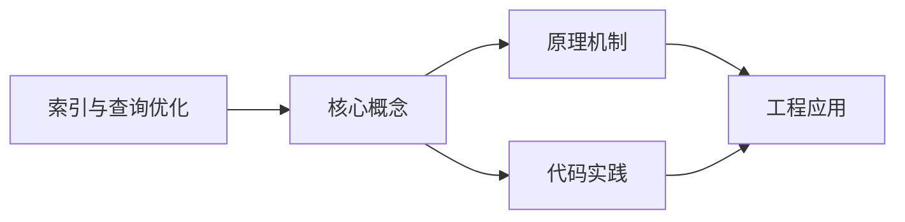
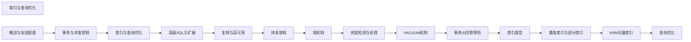

## 1. 学习目标（Bloom 分类）

本节按照布鲁姆教育目标分类学组织学习路径。本文主题为《索引与查询优化》，属于 PostgreSQL 模块，读者可以根据自身阶段选择阅读深度。

记忆层面：能够准确复述本文的核心概念、术语与基本语法或操作步骤，并能够在提问或检索时快速定位对应知识点。能够说出 PostgreSQL 的核心概念、语法与常用对象。

理解层面：能够用自己的语言解释核心原理与工作机制，说明概念之间的因果关系，而不是机械记忆结论。能够解释 PostgreSQL 的执行原理与优化机制。

应用层面：能够在真实项目或练习场景中运用本文知识解决具体问题，写出正确且可维护的实现。能够编写正确、高效的 PostgreSQL 语句与操作。

分析层面：能够拆解复杂问题，比较本文主题与相邻概念的异同，识别边界条件与例外情况。能够分析 PostgreSQL 相关方案在性能与一致性上的权衡。

评价层面：能够根据约束条件（性能、可读性、安全、成本）评价不同方案的优劣，做出有依据的技术决策。能够根据业务场景评价 PostgreSQL 技术选型。

创造层面：能够把本文知识与其他模块知识组合，设计出新的解决方案或可复用的工程模式。能够组合 PostgreSQL 与其他技术设计数据架构。

通过本节学习，读者应当能够把《索引与查询优化》纳入自己的知识网络，并与 PostgreSQL 模块的其他主题（MVCC、窗口函数、扩展生态、高可用）建立关联。

## 2. 历史动机与发展脉络

《索引与查询优化》是 PostgreSQL 领域的重要主题。要真正理解它，需要先了解它解决的问题与演进过程。

PostgreSQL 起源于 1986 年伯克利的 POSTGRES 项目，1996 年更名 PostgreSQL；以功能全面与标准遵循著称，社区驱动发展（每年一个大版本）。
特性版图：完整 SQL（窗口、CTE、递归、JSON）、扩展生态（PostGIS、pgvector）、复制（流复制/逻辑复制）、可编程性（PL/pgSQL、自定义类型）。
PG 17（2024）/PG 18 持续增强：vacuum 与 I/O 优化、增量备份、并行查询扩展；被开发者社区长期评为最受欢迎的数据库之一。

回到本文主题：索引与查询优化 的提出与成熟，正是上述技术背景下的必然产物。早期实现往往以简单可用为目标，随着工程规模扩大，社区逐渐沉淀出标准做法与最佳实践；理解这一脉络，可以帮助读者判断“为什么文档中的推荐写法是现在这个样子”，也能在遇到历史遗留代码时准确识别其设计年代与取舍。


## 3. 形式化定义与核心概念精讲

本节把《索引与查询优化》涉及的核心概念以“定义 + 讲解”的形式展开。读者应把定义当作工具，把讲解当作理解路径；两者结合才能形成可迁移的知识。

MVCC：每个事务可见性由 xmin/xmax 与快照决定；行更新产生新版本，旧版本由 vacuum 清理；读写互不阻塞。
索引类型：B-tree、Hash、GiST、SP-GiST、GIN（全文/JSON）、BRIN（大表顺序数据）；部分索引与表达式索引。
窗口函数：OVER 子句在结果集内计算排名、移动平均、LAG/LEAD；区别于 GROUP BY 的聚合语义。

### 3.1 原文章节逐一精讲

原文档把主题拆分为 6 个小节，下面按顺序给出每一节的导读讲解，随后保留原文细节供精读。

#### 原文精读（完整保留）


#### 1. 索引类型

##### 1.1 B-tree 索引

B-tree 是 PostgreSQL 的默认索引类型，适用于等值查询、范围查询和排序操作。

```sql
-- 创建 B-tree 索引
CREATE INDEX idx_users_email ON users (email);
CREATE INDEX idx_orders_date ON orders (created_at DESC);

-- 复合索引
CREATE INDEX idx_orders_user_date ON orders (user_id, created_at DESC);

-- 唯一索引
CREATE UNIQUE INDEX idx_users_email_unique ON users (email);

-- B-tree 适用场景
--  等值: WHERE email = 'test@example.com'
--  范围: WHERE created_at > '2024-01-01'
--  排序: ORDER BY created_at DESC
--  前缀: WHERE name LIKE 'abc%'
--  后缀: WHERE name LIKE '%xyz'
--  全模糊: WHERE name LIKE '%abc%'
```

##### 1.2 Hash 索引

```sql
-- 创建 Hash 索引
CREATE INDEX idx_session_token ON sessions USING hash (token);

-- Hash 索引特点
--  等值查询性能略优于 B-tree
--  不支持范围查询
--  不支持排序
--  不支持唯一约束
-- 适用: 纯等值查询的长字符串（如 session token）
```

##### 1.3 GiST 索引

```sql
-- 几何数据索引
CREATE INDEX idx_locations_point ON locations USING gist (point_col);

-- 全文检索索引
CREATE INDEX idx_docs_fts ON documents USING gist (to_tsvector('english', content));

-- 范围类型索引
CREATE INDEX idx_events_range ON events USING gist (time_range);

-- ltree 路径索引
CREATE INDEX idx_categories_path ON categories USING gist (path);

-- GiST 适用场景
--  几何包含/相交: WHERE point_col @> point '(1,1)'
--  全文检索: WHERE to_tsvector(content) @@ to_tsquery('hello')
--  范围重叠: WHERE time_range && '[2024-01-01, 2024-12-31)'
--  最近邻: ORDER BY point_col <-> '(0,0)' LIMIT 10
```

##### 1.4 GIN 索引

```sql
-- JSONB 索引
CREATE INDEX idx_data_jsonb ON records USING gin (data_jsonb);
CREATE INDEX idx_data_jsonb_path ON records USING gin (data_jsonb jsonb_path_ops);

-- 数组索引
CREATE INDEX idx_tags_array ON articles USING gin (tags);

-- 全文检索索引（比 GiST 更适合）
CREATE INDEX idx_docs_fts ON documents USING gin (to_tsvector('english', content));

-- GIN vs GiST（全文检索）
-- GIN: 构建慢、查询快、更新慢 → 读多写少
-- GiST: 构建快、查询慢、更新快 → 写多读少
```

##### 1.5 SP-GiST 索引

```sql
-- 电话号码前缀索引
CREATE INDEX idx_phones ON contacts USING spgist (phone);

-- 路由前缀索引
CREATE INDEX idx_routes ON routing USING spgist (prefix);

-- SP-GiST 特点
-- 适用于: 非平衡数据结构（电话号码、路由前缀、四叉树）
-- 不支持: 范围查询
```

##### 1.6 BRIN 索引

```sql
-- BRIN 索引（块范围索引）
CREATE INDEX idx_logs_time ON access_logs USING brin (created_at);
CREATE INDEX idx_logs_time_pages ON access_logs USING brin (created_at) WITH (pages_per_range = 32);

-- BRIN 特点
--  索引极小（仅为 B-tree 的 1/1000）
--  适合物理排序的大表（时序数据、日志）
--  过滤精度低（返回较多候选块）
--  不适合随机分布的数据

-- 索引大小对比
SELECT indexname, pg_size_pretty(pg_relation_size(indexname::regclass)) as size
FROM pg_indexes WHERE tablename = 'access_logs';
-- B-tree: ~500MB  |  BRIN: ~500KB
```

#### 2. 高级索引技术

##### 2.1 覆盖索引（Covering Index）

```sql
-- 包含列（INCLUDE）— 避免回表
CREATE INDEX idx_orders_user_covering ON orders (user_id)
  INCLUDE (order_date, total_amount);

-- Index-Only Scan（仅索引扫描）
SELECT user_id, order_date, total_amount
FROM orders
WHERE user_id = 100;
-- 直接从索引获取数据，不需要访问表

-- 检查是否使用了 Index-Only Scan
EXPLAIN (ANALYZE, BUFFERS)
SELECT user_id, order_date, total_amount
FROM orders WHERE user_id = 100;
-- Index Only Scan using idx_orders_user_covering
```

##### 2.2 部分索引（Partial Index）

```sql
-- 仅索引活跃用户
CREATE INDEX idx_active_users_email ON users (email)
  WHERE is_active = true;

-- 仅索引未完成订单
CREATE INDEX idx_pending_orders ON orders (created_at)
  WHERE status = 'pending';

-- 仅索引非空值
CREATE INDEX idx_users_phone ON users (phone)
  WHERE phone IS NOT NULL;

-- 优势: 索引更小、维护成本更低
```

##### 2.3 表达式索引

```sql
-- 大小写不敏感搜索
CREATE INDEX idx_users_email_lower ON users (lower(email));

SELECT * FROM users WHERE lower(email) = 'test@example.com';
-- 使用索引

-- JSONB 字段索引
CREATE INDEX idx_data_name ON records ((data->>'name'));

-- 计算列索引
CREATE INDEX idx_orders_monthly ON orders ((date_trunc('month', created_at)));
```

##### 2.4 KNN 向量索引（pgvector）

```sql
-- 安装 pgvector 扩展
CREATE EXTENSION vector;

-- 创建向量列
ALTER TABLE products ADD COLUMN embedding vector(1536);

-- 创建 HNSW 索引（推荐）
CREATE INDEX idx_products_embedding ON products
  USING hnsw (embedding vector_cosine_ops)
  WITH (m = 16, ef_construction = 64);

-- 创建 IVFFlat 索引
CREATE INDEX idx_products_embedding_ivf ON products
  USING ivfflat (embedding vector_cosine_ops)
  WITH (lists = 100);

-- KNN 查询
SELECT id, name, 1 - (embedding <=> '[0.1,0.2,...]'::vector) as similarity
FROM products
ORDER BY embedding <=> '[0.1,0.2,...]'::vector
LIMIT 10;

-- 索引类型对比
-- HNSW: 查询快、构建慢、内存大 → 实时推荐
-- IVFFlat: 构建快、查询中、需训练 → 批量场景
```

#### 3. 统计信息与 ANALYZE

##### 3.1 统计信息收集

```sql
-- 手动收集统计信息
ANALYZE users;                    -- 全表
ANALYZE users (email, status);    -- 指定列

-- 调整统计目标
ALTER TABLE users ALTER COLUMN email SET STATISTICS 500;
-- 默认 100，范围 0~10000
-- 越高统计越精确，但 ANALYZE 越慢

-- 查看统计信息
SELECT attname, n_distinct, null_frac, avg_width
FROM pg_stats
WHERE tablename = 'users';

-- 查看最常见值
SELECT attname, most_common_vals, most_common_freqs
FROM pg_stats
WHERE tablename = 'users' AND attname = 'status';
```

##### 3.2 扩展统计信息

```sql
-- 创建扩展统计信息（多列相关性）
CREATE STATISTICS s_orders_user_date (ndistinct, dependencies, mcv)
  ON user_id, created_at FROM orders;

ANALYZE orders;

-- 查看扩展统计信息
SELECT * FROM pg_stats_ext WHERE tablename = 'orders';

-- ndistinct: 多列组合的唯一值数量
-- dependencies: 列间函数依赖关系
-- mcv: 多列最常见值列表
```

#### 4. 执行计划分析

##### 4.1 EXPLAIN 用法

```sql
-- 查看执行计划
EXPLAIN SELECT * FROM orders WHERE user_id = 100;

-- 查看实际执行统计
EXPLAIN (ANALYZE, BUFFERS, FORMAT TEXT)
SELECT * FROM orders WHERE user_id = 100;

-- JSON 格式输出
EXPLAIN (ANALYZE, BUFFERS, FORMAT JSON)
SELECT * FROM orders WHERE user_id = 100;

-- WAL 信息
EXPLAIN (ANALYZE, WAL) UPDATE orders SET status = 'done' WHERE id = 1;
```

##### 4.2 常见扫描类型

| 扫描类型        | 说明            | 适用场景             |
| :-------------- | :-------------- | :------------------- |
| Seq Scan        | 顺序扫描全表    | 小表、无可用索引     |
| Index Scan      | 索引扫描 + 回表 | 选择性高的查询       |
| Index Only Scan | 仅索引扫描      | 覆盖索引             |
| Bitmap Scan     | 位图索引扫描    | 选择性中等           |
| Tid Scan        | TID 扫描        | WHERE ctid = ...     |
| Subquery Scan   | 子查询扫描      | FROM 子查询          |
| Function Scan   | 函数扫描        | FROM generate_series |

##### 4.3 代价估算解读

```
EXPLAIN 输出示例:
Index Scan using idx_orders_user on orders  (cost=0.42..8.44 rows=1 width=72)

cost 解读:
  0.42 — 启动代价（获取第一行前的代价）
  8.44 — 总代价（获取所有行的代价）
  rows — 估计返回行数
  width — 估计每行平均字节数

代价单位: 任意单位（seq_page_cost 的倍数）
默认: seq_page_cost=1.0, random_page_cost=4.0
SSD 建议: random_page_cost=1.1
```

##### 4.4 常见优化案例

```sql
-- 案例1: 避免全表扫描
-- 问题: 函数导致无法使用索引
SELECT * FROM users WHERE lower(email) = 'test@example.com';
-- 解决: 创建表达式索引
CREATE INDEX idx_users_email_lower ON users (lower(email));

-- 案例2: OR 条件优化
-- 问题: OR 导致索引失效
SELECT * FROM orders WHERE user_id = 100 OR status = 'pending';
-- 解决: 使用 UNION ALL
SELECT * FROM orders WHERE user_id = 100
UNION ALL
SELECT * FROM orders WHERE status = 'pending' AND user_id != 100;

-- 案例3: LIMIT 优化
-- 问题: 排序大量数据后取少量行
SELECT * FROM logs ORDER BY created_at DESC LIMIT 10;
-- 解决: 创建降序索引
CREATE INDEX idx_logs_created_desc ON logs (created_at DESC);

-- 案例4: JOIN 优化
-- 问题: 嵌套循环连接大表
EXPLAIN SELECT * FROM orders o JOIN users u ON o.user_id = u.id;
-- 解决: 确保连接列有索引，增加 work_mem
SET work_mem = '64MB';
```

#### 5. 并行查询

##### 5.1 并行查询配置

```ini
# postgresql.conf
max_worker_processes = 8                    # 最大工作进程
max_parallel_workers_per_gather = 4         # 每个 Gather 最大并行度
max_parallel_workers = 8                    # 最大并行工作进程
parallel_tuple_cost = 0.1                   # 并行元组代价
parallel_setup_cost = 1000.0                # 并行启动代价
min_parallel_table_scan_size = 8MB          # 最小并行扫描表大小
min_parallel_index_scan_size = 512kB        # 最小并行索引扫描大小
```

##### 5.2 并行查询类型

```sql
-- 并行顺序扫描
SET max_parallel_workers_per_gather = 4;
EXPLAIN (ANALYZE) SELECT COUNT(*) FROM large_table;
-- Gather -> Parallel Seq Scan

-- 并行索引扫描
EXPLAIN (ANALYZE) SELECT * FROM large_table WHERE id > 100000;
-- Gather -> Parallel Index Scan

-- 并行聚合
EXPLAIN (ANALYZE) SELECT avg(amount) FROM orders GROUP BY user_id;
-- Finalize Aggregate -> Gather -> Partial Aggregate

-- 并行 JOIN
EXPLAIN (ANALYZE)
SELECT * FROM orders o JOIN order_items i ON o.id = i.order_id;
-- Gather -> Parallel Hash Join

-- 禁用并行（调试用）
SET max_parallel_workers_per_gather = 0;
```

#### 6. 分区表

##### 6.1 范围分区（Range）

```sql
-- 创建分区主表
CREATE TABLE access_logs (
    id BIGSERIAL,
    user_id INTEGER,
    action TEXT,
    created_at TIMESTAMP
) PARTITION BY RANGE (created_at);

-- 创建分区
CREATE TABLE access_logs_2024_q1 PARTITION OF access_logs
  FOR VALUES FROM ('2024-01-01') TO ('2024-04-01');
CREATE TABLE access_logs_2024_q2 PARTITION OF access_logs
  FOR VALUES FROM ('2024-04-01') TO ('2024-07-01');
CREATE TABLE access_logs_2024_q3 PARTITION OF access_logs
  FOR VALUES FROM ('2024-07-01') TO ('2024-10-01');
CREATE TABLE access_logs_2024_q4 PARTITION OF access_logs
  FOR VALUES FROM ('2024-10-01') TO ('2025-01-01');

-- 默认分区
CREATE TABLE access_logs_default PARTITION OF access_logs DEFAULT;

-- 自动创建分区（pg_partman 扩展）
CREATE EXTENSION pg_partman;
SELECT partman.create_parent(
  p_parent_table := 'public.access_logs',
  p_control := 'created_at',
  p_type := 'range',
  p_interval := '1 month',
  p_premake := 6
);
```

##### 6.2 列表分区（List）

```sql
CREATE TABLE orders (
    id BIGSERIAL,
    user_id INTEGER,
    region TEXT,
    total NUMERIC(10,2)
) PARTITION BY LIST (region);

CREATE TABLE orders_cn PARTITION OF orders FOR VALUES IN ('CN');
CREATE TABLE orders_us PARTITION OF orders FOR VALUES IN ('US');
CREATE TABLE orders_eu PARTITION OF orders FOR VALUES IN ('EU', 'UK', 'DE');
CREATE TABLE orders_other PARTITION OF orders DEFAULT;
```

##### 6.3 哈希分区（Hash）

```sql
CREATE TABLE events (
    id BIGSERIAL,
    event_type TEXT,
    payload JSONB,
    created_at TIMESTAMP
) PARTITION BY HASH (id);

-- 创建 8 个哈希分区
CREATE TABLE events_p0 PARTITION OF events FOR VALUES WITH (MODULUS 8, REMAINDER 0);
CREATE TABLE events_p1 PARTITION OF events FOR VALUES WITH (MODULUS 8, REMAINDER 1);
CREATE TABLE events_p2 PARTITION OF events FOR VALUES WITH (MODULUS 8, REMAINDER 2);
CREATE TABLE events_p3 PARTITION OF events FOR VALUES WITH (MODULUS 8, REMAINDER 3);
CREATE TABLE events_p4 PARTITION OF events FOR VALUES WITH (MODULUS 8, REMAINDER 4);
CREATE TABLE events_p5 PARTITION OF events FOR VALUES WITH (MODULUS 8, REMAINDER 5);
CREATE TABLE events_p6 PARTITION OF events FOR VALUES WITH (MODULUS 8, REMAINDER 6);
CREATE TABLE events_p7 PARTITION OF events FOR VALUES WITH (MODULUS 8, REMAINDER 7);
```

##### 6.4 分区裁剪（Partition Pruning）

```sql
-- 查询时自动裁剪不需要的分区
EXPLAIN (ANALYZE)
SELECT * FROM access_logs
WHERE created_at >= '2024-03-01' AND created_at < '2024-04-01';
-- 仅扫描 access_logs_2024_q1

-- 确保分区裁剪生效
SET enable_partition_pruning = on;  -- 默认开启

-- 运行时分区裁剪（参数化查询）
PREPARE query_logs(TIMESTAMP) AS
  SELECT * FROM access_logs WHERE created_at >= $1;
EXPLAIN (ANALYZE) EXECUTE query_logs('2024-03-01');
```

##### 6.5 分区连接（Partitionwise Join）

```sql
-- 启用分区级连接
SET enable_partitionwise_join = on;
SET enable_partitionwise_aggregate = on;

-- 两个分区表连接时，对应分区直接连接
EXPLAIN
SELECT * FROM orders o JOIN order_items i ON o.id = i.order_id;
-- 每对分区单独连接，减少内存使用
```

##### 6.6 分区维护

```sql
-- 分离分区
ALTER TABLE access_logs DETACH PARTITION access_logs_2024_q1;

-- 附加分区
ALTER TABLE access_logs ATTACH PARTITION access_logs_2024_q1
  FOR VALUES FROM ('2024-01-01') TO ('2024-04-01');

-- 删除旧分区（比 DELETE 快得多）
DROP TABLE access_logs_2023_q1;

-- 分区索引（自动传播到子分区）
CREATE INDEX idx_logs_user ON access_logs (user_id);
-- 等效于在每个分区上创建索引
```


### 3.2 概念关系图

下面用 Mermaid 图表达本文核心概念之间的关系，帮助读者建立整体图景：



图中展示的是本文知识的结构化关系：核心概念是入口，原理机制解释“为什么”，代码实践演示“怎么做”，工程应用回答“何时用”。读者学习时可以把每个小节的内容挂接到对应节点上。

## 4. 理论推导与原理解析

本节深入《索引与查询优化》背后的原理。理论部分不求面面俱到，而是聚焦“能解释现象、能指导实践”的关键推导。

MVCC：每个事务可见性由 xmin/xmax 与快照决定；行更新产生新版本，旧版本由 vacuum 清理；读写互不阻塞。
索引类型：B-tree、Hash、GiST、SP-GiST、GIN（全文/JSON）、BRIN（大表顺序数据）；部分索引与表达式索引。
窗口函数：OVER 子句在结果集内计算排名、移动平均、LAG/LEAD；区别于 GROUP BY 的聚合语义。
逻辑复制与流复制：WAL 流复制同步备库；逻辑复制按表级发布订阅，支持跨版本与异构。

需要强调的是，理论推导与工程实践之间存在翻译层：理论给出的是理想化模型与边界条件，工程代码则必须处理真实环境中的例外。读者在学习时应先掌握理论的“标准情形”，再通过陷阱章节了解“非标准情形”。

## 5. 代码示例与逐行讲解

本节把原文中的代码示例系统整理，并为每个示例补充用途说明与讲解。读者不应只浏览代码，而应逐段对照讲解理解设计意图。

### 5.1 示例：1.1 B-tree 索引

该示例来自原文《1.1 B-tree 索引》小节，用于演示索引与查询优化相关操作。阅读时请先看代码结构，再看其后的讲解。

```sql
-- 创建 B-tree 索引
CREATE INDEX idx_users_email ON users (email);
CREATE INDEX idx_orders_date ON orders (created_at DESC);

-- 复合索引
CREATE INDEX idx_orders_user_date ON orders (user_id, created_at DESC);

-- 唯一索引
CREATE UNIQUE INDEX idx_users_email_unique ON users (email);

-- B-tree 适用场景
--  等值: WHERE email = 'test@example.com'
--  范围: WHERE created_at > '2024-01-01'
--  排序: ORDER BY created_at DESC
--  前缀: WHERE name LIKE 'abc%'
--  后缀: WHERE name LIKE '%xyz'
--  全模糊: WHERE name LIKE '%abc%'
```

讲解：这段代码演示了本节核心知识点。代码中的关键操作可以归纳为三步：准备（定义或初始化）、执行（核心逻辑）、收尾（释放资源或返回结果）。实际项目中，这三步往往被封装为函数或类，以提升复用性与可测试性。

关键点分析：

该示例共 14 行有效代码，包含 1 类关键结构（CREATE）。其中：

- 入口与初始化部分负责建立上下文，对应实际项目中的启动或装配逻辑；
- 核心逻辑部分体现本文主题的主要操作，是阅读时最需要对照讲解理解的部分；
- 输出或返回部分把结果交给调用方，注意其类型与边界条件。

进阶思考路径：先尝试修改参数观察行为变化，再把示例中的模式迁移到自己的项目中；每次修改都记录预期与实测差异，这是把示例转化为能力的最快方式。

### 5.2 示例：1.2 Hash 索引

该示例来自原文《1.2 Hash 索引》小节，用于演示索引与查询优化相关操作。阅读时请先看代码结构，再看其后的讲解。

```sql
-- 创建 Hash 索引
CREATE INDEX idx_session_token ON sessions USING hash (token);

-- Hash 索引特点
--  等值查询性能略优于 B-tree
--  不支持范围查询
--  不支持排序
--  不支持唯一约束
-- 适用: 纯等值查询的长字符串（如 session token）
```

讲解：这段代码演示了本节核心知识点。代码中的关键操作可以归纳为三步：准备（定义或初始化）、执行（核心逻辑）、收尾（释放资源或返回结果）。实际项目中，这三步往往被封装为函数或类，以提升复用性与可测试性。

关键点分析：

该示例共 8 行有效代码，包含 1 类关键结构（CREATE）。其中：

- 入口与初始化部分负责建立上下文，对应实际项目中的启动或装配逻辑；
- 核心逻辑部分体现本文主题的主要操作，是阅读时最需要对照讲解理解的部分；
- 输出或返回部分把结果交给调用方，注意其类型与边界条件。

进阶思考路径：先尝试修改参数观察行为变化，再把示例中的模式迁移到自己的项目中；每次修改都记录预期与实测差异，这是把示例转化为能力的最快方式。

### 5.3 示例：1.3 GiST 索引

该示例来自原文《1.3 GiST 索引》小节，用于演示索引与查询优化相关操作。阅读时请先看代码结构，再看其后的讲解。

```sql
-- 几何数据索引
CREATE INDEX idx_locations_point ON locations USING gist (point_col);

-- 全文检索索引
CREATE INDEX idx_docs_fts ON documents USING gist (to_tsvector('english', content));

-- 范围类型索引
CREATE INDEX idx_events_range ON events USING gist (time_range);

-- ltree 路径索引
CREATE INDEX idx_categories_path ON categories USING gist (path);

-- GiST 适用场景
--  几何包含/相交: WHERE point_col @> point '(1,1)'
--  全文检索: WHERE to_tsvector(content) @@ to_tsquery('hello')
--  范围重叠: WHERE time_range && '[2024-01-01, 2024-12-31)'
--  最近邻: ORDER BY point_col <-> '(0,0)' LIMIT 10
```

讲解：这段代码演示了本节核心知识点。代码中的关键操作可以归纳为三步：准备（定义或初始化）、执行（核心逻辑）、收尾（释放资源或返回结果）。实际项目中，这三步往往被封装为函数或类，以提升复用性与可测试性。

关键点分析：

该示例共 13 行有效代码，包含 1 类关键结构（CREATE）。其中：

- 入口与初始化部分负责建立上下文，对应实际项目中的启动或装配逻辑；
- 核心逻辑部分体现本文主题的主要操作，是阅读时最需要对照讲解理解的部分；
- 输出或返回部分把结果交给调用方，注意其类型与边界条件。

进阶思考路径：先尝试修改参数观察行为变化，再把示例中的模式迁移到自己的项目中；每次修改都记录预期与实测差异，这是把示例转化为能力的最快方式。

### 5.4 示例：1.4 GIN 索引

该示例来自原文《1.4 GIN 索引》小节，用于演示索引与查询优化相关操作。阅读时请先看代码结构，再看其后的讲解。

```sql
-- JSONB 索引
CREATE INDEX idx_data_jsonb ON records USING gin (data_jsonb);
CREATE INDEX idx_data_jsonb_path ON records USING gin (data_jsonb jsonb_path_ops);

-- 数组索引
CREATE INDEX idx_tags_array ON articles USING gin (tags);

-- 全文检索索引（比 GiST 更适合）
CREATE INDEX idx_docs_fts ON documents USING gin (to_tsvector('english', content));

-- GIN vs GiST（全文检索）
-- GIN: 构建慢、查询快、更新慢 → 读多写少
-- GiST: 构建快、查询慢、更新快 → 写多读少
```

讲解：这段代码演示了本节核心知识点。代码中的关键操作可以归纳为三步：准备（定义或初始化）、执行（核心逻辑）、收尾（释放资源或返回结果）。实际项目中，这三步往往被封装为函数或类，以提升复用性与可测试性。

关键点分析：

该示例共 10 行有效代码，包含 1 类关键结构（CREATE）。其中：

- 入口与初始化部分负责建立上下文，对应实际项目中的启动或装配逻辑；
- 核心逻辑部分体现本文主题的主要操作，是阅读时最需要对照讲解理解的部分；
- 输出或返回部分把结果交给调用方，注意其类型与边界条件。

进阶思考路径：先尝试修改参数观察行为变化，再把示例中的模式迁移到自己的项目中；每次修改都记录预期与实测差异，这是把示例转化为能力的最快方式。

### 5.5 示例：1.5 SP-GiST 索引

该示例来自原文《1.5 SP-GiST 索引》小节，用于演示索引与查询优化相关操作。阅读时请先看代码结构，再看其后的讲解。

```sql
-- 电话号码前缀索引
CREATE INDEX idx_phones ON contacts USING spgist (phone);

-- 路由前缀索引
CREATE INDEX idx_routes ON routing USING spgist (prefix);

-- SP-GiST 特点
-- 适用于: 非平衡数据结构（电话号码、路由前缀、四叉树）
-- 不支持: 范围查询
```

讲解：这段代码演示了本节核心知识点。代码中的关键操作可以归纳为三步：准备（定义或初始化）、执行（核心逻辑）、收尾（释放资源或返回结果）。实际项目中，这三步往往被封装为函数或类，以提升复用性与可测试性。

关键点分析：

该示例共 7 行有效代码，包含 1 类关键结构（CREATE）。其中：

- 入口与初始化部分负责建立上下文，对应实际项目中的启动或装配逻辑；
- 核心逻辑部分体现本文主题的主要操作，是阅读时最需要对照讲解理解的部分；
- 输出或返回部分把结果交给调用方，注意其类型与边界条件。

进阶思考路径：先尝试修改参数观察行为变化，再把示例中的模式迁移到自己的项目中；每次修改都记录预期与实测差异，这是把示例转化为能力的最快方式。

### 5.6 示例：1.6 BRIN 索引

该示例来自原文《1.6 BRIN 索引》小节，用于演示索引与查询优化相关操作。阅读时请先看代码结构，再看其后的讲解。

```sql
-- BRIN 索引（块范围索引）
CREATE INDEX idx_logs_time ON access_logs USING brin (created_at);
CREATE INDEX idx_logs_time_pages ON access_logs USING brin (created_at) WITH (pages_per_range = 32);

-- BRIN 特点
--  索引极小（仅为 B-tree 的 1/1000）
--  适合物理排序的大表（时序数据、日志）
--  过滤精度低（返回较多候选块）
--  不适合随机分布的数据

-- 索引大小对比
SELECT indexname, pg_size_pretty(pg_relation_size(indexname::regclass)) as size
FROM pg_indexes WHERE tablename = 'access_logs';
-- B-tree: ~500MB  |  BRIN: ~500KB
```

讲解：这段代码演示了本节核心知识点。代码中的关键操作可以归纳为三步：准备（定义或初始化）、执行（核心逻辑）、收尾（释放资源或返回结果）。实际项目中，这三步往往被封装为函数或类，以提升复用性与可测试性。

关键点分析：

该示例共 12 行有效代码，包含 4 类关键结构（class、SELECT、CREATE、FROM）。其中：

- 入口与初始化部分负责建立上下文，对应实际项目中的启动或装配逻辑；
- 核心逻辑部分体现本文主题的主要操作，是阅读时最需要对照讲解理解的部分；
- 输出或返回部分把结果交给调用方，注意其类型与边界条件。

进阶思考路径：先尝试修改参数观察行为变化，再把示例中的模式迁移到自己的项目中；每次修改都记录预期与实测差异，这是把示例转化为能力的最快方式。

### 5.7 示例：2.1 覆盖索引（Covering Index）

该示例来自原文《2.1 覆盖索引（Covering Index）》小节，用于演示索引与查询优化相关操作。阅读时请先看代码结构，再看其后的讲解。

```sql
-- 包含列（INCLUDE）— 避免回表
CREATE INDEX idx_orders_user_covering ON orders (user_id)
  INCLUDE (order_date, total_amount);

-- Index-Only Scan（仅索引扫描）
SELECT user_id, order_date, total_amount
FROM orders
WHERE user_id = 100;
-- 直接从索引获取数据，不需要访问表

-- 检查是否使用了 Index-Only Scan
EXPLAIN (ANALYZE, BUFFERS)
SELECT user_id, order_date, total_amount
FROM orders WHERE user_id = 100;
-- Index Only Scan using idx_orders_user_covering
```

讲解：这段代码演示了本节核心知识点。代码中的关键操作可以归纳为三步：准备（定义或初始化）、执行（核心逻辑）、收尾（释放资源或返回结果）。实际项目中，这三步往往被封装为函数或类，以提升复用性与可测试性。

关键点分析：

该示例共 13 行有效代码，包含 3 类关键结构（SELECT、CREATE、FROM）。其中：

- 入口与初始化部分负责建立上下文，对应实际项目中的启动或装配逻辑；
- 核心逻辑部分体现本文主题的主要操作，是阅读时最需要对照讲解理解的部分；
- 输出或返回部分把结果交给调用方，注意其类型与边界条件。

进阶思考路径：先尝试修改参数观察行为变化，再把示例中的模式迁移到自己的项目中；每次修改都记录预期与实测差异，这是把示例转化为能力的最快方式。

### 5.8 示例：2.2 部分索引（Partial Index）

该示例来自原文《2.2 部分索引（Partial Index）》小节，用于演示索引与查询优化相关操作。阅读时请先看代码结构，再看其后的讲解。

```sql
-- 仅索引活跃用户
CREATE INDEX idx_active_users_email ON users (email)
  WHERE is_active = true;

-- 仅索引未完成订单
CREATE INDEX idx_pending_orders ON orders (created_at)
  WHERE status = 'pending';

-- 仅索引非空值
CREATE INDEX idx_users_phone ON users (phone)
  WHERE phone IS NOT NULL;

-- 优势: 索引更小、维护成本更低
```

讲解：这段代码演示了本节核心知识点。代码中的关键操作可以归纳为三步：准备（定义或初始化）、执行（核心逻辑）、收尾（释放资源或返回结果）。实际项目中，这三步往往被封装为函数或类，以提升复用性与可测试性。

关键点分析：

该示例共 10 行有效代码，包含 1 类关键结构（CREATE）。其中：

- 入口与初始化部分负责建立上下文，对应实际项目中的启动或装配逻辑；
- 核心逻辑部分体现本文主题的主要操作，是阅读时最需要对照讲解理解的部分；
- 输出或返回部分把结果交给调用方，注意其类型与边界条件。

进阶思考路径：先尝试修改参数观察行为变化，再把示例中的模式迁移到自己的项目中；每次修改都记录预期与实测差异，这是把示例转化为能力的最快方式。

### 5.9 示例：2.3 表达式索引

该示例来自原文《2.3 表达式索引》小节，用于演示索引与查询优化相关操作。阅读时请先看代码结构，再看其后的讲解。

```sql
-- 大小写不敏感搜索
CREATE INDEX idx_users_email_lower ON users (lower(email));

SELECT * FROM users WHERE lower(email) = 'test@example.com';
-- 使用索引

-- JSONB 字段索引
CREATE INDEX idx_data_name ON records ((data->>'name'));

-- 计算列索引
CREATE INDEX idx_orders_monthly ON orders ((date_trunc('month', created_at)));
```

讲解：这段代码演示了本节核心知识点。代码中的关键操作可以归纳为三步：准备（定义或初始化）、执行（核心逻辑）、收尾（释放资源或返回结果）。实际项目中，这三步往往被封装为函数或类，以提升复用性与可测试性。

关键点分析：

该示例共 8 行有效代码，包含 3 类关键结构（SELECT、CREATE、FROM）。其中：

- 入口与初始化部分负责建立上下文，对应实际项目中的启动或装配逻辑；
- 核心逻辑部分体现本文主题的主要操作，是阅读时最需要对照讲解理解的部分；
- 输出或返回部分把结果交给调用方，注意其类型与边界条件。

进阶思考路径：先尝试修改参数观察行为变化，再把示例中的模式迁移到自己的项目中；每次修改都记录预期与实测差异，这是把示例转化为能力的最快方式。

### 5.10 示例：2.4 KNN 向量索引（pgvector）

该示例来自原文《2.4 KNN 向量索引（pgvector）》小节，用于演示索引与查询优化相关操作。阅读时请先看代码结构，再看其后的讲解。

```sql
-- 安装 pgvector 扩展
CREATE EXTENSION vector;

-- 创建向量列
ALTER TABLE products ADD COLUMN embedding vector(1536);

-- 创建 HNSW 索引（推荐）
CREATE INDEX idx_products_embedding ON products
  USING hnsw (embedding vector_cosine_ops)
  WITH (m = 16, ef_construction = 64);

-- 创建 IVFFlat 索引
CREATE INDEX idx_products_embedding_ivf ON products
  USING ivfflat (embedding vector_cosine_ops)
  WITH (lists = 100);

-- KNN 查询
SELECT id, name, 1 - (embedding <=> '[0.1,0.2,...]'::vector) as similarity
FROM products
ORDER BY embedding <=> '[0.1,0.2,...]'::vector
LIMIT 10;

-- 索引类型对比
-- HNSW: 查询快、构建慢、内存大 → 实时推荐
-- IVFFlat: 构建快、查询中、需训练 → 批量场景
```

讲解：这段代码演示了本节核心知识点。代码中的关键操作可以归纳为三步：准备（定义或初始化）、执行（核心逻辑）、收尾（释放资源或返回结果）。实际项目中，这三步往往被封装为函数或类，以提升复用性与可测试性。

关键点分析：

该示例共 20 行有效代码，包含 4 类关键结构（SELECT、CREATE、ALTER、FROM）。其中：

- 入口与初始化部分负责建立上下文，对应实际项目中的启动或装配逻辑；
- 核心逻辑部分体现本文主题的主要操作，是阅读时最需要对照讲解理解的部分；
- 输出或返回部分把结果交给调用方，注意其类型与边界条件。

进阶思考路径：先尝试修改参数观察行为变化，再把示例中的模式迁移到自己的项目中；每次修改都记录预期与实测差异，这是把示例转化为能力的最快方式。

### 5.11 示例：3.1 统计信息收集

该示例来自原文《3.1 统计信息收集》小节，用于演示索引与查询优化相关操作。阅读时请先看代码结构，再看其后的讲解。

```sql
-- 手动收集统计信息
ANALYZE users;                    -- 全表
ANALYZE users (email, status);    -- 指定列

-- 调整统计目标
ALTER TABLE users ALTER COLUMN email SET STATISTICS 500;
-- 默认 100，范围 0~10000
-- 越高统计越精确，但 ANALYZE 越慢

-- 查看统计信息
SELECT attname, n_distinct, null_frac, avg_width
FROM pg_stats
WHERE tablename = 'users';

-- 查看最常见值
SELECT attname, most_common_vals, most_common_freqs
FROM pg_stats
WHERE tablename = 'users' AND attname = 'status';
```

讲解：这段代码演示了本节核心知识点。代码中的关键操作可以归纳为三步：准备（定义或初始化）、执行（核心逻辑）、收尾（释放资源或返回结果）。实际项目中，这三步往往被封装为函数或类，以提升复用性与可测试性。

关键点分析：

该示例共 15 行有效代码，包含 3 类关键结构（SELECT、ALTER、FROM）。其中：

- 入口与初始化部分负责建立上下文，对应实际项目中的启动或装配逻辑；
- 核心逻辑部分体现本文主题的主要操作，是阅读时最需要对照讲解理解的部分；
- 输出或返回部分把结果交给调用方，注意其类型与边界条件。

进阶思考路径：先尝试修改参数观察行为变化，再把示例中的模式迁移到自己的项目中；每次修改都记录预期与实测差异，这是把示例转化为能力的最快方式。

### 5.12 示例：3.2 扩展统计信息

该示例来自原文《3.2 扩展统计信息》小节，用于演示索引与查询优化相关操作。阅读时请先看代码结构，再看其后的讲解。

```sql
-- 创建扩展统计信息（多列相关性）
CREATE STATISTICS s_orders_user_date (ndistinct, dependencies, mcv)
  ON user_id, created_at FROM orders;

ANALYZE orders;

-- 查看扩展统计信息
SELECT * FROM pg_stats_ext WHERE tablename = 'orders';

-- ndistinct: 多列组合的唯一值数量
-- dependencies: 列间函数依赖关系
-- mcv: 多列最常见值列表
```

讲解：这段代码演示了本节核心知识点。代码中的关键操作可以归纳为三步：准备（定义或初始化）、执行（核心逻辑）、收尾（释放资源或返回结果）。实际项目中，这三步往往被封装为函数或类，以提升复用性与可测试性。

关键点分析：

该示例共 9 行有效代码，包含 3 类关键结构（SELECT、CREATE、FROM）。其中：

- 入口与初始化部分负责建立上下文，对应实际项目中的启动或装配逻辑；
- 核心逻辑部分体现本文主题的主要操作，是阅读时最需要对照讲解理解的部分；
- 输出或返回部分把结果交给调用方，注意其类型与边界条件。

进阶思考路径：先尝试修改参数观察行为变化，再把示例中的模式迁移到自己的项目中；每次修改都记录预期与实测差异，这是把示例转化为能力的最快方式。

### 5.13 示例：4.1 EXPLAIN 用法

该示例来自原文《4.1 EXPLAIN 用法》小节，用于演示索引与查询优化相关操作。阅读时请先看代码结构，再看其后的讲解。

```sql
-- 查看执行计划
EXPLAIN SELECT * FROM orders WHERE user_id = 100;

-- 查看实际执行统计
EXPLAIN (ANALYZE, BUFFERS, FORMAT TEXT)
SELECT * FROM orders WHERE user_id = 100;

-- JSON 格式输出
EXPLAIN (ANALYZE, BUFFERS, FORMAT JSON)
SELECT * FROM orders WHERE user_id = 100;

-- WAL 信息
EXPLAIN (ANALYZE, WAL) UPDATE orders SET status = 'done' WHERE id = 1;
```

讲解：这段代码演示了本节核心知识点。代码中的关键操作可以归纳为三步：准备（定义或初始化）、执行（核心逻辑）、收尾（释放资源或返回结果）。实际项目中，这三步往往被封装为函数或类，以提升复用性与可测试性。

关键点分析：

该示例共 10 行有效代码，包含 2 类关键结构（SELECT、FROM）。其中：

- 入口与初始化部分负责建立上下文，对应实际项目中的启动或装配逻辑；
- 核心逻辑部分体现本文主题的主要操作，是阅读时最需要对照讲解理解的部分；
- 输出或返回部分把结果交给调用方，注意其类型与边界条件。

进阶思考路径：先尝试修改参数观察行为变化，再把示例中的模式迁移到自己的项目中；每次修改都记录预期与实测差异，这是把示例转化为能力的最快方式。

### 5.14 示例：4.3 代价估算解读

该示例来自原文《4.3 代价估算解读》小节，用于演示索引与查询优化相关操作。阅读时请先看代码结构，再看其后的讲解。

```text
EXPLAIN 输出示例:
Index Scan using idx_orders_user on orders  (cost=0.42..8.44 rows=1 width=72)

cost 解读:
  0.42 — 启动代价（获取第一行前的代价）
  8.44 — 总代价（获取所有行的代价）
  rows — 估计返回行数
  width — 估计每行平均字节数

代价单位: 任意单位（seq_page_cost 的倍数）
默认: seq_page_cost=1.0, random_page_cost=4.0
SSD 建议: random_page_cost=1.1
```

讲解：这段代码演示了本节核心知识点。代码中的关键操作可以归纳为三步：准备（定义或初始化）、执行（核心逻辑）、收尾（释放资源或返回结果）。实际项目中，这三步往往被封装为函数或类，以提升复用性与可测试性。

关键点分析：

该示例共 10 行有效代码，结构以数据或配置为主。阅读时应关注：数据字段的含义、配置项的作用，以及它们与运行行为的对应关系。

进阶思考路径：先尝试修改参数观察行为变化，再把示例中的模式迁移到自己的项目中；每次修改都记录预期与实测差异，这是把示例转化为能力的最快方式。

### 5.15 示例：4.4 常见优化案例

该示例来自原文《4.4 常见优化案例》小节，用于演示索引与查询优化相关操作。阅读时请先看代码结构，再看其后的讲解。

```sql
-- 案例1: 避免全表扫描
-- 问题: 函数导致无法使用索引
SELECT * FROM users WHERE lower(email) = 'test@example.com';
-- 解决: 创建表达式索引
CREATE INDEX idx_users_email_lower ON users (lower(email));

-- 案例2: OR 条件优化
-- 问题: OR 导致索引失效
SELECT * FROM orders WHERE user_id = 100 OR status = 'pending';
-- 解决: 使用 UNION ALL
SELECT * FROM orders WHERE user_id = 100
UNION ALL
SELECT * FROM orders WHERE status = 'pending' AND user_id != 100;

-- 案例3: LIMIT 优化
-- 问题: 排序大量数据后取少量行
SELECT * FROM logs ORDER BY created_at DESC LIMIT 10;
-- 解决: 创建降序索引
CREATE INDEX idx_logs_created_desc ON logs (created_at DESC);

-- 案例4: JOIN 优化
-- 问题: 嵌套循环连接大表
EXPLAIN SELECT * FROM orders o JOIN users u ON o.user_id = u.id;
-- 解决: 确保连接列有索引，增加 work_mem
SET work_mem = '64MB';
```

讲解：这段代码演示了本节核心知识点。代码中的关键操作可以归纳为三步：准备（定义或初始化）、执行（核心逻辑）、收尾（释放资源或返回结果）。实际项目中，这三步往往被封装为函数或类，以提升复用性与可测试性。

关键点分析：

该示例共 22 行有效代码，包含 3 类关键结构（SELECT、CREATE、FROM）。其中：

- 入口与初始化部分负责建立上下文，对应实际项目中的启动或装配逻辑；
- 核心逻辑部分体现本文主题的主要操作，是阅读时最需要对照讲解理解的部分；
- 输出或返回部分把结果交给调用方，注意其类型与边界条件。

进阶思考路径：先尝试修改参数观察行为变化，再把示例中的模式迁移到自己的项目中；每次修改都记录预期与实测差异，这是把示例转化为能力的最快方式。

### 5.16 示例：5.1 并行查询配置

该示例来自原文《5.1 并行查询配置》小节，用于演示索引与查询优化相关操作。阅读时请先看代码结构，再看其后的讲解。

```ini
# postgresql.conf
max_worker_processes = 8                    # 最大工作进程
max_parallel_workers_per_gather = 4         # 每个 Gather 最大并行度
max_parallel_workers = 8                    # 最大并行工作进程
parallel_tuple_cost = 0.1                   # 并行元组代价
parallel_setup_cost = 1000.0                # 并行启动代价
min_parallel_table_scan_size = 8MB          # 最小并行扫描表大小
min_parallel_index_scan_size = 512kB        # 最小并行索引扫描大小
```

讲解：这段代码演示了本节核心知识点。代码中的关键操作可以归纳为三步：准备（定义或初始化）、执行（核心逻辑）、收尾（释放资源或返回结果）。实际项目中，这三步往往被封装为函数或类，以提升复用性与可测试性。

关键点分析：

该示例共 8 行有效代码，结构以数据或配置为主。阅读时应关注：数据字段的含义、配置项的作用，以及它们与运行行为的对应关系。

进阶思考路径：先尝试修改参数观察行为变化，再把示例中的模式迁移到自己的项目中；每次修改都记录预期与实测差异，这是把示例转化为能力的最快方式。

### 5.17 示例：5.2 并行查询类型

该示例来自原文《5.2 并行查询类型》小节，用于演示索引与查询优化相关操作。阅读时请先看代码结构，再看其后的讲解。

```sql
-- 并行顺序扫描
SET max_parallel_workers_per_gather = 4;
EXPLAIN (ANALYZE) SELECT COUNT(*) FROM large_table;
-- Gather -> Parallel Seq Scan

-- 并行索引扫描
EXPLAIN (ANALYZE) SELECT * FROM large_table WHERE id > 100000;
-- Gather -> Parallel Index Scan

-- 并行聚合
EXPLAIN (ANALYZE) SELECT avg(amount) FROM orders GROUP BY user_id;
-- Finalize Aggregate -> Gather -> Partial Aggregate

-- 并行 JOIN
EXPLAIN (ANALYZE)
SELECT * FROM orders o JOIN order_items i ON o.id = i.order_id;
-- Gather -> Parallel Hash Join

-- 禁用并行（调试用）
SET max_parallel_workers_per_gather = 0;
```

讲解：这段代码演示了本节核心知识点。代码中的关键操作可以归纳为三步：准备（定义或初始化）、执行（核心逻辑）、收尾（释放资源或返回结果）。实际项目中，这三步往往被封装为函数或类，以提升复用性与可测试性。

关键点分析：

该示例共 16 行有效代码，包含 2 类关键结构（SELECT、FROM）。其中：

- 入口与初始化部分负责建立上下文，对应实际项目中的启动或装配逻辑；
- 核心逻辑部分体现本文主题的主要操作，是阅读时最需要对照讲解理解的部分；
- 输出或返回部分把结果交给调用方，注意其类型与边界条件。

进阶思考路径：先尝试修改参数观察行为变化，再把示例中的模式迁移到自己的项目中；每次修改都记录预期与实测差异，这是把示例转化为能力的最快方式。

### 5.18 示例：6.1 范围分区（Range）

该示例来自原文《6.1 范围分区（Range）》小节，用于演示索引与查询优化相关操作。阅读时请先看代码结构，再看其后的讲解。

```sql
-- 创建分区主表
CREATE TABLE access_logs (
    id BIGSERIAL,
    user_id INTEGER,
    action TEXT,
    created_at TIMESTAMP
) PARTITION BY RANGE (created_at);

-- 创建分区
CREATE TABLE access_logs_2024_q1 PARTITION OF access_logs
  FOR VALUES FROM ('2024-01-01') TO ('2024-04-01');
CREATE TABLE access_logs_2024_q2 PARTITION OF access_logs
  FOR VALUES FROM ('2024-04-01') TO ('2024-07-01');
CREATE TABLE access_logs_2024_q3 PARTITION OF access_logs
  FOR VALUES FROM ('2024-07-01') TO ('2024-10-01');
CREATE TABLE access_logs_2024_q4 PARTITION OF access_logs
  FOR VALUES FROM ('2024-10-01') TO ('2025-01-01');

-- 默认分区
CREATE TABLE access_logs_default PARTITION OF access_logs DEFAULT;

-- 自动创建分区（pg_partman 扩展）
CREATE EXTENSION pg_partman;
SELECT partman.create_parent(
  p_parent_table := 'public.access_logs',
  p_control := 'created_at',
  p_type := 'range',
  p_interval := '1 month',
  p_premake := 6
);
```

讲解：这段代码演示了本节核心知识点。代码中的关键操作可以归纳为三步：准备（定义或初始化）、执行（核心逻辑）、收尾（释放资源或返回结果）。实际项目中，这三步往往被封装为函数或类，以提升复用性与可测试性。

关键点分析：

该示例共 27 行有效代码，包含 3 类关键结构（SELECT、CREATE、FROM）。其中：

- 入口与初始化部分负责建立上下文，对应实际项目中的启动或装配逻辑；
- 核心逻辑部分体现本文主题的主要操作，是阅读时最需要对照讲解理解的部分；
- 输出或返回部分把结果交给调用方，注意其类型与边界条件。

进阶思考路径：先尝试修改参数观察行为变化，再把示例中的模式迁移到自己的项目中；每次修改都记录预期与实测差异，这是把示例转化为能力的最快方式。

### 5.19 示例：6.2 列表分区（List）

该示例来自原文《6.2 列表分区（List）》小节，用于演示索引与查询优化相关操作。阅读时请先看代码结构，再看其后的讲解。

```sql
CREATE TABLE orders (
    id BIGSERIAL,
    user_id INTEGER,
    region TEXT,
    total NUMERIC(10,2)
) PARTITION BY LIST (region);

CREATE TABLE orders_cn PARTITION OF orders FOR VALUES IN ('CN');
CREATE TABLE orders_us PARTITION OF orders FOR VALUES IN ('US');
CREATE TABLE orders_eu PARTITION OF orders FOR VALUES IN ('EU', 'UK', 'DE');
CREATE TABLE orders_other PARTITION OF orders DEFAULT;
```

讲解：这段代码演示了本节核心知识点。代码中的关键操作可以归纳为三步：准备（定义或初始化）、执行（核心逻辑）、收尾（释放资源或返回结果）。实际项目中，这三步往往被封装为函数或类，以提升复用性与可测试性。

关键点分析：

该示例共 10 行有效代码，包含 1 类关键结构（CREATE）。其中：

- 入口与初始化部分负责建立上下文，对应实际项目中的启动或装配逻辑；
- 核心逻辑部分体现本文主题的主要操作，是阅读时最需要对照讲解理解的部分；
- 输出或返回部分把结果交给调用方，注意其类型与边界条件。

进阶思考路径：先尝试修改参数观察行为变化，再把示例中的模式迁移到自己的项目中；每次修改都记录预期与实测差异，这是把示例转化为能力的最快方式。

### 5.20 示例：6.3 哈希分区（Hash）

该示例来自原文《6.3 哈希分区（Hash）》小节，用于演示索引与查询优化相关操作。阅读时请先看代码结构，再看其后的讲解。

```sql
CREATE TABLE events (
    id BIGSERIAL,
    event_type TEXT,
    payload JSONB,
    created_at TIMESTAMP
) PARTITION BY HASH (id);

-- 创建 8 个哈希分区
CREATE TABLE events_p0 PARTITION OF events FOR VALUES WITH (MODULUS 8, REMAINDER 0);
CREATE TABLE events_p1 PARTITION OF events FOR VALUES WITH (MODULUS 8, REMAINDER 1);
CREATE TABLE events_p2 PARTITION OF events FOR VALUES WITH (MODULUS 8, REMAINDER 2);
CREATE TABLE events_p3 PARTITION OF events FOR VALUES WITH (MODULUS 8, REMAINDER 3);
CREATE TABLE events_p4 PARTITION OF events FOR VALUES WITH (MODULUS 8, REMAINDER 4);
CREATE TABLE events_p5 PARTITION OF events FOR VALUES WITH (MODULUS 8, REMAINDER 5);
CREATE TABLE events_p6 PARTITION OF events FOR VALUES WITH (MODULUS 8, REMAINDER 6);
CREATE TABLE events_p7 PARTITION OF events FOR VALUES WITH (MODULUS 8, REMAINDER 7);
```

讲解：这段代码演示了本节核心知识点。代码中的关键操作可以归纳为三步：准备（定义或初始化）、执行（核心逻辑）、收尾（释放资源或返回结果）。实际项目中，这三步往往被封装为函数或类，以提升复用性与可测试性。

关键点分析：

该示例共 15 行有效代码，包含 1 类关键结构（CREATE）。其中：

- 入口与初始化部分负责建立上下文，对应实际项目中的启动或装配逻辑；
- 核心逻辑部分体现本文主题的主要操作，是阅读时最需要对照讲解理解的部分；
- 输出或返回部分把结果交给调用方，注意其类型与边界条件。

进阶思考路径：先尝试修改参数观察行为变化，再把示例中的模式迁移到自己的项目中；每次修改都记录预期与实测差异，这是把示例转化为能力的最快方式。

### 5.21 示例：6.4 分区裁剪（Partition Pruning）

该示例来自原文《6.4 分区裁剪（Partition Pruning）》小节，用于演示索引与查询优化相关操作。阅读时请先看代码结构，再看其后的讲解。

```sql
-- 查询时自动裁剪不需要的分区
EXPLAIN (ANALYZE)
SELECT * FROM access_logs
WHERE created_at >= '2024-03-01' AND created_at < '2024-04-01';
-- 仅扫描 access_logs_2024_q1

-- 确保分区裁剪生效
SET enable_partition_pruning = on;  -- 默认开启

-- 运行时分区裁剪（参数化查询）
PREPARE query_logs(TIMESTAMP) AS
  SELECT * FROM access_logs WHERE created_at >= $1;
EXPLAIN (ANALYZE) EXECUTE query_logs('2024-03-01');
```

讲解：这段代码演示了本节核心知识点。代码中的关键操作可以归纳为三步：准备（定义或初始化）、执行（核心逻辑）、收尾（释放资源或返回结果）。实际项目中，这三步往往被封装为函数或类，以提升复用性与可测试性。

关键点分析：

该示例共 11 行有效代码，包含 2 类关键结构（SELECT、FROM）。其中：

- 入口与初始化部分负责建立上下文，对应实际项目中的启动或装配逻辑；
- 核心逻辑部分体现本文主题的主要操作，是阅读时最需要对照讲解理解的部分；
- 输出或返回部分把结果交给调用方，注意其类型与边界条件。

进阶思考路径：先尝试修改参数观察行为变化，再把示例中的模式迁移到自己的项目中；每次修改都记录预期与实测差异，这是把示例转化为能力的最快方式。

### 5.22 示例：6.5 分区连接（Partitionwise Join）

该示例来自原文《6.5 分区连接（Partitionwise Join）》小节，用于演示索引与查询优化相关操作。阅读时请先看代码结构，再看其后的讲解。

```sql
-- 启用分区级连接
SET enable_partitionwise_join = on;
SET enable_partitionwise_aggregate = on;

-- 两个分区表连接时，对应分区直接连接
EXPLAIN
SELECT * FROM orders o JOIN order_items i ON o.id = i.order_id;
-- 每对分区单独连接，减少内存使用
```

讲解：这段代码演示了本节核心知识点。代码中的关键操作可以归纳为三步：准备（定义或初始化）、执行（核心逻辑）、收尾（释放资源或返回结果）。实际项目中，这三步往往被封装为函数或类，以提升复用性与可测试性。

关键点分析：

该示例共 7 行有效代码，包含 2 类关键结构（SELECT、FROM）。其中：

- 入口与初始化部分负责建立上下文，对应实际项目中的启动或装配逻辑；
- 核心逻辑部分体现本文主题的主要操作，是阅读时最需要对照讲解理解的部分；
- 输出或返回部分把结果交给调用方，注意其类型与边界条件。

进阶思考路径：先尝试修改参数观察行为变化，再把示例中的模式迁移到自己的项目中；每次修改都记录预期与实测差异，这是把示例转化为能力的最快方式。

### 5.23 示例：6.6 分区维护

该示例来自原文《6.6 分区维护》小节，用于演示索引与查询优化相关操作。阅读时请先看代码结构，再看其后的讲解。

```sql
-- 分离分区
ALTER TABLE access_logs DETACH PARTITION access_logs_2024_q1;

-- 附加分区
ALTER TABLE access_logs ATTACH PARTITION access_logs_2024_q1
  FOR VALUES FROM ('2024-01-01') TO ('2024-04-01');

-- 删除旧分区（比 DELETE 快得多）
DROP TABLE access_logs_2023_q1;

-- 分区索引（自动传播到子分区）
CREATE INDEX idx_logs_user ON access_logs (user_id);
-- 等效于在每个分区上创建索引
```

讲解：这段代码演示了本节核心知识点。代码中的关键操作可以归纳为三步：准备（定义或初始化）、执行（核心逻辑）、收尾（释放资源或返回结果）。实际项目中，这三步往往被封装为函数或类，以提升复用性与可测试性。

关键点分析：

该示例共 10 行有效代码，包含 3 类关键结构（CREATE、ALTER、FROM）。其中：

- 入口与初始化部分负责建立上下文，对应实际项目中的启动或装配逻辑；
- 核心逻辑部分体现本文主题的主要操作，是阅读时最需要对照讲解理解的部分；
- 输出或返回部分把结果交给调用方，注意其类型与边界条件。

进阶思考路径：先尝试修改参数观察行为变化，再把示例中的模式迁移到自己的项目中；每次修改都记录预期与实测差异，这是把示例转化为能力的最快方式。


综合以上示例，可以总结出本主题的代码实践要点：第一，先定义清晰的输入输出契约；第二，核心逻辑保持单一职责；第三，错误处理与边界条件不可省略；第四，命名与注释表达意图而非复述代码。

## 6. 对比分析

对比是理解《索引与查询优化》定位的最快路径。下面从多个维度与相邻方案进行对比。

PostgreSQL 与 MySQL：PG 功能全面、标准遵循好、扩展强；MySQL 生态普及、运维资料多。
PostgreSQL 与 Oracle：PG 开源成本低、现代特性多；Oracle 企业级功能与商业支持。
流复制与逻辑复制：流复制整实例容灾；逻辑复制按表分发与升级。

对比的目的不是分出绝对优劣，而是建立选择依据：不同约束条件下，最优解不同。读者应把每个对比维度转化为决策检查清单。

## 7. 常见陷阱与最佳实践

本节整理该主题的高频错误与推荐做法。每个陷阱先描述现象，再解释原因，最后给出最佳实践。

### 7.1 vacuum 缺失

表膨胀与事务 ID 回卷风险。开启 autovacuum 并监控。

深入讲解：该问题之所以被归类为“常见陷阱”，是因为它在初学者的代码中反复出现，而且往往不在第一时间暴露——错误通常隐藏在特定数据或特定时序下。

从成因上看，vacuum 缺失 一般源于对 PostgreSQL 某个机制的理解偏差：要么误用了默认行为，要么忽略了边界条件，要么把其他语言的思维惯性带了过来。

从影响上看，vacuum 缺失 轻则产生错误结果，重则导致资源泄漏、数据损坏或安全事故；这也是为什么工程评审中会把它列为检查项。

从修复策略上看，处理vacuum 缺失的正确顺序是：先复现（构造最小用例），再定位（确认机制层面的根因），最后修复并补充回归测试。跳过复现直接改代码，往往治标不治本。

### 7.2 未用事务包装多语句

部分成功导致数据不一致。使用事务或 CTE。

深入讲解：该问题之所以被归类为“常见陷阱”，是因为它在初学者的代码中反复出现，而且往往不在第一时间暴露——错误通常隐藏在特定数据或特定时序下。

从成因上看，未用事务包装多语句 一般源于对 PostgreSQL 某个机制的理解偏差：要么误用了默认行为，要么忽略了边界条件，要么把其他语言的思维惯性带了过来。

从影响上看，未用事务包装多语句 轻则产生错误结果，重则导致资源泄漏、数据损坏或安全事故；这也是为什么工程评审中会把它列为检查项。

从修复策略上看，处理未用事务包装多语句的正确顺序是：先复现（构造最小用例），再定位（确认机制层面的根因），最后修复并补充回归测试。跳过复现直接改代码，往往治标不治本。

### 7.3 jsonb 滥用

频繁更新 jsonb 字段效率低。规范化的列优先。

深入讲解：该问题之所以被归类为“常见陷阱”，是因为它在初学者的代码中反复出现，而且往往不在第一时间暴露——错误通常隐藏在特定数据或特定时序下。

从成因上看，jsonb 滥用 一般源于对 PostgreSQL 某个机制的理解偏差：要么误用了默认行为，要么忽略了边界条件，要么把其他语言的思维惯性带了过来。

从影响上看，jsonb 滥用 轻则产生错误结果，重则导致资源泄漏、数据损坏或安全事故；这也是为什么工程评审中会把它列为检查项。

从修复策略上看，处理jsonb 滥用的正确顺序是：先复现（构造最小用例），再定位（确认机制层面的根因），最后修复并补充回归测试。跳过复现直接改代码，往往治标不治本。

### 7.4 连接数默认限制

max_connections=100 被连接池打满。使用 PgBouncer。

深入讲解：该问题之所以被归类为“常见陷阱”，是因为它在初学者的代码中反复出现，而且往往不在第一时间暴露——错误通常隐藏在特定数据或特定时序下。

从成因上看，连接数默认限制 一般源于对 PostgreSQL 某个机制的理解偏差：要么误用了默认行为，要么忽略了边界条件，要么把其他语言的思维惯性带了过来。

从影响上看，连接数默认限制 轻则产生错误结果，重则导致资源泄漏、数据损坏或安全事故；这也是为什么工程评审中会把它列为检查项。

从修复策略上看，处理连接数默认限制的正确顺序是：先复现（构造最小用例），再定位（确认机制层面的根因），最后修复并补充回归测试。跳过复现直接改代码，往往治标不治本。

### 7.5 序列回卷

serial 溢出。使用 bigserial 或 identity。

深入讲解：该问题之所以被归类为“常见陷阱”，是因为它在初学者的代码中反复出现，而且往往不在第一时间暴露——错误通常隐藏在特定数据或特定时序下。

从成因上看，序列回卷 一般源于对 PostgreSQL 某个机制的理解偏差：要么误用了默认行为，要么忽略了边界条件，要么把其他语言的思维惯性带了过来。

从影响上看，序列回卷 轻则产生错误结果，重则导致资源泄漏、数据损坏或安全事故；这也是为什么工程评审中会把它列为检查项。

从修复策略上看，处理序列回卷的正确顺序是：先复现（构造最小用例），再定位（确认机制层面的根因），最后修复并补充回归测试。跳过复现直接改代码，往往治标不治本。

### 7.6 时区混淆

timestamptz 与 timestamp 语义不同。统一 timestamptz。

深入讲解：该问题之所以被归类为“常见陷阱”，是因为它在初学者的代码中反复出现，而且往往不在第一时间暴露——错误通常隐藏在特定数据或特定时序下。

从成因上看，时区混淆 一般源于对 PostgreSQL 某个机制的理解偏差：要么误用了默认行为，要么忽略了边界条件，要么把其他语言的思维惯性带了过来。

从影响上看，时区混淆 轻则产生错误结果，重则导致资源泄漏、数据损坏或安全事故；这也是为什么工程评审中会把它列为检查项。

从修复策略上看，处理时区混淆的正确顺序是：先复现（构造最小用例），再定位（确认机制层面的根因），最后修复并补充回归测试。跳过复现直接改代码，往往治标不治本。

### 7.7 大事务

长事务阻止 vacuum 与复制进度。拆分事务。

深入讲解：该问题之所以被归类为“常见陷阱”，是因为它在初学者的代码中反复出现，而且往往不在第一时间暴露——错误通常隐藏在特定数据或特定时序下。

从成因上看，大事务 一般源于对 PostgreSQL 某个机制的理解偏差：要么误用了默认行为，要么忽略了边界条件，要么把其他语言的思维惯性带了过来。

从影响上看，大事务 轻则产生错误结果，重则导致资源泄漏、数据损坏或安全事故；这也是为什么工程评审中会把它列为检查项。

从修复策略上看，处理大事务的正确顺序是：先复现（构造最小用例），再定位（确认机制层面的根因），最后修复并补充回归测试。跳过复现直接改代码，往往治标不治本。

### 7.8 忽略扩展插件

重复造轮子。先查扩展目录（postgis、pgvector、pg_stat_statements）。

深入讲解：该问题之所以被归类为“常见陷阱”，是因为它在初学者的代码中反复出现，而且往往不在第一时间暴露——错误通常隐藏在特定数据或特定时序下。

从成因上看，忽略扩展插件 一般源于对 PostgreSQL 某个机制的理解偏差：要么误用了默认行为，要么忽略了边界条件，要么把其他语言的思维惯性带了过来。

从影响上看，忽略扩展插件 轻则产生错误结果，重则导致资源泄漏、数据损坏或安全事故；这也是为什么工程评审中会把它列为检查项。

从修复策略上看，处理忽略扩展插件的正确顺序是：先复现（构造最小用例），再定位（确认机制层面的根因），最后修复并补充回归测试。跳过复现直接改代码，往往治标不治本。

### 7.0 最佳实践总览

1. 主键用 bigint identity 或 UUID；外键保证引用完整性。
2. 高频查询建索引；JSON 用 jsonb；全文检索用 GIN。
3. 启用 pg_stat_statements 收集查询统计。
4. 备份：pg_basebackup + WAL 归档；演练恢复。

把这些最佳实践固化为团队规范与代码评审检查项，是避免同类问题反复出现的关键。

## 8. 工程实践

本节把《索引与查询优化》放入真实工程场景，给出可复用的模式与组织方法。

高可用：Patroni + etcd 选主 + 流复制；读写分离中间件。
容量与性能：分区表（声明式分区）管理大数据；并行查询调优。
监控：pg_stat_activity、pg_stat_replication、Prometheus exporter。

### 8.1 工程实践的原则拆解

以上工程实践可以归纳为四条原则。第一，配置与代码分离：PostgreSQL 项目中环境差异应通过配置注入，而不是散落在代码分支中；这保证同一份代码可以在开发、测试、生产环境一致运行。

第二，接口稳定优先：对外接口（函数签名、协议、数据格式）一旦被消费方依赖，变更成本极高；设计时应预留扩展点并保持向后兼容。

第三，可观测性内置：日志、指标与追踪应该在功能开发时同步设计，而不是故障发生后补救；没有观测手段的模块等于黑盒。

第四，变更可回滚：任何发布都应有对应的回滚方案；数据库迁移、配置变更与代码发布一样需要版本管理与逆向路径。

### 8.2 实践落地的检查清单

- [ ] 高可用：对照本节描述，检查当前项目是否已经落实；未落实的项列入技术债并排期处理。
- [ ] 容量与性能：对照本节描述，检查当前项目是否已经落实；未落实的项列入技术债并排期处理。
- [ ] 监控：对照本节描述，检查当前项目是否已经落实；未落实的项列入技术债并排期处理。

工程实践的共性原则：配置与代码分离、接口稳定优先、可观测性内置、变更可回滚。这些原则适用于本主题的所有实现。

## 9. 案例研究

本节通过一个完整案例把《索引与查询优化》的知识串起来。案例按“需求分析、方案设计、实现、验证”四步展开。

需求：实现地理围栏查询（半径内 POI）。
方案：PostGIS 扩展 + GiST 空间索引 + ST_DWithin 查询。
要点：几何类型 geometry(Point,4326)；索引生效验证；投影统一。
验证：百万点查询延迟、空间索引命中、精度核对。

### 9.1 案例的扩展讨论

把案例中的方案放大到真实规模，需要额外考虑三个问题：

第一，规模：当数据量或并发量上升一个数量级时，原方案中的数据结构、缓存策略与任务调度是否仍然成立？通常需要引入分层与异步。

第二，团队：多人协作时，模块边界、接口契约与代码所有权必须明确；案例中的实现应拆分为可独立测试的单元，并配合文档说明设计意图。

第三，演进：上线后的需求变化不可避免；方案设计时应预留扩展点（配置化、插件化、事件化），并定期用真实指标验证假设。


案例研究的学习方法：先独立阅读需求，尝试在脑中形成方案，再对照实现与讲解，最后思考“如果约束变化（数据量、并发、团队规模），方案应如何调整”。

## 10. 知识要点总结与深入讲解

本节以讲解形式汇总全文要点，替代传统的习题与自测，读者不需要答题，只需跟随解释建立完整的认知框架。

关于《索引与查询优化》的核心结论：

PostgreSQL 以“功能没有短板”著称，MVCC 与扩展生态是核心。
vacuum、连接、事务与索引是日常运维四大主题。
高可用与备份是生产底线，必须演练。

原文档各小节的要点回顾：

- 1. 索引类型：该小节围绕索引与查询优化展开具体细节，阅读时应关注其与核心结论的对应关系；每个小节都是核心结论在某一个侧面的展开。
- 2. 高级索引技术：该小节围绕索引与查询优化展开具体细节，阅读时应关注其与核心结论的对应关系；每个小节都是核心结论在某一个侧面的展开。
- 3. 统计信息与 ANALYZE：该小节围绕索引与查询优化展开具体细节，阅读时应关注其与核心结论的对应关系；每个小节都是核心结论在某一个侧面的展开。
- 4. 执行计划分析：该小节围绕索引与查询优化展开具体细节，阅读时应关注其与核心结论的对应关系；每个小节都是核心结论在某一个侧面的展开。
- 5. 并行查询：该小节围绕索引与查询优化展开具体细节，阅读时应关注其与核心结论的对应关系；每个小节都是核心结论在某一个侧面的展开。
- 6. 分区表：该小节围绕索引与查询优化展开具体细节，阅读时应关注其与核心结论的对应关系；每个小节都是核心结论在某一个侧面的展开。

把以上要点与第 3-9 节的内容对照复习，即可完成对本文主题的闭环学习。

## 11. 参考文献


PostgreSQL 官方文档：https://www.postgresql.org/docs/
PostgreSQL 中文文档：https://www.postgresql.org/docs/current/index.html
PGXN 扩展仓库：https://pgxn.org/
PostGIS：https://postgis.net/
pgvector：https://github.com/pgvector/pgvector

## 12. 延伸阅读


PostgreSQL 窗口函数，见 021-postgresql 模块文档。
PostgreSQL 递归查询，见 021-postgresql 模块相关文档。
SQL 基础，见 019-sql 模块。
尚硅谷 Bilibili 空间（https://space.bilibili.com/302417610 ）提供 PostgreSQL 课程。

## 14. 模块知识图谱与学习路径

本文属于 PostgreSQL 模块。为了把《索引与查询优化》放入完整的知识网络，下面列出本模块的全部主题并给出相互关联的导读。学习时建议按模块内顺序推进，并在每个文档中留意交叉引用。



上图为模块主题的推荐学习顺序示意图（仅展示前若干主题）。各主题之间存在三类关联：

第一，前置依赖关系：早期主题是后期主题的基础，例如环境与语法先行、进阶主题随后；

第二，横向并列关系：同一层级主题从不同角度覆盖模块能力，学习顺序可以按兴趣调整；

第三，工程组合关系：多个主题在真实项目中组合使用，例如配置、性能与安全主题往往出现在同一系统的不同层面。

### 14.1 模块主题速查表

| 文档 | 主题 | 与本文的关联 |
| --- | --- | --- |
| 概述与安装配置 | 001-OverviewInstallConfig | 本文的前置基础 |
| 事务与并发控制 | 002-TransactionConcurrencyControl | 本文的并列主题 |
| 索引与查询优化 | 003-IndexQueryOptimization | 本文自身 |
| 高级SQL与扩展 | 004-AdvancedSQLExtension | 本文的并列主题 |
| 复制与高可用 | 005-ReplicationHA | 本文的并列主题 |
| 体系架构 | 006-SystemArchitecture | 本文的原理深化 |
| 锁机制 | 007-LockMechanism | 本文的原理深化 |
| 死锁检测与处理 | 008-DeadlockDetectionHandling | 本文的并列主题 |
| VACUUM机制 | 009-VACUUMMechanism | 本文的原理深化 |
| 事务ID回卷预防 | 010-TransactionIDWraparoundPrevention | 本文的并列主题 |
| 索引类型 | 011-IndexType | 本文的并列主题 |
| 覆盖索引与部分索引 | 012-CoveringIndexPartialIndex | 本文的并列主题 |
| KNN向量索引 | 013-KNNVectorIndex | 本文的并列主题 |
| 查询优化 | 014-QueryOptimization | 本文的性能延伸 |
| 分区表 | 015-PartitionedTable | 本文的并列主题 |
| 分区裁剪与分区连接 | 016-PartitionPruningPartitionJoin | 本文的并列主题 |
| 高级SQL | 017-AdvancedSQL | 本文的并列主题 |
| MERGE语句增强 | 018-MERGEStatementEnhancement | 本文的并列主题 |
| JSON-TABLE | 019-JSONTABLE | 本文的并列主题 |
| 全文检索 | 020-FullTextSearch | 本文的并列主题 |
| 地理空间对象 | 021-GeoSpatialObject | 本文的并列主题 |
| 存储过程与函数 | 022-StoredProcedureAndFunction | 本文的并列主题 |
| 触发器与事件触发器 | 023-TriggerEventTrigger | 本文的并列主题 |
| 扩展模块 | 024-ExtensionModule | 本文的并列主题 |
| FDW外部数据包装器 | 025-FDWFDW | 本文的并列主题 |
| 流复制 | 026-StreamingReplication | 本文的并列主题 |
| 级联复制 | 027-CascadingReplication | 本文的并列主题 |
| 物理复制槽 | 028-PhysicalReplicationSlot | 本文的并列主题 |
| 逻辑解码与输出插件 | 029-LogicalDecodingOutputPlugin | 本文的并列主题 |
| 增量备份 | 030-IncrementalBackup | 本文的并列主题 |
| 订阅与发布 | 031-SubscribePublish | 本文的并列主题 |
| SSL-TLS加密连接 | 032-SSLEncryptionConnection | 本文的安全延伸 |
| 基于角色的权限管理 | 033-RoleBasedPermissionManagement | 本文的安全延伸 |
| 行级安全策略 | 034-RowLevelSecurity | 本文的安全延伸 |
| 数据加密存储 | 035-DataEncryptionStorage | 本文的安全延伸 |
| 审计日志 | 036-AuditLog | 本文的并列主题 |
| 序列与自增列 | 037-SequenceAutoIncrement | 本文的并列主题 |
| 生成列 | 038-GeneratedColumn | 本文的并列主题 |
| 可更新视图 | 039-UpdatableView | 本文的并列主题 |
| 并行查询 | 040-ParallelQuery | 本文的并列主题 |
| 逻辑复制与物理复制对比 | 041-LogicalPhysicalReplicationCompare | 本文的并列主题 |
| JSONB与JSON差异 | 042-JSONBJSONDifference | 本文的并列主题 |
| 扩展模块详解 | 043-ExtensionModuleDetailed | 本文的并列主题 |
| PostgreSQL DDL 数据定义 | 044-DDL | 本文的并列主题 |
| PostgreSQL DML 数据操作 | 045-DML | 本文的并列主题 |
| PostgreSQL 窗口函数 | 046-WindowFunction | 本文的并列主题 |
| PostgreSQL CTE 递归查询 | 047-CTE | 本文的并列主题 |
| PostgreSQL psql CLI 命令 | 048-PsqlCLI | 本文的并列主题 |
| pg_dump 与 pg_restore 语法速查手册 | 049-PgDumpRestore | 本文的并列主题 |
| 数组类型操作 语法速查手册 | 050-ArrayType | 本文的并列主题 |
| 模式（Schema）管理 语法速查手册 | 051-SchemaManagement | 本文的并列主题 |
| 视图与物化视图 语法速查手册 | 052-ViewMaterializedView | 本文的并列主题 |
| LISTEN/NOTIFY 监听通知 语法速查手册 | 053-ListenNotify | 本文的并列主题 |

速查表的作用是让读者快速判断：哪些文档应在阅读本文前掌握（前置基础），哪些文档应在阅读本文后继续（延伸主题）。本模块的交叉引用体系即以此表为基础。

## 15. 术语表

下表整理《索引与查询优化》及 PostgreSQL 模块中出现的高频术语，给出简明释义。术语按字母序或逻辑序排列，供查阅。

| 术语 | 释义 |
| --- | --- |
| MVCC | 每个事务可见性由 xmin/xmax 与快照决定；行更新产生新版本，旧版本由 vacuum 清理；读写互不阻塞。 |
| 索引类型 | B-tree、Hash、GiST、SP-GiST、GIN（全文/JSON）、BRIN（大表顺序数据）；部分索引与表达式索引。 |
| 窗口函数 | OVER 子句在结果集内计算排名、移动平均、LAG/LEAD；区别于 GROUP BY 的聚合语义。 |
| 逻辑复制与流复制 | WAL 流复制同步备库；逻辑复制按表级发布订阅，支持跨版本与异构。 |
| vacuum 缺失（易错点） | 参见常见陷阱章节的详细讲解 |
| 未用事务包装多语句（易错点） | 参见常见陷阱章节的详细讲解 |
| jsonb 滥用（易错点） | 参见常见陷阱章节的详细讲解 |
| 连接数默认限制（易错点） | 参见常见陷阱章节的详细讲解 |
| 序列回卷（易错点） | 参见常见陷阱章节的详细讲解 |
| 时区混淆（易错点） | 参见常见陷阱章节的详细讲解 |

术语表与正文配合使用：先通读正文，遇到模糊术语回查本表；长期使用后术语会自然进入工作记忆。
