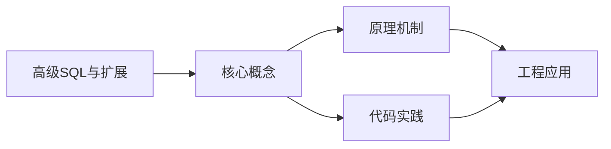
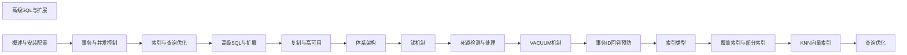

## 1. 学习目标（Bloom 分类）

本节按照布鲁姆教育目标分类学组织学习路径。本文主题为《高级SQL与扩展》，属于 PostgreSQL 模块，读者可以根据自身阶段选择阅读深度。

记忆层面：能够准确复述本文的核心概念、术语与基本语法或操作步骤，并能够在提问或检索时快速定位对应知识点。能够说出 PostgreSQL 的核心概念、语法与常用对象。

理解层面：能够用自己的语言解释核心原理与工作机制，说明概念之间的因果关系，而不是机械记忆结论。能够解释 PostgreSQL 的执行原理与优化机制。

应用层面：能够在真实项目或练习场景中运用本文知识解决具体问题，写出正确且可维护的实现。能够编写正确、高效的 PostgreSQL 语句与操作。

分析层面：能够拆解复杂问题，比较本文主题与相邻概念的异同，识别边界条件与例外情况。能够分析 PostgreSQL 相关方案在性能与一致性上的权衡。

评价层面：能够根据约束条件（性能、可读性、安全、成本）评价不同方案的优劣，做出有依据的技术决策。能够根据业务场景评价 PostgreSQL 技术选型。

创造层面：能够把本文知识与其他模块知识组合，设计出新的解决方案或可复用的工程模式。能够组合 PostgreSQL 与其他技术设计数据架构。

通过本节学习，读者应当能够把《高级SQL与扩展》纳入自己的知识网络，并与 PostgreSQL 模块的其他主题（MVCC、窗口函数、扩展生态、高可用）建立关联。

## 2. 历史动机与发展脉络

《高级SQL与扩展》是 PostgreSQL 领域的重要主题。要真正理解它，需要先了解它解决的问题与演进过程。

PostgreSQL 起源于 1986 年伯克利的 POSTGRES 项目，1996 年更名 PostgreSQL；以功能全面与标准遵循著称，社区驱动发展（每年一个大版本）。
特性版图：完整 SQL（窗口、CTE、递归、JSON）、扩展生态（PostGIS、pgvector）、复制（流复制/逻辑复制）、可编程性（PL/pgSQL、自定义类型）。
PG 17（2024）/PG 18 持续增强：vacuum 与 I/O 优化、增量备份、并行查询扩展；被开发者社区长期评为最受欢迎的数据库之一。

回到本文主题：高级SQL与扩展 的提出与成熟，正是上述技术背景下的必然产物。早期实现往往以简单可用为目标，随着工程规模扩大，社区逐渐沉淀出标准做法与最佳实践；理解这一脉络，可以帮助读者判断“为什么文档中的推荐写法是现在这个样子”，也能在遇到历史遗留代码时准确识别其设计年代与取舍。


## 3. 形式化定义与核心概念精讲

本节把《高级SQL与扩展》涉及的核心概念以“定义 + 讲解”的形式展开。读者应把定义当作工具，把讲解当作理解路径；两者结合才能形成可迁移的知识。

MVCC：每个事务可见性由 xmin/xmax 与快照决定；行更新产生新版本，旧版本由 vacuum 清理；读写互不阻塞。
索引类型：B-tree、Hash、GiST、SP-GiST、GIN（全文/JSON）、BRIN（大表顺序数据）；部分索引与表达式索引。
窗口函数：OVER 子句在结果集内计算排名、移动平均、LAG/LEAD；区别于 GROUP BY 的聚合语义。

### 3.1 原文章节逐一精讲

原文档把主题拆分为 11 个小节，下面按顺序给出每一节的导读讲解，随后保留原文细节供精读。

#### 原文精读（完整保留）


#### 1. 窗口函数

##### 1.1 基本语法

```sql
-- 窗口函数语法
function_name() OVER (
  [PARTITION BY expr]
  [ORDER BY expr [ASC|DESC]]
  [frame_clause]
)

-- frame_clause:
-- ROWS BETWEEN start AND end
-- RANGE BETWEEN start AND end
-- start/end: UNBOUNDED PRECEDING | n PRECEDING | CURRENT ROW | n FOLLOWING | UNBOUNDED FOLLOWING
```

##### 1.2 常用窗口函数

```sql
-- 排名函数
SELECT name, score,
  ROW_NUMBER() OVER (ORDER BY score DESC) AS row_num,
  RANK() OVER (ORDER BY score DESC) AS rank_val,
  DENSE_RANK() OVER (ORDER BY score DESC) AS dense_rank,
  PERCENT_RANK() OVER (ORDER BY score DESC) AS pct_rank
FROM students;

-- 聚合函数
SELECT product, month, revenue,
  SUM(revenue) OVER (PARTITION BY product ORDER BY month
    ROWS BETWEEN UNBOUNDED PRECEDING AND CURRENT ROW) AS running_total,
  AVG(revenue) OVER (PARTITION BY product ORDER BY month
    ROWS BETWEEN 2 PRECEDING AND CURRENT ROW) AS moving_avg_3m,
  SUM(revenue) OVER (PARTITION BY product) AS product_total
FROM sales;

-- 偏移函数
SELECT product, month, revenue,
  LAG(revenue, 1) OVER (PARTITION BY product ORDER BY month) AS prev_month,
  LEAD(revenue, 1) OVER (PARTITION BY product ORDER BY month) AS next_month,
  revenue - LAG(revenue, 1) OVER (PARTITION BY product ORDER BY month) AS growth
FROM sales;

-- 取值函数
SELECT product, month, revenue,
  FIRST_VALUE(revenue) OVER (PARTITION BY product ORDER BY month
    ROWS BETWEEN UNBOUNDED PRECEDING AND UNBOUNDED FOLLOWING) AS first_rev,
  LAST_VALUE(revenue) OVER (PARTITION BY product ORDER BY month
    ROWS BETWEEN UNBOUNDED PRECEDING AND UNBOUNDED FOLLOWING) AS last_rev,
  NTH_VALUE(revenue, 2) OVER (PARTITION BY product ORDER BY month
    ROWS BETWEEN UNBOUNDED PRECEDING AND UNBOUNDED FOLLOWING) AS second_rev
FROM sales;
```

##### 1.3 实战案例

```sql
-- 每个部门薪资前3名
SELECT * FROM (
  SELECT dept, name, salary,
    ROW_NUMBER() OVER (PARTITION BY dept ORDER BY salary DESC) AS rn
  FROM employees
) t WHERE rn <= 3;

-- 连续登录天数
SELECT user_id, login_date,
  login_date - (ROW_NUMBER() OVER (PARTITION BY user_id ORDER BY login_date))::int AS grp
FROM user_logins
GROUP BY user_id, login_date;

-- 计算连续登录天数
SELECT user_id, COUNT(*) AS consecutive_days
FROM (
  SELECT user_id, login_date,
    login_date - (ROW_NUMBER() OVER (PARTITION BY user_id ORDER BY login_date))::int AS grp
  FROM (SELECT DISTINCT user_id, login_date::date FROM user_logins) t1
) t2
GROUP BY user_id, grp
HAVING COUNT(*) >= 7;
```

#### 2. CTE 与递归 CTE

##### 2.1 普通 CTE

```sql
-- CTE 提高可读性
WITH monthly_sales AS (
  SELECT date_trunc('month', order_date) AS month,
    SUM(amount) AS total
  FROM orders
  GROUP BY 1
),
ranked AS (
  SELECT month, total,
    RANK() OVER (ORDER BY total DESC) AS rank_val
  FROM monthly_sales
)
SELECT month, total, rank_val
FROM ranked
WHERE rank_val <= 5;
```

##### 2.2 递归 CTE

```sql
-- 组织层级遍历
WITH RECURSIVE org_tree AS (
  -- 锚点：顶级管理者
  SELECT id, name, manager_id, 1 AS level, name::text AS path
  FROM employees
  WHERE manager_id IS NULL

  UNION ALL

  -- 递归：下属员工
  SELECT e.id, e.name, e.manager_id, t.level + 1,
    t.path || ' > ' || e.name
  FROM employees e
  JOIN org_tree t ON e.manager_id = t.id
)
SELECT id, name, level, path FROM org_tree
ORDER BY path;

-- 生成日期序列
WITH RECURSIVE dates AS (
  SELECT '2024-01-01'::date AS dt
  UNION ALL
  SELECT dt + 1 FROM dates WHERE dt < '2024-12-31'
)
SELECT dt FROM dates;

-- 物料清单（BOM）展开
WITH RECURSIVE bom AS (
  SELECT parent_id, child_id, quantity, 1 AS depth
  FROM bill_of_materials
  WHERE parent_id = 'PRODUCT-A'

  UNION ALL

  SELECT b.parent_id, m.child_id, b.quantity * m.quantity, b.depth + 1
  FROM bom b
  JOIN bill_of_materials m ON b.child_id = m.parent_id
)
SELECT child_id, SUM(quantity) AS total_qty, MAX(depth) AS max_depth
FROM bom
GROUP BY child_id;
```

#### 3. 横向连接（LATERAL）

```sql
-- LATERAL 允许子查询引用外部查询的列

-- 每个用户最近的3笔订单
SELECT u.name, o.order_date, o.total
FROM users u
CROSS JOIN LATERAL (
  SELECT order_date, total
  FROM orders
  WHERE user_id = u.id
  ORDER BY order_date DESC
  LIMIT 3
) o;

-- 每个分类销量最高的商品
SELECT c.name AS category, p.name AS top_product, p.sales
FROM categories c
CROSS JOIN LATERAL (
  SELECT name, sales
  FROM products
  WHERE category_id = c.id
  ORDER BY sales DESC
  LIMIT 1
) p;

-- LATERAL 与函数
SELECT u.name, recent.*
FROM users u
CROSS JOIN LATERAL get_recent_orders(u.id) AS recent(order_id, order_date);
```

#### 4. 分组集（Grouping Sets）

```sql
-- ROLLUP: 层级汇总
SELECT region, product, SUM(sales) AS total
FROM sales_data
GROUP BY ROLLUP (region, product);
-- 等效于:
-- GROUP BY (region, product)
-- GROUP BY (region)
-- GROUP BY ()

-- CUBE: 全组合汇总
SELECT region, product, year, SUM(sales) AS total
FROM sales_data
GROUP BY CUBE (region, product, year);
-- 生成所有维度组合的汇总

-- GROUPING SETS: 自定义分组
SELECT region, product, SUM(sales) AS total
FROM sales_data
GROUP BY GROUPING SETS (
  (region, product),   -- 按区域+产品
  (region),            -- 按区域
  (product),           -- 按产品
  ()                   -- 总计
);

-- GROUPING 函数: 区分汇总行与数据行
SELECT region, product,
  GROUPING(region) AS is_region_total,
  GROUPING(product) AS is_product_total,
  SUM(sales) AS total
FROM sales_data
GROUP BY ROLLUP (region, product);
```

#### 5. MERGE 语句增强

```sql
-- MERGE + RETURNING（PostgreSQL 17 增强）
MERGE INTO target_table t
USING source_table s
ON t.id = s.id
WHEN MATCHED AND t.version < s.version THEN
  UPDATE SET name = s.name, version = s.version
WHEN NOT MATCHED THEN
  INSERT (id, name, version) VALUES (s.id, s.name, s.version)
WHEN MATCHED AND t.deleted = true THEN
  DELETE
RETURNING
  merge_action() AS action,
  t.id, t.name;

-- merge_action() 返回: 'INSERT', 'UPDATE', 'DELETE'
```

#### 6. JSON_TABLE 标准化

```sql
-- JSON_TABLE（PostgreSQL 17 SQL/JSON 标准化）
SELECT *
FROM JSON_TABLE(
  '[{"name":"Alice","scores":[90,85,92]},
    {"name":"Bob","scores":[78,88,95]}]'::jsonb,
  '$[*]' COLUMNS (
    name TEXT PATH '$.name',
    score1 INT PATH '$.scores[0]',
    score2 INT PATH '$.scores[1]',
    score3 INT PATH '$.scores[2]'
  )
) AS jt;

-- 嵌套 JSON_TABLE
SELECT *
FROM JSON_TABLE(
  '{"department":"Engineering","employees":[...]}'::jsonb,
  '$' COLUMNS (
    dept TEXT PATH '$.department',
    NESTED PATH '$.employees[*]' COLUMNS (
      name TEXT PATH '$.name',
      role TEXT PATH '$.role'
    )
  )
) AS jt;
```

#### 7. 全文检索

##### 7.1 基本概念

```sql
-- tsvector: 文档的词素向量
SELECT to_tsvector('english', 'The quick brown fox jumps over the lazy dog');
-- 'brown':3 'dog':9 'fox':4 'jump':5 'lazi':8 'quick':2

-- tsquery: 搜索查询
SELECT to_tsquery('english', 'quick & fox');
-- 'quick' & 'fox'

-- 匹配操作符 @@
SELECT 'The quick brown fox'::tsvector @@ 'quick & fox'::tsquery;  -- true
```

##### 7.2 全文检索索引与查询

```sql
-- 创建全文检索索引
CREATE INDEX idx_docs_fts ON documents
  USING gin (to_tsvector('english', title || ' ' || content));

-- 全文检索查询
SELECT id, title,
  ts_headline('english', content, websearch_to_tsquery('postgresql index')) AS highlight,
  ts_rank_cd(to_tsvector('english', content), websearch_to_tsquery('postgresql index')) AS rank
FROM documents
WHERE to_tsvector('english', title || ' ' || content) @@ websearch_to_tsquery('postgresql index')
ORDER BY rank DESC
LIMIT 20;

-- 多语言配置
SELECT to_tsvector('simple', '中文测试');    -- 不做词干提取
SELECT to_tsvector('zhparser', '中文测试'); -- 需安装 zhparser 扩展
```

#### 8. PostGIS 地理空间

```sql
-- 安装 PostGIS
CREATE EXTENSION postgis;

-- 创建空间列
ALTER TABLE locations ADD COLUMN geom geometry(Point, 4326);

-- 插入空间数据
INSERT INTO locations (name, geom)
VALUES ('总部', ST_SetSRID(ST_MakePoint(116.397, 39.908), 4326));

-- 空间索引
CREATE INDEX idx_locations_geom ON locations USING gist (geom);

-- 空间查询
-- 查找 5km 范围内的点
SELECT name, ST_Distance(geom::geography,
  ST_SetSRID(ST_MakePoint(116.4, 39.91), 4326)::geography) AS distance
FROM locations
WHERE ST_DWithin(geom::geography,
  ST_SetSRID(ST_MakePoint(116.4, 39.91), 4326)::geography, 5000)
ORDER BY distance;

-- 常用函数
ST_AsText(geom)           -- WKT 输出
ST_AsGeoJSON(geom)        -- GeoJSON 输出
ST_Area(geom)             -- 面积
ST_Length(geom)           -- 长度
ST_Contains(geom1, geom2) -- 包含关系
ST_Intersects(geom1, geom2) -- 相交
```

#### 9. PL/pgSQL 存储过程

```sql
-- 创建存储过程
CREATE OR REPLACE PROCEDURE transfer_funds(
  p_from INTEGER,
  p_to INTEGER,
  p_amount NUMERIC
)
LANGUAGE plpgsql
AS $$
BEGIN
  -- 检查余额
  IF NOT EXISTS (
    SELECT 1 FROM accounts WHERE id = p_from AND balance >= p_amount
  ) THEN
    RAISE EXCEPTION 'Insufficient funds or account not found';
  END IF;

  -- 执行转账
  UPDATE accounts SET balance = balance - p_amount WHERE id = p_from;
  UPDATE accounts SET balance = balance + p_amount WHERE id = p_to;

  -- 记录日志
  INSERT INTO transfer_log (from_id, to_id, amount, created_at)
  VALUES (p_from, p_to, p_amount, now());

  COMMIT;  -- 存储过程中可使用 COMMIT
END;
$$;

-- 调用存储过程
CALL transfer_funds(1, 2, 500.00);
```

```sql
-- 创建函数
CREATE OR REPLACE FUNCTION get_user_orders(p_user_id INTEGER)
RETURNS TABLE(order_id INTEGER, order_date TIMESTAMP, total NUMERIC)
LANGUAGE plpgsql STABLE
AS $$
BEGIN
  RETURN QUERY
  SELECT o.id, o.order_date, SUM(oi.quantity * oi.price) AS total
  FROM orders o
  JOIN order_items oi ON o.id = oi.order_id
  WHERE o.user_id = p_user_id
  GROUP BY o.id, o.order_date
  ORDER BY o.order_date DESC;
END;
$$;

-- 调用函数
SELECT * FROM get_user_orders(100);
```

#### 10. 触发器

```sql
-- 创建触发器函数
CREATE OR REPLACE FUNCTION audit_trigger_func()
RETURNS TRIGGER
LANGUAGE plpgsql
AS $$
BEGIN
  IF TG_OP = 'INSERT' THEN
    INSERT INTO audit_log (table_name, operation, new_data, changed_at)
    VALUES (TG_TABLE_NAME, 'INSERT', to_jsonb(NEW), now());
    RETURN NEW;
  ELSIF TG_OP = 'UPDATE' THEN
    INSERT INTO audit_log (table_name, operation, old_data, new_data, changed_at)
    VALUES (TG_TABLE_NAME, 'UPDATE', to_jsonb(OLD), to_jsonb(NEW), now());
    RETURN NEW;
  ELSIF TG_OP = 'DELETE' THEN
    INSERT INTO audit_log (table_name, operation, old_data, changed_at)
    VALUES (TG_TABLE_NAME, 'DELETE', to_jsonb(OLD), now());
    RETURN OLD;
  END IF;
END;
$$;

-- 绑定触发器
CREATE TRIGGER orders_audit
AFTER INSERT OR UPDATE OR DELETE ON orders
FOR EACH ROW EXECUTE FUNCTION audit_trigger_func();

-- 条件触发器
CREATE TRIGGER check_balance
BEFORE UPDATE ON accounts
FOR EACH ROW
WHEN (NEW.balance < 0)
EXECUTE FUNCTION raise_balance_error();
```

#### 11. FDW 外部数据包装器

```sql
-- 安装 postgres_fdw
CREATE EXTENSION postgres_fdw;

-- 创建外部服务器
CREATE SERVER remote_db
  FOREIGN DATA WRAPPER postgres_fdw
  OPTIONS (host '192.168.1.50', port '5432', dbname 'remote_fandex');

-- 创建用户映射
CREATE USER MAPPING FOR current_user
  SERVER remote_db
  OPTIONS (user 'remote_admin', password 'SecurePass');

-- 导入外部表
IMPORT FOREIGN SCHEMA public
  LIMIT TO (users, orders)
  FROM SERVER remote_db
  INTO public;

-- 手动创建外部表
CREATE FOREIGN TABLE remote_users (
  id INTEGER,
  name TEXT,
  email TEXT
) SERVER remote_db
  OPTIONS (schema_name 'public', table_name 'users');

-- 跨库查询
SELECT u.name, COUNT(o.id) AS order_count
FROM local_orders o
JOIN remote_users u ON o.user_id = u.id
GROUP BY u.name;

-- 其他 FDW 扩展
-- mysql_fdw: 连接 MySQL
-- redis_fdw: 连接 Redis
-- mongo_fdw: 连接 MongoDB
-- file_fdw: 读取外部文件
```


### 3.2 概念关系图

下面用 Mermaid 图表达本文核心概念之间的关系，帮助读者建立整体图景：



图中展示的是本文知识的结构化关系：核心概念是入口，原理机制解释“为什么”，代码实践演示“怎么做”，工程应用回答“何时用”。读者学习时可以把每个小节的内容挂接到对应节点上。

## 4. 理论推导与原理解析

本节深入《高级SQL与扩展》背后的原理。理论部分不求面面俱到，而是聚焦“能解释现象、能指导实践”的关键推导。

MVCC：每个事务可见性由 xmin/xmax 与快照决定；行更新产生新版本，旧版本由 vacuum 清理；读写互不阻塞。
索引类型：B-tree、Hash、GiST、SP-GiST、GIN（全文/JSON）、BRIN（大表顺序数据）；部分索引与表达式索引。
窗口函数：OVER 子句在结果集内计算排名、移动平均、LAG/LEAD；区别于 GROUP BY 的聚合语义。
逻辑复制与流复制：WAL 流复制同步备库；逻辑复制按表级发布订阅，支持跨版本与异构。

需要强调的是，理论推导与工程实践之间存在翻译层：理论给出的是理想化模型与边界条件，工程代码则必须处理真实环境中的例外。读者在学习时应先掌握理论的“标准情形”，再通过陷阱章节了解“非标准情形”。

## 5. 代码示例与逐行讲解

本节把原文中的代码示例系统整理，并为每个示例补充用途说明与讲解。读者不应只浏览代码，而应逐段对照讲解理解设计意图。

### 5.1 示例：1.1 基本语法

该示例来自原文《1.1 基本语法》小节，用于演示高级SQL与扩展相关操作。阅读时请先看代码结构，再看其后的讲解。

```sql
-- 窗口函数语法
function_name() OVER (
  [PARTITION BY expr]
  [ORDER BY expr [ASC|DESC]]
  [frame_clause]
)

-- frame_clause:
-- ROWS BETWEEN start AND end
-- RANGE BETWEEN start AND end
-- start/end: UNBOUNDED PRECEDING | n PRECEDING | CURRENT ROW | n FOLLOWING | UNBOUNDED FOLLOWING
```

讲解：这段代码演示了本节核心知识点。代码中的关键操作可以归纳为三步：准备（定义或初始化）、执行（核心逻辑）、收尾（释放资源或返回结果）。实际项目中，这三步往往被封装为函数或类，以提升复用性与可测试性。

关键点分析：

该示例共 10 行有效代码，包含 1 类关键结构（function）。其中：

- 入口与初始化部分负责建立上下文，对应实际项目中的启动或装配逻辑；
- 核心逻辑部分体现本文主题的主要操作，是阅读时最需要对照讲解理解的部分；
- 输出或返回部分把结果交给调用方，注意其类型与边界条件。

进阶思考路径：先尝试修改参数观察行为变化，再把示例中的模式迁移到自己的项目中；每次修改都记录预期与实测差异，这是把示例转化为能力的最快方式。

### 5.2 示例：1.2 常用窗口函数

该示例来自原文《1.2 常用窗口函数》小节，用于演示高级SQL与扩展相关操作。阅读时请先看代码结构，再看其后的讲解。

```sql
-- 排名函数
SELECT name, score,
  ROW_NUMBER() OVER (ORDER BY score DESC) AS row_num,
  RANK() OVER (ORDER BY score DESC) AS rank_val,
  DENSE_RANK() OVER (ORDER BY score DESC) AS dense_rank,
  PERCENT_RANK() OVER (ORDER BY score DESC) AS pct_rank
FROM students;

-- 聚合函数
SELECT product, month, revenue,
  SUM(revenue) OVER (PARTITION BY product ORDER BY month
    ROWS BETWEEN UNBOUNDED PRECEDING AND CURRENT ROW) AS running_total,
  AVG(revenue) OVER (PARTITION BY product ORDER BY month
    ROWS BETWEEN 2 PRECEDING AND CURRENT ROW) AS moving_avg_3m,
  SUM(revenue) OVER (PARTITION BY product) AS product_total
FROM sales;

-- 偏移函数
SELECT product, month, revenue,
  LAG(revenue, 1) OVER (PARTITION BY product ORDER BY month) AS prev_month,
  LEAD(revenue, 1) OVER (PARTITION BY product ORDER BY month) AS next_month,
  revenue - LAG(revenue, 1) OVER (PARTITION BY product ORDER BY month) AS growth
FROM sales;

-- 取值函数
SELECT product, month, revenue,
  FIRST_VALUE(revenue) OVER (PARTITION BY product ORDER BY month
    ROWS BETWEEN UNBOUNDED PRECEDING AND UNBOUNDED FOLLOWING) AS first_rev,
  LAST_VALUE(revenue) OVER (PARTITION BY product ORDER BY month
    ROWS BETWEEN UNBOUNDED PRECEDING AND UNBOUNDED FOLLOWING) AS last_rev,
  NTH_VALUE(revenue, 2) OVER (PARTITION BY product ORDER BY month
    ROWS BETWEEN UNBOUNDED PRECEDING AND UNBOUNDED FOLLOWING) AS second_rev
FROM sales;
```

讲解：这段代码演示了本节核心知识点。代码中的关键操作可以归纳为三步：准备（定义或初始化）、执行（核心逻辑）、收尾（释放资源或返回结果）。实际项目中，这三步往往被封装为函数或类，以提升复用性与可测试性。

关键点分析：

该示例共 30 行有效代码，包含 2 类关键结构（SELECT、FROM）。其中：

- 入口与初始化部分负责建立上下文，对应实际项目中的启动或装配逻辑；
- 核心逻辑部分体现本文主题的主要操作，是阅读时最需要对照讲解理解的部分；
- 输出或返回部分把结果交给调用方，注意其类型与边界条件。

进阶思考路径：先尝试修改参数观察行为变化，再把示例中的模式迁移到自己的项目中；每次修改都记录预期与实测差异，这是把示例转化为能力的最快方式。

### 5.3 示例：1.3 实战案例

该示例来自原文《1.3 实战案例》小节，用于演示高级SQL与扩展相关操作。阅读时请先看代码结构，再看其后的讲解。

```sql
-- 每个部门薪资前3名
SELECT * FROM (
  SELECT dept, name, salary,
    ROW_NUMBER() OVER (PARTITION BY dept ORDER BY salary DESC) AS rn
  FROM employees
) t WHERE rn <= 3;

-- 连续登录天数
SELECT user_id, login_date,
  login_date - (ROW_NUMBER() OVER (PARTITION BY user_id ORDER BY login_date))::int AS grp
FROM user_logins
GROUP BY user_id, login_date;

-- 计算连续登录天数
SELECT user_id, COUNT(*) AS consecutive_days
FROM (
  SELECT user_id, login_date,
    login_date - (ROW_NUMBER() OVER (PARTITION BY user_id ORDER BY login_date))::int AS grp
  FROM (SELECT DISTINCT user_id, login_date::date FROM user_logins) t1
) t2
GROUP BY user_id, grp
HAVING COUNT(*) >= 7;
```

讲解：这段代码演示了本节核心知识点。代码中的关键操作可以归纳为三步：准备（定义或初始化）、执行（核心逻辑）、收尾（释放资源或返回结果）。实际项目中，这三步往往被封装为函数或类，以提升复用性与可测试性。

关键点分析：

该示例共 20 行有效代码，包含 2 类关键结构（SELECT、FROM）。其中：

- 入口与初始化部分负责建立上下文，对应实际项目中的启动或装配逻辑；
- 核心逻辑部分体现本文主题的主要操作，是阅读时最需要对照讲解理解的部分；
- 输出或返回部分把结果交给调用方，注意其类型与边界条件。

进阶思考路径：先尝试修改参数观察行为变化，再把示例中的模式迁移到自己的项目中；每次修改都记录预期与实测差异，这是把示例转化为能力的最快方式。

### 5.4 示例：2.1 普通 CTE

该示例来自原文《2.1 普通 CTE》小节，用于演示高级SQL与扩展相关操作。阅读时请先看代码结构，再看其后的讲解。

```sql
-- CTE 提高可读性
WITH monthly_sales AS (
  SELECT date_trunc('month', order_date) AS month,
    SUM(amount) AS total
  FROM orders
  GROUP BY 1
),
ranked AS (
  SELECT month, total,
    RANK() OVER (ORDER BY total DESC) AS rank_val
  FROM monthly_sales
)
SELECT month, total, rank_val
FROM ranked
WHERE rank_val <= 5;
```

讲解：这段代码演示了本节核心知识点。代码中的关键操作可以归纳为三步：准备（定义或初始化）、执行（核心逻辑）、收尾（释放资源或返回结果）。实际项目中，这三步往往被封装为函数或类，以提升复用性与可测试性。

关键点分析：

该示例共 15 行有效代码，包含 2 类关键结构（SELECT、FROM）。其中：

- 入口与初始化部分负责建立上下文，对应实际项目中的启动或装配逻辑；
- 核心逻辑部分体现本文主题的主要操作，是阅读时最需要对照讲解理解的部分；
- 输出或返回部分把结果交给调用方，注意其类型与边界条件。

进阶思考路径：先尝试修改参数观察行为变化，再把示例中的模式迁移到自己的项目中；每次修改都记录预期与实测差异，这是把示例转化为能力的最快方式。

### 5.5 示例：2.2 递归 CTE

该示例来自原文《2.2 递归 CTE》小节，用于演示高级SQL与扩展相关操作。阅读时请先看代码结构，再看其后的讲解。

```sql
-- 组织层级遍历
WITH RECURSIVE org_tree AS (
  -- 锚点：顶级管理者
  SELECT id, name, manager_id, 1 AS level, name::text AS path
  FROM employees
  WHERE manager_id IS NULL

  UNION ALL

  -- 递归：下属员工
  SELECT e.id, e.name, e.manager_id, t.level + 1,
    t.path || ' > ' || e.name
  FROM employees e
  JOIN org_tree t ON e.manager_id = t.id
)
SELECT id, name, level, path FROM org_tree
ORDER BY path;

-- 生成日期序列
WITH RECURSIVE dates AS (
  SELECT '2024-01-01'::date AS dt
  UNION ALL
  SELECT dt + 1 FROM dates WHERE dt < '2024-12-31'
)
SELECT dt FROM dates;

-- 物料清单（BOM）展开
WITH RECURSIVE bom AS (
  SELECT parent_id, child_id, quantity, 1 AS depth
  FROM bill_of_materials
  WHERE parent_id = 'PRODUCT-A'

  UNION ALL

  SELECT b.parent_id, m.child_id, b.quantity * m.quantity, b.depth + 1
  FROM bom b
  JOIN bill_of_materials m ON b.child_id = m.parent_id
)
SELECT child_id, SUM(quantity) AS total_qty, MAX(depth) AS max_depth
FROM bom
GROUP BY child_id;
```

讲解：这段代码演示了本节核心知识点。代码中的关键操作可以归纳为三步：准备（定义或初始化）、执行（核心逻辑）、收尾（释放资源或返回结果）。实际项目中，这三步往往被封装为函数或类，以提升复用性与可测试性。

关键点分析：

该示例共 35 行有效代码，包含 2 类关键结构（SELECT、FROM）。其中：

- 入口与初始化部分负责建立上下文，对应实际项目中的启动或装配逻辑；
- 核心逻辑部分体现本文主题的主要操作，是阅读时最需要对照讲解理解的部分；
- 输出或返回部分把结果交给调用方，注意其类型与边界条件。

进阶思考路径：先尝试修改参数观察行为变化，再把示例中的模式迁移到自己的项目中；每次修改都记录预期与实测差异，这是把示例转化为能力的最快方式。

### 5.6 示例：3. 横向连接（LATERAL）

该示例来自原文《3. 横向连接（LATERAL）》小节，用于演示高级SQL与扩展相关操作。阅读时请先看代码结构，再看其后的讲解。

```sql
-- LATERAL 允许子查询引用外部查询的列

-- 每个用户最近的3笔订单
SELECT u.name, o.order_date, o.total
FROM users u
CROSS JOIN LATERAL (
  SELECT order_date, total
  FROM orders
  WHERE user_id = u.id
  ORDER BY order_date DESC
  LIMIT 3
) o;

-- 每个分类销量最高的商品
SELECT c.name AS category, p.name AS top_product, p.sales
FROM categories c
CROSS JOIN LATERAL (
  SELECT name, sales
  FROM products
  WHERE category_id = c.id
  ORDER BY sales DESC
  LIMIT 1
) p;

-- LATERAL 与函数
SELECT u.name, recent.*
FROM users u
CROSS JOIN LATERAL get_recent_orders(u.id) AS recent(order_id, order_date);
```

讲解：这段代码演示了本节核心知识点。代码中的关键操作可以归纳为三步：准备（定义或初始化）、执行（核心逻辑）、收尾（释放资源或返回结果）。实际项目中，这三步往往被封装为函数或类，以提升复用性与可测试性。

关键点分析：

该示例共 25 行有效代码，包含 2 类关键结构（SELECT、FROM）。其中：

- 入口与初始化部分负责建立上下文，对应实际项目中的启动或装配逻辑；
- 核心逻辑部分体现本文主题的主要操作，是阅读时最需要对照讲解理解的部分；
- 输出或返回部分把结果交给调用方，注意其类型与边界条件。

进阶思考路径：先尝试修改参数观察行为变化，再把示例中的模式迁移到自己的项目中；每次修改都记录预期与实测差异，这是把示例转化为能力的最快方式。

### 5.7 示例：4. 分组集（Grouping Sets）

该示例来自原文《4. 分组集（Grouping Sets）》小节，用于演示高级SQL与扩展相关操作。阅读时请先看代码结构，再看其后的讲解。

```sql
-- ROLLUP: 层级汇总
SELECT region, product, SUM(sales) AS total
FROM sales_data
GROUP BY ROLLUP (region, product);
-- 等效于:
-- GROUP BY (region, product)
-- GROUP BY (region)
-- GROUP BY ()

-- CUBE: 全组合汇总
SELECT region, product, year, SUM(sales) AS total
FROM sales_data
GROUP BY CUBE (region, product, year);
-- 生成所有维度组合的汇总

-- GROUPING SETS: 自定义分组
SELECT region, product, SUM(sales) AS total
FROM sales_data
GROUP BY GROUPING SETS (
  (region, product),   -- 按区域+产品
  (region),            -- 按区域
  (product),           -- 按产品
  ()                   -- 总计
);

-- GROUPING 函数: 区分汇总行与数据行
SELECT region, product,
  GROUPING(region) AS is_region_total,
  GROUPING(product) AS is_product_total,
  SUM(sales) AS total
FROM sales_data
GROUP BY ROLLUP (region, product);
```

讲解：这段代码演示了本节核心知识点。代码中的关键操作可以归纳为三步：准备（定义或初始化）、执行（核心逻辑）、收尾（释放资源或返回结果）。实际项目中，这三步往往被封装为函数或类，以提升复用性与可测试性。

关键点分析：

该示例共 29 行有效代码，包含 2 类关键结构（SELECT、FROM）。其中：

- 入口与初始化部分负责建立上下文，对应实际项目中的启动或装配逻辑；
- 核心逻辑部分体现本文主题的主要操作，是阅读时最需要对照讲解理解的部分；
- 输出或返回部分把结果交给调用方，注意其类型与边界条件。

进阶思考路径：先尝试修改参数观察行为变化，再把示例中的模式迁移到自己的项目中；每次修改都记录预期与实测差异，这是把示例转化为能力的最快方式。

### 5.8 示例：5. MERGE 语句增强

该示例来自原文《5. MERGE 语句增强》小节，用于演示高级SQL与扩展相关操作。阅读时请先看代码结构，再看其后的讲解。

```sql
-- MERGE + RETURNING（PostgreSQL 17 增强）
MERGE INTO target_table t
USING source_table s
ON t.id = s.id
WHEN MATCHED AND t.version < s.version THEN
  UPDATE SET name = s.name, version = s.version
WHEN NOT MATCHED THEN
  INSERT (id, name, version) VALUES (s.id, s.name, s.version)
WHEN MATCHED AND t.deleted = true THEN
  DELETE
RETURNING
  merge_action() AS action,
  t.id, t.name;

-- merge_action() 返回: 'INSERT', 'UPDATE', 'DELETE'
```

讲解：这段代码演示了本节核心知识点。代码中的关键操作可以归纳为三步：准备（定义或初始化）、执行（核心逻辑）、收尾（释放资源或返回结果）。实际项目中，这三步往往被封装为函数或类，以提升复用性与可测试性。

关键点分析：

该示例共 14 行有效代码，包含 1 类关键结构（INSERT）。其中：

- 入口与初始化部分负责建立上下文，对应实际项目中的启动或装配逻辑；
- 核心逻辑部分体现本文主题的主要操作，是阅读时最需要对照讲解理解的部分；
- 输出或返回部分把结果交给调用方，注意其类型与边界条件。

进阶思考路径：先尝试修改参数观察行为变化，再把示例中的模式迁移到自己的项目中；每次修改都记录预期与实测差异，这是把示例转化为能力的最快方式。

### 5.9 示例：6. JSON_TABLE 标准化

该示例来自原文《6. JSON_TABLE 标准化》小节，用于演示高级SQL与扩展相关操作。阅读时请先看代码结构，再看其后的讲解。

```sql
-- JSON_TABLE（PostgreSQL 17 SQL/JSON 标准化）
SELECT *
FROM JSON_TABLE(
  '[{"name":"Alice","scores":[90,85,92]},
    {"name":"Bob","scores":[78,88,95]}]'::jsonb,
  '$[*]' COLUMNS (
    name TEXT PATH '$.name',
    score1 INT PATH '$.scores[0]',
    score2 INT PATH '$.scores[1]',
    score3 INT PATH '$.scores[2]'
  )
) AS jt;

-- 嵌套 JSON_TABLE
SELECT *
FROM JSON_TABLE(
  '{"department":"Engineering","employees":[...]}'::jsonb,
  '$' COLUMNS (
    dept TEXT PATH '$.department',
    NESTED PATH '$.employees[*]' COLUMNS (
      name TEXT PATH '$.name',
      role TEXT PATH '$.role'
    )
  )
) AS jt;
```

讲解：这段代码演示了本节核心知识点。代码中的关键操作可以归纳为三步：准备（定义或初始化）、执行（核心逻辑）、收尾（释放资源或返回结果）。实际项目中，这三步往往被封装为函数或类，以提升复用性与可测试性。

关键点分析：

该示例共 24 行有效代码，包含 2 类关键结构（SELECT、FROM）。其中：

- 入口与初始化部分负责建立上下文，对应实际项目中的启动或装配逻辑；
- 核心逻辑部分体现本文主题的主要操作，是阅读时最需要对照讲解理解的部分；
- 输出或返回部分把结果交给调用方，注意其类型与边界条件。

进阶思考路径：先尝试修改参数观察行为变化，再把示例中的模式迁移到自己的项目中；每次修改都记录预期与实测差异，这是把示例转化为能力的最快方式。

### 5.10 示例：7.1 基本概念

该示例来自原文《7.1 基本概念》小节，用于演示高级SQL与扩展相关操作。阅读时请先看代码结构，再看其后的讲解。

```sql
-- tsvector: 文档的词素向量
SELECT to_tsvector('english', 'The quick brown fox jumps over the lazy dog');
-- 'brown':3 'dog':9 'fox':4 'jump':5 'lazi':8 'quick':2

-- tsquery: 搜索查询
SELECT to_tsquery('english', 'quick & fox');
-- 'quick' & 'fox'

-- 匹配操作符 @@
SELECT 'The quick brown fox'::tsvector @@ 'quick & fox'::tsquery;  -- true
```

讲解：这段代码演示了本节核心知识点。代码中的关键操作可以归纳为三步：准备（定义或初始化）、执行（核心逻辑）、收尾（释放资源或返回结果）。实际项目中，这三步往往被封装为函数或类，以提升复用性与可测试性。

关键点分析：

该示例共 8 行有效代码，包含 1 类关键结构（SELECT）。其中：

- 入口与初始化部分负责建立上下文，对应实际项目中的启动或装配逻辑；
- 核心逻辑部分体现本文主题的主要操作，是阅读时最需要对照讲解理解的部分；
- 输出或返回部分把结果交给调用方，注意其类型与边界条件。

进阶思考路径：先尝试修改参数观察行为变化，再把示例中的模式迁移到自己的项目中；每次修改都记录预期与实测差异，这是把示例转化为能力的最快方式。

### 5.11 示例：7.2 全文检索索引与查询

该示例来自原文《7.2 全文检索索引与查询》小节，用于演示高级SQL与扩展相关操作。阅读时请先看代码结构，再看其后的讲解。

```sql
-- 创建全文检索索引
CREATE INDEX idx_docs_fts ON documents
  USING gin (to_tsvector('english', title || ' ' || content));

-- 全文检索查询
SELECT id, title,
  ts_headline('english', content, websearch_to_tsquery('postgresql index')) AS highlight,
  ts_rank_cd(to_tsvector('english', content), websearch_to_tsquery('postgresql index')) AS rank
FROM documents
WHERE to_tsvector('english', title || ' ' || content) @@ websearch_to_tsquery('postgresql index')
ORDER BY rank DESC
LIMIT 20;

-- 多语言配置
SELECT to_tsvector('simple', '中文测试');    -- 不做词干提取
SELECT to_tsvector('zhparser', '中文测试'); -- 需安装 zhparser 扩展
```

讲解：这段代码演示了本节核心知识点。代码中的关键操作可以归纳为三步：准备（定义或初始化）、执行（核心逻辑）、收尾（释放资源或返回结果）。实际项目中，这三步往往被封装为函数或类，以提升复用性与可测试性。

关键点分析：

该示例共 14 行有效代码，包含 3 类关键结构（SELECT、CREATE、FROM）。其中：

- 入口与初始化部分负责建立上下文，对应实际项目中的启动或装配逻辑；
- 核心逻辑部分体现本文主题的主要操作，是阅读时最需要对照讲解理解的部分；
- 输出或返回部分把结果交给调用方，注意其类型与边界条件。

进阶思考路径：先尝试修改参数观察行为变化，再把示例中的模式迁移到自己的项目中；每次修改都记录预期与实测差异，这是把示例转化为能力的最快方式。

### 5.12 示例：8. PostGIS 地理空间

该示例来自原文《8. PostGIS 地理空间》小节，用于演示高级SQL与扩展相关操作。阅读时请先看代码结构，再看其后的讲解。

```sql
-- 安装 PostGIS
CREATE EXTENSION postgis;

-- 创建空间列
ALTER TABLE locations ADD COLUMN geom geometry(Point, 4326);

-- 插入空间数据
INSERT INTO locations (name, geom)
VALUES ('总部', ST_SetSRID(ST_MakePoint(116.397, 39.908), 4326));

-- 空间索引
CREATE INDEX idx_locations_geom ON locations USING gist (geom);

-- 空间查询
-- 查找 5km 范围内的点
SELECT name, ST_Distance(geom::geography,
  ST_SetSRID(ST_MakePoint(116.4, 39.91), 4326)::geography) AS distance
FROM locations
WHERE ST_DWithin(geom::geography,
  ST_SetSRID(ST_MakePoint(116.4, 39.91), 4326)::geography, 5000)
ORDER BY distance;

-- 常用函数
ST_AsText(geom)           -- WKT 输出
ST_AsGeoJSON(geom)        -- GeoJSON 输出
ST_Area(geom)             -- 面积
ST_Length(geom)           -- 长度
ST_Contains(geom1, geom2) -- 包含关系
ST_Intersects(geom1, geom2) -- 相交
```

讲解：这段代码演示了本节核心知识点。代码中的关键操作可以归纳为三步：准备（定义或初始化）、执行（核心逻辑）、收尾（释放资源或返回结果）。实际项目中，这三步往往被封装为函数或类，以提升复用性与可测试性。

关键点分析：

该示例共 24 行有效代码，包含 5 类关键结构（SELECT、INSERT、CREATE、ALTER、FROM）。其中：

- 入口与初始化部分负责建立上下文，对应实际项目中的启动或装配逻辑；
- 核心逻辑部分体现本文主题的主要操作，是阅读时最需要对照讲解理解的部分；
- 输出或返回部分把结果交给调用方，注意其类型与边界条件。

进阶思考路径：先尝试修改参数观察行为变化，再把示例中的模式迁移到自己的项目中；每次修改都记录预期与实测差异，这是把示例转化为能力的最快方式。

### 5.13 示例：9. PL/pgSQL 存储过程

该示例来自原文《9. PL/pgSQL 存储过程》小节，用于演示高级SQL与扩展相关操作。阅读时请先看代码结构，再看其后的讲解。

```sql
-- 创建存储过程
CREATE OR REPLACE PROCEDURE transfer_funds(
  p_from INTEGER,
  p_to INTEGER,
  p_amount NUMERIC
)
LANGUAGE plpgsql
AS $$
BEGIN
  -- 检查余额
  IF NOT EXISTS (
    SELECT 1 FROM accounts WHERE id = p_from AND balance >= p_amount
  ) THEN
    RAISE EXCEPTION 'Insufficient funds or account not found';
  END IF;

  -- 执行转账
  UPDATE accounts SET balance = balance - p_amount WHERE id = p_from;
  UPDATE accounts SET balance = balance + p_amount WHERE id = p_to;

  -- 记录日志
  INSERT INTO transfer_log (from_id, to_id, amount, created_at)
  VALUES (p_from, p_to, p_amount, now());

  COMMIT;  -- 存储过程中可使用 COMMIT
END;
$$;

-- 调用存储过程
CALL transfer_funds(1, 2, 500.00);
```

讲解：这段代码演示了本节核心知识点。代码中的关键操作可以归纳为三步：准备（定义或初始化）、执行（核心逻辑）、收尾（释放资源或返回结果）。实际项目中，这三步往往被封装为函数或类，以提升复用性与可测试性。

关键点分析：

该示例共 26 行有效代码，包含 5 类关键结构（from、SELECT、INSERT、CREATE、FROM）。其中：

- 入口与初始化部分负责建立上下文，对应实际项目中的启动或装配逻辑；
- 核心逻辑部分体现本文主题的主要操作，是阅读时最需要对照讲解理解的部分；
- 输出或返回部分把结果交给调用方，注意其类型与边界条件。

进阶思考路径：先尝试修改参数观察行为变化，再把示例中的模式迁移到自己的项目中；每次修改都记录预期与实测差异，这是把示例转化为能力的最快方式。

### 5.14 示例：9. PL/pgSQL 存储过程

该示例来自原文《9. PL/pgSQL 存储过程》小节，用于演示高级SQL与扩展相关操作。阅读时请先看代码结构，再看其后的讲解。

```sql
-- 创建函数
CREATE OR REPLACE FUNCTION get_user_orders(p_user_id INTEGER)
RETURNS TABLE(order_id INTEGER, order_date TIMESTAMP, total NUMERIC)
LANGUAGE plpgsql STABLE
AS $$
BEGIN
  RETURN QUERY
  SELECT o.id, o.order_date, SUM(oi.quantity * oi.price) AS total
  FROM orders o
  JOIN order_items oi ON o.id = oi.order_id
  WHERE o.user_id = p_user_id
  GROUP BY o.id, o.order_date
  ORDER BY o.order_date DESC;
END;
$$;

-- 调用函数
SELECT * FROM get_user_orders(100);
```

讲解：这段代码演示了本节核心知识点。代码中的关键操作可以归纳为三步：准备（定义或初始化）、执行（核心逻辑）、收尾（释放资源或返回结果）。实际项目中，这三步往往被封装为函数或类，以提升复用性与可测试性。

关键点分析：

该示例共 17 行有效代码，包含 3 类关键结构（SELECT、CREATE、FROM）。其中：

- 入口与初始化部分负责建立上下文，对应实际项目中的启动或装配逻辑；
- 核心逻辑部分体现本文主题的主要操作，是阅读时最需要对照讲解理解的部分；
- 输出或返回部分把结果交给调用方，注意其类型与边界条件。

进阶思考路径：先尝试修改参数观察行为变化，再把示例中的模式迁移到自己的项目中；每次修改都记录预期与实测差异，这是把示例转化为能力的最快方式。

### 5.15 示例：10. 触发器

该示例来自原文《10. 触发器》小节，用于演示高级SQL与扩展相关操作。阅读时请先看代码结构，再看其后的讲解。

```sql
-- 创建触发器函数
CREATE OR REPLACE FUNCTION audit_trigger_func()
RETURNS TRIGGER
LANGUAGE plpgsql
AS $$
BEGIN
  IF TG_OP = 'INSERT' THEN
    INSERT INTO audit_log (table_name, operation, new_data, changed_at)
    VALUES (TG_TABLE_NAME, 'INSERT', to_jsonb(NEW), now());
    RETURN NEW;
  ELSIF TG_OP = 'UPDATE' THEN
    INSERT INTO audit_log (table_name, operation, old_data, new_data, changed_at)
    VALUES (TG_TABLE_NAME, 'UPDATE', to_jsonb(OLD), to_jsonb(NEW), now());
    RETURN NEW;
  ELSIF TG_OP = 'DELETE' THEN
    INSERT INTO audit_log (table_name, operation, old_data, changed_at)
    VALUES (TG_TABLE_NAME, 'DELETE', to_jsonb(OLD), now());
    RETURN OLD;
  END IF;
END;
$$;

-- 绑定触发器
CREATE TRIGGER orders_audit
AFTER INSERT OR UPDATE OR DELETE ON orders
FOR EACH ROW EXECUTE FUNCTION audit_trigger_func();

-- 条件触发器
CREATE TRIGGER check_balance
BEFORE UPDATE ON accounts
FOR EACH ROW
WHEN (NEW.balance < 0)
EXECUTE FUNCTION raise_balance_error();
```

讲解：这段代码演示了本节核心知识点。代码中的关键操作可以归纳为三步：准备（定义或初始化）、执行（核心逻辑）、收尾（释放资源或返回结果）。实际项目中，这三步往往被封装为函数或类，以提升复用性与可测试性。

关键点分析：

该示例共 31 行有效代码，包含 2 类关键结构（INSERT、CREATE）。其中：

- 入口与初始化部分负责建立上下文，对应实际项目中的启动或装配逻辑；
- 核心逻辑部分体现本文主题的主要操作，是阅读时最需要对照讲解理解的部分；
- 输出或返回部分把结果交给调用方，注意其类型与边界条件。

进阶思考路径：先尝试修改参数观察行为变化，再把示例中的模式迁移到自己的项目中；每次修改都记录预期与实测差异，这是把示例转化为能力的最快方式。

### 5.16 示例：11. FDW 外部数据包装器

该示例来自原文《11. FDW 外部数据包装器》小节，用于演示高级SQL与扩展相关操作。阅读时请先看代码结构，再看其后的讲解。

```sql
-- 安装 postgres_fdw
CREATE EXTENSION postgres_fdw;

-- 创建外部服务器
CREATE SERVER remote_db
  FOREIGN DATA WRAPPER postgres_fdw
  OPTIONS (host '192.168.1.50', port '5432', dbname 'remote_fandex');

-- 创建用户映射
CREATE USER MAPPING FOR current_user
  SERVER remote_db
  OPTIONS (user 'remote_admin', password 'SecurePass');

-- 导入外部表
IMPORT FOREIGN SCHEMA public
  LIMIT TO (users, orders)
  FROM SERVER remote_db
  INTO public;

-- 手动创建外部表
CREATE FOREIGN TABLE remote_users (
  id INTEGER,
  name TEXT,
  email TEXT
) SERVER remote_db
  OPTIONS (schema_name 'public', table_name 'users');

-- 跨库查询
SELECT u.name, COUNT(o.id) AS order_count
FROM local_orders o
JOIN remote_users u ON o.user_id = u.id
GROUP BY u.name;

-- 其他 FDW 扩展
-- mysql_fdw: 连接 MySQL
-- redis_fdw: 连接 Redis
-- mongo_fdw: 连接 MongoDB
-- file_fdw: 读取外部文件
```

讲解：这段代码演示了本节核心知识点。代码中的关键操作可以归纳为三步：准备（定义或初始化）、执行（核心逻辑）、收尾（释放资源或返回结果）。实际项目中，这三步往往被封装为函数或类，以提升复用性与可测试性。

关键点分析：

该示例共 32 行有效代码，包含 3 类关键结构（SELECT、CREATE、FROM）。其中：

- 入口与初始化部分负责建立上下文，对应实际项目中的启动或装配逻辑；
- 核心逻辑部分体现本文主题的主要操作，是阅读时最需要对照讲解理解的部分；
- 输出或返回部分把结果交给调用方，注意其类型与边界条件。

进阶思考路径：先尝试修改参数观察行为变化，再把示例中的模式迁移到自己的项目中；每次修改都记录预期与实测差异，这是把示例转化为能力的最快方式。


综合以上示例，可以总结出本主题的代码实践要点：第一，先定义清晰的输入输出契约；第二，核心逻辑保持单一职责；第三，错误处理与边界条件不可省略；第四，命名与注释表达意图而非复述代码。

## 6. 对比分析

对比是理解《高级SQL与扩展》定位的最快路径。下面从多个维度与相邻方案进行对比。

PostgreSQL 与 MySQL：PG 功能全面、标准遵循好、扩展强；MySQL 生态普及、运维资料多。
PostgreSQL 与 Oracle：PG 开源成本低、现代特性多；Oracle 企业级功能与商业支持。
流复制与逻辑复制：流复制整实例容灾；逻辑复制按表分发与升级。

对比的目的不是分出绝对优劣，而是建立选择依据：不同约束条件下，最优解不同。读者应把每个对比维度转化为决策检查清单。

## 7. 常见陷阱与最佳实践

本节整理该主题的高频错误与推荐做法。每个陷阱先描述现象，再解释原因，最后给出最佳实践。

### 7.1 vacuum 缺失

表膨胀与事务 ID 回卷风险。开启 autovacuum 并监控。

深入讲解：该问题之所以被归类为“常见陷阱”，是因为它在初学者的代码中反复出现，而且往往不在第一时间暴露——错误通常隐藏在特定数据或特定时序下。

从成因上看，vacuum 缺失 一般源于对 PostgreSQL 某个机制的理解偏差：要么误用了默认行为，要么忽略了边界条件，要么把其他语言的思维惯性带了过来。

从影响上看，vacuum 缺失 轻则产生错误结果，重则导致资源泄漏、数据损坏或安全事故；这也是为什么工程评审中会把它列为检查项。

从修复策略上看，处理vacuum 缺失的正确顺序是：先复现（构造最小用例），再定位（确认机制层面的根因），最后修复并补充回归测试。跳过复现直接改代码，往往治标不治本。

### 7.2 未用事务包装多语句

部分成功导致数据不一致。使用事务或 CTE。

深入讲解：该问题之所以被归类为“常见陷阱”，是因为它在初学者的代码中反复出现，而且往往不在第一时间暴露——错误通常隐藏在特定数据或特定时序下。

从成因上看，未用事务包装多语句 一般源于对 PostgreSQL 某个机制的理解偏差：要么误用了默认行为，要么忽略了边界条件，要么把其他语言的思维惯性带了过来。

从影响上看，未用事务包装多语句 轻则产生错误结果，重则导致资源泄漏、数据损坏或安全事故；这也是为什么工程评审中会把它列为检查项。

从修复策略上看，处理未用事务包装多语句的正确顺序是：先复现（构造最小用例），再定位（确认机制层面的根因），最后修复并补充回归测试。跳过复现直接改代码，往往治标不治本。

### 7.3 jsonb 滥用

频繁更新 jsonb 字段效率低。规范化的列优先。

深入讲解：该问题之所以被归类为“常见陷阱”，是因为它在初学者的代码中反复出现，而且往往不在第一时间暴露——错误通常隐藏在特定数据或特定时序下。

从成因上看，jsonb 滥用 一般源于对 PostgreSQL 某个机制的理解偏差：要么误用了默认行为，要么忽略了边界条件，要么把其他语言的思维惯性带了过来。

从影响上看，jsonb 滥用 轻则产生错误结果，重则导致资源泄漏、数据损坏或安全事故；这也是为什么工程评审中会把它列为检查项。

从修复策略上看，处理jsonb 滥用的正确顺序是：先复现（构造最小用例），再定位（确认机制层面的根因），最后修复并补充回归测试。跳过复现直接改代码，往往治标不治本。

### 7.4 连接数默认限制

max_connections=100 被连接池打满。使用 PgBouncer。

深入讲解：该问题之所以被归类为“常见陷阱”，是因为它在初学者的代码中反复出现，而且往往不在第一时间暴露——错误通常隐藏在特定数据或特定时序下。

从成因上看，连接数默认限制 一般源于对 PostgreSQL 某个机制的理解偏差：要么误用了默认行为，要么忽略了边界条件，要么把其他语言的思维惯性带了过来。

从影响上看，连接数默认限制 轻则产生错误结果，重则导致资源泄漏、数据损坏或安全事故；这也是为什么工程评审中会把它列为检查项。

从修复策略上看，处理连接数默认限制的正确顺序是：先复现（构造最小用例），再定位（确认机制层面的根因），最后修复并补充回归测试。跳过复现直接改代码，往往治标不治本。

### 7.5 序列回卷

serial 溢出。使用 bigserial 或 identity。

深入讲解：该问题之所以被归类为“常见陷阱”，是因为它在初学者的代码中反复出现，而且往往不在第一时间暴露——错误通常隐藏在特定数据或特定时序下。

从成因上看，序列回卷 一般源于对 PostgreSQL 某个机制的理解偏差：要么误用了默认行为，要么忽略了边界条件，要么把其他语言的思维惯性带了过来。

从影响上看，序列回卷 轻则产生错误结果，重则导致资源泄漏、数据损坏或安全事故；这也是为什么工程评审中会把它列为检查项。

从修复策略上看，处理序列回卷的正确顺序是：先复现（构造最小用例），再定位（确认机制层面的根因），最后修复并补充回归测试。跳过复现直接改代码，往往治标不治本。

### 7.6 时区混淆

timestamptz 与 timestamp 语义不同。统一 timestamptz。

深入讲解：该问题之所以被归类为“常见陷阱”，是因为它在初学者的代码中反复出现，而且往往不在第一时间暴露——错误通常隐藏在特定数据或特定时序下。

从成因上看，时区混淆 一般源于对 PostgreSQL 某个机制的理解偏差：要么误用了默认行为，要么忽略了边界条件，要么把其他语言的思维惯性带了过来。

从影响上看，时区混淆 轻则产生错误结果，重则导致资源泄漏、数据损坏或安全事故；这也是为什么工程评审中会把它列为检查项。

从修复策略上看，处理时区混淆的正确顺序是：先复现（构造最小用例），再定位（确认机制层面的根因），最后修复并补充回归测试。跳过复现直接改代码，往往治标不治本。

### 7.7 大事务

长事务阻止 vacuum 与复制进度。拆分事务。

深入讲解：该问题之所以被归类为“常见陷阱”，是因为它在初学者的代码中反复出现，而且往往不在第一时间暴露——错误通常隐藏在特定数据或特定时序下。

从成因上看，大事务 一般源于对 PostgreSQL 某个机制的理解偏差：要么误用了默认行为，要么忽略了边界条件，要么把其他语言的思维惯性带了过来。

从影响上看，大事务 轻则产生错误结果，重则导致资源泄漏、数据损坏或安全事故；这也是为什么工程评审中会把它列为检查项。

从修复策略上看，处理大事务的正确顺序是：先复现（构造最小用例），再定位（确认机制层面的根因），最后修复并补充回归测试。跳过复现直接改代码，往往治标不治本。

### 7.8 忽略扩展插件

重复造轮子。先查扩展目录（postgis、pgvector、pg_stat_statements）。

深入讲解：该问题之所以被归类为“常见陷阱”，是因为它在初学者的代码中反复出现，而且往往不在第一时间暴露——错误通常隐藏在特定数据或特定时序下。

从成因上看，忽略扩展插件 一般源于对 PostgreSQL 某个机制的理解偏差：要么误用了默认行为，要么忽略了边界条件，要么把其他语言的思维惯性带了过来。

从影响上看，忽略扩展插件 轻则产生错误结果，重则导致资源泄漏、数据损坏或安全事故；这也是为什么工程评审中会把它列为检查项。

从修复策略上看，处理忽略扩展插件的正确顺序是：先复现（构造最小用例），再定位（确认机制层面的根因），最后修复并补充回归测试。跳过复现直接改代码，往往治标不治本。

### 7.0 最佳实践总览

1. 主键用 bigint identity 或 UUID；外键保证引用完整性。
2. 高频查询建索引；JSON 用 jsonb；全文检索用 GIN。
3. 启用 pg_stat_statements 收集查询统计。
4. 备份：pg_basebackup + WAL 归档；演练恢复。

把这些最佳实践固化为团队规范与代码评审检查项，是避免同类问题反复出现的关键。

## 8. 工程实践

本节把《高级SQL与扩展》放入真实工程场景，给出可复用的模式与组织方法。

高可用：Patroni + etcd 选主 + 流复制；读写分离中间件。
容量与性能：分区表（声明式分区）管理大数据；并行查询调优。
监控：pg_stat_activity、pg_stat_replication、Prometheus exporter。

### 8.1 工程实践的原则拆解

以上工程实践可以归纳为四条原则。第一，配置与代码分离：PostgreSQL 项目中环境差异应通过配置注入，而不是散落在代码分支中；这保证同一份代码可以在开发、测试、生产环境一致运行。

第二，接口稳定优先：对外接口（函数签名、协议、数据格式）一旦被消费方依赖，变更成本极高；设计时应预留扩展点并保持向后兼容。

第三，可观测性内置：日志、指标与追踪应该在功能开发时同步设计，而不是故障发生后补救；没有观测手段的模块等于黑盒。

第四，变更可回滚：任何发布都应有对应的回滚方案；数据库迁移、配置变更与代码发布一样需要版本管理与逆向路径。

### 8.2 实践落地的检查清单

- [ ] 高可用：对照本节描述，检查当前项目是否已经落实；未落实的项列入技术债并排期处理。
- [ ] 容量与性能：对照本节描述，检查当前项目是否已经落实；未落实的项列入技术债并排期处理。
- [ ] 监控：对照本节描述，检查当前项目是否已经落实；未落实的项列入技术债并排期处理。

工程实践的共性原则：配置与代码分离、接口稳定优先、可观测性内置、变更可回滚。这些原则适用于本主题的所有实现。

## 9. 案例研究

本节通过一个完整案例把《高级SQL与扩展》的知识串起来。案例按“需求分析、方案设计、实现、验证”四步展开。

需求：实现地理围栏查询（半径内 POI）。
方案：PostGIS 扩展 + GiST 空间索引 + ST_DWithin 查询。
要点：几何类型 geometry(Point,4326)；索引生效验证；投影统一。
验证：百万点查询延迟、空间索引命中、精度核对。

### 9.1 案例的扩展讨论

把案例中的方案放大到真实规模，需要额外考虑三个问题：

第一，规模：当数据量或并发量上升一个数量级时，原方案中的数据结构、缓存策略与任务调度是否仍然成立？通常需要引入分层与异步。

第二，团队：多人协作时，模块边界、接口契约与代码所有权必须明确；案例中的实现应拆分为可独立测试的单元，并配合文档说明设计意图。

第三，演进：上线后的需求变化不可避免；方案设计时应预留扩展点（配置化、插件化、事件化），并定期用真实指标验证假设。


案例研究的学习方法：先独立阅读需求，尝试在脑中形成方案，再对照实现与讲解，最后思考“如果约束变化（数据量、并发、团队规模），方案应如何调整”。

## 10. 知识要点总结与深入讲解

本节以讲解形式汇总全文要点，替代传统的习题与自测，读者不需要答题，只需跟随解释建立完整的认知框架。

关于《高级SQL与扩展》的核心结论：

PostgreSQL 以“功能没有短板”著称，MVCC 与扩展生态是核心。
vacuum、连接、事务与索引是日常运维四大主题。
高可用与备份是生产底线，必须演练。

原文档各小节的要点回顾：

- 1. 窗口函数：该小节围绕高级SQL与扩展展开具体细节，阅读时应关注其与核心结论的对应关系；每个小节都是核心结论在某一个侧面的展开。
- 2. CTE 与递归 CTE：该小节围绕高级SQL与扩展展开具体细节，阅读时应关注其与核心结论的对应关系；每个小节都是核心结论在某一个侧面的展开。
- 3. 横向连接（LATERAL）：该小节围绕高级SQL与扩展展开具体细节，阅读时应关注其与核心结论的对应关系；每个小节都是核心结论在某一个侧面的展开。
- 4. 分组集（Grouping Sets）：该小节围绕高级SQL与扩展展开具体细节，阅读时应关注其与核心结论的对应关系；每个小节都是核心结论在某一个侧面的展开。
- 5. MERGE 语句增强：该小节围绕高级SQL与扩展展开具体细节，阅读时应关注其与核心结论的对应关系；每个小节都是核心结论在某一个侧面的展开。
- 6. JSON_TABLE 标准化：该小节围绕高级SQL与扩展展开具体细节，阅读时应关注其与核心结论的对应关系；每个小节都是核心结论在某一个侧面的展开。
- 7. 全文检索：该小节围绕高级SQL与扩展展开具体细节，阅读时应关注其与核心结论的对应关系；每个小节都是核心结论在某一个侧面的展开。
- 8. PostGIS 地理空间：该小节围绕高级SQL与扩展展开具体细节，阅读时应关注其与核心结论的对应关系；每个小节都是核心结论在某一个侧面的展开。
- 9. PL/pgSQL 存储过程：该小节围绕高级SQL与扩展展开具体细节，阅读时应关注其与核心结论的对应关系；每个小节都是核心结论在某一个侧面的展开。
- 10. 触发器：该小节围绕高级SQL与扩展展开具体细节，阅读时应关注其与核心结论的对应关系；每个小节都是核心结论在某一个侧面的展开。
- 11. FDW 外部数据包装器：该小节围绕高级SQL与扩展展开具体细节，阅读时应关注其与核心结论的对应关系；每个小节都是核心结论在某一个侧面的展开。

把以上要点与第 3-9 节的内容对照复习，即可完成对本文主题的闭环学习。

## 11. 参考文献


PostgreSQL 官方文档：https://www.postgresql.org/docs/
PostgreSQL 中文文档：https://www.postgresql.org/docs/current/index.html
PGXN 扩展仓库：https://pgxn.org/
PostGIS：https://postgis.net/
pgvector：https://github.com/pgvector/pgvector

## 12. 延伸阅读


PostgreSQL 窗口函数，见 021-postgresql 模块文档。
PostgreSQL 递归查询，见 021-postgresql 模块相关文档。
SQL 基础，见 019-sql 模块。
尚硅谷 Bilibili 空间（https://space.bilibili.com/302417610 ）提供 PostgreSQL 课程。

## 14. 模块知识图谱与学习路径

本文属于 PostgreSQL 模块。为了把《高级SQL与扩展》放入完整的知识网络，下面列出本模块的全部主题并给出相互关联的导读。学习时建议按模块内顺序推进，并在每个文档中留意交叉引用。



上图为模块主题的推荐学习顺序示意图（仅展示前若干主题）。各主题之间存在三类关联：

第一，前置依赖关系：早期主题是后期主题的基础，例如环境与语法先行、进阶主题随后；

第二，横向并列关系：同一层级主题从不同角度覆盖模块能力，学习顺序可以按兴趣调整；

第三，工程组合关系：多个主题在真实项目中组合使用，例如配置、性能与安全主题往往出现在同一系统的不同层面。

### 14.1 模块主题速查表

| 文档 | 主题 | 与本文的关联 |
| --- | --- | --- |
| 概述与安装配置 | 001-OverviewInstallConfig | 本文的前置基础 |
| 事务与并发控制 | 002-TransactionConcurrencyControl | 本文的并列主题 |
| 索引与查询优化 | 003-IndexQueryOptimization | 本文的性能延伸 |
| 高级SQL与扩展 | 004-AdvancedSQLExtension | 本文自身 |
| 复制与高可用 | 005-ReplicationHA | 本文的并列主题 |
| 体系架构 | 006-SystemArchitecture | 本文的原理深化 |
| 锁机制 | 007-LockMechanism | 本文的原理深化 |
| 死锁检测与处理 | 008-DeadlockDetectionHandling | 本文的并列主题 |
| VACUUM机制 | 009-VACUUMMechanism | 本文的原理深化 |
| 事务ID回卷预防 | 010-TransactionIDWraparoundPrevention | 本文的并列主题 |
| 索引类型 | 011-IndexType | 本文的并列主题 |
| 覆盖索引与部分索引 | 012-CoveringIndexPartialIndex | 本文的并列主题 |
| KNN向量索引 | 013-KNNVectorIndex | 本文的并列主题 |
| 查询优化 | 014-QueryOptimization | 本文的性能延伸 |
| 分区表 | 015-PartitionedTable | 本文的并列主题 |
| 分区裁剪与分区连接 | 016-PartitionPruningPartitionJoin | 本文的并列主题 |
| 高级SQL | 017-AdvancedSQL | 本文的并列主题 |
| MERGE语句增强 | 018-MERGEStatementEnhancement | 本文的并列主题 |
| JSON-TABLE | 019-JSONTABLE | 本文的并列主题 |
| 全文检索 | 020-FullTextSearch | 本文的并列主题 |
| 地理空间对象 | 021-GeoSpatialObject | 本文的并列主题 |
| 存储过程与函数 | 022-StoredProcedureAndFunction | 本文的并列主题 |
| 触发器与事件触发器 | 023-TriggerEventTrigger | 本文的并列主题 |
| 扩展模块 | 024-ExtensionModule | 本文的并列主题 |
| FDW外部数据包装器 | 025-FDWFDW | 本文的并列主题 |
| 流复制 | 026-StreamingReplication | 本文的并列主题 |
| 级联复制 | 027-CascadingReplication | 本文的并列主题 |
| 物理复制槽 | 028-PhysicalReplicationSlot | 本文的并列主题 |
| 逻辑解码与输出插件 | 029-LogicalDecodingOutputPlugin | 本文的并列主题 |
| 增量备份 | 030-IncrementalBackup | 本文的并列主题 |
| 订阅与发布 | 031-SubscribePublish | 本文的并列主题 |
| SSL-TLS加密连接 | 032-SSLEncryptionConnection | 本文的安全延伸 |
| 基于角色的权限管理 | 033-RoleBasedPermissionManagement | 本文的安全延伸 |
| 行级安全策略 | 034-RowLevelSecurity | 本文的安全延伸 |
| 数据加密存储 | 035-DataEncryptionStorage | 本文的安全延伸 |
| 审计日志 | 036-AuditLog | 本文的并列主题 |
| 序列与自增列 | 037-SequenceAutoIncrement | 本文的并列主题 |
| 生成列 | 038-GeneratedColumn | 本文的并列主题 |
| 可更新视图 | 039-UpdatableView | 本文的并列主题 |
| 并行查询 | 040-ParallelQuery | 本文的并列主题 |
| 逻辑复制与物理复制对比 | 041-LogicalPhysicalReplicationCompare | 本文的并列主题 |
| JSONB与JSON差异 | 042-JSONBJSONDifference | 本文的并列主题 |
| 扩展模块详解 | 043-ExtensionModuleDetailed | 本文的并列主题 |
| PostgreSQL DDL 数据定义 | 044-DDL | 本文的并列主题 |
| PostgreSQL DML 数据操作 | 045-DML | 本文的并列主题 |
| PostgreSQL 窗口函数 | 046-WindowFunction | 本文的并列主题 |
| PostgreSQL CTE 递归查询 | 047-CTE | 本文的并列主题 |
| PostgreSQL psql CLI 命令 | 048-PsqlCLI | 本文的并列主题 |
| pg_dump 与 pg_restore 语法速查手册 | 049-PgDumpRestore | 本文的并列主题 |
| 数组类型操作 语法速查手册 | 050-ArrayType | 本文的并列主题 |
| 模式（Schema）管理 语法速查手册 | 051-SchemaManagement | 本文的并列主题 |
| 视图与物化视图 语法速查手册 | 052-ViewMaterializedView | 本文的并列主题 |
| LISTEN/NOTIFY 监听通知 语法速查手册 | 053-ListenNotify | 本文的并列主题 |

速查表的作用是让读者快速判断：哪些文档应在阅读本文前掌握（前置基础），哪些文档应在阅读本文后继续（延伸主题）。本模块的交叉引用体系即以此表为基础。

## 15. 术语表

下表整理《高级SQL与扩展》及 PostgreSQL 模块中出现的高频术语，给出简明释义。术语按字母序或逻辑序排列，供查阅。

| 术语 | 释义 |
| --- | --- |
| MVCC | 每个事务可见性由 xmin/xmax 与快照决定；行更新产生新版本，旧版本由 vacuum 清理；读写互不阻塞。 |
| 索引类型 | B-tree、Hash、GiST、SP-GiST、GIN（全文/JSON）、BRIN（大表顺序数据）；部分索引与表达式索引。 |
| 窗口函数 | OVER 子句在结果集内计算排名、移动平均、LAG/LEAD；区别于 GROUP BY 的聚合语义。 |
| 逻辑复制与流复制 | WAL 流复制同步备库；逻辑复制按表级发布订阅，支持跨版本与异构。 |
| vacuum 缺失（易错点） | 参见常见陷阱章节的详细讲解 |
| 未用事务包装多语句（易错点） | 参见常见陷阱章节的详细讲解 |
| jsonb 滥用（易错点） | 参见常见陷阱章节的详细讲解 |
| 连接数默认限制（易错点） | 参见常见陷阱章节的详细讲解 |
| 序列回卷（易错点） | 参见常见陷阱章节的详细讲解 |
| 时区混淆（易错点） | 参见常见陷阱章节的详细讲解 |

术语表与正文配合使用：先通读正文，遇到模糊术语回查本表；长期使用后术语会自然进入工作记忆。
