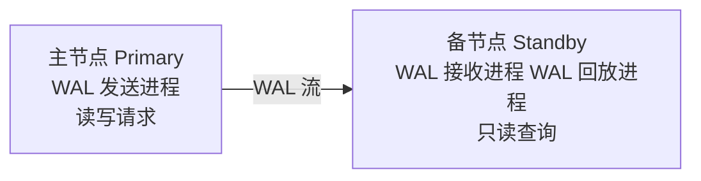
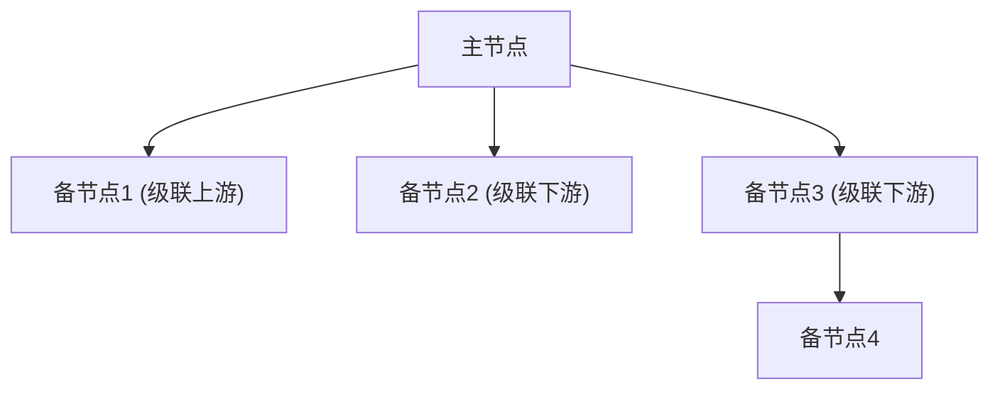
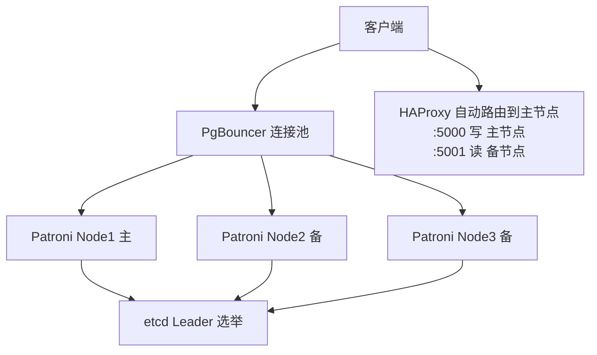
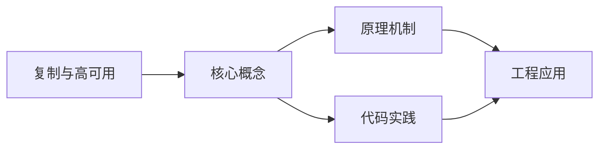

## 1. 学习目标（Bloom 分类）

本节按照布鲁姆教育目标分类学组织学习路径。本文主题为《复制与高可用》，属于 PostgreSQL 模块，读者可以根据自身阶段选择阅读深度。

记忆层面：能够准确复述本文的核心概念、术语与基本语法或操作步骤，并能够在提问或检索时快速定位对应知识点。能够说出 PostgreSQL 的核心概念、语法与常用对象。

理解层面：能够用自己的语言解释核心原理与工作机制，说明概念之间的因果关系，而不是机械记忆结论。能够解释 PostgreSQL 的执行原理与优化机制。

应用层面：能够在真实项目或练习场景中运用本文知识解决具体问题，写出正确且可维护的实现。能够编写正确、高效的 PostgreSQL 语句与操作。

分析层面：能够拆解复杂问题，比较本文主题与相邻概念的异同，识别边界条件与例外情况。能够分析 PostgreSQL 相关方案在性能与一致性上的权衡。

评价层面：能够根据约束条件（性能、可读性、安全、成本）评价不同方案的优劣，做出有依据的技术决策。能够根据业务场景评价 PostgreSQL 技术选型。

创造层面：能够把本文知识与其他模块知识组合，设计出新的解决方案或可复用的工程模式。能够组合 PostgreSQL 与其他技术设计数据架构。

通过本节学习，读者应当能够把《复制与高可用》纳入自己的知识网络，并与 PostgreSQL 模块的其他主题（MVCC、窗口函数、扩展生态、高可用）建立关联。

## 2. 历史动机与发展脉络

《复制与高可用》是 PostgreSQL 领域的重要主题。要真正理解它，需要先了解它解决的问题与演进过程。

PostgreSQL 起源于 1986 年伯克利的 POSTGRES 项目，1996 年更名 PostgreSQL；以功能全面与标准遵循著称，社区驱动发展（每年一个大版本）。
特性版图：完整 SQL（窗口、CTE、递归、JSON）、扩展生态（PostGIS、pgvector）、复制（流复制/逻辑复制）、可编程性（PL/pgSQL、自定义类型）。
PG 17（2024）/PG 18 持续增强：vacuum 与 I/O 优化、增量备份、并行查询扩展；被开发者社区长期评为最受欢迎的数据库之一。

回到本文主题：复制与高可用 的提出与成熟，正是上述技术背景下的必然产物。早期实现往往以简单可用为目标，随着工程规模扩大，社区逐渐沉淀出标准做法与最佳实践；理解这一脉络，可以帮助读者判断“为什么文档中的推荐写法是现在这个样子”，也能在遇到历史遗留代码时准确识别其设计年代与取舍。


## 3. 形式化定义与核心概念精讲

本节把《复制与高可用》涉及的核心概念以“定义 + 讲解”的形式展开。读者应把定义当作工具，把讲解当作理解路径；两者结合才能形成可迁移的知识。

MVCC：每个事务可见性由 xmin/xmax 与快照决定；行更新产生新版本，旧版本由 vacuum 清理；读写互不阻塞。
索引类型：B-tree、Hash、GiST、SP-GiST、GIN（全文/JSON）、BRIN（大表顺序数据）；部分索引与表达式索引。
窗口函数：OVER 子句在结果集内计算排名、移动平均、LAG/LEAD；区别于 GROUP BY 的聚合语义。

### 3.1 原文章节逐一精讲

原文档把主题拆分为 8 个小节，下面按顺序给出每一节的导读讲解，随后保留原文细节供精读。

#### 原文精读（完整保留）


#### 1. 流复制

##### 1.1 流复制架构



##### 1.2 异步流复制配置

```bash
# === 主节点配置 ===

# postgresql.conf
wal_level = replica
max_wal_senders = 10
max_replication_slots = 10
wal_keep_size = '1GB'
hot_standby = on

# pg_hba.conf 添加
host replication replicator 192.168.1.0/24 scram-sha-256
```

```sql
-- 主节点创建复制用户
CREATE ROLE replicator WITH REPLICATION LOGIN PASSWORD 'RepPass123';
```

```bash
# === 备节点配置 ===

# 使用 pg_basebackup 创建基础备份
pg_basebackup \
  -h 192.168.1.10 -U replicator \
  -D /var/lib/postgresql/17/main \
  -Fp -Xs -P -R

# -R 自动创建 standby.signal 和 postgresql.auto.conf

# postgresql.auto.conf（自动生成）
primary_conninfo = 'user=replicator password=RepPass123 host=192.168.1.10 port=5432 sslmode=prefer'
```

##### 1.3 同步流复制

```ini
# 主节点 postgresql.conf
synchronous_standby_names = 'FIRST 1 (standby1, standby2)'
# FIRST 1: 至少1个同步备节点
# ANY 1: 任意1个确认即可

# synchronous_commit 参数:
# remote_apply  — 备节点回放完成（最安全，延迟最高）
# remote_write  — 备节点写入 OS 缓存（推荐）
# on            — 备节点写入 WAL（默认）
# local         — 仅本地确认（异步）
# off           — 不等待（最高性能）
```

##### 1.4 复制状态监控

```sql
-- 主节点查看复制状态
SELECT client_addr, state, sent_lsn, write_lsn, flush_lsn, replay_lsn,
  write_lag, flush_lag, replay_lag
FROM pg_stat_replication;

-- 备节点查看接收状态
SELECT status, sender_host, sender_port, received_lsn, latest_end_lsn
FROM pg_stat_wal_receiver;

-- 复制延迟计算
SELECT now() - pg_last_xact_replay_timestamp() AS replay_delay;

-- 查看是否处于恢复模式
SELECT pg_is_in_recovery();
```

#### 2. 级联复制



```ini
# 级联备节点配置
# 备节点2 的 postgresql.auto.conf
primary_conninfo = 'user=replicator host=192.168.1.11 port=5432'
# 指向备节点1而非主节点

# 级联备节点也可以作为上游
# 备节点1 需要开启:
wal_level = replica
max_wal_senders = 5
```

#### 3. 逻辑复制

##### 3.1 发布与订阅模型

```sql
-- === 发布端（源数据库） ===

-- 创建发布
CREATE PUBLICATION pub_orders FOR TABLE orders, order_items;

-- 发布所有表
CREATE PUBLICATION pub_all FOR ALL TABLES;

-- 发布指定操作
CREATE PUBLICATION pub_orders_insert FOR TABLE orders
  WITH (publish = 'insert, update');  -- 仅复制 INSERT 和 UPDATE

-- 管理发布
ALTER PUBLICATION pub_orders ADD TABLE products;
ALTER PUBLICATION pub_orders DROP TABLE order_items;
DROP PUBLICATION pub_orders;
```

```sql
-- === 订阅端（目标数据库） ===

-- 创建订阅
CREATE SUBSCRIPTION sub_orders
  CONNECTION 'host=192.168.1.10 user=replicator password=RepPass123 dbname=fandex'
  PUBLICATION pub_orders;

-- 同步已有数据
CREATE SUBSCRIPTION sub_orders
  CONNECTION 'host=192.168.1.10 ...'
  PUBLICATION pub_orders
  WITH (copy_data = true);    -- 初始数据同步

-- 管理订阅
ALTER SUBSCRIPTION sub_orders REFRESH PUBLICATION;
ALTER SUBSCRIPTION sub_orders DISABLE;
ALTER SUBSCRIPTION sub_orders ENABLE;
DROP SUBSCRIPTION sub_orders;

-- 查看订阅状态
SELECT subname, pid, received_lsn, latest_end_lsn, latest_end_time
FROM pg_stat_subscription;
```

##### 3.2 逻辑复制限制

```
1. 不复制 DDL（需手动同步表结构）
2. 不复制序列值（需手动同步）
3. 不复制大对象（BYTEA 可复制）
4. 不复制 TRUNCATE（PostgreSQL 11+ 支持）
5. 主键必须存在（UPDATE/DELETE 需要标识行）
6. 同一表不能有多个订阅源
7. 复制标识: REPLICA IDENTITY DEFAULT (主键) / FULL (所有列) / INDEX / NOTHING
```

#### 4. 物理复制槽

```sql
-- 创建复制槽
SELECT pg_create_physical_replication_slot('slot_standby1');

-- 查看复制槽
SELECT slot_name, slot_type, active, restart_lsn, confirmed_flush_lsn
FROM pg_replication_slots;

-- 备节点使用复制槽
# postgresql.auto.conf
primary_conninfo = '... slot=slot_standby1'

-- 删除不活跃的复制槽（防止 WAL 堆积）
SELECT pg_drop_replication_slot('slot_standby1');

--  注意: 不活跃的复制槽会导致 WAL 不被清理，磁盘可能爆满
-- 设置最大保留
max_slot_wal_keep_size = '10GB'   -- 超过则使复制槽失效
```

#### 5. 逻辑解码与输出插件

```sql
-- 逻辑解码示例
SELECT * FROM pg_create_logical_replication_slot('test_slot', 'test_decoding');

-- 查看变更
SELECT lsn, xid, data
FROM pg_logical_slot_peek_changes('test_slot', NULL, NULL);

-- 消费变更（推进位置）
SELECT lsn, xid, data
FROM pg_logical_slot_get_changes('test_slot', NULL, NULL);

-- 删除逻辑槽
SELECT pg_drop_replication_slot('test_slot');

-- 常用输出插件
-- test_decoding: 内置，文本格式
-- pgoutput: 内置，逻辑复制协议（默认）
-- wal2json: JSON 格式输出
--Debezium: CDC 集成
```

#### 6. 增量备份

##### 6.1 pg_basebackup 增量备份（PostgreSQL 17）

```bash
# 全量备份
pg_basebackup -h 192.168.1.10 -U replicator \
  -D /backup/full -Ft -z -P

# 增量备份（基于上次全量备份）
pg_basebackup -h 192.168.1.10 -U replicator \
  -D /backup/incremental \
  -Ft -z -P \
  --incremental /backup/full/base.tar

# 合并增量备份
pg_combinebackup /backup/full /backup/incremental \
  -o /backup/merged
```

##### 6.2 pg_receivewal WAL 归档

```bash
# 实时接收 WAL
pg_receivewal -h 192.168.1.10 -U replicator \
  -D /backup/wal_archive \
  --slot=wal_archive_slot \
  --synchronous

# WAL 归档配置（postgresql.conf）
archive_mode = on
archive_command = 'cp %p /backup/wal_archive/%f'
# 或使用 pg_receivewal 替代 archive_command
```

#### 7. 高可用方案

##### 7.1 Patroni 自动故障转移

```yaml
# patroni.yml
scope: fandex-cluster
name: node1

restapi:
  listen: 0.0.0.0:8008

etcd:
  hosts: 192.168.1.100:2379

bootstrap:
  dcs:
    ttl: 30
    loop_wait: 10
    maximum_lag_on_failover: 1048576
    postgresql:
      use_pg_rewind: true
      use_slots: true
      parameters:
        wal_level: replica
        hot_standby: 'on'
        max_wal_senders: 10
        max_replication_slots: 10
        wal_log_hints: 'on'

postgresql:
  listen: 0.0.0.0:5432
  data_dir: /var/lib/postgresql/17/main
  authentication:
    superuser:
      username: postgres
      password: SuperPass123
    replication:
      username: replicator
      password: RepPass123
```

```bash
# 启动 Patroni
patroni /etc/patroni/patroni.yml

# 查看集群状态
patronictl -c /etc/patroni/patroni.yml list

# 手动切换
patronictl -c /etc/patroni/patroni.yml switchover

# 故障转移
patronictl -c /etc/patroni/patroni.yml failover
```

##### 7.2 PgBouncer + Patroni + etcd 架构



#### 8. 安全机制

##### 8.1 SSL/TLS 加密连接

```ini
# postgresql.conf
ssl = on
ssl_ca_file = '/etc/postgresql/ssl/ca.crt'
ssl_cert_file = '/etc/postgresql/ssl/server.crt'
ssl_key_file = '/etc/postgresql/ssl/server.key'
ssl_ciphers = 'HIGH:MEDIUM:+3DES:!aNULL'
ssl_min_protocol_version = 'TLSv1.2'
```

```
# pg_hba.conf 强制 SSL
hostssl all all 0.0.0.0/0 scram-sha-256
# hostssl 仅允许 SSL 连接
```

```bash
# 客户端连接
psql "host=192.168.1.10 sslmode=verify-ca sslcert=client.crt sslkey=client.key"
```

##### 8.2 行级安全策略（RLS）

```sql
-- 多租户数据隔离
ALTER TABLE orders ENABLE ROW LEVEL SECURITY;

-- 租户只能看到自己的数据
CREATE POLICY tenant_isolation ON orders
  USING (tenant_id = current_setting('app.tenant_id')::INTEGER);

-- 超级用户默认绕过 RLS
-- 可强制超级用户也受 RLS 约束
ALTER TABLE orders FORCE ROW LEVEL SECURITY;
```

##### 8.3 pgcrypto 加密扩展

```sql
CREATE EXTENSION pgcrypto;

-- 密码哈希
SELECT crypt('P@ssw0rd', gen_salt('bf', 12));  -- bcrypt, cost=12

-- 验证密码
SELECT crypt('P@ssw0rd', stored_hash) = stored_hash;

-- 对称加密
SELECT encrypt('secret data'::bytea, 'my_key'::bytea, 'aes');
SELECT decrypt(encrypted_data, 'my_key'::bytea, 'aes');

-- PGP 加密
SELECT pgp_sym_encrypt('secret', 'password');
SELECT pgp_sym_decrypt(encrypted_data, 'password');

-- PGP 非对称加密
SELECT pgp_pub_encrypt('secret', dearmor(public_key));
SELECT pgp_priv_decrypt(encrypted_data, dearmor(private_key), 'passphrase');
```

##### 8.4 pgAudit 审计扩展

```sql
CREATE EXTENSION pgaudit;

-- pgaudit.conf 配置
-- pgaudit.log = 'all'              -- 审计所有操作
-- pgaudit.log = 'read,write'       -- 审计读写操作
-- pgaudit.log = 'ddl,role'         -- 审计 DDL 和角色操作
-- pgaudit.log_relation = on        -- 记录具体表名
-- pgaudit.log_parameter = on       -- 记录参数值

-- 会话级审计
SET pgaudit.log = 'write';
SET pgaudit.log_relation = on;

-- 对象级审计
-- 审计对 orders 表的所有 SELECT
SELECT pgaudit.audit_object('orders', 'SELECT');
```


### 3.2 概念关系图

下面用 Mermaid 图表达本文核心概念之间的关系，帮助读者建立整体图景：



图中展示的是本文知识的结构化关系：核心概念是入口，原理机制解释“为什么”，代码实践演示“怎么做”，工程应用回答“何时用”。读者学习时可以把每个小节的内容挂接到对应节点上。

## 4. 理论推导与原理解析

本节深入《复制与高可用》背后的原理。理论部分不求面面俱到，而是聚焦“能解释现象、能指导实践”的关键推导。

MVCC：每个事务可见性由 xmin/xmax 与快照决定；行更新产生新版本，旧版本由 vacuum 清理；读写互不阻塞。
索引类型：B-tree、Hash、GiST、SP-GiST、GIN（全文/JSON）、BRIN（大表顺序数据）；部分索引与表达式索引。
窗口函数：OVER 子句在结果集内计算排名、移动平均、LAG/LEAD；区别于 GROUP BY 的聚合语义。
逻辑复制与流复制：WAL 流复制同步备库；逻辑复制按表级发布订阅，支持跨版本与异构。

需要强调的是，理论推导与工程实践之间存在翻译层：理论给出的是理想化模型与边界条件，工程代码则必须处理真实环境中的例外。读者在学习时应先掌握理论的“标准情形”，再通过陷阱章节了解“非标准情形”。

## 5. 代码示例与逐行讲解

本节把原文中的代码示例系统整理，并为每个示例补充用途说明与讲解。读者不应只浏览代码，而应逐段对照讲解理解设计意图。

### 5.1 示例：1.1 流复制架构

该示例来自原文《1.1 流复制架构》小节，用于演示复制与高可用相关操作。阅读时请先看代码结构，再看其后的讲解。


讲解：这段代码演示了本节核心知识点。代码中的关键操作可以归纳为三步：准备（定义或初始化）、执行（核心逻辑）、收尾（释放资源或返回结果）。实际项目中，这三步往往被封装为函数或类，以提升复用性与可测试性。

关键点分析：

该示例共 2 行有效代码，结构以数据或配置为主。阅读时应关注：数据字段的含义、配置项的作用，以及它们与运行行为的对应关系。

进阶思考路径：先尝试修改参数观察行为变化，再把示例中的模式迁移到自己的项目中；每次修改都记录预期与实测差异，这是把示例转化为能力的最快方式。

### 5.2 示例：1.2 异步流复制配置

该示例来自原文《1.2 异步流复制配置》小节，用于演示复制与高可用相关操作。阅读时请先看代码结构，再看其后的讲解。

```bash
# === 主节点配置 ===

# postgresql.conf
wal_level = replica
max_wal_senders = 10
max_replication_slots = 10
wal_keep_size = '1GB'
hot_standby = on

# pg_hba.conf 添加
host replication replicator 192.168.1.0/24 scram-sha-256
```

讲解：这段代码演示了本节核心知识点。代码中的关键操作可以归纳为三步：准备（定义或初始化）、执行（核心逻辑）、收尾（释放资源或返回结果）。实际项目中，这三步往往被封装为函数或类，以提升复用性与可测试性。

关键点分析：

该示例共 9 行有效代码，结构以数据或配置为主。阅读时应关注：数据字段的含义、配置项的作用，以及它们与运行行为的对应关系。

进阶思考路径：先尝试修改参数观察行为变化，再把示例中的模式迁移到自己的项目中；每次修改都记录预期与实测差异，这是把示例转化为能力的最快方式。

### 5.3 示例：1.2 异步流复制配置

该示例来自原文《1.2 异步流复制配置》小节，用于演示复制与高可用相关操作。阅读时请先看代码结构，再看其后的讲解。

```sql
-- 主节点创建复制用户
CREATE ROLE replicator WITH REPLICATION LOGIN PASSWORD 'RepPass123';
```

讲解：这段代码演示了本节核心知识点。代码中的关键操作可以归纳为三步：准备（定义或初始化）、执行（核心逻辑）、收尾（释放资源或返回结果）。实际项目中，这三步往往被封装为函数或类，以提升复用性与可测试性。

关键点分析：

该示例共 2 行有效代码，包含 1 类关键结构（CREATE）。其中：

- 入口与初始化部分负责建立上下文，对应实际项目中的启动或装配逻辑；
- 核心逻辑部分体现本文主题的主要操作，是阅读时最需要对照讲解理解的部分；
- 输出或返回部分把结果交给调用方，注意其类型与边界条件。

进阶思考路径：先尝试修改参数观察行为变化，再把示例中的模式迁移到自己的项目中；每次修改都记录预期与实测差异，这是把示例转化为能力的最快方式。

### 5.4 示例：1.2 异步流复制配置

该示例来自原文《1.2 异步流复制配置》小节，用于演示复制与高可用相关操作。阅读时请先看代码结构，再看其后的讲解。

```bash
# === 备节点配置 ===

# 使用 pg_basebackup 创建基础备份
pg_basebackup \
  -h 192.168.1.10 -U replicator \
  -D /var/lib/postgresql/17/main \
  -Fp -Xs -P -R

# -R 自动创建 standby.signal 和 postgresql.auto.conf

# postgresql.auto.conf（自动生成）
primary_conninfo = 'user=replicator password=RepPass123 host=192.168.1.10 port=5432 sslmode=prefer'
```

讲解：这段代码演示了本节核心知识点。代码中的关键操作可以归纳为三步：准备（定义或初始化）、执行（核心逻辑）、收尾（释放资源或返回结果）。实际项目中，这三步往往被封装为函数或类，以提升复用性与可测试性。

关键点分析：

该示例共 9 行有效代码，结构以数据或配置为主。阅读时应关注：数据字段的含义、配置项的作用，以及它们与运行行为的对应关系。

进阶思考路径：先尝试修改参数观察行为变化，再把示例中的模式迁移到自己的项目中；每次修改都记录预期与实测差异，这是把示例转化为能力的最快方式。

### 5.5 示例：1.3 同步流复制

该示例来自原文《1.3 同步流复制》小节，用于演示复制与高可用相关操作。阅读时请先看代码结构，再看其后的讲解。

```ini
# 主节点 postgresql.conf
synchronous_standby_names = 'FIRST 1 (standby1, standby2)'
# FIRST 1: 至少1个同步备节点
# ANY 1: 任意1个确认即可

# synchronous_commit 参数:
# remote_apply  — 备节点回放完成（最安全，延迟最高）
# remote_write  — 备节点写入 OS 缓存（推荐）
# on            — 备节点写入 WAL（默认）
# local         — 仅本地确认（异步）
# off           — 不等待（最高性能）
```

讲解：这段代码演示了本节核心知识点。代码中的关键操作可以归纳为三步：准备（定义或初始化）、执行（核心逻辑）、收尾（释放资源或返回结果）。实际项目中，这三步往往被封装为函数或类，以提升复用性与可测试性。

关键点分析：

该示例共 10 行有效代码，结构以数据或配置为主。阅读时应关注：数据字段的含义、配置项的作用，以及它们与运行行为的对应关系。

进阶思考路径：先尝试修改参数观察行为变化，再把示例中的模式迁移到自己的项目中；每次修改都记录预期与实测差异，这是把示例转化为能力的最快方式。

### 5.6 示例：1.4 复制状态监控

该示例来自原文《1.4 复制状态监控》小节，用于演示复制与高可用相关操作。阅读时请先看代码结构，再看其后的讲解。

```sql
-- 主节点查看复制状态
SELECT client_addr, state, sent_lsn, write_lsn, flush_lsn, replay_lsn,
  write_lag, flush_lag, replay_lag
FROM pg_stat_replication;

-- 备节点查看接收状态
SELECT status, sender_host, sender_port, received_lsn, latest_end_lsn
FROM pg_stat_wal_receiver;

-- 复制延迟计算
SELECT now() - pg_last_xact_replay_timestamp() AS replay_delay;

-- 查看是否处于恢复模式
SELECT pg_is_in_recovery();
```

讲解：这段代码演示了本节核心知识点。代码中的关键操作可以归纳为三步：准备（定义或初始化）、执行（核心逻辑）、收尾（释放资源或返回结果）。实际项目中，这三步往往被封装为函数或类，以提升复用性与可测试性。

关键点分析：

该示例共 11 行有效代码，包含 2 类关键结构（SELECT、FROM）。其中：

- 入口与初始化部分负责建立上下文，对应实际项目中的启动或装配逻辑；
- 核心逻辑部分体现本文主题的主要操作，是阅读时最需要对照讲解理解的部分；
- 输出或返回部分把结果交给调用方，注意其类型与边界条件。

进阶思考路径：先尝试修改参数观察行为变化，再把示例中的模式迁移到自己的项目中；每次修改都记录预期与实测差异，这是把示例转化为能力的最快方式。

### 5.7 示例：2. 级联复制

该示例来自原文《2. 级联复制》小节，用于演示复制与高可用相关操作。阅读时请先看代码结构，再看其后的讲解。


讲解：这段代码演示了本节核心知识点。代码中的关键操作可以归纳为三步：准备（定义或初始化）、执行（核心逻辑）、收尾（释放资源或返回结果）。实际项目中，这三步往往被封装为函数或类，以提升复用性与可测试性。

关键点分析：

该示例共 10 行有效代码，结构以数据或配置为主。阅读时应关注：数据字段的含义、配置项的作用，以及它们与运行行为的对应关系。

进阶思考路径：先尝试修改参数观察行为变化，再把示例中的模式迁移到自己的项目中；每次修改都记录预期与实测差异，这是把示例转化为能力的最快方式。

### 5.8 示例：2. 级联复制

该示例来自原文《2. 级联复制》小节，用于演示复制与高可用相关操作。阅读时请先看代码结构，再看其后的讲解。

```ini
# 级联备节点配置
# 备节点2 的 postgresql.auto.conf
primary_conninfo = 'user=replicator host=192.168.1.11 port=5432'
# 指向备节点1而非主节点

# 级联备节点也可以作为上游
# 备节点1 需要开启:
wal_level = replica
max_wal_senders = 5
```

讲解：这段代码演示了本节核心知识点。代码中的关键操作可以归纳为三步：准备（定义或初始化）、执行（核心逻辑）、收尾（释放资源或返回结果）。实际项目中，这三步往往被封装为函数或类，以提升复用性与可测试性。

关键点分析：

该示例共 8 行有效代码，结构以数据或配置为主。阅读时应关注：数据字段的含义、配置项的作用，以及它们与运行行为的对应关系。

进阶思考路径：先尝试修改参数观察行为变化，再把示例中的模式迁移到自己的项目中；每次修改都记录预期与实测差异，这是把示例转化为能力的最快方式。

### 5.9 示例：3.1 发布与订阅模型

该示例来自原文《3.1 发布与订阅模型》小节，用于演示复制与高可用相关操作。阅读时请先看代码结构，再看其后的讲解。

```sql
-- === 发布端（源数据库） ===

-- 创建发布
CREATE PUBLICATION pub_orders FOR TABLE orders, order_items;

-- 发布所有表
CREATE PUBLICATION pub_all FOR ALL TABLES;

-- 发布指定操作
CREATE PUBLICATION pub_orders_insert FOR TABLE orders
  WITH (publish = 'insert, update');  -- 仅复制 INSERT 和 UPDATE

-- 管理发布
ALTER PUBLICATION pub_orders ADD TABLE products;
ALTER PUBLICATION pub_orders DROP TABLE order_items;
DROP PUBLICATION pub_orders;
```

讲解：这段代码演示了本节核心知识点。代码中的关键操作可以归纳为三步：准备（定义或初始化）、执行（核心逻辑）、收尾（释放资源或返回结果）。实际项目中，这三步往往被封装为函数或类，以提升复用性与可测试性。

关键点分析：

该示例共 12 行有效代码，包含 3 类关键结构（INSERT、CREATE、ALTER）。其中：

- 入口与初始化部分负责建立上下文，对应实际项目中的启动或装配逻辑；
- 核心逻辑部分体现本文主题的主要操作，是阅读时最需要对照讲解理解的部分；
- 输出或返回部分把结果交给调用方，注意其类型与边界条件。

进阶思考路径：先尝试修改参数观察行为变化，再把示例中的模式迁移到自己的项目中；每次修改都记录预期与实测差异，这是把示例转化为能力的最快方式。

### 5.10 示例：3.1 发布与订阅模型

该示例来自原文《3.1 发布与订阅模型》小节，用于演示复制与高可用相关操作。阅读时请先看代码结构，再看其后的讲解。

```sql
-- === 订阅端（目标数据库） ===

-- 创建订阅
CREATE SUBSCRIPTION sub_orders
  CONNECTION 'host=192.168.1.10 user=replicator password=RepPass123 dbname=fandex'
  PUBLICATION pub_orders;

-- 同步已有数据
CREATE SUBSCRIPTION sub_orders
  CONNECTION 'host=192.168.1.10 ...'
  PUBLICATION pub_orders
  WITH (copy_data = true);    -- 初始数据同步

-- 管理订阅
ALTER SUBSCRIPTION sub_orders REFRESH PUBLICATION;
ALTER SUBSCRIPTION sub_orders DISABLE;
ALTER SUBSCRIPTION sub_orders ENABLE;
DROP SUBSCRIPTION sub_orders;

-- 查看订阅状态
SELECT subname, pid, received_lsn, latest_end_lsn, latest_end_time
FROM pg_stat_subscription;
```

讲解：这段代码演示了本节核心知识点。代码中的关键操作可以归纳为三步：准备（定义或初始化）、执行（核心逻辑）、收尾（释放资源或返回结果）。实际项目中，这三步往往被封装为函数或类，以提升复用性与可测试性。

关键点分析：

该示例共 18 行有效代码，包含 4 类关键结构（SELECT、CREATE、ALTER、FROM）。其中：

- 入口与初始化部分负责建立上下文，对应实际项目中的启动或装配逻辑；
- 核心逻辑部分体现本文主题的主要操作，是阅读时最需要对照讲解理解的部分；
- 输出或返回部分把结果交给调用方，注意其类型与边界条件。

进阶思考路径：先尝试修改参数观察行为变化，再把示例中的模式迁移到自己的项目中；每次修改都记录预期与实测差异，这是把示例转化为能力的最快方式。

### 5.11 示例：3.2 逻辑复制限制

该示例来自原文《3.2 逻辑复制限制》小节，用于演示复制与高可用相关操作。阅读时请先看代码结构，再看其后的讲解。

```text
1. 不复制 DDL（需手动同步表结构）
2. 不复制序列值（需手动同步）
3. 不复制大对象（BYTEA 可复制）
4. 不复制 TRUNCATE（PostgreSQL 11+ 支持）
5. 主键必须存在（UPDATE/DELETE 需要标识行）
6. 同一表不能有多个订阅源
7. 复制标识: REPLICA IDENTITY DEFAULT (主键) / FULL (所有列) / INDEX / NOTHING
```

讲解：这段代码演示了本节核心知识点。代码中的关键操作可以归纳为三步：准备（定义或初始化）、执行（核心逻辑）、收尾（释放资源或返回结果）。实际项目中，这三步往往被封装为函数或类，以提升复用性与可测试性。

关键点分析：

该示例共 7 行有效代码，结构以数据或配置为主。阅读时应关注：数据字段的含义、配置项的作用，以及它们与运行行为的对应关系。

进阶思考路径：先尝试修改参数观察行为变化，再把示例中的模式迁移到自己的项目中；每次修改都记录预期与实测差异，这是把示例转化为能力的最快方式。

### 5.12 示例：4. 物理复制槽

该示例来自原文《4. 物理复制槽》小节，用于演示复制与高可用相关操作。阅读时请先看代码结构，再看其后的讲解。

```sql
-- 创建复制槽
SELECT pg_create_physical_replication_slot('slot_standby1');

-- 查看复制槽
SELECT slot_name, slot_type, active, restart_lsn, confirmed_flush_lsn
FROM pg_replication_slots;

-- 备节点使用复制槽
# postgresql.auto.conf
primary_conninfo = '... slot=slot_standby1'

-- 删除不活跃的复制槽（防止 WAL 堆积）
SELECT pg_drop_replication_slot('slot_standby1');

--  注意: 不活跃的复制槽会导致 WAL 不被清理，磁盘可能爆满
-- 设置最大保留
max_slot_wal_keep_size = '10GB'   -- 超过则使复制槽失效
```

讲解：这段代码演示了本节核心知识点。代码中的关键操作可以归纳为三步：准备（定义或初始化）、执行（核心逻辑）、收尾（释放资源或返回结果）。实际项目中，这三步往往被封装为函数或类，以提升复用性与可测试性。

关键点分析：

该示例共 13 行有效代码，包含 2 类关键结构（SELECT、FROM）。其中：

- 入口与初始化部分负责建立上下文，对应实际项目中的启动或装配逻辑；
- 核心逻辑部分体现本文主题的主要操作，是阅读时最需要对照讲解理解的部分；
- 输出或返回部分把结果交给调用方，注意其类型与边界条件。

进阶思考路径：先尝试修改参数观察行为变化，再把示例中的模式迁移到自己的项目中；每次修改都记录预期与实测差异，这是把示例转化为能力的最快方式。

### 5.13 示例：5. 逻辑解码与输出插件

该示例来自原文《5. 逻辑解码与输出插件》小节，用于演示复制与高可用相关操作。阅读时请先看代码结构，再看其后的讲解。

```sql
-- 逻辑解码示例
SELECT * FROM pg_create_logical_replication_slot('test_slot', 'test_decoding');

-- 查看变更
SELECT lsn, xid, data
FROM pg_logical_slot_peek_changes('test_slot', NULL, NULL);

-- 消费变更（推进位置）
SELECT lsn, xid, data
FROM pg_logical_slot_get_changes('test_slot', NULL, NULL);

-- 删除逻辑槽
SELECT pg_drop_replication_slot('test_slot');

-- 常用输出插件
-- test_decoding: 内置，文本格式
-- pgoutput: 内置，逻辑复制协议（默认）
-- wal2json: JSON 格式输出
--Debezium: CDC 集成
```

讲解：这段代码演示了本节核心知识点。代码中的关键操作可以归纳为三步：准备（定义或初始化）、执行（核心逻辑）、收尾（释放资源或返回结果）。实际项目中，这三步往往被封装为函数或类，以提升复用性与可测试性。

关键点分析：

该示例共 15 行有效代码，包含 2 类关键结构（SELECT、FROM）。其中：

- 入口与初始化部分负责建立上下文，对应实际项目中的启动或装配逻辑；
- 核心逻辑部分体现本文主题的主要操作，是阅读时最需要对照讲解理解的部分；
- 输出或返回部分把结果交给调用方，注意其类型与边界条件。

进阶思考路径：先尝试修改参数观察行为变化，再把示例中的模式迁移到自己的项目中；每次修改都记录预期与实测差异，这是把示例转化为能力的最快方式。

### 5.14 示例：6.1 pg_basebackup 增量备份（PostgreSQL 17）

该示例来自原文《6.1 pg_basebackup 增量备份（PostgreSQL 17）》小节，用于演示复制与高可用相关操作。阅读时请先看代码结构，再看其后的讲解。

```bash
# 全量备份
pg_basebackup -h 192.168.1.10 -U replicator \
  -D /backup/full -Ft -z -P

# 增量备份（基于上次全量备份）
pg_basebackup -h 192.168.1.10 -U replicator \
  -D /backup/incremental \
  -Ft -z -P \
  --incremental /backup/full/base.tar

# 合并增量备份
pg_combinebackup /backup/full /backup/incremental \
  -o /backup/merged
```

讲解：这段代码演示了本节核心知识点。代码中的关键操作可以归纳为三步：准备（定义或初始化）、执行（核心逻辑）、收尾（释放资源或返回结果）。实际项目中，这三步往往被封装为函数或类，以提升复用性与可测试性。

关键点分析：

该示例共 11 行有效代码，结构以数据或配置为主。阅读时应关注：数据字段的含义、配置项的作用，以及它们与运行行为的对应关系。

进阶思考路径：先尝试修改参数观察行为变化，再把示例中的模式迁移到自己的项目中；每次修改都记录预期与实测差异，这是把示例转化为能力的最快方式。

### 5.15 示例：6.2 pg_receivewal WAL 归档

该示例来自原文《6.2 pg_receivewal WAL 归档》小节，用于演示复制与高可用相关操作。阅读时请先看代码结构，再看其后的讲解。

```bash
# 实时接收 WAL
pg_receivewal -h 192.168.1.10 -U replicator \
  -D /backup/wal_archive \
  --slot=wal_archive_slot \
  --synchronous

# WAL 归档配置（postgresql.conf）
archive_mode = on
archive_command = 'cp %p /backup/wal_archive/%f'
# 或使用 pg_receivewal 替代 archive_command
```

讲解：这段代码演示了本节核心知识点。代码中的关键操作可以归纳为三步：准备（定义或初始化）、执行（核心逻辑）、收尾（释放资源或返回结果）。实际项目中，这三步往往被封装为函数或类，以提升复用性与可测试性。

关键点分析：

该示例共 9 行有效代码，结构以数据或配置为主。阅读时应关注：数据字段的含义、配置项的作用，以及它们与运行行为的对应关系。

进阶思考路径：先尝试修改参数观察行为变化，再把示例中的模式迁移到自己的项目中；每次修改都记录预期与实测差异，这是把示例转化为能力的最快方式。

### 5.16 示例：7.1 Patroni 自动故障转移

该示例来自原文《7.1 Patroni 自动故障转移》小节，用于演示复制与高可用相关操作。阅读时请先看代码结构，再看其后的讲解。

```yaml
# patroni.yml
scope: fandex-cluster
name: node1

restapi:
  listen: 0.0.0.0:8008

etcd:
  hosts: 192.168.1.100:2379

bootstrap:
  dcs:
    ttl: 30
    loop_wait: 10
    maximum_lag_on_failover: 1048576
    postgresql:
      use_pg_rewind: true
      use_slots: true
      parameters:
        wal_level: replica
        hot_standby: 'on'
        max_wal_senders: 10
        max_replication_slots: 10
        wal_log_hints: 'on'

postgresql:
  listen: 0.0.0.0:5432
  data_dir: /var/lib/postgresql/17/main
  authentication:
    superuser:
      username: postgres
      password: SuperPass123
    replication:
      username: replicator
      password: RepPass123
```

讲解：这段代码演示了本节核心知识点。代码中的关键操作可以归纳为三步：准备（定义或初始化）、执行（核心逻辑）、收尾（释放资源或返回结果）。实际项目中，这三步往往被封装为函数或类，以提升复用性与可测试性。

关键点分析：

该示例共 31 行有效代码，结构以数据或配置为主。阅读时应关注：数据字段的含义、配置项的作用，以及它们与运行行为的对应关系。

进阶思考路径：先尝试修改参数观察行为变化，再把示例中的模式迁移到自己的项目中；每次修改都记录预期与实测差异，这是把示例转化为能力的最快方式。

### 5.17 示例：7.1 Patroni 自动故障转移

该示例来自原文《7.1 Patroni 自动故障转移》小节，用于演示复制与高可用相关操作。阅读时请先看代码结构，再看其后的讲解。

```bash
# 启动 Patroni
patroni /etc/patroni/patroni.yml

# 查看集群状态
patronictl -c /etc/patroni/patroni.yml list

# 手动切换
patronictl -c /etc/patroni/patroni.yml switchover

# 故障转移
patronictl -c /etc/patroni/patroni.yml failover
```

讲解：这段代码演示了本节核心知识点。代码中的关键操作可以归纳为三步：准备（定义或初始化）、执行（核心逻辑）、收尾（释放资源或返回结果）。实际项目中，这三步往往被封装为函数或类，以提升复用性与可测试性。

关键点分析：

该示例共 8 行有效代码，结构以数据或配置为主。阅读时应关注：数据字段的含义、配置项的作用，以及它们与运行行为的对应关系。

进阶思考路径：先尝试修改参数观察行为变化，再把示例中的模式迁移到自己的项目中；每次修改都记录预期与实测差异，这是把示例转化为能力的最快方式。

### 5.18 示例：7.2 PgBouncer + Patroni + etcd 架构

该示例来自原文《7.2 PgBouncer + Patroni + etcd 架构》小节，用于演示复制与高可用相关操作。阅读时请先看代码结构，再看其后的讲解。


讲解：这段代码演示了本节核心知识点。代码中的关键操作可以归纳为三步：准备（定义或初始化）、执行（核心逻辑）、收尾（释放资源或返回结果）。实际项目中，这三步往往被封装为函数或类，以提升复用性与可测试性。

关键点分析：

该示例共 6 行有效代码，结构以数据或配置为主。阅读时应关注：数据字段的含义、配置项的作用，以及它们与运行行为的对应关系。

进阶思考路径：先尝试修改参数观察行为变化，再把示例中的模式迁移到自己的项目中；每次修改都记录预期与实测差异，这是把示例转化为能力的最快方式。

### 5.19 示例：8.1 SSL/TLS 加密连接

该示例来自原文《8.1 SSL/TLS 加密连接》小节，用于演示复制与高可用相关操作。阅读时请先看代码结构，再看其后的讲解。

```ini
# postgresql.conf
ssl = on
ssl_ca_file = '/etc/postgresql/ssl/ca.crt'
ssl_cert_file = '/etc/postgresql/ssl/server.crt'
ssl_key_file = '/etc/postgresql/ssl/server.key'
ssl_ciphers = 'HIGH:MEDIUM:+3DES:!aNULL'
ssl_min_protocol_version = 'TLSv1.2'
```

讲解：这段代码演示了本节核心知识点。代码中的关键操作可以归纳为三步：准备（定义或初始化）、执行（核心逻辑）、收尾（释放资源或返回结果）。实际项目中，这三步往往被封装为函数或类，以提升复用性与可测试性。

关键点分析：

该示例共 7 行有效代码，结构以数据或配置为主。阅读时应关注：数据字段的含义、配置项的作用，以及它们与运行行为的对应关系。

进阶思考路径：先尝试修改参数观察行为变化，再把示例中的模式迁移到自己的项目中；每次修改都记录预期与实测差异，这是把示例转化为能力的最快方式。

### 5.20 示例：8.1 SSL/TLS 加密连接

该示例来自原文《8.1 SSL/TLS 加密连接》小节，用于演示复制与高可用相关操作。阅读时请先看代码结构，再看其后的讲解。

```text
# pg_hba.conf 强制 SSL
hostssl all all 0.0.0.0/0 scram-sha-256
# hostssl 仅允许 SSL 连接
```

讲解：这段代码演示了本节核心知识点。代码中的关键操作可以归纳为三步：准备（定义或初始化）、执行（核心逻辑）、收尾（释放资源或返回结果）。实际项目中，这三步往往被封装为函数或类，以提升复用性与可测试性。

关键点分析：

该示例共 3 行有效代码，结构以数据或配置为主。阅读时应关注：数据字段的含义、配置项的作用，以及它们与运行行为的对应关系。

进阶思考路径：先尝试修改参数观察行为变化，再把示例中的模式迁移到自己的项目中；每次修改都记录预期与实测差异，这是把示例转化为能力的最快方式。

### 5.21 示例：8.1 SSL/TLS 加密连接

该示例来自原文《8.1 SSL/TLS 加密连接》小节，用于演示复制与高可用相关操作。阅读时请先看代码结构，再看其后的讲解。

```bash
# 客户端连接
psql "host=192.168.1.10 sslmode=verify-ca sslcert=client.crt sslkey=client.key"
```

讲解：这段代码演示了本节核心知识点。代码中的关键操作可以归纳为三步：准备（定义或初始化）、执行（核心逻辑）、收尾（释放资源或返回结果）。实际项目中，这三步往往被封装为函数或类，以提升复用性与可测试性。

关键点分析：

该示例共 2 行有效代码，结构以数据或配置为主。阅读时应关注：数据字段的含义、配置项的作用，以及它们与运行行为的对应关系。

进阶思考路径：先尝试修改参数观察行为变化，再把示例中的模式迁移到自己的项目中；每次修改都记录预期与实测差异，这是把示例转化为能力的最快方式。

### 5.22 示例：8.2 行级安全策略（RLS）

该示例来自原文《8.2 行级安全策略（RLS）》小节，用于演示复制与高可用相关操作。阅读时请先看代码结构，再看其后的讲解。

```sql
-- 多租户数据隔离
ALTER TABLE orders ENABLE ROW LEVEL SECURITY;

-- 租户只能看到自己的数据
CREATE POLICY tenant_isolation ON orders
  USING (tenant_id = current_setting('app.tenant_id')::INTEGER);

-- 超级用户默认绕过 RLS
-- 可强制超级用户也受 RLS 约束
ALTER TABLE orders FORCE ROW LEVEL SECURITY;
```

讲解：这段代码演示了本节核心知识点。代码中的关键操作可以归纳为三步：准备（定义或初始化）、执行（核心逻辑）、收尾（释放资源或返回结果）。实际项目中，这三步往往被封装为函数或类，以提升复用性与可测试性。

关键点分析：

该示例共 8 行有效代码，包含 2 类关键结构（CREATE、ALTER）。其中：

- 入口与初始化部分负责建立上下文，对应实际项目中的启动或装配逻辑；
- 核心逻辑部分体现本文主题的主要操作，是阅读时最需要对照讲解理解的部分；
- 输出或返回部分把结果交给调用方，注意其类型与边界条件。

进阶思考路径：先尝试修改参数观察行为变化，再把示例中的模式迁移到自己的项目中；每次修改都记录预期与实测差异，这是把示例转化为能力的最快方式。

### 5.23 示例：8.3 pgcrypto 加密扩展

该示例来自原文《8.3 pgcrypto 加密扩展》小节，用于演示复制与高可用相关操作。阅读时请先看代码结构，再看其后的讲解。

```sql
CREATE EXTENSION pgcrypto;

-- 密码哈希
SELECT crypt('P@ssw0rd', gen_salt('bf', 12));  -- bcrypt, cost=12

-- 验证密码
SELECT crypt('P@ssw0rd', stored_hash) = stored_hash;

-- 对称加密
SELECT encrypt('secret data'::bytea, 'my_key'::bytea, 'aes');
SELECT decrypt(encrypted_data, 'my_key'::bytea, 'aes');

-- PGP 加密
SELECT pgp_sym_encrypt('secret', 'password');
SELECT pgp_sym_decrypt(encrypted_data, 'password');

-- PGP 非对称加密
SELECT pgp_pub_encrypt('secret', dearmor(public_key));
SELECT pgp_priv_decrypt(encrypted_data, dearmor(private_key), 'passphrase');
```

讲解：这段代码演示了本节核心知识点。代码中的关键操作可以归纳为三步：准备（定义或初始化）、执行（核心逻辑）、收尾（释放资源或返回结果）。实际项目中，这三步往往被封装为函数或类，以提升复用性与可测试性。

关键点分析：

该示例共 14 行有效代码，包含 2 类关键结构（SELECT、CREATE）。其中：

- 入口与初始化部分负责建立上下文，对应实际项目中的启动或装配逻辑；
- 核心逻辑部分体现本文主题的主要操作，是阅读时最需要对照讲解理解的部分；
- 输出或返回部分把结果交给调用方，注意其类型与边界条件。

进阶思考路径：先尝试修改参数观察行为变化，再把示例中的模式迁移到自己的项目中；每次修改都记录预期与实测差异，这是把示例转化为能力的最快方式。

### 5.24 示例：8.4 pgAudit 审计扩展

该示例来自原文《8.4 pgAudit 审计扩展》小节，用于演示复制与高可用相关操作。阅读时请先看代码结构，再看其后的讲解。

```sql
CREATE EXTENSION pgaudit;

-- pgaudit.conf 配置
-- pgaudit.log = 'all'              -- 审计所有操作
-- pgaudit.log = 'read,write'       -- 审计读写操作
-- pgaudit.log = 'ddl,role'         -- 审计 DDL 和角色操作
-- pgaudit.log_relation = on        -- 记录具体表名
-- pgaudit.log_parameter = on       -- 记录参数值

-- 会话级审计
SET pgaudit.log = 'write';
SET pgaudit.log_relation = on;

-- 对象级审计
-- 审计对 orders 表的所有 SELECT
SELECT pgaudit.audit_object('orders', 'SELECT');
```

讲解：这段代码演示了本节核心知识点。代码中的关键操作可以归纳为三步：准备（定义或初始化）、执行（核心逻辑）、收尾（释放资源或返回结果）。实际项目中，这三步往往被封装为函数或类，以提升复用性与可测试性。

关键点分析：

该示例共 13 行有效代码，包含 2 类关键结构（SELECT、CREATE）。其中：

- 入口与初始化部分负责建立上下文，对应实际项目中的启动或装配逻辑；
- 核心逻辑部分体现本文主题的主要操作，是阅读时最需要对照讲解理解的部分；
- 输出或返回部分把结果交给调用方，注意其类型与边界条件。

进阶思考路径：先尝试修改参数观察行为变化，再把示例中的模式迁移到自己的项目中；每次修改都记录预期与实测差异，这是把示例转化为能力的最快方式。


综合以上示例，可以总结出本主题的代码实践要点：第一，先定义清晰的输入输出契约；第二，核心逻辑保持单一职责；第三，错误处理与边界条件不可省略；第四，命名与注释表达意图而非复述代码。

## 6. 对比分析

对比是理解《复制与高可用》定位的最快路径。下面从多个维度与相邻方案进行对比。

PostgreSQL 与 MySQL：PG 功能全面、标准遵循好、扩展强；MySQL 生态普及、运维资料多。
PostgreSQL 与 Oracle：PG 开源成本低、现代特性多；Oracle 企业级功能与商业支持。
流复制与逻辑复制：流复制整实例容灾；逻辑复制按表分发与升级。

对比的目的不是分出绝对优劣，而是建立选择依据：不同约束条件下，最优解不同。读者应把每个对比维度转化为决策检查清单。

## 7. 常见陷阱与最佳实践

本节整理该主题的高频错误与推荐做法。每个陷阱先描述现象，再解释原因，最后给出最佳实践。

### 7.1 vacuum 缺失

表膨胀与事务 ID 回卷风险。开启 autovacuum 并监控。

深入讲解：该问题之所以被归类为“常见陷阱”，是因为它在初学者的代码中反复出现，而且往往不在第一时间暴露——错误通常隐藏在特定数据或特定时序下。

从成因上看，vacuum 缺失 一般源于对 PostgreSQL 某个机制的理解偏差：要么误用了默认行为，要么忽略了边界条件，要么把其他语言的思维惯性带了过来。

从影响上看，vacuum 缺失 轻则产生错误结果，重则导致资源泄漏、数据损坏或安全事故；这也是为什么工程评审中会把它列为检查项。

从修复策略上看，处理vacuum 缺失的正确顺序是：先复现（构造最小用例），再定位（确认机制层面的根因），最后修复并补充回归测试。跳过复现直接改代码，往往治标不治本。

### 7.2 未用事务包装多语句

部分成功导致数据不一致。使用事务或 CTE。

深入讲解：该问题之所以被归类为“常见陷阱”，是因为它在初学者的代码中反复出现，而且往往不在第一时间暴露——错误通常隐藏在特定数据或特定时序下。

从成因上看，未用事务包装多语句 一般源于对 PostgreSQL 某个机制的理解偏差：要么误用了默认行为，要么忽略了边界条件，要么把其他语言的思维惯性带了过来。

从影响上看，未用事务包装多语句 轻则产生错误结果，重则导致资源泄漏、数据损坏或安全事故；这也是为什么工程评审中会把它列为检查项。

从修复策略上看，处理未用事务包装多语句的正确顺序是：先复现（构造最小用例），再定位（确认机制层面的根因），最后修复并补充回归测试。跳过复现直接改代码，往往治标不治本。

### 7.3 jsonb 滥用

频繁更新 jsonb 字段效率低。规范化的列优先。

深入讲解：该问题之所以被归类为“常见陷阱”，是因为它在初学者的代码中反复出现，而且往往不在第一时间暴露——错误通常隐藏在特定数据或特定时序下。

从成因上看，jsonb 滥用 一般源于对 PostgreSQL 某个机制的理解偏差：要么误用了默认行为，要么忽略了边界条件，要么把其他语言的思维惯性带了过来。

从影响上看，jsonb 滥用 轻则产生错误结果，重则导致资源泄漏、数据损坏或安全事故；这也是为什么工程评审中会把它列为检查项。

从修复策略上看，处理jsonb 滥用的正确顺序是：先复现（构造最小用例），再定位（确认机制层面的根因），最后修复并补充回归测试。跳过复现直接改代码，往往治标不治本。

### 7.4 连接数默认限制

max_connections=100 被连接池打满。使用 PgBouncer。

深入讲解：该问题之所以被归类为“常见陷阱”，是因为它在初学者的代码中反复出现，而且往往不在第一时间暴露——错误通常隐藏在特定数据或特定时序下。

从成因上看，连接数默认限制 一般源于对 PostgreSQL 某个机制的理解偏差：要么误用了默认行为，要么忽略了边界条件，要么把其他语言的思维惯性带了过来。

从影响上看，连接数默认限制 轻则产生错误结果，重则导致资源泄漏、数据损坏或安全事故；这也是为什么工程评审中会把它列为检查项。

从修复策略上看，处理连接数默认限制的正确顺序是：先复现（构造最小用例），再定位（确认机制层面的根因），最后修复并补充回归测试。跳过复现直接改代码，往往治标不治本。

### 7.5 序列回卷

serial 溢出。使用 bigserial 或 identity。

深入讲解：该问题之所以被归类为“常见陷阱”，是因为它在初学者的代码中反复出现，而且往往不在第一时间暴露——错误通常隐藏在特定数据或特定时序下。

从成因上看，序列回卷 一般源于对 PostgreSQL 某个机制的理解偏差：要么误用了默认行为，要么忽略了边界条件，要么把其他语言的思维惯性带了过来。

从影响上看，序列回卷 轻则产生错误结果，重则导致资源泄漏、数据损坏或安全事故；这也是为什么工程评审中会把它列为检查项。

从修复策略上看，处理序列回卷的正确顺序是：先复现（构造最小用例），再定位（确认机制层面的根因），最后修复并补充回归测试。跳过复现直接改代码，往往治标不治本。

### 7.6 时区混淆

timestamptz 与 timestamp 语义不同。统一 timestamptz。

深入讲解：该问题之所以被归类为“常见陷阱”，是因为它在初学者的代码中反复出现，而且往往不在第一时间暴露——错误通常隐藏在特定数据或特定时序下。

从成因上看，时区混淆 一般源于对 PostgreSQL 某个机制的理解偏差：要么误用了默认行为，要么忽略了边界条件，要么把其他语言的思维惯性带了过来。

从影响上看，时区混淆 轻则产生错误结果，重则导致资源泄漏、数据损坏或安全事故；这也是为什么工程评审中会把它列为检查项。

从修复策略上看，处理时区混淆的正确顺序是：先复现（构造最小用例），再定位（确认机制层面的根因），最后修复并补充回归测试。跳过复现直接改代码，往往治标不治本。

### 7.7 大事务

长事务阻止 vacuum 与复制进度。拆分事务。

深入讲解：该问题之所以被归类为“常见陷阱”，是因为它在初学者的代码中反复出现，而且往往不在第一时间暴露——错误通常隐藏在特定数据或特定时序下。

从成因上看，大事务 一般源于对 PostgreSQL 某个机制的理解偏差：要么误用了默认行为，要么忽略了边界条件，要么把其他语言的思维惯性带了过来。

从影响上看，大事务 轻则产生错误结果，重则导致资源泄漏、数据损坏或安全事故；这也是为什么工程评审中会把它列为检查项。

从修复策略上看，处理大事务的正确顺序是：先复现（构造最小用例），再定位（确认机制层面的根因），最后修复并补充回归测试。跳过复现直接改代码，往往治标不治本。

### 7.8 忽略扩展插件

重复造轮子。先查扩展目录（postgis、pgvector、pg_stat_statements）。

深入讲解：该问题之所以被归类为“常见陷阱”，是因为它在初学者的代码中反复出现，而且往往不在第一时间暴露——错误通常隐藏在特定数据或特定时序下。

从成因上看，忽略扩展插件 一般源于对 PostgreSQL 某个机制的理解偏差：要么误用了默认行为，要么忽略了边界条件，要么把其他语言的思维惯性带了过来。

从影响上看，忽略扩展插件 轻则产生错误结果，重则导致资源泄漏、数据损坏或安全事故；这也是为什么工程评审中会把它列为检查项。

从修复策略上看，处理忽略扩展插件的正确顺序是：先复现（构造最小用例），再定位（确认机制层面的根因），最后修复并补充回归测试。跳过复现直接改代码，往往治标不治本。

### 7.0 最佳实践总览

1. 主键用 bigint identity 或 UUID；外键保证引用完整性。
2. 高频查询建索引；JSON 用 jsonb；全文检索用 GIN。
3. 启用 pg_stat_statements 收集查询统计。
4. 备份：pg_basebackup + WAL 归档；演练恢复。

把这些最佳实践固化为团队规范与代码评审检查项，是避免同类问题反复出现的关键。

## 8. 工程实践

本节把《复制与高可用》放入真实工程场景，给出可复用的模式与组织方法。

高可用：Patroni + etcd 选主 + 流复制；读写分离中间件。
容量与性能：分区表（声明式分区）管理大数据；并行查询调优。
监控：pg_stat_activity、pg_stat_replication、Prometheus exporter。

### 8.1 工程实践的原则拆解

以上工程实践可以归纳为四条原则。第一，配置与代码分离：PostgreSQL 项目中环境差异应通过配置注入，而不是散落在代码分支中；这保证同一份代码可以在开发、测试、生产环境一致运行。

第二，接口稳定优先：对外接口（函数签名、协议、数据格式）一旦被消费方依赖，变更成本极高；设计时应预留扩展点并保持向后兼容。

第三，可观测性内置：日志、指标与追踪应该在功能开发时同步设计，而不是故障发生后补救；没有观测手段的模块等于黑盒。

第四，变更可回滚：任何发布都应有对应的回滚方案；数据库迁移、配置变更与代码发布一样需要版本管理与逆向路径。

### 8.2 实践落地的检查清单

- [ ] 高可用：对照本节描述，检查当前项目是否已经落实；未落实的项列入技术债并排期处理。
- [ ] 容量与性能：对照本节描述，检查当前项目是否已经落实；未落实的项列入技术债并排期处理。
- [ ] 监控：对照本节描述，检查当前项目是否已经落实；未落实的项列入技术债并排期处理。

工程实践的共性原则：配置与代码分离、接口稳定优先、可观测性内置、变更可回滚。这些原则适用于本主题的所有实现。

## 9. 案例研究

本节通过一个完整案例把《复制与高可用》的知识串起来。案例按“需求分析、方案设计、实现、验证”四步展开。

需求：实现地理围栏查询（半径内 POI）。
方案：PostGIS 扩展 + GiST 空间索引 + ST_DWithin 查询。
要点：几何类型 geometry(Point,4326)；索引生效验证；投影统一。
验证：百万点查询延迟、空间索引命中、精度核对。

### 9.1 案例的扩展讨论

把案例中的方案放大到真实规模，需要额外考虑三个问题：

第一，规模：当数据量或并发量上升一个数量级时，原方案中的数据结构、缓存策略与任务调度是否仍然成立？通常需要引入分层与异步。

第二，团队：多人协作时，模块边界、接口契约与代码所有权必须明确；案例中的实现应拆分为可独立测试的单元，并配合文档说明设计意图。

第三，演进：上线后的需求变化不可避免；方案设计时应预留扩展点（配置化、插件化、事件化），并定期用真实指标验证假设。


案例研究的学习方法：先独立阅读需求，尝试在脑中形成方案，再对照实现与讲解，最后思考“如果约束变化（数据量、并发、团队规模），方案应如何调整”。

## 10. 知识要点总结与深入讲解

本节以讲解形式汇总全文要点，替代传统的习题与自测，读者不需要答题，只需跟随解释建立完整的认知框架。

关于《复制与高可用》的核心结论：

PostgreSQL 以“功能没有短板”著称，MVCC 与扩展生态是核心。
vacuum、连接、事务与索引是日常运维四大主题。
高可用与备份是生产底线，必须演练。

原文档各小节的要点回顾：

- 1. 流复制：该小节围绕复制与高可用展开具体细节，阅读时应关注其与核心结论的对应关系；每个小节都是核心结论在某一个侧面的展开。
- 2. 级联复制：该小节围绕复制与高可用展开具体细节，阅读时应关注其与核心结论的对应关系；每个小节都是核心结论在某一个侧面的展开。
- 3. 逻辑复制：该小节围绕复制与高可用展开具体细节，阅读时应关注其与核心结论的对应关系；每个小节都是核心结论在某一个侧面的展开。
- 4. 物理复制槽：该小节围绕复制与高可用展开具体细节，阅读时应关注其与核心结论的对应关系；每个小节都是核心结论在某一个侧面的展开。
- 5. 逻辑解码与输出插件：该小节围绕复制与高可用展开具体细节，阅读时应关注其与核心结论的对应关系；每个小节都是核心结论在某一个侧面的展开。
- 6. 增量备份：该小节围绕复制与高可用展开具体细节，阅读时应关注其与核心结论的对应关系；每个小节都是核心结论在某一个侧面的展开。
- 7. 高可用方案：该小节围绕复制与高可用展开具体细节，阅读时应关注其与核心结论的对应关系；每个小节都是核心结论在某一个侧面的展开。
- 8. 安全机制：该小节围绕复制与高可用展开具体细节，阅读时应关注其与核心结论的对应关系；每个小节都是核心结论在某一个侧面的展开。

把以上要点与第 3-9 节的内容对照复习，即可完成对本文主题的闭环学习。

## 11. 参考文献


PostgreSQL 官方文档：https://www.postgresql.org/docs/
PostgreSQL 中文文档：https://www.postgresql.org/docs/current/index.html
PGXN 扩展仓库：https://pgxn.org/
PostGIS：https://postgis.net/
pgvector：https://github.com/pgvector/pgvector

## 12. 延伸阅读


PostgreSQL 窗口函数，见 021-postgresql 模块文档。
PostgreSQL 递归查询，见 021-postgresql 模块相关文档。
SQL 基础，见 019-sql 模块。
尚硅谷 Bilibili 空间（https://space.bilibili.com/302417610 ）提供 PostgreSQL 课程。

## 14. 模块知识图谱与学习路径

本文属于 PostgreSQL 模块。为了把《复制与高可用》放入完整的知识网络，下面列出本模块的全部主题并给出相互关联的导读。学习时建议按模块内顺序推进，并在每个文档中留意交叉引用。


上图为模块主题的推荐学习顺序示意图（仅展示前若干主题）。各主题之间存在三类关联：

第一，前置依赖关系：早期主题是后期主题的基础，例如环境与语法先行、进阶主题随后；

第二，横向并列关系：同一层级主题从不同角度覆盖模块能力，学习顺序可以按兴趣调整；

第三，工程组合关系：多个主题在真实项目中组合使用，例如配置、性能与安全主题往往出现在同一系统的不同层面。

### 14.1 模块主题速查表

| 文档 | 主题 | 与本文的关联 |
| --- | --- | --- |
| 概述与安装配置 | 001-OverviewInstallConfig | 本文的前置基础 |
| 事务与并发控制 | 002-TransactionConcurrencyControl | 本文的并列主题 |
| 索引与查询优化 | 003-IndexQueryOptimization | 本文的性能延伸 |
| 高级SQL与扩展 | 004-AdvancedSQLExtension | 本文的并列主题 |
| 复制与高可用 | 005-ReplicationHA | 本文自身 |
| 体系架构 | 006-SystemArchitecture | 本文的原理深化 |
| 锁机制 | 007-LockMechanism | 本文的原理深化 |
| 死锁检测与处理 | 008-DeadlockDetectionHandling | 本文的并列主题 |
| VACUUM机制 | 009-VACUUMMechanism | 本文的原理深化 |
| 事务ID回卷预防 | 010-TransactionIDWraparoundPrevention | 本文的并列主题 |
| 索引类型 | 011-IndexType | 本文的并列主题 |
| 覆盖索引与部分索引 | 012-CoveringIndexPartialIndex | 本文的并列主题 |
| KNN向量索引 | 013-KNNVectorIndex | 本文的并列主题 |
| 查询优化 | 014-QueryOptimization | 本文的性能延伸 |
| 分区表 | 015-PartitionedTable | 本文的并列主题 |
| 分区裁剪与分区连接 | 016-PartitionPruningPartitionJoin | 本文的并列主题 |
| 高级SQL | 017-AdvancedSQL | 本文的并列主题 |
| MERGE语句增强 | 018-MERGEStatementEnhancement | 本文的并列主题 |
| JSON-TABLE | 019-JSONTABLE | 本文的并列主题 |
| 全文检索 | 020-FullTextSearch | 本文的并列主题 |
| 地理空间对象 | 021-GeoSpatialObject | 本文的并列主题 |
| 存储过程与函数 | 022-StoredProcedureAndFunction | 本文的并列主题 |
| 触发器与事件触发器 | 023-TriggerEventTrigger | 本文的并列主题 |
| 扩展模块 | 024-ExtensionModule | 本文的并列主题 |
| FDW外部数据包装器 | 025-FDWFDW | 本文的并列主题 |
| 流复制 | 026-StreamingReplication | 本文的并列主题 |
| 级联复制 | 027-CascadingReplication | 本文的并列主题 |
| 物理复制槽 | 028-PhysicalReplicationSlot | 本文的并列主题 |
| 逻辑解码与输出插件 | 029-LogicalDecodingOutputPlugin | 本文的并列主题 |
| 增量备份 | 030-IncrementalBackup | 本文的并列主题 |
| 订阅与发布 | 031-SubscribePublish | 本文的并列主题 |
| SSL-TLS加密连接 | 032-SSLEncryptionConnection | 本文的安全延伸 |
| 基于角色的权限管理 | 033-RoleBasedPermissionManagement | 本文的安全延伸 |
| 行级安全策略 | 034-RowLevelSecurity | 本文的安全延伸 |
| 数据加密存储 | 035-DataEncryptionStorage | 本文的安全延伸 |
| 审计日志 | 036-AuditLog | 本文的并列主题 |
| 序列与自增列 | 037-SequenceAutoIncrement | 本文的并列主题 |
| 生成列 | 038-GeneratedColumn | 本文的并列主题 |
| 可更新视图 | 039-UpdatableView | 本文的并列主题 |
| 并行查询 | 040-ParallelQuery | 本文的并列主题 |
| 逻辑复制与物理复制对比 | 041-LogicalPhysicalReplicationCompare | 本文的并列主题 |
| JSONB与JSON差异 | 042-JSONBJSONDifference | 本文的并列主题 |
| 扩展模块详解 | 043-ExtensionModuleDetailed | 本文的并列主题 |
| PostgreSQL DDL 数据定义 | 044-DDL | 本文的并列主题 |
| PostgreSQL DML 数据操作 | 045-DML | 本文的并列主题 |
| PostgreSQL 窗口函数 | 046-WindowFunction | 本文的并列主题 |
| PostgreSQL CTE 递归查询 | 047-CTE | 本文的并列主题 |
| PostgreSQL psql CLI 命令 | 048-PsqlCLI | 本文的并列主题 |
| pg_dump 与 pg_restore 语法速查手册 | 049-PgDumpRestore | 本文的并列主题 |
| 数组类型操作 语法速查手册 | 050-ArrayType | 本文的并列主题 |
| 模式（Schema）管理 语法速查手册 | 051-SchemaManagement | 本文的并列主题 |
| 视图与物化视图 语法速查手册 | 052-ViewMaterializedView | 本文的并列主题 |
| LISTEN/NOTIFY 监听通知 语法速查手册 | 053-ListenNotify | 本文的并列主题 |

速查表的作用是让读者快速判断：哪些文档应在阅读本文前掌握（前置基础），哪些文档应在阅读本文后继续（延伸主题）。本模块的交叉引用体系即以此表为基础。

## 15. 术语表

下表整理《复制与高可用》及 PostgreSQL 模块中出现的高频术语，给出简明释义。术语按字母序或逻辑序排列，供查阅。

| 术语 | 释义 |
| --- | --- |
| MVCC | 每个事务可见性由 xmin/xmax 与快照决定；行更新产生新版本，旧版本由 vacuum 清理；读写互不阻塞。 |
| 索引类型 | B-tree、Hash、GiST、SP-GiST、GIN（全文/JSON）、BRIN（大表顺序数据）；部分索引与表达式索引。 |
| 窗口函数 | OVER 子句在结果集内计算排名、移动平均、LAG/LEAD；区别于 GROUP BY 的聚合语义。 |
| 逻辑复制与流复制 | WAL 流复制同步备库；逻辑复制按表级发布订阅，支持跨版本与异构。 |
| vacuum 缺失（易错点） | 参见常见陷阱章节的详细讲解 |
| 未用事务包装多语句（易错点） | 参见常见陷阱章节的详细讲解 |
| jsonb 滥用（易错点） | 参见常见陷阱章节的详细讲解 |
| 连接数默认限制（易错点） | 参见常见陷阱章节的详细讲解 |
| 序列回卷（易错点） | 参见常见陷阱章节的详细讲解 |
| 时区混淆（易错点） | 参见常见陷阱章节的详细讲解 |

术语表与正文配合使用：先通读正文，遇到模糊术语回查本表；长期使用后术语会自然进入工作记忆。

## 13. 深度专题扩展

以下专题从不同角度深入本文主题，供有进阶需求的读者研读。每个专题独立成节，内容相互补充。

### 13.1 MVCC 与 vacuum 机制

行头存储 xmin（创建事务）与 xmax（删除事务）；可见性由快照比较决定。
更新 = 插入新版本 + 旧版本标记；旧版本对旧事务可见，vacuum 回收不再可见的死元组。
事务 ID 回卷：约 21 亿事务后需要冻结；autovacuum 与 vacuum freeze 防止。
监控：SELECT n_dead_tup, last_autovacuum FROM pg_stat_user_tables。

### 13.2 逻辑复制与高可用

发布（publication）定义表集，订阅（subscription）在目标端应用变更；支持过滤与列子集。
流复制：主库 WAL 发送到备库，同步/异步模式；级联复制扩展拓扑。
Patroni 使用分布式共识（etcd）选主，故障自动切换，配合虚拟 IP。
切换演练与数据校验（pg_checksums）是可用性工程必备。
