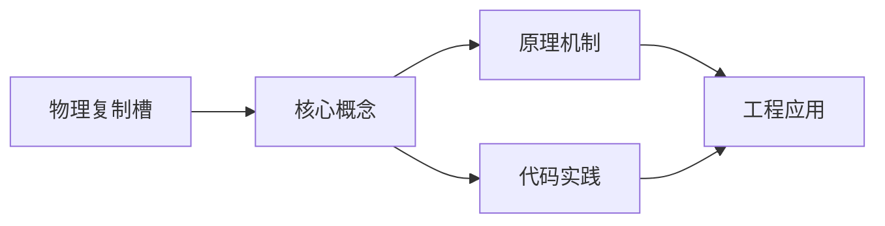
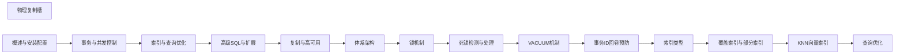

## 1. 学习目标（Bloom 分类）

本节按照布鲁姆教育目标分类学组织学习路径。本文主题为《物理复制槽》，属于 PostgreSQL 模块，读者可以根据自身阶段选择阅读深度。

记忆层面：能够准确复述本文的核心概念、术语与基本语法或操作步骤，并能够在提问或检索时快速定位对应知识点。能够说出 PostgreSQL 的核心概念、语法与常用对象。

理解层面：能够用自己的语言解释核心原理与工作机制，说明概念之间的因果关系，而不是机械记忆结论。能够解释 PostgreSQL 的执行原理与优化机制。

应用层面：能够在真实项目或练习场景中运用本文知识解决具体问题，写出正确且可维护的实现。能够编写正确、高效的 PostgreSQL 语句与操作。

分析层面：能够拆解复杂问题，比较本文主题与相邻概念的异同，识别边界条件与例外情况。能够分析 PostgreSQL 相关方案在性能与一致性上的权衡。

评价层面：能够根据约束条件（性能、可读性、安全、成本）评价不同方案的优劣，做出有依据的技术决策。能够根据业务场景评价 PostgreSQL 技术选型。

创造层面：能够把本文知识与其他模块知识组合，设计出新的解决方案或可复用的工程模式。能够组合 PostgreSQL 与其他技术设计数据架构。

通过本节学习，读者应当能够把《物理复制槽》纳入自己的知识网络，并与 PostgreSQL 模块的其他主题（MVCC、窗口函数、扩展生态、高可用）建立关联。

## 2. 历史动机与发展脉络

《物理复制槽》是 PostgreSQL 领域的重要主题。要真正理解它，需要先了解它解决的问题与演进过程。

PostgreSQL 起源于 1986 年伯克利的 POSTGRES 项目，1996 年更名 PostgreSQL；以功能全面与标准遵循著称，社区驱动发展（每年一个大版本）。
特性版图：完整 SQL（窗口、CTE、递归、JSON）、扩展生态（PostGIS、pgvector）、复制（流复制/逻辑复制）、可编程性（PL/pgSQL、自定义类型）。
PG 17（2024）/PG 18 持续增强：vacuum 与 I/O 优化、增量备份、并行查询扩展；被开发者社区长期评为最受欢迎的数据库之一。

回到本文主题：物理复制槽 的提出与成熟，正是上述技术背景下的必然产物。早期实现往往以简单可用为目标，随着工程规模扩大，社区逐渐沉淀出标准做法与最佳实践；理解这一脉络，可以帮助读者判断“为什么文档中的推荐写法是现在这个样子”，也能在遇到历史遗留代码时准确识别其设计年代与取舍。


## 3. 形式化定义与核心概念精讲

本节把《物理复制槽》涉及的核心概念以“定义 + 讲解”的形式展开。读者应把定义当作工具，把讲解当作理解路径；两者结合才能形成可迁移的知识。

MVCC：每个事务可见性由 xmin/xmax 与快照决定；行更新产生新版本，旧版本由 vacuum 清理；读写互不阻塞。
索引类型：B-tree、Hash、GiST、SP-GiST、GIN（全文/JSON）、BRIN（大表顺序数据）；部分索引与表达式索引。
窗口函数：OVER 子句在结果集内计算排名、移动平均、LAG/LEAD；区别于 GROUP BY 的聚合语义。

### 3.1 原文章节逐一精讲

原文档把主题拆分为 7 个小节，下面按顺序给出每一节的导读讲解，随后保留原文细节供精读。

#### 原文精读（完整保留）


#### 概述

物理复制槽（Physical Replication Slot）是 PostgreSQL 提供的一种机制，确保主库保留足够的 WAL（Write-Ahead Log）日志，直到所有注册的备库都已接收并处理。没有复制槽时，如果备库断开时间过长，主库可能已经清理了备库尚未接收的 WAL，导致备库需要重新做基础备份。复制槽通过跟踪备库的接收进度，自动延迟 WAL 清理，保障复制连续性。但这也带来了 WAL 堆积的风险，需要合理监控和配置。

#### 基础概念

**物理复制槽**：一种服务端机制，记录每个备库的 WAL 接收位置（restart_lsn）。主库在清理 WAL 时会检查所有活跃复制槽的位置，确保不会清理备库尚未接收的 WAL。

**restart_lsn**：复制槽记录的 WAL 位置，表示备库需要从此位置重新开始复制。主库不会清理该位置之后的 WAL。

**活跃与非活跃槽**：活跃槽表示备库正在连接并接收 WAL；非活跃槽表示备库已断开，但主库仍保留其所需的 WAL。非活跃槽是 WAL 堆积的主要风险来源。

**max_slot_wal_keep_size**：限制复制槽可保留的 WAL 总大小。超过该限制后，非活跃的复制槽会被标记为失效，允许清理 WAL。

**WAL 堆积风险**：如果备库长时间断开，复制槽会导致 WAL 不断堆积，可能耗尽磁盘空间。这是使用复制槽时最需要关注的问题。

#### 快速上手

##### 创建与管理复制槽

```sql
-- 创建物理复制槽
SELECT pg_create_physical_replication_slot('standby1');

-- 查看所有复制槽
SELECT
    slot_name,
    slot_type,
    active,
    restart_lsn,
    confirmed_flush_lsn
FROM pg_replication_slots;

-- 删除复制槽
SELECT pg_drop_replication_slot('standby1');
```

##### 在备库配置中使用复制槽

```ini
# postgresql.conf 或 recovery.conf
# 备库连接主库时指定复制槽名称
primary_conninfo = 'host=primary port=5432 user=replicator password=secret'
primary_slot_name = 'standby1'
```

##### 监控 WAL 堆积

```sql
-- 查看每个复制槽保留的 WAL 量
SELECT
    slot_name,
    slot_type,
    active,
    restart_lsn,
    pg_current_wal_lsn() AS current_lsn,
    pg_wal_lsn_diff(pg_current_wal_lsn(), restart_lsn) AS retained_bytes
FROM pg_replication_slots;

-- 以人类可读的格式查看
SELECT
    slot_name,
    active,
    pg_size_pretty(
        pg_wal_lsn_diff(pg_current_wal_lsn(), restart_lsn)
    ) AS retained_wal_size
FROM pg_replication_slots;
```

#### 详细用法

##### 复制槽类型对比

```sql
-- 物理复制槽：用于流复制，保留 WAL
SELECT pg_create_physical_replication_slot('physical_slot');

-- 逻辑复制槽：用于逻辑解码，保留 WAL 并解码为逻辑变更
SELECT pg_create_logical_replication_slot('logical_slot', 'pgoutput');

-- 查看两种类型的槽
SELECT slot_name, slot_type, active, restart_lsn
FROM pg_replication_slots;

-- slot_type 列：
-- 'physical' 表示物理复制槽
-- 'logical' 表示逻辑复制槽
```

##### 复制槽与流复制配置

```ini
# 主库配置 (postgresql.conf)
# 最大复制槽数量
max_replication_slots = 10

# WAL 发送进程数（需要大于等于备库数量）
max_wal_senders = 10

# WAL 保留大小（即使没有复制槽也保留的 WAL 量）
wal_keep_size = '1GB'

# 限制复制槽可保留的最大 WAL 量
max_slot_wal_keep_size = '10GB'
```

```ini
# 备库配置 (postgresql.conf)
# 指定主库连接信息
primary_conninfo = 'host=192.168.1.100 port=5432 user=replicator password=secret'

# 指定使用的复制槽
primary_slot_name = 'standby1'

# 启用热备份（备库可执行只读查询）
hot_standby = on
```

##### 复制槽状态监控

```sql
-- 详细监控视图
SELECT
    s.slot_name,
    s.slot_type,
    s.active,
    s.active_pid,
    s.restart_lsn,
    s.confirmed_flush_lsn,
    pg_current_wal_lsn() AS current_wal_lsn,
    pg_size_pretty(
        pg_wal_lsn_diff(pg_current_wal_lsn(), s.restart_lsn)
    ) AS lag_size,
    a.state AS replication_state,
    a.sent_lsn,
    a.write_lsn,
    a.flush_lsn,
    a.replay_lsn,
    pg_size_pretty(
        pg_wal_lsn_diff(a.sent_lsn, a.replay_lsn)
    ) AS replay_lag
FROM pg_replication_slots s
LEFT JOIN pg_stat_replication a
    ON s.active_pid = a.pid;
```

##### 临时复制槽

```sql
-- 临时复制槽：连接断开时自动删除
-- 适合短期备份操作，不会导致 WAL 堆积
SELECT pg_create_physical_replication_slot('temp_backup', true);

-- 第二个参数 true 表示临时槽
-- 连接断开后自动清理

-- 使用 pg_basebackup 时指定临时复制槽
-- pg_basebackup -h primary -D /data/backup -S temp_backup --slot
```

#### 常见场景

##### 新备库初始化

```bash
# 使用复制槽创建基础备份
pg_basebackup \
    -h primary_host \
    -U replicator \
    -D /var/lib/postgresql/data \
    -Fp -Xs -P -R \
    -S standby1_slot

# -S 指定复制槽名称
# -R 自动创建 standby.signal 和配置
# 备份完成后备库自动使用该复制槽
```

##### 备库故障恢复

```sql
-- 步骤1：检查备库是否断开
SELECT slot_name, active, restart_lsn
FROM pg_replication_slots
WHERE slot_name = 'standby1';

-- 如果 active = false，备库已断开

-- 步骤2：检查 WAL 堆积量
SELECT
    slot_name,
    pg_size_pretty(
        pg_wal_lsn_diff(pg_current_wal_lsn(), restart_lsn)
    ) AS retained_wal
FROM pg_replication_slots
WHERE NOT active;

-- 步骤3：如果 WAL 堆积过多，评估是否需要删除复制槽
-- 删除前确保备库可以重新做基础备份

-- 步骤4：删除复制槽（如果需要）
SELECT pg_drop_replication_slot('standby1');

-- 步骤5：重新创建复制槽并做基础备份
SELECT pg_create_physical_replication_slot('standby1');
```

##### WAL 堆积告警

```sql
-- 创建 WAL 堆积监控函数
CREATE OR REPLACE FUNCTION check_replication_lag()
RETURNS TABLE(
    slot_name text,
    is_active boolean,
    retained_wal text,
    wal_files_count int
) AS $$
BEGIN
    RETURN QUERY
    SELECT
        s.slot_name,
        s.active,
        pg_size_pretty(
            pg_wal_lsn_diff(pg_current_wal_lsn(), s.restart_lsn)
        ) AS retained_wal,
        (SELECT count(*)
         FROM pg_ls_waldir()
         WHERE name ~ '^[0-9A-F]{24}$'
        ) AS wal_files_count
    FROM pg_replication_slots s;
END;
$$ LANGUAGE plpgsql;

-- 执行检查
SELECT * FROM check_replication_lag();
```

#### 注意事项

- **WAL 堆积风险**：非活跃的复制槽会导致 WAL 无限堆积，可能耗尽磁盘空间。必须设置 max_slot_wal_keep_size 限制，并监控非活跃槽。
- **max_slot_wal_keep_size**：设置该参数后，当 WAL 保留量超过限制时，非活跃槽会被标记为失效（invalid），允许清理 WAL。失效的槽需要手动删除并重建。
- **复制槽数量限制**：max_replication_slots 限制了最大复制槽数量，默认 10。修改后需要重启数据库。
- **删除槽的时机**：确认备库不再需要后再删除复制槽。删除后，主库会立即清理该槽保留的 WAL，正在断开的备库将无法恢复。
- **临时槽 vs 永久槽**：临时槽在连接断开时自动删除，适合备份操作；永久槽需要手动管理，适合长期运行的备库。

#### 进阶用法

##### 自动化复制槽管理

```sql
-- 清理失效的复制槽
CREATE OR REPLACE FUNCTION cleanup_invalid_slots()
RETURNS int AS $$
DECLARE
    slot_record RECORD;
    cleaned_count int := 0;
BEGIN
    FOR slot_record IN
        SELECT slot_name
        FROM pg_replication_slots
        WHERE NOT active
    LOOP
        -- 检查槽是否已失效
        IF EXISTS (
            SELECT 1 FROM pg_replication_slots
            WHERE slot_name = slot_record.slot_name
            AND active = false
            AND pg_wal_lsn_diff(pg_current_wal_lsn(), restart_lsn) > 10737418240  -- 10GB
        ) THEN
            PERFORM pg_drop_replication_slot(slot_record.slot_name);
            RAISE NOTICE 'Dropped inactive slot: %', slot_record.slot_name;
            cleaned_count := cleaned_count + 1;
        END IF;
    END LOOP;

    RETURN cleaned_count;
END;
$$ LANGUAGE plpgsql;

-- 执行清理
SELECT cleanup_invalid_slots();
```

##### 复制槽与 pg_rewind 配合

```bash
# 当备库需要回溯到主库的时间线时
# 使用 pg_rewind 重新同步

# 步骤1：停止备库
pg_ctl -D /var/lib/postgresql/data stop

# 步骤2：使用 pg_rewind 同步
pg_rewind \
    --source-server="host=primary port=5432 user=postgres" \
    --target-pgdata=/var/lib/postgresql/data

# 步骤3：启动备库，复制槽自动恢复连接
pg_ctl -D /var/lib/postgresql/data start

# 注意：pg_rewind 需要主库开启 wal_log_hints
# 或在初始化时启用 data checksums
```

##### 复制槽高可用方案

```sql
-- 在 Patroni 等高可用方案中，复制槽自动管理
-- Patroni 配置示例 (patroni.yml)

-- scope: postgres-cluster
-- name: node1
-- restapi:
--   listen: 0.0.0.0:8008
-- postgresql:
--   parameters:
--     max_replication_slots: 10
--     max_wal_senders: 10
--   replication:
--     slots:
--       standby1:
--         type: physical
--       standby2:
--         type: physical

-- Patroni 自动管理复制槽：
-- 1. 备库加入时自动创建复制槽
-- 2. 备库移除时自动删除复制槽
-- 3. 主库切换时复制槽自动迁移
```


### 3.2 概念关系图

下面用 Mermaid 图表达本文核心概念之间的关系，帮助读者建立整体图景：



图中展示的是本文知识的结构化关系：核心概念是入口，原理机制解释“为什么”，代码实践演示“怎么做”，工程应用回答“何时用”。读者学习时可以把每个小节的内容挂接到对应节点上。

## 4. 理论推导与原理解析

本节深入《物理复制槽》背后的原理。理论部分不求面面俱到，而是聚焦“能解释现象、能指导实践”的关键推导。

MVCC：每个事务可见性由 xmin/xmax 与快照决定；行更新产生新版本，旧版本由 vacuum 清理；读写互不阻塞。
索引类型：B-tree、Hash、GiST、SP-GiST、GIN（全文/JSON）、BRIN（大表顺序数据）；部分索引与表达式索引。
窗口函数：OVER 子句在结果集内计算排名、移动平均、LAG/LEAD；区别于 GROUP BY 的聚合语义。
逻辑复制与流复制：WAL 流复制同步备库；逻辑复制按表级发布订阅，支持跨版本与异构。

需要强调的是，理论推导与工程实践之间存在翻译层：理论给出的是理想化模型与边界条件，工程代码则必须处理真实环境中的例外。读者在学习时应先掌握理论的“标准情形”，再通过陷阱章节了解“非标准情形”。

## 5. 代码示例与逐行讲解

本节把原文中的代码示例系统整理，并为每个示例补充用途说明与讲解。读者不应只浏览代码，而应逐段对照讲解理解设计意图。

### 5.1 示例：创建与管理复制槽

该示例来自原文《创建与管理复制槽》小节，用于演示物理复制槽相关操作。阅读时请先看代码结构，再看其后的讲解。

```sql
-- 创建物理复制槽
SELECT pg_create_physical_replication_slot('standby1');

-- 查看所有复制槽
SELECT
    slot_name,
    slot_type,
    active,
    restart_lsn,
    confirmed_flush_lsn
FROM pg_replication_slots;

-- 删除复制槽
SELECT pg_drop_replication_slot('standby1');
```

讲解：这段代码演示了本节核心知识点。代码中的关键操作可以归纳为三步：准备（定义或初始化）、执行（核心逻辑）、收尾（释放资源或返回结果）。实际项目中，这三步往往被封装为函数或类，以提升复用性与可测试性。

关键点分析：

该示例共 12 行有效代码，包含 2 类关键结构（SELECT、FROM）。其中：

- 入口与初始化部分负责建立上下文，对应实际项目中的启动或装配逻辑；
- 核心逻辑部分体现本文主题的主要操作，是阅读时最需要对照讲解理解的部分；
- 输出或返回部分把结果交给调用方，注意其类型与边界条件。

进阶思考路径：先尝试修改参数观察行为变化，再把示例中的模式迁移到自己的项目中；每次修改都记录预期与实测差异，这是把示例转化为能力的最快方式。

### 5.2 示例：在备库配置中使用复制槽

该示例来自原文《在备库配置中使用复制槽》小节，用于演示物理复制槽相关操作。阅读时请先看代码结构，再看其后的讲解。

```ini
# postgresql.conf 或 recovery.conf
# 备库连接主库时指定复制槽名称
primary_conninfo = 'host=primary port=5432 user=replicator password=secret'
primary_slot_name = 'standby1'
```

讲解：这段代码演示了本节核心知识点。代码中的关键操作可以归纳为三步：准备（定义或初始化）、执行（核心逻辑）、收尾（释放资源或返回结果）。实际项目中，这三步往往被封装为函数或类，以提升复用性与可测试性。

关键点分析：

该示例共 4 行有效代码，结构以数据或配置为主。阅读时应关注：数据字段的含义、配置项的作用，以及它们与运行行为的对应关系。

进阶思考路径：先尝试修改参数观察行为变化，再把示例中的模式迁移到自己的项目中；每次修改都记录预期与实测差异，这是把示例转化为能力的最快方式。

### 5.3 示例：监控 WAL 堆积

该示例来自原文《监控 WAL 堆积》小节，用于演示物理复制槽相关操作。阅读时请先看代码结构，再看其后的讲解。

```sql
-- 查看每个复制槽保留的 WAL 量
SELECT
    slot_name,
    slot_type,
    active,
    restart_lsn,
    pg_current_wal_lsn() AS current_lsn,
    pg_wal_lsn_diff(pg_current_wal_lsn(), restart_lsn) AS retained_bytes
FROM pg_replication_slots;

-- 以人类可读的格式查看
SELECT
    slot_name,
    active,
    pg_size_pretty(
        pg_wal_lsn_diff(pg_current_wal_lsn(), restart_lsn)
    ) AS retained_wal_size
FROM pg_replication_slots;
```

讲解：这段代码演示了本节核心知识点。代码中的关键操作可以归纳为三步：准备（定义或初始化）、执行（核心逻辑）、收尾（释放资源或返回结果）。实际项目中，这三步往往被封装为函数或类，以提升复用性与可测试性。

关键点分析：

该示例共 17 行有效代码，包含 2 类关键结构（SELECT、FROM）。其中：

- 入口与初始化部分负责建立上下文，对应实际项目中的启动或装配逻辑；
- 核心逻辑部分体现本文主题的主要操作，是阅读时最需要对照讲解理解的部分；
- 输出或返回部分把结果交给调用方，注意其类型与边界条件。

进阶思考路径：先尝试修改参数观察行为变化，再把示例中的模式迁移到自己的项目中；每次修改都记录预期与实测差异，这是把示例转化为能力的最快方式。

### 5.4 示例：复制槽类型对比

该示例来自原文《复制槽类型对比》小节，用于演示物理复制槽相关操作。阅读时请先看代码结构，再看其后的讲解。

```sql
-- 物理复制槽：用于流复制，保留 WAL
SELECT pg_create_physical_replication_slot('physical_slot');

-- 逻辑复制槽：用于逻辑解码，保留 WAL 并解码为逻辑变更
SELECT pg_create_logical_replication_slot('logical_slot', 'pgoutput');

-- 查看两种类型的槽
SELECT slot_name, slot_type, active, restart_lsn
FROM pg_replication_slots;

-- slot_type 列：
-- 'physical' 表示物理复制槽
-- 'logical' 表示逻辑复制槽
```

讲解：这段代码演示了本节核心知识点。代码中的关键操作可以归纳为三步：准备（定义或初始化）、执行（核心逻辑）、收尾（释放资源或返回结果）。实际项目中，这三步往往被封装为函数或类，以提升复用性与可测试性。

关键点分析：

该示例共 10 行有效代码，包含 2 类关键结构（SELECT、FROM）。其中：

- 入口与初始化部分负责建立上下文，对应实际项目中的启动或装配逻辑；
- 核心逻辑部分体现本文主题的主要操作，是阅读时最需要对照讲解理解的部分；
- 输出或返回部分把结果交给调用方，注意其类型与边界条件。

进阶思考路径：先尝试修改参数观察行为变化，再把示例中的模式迁移到自己的项目中；每次修改都记录预期与实测差异，这是把示例转化为能力的最快方式。

### 5.5 示例：复制槽与流复制配置

该示例来自原文《复制槽与流复制配置》小节，用于演示物理复制槽相关操作。阅读时请先看代码结构，再看其后的讲解。

```ini
# 主库配置 (postgresql.conf)
# 最大复制槽数量
max_replication_slots = 10

# WAL 发送进程数（需要大于等于备库数量）
max_wal_senders = 10

# WAL 保留大小（即使没有复制槽也保留的 WAL 量）
wal_keep_size = '1GB'

# 限制复制槽可保留的最大 WAL 量
max_slot_wal_keep_size = '10GB'
```

讲解：这段代码演示了本节核心知识点。代码中的关键操作可以归纳为三步：准备（定义或初始化）、执行（核心逻辑）、收尾（释放资源或返回结果）。实际项目中，这三步往往被封装为函数或类，以提升复用性与可测试性。

关键点分析：

该示例共 9 行有效代码，结构以数据或配置为主。阅读时应关注：数据字段的含义、配置项的作用，以及它们与运行行为的对应关系。

进阶思考路径：先尝试修改参数观察行为变化，再把示例中的模式迁移到自己的项目中；每次修改都记录预期与实测差异，这是把示例转化为能力的最快方式。

### 5.6 示例：复制槽与流复制配置

该示例来自原文《复制槽与流复制配置》小节，用于演示物理复制槽相关操作。阅读时请先看代码结构，再看其后的讲解。

```ini
# 备库配置 (postgresql.conf)
# 指定主库连接信息
primary_conninfo = 'host=192.168.1.100 port=5432 user=replicator password=secret'

# 指定使用的复制槽
primary_slot_name = 'standby1'

# 启用热备份（备库可执行只读查询）
hot_standby = on
```

讲解：这段代码演示了本节核心知识点。代码中的关键操作可以归纳为三步：准备（定义或初始化）、执行（核心逻辑）、收尾（释放资源或返回结果）。实际项目中，这三步往往被封装为函数或类，以提升复用性与可测试性。

关键点分析：

该示例共 7 行有效代码，结构以数据或配置为主。阅读时应关注：数据字段的含义、配置项的作用，以及它们与运行行为的对应关系。

进阶思考路径：先尝试修改参数观察行为变化，再把示例中的模式迁移到自己的项目中；每次修改都记录预期与实测差异，这是把示例转化为能力的最快方式。

### 5.7 示例：复制槽状态监控

该示例来自原文《复制槽状态监控》小节，用于演示物理复制槽相关操作。阅读时请先看代码结构，再看其后的讲解。

```sql
-- 详细监控视图
SELECT
    s.slot_name,
    s.slot_type,
    s.active,
    s.active_pid,
    s.restart_lsn,
    s.confirmed_flush_lsn,
    pg_current_wal_lsn() AS current_wal_lsn,
    pg_size_pretty(
        pg_wal_lsn_diff(pg_current_wal_lsn(), s.restart_lsn)
    ) AS lag_size,
    a.state AS replication_state,
    a.sent_lsn,
    a.write_lsn,
    a.flush_lsn,
    a.replay_lsn,
    pg_size_pretty(
        pg_wal_lsn_diff(a.sent_lsn, a.replay_lsn)
    ) AS replay_lag
FROM pg_replication_slots s
LEFT JOIN pg_stat_replication a
    ON s.active_pid = a.pid;
```

讲解：这段代码演示了本节核心知识点。代码中的关键操作可以归纳为三步：准备（定义或初始化）、执行（核心逻辑）、收尾（释放资源或返回结果）。实际项目中，这三步往往被封装为函数或类，以提升复用性与可测试性。

关键点分析：

该示例共 23 行有效代码，包含 2 类关键结构（SELECT、FROM）。其中：

- 入口与初始化部分负责建立上下文，对应实际项目中的启动或装配逻辑；
- 核心逻辑部分体现本文主题的主要操作，是阅读时最需要对照讲解理解的部分；
- 输出或返回部分把结果交给调用方，注意其类型与边界条件。

进阶思考路径：先尝试修改参数观察行为变化，再把示例中的模式迁移到自己的项目中；每次修改都记录预期与实测差异，这是把示例转化为能力的最快方式。

### 5.8 示例：临时复制槽

该示例来自原文《临时复制槽》小节，用于演示物理复制槽相关操作。阅读时请先看代码结构，再看其后的讲解。

```sql
-- 临时复制槽：连接断开时自动删除
-- 适合短期备份操作，不会导致 WAL 堆积
SELECT pg_create_physical_replication_slot('temp_backup', true);

-- 第二个参数 true 表示临时槽
-- 连接断开后自动清理

-- 使用 pg_basebackup 时指定临时复制槽
-- pg_basebackup -h primary -D /data/backup -S temp_backup --slot
```

讲解：这段代码演示了本节核心知识点。代码中的关键操作可以归纳为三步：准备（定义或初始化）、执行（核心逻辑）、收尾（释放资源或返回结果）。实际项目中，这三步往往被封装为函数或类，以提升复用性与可测试性。

关键点分析：

该示例共 7 行有效代码，包含 1 类关键结构（SELECT）。其中：

- 入口与初始化部分负责建立上下文，对应实际项目中的启动或装配逻辑；
- 核心逻辑部分体现本文主题的主要操作，是阅读时最需要对照讲解理解的部分；
- 输出或返回部分把结果交给调用方，注意其类型与边界条件。

进阶思考路径：先尝试修改参数观察行为变化，再把示例中的模式迁移到自己的项目中；每次修改都记录预期与实测差异，这是把示例转化为能力的最快方式。

### 5.9 示例：新备库初始化

该示例来自原文《新备库初始化》小节，用于演示物理复制槽相关操作。阅读时请先看代码结构，再看其后的讲解。

```bash
# 使用复制槽创建基础备份
pg_basebackup \
    -h primary_host \
    -U replicator \
    -D /var/lib/postgresql/data \
    -Fp -Xs -P -R \
    -S standby1_slot

# -S 指定复制槽名称
# -R 自动创建 standby.signal 和配置
# 备份完成后备库自动使用该复制槽
```

讲解：这段代码演示了本节核心知识点。代码中的关键操作可以归纳为三步：准备（定义或初始化）、执行（核心逻辑）、收尾（释放资源或返回结果）。实际项目中，这三步往往被封装为函数或类，以提升复用性与可测试性。

关键点分析：

该示例共 10 行有效代码，结构以数据或配置为主。阅读时应关注：数据字段的含义、配置项的作用，以及它们与运行行为的对应关系。

进阶思考路径：先尝试修改参数观察行为变化，再把示例中的模式迁移到自己的项目中；每次修改都记录预期与实测差异，这是把示例转化为能力的最快方式。

### 5.10 示例：备库故障恢复

该示例来自原文《备库故障恢复》小节，用于演示物理复制槽相关操作。阅读时请先看代码结构，再看其后的讲解。

```sql
-- 步骤1：检查备库是否断开
SELECT slot_name, active, restart_lsn
FROM pg_replication_slots
WHERE slot_name = 'standby1';

-- 如果 active = false，备库已断开

-- 步骤2：检查 WAL 堆积量
SELECT
    slot_name,
    pg_size_pretty(
        pg_wal_lsn_diff(pg_current_wal_lsn(), restart_lsn)
    ) AS retained_wal
FROM pg_replication_slots
WHERE NOT active;

-- 步骤3：如果 WAL 堆积过多，评估是否需要删除复制槽
-- 删除前确保备库可以重新做基础备份

-- 步骤4：删除复制槽（如果需要）
SELECT pg_drop_replication_slot('standby1');

-- 步骤5：重新创建复制槽并做基础备份
SELECT pg_create_physical_replication_slot('standby1');
```

讲解：这段代码演示了本节核心知识点。代码中的关键操作可以归纳为三步：准备（定义或初始化）、执行（核心逻辑）、收尾（释放资源或返回结果）。实际项目中，这三步往往被封装为函数或类，以提升复用性与可测试性。

关键点分析：

该示例共 19 行有效代码，包含 2 类关键结构（SELECT、FROM）。其中：

- 入口与初始化部分负责建立上下文，对应实际项目中的启动或装配逻辑；
- 核心逻辑部分体现本文主题的主要操作，是阅读时最需要对照讲解理解的部分；
- 输出或返回部分把结果交给调用方，注意其类型与边界条件。

进阶思考路径：先尝试修改参数观察行为变化，再把示例中的模式迁移到自己的项目中；每次修改都记录预期与实测差异，这是把示例转化为能力的最快方式。

### 5.11 示例：WAL 堆积告警

该示例来自原文《WAL 堆积告警》小节，用于演示物理复制槽相关操作。阅读时请先看代码结构，再看其后的讲解。

```sql
-- 创建 WAL 堆积监控函数
CREATE OR REPLACE FUNCTION check_replication_lag()
RETURNS TABLE(
    slot_name text,
    is_active boolean,
    retained_wal text,
    wal_files_count int
) AS $$
BEGIN
    RETURN QUERY
    SELECT
        s.slot_name,
        s.active,
        pg_size_pretty(
            pg_wal_lsn_diff(pg_current_wal_lsn(), s.restart_lsn)
        ) AS retained_wal,
        (SELECT count(*)
         FROM pg_ls_waldir()
         WHERE name ~ '^[0-9A-F]{24}$'
        ) AS wal_files_count
    FROM pg_replication_slots s;
END;
$$ LANGUAGE plpgsql;

-- 执行检查
SELECT * FROM check_replication_lag();
```

讲解：这段代码演示了本节核心知识点。代码中的关键操作可以归纳为三步：准备（定义或初始化）、执行（核心逻辑）、收尾（释放资源或返回结果）。实际项目中，这三步往往被封装为函数或类，以提升复用性与可测试性。

关键点分析：

该示例共 25 行有效代码，包含 3 类关键结构（SELECT、CREATE、FROM）。其中：

- 入口与初始化部分负责建立上下文，对应实际项目中的启动或装配逻辑；
- 核心逻辑部分体现本文主题的主要操作，是阅读时最需要对照讲解理解的部分；
- 输出或返回部分把结果交给调用方，注意其类型与边界条件。

进阶思考路径：先尝试修改参数观察行为变化，再把示例中的模式迁移到自己的项目中；每次修改都记录预期与实测差异，这是把示例转化为能力的最快方式。

### 5.12 示例：自动化复制槽管理

该示例来自原文《自动化复制槽管理》小节，用于演示物理复制槽相关操作。阅读时请先看代码结构，再看其后的讲解。

```sql
-- 清理失效的复制槽
CREATE OR REPLACE FUNCTION cleanup_invalid_slots()
RETURNS int AS $$
DECLARE
    slot_record RECORD;
    cleaned_count int := 0;
BEGIN
    FOR slot_record IN
        SELECT slot_name
        FROM pg_replication_slots
        WHERE NOT active
    LOOP
        -- 检查槽是否已失效
        IF EXISTS (
            SELECT 1 FROM pg_replication_slots
            WHERE slot_name = slot_record.slot_name
            AND active = false
            AND pg_wal_lsn_diff(pg_current_wal_lsn(), restart_lsn) > 10737418240  -- 10GB
        ) THEN
            PERFORM pg_drop_replication_slot(slot_record.slot_name);
            RAISE NOTICE 'Dropped inactive slot: %', slot_record.slot_name;
            cleaned_count := cleaned_count + 1;
        END IF;
    END LOOP;

    RETURN cleaned_count;
END;
$$ LANGUAGE plpgsql;

-- 执行清理
SELECT cleanup_invalid_slots();
```

讲解：这段代码演示了本节核心知识点。代码中的关键操作可以归纳为三步：准备（定义或初始化）、执行（核心逻辑）、收尾（释放资源或返回结果）。实际项目中，这三步往往被封装为函数或类，以提升复用性与可测试性。

关键点分析：

该示例共 29 行有效代码，包含 3 类关键结构（SELECT、CREATE、FROM）。其中：

- 入口与初始化部分负责建立上下文，对应实际项目中的启动或装配逻辑；
- 核心逻辑部分体现本文主题的主要操作，是阅读时最需要对照讲解理解的部分；
- 输出或返回部分把结果交给调用方，注意其类型与边界条件。

进阶思考路径：先尝试修改参数观察行为变化，再把示例中的模式迁移到自己的项目中；每次修改都记录预期与实测差异，这是把示例转化为能力的最快方式。

### 5.13 示例：复制槽与 pg_rewind 配合

该示例来自原文《复制槽与 pg_rewind 配合》小节，用于演示物理复制槽相关操作。阅读时请先看代码结构，再看其后的讲解。

```bash
# 当备库需要回溯到主库的时间线时
# 使用 pg_rewind 重新同步

# 步骤1：停止备库
pg_ctl -D /var/lib/postgresql/data stop

# 步骤2：使用 pg_rewind 同步
pg_rewind \
    --source-server="host=primary port=5432 user=postgres" \
    --target-pgdata=/var/lib/postgresql/data

# 步骤3：启动备库，复制槽自动恢复连接
pg_ctl -D /var/lib/postgresql/data start

# 注意：pg_rewind 需要主库开启 wal_log_hints
# 或在初始化时启用 data checksums
```

讲解：这段代码演示了本节核心知识点。代码中的关键操作可以归纳为三步：准备（定义或初始化）、执行（核心逻辑）、收尾（释放资源或返回结果）。实际项目中，这三步往往被封装为函数或类，以提升复用性与可测试性。

关键点分析：

该示例共 12 行有效代码，结构以数据或配置为主。阅读时应关注：数据字段的含义、配置项的作用，以及它们与运行行为的对应关系。

进阶思考路径：先尝试修改参数观察行为变化，再把示例中的模式迁移到自己的项目中；每次修改都记录预期与实测差异，这是把示例转化为能力的最快方式。

### 5.14 示例：复制槽高可用方案

该示例来自原文《复制槽高可用方案》小节，用于演示物理复制槽相关操作。阅读时请先看代码结构，再看其后的讲解。

```sql
-- 在 Patroni 等高可用方案中，复制槽自动管理
-- Patroni 配置示例 (patroni.yml)

-- scope: postgres-cluster
-- name: node1
-- restapi:
--   listen: 0.0.0.0:8008
-- postgresql:
--   parameters:
--     max_replication_slots: 10
--     max_wal_senders: 10
--   replication:
--     slots:
--       standby1:
--         type: physical
--       standby2:
--         type: physical

-- Patroni 自动管理复制槽：
-- 1. 备库加入时自动创建复制槽
-- 2. 备库移除时自动删除复制槽
-- 3. 主库切换时复制槽自动迁移
```

讲解：这段代码演示了本节核心知识点。代码中的关键操作可以归纳为三步：准备（定义或初始化）、执行（核心逻辑）、收尾（释放资源或返回结果）。实际项目中，这三步往往被封装为函数或类，以提升复用性与可测试性。

关键点分析：

该示例共 20 行有效代码，结构以数据或配置为主。阅读时应关注：数据字段的含义、配置项的作用，以及它们与运行行为的对应关系。

进阶思考路径：先尝试修改参数观察行为变化，再把示例中的模式迁移到自己的项目中；每次修改都记录预期与实测差异，这是把示例转化为能力的最快方式。


综合以上示例，可以总结出本主题的代码实践要点：第一，先定义清晰的输入输出契约；第二，核心逻辑保持单一职责；第三，错误处理与边界条件不可省略；第四，命名与注释表达意图而非复述代码。

## 6. 对比分析

对比是理解《物理复制槽》定位的最快路径。下面从多个维度与相邻方案进行对比。

PostgreSQL 与 MySQL：PG 功能全面、标准遵循好、扩展强；MySQL 生态普及、运维资料多。
PostgreSQL 与 Oracle：PG 开源成本低、现代特性多；Oracle 企业级功能与商业支持。
流复制与逻辑复制：流复制整实例容灾；逻辑复制按表分发与升级。

对比的目的不是分出绝对优劣，而是建立选择依据：不同约束条件下，最优解不同。读者应把每个对比维度转化为决策检查清单。

## 7. 常见陷阱与最佳实践

本节整理该主题的高频错误与推荐做法。每个陷阱先描述现象，再解释原因，最后给出最佳实践。

### 7.1 vacuum 缺失

表膨胀与事务 ID 回卷风险。开启 autovacuum 并监控。

深入讲解：该问题之所以被归类为“常见陷阱”，是因为它在初学者的代码中反复出现，而且往往不在第一时间暴露——错误通常隐藏在特定数据或特定时序下。

从成因上看，vacuum 缺失 一般源于对 PostgreSQL 某个机制的理解偏差：要么误用了默认行为，要么忽略了边界条件，要么把其他语言的思维惯性带了过来。

从影响上看，vacuum 缺失 轻则产生错误结果，重则导致资源泄漏、数据损坏或安全事故；这也是为什么工程评审中会把它列为检查项。

从修复策略上看，处理vacuum 缺失的正确顺序是：先复现（构造最小用例），再定位（确认机制层面的根因），最后修复并补充回归测试。跳过复现直接改代码，往往治标不治本。

### 7.2 未用事务包装多语句

部分成功导致数据不一致。使用事务或 CTE。

深入讲解：该问题之所以被归类为“常见陷阱”，是因为它在初学者的代码中反复出现，而且往往不在第一时间暴露——错误通常隐藏在特定数据或特定时序下。

从成因上看，未用事务包装多语句 一般源于对 PostgreSQL 某个机制的理解偏差：要么误用了默认行为，要么忽略了边界条件，要么把其他语言的思维惯性带了过来。

从影响上看，未用事务包装多语句 轻则产生错误结果，重则导致资源泄漏、数据损坏或安全事故；这也是为什么工程评审中会把它列为检查项。

从修复策略上看，处理未用事务包装多语句的正确顺序是：先复现（构造最小用例），再定位（确认机制层面的根因），最后修复并补充回归测试。跳过复现直接改代码，往往治标不治本。

### 7.3 jsonb 滥用

频繁更新 jsonb 字段效率低。规范化的列优先。

深入讲解：该问题之所以被归类为“常见陷阱”，是因为它在初学者的代码中反复出现，而且往往不在第一时间暴露——错误通常隐藏在特定数据或特定时序下。

从成因上看，jsonb 滥用 一般源于对 PostgreSQL 某个机制的理解偏差：要么误用了默认行为，要么忽略了边界条件，要么把其他语言的思维惯性带了过来。

从影响上看，jsonb 滥用 轻则产生错误结果，重则导致资源泄漏、数据损坏或安全事故；这也是为什么工程评审中会把它列为检查项。

从修复策略上看，处理jsonb 滥用的正确顺序是：先复现（构造最小用例），再定位（确认机制层面的根因），最后修复并补充回归测试。跳过复现直接改代码，往往治标不治本。

### 7.4 连接数默认限制

max_connections=100 被连接池打满。使用 PgBouncer。

深入讲解：该问题之所以被归类为“常见陷阱”，是因为它在初学者的代码中反复出现，而且往往不在第一时间暴露——错误通常隐藏在特定数据或特定时序下。

从成因上看，连接数默认限制 一般源于对 PostgreSQL 某个机制的理解偏差：要么误用了默认行为，要么忽略了边界条件，要么把其他语言的思维惯性带了过来。

从影响上看，连接数默认限制 轻则产生错误结果，重则导致资源泄漏、数据损坏或安全事故；这也是为什么工程评审中会把它列为检查项。

从修复策略上看，处理连接数默认限制的正确顺序是：先复现（构造最小用例），再定位（确认机制层面的根因），最后修复并补充回归测试。跳过复现直接改代码，往往治标不治本。

### 7.5 序列回卷

serial 溢出。使用 bigserial 或 identity。

深入讲解：该问题之所以被归类为“常见陷阱”，是因为它在初学者的代码中反复出现，而且往往不在第一时间暴露——错误通常隐藏在特定数据或特定时序下。

从成因上看，序列回卷 一般源于对 PostgreSQL 某个机制的理解偏差：要么误用了默认行为，要么忽略了边界条件，要么把其他语言的思维惯性带了过来。

从影响上看，序列回卷 轻则产生错误结果，重则导致资源泄漏、数据损坏或安全事故；这也是为什么工程评审中会把它列为检查项。

从修复策略上看，处理序列回卷的正确顺序是：先复现（构造最小用例），再定位（确认机制层面的根因），最后修复并补充回归测试。跳过复现直接改代码，往往治标不治本。

### 7.6 时区混淆

timestamptz 与 timestamp 语义不同。统一 timestamptz。

深入讲解：该问题之所以被归类为“常见陷阱”，是因为它在初学者的代码中反复出现，而且往往不在第一时间暴露——错误通常隐藏在特定数据或特定时序下。

从成因上看，时区混淆 一般源于对 PostgreSQL 某个机制的理解偏差：要么误用了默认行为，要么忽略了边界条件，要么把其他语言的思维惯性带了过来。

从影响上看，时区混淆 轻则产生错误结果，重则导致资源泄漏、数据损坏或安全事故；这也是为什么工程评审中会把它列为检查项。

从修复策略上看，处理时区混淆的正确顺序是：先复现（构造最小用例），再定位（确认机制层面的根因），最后修复并补充回归测试。跳过复现直接改代码，往往治标不治本。

### 7.7 大事务

长事务阻止 vacuum 与复制进度。拆分事务。

深入讲解：该问题之所以被归类为“常见陷阱”，是因为它在初学者的代码中反复出现，而且往往不在第一时间暴露——错误通常隐藏在特定数据或特定时序下。

从成因上看，大事务 一般源于对 PostgreSQL 某个机制的理解偏差：要么误用了默认行为，要么忽略了边界条件，要么把其他语言的思维惯性带了过来。

从影响上看，大事务 轻则产生错误结果，重则导致资源泄漏、数据损坏或安全事故；这也是为什么工程评审中会把它列为检查项。

从修复策略上看，处理大事务的正确顺序是：先复现（构造最小用例），再定位（确认机制层面的根因），最后修复并补充回归测试。跳过复现直接改代码，往往治标不治本。

### 7.8 忽略扩展插件

重复造轮子。先查扩展目录（postgis、pgvector、pg_stat_statements）。

深入讲解：该问题之所以被归类为“常见陷阱”，是因为它在初学者的代码中反复出现，而且往往不在第一时间暴露——错误通常隐藏在特定数据或特定时序下。

从成因上看，忽略扩展插件 一般源于对 PostgreSQL 某个机制的理解偏差：要么误用了默认行为，要么忽略了边界条件，要么把其他语言的思维惯性带了过来。

从影响上看，忽略扩展插件 轻则产生错误结果，重则导致资源泄漏、数据损坏或安全事故；这也是为什么工程评审中会把它列为检查项。

从修复策略上看，处理忽略扩展插件的正确顺序是：先复现（构造最小用例），再定位（确认机制层面的根因），最后修复并补充回归测试。跳过复现直接改代码，往往治标不治本。

### 7.0 最佳实践总览

1. 主键用 bigint identity 或 UUID；外键保证引用完整性。
2. 高频查询建索引；JSON 用 jsonb；全文检索用 GIN。
3. 启用 pg_stat_statements 收集查询统计。
4. 备份：pg_basebackup + WAL 归档；演练恢复。

把这些最佳实践固化为团队规范与代码评审检查项，是避免同类问题反复出现的关键。

## 8. 工程实践

本节把《物理复制槽》放入真实工程场景，给出可复用的模式与组织方法。

高可用：Patroni + etcd 选主 + 流复制；读写分离中间件。
容量与性能：分区表（声明式分区）管理大数据；并行查询调优。
监控：pg_stat_activity、pg_stat_replication、Prometheus exporter。

### 8.1 工程实践的原则拆解

以上工程实践可以归纳为四条原则。第一，配置与代码分离：PostgreSQL 项目中环境差异应通过配置注入，而不是散落在代码分支中；这保证同一份代码可以在开发、测试、生产环境一致运行。

第二，接口稳定优先：对外接口（函数签名、协议、数据格式）一旦被消费方依赖，变更成本极高；设计时应预留扩展点并保持向后兼容。

第三，可观测性内置：日志、指标与追踪应该在功能开发时同步设计，而不是故障发生后补救；没有观测手段的模块等于黑盒。

第四，变更可回滚：任何发布都应有对应的回滚方案；数据库迁移、配置变更与代码发布一样需要版本管理与逆向路径。

### 8.2 实践落地的检查清单

- [ ] 高可用：对照本节描述，检查当前项目是否已经落实；未落实的项列入技术债并排期处理。
- [ ] 容量与性能：对照本节描述，检查当前项目是否已经落实；未落实的项列入技术债并排期处理。
- [ ] 监控：对照本节描述，检查当前项目是否已经落实；未落实的项列入技术债并排期处理。

工程实践的共性原则：配置与代码分离、接口稳定优先、可观测性内置、变更可回滚。这些原则适用于本主题的所有实现。

## 9. 案例研究

本节通过一个完整案例把《物理复制槽》的知识串起来。案例按“需求分析、方案设计、实现、验证”四步展开。

需求：实现地理围栏查询（半径内 POI）。
方案：PostGIS 扩展 + GiST 空间索引 + ST_DWithin 查询。
要点：几何类型 geometry(Point,4326)；索引生效验证；投影统一。
验证：百万点查询延迟、空间索引命中、精度核对。

### 9.1 案例的扩展讨论

把案例中的方案放大到真实规模，需要额外考虑三个问题：

第一，规模：当数据量或并发量上升一个数量级时，原方案中的数据结构、缓存策略与任务调度是否仍然成立？通常需要引入分层与异步。

第二，团队：多人协作时，模块边界、接口契约与代码所有权必须明确；案例中的实现应拆分为可独立测试的单元，并配合文档说明设计意图。

第三，演进：上线后的需求变化不可避免；方案设计时应预留扩展点（配置化、插件化、事件化），并定期用真实指标验证假设。


案例研究的学习方法：先独立阅读需求，尝试在脑中形成方案，再对照实现与讲解，最后思考“如果约束变化（数据量、并发、团队规模），方案应如何调整”。

## 10. 知识要点总结与深入讲解

本节以讲解形式汇总全文要点，替代传统的习题与自测，读者不需要答题，只需跟随解释建立完整的认知框架。

关于《物理复制槽》的核心结论：

PostgreSQL 以“功能没有短板”著称，MVCC 与扩展生态是核心。
vacuum、连接、事务与索引是日常运维四大主题。
高可用与备份是生产底线，必须演练。

原文档各小节的要点回顾：

- 概述：该小节围绕物理复制槽展开具体细节，阅读时应关注其与核心结论的对应关系；每个小节都是核心结论在某一个侧面的展开。
- 基础概念：该小节围绕物理复制槽展开具体细节，阅读时应关注其与核心结论的对应关系；每个小节都是核心结论在某一个侧面的展开。
- 快速上手：该小节围绕物理复制槽展开具体细节，阅读时应关注其与核心结论的对应关系；每个小节都是核心结论在某一个侧面的展开。
- 详细用法：该小节围绕物理复制槽展开具体细节，阅读时应关注其与核心结论的对应关系；每个小节都是核心结论在某一个侧面的展开。
- 常见场景：该小节围绕物理复制槽展开具体细节，阅读时应关注其与核心结论的对应关系；每个小节都是核心结论在某一个侧面的展开。
- 注意事项：该小节围绕物理复制槽展开具体细节，阅读时应关注其与核心结论的对应关系；每个小节都是核心结论在某一个侧面的展开。
- 进阶用法：该小节围绕物理复制槽展开具体细节，阅读时应关注其与核心结论的对应关系；每个小节都是核心结论在某一个侧面的展开。

把以上要点与第 3-9 节的内容对照复习，即可完成对本文主题的闭环学习。

## 11. 参考文献


PostgreSQL 官方文档：https://www.postgresql.org/docs/
PostgreSQL 中文文档：https://www.postgresql.org/docs/current/index.html
PGXN 扩展仓库：https://pgxn.org/
PostGIS：https://postgis.net/
pgvector：https://github.com/pgvector/pgvector

## 12. 延伸阅读


PostgreSQL 窗口函数，见 021-postgresql 模块文档。
PostgreSQL 递归查询，见 021-postgresql 模块相关文档。
SQL 基础，见 019-sql 模块。
尚硅谷 Bilibili 空间（https://space.bilibili.com/302417610 ）提供 PostgreSQL 课程。

## 14. 模块知识图谱与学习路径

本文属于 PostgreSQL 模块。为了把《物理复制槽》放入完整的知识网络，下面列出本模块的全部主题并给出相互关联的导读。学习时建议按模块内顺序推进，并在每个文档中留意交叉引用。



上图为模块主题的推荐学习顺序示意图（仅展示前若干主题）。各主题之间存在三类关联：

第一，前置依赖关系：早期主题是后期主题的基础，例如环境与语法先行、进阶主题随后；

第二，横向并列关系：同一层级主题从不同角度覆盖模块能力，学习顺序可以按兴趣调整；

第三，工程组合关系：多个主题在真实项目中组合使用，例如配置、性能与安全主题往往出现在同一系统的不同层面。

### 14.1 模块主题速查表

| 文档 | 主题 | 与本文的关联 |
| --- | --- | --- |
| 概述与安装配置 | 001-OverviewInstallConfig | 本文的前置基础 |
| 事务与并发控制 | 002-TransactionConcurrencyControl | 本文的并列主题 |
| 索引与查询优化 | 003-IndexQueryOptimization | 本文的性能延伸 |
| 高级SQL与扩展 | 004-AdvancedSQLExtension | 本文的并列主题 |
| 复制与高可用 | 005-ReplicationHA | 本文的并列主题 |
| 体系架构 | 006-SystemArchitecture | 本文的原理深化 |
| 锁机制 | 007-LockMechanism | 本文的原理深化 |
| 死锁检测与处理 | 008-DeadlockDetectionHandling | 本文的并列主题 |
| VACUUM机制 | 009-VACUUMMechanism | 本文的原理深化 |
| 事务ID回卷预防 | 010-TransactionIDWraparoundPrevention | 本文的并列主题 |
| 索引类型 | 011-IndexType | 本文的并列主题 |
| 覆盖索引与部分索引 | 012-CoveringIndexPartialIndex | 本文的并列主题 |
| KNN向量索引 | 013-KNNVectorIndex | 本文的并列主题 |
| 查询优化 | 014-QueryOptimization | 本文的性能延伸 |
| 分区表 | 015-PartitionedTable | 本文的并列主题 |
| 分区裁剪与分区连接 | 016-PartitionPruningPartitionJoin | 本文的并列主题 |
| 高级SQL | 017-AdvancedSQL | 本文的并列主题 |
| MERGE语句增强 | 018-MERGEStatementEnhancement | 本文的并列主题 |
| JSON-TABLE | 019-JSONTABLE | 本文的并列主题 |
| 全文检索 | 020-FullTextSearch | 本文的并列主题 |
| 地理空间对象 | 021-GeoSpatialObject | 本文的并列主题 |
| 存储过程与函数 | 022-StoredProcedureAndFunction | 本文的并列主题 |
| 触发器与事件触发器 | 023-TriggerEventTrigger | 本文的并列主题 |
| 扩展模块 | 024-ExtensionModule | 本文的并列主题 |
| FDW外部数据包装器 | 025-FDWFDW | 本文的并列主题 |
| 流复制 | 026-StreamingReplication | 本文的并列主题 |
| 级联复制 | 027-CascadingReplication | 本文的并列主题 |
| 物理复制槽 | 028-PhysicalReplicationSlot | 本文自身 |
| 逻辑解码与输出插件 | 029-LogicalDecodingOutputPlugin | 本文的并列主题 |
| 增量备份 | 030-IncrementalBackup | 本文的并列主题 |
| 订阅与发布 | 031-SubscribePublish | 本文的并列主题 |
| SSL-TLS加密连接 | 032-SSLEncryptionConnection | 本文的安全延伸 |
| 基于角色的权限管理 | 033-RoleBasedPermissionManagement | 本文的安全延伸 |
| 行级安全策略 | 034-RowLevelSecurity | 本文的安全延伸 |
| 数据加密存储 | 035-DataEncryptionStorage | 本文的安全延伸 |
| 审计日志 | 036-AuditLog | 本文的并列主题 |
| 序列与自增列 | 037-SequenceAutoIncrement | 本文的并列主题 |
| 生成列 | 038-GeneratedColumn | 本文的并列主题 |
| 可更新视图 | 039-UpdatableView | 本文的并列主题 |
| 并行查询 | 040-ParallelQuery | 本文的并列主题 |
| 逻辑复制与物理复制对比 | 041-LogicalPhysicalReplicationCompare | 本文的并列主题 |
| JSONB与JSON差异 | 042-JSONBJSONDifference | 本文的并列主题 |
| 扩展模块详解 | 043-ExtensionModuleDetailed | 本文的并列主题 |
| PostgreSQL DDL 数据定义 | 044-DDL | 本文的并列主题 |
| PostgreSQL DML 数据操作 | 045-DML | 本文的并列主题 |
| PostgreSQL 窗口函数 | 046-WindowFunction | 本文的并列主题 |
| PostgreSQL CTE 递归查询 | 047-CTE | 本文的并列主题 |
| PostgreSQL psql CLI 命令 | 048-PsqlCLI | 本文的并列主题 |
| pg_dump 与 pg_restore 语法速查手册 | 049-PgDumpRestore | 本文的并列主题 |
| 数组类型操作 语法速查手册 | 050-ArrayType | 本文的并列主题 |
| 模式（Schema）管理 语法速查手册 | 051-SchemaManagement | 本文的并列主题 |
| 视图与物化视图 语法速查手册 | 052-ViewMaterializedView | 本文的并列主题 |
| LISTEN/NOTIFY 监听通知 语法速查手册 | 053-ListenNotify | 本文的并列主题 |

速查表的作用是让读者快速判断：哪些文档应在阅读本文前掌握（前置基础），哪些文档应在阅读本文后继续（延伸主题）。本模块的交叉引用体系即以此表为基础。

## 15. 术语表

下表整理《物理复制槽》及 PostgreSQL 模块中出现的高频术语，给出简明释义。术语按字母序或逻辑序排列，供查阅。

| 术语 | 释义 |
| --- | --- |
| MVCC | 每个事务可见性由 xmin/xmax 与快照决定；行更新产生新版本，旧版本由 vacuum 清理；读写互不阻塞。 |
| 索引类型 | B-tree、Hash、GiST、SP-GiST、GIN（全文/JSON）、BRIN（大表顺序数据）；部分索引与表达式索引。 |
| 窗口函数 | OVER 子句在结果集内计算排名、移动平均、LAG/LEAD；区别于 GROUP BY 的聚合语义。 |
| 逻辑复制与流复制 | WAL 流复制同步备库；逻辑复制按表级发布订阅，支持跨版本与异构。 |
| vacuum 缺失（易错点） | 参见常见陷阱章节的详细讲解 |
| 未用事务包装多语句（易错点） | 参见常见陷阱章节的详细讲解 |
| jsonb 滥用（易错点） | 参见常见陷阱章节的详细讲解 |
| 连接数默认限制（易错点） | 参见常见陷阱章节的详细讲解 |
| 序列回卷（易错点） | 参见常见陷阱章节的详细讲解 |
| 时区混淆（易错点） | 参见常见陷阱章节的详细讲解 |

术语表与正文配合使用：先通读正文，遇到模糊术语回查本表；长期使用后术语会自然进入工作记忆。

## 13. 深度专题扩展

以下专题从不同角度深入本文主题，供有进阶需求的读者研读。每个专题独立成节，内容相互补充。

### 13.1 MVCC 与 vacuum 机制

行头存储 xmin（创建事务）与 xmax（删除事务）；可见性由快照比较决定。
更新 = 插入新版本 + 旧版本标记；旧版本对旧事务可见，vacuum 回收不再可见的死元组。
事务 ID 回卷：约 21 亿事务后需要冻结；autovacuum 与 vacuum freeze 防止。
监控：SELECT n_dead_tup, last_autovacuum FROM pg_stat_user_tables。

### 13.2 逻辑复制与高可用

发布（publication）定义表集，订阅（subscription）在目标端应用变更；支持过滤与列子集。
流复制：主库 WAL 发送到备库，同步/异步模式；级联复制扩展拓扑。
Patroni 使用分布式共识（etcd）选主，故障自动切换，配合虚拟 IP。
切换演练与数据校验（pg_checksums）是可用性工程必备。

## 16. 核心概念串讲（复习视角）

本节以“把知识讲给他人听”的方式，把《物理复制槽》的核心概念重新串讲一遍。与前文按章节展开不同，这里的叙述更接近课堂总结：先说整体，再逐个展开，最后收束。

《物理复制槽》属于 PostgreSQL 模块。要理解它，先要理解它在模块中的位置：它解决的是该领域的一个具体问题，并依赖模块内若干前置概念；反过来，它又为后续进阶主题提供基础。

第一个概念是MVCC。每个事务可见性由 xmin/xmax 与快照决定；行更新产生新版本，旧版本由 vacuum 清理；读写互不阻塞。

在实际使用中，MVCC需要与相邻概念区分：它们的区别不在于名称，而在于适用条件与行为边界；这正是前文对比分析章节的意义。

第一个概念是索引类型。B-tree、Hash、GiST、SP-GiST、GIN（全文/JSON）、BRIN（大表顺序数据）；部分索引与表达式索引。

在实际使用中，索引类型需要与相邻概念区分：它们的区别不在于名称，而在于适用条件与行为边界；这正是前文对比分析章节的意义。

第一个概念是窗口函数。OVER 子句在结果集内计算排名、移动平均、LAG/LEAD；区别于 GROUP BY 的聚合语义。

在实际使用中，窗口函数需要与相邻概念区分：它们的区别不在于名称，而在于适用条件与行为边界；这正是前文对比分析章节的意义。

接下来是MVCC。每个事务可见性由 xmin/xmax 与快照决定；行更新产生新版本，旧版本由 vacuum 清理；读写互不阻塞。

理解该原理的关键不是记住结论，而是记住“它从什么假设出发、推出了什么、假设不成立时会怎样”。带着这个框架复习，原理之间就会连成网络。

接下来是索引类型。B-tree、Hash、GiST、SP-GiST、GIN（全文/JSON）、BRIN（大表顺序数据）；部分索引与表达式索引。

理解该原理的关键不是记住结论，而是记住“它从什么假设出发、推出了什么、假设不成立时会怎样”。带着这个框架复习，原理之间就会连成网络。

接下来是窗口函数。OVER 子句在结果集内计算排名、移动平均、LAG/LEAD；区别于 GROUP BY 的聚合语义。

理解该原理的关键不是记住结论，而是记住“它从什么假设出发、推出了什么、假设不成立时会怎样”。带着这个框架复习，原理之间就会连成网络。

接下来是逻辑复制与流复制。WAL 流复制同步备库；逻辑复制按表级发布订阅，支持跨版本与异构。

理解该原理的关键不是记住结论，而是记住“它从什么假设出发、推出了什么、假设不成立时会怎样”。带着这个框架复习，原理之间就会连成网络。

串讲收束：把概念与原理放回本文主题，可以得出一个总纲——定义描述是什么，原理解释为什么，实践回答怎么做。三者构成完整的学习闭环；后续遇到相关问题，都可以按这个总纲检索知识。
