<!-- ============ 文档分隔线：022-redis/001-OverviewCoreDataStructure.md ============ -->


> 本节为增量补充，帮助你选择 Redis 版本并了解许可变化。

- Redis：8.10（2026-07-28 GA）为当前稳定版；8.2+ 为推荐升级目标（8.0 已于 2026-02 停止支持）。
- 许可提醒：Redis 8.0 起使用 SSPL/RSALv2 双许可，商业部署前请评估许可条款；开源替代品 Valkey 也值得了解。
- 配套：Redis Stack（JSON/搜索/时间序列模块）、Redis Insight 图形化客户端、redis-cli 命令行。


## 1. Redis 8.0 概述

### 1.1 Redis 简介

Redis（Remote Dictionary Server）是开源的**内存键值数据库**，支持丰富的数据结构、持久化、高可用和集群功能。Redis 8.0 引入了 Vector Set 等重要新特性。

### 1.2 Redis 核心特性

| 特性         | 说明                                     |
| :----------- | :--------------------------------------- |
| 内存存储     | 所有数据存储在内存，读写延迟微秒级       |
| 丰富数据结构 | String、Hash、List、Set、ZSet、Stream 等 |
| 持久化       | RDB 快照 + AOF 日志，混合持久化          |
| 高可用       | 主从复制 + Sentinel 哨兵自动故障转移     |
| 集群         | Redis Cluster 无中心分片集群             |
| 模块化       | RedisJSON、RediSearch、RedisBloom 等     |
| 单线程模型   | 命令执行单线程，I/O 多线程（6.0+）       |

### 1.3 Redis 8.0 新特性

```
- Vector Set: 原生高维向量近似搜索（HNSW 算法）
- Redis for AI: 向量库、推理缓存、VSS 优化
- Redis Flex: 混合存储引擎（SSD + DRAM）
- I/O 多线程增强
- 函数（Functions）替代 Lua 脚本
- ACL 增强与 TLS 改进
```

## 2. 字符串（SDS）

### 2.1 SDS 结构

Redis 使用 SDS（Simple Dynamic String）替代 C 字符串：

```c
// SDS 结构
struct sdshdr {
    int len;       // 已使用长度
    int free;      // 剩余空间
    char buf[];    // 数据区
};
```

| 特性       | C 字符串 | SDS                          |
| :--------- | :------- | :--------------------------- |
| 获取长度   | O(n)     | O(1)                         |
| 缓冲区溢出 | 可能     | 不会（空间预分配）           |
| 二进制安全 | 否       | 是（len 判断结尾）           |
| 内存重分配 | 每次修改 | 最多 N 次（预分配+惰性释放） |

### 2.2 常用命令

```bash
# 基本操作
SET key value [EX seconds] [PX ms] [NX|XX] [KEEPTTL]
GET key
DEL key [key ...]

# 设置带过期
SET session:abc123 '{"user":"admin"}' EX 3600    # 1小时过期
SET cache:home '<html>...</html>' EX 300          # 5分钟缓存

# NX: 仅键不存在时设置（分布式锁）
SET lock:order:123 "uuid-xxx" NX EX 30

# 批量操作
MSET key1 val1 key2 val2 key3 val3
MGET key1 key2 key3

# 数值操作
SET counter 100
INCR counter           # 101
INCRBY counter 10      # 111
DECRBY counter 5       # 106
INCRBYFLOAT counter 2.5 # 108.5

# 位操作
SETBIT user:active:20240101 100 1    # 第100位设为1
GETBIT user:active:20240101 100      # 返回1
BITCOUNT user:active:20240101         # 统计活跃用户数
BITOP AND result key1 key2            # 位运算
```

## 3. 哈希（Hash）

### 3.1 底层编码

```
Hash 底层编码:
1. listpack（小对象）: field 数量 ≤ hash-max-listpack-entries 且值长度 ≤ hash-max-listpack-value
2. hashtable（大对象）: 超过阈值时转换

hashtable 结构:
  dict → ht[0] + ht[1]（渐进式 rehash）
  每个 ht: 数组 + 哈希函数（SipHash）
```

### 3.2 常用命令

```bash
# 基本操作
HSET user:1001 name "Alice" age 30 email "alice@example.com"
HGET user:1001 name              # "Alice"
HMGET user:1001 name age email   # 批量获取
HGETALL user:1001                 # 获取所有字段
HDEL user:1001 email              # 删除字段
HLEN user:1001                    # 字段数量

# 数值操作
HINCRBY user:1001 age 1           # 年龄+1
HINCRBYFLOAT user:1001 score 0.5  # 浮点数增加

# 条件操作
HSETNX user:1001 email "new@example.com"  # 仅字段不存在时设置

# 判断与遍历
HEXISTS user:1001 name            # 字段是否存在
HKEYS user:1001                   # 所有字段名
HVALS user:1001                   # 所有字段值
HSCAN user:1001 MATCH "na*"       # 模式匹配遍历
```

## 4. 列表（List）

### 4.1 底层编码

```
List 底层编码: quicklist
  quicklist = listpack（压缩列表）+ 双向链表
  每个节点是一个 listpack，中间节点可压缩（LZF 算法）

配置参数:
  list-max-listpack-size: 单个 listpack 大小限制
  list-compress-depth: 压缩深度（0=不压缩，1=首尾不压缩）
```

### 4.2 常用命令

```bash
# 队列操作（FIFO）
LPUSH queue:tasks "task1" "task2"    # 左端入队
RPOP queue:tasks                      # 右端出队

# 栈操作（LIFO）
LPUSH stack:undo "action1"
LPOP stack:undo

# 阻塞操作（消息队列场景）
BLPOP queue:tasks 30    # 阻塞等待30秒
BRPOP queue:tasks 0     # 无限等待

# 查看与裁剪
LLEN queue:tasks                       # 列表长度
LRANGE queue:tasks 0 -1                # 查看所有元素
LRANGE queue:tasks 0 9                 # 前10个
LTRIM queue:tasks 0 99                 # 仅保留前100个

# 指定位置操作
LINDEX queue:tasks 0                   # 按索引获取
LSET queue:tasks 0 "updated_task"      # 按索引设置
LINSERT queue:tasks BEFORE "task2" "task1.5"  # 插入
LREM queue:tasks 2 "task1"             # 删除指定值
```

## 5. 集合（Set）

### 5.1 底层编码

```
Set 底层编码:
1. intset: 所有元素都是整数且数量 ≤ set-max-intset-entries（默认512）
2. hashtable: 元素为哈希表的 key，value 为 NULL
```

### 5.2 常用命令

```bash
# 基本操作
SADD tags:article:1 "redis" "database" "nosql"
SREM tags:article:1 "nosql"
SISMEMBER tags:article:1 "redis"       # 是否存在
SMEMBERS tags:article:1                 # 所有成员
SCARD tags:article:1                    # 成员数量

# 随机操作
SRANDMEMBER tags:article:1 2            # 随机取2个（不删除）
SPOP tags:article:1                     # 随机弹出1个

# 集合运算
SADD set:a 1 2 3 4 5
SADD set:b 3 4 5 6 7

SINTER set:a set:b           # 交集: {3,4,5}
SUNION set:a set:b           # 并集: {1,2,3,4,5,6,7}
SDIFF set:a set:b            # 差集: {1,2}

SINTERSTORE result set:a set:b   # 交集存入 result
SUNIONSTORE result set:a set:b   # 并集存入 result
SDIFFSTORE result set:a set:b    # 差集存入 result

# 遍历
SSCAN tags:article:1 MATCH "re*"
```

## 6. 有序集合（ZSet）

### 6.1 底层编码

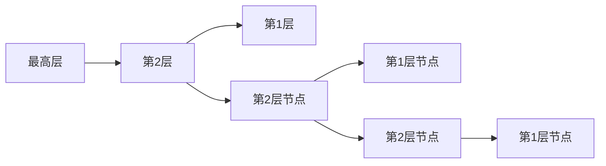

平均查询复杂度：O(logN)，空间复杂度：O(N)

### 6.2 常用命令

```bash
# 添加与更新
ZADD leaderboard 100 "Alice" 95 "Bob" 88 "Charlie"
ZADD leaderboard XX 105 "Alice"          # 仅更新已存在成员
ZADD leaderboard NX 92 "David"           # 仅添加新成员
ZADD leaderboard GT 110 "Alice"          # 仅当新分数更大时更新
ZADD leaderboard LT 80 "Bob"             # 仅当新分数更小时更新

# 查询
ZSCORE leaderboard "Alice"               # 获取分数
ZRANK leaderboard "Alice"                # 排名（升序，从0开始）
ZREVRANK leaderboard "Alice"             # 排名（降序）

# 范围查询（按分数）
ZRANGEBYSCORE leaderboard 90 100         # 分数 90~100
ZRANGEBYSCORE leaderboard -inf +inf      # 所有
ZRANGEBYSCORE leaderboard (90 100        # 开区间 >90
ZCOUNT leaderboard 90 100                # 计数

# 范围查询（按排名）
ZRANGE leaderboard 0 9 WITHSCORES        # 前10名（升序）
ZREVRANGE leaderboard 0 9 WITHSCORES     # 前10名（降序）

# 删除
ZREM leaderboard "Charlie"
ZREMRANGEBYRANK leaderboard 0 2          # 删除排名0~2
ZREMRANGEBYSCORE leaderboard -inf 60     # 删除分数≤60

# 聚合操作
ZUNIONSTORE result 2 leaderboard1 leaderboard2 WEIGHTS 1 2 AGGREGATE SUM
ZINTERSTORE result 2 leaderboard1 leaderboard2 AGGREGATE MAX
```

## 7. 位图（Bitmap）

```bash
# 位图操作（基于 String 类型）
SETBIT sign:202401:1001 0 1     # 第1天签到
SETBIT sign:202401:1001 6 1     # 第7天签到
GETBIT sign:202401:1001 0       # 检查第1天是否签到
BITCOUNT sign:202401:1001       # 本月签到次数
BITPOS sign:202401:1001 1       # 第一个签到的天

# 统计活跃用户
SETBIT active:20240101 1001 1   # 用户1001活跃
SETBIT active:20240101 1002 1   # 用户1002活跃
BITCOUNT active:20240101        # 当日活跃用户数

# 连续签到天数
BITFIELD sign:202401:1001 GET u31 0  # 获取31位无符号整数
```

## 8. HyperLogLog

```bash
# 基数估算（0.81% 标准误差，仅 12KB 内存）
PFADD uv:20240101 "user1" "user2" "user3"
PFADD uv:20240101 "user1" "user4"        # 重复不计数
PFCOUNT uv:20240101                       # 估算独立访客数

# 合并
PFADD uv:20240102 "user2" "user3" "user5"
PFMERGE uv:week uv:20240101 uv:20240102
PFCOUNT uv:week                           # 合并后的独立访客数
```

## 9. GEO（地理位置）

```bash
# GEO 基于 ZSet 实现（使用 GeoHash 编码作为分数）

# 添加地理位置
GEOADD locations 116.397 39.908 "北京" 121.474 31.230 "上海" 113.264 23.129 "广州"

# 计算距离
GEODIST locations "北京" "上海" km       # 约 1067.5 km

# 范围查询
GEORADIUS locations 116.397 39.908 500 km WITHDIST WITHCOORD COUNT 10
GEORADIUSBYMEMBER locations "北京" 500 km WITHDIST

# Redis 6.2+ 推荐使用 GEOSEARCH
GEOSEARCH locations FROMMEMBER "北京" BYRADIUS 500 km WITHDIST COUNT 10
GEOSEARCH locations FROMLONLAT 116.397 39.908 BYBOX 500 500 km WITHDIST

# 获取坐标
GEOPOS locations "北京"

# GeoHash 编码
GEOHASH locations "北京"
```

## 10. Stream

### 10.1 Stream 基本操作

```bash
# 添加消息
XADD orders:* name "Alice" product "Book" price 29.9
# 返回: "1704067200000-0"（时间戳-序号）

# 自定义 ID
XADD orders:2024 maxlen ~ 10000 * name "Bob" product "Pen" price 5.5
# maxlen ~ 10000: 近似裁剪到10000条

# 读取消息
XRANGE orders:2024 - +                    # 所有消息
XRANGE orders:2024 - + COUNT 10           # 前10条
XRANGE orders:2024 1704067200000-0 +      # 从指定ID开始
XREVRANGE orders:2024 + - COUNT 5         # 最新5条

# 读取新消息（非阻塞）
XREAD COUNT 10 STREAMS orders:2024 $

# 阻塞读取
XREAD COUNT 10 BLOCK 5000 STREAMS orders:2024 $
```

### 10.2 消费者组

```bash
# 创建消费者组
XGROUP CREATE orders:2024 order-processors $ MKSTREAM
# $ = 从最新消息开始，0 = 从头开始

# 消费者读取
XREADGROUP GROUP order-processors consumer1 COUNT 1 STREAMS orders:2024 >

# 确认消息
XACK orders:2024 order-processors 1704067200000-0

# 查看待处理消息
XPENDING orders:2024 order-processors

# 查看消费者组信息
XINFO GROUPS orders:2024
XINFO CONSUMERS orders:2024 order-processors

# 转移未确认消息给其他消费者
XCLAIM orders:2024 order-processors consumer2 3600 1704067200000-0
```

## 11. Vector Set（Redis 8.0 新增）

### 11.1 Vector Set 概述

Vector Set 是 Redis 8.0 新增的数据结构，支持**高维向量近似最近邻搜索（ANN）**，基于 HNSW（Hierarchical Navigable Small World）算法。

```bash
# 添加向量
VSET products:vec item1 0.1 0.2 0.3 0.4 0.5 0.6 0.7 0.8
VSET products:vec item2 0.2 0.3 0.4 0.5 0.6 0.7 0.8 0.9
VSET products:vec item3 0.9 0.8 0.7 0.6 0.5 0.4 0.3 0.2

# 向量搜索（KNN）
VSEARCH products:vec 0.1 0.2 0.3 0.4 0.5 0.6 0.7 0.8 COUNT 5

# 带过滤条件的搜索
VSEARCH products:vec 0.1 0.2 0.3 0.4 0.5 0.6 0.7 0.8 COUNT 5 FILTER category == "electronics"

# 获取向量
VGET products:vec item1

# 删除向量
VDEL products:vec item1

# 查看信息
VINFO products:vec
```

### 11.2 Vector Set vs pgvector

| 维度     | Redis Vector Set | pgvector       |
| :------- | :--------------- | :------------- |
| 存储     | 内存             | 磁盘（可缓存） |
| 延迟     | 微秒级           | 毫秒级         |
| 索引算法 | HNSW             | HNSW / IVFFlat |
| 持久化   | RDB/AOF          | 原生持久化     |
| 适用场景 | 实时推荐、缓存   | 大规模向量检索 |
| 数据量   | 受内存限制       | 受磁盘限制     |


<!-- ============ 文档分隔线：022-redis/002-PersistenceModule.md ============ -->


## 1. RDB 快照

### 1.1 RDB 原理

RDB（Redis Database）将某一时刻的内存数据以二进制形式写入磁盘文件。

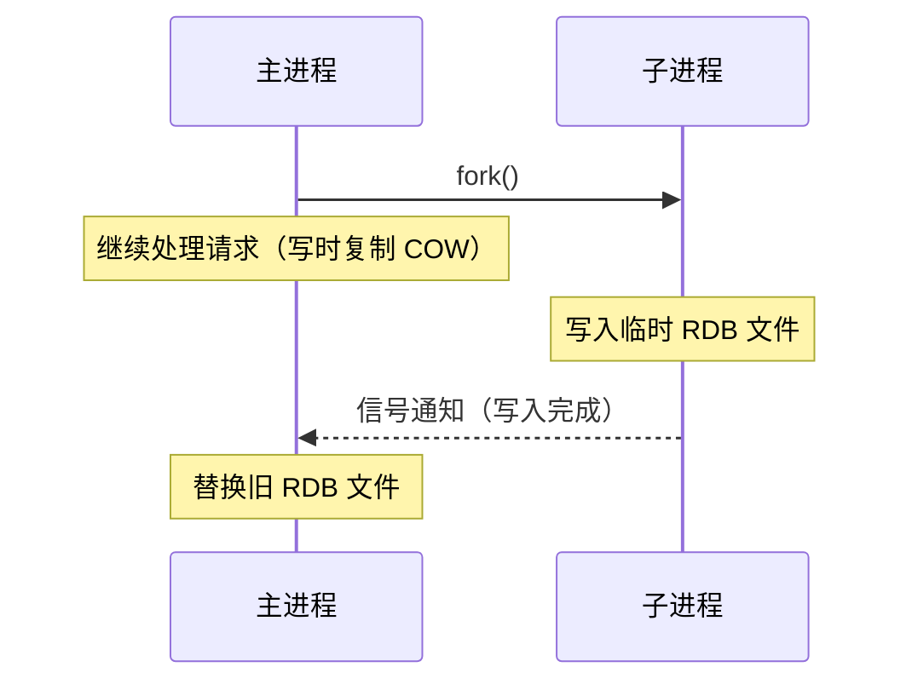

### 1.2 RDB 配置

```ini
# redis.conf
# 自动保存条件（满足任一即触发）
save 3600 1         # 3600秒内有1次修改
save 300 100        # 300秒内有100次修改
save 60 10000       # 60秒内有10000次修改

# 禁用 RDB
save ""

# RDB 文件配置
dbfilename dump.rdb
dir /var/lib/redis

# 压缩
rdbcompression yes       # LZF 压缩字符串
rdbchecksum yes          # CRC64 校验

# 写时复制期间不执行 save
stop-writes-on-bgsave-error yes

# RDB 增量备份（Redis 7.0+）
rdb-del-sync-files no
```

### 1.3 RDB 优缺点

| 优点                   | 缺点                         |
| :--------------------- | :--------------------------- |
| 文件紧凑，适合备份     | 非实时，可能丢失数据         |
| 恢复速度快（直接加载） | fork() 有内存开销（COW）     |
| 对性能影响小（子进程） | 数据量大时 fork 耗时         |
| 适合灾难恢复           | 不适合要求高数据安全性的场景 |

## 2. AOF 日志

### 2.1 AOF 原理

AOF（Append Only File）以日志形式记录每次写操作。

```
AOF 写入流程:
  命令 → AOF 缓冲区 → fsync 到磁盘

三种同步策略（appendfsync）:
  always    — 每条命令 fsync（最安全，最慢）
  everysec  — 每秒 fsync（推荐，最多丢1秒数据）
  no        — 由 OS 决定（最快，可能丢数据）
```

### 2.2 AOF 配置

```ini
# redis.conf
appendonly yes
appendfilename "appendonly.aof"
appendfsync everysec

# AOF 目录（Redis 7.0+ 多文件 AOF）
appenddirname "appendonlydir"

# AOF 重写配置
auto-aof-rewrite-percentage 100    # AOF 文件大小增长 100% 时触发
auto-aof-rewrite-min-size 64mb     # AOF 文件最小 64MB 才触发

no-appendfsync-on-rewrite no       # 重写期间是否暂停 fsync
```

### 2.3 AOF 重写

```
AOF 重写原理:
  fork 子进程 → 遍历内存数据 → 生成最简命令 → 写入新 AOF

重写过程:
  1. 主进程 fork 子进程
  2. 子进程生成新 AOF（基于当前内存状态）
  3. 主进程将新写命令追加到重写缓冲区
  4. 子进程完成后，主进程追加重写缓冲区
  5. 用新 AOF 替换旧 AOF

示例:
  旧 AOF:
    SET counter 1
    INCR counter
    INCR counter
    INCR counter
    DEL temp_key
    SET counter 4

  重写后:
    SET counter 4
    # temp_key 已删除，不记录
```

### 2.4 多文件 AOF（Redis 7.0+）

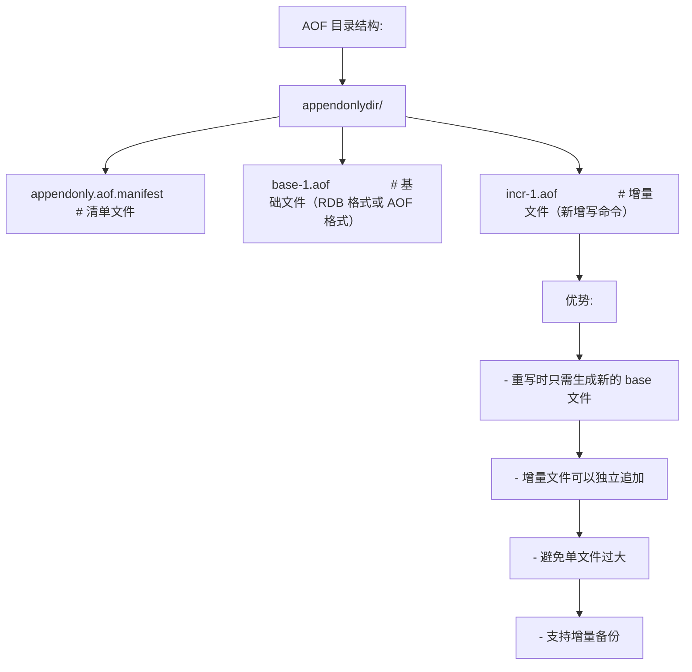

## 3. 混合持久化

### 3.1 混合持久化原理

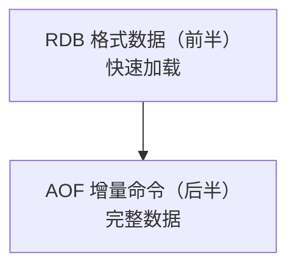

```ini
# redis.conf
aof-use-rdb-preamble yes    # 启用混合持久化（默认开启）
```

### 3.2 持久化方案对比

| 方案       | 数据安全         | 恢复速度 | 磁盘占用 | 适用场景               |
| :--------- | :--------------- | :------- | :------- | :--------------------- |
| 仅 RDB     | 可能丢分钟级数据 | 快       | 小       | 缓存场景               |
| 仅 AOF     | 最多丢1秒        | 慢       | 大       | 数据存储场景           |
| 混合持久化 | 最多丢1秒        | 较快     | 中       | 推荐（兼顾安全和性能） |

## 4. 无盘复制

```ini
# 无盘复制：主节点直接通过网络发送 RDB 给从节点，不生成磁盘文件
repl-diskless-sync yes
repl-diskless-sync-delay 5    # 等待5秒让更多从节点一起接收

# 无盘复制加载（Redis 7.0+）
repl-diskless-load swapdb     # 先加载到备用数据库，成功后切换

# 适用场景:
# - 磁盘 I/O 慢（云盘、网络存储）
# - 多个从节点同时全量同步
# - 内存充足
```

## 5. Redis 模块

### 5.1 RedisJSON

```bash
# 安装
# redis-server --loadmodule /path/to/rejson.so

# 设置 JSON
JSON.SET user:1001 $ '{"name":"Alice","age":30,"address":{"city":"Beijing"}}'

# JSONPath 查询
JSON.GET user:1001 $.name                    # "Alice"
JSON.GET user:1001 $.address.city            # "Beijing"
JSON.GET user:1001 $                         # 完整 JSON

# 修改 JSON
JSON.SET user:1001 $.age 31
JSON.SET user:1001 $.address.city "Shanghai"

# 数组操作
JSON.SET tags:1 $ '["redis","database"]'
JSON.ARRAPPEND tags:1 $ '"nosql"'            # 追加元素
JSON.ARRLEN tags:1 $                          # 数组长度
JSON.ARRPOP tags:1 $ -1                       # 弹出最后一个

# 数值操作
JSON.NUMINCRBY user:1001 $.age 1              # 年龄+1

# 删除字段
JSON.DEL user:1001 $.address
```

### 5.2 RedisTimeSeries

```bash
# 创建时间序列
TS.CREATE cpu:usage:server1 RETENTION 86400000 LABELS host server1 metric cpu
# RETENTION: 保留时间（毫秒），0=永久

# 添加数据点
TS.ADD cpu:usage:server1 * 75.5              # * = 当前时间戳
TS.ADD cpu:usage:server1 1704067200000 80.2  # 指定时间戳

# 批量添加
TS.MADD cpu:usage:server1 1704067200000 80.2 \
         cpu:usage:server1 1704067260000 82.1 \
         cpu:usage:server1 1704067320000 78.5

# 查询
TS.RANGE cpu:usage:server1 - + AGGREGATION avg 60000  # 按分钟平均
TS.RANGE cpu:usage:server1 - + COUNT 100               # 最近100个点

# 降采样规则
TS.CREATE cpu:usage:server1:1min RULES cpu:usage:server1:1h avg 3600000
# 每小时平均值存入 1h 序列

# 多序列查询
TS.MRANGE - + AGGREGATION avg 60000 FILTER metric=cpu
```

### 5.3 RedisBloom

```bash
# 布隆过滤器
BF.CREATE users:seen EXPANSION 2 ERROR 0.01 CAPACITY 1000000
BF.ADD users:seen "user:1001"               # 添加
BF.EXISTS users:seen "user:1001"            # 判断是否存在（可能有假阳性）
BF.EXISTS users:seen "user:9999"            # 不存在则一定不存在
BF.MADD users:seen "user:1002" "user:1003"
BF.INFO users:seen

# Cuckoo Filter（支持删除）
CF.CREATE emails:seen CAPACITY 1000000
CF.ADD emails:seen "test@example.com"
CF.EXISTS emails:seen "test@example.com"
CF.DEL emails:seen "test@example.com"        # 支持删除！
CF.COUNT emails:seen

# Count-Min Sketch（频率统计）
CMS.CREATE page:views 2000 10
CMS.INCRBY page:views "home" 1 "about" 3
CMS.QUERY page:views "home" "about"

# Top-K（高频元素）
TOPK.CREATE search:topk 10 50 4 0.9
TOPK.ADD search:topk "redis" "python" "redis" "java" "redis"
TOPK.LIST search:topk
TOPK.QUERY search:topk "redis" "python"
```

### 5.4 RediSearch

```bash
# 创建索引
FT.CREATE idx:products ON JSON PREFIX 1 product: SCHEMA
  $.name TEXT WEIGHT 2.0
  $.description TEXT
  $.price NUMERIC
  $.category TAG
  $.created_at NUMERIC SORTABLE

# 全文搜索
FT.SEARCH idx:products "redis database"
FT.SEARCH idx:products "@name:redis @category:database"

# 数值过滤
FT.SEARCH idx:products "redis" FILTER price 0 100

# 标签过滤
FT.SEARCH idx:products "*" FILTER category nosql

# 聚合查询
FT.AGGREGATE idx:products "*" GROUPBY 1 @category REDUCE COUNT 0 AS count

# 高亮和摘要
FT.SEARCH idx:products "redis" HIGHLIGHT FIELDS name description SUMMARIZE

# 拼写建议
FT.SPELLCHECK idx:products "reddis"

# 删除索引
FT.DROPINDEX idx:products
```

### 5.5 T-Digest

```bash
# T-Digest: 流式分位数估算
# 安装: redis-server --loadmodule /path/to/tdigest.so

# 创建
TDIGEST.CREATE latency:api

# 添加数据
TDIGEST.ADD latency:api 12.5 18.3 15.7 22.1 19.8 14.2 25.6

# 查询分位数
TDIGEST.QUANTILE latency:api 0.5    # 中位数
TDIGEST.QUANTILE latency:api 0.95   # P95
TDIGEST.QUANTILE latency:api 0.99   # P99

# 查询 CDF
TDIGEST.CDF latency:api 20          # ≤20ms 的请求比例

# 合并
TDIGEST.MERGE latency:all 2 latency:api latency:db

# 信息
TDIGEST.INFO latency:api
```

## 6. 统一模块化架构

### 6.1 模块管理

```bash
# 加载模块
redis-server --loadmodule /path/to/rejson.so \
             --loadmodule /path/to/redisearch.so \
             --loadmodule /path/to/redisbloom.so

# redis.conf 配置
loadmodule /path/to/rejson.so
loadmodule /path/to/redisearch.so
loadmodule /path/to/redisbloom.so

# 运行时加载
MODULE LOAD /path/to/rejson.so

# 查看已加载模块
MODULE LIST

# 卸载模块
MODULE UNLOAD rejson
```

### 6.2 模块生态

| 模块            | 功能               | 适用场景              |
| :-------------- | :----------------- | :-------------------- |
| RedisJSON       | JSON 文档存储      | 文档型数据、配置管理  |
| RediSearch      | 全文检索与二级索引 | 搜索引擎、自动补全    |
| RedisBloom      | 概率数据结构       | 去重、频率统计、Top-K |
| RedisTimeSeries | 时间序列数据库     | 监控指标、IoT 数据    |
| RedisGraph      | 图数据库           | 社交关系、知识图谱    |
| RedisCell       | 限流器             | API 限流、速率控制    |
| T-Digest        | 分位数估算         | 延迟监控、SLA 告警    |


<!-- ============ 文档分隔线：022-redis/003-ClusterHA.md ============ -->


## 1. 主从复制

### 1.1 全量同步

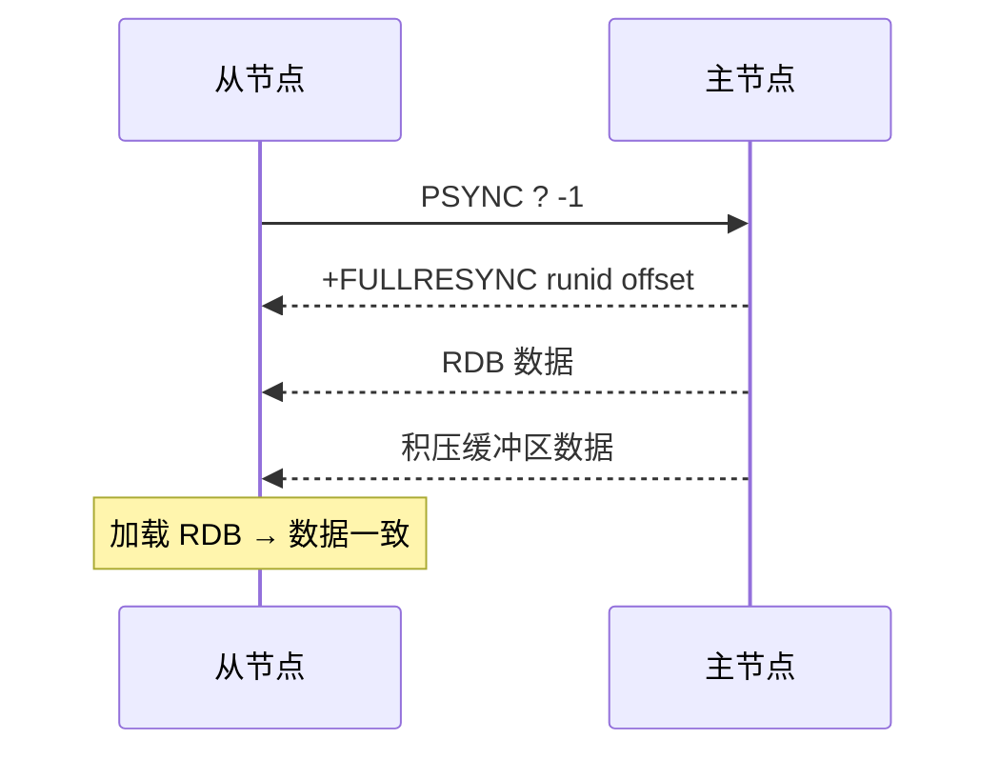

### 1.2 增量同步

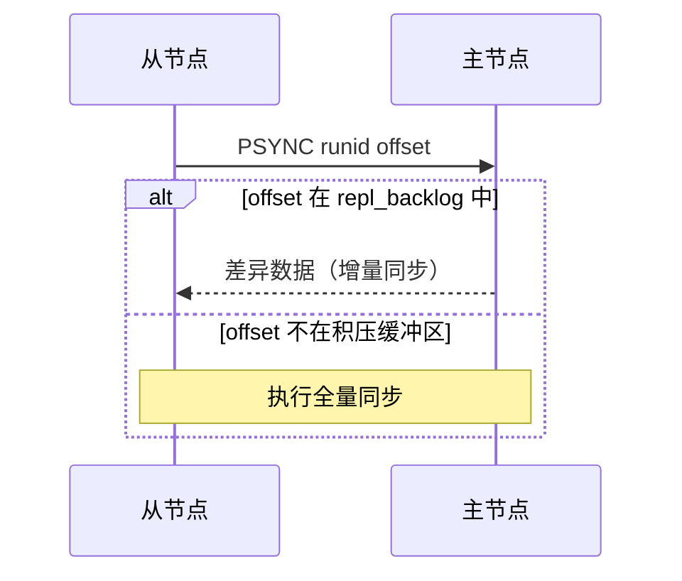

### 1.3 主从配置

```bash
# 从节点配置
redis-server --replicaof 192.168.1.10 6379

# 或在 redis.conf 中
replicaof 192.168.1.10 6379
masterauth "MasterPass123"       # 主节点密码

# 只读模式（默认开启）
replica-read-only yes

# 复制相关配置
repl-diskless-sync yes           # 无盘复制
repl-ping-replica-period 10      # 心跳间隔
repl-timeout 60                  # 超时时间
replica-serve-stale-data yes     # 断开后是否继续响应
replica-priority 100             # 哨兵选举优先级
```

### 1.4 复制状态监控

```bash
# 主节点查看从节点
INFO replication
# # Replication
# role:master
# connected_slaves:2
# slave0:ip=192.168.1.11,port=6379,state=online,offset=1234567,lag=0
# slave1:ip=192.168.1.12,port=6379,state=online,offset=1234560,lag=1

# 从节点查看状态
INFO replication
# # Replication
# role:slave
# master_host:192.168.1.10
# master_link_status:up
# master_sync_in_progress:0
# slave_read_only:1
```

## 2. 哨兵模式（Sentinel）

### 2.1 Sentinel 架构

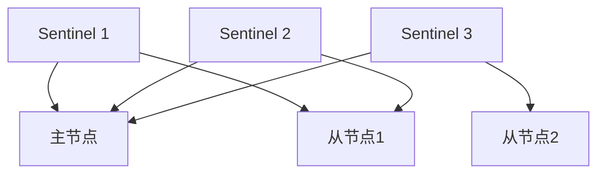

### 2.2 Sentinel 配置

```ini
# sentinel.conf
port 26379
sentinel monitor mymaster 192.168.1.10 6379 2
# mymaster: 主节点名称
# 192.168.1.10 6379: 主节点地址
# 2: 至少2个 Sentinel 同意才进行故障转移

sentinel auth-pass mymaster MasterPass123
sentinel down-after-milliseconds mymaster 30000     # 30秒无响应判定主观下线
sentinel failover-timeout mymaster 180000            # 故障转移超时
sentinel parallel-syncs mymaster 1                   # 同时同步的从节点数
```

### 2.3 故障转移流程

```
1. 主观下线(SDOWN): 单个 Sentinel 认为主节点不可用
2. 客观下线(ODOWN): 超过 quorum 个 Sentinel 认为主节点不可用
3. Sentinel 选举 Leader（Raft 协议）
4. Leader 执行故障转移:
   a. 选择新主节点:
      - 排除断线的从节点
      - 优先 replica-priority 最小的
      - 优先复制偏移量最大的（数据最新）
      - 优先 runid 最小的
   b. 对新主节点执行 SLAVEOF NO ONE
   c. 对其他从节点执行 SLAVEOF 新主节点
   d. 更新 Sentinel 配置
5. 客户端连接新主节点
```

### 2.4 Sentinel 客户端连接

```python
import redis
from redis.sentinel import Sentinel

# 连接 Sentinel
sentinel = Sentinel([
    ('192.168.1.10', 26379),
    ('192.168.1.11', 26379),
    ('192.168.1.12', 26379)
], socket_timeout=5)

# 获取主节点连接
master = sentinel.master_for('mymaster', password='MasterPass123')
master.set('key', 'value')

# 获取从节点连接（读操作）
slave = sentinel.slave_for('mymaster', password='MasterPass123')
value = slave.get('key')

# 发现主节点地址
master_addr = sentinel.discover_master('mymaster')
```

## 3. Redis Cluster

### 3.1 Cluster 架构

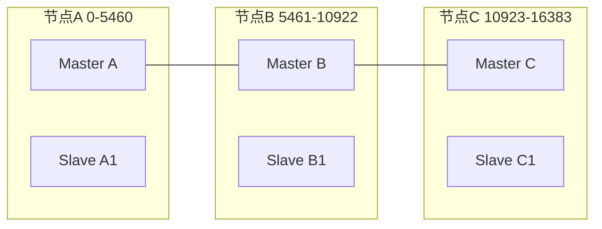

分片规则：slot = CRC16(key) % 16384，每个主节点负责一部分槽位，Gossip 协议进行节点间通信

### 3.2 Cluster 配置

```ini
# redis.conf
cluster-enabled yes
cluster-config-file nodes-6379.conf
cluster-node-timeout 15000          # 节点超时（毫秒）
cluster-announce-ip 192.168.1.10    # 外部可达 IP
cluster-announce-port 6379
cluster-announce-bus-port 16379     # 集群总线端口

cluster-require-full-coverage yes   # 槽位不全覆盖时拒绝服务
cluster-migration-barrier 1         # 从节点迁移屏障
cluster-allow-reads-when-down no    # 集群下线时允许读
```

### 3.3 Cluster 创建

```bash
# 创建集群（6 节点: 3主3从）
redis-cli --cluster create \
  192.168.1.10:6379 192.168.1.11:6379 192.168.1.12:6379 \
  192.168.1.13:6379 192.168.1.14:6379 192.168.1.15:6379 \
  --cluster-replicas 1

# 查看集群信息
redis-cli cluster info
redis-cli cluster nodes

# 检查集群状态
redis-cli --cluster check 192.168.1.10:6379

# 添加主节点
redis-cli --cluster add-node 192.168.1.16:6379 192.168.1.10:6379

# 重新分配槽位
redis-cli --cluster reshard 192.168.1.10:6379

# 添加从节点
redis-cli --cluster add-node 192.168.1.17:6379 192.168.1.10:6379 \
  --cluster-slave --cluster-master-id <node_id>
```

### 3.4 跨槽事务

```bash
# 普通事务不支持跨槽
MULTI
SET key1 val1    # slot 9182
SET key2 val2    # slot 4998  ← 报错: CROSSSLOT

# 解决方案1: Hash Tag
SET {order}:1:name "Alice"    # 同一 hash tag → 同一槽
SET {order}:1:total 100       # 同一 hash tag → 同一槽
# Hash Tag: {} 内的内容参与 CRC16 计算

# 解决方案2: Lua 脚本（同样受限于同一节点）
# 解决方案3: 应用层分布式事务
```

### 3.5 Cluster 客户端

```python
from redis.cluster import RedisCluster

# 连接集群
rc = RedisCluster(
    host='192.168.1.10',
    port=6379,
    password='ClusterPass123',
    decode_responses=True
)

# 自动路由到正确节点
rc.set('user:1001', 'Alice')     # 自动路由到对应槽位
rc.get('user:1001')

# 批量操作（需同一槽或使用 Hash Tag）
rc.mset({'{order}:1:name': 'Alice', '{order}:1:total': '100'})

# 集群信息
rc.cluster_info()
rc.cluster_nodes()
```

## 4. 集群代理

```bash
# redis-cluster-proxy（实验性）
# 提供单入口访问 Redis Cluster

# 安装
git clone https://github.com/RedisLabs/redis-cluster-proxy.git
cd redis-cluster-proxy && make

# 启动代理
redis-cluster-proxy -p 7777 192.168.1.10:6379

# 客户端连接代理（像单机一样使用）
redis-cli -p 7777
SET key1 val1
MGET key1 key2 key3    # 代理自动处理跨槽
```

## 5. Redis Flex 混合存储引擎

### 5.1 架构

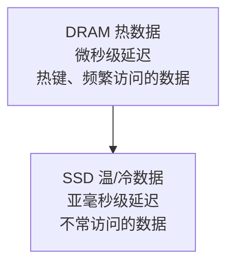

自动分层：LRU 算法决定数据在 DRAM 还是 SSD，成本降低约 80%，延迟 < 500μs

### 5.2 配置

```ini
# redis.conf (Redis Flex)
flex-enabled yes
flex-ssd-path /data/redis-ssd
flex-ssd-ratio 0.1              # DRAM:SSD = 1:10
flex-dram-max-memory 4gb        # DRAM 最大使用量
flex-ssd-max-storage 40gb       # SSD 最大使用量
flex-eviction-policy allkeys-lru
```

### 5.3 适用场景

| 场景     | 传统 Redis | Redis Flex |
| :------- | :--------- | :--------- |
| 数据量   | 受内存限制 | 可达 TB 级 |
| 成本     | 高         | 降低 80%   |
| 延迟     | < 100μs    | < 500μs    |
| 适用数据 | 热数据     | 全量数据   |
| 典型场景 | 缓存       | 数据库替代 |

## 6. Redis for AI 套件

### 6.1 向量库（Vector Set）

```bash
# 创建向量集合
VSET products:vec item1 0.1 0.2 ... 0.768
VSET products:vec item2 0.2 0.3 ... 0.768

# KNN 搜索
VSEARCH products:vec 0.1 0.15 ... 0.76 COUNT 10

# 带元数据过滤
VSET products:vec item1 0.1 0.2 ... 0.768 META category "electronics" price 299
VSEARCH products:vec 0.1 0.15 ... 0.76 COUNT 10 FILTER category == "electronics"
```

### 6.2 推理缓存

```bash
# LLM 推理缓存
# 缓存 prompt → response 映射
SET llm:cache:sha256:abc123 "response text here" EX 3600

# 语义缓存（基于向量相似度）
# 1. 将 prompt 转为向量
# 2. 在 Vector Set 中搜索相似 prompt
# 3. 相似度超过阈值则返回缓存结果
VSEARCH prompts:vec <prompt_vector> COUNT 1

# 命中缓存则直接返回，否则调用 LLM 并缓存结果
```

### 6.3 VSS 优化

```
向量相似度搜索(VSS)优化:

1. HNSW 参数调优:
   - M: 连接数（默认16，越大越精确但内存越大）
   - EF_CONSTRUCTION: 构建时搜索宽度（默认200）
   - EF_RUNTIME: 查询时搜索宽度（默认10）

2. 量化优化:
   - FP32 → FP16: 内存减半，精度损失极小
   - INT8 量化: 内存减至1/4，精度有损
   - PQ(Product Quantization): 压缩比更高

3. 分片策略:
   - 按向量 ID 哈希分片
   - 每个分片独立构建 HNSW 索引
   - 查询时并行搜索所有分片，合并结果

4. 批量操作:
   - 批量插入向量（减少索引更新开销）
   - 批量查询（pipeline）
```
## 集群创建

**基本写法：redis-cli 创建集群**
`redis-cli --cluster create <节点1> <节点2> ... --cluster-replicas <每主几个从>`
```bash
# 创建 3 主 3 从集群
redis-cli --cluster create \
  192.168.1.1:7000 192.168.1.2:7000 192.168.1.3:7000 \
  192.168.1.1:7001 192.168.1.2:7001 192.168.1.3:7001 \
  --cluster-replicas 1

# cluster-replicas 1 表示每个主库配 1 个从库
```

---

**基本写法：节点配置文件**
`cluster-enabled yes`
```conf
# 每个节点的 redis.conf
port 7000
cluster-enabled yes
cluster-config-file nodes-7000.conf
cluster-node-timeout 15000
cluster-announce-ip 192.168.1.1
cluster-announce-port 7000
cluster-announce-bus-port 17000

# 集群总线端口 = 数据端口 + 10000
# 节点间通信用总线端口，客户端用数据端口
```

---

## CLUSTER 节点管理

**基本写法：CLUSTER MEET 加入节点**
`CLUSTER MEET <ip> <port>`
```redis
-- 向集群添加新节点
CLUSTER MEET 192.168.1.4 7000

-- 查看集群节点列表
CLUSTER NODES
-- 返回格式：id ip:port@bus flags master ping pong epoch link slots
-- flags: master/slave/fail/myself/handshake/noaddr
```

---

**基本写法：CLUSTER INFO 集群状态**
`CLUSTER INFO`
```redis
-- 查看集群信息
CLUSTER INFO
-- 关键字段：
-- cluster_state:ok
-- cluster_slots_assigned:16384
-- cluster_slots_ok:16384
-- cluster_known_nodes:6
-- cluster_size:3
```

---

## 槽位管理

**基本写法：CLUSTER SLOTS 槽位分布**
`CLUSTER SLOTS`
```redis
-- 查看槽位分配
CLUSTER SLOTS
-- 返回：起始槽-结束槽-主节点信息-从节点信息
-- 如：0-5460 [ip,port,id] [从ip,从port,从id]
```

---

**基本写法：CLUSTER COUNTKEYSINSLOT**
`CLUSTER COUNTKEYSINSLOT <slot>`
```redis
-- 统计某槽位的 key 数量
CLUSTER COUNTKEYSINSLOT 5500

-- 计算 key 的槽位
CLUSTER KEYSLOT mykey
-- Redis 用 CRC16(key) % 16384 计算槽位
```

---

**基本写法：分配槽位**
`CLUSTER ADDSLOTS <slot> [<slot>...]`
```redis
-- 给当前节点分配槽位
CLUSTER ADDSLOTS 0 1 2 3 4 5

-- 删除槽位
CLUSTER DELSLOTS 0 1 2

-- 批量分配（创建集群时用 bash 循环）
# for i in {0..5460}; do redis-cli -p 7000 CLUSTER ADDSLOTS $i; done
```

---

**基本写法：迁移槽位**
`CLUSTER SETSLOT <slot> MIGRATING <目标nodeid> | IMPORTING <源nodeid>`
```redis
-- 槽位迁移流程（手动迁移 slot 100 从 A 到 B）
-- 1. B 准备接收
CLUSTER SETSLOT 100 IMPORTING <A的nodeid>

-- 2. A 准备迁出
CLUSTER SETSLOT 100 MIGRATING <B的nodeid>

-- 3. 迁移 key
MIGRATE <B_ip> <B_port> '' 0 5000 KEYS key1 key2

-- 4. 两端都确认新归属
CLUSTER SETSLOT 100 NODE <B的nodeid>

-- 推荐：用 redis-cli --cluster reshard 自动迁移
```

---

## redis-cli 集群工具

**基本写法：集群重平衡**
`redis-cli --cluster reshard <任意节点>`
```bash
# 交互式迁移槽位
redis-cli --cluster reshard 192.168.1.1:7000
# 输入：迁移多少槽位、目标节点id、源节点（all 或 id 列表）

# 自动平衡槽位分布
redis-cli --cluster rebalance 192.168.1.1:7000

# 检查集群健康
redis-cli --cluster check 192.168.1.1:7000

# 修复槽位异常
redis-cli --cluster fix 192.168.1.1:7000
```

---

**基本写法：添加/移除节点**
`redis-cli --cluster add-node <新节点> <集群任意节点>`
```bash
# 添加主节点
redis-cli --cluster add-node 192.168.1.4:7000 192.168.1.1:7000

# 添加从节点（指定主库 id）
redis-cli --cluster add-node 192.168.1.4:7001 192.168.1.1:7000 \
  --cluster-slave --cluster-master-id <主库nodeid>

# 移除节点（先迁移槽位）
redis-cli --cluster del-node 192.168.1.1:7000 <待移除nodeid>
```

---

## 客户端集群操作

**基本写法：-c 启用集群模式**
`redis-cli -c -h <host> -p <port>`
```bash
# -c 自动跟随 MOVED/ASK 重定向
redis-cli -c -h 192.168.1.1 -p 7000

# 不加 -c 时遇到跨槽 key 会报错并返回 MOVED
# MOVED 5474 192.168.1.2:7000 表示去 2 号节点查
```

---

**基本写法：Hash Tag 保证同槽**
`SET {tag}key1 v1 | SET {tag}key2 v2`
```redis
-- 用 {} 指定 hash tag，大括号内内容参与槽位计算
SET {user100}.name 'Alice'
SET {user100}.age '30'
SET {user100}.email 'a@x.com'

-- 三个 key 槽位相同，可在同节点执行 MGET/事务
MGET {user100}.name {user100}.age {user100}.email

-- 适用于多 key 操作（事务/聚合）必须在同节点
```

---

## 集群限制

**基本写法：跨槽操作限制**
`<多key命令> 仅当所有 key 同槽时可用`
```redis
-- 以下命令要求所有 key 在同一槽位，否则报 CROSSSLOT 错误
MGET k1 k2 k3          -- 若槽位不同则失败
MULTI / EXEC            -- 事务中跨槽 key 失败
SINTER s1 s2            -- 集合运算跨槽失败
ZUNIONSTORE dst 2 s1 s2

-- 解决方案：用 Hash Tag {tag} 强制同槽
MGET {tag}k1 {tag}k2 {tag}k3
```

---

## 故障转移

**基本写法：手动故障转移**
`CLUSTER FAILOVER [FORCE|TAKEOVER]`
```redis
-- 从库执行，请求升主（需主库同意）
CLUSTER FAILOVER

-- FORCE：不等主库确认，直接升主（主库不可达时）
CLUSTER FAILOVER FORCE

-- TAKEOVER：跳过集群协商，强制升主（危险，可能脑裂）
CLUSTER FAILOVER TAKEOVER

-- 流程：从库停止复制 -> 通知主库 -> 主库停止处理 -> 从库升主
```

---

**基本写法：故障节点处理**
`CLUSTER FORGET <nodeid>`
```redis
-- 从集群中移除故障节点（需对所有存活节点执行）
CLUSTER FORGET <故障nodeid>

-- 重置当前节点集群状态
CLUSTER RESET [HARD|SOFT]
-- SOFT：保留数据，重置集群信息
-- HARD：清空数据 + 重置集群（重新加入用）
```


<!-- ============ 文档分隔线：022-redis/004-CacheStrategyAdvancedFeature.md ============ -->


## 1. 过期键删除

### 1.1 删除策略

```
Redis 采用惰性删除 + 定期删除的组合策略:

1. 惰性删除（Lazy Expiration）:
   - 访问键时检查是否过期
   - 过期则删除并返回空
   - 优点: CPU 友好
   - 缺点: 过期键不被访问则一直占用内存

2. 定期删除（Periodic Expiration）:
   - 每 100ms 执行一次
   - 随机抽取 20 个设置了过期的键
   - 删除其中已过期的键
   - 如果过期比例 > 25%，重复执行
   - 限制: 每次执行时间不超过 25ms（默认）
```

### 1.2 过期时间设置

```bash
# 设置过期时间
EXPIRE key 3600                    # 3600 秒后过期
PEXPIRE key 3600000                # 3600000 毫秒后过期
EXPIREAT key 1704153600            # Unix 时间戳过期
TTL key                            # 查看剩余秒数
PTTL key                           # 查看剩余毫秒数

# SET 时指定过期
SET key value EX 3600              # 3600 秒过期
SET key value PX 3600000           # 毫秒过期
SETEX key 3600 value               # 等效 SET + EXPIRE

# 取消过期
PERSIST key                        # 移除过期时间，变为永久键

# 注意: 过期时间精度为毫秒级
```

## 2. 内存淘汰策略

### 2.1 八种淘汰策略

| 策略            | 淘汰范围 | 说明                       |
| :-------------- | :------- | :------------------------- |
| noeviction      | 不淘汰   | 写操作报错（默认）         |
| allkeys-lru     | 所有键   | 最近最少使用               |
| allkeys-lfu     | 所有键   | 最少频率使用（Redis 4.0+） |
| allkeys-random  | 所有键   | 随机淘汰                   |
| volatile-lru    | 有过期键 | 最近最少使用               |
| volatile-lfu    | 有过期键 | 最少频率使用               |
| volatile-random | 有过期键 | 随机淘汰                   |
| volatile-ttl    | 有过期键 | 优先淘汰 TTL 最短的        |

### 2.2 策略选择

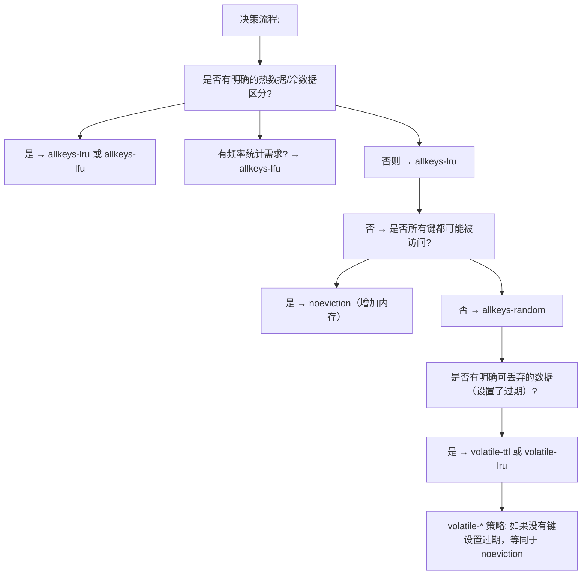

### 2.3 内存配置

```ini
# redis.conf
maxmemory 4gb                     # 最大内存限制
maxmemory-policy allkeys-lfu      # 淘汰策略
maxmemory-samples 5               # LRU/LFU 采样数（越大越精确，越慢）

# LFU 配置
lfu-log-factor 10                 # 计数器增长因子（越大越慢增长）
lfu-decay-time 1                  # 衰减时间（分钟）
```

## 3. 事务

### 3.1 MULTI/EXEC 事务

```bash
# Redis 事务: 将命令打包，一次性顺序执行
MULTI
SET account:A 800
SET account:B 200
INCR account:A
EXEC

# 事务中的错误:
# 1. 命令语法错误 → 整个事务取消
# 2. 运行时错误（如对字符串 INCR）→ 仅该命令失败，其余继续执行

# DISCARD 放弃事务
MULTI
SET key1 val1
DISCARD       # 放弃所有排队命令
```

### 3.2 乐观锁（WATCH/CAS）

```bash
# WATCH: 监控键，若被其他客户端修改则事务失败
WATCH account:A

balance = GET account:A       # 读取余额
new_balance = balance - 100   # 计算新余额

MULTI
SET account:A new_balance
EXEC                          # 如果 account:A 被修改，返回 nil（事务失败）

# 乐观锁实现秒杀
WATCH stock:product:123
stock = GET stock:product:123
if stock > 0:
    MULTI
    DECR stock:product:123
    EXEC      # 成功则返回结果，失败则重试
else:
    UNWATCH
```

```python
# Python 乐观锁示例
import redis

r = redis.Redis()

def transfer(from_key, to_key, amount, max_retries=10):
    for i in range(max_retries):
        try:
            pipe = r.pipeline()
            pipe.watch(from_key)
            balance = int(pipe.get(from_key) or 0)
            if balance < amount:
                pipe.unwatch()
                return False
            pipe.multi()
            pipe.decrby(from_key, amount)
            pipe.incrby(to_key, amount)
            pipe.execute()
            return True
        except redis.WatchError:
            continue
    return False
```

## 4. Lua 脚本

### 4.1 基本语法

```bash
# EVAL 执行 Lua 脚本
EVAL "return redis.call('SET', KEYS[1], ARGV[1])" 1 mykey myvalue
# 参数: script numkeys key [key...] arg [arg...]

# EVALSHA 使用脚本 SHA1（避免重复传输）
SCRIPT LOAD "return redis.call('SET', KEYS[1], ARGV[1])"
# 返回: "c686f316aaf1eb01d5a4de1b0b63cd233010e63d"
EVALSHA c686f316aaf1eb01d5a4de1b0b63cd233010e63d 1 mykey myvalue
```

### 4.2 分布式锁实现

```lua
-- 加锁
-- KEYS[1]: 锁名  ARGV[1]: 唯一标识  ARGV[2]: 过期时间(ms)
if redis.call('EXISTS', KEYS[1]) == 0 then
    redis.call('SET', KEYS[1], ARGV[1], 'PX', ARGV[2], 'NX')
    return 1
end
return 0

-- 解锁（仅锁持有者可解锁）
-- KEYS[1]: 锁名  ARGV[1]: 唯一标识
if redis.call('GET', KEYS[1]) == ARGV[1] then
    return redis.call('DEL', KEYS[1])
end
return 0

-- 续期
-- KEYS[1]: 锁名  ARGV[1]: 唯一标识  ARGV[2]: 新过期时间(ms)
if redis.call('GET', KEYS[1]) == ARGV[1] then
    return redis.call('PEXPIRE', KEYS[1], ARGV[2])
end
return 0
```

### 4.3 限流器

```lua
-- 滑动窗口限流
-- KEYS[1]: 限流键  ARGV[1]: 窗口时间(ms)  ARGV[2]: 最大请求数  ARGV[3]: 当前时间戳
local key = KEYS[1]
local window = tonumber(ARGV[1])
local limit = tonumber(ARGV[2])
local now = tonumber(ARGV[3])

-- 移除窗口外的记录
redis.call('ZREMRANGEBYSCORE', key, 0, now - window)

-- 当前窗口请求数
local count = redis.call('ZCARD', key)

if count < limit then
    redis.call('ZADD', key, now, now .. '-' .. math.random(1000000))
    redis.call('PEXPIRE', key, window)
    return 1   -- 允许
else
    return 0   -- 拒绝
end
```

## 5. 发布订阅（Pub/Sub）

### 5.1 基本用法

```bash
# 订阅频道
SUBSCRIBE channel:notifications channel:alerts

# 模式订阅
PSUBSCRIBE channel:*          # 订阅所有 channel: 开头的频道

# 发布消息
PUBLISH channel:notifications "New order received"
PUBLISH channel:alerts "Server CPU > 90%"

# 取消订阅
UNSUBSCRIBE channel:notifications
PUNSUBSCRIBE channel:*
```

### 5.2 Pub/Sub 特点

```
优点:
  - 实时推送，延迟极低
  - 支持模式匹配
  - 简单易用

缺点:
  - 不持久化（离线客户端收不到消息）
  - 无 ACK 机制（不保证送达）
  - 消息堆积影响性能
  - 不支持消费组

适用场景:
  - 实时通知
  - 配置变更广播
  - 聊天室
  - 不适合: 消息队列（用 Stream 代替）
```

### 5.3 键空间通知

```ini
# redis.conf
notify-keyspace-events ExK$g$
# E: 键事件通知
# x: 过期事件
# K: 键空间通知
# $: String 命令
# g: 通用命令（DEL/EXPIRE等）
# A: 所有事件（等同 $gshzxeK）
```

```bash
# 订阅键事件
SUBSCRIBE __keyevent@0__:expired      # 过期事件
SUBSCRIBE __keyevent@0__:del          # 删除事件
SUBSCRIBE __keyspace@0__:mykey        # mykey 的所有事件
```

## 6. 管道（Pipeline）

### 6.1 Pipeline 原理

```
普通模式:  发送命令1 → 等待响应1 → 发送命令2 → 等待响应2 → ...
           RTT × N

Pipeline:  发送命令1 → 发送命令2 → ... → 发送命令N → 接收响应1~N
           RTT × 1

性能提升:
  - 100 条命令: 普通模式 ~100ms, Pipeline ~2ms
  - 10000 条命令: 普通模式 ~10s, Pipeline ~50ms
```

### 6.2 Pipeline 使用

```python
import redis

r = redis.Redis()

# Pipeline 批量操作
pipe = r.pipeline(transaction=False)  # 非事务模式
for i in range(10000):
    pipe.set(f'key:{i}', f'value:{i}')
pipe.execute()

# Pipeline + 事务
pipe = r.pipeline(transaction=True)
pipe.set('key1', 'val1')
pipe.set('key2', 'val2')
pipe.incr('counter')
pipe.execute()

# 控制批量大小（避免内存溢出）
def batch_set(data, batch_size=1000):
    for i in range(0, len(data), batch_size):
        pipe = r.pipeline(transaction=False)
        for key, value in data[i:i+batch_size]:
            pipe.set(key, value)
        pipe.execute()
```

## 7. 客户端缓存

### 7.1 普通模式（Client-side Caching）

```bash
# Redis 6.0+ 客户端缓存
# 1. 客户端开启 tracking
CLIENT TRACKING ON

# 2. 客户端读取键
GET user:1001        # Redis 记录客户端对此键感兴趣

# 3. 其他客户端修改键
SET user:1001 "new_value"   # Redis 发送失效消息给跟踪的客户端

# 4. 客户端收到失效消息，清除本地缓存
# -> invalidation message for key: user:1001
```

### 7.2 广播模式

```bash
# 广播模式: 客户端订阅键前缀
CLIENT TRACKING ON BCAST PREFIX user: PREFIX session:

# 所有 user: 和 session: 前缀的键变更都会通知
# 不需要先 GET 才跟踪
# 适合: 客户端预先知道需要缓存哪些前缀
```

### 7.3 Python 客户端缓存

```python
import redis

r = redis.Redis()

# 使用 Redis 客户端缓存（需要支持 RESP3）
# 或使用应用层缓存 + 失效通知

class RedisCache:
    def __init__(self, redis_client):
        self.r = redis_client
        self.local_cache = {}

    def get(self, key):
        if key in self.local_cache:
            return self.local_cache[key]
        value = self.r.get(key)
        if value:
            self.local_cache[key] = value
        return value

    def invalidate(self, key):
        self.local_cache.pop(key, None)
```

## 8. ACL 访问控制

### 8.1 ACL 配置

```bash
# 查看所有用户
ACL LIST

# 添加用户
ACL SETUSER app_readonly on >ReadPass123 ~* +@read
# on: 启用  >密码  ~*: 所有键  +@read: 只读命令

ACL SETUSER app_write on >WritePass123 ~orders:* +@read +@write -@dangerous
ACL SETUSER admin on >AdminPass123 ~* +@all

# 命令类别
+@read       # 所有读命令
+@write      # 所有写命令
+@string     # String 命令
+@hash       # Hash 命令
+@list       # List 命令
+@set        # Set 命令
+@sortedset  # ZSet 命令
+@pubsub     # Pub/Sub 命令
-@dangerous  # 排除危险命令（FLUSHALL/CONFIG等）

# 键模式
~*           # 所有键
~user:*      # 仅 user: 前缀
~order:* ~product:*  # 多个模式

# 禁用危险命令
ACL SETUSER app_readonly -@dangerous -FLUSHALL -FLUSHDB -CONFIG -DEBUG
```

### 8.2 ACL 持久化

```bash
# 保存 ACL 到文件
ACL SAVE

# redis.conf 配置
aclfile /etc/redis/users.acl

# 加载 ACL 文件
ACL LOAD
```

## 9. TLS 加密

```ini
# redis.conf
tls-port 6380
tls-cert-file /etc/redis/tls/server.crt
tls-key-file /etc/redis/tls/server.key
tls-ca-cert-file /etc/redis/tls/ca.crt

# 客户端认证
tls-auth-clients optional    # no/optional/yes

# 复制 TLS
tls-replication yes

# 集群 TLS
tls-cluster yes
```

```bash
# 客户端 TLS 连接
redis-cli --tls --cert client.crt --key client.key --cacert ca.crt -p 6380

# 从节点 TLS 复制
replicaof 192.168.1.10 6380
tls-replication yes
```

## 10. 慢查询日志

### 10.1 配置

```ini
# redis.conf
slowlog-log-slower-than 10000    # 超过 10ms 记录（微秒）
slowlog-max-len 128              # 最多记录 128 条

# 设为 0: 记录所有命令
# 设为 -1: 禁用慢查询日志
```

### 10.2 查看慢查询

```bash
# 查看慢查询日志
SLOWLOG GET 10
# 返回:
# 1) 1) (integer) 12              # 日志 ID
#    2) (integer) 1704067200       # 时间戳
#    3) (integer) 15000            # 执行时间(微秒)
#    4) 1) "KEYS"                  # 命令
#       2) "*"
#    5) "192.168.1.100:52341"      # 客户端地址
#    6) ""                         # 客户端名称

# 慢查询数量
SLOWLOG LEN

# 重置慢查询
SLOWLOG RESET
```

### 10.3 常见慢查询原因

```
1. KEYS * — 全库扫描，生产禁用
2. 大 Key 操作 — DEL/GET 一个很大的值
3. 复杂聚合 — SORT、SUNION 等大集合操作
4. 全量获取 — HGETALL 大哈希、SMEMBERS 大集合
5. 短连接 — 频繁建立/断开连接
6. AOF fsync — always 模式下每条命令 fsync
7. 内存不足 — 频繁触发淘汰策略

优化建议:
- 使用 SCAN 替代 KEYS
- 拆分大 Key
- 使用 HSCAN/SSCAN 替代全量获取
- 使用 Pipeline 减少网络往返
- 监控 SLOWLOG 并告警
```


<!-- ============ 文档分隔线：022-redis/005-BitGraph.md ============ -->


## 1. 位图概述

位图（Bitmap）不是独立数据类型，而是基于 String 类型的位操作，每个 String 键最多存储 $2^{32}$ 个位。

## 2. 基本操作

```redis
SETBIT key offset value    -- 设置指定位
GETBIT key offset          -- 获取指定位
BITCOUNT key [start end]   -- 统计1的个数
BITPOS key bit [start end] -- 查找第一个0/1的位置
BITOP op destkey key [key ...] -- 位运算
```

```redis
-- 设置用户42在第100天登录
SETBIT user:login:2026 42 1

-- 检查用户42是否在第100天登录
GETBIT user:login:2026 42  -- 返回1

-- 统计2026年登录用户数
BITCOUNT user:login:2026
```

## 3. 应用场景

### 3.1 用户在线状态

```redis
-- 用户上线
SETBIT online:users 42 1
-- 用户下线
SETBIT online:users 42 0
-- 检查在线
GETBIT online:users 42
-- 在线人数
BITCOUNT online:users
```

### 3.2 用户标签

```redis
-- 用户42有标签0和标签3
SETBIT user:42:tags 0 1
SETBIT user:42:tags 3 1
-- 统计标签数
BITCOUNT user:42:tags
```

### 3.3 活跃用户统计

```redis
-- 每日活跃用户位图
SETBIT dau:2026-06-14 42 1

-- 计算月活跃用户（OR运算）
BITOP OR mau:2026-06 dau:2026-06-01 dau:2026-06-02 ... dau:2026-06-30
BITCOUNT mau:2026-06
```

## 4. 位运算

```redis
-- AND：交集
BITOP AND result key1 key2
-- OR：并集
BITOP OR result key1 key2
-- XOR：异或
BITOP XOR result key1 key2
-- NOT：取反
BITOP NOT result key1
```
## 基本操作

**基本写法：设置指定位的值**
`SETBIT <key> <offset> <value>`
```bash
# 设置用户42在第100天登录
SETBIT user:login:2026 42 1
```

**基本写法：获取指定位的值**
`GETBIT <key> <offset>`
```bash
# 检查用户42是否在第100天登录
GETBIT user:login:2026 42
```

**基本写法：统计为 1 的位数**
`BITCOUNT <key> [start end]`
```bash
# 统计2026年登录用户数
BITCOUNT user:login:2026
```

**基本写法：查找第一个 0/1 的位置**
`BITPOS <key> <bit> [start end]`
```bash
# 查找第一个为1的位置
BITPOS user:login:2026 1
```

---

## 位运算操作

**基本写法：AND 交集运算**
`BITOP AND <destkey> <key> [key ...]`
```bash
# 对 key1 和 key2 执行 AND 交集运算
BITOP AND result key1 key2
```

**基本写法：OR 并集运算**
`BITOP OR <destkey> <key> [key ...]`
```bash
# 对 key1 和 key2 执行 OR 并集运算
BITOP OR result key1 key2
```

**基本写法：XOR 异或运算**
`BITOP XOR <destkey> <key> [key ...]`
```bash
# 对 key1 和 key2 执行 XOR 异或运算
BITOP XOR result key1 key2
```

**基本写法：NOT 取反运算**
`BITOP NOT <destkey> <key>`
```bash
# 对 key1 执行 NOT 取反运算
BITOP NOT result key1
```

---

## 用户在线状态

**基本写法：标记用户上线**
`SETBIT <online_key> <user_id> 1`
```bash
# 用户42上线
SETBIT online:users 42 1
```

**基本写法：标记用户下线**
`SETBIT <online_key> <user_id> 0`
```bash
# 用户42下线
SETBIT online:users 42 0
```

**基本写法：检查用户是否在线**
`GETBIT <online_key> <user_id>`
```bash
# 检查用户42是否在线
GETBIT online:users 42
```

**基本写法：统计在线人数**
`BITCOUNT <online_key>`
```bash
# 统计当前在线人数
BITCOUNT online:users
```

---

## 用户标签

**基本写法：为用户打标签**
`SETBIT <user_tags_key> <tag_id> 1`
```bash
# 用户42拥有标签0
SETBIT user:42:tags 0 1
```

**多标签写法：为用户打多个标签**
`SETBIT <user_tags_key> <tag_id> 1`
```bash
# 用户42拥有标签0和标签3
SETBIT user:42:tags 0 1
SETBIT user:42:tags 3 1
```

**基本写法：统计用户标签数**
`BITCOUNT <user_tags_key>`
```bash
# 统计用户42的标签数量
BITCOUNT user:42:tags
```

---

## 活跃用户统计

**基本写法：记录每日活跃用户**
`SETBIT <dau_key> <user_id> 1`
```bash
# 记录用户42在2026-06-14活跃
SETBIT dau:2026-06-14 42 1
```

**换行写法：计算月活跃用户（OR 运算合并）**
`BITOP OR <destkey> <key> [key ...]`
```bash
# 计算月活跃用户（OR运算合并每日数据）
BITOP OR mau:2026-06 dau:2026-06-01 dau:2026-06-02 dau:2026-06-03
```

**基本写法：获取月活跃用户数**
`BITCOUNT <mau_key>`
```bash
# 获取2026年6月的月活跃用户数
BITCOUNT mau:2026-06
```


<!-- ============ 文档分隔线：022-redis/006-NumberStats.md ============ -->


## 1. HyperLogLog 概述

HyperLogLog（HLL）是基数估计算法，用极小内存（12KB）估算集合中不同元素的数量，标准误差约 0.81%。

## 2. 基本操作

```redis
PFADD key element [element ...]  -- 添加元素
PFCOUNT key [key ...]            -- 获取基数估算
PFMERGE destkey sourcekey [...]  -- 合并多个HLL
```

```redis
-- 添加UV
PFADD uv:2026-06-14 user1 user2 user3 user1 user2
-- 重复元素自动去重

-- 获取UV数
PFCOUNT uv:2026-06-14  -- 返回3

-- 合并多天UV
PFMERGE uv:2026-week uv:2026-06-08 uv:2026-06-09 ... uv:2026-06-14
PFCOUNT uv:2026-week
```

## 3. 误差与内存

| 特性   | HyperLogLog     | SET          |
| ------ | --------------- | ------------ |
| 内存   | 12KB            | 随元素数增长 |
| 精度   | 约0.81%标准误差 | 精确         |
| 百万UV | 12KB            | 约10MB       |
| 亿级UV | 12KB            | 约1GB        |

## 4. 应用场景

```redis
-- 网站UV统计
PFADD site:uv:2026-06-14 <user_id>

-- 页面UV
PFADD page:uv:article:123:2026-06-14 <user_id>

-- 搜索关键词UV
PFADD search:uv:keyword:redis:2026-06-14 <user_id>

-- 周活跃用户
PFMERGE wau:2026-w24 dau:2026-06-09 dau:2026-06-10 ... dau:2026-06-15
PFCOUNT wau:2026-w24
```
## 基本操作

**单元素写法：添加单个元素到 HyperLogLog**
`PFADD <key> <element>`
```bash
# 添加单个用户到UV统计
PFADD uv:2026-06-14 user1
```

**多元素写法：添加多个元素到 HyperLogLog**
`PFADD <key> <element> [element ...]`
```bash
# 添加多个用户，重复元素自动去重
PFADD uv:2026-06-14 user1 user2 user3 user1 user2
```

**基本写法：获取基数估算值**
`PFCOUNT <key>`
```bash
# 获取单天的UV数
PFCOUNT uv:2026-06-14
```

**多键写法：获取多个键的合并基数**
`PFCOUNT <key> [key ...]`
```bash
# 获取多天合并后的UV数
PFCOUNT uv:2026-06-13 uv:2026-06-14
```

**基本写法：合并多个 HyperLogLog**
`PFMERGE <destkey> <sourcekey> [sourcekey ...]`
```bash
# 合并多天UV到周UV
PFMERGE uv:2026-week uv:2026-06-08 uv:2026-06-09 uv:2026-06-10
```

---

## 应用场景

**基本写法：统计网站独立访客**
`PFADD <site_uv_key> <user_id>`
```bash
# 网站UV统计
PFADD site:uv:2026-06-14 user42
```

**基本写法：统计页面独立访客**
`PFADD <page_uv_key> <user_id>`
```bash
# 页面UV统计
PFADD page:uv:article:123:2026-06-14 user42
```

**基本写法：统计搜索关键词独立用户数**
`PFADD <search_uv_key> <user_id>`
```bash
# 搜索关键词UV统计
PFADD search:uv:keyword:redis:2026-06-14 user42
```

**换行写法：合并每日活跃用户计算周活跃**
`PFMERGE <wau_key> <dau_key> [dau_key ...]`
```bash
# 合并每日活跃用户数据计算周活跃用户
PFMERGE wau:2026-w24 dau:2026-06-09 dau:2026-06-10 dau:2026-06-11
```

**基本写法：获取周活跃用户数**
`PFCOUNT <wau_key>`
```bash
# 获取第24周的活跃用户数
PFCOUNT wau:2026-w24
```


<!-- ============ 文档分隔线：022-redis/007-GeoSpatial.md ============ -->


## 1. GEO 概述

Redis GEO 基于 Sorted Set 实现，使用 GeoHash 编码经纬度，支持地理位置存储和查询。

## 2. 基本操作

```redis
GEOADD key longitude latitude member [longitude latitude member ...]
GEOPOS key member [member ...]
GEODIST key member1 member2 [unit]
GEORADIUS key longitude latitude radius unit [WITHCOORD] [WITHDIST] [COUNT N]
GEOSEARCH key [FROMMEMBER member] [FROMLONLAT lon lat] [BYRADIUS radius unit | BYBOX width height unit] [WITHCOORD] [WITHDIST] [COUNT N] [ASC|DESC]
```

```redis
-- 添加地点
GEOADD locations 116.3975 39.9087 "天安门" 121.4737 31.2304 "外滩"

-- 获取坐标
GEOPOS locations "天安门"

-- 计算距离
GEODIST locations "天安门" "外滩" km  -- 约1067km
```

## 3. 范围查询

```redis
-- 查找3公里内的地点
GEOSEARCH locations FROMLONLAT 116.4 39.9 BYRADIUS 3 km WITHDIST WITHCOORD COUNT 10 ASC

-- 查找矩形范围内的地点
GEOSEARCH locations FROMLONLAT 116.4 39.9 BYBOX 10 10 km WITHDIST

-- 查找某地点附近的地点
GEOSEARCH locations FROMMEMBER "天安门" BYRADIUS 5 km WITHDIST
```

## 4. 底层原理

```
GEO 基于 ZSET：
- member：地点名称
- score：GeoHash 编码值（52位整数）

GeoHash 编码：
经纬度 → 交替二进制 → 52位整数 → ZSET score
```

## 5. 应用场景

```redis
-- 附近的人
GEOADD nearby:users 116.4 39.9 "user:42"
GEOSEARCH nearby:users FROMMEMBER "user:42" BYRADIUS 1 km COUNT 20

-- 门店搜索
GEOADD stores 116.397 39.908 "store:1" 116.401 39.912 "store:2"
GEOSEARCH stores FROMLONLAT 116.4 39.9 BYRADIUS 2 km WITHDIST ASC
```
## 基本操作

**单成员写法：添加单个地理位置**
`GEOADD <key> <longitude> <latitude> <member>`
```bash
# 添加天安门的位置
GEOADD locations 116.3975 39.9087 "天安门"
```

**多成员写法：添加多个地理位置**
`GEOADD <key> <longitude> <latitude> <member> [longitude latitude member ...]`
```bash
# 添加天安门和外滩的位置
GEOADD locations 116.3975 39.9087 "天安门" 121.4737 31.2304 "外滩"
```

**单成员写法：获取单个成员坐标**
`GEOPOS <key> <member>`
```bash
# 获取天安门的坐标
GEOPOS locations "天安门"
```

**多成员写法：获取多个成员坐标**
`GEOPOS <key> <member> [member ...]`
```bash
# 获取天安门和外滩的坐标
GEOPOS locations "天安门" "外滩"
```

**基本写法：计算两点距离**
`GEODIST <key> <member1> <member2> [unit]`
```bash
# 计算天安门到外滩的距离（单位km）
GEODIST locations "天安门" "外滩" km
```

---

## 范围查询

**基本写法：按经纬度半径查询附近地点**
`GEOSEARCH <key> FROMLONLAT <lon> <lat> BYRADIUS <radius> <unit> [WITHCOORD] [WITHDIST] [COUNT N] [ASC|DESC]`
```bash
# 查找坐标(116.4, 39.9)附近3公里内的地点，按距离升序返回前10个
GEOSEARCH locations FROMLONLAT 116.4 39.9 BYRADIUS 3 km WITHDIST WITHCOORD COUNT 10 ASC
```

**基本写法：按矩形范围查询**
`GEOSEARCH <key> FROMLONLAT <lon> <lat> BYBOX <width> <height> <unit> [WITHCOORD] [WITHDIST]`
```bash
# 查找矩形范围内的地点（宽10km高10km）
GEOSEARCH locations FROMLONLAT 116.4 39.9 BYBOX 10 10 km WITHDIST
```

**基本写法：以成员为中心查询附近地点**
`GEOSEARCH <key> FROMMEMBER <member> BYRADIUS <radius> <unit> [WITHDIST]`
```bash
# 查找天安门附近5公里内的地点
GEOSEARCH locations FROMMEMBER "天安门" BYRADIUS 5 km WITHDIST
```

**基本写法：旧版按经纬度半径查询**
`GEORADIUS <key> <longitude> <latitude> <radius> <unit> [WITHCOORD] [WITHDIST] [COUNT N]`
```bash
# 旧版范围查询（已废弃，建议使用GEOSEARCH）
GEORADIUS locations 116.4 39.9 3 km WITHCOORD WITHDIST COUNT 10
```

---

## 应用场景

**基本写法：添加用户位置**
`GEOADD <nearby_key> <lon> <lat> <member>`
```bash
# 添加用户42的位置
GEOADD nearby:users 116.4 39.9 "user:42"
```

**基本写法：查找附近用户**
`GEOSEARCH <nearby_key> FROMMEMBER <member> BYRADIUS <radius> <unit> [COUNT N]`
```bash
# 查找用户42附近1km内的用户，最多返回20个
GEOSEARCH nearby:users FROMMEMBER "user:42" BYRADIUS 1 km COUNT 20
```

**多成员写法：添加多个门店位置**
`GEOADD <stores_key> <longitude> <latitude> <member> [longitude latitude member ...]`
```bash
# 添加门店1和门店2的位置
GEOADD stores 116.397 39.908 "store:1" 116.401 39.912 "store:2"
```

**基本写法：查找附近门店按距离升序**
`GEOSEARCH <stores_key> FROMLONLAT <lon> <lat> BYRADIUS <radius> <unit> [WITHDIST] [ASC]`
```bash
# 查找坐标(116.4, 39.9)附近2km内门店，按距离升序
GEOSEARCH stores FROMLONLAT 116.4 39.9 BYRADIUS 2 km WITHDIST ASC
```


<!-- ============ 文档分隔线：022-redis/008-Stream.md ============ -->


## 第 1 章 概述与学习目标

### 1.1 Stream 是什么

Redis Stream 是 Redis 5.0 版本引入的一种日志型数据结构（Log Data Structure），它在 Redis 内部以追加写入（Append-Only）的方式组织数据，每条消息拥有全局唯一且单调递增的 Entry ID。从抽象层面看，Stream 是一个带索引的、持久化的、有序的消息日志，它同时融合了传统消息队列的核心语义（如消费者组、消息确认、消息重投）与 Redis 原生的高性能内存访问能力。

Stream 的出现使得 Redis 从一个纯粹的内存键值存储系统，演化为一个能够承载轻量级至中量级消息流处理任务的复合型数据平台。与早期的 Pub/Sub 机制相比，Stream 提供了消息持久化、消息回溯、消费者组协作消费等关键能力；与基于 List 实现的 LPUSH/BRPOP 队列相比，Stream 提供了消息确认、消息重分配、范围查询等更完善的可靠性语义。

从数据模型角度，Stream 的每条消息由以下要素组成：

- 一个全局唯一的 Entry ID，格式为 `<毫秒时间戳>-<序号>`，例如 `1718334600000-0`
- 一个或多个字段-值对（field-value pairs），用于承载消息体内容
- 内部维护的元数据，包括消息在 Radix Tree 中的位置、所属的 listpack 节点等

Stream 的核心定位是"持久化的、有序的、支持多消费者协作的消息日志"。它借鉴了 Apache Kafka 的日志抽象理念，同时保留了 Redis 内存数据库的低延迟特性，在轻量级消息队列场景中具有独特优势。

### 1.2 应用场景

Redis Stream 适用于以下典型场景：

1. **任务队列（Task Queue）**：异步任务分发，如订单处理、邮件发送、图片转码等。消费者组允许多个 worker 协作消费，提升并行处理能力。

2. **事件通知（Event Notification）**：系统状态变更通知，如用户上线通知、配置变更广播。多个消费者组可独立消费同一份消息流，实现广播语义。

3. **事件溯源（Event Sourcing）**：将领域事件按发生顺序持久化到 Stream 中，重建系统状态时按 ID 顺序回放。Stream 的不可变日志特性天然契合事件溯源模型。

4. **CQRS 架构（Command Query Responsibility Segregation）**：命令端将变更事件写入 Stream，查询端订阅 Stream 并更新读模型，实现读写分离。

5. **日志聚合（Log Aggregation）**：轻量级日志收集场景，多个服务节点将日志写入 Stream，集中处理或转发。

6. **实时流处理（Real-time Stream Processing）**：与 Flink、Spark Streaming 等流处理引擎配合，作为数据源或中间缓冲层。

7. **IM 消息系统（Instant Messaging）**：聊天消息的有序投递与离线消息补偿，Stream 的消费者组机制可精确追踪每个用户的消费进度。

8. **IoT 设备数据采集**：物联网设备周期性上报数据，Stream 提供有序存储与按时间范围查询能力。

### 1.3 学习目标

完成本教材学习后，读者应能够：

- 深入理解 Stream 的底层数据结构（Radix Tree + listpack）及其内存布局
- 熟练掌握 Stream 全部核心命令的语法、参数、返回值与内部执行流程
- 理解消费者组（Consumer Group）的工作机制，包括 PEL（Pending Entry List）、消息确认、消息重分配
- 能够设计基于 Stream 的可靠消息处理架构，包括 at-least-once 语义保障、宕机恢复策略
- 掌握消息积压的成因分析与修剪策略（MAXLEN / MINID）
- 理解 Redis Cluster 环境下 Stream 的槽位分配与跨槽限制
- 能够基于基准测试数据进行容量规划与性能调优
- 识别并规避常见陷阱与反模式
- 具备 Stream 故障排查能力，能够定位消息丢失、积压、消费者宕机等问题
- 在 Kafka、RabbitMQ、Pulsar、Redis Stream 之间做出合理的技术选型

### 1.4 本文文档结构

本教材共分十七章，按照"概念引入 -> 底层原理 -> 命令详解 -> 机制剖析 -> 工程实践 -> 对比选型 -> 实战演练"的脉络组织内容。建议初学者按顺序学习，有经验的读者可直接跳转至感兴趣的章节。

---

## 第 2 章 历史背景与设计哲学

### 2.1 Redis 消息队列演进历程

Redis 作为消息队列的载体经历了三个主要演进阶段，每个阶段都针对前一阶段的局限性进行了针对性改进。

#### 2.1.1 第一阶段：Pub/Sub（发布订阅）

Redis 早期提供的 Pub/Sub 机制是最原始的消息广播方案。生产者通过 `PUBLISH` 命令向频道发送消息，订阅者通过 `SUBSCRIBE` 命令订阅频道接收消息。

Pub/Sub 的核心特征与局限：

- **发后即忘（Fire and Forget）**：消息发出后立即丢弃，不进行任何持久化存储
- **无离线消息**：订阅者必须在线才能接收消息，断连期间的消息永久丢失
- **无消息确认机制**：无法知道消费者是否成功处理了消息
- **无消费者组**：每个订阅者收到全量消息，无法实现负载均衡
- **无回溯能力**：无法重新消费历史消息

Pub/Sub 适用于实时广播场景（如实时通知、聊天室），但在需要可靠性保障的任务队列场景中存在根本性缺陷。

```
// Pub/Sub 模型的数据流
// 生产者 -> Redis 频道 -> [订阅者A, 订阅者B, ...]
// 消息不持久化，订阅者断连即丢失

时序图：
  Producer        Redis          SubscriberA    SubscriberB
     |              |                |              |
     |--PUBLISH---->|                |              |
     |              |--msg---------->|              |
     |              |--msg------------------------->|
     |              |   (消息发出后即丢弃)            |
     |              |                |   (断连)      |
     |              |                X              |
     |--PUBLISH---->|                |              |
     |              |--msg------------------------->|
     |              |   (SubscriberA 错过此消息)     |
```

#### 2.1.2 第二阶段：阻塞列表（Blocking List）

为解决 Pub/Sub 的持久化问题，社区早期采用 List 数据结构实现消息队列：生产者使用 `LPUSH` 将消息推入列表头部，消费者使用 `BRPOP` 阻塞式地从列表尾部弹出消息。

阻塞列表方案的优势：

- **消息持久化**：消息存储在 List 中，消费者断连后消息不丢失
- **负载均衡**：多个消费者竞争消费，每条消息只被一个消费者处理
- **阻塞读取**：BRPOP 支持阻塞等待，减少轮询开销

阻塞列表方案的局限：

- **无消息确认机制**：消费者使用 BRPOP 取出消息后，消息立即从列表删除。若消费者处理失败，消息永久丢失
- **无消费者组**：无法实现"一个消息被多个消费者组各自独立消费"的广播语义
- **无消息回溯**：消息弹出后不可重新消费
- **无消息 ID**：无法按 ID 定位特定消息
- **无范围查询**：无法按时间范围或 ID 范围查询历史消息

```
// 阻塞列表模型的数据流
// 生产者 LPUSH -> List -> 消费者 BRPOP
// 消息弹出即删除，无确认机制

时序图：
  Producer        Redis(List)      ConsumerA      ConsumerB
     |              |                |              |
     |--LPUSH------>|                |              |
     |              | [msg1]         |              |
     |--LPUSH------>|                |              |
     |              | [msg2,msg1]    |              |
     |              |                |              |
     |              |<--BRPOP--------|              |
     |              | [msg2]         |              |
     |              |--msg1--------->|              |
     |              |                | (处理失败)   |
     |              |                | (msg1 丢失!) |
     |              |<--BRPOP-----------------------|
     |              | []             |              |
     |              |--msg2------------------------->|
```

#### 2.1.3 第三阶段：Stream（流）

Redis 5.0 引入 Stream 数据类型，标志着 Redis 在消息队列能力上的成熟。Stream 吸收了 Kafka 的日志模型理念，同时保留了 Redis 内存数据库的低延迟特性，提供了完整的消息队列语义。

Stream 相对于前两阶段的核心改进：

| 能力维度 | Pub/Sub | 阻塞列表 | Stream |
|---------|---------|---------|--------|
| 消息持久化 | 否 | 是 | 是 |
| 消息确认 | 否 | 否 | 是（XACK） |
| 消费者组 | 否 | 否（仅竞争消费） | 是 |
| 消息回溯 | 否 | 否 | 是（XRANGE/XREAD） |
| 消息重投 | 否 | 否 | 是（XCLAIM/XAUTOCLAIM） |
| 消息 ID | 否 | 否 | 是（自动/手动） |
| 范围查询 | 否 | 否 | 是 |
| 积压监控 | 否 | 仅 LLEN | 是（XINFO/XPENDING） |
| 修剪策略 | 不适用 | LTRIM | MAXLEN/MINID |

### 2.2 Stream 的设计目标

Redis Stream 的设计遵循以下核心目标：

1. **持久化优先**：所有写入的消息默认持久化到内存，并可通过 RDB/AOF 机制持久化到磁盘。消息不会因服务重启而丢失（在配置了持久化的前提下）。

2. **顺序保证**：Stream 中的消息按 Entry ID 单调递增排列，读取时严格按 ID 顺序返回。同一消费者组内的消息按投递顺序处理。

3. **内存效率**：底层采用 Radix Tree + listpack 组合存储，利用消息 ID 的公共前缀压缩与字段名复用机制，在保证有序性的同时最大化内存利用率。

4. **消费者组语义**：支持多个消费者组独立消费同一份消息流，每个组维护独立的消费进度（last_delivered_id）与待确认列表（PEL）。

5. **至少一次投递（At-Least-Once）**：通过 PEL 机制保障消息至少被处理一次。消费者宕机后，其未确认的消息可被其他消费者重新认领并处理。

6. **轻量级运维**：作为 Redis 原生数据类型，无需额外部署独立的消息中间件，降低运维复杂度。

### 2.3 与其他消息队列的定位差异

Stream 的定位介于"轻量级内存队列"与"重量级分布式消息中间件"之间，其核心定位差异如下：

- **与 Kafka 的差异**：Kafka 定位于超高吞吐量（百万级 msg/s）的大数据流处理场景，依赖磁盘存储与分区副本机制；Stream 定位于低延迟（微秒级）的轻量级消息队列，依赖内存存储，吞吐量在十万级 msg/s 量级。Kafka 适合日志聚合、流处理管道；Stream 适合任务队列、事件通知、小型系统的异步解耦。

- **与 RabbitMQ 的差异**：RabbitMQ 定位于灵活路由与多协议支持（AMQP/MQTT/STOMP），提供丰富的交换器类型与死信队列；Stream 不支持复杂路由，但提供更低的延迟与更简单的部署。RabbitMQ 适合需要复杂路由规则的企业应用集成；Stream 适合对延迟敏感且路由需求简单的场景。

- **与 RocketMQ 的差异**：RocketMQ 定位于金融级可靠消息，原生支持事务消息、定时消息、顺序消息；Stream 不支持事务消息与定时消息，但部署更轻量。RocketMQ 适合对可靠性要求极高的金融场景；Stream 适合对可靠性有基本要求但更看重轻量化的场景。

- **与 Pulsar 的差异**：Pulsar 采用计算与存储分离架构（BookKeeper），支持多租户与跨地域复制；Stream 是 Redis 的内嵌数据类型，架构简单。Pulsar 适合大规模多租户云原生场景；Stream 适合中小规模单体或微服务场景。

### 2.4 设计哲学总结

Stream 的设计哲学可概括为"简单即高效，够用即最佳"。它不追求 Kafka 级别的极致吞吐量，也不追求 RabbitMQ 级别的路由灵活性，而是在 Redis 内存数据库的框架内，提供了一个足够完善、足够轻量、足够快速的消息队列实现。对于已有 Redis 基础设施且消息量级在十万级以内的场景，Stream 往往是最优选择；对于百万级以上吞吐量或需要复杂路由的场景，仍应选择专业的消息中间件。

---

## 第 3 章 底层数据结构深度剖析

### 3.1 Radix Tree（基数树）原理

Radix Tree 是 Stream 底层存储的核心数据结构，它是前缀树（Trie Tree）的优化变体，也被称为 Patricia Trie（Practical Algorithm To Retrieve Information Coded In Alphanumeric）或压缩前缀树。

#### 3.1.1 前缀树的不足

前缀树将每个 key 拆分成单字符，每个节点保存一个字符。从根节点到某节点的路径拼接即为该节点对应的 key。前缀树通过共享公共前缀来节省内存，但存在一个显著缺陷：当 key 中某段字符串不再被共享时，仍按单字符节点存储，导致节点数量膨胀与查询效率下降。

```
// 前缀树示例：存储 "romane", "romanus", "romulus", "rubens", "ruber", "rubicon", "rubicundus"
// 每个节点保存一个字符，公共前缀 r-o 被共享，但后续字符仍逐个存储

         (root)
           |
           (r)
           |
           (o)
           |
           (m)
          / \
        (a) (u)
        /     \
      (n)     (l)
      /         \
    (u)         (u)
    /             \
  (s)             (s)

  [romanus]      [romulus]

  另一支：
  (r)-(u)-(b)-(e)-(n)-(s)  [rubens]
                  |
                 (r)       [ruber]
                  |
                 (i)
                  |
                 (c)
                  |
                 (o)       [rubicon]
                  |
                 (n)

  节点数量多，查询需逐字符匹配，效率低
```

#### 3.1.2 Radix Tree 的改进

Radix Tree 对前缀树进行压缩优化：当一系列单字符节点之间的分支连接是唯一的（即路径上没有分叉）时，将这些单字符合并为一个多字符节点。这样既保留了前缀共享的内存优势，又减少了节点数量与查询路径长度。

```
// Radix Tree 示例：存储同样的 7 个 key
// 公共前缀被合并为单个节点，无分叉的路径被压缩

           (root)
             |
           (r)
             |
           (om)
           / \
        (an) (ulus)
        /       \
     (us)      [romulus]
      |
   [romanus]
   [romane]  (romane 与 romanus 共享 roman，末尾分叉 e/us)

   另一支：
   (r)-(ub)-(en)        [rubens]
            |
           (er)         [ruber]
            |
           (ic)
           / \
        (on) (undus)
         |      |
      [rubicon] [rubicundus]

  节点数量大幅减少，查询时按字符串段匹配，效率高
```

Radix Tree 的关键特性：

- **前缀压缩**：共享公共前缀的 key 只存储一份前缀，节省内存
- **路径压缩**：无分叉的路径合并为单节点，减少节点数量
- **有序遍历**：按字典序遍历，天然支持范围查询
- **查找效率**：平均 O(k)，其中 k 为 key 长度，与树中节点总数无关

#### 3.1.3 Redis 中的 Radix Tree 实现

Redis 在 `src/rax.c` 和 `src/rax.h` 中实现了自己的 Radix Tree。核心数据结构定义如下：

```c
// Radix Tree 根节点结构
typedef struct rax {
    raxNode *head;       // 指向头节点的指针
    uint64_t numele;     // 树中存储的元素总数
    uint64_t numnodes;   // 树中节点总数
} rax;

// Radix Tree 节点结构
typedef struct raxNode {
    uint32_t iskey:1;      // 该节点是否存储了一个 key（1=是，0=否）
    uint32_t isnull:1;     // 该节点存储的 value 是否为 NULL
    uint32_t iscompr:1;    // 是否为压缩节点（1=压缩节点，0=分叉节点）
    uint32_t size:29;      // 节点中存储的字符数（压缩节点）或子节点数（分叉节点）
    // 节点数据布局：
    // 1. 字符数组（size 个字符）
    // 2. 子节点指针数组（分叉节点）或单个子节点指针（压缩节点）
    // 3. value 指针（如果 iskey=1）
    unsigned char data[];  // 柔性数组，存储实际数据
} raxNode;
```

Radix Tree 节点分为两类：

- **压缩节点（iscompr=1）**：表示一段无分叉的路径，存储多个字符，只有一个子节点。用于路径压缩。
- **分叉节点（iscompr=0）**：表示有多个子节点的分支点，每个字符对应一个子节点。用于前缀共享后的分叉。

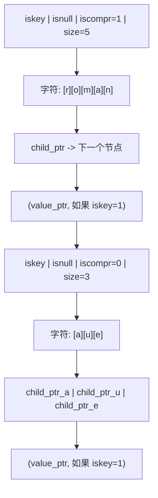

### 3.2 Stream 的内部表示

Stream 在 Redis 内部由 `stream` 结构体表示，定义在 `src/stream.h` 中。以下是核心结构（基于 Redis 8.x 源码）：

```c
// Stream ID 结构：128 位，由两个 64 位整数组成
typedef struct streamID {
    uint64_t ms;   // 毫秒时间戳（Unix 时间）
    uint64_t seq;  // 序号（同一毫秒内的递增序号）
} streamID;

// Stream 主结构
typedef struct stream {
    rax *rax;           // 基数树，存储所有消息条目，key 为 Entry ID，value 为 listpack 节点
    uint64_t length;    // 当前 Stream 中的消息总数
    streamID last_id;   // 最后一条消息的 ID（用于自动生成新 ID）
    streamID first_id;  // 第一条非墓碑消息的 ID（用于快速定位头部）
    streamID max_deleted_entry_id;  // 已删除消息中的最大 ID（用于 ID 生成时的边界判断）
    uint64_t entries_added;         // 历史累计添加的消息总数（不因 XDEL/XTRIM 减少）
    size_t alloc_size;              // 此 Stream 分配的总内存（字节）
    rax *cgroups;                   // 消费者组字典：name -> streamCG
    rax *cgroups_ref;               // 索引：消息 ID -> 引用该消息的消费者组（用于 KEEPREF 语义）
    streamID min_cgroup_last_id;    // 所有消费者组中最小的 last_id（用于优化修剪决策）
    unsigned int min_cgroup_last_id_valid:1;  // min_cgroup_last_id 是否有效
    uint64_t idmp_duration;         // IDMP（幂等消息处理）持续时间（秒）
    uint64_t idmp_max_entries;      // IDMP 跟踪的最大 IID 数量
    rax *idmp_producers;            // IDMP 生产者基数树：pid -> idmpProducer
    uint64_t iids_added;            // 历史累计添加的带 IID 的消息数
    uint64_t iids_duplicates;       // 历史累计检测到的重复 IID 数
} stream;
```

#### 3.2.1 Entry ID 机制

Entry ID 是 Stream 中每条消息的全局唯一标识，由两部分组成：

- **毫秒时间戳（ms）**：消息插入时的 Unix 时间戳（毫秒精度）
- **序号（seq）**：同一毫秒内的递增序号

Entry ID 格式为 `<ms>-<seq>`，例如 `1718334600000-0`、`1718334600000-1`、`1718334600001-0`。

Entry ID 的生成规则：

1. 当使用 `XADD key *` 让 Redis 自动生成 ID 时，Redis 取当前服务器时间（毫秒）作为 ms 部分
2. 如果当前时间大于 `last_id.ms`，则 seq 重置为 0
3. 如果当前时间等于 `last_id.ms`，则 seq = `last_id.seq + 1`
4. 如果当前时间小于 `last_id.ms`（时钟回拨），则 ms 取 `last_id.ms`，seq = `last_id.seq + 1`，保证单调递增
5. 如果时钟回拨且 seq 溢出（达到 uint64_t 上限），则 ms 加 1，seq 重置为 0

Entry ID 的比较规则：先比较 ms，ms 相同则比较 seq。这保证了 Entry ID 的全序关系。

```
// Entry ID 生成流程
//
// 输入：当前服务器时间 current_ms，上一条消息 ID last_id
//
// 伪代码：
// function generateEntryID(current_ms, last_id):
//     if current_ms > last_id.ms:
//         return {ms: current_ms, seq: 0}
//     elif current_ms == last_id.ms:
//         if last_id.seq < UINT64_MAX:
//             return {ms: current_ms, seq: last_id.seq + 1}
//         else:
//             return {ms: current_ms + 1, seq: 0}
//     else:  // 时钟回拨
//         if last_id.seq < UINT64_MAX:
//             return {ms: last_id.ms, seq: last_id.seq + 1}
//         else:
//             return {ms: last_id.ms + 1, seq: 0}
```

#### 3.2.2 Radix Tree 中的 key 编码

Stream 的消息存储在 Radix Tree 中，key 为 Entry ID 的二进制编码。Entry ID 被编码为 16 字节（128 位）的字符串：

- 前 8 字节：ms 的大端编码
- 后 8 字节：seq 的大端编码

由于同一时间段内的消息 ID 具有相同的时间戳前缀，这些 key 在 Radix Tree 中会共享前缀节点，实现内存压缩。例如，同一毫秒内的多条消息，其 key 的前 8 字节完全相同，Radix Tree 只需存储一份。

```
// Radix Tree key 编码示例
//
// Entry ID: 1718334600000-0
// ms = 1718334600000 = 0x18FE7C4B6C0
// seq = 0
//
// 16 字节 key（大端编码）：
// [00 00 01 8F E7 C4 B6 C0] [00 00 00 00 00 00 00 00]
// |----- ms (8 bytes) -----| |----- seq (8 bytes) ----|
//
// Entry ID: 1718334600000-1
// key: [00 00 01 8F E7 C4 B6 C0] [00 00 00 00 00 00 00 01]
// 前缀 [00 00 01 8F E7 C4 B6 C0] 与上一条相同，Radix Tree 共享
```

### 3.3 listpack 节点结构

Radix Tree 的叶子节点（key 节点）存储的 value 是一个 listpack，其中包含多条消息。listpack 是 Redis 的一种紧凑型列表编码格式，用于在连续内存中存储多个元素。

#### 3.3.1 为什么使用 listpack

Stream 不直接在 Radix Tree 的每个叶子节点存储单条消息，而是将多条消息打包存储在一个 listpack 中。这样设计的原因：

1. **减少 Radix Tree 节点数量**：如果每条消息单独占一个 Radix Tree 节点，节点数量等于消息总数，内存开销大且查询效率低。将多条消息打包存储，可将节点数量减少为消息总数的 1/N（N 为每个 listpack 中的消息数）。

2. **利用局部性原理**：相邻的消息往往具有相似的 ID 前缀与字段结构，打包存储可进一步压缩。

3. **减少指针开销**：Radix Tree 节点间通过指针连接，每条消息单独存储会产生大量指针开销。打包存储将多条消息放入连续内存，指针开销大幅降低。

#### 3.3.2 listpack 的内容结构

每个 listpack 节点存储一组相邻的消息，其结构如下：

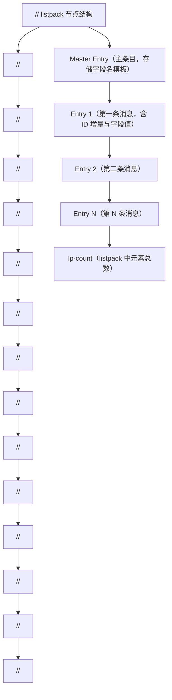

#### 3.3.3 Master Entry（主条目）

每个 listpack 节点的开头是一个 Master Entry，它存储该节点内所有消息共用的字段名（field names）。其格式为：

```
// Master Entry 格式
// [count][deleted][num-fields][field_1][field_2]...[field_N][0]
//
// count:        该 listpack 节点中存储的消息总数
// deleted:      已删除消息数（XDEL 后不立即物理删除，标记为 deleted）
// num-fields:   字段数量
// field_1..N:   字段名列表
// 0:            结束标记
```

Master Entry 的字段名列表是该节点内所有消息的字段名并集。如果后续消息的字段名与 Master Entry 完全一致，则该消息使用 `STREAM_ITEM_FLAG_SAMEFIELDS` 标志，只存储字段值，不重复存储字段名，从而节省内存。

#### 3.3.4 消息条目格式

listpack 中的每条消息条目有两种格式，取决于是否设置了 `SAMEFIELDS` 标志：

**格式一：SAMEFIELDS 标志置位（字段名与 Master Entry 相同）**

```
// [flags][ms-delta][seq-delta][value_1][value_2]...[value_N][lp-count]
//
// flags:     标志位（1 字节），STREAM_ITEM_FLAG_SAMEFIELDS = 2
// ms-delta:  与 Master Entry 的 ms 差值（变长整数）
// seq-delta: 与 Master Entry 的 seq 差值（变长整数）
// value_1..N: 字段值列表（字段名复用 Master Entry）
// lp-count:  listpack 元素计数
```

**格式二：SAMEFIELDS 标志未置位（字段名与 Master Entry 不同）**

```
// [flags][ms-delta][seq-delta][num-fields][field_1][value_1]...[field_N][value_N][lp-count]
//
// flags:      标志位，SAMEFLAGS 未置位
// ms-delta:   与 Master Entry 的 ms 差值
// seq-delta:  与 Master Entry 的 seq 差值
// num-fields: 字段数量
// field_1..N: 字段名列表
// value_1..N: 字段值列表
// lp-count:   listpack 元素计数
```

通过这种设计，当消息具有相同字段结构时（这是大多数场景），每条消息只需存储字段值与 ID 增量，内存开销极低。

#### 3.3.5 墓碑标记（Tombstone）

当执行 `XDEL` 删除消息时，Redis 不会立即从 listpack 中物理删除该消息，而是将其标记为"已删除"（设置 `STREAM_ITEM_FLAG_DELETED` 标志）。这样可以避免频繁的 listpack 重排，提升删除性能。已删除的消息在遍历时被跳过，但物理空间仍占用。

当 listpack 中所有消息都被删除，或通过 XTRIM 修剪时，整个 listpack 节点才会被物理删除。

### 3.4 MACRO NODE 结构与内存布局

Stream 的 Radix Tree + listpack 组合形成了一种"宏节点"（Macro Node）结构。每个宏节点由一个 Radix Tree 叶子节点与一个 listpack 组成，存储一组相邻的消息。

#### 3.4.1 节点分裂与合并

Redis 通过两个配置参数控制 listpack 节点的大小：

- `stream-node-max-bytes`：单个 listpack 节点的最大字节数，默认 4096（4KB）
- `stream-node-max-entries`：单个 listpack 节点中存储的最大消息数，默认 100

当 listpack 节点的大小或消息数超过阈值时，Redis 会执行节点分裂：

1. 创建一个新的 listpack 节点
2. 将原节点中约一半的消息迁移到新节点
3. 在 Radix Tree 中插入新的叶子节点，key 为新节点中第一条消息的 ID

```
// 节点分裂示意
//
// 分裂前：
// Radix Tree:
//   [key: ID_1] -> listpack: [master | entry_1 | entry_2 | ... | entry_100]
//                         (100 条消息，达到 stream-node-max-entries 上限)
//
// 分裂后：
// Radix Tree:
//   [key: ID_1]   -> listpack: [master | entry_1 | ... | entry_50]
//   [key: ID_51]  -> listpack: [master | entry_51 | ... | entry_100]
//                         (每个节点约 50 条消息)
```

#### 3.4.2 内存布局全景图

```mermaid
flowchart TD
    C0_0["// Stream 内存布局全景"]
    C0_1["//"]
    C0_2["// stream 结构体"]
    C0_3["//"]
    C0_4["//"]
    C0_5["//"]
    C0_6["//"]
    C0_7["//       v"]
    C0_8["// Radix Tree (rax)"]
    C0_9["//"]
    C0_10["//"]
    C0_11["//"]
    C0_12["//"]
    C0_13["//"]
    C0_14["//"]
    C0_15["//"]
    C0_16["//"]
    C0_17["//"]
    C0_18["//"]
    C0_19["//"]
    C0_20["//                  v       v"]
    C0_21["// listpack 节点:"]
    C0_22["//"]
    C0_23["//"]
    C0_24["//"]
    C0_25["//"]
    C0_26["//"]
    C0_27["//"]
    C0_28["//"]
    C0_29["//"]
    C0_30["//"]
    C0_31["//"]
    C0_32["//"]
    C0_33["//"]
    C0_34["//"]
    C0_35["//"]
    C0_36["//"]
    C0_37["//"]
    C0_38["//"]
    C0_39["//"]
    C1_0["rax*"]
    C1_1["head -> raxNode"]
    C1_2["[压缩节点: ms前缀]"]
    C1_3["[分叉节点]"]
    C1_4["v       v"]
    C1_5["[叶子节点]  [叶子节点]  ..."]
    C1_6["[Master Entry]"]
    C1_7["[count=50][deleted=0][num-fields=3][f1][f2][f3][0]"]
    C1_8["[Entry 1]"]
    C1_9["[flags=SAMEFIELDS][ms-delta=0][seq-delta=0]"]
    C1_10["[v1][v2][v3][lp-count]"]
    C1_11["[Entry 2]"]
    C1_12["[flags=SAMEFIELDS][ms-delta=0][seq-delta=1]"]
    C1_13["[v1][v2][v3][lp-count]"]
    C1_14["[Entry 50]"]
    C1_15["[flags=SAMEFIELDS][ms-delta=1000][seq-delta=0]"]
    C1_16["[v1][v2][v3][lp-count]"]
    C2_0["length"]
    C3_0["last_id"]
    C4_0["first_id"]
    C5_0["cgroups*"]
    C0_0 --> C0_1
    C0_1 --> C0_2
    C0_2 --> C0_3
    C0_3 --> C0_4
    C0_4 --> C0_5
    C0_5 --> C0_6
    C0_6 --> C0_7
    C0_7 --> C0_8
    C0_8 --> C0_9
    C0_9 --> C0_10
    C0_10 --> C0_11
    C0_11 --> C0_12
    C0_12 --> C0_13
    C0_13 --> C0_14
    C0_14 --> C0_15
    C0_15 --> C0_16
    C0_16 --> C0_17
    C0_17 --> C0_18
    C0_18 --> C0_19
    C0_19 --> C0_20
    C0_20 --> C0_21
    C0_21 --> C0_22
    C0_22 --> C0_23
    C0_23 --> C0_24
    C0_24 --> C0_25
    C0_25 --> C0_26
    C0_26 --> C0_27
    C0_27 --> C0_28
    C0_28 --> C0_29
    C0_29 --> C0_30
    C0_30 --> C0_31
    C0_31 --> C0_32
    C0_32 --> C0_33
    C0_33 --> C0_34
    C0_34 --> C0_35
    C0_35 --> C0_36
    C0_36 --> C0_37
    C0_37 --> C0_38
    C0_38 --> C0_39
    C1_0 --> C1_1
    C1_1 --> C1_2
    C1_2 --> C1_3
    C1_3 --> C1_4
    C1_4 --> C1_5
    C1_5 --> C1_6
    C1_6 --> C1_7
    C1_7 --> C1_8
    C1_8 --> C1_9
    C1_9 --> C1_10
    C1_10 --> C1_11
    C1_11 --> C1_12
    C1_12 --> C1_13
    C1_13 --> C1_14
    C1_14 --> C1_15
    C1_15 --> C1_16
    C0_0 --> C1_0
    C1_0 --> C2_0
    C2_0 --> C3_0
    C3_0 --> C4_0
    C4_0 --> C5_0
```

#### 3.4.3 消费者组在 Radix Tree 中的存储

Stream 的消费者组也存储在 Radix Tree 中（`stream.cgroups`），key 为消费者组名称，value 为 `streamCG` 结构。同样，每个消费者组内的消费者也存储在 Radix Tree 中（`streamCG.consumers`），key 为消费者名称，value 为 `streamConsumer` 结构。

```c
// 消费者组结构
typedef struct streamCG {
    streamID last_id;     // 该组最后投递的消息 ID（消费进度游标）
    rax *pel;             // 组级 PEL（Pending Entry List）：消息 ID -> streamNACK
    rax *consumers;       // 消费者字典：name -> streamConsumer
} streamCG;

// 消费者结构
typedef struct streamConsumer {
    mstime_t seen_time;   // 消费者最后一次活跃时间（用于检测超时）
    mstime_t active_time; // 消费者最后一次活跃处理消息的时间
    sds name;             // 消费者名称
    rax *pel;             // 消费者级 PEL：消息 ID -> streamNACK
} streamConsumer;

// 待确认条目（NACK）结构
typedef struct streamNACK {
    mstime_t delivery_time;   // 上次投递时间（毫秒时间戳）
    uint64_t delivery_count;  // 投递次数计数器
    streamConsumer *consumer; // 当前持有该消息的消费者
    // 以下为 Redis 8.4 新增的字段，用于支持 XREADGROUP CLAIM 的高效实现
    // streamNACK *pel_time_prev;  // 时间序双向链表前驱
    // streamNACK *pel_time_next;  // 时间序双向链表后继
} streamNACK;
```

### 3.5 内存效率分析

Stream 的 Radix Tree + listpack 组合存储方案在内存效率上具有显著优势。以下是一个具体的内存占用对比示例：

假设存储 100 万条消息，每条消息包含 3 个字段（field1, field2, field3），每个字段值平均 20 字节，消息 ID 为自动生成的时间戳格式。

**方案一：哈希表存储（每条消息一个 hash key）**

- 每条消息的 key：Entry ID 字符串，约 16 字节
- 每条消息的 value：3 个字段名 + 3 个字段值 = 6 个字符串，约 120 字节
- 哈希表本身的桶指针开销：约 50 字节/条
- 总计约 186 字节/条，100 万条约 186 MB

**方案二：Radix Tree + listpack 存储（Stream 实际方案）**

- Entry ID 作为 Radix Tree key 时使用 16 字节二进制编码，但同一毫秒内的消息共享前缀，平均每条消息的 key 摊销开销约 2-4 字节
- 字段名在 Master Entry 中只存储一次，每条消息只存储字段值，约 60 字节
- ID 增量编码（变长整数），平均 2-4 字节
- listpack 的元数据开销（flags, lp-count 等），约 5 字节
- 总计约 70-75 字节/条，100 万条约 70-75 MB

内存节省约 60%，这得益于 Radix Tree 的前缀压缩与 listpack 的字段名复用机制。

---

## 第 4 章 核心命令详解

本章详细剖析 Stream 的每个核心命令，包括语法、参数、返回值、示例代码（逐行注释）与内部执行流程。

### 4.1 XADD：追加消息

#### 4.1.1 语法

```
XADD key [NOMKSTREAM] [MAXLEN|MINID [=|~] threshold [LIMIT count]]
         [*|id] field value [field value ...]
```

#### 4.1.2 参数说明

| 参数 | 说明 | 必填 |
|------|------|------|
| key | Stream 的键名 | 是 |
| NOMKSTREAM | 如果 key 不存在则不创建新 Stream，返回 nil | 否 |
| MAXLEN | 修剪策略：保留最新的 threshold 条消息 | 否 |
| MINID | 修剪策略：删除 ID 小于 threshold 的消息 | 否 |
| = | 精确修剪（默认） | 否 |
| ~ | 近似修剪，允许少量超出阈值，性能更好 | 否 |
| threshold | 修剪阈值（MAXLEN 为数量，MINID 为 ID） | 与 MAXLEN/MINID 搭配 |
| LIMIT count | 修剪时最多删除的条数 | 否 |
| * | 自动生成 Entry ID | 是（与 id 二选一） |
| id | 手动指定 Entry ID | 是（与 * 二选一） |
| field value | 消息的字段-值对，可多对 | 是 |

#### 4.1.3 返回值

返回新追加消息的 Entry ID（字符串形式，如 `1718334600000-0`）。如果指定了 NOMKSTREAM 且 key 不存在，返回 nil。

#### 4.1.4 示例代码

```redis
// 示例 1：自动生成 ID 追加消息
// 向 mystream 追加一条消息，包含两个字段
XADD mystream * sensor_id 1001 temperature 36.5
// 返回：1718334600000-0
// * 表示让 Redis 自动生成 ID
// sensor_id 和 temperature 是字段名，1001 和 36.5 是对应的值

// 示例 2：手动指定 ID
// 向 mystream 追加一条消息，手动指定 ID 为 1718334600001-0
XADD mystream 1718334600001-0 sensor_id 1002 temperature 36.8
// 返回：1718334600001-0
// 手动指定的 ID 必须大于当前 Stream 的 last_id，否则报错

// 示例 3：限制 Stream 长度（精确修剪）
// 追加消息的同时，将 Stream 长度修剪为最多 1000 条
XADD mystream MAXLEN 1000 * sensor_id 1003 temperature 37.0
// 返回：1718334600002-0
// MAXLEN 1000 表示修剪后 Stream 最多保留 1000 条消息
// 精确修剪（无 ~）会确保长度恰好为 1000

// 示例 4：限制 Stream 长度（近似修剪）
// 追加消息的同时，近似修剪 Stream 长度为 1000 条
XADD mystream MAXLEN ~ 1000 * sensor_id 1004 temperature 37.2
// 返回：1718334600003-0
// ~ 表示近似修剪，Redis 可能保留略多于 1000 条消息
// 近似修剪性能更好，因为不需要精确删除多余消息

// 示例 5：按 ID 修剪
// 追加消息的同时，删除 ID 小于 1718334000000-0 的消息
XADD mystream MINID 1718334000000-0 * sensor_id 1005 temperature 37.5
// 返回：1718334600004-0
// MINID 表示删除所有 ID 小于指定值的消息

// 示例 6：不创建新 Stream
// 如果 mystream 不存在，则不创建，返回 nil
XADD nomkstream_test NOMKSTREAM * field1 value1
// 如果 nomkstream_test 不存在，返回 nil
// 如果存在，则正常追加

// 示例 7：限制修剪数量
// 追加消息的同时修剪，但最多只删除 100 条
XADD mystream MAXLEN ~ 1000 LIMIT 100 * sensor_id 1006 temperature 37.8
// 返回：1718334600005-0
// LIMIT 100 限制单次修剪最多删除 100 条消息
// 防止修剪操作阻塞时间过长
```

#### 4.1.5 内部执行流程

```
// XADD 命令内部执行流程
//
// 1. 参数解析与校验
//    a. 解析 key、修剪策略、ID、字段值对
//    b. 校验字段值对数量为偶数（field-value 成对）
//    c. 如果指定了手动 ID，校验其格式与单调递增性
//
// 2. 获取或创建 Stream 对象
//    a. 查找 key 对应的数据库对象
//    b. 如果不存在且未指定 NOMKSTREAM，创建新的 stream 结构
//    c. 如果不存在且指定了 NOMKSTREAM，返回 nil
//    d. 如果存在但类型非 Stream，返回类型错误
//
// 3. 生成 Entry ID
//    a. 如果 ID 为 *，调用 streamIncrID() 生成新 ID
//       - 取当前服务器时间作为 ms
//       - 与 last_id 比较，确保新 ID 严格大于 last_id
//       - 处理时钟回拨与 seq 溢出
//    b. 如果 ID 为手动指定，校验其大于 last_id
//
// 4. 执行修剪（如果指定了 MAXLEN/MINID）
//    a. 调用 streamTrim() 或在追加时同步修剪
//    b. 近似修剪（~）：删除整个 listpack 节点，不精确到单条消息
//    c. 精确修剪（=）：逐条删除，确保精确达到阈值
//
// 5. 追加消息到 Radix Tree
//    a. 调用 streamAppendItem() 追加消息
//    b. 查找最后一个 listpack 节点
//    c. 如果最后一个节点未满，追加到该节点
//    d. 如果最后一个节点已满，创建新节点并插入 Radix Tree
//    e. 更新 stream.last_id、stream.length、stream.entries_added
//
// 6. 通知阻塞客户端
//    a. 遍历等待在该 Stream 上的阻塞客户端（XREAD/XREADGROUP BLOCK）
//    b. 将新消息推送给匹配的客户端
//
// 7. 持久化与复制
//    a. 将命令写入 AOF 缓冲区
//    b. 将命令传播给从节点
//
// 8. 返回 Entry ID
```

### 4.2 XLEN：获取消息总数

#### 4.2.1 语法

```
XLEN key
```

#### 4.2.2 参数说明

| 参数 | 说明 | 必填 |
|------|------|------|
| key | Stream 的键名 | 是 |

#### 4.2.3 返回值

返回 Stream 中当前的消息总数（整数）。如果 key 不存在，返回 0。

#### 4.2.4 示例代码

```redis
// 获取 mystream 的消息总数
XLEN mystream
// 返回：5
// 表示 mystream 当前有 5 条消息

// 获取不存在的 Stream 的长度
XLEN nonexistent_stream
// 返回：0
// key 不存在时返回 0，不报错
```

#### 4.2.5 内部执行流程

```
// XLEN 命令内部执行流程
//
// 1. 查找 key 对应的 Stream 对象
//    a. 如果 key 不存在，返回 0
//    b. 如果 key 存在但类型非 Stream，返回类型错误
//
// 2. 返回 stream.length 字段
//    a. stream.length 在每次 XADD 时递增，XDEL 时递减
//    b. 时间复杂度 O(1)，直接读取字段值
//
// 注意：XLEN 返回的是未删除消息数（已 XDEL 的消息不计入）
//       但已标记为墓碑（tombstone）的消息可能仍占用物理内存
```

### 4.3 XREAD：读取消息

#### 4.3.1 语法

```
XREAD [COUNT count] [BLOCK milliseconds] STREAMS key [key ...] ID [ID ...]
```

#### 4.3.2 参数说明

| 参数 | 说明 | 必填 |
|------|------|------|
| COUNT count | 每次最多返回的消息数 | 否 |
| BLOCK milliseconds | 阻塞等待毫秒数，0 表示永久阻塞 | 否 |
| STREAMS | 关键字，后接 key 列表与 ID 列表 | 是 |
| key | 要读取的 Stream 键名，可多个 | 是 |
| ID | 起始 ID，$ 表示最新，0 表示从头 | 是 |

#### 4.3.3 返回值

返回数组，每个元素为 `[key, [[id, [field, value, ...]], ...]]` 结构。如果没有新消息且未阻塞，返回 nil。如果阻塞超时且无新消息，返回 nil。

#### 4.3.4 示例代码

```redis
// 示例 1：从指定 ID 开始读取
// 从 mystream 中读取 ID 大于 0-0 的前 10 条消息
XREAD COUNT 10 STREAMS mystream 0
// 0 表示从 Stream 的第一条消息开始读取
// COUNT 10 限制最多返回 10 条

// 示例 2：读取最新消息（非阻塞）
// 从 mystream 中读取 ID 大于当前最新 ID 的消息
XREAD STREAMS mystream $
// $ 表示只读取追加在该命令执行之后的新消息
// 如果当前没有新消息，立即返回 nil

// 示例 3：阻塞读取新消息
// 阻塞等待最多 5000 毫秒，读取 mystream 的新消息
XREAD BLOCK 5000 COUNT 10 STREAMS mystream $
// BLOCK 5000 表示最多阻塞 5 秒
// 如果 5 秒内有新消息，立即返回
// 如果 5 秒后仍无新消息，返回 nil

// 示例 4：永久阻塞读取
// 永久阻塞，直到有新消息
XREAD BLOCK 0 STREAMS mystream $
// BLOCK 0 表示永久阻塞，直到有新消息或客户端断开

// 示例 5：同时读取多个 Stream
// 同时读取 stream1 和 stream2 的新消息
XREAD COUNT 5 STREAMS stream1 stream2 $ $
// 每个 Stream 对应一个 ID，这里都为 $（读取新消息）
// 返回格式：[[stream1, [...]], [stream2, [...]]]

// 示例 6：从指定 ID 开始读取多个 Stream
// 从 stream1 的 1718334600000-0 之后读取
// 从 stream2 的 0-0 之后读取
XREAD STREAMS stream1 stream2 1718334600000-0 0
// 注意：key 列表与 ID 列表必须一一对应
```

#### 4.3.5 内部执行流程

```
// XREAD 命令内部执行流程
//
// 1. 参数解析
//    a. 解析 COUNT、BLOCK 参数
//    b. 解析 STREAMS 后的 key 列表与 ID 列表
//    c. 校验 key 数量与 ID 数量一致
//
// 2. 非阻塞模式（未指定 BLOCK）
//    a. 遍历每个 key
//    b. 查找 Stream 对象
//    c. 从指定 ID 开始遍历 Radix Tree
//    d. 收集消息，直到达到 COUNT 限制或无更多消息
//    e. 如果所有 key 都无消息，返回 nil
//
// 3. 阻塞模式（指定 BLOCK）
//    a. 首先尝试非阻塞读取
//    b. 如果有消息，立即返回
//    c. 如果无消息，将客户端加入阻塞等待队列
//       - 每个 Stream 维护一个阻塞客户端列表
//       - 记录客户端的读取起始 ID 与 COUNT
//    d. 设置阻塞超时定时器
//    e. 当有 XADD 追加新消息时：
//       - 遍历该 Stream 的阻塞客户端列表
//       - 检查新消息 ID 是否大于客户端的起始 ID
//       - 如果匹配，将消息推送给客户端并解除阻塞
//    f. 超时后仍未收到消息，返回 nil
//
// 4. 返回结果格式化
//    a. 每个有消息的 key 返回 [key, messages] 对
//    b. 每条消息格式为 [id, [field1, value1, field2, value2, ...]]
```

### 4.4 XRANGE：范围读取（正序）

#### 4.4.1 语法

```
XRANGE key start end [COUNT count]
```

#### 4.4.2 参数说明

| 参数 | 说明 | 必填 |
|------|------|------|
| key | Stream 的键名 | 是 |
| start | 起始 ID，`-` 表示最旧 | 是 |
| end | 结束 ID，`+` 表示最新 | 是 |
| COUNT count | 最多返回的消息数 | 否 |

#### 4.4.3 返回值

返回消息数组，每条消息格式为 `[id, [field1, value1, ...]]`，按 ID 升序排列。

#### 4.4.4 示例代码

```redis
// 示例 1：读取所有消息
// 读取 mystream 的全部消息（从最旧到最新）
XRANGE mystream - +
// - 表示最旧的 ID，+ 表示最新的 ID
// 返回所有消息，按 ID 升序排列

// 示例 2：读取指定范围
// 读取 ID 在 1718334600000-0 到 1718334700000-0 之间的消息
XRANGE mystream 1718334600000-0 1718334700000-0
// 包含边界值（闭区间）

// 示例 3：限制返回数量
// 读取前 10 条消息
XRANGE mystream - + COUNT 10
// COUNT 10 限制最多返回 10 条

// 示例 4：从指定 ID 开始读取
// 读取 ID 大于 1718334600000-0 的消息
XRANGE mystream (1718334600000-0 +
// ( 表示开区间，不包含 1718334600000-0 本身
// 注意：开区间语法在某些版本中通过 ( 前缀实现

// 示例 5：分页读取
// 第一页：读取前 100 条
XRANGE mystream - + COUNT 100
// 假设最后一条消息 ID 为 1718334600100-0
// 第二页：从 1718334600100-0 之后开始读取
XRANGE mystream (1718334600100-0 + COUNT 100
// 使用开区间 ( 排除上一页的最后一条
```

#### 4.4.5 内部执行流程

```
// XRANGE 命令内部执行流程
//
// 1. 参数解析
//    a. 解析 start 和 end ID
//    b. 处理特殊值：- 表示最小 ID（0-0），+ 表示最大 ID（UINT64_MAX-UINT64_MAX）
//    c. 解析 COUNT 参数
//
// 2. 在 Radix Tree 中定位起始节点
//    a. 将 start ID 编码为 16 字节二进制 key
//    b. 在 Radix Tree 中查找 >= start ID 的第一个节点
//    c. 使用 raxLowerBound() 或 raxSeek() 定位
//
// 3. 遍历 Radix Tree
//    a. 从起始节点开始，使用 raxNext() 逐节点遍历
//    b. 对每个 listpack 节点，从其中查找满足 ID 范围的消息
//    c. 跳过已删除（墓碑）的消息
//    d. 收集消息，直到达到 COUNT 限制或 ID 超过 end
//
// 4. 返回结果
//    a. 消息按 ID 升序排列
//    b. 每条消息格式化为 [id, [field1, value1, ...]]
```

### 4.5 XREVRANGE：范围读取（倒序）

#### 4.5.1 语法

```
XREVRANGE key end start [COUNT count]
```

注意：XREVRANGE 的参数顺序与 XRANGE 相反，先 end 后 start。

#### 4.5.2 参数说明

| 参数 | 说明 | 必填 |
|------|------|------|
| key | Stream 的键名 | 是 |
| end | 结束 ID，`+` 表示最新 | 是 |
| start | 起始 ID，`-` 表示最旧 | 是 |
| COUNT count | 最多返回的消息数 | 否 |

#### 4.5.3 返回值

返回消息数组，按 ID 降序排列。

#### 4.5.4 示例代码

```redis
// 示例 1：读取最新的 10 条消息
// 按 ID 降序读取，最新消息在前
XREVRANGE mystream + - COUNT 10
// + 表示最新，- 表示最旧
// COUNT 10 限制返回 10 条
// 返回结果中最新消息排在第一位

// 示例 2：读取指定范围内的最新消息
// 读取 ID 在 1718334600000-0 到 1718334700000-0 之间的消息，降序排列
XREVRANGE mystream 1718334700000-0 1718334600000-0
// 注意参数顺序：先 end（较大 ID）后 start（较小 ID）

// 示例 3：读取最近的 N 条消息
// 实际应用中常用于"获取最近 N 条日志"
XREVRANGE mystream + - COUNT 50
// 降序读取最近 50 条消息
```

#### 4.5.5 内部执行流程

```
// XREVRANGE 命令内部执行流程
//
// 1. 参数解析
//    a. 解析 end 和 start ID（注意顺序与 XRANGE 相反）
//    b. 处理特殊值 + 和 -
//    c. 解析 COUNT 参数
//
// 2. 在 Radix Tree 中定位起始节点
//    a. 将 end ID 编码为二进制 key
//    b. 在 Radix Tree 中查找 <= end ID 的最后一个节点
//    c. 使用 raxUpperBound() 定位
//
// 3. 逆向遍历 Radix Tree
//    a. 从起始节点开始，使用 raxPrev() 逆向遍历
//    b. 对每个 listpack 节点，逆向遍历其中的消息
//    c. 跳过已删除消息
//    d. 收集消息，直到达到 COUNT 限制或 ID 小于 start
//
// 4. 返回结果
//    a. 消息按 ID 降序排列
```

### 4.6 XGROUP：消费者组管理

#### 4.6.1 语法

XGROUP 是一个命令组，包含多个子命令：

```
XGROUP CREATE key groupname id|$ [MKSTREAM]
XGROUP SETID key groupname id|$
XGROUP DESTROY key groupname
XGROUP CREATECONSUMER key groupname consumername
XGROUP DELCONSUMER key groupname consumername
```

#### 4.6.2 参数说明

**XGROUP CREATE**

| 参数 | 说明 | 必填 |
|------|------|------|
| key | Stream 键名 | 是 |
| groupname | 消费者组名称 | 是 |
| id | 起始消费位置，`$` 表示从最新开始，`0` 表示从头开始 | 是 |
| MKSTREAM | 如果 Stream 不存在则自动创建 | 否 |

**XGROUP SETID**

| 参数 | 说明 | 必填 |
|------|------|------|
| key | Stream 键名 | 是 |
| groupname | 消费者组名称 | 是 |
| id | 新的消费位置 | 是 |

**XGROUP DESTROY**

| 参数 | 说明 | 必填 |
|------|------|------|
| key | Stream 键名 | 是 |
| groupname | 要删除的消费者组名称 | 是 |

**XGROUP CREATECONSUMER**

| 参数 | 说明 | 必填 |
|------|------|------|
| key | Stream 键名 | 是 |
| groupname | 消费者组名称 | 是 |
| consumername | 消费者名称 | 是 |

**XGROUP DELCONSUMER**

| 参数 | 说明 | 必填 |
|------|------|------|
| key | Stream 键名 | 是 |
| groupname | 消费者组名称 | 是 |
| consumername | 要删除的消费者名称 | 是 |

#### 4.6.3 返回值

- CREATE：成功返回 OK，失败返回错误
- SETID：成功返回 OK
- DESTROY：成功返回 1，组不存在返回 0
- CREATECONSUMER：成功返回 1，已存在返回 0
- DELCONSUMER：返回该消费者待确认消息数

#### 4.6.4 示例代码

```redis
// 示例 1：创建消费者组（从最新消息开始）
// 创建组 mygroup，消费位置从当前最新消息开始
XGROUP CREATE mystream mygroup $
// $ 表示组的 last_id 设为当前 Stream 的 last_id
// 组内的消费者只会收到创建组之后追加的新消息
// 如果 mystream 不存在，报错

// 示例 2：创建消费者组（从头开始）
// 创建组 mygroup2，消费位置从 Stream 头部开始
XGROUP CREATE mystream mygroup2 0
// 0 表示组的 last_id 设为 0-0
// 组内的消费者会收到 Stream 中的所有消息

// 示例 3：创建消费者组并自动创建 Stream
// 如果 mystream 不存在，自动创建空 Stream
XGROUP CREATE newstream mygroup $ MKSTREAM
// MKSTREAM 选项允许在 Stream 不存在时自动创建
// 创建后组从最新位置开始消费

// 示例 4：修改消费者组的消费位置
// 将 mygroup 的 last_id 重置为 0-0
XGROUP SETID mystream mygroup 0
// 重置后，组内消费者会从头开始重新消费
// 注意：此操作不影响已有的 PEL 条目

// 示例 5：删除消费者组
XGROUP DESTROY mystream mygroup
// 返回 1 表示删除成功，0 表示组不存在

// 示例 6：显式创建消费者
// 通常消费者在首次 XREADGROUP 时自动创建
// 也可显式创建
XGROUP CREATECONSUMER mystream mygroup consumer1
// 返回 1 表示创建成功，0 表示消费者已存在

// 示例 7：删除消费者
// 删除消费者 consumer1，返回其待确认消息数
XGROUP DELCONSUMER mystream mygroup consumer1
// 返回该消费者在 PEL 中的待确认消息数
// 删除后，这些消息仍留在组级 PEL 中，可被其他消费者认领
```

#### 4.6.5 内部执行流程

```
// XGROUP CREATE 命令内部执行流程
//
// 1. 查找 Stream 对象
//    a. 如果 key 不存在：
//       - 若指定 MKSTREAM，创建空 Stream
//       - 否则返回错误
//    b. 如果 key 存在但类型非 Stream，返回类型错误
//
// 2. 检查消费者组是否已存在
//    a. 在 stream.cgroups Radix Tree 中查找 groupname
//    b. 如果已存在，返回 BUSYGROUP 错误
//
// 3. 创建消费者组
//    a. 分配 streamCG 结构
//    b. 初始化 last_id：
//       - 如果 id 为 $，设为 stream.last_id
//       - 如果 id 为 0，设为 0-0
//       - 如果为具体 ID，校验格式后设为该值
//    c. 初始化 pel（raxNew()）和 consumers（raxNew()）
//
// 4. 插入到 stream.cgroups Radix Tree
//    a. key 为 groupname，value 为 streamCG 指针
//
// 5. 返回 OK
```

### 4.7 XREADGROUP：消费者组读取

#### 4.7.1 语法

```
XREADGROUP GROUP groupname consumer [COUNT count] [BLOCK milliseconds]
           [NOACK] [CLAIM min-idle-time] STREAMS key [key ...] ID [ID ...]
```

#### 4.7.2 参数说明

| 参数 | 说明 | 必填 |
|------|------|------|
| GROUP | 关键字 | 是 |
| groupname | 消费者组名称 | 是 |
| consumer | 消费者名称 | 是 |
| COUNT count | 最多返回的消息数 | 否 |
| BLOCK milliseconds | 阻塞等待毫秒数 | 否 |
| NOACK | 读取后不加入 PEL（用于不需要确认的场景） | 否 |
| CLAIM min-idle-time | 同时认领空闲超过指定毫秒数的待确认消息（Redis 8.4+） | 否 |
| STREAMS | 关键字 | 是 |
| key | Stream 键名 | 是 |
| ID | 起始 ID，`>` 表示新消息，`0` 表示待确认消息 | 是 |

#### 4.7.3 ID 参数的特殊含义

XREADGROUP 中的 ID 参数有两个特殊值：

- `>`：读取从未投递给该消费者组的新消息（最常用）
- `0` 或其他具体 ID：读取该消费者已接收但未确认的待确认消息（历史 PEL 消息）

#### 4.7.4 返回值

返回数组，格式与 XREAD 相同。如果使用了 CLAIM 参数，每个认领的待确认消息会额外返回两个字段：上次投递至今的毫秒数、投递次数。

#### 4.7.5 示例代码

```redis
// 示例 1：读取新消息（最常用）
// 消费者 consumer1 从组 mygroup 读取 1 条新消息
XREADGROUP GROUP mygroup consumer1 COUNT 1 STREAMS mystream >
// > 表示读取从未投递给该组的新消息
// 读取后，消息会被加入 consumer1 的 PEL
// 必须在处理完成后调用 XACK 确认

// 示例 2：阻塞读取新消息
// 阻塞等待最多 5000 毫秒读取新消息
XREADGROUP GROUP mygroup consumer1 BLOCK 5000 COUNT 10 STREAMS mystream >
// 如果 5 秒内有新消息，立即返回
// 如果 5 秒后无新消息，返回 nil

// 示例 3：读取待确认消息
// 读取 consumer1 的待确认消息（PEL 中的消息）
XREADGROUP GROUP mygroup consumer1 COUNT 10 STREAMS mystream 0
// 0 表示读取 consumer1 已接收但未确认的消息
// 用于消费者重启后恢复未完成的处理

// 示例 4：不确认模式
// 读取消息但不加入 PEL（适用于不需要确认的场景）
XREADGROUP GROUP mygroup consumer1 NOACK COUNT 10 STREAMS mystream >
// NOACK 表示读取后不加入 PEL
// 消息读取后即视为"已处理"，不需要 XACK
// 适用于允许消息丢失的场景

// 示例 5：Redis 8.4+ CLAIM 参数
// 读取新消息的同时，认领空闲超过 60 秒的待确认消息
XREADGROUP GROUP mygroup consumer1 CLAIM 60000 COUNT 10 STREAMS mystream >
// CLAIM 60000 表示先认领 PEL 中空闲超过 60 秒的消息
// 然后再读取新消息
// 认领的消息会额外返回空闲时间与投递次数

// 示例 6：同时读取多个 Stream
// consumer1 同时从 stream1 和 stream2 读取新消息
XREADGROUP GROUP mygroup consumer1 COUNT 5 STREAMS stream1 stream2 > >
// 注意：在 Redis Cluster 中，多个 key 必须在同一槽位
```

#### 4.7.6 内部执行流程

```
// XREADGROUP GROUP 命令内部执行流程
//
// 1. 参数解析
//    a. 解析 groupname、consumer、COUNT、BLOCK、NOACK、CLAIM
//    b. 解析 STREAMS 后的 key 列表与 ID 列表
//
// 2. 查找消费者组
//    a. 遍历每个 key，查找对应的 Stream
//    b. 在 stream.cgroups 中查找 groupname
//    c. 如果组不存在，返回 NOGROUP 错误
//
// 3. 获取或创建消费者
//    a. 在 streamCG.consumers 中查找 consumer
//    b. 如果不存在，自动创建新的 streamConsumer
//    c. 更新 consumer.seen_time 为当前时间
//
// 4. 处理 CLAIM 参数（Redis 8.4+）
//    a. 如果指定了 CLAIM min-idle-time：
//       - 遍历组级 PEL，查找空闲时间 >= min-idle-time 的条目
//       - 将这些条目的 consumer 字段改为当前 consumer
//       - 更新 delivery_time 和 delivery_count
//       - 将条目从原 consumer 的 PEL 移到当前 consumer 的 PEL
//    b. 收集认领的消息
//
// 5. 读取消息
//    a. 如果 ID 为 >：
//       - 从 streamCG.last_id 之后读取新消息
//       - 对每条消息创建 streamNACK 条目
//       - 将 NACK 插入组级 PEL 和 consumer 级 PEL
//       - 更新 streamCG.last_id
//       - 更新 consumer.active_time
//    b. 如果 ID 为 0 或具体 ID：
//       - 从 consumer 的 PEL 中读取待确认消息
//       - 不创建新的 NACK，不更新 last_id
//    c. 如果指定 NOACK，不创建 NACK 条目
//
// 6. 阻塞处理（如果指定 BLOCK 且无消息）
//    a. 将客户端加入阻塞等待队列
//    b. 等待 XADD 触发唤醒
//
// 7. 返回结果
//    a. 格式化消息列表
//    b. 如果有 CLAIM 认领的消息，附加空闲时间与投递次数
```

### 4.8 XACK：确认消息

#### 4.8.1 语法

```
XACK key group id [id ...]
```

#### 4.8.2 参数说明

| 参数 | 说明 | 必填 |
|------|------|------|
| key | Stream 键名 | 是 |
| group | 消费者组名称 | 是 |
| id | 要确认的消息 ID，可多个 | 是 |

#### 4.8.3 返回值

返回成功确认的消息数（整数）。如果消息 ID 不在 PEL 中（已确认或从未投递），不计入返回值。

#### 4.8.4 示例代码

```redis
// 示例 1：确认单条消息
// 确认消费者组 mygroup 中的消息 1718334600000-0
XACK mystream mygroup 1718334600000-0
// 返回 1 表示成功确认 1 条
// 返回 0 表示该消息不在 PEL 中（可能已确认或从未投递）

// 示例 2：确认多条消息
// 批量确认多条消息
XACK mystream mygroup 1718334600000-0 1718334600001-0 1718334600002-0
// 返回 3 表示成功确认 3 条
// 批量确认比逐条确认效率更高

// 示例 3：确认不存在的消息
// 确认一个不在 PEL 中的消息
XACK mystream mygroup 9999999999999-0
// 返回 0，表示没有消息被确认
```

#### 4.8.5 内部执行流程

```
// XACK 命令内部执行流程
//
// 1. 查找 Stream 和消费者组
//    a. 查找 key 对应的 Stream
//    b. 在 stream.cgroups 中查找 group
//    c. 如果组不存在，返回 NOGROUP 错误
//
// 2. 遍历要确认的消息 ID
//    a. 对每个 ID，在组级 PEL（streamCG.pel）中查找
//    b. 如果找到：
//       - 获取对应的 streamNACK
//       - 从组级 PEL 中删除该条目
//       - 从 NACK.consumer 的消费者级 PEL 中删除
//       - 释放 streamNACK 内存
//       - 确认计数器加 1
//    c. 如果未找到，跳过
//
// 3. 返回确认计数
//    a. 时间复杂度 O(1) per ID
```

### 4.9 XCLAIM：认领消息

#### 4.9.1 语法

```
XCLAIM key group consumer min-idle-time id [id ...]
        [IDLE ms] [TIME ms-unix-time] [RETRYCOUNT count] [FORCE] [JUSTID]
```

#### 4.9.2 参数说明

| 参数 | 说明 | 必填 |
|------|------|------|
| key | Stream 键名 | 是 |
| group | 消费者组名称 | 是 |
| consumer | 目标消费者名称 | 是 |
| min-idle-time | 最小空闲时间（毫秒），只认领空闲超过此时间的消息 | 是 |
| id | 要认领的消息 ID | 是 |
| IDLE ms | 设置消息的空闲时间为指定值 | 否 |
| TIME ms-unix-time | 设置投递时间为指定 Unix 时间 | 否 |
| RETRYCOUNT count | 设置投递次数 | 否 |
| FORCE | 强制认领，忽略 min-idle-time 检查 | 否 |
| JUSTID | 只返回消息 ID，不返回消息内容 | 否 |

#### 4.9.3 返回值

返回成功认领的消息列表。如果使用 JUSTID，只返回 ID。

#### 4.9.4 示例代码

```redis
// 示例 1：认领空闲超过 60 秒的消息
// consumer2 认领消息 1718334600000-0，前提是该消息空闲超过 60000 毫秒
XCLAIM mystream mygroup consumer2 60000 1718334600000-0
// 60000 是 min-idle-time（60 秒）
// 如果消息的空闲时间 < 60 秒，不会被认领
// 如果消息的空闲时间 >= 60 秒，被 consumer2 认领

// 示例 2：认领多条消息
XCLAIM mystream mygroup consumer2 60000 1718334600000-0 1718334600001-0 1718334600002-0
// 批量认领多条消息

// 示例 3：强制认领
// 忽略 min-idle-time，强制认领消息
XCLAIM mystream mygroup consumer2 0 1718334600000-0 FORCE
// FORCE 选项忽略空闲时间检查
// 即使消息刚被投递，也会被认领

// 示例 4：只返回 ID
XCLAIM mystream mygroup consumer2 60000 1718334600000-0 JUSTID
// JUSTID 只返回认领的消息 ID，不返回消息内容
// 减少网络传输量

// 示例 5：设置投递次数
XCLAIM mystream mygroup consumer2 60000 1718334600000-0 RETRYCOUNT 3
// RETRYCOUNT 设置投递次数为 3
// 用于手动重置投递计数器
```

#### 4.9.5 内部执行流程

```
// XCLAIM 命令内部执行流程
//
// 1. 查找 Stream 和消费者组
//
// 2. 获取或创建目标 consumer
//
// 3. 遍历要认领的消息 ID
//    a. 在组级 PEL 中查找消息
//    b. 如果未找到且未指定 FORCE，跳过
//    c. 如果找到：
//       - 检查空闲时间（当前时间 - delivery_time >= min-idle-time）
//       - 如果空闲时间不足且未指定 FORCE，跳过
//       - 从原 consumer 的 PEL 中移除
//       - 更新 streamNACK.consumer 为新 consumer
//       - 更新 delivery_time 为当前时间（或 IDLE/TIME 指定的值）
//       - delivery_count 加 1（或设为 RETRYCOUNT 指定的值）
//       - 插入新 consumer 的 PEL
//       - 更新 consumer.seen_time 和 active_time
//
// 4. 返回认领的消息列表
```

### 4.10 XAUTOCLAIM：自动认领

#### 4.10.1 语法

```
XAUTOCLAIM key group consumer min-idle-time start [COUNT count] [JUSTID]
```

#### 4.10.2 参数说明

| 参数 | 说明 | 必填 |
|------|------|------|
| key | Stream 键名 | 是 |
| group | 消费者组名称 | 是 |
| consumer | 目标消费者名称 | 是 |
| min-idle-time | 最小空闲时间（毫秒） | 是 |
| start | 扫描起始 ID，通常为 `-` | 是 |
| COUNT count | 每次最多认领的消息数，默认 100 | 否 |
| JUSTID | 只返回消息 ID | 否 |

#### 4.10.3 返回值

返回数组，包含三部分：
1. 下次扫描的起始 ID（用于继续扫描）
2. 认领的消息列表
3. 已从 PEL 中删除的消息 ID 列表（消息已被 XDEL 删除的情况）

#### 4.10.4 示例代码

```redis
// 示例 1：自动认领空闲消息
// consumer2 自动认领组 mygroup 中空闲超过 60 秒的消息
XAUTOCLAIM mystream mygroup consumer2 60000 - COUNT 10
// 60000 是 min-idle-time（60 秒）
// - 表示从 PEL 的起始位置开始扫描
// COUNT 10 限制每次最多认领 10 条
// 返回：[next-start-id, [claimed-messages], [deleted-ids]]

// 示例 2：继续扫描
// 使用上一次返回的 next-start-id 继续扫描
XAUTOCLAIM mystream mygroup consumer2 60000 1718334600005-0 COUNT 10
// 从 1718334600005-0 继续扫描 PEL
// 实现 PEL 的分页扫描

// 示例 3：只返回 ID
XAUTOCLAIM mystream mygroup consumer2 60000 - COUNT 10 JUSTID
// JUSTID 只返回认领的消息 ID
```

#### 4.10.5 内部执行流程

```
// XAUTOCLAIM 命令内部执行流程
//
// 1. 查找 Stream 和消费者组
//
// 2. 获取或创建目标 consumer
//
// 3. 遍历组级 PEL
//    a. 从 start ID 开始遍历 PEL（Radix Tree 有序）
//    b. 对每个 NACK 条目：
//       - 检查空闲时间（当前时间 - delivery_time >= min-idle-time）
//       - 如果满足条件：
//         * 从原 consumer 的 PEL 移除
//         * 更新 NACK.consumer 为新 consumer
//         * 更新 delivery_time 和 delivery_count
//         * 插入新 consumer 的 PEL
//         * 加入认领列表
//       - 如果不满足，跳过
//    c. 达到 COUNT 限制后停止
//    d. 记录下次扫描的起始 ID（当前遍历位置的下一个 ID）
//
// 4. 检查已删除的消息
//    a. 对认领的消息，检查其是否仍在 Stream 中
//    b. 如果消息已被 XDEL 删除：
//       - 从 PEL 中移除
//       - 加入已删除列表
//
// 5. 返回 [next-start-id, claimed-messages, deleted-ids]
```

### 4.11 XINFO：查看信息

#### 4.11.1 语法

XINFO 包含多个子命令：

```
XINFO STREAM key [FULL [COUNT count]]
XINFO GROUPS key
XINFO CONSUMERS key groupname
```

#### 4.11.2 参数说明

| 子命令 | 参数 | 说明 |
|--------|------|------|
| STREAM | key | 查看 Stream 的整体信息 |
| STREAM | key FULL | 查看完整信息（含消息内容） |
| STREAM | key FULL COUNT count | 限制 FULL 模式返回的消息数 |
| GROUPS | key | 查看所有消费者组信息 |
| CONSUMERS | key groupname | 查看指定组的消费者信息 |

#### 4.11.3 返回值

**XINFO STREAM** 返回 Stream 的元信息：

- length：消息总数
- radix-tree-keys：Radix Tree 的 key 节点数
- radix-tree-nodes：Radix Tree 的总节点数
- groups：消费者组数量
- last-generated-id：最后生成的消息 ID
- first-entry：第一条消息
- last-entry：最后一条消息

**XINFO GROUPS** 返回每个消费者组的信息：

- name：组名
- consumers：消费者数量
- pending：待确认消息数
- last-delivered-id：最后投递的消息 ID

**XINFO CONSUMERS** 返回每个消费者的信息：

- name：消费者名称
- pending：该消费者的待确认消息数
- idle：空闲时间（毫秒）
- inactive：不活跃时间（毫秒）

#### 4.11.4 示例代码

```redis
// 示例 1：查看 Stream 基本信息
XINFO STREAM mystream
// 返回 Stream 的长度、Radix Tree 节点数、组数等

// 示例 2：查看 Stream 完整信息
XINFO STREAM mystream FULL
// FULL 模式返回完整的消息列表与消费者组详情
// 包括所有消息的内容、所有组的 PEL 等

// 示例 3：限制 FULL 模式返回数量
XINFO STREAM mystream FULL COUNT 10
// 只返回前 10 条消息

// 示例 4：查看所有消费者组
XINFO GROUPS mystream
// 返回每个组的名称、消费者数、待确认消息数、最后投递 ID

// 示例 5：查看组内消费者
XINFO CONSUMERS mystream mygroup
// 返回每个消费者的名称、待确认消息数、空闲时间
```

#### 4.11.5 内部执行流程

```
// XINFO STREAM 命令内部执行流程
//
// 1. 查找 Stream 对象
//
// 2. 收集 Stream 元信息
//    a. length: stream.length
//    b. radix-tree-keys: rax->numele（Radix Tree 的 key 节点数）
//    c. radix-tree-nodes: rax->numnodes（Radix Tree 总节点数）
//    d. groups: stream.cgroups->numele
//    e. last-generated-id: stream.last_id
//    f. first-entry: 遍历 Radix Tree 获取第一条非删除消息
//    g. last-entry: 遍历 Radix Tree 获取最后一条非删除消息
//
// 3. 如果指定 FULL：
//    a. 遍历所有消息，返回完整内容
//    b. 遍历所有消费者组，返回完整 PEL
//    c. COUNT 限制返回的消息数
//
// 4. 格式化返回
```

### 4.12 XTRIM：修剪 Stream

#### 4.12.1 语法

```
XTRIM key <MAXLEN|MINID> [=|~] threshold [LIMIT count]
```

#### 4.12.2 参数说明

| 参数 | 说明 | 必填 |
|------|------|------|
| key | Stream 键名 | 是 |
| MAXLEN | 按数量修剪：保留最新的 threshold 条 | 是（与 MINID 二选一） |
| MINID | 按 ID 修剪：删除 ID 小于 threshold 的消息 | 是（与 MAXLEN 二选一） |
| = | 精确修剪 | 否 |
| ~ | 近似修剪 | 否 |
| threshold | 修剪阈值 | 是 |
| LIMIT count | 最多删除的条数 | 否 |

#### 4.12.3 返回值

返回被删除的消息数（整数）。

#### 4.12.4 示例代码

```redis
// 示例 1：按数量精确修剪
// 修剪 mystream，保留最新的 1000 条消息
XTRIM mystream MAXLEN 1000
// 精确修剪，确保 Stream 长度恰好为 1000
// 如果当前长度 > 1000，删除最旧的 (length-1000) 条

// 示例 2：按数量近似修剪
// 近似修剪，保留约 1000 条消息
XTRIM mystream MAXLEN ~ 1000
// ~ 近似修剪，可能保留略多于 1000 条
// 性能更好，因为可以整节点删除

// 示例 3：按 ID 修剪
// 删除 ID 小于 1718334000000-0 的消息
XTRIM mystream MINID 1718334000000-0
// 适用于按时间清理旧消息的场景

// 示例 4：按 ID 近似修剪
XTRIM mystream MINID ~ 1718334000000-0
// 近似修剪，可能保留少量 ID 小于阈值的消息

// 示例 5：限制删除数量
// 修剪但最多只删除 100 条
XTRIM mystream MAXLEN ~ 1000 LIMIT 100
// LIMIT 100 防止单次修剪阻塞时间过长
// 需要多次调用才能完成完整修剪
```

#### 4.12.5 内部执行流程

```
// XTRIM 命令内部执行流程
//
// 1. 查找 Stream 对象
//
// 2. 确定修剪策略
//    a. MAXLEN：计算需要保留的 threshold 条消息，删除其余
//    b. MINID：删除所有 ID < threshold 的消息
//
// 3. 精确修剪（=）
//    a. 从 Radix Tree 头部开始遍历
//    b. 对每个 listpack 节点：
//       - 检查其中的消息是否需要删除
//       - 逐条标记为删除（墓碑）
//       - 如果节点内所有消息都被删除，从 Radix Tree 中移除该节点
//    c. 更新 stream.length
//
// 4. 近似修剪（~）
//    a. 从 Radix Tree 头部开始遍历
//    b. 对每个 listpack 节点：
//       - 如果该节点中所有消息都满足删除条件，整节点删除
//       - 如果部分满足，跳过该节点（不逐条删除）
//    c. 近似修剪只删除整个 listpack 节点，不精确到单条消息
//    d. 因此可能保留少量应删除的消息（在部分满足条件的节点中）
//
// 5. 处理 LIMIT
//    a. 如果指定 LIMIT，删除达到 LIMIT 后停止
//
// 6. 更新 stream.first_id
//    a. 如果删除了头部消息，更新 first_id 为新的第一条消息
//
// 7. 返回删除的消息数
```

### 4.13 XDEL：删除消息

#### 4.13.1 语法

```
XDEL key id [id ...]
```

#### 4.13.2 参数说明

| 参数 | 说明 | 必填 |
|------|------|------|
| key | Stream 键名 | 是 |
| id | 要删除的消息 ID | 是 |

#### 4.13.3 返回值

返回实际删除的消息数。如果消息不存在，不计入返回值。

#### 4.13.4 示例代码

```redis
// 示例 1：删除单条消息
XDEL mystream 1718334600000-0
// 返回 1 表示成功删除 1 条
// 返回 0 表示该消息不存在

// 示例 2：批量删除
XDEL mystream 1718334600000-0 1718334600001-0 1718334600002-0
// 返回 3 表示成功删除 3 条
```

#### 4.13.5 内部执行流程

```
// XDEL 命令内部执行流程
//
// 1. 查找 Stream 对象
//
// 2. 遍历要删除的消息 ID
//    a. 在 Radix Tree 中查找消息所在的 listpack 节点
//    b. 在 listpack 中定位消息
//    c. 如果找到：
//       - 设置 STREAM_ITEM_FLAG_DELETED 标志（墓碑标记）
//       - 递增 listpack 的 deleted 计数
//       - 递减 stream.length
//       - 更新 stream.max_deleted_entry_id
//       - 删除计数器加 1
//    d. 如果 listpack 中所有消息都被删除：
//       - 从 Radix Tree 中移除该节点
//       - 释放 listpack 内存
//
// 3. 返回删除计数
//    a. 时间复杂度 O(1) per ID（Radix Tree 查找 + listpack 线性扫描）
```

---

## 第 5 章 消费者组（Consumer Group）机制

### 5.1 消费者组模型

消费者组（Consumer Group）是 Stream 的核心特性之一，它允许一组消费者协作消费同一个 Stream，实现负载均衡与消息确认语义。

#### 5.1.1 核心概念

消费者组模型涉及以下核心概念：

- **消费者组（Consumer Group）**：一组协作消费同一 Stream 的消费者集合。每个组维护独立的消费进度（last_delivered_id）与待确认列表（PEL）。
- **消费者（Consumer）**：消费者组内的一个成员，负责实际处理消息。每个消费者有独立的 PEL。
- **消费进度（last_delivered_id）**：消费者组最后投递给消费者的消息 ID。新消息从该 ID 之后开始投递。
- **待确认列表（PEL, Pending Entry List）**：已投递但未确认的消息列表。每条消息在 PEL 中对应一个 streamNACK 条目。
- **NACK（Negative Acknowledgment）**：PEL 中的条目，记录消息的投递时间、投递次数、当前持有消费者。

#### 5.1.2 消费者组的语义

消费者组提供以下语义保障：

1. **每条消息只投递给组内一个消费者**：组内的消息按 ID 顺序投递，每条消息只被一个消费者处理（除非被重新认领）。

2. **独立消费进度**：每个消费者组维护独立的 last_delivered_id，不同组之间互不影响。多个组可同时消费同一 Stream，实现广播语义。

3. **至少一次投递（At-Least-Once）**：消息投递后进入 PEL，直到被 XACK 确认才从 PEL 移除。消费者宕机后，其 PEL 中的消息可被其他消费者重新认领。

4. **顺序保证**：组内的消息按 ID 顺序投递。但注意，如果消息被重新认领，可能导致乱序（消费者 A 认领了消息 5，但消费者 B 已在处理消息 6）。

#### 5.1.3 消费者组与 Stream 的关系

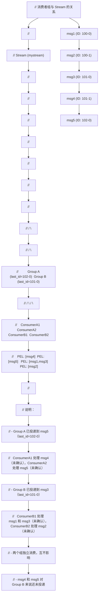

### 5.2 PEL（Pending Entry List）结构

PEL 是消费者组实现消息可靠性的核心数据结构。PEL 存储已投递但未确认的消息，确保消息不会因消费者宕机而丢失。

#### 5.2.1 PEL 的两级结构

PEL 在 Redis 内部采用两级结构存储：

1. **组级 PEL（streamCG.pel）**：消费者组的全局 PEL，存储该组所有已投递但未确认的消息。key 为消息 ID，value 为 streamNACK。
2. **消费者级 PEL（streamConsumer.pel）**：每个消费者独立的 PEL，存储该消费者持有的待确认消息。key 为消息 ID，value 为 streamNACK。

两级 PEL 的设计目的：

- 组级 PEL 用于快速扫描所有待确认消息（如 XAUTOCLAIM）
- 消费者级 PEL 用于快速查询特定消费者的待确认消息（如 XREADGROUP ID 0）

两级 PEL 中的 streamNACK 是同一个对象（指针相同），不会重复存储。

#### 5.2.2 streamNACK 结构详解

```c
// streamNACK 结构
typedef struct streamNACK {
    mstime_t delivery_time;   // 上次投递时间（Unix 毫秒时间戳）
    uint64_t delivery_count;  // 投递次数（每次 XREADGROUP/XCLAIM/XAUTOCLAIM 递增）
    streamConsumer *consumer; // 当前持有该消息的消费者指针
} streamNACK;
```

streamNACK 记录了消息的投递状态：

- `delivery_time`：用于计算空闲时间（当前时间 - delivery_time），判断消息是否需要重新认领
- `delivery_count`：用于检测"毒丸消息"（poison pill），即反复投递但始终无法处理的消息
- `consumer`：指向当前持有该消息的消费者，用于在 XACK 或 XCLAIM 时定位消费者级 PEL

#### 5.2.3 PEL 的生命周期

```
// PEL 条目的生命周期
//
// 1. 创建（XREADGROUP >）
//    当消费者通过 XREADGROUP > 读取新消息时：
//    a. 创建 streamNACK 条目
//    b. delivery_time = 当前时间
//    c. delivery_count = 1
//    d. consumer = 读取的消费者
//    e. 插入组级 PEL 和消费者级 PEL
//
// 2. 更新（XCLAIM/XAUTOCLAIM）
//    当消息被重新认领时：
//    a. delivery_time = 当前时间
//    b. delivery_count += 1
//    c. consumer = 新的消费者
//    d. 从原消费者 PEL 移除，插入新消费者 PEL
//
// 3. 删除（XACK）
//    当消费者确认消息时：
//    a. 从组级 PEL 移除
//    b. 从消费者级 PEL 移除
//    c. 释放 streamNACK 内存
//
// 4. 删除（XDEL + 清理）
//    当消息被 XDEL 删除时：
//    a. PEL 中的条目不会立即移除
//    b. 在 XAUTOCLAIM 扫描时检测到消息已删除，才从 PEL 移除
```

### 5.3 消息确认机制

消息确认（Acknowledgment）是消费者组实现至少一次投递语义的关键机制。

#### 5.3.1 确认流程

```
// 消息确认的完整流程
//
// 1. 消费者通过 XREADGROUP > 获取消息
//    消息进入 PEL，delivery_count = 1
//
// 2. 消费者处理消息
//    a. 处理成功：调用 XACK 确认，消息从 PEL 移除
//    b. 处理失败：不调用 XACK，消息留在 PEL
//    c. 消费者宕机：不调用 XACK，消息留在 PEL
//
// 3. 消息留在 PEL 的情况
//    a. 其他消费者通过 XCLAIM 或 XAUTOCLAIM 认领该消息
//    b. 认领后 delivery_count 递增
//    c. 新消费者重新处理该消息
//
// 4. 毒丸消息处理
//    a. 如果 delivery_count 超过阈值（如 10 次），判定为毒丸消息
//    b. 将毒丸消息转移到死信队列（需应用层实现）
//    c. 调用 XACK 确认（从 PEL 移除），避免无限重试
```

#### 5.3.2 确认的注意事项

- **必须确认**：消费者处理完成后必须调用 XACK，否则消息永久留在 PEL，占用内存
- **批量确认**：多条消息可一次性 XACK，减少网络往返
- **幂等性**：XACK 已确认的消息返回 0，不会报错
- **不确认已删除消息**：如果消息被 XDEL 删除，XACK 仍可从 PEL 移除（如果 PEL 中存在）

### 5.4 消息重分配

当消费者宕机或处理缓慢时，其 PEL 中的消息需要被重新分配给其他消费者。Stream 提供两种重分配机制：

#### 5.4.1 XCLAIM：手动认领

XCLAIM 用于将指定的消息从原消费者转移给新消费者。需要调用者明确知道要认领哪些消息 ID。

典型使用场景：

```
// 手动认领流程
//
// 1. 通过 XPENDING 查看待确认消息
//    XPENDING mystream mygroup - + 10
//    返回：[[id, consumer, idle_time, delivery_count], ...]
//
// 2. 找到空闲时间过长的消息
//    例如：[1718334600000-0, consumer1, 120000, 3]
//    表示消息 1718334600000-0 由 consumer1 持有，空闲 120 秒，已投递 3 次
//
// 3. 用 XCLAIM 认领
//    XCLAIM mystream mygroup consumer2 60000 1718334600000-0
//    将消息从 consumer1 转移给 consumer2
//
// 4. consumer2 处理并确认
//    处理完成后 XACK mystream mygroup 1718334600000-0
```

#### 5.4.2 XAUTOCLAIM：自动认领

XAUTOCLAIM 用于自动扫描 PEL 并认领空闲超过指定时间的消息。不需要调用者知道具体的消息 ID。

典型使用场景：

```
// 自动认领流程
//
// 1. consumer2 定期执行 XAUTOCLAIM
//    XAUTOCLAIM mystream mygroup consumer2 60000 - COUNT 10
//    扫描 PEL，认领空闲超过 60 秒的消息，最多 10 条
//
// 2. 处理认领的消息
//    返回的消息列表即为认领的消息
//
// 3. 继续扫描
//    使用返回的 next-start-id 继续扫描
//    XAUTOCLAIM mystream mygroup consumer2 60000 <next-start-id> COUNT 10
//
// 4. 循环直到 next-start-id 为 0-0（表示扫描完成）
```

#### 5.4.3 Redis 8.4 的 CLAIM 参数

Redis 8.4 引入了 XREADGROUP CLAIM 参数，将新消息读取与空闲消息认领合并为单次命令调用，显著简化了消费者逻辑。

```
// Redis 8.4 CLAIM 参数的使用
//
// 传统方式（Redis 8.4 之前）：
// loop:
//   1. XPENDING 查找空闲消息
//   2. XCLAIM 认领空闲消息
//   3. XREADGROUP > 读取新消息
//   需要三次命令调用
//
// Redis 8.4 方式：
// loop:
//   XREADGROUP GROUP group consumer CLAIM 60000 COUNT 10 STREAMS mystream >
//   单次调用同时完成认领与读取
//
// 性能提升：
// - 减少网络往返（3 次 -> 1 次）
// - 减少命令解析开销
// - 官方基准测试显示比 XAUTOCLAIM 快达 22.5 倍
```

### 5.5 消费者组完整时序图

以下是消费者组从创建到消息处理、故障恢复的完整时序图：

```
// 消费者组完整时序图
//
// 参与者：Producer, Redis(Stream+Group), Consumer1, Consumer2
//
// 阶段 1：初始化
// ==============
// Producer          Redis          Consumer1       Consumer2
//    |                |                |               |
//    |                |<---XGROUP CREATE mygroup $----|
//    |                |                |               |
//    |                |  (创建组，last_id=当前最新)     |
//    |                |                |               |
//
// 阶段 2：生产消息
// ==============
// Producer          Redis          Consumer1       Consumer2
//    |                |                |               |
//    |---XADD msg1--->|                |               |
//    |                | (存储 msg1)    |               |
//    |<---ID:100-0----|                |               |
//    |                |                |               |
//    |---XADD msg2--->|                |               |
//    |                | (存储 msg2)    |               |
//    |<---ID:100-1----|                |               |
//    |                |                |               |
//    |---XADD msg3--->|                |               |
//    |                | (存储 msg3)    |               |
//    |<---ID:101-0----|                |               |
//    |                |                |               |
//
// 阶段 3：消费消息
// ==============
// Producer          Redis          Consumer1       Consumer2
//    |                |                |               |
//    |                |<---XREADGROUP GROUP mygroup    |
//    |                |         consumer1 COUNT 1      |
//    |                |         STREAMS mystream >-----|
//    |                |                |               |
//    |                | (last_id=100-0)|               |
//    |                | (PEL: 100-0->C1)               |
//    |                |---msg1(100-0)->|               |
//    |                |                |               |
//    |                |                | (处理 msg1)   |
//    |                |                |               |
//    |                |<---XREADGROUP GROUP mygroup----|
//    |                |         consumer2 COUNT 1      |
//    |                |         STREAMS mystream >-----|
//    |                |                |               |
//    |                | (last_id=100-1)|               |
//    |                | (PEL: 100-1->C2)               |
//    |                |---msg2(100-1)---------------->|
//    |                |                |               |
//    |                |                |    (处理 msg2)|
//    |                |                |               |
//
// 阶段 4：消息确认
// ==============
// Producer          Redis          Consumer1       Consumer2
//    |                |                |               |
//    |                |<---XACK mygroup 100-0----------|
//    |                |                |    (确认 msg2)|
//    |                | (PEL: 100-1 移除)              |
//    |                |---1----------->|               |
//    |                |                |               |
//    |                |  (Consumer1 未确认 100-0)      |
//    |                |  (PEL 中仍有 100-0->C1)        |
//    |                |                |               |
//
// 阶段 5：消费者宕机与恢复
// ======================
// Producer          Redis          Consumer1       Consumer2
//    |                |                |               |
//    |                |                X (宕机)        |
//    |                |                |               |
//    |                |  (msg1=100-0 仍在 PEL)         |
//    |                |  (idle_time 持续增长)          |
//    |                |                |               |
//    |                |<---XAUTOCLAIM mygroup consumer2|
//    |                |         60000 - COUNT 10-------|
//    |                |                |               |
//    |                | (扫描 PEL，找到 100-0)         |
//    |                | (idle=120s > 60s)              |
//    |                | (100-0: C1->C2, count=2)      |
//    |                |---msg1(100-0)---------------->|
//    |                |                |               |
//    |                |                |    (处理 msg1)|
//    |                |                |               |
//    |                |<---XACK mygroup 100-0----------|
//    |                |                |    (确认 msg1)|
//    |                | (PEL 清空)     |               |
//    |                |---1--------------------------->|
//    |                |                |               |
```

### 5.6 消费者组创建与删除

#### 5.6.1 创建消费者组

创建消费者组时，起始 ID 的选择决定了消费者组从哪里开始消费：

- `$`：从当前最新消息开始，只消费创建组之后的新消息
- `0`：从 Stream 头部开始，消费所有历史消息
- 具体 ID：从指定 ID 开始消费

```redis
// 场景 1：新建消费者组，只处理新消息
XGROUP CREATE events new_group $
// 适用于新加入的消费者组，不需要处理历史消息

// 场景 2：新建消费者组，处理所有消息
XGROUP CREATE events archive_group 0
// 适用于数据归档、回溯分析等场景

// 场景 3：从指定时间点开始消费
XGROUP CREATE events recovery_group 1718334000000-0
// 适用于从故障点恢复的场景
```

#### 5.6.2 删除消费者组

```redis
// 删除消费者组
XGROUP DESTROY events old_group
// 删除后，该组的 PEL 也会被清除
// 注意：删除组不影响 Stream 中的消息

// 删除单个消费者
XGROUP DELCONSUMER events active_group slow_consumer
// 返回该消费者的待确认消息数
// 这些消息仍在组级 PEL 中，可被其他消费者认领
```

---

## 第 6 章 消息可靠性与持久化

### 6.1 at-least-once 语义

Redis Stream 通过 PEL 机制实现了至少一次投递（at-least-once delivery）语义。这意味着：

- 每条消息至少被投递给消费者一次
- 在故障情况下，消息可能被投递多次
- 消费者必须实现幂等性以处理重复消息

#### 6.1.1 at-least-once 的保障机制

```
// at-least-once 语义的保障流程
//
// 1. 消息投递
//    XREADGROUP > 将消息投递给消费者，同时加入 PEL
//    -> 消息已持久化在 Stream 中
//    -> 投递状态持久化在 PEL 中
//
// 2. 消费者处理
//    消费者处理消息
//    -> 成功：XACK 确认，消息从 PEL 移除
//    -> 失败：消息留在 PEL，等待重新投递
//    -> 宕机：消息留在 PEL，由其他消费者认领
//
// 3. 故障恢复
//    其他消费者通过 XCLAIM/XAUTOCLAIM 认领 PEL 中的消息
//    -> 消息重新投递给新消费者
//    -> delivery_count 递增
//    -> 新消费者重新处理
//
// 4. 重复投递的场景
//    a. 消费者处理成功但 XACK 前宕机
//       -> 消息被重新认领并重新处理（重复）
//    b. 消费者处理超时被认领
//       -> 原消费者可能仍在处理，新消费者也开始处理（重复）
//    c. 网络分区导致 XACK 未到达 Redis
//       -> 消息被重新认领（重复）
```

#### 6.1.2 幂等性设计

由于 at-least-once 语义可能导致消息重复，消费者必须实现幂等性。常见的幂等性策略：

1. **唯一标识去重**：消息携带唯一 ID（业务 ID，非 Stream ID），消费者维护已处理 ID 集合，重复消息跳过。

2. **状态检查**：消费者处理前检查当前状态，避免重复操作。例如转账前检查账户余额是否已变动。

3. **数据库唯一约束**：利用数据库的唯一索引防止重复插入。

4. **Redis 去重**：使用 Redis 的 SETNX 或 SET NX 实现快速去重。

```python
# Python 幂等性消费者示例
import redis

class IdempotentConsumer:
    def __init__(self, redis_client, stream_key, group, consumer):
        self.redis = redis_client
        self.stream_key = stream_key
        self.group = group
        self.consumer = consumer
        self.dedup_key_prefix = "dedup:"

    def process_message(self, msg_id, fields):
        """处理消息，保证幂等性"""
        # 获取业务唯一 ID
        biz_id = fields.get(b"biz_id")
        if not biz_id:
            return False

        dedup_key = self.dedup_key_prefix + biz_id.decode()

        # 使用 SETNX 实现原子去重
        # 如果已存在，说明消息已处理过，直接确认
        if not self.redis.setnx(dedup_key, msg_id.decode()):
            # 消息已处理过，幂等确认
            self.redis.xack(self.stream_key, self.group, msg_id)
            return True

        # 设置过期时间，避免去重集合无限增长
        self.redis.expire(dedup_key, 86400)  # 24 小时过期

        try:
            # 实际处理消息
            self.do_business_logic(fields)
            # 处理成功，确认消息
            self.redis.xack(self.stream_key, self.group, msg_id)
            return True
        except Exception as e:
            # 处理失败，删除去重标记，允许重试
            self.redis.delete(dedup_key)
            raise e
```

### 6.2 消息确认与超时

#### 6.2.1 空闲时间与超时检测

PEL 中的每条消息都记录了 `delivery_time`（上次投递时间）。通过计算当前时间与 delivery_time 的差值，可以得到消息的空闲时间（idle time）。

空闲时间的用途：

1. **检测消费者故障**：如果消息空闲时间过长（如超过 60 秒），可能消费者已宕机
2. **触发消息重分配**：通过 XCLAIM/XAUTOCLAIM 认领空闲超过阈值的消息
3. **监控积压**：通过 XPENDING 查看空闲时间分布，识别积压情况

#### 6.2.2 超时处理策略

```
// 超时处理策略建议
//
// 1. 确定超时阈值
//    超时阈值应大于消息的正常处理时间
//    例如：正常处理 5 秒，超时阈值设为 60 秒（12 倍冗余）
//
// 2. 定期扫描 PEL
//    每个消费者定期执行 XAUTOCLAIM，认领空闲消息
//    扫描间隔建议为超时阈值的 1/3 到 1/2
//
// 3. 毒丸消息检测
//    如果 delivery_count 超过阈值（如 10 次），判定为毒丸消息
//    转移到死信队列，避免无限重试
//
// 4. 渐进式退避
//    重复投递时，增加处理间隔，避免雪崩
//    例如：第 1 次重试立即，第 2 次延迟 1 秒，第 3 次延迟 5 秒...
```

### 6.3 宕机恢复

#### 6.3.1 消费者宕机恢复

```
// 消费者宕机恢复流程
//
// 1. 消费者宕机
//    Consumer1 宕机，其 PEL 中的消息留在 Redis 中
//
// 2. 其他消费者检测
//    Consumer2 定期执行 XAUTOCLAIM：
//    XAUTOCLAIM mystream mygroup consumer2 60000 - COUNT 10
//    认领 Consumer1 的空闲消息
//
// 3. 消息重新处理
//    Consumer2 收到认领的消息，重新处理
//    处理完成后 XACK 确认
//
// 4. Consumer1 恢复
//    Consumer1 恢复后，其 PEL 已被清空（消息被认领）
//    Consumer1 继续通过 XREADGROUP > 读取新消息
```

#### 6.3.2 Redis 宕机恢复

```
// Redis 宕机恢复流程
//
// 1. Redis 宕机
//    Redis 进程崩溃或服务器宕机
//
// 2. 持久化恢复
//    a. 如果配置了 AOF：
//       - 从 AOF 文件恢复，Stream 数据与 PEL 状态完整保留
//       - 取决于 appendfsync 配置：
//         * always: 最多丢失 1 条命令
//         * everysec: 最多丢失 1 秒数据
//         * no: 最多丢失上次 OS fsync 以来的数据
//    b. 如果仅配置了 RDB：
//       - 从 RDB 快照恢复，可能丢失最后一次快照后的数据
//       - Stream 数据与 PEL 状态恢复到最后一次快照
//    c. 如果同时配置了 AOF 和 RDB：
//       - 优先使用 AOF 恢复（数据更完整）
//
// 3. 消费者重连
//    消费者检测到 Redis 重连后：
//    a. 重新执行 XREADGROUP > 继续读取新消息
//    b. 检查自身 PEL，处理未确认的消息
//       XREADGROUP GROUP mygroup consumer1 COUNT 10 STREAMS mystream 0
//
// 4. 数据一致性
//    a. Stream 中的消息：根据持久化配置，可能丢失部分最新消息
//    b. PEL 中的待确认消息：与 Stream 消息同步恢复
//    c. 消费进度（last_id）：与持久化状态一致
```

### 6.4 与 RDB/AOF 持久化的关系

#### 6.4.1 RDB 持久化下的 Stream

RDB（Redis Database）是 Redis 的快照持久化机制。在 RDB 持久化下：

- Stream 的完整状态（包括消息、消费者组、PEL）会被序列化到 RDB 文件
- RDB 是某一时刻的完整快照，恢复时 Stream 状态恢复到快照时间点
- 快照之后的增量消息可能丢失

RDB 持久化的触发方式：

- `save` 配置：基于时间与变更数量的自动触发
- `BGSAVE` 命令：手动触发后台保存
- 主从复制中的全量同步

#### 6.4.2 AOF 持久化下的 Stream

AOF（Append-Only File）是 Redis 的日志持久化机制。在 AOF 持久化下：

- 每条写命令（XADD、XDEL、XGROUP、XACK 等）被追加到 AOF 文件
- 恢复时重放 AOF 文件中的命令，重建 Stream 状态
- AOF 的数据完整性取决于 appendfsync 配置

AOF 的三种 fsync 策略：

| 策略 | 说明 | 数据丢失风险 | 性能影响 |
|------|------|------------|---------|
| always | 每条命令都 fsync | 最多丢失 1 条命令 | 严重影响性能 |
| everysec | 每秒 fsync 一次 | 最多丢失 1 秒数据 | 轻微影响（推荐） |
| no | 由 OS 决定 fsync 时机 | 丢失上次 OS fsync 后的数据 | 无影响 |

#### 6.4.3 持久化配置建议

对于消息可靠性要求较高的场景：

```
# redis.conf 推荐配置

# 开启 AOF
appendonly yes

# 每秒 fsync（兼顾性能与可靠性）
appendfsync everysec

# AOF 重写触发条件
auto-aof-rewrite-percentage 100
auto-aof-rewrite-min-size 64mb

# 同时保留 RDB 作为备份
save 900 1
save 300 10
save 60 10000

# 如果可靠性要求极高，考虑 appendfsync always
# 但需评估性能影响（吞吐量可能下降 10 倍以上）
```

### 6.5 FSYNC 策略详解

FSYNC 是操作系统层面的磁盘同步操作，将文件系统缓冲区的数据刷写到物理磁盘。Redis AOF 的 appendfsync 配置控制 fsync 的频率。

#### 6.5.1 fsync 的性能影响

```
// fsync 性能影响分析
//
// 测试环境：SSD 磁盘，典型 Linux 服务器
//
// appendfsync always:
//   - 每条命令都 fsync
//   - XADD 吞吐量：约 1,000-3,000 ops/s
//   - 延迟：每次 fsync 约 1-10ms
//   - 适用场景：金融级可靠性要求
//
// appendfsync everysec:
//   - 每秒 fsync 一次
//   - XADD 吞吐量：约 50,000-100,000 ops/s
//   - 延迟：无额外延迟（fsync 在后台线程）
//   - 适用场景：大多数业务场景（推荐）
//
// appendfsync no:
//   - 不主动 fsync，由 OS 决定
//   - XADD 吞吐量：约 80,000-150,000 ops/s
//   - 延迟：无额外延迟
//   - 适用场景：可容忍数据丢失的场景
```

#### 6.5.2 Stream 场景下的 fsync 选择

| 场景 | 推荐 fsync 策略 | 理由 |
|------|----------------|------|
| 金融交易 | always | 每条消息都不能丢失 |
| 订单处理 | everysec | 1 秒内的丢失可接受，性能优先 |
| 日志收集 | no / everysec | 少量日志丢失可接受 |
| 实时通知 | no | 通知丢失影响小，性能优先 |
| 事件溯源 | always | 事件不能丢失，重建需要完整日志 |

---

## 第 7 章 消息积压与修剪

### 7.1 XTRIM 修剪策略

XTRIM 命令用于修剪 Stream，控制 Stream 的长度，防止内存无限增长。XTRIM 提供两种修剪策略：

#### 7.1.1 MAXLEN 策略

MAXLEN 策略按数量修剪，保留最新的 N 条消息：

```redis
// 精确修剪：保留恰好 1000 条
XTRIM mystream MAXLEN 1000

// 近似修剪：保留约 1000 条（可能略多）
XTRIM mystream MAXLEN ~ 1000

// 限制单次删除数量
XTRIM mystream MAXLEN ~ 1000 LIMIT 100
```

MAXLEN 策略适用于：
- 固定容量的环形缓冲区
- 只关心最新 N 条消息的场景
- 内存预算明确的场景

#### 7.1.2 MINID 策略

MINID 策略按 ID 修剪，删除 ID 小于指定值的所有消息：

```redis
// 删除 ID 小于 1718334000000-0 的消息
XTRIM mystream MINID 1718334000000-0

// 近似修剪
XTRIM mystream MINID ~ 1718334000000-0
```

MINID 策略适用于：
- 按时间清理旧消息（ID 的时间戳部分即消息时间）
- 保留某时间点之后所有消息的场景
- 与消费者组消费进度配合的场景

#### 7.1.3 精确修剪 vs 近似修剪

```
// 精确修剪（= 或无修饰符）
//
// 逐条检查 listpack 中的消息
// 确保 Stream 长度恰好为阈值
// 时间复杂度较高（O(N)，N 为删除的消息数）
// 适用于需要严格长度控制的场景
//
// 示例：
// Stream: [1, 2, 3, ..., 1500]  (1500 条)
// XTRIM MAXLEN 1000
// 结果: [501, 502, ..., 1500]  (恰好 1000 条)
//
//
// 近似修剪（~）
//
// 只删除整个 listpack 节点
// 不精确到单条消息
// 时间复杂度较低（O(M)，M 为删除的节点数，M << N）
// 可能保留少量应删除的消息
//
// 示例：
// Stream: [1, 2, ..., 1500]  (1500 条，存储在 15 个 listpack 节点中，每节点 100 条)
// XTRIM MAXLEN ~ 1000
// 删除前 5 个节点（500 条），保留后 10 个节点（1000 条）
// 结果: [501, 502, ..., 1500]  (恰好 1000 条，此例恰好精确)
//
// 但如果阈值不是节点大小的整数倍：
// XTRIM MAXLEN ~ 950
// 删除前 5 个节点（500 条），第 6 个节点部分消息应删除但不删
// 结果: [501, 502, ..., 1500]  (1000 条，略多于 950)
```

### 7.2 自动修剪

除了手动执行 XTRIM，还可以在 XADD 时自动修剪：

```redis
// 每次追加消息时自动修剪
XADD mystream MAXLEN 1000 * field1 value1
// 追加消息后，如果长度超过 1000，自动修剪

// 近似自动修剪
XADD mystream MAXLEN ~ 1000 * field1 value1
// 追加消息后，近似修剪到约 1000 条

// 按 ID 自动修剪
XADD mystream MINID 1718334000000-0 * field1 value1
// 追加消息后，删除 ID 小于指定值的旧消息
```

自动修剪的优点：

- 无需额外的定时任务
- 修剪与写入同步，避免积压
- 近似修剪模式下性能影响小

自动修剪的缺点：

- 每次写入都有修剪开销（虽然小）
- 精确修剪模式下可能影响写入性能
- 不够灵活，无法根据负载动态调整

### 7.3 积压监控

消息积压（Backlog）是指 Stream 中未被消费或未确认的消息堆积。积压监控是 Stream 运维的关键环节。

#### 7.3.1 监控指标

```
// Stream 积压监控的关键指标
//
// 1. Stream 长度（XLEN）
//    XLEN mystream
//    表示 Stream 中的消息总数
//    增长过快可能表示生产者速度远超消费者
//
// 2. 消费者组待确认消息数（XPENDING 摘要）
//    XPENDING mystream mygroup
//    返回：[pending_count, min_id, max_id, [[consumer, count], ...]]
//    pending_count 过大可能表示消费者处理速度跟不上
//
// 3. 消费者组消费延迟
//    比较 stream.last_id 与 group.last_delivered_id
//    差值越大，消费延迟越严重
//
// 4. 消息空闲时间分布
//    XPENDING mystream mygroup - + 100 IDLE 60000
//    返回空闲超过 60 秒的待确认消息
//    数量过多可能表示消费者故障
//
// 5. 消费者活跃度
//    XINFO CONSUMERS mystream mygroup
//    查看每个消费者的 idle 和 inactive 时间
//    idle 过长可能表示消费者卡死
```

#### 7.3.2 积压监控脚本

```python
# Python 积压监控脚本
import redis
import time

class StreamMonitor:
    """Stream 积压监控器"""

    def __init__(self, redis_client, stream_key):
        """
        初始化监控器
        :param redis_client: Redis 客户端
        :param stream_key: Stream 键名
        """
        self.redis = redis_client
        self.stream_key = stream_key

    def get_stream_info(self):
        """获取 Stream 基本信息"""
        info = self.redis.xinfo_stream(self.stream_key)
        return {
            "length": info["length"],
            "last_generated_id": info["last-generated-id"],
            "radix_tree_keys": info["radix-tree-keys"],
            "radix_tree_nodes": info["radix-tree-nodes"],
            "groups": info["groups"],
        }

    def get_group_info(self):
        """获取所有消费者组信息"""
        groups = self.redis.xinfo_groups(self.stream_key)
        result = []
        for g in groups:
            result.append({
                "name": g["name"],
                "consumers": g["consumers"],
                "pending": g["pending"],
                "last_delivered_id": g["last-delivered-id"],
            })
        return result

    def get_pending_summary(self, group):
        """获取消费者组的 PEL 摘要"""
        pending = self.redis.xpending(self.stream_key, group)
        return {
            "pending_count": pending["pending"],
            "min_id": pending["min"],
            "max_id": pending["max"],
            "consumers": pending["consumers"],
        }

    def get_idle_messages(self, group, min_idle_ms=60000, count=100):
        """获取空闲超过指定时间的待确认消息"""
        idle_messages = self.redis.xpending_range(
            self.stream_key, group, "-", "+", count,
            min_idle_time=min_idle_ms
        )
        return idle_messages

    def check_backlog(self, group, max_pending=1000, max_idle_ms=60000):
        """
        检查积压情况，返回告警信息
        :param group: 消费者组名
        :param max_pending: 最大允许的待确认消息数
        :param max_idle_ms: 最大允许的空闲时间（毫秒）
        :return: 告警列表
        """
        alerts = []

        # 检查 PEL 大小
        summary = self.get_pending_summary(group)
        if summary["pending_count"] > max_pending:
            alerts.append({
                "level": "WARNING",
                "message": f"PEL 积压: {summary['pending_count']} > {max_pending}",
                "group": group,
            })

        # 检查空闲消息
        idle_msgs = self.get_idle_messages(group, max_idle_ms, 10)
        if len(idle_msgs) > 0:
            alerts.append({
                "level": "CRITICAL",
                "message": f"发现 {len(idle_msgs)} 条空闲超过 {max_idle_ms}ms 的消息",
                "group": group,
                "messages": idle_msgs,
            })

        # 检查消费延迟
        stream_info = self.get_stream_info()
        group_info = next(
            (g for g in self.get_group_info() if g["name"] == group), None
        )
        if group_info:
            lag = self._calculate_lag(
                stream_info["last_generated_id"],
                group_info["last_delivered_id"]
            )
            if lag > 100:
                alerts.append({
                    "level": "WARNING",
                    "message": f"消费延迟: {lag} 条消息",
                    "group": group,
                })

        return alerts

    def _calculate_lag(self, last_generated_id, last_delivered_id):
        """计算消费延迟（简化版，基于 ID 序号差）"""
        # 注意：这是一个简化计算，实际延迟需要遍历消息
        # 这里仅作示例
        try:
            gen_ms, gen_seq = map(int, last_generated_id.split("-"))
            del_ms, del_seq = map(int, last_delivered_id.split("-"))
            if gen_ms == del_ms:
                return gen_seq - del_seq
            else:
                return -1  # 跨毫秒，无法简单计算
        except Exception:
            return -1

# 使用示例
if __name__ == "__main__":
    r = redis.Redis(host="localhost", port=6379, decode_responses=True)
    monitor = StreamMonitor(r, "mystream")

    # 检查积压
    alerts = monitor.check_backlog("mygroup", max_pending=1000, max_idle_ms=60000)
    for alert in alerts:
        print(f"[{alert['level']}] {alert['message']}")
```

### 7.4 积压告警

#### 7.4.1 告警阈值建议

| 指标 | 告警阈值 | 严重告警阈值 | 说明 |
|------|---------|------------|------|
| PEL 大小 | > 1000 | > 5000 | 待确认消息过多 |
| 消息空闲时间 | > 60s | > 300s | 消费者可能故障 |
| 消费延迟 | > 100 条 | > 1000 条 | 消费速度跟不上 |
| Stream 长度 | > 100000 | > 1000000 | 可能未配置修剪 |
| 消费者数 | < 预期 | 0 | 消费者全部下线 |

#### 7.4.2 告警处理流程

```
// 积压告警处理流程
//
// 1. PEL 积压告警
//    a. 检查消费者是否存活：XINFO CONSUMERS
//    b. 检查消费者是否卡死：查看 idle 时间
//    c. 增加消费者数量：启动更多消费者实例
//    d. 检查消息处理逻辑是否有性能瓶颈
//
// 2. 消息空闲告警
//    a. 检查持有该消息的消费者状态
//    b. 如果消费者已宕机，执行 XAUTOCLAIM 重新分配
//    c. 如果消费者卡死，重启消费者
//    d. 检查是否为毒丸消息（delivery_count 过高）
//
// 3. 消费延迟告警
//    a. 检查生产者速率是否突增
//    b. 增加消费者数量
//    c. 优化消费者处理逻辑（批量处理、异步化）
//    d. 考虑使用多消费者组分流
//
// 4. Stream 长度告警
//    a. 检查是否配置了 MAXLEN/MINID 修剪
//    b. 执行紧急 XTRIM 修剪
//    c. 在 XADD 中添加自动修剪
```

---

## 第 8 章 集群环境下的 Stream

### 8.1 Redis Cluster 中 Stream 的槽位分配

Redis Cluster 采用哈希槽（Hash Slot）机制将数据分布到多个节点。整个集群有 16384 个槽位（0-16383），每个 key 通过 CRC16 计算哈希值后对 16384 取模，确定所属槽位。

Stream 作为 Redis 的一种数据类型，其键名同样遵循哈希槽分配规则：

```
// Stream 键的槽位计算
//
// 键名：mystream
// CRC16("mystream") % 16384 = 槽位号
//
// 键名: orders:stream
// CRC16("orders:stream") % 16384 = 槽位号
//
// 键名：{orders}:stream
// CRC16("orders") % 16384 = 槽位号（Hash Tag）
// 只有 {} 内的部分参与哈希计算
```

### 8.2 Hash Tag 的使用

在 Redis Cluster 中，如果多个 key 需要在同一节点上操作（如事务、Pipeline），可以使用 Hash Tag 强制它们分配到同一槽位。Hash Tag 是键名中 `{` 和 `}` 之间的部分，只有这部分参与哈希计算。

```redis
// Hash Tag 示例
//
// 键名：{orders}:stream 和 {orders}:group_info
// 都使用 "orders" 作为 Hash Tag
// CRC16("orders") % 16384 = 相同的槽位
// 两个 key 被分配到同一节点
//
// 应用场景：
// 1. 多 Stream 操作
//    XREAD COUNT 10 STREAMS {orders}:stream1 {orders}:stream2 > >
//    两个 Stream 必须在同一槽位才能用单条 XREAD 读取
//
// 2. Stream 与相关数据同节点
//    {user:1001}:events  (Stream)
//    {user:1001}:profile (Hash)
//    两者在同一节点，可使用事务保证原子性
```

### 8.3 跨槽限制

Redis Cluster 对 Stream 操作有以下跨槽限制：

#### 8.3.1 XREAD/XREADGROUP 的跨槽限制

```redis
// 合法：单 Stream 读取
XREAD COUNT 10 STREAMS mystream >
// 单个 key 不涉及跨槽问题

// 合法：多 Stream 使用 Hash Tag
XREAD COUNT 10 STREAMS {orders}:s1 {orders}:s2 > >
// 两个 key 在同一槽位，合法

// 非法：多 Stream 跨槽
XREAD COUNT 10 STREAMS stream1 stream2 > >
// 如果 stream1 和 stream2 不在同一槽位，报错：
// CROSSSLOT Keys in request don't hash to the same slot
```

#### 8.3.2 事务与 Lua 的跨槽限制

```redis
// 合法：事务中的 key 在同一槽位
MULTI
XADD {orders}:stream * field1 value1
XLEN {orders}:stream
EXEC

// 非法：事务中的 key 跨槽
MULTI
XADD stream1 * field1 value1
XADD stream2 * field1 value1
EXEC
// 报错：CROSSSLOT
```

### 8.4 故障转移对 Stream 的影响

Redis Cluster 采用主从复制与自动故障转移机制。当主节点故障时，对应的从节点会被提升为新的主节点。

#### 8.4.1 故障转移过程中的 Stream 状态

```
// 故障转移对 Stream 的影响
//
// 1. 主节点故障
//    a. 主节点 M1 宕机，其负责的槽位不可用
//    b. 集群检测到 M1 故障（通常 15-30 秒）
//
// 2. 从节点提升
//    a. 对应的从节点 S1 被提升为新主节点
//    b. S1 接管 M1 的槽位
//
// 3. Stream 数据恢复
//    a. S1 上的 Stream 数据来自异步复制
//    b. 可能丢失部分最新消息（复制延迟内的消息）
//    c. PEL 状态也来自复制，可能丢失最新的 PEL 变更
//
// 4. 消费者重连
//    a. 消费者通过集群路由发现新主节点
//    b. 使用 MOVED/ASK 重定向到新节点
//    c. 继续消费操作
//
// 5. 数据一致性影响
//    a. Stream 消息：可能丢失故障前的部分最新消息
//    b. PEL 状态：可能丢失故障前的部分 PEL 变更
//    c. 消费进度：可能回退到较旧的位置
//    d. 重复消费：PEL 丢失可能导致已投递但未确认的消息
//       被重新投递（消费者可能重复处理）
```

#### 8.4.2 降低故障转移影响的策略

1. **启用 WAIT 命令**：在 XADD 后使用 WAIT 确保消息已复制到至少 N 个从节点

```redis
// 确保消息至少复制到 1 个从节点，超时 100ms
XADD mystream * field1 value1
WAIT 1 100
// 返回复制的从节点数，如果 < 1，说明复制未完成
```

2. **合理设置复制延迟监控**：监控主从复制延迟，延迟过大时告警

3. **消费者幂等性**：消费者必须实现幂等性，应对故障转移导致的重复消费

4. **多可用区部署**：将主从节点分布在不同可用区，降低同时故障风险

### 8.5 集群环境下的最佳实践

```
// Redis Cluster 下 Stream 最佳实践
//
// 1. 键名设计
//    使用 Hash Tag 将相关 Stream 分配到同一槽位
//    {app1}:events, {app1}:alerts, {app1}:logs
//
// 2. 消费者组命名
//    消费者组名不影响槽位分配，可自由命名
//    但建议包含业务标识，便于管理
//
// 3. 客户端配置
//    使用支持集群的客户端（redis-py cluster, Lettuce, go-redis）
//    启用自动重连与拓扑刷新
//
// 4. 监控
//    监控每个节点的 Stream 数量与内存占用
//    监控集群状态与故障转移事件
//
// 5. 容量规划
//    Stream 数据在内存中，需评估总内存需求
//    考虑节点故障时的内存压力（接管槽位后）
```

---

## 第 9 章 性能分析与基准测试

### 9.1 吞吐量基准测试

以下基准测试数据基于典型硬件环境（Intel Xeon E5-2670, 64GB RAM, SSD, Redis 7.x 单节点），使用 redis-benchmark 工具测试。

#### 9.1.1 XADD 吞吐量

| 消息大小 | Pipeline=1 | Pipeline=10 | Pipeline=100 | 说明 |
|---------|-----------|-------------|-------------|------|
| 64 bytes | 85,000 ops/s | 450,000 ops/s | 850,000 ops/s | 小消息，高吞吐 |
| 256 bytes | 75,000 ops/s | 380,000 ops/s | 720,000 ops/s | 中等消息 |
| 1024 bytes | 55,000 ops/s | 250,000 ops/s | 480,000 ops/s | 大消息，吞吐下降 |
| 4096 bytes | 25,000 ops/s | 95,000 ops/s | 180,000 ops/s | 大消息，吞吐显著下降 |

#### 9.1.2 XREAD 吞吐量

| 读取方式 | Pipeline=1 | Pipeline=10 | 说明 |
|---------|-----------|-------------|------|
| XREAD COUNT 1 | 92,000 ops/s | 520,000 ops/s | 单条读取 |
| XREAD COUNT 10 | 45,000 ops/s | 380,000 ops/s | 批量读取（按批次计） |
| XREAD COUNT 100 | 8,000 ops/s | 75,000 ops/s | 大批量读取 |
| XREAD BLOCK 0 | 85,000 ops/s | - | 阻塞读取（有消息时） |

#### 9.1.3 消费者组操作吞吐量

| 操作 | 吞吐量 | 说明 |
|------|--------|------|
| XREADGROUP > COUNT 1 | 80,000 ops/s | 读取新消息并加入 PEL |
| XREADGROUP > COUNT 10 | 42,000 ops/s | 批量读取 |
| XACK (单条) | 95,000 ops/s | 确认消息 |
| XACK (10条批量) | 50,000 ops/s | 批量确认 |
| XCLAIM | 70,000 ops/s | 认领消息 |
| XAUTOCLAIM COUNT 100 | 15,000 ops/s | 自动认领（含 PEL 扫描） |

### 9.2 延迟分析

#### 9.2.1 各操作的延迟分布

| 操作 | P50 | P95 | P99 | P999 | 说明 |
|------|-----|-----|-----|------|------|
| XADD | 0.15ms | 0.35ms | 0.65ms | 2.1ms | 追加消息 |
| XREAD | 0.12ms | 0.28ms | 0.55ms | 1.8ms | 读取消息 |
| XRANGE | 0.18ms | 0.45ms | 0.85ms | 3.2ms | 范围读取 |
| XLEN | 0.05ms | 0.12ms | 0.25ms | 0.8ms | 获取长度（O(1)） |
| XACK | 0.10ms | 0.25ms | 0.50ms | 1.5ms | 确认消息 |
| XTRIM (精确) | 5.2ms | 15.3ms | 28.7ms | 85ms | 修剪（逐条删除） |
| XTRIM (近似) | 0.8ms | 2.1ms | 4.5ms | 12ms | 修剪（整节点删除） |
| XDEL (单条) | 0.12ms | 0.30ms | 0.60ms | 2.0ms | 删除消息 |
| XPENDING (摘要) | 0.08ms | 0.20ms | 0.40ms | 1.2ms | PEL 摘要 |
| XINFO STREAM | 0.10ms | 0.25ms | 0.50ms | 1.5ms | Stream 信息 |

#### 9.2.2 阻塞读取的延迟特性

XREAD/XREADGROUP 的 BLOCK 模式在无消息时的唤醒延迟：

| 场景 | 唤醒延迟 | 说明 |
|------|---------|------|
| 单客户端阻塞 | < 1ms | XADD 后立即唤醒 |
| 100 客户端阻塞 | 1-3ms | 唤醒多个客户端的额外开销 |
| 1000 客户端阻塞 | 5-15ms | 大量客户端唤醒的开销 |
| BLOCK 超时 | < 1ms | 超时后立即返回 nil |

### 9.3 内存占用分析

#### 9.3.1 单条消息的内存占用

| 消息结构 | 内存占用 | 说明 |
|---------|---------|------|
| Entry ID（Radix Tree key 摊销） | 3-5 字节 | 共享前缀后 |
| flags 标志位 | 1 字节 | SAMEFIELDS 等标志 |
| ms-delta + seq-delta | 3-6 字节 | 变长整数编码 |
| 3 个字段值（各 20 字节） | 60 字节 | 字段名复用 Master Entry |
| lp-count 等元数据 | 5 字节 | listpack 元数据 |
| 总计 | 72-77 字节 | 每条消息约 75 字节 |

#### 9.3.2 不同消息规模的内存占用

| 消息总数 | 消息大小 | 纯数据 | Stream 实际占用 | 元数据开销比 |
|---------|---------|--------|---------------|------------|
| 1 万 | 64 bytes | 0.6 MB | 0.8 MB | 33% |
| 10 万 | 64 bytes | 6 MB | 7.6 MB | 27% |
| 100 万 | 64 bytes | 60 MB | 75 MB | 25% |
| 1000 万 | 64 bytes | 600 MB | 760 MB | 27% |
| 100 万 | 256 bytes | 240 MB | 280 MB | 17% |
| 100 万 | 1024 bytes | 960 MB | 1050 MB | 9% |

从数据可见，消息越小，元数据开销占比越大。对于 64 字节的小消息，元数据开销约 25%；对于 1KB 的大消息，元数据开销降至 9%。

#### 9.3.3 消费者组的内存开销

每个消费者组的内存开销主要来自 PEL：

| PEL 大小 | 内存占用 | 说明 |
|---------|---------|------|
| 100 条 | 约 8 KB | 每条 NACK 约 80 字节 |
| 1000 条 | 约 80 KB | |
| 10000 条 | 约 800 KB | |
| 100000 条 | 约 8 MB | PEL 过大需警惕 |

### 9.4 消费者数量对性能的影响

#### 9.4.1 消费者数量与吞吐量的关系

| 消费者数 | 消费吞吐量 | 说明 |
|---------|-----------|------|
| 1 | 8,000 msg/s | 单消费者瓶颈 |
| 2 | 15,000 msg/s | 接近线性增长 |
| 4 | 28,000 msg/s | 接近线性增长 |
| 8 | 45,000 msg/s | 增长放缓（Redis 单线程瓶颈） |
| 16 | 52,000 msg/s | 接近上限 |
| 32 | 55,000 msg/s | 几乎无提升 |

消费者数量增加时，吞吐量增长放缓的原因：Redis 是单线程模型，所有消费者的 XREADGROUP/XACK 请求都在主线程串行处理。当消费者数超过 CPU 核心数后，瓶颈在 Redis 端而非消费者端。

### 9.5 与 Kafka/RabbitMQ 性能对比

#### 9.5.1 吞吐量对比

| 系统 | 单节点吞吐量 | 集群吞吐量 | 说明 |
|------|------------|-----------|------|
| Redis Stream | 85,000-150,000 msg/s | 500,000-1,000,000 msg/s | 内存存储，低延迟 |
| Kafka | 100,000-200,000 msg/s | 1,000,000-5,000,000+ msg/s | 磁盘顺序写，高吞吐 |
| RabbitMQ | 20,000-50,000 msg/s | 100,000-500,000 msg/s | Erlang VM，灵活路由 |
| RocketMQ | 50,000-100,000 msg/s | 500,000-2,000,000 msg/s | Java，金融级可靠 |
| Apache Pulsar | 100,000-300,000 msg/s | 1,000,000-5,000,000+ msg/s | 计算存储分离 |

#### 9.5.2 延迟对比

| 系统 | P50 延迟 | P99 延迟 | 说明 |
|------|---------|---------|------|
| Redis Stream | 0.1-0.3ms | 0.5-2ms | 内存存储，最低延迟 |
| Kafka | 2-10ms | 10-50ms | 批量优化，延迟较高 |
| RabbitMQ | 0.5-2ms | 5-20ms | 中等延迟 |
| RocketMQ | 1-5ms | 10-30ms | 同步刷盘时延迟较高 |
| Apache Pulsar | 2-8ms | 10-40ms | 与 Kafka 类似 |

#### 9.5.3 综合对比表

| 维度 | Redis Stream | Kafka | RabbitMQ | RocketMQ | Pulsar |
|------|-------------|-------|----------|----------|--------|
| 吞吐量 | 中高 | 极高 | 中 | 高 | 极高 |
| 延迟 | 极低 | 中 | 低 | 中低 | 中 |
| 持久化 | RDB/AOF | 磁盘日志 | 可选 | 磁盘日志 | BookKeeper |
| 有序性 | 全局有序 | 分区有序 | 不保证 | 分区有序 | 分区有序 |
| 消费者模型 | 消费者组 | 消费者组 | 队列/主题 | 消费者组 | 订阅模式 |
| 运维复杂度 | 低 | 高 | 中 | 中 | 高 |
| 消息确认 | XACK | Offset | ACK | ACK | Cursor |
| 消息回溯 | 支持 | 支持 | 不支持 | 支持 | 支持 |
| 事务消息 | 不支持 | 支持 | 不支持 | 支持 | 支持 |
| 延迟消息 | 不支持 | 不原生 | 插件 | 原生支持 | 不支持 |
| 死信队列 | 需自建 | 需自建 | 原生 | 原生 | 需自建 |
| 适合场景 | 轻量队列 | 大数据流 | 企业集成 | 金融场景 | 云原生 |

---

## 第 10 章 客户端实现与生产级代码示例

### 10.1 客户端设计原则

生产级 Stream 客户端需要解决以下核心问题：

1. **连接管理**：连接池、自动重连、心跳保活
2. **消费循环**：阻塞读取、超时处理、错误恢复
3. **消息处理**：幂等性保障、超时控制、异常捕获
4. **消费者协调**：消费者注册、宕机检测、消息转移
5. **监控埋点**：消费延迟、积压数量、处理成功率

### 10.2 Python 生产级消费者实现

以下是基于 redis-py 的生产级消费者实现，包含完整的错误处理、重连机制与监控埋点：

```python
import redis
import time
import logging
import signal
import threading
from typing import Callable, Optional

class StreamConsumer:
    """Redis Stream 生产级消费者封装
    
    设计目标：
    - 自动重连：网络异常时指数退避重连
    - 消息重投：处理失败的消息不确认，等待 XCLAIM 重新分配
    - 优雅退出：收到 SIGTERM/SIGINT 后完成当前消息处理再退出
    - 监控埋点：记录消费延迟、处理耗时、错误率
    
    输入参数：
    - redis_url: Redis 连接地址
    - stream_key: Stream 键名
    - group_name: 消费者组名称
    - consumer_name: 当前消费者名称
    - handler: 消息处理回调函数
    - block_ms: 阻塞读取超时（毫秒）
    - count: 每次读取的最大消息数
    """
    
    def __init__(
        self,
        redis_url: str,
        stream_key: str,
        group_name: str,
        consumer_name: str,
        handler: Callable,
        block_ms: int = 5000,
        count: int = 10
    ):
        self.redis_url = redis_url
        self.stream_key = stream_key
        self.group_name = group_name
        self.consumer_name = consumer_name
        self.handler = handler
        self.block_ms = block_ms
        self.count = count
        self.running = False
        self.logger = logging.getLogger(f"consumer.{consumer_name}")
        # 监控指标
        self.metrics = {
            'processed': 0,
            'acked': 0,
            'errors': 0,
            'reconnects': 0
        }
    
    def _create_client(self) -> redis.Redis:
        """创建 Redis 客户端连接
        
        返回值：redis.Redis 实例
        核心流程：
        1. 使用 ConnectionPool 实现连接复用
        2. 设置 socket_timeout 防止请求永久阻塞
        3. 设置 health_check_interval 自动检测连接健康
        """
        return redis.Redis.from_url(
            self.redis_url,
            socket_timeout=5.0,
            socket_connect_timeout=5.0,
            health_check_interval=30,
            decode_responses=True
        )
    
    def _ensure_group(self, client: redis.Redis):
        """确保消费者组存在
        
        核心流程：
        1. 尝试创建消费者组，起始 ID 为 0（消费历史消息）
        2. 若组已存在（BUSYGROUP 错误），忽略该错误
        """
        try:
            client.xgroup_create(
                self.stream_key,
                self.group_name,
                id='0',
                mkstream=True
            )
            self.logger.info(f"消费者组 {self.group_name} 创建成功")
        except redis.exceptions.ResponseError as e:
            if 'BUSYGROUP' in str(e):
                self.logger.info(f"消费者组 {self.group_name} 已存在")
            else:
                raise
    
    def _process_message(self, client: redis.Redis, msg_id: str, fields: dict) -> bool:
        """处理单条消息
        
        输入参数：
        - client: Redis 客户端
        - msg_id: 消息 ID
        - fields: 消息字段
        
        返回值：处理是否成功（True=成功，False=失败）
        
        核心流程：
        1. 调用 handler 处理消息
        2. 处理成功则 XACK 确认
        3. 处理失败则不确认，消息留在 PEL 中等待重投
        """
        try:
            start_time = time.time()
            self.handler(fields)
            # 处理成功，确认消息
            client.xack(self.stream_key, self.group_name, msg_id)
            self.metrics['acked'] += 1
            self.metrics['processed'] += 1
            self.logger.debug(
                f"消息 {msg_id} 处理成功，耗时 {time.time()-start_time:.3f}s"
            )
            return True
        except Exception as e:
            self.metrics['errors'] += 1
            self.logger.error(
                f"消息 {msg_id} 处理失败: {e}", exc_info=True
            )
            return False
    
    def _reclaim_stale_messages(self, client: redis.Redis):
        """认领超时未确认的消息（消息重分配）
        
        核心流程：
        1. 使用 XAUTOCLAIM 认领 PEL 中超过 min_idle_ms 的消息
        2. 将认领到的消息重新处理
        3. 适用于其他消费者宕机后的消息转移场景
        """
        try:
            # 认领空闲超过 60 秒的消息
            result = client.xautoclaim(
                self.stream_key,
                self.group_name,
                self.consumer_name,
                min_idle_time=60000,
                start_id='0-0',
                count=self.count
            )
            # XAUTOCLAIM 返回 (next_start_id, claimed_messages, deleted_ids)
            next_id, claimed, deleted = result
            if claimed:
                self.logger.info(f"认领到 {len(claimed)} 条超时消息")
                for msg_id, fields in claimed:
                    self._process_message(client, msg_id, fields)
        except Exception as e:
            self.logger.error(f"认领消息失败: {e}", exc_info=True)
    
    def start(self):
        """启动消费循环
        
        核心流程：
        1. 创建 Redis 连接与消费者组
        2. 注册信号处理（SIGTERM/SIGINT 优雅退出）
        3. 循环阻塞读取消息并处理
        4. 网络异常时指数退避重连
        """
        self.running = True
        client = self._create_client()
        self._ensure_group(client)
        
        # 注册优雅退出信号
        def shutdown(signum, frame):
            self.logger.info(f"收到信号 {signum}，准备优雅退出...")
            self.running = False
        signal.signal(signal.SIGTERM, shutdown)
        signal.signal(signal.SIGINT, shutdown)
        
        retry_delay = 1
        max_retry_delay = 30
        
        while self.running:
            try:
                # 阻塞读取新消息
                messages = client.xreadgroup(
                    self.group_name,
                    self.consumer_name,
                    {self.stream_key: '>'},
                    count=self.count,
                    block=self.block_ms
                )
                
                if messages:
                    for _stream, msg_list in messages:
                        for msg_id, fields in msg_list:
                            self._process_message(client, msg_id, fields)
                
                # 定期认领超时消息（每 10 次读取执行一次）
                if self.metrics['processed'] % 100 == 0:
                    self._reclaim_stale_messages(client)
                
                # 重置重连延迟
                retry_delay = 1
                
            except redis.exceptions.ConnectionError as e:
                self.metrics['reconnects'] += 1
                self.logger.warning(
                    f"连接异常: {e}，{retry_delay}s 后重连"
                )
                time.sleep(retry_delay)
                retry_delay = min(retry_delay * 2, max_retry_delay)
                client = self._create_client()
            except Exception as e:
                self.logger.error(f"未知异常: {e}", exc_info=True)
                time.sleep(1)
        
        self.logger.info(
            f"消费者退出。统计：处理 {self.metrics['processed']}，"
            f"确认 {self.metrics['acked']}，错误 {self.metrics['errors']}，"
            f"重连 {self.metrics['reconnects']}"
        )
        client.close()

# 使用示例
def order_handler(fields: dict):
    """订单消息处理函数
    
    输入参数：
    - fields: Stream 消息字段，包含 order_id, user_id, amount 等
    
    核心流程：
    1. 解析订单信息
    2. 执行业务逻辑（扣减库存、生成支付单）
    3. 异常时抛出，触发消息重投
    """
    order_id = fields.get('order_id')
    user_id = fields.get('user_id')
    amount = float(fields.get('amount', 0))
    # 执行业务逻辑
    print(f"处理订单 {order_id}：用户 {user_id}，金额 {amount}")

if __name__ == '__main__':
    logging.basicConfig(level=logging.INFO)
    consumer = StreamConsumer(
        redis_url='redis://localhost:6379/0',
        stream_key='orders',
        group_name='order_processors',
        consumer_name='worker-1',
        handler=order_handler
    )
    consumer.start()
```

### 10.3 Java 生产级消费者实现

以下基于 Lettuce 客户端实现 Java 版生产级消费者：

```java
import io.lettuce.core.*;
import io.lettuce.core.api.StatefulRedisConnection;
import io.lettuce.core.api.sync.RedisStreamCommands;
import io.lettuce.core.models.stream.PendingMessage;
import io.lettuce.core.models.stream.PendingMessages;
import org.slf4j.Logger;
import org.slf4j.LoggerFactory;

import java.time.Duration;
import java.util.List;
import java.util.Map;
import java.util.concurrent.atomic.AtomicBoolean;
import java.util.concurrent.atomic.AtomicLong;

/**
 * Redis Stream 生产级消费者封装
 *
 * 设计目标：
 * - 基于 Lettuce 异步非阻塞客户端，高并发友好
 * - 支持优雅退出与消息重分配
 * - 内置监控指标采集
 *
 * 使用方式：
 *   StreamConsumer consumer = new StreamConsumer(
 *       "redis://localhost:6379", "orders", "order_group", "worker-1"
 *   );
 *   consumer.start();
 */
public class StreamConsumer {
    
    private static final Logger logger = LoggerFactory.getLogger(StreamConsumer.class);
    
    private final String redisUri;
    private final String streamKey;
    private final String groupName;
    private final String consumerName;
    private final Duration blockTimeout = Duration.ofSeconds(5);
    private final int batchSize = 10;
    
    private final AtomicBoolean running = new AtomicBoolean(true);
    private final AtomicLong processed = new AtomicLong(0);
    private final AtomicLong acked = new AtomicLong(0);
    private final AtomicLong errors = new AtomicLong(0);
    
    private StatefulRedisConnection<String, String> connection;
    
    public StreamConsumer(String redisUri, String streamKey, 
                          String groupName, String consumerName) {
        this.redisUri = redisUri;
        this.streamKey = streamKey;
        this.groupName = groupName;
        this.consumerName = consumerName;
    }
    
    /**
     * 初始化连接与消费者组
     *
     * 核心流程：
     * 1. 建立 Redis 连接
     * 2. 创建消费者组（已存在则忽略）
     */
    public void init() {
        RedisClient client = RedisClient.create(redisUri);
        connection = client.connect();
        ensureGroup();
    }
    
    /**
     * 确保消费者组存在
     */
    private void ensureGroup() {
        RedisStreamCommands<String, String> sync = connection.sync();
        try {
            sync.xgroupCreate(XReadArgs.StreamOffset.from(streamKey, "0-0"), 
                              groupName, XGroupCreateArgs.Builder.mkstream(true));
            logger.info("消费者组 {} 创建成功", groupName);
        } catch (RedisBusyException e) {
            logger.info("消费者组 {} 已存在", groupName);
        }
    }
    
    /**
     * 启动消费循环
     *
     * 核心流程：
     * 1. 循环阻塞读取消息
     * 2. 逐条处理并确认
     * 3. 定期执行消息重分配
     */
    public void start() {
        Runtime.getRuntime().addShutdownHook(new Thread(this::shutdown));
        
        RedisStreamCommands<String, String> sync = connection.sync();
        
        while (running.get()) {
            try {
                // 阻塞读取新消息
                List<StreamMessage<String, String>> messages = sync.xreadgroup(
                    Consumer.from(groupName, consumerName),
                    XReadArgs.Builder.count(batchSize).block(blockTimeout),
                    XReadArgs.StreamOffset.lastConsumed(streamKey)
                );
                
                if (messages != null && !messages.isEmpty()) {
                    for (StreamMessage<String, String> msg : messages) {
                        processMessage(sync, msg);
                    }
                }
                
                // 每 100 条消息执行一次重分配
                if (processed.get() % 100 == 0 && processed.get() > 0) {
                    reclaimStaleMessages(sync);
                }
                
            } catch (Exception e) {
                logger.error("消费循环异常", e);
                try {
                    Thread.sleep(1000);
                } catch (InterruptedException ie) {
                    Thread.currentThread().interrupt();
                    break;
                }
            }
        }
        
        logger.info("消费者退出。统计：处理 {}, 确认 {}, 错误 {}", 
                    processed.get(), acked.get(), errors.get());
        connection.close();
    }
    
    /**
     * 处理单条消息
     *
     * 输入参数：
     * - sync: Redis 同步命令接口
     * - msg: Stream 消息对象
     *
     * 核心流程：
     * 1. 调用业务处理逻辑
     * 2. 成功则 XACK
     * 3. 失败则不确认，等待重投
     */
    private void processMessage(RedisStreamCommands<String, String> sync,
                                 StreamMessage<String, String> msg) {
        processed.incrementAndGet();
        try {
            // 业务处理
            handleBusiness(msg.getBody());
            // 确认消息
            sync.xack(streamKey, groupName, msg.getId());
            acked.incrementAndGet();
            logger.debug("消息 {} 处理成功", msg.getId());
        } catch (Exception e) {
            errors.incrementAndGet();
            logger.error("消息 {} 处理失败", msg.getId(), e);
        }
    }
    
    /**
     * 业务处理逻辑（由子类重写）
     */
    protected void handleBusiness(Map<String, String> fields) {
        // 默认实现：打印消息内容
        logger.info("处理消息: {}", fields);
    }
    
    /**
     * 认领超时未确认的消息
     *
     * 核心流程：
     * 1. 使用 XAUTOCLAIM 认领空闲超过 60 秒的消息
     * 2. 重新处理认领到的消息
     */
    private void reclaimStaleMessages(RedisStreamCommands<String, String> sync) {
        try {
            // XAUTOCLAIM 语法
            // XAUTOCLAIM stream group consumer min_idle_time start count
            List<StreamMessage<String, String>> claimed = sync.xautoclaim(
                streamKey, groupName, consumerName,
                Duration.ofSeconds(60),
                XReadArgs.StreamOffset.from("0-0"),
                XAutoClaimArgs.Builder.count(batchSize)
            );
            if (claimed != null && !claimed.isEmpty()) {
                logger.info("认领到 {} 条超时消息", claimed.size());
                for (StreamMessage<String, String> msg : claimed) {
                    processMessage(sync, msg);
                }
            }
        } catch (Exception e) {
            logger.error("认领消息失败", e);
        }
    }
    
    /**
     * 优雅退出
     */
    public void shutdown() {
        logger.info("收到退出信号，准备优雅关闭...");
        running.set(false);
    }
}
```

### 10.4 Go 生产级消费者实现

以下基于 go-redis 实现 Go 版生产级消费者：

```go
package stream

import (
    "context"
    "log"
    "os"
    "os/signal"
    "syscall"
    "time"

    "github.com/redis/go-redis/v9"
)

// Consumer Redis Stream 生产级消费者封装
//
// 设计目标：
// - 使用 context 实现优雅退出
// - 支持消息重分配与监控指标
type Consumer struct {
    client       *redis.Client
    streamKey    string
    groupName    string
    consumerName string
    blockTime    time.Duration
    batchSize    int64
    handler      func(fields map[string]interface{}) error
    
    // 监控指标
    Processed int64
    Acked     int64
    Errors    int64
}

// NewConsumer 创建消费者实例
//
// 输入参数：
// - addr: Redis 地址
// - streamKey: Stream 键名
// - groupName: 消费者组名
// - consumerName: 消费者名
// - handler: 消息处理回调
//
// 返回值：Consumer 实例指针
func NewConsumer(addr, streamKey, groupName, consumerName string,
    handler func(map[string]interface{}) error) *Consumer {
    return &Consumer{
        client: redis.NewClient(&redis.Options{
            Addr:         addr,
            DialTimeout:  5 * time.Second,
            ReadTimeout:  10 * time.Second,
            WriteTimeout: 5 * time.Second,
            PoolSize:     10,
        }),
        streamKey:    streamKey,
        groupName:    groupName,
        consumerName: consumerName,
        blockTime:    5 * time.Second,
        batchSize:    10,
        handler:      handler,
    }
}

// ensureGroup 确保消费者组存在
func (c *Consumer) ensureGroup(ctx context.Context) error {
    // 创建消费者组，起始 ID 为 0 表示消费历史消息
    err := c.client.XGroupCreateMkStream(ctx, c.streamKey, c.groupName, "0").Err()
    if err != nil {
        // BUSYGROUP 表示组已存在，忽略该错误
        if err.Error() == "BUSYGROUP Consumer Group name already exists" {
            log.Printf("消费者组 %s 已存在", c.groupName)
            return nil
        }
        return err
    }
    log.Printf("消费者组 %s 创建成功", c.groupName)
    return nil
}

// Start 启动消费循环
//
// 核心流程：
// 1. 创建消费者组
// 2. 注册信号处理
// 3. 循环阻塞读取并处理消息
// 4. 定期执行消息重分配
func (c *Consumer) Start() {
    ctx, cancel := context.WithCancel(context.Background())
    defer cancel()
    
    // 确保消费者组
    if err := c.ensureGroup(ctx); err != nil {
        log.Fatalf("创建消费者组失败: %v", err)
    }
    
    // 注册优雅退出信号
    sigCh := make(chan os.Signal, 1)
    signal.Notify(sigCh, syscall.SIGTERM, syscall.SIGINT)
    go func() {
        sig := <-sigCh
        log.Printf("收到信号 %v，准备退出...", sig)
        cancel()
    }()
    
    // 消费循环
    for {
        select {
        case <-ctx.Done():
            log.Printf("消费者退出。统计：处理 %d, 确认 %d, 错误 %d",
                c.Processed, c.Acked, c.Errors)
            return
        default:
            c.consumeBatch(ctx)
        }
    }
}

// consumeBatch 读取并处理一批消息
func (c *Consumer) consumeBatch(ctx context.Context) {
    // 阻塞读取新消息
    streams, err := c.client.XReadGroup(ctx, &redis.XReadGroupArgs{
        Group:    c.groupName,
        Consumer: c.consumerName,
        Streams:  []string{c.streamKey, ">"},
        Count:    c.batchSize,
        Block:    c.blockTime,
    }).Result()
    
    if err != nil {
        if err == redis.Nil {
            return // 超时无消息，正常
        }
        log.Printf("读取消息失败: %v", err)
        time.Sleep(time.Second)
        return
    }
    
    for _, stream := range streams {
        for _, msg := range stream.Messages {
            c.processMessage(ctx, msg)
        }
    }
    
    // 每 100 条消息执行一次重分配
    if c.Processed%100 == 0 && c.Processed > 0 {
        c.reclaimStaleMessages(ctx)
    }
}

// processMessage 处理单条消息
//
// 输入参数：
// - ctx: 上下文
// - msg: Stream 消息
//
// 核心流程：
// 1. 调用 handler 处理消息
// 2. 成功则 XACK
// 3. 失败则不确认
func (c *Consumer) processMessage(ctx context.Context, msg redis.XMessage) {
    c.Processed++
    err := c.handler(msg.Values)
    if err != nil {
        c.Errors++
        log.Printf("消息 %s 处理失败: %v", msg.ID, err)
        return
    }
    // 确认消息
    if err := c.client.XAck(ctx, c.streamKey, c.groupName, msg.ID).Err(); err != nil {
        log.Printf("消息 %s 确认失败: %v", msg.ID, err)
        return
    }
    c.Acked++
}

// reclaimStaleMessages 认领超时未确认的消息
func (c *Consumer) reclaimStaleMessages(ctx context.Context) {
    msgs, _, err := c.client.XAutoClaim(ctx, &redis.XAutoClaimArgs{
        Stream:   c.streamKey,
        Group:    c.groupName,
        Consumer: c.consumerName,
        MinIdle:  60 * time.Second,
        Start:    "0-0",
        Count:    c.batchSize,
    }).Result()
    
    if err != nil {
        log.Printf("认领消息失败: %v", err)
        return
    }
    
    if len(msgs) > 0 {
        log.Printf("认领到 %d 条超时消息", len(msgs))
        for _, msg := range msgs {
            c.processMessage(ctx, msg)
        }
    }
}
```

### 10.5 Node.js 生产级消费者实现

以下基于 ioredis 实现 Node.js 版生产级消费者：

```javascript
const Redis = require('ioredis');
const { EventEmitter } = require('events');

/**
 * Redis Stream 生产级消费者封装
 *
 * 设计目标：
 * - 基于 ioredis 实现自动重连
 * - 支持 Promise 异步消息处理
 * - 内置监控事件
 *
 * 使用方式：
 *   const consumer = new StreamConsumer({
 *     host: 'localhost', port: 6379,
 *     stream: 'orders', group: 'processors', consumer: 'worker-1'
 *   });
 *   consumer.on('message', async (fields) => { ... });
 *   consumer.start();
 */
class StreamConsumer extends EventEmitter {
    /**
     * 构造函数
     * @param {Object} options - 配置选项
     * @param {string} options.stream - Stream 键名
     * @param {string} options.group - 消费者组名
     * @param {string} options.consumer - 消费者名
     * @param {number} options.blockMs - 阻塞超时（毫秒）
     * @param {number} options.count - 每次读取数量
     */
    constructor(options) {
        super();
        this.streamKey = options.stream;
        this.groupName = options.group;
        this.consumerName = options.consumer;
        this.blockMs = options.blockMs || 5000;
        this.count = options.count || 10;
        this.running = false;
        
        // 监控指标
        this.metrics = {
            processed: 0,
            acked: 0,
            errors: 0,
            reconnects: 0
        };
        
        // 创建 Redis 客户端，配置自动重连
        this.client = new Redis({
            host: options.host || 'localhost',
            port: options.port || 6379,
            enableReadyCheck: true,
            retryStrategy: (times) => {
                this.metrics.reconnects++;
                const delay = Math.min(times * 100, 3000);
                this.emit('reconnecting', { attempt: times, delay });
                return delay;
            }
        });
    }
    
    /**
     * 确保消费者组存在
     *
     * 核心流程：
     * 1. 尝试创建消费者组
     * 2. BUSYGROUP 错误表示组已存在，忽略
     */
    async ensureGroup() {
        try {
            await this.client.xgroup('CREATE', this.streamKey, 
                this.groupName, '0', 'MKSTREAM');
            this.emit('info', `消费者组 ${this.groupName} 创建成功`);
        } catch (err) {
            if (err.message.includes('BUSYGROUP')) {
                this.emit('info', `消费者组 ${this.groupName} 已存在`);
            } else {
                throw err;
            }
        }
    }
    
    /**
     * 启动消费循环
     */
    async start() {
        this.running = true;
        await this.ensureGroup();
        this.consumeLoop();
    }
    
    /**
     * 消费循环
     *
     * 核心流程：
     * 1. 阻塞读取消息
     * 2. 逐条处理
     * 3. 定期执行消息重分配
     */
    async consumeLoop() {
        while (this.running) {
            try {
                const messages = await this.client.xreadgroup(
                    'GROUP', this.groupName, this.consumerName,
                    'COUNT', this.count,
                    'BLOCK', this.blockMs,
                    'STREAMS', this.streamKey, '>'
                );
                
                if (messages) {
                    for (const [_stream, msgList] of messages) {
                        for (const [msgId, fields] of msgList) {
                            await this.processMessage(msgId, fields);
                        }
                    }
                }
                
                // 每 100 条消息执行一次重分配
                if (this.metrics.processed % 100 === 0 && 
                    this.metrics.processed > 0) {
                    await this.reclaimStaleMessages();
                }
            } catch (err) {
                this.emit('error', err);
                await new Promise(r => setTimeout(r, 1000));
            }
        }
    }
    
    /**
     * 处理单条消息
     *
     * @param {string} msgId - 消息 ID
     * @param {Array} fields - 消息字段
     */
    async processMessage(msgId, fields) {
        this.metrics.processed++;
        try {
            // 将 fields 数组转为对象
            const fieldObj = {};
            for (let i = 0; i < fields.length; i += 2) {
                fieldObj[fields[i]] = fields[i + 1];
            }
            
            // 触发 message 事件，等待业务处理
            await new Promise((resolve, reject) => {
                this.emit('message', fieldObj, (err) => {
                    if (err) reject(err);
                    else resolve();
                });
            });
            
            // 处理成功，确认消息
            await this.client.xack(this.streamKey, this.groupName, msgId);
            this.metrics.acked++;
        } catch (err) {
            this.metrics.errors++;
            this.emit('error', `消息 ${msgId} 处理失败: ${err.message}`);
        }
    }
    
    /**
     * 认领超时消息
     */
    async reclaimStaleMessages() {
        try {
            const result = await this.client.xautoclaim(
                this.streamKey, this.groupName, this.consumerName,
                60000, '0-0', 'COUNT', this.count
            );
            const [nextId, claimedMessages] = result;
            if (claimedMessages && claimedMessages.length > 0) {
                this.emit('info', `认领到 ${claimedMessages.length} 条超时消息`);
                for (const [msgId, fields] of claimedMessages) {
                    await this.processMessage(msgId, fields);
                }
            }
        } catch (err) {
            this.emit('error', `认领消息失败: ${err.message}`);
        }
    }
    
    /**
     * 优雅退出
     */
    async stop() {
        this.running = false;
        this.emit('info', 
            `消费者退出。统计：处理 ${this.metrics.processed}, ` +
            `确认 ${this.metrics.acked}, 错误 ${this.metrics.errors}`);
        await this.client.quit();
    }
}

module.exports = { StreamConsumer };
```

### 10.6 生产者最佳实践

生产者需要关注以下要点：

1. **批量写入**：使用 Pipeline 批量 XADD，减少网络往返
2. **ID 策略**：优先使用 `*` 自动生成 ID，避免时钟同步问题
3. **限流控制**：高并发场景使用 `MAXLEN ~` 近似修剪控制内存
4. **错误处理**：捕获连接异常，实现重试与降级

```python
# Python 生产者示例
import redis
import time

class StreamProducer:
    """Redis Stream 生产级生产者封装
    
    设计目标：
    - Pipeline 批量写入提升吞吐量
    - 自动限流防止 Stream 无限增长
    - 错误重试与降级
    """
    
    def __init__(self, redis_url, stream_key, max_len=100000):
        self.client = redis.Redis.from_url(
            redis_url, decode_responses=True
        )
        self.stream_key = stream_key
        self.max_len = max_len
        self.pipeline = self.client.pipeline()
        self.batch_count = 0
    
    def add(self, fields: dict):
        """添加单条消息到 Pipeline
        
        输入参数：
        - fields: 消息字段字典
        """
        # 使用 MAXLEN ~ 近似修剪，避免每次写入都精确修剪
        self.pipeline.xadd(
            self.stream_key,
            fields,
            id='*',
            maxlen=self.max_len,
            approximate=True
        )
        self.batch_count += 1
    
    def flush(self):
        """刷新 Pipeline，将批量消息写入 Redis
        
        返回值：写入的消息 ID 列表
        
        核心流程：
        1. 执行 Pipeline
        2. 重置批量计数
        3. 异常时重试
        """
        if self.batch_count == 0:
            return []
        
        for attempt in range(3):
            try:
                result = self.pipeline.execute()
                self.batch_count = 0
                self.pipeline = self.client.pipeline()
                return result
            except redis.exceptions.ConnectionError as e:
                if attempt < 2:
                    time.sleep(0.5 * (attempt + 1))
                    self.pipeline = self.client.pipeline()
                    # 重新填充 pipeline
                    # 实际生产中应缓存未发送的消息
                else:
                    raise
```

---

## 第 11 章 应用场景与案例实战

### 11.1 场景一：电商订单异步处理

#### 11.1.1 业务背景

电商平台在用户下单后，需要执行一系列异步操作：扣减库存、生成支付单、发送通知、更新积分。这些操作解耦到不同的消费者组中独立处理，提高系统吞吐量与可靠性。

#### 11.1.2 架构设计

```
// 电商订单异步处理架构
//
// 订单服务 -> XADD -> orders Stream
//                          |
//          +---------------+---------------+
//          |               |               |
//     库存消费组       支付消费组       通知消费组
//     (inventory)     (payment)       (notify)
//          |               |               |
//     扣减库存         生成支付单       发送通知
//          |               |               |
//          v               v               v
//     积分消费组
//     (points)
//          |
//     更新积分

// 消息结构：
// order_id: 订单ID
// user_id: 用户ID
// product_id: 商品ID
// quantity: 数量
// amount: 金额
// timestamp: 下单时间
```

#### 11.1.3 代码实现

```python
# 订单服务：生产者
import redis
import json
import uuid
from datetime import datetime

class OrderService:
    """订单服务：将订单事件写入 Stream
    
    核心流程：
    1. 创建订单记录
    2. 将订单事件写入 orders Stream
    3. 多个消费者组独立消费
    """
    
    def __init__(self, redis_url='redis://localhost:6379/0'):
        self.client = redis.Redis.from_url(redis_url, decode_responses=True)
        # 确保 Stream 存在，限制最大长度为 100 万
        self.stream_key = 'orders'
        self.max_len = 1000000
    
    def create_order(self, user_id: str, product_id: str, 
                     quantity: int, amount: float) -> str:
        """创建订单
        
        输入参数：
        - user_id: 用户ID
        - product_id: 商品ID
        - quantity: 数量
        - amount: 金额
        
        返回值：订单ID
        """
        order_id = str(uuid.uuid4())
        timestamp = datetime.now().isoformat()
        
        # 写入 Stream，多个消费者组将独立消费
        msg_id = self.client.xadd(
            self.stream_key,
            {
                'order_id': order_id,
                'user_id': user_id,
                'product_id': product_id,
                'quantity': str(quantity),
                'amount': str(amount),
                'timestamp': timestamp,
                'status': 'created'
            },
            id='*',
            maxlen=self.max_len,
            approximate=True
        )
        return order_id

# 库存消费组：扣减库存
class InventoryConsumer:
    """库存消费者：处理订单事件，扣减库存"""
    
    def __init__(self, redis_url='redis://localhost:6379/0'):
        self.client = redis.Redis.from_url(redis_url, decode_responses=True)
        self.stream_key = 'orders'
        self.group_name = 'inventory'
        self.consumer_name = 'inventory-worker-1'
        # 确保消费者组存在
        try:
            self.client.xgroup_create(
                self.stream_key, self.group_name, id='$', mkstream=True
            )
        except redis.exceptions.ResponseError:
            pass  # BUSYGROUP，组已存在
    
    def process(self, fields: dict):
        """处理订单消息，扣减库存
        
        核心流程：
        1. 解析订单信息
        2. 检查库存是否充足
        3. 扣减库存
        4. 异常时抛出，触发消息重投
        """
        product_id = fields['product_id']
        quantity = int(fields['quantity'])
        order_id = fields['order_id']
        
        # 使用 Lua 脚本原子性扣减库存
        lua_script = """
        local stock = redis.call('GET', KEYS[1])
        if not stock or tonumber(stock) < tonumber(ARGV[1]) then
            return 0
        end
        redis.call('DECRBY', KEYS[1], ARGV[1])
        return 1
        """
        stock_key = f'stock:{product_id}'
        result = self.client.eval(
            lua_script, 1, stock_key, quantity
        )
        if result == 0:
            raise Exception(f"库存不足: {product_id}")
        print(f"订单 {order_id} 扣减库存 {quantity}")

# 通知消费组：发送通知
class NotifyConsumer:
    """通知消费者：处理订单事件，发送通知"""
    
    def __init__(self, redis_url='redis://localhost:6379/0'):
        self.client = redis.Redis.from_url(redis_url, decode_responses=True)
        self.stream_key = 'orders'
        self.group_name = 'notify'
        self.consumer_name = 'notify-worker-1'
        try:
            self.client.xgroup_create(
                self.stream_key, self.group_name, id='$', mkstream=True
            )
        except redis.exceptions.ResponseError:
            pass
    
    def process(self, fields: dict):
        """处理订单消息，发送通知
        
        核心流程：
        1. 解析订单信息
        2. 发送邮件/短信通知
        3. 记录通知日志
        """
        user_id = fields['user_id']
        order_id = fields['order_id']
        amount = fields['amount']
        
        # 模拟发送通知
        print(f"发送通知给用户 {user_id}：订单 {order_id} 已创建，金额 {amount}")
        # 实际场景：调用邮件/短信服务
```

### 11.2 场景二：实时日志收集

#### 11.2.1 业务背景

多个微服务节点将日志写入 Stream，日志处理服务订阅 Stream 进行实时分析与持久化。

#### 11.2.2 架构设计

```
// 实时日志收集架构
//
// [Service A] --XADD--> logs:service_a Stream
// [Service B] --XADD--> logs:service_b Stream
// [Service C] --XADD--> logs:service_c Stream
//                              |
//                    +---------+---------+
//                    |                   |
//               实时分析消费组        持久化消费组
//               (analyzer)           (persister)
//                    |                   |
//               触发告警/指标        写入 Elasticsearch
```

#### 11.2.3 代码实现

```python
# 日志生产者：各微服务集成
class LogProducer:
    """日志生产者：将日志写入 Stream
    
    设计要点：
    - 每个服务使用独立的 Stream（logs:service_name）
    - 限制 Stream 长度防止内存爆炸
    - 批量写入提升吞吐量
    """
    
    def __init__(self, service_name, redis_url='redis://localhost:6379/0'):
        self.client = redis.Redis.from_url(redis_url, decode_responses=True)
        self.stream_key = f'logs:{service_name}'
        self.max_len = 100000  # 保留最近 10 万条日志
    
    def log(self, level: str, message: str, **extra):
        """写入日志
        
        输入参数：
        - level: 日志级别（INFO/WARN/ERROR）
        - message: 日志内容
        - extra: 额外字段
        """
        import time
        fields = {
            'level': level,
            'message': message,
            'timestamp': str(time.time()),
            **{k: str(v) for k, v in extra.items()}
        }
        self.client.xadd(
            self.stream_key, fields,
            id='*', maxlen=self.max_len, approximate=True
        )

# 实时分析消费者
class LogAnalyzer:
    """日志分析消费者：实时分析日志并触发告警
    
    核心流程：
    1. 读取多个 Stream 的日志
    2. 检测 ERROR 级别日志
    3. 错误率超阈值时触发告警
    """
    
    def __init__(self, service_names, redis_url='redis://localhost:6379/0'):
        self.client = redis.Redis.from_url(redis_url, decode_responses=True)
        self.service_names = service_names
        self.group_name = 'analyzer'
        self.consumer_name = 'analyzer-1'
        # 为每个服务的 Stream 创建消费者组
        for svc in service_names:
            stream_key = f'logs:{svc}'
            try:
                self.client.xgroup_create(
                    stream_key, self.group_name, id='$', mkstream=True
                )
            except redis.exceptions.ResponseError:
                pass
    
    def analyze(self):
        """分析日志，检测异常"""
        while True:
            for svc in self.service_names:
                stream_key = f'logs:{svc}'
                messages = self.client.xreadgroup(
                    self.group_name, self.consumer_name,
                    {stream_key: '>'},
                    count=100, block=1000
                )
                for _stream, msg_list in messages:
                    for msg_id, fields in msg_list:
                        try:
                            self._process_log(svc, fields)
                            self.client.xack(
                                stream_key, self.group_name, msg_id
                            )
                        except Exception as e:
                            print(f"处理日志失败: {e}")
    
    def _process_log(self, service, fields):
        """处理单条日志"""
        level = fields.get('level')
        if level == 'ERROR':
            print(f"[告警] 服务 {service} 发生错误: {fields.get('message')}")
            # 实际场景：触发告警系统
```

### 11.3 场景三：IM 离线消息

#### 11.3.1 业务背景

即时通讯系统中，用户离线期间的消息需要存储，用户上线后按顺序投递。Stream 的消费者组机制可精确追踪每个用户的消费进度。

#### 11.3.2 架构设计

```
// IM 离线消息架构
//
// 发送者 --XADD--> im:messages:{conversation_id} Stream
//                              |
//                    每个用户一个消费者组
//                    (user:{user_id})
//                              |
//                    用户上线后 XREADGROUP 拉取未读消息
//                    处理完成后 XACK 确认

// 消息结构：
// msg_id: 消息ID
// sender: 发送者
// content: 消息内容
// type: 消息类型（text/image/voice）
// timestamp: 发送时间
```

#### 11.3.3 代码实现

```python
class IMMessageService:
    """IM 消息服务：基于 Stream 实现离线消息存储
    
    设计要点：
    - 每个会话一个 Stream：im:messages:{conversation_id}
    - 每个用户一个消费者组：user:{user_id}
    - 用户上线后拉取未读消息
    - 限制 Stream 长度防止内存爆炸
    """
    
    def __init__(self, redis_url='redis://localhost:6379/0'):
        self.client = redis.Redis.from_url(redis_url, decode_responses=True)
    
    def send_message(self, conversation_id: str, sender: str, 
                     content: str, msg_type: str = 'text') -> str:
        """发送消息
        
        输入参数：
        - conversation_id: 会话ID
        - sender: 发送者
        - content: 消息内容
        - msg_type: 消息类型
        
        返回值：消息 Entry ID
        """
        import time
        stream_key = f'im:messages:{conversation_id}'
        msg_id = self.client.xadd(
            stream_key,
            {
                'sender': sender,
                'content': content,
                'type': msg_type,
                'timestamp': str(time.time())
            },
            id='*',
            maxlen=10000,  # 每个会话保留最近 1 万条
            approximate=True
        )
        return msg_id
    
    def get_unread_messages(self, conversation_id: str, 
                            user_id: str) -> list:
        """获取未读消息
        
        输入参数：
        - conversation_id: 会话ID
        - user_id: 用户ID
        
        返回值：未读消息列表
        
        核心流程：
        1. 确保用户消费者组存在
        2. XREADGROUP 拉取未读消息
        3. 不立即 XACK，等客户端确认收到后再 ACK
        """
        stream_key = f'im:messages:{conversation_id}'
        group_name = f'user:{user_id}'
        consumer_name = f'user:{user_id}'
        
        # 确保消费者组存在
        try:
            self.client.xgroup_create(
                stream_key, group_name, id='0', mkstream=True
            )
        except redis.exceptions.ResponseError:
            pass  # 组已存在
        
        # 拉取未读消息
        messages = self.client.xreadgroup(
            group_name, consumer_name,
            {stream_key: '>'},
            count=100, block=0
        )
        return messages
    
    def ack_message(self, conversation_id: str, user_id: str, msg_id: str):
        """确认消息已读
        
        输入参数：
        - conversation_id: 会话ID
        - user_id: 用户ID
        - msg_id: 消息ID
        """
        stream_key = f'im:messages:{conversation_id}'
        group_name = f'user:{user_id}'
        self.client.xack(stream_key, group_name, msg_id)
```

### 11.4 场景四：事件溯源

#### 11.4.1 业务背景

事件溯源模式将所有状态变更以事件形式持久化，通过回放事件重建系统状态。Stream 的不可变日志特性天然契合此模式。

#### 11.4.2 架构设计

```
// 事件溯源架构
//
// 命令端 -> XADD -> events:{aggregate_id} Stream
//                           |
//                    事件回放消费组
//                    (replay)
//                           |
//                    重建聚合根状态
//                           |
//                    写入读模型（查询视图）

// 事件结构：
// event_id: 事件ID
// aggregate_id: 聚合根ID
// event_type: 事件类型
// event_data: 事件数据（JSON）
// version: 版本号
// timestamp: 发生时间
```

#### 11.4.3 代码实现

```python
import json

class EventSourcingService:
    """事件溯源服务：基于 Stream 存储领域事件
    
    设计要点：
    - 每个聚合根一个 Stream：events:{aggregate_type}:{id}
    - 事件按时间顺序写入，不可修改
    - 通过 XRANGE 回放事件重建状态
    """
    
    def __init__(self, redis_url='redis://localhost:6379/0'):
        self.client = redis.Redis.from_url(redis_url, decode_responses=True)
    
    def append_event(self, aggregate_type: str, aggregate_id: str,
                     event_type: str, event_data: dict, 
                     version: int) -> str:
        """追加领域事件
        
        输入参数：
        - aggregate_type: 聚合根类型
        - aggregate_id: 聚合根ID
        - event_type: 事件类型
        - event_data: 事件数据
        - version: 事件版本号
        
        返回值：事件 Entry ID
        """
        import time
        stream_key = f'events:{aggregate_type}:{aggregate_id}'
        msg_id = self.client.xadd(
            stream_key,
            {
                'event_type': event_type,
                'event_data': json.dumps(event_data),
                'version': str(version),
                'timestamp': str(time.time())
            },
            id='*'
            # 事件溯源不修剪，保留全量历史
        )
        return msg_id
    
    def replay_events(self, aggregate_type: str, 
                      aggregate_id: str) -> list:
        """回放事件重建状态
        
        输入参数：
        - aggregate_type: 聚合根类型
        - aggregate_id: 聚合根ID
        
        返回值：事件列表（按时间顺序）
        
        核心流程：
        1. 使用 XRANGE 读取所有事件
        2. 按顺序应用事件重建状态
        """
        stream_key = f'events:{aggregate_type}:{aggregate_id}'
        events = []
        # 分批读取，避免一次性加载过多
        start_id = '-'
        while True:
            batch = self.client.xrange(stream_key, start_id, '+', count=100)
            if not batch:
                break
            events.extend(batch)
            # 下一批从最后一条消息的 ID + 1 开始
            last_id = batch[-1][0]
            ms, seq = last_id.split('-')
            start_id = f"{ms}-{int(seq) + 1}"
            if len(batch) < 100:
                break
        return events

# 用户聚合根示例
class UserAggregate:
    """用户聚合根：基于事件溯源重建状态
    
    核心流程：
    1. 初始状态为空
    2. 按顺序应用事件
    3. 每个事件更新聚合根状态
    """
    
    def __init__(self):
        self.user_id = None
        self.name = None
        self.email = None
        self.status = 'inactive'
    
    def apply_event(self, event_type: str, event_data: dict):
        """应用单个事件，更新状态
        
        核心流程：
        根据事件类型调用对应的状态变更方法
        """
        if event_type == 'UserCreated':
            self.user_id = event_data['user_id']
            self.name = event_data['name']
            self.email = event_data['email']
            self.status = 'active'
        elif event_type == 'EmailChanged':
            self.email = event_data['email']
        elif event_type == 'UserDeactivated':
            self.status = 'inactive'
        elif event_type == 'UserReactivated':
            self.status = 'active'
    
    def rebuild_from_events(self, events: list):
        """从事件列表重建状态"""
        for _msg_id, fields in events:
            event_type = fields['event_type']
            event_data = json.loads(fields['event_data'])
            self.apply_event(event_type, event_data)
```

---

## 第 12 章 监控与运维

### 12.1 关键监控指标

Stream 的运维需要关注以下核心指标：

| 指标类别 | 指标名称 | 说明 | 告警阈值 |
|---------|---------|------|---------|
| 消息积压 | Stream 长度（XLEN） | Stream 中消息总数 | > 1,000,000 |
| 消费延迟 | PEL 大小（XPENDING） | 未确认消息数 | > 10,000 |
| 消费延迟 | 消息处理延迟 | 消息从写入到 ACK 的时间 | > 60s |
| 消费者健康 | 消费者在线数 | XINFO CONSUMERS 中的活跃消费者 | < 预期数量 |
| 消费者健康 | 消费者空闲时间 | 最后一次读取距今的时间 | > 300s |
| 内存占用 | Stream 内存估算 | approximated memory | > 阈值 |
| 吞吐量 | 写入 QPS | XADD 频率 | 根据业务 |
| 吞吐量 | 消费 QPS | XREADGROUP 频率 | 根据业务 |
| 错误率 | 处理失败率 | errors / processed | > 5% |

### 12.2 XINFO 命令详解

`XINFO` 命令是 Stream 监控的核心工具，提供三个子命令：

#### 12.2.1 XINFO STREAM

查看 Stream 整体信息：

```bash
# 查看 Stream 整体信息
127.0.0.1:6379> XINFO STREAM orders

# 返回结果示例：
# 1) "length"              - Stream 中消息总数
#    (integer) 15423
# 2) "radix-tree-keys"     - Radix Tree 中的 key 节点数
#    (integer) 52
# 3) "radix-tree-nodes"    - Radix Tree 中的总节点数
#    (integer) 103
# 4) "radix-tree-bytes"    - Radix Tree 占用字节数
#    (integer) 2548
# 5) "groups"              - 消费者组数量
#    (integer) 3
# 6) "last-generated-id"   - 最后生成的消息 ID
#    "1718334600000-15422"
# 7) "max-deleted-entry-id" - 已删除消息中的最大 ID
#    "1718334500000-1000"
# 8) "entries-added"       - 历史累计添加消息数
#    (integer) 15423
# 9) "first-entry"         - 第一条消息
#    1) "1718334000000-0"
#    2) 1) "order_id"
#       2) "uuid-001"
#       ...
# 10) "last-entry"         - 最后一条消息
#     1) "1718334600000-15422"
#     2) 1) "order_id"
#        2) "uuid-15423"
#        ...
```

#### 12.2.2 XINFO GROUPS

查看所有消费者组信息：

```bash
# 查看所有消费者组
127.0.0.1:6379> XINFO GROUPS orders

# 返回结果：
# 1)  1) "name"                    - 消费者组名
#     2) "inventory"
#     3) "consumers"               - 消费者数量
#     4) (integer) 3
#     5) "pending"                 - PEL 中的待确认消息数
#     6) (integer) 42
#     7) "last-delivered-id"       - 最后投递的消息 ID
#     8) "1718334600000-15420"
#     9) "entries-read"            - 已读取的消息数
#    10) (integer) 15421
#    11) "lag"                     - 滞后消息数（未投递的）
#    12) (integer) 2
#
# 2)  1) "name"
#     2) "payment"
#     ...
```

#### 12.2.3 XINFO CONSUMERS

查看消费者组内的消费者信息：

```bash
# 查看消费者组内的消费者
127.0.0.1:6379> XINFO CONSUMERS orders inventory

# 返回结果：
# 1)  1) "name"            - 消费者名
#     2) "worker-1"
#     3) "pending"         - 该消费者 PEL 中的消息数
#     4) (integer) 15
#     5) "idle"            - 空闲时间（毫秒）
#     6) (integer) 1200
#     7) "inactive"        - 不活跃时间（毫秒）
#     8) (integer) 0
#
# 2)  1) "name"
#     2) "worker-2"
#     ...
```

### 12.3 XPENDING 命令详解

`XPENDING` 用于查看 PEL（待确认消息列表）的详细信息：

```bash
# 查看 PEL 概览
127.0.0.1:6379> XPENDING orders inventory

# 返回结果：
# 1) (integer) 42          - PEL 总数
# 2) "1718334000000-0"     - PEL 中最小 ID
# 3) "1718334600000-15420" - PEL 中最大 ID
# 4) 1) 1) "worker-1"      - 消费者名
#    2) (integer) 15       - 该消费者的 PEL 数量
#    2) 1) "worker-2"
#    2) (integer) 27

# 查看详细 PEL 条目
127.0.0.1:6379> XPENDING orders inventory - + 10

# 返回结果：
# 1) 1) "1718334000000-0"       - 消息 ID
#    2) "worker-1"              - 消费者名
#    3) (integer) 1200000       - 空闲时间（毫秒）
#    4) (integer) 1             - 投递次数
# 2) ...
```

### 12.4 监控脚本示例

```python
import redis
import time
import json

class StreamMonitor:
    """Stream 监控脚本
    
    设计目标：
    - 定期采集 Stream 关键指标
    - 检测积压、消费者离线等异常
    - 输出告警信息
    
    使用方式：
    monitor = StreamMonitor('redis://localhost:6379/0', 'orders')
    monitor.run()
    """
    
    # 告警阈值
    ALERT_THRESHOLDS = {
        'stream_length': 1000000,    # Stream 长度
        'pel_size': 10000,           # PEL 大小
        'consumer_idle': 300000,     # 消费者空闲（5分钟）
        'message_delay': 60000       # 消息延迟（1分钟）
    }
    
    def __init__(self, redis_url, stream_key):
        self.client = redis.Redis.from_url(redis_url, decode_responses=True)
        self.stream_key = stream_key
    
    def collect_metrics(self) -> dict:
        """采集 Stream 监控指标
        
        返回值：指标字典
        
        核心流程：
        1. XINFO STREAM 获取 Stream 整体信息
        2. XINFO GROUPS 获取所有消费者组信息
        3. 遍历消费者组，获取 XPENDING 与消费者详情
        4. 汇总所有指标
        """
        metrics = {
            'timestamp': time.time(),
            'stream': self.stream_key,
            'alerts': []
        }
        
        # 采集 Stream 整体信息
        stream_info = self.client.xinfo_stream(self.stream_key)
        metrics['length'] = stream_info.get('length', 0)
        metrics['groups'] = stream_info.get('groups', 0)
        metrics['last_generated_id'] = stream_info.get('last-generated-id')
        
        # 检查 Stream 长度告警
        if metrics['length'] > self.ALERT_THRESHOLDS['stream_length']:
            metrics['alerts'].append({
                'level': 'WARNING',
                'message': f"Stream 长度 {metrics['length']} 超过阈值"
            })
        
        # 采集消费者组信息
        groups = self.client.xinfo_groups(self.stream_key)
        metrics['group_details'] = []
        
        for group in groups:
            group_name = group['name']
            group_detail = {
                'name': group_name,
                'consumers': group['consumers'],
                'pending': group['pending'],
                'lag': group.get('lag', 0)
            }
            
            # 检查 PEL 大小告警
            if group['pending'] > self.ALERT_THRESHOLDS['pel_size']:
                metrics['alerts'].append({
                    'level': 'WARNING',
                    'message': f"组 {group_name} PEL 大小 {group['pending']} 超过阈值"
                })
            
            # 采集消费者详情
            consumers = self.client.xinfo_consumers(
                self.stream_key, group_name
            )
            group_detail['consumer_details'] = []
            
            for consumer in consumers:
                consumer_detail = {
                    'name': consumer['name'],
                    'pending': consumer['pending'],
                    'idle': consumer['idle']
                }
                
                # 检查消费者空闲告警
                if consumer['idle'] > self.ALERT_THRESHOLDS['consumer_idle']:
                    metrics['alerts'].append({
                        'level': 'WARNING',
                        'message': f"消费者 {consumer['name']} 空闲 {consumer['idle']/1000}s"
                    })
                
                group_detail['consumer_details'].append(consumer_detail)
            
            metrics['group_details'].append(group_detail)
        
        return metrics
    
    def run(self, interval=60):
        """运行监控循环
        
        输入参数：
        - interval: 采集间隔（秒）
        """
        while True:
            metrics = self.collect_metrics()
            print(json.dumps(metrics, indent=2, ensure_ascii=False))
            if metrics['alerts']:
                for alert in metrics['alerts']:
                    print(f"[{alert['level']}] {alert['message']}")
            time.sleep(interval)

# 使用示例
if __name__ == '__main__':
    monitor = StreamMonitor(
        'redis://localhost:6379/0',
        'orders'
    )
    monitor.run(interval=30)
```

### 12.5 Prometheus + Grafana 监控

生产环境通常使用 Prometheus 采集指标，Grafana 可视化：

```yaml
# redis_exporter 配置示例
# 用于采集 Redis Stream 指标并暴露给 Prometheus
scrape_configs:
  - job_name: 'redis'
    static_configs:
      - targets: ['localhost:9121']
    # redis_exporter 会采集 Stream 相关指标
```

```
# PromQL 查询示例

# Stream 长度
redis_stream_length{stream="orders"}

# PEL 大小（待确认消息数）
redis_stream_group_pending{stream="orders",group="inventory"}

# 消费者数量
redis_stream_group_consumers{stream="orders",group="inventory"}

# 消费滞后
redis_stream_group_lag{stream="orders",group="inventory"}

# 告警规则示例
# alert: StreamBacklogTooLarge
# expr: redis_stream_length > 1000000
# for: 5m
# labels:
#   severity: warning
# annotations:
#   summary: "Stream {{ $labels.stream }} 积压过大"
#   description: "Stream 长度为 {{ $value }}，超过 100 万阈值"
```

---

## 第 13 章 故障排查与常见问题

### 13.1 消息丢失问题排查

#### 13.1.1 现象

消费者处理了消息但消息"丢失"：重启后发现部分消息未被处理，或业务数据与消息流不一致。

#### 13.1.2 排查步骤

```
// 消息丢失排查流程
//
// 1. 检查消息是否真正写入 Stream
//    XLEN stream_key
//    XRANGE stream_key - + COUNT 100
//
// 2. 检查消费者组的 last_delivered_id
//    XINFO GROUPS stream_key
//    若 last_delivered_id 落后于 Stream last_generated_id，说明消息未被投递
//
// 3. 检查 PEL 中是否有未确认的消息
//    XPENDING stream_key group_name
//    若 PEL 中有消息，说明消息已投递但未确认
//
// 4. 检查消费者是否在线
//    XINFO CONSUMERS stream_key group_name
//    若消费者 idle 时间过长，可能已宕机
//
// 5. 检查持久化配置
//    CONFIG GET save
//    CONFIG GET appendonly
//    若未开启持久化，Redis 重启后消息丢失
```

#### 13.1.3 常见原因与解决方案

| 原因 | 现象 | 解决方案 |
|------|------|---------|
| 未开启持久化 | Redis 重启后消息丢失 | 开启 AOF（appendonly yes）|
| 消费者处理失败未重投 | PEL 中消息堆积 | 实现 XCLAIM/XAUTOCLAIM 重投机制 |
| XACK 过早确认 | 处理失败但消息已确认 | 确保"处理成功后再 XACK" |
| XTRIM 修剪误删 | 历史消息被修剪 | 调整 MAXLEN/MINID 策略 |
| 时钟回拨导致 ID 异常 | 消息 ID 不单调 | 检查 NTP 配置，Redis 内部有保护 |

### 13.2 消息积压问题排查

#### 13.2.1 现象

Stream 长度持续增长，消费者组 lag 持续增大，消息处理延迟越来越高。

#### 13.2.2 排查步骤

```bash
# 1. 查看 Stream 长度
XLEN orders
# 若超过百万级，说明积压严重

# 2. 查看消费者组 lag
XINFO GROUPS orders
# 关注 lag 字段，若持续增长说明消费速度跟不上生产速度

# 3. 查看 PEL 大小
XPENDING orders inventory
# PEL 过大说明消费者处理速度慢或处理失败

# 4. 查看消费者状态
XINFO CONSUMERS orders inventory
# 关注 idle 时间与 pending 数量

# 5. 查看消费速率
# 通过 MONITOR 或慢日志分析 XREADGROUP 频率
```

#### 13.2.3 解决方案

| 方案 | 适用场景 | 操作 |
|------|---------|------|
| 增加消费者 | 消费处理慢 | 横向扩容消费者实例 |
| 优化处理逻辑 | 单条消息处理耗时 | 异步化、批量化处理 |
| 修剪历史消息 | 内存压力 | XTRIM MAXLEN/MINID |
| 限流生产者 | 生产速度过快 | 生产端限流降级 |
| 死信转移 | 毒消息反复失败 | XCLAIM 转移到死信 Stream |

### 13.3 消费者宕机恢复

#### 13.3.1 现象

某消费者实例宕机后，其 PEL 中的消息无人处理，导致部分业务停滞。

#### 13.3.2 恢复流程

```
// 消费者宕机恢复流程
//
// 1. 检测消费者宕机
//    XINFO CONSUMERS stream group
//    若某消费者 idle 时间超过阈值（如 5 分钟），判定为宕机
//
// 2. 转移 PEL 中的消息
//    方式一：XCLAIM 手动转移指定消息
//    XCLAIM stream group new_consumer min_idle_time msg_id [msg_id...]
//
//    方式二：XAUTOCLAIM 自动批量转移
//    XAUTOCLAIM stream group new_consumer min_idle_time start [COUNT count]
//
// 3. 删除宕机消费者（可选）
//    XGROUP DELCONSUMER stream group dead_consumer
//    返回该消费者 PEL 中的消息数
//
// 4. 健康消费者重新处理转移的消息
```

#### 13.3.3 自动恢复脚本

```python
def recover_dead_consumers(client, stream_key, group_name, 
                            idle_threshold=300000):
    """自动恢复宕机消费者的消息
    
    输入参数：
    - client: Redis 客户端
    - stream_key: Stream 键名
    - group_name: 消费者组名
    - idle_threshold: 判定宕机的空闲阈值（毫秒）
    
    返回值：恢复的消息数
    
    核心流程：
    1. 遍历消费者列表
    2. 检测空闲时间超阈值的消费者
    3. XAUTOCLAIM 转移其 PEL 消息到活跃消费者
    4. 删除宕机消费者
    """
    recovered = 0
    consumers = client.xinfo_consumers(stream_key, group_name)
    
    for consumer in consumers:
        if consumer['idle'] > idle_threshold and consumer['pending'] > 0:
            # 宕机消费者，转移其消息
            next_id, claimed, deleted = client.xautoclaim(
                stream_key, group_name, 'recovery-worker',
                min_idle_time=idle_threshold,
                start_id='0-0',
                count=1000
            )
            recovered += len(claimed)
            
            # 删除宕机消费者
            client.xgroup_delconsumer(
                stream_key, group_name, consumer['name']
            )
            print(f"恢复消费者 {consumer['name']} 的 {len(claimed)} 条消息")
    
    return recovered
```

### 13.4 PEL 无限增长问题

#### 13.4.1 现象

XPENDING 显示 PEL 数量持续增长，永不下降，最终耗尽内存。

#### 13.4.2 常见原因

1. **毒消息（Poison Message）**：某条消息始终处理失败，反复重投仍失败
2. **消费者处理慢**：处理速度低于投递速度
3. **忘记 XACK**：处理成功但未调用 XACK
4. **消费者频繁崩溃**：每次重启都重新投递

#### 13.4.3 解决方案

```python
# 毒消息检测与死信转移
def detect_poison_messages(client, stream_key, group_name,
                           max_delivery_count=5):
    """检测毒消息并转移到死信 Stream
    
    输入参数：
    - client: Redis 客户端
    - stream_key: Stream 键名
    - group_name: 消费者组名
    - max_delivery_count: 最大投递次数阈值
    
    核心流程：
    1. 遍历 PEL 中的消息
    2. 检查 delivery_count 字段
    3. 超过阈值的消息转移到死信 Stream
    4. 从原 PEL 中删除（XACK）
    """
    dead_letter_stream = f'{stream_key}:deadletter'
    
    # 获取 PEL 中的消息详情
    pending_details = client.xpending_range(
        stream_key, group_name, '-', '+', count=1000
    )
    
    for pending in pending_details:
        msg_id = pending['message_id']
        delivery_count = pending['times_delivered']
        
        if delivery_count >= max_delivery_count:
            # 读取消息内容
            messages = client.xrange(stream_key, msg_id, msg_id, count=1)
            if messages:
                _, fields = messages[0]
                # 转移到死信 Stream
                fields['_original_id'] = msg_id
                fields['_delivery_count'] = str(delivery_count)
                fields['_dead_letter_reason'] = 'max_delivery_exceeded'
                client.xadd(dead_letter_stream, fields)
                # 从原 PEL 中确认（删除）
                client.xack(stream_key, group_name, msg_id)
                print(f"毒消息 {msg_id} 转移到死信队列")
```

### 13.5 常见问题 FAQ

#### Q1: XREADGROUP 使用 `>` 与 `0` 的区别？

- `>`：只读取从未投递给任何消费者的新消息（推荐用于正常消费）
- `0`：读取该消费者 PEL 中的待确认消息（用于恢复未完成的消息）

#### Q2: XADD 的 MAXLEN 与 MINID 如何选择？

- `MAXLEN N`：保留最近 N 条消息，按数量修剪（适合固定容量场景）
- `MINID id`：删除 ID 小于指定值的消息，按时间修剪（适合按时间保留场景）
- 添加 `~` 表示近似修剪，性能更好但可能有少量误差

#### Q3: Stream 的消息有序保证范围？

- 单个 Stream 内全局有序（按 Entry ID 递增）
- Redis Cluster 下，单个 Stream 只在一个节点上，天然有序
- 若需要跨节点有序，需使用 Hash Tag 将相关 Stream 路由到同一节点

#### Q4: 消费者组删除后 PEL 中的消息如何处理？

- XGROUP DESTROY 会删除消费者组及其所有消费者的 PEL
- PEL 中的消息不会从 Stream 中删除，仍可通过 XRANGE/XREAD 读取
- 但这些消息不再被任何消费者组追踪

#### Q5: Stream 与 Pub/Sub 能否同时使用？

- 可以。Stream 用于持久化消息队列，Pub/Sub 用于实时广播
- 但 Pub/Sub 的消息不持久化，两者各有适用场景

---

## 第 14 章 与其他消息队列对比与选型

### 14.1 核心维度对比

| 对比维度 | Redis Stream | Kafka | RabbitMQ | RocketMQ | Pulsar |
|---------|-------------|-------|----------|----------|--------|
| 定位 | 轻量级内存队列 | 大数据流处理 | 企业应用集成 | 金融级可靠消息 | 云原生消息平台 |
| 存储引擎 | 内存（RDB/AOF） | 磁盘日志 | 内存+磁盘 | 磁盘日志 | BookKeeper |
| 吞吐量 | 10万-15万/s | 百万级/s | 2万-5万/s | 5万-10万/s | 百万级/s |
| 延迟 | 0.1-0.3ms | 2-10ms | 0.5-2ms | 1-5ms | 2-8ms |
| 消息确认 | XACK | Offset | ACK | ACK | Cursor |
| 消费者组 | 原生支持 | 原生支持 | 队列模型 | 原生支持 | 订阅模式 |
| 消息回溯 | 支持 | 支持 | 不支持 | 支持 | 支持 |
| 事务消息 | 不支持 | 支持 | 不支持 | 原生支持 | 支持 |
| 顺序消息 | 全局有序 | 分区有序 | 不保证 | 分区有序 | 分区有序 |
| 延迟消息 | 不支持 | 不原生 | 插件 | 原生支持 | 不支持 |
| 死信队列 | 需自建 | 需自建 | 原生 | 原生 | 需自建 |
| 多租户 | 不支持 | 不原生 | 支持 | 不原生 | 原生支持 |
| 持久化 | RDB/AOF | 磁盘 | 可选 | 磁盘 | BookKeeper |
| 集群模式 | Redis Cluster | 原生 | 镜像/联邦 | 原生 | 原生 |
| 运维复杂度 | 低 | 高 | 中 | 中 | 高 |
| 协议 | RESP | 自定义 | AMQP/MQTT/STOMP | 自定义 | 自定义 |
| 语言 | C | Scala/Java | Erlang | Java | Java |

### 14.2 选型决策树

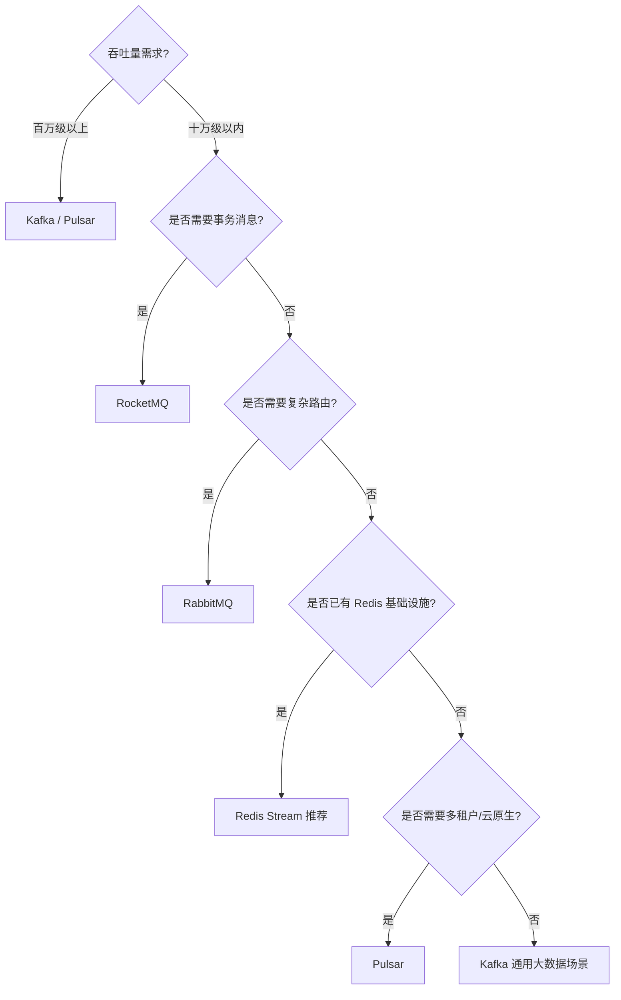

### 14.3 适用场景对照

#### 14.3.1 Redis Stream 适用场景

- 已有 Redis 基础设施，不想引入额外中间件
- 消息量级在十万级以内
- 对延迟敏感（要求亚毫秒级）
- 任务队列、事件通知、IM 离线消息
- 事件溯源、CQRS 架构
- 中小型项目快速迭代

#### 14.3.2 Kafka 适用场景

- 大数据流处理（日志聚合、实时数仓）
- 百万级以上吞吐量需求
- 需要与 Spark/Flink 等流处理生态集成
- 长期消息存储与回放
- 事件驱动微服务架构

#### 14.3.3 RabbitMQ 适用场景

- 需要复杂路由规则（Topic/Fanout/Header Exchange）
- 多协议支持（AMQP/MQTT/STOMP）
- 企业应用集成（EAI）
- 需要原生死信队列
- 传统企业系统

#### 14.3.4 RocketMQ 适用场景

- 金融级可靠消息
- 事务消息需求
- 顺序消息需求
- 延迟消息需求
- 国内电商场景（生态成熟）

#### 14.3.5 Pulsar 适用场景

- 云原生多租户场景
- 计算与存储分离架构
- 跨地域复制需求
- 大规模消息平台
- 需要同时支持队列与流模式

### 14.4 迁移考量

从其他 MQ 迁移到 Redis Stream 或反向迁移时需考虑：

| 迁移方向 | 注意事项 |
|---------|---------|
| Kafka → Stream | 吞吐量下降，无分区概念，需重构消费逻辑 |
| Stream → Kafka | 延迟增加，需部署 Kafka 集群，运维复杂度上升 |
| RabbitMQ → Stream | 失去复杂路由能力，需在应用层实现路由 |
| Stream → RabbitMQ | 获得路由能力，但延迟增加，部署复杂度上升 |

---

## 第 15 章 安全性与权限控制

### 15.1 Redis ACL 与 Stream

Redis 6.0 引入 ACL（Access Control List）机制，可对 Stream 命令进行细粒度权限控制。

#### 15.1.1 用户与权限管理

```bash
# 创建生产者用户，仅允许 XADD/XLEN
ACL SETUSER producer_user on >producer_password ~orders:* +xadd +xlen +xinfo

# 创建消费者用户，允许 XREADGROUP/XACK/XGROUP
ACL SETUSER consumer_user on >consumer_password ~orders:* +xreadgroup +xack +xgroup +xinfo +xpending

# 创建监控用户，仅允许 XINFO/XLEN/XPENDING
ACL SETUSER monitor_user on >monitor_password ~orders:* +xinfo +xlen +xpending

# 查看用户列表
ACL USERS

# 查看用户权限
ACL GETUSER producer_user
```

#### 15.1.2 权限设计原则

| 角色 | 允许命令 | 说明 |
|------|---------|------|
| producer | XADD, XLEN, XINFO STREAM | 仅生产消息 |
| consumer | XREADGROUP, XACK, XPENDING, XINFO | 消费与确认 |
| group_admin | XGROUP CREATE/DESTROY/CREATECONSUMER/DELCONSUMER | 管理消费者组 |
| monitor | XINFO, XLEN, XPENDING | 只读监控 |
| admin | 全部命令 | 完全管理权限 |

### 15.2 网络安全

#### 15.2.1 TLS 加密传输

```bash
# Redis 配置文件中启用 TLS
# redis.conf
port 0
tls-port 6379
tls-cert-file /path/to/redis.crt
tls-key-file /path/to/redis.key
tls-ca-cert-file /path/to/ca.crt
tls-auth-clients yes
```

#### 15.2.2 网络隔离

- 生产环境应将 Redis 部署在内网，不暴露公网
- 使用防火墙/安全组限制访问来源
- VPN/专线连接远程 Redis

### 15.3 数据安全

#### 15.3.1 敏感数据加密

Stream 中的消息内容为明文存储，敏感数据应在写入前加密：

```python
from cryptography.fernet import Fernet

class SecureStreamProducer:
    """安全 Stream 生产者：加密敏感字段
    
    设计要点：
    - 使用对称加密（AES）加密敏感字段
    - 密钥由 KMS 管理，不硬编码
    """
    
    def __init__(self, redis_url, encryption_key):
        self.client = redis.Redis.from_url(redis_url, decode_responses=True)
        self.cipher = Fernet(encryption_key)
    
    def add_message(self, stream_key, fields: dict, sensitive_fields: list):
        """添加消息，加密敏感字段
        
        输入参数：
        - stream_key: Stream 键名
        - fields: 消息字段
        - sensitive_fields: 需要加密的字段名列表
        """
        encrypted_fields = {}
        for k, v in fields.items():
            if k in sensitive_fields:
                # 加密敏感字段
                encrypted_fields[k] = self.cipher.encrypt(
                    str(v).encode()
                ).decode()
            else:
                encrypted_fields[k] = v
        self.client.xadd(stream_key, encrypted_fields)
```

#### 15.3.2 审计日志

通过 Redis 的 MONITOR 命令或 ACL LOG 记录关键操作：

```bash
# 查看 ACL 操作日志
ACL LOG

# 返回最近的 ACL 操作记录，包括：
# - 认证成功/失败
# - 权限拒绝事件
# - 命令执行记录
```

---

## 第 16 章 最佳实践与反模式

### 16.1 生产者最佳实践

#### 16.1.1 ID 生成策略

```python
# 推荐：使用自动生成 ID（*）
client.xadd('orders', fields, id='*')

# 避免：手动生成 ID（除非有特殊需求）
# client.xadd('orders', fields, id='1718334600000-0')

# 特殊场景：手动指定 ID 用于幂等性
# 使用业务唯一 ID 转换为 Stream ID
# 但需注意 ID 必须单调递增
```

#### 16.1.2 批量写入

```python
# 推荐：使用 Pipeline 批量写入
pipeline = client.pipeline()
for i in range(100):
    pipeline.xadd('orders', {'idx': str(i)})
pipeline.execute()

# 避免：逐条写入
# for i in range(100):
#     client.xadd('orders', {'idx': str(i)})  # 网络往返开销大
```

#### 16.1.3 内存控制

```python
# 推荐：写入时指定 MAXLEN ~ 近似修剪
client.xadd('orders', fields, maxlen=1000000, approximate=True)

# 避免：不限制长度导致内存爆炸
# client.xadd('orders', fields)

# 避免：使用精确修剪（性能差）
# client.xadd('orders', fields, maxlen=1000000)  # 无 ~ 修饰符
```

### 16.2 消费者最佳实践

#### 16.2.1 处理顺序

```python
# 正确：处理成功后再 XACK
def consume():
    messages = client.xreadgroup(group, consumer, {stream: '>'}, count=10)
    for msg_id, fields in messages[0][1]:
        try:
            process(fields)  # 先处理
            client.xack(stream, group, msg_id)  # 成功后确认
        except Exception:
            pass  # 失败不确认，等待重投

# 错误：先 XACK 后处理
def consume_wrong():
    messages = client.xreadgroup(group, consumer, {stream: '>'}, count=10)
    for msg_id, fields in messages[0][1]:
        client.xack(stream, group, msg_id)  # 先确认
        process(fields)  # 处理失败则消息丢失
```

#### 16.2.2 幂等性保障

由于 Stream 提供 at-least-once 语义，消费者必须实现幂等性：

```python
# 基于消息 ID 的幂等性
processed_ids = set()

def idempotent_process(msg_id, fields):
    """幂等消息处理
    
    核心流程：
    1. 检查消息 ID 是否已处理
    2. 未处理则执行业务逻辑
    3. 记录已处理的消息 ID
    """
    if msg_id in processed_ids:
        return  # 已处理，跳过
    # 执行业务逻辑
    do_business(fields)
    processed_ids.add(msg_id)
```

#### 16.2.3 优雅退出

```python
import signal

running = True

def graceful_shutdown(signum, frame):
    global running
    running = False

signal.signal(signal.SIGTERM, graceful_shutdown)
signal.signal(signal.SIGINT, graceful_shutdown)

while running:
    messages = client.xreadgroup(group, consumer, {stream: '>'}, 
                                 count=10, block=1000)
    # 处理消息...
```

### 16.3 反模式

#### 16.3.1 反模式：用 Stream 实现延迟消息

```
// 错误：Stream 不支持延迟消息
// 尝试通过定时 XADD 实现延迟：
//   1. 消息需要延迟 30 分钟处理
//   2. 30 分钟后 XADD 到 Stream
// 问题：需要额外的定时器服务，复杂度高
// 正确方案：使用 Redis 的 Sorted Set + 定时轮询，或使用 RocketMQ 原生延迟消息
```

#### 16.3.2 反模式：用单个 Stream 承载所有业务

```
// 错误：所有业务消息写入同一个 Stream
//   orders_stream: 订单消息、日志消息、通知消息、...
// 问题：
//   - 消费者需要过滤无关消息
//   - 不同业务的消息互相影响
//   - 无法独立控制各业务的修剪策略
// 正确方案：按业务划分 Stream
//   orders_stream, logs_stream, notify_stream, ...
```

#### 16.3.3 反模式：消费者组不删除

```
// 错误：创建消费者组后从不删除
// 问题：每个消费者组维护 last_delivered_id 与 PEL，占用内存
//   且影响 XTRIM 的修剪决策（min_cgroup_last_id）
// 正确方案：不再使用的消费者组应及时删除
//   XGROUP DESTROY stream group
```

#### 16.3.4 反模式：PEL 无限增长不处理

```
// 错误：消费者处理失败后不确认，PEL 无限增长
// 问题：
//   - 内存占用持续增长
//   - XPENDING 查询变慢
//   - 毒消息反复重投
// 正确方案：
//   - 实现毒消息检测（delivery_count 超阈值）
//   - 转移到死信 Stream
//   - 定期清理 PEL
```

#### 16.3.5 反模式：在 Cluster 中跨槽操作

```
// 错误：XADD 与 XREADGROUP 操作的 Stream 在不同槽
//   XADD orders:1 ...   // 槽 A
//   XREADGROUP group consumer STREAMS orders:2 ...  // 槽 B
// 问题：跨槽操作触发 MOVED 重定向，性能下降
// 正确方案：使用 Hash Tag 强制同槽
//   XADD {orders}:1 ...  // 槽由 {orders} 决定
//   XREADGROUP ... STREAMS {orders}:2 ...
```

### 16.4 容量规划建议

| 消息量级 | 建议 Stream 数 | 消费者数 | MAXLEN | 内存预估 |
|---------|--------------|---------|--------|---------|
| 1万/天 | 1 | 2 | 10万 | 10MB |
| 10万/天 | 1-2 | 4 | 100万 | 100MB |
| 100万/天 | 2-5 | 8 | 500万 | 500MB-1GB |
| 1000万/天 | 5-10 | 16 | 1000万 | 1-5GB |

---

### 17.1 综合案例：电商秒杀系统

#### 17.1.1 业务场景

电商秒杀活动需要在极短时间内处理大量订单请求，要求：
- 高吞吐量：秒杀瞬间 QPS 可能达到 10 万+
- 防超卖：库存不能为负
- 公平性：先到先得
- 可靠性：订单不丢失

#### 17.1.2 架构设计

```
// 电商秒杀系统架构
//
// 用户请求 -> API 网关 -> 秒杀服务
//                            |
//                            v
//                     XADD -> seckill:requests Stream
//                            |
//                            v
//                     订单消费组 (order_processor)
//                            |
//                     1. 检查库存（Lua 原子操作）
//                     2. 扣减库存
//                     3. 创建订单
//                     4. XACK 确认
//                            |
//                            v
//                     通知消费组 (notify_processor)
//                            |
//                     发送秒杀成功通知
//
// 容错设计：
// - 库存不足时 XACK 并记录失败
// - 处理失败不 XACK，等待重投
// - 毒消息转移到 seckill:deadletter
```

#### 17.1.3 代码实现

```python
import redis
import json
import uuid
import time
import logging
from threading import Thread

class SeckillSystem:
    """电商秒杀系统：基于 Redis Stream 实现
    
    设计目标：
    - 高吞吐量：Stream 写入 10万+ QPS
    - 防超卖：Lua 脚本原子扣减库存
    - 可靠性：Stream + 消费者组保障 at-least-once
    - 公平性：Stream 按 ID 顺序投递
    
    输入参数：
    - redis_url: Redis 连接地址
    - product_id: 秒杀商品ID
    - stock: 初始库存
    """
    
    # Lua 脚本：原子性检查并扣减库存
    STOCK_LUA = """
    local stock_key = KEYS[1]
    local stock = redis.call('GET', stock_key)
    if not stock or tonumber(stock) < tonumber(ARGV[1]) then
        return 0
    end
    redis.call('DECRBY', stock_key, ARGV[1])
    return 1
    """
    
    def __init__(self, redis_url, product_id, stock=100):
        self.client = redis.Redis.from_url(redis_url, decode_responses=True)
        self.product_id = product_id
        self.stream_key = f'seckill:requests:{product_id}'
        self.deadletter_key = f'seckill:deadletter:{product_id}'
        # 初始化库存
        self.client.set(f'stock:{product_id}', stock)
        # 确保消费者组存在
        self._ensure_groups()
    
    def _ensure_groups(self):
        """确保消费者组存在"""
        for group in ['order_processor', 'notify_processor']:
            try:
                self.client.xgroup_create(
                    self.stream_key, group, id='0', mkstream=True
                )
            except redis.exceptions.ResponseError:
                pass  # 组已存在
    
    def submit_request(self, user_id: str) -> str:
        """提交秒杀请求
        
        输入参数：
        - user_id: 用户ID
        
        返回值：请求 Entry ID
        
        核心流程：
        1. 生成请求 ID
        2. XADD 写入 Stream
        3. 限制 Stream 长度防止内存爆炸
        """
        request_id = str(uuid.uuid4())
        msg_id = self.client.xadd(
            self.stream_key,
            {
                'request_id': request_id,
                'user_id': user_id,
                'product_id': self.product_id,
                'timestamp': str(time.time())
            },
            id='*',
            maxlen=1000000,  # 限制 100 万请求
            approximate=True
        )
        return msg_id
    
    def process_orders(self, consumer_name='order-worker-1'):
        """处理秒杀订单
        
        核心流程：
        1. XREADGROUP 读取请求
        2. Lua 脚本原子扣减库存
        3. 成功则创建订单并 XACK
        4. 失败（库存不足）则 XACK 并记录
        5. 异常则不 XACK，等待重投
        """
        while True:
            messages = self.client.xreadgroup(
                'order_processor', consumer_name,
                {self.stream_key: '>'},
                count=10, block=5000
            )
            
            for _stream, msg_list in messages:
                for msg_id, fields in msg_list:
                    try:
                        # 原子性扣减库存
                        result = self.client.eval(
                            self.STOCK_LUA, 1,
                            f'stock:{self.product_id}', 1
                        )
                        if result == 1:
                            # 库存充足，创建订单
                            order_id = str(uuid.uuid4())
                            self.client.hset(
                                f'order:{order_id}',
                                mapping={
                                    'order_id': order_id,
                                    'user_id': fields['user_id'],
                                    'product_id': fields['product_id'],
                                    'status': 'created',
                                    'created_at': str(time.time())
                                }
                            )
                            print(f"用户 {fields['user_id']} 秒杀成功，订单 {order_id}")
                        else:
                            # 库存不足，记录失败
                            print(f"用户 {fields['user_id']} 秒杀失败：库存不足")
                        # 无论成功失败都确认（不再重投）
                        self.client.xack(
                            self.stream_key, 'order_processor', msg_id
                        )
                    except Exception as e:
                        # 处理异常，不确认，等待重投
                        print(f"处理异常: {e}，消息 {msg_id} 将重投")
    
    def process_notifications(self, consumer_name='notify-worker-1'):
        """发送秒杀结果通知"""
        while True:
            messages = self.client.xreadgroup(
                'notify_processor', consumer_name,
                {self.stream_key: '>'},
                count=10, block=5000
            )
            for _stream, msg_list in messages:
                for msg_id, fields in msg_list:
                    try:
                        # 检查用户是否秒杀成功
                        # 实际场景：查询订单表
                        print(f"发送通知给用户 {fields['user_id']}")
                        self.client.xack(
                            self.stream_key, 'notify_processor', msg_id
                        )
                    except Exception as e:
                        print(f"通知发送失败: {e}")

# 使用示例
if __name__ == '__main__':
    logging.basicConfig(level=logging.INFO)
    system = SeckillSystem(
        'redis://localhost:6379/0',
        product_id='SKU001',
        stock=100
    )
    
    # 启动订单处理消费者（多线程）
    for i in range(4):
        Thread(
            target=system.process_orders,
            args=(f'order-worker-{i+1}',),
            daemon=True
        ).start()
    
    # 启动通知处理消费者
    Thread(
        target=system.process_notifications,
        daemon=True
    ).start()
    
    # 模拟用户秒杀请求
    for i in range(200):
        system.submit_request(f'user_{i}')
    
    # 等待处理完成
    time.sleep(10)
```

### 17.2 综合案例：分布式任务调度

#### 17.2.1 业务场景

分布式任务调度系统需要：
- 任务分发：多个 worker 协作消费任务
- 任务重试：失败任务自动重投
- 任务优先级：高优先级任务优先处理
- 任务监控：实时监控任务状态

#### 17.2.2 架构设计

```
// 分布式任务调度架构
//
// 任务生产者 -> XADD -> tasks:high_priority   (高优先级)
//              XADD -> tasks:normal_priority  (普通优先级)
//              XADD -> tasks:low_priority     (低优先级)
//
// 任务消费者：
//   1. 优先读取高优先级 Stream
//   2. 无任务时读取普通优先级
//   3. 最后读取低优先级
//
// 任务状态流转：
//   pending -> processing -> completed
//                        -> failed -> retry (max 3 times) -> deadletter
```

#### 17.2.3 代码实现

```python
import redis
import json
import time
import logging
from enum import Enum

class TaskStatus(Enum):
    """任务状态枚举"""
    PENDING = 'pending'
    PROCESSING = 'processing'
    COMPLETED = 'completed'
    FAILED = 'failed'
    DEAD = 'dead'

class DistributedTaskScheduler:
    """分布式任务调度系统
    
    设计目标：
    - 多优先级队列：高/中/低三个 Stream
    - 任务重试：失败任务自动重投（最多 3 次）
    - 任务监控：实时追踪任务状态
    - 优雅退出：支持 SIGTERM 优雅关闭
    
    输入参数：
    - redis_url: Redis 连接地址
    - max_retry: 最大重试次数
    """
    
    PRIORITY_STREAMS = [
        'tasks:high_priority',
        'tasks:normal_priority',
        'tasks:low_priority'
    ]
    
    def __init__(self, redis_url, max_retry=3):
        self.client = redis.Redis.from_url(redis_url, decode_responses=True)
        self.max_retry = max_retry
        self.group_name = 'task_workers'
        # 确保各优先级 Stream 的消费者组存在
        for stream in self.PRIORITY_STREAMS:
            try:
                self.client.xgroup_create(
                    stream, self.group_name, id='0', mkstream=True
                )
            except redis.exceptions.ResponseError:
                pass
    
    def submit_task(self, task_type: str, task_data: dict, 
                    priority: str = 'normal') -> str:
        """提交任务
        
        输入参数：
        - task_type: 任务类型
        - task_data: 任务数据
        - priority: 优先级（high/normal/low）
        
        返回值：任务 ID
        """
        stream_key = f'tasks:{priority}_priority'
        task_id = str(uuid.uuid4())
        msg_id = self.client.xadd(
            stream_key,
            {
                'task_id': task_id,
                'task_type': task_type,
                'task_data': json.dumps(task_data),
                'retry_count': '0',
                'status': TaskStatus.PENDING.value,
                'timestamp': str(time.time())
            },
            maxlen=100000,
            approximate=True
        )
        return task_id
    
    def consume_tasks(self, consumer_name='worker-1'):
        """消费任务（按优先级）
        
        核心流程：
        1. 按优先级顺序读取 Stream
        2. 执行任务
        3. 成功则 XACK
        4. 失败则重试或转移到死信
        """
        while True:
            task_processed = False
            for stream in self.PRIORITY_STREAMS:
                messages = self.client.xreadgroup(
                    self.group_name, consumer_name,
                    {stream: '>'},
                    count=1, block=1000
                )
                if messages:
                    for _stream, msg_list in messages:
                        for msg_id, fields in msg_list:
                            self._process_task(stream, msg_id, fields)
                            task_processed = True
                    break  # 处理完高优先级后重新检查
            
            if not task_processed:
                time.sleep(0.1)  # 无任务时短暂休眠
    
    def _process_task(self, stream_key: str, msg_id: str, fields: dict):
        """处理单个任务
        
        输入参数：
        - stream_key: Stream 键名
        - msg_id: 消息 ID
        - fields: 消息字段
        
        核心流程：
        1. 执行任务逻辑
        2. 成功则 XACK
        3. 失败且重试次数未超限则重新入队
        4. 失败且重试次数超限则转移到死信
        """
        retry_count = int(fields.get('retry_count', 0))
        try:
            # 执行任务
            self._execute_task(fields)
            # 成功，确认消息
            self.client.xack(stream_key, self.group_name, msg_id)
            print(f"任务 {fields['task_id']} 执行成功")
        except Exception as e:
            print(f"任务 {fields['task_id']} 执行失败: {e}")
            if retry_count < self.max_retry:
                # 重试：重新入队
                fields['retry_count'] = str(retry_count + 1)
                fields['status'] = TaskStatus.FAILED.value
                self.client.xadd(stream_key, fields)
                self.client.xack(stream_key, self.group_name, msg_id)
                print(f"任务 {fields['task_id']} 重试第 {retry_count + 1} 次")
            else:
                # 超过重试次数，转移到死信
                fields['status'] = TaskStatus.DEAD.value
                fields['fail_reason'] = str(e)
                self.client.xadd('tasks:deadletter', fields)
                self.client.xack(stream_key, self.group_name, msg_id)
                print(f"任务 {fields['task_id']} 转移到死信队列")
    
    def _execute_task(self, fields: dict):
        """执行任务逻辑（由子类重写）
        
        输入参数：
        - fields: 任务字段
        """
        task_type = fields['task_type']
        task_data = json.loads(fields['task_data'])
        # 默认实现：模拟任务执行
        print(f"执行任务 {task_type}: {task_data}")
        time.sleep(0.5)

# 使用示例
if __name__ == '__main__':
    scheduler = DistributedTaskScheduler(
        'redis://localhost:6379/0',
        max_retry=3
    )
    
    # 提交不同优先级的任务
    scheduler.submit_task('send_email', 
                         {'to': 'user@example.com', 'subject': 'test'},
                         priority='high')
    scheduler.submit_task('generate_report',
                         {'report_type': 'daily'},
                         priority='normal')
    scheduler.submit_task('cleanup_temp',
                         {'dir': '/tmp'},
                         priority='low')
    
    # 启动消费者
    scheduler.consume_tasks('worker-1')
```

### 17.3 学习总结

通过本教材的学习，读者应已掌握以下核心能力：

1. **底层原理**：理解 Radix Tree + listpack 的存储结构、Entry ID 生成机制、消费者组与 PEL 的实现原理

2. **命令熟练度**：熟练使用 XADD/XREAD/XRANGE/XLEN/XINFO/XGROUP/XREADGROUP/XACK/XPENDING/XCLAIM/XAUTOCLAIM/XTRIM/XDEL 等全部核心命令

3. **架构设计**：能够基于 Stream 设计可靠消息处理架构，包括消费者组划分、消息确认、重投机制、死信处理

4. **性能调优**：理解 Stream 的性能特征，能够基于基准测试数据进行容量规划与调优

5. **故障排查**：能够定位消息丢失、消息积压、消费者宕机等常见问题并实施恢复

6. **技术选型**：在 Redis Stream、Kafka、RabbitMQ、RocketMQ、Pulsar 之间做出合理选型决策

7. **生产实践**：具备生产级客户端开发能力，包括多语言实现（Python/Java/Go/Node.js）、监控埋点、优雅退出

8. **安全意识**：理解 Redis ACL 权限控制、TLS 加密传输、敏感数据加密等安全实践

Redis Stream 作为 Redis 原生的消息队列数据结构，在轻量级至中量级消息处理场景中具有独特优势。它不需要额外部署独立的消息中间件，复用 Redis 的低延迟内存访问能力，同时提供了完整的消费者组、消息确认、消息重投等可靠性语义。对于已有 Redis 基础设施且消息量级在十万级以内的场景，Stream 往往是最优选择。

---

*本教材基于 Redis 8.x 源码与官方文档编写，涵盖 Stream 的底层原理、命令详解、机制剖析、工程实践、对比选型与实战演练。内容力求论文级深度与工程级实用性并重，适合中高级后端工程师、架构师、Redis 内核爱好者学习参考。*
## 添加消息

**基本写法：自动生成 ID 添加消息**
`XADD <key> * <field> <value>`
```bash
# 添加消息，* 表示自动生成ID
XADD mystream * field1 value1
```

**多字段写法：自动生成 ID 添加多字段消息**
`XADD <key> * <field> <value> [field value ...]`
```bash
# 添加包含多个字段的消息
XADD mystream * field1 value1 field2 value2
```

**基本写法：手动指定消息 ID**
`XADD <key> <id> <field> <value>`
```bash
# 指定ID格式添加消息
XADD mystream 1718334600000-0 field1 value1
```

**基本写法：添加消息并限制 Stream 长度**
`XADD <key> MAXLEN <count> * <field> <value> [field value ...]`
```bash
# 限制Stream长度为1000
XADD mystream MAXLEN 1000 * field1 value1
```

---

## 读取消息

**基本写法：从头读取指定数量消息**
`XREAD COUNT <count> STREAMS <key> <id>`
```bash
# 从头读取10条消息
XREAD COUNT 10 STREAMS mystream 0
```

**基本写法：阻塞读取新消息**
`XREAD BLOCK <ms> COUNT <count> STREAMS <key> $`
```bash
# 阻塞读取新消息，最多等待5000ms
XREAD BLOCK 5000 COUNT 10 STREAMS mystream $
```

**基本写法：范围读取所有消息**
`XRANGE <key> - + [COUNT <count>]`
```bash
# 读取所有消息，最多返回10条
XRANGE mystream - + COUNT 10
```

**基本写法：按 ID 范围读取消息**
`XRANGE <key> <start> <end> [COUNT <count>]`
```bash
# 按ID范围读取消息
XRANGE mystream 1718334600000-0 1718334700000-0
```

---

## 消费者组

**基本写法：从最新消息开始创建消费者组**
`XGROUP CREATE <key> <group> $`
```bash
# 从最新消息开始创建消费者组
XGROUP CREATE mystream mygroup $
```

**基本写法：从头开始创建消费者组**
`XGROUP CREATE <key> <group> 0`
```bash
# 从头开始创建消费者组
XGROUP CREATE mystream mygroup 0
```

**基本写法：消费者读取消息**
`XREADGROUP GROUP <group> <consumer> COUNT <count> STREAMS <key> >`
```bash
# 消费者consumer1读取1条消息
XREADGROUP GROUP mygroup consumer1 COUNT 1 STREAMS mystream >
```

**单消息写法：确认单条消息已处理**
`XACK <key> <group> <id>`
```bash
# 确认单条消息
XACK mystream mygroup 1718334600000-0
```

**多消息写法：确认多条消息已处理**
`XACK <key> <group> <id> [id ...]`
```bash
# 确认多条消息
XACK mystream mygroup 1718334600000-0 1718334600001-0
```

**基本写法：查看待处理消息**
`XPENDING <key> <group>`
```bash
# 查看待处理消息
XPENDING mystream mygroup
```

**单消息写法：认领单条超时消息**
`XCLAIM <key> <group> <consumer> <min-idle-time> <id>`
```bash
# 认领空闲超过3600000ms的单条消息
XCLAIM mystream mygroup consumer1 3600000 1718334600000-0
```

**多消息写法：认领多条超时消息**
`XCLAIM <key> <group> <consumer> <min-idle-time> <id> [id ...]`
```bash
# 认领空闲超过3600000ms的多条消息
XCLAIM mystream mygroup consumer1 3600000 1718334600000-0 1718334600001-0
```

---

## 消息积压处理

**基本写法：查看 Stream 信息**
`XINFO STREAM <key>`
```bash
# 查看 Stream 详细信息
XINFO STREAM mystream
```

**基本写法：按最大长度修剪 Stream**
`XTRIM <key> MAXLEN <count>`
```bash
# 按最大长度修剪Stream为10000条
XTRIM mystream MAXLEN 10000
```

**基本写法：按最小 ID 修剪 Stream**
`XTRIM <key> MINID <id>`
```bash
# 删除ID小于指定值的消息
XTRIM mystream MINID 1718334600000-0
```

**基本写法：查看所有消费者组**
`XINFO GROUPS <key>`
```bash
# 查看Stream的所有消费者组
XINFO GROUPS mystream
```

**基本写法：查看消费者组内消费者**
`XINFO CONSUMERS <key> <group>`
```bash
# 查看消费者组mygroup内的消费者
XINFO CONSUMERS mystream mygroup
```


<!-- ============ 文档分隔线：022-redis/009-VectorSet.md ============ -->


## 1. Vector Set 概述

Redis 8.0 引入 Vector Set 数据类型，支持高维向量的存储和近似最近邻（ANN）搜索。

## 2. 基本操作

```redis
-- 创建向量集并添加向量
VADD myvectors VALUES 3 0.1 0.2 0.3 element1
VADD myvectors VALUES 3 0.4 0.5 0.6 element2
VADD myvectors VALUES 3 0.7 0.8 0.9 element3

-- 设置向量属性
VADD myvectors VALUES 3 0.1 0.2 0.3 element1 SET name "Alice" age 30

-- 获取向量
VEMB myvectors element1

-- 获取向量维度
VDIM myvectors
```

## 3. 近似最近邻搜索

```redis
-- 搜索最相似的向量
VSEARCH myvectors VALUES 3 0.15 0.25 0.35 COUNT 5

-- 基于元素搜索相似元素
VSIM myvectors element1 COUNT 5

-- 带过滤条件搜索
VSEARCH myvectors VALUES 3 0.15 0.25 0.35 FILTER "age >= 25" COUNT 5

-- 返回属性
VSIM myvectors element1 WITHATTRIBUTES COUNT 5
```

## 4. 配置

```redis
-- 设置量化方式
VADD myvectors VALUES 3 0.1 0.2 0.3 element1 QUANTIZATION NO  -- 不量化
VADD myvectors VALUES 3 0.1 0.2 0.3 element1 QUANTIZATION Q8  -- 8位量化

-- 设置链接数（HNSW参数）
VADD myvectors VALUES 3 0.1 0.2 0.3 element1 M 64

-- 设置EF运行时参数
VSEARCH myvectors VALUES 3 0.15 0.25 0.35 EF 200 COUNT 5
```

## 5. 应用场景

```redis
-- 语义搜索
VADD docs VALUES 1536 <embedding> doc:1 SET title "Redis Guide"
VSEARCH docs VALUES 1536 <query_embedding> COUNT 10

-- 推荐系统
VADD products VALUES 128 <embedding> product:1 SET category "electronics"
VSIM products product:42 COUNT 10 FILTER "category == 'electronics'"
```


<!-- ============ 文档分隔线：022-redis/010-RDBSnapshotPersistence.md ============ -->


## 1. RDB 概述

RDB（Redis Database）是 Redis 的默认持久化方式，通过在指定时间间隔内对数据集进行快照（snapshot），将内存中的数据以二进制文件形式写入磁盘。生成的 RDB 文件紧凑、体积小，非常适合用于备份和灾难恢复。

RDB 的核心优势：

- **紧凑高效**：RDB 文件是经过压缩的二进制格式，体积远小于 AOF 日志
- **恢复速度快**：直接加载二进制文件，恢复大数据集的速度远快于 AOF
- **对性能影响小**：`bgsave` 由子进程完成，主进程几乎不受影响
- **适合冷备**：可以定期将 RDB 文件归档到远程存储

RDB 的主要不足：

- **数据丢失风险**：非实时持久化，两次快照之间的数据可能丢失
- **fork 开销**：数据集很大时，`fork()` 子进程可能耗时较长
- **不支持增量**：每次都是全量快照，无法记录增量变更

## 2. save 命令

`save` 命令以**阻塞**方式生成 RDB 文件：

```redis
SAVE
```

执行流程：

1. 主进程直接调用 `rdbSave()` 函数
2. 主进程被阻塞，无法响应任何客户端请求
3. RDB 文件写入完成后，主进程恢复服务

**适用场景**：

- 数据集很小，阻塞时间可忽略
- 需要确保快照完成的测试环境
- Redis 正在关闭时（shutdown 触发 save）

**风险**：生产环境中数据集较大时，`save` 可能导致数秒甚至数十秒的阻塞，严重影响可用性。

## 3. bgsave 命令

`bgsave`（Background Save）是生产环境推荐的方式，通过 `fork()` 子进程完成快照：

```redis
BGSAVE
```

执行流程：

1. 主进程调用 `fork()` 创建子进程
2. 子进程调用 `rdbSave()` 将数据写入临时 RDB 文件
3. 写入完成后，子进程将临时文件原子性地重命名为正式 RDB 文件
4. 子进程退出，主进程收到信号

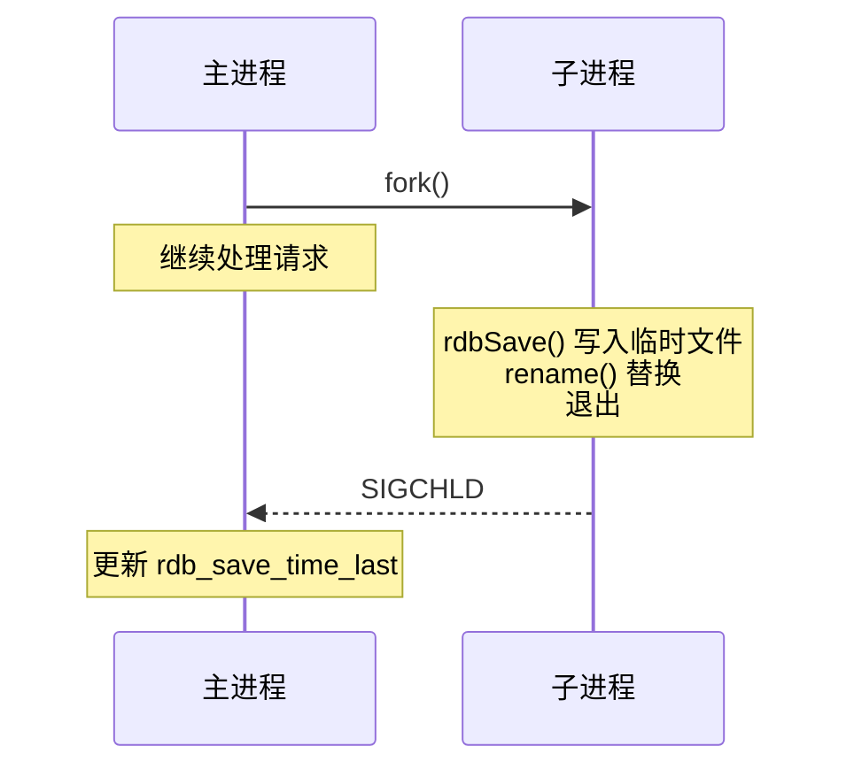

**查看 bgsave 状态**：

```redis
LASTSAVE          # 返回最近一次成功保存的 Unix 时间戳
INFO Persistence   # 查看 rdb 相关统计信息
```

**bgsave 期间的保护机制**：

- bgsave 执行期间，再次调用 `bgsave` 会被拒绝（`ERR Background save already in progress`）
- `save` 命令同样会被拒绝，避免产生竞争条件

## 4. 写时复制（Copy-On-Write）

写时复制（COW）是 `bgsave` 能够在不阻塞主进程的情况下生成一致性快照的关键机制。

### 4.1 fork 与内存共享

`fork()` 创建子进程后，父子进程共享同一块物理内存页。此时内存消耗并不会翻倍，因为页表指向相同的物理帧。

### 4.2 COW 触发条件

当主进程尝试**修改**某个共享页时：

1. 内核检测到该页被标记为只读（共享页）
2. 触发缺页异常（Page Fault）
3. 内核复制该页的副本给主进程
4. 主进程在副本上执行修改
5. 子进程仍然读取原始页的数据

```
fork() 后：
  父进程页表 → 物理页 A (只读)
  子进程页表 → 物理页 A (只读)

父进程修改页 A：
  父进程页表 → 物理页 A' (可写) ← 新副本
  子进程页表 → 物理页 A  (只读) ← 原始数据
```

### 4.3 内存开销估算

COW 的额外内存开销取决于 `bgsave` 期间被修改的页面数量：

$$\text{COW 额外内存} \approx \text{修改页数} \times \text{页大小}$$

Linux 默认页大小为 4KB。假设 bgsave 耗时 5 秒，每秒写入 10 万个 key，每个 key 平均 100 字节：

$$\text{修改页数} \approx \frac{5 \times 100000 \times 100}{4096} \approx 12207 \text{ 页}$$

$$\text{COW 额外内存} \approx 12207 \times 4\text{KB} \approx 48\text{MB}$$

**生产建议**：预留 Redis 实例内存的 20%~50% 作为 COW 缓冲。

## 5. 自动触发配置

Redis 通过 `save` 配置项实现自动触发 RDB 快照：

```redis
# 在 redis.conf 中配置
save 900 1      # 900秒内有至少1个key被修改
save 300 10     # 300秒内有至少10个key被修改
save 60 10000   # 60秒内有至少10000个key被修改
```

**触发逻辑**：满足任意一个条件即触发 `bgsave`。

```redis
# 禁用自动 RDB
save ""

# 运行时修改
CONFIG SET save "900 1 300 10 60 10000"
```

### 5.1 自动触发条件评估

Redis 每秒执行一次 `serverCron()`，检查是否满足 save 条件：

1. 遍历所有 `save` 配置项
2. 计算自上次成功保存以来的时间间隔和修改 key 数量
3. 如果满足任一条件，触发 `bgsave`

## 6. RDB 文件格式

RDB 文件采用二进制格式，结构如下：


各数据库区域结构：


**编码优化**：

- 小整数使用变长编码（1/2/4 字节）
- 短字符串使用嵌入编码（len + data）
- LZF 压缩长字符串
- 整数集合（intset）直接存储
- 压缩列表（ziplist/listpack）直接存储

## 7. RDB 文件恢复

### 7.1 自动恢复

Redis 启动时自动检测 RDB 文件：

1. 读取 `dir` 和 `dbfilename` 配置
2. 打开 RDB 文件，校验 checksum
3. 逐个加载 key-value 到内存
4. 加载完成后开始接受客户端请求

```redis
# 配置 RDB 文件路径
dir /var/lib/redis
dbfilename dump.rdb
```

### 7.2 RDB 文件校验

```bash
# 使用 redis-check-rdb 工具
redis-check-rdb dump.rdb
```

### 7.3 恢复注意事项

- RDB 文件加载期间 Redis 处于阻塞状态
- 如果 RDB 文件损坏，Redis 可能拒绝启动
- 可以使用 `redis-check-rdb --fix` 尝试修复

## 8. 配置优化

### 8.1 关键配置项

```redis
# RDB 文件名
dbfilename dump.rdb

# 存储目录
dir /var/lib/redis

# 是否压缩（LZF）
rdbcompression yes

# 是否使用 CRC64 校验
rdbchecksum yes

# bgsave 失败时是否停止写入
stop-writes-on-bgsave-error yes

# 自动触发条件
save 900 1
save 300 10
save 60 10000
```

### 8.2 性能调优建议

| 场景                   | save 配置       | 说明                        |
| ---------------------- | --------------- | --------------------------- |
| 高可用（允许少量丢失） | `save 60 10000` | 减少快照频率，降低 I/O 压力 |
| 数据安全（尽量少丢失） | `save 60 1`     | 增加快照频率，增加 I/O 开销 |
| 纯缓存（可丢失）       | `save ""`       | 禁用 RDB，最大化性能        |
| 大数据集               | 适当放宽间隔    | 减少 fork 开销              |

### 8.3 大内存实例优化

当 Redis 实例使用内存超过 10GB 时：

- `fork()` 耗时可能超过 1 秒
- COW 可能占用数 GB 额外内存
- 建议拆分为多个小实例，或使用 AOF 替代
- 考虑开启 `lazyfree-lazy-eviction` 减少主线程阻塞

## 9. RDB 与 AOF 对比

| 特性       | RDB                | AOF               |
| ---------- | ------------------ | ----------------- |
| 持久化方式 | 定时快照           | 实时追加日志      |
| 数据安全性 | 可能丢失数分钟数据 | 最多丢失 1 秒数据 |
| 文件体积   | 小（压缩二进制）   | 大（文本日志）    |
| 恢复速度   | 快                 | 慢                |
| 性能影响   | fork 开销          | 写入开销          |
| 适用场景   | 备份、灾难恢复     | 数据安全优先      |
## save 命令

**基本写法：阻塞方式生成 RDB 文件**
`SAVE`
```bash
# 阻塞方式生成 RDB 文件，主进程无法响应请求
SAVE
```

---

## bgsave 命令

**基本写法：后台子进程生成 RDB 文件**
`BGSAVE`
```bash
# 后台方式生成 RDB 文件（生产推荐）
BGSAVE
```

**基本写法：查看最近一次保存时间**
`LASTSAVE`
```bash
# 返回最近一次成功保存的 Unix 时间戳
LASTSAVE
```

**基本写法：查看 RDB 统计信息**
`INFO Persistence`
```bash
# 查看 rdb 相关统计信息
INFO Persistence
```

---

## 写时复制（COW）

**基本写法：fork 创建子进程共享内存**
`fork()`
```c
// fork() 创建子进程后，父子进程共享同一块物理内存页
// 父进程页表 → 物理页 A (只读)
// 子进程页表 → 物理页 A (只读)
```

**基本写法：父进程修改页时触发 COW**
`fork() → 父进程写入 → 复制页`
```c
// 父进程修改页 A 时，操作系统复制一份新页
// 父进程页表 → 物理页 A' (可写) ← 新副本
// 子进程页表 → 物理页 A  (只读) ← 原始数据
```

**基本写法：COW 额外内存估算**
`COW 额外内存 ≈ 修改页数 × 页大小`
```c
// Linux 默认页大小为 4KB
// 假设 bgsave 耗时 5 秒，每秒写入 10 万个 key，每个 key 平均 100 字节
// 修改页数 ≈ (5 × 100000 × 100) / 4096 ≈ 12207 页
// COW 额外内存 ≈ 12207 × 4KB ≈ 48MB
```

---

## 自动触发配置

**基本写法：配置自动触发条件**
`save <seconds> <changes>`
```bash
# 900秒内有至少1个key被修改时触发
save 900 1
```

**多条件写法：配置多个自动触发条件**
`save <seconds> <changes>`
```bash
# 配置多个触发条件，满足任意一个即触发 bgsave
save 900 1
save 300 10
save 60 10000
```

**基本写法：禁用自动 RDB**
`save ""`
```bash
# 禁用自动 RDB 快照
save ""
```

**基本写法：运行时修改 save 配置**
`CONFIG SET save "<config>"`
```bash
# 运行时修改 save 配置
CONFIG SET save "900 1 300 10 60 10000"
```

---

## RDB 文件格式

**基本写法：RDB 文件整体结构**
`[REDIS][version][databases][EOF][checksum]`
```c
// RDB 文件采用二进制格式
// 魔数 → 版本号 → 数据库数据 → 结束标记 → 校验和
```

**基本写法：数据库区域结构**
`[SELECTDB][key-value对(带过期时间)][key-value对(无过期时间)]`
```c
// 各数据库区域结构
// 数据库编号 → key-value对(带过期时间) → key-value对(无过期时间)
```

---

## RDB 文件恢复

**基本写法：配置 RDB 文件路径**
`dir <path>`
```bash
# 设置 RDB 文件存储目录
dir /var/lib/redis
```

**基本写法：配置 RDB 文件名**
`dbfilename <name>`
```bash
# 设置 RDB 文件名
dbfilename dump.rdb
```

**基本写法：校验 RDB 文件**
`redis-check-rdb <file>`
```bash
# 使用 redis-check-rdb 工具校验文件
redis-check-rdb dump.rdb
```

---

## 配置优化

**基本写法：设置 RDB 文件名**
`dbfilename <name>`
```bash
# 设置 RDB 文件名
dbfilename dump.rdb
```

**基本写法：设置存储目录**
`dir <path>`
```bash
# 设置 RDB 文件存储目录
dir /var/lib/redis
```

**基本写法：开启 LZF 压缩**
`rdbcompression <yes|no>`
```bash
# 开启 RDB 文件 LZF 压缩
rdbcompression yes
```

**基本写法：开启 CRC64 校验**
`rdbchecksum <yes|no>`
```bash
# 开启 RDB 文件 CRC64 校验
rdbchecksum yes
```

**基本写法：bgsave 失败时停止写入**
`stop-writes-on-bgsave-error <yes|no>`
```bash
# bgsave 失败时停止接受写入
stop-writes-on-bgsave-error yes
```


<!-- ============ 文档分隔线：022-redis/011-AOFLogPersistence.md ============ -->


## 1. AOF 概述

AOF（Append Only File）以日志形式记录 Redis 服务器收到的每一条写命令，以追加（append）方式写入 AOF 文件。Redis 重启时通过重放 AOF 文件中的命令来恢复数据。

AOF 的核心优势：

- **数据安全性高**：最多丢失 1 秒数据（`everysec` 策略）
- **可读性好**：AOF 文件是文本格式，可直接查看和修改
- **容错性强**：即使 AOF 文件尾部损坏，`redis-check-aof` 可修复
- **实时性**：每条写命令都追加到日志

AOF 的主要不足：

- **文件体积大**：记录所有写命令，远大于 RDB
- **恢复速度慢**：需要重放所有命令
- **对性能有影响**：频繁的磁盘写入

## 2. AOF 工作流程

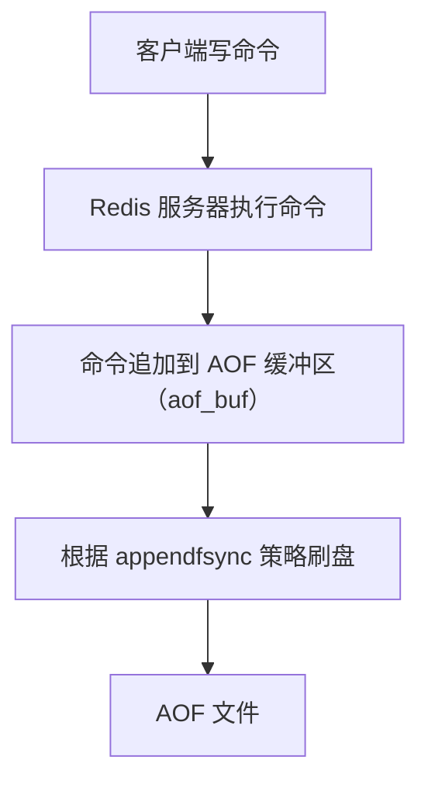

### 2.1 命令追加

每执行一条写命令后，Redis 将该命令以 Redis 协议格式追加到 `aof_buf` 缓冲区：

```c
// 伪代码
void feedAppendOnlyFile(struct redisCommand *cmd, int argc, robj **argv) {
    // 将命令转换为 RESP 协议格式
    buf = catAppendOnlyGenericCommand(argc, argv);
    // 追加到 aof_buf
    aof_buf = sdscatlen(aof_buf, buf, sdslen(buf));
}
```

### 2.2 文件写入与同步

Redis 的事件循环（`beforeSleep`）中，将 `aof_buf` 的内容写入 AOF 文件：

```c
// 伪代码
void flushAppendOnlyFile(int force) {
    // 将 aof_buf 写入 AOF 文件
    nwritten = write(server.aof_fd, server.aof_buf, sdslen(server.aof_buf));
    // 根据 appendfsync 策略决定是否 fsync
    if (server.aof_fsync == APPENDFSYNC_ALWAYS) {
        fsync(server.aof_fd);
    }
}
```

## 3. appendfsync 策略

`appendfsync` 配置项决定了 AOF 数据刷盘的频率，是数据安全与性能之间的关键权衡：

```redis
appendfsync always     # 每条命令都 fsync
appendfsync everysec   # 每秒 fsync（默认推荐）
appendfsync no         # 由操作系统决定刷盘时机
```

### 3.1 always

- **行为**：每条写命令执行后立即调用 `fsync()`
- **数据安全**：最高，最多丢失一条命令
- **性能影响**：最严重，每秒只能处理数百到数千次写入
- **适用场景**：对数据安全要求极高的金融场景

### 3.2 everysec

- **行为**：每秒调用一次 `fsync()`
- **数据安全**：较高，最多丢失 1 秒数据
- **性能影响**：可接受，与 `no` 策略性能差距不大
- **适用场景**：大多数生产环境（默认推荐）

### 3.3 no

- **行为**：不主动 `fsync()`，由操作系统决定
- **数据安全**：最低，可能丢失最近数秒数据
- **性能影响**：最好，依赖 OS 缓冲区刷盘
- **适用场景**：纯缓存或可容忍数据丢失的场景

### 3.4 三种策略对比

| 策略     | fsync 频率 | 最多丢失数据 | 写入性能 | 推荐度 |
| -------- | ---------- | ------------ | -------- | ------ |
| always   | 每条命令   | 1条命令      | 低       |        |
| everysec | 每秒       | 1秒数据      | 中       |        |
| no       | OS决定     | 数秒数据     | 高       |        |

## 4. AOF 重写机制

随着时间推移，AOF 文件会不断增长。Redis 通过 AOF 重写（rewrite）机制压缩文件体积。

### 4.1 重写原理

AOF 重写不是读取旧 AOF 文件进行分析，而是**直接读取当前数据库状态**，用最少的命令重新生成 AOF 文件。

**示例**：

```redis
# 旧 AOF 文件中可能有以下 6 条命令
SET counter 1
INCR counter
INCR counter
INCR counter
DEL counter
SET counter 100

# 重写后只需 1 条命令
SET counter 100
```

**列表合并示例**：

```redis
# 旧 AOF 文件
RPUSH list a b c
RPUSH list d e
LPOP list
RPUSH list f

# 重写后
RPUSH list b c d e f
```

### 4.2 AOF 重写触发条件

```redis
# 自动触发条件
auto-aof-rewrite-percentage 100   # AOF 文件大小比上次重写后增长 100%
auto-aof-rewrite-min-size 64mb    # AOF 文件最小 64MB 才触发重写

# 手动触发
BGREWRITEAOF
```

自动触发判断逻辑：

$$\text{当前文件大小} \geq \text{上次重写后大小} \times (1 + \frac{\text{auto-aof-rewrite-percentage}}{100})$$

且当前文件大小 $\geq$ `auto-aof-rewrite-min-size`

### 4.3 AOF 重写流程

```
1. 主进程调用 fork() 创建子进程
2. 子进程根据当前内存状态生成新 AOF 文件（临时文件）
3. 主进程继续处理请求：
   a. 写命令同时追加到 旧AOF缓冲区 和 重写缓冲区
   b. 旧AOF缓冲区 → 旧AOF文件（保证数据安全）
   c. 重写缓冲区 → 记录重写期间的新命令
4. 子进程完成重写，通知主进程
5. 主进程将重写缓冲区的命令追加到新 AOF 文件
6. 用新 AOF 文件原子替换旧 AOF 文件
```

**关键细节**：

- 重写期间，旧 AOF 文件仍然正常写入，确保数据安全
- 重写缓冲区确保重写期间的新命令不会丢失
- 最终替换操作使用 `rename()` 系统调用，原子性保证

### 4.4 重写期间的数据一致性

```
时间线：
  T1: fork() 开始重写
  T2: SET key1 val1  → 旧AOF + 重写缓冲区
  T3: SET key2 val2  → 旧AOF + 重写缓冲区
  T4: 子进程完成重写
  T5: 重写缓冲区追加到新AOF
  T6: rename 新AOF → 正式AOF
```

## 5. AOF 文件格式

AOF 文件使用 Redis 序列化协议（RESP）格式：

```
*2\r\n
$6\r\n
SELECT\r\n
$1\r\n
0\r\n
*3\r\n
$3\r\n
SET\r\n
$4\r\n
key1\r\n
$6\r\n
value1\r\n
```

### 5.1 多命令合并

Redis 4.0+ 支持 AOF 使用 `MULTI/EXEC` 包裹命令，减少文件体积：

```
*1\r\n
$5\r\n
MULTI\r\n
*3\r\n
$3\r\n
SET\r\n
$3\r\n
key\r\n
$5\r\n
value\r\n
*3\r\n
$3\r\n
SET\r\n
$4\r\n
key2\r\n
$6\r\n
value2\r\n
*1\r\n
$4\r\n
EXEC\r\n
```

## 6. AOF 文件恢复

### 6.1 自动恢复

Redis 启动时自动加载 AOF 文件（AOF 优先级高于 RDB）：

1. 检查 AOF 是否开启（`appendonly yes`）
2. 加载 AOF 文件，逐条执行命令
3. 如果 AOF 文件损坏，拒绝启动

### 6.2 AOF 文件修复

```bash
# 检查 AOF 文件
redis-check-aof appendonly.aof

# 修复 AOF 文件（截断损坏部分）
redis-check-aof --fix appendonly.aof
```

### 6.3 AOF 与 RDB 加载优先级

Redis 启动时的加载顺序：

1. 如果 AOF 开启（`appendonly yes`），优先加载 AOF
2. 如果 AOF 未开启，加载 RDB 文件
3. 如果两者都不存在，启动空数据库

## 7. 配置优化

### 7.1 关键配置项

```redis
# 开启 AOF
appendonly yes

# AOF 文件名
appendfilename "appendonly.aof"

# 刷盘策略
appendfsync everysec

# 自动重写条件
auto-aof-rewrite-percentage 100
auto-aof-rewrite-min-size 64mb

# 重写期间是否禁止 fsync
no-appendfsync-on-rewrite no

# 加载时忽略最后一条不完整命令
aof-load-truncated yes

# AOF 文件存储目录
dir /var/lib/redis
```

### 7.2 no-appendfsync-on-rewrite

当设为 `yes` 时，AOF 重写期间不执行 `fsync()`，减少磁盘 I/O 争用：

- **优点**：避免重写期间主线程因 fsync 阻塞
- **风险**：重写期间如果宕机，可能丢失更多数据
- **建议**：在磁盘 I/O 成为瓶颈时考虑开启

### 7.3 性能调优建议

| 场景         | appendfsync | rewrite 配置 | 说明               |
| ------------ | ----------- | ------------ | ------------------ |
| 数据安全优先 | always      | 100/64mb     | 最高安全，最低性能 |
| 均衡方案     | everysec    | 100/64mb     | 推荐默认配置       |
| 性能优先     | no          | 200/128mb    | 减少磁盘压力       |
| 大数据集     | everysec    | 100/256mb    | 减少重写频率       |

## 8. AOF 常见问题

### 8.1 AOF 文件过大

- 检查重写是否正常触发：`INFO Persistence`
- 手动触发重写：`BGREWRITEAOF`
- 调整 `auto-aof-rewrite-percentage` 降低触发阈值

### 8.2 重写期间内存增长

- 重写缓冲区可能积累大量命令
- 高写入场景下，重写缓冲区可能占用数百 MB
- 考虑在低峰期手动触发重写

### 8.3 fsync 阻塞主线程

- `everysec` 策略下，fsync 由后台线程执行
- 如果后台线程 fsync 耗时超过 1 秒，主线程会等待
- 解决方案：使用更快的磁盘（SSD）或开启 `no-appendfsync-on-rewrite`
## 工作流程

**函数源码写法：命令追加到 AOF 缓冲区**
`void feedAppendOnlyFile(struct redisCommand *cmd, int argc, robj **argv)`
```c
// 将命令转换为 RESP 协议格式并追加到 aof_buf
void feedAppendOnlyFile(struct redisCommand *cmd, int argc, robj **argv) {
    buf = catAppendOnlyGenericCommand(argc, argv);
    aof_buf = sdscatlen(aof_buf, buf, sdslen(buf));
}
```

**函数源码写法：写入文件并根据策略刷盘**
`void flushAppendOnlyFile(int force)`
```c
// 将 aof_buf 写入 AOF 文件并根据 appendfsync 策略决定是否 fsync
void flushAppendOnlyFile(int force) {
    nwritten = write(server.aof_fd, server.aof_buf, sdslen(server.aof_buf));
    if (server.aof_fsync == APPENDFSYNC_ALWAYS) {
        fsync(server.aof_fd);
    }
}
```

---

## appendfsync 策略

**基本写法：每条命令都 fsync**
`appendfsync always`
```bash
# 每条写命令执行后立即调用 fsync
appendfsync always
```

**基本写法：每秒 fsync（默认推荐）**
`appendfsync everysec`
```bash
# 每秒调用一次 fsync
appendfsync everysec
```

**基本写法：由操作系统决定刷盘**
`appendfsync no`
```bash
# 不主动 fsync，由操作系统决定刷盘时机
appendfsync no
```

---

## AOF 重写

**基本写法：手动触发 AOF 重写**
`BGREWRITEAOF`
```bash
# 手动触发 AOF 重写
BGREWRITEAOF
```

**基本写法：配置重写增长百分比阈值**
`auto-aof-rewrite-percentage <percentage>`
```bash
# AOF 文件大小比上次重写后增长 100% 时触发重写
auto-aof-rewrite-percentage 100
```

**基本写法：配置重写最小文件大小**
`auto-aof-rewrite-min-size <size>`
```bash
# AOF 文件最小 64MB 才触发重写
auto-aof-rewrite-min-size 64mb
```

**基本写法：重写时合并列表操作**
`RPUSH <key> <values>`
```bash
# 重写后将多次 RPUSH 和 LPOP 合并为一条命令
RPUSH list b c d e f
```

---

## AOF 文件格式

**基本写法：RESP 协议格式**
`*<count>\r\n$<len>\r\n<command>\r\n...`
```bash
# AOF 文件使用 RESP 协议格式存储命令
*2
$6
SELECT
$1
0
```

**基本写法：SET 命令的 RESP 格式**
`*3\r\n$3\r\nSET\r\n$<keylen>\r\n<key>\r\n$<vallen>\r\n<value>\r\n`
```bash
# SET key1 value1 的 RESP 格式
*3
$3
SET
$4
key1
$6
value1
```

**基本写法：MULTI/EXEC 合并格式（Redis 4.0+）**
`*1\r\n$5\r\nMULTI\r\n...*1\r\n$4\r\nEXEC\r\n`
```bash
# Redis 4.0+ 使用 MULTI/EXEC 包裹多条命令减少文件体积
*1
$5
MULTI
*3
$3
SET
$3
key
$5
value
*1
$4
EXEC
```

---

## AOF 文件恢复

**基本写法：开启 AOF 持久化**
`appendonly yes`
```bash
# 开启 AOF，Redis 启动时自动加载 AOF 文件
appendonly yes
```

**基本写法：检查 AOF 文件**
`redis-check-aof <file>`
```bash
# 检查 AOF 文件完整性
redis-check-aof appendonly.aof
```

**基本写法：修复 AOF 文件**
`redis-check-aof --fix <file>`
```bash
# 修复 AOF 文件，截断损坏部分
redis-check-aof --fix appendonly.aof
```

---

## 配置优化

**基本写法：开启 AOF**
`appendonly yes`
```bash
# 开启 AOF 持久化
appendonly yes
```

**基本写法：设置 AOF 文件名**
`appendfilename <name>`
```bash
# 设置 AOF 文件名
appendfilename "appendonly.aof"
```

**基本写法：设置刷盘策略**
`appendfsync <strategy>`
```bash
# 设置刷盘策略为每秒
appendfsync everysec
```

**基本写法：设置自动重写增长百分比**
`auto-aof-rewrite-percentage <percentage>`
```bash
# 设置自动重写增长百分比为 100
auto-aof-rewrite-percentage 100
```

**基本写法：设置自动重写最小文件大小**
`auto-aof-rewrite-min-size <size>`
```bash
# 设置自动重写最小文件大小为 64MB
auto-aof-rewrite-min-size 64mb
```

**基本写法：重写期间禁止 fsync**
`no-appendfsync-on-rewrite <yes|no>`
```bash
# AOF 重写期间不执行 fsync
no-appendfsync-on-rewrite yes
```

**基本写法：加载时忽略不完整命令**
`aof-load-truncated <yes|no>`
```bash
# 加载时忽略最后一条不完整命令
aof-load-truncated yes
```

**基本写法：设置 AOF 文件存储目录**
`dir <path>`
```bash
# 设置 AOF 文件存储目录
dir /var/lib/redis
```


<!-- ============ 文档分隔线：022-redis/012-MixedPersistence.md ============ -->


## 1. 混合持久化概述

混合持久化是 Redis 4.0 引入的持久化方案，结合了 RDB 的高效恢复和 AOF 的数据安全性。在 AOF 重写时，将当前数据以 RDB 格式写入 AOF 文件开头，后续增量命令仍以 AOF 格式追加。

**核心思想**：


## 2. 混合持久化工作原理

### 2.1 重写时的文件生成

当 AOF 重写触发时：

1. 子进程将当前内存数据以 **RDB 二进制格式**写入临时文件开头
2. 重写期间的新命令以 **AOF 文本格式**追加到临时文件末尾
3. 重写完成后，临时文件替换旧 AOF 文件

```
重写过程：

旧 AOF 文件：
  SET key1 val1
  SET key2 val2
  DEL key1
  SET key3 val3
  SET key2 newval2
  ...（数百万条命令）

新 AOF 文件（混合格式）：
  [RDB 二进制数据：key2=newval2, key3=val3, ...]
  SET key4 val4        ← 重写期间的增量命令
  SET key5 val5
  ...
```

### 2.2 文件体积对比

假设 Redis 中有 100 万个 key，每个 key 平均 100 字节：

| 格式     | 估算大小       | 说明                    |
| -------- | -------------- | ----------------------- |
| 纯 AOF   | ~200 MB        | 每条命令的文本表示      |
| 纯 RDB   | ~100 MB        | 压缩二进制格式          |
| 混合 AOF | ~100 MB + 增量 | RDB 部分 + 少量增量 AOF |

混合 AOF 的体积约为纯 AOF 的 50%~70%，接近 RDB 的紧凑程度。

## 3. 混合持久化加载流程

Redis 启动加载混合 AOF 文件时：

```
1. 读取 AOF 文件头部
2. 检测到 RDB 格式标记（REDIS 前缀）
3. 以 RDB 方式加载前半部分（快速恢复全量数据）
4. 以 AOF 方式重放后半部分（恢复增量数据）
5. 加载完成，开始接受请求
```

详细流程：

```mermaid
flowchart TD
    A[加载混合 AOF 文件] --> B[读取前 9 字节<br/>判断是否为 RDB 格式]
    B -->|纯 AOF| C[逐条重放命令]
    B -->|混合格式| D[RDB 加载全量数据]
    D --> E[AOF 重放增量命令]
    C --> F[加载完成]
    E --> F
```

### 3.1 格式检测

Redis 通过检查 AOF 文件开头来判断格式：

- 以 `REDIS` 开头 → RDB 格式（混合 AOF）
- 以 `*` 开头 → 纯 AOF 格式（RESP 协议）

```c
// 伪代码
int loadAppendOnlyFile(char *filename) {
    if (starts_with(buf, "REDIS")) {
        // 混合格式：先加载 RDB 部分
        rdbLoadRio(&rdb);
        // 再加载 AOF 增量部分
        while (readCommand(&cmd)) {
            executeCommand(cmd);
        }
    } else {
        // 纯 AOF 格式
        while (readCommand(&cmd)) {
            executeCommand(cmd);
        }
    }
}
```

## 4. 配置与启用

### 4.1 开启混合持久化

```redis
# redis.conf
appendonly yes                    # 开启 AOF
aof-use-rdb-preamble yes          # 开启混合持久化（Redis 4.0+ 默认开启）
```

```redis
# 运行时修改
CONFIG SET aof-use-rdb-preamble yes
```

### 4.2 关键配置项

```redis
# AOF 基础配置
appendonly yes
appendfilename "appendonly.aof"
appendfsync everysec

# 混合持久化开关
aof-use-rdb-preamble yes

# 重写触发条件
auto-aof-rewrite-percentage 100
auto-aof-rewrite-min-size 64mb
```

### 4.3 版本兼容性

| Redis 版本 | 混合持久化支持 | 默认值 |
| ---------- | -------------- | ------ |
| < 4.0      | 不支持         | -      |
| 4.0        | 支持           | no     |
| 5.0+       | 支持           | yes    |
| 7.0+       | 支持（MP-AOF） | yes    |

**注意**：Redis 7.0 引入了 Multi Part AOF（MP-AOF），将 AOF 拆分为基础文件（BASE）和增量文件（INCR），进一步优化了混合持久化的实现。

## 5. 三种持久化方案对比

| 特性       | 纯 RDB           | 纯 AOF         | 混合持久化     |
| ---------- | ---------------- | -------------- | -------------- |
| 数据安全性 | 低（分钟级丢失） | 高（秒级丢失） | 高（秒级丢失） |
| 恢复速度   | 快               | 慢             | 较快           |
| 文件体积   | 最小             | 最大           | 中等           |
| 性能影响   | fork 开销        | 写入开销       | 两者兼具       |
| 可读性     | 不可读           | 可读           | 部分可读       |
| 兼容性     | 所有版本         | 所有版本       | Redis 4.0+     |

### 5.1 恢复速度对比

对于 1000 万个 key 的数据集：

| 方案     | 恢复时间 | 说明                         |
| -------- | -------- | ---------------------------- |
| 纯 RDB   | ~10 秒   | 直接加载二进制               |
| 纯 AOF   | ~120 秒  | 逐条重放命令                 |
| 混合 AOF | ~15 秒   | RDB 快速加载 + 少量 AOF 重放 |

混合持久化的恢复速度约为纯 AOF 的 **8~10 倍**，接近纯 RDB 的水平。

## 6. Redis 7.0 Multi Part AOF

Redis 7.0 对 AOF 进行了重大重构，引入 Multi Part AOF（MP-AOF）：

### 6.1 文件结构

```mermaid
flowchart TD
    T0["appendonlydir/"]
    T1["appendonly.aof.1.base.rdb       # BASE 文件（RDB 格式）"]
    T2["appendonly.aof.1.incr.aof       # INCR 文件（增量 AOF）"]
    T3["appendonly.aof.2.incr.aof       # INCR 文件（重写期间增量）"]
    T4["appendonly.aof.manifest         # 清单文件"]
    T0 --> T1
    T0 --> T2
    T0 --> T3
    T0 --> T4
```

### 6.2 Manifest 文件

```json
file appendonly.aof.1.base.rdb seq 1 type b
file appendonly.aof.1.incr.aof seq 1 type h
file appendonly.aof.2.incr.aof seq 2 type h
```

### 6.3 重写流程变化

1. 创建新的 BASE 文件（RDB 格式）
2. 重写期间的增量写入新的 INCR 文件
3. 更新 manifest 文件（原子替换）
4. 异步删除旧的 BASE 和 INCR 文件

**优势**：

- 不再需要将增量命令追加到重写后的文件
- 重写完成后只需更新 manifest，无需修改数据文件
- 减少了重写期间的内存占用

## 7. 最佳实践

### 7.1 生产环境推荐配置

```redis
appendonly yes
appendfsync everysec
aof-use-rdb-preamble yes
auto-aof-rewrite-percentage 100
auto-aof-rewrite-min-size 64mb
```

### 7.2 场景选择

| 场景         | 推荐方案            | 理由               |
| ------------ | ------------------- | ------------------ |
| 数据安全优先 | 混合持久化          | 兼顾安全和恢复速度 |
| 纯缓存       | 禁用持久化          | 最大化性能         |
| 备份为主     | RDB + 定时归档      | 文件紧凑，便于传输 |
| 金融/支付    | 混合 + always fsync | 最高数据安全       |

### 7.3 监控要点

```redis
# 查看持久化状态
INFO Persistence

# 关键指标
# aof_current_size: 当前 AOF 文件大小
# aof_base_size: 上次重写后的大小
# aof_rewrite_in_progress: 是否正在重写
# aof_last_bgrewrite_status: 上次重写状态
```


<!-- ============ 文档分隔线：022-redis/013-DisklessReplication.md ============ -->


## 1. 无盘复制概述

无盘复制（Diskless Replication）是 Redis 2.8.18 引入的特性，允许在主从复制过程中**跳过磁盘 I/O**，直接通过网络将 RDB 数据从主节点发送到从节点，无需在主节点磁盘上生成临时 RDB 文件。

**传统复制流程**：

```
主节点内存 → RDB文件(磁盘) → 读取磁盘 → 网络发送 → 从节点
```

**无盘复制流程**：

```
主节点内存 → 网络直接发送 → 从节点
```

## 2. 传统复制的磁盘瓶颈

### 2.1 问题分析

传统主从复制的 RDB 生成过程涉及两次磁盘 I/O：

1. **写入磁盘**：子进程将 RDB 数据写入临时文件
2. **读取磁盘**：主进程读取临时文件发送给从节点

当数据集较大时，磁盘 I/O 成为瓶颈：

$$\text{复制总耗时} = \text{fork 时间} + \frac{\text{数据集大小}}{\text{磁盘写入速度}} + \frac{\text{数据集大小}}{\text{磁盘读取速度}} + \frac{\text{数据集大小}}{\text{网络带宽}}$$

### 2.2 磁盘瓶颈场景

| 场景           | 磁盘类型 | 数据集大小 | 磁盘写入耗时 | 网络传输耗时  |
| -------------- | -------- | ---------- | ------------ | ------------- |
| HDD + 大数据集 | HDD      | 50 GB      | ~500s        | ~400s (1Gbps) |
| SSD + 大数据集 | SSD      | 50 GB      | ~50s         | ~400s (1Gbps) |
| SSD + 小数据集 | SSD      | 5 GB       | ~5s          | ~40s (1Gbps)  |

对于 HDD 环境，磁盘 I/O 可能成为复制的主要瓶颈。

### 2.3 临时文件对磁盘的影响

- 临时 RDB 文件可能占用大量磁盘空间
- 频繁的全量同步会加速磁盘磨损（SSD）
- 磁盘空间不足会导致复制失败

## 3. 无盘复制工作原理

### 3.1 核心机制

无盘复制通过管道（pipe）将 RDB 数据直接从子进程传输到网络套接字：

```mermaid
flowchart TD
    T0["主节点："]
    T1["fork() → 子进程"]
    T2["生成 RDB 数据"]
    T3["管道(pipe)"]
    T4["主进程读取管道 → 网络发送 → 从节点"]
    T0 --> T1
    T1 --> T2
    T2 --> T3
    T3 --> T4
```

### 3.2 详细流程

1. 主节点收到从节点的 `PSYNC` 请求
2. 主节点判断使用无盘复制
3. 主节点 `fork()` 子进程
4. 子进程将 RDB 数据写入管道（而非磁盘文件）
5. 主进程从管道读取数据，通过套接字发送给从节点
6. 从节点接收 RDB 数据，写入临时文件
7. 从节点加载临时 RDB 文件完成同步

### 3.3 管道缓冲区

管道有容量限制，当子进程写入速度超过网络发送速度时，管道缓冲区满，子进程被阻塞：

```c
// 管道缓冲区大小
#define PIPE_BUF 65536  // 64KB (Linux 默认)

// 实际 Redis 使用更大的管道
// 通过 fcntl(fd, F_SETPIPE_SZ, size) 调整
```

Redis 会根据网络带宽动态调整管道大小，避免子进程频繁阻塞。

## 4. 配置与启用

### 4.1 核心配置

```redis
# 开启无盘复制
repl-diskless-sync yes

# 无盘复制延迟启动时间（秒）
repl-diskless-sync-delay 5

# 无盘复制加载模式（Redis 7.0+）
repl-diskless-load on-empty-db
```

### 4.2 repl-diskless-sync-delay

延迟启动是为了等待更多从节点同时连接，实现**并行复制**：

```mermaid
sequenceDiagram
    participant S1 as 从节点1
    participant S2 as 从节点2
    participant S3 as 从节点3
    participant M as 主节点
    S1->>M: 连接，等待 delay 秒
    S2->>M: 连接，等待 delay 秒
    S3->>M: 连接，等待 delay 秒
    Note over M: delay 到期
    M->>S1: 一次性发送 RDB
    M->>S2: 一次性发送 RDB
    M->>S3: 一次性发送 RDB
```

- 设为 `0`：第一个从节点请求时立即开始复制
- 设为 `5`（默认）：等待 5 秒，收集更多从节点
- 设为较大值：适合大量从节点同时同步的场景

### 4.3 repl-diskless-load

Redis 7.0+ 支持从节点无盘加载，直接从网络套接字解析 RDB 数据到内存：

```redis
# 配置选项
repl-diskless-load disabled    # 禁用（默认，先写磁盘再加载）
repl-diskless-load on-empty-db # 仅当从节点数据库为空时使用
repl-diskless-load swapdb      # 使用交换数据库（保留旧数据直到加载完成）
repl-diskless-load flush-before-load  # 直接清空后加载（不推荐）
```

**swapdb 模式**：

```
1. 从节点创建备份数据库（swapdb）
2. 直接从网络加载 RDB 到主数据库
3. 加载成功后，删除备份数据库
4. 加载失败时，从备份数据库恢复
```

## 5. 无盘复制的适用场景

### 5.1 适合无盘复制

| 场景             | 原因                                  |
| ---------------- | ------------------------------------- |
| HDD 磁盘         | 磁盘 I/O 是瓶颈，无盘复制大幅提升速度 |
| 临时磁盘         | 避免写入临时文件                      |
| 高频全量同步     | 减少磁盘磨损                          |
| 磁盘空间有限     | 不需要额外空间存储 RDB 文件           |
| 多从节点同时同步 | 并行发送效率更高                      |

### 5.2 不适合无盘复制

| 场景           | 原因                         |
| -------------- | ---------------------------- |
| SSD 磁盘       | 磁盘 I/O 不是瓶颈            |
| 网络带宽受限   | 网络成为瓶颈，无盘复制无优势 |
| 单从节点       | 无并行复制收益               |
| 需要持久化 RDB | 无盘复制不生成磁盘文件       |

### 5.3 决策流程

```mermaid
flowchart TD
    T0["磁盘类型？"]
    T1["HDD → 网络带宽 > 磁盘写入速度？ → 是 → 开启无盘复制"]
    T2["否 → 不开启"]
    T3["SSD → 从节点数量 > 3？ → 是 → 考虑开启"]
    T4["否 → 不开启"]
    T0 --> T1
    T0 --> T2
    T2 --> T3
    T3 --> T4
```

## 6. 性能对比

### 6.1 复制耗时对比

假设数据集 20GB，HDD 写入速度 100MB/s，网络带宽 1Gbps：

| 方案     | 磁盘写入 | 磁盘读取 | 网络传输 | 总耗时   |
| -------- | -------- | -------- | -------- | -------- |
| 传统复制 | 200s     | 200s     | 160s     | ~560s    |
| 无盘复制 | 0s       | 0s       | 160s     | ~160s    |
| 提升比例 | -        | -        | -        | **3.5x** |

### 6.2 内存开销

无盘复制在复制期间的内存开销：

$$\text{额外内存} = \text{fork 开销} + \text{管道缓冲区} + \text{COW 开销}$$

与传统复制相比，无盘复制的内存开销基本相同，因为两者都需要 `fork()` 和 COW 机制。

## 7. 无盘复制的注意事项

### 7.1 网络中断

- 无盘复制过程中网络中断，无法断点续传
- 必须重新发起全量同步
- 传统复制可以从已写入的 RDB 文件继续

### 7.2 多从节点同步

- 无盘复制支持同时向多个从节点发送 RDB
- 但如果从节点在不同时间请求，后到的从节点需要等待下一次全量同步
- `repl-diskless-sync-delay` 可以缓解此问题

### 7.3 与 AOF 的交互

- 无盘复制不影响 AOF 持久化
- AOF 仍然正常写入磁盘
- 无盘复制仅跳过复制过程中的 RDB 磁盘写入

### 7.4 监控指标

```redis
# 查看复制状态
INFO Replication

# 关键指标
# repl_diskless_sync: 是否开启无盘复制
# repl_diskless_sync_delay: 延迟时间
# connected_slaves: 已连接从节点数
```


<!-- ============ 文档分隔线：022-redis/014-ModuleSystem.md ============ -->


## 1. 模块系统概述

Redis 模块系统是 Redis 4.0 引入的扩展机制，允许开发者使用 C 语言编写自定义模块，为 Redis 添加新的数据类型和命令，而无需修改 Redis 核心代码。

**核心特性**：

- **自定义数据类型**：注册新的数据类型及编码方式
- **自定义命令**：添加新的 Redis 命令
- **钩子机制**：拦截 Redis 事件（如键过期、命令执行）
- **线程安全**：支持后台线程执行耗时操作
- **动态加载**：运行时加载/卸载模块，无需重启

### 1.1 模块加载方式

```redis
# redis.conf 配置
loadmodule /path/to/module.so

# 运行时加载
MODULE LOAD /path/to/module.so

# 查看已加载模块
MODULE LIST

# 卸载模块
MODULE UNLOAD module_name
```

## 2. RedisJSON

RedisJSON 是 Redis 的 JSON 数据类型模块，提供完整的 JSON 操作能力。

### 2.1 核心特性

- 原生 JSON 数据类型，支持嵌套结构
- JSONPath 语法查询和修改
- 原子性操作，无需读取-修改-写入
- 支持 JSON Schema 验证

### 2.2 基本操作

```redis
# 存储 JSON
JSON.SET user:1 $ '{"name":"张三","age":30,"address":{"city":"北京"},"tags":["dev","redis"]}'

# 获取整个 JSON
JSON.GET user:1

# 获取指定路径
JSON.GET user:1 $.name
JSON.GET user:1 $.address.city

# 修改字段
JSON.SET user:1 $.age 31

# 追加数组元素
JSON.ARRAPPEND user:1 $.tags '"python"'

# 数值递增
JSON.NUMINCRBY user:1 $.age 1

# 删除字段
JSON.DEL user:1 $.tags

# 查询类型
JSON.TYPE user:1 $.name
```

### 2.3 JSONPath 语法

```redis
# 根节点
JSON.GET user:1 $

# 子节点
JSON.GET user:1 $.name

# 递归下降
JSON.GET user:1 $..city

# 数组索引
JSON.GET user:1 $.tags[0]

# 数组切片
JSON.GET user:1 $.tags[0:2]

# 过滤表达式
JSON.GET users $[?(@.age>25)].name
```

### 2.4 性能优势

RedisJSON 相比传统 String 存储 JSON 的优势：

| 操作         | String + 序列化                | RedisJSON    |
| ------------ | ------------------------------ | ------------ |
| 修改单个字段 | 读取→反序列化→修改→序列化→写入 | 直接修改     |
| 网络传输     | 传输完整 JSON                  | 仅传输结果   |
| 原子性       | 需要事务/MULTI                 | 原生原子操作 |
| 内存效率     | 重复存储完整 JSON              | 共享不变部分 |

## 3. RediSearch

RediSearch 是 Redis 的全文搜索和二级索引模块。

### 3.1 创建索引

```redis
# 创建索引
FT.CREATE idx:products
  ON HASH
  PREFIX 1 product:
  SCHEMA
    title TEXT WEIGHT 5.0
    description TEXT
    price NUMERIC SORTABLE
    category TAG
    created_at NUMERIC SORTABLE

# 创建 JSON 索引
FT.CREATE idx:users
  ON JSON
  PREFIX 1 user:
  SCHEMA
    $.name AS name TEXT
    $.age AS age NUMERIC
    $.address.city AS city TAG
```

### 3.2 搜索操作

```redis
# 全文搜索
FT.SEARCH idx:products "redis search"

# 精确匹配
FT.SEARCH idx:products "@category:{electronics}"

# 数值范围
FT.SEARCH idx:products "@price:[100 500]"

# 组合查询
FT.SEARCH idx:products "redis @price:[0 100] @category:{book}"

# 模糊搜索
FT.SEARCH idx:products "%%redis%%"

# 前缀搜索
FT.SEARCH idx:products "redi*"
```

### 3.3 聚合查询

```redis
# 按类别分组统计
FT.AGGREGATE idx:products "*"
  GROUPBY 1 @category
  REDUCE COUNT 0 AS count
  SORTBY 2 @count DESC

# 价格统计
FT.AGGREGATE idx:products "@category:{electronics}"
  GROUPBY 1 @category
  REDUCE AVG 1 @price AS avg_price
  REDUCE MIN 1 @price AS min_price
  REDUCE MAX 1 @price AS max_price
```

### 3.4 中文搜索

```redis
# 创建支持中文的索引
FT.CREATE idx:articles
  ON HASH
  PREFIX 1 article:
  SCHEMA
    title TEXT PHONETIC zh
    content TEXT PHONETIC zh

# 中文搜索
FT.SEARCH idx:articles "分布式系统"
```

## 4. RedisTimeSeries

RedisTimeSeries 是 Redis 的时间序列数据模块，专为 IoT 监控和指标收集设计。

### 4.1 基本操作

```redis
# 创建时间序列
TS.CREATE temperature:device1 RETENTION 86400000 LABELS device_id 1 location beijing

# 添加数据点
TS.ADD temperature:device1 * 25.5
TS.ADD temperature:device1 1640995200000 23.1

# 批量添加
TS.MADD temperature:device1 1640995200000 23.1 temperature:device1 1640995260000 24.5 temperature:device1 1640995320000 25.0

# 查询范围
TS.RANGE temperature:device1 - + AGGREGATION avg 60000

# 按标签查询
TS.MRANGE - + WITHLABELS FILTER device_id=1
```

### 4.2 降采样规则

```redis
# 创建降采样规则：每分钟平均值，保留 30 天
TS.CREATE temperature:device1:1min RETENTION 2592000000
TS.CREATERULE temperature:device1 temperature:device1:1min AGGREGATION avg 60000

# 支持的聚合函数
# avg, sum, min, max, range, count, first, last, std.p, std.s, var.p, var.s, twa
```

### 4.3 标签与过滤

```redis
# 创建带标签的时间序列
TS.CREATE cpu:host1 RETENTION 86400000 LABELS hostname host1 region us-east metric cpu
TS.CREATE cpu:host2 RETENTION 86400000 LABELS hostname host2 region us-west metric cpu

# 按标签过滤查询
TS.MRANGE - + FILTER metric=cpu
TS.MRANGE - + FILTER region=us-east metric=cpu

# 标签过滤支持
# = 等于, != 不等于, () 属于, ~= 正则匹配
```

## 5. RedisBloom

RedisBloom 提供概率数据结构：布隆过滤器、布谷鸟过滤器、计数-最小草图、Top-K。

### 5.1 布隆过滤器（Bloom Filter）

```redis
# 创建布隆过滤器
BF.CREATE emails FILTER 0.01 ERROR RATE 1000000 CAPACITY

# 添加元素
BF.ADD emails "user@example.com"

# 批量添加
BF.MADD emails "a@test.com" "b@test.com" "c@test.com"

# 检查是否存在
BF.EXISTS emails "user@example.com"    # 返回 1（可能存在）
BF.EXISTS emails "unknown@test.com"    # 返回 0（一定不存在）

# 误判率计算
# 误判率 p ≈ (1 - e^(-kn/m))^k
# 其中 n=元素数, m=位数组大小, k=哈希函数数
```

### 5.2 布谷鸟过滤器（Cuckoo Filter）

```redis
# 创建布谷鸟过滤器
CF.CREATE usernames CAPACITY 1000000

# 添加元素
CF.ADD usernames "alice"

# 检查存在
CF.EXISTS usernames "alice"

# 删除元素（布隆过滤器不支持，布谷鸟支持）
CF.DEL usernames "alice"
```

### 5.3 Count-Min Sketch

```redis
# 创建
CMS.CREATE pageviews 2000 7

# 增加计数
CMS.INCRBY pageviews homepage 5 about 3

# 查询计数
CMS.QUERY pageviews homepage
```

### 5.4 Top-K

```redis
# 创建
TOPK.CREATE trending 10

# 增加计数
TOPK.INCRBY trending redis 5 python 3 java 2 go 4

# 查询 Top-K
TOPK.LIST trending

# 查询元素排名
TOPK.QUERY trending redis
```

## 6. RedisCell

RedisCell 提供分布式限流功能，基于令牌桶算法：

```redis
# 限流：每秒最多 10 次请求
CL.THROTTLE api:limit 10 10 1

# 返回值
# 1) 0          # 是否被限流（0=允许，1=限流）
# 2) 11         # 令牌桶容量
# 3) 10         # 剩余令牌数
# 4) -1         # 需要等待的毫秒数（-1 表示无需等待）
# 5) 0          # 下次补充令牌的毫秒数
```

## 7. 其他常用模块

### 7.1 RedisGraph（已弃用）

Redis Graph 模块已在 Redis 7.2 中弃用，建议使用 Redis + 外部图数据库方案。

### 7.2 RedisAI

```redis
# 加载模型
AI.MODELSET my_model TF CPU INPUTS 2 input1 input2 OUTPUTS 1 output BLOB <model_data>

# 执行推理
AI.TENSORSET input1 FLOAT 1 2 VALUES 1.0 2.0
AI.TENSORSET input2 FLOAT 1 2 VALUES 3.0 4.0
AI.MODELEXECUTE my_model INPUTS 2 input1 input2 OUTPUTS 1 output
AI.TENSORGET output VALUES
```

### 7.3 redis-cell

基于滑动窗口的限流模块：

```redis
CL.THROTTLE my_limit 100 400 60 1
# 参数：key, max_burst, count_per_period, period, quantity
```

## 8. 模块开发基础

### 8.1 最简模块示例

```c
#include "redismodule.h"

int HelloCommand(RedisModuleCtx *ctx, RedisModuleString **argv, int argc) {
    RedisModule_ReplyWithSimpleString(ctx, "Hello, Module!");
    return REDISMODULE_OK;
}

int RedisModule_OnLoad(RedisModuleCtx *ctx) {
    if (RedisModule_Init(ctx, "mymodule", 1, REDISMODULE_APIVER_1) == REDISMODULE_ERR)
        return REDISMODULE_ERR;

    if (RedisModule_CreateCommand(ctx, "mymodule.hello", HelloCommand,
        "readonly", 0, 0, 0) == REDISMODULE_ERR)
        return REDISMODULE_ERR;

    return REDISMODULE_OK;
}
```

### 8.2 编译与加载

```bash
# 编译
gcc -shared -fPIC -o mymodule.so mymodule.c -I/path/to/redis/src

# 加载
redis-server --loadmodule ./mymodule.so
```

### 8.3 注册自定义数据类型

```c
// 注册数据类型
RedisModuleType *MyType = RedisModule_CreateDataType(
    ctx, "mytype_", 0, &typemethods);
```

## 9. 模块生态与选型

| 模块            | 功能         | 适用场景           | 维护状态 |
| --------------- | ------------ | ------------------ | -------- |
| RedisJSON       | JSON 操作    | 用户配置、商品信息 | 活跃     |
| RediSearch      | 全文搜索     | 搜索引擎、自动补全 | 活跃     |
| RedisTimeSeries | 时间序列     | IoT、监控指标      | 活跃     |
| RedisBloom      | 概率数据结构 | 去重、限流、统计   | 活跃     |
| RedisCell       | 限流         | API 限流           | 活跃     |
| RedisAI         | ML 推理      | 实时推理           | 活跃     |

**Redis Stack**：Redis 官方将常用模块打包为 Redis Stack，包含 RedisJSON、RediSearch、RedisTimeSeries、RedisBloom 等模块，开箱即用。


<!-- ============ 文档分隔线：022-redis/015-StringSDSStructure.md ============ -->


# 字符串 SDS 结构

---

## 1. SDS 数据结构

### 1.1 结构定义

Redis 没有直接使用 C 语言的字符串，而是自定义了 SDS（Simple Dynamic String）：

```c
// Redis 5.0+ sdshdr 结构（按长度分5种）
struct __attribute__((packed)) sdshdr8 {
    uint8_t  len;         // 已使用长度（不含\0）
    uint8_t  alloc;       // 总分配容量（不含\0和header）
    unsigned char flags;   // 类型标识：SDS_TYPE_8
    char     buf[];       // 实际数据（柔性数组）
};

struct __attribute__((packed)) sdshdr16 {
    uint16_t len;
    uint16_t alloc;
    unsigned char flags;
    char buf[];
};

// 同理 sdshdr32, sdshdr64
```

### 1.2 SDS 与 C 字符串对比

| 特性        | C 字符串         | SDS                   |
| ----------- | ---------------- | --------------------- |
| 获取长度    | $O(n)$ 遍历      | $O(1)$ 直接读取 len   |
| 缓冲区溢出  | 不检查，可能溢出 | 自动扩容，杜绝溢出    |
| 修改长度    | 每次重新分配     | 预分配 + 惰性释放     |
| 二进制安全  | 依赖 `\0` 结尾   | 用 len 判断结束       |
| 兼容 C 函数 | 是               | 是（buf 末尾有 `\0`） |

### 1.3 内存布局

```mermaid
flowchart LR
    L[len 1字节<br/>5] --> A[alloc 1字节<br/>10] --> F[flags 1字节<br/>s8] --> B[buf[] 11字节 alloc+1<br/>'Hello'] --> Z[\0 1字节<br/>0]
```

len = 5：已使用 5 字节；alloc = 10：总容量 10 字节（不含 header 和 \0）；剩余空间 = alloc - len = 5 字节

## 2. 预分配策略

### 2.1 空间预分配规则

当 SDS 需要扩容时，Redis 不仅分配所需空间，还额外预分配：

```
规则1: 修改后 len < 1MB
  预分配: alloc = len（翻倍分配）
  示例: len=10 → 修改后 len=15 → alloc=30

规则2: 修改后 len >= 1MB
  预分配: alloc = len + 1MB（固定追加1MB）
  示例: len=3MB → 修改后 len=5MB → alloc=6MB
```

### 2.2 预分配效果

```
连续追加操作 "hello" → "hello world" → "hello world redis"

无预分配: 3次 realloc
  malloc(5) → realloc(11) → realloc(17)

有预分配: 1次 realloc
  malloc(5) → realloc(22)  ← 第二次追加无需重新分配
  len=17, alloc=22, 剩余5字节
```

### 2.3 源码分析

```c
// sds.c - sdsMakeRoomFor
sds sdsMakeRoomFor(sds s, size_t addlen) {
    size_t free = sdsavail(s);  // 剩余空间
    if (free >= addlen) return s;  // 空间足够，直接返回

    size_t len = sdslen(s);
    size_t newlen = len + addlen;

    // 预分配策略
    if (newlen < SDS_MAX_PREALLOC)  // SDS_MAX_PREALLOC = 1MB
        newlen *= 2;               // 翻倍
    else
        newlen += SDS_MAX_PREALLOC; // +1MB

    return sds_realloc(s, newlen);
}
```

## 3. 惰性删除

### 3.1 空间释放策略

当 SDS 缩短字符串时，不立即释放多余内存，而是通过 `free` 字段记录：

```c
// sds.c - sdstrim
sds sdstrim(sds s, const char *cset) {
    // ... 删除首尾匹配字符
    // 不调用 realloc 释放内存
    // 仅更新 len 和 free
    sdssetlen(s, newlen);  // 更新 len
    return s;
}
```

### 3.2 惰性删除示例

```
SDS: "hello world" (len=11, alloc=11)

执行: sdstrim(s, "ld")  → 删除首尾的 'l' 和 'd'
结果: "hello wor" (len=9, alloc=11)
      剩余空间 = 2 字节，未释放

执行: sdsRemoveFreeSpace(s)  → 显式释放
结果: "hello wor" (len=9, alloc=9)
```

### 3.3 何时真正释放

```c
// 1. 显式调用 sdsRemoveFreeSpace
// 2. 键被删除时，整个 SDS 被释放
// 3. Redis 内存淘汰时
// 4. 使用 SDS 的对象被重写时
```

## 4. 二进制安全

### 4.1 C 字符串的问题

C 字符串以 `\0` 表示结尾，无法存储包含 `\0` 的二进制数据：

```c
char *str = "hello\0world";  // C认为长度是5，丢失"world"
printf("%zu", strlen(str));   // 输出: 5
```

### 4.2 SDS 的二进制安全

SDS 使用 `len` 字段判断长度，而非 `\0`：

```c
// SDS 可以存储任意二进制数据
sds s = sdsnewlen("hello\0world", 11);  // len=11
printf("%zu", sdslen(s));  // 输出: 11

// buf 中: 'h','e','l','l','o','\0','w','o','r','l','d','\0'
//          ↑ 数据中的\0           ↑ 结尾的\0（兼容C函数）
```

### 4.3 兼容 C 字符串函数

SDS 的 `buf` 末尾始终保留 `\0`，可以直接使用 C 字符串函数：

```c
sds s = sdsnew("hello");
printf("%s", s);  // 直接传给 printf，兼容 C 字符串
strcmp(s, "hello");  // 可以使用 strcmp
```

## 5. SDS 类型选择

### 5.1 五种 SDS 类型

| 类型        | len/alloc 类型 | 最大长度 | header 大小 |
| ----------- | -------------- | -------- | ----------- |
| SDS_TYPE_5  | 无（3位存储）  | 31 字节  | 1 字节      |
| SDS_TYPE_8  | uint8_t        | 255 字节 | 3 字节      |
| SDS_TYPE_16 | uint16_t       | 64 KB    | 5 字节      |
| SDS_TYPE_32 | uint32_t       | 4 GB     | 9 字节      |
| SDS_TYPE_64 | uint64_t       | 16 EB    | 17 字节     |

### 5.2 类型选择逻辑

```c
// sds.c - sdsReqType
static inline char sdsReqType(size_t string_size) {
    if (string_size < 1 << 5)  return SDS_TYPE_5;
    if (string_size < 1 << 8)  return SDS_TYPE_8;
    if (string_size < 1 << 16) return SDS_TYPE_16;
    if (string_size < 1ll << 32) return SDS_TYPE_32;
    return SDS_TYPE_64;
}
```

短字符串使用小 header，节省内存。例如存储 "key"（3字节），使用 SDS_TYPE_8，header 仅 3 字节。
## 结构定义

**结构定义写法：sdshdr8 头部**
`struct __attribute__((packed)) sdshdr8 { uint8_t len; uint8_t alloc; unsigned char flags; char buf[]; }`
```c
// 定义 sdshdr8 类型头部（用于短字符串）
struct __attribute__((packed)) sdshdr8 {
    uint8_t  len;         // 已使用长度（不含\0）
    uint8_t  alloc;       // 总分配容量（不含\0和header）
    unsigned char flags;   // 类型标识：SDS_TYPE_8
    char     buf[];       // 实际数据（柔性数组）
};
```

**结构定义写法：sdshdr16 头部**
`struct __attribute__((packed)) sdshdr16 { uint16_t len; uint16_t alloc; unsigned char flags; char buf[]; }`
```c
// 定义 sdshdr16 类型头部（用于中等长度字符串）
struct __attribute__((packed)) sdshdr16 {
    uint16_t len;
    uint16_t alloc;
    unsigned char flags;
    char buf[];
};
```

**结构定义写法：sdshdr32 头部**
`struct __attribute__((packed)) sdshdr32 { uint32_t len; uint32_t alloc; unsigned char flags; char buf[]; }`
```c
// 定义 sdshdr32 类型头部（用于较长字符串）
struct __attribute__((packed)) sdshdr32 {
    uint32_t len;
    uint32_t alloc;
    unsigned char flags;
    char buf[];
};
```

**结构定义写法：sdshdr64 头部**
`struct __attribute__((packed)) sdshdr64 { uint64_t len; uint64_t alloc; unsigned char flags; char buf[]; }`
```c
// 定义 sdshdr64 类型头部（用于超长字符串）
struct __attribute__((packed)) sdshdr64 {
    uint64_t len;
    uint64_t alloc;
    unsigned char flags;
    char buf[];
};
```

---

## 内存布局

**内存布局写法：sdshdr8 字节排列**
`[len][alloc][flags][buf[]][\0]`
```c
// sdshdr8 内存布局示例
// len = 5:   已使用5字节
// alloc = 10: 总容量10字节（不含header和\0）
// 剩余空间 = alloc - len = 5字节
```

---

## 预分配策略

**预分配规则写法：修改后 len 小于 1MB**
`if (newlen < SDS_MAX_PREALLOC) newlen *= 2;`
```c
// 规则1: 修改后 len < 1MB 时翻倍分配
// 示例: len=10 → 修改后 len=15 → alloc=30
```

**预分配规则写法：修改后 len 大于等于 1MB**
`else newlen += SDS_MAX_PREALLOC;`
```c
// 规则2: 修改后 len >= 1MB 时固定追加1MB
// 示例: len=3MB → 修改后 len=5MB → alloc=6MB
```

**函数源码写法：sdsMakeRoomFor 扩容核心函数**
`sds sdsMakeRoomFor(sds s, size_t addlen)`
```c
// sds.c - sdsMakeRoomFor 扩容核心函数
sds sdsMakeRoomFor(sds s, size_t addlen) {
    size_t free = sdsavail(s);  // 剩余空间
    if (free >= addlen) return s;  // 空间足够，直接返回

    size_t len = sdslen(s);
    size_t newlen = len + addlen;

    // 预分配策略
    if (newlen < SDS_MAX_PREALLOC)  // SDS_MAX_PREALLOC = 1MB
        newlen *= 2;               // 翻倍
    else
        newlen += SDS_MAX_PREALLOC; // +1MB

    return sds_realloc(s, newlen);
}
```

---

## 惰性删除

**函数源码写法：sdstrim 缩短字符串不释放内存**
`sds sdstrim(sds s, const char *cset)`
```c
// sds.c - sdstrim 删除首尾匹配字符但不调用 realloc
sds sdstrim(sds s, const char *cset) {
    // 删除首尾匹配字符
    // 不调用 realloc 释放内存
    // 仅更新 len 和 free
    sdssetlen(s, newlen);  // 更新 len
    return s;
}
```

**惰性删除示例写法：仅更新 len 不释放内存**
`sdstrim(s, "ld")`
```c
// SDS: "hello world" (len=11, alloc=11)
// 执行: sdstrim(s, "ld")  → 删除首尾的 'l' 和 'd'
// 结果: "hello wor" (len=9, alloc=11)
//       剩余空间 = 2 字节，未释放
```

**显式释放写法：sdsRemoveFreeSpace 回收内存**
`sdsRemoveFreeSpace(s)`
```c
// 显式调用 sdsRemoveFreeSpace 释放剩余空间
// 结果: "hello wor" (len=9, alloc=9)
```

**真正释放时机写法：触发内存回收的条件**
`sdsRemoveFreeSpace(s) | 键被删除 | 内存淘汰 | 对象重写`
```c
// 1. 显式调用 sdsRemoveFreeSpace
// 2. 键被删除时，整个 SDS 被释放
// 3. Redis 内存淘汰时
// 4. 使用 SDS 的对象被重写时
```

---

## 二进制安全

**函数源码写法：sdsnewlen 存储包含 \0 的二进制数据**
`sds sdsnewlen(const void *init, size_t initlen)`
```c
// SDS 可以存储任意二进制数据
sds s = sdsnewlen("hello\0world", 11);  // len=11
printf("%zu", sdslen(s));  // 输出: 11
```

**兼容 C 字符串函数写法：buf 末尾保留 \0**
`sdsnew("hello")`
```c
// SDS 的 buf 末尾始终保留 \0，可以直接使用 C 字符串函数
sds s = sdsnew("hello");
printf("%s", s);  // 直接传给 printf，兼容 C 字符串
strcmp(s, "hello");  // 可以使用 strcmp
```

---

## 类型选择

**函数源码写法：sdsReqType 根据字符串长度选择 SDS 类型**
`static inline char sdsReqType(size_t string_size)`
```c
// sds.c - sdsReqType 根据字符串长度选择 SDS 类型
static inline char sdsReqType(size_t string_size) {
    if (string_size < 1 << 5)  return SDS_TYPE_5;
    if (string_size < 1 << 8)  return SDS_TYPE_8;
    if (string_size < 1 << 16) return SDS_TYPE_16;
    if (string_size < 1ll << 32) return SDS_TYPE_32;
    return SDS_TYPE_64;
}
```


<!-- ============ 文档分隔线：022-redis/016-SkipListAndSortedSet.md ============ -->


## 1. 跳表原理

### 1.1 从链表到跳表

跳表（Skip List）是对有序链表的多层索引扩展，实现 $O(\log n)$ 查找：

```mermaid
flowchart LR
    L4[Level 4: 1 - 50]
    L3[Level 3: 1 - 25 - 50]
    L2[Level 2: 1 - 13 - 25 - 38 - 50]
    L1[Level 1: 1 - 7 - 13 - 19 - 25 - 31 - 38 - 44 - 50]
    L0[Level 0: 1 3 7 9 13 16 19 22 25 28 31 34 38 41 44 47 50]
```

**查找过程**（查找 31）：

```
Level 4: 1 → 50 (31 < 50, 下降)
Level 3: 1 → 25 (31 > 25, 继续) → 50 (31 < 50, 下降)
Level 2: 25 → 38 (31 < 38, 下降)
Level 1: 25 → 31 (找到!)
```

### 1.2 跳表 vs 平衡树

| 维度       | 跳表             | 红黑树      | B+树        |
| ---------- | ---------------- | ----------- | ----------- |
| 查找       | $O(\log n)$      | $O(\log n)$ | $O(\log n)$ |
| 插入       | $O(\log n)$      | $O(\log n)$ | $O(\log n)$ |
| 范围查询   | 简单（链表遍历） | 复杂        | 简单        |
| 实现复杂度 | 简单             | 复杂        | 中等        |
| 并发友好   | 好（局部锁）     | 差（旋转）  | 中等        |
| 内存开销   | 多层指针         | 3指针/节点  | 页对齐      |

## 2. Redis 跳表实现

### 2.1 数据结构

```c
// 跳表节点
typedef struct zskiplistNode {
    sds ele;                          // 成员对象
    double score;                     // 分值
    struct zskiplistNode *backward;   // 后退指针（Level 0）
    struct zskiplistLevel {
        struct zskiplistNode *forward;  // 前进指针
        unsigned long span;             // 跨度（到下一节点的距离）
    } level[];                        // 层数组（柔性数组）
} zskiplistNode;

// 跳表
typedef struct zskiplist {
    struct zskiplistNode *header, *tail;
    unsigned long length;             // 节点数量
    int level;                        // 最大层数
} zskiplist;
```

### 2.2 层级结构

```mermaid
flowchart LR
    H[header 虚拟头节点 64层]
    H --> L3[Level 3: score=1 - score=50]
    H --> L2[Level 2: score=1 - score=25 - score=50]
    H --> L1[Level 1: 1 - 13 - 25 - 38 - 50]
    H --> L0[Level 0: 1 - 7 - 13 - 19 - 25 - 31 - 38 - 50]
```

每个节点的 level 数量随机生成（1-32 层），span 记录到下一节点的跳过节点数，用于计算排名

### 2.3 随机层数生成

```c
#define ZSKIPLIST_MAXLEVEL 32
#define ZSKIPLIST_P 0.25  // 晋升概率 1/4

int zslRandomLevel(void) {
    int level = 1;
    while ((random() & 0xFFFF) < (ZSKIPLIST_P * 0xFFFF))
        level += 1;
    return (level < ZSKIPLIST_MAXLEVEL) ? level : ZSKIPLIST_MAXLEVEL;
}
```

**各层概率**：

$$P(level = k) = (1/4)^{k-1} \times 3/4$$

| 层数 | 概率   | 1百万节点中约 |
| ---- | ------ | ------------- |
| 1    | 75%    | 750,000       |
| 2    | 18.75% | 187,500       |
| 3    | 4.69%  | 46,875        |
| 4    | 1.17%  | 11,719        |
| ...  | ...    | ...           |
| 32   | 极小   | ~0            |

## 3. 有序集合（ZSET）

### 3.1 ZSET 底层结构

Redis 有序集合使用**跳表 + 哈希表**双重结构：

```c
typedef struct zset {
    dict *dict;              // 哈希表：member → score（O(1) 查找分数）
    zskiplist *zsl;          // 跳表：score 排序（O(log n) 范围查询）
} zset;
```

```
哈希表: {"alice" → 85, "bob" → 92, "charlie" → 78}
跳表:   [78:charlie] → [85:alice] → [92:bob]
```

### 3.2 编码选择

```
元素数 <= 128 且所有元素长度 <= 64 字节 → ziplist（Redis 7.0 前）/ listpack（7.0+）
否则 → skiplist + dict
```

```sql
-- 查看编码
OBJECT ENCODING myzset
-- "ziplist" 或 "skiplist"
```

### 3.3 为什么同时需要两个结构

| 操作   | 仅哈希表 | 仅跳表          | 哈希表+跳表     |
| ------ | -------- | --------------- | --------------- |
| ZSCORE | $O(1)$   | $O(\log n)$     | $O(1)$          |
| ZRANGE | $O(n)$   | $O(\log n + m)$ | $O(\log n + m)$ |
| ZRANK  | $O(n)$   | $O(\log n)$     | $O(\log n)$     |
| ZADD   | $O(1)$   | $O(\log n)$     | $O(\log n)$     |

## 4. 核心操作

### 4.1 插入节点

```
1. 在哈希表中查找 member，存在则更新 score
2. 在跳表中查找插入位置（记录每层的前驱节点）
3. 随机生成层数
4. 创建节点并插入各层链表
5. 更新 span 值
6. 在哈希表中添加 member → score
```

### 4.2 范围查询

```redis
# 按 score 范围查询
ZRANGEBYSCORE myzset 80 100

# 按排名范围查询
ZRANGE myzset 0 9

# 带分数返回
ZRANGE myzset 0 9 WITHSCORES
```

**ZRANGEBYSCORE 执行流程**：

```
1. 从跳表 Level 0 查找第一个 score >= min 的节点
2. 沿 Level 0 链表遍历，直到 score > max
3. 收集所有满足条件的节点
4. 时间复杂度: O(log n + m)，m 为结果数量
```

### 4.3 排名计算

```redis
# 查询 member 的排名
ZRANK myzset alice
```

**排名计算利用 span**：

```
从最高层开始，累加 span 直到找到目标节点
rank = Σ span（沿路径经过的所有 span 之和）
时间复杂度: O(log n)
```

## 5. 跳表性能分析

### 5.1 时间复杂度

| 操作     | 平均            | 最坏   |
| -------- | --------------- | ------ |
| 查找     | $O(\log n)$     | $O(n)$ |
| 插入     | $O(\log n)$     | $O(n)$ |
| 删除     | $O(\log n)$     | $O(n)$ |
| 范围查询 | $O(\log n + m)$ | $O(n)$ |
| 排名     | $O(\log n)$     | $O(n)$ |

### 5.2 空间复杂度

$$E(\text{总指针数}) = n \times \sum_{k=1}^{\infty} \frac{1}{4^{k-1}} = n \times \frac{4}{3} \approx 1.33n$$

每个节点平均 1.33 个前进指针，加上 span 和 backward，空间开销约为纯链表的 2-3 倍。


<!-- ============ 文档分隔线：022-redis/017-ReplicationBuffer.md ============ -->


## 1. 复制缓冲区体系

### 1.1 三种复制缓冲区

| 缓冲区              | 位置 | 作用                         | 大小     |
| ------------------- | ---- | ---------------------------- | -------- |
| repl_backlog        | 主库 | 存储最近写命令，支持部分同步 | 默认 1MB |
| replication buffer  | 主库 | 为每个从库维护的输出缓冲区   | 动态增长 |
| replication backlog | 从库 | 接收主库数据的临时缓冲       | 动态     |

### 1.2 数据流

```
主库写入命令 → repl_backlog（环形缓冲）
             → replication buffer（每从库一个）
                 ↓ 网络传输
             从库接收 → 执行命令
```

## 2. repl_backlog 环形缓冲区

### 2.1 结构

```mermaid
flowchart LR
    B[repl_backlog 定长环形缓冲区<br/>[cmd1][cmd2][cmd3]...[cmdN]]
    B --> H[repl_backlog_histlen 有效数据起始]
    B --> I[repl_backlog_idx 写入位置]
```

总大小：repl_backlog_size（默认 1MB）。新数据写入 repl_backlog_idx 位置，写满后环绕到开头覆盖最旧数据

### 2.2 全局偏移量

```
repl_backlog_off: 缓冲区起始位置对应的全局偏移量
master_repl_offset: 主库当前的全局偏移量

有效数据范围: [repl_backlog_off, master_repl_offset]
```

### 2.3 部分同步（PSYNC）

```
从库断线重连时:
1. 发送 PSYNC {runid} {offset}
   - runid: 主库运行ID
   - offset: 从库最后收到的偏移量

2. 主库判断:
   - runid 匹配 且 offset 在 backlog 范围内 → 部分同步
   - 否则 → 全量同步

部分同步:
  主库从 backlog 中提取 [offset, master_repl_offset] 的数据
  发送给从库
```

### 2.4 部分同步判断

```
条件: offset >= repl_backlog_off

如果 offset < repl_backlog_off:
  说明从库缺失的数据已被覆盖 → 全量同步

示例:
  repl_backlog_size = 1MB
  repl_backlog_off = 1000000
  master_repl_offset = 1100000

  从库 offset = 1050000 → 1050000 >= 1000000 → 部分同步
  从库 offset = 900000  → 900000 < 1000000  → 全量同步
```

## 3. replication buffer

### 3.1 作用

主库为每个从库维护一个独立的输出缓冲区，暂存待发送的写命令：

```mermaid
flowchart TD
    T0["主库"]
    T1["replication buffer for slave1"]
    T2["replication buffer for slave2"]
    T3["replication buffer for slave3"]
    T0 --> T1
    T0 --> T2
    T0 --> T3
```

### 3.2 缓冲区溢出

当从库消费速度慢于主库写入速度时，buffer 持续增长：

```
写入速度: 100MB/s
从库消费: 10MB/s
每秒积压: 90MB

1分钟后: 5.4GB → 触发内存限制 → 从库被断开
```

### 3.3 缓冲区限制配置

```redis
# 客户端输出缓冲区限制（包括从库）
# 格式: client-output-buffer-limit <class> <hard> <soft> <soft_seconds>

# 从库缓冲区：硬限制 256MB，软限制 64MB 持续 60秒
client-output-buffer-limit replica 256mb 64mb 60

# 普通客户端
client-output-buffer-limit normal 0 0 0

# Pub/Sub 客户端
client-output-buffer-limit pubsub 32mb 8mb 60
```

**触发断开条件**：

- 缓冲区超过硬限制 → 立即断开
- 缓冲区超过软限制持续 N 秒 → 断开

## 4. 全量同步流程

### 4.1 触发条件

- 从库首次连接主库
- 从库发送的 runid 不匹配
- 从库请求的 offset 已被 backlog 覆盖

### 4.2 全量同步步骤

```
1. 从库发送 PSYNC ? -1（请求全量同步）
2. 主库执行 BGSAVE 生成 RDB
3. 主库将 RDB 发送给从库
4. 主库同时将新写入命令存入 replication buffer
5. 从库接收 RDB 后清空数据并加载
6. 主库发送 replication buffer 中的增量命令
7. 从库执行增量命令，数据一致
```

### 4.3 全量同步开销

```
BGSAVE: fork 子进程，COW 写时复制
RDB 传输: 网络带宽
从库加载: 阻塞服务（加载期间不可用）
增量缓冲: 内存占用
```

## 5. 配置优化

### 5.1 repl_backlog 大小

```redis
# 根据写入速度和断线时间估算
# 假设: 写入速度 10MB/s，最大断线时间 60s
# backlog 大小 >= 10MB/s × 60s = 600MB

repl-backlog-size 600mb
```

**计算公式**：

$$\text{backlog\_size} \geq \text{write\_rate} \times \text{max\_disconnect\_time}$$

### 5.2 关键参数

```redis
# repl_backlog 大小
repl-backlog-size 256mb

# repl_backlog TTL（无从库时多久删除）
repl-backlog-ttl 3600

# 从库发送 PING 的频率
repl-ping-replica-period 10

# 复制超时（包括SYNC、PING）
repl-timeout 60

# 禁用 TCP_NODELAY（启用后延迟更低但带宽更大）
repl-disable-tcp-nodelay no

# 从库优先级（Sentinel 选举用）
replica-priority 100
```

### 5.3 监控命令

```redis
# 主库查看复制信息
INFO replication

# 关键指标:
# repl_backlog_active: 1
# repl_backlog_size: 268435456
# repl_backlog_first_byte_offset: 12345
# repl_backlog_histlen: 268435400
# connected_slaves: 3
# master_repl_offset: 9999999
```
## 主从配置

**基本写法：REPLICAOF 设置从库**
`REPLICAOF <host> <port>`
```redis
-- Redis 5.0+ 用 REPLICAOF（替代旧版 SLAVEOF）
REPLICAOF 192.168.1.10 6379

-- 取消从库身份，升级为主库
REPLICAOF NO ONE

-- 旧版写法（仍兼容但建议用 REPLICAOF）
SLAVEOF 192.168.1.10 6379
SLAVEOF NO ONE
```

---

**基本写法：配置文件持久化**
`replicaof <host> <port>`
```conf
# redis.conf 主从配置
replicaof 192.168.1.10 6379
masterauth <主库密码>          -- 主库有密码时设置
replica-auth-password <密码>   -- Redis 7.0+ 推荐写法

# 只读从库（默认 yes）
replica-read-only yes

# 复制缓冲区大小（应对断线重连）
repl-backlog-size 256mb
repl-backlog-ttl 3600
```

---

## 复制状态查询

**基本写法：INFO replication**
`INFO replication`
```redis
-- 查看复制信息
INFO replication
-- 关键字段：
-- role:master|slave
-- connected_slaves: 从库数量
-- slave0:ip=...,port=...,state=online,offset=...,lag=0
-- master_repl_offset: 主库复制偏移量
-- repl_backlog_size / repl_backlog_first_byte_offset
```

---

**基本写法：ROLE 查看角色**
`ROLE`
```redis
-- 返回当前节点角色信息
ROLE
-- 主库返回：master <offset> <从库列表>
-- 从库返回：slave <主IP> <主端口> <状态> <已复制偏移量>
```

---

## PSYNC 同步机制

**基本写法：PSYNC 部分重同步**
`PSYNC <replicationid> <offset>`
```redis
-- 从库内部调用，通常无需手动执行
-- 首次同步：PSYNC ? -1  触发全量 RDB 同步
-- 断线重连：PSYNC <runid> <offset>  尝试部分重同步

-- 全量同步流程：
-- 1. 从库发送 PSYNC ? -1
-- 2. 主库 BGSAVE 生成 RDB 并发送
-- 3. 主库同时缓存写命令到 backlog
-- 4. RDB 发送完，主库发送缓存的写命令
-- 5. 后续主库写命令实时复制

-- 部分重同步条件：offset 在 backlog 范围内
```

---

## 复制缓冲区

**基本写法：调整 backlog 大小**
`CONFIG SET repl-backlog-size <大小>`
```redis
-- backlog 越大，断线重连时部分重同步成功率越高
CONFIG SET repl-backlog-size 512mb

-- 主库无从库时 backlog 释放时间（秒），0=永不释放
CONFIG SET repl-backlog-ttl 3600

-- 客户端输出缓冲区（从库连接）
CONFIG SET client-output-buffer-limit 'replica 256mb 64mb 60'
```

---

## 级联复制

**基本写法：链式复制**
`REPLICAOF <中间从库> <port>`
```redis
-- 一主多从的级联结构，减轻主库压力
-- master <- slave1 <- slave2
-- slave2 指向 slave1
REPLICAOF 192.168.1.11 6379   -- slave1 的地址

-- slave1 配置允许级联复制（默认允许）
-- replica-serve-stale-data yes
```

---

## 读写分离与一致性

**基本写法：WAIT 等待复制**
`WAIT <numreplicas> <timeout毫秒>`
```redis
-- 等待 N 个从库确认写入，返回确认的从库数
SET key1 value1
WAIT 1 1000    -- 等待 1 个从库确认，最多等 1000ms

-- 注意：WAIT 只等待当前命令的复制，不保证持久化
-- 不影响后续命令，仅返回已确认从库数量
```

---

**基本写法：只读从库配置**
`CONFIG SET replica-read-only yes`
```redis
-- 从库默认只读，禁止写入
CONFIG SET replica-read-only yes

-- 主从延迟导致读到旧数据的应对：
-- 1. 关键读走主库
-- 2. 使用 WAIT 等待复制
-- 3. 读从库后校验 offset
```

---

## 复制故障排查

**基本写法：排查复制中断**
`INFO replication | LATENCY`
```redis
-- 1. 检查从库连接状态
INFO replication
-- state 不为 online 时检查网络/密码

-- 2. 检查 master_link_status
-- master_link_status:down 表示连接断开

-- 3. 检查复制偏移量差距
-- master_repl_offset - slave_repl_offset = 滞后字节数

-- 4. 查看日志
LOG GET 100

-- 5. 强制全量重同步
REPLICAOF NO ONE
REPLICAOF <master_ip> <master_port>
```

---

## 复制过滤

**基本写法：选择性复制**
`replica-serve-stale-data | replica-priority`
```conf
# redis.conf 配置
# 从库与主库断开后是否继续提供旧数据服务
replica-serve-stale-data yes

# 从库优先级（哨兵选主用，0=永不被选为主）
replica-priority 100

# 忽略某些 key 的复制（Redis 7.0+ 已移除，改用 ACL）
# 旧版：replica-ignore-maxmemory no
```


<!-- ============ 文档分隔线：022-redis/018-SentinelElection.md ============ -->


## 1. Sentinel 架构

### 1.1 Sentinel 集群

```mermaid
flowchart TD
    S1[Sentinel 1] --> M[Master]
    S2[Sentinel 2] --> M
    S3[Sentinel 3] --> M
    M --> R1[Replica1]
    M --> R2[Replica2]
```

### 1.2 Sentinel 职责

- **监控**：持续检测主从库是否正常
- **通知**：故障时通知管理员或应用
- **自动故障转移**：主库故障时自动切换
- **配置提供者**：告知客户端当前主库地址

## 2. 下线检测

### 2.1 主观下线（SDOWN）

单个 Sentinel 认为节点不可用：

```
Sentinel 每秒向节点发送 PING
超过 down-after-milliseconds 无有效回复 → 标记为 SDOWN
```

```redis
# 配置
sentinel monitor mymaster 127.0.0.1 6379 2
sentinel down-after-milliseconds mymaster 30000
```

### 2.2 客观下线（ODOWN）

多个 Sentinel 都认为主库不可用：

```
1. Sentinel A 检测到 Master SDOWN
2. Sentinel A 向其他 Sentinel 发送 SENTINEL is-master-down-by-addr
3. 超过 quorum 个 Sentinel 确认 SDOWN → 标记为 ODOWN
4. ODOWN 触发故障转移
```

**quorum**：配置中 `sentinel monitor` 的最后一个参数，表示需要多少个 Sentinel 同意才能判定客观下线。

## 3. Leader 选举（Raft 算法）

### 3.1 为什么需要 Leader

只有被选为 Leader 的 Sentinel 才能执行故障转移，避免多个 Sentinel 同时执行。

### 3.2 Raft 选举流程

```
1. Sentinel 确认 Master ODOWN
2. Sentinel 自增 current_epoch（任期号）
3. 向其他 Sentinel 请求投票（SENTINEL is-master-down-by-addr）
4. 其他 Sentinel 每个任期只投一票（先到先得）
5. 获得多数票（> N/2）的 Sentinel 成为 Leader
6. Leader 执行故障转移
```

### 3.3 选举规则

```
规则1: 先到先得（FIFO）— 每个 epoch 只投一票
规则2: 获得多数票 — > ceil(N/2)，N 为 Sentinel 总数
规则3: epoch 递增 — 新选举的 epoch 必须大于当前值
```

**选举示例**（3个 Sentinel）：

```
Sentinel A: epoch=1, 请求投票 → 获得 A(自投), B → 2票 > 1.5 → 成为 Leader
Sentinel B: epoch=1, 请求投票 → 已投给A → 拒绝
Sentinel C: epoch=1, 请求投票 → 已投给A → 拒绝
```

### 3.4 选举超时与重试

```
如果未获得多数票:
  等待随机时间（避免同时发起选举）
  自增 epoch
  重新请求投票

最大重试次数: 无限制
超时时间: 故障转移超时（failover-timeout）
```

## 4. 故障转移

### 4.1 从库选择规则

Leader Sentinel 按以下规则选择新主库：

```
1. 排除下线或断线的从库
2. 排除最近5秒内未回复 INFO 的从库
3. 排除与旧主库断开时间过长的从库
   (down-after-milliseconds * 10)
4. 按优先级选择（replica-priority 越小越优先）
5. 优先级相同，选择复制偏移量最大的（数据最新）
6. 偏移量相同，选择 runid 最小的
```

### 4.2 故障转移步骤

```
步骤1: 选出新主库
  Leader Sentinel 根据上述规则选出最优从库

步骤2: 升级新主库
  SENTINEL SLAVEOF NO ONE → 新主库停止复制

步骤3: 修改其他从库的复制目标
  其他从库执行 SLAVEOF new_master

步骤4: 更新 Sentinel 配置
  所有 Sentinel 更新 Master 地址

步骤5: 通知客户端
  客户端通过 Sentinel 获取新 Master 地址
```

### 4.3 故障转移时间线

```
T+0s:    Master 下线
T+30s:   Sentinel 检测到 SDOWN（down-after-milliseconds=30s）
T+31s:   确认 ODOWN，发起 Leader 选举
T+32s:   Leader 选举完成
T+33s:   选出新主库，执行 SLAVEOF NO ONE
T+35s:   其他从库开始复制新主库
T+40s:   故障转移完成
```

## 5. Sentinel 配置最佳实践

### 5.1 推荐配置

```redis
# 至少3个 Sentinel（保证多数票）
sentinel monitor mymaster 127.0.0.1 6379 2

# down-after-milliseconds: 根据网络延迟调整
sentinel down-after-milliseconds mymaster 10000

# failover-timeout: 故障转移超时
sentinel failover-timeout mymaster 60000

# parallel-syncs: 故障转移后同时向新主库发起复制的从库数
sentinel parallel-syncs mymaster 1
```

### 5.2 quorum 设置

```
quorum 建议值: ceil(N/2)，N 为 Sentinel 数量

3个 Sentinel: quorum=2
5个 Sentinel: quorum=3

quorum 过低: 可能误判（网络分区时）
quorum 过高: 可能无法触发故障转移
```

### 5.3 客户端连接

```python
# Python 客户端通过 Sentinel 获取 Master
from redis.sentinel import Sentinel

sentinel = Sentinel([
    ('sentinel1', 26379),
    ('sentinel2', 26379),
    ('sentinel3', 26379)
], socket_timeout=0.1)

master = sentinel.master_for('mymaster', password='xxx')
slave = sentinel.slave_for('mymester', password='xxx')
```
## 哨兵配置

**基本写法：sentinel.conf 配置**
`sentinel monitor <主库别名> <host> <port> <quorum>`
```conf
# sentinel.conf 配置文件
port 26379
sentinel monitor mymaster 192.168.1.10 6379 2
sentinel auth-pass mymaster <主库密码>
sentinel down-after-milliseconds mymaster 30000
sentinel parallel-syncs mymaster 1
sentinel failover-timeout mymaster 180000

# quorum=2：2 个哨兵同意才判定主观下线转客观下线
# down-after-milliseconds：30s 无响应判定下线
# parallel-syncs：故障转移时并行同步的从库数
# failover-timeout：故障转移超时
```

---

**基本写法：启动哨兵**
`redis-sentinel <配置文件> | redis-server <配置文件> --sentinel`
```bash
# 方式一：redis-sentinel 专用命令
redis-sentinel /etc/redis/sentinel.conf

# 方式二：redis-server 加 --sentinel 参数
redis-server /etc/redis/sentinel.conf --sentinel

# 集群部署：至少 3 个哨兵节点，分散部署
```

---

## 哨兵查询命令

**基本写法：SENTINEL masters**
`SENTINEL masters | SENTINEL master <主库别名>`
```redis
-- 查看所有被监控的主库
SENTINEL masters

-- 查看指定主库详情
SENTINEL master mymaster
-- 返回：name, ip, port, runid, role-reported, slaves, sentinels,
--       quorum, flags(master), down-after-milliseconds, etc.
```

---

**基本写法：查看从库与哨兵**
`SENTINEL slaves <主库别名> | SENTINEL sentinels <主库别名>`
```redis
-- 查看主库下的从库列表
SENTINEL slaves mymaster

-- 查看监控同一主库的其他哨兵
SENTINEL sentinels mymaster
```

---

**基本写法：获取主库地址**
`SENTINEL get-master-addr-by-name <主库别名>`
```redis
-- 客户端连接哨兵查询当前主库地址
SENTINEL get-master-addr-by-name mymaster
-- 返回：1) "192.168.1.11"  2) "6379"（故障转移后地址会变）
```

---

## 故障转移

**基本写法：手动故障转移**
`SENTINEL failover <主库别名>`
```redis
-- 手动触发故障转移，将从库提升为主库
SENTINEL failover mymaster

-- 故障转移流程：
-- 1. 哨兵标记主库下线
-- 2. 选举领头哨兵
-- 3. 选择最优从库（优先级>偏移量>runid）
-- 4. 从库执行 SLAVEOF NO ONE 升主
-- 5. 其他从库指向新主库
-- 6. 旧主恢复后变为从库
```

---

**基本写法：强制重置**
`SENTINEL reset <pattern>`
```redis
-- 重置匹配 pattern 的主库监控（清空状态重新发现）
SENTINEL reset my*
-- 重置所有
SENTINEL reset *

-- 重置后哨兵会重新发现主从拓扑
```

---

**基本写法：检查仲裁**
`SENTINEL ckquorum <主库别名>`
```redis
-- 检查当前哨兵数是否足够达成仲裁
SENTINEL ckquorum mymaster
-- 返回 OK 表示可用；返回 error 表示哨兵不足
```

---

## 故障转移原理

**基本写法：下线判定与选举**
`<主观下线> -> <客观下线> -> <_leader 选举> -> <选从升主>`
```redis
-- 1. 主观下线（SDOWN）：单个哨兵判定 down
--    条件：down-after-milliseconds 内无响应

-- 2. 客观下线（ODOWN）：quorum 个哨兵同意
--    通过 SENTINEL is-master-down-by-addr 投票

-- 3. Leader 选举：Raft 协议选领头哨兵执行转移

-- 4. 从库选举优先级：
--    a. replica-priority 值小的优先（0 永不升主）
--    b. 复制偏移量大的优先（数据更新）
--    c. runid 字典序小的优先
```

---

## 客户端连接哨兵

**基本写法：客户端订阅切换事件**
`SUBSCRIBE +switch-master | +sdown`
```redis
-- 客户端订阅哨兵频道感知主库切换
SUBSCRIBE +switch-master
-- 故障转移后收到：mymaster 192.168.1.10 6379 192.168.1.11 6379

-- 订阅下线事件
PSUBSCRIBE *

-- 常见事件频道：
-- +switch-master：主库切换
-- +sdown：主观下线
-- +odown：客观下线
-- +failover-state-*：故障转移各阶段
-- +slave-reconf-sent：从库重配置
```

---

## 哨兵运维

**基本写法：动态修改配置**
`SENTINEL set <主库别名> <参数> <值>`
```redis
-- 动态修改哨兵配置（运行时生效）
SENTINEL set mymaster down-after-milliseconds 5000
SENTINEL set mymaster parallel-syncs 3
SENTINEL set mymaster failover-timeout 300000
SENTINEL set mymaster quorum 3

-- 动态添加监控主库
SENTINEL monitor newmaster 192.168.2.10 6379 2
-- 移除监控
SENTINEL remove newmaster
```

---

**基本写法：flushconfig 持久化**
`SENTINEL flushconfig`
```redis
-- 将当前哨兵状态写入配置文件（持久化）
SENTINEL flushconfig
-- 哨兵状态变更（发现新从库/哨兵）后建议执行
```


<!-- ============ 文档分隔线：022-redis/019-RedisClusterHashSlot.md ============ -->


## 1. 哈希槽原理

### 1.1 槽位设计

Redis Cluster 将数据分为 **16384 个哈希槽**（hash slot），每个键通过哈希算法映射到某个槽：

$$\text{slot} = \text{CRC16}(\text{key}) \bmod 16384$$

```
键 "user:1001" → CRC16 = 12567 → slot = 12567 % 16384 = 12567
键 "order:500" → CRC16 = 42890 → slot = 42890 % 16384 = 10122
```

### 1.2 为什么是 16384

```
1. 槽位数量适中:
   - 65536 槽: 节点间 Gossip 消息过大（每个槽1bit → 8KB）
   - 16384 槽: 消息大小约 2KB，网络开销可接受

2. 集群规模:
   - 16384 槽支持最多 16384 个主节点
   - 实际推荐不超过 1000 个节点

3. 槽位压缩:
   - 每个节点只需 16384 bit = 2KB 表示槽位分配
```

### 1.3 哈希标签

使用 `{}` 将键的哈希计算限制在大括号内的部分：

```redis
# 不使用标签：不同键可能分布在不同节点
SET user:{1001}:name "Alice"   → CRC16("user:{1001}:name") % 16384
SET user:{1001}:email "a@b"   → CRC16("user:{1001}:email") % 16384

# 使用标签：相同标签的键在同一槽
SET user:{1001}:name "Alice"  → CRC16("1001") % 16384 = slot_A
SET user:{1001}:email "a@b"   → CRC16("1001") % 16384 = slot_A
# 两个键在同一节点，支持 MULTI/EXEC
```

## 2. 槽位分配

### 2.1 初始分配

```bash
# 创建集群，3主3从
redis-cli --cluster create \
  node1:6379 node2:6379 node3:6379 \
  node4:6379 node5:6379 node6:6379 \
  --cluster-replicas 1
```

默认均匀分配：

```
Node1: slot 0-5460     (5461个槽)
Node2: slot 5461-10922 (5462个槽)
Node3: slot 10923-16383 (5461个槽)
```

### 2.2 查看槽分配

```redis
CLUSTER NODES
# 输出:
# node1 ... master - 0-5460
# node2 ... master - 5461-10922
# node3 ... master - 10923-16383
# node4 ... slave node1
# node5 ... slave node2
# node6 ... slave node3

CLUSTER SLOTS
# 返回槽范围与节点映射
```

## 3. 请求路由

### 3.1 MOVED 重定向

客户端请求错误节点时，返回 MOVED：

```
客户端 → Node2: GET user:1001
Node2: MOVED 12567 10.0.0.1:6379  ← 槽12567在Node1

客户端 → Node1: GET user:1001
Node1: "Alice"  ← 成功
```

### 3.2 ASK 重定向

槽迁移过程中的临时重定向：

```
迁移中: 槽 12567 从 Node1 迁移到 Node2

客户端 → Node1: GET user:1001
Node1: ASK 12567 10.0.0.2:6379  ← 临时重定向

客户端 → Node2: ASKING
客户端 → Node2: GET user:1001
Node2: "Alice"
```

### 3.3 MOVED vs ASK

| 重定向 | 含义         | 持续性         | 客户端行为                   |
| ------ | ------------ | -------------- | ---------------------------- |
| MOVED  | 槽已永久迁移 | 更新本地槽映射 | 后续请求直接发到新节点       |
| ASK    | 槽正在迁移   | 临时性         | 仅本次请求重定向，不更新映射 |

## 4. 槽迁移

### 4.1 迁移流程

```
1. 在目标节点声明接收槽
   CLUSTER SETSLOT <slot> IMPORTING <source_node_id>

2. 在源节点声明迁出槽
   CLUSTER SETSLOT <slot> MIGRATING <target_node_id>

3. 逐个迁移键
   CLUSTER GETKEYSINSLOT <slot> <count>
   MIGRATE <target_host> <target_port> <key> 0 5000

4. 完成迁移，通知集群
   CLUSTER SETSLOT <slot> NODE <target_node_id>
```

### 4.2 使用 redis-cli 迁移

```bash
# 将 Node1 的 1000 个槽迁移到 Node2
redis-cli --cluster reshard node1:6379 \
  --cluster-from <node1_id> \
  --cluster-to <node2_id> \
  --cluster-slots 1000 \
  --cluster-yes
```

### 4.3 迁移期间的数据访问

```
源节点检查键是否已迁移:
  - 键还在源节点 → 正常返回
  - 键已迁移到目标 → 返回 ASK

目标节点检查:
  - 收到 ASKING 后 → 查找键
  - 键在目标 → 返回
  - 键不在目标 → 返回 MOVED（回源节点查找）
```

## 5. 集群伸缩

### 5.1 扩容（添加节点）

```bash
# 1. 启动新节点
redis-server redis.conf  # cluster-enabled yes

# 2. 加入集群
redis-cli --cluster add-node new_node:6379 existing_node:6379

# 3. 迁移槽位
redis-cli --cluster reshard existing_node:6379

# 4. 添加从节点
redis-cli --cluster add-node new_slave:6379 existing_node:6379 \
  --cluster-slave --cluster-master-id <master_id>
```

### 5.2 缩容（移除节点）

```bash
# 1. 迁移槽位到其他节点
redis-cli --cluster reshard existing_node:6379

# 2. 移除节点
redis-cli --cluster del-node existing_node:6379 <node_id>
```

### 5.3 自动均衡

```bash
# 自动均衡所有节点的槽位分布
redis-cli --cluster rebalance node1:6379 \
  --cluster-threshold 1
```

## 6. 故障检测与恢复

### 6.1 故障检测

```
1. 节点间 PING/PONG（Gossip 协议）
2. 超过 cluster-node-timeout 无响应 → 标记 PFAIL（疑似故障）
3. 多数主节点标记 PFAIL → 标记 FAIL（确认故障）
4. 从节点发起选举
```

### 6.2 从节点选举

```
1. 从节点发现主节点 FAIL
2. 从节点自增 current_epoch
3. 向其他主节点请求投票
4. 获得多数票的从节点晋升为主节点
5. 其他从节点开始复制新主节点
```

### 6.3 集群状态

```redis
CLUSTER INFO
# cluster_state:ok          ← 所有槽都已分配
# cluster_slots_assigned:16384
# cluster_slots_ok:16384
# cluster_known_nodes:6
# cluster_size:3            ← 3个主节点
```


<!-- ============ 文档分隔线：022-redis/020-PipeTransactionAtomic.md ============ -->


## 1. Pipeline 管道

### 1.1 为什么需要 Pipeline

Redis 客户端与服务端通过 TCP 通信，每次命令都有网络往返延迟（RTT）：

```mermaid
sequenceDiagram
    participant C as 客户端
    participant S as 服务端
    C->>S: SET key1 val1
    S-->>C: OK
    C->>S: SET key2 val2
    S-->>C: OK
    C->>S: SET key3 val3
    S-->>C: OK
    Note over C,S: 无 Pipeline：3 RTT
```

有 Pipeline：客户端一次性发送 3 条命令，服务端返回 OK, OK, OK，总计 1 RTT

### 1.2 Pipeline 性能对比

```
10000 次 PING 命令:
  无 Pipeline: ~1s (10000 × 0.1ms RTT)
  有 Pipeline: ~2ms (1 RTT + 处理时间)

提升: ~500倍
```

### 1.3 Pipeline 使用

```python
# Python redis-py
import redis
r = redis.Redis()

# 使用 Pipeline
pipe = r.pipeline()
for i in range(10000):
    pipe.set(f'key:{i}', f'value:{i}')
pipe.execute()  # 一次性发送所有命令
```

### 1.4 Pipeline 注意事项

```
1. Pipeline 不是原子性的
   - 命令之间可能插入其他客户端的命令
   - 部分命令可能失败，其他命令仍执行

2. Pipeline 不是事务
   - 不保证隔离性
   - 不支持回滚

3. 避免超大 Pipeline
   - 一次发送过多命令会阻塞服务端
   - 建议每批 100-1000 条

4. Pipeline 命令数限制
   - Redis 输入缓冲区默认 1GB
   - 超过会被断开连接
```

## 2. 事务（Multi/Exec）

### 2.1 事务基本用法

```redis
MULTI         # 开启事务
SET key1 val1 # 命令入队
SET key2 val2 # 命令入队
INCR counter  # 命令入队
EXEC          # 执行所有命令
```

```
执行流程:
  MULTI → 事务状态
  SET key1 val1 → QUEUED
  SET key2 val2 → QUEUED
  INCR counter  → QUEUED
  EXEC → 1) OK  2) OK  3) 1
```

### 2.2 事务的 ACID 分析

| 特性   | Redis 事务         | 关系数据库事务 |
| ------ | ------------------ | -------------- |
| 原子性 | 部分（不支持回滚） | 完全支持       |
| 一致性 | 单命令一致         | 完全支持       |
| 隔离性 | 无隔离级别         | 多级隔离       |
| 持久性 | 取决于持久化配置   | 完全支持       |

### 2.3 Redis 事务的"原子性"

```
情况1: 命令语法错误 → 整个事务取消
  MULTI
  SET key1 val1
  INVALID_COMMAND   ← 语法错误
  EXEC → 报错，所有命令不执行

情况2: 命令运行时错误 → 仅错误命令失败，其他正常执行
  MULTI
  SET key1 val1
  INCR key1         ← key1 不是整数，运行时报错
  SET key2 val2
  EXEC → 1) OK  2) (error)  3) OK  ← key2 正常设置！

结论: Redis 事务不支持回滚，不保证原子性
```

### 2.4 DISCARD 取消事务

```redis
MULTI
SET key1 val1
DISCARD    # 取消事务，所有命令不执行
```

## 3. WATCH 乐观锁

### 3.1 WATCH 机制

WATCH 实现 CAS（Compare-And-Swap）乐观锁：

```redis
# 监视 key
WATCH counter

# 读取值
GET counter  # 返回 5

# 计算新值（应用层）
new_val = 5 + 1 = 6

# 开启事务
MULTI
SET counter 6
EXEC
```

**如果其他客户端在 WATCH 和 EXEC 之间修改了 counter**：

```redis
# 事务A
WATCH counter
GET counter  # 5
# 此时事务B执行: SET counter 100
MULTI
SET counter 6
EXEC         # 返回 nil（事务取消，因为 counter 被修改）
```

### 3.2 WATCH 实现秒杀

```python
import redis

def seckill(user_id, item_id):
    r = redis.Redis()
    key = f'stock:{item_id}'

    while True:
        try:
            r.watch(key)
            stock = int(r.get(key) or 0)
            if stock <= 0:
                r.unwatch()
                return False  # 库存不足

            pipe = r.pipeline()
            pipe.multi()
            pipe.decr(key)
            pipe.sadd(f'users:{item_id}', user_id)
            pipe.execute()
            return True
        except redis.WatchError:
            continue  # 重试
```

### 3.3 WATCH 的限制

```
1. WATCH 只能检测键是否被修改，不能检测具体修改内容
2. WATCH 是乐观锁，高并发下重试开销大
3. WATCH 在 EXEC 后自动取消
4. WATCH 不支持条件表达式（只能监视整个键）
```

## 4. Pipeline + 事务

### 4.1 组合使用

```python
# Pipeline 中使用事务
pipe = r.pipeline()
pipe.multi()           # 开启事务
pipe.set('key1', 'v1')
pipe.set('key2', 'v2')
pipe.incr('counter')
pipe.execute()         # 提交事务

# 等价于
pipe = r.pipeline(True)  # transaction=True
pipe.set('key1', 'v1')
pipe.set('key2', 'v2')
pipe.incr('counter')
pipe.execute()
```

### 4.2 性能对比

```
10000 次 SET 操作:

1. 逐条执行:     ~1s     (10000 RTT)
2. Pipeline:     ~2ms    (1 RTT)
3. Multi/Exec:   ~1s     (10000 RTT + 事务开销)
4. Pipeline+事务: ~3ms    (1 RTT + 事务开销)

结论: Pipeline+事务 兼顾性能与原子性
```

## 5. 替代方案

### 5.1 Lua 脚本

需要真正原子性时，使用 Lua 脚本：

```redis
-- 原子性秒杀
local stock = tonumber(redis.call('GET', KEYS[1]))
if stock and stock > 0 then
    redis.call('DECR', KEYS[1])
    redis.call('SADD', KEYS[2], ARGV[1])
    return 1
end
return 0
```

### 5.2 方案选择

| 场景                 | 推荐方案       |
| -------------------- | -------------- |
| 批量写入，无需原子性 | Pipeline       |
| 多命令需原子执行     | Multi/Exec     |
| 条件更新（CAS）      | WATCH + Multi  |
| 复杂原子操作         | Lua 脚本       |
| 高并发 CAS           | 分布式锁 + Lua |
## Pipeline 管道

**基本写法：Python 批量发送命令减少 RTT**
`pipe = r.pipeline()`
```python
# Python redis-py 使用 Pipeline 批量发送命令
import redis
r = redis.Redis()

pipe = r.pipeline()
for i in range(10000):
    pipe.set(f'key:{i}', f'value:{i}')
pipe.execute()
```

---

## 事务基本用法

**基本写法：开启并提交事务**
`MULTI ... EXEC`
```bash
# 开启事务，命令入队后统一执行
MULTI
SET key1 val1
SET key2 val2
INCR counter
EXEC
```

**基本写法：取消事务**
`MULTI ... DISCARD`
```bash
# 取消事务，所有入队命令不执行
MULTI
SET key1 val1
DISCARD
```

---

## WATCH 乐观锁

**基本写法：CAS 乐观锁**
`WATCH <key> [key ...] ... MULTI ... EXEC`
```bash
# 监视 counter 键，读取后开启事务设置新值
WATCH counter
GET counter
MULTI
SET counter 6
EXEC
```

**基本写法：被监视键被修改时事务失败**
`WATCH <key> ... MULTI ... EXEC`
```bash
# 事务A监视counter，事务B修改counter后事务A的EXEC返回nil
WATCH counter
GET counter
MULTI
SET counter 6
EXEC
```

**基本写法：Python WATCH 秒杀乐观锁重试**
`r.watch(<key>)`
```python
# Python 乐观锁重试秒杀
import redis

def seckill(user_id, item_id):
    r = redis.Redis()
    key = f'stock:{item_id}'

    while True:
        try:
            r.watch(key)
            stock = int(r.get(key) or 0)
            if stock <= 0:
                r.unwatch()
                return False

            pipe = r.pipeline()
            pipe.multi()
            pipe.decr(key)
            pipe.sadd(f'users:{item_id}', user_id)
            pipe.execute()
            return True
        except redis.WatchError:
            continue
```

---

## Pipeline + 事务

**基本写法：Pipeline 中使用事务**
`pipe.multi()`
```python
# Pipeline 中开启事务，兼顾性能与原子性
pipe = r.pipeline()
pipe.multi()
pipe.set('key1', 'v1')
pipe.set('key2', 'v2')
pipe.incr('counter')
pipe.execute()
```

**基本写法：Pipeline 事务模式快捷方式**
`pipe = r.pipeline(True)`
```python
# transaction=True 等价于先 pipeline 再 multi
pipe = r.pipeline(True)
pipe.set('key1', 'v1')
pipe.set('key2', 'v2')
pipe.incr('counter')
pipe.execute()
```

---

## Lua 脚本替代方案

**基本写法：Lua 原子性秒杀**
`EVAL <script> <numkeys> <key> [key ...] <arg> [arg ...]`
```bash
# 使用 Lua 脚本保证秒杀操作的原子性
EVAL "local stock = tonumber(redis.call('GET', KEYS[1])) if stock and stock > 0 then redis.call('DECR', KEYS[1]) redis.call('SADD', KEYS[2], ARGV[1]) return 1 end return 0" 2 stock:item1 users:item1 user42
```


<!-- ============ 文档分隔线：022-redis/021-LuaScriptAtomicExecution.md ============ -->


# Lua 脚本原子执行

---

## 1. Lua 脚本基础

### 1.1 为什么需要 Lua 脚本

Redis 执行 Lua 脚本时，整个脚本是**原子性**的——脚本执行期间不会插入其他客户端命令：

```
普通方式:
  GET key → 应用层计算 → SET key  ← 中间可能被其他客户端修改

Lua 脚本:
  EVAL "local v = redis.call('GET', KEYS[1]); ..." 1 key
  ← 整个过程原子执行，不会被中断
```

### 1.2 EVAL 命令

```redis
EVAL script numkeys key [key ...] arg [arg ...]

-- script: Lua 脚本
-- numkeys: 键的数量
-- key: 键名列表（通过 KEYS[1], KEYS[2]... 访问）
-- arg: 参数列表（通过 ARGV[1], ARGV[2]... 访问）
```

### 1.3 基本示例

```redis
-- 简单的 GET + SET
EVAL "redis.call('SET', KEYS[1], ARGV[1]); return 'OK'" 1 mykey myvalue

-- 限流器
EVAL "
  local count = redis.call('INCR', KEYS[1])
  if count == 1 then
    redis.call('EXPIRE', KEYS[1], ARGV[1])
  end
  if count > tonumber(ARGV[2]) then
    return 0
  end
  return 1
" 1 rate_limit:user1 60 100
```

## 2. redis.call 与 redis.pcall

### 2.1 区别

| 函数          | 错误处理 | 行为                   |
| ------------- | -------- | ---------------------- |
| `redis.call`  | 抛出错误 | 脚本终止，返回错误     |
| `redis.pcall` | 捕获错误 | 返回错误对象，脚本继续 |

```lua
-- redis.call: 错误时脚本终止
local val = redis.call('INCR', 'non_numeric_key')  -- 如果key不是整数，报错终止

-- redis.pcall: 错误时返回错误表
local result = redis.pcall('INCR', 'non_numeric_key')
if type(result) == 'table' and result.err then
    -- 处理错误
    redis.call('SET', 'error_log', result.err)
end
```

### 2.2 返回值类型映射

| Redis 返回 | Lua 类型 | 示例              |
| ---------- | -------- | ----------------- |
| 状态回复   | table    | `{ok="OK"}`       |
| 错误回复   | table    | `{err="ERR ..."}` |
| 整数       | number   | `42`              |
| 字符串     | string   | `"hello"`         |
| 多行字符串 | table    | `{"a","b"}`       |
| 空回复     | false    | `false`           |

## 3. EVALSHA 与脚本缓存

### 3.1 脚本缓存机制

```
1. 首次 EVAL: 脚本被计算 SHA1 并缓存
2. 后续 EVALSHA: 只发送 SHA1，减少网络传输

SHA1 = SHA1(script)
```

### 3.2 EVALSHA 使用

```redis
-- 加载脚本到缓存
SCRIPT LOAD "return redis.call('GET', KEYS[1])"
-- 返回: "a1b2c3d4..." (SHA1)

-- 使用 SHA1 执行
EVALSHA a1b2c3d4... 1 mykey
```

### 3.3 脚本缓存管理

```redis
-- 检查脚本是否在缓存中
SCRIPT EXISTS a1b2c3d4... e5f6g7h8...
-- 返回: 1 0 (第一个存在，第二个不存在)

-- 清空所有脚本缓存
SCRIPT FLUSH

-- 清空并同步（Redis 7.0+）
SCRIPT FLUSH SYNC
SCRIPT FLUSH ASYNC
```

### 3.4 客户端最佳实践

```python
# Python: 自动 EVAL → EVALSHA 降级
r = redis.Redis()

# redis-py 内部自动处理:
# 1. 计算 script 的 SHA1
# 2. 尝试 EVALSHA
# 3. 如果 NOSCRIPT 错误 → 降级为 EVAL
script = r.register_script("""
    local stock = tonumber(redis.call('GET', KEYS[1]))
    if stock and stock > 0 then
        redis.call('DECR', KEYS[1])
        return 1
    end
    return 0
""")
result = script(keys=['stock:item1'])
```

## 4. Lua 沙箱限制

### 4.1 安全限制

```lua
-- 禁止的操作:
os.execute('rm -rf /')   -- 禁止系统调用
io.open('/etc/passwd')    -- 禁止文件操作
require('socket')         -- 禁止加载模块

-- 允许的函数:
redis.call()              -- 调用 Redis 命令
redis.pcall()             -- 调用 Redis 命令（安全模式）
redis.log()               -- 写日志
redis.sha1hex()           -- SHA1 计算
redis.status_reply()      -- 构造状态回复
redis.error_reply()       -- 构造错误回复
cjson.encode()            -- JSON 编码
cjson.decode()            -- JSON 解码
cmsgpack.pack()           -- MessagePack 编码
cmsgpack.unpack()         -- MessagePack 解码
```

### 4.2 时间限制

```redis
-- Lua 脚本最大执行时间（毫秒），0=无限制
lua-time-limit 5000

-- 超时后:
-- 1. 其他客户端收到 BUSY 错误
-- 2. 可执行 SCRIPT KILL 终止脚本
-- 3. 如果脚本正在写入，只能 shutdown nosave
```

### 4.3 确定性限制（Redis 7.0+）

Redis 7.0 引入**效果复制**（effect replication），脚本默认必须确定性：

```lua
-- 非确定性脚本（每次执行结果不同）
math.random()              -- 禁止
redis.call('TIME')         -- 禁止
redis.call('SRANDMEMBER')  -- 禁止

-- 如果需要非确定性，使用 redis.set_repl()
redis.set_repl(redis.REPL_ALL)  -- 默认，复制所有写命令
redis.set_repl(redis.REPL_NONE) -- 不复制
```

## 5. 实战模式

### 5.1 分布式锁释放

```lua
-- 原子性检查并释放锁
if redis.call('GET', KEYS[1]) == ARGV[1] then
    return redis.call('DEL', KEYS[1])
end
return 0
```

### 5.2 限流器（滑动窗口）

```lua
local key = KEYS[1]
local limit = tonumber(ARGV[1])
local window = tonumber(ARGV[2])
local now = tonumber(ARGV[3])

redis.call('ZREMRANGEBYSCORE', key, 0, now - window)
local count = redis.call('ZCARD', key)
if count < limit then
    redis.call('ZADD', key, now, now .. '-' .. math.random(1000000))
    redis.call('PEXPIRE', key, window)
    return 1
end
return 0
```

### 5.3 库存扣减

```lua
local stock_key = KEYS[1]
local user_key = KEYS[2]
local user_id = ARGV[1]
local quantity = tonumber(ARGV[2])

-- 检查是否已购买
if redis.call('SISMEMBER', user_key, user_id) == 1 then
    return -1  -- 已购买
end

-- 检查库存
local stock = tonumber(redis.call('GET', stock_key))
if not stock or stock < quantity then
    return 0  -- 库存不足
end

-- 扣减库存 + 记录用户
redis.call('DECRBY', stock_key, quantity)
redis.call('SADD', user_key, user_id)
return 1  -- 成功
```
## EVAL 命令

**基本写法：执行 Lua 脚本**
`EVAL <script> <numkeys> <key> [key ...] <arg> [arg ...]`
```bash
# 执行简单的 GET + SET 脚本
EVAL "redis.call('SET', KEYS[1], ARGV[1]); return 'OK'" 1 mykey myvalue
```

**基本写法：原子性限流器**
`EVAL <script> 1 <key> <expire> <limit>`
```bash
# 使用 Lua 脚本实现原子性限流器
EVAL "local count = redis.call('INCR', KEYS[1]) if count == 1 then redis.call('EXPIRE', KEYS[1], ARGV[1]) end if count > tonumber(ARGV[2]) then return 0 end return 1" 1 rate_limit:user1 60 100
```

---

## redis.call 与 redis.pcall

**基本写法：redis.call 错误时脚本终止**
`redis.call(<command>, <args>)`
```lua
-- redis.call 遇到错误时脚本终止
local val = redis.call('INCR', 'non_numeric_key')
```

**基本写法：redis.pcall 错误时返回错误表**
`redis.pcall(<command>, <args>)`
```lua
-- redis.pcall 遇到错误时返回错误表，脚本继续执行
local result = redis.pcall('INCR', 'non_numeric_key')
if type(result) == 'table' and result.err then
    redis.call('SET', 'error_log', result.err)
end
```

---

## EVALSHA 与脚本缓存

**基本写法：加载脚本到缓存**
`SCRIPT LOAD <script>`
```bash
# 加载脚本到缓存，返回 SHA1 校验和
SCRIPT LOAD "return redis.call('GET', KEYS[1])"
```

**基本写法：使用 SHA1 执行缓存脚本**
`EVALSHA <sha1> <numkeys> <key> [key ...] <arg> [arg ...]`
```bash
# 使用 SHA1 执行已缓存的脚本
EVALSHA a1b2c3d4e5f6 1 mykey
```

**单脚本写法：检查单个脚本是否在缓存中**
`SCRIPT EXISTS <sha1>`
```bash
# 检查单个脚本是否在缓存中
SCRIPT EXISTS a1b2c3d4e5f6
```

**多脚本写法：检查多个脚本是否在缓存中**
`SCRIPT EXISTS <sha1> [sha1 ...]`
```bash
# 检查多个脚本是否在缓存中
SCRIPT EXISTS a1b2c3d4e5f6 f7g8h9i0j1k2
```

**基本写法：清空脚本缓存**
`SCRIPT FLUSH`
```bash
# 清空所有脚本缓存
SCRIPT FLUSH
```

**基本写法：同步清空脚本缓存**
`SCRIPT FLUSH SYNC`
```bash
# 同步方式清空脚本缓存（Redis 7.0+）
SCRIPT FLUSH SYNC
```

**基本写法：异步清空脚本缓存**
`SCRIPT FLUSH ASYNC`
```bash
# 异步方式清空脚本缓存（Redis 7.0+）
SCRIPT FLUSH ASYNC
```

**基本写法：Python EVALSHA 自动降级**
`r.register_script(<script>)`
```python
# Python redis-py 自动处理 EVAL 到 EVALSHA 的降级
import redis
r = redis.Redis()

script = r.register_script("""
    local stock = tonumber(redis.call('GET', KEYS[1]))
    if stock and stock > 0 then
        redis.call('DECR', KEYS[1])
        return 1
    end
    return 0
""")
result = script(keys=['stock:item1'])
```

---

## Lua 沙箱限制

**基本写法：调用 Redis 命令**
`redis.call(<command>, <args>)`
```lua
-- 在 Lua 脚本中调用 Redis 命令
redis.call('SET', 'key', 'value')
```

**基本写法：安全模式调用 Redis 命令**
`redis.pcall(<command>, <args>)`
```lua
-- 安全模式调用 Redis 命令，错误时不终止脚本
redis.pcall('GET', 'key')
```

**基本写法：写日志**
`redis.log(<level>, <message>)`
```lua
-- 在 Lua 脚本中写日志
redis.log(redis.LOG_WARNING, 'something went wrong')
```

**基本写法：SHA1 计算**
`redis.sha1hex(<string>)`
```lua
-- 计算字符串的 SHA1 哈希值
local hash = redis.sha1hex('hello')
```

**基本写法：构造状态回复**
`redis.status_reply(<message>)`
```lua
-- 构造状态回复
return redis.status_reply('OK')
```

**基本写法：构造错误回复**
`redis.error_reply(<message>)`
```lua
-- 构造错误回复
return redis.error_reply('something went wrong')
```

**基本写法：JSON 编码**
`cjson.encode(<value>)`
```lua
-- 将 Lua 表编码为 JSON 字符串
local json_str = cjson.encode({name='redis', version=7})
```

**基本写法：JSON 解码**
`cjson.decode(<json_string>)`
```lua
-- 将 JSON 字符串解码为 Lua 表
local data = cjson.decode('{"name":"redis","version":7}')
```

**基本写法：MessagePack 编码**
`cmsgpack.pack(<value>)`
```lua
-- 将 Lua 表编码为 MessagePack 二进制
local packed = cmsgpack.pack({1, 2, 3})
```

**基本写法：MessagePack 解码**
`cmsgpack.unpack(<packed_string>)`
```lua
-- 将 MessagePack 二进制解码为 Lua 表
local data = cmsgpack.unpack(packed_string)
```

**禁止写法：系统调用**
`os.execute(<command>)`
```lua
-- 沙箱禁止系统调用
os.execute('rm -rf /')
```

**禁止写法：文件操作**
`io.open(<path>)`
```lua
-- 沙箱禁止文件操作
io.open('/etc/passwd')
```

**禁止写法：加载模块**
`require(<module>)`
```lua
-- 沙箱禁止加载外部模块
require('socket')
```

**基本写法：设置脚本最大执行时间**
`lua-time-limit <ms>`
```bash
# 配置 Lua 脚本最大执行时间为5000毫秒
lua-time-limit 5000
```

**基本写法：复制所有写命令（默认）**
`redis.set_repl(redis.REPL_ALL)`
```lua
-- 默认行为，复制所有写命令到从节点
redis.set_repl(redis.REPL_ALL)
```

**基本写法：不复制写命令**
`redis.set_repl(redis.REPL_NONE)`
```lua
-- 不复制写命令到从节点
redis.set_repl(redis.REPL_NONE)
```

---

## 实战模式

**基本写法：分布式锁释放**
`EVAL <script> 1 <lock_key> <lock_value>`
```bash
# 原子性检查并释放分布式锁
EVAL "if redis.call('GET', KEYS[1]) == ARGV[1] then return redis.call('DEL', KEYS[1]) end return 0" 1 lock:resource1 my_token
```

**基本写法：滑动窗口限流器**
`EVAL <script> 1 <key> <limit> <window> <now>`
```bash
# 基于 ZSET 实现滑动窗口限流
EVAL "local key = KEYS[1] local limit = tonumber(ARGV[1]) local window = tonumber(ARGV[2]) local now = tonumber(ARGV[3]) redis.call('ZREMRANGEBYSCORE', key, 0, now - window) local count = redis.call('ZCARD', key) if count < limit then redis.call('ZADD', key, now, now .. '-' .. math.random(1000000)) redis.call('PEXPIRE', key, window) return 1 end return 0" 1 rate_limit:user1 100 60000 1718334600000
```

**基本写法：库存扣减**
`EVAL <script> 2 <stock_key> <user_key> <user_id> <quantity>`
```bash
# 原子性检查库存并扣减
EVAL "local stock_key = KEYS[1] local user_key = KEYS[2] local user_id = ARGV[1] local quantity = tonumber(ARGV[2]) if redis.call('SISMEMBER', user_key, user_id) == 1 then return -1 end local stock = tonumber(redis.call('GET', stock_key)) if not stock or stock < quantity then return 0 end redis.call('DECRBY', stock_key, quantity) redis.call('SADD', user_key, user_id) return 1" 2 stock:item1 users:item1 user42 1
```


<!-- ============ 文档分隔线：022-redis/022-CachePenetrationBreakdownAvalanche.md ============ -->


## 1. 缓存穿透

### 1.1 问题描述

查询**不存在的数据**，缓存无法命中，请求直达数据库：

```
用户请求: GET /user/999999 (不存在)
  → Redis: MISS (无缓存)
  → MySQL: MISS (无数据)
  → 返回空，不缓存

下次请求: GET /user/999999
  → Redis: MISS
  → MySQL: MISS
  → ... 重复穿透
```

### 1.2 攻击场景

```
恶意请求大量不存在的ID:
  GET /user/-1
  GET /user/99999999
  GET /user/abc
  → 全部穿透到数据库 → 数据库压力过大
```

### 1.3 解决方案

**方案1：缓存空值**

```python
def get_user(user_id):
    # 查缓存
    data = redis.get(f"user:{user_id}")
    if data is not None:
        if data == "NULL":
            return None  # 缓存的空值
        return json.loads(data)

    # 查数据库
    data = db.query("SELECT * FROM users WHERE id = %s", user_id)
    if data:
        redis.setex(f"user:{user_id}", 3600, json.dumps(data))
    else:
        # 缓存空值，短TTL
        redis.setex(f"user:{user_id}", 60, "NULL")
    return data
```

**方案2：布隆过滤器**

```mermaid
flowchart TD
    R[请求] --> BF[布隆过滤器]
    BF -->|可能存在| Q[查缓存] --> DB[查数据库]
    BF -->|一定不存在| RET[直接返回]
```

```python
# 初始化：将所有有效ID加入布隆过滤器
for user_id in db.query("SELECT id FROM users"):
    bf.add(user_id)

def get_user(user_id):
    # 布隆过滤器检查
    if not bf.exists(user_id):
        return None  # 一定不存在

    # 正常查询流程
    data = redis.get(f"user:{user_id}")
    if data:
        return json.loads(data)
    data = db.query(...)
    if data:
        redis.setex(f"user:{user_id}", 3600, json.dumps(data))
    return data
```

**布隆过滤器原理**：

```
位数组 + 多个哈希函数

添加元素 x:
  h1(x) % m → 位置设为1
  h2(x) % m → 位置设为1
  h3(x) % m → 位置设为1

查询元素 y:
  检查 h1(y), h2(y), h3(y) 位置是否全为1
  全为1 → 可能存在（有误判率）
  有0   → 一定不存在

误判率: P ≈ (1 - e^(-kn/m))^k
  m: 位数组大小
  k: 哈希函数数量
  n: 已插入元素数量
```

| 方案       | 优点       | 缺点                           |
| ---------- | ---------- | ------------------------------ |
| 缓存空值   | 简单、通用 | 浪费内存、短TTL需维护          |
| 布隆过滤器 | 空间高效   | 有误判率、需预加载、不支持删除 |

## 2. 缓存击穿

### 2.1 问题描述

**热点Key过期**瞬间，大量并发请求同时穿透到数据库：

```
热点Key: "hot:item:1" (TTL=3600s)

T=3600s: Key过期
  1000个并发请求同时到达
  → 全部MISS
  → 1000个请求同时查数据库
  → 数据库压力飙升
```

### 2.2 解决方案

**方案1：互斥锁（Mutex Lock）**

```python
def get_hot_data(key):
    data = redis.get(key)
    if data:
        return json.loads(data)

    # 尝试获取互斥锁
    lock_key = f"lock:{key}"
    if redis.set(lock_key, "1", nx=True, ex=5):  # 5秒锁超时
        try:
            # 获得锁，查数据库
            data = db.query(...)
            if data:
                redis.setex(key, 3600, json.dumps(data))
            return data
        finally:
            redis.delete(lock_key)
    else:
        # 未获得锁，等待重试
        time.sleep(0.1)
        return get_hot_data(key)  # 递归重试
```

**方案2：逻辑过期**

```python
def get_hot_data(key):
    data = redis.get(key)
    if data:
        obj = json.loads(data)
        if obj['expire_time'] > time.time():
            return obj['data']  # 逻辑未过期
        else:
            # 逻辑过期，异步更新
            threading.Thread(target=refresh_cache, args=(key,)).start()
            return obj['data']  # 返回旧数据
    return None

def refresh_cache(key):
    lock_key = f"lock:{key}"
    if redis.set(lock_key, "1", nx=True, ex=10):
        data = db.query(...)
        obj = {
            'data': data,
            'expire_time': time.time() + 3600
        }
        redis.set(key, json.dumps(obj))  # 不设TTL
        redis.delete(lock_key)
```

**方案3：永不过期 + 异步刷新**

```python
# 缓存不设TTL，由后台任务定期刷新
# 适合数据量小、更新频率固定的场景
```

| 方案     | 一致性   | 可用性 | 复杂度 |
| -------- | -------- | ------ | ------ |
| 互斥锁   | 强一致   | 等待   | 低     |
| 逻辑过期 | 最终一致 | 高     | 中     |
| 永不过期 | 最终一致 | 最高   | 低     |

## 3. 缓存雪崩

### 3.1 问题描述

大量Key**同时过期**，或缓存服务宕机，导致请求全部穿透到数据库：

```
场景1: 大量Key同时过期
  10000个Key的TTL都是 3600s
  1小时后全部过期 → 10000个请求同时查数据库

场景2: Redis 宕机
  Redis不可用 → 所有请求穿透到数据库
```

### 3.2 解决方案

**方案1：随机TTL**

```python
import random

base_ttl = 3600  # 基础TTL: 1小时
random_ttl = random.randint(0, 600)  # 随机0-10分钟

redis.setex(key, base_ttl + random_ttl, value)
# TTL: 3600 ~ 4200 秒，分散过期时间
```

**方案2：多级缓存**

```
请求 → 本地缓存 (Caffeine/Guava)
     → Redis 缓存
     → 数据库

L1 本地缓存: TTL=60s，容量小
L2 Redis:    TTL=3600s，容量大
L3 数据库:   持久化

即使 Redis 宕机，本地缓存仍可挡住部分请求
```

**方案3：熔断降级**

```python
from circuitbreaker import circuit

@circuit(failure_threshold=5, recovery_timeout=30)
def get_data(key):
    data = redis.get(key)
    if data:
        return json.loads(data)
    data = db.query(...)
    return data

# 熔断后返回降级数据
def get_data_fallback(key):
    return {"message": "服务繁忙，请稍后重试"}
```

**方案4：Redis 高可用**

```
- Redis Sentinel: 自动故障转移
- Redis Cluster: 分片 + 副本
- 跨机房部署: 异地多活
```

## 4. 综合防护策略

### 4.1 防护层次

```mermaid
flowchart TD
    S1[1. 限流：控制请求速率] --> S2[2. 布隆过滤器：拦截无效请求]
    S2 --> S3[3. 本地缓存：L1 缓存]
    S3 --> S4[4. Redis 缓存：L2 缓存 随机TTL]
    S4 --> S5[5. 互斥锁：防止击穿]
    S5 --> S6[6. 熔断降级：保护数据库]
    S6 --> S7[7. 数据库：最终数据源]
```

### 4.2 监控指标

```
- 缓存命中率: hit / (hit + miss) > 95%
- 穿透率: miss / total < 5%
- 数据库QPS: 不超过阈值
- Redis 内存使用: < 80%
- Key 过期分布: 是否集中
```


<!-- ============ 文档分隔线：022-redis/023-MemoryEvictionPolicy.md ============ -->


# 内存淘汰策略

---

## 1. 内存淘汰概述

### 1.1 触发条件

当 Redis 使用内存超过 `maxmemory` 配置时，触发淘汰策略：

```redis
# 设置最大内存
CONFIG SET maxmemory 4gb

# 查看当前内存使用
INFO memory
# used_memory: 3.8GB
# maxmemory: 4GB
```

### 1.2 八种淘汰策略

| 策略            | 淘汰范围  | 算法        | 适用场景      |
| --------------- | --------- | ----------- | ------------- |
| noeviction      | 不淘汰    | -           | 数据不能丢失  |
| allkeys-lru     | 所有键    | LRU         | 通用缓存      |
| allkeys-lfu     | 所有键    | LFU         | 热点数据明显  |
| allkeys-random  | 所有键    | 随机        | 无访问偏好    |
| volatile-lru    | 有TTL的键 | LRU         | 混合使用      |
| volatile-lfu    | 有TTL的键 | LFU         | 混合使用      |
| volatile-random | 有TTL的键 | 随机        | 混合使用      |
| volatile-ttl    | 有TTL的键 | 最短TTL优先 | 业务有明确TTL |

## 2. LRU 算法

### 2.1 传统 LRU

传统 LRU 维护一个按访问时间排序的链表：

```
访问顺序: A → B → C → D → E

最近访问的在头部，最久未访问的在尾部
淘汰时删除尾部元素

问题: 需要大量内存维护链表指针
```

### 2.2 Redis 近似 LRU

Redis 使用**采样近似 LRU**，不维护全局链表：

```
1. 随机采样 N 个键（N = maxmemory-samples，默认5）
2. 淘汰其中最久未访问的键
3. 重复直到内存低于阈值
```

### 2.3 LRU 时钟

每个 Redis 对象头包含一个 24 位的 LRU 时钟：

```c
typedef struct redisObject {
    unsigned type:4;
    unsigned encoding:4;
    unsigned lru:24;    // LRU 时间戳（精度约1.5分钟）
    int refcount;
    void *ptr;
} robj;
```

```
LRU 时钟精度: 1000ms / 300 ≈ 3.3秒
24位最大值: 2^24 = 16777216 ≈ 194天循环

计算空闲时间: current_lru - object.lru
```

### 2.4 采样数对效果的影响

```
maxmemory-samples = 3:  接近真实LRU的 80%
maxmemory-samples = 5:  接近真实LRU的 90%  ← 默认
maxmemory-samples = 10: 接近真实LRU的 95%
maxmemory-samples = 20: 接近真实LRU的 98%

采样数越大，越接近真实LRU，但CPU开销也越大
```

## 3. LFU 算法

### 3.1 LFU 原理

LFU（Least Frequently Used）根据**访问频率**淘汰，比 LRU 更适合热点数据场景：

```
LRU: 最近访问的保留 → 偶尔访问的大文件可能挤掉频繁访问的小数据
LFU: 频繁访问的保留 → 真正的热点数据不会被淘汰
```

### 3.2 Redis LFU 实现

Redis 4.0+ 引入 LFU，复用 `lru` 字段的 24 位：

```
24位 lru 字段:
  高16位: 最后衰减时间（分钟级）
  低8位:  对数计数器（logarithmic counter）

计数器范围: 0-255
实际频率范围: 1-约100万次/分钟
```

### 3.3 对数计数器

$$\text{counter} = \lfloor \log_2(\log_2(\text{实际访问次数} + 1)) + \text{初始值} \rfloor$$

```
实际访问次数 → counter 值:
  1次     → 1
  4次     → 2
  16次    → 3
  256次   → 5
  65536次 → 8
  百万次  → 255 (最大值)
```

**更新规则**：

```c
uint8_t LFULogIncr(uint8_t counter) {
    if (counter == 255) return 255;
    double r = (double)rand() / RAND_MAX;
    double baseval = counter - LFU_INIT_VAL;  // LFU_INIT_VAL = 5
    if (baseval < 0) baseval = 0;
    double p = 1.0 / (baseval * 10 + 1);  // 概率递减
    if (r < p) counter++;
    return counter;
}
```

### 3.4 衰减机制

LFU 计数器随时间衰减，避免历史热点永远不被淘汰：

```
衰减规则:
  每经过 lfu-decay-time 分钟，counter 减 1
  lfu-decay-time 默认为 1 分钟

示例:
  counter=10, 5分钟无访问 → counter=5
  counter=10, 持续访问 → counter 保持或增长
```

### 3.5 LFU 配置

```redis
# 淘汰策略
CONFIG SET maxmemory-policy allkeys-lfu

# 衰减时间（分钟）
CONFIG SET lfu-decay-time 1

# 计数器初始值
CONFIG SET lfu-log-factor 10
```

## 4. 策略选择

### 4.1 决策流程

```mermaid
flowchart TD
    T0["是否有必须保留的键？"]
    T1["是 → 使用 volatile-* 策略"]
    T2["这些键不设TTL，不会被淘汰"]
    T3["访问模式？"]
    T4["热点明显 → volatile-lfu"]
    T5["均匀访问 → volatile-random"]
    T6["有TTL偏好 → volatile-ttl"]
    T7["否 → 使用 allkeys-* 策略"]
    T8["访问模式？"]
    T9["热点明显 → allkeys-lfu"]
    T10["近期访问优先 → allkeys-lru"]
    T11["均匀访问 → allkeys-random"]
    T0 --> T1
    T6 --> T7
    T7 --> T8
    T8 --> T9
    T8 --> T10
    T8 --> T11
```

### 4.2 常见场景推荐

| 场景          | 推荐策略     | 理由            |
| ------------- | ------------ | --------------- |
| 纯缓存        | allkeys-lfu  | 热点数据保留    |
| 会话缓存      | allkeys-lru  | 近期活跃保留    |
| 消息队列      | volatile-ttl | 过期自动清理    |
| 持久数据+缓存 | volatile-lru | 持久数据不设TTL |
| 数据不能丢失  | noeviction   | 写入报错不淘汰  |

### 4.3 监控与调优

```redis
# 查看淘汰统计
INFO stats
# evicted_keys: 1234  ← 被淘汰的键数量

# 查看内存使用
INFO memory
# used_memory: 3.8GB
# maxmemory: 4GB
# mem_fragmentation_ratio: 1.2

# 调优建议:
# 1. evicted_keys 持续增长 → 增大 maxmemory 或优化策略
# 2. 缓存命中率低 → 考虑换策略（LRU → LFU）
# 3. 内存碎片率高 → 重启或使用 activedefrag
```
## 触发条件

**基本写法：设置最大内存**
`CONFIG SET maxmemory <bytes>`
```bash
# 设置 Redis 最大内存为 4GB
CONFIG SET maxmemory 4gb
```

**基本写法：查看内存使用**
`INFO memory`
```bash
# 查看当前内存使用情况
INFO memory
```

---

## 淘汰策略配置

**基本写法：不淘汰策略**
`CONFIG SET maxmemory-policy noeviction`
```bash
# 内存不足时拒绝写入，返回错误
CONFIG SET maxmemory-policy noeviction
```

**基本写法：所有键 LRU 策略**
`CONFIG SET maxmemory-policy allkeys-lru`
```bash
# 所有键中淘汰最久未访问的键
CONFIG SET maxmemory-policy allkeys-lru
```

**基本写法：所有键 LFU 策略**
`CONFIG SET maxmemory-policy allkeys-lfu`
```bash
# 所有键中淘汰访问频率最低的键
CONFIG SET maxmemory-policy allkeys-lfu
```

**基本写法：所有键随机策略**
`CONFIG SET maxmemory-policy allkeys-random`
```bash
# 所有键中随机淘汰
CONFIG SET maxmemory-policy allkeys-random
```

**基本写法：有 TTL 的键 LRU 策略**
`CONFIG SET maxmemory-policy volatile-lru`
```bash
# 有过期时间的键中淘汰最久未访问的键
CONFIG SET maxmemory-policy volatile-lru
```

**基本写法：有 TTL 的键 LFU 策略**
`CONFIG SET maxmemory-policy volatile-lfu`
```bash
# 有过期时间的键中淘汰访问频率最低的键
CONFIG SET maxmemory-policy volatile-lfu
```

**基本写法：有 TTL 的键随机策略**
`CONFIG SET maxmemory-policy volatile-random`
```bash
# 有过期时间的键中随机淘汰
CONFIG SET maxmemory-policy volatile-random
```

**基本写法：有 TTL 的键最短 TTL 优先策略**
`CONFIG SET maxmemory-policy volatile-ttl`
```bash
# 有过期时间的键中淘汰 TTL 最短的键
CONFIG SET maxmemory-policy volatile-ttl
```

---

## LRU 算法

**基本写法：设置 LRU 采样数**
`CONFIG SET maxmemory-samples <N>`
```bash
# 设置 LRU 采样数为 5（默认值）
CONFIG SET maxmemory-samples 5
```

**结构定义写法：redisObject LRU 时钟字段**
`struct redisObject { unsigned lru:24; }`
```c
// 每个 Redis 对象头包含一个 24 位的 LRU 时钟
typedef struct redisObject {
    unsigned type:4;
    unsigned encoding:4;
    unsigned lru:24;    // LRU 时间戳（精度约1.5分钟）
    int refcount;
    void *ptr;
} robj;
```

---

## LFU 算法

**基本写法：设置 LFU 衰减时间**
`CONFIG SET lfu-decay-time <minutes>`
```bash
# 设置 LFU 计数器衰减时间为 1 分钟
CONFIG SET lfu-decay-time 1
```

**基本写法：设置 LFU 计数器因子**
`CONFIG SET lfu-log-factor <factor>`
```bash
# 设置 LFU 计数器对数因子为 10
CONFIG SET lfu-log-factor 10
```

**函数源码写法：LFU 对数计数器更新**
`uint8_t LFULogIncr(uint8_t counter)`
```c
// LFU 对数计数器更新函数
uint8_t LFULogIncr(uint8_t counter) {
    if (counter == 255) return 255;
    double r = (double)rand() / RAND_MAX;
    double baseval = counter - LFU_INIT_VAL;  // LFU_INIT_VAL = 5
    if (baseval < 0) baseval = 0;
    double p = 1.0 / (baseval * 10 + 1);  // 概率递减
    if (r < p) counter++;
    return counter;
}
```

---

## 监控与调优

**基本写法：查看淘汰统计**
`INFO stats`
```bash
# 查看键淘汰统计信息
INFO stats
```


<!-- ============ 文档分隔线：022-redis/024-HashCommand.md ============ -->


## 基本读写

**基本写法：HSET 设置单个字段**
`HSET <key> <field> <value>`
```bash
# 设置哈希表字段值
HSET user:1 name zhangsan
```

**基本写法：HSET 设置多个字段**
`HSET <key> <field1> <value1> <field2> <value2> [field value ...]`
```bash
# 一次性设置多个字段
HSET user:1 name zhangsan age 25 email zs@example.com
```

**基本写法：HGET 获取字段值**
`HGET <key> <field>`
```bash
# 获取哈希表指定字段值
HGET user:1 name
```

**基本写法：HMGET 批量获取字段**
`HMGET <key> <field1> <field2> [field ...]`
```bash
# 批量获取多个字段值
HMGET user:1 name age email
```

**基本写法：HGETALL 获取所有字段**
`HGETALL <key>`
```bash
# 获取哈希表所有字段和值
HGETALL user:1
```

**基本写法：HSETNX 字段不存在时设置**
`HSETNX <key> <field> <value>`
```bash
# 仅当字段不存在时设置
HSETNX user:1 status active
```

---

## 字段删除与判断

**基本写法：HDEL 删除字段**
`HDEL <key> <field1> [field2 ...]`
```bash
# 删除一个或多个字段
HDEL user:1 email
```

**基本写法：HEXISTS 判断字段是否存在**
`HEXISTS <key> <field>`
```bash
# 判断字段是否存在
HEXISTS user:1 name
```

**基本写法：HLEN 获取字段数量**
`HLEN <key>`
```bash
# 获取哈希表字段总数
HLEN user:1
```

---

## 获取字段与值

**基本写法：HKEYS 获取所有字段名**
`HKEYS <key>`
```bash
# 获取哈希表所有字段名
HKEYS user:1
```

**基本写法：HVALS 获取所有值**
`HVALS <key>`
```bash
# 获取哈希表所有字段值
HVALS user:1
```

**基本写法：HSTRLEN 获取字段值长度**
`HSTRLEN <key> <field>`
```bash
# 获取指定字段值的字节长度
HSTRLEN user:1 name
```

---

## 计数操作

**基本写法：HINCRBY 字段自增**
`HINCRBY <key> <field> <增量>`
```bash
# 哈希字段整数值自增
HINCRBY user:1 age 1
```

**基本写法：HINCRBYFLOAT 字段浮点自增**
`HINCRBYFLOAT <key> <field> <增量>`
```bash
# 哈希字段浮点数值自增
HINCRBYFLOAT product:1 price 9.9
```

---

## 批量与扫描

**基本写法：HMSET 批量设置（已弃用，推荐 HSET）**
`HMSET <key> <field1> <value1> <field2> <value2> [field value ...]`
```bash
# 批量设置多个字段（建议改用 HSET）
HMSET user:1 name zhangsan age 25
```

**基本写法：HSCAN 增量扫描**
`HSCAN <key> <游标> [MATCH <模式>] [COUNT <数量>]`
```bash
# 增量扫描哈希字段
HSCAN user:1 0 MATCH "na*" COUNT 10
```

---

## 字段过期（7.4+）

**基本写法：HEXPIRE 设置字段过期秒数**
`HEXPIRE <key> <秒> [NX|XX|GT|LT] FIELDS <数量> <field> [field ...]`
```bash
# 设置哈希字段 60 秒后过期（Redis 7.4+）
HEXPIRE user:1 60 FIELDS 1 session_token
```

**基本写法：HPEXPIRE 设置字段过期毫秒**
`HPEXPIRE <key> <毫秒> [NX|XX|GT|LT] FIELDS <数量> <field> [field ...]`
```bash
# 毫秒级字段过期（Redis 7.4+）
HPEXPIRE user:1 60000 FIELDS 1 session_token
```

**基本写法：HEXPIREAT 设置字段过期时间戳**
`HEXPIREAT <key> <Unix时间戳> [NX|XX|GT|LT] FIELDS <数量> <field> [field ...]`
```bash
# 指定时间戳过期（Redis 7.4+）
HEXPIREAT user:1 1735689600 FIELDS 1 session_token
```

**基本写法：HTTL 查看字段剩余秒数**
`HTTL <key> FIELDS <数量> <field> [field ...]`
```bash
# 查看字段剩余存活秒数（Redis 7.4+）
HTTL user:1 FIELDS 1 session_token
```

**基本写法：HPERSIST 移除字段过期**
`HPERSIST <key> FIELDS <数量> <field> [field ...]`
```bash
# 移除字段过期时间（Redis 7.4+）
HPERSIST user:1 FIELDS 1 session_token
```

---

## 实用模式

**基本写法：存储对象信息**
`HSET <对象key> <字段> <值> <字段> <值>`
```bash
# 用哈希表存储用户对象
HSET user:1001 name 张三 age 25 email zs@example.com city 北京
```

**基本写法：购物车实现**
`HINCRBY <cart:用户> <商品ID> <数量>`
```bash
# 购物车添加商品
HINCRBY cart:user1 product:1001 2
```

**基本写法：商品库存**
`HSET <stock:商品> <规格> <库存数>`
```bash
# 按规格管理库存
HSET stock:item:1001 red 50 blue 30 green 20
```

**基本写法：点赞计数**
`HINCRBY <like:文章> <用户ID> 1`
```bash
# 文章点赞计数
HINCRBY like:article:100 user:1 1
```

**基本写法：部分更新对象**
`HSET <key> <字段> <新值>`
```bash
# 仅更新对象的某个字段
HSET user:1001 email new@example.com
```

---

## 性能建议

**基本写法：避免 HGETALL 大哈希**
`HSCAN <key> <游标> [COUNT <数量>]`
```bash
# 大哈希表使用 HSCAN 避免阻塞
HSCAN big:hash 0 COUNT 100
```

**基本写法：使用 HGET 替代 HGETALL**
`HGET <key> <field>`
```bash
# 仅获取需要的字段而非全部
HGET user:1 name
```


<!-- ============ 文档分隔线：022-redis/025-ListSetZSetCommand.md ============ -->


## List 列表

**基本写法：LPUSH 左侧插入**
`LPUSH <key> <value1> [value2 ...]`
```bash
# 在列表头部插入元素
LPUSH messages "hello" "world"
```

**基本写法：RPUSH 右侧插入**
`RPUSH <key> <value1> [value2 ...]`
```bash
# 在列表尾部插入元素
RPUSH queue:tasks task1 task2
```

**基本写法：LPOP 左侧弹出**
`LPOP <key> [count]`
```bash
# 从列表头部弹出元素
LPOP queue:tasks
```

**基本写法：RPOP 右侧弹出**
`RPOP <key> [count]`
```bash
# 从列表尾部弹出元素
RPOP queue:tasks
```

**基本写法：LRANGE 获取范围**
`LRANGE <key> <start> <stop>`
```bash
# 获取列表指定范围元素（0 到 -1 为全部）
LRANGE messages 0 -1
```

**基本写法：LINDEX 按索引获取**
`LINDEX <key> <索引>`
```bash
# 获取指定索引位置的元素
LINDEX messages 0
```

**基本写法：LLEN 获取长度**
`LLEN <key>`
```bash
# 获取列表长度
LLEN messages
```

**基本写法：LINSERT 插入元素**
`LINSERT <key> BEFORE|AFTER <pivot> <value>`
```bash
# 在指定元素前或后插入
LINSERT messages BEFORE "world" "new"
```

**基本写法：LREM 删除指定元素**
`LREM <key> <count> <value>`
```bash
# 删除指定数量的匹配元素
LREM messages 2 "hello"
```

**基本写法：LTRIM 修剪列表**
`LTRIM <key> <start> <stop>`
```bash
# 仅保留指定范围元素
LTRIM messages 0 99
```

**基本写法：LSET 修改元素**
`LSET <key> <索引> <value>`
```bash
# 修改指定索引位置的元素
LSET messages 0 "updated"
```

**基本写法：RPOPLPUSH 转移元素**
`RPOPLPUSH <源> <目标>`
```bash
# 从源列表尾部弹出并插入目标列表头部
RPOPLPUSH queue:pending queue:processing
```

**基本写法：LMOVE 转移元素（替代 RPOPLPUSH）**
`LMOVE <源> <目标> <LEFT|RIGHT> <LEFT|RIGHT>`
```bash
# 灵活指定源和目标的弹出插入方向
LMOVE queue:pending queue:processing LEFT RIGHT
```

**基本写法：BLPOP 阻塞弹出**
`BLPOP <key> [key ...] <超时>`
```bash
# 阻塞式左侧弹出（0 表示永久阻塞）
BLPOP queue:tasks 30
```

**基本写法：BRPOP 阻塞弹出**
`BRPOP <key> [key ...] <超时>`
```bash
# 阻塞式右侧弹出
BRPOP queue:tasks 30
```

---

## Set 集合

**基本写法：SADD 添加元素**
`SADD <key> <member1> [member2 ...]`
```bash
# 向集合添加元素
SADD tags:article:1 redis mysql postgresql
```

**基本写法：SREM 删除元素**
`SREM <key> <member1> [member2 ...]`
```bash
# 从集合删除元素
SREM tags:article:1 mysql
```

**基本写法：SMEMBERS 获取所有元素**
`SMEMBERS <key>`
```bash
# 获取集合所有元素
SMEMBERS tags:article:1
```

**基本写法：SISMEMBER 判断成员存在**
`SISMEMBER <key> <member>`
```bash
# 判断元素是否在集合中
SISMEMBER tags:article:1 redis
```

**基本写法：SMISMEMBER 批量判断**
`SMISMEMBER <key> <member1> [member2 ...]`
```bash
# 批量判断多个元素是否存在
SMISMEMBER tags:article:1 redis mysql mongodb
```

**基本写法：SCARD 获取集合大小**
`SCARD <key>`
```bash
# 获取集合元素数量
SCARD tags:article:1
```

**基本写法：SRANDMEMBER 随机获取**
`SRANDMEMBER <key> [count]`
```bash
# 随机获取元素不删除
SRANDMEMBER tags:article:1 2
```

**基本写法：SPOP 随机弹出**
`SPOP <key> [count]`
```bash
# 随机弹出元素并删除
SPOP lucky:draw 1
```

**基本写法：SMOVE 转移元素**
`SMOVE <源> <目标> <member>`
```bash
# 将元素从一个集合转移到另一个
SMOVE set:old set:new member1
```

---

## Set 集合运算

**基本写法：SINTER 交集**
`SINTER <key1> [key2 ...]`
```bash
# 获取多个集合的交集
SINTER tags:article:1 tags:article:2
```

**基本写法：SUNION 并集**
`SUNION <key1> [key2 ...]`
```bash
# 获取多个集合的并集
SUNION tags:article:1 tags:article:2
```

**基本写法：SDIFF 差集**
`SDIFF <key1> [key2 ...]`
```bash
# 获取第一个集合与其他集合的差集
SDIFF tags:article:1 tags:article:2
```

**基本写法：SINTERSTORE 交集存储**
`SINTERSTORE <目标> <key1> [key2 ...]`
```bash
# 将交集结果存储到新集合
SINTERSTORE common:tags tags:article:1 tags:article:2
```

**基本写法：SUNIONSTORE 并集存储**
`SUNIONSTORE <目标> <key1> [key2 ...]`
```bash
# 将并集结果存储到新集合
SUNIONSTORE all:tags tags:article:1 tags:article:2
```

**基本写法：SDIFFSTORE 差集存储**
`SDIFFSTORE <目标> <key1> [key2 ...]`
```bash
# 将差集结果存储到新集合
SDIFFSTORE diff:tags tags:article:1 tags:article:2
```

**基本写法：SINTERCARD 交集数量（7.0+）**
`SINTERCARD <numkeys> <key1> [key2 ...] [LIMIT <数量>]`
```bash
# 仅返回交集元素数量不返回具体元素
SINTERCARD 2 tags:article:1 tags:article:2
```

---

## Sorted Set 有序集合

**基本写法：ZADD 添加元素**
`ZADD <key> [NX|XX] [GT|LT] [CH] [INCR] <score1> <member1> [score2 member2 ...]`
```bash
# 添加带分数的元素
ZADD leaderboard 100 user:1 90 user:2 80 user:3
```

**基本写法：ZADD 仅更新已存在元素**
`ZADD <key> XX <score> <member>`
```bash
# 仅更新已存在成员的分数
ZADD leaderboard XX 95 user:2
```

**基本写法：ZADD 仅新增不更新**
`ZADD <key> NX <score> <member>`
```bash
# 仅添加新成员不更新已有成员
ZADD leaderboard NX 85 user:4
```

**基本写法：ZSCORE 获取分数**
`ZSCORE <key> <member>`
```bash
# 获取成员的分数
ZSCORE leaderboard user:1
```

**基本写法：ZMSCORE 批量获取分数**
`ZMSCORE <key> <member1> [member2 ...]`
```bash
# 批量获取多个成员分数
ZMSCORE leaderboard user:1 user:2 user:3
```

**基本写法：ZRANK 升序排名**
`ZRANK <key> <member>`
```bash
# 获取成员升序排名（0 为最小）
ZRANK leaderboard user:1
```

**基本写法：ZREVRANK 降序排名**
`ZREVRANK <key> <member>`
```bash
# 获取成员降序排名（0 为最大）
ZREVRANK leaderboard user:1
```

**基本写法：ZRANGE 按索引范围获取**
`ZRANGE <key> <start> <stop> [WITHSCORES]`
```bash
# 按升序获取索引范围元素
ZRANGE leaderboard 0 9 WITHSCORES
```

**基本写法：ZREVRANGE 降序范围获取**
`ZREVRANGE <key> <start> <stop> [WITHSCORES]`
```bash
# 按降序获取索引范围元素
ZREVRANGE leaderboard 0 9 WITHSCORES
```

**基本写法：ZRANGEBYSCORE 按分数范围获取**
`ZRANGEBYSCORE <key> <min> <max> [WITHSCORES] [LIMIT offset count]`
```bash
# 获取分数范围内的元素
ZRANGEBYSCORE leaderboard 80 100 WITHSCORES LIMIT 0 10
```

**基本写法：ZREVRANGEBYSCORE 降序按分数获取**
`ZREVRANGEBYSCORE <key> <max> <min> [WITHSCORES] [LIMIT offset count]`
```bash
# 降序获取分数范围内的元素
ZREVRANGEBYSCORE leaderboard 100 80 WITHSCORES LIMIT 0 10
```

**基本写法：ZRANGEBYSCORE 使用无穷大**
`ZRANGEBYSCORE <key> -inf +inf [WITHSCORES]`
```bash
# 获取全部元素
ZRANGEBYSCORE leaderboard -inf +inf WITHSCORES
```

**基本写法：ZINCRBY 增加分数**
`ZINCRBY <key> <增量> <member>`
```bash
# 增加成员分数
ZINCRBY leaderboard 5 user:1
```

**基本写法：ZREM 删除元素**
`ZREM <key> <member1> [member2 ...]`
```bash
# 删除有序集合元素
ZREM leaderboard user:3
```

**基本写法：ZREMRANGEBYRANK 按排名删除**
`ZREMRANGEBYRANK <key> <start> <stop>`
```bash
# 按排名范围删除元素
ZREMRANGEBYRANK leaderboard 0 9
```

**基本写法：ZREMRANGEBYSCORE 按分数删除**
`ZREMRANGEBYSCORE <key> <min> <max>`
```bash
# 按分数范围删除元素
ZREMRANGEBYSCORE leaderboard 0 60
```

**基本写法：ZCARD 获取元素数量**
`ZCARD <key>`
```bash
# 获取有序集合元素总数
ZCARD leaderboard
```

**基本写法：ZCOUNT 按分数统计数量**
`ZCOUNT <key> <min> <max>`
```bash
# 统计指定分数范围内的元素数量
ZCOUNT leaderboard 80 100
```

---

## ZSet 集合运算

**基本写法：ZUNIONSTORE 并集存储**
`ZUNIONSTORE <目标> <numkeys> <key> [key ...] [WEIGHTS <权重>...] [AGGREGATE SUM|MIN|MAX]`
```bash
# 多个有序集合并集并按 SUM 聚合分数
ZUNIONSTORE total:score 2 score:week1 score:week2 AGGREGATE SUM
```

**基本写法：ZINTERSTORE 交集存储**
`ZINTERSTORE <目标> <numkeys> <key> [key ...] [WEIGHTS <权重>...] [AGGREGATE SUM|MIN|MAX]`
```bash
# 多个有序集合交集并按 MAX 聚合分数
ZINTERSTORE common:high 2 set1 set2 AGGREGATE MAX
```

**基本写法：ZDIFFSTORE 差集存储**
`ZDIFFSTORE <目标> <numkeys> <key> [key ...]`
```bash
# 多个有序集合差集存储
ZDIFFSTORE diff:set 2 set1 set2
```

**基本写法：ZUNION 并集返回（7.0+）**
`ZUNION <numkeys> <key> [key ...] [WITHSCORES]`
```bash
# 直接返回并集结果不存储
ZUNION 2 set1 set2 WITHSCORES
```

**基本写法：ZINTER 交集返回（7.0+）**
`ZINTER <numkeys> <key> [key ...] [WITHSCORES]`
```bash
# 直接返回交集结果不存储
ZINTER 2 set1 set2 WITHSCORES
```

---

## 实用模式

**基本写法：消息队列（List）**
`LPUSH <queue> <message> 配合 BRPOP`
```bash
# 生产者推送消息
LPUSH queue:email "send to user1"
# 消费者阻塞获取消息
BRPOP queue:email 30
```

**基本写法：排行榜（ZSet）**
`ZADD <rank> <score> <member> 配合 ZREVRANGE`
```bash
# 更新用户积分
ZADD rank:game 1500 user:1
# 获取前 10 名
ZREVRANGE rank:game 0 9 WITHSCORES
```

**基本写法：共同关注（Set）**
`SINTER <user1:follow> <user2:follow>`
```bash
# 获取两个用户的共同关注
SINTER user:1:follow user:2:follow
```

**基本写法：延迟队列（ZSet）**
`ZADD <delay:queue> <执行时间戳> <任务>`
```bash
# 添加延迟任务到队列
ZADD delay:queue 1718334600000 task:1001
# 扫描到期任务
ZRANGEBYSCORE delay:queue 0 1718334600000 LIMIT 0 100
```

**基本写法：滑动窗口限流（ZSet）**
`ZADD <rate:key> <时间戳> <唯一标识> 配合 ZREMRANGEBYSCORE`
```bash
# 滑动窗口限流记录请求
ZADD rate:user1 1718334600000 req-1
# 清理窗口外的记录
ZREMRANGEBYSCORE rate:user1 0 1718334540000
# 获取窗口内请求数
ZCARD rate:user1
```


<!-- ============ 文档分隔线：022-redis/026-PubSubCommand.md ============ -->


## 订阅命令

**基本写法：SUBSCRIBE 订阅频道**
`SUBSCRIBE <channel> [channel ...]`
```bash
# 订阅指定频道（阻塞式）
SUBSCRIBE news:tech news:sports
```

**基本写法：UNSUBSCRIBE 取消订阅**
`UNSUBSCRIBE [channel ...]`
```bash
# 取消订阅指定频道（不指定则取消全部）
UNSUBSCRIBE news:tech
```

**基本写法：PSUBSCRIBE 模式订阅**
`PSUBSCRIBE <pattern> [pattern ...]`
```bash
# 按模式订阅频道
PSUBSCRIBE news:*
```

**基本写法：PUNSUBSCRIBE 取消模式订阅**
`PUNSUBSCRIBE [pattern ...]`
```bash
# 取消模式订阅
PUNSUBSCRIBE news:*
```

---

## 发布命令

**基本写法：PUBLISH 发布消息**
`PUBLISH <channel> <message>`
```bash
# 向指定频道发布消息
PUBLISH news:tech "Redis 7.4 released"
```

---

## 查询命令

**基本写法：PUBSUB CHANNELS 查看活跃频道**
`PUBSUB CHANNELS [pattern]`
```bash
# 查看当前有订阅者的频道
PUBSUB CHANNELS news:*
```

**基本写法：PUBSUB NUMSUB 查看频道订阅数**
`PUBSUB NUMSUB [channel ...]`
```bash
# 查看指定频道的订阅者数量
PUBSUB NUMSUB news:tech news:sports
```

**基本写法：PUBSUB NUMPAT 查看模式订阅数**
`PUBSUB NUMPAT`
```bash
# 查看所有模式订阅的总数
PUBSUB NUMPAT
```

**基本写法：PUBSUB SHARDCHANNELS 查看分片频道（7.0+）**
`PUBSUB SHARDCHANNELS [pattern]`
```bash
# 查看集群分片频道
PUBSUB SHARDCHANNELS
```

**基本写法：PUBSUB SHARDNUMSUB 查看分片频道订阅数（7.0+）**
`PUBSUB SHARDNUMSUB [channel ...]`
```bash
# 查看分片频道的订阅者数量
PUBSUB SHARDNUMSUB shard:channel1
```

---

## Stream 消息队列

**基本写法：XADD 添加消息**
`XADD <key> [NOMKSTREAM] [MAXLEN|MINID [=|~] <阈值>] <ID> <field> <value> [field value ...]`
```bash
# 添加消息到流（* 表示自动生成 ID）
XADD stream:orders * order_id 1001 user_id 1 amount 99.9
```

**基本写法：XADD 限制流长度**
`XADD <key> MAXLEN <数量> * <field> <value>`
```bash
# 仅保留最近 1000 条消息
XADD stream:logs MAXLEN 1000 * level ERROR msg "something wrong"
```

**基本写法：XADD 近似限制长度**
`XADD <key> MAXLEN ~ <数量> * <field> <value>`
```bash
# 近似限制长度性能更好
XADD stream:logs MAXLEN ~ 1000 * level INFO msg "ok"
```

**基本写法：XLEN 获取流长度**
`XLEN <key>`
```bash
# 获取流中消息数量
XLEN stream:orders
```

**基本写法：XRANGE 按范围查询**
`XRANGE <key> <start> <end> [COUNT <数量>]`
```bash
# 查询全部消息（- 到 +）
XRANGE stream:orders - + COUNT 10
```

**基本写法：XREVRANGE 反向查询**
`XREVRANGE <key> <end> <start> [COUNT <数量>]`
```bash
# 倒序查询最新 10 条
XREVRANGE stream:orders + - COUNT 10
```

**基本写法：XREAD 读取消息**
`XREAD [COUNT <数量>] [BLOCK <毫秒>] STREAMS <key> [key ...] <ID> [ID ...]`
```bash
# 读取大于指定 ID 的新消息
XREAD COUNT 10 STREAMS stream:orders 0
```

**基本写法：XREAD 阻塞读取**
`XREAD BLOCK <毫秒> STREAMS <key> <ID>`
```bash
# 阻塞式等待新消息（0 永久阻塞）
XREAD BLOCK 0 STREAMS stream:orders $
```

---

## 消费者组

**基本写法：XGROUP CREATE 创建消费者组**
`XGROUP CREATE <key> <group> <ID> [MKSTREAM]`
```bash
# 创建消费者组从头部开始消费
XGROUP CREATE stream:orders group1 0 MKSTREAM
```

**基本写法：XGROUP CREATE 从最新开始**
`XGROUP CREATE <key> <group> $`
```bash
# 创建消费者组仅消费新消息
XGROUP CREATE stream:orders group2 $
```

**基本写法：XREADGROUP 消费组读取**
`XREADGROUP GROUP <group> <consumer> [COUNT <数量>] [BLOCK <毫秒>] STREAMS <key> <ID>`
```bash
# 消费者读取消息（> 表示未投递过的新消息）
XREADGROUP GROUP group1 consumer1 COUNT 10 STREAMS stream:orders >
```

**基本写法：XACK 确认消息**
`XACK <key> <group> <ID> [ID ...]`
```bash
# 确认消息已处理
XACK stream:orders group1 1718334600000-0
```

**基本写法：XPENDING 查看待处理消息**
`XPENDING <key> <group> [start end count] [consumer]`
```bash
# 查看待确认的消息列表
XPENDING stream:orders group1 - + 10
```

**基本写法：XCLAIM 转移消息归属**
`XCLAIM <key> <group> <consumer> <min-idle-time> <ID> [ID ...]`
```bash
# 转移超时未确认的消息给其他消费者
XCLAIM stream:orders group1 consumer2 60000 1718334600000-0
```

**基本写法：XAUTOCLAIM 自动转移（6.2+）**
`XAUTOCLAIM <key> <group> <consumer> <min-idle-time> <start> [COUNT <数量>]`
```bash
# 自动扫描并转移超时消息
XAUTOCLAIM stream:orders group1 consumer2 60000 0 COUNT 10
```

**基本写法：XINFO 查看流信息**
`XINFO STREAM <key> [FULL [COUNT <数量>]]`
```bash
# 查看流详细信息
XINFO STREAM stream:orders FULL
```

**基本写法：XINFO 查看消费者组**
`XINFO GROUPS <key>`
```bash
# 查看流的所有消费者组
XINFO GROUPS stream:orders
```

**基本写法：XINFO 查看消费者**
`XINFO CONSUMERS <key> <group>`
```bash
# 查看消费者组中的消费者
XINFO CONSUMERS stream:orders group1
```

**基本写法：XTRIM 修剪流**
`XTRIM <key> <MAXLEN|MINID> [=|~] <阈值>`
```bash
# 修剪流仅保留最近 1000 条
XTRIM stream:logs MAXLEN 1000
```

**基本写法：XDEL 删除消息**
`XDEL <key> <ID> [ID ...]`
```bash
# 删除指定 ID 的消息
XDEL stream:orders 1718334600000-0
```

---

## 实用模式

**基本写法：实时聊天室**
`PUBLISH <room:频道> <消息>`
```bash
# 发布聊天消息
PUBLISH room:1001 "user1: 你好"
# 订阅房间
SUBSCRIBE room:1001
```

**基本写法：事件通知**
`PUBLISH <event:类型> <JSON数据>`
```bash
# 发布事件通知
PUBLISH event:order.created '{"order_id":1001,"amount":99.9}'
```

**基本写法：可靠消息队列（Stream）**
`XADD <stream> * <field> <value> 配合 XREADGROUP 与 XACK`
```bash
# 生产者发送可靠消息
XADD stream:tasks * task_id 1001 payload "do something"
# 消费者组消费并确认
XREADGROUP GROUP workers worker1 COUNT 1 STREAMS stream:tasks >
XACK stream:tasks workers 1718334600000-0
```

**基本写法：多播通知**
`PUBLISH <broadcast:全局> <消息>`
```bash
# 全局广播消息
PUBLISH broadcast:all "system maintenance at 22:00"
PSUBSCRIBE broadcast:*
```


<!-- ============ 文档分隔线：022-redis/027-KeyManagement.md ============ -->


## 过期时间设置

**基本写法：EXPIRE / PEXPIRE**
`EXPIRE <key> <秒> | PEXPIRE <key> <毫秒>`
```redis
-- 设置过期时间（秒）
SET session:1001 'user_data'
EXPIRE session:1001 1800

-- 毫秒级过期
PEXPIRE token:abc 90000

-- SET 时直接带过期（推荐，原子操作）
SET session:1001 'data' EX 1800
SET token:abc 'v' PX 90000

-- 设置绝对过期时间点
EXPIREAT cache:img 1735689600      -- Unix 时间戳（秒）
PEXPIREAT cache:img 1735689600000  -- 毫秒
```

---

**基本写法：TTL / PTTL 查看剩余时间**
`TTL <key> | PTTL <key>`
```redis
-- 返回剩余秒数；-1=永不过期；-2=键不存在
TTL session:1001
-- 返回剩余毫秒
PTTL token:abc
```

---

## 过期移除与持久化

**基本写法：PERSIST 移除过期**
`PERSIST <key>`
```redis
-- 将带过期的 key 变为永久 key
SET k1 v1 EX 60
PERSIST k1
TTL k1   -- 返回 -1（永不过期）
```

---

## Key 基本操作

**基本写法：TYPE 查看类型**
`TYPE <key>`
```redis
-- 返回 key 的数据类型：string/list/hash/set/zset/stream/none
TYPE user:1001
TYPE mylist
```

---

**基本写法：DEL / UNLINK 删除**
`DEL <key> [<key>...] | UNLINK <key> [<key>...]`
```redis
-- DEL 同步删除（阻塞，大 key 慎用）
DEL k1 k2 k3

-- UNLINK 异步删除（后台释放内存，适合大 key）
UNLINK biglist:1
```

---

**基本写法：RENAME / RENAMENX**
`RENAME <old> <new> | RENAMENX <old> <new>`
```redis
-- 重命名（new 已存在会被覆盖）
RENAME k1 k2
-- 仅在 new 不存在时重命名
RENAMENX k1 k2
```

---

**基本写法：RANDOMKEY / EXISTS**
`RANDOMKEY | EXISTS <key> [<key>...]`
```redis
-- 随机返回一个 key
RANDOMKEY

-- 检查 key 是否存在，返回存在的数量
EXISTS user:1 user:2 user:3
```

---

## SCAN 遍历

**基本写法：SCAN 游标遍历**
`SCAN <cursor> [MATCH <pattern>] [COUNT <n>] [TYPE <类型>]`
```redis
-- 增量式遍历，不阻塞，适合生产环境
SCAN 0 MATCH user:* COUNT 100

-- 下一页用上一次返回的游标
SCAN 16384 MATCH user:* COUNT 100

-- 按类型过滤（Redis 6.0+）
SCAN 0 TYPE hash

-- 返回格式：1) 下一个游标  2) 匹配的 key 列表
-- 游标返回 0 表示遍历结束
```

---

**基本写法：集合类型 HSCAN/SSCAN/ZSCAN**
`<HSCAN|SSCAN|ZSCAN> <key> <cursor> [MATCH <pattern>] [COUNT <n>]`
```redis
-- 遍历 Hash 字段
HSCAN user:1001 0 MATCH name* COUNT 100

-- 遍历 Set 成员
SSCAN tags 0 MATCH tech* COUNT 100

-- 遍历 ZSet 成员
ZSCAN leaderboard 0 MATCH user:* COUNT 100
```

---

## Key 通配模式

**基本写法：KEYS（生产禁用）**
`KEYS <pattern>`
```redis
-- KEYS 会阻塞，仅限调试；生产用 SCAN 替代
KEYS *              -- 所有 key
KEYS user:*         -- user: 开头
KEYS ?ser:100?      -- ? 匹配单字符
KEYS [au]ser:*      -- 字符集匹配
```

---

**基本写法：OBJECT ENCODING 查看内部编码**
`OBJECT ENCODING <key>`
```redis
-- 查看底层编码（int/embstr/raw/listpack/hashtable/skiplist/intset...）
OBJECT ENCODING k1
-- 查看引用计数
OBJECT REFCOUNT k1
-- 查看空闲时间（秒）
OBJECT IDLETIME k1
```

---

## 批量操作

**基本写法：MSET / MGET**
`MSET <k1> <v1> [<k2> <v2>...] | MGET <k1> [<k2>...]`
```redis
-- 批量设置（原子操作）
MSET k1 v1 k2 v2 k3 v3
-- 批量获取
MGET k1 k2 k3

-- MSETNX：仅当所有 key 都不存在时设置
MSETNX k1 v1 k2 v2
```

---

**基本写法：DBSIZE / FLUSHDB**
`DBSIZE | FLUSHDB [ASYNC]`
```redis
-- 当前库 key 数量
DBSIZE
-- 清空当前库（慎用）
FLUSHDB
-- 异步清空（不阻塞）
FLUSHDB ASYNC
-- 清空所有库
FLUSHALL ASYNC
```

---

## 过期键通知

**基本写法：键空间通知**
`CONFIG SET notify-keyspace-events <参数>`
```redis
-- 启用过期事件通知（K=键空间，E=键事件，x=过期事件）
CONFIG SET notify-keyspace-events Ex

-- 订阅过期事件
SUBSCRIBE __keyevent@0__:expired

-- 通知参数组合：
-- K 键空间通知  E 键事件通知
-- g 通用命令   $ 字符串  l 列表  s 集合  h 哈希  z 有序集合
-- x 过期事件   e 驱逐事件  t TTL  d 新 key
-- A 所有事件（g$lshzxe 的别名）
```


<!-- ============ 文档分隔线：022-redis/028-ACL.md ============ -->


## 认证基础

**基本写法：AUTH 密码认证**
`AUTH <password> | AUTH <username> <password>`
```redis
-- 旧版单密码认证（Redis 6 之前）
AUTH mypassword

-- ACL 用户认证（Redis 6.0+）
AUTH alice mypassword

-- 配置文件设置密码
# redis.conf
requirepass mypassword
```

---

**基本写法：配置文件启用 ACL**
`aclfile <路径>`
```conf
# redis.conf 启用 ACL 文件
aclfile /etc/redis/users.acl

# 默认用户配置
user default on >password ~* +@all

# users.acl 文件示例
user default on nopass ~* +@all
user app_user on >secret123 ~app:* +@read -@write
user admin on >admin_pwd ~* +@all
```

---

## ACL 用户管理

**基本写法：ACL SETUSER 创建用户**
`ACL SETUSER <用户名> [规则...]`
```redis
-- 创建用户并设置权限
ACL SETUSER alice on >password123 ~user:* +@read +@hash -@write

-- 规则说明：
-- on/off           启用/禁用用户
-- >password        设置密码
-- <password        删除密码
-- #hash            设置密码哈希（SHA256）
-- ~pattern         允许访问的 key 模式
-- allkeys          允许访问所有 key（等价 ~*）
-- resetkeys        清除 key 模式
-- +command         允许某命令
-- -command         禁止某命令
-- +@category       允许命令类别（read/write/admin/dangerous...）
-- -@category       禁止命令类别
-- allcommands/+@all  允许所有命令
-- nocommands/-@all   禁止所有命令
-- reset            重置所有规则
```

---

**基本写法：ACL GETUSER 查看用户**
`ACL GETUSER <用户名>`
```redis
-- 查看用户详细权限
ACL GETUSER alice
-- 返回：flags, passwords, commands, keys, channels, selectors

-- 查看所有用户名
ACL WHOAMI          -- 当前用户
ACL USERS           -- 所有用户列表
```

---

**基本写法：ACL DELUSER 删除用户**
`ACL DELUSER <用户名> [<用户名>...]`
```redis
-- 删除用户（不能删除 default 用户）
ACL DELUSER alice bob

-- 禁用而非删除（保留用户定义）
ACL SETUSER alice off
```

---

## 命令类别

**基本写法：ACL CAT 查看类别**
`ACL CAT [<类别>]`
```redis
-- 查看所有命令类别
ACL CAT
-- 返回：keyspace, read, write, set, sortedset, list, hash,
--       string, bitmap, hyperloglog, geo, stream, pubsub,
--       admin, fast, slow, blocking, dangerous, connection...

-- 查看某类别下的命令
ACL CAT read
ACL CAT dangerous
```

---

**基本写法：常用类别组合**
`+@read -@write +@dangerous`
```redis
-- 只读用户
ACL SETUSER reader on >pwd ~* +@read -@write

-- 管理员
ACL SETUSER admin on >pwd ~* +@all

-- 受限用户：只能读 app: 前缀
ACL SETUSER app_read on >pwd ~app:* +@read +@connection

-- 禁止危险命令
ACL SETUSER safe_user on >pwd ~* +@all -@dangerous
```

---

## Selector 选择器（Redis 7.0+）

**基本写法：多组规则组合**
`ACL SETUSER <用户> (<规则组>)`
```redis
-- ACL v2 Selector：根规则 + 多个选择器，任一匹配即允许
ACL SETUSER power_user on >pwd \
  (~app:* +@all) \
  (~cache:* +@read)

-- 根规则：对 app:* 有全部权限
-- 选择器1：对 cache:* 只有读权限
-- 执行命令时：根规则或任一 selector 匹配即允许

-- 设置频道权限（Pub/Sub）
ACL SETUSER subscriber on >pwd &channel:*
-- &pattern 限制可订阅频道
```

---

## ACL 持久化

**基本写法：ACL SAVE 保存**
`ACL SAVE | ACL LOAD`
```redis
-- 保存当前 ACL 到 aclfile
ACL SAVE

-- 从 aclfile 重新加载
ACL LOAD

-- 注意：ACL 变更后需 ACL SAVE 持久化，否则重启丢失
```

---

## ACL 日志

**基本写法：ACL LOG 审计**
`ACL LOG [<count>|RESET]`
```redis
-- 查看被拒绝的命令日志（最近 128 条）
ACL LOG 10

-- 日志字段：reason, context, object, username, age...
-- reason: auth|command|key|channel

-- 清空日志
ACL LOG RESET
```

---

## TLS 加密连接

**基本写法：配置 TLS**
`tls-port <端口>`
```conf
# redis.conf TLS 配置（Redis 6.0+）
tls-port 6380
port 0                          -- 关闭明文端口

tls-cert-file /etc/redis/redis.crt
tls-key-file /etc/redis/redis.key
tls-ca-cert-file /etc/redis/ca.crt

tls-auth-clients yes            -- 要求客户端证书
tls-auth-clients no             -- 不要求客户端证书
tls-protocols "TLSv1.2 TLSv1.3"
```

---

**基本写法：客户端 TLS 连接**
`redis-cli --tls --cert <证书> --key <私钥> --cacert <CA>`
```bash
# 启用 TLS 连接
redis-cli --tls \
  --cert /etc/redis/client.crt \
  --key /etc/redis/client.key \
  --cacert /etc/redis/ca.crt \
  -h 192.168.1.1 -p 6380
```

---

## 安全加固清单

**基本写法：生产安全配置**
`CONFIG SET <参数> <值>`
```redis
-- 1. 禁用危险命令
CONFIG SET rename-command FLUSHALL ''
CONFIG SET rename-command FLUSHDB ''
CONFIG SET rename-command CONFIG ''

-- 2. 绑定内网地址（配置文件）
# bind 192.168.1.10 127.0.0.1
# protected-mode yes

-- 3. 设置密码/ACL
# requirepass 或 aclfile

-- 4. 限制最大内存与淘汰策略
CONFIG SET maxmemory 4gb
CONFIG SET maxmemory-policy allkeys-lru

-- 5. 禁用 KEYS（用 SCAN 替代）
```


<!-- ============ 文档分隔线：022-redis/029-NewFeatures7.md ============ -->


## Redis Functions（7.0+）

**基本写法：FUNCTION LOAD 加载函数库**
`FUNCTION LOAD [REPLACE] '#!lua name=<库名> ...'`
```redis
-- Redis 7.0 用 Function 替代 Lua 脚本，可持久化、可读
FUNCTION LOAD "#!lua name=mylib
redis.register_function('myset',
  function(keys, args)
    redis.call('SET', keys[1], args[1])
    redis.call('EXPIRE', keys[1], args[2])
    return redis.call('GET', keys[1])
  end
)"

-- REPLACE 覆盖同名库
FUNCTION LOAD REPLACE "#!lua name=mylib ..."

-- 调用函数
FCALL myset 1 mykey myvalue 60
-- 参数：函数名 key数量 key... arg...
```

---

**基本写法：FUNCTION 管理命令**
`FUNCTION LIST | DUMP | RESTORE | DELETE | STATS`
```redis
-- 列出所有函数库
FUNCTION LIST
FUNCTION LIST WITHCODE          -- 显示代码

-- 导出函数库（二进制）
FUNCTION DUMP

-- 恢复函数库
FUNCTION RESTORE <serialized> [FLUSH|APPEND|REPLACE]

-- 删除函数库
FUNCTION DELETE mylib

-- 查看函数执行统计
FUNCTION STATS
-- 返回：running_script, engines
```

---

**基本写法：FCALL vs EVAL 对比**
`FCALL <函数> <key数> ... | EVAL <脚本> <key数> ...`
```redis
-- 传统 Lua 脚本（每次传输脚本，重启缓存丢失）
EVAL 'return redis.call('GET', KEYS[1])' 1 mykey

-- Redis Function（持久化、可读、可管理）
FCALL my_get 1 mykey

-- 优势对比：
-- 持久化：Function 随 RDB/AOF 持久化，重启不丢；Lua 重启丢失需重新 LOAD
-- 主从复制：Function 定义复制到从库；Lua 脚本内容复制
-- 可读性：函数名 vs SHA1 哈希
-- RESP3：Function 可返回 Map/Set 类型
```

---

## Sharded Pub/Sub（7.0+）

**基本写法：SSUBSCRIBE / SPUBLISH**
`SSUBSCRIBE <频道> | SPUBLISH <频道> <消息>`
```redis
-- 分片发布订阅：消息只在频道所属分片传播，不广播全集群
-- 订阅分片频道（必须连接拥有该频道槽位的节点）
SSUBSCRIBE orders

-- 发布到分片频道
SPUBLISH orders '{"id":123}'

-- 返回收到消息的订阅者数
-- 优势：集群环境下线性扩展吞吐量
-- 限制：不支持 PSUBSCRIBE 模式订阅
```

---

**基本写法：Hash Tag 共址订阅**
`SSUBSCRIBE {user100}.events`
```redis
-- 用 Hash Tag 确保相关频道在同一分片
SSUBSCRIBE {user100}.events
SPUBLISH {user100}.events 'login'

-- 查看分片频道订阅（在所属节点执行）
PUBSUB SHARDCHANNELS orders*
PUBSUB SHARDNUMSUB orders
```

---

## Multi-Part AOF（7.0+）

**基本写法：AOF 多文件结构**
`appendonly yes`
```conf
# Redis 7.0 AOF 重构为多文件结构
appendonly yes
appenddirname "appendonlydir"

# 文件结构：
# appendonlydir/
#   appendonly.aof.manifest          -- 清单
#   appendonly.aof.1.base.rdb        -- Base：RDB 格式全量快照
#   appendonly.aof.1.incr.aof        -- 增量 AOF
#   appendonly.aof.2.incr.aof        -- 下一个增量

# 优势：
# - 重写时无需大内存缓冲区
# - 增量文件轮转，渐进清理
# - 可选择性恢复
```

---

**基本写法：AOF 相关命令**
`BGREWRITEAOF | CONFIG SET auto-aof-rewrite-percentage`
```redis
-- 手动触发 AOF 重写
BGREWRITEAOF

-- 自动重写触发条件
CONFIG SET auto-aof-rewrite-percentage 100
CONFIG SET auto-aof-rewrite-min-size 64mb

-- AOF 策略
CONFIG SET appendfsync everysec    -- always|everysec|no
```

---

## listpack 全面替代 ziplist（7.0+）

**基本写法：listpack 配置**
`hash-max-listpack-entries | zset-max-listpack-entries`
```conf
# Redis 7.0 用 listpack 替代 ziplist，消除连锁更新问题
hash-max-listpack-entries 512
hash-max-listpack-value 64
zset-max-listpack-entries 128
zset-max-listpack-value 64
list-max-listpack-size -2
stream-node-max-bytes 4096

# 旧的 ziplist 配置自动忽略
# hash-max-ziplist-entries (已废弃)
```

---

**基本写法：查看编码**
`OBJECT ENCODING <key>`
```redis
-- 小数据用 listpack 编码，大数据用 hashtable/skiplist
SET k v
OBJECT ENCODING k    -- listpack（小）或 skiplist（大）

-- listpack 优势：
-- 无 prevlen 字段，彻底消除连锁更新
-- 高并发写入下无延迟抖动
```

---

## ACL v2（7.0+）

**基本写法：Selector 选择器**
`ACL SETUSER <用户> on >pwd (<规则组1>) (<规则组2>)`
```redis
-- ACL v2 支持多组规则，根规则或任一 selector 匹配即允许
ACL SETUSER dev on >pwd \
  (~dev:* +@all) \
  (~prod:* +@read -@dangerous)

-- 频道权限独立控制
ACL SETUSER sub on >pwd &channel:* +@pubsub

-- 查看 selector
ACL GETUSER dev
-- 返回 selectors 字段列出所有选择器
```

---

## Redis 7.2 新特性

**基本写法：JSON.MERGE / JSON.MSET（RedisJSON 2.6+）**
`JSON.MERGE <key> <path> <value> | JSON.MSET <key> <path> <value> ...`
```redis
-- JSON.MERGE 合并值到匹配路径
JSON.SET doc $ {"a":1,"b":{"c":2}}
JSON.MERGE doc $.b {"d":3}
-- 结果：{"a":1,"b":{"c":2,"d":3}}

-- JSON.MSET 批量设置
JSON.MSET k1 $.a 1 k2 $.a 2 k3 $.a 3
```

---

**基本写法：地理多边形搜索（7.2）**
`GEOSEARCH <key> FROBMEMBER <成员> BYRADIUS ... | ...`
```redis
-- Redis 7.2 RedisSearch 支持多边形地理查询
-- 基础 GEOSEARCH（圆形）
GEOSEARCH stores FROMLONLAT 116.40 39.90 BYRADIUS 5 km ASC

-- 多边形搜索（需 RedisSearch 模块）
FT.SEARCH idx '@location:[POLYGON 116.38 39.88 116.42 39.88 116.42 39.92 116.38 39.92]'
```

---

**基本写法：sorted set 性能提升**
`ZADD | ZRANGE（7.2 优化）`
```redis
-- Redis 7.2 sorted set 性能提升 30%~100%
-- 命令语法不变，底层优化
ZADD leaderboard 100 'Alice' 200 'Bob'
ZRANGE leaderboard 0 9 WITHSCORES REV
```

---

## Redis 7.4 新特性预览

**基本写法：Hash 字段过期（7.4+）**
`HEXPIRE <key> <秒> FIELDS <n> <字段> | HTTL <key> FIELDS <n> <字段>`
```redis
-- Redis 7.4 支持 Hash 单字段过期
HEXPIRE user:1001 3600 FIELDS 1 session_token
HTTL user:1001 FIELDS 1 session_token
HPERSIST user:1001 FIELDS 1 session_token

-- 字段过期后自动删除，不影响其他字段
```
