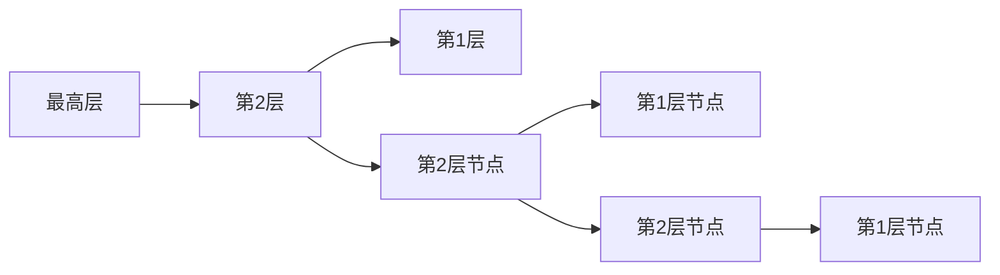
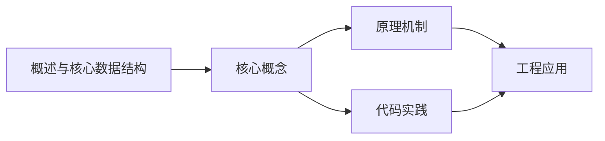
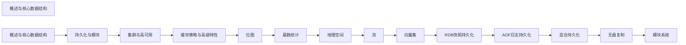

## 1. 学习目标（Bloom 分类）

本节按照布鲁姆教育目标分类学组织学习路径。本文主题为《概述与核心数据结构》，属于 Redis 模块，读者可以根据自身阶段选择阅读深度。

记忆层面：能够准确复述本文的核心概念、术语与基本语法或操作步骤，并能够在提问或检索时快速定位对应知识点。能够说出 Redis 的核心概念、语法与常用对象。

理解层面：能够用自己的语言解释核心原理与工作机制，说明概念之间的因果关系，而不是机械记忆结论。能够解释 Redis 的执行原理与优化机制。

应用层面：能够在真实项目或练习场景中运用本文知识解决具体问题，写出正确且可维护的实现。能够编写正确、高效的 Redis 语句与操作。

分析层面：能够拆解复杂问题，比较本文主题与相邻概念的异同，识别边界条件与例外情况。能够分析 Redis 相关方案在性能与一致性上的权衡。

评价层面：能够根据约束条件（性能、可读性、安全、成本）评价不同方案的优劣，做出有依据的技术决策。能够根据业务场景评价 Redis 技术选型。

创造层面：能够把本文知识与其他模块知识组合，设计出新的解决方案或可复用的工程模式。能够组合 Redis 与其他技术设计数据架构。

通过本节学习，读者应当能够把《概述与核心数据结构》纳入自己的知识网络，并与 Redis 模块的其他主题（数据结构、持久化、集群、缓存策略）建立关联。

## 2. 历史动机与发展脉络

《概述与核心数据结构》是 Redis 领域的重要主题。要真正理解它，需要先了解它解决的问题与演进过程。

Redis 由 Salvatore Sanfilippo 于 2009 年发布，是内存数据结构存储，常作缓存、消息中间件与轻量数据库；BSD 许可，单线程事件循环（6.0 起多线程 IO）。
数据模型：String、Hash、List、Set、Sorted Set、Stream、BitMap、HyperLogLog、Geo；每种结构有专门命令与复杂度。
Redis 7.x：ACL、函数（Lua/Redis Functions）、集群路由（Cluster Sharding）、自动故障转移；Redis Stack 集成 JSON/搜索/时序。

回到本文主题：概述与核心数据结构 的提出与成熟，正是上述技术背景下的必然产物。早期实现往往以简单可用为目标，随着工程规模扩大，社区逐渐沉淀出标准做法与最佳实践；理解这一脉络，可以帮助读者判断“为什么文档中的推荐写法是现在这个样子”，也能在遇到历史遗留代码时准确识别其设计年代与取舍。


## 3. 形式化定义与核心概念精讲

本节把《概述与核心数据结构》涉及的核心概念以“定义 + 讲解”的形式展开。读者应把定义当作工具，把讲解当作理解路径；两者结合才能形成可迁移的知识。

单线程模型：命令串行执行保证原子性，无锁；性能瓶颈在内存与网络；长命令（KEYS）阻塞。
持久化：RDB 快照（fork 子进程）与 AOF 追加日志；混合持久化组合两者；持久化权衡数据安全与性能。
过期与淘汰：惰性删除 + 定期抽样；maxmemory-policy（allkeys-lru/lru/lfu/noeviction）控制内存。

### 3.1 原文章节逐一精讲

原文档把主题拆分为 11 个小节，下面按顺序给出每一节的导读讲解，随后保留原文细节供精读。

#### 原文精读（完整保留）


#### 1. Redis 8.0 概述

##### 1.1 Redis 简介

Redis（Remote Dictionary Server）是开源的**内存键值数据库**，支持丰富的数据结构、持久化、高可用和集群功能。Redis 8.0 引入了 Vector Set 等重要新特性。

##### 1.2 Redis 核心特性

| 特性         | 说明                                     |
| :----------- | :--------------------------------------- |
| 内存存储     | 所有数据存储在内存，读写延迟微秒级       |
| 丰富数据结构 | String、Hash、List、Set、ZSet、Stream 等 |
| 持久化       | RDB 快照 + AOF 日志，混合持久化          |
| 高可用       | 主从复制 + Sentinel 哨兵自动故障转移     |
| 集群         | Redis Cluster 无中心分片集群             |
| 模块化       | RedisJSON、RediSearch、RedisBloom 等     |
| 单线程模型   | 命令执行单线程，I/O 多线程（6.0+）       |

##### 1.3 Redis 8.0 新特性

```
- Vector Set: 原生高维向量近似搜索（HNSW 算法）
- Redis for AI: 向量库、推理缓存、VSS 优化
- Redis Flex: 混合存储引擎（SSD + DRAM）
- I/O 多线程增强
- 函数（Functions）替代 Lua 脚本
- ACL 增强与 TLS 改进
```

#### 2. 字符串（SDS）

##### 2.1 SDS 结构

Redis 使用 SDS（Simple Dynamic String）替代 C 字符串：

```c
// SDS 结构
struct sdshdr {
    int len;       // 已使用长度
    int free;      // 剩余空间
    char buf[];    // 数据区
};
```

| 特性       | C 字符串 | SDS                          |
| :--------- | :------- | :--------------------------- |
| 获取长度   | O(n)     | O(1)                         |
| 缓冲区溢出 | 可能     | 不会（空间预分配）           |
| 二进制安全 | 否       | 是（len 判断结尾）           |
| 内存重分配 | 每次修改 | 最多 N 次（预分配+惰性释放） |

##### 2.2 常用命令

```bash
# 基本操作
SET key value [EX seconds] [PX ms] [NX|XX] [KEEPTTL]
GET key
DEL key [key ...]

# 设置带过期
SET session:abc123 '{"user":"admin"}' EX 3600    # 1小时过期
SET cache:home '<html>...</html>' EX 300          # 5分钟缓存

# NX: 仅键不存在时设置（分布式锁）
SET lock:order:123 "uuid-xxx" NX EX 30

# 批量操作
MSET key1 val1 key2 val2 key3 val3
MGET key1 key2 key3

# 数值操作
SET counter 100
INCR counter           # 101
INCRBY counter 10      # 111
DECRBY counter 5       # 106
INCRBYFLOAT counter 2.5 # 108.5

# 位操作
SETBIT user:active:20240101 100 1    # 第100位设为1
GETBIT user:active:20240101 100      # 返回1
BITCOUNT user:active:20240101         # 统计活跃用户数
BITOP AND result key1 key2            # 位运算
```

#### 3. 哈希（Hash）

##### 3.1 底层编码

```
Hash 底层编码:
1. listpack（小对象）: field 数量 ≤ hash-max-listpack-entries 且值长度 ≤ hash-max-listpack-value
2. hashtable（大对象）: 超过阈值时转换

hashtable 结构:
  dict → ht[0] + ht[1]（渐进式 rehash）
  每个 ht: 数组 + 哈希函数（SipHash）
```

##### 3.2 常用命令

```bash
# 基本操作
HSET user:1001 name "Alice" age 30 email "alice@example.com"
HGET user:1001 name              # "Alice"
HMGET user:1001 name age email   # 批量获取
HGETALL user:1001                 # 获取所有字段
HDEL user:1001 email              # 删除字段
HLEN user:1001                    # 字段数量

# 数值操作
HINCRBY user:1001 age 1           # 年龄+1
HINCRBYFLOAT user:1001 score 0.5  # 浮点数增加

# 条件操作
HSETNX user:1001 email "new@example.com"  # 仅字段不存在时设置

# 判断与遍历
HEXISTS user:1001 name            # 字段是否存在
HKEYS user:1001                   # 所有字段名
HVALS user:1001                   # 所有字段值
HSCAN user:1001 MATCH "na*"       # 模式匹配遍历
```

#### 4. 列表（List）

##### 4.1 底层编码

```
List 底层编码: quicklist
  quicklist = listpack（压缩列表）+ 双向链表
  每个节点是一个 listpack，中间节点可压缩（LZF 算法）

配置参数:
  list-max-listpack-size: 单个 listpack 大小限制
  list-compress-depth: 压缩深度（0=不压缩，1=首尾不压缩）
```

##### 4.2 常用命令

```bash
# 队列操作（FIFO）
LPUSH queue:tasks "task1" "task2"    # 左端入队
RPOP queue:tasks                      # 右端出队

# 栈操作（LIFO）
LPUSH stack:undo "action1"
LPOP stack:undo

# 阻塞操作（消息队列场景）
BLPOP queue:tasks 30    # 阻塞等待30秒
BRPOP queue:tasks 0     # 无限等待

# 查看与裁剪
LLEN queue:tasks                       # 列表长度
LRANGE queue:tasks 0 -1                # 查看所有元素
LRANGE queue:tasks 0 9                 # 前10个
LTRIM queue:tasks 0 99                 # 仅保留前100个

# 指定位置操作
LINDEX queue:tasks 0                   # 按索引获取
LSET queue:tasks 0 "updated_task"      # 按索引设置
LINSERT queue:tasks BEFORE "task2" "task1.5"  # 插入
LREM queue:tasks 2 "task1"             # 删除指定值
```

#### 5. 集合（Set）

##### 5.1 底层编码

```
Set 底层编码:
1. intset: 所有元素都是整数且数量 ≤ set-max-intset-entries（默认512）
2. hashtable: 元素为哈希表的 key，value 为 NULL
```

##### 5.2 常用命令

```bash
# 基本操作
SADD tags:article:1 "redis" "database" "nosql"
SREM tags:article:1 "nosql"
SISMEMBER tags:article:1 "redis"       # 是否存在
SMEMBERS tags:article:1                 # 所有成员
SCARD tags:article:1                    # 成员数量

# 随机操作
SRANDMEMBER tags:article:1 2            # 随机取2个（不删除）
SPOP tags:article:1                     # 随机弹出1个

# 集合运算
SADD set:a 1 2 3 4 5
SADD set:b 3 4 5 6 7

SINTER set:a set:b           # 交集: {3,4,5}
SUNION set:a set:b           # 并集: {1,2,3,4,5,6,7}
SDIFF set:a set:b            # 差集: {1,2}

SINTERSTORE result set:a set:b   # 交集存入 result
SUNIONSTORE result set:a set:b   # 并集存入 result
SDIFFSTORE result set:a set:b    # 差集存入 result

# 遍历
SSCAN tags:article:1 MATCH "re*"
```

#### 6. 有序集合（ZSet）

##### 6.1 底层编码



平均查询复杂度：O(logN)，空间复杂度：O(N)

##### 6.2 常用命令

```bash
# 添加与更新
ZADD leaderboard 100 "Alice" 95 "Bob" 88 "Charlie"
ZADD leaderboard XX 105 "Alice"          # 仅更新已存在成员
ZADD leaderboard NX 92 "David"           # 仅添加新成员
ZADD leaderboard GT 110 "Alice"          # 仅当新分数更大时更新
ZADD leaderboard LT 80 "Bob"             # 仅当新分数更小时更新

# 查询
ZSCORE leaderboard "Alice"               # 获取分数
ZRANK leaderboard "Alice"                # 排名（升序，从0开始）
ZREVRANK leaderboard "Alice"             # 排名（降序）

# 范围查询（按分数）
ZRANGEBYSCORE leaderboard 90 100         # 分数 90~100
ZRANGEBYSCORE leaderboard -inf +inf      # 所有
ZRANGEBYSCORE leaderboard (90 100        # 开区间 >90
ZCOUNT leaderboard 90 100                # 计数

# 范围查询（按排名）
ZRANGE leaderboard 0 9 WITHSCORES        # 前10名（升序）
ZREVRANGE leaderboard 0 9 WITHSCORES     # 前10名（降序）

# 删除
ZREM leaderboard "Charlie"
ZREMRANGEBYRANK leaderboard 0 2          # 删除排名0~2
ZREMRANGEBYSCORE leaderboard -inf 60     # 删除分数≤60

# 聚合操作
ZUNIONSTORE result 2 leaderboard1 leaderboard2 WEIGHTS 1 2 AGGREGATE SUM
ZINTERSTORE result 2 leaderboard1 leaderboard2 AGGREGATE MAX
```

#### 7. 位图（Bitmap）

```bash
# 位图操作（基于 String 类型）
SETBIT sign:202401:1001 0 1     # 第1天签到
SETBIT sign:202401:1001 6 1     # 第7天签到
GETBIT sign:202401:1001 0       # 检查第1天是否签到
BITCOUNT sign:202401:1001       # 本月签到次数
BITPOS sign:202401:1001 1       # 第一个签到的天

# 统计活跃用户
SETBIT active:20240101 1001 1   # 用户1001活跃
SETBIT active:20240101 1002 1   # 用户1002活跃
BITCOUNT active:20240101        # 当日活跃用户数

# 连续签到天数
BITFIELD sign:202401:1001 GET u31 0  # 获取31位无符号整数
```

#### 8. HyperLogLog

```bash
# 基数估算（0.81% 标准误差，仅 12KB 内存）
PFADD uv:20240101 "user1" "user2" "user3"
PFADD uv:20240101 "user1" "user4"        # 重复不计数
PFCOUNT uv:20240101                       # 估算独立访客数

# 合并
PFADD uv:20240102 "user2" "user3" "user5"
PFMERGE uv:week uv:20240101 uv:20240102
PFCOUNT uv:week                           # 合并后的独立访客数
```

#### 9. GEO（地理位置）

```bash
# GEO 基于 ZSet 实现（使用 GeoHash 编码作为分数）

# 添加地理位置
GEOADD locations 116.397 39.908 "北京" 121.474 31.230 "上海" 113.264 23.129 "广州"

# 计算距离
GEODIST locations "北京" "上海" km       # 约 1067.5 km

# 范围查询
GEORADIUS locations 116.397 39.908 500 km WITHDIST WITHCOORD COUNT 10
GEORADIUSBYMEMBER locations "北京" 500 km WITHDIST

# Redis 6.2+ 推荐使用 GEOSEARCH
GEOSEARCH locations FROMMEMBER "北京" BYRADIUS 500 km WITHDIST COUNT 10
GEOSEARCH locations FROMLONLAT 116.397 39.908 BYBOX 500 500 km WITHDIST

# 获取坐标
GEOPOS locations "北京"

# GeoHash 编码
GEOHASH locations "北京"
```

#### 10. Stream

##### 10.1 Stream 基本操作

```bash
# 添加消息
XADD orders:* name "Alice" product "Book" price 29.9
# 返回: "1704067200000-0"（时间戳-序号）

# 自定义 ID
XADD orders:2024 maxlen ~ 10000 * name "Bob" product "Pen" price 5.5
# maxlen ~ 10000: 近似裁剪到10000条

# 读取消息
XRANGE orders:2024 - +                    # 所有消息
XRANGE orders:2024 - + COUNT 10           # 前10条
XRANGE orders:2024 1704067200000-0 +      # 从指定ID开始
XREVRANGE orders:2024 + - COUNT 5         # 最新5条

# 读取新消息（非阻塞）
XREAD COUNT 10 STREAMS orders:2024 $

# 阻塞读取
XREAD COUNT 10 BLOCK 5000 STREAMS orders:2024 $
```

##### 10.2 消费者组

```bash
# 创建消费者组
XGROUP CREATE orders:2024 order-processors $ MKSTREAM
# $ = 从最新消息开始，0 = 从头开始

# 消费者读取
XREADGROUP GROUP order-processors consumer1 COUNT 1 STREAMS orders:2024 >

# 确认消息
XACK orders:2024 order-processors 1704067200000-0

# 查看待处理消息
XPENDING orders:2024 order-processors

# 查看消费者组信息
XINFO GROUPS orders:2024
XINFO CONSUMERS orders:2024 order-processors

# 转移未确认消息给其他消费者
XCLAIM orders:2024 order-processors consumer2 3600 1704067200000-0
```

#### 11. Vector Set（Redis 8.0 新增）

##### 11.1 Vector Set 概述

Vector Set 是 Redis 8.0 新增的数据结构，支持**高维向量近似最近邻搜索（ANN）**，基于 HNSW（Hierarchical Navigable Small World）算法。

```bash
# 添加向量
VSET products:vec item1 0.1 0.2 0.3 0.4 0.5 0.6 0.7 0.8
VSET products:vec item2 0.2 0.3 0.4 0.5 0.6 0.7 0.8 0.9
VSET products:vec item3 0.9 0.8 0.7 0.6 0.5 0.4 0.3 0.2

# 向量搜索（KNN）
VSEARCH products:vec 0.1 0.2 0.3 0.4 0.5 0.6 0.7 0.8 COUNT 5

# 带过滤条件的搜索
VSEARCH products:vec 0.1 0.2 0.3 0.4 0.5 0.6 0.7 0.8 COUNT 5 FILTER category == "electronics"

# 获取向量
VGET products:vec item1

# 删除向量
VDEL products:vec item1

# 查看信息
VINFO products:vec
```

##### 11.2 Vector Set vs pgvector

| 维度     | Redis Vector Set | pgvector       |
| :------- | :--------------- | :------------- |
| 存储     | 内存             | 磁盘（可缓存） |
| 延迟     | 微秒级           | 毫秒级         |
| 索引算法 | HNSW             | HNSW / IVFFlat |
| 持久化   | RDB/AOF          | 原生持久化     |
| 适用场景 | 实时推荐、缓存   | 大规模向量检索 |
| 数据量   | 受内存限制       | 受磁盘限制     |


### 3.2 概念关系图

下面用 Mermaid 图表达本文核心概念之间的关系，帮助读者建立整体图景：



图中展示的是本文知识的结构化关系：核心概念是入口，原理机制解释“为什么”，代码实践演示“怎么做”，工程应用回答“何时用”。读者学习时可以把每个小节的内容挂接到对应节点上。

## 4. 理论推导与原理解析

本节深入《概述与核心数据结构》背后的原理。理论部分不求面面俱到，而是聚焦“能解释现象、能指导实践”的关键推导。

单线程模型：命令串行执行保证原子性，无锁；性能瓶颈在内存与网络；长命令（KEYS）阻塞。
持久化：RDB 快照（fork 子进程）与 AOF 追加日志；混合持久化组合两者；持久化权衡数据安全与性能。
过期与淘汰：惰性删除 + 定期抽样；maxmemory-policy（allkeys-lru/lru/lfu/noeviction）控制内存。
高可用：主从复制（PSYNC）、哨兵（Sentinel）自动故障转移、Cluster 分片（16384 槽）与集群模式。

需要强调的是，理论推导与工程实践之间存在翻译层：理论给出的是理想化模型与边界条件，工程代码则必须处理真实环境中的例外。读者在学习时应先掌握理论的“标准情形”，再通过陷阱章节了解“非标准情形”。

## 5. 代码示例与逐行讲解

本节把原文中的代码示例系统整理，并为每个示例补充用途说明与讲解。读者不应只浏览代码，而应逐段对照讲解理解设计意图。

### 5.1 示例：1.3 Redis 8.0 新特性

该示例来自原文《1.3 Redis 8.0 新特性》小节，用于演示概述与核心数据结构相关操作。阅读时请先看代码结构，再看其后的讲解。

```text
- Vector Set: 原生高维向量近似搜索（HNSW 算法）
- Redis for AI: 向量库、推理缓存、VSS 优化
- Redis Flex: 混合存储引擎（SSD + DRAM）
- I/O 多线程增强
- 函数（Functions）替代 Lua 脚本
- ACL 增强与 TLS 改进
```

讲解：这段代码演示了本节核心知识点。代码中的关键操作可以归纳为三步：准备（定义或初始化）、执行（核心逻辑）、收尾（释放资源或返回结果）。实际项目中，这三步往往被封装为函数或类，以提升复用性与可测试性。

关键点分析：

该示例共 6 行有效代码，包含 1 类关键结构（for）。其中：

- 入口与初始化部分负责建立上下文，对应实际项目中的启动或装配逻辑；
- 核心逻辑部分体现本文主题的主要操作，是阅读时最需要对照讲解理解的部分；
- 输出或返回部分把结果交给调用方，注意其类型与边界条件。

进阶思考路径：先尝试修改参数观察行为变化，再把示例中的模式迁移到自己的项目中；每次修改都记录预期与实测差异，这是把示例转化为能力的最快方式。

### 5.2 示例：2.1 SDS 结构

该示例来自原文《2.1 SDS 结构》小节，用于演示概述与核心数据结构相关操作。阅读时请先看代码结构，再看其后的讲解。

```c
// SDS 结构
struct sdshdr {
    int len;       // 已使用长度
    int free;      // 剩余空间
    char buf[];    // 数据区
};
```

讲解：这段代码演示了本节核心知识点。代码中的关键操作可以归纳为三步：准备（定义或初始化）、执行（核心逻辑）、收尾（释放资源或返回结果）。实际项目中，这三步往往被封装为函数或类，以提升复用性与可测试性。

关键点分析：

该示例共 6 行有效代码，结构以数据或配置为主。阅读时应关注：数据字段的含义、配置项的作用，以及它们与运行行为的对应关系。

进阶思考路径：先尝试修改参数观察行为变化，再把示例中的模式迁移到自己的项目中；每次修改都记录预期与实测差异，这是把示例转化为能力的最快方式。

### 5.3 示例：2.2 常用命令

该示例来自原文《2.2 常用命令》小节，用于演示概述与核心数据结构相关操作。阅读时请先看代码结构，再看其后的讲解。

```bash
# 基本操作
SET key value [EX seconds] [PX ms] [NX|XX] [KEEPTTL]
GET key
DEL key [key ...]

# 设置带过期
SET session:abc123 '{"user":"admin"}' EX 3600    # 1小时过期
SET cache:home '<html>...</html>' EX 300          # 5分钟缓存

# NX: 仅键不存在时设置（分布式锁）
SET lock:order:123 "uuid-xxx" NX EX 30

# 批量操作
MSET key1 val1 key2 val2 key3 val3
MGET key1 key2 key3

# 数值操作
SET counter 100
INCR counter           # 101
INCRBY counter 10      # 111
DECRBY counter 5       # 106
INCRBYFLOAT counter 2.5 # 108.5

# 位操作
SETBIT user:active:20240101 100 1    # 第100位设为1
GETBIT user:active:20240101 100      # 返回1
BITCOUNT user:active:20240101         # 统计活跃用户数
BITOP AND result key1 key2            # 位运算
```

讲解：这段代码演示了本节核心知识点。代码中的关键操作可以归纳为三步：准备（定义或初始化）、执行（核心逻辑）、收尾（释放资源或返回结果）。实际项目中，这三步往往被封装为函数或类，以提升复用性与可测试性。

关键点分析：

该示例共 23 行有效代码，结构以数据或配置为主。阅读时应关注：数据字段的含义、配置项的作用，以及它们与运行行为的对应关系。

进阶思考路径：先尝试修改参数观察行为变化，再把示例中的模式迁移到自己的项目中；每次修改都记录预期与实测差异，这是把示例转化为能力的最快方式。

### 5.4 示例：3.1 底层编码

该示例来自原文《3.1 底层编码》小节，用于演示概述与核心数据结构相关操作。阅读时请先看代码结构，再看其后的讲解。

```text
Hash 底层编码:
1. listpack（小对象）: field 数量 ≤ hash-max-listpack-entries 且值长度 ≤ hash-max-listpack-value
2. hashtable（大对象）: 超过阈值时转换

hashtable 结构:
  dict → ht[0] + ht[1]（渐进式 rehash）
  每个 ht: 数组 + 哈希函数（SipHash）
```

讲解：这段代码演示了本节核心知识点。代码中的关键操作可以归纳为三步：准备（定义或初始化）、执行（核心逻辑）、收尾（释放资源或返回结果）。实际项目中，这三步往往被封装为函数或类，以提升复用性与可测试性。

关键点分析：

该示例共 6 行有效代码，结构以数据或配置为主。阅读时应关注：数据字段的含义、配置项的作用，以及它们与运行行为的对应关系。

进阶思考路径：先尝试修改参数观察行为变化，再把示例中的模式迁移到自己的项目中；每次修改都记录预期与实测差异，这是把示例转化为能力的最快方式。

### 5.5 示例：3.2 常用命令

该示例来自原文《3.2 常用命令》小节，用于演示概述与核心数据结构相关操作。阅读时请先看代码结构，再看其后的讲解。

```bash
# 基本操作
HSET user:1001 name "Alice" age 30 email "alice@example.com"
HGET user:1001 name              # "Alice"
HMGET user:1001 name age email   # 批量获取
HGETALL user:1001                 # 获取所有字段
HDEL user:1001 email              # 删除字段
HLEN user:1001                    # 字段数量

# 数值操作
HINCRBY user:1001 age 1           # 年龄+1
HINCRBYFLOAT user:1001 score 0.5  # 浮点数增加

# 条件操作
HSETNX user:1001 email "new@example.com"  # 仅字段不存在时设置

# 判断与遍历
HEXISTS user:1001 name            # 字段是否存在
HKEYS user:1001                   # 所有字段名
HVALS user:1001                   # 所有字段值
HSCAN user:1001 MATCH "na*"       # 模式匹配遍历
```

讲解：这段代码演示了本节核心知识点。代码中的关键操作可以归纳为三步：准备（定义或初始化）、执行（核心逻辑）、收尾（释放资源或返回结果）。实际项目中，这三步往往被封装为函数或类，以提升复用性与可测试性。

关键点分析：

该示例共 17 行有效代码，结构以数据或配置为主。阅读时应关注：数据字段的含义、配置项的作用，以及它们与运行行为的对应关系。

进阶思考路径：先尝试修改参数观察行为变化，再把示例中的模式迁移到自己的项目中；每次修改都记录预期与实测差异，这是把示例转化为能力的最快方式。

### 5.6 示例：4.1 底层编码

该示例来自原文《4.1 底层编码》小节，用于演示概述与核心数据结构相关操作。阅读时请先看代码结构，再看其后的讲解。

```text
List 底层编码: quicklist
  quicklist = listpack（压缩列表）+ 双向链表
  每个节点是一个 listpack，中间节点可压缩（LZF 算法）

配置参数:
  list-max-listpack-size: 单个 listpack 大小限制
  list-compress-depth: 压缩深度（0=不压缩，1=首尾不压缩）
```

讲解：这段代码演示了本节核心知识点。代码中的关键操作可以归纳为三步：准备（定义或初始化）、执行（核心逻辑）、收尾（释放资源或返回结果）。实际项目中，这三步往往被封装为函数或类，以提升复用性与可测试性。

关键点分析：

该示例共 6 行有效代码，结构以数据或配置为主。阅读时应关注：数据字段的含义、配置项的作用，以及它们与运行行为的对应关系。

进阶思考路径：先尝试修改参数观察行为变化，再把示例中的模式迁移到自己的项目中；每次修改都记录预期与实测差异，这是把示例转化为能力的最快方式。

### 5.7 示例：4.2 常用命令

该示例来自原文《4.2 常用命令》小节，用于演示概述与核心数据结构相关操作。阅读时请先看代码结构，再看其后的讲解。

```bash
# 队列操作（FIFO）
LPUSH queue:tasks "task1" "task2"    # 左端入队
RPOP queue:tasks                      # 右端出队

# 栈操作（LIFO）
LPUSH stack:undo "action1"
LPOP stack:undo

# 阻塞操作（消息队列场景）
BLPOP queue:tasks 30    # 阻塞等待30秒
BRPOP queue:tasks 0     # 无限等待

# 查看与裁剪
LLEN queue:tasks                       # 列表长度
LRANGE queue:tasks 0 -1                # 查看所有元素
LRANGE queue:tasks 0 9                 # 前10个
LTRIM queue:tasks 0 99                 # 仅保留前100个

# 指定位置操作
LINDEX queue:tasks 0                   # 按索引获取
LSET queue:tasks 0 "updated_task"      # 按索引设置
LINSERT queue:tasks BEFORE "task2" "task1.5"  # 插入
LREM queue:tasks 2 "task1"             # 删除指定值
```

讲解：这段代码演示了本节核心知识点。代码中的关键操作可以归纳为三步：准备（定义或初始化）、执行（核心逻辑）、收尾（释放资源或返回结果）。实际项目中，这三步往往被封装为函数或类，以提升复用性与可测试性。

关键点分析：

该示例共 19 行有效代码，包含 1 类关键结构（INSERT）。其中：

- 入口与初始化部分负责建立上下文，对应实际项目中的启动或装配逻辑；
- 核心逻辑部分体现本文主题的主要操作，是阅读时最需要对照讲解理解的部分；
- 输出或返回部分把结果交给调用方，注意其类型与边界条件。

进阶思考路径：先尝试修改参数观察行为变化，再把示例中的模式迁移到自己的项目中；每次修改都记录预期与实测差异，这是把示例转化为能力的最快方式。

### 5.8 示例：5.1 底层编码

该示例来自原文《5.1 底层编码》小节，用于演示概述与核心数据结构相关操作。阅读时请先看代码结构，再看其后的讲解。

```text
Set 底层编码:
1. intset: 所有元素都是整数且数量 ≤ set-max-intset-entries（默认512）
2. hashtable: 元素为哈希表的 key，value 为 NULL
```

讲解：这段代码演示了本节核心知识点。代码中的关键操作可以归纳为三步：准备（定义或初始化）、执行（核心逻辑）、收尾（释放资源或返回结果）。实际项目中，这三步往往被封装为函数或类，以提升复用性与可测试性。

关键点分析：

该示例共 3 行有效代码，结构以数据或配置为主。阅读时应关注：数据字段的含义、配置项的作用，以及它们与运行行为的对应关系。

进阶思考路径：先尝试修改参数观察行为变化，再把示例中的模式迁移到自己的项目中；每次修改都记录预期与实测差异，这是把示例转化为能力的最快方式。

### 5.9 示例：5.2 常用命令

该示例来自原文《5.2 常用命令》小节，用于演示概述与核心数据结构相关操作。阅读时请先看代码结构，再看其后的讲解。

```bash
# 基本操作
SADD tags:article:1 "redis" "database" "nosql"
SREM tags:article:1 "nosql"
SISMEMBER tags:article:1 "redis"       # 是否存在
SMEMBERS tags:article:1                 # 所有成员
SCARD tags:article:1                    # 成员数量

# 随机操作
SRANDMEMBER tags:article:1 2            # 随机取2个（不删除）
SPOP tags:article:1                     # 随机弹出1个

# 集合运算
SADD set:a 1 2 3 4 5
SADD set:b 3 4 5 6 7

SINTER set:a set:b           # 交集: {3,4,5}
SUNION set:a set:b           # 并集: {1,2,3,4,5,6,7}
SDIFF set:a set:b            # 差集: {1,2}

SINTERSTORE result set:a set:b   # 交集存入 result
SUNIONSTORE result set:a set:b   # 并集存入 result
SDIFFSTORE result set:a set:b    # 差集存入 result

# 遍历
SSCAN tags:article:1 MATCH "re*"
```

讲解：这段代码演示了本节核心知识点。代码中的关键操作可以归纳为三步：准备（定义或初始化）、执行（核心逻辑）、收尾（释放资源或返回结果）。实际项目中，这三步往往被封装为函数或类，以提升复用性与可测试性。

关键点分析：

该示例共 20 行有效代码，结构以数据或配置为主。阅读时应关注：数据字段的含义、配置项的作用，以及它们与运行行为的对应关系。

进阶思考路径：先尝试修改参数观察行为变化，再把示例中的模式迁移到自己的项目中；每次修改都记录预期与实测差异，这是把示例转化为能力的最快方式。

### 5.10 示例：6.1 底层编码

该示例来自原文《6.1 底层编码》小节，用于演示概述与核心数据结构相关操作。阅读时请先看代码结构，再看其后的讲解。


讲解：这段代码演示了本节核心知识点。代码中的关键操作可以归纳为三步：准备（定义或初始化）、执行（核心逻辑）、收尾（释放资源或返回结果）。实际项目中，这三步往往被封装为函数或类，以提升复用性与可测试性。

关键点分析：

该示例共 4 行有效代码，结构以数据或配置为主。阅读时应关注：数据字段的含义、配置项的作用，以及它们与运行行为的对应关系。

进阶思考路径：先尝试修改参数观察行为变化，再把示例中的模式迁移到自己的项目中；每次修改都记录预期与实测差异，这是把示例转化为能力的最快方式。

### 5.11 示例：6.2 常用命令

该示例来自原文《6.2 常用命令》小节，用于演示概述与核心数据结构相关操作。阅读时请先看代码结构，再看其后的讲解。

```bash
# 添加与更新
ZADD leaderboard 100 "Alice" 95 "Bob" 88 "Charlie"
ZADD leaderboard XX 105 "Alice"          # 仅更新已存在成员
ZADD leaderboard NX 92 "David"           # 仅添加新成员
ZADD leaderboard GT 110 "Alice"          # 仅当新分数更大时更新
ZADD leaderboard LT 80 "Bob"             # 仅当新分数更小时更新

# 查询
ZSCORE leaderboard "Alice"               # 获取分数
ZRANK leaderboard "Alice"                # 排名（升序，从0开始）
ZREVRANK leaderboard "Alice"             # 排名（降序）

# 范围查询（按分数）
ZRANGEBYSCORE leaderboard 90 100         # 分数 90~100
ZRANGEBYSCORE leaderboard -inf +inf      # 所有
ZRANGEBYSCORE leaderboard (90 100        # 开区间 >90
ZCOUNT leaderboard 90 100                # 计数

# 范围查询（按排名）
ZRANGE leaderboard 0 9 WITHSCORES        # 前10名（升序）
ZREVRANGE leaderboard 0 9 WITHSCORES     # 前10名（降序）

# 删除
ZREM leaderboard "Charlie"
ZREMRANGEBYRANK leaderboard 0 2          # 删除排名0~2
ZREMRANGEBYSCORE leaderboard -inf 60     # 删除分数≤60

# 聚合操作
ZUNIONSTORE result 2 leaderboard1 leaderboard2 WEIGHTS 1 2 AGGREGATE SUM
ZINTERSTORE result 2 leaderboard1 leaderboard2 AGGREGATE MAX
```

讲解：这段代码演示了本节核心知识点。代码中的关键操作可以归纳为三步：准备（定义或初始化）、执行（核心逻辑）、收尾（释放资源或返回结果）。实际项目中，这三步往往被封装为函数或类，以提升复用性与可测试性。

关键点分析：

该示例共 25 行有效代码，结构以数据或配置为主。阅读时应关注：数据字段的含义、配置项的作用，以及它们与运行行为的对应关系。

进阶思考路径：先尝试修改参数观察行为变化，再把示例中的模式迁移到自己的项目中；每次修改都记录预期与实测差异，这是把示例转化为能力的最快方式。

### 5.12 示例：7. 位图（Bitmap）

该示例来自原文《7. 位图（Bitmap）》小节，用于演示概述与核心数据结构相关操作。阅读时请先看代码结构，再看其后的讲解。

```bash
# 位图操作（基于 String 类型）
SETBIT sign:202401:1001 0 1     # 第1天签到
SETBIT sign:202401:1001 6 1     # 第7天签到
GETBIT sign:202401:1001 0       # 检查第1天是否签到
BITCOUNT sign:202401:1001       # 本月签到次数
BITPOS sign:202401:1001 1       # 第一个签到的天

# 统计活跃用户
SETBIT active:20240101 1001 1   # 用户1001活跃
SETBIT active:20240101 1002 1   # 用户1002活跃
BITCOUNT active:20240101        # 当日活跃用户数

# 连续签到天数
BITFIELD sign:202401:1001 GET u31 0  # 获取31位无符号整数
```

讲解：这段代码演示了本节核心知识点。代码中的关键操作可以归纳为三步：准备（定义或初始化）、执行（核心逻辑）、收尾（释放资源或返回结果）。实际项目中，这三步往往被封装为函数或类，以提升复用性与可测试性。

关键点分析：

该示例共 12 行有效代码，结构以数据或配置为主。阅读时应关注：数据字段的含义、配置项的作用，以及它们与运行行为的对应关系。

进阶思考路径：先尝试修改参数观察行为变化，再把示例中的模式迁移到自己的项目中；每次修改都记录预期与实测差异，这是把示例转化为能力的最快方式。

### 5.13 示例：8. HyperLogLog

该示例来自原文《8. HyperLogLog》小节，用于演示概述与核心数据结构相关操作。阅读时请先看代码结构，再看其后的讲解。

```bash
# 基数估算（0.81% 标准误差，仅 12KB 内存）
PFADD uv:20240101 "user1" "user2" "user3"
PFADD uv:20240101 "user1" "user4"        # 重复不计数
PFCOUNT uv:20240101                       # 估算独立访客数

# 合并
PFADD uv:20240102 "user2" "user3" "user5"
PFMERGE uv:week uv:20240101 uv:20240102
PFCOUNT uv:week                           # 合并后的独立访客数
```

讲解：这段代码演示了本节核心知识点。代码中的关键操作可以归纳为三步：准备（定义或初始化）、执行（核心逻辑）、收尾（释放资源或返回结果）。实际项目中，这三步往往被封装为函数或类，以提升复用性与可测试性。

关键点分析：

该示例共 8 行有效代码，结构以数据或配置为主。阅读时应关注：数据字段的含义、配置项的作用，以及它们与运行行为的对应关系。

进阶思考路径：先尝试修改参数观察行为变化，再把示例中的模式迁移到自己的项目中；每次修改都记录预期与实测差异，这是把示例转化为能力的最快方式。

### 5.14 示例：9. GEO（地理位置）

该示例来自原文《9. GEO（地理位置）》小节，用于演示概述与核心数据结构相关操作。阅读时请先看代码结构，再看其后的讲解。

```bash
# GEO 基于 ZSet 实现（使用 GeoHash 编码作为分数）

# 添加地理位置
GEOADD locations 116.397 39.908 "北京" 121.474 31.230 "上海" 113.264 23.129 "广州"

# 计算距离
GEODIST locations "北京" "上海" km       # 约 1067.5 km

# 范围查询
GEORADIUS locations 116.397 39.908 500 km WITHDIST WITHCOORD COUNT 10
GEORADIUSBYMEMBER locations "北京" 500 km WITHDIST

# Redis 6.2+ 推荐使用 GEOSEARCH
GEOSEARCH locations FROMMEMBER "北京" BYRADIUS 500 km WITHDIST COUNT 10
GEOSEARCH locations FROMLONLAT 116.397 39.908 BYBOX 500 500 km WITHDIST

# 获取坐标
GEOPOS locations "北京"

# GeoHash 编码
GEOHASH locations "北京"
```

讲解：这段代码演示了本节核心知识点。代码中的关键操作可以归纳为三步：准备（定义或初始化）、执行（核心逻辑）、收尾（释放资源或返回结果）。实际项目中，这三步往往被封装为函数或类，以提升复用性与可测试性。

关键点分析：

该示例共 15 行有效代码，结构以数据或配置为主。阅读时应关注：数据字段的含义、配置项的作用，以及它们与运行行为的对应关系。

进阶思考路径：先尝试修改参数观察行为变化，再把示例中的模式迁移到自己的项目中；每次修改都记录预期与实测差异，这是把示例转化为能力的最快方式。

### 5.15 示例：10.1 Stream 基本操作

该示例来自原文《10.1 Stream 基本操作》小节，用于演示概述与核心数据结构相关操作。阅读时请先看代码结构，再看其后的讲解。

```bash
# 添加消息
XADD orders:* name "Alice" product "Book" price 29.9
# 返回: "1704067200000-0"（时间戳-序号）

# 自定义 ID
XADD orders:2024 maxlen ~ 10000 * name "Bob" product "Pen" price 5.5
# maxlen ~ 10000: 近似裁剪到10000条

# 读取消息
XRANGE orders:2024 - +                    # 所有消息
XRANGE orders:2024 - + COUNT 10           # 前10条
XRANGE orders:2024 1704067200000-0 +      # 从指定ID开始
XREVRANGE orders:2024 + - COUNT 5         # 最新5条

# 读取新消息（非阻塞）
XREAD COUNT 10 STREAMS orders:2024 $

# 阻塞读取
XREAD COUNT 10 BLOCK 5000 STREAMS orders:2024 $
```

讲解：这段代码演示了本节核心知识点。代码中的关键操作可以归纳为三步：准备（定义或初始化）、执行（核心逻辑）、收尾（释放资源或返回结果）。实际项目中，这三步往往被封装为函数或类，以提升复用性与可测试性。

关键点分析：

该示例共 15 行有效代码，结构以数据或配置为主。阅读时应关注：数据字段的含义、配置项的作用，以及它们与运行行为的对应关系。

进阶思考路径：先尝试修改参数观察行为变化，再把示例中的模式迁移到自己的项目中；每次修改都记录预期与实测差异，这是把示例转化为能力的最快方式。

### 5.16 示例：10.2 消费者组

该示例来自原文《10.2 消费者组》小节，用于演示概述与核心数据结构相关操作。阅读时请先看代码结构，再看其后的讲解。

```bash
# 创建消费者组
XGROUP CREATE orders:2024 order-processors $ MKSTREAM
# $ = 从最新消息开始，0 = 从头开始

# 消费者读取
XREADGROUP GROUP order-processors consumer1 COUNT 1 STREAMS orders:2024 >

# 确认消息
XACK orders:2024 order-processors 1704067200000-0

# 查看待处理消息
XPENDING orders:2024 order-processors

# 查看消费者组信息
XINFO GROUPS orders:2024
XINFO CONSUMERS orders:2024 order-processors

# 转移未确认消息给其他消费者
XCLAIM orders:2024 order-processors consumer2 3600 1704067200000-0
```

讲解：这段代码演示了本节核心知识点。代码中的关键操作可以归纳为三步：准备（定义或初始化）、执行（核心逻辑）、收尾（释放资源或返回结果）。实际项目中，这三步往往被封装为函数或类，以提升复用性与可测试性。

关键点分析：

该示例共 14 行有效代码，包含 1 类关键结构（CREATE）。其中：

- 入口与初始化部分负责建立上下文，对应实际项目中的启动或装配逻辑；
- 核心逻辑部分体现本文主题的主要操作，是阅读时最需要对照讲解理解的部分；
- 输出或返回部分把结果交给调用方，注意其类型与边界条件。

进阶思考路径：先尝试修改参数观察行为变化，再把示例中的模式迁移到自己的项目中；每次修改都记录预期与实测差异，这是把示例转化为能力的最快方式。

### 5.17 示例：11.1 Vector Set 概述

该示例来自原文《11.1 Vector Set 概述》小节，用于演示概述与核心数据结构相关操作。阅读时请先看代码结构，再看其后的讲解。

```bash
# 添加向量
VSET products:vec item1 0.1 0.2 0.3 0.4 0.5 0.6 0.7 0.8
VSET products:vec item2 0.2 0.3 0.4 0.5 0.6 0.7 0.8 0.9
VSET products:vec item3 0.9 0.8 0.7 0.6 0.5 0.4 0.3 0.2

# 向量搜索（KNN）
VSEARCH products:vec 0.1 0.2 0.3 0.4 0.5 0.6 0.7 0.8 COUNT 5

# 带过滤条件的搜索
VSEARCH products:vec 0.1 0.2 0.3 0.4 0.5 0.6 0.7 0.8 COUNT 5 FILTER category == "electronics"

# 获取向量
VGET products:vec item1

# 删除向量
VDEL products:vec item1

# 查看信息
VINFO products:vec
```

讲解：这段代码演示了本节核心知识点。代码中的关键操作可以归纳为三步：准备（定义或初始化）、执行（核心逻辑）、收尾（释放资源或返回结果）。实际项目中，这三步往往被封装为函数或类，以提升复用性与可测试性。

关键点分析：

该示例共 14 行有效代码，结构以数据或配置为主。阅读时应关注：数据字段的含义、配置项的作用，以及它们与运行行为的对应关系。

进阶思考路径：先尝试修改参数观察行为变化，再把示例中的模式迁移到自己的项目中；每次修改都记录预期与实测差异，这是把示例转化为能力的最快方式。


综合以上示例，可以总结出本主题的代码实践要点：第一，先定义清晰的输入输出契约；第二，核心逻辑保持单一职责；第三，错误处理与边界条件不可省略；第四，命名与注释表达意图而非复述代码。

## 6. 对比分析

对比是理解《概述与核心数据结构》定位的最快路径。下面从多个维度与相邻方案进行对比。

Redis 与 Memcached：Redis 数据结构丰富、持久化、集群；Memcached 简单多线程缓存。
Redis 与消息队列：List/Stream 可实现轻量队列；强可靠场景用 Kafka/RabbitMQ。
RDB 与 AOF：RDB 恢复快丢数据多；AOF 丢数据少恢复慢；混合取平衡。

对比的目的不是分出绝对优劣，而是建立选择依据：不同约束条件下，最优解不同。读者应把每个对比维度转化为决策检查清单。

## 7. 常见陷阱与最佳实践

本节整理该主题的高频错误与推荐做法。每个陷阱先描述现象，再解释原因，最后给出最佳实践。

### 7.1 KEYS 阻塞

大键扫描阻塞服务。使用 SCAN 游标。

深入讲解：该问题之所以被归类为“常见陷阱”，是因为它在初学者的代码中反复出现，而且往往不在第一时间暴露——错误通常隐藏在特定数据或特定时序下。

从成因上看，KEYS 阻塞 一般源于对 Redis 某个机制的理解偏差：要么误用了默认行为，要么忽略了边界条件，要么把其他语言的思维惯性带了过来。

从影响上看，KEYS 阻塞 轻则产生错误结果，重则导致资源泄漏、数据损坏或安全事故；这也是为什么工程评审中会把它列为检查项。

从修复策略上看，处理KEYS 阻塞的正确顺序是：先复现（构造最小用例），再定位（确认机制层面的根因），最后修复并补充回归测试。跳过复现直接改代码，往往治标不治本。

### 7.2 大 key

单 key 超大导致网络与内存问题。拆分或压缩。

深入讲解：该问题之所以被归类为“常见陷阱”，是因为它在初学者的代码中反复出现，而且往往不在第一时间暴露——错误通常隐藏在特定数据或特定时序下。

从成因上看，大 key 一般源于对 Redis 某个机制的理解偏差：要么误用了默认行为，要么忽略了边界条件，要么把其他语言的思维惯性带了过来。

从影响上看，大 key 轻则产生错误结果，重则导致资源泄漏、数据损坏或安全事故；这也是为什么工程评审中会把它列为检查项。

从修复策略上看，处理大 key的正确顺序是：先复现（构造最小用例），再定位（确认机制层面的根因），最后修复并补充回归测试。跳过复现直接改代码，往往治标不治本。

### 7.3 缓存穿透

查询不存在数据打穿到 DB。布隆过滤器或空值缓存。

深入讲解：该问题之所以被归类为“常见陷阱”，是因为它在初学者的代码中反复出现，而且往往不在第一时间暴露——错误通常隐藏在特定数据或特定时序下。

从成因上看，缓存穿透 一般源于对 Redis 某个机制的理解偏差：要么误用了默认行为，要么忽略了边界条件，要么把其他语言的思维惯性带了过来。

从影响上看，缓存穿透 轻则产生错误结果，重则导致资源泄漏、数据损坏或安全事故；这也是为什么工程评审中会把它列为检查项。

从修复策略上看，处理缓存穿透的正确顺序是：先复现（构造最小用例），再定位（确认机制层面的根因），最后修复并补充回归测试。跳过复现直接改代码，往往治标不治本。

### 7.4 缓存击穿

热点 key 过期瞬间并发打 DB。互斥重建或逻辑过期。

深入讲解：该问题之所以被归类为“常见陷阱”，是因为它在初学者的代码中反复出现，而且往往不在第一时间暴露——错误通常隐藏在特定数据或特定时序下。

从成因上看，缓存击穿 一般源于对 Redis 某个机制的理解偏差：要么误用了默认行为，要么忽略了边界条件，要么把其他语言的思维惯性带了过来。

从影响上看，缓存击穿 轻则产生错误结果，重则导致资源泄漏、数据损坏或安全事故；这也是为什么工程评审中会把它列为检查项。

从修复策略上看，处理缓存击穿的正确顺序是：先复现（构造最小用例），再定位（确认机制层面的根因），最后修复并补充回归测试。跳过复现直接改代码，往往治标不治本。

### 7.5 缓存雪崩

大量 key 同时过期。过期时间加随机抖动。

深入讲解：该问题之所以被归类为“常见陷阱”，是因为它在初学者的代码中反复出现，而且往往不在第一时间暴露——错误通常隐藏在特定数据或特定时序下。

从成因上看，缓存雪崩 一般源于对 Redis 某个机制的理解偏差：要么误用了默认行为，要么忽略了边界条件，要么把其他语言的思维惯性带了过来。

从影响上看，缓存雪崩 轻则产生错误结果，重则导致资源泄漏、数据损坏或安全事故；这也是为什么工程评审中会把它列为检查项。

从修复策略上看，处理缓存雪崩的正确顺序是：先复现（构造最小用例），再定位（确认机制层面的根因），最后修复并补充回归测试。跳过复现直接改代码，往往治标不治本。

### 7.6 持久化误配置

save 策略与 AOF 关闭导致重启丢数据。按数据安全需求配置。

深入讲解：该问题之所以被归类为“常见陷阱”，是因为它在初学者的代码中反复出现，而且往往不在第一时间暴露——错误通常隐藏在特定数据或特定时序下。

从成因上看，持久化误配置 一般源于对 Redis 某个机制的理解偏差：要么误用了默认行为，要么忽略了边界条件，要么把其他语言的思维惯性带了过来。

从影响上看，持久化误配置 轻则产生错误结果，重则导致资源泄漏、数据损坏或安全事故；这也是为什么工程评审中会把它列为检查项。

从修复策略上看，处理持久化误配置的正确顺序是：先复现（构造最小用例），再定位（确认机制层面的根因），最后修复并补充回归测试。跳过复现直接改代码，往往治标不治本。

### 7.7 连接未关闭

连接泄漏耗尽 maxclients。使用连接池。

深入讲解：该问题之所以被归类为“常见陷阱”，是因为它在初学者的代码中反复出现，而且往往不在第一时间暴露——错误通常隐藏在特定数据或特定时序下。

从成因上看，连接未关闭 一般源于对 Redis 某个机制的理解偏差：要么误用了默认行为，要么忽略了边界条件，要么把其他语言的思维惯性带了过来。

从影响上看，连接未关闭 轻则产生错误结果，重则导致资源泄漏、数据损坏或安全事故；这也是为什么工程评审中会把它列为检查项。

从修复策略上看，处理连接未关闭的正确顺序是：先复现（构造最小用例），再定位（确认机制层面的根因），最后修复并补充回归测试。跳过复现直接改代码，往往治标不治本。

### 7.8 事务误用

MULTI/EXEC 不保证回滚，命令错误才回滚。需要强一致用 Lua。

深入讲解：该问题之所以被归类为“常见陷阱”，是因为它在初学者的代码中反复出现，而且往往不在第一时间暴露——错误通常隐藏在特定数据或特定时序下。

从成因上看，事务误用 一般源于对 Redis 某个机制的理解偏差：要么误用了默认行为，要么忽略了边界条件，要么把其他语言的思维惯性带了过来。

从影响上看，事务误用 轻则产生错误结果，重则导致资源泄漏、数据损坏或安全事故；这也是为什么工程评审中会把它列为检查项。

从修复策略上看，处理事务误用的正确顺序是：先复现（构造最小用例），再定位（确认机制层面的根因），最后修复并补充回归测试。跳过复现直接改代码，往往治标不治本。

### 7.0 最佳实践总览

1. 键命名：业务:实体:id（user:profile:1001），过期时间按场景设置。
2. 缓存一致性：Cache Aside（先更新 DB 再删缓存）为主；延迟双删防旧缓存。
3. 集群：Slot 分布、批量操作需 hash tag；客户端路由（lettuce/jedis 集群版）。
4. 监控：INFO 内存/命中率、慢日志、monitor 抽样。

把这些最佳实践固化为团队规范与代码评审检查项，是避免同类问题反复出现的关键。

## 8. 工程实践

本节把《概述与核心数据结构》放入真实工程场景，给出可复用的模式与组织方法。

缓存分层：本地缓存（Caffeine）+ Redis 分布式缓存；热点与一致性分层治理。
分布式锁：SET NX EX + 续期（Redisson）；注意时钟跳跃与 GC 暂停。
容量规划：maxmemory + 淘汰策略 + 监控；大促前预热。

### 8.1 工程实践的原则拆解

以上工程实践可以归纳为四条原则。第一，配置与代码分离：Redis 项目中环境差异应通过配置注入，而不是散落在代码分支中；这保证同一份代码可以在开发、测试、生产环境一致运行。

第二，接口稳定优先：对外接口（函数签名、协议、数据格式）一旦被消费方依赖，变更成本极高；设计时应预留扩展点并保持向后兼容。

第三，可观测性内置：日志、指标与追踪应该在功能开发时同步设计，而不是故障发生后补救；没有观测手段的模块等于黑盒。

第四，变更可回滚：任何发布都应有对应的回滚方案；数据库迁移、配置变更与代码发布一样需要版本管理与逆向路径。

### 8.2 实践落地的检查清单

- [ ] 缓存分层：对照本节描述，检查当前项目是否已经落实；未落实的项列入技术债并排期处理。
- [ ] 分布式锁：对照本节描述，检查当前项目是否已经落实；未落实的项列入技术债并排期处理。
- [ ] 容量规划：对照本节描述，检查当前项目是否已经落实；未落实的项列入技术债并排期处理。

工程实践的共性原则：配置与代码分离、接口稳定优先、可观测性内置、变更可回滚。这些原则适用于本主题的所有实现。

## 9. 案例研究

本节通过一个完整案例把《概述与核心数据结构》的知识串起来。案例按“需求分析、方案设计、实现、验证”四步展开。

需求：实现商品详情缓存与热点防护。
方案：Cache Aside + 互斥重建（setnx）+ 随机过期抖动 + 布隆过滤器。
要点：序列化协议统一；缓存与 DB 双写顺序；监控命中率。
验证：压测穿透/击穿场景、故障注入（Redis 宕机降级）。

### 9.1 案例的扩展讨论

把案例中的方案放大到真实规模，需要额外考虑三个问题：

第一，规模：当数据量或并发量上升一个数量级时，原方案中的数据结构、缓存策略与任务调度是否仍然成立？通常需要引入分层与异步。

第二，团队：多人协作时，模块边界、接口契约与代码所有权必须明确；案例中的实现应拆分为可独立测试的单元，并配合文档说明设计意图。

第三，演进：上线后的需求变化不可避免；方案设计时应预留扩展点（配置化、插件化、事件化），并定期用真实指标验证假设。


案例研究的学习方法：先独立阅读需求，尝试在脑中形成方案，再对照实现与讲解，最后思考“如果约束变化（数据量、并发、团队规模），方案应如何调整”。

## 10. 知识要点总结与深入讲解

本节以讲解形式汇总全文要点，替代传统的习题与自测，读者不需要答题，只需跟随解释建立完整的认知框架。

关于《概述与核心数据结构》的核心结论：

Redis 的价值在“数据结构即服务”：选择合适结构比堆功能重要。
缓存三兄弟（穿透/击穿/雪崩）是设计必修课。
持久化、复制与集群决定可靠性，生产必须配置齐全。

原文档各小节的要点回顾：

- 1. Redis 8.0 概述：该小节围绕概述与核心数据结构展开具体细节，阅读时应关注其与核心结论的对应关系；每个小节都是核心结论在某一个侧面的展开。
- 2. 字符串（SDS）：该小节围绕概述与核心数据结构展开具体细节，阅读时应关注其与核心结论的对应关系；每个小节都是核心结论在某一个侧面的展开。
- 3. 哈希（Hash）：该小节围绕概述与核心数据结构展开具体细节，阅读时应关注其与核心结论的对应关系；每个小节都是核心结论在某一个侧面的展开。
- 4. 列表（List）：该小节围绕概述与核心数据结构展开具体细节，阅读时应关注其与核心结论的对应关系；每个小节都是核心结论在某一个侧面的展开。
- 5. 集合（Set）：该小节围绕概述与核心数据结构展开具体细节，阅读时应关注其与核心结论的对应关系；每个小节都是核心结论在某一个侧面的展开。
- 6. 有序集合（ZSet）：该小节围绕概述与核心数据结构展开具体细节，阅读时应关注其与核心结论的对应关系；每个小节都是核心结论在某一个侧面的展开。
- 7. 位图（Bitmap）：该小节围绕概述与核心数据结构展开具体细节，阅读时应关注其与核心结论的对应关系；每个小节都是核心结论在某一个侧面的展开。
- 8. HyperLogLog：该小节围绕概述与核心数据结构展开具体细节，阅读时应关注其与核心结论的对应关系；每个小节都是核心结论在某一个侧面的展开。
- 9. GEO（地理位置）：该小节围绕概述与核心数据结构展开具体细节，阅读时应关注其与核心结论的对应关系；每个小节都是核心结论在某一个侧面的展开。
- 10. Stream：该小节围绕概述与核心数据结构展开具体细节，阅读时应关注其与核心结论的对应关系；每个小节都是核心结论在某一个侧面的展开。
- 11. Vector Set（Redis 8.0 新增）：该小节围绕概述与核心数据结构展开具体细节，阅读时应关注其与核心结论的对应关系；每个小节都是核心结论在某一个侧面的展开。

把以上要点与第 3-9 节的内容对照复习，即可完成对本文主题的闭环学习。

## 11. 参考文献


Redis 官方文档：https://redis.io/docs/latest/
Redis 命令参考：https://redis.io/docs/latest/commands/
Redis 中文资料：https://redis.com.cn/
Redisson 文档：https://redisson.org/

## 12. 延伸阅读


Redis 数据结构详解，见 022-redis 模块文档。
Redis 持久化与集群，见 022-redis 模块相关文档。
MySQL 与 Redis 缓存架构，见 020-mysql 模块。
黑马程序员 Bilibili 空间（https://space.bilibili.com/37974444 ）提供 Redis 课程。

## 14. 模块知识图谱与学习路径

本文属于 Redis 模块。为了把《概述与核心数据结构》放入完整的知识网络，下面列出本模块的全部主题并给出相互关联的导读。学习时建议按模块内顺序推进，并在每个文档中留意交叉引用。



上图为模块主题的推荐学习顺序示意图（仅展示前若干主题）。各主题之间存在三类关联：

第一，前置依赖关系：早期主题是后期主题的基础，例如环境与语法先行、进阶主题随后；

第二，横向并列关系：同一层级主题从不同角度覆盖模块能力，学习顺序可以按兴趣调整；

第三，工程组合关系：多个主题在真实项目中组合使用，例如配置、性能与安全主题往往出现在同一系统的不同层面。

### 14.1 模块主题速查表

| 文档 | 主题 | 与本文的关联 |
| --- | --- | --- |
| 概述与核心数据结构 | 001-OverviewCoreDataStructure | 本文自身 |
| 持久化与模块 | 002-PersistenceModule | 本文的并列主题 |
| 集群与高可用 | 003-ClusterHA | 本文的并列主题 |
| 缓存策略与高级特性 | 004-CacheStrategyAdvancedFeature | 本文的并列主题 |
| 位图 | 005-BitGraph | 本文的并列主题 |
| 基数统计 | 006-NumberStats | 本文的并列主题 |
| 地理空间 | 007-GeoSpatial | 本文的并列主题 |
| 流 | 008-Stream | 本文的并列主题 |
| 向量集 | 009-VectorSet | 本文的并列主题 |
| RDB快照持久化 | 010-RDBSnapshotPersistence | 本文的并列主题 |
| AOF日志持久化 | 011-AOFLogPersistence | 本文的并列主题 |
| 混合持久化 | 012-MixedPersistence | 本文的并列主题 |
| 无盘复制 | 013-DisklessReplication | 本文的并列主题 |
| 模块系统 | 014-ModuleSystem | 本文的并列主题 |
| 字符串SDS结构 | 015-StringSDSStructure | 本文的并列主题 |
| 跳表与有序集合 | 016-SkipListAndSortedSet | 本文的并列主题 |
| 主从复制缓冲区 | 017-ReplicationBuffer | 本文的并列主题 |
| 哨兵选举 | 018-SentinelElection | 本文的并列主题 |
| Redis-Cluster哈希槽 | 019-RedisClusterHashSlot | 本文的并列主题 |
| 管道与事务原子性 | 020-PipeTransactionAtomic | 本文的并列主题 |
| Lua脚本原子执行 | 021-LuaScriptAtomicExecution | 本文的并列主题 |
| 缓存穿透击穿雪崩 | 022-CachePenetrationBreakdownAvalanche | 本文的并列主题 |
| 内存淘汰策略 | 023-MemoryEvictionPolicy | 本文的并列主题 |
| Redis Hash 命令速查 | 024-HashCommand | 本文的并列主题 |
| Redis List/Set/ZSet 命令 | 025-ListSetZSetCommand | 本文的并列主题 |
| Redis 发布订阅命令 | 026-PubSubCommand | 本文的并列主题 |
| Redis Key 管理与过期命令速查手册 | 027-KeyManagement | 本文的并列主题 |
| Redis 安全与 ACL 命令速查手册 | 028-ACL | 本文的安全延伸 |
| Redis 7.0+ 新特性命令速查手册 | 029-NewFeatures7 | 本文的并列主题 |

速查表的作用是让读者快速判断：哪些文档应在阅读本文前掌握（前置基础），哪些文档应在阅读本文后继续（延伸主题）。本模块的交叉引用体系即以此表为基础。

## 15. 术语表

下表整理《概述与核心数据结构》及 Redis 模块中出现的高频术语，给出简明释义。术语按字母序或逻辑序排列，供查阅。

| 术语 | 释义 |
| --- | --- |
| 单线程模型 | 命令串行执行保证原子性，无锁；性能瓶颈在内存与网络；长命令（KEYS）阻塞。 |
| 持久化 | RDB 快照（fork 子进程）与 AOF 追加日志；混合持久化组合两者；持久化权衡数据安全与性能。 |
| 过期与淘汰 | 惰性删除 + 定期抽样；maxmemory-policy（allkeys-lru/lru/lfu/noeviction）控制内存。 |
| 高可用 | 主从复制（PSYNC）、哨兵（Sentinel）自动故障转移、Cluster 分片（16384 槽）与集群模式。 |
| KEYS 阻塞（易错点） | 参见常见陷阱章节的详细讲解 |
| 大 key（易错点） | 参见常见陷阱章节的详细讲解 |
| 缓存穿透（易错点） | 参见常见陷阱章节的详细讲解 |
| 缓存击穿（易错点） | 参见常见陷阱章节的详细讲解 |
| 缓存雪崩（易错点） | 参见常见陷阱章节的详细讲解 |
| 持久化误配置（易错点） | 参见常见陷阱章节的详细讲解 |

术语表与正文配合使用：先通读正文，遇到模糊术语回查本表；长期使用后术语会自然进入工作记忆。

## 13. 深度专题扩展

以下专题从不同角度深入本文主题，供有进阶需求的读者研读。每个专题独立成节，内容相互补充。

### 13.1 缓存一致性深度

Cache Aside：读未命中查 DB 回填；写先 DB 后删缓存；删除失败用消息队列补偿。
延迟双删：更新 DB 后删缓存，等待短暂延迟再删一次，处理并发读写窗口。
读写锁与版本号：缓存携带版本，更新时比较版本，失败重试。
强一致场景：不要依赖缓存，直接读 DB；缓存用于可容忍最终一致的数据。

### 13.2 Redis Cluster 原理

16384 个槽分布在主节点，键经 CRC16 % 16384 定位；客户端 MOVED/ASK 重定向。
主从复制：每个主节点挂从节点；主故障由从节点提升（cluster 自动 failover）。
多键操作：同一事务/管道中的键必须同槽（hash tag {user1001}）。
扩缩容：槽迁移在线进行，客户端感知重定向；规划容量避免热点槽。

## 16. 核心概念串讲（复习视角）

本节以“把知识讲给他人听”的方式，把《概述与核心数据结构》的核心概念重新串讲一遍。与前文按章节展开不同，这里的叙述更接近课堂总结：先说整体，再逐个展开，最后收束。

《概述与核心数据结构》属于 Redis 模块。要理解它，先要理解它在模块中的位置：它解决的是该领域的一个具体问题，并依赖模块内若干前置概念；反过来，它又为后续进阶主题提供基础。

第一个概念是单线程模型。命令串行执行保证原子性，无锁；性能瓶颈在内存与网络；长命令（KEYS）阻塞。

在实际使用中，单线程模型需要与相邻概念区分：它们的区别不在于名称，而在于适用条件与行为边界；这正是前文对比分析章节的意义。

第一个概念是持久化。RDB 快照（fork 子进程）与 AOF 追加日志；混合持久化组合两者；持久化权衡数据安全与性能。

在实际使用中，持久化需要与相邻概念区分：它们的区别不在于名称，而在于适用条件与行为边界；这正是前文对比分析章节的意义。

第一个概念是过期与淘汰。惰性删除 + 定期抽样；maxmemory-policy（allkeys-lru/lru/lfu/noeviction）控制内存。

在实际使用中，过期与淘汰需要与相邻概念区分：它们的区别不在于名称，而在于适用条件与行为边界；这正是前文对比分析章节的意义。

接下来是单线程模型。命令串行执行保证原子性，无锁；性能瓶颈在内存与网络；长命令（KEYS）阻塞。

理解该原理的关键不是记住结论，而是记住“它从什么假设出发、推出了什么、假设不成立时会怎样”。带着这个框架复习，原理之间就会连成网络。

接下来是持久化。RDB 快照（fork 子进程）与 AOF 追加日志；混合持久化组合两者；持久化权衡数据安全与性能。

理解该原理的关键不是记住结论，而是记住“它从什么假设出发、推出了什么、假设不成立时会怎样”。带着这个框架复习，原理之间就会连成网络。

接下来是过期与淘汰。惰性删除 + 定期抽样；maxmemory-policy（allkeys-lru/lru/lfu/noeviction）控制内存。

理解该原理的关键不是记住结论，而是记住“它从什么假设出发、推出了什么、假设不成立时会怎样”。带着这个框架复习，原理之间就会连成网络。

接下来是高可用。主从复制（PSYNC）、哨兵（Sentinel）自动故障转移、Cluster 分片（16384 槽）与集群模式。

理解该原理的关键不是记住结论，而是记住“它从什么假设出发、推出了什么、假设不成立时会怎样”。带着这个框架复习，原理之间就会连成网络。

串讲收束：把概念与原理放回本文主题，可以得出一个总纲——定义描述是什么，原理解释为什么，实践回答怎么做。三者构成完整的学习闭环；后续遇到相关问题，都可以按这个总纲检索知识。
