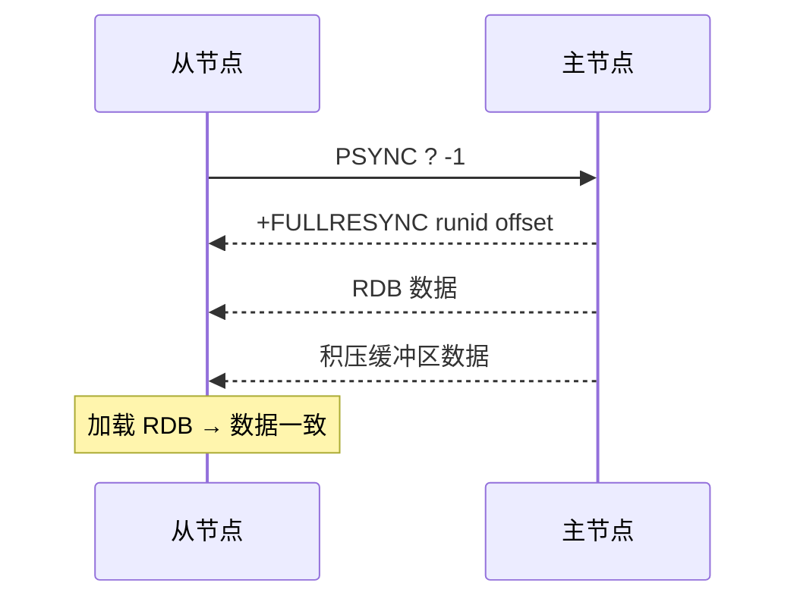
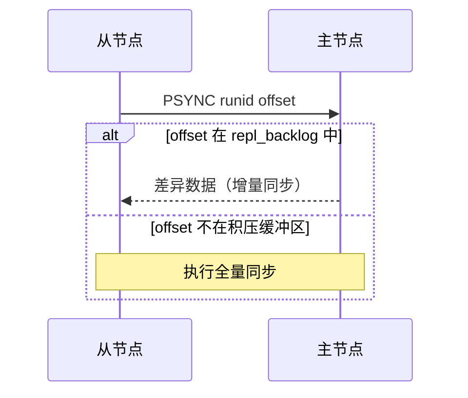
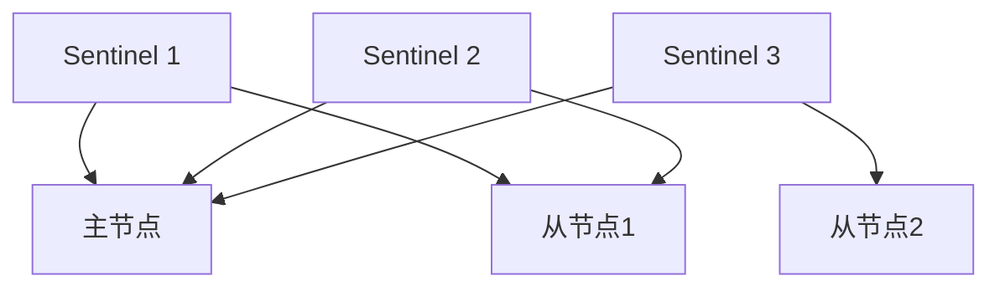
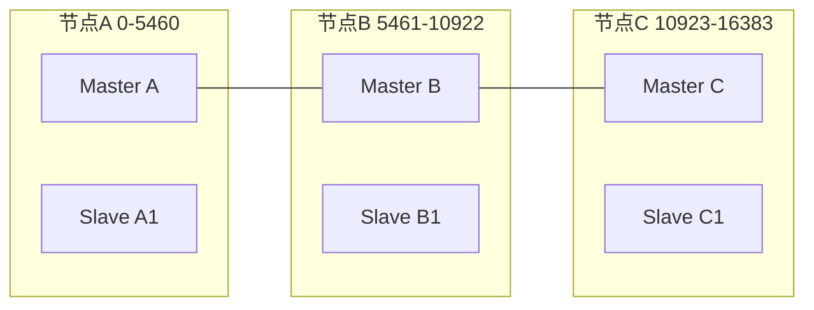
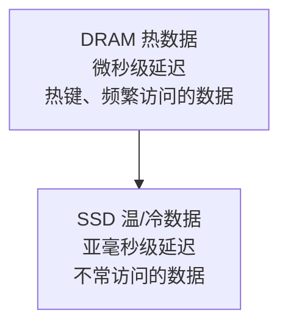
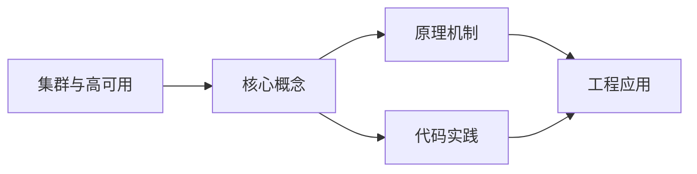
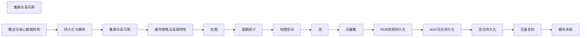

## 1. 学习目标（Bloom 分类）

本节按照布鲁姆教育目标分类学组织学习路径。本文主题为《集群与高可用》，属于 Redis 模块，读者可以根据自身阶段选择阅读深度。

记忆层面：能够准确复述本文的核心概念、术语与基本语法或操作步骤，并能够在提问或检索时快速定位对应知识点。能够说出 Redis 的核心概念、语法与常用对象。

理解层面：能够用自己的语言解释核心原理与工作机制，说明概念之间的因果关系，而不是机械记忆结论。能够解释 Redis 的执行原理与优化机制。

应用层面：能够在真实项目或练习场景中运用本文知识解决具体问题，写出正确且可维护的实现。能够编写正确、高效的 Redis 语句与操作。

分析层面：能够拆解复杂问题，比较本文主题与相邻概念的异同，识别边界条件与例外情况。能够分析 Redis 相关方案在性能与一致性上的权衡。

评价层面：能够根据约束条件（性能、可读性、安全、成本）评价不同方案的优劣，做出有依据的技术决策。能够根据业务场景评价 Redis 技术选型。

创造层面：能够把本文知识与其他模块知识组合，设计出新的解决方案或可复用的工程模式。能够组合 Redis 与其他技术设计数据架构。

通过本节学习，读者应当能够把《集群与高可用》纳入自己的知识网络，并与 Redis 模块的其他主题（数据结构、持久化、集群、缓存策略）建立关联。

## 2. 历史动机与发展脉络

《集群与高可用》是 Redis 领域的重要主题。要真正理解它，需要先了解它解决的问题与演进过程。

Redis 由 Salvatore Sanfilippo 于 2009 年发布，是内存数据结构存储，常作缓存、消息中间件与轻量数据库；BSD 许可，单线程事件循环（6.0 起多线程 IO）。
数据模型：String、Hash、List、Set、Sorted Set、Stream、BitMap、HyperLogLog、Geo；每种结构有专门命令与复杂度。
Redis 7.x：ACL、函数（Lua/Redis Functions）、集群路由（Cluster Sharding）、自动故障转移；Redis Stack 集成 JSON/搜索/时序。

回到本文主题：集群与高可用 的提出与成熟，正是上述技术背景下的必然产物。早期实现往往以简单可用为目标，随着工程规模扩大，社区逐渐沉淀出标准做法与最佳实践；理解这一脉络，可以帮助读者判断“为什么文档中的推荐写法是现在这个样子”，也能在遇到历史遗留代码时准确识别其设计年代与取舍。


## 3. 形式化定义与核心概念精讲

本节把《集群与高可用》涉及的核心概念以“定义 + 讲解”的形式展开。读者应把定义当作工具，把讲解当作理解路径；两者结合才能形成可迁移的知识。

单线程模型：命令串行执行保证原子性，无锁；性能瓶颈在内存与网络；长命令（KEYS）阻塞。
持久化：RDB 快照（fork 子进程）与 AOF 追加日志；混合持久化组合两者；持久化权衡数据安全与性能。
过期与淘汰：惰性删除 + 定期抽样；maxmemory-policy（allkeys-lru/lru/lfu/noeviction）控制内存。

### 3.1 原文章节逐一精讲

原文档把主题拆分为 13 个小节，下面按顺序给出每一节的导读讲解，随后保留原文细节供精读。

#### 原文精读（完整保留）

# Redis Cluster 集群命令速查手册

> **符号约定**：`< >` 必填参数 | `[ ]` 可选参数

---

#### 1. 主从复制

##### 1.1 全量同步



##### 1.2 增量同步



##### 1.3 主从配置

```bash
# 从节点配置
redis-server --replicaof 192.168.1.10 6379

# 或在 redis.conf 中
replicaof 192.168.1.10 6379
masterauth "MasterPass123"       # 主节点密码

# 只读模式（默认开启）
replica-read-only yes

# 复制相关配置
repl-diskless-sync yes           # 无盘复制
repl-ping-replica-period 10      # 心跳间隔
repl-timeout 60                  # 超时时间
replica-serve-stale-data yes     # 断开后是否继续响应
replica-priority 100             # 哨兵选举优先级
```

##### 1.4 复制状态监控

```bash
# 主节点查看从节点
INFO replication
# # Replication
# role:master
# connected_slaves:2
# slave0:ip=192.168.1.11,port=6379,state=online,offset=1234567,lag=0
# slave1:ip=192.168.1.12,port=6379,state=online,offset=1234560,lag=1

# 从节点查看状态
INFO replication
# # Replication
# role:slave
# master_host:192.168.1.10
# master_link_status:up
# master_sync_in_progress:0
# slave_read_only:1
```

#### 2. 哨兵模式（Sentinel）

##### 2.1 Sentinel 架构



##### 2.2 Sentinel 配置

```ini
# sentinel.conf
port 26379
sentinel monitor mymaster 192.168.1.10 6379 2
# mymaster: 主节点名称
# 192.168.1.10 6379: 主节点地址
# 2: 至少2个 Sentinel 同意才进行故障转移

sentinel auth-pass mymaster MasterPass123
sentinel down-after-milliseconds mymaster 30000     # 30秒无响应判定主观下线
sentinel failover-timeout mymaster 180000            # 故障转移超时
sentinel parallel-syncs mymaster 1                   # 同时同步的从节点数
```

##### 2.3 故障转移流程

```
1. 主观下线(SDOWN): 单个 Sentinel 认为主节点不可用
2. 客观下线(ODOWN): 超过 quorum 个 Sentinel 认为主节点不可用
3. Sentinel 选举 Leader（Raft 协议）
4. Leader 执行故障转移:
   a. 选择新主节点:
      - 排除断线的从节点
      - 优先 replica-priority 最小的
      - 优先复制偏移量最大的（数据最新）
      - 优先 runid 最小的
   b. 对新主节点执行 SLAVEOF NO ONE
   c. 对其他从节点执行 SLAVEOF 新主节点
   d. 更新 Sentinel 配置
5. 客户端连接新主节点
```

##### 2.4 Sentinel 客户端连接

```python
import redis
from redis.sentinel import Sentinel

# 连接 Sentinel
sentinel = Sentinel([
    ('192.168.1.10', 26379),
    ('192.168.1.11', 26379),
    ('192.168.1.12', 26379)
], socket_timeout=5)

# 获取主节点连接
master = sentinel.master_for('mymaster', password='MasterPass123')
master.set('key', 'value')

# 获取从节点连接（读操作）
slave = sentinel.slave_for('mymaster', password='MasterPass123')
value = slave.get('key')

# 发现主节点地址
master_addr = sentinel.discover_master('mymaster')
```

#### 3. Redis Cluster

##### 3.1 Cluster 架构



分片规则：slot = CRC16(key) % 16384，每个主节点负责一部分槽位，Gossip 协议进行节点间通信

##### 3.2 Cluster 配置

```ini
# redis.conf
cluster-enabled yes
cluster-config-file nodes-6379.conf
cluster-node-timeout 15000          # 节点超时（毫秒）
cluster-announce-ip 192.168.1.10    # 外部可达 IP
cluster-announce-port 6379
cluster-announce-bus-port 16379     # 集群总线端口

cluster-require-full-coverage yes   # 槽位不全覆盖时拒绝服务
cluster-migration-barrier 1         # 从节点迁移屏障
cluster-allow-reads-when-down no    # 集群下线时允许读
```

##### 3.3 Cluster 创建

```bash
# 创建集群（6 节点: 3主3从）
redis-cli --cluster create \
  192.168.1.10:6379 192.168.1.11:6379 192.168.1.12:6379 \
  192.168.1.13:6379 192.168.1.14:6379 192.168.1.15:6379 \
  --cluster-replicas 1

# 查看集群信息
redis-cli cluster info
redis-cli cluster nodes

# 检查集群状态
redis-cli --cluster check 192.168.1.10:6379

# 添加主节点
redis-cli --cluster add-node 192.168.1.16:6379 192.168.1.10:6379

# 重新分配槽位
redis-cli --cluster reshard 192.168.1.10:6379

# 添加从节点
redis-cli --cluster add-node 192.168.1.17:6379 192.168.1.10:6379 \
  --cluster-slave --cluster-master-id <node_id>
```

##### 3.4 跨槽事务

```bash
# 普通事务不支持跨槽
MULTI
SET key1 val1    # slot 9182
SET key2 val2    # slot 4998  ← 报错: CROSSSLOT

# 解决方案1: Hash Tag
SET {order}:1:name "Alice"    # 同一 hash tag → 同一槽
SET {order}:1:total 100       # 同一 hash tag → 同一槽
# Hash Tag: {} 内的内容参与 CRC16 计算

# 解决方案2: Lua 脚本（同样受限于同一节点）
# 解决方案3: 应用层分布式事务
```

##### 3.5 Cluster 客户端

```python
from redis.cluster import RedisCluster

# 连接集群
rc = RedisCluster(
    host='192.168.1.10',
    port=6379,
    password='ClusterPass123',
    decode_responses=True
)

# 自动路由到正确节点
rc.set('user:1001', 'Alice')     # 自动路由到对应槽位
rc.get('user:1001')

# 批量操作（需同一槽或使用 Hash Tag）
rc.mset({'{order}:1:name': 'Alice', '{order}:1:total': '100'})

# 集群信息
rc.cluster_info()
rc.cluster_nodes()
```

#### 4. 集群代理

```bash
# redis-cluster-proxy（实验性）
# 提供单入口访问 Redis Cluster

# 安装
git clone https://github.com/RedisLabs/redis-cluster-proxy.git
cd redis-cluster-proxy && make

# 启动代理
redis-cluster-proxy -p 7777 192.168.1.10:6379

# 客户端连接代理（像单机一样使用）
redis-cli -p 7777
SET key1 val1
MGET key1 key2 key3    # 代理自动处理跨槽
```

#### 5. Redis Flex 混合存储引擎

##### 5.1 架构



自动分层：LRU 算法决定数据在 DRAM 还是 SSD，成本降低约 80%，延迟 < 500μs

##### 5.2 配置

```ini
# redis.conf (Redis Flex)
flex-enabled yes
flex-ssd-path /data/redis-ssd
flex-ssd-ratio 0.1              # DRAM:SSD = 1:10
flex-dram-max-memory 4gb        # DRAM 最大使用量
flex-ssd-max-storage 40gb       # SSD 最大使用量
flex-eviction-policy allkeys-lru
```

##### 5.3 适用场景

| 场景     | 传统 Redis | Redis Flex |
| :------- | :--------- | :--------- |
| 数据量   | 受内存限制 | 可达 TB 级 |
| 成本     | 高         | 降低 80%   |
| 延迟     | < 100μs    | < 500μs    |
| 适用数据 | 热数据     | 全量数据   |
| 典型场景 | 缓存       | 数据库替代 |

#### 6. Redis for AI 套件

##### 6.1 向量库（Vector Set）

```bash
# 创建向量集合
VSET products:vec item1 0.1 0.2 ... 0.768
VSET products:vec item2 0.2 0.3 ... 0.768

# KNN 搜索
VSEARCH products:vec 0.1 0.15 ... 0.76 COUNT 10

# 带元数据过滤
VSET products:vec item1 0.1 0.2 ... 0.768 META category "electronics" price 299
VSEARCH products:vec 0.1 0.15 ... 0.76 COUNT 10 FILTER category == "electronics"
```

##### 6.2 推理缓存

```bash
# LLM 推理缓存
# 缓存 prompt → response 映射
SET llm:cache:sha256:abc123 "response text here" EX 3600

# 语义缓存（基于向量相似度）
# 1. 将 prompt 转为向量
# 2. 在 Vector Set 中搜索相似 prompt
# 3. 相似度超过阈值则返回缓存结果
VSEARCH prompts:vec <prompt_vector> COUNT 1

# 命中缓存则直接返回，否则调用 LLM 并缓存结果
```

##### 6.3 VSS 优化

```
向量相似度搜索(VSS)优化:

1. HNSW 参数调优:
   - M: 连接数（默认16，越大越精确但内存越大）
   - EF_CONSTRUCTION: 构建时搜索宽度（默认200）
   - EF_RUNTIME: 查询时搜索宽度（默认10）

2. 量化优化:
   - FP32 → FP16: 内存减半，精度损失极小
   - INT8 量化: 内存减至1/4，精度有损
   - PQ(Product Quantization): 压缩比更高

3. 分片策略:
   - 按向量 ID 哈希分片
   - 每个分片独立构建 HNSW 索引
   - 查询时并行搜索所有分片，合并结果

4. 批量操作:
   - 批量插入向量（减少索引更新开销）
   - 批量查询（pipeline）
```
#### 集群创建

**基本写法：redis-cli 创建集群**
`redis-cli --cluster create <节点1> <节点2> ... --cluster-replicas <每主几个从>`
```bash
# 创建 3 主 3 从集群
redis-cli --cluster create \
  192.168.1.1:7000 192.168.1.2:7000 192.168.1.3:7000 \
  192.168.1.1:7001 192.168.1.2:7001 192.168.1.3:7001 \
  --cluster-replicas 1

# cluster-replicas 1 表示每个主库配 1 个从库
```

---

**基本写法：节点配置文件**
`cluster-enabled yes`
```conf
# 每个节点的 redis.conf
port 7000
cluster-enabled yes
cluster-config-file nodes-7000.conf
cluster-node-timeout 15000
cluster-announce-ip 192.168.1.1
cluster-announce-port 7000
cluster-announce-bus-port 17000

# 集群总线端口 = 数据端口 + 10000
# 节点间通信用总线端口，客户端用数据端口
```

---

#### CLUSTER 节点管理

**基本写法：CLUSTER MEET 加入节点**
`CLUSTER MEET <ip> <port>`
```redis
-- 向集群添加新节点
CLUSTER MEET 192.168.1.4 7000

-- 查看集群节点列表
CLUSTER NODES
-- 返回格式：id ip:port@bus flags master ping pong epoch link slots
-- flags: master/slave/fail/myself/handshake/noaddr
```

---

**基本写法：CLUSTER INFO 集群状态**
`CLUSTER INFO`
```redis
-- 查看集群信息
CLUSTER INFO
-- 关键字段：
-- cluster_state:ok
-- cluster_slots_assigned:16384
-- cluster_slots_ok:16384
-- cluster_known_nodes:6
-- cluster_size:3
```

---

#### 槽位管理

**基本写法：CLUSTER SLOTS 槽位分布**
`CLUSTER SLOTS`
```redis
-- 查看槽位分配
CLUSTER SLOTS
-- 返回：起始槽-结束槽-主节点信息-从节点信息
-- 如：0-5460 [ip,port,id] [从ip,从port,从id]
```

---

**基本写法：CLUSTER COUNTKEYSINSLOT**
`CLUSTER COUNTKEYSINSLOT <slot>`
```redis
-- 统计某槽位的 key 数量
CLUSTER COUNTKEYSINSLOT 5500

-- 计算 key 的槽位
CLUSTER KEYSLOT mykey
-- Redis 用 CRC16(key) % 16384 计算槽位
```

---

**基本写法：分配槽位**
`CLUSTER ADDSLOTS <slot> [<slot>...]`
```redis
-- 给当前节点分配槽位
CLUSTER ADDSLOTS 0 1 2 3 4 5

-- 删除槽位
CLUSTER DELSLOTS 0 1 2

-- 批量分配（创建集群时用 bash 循环）
# for i in {0..5460}; do redis-cli -p 7000 CLUSTER ADDSLOTS $i; done
```

---

**基本写法：迁移槽位**
`CLUSTER SETSLOT <slot> MIGRATING <目标nodeid> | IMPORTING <源nodeid>`
```redis
-- 槽位迁移流程（手动迁移 slot 100 从 A 到 B）
-- 1. B 准备接收
CLUSTER SETSLOT 100 IMPORTING <A的nodeid>

-- 2. A 准备迁出
CLUSTER SETSLOT 100 MIGRATING <B的nodeid>

-- 3. 迁移 key
MIGRATE <B_ip> <B_port> '' 0 5000 KEYS key1 key2

-- 4. 两端都确认新归属
CLUSTER SETSLOT 100 NODE <B的nodeid>

-- 推荐：用 redis-cli --cluster reshard 自动迁移
```

---

#### redis-cli 集群工具

**基本写法：集群重平衡**
`redis-cli --cluster reshard <任意节点>`
```bash
# 交互式迁移槽位
redis-cli --cluster reshard 192.168.1.1:7000
# 输入：迁移多少槽位、目标节点id、源节点（all 或 id 列表）

# 自动平衡槽位分布
redis-cli --cluster rebalance 192.168.1.1:7000

# 检查集群健康
redis-cli --cluster check 192.168.1.1:7000

# 修复槽位异常
redis-cli --cluster fix 192.168.1.1:7000
```

---

**基本写法：添加/移除节点**
`redis-cli --cluster add-node <新节点> <集群任意节点>`
```bash
# 添加主节点
redis-cli --cluster add-node 192.168.1.4:7000 192.168.1.1:7000

# 添加从节点（指定主库 id）
redis-cli --cluster add-node 192.168.1.4:7001 192.168.1.1:7000 \
  --cluster-slave --cluster-master-id <主库nodeid>

# 移除节点（先迁移槽位）
redis-cli --cluster del-node 192.168.1.1:7000 <待移除nodeid>
```

---

#### 客户端集群操作

**基本写法：-c 启用集群模式**
`redis-cli -c -h <host> -p <port>`
```bash
# -c 自动跟随 MOVED/ASK 重定向
redis-cli -c -h 192.168.1.1 -p 7000

# 不加 -c 时遇到跨槽 key 会报错并返回 MOVED
# MOVED 5474 192.168.1.2:7000 表示去 2 号节点查
```

---

**基本写法：Hash Tag 保证同槽**
`SET {tag}key1 v1 | SET {tag}key2 v2`
```redis
-- 用 {} 指定 hash tag，大括号内内容参与槽位计算
SET {user100}.name 'Alice'
SET {user100}.age '30'
SET {user100}.email 'a@x.com'

-- 三个 key 槽位相同，可在同节点执行 MGET/事务
MGET {user100}.name {user100}.age {user100}.email

-- 适用于多 key 操作（事务/聚合）必须在同节点
```

---

#### 集群限制

**基本写法：跨槽操作限制**
`<多key命令> 仅当所有 key 同槽时可用`
```redis
-- 以下命令要求所有 key 在同一槽位，否则报 CROSSSLOT 错误
MGET k1 k2 k3          -- 若槽位不同则失败
MULTI / EXEC            -- 事务中跨槽 key 失败
SINTER s1 s2            -- 集合运算跨槽失败
ZUNIONSTORE dst 2 s1 s2

-- 解决方案：用 Hash Tag {tag} 强制同槽
MGET {tag}k1 {tag}k2 {tag}k3
```

---

#### 故障转移

**基本写法：手动故障转移**
`CLUSTER FAILOVER [FORCE|TAKEOVER]`
```redis
-- 从库执行，请求升主（需主库同意）
CLUSTER FAILOVER

-- FORCE：不等主库确认，直接升主（主库不可达时）
CLUSTER FAILOVER FORCE

-- TAKEOVER：跳过集群协商，强制升主（危险，可能脑裂）
CLUSTER FAILOVER TAKEOVER

-- 流程：从库停止复制 -> 通知主库 -> 主库停止处理 -> 从库升主
```

---

**基本写法：故障节点处理**
`CLUSTER FORGET <nodeid>`
```redis
-- 从集群中移除故障节点（需对所有存活节点执行）
CLUSTER FORGET <故障nodeid>

-- 重置当前节点集群状态
CLUSTER RESET [HARD|SOFT]
-- SOFT：保留数据，重置集群信息
-- HARD：清空数据 + 重置集群（重新加入用）
```


### 3.2 概念关系图

下面用 Mermaid 图表达本文核心概念之间的关系，帮助读者建立整体图景：



图中展示的是本文知识的结构化关系：核心概念是入口，原理机制解释“为什么”，代码实践演示“怎么做”，工程应用回答“何时用”。读者学习时可以把每个小节的内容挂接到对应节点上。

## 4. 理论推导与原理解析

本节深入《集群与高可用》背后的原理。理论部分不求面面俱到，而是聚焦“能解释现象、能指导实践”的关键推导。

单线程模型：命令串行执行保证原子性，无锁；性能瓶颈在内存与网络；长命令（KEYS）阻塞。
持久化：RDB 快照（fork 子进程）与 AOF 追加日志；混合持久化组合两者；持久化权衡数据安全与性能。
过期与淘汰：惰性删除 + 定期抽样；maxmemory-policy（allkeys-lru/lru/lfu/noeviction）控制内存。
高可用：主从复制（PSYNC）、哨兵（Sentinel）自动故障转移、Cluster 分片（16384 槽）与集群模式。

需要强调的是，理论推导与工程实践之间存在翻译层：理论给出的是理想化模型与边界条件，工程代码则必须处理真实环境中的例外。读者在学习时应先掌握理论的“标准情形”，再通过陷阱章节了解“非标准情形”。

## 5. 代码示例与逐行讲解

本节把原文中的代码示例系统整理，并为每个示例补充用途说明与讲解。读者不应只浏览代码，而应逐段对照讲解理解设计意图。

### 5.1 示例：1.1 全量同步

该示例来自原文《1.1 全量同步》小节，用于演示集群与高可用相关操作。阅读时请先看代码结构，再看其后的讲解。


讲解：这段代码演示了本节核心知识点。代码中的关键操作可以归纳为三步：准备（定义或初始化）、执行（核心逻辑）、收尾（释放资源或返回结果）。实际项目中，这三步往往被封装为函数或类，以提升复用性与可测试性。

关键点分析：

该示例共 8 行有效代码，结构以数据或配置为主。阅读时应关注：数据字段的含义、配置项的作用，以及它们与运行行为的对应关系。

进阶思考路径：先尝试修改参数观察行为变化，再把示例中的模式迁移到自己的项目中；每次修改都记录预期与实测差异，这是把示例转化为能力的最快方式。

### 5.2 示例：1.2 增量同步

该示例来自原文《1.2 增量同步》小节，用于演示集群与高可用相关操作。阅读时请先看代码结构，再看其后的讲解。


讲解：这段代码演示了本节核心知识点。代码中的关键操作可以归纳为三步：准备（定义或初始化）、执行（核心逻辑）、收尾（释放资源或返回结果）。实际项目中，这三步往往被封装为函数或类，以提升复用性与可测试性。

关键点分析：

该示例共 9 行有效代码，结构以数据或配置为主。阅读时应关注：数据字段的含义、配置项的作用，以及它们与运行行为的对应关系。

进阶思考路径：先尝试修改参数观察行为变化，再把示例中的模式迁移到自己的项目中；每次修改都记录预期与实测差异，这是把示例转化为能力的最快方式。

### 5.3 示例：1.3 主从配置

该示例来自原文《1.3 主从配置》小节，用于演示集群与高可用相关操作。阅读时请先看代码结构，再看其后的讲解。

```bash
# 从节点配置
redis-server --replicaof 192.168.1.10 6379

# 或在 redis.conf 中
replicaof 192.168.1.10 6379
masterauth "MasterPass123"       # 主节点密码

# 只读模式（默认开启）
replica-read-only yes

# 复制相关配置
repl-diskless-sync yes           # 无盘复制
repl-ping-replica-period 10      # 心跳间隔
repl-timeout 60                  # 超时时间
replica-serve-stale-data yes     # 断开后是否继续响应
replica-priority 100             # 哨兵选举优先级
```

讲解：这段代码演示了本节核心知识点。代码中的关键操作可以归纳为三步：准备（定义或初始化）、执行（核心逻辑）、收尾（释放资源或返回结果）。实际项目中，这三步往往被封装为函数或类，以提升复用性与可测试性。

关键点分析：

该示例共 13 行有效代码，结构以数据或配置为主。阅读时应关注：数据字段的含义、配置项的作用，以及它们与运行行为的对应关系。

进阶思考路径：先尝试修改参数观察行为变化，再把示例中的模式迁移到自己的项目中；每次修改都记录预期与实测差异，这是把示例转化为能力的最快方式。

### 5.4 示例：1.4 复制状态监控

该示例来自原文《1.4 复制状态监控》小节，用于演示集群与高可用相关操作。阅读时请先看代码结构，再看其后的讲解。

```bash
# 主节点查看从节点
INFO replication
# # Replication
# role:master
# connected_slaves:2
# slave0:ip=192.168.1.11,port=6379,state=online,offset=1234567,lag=0
# slave1:ip=192.168.1.12,port=6379,state=online,offset=1234560,lag=1

# 从节点查看状态
INFO replication
# # Replication
# role:slave
# master_host:192.168.1.10
# master_link_status:up
# master_sync_in_progress:0
# slave_read_only:1
```

讲解：这段代码演示了本节核心知识点。代码中的关键操作可以归纳为三步：准备（定义或初始化）、执行（核心逻辑）、收尾（释放资源或返回结果）。实际项目中，这三步往往被封装为函数或类，以提升复用性与可测试性。

关键点分析：

该示例共 15 行有效代码，结构以数据或配置为主。阅读时应关注：数据字段的含义、配置项的作用，以及它们与运行行为的对应关系。

进阶思考路径：先尝试修改参数观察行为变化，再把示例中的模式迁移到自己的项目中；每次修改都记录预期与实测差异，这是把示例转化为能力的最快方式。

### 5.5 示例：2.1 Sentinel 架构

该示例来自原文《2.1 Sentinel 架构》小节，用于演示集群与高可用相关操作。阅读时请先看代码结构，再看其后的讲解。


讲解：这段代码演示了本节核心知识点。代码中的关键操作可以归纳为三步：准备（定义或初始化）、执行（核心逻辑）、收尾（释放资源或返回结果）。实际项目中，这三步往往被封装为函数或类，以提升复用性与可测试性。

关键点分析：

该示例共 7 行有效代码，结构以数据或配置为主。阅读时应关注：数据字段的含义、配置项的作用，以及它们与运行行为的对应关系。

进阶思考路径：先尝试修改参数观察行为变化，再把示例中的模式迁移到自己的项目中；每次修改都记录预期与实测差异，这是把示例转化为能力的最快方式。

### 5.6 示例：2.2 Sentinel 配置

该示例来自原文《2.2 Sentinel 配置》小节，用于演示集群与高可用相关操作。阅读时请先看代码结构，再看其后的讲解。

```ini
# sentinel.conf
port 26379
sentinel monitor mymaster 192.168.1.10 6379 2
# mymaster: 主节点名称
# 192.168.1.10 6379: 主节点地址
# 2: 至少2个 Sentinel 同意才进行故障转移

sentinel auth-pass mymaster MasterPass123
sentinel down-after-milliseconds mymaster 30000     # 30秒无响应判定主观下线
sentinel failover-timeout mymaster 180000            # 故障转移超时
sentinel parallel-syncs mymaster 1                   # 同时同步的从节点数
```

讲解：这段代码演示了本节核心知识点。代码中的关键操作可以归纳为三步：准备（定义或初始化）、执行（核心逻辑）、收尾（释放资源或返回结果）。实际项目中，这三步往往被封装为函数或类，以提升复用性与可测试性。

关键点分析：

该示例共 10 行有效代码，结构以数据或配置为主。阅读时应关注：数据字段的含义、配置项的作用，以及它们与运行行为的对应关系。

进阶思考路径：先尝试修改参数观察行为变化，再把示例中的模式迁移到自己的项目中；每次修改都记录预期与实测差异，这是把示例转化为能力的最快方式。

### 5.7 示例：2.3 故障转移流程

该示例来自原文《2.3 故障转移流程》小节，用于演示集群与高可用相关操作。阅读时请先看代码结构，再看其后的讲解。

```text
1. 主观下线(SDOWN): 单个 Sentinel 认为主节点不可用
2. 客观下线(ODOWN): 超过 quorum 个 Sentinel 认为主节点不可用
3. Sentinel 选举 Leader（Raft 协议）
4. Leader 执行故障转移:
   a. 选择新主节点:
      - 排除断线的从节点
      - 优先 replica-priority 最小的
      - 优先复制偏移量最大的（数据最新）
      - 优先 runid 最小的
   b. 对新主节点执行 SLAVEOF NO ONE
   c. 对其他从节点执行 SLAVEOF 新主节点
   d. 更新 Sentinel 配置
5. 客户端连接新主节点
```

讲解：这段代码演示了本节核心知识点。代码中的关键操作可以归纳为三步：准备（定义或初始化）、执行（核心逻辑）、收尾（释放资源或返回结果）。实际项目中，这三步往往被封装为函数或类，以提升复用性与可测试性。

关键点分析：

该示例共 13 行有效代码，结构以数据或配置为主。阅读时应关注：数据字段的含义、配置项的作用，以及它们与运行行为的对应关系。

进阶思考路径：先尝试修改参数观察行为变化，再把示例中的模式迁移到自己的项目中；每次修改都记录预期与实测差异，这是把示例转化为能力的最快方式。

### 5.8 示例：2.4 Sentinel 客户端连接

该示例来自原文《2.4 Sentinel 客户端连接》小节，用于演示集群与高可用相关操作。阅读时请先看代码结构，再看其后的讲解。

```python
import redis
from redis.sentinel import Sentinel

# 连接 Sentinel
sentinel = Sentinel([
    ('192.168.1.10', 26379),
    ('192.168.1.11', 26379),
    ('192.168.1.12', 26379)
], socket_timeout=5)

# 获取主节点连接
master = sentinel.master_for('mymaster', password='MasterPass123')
master.set('key', 'value')

# 获取从节点连接（读操作）
slave = sentinel.slave_for('mymaster', password='MasterPass123')
value = slave.get('key')

# 发现主节点地址
master_addr = sentinel.discover_master('mymaster')
```

讲解：这段代码演示了本节核心知识点。代码中的关键操作可以归纳为三步：准备（定义或初始化）、执行（核心逻辑）、收尾（释放资源或返回结果）。实际项目中，这三步往往被封装为函数或类，以提升复用性与可测试性。

关键点分析：

该示例共 16 行有效代码，包含 2 类关键结构（import、from）。其中：

- 入口与初始化部分负责建立上下文，对应实际项目中的启动或装配逻辑；
- 核心逻辑部分体现本文主题的主要操作，是阅读时最需要对照讲解理解的部分；
- 输出或返回部分把结果交给调用方，注意其类型与边界条件。

进阶思考路径：先尝试修改参数观察行为变化，再把示例中的模式迁移到自己的项目中；每次修改都记录预期与实测差异，这是把示例转化为能力的最快方式。

### 5.9 示例：3.1 Cluster 架构

该示例来自原文《3.1 Cluster 架构》小节，用于演示集群与高可用相关操作。阅读时请先看代码结构，再看其后的讲解。


讲解：这段代码演示了本节核心知识点。代码中的关键操作可以归纳为三步：准备（定义或初始化）、执行（核心逻辑）、收尾（释放资源或返回结果）。实际项目中，这三步往往被封装为函数或类，以提升复用性与可测试性。

关键点分析：

该示例共 14 行有效代码，结构以数据或配置为主。阅读时应关注：数据字段的含义、配置项的作用，以及它们与运行行为的对应关系。

进阶思考路径：先尝试修改参数观察行为变化，再把示例中的模式迁移到自己的项目中；每次修改都记录预期与实测差异，这是把示例转化为能力的最快方式。

### 5.10 示例：3.2 Cluster 配置

该示例来自原文《3.2 Cluster 配置》小节，用于演示集群与高可用相关操作。阅读时请先看代码结构，再看其后的讲解。

```ini
# redis.conf
cluster-enabled yes
cluster-config-file nodes-6379.conf
cluster-node-timeout 15000          # 节点超时（毫秒）
cluster-announce-ip 192.168.1.10    # 外部可达 IP
cluster-announce-port 6379
cluster-announce-bus-port 16379     # 集群总线端口

cluster-require-full-coverage yes   # 槽位不全覆盖时拒绝服务
cluster-migration-barrier 1         # 从节点迁移屏障
cluster-allow-reads-when-down no    # 集群下线时允许读
```

讲解：这段代码演示了本节核心知识点。代码中的关键操作可以归纳为三步：准备（定义或初始化）、执行（核心逻辑）、收尾（释放资源或返回结果）。实际项目中，这三步往往被封装为函数或类，以提升复用性与可测试性。

关键点分析：

该示例共 10 行有效代码，结构以数据或配置为主。阅读时应关注：数据字段的含义、配置项的作用，以及它们与运行行为的对应关系。

进阶思考路径：先尝试修改参数观察行为变化，再把示例中的模式迁移到自己的项目中；每次修改都记录预期与实测差异，这是把示例转化为能力的最快方式。

### 5.11 示例：3.3 Cluster 创建

该示例来自原文《3.3 Cluster 创建》小节，用于演示集群与高可用相关操作。阅读时请先看代码结构，再看其后的讲解。

```bash
# 创建集群（6 节点: 3主3从）
redis-cli --cluster create \
  192.168.1.10:6379 192.168.1.11:6379 192.168.1.12:6379 \
  192.168.1.13:6379 192.168.1.14:6379 192.168.1.15:6379 \
  --cluster-replicas 1

# 查看集群信息
redis-cli cluster info
redis-cli cluster nodes

# 检查集群状态
redis-cli --cluster check 192.168.1.10:6379

# 添加主节点
redis-cli --cluster add-node 192.168.1.16:6379 192.168.1.10:6379

# 重新分配槽位
redis-cli --cluster reshard 192.168.1.10:6379

# 添加从节点
redis-cli --cluster add-node 192.168.1.17:6379 192.168.1.10:6379 \
  --cluster-slave --cluster-master-id <node_id>
```

讲解：这段代码演示了本节核心知识点。代码中的关键操作可以归纳为三步：准备（定义或初始化）、执行（核心逻辑）、收尾（释放资源或返回结果）。实际项目中，这三步往往被封装为函数或类，以提升复用性与可测试性。

关键点分析：

该示例共 17 行有效代码，结构以数据或配置为主。阅读时应关注：数据字段的含义、配置项的作用，以及它们与运行行为的对应关系。

进阶思考路径：先尝试修改参数观察行为变化，再把示例中的模式迁移到自己的项目中；每次修改都记录预期与实测差异，这是把示例转化为能力的最快方式。

### 5.12 示例：3.4 跨槽事务

该示例来自原文《3.4 跨槽事务》小节，用于演示集群与高可用相关操作。阅读时请先看代码结构，再看其后的讲解。

```bash
# 普通事务不支持跨槽
MULTI
SET key1 val1    # slot 9182
SET key2 val2    # slot 4998  ← 报错: CROSSSLOT

# 解决方案1: Hash Tag
SET {order}:1:name "Alice"    # 同一 hash tag → 同一槽
SET {order}:1:total 100       # 同一 hash tag → 同一槽
# Hash Tag: {} 内的内容参与 CRC16 计算

# 解决方案2: Lua 脚本（同样受限于同一节点）
# 解决方案3: 应用层分布式事务
```

讲解：这段代码演示了本节核心知识点。代码中的关键操作可以归纳为三步：准备（定义或初始化）、执行（核心逻辑）、收尾（释放资源或返回结果）。实际项目中，这三步往往被封装为函数或类，以提升复用性与可测试性。

关键点分析：

该示例共 10 行有效代码，结构以数据或配置为主。阅读时应关注：数据字段的含义、配置项的作用，以及它们与运行行为的对应关系。

进阶思考路径：先尝试修改参数观察行为变化，再把示例中的模式迁移到自己的项目中；每次修改都记录预期与实测差异，这是把示例转化为能力的最快方式。

### 5.13 示例：3.5 Cluster 客户端

该示例来自原文《3.5 Cluster 客户端》小节，用于演示集群与高可用相关操作。阅读时请先看代码结构，再看其后的讲解。

```python
from redis.cluster import RedisCluster

# 连接集群
rc = RedisCluster(
    host='192.168.1.10',
    port=6379,
    password='ClusterPass123',
    decode_responses=True
)

# 自动路由到正确节点
rc.set('user:1001', 'Alice')     # 自动路由到对应槽位
rc.get('user:1001')

# 批量操作（需同一槽或使用 Hash Tag）
rc.mset({'{order}:1:name': 'Alice', '{order}:1:total': '100'})

# 集群信息
rc.cluster_info()
rc.cluster_nodes()
```

讲解：这段代码演示了本节核心知识点。代码中的关键操作可以归纳为三步：准备（定义或初始化）、执行（核心逻辑）、收尾（释放资源或返回结果）。实际项目中，这三步往往被封装为函数或类，以提升复用性与可测试性。

关键点分析：

该示例共 16 行有效代码，包含 2 类关键结构（import、from）。其中：

- 入口与初始化部分负责建立上下文，对应实际项目中的启动或装配逻辑；
- 核心逻辑部分体现本文主题的主要操作，是阅读时最需要对照讲解理解的部分；
- 输出或返回部分把结果交给调用方，注意其类型与边界条件。

进阶思考路径：先尝试修改参数观察行为变化，再把示例中的模式迁移到自己的项目中；每次修改都记录预期与实测差异，这是把示例转化为能力的最快方式。

### 5.14 示例：4. 集群代理

该示例来自原文《4. 集群代理》小节，用于演示集群与高可用相关操作。阅读时请先看代码结构，再看其后的讲解。

```bash
# redis-cluster-proxy（实验性）
# 提供单入口访问 Redis Cluster

# 安装
git clone https://github.com/RedisLabs/redis-cluster-proxy.git
cd redis-cluster-proxy && make

# 启动代理
redis-cluster-proxy -p 7777 192.168.1.10:6379

# 客户端连接代理（像单机一样使用）
redis-cli -p 7777
SET key1 val1
MGET key1 key2 key3    # 代理自动处理跨槽
```

讲解：这段代码演示了本节核心知识点。代码中的关键操作可以归纳为三步：准备（定义或初始化）、执行（核心逻辑）、收尾（释放资源或返回结果）。实际项目中，这三步往往被封装为函数或类，以提升复用性与可测试性。

关键点分析：

该示例共 11 行有效代码，结构以数据或配置为主。阅读时应关注：数据字段的含义、配置项的作用，以及它们与运行行为的对应关系。

进阶思考路径：先尝试修改参数观察行为变化，再把示例中的模式迁移到自己的项目中；每次修改都记录预期与实测差异，这是把示例转化为能力的最快方式。

### 5.15 示例：5.1 架构

该示例来自原文《5.1 架构》小节，用于演示集群与高可用相关操作。阅读时请先看代码结构，再看其后的讲解。


讲解：这段代码演示了本节核心知识点。代码中的关键操作可以归纳为三步：准备（定义或初始化）、执行（核心逻辑）、收尾（释放资源或返回结果）。实际项目中，这三步往往被封装为函数或类，以提升复用性与可测试性。

关键点分析：

该示例共 2 行有效代码，结构以数据或配置为主。阅读时应关注：数据字段的含义、配置项的作用，以及它们与运行行为的对应关系。

进阶思考路径：先尝试修改参数观察行为变化，再把示例中的模式迁移到自己的项目中；每次修改都记录预期与实测差异，这是把示例转化为能力的最快方式。

### 5.16 示例：5.2 配置

该示例来自原文《5.2 配置》小节，用于演示集群与高可用相关操作。阅读时请先看代码结构，再看其后的讲解。

```ini
# redis.conf (Redis Flex)
flex-enabled yes
flex-ssd-path /data/redis-ssd
flex-ssd-ratio 0.1              # DRAM:SSD = 1:10
flex-dram-max-memory 4gb        # DRAM 最大使用量
flex-ssd-max-storage 40gb       # SSD 最大使用量
flex-eviction-policy allkeys-lru
```

讲解：这段代码演示了本节核心知识点。代码中的关键操作可以归纳为三步：准备（定义或初始化）、执行（核心逻辑）、收尾（释放资源或返回结果）。实际项目中，这三步往往被封装为函数或类，以提升复用性与可测试性。

关键点分析：

该示例共 7 行有效代码，结构以数据或配置为主。阅读时应关注：数据字段的含义、配置项的作用，以及它们与运行行为的对应关系。

进阶思考路径：先尝试修改参数观察行为变化，再把示例中的模式迁移到自己的项目中；每次修改都记录预期与实测差异，这是把示例转化为能力的最快方式。

### 5.17 示例：6.1 向量库（Vector Set）

该示例来自原文《6.1 向量库（Vector Set）》小节，用于演示集群与高可用相关操作。阅读时请先看代码结构，再看其后的讲解。

```bash
# 创建向量集合
VSET products:vec item1 0.1 0.2 ... 0.768
VSET products:vec item2 0.2 0.3 ... 0.768

# KNN 搜索
VSEARCH products:vec 0.1 0.15 ... 0.76 COUNT 10

# 带元数据过滤
VSET products:vec item1 0.1 0.2 ... 0.768 META category "electronics" price 299
VSEARCH products:vec 0.1 0.15 ... 0.76 COUNT 10 FILTER category == "electronics"
```

讲解：这段代码演示了本节核心知识点。代码中的关键操作可以归纳为三步：准备（定义或初始化）、执行（核心逻辑）、收尾（释放资源或返回结果）。实际项目中，这三步往往被封装为函数或类，以提升复用性与可测试性。

关键点分析：

该示例共 8 行有效代码，结构以数据或配置为主。阅读时应关注：数据字段的含义、配置项的作用，以及它们与运行行为的对应关系。

进阶思考路径：先尝试修改参数观察行为变化，再把示例中的模式迁移到自己的项目中；每次修改都记录预期与实测差异，这是把示例转化为能力的最快方式。

### 5.18 示例：6.2 推理缓存

该示例来自原文《6.2 推理缓存》小节，用于演示集群与高可用相关操作。阅读时请先看代码结构，再看其后的讲解。

```bash
# LLM 推理缓存
# 缓存 prompt → response 映射
SET llm:cache:sha256:abc123 "response text here" EX 3600

# 语义缓存（基于向量相似度）
# 1. 将 prompt 转为向量
# 2. 在 Vector Set 中搜索相似 prompt
# 3. 相似度超过阈值则返回缓存结果
VSEARCH prompts:vec <prompt_vector> COUNT 1

# 命中缓存则直接返回，否则调用 LLM 并缓存结果
```

讲解：这段代码演示了本节核心知识点。代码中的关键操作可以归纳为三步：准备（定义或初始化）、执行（核心逻辑）、收尾（释放资源或返回结果）。实际项目中，这三步往往被封装为函数或类，以提升复用性与可测试性。

关键点分析：

该示例共 9 行有效代码，结构以数据或配置为主。阅读时应关注：数据字段的含义、配置项的作用，以及它们与运行行为的对应关系。

进阶思考路径：先尝试修改参数观察行为变化，再把示例中的模式迁移到自己的项目中；每次修改都记录预期与实测差异，这是把示例转化为能力的最快方式。

### 5.19 示例：6.3 VSS 优化

该示例来自原文《6.3 VSS 优化》小节，用于演示集群与高可用相关操作。阅读时请先看代码结构，再看其后的讲解。

```text
向量相似度搜索(VSS)优化:

1. HNSW 参数调优:
   - M: 连接数（默认16，越大越精确但内存越大）
   - EF_CONSTRUCTION: 构建时搜索宽度（默认200）
   - EF_RUNTIME: 查询时搜索宽度（默认10）

2. 量化优化:
   - FP32 → FP16: 内存减半，精度损失极小
   - INT8 量化: 内存减至1/4，精度有损
   - PQ(Product Quantization): 压缩比更高

3. 分片策略:
   - 按向量 ID 哈希分片
   - 每个分片独立构建 HNSW 索引
   - 查询时并行搜索所有分片，合并结果

4. 批量操作:
   - 批量插入向量（减少索引更新开销）
   - 批量查询（pipeline）
```

讲解：这段代码演示了本节核心知识点。代码中的关键操作可以归纳为三步：准备（定义或初始化）、执行（核心逻辑）、收尾（释放资源或返回结果）。实际项目中，这三步往往被封装为函数或类，以提升复用性与可测试性。

关键点分析：

该示例共 16 行有效代码，结构以数据或配置为主。阅读时应关注：数据字段的含义、配置项的作用，以及它们与运行行为的对应关系。

进阶思考路径：先尝试修改参数观察行为变化，再把示例中的模式迁移到自己的项目中；每次修改都记录预期与实测差异，这是把示例转化为能力的最快方式。

### 5.20 示例：集群创建

该示例来自原文《集群创建》小节，用于演示集群与高可用相关操作。阅读时请先看代码结构，再看其后的讲解。

```bash
# 创建 3 主 3 从集群
redis-cli --cluster create \
  192.168.1.1:7000 192.168.1.2:7000 192.168.1.3:7000 \
  192.168.1.1:7001 192.168.1.2:7001 192.168.1.3:7001 \
  --cluster-replicas 1

# cluster-replicas 1 表示每个主库配 1 个从库
```

讲解：这段代码演示了本节核心知识点。代码中的关键操作可以归纳为三步：准备（定义或初始化）、执行（核心逻辑）、收尾（释放资源或返回结果）。实际项目中，这三步往往被封装为函数或类，以提升复用性与可测试性。

关键点分析：

该示例共 6 行有效代码，结构以数据或配置为主。阅读时应关注：数据字段的含义、配置项的作用，以及它们与运行行为的对应关系。

进阶思考路径：先尝试修改参数观察行为变化，再把示例中的模式迁移到自己的项目中；每次修改都记录预期与实测差异，这是把示例转化为能力的最快方式。

### 5.21 示例：集群创建

该示例来自原文《集群创建》小节，用于演示集群与高可用相关操作。阅读时请先看代码结构，再看其后的讲解。

```conf
# 每个节点的 redis.conf
port 7000
cluster-enabled yes
cluster-config-file nodes-7000.conf
cluster-node-timeout 15000
cluster-announce-ip 192.168.1.1
cluster-announce-port 7000
cluster-announce-bus-port 17000

# 集群总线端口 = 数据端口 + 10000
# 节点间通信用总线端口，客户端用数据端口
```

讲解：这段代码演示了本节核心知识点。代码中的关键操作可以归纳为三步：准备（定义或初始化）、执行（核心逻辑）、收尾（释放资源或返回结果）。实际项目中，这三步往往被封装为函数或类，以提升复用性与可测试性。

关键点分析：

该示例共 10 行有效代码，结构以数据或配置为主。阅读时应关注：数据字段的含义、配置项的作用，以及它们与运行行为的对应关系。

进阶思考路径：先尝试修改参数观察行为变化，再把示例中的模式迁移到自己的项目中；每次修改都记录预期与实测差异，这是把示例转化为能力的最快方式。

### 5.22 示例：CLUSTER 节点管理

该示例来自原文《CLUSTER 节点管理》小节，用于演示集群与高可用相关操作。阅读时请先看代码结构，再看其后的讲解。

```redis
-- 向集群添加新节点
CLUSTER MEET 192.168.1.4 7000

-- 查看集群节点列表
CLUSTER NODES
-- 返回格式：id ip:port@bus flags master ping pong epoch link slots
-- flags: master/slave/fail/myself/handshake/noaddr
```

讲解：这段代码演示了本节核心知识点。代码中的关键操作可以归纳为三步：准备（定义或初始化）、执行（核心逻辑）、收尾（释放资源或返回结果）。实际项目中，这三步往往被封装为函数或类，以提升复用性与可测试性。

关键点分析：

该示例共 6 行有效代码，结构以数据或配置为主。阅读时应关注：数据字段的含义、配置项的作用，以及它们与运行行为的对应关系。

进阶思考路径：先尝试修改参数观察行为变化，再把示例中的模式迁移到自己的项目中；每次修改都记录预期与实测差异，这是把示例转化为能力的最快方式。

### 5.23 示例：CLUSTER 节点管理

该示例来自原文《CLUSTER 节点管理》小节，用于演示集群与高可用相关操作。阅读时请先看代码结构，再看其后的讲解。

```redis
-- 查看集群信息
CLUSTER INFO
-- 关键字段：
-- cluster_state:ok
-- cluster_slots_assigned:16384
-- cluster_slots_ok:16384
-- cluster_known_nodes:6
-- cluster_size:3
```

讲解：这段代码演示了本节核心知识点。代码中的关键操作可以归纳为三步：准备（定义或初始化）、执行（核心逻辑）、收尾（释放资源或返回结果）。实际项目中，这三步往往被封装为函数或类，以提升复用性与可测试性。

关键点分析：

该示例共 8 行有效代码，结构以数据或配置为主。阅读时应关注：数据字段的含义、配置项的作用，以及它们与运行行为的对应关系。

进阶思考路径：先尝试修改参数观察行为变化，再把示例中的模式迁移到自己的项目中；每次修改都记录预期与实测差异，这是把示例转化为能力的最快方式。

### 5.24 示例：槽位管理

该示例来自原文《槽位管理》小节，用于演示集群与高可用相关操作。阅读时请先看代码结构，再看其后的讲解。

```redis
-- 查看槽位分配
CLUSTER SLOTS
-- 返回：起始槽-结束槽-主节点信息-从节点信息
-- 如：0-5460 [ip,port,id] [从ip,从port,从id]
```

讲解：这段代码演示了本节核心知识点。代码中的关键操作可以归纳为三步：准备（定义或初始化）、执行（核心逻辑）、收尾（释放资源或返回结果）。实际项目中，这三步往往被封装为函数或类，以提升复用性与可测试性。

关键点分析：

该示例共 4 行有效代码，结构以数据或配置为主。阅读时应关注：数据字段的含义、配置项的作用，以及它们与运行行为的对应关系。

进阶思考路径：先尝试修改参数观察行为变化，再把示例中的模式迁移到自己的项目中；每次修改都记录预期与实测差异，这是把示例转化为能力的最快方式。

### 5.25 示例：槽位管理

该示例来自原文《槽位管理》小节，用于演示集群与高可用相关操作。阅读时请先看代码结构，再看其后的讲解。

```redis
-- 统计某槽位的 key 数量
CLUSTER COUNTKEYSINSLOT 5500

-- 计算 key 的槽位
CLUSTER KEYSLOT mykey
-- Redis 用 CRC16(key) % 16384 计算槽位
```

讲解：这段代码演示了本节核心知识点。代码中的关键操作可以归纳为三步：准备（定义或初始化）、执行（核心逻辑）、收尾（释放资源或返回结果）。实际项目中，这三步往往被封装为函数或类，以提升复用性与可测试性。

关键点分析：

该示例共 5 行有效代码，结构以数据或配置为主。阅读时应关注：数据字段的含义、配置项的作用，以及它们与运行行为的对应关系。

进阶思考路径：先尝试修改参数观察行为变化，再把示例中的模式迁移到自己的项目中；每次修改都记录预期与实测差异，这是把示例转化为能力的最快方式。

### 5.26 示例：槽位管理

该示例来自原文《槽位管理》小节，用于演示集群与高可用相关操作。阅读时请先看代码结构，再看其后的讲解。

```redis
-- 给当前节点分配槽位
CLUSTER ADDSLOTS 0 1 2 3 4 5

-- 删除槽位
CLUSTER DELSLOTS 0 1 2

-- 批量分配（创建集群时用 bash 循环）
# for i in {0..5460}; do redis-cli -p 7000 CLUSTER ADDSLOTS $i; done
```

讲解：这段代码演示了本节核心知识点。代码中的关键操作可以归纳为三步：准备（定义或初始化）、执行（核心逻辑）、收尾（释放资源或返回结果）。实际项目中，这三步往往被封装为函数或类，以提升复用性与可测试性。

关键点分析：

该示例共 6 行有效代码，包含 1 类关键结构（for）。其中：

- 入口与初始化部分负责建立上下文，对应实际项目中的启动或装配逻辑；
- 核心逻辑部分体现本文主题的主要操作，是阅读时最需要对照讲解理解的部分；
- 输出或返回部分把结果交给调用方，注意其类型与边界条件。

进阶思考路径：先尝试修改参数观察行为变化，再把示例中的模式迁移到自己的项目中；每次修改都记录预期与实测差异，这是把示例转化为能力的最快方式。

### 5.27 示例：槽位管理

该示例来自原文《槽位管理》小节，用于演示集群与高可用相关操作。阅读时请先看代码结构，再看其后的讲解。

```redis
-- 槽位迁移流程（手动迁移 slot 100 从 A 到 B）
-- 1. B 准备接收
CLUSTER SETSLOT 100 IMPORTING <A的nodeid>

-- 2. A 准备迁出
CLUSTER SETSLOT 100 MIGRATING <B的nodeid>

-- 3. 迁移 key
MIGRATE <B_ip> <B_port> '' 0 5000 KEYS key1 key2

-- 4. 两端都确认新归属
CLUSTER SETSLOT 100 NODE <B的nodeid>

-- 推荐：用 redis-cli --cluster reshard 自动迁移
```

讲解：这段代码演示了本节核心知识点。代码中的关键操作可以归纳为三步：准备（定义或初始化）、执行（核心逻辑）、收尾（释放资源或返回结果）。实际项目中，这三步往往被封装为函数或类，以提升复用性与可测试性。

关键点分析：

该示例共 10 行有效代码，结构以数据或配置为主。阅读时应关注：数据字段的含义、配置项的作用，以及它们与运行行为的对应关系。

进阶思考路径：先尝试修改参数观察行为变化，再把示例中的模式迁移到自己的项目中；每次修改都记录预期与实测差异，这是把示例转化为能力的最快方式。

### 5.28 示例：redis-cli 集群工具

该示例来自原文《redis-cli 集群工具》小节，用于演示集群与高可用相关操作。阅读时请先看代码结构，再看其后的讲解。

```bash
# 交互式迁移槽位
redis-cli --cluster reshard 192.168.1.1:7000
# 输入：迁移多少槽位、目标节点id、源节点（all 或 id 列表）

# 自动平衡槽位分布
redis-cli --cluster rebalance 192.168.1.1:7000

# 检查集群健康
redis-cli --cluster check 192.168.1.1:7000

# 修复槽位异常
redis-cli --cluster fix 192.168.1.1:7000
```

讲解：这段代码演示了本节核心知识点。代码中的关键操作可以归纳为三步：准备（定义或初始化）、执行（核心逻辑）、收尾（释放资源或返回结果）。实际项目中，这三步往往被封装为函数或类，以提升复用性与可测试性。

关键点分析：

该示例共 9 行有效代码，结构以数据或配置为主。阅读时应关注：数据字段的含义、配置项的作用，以及它们与运行行为的对应关系。

进阶思考路径：先尝试修改参数观察行为变化，再把示例中的模式迁移到自己的项目中；每次修改都记录预期与实测差异，这是把示例转化为能力的最快方式。

### 5.29 示例：redis-cli 集群工具

该示例来自原文《redis-cli 集群工具》小节，用于演示集群与高可用相关操作。阅读时请先看代码结构，再看其后的讲解。

```bash
# 添加主节点
redis-cli --cluster add-node 192.168.1.4:7000 192.168.1.1:7000

# 添加从节点（指定主库 id）
redis-cli --cluster add-node 192.168.1.4:7001 192.168.1.1:7000 \
  --cluster-slave --cluster-master-id <主库nodeid>

# 移除节点（先迁移槽位）
redis-cli --cluster del-node 192.168.1.1:7000 <待移除nodeid>
```

讲解：这段代码演示了本节核心知识点。代码中的关键操作可以归纳为三步：准备（定义或初始化）、执行（核心逻辑）、收尾（释放资源或返回结果）。实际项目中，这三步往往被封装为函数或类，以提升复用性与可测试性。

关键点分析：

该示例共 7 行有效代码，结构以数据或配置为主。阅读时应关注：数据字段的含义、配置项的作用，以及它们与运行行为的对应关系。

进阶思考路径：先尝试修改参数观察行为变化，再把示例中的模式迁移到自己的项目中；每次修改都记录预期与实测差异，这是把示例转化为能力的最快方式。

### 5.30 示例：客户端集群操作

该示例来自原文《客户端集群操作》小节，用于演示集群与高可用相关操作。阅读时请先看代码结构，再看其后的讲解。

```bash
# -c 自动跟随 MOVED/ASK 重定向
redis-cli -c -h 192.168.1.1 -p 7000

# 不加 -c 时遇到跨槽 key 会报错并返回 MOVED
# MOVED 5474 192.168.1.2:7000 表示去 2 号节点查
```

讲解：这段代码演示了本节核心知识点。代码中的关键操作可以归纳为三步：准备（定义或初始化）、执行（核心逻辑）、收尾（释放资源或返回结果）。实际项目中，这三步往往被封装为函数或类，以提升复用性与可测试性。

关键点分析：

该示例共 4 行有效代码，结构以数据或配置为主。阅读时应关注：数据字段的含义、配置项的作用，以及它们与运行行为的对应关系。

进阶思考路径：先尝试修改参数观察行为变化，再把示例中的模式迁移到自己的项目中；每次修改都记录预期与实测差异，这是把示例转化为能力的最快方式。

### 5.31 示例：客户端集群操作

该示例来自原文《客户端集群操作》小节，用于演示集群与高可用相关操作。阅读时请先看代码结构，再看其后的讲解。

```redis
-- 用 {} 指定 hash tag，大括号内内容参与槽位计算
SET {user100}.name 'Alice'
SET {user100}.age '30'
SET {user100}.email 'a@x.com'

-- 三个 key 槽位相同，可在同节点执行 MGET/事务
MGET {user100}.name {user100}.age {user100}.email

-- 适用于多 key 操作（事务/聚合）必须在同节点
```

讲解：这段代码演示了本节核心知识点。代码中的关键操作可以归纳为三步：准备（定义或初始化）、执行（核心逻辑）、收尾（释放资源或返回结果）。实际项目中，这三步往往被封装为函数或类，以提升复用性与可测试性。

关键点分析：

该示例共 7 行有效代码，结构以数据或配置为主。阅读时应关注：数据字段的含义、配置项的作用，以及它们与运行行为的对应关系。

进阶思考路径：先尝试修改参数观察行为变化，再把示例中的模式迁移到自己的项目中；每次修改都记录预期与实测差异，这是把示例转化为能力的最快方式。

### 5.32 示例：集群限制

该示例来自原文《集群限制》小节，用于演示集群与高可用相关操作。阅读时请先看代码结构，再看其后的讲解。

```redis
-- 以下命令要求所有 key 在同一槽位，否则报 CROSSSLOT 错误
MGET k1 k2 k3          -- 若槽位不同则失败
MULTI / EXEC            -- 事务中跨槽 key 失败
SINTER s1 s2            -- 集合运算跨槽失败
ZUNIONSTORE dst 2 s1 s2

-- 解决方案：用 Hash Tag {tag} 强制同槽
MGET {tag}k1 {tag}k2 {tag}k3
```

讲解：这段代码演示了本节核心知识点。代码中的关键操作可以归纳为三步：准备（定义或初始化）、执行（核心逻辑）、收尾（释放资源或返回结果）。实际项目中，这三步往往被封装为函数或类，以提升复用性与可测试性。

关键点分析：

该示例共 7 行有效代码，结构以数据或配置为主。阅读时应关注：数据字段的含义、配置项的作用，以及它们与运行行为的对应关系。

进阶思考路径：先尝试修改参数观察行为变化，再把示例中的模式迁移到自己的项目中；每次修改都记录预期与实测差异，这是把示例转化为能力的最快方式。

### 5.33 示例：故障转移

该示例来自原文《故障转移》小节，用于演示集群与高可用相关操作。阅读时请先看代码结构，再看其后的讲解。

```redis
-- 从库执行，请求升主（需主库同意）
CLUSTER FAILOVER

-- FORCE：不等主库确认，直接升主（主库不可达时）
CLUSTER FAILOVER FORCE

-- TAKEOVER：跳过集群协商，强制升主（危险，可能脑裂）
CLUSTER FAILOVER TAKEOVER

-- 流程：从库停止复制 -> 通知主库 -> 主库停止处理 -> 从库升主
```

讲解：这段代码演示了本节核心知识点。代码中的关键操作可以归纳为三步：准备（定义或初始化）、执行（核心逻辑）、收尾（释放资源或返回结果）。实际项目中，这三步往往被封装为函数或类，以提升复用性与可测试性。

关键点分析：

该示例共 7 行有效代码，结构以数据或配置为主。阅读时应关注：数据字段的含义、配置项的作用，以及它们与运行行为的对应关系。

进阶思考路径：先尝试修改参数观察行为变化，再把示例中的模式迁移到自己的项目中；每次修改都记录预期与实测差异，这是把示例转化为能力的最快方式。

### 5.34 示例：故障转移

该示例来自原文《故障转移》小节，用于演示集群与高可用相关操作。阅读时请先看代码结构，再看其后的讲解。

```redis
-- 从集群中移除故障节点（需对所有存活节点执行）
CLUSTER FORGET <故障nodeid>

-- 重置当前节点集群状态
CLUSTER RESET [HARD|SOFT]
-- SOFT：保留数据，重置集群信息
-- HARD：清空数据 + 重置集群（重新加入用）
```

讲解：这段代码演示了本节核心知识点。代码中的关键操作可以归纳为三步：准备（定义或初始化）、执行（核心逻辑）、收尾（释放资源或返回结果）。实际项目中，这三步往往被封装为函数或类，以提升复用性与可测试性。

关键点分析：

该示例共 6 行有效代码，结构以数据或配置为主。阅读时应关注：数据字段的含义、配置项的作用，以及它们与运行行为的对应关系。

进阶思考路径：先尝试修改参数观察行为变化，再把示例中的模式迁移到自己的项目中；每次修改都记录预期与实测差异，这是把示例转化为能力的最快方式。


综合以上示例，可以总结出本主题的代码实践要点：第一，先定义清晰的输入输出契约；第二，核心逻辑保持单一职责；第三，错误处理与边界条件不可省略；第四，命名与注释表达意图而非复述代码。

## 6. 对比分析

对比是理解《集群与高可用》定位的最快路径。下面从多个维度与相邻方案进行对比。

Redis 与 Memcached：Redis 数据结构丰富、持久化、集群；Memcached 简单多线程缓存。
Redis 与消息队列：List/Stream 可实现轻量队列；强可靠场景用 Kafka/RabbitMQ。
RDB 与 AOF：RDB 恢复快丢数据多；AOF 丢数据少恢复慢；混合取平衡。

对比的目的不是分出绝对优劣，而是建立选择依据：不同约束条件下，最优解不同。读者应把每个对比维度转化为决策检查清单。

## 7. 常见陷阱与最佳实践

本节整理该主题的高频错误与推荐做法。每个陷阱先描述现象，再解释原因，最后给出最佳实践。

### 7.1 KEYS 阻塞

大键扫描阻塞服务。使用 SCAN 游标。

深入讲解：该问题之所以被归类为“常见陷阱”，是因为它在初学者的代码中反复出现，而且往往不在第一时间暴露——错误通常隐藏在特定数据或特定时序下。

从成因上看，KEYS 阻塞 一般源于对 Redis 某个机制的理解偏差：要么误用了默认行为，要么忽略了边界条件，要么把其他语言的思维惯性带了过来。

从影响上看，KEYS 阻塞 轻则产生错误结果，重则导致资源泄漏、数据损坏或安全事故；这也是为什么工程评审中会把它列为检查项。

从修复策略上看，处理KEYS 阻塞的正确顺序是：先复现（构造最小用例），再定位（确认机制层面的根因），最后修复并补充回归测试。跳过复现直接改代码，往往治标不治本。

### 7.2 大 key

单 key 超大导致网络与内存问题。拆分或压缩。

深入讲解：该问题之所以被归类为“常见陷阱”，是因为它在初学者的代码中反复出现，而且往往不在第一时间暴露——错误通常隐藏在特定数据或特定时序下。

从成因上看，大 key 一般源于对 Redis 某个机制的理解偏差：要么误用了默认行为，要么忽略了边界条件，要么把其他语言的思维惯性带了过来。

从影响上看，大 key 轻则产生错误结果，重则导致资源泄漏、数据损坏或安全事故；这也是为什么工程评审中会把它列为检查项。

从修复策略上看，处理大 key的正确顺序是：先复现（构造最小用例），再定位（确认机制层面的根因），最后修复并补充回归测试。跳过复现直接改代码，往往治标不治本。

### 7.3 缓存穿透

查询不存在数据打穿到 DB。布隆过滤器或空值缓存。

深入讲解：该问题之所以被归类为“常见陷阱”，是因为它在初学者的代码中反复出现，而且往往不在第一时间暴露——错误通常隐藏在特定数据或特定时序下。

从成因上看，缓存穿透 一般源于对 Redis 某个机制的理解偏差：要么误用了默认行为，要么忽略了边界条件，要么把其他语言的思维惯性带了过来。

从影响上看，缓存穿透 轻则产生错误结果，重则导致资源泄漏、数据损坏或安全事故；这也是为什么工程评审中会把它列为检查项。

从修复策略上看，处理缓存穿透的正确顺序是：先复现（构造最小用例），再定位（确认机制层面的根因），最后修复并补充回归测试。跳过复现直接改代码，往往治标不治本。

### 7.4 缓存击穿

热点 key 过期瞬间并发打 DB。互斥重建或逻辑过期。

深入讲解：该问题之所以被归类为“常见陷阱”，是因为它在初学者的代码中反复出现，而且往往不在第一时间暴露——错误通常隐藏在特定数据或特定时序下。

从成因上看，缓存击穿 一般源于对 Redis 某个机制的理解偏差：要么误用了默认行为，要么忽略了边界条件，要么把其他语言的思维惯性带了过来。

从影响上看，缓存击穿 轻则产生错误结果，重则导致资源泄漏、数据损坏或安全事故；这也是为什么工程评审中会把它列为检查项。

从修复策略上看，处理缓存击穿的正确顺序是：先复现（构造最小用例），再定位（确认机制层面的根因），最后修复并补充回归测试。跳过复现直接改代码，往往治标不治本。

### 7.5 缓存雪崩

大量 key 同时过期。过期时间加随机抖动。

深入讲解：该问题之所以被归类为“常见陷阱”，是因为它在初学者的代码中反复出现，而且往往不在第一时间暴露——错误通常隐藏在特定数据或特定时序下。

从成因上看，缓存雪崩 一般源于对 Redis 某个机制的理解偏差：要么误用了默认行为，要么忽略了边界条件，要么把其他语言的思维惯性带了过来。

从影响上看，缓存雪崩 轻则产生错误结果，重则导致资源泄漏、数据损坏或安全事故；这也是为什么工程评审中会把它列为检查项。

从修复策略上看，处理缓存雪崩的正确顺序是：先复现（构造最小用例），再定位（确认机制层面的根因），最后修复并补充回归测试。跳过复现直接改代码，往往治标不治本。

### 7.6 持久化误配置

save 策略与 AOF 关闭导致重启丢数据。按数据安全需求配置。

深入讲解：该问题之所以被归类为“常见陷阱”，是因为它在初学者的代码中反复出现，而且往往不在第一时间暴露——错误通常隐藏在特定数据或特定时序下。

从成因上看，持久化误配置 一般源于对 Redis 某个机制的理解偏差：要么误用了默认行为，要么忽略了边界条件，要么把其他语言的思维惯性带了过来。

从影响上看，持久化误配置 轻则产生错误结果，重则导致资源泄漏、数据损坏或安全事故；这也是为什么工程评审中会把它列为检查项。

从修复策略上看，处理持久化误配置的正确顺序是：先复现（构造最小用例），再定位（确认机制层面的根因），最后修复并补充回归测试。跳过复现直接改代码，往往治标不治本。

### 7.7 连接未关闭

连接泄漏耗尽 maxclients。使用连接池。

深入讲解：该问题之所以被归类为“常见陷阱”，是因为它在初学者的代码中反复出现，而且往往不在第一时间暴露——错误通常隐藏在特定数据或特定时序下。

从成因上看，连接未关闭 一般源于对 Redis 某个机制的理解偏差：要么误用了默认行为，要么忽略了边界条件，要么把其他语言的思维惯性带了过来。

从影响上看，连接未关闭 轻则产生错误结果，重则导致资源泄漏、数据损坏或安全事故；这也是为什么工程评审中会把它列为检查项。

从修复策略上看，处理连接未关闭的正确顺序是：先复现（构造最小用例），再定位（确认机制层面的根因），最后修复并补充回归测试。跳过复现直接改代码，往往治标不治本。

### 7.8 事务误用

MULTI/EXEC 不保证回滚，命令错误才回滚。需要强一致用 Lua。

深入讲解：该问题之所以被归类为“常见陷阱”，是因为它在初学者的代码中反复出现，而且往往不在第一时间暴露——错误通常隐藏在特定数据或特定时序下。

从成因上看，事务误用 一般源于对 Redis 某个机制的理解偏差：要么误用了默认行为，要么忽略了边界条件，要么把其他语言的思维惯性带了过来。

从影响上看，事务误用 轻则产生错误结果，重则导致资源泄漏、数据损坏或安全事故；这也是为什么工程评审中会把它列为检查项。

从修复策略上看，处理事务误用的正确顺序是：先复现（构造最小用例），再定位（确认机制层面的根因），最后修复并补充回归测试。跳过复现直接改代码，往往治标不治本。

### 7.0 最佳实践总览

1. 键命名：业务:实体:id（user:profile:1001），过期时间按场景设置。
2. 缓存一致性：Cache Aside（先更新 DB 再删缓存）为主；延迟双删防旧缓存。
3. 集群：Slot 分布、批量操作需 hash tag；客户端路由（lettuce/jedis 集群版）。
4. 监控：INFO 内存/命中率、慢日志、monitor 抽样。

把这些最佳实践固化为团队规范与代码评审检查项，是避免同类问题反复出现的关键。

## 8. 工程实践

本节把《集群与高可用》放入真实工程场景，给出可复用的模式与组织方法。

缓存分层：本地缓存（Caffeine）+ Redis 分布式缓存；热点与一致性分层治理。
分布式锁：SET NX EX + 续期（Redisson）；注意时钟跳跃与 GC 暂停。
容量规划：maxmemory + 淘汰策略 + 监控；大促前预热。

### 8.1 工程实践的原则拆解

以上工程实践可以归纳为四条原则。第一，配置与代码分离：Redis 项目中环境差异应通过配置注入，而不是散落在代码分支中；这保证同一份代码可以在开发、测试、生产环境一致运行。

第二，接口稳定优先：对外接口（函数签名、协议、数据格式）一旦被消费方依赖，变更成本极高；设计时应预留扩展点并保持向后兼容。

第三，可观测性内置：日志、指标与追踪应该在功能开发时同步设计，而不是故障发生后补救；没有观测手段的模块等于黑盒。

第四，变更可回滚：任何发布都应有对应的回滚方案；数据库迁移、配置变更与代码发布一样需要版本管理与逆向路径。

### 8.2 实践落地的检查清单

- [ ] 缓存分层：对照本节描述，检查当前项目是否已经落实；未落实的项列入技术债并排期处理。
- [ ] 分布式锁：对照本节描述，检查当前项目是否已经落实；未落实的项列入技术债并排期处理。
- [ ] 容量规划：对照本节描述，检查当前项目是否已经落实；未落实的项列入技术债并排期处理。

工程实践的共性原则：配置与代码分离、接口稳定优先、可观测性内置、变更可回滚。这些原则适用于本主题的所有实现。

## 9. 案例研究

本节通过一个完整案例把《集群与高可用》的知识串起来。案例按“需求分析、方案设计、实现、验证”四步展开。

需求：实现商品详情缓存与热点防护。
方案：Cache Aside + 互斥重建（setnx）+ 随机过期抖动 + 布隆过滤器。
要点：序列化协议统一；缓存与 DB 双写顺序；监控命中率。
验证：压测穿透/击穿场景、故障注入（Redis 宕机降级）。

### 9.1 案例的扩展讨论

把案例中的方案放大到真实规模，需要额外考虑三个问题：

第一，规模：当数据量或并发量上升一个数量级时，原方案中的数据结构、缓存策略与任务调度是否仍然成立？通常需要引入分层与异步。

第二，团队：多人协作时，模块边界、接口契约与代码所有权必须明确；案例中的实现应拆分为可独立测试的单元，并配合文档说明设计意图。

第三，演进：上线后的需求变化不可避免；方案设计时应预留扩展点（配置化、插件化、事件化），并定期用真实指标验证假设。


案例研究的学习方法：先独立阅读需求，尝试在脑中形成方案，再对照实现与讲解，最后思考“如果约束变化（数据量、并发、团队规模），方案应如何调整”。

## 10. 知识要点总结与深入讲解

本节以讲解形式汇总全文要点，替代传统的习题与自测，读者不需要答题，只需跟随解释建立完整的认知框架。

关于《集群与高可用》的核心结论：

Redis 的价值在“数据结构即服务”：选择合适结构比堆功能重要。
缓存三兄弟（穿透/击穿/雪崩）是设计必修课。
持久化、复制与集群决定可靠性，生产必须配置齐全。

原文档各小节的要点回顾：

- 1. 主从复制：该小节围绕集群与高可用展开具体细节，阅读时应关注其与核心结论的对应关系；每个小节都是核心结论在某一个侧面的展开。
- 2. 哨兵模式（Sentinel）：该小节围绕集群与高可用展开具体细节，阅读时应关注其与核心结论的对应关系；每个小节都是核心结论在某一个侧面的展开。
- 3. Redis Cluster：该小节围绕集群与高可用展开具体细节，阅读时应关注其与核心结论的对应关系；每个小节都是核心结论在某一个侧面的展开。
- 4. 集群代理：该小节围绕集群与高可用展开具体细节，阅读时应关注其与核心结论的对应关系；每个小节都是核心结论在某一个侧面的展开。
- 5. Redis Flex 混合存储引擎：该小节围绕集群与高可用展开具体细节，阅读时应关注其与核心结论的对应关系；每个小节都是核心结论在某一个侧面的展开。
- 6. Redis for AI 套件：该小节围绕集群与高可用展开具体细节，阅读时应关注其与核心结论的对应关系；每个小节都是核心结论在某一个侧面的展开。
- 集群创建：该小节围绕集群与高可用展开具体细节，阅读时应关注其与核心结论的对应关系；每个小节都是核心结论在某一个侧面的展开。
- CLUSTER 节点管理：该小节围绕集群与高可用展开具体细节，阅读时应关注其与核心结论的对应关系；每个小节都是核心结论在某一个侧面的展开。
- 槽位管理：该小节围绕集群与高可用展开具体细节，阅读时应关注其与核心结论的对应关系；每个小节都是核心结论在某一个侧面的展开。
- redis-cli 集群工具：该小节围绕集群与高可用展开具体细节，阅读时应关注其与核心结论的对应关系；每个小节都是核心结论在某一个侧面的展开。
- 客户端集群操作：该小节围绕集群与高可用展开具体细节，阅读时应关注其与核心结论的对应关系；每个小节都是核心结论在某一个侧面的展开。
- 集群限制：该小节围绕集群与高可用展开具体细节，阅读时应关注其与核心结论的对应关系；每个小节都是核心结论在某一个侧面的展开。
- 故障转移：该小节围绕集群与高可用展开具体细节，阅读时应关注其与核心结论的对应关系；每个小节都是核心结论在某一个侧面的展开。

把以上要点与第 3-9 节的内容对照复习，即可完成对本文主题的闭环学习。

## 11. 参考文献


Redis 官方文档：https://redis.io/docs/latest/
Redis 命令参考：https://redis.io/docs/latest/commands/
Redis 中文资料：https://redis.com.cn/
Redisson 文档：https://redisson.org/

## 12. 延伸阅读


Redis 数据结构详解，见 022-redis 模块文档。
Redis 持久化与集群，见 022-redis 模块相关文档。
MySQL 与 Redis 缓存架构，见 020-mysql 模块。
黑马程序员 Bilibili 空间（https://space.bilibili.com/37974444 ）提供 Redis 课程。

## 14. 模块知识图谱与学习路径

本文属于 Redis 模块。为了把《集群与高可用》放入完整的知识网络，下面列出本模块的全部主题并给出相互关联的导读。学习时建议按模块内顺序推进，并在每个文档中留意交叉引用。



上图为模块主题的推荐学习顺序示意图（仅展示前若干主题）。各主题之间存在三类关联：

第一，前置依赖关系：早期主题是后期主题的基础，例如环境与语法先行、进阶主题随后；

第二，横向并列关系：同一层级主题从不同角度覆盖模块能力，学习顺序可以按兴趣调整；

第三，工程组合关系：多个主题在真实项目中组合使用，例如配置、性能与安全主题往往出现在同一系统的不同层面。

### 14.1 模块主题速查表

| 文档 | 主题 | 与本文的关联 |
| --- | --- | --- |
| 概述与核心数据结构 | 001-OverviewCoreDataStructure | 本文的前置基础 |
| 持久化与模块 | 002-PersistenceModule | 本文的并列主题 |
| 集群与高可用 | 003-ClusterHA | 本文自身 |
| 缓存策略与高级特性 | 004-CacheStrategyAdvancedFeature | 本文的并列主题 |
| 位图 | 005-BitGraph | 本文的并列主题 |
| 基数统计 | 006-NumberStats | 本文的并列主题 |
| 地理空间 | 007-GeoSpatial | 本文的并列主题 |
| 流 | 008-Stream | 本文的并列主题 |
| 向量集 | 009-VectorSet | 本文的并列主题 |
| RDB快照持久化 | 010-RDBSnapshotPersistence | 本文的并列主题 |
| AOF日志持久化 | 011-AOFLogPersistence | 本文的并列主题 |
| 混合持久化 | 012-MixedPersistence | 本文的并列主题 |
| 无盘复制 | 013-DisklessReplication | 本文的并列主题 |
| 模块系统 | 014-ModuleSystem | 本文的并列主题 |
| 字符串SDS结构 | 015-StringSDSStructure | 本文的并列主题 |
| 跳表与有序集合 | 016-SkipListAndSortedSet | 本文的并列主题 |
| 主从复制缓冲区 | 017-ReplicationBuffer | 本文的并列主题 |
| 哨兵选举 | 018-SentinelElection | 本文的并列主题 |
| Redis-Cluster哈希槽 | 019-RedisClusterHashSlot | 本文的并列主题 |
| 管道与事务原子性 | 020-PipeTransactionAtomic | 本文的并列主题 |
| Lua脚本原子执行 | 021-LuaScriptAtomicExecution | 本文的并列主题 |
| 缓存穿透击穿雪崩 | 022-CachePenetrationBreakdownAvalanche | 本文的并列主题 |
| 内存淘汰策略 | 023-MemoryEvictionPolicy | 本文的并列主题 |
| Redis Hash 命令速查 | 024-HashCommand | 本文的并列主题 |
| Redis List/Set/ZSet 命令 | 025-ListSetZSetCommand | 本文的并列主题 |
| Redis 发布订阅命令 | 026-PubSubCommand | 本文的并列主题 |
| Redis Key 管理与过期命令速查手册 | 027-KeyManagement | 本文的并列主题 |
| Redis 安全与 ACL 命令速查手册 | 028-ACL | 本文的安全延伸 |
| Redis 7.0+ 新特性命令速查手册 | 029-NewFeatures7 | 本文的并列主题 |

速查表的作用是让读者快速判断：哪些文档应在阅读本文前掌握（前置基础），哪些文档应在阅读本文后继续（延伸主题）。本模块的交叉引用体系即以此表为基础。

## 15. 术语表

下表整理《集群与高可用》及 Redis 模块中出现的高频术语，给出简明释义。术语按字母序或逻辑序排列，供查阅。

| 术语 | 释义 |
| --- | --- |
| 单线程模型 | 命令串行执行保证原子性，无锁；性能瓶颈在内存与网络；长命令（KEYS）阻塞。 |
| 持久化 | RDB 快照（fork 子进程）与 AOF 追加日志；混合持久化组合两者；持久化权衡数据安全与性能。 |
| 过期与淘汰 | 惰性删除 + 定期抽样；maxmemory-policy（allkeys-lru/lru/lfu/noeviction）控制内存。 |
| 高可用 | 主从复制（PSYNC）、哨兵（Sentinel）自动故障转移、Cluster 分片（16384 槽）与集群模式。 |
| KEYS 阻塞（易错点） | 参见常见陷阱章节的详细讲解 |
| 大 key（易错点） | 参见常见陷阱章节的详细讲解 |
| 缓存穿透（易错点） | 参见常见陷阱章节的详细讲解 |
| 缓存击穿（易错点） | 参见常见陷阱章节的详细讲解 |
| 缓存雪崩（易错点） | 参见常见陷阱章节的详细讲解 |
| 持久化误配置（易错点） | 参见常见陷阱章节的详细讲解 |

术语表与正文配合使用：先通读正文，遇到模糊术语回查本表；长期使用后术语会自然进入工作记忆。
