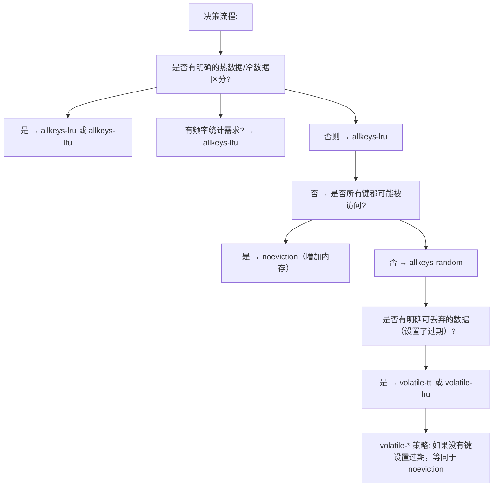
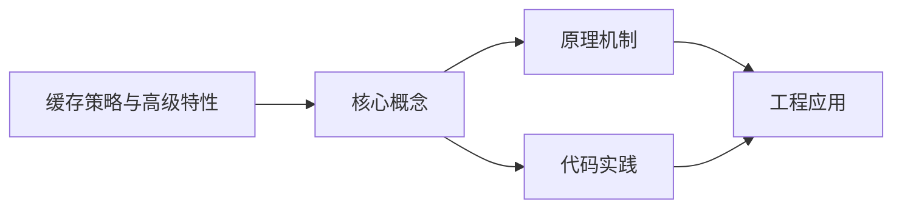
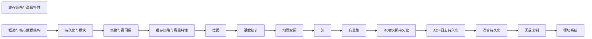

## 1. 学习目标（Bloom 分类）

本节按照布鲁姆教育目标分类学组织学习路径。本文主题为《缓存策略与高级特性》，属于 Redis 模块，读者可以根据自身阶段选择阅读深度。

记忆层面：能够准确复述本文的核心概念、术语与基本语法或操作步骤，并能够在提问或检索时快速定位对应知识点。能够说出 Redis 的核心概念、语法与常用对象。

理解层面：能够用自己的语言解释核心原理与工作机制，说明概念之间的因果关系，而不是机械记忆结论。能够解释 Redis 的执行原理与优化机制。

应用层面：能够在真实项目或练习场景中运用本文知识解决具体问题，写出正确且可维护的实现。能够编写正确、高效的 Redis 语句与操作。

分析层面：能够拆解复杂问题，比较本文主题与相邻概念的异同，识别边界条件与例外情况。能够分析 Redis 相关方案在性能与一致性上的权衡。

评价层面：能够根据约束条件（性能、可读性、安全、成本）评价不同方案的优劣，做出有依据的技术决策。能够根据业务场景评价 Redis 技术选型。

创造层面：能够把本文知识与其他模块知识组合，设计出新的解决方案或可复用的工程模式。能够组合 Redis 与其他技术设计数据架构。

通过本节学习，读者应当能够把《缓存策略与高级特性》纳入自己的知识网络，并与 Redis 模块的其他主题（数据结构、持久化、集群、缓存策略）建立关联。

## 2. 历史动机与发展脉络

《缓存策略与高级特性》是 Redis 领域的重要主题。要真正理解它，需要先了解它解决的问题与演进过程。

Redis 由 Salvatore Sanfilippo 于 2009 年发布，是内存数据结构存储，常作缓存、消息中间件与轻量数据库；BSD 许可，单线程事件循环（6.0 起多线程 IO）。
数据模型：String、Hash、List、Set、Sorted Set、Stream、BitMap、HyperLogLog、Geo；每种结构有专门命令与复杂度。
Redis 7.x：ACL、函数（Lua/Redis Functions）、集群路由（Cluster Sharding）、自动故障转移；Redis Stack 集成 JSON/搜索/时序。

回到本文主题：缓存策略与高级特性 的提出与成熟，正是上述技术背景下的必然产物。早期实现往往以简单可用为目标，随着工程规模扩大，社区逐渐沉淀出标准做法与最佳实践；理解这一脉络，可以帮助读者判断“为什么文档中的推荐写法是现在这个样子”，也能在遇到历史遗留代码时准确识别其设计年代与取舍。


## 3. 形式化定义与核心概念精讲

本节把《缓存策略与高级特性》涉及的核心概念以“定义 + 讲解”的形式展开。读者应把定义当作工具，把讲解当作理解路径；两者结合才能形成可迁移的知识。

单线程模型：命令串行执行保证原子性，无锁；性能瓶颈在内存与网络；长命令（KEYS）阻塞。
持久化：RDB 快照（fork 子进程）与 AOF 追加日志；混合持久化组合两者；持久化权衡数据安全与性能。
过期与淘汰：惰性删除 + 定期抽样；maxmemory-policy（allkeys-lru/lru/lfu/noeviction）控制内存。

### 3.1 原文章节逐一精讲

原文档把主题拆分为 10 个小节，下面按顺序给出每一节的导读讲解，随后保留原文细节供精读。

#### 原文精读（完整保留）


#### 1. 过期键删除

##### 1.1 删除策略

```
Redis 采用惰性删除 + 定期删除的组合策略:

1. 惰性删除（Lazy Expiration）:
   - 访问键时检查是否过期
   - 过期则删除并返回空
   - 优点: CPU 友好
   - 缺点: 过期键不被访问则一直占用内存

2. 定期删除（Periodic Expiration）:
   - 每 100ms 执行一次
   - 随机抽取 20 个设置了过期的键
   - 删除其中已过期的键
   - 如果过期比例 > 25%，重复执行
   - 限制: 每次执行时间不超过 25ms（默认）
```

##### 1.2 过期时间设置

```bash
# 设置过期时间
EXPIRE key 3600                    # 3600 秒后过期
PEXPIRE key 3600000                # 3600000 毫秒后过期
EXPIREAT key 1704153600            # Unix 时间戳过期
TTL key                            # 查看剩余秒数
PTTL key                           # 查看剩余毫秒数

# SET 时指定过期
SET key value EX 3600              # 3600 秒过期
SET key value PX 3600000           # 毫秒过期
SETEX key 3600 value               # 等效 SET + EXPIRE

# 取消过期
PERSIST key                        # 移除过期时间，变为永久键

# 注意: 过期时间精度为毫秒级
```

#### 2. 内存淘汰策略

##### 2.1 八种淘汰策略

| 策略            | 淘汰范围 | 说明                       |
| :-------------- | :------- | :------------------------- |
| noeviction      | 不淘汰   | 写操作报错（默认）         |
| allkeys-lru     | 所有键   | 最近最少使用               |
| allkeys-lfu     | 所有键   | 最少频率使用（Redis 4.0+） |
| allkeys-random  | 所有键   | 随机淘汰                   |
| volatile-lru    | 有过期键 | 最近最少使用               |
| volatile-lfu    | 有过期键 | 最少频率使用               |
| volatile-random | 有过期键 | 随机淘汰                   |
| volatile-ttl    | 有过期键 | 优先淘汰 TTL 最短的        |

##### 2.2 策略选择



##### 2.3 内存配置

```ini
# redis.conf
maxmemory 4gb                     # 最大内存限制
maxmemory-policy allkeys-lfu      # 淘汰策略
maxmemory-samples 5               # LRU/LFU 采样数（越大越精确，越慢）

# LFU 配置
lfu-log-factor 10                 # 计数器增长因子（越大越慢增长）
lfu-decay-time 1                  # 衰减时间（分钟）
```

#### 3. 事务

##### 3.1 MULTI/EXEC 事务

```bash
# Redis 事务: 将命令打包，一次性顺序执行
MULTI
SET account:A 800
SET account:B 200
INCR account:A
EXEC

# 事务中的错误:
# 1. 命令语法错误 → 整个事务取消
# 2. 运行时错误（如对字符串 INCR）→ 仅该命令失败，其余继续执行

# DISCARD 放弃事务
MULTI
SET key1 val1
DISCARD       # 放弃所有排队命令
```

##### 3.2 乐观锁（WATCH/CAS）

```bash
# WATCH: 监控键，若被其他客户端修改则事务失败
WATCH account:A

balance = GET account:A       # 读取余额
new_balance = balance - 100   # 计算新余额

MULTI
SET account:A new_balance
EXEC                          # 如果 account:A 被修改，返回 nil（事务失败）

# 乐观锁实现秒杀
WATCH stock:product:123
stock = GET stock:product:123
if stock > 0:
    MULTI
    DECR stock:product:123
    EXEC      # 成功则返回结果，失败则重试
else:
    UNWATCH
```

```python
# Python 乐观锁示例
import redis

r = redis.Redis()

def transfer(from_key, to_key, amount, max_retries=10):
    for i in range(max_retries):
        try:
            pipe = r.pipeline()
            pipe.watch(from_key)
            balance = int(pipe.get(from_key) or 0)
            if balance < amount:
                pipe.unwatch()
                return False
            pipe.multi()
            pipe.decrby(from_key, amount)
            pipe.incrby(to_key, amount)
            pipe.execute()
            return True
        except redis.WatchError:
            continue
    return False
```

#### 4. Lua 脚本

##### 4.1 基本语法

```bash
# EVAL 执行 Lua 脚本
EVAL "return redis.call('SET', KEYS[1], ARGV[1])" 1 mykey myvalue
# 参数: script numkeys key [key...] arg [arg...]

# EVALSHA 使用脚本 SHA1（避免重复传输）
SCRIPT LOAD "return redis.call('SET', KEYS[1], ARGV[1])"
# 返回: "c686f316aaf1eb01d5a4de1b0b63cd233010e63d"
EVALSHA c686f316aaf1eb01d5a4de1b0b63cd233010e63d 1 mykey myvalue
```

##### 4.2 分布式锁实现

```lua
-- 加锁
-- KEYS[1]: 锁名  ARGV[1]: 唯一标识  ARGV[2]: 过期时间(ms)
if redis.call('EXISTS', KEYS[1]) == 0 then
    redis.call('SET', KEYS[1], ARGV[1], 'PX', ARGV[2], 'NX')
    return 1
end
return 0

-- 解锁（仅锁持有者可解锁）
-- KEYS[1]: 锁名  ARGV[1]: 唯一标识
if redis.call('GET', KEYS[1]) == ARGV[1] then
    return redis.call('DEL', KEYS[1])
end
return 0

-- 续期
-- KEYS[1]: 锁名  ARGV[1]: 唯一标识  ARGV[2]: 新过期时间(ms)
if redis.call('GET', KEYS[1]) == ARGV[1] then
    return redis.call('PEXPIRE', KEYS[1], ARGV[2])
end
return 0
```

##### 4.3 限流器

```lua
-- 滑动窗口限流
-- KEYS[1]: 限流键  ARGV[1]: 窗口时间(ms)  ARGV[2]: 最大请求数  ARGV[3]: 当前时间戳
local key = KEYS[1]
local window = tonumber(ARGV[1])
local limit = tonumber(ARGV[2])
local now = tonumber(ARGV[3])

-- 移除窗口外的记录
redis.call('ZREMRANGEBYSCORE', key, 0, now - window)

-- 当前窗口请求数
local count = redis.call('ZCARD', key)

if count < limit then
    redis.call('ZADD', key, now, now .. '-' .. math.random(1000000))
    redis.call('PEXPIRE', key, window)
    return 1   -- 允许
else
    return 0   -- 拒绝
end
```

#### 5. 发布订阅（Pub/Sub）

##### 5.1 基本用法

```bash
# 订阅频道
SUBSCRIBE channel:notifications channel:alerts

# 模式订阅
PSUBSCRIBE channel:*          # 订阅所有 channel: 开头的频道

# 发布消息
PUBLISH channel:notifications "New order received"
PUBLISH channel:alerts "Server CPU > 90%"

# 取消订阅
UNSUBSCRIBE channel:notifications
PUNSUBSCRIBE channel:*
```

##### 5.2 Pub/Sub 特点

```
优点:
  - 实时推送，延迟极低
  - 支持模式匹配
  - 简单易用

缺点:
  - 不持久化（离线客户端收不到消息）
  - 无 ACK 机制（不保证送达）
  - 消息堆积影响性能
  - 不支持消费组

适用场景:
  - 实时通知
  - 配置变更广播
  - 聊天室
  - 不适合: 消息队列（用 Stream 代替）
```

##### 5.3 键空间通知

```ini
# redis.conf
notify-keyspace-events ExK$g$
# E: 键事件通知
# x: 过期事件
# K: 键空间通知
# $: String 命令
# g: 通用命令（DEL/EXPIRE等）
# A: 所有事件（等同 $gshzxeK）
```

```bash
# 订阅键事件
SUBSCRIBE __keyevent@0__:expired      # 过期事件
SUBSCRIBE __keyevent@0__:del          # 删除事件
SUBSCRIBE __keyspace@0__:mykey        # mykey 的所有事件
```

#### 6. 管道（Pipeline）

##### 6.1 Pipeline 原理

```
普通模式:  发送命令1 → 等待响应1 → 发送命令2 → 等待响应2 → ...
           RTT × N

Pipeline:  发送命令1 → 发送命令2 → ... → 发送命令N → 接收响应1~N
           RTT × 1

性能提升:
  - 100 条命令: 普通模式 ~100ms, Pipeline ~2ms
  - 10000 条命令: 普通模式 ~10s, Pipeline ~50ms
```

##### 6.2 Pipeline 使用

```python
import redis

r = redis.Redis()

# Pipeline 批量操作
pipe = r.pipeline(transaction=False)  # 非事务模式
for i in range(10000):
    pipe.set(f'key:{i}', f'value:{i}')
pipe.execute()

# Pipeline + 事务
pipe = r.pipeline(transaction=True)
pipe.set('key1', 'val1')
pipe.set('key2', 'val2')
pipe.incr('counter')
pipe.execute()

# 控制批量大小（避免内存溢出）
def batch_set(data, batch_size=1000):
    for i in range(0, len(data), batch_size):
        pipe = r.pipeline(transaction=False)
        for key, value in data[i:i+batch_size]:
            pipe.set(key, value)
        pipe.execute()
```

#### 7. 客户端缓存

##### 7.1 普通模式（Client-side Caching）

```bash
# Redis 6.0+ 客户端缓存
# 1. 客户端开启 tracking
CLIENT TRACKING ON

# 2. 客户端读取键
GET user:1001        # Redis 记录客户端对此键感兴趣

# 3. 其他客户端修改键
SET user:1001 "new_value"   # Redis 发送失效消息给跟踪的客户端

# 4. 客户端收到失效消息，清除本地缓存
# -> invalidation message for key: user:1001
```

##### 7.2 广播模式

```bash
# 广播模式: 客户端订阅键前缀
CLIENT TRACKING ON BCAST PREFIX user: PREFIX session:

# 所有 user: 和 session: 前缀的键变更都会通知
# 不需要先 GET 才跟踪
# 适合: 客户端预先知道需要缓存哪些前缀
```

##### 7.3 Python 客户端缓存

```python
import redis

r = redis.Redis()

# 使用 Redis 客户端缓存（需要支持 RESP3）
# 或使用应用层缓存 + 失效通知

class RedisCache:
    def __init__(self, redis_client):
        self.r = redis_client
        self.local_cache = {}

    def get(self, key):
        if key in self.local_cache:
            return self.local_cache[key]
        value = self.r.get(key)
        if value:
            self.local_cache[key] = value
        return value

    def invalidate(self, key):
        self.local_cache.pop(key, None)
```

#### 8. ACL 访问控制

##### 8.1 ACL 配置

```bash
# 查看所有用户
ACL LIST

# 添加用户
ACL SETUSER app_readonly on >ReadPass123 ~* +@read
# on: 启用  >密码  ~*: 所有键  +@read: 只读命令

ACL SETUSER app_write on >WritePass123 ~orders:* +@read +@write -@dangerous
ACL SETUSER admin on >AdminPass123 ~* +@all

# 命令类别
+@read       # 所有读命令
+@write      # 所有写命令
+@string     # String 命令
+@hash       # Hash 命令
+@list       # List 命令
+@set        # Set 命令
+@sortedset  # ZSet 命令
+@pubsub     # Pub/Sub 命令
-@dangerous  # 排除危险命令（FLUSHALL/CONFIG等）

# 键模式
~*           # 所有键
~user:*      # 仅 user: 前缀
~order:* ~product:*  # 多个模式

# 禁用危险命令
ACL SETUSER app_readonly -@dangerous -FLUSHALL -FLUSHDB -CONFIG -DEBUG
```

##### 8.2 ACL 持久化

```bash
# 保存 ACL 到文件
ACL SAVE

# redis.conf 配置
aclfile /etc/redis/users.acl

# 加载 ACL 文件
ACL LOAD
```

#### 9. TLS 加密

```ini
# redis.conf
tls-port 6380
tls-cert-file /etc/redis/tls/server.crt
tls-key-file /etc/redis/tls/server.key
tls-ca-cert-file /etc/redis/tls/ca.crt

# 客户端认证
tls-auth-clients optional    # no/optional/yes

# 复制 TLS
tls-replication yes

# 集群 TLS
tls-cluster yes
```

```bash
# 客户端 TLS 连接
redis-cli --tls --cert client.crt --key client.key --cacert ca.crt -p 6380

# 从节点 TLS 复制
replicaof 192.168.1.10 6380
tls-replication yes
```

#### 10. 慢查询日志

##### 10.1 配置

```ini
# redis.conf
slowlog-log-slower-than 10000    # 超过 10ms 记录（微秒）
slowlog-max-len 128              # 最多记录 128 条

# 设为 0: 记录所有命令
# 设为 -1: 禁用慢查询日志
```

##### 10.2 查看慢查询

```bash
# 查看慢查询日志
SLOWLOG GET 10
# 返回:
# 1) 1) (integer) 12              # 日志 ID
#    2) (integer) 1704067200       # 时间戳
#    3) (integer) 15000            # 执行时间(微秒)
#    4) 1) "KEYS"                  # 命令
#       2) "*"
#    5) "192.168.1.100:52341"      # 客户端地址
#    6) ""                         # 客户端名称

# 慢查询数量
SLOWLOG LEN

# 重置慢查询
SLOWLOG RESET
```

##### 10.3 常见慢查询原因

```
1. KEYS * — 全库扫描，生产禁用
2. 大 Key 操作 — DEL/GET 一个很大的值
3. 复杂聚合 — SORT、SUNION 等大集合操作
4. 全量获取 — HGETALL 大哈希、SMEMBERS 大集合
5. 短连接 — 频繁建立/断开连接
6. AOF fsync — always 模式下每条命令 fsync
7. 内存不足 — 频繁触发淘汰策略

优化建议:
- 使用 SCAN 替代 KEYS
- 拆分大 Key
- 使用 HSCAN/SSCAN 替代全量获取
- 使用 Pipeline 减少网络往返
- 监控 SLOWLOG 并告警
```


### 3.2 概念关系图

下面用 Mermaid 图表达本文核心概念之间的关系，帮助读者建立整体图景：



图中展示的是本文知识的结构化关系：核心概念是入口，原理机制解释“为什么”，代码实践演示“怎么做”，工程应用回答“何时用”。读者学习时可以把每个小节的内容挂接到对应节点上。

## 4. 理论推导与原理解析

本节深入《缓存策略与高级特性》背后的原理。理论部分不求面面俱到，而是聚焦“能解释现象、能指导实践”的关键推导。

单线程模型：命令串行执行保证原子性，无锁；性能瓶颈在内存与网络；长命令（KEYS）阻塞。
持久化：RDB 快照（fork 子进程）与 AOF 追加日志；混合持久化组合两者；持久化权衡数据安全与性能。
过期与淘汰：惰性删除 + 定期抽样；maxmemory-policy（allkeys-lru/lru/lfu/noeviction）控制内存。
高可用：主从复制（PSYNC）、哨兵（Sentinel）自动故障转移、Cluster 分片（16384 槽）与集群模式。

需要强调的是，理论推导与工程实践之间存在翻译层：理论给出的是理想化模型与边界条件，工程代码则必须处理真实环境中的例外。读者在学习时应先掌握理论的“标准情形”，再通过陷阱章节了解“非标准情形”。

## 5. 代码示例与逐行讲解

本节把原文中的代码示例系统整理，并为每个示例补充用途说明与讲解。读者不应只浏览代码，而应逐段对照讲解理解设计意图。

### 5.1 示例：1.1 删除策略

该示例来自原文《1.1 删除策略》小节，用于演示缓存策略与高级特性相关操作。阅读时请先看代码结构，再看其后的讲解。

```text
Redis 采用惰性删除 + 定期删除的组合策略:

1. 惰性删除（Lazy Expiration）:
   - 访问键时检查是否过期
   - 过期则删除并返回空
   - 优点: CPU 友好
   - 缺点: 过期键不被访问则一直占用内存

2. 定期删除（Periodic Expiration）:
   - 每 100ms 执行一次
   - 随机抽取 20 个设置了过期的键
   - 删除其中已过期的键
   - 如果过期比例 > 25%，重复执行
   - 限制: 每次执行时间不超过 25ms（默认）
```

讲解：这段代码演示了本节核心知识点。代码中的关键操作可以归纳为三步：准备（定义或初始化）、执行（核心逻辑）、收尾（释放资源或返回结果）。实际项目中，这三步往往被封装为函数或类，以提升复用性与可测试性。

关键点分析：

该示例共 12 行有效代码，结构以数据或配置为主。阅读时应关注：数据字段的含义、配置项的作用，以及它们与运行行为的对应关系。

进阶思考路径：先尝试修改参数观察行为变化，再把示例中的模式迁移到自己的项目中；每次修改都记录预期与实测差异，这是把示例转化为能力的最快方式。

### 5.2 示例：1.2 过期时间设置

该示例来自原文《1.2 过期时间设置》小节，用于演示缓存策略与高级特性相关操作。阅读时请先看代码结构，再看其后的讲解。

```bash
# 设置过期时间
EXPIRE key 3600                    # 3600 秒后过期
PEXPIRE key 3600000                # 3600000 毫秒后过期
EXPIREAT key 1704153600            # Unix 时间戳过期
TTL key                            # 查看剩余秒数
PTTL key                           # 查看剩余毫秒数

# SET 时指定过期
SET key value EX 3600              # 3600 秒过期
SET key value PX 3600000           # 毫秒过期
SETEX key 3600 value               # 等效 SET + EXPIRE

# 取消过期
PERSIST key                        # 移除过期时间，变为永久键

# 注意: 过期时间精度为毫秒级
```

讲解：这段代码演示了本节核心知识点。代码中的关键操作可以归纳为三步：准备（定义或初始化）、执行（核心逻辑）、收尾（释放资源或返回结果）。实际项目中，这三步往往被封装为函数或类，以提升复用性与可测试性。

关键点分析：

该示例共 13 行有效代码，结构以数据或配置为主。阅读时应关注：数据字段的含义、配置项的作用，以及它们与运行行为的对应关系。

进阶思考路径：先尝试修改参数观察行为变化，再把示例中的模式迁移到自己的项目中；每次修改都记录预期与实测差异，这是把示例转化为能力的最快方式。

### 5.3 示例：2.2 策略选择

该示例来自原文《2.2 策略选择》小节，用于演示缓存策略与高级特性相关操作。阅读时请先看代码结构，再看其后的讲解。


讲解：这段代码演示了本节核心知识点。代码中的关键操作可以归纳为三步：准备（定义或初始化）、执行（核心逻辑）、收尾（释放资源或返回结果）。实际项目中，这三步往往被封装为函数或类，以提升复用性与可测试性。

关键点分析：

该示例共 22 行有效代码，结构以数据或配置为主。阅读时应关注：数据字段的含义、配置项的作用，以及它们与运行行为的对应关系。

进阶思考路径：先尝试修改参数观察行为变化，再把示例中的模式迁移到自己的项目中；每次修改都记录预期与实测差异，这是把示例转化为能力的最快方式。

### 5.4 示例：2.3 内存配置

该示例来自原文《2.3 内存配置》小节，用于演示缓存策略与高级特性相关操作。阅读时请先看代码结构，再看其后的讲解。

```ini
# redis.conf
maxmemory 4gb                     # 最大内存限制
maxmemory-policy allkeys-lfu      # 淘汰策略
maxmemory-samples 5               # LRU/LFU 采样数（越大越精确，越慢）

# LFU 配置
lfu-log-factor 10                 # 计数器增长因子（越大越慢增长）
lfu-decay-time 1                  # 衰减时间（分钟）
```

讲解：这段代码演示了本节核心知识点。代码中的关键操作可以归纳为三步：准备（定义或初始化）、执行（核心逻辑）、收尾（释放资源或返回结果）。实际项目中，这三步往往被封装为函数或类，以提升复用性与可测试性。

关键点分析：

该示例共 7 行有效代码，结构以数据或配置为主。阅读时应关注：数据字段的含义、配置项的作用，以及它们与运行行为的对应关系。

进阶思考路径：先尝试修改参数观察行为变化，再把示例中的模式迁移到自己的项目中；每次修改都记录预期与实测差异，这是把示例转化为能力的最快方式。

### 5.5 示例：3.1 MULTI/EXEC 事务

该示例来自原文《3.1 MULTI/EXEC 事务》小节，用于演示缓存策略与高级特性相关操作。阅读时请先看代码结构，再看其后的讲解。

```bash
# Redis 事务: 将命令打包，一次性顺序执行
MULTI
SET account:A 800
SET account:B 200
INCR account:A
EXEC

# 事务中的错误:
# 1. 命令语法错误 → 整个事务取消
# 2. 运行时错误（如对字符串 INCR）→ 仅该命令失败，其余继续执行

# DISCARD 放弃事务
MULTI
SET key1 val1
DISCARD       # 放弃所有排队命令
```

讲解：这段代码演示了本节核心知识点。代码中的关键操作可以归纳为三步：准备（定义或初始化）、执行（核心逻辑）、收尾（释放资源或返回结果）。实际项目中，这三步往往被封装为函数或类，以提升复用性与可测试性。

关键点分析：

该示例共 13 行有效代码，结构以数据或配置为主。阅读时应关注：数据字段的含义、配置项的作用，以及它们与运行行为的对应关系。

进阶思考路径：先尝试修改参数观察行为变化，再把示例中的模式迁移到自己的项目中；每次修改都记录预期与实测差异，这是把示例转化为能力的最快方式。

### 5.6 示例：3.2 乐观锁（WATCH/CAS）

该示例来自原文《3.2 乐观锁（WATCH/CAS）》小节，用于演示缓存策略与高级特性相关操作。阅读时请先看代码结构，再看其后的讲解。

```bash
# WATCH: 监控键，若被其他客户端修改则事务失败
WATCH account:A

balance = GET account:A       # 读取余额
new_balance = balance - 100   # 计算新余额

MULTI
SET account:A new_balance
EXEC                          # 如果 account:A 被修改，返回 nil（事务失败）

# 乐观锁实现秒杀
WATCH stock:product:123
stock = GET stock:product:123
if stock > 0:
    MULTI
    DECR stock:product:123
    EXEC      # 成功则返回结果，失败则重试
else:
    UNWATCH
```

讲解：这段代码演示了本节核心知识点。代码中的关键操作可以归纳为三步：准备（定义或初始化）、执行（核心逻辑）、收尾（释放资源或返回结果）。实际项目中，这三步往往被封装为函数或类，以提升复用性与可测试性。

关键点分析：

该示例共 16 行有效代码，包含 1 类关键结构（if）。其中：

- 入口与初始化部分负责建立上下文，对应实际项目中的启动或装配逻辑；
- 核心逻辑部分体现本文主题的主要操作，是阅读时最需要对照讲解理解的部分；
- 输出或返回部分把结果交给调用方，注意其类型与边界条件。

进阶思考路径：先尝试修改参数观察行为变化，再把示例中的模式迁移到自己的项目中；每次修改都记录预期与实测差异，这是把示例转化为能力的最快方式。

### 5.7 示例：3.2 乐观锁（WATCH/CAS）

该示例来自原文《3.2 乐观锁（WATCH/CAS）》小节，用于演示缓存策略与高级特性相关操作。阅读时请先看代码结构，再看其后的讲解。

```python
# Python 乐观锁示例
import redis

r = redis.Redis()

def transfer(from_key, to_key, amount, max_retries=10):
    for i in range(max_retries):
        try:
            pipe = r.pipeline()
            pipe.watch(from_key)
            balance = int(pipe.get(from_key) or 0)
            if balance < amount:
                pipe.unwatch()
                return False
            pipe.multi()
            pipe.decrby(from_key, amount)
            pipe.incrby(to_key, amount)
            pipe.execute()
            return True
        except redis.WatchError:
            continue
    return False
```

讲解：这段代码演示了本节核心知识点。代码中的关键操作可以归纳为三步：准备（定义或初始化）、执行（核心逻辑）、收尾（释放资源或返回结果）。实际项目中，这三步往往被封装为函数或类，以提升复用性与可测试性。

关键点分析：

该示例共 20 行有效代码，包含 5 类关键结构（def、import、if、for、return）。其中：

- 入口与初始化部分负责建立上下文，对应实际项目中的启动或装配逻辑；
- 核心逻辑部分体现本文主题的主要操作，是阅读时最需要对照讲解理解的部分；
- 输出或返回部分把结果交给调用方，注意其类型与边界条件。

进阶思考路径：先尝试修改参数观察行为变化，再把示例中的模式迁移到自己的项目中；每次修改都记录预期与实测差异，这是把示例转化为能力的最快方式。

### 5.8 示例：4.1 基本语法

该示例来自原文《4.1 基本语法》小节，用于演示缓存策略与高级特性相关操作。阅读时请先看代码结构，再看其后的讲解。

```bash
# EVAL 执行 Lua 脚本
EVAL "return redis.call('SET', KEYS[1], ARGV[1])" 1 mykey myvalue
# 参数: script numkeys key [key...] arg [arg...]

# EVALSHA 使用脚本 SHA1（避免重复传输）
SCRIPT LOAD "return redis.call('SET', KEYS[1], ARGV[1])"
# 返回: "c686f316aaf1eb01d5a4de1b0b63cd233010e63d"
EVALSHA c686f316aaf1eb01d5a4de1b0b63cd233010e63d 1 mykey myvalue
```

讲解：这段代码演示了本节核心知识点。代码中的关键操作可以归纳为三步：准备（定义或初始化）、执行（核心逻辑）、收尾（释放资源或返回结果）。实际项目中，这三步往往被封装为函数或类，以提升复用性与可测试性。

关键点分析：

该示例共 7 行有效代码，包含 1 类关键结构（return）。其中：

- 入口与初始化部分负责建立上下文，对应实际项目中的启动或装配逻辑；
- 核心逻辑部分体现本文主题的主要操作，是阅读时最需要对照讲解理解的部分；
- 输出或返回部分把结果交给调用方，注意其类型与边界条件。

进阶思考路径：先尝试修改参数观察行为变化，再把示例中的模式迁移到自己的项目中；每次修改都记录预期与实测差异，这是把示例转化为能力的最快方式。

### 5.9 示例：4.2 分布式锁实现

该示例来自原文《4.2 分布式锁实现》小节，用于演示缓存策略与高级特性相关操作。阅读时请先看代码结构，再看其后的讲解。

```lua
-- 加锁
-- KEYS[1]: 锁名  ARGV[1]: 唯一标识  ARGV[2]: 过期时间(ms)
if redis.call('EXISTS', KEYS[1]) == 0 then
    redis.call('SET', KEYS[1], ARGV[1], 'PX', ARGV[2], 'NX')
    return 1
end
return 0

-- 解锁（仅锁持有者可解锁）
-- KEYS[1]: 锁名  ARGV[1]: 唯一标识
if redis.call('GET', KEYS[1]) == ARGV[1] then
    return redis.call('DEL', KEYS[1])
end
return 0

-- 续期
-- KEYS[1]: 锁名  ARGV[1]: 唯一标识  ARGV[2]: 新过期时间(ms)
if redis.call('GET', KEYS[1]) == ARGV[1] then
    return redis.call('PEXPIRE', KEYS[1], ARGV[2])
end
return 0
```

讲解：这段代码演示了本节核心知识点。代码中的关键操作可以归纳为三步：准备（定义或初始化）、执行（核心逻辑）、收尾（释放资源或返回结果）。实际项目中，这三步往往被封装为函数或类，以提升复用性与可测试性。

关键点分析：

该示例共 19 行有效代码，包含 2 类关键结构（if、return）。其中：

- 入口与初始化部分负责建立上下文，对应实际项目中的启动或装配逻辑；
- 核心逻辑部分体现本文主题的主要操作，是阅读时最需要对照讲解理解的部分；
- 输出或返回部分把结果交给调用方，注意其类型与边界条件。

进阶思考路径：先尝试修改参数观察行为变化，再把示例中的模式迁移到自己的项目中；每次修改都记录预期与实测差异，这是把示例转化为能力的最快方式。

### 5.10 示例：4.3 限流器

该示例来自原文《4.3 限流器》小节，用于演示缓存策略与高级特性相关操作。阅读时请先看代码结构，再看其后的讲解。

```lua
-- 滑动窗口限流
-- KEYS[1]: 限流键  ARGV[1]: 窗口时间(ms)  ARGV[2]: 最大请求数  ARGV[3]: 当前时间戳
local key = KEYS[1]
local window = tonumber(ARGV[1])
local limit = tonumber(ARGV[2])
local now = tonumber(ARGV[3])

-- 移除窗口外的记录
redis.call('ZREMRANGEBYSCORE', key, 0, now - window)

-- 当前窗口请求数
local count = redis.call('ZCARD', key)

if count < limit then
    redis.call('ZADD', key, now, now .. '-' .. math.random(1000000))
    redis.call('PEXPIRE', key, window)
    return 1   -- 允许
else
    return 0   -- 拒绝
end
```

讲解：这段代码演示了本节核心知识点。代码中的关键操作可以归纳为三步：准备（定义或初始化）、执行（核心逻辑）、收尾（释放资源或返回结果）。实际项目中，这三步往往被封装为函数或类，以提升复用性与可测试性。

关键点分析：

该示例共 17 行有效代码，包含 2 类关键结构（if、return）。其中：

- 入口与初始化部分负责建立上下文，对应实际项目中的启动或装配逻辑；
- 核心逻辑部分体现本文主题的主要操作，是阅读时最需要对照讲解理解的部分；
- 输出或返回部分把结果交给调用方，注意其类型与边界条件。

进阶思考路径：先尝试修改参数观察行为变化，再把示例中的模式迁移到自己的项目中；每次修改都记录预期与实测差异，这是把示例转化为能力的最快方式。

### 5.11 示例：5.1 基本用法

该示例来自原文《5.1 基本用法》小节，用于演示缓存策略与高级特性相关操作。阅读时请先看代码结构，再看其后的讲解。

```bash
# 订阅频道
SUBSCRIBE channel:notifications channel:alerts

# 模式订阅
PSUBSCRIBE channel:*          # 订阅所有 channel: 开头的频道

# 发布消息
PUBLISH channel:notifications "New order received"
PUBLISH channel:alerts "Server CPU > 90%"

# 取消订阅
UNSUBSCRIBE channel:notifications
PUNSUBSCRIBE channel:*
```

讲解：这段代码演示了本节核心知识点。代码中的关键操作可以归纳为三步：准备（定义或初始化）、执行（核心逻辑）、收尾（释放资源或返回结果）。实际项目中，这三步往往被封装为函数或类，以提升复用性与可测试性。

关键点分析：

该示例共 10 行有效代码，结构以数据或配置为主。阅读时应关注：数据字段的含义、配置项的作用，以及它们与运行行为的对应关系。

进阶思考路径：先尝试修改参数观察行为变化，再把示例中的模式迁移到自己的项目中；每次修改都记录预期与实测差异，这是把示例转化为能力的最快方式。

### 5.12 示例：5.2 Pub/Sub 特点

该示例来自原文《5.2 Pub/Sub 特点》小节，用于演示缓存策略与高级特性相关操作。阅读时请先看代码结构，再看其后的讲解。

```text
优点:
  - 实时推送，延迟极低
  - 支持模式匹配
  - 简单易用

缺点:
  - 不持久化（离线客户端收不到消息）
  - 无 ACK 机制（不保证送达）
  - 消息堆积影响性能
  - 不支持消费组

适用场景:
  - 实时通知
  - 配置变更广播
  - 聊天室
  - 不适合: 消息队列（用 Stream 代替）
```

讲解：这段代码演示了本节核心知识点。代码中的关键操作可以归纳为三步：准备（定义或初始化）、执行（核心逻辑）、收尾（释放资源或返回结果）。实际项目中，这三步往往被封装为函数或类，以提升复用性与可测试性。

关键点分析：

该示例共 14 行有效代码，结构以数据或配置为主。阅读时应关注：数据字段的含义、配置项的作用，以及它们与运行行为的对应关系。

进阶思考路径：先尝试修改参数观察行为变化，再把示例中的模式迁移到自己的项目中；每次修改都记录预期与实测差异，这是把示例转化为能力的最快方式。

### 5.13 示例：5.3 键空间通知

该示例来自原文《5.3 键空间通知》小节，用于演示缓存策略与高级特性相关操作。阅读时请先看代码结构，再看其后的讲解。

```ini
# redis.conf
notify-keyspace-events ExK$g$
# E: 键事件通知
# x: 过期事件
# K: 键空间通知
# $: String 命令
# g: 通用命令（DEL/EXPIRE等）
# A: 所有事件（等同 $gshzxeK）
```

讲解：这段代码演示了本节核心知识点。代码中的关键操作可以归纳为三步：准备（定义或初始化）、执行（核心逻辑）、收尾（释放资源或返回结果）。实际项目中，这三步往往被封装为函数或类，以提升复用性与可测试性。

关键点分析：

该示例共 8 行有效代码，结构以数据或配置为主。阅读时应关注：数据字段的含义、配置项的作用，以及它们与运行行为的对应关系。

进阶思考路径：先尝试修改参数观察行为变化，再把示例中的模式迁移到自己的项目中；每次修改都记录预期与实测差异，这是把示例转化为能力的最快方式。

### 5.14 示例：5.3 键空间通知

该示例来自原文《5.3 键空间通知》小节，用于演示缓存策略与高级特性相关操作。阅读时请先看代码结构，再看其后的讲解。

```bash
# 订阅键事件
SUBSCRIBE __keyevent@0__:expired      # 过期事件
SUBSCRIBE __keyevent@0__:del          # 删除事件
SUBSCRIBE __keyspace@0__:mykey        # mykey 的所有事件
```

讲解：这段代码演示了本节核心知识点。代码中的关键操作可以归纳为三步：准备（定义或初始化）、执行（核心逻辑）、收尾（释放资源或返回结果）。实际项目中，这三步往往被封装为函数或类，以提升复用性与可测试性。

关键点分析：

该示例共 4 行有效代码，结构以数据或配置为主。阅读时应关注：数据字段的含义、配置项的作用，以及它们与运行行为的对应关系。

进阶思考路径：先尝试修改参数观察行为变化，再把示例中的模式迁移到自己的项目中；每次修改都记录预期与实测差异，这是把示例转化为能力的最快方式。

### 5.15 示例：6.1 Pipeline 原理

该示例来自原文《6.1 Pipeline 原理》小节，用于演示缓存策略与高级特性相关操作。阅读时请先看代码结构，再看其后的讲解。

```text
普通模式:  发送命令1 → 等待响应1 → 发送命令2 → 等待响应2 → ...
           RTT × N

Pipeline:  发送命令1 → 发送命令2 → ... → 发送命令N → 接收响应1~N
           RTT × 1

性能提升:
  - 100 条命令: 普通模式 ~100ms, Pipeline ~2ms
  - 10000 条命令: 普通模式 ~10s, Pipeline ~50ms
```

讲解：这段代码演示了本节核心知识点。代码中的关键操作可以归纳为三步：准备（定义或初始化）、执行（核心逻辑）、收尾（释放资源或返回结果）。实际项目中，这三步往往被封装为函数或类，以提升复用性与可测试性。

关键点分析：

该示例共 7 行有效代码，结构以数据或配置为主。阅读时应关注：数据字段的含义、配置项的作用，以及它们与运行行为的对应关系。

进阶思考路径：先尝试修改参数观察行为变化，再把示例中的模式迁移到自己的项目中；每次修改都记录预期与实测差异，这是把示例转化为能力的最快方式。

### 5.16 示例：6.2 Pipeline 使用

该示例来自原文《6.2 Pipeline 使用》小节，用于演示缓存策略与高级特性相关操作。阅读时请先看代码结构，再看其后的讲解。

```python
import redis

r = redis.Redis()

# Pipeline 批量操作
pipe = r.pipeline(transaction=False)  # 非事务模式
for i in range(10000):
    pipe.set(f'key:{i}', f'value:{i}')
pipe.execute()

# Pipeline + 事务
pipe = r.pipeline(transaction=True)
pipe.set('key1', 'val1')
pipe.set('key2', 'val2')
pipe.incr('counter')
pipe.execute()

# 控制批量大小（避免内存溢出）
def batch_set(data, batch_size=1000):
    for i in range(0, len(data), batch_size):
        pipe = r.pipeline(transaction=False)
        for key, value in data[i:i+batch_size]:
            pipe.set(key, value)
        pipe.execute()
```

讲解：这段代码演示了本节核心知识点。代码中的关键操作可以归纳为三步：准备（定义或初始化）、执行（核心逻辑）、收尾（释放资源或返回结果）。实际项目中，这三步往往被封装为函数或类，以提升复用性与可测试性。

关键点分析：

该示例共 20 行有效代码，包含 3 类关键结构（def、import、for）。其中：

- 入口与初始化部分负责建立上下文，对应实际项目中的启动或装配逻辑；
- 核心逻辑部分体现本文主题的主要操作，是阅读时最需要对照讲解理解的部分；
- 输出或返回部分把结果交给调用方，注意其类型与边界条件。

进阶思考路径：先尝试修改参数观察行为变化，再把示例中的模式迁移到自己的项目中；每次修改都记录预期与实测差异，这是把示例转化为能力的最快方式。

### 5.17 示例：7.1 普通模式（Client-side Caching）

该示例来自原文《7.1 普通模式（Client-side Caching）》小节，用于演示缓存策略与高级特性相关操作。阅读时请先看代码结构，再看其后的讲解。

```bash
# Redis 6.0+ 客户端缓存
# 1. 客户端开启 tracking
CLIENT TRACKING ON

# 2. 客户端读取键
GET user:1001        # Redis 记录客户端对此键感兴趣

# 3. 其他客户端修改键
SET user:1001 "new_value"   # Redis 发送失效消息给跟踪的客户端

# 4. 客户端收到失效消息，清除本地缓存
# -> invalidation message for key: user:1001
```

讲解：这段代码演示了本节核心知识点。代码中的关键操作可以归纳为三步：准备（定义或初始化）、执行（核心逻辑）、收尾（释放资源或返回结果）。实际项目中，这三步往往被封装为函数或类，以提升复用性与可测试性。

关键点分析：

该示例共 9 行有效代码，包含 1 类关键结构（for）。其中：

- 入口与初始化部分负责建立上下文，对应实际项目中的启动或装配逻辑；
- 核心逻辑部分体现本文主题的主要操作，是阅读时最需要对照讲解理解的部分；
- 输出或返回部分把结果交给调用方，注意其类型与边界条件。

进阶思考路径：先尝试修改参数观察行为变化，再把示例中的模式迁移到自己的项目中；每次修改都记录预期与实测差异，这是把示例转化为能力的最快方式。

### 5.18 示例：7.2 广播模式

该示例来自原文《7.2 广播模式》小节，用于演示缓存策略与高级特性相关操作。阅读时请先看代码结构，再看其后的讲解。

```bash
# 广播模式: 客户端订阅键前缀
CLIENT TRACKING ON BCAST PREFIX user: PREFIX session:

# 所有 user: 和 session: 前缀的键变更都会通知
# 不需要先 GET 才跟踪
# 适合: 客户端预先知道需要缓存哪些前缀
```

讲解：这段代码演示了本节核心知识点。代码中的关键操作可以归纳为三步：准备（定义或初始化）、执行（核心逻辑）、收尾（释放资源或返回结果）。实际项目中，这三步往往被封装为函数或类，以提升复用性与可测试性。

关键点分析：

该示例共 5 行有效代码，结构以数据或配置为主。阅读时应关注：数据字段的含义、配置项的作用，以及它们与运行行为的对应关系。

进阶思考路径：先尝试修改参数观察行为变化，再把示例中的模式迁移到自己的项目中；每次修改都记录预期与实测差异，这是把示例转化为能力的最快方式。

### 5.19 示例：7.3 Python 客户端缓存

该示例来自原文《7.3 Python 客户端缓存》小节，用于演示缓存策略与高级特性相关操作。阅读时请先看代码结构，再看其后的讲解。

```python
import redis

r = redis.Redis()

# 使用 Redis 客户端缓存（需要支持 RESP3）
# 或使用应用层缓存 + 失效通知

class RedisCache:
    def __init__(self, redis_client):
        self.r = redis_client
        self.local_cache = {}

    def get(self, key):
        if key in self.local_cache:
            return self.local_cache[key]
        value = self.r.get(key)
        if value:
            self.local_cache[key] = value
        return value

    def invalidate(self, key):
        self.local_cache.pop(key, None)
```

讲解：这段代码演示了本节核心知识点。代码中的关键操作可以归纳为三步：准备（定义或初始化）、执行（核心逻辑）、收尾（释放资源或返回结果）。实际项目中，这三步往往被封装为函数或类，以提升复用性与可测试性。

关键点分析：

该示例共 17 行有效代码，包含 5 类关键结构（class、def、import、if、return）。其中：

- 入口与初始化部分负责建立上下文，对应实际项目中的启动或装配逻辑；
- 核心逻辑部分体现本文主题的主要操作，是阅读时最需要对照讲解理解的部分；
- 输出或返回部分把结果交给调用方，注意其类型与边界条件。

进阶思考路径：先尝试修改参数观察行为变化，再把示例中的模式迁移到自己的项目中；每次修改都记录预期与实测差异，这是把示例转化为能力的最快方式。

### 5.20 示例：8.1 ACL 配置

该示例来自原文《8.1 ACL 配置》小节，用于演示缓存策略与高级特性相关操作。阅读时请先看代码结构，再看其后的讲解。

```bash
# 查看所有用户
ACL LIST

# 添加用户
ACL SETUSER app_readonly on >ReadPass123 ~* +@read
# on: 启用  >密码  ~*: 所有键  +@read: 只读命令

ACL SETUSER app_write on >WritePass123 ~orders:* +@read +@write -@dangerous
ACL SETUSER admin on >AdminPass123 ~* +@all

# 命令类别
+@read       # 所有读命令
+@write      # 所有写命令
+@string     # String 命令
+@hash       # Hash 命令
+@list       # List 命令
+@set        # Set 命令
+@sortedset  # ZSet 命令
+@pubsub     # Pub/Sub 命令
-@dangerous  # 排除危险命令（FLUSHALL/CONFIG等）

# 键模式
~*           # 所有键
~user:*      # 仅 user: 前缀
~order:* ~product:*  # 多个模式

# 禁用危险命令
ACL SETUSER app_readonly -@dangerous -FLUSHALL -FLUSHDB -CONFIG -DEBUG
```

讲解：这段代码演示了本节核心知识点。代码中的关键操作可以归纳为三步：准备（定义或初始化）、执行（核心逻辑）、收尾（释放资源或返回结果）。实际项目中，这三步往往被封装为函数或类，以提升复用性与可测试性。

关键点分析：

该示例共 23 行有效代码，结构以数据或配置为主。阅读时应关注：数据字段的含义、配置项的作用，以及它们与运行行为的对应关系。

进阶思考路径：先尝试修改参数观察行为变化，再把示例中的模式迁移到自己的项目中；每次修改都记录预期与实测差异，这是把示例转化为能力的最快方式。

### 5.21 示例：8.2 ACL 持久化

该示例来自原文《8.2 ACL 持久化》小节，用于演示缓存策略与高级特性相关操作。阅读时请先看代码结构，再看其后的讲解。

```bash
# 保存 ACL 到文件
ACL SAVE

# redis.conf 配置
aclfile /etc/redis/users.acl

# 加载 ACL 文件
ACL LOAD
```

讲解：这段代码演示了本节核心知识点。代码中的关键操作可以归纳为三步：准备（定义或初始化）、执行（核心逻辑）、收尾（释放资源或返回结果）。实际项目中，这三步往往被封装为函数或类，以提升复用性与可测试性。

关键点分析：

该示例共 6 行有效代码，结构以数据或配置为主。阅读时应关注：数据字段的含义、配置项的作用，以及它们与运行行为的对应关系。

进阶思考路径：先尝试修改参数观察行为变化，再把示例中的模式迁移到自己的项目中；每次修改都记录预期与实测差异，这是把示例转化为能力的最快方式。

### 5.22 示例：9. TLS 加密

该示例来自原文《9. TLS 加密》小节，用于演示缓存策略与高级特性相关操作。阅读时请先看代码结构，再看其后的讲解。

```ini
# redis.conf
tls-port 6380
tls-cert-file /etc/redis/tls/server.crt
tls-key-file /etc/redis/tls/server.key
tls-ca-cert-file /etc/redis/tls/ca.crt

# 客户端认证
tls-auth-clients optional    # no/optional/yes

# 复制 TLS
tls-replication yes

# 集群 TLS
tls-cluster yes
```

讲解：这段代码演示了本节核心知识点。代码中的关键操作可以归纳为三步：准备（定义或初始化）、执行（核心逻辑）、收尾（释放资源或返回结果）。实际项目中，这三步往往被封装为函数或类，以提升复用性与可测试性。

关键点分析：

该示例共 11 行有效代码，结构以数据或配置为主。阅读时应关注：数据字段的含义、配置项的作用，以及它们与运行行为的对应关系。

进阶思考路径：先尝试修改参数观察行为变化，再把示例中的模式迁移到自己的项目中；每次修改都记录预期与实测差异，这是把示例转化为能力的最快方式。

### 5.23 示例：9. TLS 加密

该示例来自原文《9. TLS 加密》小节，用于演示缓存策略与高级特性相关操作。阅读时请先看代码结构，再看其后的讲解。

```bash
# 客户端 TLS 连接
redis-cli --tls --cert client.crt --key client.key --cacert ca.crt -p 6380

# 从节点 TLS 复制
replicaof 192.168.1.10 6380
tls-replication yes
```

讲解：这段代码演示了本节核心知识点。代码中的关键操作可以归纳为三步：准备（定义或初始化）、执行（核心逻辑）、收尾（释放资源或返回结果）。实际项目中，这三步往往被封装为函数或类，以提升复用性与可测试性。

关键点分析：

该示例共 5 行有效代码，结构以数据或配置为主。阅读时应关注：数据字段的含义、配置项的作用，以及它们与运行行为的对应关系。

进阶思考路径：先尝试修改参数观察行为变化，再把示例中的模式迁移到自己的项目中；每次修改都记录预期与实测差异，这是把示例转化为能力的最快方式。

### 5.24 示例：10.1 配置

该示例来自原文《10.1 配置》小节，用于演示缓存策略与高级特性相关操作。阅读时请先看代码结构，再看其后的讲解。

```ini
# redis.conf
slowlog-log-slower-than 10000    # 超过 10ms 记录（微秒）
slowlog-max-len 128              # 最多记录 128 条

# 设为 0: 记录所有命令
# 设为 -1: 禁用慢查询日志
```

讲解：这段代码演示了本节核心知识点。代码中的关键操作可以归纳为三步：准备（定义或初始化）、执行（核心逻辑）、收尾（释放资源或返回结果）。实际项目中，这三步往往被封装为函数或类，以提升复用性与可测试性。

关键点分析：

该示例共 5 行有效代码，结构以数据或配置为主。阅读时应关注：数据字段的含义、配置项的作用，以及它们与运行行为的对应关系。

进阶思考路径：先尝试修改参数观察行为变化，再把示例中的模式迁移到自己的项目中；每次修改都记录预期与实测差异，这是把示例转化为能力的最快方式。

### 5.25 示例：10.2 查看慢查询

该示例来自原文《10.2 查看慢查询》小节，用于演示缓存策略与高级特性相关操作。阅读时请先看代码结构，再看其后的讲解。

```bash
# 查看慢查询日志
SLOWLOG GET 10
# 返回:
# 1) 1) (integer) 12              # 日志 ID
#    2) (integer) 1704067200       # 时间戳
#    3) (integer) 15000            # 执行时间(微秒)
#    4) 1) "KEYS"                  # 命令
#       2) "*"
#    5) "192.168.1.100:52341"      # 客户端地址
#    6) ""                         # 客户端名称

# 慢查询数量
SLOWLOG LEN

# 重置慢查询
SLOWLOG RESET
```

讲解：这段代码演示了本节核心知识点。代码中的关键操作可以归纳为三步：准备（定义或初始化）、执行（核心逻辑）、收尾（释放资源或返回结果）。实际项目中，这三步往往被封装为函数或类，以提升复用性与可测试性。

关键点分析：

该示例共 14 行有效代码，结构以数据或配置为主。阅读时应关注：数据字段的含义、配置项的作用，以及它们与运行行为的对应关系。

进阶思考路径：先尝试修改参数观察行为变化，再把示例中的模式迁移到自己的项目中；每次修改都记录预期与实测差异，这是把示例转化为能力的最快方式。

### 5.26 示例：10.3 常见慢查询原因

该示例来自原文《10.3 常见慢查询原因》小节，用于演示缓存策略与高级特性相关操作。阅读时请先看代码结构，再看其后的讲解。

```text
1. KEYS * — 全库扫描，生产禁用
2. 大 Key 操作 — DEL/GET 一个很大的值
3. 复杂聚合 — SORT、SUNION 等大集合操作
4. 全量获取 — HGETALL 大哈希、SMEMBERS 大集合
5. 短连接 — 频繁建立/断开连接
6. AOF fsync — always 模式下每条命令 fsync
7. 内存不足 — 频繁触发淘汰策略

优化建议:
- 使用 SCAN 替代 KEYS
- 拆分大 Key
- 使用 HSCAN/SSCAN 替代全量获取
- 使用 Pipeline 减少网络往返
- 监控 SLOWLOG 并告警
```

讲解：这段代码演示了本节核心知识点。代码中的关键操作可以归纳为三步：准备（定义或初始化）、执行（核心逻辑）、收尾（释放资源或返回结果）。实际项目中，这三步往往被封装为函数或类，以提升复用性与可测试性。

关键点分析：

该示例共 13 行有效代码，结构以数据或配置为主。阅读时应关注：数据字段的含义、配置项的作用，以及它们与运行行为的对应关系。

进阶思考路径：先尝试修改参数观察行为变化，再把示例中的模式迁移到自己的项目中；每次修改都记录预期与实测差异，这是把示例转化为能力的最快方式。


综合以上示例，可以总结出本主题的代码实践要点：第一，先定义清晰的输入输出契约；第二，核心逻辑保持单一职责；第三，错误处理与边界条件不可省略；第四，命名与注释表达意图而非复述代码。

## 6. 对比分析

对比是理解《缓存策略与高级特性》定位的最快路径。下面从多个维度与相邻方案进行对比。

Redis 与 Memcached：Redis 数据结构丰富、持久化、集群；Memcached 简单多线程缓存。
Redis 与消息队列：List/Stream 可实现轻量队列；强可靠场景用 Kafka/RabbitMQ。
RDB 与 AOF：RDB 恢复快丢数据多；AOF 丢数据少恢复慢；混合取平衡。

对比的目的不是分出绝对优劣，而是建立选择依据：不同约束条件下，最优解不同。读者应把每个对比维度转化为决策检查清单。

## 7. 常见陷阱与最佳实践

本节整理该主题的高频错误与推荐做法。每个陷阱先描述现象，再解释原因，最后给出最佳实践。

### 7.1 KEYS 阻塞

大键扫描阻塞服务。使用 SCAN 游标。

深入讲解：该问题之所以被归类为“常见陷阱”，是因为它在初学者的代码中反复出现，而且往往不在第一时间暴露——错误通常隐藏在特定数据或特定时序下。

从成因上看，KEYS 阻塞 一般源于对 Redis 某个机制的理解偏差：要么误用了默认行为，要么忽略了边界条件，要么把其他语言的思维惯性带了过来。

从影响上看，KEYS 阻塞 轻则产生错误结果，重则导致资源泄漏、数据损坏或安全事故；这也是为什么工程评审中会把它列为检查项。

从修复策略上看，处理KEYS 阻塞的正确顺序是：先复现（构造最小用例），再定位（确认机制层面的根因），最后修复并补充回归测试。跳过复现直接改代码，往往治标不治本。

### 7.2 大 key

单 key 超大导致网络与内存问题。拆分或压缩。

深入讲解：该问题之所以被归类为“常见陷阱”，是因为它在初学者的代码中反复出现，而且往往不在第一时间暴露——错误通常隐藏在特定数据或特定时序下。

从成因上看，大 key 一般源于对 Redis 某个机制的理解偏差：要么误用了默认行为，要么忽略了边界条件，要么把其他语言的思维惯性带了过来。

从影响上看，大 key 轻则产生错误结果，重则导致资源泄漏、数据损坏或安全事故；这也是为什么工程评审中会把它列为检查项。

从修复策略上看，处理大 key的正确顺序是：先复现（构造最小用例），再定位（确认机制层面的根因），最后修复并补充回归测试。跳过复现直接改代码，往往治标不治本。

### 7.3 缓存穿透

查询不存在数据打穿到 DB。布隆过滤器或空值缓存。

深入讲解：该问题之所以被归类为“常见陷阱”，是因为它在初学者的代码中反复出现，而且往往不在第一时间暴露——错误通常隐藏在特定数据或特定时序下。

从成因上看，缓存穿透 一般源于对 Redis 某个机制的理解偏差：要么误用了默认行为，要么忽略了边界条件，要么把其他语言的思维惯性带了过来。

从影响上看，缓存穿透 轻则产生错误结果，重则导致资源泄漏、数据损坏或安全事故；这也是为什么工程评审中会把它列为检查项。

从修复策略上看，处理缓存穿透的正确顺序是：先复现（构造最小用例），再定位（确认机制层面的根因），最后修复并补充回归测试。跳过复现直接改代码，往往治标不治本。

### 7.4 缓存击穿

热点 key 过期瞬间并发打 DB。互斥重建或逻辑过期。

深入讲解：该问题之所以被归类为“常见陷阱”，是因为它在初学者的代码中反复出现，而且往往不在第一时间暴露——错误通常隐藏在特定数据或特定时序下。

从成因上看，缓存击穿 一般源于对 Redis 某个机制的理解偏差：要么误用了默认行为，要么忽略了边界条件，要么把其他语言的思维惯性带了过来。

从影响上看，缓存击穿 轻则产生错误结果，重则导致资源泄漏、数据损坏或安全事故；这也是为什么工程评审中会把它列为检查项。

从修复策略上看，处理缓存击穿的正确顺序是：先复现（构造最小用例），再定位（确认机制层面的根因），最后修复并补充回归测试。跳过复现直接改代码，往往治标不治本。

### 7.5 缓存雪崩

大量 key 同时过期。过期时间加随机抖动。

深入讲解：该问题之所以被归类为“常见陷阱”，是因为它在初学者的代码中反复出现，而且往往不在第一时间暴露——错误通常隐藏在特定数据或特定时序下。

从成因上看，缓存雪崩 一般源于对 Redis 某个机制的理解偏差：要么误用了默认行为，要么忽略了边界条件，要么把其他语言的思维惯性带了过来。

从影响上看，缓存雪崩 轻则产生错误结果，重则导致资源泄漏、数据损坏或安全事故；这也是为什么工程评审中会把它列为检查项。

从修复策略上看，处理缓存雪崩的正确顺序是：先复现（构造最小用例），再定位（确认机制层面的根因），最后修复并补充回归测试。跳过复现直接改代码，往往治标不治本。

### 7.6 持久化误配置

save 策略与 AOF 关闭导致重启丢数据。按数据安全需求配置。

深入讲解：该问题之所以被归类为“常见陷阱”，是因为它在初学者的代码中反复出现，而且往往不在第一时间暴露——错误通常隐藏在特定数据或特定时序下。

从成因上看，持久化误配置 一般源于对 Redis 某个机制的理解偏差：要么误用了默认行为，要么忽略了边界条件，要么把其他语言的思维惯性带了过来。

从影响上看，持久化误配置 轻则产生错误结果，重则导致资源泄漏、数据损坏或安全事故；这也是为什么工程评审中会把它列为检查项。

从修复策略上看，处理持久化误配置的正确顺序是：先复现（构造最小用例），再定位（确认机制层面的根因），最后修复并补充回归测试。跳过复现直接改代码，往往治标不治本。

### 7.7 连接未关闭

连接泄漏耗尽 maxclients。使用连接池。

深入讲解：该问题之所以被归类为“常见陷阱”，是因为它在初学者的代码中反复出现，而且往往不在第一时间暴露——错误通常隐藏在特定数据或特定时序下。

从成因上看，连接未关闭 一般源于对 Redis 某个机制的理解偏差：要么误用了默认行为，要么忽略了边界条件，要么把其他语言的思维惯性带了过来。

从影响上看，连接未关闭 轻则产生错误结果，重则导致资源泄漏、数据损坏或安全事故；这也是为什么工程评审中会把它列为检查项。

从修复策略上看，处理连接未关闭的正确顺序是：先复现（构造最小用例），再定位（确认机制层面的根因），最后修复并补充回归测试。跳过复现直接改代码，往往治标不治本。

### 7.8 事务误用

MULTI/EXEC 不保证回滚，命令错误才回滚。需要强一致用 Lua。

深入讲解：该问题之所以被归类为“常见陷阱”，是因为它在初学者的代码中反复出现，而且往往不在第一时间暴露——错误通常隐藏在特定数据或特定时序下。

从成因上看，事务误用 一般源于对 Redis 某个机制的理解偏差：要么误用了默认行为，要么忽略了边界条件，要么把其他语言的思维惯性带了过来。

从影响上看，事务误用 轻则产生错误结果，重则导致资源泄漏、数据损坏或安全事故；这也是为什么工程评审中会把它列为检查项。

从修复策略上看，处理事务误用的正确顺序是：先复现（构造最小用例），再定位（确认机制层面的根因），最后修复并补充回归测试。跳过复现直接改代码，往往治标不治本。

### 7.0 最佳实践总览

1. 键命名：业务:实体:id（user:profile:1001），过期时间按场景设置。
2. 缓存一致性：Cache Aside（先更新 DB 再删缓存）为主；延迟双删防旧缓存。
3. 集群：Slot 分布、批量操作需 hash tag；客户端路由（lettuce/jedis 集群版）。
4. 监控：INFO 内存/命中率、慢日志、monitor 抽样。

把这些最佳实践固化为团队规范与代码评审检查项，是避免同类问题反复出现的关键。

## 8. 工程实践

本节把《缓存策略与高级特性》放入真实工程场景，给出可复用的模式与组织方法。

缓存分层：本地缓存（Caffeine）+ Redis 分布式缓存；热点与一致性分层治理。
分布式锁：SET NX EX + 续期（Redisson）；注意时钟跳跃与 GC 暂停。
容量规划：maxmemory + 淘汰策略 + 监控；大促前预热。

### 8.1 工程实践的原则拆解

以上工程实践可以归纳为四条原则。第一，配置与代码分离：Redis 项目中环境差异应通过配置注入，而不是散落在代码分支中；这保证同一份代码可以在开发、测试、生产环境一致运行。

第二，接口稳定优先：对外接口（函数签名、协议、数据格式）一旦被消费方依赖，变更成本极高；设计时应预留扩展点并保持向后兼容。

第三，可观测性内置：日志、指标与追踪应该在功能开发时同步设计，而不是故障发生后补救；没有观测手段的模块等于黑盒。

第四，变更可回滚：任何发布都应有对应的回滚方案；数据库迁移、配置变更与代码发布一样需要版本管理与逆向路径。

### 8.2 实践落地的检查清单

- [ ] 缓存分层：对照本节描述，检查当前项目是否已经落实；未落实的项列入技术债并排期处理。
- [ ] 分布式锁：对照本节描述，检查当前项目是否已经落实；未落实的项列入技术债并排期处理。
- [ ] 容量规划：对照本节描述，检查当前项目是否已经落实；未落实的项列入技术债并排期处理。

工程实践的共性原则：配置与代码分离、接口稳定优先、可观测性内置、变更可回滚。这些原则适用于本主题的所有实现。

## 9. 案例研究

本节通过一个完整案例把《缓存策略与高级特性》的知识串起来。案例按“需求分析、方案设计、实现、验证”四步展开。

需求：实现商品详情缓存与热点防护。
方案：Cache Aside + 互斥重建（setnx）+ 随机过期抖动 + 布隆过滤器。
要点：序列化协议统一；缓存与 DB 双写顺序；监控命中率。
验证：压测穿透/击穿场景、故障注入（Redis 宕机降级）。

### 9.1 案例的扩展讨论

把案例中的方案放大到真实规模，需要额外考虑三个问题：

第一，规模：当数据量或并发量上升一个数量级时，原方案中的数据结构、缓存策略与任务调度是否仍然成立？通常需要引入分层与异步。

第二，团队：多人协作时，模块边界、接口契约与代码所有权必须明确；案例中的实现应拆分为可独立测试的单元，并配合文档说明设计意图。

第三，演进：上线后的需求变化不可避免；方案设计时应预留扩展点（配置化、插件化、事件化），并定期用真实指标验证假设。


案例研究的学习方法：先独立阅读需求，尝试在脑中形成方案，再对照实现与讲解，最后思考“如果约束变化（数据量、并发、团队规模），方案应如何调整”。

## 10. 知识要点总结与深入讲解

本节以讲解形式汇总全文要点，替代传统的习题与自测，读者不需要答题，只需跟随解释建立完整的认知框架。

关于《缓存策略与高级特性》的核心结论：

Redis 的价值在“数据结构即服务”：选择合适结构比堆功能重要。
缓存三兄弟（穿透/击穿/雪崩）是设计必修课。
持久化、复制与集群决定可靠性，生产必须配置齐全。

原文档各小节的要点回顾：

- 1. 过期键删除：该小节围绕缓存策略与高级特性展开具体细节，阅读时应关注其与核心结论的对应关系；每个小节都是核心结论在某一个侧面的展开。
- 2. 内存淘汰策略：该小节围绕缓存策略与高级特性展开具体细节，阅读时应关注其与核心结论的对应关系；每个小节都是核心结论在某一个侧面的展开。
- 3. 事务：该小节围绕缓存策略与高级特性展开具体细节，阅读时应关注其与核心结论的对应关系；每个小节都是核心结论在某一个侧面的展开。
- 4. Lua 脚本：该小节围绕缓存策略与高级特性展开具体细节，阅读时应关注其与核心结论的对应关系；每个小节都是核心结论在某一个侧面的展开。
- 5. 发布订阅（Pub/Sub）：该小节围绕缓存策略与高级特性展开具体细节，阅读时应关注其与核心结论的对应关系；每个小节都是核心结论在某一个侧面的展开。
- 6. 管道（Pipeline）：该小节围绕缓存策略与高级特性展开具体细节，阅读时应关注其与核心结论的对应关系；每个小节都是核心结论在某一个侧面的展开。
- 7. 客户端缓存：该小节围绕缓存策略与高级特性展开具体细节，阅读时应关注其与核心结论的对应关系；每个小节都是核心结论在某一个侧面的展开。
- 8. ACL 访问控制：该小节围绕缓存策略与高级特性展开具体细节，阅读时应关注其与核心结论的对应关系；每个小节都是核心结论在某一个侧面的展开。
- 9. TLS 加密：该小节围绕缓存策略与高级特性展开具体细节，阅读时应关注其与核心结论的对应关系；每个小节都是核心结论在某一个侧面的展开。
- 10. 慢查询日志：该小节围绕缓存策略与高级特性展开具体细节，阅读时应关注其与核心结论的对应关系；每个小节都是核心结论在某一个侧面的展开。

把以上要点与第 3-9 节的内容对照复习，即可完成对本文主题的闭环学习。

## 11. 参考文献


Redis 官方文档：https://redis.io/docs/latest/
Redis 命令参考：https://redis.io/docs/latest/commands/
Redis 中文资料：https://redis.com.cn/
Redisson 文档：https://redisson.org/

## 12. 延伸阅读


Redis 数据结构详解，见 022-redis 模块文档。
Redis 持久化与集群，见 022-redis 模块相关文档。
MySQL 与 Redis 缓存架构，见 020-mysql 模块。
黑马程序员 Bilibili 空间（https://space.bilibili.com/37974444 ）提供 Redis 课程。

## 14. 模块知识图谱与学习路径

本文属于 Redis 模块。为了把《缓存策略与高级特性》放入完整的知识网络，下面列出本模块的全部主题并给出相互关联的导读。学习时建议按模块内顺序推进，并在每个文档中留意交叉引用。



上图为模块主题的推荐学习顺序示意图（仅展示前若干主题）。各主题之间存在三类关联：

第一，前置依赖关系：早期主题是后期主题的基础，例如环境与语法先行、进阶主题随后；

第二，横向并列关系：同一层级主题从不同角度覆盖模块能力，学习顺序可以按兴趣调整；

第三，工程组合关系：多个主题在真实项目中组合使用，例如配置、性能与安全主题往往出现在同一系统的不同层面。

### 14.1 模块主题速查表

| 文档 | 主题 | 与本文的关联 |
| --- | --- | --- |
| 概述与核心数据结构 | 001-OverviewCoreDataStructure | 本文的前置基础 |
| 持久化与模块 | 002-PersistenceModule | 本文的并列主题 |
| 集群与高可用 | 003-ClusterHA | 本文的并列主题 |
| 缓存策略与高级特性 | 004-CacheStrategyAdvancedFeature | 本文自身 |
| 位图 | 005-BitGraph | 本文的并列主题 |
| 基数统计 | 006-NumberStats | 本文的并列主题 |
| 地理空间 | 007-GeoSpatial | 本文的并列主题 |
| 流 | 008-Stream | 本文的并列主题 |
| 向量集 | 009-VectorSet | 本文的并列主题 |
| RDB快照持久化 | 010-RDBSnapshotPersistence | 本文的并列主题 |
| AOF日志持久化 | 011-AOFLogPersistence | 本文的并列主题 |
| 混合持久化 | 012-MixedPersistence | 本文的并列主题 |
| 无盘复制 | 013-DisklessReplication | 本文的并列主题 |
| 模块系统 | 014-ModuleSystem | 本文的并列主题 |
| 字符串SDS结构 | 015-StringSDSStructure | 本文的并列主题 |
| 跳表与有序集合 | 016-SkipListAndSortedSet | 本文的并列主题 |
| 主从复制缓冲区 | 017-ReplicationBuffer | 本文的并列主题 |
| 哨兵选举 | 018-SentinelElection | 本文的并列主题 |
| Redis-Cluster哈希槽 | 019-RedisClusterHashSlot | 本文的并列主题 |
| 管道与事务原子性 | 020-PipeTransactionAtomic | 本文的并列主题 |
| Lua脚本原子执行 | 021-LuaScriptAtomicExecution | 本文的并列主题 |
| 缓存穿透击穿雪崩 | 022-CachePenetrationBreakdownAvalanche | 本文的并列主题 |
| 内存淘汰策略 | 023-MemoryEvictionPolicy | 本文的并列主题 |
| Redis Hash 命令速查 | 024-HashCommand | 本文的并列主题 |
| Redis List/Set/ZSet 命令 | 025-ListSetZSetCommand | 本文的并列主题 |
| Redis 发布订阅命令 | 026-PubSubCommand | 本文的并列主题 |
| Redis Key 管理与过期命令速查手册 | 027-KeyManagement | 本文的并列主题 |
| Redis 安全与 ACL 命令速查手册 | 028-ACL | 本文的安全延伸 |
| Redis 7.0+ 新特性命令速查手册 | 029-NewFeatures7 | 本文的并列主题 |

速查表的作用是让读者快速判断：哪些文档应在阅读本文前掌握（前置基础），哪些文档应在阅读本文后继续（延伸主题）。本模块的交叉引用体系即以此表为基础。

## 15. 术语表

下表整理《缓存策略与高级特性》及 Redis 模块中出现的高频术语，给出简明释义。术语按字母序或逻辑序排列，供查阅。

| 术语 | 释义 |
| --- | --- |
| 单线程模型 | 命令串行执行保证原子性，无锁；性能瓶颈在内存与网络；长命令（KEYS）阻塞。 |
| 持久化 | RDB 快照（fork 子进程）与 AOF 追加日志；混合持久化组合两者；持久化权衡数据安全与性能。 |
| 过期与淘汰 | 惰性删除 + 定期抽样；maxmemory-policy（allkeys-lru/lru/lfu/noeviction）控制内存。 |
| 高可用 | 主从复制（PSYNC）、哨兵（Sentinel）自动故障转移、Cluster 分片（16384 槽）与集群模式。 |
| KEYS 阻塞（易错点） | 参见常见陷阱章节的详细讲解 |
| 大 key（易错点） | 参见常见陷阱章节的详细讲解 |
| 缓存穿透（易错点） | 参见常见陷阱章节的详细讲解 |
| 缓存击穿（易错点） | 参见常见陷阱章节的详细讲解 |
| 缓存雪崩（易错点） | 参见常见陷阱章节的详细讲解 |
| 持久化误配置（易错点） | 参见常见陷阱章节的详细讲解 |

术语表与正文配合使用：先通读正文，遇到模糊术语回查本表；长期使用后术语会自然进入工作记忆。
