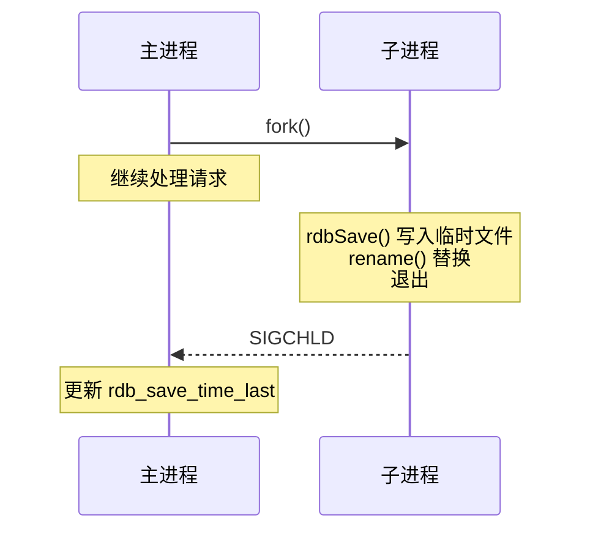

## 1. RDB 概述

RDB（Redis Database）是 Redis 的默认持久化方式，通过在指定时间间隔内对数据集进行快照（snapshot），将内存中的数据以二进制文件形式写入磁盘。生成的 RDB 文件紧凑、体积小，非常适合用于备份和灾难恢复。

RDB 的核心优势：

- **紧凑高效**：RDB 文件是经过压缩的二进制格式，体积远小于 AOF 日志
- **恢复速度快**：直接加载二进制文件，恢复大数据集的速度远快于 AOF
- **对性能影响小**：`bgsave` 由子进程完成，主进程几乎不受影响
- **适合冷备**：可以定期将 RDB 文件归档到远程存储

RDB 的主要不足：

- **数据丢失风险**：非实时持久化，两次快照之间的数据可能丢失
- **fork 开销**：数据集很大时，`fork()` 子进程可能耗时较长
- **不支持增量**：每次都是全量快照，无法记录增量变更

## 2. save 命令

`save` 命令以**阻塞**方式生成 RDB 文件：

```redis
SAVE
```

执行流程：

1. 主进程直接调用 `rdbSave()` 函数
2. 主进程被阻塞，无法响应任何客户端请求
3. RDB 文件写入完成后，主进程恢复服务

**适用场景**：

- 数据集很小，阻塞时间可忽略
- 需要确保快照完成的测试环境
- Redis 正在关闭时（shutdown 触发 save）

**风险**：生产环境中数据集较大时，`save` 可能导致数秒甚至数十秒的阻塞，严重影响可用性。

## 3. bgsave 命令

`bgsave`（Background Save）是生产环境推荐的方式，通过 `fork()` 子进程完成快照：

```redis
BGSAVE
```

执行流程：

1. 主进程调用 `fork()` 创建子进程
2. 子进程调用 `rdbSave()` 将数据写入临时 RDB 文件
3. 写入完成后，子进程将临时文件原子性地重命名为正式 RDB 文件
4. 子进程退出，主进程收到信号



**查看 bgsave 状态**：

```redis
LASTSAVE          # 返回最近一次成功保存的 Unix 时间戳
INFO Persistence   # 查看 rdb 相关统计信息
```

**bgsave 期间的保护机制**：

- bgsave 执行期间，再次调用 `bgsave` 会被拒绝（`ERR Background save already in progress`）
- `save` 命令同样会被拒绝，避免产生竞争条件

## 4. 写时复制（Copy-On-Write）

写时复制（COW）是 `bgsave` 能够在不阻塞主进程的情况下生成一致性快照的关键机制。

### 4.1 fork 与内存共享

`fork()` 创建子进程后，父子进程共享同一块物理内存页。此时内存消耗并不会翻倍，因为页表指向相同的物理帧。

### 4.2 COW 触发条件

当主进程尝试**修改**某个共享页时：

1. 内核检测到该页被标记为只读（共享页）
2. 触发缺页异常（Page Fault）
3. 内核复制该页的副本给主进程
4. 主进程在副本上执行修改
5. 子进程仍然读取原始页的数据

```
fork() 后：
  父进程页表 → 物理页 A (只读)
  子进程页表 → 物理页 A (只读)

父进程修改页 A：
  父进程页表 → 物理页 A' (可写) ← 新副本
  子进程页表 → 物理页 A  (只读) ← 原始数据
```

### 4.3 内存开销估算

COW 的额外内存开销取决于 `bgsave` 期间被修改的页面数量：

$$\text{COW 额外内存} \approx \text{修改页数} \times \text{页大小}$$

Linux 默认页大小为 4KB。假设 bgsave 耗时 5 秒，每秒写入 10 万个 key，每个 key 平均 100 字节：

$$\text{修改页数} \approx \frac{5 \times 100000 \times 100}{4096} \approx 12207 \text{ 页}$$

$$\text{COW 额外内存} \approx 12207 \times 4\text{KB} \approx 48\text{MB}$$

**生产建议**：预留 Redis 实例内存的 20%~50% 作为 COW 缓冲。

## 5. 自动触发配置

Redis 通过 `save` 配置项实现自动触发 RDB 快照：

```redis
# 在 redis.conf 中配置
save 900 1      # 900秒内有至少1个key被修改
save 300 10     # 300秒内有至少10个key被修改
save 60 10000   # 60秒内有至少10000个key被修改
```

**触发逻辑**：满足任意一个条件即触发 `bgsave`。

```redis
# 禁用自动 RDB
save ""

# 运行时修改
CONFIG SET save "900 1 300 10 60 10000"
```

### 5.1 自动触发条件评估

Redis 每秒执行一次 `serverCron()`，检查是否满足 save 条件：

1. 遍历所有 `save` 配置项
2. 计算自上次成功保存以来的时间间隔和修改 key 数量
3. 如果满足任一条件，触发 `bgsave`

## 6. RDB 文件格式

RDB 文件采用二进制格式，结构如下：


各数据库区域结构：


**编码优化**：

- 小整数使用变长编码（1/2/4 字节）
- 短字符串使用嵌入编码（len + data）
- LZF 压缩长字符串
- 整数集合（intset）直接存储
- 压缩列表（ziplist/listpack）直接存储

## 7. RDB 文件恢复

### 7.1 自动恢复

Redis 启动时自动检测 RDB 文件：

1. 读取 `dir` 和 `dbfilename` 配置
2. 打开 RDB 文件，校验 checksum
3. 逐个加载 key-value 到内存
4. 加载完成后开始接受客户端请求

```redis
# 配置 RDB 文件路径
dir /var/lib/redis
dbfilename dump.rdb
```

### 7.2 RDB 文件校验

```bash
# 使用 redis-check-rdb 工具
redis-check-rdb dump.rdb
```

### 7.3 恢复注意事项

- RDB 文件加载期间 Redis 处于阻塞状态
- 如果 RDB 文件损坏，Redis 可能拒绝启动
- 可以使用 `redis-check-rdb --fix` 尝试修复

## 8. 配置优化

### 8.1 关键配置项

```redis
# RDB 文件名
dbfilename dump.rdb

# 存储目录
dir /var/lib/redis

# 是否压缩（LZF）
rdbcompression yes

# 是否使用 CRC64 校验
rdbchecksum yes

# bgsave 失败时是否停止写入
stop-writes-on-bgsave-error yes

# 自动触发条件
save 900 1
save 300 10
save 60 10000
```

### 8.2 性能调优建议

| 场景                   | save 配置       | 说明                        |
| ---------------------- | --------------- | --------------------------- |
| 高可用（允许少量丢失） | `save 60 10000` | 减少快照频率，降低 I/O 压力 |
| 数据安全（尽量少丢失） | `save 60 1`     | 增加快照频率，增加 I/O 开销 |
| 纯缓存（可丢失）       | `save ""`       | 禁用 RDB，最大化性能        |
| 大数据集               | 适当放宽间隔    | 减少 fork 开销              |

### 8.3 大内存实例优化

当 Redis 实例使用内存超过 10GB 时：

- `fork()` 耗时可能超过 1 秒
- COW 可能占用数 GB 额外内存
- 建议拆分为多个小实例，或使用 AOF 替代
- 考虑开启 `lazyfree-lazy-eviction` 减少主线程阻塞

## 9. RDB 与 AOF 对比

| 特性       | RDB                | AOF               |
| ---------- | ------------------ | ----------------- |
| 持久化方式 | 定时快照           | 实时追加日志      |
| 数据安全性 | 可能丢失数分钟数据 | 最多丢失 1 秒数据 |
| 文件体积   | 小（压缩二进制）   | 大（文本日志）    |
| 恢复速度   | 快                 | 慢                |
| 性能影响   | fork 开销          | 写入开销          |
| 适用场景   | 备份、灾难恢复     | 数据安全优先      |
## save 命令

**基本写法：阻塞方式生成 RDB 文件**
`SAVE`
```bash
# 阻塞方式生成 RDB 文件，主进程无法响应请求
SAVE
```

---

## bgsave 命令

**基本写法：后台子进程生成 RDB 文件**
`BGSAVE`
```bash
# 后台方式生成 RDB 文件（生产推荐）
BGSAVE
```

**基本写法：查看最近一次保存时间**
`LASTSAVE`
```bash
# 返回最近一次成功保存的 Unix 时间戳
LASTSAVE
```

**基本写法：查看 RDB 统计信息**
`INFO Persistence`
```bash
# 查看 rdb 相关统计信息
INFO Persistence
```

---

## 写时复制（COW）

**基本写法：fork 创建子进程共享内存**
`fork()`
```c
// fork() 创建子进程后，父子进程共享同一块物理内存页
// 父进程页表 → 物理页 A (只读)
// 子进程页表 → 物理页 A (只读)
```

**基本写法：父进程修改页时触发 COW**
`fork() → 父进程写入 → 复制页`
```c
// 父进程修改页 A 时，操作系统复制一份新页
// 父进程页表 → 物理页 A' (可写) ← 新副本
// 子进程页表 → 物理页 A  (只读) ← 原始数据
```

**基本写法：COW 额外内存估算**
`COW 额外内存 ≈ 修改页数 × 页大小`
```c
// Linux 默认页大小为 4KB
// 假设 bgsave 耗时 5 秒，每秒写入 10 万个 key，每个 key 平均 100 字节
// 修改页数 ≈ (5 × 100000 × 100) / 4096 ≈ 12207 页
// COW 额外内存 ≈ 12207 × 4KB ≈ 48MB
```

---

## 自动触发配置

**基本写法：配置自动触发条件**
`save <seconds> <changes>`
```bash
# 900秒内有至少1个key被修改时触发
save 900 1
```

**多条件写法：配置多个自动触发条件**
`save <seconds> <changes>`
```bash
# 配置多个触发条件，满足任意一个即触发 bgsave
save 900 1
save 300 10
save 60 10000
```

**基本写法：禁用自动 RDB**
`save ""`
```bash
# 禁用自动 RDB 快照
save ""
```

**基本写法：运行时修改 save 配置**
`CONFIG SET save "<config>"`
```bash
# 运行时修改 save 配置
CONFIG SET save "900 1 300 10 60 10000"
```

---

## RDB 文件格式

**基本写法：RDB 文件整体结构**
`[REDIS][version][databases][EOF][checksum]`
```c
// RDB 文件采用二进制格式
// 魔数 → 版本号 → 数据库数据 → 结束标记 → 校验和
```

**基本写法：数据库区域结构**
`[SELECTDB][key-value对(带过期时间)][key-value对(无过期时间)]`
```c
// 各数据库区域结构
// 数据库编号 → key-value对(带过期时间) → key-value对(无过期时间)
```

---

## RDB 文件恢复

**基本写法：配置 RDB 文件路径**
`dir <path>`
```bash
# 设置 RDB 文件存储目录
dir /var/lib/redis
```

**基本写法：配置 RDB 文件名**
`dbfilename <name>`
```bash
# 设置 RDB 文件名
dbfilename dump.rdb
```

**基本写法：校验 RDB 文件**
`redis-check-rdb <file>`
```bash
# 使用 redis-check-rdb 工具校验文件
redis-check-rdb dump.rdb
```

---

## 配置优化

**基本写法：设置 RDB 文件名**
`dbfilename <name>`
```bash
# 设置 RDB 文件名
dbfilename dump.rdb
```

**基本写法：设置存储目录**
`dir <path>`
```bash
# 设置 RDB 文件存储目录
dir /var/lib/redis
```

**基本写法：开启 LZF 压缩**
`rdbcompression <yes|no>`
```bash
# 开启 RDB 文件 LZF 压缩
rdbcompression yes
```

**基本写法：开启 CRC64 校验**
`rdbchecksum <yes|no>`
```bash
# 开启 RDB 文件 CRC64 校验
rdbchecksum yes
```

**基本写法：bgsave 失败时停止写入**
`stop-writes-on-bgsave-error <yes|no>`
```bash
# bgsave 失败时停止接受写入
stop-writes-on-bgsave-error yes
```

## 参考文献

Redis 官方文档：https://redis.io/docs/latest/
Redis 命令参考：https://redis.io/docs/latest/commands/
Redis 中文资料：https://redis.com.cn/
Redisson 文档：https://redisson.org/

## 延伸阅读

Redis 数据结构详解，见 022-redis 模块文档。
Redis 持久化与集群，见 022-redis 模块相关文档。
MySQL 与 Redis 缓存架构，见 020-mysql 模块。
黑马程序员 Bilibili 空间（https://space.bilibili.com/37974444 ）提供 Redis 课程。

## 深度专题扩展

以下专题从不同角度深入本文主题，供有进阶需求的读者研读。每个专题独立成节，内容相互补充。

### 13.1 缓存一致性深度

Cache Aside：读未命中查 DB 回填；写先 DB 后删缓存；删除失败用消息队列补偿。
延迟双删：更新 DB 后删缓存，等待短暂延迟再删一次，处理并发读写窗口。
读写锁与版本号：缓存携带版本，更新时比较版本，失败重试。
强一致场景：不要依赖缓存，直接读 DB；缓存用于可容忍最终一致的数据。

### 13.2 Redis Cluster 原理

16384 个槽分布在主节点，键经 CRC16 % 16384 定位；客户端 MOVED/ASK 重定向。
主从复制：每个主节点挂从节点；主故障由从节点提升（cluster 自动 failover）。
多键操作：同一事务/管道中的键必须同槽（hash tag {user1001}）。
扩缩容：槽迁移在线进行，客户端感知重定向；规划容量避免热点槽。

## 模块文档速查表

| 文档 | 主题 | 与本文的关联 |
| --- | --- | --- |
| 概述与核心数据结构 | 001-OverviewCoreDataStructure | 本文的前置基础 |
| 持久化与模块 | 002-PersistenceModule | 本文的并列主题 |
| 集群与高可用 | 003-ClusterHA | 本文的并列主题 |
| 缓存策略与高级特性 | 004-CacheStrategyAdvancedFeature | 本文的并列主题 |
| 位图 | 005-BitGraph | 本文的并列主题 |
| 基数统计 | 006-NumberStats | 本文的并列主题 |
| 地理空间 | 007-GeoSpatial | 本文的并列主题 |
| 流 | 008-Stream | 本文的并列主题 |
| 向量集 | 009-VectorSet | 本文的并列主题 |
| RDB快照持久化 | 010-RDBSnapshotPersistence | 本文自身 |
| AOF日志持久化 | 011-AOFLogPersistence | 本文的并列主题 |
| 混合持久化 | 012-MixedPersistence | 本文的并列主题 |
| 无盘复制 | 013-DisklessReplication | 本文的并列主题 |
| 模块系统 | 014-ModuleSystem | 本文的并列主题 |
| 字符串SDS结构 | 015-StringSDSStructure | 本文的并列主题 |
| 跳表与有序集合 | 016-SkipListAndSortedSet | 本文的并列主题 |
| 主从复制缓冲区 | 017-ReplicationBuffer | 本文的并列主题 |
| 哨兵选举 | 018-SentinelElection | 本文的并列主题 |
| Redis-Cluster哈希槽 | 019-RedisClusterHashSlot | 本文的并列主题 |
| 管道与事务原子性 | 020-PipeTransactionAtomic | 本文的并列主题 |
| Lua脚本原子执行 | 021-LuaScriptAtomicExecution | 本文的并列主题 |
| 缓存穿透击穿雪崩 | 022-CachePenetrationBreakdownAvalanche | 本文的并列主题 |
| 内存淘汰策略 | 023-MemoryEvictionPolicy | 本文的并列主题 |
| Redis Hash 命令速查 | 024-HashCommand | 本文的并列主题 |
| Redis List/Set/ZSet 命令 | 025-ListSetZSetCommand | 本文的并列主题 |
| Redis 发布订阅命令 | 026-PubSubCommand | 本文的并列主题 |
| Redis Key 管理与过期命令速查手册 | 027-KeyManagement | 本文的并列主题 |
| Redis 安全与 ACL 命令速查手册 | 028-ACL | 本文的安全延伸 |
| Redis 7.0+ 新特性命令速查手册 | 029-NewFeatures7 | 本文的并列主题 |
