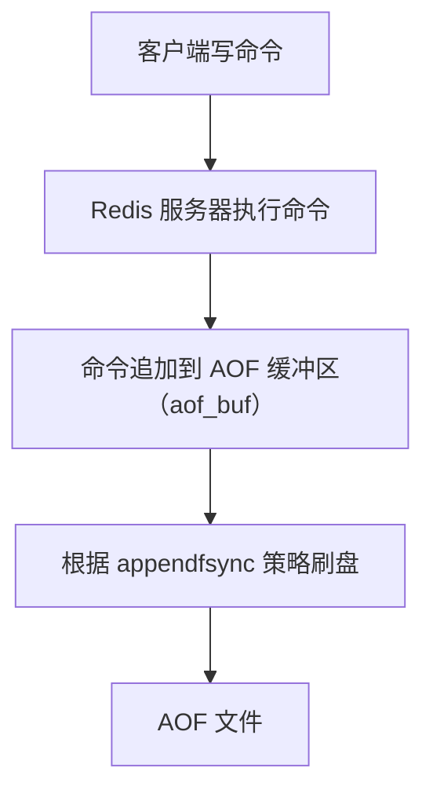
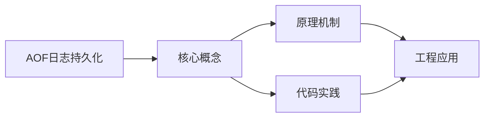
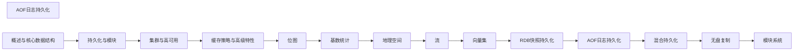

## 1. 学习目标（Bloom 分类）

本节按照布鲁姆教育目标分类学组织学习路径。本文主题为《AOF日志持久化》，属于 Redis 模块，读者可以根据自身阶段选择阅读深度。

记忆层面：能够准确复述本文的核心概念、术语与基本语法或操作步骤，并能够在提问或检索时快速定位对应知识点。能够说出 Redis 的核心概念、语法与常用对象。

理解层面：能够用自己的语言解释核心原理与工作机制，说明概念之间的因果关系，而不是机械记忆结论。能够解释 Redis 的执行原理与优化机制。

应用层面：能够在真实项目或练习场景中运用本文知识解决具体问题，写出正确且可维护的实现。能够编写正确、高效的 Redis 语句与操作。

分析层面：能够拆解复杂问题，比较本文主题与相邻概念的异同，识别边界条件与例外情况。能够分析 Redis 相关方案在性能与一致性上的权衡。

评价层面：能够根据约束条件（性能、可读性、安全、成本）评价不同方案的优劣，做出有依据的技术决策。能够根据业务场景评价 Redis 技术选型。

创造层面：能够把本文知识与其他模块知识组合，设计出新的解决方案或可复用的工程模式。能够组合 Redis 与其他技术设计数据架构。

通过本节学习，读者应当能够把《AOF日志持久化》纳入自己的知识网络，并与 Redis 模块的其他主题（数据结构、持久化、集群、缓存策略）建立关联。

## 2. 历史动机与发展脉络

《AOF日志持久化》是 Redis 领域的重要主题。要真正理解它，需要先了解它解决的问题与演进过程。

Redis 由 Salvatore Sanfilippo 于 2009 年发布，是内存数据结构存储，常作缓存、消息中间件与轻量数据库；BSD 许可，单线程事件循环（6.0 起多线程 IO）。
数据模型：String、Hash、List、Set、Sorted Set、Stream、BitMap、HyperLogLog、Geo；每种结构有专门命令与复杂度。
Redis 7.x：ACL、函数（Lua/Redis Functions）、集群路由（Cluster Sharding）、自动故障转移；Redis Stack 集成 JSON/搜索/时序。

回到本文主题：AOF日志持久化 的提出与成熟，正是上述技术背景下的必然产物。早期实现往往以简单可用为目标，随着工程规模扩大，社区逐渐沉淀出标准做法与最佳实践；理解这一脉络，可以帮助读者判断“为什么文档中的推荐写法是现在这个样子”，也能在遇到历史遗留代码时准确识别其设计年代与取舍。


## 3. 形式化定义与核心概念精讲

本节把《AOF日志持久化》涉及的核心概念以“定义 + 讲解”的形式展开。读者应把定义当作工具，把讲解当作理解路径；两者结合才能形成可迁移的知识。

单线程模型：命令串行执行保证原子性，无锁；性能瓶颈在内存与网络；长命令（KEYS）阻塞。
持久化：RDB 快照（fork 子进程）与 AOF 追加日志；混合持久化组合两者；持久化权衡数据安全与性能。
过期与淘汰：惰性删除 + 定期抽样；maxmemory-policy（allkeys-lru/lru/lfu/noeviction）控制内存。

### 3.1 原文章节逐一精讲

原文档把主题拆分为 14 个小节，下面按顺序给出每一节的导读讲解，随后保留原文细节供精读。

#### 原文精读（完整保留）

# AOF 日志持久化

> **符号约定**：`< >` 必填参数 | `[ ]` 可选参数

---

#### 1. AOF 概述

AOF（Append Only File）以日志形式记录 Redis 服务器收到的每一条写命令，以追加（append）方式写入 AOF 文件。Redis 重启时通过重放 AOF 文件中的命令来恢复数据。

AOF 的核心优势：

- **数据安全性高**：最多丢失 1 秒数据（`everysec` 策略）
- **可读性好**：AOF 文件是文本格式，可直接查看和修改
- **容错性强**：即使 AOF 文件尾部损坏，`redis-check-aof` 可修复
- **实时性**：每条写命令都追加到日志

AOF 的主要不足：

- **文件体积大**：记录所有写命令，远大于 RDB
- **恢复速度慢**：需要重放所有命令
- **对性能有影响**：频繁的磁盘写入

#### 2. AOF 工作流程



##### 2.1 命令追加

每执行一条写命令后，Redis 将该命令以 Redis 协议格式追加到 `aof_buf` 缓冲区：

```c
// 伪代码
void feedAppendOnlyFile(struct redisCommand *cmd, int argc, robj **argv) {
    // 将命令转换为 RESP 协议格式
    buf = catAppendOnlyGenericCommand(argc, argv);
    // 追加到 aof_buf
    aof_buf = sdscatlen(aof_buf, buf, sdslen(buf));
}
```

##### 2.2 文件写入与同步

Redis 的事件循环（`beforeSleep`）中，将 `aof_buf` 的内容写入 AOF 文件：

```c
// 伪代码
void flushAppendOnlyFile(int force) {
    // 将 aof_buf 写入 AOF 文件
    nwritten = write(server.aof_fd, server.aof_buf, sdslen(server.aof_buf));
    // 根据 appendfsync 策略决定是否 fsync
    if (server.aof_fsync == APPENDFSYNC_ALWAYS) {
        fsync(server.aof_fd);
    }
}
```

#### 3. appendfsync 策略

`appendfsync` 配置项决定了 AOF 数据刷盘的频率，是数据安全与性能之间的关键权衡：

```redis
appendfsync always     # 每条命令都 fsync
appendfsync everysec   # 每秒 fsync（默认推荐）
appendfsync no         # 由操作系统决定刷盘时机
```

##### 3.1 always

- **行为**：每条写命令执行后立即调用 `fsync()`
- **数据安全**：最高，最多丢失一条命令
- **性能影响**：最严重，每秒只能处理数百到数千次写入
- **适用场景**：对数据安全要求极高的金融场景

##### 3.2 everysec

- **行为**：每秒调用一次 `fsync()`
- **数据安全**：较高，最多丢失 1 秒数据
- **性能影响**：可接受，与 `no` 策略性能差距不大
- **适用场景**：大多数生产环境（默认推荐）

##### 3.3 no

- **行为**：不主动 `fsync()`，由操作系统决定
- **数据安全**：最低，可能丢失最近数秒数据
- **性能影响**：最好，依赖 OS 缓冲区刷盘
- **适用场景**：纯缓存或可容忍数据丢失的场景

##### 3.4 三种策略对比

| 策略     | fsync 频率 | 最多丢失数据 | 写入性能 | 推荐度 |
| -------- | ---------- | ------------ | -------- | ------ |
| always   | 每条命令   | 1条命令      | 低       |        |
| everysec | 每秒       | 1秒数据      | 中       |        |
| no       | OS决定     | 数秒数据     | 高       |        |

#### 4. AOF 重写机制

随着时间推移，AOF 文件会不断增长。Redis 通过 AOF 重写（rewrite）机制压缩文件体积。

##### 4.1 重写原理

AOF 重写不是读取旧 AOF 文件进行分析，而是**直接读取当前数据库状态**，用最少的命令重新生成 AOF 文件。

**示例**：

```redis
# 旧 AOF 文件中可能有以下 6 条命令
SET counter 1
INCR counter
INCR counter
INCR counter
DEL counter
SET counter 100

# 重写后只需 1 条命令
SET counter 100
```

**列表合并示例**：

```redis
# 旧 AOF 文件
RPUSH list a b c
RPUSH list d e
LPOP list
RPUSH list f

# 重写后
RPUSH list b c d e f
```

##### 4.2 AOF 重写触发条件

```redis
# 自动触发条件
auto-aof-rewrite-percentage 100   # AOF 文件大小比上次重写后增长 100%
auto-aof-rewrite-min-size 64mb    # AOF 文件最小 64MB 才触发重写

# 手动触发
BGREWRITEAOF
```

自动触发判断逻辑：

$$\text{当前文件大小} \geq \text{上次重写后大小} \times (1 + \frac{\text{auto-aof-rewrite-percentage}}{100})$$

且当前文件大小 $\geq$ `auto-aof-rewrite-min-size`

##### 4.3 AOF 重写流程

```
1. 主进程调用 fork() 创建子进程
2. 子进程根据当前内存状态生成新 AOF 文件（临时文件）
3. 主进程继续处理请求：
   a. 写命令同时追加到 旧AOF缓冲区 和 重写缓冲区
   b. 旧AOF缓冲区 → 旧AOF文件（保证数据安全）
   c. 重写缓冲区 → 记录重写期间的新命令
4. 子进程完成重写，通知主进程
5. 主进程将重写缓冲区的命令追加到新 AOF 文件
6. 用新 AOF 文件原子替换旧 AOF 文件
```

**关键细节**：

- 重写期间，旧 AOF 文件仍然正常写入，确保数据安全
- 重写缓冲区确保重写期间的新命令不会丢失
- 最终替换操作使用 `rename()` 系统调用，原子性保证

##### 4.4 重写期间的数据一致性

```
时间线：
  T1: fork() 开始重写
  T2: SET key1 val1  → 旧AOF + 重写缓冲区
  T3: SET key2 val2  → 旧AOF + 重写缓冲区
  T4: 子进程完成重写
  T5: 重写缓冲区追加到新AOF
  T6: rename 新AOF → 正式AOF
```

#### 5. AOF 文件格式

AOF 文件使用 Redis 序列化协议（RESP）格式：

```
*2\r\n
$6\r\n
SELECT\r\n
$1\r\n
0\r\n
*3\r\n
$3\r\n
SET\r\n
$4\r\n
key1\r\n
$6\r\n
value1\r\n
```

##### 5.1 多命令合并

Redis 4.0+ 支持 AOF 使用 `MULTI/EXEC` 包裹命令，减少文件体积：

```
*1\r\n
$5\r\n
MULTI\r\n
*3\r\n
$3\r\n
SET\r\n
$3\r\n
key\r\n
$5\r\n
value\r\n
*3\r\n
$3\r\n
SET\r\n
$4\r\n
key2\r\n
$6\r\n
value2\r\n
*1\r\n
$4\r\n
EXEC\r\n
```

#### 6. AOF 文件恢复

##### 6.1 自动恢复

Redis 启动时自动加载 AOF 文件（AOF 优先级高于 RDB）：

1. 检查 AOF 是否开启（`appendonly yes`）
2. 加载 AOF 文件，逐条执行命令
3. 如果 AOF 文件损坏，拒绝启动

##### 6.2 AOF 文件修复

```bash
# 检查 AOF 文件
redis-check-aof appendonly.aof

# 修复 AOF 文件（截断损坏部分）
redis-check-aof --fix appendonly.aof
```

##### 6.3 AOF 与 RDB 加载优先级

Redis 启动时的加载顺序：

1. 如果 AOF 开启（`appendonly yes`），优先加载 AOF
2. 如果 AOF 未开启，加载 RDB 文件
3. 如果两者都不存在，启动空数据库

#### 7. 配置优化

##### 7.1 关键配置项

```redis
# 开启 AOF
appendonly yes

# AOF 文件名
appendfilename "appendonly.aof"

# 刷盘策略
appendfsync everysec

# 自动重写条件
auto-aof-rewrite-percentage 100
auto-aof-rewrite-min-size 64mb

# 重写期间是否禁止 fsync
no-appendfsync-on-rewrite no

# 加载时忽略最后一条不完整命令
aof-load-truncated yes

# AOF 文件存储目录
dir /var/lib/redis
```

##### 7.2 no-appendfsync-on-rewrite

当设为 `yes` 时，AOF 重写期间不执行 `fsync()`，减少磁盘 I/O 争用：

- **优点**：避免重写期间主线程因 fsync 阻塞
- **风险**：重写期间如果宕机，可能丢失更多数据
- **建议**：在磁盘 I/O 成为瓶颈时考虑开启

##### 7.3 性能调优建议

| 场景         | appendfsync | rewrite 配置 | 说明               |
| ------------ | ----------- | ------------ | ------------------ |
| 数据安全优先 | always      | 100/64mb     | 最高安全，最低性能 |
| 均衡方案     | everysec    | 100/64mb     | 推荐默认配置       |
| 性能优先     | no          | 200/128mb    | 减少磁盘压力       |
| 大数据集     | everysec    | 100/256mb    | 减少重写频率       |

#### 8. AOF 常见问题

##### 8.1 AOF 文件过大

- 检查重写是否正常触发：`INFO Persistence`
- 手动触发重写：`BGREWRITEAOF`
- 调整 `auto-aof-rewrite-percentage` 降低触发阈值

##### 8.2 重写期间内存增长

- 重写缓冲区可能积累大量命令
- 高写入场景下，重写缓冲区可能占用数百 MB
- 考虑在低峰期手动触发重写

##### 8.3 fsync 阻塞主线程

- `everysec` 策略下，fsync 由后台线程执行
- 如果后台线程 fsync 耗时超过 1 秒，主线程会等待
- 解决方案：使用更快的磁盘（SSD）或开启 `no-appendfsync-on-rewrite`
#### 工作流程

**函数源码写法：命令追加到 AOF 缓冲区**
`void feedAppendOnlyFile(struct redisCommand *cmd, int argc, robj **argv)`
```c
// 将命令转换为 RESP 协议格式并追加到 aof_buf
void feedAppendOnlyFile(struct redisCommand *cmd, int argc, robj **argv) {
    buf = catAppendOnlyGenericCommand(argc, argv);
    aof_buf = sdscatlen(aof_buf, buf, sdslen(buf));
}
```

**函数源码写法：写入文件并根据策略刷盘**
`void flushAppendOnlyFile(int force)`
```c
// 将 aof_buf 写入 AOF 文件并根据 appendfsync 策略决定是否 fsync
void flushAppendOnlyFile(int force) {
    nwritten = write(server.aof_fd, server.aof_buf, sdslen(server.aof_buf));
    if (server.aof_fsync == APPENDFSYNC_ALWAYS) {
        fsync(server.aof_fd);
    }
}
```

---

#### appendfsync 策略

**基本写法：每条命令都 fsync**
`appendfsync always`
```bash
# 每条写命令执行后立即调用 fsync
appendfsync always
```

**基本写法：每秒 fsync（默认推荐）**
`appendfsync everysec`
```bash
# 每秒调用一次 fsync
appendfsync everysec
```

**基本写法：由操作系统决定刷盘**
`appendfsync no`
```bash
# 不主动 fsync，由操作系统决定刷盘时机
appendfsync no
```

---

#### AOF 重写

**基本写法：手动触发 AOF 重写**
`BGREWRITEAOF`
```bash
# 手动触发 AOF 重写
BGREWRITEAOF
```

**基本写法：配置重写增长百分比阈值**
`auto-aof-rewrite-percentage <percentage>`
```bash
# AOF 文件大小比上次重写后增长 100% 时触发重写
auto-aof-rewrite-percentage 100
```

**基本写法：配置重写最小文件大小**
`auto-aof-rewrite-min-size <size>`
```bash
# AOF 文件最小 64MB 才触发重写
auto-aof-rewrite-min-size 64mb
```

**基本写法：重写时合并列表操作**
`RPUSH <key> <values>`
```bash
# 重写后将多次 RPUSH 和 LPOP 合并为一条命令
RPUSH list b c d e f
```

---

#### AOF 文件格式

**基本写法：RESP 协议格式**
`*<count>\r\n$<len>\r\n<command>\r\n...`
```bash
# AOF 文件使用 RESP 协议格式存储命令
*2
$6
SELECT
$1
0
```

**基本写法：SET 命令的 RESP 格式**
`*3\r\n$3\r\nSET\r\n$<keylen>\r\n<key>\r\n$<vallen>\r\n<value>\r\n`
```bash
# SET key1 value1 的 RESP 格式
*3
$3
SET
$4
key1
$6
value1
```

**基本写法：MULTI/EXEC 合并格式（Redis 4.0+）**
`*1\r\n$5\r\nMULTI\r\n...*1\r\n$4\r\nEXEC\r\n`
```bash
# Redis 4.0+ 使用 MULTI/EXEC 包裹多条命令减少文件体积
*1
$5
MULTI
*3
$3
SET
$3
key
$5
value
*1
$4
EXEC
```

---

#### AOF 文件恢复

**基本写法：开启 AOF 持久化**
`appendonly yes`
```bash
# 开启 AOF，Redis 启动时自动加载 AOF 文件
appendonly yes
```

**基本写法：检查 AOF 文件**
`redis-check-aof <file>`
```bash
# 检查 AOF 文件完整性
redis-check-aof appendonly.aof
```

**基本写法：修复 AOF 文件**
`redis-check-aof --fix <file>`
```bash
# 修复 AOF 文件，截断损坏部分
redis-check-aof --fix appendonly.aof
```

---

#### 配置优化

**基本写法：开启 AOF**
`appendonly yes`
```bash
# 开启 AOF 持久化
appendonly yes
```

**基本写法：设置 AOF 文件名**
`appendfilename <name>`
```bash
# 设置 AOF 文件名
appendfilename "appendonly.aof"
```

**基本写法：设置刷盘策略**
`appendfsync <strategy>`
```bash
# 设置刷盘策略为每秒
appendfsync everysec
```

**基本写法：设置自动重写增长百分比**
`auto-aof-rewrite-percentage <percentage>`
```bash
# 设置自动重写增长百分比为 100
auto-aof-rewrite-percentage 100
```

**基本写法：设置自动重写最小文件大小**
`auto-aof-rewrite-min-size <size>`
```bash
# 设置自动重写最小文件大小为 64MB
auto-aof-rewrite-min-size 64mb
```

**基本写法：重写期间禁止 fsync**
`no-appendfsync-on-rewrite <yes|no>`
```bash
# AOF 重写期间不执行 fsync
no-appendfsync-on-rewrite yes
```

**基本写法：加载时忽略不完整命令**
`aof-load-truncated <yes|no>`
```bash
# 加载时忽略最后一条不完整命令
aof-load-truncated yes
```

**基本写法：设置 AOF 文件存储目录**
`dir <path>`
```bash
# 设置 AOF 文件存储目录
dir /var/lib/redis
```


### 3.2 概念关系图

下面用 Mermaid 图表达本文核心概念之间的关系，帮助读者建立整体图景：



图中展示的是本文知识的结构化关系：核心概念是入口，原理机制解释“为什么”，代码实践演示“怎么做”，工程应用回答“何时用”。读者学习时可以把每个小节的内容挂接到对应节点上。

## 4. 理论推导与原理解析

本节深入《AOF日志持久化》背后的原理。理论部分不求面面俱到，而是聚焦“能解释现象、能指导实践”的关键推导。

单线程模型：命令串行执行保证原子性，无锁；性能瓶颈在内存与网络；长命令（KEYS）阻塞。
持久化：RDB 快照（fork 子进程）与 AOF 追加日志；混合持久化组合两者；持久化权衡数据安全与性能。
过期与淘汰：惰性删除 + 定期抽样；maxmemory-policy（allkeys-lru/lru/lfu/noeviction）控制内存。
高可用：主从复制（PSYNC）、哨兵（Sentinel）自动故障转移、Cluster 分片（16384 槽）与集群模式。

需要强调的是，理论推导与工程实践之间存在翻译层：理论给出的是理想化模型与边界条件，工程代码则必须处理真实环境中的例外。读者在学习时应先掌握理论的“标准情形”，再通过陷阱章节了解“非标准情形”。

## 5. 代码示例与逐行讲解

本节把原文中的代码示例系统整理，并为每个示例补充用途说明与讲解。读者不应只浏览代码，而应逐段对照讲解理解设计意图。

### 5.1 示例：2. AOF 工作流程

该示例来自原文《2. AOF 工作流程》小节，用于演示AOF日志持久化相关操作。阅读时请先看代码结构，再看其后的讲解。


讲解：这段代码演示了本节核心知识点。代码中的关键操作可以归纳为三步：准备（定义或初始化）、执行（核心逻辑）、收尾（释放资源或返回结果）。实际项目中，这三步往往被封装为函数或类，以提升复用性与可测试性。

关键点分析：

该示例共 10 行有效代码，结构以数据或配置为主。阅读时应关注：数据字段的含义、配置项的作用，以及它们与运行行为的对应关系。

进阶思考路径：先尝试修改参数观察行为变化，再把示例中的模式迁移到自己的项目中；每次修改都记录预期与实测差异，这是把示例转化为能力的最快方式。

### 5.2 示例：2.1 命令追加

该示例来自原文《2.1 命令追加》小节，用于演示AOF日志持久化相关操作。阅读时请先看代码结构，再看其后的讲解。

```c
// 伪代码
void feedAppendOnlyFile(struct redisCommand *cmd, int argc, robj **argv) {
    // 将命令转换为 RESP 协议格式
    buf = catAppendOnlyGenericCommand(argc, argv);
    // 追加到 aof_buf
    aof_buf = sdscatlen(aof_buf, buf, sdslen(buf));
}
```

讲解：这段代码演示了本节核心知识点。代码中的关键操作可以归纳为三步：准备（定义或初始化）、执行（核心逻辑）、收尾（释放资源或返回结果）。实际项目中，这三步往往被封装为函数或类，以提升复用性与可测试性。

关键点分析：

该示例共 7 行有效代码，结构以数据或配置为主。阅读时应关注：数据字段的含义、配置项的作用，以及它们与运行行为的对应关系。

进阶思考路径：先尝试修改参数观察行为变化，再把示例中的模式迁移到自己的项目中；每次修改都记录预期与实测差异，这是把示例转化为能力的最快方式。

### 5.3 示例：2.2 文件写入与同步

该示例来自原文《2.2 文件写入与同步》小节，用于演示AOF日志持久化相关操作。阅读时请先看代码结构，再看其后的讲解。

```c
// 伪代码
void flushAppendOnlyFile(int force) {
    // 将 aof_buf 写入 AOF 文件
    nwritten = write(server.aof_fd, server.aof_buf, sdslen(server.aof_buf));
    // 根据 appendfsync 策略决定是否 fsync
    if (server.aof_fsync == APPENDFSYNC_ALWAYS) {
        fsync(server.aof_fd);
    }
}
```

讲解：这段代码演示了本节核心知识点。代码中的关键操作可以归纳为三步：准备（定义或初始化）、执行（核心逻辑）、收尾（释放资源或返回结果）。实际项目中，这三步往往被封装为函数或类，以提升复用性与可测试性。

关键点分析：

该示例共 9 行有效代码，包含 1 类关键结构（if）。其中：

- 入口与初始化部分负责建立上下文，对应实际项目中的启动或装配逻辑；
- 核心逻辑部分体现本文主题的主要操作，是阅读时最需要对照讲解理解的部分；
- 输出或返回部分把结果交给调用方，注意其类型与边界条件。

进阶思考路径：先尝试修改参数观察行为变化，再把示例中的模式迁移到自己的项目中；每次修改都记录预期与实测差异，这是把示例转化为能力的最快方式。

### 5.4 示例：3. appendfsync 策略

该示例来自原文《3. appendfsync 策略》小节，用于演示AOF日志持久化相关操作。阅读时请先看代码结构，再看其后的讲解。

```redis
appendfsync always     # 每条命令都 fsync
appendfsync everysec   # 每秒 fsync（默认推荐）
appendfsync no         # 由操作系统决定刷盘时机
```

讲解：这段代码演示了本节核心知识点。代码中的关键操作可以归纳为三步：准备（定义或初始化）、执行（核心逻辑）、收尾（释放资源或返回结果）。实际项目中，这三步往往被封装为函数或类，以提升复用性与可测试性。

关键点分析：

该示例共 3 行有效代码，结构以数据或配置为主。阅读时应关注：数据字段的含义、配置项的作用，以及它们与运行行为的对应关系。

进阶思考路径：先尝试修改参数观察行为变化，再把示例中的模式迁移到自己的项目中；每次修改都记录预期与实测差异，这是把示例转化为能力的最快方式。

### 5.5 示例：4.1 重写原理

该示例来自原文《4.1 重写原理》小节，用于演示AOF日志持久化相关操作。阅读时请先看代码结构，再看其后的讲解。

```redis
# 旧 AOF 文件中可能有以下 6 条命令
SET counter 1
INCR counter
INCR counter
INCR counter
DEL counter
SET counter 100

# 重写后只需 1 条命令
SET counter 100
```

讲解：这段代码演示了本节核心知识点。代码中的关键操作可以归纳为三步：准备（定义或初始化）、执行（核心逻辑）、收尾（释放资源或返回结果）。实际项目中，这三步往往被封装为函数或类，以提升复用性与可测试性。

关键点分析：

该示例共 9 行有效代码，结构以数据或配置为主。阅读时应关注：数据字段的含义、配置项的作用，以及它们与运行行为的对应关系。

进阶思考路径：先尝试修改参数观察行为变化，再把示例中的模式迁移到自己的项目中；每次修改都记录预期与实测差异，这是把示例转化为能力的最快方式。

### 5.6 示例：4.1 重写原理

该示例来自原文《4.1 重写原理》小节，用于演示AOF日志持久化相关操作。阅读时请先看代码结构，再看其后的讲解。

```redis
# 旧 AOF 文件
RPUSH list a b c
RPUSH list d e
LPOP list
RPUSH list f

# 重写后
RPUSH list b c d e f
```

讲解：这段代码演示了本节核心知识点。代码中的关键操作可以归纳为三步：准备（定义或初始化）、执行（核心逻辑）、收尾（释放资源或返回结果）。实际项目中，这三步往往被封装为函数或类，以提升复用性与可测试性。

关键点分析：

该示例共 7 行有效代码，结构以数据或配置为主。阅读时应关注：数据字段的含义、配置项的作用，以及它们与运行行为的对应关系。

进阶思考路径：先尝试修改参数观察行为变化，再把示例中的模式迁移到自己的项目中；每次修改都记录预期与实测差异，这是把示例转化为能力的最快方式。

### 5.7 示例：4.2 AOF 重写触发条件

该示例来自原文《4.2 AOF 重写触发条件》小节，用于演示AOF日志持久化相关操作。阅读时请先看代码结构，再看其后的讲解。

```redis
# 自动触发条件
auto-aof-rewrite-percentage 100   # AOF 文件大小比上次重写后增长 100%
auto-aof-rewrite-min-size 64mb    # AOF 文件最小 64MB 才触发重写

# 手动触发
BGREWRITEAOF
```

讲解：这段代码演示了本节核心知识点。代码中的关键操作可以归纳为三步：准备（定义或初始化）、执行（核心逻辑）、收尾（释放资源或返回结果）。实际项目中，这三步往往被封装为函数或类，以提升复用性与可测试性。

关键点分析：

该示例共 5 行有效代码，结构以数据或配置为主。阅读时应关注：数据字段的含义、配置项的作用，以及它们与运行行为的对应关系。

进阶思考路径：先尝试修改参数观察行为变化，再把示例中的模式迁移到自己的项目中；每次修改都记录预期与实测差异，这是把示例转化为能力的最快方式。

### 5.8 示例：4.3 AOF 重写流程

该示例来自原文《4.3 AOF 重写流程》小节，用于演示AOF日志持久化相关操作。阅读时请先看代码结构，再看其后的讲解。

```text
1. 主进程调用 fork() 创建子进程
2. 子进程根据当前内存状态生成新 AOF 文件（临时文件）
3. 主进程继续处理请求：
   a. 写命令同时追加到 旧AOF缓冲区 和 重写缓冲区
   b. 旧AOF缓冲区 → 旧AOF文件（保证数据安全）
   c. 重写缓冲区 → 记录重写期间的新命令
4. 子进程完成重写，通知主进程
5. 主进程将重写缓冲区的命令追加到新 AOF 文件
6. 用新 AOF 文件原子替换旧 AOF 文件
```

讲解：这段代码演示了本节核心知识点。代码中的关键操作可以归纳为三步：准备（定义或初始化）、执行（核心逻辑）、收尾（释放资源或返回结果）。实际项目中，这三步往往被封装为函数或类，以提升复用性与可测试性。

关键点分析：

该示例共 9 行有效代码，结构以数据或配置为主。阅读时应关注：数据字段的含义、配置项的作用，以及它们与运行行为的对应关系。

进阶思考路径：先尝试修改参数观察行为变化，再把示例中的模式迁移到自己的项目中；每次修改都记录预期与实测差异，这是把示例转化为能力的最快方式。

### 5.9 示例：4.4 重写期间的数据一致性

该示例来自原文《4.4 重写期间的数据一致性》小节，用于演示AOF日志持久化相关操作。阅读时请先看代码结构，再看其后的讲解。

```text
时间线：
  T1: fork() 开始重写
  T2: SET key1 val1  → 旧AOF + 重写缓冲区
  T3: SET key2 val2  → 旧AOF + 重写缓冲区
  T4: 子进程完成重写
  T5: 重写缓冲区追加到新AOF
  T6: rename 新AOF → 正式AOF
```

讲解：这段代码演示了本节核心知识点。代码中的关键操作可以归纳为三步：准备（定义或初始化）、执行（核心逻辑）、收尾（释放资源或返回结果）。实际项目中，这三步往往被封装为函数或类，以提升复用性与可测试性。

关键点分析：

该示例共 7 行有效代码，结构以数据或配置为主。阅读时应关注：数据字段的含义、配置项的作用，以及它们与运行行为的对应关系。

进阶思考路径：先尝试修改参数观察行为变化，再把示例中的模式迁移到自己的项目中；每次修改都记录预期与实测差异，这是把示例转化为能力的最快方式。

### 5.10 示例：5. AOF 文件格式

该示例来自原文《5. AOF 文件格式》小节，用于演示AOF日志持久化相关操作。阅读时请先看代码结构，再看其后的讲解。

```text
*2\r\n
$6\r\n
SELECT\r\n
$1\r\n
0\r\n
*3\r\n
$3\r\n
SET\r\n
$4\r\n
key1\r\n
$6\r\n
value1\r\n
```

讲解：这段代码演示了本节核心知识点。代码中的关键操作可以归纳为三步：准备（定义或初始化）、执行（核心逻辑）、收尾（释放资源或返回结果）。实际项目中，这三步往往被封装为函数或类，以提升复用性与可测试性。

关键点分析：

该示例共 12 行有效代码，包含 1 类关键结构（SELECT）。其中：

- 入口与初始化部分负责建立上下文，对应实际项目中的启动或装配逻辑；
- 核心逻辑部分体现本文主题的主要操作，是阅读时最需要对照讲解理解的部分；
- 输出或返回部分把结果交给调用方，注意其类型与边界条件。

进阶思考路径：先尝试修改参数观察行为变化，再把示例中的模式迁移到自己的项目中；每次修改都记录预期与实测差异，这是把示例转化为能力的最快方式。

### 5.11 示例：5.1 多命令合并

该示例来自原文《5.1 多命令合并》小节，用于演示AOF日志持久化相关操作。阅读时请先看代码结构，再看其后的讲解。

```text
*1\r\n
$5\r\n
MULTI\r\n
*3\r\n
$3\r\n
SET\r\n
$3\r\n
key\r\n
$5\r\n
value\r\n
*3\r\n
$3\r\n
SET\r\n
$4\r\n
key2\r\n
$6\r\n
value2\r\n
*1\r\n
$4\r\n
EXEC\r\n
```

讲解：这段代码演示了本节核心知识点。代码中的关键操作可以归纳为三步：准备（定义或初始化）、执行（核心逻辑）、收尾（释放资源或返回结果）。实际项目中，这三步往往被封装为函数或类，以提升复用性与可测试性。

关键点分析：

该示例共 20 行有效代码，结构以数据或配置为主。阅读时应关注：数据字段的含义、配置项的作用，以及它们与运行行为的对应关系。

进阶思考路径：先尝试修改参数观察行为变化，再把示例中的模式迁移到自己的项目中；每次修改都记录预期与实测差异，这是把示例转化为能力的最快方式。

### 5.12 示例：6.2 AOF 文件修复

该示例来自原文《6.2 AOF 文件修复》小节，用于演示AOF日志持久化相关操作。阅读时请先看代码结构，再看其后的讲解。

```bash
# 检查 AOF 文件
redis-check-aof appendonly.aof

# 修复 AOF 文件（截断损坏部分）
redis-check-aof --fix appendonly.aof
```

讲解：这段代码演示了本节核心知识点。代码中的关键操作可以归纳为三步：准备（定义或初始化）、执行（核心逻辑）、收尾（释放资源或返回结果）。实际项目中，这三步往往被封装为函数或类，以提升复用性与可测试性。

关键点分析：

该示例共 4 行有效代码，结构以数据或配置为主。阅读时应关注：数据字段的含义、配置项的作用，以及它们与运行行为的对应关系。

进阶思考路径：先尝试修改参数观察行为变化，再把示例中的模式迁移到自己的项目中；每次修改都记录预期与实测差异，这是把示例转化为能力的最快方式。

### 5.13 示例：7.1 关键配置项

该示例来自原文《7.1 关键配置项》小节，用于演示AOF日志持久化相关操作。阅读时请先看代码结构，再看其后的讲解。

```redis
# 开启 AOF
appendonly yes

# AOF 文件名
appendfilename "appendonly.aof"

# 刷盘策略
appendfsync everysec

# 自动重写条件
auto-aof-rewrite-percentage 100
auto-aof-rewrite-min-size 64mb

# 重写期间是否禁止 fsync
no-appendfsync-on-rewrite no

# 加载时忽略最后一条不完整命令
aof-load-truncated yes

# AOF 文件存储目录
dir /var/lib/redis
```

讲解：这段代码演示了本节核心知识点。代码中的关键操作可以归纳为三步：准备（定义或初始化）、执行（核心逻辑）、收尾（释放资源或返回结果）。实际项目中，这三步往往被封装为函数或类，以提升复用性与可测试性。

关键点分析：

该示例共 15 行有效代码，结构以数据或配置为主。阅读时应关注：数据字段的含义、配置项的作用，以及它们与运行行为的对应关系。

进阶思考路径：先尝试修改参数观察行为变化，再把示例中的模式迁移到自己的项目中；每次修改都记录预期与实测差异，这是把示例转化为能力的最快方式。

### 5.14 示例：工作流程

该示例来自原文《工作流程》小节，用于演示AOF日志持久化相关操作。阅读时请先看代码结构，再看其后的讲解。

```c
// 将命令转换为 RESP 协议格式并追加到 aof_buf
void feedAppendOnlyFile(struct redisCommand *cmd, int argc, robj **argv) {
    buf = catAppendOnlyGenericCommand(argc, argv);
    aof_buf = sdscatlen(aof_buf, buf, sdslen(buf));
}
```

讲解：这段代码演示了本节核心知识点。代码中的关键操作可以归纳为三步：准备（定义或初始化）、执行（核心逻辑）、收尾（释放资源或返回结果）。实际项目中，这三步往往被封装为函数或类，以提升复用性与可测试性。

关键点分析：

该示例共 5 行有效代码，结构以数据或配置为主。阅读时应关注：数据字段的含义、配置项的作用，以及它们与运行行为的对应关系。

进阶思考路径：先尝试修改参数观察行为变化，再把示例中的模式迁移到自己的项目中；每次修改都记录预期与实测差异，这是把示例转化为能力的最快方式。

### 5.15 示例：工作流程

该示例来自原文《工作流程》小节，用于演示AOF日志持久化相关操作。阅读时请先看代码结构，再看其后的讲解。

```c
// 将 aof_buf 写入 AOF 文件并根据 appendfsync 策略决定是否 fsync
void flushAppendOnlyFile(int force) {
    nwritten = write(server.aof_fd, server.aof_buf, sdslen(server.aof_buf));
    if (server.aof_fsync == APPENDFSYNC_ALWAYS) {
        fsync(server.aof_fd);
    }
}
```

讲解：这段代码演示了本节核心知识点。代码中的关键操作可以归纳为三步：准备（定义或初始化）、执行（核心逻辑）、收尾（释放资源或返回结果）。实际项目中，这三步往往被封装为函数或类，以提升复用性与可测试性。

关键点分析：

该示例共 7 行有效代码，包含 1 类关键结构（if）。其中：

- 入口与初始化部分负责建立上下文，对应实际项目中的启动或装配逻辑；
- 核心逻辑部分体现本文主题的主要操作，是阅读时最需要对照讲解理解的部分；
- 输出或返回部分把结果交给调用方，注意其类型与边界条件。

进阶思考路径：先尝试修改参数观察行为变化，再把示例中的模式迁移到自己的项目中；每次修改都记录预期与实测差异，这是把示例转化为能力的最快方式。

### 5.16 示例：appendfsync 策略

该示例来自原文《appendfsync 策略》小节，用于演示AOF日志持久化相关操作。阅读时请先看代码结构，再看其后的讲解。

```bash
# 每条写命令执行后立即调用 fsync
appendfsync always
```

讲解：这段代码演示了本节核心知识点。代码中的关键操作可以归纳为三步：准备（定义或初始化）、执行（核心逻辑）、收尾（释放资源或返回结果）。实际项目中，这三步往往被封装为函数或类，以提升复用性与可测试性。

关键点分析：

该示例共 2 行有效代码，结构以数据或配置为主。阅读时应关注：数据字段的含义、配置项的作用，以及它们与运行行为的对应关系。

进阶思考路径：先尝试修改参数观察行为变化，再把示例中的模式迁移到自己的项目中；每次修改都记录预期与实测差异，这是把示例转化为能力的最快方式。

### 5.17 示例：appendfsync 策略

该示例来自原文《appendfsync 策略》小节，用于演示AOF日志持久化相关操作。阅读时请先看代码结构，再看其后的讲解。

```bash
# 每秒调用一次 fsync
appendfsync everysec
```

讲解：这段代码演示了本节核心知识点。代码中的关键操作可以归纳为三步：准备（定义或初始化）、执行（核心逻辑）、收尾（释放资源或返回结果）。实际项目中，这三步往往被封装为函数或类，以提升复用性与可测试性。

关键点分析：

该示例共 2 行有效代码，结构以数据或配置为主。阅读时应关注：数据字段的含义、配置项的作用，以及它们与运行行为的对应关系。

进阶思考路径：先尝试修改参数观察行为变化，再把示例中的模式迁移到自己的项目中；每次修改都记录预期与实测差异，这是把示例转化为能力的最快方式。

### 5.18 示例：appendfsync 策略

该示例来自原文《appendfsync 策略》小节，用于演示AOF日志持久化相关操作。阅读时请先看代码结构，再看其后的讲解。

```bash
# 不主动 fsync，由操作系统决定刷盘时机
appendfsync no
```

讲解：这段代码演示了本节核心知识点。代码中的关键操作可以归纳为三步：准备（定义或初始化）、执行（核心逻辑）、收尾（释放资源或返回结果）。实际项目中，这三步往往被封装为函数或类，以提升复用性与可测试性。

关键点分析：

该示例共 2 行有效代码，结构以数据或配置为主。阅读时应关注：数据字段的含义、配置项的作用，以及它们与运行行为的对应关系。

进阶思考路径：先尝试修改参数观察行为变化，再把示例中的模式迁移到自己的项目中；每次修改都记录预期与实测差异，这是把示例转化为能力的最快方式。

### 5.19 示例：AOF 重写

该示例来自原文《AOF 重写》小节，用于演示AOF日志持久化相关操作。阅读时请先看代码结构，再看其后的讲解。

```bash
# 手动触发 AOF 重写
BGREWRITEAOF
```

讲解：这段代码演示了本节核心知识点。代码中的关键操作可以归纳为三步：准备（定义或初始化）、执行（核心逻辑）、收尾（释放资源或返回结果）。实际项目中，这三步往往被封装为函数或类，以提升复用性与可测试性。

关键点分析：

该示例共 2 行有效代码，结构以数据或配置为主。阅读时应关注：数据字段的含义、配置项的作用，以及它们与运行行为的对应关系。

进阶思考路径：先尝试修改参数观察行为变化，再把示例中的模式迁移到自己的项目中；每次修改都记录预期与实测差异，这是把示例转化为能力的最快方式。

### 5.20 示例：AOF 重写

该示例来自原文《AOF 重写》小节，用于演示AOF日志持久化相关操作。阅读时请先看代码结构，再看其后的讲解。

```bash
# AOF 文件大小比上次重写后增长 100% 时触发重写
auto-aof-rewrite-percentage 100
```

讲解：这段代码演示了本节核心知识点。代码中的关键操作可以归纳为三步：准备（定义或初始化）、执行（核心逻辑）、收尾（释放资源或返回结果）。实际项目中，这三步往往被封装为函数或类，以提升复用性与可测试性。

关键点分析：

该示例共 2 行有效代码，结构以数据或配置为主。阅读时应关注：数据字段的含义、配置项的作用，以及它们与运行行为的对应关系。

进阶思考路径：先尝试修改参数观察行为变化，再把示例中的模式迁移到自己的项目中；每次修改都记录预期与实测差异，这是把示例转化为能力的最快方式。

### 5.21 示例：AOF 重写

该示例来自原文《AOF 重写》小节，用于演示AOF日志持久化相关操作。阅读时请先看代码结构，再看其后的讲解。

```bash
# AOF 文件最小 64MB 才触发重写
auto-aof-rewrite-min-size 64mb
```

讲解：这段代码演示了本节核心知识点。代码中的关键操作可以归纳为三步：准备（定义或初始化）、执行（核心逻辑）、收尾（释放资源或返回结果）。实际项目中，这三步往往被封装为函数或类，以提升复用性与可测试性。

关键点分析：

该示例共 2 行有效代码，结构以数据或配置为主。阅读时应关注：数据字段的含义、配置项的作用，以及它们与运行行为的对应关系。

进阶思考路径：先尝试修改参数观察行为变化，再把示例中的模式迁移到自己的项目中；每次修改都记录预期与实测差异，这是把示例转化为能力的最快方式。

### 5.22 示例：AOF 重写

该示例来自原文《AOF 重写》小节，用于演示AOF日志持久化相关操作。阅读时请先看代码结构，再看其后的讲解。

```bash
# 重写后将多次 RPUSH 和 LPOP 合并为一条命令
RPUSH list b c d e f
```

讲解：这段代码演示了本节核心知识点。代码中的关键操作可以归纳为三步：准备（定义或初始化）、执行（核心逻辑）、收尾（释放资源或返回结果）。实际项目中，这三步往往被封装为函数或类，以提升复用性与可测试性。

关键点分析：

该示例共 2 行有效代码，结构以数据或配置为主。阅读时应关注：数据字段的含义、配置项的作用，以及它们与运行行为的对应关系。

进阶思考路径：先尝试修改参数观察行为变化，再把示例中的模式迁移到自己的项目中；每次修改都记录预期与实测差异，这是把示例转化为能力的最快方式。

### 5.23 示例：AOF 文件格式

该示例来自原文《AOF 文件格式》小节，用于演示AOF日志持久化相关操作。阅读时请先看代码结构，再看其后的讲解。

```bash
# AOF 文件使用 RESP 协议格式存储命令
*2
$6
SELECT
$1
0
```

讲解：这段代码演示了本节核心知识点。代码中的关键操作可以归纳为三步：准备（定义或初始化）、执行（核心逻辑）、收尾（释放资源或返回结果）。实际项目中，这三步往往被封装为函数或类，以提升复用性与可测试性。

关键点分析：

该示例共 6 行有效代码，包含 1 类关键结构（SELECT）。其中：

- 入口与初始化部分负责建立上下文，对应实际项目中的启动或装配逻辑；
- 核心逻辑部分体现本文主题的主要操作，是阅读时最需要对照讲解理解的部分；
- 输出或返回部分把结果交给调用方，注意其类型与边界条件。

进阶思考路径：先尝试修改参数观察行为变化，再把示例中的模式迁移到自己的项目中；每次修改都记录预期与实测差异，这是把示例转化为能力的最快方式。

### 5.24 示例：AOF 文件格式

该示例来自原文《AOF 文件格式》小节，用于演示AOF日志持久化相关操作。阅读时请先看代码结构，再看其后的讲解。

```bash
# SET key1 value1 的 RESP 格式
*3
$3
SET
$4
key1
$6
value1
```

讲解：这段代码演示了本节核心知识点。代码中的关键操作可以归纳为三步：准备（定义或初始化）、执行（核心逻辑）、收尾（释放资源或返回结果）。实际项目中，这三步往往被封装为函数或类，以提升复用性与可测试性。

关键点分析：

该示例共 8 行有效代码，结构以数据或配置为主。阅读时应关注：数据字段的含义、配置项的作用，以及它们与运行行为的对应关系。

进阶思考路径：先尝试修改参数观察行为变化，再把示例中的模式迁移到自己的项目中；每次修改都记录预期与实测差异，这是把示例转化为能力的最快方式。

### 5.25 示例：AOF 文件格式

该示例来自原文《AOF 文件格式》小节，用于演示AOF日志持久化相关操作。阅读时请先看代码结构，再看其后的讲解。

```bash
# Redis 4.0+ 使用 MULTI/EXEC 包裹多条命令减少文件体积
*1
$5
MULTI
*3
$3
SET
$3
key
$5
value
*1
$4
EXEC
```

讲解：这段代码演示了本节核心知识点。代码中的关键操作可以归纳为三步：准备（定义或初始化）、执行（核心逻辑）、收尾（释放资源或返回结果）。实际项目中，这三步往往被封装为函数或类，以提升复用性与可测试性。

关键点分析：

该示例共 14 行有效代码，结构以数据或配置为主。阅读时应关注：数据字段的含义、配置项的作用，以及它们与运行行为的对应关系。

进阶思考路径：先尝试修改参数观察行为变化，再把示例中的模式迁移到自己的项目中；每次修改都记录预期与实测差异，这是把示例转化为能力的最快方式。

### 5.26 示例：AOF 文件恢复

该示例来自原文《AOF 文件恢复》小节，用于演示AOF日志持久化相关操作。阅读时请先看代码结构，再看其后的讲解。

```bash
# 开启 AOF，Redis 启动时自动加载 AOF 文件
appendonly yes
```

讲解：这段代码演示了本节核心知识点。代码中的关键操作可以归纳为三步：准备（定义或初始化）、执行（核心逻辑）、收尾（释放资源或返回结果）。实际项目中，这三步往往被封装为函数或类，以提升复用性与可测试性。

关键点分析：

该示例共 2 行有效代码，结构以数据或配置为主。阅读时应关注：数据字段的含义、配置项的作用，以及它们与运行行为的对应关系。

进阶思考路径：先尝试修改参数观察行为变化，再把示例中的模式迁移到自己的项目中；每次修改都记录预期与实测差异，这是把示例转化为能力的最快方式。

### 5.27 示例：AOF 文件恢复

该示例来自原文《AOF 文件恢复》小节，用于演示AOF日志持久化相关操作。阅读时请先看代码结构，再看其后的讲解。

```bash
# 检查 AOF 文件完整性
redis-check-aof appendonly.aof
```

讲解：这段代码演示了本节核心知识点。代码中的关键操作可以归纳为三步：准备（定义或初始化）、执行（核心逻辑）、收尾（释放资源或返回结果）。实际项目中，这三步往往被封装为函数或类，以提升复用性与可测试性。

关键点分析：

该示例共 2 行有效代码，结构以数据或配置为主。阅读时应关注：数据字段的含义、配置项的作用，以及它们与运行行为的对应关系。

进阶思考路径：先尝试修改参数观察行为变化，再把示例中的模式迁移到自己的项目中；每次修改都记录预期与实测差异，这是把示例转化为能力的最快方式。

### 5.28 示例：AOF 文件恢复

该示例来自原文《AOF 文件恢复》小节，用于演示AOF日志持久化相关操作。阅读时请先看代码结构，再看其后的讲解。

```bash
# 修复 AOF 文件，截断损坏部分
redis-check-aof --fix appendonly.aof
```

讲解：这段代码演示了本节核心知识点。代码中的关键操作可以归纳为三步：准备（定义或初始化）、执行（核心逻辑）、收尾（释放资源或返回结果）。实际项目中，这三步往往被封装为函数或类，以提升复用性与可测试性。

关键点分析：

该示例共 2 行有效代码，结构以数据或配置为主。阅读时应关注：数据字段的含义、配置项的作用，以及它们与运行行为的对应关系。

进阶思考路径：先尝试修改参数观察行为变化，再把示例中的模式迁移到自己的项目中；每次修改都记录预期与实测差异，这是把示例转化为能力的最快方式。

### 5.29 示例：配置优化

该示例来自原文《配置优化》小节，用于演示AOF日志持久化相关操作。阅读时请先看代码结构，再看其后的讲解。

```bash
# 开启 AOF 持久化
appendonly yes
```

讲解：这段代码演示了本节核心知识点。代码中的关键操作可以归纳为三步：准备（定义或初始化）、执行（核心逻辑）、收尾（释放资源或返回结果）。实际项目中，这三步往往被封装为函数或类，以提升复用性与可测试性。

关键点分析：

该示例共 2 行有效代码，结构以数据或配置为主。阅读时应关注：数据字段的含义、配置项的作用，以及它们与运行行为的对应关系。

进阶思考路径：先尝试修改参数观察行为变化，再把示例中的模式迁移到自己的项目中；每次修改都记录预期与实测差异，这是把示例转化为能力的最快方式。

### 5.30 示例：配置优化

该示例来自原文《配置优化》小节，用于演示AOF日志持久化相关操作。阅读时请先看代码结构，再看其后的讲解。

```bash
# 设置 AOF 文件名
appendfilename "appendonly.aof"
```

讲解：这段代码演示了本节核心知识点。代码中的关键操作可以归纳为三步：准备（定义或初始化）、执行（核心逻辑）、收尾（释放资源或返回结果）。实际项目中，这三步往往被封装为函数或类，以提升复用性与可测试性。

关键点分析：

该示例共 2 行有效代码，结构以数据或配置为主。阅读时应关注：数据字段的含义、配置项的作用，以及它们与运行行为的对应关系。

进阶思考路径：先尝试修改参数观察行为变化，再把示例中的模式迁移到自己的项目中；每次修改都记录预期与实测差异，这是把示例转化为能力的最快方式。

### 5.31 示例：配置优化

该示例来自原文《配置优化》小节，用于演示AOF日志持久化相关操作。阅读时请先看代码结构，再看其后的讲解。

```bash
# 设置刷盘策略为每秒
appendfsync everysec
```

讲解：这段代码演示了本节核心知识点。代码中的关键操作可以归纳为三步：准备（定义或初始化）、执行（核心逻辑）、收尾（释放资源或返回结果）。实际项目中，这三步往往被封装为函数或类，以提升复用性与可测试性。

关键点分析：

该示例共 2 行有效代码，结构以数据或配置为主。阅读时应关注：数据字段的含义、配置项的作用，以及它们与运行行为的对应关系。

进阶思考路径：先尝试修改参数观察行为变化，再把示例中的模式迁移到自己的项目中；每次修改都记录预期与实测差异，这是把示例转化为能力的最快方式。

### 5.32 示例：配置优化

该示例来自原文《配置优化》小节，用于演示AOF日志持久化相关操作。阅读时请先看代码结构，再看其后的讲解。

```bash
# 设置自动重写增长百分比为 100
auto-aof-rewrite-percentage 100
```

讲解：这段代码演示了本节核心知识点。代码中的关键操作可以归纳为三步：准备（定义或初始化）、执行（核心逻辑）、收尾（释放资源或返回结果）。实际项目中，这三步往往被封装为函数或类，以提升复用性与可测试性。

关键点分析：

该示例共 2 行有效代码，结构以数据或配置为主。阅读时应关注：数据字段的含义、配置项的作用，以及它们与运行行为的对应关系。

进阶思考路径：先尝试修改参数观察行为变化，再把示例中的模式迁移到自己的项目中；每次修改都记录预期与实测差异，这是把示例转化为能力的最快方式。

### 5.33 示例：配置优化

该示例来自原文《配置优化》小节，用于演示AOF日志持久化相关操作。阅读时请先看代码结构，再看其后的讲解。

```bash
# 设置自动重写最小文件大小为 64MB
auto-aof-rewrite-min-size 64mb
```

讲解：这段代码演示了本节核心知识点。代码中的关键操作可以归纳为三步：准备（定义或初始化）、执行（核心逻辑）、收尾（释放资源或返回结果）。实际项目中，这三步往往被封装为函数或类，以提升复用性与可测试性。

关键点分析：

该示例共 2 行有效代码，结构以数据或配置为主。阅读时应关注：数据字段的含义、配置项的作用，以及它们与运行行为的对应关系。

进阶思考路径：先尝试修改参数观察行为变化，再把示例中的模式迁移到自己的项目中；每次修改都记录预期与实测差异，这是把示例转化为能力的最快方式。

### 5.34 示例：配置优化

该示例来自原文《配置优化》小节，用于演示AOF日志持久化相关操作。阅读时请先看代码结构，再看其后的讲解。

```bash
# AOF 重写期间不执行 fsync
no-appendfsync-on-rewrite yes
```

讲解：这段代码演示了本节核心知识点。代码中的关键操作可以归纳为三步：准备（定义或初始化）、执行（核心逻辑）、收尾（释放资源或返回结果）。实际项目中，这三步往往被封装为函数或类，以提升复用性与可测试性。

关键点分析：

该示例共 2 行有效代码，结构以数据或配置为主。阅读时应关注：数据字段的含义、配置项的作用，以及它们与运行行为的对应关系。

进阶思考路径：先尝试修改参数观察行为变化，再把示例中的模式迁移到自己的项目中；每次修改都记录预期与实测差异，这是把示例转化为能力的最快方式。

### 5.35 示例：配置优化

该示例来自原文《配置优化》小节，用于演示AOF日志持久化相关操作。阅读时请先看代码结构，再看其后的讲解。

```bash
# 加载时忽略最后一条不完整命令
aof-load-truncated yes
```

讲解：这段代码演示了本节核心知识点。代码中的关键操作可以归纳为三步：准备（定义或初始化）、执行（核心逻辑）、收尾（释放资源或返回结果）。实际项目中，这三步往往被封装为函数或类，以提升复用性与可测试性。

关键点分析：

该示例共 2 行有效代码，结构以数据或配置为主。阅读时应关注：数据字段的含义、配置项的作用，以及它们与运行行为的对应关系。

进阶思考路径：先尝试修改参数观察行为变化，再把示例中的模式迁移到自己的项目中；每次修改都记录预期与实测差异，这是把示例转化为能力的最快方式。

### 5.36 示例：配置优化

该示例来自原文《配置优化》小节，用于演示AOF日志持久化相关操作。阅读时请先看代码结构，再看其后的讲解。

```bash
# 设置 AOF 文件存储目录
dir /var/lib/redis
```

讲解：这段代码演示了本节核心知识点。代码中的关键操作可以归纳为三步：准备（定义或初始化）、执行（核心逻辑）、收尾（释放资源或返回结果）。实际项目中，这三步往往被封装为函数或类，以提升复用性与可测试性。

关键点分析：

该示例共 2 行有效代码，结构以数据或配置为主。阅读时应关注：数据字段的含义、配置项的作用，以及它们与运行行为的对应关系。

进阶思考路径：先尝试修改参数观察行为变化，再把示例中的模式迁移到自己的项目中；每次修改都记录预期与实测差异，这是把示例转化为能力的最快方式。


综合以上示例，可以总结出本主题的代码实践要点：第一，先定义清晰的输入输出契约；第二，核心逻辑保持单一职责；第三，错误处理与边界条件不可省略；第四，命名与注释表达意图而非复述代码。

## 6. 对比分析

对比是理解《AOF日志持久化》定位的最快路径。下面从多个维度与相邻方案进行对比。

Redis 与 Memcached：Redis 数据结构丰富、持久化、集群；Memcached 简单多线程缓存。
Redis 与消息队列：List/Stream 可实现轻量队列；强可靠场景用 Kafka/RabbitMQ。
RDB 与 AOF：RDB 恢复快丢数据多；AOF 丢数据少恢复慢；混合取平衡。

对比的目的不是分出绝对优劣，而是建立选择依据：不同约束条件下，最优解不同。读者应把每个对比维度转化为决策检查清单。

## 7. 常见陷阱与最佳实践

本节整理该主题的高频错误与推荐做法。每个陷阱先描述现象，再解释原因，最后给出最佳实践。

### 7.1 KEYS 阻塞

大键扫描阻塞服务。使用 SCAN 游标。

深入讲解：该问题之所以被归类为“常见陷阱”，是因为它在初学者的代码中反复出现，而且往往不在第一时间暴露——错误通常隐藏在特定数据或特定时序下。

从成因上看，KEYS 阻塞 一般源于对 Redis 某个机制的理解偏差：要么误用了默认行为，要么忽略了边界条件，要么把其他语言的思维惯性带了过来。

从影响上看，KEYS 阻塞 轻则产生错误结果，重则导致资源泄漏、数据损坏或安全事故；这也是为什么工程评审中会把它列为检查项。

从修复策略上看，处理KEYS 阻塞的正确顺序是：先复现（构造最小用例），再定位（确认机制层面的根因），最后修复并补充回归测试。跳过复现直接改代码，往往治标不治本。

### 7.2 大 key

单 key 超大导致网络与内存问题。拆分或压缩。

深入讲解：该问题之所以被归类为“常见陷阱”，是因为它在初学者的代码中反复出现，而且往往不在第一时间暴露——错误通常隐藏在特定数据或特定时序下。

从成因上看，大 key 一般源于对 Redis 某个机制的理解偏差：要么误用了默认行为，要么忽略了边界条件，要么把其他语言的思维惯性带了过来。

从影响上看，大 key 轻则产生错误结果，重则导致资源泄漏、数据损坏或安全事故；这也是为什么工程评审中会把它列为检查项。

从修复策略上看，处理大 key的正确顺序是：先复现（构造最小用例），再定位（确认机制层面的根因），最后修复并补充回归测试。跳过复现直接改代码，往往治标不治本。

### 7.3 缓存穿透

查询不存在数据打穿到 DB。布隆过滤器或空值缓存。

深入讲解：该问题之所以被归类为“常见陷阱”，是因为它在初学者的代码中反复出现，而且往往不在第一时间暴露——错误通常隐藏在特定数据或特定时序下。

从成因上看，缓存穿透 一般源于对 Redis 某个机制的理解偏差：要么误用了默认行为，要么忽略了边界条件，要么把其他语言的思维惯性带了过来。

从影响上看，缓存穿透 轻则产生错误结果，重则导致资源泄漏、数据损坏或安全事故；这也是为什么工程评审中会把它列为检查项。

从修复策略上看，处理缓存穿透的正确顺序是：先复现（构造最小用例），再定位（确认机制层面的根因），最后修复并补充回归测试。跳过复现直接改代码，往往治标不治本。

### 7.4 缓存击穿

热点 key 过期瞬间并发打 DB。互斥重建或逻辑过期。

深入讲解：该问题之所以被归类为“常见陷阱”，是因为它在初学者的代码中反复出现，而且往往不在第一时间暴露——错误通常隐藏在特定数据或特定时序下。

从成因上看，缓存击穿 一般源于对 Redis 某个机制的理解偏差：要么误用了默认行为，要么忽略了边界条件，要么把其他语言的思维惯性带了过来。

从影响上看，缓存击穿 轻则产生错误结果，重则导致资源泄漏、数据损坏或安全事故；这也是为什么工程评审中会把它列为检查项。

从修复策略上看，处理缓存击穿的正确顺序是：先复现（构造最小用例），再定位（确认机制层面的根因），最后修复并补充回归测试。跳过复现直接改代码，往往治标不治本。

### 7.5 缓存雪崩

大量 key 同时过期。过期时间加随机抖动。

深入讲解：该问题之所以被归类为“常见陷阱”，是因为它在初学者的代码中反复出现，而且往往不在第一时间暴露——错误通常隐藏在特定数据或特定时序下。

从成因上看，缓存雪崩 一般源于对 Redis 某个机制的理解偏差：要么误用了默认行为，要么忽略了边界条件，要么把其他语言的思维惯性带了过来。

从影响上看，缓存雪崩 轻则产生错误结果，重则导致资源泄漏、数据损坏或安全事故；这也是为什么工程评审中会把它列为检查项。

从修复策略上看，处理缓存雪崩的正确顺序是：先复现（构造最小用例），再定位（确认机制层面的根因），最后修复并补充回归测试。跳过复现直接改代码，往往治标不治本。

### 7.6 持久化误配置

save 策略与 AOF 关闭导致重启丢数据。按数据安全需求配置。

深入讲解：该问题之所以被归类为“常见陷阱”，是因为它在初学者的代码中反复出现，而且往往不在第一时间暴露——错误通常隐藏在特定数据或特定时序下。

从成因上看，持久化误配置 一般源于对 Redis 某个机制的理解偏差：要么误用了默认行为，要么忽略了边界条件，要么把其他语言的思维惯性带了过来。

从影响上看，持久化误配置 轻则产生错误结果，重则导致资源泄漏、数据损坏或安全事故；这也是为什么工程评审中会把它列为检查项。

从修复策略上看，处理持久化误配置的正确顺序是：先复现（构造最小用例），再定位（确认机制层面的根因），最后修复并补充回归测试。跳过复现直接改代码，往往治标不治本。

### 7.7 连接未关闭

连接泄漏耗尽 maxclients。使用连接池。

深入讲解：该问题之所以被归类为“常见陷阱”，是因为它在初学者的代码中反复出现，而且往往不在第一时间暴露——错误通常隐藏在特定数据或特定时序下。

从成因上看，连接未关闭 一般源于对 Redis 某个机制的理解偏差：要么误用了默认行为，要么忽略了边界条件，要么把其他语言的思维惯性带了过来。

从影响上看，连接未关闭 轻则产生错误结果，重则导致资源泄漏、数据损坏或安全事故；这也是为什么工程评审中会把它列为检查项。

从修复策略上看，处理连接未关闭的正确顺序是：先复现（构造最小用例），再定位（确认机制层面的根因），最后修复并补充回归测试。跳过复现直接改代码，往往治标不治本。

### 7.8 事务误用

MULTI/EXEC 不保证回滚，命令错误才回滚。需要强一致用 Lua。

深入讲解：该问题之所以被归类为“常见陷阱”，是因为它在初学者的代码中反复出现，而且往往不在第一时间暴露——错误通常隐藏在特定数据或特定时序下。

从成因上看，事务误用 一般源于对 Redis 某个机制的理解偏差：要么误用了默认行为，要么忽略了边界条件，要么把其他语言的思维惯性带了过来。

从影响上看，事务误用 轻则产生错误结果，重则导致资源泄漏、数据损坏或安全事故；这也是为什么工程评审中会把它列为检查项。

从修复策略上看，处理事务误用的正确顺序是：先复现（构造最小用例），再定位（确认机制层面的根因），最后修复并补充回归测试。跳过复现直接改代码，往往治标不治本。

### 7.0 最佳实践总览

1. 键命名：业务:实体:id（user:profile:1001），过期时间按场景设置。
2. 缓存一致性：Cache Aside（先更新 DB 再删缓存）为主；延迟双删防旧缓存。
3. 集群：Slot 分布、批量操作需 hash tag；客户端路由（lettuce/jedis 集群版）。
4. 监控：INFO 内存/命中率、慢日志、monitor 抽样。

把这些最佳实践固化为团队规范与代码评审检查项，是避免同类问题反复出现的关键。

## 8. 工程实践

本节把《AOF日志持久化》放入真实工程场景，给出可复用的模式与组织方法。

缓存分层：本地缓存（Caffeine）+ Redis 分布式缓存；热点与一致性分层治理。
分布式锁：SET NX EX + 续期（Redisson）；注意时钟跳跃与 GC 暂停。
容量规划：maxmemory + 淘汰策略 + 监控；大促前预热。

### 8.1 工程实践的原则拆解

以上工程实践可以归纳为四条原则。第一，配置与代码分离：Redis 项目中环境差异应通过配置注入，而不是散落在代码分支中；这保证同一份代码可以在开发、测试、生产环境一致运行。

第二，接口稳定优先：对外接口（函数签名、协议、数据格式）一旦被消费方依赖，变更成本极高；设计时应预留扩展点并保持向后兼容。

第三，可观测性内置：日志、指标与追踪应该在功能开发时同步设计，而不是故障发生后补救；没有观测手段的模块等于黑盒。

第四，变更可回滚：任何发布都应有对应的回滚方案；数据库迁移、配置变更与代码发布一样需要版本管理与逆向路径。

### 8.2 实践落地的检查清单

- [ ] 缓存分层：对照本节描述，检查当前项目是否已经落实；未落实的项列入技术债并排期处理。
- [ ] 分布式锁：对照本节描述，检查当前项目是否已经落实；未落实的项列入技术债并排期处理。
- [ ] 容量规划：对照本节描述，检查当前项目是否已经落实；未落实的项列入技术债并排期处理。

工程实践的共性原则：配置与代码分离、接口稳定优先、可观测性内置、变更可回滚。这些原则适用于本主题的所有实现。

## 9. 案例研究

本节通过一个完整案例把《AOF日志持久化》的知识串起来。案例按“需求分析、方案设计、实现、验证”四步展开。

需求：实现商品详情缓存与热点防护。
方案：Cache Aside + 互斥重建（setnx）+ 随机过期抖动 + 布隆过滤器。
要点：序列化协议统一；缓存与 DB 双写顺序；监控命中率。
验证：压测穿透/击穿场景、故障注入（Redis 宕机降级）。

### 9.1 案例的扩展讨论

把案例中的方案放大到真实规模，需要额外考虑三个问题：

第一，规模：当数据量或并发量上升一个数量级时，原方案中的数据结构、缓存策略与任务调度是否仍然成立？通常需要引入分层与异步。

第二，团队：多人协作时，模块边界、接口契约与代码所有权必须明确；案例中的实现应拆分为可独立测试的单元，并配合文档说明设计意图。

第三，演进：上线后的需求变化不可避免；方案设计时应预留扩展点（配置化、插件化、事件化），并定期用真实指标验证假设。


案例研究的学习方法：先独立阅读需求，尝试在脑中形成方案，再对照实现与讲解，最后思考“如果约束变化（数据量、并发、团队规模），方案应如何调整”。

## 10. 知识要点总结与深入讲解

本节以讲解形式汇总全文要点，替代传统的习题与自测，读者不需要答题，只需跟随解释建立完整的认知框架。

关于《AOF日志持久化》的核心结论：

Redis 的价值在“数据结构即服务”：选择合适结构比堆功能重要。
缓存三兄弟（穿透/击穿/雪崩）是设计必修课。
持久化、复制与集群决定可靠性，生产必须配置齐全。

原文档各小节的要点回顾：

- 1. AOF 概述：该小节围绕AOF日志持久化展开具体细节，阅读时应关注其与核心结论的对应关系；每个小节都是核心结论在某一个侧面的展开。
- 2. AOF 工作流程：该小节围绕AOF日志持久化展开具体细节，阅读时应关注其与核心结论的对应关系；每个小节都是核心结论在某一个侧面的展开。
- 3. appendfsync 策略：该小节围绕AOF日志持久化展开具体细节，阅读时应关注其与核心结论的对应关系；每个小节都是核心结论在某一个侧面的展开。
- 4. AOF 重写机制：该小节围绕AOF日志持久化展开具体细节，阅读时应关注其与核心结论的对应关系；每个小节都是核心结论在某一个侧面的展开。
- 5. AOF 文件格式：该小节围绕AOF日志持久化展开具体细节，阅读时应关注其与核心结论的对应关系；每个小节都是核心结论在某一个侧面的展开。
- 6. AOF 文件恢复：该小节围绕AOF日志持久化展开具体细节，阅读时应关注其与核心结论的对应关系；每个小节都是核心结论在某一个侧面的展开。
- 7. 配置优化：该小节围绕AOF日志持久化展开具体细节，阅读时应关注其与核心结论的对应关系；每个小节都是核心结论在某一个侧面的展开。
- 8. AOF 常见问题：该小节围绕AOF日志持久化展开具体细节，阅读时应关注其与核心结论的对应关系；每个小节都是核心结论在某一个侧面的展开。
- 工作流程：该小节围绕AOF日志持久化展开具体细节，阅读时应关注其与核心结论的对应关系；每个小节都是核心结论在某一个侧面的展开。
- appendfsync 策略：该小节围绕AOF日志持久化展开具体细节，阅读时应关注其与核心结论的对应关系；每个小节都是核心结论在某一个侧面的展开。
- AOF 重写：该小节围绕AOF日志持久化展开具体细节，阅读时应关注其与核心结论的对应关系；每个小节都是核心结论在某一个侧面的展开。
- AOF 文件格式：该小节围绕AOF日志持久化展开具体细节，阅读时应关注其与核心结论的对应关系；每个小节都是核心结论在某一个侧面的展开。
- AOF 文件恢复：该小节围绕AOF日志持久化展开具体细节，阅读时应关注其与核心结论的对应关系；每个小节都是核心结论在某一个侧面的展开。
- 配置优化：该小节围绕AOF日志持久化展开具体细节，阅读时应关注其与核心结论的对应关系；每个小节都是核心结论在某一个侧面的展开。

把以上要点与第 3-9 节的内容对照复习，即可完成对本文主题的闭环学习。

## 11. 参考文献


Redis 官方文档：https://redis.io/docs/latest/
Redis 命令参考：https://redis.io/docs/latest/commands/
Redis 中文资料：https://redis.com.cn/
Redisson 文档：https://redisson.org/

## 12. 延伸阅读


Redis 数据结构详解，见 022-redis 模块文档。
Redis 持久化与集群，见 022-redis 模块相关文档。
MySQL 与 Redis 缓存架构，见 020-mysql 模块。
黑马程序员 Bilibili 空间（https://space.bilibili.com/37974444 ）提供 Redis 课程。

## 14. 模块知识图谱与学习路径

本文属于 Redis 模块。为了把《AOF日志持久化》放入完整的知识网络，下面列出本模块的全部主题并给出相互关联的导读。学习时建议按模块内顺序推进，并在每个文档中留意交叉引用。



上图为模块主题的推荐学习顺序示意图（仅展示前若干主题）。各主题之间存在三类关联：

第一，前置依赖关系：早期主题是后期主题的基础，例如环境与语法先行、进阶主题随后；

第二，横向并列关系：同一层级主题从不同角度覆盖模块能力，学习顺序可以按兴趣调整；

第三，工程组合关系：多个主题在真实项目中组合使用，例如配置、性能与安全主题往往出现在同一系统的不同层面。

### 14.1 模块主题速查表

| 文档 | 主题 | 与本文的关联 |
| --- | --- | --- |
| 概述与核心数据结构 | 001-OverviewCoreDataStructure | 本文的前置基础 |
| 持久化与模块 | 002-PersistenceModule | 本文的并列主题 |
| 集群与高可用 | 003-ClusterHA | 本文的并列主题 |
| 缓存策略与高级特性 | 004-CacheStrategyAdvancedFeature | 本文的并列主题 |
| 位图 | 005-BitGraph | 本文的并列主题 |
| 基数统计 | 006-NumberStats | 本文的并列主题 |
| 地理空间 | 007-GeoSpatial | 本文的并列主题 |
| 流 | 008-Stream | 本文的并列主题 |
| 向量集 | 009-VectorSet | 本文的并列主题 |
| RDB快照持久化 | 010-RDBSnapshotPersistence | 本文的并列主题 |
| AOF日志持久化 | 011-AOFLogPersistence | 本文自身 |
| 混合持久化 | 012-MixedPersistence | 本文的并列主题 |
| 无盘复制 | 013-DisklessReplication | 本文的并列主题 |
| 模块系统 | 014-ModuleSystem | 本文的并列主题 |
| 字符串SDS结构 | 015-StringSDSStructure | 本文的并列主题 |
| 跳表与有序集合 | 016-SkipListAndSortedSet | 本文的并列主题 |
| 主从复制缓冲区 | 017-ReplicationBuffer | 本文的并列主题 |
| 哨兵选举 | 018-SentinelElection | 本文的并列主题 |
| Redis-Cluster哈希槽 | 019-RedisClusterHashSlot | 本文的并列主题 |
| 管道与事务原子性 | 020-PipeTransactionAtomic | 本文的并列主题 |
| Lua脚本原子执行 | 021-LuaScriptAtomicExecution | 本文的并列主题 |
| 缓存穿透击穿雪崩 | 022-CachePenetrationBreakdownAvalanche | 本文的并列主题 |
| 内存淘汰策略 | 023-MemoryEvictionPolicy | 本文的并列主题 |
| Redis Hash 命令速查 | 024-HashCommand | 本文的并列主题 |
| Redis List/Set/ZSet 命令 | 025-ListSetZSetCommand | 本文的并列主题 |
| Redis 发布订阅命令 | 026-PubSubCommand | 本文的并列主题 |
| Redis Key 管理与过期命令速查手册 | 027-KeyManagement | 本文的并列主题 |
| Redis 安全与 ACL 命令速查手册 | 028-ACL | 本文的安全延伸 |
| Redis 7.0+ 新特性命令速查手册 | 029-NewFeatures7 | 本文的并列主题 |

速查表的作用是让读者快速判断：哪些文档应在阅读本文前掌握（前置基础），哪些文档应在阅读本文后继续（延伸主题）。本模块的交叉引用体系即以此表为基础。

## 15. 术语表

下表整理《AOF日志持久化》及 Redis 模块中出现的高频术语，给出简明释义。术语按字母序或逻辑序排列，供查阅。

| 术语 | 释义 |
| --- | --- |
| 单线程模型 | 命令串行执行保证原子性，无锁；性能瓶颈在内存与网络；长命令（KEYS）阻塞。 |
| 持久化 | RDB 快照（fork 子进程）与 AOF 追加日志；混合持久化组合两者；持久化权衡数据安全与性能。 |
| 过期与淘汰 | 惰性删除 + 定期抽样；maxmemory-policy（allkeys-lru/lru/lfu/noeviction）控制内存。 |
| 高可用 | 主从复制（PSYNC）、哨兵（Sentinel）自动故障转移、Cluster 分片（16384 槽）与集群模式。 |
| KEYS 阻塞（易错点） | 参见常见陷阱章节的详细讲解 |
| 大 key（易错点） | 参见常见陷阱章节的详细讲解 |
| 缓存穿透（易错点） | 参见常见陷阱章节的详细讲解 |
| 缓存击穿（易错点） | 参见常见陷阱章节的详细讲解 |
| 缓存雪崩（易错点） | 参见常见陷阱章节的详细讲解 |
| 持久化误配置（易错点） | 参见常见陷阱章节的详细讲解 |

术语表与正文配合使用：先通读正文，遇到模糊术语回查本表；长期使用后术语会自然进入工作记忆。
