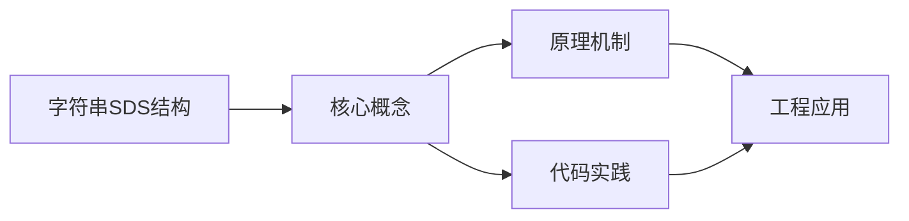
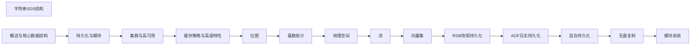

## 1. 学习目标（Bloom 分类）

本节按照布鲁姆教育目标分类学组织学习路径。本文主题为《字符串SDS结构》，属于 Redis 模块，读者可以根据自身阶段选择阅读深度。

记忆层面：能够准确复述本文的核心概念、术语与基本语法或操作步骤，并能够在提问或检索时快速定位对应知识点。能够说出 Redis 的核心概念、语法与常用对象。

理解层面：能够用自己的语言解释核心原理与工作机制，说明概念之间的因果关系，而不是机械记忆结论。能够解释 Redis 的执行原理与优化机制。

应用层面：能够在真实项目或练习场景中运用本文知识解决具体问题，写出正确且可维护的实现。能够编写正确、高效的 Redis 语句与操作。

分析层面：能够拆解复杂问题，比较本文主题与相邻概念的异同，识别边界条件与例外情况。能够分析 Redis 相关方案在性能与一致性上的权衡。

评价层面：能够根据约束条件（性能、可读性、安全、成本）评价不同方案的优劣，做出有依据的技术决策。能够根据业务场景评价 Redis 技术选型。

创造层面：能够把本文知识与其他模块知识组合，设计出新的解决方案或可复用的工程模式。能够组合 Redis 与其他技术设计数据架构。

通过本节学习，读者应当能够把《字符串SDS结构》纳入自己的知识网络，并与 Redis 模块的其他主题（数据结构、持久化、集群、缓存策略）建立关联。

## 2. 历史动机与发展脉络

《字符串SDS结构》是 Redis 领域的重要主题。要真正理解它，需要先了解它解决的问题与演进过程。

Redis 由 Salvatore Sanfilippo 于 2009 年发布，是内存数据结构存储，常作缓存、消息中间件与轻量数据库；BSD 许可，单线程事件循环（6.0 起多线程 IO）。
数据模型：String、Hash、List、Set、Sorted Set、Stream、BitMap、HyperLogLog、Geo；每种结构有专门命令与复杂度。
Redis 7.x：ACL、函数（Lua/Redis Functions）、集群路由（Cluster Sharding）、自动故障转移；Redis Stack 集成 JSON/搜索/时序。

回到本文主题：字符串SDS结构 的提出与成熟，正是上述技术背景下的必然产物。早期实现往往以简单可用为目标，随着工程规模扩大，社区逐渐沉淀出标准做法与最佳实践；理解这一脉络，可以帮助读者判断“为什么文档中的推荐写法是现在这个样子”，也能在遇到历史遗留代码时准确识别其设计年代与取舍。


## 3. 形式化定义与核心概念精讲

本节把《字符串SDS结构》涉及的核心概念以“定义 + 讲解”的形式展开。读者应把定义当作工具，把讲解当作理解路径；两者结合才能形成可迁移的知识。

单线程模型：命令串行执行保证原子性，无锁；性能瓶颈在内存与网络；长命令（KEYS）阻塞。
持久化：RDB 快照（fork 子进程）与 AOF 追加日志；混合持久化组合两者；持久化权衡数据安全与性能。
过期与淘汰：惰性删除 + 定期抽样；maxmemory-policy（allkeys-lru/lru/lfu/noeviction）控制内存。

### 3.1 原文章节逐一精讲

原文档把主题拆分为 11 个小节，下面按顺序给出每一节的导读讲解，随后保留原文细节供精读。

#### 原文精读（完整保留）

# 字符串 SDS 结构

> **符号约定**：`< >` 必填参数 | `[ ]` 可选参数

---

#### 1. SDS 数据结构

##### 1.1 结构定义

Redis 没有直接使用 C 语言的字符串，而是自定义了 SDS（Simple Dynamic String）：

```c
// Redis 5.0+ sdshdr 结构（按长度分5种）
struct __attribute__((packed)) sdshdr8 {
    uint8_t  len;         // 已使用长度（不含\0）
    uint8_t  alloc;       // 总分配容量（不含\0和header）
    unsigned char flags;   // 类型标识：SDS_TYPE_8
    char     buf[];       // 实际数据（柔性数组）
};

struct __attribute__((packed)) sdshdr16 {
    uint16_t len;
    uint16_t alloc;
    unsigned char flags;
    char buf[];
};

// 同理 sdshdr32, sdshdr64
```

##### 1.2 SDS 与 C 字符串对比

| 特性        | C 字符串         | SDS                   |
| ----------- | ---------------- | --------------------- |
| 获取长度    | $O(n)$ 遍历      | $O(1)$ 直接读取 len   |
| 缓冲区溢出  | 不检查，可能溢出 | 自动扩容，杜绝溢出    |
| 修改长度    | 每次重新分配     | 预分配 + 惰性释放     |
| 二进制安全  | 依赖 `\0` 结尾   | 用 len 判断结束       |
| 兼容 C 函数 | 是               | 是（buf 末尾有 `\0`） |

##### 1.3 内存布局

```mermaid
flowchart LR
    L[len 1字节<br/>5] --> A[alloc 1字节<br/>10] --> F[flags 1字节<br/>s8] --> B[buf[] 11字节 alloc+1<br/>'Hello'] --> Z[\0 1字节<br/>0]
```

len = 5：已使用 5 字节；alloc = 10：总容量 10 字节（不含 header 和 \0）；剩余空间 = alloc - len = 5 字节

#### 2. 预分配策略

##### 2.1 空间预分配规则

当 SDS 需要扩容时，Redis 不仅分配所需空间，还额外预分配：

```
规则1: 修改后 len < 1MB
  预分配: alloc = len（翻倍分配）
  示例: len=10 → 修改后 len=15 → alloc=30

规则2: 修改后 len >= 1MB
  预分配: alloc = len + 1MB（固定追加1MB）
  示例: len=3MB → 修改后 len=5MB → alloc=6MB
```

##### 2.2 预分配效果

```
连续追加操作 "hello" → "hello world" → "hello world redis"

无预分配: 3次 realloc
  malloc(5) → realloc(11) → realloc(17)

有预分配: 1次 realloc
  malloc(5) → realloc(22)  ← 第二次追加无需重新分配
  len=17, alloc=22, 剩余5字节
```

##### 2.3 源码分析

```c
// sds.c - sdsMakeRoomFor
sds sdsMakeRoomFor(sds s, size_t addlen) {
    size_t free = sdsavail(s);  // 剩余空间
    if (free >= addlen) return s;  // 空间足够，直接返回

    size_t len = sdslen(s);
    size_t newlen = len + addlen;

    // 预分配策略
    if (newlen < SDS_MAX_PREALLOC)  // SDS_MAX_PREALLOC = 1MB
        newlen *= 2;               // 翻倍
    else
        newlen += SDS_MAX_PREALLOC; // +1MB

    return sds_realloc(s, newlen);
}
```

#### 3. 惰性删除

##### 3.1 空间释放策略

当 SDS 缩短字符串时，不立即释放多余内存，而是通过 `free` 字段记录：

```c
// sds.c - sdstrim
sds sdstrim(sds s, const char *cset) {
    // ... 删除首尾匹配字符
    // 不调用 realloc 释放内存
    // 仅更新 len 和 free
    sdssetlen(s, newlen);  // 更新 len
    return s;
}
```

##### 3.2 惰性删除示例

```
SDS: "hello world" (len=11, alloc=11)

执行: sdstrim(s, "ld")  → 删除首尾的 'l' 和 'd'
结果: "hello wor" (len=9, alloc=11)
      剩余空间 = 2 字节，未释放

执行: sdsRemoveFreeSpace(s)  → 显式释放
结果: "hello wor" (len=9, alloc=9)
```

##### 3.3 何时真正释放

```c
// 1. 显式调用 sdsRemoveFreeSpace
// 2. 键被删除时，整个 SDS 被释放
// 3. Redis 内存淘汰时
// 4. 使用 SDS 的对象被重写时
```

#### 4. 二进制安全

##### 4.1 C 字符串的问题

C 字符串以 `\0` 表示结尾，无法存储包含 `\0` 的二进制数据：

```c
char *str = "hello\0world";  // C认为长度是5，丢失"world"
printf("%zu", strlen(str));   // 输出: 5
```

##### 4.2 SDS 的二进制安全

SDS 使用 `len` 字段判断长度，而非 `\0`：

```c
// SDS 可以存储任意二进制数据
sds s = sdsnewlen("hello\0world", 11);  // len=11
printf("%zu", sdslen(s));  // 输出: 11

// buf 中: 'h','e','l','l','o','\0','w','o','r','l','d','\0'
//          ↑ 数据中的\0           ↑ 结尾的\0（兼容C函数）
```

##### 4.3 兼容 C 字符串函数

SDS 的 `buf` 末尾始终保留 `\0`，可以直接使用 C 字符串函数：

```c
sds s = sdsnew("hello");
printf("%s", s);  // 直接传给 printf，兼容 C 字符串
strcmp(s, "hello");  // 可以使用 strcmp
```

#### 5. SDS 类型选择

##### 5.1 五种 SDS 类型

| 类型        | len/alloc 类型 | 最大长度 | header 大小 |
| ----------- | -------------- | -------- | ----------- |
| SDS_TYPE_5  | 无（3位存储）  | 31 字节  | 1 字节      |
| SDS_TYPE_8  | uint8_t        | 255 字节 | 3 字节      |
| SDS_TYPE_16 | uint16_t       | 64 KB    | 5 字节      |
| SDS_TYPE_32 | uint32_t       | 4 GB     | 9 字节      |
| SDS_TYPE_64 | uint64_t       | 16 EB    | 17 字节     |

##### 5.2 类型选择逻辑

```c
// sds.c - sdsReqType
static inline char sdsReqType(size_t string_size) {
    if (string_size < 1 << 5)  return SDS_TYPE_5;
    if (string_size < 1 << 8)  return SDS_TYPE_8;
    if (string_size < 1 << 16) return SDS_TYPE_16;
    if (string_size < 1ll << 32) return SDS_TYPE_32;
    return SDS_TYPE_64;
}
```

短字符串使用小 header，节省内存。例如存储 "key"（3字节），使用 SDS_TYPE_8，header 仅 3 字节。
#### 结构定义

**结构定义写法：sdshdr8 头部**
`struct __attribute__((packed)) sdshdr8 { uint8_t len; uint8_t alloc; unsigned char flags; char buf[]; }`
```c
// 定义 sdshdr8 类型头部（用于短字符串）
struct __attribute__((packed)) sdshdr8 {
    uint8_t  len;         // 已使用长度（不含\0）
    uint8_t  alloc;       // 总分配容量（不含\0和header）
    unsigned char flags;   // 类型标识：SDS_TYPE_8
    char     buf[];       // 实际数据（柔性数组）
};
```

**结构定义写法：sdshdr16 头部**
`struct __attribute__((packed)) sdshdr16 { uint16_t len; uint16_t alloc; unsigned char flags; char buf[]; }`
```c
// 定义 sdshdr16 类型头部（用于中等长度字符串）
struct __attribute__((packed)) sdshdr16 {
    uint16_t len;
    uint16_t alloc;
    unsigned char flags;
    char buf[];
};
```

**结构定义写法：sdshdr32 头部**
`struct __attribute__((packed)) sdshdr32 { uint32_t len; uint32_t alloc; unsigned char flags; char buf[]; }`
```c
// 定义 sdshdr32 类型头部（用于较长字符串）
struct __attribute__((packed)) sdshdr32 {
    uint32_t len;
    uint32_t alloc;
    unsigned char flags;
    char buf[];
};
```

**结构定义写法：sdshdr64 头部**
`struct __attribute__((packed)) sdshdr64 { uint64_t len; uint64_t alloc; unsigned char flags; char buf[]; }`
```c
// 定义 sdshdr64 类型头部（用于超长字符串）
struct __attribute__((packed)) sdshdr64 {
    uint64_t len;
    uint64_t alloc;
    unsigned char flags;
    char buf[];
};
```

---

#### 内存布局

**内存布局写法：sdshdr8 字节排列**
`[len][alloc][flags][buf[]][\0]`
```c
// sdshdr8 内存布局示例
// len = 5:   已使用5字节
// alloc = 10: 总容量10字节（不含header和\0）
// 剩余空间 = alloc - len = 5字节
```

---

#### 预分配策略

**预分配规则写法：修改后 len 小于 1MB**
`if (newlen < SDS_MAX_PREALLOC) newlen *= 2;`
```c
// 规则1: 修改后 len < 1MB 时翻倍分配
// 示例: len=10 → 修改后 len=15 → alloc=30
```

**预分配规则写法：修改后 len 大于等于 1MB**
`else newlen += SDS_MAX_PREALLOC;`
```c
// 规则2: 修改后 len >= 1MB 时固定追加1MB
// 示例: len=3MB → 修改后 len=5MB → alloc=6MB
```

**函数源码写法：sdsMakeRoomFor 扩容核心函数**
`sds sdsMakeRoomFor(sds s, size_t addlen)`
```c
// sds.c - sdsMakeRoomFor 扩容核心函数
sds sdsMakeRoomFor(sds s, size_t addlen) {
    size_t free = sdsavail(s);  // 剩余空间
    if (free >= addlen) return s;  // 空间足够，直接返回

    size_t len = sdslen(s);
    size_t newlen = len + addlen;

    // 预分配策略
    if (newlen < SDS_MAX_PREALLOC)  // SDS_MAX_PREALLOC = 1MB
        newlen *= 2;               // 翻倍
    else
        newlen += SDS_MAX_PREALLOC; // +1MB

    return sds_realloc(s, newlen);
}
```

---

#### 惰性删除

**函数源码写法：sdstrim 缩短字符串不释放内存**
`sds sdstrim(sds s, const char *cset)`
```c
// sds.c - sdstrim 删除首尾匹配字符但不调用 realloc
sds sdstrim(sds s, const char *cset) {
    // 删除首尾匹配字符
    // 不调用 realloc 释放内存
    // 仅更新 len 和 free
    sdssetlen(s, newlen);  // 更新 len
    return s;
}
```

**惰性删除示例写法：仅更新 len 不释放内存**
`sdstrim(s, "ld")`
```c
// SDS: "hello world" (len=11, alloc=11)
// 执行: sdstrim(s, "ld")  → 删除首尾的 'l' 和 'd'
// 结果: "hello wor" (len=9, alloc=11)
//       剩余空间 = 2 字节，未释放
```

**显式释放写法：sdsRemoveFreeSpace 回收内存**
`sdsRemoveFreeSpace(s)`
```c
// 显式调用 sdsRemoveFreeSpace 释放剩余空间
// 结果: "hello wor" (len=9, alloc=9)
```

**真正释放时机写法：触发内存回收的条件**
`sdsRemoveFreeSpace(s) | 键被删除 | 内存淘汰 | 对象重写`
```c
// 1. 显式调用 sdsRemoveFreeSpace
// 2. 键被删除时，整个 SDS 被释放
// 3. Redis 内存淘汰时
// 4. 使用 SDS 的对象被重写时
```

---

#### 二进制安全

**函数源码写法：sdsnewlen 存储包含 \0 的二进制数据**
`sds sdsnewlen(const void *init, size_t initlen)`
```c
// SDS 可以存储任意二进制数据
sds s = sdsnewlen("hello\0world", 11);  // len=11
printf("%zu", sdslen(s));  // 输出: 11
```

**兼容 C 字符串函数写法：buf 末尾保留 \0**
`sdsnew("hello")`
```c
// SDS 的 buf 末尾始终保留 \0，可以直接使用 C 字符串函数
sds s = sdsnew("hello");
printf("%s", s);  // 直接传给 printf，兼容 C 字符串
strcmp(s, "hello");  // 可以使用 strcmp
```

---

#### 类型选择

**函数源码写法：sdsReqType 根据字符串长度选择 SDS 类型**
`static inline char sdsReqType(size_t string_size)`
```c
// sds.c - sdsReqType 根据字符串长度选择 SDS 类型
static inline char sdsReqType(size_t string_size) {
    if (string_size < 1 << 5)  return SDS_TYPE_5;
    if (string_size < 1 << 8)  return SDS_TYPE_8;
    if (string_size < 1 << 16) return SDS_TYPE_16;
    if (string_size < 1ll << 32) return SDS_TYPE_32;
    return SDS_TYPE_64;
}
```


### 3.2 概念关系图

下面用 Mermaid 图表达本文核心概念之间的关系，帮助读者建立整体图景：



图中展示的是本文知识的结构化关系：核心概念是入口，原理机制解释“为什么”，代码实践演示“怎么做”，工程应用回答“何时用”。读者学习时可以把每个小节的内容挂接到对应节点上。

## 4. 理论推导与原理解析

本节深入《字符串SDS结构》背后的原理。理论部分不求面面俱到，而是聚焦“能解释现象、能指导实践”的关键推导。

单线程模型：命令串行执行保证原子性，无锁；性能瓶颈在内存与网络；长命令（KEYS）阻塞。
持久化：RDB 快照（fork 子进程）与 AOF 追加日志；混合持久化组合两者；持久化权衡数据安全与性能。
过期与淘汰：惰性删除 + 定期抽样；maxmemory-policy（allkeys-lru/lru/lfu/noeviction）控制内存。
高可用：主从复制（PSYNC）、哨兵（Sentinel）自动故障转移、Cluster 分片（16384 槽）与集群模式。

需要强调的是，理论推导与工程实践之间存在翻译层：理论给出的是理想化模型与边界条件，工程代码则必须处理真实环境中的例外。读者在学习时应先掌握理论的“标准情形”，再通过陷阱章节了解“非标准情形”。

## 5. 代码示例与逐行讲解

本节把原文中的代码示例系统整理，并为每个示例补充用途说明与讲解。读者不应只浏览代码，而应逐段对照讲解理解设计意图。

### 5.1 示例：1.1 结构定义

该示例来自原文《1.1 结构定义》小节，用于演示字符串SDS结构相关操作。阅读时请先看代码结构，再看其后的讲解。

```c
// Redis 5.0+ sdshdr 结构（按长度分5种）
struct __attribute__((packed)) sdshdr8 {
    uint8_t  len;         // 已使用长度（不含\0）
    uint8_t  alloc;       // 总分配容量（不含\0和header）
    unsigned char flags;   // 类型标识：SDS_TYPE_8
    char     buf[];       // 实际数据（柔性数组）
};

struct __attribute__((packed)) sdshdr16 {
    uint16_t len;
    uint16_t alloc;
    unsigned char flags;
    char buf[];
};

// 同理 sdshdr32, sdshdr64
```

讲解：这段代码演示了本节核心知识点。代码中的关键操作可以归纳为三步：准备（定义或初始化）、执行（核心逻辑）、收尾（释放资源或返回结果）。实际项目中，这三步往往被封装为函数或类，以提升复用性与可测试性。

关键点分析：

该示例共 14 行有效代码，结构以数据或配置为主。阅读时应关注：数据字段的含义、配置项的作用，以及它们与运行行为的对应关系。

进阶思考路径：先尝试修改参数观察行为变化，再把示例中的模式迁移到自己的项目中；每次修改都记录预期与实测差异，这是把示例转化为能力的最快方式。

### 5.2 示例：1.3 内存布局

该示例来自原文《1.3 内存布局》小节，用于演示字符串SDS结构相关操作。阅读时请先看代码结构，再看其后的讲解。

```mermaid
flowchart LR
    L[len 1字节<br/>5] --> A[alloc 1字节<br/>10] --> F[flags 1字节<br/>s8] --> B[buf[] 11字节 alloc+1<br/>'Hello'] --> Z[\0 1字节<br/>0]
```

讲解：这段代码演示了本节核心知识点。代码中的关键操作可以归纳为三步：准备（定义或初始化）、执行（核心逻辑）、收尾（释放资源或返回结果）。实际项目中，这三步往往被封装为函数或类，以提升复用性与可测试性。

关键点分析：

该示例共 2 行有效代码，结构以数据或配置为主。阅读时应关注：数据字段的含义、配置项的作用，以及它们与运行行为的对应关系。

进阶思考路径：先尝试修改参数观察行为变化，再把示例中的模式迁移到自己的项目中；每次修改都记录预期与实测差异，这是把示例转化为能力的最快方式。

### 5.3 示例：2.1 空间预分配规则

该示例来自原文《2.1 空间预分配规则》小节，用于演示字符串SDS结构相关操作。阅读时请先看代码结构，再看其后的讲解。

```text
规则1: 修改后 len < 1MB
  预分配: alloc = len（翻倍分配）
  示例: len=10 → 修改后 len=15 → alloc=30

规则2: 修改后 len >= 1MB
  预分配: alloc = len + 1MB（固定追加1MB）
  示例: len=3MB → 修改后 len=5MB → alloc=6MB
```

讲解：这段代码演示了本节核心知识点。代码中的关键操作可以归纳为三步：准备（定义或初始化）、执行（核心逻辑）、收尾（释放资源或返回结果）。实际项目中，这三步往往被封装为函数或类，以提升复用性与可测试性。

关键点分析：

该示例共 6 行有效代码，结构以数据或配置为主。阅读时应关注：数据字段的含义、配置项的作用，以及它们与运行行为的对应关系。

进阶思考路径：先尝试修改参数观察行为变化，再把示例中的模式迁移到自己的项目中；每次修改都记录预期与实测差异，这是把示例转化为能力的最快方式。

### 5.4 示例：2.2 预分配效果

该示例来自原文《2.2 预分配效果》小节，用于演示字符串SDS结构相关操作。阅读时请先看代码结构，再看其后的讲解。

```text
连续追加操作 "hello" → "hello world" → "hello world redis"

无预分配: 3次 realloc
  malloc(5) → realloc(11) → realloc(17)

有预分配: 1次 realloc
  malloc(5) → realloc(22)  ← 第二次追加无需重新分配
  len=17, alloc=22, 剩余5字节
```

讲解：这段代码演示了本节核心知识点。代码中的关键操作可以归纳为三步：准备（定义或初始化）、执行（核心逻辑）、收尾（释放资源或返回结果）。实际项目中，这三步往往被封装为函数或类，以提升复用性与可测试性。

关键点分析：

该示例共 6 行有效代码，结构以数据或配置为主。阅读时应关注：数据字段的含义、配置项的作用，以及它们与运行行为的对应关系。

进阶思考路径：先尝试修改参数观察行为变化，再把示例中的模式迁移到自己的项目中；每次修改都记录预期与实测差异，这是把示例转化为能力的最快方式。

### 5.5 示例：2.3 源码分析

该示例来自原文《2.3 源码分析》小节，用于演示字符串SDS结构相关操作。阅读时请先看代码结构，再看其后的讲解。

```c
// sds.c - sdsMakeRoomFor
sds sdsMakeRoomFor(sds s, size_t addlen) {
    size_t free = sdsavail(s);  // 剩余空间
    if (free >= addlen) return s;  // 空间足够，直接返回

    size_t len = sdslen(s);
    size_t newlen = len + addlen;

    // 预分配策略
    if (newlen < SDS_MAX_PREALLOC)  // SDS_MAX_PREALLOC = 1MB
        newlen *= 2;               // 翻倍
    else
        newlen += SDS_MAX_PREALLOC; // +1MB

    return sds_realloc(s, newlen);
}
```

讲解：这段代码演示了本节核心知识点。代码中的关键操作可以归纳为三步：准备（定义或初始化）、执行（核心逻辑）、收尾（释放资源或返回结果）。实际项目中，这三步往往被封装为函数或类，以提升复用性与可测试性。

关键点分析：

该示例共 13 行有效代码，包含 2 类关键结构（if、return）。其中：

- 入口与初始化部分负责建立上下文，对应实际项目中的启动或装配逻辑；
- 核心逻辑部分体现本文主题的主要操作，是阅读时最需要对照讲解理解的部分；
- 输出或返回部分把结果交给调用方，注意其类型与边界条件。

进阶思考路径：先尝试修改参数观察行为变化，再把示例中的模式迁移到自己的项目中；每次修改都记录预期与实测差异，这是把示例转化为能力的最快方式。

### 5.6 示例：3.1 空间释放策略

该示例来自原文《3.1 空间释放策略》小节，用于演示字符串SDS结构相关操作。阅读时请先看代码结构，再看其后的讲解。

```c
// sds.c - sdstrim
sds sdstrim(sds s, const char *cset) {
    // ... 删除首尾匹配字符
    // 不调用 realloc 释放内存
    // 仅更新 len 和 free
    sdssetlen(s, newlen);  // 更新 len
    return s;
}
```

讲解：这段代码演示了本节核心知识点。代码中的关键操作可以归纳为三步：准备（定义或初始化）、执行（核心逻辑）、收尾（释放资源或返回结果）。实际项目中，这三步往往被封装为函数或类，以提升复用性与可测试性。

关键点分析：

该示例共 8 行有效代码，包含 1 类关键结构（return）。其中：

- 入口与初始化部分负责建立上下文，对应实际项目中的启动或装配逻辑；
- 核心逻辑部分体现本文主题的主要操作，是阅读时最需要对照讲解理解的部分；
- 输出或返回部分把结果交给调用方，注意其类型与边界条件。

进阶思考路径：先尝试修改参数观察行为变化，再把示例中的模式迁移到自己的项目中；每次修改都记录预期与实测差异，这是把示例转化为能力的最快方式。

### 5.7 示例：3.2 惰性删除示例

该示例来自原文《3.2 惰性删除示例》小节，用于演示字符串SDS结构相关操作。阅读时请先看代码结构，再看其后的讲解。

```text
SDS: "hello world" (len=11, alloc=11)

执行: sdstrim(s, "ld")  → 删除首尾的 'l' 和 'd'
结果: "hello wor" (len=9, alloc=11)
      剩余空间 = 2 字节，未释放

执行: sdsRemoveFreeSpace(s)  → 显式释放
结果: "hello wor" (len=9, alloc=9)
```

讲解：这段代码演示了本节核心知识点。代码中的关键操作可以归纳为三步：准备（定义或初始化）、执行（核心逻辑）、收尾（释放资源或返回结果）。实际项目中，这三步往往被封装为函数或类，以提升复用性与可测试性。

关键点分析：

该示例共 6 行有效代码，结构以数据或配置为主。阅读时应关注：数据字段的含义、配置项的作用，以及它们与运行行为的对应关系。

进阶思考路径：先尝试修改参数观察行为变化，再把示例中的模式迁移到自己的项目中；每次修改都记录预期与实测差异，这是把示例转化为能力的最快方式。

### 5.8 示例：3.3 何时真正释放

该示例来自原文《3.3 何时真正释放》小节，用于演示字符串SDS结构相关操作。阅读时请先看代码结构，再看其后的讲解。

```c
// 1. 显式调用 sdsRemoveFreeSpace
// 2. 键被删除时，整个 SDS 被释放
// 3. Redis 内存淘汰时
// 4. 使用 SDS 的对象被重写时
```

讲解：这段代码演示了本节核心知识点。代码中的关键操作可以归纳为三步：准备（定义或初始化）、执行（核心逻辑）、收尾（释放资源或返回结果）。实际项目中，这三步往往被封装为函数或类，以提升复用性与可测试性。

关键点分析：

该示例共 4 行有效代码，结构以数据或配置为主。阅读时应关注：数据字段的含义、配置项的作用，以及它们与运行行为的对应关系。

进阶思考路径：先尝试修改参数观察行为变化，再把示例中的模式迁移到自己的项目中；每次修改都记录预期与实测差异，这是把示例转化为能力的最快方式。

### 5.9 示例：4.1 C 字符串的问题

该示例来自原文《4.1 C 字符串的问题》小节，用于演示字符串SDS结构相关操作。阅读时请先看代码结构，再看其后的讲解。

```c
char *str = "hello\0world";  // C认为长度是5，丢失"world"
printf("%zu", strlen(str));   // 输出: 5
```

讲解：这段代码演示了本节核心知识点。代码中的关键操作可以归纳为三步：准备（定义或初始化）、执行（核心逻辑）、收尾（释放资源或返回结果）。实际项目中，这三步往往被封装为函数或类，以提升复用性与可测试性。

关键点分析：

该示例共 2 行有效代码，结构以数据或配置为主。阅读时应关注：数据字段的含义、配置项的作用，以及它们与运行行为的对应关系。

进阶思考路径：先尝试修改参数观察行为变化，再把示例中的模式迁移到自己的项目中；每次修改都记录预期与实测差异，这是把示例转化为能力的最快方式。

### 5.10 示例：4.2 SDS 的二进制安全

该示例来自原文《4.2 SDS 的二进制安全》小节，用于演示字符串SDS结构相关操作。阅读时请先看代码结构，再看其后的讲解。

```c
// SDS 可以存储任意二进制数据
sds s = sdsnewlen("hello\0world", 11);  // len=11
printf("%zu", sdslen(s));  // 输出: 11

// buf 中: 'h','e','l','l','o','\0','w','o','r','l','d','\0'
//          ↑ 数据中的\0           ↑ 结尾的\0（兼容C函数）
```

讲解：这段代码演示了本节核心知识点。代码中的关键操作可以归纳为三步：准备（定义或初始化）、执行（核心逻辑）、收尾（释放资源或返回结果）。实际项目中，这三步往往被封装为函数或类，以提升复用性与可测试性。

关键点分析：

该示例共 5 行有效代码，结构以数据或配置为主。阅读时应关注：数据字段的含义、配置项的作用，以及它们与运行行为的对应关系。

进阶思考路径：先尝试修改参数观察行为变化，再把示例中的模式迁移到自己的项目中；每次修改都记录预期与实测差异，这是把示例转化为能力的最快方式。

### 5.11 示例：4.3 兼容 C 字符串函数

该示例来自原文《4.3 兼容 C 字符串函数》小节，用于演示字符串SDS结构相关操作。阅读时请先看代码结构，再看其后的讲解。

```c
sds s = sdsnew("hello");
printf("%s", s);  // 直接传给 printf，兼容 C 字符串
strcmp(s, "hello");  // 可以使用 strcmp
```

讲解：这段代码演示了本节核心知识点。代码中的关键操作可以归纳为三步：准备（定义或初始化）、执行（核心逻辑）、收尾（释放资源或返回结果）。实际项目中，这三步往往被封装为函数或类，以提升复用性与可测试性。

关键点分析：

该示例共 3 行有效代码，结构以数据或配置为主。阅读时应关注：数据字段的含义、配置项的作用，以及它们与运行行为的对应关系。

进阶思考路径：先尝试修改参数观察行为变化，再把示例中的模式迁移到自己的项目中；每次修改都记录预期与实测差异，这是把示例转化为能力的最快方式。

### 5.12 示例：5.2 类型选择逻辑

该示例来自原文《5.2 类型选择逻辑》小节，用于演示字符串SDS结构相关操作。阅读时请先看代码结构，再看其后的讲解。

```c
// sds.c - sdsReqType
static inline char sdsReqType(size_t string_size) {
    if (string_size < 1 << 5)  return SDS_TYPE_5;
    if (string_size < 1 << 8)  return SDS_TYPE_8;
    if (string_size < 1 << 16) return SDS_TYPE_16;
    if (string_size < 1ll << 32) return SDS_TYPE_32;
    return SDS_TYPE_64;
}
```

讲解：这段代码演示了本节核心知识点。代码中的关键操作可以归纳为三步：准备（定义或初始化）、执行（核心逻辑）、收尾（释放资源或返回结果）。实际项目中，这三步往往被封装为函数或类，以提升复用性与可测试性。

关键点分析：

该示例共 8 行有效代码，包含 2 类关键结构（if、return）。其中：

- 入口与初始化部分负责建立上下文，对应实际项目中的启动或装配逻辑；
- 核心逻辑部分体现本文主题的主要操作，是阅读时最需要对照讲解理解的部分；
- 输出或返回部分把结果交给调用方，注意其类型与边界条件。

进阶思考路径：先尝试修改参数观察行为变化，再把示例中的模式迁移到自己的项目中；每次修改都记录预期与实测差异，这是把示例转化为能力的最快方式。

### 5.13 示例：结构定义

该示例来自原文《结构定义》小节，用于演示字符串SDS结构相关操作。阅读时请先看代码结构，再看其后的讲解。

```c
// 定义 sdshdr8 类型头部（用于短字符串）
struct __attribute__((packed)) sdshdr8 {
    uint8_t  len;         // 已使用长度（不含\0）
    uint8_t  alloc;       // 总分配容量（不含\0和header）
    unsigned char flags;   // 类型标识：SDS_TYPE_8
    char     buf[];       // 实际数据（柔性数组）
};
```

讲解：这段代码演示了本节核心知识点。代码中的关键操作可以归纳为三步：准备（定义或初始化）、执行（核心逻辑）、收尾（释放资源或返回结果）。实际项目中，这三步往往被封装为函数或类，以提升复用性与可测试性。

关键点分析：

该示例共 7 行有效代码，结构以数据或配置为主。阅读时应关注：数据字段的含义、配置项的作用，以及它们与运行行为的对应关系。

进阶思考路径：先尝试修改参数观察行为变化，再把示例中的模式迁移到自己的项目中；每次修改都记录预期与实测差异，这是把示例转化为能力的最快方式。

### 5.14 示例：结构定义

该示例来自原文《结构定义》小节，用于演示字符串SDS结构相关操作。阅读时请先看代码结构，再看其后的讲解。

```c
// 定义 sdshdr16 类型头部（用于中等长度字符串）
struct __attribute__((packed)) sdshdr16 {
    uint16_t len;
    uint16_t alloc;
    unsigned char flags;
    char buf[];
};
```

讲解：这段代码演示了本节核心知识点。代码中的关键操作可以归纳为三步：准备（定义或初始化）、执行（核心逻辑）、收尾（释放资源或返回结果）。实际项目中，这三步往往被封装为函数或类，以提升复用性与可测试性。

关键点分析：

该示例共 7 行有效代码，结构以数据或配置为主。阅读时应关注：数据字段的含义、配置项的作用，以及它们与运行行为的对应关系。

进阶思考路径：先尝试修改参数观察行为变化，再把示例中的模式迁移到自己的项目中；每次修改都记录预期与实测差异，这是把示例转化为能力的最快方式。

### 5.15 示例：结构定义

该示例来自原文《结构定义》小节，用于演示字符串SDS结构相关操作。阅读时请先看代码结构，再看其后的讲解。

```c
// 定义 sdshdr32 类型头部（用于较长字符串）
struct __attribute__((packed)) sdshdr32 {
    uint32_t len;
    uint32_t alloc;
    unsigned char flags;
    char buf[];
};
```

讲解：这段代码演示了本节核心知识点。代码中的关键操作可以归纳为三步：准备（定义或初始化）、执行（核心逻辑）、收尾（释放资源或返回结果）。实际项目中，这三步往往被封装为函数或类，以提升复用性与可测试性。

关键点分析：

该示例共 7 行有效代码，结构以数据或配置为主。阅读时应关注：数据字段的含义、配置项的作用，以及它们与运行行为的对应关系。

进阶思考路径：先尝试修改参数观察行为变化，再把示例中的模式迁移到自己的项目中；每次修改都记录预期与实测差异，这是把示例转化为能力的最快方式。

### 5.16 示例：结构定义

该示例来自原文《结构定义》小节，用于演示字符串SDS结构相关操作。阅读时请先看代码结构，再看其后的讲解。

```c
// 定义 sdshdr64 类型头部（用于超长字符串）
struct __attribute__((packed)) sdshdr64 {
    uint64_t len;
    uint64_t alloc;
    unsigned char flags;
    char buf[];
};
```

讲解：这段代码演示了本节核心知识点。代码中的关键操作可以归纳为三步：准备（定义或初始化）、执行（核心逻辑）、收尾（释放资源或返回结果）。实际项目中，这三步往往被封装为函数或类，以提升复用性与可测试性。

关键点分析：

该示例共 7 行有效代码，结构以数据或配置为主。阅读时应关注：数据字段的含义、配置项的作用，以及它们与运行行为的对应关系。

进阶思考路径：先尝试修改参数观察行为变化，再把示例中的模式迁移到自己的项目中；每次修改都记录预期与实测差异，这是把示例转化为能力的最快方式。

### 5.17 示例：内存布局

该示例来自原文《内存布局》小节，用于演示字符串SDS结构相关操作。阅读时请先看代码结构，再看其后的讲解。

```c
// sdshdr8 内存布局示例
// len = 5:   已使用5字节
// alloc = 10: 总容量10字节（不含header和\0）
// 剩余空间 = alloc - len = 5字节
```

讲解：这段代码演示了本节核心知识点。代码中的关键操作可以归纳为三步：准备（定义或初始化）、执行（核心逻辑）、收尾（释放资源或返回结果）。实际项目中，这三步往往被封装为函数或类，以提升复用性与可测试性。

关键点分析：

该示例共 4 行有效代码，结构以数据或配置为主。阅读时应关注：数据字段的含义、配置项的作用，以及它们与运行行为的对应关系。

进阶思考路径：先尝试修改参数观察行为变化，再把示例中的模式迁移到自己的项目中；每次修改都记录预期与实测差异，这是把示例转化为能力的最快方式。

### 5.18 示例：预分配策略

该示例来自原文《预分配策略》小节，用于演示字符串SDS结构相关操作。阅读时请先看代码结构，再看其后的讲解。

```c
// 规则1: 修改后 len < 1MB 时翻倍分配
// 示例: len=10 → 修改后 len=15 → alloc=30
```

讲解：这段代码演示了本节核心知识点。代码中的关键操作可以归纳为三步：准备（定义或初始化）、执行（核心逻辑）、收尾（释放资源或返回结果）。实际项目中，这三步往往被封装为函数或类，以提升复用性与可测试性。

关键点分析：

该示例共 2 行有效代码，结构以数据或配置为主。阅读时应关注：数据字段的含义、配置项的作用，以及它们与运行行为的对应关系。

进阶思考路径：先尝试修改参数观察行为变化，再把示例中的模式迁移到自己的项目中；每次修改都记录预期与实测差异，这是把示例转化为能力的最快方式。

### 5.19 示例：预分配策略

该示例来自原文《预分配策略》小节，用于演示字符串SDS结构相关操作。阅读时请先看代码结构，再看其后的讲解。

```c
// 规则2: 修改后 len >= 1MB 时固定追加1MB
// 示例: len=3MB → 修改后 len=5MB → alloc=6MB
```

讲解：这段代码演示了本节核心知识点。代码中的关键操作可以归纳为三步：准备（定义或初始化）、执行（核心逻辑）、收尾（释放资源或返回结果）。实际项目中，这三步往往被封装为函数或类，以提升复用性与可测试性。

关键点分析：

该示例共 2 行有效代码，结构以数据或配置为主。阅读时应关注：数据字段的含义、配置项的作用，以及它们与运行行为的对应关系。

进阶思考路径：先尝试修改参数观察行为变化，再把示例中的模式迁移到自己的项目中；每次修改都记录预期与实测差异，这是把示例转化为能力的最快方式。

### 5.20 示例：预分配策略

该示例来自原文《预分配策略》小节，用于演示字符串SDS结构相关操作。阅读时请先看代码结构，再看其后的讲解。

```c
// sds.c - sdsMakeRoomFor 扩容核心函数
sds sdsMakeRoomFor(sds s, size_t addlen) {
    size_t free = sdsavail(s);  // 剩余空间
    if (free >= addlen) return s;  // 空间足够，直接返回

    size_t len = sdslen(s);
    size_t newlen = len + addlen;

    // 预分配策略
    if (newlen < SDS_MAX_PREALLOC)  // SDS_MAX_PREALLOC = 1MB
        newlen *= 2;               // 翻倍
    else
        newlen += SDS_MAX_PREALLOC; // +1MB

    return sds_realloc(s, newlen);
}
```

讲解：这段代码演示了本节核心知识点。代码中的关键操作可以归纳为三步：准备（定义或初始化）、执行（核心逻辑）、收尾（释放资源或返回结果）。实际项目中，这三步往往被封装为函数或类，以提升复用性与可测试性。

关键点分析：

该示例共 13 行有效代码，包含 2 类关键结构（if、return）。其中：

- 入口与初始化部分负责建立上下文，对应实际项目中的启动或装配逻辑；
- 核心逻辑部分体现本文主题的主要操作，是阅读时最需要对照讲解理解的部分；
- 输出或返回部分把结果交给调用方，注意其类型与边界条件。

进阶思考路径：先尝试修改参数观察行为变化，再把示例中的模式迁移到自己的项目中；每次修改都记录预期与实测差异，这是把示例转化为能力的最快方式。

### 5.21 示例：惰性删除

该示例来自原文《惰性删除》小节，用于演示字符串SDS结构相关操作。阅读时请先看代码结构，再看其后的讲解。

```c
// sds.c - sdstrim 删除首尾匹配字符但不调用 realloc
sds sdstrim(sds s, const char *cset) {
    // 删除首尾匹配字符
    // 不调用 realloc 释放内存
    // 仅更新 len 和 free
    sdssetlen(s, newlen);  // 更新 len
    return s;
}
```

讲解：这段代码演示了本节核心知识点。代码中的关键操作可以归纳为三步：准备（定义或初始化）、执行（核心逻辑）、收尾（释放资源或返回结果）。实际项目中，这三步往往被封装为函数或类，以提升复用性与可测试性。

关键点分析：

该示例共 8 行有效代码，包含 1 类关键结构（return）。其中：

- 入口与初始化部分负责建立上下文，对应实际项目中的启动或装配逻辑；
- 核心逻辑部分体现本文主题的主要操作，是阅读时最需要对照讲解理解的部分；
- 输出或返回部分把结果交给调用方，注意其类型与边界条件。

进阶思考路径：先尝试修改参数观察行为变化，再把示例中的模式迁移到自己的项目中；每次修改都记录预期与实测差异，这是把示例转化为能力的最快方式。

### 5.22 示例：惰性删除

该示例来自原文《惰性删除》小节，用于演示字符串SDS结构相关操作。阅读时请先看代码结构，再看其后的讲解。

```c
// SDS: "hello world" (len=11, alloc=11)
// 执行: sdstrim(s, "ld")  → 删除首尾的 'l' 和 'd'
// 结果: "hello wor" (len=9, alloc=11)
//       剩余空间 = 2 字节，未释放
```

讲解：这段代码演示了本节核心知识点。代码中的关键操作可以归纳为三步：准备（定义或初始化）、执行（核心逻辑）、收尾（释放资源或返回结果）。实际项目中，这三步往往被封装为函数或类，以提升复用性与可测试性。

关键点分析：

该示例共 4 行有效代码，结构以数据或配置为主。阅读时应关注：数据字段的含义、配置项的作用，以及它们与运行行为的对应关系。

进阶思考路径：先尝试修改参数观察行为变化，再把示例中的模式迁移到自己的项目中；每次修改都记录预期与实测差异，这是把示例转化为能力的最快方式。

### 5.23 示例：惰性删除

该示例来自原文《惰性删除》小节，用于演示字符串SDS结构相关操作。阅读时请先看代码结构，再看其后的讲解。

```c
// 显式调用 sdsRemoveFreeSpace 释放剩余空间
// 结果: "hello wor" (len=9, alloc=9)
```

讲解：这段代码演示了本节核心知识点。代码中的关键操作可以归纳为三步：准备（定义或初始化）、执行（核心逻辑）、收尾（释放资源或返回结果）。实际项目中，这三步往往被封装为函数或类，以提升复用性与可测试性。

关键点分析：

该示例共 2 行有效代码，结构以数据或配置为主。阅读时应关注：数据字段的含义、配置项的作用，以及它们与运行行为的对应关系。

进阶思考路径：先尝试修改参数观察行为变化，再把示例中的模式迁移到自己的项目中；每次修改都记录预期与实测差异，这是把示例转化为能力的最快方式。

### 5.24 示例：惰性删除

该示例来自原文《惰性删除》小节，用于演示字符串SDS结构相关操作。阅读时请先看代码结构，再看其后的讲解。

```c
// 1. 显式调用 sdsRemoveFreeSpace
// 2. 键被删除时，整个 SDS 被释放
// 3. Redis 内存淘汰时
// 4. 使用 SDS 的对象被重写时
```

讲解：这段代码演示了本节核心知识点。代码中的关键操作可以归纳为三步：准备（定义或初始化）、执行（核心逻辑）、收尾（释放资源或返回结果）。实际项目中，这三步往往被封装为函数或类，以提升复用性与可测试性。

关键点分析：

该示例共 4 行有效代码，结构以数据或配置为主。阅读时应关注：数据字段的含义、配置项的作用，以及它们与运行行为的对应关系。

进阶思考路径：先尝试修改参数观察行为变化，再把示例中的模式迁移到自己的项目中；每次修改都记录预期与实测差异，这是把示例转化为能力的最快方式。

### 5.25 示例：二进制安全

该示例来自原文《二进制安全》小节，用于演示字符串SDS结构相关操作。阅读时请先看代码结构，再看其后的讲解。

```c
// SDS 可以存储任意二进制数据
sds s = sdsnewlen("hello\0world", 11);  // len=11
printf("%zu", sdslen(s));  // 输出: 11
```

讲解：这段代码演示了本节核心知识点。代码中的关键操作可以归纳为三步：准备（定义或初始化）、执行（核心逻辑）、收尾（释放资源或返回结果）。实际项目中，这三步往往被封装为函数或类，以提升复用性与可测试性。

关键点分析：

该示例共 3 行有效代码，结构以数据或配置为主。阅读时应关注：数据字段的含义、配置项的作用，以及它们与运行行为的对应关系。

进阶思考路径：先尝试修改参数观察行为变化，再把示例中的模式迁移到自己的项目中；每次修改都记录预期与实测差异，这是把示例转化为能力的最快方式。

### 5.26 示例：二进制安全

该示例来自原文《二进制安全》小节，用于演示字符串SDS结构相关操作。阅读时请先看代码结构，再看其后的讲解。

```c
// SDS 的 buf 末尾始终保留 \0，可以直接使用 C 字符串函数
sds s = sdsnew("hello");
printf("%s", s);  // 直接传给 printf，兼容 C 字符串
strcmp(s, "hello");  // 可以使用 strcmp
```

讲解：这段代码演示了本节核心知识点。代码中的关键操作可以归纳为三步：准备（定义或初始化）、执行（核心逻辑）、收尾（释放资源或返回结果）。实际项目中，这三步往往被封装为函数或类，以提升复用性与可测试性。

关键点分析：

该示例共 4 行有效代码，结构以数据或配置为主。阅读时应关注：数据字段的含义、配置项的作用，以及它们与运行行为的对应关系。

进阶思考路径：先尝试修改参数观察行为变化，再把示例中的模式迁移到自己的项目中；每次修改都记录预期与实测差异，这是把示例转化为能力的最快方式。

### 5.27 示例：类型选择

该示例来自原文《类型选择》小节，用于演示字符串SDS结构相关操作。阅读时请先看代码结构，再看其后的讲解。

```c
// sds.c - sdsReqType 根据字符串长度选择 SDS 类型
static inline char sdsReqType(size_t string_size) {
    if (string_size < 1 << 5)  return SDS_TYPE_5;
    if (string_size < 1 << 8)  return SDS_TYPE_8;
    if (string_size < 1 << 16) return SDS_TYPE_16;
    if (string_size < 1ll << 32) return SDS_TYPE_32;
    return SDS_TYPE_64;
}
```

讲解：这段代码演示了本节核心知识点。代码中的关键操作可以归纳为三步：准备（定义或初始化）、执行（核心逻辑）、收尾（释放资源或返回结果）。实际项目中，这三步往往被封装为函数或类，以提升复用性与可测试性。

关键点分析：

该示例共 8 行有效代码，包含 2 类关键结构（if、return）。其中：

- 入口与初始化部分负责建立上下文，对应实际项目中的启动或装配逻辑；
- 核心逻辑部分体现本文主题的主要操作，是阅读时最需要对照讲解理解的部分；
- 输出或返回部分把结果交给调用方，注意其类型与边界条件。

进阶思考路径：先尝试修改参数观察行为变化，再把示例中的模式迁移到自己的项目中；每次修改都记录预期与实测差异，这是把示例转化为能力的最快方式。


综合以上示例，可以总结出本主题的代码实践要点：第一，先定义清晰的输入输出契约；第二，核心逻辑保持单一职责；第三，错误处理与边界条件不可省略；第四，命名与注释表达意图而非复述代码。

## 6. 对比分析

对比是理解《字符串SDS结构》定位的最快路径。下面从多个维度与相邻方案进行对比。

Redis 与 Memcached：Redis 数据结构丰富、持久化、集群；Memcached 简单多线程缓存。
Redis 与消息队列：List/Stream 可实现轻量队列；强可靠场景用 Kafka/RabbitMQ。
RDB 与 AOF：RDB 恢复快丢数据多；AOF 丢数据少恢复慢；混合取平衡。

对比的目的不是分出绝对优劣，而是建立选择依据：不同约束条件下，最优解不同。读者应把每个对比维度转化为决策检查清单。

## 7. 常见陷阱与最佳实践

本节整理该主题的高频错误与推荐做法。每个陷阱先描述现象，再解释原因，最后给出最佳实践。

### 7.1 KEYS 阻塞

大键扫描阻塞服务。使用 SCAN 游标。

深入讲解：该问题之所以被归类为“常见陷阱”，是因为它在初学者的代码中反复出现，而且往往不在第一时间暴露——错误通常隐藏在特定数据或特定时序下。

从成因上看，KEYS 阻塞 一般源于对 Redis 某个机制的理解偏差：要么误用了默认行为，要么忽略了边界条件，要么把其他语言的思维惯性带了过来。

从影响上看，KEYS 阻塞 轻则产生错误结果，重则导致资源泄漏、数据损坏或安全事故；这也是为什么工程评审中会把它列为检查项。

从修复策略上看，处理KEYS 阻塞的正确顺序是：先复现（构造最小用例），再定位（确认机制层面的根因），最后修复并补充回归测试。跳过复现直接改代码，往往治标不治本。

### 7.2 大 key

单 key 超大导致网络与内存问题。拆分或压缩。

深入讲解：该问题之所以被归类为“常见陷阱”，是因为它在初学者的代码中反复出现，而且往往不在第一时间暴露——错误通常隐藏在特定数据或特定时序下。

从成因上看，大 key 一般源于对 Redis 某个机制的理解偏差：要么误用了默认行为，要么忽略了边界条件，要么把其他语言的思维惯性带了过来。

从影响上看，大 key 轻则产生错误结果，重则导致资源泄漏、数据损坏或安全事故；这也是为什么工程评审中会把它列为检查项。

从修复策略上看，处理大 key的正确顺序是：先复现（构造最小用例），再定位（确认机制层面的根因），最后修复并补充回归测试。跳过复现直接改代码，往往治标不治本。

### 7.3 缓存穿透

查询不存在数据打穿到 DB。布隆过滤器或空值缓存。

深入讲解：该问题之所以被归类为“常见陷阱”，是因为它在初学者的代码中反复出现，而且往往不在第一时间暴露——错误通常隐藏在特定数据或特定时序下。

从成因上看，缓存穿透 一般源于对 Redis 某个机制的理解偏差：要么误用了默认行为，要么忽略了边界条件，要么把其他语言的思维惯性带了过来。

从影响上看，缓存穿透 轻则产生错误结果，重则导致资源泄漏、数据损坏或安全事故；这也是为什么工程评审中会把它列为检查项。

从修复策略上看，处理缓存穿透的正确顺序是：先复现（构造最小用例），再定位（确认机制层面的根因），最后修复并补充回归测试。跳过复现直接改代码，往往治标不治本。

### 7.4 缓存击穿

热点 key 过期瞬间并发打 DB。互斥重建或逻辑过期。

深入讲解：该问题之所以被归类为“常见陷阱”，是因为它在初学者的代码中反复出现，而且往往不在第一时间暴露——错误通常隐藏在特定数据或特定时序下。

从成因上看，缓存击穿 一般源于对 Redis 某个机制的理解偏差：要么误用了默认行为，要么忽略了边界条件，要么把其他语言的思维惯性带了过来。

从影响上看，缓存击穿 轻则产生错误结果，重则导致资源泄漏、数据损坏或安全事故；这也是为什么工程评审中会把它列为检查项。

从修复策略上看，处理缓存击穿的正确顺序是：先复现（构造最小用例），再定位（确认机制层面的根因），最后修复并补充回归测试。跳过复现直接改代码，往往治标不治本。

### 7.5 缓存雪崩

大量 key 同时过期。过期时间加随机抖动。

深入讲解：该问题之所以被归类为“常见陷阱”，是因为它在初学者的代码中反复出现，而且往往不在第一时间暴露——错误通常隐藏在特定数据或特定时序下。

从成因上看，缓存雪崩 一般源于对 Redis 某个机制的理解偏差：要么误用了默认行为，要么忽略了边界条件，要么把其他语言的思维惯性带了过来。

从影响上看，缓存雪崩 轻则产生错误结果，重则导致资源泄漏、数据损坏或安全事故；这也是为什么工程评审中会把它列为检查项。

从修复策略上看，处理缓存雪崩的正确顺序是：先复现（构造最小用例），再定位（确认机制层面的根因），最后修复并补充回归测试。跳过复现直接改代码，往往治标不治本。

### 7.6 持久化误配置

save 策略与 AOF 关闭导致重启丢数据。按数据安全需求配置。

深入讲解：该问题之所以被归类为“常见陷阱”，是因为它在初学者的代码中反复出现，而且往往不在第一时间暴露——错误通常隐藏在特定数据或特定时序下。

从成因上看，持久化误配置 一般源于对 Redis 某个机制的理解偏差：要么误用了默认行为，要么忽略了边界条件，要么把其他语言的思维惯性带了过来。

从影响上看，持久化误配置 轻则产生错误结果，重则导致资源泄漏、数据损坏或安全事故；这也是为什么工程评审中会把它列为检查项。

从修复策略上看，处理持久化误配置的正确顺序是：先复现（构造最小用例），再定位（确认机制层面的根因），最后修复并补充回归测试。跳过复现直接改代码，往往治标不治本。

### 7.7 连接未关闭

连接泄漏耗尽 maxclients。使用连接池。

深入讲解：该问题之所以被归类为“常见陷阱”，是因为它在初学者的代码中反复出现，而且往往不在第一时间暴露——错误通常隐藏在特定数据或特定时序下。

从成因上看，连接未关闭 一般源于对 Redis 某个机制的理解偏差：要么误用了默认行为，要么忽略了边界条件，要么把其他语言的思维惯性带了过来。

从影响上看，连接未关闭 轻则产生错误结果，重则导致资源泄漏、数据损坏或安全事故；这也是为什么工程评审中会把它列为检查项。

从修复策略上看，处理连接未关闭的正确顺序是：先复现（构造最小用例），再定位（确认机制层面的根因），最后修复并补充回归测试。跳过复现直接改代码，往往治标不治本。

### 7.8 事务误用

MULTI/EXEC 不保证回滚，命令错误才回滚。需要强一致用 Lua。

深入讲解：该问题之所以被归类为“常见陷阱”，是因为它在初学者的代码中反复出现，而且往往不在第一时间暴露——错误通常隐藏在特定数据或特定时序下。

从成因上看，事务误用 一般源于对 Redis 某个机制的理解偏差：要么误用了默认行为，要么忽略了边界条件，要么把其他语言的思维惯性带了过来。

从影响上看，事务误用 轻则产生错误结果，重则导致资源泄漏、数据损坏或安全事故；这也是为什么工程评审中会把它列为检查项。

从修复策略上看，处理事务误用的正确顺序是：先复现（构造最小用例），再定位（确认机制层面的根因），最后修复并补充回归测试。跳过复现直接改代码，往往治标不治本。

### 7.0 最佳实践总览

1. 键命名：业务:实体:id（user:profile:1001），过期时间按场景设置。
2. 缓存一致性：Cache Aside（先更新 DB 再删缓存）为主；延迟双删防旧缓存。
3. 集群：Slot 分布、批量操作需 hash tag；客户端路由（lettuce/jedis 集群版）。
4. 监控：INFO 内存/命中率、慢日志、monitor 抽样。

把这些最佳实践固化为团队规范与代码评审检查项，是避免同类问题反复出现的关键。

## 8. 工程实践

本节把《字符串SDS结构》放入真实工程场景，给出可复用的模式与组织方法。

缓存分层：本地缓存（Caffeine）+ Redis 分布式缓存；热点与一致性分层治理。
分布式锁：SET NX EX + 续期（Redisson）；注意时钟跳跃与 GC 暂停。
容量规划：maxmemory + 淘汰策略 + 监控；大促前预热。

### 8.1 工程实践的原则拆解

以上工程实践可以归纳为四条原则。第一，配置与代码分离：Redis 项目中环境差异应通过配置注入，而不是散落在代码分支中；这保证同一份代码可以在开发、测试、生产环境一致运行。

第二，接口稳定优先：对外接口（函数签名、协议、数据格式）一旦被消费方依赖，变更成本极高；设计时应预留扩展点并保持向后兼容。

第三，可观测性内置：日志、指标与追踪应该在功能开发时同步设计，而不是故障发生后补救；没有观测手段的模块等于黑盒。

第四，变更可回滚：任何发布都应有对应的回滚方案；数据库迁移、配置变更与代码发布一样需要版本管理与逆向路径。

### 8.2 实践落地的检查清单

- [ ] 缓存分层：对照本节描述，检查当前项目是否已经落实；未落实的项列入技术债并排期处理。
- [ ] 分布式锁：对照本节描述，检查当前项目是否已经落实；未落实的项列入技术债并排期处理。
- [ ] 容量规划：对照本节描述，检查当前项目是否已经落实；未落实的项列入技术债并排期处理。

工程实践的共性原则：配置与代码分离、接口稳定优先、可观测性内置、变更可回滚。这些原则适用于本主题的所有实现。

## 9. 案例研究

本节通过一个完整案例把《字符串SDS结构》的知识串起来。案例按“需求分析、方案设计、实现、验证”四步展开。

需求：实现商品详情缓存与热点防护。
方案：Cache Aside + 互斥重建（setnx）+ 随机过期抖动 + 布隆过滤器。
要点：序列化协议统一；缓存与 DB 双写顺序；监控命中率。
验证：压测穿透/击穿场景、故障注入（Redis 宕机降级）。

### 9.1 案例的扩展讨论

把案例中的方案放大到真实规模，需要额外考虑三个问题：

第一，规模：当数据量或并发量上升一个数量级时，原方案中的数据结构、缓存策略与任务调度是否仍然成立？通常需要引入分层与异步。

第二，团队：多人协作时，模块边界、接口契约与代码所有权必须明确；案例中的实现应拆分为可独立测试的单元，并配合文档说明设计意图。

第三，演进：上线后的需求变化不可避免；方案设计时应预留扩展点（配置化、插件化、事件化），并定期用真实指标验证假设。


案例研究的学习方法：先独立阅读需求，尝试在脑中形成方案，再对照实现与讲解，最后思考“如果约束变化（数据量、并发、团队规模），方案应如何调整”。

## 10. 知识要点总结与深入讲解

本节以讲解形式汇总全文要点，替代传统的习题与自测，读者不需要答题，只需跟随解释建立完整的认知框架。

关于《字符串SDS结构》的核心结论：

Redis 的价值在“数据结构即服务”：选择合适结构比堆功能重要。
缓存三兄弟（穿透/击穿/雪崩）是设计必修课。
持久化、复制与集群决定可靠性，生产必须配置齐全。

原文档各小节的要点回顾：

- 1. SDS 数据结构：该小节围绕字符串SDS结构展开具体细节，阅读时应关注其与核心结论的对应关系；每个小节都是核心结论在某一个侧面的展开。
- 2. 预分配策略：该小节围绕字符串SDS结构展开具体细节，阅读时应关注其与核心结论的对应关系；每个小节都是核心结论在某一个侧面的展开。
- 3. 惰性删除：该小节围绕字符串SDS结构展开具体细节，阅读时应关注其与核心结论的对应关系；每个小节都是核心结论在某一个侧面的展开。
- 4. 二进制安全：该小节围绕字符串SDS结构展开具体细节，阅读时应关注其与核心结论的对应关系；每个小节都是核心结论在某一个侧面的展开。
- 5. SDS 类型选择：该小节围绕字符串SDS结构展开具体细节，阅读时应关注其与核心结论的对应关系；每个小节都是核心结论在某一个侧面的展开。
- 结构定义：该小节围绕字符串SDS结构展开具体细节，阅读时应关注其与核心结论的对应关系；每个小节都是核心结论在某一个侧面的展开。
- 内存布局：该小节围绕字符串SDS结构展开具体细节，阅读时应关注其与核心结论的对应关系；每个小节都是核心结论在某一个侧面的展开。
- 预分配策略：该小节围绕字符串SDS结构展开具体细节，阅读时应关注其与核心结论的对应关系；每个小节都是核心结论在某一个侧面的展开。
- 惰性删除：该小节围绕字符串SDS结构展开具体细节，阅读时应关注其与核心结论的对应关系；每个小节都是核心结论在某一个侧面的展开。
- 二进制安全：该小节围绕字符串SDS结构展开具体细节，阅读时应关注其与核心结论的对应关系；每个小节都是核心结论在某一个侧面的展开。
- 类型选择：该小节围绕字符串SDS结构展开具体细节，阅读时应关注其与核心结论的对应关系；每个小节都是核心结论在某一个侧面的展开。

把以上要点与第 3-9 节的内容对照复习，即可完成对本文主题的闭环学习。

## 11. 参考文献


Redis 官方文档：https://redis.io/docs/latest/
Redis 命令参考：https://redis.io/docs/latest/commands/
Redis 中文资料：https://redis.com.cn/
Redisson 文档：https://redisson.org/

## 12. 延伸阅读


Redis 数据结构详解，见 022-redis 模块文档。
Redis 持久化与集群，见 022-redis 模块相关文档。
MySQL 与 Redis 缓存架构，见 020-mysql 模块。
黑马程序员 Bilibili 空间（https://space.bilibili.com/37974444 ）提供 Redis 课程。

## 14. 模块知识图谱与学习路径

本文属于 Redis 模块。为了把《字符串SDS结构》放入完整的知识网络，下面列出本模块的全部主题并给出相互关联的导读。学习时建议按模块内顺序推进，并在每个文档中留意交叉引用。



上图为模块主题的推荐学习顺序示意图（仅展示前若干主题）。各主题之间存在三类关联：

第一，前置依赖关系：早期主题是后期主题的基础，例如环境与语法先行、进阶主题随后；

第二，横向并列关系：同一层级主题从不同角度覆盖模块能力，学习顺序可以按兴趣调整；

第三，工程组合关系：多个主题在真实项目中组合使用，例如配置、性能与安全主题往往出现在同一系统的不同层面。

### 14.1 模块主题速查表

| 文档 | 主题 | 与本文的关联 |
| --- | --- | --- |
| 概述与核心数据结构 | 001-OverviewCoreDataStructure | 本文的前置基础 |
| 持久化与模块 | 002-PersistenceModule | 本文的并列主题 |
| 集群与高可用 | 003-ClusterHA | 本文的并列主题 |
| 缓存策略与高级特性 | 004-CacheStrategyAdvancedFeature | 本文的并列主题 |
| 位图 | 005-BitGraph | 本文的并列主题 |
| 基数统计 | 006-NumberStats | 本文的并列主题 |
| 地理空间 | 007-GeoSpatial | 本文的并列主题 |
| 流 | 008-Stream | 本文的并列主题 |
| 向量集 | 009-VectorSet | 本文的并列主题 |
| RDB快照持久化 | 010-RDBSnapshotPersistence | 本文的并列主题 |
| AOF日志持久化 | 011-AOFLogPersistence | 本文的并列主题 |
| 混合持久化 | 012-MixedPersistence | 本文的并列主题 |
| 无盘复制 | 013-DisklessReplication | 本文的并列主题 |
| 模块系统 | 014-ModuleSystem | 本文的并列主题 |
| 字符串SDS结构 | 015-StringSDSStructure | 本文自身 |
| 跳表与有序集合 | 016-SkipListAndSortedSet | 本文的并列主题 |
| 主从复制缓冲区 | 017-ReplicationBuffer | 本文的并列主题 |
| 哨兵选举 | 018-SentinelElection | 本文的并列主题 |
| Redis-Cluster哈希槽 | 019-RedisClusterHashSlot | 本文的并列主题 |
| 管道与事务原子性 | 020-PipeTransactionAtomic | 本文的并列主题 |
| Lua脚本原子执行 | 021-LuaScriptAtomicExecution | 本文的并列主题 |
| 缓存穿透击穿雪崩 | 022-CachePenetrationBreakdownAvalanche | 本文的并列主题 |
| 内存淘汰策略 | 023-MemoryEvictionPolicy | 本文的并列主题 |
| Redis Hash 命令速查 | 024-HashCommand | 本文的并列主题 |
| Redis List/Set/ZSet 命令 | 025-ListSetZSetCommand | 本文的并列主题 |
| Redis 发布订阅命令 | 026-PubSubCommand | 本文的并列主题 |
| Redis Key 管理与过期命令速查手册 | 027-KeyManagement | 本文的并列主题 |
| Redis 安全与 ACL 命令速查手册 | 028-ACL | 本文的安全延伸 |
| Redis 7.0+ 新特性命令速查手册 | 029-NewFeatures7 | 本文的并列主题 |

速查表的作用是让读者快速判断：哪些文档应在阅读本文前掌握（前置基础），哪些文档应在阅读本文后继续（延伸主题）。本模块的交叉引用体系即以此表为基础。

## 15. 术语表

下表整理《字符串SDS结构》及 Redis 模块中出现的高频术语，给出简明释义。术语按字母序或逻辑序排列，供查阅。

| 术语 | 释义 |
| --- | --- |
| 单线程模型 | 命令串行执行保证原子性，无锁；性能瓶颈在内存与网络；长命令（KEYS）阻塞。 |
| 持久化 | RDB 快照（fork 子进程）与 AOF 追加日志；混合持久化组合两者；持久化权衡数据安全与性能。 |
| 过期与淘汰 | 惰性删除 + 定期抽样；maxmemory-policy（allkeys-lru/lru/lfu/noeviction）控制内存。 |
| 高可用 | 主从复制（PSYNC）、哨兵（Sentinel）自动故障转移、Cluster 分片（16384 槽）与集群模式。 |
| KEYS 阻塞（易错点） | 参见常见陷阱章节的详细讲解 |
| 大 key（易错点） | 参见常见陷阱章节的详细讲解 |
| 缓存穿透（易错点） | 参见常见陷阱章节的详细讲解 |
| 缓存击穿（易错点） | 参见常见陷阱章节的详细讲解 |
| 缓存雪崩（易错点） | 参见常见陷阱章节的详细讲解 |
| 持久化误配置（易错点） | 参见常见陷阱章节的详细讲解 |

术语表与正文配合使用：先通读正文，遇到模糊术语回查本表；长期使用后术语会自然进入工作记忆。

## 13. 深度专题扩展

以下专题从不同角度深入本文主题，供有进阶需求的读者研读。每个专题独立成节，内容相互补充。

### 13.1 缓存一致性深度

Cache Aside：读未命中查 DB 回填；写先 DB 后删缓存；删除失败用消息队列补偿。
延迟双删：更新 DB 后删缓存，等待短暂延迟再删一次，处理并发读写窗口。
读写锁与版本号：缓存携带版本，更新时比较版本，失败重试。
强一致场景：不要依赖缓存，直接读 DB；缓存用于可容忍最终一致的数据。

### 13.2 Redis Cluster 原理

16384 个槽分布在主节点，键经 CRC16 % 16384 定位；客户端 MOVED/ASK 重定向。
主从复制：每个主节点挂从节点；主故障由从节点提升（cluster 自动 failover）。
多键操作：同一事务/管道中的键必须同槽（hash tag {user1001}）。
扩缩容：槽迁移在线进行，客户端感知重定向；规划容量避免热点槽。

## 16. 核心概念串讲（复习视角）

本节以“把知识讲给他人听”的方式，把《字符串SDS结构》的核心概念重新串讲一遍。与前文按章节展开不同，这里的叙述更接近课堂总结：先说整体，再逐个展开，最后收束。

《字符串SDS结构》属于 Redis 模块。要理解它，先要理解它在模块中的位置：它解决的是该领域的一个具体问题，并依赖模块内若干前置概念；反过来，它又为后续进阶主题提供基础。

第一个概念是单线程模型。命令串行执行保证原子性，无锁；性能瓶颈在内存与网络；长命令（KEYS）阻塞。

在实际使用中，单线程模型需要与相邻概念区分：它们的区别不在于名称，而在于适用条件与行为边界；这正是前文对比分析章节的意义。

第一个概念是持久化。RDB 快照（fork 子进程）与 AOF 追加日志；混合持久化组合两者；持久化权衡数据安全与性能。

在实际使用中，持久化需要与相邻概念区分：它们的区别不在于名称，而在于适用条件与行为边界；这正是前文对比分析章节的意义。

第一个概念是过期与淘汰。惰性删除 + 定期抽样；maxmemory-policy（allkeys-lru/lru/lfu/noeviction）控制内存。

在实际使用中，过期与淘汰需要与相邻概念区分：它们的区别不在于名称，而在于适用条件与行为边界；这正是前文对比分析章节的意义。

接下来是单线程模型。命令串行执行保证原子性，无锁；性能瓶颈在内存与网络；长命令（KEYS）阻塞。

理解该原理的关键不是记住结论，而是记住“它从什么假设出发、推出了什么、假设不成立时会怎样”。带着这个框架复习，原理之间就会连成网络。

接下来是持久化。RDB 快照（fork 子进程）与 AOF 追加日志；混合持久化组合两者；持久化权衡数据安全与性能。

理解该原理的关键不是记住结论，而是记住“它从什么假设出发、推出了什么、假设不成立时会怎样”。带着这个框架复习，原理之间就会连成网络。

接下来是过期与淘汰。惰性删除 + 定期抽样；maxmemory-policy（allkeys-lru/lru/lfu/noeviction）控制内存。

理解该原理的关键不是记住结论，而是记住“它从什么假设出发、推出了什么、假设不成立时会怎样”。带着这个框架复习，原理之间就会连成网络。

接下来是高可用。主从复制（PSYNC）、哨兵（Sentinel）自动故障转移、Cluster 分片（16384 槽）与集群模式。

理解该原理的关键不是记住结论，而是记住“它从什么假设出发、推出了什么、假设不成立时会怎样”。带着这个框架复习，原理之间就会连成网络。

串讲收束：把概念与原理放回本文主题，可以得出一个总纲——定义描述是什么，原理解释为什么，实践回答怎么做。三者构成完整的学习闭环；后续遇到相关问题，都可以按这个总纲检索知识。
