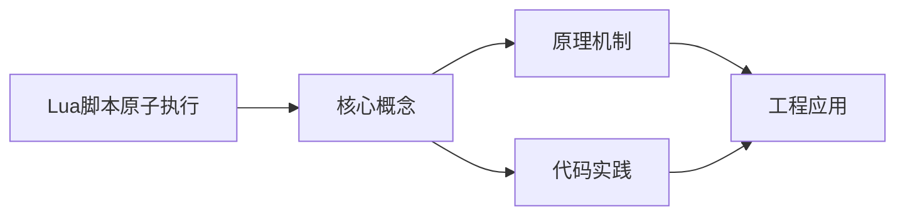
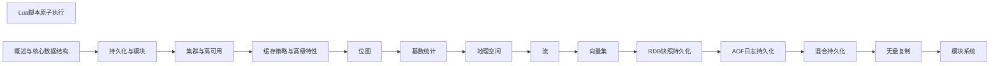

## 1. 学习目标（Bloom 分类）

本节按照布鲁姆教育目标分类学组织学习路径。本文主题为《Lua脚本原子执行》，属于 Redis 模块，读者可以根据自身阶段选择阅读深度。

记忆层面：能够准确复述本文的核心概念、术语与基本语法或操作步骤，并能够在提问或检索时快速定位对应知识点。能够说出 Redis 的核心概念、语法与常用对象。

理解层面：能够用自己的语言解释核心原理与工作机制，说明概念之间的因果关系，而不是机械记忆结论。能够解释 Redis 的执行原理与优化机制。

应用层面：能够在真实项目或练习场景中运用本文知识解决具体问题，写出正确且可维护的实现。能够编写正确、高效的 Redis 语句与操作。

分析层面：能够拆解复杂问题，比较本文主题与相邻概念的异同，识别边界条件与例外情况。能够分析 Redis 相关方案在性能与一致性上的权衡。

评价层面：能够根据约束条件（性能、可读性、安全、成本）评价不同方案的优劣，做出有依据的技术决策。能够根据业务场景评价 Redis 技术选型。

创造层面：能够把本文知识与其他模块知识组合，设计出新的解决方案或可复用的工程模式。能够组合 Redis 与其他技术设计数据架构。

通过本节学习，读者应当能够把《Lua脚本原子执行》纳入自己的知识网络，并与 Redis 模块的其他主题（数据结构、持久化、集群、缓存策略）建立关联。

## 2. 历史动机与发展脉络

《Lua脚本原子执行》是 Redis 领域的重要主题。要真正理解它，需要先了解它解决的问题与演进过程。

Redis 由 Salvatore Sanfilippo 于 2009 年发布，是内存数据结构存储，常作缓存、消息中间件与轻量数据库；BSD 许可，单线程事件循环（6.0 起多线程 IO）。
数据模型：String、Hash、List、Set、Sorted Set、Stream、BitMap、HyperLogLog、Geo；每种结构有专门命令与复杂度。
Redis 7.x：ACL、函数（Lua/Redis Functions）、集群路由（Cluster Sharding）、自动故障转移；Redis Stack 集成 JSON/搜索/时序。

回到本文主题：Lua脚本原子执行 的提出与成熟，正是上述技术背景下的必然产物。早期实现往往以简单可用为目标，随着工程规模扩大，社区逐渐沉淀出标准做法与最佳实践；理解这一脉络，可以帮助读者判断“为什么文档中的推荐写法是现在这个样子”，也能在遇到历史遗留代码时准确识别其设计年代与取舍。


## 3. 形式化定义与核心概念精讲

本节把《Lua脚本原子执行》涉及的核心概念以“定义 + 讲解”的形式展开。读者应把定义当作工具，把讲解当作理解路径；两者结合才能形成可迁移的知识。

单线程模型：命令串行执行保证原子性，无锁；性能瓶颈在内存与网络；长命令（KEYS）阻塞。
持久化：RDB 快照（fork 子进程）与 AOF 追加日志；混合持久化组合两者；持久化权衡数据安全与性能。
过期与淘汰：惰性删除 + 定期抽样；maxmemory-policy（allkeys-lru/lru/lfu/noeviction）控制内存。

### 3.1 原文章节逐一精讲

原文档把主题拆分为 10 个小节，下面按顺序给出每一节的导读讲解，随后保留原文细节供精读。

#### 原文精读（完整保留）

# Lua 脚本原子执行

> **符号约定**：`< >` 必填参数 | `[ ]` 可选参数

---

#### 1. Lua 脚本基础

##### 1.1 为什么需要 Lua 脚本

Redis 执行 Lua 脚本时，整个脚本是**原子性**的——脚本执行期间不会插入其他客户端命令：

```
普通方式:
  GET key → 应用层计算 → SET key  ← 中间可能被其他客户端修改

Lua 脚本:
  EVAL "local v = redis.call('GET', KEYS[1]); ..." 1 key
  ← 整个过程原子执行，不会被中断
```

##### 1.2 EVAL 命令

```redis
EVAL script numkeys key [key ...] arg [arg ...]

-- script: Lua 脚本
-- numkeys: 键的数量
-- key: 键名列表（通过 KEYS[1], KEYS[2]... 访问）
-- arg: 参数列表（通过 ARGV[1], ARGV[2]... 访问）
```

##### 1.3 基本示例

```redis
-- 简单的 GET + SET
EVAL "redis.call('SET', KEYS[1], ARGV[1]); return 'OK'" 1 mykey myvalue

-- 限流器
EVAL "
  local count = redis.call('INCR', KEYS[1])
  if count == 1 then
    redis.call('EXPIRE', KEYS[1], ARGV[1])
  end
  if count > tonumber(ARGV[2]) then
    return 0
  end
  return 1
" 1 rate_limit:user1 60 100
```

#### 2. redis.call 与 redis.pcall

##### 2.1 区别

| 函数          | 错误处理 | 行为                   |
| ------------- | -------- | ---------------------- |
| `redis.call`  | 抛出错误 | 脚本终止，返回错误     |
| `redis.pcall` | 捕获错误 | 返回错误对象，脚本继续 |

```lua
-- redis.call: 错误时脚本终止
local val = redis.call('INCR', 'non_numeric_key')  -- 如果key不是整数，报错终止

-- redis.pcall: 错误时返回错误表
local result = redis.pcall('INCR', 'non_numeric_key')
if type(result) == 'table' and result.err then
    -- 处理错误
    redis.call('SET', 'error_log', result.err)
end
```

##### 2.2 返回值类型映射

| Redis 返回 | Lua 类型 | 示例              |
| ---------- | -------- | ----------------- |
| 状态回复   | table    | `{ok="OK"}`       |
| 错误回复   | table    | `{err="ERR ..."}` |
| 整数       | number   | `42`              |
| 字符串     | string   | `"hello"`         |
| 多行字符串 | table    | `{"a","b"}`       |
| 空回复     | false    | `false`           |

#### 3. EVALSHA 与脚本缓存

##### 3.1 脚本缓存机制

```
1. 首次 EVAL: 脚本被计算 SHA1 并缓存
2. 后续 EVALSHA: 只发送 SHA1，减少网络传输

SHA1 = SHA1(script)
```

##### 3.2 EVALSHA 使用

```redis
-- 加载脚本到缓存
SCRIPT LOAD "return redis.call('GET', KEYS[1])"
-- 返回: "a1b2c3d4..." (SHA1)

-- 使用 SHA1 执行
EVALSHA a1b2c3d4... 1 mykey
```

##### 3.3 脚本缓存管理

```redis
-- 检查脚本是否在缓存中
SCRIPT EXISTS a1b2c3d4... e5f6g7h8...
-- 返回: 1 0 (第一个存在，第二个不存在)

-- 清空所有脚本缓存
SCRIPT FLUSH

-- 清空并同步（Redis 7.0+）
SCRIPT FLUSH SYNC
SCRIPT FLUSH ASYNC
```

##### 3.4 客户端最佳实践

```python
# Python: 自动 EVAL → EVALSHA 降级
r = redis.Redis()

# redis-py 内部自动处理:
# 1. 计算 script 的 SHA1
# 2. 尝试 EVALSHA
# 3. 如果 NOSCRIPT 错误 → 降级为 EVAL
script = r.register_script("""
    local stock = tonumber(redis.call('GET', KEYS[1]))
    if stock and stock > 0 then
        redis.call('DECR', KEYS[1])
        return 1
    end
    return 0
""")
result = script(keys=['stock:item1'])
```

#### 4. Lua 沙箱限制

##### 4.1 安全限制

```lua
-- 禁止的操作:
os.execute('rm -rf /')   -- 禁止系统调用
io.open('/etc/passwd')    -- 禁止文件操作
require('socket')         -- 禁止加载模块

-- 允许的函数:
redis.call()              -- 调用 Redis 命令
redis.pcall()             -- 调用 Redis 命令（安全模式）
redis.log()               -- 写日志
redis.sha1hex()           -- SHA1 计算
redis.status_reply()      -- 构造状态回复
redis.error_reply()       -- 构造错误回复
cjson.encode()            -- JSON 编码
cjson.decode()            -- JSON 解码
cmsgpack.pack()           -- MessagePack 编码
cmsgpack.unpack()         -- MessagePack 解码
```

##### 4.2 时间限制

```redis
-- Lua 脚本最大执行时间（毫秒），0=无限制
lua-time-limit 5000

-- 超时后:
-- 1. 其他客户端收到 BUSY 错误
-- 2. 可执行 SCRIPT KILL 终止脚本
-- 3. 如果脚本正在写入，只能 shutdown nosave
```

##### 4.3 确定性限制（Redis 7.0+）

Redis 7.0 引入**效果复制**（effect replication），脚本默认必须确定性：

```lua
-- 非确定性脚本（每次执行结果不同）
math.random()              -- 禁止
redis.call('TIME')         -- 禁止
redis.call('SRANDMEMBER')  -- 禁止

-- 如果需要非确定性，使用 redis.set_repl()
redis.set_repl(redis.REPL_ALL)  -- 默认，复制所有写命令
redis.set_repl(redis.REPL_NONE) -- 不复制
```

#### 5. 实战模式

##### 5.1 分布式锁释放

```lua
-- 原子性检查并释放锁
if redis.call('GET', KEYS[1]) == ARGV[1] then
    return redis.call('DEL', KEYS[1])
end
return 0
```

##### 5.2 限流器（滑动窗口）

```lua
local key = KEYS[1]
local limit = tonumber(ARGV[1])
local window = tonumber(ARGV[2])
local now = tonumber(ARGV[3])

redis.call('ZREMRANGEBYSCORE', key, 0, now - window)
local count = redis.call('ZCARD', key)
if count < limit then
    redis.call('ZADD', key, now, now .. '-' .. math.random(1000000))
    redis.call('PEXPIRE', key, window)
    return 1
end
return 0
```

##### 5.3 库存扣减

```lua
local stock_key = KEYS[1]
local user_key = KEYS[2]
local user_id = ARGV[1]
local quantity = tonumber(ARGV[2])

-- 检查是否已购买
if redis.call('SISMEMBER', user_key, user_id) == 1 then
    return -1  -- 已购买
end

-- 检查库存
local stock = tonumber(redis.call('GET', stock_key))
if not stock or stock < quantity then
    return 0  -- 库存不足
end

-- 扣减库存 + 记录用户
redis.call('DECRBY', stock_key, quantity)
redis.call('SADD', user_key, user_id)
return 1  -- 成功
```
#### EVAL 命令

**基本写法：执行 Lua 脚本**
`EVAL <script> <numkeys> <key> [key ...] <arg> [arg ...]`
```bash
# 执行简单的 GET + SET 脚本
EVAL "redis.call('SET', KEYS[1], ARGV[1]); return 'OK'" 1 mykey myvalue
```

**基本写法：原子性限流器**
`EVAL <script> 1 <key> <expire> <limit>`
```bash
# 使用 Lua 脚本实现原子性限流器
EVAL "local count = redis.call('INCR', KEYS[1]) if count == 1 then redis.call('EXPIRE', KEYS[1], ARGV[1]) end if count > tonumber(ARGV[2]) then return 0 end return 1" 1 rate_limit:user1 60 100
```

---

#### redis.call 与 redis.pcall

**基本写法：redis.call 错误时脚本终止**
`redis.call(<command>, <args>)`
```lua
-- redis.call 遇到错误时脚本终止
local val = redis.call('INCR', 'non_numeric_key')
```

**基本写法：redis.pcall 错误时返回错误表**
`redis.pcall(<command>, <args>)`
```lua
-- redis.pcall 遇到错误时返回错误表，脚本继续执行
local result = redis.pcall('INCR', 'non_numeric_key')
if type(result) == 'table' and result.err then
    redis.call('SET', 'error_log', result.err)
end
```

---

#### EVALSHA 与脚本缓存

**基本写法：加载脚本到缓存**
`SCRIPT LOAD <script>`
```bash
# 加载脚本到缓存，返回 SHA1 校验和
SCRIPT LOAD "return redis.call('GET', KEYS[1])"
```

**基本写法：使用 SHA1 执行缓存脚本**
`EVALSHA <sha1> <numkeys> <key> [key ...] <arg> [arg ...]`
```bash
# 使用 SHA1 执行已缓存的脚本
EVALSHA a1b2c3d4e5f6 1 mykey
```

**单脚本写法：检查单个脚本是否在缓存中**
`SCRIPT EXISTS <sha1>`
```bash
# 检查单个脚本是否在缓存中
SCRIPT EXISTS a1b2c3d4e5f6
```

**多脚本写法：检查多个脚本是否在缓存中**
`SCRIPT EXISTS <sha1> [sha1 ...]`
```bash
# 检查多个脚本是否在缓存中
SCRIPT EXISTS a1b2c3d4e5f6 f7g8h9i0j1k2
```

**基本写法：清空脚本缓存**
`SCRIPT FLUSH`
```bash
# 清空所有脚本缓存
SCRIPT FLUSH
```

**基本写法：同步清空脚本缓存**
`SCRIPT FLUSH SYNC`
```bash
# 同步方式清空脚本缓存（Redis 7.0+）
SCRIPT FLUSH SYNC
```

**基本写法：异步清空脚本缓存**
`SCRIPT FLUSH ASYNC`
```bash
# 异步方式清空脚本缓存（Redis 7.0+）
SCRIPT FLUSH ASYNC
```

**基本写法：Python EVALSHA 自动降级**
`r.register_script(<script>)`
```python
# Python redis-py 自动处理 EVAL 到 EVALSHA 的降级
import redis
r = redis.Redis()

script = r.register_script("""
    local stock = tonumber(redis.call('GET', KEYS[1]))
    if stock and stock > 0 then
        redis.call('DECR', KEYS[1])
        return 1
    end
    return 0
""")
result = script(keys=['stock:item1'])
```

---

#### Lua 沙箱限制

**基本写法：调用 Redis 命令**
`redis.call(<command>, <args>)`
```lua
-- 在 Lua 脚本中调用 Redis 命令
redis.call('SET', 'key', 'value')
```

**基本写法：安全模式调用 Redis 命令**
`redis.pcall(<command>, <args>)`
```lua
-- 安全模式调用 Redis 命令，错误时不终止脚本
redis.pcall('GET', 'key')
```

**基本写法：写日志**
`redis.log(<level>, <message>)`
```lua
-- 在 Lua 脚本中写日志
redis.log(redis.LOG_WARNING, 'something went wrong')
```

**基本写法：SHA1 计算**
`redis.sha1hex(<string>)`
```lua
-- 计算字符串的 SHA1 哈希值
local hash = redis.sha1hex('hello')
```

**基本写法：构造状态回复**
`redis.status_reply(<message>)`
```lua
-- 构造状态回复
return redis.status_reply('OK')
```

**基本写法：构造错误回复**
`redis.error_reply(<message>)`
```lua
-- 构造错误回复
return redis.error_reply('something went wrong')
```

**基本写法：JSON 编码**
`cjson.encode(<value>)`
```lua
-- 将 Lua 表编码为 JSON 字符串
local json_str = cjson.encode({name='redis', version=7})
```

**基本写法：JSON 解码**
`cjson.decode(<json_string>)`
```lua
-- 将 JSON 字符串解码为 Lua 表
local data = cjson.decode('{"name":"redis","version":7}')
```

**基本写法：MessagePack 编码**
`cmsgpack.pack(<value>)`
```lua
-- 将 Lua 表编码为 MessagePack 二进制
local packed = cmsgpack.pack({1, 2, 3})
```

**基本写法：MessagePack 解码**
`cmsgpack.unpack(<packed_string>)`
```lua
-- 将 MessagePack 二进制解码为 Lua 表
local data = cmsgpack.unpack(packed_string)
```

**禁止写法：系统调用**
`os.execute(<command>)`
```lua
-- 沙箱禁止系统调用
os.execute('rm -rf /')
```

**禁止写法：文件操作**
`io.open(<path>)`
```lua
-- 沙箱禁止文件操作
io.open('/etc/passwd')
```

**禁止写法：加载模块**
`require(<module>)`
```lua
-- 沙箱禁止加载外部模块
require('socket')
```

**基本写法：设置脚本最大执行时间**
`lua-time-limit <ms>`
```bash
# 配置 Lua 脚本最大执行时间为5000毫秒
lua-time-limit 5000
```

**基本写法：复制所有写命令（默认）**
`redis.set_repl(redis.REPL_ALL)`
```lua
-- 默认行为，复制所有写命令到从节点
redis.set_repl(redis.REPL_ALL)
```

**基本写法：不复制写命令**
`redis.set_repl(redis.REPL_NONE)`
```lua
-- 不复制写命令到从节点
redis.set_repl(redis.REPL_NONE)
```

---

#### 实战模式

**基本写法：分布式锁释放**
`EVAL <script> 1 <lock_key> <lock_value>`
```bash
# 原子性检查并释放分布式锁
EVAL "if redis.call('GET', KEYS[1]) == ARGV[1] then return redis.call('DEL', KEYS[1]) end return 0" 1 lock:resource1 my_token
```

**基本写法：滑动窗口限流器**
`EVAL <script> 1 <key> <limit> <window> <now>`
```bash
# 基于 ZSET 实现滑动窗口限流
EVAL "local key = KEYS[1] local limit = tonumber(ARGV[1]) local window = tonumber(ARGV[2]) local now = tonumber(ARGV[3]) redis.call('ZREMRANGEBYSCORE', key, 0, now - window) local count = redis.call('ZCARD', key) if count < limit then redis.call('ZADD', key, now, now .. '-' .. math.random(1000000)) redis.call('PEXPIRE', key, window) return 1 end return 0" 1 rate_limit:user1 100 60000 1718334600000
```

**基本写法：库存扣减**
`EVAL <script> 2 <stock_key> <user_key> <user_id> <quantity>`
```bash
# 原子性检查库存并扣减
EVAL "local stock_key = KEYS[1] local user_key = KEYS[2] local user_id = ARGV[1] local quantity = tonumber(ARGV[2]) if redis.call('SISMEMBER', user_key, user_id) == 1 then return -1 end local stock = tonumber(redis.call('GET', stock_key)) if not stock or stock < quantity then return 0 end redis.call('DECRBY', stock_key, quantity) redis.call('SADD', user_key, user_id) return 1" 2 stock:item1 users:item1 user42 1
```


### 3.2 概念关系图

下面用 Mermaid 图表达本文核心概念之间的关系，帮助读者建立整体图景：



图中展示的是本文知识的结构化关系：核心概念是入口，原理机制解释“为什么”，代码实践演示“怎么做”，工程应用回答“何时用”。读者学习时可以把每个小节的内容挂接到对应节点上。

## 4. 理论推导与原理解析

本节深入《Lua脚本原子执行》背后的原理。理论部分不求面面俱到，而是聚焦“能解释现象、能指导实践”的关键推导。

单线程模型：命令串行执行保证原子性，无锁；性能瓶颈在内存与网络；长命令（KEYS）阻塞。
持久化：RDB 快照（fork 子进程）与 AOF 追加日志；混合持久化组合两者；持久化权衡数据安全与性能。
过期与淘汰：惰性删除 + 定期抽样；maxmemory-policy（allkeys-lru/lru/lfu/noeviction）控制内存。
高可用：主从复制（PSYNC）、哨兵（Sentinel）自动故障转移、Cluster 分片（16384 槽）与集群模式。

需要强调的是，理论推导与工程实践之间存在翻译层：理论给出的是理想化模型与边界条件，工程代码则必须处理真实环境中的例外。读者在学习时应先掌握理论的“标准情形”，再通过陷阱章节了解“非标准情形”。

## 5. 代码示例与逐行讲解

本节把原文中的代码示例系统整理，并为每个示例补充用途说明与讲解。读者不应只浏览代码，而应逐段对照讲解理解设计意图。

### 5.1 示例：1.1 为什么需要 Lua 脚本

该示例来自原文《1.1 为什么需要 Lua 脚本》小节，用于演示Lua脚本原子执行相关操作。阅读时请先看代码结构，再看其后的讲解。

```text
普通方式:
  GET key → 应用层计算 → SET key  ← 中间可能被其他客户端修改

Lua 脚本:
  EVAL "local v = redis.call('GET', KEYS[1]); ..." 1 key
  ← 整个过程原子执行，不会被中断
```

讲解：这段代码演示了本节核心知识点。代码中的关键操作可以归纳为三步：准备（定义或初始化）、执行（核心逻辑）、收尾（释放资源或返回结果）。实际项目中，这三步往往被封装为函数或类，以提升复用性与可测试性。

关键点分析：

该示例共 5 行有效代码，结构以数据或配置为主。阅读时应关注：数据字段的含义、配置项的作用，以及它们与运行行为的对应关系。

进阶思考路径：先尝试修改参数观察行为变化，再把示例中的模式迁移到自己的项目中；每次修改都记录预期与实测差异，这是把示例转化为能力的最快方式。

### 5.2 示例：1.2 EVAL 命令

该示例来自原文《1.2 EVAL 命令》小节，用于演示Lua脚本原子执行相关操作。阅读时请先看代码结构，再看其后的讲解。

```redis
EVAL script numkeys key [key ...] arg [arg ...]

-- script: Lua 脚本
-- numkeys: 键的数量
-- key: 键名列表（通过 KEYS[1], KEYS[2]... 访问）
-- arg: 参数列表（通过 ARGV[1], ARGV[2]... 访问）
```

讲解：这段代码演示了本节核心知识点。代码中的关键操作可以归纳为三步：准备（定义或初始化）、执行（核心逻辑）、收尾（释放资源或返回结果）。实际项目中，这三步往往被封装为函数或类，以提升复用性与可测试性。

关键点分析：

该示例共 5 行有效代码，结构以数据或配置为主。阅读时应关注：数据字段的含义、配置项的作用，以及它们与运行行为的对应关系。

进阶思考路径：先尝试修改参数观察行为变化，再把示例中的模式迁移到自己的项目中；每次修改都记录预期与实测差异，这是把示例转化为能力的最快方式。

### 5.3 示例：1.3 基本示例

该示例来自原文《1.3 基本示例》小节，用于演示Lua脚本原子执行相关操作。阅读时请先看代码结构，再看其后的讲解。

```redis
-- 简单的 GET + SET
EVAL "redis.call('SET', KEYS[1], ARGV[1]); return 'OK'" 1 mykey myvalue

-- 限流器
EVAL "
  local count = redis.call('INCR', KEYS[1])
  if count == 1 then
    redis.call('EXPIRE', KEYS[1], ARGV[1])
  end
  if count > tonumber(ARGV[2]) then
    return 0
  end
  return 1
" 1 rate_limit:user1 60 100
```

讲解：这段代码演示了本节核心知识点。代码中的关键操作可以归纳为三步：准备（定义或初始化）、执行（核心逻辑）、收尾（释放资源或返回结果）。实际项目中，这三步往往被封装为函数或类，以提升复用性与可测试性。

关键点分析：

该示例共 13 行有效代码，包含 2 类关键结构（if、return）。其中：

- 入口与初始化部分负责建立上下文，对应实际项目中的启动或装配逻辑；
- 核心逻辑部分体现本文主题的主要操作，是阅读时最需要对照讲解理解的部分；
- 输出或返回部分把结果交给调用方，注意其类型与边界条件。

进阶思考路径：先尝试修改参数观察行为变化，再把示例中的模式迁移到自己的项目中；每次修改都记录预期与实测差异，这是把示例转化为能力的最快方式。

### 5.4 示例：2.1 区别

该示例来自原文《2.1 区别》小节，用于演示Lua脚本原子执行相关操作。阅读时请先看代码结构，再看其后的讲解。

```lua
-- redis.call: 错误时脚本终止
local val = redis.call('INCR', 'non_numeric_key')  -- 如果key不是整数，报错终止

-- redis.pcall: 错误时返回错误表
local result = redis.pcall('INCR', 'non_numeric_key')
if type(result) == 'table' and result.err then
    -- 处理错误
    redis.call('SET', 'error_log', result.err)
end
```

讲解：这段代码演示了本节核心知识点。代码中的关键操作可以归纳为三步：准备（定义或初始化）、执行（核心逻辑）、收尾（释放资源或返回结果）。实际项目中，这三步往往被封装为函数或类，以提升复用性与可测试性。

关键点分析：

该示例共 8 行有效代码，包含 1 类关键结构（if）。其中：

- 入口与初始化部分负责建立上下文，对应实际项目中的启动或装配逻辑；
- 核心逻辑部分体现本文主题的主要操作，是阅读时最需要对照讲解理解的部分；
- 输出或返回部分把结果交给调用方，注意其类型与边界条件。

进阶思考路径：先尝试修改参数观察行为变化，再把示例中的模式迁移到自己的项目中；每次修改都记录预期与实测差异，这是把示例转化为能力的最快方式。

### 5.5 示例：3.1 脚本缓存机制

该示例来自原文《3.1 脚本缓存机制》小节，用于演示Lua脚本原子执行相关操作。阅读时请先看代码结构，再看其后的讲解。

```text
1. 首次 EVAL: 脚本被计算 SHA1 并缓存
2. 后续 EVALSHA: 只发送 SHA1，减少网络传输

SHA1 = SHA1(script)
```

讲解：这段代码演示了本节核心知识点。代码中的关键操作可以归纳为三步：准备（定义或初始化）、执行（核心逻辑）、收尾（释放资源或返回结果）。实际项目中，这三步往往被封装为函数或类，以提升复用性与可测试性。

关键点分析：

该示例共 3 行有效代码，结构以数据或配置为主。阅读时应关注：数据字段的含义、配置项的作用，以及它们与运行行为的对应关系。

进阶思考路径：先尝试修改参数观察行为变化，再把示例中的模式迁移到自己的项目中；每次修改都记录预期与实测差异，这是把示例转化为能力的最快方式。

### 5.6 示例：3.2 EVALSHA 使用

该示例来自原文《3.2 EVALSHA 使用》小节，用于演示Lua脚本原子执行相关操作。阅读时请先看代码结构，再看其后的讲解。

```redis
-- 加载脚本到缓存
SCRIPT LOAD "return redis.call('GET', KEYS[1])"
-- 返回: "a1b2c3d4..." (SHA1)

-- 使用 SHA1 执行
EVALSHA a1b2c3d4... 1 mykey
```

讲解：这段代码演示了本节核心知识点。代码中的关键操作可以归纳为三步：准备（定义或初始化）、执行（核心逻辑）、收尾（释放资源或返回结果）。实际项目中，这三步往往被封装为函数或类，以提升复用性与可测试性。

关键点分析：

该示例共 5 行有效代码，包含 1 类关键结构（return）。其中：

- 入口与初始化部分负责建立上下文，对应实际项目中的启动或装配逻辑；
- 核心逻辑部分体现本文主题的主要操作，是阅读时最需要对照讲解理解的部分；
- 输出或返回部分把结果交给调用方，注意其类型与边界条件。

进阶思考路径：先尝试修改参数观察行为变化，再把示例中的模式迁移到自己的项目中；每次修改都记录预期与实测差异，这是把示例转化为能力的最快方式。

### 5.7 示例：3.3 脚本缓存管理

该示例来自原文《3.3 脚本缓存管理》小节，用于演示Lua脚本原子执行相关操作。阅读时请先看代码结构，再看其后的讲解。

```redis
-- 检查脚本是否在缓存中
SCRIPT EXISTS a1b2c3d4... e5f6g7h8...
-- 返回: 1 0 (第一个存在，第二个不存在)

-- 清空所有脚本缓存
SCRIPT FLUSH

-- 清空并同步（Redis 7.0+）
SCRIPT FLUSH SYNC
SCRIPT FLUSH ASYNC
```

讲解：这段代码演示了本节核心知识点。代码中的关键操作可以归纳为三步：准备（定义或初始化）、执行（核心逻辑）、收尾（释放资源或返回结果）。实际项目中，这三步往往被封装为函数或类，以提升复用性与可测试性。

关键点分析：

该示例共 8 行有效代码，结构以数据或配置为主。阅读时应关注：数据字段的含义、配置项的作用，以及它们与运行行为的对应关系。

进阶思考路径：先尝试修改参数观察行为变化，再把示例中的模式迁移到自己的项目中；每次修改都记录预期与实测差异，这是把示例转化为能力的最快方式。

### 5.8 示例：3.4 客户端最佳实践

该示例来自原文《3.4 客户端最佳实践》小节，用于演示Lua脚本原子执行相关操作。阅读时请先看代码结构，再看其后的讲解。

```python
# Python: 自动 EVAL → EVALSHA 降级
r = redis.Redis()

# redis-py 内部自动处理:
# 1. 计算 script 的 SHA1
# 2. 尝试 EVALSHA
# 3. 如果 NOSCRIPT 错误 → 降级为 EVAL
script = r.register_script("""
    local stock = tonumber(redis.call('GET', KEYS[1]))
    if stock and stock > 0 then
        redis.call('DECR', KEYS[1])
        return 1
    end
    return 0
""")
result = script(keys=['stock:item1'])
```

讲解：这段代码演示了本节核心知识点。代码中的关键操作可以归纳为三步：准备（定义或初始化）、执行（核心逻辑）、收尾（释放资源或返回结果）。实际项目中，这三步往往被封装为函数或类，以提升复用性与可测试性。

关键点分析：

该示例共 15 行有效代码，包含 2 类关键结构（if、return）。其中：

- 入口与初始化部分负责建立上下文，对应实际项目中的启动或装配逻辑；
- 核心逻辑部分体现本文主题的主要操作，是阅读时最需要对照讲解理解的部分；
- 输出或返回部分把结果交给调用方，注意其类型与边界条件。

进阶思考路径：先尝试修改参数观察行为变化，再把示例中的模式迁移到自己的项目中；每次修改都记录预期与实测差异，这是把示例转化为能力的最快方式。

### 5.9 示例：4.1 安全限制

该示例来自原文《4.1 安全限制》小节，用于演示Lua脚本原子执行相关操作。阅读时请先看代码结构，再看其后的讲解。

```lua
-- 禁止的操作:
os.execute('rm -rf /')   -- 禁止系统调用
io.open('/etc/passwd')    -- 禁止文件操作
require('socket')         -- 禁止加载模块

-- 允许的函数:
redis.call()              -- 调用 Redis 命令
redis.pcall()             -- 调用 Redis 命令（安全模式）
redis.log()               -- 写日志
redis.sha1hex()           -- SHA1 计算
redis.status_reply()      -- 构造状态回复
redis.error_reply()       -- 构造错误回复
cjson.encode()            -- JSON 编码
cjson.decode()            -- JSON 解码
cmsgpack.pack()           -- MessagePack 编码
cmsgpack.unpack()         -- MessagePack 解码
```

讲解：这段代码演示了本节核心知识点。代码中的关键操作可以归纳为三步：准备（定义或初始化）、执行（核心逻辑）、收尾（释放资源或返回结果）。实际项目中，这三步往往被封装为函数或类，以提升复用性与可测试性。

关键点分析：

该示例共 15 行有效代码，结构以数据或配置为主。阅读时应关注：数据字段的含义、配置项的作用，以及它们与运行行为的对应关系。

进阶思考路径：先尝试修改参数观察行为变化，再把示例中的模式迁移到自己的项目中；每次修改都记录预期与实测差异，这是把示例转化为能力的最快方式。

### 5.10 示例：4.2 时间限制

该示例来自原文《4.2 时间限制》小节，用于演示Lua脚本原子执行相关操作。阅读时请先看代码结构，再看其后的讲解。

```redis
-- Lua 脚本最大执行时间（毫秒），0=无限制
lua-time-limit 5000

-- 超时后:
-- 1. 其他客户端收到 BUSY 错误
-- 2. 可执行 SCRIPT KILL 终止脚本
-- 3. 如果脚本正在写入，只能 shutdown nosave
```

讲解：这段代码演示了本节核心知识点。代码中的关键操作可以归纳为三步：准备（定义或初始化）、执行（核心逻辑）、收尾（释放资源或返回结果）。实际项目中，这三步往往被封装为函数或类，以提升复用性与可测试性。

关键点分析：

该示例共 6 行有效代码，结构以数据或配置为主。阅读时应关注：数据字段的含义、配置项的作用，以及它们与运行行为的对应关系。

进阶思考路径：先尝试修改参数观察行为变化，再把示例中的模式迁移到自己的项目中；每次修改都记录预期与实测差异，这是把示例转化为能力的最快方式。

### 5.11 示例：4.3 确定性限制（Redis 7.0+）

该示例来自原文《4.3 确定性限制（Redis 7.0+）》小节，用于演示Lua脚本原子执行相关操作。阅读时请先看代码结构，再看其后的讲解。

```lua
-- 非确定性脚本（每次执行结果不同）
math.random()              -- 禁止
redis.call('TIME')         -- 禁止
redis.call('SRANDMEMBER')  -- 禁止

-- 如果需要非确定性，使用 redis.set_repl()
redis.set_repl(redis.REPL_ALL)  -- 默认，复制所有写命令
redis.set_repl(redis.REPL_NONE) -- 不复制
```

讲解：这段代码演示了本节核心知识点。代码中的关键操作可以归纳为三步：准备（定义或初始化）、执行（核心逻辑）、收尾（释放资源或返回结果）。实际项目中，这三步往往被封装为函数或类，以提升复用性与可测试性。

关键点分析：

该示例共 7 行有效代码，结构以数据或配置为主。阅读时应关注：数据字段的含义、配置项的作用，以及它们与运行行为的对应关系。

进阶思考路径：先尝试修改参数观察行为变化，再把示例中的模式迁移到自己的项目中；每次修改都记录预期与实测差异，这是把示例转化为能力的最快方式。

### 5.12 示例：5.1 分布式锁释放

该示例来自原文《5.1 分布式锁释放》小节，用于演示Lua脚本原子执行相关操作。阅读时请先看代码结构，再看其后的讲解。

```lua
-- 原子性检查并释放锁
if redis.call('GET', KEYS[1]) == ARGV[1] then
    return redis.call('DEL', KEYS[1])
end
return 0
```

讲解：这段代码演示了本节核心知识点。代码中的关键操作可以归纳为三步：准备（定义或初始化）、执行（核心逻辑）、收尾（释放资源或返回结果）。实际项目中，这三步往往被封装为函数或类，以提升复用性与可测试性。

关键点分析：

该示例共 5 行有效代码，包含 2 类关键结构（if、return）。其中：

- 入口与初始化部分负责建立上下文，对应实际项目中的启动或装配逻辑；
- 核心逻辑部分体现本文主题的主要操作，是阅读时最需要对照讲解理解的部分；
- 输出或返回部分把结果交给调用方，注意其类型与边界条件。

进阶思考路径：先尝试修改参数观察行为变化，再把示例中的模式迁移到自己的项目中；每次修改都记录预期与实测差异，这是把示例转化为能力的最快方式。

### 5.13 示例：5.2 限流器（滑动窗口）

该示例来自原文《5.2 限流器（滑动窗口）》小节，用于演示Lua脚本原子执行相关操作。阅读时请先看代码结构，再看其后的讲解。

```lua
local key = KEYS[1]
local limit = tonumber(ARGV[1])
local window = tonumber(ARGV[2])
local now = tonumber(ARGV[3])

redis.call('ZREMRANGEBYSCORE', key, 0, now - window)
local count = redis.call('ZCARD', key)
if count < limit then
    redis.call('ZADD', key, now, now .. '-' .. math.random(1000000))
    redis.call('PEXPIRE', key, window)
    return 1
end
return 0
```

讲解：这段代码演示了本节核心知识点。代码中的关键操作可以归纳为三步：准备（定义或初始化）、执行（核心逻辑）、收尾（释放资源或返回结果）。实际项目中，这三步往往被封装为函数或类，以提升复用性与可测试性。

关键点分析：

该示例共 12 行有效代码，包含 2 类关键结构（if、return）。其中：

- 入口与初始化部分负责建立上下文，对应实际项目中的启动或装配逻辑；
- 核心逻辑部分体现本文主题的主要操作，是阅读时最需要对照讲解理解的部分；
- 输出或返回部分把结果交给调用方，注意其类型与边界条件。

进阶思考路径：先尝试修改参数观察行为变化，再把示例中的模式迁移到自己的项目中；每次修改都记录预期与实测差异，这是把示例转化为能力的最快方式。

### 5.14 示例：5.3 库存扣减

该示例来自原文《5.3 库存扣减》小节，用于演示Lua脚本原子执行相关操作。阅读时请先看代码结构，再看其后的讲解。

```lua
local stock_key = KEYS[1]
local user_key = KEYS[2]
local user_id = ARGV[1]
local quantity = tonumber(ARGV[2])

-- 检查是否已购买
if redis.call('SISMEMBER', user_key, user_id) == 1 then
    return -1  -- 已购买
end

-- 检查库存
local stock = tonumber(redis.call('GET', stock_key))
if not stock or stock < quantity then
    return 0  -- 库存不足
end

-- 扣减库存 + 记录用户
redis.call('DECRBY', stock_key, quantity)
redis.call('SADD', user_key, user_id)
return 1  -- 成功
```

讲解：这段代码演示了本节核心知识点。代码中的关键操作可以归纳为三步：准备（定义或初始化）、执行（核心逻辑）、收尾（释放资源或返回结果）。实际项目中，这三步往往被封装为函数或类，以提升复用性与可测试性。

关键点分析：

该示例共 17 行有效代码，包含 2 类关键结构（if、return）。其中：

- 入口与初始化部分负责建立上下文，对应实际项目中的启动或装配逻辑；
- 核心逻辑部分体现本文主题的主要操作，是阅读时最需要对照讲解理解的部分；
- 输出或返回部分把结果交给调用方，注意其类型与边界条件。

进阶思考路径：先尝试修改参数观察行为变化，再把示例中的模式迁移到自己的项目中；每次修改都记录预期与实测差异，这是把示例转化为能力的最快方式。

### 5.15 示例：EVAL 命令

该示例来自原文《EVAL 命令》小节，用于演示Lua脚本原子执行相关操作。阅读时请先看代码结构，再看其后的讲解。

```bash
# 执行简单的 GET + SET 脚本
EVAL "redis.call('SET', KEYS[1], ARGV[1]); return 'OK'" 1 mykey myvalue
```

讲解：这段代码演示了本节核心知识点。代码中的关键操作可以归纳为三步：准备（定义或初始化）、执行（核心逻辑）、收尾（释放资源或返回结果）。实际项目中，这三步往往被封装为函数或类，以提升复用性与可测试性。

关键点分析：

该示例共 2 行有效代码，包含 1 类关键结构（return）。其中：

- 入口与初始化部分负责建立上下文，对应实际项目中的启动或装配逻辑；
- 核心逻辑部分体现本文主题的主要操作，是阅读时最需要对照讲解理解的部分；
- 输出或返回部分把结果交给调用方，注意其类型与边界条件。

进阶思考路径：先尝试修改参数观察行为变化，再把示例中的模式迁移到自己的项目中；每次修改都记录预期与实测差异，这是把示例转化为能力的最快方式。

### 5.16 示例：EVAL 命令

该示例来自原文《EVAL 命令》小节，用于演示Lua脚本原子执行相关操作。阅读时请先看代码结构，再看其后的讲解。

```bash
# 使用 Lua 脚本实现原子性限流器
EVAL "local count = redis.call('INCR', KEYS[1]) if count == 1 then redis.call('EXPIRE', KEYS[1], ARGV[1]) end if count > tonumber(ARGV[2]) then return 0 end return 1" 1 rate_limit:user1 60 100
```

讲解：这段代码演示了本节核心知识点。代码中的关键操作可以归纳为三步：准备（定义或初始化）、执行（核心逻辑）、收尾（释放资源或返回结果）。实际项目中，这三步往往被封装为函数或类，以提升复用性与可测试性。

关键点分析：

该示例共 2 行有效代码，包含 2 类关键结构（if、return）。其中：

- 入口与初始化部分负责建立上下文，对应实际项目中的启动或装配逻辑；
- 核心逻辑部分体现本文主题的主要操作，是阅读时最需要对照讲解理解的部分；
- 输出或返回部分把结果交给调用方，注意其类型与边界条件。

进阶思考路径：先尝试修改参数观察行为变化，再把示例中的模式迁移到自己的项目中；每次修改都记录预期与实测差异，这是把示例转化为能力的最快方式。

### 5.17 示例：redis.call 与 redis.pcall

该示例来自原文《redis.call 与 redis.pcall》小节，用于演示Lua脚本原子执行相关操作。阅读时请先看代码结构，再看其后的讲解。

```lua
-- redis.call 遇到错误时脚本终止
local val = redis.call('INCR', 'non_numeric_key')
```

讲解：这段代码演示了本节核心知识点。代码中的关键操作可以归纳为三步：准备（定义或初始化）、执行（核心逻辑）、收尾（释放资源或返回结果）。实际项目中，这三步往往被封装为函数或类，以提升复用性与可测试性。

关键点分析：

该示例共 2 行有效代码，结构以数据或配置为主。阅读时应关注：数据字段的含义、配置项的作用，以及它们与运行行为的对应关系。

进阶思考路径：先尝试修改参数观察行为变化，再把示例中的模式迁移到自己的项目中；每次修改都记录预期与实测差异，这是把示例转化为能力的最快方式。

### 5.18 示例：redis.call 与 redis.pcall

该示例来自原文《redis.call 与 redis.pcall》小节，用于演示Lua脚本原子执行相关操作。阅读时请先看代码结构，再看其后的讲解。

```lua
-- redis.pcall 遇到错误时返回错误表，脚本继续执行
local result = redis.pcall('INCR', 'non_numeric_key')
if type(result) == 'table' and result.err then
    redis.call('SET', 'error_log', result.err)
end
```

讲解：这段代码演示了本节核心知识点。代码中的关键操作可以归纳为三步：准备（定义或初始化）、执行（核心逻辑）、收尾（释放资源或返回结果）。实际项目中，这三步往往被封装为函数或类，以提升复用性与可测试性。

关键点分析：

该示例共 5 行有效代码，包含 1 类关键结构（if）。其中：

- 入口与初始化部分负责建立上下文，对应实际项目中的启动或装配逻辑；
- 核心逻辑部分体现本文主题的主要操作，是阅读时最需要对照讲解理解的部分；
- 输出或返回部分把结果交给调用方，注意其类型与边界条件。

进阶思考路径：先尝试修改参数观察行为变化，再把示例中的模式迁移到自己的项目中；每次修改都记录预期与实测差异，这是把示例转化为能力的最快方式。

### 5.19 示例：EVALSHA 与脚本缓存

该示例来自原文《EVALSHA 与脚本缓存》小节，用于演示Lua脚本原子执行相关操作。阅读时请先看代码结构，再看其后的讲解。

```bash
# 加载脚本到缓存，返回 SHA1 校验和
SCRIPT LOAD "return redis.call('GET', KEYS[1])"
```

讲解：这段代码演示了本节核心知识点。代码中的关键操作可以归纳为三步：准备（定义或初始化）、执行（核心逻辑）、收尾（释放资源或返回结果）。实际项目中，这三步往往被封装为函数或类，以提升复用性与可测试性。

关键点分析：

该示例共 2 行有效代码，包含 1 类关键结构（return）。其中：

- 入口与初始化部分负责建立上下文，对应实际项目中的启动或装配逻辑；
- 核心逻辑部分体现本文主题的主要操作，是阅读时最需要对照讲解理解的部分；
- 输出或返回部分把结果交给调用方，注意其类型与边界条件。

进阶思考路径：先尝试修改参数观察行为变化，再把示例中的模式迁移到自己的项目中；每次修改都记录预期与实测差异，这是把示例转化为能力的最快方式。

### 5.20 示例：EVALSHA 与脚本缓存

该示例来自原文《EVALSHA 与脚本缓存》小节，用于演示Lua脚本原子执行相关操作。阅读时请先看代码结构，再看其后的讲解。

```bash
# 使用 SHA1 执行已缓存的脚本
EVALSHA a1b2c3d4e5f6 1 mykey
```

讲解：这段代码演示了本节核心知识点。代码中的关键操作可以归纳为三步：准备（定义或初始化）、执行（核心逻辑）、收尾（释放资源或返回结果）。实际项目中，这三步往往被封装为函数或类，以提升复用性与可测试性。

关键点分析：

该示例共 2 行有效代码，结构以数据或配置为主。阅读时应关注：数据字段的含义、配置项的作用，以及它们与运行行为的对应关系。

进阶思考路径：先尝试修改参数观察行为变化，再把示例中的模式迁移到自己的项目中；每次修改都记录预期与实测差异，这是把示例转化为能力的最快方式。

### 5.21 示例：EVALSHA 与脚本缓存

该示例来自原文《EVALSHA 与脚本缓存》小节，用于演示Lua脚本原子执行相关操作。阅读时请先看代码结构，再看其后的讲解。

```bash
# 检查单个脚本是否在缓存中
SCRIPT EXISTS a1b2c3d4e5f6
```

讲解：这段代码演示了本节核心知识点。代码中的关键操作可以归纳为三步：准备（定义或初始化）、执行（核心逻辑）、收尾（释放资源或返回结果）。实际项目中，这三步往往被封装为函数或类，以提升复用性与可测试性。

关键点分析：

该示例共 2 行有效代码，结构以数据或配置为主。阅读时应关注：数据字段的含义、配置项的作用，以及它们与运行行为的对应关系。

进阶思考路径：先尝试修改参数观察行为变化，再把示例中的模式迁移到自己的项目中；每次修改都记录预期与实测差异，这是把示例转化为能力的最快方式。

### 5.22 示例：EVALSHA 与脚本缓存

该示例来自原文《EVALSHA 与脚本缓存》小节，用于演示Lua脚本原子执行相关操作。阅读时请先看代码结构，再看其后的讲解。

```bash
# 检查多个脚本是否在缓存中
SCRIPT EXISTS a1b2c3d4e5f6 f7g8h9i0j1k2
```

讲解：这段代码演示了本节核心知识点。代码中的关键操作可以归纳为三步：准备（定义或初始化）、执行（核心逻辑）、收尾（释放资源或返回结果）。实际项目中，这三步往往被封装为函数或类，以提升复用性与可测试性。

关键点分析：

该示例共 2 行有效代码，结构以数据或配置为主。阅读时应关注：数据字段的含义、配置项的作用，以及它们与运行行为的对应关系。

进阶思考路径：先尝试修改参数观察行为变化，再把示例中的模式迁移到自己的项目中；每次修改都记录预期与实测差异，这是把示例转化为能力的最快方式。

### 5.23 示例：EVALSHA 与脚本缓存

该示例来自原文《EVALSHA 与脚本缓存》小节，用于演示Lua脚本原子执行相关操作。阅读时请先看代码结构，再看其后的讲解。

```bash
# 清空所有脚本缓存
SCRIPT FLUSH
```

讲解：这段代码演示了本节核心知识点。代码中的关键操作可以归纳为三步：准备（定义或初始化）、执行（核心逻辑）、收尾（释放资源或返回结果）。实际项目中，这三步往往被封装为函数或类，以提升复用性与可测试性。

关键点分析：

该示例共 2 行有效代码，结构以数据或配置为主。阅读时应关注：数据字段的含义、配置项的作用，以及它们与运行行为的对应关系。

进阶思考路径：先尝试修改参数观察行为变化，再把示例中的模式迁移到自己的项目中；每次修改都记录预期与实测差异，这是把示例转化为能力的最快方式。

### 5.24 示例：EVALSHA 与脚本缓存

该示例来自原文《EVALSHA 与脚本缓存》小节，用于演示Lua脚本原子执行相关操作。阅读时请先看代码结构，再看其后的讲解。

```bash
# 同步方式清空脚本缓存（Redis 7.0+）
SCRIPT FLUSH SYNC
```

讲解：这段代码演示了本节核心知识点。代码中的关键操作可以归纳为三步：准备（定义或初始化）、执行（核心逻辑）、收尾（释放资源或返回结果）。实际项目中，这三步往往被封装为函数或类，以提升复用性与可测试性。

关键点分析：

该示例共 2 行有效代码，结构以数据或配置为主。阅读时应关注：数据字段的含义、配置项的作用，以及它们与运行行为的对应关系。

进阶思考路径：先尝试修改参数观察行为变化，再把示例中的模式迁移到自己的项目中；每次修改都记录预期与实测差异，这是把示例转化为能力的最快方式。

### 5.25 示例：EVALSHA 与脚本缓存

该示例来自原文《EVALSHA 与脚本缓存》小节，用于演示Lua脚本原子执行相关操作。阅读时请先看代码结构，再看其后的讲解。

```bash
# 异步方式清空脚本缓存（Redis 7.0+）
SCRIPT FLUSH ASYNC
```

讲解：这段代码演示了本节核心知识点。代码中的关键操作可以归纳为三步：准备（定义或初始化）、执行（核心逻辑）、收尾（释放资源或返回结果）。实际项目中，这三步往往被封装为函数或类，以提升复用性与可测试性。

关键点分析：

该示例共 2 行有效代码，结构以数据或配置为主。阅读时应关注：数据字段的含义、配置项的作用，以及它们与运行行为的对应关系。

进阶思考路径：先尝试修改参数观察行为变化，再把示例中的模式迁移到自己的项目中；每次修改都记录预期与实测差异，这是把示例转化为能力的最快方式。

### 5.26 示例：EVALSHA 与脚本缓存

该示例来自原文《EVALSHA 与脚本缓存》小节，用于演示Lua脚本原子执行相关操作。阅读时请先看代码结构，再看其后的讲解。

```python
# Python redis-py 自动处理 EVAL 到 EVALSHA 的降级
import redis
r = redis.Redis()

script = r.register_script("""
    local stock = tonumber(redis.call('GET', KEYS[1]))
    if stock and stock > 0 then
        redis.call('DECR', KEYS[1])
        return 1
    end
    return 0
""")
result = script(keys=['stock:item1'])
```

讲解：这段代码演示了本节核心知识点。代码中的关键操作可以归纳为三步：准备（定义或初始化）、执行（核心逻辑）、收尾（释放资源或返回结果）。实际项目中，这三步往往被封装为函数或类，以提升复用性与可测试性。

关键点分析：

该示例共 12 行有效代码，包含 3 类关键结构（import、if、return）。其中：

- 入口与初始化部分负责建立上下文，对应实际项目中的启动或装配逻辑；
- 核心逻辑部分体现本文主题的主要操作，是阅读时最需要对照讲解理解的部分；
- 输出或返回部分把结果交给调用方，注意其类型与边界条件。

进阶思考路径：先尝试修改参数观察行为变化，再把示例中的模式迁移到自己的项目中；每次修改都记录预期与实测差异，这是把示例转化为能力的最快方式。

### 5.27 示例：Lua 沙箱限制

该示例来自原文《Lua 沙箱限制》小节，用于演示Lua脚本原子执行相关操作。阅读时请先看代码结构，再看其后的讲解。

```lua
-- 在 Lua 脚本中调用 Redis 命令
redis.call('SET', 'key', 'value')
```

讲解：这段代码演示了本节核心知识点。代码中的关键操作可以归纳为三步：准备（定义或初始化）、执行（核心逻辑）、收尾（释放资源或返回结果）。实际项目中，这三步往往被封装为函数或类，以提升复用性与可测试性。

关键点分析：

该示例共 2 行有效代码，结构以数据或配置为主。阅读时应关注：数据字段的含义、配置项的作用，以及它们与运行行为的对应关系。

进阶思考路径：先尝试修改参数观察行为变化，再把示例中的模式迁移到自己的项目中；每次修改都记录预期与实测差异，这是把示例转化为能力的最快方式。

### 5.28 示例：Lua 沙箱限制

该示例来自原文《Lua 沙箱限制》小节，用于演示Lua脚本原子执行相关操作。阅读时请先看代码结构，再看其后的讲解。

```lua
-- 安全模式调用 Redis 命令，错误时不终止脚本
redis.pcall('GET', 'key')
```

讲解：这段代码演示了本节核心知识点。代码中的关键操作可以归纳为三步：准备（定义或初始化）、执行（核心逻辑）、收尾（释放资源或返回结果）。实际项目中，这三步往往被封装为函数或类，以提升复用性与可测试性。

关键点分析：

该示例共 2 行有效代码，结构以数据或配置为主。阅读时应关注：数据字段的含义、配置项的作用，以及它们与运行行为的对应关系。

进阶思考路径：先尝试修改参数观察行为变化，再把示例中的模式迁移到自己的项目中；每次修改都记录预期与实测差异，这是把示例转化为能力的最快方式。

### 5.29 示例：Lua 沙箱限制

该示例来自原文《Lua 沙箱限制》小节，用于演示Lua脚本原子执行相关操作。阅读时请先看代码结构，再看其后的讲解。

```lua
-- 在 Lua 脚本中写日志
redis.log(redis.LOG_WARNING, 'something went wrong')
```

讲解：这段代码演示了本节核心知识点。代码中的关键操作可以归纳为三步：准备（定义或初始化）、执行（核心逻辑）、收尾（释放资源或返回结果）。实际项目中，这三步往往被封装为函数或类，以提升复用性与可测试性。

关键点分析：

该示例共 2 行有效代码，结构以数据或配置为主。阅读时应关注：数据字段的含义、配置项的作用，以及它们与运行行为的对应关系。

进阶思考路径：先尝试修改参数观察行为变化，再把示例中的模式迁移到自己的项目中；每次修改都记录预期与实测差异，这是把示例转化为能力的最快方式。

### 5.30 示例：Lua 沙箱限制

该示例来自原文《Lua 沙箱限制》小节，用于演示Lua脚本原子执行相关操作。阅读时请先看代码结构，再看其后的讲解。

```lua
-- 计算字符串的 SHA1 哈希值
local hash = redis.sha1hex('hello')
```

讲解：这段代码演示了本节核心知识点。代码中的关键操作可以归纳为三步：准备（定义或初始化）、执行（核心逻辑）、收尾（释放资源或返回结果）。实际项目中，这三步往往被封装为函数或类，以提升复用性与可测试性。

关键点分析：

该示例共 2 行有效代码，结构以数据或配置为主。阅读时应关注：数据字段的含义、配置项的作用，以及它们与运行行为的对应关系。

进阶思考路径：先尝试修改参数观察行为变化，再把示例中的模式迁移到自己的项目中；每次修改都记录预期与实测差异，这是把示例转化为能力的最快方式。

### 5.31 示例：Lua 沙箱限制

该示例来自原文《Lua 沙箱限制》小节，用于演示Lua脚本原子执行相关操作。阅读时请先看代码结构，再看其后的讲解。

```lua
-- 构造状态回复
return redis.status_reply('OK')
```

讲解：这段代码演示了本节核心知识点。代码中的关键操作可以归纳为三步：准备（定义或初始化）、执行（核心逻辑）、收尾（释放资源或返回结果）。实际项目中，这三步往往被封装为函数或类，以提升复用性与可测试性。

关键点分析：

该示例共 2 行有效代码，包含 1 类关键结构（return）。其中：

- 入口与初始化部分负责建立上下文，对应实际项目中的启动或装配逻辑；
- 核心逻辑部分体现本文主题的主要操作，是阅读时最需要对照讲解理解的部分；
- 输出或返回部分把结果交给调用方，注意其类型与边界条件。

进阶思考路径：先尝试修改参数观察行为变化，再把示例中的模式迁移到自己的项目中；每次修改都记录预期与实测差异，这是把示例转化为能力的最快方式。

### 5.32 示例：Lua 沙箱限制

该示例来自原文《Lua 沙箱限制》小节，用于演示Lua脚本原子执行相关操作。阅读时请先看代码结构，再看其后的讲解。

```lua
-- 构造错误回复
return redis.error_reply('something went wrong')
```

讲解：这段代码演示了本节核心知识点。代码中的关键操作可以归纳为三步：准备（定义或初始化）、执行（核心逻辑）、收尾（释放资源或返回结果）。实际项目中，这三步往往被封装为函数或类，以提升复用性与可测试性。

关键点分析：

该示例共 2 行有效代码，包含 1 类关键结构（return）。其中：

- 入口与初始化部分负责建立上下文，对应实际项目中的启动或装配逻辑；
- 核心逻辑部分体现本文主题的主要操作，是阅读时最需要对照讲解理解的部分；
- 输出或返回部分把结果交给调用方，注意其类型与边界条件。

进阶思考路径：先尝试修改参数观察行为变化，再把示例中的模式迁移到自己的项目中；每次修改都记录预期与实测差异，这是把示例转化为能力的最快方式。

### 5.33 示例：Lua 沙箱限制

该示例来自原文《Lua 沙箱限制》小节，用于演示Lua脚本原子执行相关操作。阅读时请先看代码结构，再看其后的讲解。

```lua
-- 将 Lua 表编码为 JSON 字符串
local json_str = cjson.encode({name='redis', version=7})
```

讲解：这段代码演示了本节核心知识点。代码中的关键操作可以归纳为三步：准备（定义或初始化）、执行（核心逻辑）、收尾（释放资源或返回结果）。实际项目中，这三步往往被封装为函数或类，以提升复用性与可测试性。

关键点分析：

该示例共 2 行有效代码，结构以数据或配置为主。阅读时应关注：数据字段的含义、配置项的作用，以及它们与运行行为的对应关系。

进阶思考路径：先尝试修改参数观察行为变化，再把示例中的模式迁移到自己的项目中；每次修改都记录预期与实测差异，这是把示例转化为能力的最快方式。

### 5.34 示例：Lua 沙箱限制

该示例来自原文《Lua 沙箱限制》小节，用于演示Lua脚本原子执行相关操作。阅读时请先看代码结构，再看其后的讲解。

```lua
-- 将 JSON 字符串解码为 Lua 表
local data = cjson.decode('{"name":"redis","version":7}')
```

讲解：这段代码演示了本节核心知识点。代码中的关键操作可以归纳为三步：准备（定义或初始化）、执行（核心逻辑）、收尾（释放资源或返回结果）。实际项目中，这三步往往被封装为函数或类，以提升复用性与可测试性。

关键点分析：

该示例共 2 行有效代码，结构以数据或配置为主。阅读时应关注：数据字段的含义、配置项的作用，以及它们与运行行为的对应关系。

进阶思考路径：先尝试修改参数观察行为变化，再把示例中的模式迁移到自己的项目中；每次修改都记录预期与实测差异，这是把示例转化为能力的最快方式。

### 5.35 示例：Lua 沙箱限制

该示例来自原文《Lua 沙箱限制》小节，用于演示Lua脚本原子执行相关操作。阅读时请先看代码结构，再看其后的讲解。

```lua
-- 将 Lua 表编码为 MessagePack 二进制
local packed = cmsgpack.pack({1, 2, 3})
```

讲解：这段代码演示了本节核心知识点。代码中的关键操作可以归纳为三步：准备（定义或初始化）、执行（核心逻辑）、收尾（释放资源或返回结果）。实际项目中，这三步往往被封装为函数或类，以提升复用性与可测试性。

关键点分析：

该示例共 2 行有效代码，结构以数据或配置为主。阅读时应关注：数据字段的含义、配置项的作用，以及它们与运行行为的对应关系。

进阶思考路径：先尝试修改参数观察行为变化，再把示例中的模式迁移到自己的项目中；每次修改都记录预期与实测差异，这是把示例转化为能力的最快方式。

### 5.36 示例：Lua 沙箱限制

该示例来自原文《Lua 沙箱限制》小节，用于演示Lua脚本原子执行相关操作。阅读时请先看代码结构，再看其后的讲解。

```lua
-- 将 MessagePack 二进制解码为 Lua 表
local data = cmsgpack.unpack(packed_string)
```

讲解：这段代码演示了本节核心知识点。代码中的关键操作可以归纳为三步：准备（定义或初始化）、执行（核心逻辑）、收尾（释放资源或返回结果）。实际项目中，这三步往往被封装为函数或类，以提升复用性与可测试性。

关键点分析：

该示例共 2 行有效代码，结构以数据或配置为主。阅读时应关注：数据字段的含义、配置项的作用，以及它们与运行行为的对应关系。

进阶思考路径：先尝试修改参数观察行为变化，再把示例中的模式迁移到自己的项目中；每次修改都记录预期与实测差异，这是把示例转化为能力的最快方式。

### 5.37 示例：Lua 沙箱限制

该示例来自原文《Lua 沙箱限制》小节，用于演示Lua脚本原子执行相关操作。阅读时请先看代码结构，再看其后的讲解。

```lua
-- 沙箱禁止系统调用
os.execute('rm -rf /')
```

讲解：这段代码演示了本节核心知识点。代码中的关键操作可以归纳为三步：准备（定义或初始化）、执行（核心逻辑）、收尾（释放资源或返回结果）。实际项目中，这三步往往被封装为函数或类，以提升复用性与可测试性。

关键点分析：

该示例共 2 行有效代码，结构以数据或配置为主。阅读时应关注：数据字段的含义、配置项的作用，以及它们与运行行为的对应关系。

进阶思考路径：先尝试修改参数观察行为变化，再把示例中的模式迁移到自己的项目中；每次修改都记录预期与实测差异，这是把示例转化为能力的最快方式。

### 5.38 示例：Lua 沙箱限制

该示例来自原文《Lua 沙箱限制》小节，用于演示Lua脚本原子执行相关操作。阅读时请先看代码结构，再看其后的讲解。

```lua
-- 沙箱禁止文件操作
io.open('/etc/passwd')
```

讲解：这段代码演示了本节核心知识点。代码中的关键操作可以归纳为三步：准备（定义或初始化）、执行（核心逻辑）、收尾（释放资源或返回结果）。实际项目中，这三步往往被封装为函数或类，以提升复用性与可测试性。

关键点分析：

该示例共 2 行有效代码，结构以数据或配置为主。阅读时应关注：数据字段的含义、配置项的作用，以及它们与运行行为的对应关系。

进阶思考路径：先尝试修改参数观察行为变化，再把示例中的模式迁移到自己的项目中；每次修改都记录预期与实测差异，这是把示例转化为能力的最快方式。

### 5.39 示例：Lua 沙箱限制

该示例来自原文《Lua 沙箱限制》小节，用于演示Lua脚本原子执行相关操作。阅读时请先看代码结构，再看其后的讲解。

```lua
-- 沙箱禁止加载外部模块
require('socket')
```

讲解：这段代码演示了本节核心知识点。代码中的关键操作可以归纳为三步：准备（定义或初始化）、执行（核心逻辑）、收尾（释放资源或返回结果）。实际项目中，这三步往往被封装为函数或类，以提升复用性与可测试性。

关键点分析：

该示例共 2 行有效代码，结构以数据或配置为主。阅读时应关注：数据字段的含义、配置项的作用，以及它们与运行行为的对应关系。

进阶思考路径：先尝试修改参数观察行为变化，再把示例中的模式迁移到自己的项目中；每次修改都记录预期与实测差异，这是把示例转化为能力的最快方式。

### 5.40 示例：Lua 沙箱限制

该示例来自原文《Lua 沙箱限制》小节，用于演示Lua脚本原子执行相关操作。阅读时请先看代码结构，再看其后的讲解。

```bash
# 配置 Lua 脚本最大执行时间为5000毫秒
lua-time-limit 5000
```

讲解：这段代码演示了本节核心知识点。代码中的关键操作可以归纳为三步：准备（定义或初始化）、执行（核心逻辑）、收尾（释放资源或返回结果）。实际项目中，这三步往往被封装为函数或类，以提升复用性与可测试性。

关键点分析：

该示例共 2 行有效代码，结构以数据或配置为主。阅读时应关注：数据字段的含义、配置项的作用，以及它们与运行行为的对应关系。

进阶思考路径：先尝试修改参数观察行为变化，再把示例中的模式迁移到自己的项目中；每次修改都记录预期与实测差异，这是把示例转化为能力的最快方式。

### 5.41 示例：Lua 沙箱限制

该示例来自原文《Lua 沙箱限制》小节，用于演示Lua脚本原子执行相关操作。阅读时请先看代码结构，再看其后的讲解。

```lua
-- 默认行为，复制所有写命令到从节点
redis.set_repl(redis.REPL_ALL)
```

讲解：这段代码演示了本节核心知识点。代码中的关键操作可以归纳为三步：准备（定义或初始化）、执行（核心逻辑）、收尾（释放资源或返回结果）。实际项目中，这三步往往被封装为函数或类，以提升复用性与可测试性。

关键点分析：

该示例共 2 行有效代码，结构以数据或配置为主。阅读时应关注：数据字段的含义、配置项的作用，以及它们与运行行为的对应关系。

进阶思考路径：先尝试修改参数观察行为变化，再把示例中的模式迁移到自己的项目中；每次修改都记录预期与实测差异，这是把示例转化为能力的最快方式。

### 5.42 示例：Lua 沙箱限制

该示例来自原文《Lua 沙箱限制》小节，用于演示Lua脚本原子执行相关操作。阅读时请先看代码结构，再看其后的讲解。

```lua
-- 不复制写命令到从节点
redis.set_repl(redis.REPL_NONE)
```

讲解：这段代码演示了本节核心知识点。代码中的关键操作可以归纳为三步：准备（定义或初始化）、执行（核心逻辑）、收尾（释放资源或返回结果）。实际项目中，这三步往往被封装为函数或类，以提升复用性与可测试性。

关键点分析：

该示例共 2 行有效代码，结构以数据或配置为主。阅读时应关注：数据字段的含义、配置项的作用，以及它们与运行行为的对应关系。

进阶思考路径：先尝试修改参数观察行为变化，再把示例中的模式迁移到自己的项目中；每次修改都记录预期与实测差异，这是把示例转化为能力的最快方式。

### 5.43 示例：实战模式

该示例来自原文《实战模式》小节，用于演示Lua脚本原子执行相关操作。阅读时请先看代码结构，再看其后的讲解。

```bash
# 原子性检查并释放分布式锁
EVAL "if redis.call('GET', KEYS[1]) == ARGV[1] then return redis.call('DEL', KEYS[1]) end return 0" 1 lock:resource1 my_token
```

讲解：这段代码演示了本节核心知识点。代码中的关键操作可以归纳为三步：准备（定义或初始化）、执行（核心逻辑）、收尾（释放资源或返回结果）。实际项目中，这三步往往被封装为函数或类，以提升复用性与可测试性。

关键点分析：

该示例共 2 行有效代码，包含 2 类关键结构（if、return）。其中：

- 入口与初始化部分负责建立上下文，对应实际项目中的启动或装配逻辑；
- 核心逻辑部分体现本文主题的主要操作，是阅读时最需要对照讲解理解的部分；
- 输出或返回部分把结果交给调用方，注意其类型与边界条件。

进阶思考路径：先尝试修改参数观察行为变化，再把示例中的模式迁移到自己的项目中；每次修改都记录预期与实测差异，这是把示例转化为能力的最快方式。

### 5.44 示例：实战模式

该示例来自原文《实战模式》小节，用于演示Lua脚本原子执行相关操作。阅读时请先看代码结构，再看其后的讲解。

```bash
# 基于 ZSET 实现滑动窗口限流
EVAL "local key = KEYS[1] local limit = tonumber(ARGV[1]) local window = tonumber(ARGV[2]) local now = tonumber(ARGV[3]) redis.call('ZREMRANGEBYSCORE', key, 0, now - window) local count = redis.call('ZCARD', key) if count < limit then redis.call('ZADD', key, now, now .. '-' .. math.random(1000000)) redis.call('PEXPIRE', key, window) return 1 end return 0" 1 rate_limit:user1 100 60000 1718334600000
```

讲解：这段代码演示了本节核心知识点。代码中的关键操作可以归纳为三步：准备（定义或初始化）、执行（核心逻辑）、收尾（释放资源或返回结果）。实际项目中，这三步往往被封装为函数或类，以提升复用性与可测试性。

关键点分析：

该示例共 2 行有效代码，包含 2 类关键结构（if、return）。其中：

- 入口与初始化部分负责建立上下文，对应实际项目中的启动或装配逻辑；
- 核心逻辑部分体现本文主题的主要操作，是阅读时最需要对照讲解理解的部分；
- 输出或返回部分把结果交给调用方，注意其类型与边界条件。

进阶思考路径：先尝试修改参数观察行为变化，再把示例中的模式迁移到自己的项目中；每次修改都记录预期与实测差异，这是把示例转化为能力的最快方式。

### 5.45 示例：实战模式

该示例来自原文《实战模式》小节，用于演示Lua脚本原子执行相关操作。阅读时请先看代码结构，再看其后的讲解。

```bash
# 原子性检查库存并扣减
EVAL "local stock_key = KEYS[1] local user_key = KEYS[2] local user_id = ARGV[1] local quantity = tonumber(ARGV[2]) if redis.call('SISMEMBER', user_key, user_id) == 1 then return -1 end local stock = tonumber(redis.call('GET', stock_key)) if not stock or stock < quantity then return 0 end redis.call('DECRBY', stock_key, quantity) redis.call('SADD', user_key, user_id) return 1" 2 stock:item1 users:item1 user42 1
```

讲解：这段代码演示了本节核心知识点。代码中的关键操作可以归纳为三步：准备（定义或初始化）、执行（核心逻辑）、收尾（释放资源或返回结果）。实际项目中，这三步往往被封装为函数或类，以提升复用性与可测试性。

关键点分析：

该示例共 2 行有效代码，包含 2 类关键结构（if、return）。其中：

- 入口与初始化部分负责建立上下文，对应实际项目中的启动或装配逻辑；
- 核心逻辑部分体现本文主题的主要操作，是阅读时最需要对照讲解理解的部分；
- 输出或返回部分把结果交给调用方，注意其类型与边界条件。

进阶思考路径：先尝试修改参数观察行为变化，再把示例中的模式迁移到自己的项目中；每次修改都记录预期与实测差异，这是把示例转化为能力的最快方式。


综合以上示例，可以总结出本主题的代码实践要点：第一，先定义清晰的输入输出契约；第二，核心逻辑保持单一职责；第三，错误处理与边界条件不可省略；第四，命名与注释表达意图而非复述代码。

## 6. 对比分析

对比是理解《Lua脚本原子执行》定位的最快路径。下面从多个维度与相邻方案进行对比。

Redis 与 Memcached：Redis 数据结构丰富、持久化、集群；Memcached 简单多线程缓存。
Redis 与消息队列：List/Stream 可实现轻量队列；强可靠场景用 Kafka/RabbitMQ。
RDB 与 AOF：RDB 恢复快丢数据多；AOF 丢数据少恢复慢；混合取平衡。

对比的目的不是分出绝对优劣，而是建立选择依据：不同约束条件下，最优解不同。读者应把每个对比维度转化为决策检查清单。

## 7. 常见陷阱与最佳实践

本节整理该主题的高频错误与推荐做法。每个陷阱先描述现象，再解释原因，最后给出最佳实践。

### 7.1 KEYS 阻塞

大键扫描阻塞服务。使用 SCAN 游标。

深入讲解：该问题之所以被归类为“常见陷阱”，是因为它在初学者的代码中反复出现，而且往往不在第一时间暴露——错误通常隐藏在特定数据或特定时序下。

从成因上看，KEYS 阻塞 一般源于对 Redis 某个机制的理解偏差：要么误用了默认行为，要么忽略了边界条件，要么把其他语言的思维惯性带了过来。

从影响上看，KEYS 阻塞 轻则产生错误结果，重则导致资源泄漏、数据损坏或安全事故；这也是为什么工程评审中会把它列为检查项。

从修复策略上看，处理KEYS 阻塞的正确顺序是：先复现（构造最小用例），再定位（确认机制层面的根因），最后修复并补充回归测试。跳过复现直接改代码，往往治标不治本。

### 7.2 大 key

单 key 超大导致网络与内存问题。拆分或压缩。

深入讲解：该问题之所以被归类为“常见陷阱”，是因为它在初学者的代码中反复出现，而且往往不在第一时间暴露——错误通常隐藏在特定数据或特定时序下。

从成因上看，大 key 一般源于对 Redis 某个机制的理解偏差：要么误用了默认行为，要么忽略了边界条件，要么把其他语言的思维惯性带了过来。

从影响上看，大 key 轻则产生错误结果，重则导致资源泄漏、数据损坏或安全事故；这也是为什么工程评审中会把它列为检查项。

从修复策略上看，处理大 key的正确顺序是：先复现（构造最小用例），再定位（确认机制层面的根因），最后修复并补充回归测试。跳过复现直接改代码，往往治标不治本。

### 7.3 缓存穿透

查询不存在数据打穿到 DB。布隆过滤器或空值缓存。

深入讲解：该问题之所以被归类为“常见陷阱”，是因为它在初学者的代码中反复出现，而且往往不在第一时间暴露——错误通常隐藏在特定数据或特定时序下。

从成因上看，缓存穿透 一般源于对 Redis 某个机制的理解偏差：要么误用了默认行为，要么忽略了边界条件，要么把其他语言的思维惯性带了过来。

从影响上看，缓存穿透 轻则产生错误结果，重则导致资源泄漏、数据损坏或安全事故；这也是为什么工程评审中会把它列为检查项。

从修复策略上看，处理缓存穿透的正确顺序是：先复现（构造最小用例），再定位（确认机制层面的根因），最后修复并补充回归测试。跳过复现直接改代码，往往治标不治本。

### 7.4 缓存击穿

热点 key 过期瞬间并发打 DB。互斥重建或逻辑过期。

深入讲解：该问题之所以被归类为“常见陷阱”，是因为它在初学者的代码中反复出现，而且往往不在第一时间暴露——错误通常隐藏在特定数据或特定时序下。

从成因上看，缓存击穿 一般源于对 Redis 某个机制的理解偏差：要么误用了默认行为，要么忽略了边界条件，要么把其他语言的思维惯性带了过来。

从影响上看，缓存击穿 轻则产生错误结果，重则导致资源泄漏、数据损坏或安全事故；这也是为什么工程评审中会把它列为检查项。

从修复策略上看，处理缓存击穿的正确顺序是：先复现（构造最小用例），再定位（确认机制层面的根因），最后修复并补充回归测试。跳过复现直接改代码，往往治标不治本。

### 7.5 缓存雪崩

大量 key 同时过期。过期时间加随机抖动。

深入讲解：该问题之所以被归类为“常见陷阱”，是因为它在初学者的代码中反复出现，而且往往不在第一时间暴露——错误通常隐藏在特定数据或特定时序下。

从成因上看，缓存雪崩 一般源于对 Redis 某个机制的理解偏差：要么误用了默认行为，要么忽略了边界条件，要么把其他语言的思维惯性带了过来。

从影响上看，缓存雪崩 轻则产生错误结果，重则导致资源泄漏、数据损坏或安全事故；这也是为什么工程评审中会把它列为检查项。

从修复策略上看，处理缓存雪崩的正确顺序是：先复现（构造最小用例），再定位（确认机制层面的根因），最后修复并补充回归测试。跳过复现直接改代码，往往治标不治本。

### 7.6 持久化误配置

save 策略与 AOF 关闭导致重启丢数据。按数据安全需求配置。

深入讲解：该问题之所以被归类为“常见陷阱”，是因为它在初学者的代码中反复出现，而且往往不在第一时间暴露——错误通常隐藏在特定数据或特定时序下。

从成因上看，持久化误配置 一般源于对 Redis 某个机制的理解偏差：要么误用了默认行为，要么忽略了边界条件，要么把其他语言的思维惯性带了过来。

从影响上看，持久化误配置 轻则产生错误结果，重则导致资源泄漏、数据损坏或安全事故；这也是为什么工程评审中会把它列为检查项。

从修复策略上看，处理持久化误配置的正确顺序是：先复现（构造最小用例），再定位（确认机制层面的根因），最后修复并补充回归测试。跳过复现直接改代码，往往治标不治本。

### 7.7 连接未关闭

连接泄漏耗尽 maxclients。使用连接池。

深入讲解：该问题之所以被归类为“常见陷阱”，是因为它在初学者的代码中反复出现，而且往往不在第一时间暴露——错误通常隐藏在特定数据或特定时序下。

从成因上看，连接未关闭 一般源于对 Redis 某个机制的理解偏差：要么误用了默认行为，要么忽略了边界条件，要么把其他语言的思维惯性带了过来。

从影响上看，连接未关闭 轻则产生错误结果，重则导致资源泄漏、数据损坏或安全事故；这也是为什么工程评审中会把它列为检查项。

从修复策略上看，处理连接未关闭的正确顺序是：先复现（构造最小用例），再定位（确认机制层面的根因），最后修复并补充回归测试。跳过复现直接改代码，往往治标不治本。

### 7.8 事务误用

MULTI/EXEC 不保证回滚，命令错误才回滚。需要强一致用 Lua。

深入讲解：该问题之所以被归类为“常见陷阱”，是因为它在初学者的代码中反复出现，而且往往不在第一时间暴露——错误通常隐藏在特定数据或特定时序下。

从成因上看，事务误用 一般源于对 Redis 某个机制的理解偏差：要么误用了默认行为，要么忽略了边界条件，要么把其他语言的思维惯性带了过来。

从影响上看，事务误用 轻则产生错误结果，重则导致资源泄漏、数据损坏或安全事故；这也是为什么工程评审中会把它列为检查项。

从修复策略上看，处理事务误用的正确顺序是：先复现（构造最小用例），再定位（确认机制层面的根因），最后修复并补充回归测试。跳过复现直接改代码，往往治标不治本。

### 7.0 最佳实践总览

1. 键命名：业务:实体:id（user:profile:1001），过期时间按场景设置。
2. 缓存一致性：Cache Aside（先更新 DB 再删缓存）为主；延迟双删防旧缓存。
3. 集群：Slot 分布、批量操作需 hash tag；客户端路由（lettuce/jedis 集群版）。
4. 监控：INFO 内存/命中率、慢日志、monitor 抽样。

把这些最佳实践固化为团队规范与代码评审检查项，是避免同类问题反复出现的关键。

## 8. 工程实践

本节把《Lua脚本原子执行》放入真实工程场景，给出可复用的模式与组织方法。

缓存分层：本地缓存（Caffeine）+ Redis 分布式缓存；热点与一致性分层治理。
分布式锁：SET NX EX + 续期（Redisson）；注意时钟跳跃与 GC 暂停。
容量规划：maxmemory + 淘汰策略 + 监控；大促前预热。

### 8.1 工程实践的原则拆解

以上工程实践可以归纳为四条原则。第一，配置与代码分离：Redis 项目中环境差异应通过配置注入，而不是散落在代码分支中；这保证同一份代码可以在开发、测试、生产环境一致运行。

第二，接口稳定优先：对外接口（函数签名、协议、数据格式）一旦被消费方依赖，变更成本极高；设计时应预留扩展点并保持向后兼容。

第三，可观测性内置：日志、指标与追踪应该在功能开发时同步设计，而不是故障发生后补救；没有观测手段的模块等于黑盒。

第四，变更可回滚：任何发布都应有对应的回滚方案；数据库迁移、配置变更与代码发布一样需要版本管理与逆向路径。

### 8.2 实践落地的检查清单

- [ ] 缓存分层：对照本节描述，检查当前项目是否已经落实；未落实的项列入技术债并排期处理。
- [ ] 分布式锁：对照本节描述，检查当前项目是否已经落实；未落实的项列入技术债并排期处理。
- [ ] 容量规划：对照本节描述，检查当前项目是否已经落实；未落实的项列入技术债并排期处理。

工程实践的共性原则：配置与代码分离、接口稳定优先、可观测性内置、变更可回滚。这些原则适用于本主题的所有实现。

## 9. 案例研究

本节通过一个完整案例把《Lua脚本原子执行》的知识串起来。案例按“需求分析、方案设计、实现、验证”四步展开。

需求：实现商品详情缓存与热点防护。
方案：Cache Aside + 互斥重建（setnx）+ 随机过期抖动 + 布隆过滤器。
要点：序列化协议统一；缓存与 DB 双写顺序；监控命中率。
验证：压测穿透/击穿场景、故障注入（Redis 宕机降级）。

### 9.1 案例的扩展讨论

把案例中的方案放大到真实规模，需要额外考虑三个问题：

第一，规模：当数据量或并发量上升一个数量级时，原方案中的数据结构、缓存策略与任务调度是否仍然成立？通常需要引入分层与异步。

第二，团队：多人协作时，模块边界、接口契约与代码所有权必须明确；案例中的实现应拆分为可独立测试的单元，并配合文档说明设计意图。

第三，演进：上线后的需求变化不可避免；方案设计时应预留扩展点（配置化、插件化、事件化），并定期用真实指标验证假设。


案例研究的学习方法：先独立阅读需求，尝试在脑中形成方案，再对照实现与讲解，最后思考“如果约束变化（数据量、并发、团队规模），方案应如何调整”。

## 10. 知识要点总结与深入讲解

本节以讲解形式汇总全文要点，替代传统的习题与自测，读者不需要答题，只需跟随解释建立完整的认知框架。

关于《Lua脚本原子执行》的核心结论：

Redis 的价值在“数据结构即服务”：选择合适结构比堆功能重要。
缓存三兄弟（穿透/击穿/雪崩）是设计必修课。
持久化、复制与集群决定可靠性，生产必须配置齐全。

原文档各小节的要点回顾：

- 1. Lua 脚本基础：该小节围绕Lua脚本原子执行展开具体细节，阅读时应关注其与核心结论的对应关系；每个小节都是核心结论在某一个侧面的展开。
- 2. redis.call 与 redis.pcall：该小节围绕Lua脚本原子执行展开具体细节，阅读时应关注其与核心结论的对应关系；每个小节都是核心结论在某一个侧面的展开。
- 3. EVALSHA 与脚本缓存：该小节围绕Lua脚本原子执行展开具体细节，阅读时应关注其与核心结论的对应关系；每个小节都是核心结论在某一个侧面的展开。
- 4. Lua 沙箱限制：该小节围绕Lua脚本原子执行展开具体细节，阅读时应关注其与核心结论的对应关系；每个小节都是核心结论在某一个侧面的展开。
- 5. 实战模式：该小节围绕Lua脚本原子执行展开具体细节，阅读时应关注其与核心结论的对应关系；每个小节都是核心结论在某一个侧面的展开。
- EVAL 命令：该小节围绕Lua脚本原子执行展开具体细节，阅读时应关注其与核心结论的对应关系；每个小节都是核心结论在某一个侧面的展开。
- redis.call 与 redis.pcall：该小节围绕Lua脚本原子执行展开具体细节，阅读时应关注其与核心结论的对应关系；每个小节都是核心结论在某一个侧面的展开。
- EVALSHA 与脚本缓存：该小节围绕Lua脚本原子执行展开具体细节，阅读时应关注其与核心结论的对应关系；每个小节都是核心结论在某一个侧面的展开。
- Lua 沙箱限制：该小节围绕Lua脚本原子执行展开具体细节，阅读时应关注其与核心结论的对应关系；每个小节都是核心结论在某一个侧面的展开。
- 实战模式：该小节围绕Lua脚本原子执行展开具体细节，阅读时应关注其与核心结论的对应关系；每个小节都是核心结论在某一个侧面的展开。

把以上要点与第 3-9 节的内容对照复习，即可完成对本文主题的闭环学习。

## 11. 参考文献


Redis 官方文档：https://redis.io/docs/latest/
Redis 命令参考：https://redis.io/docs/latest/commands/
Redis 中文资料：https://redis.com.cn/
Redisson 文档：https://redisson.org/

## 12. 延伸阅读


Redis 数据结构详解，见 022-redis 模块文档。
Redis 持久化与集群，见 022-redis 模块相关文档。
MySQL 与 Redis 缓存架构，见 020-mysql 模块。
黑马程序员 Bilibili 空间（https://space.bilibili.com/37974444 ）提供 Redis 课程。

## 14. 模块知识图谱与学习路径

本文属于 Redis 模块。为了把《Lua脚本原子执行》放入完整的知识网络，下面列出本模块的全部主题并给出相互关联的导读。学习时建议按模块内顺序推进，并在每个文档中留意交叉引用。



上图为模块主题的推荐学习顺序示意图（仅展示前若干主题）。各主题之间存在三类关联：

第一，前置依赖关系：早期主题是后期主题的基础，例如环境与语法先行、进阶主题随后；

第二，横向并列关系：同一层级主题从不同角度覆盖模块能力，学习顺序可以按兴趣调整；

第三，工程组合关系：多个主题在真实项目中组合使用，例如配置、性能与安全主题往往出现在同一系统的不同层面。

### 14.1 模块主题速查表

| 文档 | 主题 | 与本文的关联 |
| --- | --- | --- |
| 概述与核心数据结构 | 001-OverviewCoreDataStructure | 本文的前置基础 |
| 持久化与模块 | 002-PersistenceModule | 本文的并列主题 |
| 集群与高可用 | 003-ClusterHA | 本文的并列主题 |
| 缓存策略与高级特性 | 004-CacheStrategyAdvancedFeature | 本文的并列主题 |
| 位图 | 005-BitGraph | 本文的并列主题 |
| 基数统计 | 006-NumberStats | 本文的并列主题 |
| 地理空间 | 007-GeoSpatial | 本文的并列主题 |
| 流 | 008-Stream | 本文的并列主题 |
| 向量集 | 009-VectorSet | 本文的并列主题 |
| RDB快照持久化 | 010-RDBSnapshotPersistence | 本文的并列主题 |
| AOF日志持久化 | 011-AOFLogPersistence | 本文的并列主题 |
| 混合持久化 | 012-MixedPersistence | 本文的并列主题 |
| 无盘复制 | 013-DisklessReplication | 本文的并列主题 |
| 模块系统 | 014-ModuleSystem | 本文的并列主题 |
| 字符串SDS结构 | 015-StringSDSStructure | 本文的并列主题 |
| 跳表与有序集合 | 016-SkipListAndSortedSet | 本文的并列主题 |
| 主从复制缓冲区 | 017-ReplicationBuffer | 本文的并列主题 |
| 哨兵选举 | 018-SentinelElection | 本文的并列主题 |
| Redis-Cluster哈希槽 | 019-RedisClusterHashSlot | 本文的并列主题 |
| 管道与事务原子性 | 020-PipeTransactionAtomic | 本文的并列主题 |
| Lua脚本原子执行 | 021-LuaScriptAtomicExecution | 本文自身 |
| 缓存穿透击穿雪崩 | 022-CachePenetrationBreakdownAvalanche | 本文的并列主题 |
| 内存淘汰策略 | 023-MemoryEvictionPolicy | 本文的并列主题 |
| Redis Hash 命令速查 | 024-HashCommand | 本文的并列主题 |
| Redis List/Set/ZSet 命令 | 025-ListSetZSetCommand | 本文的并列主题 |
| Redis 发布订阅命令 | 026-PubSubCommand | 本文的并列主题 |
| Redis Key 管理与过期命令速查手册 | 027-KeyManagement | 本文的并列主题 |
| Redis 安全与 ACL 命令速查手册 | 028-ACL | 本文的安全延伸 |
| Redis 7.0+ 新特性命令速查手册 | 029-NewFeatures7 | 本文的并列主题 |

速查表的作用是让读者快速判断：哪些文档应在阅读本文前掌握（前置基础），哪些文档应在阅读本文后继续（延伸主题）。本模块的交叉引用体系即以此表为基础。

## 15. 术语表

下表整理《Lua脚本原子执行》及 Redis 模块中出现的高频术语，给出简明释义。术语按字母序或逻辑序排列，供查阅。

| 术语 | 释义 |
| --- | --- |
| 单线程模型 | 命令串行执行保证原子性，无锁；性能瓶颈在内存与网络；长命令（KEYS）阻塞。 |
| 持久化 | RDB 快照（fork 子进程）与 AOF 追加日志；混合持久化组合两者；持久化权衡数据安全与性能。 |
| 过期与淘汰 | 惰性删除 + 定期抽样；maxmemory-policy（allkeys-lru/lru/lfu/noeviction）控制内存。 |
| 高可用 | 主从复制（PSYNC）、哨兵（Sentinel）自动故障转移、Cluster 分片（16384 槽）与集群模式。 |
| KEYS 阻塞（易错点） | 参见常见陷阱章节的详细讲解 |
| 大 key（易错点） | 参见常见陷阱章节的详细讲解 |
| 缓存穿透（易错点） | 参见常见陷阱章节的详细讲解 |
| 缓存击穿（易错点） | 参见常见陷阱章节的详细讲解 |
| 缓存雪崩（易错点） | 参见常见陷阱章节的详细讲解 |
| 持久化误配置（易错点） | 参见常见陷阱章节的详细讲解 |

术语表与正文配合使用：先通读正文，遇到模糊术语回查本表；长期使用后术语会自然进入工作记忆。
