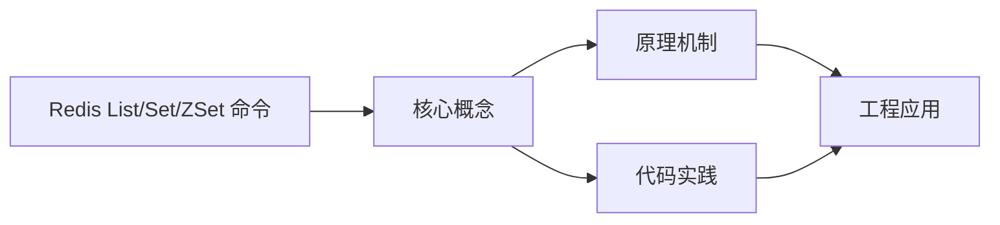
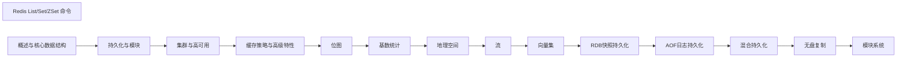

## 1. 学习目标（Bloom 分类）

本节按照布鲁姆教育目标分类学组织学习路径。本文主题为《Redis List/Set/ZSet 命令》，属于 Redis 模块，读者可以根据自身阶段选择阅读深度。

记忆层面：能够准确复述本文的核心概念、术语与基本语法或操作步骤，并能够在提问或检索时快速定位对应知识点。能够说出 Redis 的核心概念、语法与常用对象。

理解层面：能够用自己的语言解释核心原理与工作机制，说明概念之间的因果关系，而不是机械记忆结论。能够解释 Redis 的执行原理与优化机制。

应用层面：能够在真实项目或练习场景中运用本文知识解决具体问题，写出正确且可维护的实现。能够编写正确、高效的 Redis 语句与操作。

分析层面：能够拆解复杂问题，比较本文主题与相邻概念的异同，识别边界条件与例外情况。能够分析 Redis 相关方案在性能与一致性上的权衡。

评价层面：能够根据约束条件（性能、可读性、安全、成本）评价不同方案的优劣，做出有依据的技术决策。能够根据业务场景评价 Redis 技术选型。

创造层面：能够把本文知识与其他模块知识组合，设计出新的解决方案或可复用的工程模式。能够组合 Redis 与其他技术设计数据架构。

通过本节学习，读者应当能够把《Redis List/Set/ZSet 命令》纳入自己的知识网络，并与 Redis 模块的其他主题（数据结构、持久化、集群、缓存策略）建立关联。

## 2. 历史动机与发展脉络

《Redis List/Set/ZSet 命令》是 Redis 领域的重要主题。要真正理解它，需要先了解它解决的问题与演进过程。

Redis 由 Salvatore Sanfilippo 于 2009 年发布，是内存数据结构存储，常作缓存、消息中间件与轻量数据库；BSD 许可，单线程事件循环（6.0 起多线程 IO）。
数据模型：String、Hash、List、Set、Sorted Set、Stream、BitMap、HyperLogLog、Geo；每种结构有专门命令与复杂度。
Redis 7.x：ACL、函数（Lua/Redis Functions）、集群路由（Cluster Sharding）、自动故障转移；Redis Stack 集成 JSON/搜索/时序。

回到本文主题：Redis List/Set/ZSet 命令 的提出与成熟，正是上述技术背景下的必然产物。早期实现往往以简单可用为目标，随着工程规模扩大，社区逐渐沉淀出标准做法与最佳实践；理解这一脉络，可以帮助读者判断“为什么文档中的推荐写法是现在这个样子”，也能在遇到历史遗留代码时准确识别其设计年代与取舍。


## 3. 形式化定义与核心概念精讲

本节把《Redis List/Set/ZSet 命令》涉及的核心概念以“定义 + 讲解”的形式展开。读者应把定义当作工具，把讲解当作理解路径；两者结合才能形成可迁移的知识。

单线程模型：命令串行执行保证原子性，无锁；性能瓶颈在内存与网络；长命令（KEYS）阻塞。
持久化：RDB 快照（fork 子进程）与 AOF 追加日志；混合持久化组合两者；持久化权衡数据安全与性能。
过期与淘汰：惰性删除 + 定期抽样；maxmemory-policy（allkeys-lru/lru/lfu/noeviction）控制内存。

### 3.1 原文章节逐一精讲

原文档把主题拆分为 6 个小节，下面按顺序给出每一节的导读讲解，随后保留原文细节供精读。

#### 原文精读（完整保留）

# Redis List/Set/ZSet 命令

> **符号约定**：`< >` 必填参数 | `[ ]` 可选参数

---

#### List 列表

**基本写法：LPUSH 左侧插入**
`LPUSH <key> <value1> [value2 ...]`
```bash
# 在列表头部插入元素
LPUSH messages "hello" "world"
```

**基本写法：RPUSH 右侧插入**
`RPUSH <key> <value1> [value2 ...]`
```bash
# 在列表尾部插入元素
RPUSH queue:tasks task1 task2
```

**基本写法：LPOP 左侧弹出**
`LPOP <key> [count]`
```bash
# 从列表头部弹出元素
LPOP queue:tasks
```

**基本写法：RPOP 右侧弹出**
`RPOP <key> [count]`
```bash
# 从列表尾部弹出元素
RPOP queue:tasks
```

**基本写法：LRANGE 获取范围**
`LRANGE <key> <start> <stop>`
```bash
# 获取列表指定范围元素（0 到 -1 为全部）
LRANGE messages 0 -1
```

**基本写法：LINDEX 按索引获取**
`LINDEX <key> <索引>`
```bash
# 获取指定索引位置的元素
LINDEX messages 0
```

**基本写法：LLEN 获取长度**
`LLEN <key>`
```bash
# 获取列表长度
LLEN messages
```

**基本写法：LINSERT 插入元素**
`LINSERT <key> BEFORE|AFTER <pivot> <value>`
```bash
# 在指定元素前或后插入
LINSERT messages BEFORE "world" "new"
```

**基本写法：LREM 删除指定元素**
`LREM <key> <count> <value>`
```bash
# 删除指定数量的匹配元素
LREM messages 2 "hello"
```

**基本写法：LTRIM 修剪列表**
`LTRIM <key> <start> <stop>`
```bash
# 仅保留指定范围元素
LTRIM messages 0 99
```

**基本写法：LSET 修改元素**
`LSET <key> <索引> <value>`
```bash
# 修改指定索引位置的元素
LSET messages 0 "updated"
```

**基本写法：RPOPLPUSH 转移元素**
`RPOPLPUSH <源> <目标>`
```bash
# 从源列表尾部弹出并插入目标列表头部
RPOPLPUSH queue:pending queue:processing
```

**基本写法：LMOVE 转移元素（替代 RPOPLPUSH）**
`LMOVE <源> <目标> <LEFT|RIGHT> <LEFT|RIGHT>`
```bash
# 灵活指定源和目标的弹出插入方向
LMOVE queue:pending queue:processing LEFT RIGHT
```

**基本写法：BLPOP 阻塞弹出**
`BLPOP <key> [key ...] <超时>`
```bash
# 阻塞式左侧弹出（0 表示永久阻塞）
BLPOP queue:tasks 30
```

**基本写法：BRPOP 阻塞弹出**
`BRPOP <key> [key ...] <超时>`
```bash
# 阻塞式右侧弹出
BRPOP queue:tasks 30
```

---

#### Set 集合

**基本写法：SADD 添加元素**
`SADD <key> <member1> [member2 ...]`
```bash
# 向集合添加元素
SADD tags:article:1 redis mysql postgresql
```

**基本写法：SREM 删除元素**
`SREM <key> <member1> [member2 ...]`
```bash
# 从集合删除元素
SREM tags:article:1 mysql
```

**基本写法：SMEMBERS 获取所有元素**
`SMEMBERS <key>`
```bash
# 获取集合所有元素
SMEMBERS tags:article:1
```

**基本写法：SISMEMBER 判断成员存在**
`SISMEMBER <key> <member>`
```bash
# 判断元素是否在集合中
SISMEMBER tags:article:1 redis
```

**基本写法：SMISMEMBER 批量判断**
`SMISMEMBER <key> <member1> [member2 ...]`
```bash
# 批量判断多个元素是否存在
SMISMEMBER tags:article:1 redis mysql mongodb
```

**基本写法：SCARD 获取集合大小**
`SCARD <key>`
```bash
# 获取集合元素数量
SCARD tags:article:1
```

**基本写法：SRANDMEMBER 随机获取**
`SRANDMEMBER <key> [count]`
```bash
# 随机获取元素不删除
SRANDMEMBER tags:article:1 2
```

**基本写法：SPOP 随机弹出**
`SPOP <key> [count]`
```bash
# 随机弹出元素并删除
SPOP lucky:draw 1
```

**基本写法：SMOVE 转移元素**
`SMOVE <源> <目标> <member>`
```bash
# 将元素从一个集合转移到另一个
SMOVE set:old set:new member1
```

---

#### Set 集合运算

**基本写法：SINTER 交集**
`SINTER <key1> [key2 ...]`
```bash
# 获取多个集合的交集
SINTER tags:article:1 tags:article:2
```

**基本写法：SUNION 并集**
`SUNION <key1> [key2 ...]`
```bash
# 获取多个集合的并集
SUNION tags:article:1 tags:article:2
```

**基本写法：SDIFF 差集**
`SDIFF <key1> [key2 ...]`
```bash
# 获取第一个集合与其他集合的差集
SDIFF tags:article:1 tags:article:2
```

**基本写法：SINTERSTORE 交集存储**
`SINTERSTORE <目标> <key1> [key2 ...]`
```bash
# 将交集结果存储到新集合
SINTERSTORE common:tags tags:article:1 tags:article:2
```

**基本写法：SUNIONSTORE 并集存储**
`SUNIONSTORE <目标> <key1> [key2 ...]`
```bash
# 将并集结果存储到新集合
SUNIONSTORE all:tags tags:article:1 tags:article:2
```

**基本写法：SDIFFSTORE 差集存储**
`SDIFFSTORE <目标> <key1> [key2 ...]`
```bash
# 将差集结果存储到新集合
SDIFFSTORE diff:tags tags:article:1 tags:article:2
```

**基本写法：SINTERCARD 交集数量（7.0+）**
`SINTERCARD <numkeys> <key1> [key2 ...] [LIMIT <数量>]`
```bash
# 仅返回交集元素数量不返回具体元素
SINTERCARD 2 tags:article:1 tags:article:2
```

---

#### Sorted Set 有序集合

**基本写法：ZADD 添加元素**
`ZADD <key> [NX|XX] [GT|LT] [CH] [INCR] <score1> <member1> [score2 member2 ...]`
```bash
# 添加带分数的元素
ZADD leaderboard 100 user:1 90 user:2 80 user:3
```

**基本写法：ZADD 仅更新已存在元素**
`ZADD <key> XX <score> <member>`
```bash
# 仅更新已存在成员的分数
ZADD leaderboard XX 95 user:2
```

**基本写法：ZADD 仅新增不更新**
`ZADD <key> NX <score> <member>`
```bash
# 仅添加新成员不更新已有成员
ZADD leaderboard NX 85 user:4
```

**基本写法：ZSCORE 获取分数**
`ZSCORE <key> <member>`
```bash
# 获取成员的分数
ZSCORE leaderboard user:1
```

**基本写法：ZMSCORE 批量获取分数**
`ZMSCORE <key> <member1> [member2 ...]`
```bash
# 批量获取多个成员分数
ZMSCORE leaderboard user:1 user:2 user:3
```

**基本写法：ZRANK 升序排名**
`ZRANK <key> <member>`
```bash
# 获取成员升序排名（0 为最小）
ZRANK leaderboard user:1
```

**基本写法：ZREVRANK 降序排名**
`ZREVRANK <key> <member>`
```bash
# 获取成员降序排名（0 为最大）
ZREVRANK leaderboard user:1
```

**基本写法：ZRANGE 按索引范围获取**
`ZRANGE <key> <start> <stop> [WITHSCORES]`
```bash
# 按升序获取索引范围元素
ZRANGE leaderboard 0 9 WITHSCORES
```

**基本写法：ZREVRANGE 降序范围获取**
`ZREVRANGE <key> <start> <stop> [WITHSCORES]`
```bash
# 按降序获取索引范围元素
ZREVRANGE leaderboard 0 9 WITHSCORES
```

**基本写法：ZRANGEBYSCORE 按分数范围获取**
`ZRANGEBYSCORE <key> <min> <max> [WITHSCORES] [LIMIT offset count]`
```bash
# 获取分数范围内的元素
ZRANGEBYSCORE leaderboard 80 100 WITHSCORES LIMIT 0 10
```

**基本写法：ZREVRANGEBYSCORE 降序按分数获取**
`ZREVRANGEBYSCORE <key> <max> <min> [WITHSCORES] [LIMIT offset count]`
```bash
# 降序获取分数范围内的元素
ZREVRANGEBYSCORE leaderboard 100 80 WITHSCORES LIMIT 0 10
```

**基本写法：ZRANGEBYSCORE 使用无穷大**
`ZRANGEBYSCORE <key> -inf +inf [WITHSCORES]`
```bash
# 获取全部元素
ZRANGEBYSCORE leaderboard -inf +inf WITHSCORES
```

**基本写法：ZINCRBY 增加分数**
`ZINCRBY <key> <增量> <member>`
```bash
# 增加成员分数
ZINCRBY leaderboard 5 user:1
```

**基本写法：ZREM 删除元素**
`ZREM <key> <member1> [member2 ...]`
```bash
# 删除有序集合元素
ZREM leaderboard user:3
```

**基本写法：ZREMRANGEBYRANK 按排名删除**
`ZREMRANGEBYRANK <key> <start> <stop>`
```bash
# 按排名范围删除元素
ZREMRANGEBYRANK leaderboard 0 9
```

**基本写法：ZREMRANGEBYSCORE 按分数删除**
`ZREMRANGEBYSCORE <key> <min> <max>`
```bash
# 按分数范围删除元素
ZREMRANGEBYSCORE leaderboard 0 60
```

**基本写法：ZCARD 获取元素数量**
`ZCARD <key>`
```bash
# 获取有序集合元素总数
ZCARD leaderboard
```

**基本写法：ZCOUNT 按分数统计数量**
`ZCOUNT <key> <min> <max>`
```bash
# 统计指定分数范围内的元素数量
ZCOUNT leaderboard 80 100
```

---

#### ZSet 集合运算

**基本写法：ZUNIONSTORE 并集存储**
`ZUNIONSTORE <目标> <numkeys> <key> [key ...] [WEIGHTS <权重>...] [AGGREGATE SUM|MIN|MAX]`
```bash
# 多个有序集合并集并按 SUM 聚合分数
ZUNIONSTORE total:score 2 score:week1 score:week2 AGGREGATE SUM
```

**基本写法：ZINTERSTORE 交集存储**
`ZINTERSTORE <目标> <numkeys> <key> [key ...] [WEIGHTS <权重>...] [AGGREGATE SUM|MIN|MAX]`
```bash
# 多个有序集合交集并按 MAX 聚合分数
ZINTERSTORE common:high 2 set1 set2 AGGREGATE MAX
```

**基本写法：ZDIFFSTORE 差集存储**
`ZDIFFSTORE <目标> <numkeys> <key> [key ...]`
```bash
# 多个有序集合差集存储
ZDIFFSTORE diff:set 2 set1 set2
```

**基本写法：ZUNION 并集返回（7.0+）**
`ZUNION <numkeys> <key> [key ...] [WITHSCORES]`
```bash
# 直接返回并集结果不存储
ZUNION 2 set1 set2 WITHSCORES
```

**基本写法：ZINTER 交集返回（7.0+）**
`ZINTER <numkeys> <key> [key ...] [WITHSCORES]`
```bash
# 直接返回交集结果不存储
ZINTER 2 set1 set2 WITHSCORES
```

---

#### 实用模式

**基本写法：消息队列（List）**
`LPUSH <queue> <message> 配合 BRPOP`
```bash
# 生产者推送消息
LPUSH queue:email "send to user1"
# 消费者阻塞获取消息
BRPOP queue:email 30
```

**基本写法：排行榜（ZSet）**
`ZADD <rank> <score> <member> 配合 ZREVRANGE`
```bash
# 更新用户积分
ZADD rank:game 1500 user:1
# 获取前 10 名
ZREVRANGE rank:game 0 9 WITHSCORES
```

**基本写法：共同关注（Set）**
`SINTER <user1:follow> <user2:follow>`
```bash
# 获取两个用户的共同关注
SINTER user:1:follow user:2:follow
```

**基本写法：延迟队列（ZSet）**
`ZADD <delay:queue> <执行时间戳> <任务>`
```bash
# 添加延迟任务到队列
ZADD delay:queue 1718334600000 task:1001
# 扫描到期任务
ZRANGEBYSCORE delay:queue 0 1718334600000 LIMIT 0 100
```

**基本写法：滑动窗口限流（ZSet）**
`ZADD <rate:key> <时间戳> <唯一标识> 配合 ZREMRANGEBYSCORE`
```bash
# 滑动窗口限流记录请求
ZADD rate:user1 1718334600000 req-1
# 清理窗口外的记录
ZREMRANGEBYSCORE rate:user1 0 1718334540000
# 获取窗口内请求数
ZCARD rate:user1
```


### 3.2 概念关系图

下面用 Mermaid 图表达本文核心概念之间的关系，帮助读者建立整体图景：



图中展示的是本文知识的结构化关系：核心概念是入口，原理机制解释“为什么”，代码实践演示“怎么做”，工程应用回答“何时用”。读者学习时可以把每个小节的内容挂接到对应节点上。

## 4. 理论推导与原理解析

本节深入《Redis List/Set/ZSet 命令》背后的原理。理论部分不求面面俱到，而是聚焦“能解释现象、能指导实践”的关键推导。

单线程模型：命令串行执行保证原子性，无锁；性能瓶颈在内存与网络；长命令（KEYS）阻塞。
持久化：RDB 快照（fork 子进程）与 AOF 追加日志；混合持久化组合两者；持久化权衡数据安全与性能。
过期与淘汰：惰性删除 + 定期抽样；maxmemory-policy（allkeys-lru/lru/lfu/noeviction）控制内存。
高可用：主从复制（PSYNC）、哨兵（Sentinel）自动故障转移、Cluster 分片（16384 槽）与集群模式。

需要强调的是，理论推导与工程实践之间存在翻译层：理论给出的是理想化模型与边界条件，工程代码则必须处理真实环境中的例外。读者在学习时应先掌握理论的“标准情形”，再通过陷阱章节了解“非标准情形”。

## 5. 代码示例与逐行讲解

本节把原文中的代码示例系统整理，并为每个示例补充用途说明与讲解。读者不应只浏览代码，而应逐段对照讲解理解设计意图。

### 5.1 示例：List 列表

该示例来自原文《List 列表》小节，用于演示Redis List/Set/ZSet 命令相关操作。阅读时请先看代码结构，再看其后的讲解。

```bash
# 在列表头部插入元素
LPUSH messages "hello" "world"
```

讲解：这段代码演示了本节核心知识点。代码中的关键操作可以归纳为三步：准备（定义或初始化）、执行（核心逻辑）、收尾（释放资源或返回结果）。实际项目中，这三步往往被封装为函数或类，以提升复用性与可测试性。

关键点分析：

该示例共 2 行有效代码，结构以数据或配置为主。阅读时应关注：数据字段的含义、配置项的作用，以及它们与运行行为的对应关系。

进阶思考路径：先尝试修改参数观察行为变化，再把示例中的模式迁移到自己的项目中；每次修改都记录预期与实测差异，这是把示例转化为能力的最快方式。

### 5.2 示例：List 列表

该示例来自原文《List 列表》小节，用于演示Redis List/Set/ZSet 命令相关操作。阅读时请先看代码结构，再看其后的讲解。

```bash
# 在列表尾部插入元素
RPUSH queue:tasks task1 task2
```

讲解：这段代码演示了本节核心知识点。代码中的关键操作可以归纳为三步：准备（定义或初始化）、执行（核心逻辑）、收尾（释放资源或返回结果）。实际项目中，这三步往往被封装为函数或类，以提升复用性与可测试性。

关键点分析：

该示例共 2 行有效代码，结构以数据或配置为主。阅读时应关注：数据字段的含义、配置项的作用，以及它们与运行行为的对应关系。

进阶思考路径：先尝试修改参数观察行为变化，再把示例中的模式迁移到自己的项目中；每次修改都记录预期与实测差异，这是把示例转化为能力的最快方式。

### 5.3 示例：List 列表

该示例来自原文《List 列表》小节，用于演示Redis List/Set/ZSet 命令相关操作。阅读时请先看代码结构，再看其后的讲解。

```bash
# 从列表头部弹出元素
LPOP queue:tasks
```

讲解：这段代码演示了本节核心知识点。代码中的关键操作可以归纳为三步：准备（定义或初始化）、执行（核心逻辑）、收尾（释放资源或返回结果）。实际项目中，这三步往往被封装为函数或类，以提升复用性与可测试性。

关键点分析：

该示例共 2 行有效代码，结构以数据或配置为主。阅读时应关注：数据字段的含义、配置项的作用，以及它们与运行行为的对应关系。

进阶思考路径：先尝试修改参数观察行为变化，再把示例中的模式迁移到自己的项目中；每次修改都记录预期与实测差异，这是把示例转化为能力的最快方式。

### 5.4 示例：List 列表

该示例来自原文《List 列表》小节，用于演示Redis List/Set/ZSet 命令相关操作。阅读时请先看代码结构，再看其后的讲解。

```bash
# 从列表尾部弹出元素
RPOP queue:tasks
```

讲解：这段代码演示了本节核心知识点。代码中的关键操作可以归纳为三步：准备（定义或初始化）、执行（核心逻辑）、收尾（释放资源或返回结果）。实际项目中，这三步往往被封装为函数或类，以提升复用性与可测试性。

关键点分析：

该示例共 2 行有效代码，结构以数据或配置为主。阅读时应关注：数据字段的含义、配置项的作用，以及它们与运行行为的对应关系。

进阶思考路径：先尝试修改参数观察行为变化，再把示例中的模式迁移到自己的项目中；每次修改都记录预期与实测差异，这是把示例转化为能力的最快方式。

### 5.5 示例：List 列表

该示例来自原文《List 列表》小节，用于演示Redis List/Set/ZSet 命令相关操作。阅读时请先看代码结构，再看其后的讲解。

```bash
# 获取列表指定范围元素（0 到 -1 为全部）
LRANGE messages 0 -1
```

讲解：这段代码演示了本节核心知识点。代码中的关键操作可以归纳为三步：准备（定义或初始化）、执行（核心逻辑）、收尾（释放资源或返回结果）。实际项目中，这三步往往被封装为函数或类，以提升复用性与可测试性。

关键点分析：

该示例共 2 行有效代码，结构以数据或配置为主。阅读时应关注：数据字段的含义、配置项的作用，以及它们与运行行为的对应关系。

进阶思考路径：先尝试修改参数观察行为变化，再把示例中的模式迁移到自己的项目中；每次修改都记录预期与实测差异，这是把示例转化为能力的最快方式。

### 5.6 示例：List 列表

该示例来自原文《List 列表》小节，用于演示Redis List/Set/ZSet 命令相关操作。阅读时请先看代码结构，再看其后的讲解。

```bash
# 获取指定索引位置的元素
LINDEX messages 0
```

讲解：这段代码演示了本节核心知识点。代码中的关键操作可以归纳为三步：准备（定义或初始化）、执行（核心逻辑）、收尾（释放资源或返回结果）。实际项目中，这三步往往被封装为函数或类，以提升复用性与可测试性。

关键点分析：

该示例共 2 行有效代码，结构以数据或配置为主。阅读时应关注：数据字段的含义、配置项的作用，以及它们与运行行为的对应关系。

进阶思考路径：先尝试修改参数观察行为变化，再把示例中的模式迁移到自己的项目中；每次修改都记录预期与实测差异，这是把示例转化为能力的最快方式。

### 5.7 示例：List 列表

该示例来自原文《List 列表》小节，用于演示Redis List/Set/ZSet 命令相关操作。阅读时请先看代码结构，再看其后的讲解。

```bash
# 获取列表长度
LLEN messages
```

讲解：这段代码演示了本节核心知识点。代码中的关键操作可以归纳为三步：准备（定义或初始化）、执行（核心逻辑）、收尾（释放资源或返回结果）。实际项目中，这三步往往被封装为函数或类，以提升复用性与可测试性。

关键点分析：

该示例共 2 行有效代码，结构以数据或配置为主。阅读时应关注：数据字段的含义、配置项的作用，以及它们与运行行为的对应关系。

进阶思考路径：先尝试修改参数观察行为变化，再把示例中的模式迁移到自己的项目中；每次修改都记录预期与实测差异，这是把示例转化为能力的最快方式。

### 5.8 示例：List 列表

该示例来自原文《List 列表》小节，用于演示Redis List/Set/ZSet 命令相关操作。阅读时请先看代码结构，再看其后的讲解。

```bash
# 在指定元素前或后插入
LINSERT messages BEFORE "world" "new"
```

讲解：这段代码演示了本节核心知识点。代码中的关键操作可以归纳为三步：准备（定义或初始化）、执行（核心逻辑）、收尾（释放资源或返回结果）。实际项目中，这三步往往被封装为函数或类，以提升复用性与可测试性。

关键点分析：

该示例共 2 行有效代码，包含 1 类关键结构（INSERT）。其中：

- 入口与初始化部分负责建立上下文，对应实际项目中的启动或装配逻辑；
- 核心逻辑部分体现本文主题的主要操作，是阅读时最需要对照讲解理解的部分；
- 输出或返回部分把结果交给调用方，注意其类型与边界条件。

进阶思考路径：先尝试修改参数观察行为变化，再把示例中的模式迁移到自己的项目中；每次修改都记录预期与实测差异，这是把示例转化为能力的最快方式。

### 5.9 示例：List 列表

该示例来自原文《List 列表》小节，用于演示Redis List/Set/ZSet 命令相关操作。阅读时请先看代码结构，再看其后的讲解。

```bash
# 删除指定数量的匹配元素
LREM messages 2 "hello"
```

讲解：这段代码演示了本节核心知识点。代码中的关键操作可以归纳为三步：准备（定义或初始化）、执行（核心逻辑）、收尾（释放资源或返回结果）。实际项目中，这三步往往被封装为函数或类，以提升复用性与可测试性。

关键点分析：

该示例共 2 行有效代码，结构以数据或配置为主。阅读时应关注：数据字段的含义、配置项的作用，以及它们与运行行为的对应关系。

进阶思考路径：先尝试修改参数观察行为变化，再把示例中的模式迁移到自己的项目中；每次修改都记录预期与实测差异，这是把示例转化为能力的最快方式。

### 5.10 示例：List 列表

该示例来自原文《List 列表》小节，用于演示Redis List/Set/ZSet 命令相关操作。阅读时请先看代码结构，再看其后的讲解。

```bash
# 仅保留指定范围元素
LTRIM messages 0 99
```

讲解：这段代码演示了本节核心知识点。代码中的关键操作可以归纳为三步：准备（定义或初始化）、执行（核心逻辑）、收尾（释放资源或返回结果）。实际项目中，这三步往往被封装为函数或类，以提升复用性与可测试性。

关键点分析：

该示例共 2 行有效代码，结构以数据或配置为主。阅读时应关注：数据字段的含义、配置项的作用，以及它们与运行行为的对应关系。

进阶思考路径：先尝试修改参数观察行为变化，再把示例中的模式迁移到自己的项目中；每次修改都记录预期与实测差异，这是把示例转化为能力的最快方式。

### 5.11 示例：List 列表

该示例来自原文《List 列表》小节，用于演示Redis List/Set/ZSet 命令相关操作。阅读时请先看代码结构，再看其后的讲解。

```bash
# 修改指定索引位置的元素
LSET messages 0 "updated"
```

讲解：这段代码演示了本节核心知识点。代码中的关键操作可以归纳为三步：准备（定义或初始化）、执行（核心逻辑）、收尾（释放资源或返回结果）。实际项目中，这三步往往被封装为函数或类，以提升复用性与可测试性。

关键点分析：

该示例共 2 行有效代码，结构以数据或配置为主。阅读时应关注：数据字段的含义、配置项的作用，以及它们与运行行为的对应关系。

进阶思考路径：先尝试修改参数观察行为变化，再把示例中的模式迁移到自己的项目中；每次修改都记录预期与实测差异，这是把示例转化为能力的最快方式。

### 5.12 示例：List 列表

该示例来自原文《List 列表》小节，用于演示Redis List/Set/ZSet 命令相关操作。阅读时请先看代码结构，再看其后的讲解。

```bash
# 从源列表尾部弹出并插入目标列表头部
RPOPLPUSH queue:pending queue:processing
```

讲解：这段代码演示了本节核心知识点。代码中的关键操作可以归纳为三步：准备（定义或初始化）、执行（核心逻辑）、收尾（释放资源或返回结果）。实际项目中，这三步往往被封装为函数或类，以提升复用性与可测试性。

关键点分析：

该示例共 2 行有效代码，结构以数据或配置为主。阅读时应关注：数据字段的含义、配置项的作用，以及它们与运行行为的对应关系。

进阶思考路径：先尝试修改参数观察行为变化，再把示例中的模式迁移到自己的项目中；每次修改都记录预期与实测差异，这是把示例转化为能力的最快方式。

### 5.13 示例：List 列表

该示例来自原文《List 列表》小节，用于演示Redis List/Set/ZSet 命令相关操作。阅读时请先看代码结构，再看其后的讲解。

```bash
# 灵活指定源和目标的弹出插入方向
LMOVE queue:pending queue:processing LEFT RIGHT
```

讲解：这段代码演示了本节核心知识点。代码中的关键操作可以归纳为三步：准备（定义或初始化）、执行（核心逻辑）、收尾（释放资源或返回结果）。实际项目中，这三步往往被封装为函数或类，以提升复用性与可测试性。

关键点分析：

该示例共 2 行有效代码，结构以数据或配置为主。阅读时应关注：数据字段的含义、配置项的作用，以及它们与运行行为的对应关系。

进阶思考路径：先尝试修改参数观察行为变化，再把示例中的模式迁移到自己的项目中；每次修改都记录预期与实测差异，这是把示例转化为能力的最快方式。

### 5.14 示例：List 列表

该示例来自原文《List 列表》小节，用于演示Redis List/Set/ZSet 命令相关操作。阅读时请先看代码结构，再看其后的讲解。

```bash
# 阻塞式左侧弹出（0 表示永久阻塞）
BLPOP queue:tasks 30
```

讲解：这段代码演示了本节核心知识点。代码中的关键操作可以归纳为三步：准备（定义或初始化）、执行（核心逻辑）、收尾（释放资源或返回结果）。实际项目中，这三步往往被封装为函数或类，以提升复用性与可测试性。

关键点分析：

该示例共 2 行有效代码，结构以数据或配置为主。阅读时应关注：数据字段的含义、配置项的作用，以及它们与运行行为的对应关系。

进阶思考路径：先尝试修改参数观察行为变化，再把示例中的模式迁移到自己的项目中；每次修改都记录预期与实测差异，这是把示例转化为能力的最快方式。

### 5.15 示例：List 列表

该示例来自原文《List 列表》小节，用于演示Redis List/Set/ZSet 命令相关操作。阅读时请先看代码结构，再看其后的讲解。

```bash
# 阻塞式右侧弹出
BRPOP queue:tasks 30
```

讲解：这段代码演示了本节核心知识点。代码中的关键操作可以归纳为三步：准备（定义或初始化）、执行（核心逻辑）、收尾（释放资源或返回结果）。实际项目中，这三步往往被封装为函数或类，以提升复用性与可测试性。

关键点分析：

该示例共 2 行有效代码，结构以数据或配置为主。阅读时应关注：数据字段的含义、配置项的作用，以及它们与运行行为的对应关系。

进阶思考路径：先尝试修改参数观察行为变化，再把示例中的模式迁移到自己的项目中；每次修改都记录预期与实测差异，这是把示例转化为能力的最快方式。

### 5.16 示例：Set 集合

该示例来自原文《Set 集合》小节，用于演示Redis List/Set/ZSet 命令相关操作。阅读时请先看代码结构，再看其后的讲解。

```bash
# 向集合添加元素
SADD tags:article:1 redis mysql postgresql
```

讲解：这段代码演示了本节核心知识点。代码中的关键操作可以归纳为三步：准备（定义或初始化）、执行（核心逻辑）、收尾（释放资源或返回结果）。实际项目中，这三步往往被封装为函数或类，以提升复用性与可测试性。

关键点分析：

该示例共 2 行有效代码，结构以数据或配置为主。阅读时应关注：数据字段的含义、配置项的作用，以及它们与运行行为的对应关系。

进阶思考路径：先尝试修改参数观察行为变化，再把示例中的模式迁移到自己的项目中；每次修改都记录预期与实测差异，这是把示例转化为能力的最快方式。

### 5.17 示例：Set 集合

该示例来自原文《Set 集合》小节，用于演示Redis List/Set/ZSet 命令相关操作。阅读时请先看代码结构，再看其后的讲解。

```bash
# 从集合删除元素
SREM tags:article:1 mysql
```

讲解：这段代码演示了本节核心知识点。代码中的关键操作可以归纳为三步：准备（定义或初始化）、执行（核心逻辑）、收尾（释放资源或返回结果）。实际项目中，这三步往往被封装为函数或类，以提升复用性与可测试性。

关键点分析：

该示例共 2 行有效代码，结构以数据或配置为主。阅读时应关注：数据字段的含义、配置项的作用，以及它们与运行行为的对应关系。

进阶思考路径：先尝试修改参数观察行为变化，再把示例中的模式迁移到自己的项目中；每次修改都记录预期与实测差异，这是把示例转化为能力的最快方式。

### 5.18 示例：Set 集合

该示例来自原文《Set 集合》小节，用于演示Redis List/Set/ZSet 命令相关操作。阅读时请先看代码结构，再看其后的讲解。

```bash
# 获取集合所有元素
SMEMBERS tags:article:1
```

讲解：这段代码演示了本节核心知识点。代码中的关键操作可以归纳为三步：准备（定义或初始化）、执行（核心逻辑）、收尾（释放资源或返回结果）。实际项目中，这三步往往被封装为函数或类，以提升复用性与可测试性。

关键点分析：

该示例共 2 行有效代码，结构以数据或配置为主。阅读时应关注：数据字段的含义、配置项的作用，以及它们与运行行为的对应关系。

进阶思考路径：先尝试修改参数观察行为变化，再把示例中的模式迁移到自己的项目中；每次修改都记录预期与实测差异，这是把示例转化为能力的最快方式。

### 5.19 示例：Set 集合

该示例来自原文《Set 集合》小节，用于演示Redis List/Set/ZSet 命令相关操作。阅读时请先看代码结构，再看其后的讲解。

```bash
# 判断元素是否在集合中
SISMEMBER tags:article:1 redis
```

讲解：这段代码演示了本节核心知识点。代码中的关键操作可以归纳为三步：准备（定义或初始化）、执行（核心逻辑）、收尾（释放资源或返回结果）。实际项目中，这三步往往被封装为函数或类，以提升复用性与可测试性。

关键点分析：

该示例共 2 行有效代码，结构以数据或配置为主。阅读时应关注：数据字段的含义、配置项的作用，以及它们与运行行为的对应关系。

进阶思考路径：先尝试修改参数观察行为变化，再把示例中的模式迁移到自己的项目中；每次修改都记录预期与实测差异，这是把示例转化为能力的最快方式。

### 5.20 示例：Set 集合

该示例来自原文《Set 集合》小节，用于演示Redis List/Set/ZSet 命令相关操作。阅读时请先看代码结构，再看其后的讲解。

```bash
# 批量判断多个元素是否存在
SMISMEMBER tags:article:1 redis mysql mongodb
```

讲解：这段代码演示了本节核心知识点。代码中的关键操作可以归纳为三步：准备（定义或初始化）、执行（核心逻辑）、收尾（释放资源或返回结果）。实际项目中，这三步往往被封装为函数或类，以提升复用性与可测试性。

关键点分析：

该示例共 2 行有效代码，结构以数据或配置为主。阅读时应关注：数据字段的含义、配置项的作用，以及它们与运行行为的对应关系。

进阶思考路径：先尝试修改参数观察行为变化，再把示例中的模式迁移到自己的项目中；每次修改都记录预期与实测差异，这是把示例转化为能力的最快方式。

### 5.21 示例：Set 集合

该示例来自原文《Set 集合》小节，用于演示Redis List/Set/ZSet 命令相关操作。阅读时请先看代码结构，再看其后的讲解。

```bash
# 获取集合元素数量
SCARD tags:article:1
```

讲解：这段代码演示了本节核心知识点。代码中的关键操作可以归纳为三步：准备（定义或初始化）、执行（核心逻辑）、收尾（释放资源或返回结果）。实际项目中，这三步往往被封装为函数或类，以提升复用性与可测试性。

关键点分析：

该示例共 2 行有效代码，结构以数据或配置为主。阅读时应关注：数据字段的含义、配置项的作用，以及它们与运行行为的对应关系。

进阶思考路径：先尝试修改参数观察行为变化，再把示例中的模式迁移到自己的项目中；每次修改都记录预期与实测差异，这是把示例转化为能力的最快方式。

### 5.22 示例：Set 集合

该示例来自原文《Set 集合》小节，用于演示Redis List/Set/ZSet 命令相关操作。阅读时请先看代码结构，再看其后的讲解。

```bash
# 随机获取元素不删除
SRANDMEMBER tags:article:1 2
```

讲解：这段代码演示了本节核心知识点。代码中的关键操作可以归纳为三步：准备（定义或初始化）、执行（核心逻辑）、收尾（释放资源或返回结果）。实际项目中，这三步往往被封装为函数或类，以提升复用性与可测试性。

关键点分析：

该示例共 2 行有效代码，结构以数据或配置为主。阅读时应关注：数据字段的含义、配置项的作用，以及它们与运行行为的对应关系。

进阶思考路径：先尝试修改参数观察行为变化，再把示例中的模式迁移到自己的项目中；每次修改都记录预期与实测差异，这是把示例转化为能力的最快方式。

### 5.23 示例：Set 集合

该示例来自原文《Set 集合》小节，用于演示Redis List/Set/ZSet 命令相关操作。阅读时请先看代码结构，再看其后的讲解。

```bash
# 随机弹出元素并删除
SPOP lucky:draw 1
```

讲解：这段代码演示了本节核心知识点。代码中的关键操作可以归纳为三步：准备（定义或初始化）、执行（核心逻辑）、收尾（释放资源或返回结果）。实际项目中，这三步往往被封装为函数或类，以提升复用性与可测试性。

关键点分析：

该示例共 2 行有效代码，结构以数据或配置为主。阅读时应关注：数据字段的含义、配置项的作用，以及它们与运行行为的对应关系。

进阶思考路径：先尝试修改参数观察行为变化，再把示例中的模式迁移到自己的项目中；每次修改都记录预期与实测差异，这是把示例转化为能力的最快方式。

### 5.24 示例：Set 集合

该示例来自原文《Set 集合》小节，用于演示Redis List/Set/ZSet 命令相关操作。阅读时请先看代码结构，再看其后的讲解。

```bash
# 将元素从一个集合转移到另一个
SMOVE set:old set:new member1
```

讲解：这段代码演示了本节核心知识点。代码中的关键操作可以归纳为三步：准备（定义或初始化）、执行（核心逻辑）、收尾（释放资源或返回结果）。实际项目中，这三步往往被封装为函数或类，以提升复用性与可测试性。

关键点分析：

该示例共 2 行有效代码，结构以数据或配置为主。阅读时应关注：数据字段的含义、配置项的作用，以及它们与运行行为的对应关系。

进阶思考路径：先尝试修改参数观察行为变化，再把示例中的模式迁移到自己的项目中；每次修改都记录预期与实测差异，这是把示例转化为能力的最快方式。

### 5.25 示例：Set 集合运算

该示例来自原文《Set 集合运算》小节，用于演示Redis List/Set/ZSet 命令相关操作。阅读时请先看代码结构，再看其后的讲解。

```bash
# 获取多个集合的交集
SINTER tags:article:1 tags:article:2
```

讲解：这段代码演示了本节核心知识点。代码中的关键操作可以归纳为三步：准备（定义或初始化）、执行（核心逻辑）、收尾（释放资源或返回结果）。实际项目中，这三步往往被封装为函数或类，以提升复用性与可测试性。

关键点分析：

该示例共 2 行有效代码，结构以数据或配置为主。阅读时应关注：数据字段的含义、配置项的作用，以及它们与运行行为的对应关系。

进阶思考路径：先尝试修改参数观察行为变化，再把示例中的模式迁移到自己的项目中；每次修改都记录预期与实测差异，这是把示例转化为能力的最快方式。

### 5.26 示例：Set 集合运算

该示例来自原文《Set 集合运算》小节，用于演示Redis List/Set/ZSet 命令相关操作。阅读时请先看代码结构，再看其后的讲解。

```bash
# 获取多个集合的并集
SUNION tags:article:1 tags:article:2
```

讲解：这段代码演示了本节核心知识点。代码中的关键操作可以归纳为三步：准备（定义或初始化）、执行（核心逻辑）、收尾（释放资源或返回结果）。实际项目中，这三步往往被封装为函数或类，以提升复用性与可测试性。

关键点分析：

该示例共 2 行有效代码，结构以数据或配置为主。阅读时应关注：数据字段的含义、配置项的作用，以及它们与运行行为的对应关系。

进阶思考路径：先尝试修改参数观察行为变化，再把示例中的模式迁移到自己的项目中；每次修改都记录预期与实测差异，这是把示例转化为能力的最快方式。

### 5.27 示例：Set 集合运算

该示例来自原文《Set 集合运算》小节，用于演示Redis List/Set/ZSet 命令相关操作。阅读时请先看代码结构，再看其后的讲解。

```bash
# 获取第一个集合与其他集合的差集
SDIFF tags:article:1 tags:article:2
```

讲解：这段代码演示了本节核心知识点。代码中的关键操作可以归纳为三步：准备（定义或初始化）、执行（核心逻辑）、收尾（释放资源或返回结果）。实际项目中，这三步往往被封装为函数或类，以提升复用性与可测试性。

关键点分析：

该示例共 2 行有效代码，结构以数据或配置为主。阅读时应关注：数据字段的含义、配置项的作用，以及它们与运行行为的对应关系。

进阶思考路径：先尝试修改参数观察行为变化，再把示例中的模式迁移到自己的项目中；每次修改都记录预期与实测差异，这是把示例转化为能力的最快方式。

### 5.28 示例：Set 集合运算

该示例来自原文《Set 集合运算》小节，用于演示Redis List/Set/ZSet 命令相关操作。阅读时请先看代码结构，再看其后的讲解。

```bash
# 将交集结果存储到新集合
SINTERSTORE common:tags tags:article:1 tags:article:2
```

讲解：这段代码演示了本节核心知识点。代码中的关键操作可以归纳为三步：准备（定义或初始化）、执行（核心逻辑）、收尾（释放资源或返回结果）。实际项目中，这三步往往被封装为函数或类，以提升复用性与可测试性。

关键点分析：

该示例共 2 行有效代码，结构以数据或配置为主。阅读时应关注：数据字段的含义、配置项的作用，以及它们与运行行为的对应关系。

进阶思考路径：先尝试修改参数观察行为变化，再把示例中的模式迁移到自己的项目中；每次修改都记录预期与实测差异，这是把示例转化为能力的最快方式。

### 5.29 示例：Set 集合运算

该示例来自原文《Set 集合运算》小节，用于演示Redis List/Set/ZSet 命令相关操作。阅读时请先看代码结构，再看其后的讲解。

```bash
# 将并集结果存储到新集合
SUNIONSTORE all:tags tags:article:1 tags:article:2
```

讲解：这段代码演示了本节核心知识点。代码中的关键操作可以归纳为三步：准备（定义或初始化）、执行（核心逻辑）、收尾（释放资源或返回结果）。实际项目中，这三步往往被封装为函数或类，以提升复用性与可测试性。

关键点分析：

该示例共 2 行有效代码，结构以数据或配置为主。阅读时应关注：数据字段的含义、配置项的作用，以及它们与运行行为的对应关系。

进阶思考路径：先尝试修改参数观察行为变化，再把示例中的模式迁移到自己的项目中；每次修改都记录预期与实测差异，这是把示例转化为能力的最快方式。

### 5.30 示例：Set 集合运算

该示例来自原文《Set 集合运算》小节，用于演示Redis List/Set/ZSet 命令相关操作。阅读时请先看代码结构，再看其后的讲解。

```bash
# 将差集结果存储到新集合
SDIFFSTORE diff:tags tags:article:1 tags:article:2
```

讲解：这段代码演示了本节核心知识点。代码中的关键操作可以归纳为三步：准备（定义或初始化）、执行（核心逻辑）、收尾（释放资源或返回结果）。实际项目中，这三步往往被封装为函数或类，以提升复用性与可测试性。

关键点分析：

该示例共 2 行有效代码，结构以数据或配置为主。阅读时应关注：数据字段的含义、配置项的作用，以及它们与运行行为的对应关系。

进阶思考路径：先尝试修改参数观察行为变化，再把示例中的模式迁移到自己的项目中；每次修改都记录预期与实测差异，这是把示例转化为能力的最快方式。

### 5.31 示例：Set 集合运算

该示例来自原文《Set 集合运算》小节，用于演示Redis List/Set/ZSet 命令相关操作。阅读时请先看代码结构，再看其后的讲解。

```bash
# 仅返回交集元素数量不返回具体元素
SINTERCARD 2 tags:article:1 tags:article:2
```

讲解：这段代码演示了本节核心知识点。代码中的关键操作可以归纳为三步：准备（定义或初始化）、执行（核心逻辑）、收尾（释放资源或返回结果）。实际项目中，这三步往往被封装为函数或类，以提升复用性与可测试性。

关键点分析：

该示例共 2 行有效代码，结构以数据或配置为主。阅读时应关注：数据字段的含义、配置项的作用，以及它们与运行行为的对应关系。

进阶思考路径：先尝试修改参数观察行为变化，再把示例中的模式迁移到自己的项目中；每次修改都记录预期与实测差异，这是把示例转化为能力的最快方式。

### 5.32 示例：Sorted Set 有序集合

该示例来自原文《Sorted Set 有序集合》小节，用于演示Redis List/Set/ZSet 命令相关操作。阅读时请先看代码结构，再看其后的讲解。

```bash
# 添加带分数的元素
ZADD leaderboard 100 user:1 90 user:2 80 user:3
```

讲解：这段代码演示了本节核心知识点。代码中的关键操作可以归纳为三步：准备（定义或初始化）、执行（核心逻辑）、收尾（释放资源或返回结果）。实际项目中，这三步往往被封装为函数或类，以提升复用性与可测试性。

关键点分析：

该示例共 2 行有效代码，结构以数据或配置为主。阅读时应关注：数据字段的含义、配置项的作用，以及它们与运行行为的对应关系。

进阶思考路径：先尝试修改参数观察行为变化，再把示例中的模式迁移到自己的项目中；每次修改都记录预期与实测差异，这是把示例转化为能力的最快方式。

### 5.33 示例：Sorted Set 有序集合

该示例来自原文《Sorted Set 有序集合》小节，用于演示Redis List/Set/ZSet 命令相关操作。阅读时请先看代码结构，再看其后的讲解。

```bash
# 仅更新已存在成员的分数
ZADD leaderboard XX 95 user:2
```

讲解：这段代码演示了本节核心知识点。代码中的关键操作可以归纳为三步：准备（定义或初始化）、执行（核心逻辑）、收尾（释放资源或返回结果）。实际项目中，这三步往往被封装为函数或类，以提升复用性与可测试性。

关键点分析：

该示例共 2 行有效代码，结构以数据或配置为主。阅读时应关注：数据字段的含义、配置项的作用，以及它们与运行行为的对应关系。

进阶思考路径：先尝试修改参数观察行为变化，再把示例中的模式迁移到自己的项目中；每次修改都记录预期与实测差异，这是把示例转化为能力的最快方式。

### 5.34 示例：Sorted Set 有序集合

该示例来自原文《Sorted Set 有序集合》小节，用于演示Redis List/Set/ZSet 命令相关操作。阅读时请先看代码结构，再看其后的讲解。

```bash
# 仅添加新成员不更新已有成员
ZADD leaderboard NX 85 user:4
```

讲解：这段代码演示了本节核心知识点。代码中的关键操作可以归纳为三步：准备（定义或初始化）、执行（核心逻辑）、收尾（释放资源或返回结果）。实际项目中，这三步往往被封装为函数或类，以提升复用性与可测试性。

关键点分析：

该示例共 2 行有效代码，结构以数据或配置为主。阅读时应关注：数据字段的含义、配置项的作用，以及它们与运行行为的对应关系。

进阶思考路径：先尝试修改参数观察行为变化，再把示例中的模式迁移到自己的项目中；每次修改都记录预期与实测差异，这是把示例转化为能力的最快方式。

### 5.35 示例：Sorted Set 有序集合

该示例来自原文《Sorted Set 有序集合》小节，用于演示Redis List/Set/ZSet 命令相关操作。阅读时请先看代码结构，再看其后的讲解。

```bash
# 获取成员的分数
ZSCORE leaderboard user:1
```

讲解：这段代码演示了本节核心知识点。代码中的关键操作可以归纳为三步：准备（定义或初始化）、执行（核心逻辑）、收尾（释放资源或返回结果）。实际项目中，这三步往往被封装为函数或类，以提升复用性与可测试性。

关键点分析：

该示例共 2 行有效代码，结构以数据或配置为主。阅读时应关注：数据字段的含义、配置项的作用，以及它们与运行行为的对应关系。

进阶思考路径：先尝试修改参数观察行为变化，再把示例中的模式迁移到自己的项目中；每次修改都记录预期与实测差异，这是把示例转化为能力的最快方式。

### 5.36 示例：Sorted Set 有序集合

该示例来自原文《Sorted Set 有序集合》小节，用于演示Redis List/Set/ZSet 命令相关操作。阅读时请先看代码结构，再看其后的讲解。

```bash
# 批量获取多个成员分数
ZMSCORE leaderboard user:1 user:2 user:3
```

讲解：这段代码演示了本节核心知识点。代码中的关键操作可以归纳为三步：准备（定义或初始化）、执行（核心逻辑）、收尾（释放资源或返回结果）。实际项目中，这三步往往被封装为函数或类，以提升复用性与可测试性。

关键点分析：

该示例共 2 行有效代码，结构以数据或配置为主。阅读时应关注：数据字段的含义、配置项的作用，以及它们与运行行为的对应关系。

进阶思考路径：先尝试修改参数观察行为变化，再把示例中的模式迁移到自己的项目中；每次修改都记录预期与实测差异，这是把示例转化为能力的最快方式。

### 5.37 示例：Sorted Set 有序集合

该示例来自原文《Sorted Set 有序集合》小节，用于演示Redis List/Set/ZSet 命令相关操作。阅读时请先看代码结构，再看其后的讲解。

```bash
# 获取成员升序排名（0 为最小）
ZRANK leaderboard user:1
```

讲解：这段代码演示了本节核心知识点。代码中的关键操作可以归纳为三步：准备（定义或初始化）、执行（核心逻辑）、收尾（释放资源或返回结果）。实际项目中，这三步往往被封装为函数或类，以提升复用性与可测试性。

关键点分析：

该示例共 2 行有效代码，结构以数据或配置为主。阅读时应关注：数据字段的含义、配置项的作用，以及它们与运行行为的对应关系。

进阶思考路径：先尝试修改参数观察行为变化，再把示例中的模式迁移到自己的项目中；每次修改都记录预期与实测差异，这是把示例转化为能力的最快方式。

### 5.38 示例：Sorted Set 有序集合

该示例来自原文《Sorted Set 有序集合》小节，用于演示Redis List/Set/ZSet 命令相关操作。阅读时请先看代码结构，再看其后的讲解。

```bash
# 获取成员降序排名（0 为最大）
ZREVRANK leaderboard user:1
```

讲解：这段代码演示了本节核心知识点。代码中的关键操作可以归纳为三步：准备（定义或初始化）、执行（核心逻辑）、收尾（释放资源或返回结果）。实际项目中，这三步往往被封装为函数或类，以提升复用性与可测试性。

关键点分析：

该示例共 2 行有效代码，结构以数据或配置为主。阅读时应关注：数据字段的含义、配置项的作用，以及它们与运行行为的对应关系。

进阶思考路径：先尝试修改参数观察行为变化，再把示例中的模式迁移到自己的项目中；每次修改都记录预期与实测差异，这是把示例转化为能力的最快方式。

### 5.39 示例：Sorted Set 有序集合

该示例来自原文《Sorted Set 有序集合》小节，用于演示Redis List/Set/ZSet 命令相关操作。阅读时请先看代码结构，再看其后的讲解。

```bash
# 按升序获取索引范围元素
ZRANGE leaderboard 0 9 WITHSCORES
```

讲解：这段代码演示了本节核心知识点。代码中的关键操作可以归纳为三步：准备（定义或初始化）、执行（核心逻辑）、收尾（释放资源或返回结果）。实际项目中，这三步往往被封装为函数或类，以提升复用性与可测试性。

关键点分析：

该示例共 2 行有效代码，结构以数据或配置为主。阅读时应关注：数据字段的含义、配置项的作用，以及它们与运行行为的对应关系。

进阶思考路径：先尝试修改参数观察行为变化，再把示例中的模式迁移到自己的项目中；每次修改都记录预期与实测差异，这是把示例转化为能力的最快方式。

### 5.40 示例：Sorted Set 有序集合

该示例来自原文《Sorted Set 有序集合》小节，用于演示Redis List/Set/ZSet 命令相关操作。阅读时请先看代码结构，再看其后的讲解。

```bash
# 按降序获取索引范围元素
ZREVRANGE leaderboard 0 9 WITHSCORES
```

讲解：这段代码演示了本节核心知识点。代码中的关键操作可以归纳为三步：准备（定义或初始化）、执行（核心逻辑）、收尾（释放资源或返回结果）。实际项目中，这三步往往被封装为函数或类，以提升复用性与可测试性。

关键点分析：

该示例共 2 行有效代码，结构以数据或配置为主。阅读时应关注：数据字段的含义、配置项的作用，以及它们与运行行为的对应关系。

进阶思考路径：先尝试修改参数观察行为变化，再把示例中的模式迁移到自己的项目中；每次修改都记录预期与实测差异，这是把示例转化为能力的最快方式。

### 5.41 示例：Sorted Set 有序集合

该示例来自原文《Sorted Set 有序集合》小节，用于演示Redis List/Set/ZSet 命令相关操作。阅读时请先看代码结构，再看其后的讲解。

```bash
# 获取分数范围内的元素
ZRANGEBYSCORE leaderboard 80 100 WITHSCORES LIMIT 0 10
```

讲解：这段代码演示了本节核心知识点。代码中的关键操作可以归纳为三步：准备（定义或初始化）、执行（核心逻辑）、收尾（释放资源或返回结果）。实际项目中，这三步往往被封装为函数或类，以提升复用性与可测试性。

关键点分析：

该示例共 2 行有效代码，结构以数据或配置为主。阅读时应关注：数据字段的含义、配置项的作用，以及它们与运行行为的对应关系。

进阶思考路径：先尝试修改参数观察行为变化，再把示例中的模式迁移到自己的项目中；每次修改都记录预期与实测差异，这是把示例转化为能力的最快方式。

### 5.42 示例：Sorted Set 有序集合

该示例来自原文《Sorted Set 有序集合》小节，用于演示Redis List/Set/ZSet 命令相关操作。阅读时请先看代码结构，再看其后的讲解。

```bash
# 降序获取分数范围内的元素
ZREVRANGEBYSCORE leaderboard 100 80 WITHSCORES LIMIT 0 10
```

讲解：这段代码演示了本节核心知识点。代码中的关键操作可以归纳为三步：准备（定义或初始化）、执行（核心逻辑）、收尾（释放资源或返回结果）。实际项目中，这三步往往被封装为函数或类，以提升复用性与可测试性。

关键点分析：

该示例共 2 行有效代码，结构以数据或配置为主。阅读时应关注：数据字段的含义、配置项的作用，以及它们与运行行为的对应关系。

进阶思考路径：先尝试修改参数观察行为变化，再把示例中的模式迁移到自己的项目中；每次修改都记录预期与实测差异，这是把示例转化为能力的最快方式。

### 5.43 示例：Sorted Set 有序集合

该示例来自原文《Sorted Set 有序集合》小节，用于演示Redis List/Set/ZSet 命令相关操作。阅读时请先看代码结构，再看其后的讲解。

```bash
# 获取全部元素
ZRANGEBYSCORE leaderboard -inf +inf WITHSCORES
```

讲解：这段代码演示了本节核心知识点。代码中的关键操作可以归纳为三步：准备（定义或初始化）、执行（核心逻辑）、收尾（释放资源或返回结果）。实际项目中，这三步往往被封装为函数或类，以提升复用性与可测试性。

关键点分析：

该示例共 2 行有效代码，结构以数据或配置为主。阅读时应关注：数据字段的含义、配置项的作用，以及它们与运行行为的对应关系。

进阶思考路径：先尝试修改参数观察行为变化，再把示例中的模式迁移到自己的项目中；每次修改都记录预期与实测差异，这是把示例转化为能力的最快方式。

### 5.44 示例：Sorted Set 有序集合

该示例来自原文《Sorted Set 有序集合》小节，用于演示Redis List/Set/ZSet 命令相关操作。阅读时请先看代码结构，再看其后的讲解。

```bash
# 增加成员分数
ZINCRBY leaderboard 5 user:1
```

讲解：这段代码演示了本节核心知识点。代码中的关键操作可以归纳为三步：准备（定义或初始化）、执行（核心逻辑）、收尾（释放资源或返回结果）。实际项目中，这三步往往被封装为函数或类，以提升复用性与可测试性。

关键点分析：

该示例共 2 行有效代码，结构以数据或配置为主。阅读时应关注：数据字段的含义、配置项的作用，以及它们与运行行为的对应关系。

进阶思考路径：先尝试修改参数观察行为变化，再把示例中的模式迁移到自己的项目中；每次修改都记录预期与实测差异，这是把示例转化为能力的最快方式。

### 5.45 示例：Sorted Set 有序集合

该示例来自原文《Sorted Set 有序集合》小节，用于演示Redis List/Set/ZSet 命令相关操作。阅读时请先看代码结构，再看其后的讲解。

```bash
# 删除有序集合元素
ZREM leaderboard user:3
```

讲解：这段代码演示了本节核心知识点。代码中的关键操作可以归纳为三步：准备（定义或初始化）、执行（核心逻辑）、收尾（释放资源或返回结果）。实际项目中，这三步往往被封装为函数或类，以提升复用性与可测试性。

关键点分析：

该示例共 2 行有效代码，结构以数据或配置为主。阅读时应关注：数据字段的含义、配置项的作用，以及它们与运行行为的对应关系。

进阶思考路径：先尝试修改参数观察行为变化，再把示例中的模式迁移到自己的项目中；每次修改都记录预期与实测差异，这是把示例转化为能力的最快方式。

### 5.46 示例：Sorted Set 有序集合

该示例来自原文《Sorted Set 有序集合》小节，用于演示Redis List/Set/ZSet 命令相关操作。阅读时请先看代码结构，再看其后的讲解。

```bash
# 按排名范围删除元素
ZREMRANGEBYRANK leaderboard 0 9
```

讲解：这段代码演示了本节核心知识点。代码中的关键操作可以归纳为三步：准备（定义或初始化）、执行（核心逻辑）、收尾（释放资源或返回结果）。实际项目中，这三步往往被封装为函数或类，以提升复用性与可测试性。

关键点分析：

该示例共 2 行有效代码，结构以数据或配置为主。阅读时应关注：数据字段的含义、配置项的作用，以及它们与运行行为的对应关系。

进阶思考路径：先尝试修改参数观察行为变化，再把示例中的模式迁移到自己的项目中；每次修改都记录预期与实测差异，这是把示例转化为能力的最快方式。

### 5.47 示例：Sorted Set 有序集合

该示例来自原文《Sorted Set 有序集合》小节，用于演示Redis List/Set/ZSet 命令相关操作。阅读时请先看代码结构，再看其后的讲解。

```bash
# 按分数范围删除元素
ZREMRANGEBYSCORE leaderboard 0 60
```

讲解：这段代码演示了本节核心知识点。代码中的关键操作可以归纳为三步：准备（定义或初始化）、执行（核心逻辑）、收尾（释放资源或返回结果）。实际项目中，这三步往往被封装为函数或类，以提升复用性与可测试性。

关键点分析：

该示例共 2 行有效代码，结构以数据或配置为主。阅读时应关注：数据字段的含义、配置项的作用，以及它们与运行行为的对应关系。

进阶思考路径：先尝试修改参数观察行为变化，再把示例中的模式迁移到自己的项目中；每次修改都记录预期与实测差异，这是把示例转化为能力的最快方式。

### 5.48 示例：Sorted Set 有序集合

该示例来自原文《Sorted Set 有序集合》小节，用于演示Redis List/Set/ZSet 命令相关操作。阅读时请先看代码结构，再看其后的讲解。

```bash
# 获取有序集合元素总数
ZCARD leaderboard
```

讲解：这段代码演示了本节核心知识点。代码中的关键操作可以归纳为三步：准备（定义或初始化）、执行（核心逻辑）、收尾（释放资源或返回结果）。实际项目中，这三步往往被封装为函数或类，以提升复用性与可测试性。

关键点分析：

该示例共 2 行有效代码，结构以数据或配置为主。阅读时应关注：数据字段的含义、配置项的作用，以及它们与运行行为的对应关系。

进阶思考路径：先尝试修改参数观察行为变化，再把示例中的模式迁移到自己的项目中；每次修改都记录预期与实测差异，这是把示例转化为能力的最快方式。

### 5.49 示例：Sorted Set 有序集合

该示例来自原文《Sorted Set 有序集合》小节，用于演示Redis List/Set/ZSet 命令相关操作。阅读时请先看代码结构，再看其后的讲解。

```bash
# 统计指定分数范围内的元素数量
ZCOUNT leaderboard 80 100
```

讲解：这段代码演示了本节核心知识点。代码中的关键操作可以归纳为三步：准备（定义或初始化）、执行（核心逻辑）、收尾（释放资源或返回结果）。实际项目中，这三步往往被封装为函数或类，以提升复用性与可测试性。

关键点分析：

该示例共 2 行有效代码，结构以数据或配置为主。阅读时应关注：数据字段的含义、配置项的作用，以及它们与运行行为的对应关系。

进阶思考路径：先尝试修改参数观察行为变化，再把示例中的模式迁移到自己的项目中；每次修改都记录预期与实测差异，这是把示例转化为能力的最快方式。

### 5.50 示例：ZSet 集合运算

该示例来自原文《ZSet 集合运算》小节，用于演示Redis List/Set/ZSet 命令相关操作。阅读时请先看代码结构，再看其后的讲解。

```bash
# 多个有序集合并集并按 SUM 聚合分数
ZUNIONSTORE total:score 2 score:week1 score:week2 AGGREGATE SUM
```

讲解：这段代码演示了本节核心知识点。代码中的关键操作可以归纳为三步：准备（定义或初始化）、执行（核心逻辑）、收尾（释放资源或返回结果）。实际项目中，这三步往往被封装为函数或类，以提升复用性与可测试性。

关键点分析：

该示例共 2 行有效代码，结构以数据或配置为主。阅读时应关注：数据字段的含义、配置项的作用，以及它们与运行行为的对应关系。

进阶思考路径：先尝试修改参数观察行为变化，再把示例中的模式迁移到自己的项目中；每次修改都记录预期与实测差异，这是把示例转化为能力的最快方式。

### 5.51 示例：ZSet 集合运算

该示例来自原文《ZSet 集合运算》小节，用于演示Redis List/Set/ZSet 命令相关操作。阅读时请先看代码结构，再看其后的讲解。

```bash
# 多个有序集合交集并按 MAX 聚合分数
ZINTERSTORE common:high 2 set1 set2 AGGREGATE MAX
```

讲解：这段代码演示了本节核心知识点。代码中的关键操作可以归纳为三步：准备（定义或初始化）、执行（核心逻辑）、收尾（释放资源或返回结果）。实际项目中，这三步往往被封装为函数或类，以提升复用性与可测试性。

关键点分析：

该示例共 2 行有效代码，结构以数据或配置为主。阅读时应关注：数据字段的含义、配置项的作用，以及它们与运行行为的对应关系。

进阶思考路径：先尝试修改参数观察行为变化，再把示例中的模式迁移到自己的项目中；每次修改都记录预期与实测差异，这是把示例转化为能力的最快方式。

### 5.52 示例：ZSet 集合运算

该示例来自原文《ZSet 集合运算》小节，用于演示Redis List/Set/ZSet 命令相关操作。阅读时请先看代码结构，再看其后的讲解。

```bash
# 多个有序集合差集存储
ZDIFFSTORE diff:set 2 set1 set2
```

讲解：这段代码演示了本节核心知识点。代码中的关键操作可以归纳为三步：准备（定义或初始化）、执行（核心逻辑）、收尾（释放资源或返回结果）。实际项目中，这三步往往被封装为函数或类，以提升复用性与可测试性。

关键点分析：

该示例共 2 行有效代码，结构以数据或配置为主。阅读时应关注：数据字段的含义、配置项的作用，以及它们与运行行为的对应关系。

进阶思考路径：先尝试修改参数观察行为变化，再把示例中的模式迁移到自己的项目中；每次修改都记录预期与实测差异，这是把示例转化为能力的最快方式。

### 5.53 示例：ZSet 集合运算

该示例来自原文《ZSet 集合运算》小节，用于演示Redis List/Set/ZSet 命令相关操作。阅读时请先看代码结构，再看其后的讲解。

```bash
# 直接返回并集结果不存储
ZUNION 2 set1 set2 WITHSCORES
```

讲解：这段代码演示了本节核心知识点。代码中的关键操作可以归纳为三步：准备（定义或初始化）、执行（核心逻辑）、收尾（释放资源或返回结果）。实际项目中，这三步往往被封装为函数或类，以提升复用性与可测试性。

关键点分析：

该示例共 2 行有效代码，结构以数据或配置为主。阅读时应关注：数据字段的含义、配置项的作用，以及它们与运行行为的对应关系。

进阶思考路径：先尝试修改参数观察行为变化，再把示例中的模式迁移到自己的项目中；每次修改都记录预期与实测差异，这是把示例转化为能力的最快方式。

### 5.54 示例：ZSet 集合运算

该示例来自原文《ZSet 集合运算》小节，用于演示Redis List/Set/ZSet 命令相关操作。阅读时请先看代码结构，再看其后的讲解。

```bash
# 直接返回交集结果不存储
ZINTER 2 set1 set2 WITHSCORES
```

讲解：这段代码演示了本节核心知识点。代码中的关键操作可以归纳为三步：准备（定义或初始化）、执行（核心逻辑）、收尾（释放资源或返回结果）。实际项目中，这三步往往被封装为函数或类，以提升复用性与可测试性。

关键点分析：

该示例共 2 行有效代码，结构以数据或配置为主。阅读时应关注：数据字段的含义、配置项的作用，以及它们与运行行为的对应关系。

进阶思考路径：先尝试修改参数观察行为变化，再把示例中的模式迁移到自己的项目中；每次修改都记录预期与实测差异，这是把示例转化为能力的最快方式。

### 5.55 示例：实用模式

该示例来自原文《实用模式》小节，用于演示Redis List/Set/ZSet 命令相关操作。阅读时请先看代码结构，再看其后的讲解。

```bash
# 生产者推送消息
LPUSH queue:email "send to user1"
# 消费者阻塞获取消息
BRPOP queue:email 30
```

讲解：这段代码演示了本节核心知识点。代码中的关键操作可以归纳为三步：准备（定义或初始化）、执行（核心逻辑）、收尾（释放资源或返回结果）。实际项目中，这三步往往被封装为函数或类，以提升复用性与可测试性。

关键点分析：

该示例共 4 行有效代码，结构以数据或配置为主。阅读时应关注：数据字段的含义、配置项的作用，以及它们与运行行为的对应关系。

进阶思考路径：先尝试修改参数观察行为变化，再把示例中的模式迁移到自己的项目中；每次修改都记录预期与实测差异，这是把示例转化为能力的最快方式。

### 5.56 示例：实用模式

该示例来自原文《实用模式》小节，用于演示Redis List/Set/ZSet 命令相关操作。阅读时请先看代码结构，再看其后的讲解。

```bash
# 更新用户积分
ZADD rank:game 1500 user:1
# 获取前 10 名
ZREVRANGE rank:game 0 9 WITHSCORES
```

讲解：这段代码演示了本节核心知识点。代码中的关键操作可以归纳为三步：准备（定义或初始化）、执行（核心逻辑）、收尾（释放资源或返回结果）。实际项目中，这三步往往被封装为函数或类，以提升复用性与可测试性。

关键点分析：

该示例共 4 行有效代码，结构以数据或配置为主。阅读时应关注：数据字段的含义、配置项的作用，以及它们与运行行为的对应关系。

进阶思考路径：先尝试修改参数观察行为变化，再把示例中的模式迁移到自己的项目中；每次修改都记录预期与实测差异，这是把示例转化为能力的最快方式。

### 5.57 示例：实用模式

该示例来自原文《实用模式》小节，用于演示Redis List/Set/ZSet 命令相关操作。阅读时请先看代码结构，再看其后的讲解。

```bash
# 获取两个用户的共同关注
SINTER user:1:follow user:2:follow
```

讲解：这段代码演示了本节核心知识点。代码中的关键操作可以归纳为三步：准备（定义或初始化）、执行（核心逻辑）、收尾（释放资源或返回结果）。实际项目中，这三步往往被封装为函数或类，以提升复用性与可测试性。

关键点分析：

该示例共 2 行有效代码，结构以数据或配置为主。阅读时应关注：数据字段的含义、配置项的作用，以及它们与运行行为的对应关系。

进阶思考路径：先尝试修改参数观察行为变化，再把示例中的模式迁移到自己的项目中；每次修改都记录预期与实测差异，这是把示例转化为能力的最快方式。

### 5.58 示例：实用模式

该示例来自原文《实用模式》小节，用于演示Redis List/Set/ZSet 命令相关操作。阅读时请先看代码结构，再看其后的讲解。

```bash
# 添加延迟任务到队列
ZADD delay:queue 1718334600000 task:1001
# 扫描到期任务
ZRANGEBYSCORE delay:queue 0 1718334600000 LIMIT 0 100
```

讲解：这段代码演示了本节核心知识点。代码中的关键操作可以归纳为三步：准备（定义或初始化）、执行（核心逻辑）、收尾（释放资源或返回结果）。实际项目中，这三步往往被封装为函数或类，以提升复用性与可测试性。

关键点分析：

该示例共 4 行有效代码，结构以数据或配置为主。阅读时应关注：数据字段的含义、配置项的作用，以及它们与运行行为的对应关系。

进阶思考路径：先尝试修改参数观察行为变化，再把示例中的模式迁移到自己的项目中；每次修改都记录预期与实测差异，这是把示例转化为能力的最快方式。

### 5.59 示例：实用模式

该示例来自原文《实用模式》小节，用于演示Redis List/Set/ZSet 命令相关操作。阅读时请先看代码结构，再看其后的讲解。

```bash
# 滑动窗口限流记录请求
ZADD rate:user1 1718334600000 req-1
# 清理窗口外的记录
ZREMRANGEBYSCORE rate:user1 0 1718334540000
# 获取窗口内请求数
ZCARD rate:user1
```

讲解：这段代码演示了本节核心知识点。代码中的关键操作可以归纳为三步：准备（定义或初始化）、执行（核心逻辑）、收尾（释放资源或返回结果）。实际项目中，这三步往往被封装为函数或类，以提升复用性与可测试性。

关键点分析：

该示例共 6 行有效代码，结构以数据或配置为主。阅读时应关注：数据字段的含义、配置项的作用，以及它们与运行行为的对应关系。

进阶思考路径：先尝试修改参数观察行为变化，再把示例中的模式迁移到自己的项目中；每次修改都记录预期与实测差异，这是把示例转化为能力的最快方式。


综合以上示例，可以总结出本主题的代码实践要点：第一，先定义清晰的输入输出契约；第二，核心逻辑保持单一职责；第三，错误处理与边界条件不可省略；第四，命名与注释表达意图而非复述代码。

## 6. 对比分析

对比是理解《Redis List/Set/ZSet 命令》定位的最快路径。下面从多个维度与相邻方案进行对比。

Redis 与 Memcached：Redis 数据结构丰富、持久化、集群；Memcached 简单多线程缓存。
Redis 与消息队列：List/Stream 可实现轻量队列；强可靠场景用 Kafka/RabbitMQ。
RDB 与 AOF：RDB 恢复快丢数据多；AOF 丢数据少恢复慢；混合取平衡。

对比的目的不是分出绝对优劣，而是建立选择依据：不同约束条件下，最优解不同。读者应把每个对比维度转化为决策检查清单。

## 7. 常见陷阱与最佳实践

本节整理该主题的高频错误与推荐做法。每个陷阱先描述现象，再解释原因，最后给出最佳实践。

### 7.1 KEYS 阻塞

大键扫描阻塞服务。使用 SCAN 游标。

深入讲解：该问题之所以被归类为“常见陷阱”，是因为它在初学者的代码中反复出现，而且往往不在第一时间暴露——错误通常隐藏在特定数据或特定时序下。

从成因上看，KEYS 阻塞 一般源于对 Redis 某个机制的理解偏差：要么误用了默认行为，要么忽略了边界条件，要么把其他语言的思维惯性带了过来。

从影响上看，KEYS 阻塞 轻则产生错误结果，重则导致资源泄漏、数据损坏或安全事故；这也是为什么工程评审中会把它列为检查项。

从修复策略上看，处理KEYS 阻塞的正确顺序是：先复现（构造最小用例），再定位（确认机制层面的根因），最后修复并补充回归测试。跳过复现直接改代码，往往治标不治本。

### 7.2 大 key

单 key 超大导致网络与内存问题。拆分或压缩。

深入讲解：该问题之所以被归类为“常见陷阱”，是因为它在初学者的代码中反复出现，而且往往不在第一时间暴露——错误通常隐藏在特定数据或特定时序下。

从成因上看，大 key 一般源于对 Redis 某个机制的理解偏差：要么误用了默认行为，要么忽略了边界条件，要么把其他语言的思维惯性带了过来。

从影响上看，大 key 轻则产生错误结果，重则导致资源泄漏、数据损坏或安全事故；这也是为什么工程评审中会把它列为检查项。

从修复策略上看，处理大 key的正确顺序是：先复现（构造最小用例），再定位（确认机制层面的根因），最后修复并补充回归测试。跳过复现直接改代码，往往治标不治本。

### 7.3 缓存穿透

查询不存在数据打穿到 DB。布隆过滤器或空值缓存。

深入讲解：该问题之所以被归类为“常见陷阱”，是因为它在初学者的代码中反复出现，而且往往不在第一时间暴露——错误通常隐藏在特定数据或特定时序下。

从成因上看，缓存穿透 一般源于对 Redis 某个机制的理解偏差：要么误用了默认行为，要么忽略了边界条件，要么把其他语言的思维惯性带了过来。

从影响上看，缓存穿透 轻则产生错误结果，重则导致资源泄漏、数据损坏或安全事故；这也是为什么工程评审中会把它列为检查项。

从修复策略上看，处理缓存穿透的正确顺序是：先复现（构造最小用例），再定位（确认机制层面的根因），最后修复并补充回归测试。跳过复现直接改代码，往往治标不治本。

### 7.4 缓存击穿

热点 key 过期瞬间并发打 DB。互斥重建或逻辑过期。

深入讲解：该问题之所以被归类为“常见陷阱”，是因为它在初学者的代码中反复出现，而且往往不在第一时间暴露——错误通常隐藏在特定数据或特定时序下。

从成因上看，缓存击穿 一般源于对 Redis 某个机制的理解偏差：要么误用了默认行为，要么忽略了边界条件，要么把其他语言的思维惯性带了过来。

从影响上看，缓存击穿 轻则产生错误结果，重则导致资源泄漏、数据损坏或安全事故；这也是为什么工程评审中会把它列为检查项。

从修复策略上看，处理缓存击穿的正确顺序是：先复现（构造最小用例），再定位（确认机制层面的根因），最后修复并补充回归测试。跳过复现直接改代码，往往治标不治本。

### 7.5 缓存雪崩

大量 key 同时过期。过期时间加随机抖动。

深入讲解：该问题之所以被归类为“常见陷阱”，是因为它在初学者的代码中反复出现，而且往往不在第一时间暴露——错误通常隐藏在特定数据或特定时序下。

从成因上看，缓存雪崩 一般源于对 Redis 某个机制的理解偏差：要么误用了默认行为，要么忽略了边界条件，要么把其他语言的思维惯性带了过来。

从影响上看，缓存雪崩 轻则产生错误结果，重则导致资源泄漏、数据损坏或安全事故；这也是为什么工程评审中会把它列为检查项。

从修复策略上看，处理缓存雪崩的正确顺序是：先复现（构造最小用例），再定位（确认机制层面的根因），最后修复并补充回归测试。跳过复现直接改代码，往往治标不治本。

### 7.6 持久化误配置

save 策略与 AOF 关闭导致重启丢数据。按数据安全需求配置。

深入讲解：该问题之所以被归类为“常见陷阱”，是因为它在初学者的代码中反复出现，而且往往不在第一时间暴露——错误通常隐藏在特定数据或特定时序下。

从成因上看，持久化误配置 一般源于对 Redis 某个机制的理解偏差：要么误用了默认行为，要么忽略了边界条件，要么把其他语言的思维惯性带了过来。

从影响上看，持久化误配置 轻则产生错误结果，重则导致资源泄漏、数据损坏或安全事故；这也是为什么工程评审中会把它列为检查项。

从修复策略上看，处理持久化误配置的正确顺序是：先复现（构造最小用例），再定位（确认机制层面的根因），最后修复并补充回归测试。跳过复现直接改代码，往往治标不治本。

### 7.7 连接未关闭

连接泄漏耗尽 maxclients。使用连接池。

深入讲解：该问题之所以被归类为“常见陷阱”，是因为它在初学者的代码中反复出现，而且往往不在第一时间暴露——错误通常隐藏在特定数据或特定时序下。

从成因上看，连接未关闭 一般源于对 Redis 某个机制的理解偏差：要么误用了默认行为，要么忽略了边界条件，要么把其他语言的思维惯性带了过来。

从影响上看，连接未关闭 轻则产生错误结果，重则导致资源泄漏、数据损坏或安全事故；这也是为什么工程评审中会把它列为检查项。

从修复策略上看，处理连接未关闭的正确顺序是：先复现（构造最小用例），再定位（确认机制层面的根因），最后修复并补充回归测试。跳过复现直接改代码，往往治标不治本。

### 7.8 事务误用

MULTI/EXEC 不保证回滚，命令错误才回滚。需要强一致用 Lua。

深入讲解：该问题之所以被归类为“常见陷阱”，是因为它在初学者的代码中反复出现，而且往往不在第一时间暴露——错误通常隐藏在特定数据或特定时序下。

从成因上看，事务误用 一般源于对 Redis 某个机制的理解偏差：要么误用了默认行为，要么忽略了边界条件，要么把其他语言的思维惯性带了过来。

从影响上看，事务误用 轻则产生错误结果，重则导致资源泄漏、数据损坏或安全事故；这也是为什么工程评审中会把它列为检查项。

从修复策略上看，处理事务误用的正确顺序是：先复现（构造最小用例），再定位（确认机制层面的根因），最后修复并补充回归测试。跳过复现直接改代码，往往治标不治本。

### 7.0 最佳实践总览

1. 键命名：业务:实体:id（user:profile:1001），过期时间按场景设置。
2. 缓存一致性：Cache Aside（先更新 DB 再删缓存）为主；延迟双删防旧缓存。
3. 集群：Slot 分布、批量操作需 hash tag；客户端路由（lettuce/jedis 集群版）。
4. 监控：INFO 内存/命中率、慢日志、monitor 抽样。

把这些最佳实践固化为团队规范与代码评审检查项，是避免同类问题反复出现的关键。

## 8. 工程实践

本节把《Redis List/Set/ZSet 命令》放入真实工程场景，给出可复用的模式与组织方法。

缓存分层：本地缓存（Caffeine）+ Redis 分布式缓存；热点与一致性分层治理。
分布式锁：SET NX EX + 续期（Redisson）；注意时钟跳跃与 GC 暂停。
容量规划：maxmemory + 淘汰策略 + 监控；大促前预热。

### 8.1 工程实践的原则拆解

以上工程实践可以归纳为四条原则。第一，配置与代码分离：Redis 项目中环境差异应通过配置注入，而不是散落在代码分支中；这保证同一份代码可以在开发、测试、生产环境一致运行。

第二，接口稳定优先：对外接口（函数签名、协议、数据格式）一旦被消费方依赖，变更成本极高；设计时应预留扩展点并保持向后兼容。

第三，可观测性内置：日志、指标与追踪应该在功能开发时同步设计，而不是故障发生后补救；没有观测手段的模块等于黑盒。

第四，变更可回滚：任何发布都应有对应的回滚方案；数据库迁移、配置变更与代码发布一样需要版本管理与逆向路径。

### 8.2 实践落地的检查清单

- [ ] 缓存分层：对照本节描述，检查当前项目是否已经落实；未落实的项列入技术债并排期处理。
- [ ] 分布式锁：对照本节描述，检查当前项目是否已经落实；未落实的项列入技术债并排期处理。
- [ ] 容量规划：对照本节描述，检查当前项目是否已经落实；未落实的项列入技术债并排期处理。

工程实践的共性原则：配置与代码分离、接口稳定优先、可观测性内置、变更可回滚。这些原则适用于本主题的所有实现。

## 9. 案例研究

本节通过一个完整案例把《Redis List/Set/ZSet 命令》的知识串起来。案例按“需求分析、方案设计、实现、验证”四步展开。

需求：实现商品详情缓存与热点防护。
方案：Cache Aside + 互斥重建（setnx）+ 随机过期抖动 + 布隆过滤器。
要点：序列化协议统一；缓存与 DB 双写顺序；监控命中率。
验证：压测穿透/击穿场景、故障注入（Redis 宕机降级）。

### 9.1 案例的扩展讨论

把案例中的方案放大到真实规模，需要额外考虑三个问题：

第一，规模：当数据量或并发量上升一个数量级时，原方案中的数据结构、缓存策略与任务调度是否仍然成立？通常需要引入分层与异步。

第二，团队：多人协作时，模块边界、接口契约与代码所有权必须明确；案例中的实现应拆分为可独立测试的单元，并配合文档说明设计意图。

第三，演进：上线后的需求变化不可避免；方案设计时应预留扩展点（配置化、插件化、事件化），并定期用真实指标验证假设。


案例研究的学习方法：先独立阅读需求，尝试在脑中形成方案，再对照实现与讲解，最后思考“如果约束变化（数据量、并发、团队规模），方案应如何调整”。

## 10. 知识要点总结与深入讲解

本节以讲解形式汇总全文要点，替代传统的习题与自测，读者不需要答题，只需跟随解释建立完整的认知框架。

关于《Redis List/Set/ZSet 命令》的核心结论：

Redis 的价值在“数据结构即服务”：选择合适结构比堆功能重要。
缓存三兄弟（穿透/击穿/雪崩）是设计必修课。
持久化、复制与集群决定可靠性，生产必须配置齐全。

原文档各小节的要点回顾：

- List 列表：该小节围绕Redis List/Set/ZSet 命令展开具体细节，阅读时应关注其与核心结论的对应关系；每个小节都是核心结论在某一个侧面的展开。
- Set 集合：该小节围绕Redis List/Set/ZSet 命令展开具体细节，阅读时应关注其与核心结论的对应关系；每个小节都是核心结论在某一个侧面的展开。
- Set 集合运算：该小节围绕Redis List/Set/ZSet 命令展开具体细节，阅读时应关注其与核心结论的对应关系；每个小节都是核心结论在某一个侧面的展开。
- Sorted Set 有序集合：该小节围绕Redis List/Set/ZSet 命令展开具体细节，阅读时应关注其与核心结论的对应关系；每个小节都是核心结论在某一个侧面的展开。
- ZSet 集合运算：该小节围绕Redis List/Set/ZSet 命令展开具体细节，阅读时应关注其与核心结论的对应关系；每个小节都是核心结论在某一个侧面的展开。
- 实用模式：该小节围绕Redis List/Set/ZSet 命令展开具体细节，阅读时应关注其与核心结论的对应关系；每个小节都是核心结论在某一个侧面的展开。

把以上要点与第 3-9 节的内容对照复习，即可完成对本文主题的闭环学习。

## 11. 参考文献


Redis 官方文档：https://redis.io/docs/latest/
Redis 命令参考：https://redis.io/docs/latest/commands/
Redis 中文资料：https://redis.com.cn/
Redisson 文档：https://redisson.org/

## 12. 延伸阅读


Redis 数据结构详解，见 022-redis 模块文档。
Redis 持久化与集群，见 022-redis 模块相关文档。
MySQL 与 Redis 缓存架构，见 020-mysql 模块。
黑马程序员 Bilibili 空间（https://space.bilibili.com/37974444 ）提供 Redis 课程。

## 14. 模块知识图谱与学习路径

本文属于 Redis 模块。为了把《Redis List/Set/ZSet 命令》放入完整的知识网络，下面列出本模块的全部主题并给出相互关联的导读。学习时建议按模块内顺序推进，并在每个文档中留意交叉引用。



上图为模块主题的推荐学习顺序示意图（仅展示前若干主题）。各主题之间存在三类关联：

第一，前置依赖关系：早期主题是后期主题的基础，例如环境与语法先行、进阶主题随后；

第二，横向并列关系：同一层级主题从不同角度覆盖模块能力，学习顺序可以按兴趣调整；

第三，工程组合关系：多个主题在真实项目中组合使用，例如配置、性能与安全主题往往出现在同一系统的不同层面。

### 14.1 模块主题速查表

| 文档 | 主题 | 与本文的关联 |
| --- | --- | --- |
| 概述与核心数据结构 | 001-OverviewCoreDataStructure | 本文的前置基础 |
| 持久化与模块 | 002-PersistenceModule | 本文的并列主题 |
| 集群与高可用 | 003-ClusterHA | 本文的并列主题 |
| 缓存策略与高级特性 | 004-CacheStrategyAdvancedFeature | 本文的并列主题 |
| 位图 | 005-BitGraph | 本文的并列主题 |
| 基数统计 | 006-NumberStats | 本文的并列主题 |
| 地理空间 | 007-GeoSpatial | 本文的并列主题 |
| 流 | 008-Stream | 本文的并列主题 |
| 向量集 | 009-VectorSet | 本文的并列主题 |
| RDB快照持久化 | 010-RDBSnapshotPersistence | 本文的并列主题 |
| AOF日志持久化 | 011-AOFLogPersistence | 本文的并列主题 |
| 混合持久化 | 012-MixedPersistence | 本文的并列主题 |
| 无盘复制 | 013-DisklessReplication | 本文的并列主题 |
| 模块系统 | 014-ModuleSystem | 本文的并列主题 |
| 字符串SDS结构 | 015-StringSDSStructure | 本文的并列主题 |
| 跳表与有序集合 | 016-SkipListAndSortedSet | 本文的并列主题 |
| 主从复制缓冲区 | 017-ReplicationBuffer | 本文的并列主题 |
| 哨兵选举 | 018-SentinelElection | 本文的并列主题 |
| Redis-Cluster哈希槽 | 019-RedisClusterHashSlot | 本文的并列主题 |
| 管道与事务原子性 | 020-PipeTransactionAtomic | 本文的并列主题 |
| Lua脚本原子执行 | 021-LuaScriptAtomicExecution | 本文的并列主题 |
| 缓存穿透击穿雪崩 | 022-CachePenetrationBreakdownAvalanche | 本文的并列主题 |
| 内存淘汰策略 | 023-MemoryEvictionPolicy | 本文的并列主题 |
| Redis Hash 命令速查 | 024-HashCommand | 本文的并列主题 |
| Redis List/Set/ZSet 命令 | 025-ListSetZSetCommand | 本文自身 |
| Redis 发布订阅命令 | 026-PubSubCommand | 本文的并列主题 |
| Redis Key 管理与过期命令速查手册 | 027-KeyManagement | 本文的并列主题 |
| Redis 安全与 ACL 命令速查手册 | 028-ACL | 本文的安全延伸 |
| Redis 7.0+ 新特性命令速查手册 | 029-NewFeatures7 | 本文的并列主题 |

速查表的作用是让读者快速判断：哪些文档应在阅读本文前掌握（前置基础），哪些文档应在阅读本文后继续（延伸主题）。本模块的交叉引用体系即以此表为基础。

## 15. 术语表

下表整理《Redis List/Set/ZSet 命令》及 Redis 模块中出现的高频术语，给出简明释义。术语按字母序或逻辑序排列，供查阅。

| 术语 | 释义 |
| --- | --- |
| 单线程模型 | 命令串行执行保证原子性，无锁；性能瓶颈在内存与网络；长命令（KEYS）阻塞。 |
| 持久化 | RDB 快照（fork 子进程）与 AOF 追加日志；混合持久化组合两者；持久化权衡数据安全与性能。 |
| 过期与淘汰 | 惰性删除 + 定期抽样；maxmemory-policy（allkeys-lru/lru/lfu/noeviction）控制内存。 |
| 高可用 | 主从复制（PSYNC）、哨兵（Sentinel）自动故障转移、Cluster 分片（16384 槽）与集群模式。 |
| KEYS 阻塞（易错点） | 参见常见陷阱章节的详细讲解 |
| 大 key（易错点） | 参见常见陷阱章节的详细讲解 |
| 缓存穿透（易错点） | 参见常见陷阱章节的详细讲解 |
| 缓存击穿（易错点） | 参见常见陷阱章节的详细讲解 |
| 缓存雪崩（易错点） | 参见常见陷阱章节的详细讲解 |
| 持久化误配置（易错点） | 参见常见陷阱章节的详细讲解 |

术语表与正文配合使用：先通读正文，遇到模糊术语回查本表；长期使用后术语会自然进入工作记忆。
