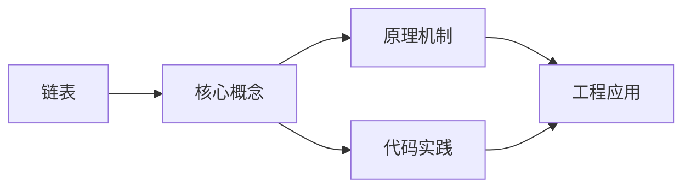
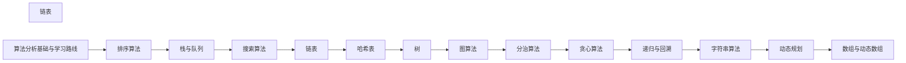

## 1. 学习目标（Bloom 分类）

本节按照布鲁姆教育目标分类学组织学习路径。本文主题为《链表》，属于 算法 模块，读者可以根据自身阶段选择阅读深度。

记忆层面：能够准确复述本文的核心概念、术语与基本语法或操作步骤，并能够在提问或检索时快速定位对应知识点。能够说出 算法 的核心定义、定理与公式。

理解层面：能够用自己的语言解释核心原理与工作机制，说明概念之间的因果关系，而不是机械记忆结论。能够解释 算法 概念背后的直觉与推导。

应用层面：能够在真实项目或练习场景中运用本文知识解决具体问题，写出正确且可维护的实现。能够运用 算法 方法解决标准问题。

分析层面：能够拆解复杂问题，比较本文主题与相邻概念的异同，识别边界条件与例外情况。能够分析 算法 方法的适用条件与局限。

评价层面：能够根据约束条件（性能、可读性、安全、成本）评价不同方案的优劣，做出有依据的技术决策。能够评价不同 算法 方法的优劣。

创造层面：能够把本文知识与其他模块知识组合，设计出新的解决方案或可复用的工程模式。能够把 算法 应用于编程与工程问题。

通过本节学习，读者应当能够把《链表》纳入自己的知识网络，并与 算法 模块的其他主题（复杂度、排序、搜索、动态规划、图论）建立关联。

## 2. 历史动机与发展脉络

《链表》是 算法 领域的重要主题。要真正理解它，需要先了解它解决的问题与演进过程。

算法是解决问题的有限步骤描述；算法分析（Knuth 奠基）把“快慢”量化为复杂度，让比较脱离机器差异。
经典体系：排序（快排/归并/堆）、搜索（二分/BST/哈希）、动态规划、贪心、图论（最短路/最小生成树）、字符串（KMP/Trie）。
现代演进：近似算法与随机算法、并行算法、缓存与 I/O 感知算法、算法在机器学习（优化）中的应用。

回到本文主题：链表 的提出与成熟，正是上述技术背景下的必然产物。早期实现往往以简单可用为目标，随着工程规模扩大，社区逐渐沉淀出标准做法与最佳实践；理解这一脉络，可以帮助读者判断“为什么文档中的推荐写法是现在这个样子”，也能在遇到历史遗留代码时准确识别其设计年代与取舍。


## 3. 形式化定义与核心概念精讲

本节把《链表》涉及的核心概念以“定义 + 讲解”的形式展开。读者应把定义当作工具，把讲解当作理解路径；两者结合才能形成可迁移的知识。

复杂度：大 O 描述最坏增长；主定理解递归；摊还分析解释动态数组等结构。
排序下界：基于比较的排序至少 Ω(n log n)；计数/基数排序利用数据特性突破。
动态规划：最优子结构 + 重叠子问题；状态定义与转移方程是核心。

### 3.1 原文章节逐一精讲

原文档把主题拆分为 8 个小节，下面按顺序给出每一节的导读讲解，随后保留原文细节供精读。

#### 原文精读（完整保留）


#### 1. 链表概述

##### 1.1 链表 vs 数组

链表和数组是两种最基本的线性数据结构，它们在内存模型上有根本差异：

| 维度         | 数组           | 链表                 |
| ------------ | -------------- | -------------------- |
| 内存布局     | 连续           | 离散（通过指针连接） |
| 随机访问     | O(1)           | O(n)                 |
| 头部插入     | O(n)           | O(1)                 |
| 尾部插入     | O(1) amortized | O(n)/O(1)(有尾指针)  |
| 任意位置插入 | O(n)           | O(1)(已知前驱)       |
| 缓存局部性   | 好             | 差                   |
| 空间开销     | 无额外         | 每节点多一个指针     |

##### 1.2 缓存局部性分析

数组在内存中连续存储，CPU缓存行（通常64字节）可以预取相邻元素，缓存命中率高。链表节点分散在堆内存各处，每次访问可能触发缓存未命中。

实际性能差异：遍历100万个int元素，数组约1ms，链表约5-10ms（取决于内存分配器）。

> 跨模块引用：链表在哈希表冲突处理中的应用参见 [哈希表](algorithm/hashtable)。C++ STL list的实现参见 [C++基础](cpp/overview)。

---

#### 2. 单链表

##### 2.1 节点定义与基本操作

单链表每个节点包含数据域和指向下一个节点的指针域。

```python
class ListNode:
    def __init__(self, val=0, next=None):
        self.val = val
        self.next = next

class SinglyLinkedList:
    def __init__(self):
        self.head = None
        self.tail = None
        self.size = 0

    def add_at_head(self, val):
        node = ListNode(val, self.head)
        self.head = node
        if self.tail is None:
            self.tail = node
        self.size += 1

    def add_at_tail(self, val):
        node = ListNode(val)
        if self.tail is None:
            self.head = self.tail = node
        else:
            self.tail.next = node
            self.tail = node
        self.size += 1

    def delete_at_head(self):
        if self.head is None:
            return None
        val = self.head.val
        self.head = self.head.next
        if self.head is None:
            self.tail = None
        self.size -= 1
        return val

    def find(self, val):
        curr = self.head
        while curr:
            if curr.val == val:
                return curr
            curr = curr.next
        return None

    def to_list(self):
        result = []
        curr = self.head
        while curr:
            result.append(curr.val)
            curr = curr.next
        return result
```

```cpp
struct ListNode {
    int val;
    ListNode* next;
    ListNode(int v) : val(v), next(nullptr) {}
};

class SinglyLinkedList {
    ListNode* head;
    ListNode* tail;
    int sz;
public:
    SinglyLinkedList() : head(nullptr), tail(nullptr), sz(0) {}

    void addAtHead(int val) {
        ListNode* node = new ListNode(val);
        node->next = head;
        head = node;
        if (!tail) tail = node;
        sz++;
    }

    void addAtTail(int val) {
        ListNode* node = new ListNode(val);
        if (!tail) head = tail = node;
        else { tail->next = node; tail = node; }
        sz++;
    }

    int deleteAtHead() {
        if (!head) return -1;
        int val = head->val;
        ListNode* tmp = head;
        head = head->next;
        delete tmp;
        if (!head) tail = nullptr;
        sz--;
        return val;
    }

    ListNode* find(int val) {
        ListNode* curr = head;
        while (curr) {
            if (curr->val == val) return curr;
            curr = curr->next;
        }
        return nullptr;
    }
};
```

##### 2.2 哨兵节点（Dummy Head）

哨兵节点是一个不存储实际数据的头节点，用于简化边界处理：

```python
def remove_elements(head, val):
    dummy = ListNode(0, head)
    prev = dummy
    while prev.next:
        if prev.next.val == val:
            prev.next = prev.next.next
        else:
            prev = prev.next
    return dummy.next
```

不使用哨兵时，删除头节点需要特殊处理；使用哨兵后，所有删除操作统一为"删除prev.next"。

##### 2.3 复杂度分析

| 操作               | 时间 | 空间 |
| ------------------ | ---- | ---- |
| 头部插入           | O(1) | O(1) |
| 尾部插入(有尾指针) | O(1) | O(1) |
| 尾部插入(无尾指针) | O(n) | O(1) |
| 查找               | O(n) | O(1) |
| 删除(已知前驱)     | O(1) | O(1) |
| 删除(已知节点指针) | O(n) | O(1) |

---

#### 3. 双链表

##### 3.1 节点定义与基本操作

双链表每个节点额外包含指向前驱节点的指针，支持双向遍历。

```python
class DoublyListNode:
    def __init__(self, val=0, prev=None, next=None):
        self.val = val
        self.prev = prev
        self.next = next

class DoublyLinkedList:
    def __init__(self):
        self.head = None
        self.tail = None

    def add_at_head(self, val):
        node = DoublyListNode(val, None, self.head)
        if self.head:
            self.head.prev = node
        else:
            self.tail = node
        self.head = node

    def add_at_tail(self, val):
        node = DoublyListNode(val, self.tail, None)
        if self.tail:
            self.tail.next = node
        else:
            self.head = node
        self.tail = node

    def remove_node(self, node):
        if node.prev:
            node.prev.next = node.next
        else:
            self.head = node.next
        if node.next:
            node.next.prev = node.prev
        else:
            self.tail = node.prev
```

```cpp
struct DoublyListNode {
    int val;
    DoublyListNode* prev;
    DoublyListNode* next;
    DoublyListNode(int v) : val(v), prev(nullptr), next(nullptr) {}
};

class DoublyLinkedList {
    DoublyListNode* head;
    DoublyListNode* tail;
public:
    DoublyLinkedList() : head(nullptr), tail(nullptr) {}

    void addAtHead(int val) {
        auto node = new DoublyListNode(val);
        node->next = head;
        if (head) head->prev = node;
        else tail = node;
        head = node;
    }

    void addAtTail(int val) {
        auto node = new DoublyListNode(val);
        node->prev = tail;
        if (tail) tail->next = node;
        else head = node;
        tail = node;
    }

    void removeNode(DoublyListNode* node) {
        if (node->prev) node->prev->next = node->next;
        else head = node->next;
        if (node->next) node->next->prev = node->prev;
        else tail = node->prev;
        delete node;
    }
};
```

##### 3.2 LRU缓存中的双链表应用

LRU（Least Recently Used）缓存使用哈希表+双链表实现O(1)的get和put操作：

```python
class LRUCache:
    def __init__(self, capacity):
        self.cap = capacity
        self.cache = {}
        self.head = DoublyListNode()
        self.tail = DoublyListNode()
        self.head.next = self.tail
        self.tail.prev = self.head

    def _remove(self, node):
        node.prev.next = node.next
        node.next.prev = node.prev

    def _add_to_front(self, node):
        node.next = self.head.next
        node.prev = self.head
        self.head.next.prev = node
        self.head.next = node

    def get(self, key):
        if key not in self.cache:
            return -1
        node = self.cache[key]
        self._remove(node)
        self._add_to_front(node)
        return node.val

    def put(self, key, value):
        if key in self.cache:
            self._remove(self.cache[key])
            del self.cache[key]
        node = DoublyListNode(value)
        node.key = key
        self._add_to_front(node)
        self.cache[key] = node
        if len(self.cache) > self.cap:
            lru = self.tail.prev
            self._remove(lru)
            del self.cache[lru.key]
```

> 跨模块引用：LRU缓存的完整分析参见 [哈希表](algorithm/hashtable)。

---

#### 4. 环形链表

##### 4.1 循环链表结构

循环链表的尾节点指向头节点，形成环。常用于操作系统进程调度（轮转调度）、约瑟夫问题等。

##### 4.2 约瑟夫问题

n个人围成一圈，从第1个人开始报数，报到m的人出列，求最后剩下的人。

**数学解法**：f(n,m) = (f(n-1,m) + m) % n，f(1,m) = 0

```python
def josephus_math(n, m):
    result = 0
    for i in range(2, n + 1):
        result = (result + m) % i
    return result + 1

def josephus_simulate(n, m):
    people = list(range(1, n + 1))
    idx = 0
    while len(people) > 1:
        idx = (idx + m - 1) % len(people)
        people.pop(idx)
    return people[0]
```

```cpp
int josephusMath(int n, int m) {
    int result = 0;
    for (int i = 2; i <= n; i++) {
        result = (result + m) % i;
    }
    return result + 1;
}
```

复杂度：数学解O(n)，模拟解O(nm)。

---

#### 5. 经典操作与技巧

##### 5.1 快慢指针

快慢指针是链表最核心的技巧，两个指针以不同速度前进。

**找中点**：快指针走两步，慢指针走一步，快指针到末尾时慢指针在中点。

**判环**：快慢指针相遇则存在环。

**找环入口**：快慢指针相遇后，一个指针从头部出发，另一个从相遇点出发，两者相遇即为环入口。

```python
def find_middle(head):
    slow = fast = head
    while fast and fast.next:
        slow = slow.next
        fast = fast.next.next
    return slow

def has_cycle(head):
    slow = fast = head
    while fast and fast.next:
        slow = slow.next
        fast = fast.next.next
        if slow == fast:
            return True
    return False

def detect_cycle(head):
    slow = fast = head
    while fast and fast.next:
        slow = slow.next
        fast = fast.next.next
        if slow == fast:
            ptr = head
            while ptr != slow:
                ptr = ptr.next
                slow = slow.next
            return ptr
    return None
```

```cpp
ListNode* findMiddle(ListNode* head) {
    ListNode *slow = head, *fast = head;
    while (fast && fast->next) {
        slow = slow->next;
        fast = fast->next->next;
    }
    return slow;
}

bool hasCycle(ListNode* head) {
    ListNode *slow = head, *fast = head;
    while (fast && fast->next) {
        slow = slow->next;
        fast = fast->next->next;
        if (slow == fast) return true;
    }
    return false;
}

ListNode* detectCycle(ListNode* head) {
    ListNode *slow = head, *fast = head;
    while (fast && fast->next) {
        slow = slow->next;
        fast = fast->next->next;
        if (slow == fast) {
            ListNode* ptr = head;
            while (ptr != slow) { ptr = ptr->next; slow = slow->next; }
            return ptr;
        }
    }
    return nullptr;
}
```

**环入口的数学证明**：设head到环入口距离为a，环入口到相遇点距离为b，环长度为c。快指针走2(a+b)步，慢指针走a+b步。快指针多走a+b = kc步。因此a = kc - b = (k-1)c + (c-b)。从head和相遇点同时出发，各走a步后必在环入口相遇。

##### 5.2 反转链表

```python
def reverse_list(head):
    prev = None
    curr = head
    while curr:
        next_node = curr.next
        curr.next = prev
        prev = curr
        curr = next_node
    return prev

def reverse_list_recursive(head):
    if not head or not head.next:
        return head
    new_head = reverse_list_recursive(head.next)
    head.next.next = head
    head.next = None
    return new_head

def reverse_between(head, left, right):
    dummy = ListNode(0, head)
    prev = dummy
    for _ in range(left - 1):
        prev = prev.next
    curr = prev.next
    for _ in range(right - left):
        next_node = curr.next
        curr.next = next_node.next
        next_node.next = prev.next
        prev.next = next_node
    return dummy.next
```

```cpp
ListNode* reverseList(ListNode* head) {
    ListNode* prev = nullptr;
    ListNode* curr = head;
    while (curr) {
        ListNode* nextNode = curr->next;
        curr->next = prev;
        prev = curr;
        curr = nextNode;
    }
    return prev;
}

ListNode* reverseBetween(ListNode* head, int left, int right) {
    ListNode* dummy = new ListNode(0);
    dummy->next = head;
    ListNode* prev = dummy;
    for (int i = 0; i < left - 1; i++) prev = prev->next;
    ListNode* curr = prev->next;
    for (int i = 0; i < right - left; i++) {
        ListNode* nextNode = curr->next;
        curr->next = nextNode->next;
        nextNode->next = prev->next;
        prev->next = nextNode;
    }
    return dummy->next;
}
```

##### 5.3 合并有序链表

```python
def merge_two_lists(l1, l2):
    dummy = ListNode()
    curr = dummy
    while l1 and l2:
        if l1.val <= l2.val:
            curr.next = l1
            l1 = l1.next
        else:
            curr.next = l2
            l2 = l2.next
        curr = curr.next
    curr.next = l1 or l2
    return dummy.next

def merge_k_lists(lists):
    import heapq
    dummy = ListNode()
    curr = dummy
    heap = []
    for i, node in enumerate(lists):
        if node:
            heapq.heappush(heap, (node.val, i, node))
    while heap:
        val, i, node = heapq.heappop(heap)
        curr.next = node
        curr = curr.next
        if node.next:
            heapq.heappush(heap, (node.next.val, i, node.next))
    return dummy.next
```

```cpp
ListNode* mergeTwoLists(ListNode* l1, ListNode* l2) {
    ListNode dummy(0);
    ListNode* curr = &dummy;
    while (l1 && l2) {
        if (l1->val <= l2->val) { curr->next = l1; l1 = l1->next; }
        else { curr->next = l2; l2 = l2->next; }
        curr = curr->next;
    }
    curr->next = l1 ? l1 : l2;
    return dummy.next;
}
```

---

#### 6. 常见面试题型

##### 6.1 题型分类与解题模板

| 题型     | 核心技巧         | 代表题目     |
| -------- | ---------------- | ------------ |
| 反转系列 | 迭代/递归反转    | LC-206/92/25 |
| 合并系列 | 双指针归并       | LC-21/23     |
| 环检测   | 快慢指针         | LC-141/142   |
| 相交链表 | 双指针交叉遍历   | LC-160       |
| 回文链表 | 快慢指针+反转    | LC-234       |
| 删除节点 | 哨兵+双指针      | LC-19/203/83 |
| 排序链表 | 归并排序         | LC-148       |
| 重排链表 | 找中点+反转+合并 | LC-143       |

##### 6.2 相交链表（LC-160）

两个链表在某节点相交后共享后续节点。双指针交叉遍历：pA走完A后走B，pB走完B后走A，两者必在交点相遇（或同时为None）。

```python
def get_intersection_node(headA, headB):
    if not headA or not headB:
        return None
    pA, pB = headA, headB
    while pA != pB:
        pA = pA.next if pA else headB
        pB = pB.next if pB else headA
    return pA
```

```cpp
ListNode* getIntersectionNode(ListNode* headA, ListNode* headB) {
    if (!headA || !headB) return nullptr;
    ListNode *pA = headA, *pB = headB;
    while (pA != pB) {
        pA = pA ? pA->next : headB;
        pB = pB ? pB->next : headA;
    }
    return pA;
}
```

**正确性证明**：设A独有a个节点，B独有b个节点，共享c个节点。pA走a+c+b步，pB走b+c+a步，两者步数相等，必在交点相遇。

##### 6.3 删除链表倒数第N个节点（LC-19）

快指针先走n步，然后快慢指针同时前进，快指针到末尾时慢指针在倒数第n+1个位置。

```python
def remove_nth_from_end(head, n):
    dummy = ListNode(0, head)
    fast = slow = dummy
    for _ in range(n):
        fast = fast.next
    while fast.next:
        fast = fast.next
        slow = slow.next
    slow.next = slow.next.next
    return dummy.next
```

```cpp
ListNode* removeNthFromEnd(ListNode* head, int n) {
    ListNode* dummy = new ListNode(0);
    dummy->next = head;
    ListNode *fast = dummy, *slow = dummy;
    for (int i = 0; i < n; i++) fast = fast->next;
    while (fast->next) { fast = fast->next; slow = slow->next; }
    ListNode* toDelete = slow->next;
    slow->next = slow->next->next;
    delete toDelete;
    return dummy->next;
}
```

##### 6.4 回文链表（LC-234）

找中点 -> 反转后半部分 -> 双指针比较 -> 恢复（可选）

```python
def is_palindrome(head):
    if not head or not head.next:
        return True
    slow = fast = head
    while fast.next and fast.next.next:
        slow = slow.next
        fast = fast.next.next
    second_half = reverse_list(slow.next)
    p1, p2 = head, second_half
    result = True
    while p2:
        if p1.val != p2.val:
            result = False
            break
        p1 = p1.next
        p2 = p2.next
    slow.next = reverse_list(second_half)
    return result
```

##### 6.5 K个一组翻转链表（LC-25）

```python
def reverse_k_group(head, k):
    def get_kth(node, k):
        while node and k > 0:
            node = node.next
            k -= 1
        return node

    dummy = ListNode(0, head)
    group_prev = dummy
    while True:
        kth = get_kth(group_prev, k)
        if not kth:
            break
        group_next = kth.next
        prev, curr = kth.next, group_prev.next
        while curr != group_next:
            next_node = curr.next
            curr.next = prev
            prev = curr
            curr = next_node
        tmp = group_prev.next
        group_prev.next = kth
        group_prev = tmp
    return dummy.next
```

---

#### 7. 链表操作速查表

| 操作           | 时间     | 空间 | 关键技巧                   |
| -------------- | -------- | ---- | -------------------------- |
| 头部插入       | O(1)     | O(1) | 直接操作head               |
| 尾部插入       | O(1)\*   | O(1) | 维护tail指针               |
| 查找           | O(n)     | O(1) | 线性遍历                   |
| 删除(已知前驱) | O(1)     | O(1) | prev.next = prev.next.next |
| 反转           | O(n)     | O(1) | 三指针迭代                 |
| 找中点         | O(n)     | O(1) | 快慢指针                   |
| 判环           | O(n)     | O(1) | 快慢指针                   |
| 找环入口       | O(n)     | O(1) | 快慢指针+数学              |
| 合并两个有序   | O(n+m)   | O(1) | 双指针                     |
| 合并K个有序    | O(Nlogk) | O(k) | 最小堆                     |
| 删除倒数第n    | O(n)     | O(1) | 快慢指针间隔n              |
| 回文判断       | O(n)     | O(1) | 中点+反转                  |

\*有尾指针时

---

#### 8. 延伸阅读

- CLRS 第 10 章（链表基础）
- 《剑指 Offer》链表专题
- [Linked List -- VisuAlgo](https://visualgo.net/en/list)
- Skiena, _The Algorithm Design Manual_, Section 3.1

> 跨模块引用：链表在哈希表和LRU缓存中的应用参见 [哈希表](algorithm/hashtable)。刷题实践参见 [LeetCode刷题指南](algorithm/leetcode-guide)。


### 3.2 概念关系图

下面用 Mermaid 图表达本文核心概念之间的关系，帮助读者建立整体图景：



图中展示的是本文知识的结构化关系：核心概念是入口，原理机制解释“为什么”，代码实践演示“怎么做”，工程应用回答“何时用”。读者学习时可以把每个小节的内容挂接到对应节点上。

## 4. 理论推导与原理解析

本节深入《链表》背后的原理。理论部分不求面面俱到，而是聚焦“能解释现象、能指导实践”的关键推导。

复杂度：大 O 描述最坏增长；主定理解递归；摊还分析解释动态数组等结构。
排序下界：基于比较的排序至少 Ω(n log n)；计数/基数排序利用数据特性突破。
动态规划：最优子结构 + 重叠子问题；状态定义与转移方程是核心。
图算法：DFS/BFS 遍历；Dijkstra 非负权最短路；拓扑排序；并查集连通性。

需要强调的是，理论推导与工程实践之间存在翻译层：理论给出的是理想化模型与边界条件，工程代码则必须处理真实环境中的例外。读者在学习时应先掌握理论的“标准情形”，再通过陷阱章节了解“非标准情形”。

## 5. 代码示例与逐行讲解

本节把原文中的代码示例系统整理，并为每个示例补充用途说明与讲解。读者不应只浏览代码，而应逐段对照讲解理解设计意图。

### 5.1 示例：2.1 节点定义与基本操作

该示例来自原文《2.1 节点定义与基本操作》小节，用于演示链表相关操作。阅读时请先看代码结构，再看其后的讲解。

```python
class ListNode:
    def __init__(self, val=0, next=None):
        self.val = val
        self.next = next

class SinglyLinkedList:
    def __init__(self):
        self.head = None
        self.tail = None
        self.size = 0

    def add_at_head(self, val):
        node = ListNode(val, self.head)
        self.head = node
        if self.tail is None:
            self.tail = node
        self.size += 1

    def add_at_tail(self, val):
        node = ListNode(val)
        if self.tail is None:
            self.head = self.tail = node
        else:
            self.tail.next = node
            self.tail = node
        self.size += 1

    def delete_at_head(self):
        if self.head is None:
            return None
        val = self.head.val
        self.head = self.head.next
        if self.head is None:
            self.tail = None
        self.size -= 1
        return val

    def find(self, val):
        curr = self.head
        while curr:
            if curr.val == val:
                return curr
            curr = curr.next
        return None

    def to_list(self):
        result = []
        curr = self.head
        while curr:
            result.append(curr.val)
            curr = curr.next
        return result
```

讲解：这段代码演示了本节核心知识点。代码中的关键操作可以归纳为三步：准备（定义或初始化）、执行（核心逻辑）、收尾（释放资源或返回结果）。实际项目中，这三步往往被封装为函数或类，以提升复用性与可测试性。

关键点分析：

该示例共 46 行有效代码，包含 5 类关键结构（class、def、if、while、return）。其中：

- 入口与初始化部分负责建立上下文，对应实际项目中的启动或装配逻辑；
- 核心逻辑部分体现本文主题的主要操作，是阅读时最需要对照讲解理解的部分；
- 输出或返回部分把结果交给调用方，注意其类型与边界条件。

进阶思考路径：先尝试修改参数观察行为变化，再把示例中的模式迁移到自己的项目中；每次修改都记录预期与实测差异，这是把示例转化为能力的最快方式。

### 5.2 示例：2.1 节点定义与基本操作

该示例来自原文《2.1 节点定义与基本操作》小节，用于演示链表相关操作。阅读时请先看代码结构，再看其后的讲解。

```cpp
struct ListNode {
    int val;
    ListNode* next;
    ListNode(int v) : val(v), next(nullptr) {}
};

class SinglyLinkedList {
    ListNode* head;
    ListNode* tail;
    int sz;
public:
    SinglyLinkedList() : head(nullptr), tail(nullptr), sz(0) {}

    void addAtHead(int val) {
        ListNode* node = new ListNode(val);
        node->next = head;
        head = node;
        if (!tail) tail = node;
        sz++;
    }

    void addAtTail(int val) {
        ListNode* node = new ListNode(val);
        if (!tail) head = tail = node;
        else { tail->next = node; tail = node; }
        sz++;
    }

    int deleteAtHead() {
        if (!head) return -1;
        int val = head->val;
        ListNode* tmp = head;
        head = head->next;
        delete tmp;
        if (!head) tail = nullptr;
        sz--;
        return val;
    }

    ListNode* find(int val) {
        ListNode* curr = head;
        while (curr) {
            if (curr->val == val) return curr;
            curr = curr->next;
        }
        return nullptr;
    }
};
```

讲解：这段代码演示了本节核心知识点。代码中的关键操作可以归纳为三步：准备（定义或初始化）、执行（核心逻辑）、收尾（释放资源或返回结果）。实际项目中，这三步往往被封装为函数或类，以提升复用性与可测试性。

关键点分析：

该示例共 43 行有效代码，包含 4 类关键结构（class、if、while、return）。其中：

- 入口与初始化部分负责建立上下文，对应实际项目中的启动或装配逻辑；
- 核心逻辑部分体现本文主题的主要操作，是阅读时最需要对照讲解理解的部分；
- 输出或返回部分把结果交给调用方，注意其类型与边界条件。

进阶思考路径：先尝试修改参数观察行为变化，再把示例中的模式迁移到自己的项目中；每次修改都记录预期与实测差异，这是把示例转化为能力的最快方式。

### 5.3 示例：2.2 哨兵节点（Dummy Head）

该示例来自原文《2.2 哨兵节点（Dummy Head）》小节，用于演示链表相关操作。阅读时请先看代码结构，再看其后的讲解。

```python
def remove_elements(head, val):
    dummy = ListNode(0, head)
    prev = dummy
    while prev.next:
        if prev.next.val == val:
            prev.next = prev.next.next
        else:
            prev = prev.next
    return dummy.next
```

讲解：这段代码演示了本节核心知识点。代码中的关键操作可以归纳为三步：准备（定义或初始化）、执行（核心逻辑）、收尾（释放资源或返回结果）。实际项目中，这三步往往被封装为函数或类，以提升复用性与可测试性。

关键点分析：

该示例共 9 行有效代码，包含 4 类关键结构（def、if、while、return）。其中：

- 入口与初始化部分负责建立上下文，对应实际项目中的启动或装配逻辑；
- 核心逻辑部分体现本文主题的主要操作，是阅读时最需要对照讲解理解的部分；
- 输出或返回部分把结果交给调用方，注意其类型与边界条件。

进阶思考路径：先尝试修改参数观察行为变化，再把示例中的模式迁移到自己的项目中；每次修改都记录预期与实测差异，这是把示例转化为能力的最快方式。

### 5.4 示例：3.1 节点定义与基本操作

该示例来自原文《3.1 节点定义与基本操作》小节，用于演示链表相关操作。阅读时请先看代码结构，再看其后的讲解。

```python
class DoublyListNode:
    def __init__(self, val=0, prev=None, next=None):
        self.val = val
        self.prev = prev
        self.next = next

class DoublyLinkedList:
    def __init__(self):
        self.head = None
        self.tail = None

    def add_at_head(self, val):
        node = DoublyListNode(val, None, self.head)
        if self.head:
            self.head.prev = node
        else:
            self.tail = node
        self.head = node

    def add_at_tail(self, val):
        node = DoublyListNode(val, self.tail, None)
        if self.tail:
            self.tail.next = node
        else:
            self.head = node
        self.tail = node

    def remove_node(self, node):
        if node.prev:
            node.prev.next = node.next
        else:
            self.head = node.next
        if node.next:
            node.next.prev = node.prev
        else:
            self.tail = node.prev
```

讲解：这段代码演示了本节核心知识点。代码中的关键操作可以归纳为三步：准备（定义或初始化）、执行（核心逻辑）、收尾（释放资源或返回结果）。实际项目中，这三步往往被封装为函数或类，以提升复用性与可测试性。

关键点分析：

该示例共 32 行有效代码，包含 3 类关键结构（class、def、if）。其中：

- 入口与初始化部分负责建立上下文，对应实际项目中的启动或装配逻辑；
- 核心逻辑部分体现本文主题的主要操作，是阅读时最需要对照讲解理解的部分；
- 输出或返回部分把结果交给调用方，注意其类型与边界条件。

进阶思考路径：先尝试修改参数观察行为变化，再把示例中的模式迁移到自己的项目中；每次修改都记录预期与实测差异，这是把示例转化为能力的最快方式。

### 5.5 示例：3.1 节点定义与基本操作

该示例来自原文《3.1 节点定义与基本操作》小节，用于演示链表相关操作。阅读时请先看代码结构，再看其后的讲解。

```cpp
struct DoublyListNode {
    int val;
    DoublyListNode* prev;
    DoublyListNode* next;
    DoublyListNode(int v) : val(v), prev(nullptr), next(nullptr) {}
};

class DoublyLinkedList {
    DoublyListNode* head;
    DoublyListNode* tail;
public:
    DoublyLinkedList() : head(nullptr), tail(nullptr) {}

    void addAtHead(int val) {
        auto node = new DoublyListNode(val);
        node->next = head;
        if (head) head->prev = node;
        else tail = node;
        head = node;
    }

    void addAtTail(int val) {
        auto node = new DoublyListNode(val);
        node->prev = tail;
        if (tail) tail->next = node;
        else head = node;
        tail = node;
    }

    void removeNode(DoublyListNode* node) {
        if (node->prev) node->prev->next = node->next;
        else head = node->next;
        if (node->next) node->next->prev = node->prev;
        else tail = node->prev;
        delete node;
    }
};
```

讲解：这段代码演示了本节核心知识点。代码中的关键操作可以归纳为三步：准备（定义或初始化）、执行（核心逻辑）、收尾（释放资源或返回结果）。实际项目中，这三步往往被封装为函数或类，以提升复用性与可测试性。

关键点分析：

该示例共 33 行有效代码，包含 2 类关键结构（class、if）。其中：

- 入口与初始化部分负责建立上下文，对应实际项目中的启动或装配逻辑；
- 核心逻辑部分体现本文主题的主要操作，是阅读时最需要对照讲解理解的部分；
- 输出或返回部分把结果交给调用方，注意其类型与边界条件。

进阶思考路径：先尝试修改参数观察行为变化，再把示例中的模式迁移到自己的项目中；每次修改都记录预期与实测差异，这是把示例转化为能力的最快方式。

### 5.6 示例：3.2 LRU缓存中的双链表应用

该示例来自原文《3.2 LRU缓存中的双链表应用》小节，用于演示链表相关操作。阅读时请先看代码结构，再看其后的讲解。

```python
class LRUCache:
    def __init__(self, capacity):
        self.cap = capacity
        self.cache = {}
        self.head = DoublyListNode()
        self.tail = DoublyListNode()
        self.head.next = self.tail
        self.tail.prev = self.head

    def _remove(self, node):
        node.prev.next = node.next
        node.next.prev = node.prev

    def _add_to_front(self, node):
        node.next = self.head.next
        node.prev = self.head
        self.head.next.prev = node
        self.head.next = node

    def get(self, key):
        if key not in self.cache:
            return -1
        node = self.cache[key]
        self._remove(node)
        self._add_to_front(node)
        return node.val

    def put(self, key, value):
        if key in self.cache:
            self._remove(self.cache[key])
            del self.cache[key]
        node = DoublyListNode(value)
        node.key = key
        self._add_to_front(node)
        self.cache[key] = node
        if len(self.cache) > self.cap:
            lru = self.tail.prev
            self._remove(lru)
            del self.cache[lru.key]
```

讲解：这段代码演示了本节核心知识点。代码中的关键操作可以归纳为三步：准备（定义或初始化）、执行（核心逻辑）、收尾（释放资源或返回结果）。实际项目中，这三步往往被封装为函数或类，以提升复用性与可测试性。

关键点分析：

该示例共 35 行有效代码，包含 4 类关键结构（class、def、if、return）。其中：

- 入口与初始化部分负责建立上下文，对应实际项目中的启动或装配逻辑；
- 核心逻辑部分体现本文主题的主要操作，是阅读时最需要对照讲解理解的部分；
- 输出或返回部分把结果交给调用方，注意其类型与边界条件。

进阶思考路径：先尝试修改参数观察行为变化，再把示例中的模式迁移到自己的项目中；每次修改都记录预期与实测差异，这是把示例转化为能力的最快方式。

### 5.7 示例：4.2 约瑟夫问题

该示例来自原文《4.2 约瑟夫问题》小节，用于演示链表相关操作。阅读时请先看代码结构，再看其后的讲解。

```python
def josephus_math(n, m):
    result = 0
    for i in range(2, n + 1):
        result = (result + m) % i
    return result + 1

def josephus_simulate(n, m):
    people = list(range(1, n + 1))
    idx = 0
    while len(people) > 1:
        idx = (idx + m - 1) % len(people)
        people.pop(idx)
    return people[0]
```

讲解：这段代码演示了本节核心知识点。代码中的关键操作可以归纳为三步：准备（定义或初始化）、执行（核心逻辑）、收尾（释放资源或返回结果）。实际项目中，这三步往往被封装为函数或类，以提升复用性与可测试性。

关键点分析：

该示例共 12 行有效代码，包含 4 类关键结构（def、for、while、return）。其中：

- 入口与初始化部分负责建立上下文，对应实际项目中的启动或装配逻辑；
- 核心逻辑部分体现本文主题的主要操作，是阅读时最需要对照讲解理解的部分；
- 输出或返回部分把结果交给调用方，注意其类型与边界条件。

进阶思考路径：先尝试修改参数观察行为变化，再把示例中的模式迁移到自己的项目中；每次修改都记录预期与实测差异，这是把示例转化为能力的最快方式。

### 5.8 示例：4.2 约瑟夫问题

该示例来自原文《4.2 约瑟夫问题》小节，用于演示链表相关操作。阅读时请先看代码结构，再看其后的讲解。

```cpp
int josephusMath(int n, int m) {
    int result = 0;
    for (int i = 2; i <= n; i++) {
        result = (result + m) % i;
    }
    return result + 1;
}
```

讲解：这段代码演示了本节核心知识点。代码中的关键操作可以归纳为三步：准备（定义或初始化）、执行（核心逻辑）、收尾（释放资源或返回结果）。实际项目中，这三步往往被封装为函数或类，以提升复用性与可测试性。

关键点分析：

该示例共 7 行有效代码，包含 2 类关键结构（for、return）。其中：

- 入口与初始化部分负责建立上下文，对应实际项目中的启动或装配逻辑；
- 核心逻辑部分体现本文主题的主要操作，是阅读时最需要对照讲解理解的部分；
- 输出或返回部分把结果交给调用方，注意其类型与边界条件。

进阶思考路径：先尝试修改参数观察行为变化，再把示例中的模式迁移到自己的项目中；每次修改都记录预期与实测差异，这是把示例转化为能力的最快方式。

### 5.9 示例：5.1 快慢指针

该示例来自原文《5.1 快慢指针》小节，用于演示链表相关操作。阅读时请先看代码结构，再看其后的讲解。

```python
def find_middle(head):
    slow = fast = head
    while fast and fast.next:
        slow = slow.next
        fast = fast.next.next
    return slow

def has_cycle(head):
    slow = fast = head
    while fast and fast.next:
        slow = slow.next
        fast = fast.next.next
        if slow == fast:
            return True
    return False

def detect_cycle(head):
    slow = fast = head
    while fast and fast.next:
        slow = slow.next
        fast = fast.next.next
        if slow == fast:
            ptr = head
            while ptr != slow:
                ptr = ptr.next
                slow = slow.next
            return ptr
    return None
```

讲解：这段代码演示了本节核心知识点。代码中的关键操作可以归纳为三步：准备（定义或初始化）、执行（核心逻辑）、收尾（释放资源或返回结果）。实际项目中，这三步往往被封装为函数或类，以提升复用性与可测试性。

关键点分析：

该示例共 26 行有效代码，包含 4 类关键结构（def、if、while、return）。其中：

- 入口与初始化部分负责建立上下文，对应实际项目中的启动或装配逻辑；
- 核心逻辑部分体现本文主题的主要操作，是阅读时最需要对照讲解理解的部分；
- 输出或返回部分把结果交给调用方，注意其类型与边界条件。

进阶思考路径：先尝试修改参数观察行为变化，再把示例中的模式迁移到自己的项目中；每次修改都记录预期与实测差异，这是把示例转化为能力的最快方式。

### 5.10 示例：5.1 快慢指针

该示例来自原文《5.1 快慢指针》小节，用于演示链表相关操作。阅读时请先看代码结构，再看其后的讲解。

```cpp
ListNode* findMiddle(ListNode* head) {
    ListNode *slow = head, *fast = head;
    while (fast && fast->next) {
        slow = slow->next;
        fast = fast->next->next;
    }
    return slow;
}

bool hasCycle(ListNode* head) {
    ListNode *slow = head, *fast = head;
    while (fast && fast->next) {
        slow = slow->next;
        fast = fast->next->next;
        if (slow == fast) return true;
    }
    return false;
}

ListNode* detectCycle(ListNode* head) {
    ListNode *slow = head, *fast = head;
    while (fast && fast->next) {
        slow = slow->next;
        fast = fast->next->next;
        if (slow == fast) {
            ListNode* ptr = head;
            while (ptr != slow) { ptr = ptr->next; slow = slow->next; }
            return ptr;
        }
    }
    return nullptr;
}
```

讲解：这段代码演示了本节核心知识点。代码中的关键操作可以归纳为三步：准备（定义或初始化）、执行（核心逻辑）、收尾（释放资源或返回结果）。实际项目中，这三步往往被封装为函数或类，以提升复用性与可测试性。

关键点分析：

该示例共 30 行有效代码，包含 3 类关键结构（if、while、return）。其中：

- 入口与初始化部分负责建立上下文，对应实际项目中的启动或装配逻辑；
- 核心逻辑部分体现本文主题的主要操作，是阅读时最需要对照讲解理解的部分；
- 输出或返回部分把结果交给调用方，注意其类型与边界条件。

进阶思考路径：先尝试修改参数观察行为变化，再把示例中的模式迁移到自己的项目中；每次修改都记录预期与实测差异，这是把示例转化为能力的最快方式。

### 5.11 示例：5.2 反转链表

该示例来自原文《5.2 反转链表》小节，用于演示链表相关操作。阅读时请先看代码结构，再看其后的讲解。

```python
def reverse_list(head):
    prev = None
    curr = head
    while curr:
        next_node = curr.next
        curr.next = prev
        prev = curr
        curr = next_node
    return prev

def reverse_list_recursive(head):
    if not head or not head.next:
        return head
    new_head = reverse_list_recursive(head.next)
    head.next.next = head
    head.next = None
    return new_head

def reverse_between(head, left, right):
    dummy = ListNode(0, head)
    prev = dummy
    for _ in range(left - 1):
        prev = prev.next
    curr = prev.next
    for _ in range(right - left):
        next_node = curr.next
        curr.next = next_node.next
        next_node.next = prev.next
        prev.next = next_node
    return dummy.next
```

讲解：这段代码演示了本节核心知识点。代码中的关键操作可以归纳为三步：准备（定义或初始化）、执行（核心逻辑）、收尾（释放资源或返回结果）。实际项目中，这三步往往被封装为函数或类，以提升复用性与可测试性。

关键点分析：

该示例共 28 行有效代码，包含 5 类关键结构（def、if、for、while、return）。其中：

- 入口与初始化部分负责建立上下文，对应实际项目中的启动或装配逻辑；
- 核心逻辑部分体现本文主题的主要操作，是阅读时最需要对照讲解理解的部分；
- 输出或返回部分把结果交给调用方，注意其类型与边界条件。

进阶思考路径：先尝试修改参数观察行为变化，再把示例中的模式迁移到自己的项目中；每次修改都记录预期与实测差异，这是把示例转化为能力的最快方式。

### 5.12 示例：5.2 反转链表

该示例来自原文《5.2 反转链表》小节，用于演示链表相关操作。阅读时请先看代码结构，再看其后的讲解。

```cpp
ListNode* reverseList(ListNode* head) {
    ListNode* prev = nullptr;
    ListNode* curr = head;
    while (curr) {
        ListNode* nextNode = curr->next;
        curr->next = prev;
        prev = curr;
        curr = nextNode;
    }
    return prev;
}

ListNode* reverseBetween(ListNode* head, int left, int right) {
    ListNode* dummy = new ListNode(0);
    dummy->next = head;
    ListNode* prev = dummy;
    for (int i = 0; i < left - 1; i++) prev = prev->next;
    ListNode* curr = prev->next;
    for (int i = 0; i < right - left; i++) {
        ListNode* nextNode = curr->next;
        curr->next = nextNode->next;
        nextNode->next = prev->next;
        prev->next = nextNode;
    }
    return dummy->next;
}
```

讲解：这段代码演示了本节核心知识点。代码中的关键操作可以归纳为三步：准备（定义或初始化）、执行（核心逻辑）、收尾（释放资源或返回结果）。实际项目中，这三步往往被封装为函数或类，以提升复用性与可测试性。

关键点分析：

该示例共 25 行有效代码，包含 3 类关键结构（for、while、return）。其中：

- 入口与初始化部分负责建立上下文，对应实际项目中的启动或装配逻辑；
- 核心逻辑部分体现本文主题的主要操作，是阅读时最需要对照讲解理解的部分；
- 输出或返回部分把结果交给调用方，注意其类型与边界条件。

进阶思考路径：先尝试修改参数观察行为变化，再把示例中的模式迁移到自己的项目中；每次修改都记录预期与实测差异，这是把示例转化为能力的最快方式。

### 5.13 示例：5.3 合并有序链表

该示例来自原文《5.3 合并有序链表》小节，用于演示链表相关操作。阅读时请先看代码结构，再看其后的讲解。

```python
def merge_two_lists(l1, l2):
    dummy = ListNode()
    curr = dummy
    while l1 and l2:
        if l1.val <= l2.val:
            curr.next = l1
            l1 = l1.next
        else:
            curr.next = l2
            l2 = l2.next
        curr = curr.next
    curr.next = l1 or l2
    return dummy.next

def merge_k_lists(lists):
    import heapq
    dummy = ListNode()
    curr = dummy
    heap = []
    for i, node in enumerate(lists):
        if node:
            heapq.heappush(heap, (node.val, i, node))
    while heap:
        val, i, node = heapq.heappop(heap)
        curr.next = node
        curr = curr.next
        if node.next:
            heapq.heappush(heap, (node.next.val, i, node.next))
    return dummy.next
```

讲解：这段代码演示了本节核心知识点。代码中的关键操作可以归纳为三步：准备（定义或初始化）、执行（核心逻辑）、收尾（释放资源或返回结果）。实际项目中，这三步往往被封装为函数或类，以提升复用性与可测试性。

关键点分析：

该示例共 28 行有效代码，包含 6 类关键结构（def、import、if、for、while、return）。其中：

- 入口与初始化部分负责建立上下文，对应实际项目中的启动或装配逻辑；
- 核心逻辑部分体现本文主题的主要操作，是阅读时最需要对照讲解理解的部分；
- 输出或返回部分把结果交给调用方，注意其类型与边界条件。

进阶思考路径：先尝试修改参数观察行为变化，再把示例中的模式迁移到自己的项目中；每次修改都记录预期与实测差异，这是把示例转化为能力的最快方式。

### 5.14 示例：5.3 合并有序链表

该示例来自原文《5.3 合并有序链表》小节，用于演示链表相关操作。阅读时请先看代码结构，再看其后的讲解。

```cpp
ListNode* mergeTwoLists(ListNode* l1, ListNode* l2) {
    ListNode dummy(0);
    ListNode* curr = &dummy;
    while (l1 && l2) {
        if (l1->val <= l2->val) { curr->next = l1; l1 = l1->next; }
        else { curr->next = l2; l2 = l2->next; }
        curr = curr->next;
    }
    curr->next = l1 ? l1 : l2;
    return dummy.next;
}
```

讲解：这段代码演示了本节核心知识点。代码中的关键操作可以归纳为三步：准备（定义或初始化）、执行（核心逻辑）、收尾（释放资源或返回结果）。实际项目中，这三步往往被封装为函数或类，以提升复用性与可测试性。

关键点分析：

该示例共 11 行有效代码，包含 3 类关键结构（if、while、return）。其中：

- 入口与初始化部分负责建立上下文，对应实际项目中的启动或装配逻辑；
- 核心逻辑部分体现本文主题的主要操作，是阅读时最需要对照讲解理解的部分；
- 输出或返回部分把结果交给调用方，注意其类型与边界条件。

进阶思考路径：先尝试修改参数观察行为变化，再把示例中的模式迁移到自己的项目中；每次修改都记录预期与实测差异，这是把示例转化为能力的最快方式。

### 5.15 示例：6.2 相交链表（LC-160）

该示例来自原文《6.2 相交链表（LC-160）》小节，用于演示链表相关操作。阅读时请先看代码结构，再看其后的讲解。

```python
def get_intersection_node(headA, headB):
    if not headA or not headB:
        return None
    pA, pB = headA, headB
    while pA != pB:
        pA = pA.next if pA else headB
        pB = pB.next if pB else headA
    return pA
```

讲解：这段代码演示了本节核心知识点。代码中的关键操作可以归纳为三步：准备（定义或初始化）、执行（核心逻辑）、收尾（释放资源或返回结果）。实际项目中，这三步往往被封装为函数或类，以提升复用性与可测试性。

关键点分析：

该示例共 8 行有效代码，包含 4 类关键结构（def、if、while、return）。其中：

- 入口与初始化部分负责建立上下文，对应实际项目中的启动或装配逻辑；
- 核心逻辑部分体现本文主题的主要操作，是阅读时最需要对照讲解理解的部分；
- 输出或返回部分把结果交给调用方，注意其类型与边界条件。

进阶思考路径：先尝试修改参数观察行为变化，再把示例中的模式迁移到自己的项目中；每次修改都记录预期与实测差异，这是把示例转化为能力的最快方式。

### 5.16 示例：6.2 相交链表（LC-160）

该示例来自原文《6.2 相交链表（LC-160）》小节，用于演示链表相关操作。阅读时请先看代码结构，再看其后的讲解。

```cpp
ListNode* getIntersectionNode(ListNode* headA, ListNode* headB) {
    if (!headA || !headB) return nullptr;
    ListNode *pA = headA, *pB = headB;
    while (pA != pB) {
        pA = pA ? pA->next : headB;
        pB = pB ? pB->next : headA;
    }
    return pA;
}
```

讲解：这段代码演示了本节核心知识点。代码中的关键操作可以归纳为三步：准备（定义或初始化）、执行（核心逻辑）、收尾（释放资源或返回结果）。实际项目中，这三步往往被封装为函数或类，以提升复用性与可测试性。

关键点分析：

该示例共 9 行有效代码，包含 3 类关键结构（if、while、return）。其中：

- 入口与初始化部分负责建立上下文，对应实际项目中的启动或装配逻辑；
- 核心逻辑部分体现本文主题的主要操作，是阅读时最需要对照讲解理解的部分；
- 输出或返回部分把结果交给调用方，注意其类型与边界条件。

进阶思考路径：先尝试修改参数观察行为变化，再把示例中的模式迁移到自己的项目中；每次修改都记录预期与实测差异，这是把示例转化为能力的最快方式。

### 5.17 示例：6.3 删除链表倒数第N个节点（LC-19）

该示例来自原文《6.3 删除链表倒数第N个节点（LC-19）》小节，用于演示链表相关操作。阅读时请先看代码结构，再看其后的讲解。

```python
def remove_nth_from_end(head, n):
    dummy = ListNode(0, head)
    fast = slow = dummy
    for _ in range(n):
        fast = fast.next
    while fast.next:
        fast = fast.next
        slow = slow.next
    slow.next = slow.next.next
    return dummy.next
```

讲解：这段代码演示了本节核心知识点。代码中的关键操作可以归纳为三步：准备（定义或初始化）、执行（核心逻辑）、收尾（释放资源或返回结果）。实际项目中，这三步往往被封装为函数或类，以提升复用性与可测试性。

关键点分析：

该示例共 10 行有效代码，包含 4 类关键结构（def、for、while、return）。其中：

- 入口与初始化部分负责建立上下文，对应实际项目中的启动或装配逻辑；
- 核心逻辑部分体现本文主题的主要操作，是阅读时最需要对照讲解理解的部分；
- 输出或返回部分把结果交给调用方，注意其类型与边界条件。

进阶思考路径：先尝试修改参数观察行为变化，再把示例中的模式迁移到自己的项目中；每次修改都记录预期与实测差异，这是把示例转化为能力的最快方式。

### 5.18 示例：6.3 删除链表倒数第N个节点（LC-19）

该示例来自原文《6.3 删除链表倒数第N个节点（LC-19）》小节，用于演示链表相关操作。阅读时请先看代码结构，再看其后的讲解。

```cpp
ListNode* removeNthFromEnd(ListNode* head, int n) {
    ListNode* dummy = new ListNode(0);
    dummy->next = head;
    ListNode *fast = dummy, *slow = dummy;
    for (int i = 0; i < n; i++) fast = fast->next;
    while (fast->next) { fast = fast->next; slow = slow->next; }
    ListNode* toDelete = slow->next;
    slow->next = slow->next->next;
    delete toDelete;
    return dummy->next;
}
```

讲解：这段代码演示了本节核心知识点。代码中的关键操作可以归纳为三步：准备（定义或初始化）、执行（核心逻辑）、收尾（释放资源或返回结果）。实际项目中，这三步往往被封装为函数或类，以提升复用性与可测试性。

关键点分析：

该示例共 11 行有效代码，包含 3 类关键结构（for、while、return）。其中：

- 入口与初始化部分负责建立上下文，对应实际项目中的启动或装配逻辑；
- 核心逻辑部分体现本文主题的主要操作，是阅读时最需要对照讲解理解的部分；
- 输出或返回部分把结果交给调用方，注意其类型与边界条件。

进阶思考路径：先尝试修改参数观察行为变化，再把示例中的模式迁移到自己的项目中；每次修改都记录预期与实测差异，这是把示例转化为能力的最快方式。

### 5.19 示例：6.4 回文链表（LC-234）

该示例来自原文《6.4 回文链表（LC-234）》小节，用于演示链表相关操作。阅读时请先看代码结构，再看其后的讲解。

```python
def is_palindrome(head):
    if not head or not head.next:
        return True
    slow = fast = head
    while fast.next and fast.next.next:
        slow = slow.next
        fast = fast.next.next
    second_half = reverse_list(slow.next)
    p1, p2 = head, second_half
    result = True
    while p2:
        if p1.val != p2.val:
            result = False
            break
        p1 = p1.next
        p2 = p2.next
    slow.next = reverse_list(second_half)
    return result
```

讲解：这段代码演示了本节核心知识点。代码中的关键操作可以归纳为三步：准备（定义或初始化）、执行（核心逻辑）、收尾（释放资源或返回结果）。实际项目中，这三步往往被封装为函数或类，以提升复用性与可测试性。

关键点分析：

该示例共 18 行有效代码，包含 4 类关键结构（def、if、while、return）。其中：

- 入口与初始化部分负责建立上下文，对应实际项目中的启动或装配逻辑；
- 核心逻辑部分体现本文主题的主要操作，是阅读时最需要对照讲解理解的部分；
- 输出或返回部分把结果交给调用方，注意其类型与边界条件。

进阶思考路径：先尝试修改参数观察行为变化，再把示例中的模式迁移到自己的项目中；每次修改都记录预期与实测差异，这是把示例转化为能力的最快方式。

### 5.20 示例：6.5 K个一组翻转链表（LC-25）

该示例来自原文《6.5 K个一组翻转链表（LC-25）》小节，用于演示链表相关操作。阅读时请先看代码结构，再看其后的讲解。

```python
def reverse_k_group(head, k):
    def get_kth(node, k):
        while node and k > 0:
            node = node.next
            k -= 1
        return node

    dummy = ListNode(0, head)
    group_prev = dummy
    while True:
        kth = get_kth(group_prev, k)
        if not kth:
            break
        group_next = kth.next
        prev, curr = kth.next, group_prev.next
        while curr != group_next:
            next_node = curr.next
            curr.next = prev
            prev = curr
            curr = next_node
        tmp = group_prev.next
        group_prev.next = kth
        group_prev = tmp
    return dummy.next
```

讲解：这段代码演示了本节核心知识点。代码中的关键操作可以归纳为三步：准备（定义或初始化）、执行（核心逻辑）、收尾（释放资源或返回结果）。实际项目中，这三步往往被封装为函数或类，以提升复用性与可测试性。

关键点分析：

该示例共 23 行有效代码，包含 4 类关键结构（def、if、while、return）。其中：

- 入口与初始化部分负责建立上下文，对应实际项目中的启动或装配逻辑；
- 核心逻辑部分体现本文主题的主要操作，是阅读时最需要对照讲解理解的部分；
- 输出或返回部分把结果交给调用方，注意其类型与边界条件。

进阶思考路径：先尝试修改参数观察行为变化，再把示例中的模式迁移到自己的项目中；每次修改都记录预期与实测差异，这是把示例转化为能力的最快方式。


综合以上示例，可以总结出本主题的代码实践要点：第一，先定义清晰的输入输出契约；第二，核心逻辑保持单一职责；第三，错误处理与边界条件不可省略；第四，命名与注释表达意图而非复述代码。

## 6. 对比分析

对比是理解《链表》定位的最快路径。下面从多个维度与相邻方案进行对比。

递归与迭代：递归表达清晰，迭代控制栈；按深度选择。
动态规划与贪心：DP 保证最优，贪心高效但需证明。
哈希与树：哈希 O(1) 平均无序，树 O(log n) 有序。

对比的目的不是分出绝对优劣，而是建立选择依据：不同约束条件下，最优解不同。读者应把每个对比维度转化为决策检查清单。

## 7. 常见陷阱与最佳实践

本节整理该主题的高频错误与推荐做法。每个陷阱先描述现象，再解释原因，最后给出最佳实践。

### 7.1 忽视边界

空输入、单元素、溢出。边界用例先写。

深入讲解：该问题之所以被归类为“常见陷阱”，是因为它在初学者的代码中反复出现，而且往往不在第一时间暴露——错误通常隐藏在特定数据或特定时序下。

从成因上看，忽视边界 一般源于对 算法 某个机制的理解偏差：要么误用了默认行为，要么忽略了边界条件，要么把其他语言的思维惯性带了过来。

从影响上看，忽视边界 轻则产生错误结果，重则导致资源泄漏、数据损坏或安全事故；这也是为什么工程评审中会把它列为检查项。

从修复策略上看，处理忽视边界的正确顺序是：先复现（构造最小用例），再定位（确认机制层面的根因），最后修复并补充回归测试。跳过复现直接改代码，往往治标不治本。

### 7.2 栈溢出

深递归。显式栈或尾递归优化。

深入讲解：该问题之所以被归类为“常见陷阱”，是因为它在初学者的代码中反复出现，而且往往不在第一时间暴露——错误通常隐藏在特定数据或特定时序下。

从成因上看，栈溢出 一般源于对 算法 某个机制的理解偏差：要么误用了默认行为，要么忽略了边界条件，要么把其他语言的思维惯性带了过来。

从影响上看，栈溢出 轻则产生错误结果，重则导致资源泄漏、数据损坏或安全事故；这也是为什么工程评审中会把它列为检查项。

从修复策略上看，处理栈溢出的正确顺序是：先复现（构造最小用例），再定位（确认机制层面的根因），最后修复并补充回归测试。跳过复现直接改代码，往往治标不治本。

### 7.3 复杂度误判

嵌套循环不一定 O(n²)，看数据规模。

深入讲解：该问题之所以被归类为“常见陷阱”，是因为它在初学者的代码中反复出现，而且往往不在第一时间暴露——错误通常隐藏在特定数据或特定时序下。

从成因上看，复杂度误判 一般源于对 算法 某个机制的理解偏差：要么误用了默认行为，要么忽略了边界条件，要么把其他语言的思维惯性带了过来。

从影响上看，复杂度误判 轻则产生错误结果，重则导致资源泄漏、数据损坏或安全事故；这也是为什么工程评审中会把它列为检查项。

从修复策略上看，处理复杂度误判的正确顺序是：先复现（构造最小用例），再定位（确认机制层面的根因），最后修复并补充回归测试。跳过复现直接改代码，往往治标不治本。

### 7.4 哈希冲突设计

最坏退化。均匀散列与负载因子。

深入讲解：该问题之所以被归类为“常见陷阱”，是因为它在初学者的代码中反复出现，而且往往不在第一时间暴露——错误通常隐藏在特定数据或特定时序下。

从成因上看，哈希冲突设计 一般源于对 算法 某个机制的理解偏差：要么误用了默认行为，要么忽略了边界条件，要么把其他语言的思维惯性带了过来。

从影响上看，哈希冲突设计 轻则产生错误结果，重则导致资源泄漏、数据损坏或安全事故；这也是为什么工程评审中会把它列为检查项。

从修复策略上看，处理哈希冲突设计的正确顺序是：先复现（构造最小用例），再定位（确认机制层面的根因），最后修复并补充回归测试。跳过复现直接改代码，往往治标不治本。

### 7.5 DP 状态错误

状态缺维度或转移漏分支。小例子验证。

深入讲解：该问题之所以被归类为“常见陷阱”，是因为它在初学者的代码中反复出现，而且往往不在第一时间暴露——错误通常隐藏在特定数据或特定时序下。

从成因上看，DP 状态错误 一般源于对 算法 某个机制的理解偏差：要么误用了默认行为，要么忽略了边界条件，要么把其他语言的思维惯性带了过来。

从影响上看，DP 状态错误 轻则产生错误结果，重则导致资源泄漏、数据损坏或安全事故；这也是为什么工程评审中会把它列为检查项。

从修复策略上看，处理DP 状态错误的正确顺序是：先复现（构造最小用例），再定位（确认机制层面的根因），最后修复并补充回归测试。跳过复现直接改代码，往往治标不治本。

### 7.6 贪心反例

局部最优非全局。证明或验证。

深入讲解：该问题之所以被归类为“常见陷阱”，是因为它在初学者的代码中反复出现，而且往往不在第一时间暴露——错误通常隐藏在特定数据或特定时序下。

从成因上看，贪心反例 一般源于对 算法 某个机制的理解偏差：要么误用了默认行为，要么忽略了边界条件，要么把其他语言的思维惯性带了过来。

从影响上看，贪心反例 轻则产生错误结果，重则导致资源泄漏、数据损坏或安全事故；这也是为什么工程评审中会把它列为检查项。

从修复策略上看，处理贪心反例的正确顺序是：先复现（构造最小用例），再定位（确认机制层面的根因），最后修复并补充回归测试。跳过复现直接改代码，往往治标不治本。

### 7.7 浮点比较

直接相等失败。epsilon 比较。

深入讲解：该问题之所以被归类为“常见陷阱”，是因为它在初学者的代码中反复出现，而且往往不在第一时间暴露——错误通常隐藏在特定数据或特定时序下。

从成因上看，浮点比较 一般源于对 算法 某个机制的理解偏差：要么误用了默认行为，要么忽略了边界条件，要么把其他语言的思维惯性带了过来。

从影响上看，浮点比较 轻则产生错误结果，重则导致资源泄漏、数据损坏或安全事故；这也是为什么工程评审中会把它列为检查项。

从修复策略上看，处理浮点比较的正确顺序是：先复现（构造最小用例），再定位（确认机制层面的根因），最后修复并补充回归测试。跳过复现直接改代码，往往治标不治本。

### 7.8 未测随机数据

只测样例。构造随机与极端用例。

深入讲解：该问题之所以被归类为“常见陷阱”，是因为它在初学者的代码中反复出现，而且往往不在第一时间暴露——错误通常隐藏在特定数据或特定时序下。

从成因上看，未测随机数据 一般源于对 算法 某个机制的理解偏差：要么误用了默认行为，要么忽略了边界条件，要么把其他语言的思维惯性带了过来。

从影响上看，未测随机数据 轻则产生错误结果，重则导致资源泄漏、数据损坏或安全事故；这也是为什么工程评审中会把它列为检查项。

从修复策略上看，处理未测随机数据的正确顺序是：先复现（构造最小用例），再定位（确认机制层面的根因），最后修复并补充回归测试。跳过复现直接改代码，往往治标不治本。

### 7.0 最佳实践总览

1. 先写暴力/朴素解验证正确性，再优化。
2. 画例推导状态与转移。
3. 复杂实现拆分为可测函数。
4. 使用断言与随机对拍。

把这些最佳实践固化为团队规范与代码评审检查项，是避免同类问题反复出现的关键。

## 8. 工程实践

本节把《链表》放入真实工程场景，给出可复用的模式与组织方法。

工程算法：排序与搜索内置于标准库（用稳定的）；图算法用于依赖解析/寻路；字符串算法用于搜索与匹配。
优化流程：profiler 定位热点 -> 选择数据结构/算法 -> 基准验证。
面试与竞赛：按标签系统训练，总结模板。

### 8.1 工程实践的原则拆解

以上工程实践可以归纳为四条原则。第一，配置与代码分离：算法 项目中环境差异应通过配置注入，而不是散落在代码分支中；这保证同一份代码可以在开发、测试、生产环境一致运行。

第二，接口稳定优先：对外接口（函数签名、协议、数据格式）一旦被消费方依赖，变更成本极高；设计时应预留扩展点并保持向后兼容。

第三，可观测性内置：日志、指标与追踪应该在功能开发时同步设计，而不是故障发生后补救；没有观测手段的模块等于黑盒。

第四，变更可回滚：任何发布都应有对应的回滚方案；数据库迁移、配置变更与代码发布一样需要版本管理与逆向路径。

### 8.2 实践落地的检查清单

- [ ] 工程算法：对照本节描述，检查当前项目是否已经落实；未落实的项列入技术债并排期处理。
- [ ] 优化流程：对照本节描述，检查当前项目是否已经落实；未落实的项列入技术债并排期处理。
- [ ] 面试与竞赛：对照本节描述，检查当前项目是否已经落实；未落实的项列入技术债并排期处理。

工程实践的共性原则：配置与代码分离、接口稳定优先、可观测性内置、变更可回滚。这些原则适用于本主题的所有实现。

## 9. 案例研究

本节通过一个完整案例把《链表》的知识串起来。案例按“需求分析、方案设计、实现、验证”四步展开。

需求：设计依赖解析器（拓扑排序）与缓存淘汰（LRU）。
方案：图建模 + Kahn 算法检测环；哈希 + 双向链表实现 LRU。
要点：环检测报错、并发访问加锁、复杂度达标。
验证：单元测试 + 随机图对拍。

### 9.1 案例的扩展讨论

把案例中的方案放大到真实规模，需要额外考虑三个问题：

第一，规模：当数据量或并发量上升一个数量级时，原方案中的数据结构、缓存策略与任务调度是否仍然成立？通常需要引入分层与异步。

第二，团队：多人协作时，模块边界、接口契约与代码所有权必须明确；案例中的实现应拆分为可独立测试的单元，并配合文档说明设计意图。

第三，演进：上线后的需求变化不可避免；方案设计时应预留扩展点（配置化、插件化、事件化），并定期用真实指标验证假设。


案例研究的学习方法：先独立阅读需求，尝试在脑中形成方案，再对照实现与讲解，最后思考“如果约束变化（数据量、并发、团队规模），方案应如何调整”。

## 10. 知识要点总结与深入讲解

本节以讲解形式汇总全文要点，替代传统的习题与自测，读者不需要答题，只需跟随解释建立完整的认知框架。

关于《链表》的核心结论：

算法能力 = 建模 + 复杂度意识 + 实现准确性。
经典算法是工具箱，理解原理才能变形应用。
刷题与工程结合：把算法用在真实代码中。

原文档各小节的要点回顾：

- 1. 链表概述：该小节围绕链表展开具体细节，阅读时应关注其与核心结论的对应关系；每个小节都是核心结论在某一个侧面的展开。
- 2. 单链表：该小节围绕链表展开具体细节，阅读时应关注其与核心结论的对应关系；每个小节都是核心结论在某一个侧面的展开。
- 3. 双链表：该小节围绕链表展开具体细节，阅读时应关注其与核心结论的对应关系；每个小节都是核心结论在某一个侧面的展开。
- 4. 环形链表：该小节围绕链表展开具体细节，阅读时应关注其与核心结论的对应关系；每个小节都是核心结论在某一个侧面的展开。
- 5. 经典操作与技巧：该小节围绕链表展开具体细节，阅读时应关注其与核心结论的对应关系；每个小节都是核心结论在某一个侧面的展开。
- 6. 常见面试题型：该小节围绕链表展开具体细节，阅读时应关注其与核心结论的对应关系；每个小节都是核心结论在某一个侧面的展开。
- 7. 链表操作速查表：该小节围绕链表展开具体细节，阅读时应关注其与核心结论的对应关系；每个小节都是核心结论在某一个侧面的展开。
- 8. 延伸阅读：该小节围绕链表展开具体细节，阅读时应关注其与核心结论的对应关系；每个小节都是核心结论在某一个侧面的展开。

把以上要点与第 3-9 节的内容对照复习，即可完成对本文主题的闭环学习。

## 11. 参考文献


算法导论（CLRS）：https://mitpress.mit.edu/9780262046305/
LeetCode：https://leetcode.cn/
OI Wiki：https://oi-wiki.org/
Visualgo 可视化：https://visualgo.net/zh

## 12. 延伸阅读


数据结构与算法基础，见 023-algorithm 模块文档。
数学基础（离散数学），见 028-discrete-math 模块。
编程语言实现，见各语言模块。
黑马程序员 Bilibili 空间（https://space.bilibili.com/37974444 ）提供算法课程。

## 14. 模块知识图谱与学习路径

本文属于 算法 模块。为了把《链表》放入完整的知识网络，下面列出本模块的全部主题并给出相互关联的导读。学习时建议按模块内顺序推进，并在每个文档中留意交叉引用。



上图为模块主题的推荐学习顺序示意图（仅展示前若干主题）。各主题之间存在三类关联：

第一，前置依赖关系：早期主题是后期主题的基础，例如环境与语法先行、进阶主题随后；

第二，横向并列关系：同一层级主题从不同角度覆盖模块能力，学习顺序可以按兴趣调整；

第三，工程组合关系：多个主题在真实项目中组合使用，例如配置、性能与安全主题往往出现在同一系统的不同层面。

### 14.1 模块主题速查表

| 文档 | 主题 | 与本文的关联 |
| --- | --- | --- |
| 算法分析基础与学习路线 | 001-MIT6006IntroductionToAlgorithms | 本文的前置基础 |
| 排序算法 | 002-SortAlgorithm | 本文的并列主题 |
| 栈与队列 | 003-ConcurrencyInGoToolsAndTechniquesForDevelopers | 本文的并列主题 |
| 搜索算法 | 004-SearchAlgorithm | 本文的并列主题 |
| 链表 | 005-LinkedList | 本文自身 |
| 哈希表 | 006-HashTable | 本文的并列主题 |
| 树 | 007-TheUbiquitousBTree | 本文的并列主题 |
| 图算法 | 008-GraphAlgorithmsCPAlgorithms | 本文的并列主题 |
| 分治算法 | 009-GaussAndTheHistoryOfTheFastFourierTransform | 本文的并列主题 |
| 贪心算法 | 010-GreedyAlgorithm | 本文的并列主题 |
| 递归与回溯 | 011-NQueensBenchmarkBitManipulationApproach | 本文的并列主题 |
| 字符串算法 | 012-RipgrepRecursivelySearchDirectoriesForARegexPattern | 本文的并列主题 |
| 动态规划 | 013-ArtificialIntelligenceAModernApproach | 本文的并列主题 |
| 数组与动态数组 | 014-NumPyArraysABeginnerGuideCSRCSCSparseMatrixFormats | 本文的并列主题 |
| 平衡树与高级树 | 015-PostgreSQLBTreeIndexImplementation | 本文的并列主题 |
| 堆与优先队列 | 016-HeapAndPriorityQueue | 本文的并列主题 |
| 查找算法 | 017-CPythonBisectPyArrayBisectionAlgorithmImplementation | 本文的并列主题 |
| LeetCode 刷题指南：从题型分类到面试策略的系统化路径 | 018-InternationalCollegiateProgrammingContestICPC | 本文的并列主题 |
| 并查集 | 019-RedisClusterHashSlotAndConsistentHashingDesignNotes | 本文的并列主题 |
| 线段树 | 020-AtCoderLibrarySegmentTree | 本文的并列主题 |
| 树状数组 | 021-PostgreSQLStatisticsCollector | 本文的并列主题 |
| 跳跃表 | 022-LevelDBREADMEMemTableImplementation | 本文的并列主题 |
| 布隆过滤器 | 023-SquidCacheProxyCacheDigests | 本文的并列主题 |
| KMP字符串匹配 | 024-LinuxKernelLibStringCStringMatchingRoutines | 本文的并列主题 |
| 动态规划状态压缩 | 025-LeetCodeBitmaskDPProblemsCollection | 本文的并列主题 |
| Floyd-Warshall 算法 | 026-MIT6006IntroductionToAlgorithmsAllPairsShortestPaths | 本文的并列主题 |
| Kruskal 算法 | 027-BoostGraphLibrary1860KruskalMinimumSpanningTree | 本文的并列主题 |
| 拓扑排序 | 028-MIT6006IntroductionToAlgorithmsDirectedGraphs | 本文的并列主题 |
| 算法理论知识点 | 029-MillenniumPrizeProblemsPVersusNP | 本文的并列主题 |
| 网络流 | 030-CS261AlgorithmsNetworkFlows | 本文的并列主题 |

速查表的作用是让读者快速判断：哪些文档应在阅读本文前掌握（前置基础），哪些文档应在阅读本文后继续（延伸主题）。本模块的交叉引用体系即以此表为基础。

## 15. 术语表

下表整理《链表》及 算法 模块中出现的高频术语，给出简明释义。术语按字母序或逻辑序排列，供查阅。

| 术语 | 释义 |
| --- | --- |
| 复杂度 | 大 O 描述最坏增长；主定理解递归；摊还分析解释动态数组等结构。 |
| 排序下界 | 基于比较的排序至少 Ω(n log n)；计数/基数排序利用数据特性突破。 |
| 动态规划 | 最优子结构 + 重叠子问题；状态定义与转移方程是核心。 |
| 图算法 | DFS/BFS 遍历；Dijkstra 非负权最短路；拓扑排序；并查集连通性。 |
| 忽视边界（易错点） | 参见常见陷阱章节的详细讲解 |
| 栈溢出（易错点） | 参见常见陷阱章节的详细讲解 |
| 复杂度误判（易错点） | 参见常见陷阱章节的详细讲解 |
| 哈希冲突设计（易错点） | 参见常见陷阱章节的详细讲解 |
| DP 状态错误（易错点） | 参见常见陷阱章节的详细讲解 |
| 贪心反例（易错点） | 参见常见陷阱章节的详细讲解 |

术语表与正文配合使用：先通读正文，遇到模糊术语回查本表；长期使用后术语会自然进入工作记忆。
