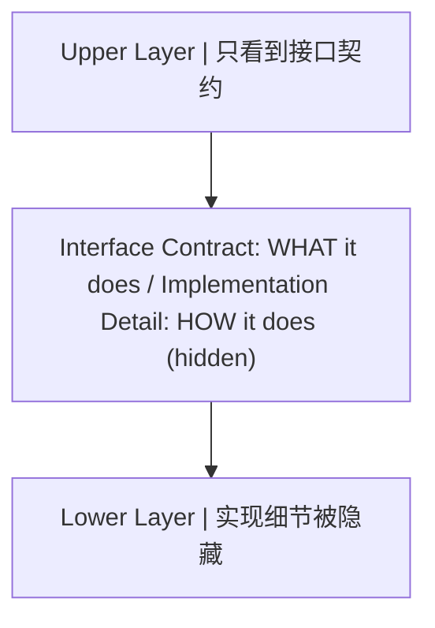
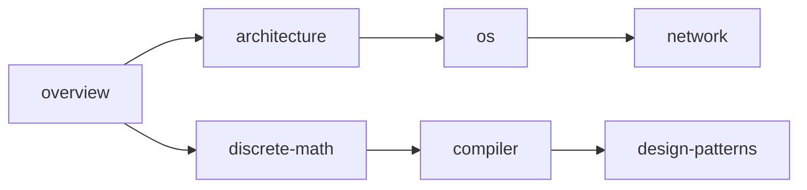
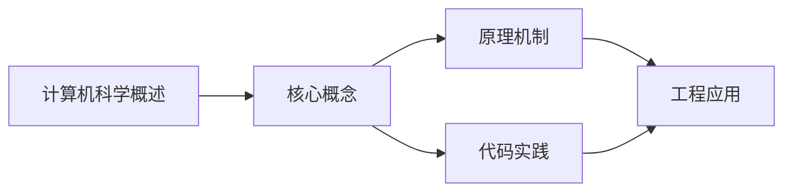

## 1. 学习目标（Bloom 分类）

本节按照布鲁姆教育目标分类学组织学习路径。本文主题为《计算机科学概述》，属于 计算机科学基础 模块，读者可以根据自身阶段选择阅读深度。

记忆层面：能够准确复述本文的核心概念、术语与基本语法或操作步骤，并能够在提问或检索时快速定位对应知识点。能够说出 计算机科学基础 的核心概念、常用命令与流程。

理解层面：能够用自己的语言解释核心原理与工作机制，说明概念之间的因果关系，而不是机械记忆结论。能够解释 计算机科学基础 的工作原理与设计动机。

应用层面：能够在真实项目或练习场景中运用本文知识解决具体问题，写出正确且可维护的实现。能够独立完成 计算机科学基础 的标准操作。

分析层面：能够拆解复杂问题，比较本文主题与相邻概念的异同，识别边界条件与例外情况。能够分析 计算机科学基础 使用中的异常与边界。

评价层面：能够根据约束条件（性能、可读性、安全、成本）评价不同方案的优劣，做出有依据的技术决策。能够评价 计算机科学基础 相关工具与方案。

创造层面：能够把本文知识与其他模块知识组合，设计出新的解决方案或可复用的工程模式。能够把 计算机科学基础 融入团队工作流。

通过本节学习，读者应当能够把《计算机科学概述》纳入自己的知识网络，并与 计算机科学基础 模块的其他主题（数据结构、算法、操作系统、体系结构）建立关联。

## 2. 历史动机与发展脉络

《计算机科学概述》是 计算机科学基础 领域的重要主题。要真正理解它，需要先了解它解决的问题与演进过程。

计算机科学基础是编程的“内功”：数据结构与算法、操作系统、计算机体系结构、网络；框架会过时，基础长期有效。
体系结构：冯诺依曼模型（存储程序）、CPU/内存/I/O、指令流水线、缓存层次。
操作系统：进程与线程、调度、内存管理（虚拟内存）、文件系统、并发原语。

回到本文主题：计算机科学概述 的提出与成熟，正是上述技术背景下的必然产物。早期实现往往以简单可用为目标，随着工程规模扩大，社区逐渐沉淀出标准做法与最佳实践；理解这一脉络，可以帮助读者判断“为什么文档中的推荐写法是现在这个样子”，也能在遇到历史遗留代码时准确识别其设计年代与取舍。


## 3. 形式化定义与核心概念精讲

本节把《计算机科学概述》涉及的核心概念以“定义 + 讲解”的形式展开。读者应把定义当作工具，把讲解当作理解路径；两者结合才能形成可迁移的知识。

数据结构：数组/链表/栈/队列/哈希/树/图；每种结构有插入、查找、删除的时间复杂度特征。
算法分析：大 O 表示增长阶；时间与空间权衡；递归与迭代。
存储层次：寄存器 -> 缓存 -> 内存 -> 磁盘；局部性原理指导性能优化。

### 3.1 原文章节逐一精讲

原文档把主题拆分为 8 个小节，下面按顺序给出每一节的导读讲解，随后保留原文细节供精读。

#### 原文精读（完整保留）


#### 1. 学科定义与边界

##### 1.1 核心问题

计算机科学的核心问题不是"计算机是什么"，而是"什么是可计算的"。这一区别至关重要：

- **工程学视角**：关注如何构建更快、更可靠的计算装置
- **数学视角**：关注哪些问题在原则上可以被算法求解
- **计算机科学视角**：关注可计算性的边界、计算的复杂性、以及信息处理的本质

三个奠基性成果定义了学科的边界：

| 成果       | 人物           | 年份 | 核心贡献                 |
| ---------- | -------------- | ---- | ------------------------ |
| 图灵机模型 | Alan Turing    | 1936 | 定义了"可计算"的精确边界 |
| lambda演算 | Alonzo Church  | 1936 | 从函数式角度定义可计算性 |
| 信息论     | Claude Shannon | 1948 | 量化信息的度量与传输极限 |

##### 1.2 与数学的边界

计算机科学从数学继承了形式化推理的传统，但两者有本质区别：

- 数学关注**存在性证明**（存在一个解）
- 计算机科学关注**构造性证明**（如何找到这个解，以及找到它的代价）

```
数学: EXISTS x: P(x)           -- 存在性
CS:   FIND x: P(x) in T(n)    -- 构造性 + 复杂性
```

##### 1.3 与工程的边界

工程学关注"如何在约束下实现目标"，计算机科学同样如此，但约束的性质不同：

- 传统工程：物理约束（材料强度、热力学极限）
- 计算机工程：逻辑约束（可计算性、复杂度类、信息熵）

##### 1.4 学科演进时间线

```
1936  图灵机 / lambda演算         -- 可计算性理论奠基
1945  冯诺依曼架构                 -- 存储程序概念
1948  信息论                       -- 信息的数学基础
1950s 编译器 / 高级语言            -- 抽象层级跃升
1960s 操作系统 / 分时系统          -- 资源管理抽象
1970s 关系数据库 / TCP/IP          -- 数据与通信抽象
1980s 面向对象 / 分布式系统        -- 设计范式变革
1990s 万维网 / 开源运动            -- 全球互联
2000s 多核 / 云计算 / 大数据       -- 规模化并行
2010s 深度学习 / 容器化            -- 智能与部署
2020s 大语言模型 / RISC-V          -- 生成式AI与开放架构
```

---

#### 2. 知识体系全景图

##### 2.1 分支树

以树状结构呈现 CS 的主要分支，每个分支标注与本书其他模块的映射关系：

```
Computer Science
+-- Theory of Computation -------> [离散数学](discrete-math)
|   +-- Automata Theory
|   +-- Computability
|   +-- Complexity Theory
+-- Computer Architecture -------> [体系结构](architecture)
|   +-- ISA Design
|   +-- Pipeline & Superscalar
|   +-- Memory Hierarchy
+-- Systems Software -----------> [操作系统](os) / [编译原理](compiler)
|   +-- Process Management
|   +-- Memory Management
|   +-- Code Generation
+-- Networking -----------------> [计算机网络](network)
|   +-- Protocol Stack
|   +-- Routing & Switching
|   +-- Application Protocols
+-- Programming Languages ------> [编译原理](compiler) / [设计模式](design-patterns)
|   +-- Syntax & Semantics
|   +-- Type Systems
|   +-- Paradigms (OOP/FP/LP)
+-- Algorithms & DS ------------> (贯穿全模块)
|   +-- Sorting & Searching
|   +-- Graph Algorithms
|   +-- NP-Completeness
+-- Software Engineering -------> [设计模式](design-patterns)
    +-- Design Patterns
    +-- Architecture Patterns
    +-- Testing & Verification
```

##### 2.2 分支间交叉矩阵

各分支并非孤立，以下矩阵展示核心交叉关系：

```
              Theory  Arch  SysSoft  Net  PL  Algo  SE
Theory         -      x      x      .    x    x    .
Arch           x      -      x      .    .    .    .
SysSoft        x      x      -      x    x    .    x
Net            .      .      x      -    .    x    .
PL             x      .      x      .    -    x    x
Algo           x      .      .      x    x    -    x
SE             .      .      x      .    x    x    -
```

`x` = 强交叉，`.` = 弱交叉，`-` = 自身

---

#### 3. 抽象层级模型

##### 3.1 七层抽象模型

从晶体管到应用的自底向上分层，每一层都定义了清晰的接口契约与信息隐藏原理：

```
Layer 7: Application Layer        -- 用户可感知的功能
         |  API / System Call Interface
Layer 6: Language Runtime Layer    -- GC, Thread Scheduler, Type System
         |  ABI / Bytecode / IR
Layer 5: Operating System Layer    -- Process, VFS, Socket
         |  System Call Interface (syscall)
Layer 4: Instruction Set Layer     -- ISA (x86, ARM, RISC-V)
         |  Instruction Encoding
Layer 3: Microarchitecture Layer   -- Pipeline, Cache, Branch Predictor
         |  Micro-ops / Control Signals
Layer 2: Digital Logic Layer       -- ALU, Register File, FSM
         |  Boolean Functions / Gates
Layer 1: Physics Layer             -- Transistor, CMOS, Voltage Levels
         |  Device Physics
```

##### 3.2 接口契约原理

每一层向上提供**接口契约**（Interface Contract），向下隐藏**实现细节**（Implementation Detail）。这是计算机科学最核心的设计原则：



**关键洞察**：接口契约的稳定性决定了系统的可演化性。只要接口不变，下层实现可以任意替换（例如：同一ISA可以有不同的微架构实现）。

##### 3.3 跨层交互模式

| 模式     | 描述                 | 示例                             |
| -------- | -------------------- | -------------------------------- |
| 逐层调用 | 上层严格调用下层接口 | 应用 -> 系统调用 -> 内核 -> 驱动 |
| 跨层优化 | 跳过中间层直接交互   | 用户态IO (DPDK) / 用户态网络栈   |
| 层泄漏   | 下层细节穿透到上层   | CPU缓存行对齐影响程序性能        |
| 反向通知 | 下层主动通知上层     | 中断 / 信号 / 回调               |

##### 3.4 抽象的代价

抽象并非免费，每次跨越抽象边界都有代价：

- **性能代价**：系统调用开销（上下文切换）、虚拟化开销（地址翻译）
- **语义鸿沟**：高层语义与底层实现的不匹配（如：C++虚函数 vs 分支预测）
- **调试困难**：跨层问题难以定位（如：内存屏障导致的并发Bug）

> 跨模块引用：[C语言](c/overview)的指针操作直接穿透了语言运行时层到达指令集层，这是C语言"接近硬件"的本质原因。[C++](cpp/overview)的RAII则在语言运行时层提供了资源管理的抽象。

---

#### 4. 三大主线：体系结构 / 协议栈 / 状态机

本模块以三条主线贯穿所有章节，它们分别回答了计算系统的三个根本问题：

##### 4.1 体系结构主线 -- "资源如何组织"

**核心问题**：硬件资源如何被组织、寻址、调度？

体系结构主线关注的是**空间维度**的布局：计算单元、存储层次、互连网络如何构成一个可编程的系统。

```
体系结构主线贯穿图:

[architecture]  CPU微架构 + 存储层次 + 总线协议
      |
      v
[os]            虚拟化体系: 虚拟CPU(进程) + 虚拟内存 + 虚拟文件系统
      |
      v
[network]       网络拓扑: 端系统 + 路由器 + 链路
      |
      v
[compiler]      代码布局: 指令调度 + 寄存器分配 + 缓存优化
```

##### 4.2 协议栈主线 -- "数据如何传输"

**核心问题**：数据如何在不同抽象层间被封装、传输、解封？

协议栈主线关注的是**通信维度**的规则：每一层添加自己的头部/尾部，形成封装-传输-解封的流水线。

```
协议栈主线贯穿图:

[architecture]  总线协议: 请求/响应握手、缓存一致性协议(MESI)
      |
      v
[os]            系统调用协议: ABI约定、进程间通信协议
      |
      v
[network]       TCP/IP协议栈: 应用层/传输层/网络层/链路层
      |
      v
[compiler]      编译协议: 词法->语法->语义->中间码->目标码
```

**封装原理的统一性**：无论是网络包的封装还是函数调用的栈帧构建，本质都是同一模式：

```
// 封装模式伪代码
struct EncapsulatedData {
    Header  header;      // 本层的元数据
    Payload payload;     // 上层传递下来的数据
    Trailer trailer;     // 可选的尾部校验
};
```

##### 4.3 状态机主线 -- "行为如何建模"

**核心问题**：动态行为如何被建模为状态转移图？

状态机主线关注的是**时间维度**的演化：系统在不同状态间如何转移，转移条件是什么，哪些状态是安全的。

```
状态机主线贯穿图:

[architecture]  CPU控制单元FSM: 取指->译码->执行->访存->写回
      |
      v
[os]            进程状态机: 创建->就绪->运行->阻塞->终止
      |
      v
[network]       TCP状态机: CLOSED->SYN_SENT->ESTABLISHED->...
      |
      v
[compiler]      词法分析器FSM / 解析器状态栈
```

**状态机的形式化定义**：

```
FSM = (Q, Sigma, delta, q0, F)

Q     = 有限状态集合
Sigma = 输入字母表
delta = Q x Sigma -> Q  (转移函数)
q0    = 初始状态
F     = 接受状态集合
```

> 跨模块引用：[离散数学](discrete-math)中的自动机理论是状态机主线的数学基础。[Java](java/overview)线程的状态模型与OS进程状态机直接对应。

##### 4.4 三线交叉矩阵

| 章节            | 体系结构       | 协议栈           | 状态机              |
| --------------- | -------------- | ---------------- | ------------------- |
| architecture    | 主导           | 辅助(总线协议)   | 辅助(控制单元FSM)   |
| os              | 主导(虚拟化)   | 辅助(IPC协议)    | 主导(进程/线程状态) |
| network         | 辅助(拓扑)     | 主导(TCP/IP)     | 主导(TCP FSM)       |
| compiler        | 辅助(目标机)   | 辅助(编译流水线) | 主导(词法/语法FSM)  |
| discrete-math   | -              | -                | 主导(自动机理论)    |
| design-patterns | 辅助(架构模式) | 辅助(通信模式)   | 主导(状态模式)      |

---

#### 5. 计算理论的哲学基础

##### 5.1 可计算性理论

**丘奇-图灵论题**（Church-Turing Thesis）：任何"可有效计算"的函数都可以被图灵机计算。这不是定理，而是关于"计算"这一直觉概念的论题。

**图灵机的形式化定义**：

```
TM = (Q, Sigma, Gamma, delta, q0, B, F)

Q      = 状态集合
Sigma  = 输入字母表 (不含空白符B)
Gamma  = 纸带字母表 (Sigma的超集, 含B)
delta  = Q x Gamma -> Q x Gamma x {L, R}
q0     = 初始状态
B      = 空白符
F      = 终止状态集合
```

**图灵机模拟器伪代码**：

```python
def turing_machine(tape, transition_fn, initial_state, accept_states):
    head = 0
    state = initial_state
    while state not in accept_states:
        symbol = tape[head]
        new_state, new_symbol, direction = transition_fn(state, symbol)
        tape[head] = new_symbol
        state = new_state
        head += 1 if direction == 'R' else -1
    return tape
```

##### 5.2 停机问题

**定理**：不存在通用算法H，使得对任意程序P和输入I，H(P, I)能判定P(I)是否停机。

**反证法证明概要**：

```
假设存在停机判定器 H(P, I):
  H(P, I) =   如果 P(I) 停机
  H(P, I) = false 如果 P(I) 不停机

构造悖论程序 D:
  D(P):
    if H(P, P) == true:
      loop_forever()    // 如果P(P)停机，则D(P)不停机
    else:
      halt()            // 如果P(P)不停机，则D(P)停机

考虑 D(D):
  若 H(D, D) ==   => D(D)不停机 => 矛盾
  若 H(D, D) == false => D(D)停机   => 矛盾
故 H 不存在。
```

##### 5.3 计算复杂性类

```
复杂性类层次:

ALL (所有判定问题)
 |
PSPACE (多项式空间可解)
 |
 NP (非确定性多项式时间可解)
  |
  P (确定性多项式时间可解)
   |
  LOGSPACE (对数空间可解)
```

| 复杂性类    | 定义                    | 典型问题                    |
| ----------- | ----------------------- | --------------------------- |
| P           | O(n^k) 时间可解         | 排序、最短路径、矩阵乘法    |
| NP          | 多项式时间可验证        | 旅行商(判定版)、SAT、子集和 |
| NP-complete | NP中最难的问题          | 3-SAT、图着色、背包         |
| NP-hard     | 至少和NP-complete一样难 | 停机问题、最优旅行商        |
| PSPACE      | 多项式空间可解          | QBF、地理游戏               |

**P vs NP问题**：P = NP 是否成立是千禧年数学难题之一。若P=NP，则所有可快速验证的问题都可快速求解，密码学体系将崩塌。

##### 5.4 对后续模块的影响

| 理论结果         | 影响的模块                  | 具体影响                                           |
| ---------------- | --------------------------- | -------------------------------------------------- |
| 停机问题不可判定 | [编译原理](compiler)        | 无法构建完美的程序分析器                           |
| Chomsky层次      | [编译原理](compiler)        | 正则语言/上下文无关语言决定词法/语法分析的能力边界 |
| NP-completeness  | [设计模式](design-patterns) | 某些优化问题需要启发式/近似算法                    |
| 信息熵           | [计算机网络](network)       | 信道容量、数据压缩的理论极限                       |
| 自动机理论       | [离散数学](discrete-math)   | DFA/NFA/正则表达式的等价性                         |

---

#### 6. 本模块的知识依赖图

##### 6.1 DAG依赖关系

以有向无环图（DAG）呈现各章节间的前置依赖关系：



##### 6.2 推荐阅读路径

```
路径A (系统方向):  overview -> architecture -> os -> network
路径B (语言方向):  overview -> discrete-math -> compiler -> design-patterns
路径C (全栈方向):  overview -> architecture -> discrete-math -> os -> compiler -> network -> design-patterns
```

##### 6.3 与其他模块的交叉引用

| 本模块章节      | 外部模块引用                                  | 交叉原因                     |
| --------------- | --------------------------------------------- | ---------------------------- |
| architecture    | [C语言](c/overview\)                          | C的内存模型直接映射到硬件    |
| os              | [C++](cpp/overview\)                          | C++的线程模型与OS线程对应    |
| compiler        | [Java](java/overview\)                        | JVM是编译目标+运行时的统一体 |
| network         | [Java](java/overview\)                        | Java NIO/Netty与网络编程     |
| design-patterns | [C++](cpp/overview\) / [Java](java/overview\) | 设计模式的语言实现差异       |

---

#### 7. 速查表

##### 7.1 核心概念速查

| 概念         | 一句话定义             | 所属主线        |
| ------------ | ---------------------- | --------------- |
| 冯诺依曼架构 | 存储程序 + 顺序执行    | 体系结构        |
| 缓存一致性   | 多核间数据一致性协议   | 体系结构/协议栈 |
| 进程         | 资源分配的基本单位     | 体系结构/状态机 |
| 虚拟内存     | 地址空间的间接映射     | 体系结构        |
| TCP三次握手  | 连接建立的状态同步     | 协议栈/状态机   |
| 词法分析     | 字符流到Token流的FSM   | 状态机          |
| P vs NP      | 验证与求解的复杂度鸿沟 | 计算理论        |

##### 7.2 抽象层级速查

| 层级        | 关键抽象         | 接口类型     | 典型实现              |
| ----------- | ---------------- | ------------ | --------------------- |
| L7 应用     | 用户功能         | API / GUI    | 浏览器、编辑器        |
| L6 运行时   | 类型/线程/GC     | ABI / 字节码 | JVM、CLR、V8          |
| L5 操作系统 | 进程/文件/Socket | 系统调用     | Linux、Windows        |
| L4 指令集   | 指令/寄存器      | ISA规范      | x86-64、ARMv8、RISC-V |
| L3 微架构   | 流水线/缓存      | 微操作       | Intel Core、Apple M1  |
| L2 数字逻辑 | 门/触发器/FSM    | 布尔函数     | ALU、寄存器堆         |
| L1 物理     | 晶体管/电压      | 电信号       | CMOS工艺              |

##### 7.3 三大主线速查

```
体系结构主线:  空间布局  -- "在哪里"
  CPU -> Cache -> Memory -> Disk -> Network
  核心问题: 寻址、层次、局部性

协议栈主线:    通信规则  -- "怎么传"
  封装 -> 传输 -> 解封
  核心问题: 头部格式、握手协议、错误恢复

状态机主线:    时间演化  -- "何时变"
  状态 -> 事件 -> 新状态
  核心问题: 状态定义、转移条件、终止判定
```

---

#### 延伸阅读

- _The Computer Science and Engineering Handbook_ -- Tucker
- _Introduction to the Theory of Computation_ -- Michael Sipser
- _Computer Science: An Overview_ -- J. Glenn Brookshear
- _Structure and Interpretation of Computer Programs_ -- Abelson & Sussman
- _The Art of Computer Programming_ -- Donald Knuth


### 3.2 概念关系图

下面用 Mermaid 图表达本文核心概念之间的关系，帮助读者建立整体图景：



图中展示的是本文知识的结构化关系：核心概念是入口，原理机制解释“为什么”，代码实践演示“怎么做”，工程应用回答“何时用”。读者学习时可以把每个小节的内容挂接到对应节点上。

## 4. 理论推导与原理解析

本节深入《计算机科学概述》背后的原理。理论部分不求面面俱到，而是聚焦“能解释现象、能指导实践”的关键推导。

数据结构：数组/链表/栈/队列/哈希/树/图；每种结构有插入、查找、删除的时间复杂度特征。
算法分析：大 O 表示增长阶；时间与空间权衡；递归与迭代。
存储层次：寄存器 -> 缓存 -> 内存 -> 磁盘；局部性原理指导性能优化。
并发基础：竞态、临界区、锁、信号量、死锁条件与预防。

需要强调的是，理论推导与工程实践之间存在翻译层：理论给出的是理想化模型与边界条件，工程代码则必须处理真实环境中的例外。读者在学习时应先掌握理论的“标准情形”，再通过陷阱章节了解“非标准情形”。

## 5. 代码示例与逐行讲解

本节把原文中的代码示例系统整理，并为每个示例补充用途说明与讲解。读者不应只浏览代码，而应逐段对照讲解理解设计意图。

### 5.1 示例：1.2 与数学的边界

该示例来自原文《1.2 与数学的边界》小节，用于演示计算机科学概述相关操作。阅读时请先看代码结构，再看其后的讲解。

```text
数学: EXISTS x: P(x)           -- 存在性
CS:   FIND x: P(x) in T(n)    -- 构造性 + 复杂性
```

讲解：这段代码演示了本节核心知识点。代码中的关键操作可以归纳为三步：准备（定义或初始化）、执行（核心逻辑）、收尾（释放资源或返回结果）。实际项目中，这三步往往被封装为函数或类，以提升复用性与可测试性。

关键点分析：

该示例共 2 行有效代码，结构以数据或配置为主。阅读时应关注：数据字段的含义、配置项的作用，以及它们与运行行为的对应关系。

进阶思考路径：先尝试修改参数观察行为变化，再把示例中的模式迁移到自己的项目中；每次修改都记录预期与实测差异，这是把示例转化为能力的最快方式。

### 5.2 示例：1.4 学科演进时间线

该示例来自原文《1.4 学科演进时间线》小节，用于演示计算机科学概述相关操作。阅读时请先看代码结构，再看其后的讲解。

```text
1936  图灵机 / lambda演算         -- 可计算性理论奠基
1945  冯诺依曼架构                 -- 存储程序概念
1948  信息论                       -- 信息的数学基础
1950s 编译器 / 高级语言            -- 抽象层级跃升
1960s 操作系统 / 分时系统          -- 资源管理抽象
1970s 关系数据库 / TCP/IP          -- 数据与通信抽象
1980s 面向对象 / 分布式系统        -- 设计范式变革
1990s 万维网 / 开源运动            -- 全球互联
2000s 多核 / 云计算 / 大数据       -- 规模化并行
2010s 深度学习 / 容器化            -- 智能与部署
2020s 大语言模型 / RISC-V          -- 生成式AI与开放架构
```

讲解：这段代码演示了本节核心知识点。代码中的关键操作可以归纳为三步：准备（定义或初始化）、执行（核心逻辑）、收尾（释放资源或返回结果）。实际项目中，这三步往往被封装为函数或类，以提升复用性与可测试性。

关键点分析：

该示例共 11 行有效代码，结构以数据或配置为主。阅读时应关注：数据字段的含义、配置项的作用，以及它们与运行行为的对应关系。

进阶思考路径：先尝试修改参数观察行为变化，再把示例中的模式迁移到自己的项目中；每次修改都记录预期与实测差异，这是把示例转化为能力的最快方式。

### 5.3 示例：2.1 分支树

该示例来自原文《2.1 分支树》小节，用于演示计算机科学概述相关操作。阅读时请先看代码结构，再看其后的讲解。

```text
Computer Science
+-- Theory of Computation -------> [离散数学](discrete-math)
|   +-- Automata Theory
|   +-- Computability
|   +-- Complexity Theory
+-- Computer Architecture -------> [体系结构](architecture)
|   +-- ISA Design
|   +-- Pipeline & Superscalar
|   +-- Memory Hierarchy
+-- Systems Software -----------> [操作系统](os) / [编译原理](compiler)
|   +-- Process Management
|   +-- Memory Management
|   +-- Code Generation
+-- Networking -----------------> [计算机网络](network)
|   +-- Protocol Stack
|   +-- Routing & Switching
|   +-- Application Protocols
+-- Programming Languages ------> [编译原理](compiler) / [设计模式](design-patterns)
|   +-- Syntax & Semantics
|   +-- Type Systems
|   +-- Paradigms (OOP/FP/LP)
+-- Algorithms & DS ------------> (贯穿全模块)
|   +-- Sorting & Searching
|   +-- Graph Algorithms
|   +-- NP-Completeness
+-- Software Engineering -------> [设计模式](design-patterns)
    +-- Design Patterns
    +-- Architecture Patterns
    +-- Testing & Verification
```

讲解：这段代码演示了本节核心知识点。代码中的关键操作可以归纳为三步：准备（定义或初始化）、执行（核心逻辑）、收尾（释放资源或返回结果）。实际项目中，这三步往往被封装为函数或类，以提升复用性与可测试性。

关键点分析：

该示例共 29 行有效代码，结构以数据或配置为主。阅读时应关注：数据字段的含义、配置项的作用，以及它们与运行行为的对应关系。

进阶思考路径：先尝试修改参数观察行为变化，再把示例中的模式迁移到自己的项目中；每次修改都记录预期与实测差异，这是把示例转化为能力的最快方式。

### 5.4 示例：2.2 分支间交叉矩阵

该示例来自原文《2.2 分支间交叉矩阵》小节，用于演示计算机科学概述相关操作。阅读时请先看代码结构，再看其后的讲解。

```text
              Theory  Arch  SysSoft  Net  PL  Algo  SE
Theory         -      x      x      .    x    x    .
Arch           x      -      x      .    .    .    .
SysSoft        x      x      -      x    x    .    x
Net            .      .      x      -    .    x    .
PL             x      .      x      .    -    x    x
Algo           x      .      .      x    x    -    x
SE             .      .      x      .    x    x    -
```

讲解：这段代码演示了本节核心知识点。代码中的关键操作可以归纳为三步：准备（定义或初始化）、执行（核心逻辑）、收尾（释放资源或返回结果）。实际项目中，这三步往往被封装为函数或类，以提升复用性与可测试性。

关键点分析：

该示例共 8 行有效代码，结构以数据或配置为主。阅读时应关注：数据字段的含义、配置项的作用，以及它们与运行行为的对应关系。

进阶思考路径：先尝试修改参数观察行为变化，再把示例中的模式迁移到自己的项目中；每次修改都记录预期与实测差异，这是把示例转化为能力的最快方式。

### 5.5 示例：3.1 七层抽象模型

该示例来自原文《3.1 七层抽象模型》小节，用于演示计算机科学概述相关操作。阅读时请先看代码结构，再看其后的讲解。

```text
Layer 7: Application Layer        -- 用户可感知的功能
         |  API / System Call Interface
Layer 6: Language Runtime Layer    -- GC, Thread Scheduler, Type System
         |  ABI / Bytecode / IR
Layer 5: Operating System Layer    -- Process, VFS, Socket
         |  System Call Interface (syscall)
Layer 4: Instruction Set Layer     -- ISA (x86, ARM, RISC-V)
         |  Instruction Encoding
Layer 3: Microarchitecture Layer   -- Pipeline, Cache, Branch Predictor
         |  Micro-ops / Control Signals
Layer 2: Digital Logic Layer       -- ALU, Register File, FSM
         |  Boolean Functions / Gates
Layer 1: Physics Layer             -- Transistor, CMOS, Voltage Levels
         |  Device Physics
```

讲解：这段代码演示了本节核心知识点。代码中的关键操作可以归纳为三步：准备（定义或初始化）、执行（核心逻辑）、收尾（释放资源或返回结果）。实际项目中，这三步往往被封装为函数或类，以提升复用性与可测试性。

关键点分析：

该示例共 14 行有效代码，结构以数据或配置为主。阅读时应关注：数据字段的含义、配置项的作用，以及它们与运行行为的对应关系。

进阶思考路径：先尝试修改参数观察行为变化，再把示例中的模式迁移到自己的项目中；每次修改都记录预期与实测差异，这是把示例转化为能力的最快方式。

### 5.6 示例：3.2 接口契约原理

该示例来自原文《3.2 接口契约原理》小节，用于演示计算机科学概述相关操作。阅读时请先看代码结构，再看其后的讲解。


讲解：这段代码演示了本节核心知识点。代码中的关键操作可以归纳为三步：准备（定义或初始化）、执行（核心逻辑）、收尾（释放资源或返回结果）。实际项目中，这三步往往被封装为函数或类，以提升复用性与可测试性。

关键点分析：

该示例共 6 行有效代码，结构以数据或配置为主。阅读时应关注：数据字段的含义、配置项的作用，以及它们与运行行为的对应关系。

进阶思考路径：先尝试修改参数观察行为变化，再把示例中的模式迁移到自己的项目中；每次修改都记录预期与实测差异，这是把示例转化为能力的最快方式。

### 5.7 示例：4.1 体系结构主线 -- "资源如何组织"

该示例来自原文《4.1 体系结构主线 -- "资源如何组织"》小节，用于演示计算机科学概述相关操作。阅读时请先看代码结构，再看其后的讲解。

```text
体系结构主线贯穿图:

[architecture]  CPU微架构 + 存储层次 + 总线协议
      |
      v
[os]            虚拟化体系: 虚拟CPU(进程) + 虚拟内存 + 虚拟文件系统
      |
      v
[network]       网络拓扑: 端系统 + 路由器 + 链路
      |
      v
[compiler]      代码布局: 指令调度 + 寄存器分配 + 缓存优化
```

讲解：这段代码演示了本节核心知识点。代码中的关键操作可以归纳为三步：准备（定义或初始化）、执行（核心逻辑）、收尾（释放资源或返回结果）。实际项目中，这三步往往被封装为函数或类，以提升复用性与可测试性。

关键点分析：

该示例共 11 行有效代码，结构以数据或配置为主。阅读时应关注：数据字段的含义、配置项的作用，以及它们与运行行为的对应关系。

进阶思考路径：先尝试修改参数观察行为变化，再把示例中的模式迁移到自己的项目中；每次修改都记录预期与实测差异，这是把示例转化为能力的最快方式。

### 5.8 示例：4.2 协议栈主线 -- "数据如何传输"

该示例来自原文《4.2 协议栈主线 -- "数据如何传输"》小节，用于演示计算机科学概述相关操作。阅读时请先看代码结构，再看其后的讲解。

```text
协议栈主线贯穿图:

[architecture]  总线协议: 请求/响应握手、缓存一致性协议(MESI)
      |
      v
[os]            系统调用协议: ABI约定、进程间通信协议
      |
      v
[network]       TCP/IP协议栈: 应用层/传输层/网络层/链路层
      |
      v
[compiler]      编译协议: 词法->语法->语义->中间码->目标码
```

讲解：这段代码演示了本节核心知识点。代码中的关键操作可以归纳为三步：准备（定义或初始化）、执行（核心逻辑）、收尾（释放资源或返回结果）。实际项目中，这三步往往被封装为函数或类，以提升复用性与可测试性。

关键点分析：

该示例共 11 行有效代码，结构以数据或配置为主。阅读时应关注：数据字段的含义、配置项的作用，以及它们与运行行为的对应关系。

进阶思考路径：先尝试修改参数观察行为变化，再把示例中的模式迁移到自己的项目中；每次修改都记录预期与实测差异，这是把示例转化为能力的最快方式。

### 5.9 示例：4.2 协议栈主线 -- "数据如何传输"

该示例来自原文《4.2 协议栈主线 -- "数据如何传输"》小节，用于演示计算机科学概述相关操作。阅读时请先看代码结构，再看其后的讲解。

```text
// 封装模式伪代码
struct EncapsulatedData {
    Header  header;      // 本层的元数据
    Payload payload;     // 上层传递下来的数据
    Trailer trailer;     // 可选的尾部校验
};
```

讲解：这段代码演示了本节核心知识点。代码中的关键操作可以归纳为三步：准备（定义或初始化）、执行（核心逻辑）、收尾（释放资源或返回结果）。实际项目中，这三步往往被封装为函数或类，以提升复用性与可测试性。

关键点分析：

该示例共 6 行有效代码，结构以数据或配置为主。阅读时应关注：数据字段的含义、配置项的作用，以及它们与运行行为的对应关系。

进阶思考路径：先尝试修改参数观察行为变化，再把示例中的模式迁移到自己的项目中；每次修改都记录预期与实测差异，这是把示例转化为能力的最快方式。

### 5.10 示例：4.3 状态机主线 -- "行为如何建模"

该示例来自原文《4.3 状态机主线 -- "行为如何建模"》小节，用于演示计算机科学概述相关操作。阅读时请先看代码结构，再看其后的讲解。

```text
状态机主线贯穿图:

[architecture]  CPU控制单元FSM: 取指->译码->执行->访存->写回
      |
      v
[os]            进程状态机: 创建->就绪->运行->阻塞->终止
      |
      v
[network]       TCP状态机: CLOSED->SYN_SENT->ESTABLISHED->...
      |
      v
[compiler]      词法分析器FSM / 解析器状态栈
```

讲解：这段代码演示了本节核心知识点。代码中的关键操作可以归纳为三步：准备（定义或初始化）、执行（核心逻辑）、收尾（释放资源或返回结果）。实际项目中，这三步往往被封装为函数或类，以提升复用性与可测试性。

关键点分析：

该示例共 11 行有效代码，结构以数据或配置为主。阅读时应关注：数据字段的含义、配置项的作用，以及它们与运行行为的对应关系。

进阶思考路径：先尝试修改参数观察行为变化，再把示例中的模式迁移到自己的项目中；每次修改都记录预期与实测差异，这是把示例转化为能力的最快方式。

### 5.11 示例：4.3 状态机主线 -- "行为如何建模"

该示例来自原文《4.3 状态机主线 -- "行为如何建模"》小节，用于演示计算机科学概述相关操作。阅读时请先看代码结构，再看其后的讲解。

```text
FSM = (Q, Sigma, delta, q0, F)

Q     = 有限状态集合
Sigma = 输入字母表
delta = Q x Sigma -> Q  (转移函数)
q0    = 初始状态
F     = 接受状态集合
```

讲解：这段代码演示了本节核心知识点。代码中的关键操作可以归纳为三步：准备（定义或初始化）、执行（核心逻辑）、收尾（释放资源或返回结果）。实际项目中，这三步往往被封装为函数或类，以提升复用性与可测试性。

关键点分析：

该示例共 6 行有效代码，结构以数据或配置为主。阅读时应关注：数据字段的含义、配置项的作用，以及它们与运行行为的对应关系。

进阶思考路径：先尝试修改参数观察行为变化，再把示例中的模式迁移到自己的项目中；每次修改都记录预期与实测差异，这是把示例转化为能力的最快方式。

### 5.12 示例：5.1 可计算性理论

该示例来自原文《5.1 可计算性理论》小节，用于演示计算机科学概述相关操作。阅读时请先看代码结构，再看其后的讲解。

```text
TM = (Q, Sigma, Gamma, delta, q0, B, F)

Q      = 状态集合
Sigma  = 输入字母表 (不含空白符B)
Gamma  = 纸带字母表 (Sigma的超集, 含B)
delta  = Q x Gamma -> Q x Gamma x {L, R}
q0     = 初始状态
B      = 空白符
F      = 终止状态集合
```

讲解：这段代码演示了本节核心知识点。代码中的关键操作可以归纳为三步：准备（定义或初始化）、执行（核心逻辑）、收尾（释放资源或返回结果）。实际项目中，这三步往往被封装为函数或类，以提升复用性与可测试性。

关键点分析：

该示例共 8 行有效代码，结构以数据或配置为主。阅读时应关注：数据字段的含义、配置项的作用，以及它们与运行行为的对应关系。

进阶思考路径：先尝试修改参数观察行为变化，再把示例中的模式迁移到自己的项目中；每次修改都记录预期与实测差异，这是把示例转化为能力的最快方式。

### 5.13 示例：5.1 可计算性理论

该示例来自原文《5.1 可计算性理论》小节，用于演示计算机科学概述相关操作。阅读时请先看代码结构，再看其后的讲解。

```python
def turing_machine(tape, transition_fn, initial_state, accept_states):
    head = 0
    state = initial_state
    while state not in accept_states:
        symbol = tape[head]
        new_state, new_symbol, direction = transition_fn(state, symbol)
        tape[head] = new_symbol
        state = new_state
        head += 1 if direction == 'R' else -1
    return tape
```

讲解：这段代码演示了本节核心知识点。代码中的关键操作可以归纳为三步：准备（定义或初始化）、执行（核心逻辑）、收尾（释放资源或返回结果）。实际项目中，这三步往往被封装为函数或类，以提升复用性与可测试性。

关键点分析：

该示例共 10 行有效代码，包含 4 类关键结构（def、if、while、return）。其中：

- 入口与初始化部分负责建立上下文，对应实际项目中的启动或装配逻辑；
- 核心逻辑部分体现本文主题的主要操作，是阅读时最需要对照讲解理解的部分；
- 输出或返回部分把结果交给调用方，注意其类型与边界条件。

进阶思考路径：先尝试修改参数观察行为变化，再把示例中的模式迁移到自己的项目中；每次修改都记录预期与实测差异，这是把示例转化为能力的最快方式。

### 5.14 示例：5.2 停机问题

该示例来自原文《5.2 停机问题》小节，用于演示计算机科学概述相关操作。阅读时请先看代码结构，再看其后的讲解。

```text
假设存在停机判定器 H(P, I):
  H(P, I) =   如果 P(I) 停机
  H(P, I) = false 如果 P(I) 不停机

构造悖论程序 D:
  D(P):
    if H(P, P) == true:
      loop_forever()    // 如果P(P)停机，则D(P)不停机
    else:
      halt()            // 如果P(P)不停机，则D(P)停机

考虑 D(D):
  若 H(D, D) ==   => D(D)不停机 => 矛盾
  若 H(D, D) == false => D(D)停机   => 矛盾
故 H 不存在。
```

讲解：这段代码演示了本节核心知识点。代码中的关键操作可以归纳为三步：准备（定义或初始化）、执行（核心逻辑）、收尾（释放资源或返回结果）。实际项目中，这三步往往被封装为函数或类，以提升复用性与可测试性。

关键点分析：

该示例共 13 行有效代码，包含 1 类关键结构（if）。其中：

- 入口与初始化部分负责建立上下文，对应实际项目中的启动或装配逻辑；
- 核心逻辑部分体现本文主题的主要操作，是阅读时最需要对照讲解理解的部分；
- 输出或返回部分把结果交给调用方，注意其类型与边界条件。

进阶思考路径：先尝试修改参数观察行为变化，再把示例中的模式迁移到自己的项目中；每次修改都记录预期与实测差异，这是把示例转化为能力的最快方式。

### 5.15 示例：5.3 计算复杂性类

该示例来自原文《5.3 计算复杂性类》小节，用于演示计算机科学概述相关操作。阅读时请先看代码结构，再看其后的讲解。

```text
复杂性类层次:

ALL (所有判定问题)
 |
PSPACE (多项式空间可解)
 |
 NP (非确定性多项式时间可解)
  |
  P (确定性多项式时间可解)
   |
  LOGSPACE (对数空间可解)
```

讲解：这段代码演示了本节核心知识点。代码中的关键操作可以归纳为三步：准备（定义或初始化）、执行（核心逻辑）、收尾（释放资源或返回结果）。实际项目中，这三步往往被封装为函数或类，以提升复用性与可测试性。

关键点分析：

该示例共 10 行有效代码，结构以数据或配置为主。阅读时应关注：数据字段的含义、配置项的作用，以及它们与运行行为的对应关系。

进阶思考路径：先尝试修改参数观察行为变化，再把示例中的模式迁移到自己的项目中；每次修改都记录预期与实测差异，这是把示例转化为能力的最快方式。

### 5.16 示例：6.1 DAG依赖关系

该示例来自原文《6.1 DAG依赖关系》小节，用于演示计算机科学概述相关操作。阅读时请先看代码结构，再看其后的讲解。


讲解：这段代码演示了本节核心知识点。代码中的关键操作可以归纳为三步：准备（定义或初始化）、执行（核心逻辑）、收尾（释放资源或返回结果）。实际项目中，这三步往往被封装为函数或类，以提升复用性与可测试性。

关键点分析：

该示例共 7 行有效代码，结构以数据或配置为主。阅读时应关注：数据字段的含义、配置项的作用，以及它们与运行行为的对应关系。

进阶思考路径：先尝试修改参数观察行为变化，再把示例中的模式迁移到自己的项目中；每次修改都记录预期与实测差异，这是把示例转化为能力的最快方式。

### 5.17 示例：6.2 推荐阅读路径

该示例来自原文《6.2 推荐阅读路径》小节，用于演示计算机科学概述相关操作。阅读时请先看代码结构，再看其后的讲解。

```text
路径A (系统方向):  overview -> architecture -> os -> network
路径B (语言方向):  overview -> discrete-math -> compiler -> design-patterns
路径C (全栈方向):  overview -> architecture -> discrete-math -> os -> compiler -> network -> design-patterns
```

讲解：这段代码演示了本节核心知识点。代码中的关键操作可以归纳为三步：准备（定义或初始化）、执行（核心逻辑）、收尾（释放资源或返回结果）。实际项目中，这三步往往被封装为函数或类，以提升复用性与可测试性。

关键点分析：

该示例共 3 行有效代码，结构以数据或配置为主。阅读时应关注：数据字段的含义、配置项的作用，以及它们与运行行为的对应关系。

进阶思考路径：先尝试修改参数观察行为变化，再把示例中的模式迁移到自己的项目中；每次修改都记录预期与实测差异，这是把示例转化为能力的最快方式。

### 5.18 示例：7.3 三大主线速查

该示例来自原文《7.3 三大主线速查》小节，用于演示计算机科学概述相关操作。阅读时请先看代码结构，再看其后的讲解。

```text
体系结构主线:  空间布局  -- "在哪里"
  CPU -> Cache -> Memory -> Disk -> Network
  核心问题: 寻址、层次、局部性

协议栈主线:    通信规则  -- "怎么传"
  封装 -> 传输 -> 解封
  核心问题: 头部格式、握手协议、错误恢复

状态机主线:    时间演化  -- "何时变"
  状态 -> 事件 -> 新状态
  核心问题: 状态定义、转移条件、终止判定
```

讲解：这段代码演示了本节核心知识点。代码中的关键操作可以归纳为三步：准备（定义或初始化）、执行（核心逻辑）、收尾（释放资源或返回结果）。实际项目中，这三步往往被封装为函数或类，以提升复用性与可测试性。

关键点分析：

该示例共 9 行有效代码，结构以数据或配置为主。阅读时应关注：数据字段的含义、配置项的作用，以及它们与运行行为的对应关系。

进阶思考路径：先尝试修改参数观察行为变化，再把示例中的模式迁移到自己的项目中；每次修改都记录预期与实测差异，这是把示例转化为能力的最快方式。


综合以上示例，可以总结出本主题的代码实践要点：第一，先定义清晰的输入输出契约；第二，核心逻辑保持单一职责；第三，错误处理与边界条件不可省略；第四，命名与注释表达意图而非复述代码。

## 6. 对比分析

对比是理解《计算机科学概述》定位的最快路径。下面从多个维度与相邻方案进行对比。

数组与链表：数组缓存友好随机访问；链表插入删除灵活。
进程与线程：进程隔离重，线程共享轻；goroutine 更轻。
RISC 与 CISC：现代 CPU 融合两者，关注指令集与微架构。

对比的目的不是分出绝对优劣，而是建立选择依据：不同约束条件下，最优解不同。读者应把每个对比维度转化为决策检查清单。

## 7. 常见陷阱与最佳实践

本节整理该主题的高频错误与推荐做法。每个陷阱先描述现象，再解释原因，最后给出最佳实践。

### 7.1 忽视复杂度

数据量上来才崩。设计时估算规模与复杂度。

深入讲解：该问题之所以被归类为“常见陷阱”，是因为它在初学者的代码中反复出现，而且往往不在第一时间暴露——错误通常隐藏在特定数据或特定时序下。

从成因上看，忽视复杂度 一般源于对 计算机科学基础 某个机制的理解偏差：要么误用了默认行为，要么忽略了边界条件，要么把其他语言的思维惯性带了过来。

从影响上看，忽视复杂度 轻则产生错误结果，重则导致资源泄漏、数据损坏或安全事故；这也是为什么工程评审中会把它列为检查项。

从修复策略上看，处理忽视复杂度的正确顺序是：先复现（构造最小用例），再定位（确认机制层面的根因），最后修复并补充回归测试。跳过复现直接改代码，往往治标不治本。

### 7.2 死锁

锁顺序不一致。统一顺序 + 超时。

深入讲解：该问题之所以被归类为“常见陷阱”，是因为它在初学者的代码中反复出现，而且往往不在第一时间暴露——错误通常隐藏在特定数据或特定时序下。

从成因上看，死锁 一般源于对 计算机科学基础 某个机制的理解偏差：要么误用了默认行为，要么忽略了边界条件，要么把其他语言的思维惯性带了过来。

从影响上看，死锁 轻则产生错误结果，重则导致资源泄漏、数据损坏或安全事故；这也是为什么工程评审中会把它列为检查项。

从修复策略上看，处理死锁的正确顺序是：先复现（构造最小用例），再定位（确认机制层面的根因），最后修复并补充回归测试。跳过复现直接改代码，往往治标不治本。

### 7.3 缓存未命中

随机访问大数组慢。利用局部性。

深入讲解：该问题之所以被归类为“常见陷阱”，是因为它在初学者的代码中反复出现，而且往往不在第一时间暴露——错误通常隐藏在特定数据或特定时序下。

从成因上看，缓存未命中 一般源于对 计算机科学基础 某个机制的理解偏差：要么误用了默认行为，要么忽略了边界条件，要么把其他语言的思维惯性带了过来。

从影响上看，缓存未命中 轻则产生错误结果，重则导致资源泄漏、数据损坏或安全事故；这也是为什么工程评审中会把它列为检查项。

从修复策略上看，处理缓存未命中的正确顺序是：先复现（构造最小用例），再定位（确认机制层面的根因），最后修复并补充回归测试。跳过复现直接改代码，往往治标不治本。

### 7.4 栈溢出

深递归。评估深度或改迭代。

深入讲解：该问题之所以被归类为“常见陷阱”，是因为它在初学者的代码中反复出现，而且往往不在第一时间暴露——错误通常隐藏在特定数据或特定时序下。

从成因上看，栈溢出 一般源于对 计算机科学基础 某个机制的理解偏差：要么误用了默认行为，要么忽略了边界条件，要么把其他语言的思维惯性带了过来。

从影响上看，栈溢出 轻则产生错误结果，重则导致资源泄漏、数据损坏或安全事故；这也是为什么工程评审中会把它列为检查项。

从修复策略上看，处理栈溢出的正确顺序是：先复现（构造最小用例），再定位（确认机制层面的根因），最后修复并补充回归测试。跳过复现直接改代码，往往治标不治本。

### 7.5 整数溢出

计数与哈希边界。使用大整数或检查。

深入讲解：该问题之所以被归类为“常见陷阱”，是因为它在初学者的代码中反复出现，而且往往不在第一时间暴露——错误通常隐藏在特定数据或特定时序下。

从成因上看，整数溢出 一般源于对 计算机科学基础 某个机制的理解偏差：要么误用了默认行为，要么忽略了边界条件，要么把其他语言的思维惯性带了过来。

从影响上看，整数溢出 轻则产生错误结果，重则导致资源泄漏、数据损坏或安全事故；这也是为什么工程评审中会把它列为检查项。

从修复策略上看，处理整数溢出的正确顺序是：先复现（构造最小用例），再定位（确认机制层面的根因），最后修复并补充回归测试。跳过复现直接改代码，往往治标不治本。

### 7.6 位操作误用

符号位与移位方向。明确类型与语义。

深入讲解：该问题之所以被归类为“常见陷阱”，是因为它在初学者的代码中反复出现，而且往往不在第一时间暴露——错误通常隐藏在特定数据或特定时序下。

从成因上看，位操作误用 一般源于对 计算机科学基础 某个机制的理解偏差：要么误用了默认行为，要么忽略了边界条件，要么把其他语言的思维惯性带了过来。

从影响上看，位操作误用 轻则产生错误结果，重则导致资源泄漏、数据损坏或安全事故；这也是为什么工程评审中会把它列为检查项。

从修复策略上看，处理位操作误用的正确顺序是：先复现（构造最小用例），再定位（确认机制层面的根因），最后修复并补充回归测试。跳过复现直接改代码，往往治标不治本。

### 7.7 并发可见性

无同步读旧值。使用原子/锁。

深入讲解：该问题之所以被归类为“常见陷阱”，是因为它在初学者的代码中反复出现，而且往往不在第一时间暴露——错误通常隐藏在特定数据或特定时序下。

从成因上看，并发可见性 一般源于对 计算机科学基础 某个机制的理解偏差：要么误用了默认行为，要么忽略了边界条件，要么把其他语言的思维惯性带了过来。

从影响上看，并发可见性 轻则产生错误结果，重则导致资源泄漏、数据损坏或安全事故；这也是为什么工程评审中会把它列为检查项。

从修复策略上看，处理并发可见性的正确顺序是：先复现（构造最小用例），再定位（确认机制层面的根因），最后修复并补充回归测试。跳过复现直接改代码，往往治标不治本。

### 7.8 过早优化

先正确后优化。以测量为准。

深入讲解：该问题之所以被归类为“常见陷阱”，是因为它在初学者的代码中反复出现，而且往往不在第一时间暴露——错误通常隐藏在特定数据或特定时序下。

从成因上看，过早优化 一般源于对 计算机科学基础 某个机制的理解偏差：要么误用了默认行为，要么忽略了边界条件，要么把其他语言的思维惯性带了过来。

从影响上看，过早优化 轻则产生错误结果，重则导致资源泄漏、数据损坏或安全事故；这也是为什么工程评审中会把它列为检查项。

从修复策略上看，处理过早优化的正确顺序是：先复现（构造最小用例），再定位（确认机制层面的根因），最后修复并补充回归测试。跳过复现直接改代码，往往治标不治本。

### 7.0 最佳实践总览

1. 先分析复杂度再写代码。
2. 数据规模假设明确（10³/10⁶/10⁹ 方案不同）。
3. 理解底层（内存、CPU）后再谈优化。
4. 经典算法与数据结构熟练到可手写。

把这些最佳实践固化为团队规范与代码评审检查项，是避免同类问题反复出现的关键。

## 8. 工程实践

本节把《计算机科学概述》放入真实工程场景，给出可复用的模式与组织方法。

面试与竞赛：LeetCode/算法竞赛训练思维。
系统设计：把基础用于设计（缓存、队列、索引）。
性能工程：profiler 定位 -> 复杂度/局部性优化。

### 8.1 工程实践的原则拆解

以上工程实践可以归纳为四条原则。第一，配置与代码分离：计算机科学基础 项目中环境差异应通过配置注入，而不是散落在代码分支中；这保证同一份代码可以在开发、测试、生产环境一致运行。

第二，接口稳定优先：对外接口（函数签名、协议、数据格式）一旦被消费方依赖，变更成本极高；设计时应预留扩展点并保持向后兼容。

第三，可观测性内置：日志、指标与追踪应该在功能开发时同步设计，而不是故障发生后补救；没有观测手段的模块等于黑盒。

第四，变更可回滚：任何发布都应有对应的回滚方案；数据库迁移、配置变更与代码发布一样需要版本管理与逆向路径。

### 8.2 实践落地的检查清单

- [ ] 面试与竞赛：对照本节描述，检查当前项目是否已经落实；未落实的项列入技术债并排期处理。
- [ ] 系统设计：对照本节描述，检查当前项目是否已经落实；未落实的项列入技术债并排期处理。
- [ ] 性能工程：对照本节描述，检查当前项目是否已经落实；未落实的项列入技术债并排期处理。

工程实践的共性原则：配置与代码分离、接口稳定优先、可观测性内置、变更可回滚。这些原则适用于本主题的所有实现。

## 9. 案例研究

本节通过一个完整案例把《计算机科学概述》的知识串起来。案例按“需求分析、方案设计、实现、验证”四步展开。

需求：设计内存中的高频键值存储。
方案：哈希表 + 链表（LRU）组合，O(1) 读写。
要点：扩容策略、并发控制、内存上限。
验证：复杂度分析 + 基准测试。

### 9.1 案例的扩展讨论

把案例中的方案放大到真实规模，需要额外考虑三个问题：

第一，规模：当数据量或并发量上升一个数量级时，原方案中的数据结构、缓存策略与任务调度是否仍然成立？通常需要引入分层与异步。

第二，团队：多人协作时，模块边界、接口契约与代码所有权必须明确；案例中的实现应拆分为可独立测试的单元，并配合文档说明设计意图。

第三，演进：上线后的需求变化不可避免；方案设计时应预留扩展点（配置化、插件化、事件化），并定期用真实指标验证假设。


案例研究的学习方法：先独立阅读需求，尝试在脑中形成方案，再对照实现与讲解，最后思考“如果约束变化（数据量、并发、团队规模），方案应如何调整”。

## 10. 知识要点总结与深入讲解

本节以讲解形式汇总全文要点，替代传统的习题与自测，读者不需要答题，只需跟随解释建立完整的认知框架。

关于《计算机科学概述》的核心结论：

基础决定上限：复杂问题最终落在数据结构与系统机制上。
理论与实践循环：学机制，写代码验证。
长期积累：系统读一本经典（CSAPP/算法导论）。

原文档各小节的要点回顾：

- 1. 学科定义与边界：该小节围绕计算机科学概述展开具体细节，阅读时应关注其与核心结论的对应关系；每个小节都是核心结论在某一个侧面的展开。
- 2. 知识体系全景图：该小节围绕计算机科学概述展开具体细节，阅读时应关注其与核心结论的对应关系；每个小节都是核心结论在某一个侧面的展开。
- 3. 抽象层级模型：该小节围绕计算机科学概述展开具体细节，阅读时应关注其与核心结论的对应关系；每个小节都是核心结论在某一个侧面的展开。
- 4. 三大主线：体系结构 / 协议栈 / 状态机：该小节围绕计算机科学概述展开具体细节，阅读时应关注其与核心结论的对应关系；每个小节都是核心结论在某一个侧面的展开。
- 5. 计算理论的哲学基础：该小节围绕计算机科学概述展开具体细节，阅读时应关注其与核心结论的对应关系；每个小节都是核心结论在某一个侧面的展开。
- 6. 本模块的知识依赖图：该小节围绕计算机科学概述展开具体细节，阅读时应关注其与核心结论的对应关系；每个小节都是核心结论在某一个侧面的展开。
- 7. 速查表：该小节围绕计算机科学概述展开具体细节，阅读时应关注其与核心结论的对应关系；每个小节都是核心结论在某一个侧面的展开。
- 延伸阅读：该小节围绕计算机科学概述展开具体细节，阅读时应关注其与核心结论的对应关系；每个小节都是核心结论在某一个侧面的展开。

把以上要点与第 3-9 节的内容对照复习，即可完成对本文主题的闭环学习。

## 11. 参考文献


CSAPP（深入理解计算机系统）：https://csapp.cs.cmu.edu/
算法导论（CLRS）：https://mitpress.mit.edu/9780262046305/
MIT OpenCourseWare 6.006：https://ocw.mit.edu/courses/6-006-introduction-to-algorithms-spring-2020/
Teach Yourself CS：https://teachyourselfcs.com/

## 12. 延伸阅读


数据结构与算法，见 023-algorithm 模块。
操作系统概念，见 024-cs-fundamentals 模块相关文档。
计算机体系结构，见 001-getting-started 模块相关文档。
尚硅谷 Bilibili 空间（https://space.bilibili.com/302417610 ）提供计算机基础课程。

## 14. 模块知识图谱与学习路径

本文属于 计算机科学基础 模块。为了把《计算机科学概述》放入完整的知识网络，下面列出本模块的全部主题并给出相互关联的导读。学习时建议按模块内顺序推进，并在每个文档中留意交叉引用。


上图为模块主题的推荐学习顺序示意图（仅展示前若干主题）。各主题之间存在三类关联：

第一，前置依赖关系：早期主题是后期主题的基础，例如环境与语法先行、进阶主题随后；

第二，横向并列关系：同一层级主题从不同角度覆盖模块能力，学习顺序可以按兴趣调整；

第三，工程组合关系：多个主题在真实项目中组合使用，例如配置、性能与安全主题往往出现在同一系统的不同层面。

### 14.1 模块主题速查表

| 文档 | 主题 | 与本文的关联 |
| --- | --- | --- |
| 计算机科学概述 | 001-ComputerOverview | 本文自身 |
| 计算机体系结构 | 002-ComputerArchitecture | 本文的并列主题 |
| 操作系统 | 003-OperatingSystem | 本文的并列主题 |
| 计算机网络 | 004-ComputerNetwork | 本文的并列主题 |
| 数字逻辑 | 005-DigitalLogic | 本文的并列主题 |
| 离散数学 | 006-DiscreteMathematics | 本文的并列主题 |
| 计算机组成原理 | 007-ComputerPrinciple | 本文的原理深化 |
| 数据表示与运算 | 008-DataRepresentationOperation | 本文的并列主题 |
| 指令流水线 | 009-DirectivePipeline | 本文的并列主题 |
| 存储系统 | 010-StorageSystem | 本文的并列主题 |
| 总线与接口 | 011-BusAndInterface | 本文的并列主题 |
| 并行计算 | 012-ParallelCalculate | 本文的并列主题 |
| 分布式系统 | 013-DistributedSystem | 本文的并列主题 |
| 算法设计与分析 | 014-AlgorithmDesignAnalysis | 本文的并列主题 |
| 形式语言与自动机 | 015-FormalLanguageAndAutomata | 本文的并列主题 |
| 信息安全基础 | 016-InformationSecurityBasics | 本文的前置基础 |
| 编译原理 | 017-CompilePrinciple | 本文的原理深化 |
| 软件工程 | 018-SoftwareEngineering | 本文的并列主题 |
| 数据库系统原理 | 019-DatabaseSystemPrinciple | 本文的原理深化 |
| 编译原理进阶 | 020-CompilePrincipleAdvanced | 本文的原理深化 |
| 操作系统进阶 | 021-OperatingSystemAdvanced | 本文的并列主题 |
| 计算机网络进阶 | 022-ComputerNetworkAdvanced | 本文的并列主题 |
| 网络安全 | 023-NetworkSecurity | 本文的安全延伸 |
| 多媒体技术 | 024-MultimediaTechnology | 本文的并列主题 |
| 人工智能基础 | 025-AIFundamentals | 本文的前置基础 |
| 计算机图形学 | 026-ComputerShape | 本文的并列主题 |
| 设计模式 | 027-DesignPattern | 本文的并列主题 |
| 软件体系结构 | 028-SoftwareSystemStructure | 本文的并列主题 |
| 人机交互 | 029-HCI | 本文的并列主题 |
| 编程语言理论 | 030-ProgrammingLanguageTheory | 本文的并列主题 |
| 网络协议深度 | 031-NetworkProtocolDeep | 本文的并列主题 |
| 编译与运行时 | 032-CompileAndRuntime | 本文的并列主题 |
| 进程PCB与线程TCB | 033-PCBThreadTCB | 本文的并列主题 |
| 中断与系统调用 | 034-InterruptAndSystemCall | 本文的并列主题 |
| 用户态与内核态切换 | 035-UserModeKernelModeSwitch | 本文的并列主题 |
| 内存分段与分页 | 036-MemorySegmentationAndPaging | 本文的并列主题 |
| 页面置换算法 | 037-PageReplacementAlgorithm | 本文的并列主题 |
| 文件系统inode | 038-FileSystemInode | 本文的并列主题 |
| 磁盘调度 | 039-DiskScheduling | 本文的并列主题 |
| 零拷贝 | 040-ZeroCopy | 本文的并列主题 |
| 进程间通信 | 041-IPC | 本文的并列主题 |
| HTTP缓存策略 | 042-HTTPCacheStrategy | 本文的并列主题 |
| HTTPS握手过程 | 043-HTTPSHandshake | 本文的并列主题 |
| TCP拥塞控制 | 044-TCPControl | 本文的并列主题 |
| TCP粘包与拆包 | 045-TCP | 本文的并列主题 |
| DNS解析流程 | 046-DNSFlow | 本文的并列主题 |
| CDN原理 | 047-CDNPrinciple | 本文的原理深化 |
| WebSocket帧格式 | 048-WebSocketFrameFormat | 本文的并列主题 |
| QUIC协议 | 049-QUIC | 本文的并列主题 |
| ARP协议与ARP欺骗 | 050-ARPARP | 本文的并列主题 |
| BGP路由协议 | 051-BGPRoute | 本文的并列主题 |
| 词法分析 | 052-LexicalAnalysis | 本文的并列主题 |
| 语法分析 | 053-GrammarAnalysis | 本文的并列主题 |
| 语义分析 | 054-SemanticAnalysis | 本文的并列主题 |
| 中间代码 | 055-IntermediateCode | 本文的并列主题 |
| 代码优化 | 056-CodeOptimization | 本文的性能延伸 |
| 目标代码生成 | 057-TargetCodeGeneration | 本文的并列主题 |

速查表的作用是让读者快速判断：哪些文档应在阅读本文前掌握（前置基础），哪些文档应在阅读本文后继续（延伸主题）。本模块的交叉引用体系即以此表为基础。

## 15. 术语表

下表整理《计算机科学概述》及 计算机科学基础 模块中出现的高频术语，给出简明释义。术语按字母序或逻辑序排列，供查阅。

| 术语 | 释义 |
| --- | --- |
| 数据结构 | 数组/链表/栈/队列/哈希/树/图；每种结构有插入、查找、删除的时间复杂度特征。 |
| 算法分析 | 大 O 表示增长阶；时间与空间权衡；递归与迭代。 |
| 存储层次 | 寄存器 -> 缓存 -> 内存 -> 磁盘；局部性原理指导性能优化。 |
| 并发基础 | 竞态、临界区、锁、信号量、死锁条件与预防。 |
| 忽视复杂度（易错点） | 参见常见陷阱章节的详细讲解 |
| 死锁（易错点） | 参见常见陷阱章节的详细讲解 |
| 缓存未命中（易错点） | 参见常见陷阱章节的详细讲解 |
| 栈溢出（易错点） | 参见常见陷阱章节的详细讲解 |
| 整数溢出（易错点） | 参见常见陷阱章节的详细讲解 |
| 位操作误用（易错点） | 参见常见陷阱章节的详细讲解 |

术语表与正文配合使用：先通读正文，遇到模糊术语回查本表；长期使用后术语会自然进入工作记忆。

## 13. 深度专题扩展

以下专题从不同角度深入本文主题，供有进阶需求的读者研读。每个专题独立成节，内容相互补充。

### 13.1 大 O 分析与复杂度推导

渐进符号：O（上界）、Ω（下界）、Θ（紧界）；常数与低阶项忽略。
常见阶：O(1)、O(log n)、O(n)、O(n log n)、O(n²)、O(2ⁿ)；识别主循环与递归式。
主定理：T(n)=aT(n/b)+f(n) 的三种情形。
实践：先估规模与时限，再选算法与数据结构。

### 13.2 缓存与局部性

时间局部性：近期访问的数据再访问；空间局部性：邻近数据一起访问。
缓存行：64 字节粒度；数组遍历比链表友好。
伪共享：多线程改同一缓存行不同变量，缓存乒乓。
优化手段：数据结构重排、分块（blocking）、无锁队列。

## 16. 核心概念串讲（复习视角）

本节以“把知识讲给他人听”的方式，把《计算机科学概述》的核心概念重新串讲一遍。与前文按章节展开不同，这里的叙述更接近课堂总结：先说整体，再逐个展开，最后收束。

《计算机科学概述》属于 计算机科学基础 模块。要理解它，先要理解它在模块中的位置：它解决的是该领域的一个具体问题，并依赖模块内若干前置概念；反过来，它又为后续进阶主题提供基础。

第一个概念是数据结构。数组/链表/栈/队列/哈希/树/图；每种结构有插入、查找、删除的时间复杂度特征。

在实际使用中，数据结构需要与相邻概念区分：它们的区别不在于名称，而在于适用条件与行为边界；这正是前文对比分析章节的意义。

第一个概念是算法分析。大 O 表示增长阶；时间与空间权衡；递归与迭代。

在实际使用中，算法分析需要与相邻概念区分：它们的区别不在于名称，而在于适用条件与行为边界；这正是前文对比分析章节的意义。

第一个概念是存储层次。寄存器 -> 缓存 -> 内存 -> 磁盘；局部性原理指导性能优化。

在实际使用中，存储层次需要与相邻概念区分：它们的区别不在于名称，而在于适用条件与行为边界；这正是前文对比分析章节的意义。

接下来是数据结构。数组/链表/栈/队列/哈希/树/图；每种结构有插入、查找、删除的时间复杂度特征。

理解该原理的关键不是记住结论，而是记住“它从什么假设出发、推出了什么、假设不成立时会怎样”。带着这个框架复习，原理之间就会连成网络。

接下来是算法分析。大 O 表示增长阶；时间与空间权衡；递归与迭代。

理解该原理的关键不是记住结论，而是记住“它从什么假设出发、推出了什么、假设不成立时会怎样”。带着这个框架复习，原理之间就会连成网络。

接下来是存储层次。寄存器 -> 缓存 -> 内存 -> 磁盘；局部性原理指导性能优化。

理解该原理的关键不是记住结论，而是记住“它从什么假设出发、推出了什么、假设不成立时会怎样”。带着这个框架复习，原理之间就会连成网络。

接下来是并发基础。竞态、临界区、锁、信号量、死锁条件与预防。

理解该原理的关键不是记住结论，而是记住“它从什么假设出发、推出了什么、假设不成立时会怎样”。带着这个框架复习，原理之间就会连成网络。

串讲收束：把概念与原理放回本文主题，可以得出一个总纲——定义描述是什么，原理解释为什么，实践回答怎么做。三者构成完整的学习闭环；后续遇到相关问题，都可以按这个总纲检索知识。
