## 1. 学习目标（Bloom 分类）

本节按照布鲁姆教育目标分类学组织学习路径。本文主题为《计算机体系结构》，属于 计算机科学基础 模块，读者可以根据自身阶段选择阅读深度。

记忆层面：能够准确复述本文的核心概念、术语与基本语法或操作步骤，并能够在提问或检索时快速定位对应知识点。能够说出 计算机科学基础 的核心概念、常用命令与流程。

理解层面：能够用自己的语言解释核心原理与工作机制，说明概念之间的因果关系，而不是机械记忆结论。能够解释 计算机科学基础 的工作原理与设计动机。

应用层面：能够在真实项目或练习场景中运用本文知识解决具体问题，写出正确且可维护的实现。能够独立完成 计算机科学基础 的标准操作。

分析层面：能够拆解复杂问题，比较本文主题与相邻概念的异同，识别边界条件与例外情况。能够分析 计算机科学基础 使用中的异常与边界。

评价层面：能够根据约束条件（性能、可读性、安全、成本）评价不同方案的优劣，做出有依据的技术决策。能够评价 计算机科学基础 相关工具与方案。

创造层面：能够把本文知识与其他模块知识组合，设计出新的解决方案或可复用的工程模式。能够把 计算机科学基础 融入团队工作流。

通过本节学习，读者应当能够把《计算机体系结构》纳入自己的知识网络，并与 计算机科学基础 模块的其他主题（数据结构、算法、操作系统、体系结构）建立关联。

## 2. 历史动机与发展脉络

《计算机体系结构》是 计算机科学基础 领域的重要主题。要真正理解它，需要先了解它解决的问题与演进过程。

计算机科学基础是编程的“内功”：数据结构与算法、操作系统、计算机体系结构、网络；框架会过时，基础长期有效。
体系结构：冯诺依曼模型（存储程序）、CPU/内存/I/O、指令流水线、缓存层次。
操作系统：进程与线程、调度、内存管理（虚拟内存）、文件系统、并发原语。

回到本文主题：计算机体系结构 的提出与成熟，正是上述技术背景下的必然产物。早期实现往往以简单可用为目标，随着工程规模扩大，社区逐渐沉淀出标准做法与最佳实践；理解这一脉络，可以帮助读者判断“为什么文档中的推荐写法是现在这个样子”，也能在遇到历史遗留代码时准确识别其设计年代与取舍。


## 3. 形式化定义与核心概念精讲

本节把《计算机体系结构》涉及的核心概念以“定义 + 讲解”的形式展开。读者应把定义当作工具，把讲解当作理解路径；两者结合才能形成可迁移的知识。

数据结构：数组/链表/栈/队列/哈希/树/图；每种结构有插入、查找、删除的时间复杂度特征。
算法分析：大 O 表示增长阶；时间与空间权衡；递归与迭代。
存储层次：寄存器 -> 缓存 -> 内存 -> 磁盘；局部性原理指导性能优化。

### 3.1 原文章节逐一精讲

原文档把主题拆分为 8 个小节，下面按顺序给出每一节的导读讲解，随后保留原文细节供精读。

#### 原文精读（完整保留）


#### 1. 冯诺依曼体系与哈佛体系

##### 1.1 冯诺依曼体系的核心思想

冯诺依曼体系结构的三大核心原则：

1. **存储程序**：指令和数据存储在同一存储器中
2. **顺序执行**：指令按存储顺序依次执行（除非遇到分支）
3. **二进制表示**：指令和数据均以二进制编码

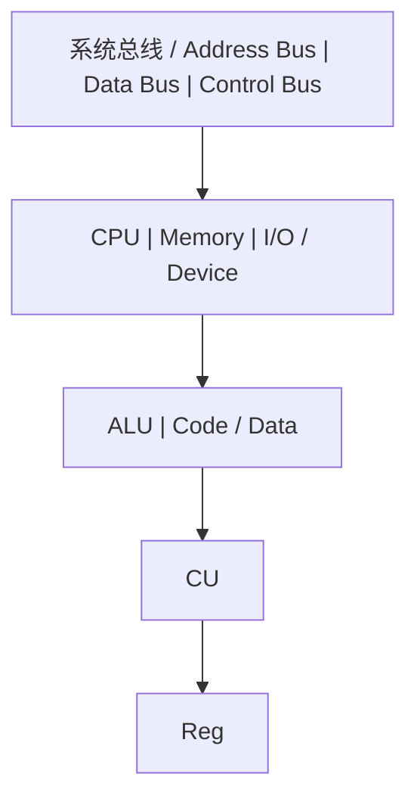

##### 1.2 冯诺依曼瓶颈

指令和数据共享同一总线，CPU无法同时读取指令和数据。这是冯诺依曼体系最根本的性能瓶颈。

```
执行一条指令的时间线:

|---取指---|---译码---|---执行---|---访存---|---写回---|
   ^                                                ^
   |          指令和数据争用同一总线                   |
   +------------------------------------------------+
```

**缓解策略**：

- 缓存分离：L1 Cache分为L1I（指令）和L1D（数据），在缓存层实现哈佛体系
- 预取：提前将指令/数据加载到缓存
- 乱序执行：在等待访存时执行其他指令

##### 1.3 哈佛体系

哈佛体系将指令存储器和数据存储器分离，拥有独立的总线：

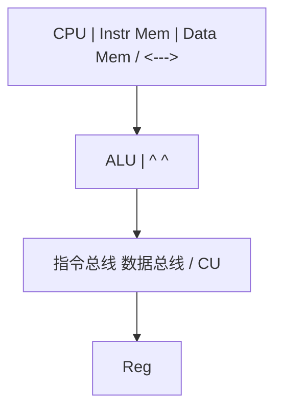

**对比**：

| 特性          | 冯诺依曼         | 哈佛          |
| ------------- | ---------------- | ------------- |
| 指令/数据存储 | 统一             | 分离          |
| 总线          | 共享             | 独立          |
| 带宽          | 受限             | 双倍          |
| 灵活性        | 高（代码即数据） | 低            |
| 典型应用      | 通用计算机       | DSP、微控制器 |

> 跨模块引用：[C语言](c/overview)的函数指针特性直接利用了冯诺依曼体系中"代码即数据"的本质。[操作系统](os)的虚拟内存管理通过MMU在冯诺依曼体系上实现了地址空间的隔离。

---

#### 2. 指令集体系结构 (ISA)

##### 2.1 ISA的设计哲学

ISA是硬件和软件之间的**接口契约**（参见[概述](overview)的抽象层级模型）。ISA定义了：

- 指令格式与编码
- 寄存器集合
- 寻址模式
- 数据类型
- 异常/中断模型
- 内存模型

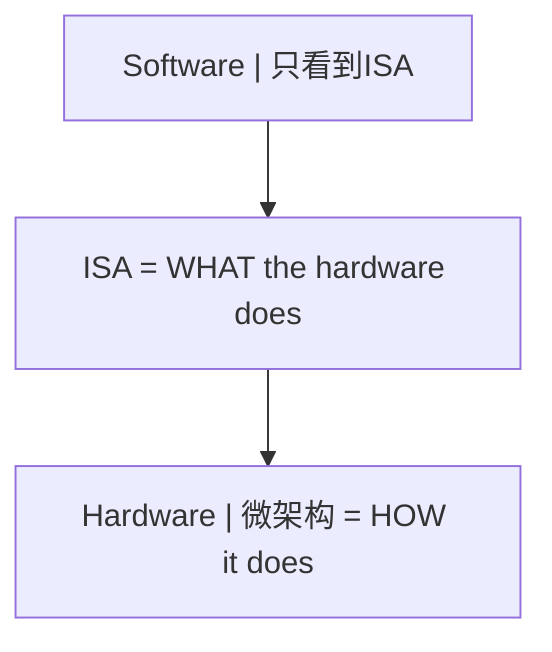

##### 2.2 CISC vs RISC

| 维度     | CISC (x86)       | RISC (ARM/RISC-V) |
| -------- | ---------------- | ----------------- |
| 指令长度 | 可变 (1-15字节)  | 固定 (4字节)      |
| 指令数量 | 多 (>1000)       | 少 (<200)         |
| 寻址模式 | 丰富             | 简单 (Load/Store) |
| 微操作   | 需要解码为微操作 | 指令即微操作      |
| 编码密度 | 高               | 低                |
| 流水线   | 复杂             | 简单              |
| 功耗     | 高               | 低                |

**设计哲学差异**：

```
CISC哲学:  让硬件做更多事，简化编译器
  MOV EAX, [EBX + ECX*4 + 0x10]   // 一条指令完成复杂操作

RISC哲学:  让编译器做更多事，简化硬件
  SLLI T0, T1, 2      // 移位
  ADD  T0, T0, T2     // 加基址
  LW   T3, 16(T0)     // 加载
```

##### 2.3 RISC-V指令集示例

```
RISC-V寄存器约定:

x0  (zero) - 硬连线0
x1  (ra)   - 返回地址
x2  (sp)   - 栈指针
x5-x7  (t0-t2) - 临时寄存器
x8-x9  (s0-s1) - 保存寄存器
x10-x17 (a0-a7) - 参数/返回值
x18-x27 (s2-s11) - 保存寄存器
x28-x31 (t3-t6) - 临时寄存器
```

**RISC-V指令编码格式**：

```
R-type (寄存器-寄存器操作):
|31    25|24   20|19   15|14  12|11    7|6     0|
| funct7 |  rs2  |  rs1  |funct3|  rd   |opcode |

I-type (立即数操作):
|31      20|19   15|14  12|11    7|6     0|
|  imm[11:0]|  rs1  |funct3|  rd   |opcode |

S-type (存储操作):
|31    25|24   20|19   15|14  12|11    7|6     0|
|imm[11:5]|  rs2  |  rs1  |funct3|imm[4:0]|opcode |
```

##### 2.4 寻址模式

```
寻址模式分类:

1. 立即寻址:    ADDI x1, x2, 100        // 操作数在指令中
2. 寄存器寻址:  ADD  x1, x2, x3         // 操作数在寄存器中
3. 基址偏移:    LW   x1, 100(x2)        // 基址+偏移量
4. PC相对:      BEQ  x1, x2, offset     // PC + 偏移量
5. 间接寻址:    JR   x1                  // 跳转到寄存器值
```

> 跨模块引用：[编译原理](compiler)的代码生成阶段需要根据ISA选择合适的寻址模式和指令调度。[C语言](c/overview)的指针算术直接映射到基址偏移寻址模式。

---

#### 3. 流水线原理

##### 3.1 五级流水线

经典的RISC五级流水线：

```
五级流水线时空图:

周期:    1     2     3     4     5     6     7
指令1:  IF    ID    EX    MEM   WB
指令2:        IF    ID    EX    MEM   WB
指令3:              IF    ID    EX    MEM   WB
指令4:                    IF    ID    EX    MEM   WB
指令5:                          IF    ID    EX    MEM   WB

IF  = Instruction Fetch (取指)
ID  = Instruction Decode (译码)
EX  = Execute (执行)
MEM = Memory Access (访存)
WB  = Write Back (写回)
```

**流水线加速比**：

```
理论加速比 = 流水线级数 n

实际加速比 = n / (1 + (n-1) * p)

其中 p = 由于冒险导致的停顿概率

CPI_ideal = 1 (每周期完成一条指令)
CPI_actual = 1 + stall_cycles_per_instruction
```

##### 3.2 流水线冒险

三类冒险及其解决方案：

**数据冒险**：

```
RAW (Read After Write) -- 真依赖:
  ADD x1, x2, x3    // 写x1
  SUB x4, x1, x5    // 读x1 (需要ADD的结果)

解决方案: 数据前递 (Forwarding/Bypassing)

  ADD x1, x2, x3    [IF][ID][EX][MEM][WB]
                           |_______________^
  SUB x4, x1, x5         [IF][ID] [EX] [MEM][WB]
                                    ^
                              前递路径: EX/MEM -> EX
```

**控制冒险**：

```
分支指令导致的流水线冲刷:

  BEQ x1, x2, target  [IF][ID][EX][MEM][WB]
  instr2 (wrong)           [IF] [X] [X] [X]  <- 冲刷
  instr2 (wrong)                [IF] [X] [X]  <- 冲刷
  target_instr                      [IF][ID][EX]...

解决方案:
  1. 分支预测 (静态/动态)
  2. 延迟分支 (分支延迟槽)
  3. 分支目标缓存 (BTB)
```

**结构冒险**：

```
硬件资源冲突 (如指令和数据同时访存):

解决方案:
  1. 哈佛缓存 (L1I / L1D分离)
  2. 资源复制
  3. 流水线停顿
```

##### 3.3 动态分支预测

```
2-bit饱和计数器状态机:

         Weakly Taken
          /    ^    \
    NT   /     |     \  T
        v      |      v
  Weakly NT    |    Strongly Taken
        \      |      /
    NT   \     |     /  T
          v    |    v
         Strongly NT

状态转移:
  00: Strongly Not Taken
  01: Weakly Not Taken
  10: Weakly Taken
  11: Strongly Taken

预测规则: 高位为1则预测Taken，高位为0则预测Not Taken
```

**两级自适应预测器**：

```
GShare预测器:

  全局历史寄存器 (GHR): 记录最近k次分支结果
       |
       v
  GHR XOR PC -> 索引模式历史表 (PHT)
                    |
                    v
              2-bit饱和计数器 -> 预测结果
```

##### 3.4 超标量与乱序执行

```
超标量流水线 (每个周期发射多条指令):

  取指 -> 译码 -> 重命名 -> 发射 -> 执行 -> 写回 -> 提交
   |       |       |        |       |       |       |
  多条    多条   消除假    保留站  多功能  重排    顺序
  指令    指令   依赖(WAR  (RS)   单元    缓冲    提交
                 WAW)

乱序执行的关键数据结构:

  Register Alias Table (RAT): 逻辑寄存器 -> 物理寄存器映射
  Reorder Buffer (ROB): 保证顺序提交
  Reservation Station (RS): 等待操作数就绪
```

> 跨模块引用：[操作系统](os)的进程上下文切换需要保存/恢复流水线状态。[编译原理](compiler)的指令调度需要理解流水线冒险以避免性能损失。

---

#### 4. 存储层次结构

##### 4.1 存储层次金字塔

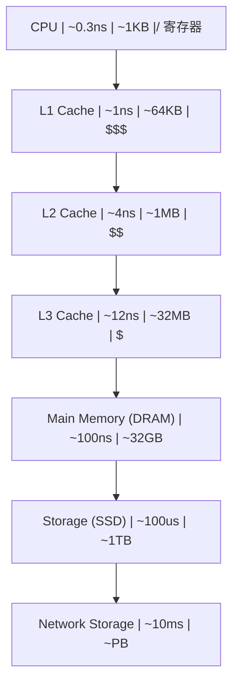

##### 4.2 局部性原理

局部性是存储层次有效性的理论基础：

**时间局部性**（Temporal Locality）：最近访问的数据很可能再次被访问

```
for (i = 0; i < N; i++) {
    sum += a[i];  // sum 在每次迭代都被访问 -> 时间局部性
}
```

**空间局部性**（Spatial Locality）：访问某地址后，附近地址很可能被访问

```
for (i = 0; i < N; i++) {
    a[i] = 0;  // a[i], a[i+1] 相邻 -> 空间局部性
}
```

##### 4.3 缓存设计

**缓存映射方式**：

```
1. 直接映射 (Direct-Mapped):
   每个内存块只能映射到一个缓存行
   index = block_address % cache_lines

   优点: 硬件简单，查找快
   缺点: 冲突率高

2. 组相联 (Set-Associative):
   每个内存块可映射到一组中的任意行
   index = block_address % num_sets
   组内全相联查找

   优点: 冲突率低
   缺点: 硬件复杂度增加

3. 全相联 (Fully-Associative):
   内存块可映射到任意缓存行
   全部行并行查找

   优点: 冲突率最低
   缺点: 硬件最复杂，功耗高
```

**缓存寻址分解**：

```
内存地址分解:

|-------- Tag --------|--- Index ---|--- Offset ---|
|                     |             |              |
| 标识哪个内存块       | 映射到哪一组  | 块内偏移      |

缓存查找过程:
  1. 用 Index 选择组
  2. 用 Tag 与组内所有行的Tag比较
  3. 若匹配且Valid=1 -> 命中 (Hit)
  4. 否则 -> 未命中 (Miss)
```

**缓存替换策略**：

```
LRU (Least Recently Used):
  替换最久未访问的行
  实现方式: 年龄计数器 / 伪LRU树

伪LRU (PLRU) 树形结构 (4路示例):

          bit0
         /    \
      bit1    bit2
      / \     / \
    W0  W1  W2  W3

  bit=0: 左子树更久未用
  bit=1: 右子树更久未用
  访问时翻转路径上的位
  替换时沿位指示方向走到叶节点
```

##### 4.4 缓存一致性协议 (MESI)

多核系统中，每个核心有自己的L1/L2缓存，必须保证一致性：

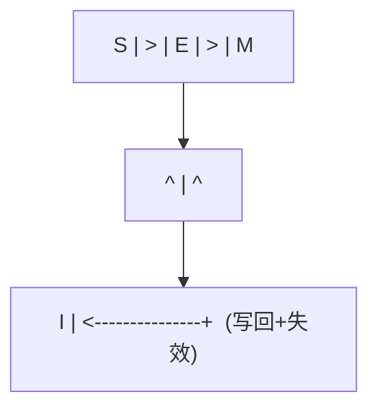

**MESI伪代码**：

```python
def cache_read(cache, addr):
    line = cache.find(addr)
    if line and line.state != INVALID:
        return line.data                    # Cache Hit
    # Cache Miss
    bus_broadcast(BusRd, addr)
    if other_cache_has(addr, MODIFIED):
        other_cache.flush_and_downgrade(addr)  # M -> S
        data = memory_or_bus_read(addr)
        cache.store(addr, data, SHARED)
    elif other_cache_has(addr, EXCLUSIVE):
        other_cache.downgrade(addr)            # E -> S
        data = memory_read(addr)
        cache.store(addr, data, SHARED)
    else:
        data = memory_read(addr)
        cache.store(addr, data, EXCLUSIVE)
    return data
```

##### 4.5 虚拟内存

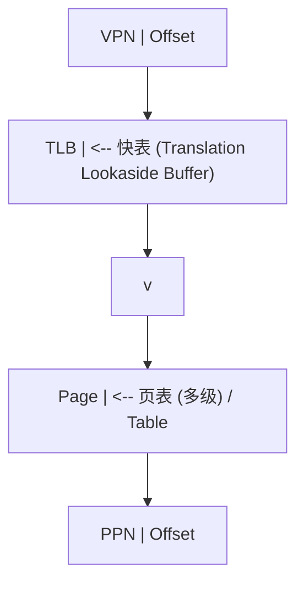

**多级页表结构**（以x86-64的4级页表为例）：

```
虚拟地址 (48位有效):
| PML4 (9b) | PDPT (9b) | PD (9b) | PT (9b) | Offset (12b) |

翻译过程:
  CR3 -> PML4表 -> PDPT表 -> PD表 -> PT表 -> 物理页

每级页表项 (PTE) 格式:
|--- Physical Frame Number ---| D | A | PC | G | U | W | P |
                               |   |   |    |   |   |   |
                               |   |   |    |   |   |   +-- Present
                               |   |   |    |   |   +------ Write
                               |   |   |    |   +---------- User
                               |   |   |    +-------------- Global
                               |   |   +------------------- Page Cache
                               |   +----------------------- Accessed
                               +--------------------------- Dirty
```

> 跨模块引用：[操作系统](os)的内存管理建立在虚拟内存机制之上。[C语言](c/overview)的指针解引用触发完整的地址翻译链路。[C++](cpp/overview)的智能指针在虚拟内存之上增加了语义层。

---

#### 5. 总线与互连

##### 5.1 总线分类

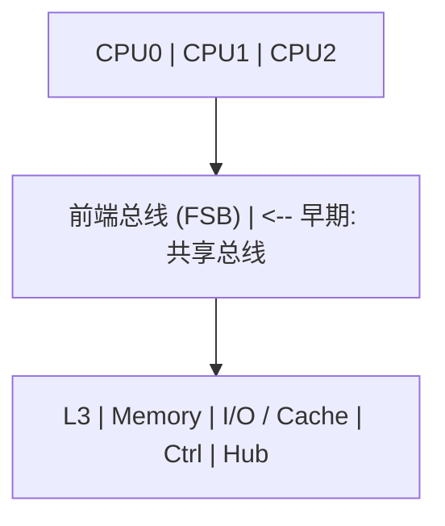

##### 5.2 AMBA AXI协议

AXI (Advanced eXtensible Interface) 是ARM定义的高性能总线协议，包含5个独立通道：

```
AXI5通道架构:

  读地址通道 (AR):  ARADDR, ARLEN, ARSIZE, ARBURST, ARVALID, ARREADY
  读数据通道 (R):   RDATA, RRESP, RLAST, RVALID, RREADY
  写地址通道 (AW):  AWADDR, AWLEN, AWSIZE, AWBURST, AWVALID, AWREADY
  写数据通道 (W):   WDATA, WSTRB, WLAST, WVALID, WREADY
  写响应通道 (B):   BRESP, BVALID, BREADY

握手协议:
  VALID = 主设备数据有效
  READY = 从设备准备接收
  传输发生在 VALID && READY 的时钟沿

       CLK:  _|^|_|^|_|^|_|^|_|^|_|^|_|^|_
     VALID:  _________|^^^^^^^^^|_________
     READY:  _______________|^^^^^^^^^^^^^
     TRANS:  _______________|     |________
                           ^     ^
                        传输发生
```

##### 5.3 PCIe协议栈

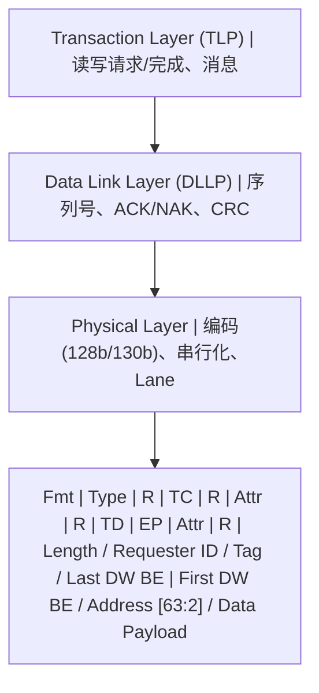

---

#### 6. 并行体系结构

##### 6.1 并行分类 (Flynn分类法)

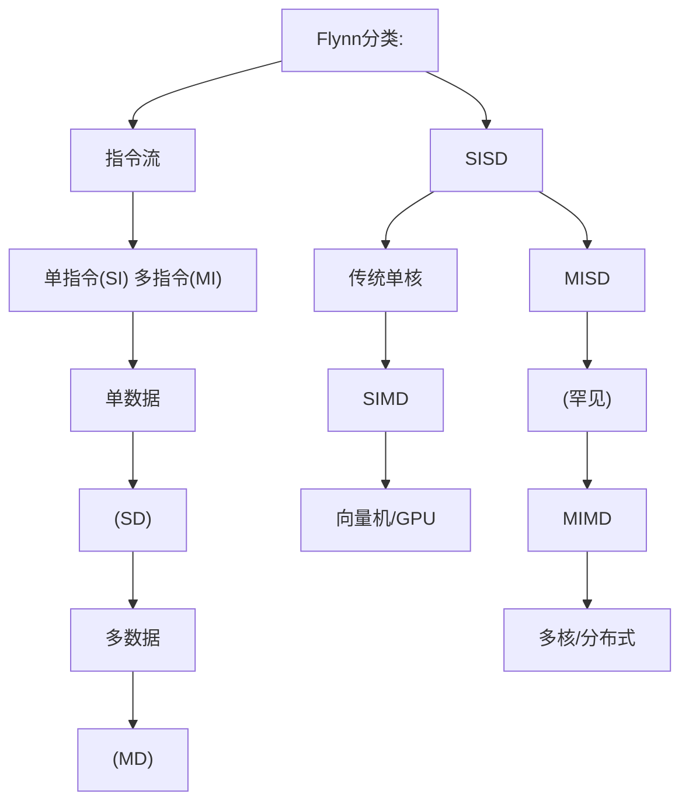

##### 6.2 SIMD与向量化

```
SIMD执行模型:

标量执行 (SISD):
  ADD r1, r2, r3    // 1对数据相加

SIMD执行:
  VADD v1, v2, v3   // N对数据同时相加

  v1 = [a0, a1, a2, a3, a4, a5, a6, a7]  (256-bit AVX)
  v2 = [b0, b1, b2, b3, b4, b5, b6, b7]
  v3 = [a0+b0, a1+b1, a2+b2, a3+b3, a4+b4, a5+b5, a6+b6, a7+b7]

SIMD指令集演进:
  x86: MMX(64b) -> SSE(128b) -> AVX(256b) -> AVX-512(512b)
  ARM: NEON(128b) -> SVE(可变128-2048b)
```

##### 6.3 GPU体系结构

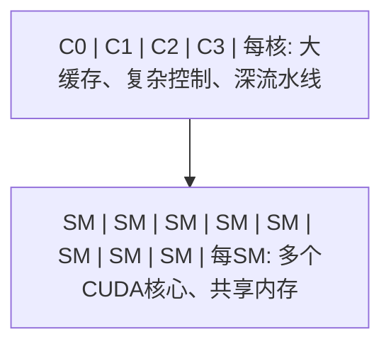

##### 6.4 多核缓存一致性

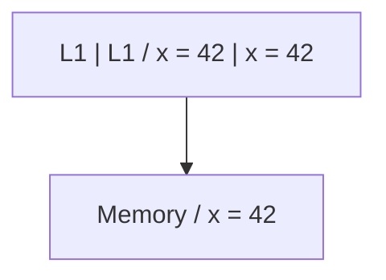

##### 6.5 内存一致性模型

```
内存一致性模型谱系:

严格 <---> 宽松

Sequential Consistency (SC):
  所有线程看到相同的操作顺序
  等价于所有操作某种全局交错

Total Store Order (TSO) [x86]:
  写操作进入Store Buffer，后续读可先于写完成
  仅允许 Store -> Load 重排

Relaxed Consistency [ARM/RISC-V]:
  允许更多重排: Store->Store, Load->Load, Store->Load, Load->Store
  需要显式内存屏障 (FENCE) 同步

屏障指令:
  x86:    MFENCE, LFENCE, SFENCE
  ARM:    DMB, DSB, ISB
  RISC-V: FENCE, FENCE.I
```

> 跨模块引用：[C++](cpp/overview)的内存模型（memory_order_relaxed/acquire/release/seq_cst）直接映射到硬件一致性模型。[Java](java/overview)的volatile关键字在x86上无需额外屏障，但在ARM上需要dmb。

---

#### 7. 速查表

##### 7.1 ISA速查

| 特性       | x86-64   | ARMv8   | RISC-V     |
| ---------- | -------- | ------- | ---------- |
| 类型       | CISC     | RISC    | RISC       |
| 指令长度   | 1-15B    | 4B      | 4B(可扩展) |
| 通用寄存器 | 16       | 31      | 31         |
| 地址宽度   | 48/57b   | 48b     | 39/48/57b  |
| 字节序     | Little   | 双端    | Little     |
| 特权级     | Ring 0-3 | EL0-EL3 | U/S/M      |

##### 7.2 流水线冒险速查

| 冒险类型 | 原因       | 解决方案      |
| -------- | ---------- | ------------- |
| RAW      | 真数据依赖 | 前递/转发     |
| WAR      | 反依赖     | 寄存器重命名  |
| WAW      | 输出依赖   | 寄存器重命名  |
| 控制     | 分支       | 预测/延迟槽   |
| 结构     | 资源冲突   | 资源复制/分离 |

##### 7.3 存储层次速查

| 层级   | 延迟   | 容量  | 管理   |
| ------ | ------ | ----- | ------ |
| 寄存器 | ~0.3ns | ~1KB  | 编译器 |
| L1     | ~1ns   | ~64KB | 硬件   |
| L2     | ~4ns   | ~1MB  | 硬件   |
| L3     | ~12ns  | ~32MB | 硬件   |
| DRAM   | ~100ns | ~32GB | OS     |
| SSD    | ~100us | ~1TB  | OS     |
| HDD    | ~10ms  | ~10TB | OS     |

##### 7.4 缓存一致性速查

| MESI状态 | 含义   | 可读 | 可写       | 与内存一致 |
| -------- | ------ | ---- | ---------- | ---------- |
| M        | 已修改 | 是   | 是         | 否         |
| E        | 独占   | 是   | 是         | 是         |
| S        | 共享   | 是   | 否(需升级) | 是         |
| I        | 无效   | 否   | 否         | -          |

---

#### 延伸阅读

- _Computer Architecture: A Quantitative Approach_ -- Hennessy & Patterson
- _Computer Organization and Design: RISC-V Edition_ -- Patterson & Hennessy
- _Modern Processor Design: Fundamentals of Superscalar Processors_ -- Shen & Lipasti
- _A Primer on Memory Consistency and Cache Coherence_ -- Sorin, Hill, Wood


### 3.2 概念关系图

下面用 Mermaid 图表达本文核心概念之间的关系，帮助读者建立整体图景：

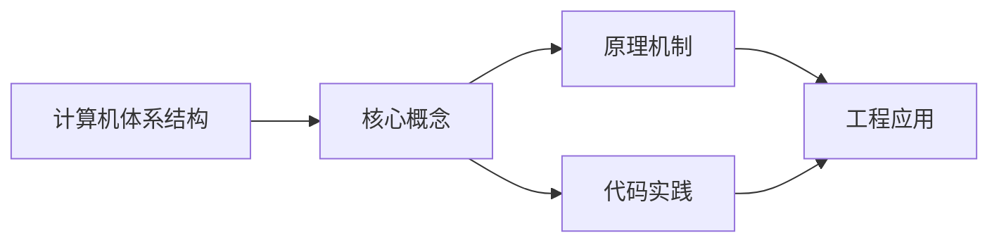

图中展示的是本文知识的结构化关系：核心概念是入口，原理机制解释“为什么”，代码实践演示“怎么做”，工程应用回答“何时用”。读者学习时可以把每个小节的内容挂接到对应节点上。

## 4. 理论推导与原理解析

本节深入《计算机体系结构》背后的原理。理论部分不求面面俱到，而是聚焦“能解释现象、能指导实践”的关键推导。

数据结构：数组/链表/栈/队列/哈希/树/图；每种结构有插入、查找、删除的时间复杂度特征。
算法分析：大 O 表示增长阶；时间与空间权衡；递归与迭代。
存储层次：寄存器 -> 缓存 -> 内存 -> 磁盘；局部性原理指导性能优化。
并发基础：竞态、临界区、锁、信号量、死锁条件与预防。

需要强调的是，理论推导与工程实践之间存在翻译层：理论给出的是理想化模型与边界条件，工程代码则必须处理真实环境中的例外。读者在学习时应先掌握理论的“标准情形”，再通过陷阱章节了解“非标准情形”。

## 5. 代码示例与逐行讲解

本节把原文中的代码示例系统整理，并为每个示例补充用途说明与讲解。读者不应只浏览代码，而应逐段对照讲解理解设计意图。

### 5.1 示例：1.1 冯诺依曼体系的核心思想

该示例来自原文《1.1 冯诺依曼体系的核心思想》小节，用于演示计算机体系结构相关操作。阅读时请先看代码结构，再看其后的讲解。


讲解：这段代码演示了本节核心知识点。代码中的关键操作可以归纳为三步：准备（定义或初始化）、执行（核心逻辑）、收尾（释放资源或返回结果）。实际项目中，这三步往往被封装为函数或类，以提升复用性与可测试性。

关键点分析：

该示例共 10 行有效代码，结构以数据或配置为主。阅读时应关注：数据字段的含义、配置项的作用，以及它们与运行行为的对应关系。

进阶思考路径：先尝试修改参数观察行为变化，再把示例中的模式迁移到自己的项目中；每次修改都记录预期与实测差异，这是把示例转化为能力的最快方式。

### 5.2 示例：1.2 冯诺依曼瓶颈

该示例来自原文《1.2 冯诺依曼瓶颈》小节，用于演示计算机体系结构相关操作。阅读时请先看代码结构，再看其后的讲解。

```text
执行一条指令的时间线:

|---取指---|---译码---|---执行---|---访存---|---写回---|
   ^                                                ^
   |          指令和数据争用同一总线                   |
   +------------------------------------------------+
```

讲解：这段代码演示了本节核心知识点。代码中的关键操作可以归纳为三步：准备（定义或初始化）、执行（核心逻辑）、收尾（释放资源或返回结果）。实际项目中，这三步往往被封装为函数或类，以提升复用性与可测试性。

关键点分析：

该示例共 5 行有效代码，结构以数据或配置为主。阅读时应关注：数据字段的含义、配置项的作用，以及它们与运行行为的对应关系。

进阶思考路径：先尝试修改参数观察行为变化，再把示例中的模式迁移到自己的项目中；每次修改都记录预期与实测差异，这是把示例转化为能力的最快方式。

### 5.3 示例：1.3 哈佛体系

该示例来自原文《1.3 哈佛体系》小节，用于演示计算机体系结构相关操作。阅读时请先看代码结构，再看其后的讲解。


讲解：这段代码演示了本节核心知识点。代码中的关键操作可以归纳为三步：准备（定义或初始化）、执行（核心逻辑）、收尾（释放资源或返回结果）。实际项目中，这三步往往被封装为函数或类，以提升复用性与可测试性。

关键点分析：

该示例共 8 行有效代码，结构以数据或配置为主。阅读时应关注：数据字段的含义、配置项的作用，以及它们与运行行为的对应关系。

进阶思考路径：先尝试修改参数观察行为变化，再把示例中的模式迁移到自己的项目中；每次修改都记录预期与实测差异，这是把示例转化为能力的最快方式。

### 5.4 示例：2.1 ISA的设计哲学

该示例来自原文《2.1 ISA的设计哲学》小节，用于演示计算机体系结构相关操作。阅读时请先看代码结构，再看其后的讲解。


讲解：这段代码演示了本节核心知识点。代码中的关键操作可以归纳为三步：准备（定义或初始化）、执行（核心逻辑）、收尾（释放资源或返回结果）。实际项目中，这三步往往被封装为函数或类，以提升复用性与可测试性。

关键点分析：

该示例共 6 行有效代码，结构以数据或配置为主。阅读时应关注：数据字段的含义、配置项的作用，以及它们与运行行为的对应关系。

进阶思考路径：先尝试修改参数观察行为变化，再把示例中的模式迁移到自己的项目中；每次修改都记录预期与实测差异，这是把示例转化为能力的最快方式。

### 5.5 示例：2.2 CISC vs RISC

该示例来自原文《2.2 CISC vs RISC》小节，用于演示计算机体系结构相关操作。阅读时请先看代码结构，再看其后的讲解。

```text
CISC哲学:  让硬件做更多事，简化编译器
  MOV EAX, [EBX + ECX*4 + 0x10]   // 一条指令完成复杂操作

RISC哲学:  让编译器做更多事，简化硬件
  SLLI T0, T1, 2      // 移位
  ADD  T0, T0, T2     // 加基址
  LW   T3, 16(T0)     // 加载
```

讲解：这段代码演示了本节核心知识点。代码中的关键操作可以归纳为三步：准备（定义或初始化）、执行（核心逻辑）、收尾（释放资源或返回结果）。实际项目中，这三步往往被封装为函数或类，以提升复用性与可测试性。

关键点分析：

该示例共 6 行有效代码，结构以数据或配置为主。阅读时应关注：数据字段的含义、配置项的作用，以及它们与运行行为的对应关系。

进阶思考路径：先尝试修改参数观察行为变化，再把示例中的模式迁移到自己的项目中；每次修改都记录预期与实测差异，这是把示例转化为能力的最快方式。

### 5.6 示例：2.3 RISC-V指令集示例

该示例来自原文《2.3 RISC-V指令集示例》小节，用于演示计算机体系结构相关操作。阅读时请先看代码结构，再看其后的讲解。

```text
RISC-V寄存器约定:

x0  (zero) - 硬连线0
x1  (ra)   - 返回地址
x2  (sp)   - 栈指针
x5-x7  (t0-t2) - 临时寄存器
x8-x9  (s0-s1) - 保存寄存器
x10-x17 (a0-a7) - 参数/返回值
x18-x27 (s2-s11) - 保存寄存器
x28-x31 (t3-t6) - 临时寄存器
```

讲解：这段代码演示了本节核心知识点。代码中的关键操作可以归纳为三步：准备（定义或初始化）、执行（核心逻辑）、收尾（释放资源或返回结果）。实际项目中，这三步往往被封装为函数或类，以提升复用性与可测试性。

关键点分析：

该示例共 9 行有效代码，结构以数据或配置为主。阅读时应关注：数据字段的含义、配置项的作用，以及它们与运行行为的对应关系。

进阶思考路径：先尝试修改参数观察行为变化，再把示例中的模式迁移到自己的项目中；每次修改都记录预期与实测差异，这是把示例转化为能力的最快方式。

### 5.7 示例：2.3 RISC-V指令集示例

该示例来自原文《2.3 RISC-V指令集示例》小节，用于演示计算机体系结构相关操作。阅读时请先看代码结构，再看其后的讲解。

```text
R-type (寄存器-寄存器操作):
|31    25|24   20|19   15|14  12|11    7|6     0|
| funct7 |  rs2  |  rs1  |funct3|  rd   |opcode |

I-type (立即数操作):
|31      20|19   15|14  12|11    7|6     0|
|  imm[11:0]|  rs1  |funct3|  rd   |opcode |

S-type (存储操作):
|31    25|24   20|19   15|14  12|11    7|6     0|
|imm[11:5]|  rs2  |  rs1  |funct3|imm[4:0]|opcode |
```

讲解：这段代码演示了本节核心知识点。代码中的关键操作可以归纳为三步：准备（定义或初始化）、执行（核心逻辑）、收尾（释放资源或返回结果）。实际项目中，这三步往往被封装为函数或类，以提升复用性与可测试性。

关键点分析：

该示例共 9 行有效代码，结构以数据或配置为主。阅读时应关注：数据字段的含义、配置项的作用，以及它们与运行行为的对应关系。

进阶思考路径：先尝试修改参数观察行为变化，再把示例中的模式迁移到自己的项目中；每次修改都记录预期与实测差异，这是把示例转化为能力的最快方式。

### 5.8 示例：2.4 寻址模式

该示例来自原文《2.4 寻址模式》小节，用于演示计算机体系结构相关操作。阅读时请先看代码结构，再看其后的讲解。

```text
寻址模式分类:

1. 立即寻址:    ADDI x1, x2, 100        // 操作数在指令中
2. 寄存器寻址:  ADD  x1, x2, x3         // 操作数在寄存器中
3. 基址偏移:    LW   x1, 100(x2)        // 基址+偏移量
4. PC相对:      BEQ  x1, x2, offset     // PC + 偏移量
5. 间接寻址:    JR   x1                  // 跳转到寄存器值
```

讲解：这段代码演示了本节核心知识点。代码中的关键操作可以归纳为三步：准备（定义或初始化）、执行（核心逻辑）、收尾（释放资源或返回结果）。实际项目中，这三步往往被封装为函数或类，以提升复用性与可测试性。

关键点分析：

该示例共 6 行有效代码，结构以数据或配置为主。阅读时应关注：数据字段的含义、配置项的作用，以及它们与运行行为的对应关系。

进阶思考路径：先尝试修改参数观察行为变化，再把示例中的模式迁移到自己的项目中；每次修改都记录预期与实测差异，这是把示例转化为能力的最快方式。

### 5.9 示例：3.1 五级流水线

该示例来自原文《3.1 五级流水线》小节，用于演示计算机体系结构相关操作。阅读时请先看代码结构，再看其后的讲解。

```text
五级流水线时空图:

周期:    1     2     3     4     5     6     7
指令1:  IF    ID    EX    MEM   WB
指令2:        IF    ID    EX    MEM   WB
指令3:              IF    ID    EX    MEM   WB
指令4:                    IF    ID    EX    MEM   WB
指令5:                          IF    ID    EX    MEM   WB

IF  = Instruction Fetch (取指)
ID  = Instruction Decode (译码)
EX  = Execute (执行)
MEM = Memory Access (访存)
WB  = Write Back (写回)
```

讲解：这段代码演示了本节核心知识点。代码中的关键操作可以归纳为三步：准备（定义或初始化）、执行（核心逻辑）、收尾（释放资源或返回结果）。实际项目中，这三步往往被封装为函数或类，以提升复用性与可测试性。

关键点分析：

该示例共 12 行有效代码，结构以数据或配置为主。阅读时应关注：数据字段的含义、配置项的作用，以及它们与运行行为的对应关系。

进阶思考路径：先尝试修改参数观察行为变化，再把示例中的模式迁移到自己的项目中；每次修改都记录预期与实测差异，这是把示例转化为能力的最快方式。

### 5.10 示例：3.1 五级流水线

该示例来自原文《3.1 五级流水线》小节，用于演示计算机体系结构相关操作。阅读时请先看代码结构，再看其后的讲解。

```text
理论加速比 = 流水线级数 n

实际加速比 = n / (1 + (n-1) * p)

其中 p = 由于冒险导致的停顿概率

CPI_ideal = 1 (每周期完成一条指令)
CPI_actual = 1 + stall_cycles_per_instruction
```

讲解：这段代码演示了本节核心知识点。代码中的关键操作可以归纳为三步：准备（定义或初始化）、执行（核心逻辑）、收尾（释放资源或返回结果）。实际项目中，这三步往往被封装为函数或类，以提升复用性与可测试性。

关键点分析：

该示例共 5 行有效代码，结构以数据或配置为主。阅读时应关注：数据字段的含义、配置项的作用，以及它们与运行行为的对应关系。

进阶思考路径：先尝试修改参数观察行为变化，再把示例中的模式迁移到自己的项目中；每次修改都记录预期与实测差异，这是把示例转化为能力的最快方式。

### 5.11 示例：3.2 流水线冒险

该示例来自原文《3.2 流水线冒险》小节，用于演示计算机体系结构相关操作。阅读时请先看代码结构，再看其后的讲解。

```text
RAW (Read After Write) -- 真依赖:
  ADD x1, x2, x3    // 写x1
  SUB x4, x1, x5    // 读x1 (需要ADD的结果)

解决方案: 数据前递 (Forwarding/Bypassing)

  ADD x1, x2, x3    [IF][ID][EX][MEM][WB]
                           |_______________^
  SUB x4, x1, x5         [IF][ID] [EX] [MEM][WB]
                                    ^
                              前递路径: EX/MEM -> EX
```

讲解：这段代码演示了本节核心知识点。代码中的关键操作可以归纳为三步：准备（定义或初始化）、执行（核心逻辑）、收尾（释放资源或返回结果）。实际项目中，这三步往往被封装为函数或类，以提升复用性与可测试性。

关键点分析：

该示例共 9 行有效代码，结构以数据或配置为主。阅读时应关注：数据字段的含义、配置项的作用，以及它们与运行行为的对应关系。

进阶思考路径：先尝试修改参数观察行为变化，再把示例中的模式迁移到自己的项目中；每次修改都记录预期与实测差异，这是把示例转化为能力的最快方式。

### 5.12 示例：3.2 流水线冒险

该示例来自原文《3.2 流水线冒险》小节，用于演示计算机体系结构相关操作。阅读时请先看代码结构，再看其后的讲解。

```text
分支指令导致的流水线冲刷:

  BEQ x1, x2, target  [IF][ID][EX][MEM][WB]
  instr2 (wrong)           [IF] [X] [X] [X]  <- 冲刷
  instr2 (wrong)                [IF] [X] [X]  <- 冲刷
  target_instr                      [IF][ID][EX]...

解决方案:
  1. 分支预测 (静态/动态)
  2. 延迟分支 (分支延迟槽)
  3. 分支目标缓存 (BTB)
```

讲解：这段代码演示了本节核心知识点。代码中的关键操作可以归纳为三步：准备（定义或初始化）、执行（核心逻辑）、收尾（释放资源或返回结果）。实际项目中，这三步往往被封装为函数或类，以提升复用性与可测试性。

关键点分析：

该示例共 9 行有效代码，结构以数据或配置为主。阅读时应关注：数据字段的含义、配置项的作用，以及它们与运行行为的对应关系。

进阶思考路径：先尝试修改参数观察行为变化，再把示例中的模式迁移到自己的项目中；每次修改都记录预期与实测差异，这是把示例转化为能力的最快方式。

### 5.13 示例：3.2 流水线冒险

该示例来自原文《3.2 流水线冒险》小节，用于演示计算机体系结构相关操作。阅读时请先看代码结构，再看其后的讲解。

```text
硬件资源冲突 (如指令和数据同时访存):

解决方案:
  1. 哈佛缓存 (L1I / L1D分离)
  2. 资源复制
  3. 流水线停顿
```

讲解：这段代码演示了本节核心知识点。代码中的关键操作可以归纳为三步：准备（定义或初始化）、执行（核心逻辑）、收尾（释放资源或返回结果）。实际项目中，这三步往往被封装为函数或类，以提升复用性与可测试性。

关键点分析：

该示例共 5 行有效代码，结构以数据或配置为主。阅读时应关注：数据字段的含义、配置项的作用，以及它们与运行行为的对应关系。

进阶思考路径：先尝试修改参数观察行为变化，再把示例中的模式迁移到自己的项目中；每次修改都记录预期与实测差异，这是把示例转化为能力的最快方式。

### 5.14 示例：3.3 动态分支预测

该示例来自原文《3.3 动态分支预测》小节，用于演示计算机体系结构相关操作。阅读时请先看代码结构，再看其后的讲解。

```text
2-bit饱和计数器状态机:

         Weakly Taken
          /    ^    \
    NT   /     |     \  T
        v      |      v
  Weakly NT    |    Strongly Taken
        \      |      /
    NT   \     |     /  T
          v    |    v
         Strongly NT

状态转移:
  00: Strongly Not Taken
  01: Weakly Not Taken
  10: Weakly Taken
  11: Strongly Taken

预测规则: 高位为1则预测Taken，高位为0则预测Not Taken
```

讲解：这段代码演示了本节核心知识点。代码中的关键操作可以归纳为三步：准备（定义或初始化）、执行（核心逻辑）、收尾（释放资源或返回结果）。实际项目中，这三步往往被封装为函数或类，以提升复用性与可测试性。

关键点分析：

该示例共 16 行有效代码，结构以数据或配置为主。阅读时应关注：数据字段的含义、配置项的作用，以及它们与运行行为的对应关系。

进阶思考路径：先尝试修改参数观察行为变化，再把示例中的模式迁移到自己的项目中；每次修改都记录预期与实测差异，这是把示例转化为能力的最快方式。

### 5.15 示例：3.3 动态分支预测

该示例来自原文《3.3 动态分支预测》小节，用于演示计算机体系结构相关操作。阅读时请先看代码结构，再看其后的讲解。

```text
GShare预测器:

  全局历史寄存器 (GHR): 记录最近k次分支结果
       |
       v
  GHR XOR PC -> 索引模式历史表 (PHT)
                    |
                    v
              2-bit饱和计数器 -> 预测结果
```

讲解：这段代码演示了本节核心知识点。代码中的关键操作可以归纳为三步：准备（定义或初始化）、执行（核心逻辑）、收尾（释放资源或返回结果）。实际项目中，这三步往往被封装为函数或类，以提升复用性与可测试性。

关键点分析：

该示例共 8 行有效代码，结构以数据或配置为主。阅读时应关注：数据字段的含义、配置项的作用，以及它们与运行行为的对应关系。

进阶思考路径：先尝试修改参数观察行为变化，再把示例中的模式迁移到自己的项目中；每次修改都记录预期与实测差异，这是把示例转化为能力的最快方式。

### 5.16 示例：3.4 超标量与乱序执行

该示例来自原文《3.4 超标量与乱序执行》小节，用于演示计算机体系结构相关操作。阅读时请先看代码结构，再看其后的讲解。

```text
超标量流水线 (每个周期发射多条指令):

  取指 -> 译码 -> 重命名 -> 发射 -> 执行 -> 写回 -> 提交
   |       |       |        |       |       |       |
  多条    多条   消除假    保留站  多功能  重排    顺序
  指令    指令   依赖(WAR  (RS)   单元    缓冲    提交
                 WAW)

乱序执行的关键数据结构:

  Register Alias Table (RAT): 逻辑寄存器 -> 物理寄存器映射
  Reorder Buffer (ROB): 保证顺序提交
  Reservation Station (RS): 等待操作数就绪
```

讲解：这段代码演示了本节核心知识点。代码中的关键操作可以归纳为三步：准备（定义或初始化）、执行（核心逻辑）、收尾（释放资源或返回结果）。实际项目中，这三步往往被封装为函数或类，以提升复用性与可测试性。

关键点分析：

该示例共 10 行有效代码，结构以数据或配置为主。阅读时应关注：数据字段的含义、配置项的作用，以及它们与运行行为的对应关系。

进阶思考路径：先尝试修改参数观察行为变化，再把示例中的模式迁移到自己的项目中；每次修改都记录预期与实测差异，这是把示例转化为能力的最快方式。

### 5.17 示例：4.1 存储层次金字塔

该示例来自原文《4.1 存储层次金字塔》小节，用于演示计算机体系结构相关操作。阅读时请先看代码结构，再看其后的讲解。


讲解：这段代码演示了本节核心知识点。代码中的关键操作可以归纳为三步：准备（定义或初始化）、执行（核心逻辑）、收尾（释放资源或返回结果）。实际项目中，这三步往往被封装为函数或类，以提升复用性与可测试性。

关键点分析：

该示例共 14 行有效代码，结构以数据或配置为主。阅读时应关注：数据字段的含义、配置项的作用，以及它们与运行行为的对应关系。

进阶思考路径：先尝试修改参数观察行为变化，再把示例中的模式迁移到自己的项目中；每次修改都记录预期与实测差异，这是把示例转化为能力的最快方式。

### 5.18 示例：4.2 局部性原理

该示例来自原文《4.2 局部性原理》小节，用于演示计算机体系结构相关操作。阅读时请先看代码结构，再看其后的讲解。

```text
for (i = 0; i < N; i++) {
    sum += a[i];  // sum 在每次迭代都被访问 -> 时间局部性
}
```

讲解：这段代码演示了本节核心知识点。代码中的关键操作可以归纳为三步：准备（定义或初始化）、执行（核心逻辑）、收尾（释放资源或返回结果）。实际项目中，这三步往往被封装为函数或类，以提升复用性与可测试性。

关键点分析：

该示例共 3 行有效代码，包含 1 类关键结构（for）。其中：

- 入口与初始化部分负责建立上下文，对应实际项目中的启动或装配逻辑；
- 核心逻辑部分体现本文主题的主要操作，是阅读时最需要对照讲解理解的部分；
- 输出或返回部分把结果交给调用方，注意其类型与边界条件。

进阶思考路径：先尝试修改参数观察行为变化，再把示例中的模式迁移到自己的项目中；每次修改都记录预期与实测差异，这是把示例转化为能力的最快方式。

### 5.19 示例：4.2 局部性原理

该示例来自原文《4.2 局部性原理》小节，用于演示计算机体系结构相关操作。阅读时请先看代码结构，再看其后的讲解。

```text
for (i = 0; i < N; i++) {
    a[i] = 0;  // a[i], a[i+1] 相邻 -> 空间局部性
}
```

讲解：这段代码演示了本节核心知识点。代码中的关键操作可以归纳为三步：准备（定义或初始化）、执行（核心逻辑）、收尾（释放资源或返回结果）。实际项目中，这三步往往被封装为函数或类，以提升复用性与可测试性。

关键点分析：

该示例共 3 行有效代码，包含 1 类关键结构（for）。其中：

- 入口与初始化部分负责建立上下文，对应实际项目中的启动或装配逻辑；
- 核心逻辑部分体现本文主题的主要操作，是阅读时最需要对照讲解理解的部分；
- 输出或返回部分把结果交给调用方，注意其类型与边界条件。

进阶思考路径：先尝试修改参数观察行为变化，再把示例中的模式迁移到自己的项目中；每次修改都记录预期与实测差异，这是把示例转化为能力的最快方式。

### 5.20 示例：4.3 缓存设计

该示例来自原文《4.3 缓存设计》小节，用于演示计算机体系结构相关操作。阅读时请先看代码结构，再看其后的讲解。

```text
1. 直接映射 (Direct-Mapped):
   每个内存块只能映射到一个缓存行
   index = block_address % cache_lines

   优点: 硬件简单，查找快
   缺点: 冲突率高

2. 组相联 (Set-Associative):
   每个内存块可映射到一组中的任意行
   index = block_address % num_sets
   组内全相联查找

   优点: 冲突率低
   缺点: 硬件复杂度增加

3. 全相联 (Fully-Associative):
   内存块可映射到任意缓存行
   全部行并行查找

   优点: 冲突率最低
   缺点: 硬件最复杂，功耗高
```

讲解：这段代码演示了本节核心知识点。代码中的关键操作可以归纳为三步：准备（定义或初始化）、执行（核心逻辑）、收尾（释放资源或返回结果）。实际项目中，这三步往往被封装为函数或类，以提升复用性与可测试性。

关键点分析：

该示例共 16 行有效代码，结构以数据或配置为主。阅读时应关注：数据字段的含义、配置项的作用，以及它们与运行行为的对应关系。

进阶思考路径：先尝试修改参数观察行为变化，再把示例中的模式迁移到自己的项目中；每次修改都记录预期与实测差异，这是把示例转化为能力的最快方式。

### 5.21 示例：4.3 缓存设计

该示例来自原文《4.3 缓存设计》小节，用于演示计算机体系结构相关操作。阅读时请先看代码结构，再看其后的讲解。

```text
内存地址分解:

|-------- Tag --------|--- Index ---|--- Offset ---|
|                     |             |              |
| 标识哪个内存块       | 映射到哪一组  | 块内偏移      |

缓存查找过程:
  1. 用 Index 选择组
  2. 用 Tag 与组内所有行的Tag比较
  3. 若匹配且Valid=1 -> 命中 (Hit)
  4. 否则 -> 未命中 (Miss)
```

讲解：这段代码演示了本节核心知识点。代码中的关键操作可以归纳为三步：准备（定义或初始化）、执行（核心逻辑）、收尾（释放资源或返回结果）。实际项目中，这三步往往被封装为函数或类，以提升复用性与可测试性。

关键点分析：

该示例共 9 行有效代码，结构以数据或配置为主。阅读时应关注：数据字段的含义、配置项的作用，以及它们与运行行为的对应关系。

进阶思考路径：先尝试修改参数观察行为变化，再把示例中的模式迁移到自己的项目中；每次修改都记录预期与实测差异，这是把示例转化为能力的最快方式。

### 5.22 示例：4.3 缓存设计

该示例来自原文《4.3 缓存设计》小节，用于演示计算机体系结构相关操作。阅读时请先看代码结构，再看其后的讲解。

```text
LRU (Least Recently Used):
  替换最久未访问的行
  实现方式: 年龄计数器 / 伪LRU树

伪LRU (PLRU) 树形结构 (4路示例):

          bit0
         /    \
      bit1    bit2
      / \     / \
    W0  W1  W2  W3

  bit=0: 左子树更久未用
  bit=1: 右子树更久未用
  访问时翻转路径上的位
  替换时沿位指示方向走到叶节点
```

讲解：这段代码演示了本节核心知识点。代码中的关键操作可以归纳为三步：准备（定义或初始化）、执行（核心逻辑）、收尾（释放资源或返回结果）。实际项目中，这三步往往被封装为函数或类，以提升复用性与可测试性。

关键点分析：

该示例共 13 行有效代码，结构以数据或配置为主。阅读时应关注：数据字段的含义、配置项的作用，以及它们与运行行为的对应关系。

进阶思考路径：先尝试修改参数观察行为变化，再把示例中的模式迁移到自己的项目中；每次修改都记录预期与实测差异，这是把示例转化为能力的最快方式。

### 5.23 示例：4.4 缓存一致性协议 (MESI)

该示例来自原文《4.4 缓存一致性协议 (MESI)》小节，用于演示计算机体系结构相关操作。阅读时请先看代码结构，再看其后的讲解。


讲解：这段代码演示了本节核心知识点。代码中的关键操作可以归纳为三步：准备（定义或初始化）、执行（核心逻辑）、收尾（释放资源或返回结果）。实际项目中，这三步往往被封装为函数或类，以提升复用性与可测试性。

关键点分析：

该示例共 6 行有效代码，结构以数据或配置为主。阅读时应关注：数据字段的含义、配置项的作用，以及它们与运行行为的对应关系。

进阶思考路径：先尝试修改参数观察行为变化，再把示例中的模式迁移到自己的项目中；每次修改都记录预期与实测差异，这是把示例转化为能力的最快方式。

### 5.24 示例：4.4 缓存一致性协议 (MESI)

该示例来自原文《4.4 缓存一致性协议 (MESI)》小节，用于演示计算机体系结构相关操作。阅读时请先看代码结构，再看其后的讲解。

```python
def cache_read(cache, addr):
    line = cache.find(addr)
    if line and line.state != INVALID:
        return line.data                    # Cache Hit
    # Cache Miss
    bus_broadcast(BusRd, addr)
    if other_cache_has(addr, MODIFIED):
        other_cache.flush_and_downgrade(addr)  # M -> S
        data = memory_or_bus_read(addr)
        cache.store(addr, data, SHARED)
    elif other_cache_has(addr, EXCLUSIVE):
        other_cache.downgrade(addr)            # E -> S
        data = memory_read(addr)
        cache.store(addr, data, SHARED)
    else:
        data = memory_read(addr)
        cache.store(addr, data, EXCLUSIVE)
    return data
```

讲解：这段代码演示了本节核心知识点。代码中的关键操作可以归纳为三步：准备（定义或初始化）、执行（核心逻辑）、收尾（释放资源或返回结果）。实际项目中，这三步往往被封装为函数或类，以提升复用性与可测试性。

关键点分析：

该示例共 18 行有效代码，包含 3 类关键结构（def、if、return）。其中：

- 入口与初始化部分负责建立上下文，对应实际项目中的启动或装配逻辑；
- 核心逻辑部分体现本文主题的主要操作，是阅读时最需要对照讲解理解的部分；
- 输出或返回部分把结果交给调用方，注意其类型与边界条件。

进阶思考路径：先尝试修改参数观察行为变化，再把示例中的模式迁移到自己的项目中；每次修改都记录预期与实测差异，这是把示例转化为能力的最快方式。

### 5.25 示例：4.5 虚拟内存

该示例来自原文《4.5 虚拟内存》小节，用于演示计算机体系结构相关操作。阅读时请先看代码结构，再看其后的讲解。


讲解：这段代码演示了本节核心知识点。代码中的关键操作可以归纳为三步：准备（定义或初始化）、执行（核心逻辑）、收尾（释放资源或返回结果）。实际项目中，这三步往往被封装为函数或类，以提升复用性与可测试性。

关键点分析：

该示例共 10 行有效代码，结构以数据或配置为主。阅读时应关注：数据字段的含义、配置项的作用，以及它们与运行行为的对应关系。

进阶思考路径：先尝试修改参数观察行为变化，再把示例中的模式迁移到自己的项目中；每次修改都记录预期与实测差异，这是把示例转化为能力的最快方式。

### 5.26 示例：4.5 虚拟内存

该示例来自原文《4.5 虚拟内存》小节，用于演示计算机体系结构相关操作。阅读时请先看代码结构，再看其后的讲解。

```text
虚拟地址 (48位有效):
| PML4 (9b) | PDPT (9b) | PD (9b) | PT (9b) | Offset (12b) |

翻译过程:
  CR3 -> PML4表 -> PDPT表 -> PD表 -> PT表 -> 物理页

每级页表项 (PTE) 格式:
|--- Physical Frame Number ---| D | A | PC | G | U | W | P |
                               |   |   |    |   |   |   |
                               |   |   |    |   |   |   +-- Present
                               |   |   |    |   |   +------ Write
                               |   |   |    |   +---------- User
                               |   |   |    +-------------- Global
                               |   |   +------------------- Page Cache
                               |   +----------------------- Accessed
                               +--------------------------- Dirty
```

讲解：这段代码演示了本节核心知识点。代码中的关键操作可以归纳为三步：准备（定义或初始化）、执行（核心逻辑）、收尾（释放资源或返回结果）。实际项目中，这三步往往被封装为函数或类，以提升复用性与可测试性。

关键点分析：

该示例共 14 行有效代码，结构以数据或配置为主。阅读时应关注：数据字段的含义、配置项的作用，以及它们与运行行为的对应关系。

进阶思考路径：先尝试修改参数观察行为变化，再把示例中的模式迁移到自己的项目中；每次修改都记录预期与实测差异，这是把示例转化为能力的最快方式。

### 5.27 示例：5.1 总线分类

该示例来自原文《5.1 总线分类》小节，用于演示计算机体系结构相关操作。阅读时请先看代码结构，再看其后的讲解。


讲解：这段代码演示了本节核心知识点。代码中的关键操作可以归纳为三步：准备（定义或初始化）、执行（核心逻辑）、收尾（释放资源或返回结果）。实际项目中，这三步往往被封装为函数或类，以提升复用性与可测试性。

关键点分析：

该示例共 6 行有效代码，结构以数据或配置为主。阅读时应关注：数据字段的含义、配置项的作用，以及它们与运行行为的对应关系。

进阶思考路径：先尝试修改参数观察行为变化，再把示例中的模式迁移到自己的项目中；每次修改都记录预期与实测差异，这是把示例转化为能力的最快方式。

### 5.28 示例：5.2 AMBA AXI协议

该示例来自原文《5.2 AMBA AXI协议》小节，用于演示计算机体系结构相关操作。阅读时请先看代码结构，再看其后的讲解。

```text
AXI5通道架构:

  读地址通道 (AR):  ARADDR, ARLEN, ARSIZE, ARBURST, ARVALID, ARREADY
  读数据通道 (R):   RDATA, RRESP, RLAST, RVALID, RREADY
  写地址通道 (AW):  AWADDR, AWLEN, AWSIZE, AWBURST, AWVALID, AWREADY
  写数据通道 (W):   WDATA, WSTRB, WLAST, WVALID, WREADY
  写响应通道 (B):   BRESP, BVALID, BREADY

握手协议:
  VALID = 主设备数据有效
  READY = 从设备准备接收
  传输发生在 VALID && READY 的时钟沿

       CLK:  _|^|_|^|_|^|_|^|_|^|_|^|_|^|_
     VALID:  _________|^^^^^^^^^|_________
     READY:  _______________|^^^^^^^^^^^^^
     TRANS:  _______________|     |________
                           ^     ^
                        传输发生
```

讲解：这段代码演示了本节核心知识点。代码中的关键操作可以归纳为三步：准备（定义或初始化）、执行（核心逻辑）、收尾（释放资源或返回结果）。实际项目中，这三步往往被封装为函数或类，以提升复用性与可测试性。

关键点分析：

该示例共 16 行有效代码，结构以数据或配置为主。阅读时应关注：数据字段的含义、配置项的作用，以及它们与运行行为的对应关系。

进阶思考路径：先尝试修改参数观察行为变化，再把示例中的模式迁移到自己的项目中；每次修改都记录预期与实测差异，这是把示例转化为能力的最快方式。

### 5.29 示例：5.3 PCIe协议栈

该示例来自原文《5.3 PCIe协议栈》小节，用于演示计算机体系结构相关操作。阅读时请先看代码结构，再看其后的讲解。


讲解：这段代码演示了本节核心知识点。代码中的关键操作可以归纳为三步：准备（定义或初始化）、执行（核心逻辑）、收尾（释放资源或返回结果）。实际项目中，这三步往往被封装为函数或类，以提升复用性与可测试性。

关键点分析：

该示例共 8 行有效代码，结构以数据或配置为主。阅读时应关注：数据字段的含义、配置项的作用，以及它们与运行行为的对应关系。

进阶思考路径：先尝试修改参数观察行为变化，再把示例中的模式迁移到自己的项目中；每次修改都记录预期与实测差异，这是把示例转化为能力的最快方式。

### 5.30 示例：6.1 并行分类 (Flynn分类法)

该示例来自原文《6.1 并行分类 (Flynn分类法)》小节，用于演示计算机体系结构相关操作。阅读时请先看代码结构，再看其后的讲解。

```mermaid
flowchart TD
    C0_0["Flynn分类:"]
    C0_1["指令流"]
    C0_2["单指令(SI)      多指令(MI)"]
    C0_3["单数据"]
    C0_4["(SD)"]
    C0_5["多数据"]
    C0_6["(MD)"]
    C1_0["SISD"]
    C1_1["传统单核"]
    C1_2["SIMD"]
    C1_3["向量机/GPU"]
    C2_0["MISD"]
    C2_1["(罕见)"]
    C2_2["MIMD"]
    C2_3["多核/分布式"]
    C0_0 --> C0_1
    C0_1 --> C0_2
    C0_2 --> C0_3
    C0_3 --> C0_4
    C0_4 --> C0_5
    C0_5 --> C0_6
    C1_0 --> C1_1
    C1_1 --> C1_2
    C1_2 --> C1_3
    C2_0 --> C2_1
    C2_1 --> C2_2
    C2_2 --> C2_3
    C0_0 --> C1_0
    C1_0 --> C2_0
```

讲解：这段代码演示了本节核心知识点。代码中的关键操作可以归纳为三步：准备（定义或初始化）、执行（核心逻辑）、收尾（释放资源或返回结果）。实际项目中，这三步往往被封装为函数或类，以提升复用性与可测试性。

关键点分析：

该示例共 30 行有效代码，结构以数据或配置为主。阅读时应关注：数据字段的含义、配置项的作用，以及它们与运行行为的对应关系。

进阶思考路径：先尝试修改参数观察行为变化，再把示例中的模式迁移到自己的项目中；每次修改都记录预期与实测差异，这是把示例转化为能力的最快方式。

### 5.31 示例：6.2 SIMD与向量化

该示例来自原文《6.2 SIMD与向量化》小节，用于演示计算机体系结构相关操作。阅读时请先看代码结构，再看其后的讲解。

```text
SIMD执行模型:

标量执行 (SISD):
  ADD r1, r2, r3    // 1对数据相加

SIMD执行:
  VADD v1, v2, v3   // N对数据同时相加

  v1 = [a0, a1, a2, a3, a4, a5, a6, a7]  (256-bit AVX)
  v2 = [b0, b1, b2, b3, b4, b5, b6, b7]
  v3 = [a0+b0, a1+b1, a2+b2, a3+b3, a4+b4, a5+b5, a6+b6, a7+b7]

SIMD指令集演进:
  x86: MMX(64b) -> SSE(128b) -> AVX(256b) -> AVX-512(512b)
  ARM: NEON(128b) -> SVE(可变128-2048b)
```

讲解：这段代码演示了本节核心知识点。代码中的关键操作可以归纳为三步：准备（定义或初始化）、执行（核心逻辑）、收尾（释放资源或返回结果）。实际项目中，这三步往往被封装为函数或类，以提升复用性与可测试性。

关键点分析：

该示例共 11 行有效代码，结构以数据或配置为主。阅读时应关注：数据字段的含义、配置项的作用，以及它们与运行行为的对应关系。

进阶思考路径：先尝试修改参数观察行为变化，再把示例中的模式迁移到自己的项目中；每次修改都记录预期与实测差异，这是把示例转化为能力的最快方式。

### 5.32 示例：6.3 GPU体系结构

该示例来自原文《6.3 GPU体系结构》小节，用于演示计算机体系结构相关操作。阅读时请先看代码结构，再看其后的讲解。

```mermaid
flowchart TD
    B0["C0 | C1 | C2 | C3 | 每核: 大缓存、复杂控制、深流水线"]
    B1["SM | SM | SM | SM | SM | SM | SM | SM | 每SM: 多个CUDA核心、共享内存"]
    B0 --> B1
```

讲解：这段代码演示了本节核心知识点。代码中的关键操作可以归纳为三步：准备（定义或初始化）、执行（核心逻辑）、收尾（释放资源或返回结果）。实际项目中，这三步往往被封装为函数或类，以提升复用性与可测试性。

关键点分析：

该示例共 4 行有效代码，结构以数据或配置为主。阅读时应关注：数据字段的含义、配置项的作用，以及它们与运行行为的对应关系。

进阶思考路径：先尝试修改参数观察行为变化，再把示例中的模式迁移到自己的项目中；每次修改都记录预期与实测差异，这是把示例转化为能力的最快方式。

### 5.33 示例：6.4 多核缓存一致性

该示例来自原文《6.4 多核缓存一致性》小节，用于演示计算机体系结构相关操作。阅读时请先看代码结构，再看其后的讲解。

```mermaid
flowchart TD
    B0["L1 | L1 / x = 42 | x = 42"]
    B1["Memory / x = 42"]
    B0 --> B1
```

讲解：这段代码演示了本节核心知识点。代码中的关键操作可以归纳为三步：准备（定义或初始化）、执行（核心逻辑）、收尾（释放资源或返回结果）。实际项目中，这三步往往被封装为函数或类，以提升复用性与可测试性。

关键点分析：

该示例共 4 行有效代码，结构以数据或配置为主。阅读时应关注：数据字段的含义、配置项的作用，以及它们与运行行为的对应关系。

进阶思考路径：先尝试修改参数观察行为变化，再把示例中的模式迁移到自己的项目中；每次修改都记录预期与实测差异，这是把示例转化为能力的最快方式。

### 5.34 示例：6.5 内存一致性模型

该示例来自原文《6.5 内存一致性模型》小节，用于演示计算机体系结构相关操作。阅读时请先看代码结构，再看其后的讲解。

```text
内存一致性模型谱系:

严格 <---> 宽松

Sequential Consistency (SC):
  所有线程看到相同的操作顺序
  等价于所有操作某种全局交错

Total Store Order (TSO) [x86]:
  写操作进入Store Buffer，后续读可先于写完成
  仅允许 Store -> Load 重排

Relaxed Consistency [ARM/RISC-V]:
  允许更多重排: Store->Store, Load->Load, Store->Load, Load->Store
  需要显式内存屏障 (FENCE) 同步

屏障指令:
  x86:    MFENCE, LFENCE, SFENCE
  ARM:    DMB, DSB, ISB
  RISC-V: FENCE, FENCE.I
```

讲解：这段代码演示了本节核心知识点。代码中的关键操作可以归纳为三步：准备（定义或初始化）、执行（核心逻辑）、收尾（释放资源或返回结果）。实际项目中，这三步往往被封装为函数或类，以提升复用性与可测试性。

关键点分析：

该示例共 15 行有效代码，结构以数据或配置为主。阅读时应关注：数据字段的含义、配置项的作用，以及它们与运行行为的对应关系。

进阶思考路径：先尝试修改参数观察行为变化，再把示例中的模式迁移到自己的项目中；每次修改都记录预期与实测差异，这是把示例转化为能力的最快方式。


综合以上示例，可以总结出本主题的代码实践要点：第一，先定义清晰的输入输出契约；第二，核心逻辑保持单一职责；第三，错误处理与边界条件不可省略；第四，命名与注释表达意图而非复述代码。

## 6. 对比分析

对比是理解《计算机体系结构》定位的最快路径。下面从多个维度与相邻方案进行对比。

数组与链表：数组缓存友好随机访问；链表插入删除灵活。
进程与线程：进程隔离重，线程共享轻；goroutine 更轻。
RISC 与 CISC：现代 CPU 融合两者，关注指令集与微架构。

对比的目的不是分出绝对优劣，而是建立选择依据：不同约束条件下，最优解不同。读者应把每个对比维度转化为决策检查清单。

## 7. 常见陷阱与最佳实践

本节整理该主题的高频错误与推荐做法。每个陷阱先描述现象，再解释原因，最后给出最佳实践。

### 7.1 忽视复杂度

数据量上来才崩。设计时估算规模与复杂度。

深入讲解：该问题之所以被归类为“常见陷阱”，是因为它在初学者的代码中反复出现，而且往往不在第一时间暴露——错误通常隐藏在特定数据或特定时序下。

从成因上看，忽视复杂度 一般源于对 计算机科学基础 某个机制的理解偏差：要么误用了默认行为，要么忽略了边界条件，要么把其他语言的思维惯性带了过来。

从影响上看，忽视复杂度 轻则产生错误结果，重则导致资源泄漏、数据损坏或安全事故；这也是为什么工程评审中会把它列为检查项。

从修复策略上看，处理忽视复杂度的正确顺序是：先复现（构造最小用例），再定位（确认机制层面的根因），最后修复并补充回归测试。跳过复现直接改代码，往往治标不治本。

### 7.2 死锁

锁顺序不一致。统一顺序 + 超时。

深入讲解：该问题之所以被归类为“常见陷阱”，是因为它在初学者的代码中反复出现，而且往往不在第一时间暴露——错误通常隐藏在特定数据或特定时序下。

从成因上看，死锁 一般源于对 计算机科学基础 某个机制的理解偏差：要么误用了默认行为，要么忽略了边界条件，要么把其他语言的思维惯性带了过来。

从影响上看，死锁 轻则产生错误结果，重则导致资源泄漏、数据损坏或安全事故；这也是为什么工程评审中会把它列为检查项。

从修复策略上看，处理死锁的正确顺序是：先复现（构造最小用例），再定位（确认机制层面的根因），最后修复并补充回归测试。跳过复现直接改代码，往往治标不治本。

### 7.3 缓存未命中

随机访问大数组慢。利用局部性。

深入讲解：该问题之所以被归类为“常见陷阱”，是因为它在初学者的代码中反复出现，而且往往不在第一时间暴露——错误通常隐藏在特定数据或特定时序下。

从成因上看，缓存未命中 一般源于对 计算机科学基础 某个机制的理解偏差：要么误用了默认行为，要么忽略了边界条件，要么把其他语言的思维惯性带了过来。

从影响上看，缓存未命中 轻则产生错误结果，重则导致资源泄漏、数据损坏或安全事故；这也是为什么工程评审中会把它列为检查项。

从修复策略上看，处理缓存未命中的正确顺序是：先复现（构造最小用例），再定位（确认机制层面的根因），最后修复并补充回归测试。跳过复现直接改代码，往往治标不治本。

### 7.4 栈溢出

深递归。评估深度或改迭代。

深入讲解：该问题之所以被归类为“常见陷阱”，是因为它在初学者的代码中反复出现，而且往往不在第一时间暴露——错误通常隐藏在特定数据或特定时序下。

从成因上看，栈溢出 一般源于对 计算机科学基础 某个机制的理解偏差：要么误用了默认行为，要么忽略了边界条件，要么把其他语言的思维惯性带了过来。

从影响上看，栈溢出 轻则产生错误结果，重则导致资源泄漏、数据损坏或安全事故；这也是为什么工程评审中会把它列为检查项。

从修复策略上看，处理栈溢出的正确顺序是：先复现（构造最小用例），再定位（确认机制层面的根因），最后修复并补充回归测试。跳过复现直接改代码，往往治标不治本。

### 7.5 整数溢出

计数与哈希边界。使用大整数或检查。

深入讲解：该问题之所以被归类为“常见陷阱”，是因为它在初学者的代码中反复出现，而且往往不在第一时间暴露——错误通常隐藏在特定数据或特定时序下。

从成因上看，整数溢出 一般源于对 计算机科学基础 某个机制的理解偏差：要么误用了默认行为，要么忽略了边界条件，要么把其他语言的思维惯性带了过来。

从影响上看，整数溢出 轻则产生错误结果，重则导致资源泄漏、数据损坏或安全事故；这也是为什么工程评审中会把它列为检查项。

从修复策略上看，处理整数溢出的正确顺序是：先复现（构造最小用例），再定位（确认机制层面的根因），最后修复并补充回归测试。跳过复现直接改代码，往往治标不治本。

### 7.6 位操作误用

符号位与移位方向。明确类型与语义。

深入讲解：该问题之所以被归类为“常见陷阱”，是因为它在初学者的代码中反复出现，而且往往不在第一时间暴露——错误通常隐藏在特定数据或特定时序下。

从成因上看，位操作误用 一般源于对 计算机科学基础 某个机制的理解偏差：要么误用了默认行为，要么忽略了边界条件，要么把其他语言的思维惯性带了过来。

从影响上看，位操作误用 轻则产生错误结果，重则导致资源泄漏、数据损坏或安全事故；这也是为什么工程评审中会把它列为检查项。

从修复策略上看，处理位操作误用的正确顺序是：先复现（构造最小用例），再定位（确认机制层面的根因），最后修复并补充回归测试。跳过复现直接改代码，往往治标不治本。

### 7.7 并发可见性

无同步读旧值。使用原子/锁。

深入讲解：该问题之所以被归类为“常见陷阱”，是因为它在初学者的代码中反复出现，而且往往不在第一时间暴露——错误通常隐藏在特定数据或特定时序下。

从成因上看，并发可见性 一般源于对 计算机科学基础 某个机制的理解偏差：要么误用了默认行为，要么忽略了边界条件，要么把其他语言的思维惯性带了过来。

从影响上看，并发可见性 轻则产生错误结果，重则导致资源泄漏、数据损坏或安全事故；这也是为什么工程评审中会把它列为检查项。

从修复策略上看，处理并发可见性的正确顺序是：先复现（构造最小用例），再定位（确认机制层面的根因），最后修复并补充回归测试。跳过复现直接改代码，往往治标不治本。

### 7.8 过早优化

先正确后优化。以测量为准。

深入讲解：该问题之所以被归类为“常见陷阱”，是因为它在初学者的代码中反复出现，而且往往不在第一时间暴露——错误通常隐藏在特定数据或特定时序下。

从成因上看，过早优化 一般源于对 计算机科学基础 某个机制的理解偏差：要么误用了默认行为，要么忽略了边界条件，要么把其他语言的思维惯性带了过来。

从影响上看，过早优化 轻则产生错误结果，重则导致资源泄漏、数据损坏或安全事故；这也是为什么工程评审中会把它列为检查项。

从修复策略上看，处理过早优化的正确顺序是：先复现（构造最小用例），再定位（确认机制层面的根因），最后修复并补充回归测试。跳过复现直接改代码，往往治标不治本。

### 7.0 最佳实践总览

1. 先分析复杂度再写代码。
2. 数据规模假设明确（10³/10⁶/10⁹ 方案不同）。
3. 理解底层（内存、CPU）后再谈优化。
4. 经典算法与数据结构熟练到可手写。

把这些最佳实践固化为团队规范与代码评审检查项，是避免同类问题反复出现的关键。

## 8. 工程实践

本节把《计算机体系结构》放入真实工程场景，给出可复用的模式与组织方法。

面试与竞赛：LeetCode/算法竞赛训练思维。
系统设计：把基础用于设计（缓存、队列、索引）。
性能工程：profiler 定位 -> 复杂度/局部性优化。

### 8.1 工程实践的原则拆解

以上工程实践可以归纳为四条原则。第一，配置与代码分离：计算机科学基础 项目中环境差异应通过配置注入，而不是散落在代码分支中；这保证同一份代码可以在开发、测试、生产环境一致运行。

第二，接口稳定优先：对外接口（函数签名、协议、数据格式）一旦被消费方依赖，变更成本极高；设计时应预留扩展点并保持向后兼容。

第三，可观测性内置：日志、指标与追踪应该在功能开发时同步设计，而不是故障发生后补救；没有观测手段的模块等于黑盒。

第四，变更可回滚：任何发布都应有对应的回滚方案；数据库迁移、配置变更与代码发布一样需要版本管理与逆向路径。

### 8.2 实践落地的检查清单

- [ ] 面试与竞赛：对照本节描述，检查当前项目是否已经落实；未落实的项列入技术债并排期处理。
- [ ] 系统设计：对照本节描述，检查当前项目是否已经落实；未落实的项列入技术债并排期处理。
- [ ] 性能工程：对照本节描述，检查当前项目是否已经落实；未落实的项列入技术债并排期处理。

工程实践的共性原则：配置与代码分离、接口稳定优先、可观测性内置、变更可回滚。这些原则适用于本主题的所有实现。

## 9. 案例研究

本节通过一个完整案例把《计算机体系结构》的知识串起来。案例按“需求分析、方案设计、实现、验证”四步展开。

需求：设计内存中的高频键值存储。
方案：哈希表 + 链表（LRU）组合，O(1) 读写。
要点：扩容策略、并发控制、内存上限。
验证：复杂度分析 + 基准测试。

### 9.1 案例的扩展讨论

把案例中的方案放大到真实规模，需要额外考虑三个问题：

第一，规模：当数据量或并发量上升一个数量级时，原方案中的数据结构、缓存策略与任务调度是否仍然成立？通常需要引入分层与异步。

第二，团队：多人协作时，模块边界、接口契约与代码所有权必须明确；案例中的实现应拆分为可独立测试的单元，并配合文档说明设计意图。

第三，演进：上线后的需求变化不可避免；方案设计时应预留扩展点（配置化、插件化、事件化），并定期用真实指标验证假设。


案例研究的学习方法：先独立阅读需求，尝试在脑中形成方案，再对照实现与讲解，最后思考“如果约束变化（数据量、并发、团队规模），方案应如何调整”。

## 10. 知识要点总结与深入讲解

本节以讲解形式汇总全文要点，替代传统的习题与自测，读者不需要答题，只需跟随解释建立完整的认知框架。

关于《计算机体系结构》的核心结论：

基础决定上限：复杂问题最终落在数据结构与系统机制上。
理论与实践循环：学机制，写代码验证。
长期积累：系统读一本经典（CSAPP/算法导论）。

原文档各小节的要点回顾：

- 1. 冯诺依曼体系与哈佛体系：该小节围绕计算机体系结构展开具体细节，阅读时应关注其与核心结论的对应关系；每个小节都是核心结论在某一个侧面的展开。
- 2. 指令集体系结构 (ISA)：该小节围绕计算机体系结构展开具体细节，阅读时应关注其与核心结论的对应关系；每个小节都是核心结论在某一个侧面的展开。
- 3. 流水线原理：该小节围绕计算机体系结构展开具体细节，阅读时应关注其与核心结论的对应关系；每个小节都是核心结论在某一个侧面的展开。
- 4. 存储层次结构：该小节围绕计算机体系结构展开具体细节，阅读时应关注其与核心结论的对应关系；每个小节都是核心结论在某一个侧面的展开。
- 5. 总线与互连：该小节围绕计算机体系结构展开具体细节，阅读时应关注其与核心结论的对应关系；每个小节都是核心结论在某一个侧面的展开。
- 6. 并行体系结构：该小节围绕计算机体系结构展开具体细节，阅读时应关注其与核心结论的对应关系；每个小节都是核心结论在某一个侧面的展开。
- 7. 速查表：该小节围绕计算机体系结构展开具体细节，阅读时应关注其与核心结论的对应关系；每个小节都是核心结论在某一个侧面的展开。
- 延伸阅读：该小节围绕计算机体系结构展开具体细节，阅读时应关注其与核心结论的对应关系；每个小节都是核心结论在某一个侧面的展开。

把以上要点与第 3-9 节的内容对照复习，即可完成对本文主题的闭环学习。

## 11. 参考文献


CSAPP（深入理解计算机系统）：https://csapp.cs.cmu.edu/
算法导论（CLRS）：https://mitpress.mit.edu/9780262046305/
MIT OpenCourseWare 6.006：https://ocw.mit.edu/courses/6-006-introduction-to-algorithms-spring-2020/
Teach Yourself CS：https://teachyourselfcs.com/

## 12. 延伸阅读


数据结构与算法，见 023-algorithm 模块。
操作系统概念，见 024-cs-fundamentals 模块相关文档。
计算机体系结构，见 001-getting-started 模块相关文档。
尚硅谷 Bilibili 空间（https://space.bilibili.com/302417610 ）提供计算机基础课程。

## 14. 模块知识图谱与学习路径

本文属于 计算机科学基础 模块。为了把《计算机体系结构》放入完整的知识网络，下面列出本模块的全部主题并给出相互关联的导读。学习时建议按模块内顺序推进，并在每个文档中留意交叉引用。

```mermaid
flowchart LR
    A["计算机体系结构"]
    N0["计算机科学概述"]
    N1["计算机体系结构"]
    N0 --> N1
    N2["操作系统"]
    N1 --> N2
    N3["计算机网络"]
    N2 --> N3
    N4["数字逻辑"]
    N3 --> N4
    N5["离散数学"]
    N4 --> N5
    N6["计算机组成原理"]
    N5 --> N6
    N7["数据表示与运算"]
    N6 --> N7
    N8["指令流水线"]
    N7 --> N8
    N9["存储系统"]
    N8 --> N9
    N10["总线与接口"]
    N9 --> N10
    N11["并行计算"]
    N10 --> N11
    N12["分布式系统"]
    N11 --> N12
    N13["算法设计与分析"]
    N12 --> N13
```

上图为模块主题的推荐学习顺序示意图（仅展示前若干主题）。各主题之间存在三类关联：

第一，前置依赖关系：早期主题是后期主题的基础，例如环境与语法先行、进阶主题随后；

第二，横向并列关系：同一层级主题从不同角度覆盖模块能力，学习顺序可以按兴趣调整；

第三，工程组合关系：多个主题在真实项目中组合使用，例如配置、性能与安全主题往往出现在同一系统的不同层面。

### 14.1 模块主题速查表

| 文档 | 主题 | 与本文的关联 |
| --- | --- | --- |
| 计算机科学概述 | 001-ComputerOverview | 本文的前置基础 |
| 计算机体系结构 | 002-ComputerArchitecture | 本文自身 |
| 操作系统 | 003-OperatingSystem | 本文的并列主题 |
| 计算机网络 | 004-ComputerNetwork | 本文的并列主题 |
| 数字逻辑 | 005-DigitalLogic | 本文的并列主题 |
| 离散数学 | 006-DiscreteMathematics | 本文的并列主题 |
| 计算机组成原理 | 007-ComputerPrinciple | 本文的原理深化 |
| 数据表示与运算 | 008-DataRepresentationOperation | 本文的并列主题 |
| 指令流水线 | 009-DirectivePipeline | 本文的并列主题 |
| 存储系统 | 010-StorageSystem | 本文的并列主题 |
| 总线与接口 | 011-BusAndInterface | 本文的并列主题 |
| 并行计算 | 012-ParallelCalculate | 本文的并列主题 |
| 分布式系统 | 013-DistributedSystem | 本文的并列主题 |
| 算法设计与分析 | 014-AlgorithmDesignAnalysis | 本文的并列主题 |
| 形式语言与自动机 | 015-FormalLanguageAndAutomata | 本文的并列主题 |
| 信息安全基础 | 016-InformationSecurityBasics | 本文的前置基础 |
| 编译原理 | 017-CompilePrinciple | 本文的原理深化 |
| 软件工程 | 018-SoftwareEngineering | 本文的并列主题 |
| 数据库系统原理 | 019-DatabaseSystemPrinciple | 本文的原理深化 |
| 编译原理进阶 | 020-CompilePrincipleAdvanced | 本文的原理深化 |
| 操作系统进阶 | 021-OperatingSystemAdvanced | 本文的并列主题 |
| 计算机网络进阶 | 022-ComputerNetworkAdvanced | 本文的并列主题 |
| 网络安全 | 023-NetworkSecurity | 本文的安全延伸 |
| 多媒体技术 | 024-MultimediaTechnology | 本文的并列主题 |
| 人工智能基础 | 025-AIFundamentals | 本文的前置基础 |
| 计算机图形学 | 026-ComputerShape | 本文的并列主题 |
| 设计模式 | 027-DesignPattern | 本文的并列主题 |
| 软件体系结构 | 028-SoftwareSystemStructure | 本文的并列主题 |
| 人机交互 | 029-HCI | 本文的并列主题 |
| 编程语言理论 | 030-ProgrammingLanguageTheory | 本文的并列主题 |
| 网络协议深度 | 031-NetworkProtocolDeep | 本文的并列主题 |
| 编译与运行时 | 032-CompileAndRuntime | 本文的并列主题 |
| 进程PCB与线程TCB | 033-PCBThreadTCB | 本文的并列主题 |
| 中断与系统调用 | 034-InterruptAndSystemCall | 本文的并列主题 |
| 用户态与内核态切换 | 035-UserModeKernelModeSwitch | 本文的并列主题 |
| 内存分段与分页 | 036-MemorySegmentationAndPaging | 本文的并列主题 |
| 页面置换算法 | 037-PageReplacementAlgorithm | 本文的并列主题 |
| 文件系统inode | 038-FileSystemInode | 本文的并列主题 |
| 磁盘调度 | 039-DiskScheduling | 本文的并列主题 |
| 零拷贝 | 040-ZeroCopy | 本文的并列主题 |
| 进程间通信 | 041-IPC | 本文的并列主题 |
| HTTP缓存策略 | 042-HTTPCacheStrategy | 本文的并列主题 |
| HTTPS握手过程 | 043-HTTPSHandshake | 本文的并列主题 |
| TCP拥塞控制 | 044-TCPControl | 本文的并列主题 |
| TCP粘包与拆包 | 045-TCP | 本文的并列主题 |
| DNS解析流程 | 046-DNSFlow | 本文的并列主题 |
| CDN原理 | 047-CDNPrinciple | 本文的原理深化 |
| WebSocket帧格式 | 048-WebSocketFrameFormat | 本文的并列主题 |
| QUIC协议 | 049-QUIC | 本文的并列主题 |
| ARP协议与ARP欺骗 | 050-ARPARP | 本文的并列主题 |
| BGP路由协议 | 051-BGPRoute | 本文的并列主题 |
| 词法分析 | 052-LexicalAnalysis | 本文的并列主题 |
| 语法分析 | 053-GrammarAnalysis | 本文的并列主题 |
| 语义分析 | 054-SemanticAnalysis | 本文的并列主题 |
| 中间代码 | 055-IntermediateCode | 本文的并列主题 |
| 代码优化 | 056-CodeOptimization | 本文的性能延伸 |
| 目标代码生成 | 057-TargetCodeGeneration | 本文的并列主题 |

速查表的作用是让读者快速判断：哪些文档应在阅读本文前掌握（前置基础），哪些文档应在阅读本文后继续（延伸主题）。本模块的交叉引用体系即以此表为基础。

## 15. 术语表

下表整理《计算机体系结构》及 计算机科学基础 模块中出现的高频术语，给出简明释义。术语按字母序或逻辑序排列，供查阅。

| 术语 | 释义 |
| --- | --- |
| 数据结构 | 数组/链表/栈/队列/哈希/树/图；每种结构有插入、查找、删除的时间复杂度特征。 |
| 算法分析 | 大 O 表示增长阶；时间与空间权衡；递归与迭代。 |
| 存储层次 | 寄存器 -> 缓存 -> 内存 -> 磁盘；局部性原理指导性能优化。 |
| 并发基础 | 竞态、临界区、锁、信号量、死锁条件与预防。 |
| 忽视复杂度（易错点） | 参见常见陷阱章节的详细讲解 |
| 死锁（易错点） | 参见常见陷阱章节的详细讲解 |
| 缓存未命中（易错点） | 参见常见陷阱章节的详细讲解 |
| 栈溢出（易错点） | 参见常见陷阱章节的详细讲解 |
| 整数溢出（易错点） | 参见常见陷阱章节的详细讲解 |
| 位操作误用（易错点） | 参见常见陷阱章节的详细讲解 |

术语表与正文配合使用：先通读正文，遇到模糊术语回查本表；长期使用后术语会自然进入工作记忆。
