## 1. 学习目标（Bloom 分类）

本节按照布鲁姆教育目标分类学组织学习路径。本文主题为《操作系统》，属于 计算机科学基础 模块，读者可以根据自身阶段选择阅读深度。

记忆层面：能够准确复述本文的核心概念、术语与基本语法或操作步骤，并能够在提问或检索时快速定位对应知识点。能够说出 计算机科学基础 的核心概念、常用命令与流程。

理解层面：能够用自己的语言解释核心原理与工作机制，说明概念之间的因果关系，而不是机械记忆结论。能够解释 计算机科学基础 的工作原理与设计动机。

应用层面：能够在真实项目或练习场景中运用本文知识解决具体问题，写出正确且可维护的实现。能够独立完成 计算机科学基础 的标准操作。

分析层面：能够拆解复杂问题，比较本文主题与相邻概念的异同，识别边界条件与例外情况。能够分析 计算机科学基础 使用中的异常与边界。

评价层面：能够根据约束条件（性能、可读性、安全、成本）评价不同方案的优劣，做出有依据的技术决策。能够评价 计算机科学基础 相关工具与方案。

创造层面：能够把本文知识与其他模块知识组合，设计出新的解决方案或可复用的工程模式。能够把 计算机科学基础 融入团队工作流。

通过本节学习，读者应当能够把《操作系统》纳入自己的知识网络，并与 计算机科学基础 模块的其他主题（数据结构、算法、操作系统、体系结构）建立关联。

## 2. 历史动机与发展脉络

《操作系统》是 计算机科学基础 领域的重要主题。要真正理解它，需要先了解它解决的问题与演进过程。

计算机科学基础是编程的“内功”：数据结构与算法、操作系统、计算机体系结构、网络；框架会过时，基础长期有效。
体系结构：冯诺依曼模型（存储程序）、CPU/内存/I/O、指令流水线、缓存层次。
操作系统：进程与线程、调度、内存管理（虚拟内存）、文件系统、并发原语。

回到本文主题：操作系统 的提出与成熟，正是上述技术背景下的必然产物。早期实现往往以简单可用为目标，随着工程规模扩大，社区逐渐沉淀出标准做法与最佳实践；理解这一脉络，可以帮助读者判断“为什么文档中的推荐写法是现在这个样子”，也能在遇到历史遗留代码时准确识别其设计年代与取舍。


## 3. 形式化定义与核心概念精讲

本节把《操作系统》涉及的核心概念以“定义 + 讲解”的形式展开。读者应把定义当作工具，把讲解当作理解路径；两者结合才能形成可迁移的知识。

数据结构：数组/链表/栈/队列/哈希/树/图；每种结构有插入、查找、删除的时间复杂度特征。
算法分析：大 O 表示增长阶；时间与空间权衡；递归与迭代。
存储层次：寄存器 -> 缓存 -> 内存 -> 磁盘；局部性原理指导性能优化。

### 3.1 原文章节逐一精讲

原文档把主题拆分为 9 个小节，下面按顺序给出每一节的导读讲解，随后保留原文细节供精读。

#### 原文精读（完整保留）


#### 1. 操作系统概述

##### 1.1 操作系统的定义与角色

操作系统是硬件与应用之间的**中间层**，提供三个核心抽象：

| 抽象     | 对应硬件资源    | 接口                  |
| -------- | --------------- | --------------------- |
| 进程     | CPU + 寄存器    | fork/exec/wait        |
| 虚拟内存 | 物理内存 + 磁盘 | mmap/brk/malloc       |
| 文件     | 磁盘/设备       | open/read/write/close |

```
操作系统在抽象层级中的位置 (参见 [概述](overview) 3.1节):

Layer 6: Application
         |  API
Layer 5: Language Runtime
         |  ABI / System Call
Layer 4: Operating System  <-- 本章节
         |  ISA / Driver Interface
Layer 3: Hardware

操作系统的双重角色:
  1. 面向上层: 提供简洁的抽象接口 (What)
  2. 面向下层: 管理复杂的硬件资源 (How)
```

##### 1.2 内核架构

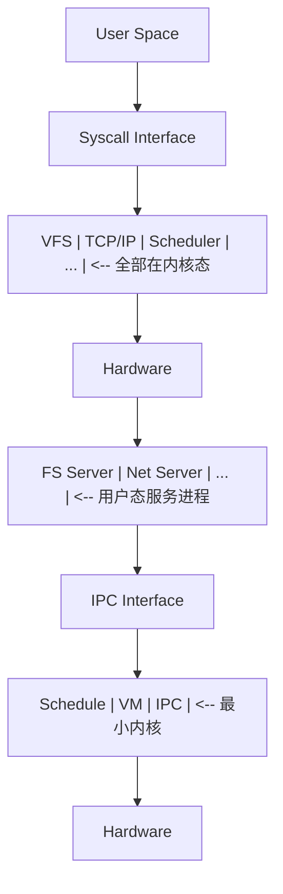

##### 1.3 系统调用机制

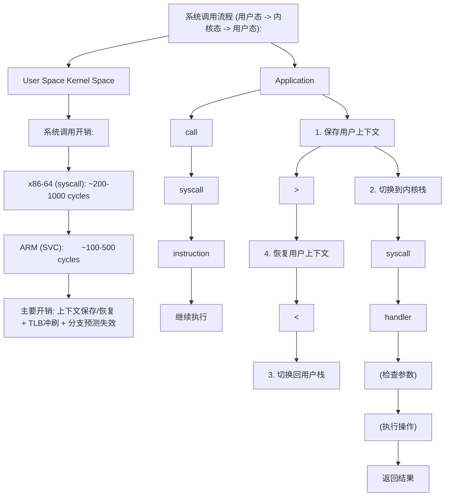

> 跨模块引用：[体系结构](architecture)的特权级（Ring 0/3, EL0/EL1）是系统调用机制的基础。[C语言](c/overview)的标准库(glibc)封装了系统调用接口。

---

#### 2. 进程与线程

##### 2.1 进程的状态机模型

进程是操作系统对运行程序的抽象，其生命周期可用状态机描述：

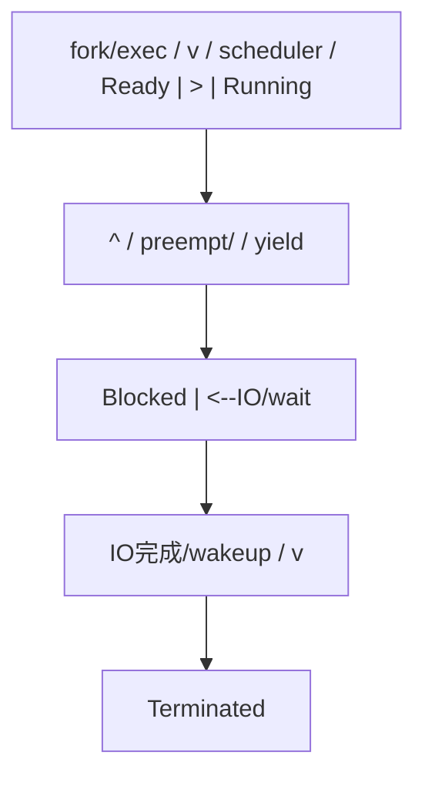

##### 2.2 进程控制块 (PCB)

```
进程控制块 (task_struct in Linux) 关键字段:

struct task_struct {
    pid_t               pid;          // 进程ID
    volatile long        state;        // 进程状态
    int                  prio;         // 优先级
    struct mm_struct    *mm;           // 内存管理信息
    struct files_struct *files;        // 打开文件表
    struct signal_struct*signal;       // 信号处理
    struct thread_info   thread_info;  // 底层线程信息
    struct sched_entity  se;           // 调度实体
    struct list_head     tasks;        // 进程链表
    void                *stack;        // 内核栈
    // ... 数百个字段
};
```

##### 2.3 进程创建: fork()

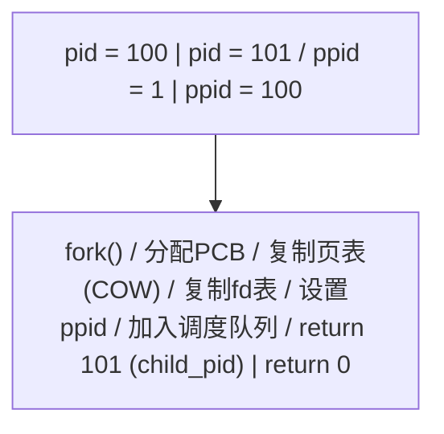

**fork伪代码**：

```c
pid_t fork(void) {
    struct task_struct *child = alloc_task_struct();
    copy_process(current, child);       // 复制PCB
    dup_mm(child, current->mm);         // 复制页表(COW)
    dup_fd(child, current->files);      // 复制文件描述符表
    wake_up_process(child);             // 加入调度队列
    if (current == child) return 0;     // 子进程返回0
    else return child->pid;             // 父进程返回子PID
}
```

##### 2.4 线程模型

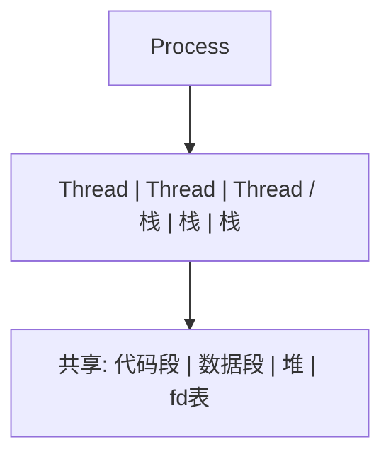

> 跨模块引用：[Java](java/overview)的Thread类在Linux上使用1:1模型(pthread)。[C++](cpp/overview)的std::thread同样映射到OS线程。Go的goroutine使用M:N模型。

---

#### 3. 进程调度

##### 3.1 调度算法

```
调度算法对比:

1. FCFS (先来先服务):
   队列: P1(24) -> P2(3) -> P3(3)
   等待时间: P1=0, P2=24, P3=27
   平均等待: (0+24+27)/3 = 17
   缺点: 护航效应 (短作业等长作业)

2. SJF (最短作业优先):
   队列: P2(3) -> P3(3) -> P1(24)
   等待时间: P2=0, P3=3, P1=6
   平均等待: (0+3+6)/3 = 3
   缺点: 长作业饥饿，需预知执行时间

3. RR (时间片轮转):
   时间片 q=4
   P1(24): run 4 -> run 4 -> run 4 -> ... -> run 4
   P2(3):  run 3 -> done
   P3(3):  run 3 -> done
   优点: 公平，响应快
   缺点: 时间片大小影响性能

4. 优先级调度:
   每个进程有优先级，高优先级先执行
   可配合: 老化(aging)防止饥饿
```

##### 3.2 Linux CFS调度器

```
CFS (Completely Fair Scheduler) 核心思想:

  目标: 公平分配CPU时间给所有可运行进程

  虚拟运行时间 (vruntime):
    vruntime += 实际运行时间 * (NICE_0_LOAD / 进程权重)

    权重越高(优先级越高) -> vruntime增长越慢
    -> 被调度的机会越多

  红黑树:
    所有可运行进程按vruntime排序
    左下角 = vruntime最小 = 下一个被调度

  调度决策:
    1. 选择红黑树最左节点
    2. 运行直到vruntime不再是最小
    3. 重新插入红黑树

  时间片计算:
    time_slice = (调度周期 * 进程权重) / 总权重
```

**CFS伪代码**：

```python
def cfs_schedule(rq):
    leftmost = rq.rbtree.leftmost()
    next_task = leftmost.task
    current_task = rq.current

    if current_task.state == RUNNING:
        update_vruntime(current_task)
        rbtree_insert(rq.rbtree, current_task)

    rq.current = next_task
    rbtree_remove(rq.rbtree, next_task)
    context_switch(current_task, next_task)
```

##### 3.3 上下文切换

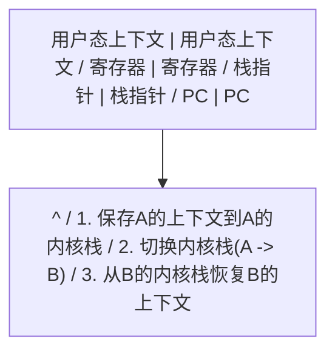

---

#### 4. 同步与互斥

##### 4.1 临界区问题

```
临界区问题的三个条件:

1. 互斥 (Mutual Exclusion):  同一时刻只有一个进程进入临界区
2. 前进 (Progress):          临界区空闲时，等待进程应能进入
3. 有限等待 (Bounded Wait):  进程等待进入临界区的时间有限

Peterson算法 (两进程互斥的软件方案):

  // 进程 Pi (i=0, j=1-i)
  flag[i] = true;
  turn = j;
  while (flag[j] && turn == j) { /* wait */ }
  // --- 临界区 ---
  flag[i] = false;
  // --- 剩余区 ---
```

##### 4.2 硬件同步原语

```
Test-And-Set (TAS):

  boolean TestAndSet(boolean *target) {
    boolean rv = *target;
    *target = true;
    return rv;
  }

  // 使用TAS实现互斥锁
  while (TestAndSet(&lock)) { /* spin */ }
  // --- 临界区 ---
  lock = false;

Compare-And-Swap (CAS):

  boolean CAS(int *addr, int expected, int new_val) {
    if (*addr == expected) {
      *addr = new_val;
      return true;
    }
    return false;
  }

  // 使用CAS实现无锁计数器
  do {
    old = counter;
    new = old + 1;
  } while (!CAS(&counter, old, new));
```

##### 4.3 信号量

```
信号量定义 (Dijkstra, 1965):

  semaphore S = integer value;

  P(S) / wait(S) / down(S):     // Proberen (尝试)
    while (S <= 0) { block(); }
    S--;

  V(S) / signal(S) / up(S):     // Verhogen (增加)
    S++;
    wakeup_one_waiter();

信号量的两种用途:
  1. 互斥: 初值 = 1 (二元信号量 = 互斥锁)
  2. 同步: 初值 = 0 (事件通知)

生产者-消费者问题:

  semaphore mutex = 1;    // 互斥访问缓冲区
  semaphore empty = N;    // 空槽位数
  semaphore full  = 0;    // 已占槽位数

  Producer:                      Consumer:
    produce(item);                 P(full);
    P(empty);                      P(mutex);
    P(mutex);                      item = remove();
    insert(item);                  V(mutex);
    V(mutex);                      V(empty);
    V(full);                       consume(item);
```

##### 4.4 经典同步问题

**读者-写者问题**：

```
读者优先:

  semaphore rw_mutex = 1;   // 读写互斥
  semaphore mutex = 1;      // 保护read_count
  int read_count = 0;

  Reader:                        Writer:
    P(mutex);                      P(rw_mutex);
    read_count++;                  // 写操作
    if (read_count == 1)           V(rw_mutex);
      P(rw_mutex);
    V(mutex);
    // 读操作
    P(mutex);
    read_count--;
    if (read_count == 0)
      V(rw_mutex);
    V(mutex);

问题: 写者可能饥饿
解决: 写者优先变体 (增加写者等待计数)
```

**哲学家就餐问题**：

```
5个哲学家，5根筷子，左右各一根

死锁方案 (每人先拿左筷子):
  Philosopher i:
    P(chopstick[i]);         // 拿左筷子
    P(chopstick[(i+1)%5]);   // 拿右筷子
    eat();
    V(chopstick[i]);
    V(chopstick[(i+1)%5]);

防死锁方案:
  1. 最多4人同时拿筷子
  2. 奇数先拿左、偶数先拿右 (破坏循环等待)
  3. 仅当两根筷子都可用时才拿 (AND信号量)
```

##### 4.5 死锁

```
死锁四个必要条件:

1. 互斥: 资源不能共享
2. 占有并等待: 持有资源同时等待其他资源
3. 不可抢占: 已获得的资源不能被强制剥夺
4. 循环等待: 存在进程的循环等待链

破坏条件 -> 预防:
  破坏2: 一次性申请所有资源
  破坏3: 允许抢占
  破坏4: 资源有序分配

死锁检测 (资源分配图):

  进程 P1 --请求--> 资源 R1 <--占有-- 进程 P2
  进程 P2 --请求--> 资源 R2 <--占有-- 进程 P1

  图中存在环 -> 死锁

银行家算法 (避免死锁):

  Available[1..m]:  每类资源可用数
  Max[1..n][1..m]:  每个进程最大需求
  Allocation[1..n][1..m]: 每个进程已分配
  Need[i][j] = Max[i][j] - Allocation[i][j]

  安全性检查:
    1. 找到 Need[i] <= Work 的进程
    2. 假设它完成，释放资源: Work += Allocation[i]
    3. 重复直到所有进程完成(安全) 或无法继续(不安全)
```

> 跨模块引用：[Java](java/overview)的synchronized和ReentrantLock是信号量/互斥锁的语言级封装。[C++](cpp/overview)的std::mutex和std::condition_variable对应OS的互斥锁和条件变量。[设计模式](design-patterns)中的Singleton模式需要考虑多线程同步。

---

#### 5. 内存管理

##### 5.1 内存管理演进

```
内存管理方案演进:

1. 单一连续分配: 一次只运行一个程序
2. 固定分区:      内存划分为固定大小分区
3. 动态分区:      按需分配，产生外部碎片
4. 分页:          固定大小页帧，消除外部碎片
5. 分段:          按逻辑单位划分，消除内部碎片
6. 段页式:        结合分段和分页的优点
7. 虚拟内存:      按需调页，突破物理内存限制
```

##### 5.2 分页机制

```
分页地址翻译 (参见 [体系结构](architecture) 4.5节):

  虚拟地址 = [页号 VPN | 偏移 Offset]
  物理地址 = [帧号 PPN | 偏移 Offset]

  页表项 (PTE):
  |--- Frame Number ---| V | R | W | X | D | A |
                        |   |   |   |   |   |
                        |   |   |   |   |   +-- Accessed
                        |   |   |   |   +------ Dirty
                        |   |   |   +---------- Execute
                        |   |   +-------------- Write
                        |   +------------------ Read
                        +---------------------- Valid

页大小选择:
  小页(4KB):  内部碎片少，页表大
  大页(2MB):  页表小，TLB覆盖更多内存
  巨页(1GB):  数据库/虚拟化场景
```

##### 5.3 页面置换算法

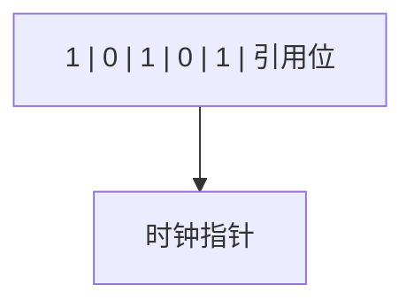

**Clock算法伪代码**：

```python
def clock_replace(frames, clock_hand):
    while True:
        frame = frames[clock_hand]
        if frame.reference_bit == 0:
            victim = clock_hand
            clock_hand = (clock_hand + 1) % len(frames)
            return victim
        else:
            frame.reference_bit = 0
            clock_hand = (clock_hand + 1) % len(frames)
```

##### 5.4 虚拟内存与按需调页

```
按需调页流程:

  1. 进程访问虚拟地址
  2. MMU查找页表
  3. PTE Valid = 0 -> Page Fault
  4. 陷入内核态
  5. 检查地址合法性 (是否在进程地址空间内)
  6. 若合法:
     a. 选择一个空闲帧 (或置换一个已占帧)
     b. 从磁盘读取页面到该帧
     c. 更新页表 (PTE Valid = 1, Frame Number)
     d. 刷新TLB
     e. 重新执行触发缺页的指令
  7. 若非法:
     发送SIGSEGV (段错误)

写时复制 (COW):
  fork()后父子共享页面(标记只读)
  任一方写入 -> Page Fault
  内核检测到COW标志 -> 复制该页
  修改页表为可写
  重新执行写入指令
```

##### 5.5 进程地址空间布局

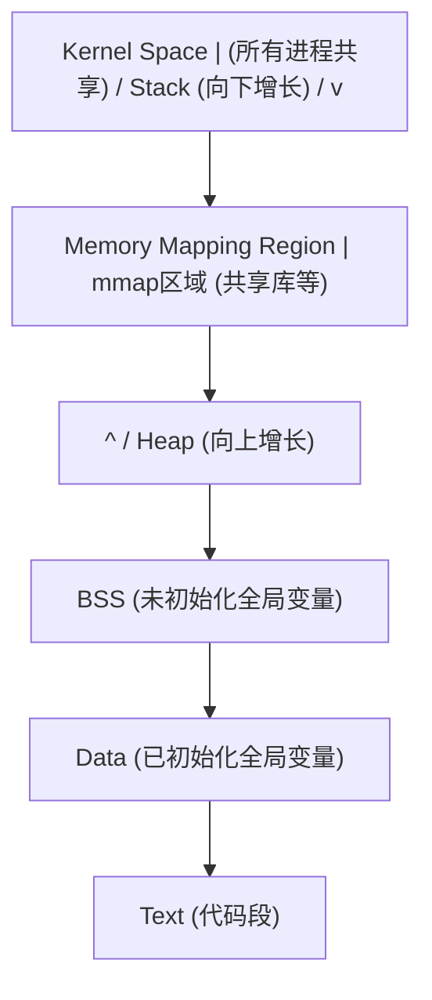

> 跨模块引用：[体系结构](architecture)的TLB和页表是虚拟内存的硬件基础。[C语言](c/overview)的malloc/free操作堆区，栈区由编译器自动管理。[编译原理](compiler)的代码生成决定了Text/Data/BSS段的布局。

---

#### 6. 文件系统

##### 6.1 文件系统层次

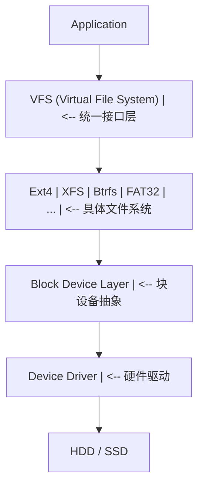

##### 6.2 Ext4文件系统

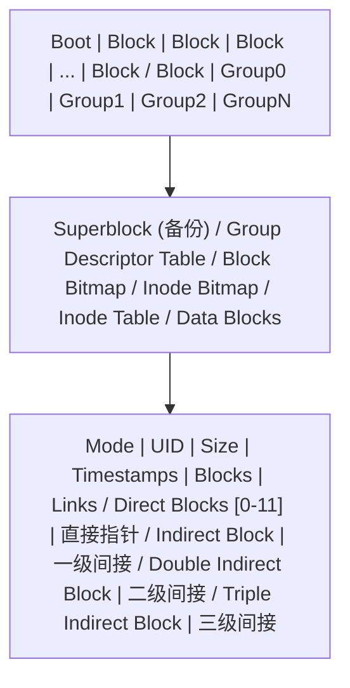

##### 6.3 文件操作流程

```
读取文件的完整路径:

  open("/home/user/file.txt", O_RDONLY)

  1. VFS解析路径:
     root dentry -> "home" -> dentry -> "user" -> dentry -> "file.txt" -> inode
     每级需要读取目录项 (可能触发磁盘IO)

  2. 创建file对象:
     file->inode = 目标inode
     file->pos = 0
     file->mode = O_RDONLY

  3. 分配文件描述符:
     fd = 3 (0=stdin, 1=stdout, 2=stderr)

  read(fd, buf, count)

  1. 通过fd找到file对象
  2. 检查权限 (file->mode允许读?)
  3. 计算逻辑块号: block = file->pos / block_size
  4. 通过inode的块映射找到物理块号
  5. 若页缓存命中 -> 直接返回
  6. 若未命中 -> 提交块IO请求
  7. 更新file->pos
```

##### 6.4 页缓存

```
页缓存 (Page Cache):

  原理: 利用内存缓存磁盘数据，利用时间局部性

  读流程:
    read() -> 检查页缓存 -> 命中 -> 返回
                            未命中 -> 磁盘IO -> 加入缓存 -> 返回

  写流程:
    write() -> 写入页缓存 -> 标记为脏页 -> 返回
    脏页回写:
      - 定期 (kupdate内核线程, 30s)
      - 内存压力时 (pdflush)
      - sync/fsync强制回写

  页缓存查找:
    address_space -> radix_tree/xarray -> 按页索引查找
```

---

#### 7. I/O系统

##### 7.1 I/O层次

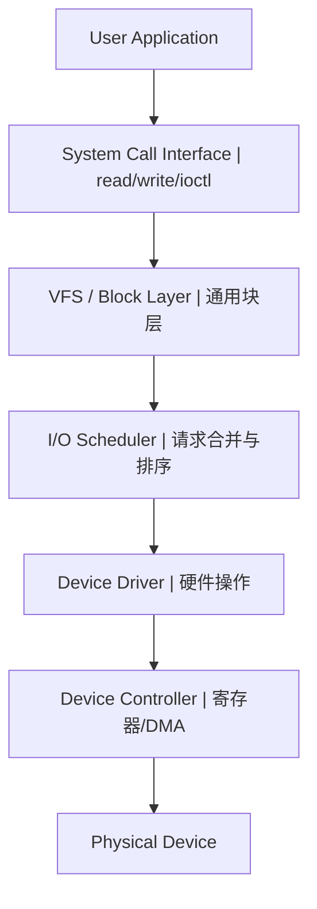

##### 7.2 I/O调度算法

```
I/O调度算法:

1. NOOP (No Operation):
   简单FIFO队列，仅合并相邻请求
   适用: SSD (随机访问延迟均匀)

2. Deadline:
   每个请求有截止时间
   维护: 排序队列(按扇区) + FIFO队列(按时间)
   读请求优先(500ms超时)，写请求次之(5s超时)

3. CFQ (Completely Fair Queue):
   每个进程一个队列，轮转服务
   分配时间片给每个队列
   适合桌面系统

4. BFQ (Budget Fair Queue):
   CFQ的改进版，基于预算
   更好的吞吐量和延迟平衡
```

##### 7.3 DMA与零拷贝

```
传统数据传输 (4次拷贝):

  磁盘 -> 内核缓冲区 -> 用户缓冲区 -> Socket缓冲区 -> 网卡
  [DMA拷贝]  [CPU拷贝]    [CPU拷贝]     [DMA拷贝]

零拷贝技术:

1. sendfile():
   磁盘 -> 内核缓冲区 -> Socket缓冲区 -> 网卡
   [DMA拷贝]             [CPU拷贝]      [DMA拷贝]
   省去: 内核->用户的一次CPU拷贝

2. sendfile() + DMA Scatter-Gather:
   磁盘 -> 内核缓冲区 -> 网卡
   [DMA拷贝]             [DMA拷贝]
   省去: 所有CPU拷贝

3. mmap():
   文件映射到进程地址空间
   直接操作内核缓冲区，无需read/write
   注意: 信号处理、页面错误等复杂情况
```

> 跨模块引用：[计算机网络](network)的高性能网络框架(Netty/DPDK)大量使用零拷贝技术。[Java](java/overview)的NIO使用DirectByteBuffer减少拷贝。[C语言](c/overview)的mmap系统调用直接映射文件到内存。

---

#### 8. 速查表

##### 8.1 进程状态速查

| 状态       | 含义     | 转移条件                         |
| ---------- | -------- | -------------------------------- |
| Created    | 刚创建   | fork()                           |
| Ready      | 可运行   | 被调度器选中 -> Running          |
| Running    | 正在执行 | 时间片完 -> Ready; IO -> Blocked |
| Blocked    | 等待事件 | 事件完成 -> Ready                |
| Terminated | 已终止   | exit()                           |

##### 8.2 同步原语速查

| 原语     | 作用         | 开销             |
| -------- | ------------ | ---------------- |
| 自旋锁   | 忙等待互斥   | 低(无上下文切换) |
| 互斥锁   | 睡眠等待互斥 | 中(上下文切换)   |
| 信号量   | 计数同步     | 中               |
| 条件变量 | 等待条件     | 中               |
| 读写锁   | 读共享写互斥 | 中               |
| RCU      | 读无锁写延迟 | 低(读)高(写)     |

##### 8.3 页面置换速查

| 算法  | 策略             | 优缺点               |
| ----- | ---------------- | -------------------- |
| OPT   | 置换最远将来使用 | 理论最优，不可实现   |
| FIFO  | 置换最早进入     | 简单，有Belady异常   |
| LRU   | 置换最久未用     | 近似最优，实现代价高 |
| Clock | LRU近似          | 实用，性能接近LRU    |
| LFU   | 置换最少使用     | 适合热点数据，需老化 |

##### 8.4 系统调用速查

| 类别 | 系统调用                          | 功能                |
| ---- | --------------------------------- | ------------------- |
| 进程 | fork/exec/wait/exit               | 创建/替换/等待/退出 |
| 文件 | open/read/write/close/mmap        | 文件操作            |
| 目录 | mkdir/rmdir/chdir/getcwd          | 目录操作            |
| 内存 | brk/mmap/munmap/mprotect          | 内存管理            |
| 信号 | kill/signal/sigaction             | 信号处理            |
| 网络 | socket/bind/listen/accept/connect | 网络通信            |
| 管道 | pipe/dup2                         | 进程间通信          |

---

#### 延伸阅读

- _Operating System Concepts_ -- Silberschatz, Galvin, Gagne
- _Modern Operating Systems_ -- Andrew S. Tanenbaum
- _Understanding the Linux Kernel_ -- Bovet & Cesati
- _The Design and Implementation of the FreeBSD Operating System_ -- McKusick et al.


### 3.2 概念关系图

下面用 Mermaid 图表达本文核心概念之间的关系，帮助读者建立整体图景：

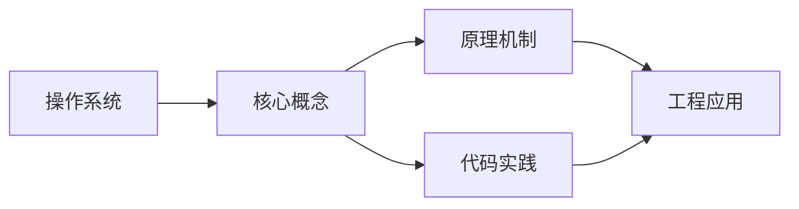

图中展示的是本文知识的结构化关系：核心概念是入口，原理机制解释“为什么”，代码实践演示“怎么做”，工程应用回答“何时用”。读者学习时可以把每个小节的内容挂接到对应节点上。

## 4. 理论推导与原理解析

本节深入《操作系统》背后的原理。理论部分不求面面俱到，而是聚焦“能解释现象、能指导实践”的关键推导。

数据结构：数组/链表/栈/队列/哈希/树/图；每种结构有插入、查找、删除的时间复杂度特征。
算法分析：大 O 表示增长阶；时间与空间权衡；递归与迭代。
存储层次：寄存器 -> 缓存 -> 内存 -> 磁盘；局部性原理指导性能优化。
并发基础：竞态、临界区、锁、信号量、死锁条件与预防。

需要强调的是，理论推导与工程实践之间存在翻译层：理论给出的是理想化模型与边界条件，工程代码则必须处理真实环境中的例外。读者在学习时应先掌握理论的“标准情形”，再通过陷阱章节了解“非标准情形”。

## 5. 代码示例与逐行讲解

本节把原文中的代码示例系统整理，并为每个示例补充用途说明与讲解。读者不应只浏览代码，而应逐段对照讲解理解设计意图。

### 5.1 示例：1.1 操作系统的定义与角色

该示例来自原文《1.1 操作系统的定义与角色》小节，用于演示操作系统相关操作。阅读时请先看代码结构，再看其后的讲解。

```text
操作系统在抽象层级中的位置 (参见 [概述](overview) 3.1节):

Layer 6: Application
         |  API
Layer 5: Language Runtime
         |  ABI / System Call
Layer 4: Operating System  <-- 本章节
         |  ISA / Driver Interface
Layer 3: Hardware

操作系统的双重角色:
  1. 面向上层: 提供简洁的抽象接口 (What)
  2. 面向下层: 管理复杂的硬件资源 (How)
```

讲解：这段代码演示了本节核心知识点。代码中的关键操作可以归纳为三步：准备（定义或初始化）、执行（核心逻辑）、收尾（释放资源或返回结果）。实际项目中，这三步往往被封装为函数或类，以提升复用性与可测试性。

关键点分析：

该示例共 11 行有效代码，结构以数据或配置为主。阅读时应关注：数据字段的含义、配置项的作用，以及它们与运行行为的对应关系。

进阶思考路径：先尝试修改参数观察行为变化，再把示例中的模式迁移到自己的项目中；每次修改都记录预期与实测差异，这是把示例转化为能力的最快方式。

### 5.2 示例：1.2 内核架构

该示例来自原文《1.2 内核架构》小节，用于演示操作系统相关操作。阅读时请先看代码结构，再看其后的讲解。


讲解：这段代码演示了本节核心知识点。代码中的关键操作可以归纳为三步：准备（定义或初始化）、执行（核心逻辑）、收尾（释放资源或返回结果）。实际项目中，这三步往往被封装为函数或类，以提升复用性与可测试性。

关键点分析：

该示例共 16 行有效代码，结构以数据或配置为主。阅读时应关注：数据字段的含义、配置项的作用，以及它们与运行行为的对应关系。

进阶思考路径：先尝试修改参数观察行为变化，再把示例中的模式迁移到自己的项目中；每次修改都记录预期与实测差异，这是把示例转化为能力的最快方式。

### 5.3 示例：1.3 系统调用机制

该示例来自原文《1.3 系统调用机制》小节，用于演示操作系统相关操作。阅读时请先看代码结构，再看其后的讲解。


讲解：这段代码演示了本节核心知识点。代码中的关键操作可以归纳为三步：准备（定义或初始化）、执行（核心逻辑）、收尾（释放资源或返回结果）。实际项目中，这三步往往被封装为函数或类，以提升复用性与可测试性。

关键点分析：

该示例共 44 行有效代码，结构以数据或配置为主。阅读时应关注：数据字段的含义、配置项的作用，以及它们与运行行为的对应关系。

进阶思考路径：先尝试修改参数观察行为变化，再把示例中的模式迁移到自己的项目中；每次修改都记录预期与实测差异，这是把示例转化为能力的最快方式。

### 5.4 示例：2.1 进程的状态机模型

该示例来自原文《2.1 进程的状态机模型》小节，用于演示操作系统相关操作。阅读时请先看代码结构，再看其后的讲解。


讲解：这段代码演示了本节核心知识点。代码中的关键操作可以归纳为三步：准备（定义或初始化）、执行（核心逻辑）、收尾（释放资源或返回结果）。实际项目中，这三步往往被封装为函数或类，以提升复用性与可测试性。

关键点分析：

该示例共 10 行有效代码，结构以数据或配置为主。阅读时应关注：数据字段的含义、配置项的作用，以及它们与运行行为的对应关系。

进阶思考路径：先尝试修改参数观察行为变化，再把示例中的模式迁移到自己的项目中；每次修改都记录预期与实测差异，这是把示例转化为能力的最快方式。

### 5.5 示例：2.2 进程控制块 (PCB)

该示例来自原文《2.2 进程控制块 (PCB)》小节，用于演示操作系统相关操作。阅读时请先看代码结构，再看其后的讲解。

```text
进程控制块 (task_struct in Linux) 关键字段:

struct task_struct {
    pid_t               pid;          // 进程ID
    volatile long        state;        // 进程状态
    int                  prio;         // 优先级
    struct mm_struct    *mm;           // 内存管理信息
    struct files_struct *files;        // 打开文件表
    struct signal_struct*signal;       // 信号处理
    struct thread_info   thread_info;  // 底层线程信息
    struct sched_entity  se;           // 调度实体
    struct list_head     tasks;        // 进程链表
    void                *stack;        // 内核栈
    // ... 数百个字段
};
```

讲解：这段代码演示了本节核心知识点。代码中的关键操作可以归纳为三步：准备（定义或初始化）、执行（核心逻辑）、收尾（释放资源或返回结果）。实际项目中，这三步往往被封装为函数或类，以提升复用性与可测试性。

关键点分析：

该示例共 14 行有效代码，结构以数据或配置为主。阅读时应关注：数据字段的含义、配置项的作用，以及它们与运行行为的对应关系。

进阶思考路径：先尝试修改参数观察行为变化，再把示例中的模式迁移到自己的项目中；每次修改都记录预期与实测差异，这是把示例转化为能力的最快方式。

### 5.6 示例：2.3 进程创建: fork()

该示例来自原文《2.3 进程创建: fork()》小节，用于演示操作系统相关操作。阅读时请先看代码结构，再看其后的讲解。


讲解：这段代码演示了本节核心知识点。代码中的关键操作可以归纳为三步：准备（定义或初始化）、执行（核心逻辑）、收尾（释放资源或返回结果）。实际项目中，这三步往往被封装为函数或类，以提升复用性与可测试性。

关键点分析：

该示例共 4 行有效代码，包含 1 类关键结构（return）。其中：

- 入口与初始化部分负责建立上下文，对应实际项目中的启动或装配逻辑；
- 核心逻辑部分体现本文主题的主要操作，是阅读时最需要对照讲解理解的部分；
- 输出或返回部分把结果交给调用方，注意其类型与边界条件。

进阶思考路径：先尝试修改参数观察行为变化，再把示例中的模式迁移到自己的项目中；每次修改都记录预期与实测差异，这是把示例转化为能力的最快方式。

### 5.7 示例：2.3 进程创建: fork()

该示例来自原文《2.3 进程创建: fork()》小节，用于演示操作系统相关操作。阅读时请先看代码结构，再看其后的讲解。

```c
pid_t fork(void) {
    struct task_struct *child = alloc_task_struct();
    copy_process(current, child);       // 复制PCB
    dup_mm(child, current->mm);         // 复制页表(COW)
    dup_fd(child, current->files);      // 复制文件描述符表
    wake_up_process(child);             // 加入调度队列
    if (current == child) return 0;     // 子进程返回0
    else return child->pid;             // 父进程返回子PID
}
```

讲解：这段代码演示了本节核心知识点。代码中的关键操作可以归纳为三步：准备（定义或初始化）、执行（核心逻辑）、收尾（释放资源或返回结果）。实际项目中，这三步往往被封装为函数或类，以提升复用性与可测试性。

关键点分析：

该示例共 9 行有效代码，包含 2 类关键结构（if、return）。其中：

- 入口与初始化部分负责建立上下文，对应实际项目中的启动或装配逻辑；
- 核心逻辑部分体现本文主题的主要操作，是阅读时最需要对照讲解理解的部分；
- 输出或返回部分把结果交给调用方，注意其类型与边界条件。

进阶思考路径：先尝试修改参数观察行为变化，再把示例中的模式迁移到自己的项目中；每次修改都记录预期与实测差异，这是把示例转化为能力的最快方式。

### 5.8 示例：2.4 线程模型

该示例来自原文《2.4 线程模型》小节，用于演示操作系统相关操作。阅读时请先看代码结构，再看其后的讲解。


讲解：这段代码演示了本节核心知识点。代码中的关键操作可以归纳为三步：准备（定义或初始化）、执行（核心逻辑）、收尾（释放资源或返回结果）。实际项目中，这三步往往被封装为函数或类，以提升复用性与可测试性。

关键点分析：

该示例共 6 行有效代码，结构以数据或配置为主。阅读时应关注：数据字段的含义、配置项的作用，以及它们与运行行为的对应关系。

进阶思考路径：先尝试修改参数观察行为变化，再把示例中的模式迁移到自己的项目中；每次修改都记录预期与实测差异，这是把示例转化为能力的最快方式。

### 5.9 示例：3.1 调度算法

该示例来自原文《3.1 调度算法》小节，用于演示操作系统相关操作。阅读时请先看代码结构，再看其后的讲解。

```text
调度算法对比:

1. FCFS (先来先服务):
   队列: P1(24) -> P2(3) -> P3(3)
   等待时间: P1=0, P2=24, P3=27
   平均等待: (0+24+27)/3 = 17
   缺点: 护航效应 (短作业等长作业)

2. SJF (最短作业优先):
   队列: P2(3) -> P3(3) -> P1(24)
   等待时间: P2=0, P3=3, P1=6
   平均等待: (0+3+6)/3 = 3
   缺点: 长作业饥饿，需预知执行时间

3. RR (时间片轮转):
   时间片 q=4
   P1(24): run 4 -> run 4 -> run 4 -> ... -> run 4
   P2(3):  run 3 -> done
   P3(3):  run 3 -> done
   优点: 公平，响应快
   缺点: 时间片大小影响性能

4. 优先级调度:
   每个进程有优先级，高优先级先执行
   可配合: 老化(aging)防止饥饿
```

讲解：这段代码演示了本节核心知识点。代码中的关键操作可以归纳为三步：准备（定义或初始化）、执行（核心逻辑）、收尾（释放资源或返回结果）。实际项目中，这三步往往被封装为函数或类，以提升复用性与可测试性。

关键点分析：

该示例共 21 行有效代码，结构以数据或配置为主。阅读时应关注：数据字段的含义、配置项的作用，以及它们与运行行为的对应关系。

进阶思考路径：先尝试修改参数观察行为变化，再把示例中的模式迁移到自己的项目中；每次修改都记录预期与实测差异，这是把示例转化为能力的最快方式。

### 5.10 示例：3.2 Linux CFS调度器

该示例来自原文《3.2 Linux CFS调度器》小节，用于演示操作系统相关操作。阅读时请先看代码结构，再看其后的讲解。

```text
CFS (Completely Fair Scheduler) 核心思想:

  目标: 公平分配CPU时间给所有可运行进程

  虚拟运行时间 (vruntime):
    vruntime += 实际运行时间 * (NICE_0_LOAD / 进程权重)

    权重越高(优先级越高) -> vruntime增长越慢
    -> 被调度的机会越多

  红黑树:
    所有可运行进程按vruntime排序
    左下角 = vruntime最小 = 下一个被调度

  调度决策:
    1. 选择红黑树最左节点
    2. 运行直到vruntime不再是最小
    3. 重新插入红黑树

  时间片计算:
    time_slice = (调度周期 * 进程权重) / 总权重
```

讲解：这段代码演示了本节核心知识点。代码中的关键操作可以归纳为三步：准备（定义或初始化）、执行（核心逻辑）、收尾（释放资源或返回结果）。实际项目中，这三步往往被封装为函数或类，以提升复用性与可测试性。

关键点分析：

该示例共 15 行有效代码，结构以数据或配置为主。阅读时应关注：数据字段的含义、配置项的作用，以及它们与运行行为的对应关系。

进阶思考路径：先尝试修改参数观察行为变化，再把示例中的模式迁移到自己的项目中；每次修改都记录预期与实测差异，这是把示例转化为能力的最快方式。

### 5.11 示例：3.2 Linux CFS调度器

该示例来自原文《3.2 Linux CFS调度器》小节，用于演示操作系统相关操作。阅读时请先看代码结构，再看其后的讲解。

```python
def cfs_schedule(rq):
    leftmost = rq.rbtree.leftmost()
    next_task = leftmost.task
    current_task = rq.current

    if current_task.state == RUNNING:
        update_vruntime(current_task)
        rbtree_insert(rq.rbtree, current_task)

    rq.current = next_task
    rbtree_remove(rq.rbtree, next_task)
    context_switch(current_task, next_task)
```

讲解：这段代码演示了本节核心知识点。代码中的关键操作可以归纳为三步：准备（定义或初始化）、执行（核心逻辑）、收尾（释放资源或返回结果）。实际项目中，这三步往往被封装为函数或类，以提升复用性与可测试性。

关键点分析：

该示例共 10 行有效代码，包含 2 类关键结构（def、if）。其中：

- 入口与初始化部分负责建立上下文，对应实际项目中的启动或装配逻辑；
- 核心逻辑部分体现本文主题的主要操作，是阅读时最需要对照讲解理解的部分；
- 输出或返回部分把结果交给调用方，注意其类型与边界条件。

进阶思考路径：先尝试修改参数观察行为变化，再把示例中的模式迁移到自己的项目中；每次修改都记录预期与实测差异，这是把示例转化为能力的最快方式。

### 5.12 示例：3.3 上下文切换

该示例来自原文《3.3 上下文切换》小节，用于演示操作系统相关操作。阅读时请先看代码结构，再看其后的讲解。


讲解：这段代码演示了本节核心知识点。代码中的关键操作可以归纳为三步：准备（定义或初始化）、执行（核心逻辑）、收尾（释放资源或返回结果）。实际项目中，这三步往往被封装为函数或类，以提升复用性与可测试性。

关键点分析：

该示例共 4 行有效代码，结构以数据或配置为主。阅读时应关注：数据字段的含义、配置项的作用，以及它们与运行行为的对应关系。

进阶思考路径：先尝试修改参数观察行为变化，再把示例中的模式迁移到自己的项目中；每次修改都记录预期与实测差异，这是把示例转化为能力的最快方式。

### 5.13 示例：4.1 临界区问题

该示例来自原文《4.1 临界区问题》小节，用于演示操作系统相关操作。阅读时请先看代码结构，再看其后的讲解。

```text
临界区问题的三个条件:

1. 互斥 (Mutual Exclusion):  同一时刻只有一个进程进入临界区
2. 前进 (Progress):          临界区空闲时，等待进程应能进入
3. 有限等待 (Bounded Wait):  进程等待进入临界区的时间有限

Peterson算法 (两进程互斥的软件方案):

  // 进程 Pi (i=0, j=1-i)
  flag[i] = true;
  turn = j;
  while (flag[j] && turn == j) { /* wait */ }
  // --- 临界区 ---
  flag[i] = false;
  // --- 剩余区 ---
```

讲解：这段代码演示了本节核心知识点。代码中的关键操作可以归纳为三步：准备（定义或初始化）、执行（核心逻辑）、收尾（释放资源或返回结果）。实际项目中，这三步往往被封装为函数或类，以提升复用性与可测试性。

关键点分析：

该示例共 12 行有效代码，包含 1 类关键结构（while）。其中：

- 入口与初始化部分负责建立上下文，对应实际项目中的启动或装配逻辑；
- 核心逻辑部分体现本文主题的主要操作，是阅读时最需要对照讲解理解的部分；
- 输出或返回部分把结果交给调用方，注意其类型与边界条件。

进阶思考路径：先尝试修改参数观察行为变化，再把示例中的模式迁移到自己的项目中；每次修改都记录预期与实测差异，这是把示例转化为能力的最快方式。

### 5.14 示例：4.2 硬件同步原语

该示例来自原文《4.2 硬件同步原语》小节，用于演示操作系统相关操作。阅读时请先看代码结构，再看其后的讲解。

```text
Test-And-Set (TAS):

  boolean TestAndSet(boolean *target) {
    boolean rv = *target;
    *target = true;
    return rv;
  }

  // 使用TAS实现互斥锁
  while (TestAndSet(&lock)) { /* spin */ }
  // --- 临界区 ---
  lock = false;

Compare-And-Swap (CAS):

  boolean CAS(int *addr, int expected, int new_val) {
    if (*addr == expected) {
      *addr = new_val;
      return true;
    }
    return false;
  }

  // 使用CAS实现无锁计数器
  do {
    old = counter;
    new = old + 1;
  } while (!CAS(&counter, old, new));
```

讲解：这段代码演示了本节核心知识点。代码中的关键操作可以归纳为三步：准备（定义或初始化）、执行（核心逻辑）、收尾（释放资源或返回结果）。实际项目中，这三步往往被封装为函数或类，以提升复用性与可测试性。

关键点分析：

该示例共 23 行有效代码，包含 3 类关键结构（if、while、return）。其中：

- 入口与初始化部分负责建立上下文，对应实际项目中的启动或装配逻辑；
- 核心逻辑部分体现本文主题的主要操作，是阅读时最需要对照讲解理解的部分；
- 输出或返回部分把结果交给调用方，注意其类型与边界条件。

进阶思考路径：先尝试修改参数观察行为变化，再把示例中的模式迁移到自己的项目中；每次修改都记录预期与实测差异，这是把示例转化为能力的最快方式。

### 5.15 示例：4.3 信号量

该示例来自原文《4.3 信号量》小节，用于演示操作系统相关操作。阅读时请先看代码结构，再看其后的讲解。

```text
信号量定义 (Dijkstra, 1965):

  semaphore S = integer value;

  P(S) / wait(S) / down(S):     // Proberen (尝试)
    while (S <= 0) { block(); }
    S--;

  V(S) / signal(S) / up(S):     // Verhogen (增加)
    S++;
    wakeup_one_waiter();

信号量的两种用途:
  1. 互斥: 初值 = 1 (二元信号量 = 互斥锁)
  2. 同步: 初值 = 0 (事件通知)

生产者-消费者问题:

  semaphore mutex = 1;    // 互斥访问缓冲区
  semaphore empty = N;    // 空槽位数
  semaphore full  = 0;    // 已占槽位数

  Producer:                      Consumer:
    produce(item);                 P(full);
    P(empty);                      P(mutex);
    P(mutex);                      item = remove();
    insert(item);                  V(mutex);
    V(mutex);                      V(empty);
    V(full);                       consume(item);
```

讲解：这段代码演示了本节核心知识点。代码中的关键操作可以归纳为三步：准备（定义或初始化）、执行（核心逻辑）、收尾（释放资源或返回结果）。实际项目中，这三步往往被封装为函数或类，以提升复用性与可测试性。

关键点分析：

该示例共 22 行有效代码，包含 1 类关键结构（while）。其中：

- 入口与初始化部分负责建立上下文，对应实际项目中的启动或装配逻辑；
- 核心逻辑部分体现本文主题的主要操作，是阅读时最需要对照讲解理解的部分；
- 输出或返回部分把结果交给调用方，注意其类型与边界条件。

进阶思考路径：先尝试修改参数观察行为变化，再把示例中的模式迁移到自己的项目中；每次修改都记录预期与实测差异，这是把示例转化为能力的最快方式。

### 5.16 示例：4.4 经典同步问题

该示例来自原文《4.4 经典同步问题》小节，用于演示操作系统相关操作。阅读时请先看代码结构，再看其后的讲解。

```text
读者优先:

  semaphore rw_mutex = 1;   // 读写互斥
  semaphore mutex = 1;      // 保护read_count
  int read_count = 0;

  Reader:                        Writer:
    P(mutex);                      P(rw_mutex);
    read_count++;                  // 写操作
    if (read_count == 1)           V(rw_mutex);
      P(rw_mutex);
    V(mutex);
    // 读操作
    P(mutex);
    read_count--;
    if (read_count == 0)
      V(rw_mutex);
    V(mutex);

问题: 写者可能饥饿
解决: 写者优先变体 (增加写者等待计数)
```

讲解：这段代码演示了本节核心知识点。代码中的关键操作可以归纳为三步：准备（定义或初始化）、执行（核心逻辑）、收尾（释放资源或返回结果）。实际项目中，这三步往往被封装为函数或类，以提升复用性与可测试性。

关键点分析：

该示例共 18 行有效代码，包含 1 类关键结构（if）。其中：

- 入口与初始化部分负责建立上下文，对应实际项目中的启动或装配逻辑；
- 核心逻辑部分体现本文主题的主要操作，是阅读时最需要对照讲解理解的部分；
- 输出或返回部分把结果交给调用方，注意其类型与边界条件。

进阶思考路径：先尝试修改参数观察行为变化，再把示例中的模式迁移到自己的项目中；每次修改都记录预期与实测差异，这是把示例转化为能力的最快方式。

### 5.17 示例：4.4 经典同步问题

该示例来自原文《4.4 经典同步问题》小节，用于演示操作系统相关操作。阅读时请先看代码结构，再看其后的讲解。

```text
5个哲学家，5根筷子，左右各一根

死锁方案 (每人先拿左筷子):
  Philosopher i:
    P(chopstick[i]);         // 拿左筷子
    P(chopstick[(i+1)%5]);   // 拿右筷子
    eat();
    V(chopstick[i]);
    V(chopstick[(i+1)%5]);

防死锁方案:
  1. 最多4人同时拿筷子
  2. 奇数先拿左、偶数先拿右 (破坏循环等待)
  3. 仅当两根筷子都可用时才拿 (AND信号量)
```

讲解：这段代码演示了本节核心知识点。代码中的关键操作可以归纳为三步：准备（定义或初始化）、执行（核心逻辑）、收尾（释放资源或返回结果）。实际项目中，这三步往往被封装为函数或类，以提升复用性与可测试性。

关键点分析：

该示例共 12 行有效代码，结构以数据或配置为主。阅读时应关注：数据字段的含义、配置项的作用，以及它们与运行行为的对应关系。

进阶思考路径：先尝试修改参数观察行为变化，再把示例中的模式迁移到自己的项目中；每次修改都记录预期与实测差异，这是把示例转化为能力的最快方式。

### 5.18 示例：4.5 死锁

该示例来自原文《4.5 死锁》小节，用于演示操作系统相关操作。阅读时请先看代码结构，再看其后的讲解。

```text
死锁四个必要条件:

1. 互斥: 资源不能共享
2. 占有并等待: 持有资源同时等待其他资源
3. 不可抢占: 已获得的资源不能被强制剥夺
4. 循环等待: 存在进程的循环等待链

破坏条件 -> 预防:
  破坏2: 一次性申请所有资源
  破坏3: 允许抢占
  破坏4: 资源有序分配

死锁检测 (资源分配图):

  进程 P1 --请求--> 资源 R1 <--占有-- 进程 P2
  进程 P2 --请求--> 资源 R2 <--占有-- 进程 P1

  图中存在环 -> 死锁

银行家算法 (避免死锁):

  Available[1..m]:  每类资源可用数
  Max[1..n][1..m]:  每个进程最大需求
  Allocation[1..n][1..m]: 每个进程已分配
  Need[i][j] = Max[i][j] - Allocation[i][j]

  安全性检查:
    1. 找到 Need[i] <= Work 的进程
    2. 假设它完成，释放资源: Work += Allocation[i]
    3. 重复直到所有进程完成(安全) 或无法继续(不安全)
```

讲解：这段代码演示了本节核心知识点。代码中的关键操作可以归纳为三步：准备（定义或初始化）、执行（核心逻辑）、收尾（释放资源或返回结果）。实际项目中，这三步往往被封装为函数或类，以提升复用性与可测试性。

关键点分析：

该示例共 22 行有效代码，结构以数据或配置为主。阅读时应关注：数据字段的含义、配置项的作用，以及它们与运行行为的对应关系。

进阶思考路径：先尝试修改参数观察行为变化，再把示例中的模式迁移到自己的项目中；每次修改都记录预期与实测差异，这是把示例转化为能力的最快方式。

### 5.19 示例：5.1 内存管理演进

该示例来自原文《5.1 内存管理演进》小节，用于演示操作系统相关操作。阅读时请先看代码结构，再看其后的讲解。

```text
内存管理方案演进:

1. 单一连续分配: 一次只运行一个程序
2. 固定分区:      内存划分为固定大小分区
3. 动态分区:      按需分配，产生外部碎片
4. 分页:          固定大小页帧，消除外部碎片
5. 分段:          按逻辑单位划分，消除内部碎片
6. 段页式:        结合分段和分页的优点
7. 虚拟内存:      按需调页，突破物理内存限制
```

讲解：这段代码演示了本节核心知识点。代码中的关键操作可以归纳为三步：准备（定义或初始化）、执行（核心逻辑）、收尾（释放资源或返回结果）。实际项目中，这三步往往被封装为函数或类，以提升复用性与可测试性。

关键点分析：

该示例共 8 行有效代码，结构以数据或配置为主。阅读时应关注：数据字段的含义、配置项的作用，以及它们与运行行为的对应关系。

进阶思考路径：先尝试修改参数观察行为变化，再把示例中的模式迁移到自己的项目中；每次修改都记录预期与实测差异，这是把示例转化为能力的最快方式。

### 5.20 示例：5.2 分页机制

该示例来自原文《5.2 分页机制》小节，用于演示操作系统相关操作。阅读时请先看代码结构，再看其后的讲解。

```text
分页地址翻译 (参见 [体系结构](architecture) 4.5节):

  虚拟地址 = [页号 VPN | 偏移 Offset]
  物理地址 = [帧号 PPN | 偏移 Offset]

  页表项 (PTE):
  |--- Frame Number ---| V | R | W | X | D | A |
                        |   |   |   |   |   |
                        |   |   |   |   |   +-- Accessed
                        |   |   |   |   +------ Dirty
                        |   |   |   +---------- Execute
                        |   |   +-------------- Write
                        |   +------------------ Read
                        +---------------------- Valid

页大小选择:
  小页(4KB):  内部碎片少，页表大
  大页(2MB):  页表小，TLB覆盖更多内存
  巨页(1GB):  数据库/虚拟化场景
```

讲解：这段代码演示了本节核心知识点。代码中的关键操作可以归纳为三步：准备（定义或初始化）、执行（核心逻辑）、收尾（释放资源或返回结果）。实际项目中，这三步往往被封装为函数或类，以提升复用性与可测试性。

关键点分析：

该示例共 16 行有效代码，结构以数据或配置为主。阅读时应关注：数据字段的含义、配置项的作用，以及它们与运行行为的对应关系。

进阶思考路径：先尝试修改参数观察行为变化，再把示例中的模式迁移到自己的项目中；每次修改都记录预期与实测差异，这是把示例转化为能力的最快方式。

### 5.21 示例：5.3 页面置换算法

该示例来自原文《5.3 页面置换算法》小节，用于演示操作系统相关操作。阅读时请先看代码结构，再看其后的讲解。


讲解：这段代码演示了本节核心知识点。代码中的关键操作可以归纳为三步：准备（定义或初始化）、执行（核心逻辑）、收尾（释放资源或返回结果）。实际项目中，这三步往往被封装为函数或类，以提升复用性与可测试性。

关键点分析：

该示例共 4 行有效代码，结构以数据或配置为主。阅读时应关注：数据字段的含义、配置项的作用，以及它们与运行行为的对应关系。

进阶思考路径：先尝试修改参数观察行为变化，再把示例中的模式迁移到自己的项目中；每次修改都记录预期与实测差异，这是把示例转化为能力的最快方式。

### 5.22 示例：5.3 页面置换算法

该示例来自原文《5.3 页面置换算法》小节，用于演示操作系统相关操作。阅读时请先看代码结构，再看其后的讲解。

```python
def clock_replace(frames, clock_hand):
    while True:
        frame = frames[clock_hand]
        if frame.reference_bit == 0:
            victim = clock_hand
            clock_hand = (clock_hand + 1) % len(frames)
            return victim
        else:
            frame.reference_bit = 0
            clock_hand = (clock_hand + 1) % len(frames)
```

讲解：这段代码演示了本节核心知识点。代码中的关键操作可以归纳为三步：准备（定义或初始化）、执行（核心逻辑）、收尾（释放资源或返回结果）。实际项目中，这三步往往被封装为函数或类，以提升复用性与可测试性。

关键点分析：

该示例共 10 行有效代码，包含 4 类关键结构（def、if、while、return）。其中：

- 入口与初始化部分负责建立上下文，对应实际项目中的启动或装配逻辑；
- 核心逻辑部分体现本文主题的主要操作，是阅读时最需要对照讲解理解的部分；
- 输出或返回部分把结果交给调用方，注意其类型与边界条件。

进阶思考路径：先尝试修改参数观察行为变化，再把示例中的模式迁移到自己的项目中；每次修改都记录预期与实测差异，这是把示例转化为能力的最快方式。

### 5.23 示例：5.4 虚拟内存与按需调页

该示例来自原文《5.4 虚拟内存与按需调页》小节，用于演示操作系统相关操作。阅读时请先看代码结构，再看其后的讲解。

```text
按需调页流程:

  1. 进程访问虚拟地址
  2. MMU查找页表
  3. PTE Valid = 0 -> Page Fault
  4. 陷入内核态
  5. 检查地址合法性 (是否在进程地址空间内)
  6. 若合法:
     a. 选择一个空闲帧 (或置换一个已占帧)
     b. 从磁盘读取页面到该帧
     c. 更新页表 (PTE Valid = 1, Frame Number)
     d. 刷新TLB
     e. 重新执行触发缺页的指令
  7. 若非法:
     发送SIGSEGV (段错误)

写时复制 (COW):
  fork()后父子共享页面(标记只读)
  任一方写入 -> Page Fault
  内核检测到COW标志 -> 复制该页
  修改页表为可写
  重新执行写入指令
```

讲解：这段代码演示了本节核心知识点。代码中的关键操作可以归纳为三步：准备（定义或初始化）、执行（核心逻辑）、收尾（释放资源或返回结果）。实际项目中，这三步往往被封装为函数或类，以提升复用性与可测试性。

关键点分析：

该示例共 20 行有效代码，结构以数据或配置为主。阅读时应关注：数据字段的含义、配置项的作用，以及它们与运行行为的对应关系。

进阶思考路径：先尝试修改参数观察行为变化，再把示例中的模式迁移到自己的项目中；每次修改都记录预期与实测差异，这是把示例转化为能力的最快方式。

### 5.24 示例：5.5 进程地址空间布局

该示例来自原文《5.5 进程地址空间布局》小节，用于演示操作系统相关操作。阅读时请先看代码结构，再看其后的讲解。


讲解：这段代码演示了本节核心知识点。代码中的关键操作可以归纳为三步：准备（定义或初始化）、执行（核心逻辑）、收尾（释放资源或返回结果）。实际项目中，这三步往往被封装为函数或类，以提升复用性与可测试性。

关键点分析：

该示例共 12 行有效代码，结构以数据或配置为主。阅读时应关注：数据字段的含义、配置项的作用，以及它们与运行行为的对应关系。

进阶思考路径：先尝试修改参数观察行为变化，再把示例中的模式迁移到自己的项目中；每次修改都记录预期与实测差异，这是把示例转化为能力的最快方式。

### 5.25 示例：6.1 文件系统层次

该示例来自原文《6.1 文件系统层次》小节，用于演示操作系统相关操作。阅读时请先看代码结构，再看其后的讲解。

```mermaid
flowchart TD
    B0["Application"]
    B1["VFS (Virtual File System) | <-- 统一接口层"]
    B0 --> B1
    B2["Ext4 | XFS | Btrfs | FAT32 | ... | <-- 具体文件系统"]
    B1 --> B2
    B3["Block Device Layer | <-- 块设备抽象"]
    B2 --> B3
    B4["Device Driver | <-- 硬件驱动"]
    B3 --> B4
    B5["HDD / SSD"]
    B4 --> B5
```

讲解：这段代码演示了本节核心知识点。代码中的关键操作可以归纳为三步：准备（定义或初始化）、执行（核心逻辑）、收尾（释放资源或返回结果）。实际项目中，这三步往往被封装为函数或类，以提升复用性与可测试性。

关键点分析：

该示例共 12 行有效代码，结构以数据或配置为主。阅读时应关注：数据字段的含义、配置项的作用，以及它们与运行行为的对应关系。

进阶思考路径：先尝试修改参数观察行为变化，再把示例中的模式迁移到自己的项目中；每次修改都记录预期与实测差异，这是把示例转化为能力的最快方式。

### 5.26 示例：6.2 Ext4文件系统

该示例来自原文《6.2 Ext4文件系统》小节，用于演示操作系统相关操作。阅读时请先看代码结构，再看其后的讲解。

```mermaid
flowchart TD
    B0["Boot | Block | Block | Block | ... | Block / Block | Group0 | Group1 | Group2 | GroupN"]
    B1["Superblock (备份) / Group Descriptor Table / Block Bitmap / Inode Bitmap / Inode Table / Data Blocks"]
    B0 --> B1
    B2["Mode | UID | Size | Timestamps | Blocks | Links / Direct Blocks [0-11] | 直接指针 / Indirect Block | 一级间接 / Double Indirect Block | 二级间接 / Triple Indirect Block | 三级间接"]
    B1 --> B2
```

讲解：这段代码演示了本节核心知识点。代码中的关键操作可以归纳为三步：准备（定义或初始化）、执行（核心逻辑）、收尾（释放资源或返回结果）。实际项目中，这三步往往被封装为函数或类，以提升复用性与可测试性。

关键点分析：

该示例共 6 行有效代码，结构以数据或配置为主。阅读时应关注：数据字段的含义、配置项的作用，以及它们与运行行为的对应关系。

进阶思考路径：先尝试修改参数观察行为变化，再把示例中的模式迁移到自己的项目中；每次修改都记录预期与实测差异，这是把示例转化为能力的最快方式。

### 5.27 示例：6.3 文件操作流程

该示例来自原文《6.3 文件操作流程》小节，用于演示操作系统相关操作。阅读时请先看代码结构，再看其后的讲解。

```text
读取文件的完整路径:

  open("/home/user/file.txt", O_RDONLY)

  1. VFS解析路径:
     root dentry -> "home" -> dentry -> "user" -> dentry -> "file.txt" -> inode
     每级需要读取目录项 (可能触发磁盘IO)

  2. 创建file对象:
     file->inode = 目标inode
     file->pos = 0
     file->mode = O_RDONLY

  3. 分配文件描述符:
     fd = 3 (0=stdin, 1=stdout, 2=stderr)

  read(fd, buf, count)

  1. 通过fd找到file对象
  2. 检查权限 (file->mode允许读?)
  3. 计算逻辑块号: block = file->pos / block_size
  4. 通过inode的块映射找到物理块号
  5. 若页缓存命中 -> 直接返回
  6. 若未命中 -> 提交块IO请求
  7. 更新file->pos
```

讲解：这段代码演示了本节核心知识点。代码中的关键操作可以归纳为三步：准备（定义或初始化）、执行（核心逻辑）、收尾（释放资源或返回结果）。实际项目中，这三步往往被封装为函数或类，以提升复用性与可测试性。

关键点分析：

该示例共 19 行有效代码，结构以数据或配置为主。阅读时应关注：数据字段的含义、配置项的作用，以及它们与运行行为的对应关系。

进阶思考路径：先尝试修改参数观察行为变化，再把示例中的模式迁移到自己的项目中；每次修改都记录预期与实测差异，这是把示例转化为能力的最快方式。

### 5.28 示例：6.4 页缓存

该示例来自原文《6.4 页缓存》小节，用于演示操作系统相关操作。阅读时请先看代码结构，再看其后的讲解。

```text
页缓存 (Page Cache):

  原理: 利用内存缓存磁盘数据，利用时间局部性

  读流程:
    read() -> 检查页缓存 -> 命中 -> 返回
                            未命中 -> 磁盘IO -> 加入缓存 -> 返回

  写流程:
    write() -> 写入页缓存 -> 标记为脏页 -> 返回
    脏页回写:
      - 定期 (kupdate内核线程, 30s)
      - 内存压力时 (pdflush)
      - sync/fsync强制回写

  页缓存查找:
    address_space -> radix_tree/xarray -> 按页索引查找
```

讲解：这段代码演示了本节核心知识点。代码中的关键操作可以归纳为三步：准备（定义或初始化）、执行（核心逻辑）、收尾（释放资源或返回结果）。实际项目中，这三步往往被封装为函数或类，以提升复用性与可测试性。

关键点分析：

该示例共 13 行有效代码，结构以数据或配置为主。阅读时应关注：数据字段的含义、配置项的作用，以及它们与运行行为的对应关系。

进阶思考路径：先尝试修改参数观察行为变化，再把示例中的模式迁移到自己的项目中；每次修改都记录预期与实测差异，这是把示例转化为能力的最快方式。

### 5.29 示例：7.1 I/O层次

该示例来自原文《7.1 I/O层次》小节，用于演示操作系统相关操作。阅读时请先看代码结构，再看其后的讲解。

```mermaid
flowchart TD
    B0["User Application"]
    B1["System Call Interface | read/write/ioctl"]
    B0 --> B1
    B2["VFS / Block Layer | 通用块层"]
    B1 --> B2
    B3["I/O Scheduler | 请求合并与排序"]
    B2 --> B3
    B4["Device Driver | 硬件操作"]
    B3 --> B4
    B5["Device Controller | 寄存器/DMA"]
    B4 --> B5
    B6["Physical Device"]
    B5 --> B6
```

讲解：这段代码演示了本节核心知识点。代码中的关键操作可以归纳为三步：准备（定义或初始化）、执行（核心逻辑）、收尾（释放资源或返回结果）。实际项目中，这三步往往被封装为函数或类，以提升复用性与可测试性。

关键点分析：

该示例共 14 行有效代码，结构以数据或配置为主。阅读时应关注：数据字段的含义、配置项的作用，以及它们与运行行为的对应关系。

进阶思考路径：先尝试修改参数观察行为变化，再把示例中的模式迁移到自己的项目中；每次修改都记录预期与实测差异，这是把示例转化为能力的最快方式。

### 5.30 示例：7.2 I/O调度算法

该示例来自原文《7.2 I/O调度算法》小节，用于演示操作系统相关操作。阅读时请先看代码结构，再看其后的讲解。

```text
I/O调度算法:

1. NOOP (No Operation):
   简单FIFO队列，仅合并相邻请求
   适用: SSD (随机访问延迟均匀)

2. Deadline:
   每个请求有截止时间
   维护: 排序队列(按扇区) + FIFO队列(按时间)
   读请求优先(500ms超时)，写请求次之(5s超时)

3. CFQ (Completely Fair Queue):
   每个进程一个队列，轮转服务
   分配时间片给每个队列
   适合桌面系统

4. BFQ (Budget Fair Queue):
   CFQ的改进版，基于预算
   更好的吞吐量和延迟平衡
```

讲解：这段代码演示了本节核心知识点。代码中的关键操作可以归纳为三步：准备（定义或初始化）、执行（核心逻辑）、收尾（释放资源或返回结果）。实际项目中，这三步往往被封装为函数或类，以提升复用性与可测试性。

关键点分析：

该示例共 15 行有效代码，结构以数据或配置为主。阅读时应关注：数据字段的含义、配置项的作用，以及它们与运行行为的对应关系。

进阶思考路径：先尝试修改参数观察行为变化，再把示例中的模式迁移到自己的项目中；每次修改都记录预期与实测差异，这是把示例转化为能力的最快方式。

### 5.31 示例：7.3 DMA与零拷贝

该示例来自原文《7.3 DMA与零拷贝》小节，用于演示操作系统相关操作。阅读时请先看代码结构，再看其后的讲解。

```text
传统数据传输 (4次拷贝):

  磁盘 -> 内核缓冲区 -> 用户缓冲区 -> Socket缓冲区 -> 网卡
  [DMA拷贝]  [CPU拷贝]    [CPU拷贝]     [DMA拷贝]

零拷贝技术:

1. sendfile():
   磁盘 -> 内核缓冲区 -> Socket缓冲区 -> 网卡
   [DMA拷贝]             [CPU拷贝]      [DMA拷贝]
   省去: 内核->用户的一次CPU拷贝

2. sendfile() + DMA Scatter-Gather:
   磁盘 -> 内核缓冲区 -> 网卡
   [DMA拷贝]             [DMA拷贝]
   省去: 所有CPU拷贝

3. mmap():
   文件映射到进程地址空间
   直接操作内核缓冲区，无需read/write
   注意: 信号处理、页面错误等复杂情况
```

讲解：这段代码演示了本节核心知识点。代码中的关键操作可以归纳为三步：准备（定义或初始化）、执行（核心逻辑）、收尾（释放资源或返回结果）。实际项目中，这三步往往被封装为函数或类，以提升复用性与可测试性。

关键点分析：

该示例共 16 行有效代码，结构以数据或配置为主。阅读时应关注：数据字段的含义、配置项的作用，以及它们与运行行为的对应关系。

进阶思考路径：先尝试修改参数观察行为变化，再把示例中的模式迁移到自己的项目中；每次修改都记录预期与实测差异，这是把示例转化为能力的最快方式。


综合以上示例，可以总结出本主题的代码实践要点：第一，先定义清晰的输入输出契约；第二，核心逻辑保持单一职责；第三，错误处理与边界条件不可省略；第四，命名与注释表达意图而非复述代码。

## 6. 对比分析

对比是理解《操作系统》定位的最快路径。下面从多个维度与相邻方案进行对比。

数组与链表：数组缓存友好随机访问；链表插入删除灵活。
进程与线程：进程隔离重，线程共享轻；goroutine 更轻。
RISC 与 CISC：现代 CPU 融合两者，关注指令集与微架构。

对比的目的不是分出绝对优劣，而是建立选择依据：不同约束条件下，最优解不同。读者应把每个对比维度转化为决策检查清单。

## 7. 常见陷阱与最佳实践

本节整理该主题的高频错误与推荐做法。每个陷阱先描述现象，再解释原因，最后给出最佳实践。

### 7.1 忽视复杂度

数据量上来才崩。设计时估算规模与复杂度。

深入讲解：该问题之所以被归类为“常见陷阱”，是因为它在初学者的代码中反复出现，而且往往不在第一时间暴露——错误通常隐藏在特定数据或特定时序下。

从成因上看，忽视复杂度 一般源于对 计算机科学基础 某个机制的理解偏差：要么误用了默认行为，要么忽略了边界条件，要么把其他语言的思维惯性带了过来。

从影响上看，忽视复杂度 轻则产生错误结果，重则导致资源泄漏、数据损坏或安全事故；这也是为什么工程评审中会把它列为检查项。

从修复策略上看，处理忽视复杂度的正确顺序是：先复现（构造最小用例），再定位（确认机制层面的根因），最后修复并补充回归测试。跳过复现直接改代码，往往治标不治本。

### 7.2 死锁

锁顺序不一致。统一顺序 + 超时。

深入讲解：该问题之所以被归类为“常见陷阱”，是因为它在初学者的代码中反复出现，而且往往不在第一时间暴露——错误通常隐藏在特定数据或特定时序下。

从成因上看，死锁 一般源于对 计算机科学基础 某个机制的理解偏差：要么误用了默认行为，要么忽略了边界条件，要么把其他语言的思维惯性带了过来。

从影响上看，死锁 轻则产生错误结果，重则导致资源泄漏、数据损坏或安全事故；这也是为什么工程评审中会把它列为检查项。

从修复策略上看，处理死锁的正确顺序是：先复现（构造最小用例），再定位（确认机制层面的根因），最后修复并补充回归测试。跳过复现直接改代码，往往治标不治本。

### 7.3 缓存未命中

随机访问大数组慢。利用局部性。

深入讲解：该问题之所以被归类为“常见陷阱”，是因为它在初学者的代码中反复出现，而且往往不在第一时间暴露——错误通常隐藏在特定数据或特定时序下。

从成因上看，缓存未命中 一般源于对 计算机科学基础 某个机制的理解偏差：要么误用了默认行为，要么忽略了边界条件，要么把其他语言的思维惯性带了过来。

从影响上看，缓存未命中 轻则产生错误结果，重则导致资源泄漏、数据损坏或安全事故；这也是为什么工程评审中会把它列为检查项。

从修复策略上看，处理缓存未命中的正确顺序是：先复现（构造最小用例），再定位（确认机制层面的根因），最后修复并补充回归测试。跳过复现直接改代码，往往治标不治本。

### 7.4 栈溢出

深递归。评估深度或改迭代。

深入讲解：该问题之所以被归类为“常见陷阱”，是因为它在初学者的代码中反复出现，而且往往不在第一时间暴露——错误通常隐藏在特定数据或特定时序下。

从成因上看，栈溢出 一般源于对 计算机科学基础 某个机制的理解偏差：要么误用了默认行为，要么忽略了边界条件，要么把其他语言的思维惯性带了过来。

从影响上看，栈溢出 轻则产生错误结果，重则导致资源泄漏、数据损坏或安全事故；这也是为什么工程评审中会把它列为检查项。

从修复策略上看，处理栈溢出的正确顺序是：先复现（构造最小用例），再定位（确认机制层面的根因），最后修复并补充回归测试。跳过复现直接改代码，往往治标不治本。

### 7.5 整数溢出

计数与哈希边界。使用大整数或检查。

深入讲解：该问题之所以被归类为“常见陷阱”，是因为它在初学者的代码中反复出现，而且往往不在第一时间暴露——错误通常隐藏在特定数据或特定时序下。

从成因上看，整数溢出 一般源于对 计算机科学基础 某个机制的理解偏差：要么误用了默认行为，要么忽略了边界条件，要么把其他语言的思维惯性带了过来。

从影响上看，整数溢出 轻则产生错误结果，重则导致资源泄漏、数据损坏或安全事故；这也是为什么工程评审中会把它列为检查项。

从修复策略上看，处理整数溢出的正确顺序是：先复现（构造最小用例），再定位（确认机制层面的根因），最后修复并补充回归测试。跳过复现直接改代码，往往治标不治本。

### 7.6 位操作误用

符号位与移位方向。明确类型与语义。

深入讲解：该问题之所以被归类为“常见陷阱”，是因为它在初学者的代码中反复出现，而且往往不在第一时间暴露——错误通常隐藏在特定数据或特定时序下。

从成因上看，位操作误用 一般源于对 计算机科学基础 某个机制的理解偏差：要么误用了默认行为，要么忽略了边界条件，要么把其他语言的思维惯性带了过来。

从影响上看，位操作误用 轻则产生错误结果，重则导致资源泄漏、数据损坏或安全事故；这也是为什么工程评审中会把它列为检查项。

从修复策略上看，处理位操作误用的正确顺序是：先复现（构造最小用例），再定位（确认机制层面的根因），最后修复并补充回归测试。跳过复现直接改代码，往往治标不治本。

### 7.7 并发可见性

无同步读旧值。使用原子/锁。

深入讲解：该问题之所以被归类为“常见陷阱”，是因为它在初学者的代码中反复出现，而且往往不在第一时间暴露——错误通常隐藏在特定数据或特定时序下。

从成因上看，并发可见性 一般源于对 计算机科学基础 某个机制的理解偏差：要么误用了默认行为，要么忽略了边界条件，要么把其他语言的思维惯性带了过来。

从影响上看，并发可见性 轻则产生错误结果，重则导致资源泄漏、数据损坏或安全事故；这也是为什么工程评审中会把它列为检查项。

从修复策略上看，处理并发可见性的正确顺序是：先复现（构造最小用例），再定位（确认机制层面的根因），最后修复并补充回归测试。跳过复现直接改代码，往往治标不治本。

### 7.8 过早优化

先正确后优化。以测量为准。

深入讲解：该问题之所以被归类为“常见陷阱”，是因为它在初学者的代码中反复出现，而且往往不在第一时间暴露——错误通常隐藏在特定数据或特定时序下。

从成因上看，过早优化 一般源于对 计算机科学基础 某个机制的理解偏差：要么误用了默认行为，要么忽略了边界条件，要么把其他语言的思维惯性带了过来。

从影响上看，过早优化 轻则产生错误结果，重则导致资源泄漏、数据损坏或安全事故；这也是为什么工程评审中会把它列为检查项。

从修复策略上看，处理过早优化的正确顺序是：先复现（构造最小用例），再定位（确认机制层面的根因），最后修复并补充回归测试。跳过复现直接改代码，往往治标不治本。

### 7.0 最佳实践总览

1. 先分析复杂度再写代码。
2. 数据规模假设明确（10³/10⁶/10⁹ 方案不同）。
3. 理解底层（内存、CPU）后再谈优化。
4. 经典算法与数据结构熟练到可手写。

把这些最佳实践固化为团队规范与代码评审检查项，是避免同类问题反复出现的关键。

## 8. 工程实践

本节把《操作系统》放入真实工程场景，给出可复用的模式与组织方法。

面试与竞赛：LeetCode/算法竞赛训练思维。
系统设计：把基础用于设计（缓存、队列、索引）。
性能工程：profiler 定位 -> 复杂度/局部性优化。

### 8.1 工程实践的原则拆解

以上工程实践可以归纳为四条原则。第一，配置与代码分离：计算机科学基础 项目中环境差异应通过配置注入，而不是散落在代码分支中；这保证同一份代码可以在开发、测试、生产环境一致运行。

第二，接口稳定优先：对外接口（函数签名、协议、数据格式）一旦被消费方依赖，变更成本极高；设计时应预留扩展点并保持向后兼容。

第三，可观测性内置：日志、指标与追踪应该在功能开发时同步设计，而不是故障发生后补救；没有观测手段的模块等于黑盒。

第四，变更可回滚：任何发布都应有对应的回滚方案；数据库迁移、配置变更与代码发布一样需要版本管理与逆向路径。

### 8.2 实践落地的检查清单

- [ ] 面试与竞赛：对照本节描述，检查当前项目是否已经落实；未落实的项列入技术债并排期处理。
- [ ] 系统设计：对照本节描述，检查当前项目是否已经落实；未落实的项列入技术债并排期处理。
- [ ] 性能工程：对照本节描述，检查当前项目是否已经落实；未落实的项列入技术债并排期处理。

工程实践的共性原则：配置与代码分离、接口稳定优先、可观测性内置、变更可回滚。这些原则适用于本主题的所有实现。

## 9. 案例研究

本节通过一个完整案例把《操作系统》的知识串起来。案例按“需求分析、方案设计、实现、验证”四步展开。

需求：设计内存中的高频键值存储。
方案：哈希表 + 链表（LRU）组合，O(1) 读写。
要点：扩容策略、并发控制、内存上限。
验证：复杂度分析 + 基准测试。

### 9.1 案例的扩展讨论

把案例中的方案放大到真实规模，需要额外考虑三个问题：

第一，规模：当数据量或并发量上升一个数量级时，原方案中的数据结构、缓存策略与任务调度是否仍然成立？通常需要引入分层与异步。

第二，团队：多人协作时，模块边界、接口契约与代码所有权必须明确；案例中的实现应拆分为可独立测试的单元，并配合文档说明设计意图。

第三，演进：上线后的需求变化不可避免；方案设计时应预留扩展点（配置化、插件化、事件化），并定期用真实指标验证假设。


案例研究的学习方法：先独立阅读需求，尝试在脑中形成方案，再对照实现与讲解，最后思考“如果约束变化（数据量、并发、团队规模），方案应如何调整”。

## 10. 知识要点总结与深入讲解

本节以讲解形式汇总全文要点，替代传统的习题与自测，读者不需要答题，只需跟随解释建立完整的认知框架。

关于《操作系统》的核心结论：

基础决定上限：复杂问题最终落在数据结构与系统机制上。
理论与实践循环：学机制，写代码验证。
长期积累：系统读一本经典（CSAPP/算法导论）。

原文档各小节的要点回顾：

- 1. 操作系统概述：该小节围绕操作系统展开具体细节，阅读时应关注其与核心结论的对应关系；每个小节都是核心结论在某一个侧面的展开。
- 2. 进程与线程：该小节围绕操作系统展开具体细节，阅读时应关注其与核心结论的对应关系；每个小节都是核心结论在某一个侧面的展开。
- 3. 进程调度：该小节围绕操作系统展开具体细节，阅读时应关注其与核心结论的对应关系；每个小节都是核心结论在某一个侧面的展开。
- 4. 同步与互斥：该小节围绕操作系统展开具体细节，阅读时应关注其与核心结论的对应关系；每个小节都是核心结论在某一个侧面的展开。
- 5. 内存管理：该小节围绕操作系统展开具体细节，阅读时应关注其与核心结论的对应关系；每个小节都是核心结论在某一个侧面的展开。
- 6. 文件系统：该小节围绕操作系统展开具体细节，阅读时应关注其与核心结论的对应关系；每个小节都是核心结论在某一个侧面的展开。
- 7. I/O系统：该小节围绕操作系统展开具体细节，阅读时应关注其与核心结论的对应关系；每个小节都是核心结论在某一个侧面的展开。
- 8. 速查表：该小节围绕操作系统展开具体细节，阅读时应关注其与核心结论的对应关系；每个小节都是核心结论在某一个侧面的展开。
- 延伸阅读：该小节围绕操作系统展开具体细节，阅读时应关注其与核心结论的对应关系；每个小节都是核心结论在某一个侧面的展开。

把以上要点与第 3-9 节的内容对照复习，即可完成对本文主题的闭环学习。

## 11. 参考文献


CSAPP（深入理解计算机系统）：https://csapp.cs.cmu.edu/
算法导论（CLRS）：https://mitpress.mit.edu/9780262046305/
MIT OpenCourseWare 6.006：https://ocw.mit.edu/courses/6-006-introduction-to-algorithms-spring-2020/
Teach Yourself CS：https://teachyourselfcs.com/

## 12. 延伸阅读


数据结构与算法，见 023-algorithm 模块。
操作系统概念，见 024-cs-fundamentals 模块相关文档。
计算机体系结构，见 001-getting-started 模块相关文档。
尚硅谷 Bilibili 空间（https://space.bilibili.com/302417610 ）提供计算机基础课程。

## 14. 模块知识图谱与学习路径

本文属于 计算机科学基础 模块。为了把《操作系统》放入完整的知识网络，下面列出本模块的全部主题并给出相互关联的导读。学习时建议按模块内顺序推进，并在每个文档中留意交叉引用。

```mermaid
flowchart LR
    A["操作系统"]
    N0["计算机科学概述"]
    N1["计算机体系结构"]
    N0 --> N1
    N2["操作系统"]
    N1 --> N2
    N3["计算机网络"]
    N2 --> N3
    N4["数字逻辑"]
    N3 --> N4
    N5["离散数学"]
    N4 --> N5
    N6["计算机组成原理"]
    N5 --> N6
    N7["数据表示与运算"]
    N6 --> N7
    N8["指令流水线"]
    N7 --> N8
    N9["存储系统"]
    N8 --> N9
    N10["总线与接口"]
    N9 --> N10
    N11["并行计算"]
    N10 --> N11
    N12["分布式系统"]
    N11 --> N12
    N13["算法设计与分析"]
    N12 --> N13
```

上图为模块主题的推荐学习顺序示意图（仅展示前若干主题）。各主题之间存在三类关联：

第一，前置依赖关系：早期主题是后期主题的基础，例如环境与语法先行、进阶主题随后；

第二，横向并列关系：同一层级主题从不同角度覆盖模块能力，学习顺序可以按兴趣调整；

第三，工程组合关系：多个主题在真实项目中组合使用，例如配置、性能与安全主题往往出现在同一系统的不同层面。

### 14.1 模块主题速查表

| 文档 | 主题 | 与本文的关联 |
| --- | --- | --- |
| 计算机科学概述 | 001-ComputerOverview | 本文的前置基础 |
| 计算机体系结构 | 002-ComputerArchitecture | 本文的并列主题 |
| 操作系统 | 003-OperatingSystem | 本文自身 |
| 计算机网络 | 004-ComputerNetwork | 本文的并列主题 |
| 数字逻辑 | 005-DigitalLogic | 本文的并列主题 |
| 离散数学 | 006-DiscreteMathematics | 本文的并列主题 |
| 计算机组成原理 | 007-ComputerPrinciple | 本文的原理深化 |
| 数据表示与运算 | 008-DataRepresentationOperation | 本文的并列主题 |
| 指令流水线 | 009-DirectivePipeline | 本文的并列主题 |
| 存储系统 | 010-StorageSystem | 本文的并列主题 |
| 总线与接口 | 011-BusAndInterface | 本文的并列主题 |
| 并行计算 | 012-ParallelCalculate | 本文的并列主题 |
| 分布式系统 | 013-DistributedSystem | 本文的并列主题 |
| 算法设计与分析 | 014-AlgorithmDesignAnalysis | 本文的并列主题 |
| 形式语言与自动机 | 015-FormalLanguageAndAutomata | 本文的并列主题 |
| 信息安全基础 | 016-InformationSecurityBasics | 本文的前置基础 |
| 编译原理 | 017-CompilePrinciple | 本文的原理深化 |
| 软件工程 | 018-SoftwareEngineering | 本文的并列主题 |
| 数据库系统原理 | 019-DatabaseSystemPrinciple | 本文的原理深化 |
| 编译原理进阶 | 020-CompilePrincipleAdvanced | 本文的原理深化 |
| 操作系统进阶 | 021-OperatingSystemAdvanced | 本文的并列主题 |
| 计算机网络进阶 | 022-ComputerNetworkAdvanced | 本文的并列主题 |
| 网络安全 | 023-NetworkSecurity | 本文的安全延伸 |
| 多媒体技术 | 024-MultimediaTechnology | 本文的并列主题 |
| 人工智能基础 | 025-AIFundamentals | 本文的前置基础 |
| 计算机图形学 | 026-ComputerShape | 本文的并列主题 |
| 设计模式 | 027-DesignPattern | 本文的并列主题 |
| 软件体系结构 | 028-SoftwareSystemStructure | 本文的并列主题 |
| 人机交互 | 029-HCI | 本文的并列主题 |
| 编程语言理论 | 030-ProgrammingLanguageTheory | 本文的并列主题 |
| 网络协议深度 | 031-NetworkProtocolDeep | 本文的并列主题 |
| 编译与运行时 | 032-CompileAndRuntime | 本文的并列主题 |
| 进程PCB与线程TCB | 033-PCBThreadTCB | 本文的并列主题 |
| 中断与系统调用 | 034-InterruptAndSystemCall | 本文的并列主题 |
| 用户态与内核态切换 | 035-UserModeKernelModeSwitch | 本文的并列主题 |
| 内存分段与分页 | 036-MemorySegmentationAndPaging | 本文的并列主题 |
| 页面置换算法 | 037-PageReplacementAlgorithm | 本文的并列主题 |
| 文件系统inode | 038-FileSystemInode | 本文的并列主题 |
| 磁盘调度 | 039-DiskScheduling | 本文的并列主题 |
| 零拷贝 | 040-ZeroCopy | 本文的并列主题 |
| 进程间通信 | 041-IPC | 本文的并列主题 |
| HTTP缓存策略 | 042-HTTPCacheStrategy | 本文的并列主题 |
| HTTPS握手过程 | 043-HTTPSHandshake | 本文的并列主题 |
| TCP拥塞控制 | 044-TCPControl | 本文的并列主题 |
| TCP粘包与拆包 | 045-TCP | 本文的并列主题 |
| DNS解析流程 | 046-DNSFlow | 本文的并列主题 |
| CDN原理 | 047-CDNPrinciple | 本文的原理深化 |
| WebSocket帧格式 | 048-WebSocketFrameFormat | 本文的并列主题 |
| QUIC协议 | 049-QUIC | 本文的并列主题 |
| ARP协议与ARP欺骗 | 050-ARPARP | 本文的并列主题 |
| BGP路由协议 | 051-BGPRoute | 本文的并列主题 |
| 词法分析 | 052-LexicalAnalysis | 本文的并列主题 |
| 语法分析 | 053-GrammarAnalysis | 本文的并列主题 |
| 语义分析 | 054-SemanticAnalysis | 本文的并列主题 |
| 中间代码 | 055-IntermediateCode | 本文的并列主题 |
| 代码优化 | 056-CodeOptimization | 本文的性能延伸 |
| 目标代码生成 | 057-TargetCodeGeneration | 本文的并列主题 |

速查表的作用是让读者快速判断：哪些文档应在阅读本文前掌握（前置基础），哪些文档应在阅读本文后继续（延伸主题）。本模块的交叉引用体系即以此表为基础。

## 15. 术语表

下表整理《操作系统》及 计算机科学基础 模块中出现的高频术语，给出简明释义。术语按字母序或逻辑序排列，供查阅。

| 术语 | 释义 |
| --- | --- |
| 数据结构 | 数组/链表/栈/队列/哈希/树/图；每种结构有插入、查找、删除的时间复杂度特征。 |
| 算法分析 | 大 O 表示增长阶；时间与空间权衡；递归与迭代。 |
| 存储层次 | 寄存器 -> 缓存 -> 内存 -> 磁盘；局部性原理指导性能优化。 |
| 并发基础 | 竞态、临界区、锁、信号量、死锁条件与预防。 |
| 忽视复杂度（易错点） | 参见常见陷阱章节的详细讲解 |
| 死锁（易错点） | 参见常见陷阱章节的详细讲解 |
| 缓存未命中（易错点） | 参见常见陷阱章节的详细讲解 |
| 栈溢出（易错点） | 参见常见陷阱章节的详细讲解 |
| 整数溢出（易错点） | 参见常见陷阱章节的详细讲解 |
| 位操作误用（易错点） | 参见常见陷阱章节的详细讲解 |

术语表与正文配合使用：先通读正文，遇到模糊术语回查本表；长期使用后术语会自然进入工作记忆。
