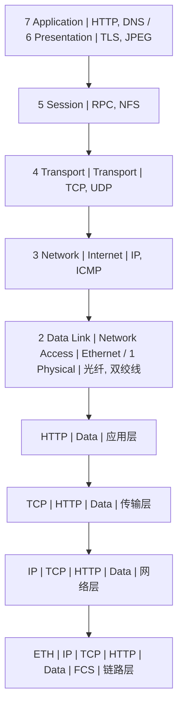
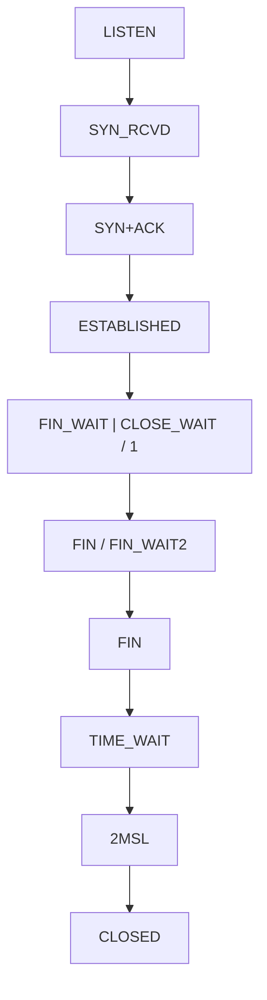
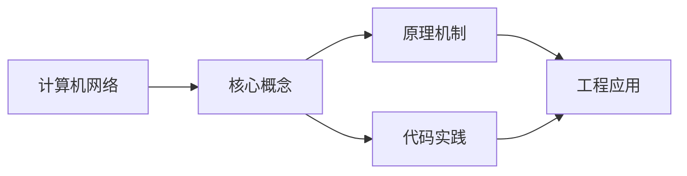

## 1. 学习目标（Bloom 分类）

本节按照布鲁姆教育目标分类学组织学习路径。本文主题为《计算机网络》，属于 计算机科学基础 模块，读者可以根据自身阶段选择阅读深度。

记忆层面：能够准确复述本文的核心概念、术语与基本语法或操作步骤，并能够在提问或检索时快速定位对应知识点。能够说出 计算机科学基础 的核心概念、常用命令与流程。

理解层面：能够用自己的语言解释核心原理与工作机制，说明概念之间的因果关系，而不是机械记忆结论。能够解释 计算机科学基础 的工作原理与设计动机。

应用层面：能够在真实项目或练习场景中运用本文知识解决具体问题，写出正确且可维护的实现。能够独立完成 计算机科学基础 的标准操作。

分析层面：能够拆解复杂问题，比较本文主题与相邻概念的异同，识别边界条件与例外情况。能够分析 计算机科学基础 使用中的异常与边界。

评价层面：能够根据约束条件（性能、可读性、安全、成本）评价不同方案的优劣，做出有依据的技术决策。能够评价 计算机科学基础 相关工具与方案。

创造层面：能够把本文知识与其他模块知识组合，设计出新的解决方案或可复用的工程模式。能够把 计算机科学基础 融入团队工作流。

通过本节学习，读者应当能够把《计算机网络》纳入自己的知识网络，并与 计算机科学基础 模块的其他主题（数据结构、算法、操作系统、体系结构）建立关联。

## 2. 历史动机与发展脉络

《计算机网络》是 计算机科学基础 领域的重要主题。要真正理解它，需要先了解它解决的问题与演进过程。

计算机科学基础是编程的“内功”：数据结构与算法、操作系统、计算机体系结构、网络；框架会过时，基础长期有效。
体系结构：冯诺依曼模型（存储程序）、CPU/内存/I/O、指令流水线、缓存层次。
操作系统：进程与线程、调度、内存管理（虚拟内存）、文件系统、并发原语。

回到本文主题：计算机网络 的提出与成熟，正是上述技术背景下的必然产物。早期实现往往以简单可用为目标，随着工程规模扩大，社区逐渐沉淀出标准做法与最佳实践；理解这一脉络，可以帮助读者判断“为什么文档中的推荐写法是现在这个样子”，也能在遇到历史遗留代码时准确识别其设计年代与取舍。


## 3. 形式化定义与核心概念精讲

本节把《计算机网络》涉及的核心概念以“定义 + 讲解”的形式展开。读者应把定义当作工具，把讲解当作理解路径；两者结合才能形成可迁移的知识。

数据结构：数组/链表/栈/队列/哈希/树/图；每种结构有插入、查找、删除的时间复杂度特征。
算法分析：大 O 表示增长阶；时间与空间权衡；递归与迭代。
存储层次：寄存器 -> 缓存 -> 内存 -> 磁盘；局部性原理指导性能优化。

### 3.1 原文章节逐一精讲

原文档把主题拆分为 8 个小节，下面按顺序给出每一节的导读讲解，随后保留原文细节供精读。

#### 原文精读（完整保留）


#### 1. 网络体系结构

##### 1.1 OSI七层模型 vs TCP/IP四层模型



##### 1.2 协议栈的设计原则

```
协议栈设计的核心原则:

1. 分层抽象: 每层只关心本层的功能，通过接口与相邻层交互
2. 封装/解封: 发送方逐层封装头部，接收方逐层解封
3. 对等通信: 同一层的两个实体通过协议逻辑通信
4. 透明传输: 每层对上层隐藏本层的实现细节

端到端原则 (End-to-End Argument):
  功能应在最高可能层实现
  低层只提供最基本的传输服务
  例: 可靠性由TCP(传输层)保证，而非每个路由器重传
```

---

#### 2. 物理层与数据链路层

##### 2.1 以太网帧格式

```
Ethernet II 帧格式:

| Preamble | SFD | Dst MAC | Src MAC | Type | Payload      | FCS |
| 7B       | 1B  | 6B      | 6B      | 2B   | 46-1500B     | 4B  |

Preamble: 7字节前导码 (时钟同步)
SFD:      1字节帧起始定界符 (0xAB)
Type:     上层协议类型 (0x0800=IP, 0x0806=ARP, 0x86DD=IPv6)
FCS:      4字节CRC-32校验

最小帧长: 64B (防止冲突检测失败)
最大帧长: 1518B (标准) / 9022B (Jumbo Frame)
```

##### 2.2 CSMA/CD协议

```
CSMA/CD (载波侦听多路访问/冲突检测):

  1. 先听后发: 检测信道空闲才发送
  2. 边发边听: 发送时持续检测冲突
  3. 冲突停止: 检测到冲突立即停止
  4. 随机重发: 等待随机时间后重试

  二进制指数退避:
    第k次冲突后, 从 [0, 2^k - 1] 中随机选择一个数r
    等待 r * 2t (t = 传播延迟)
    k 最大为16, 超过则放弃

  冲突域:
    共享同一信道的所有设备构成冲突域
    交换机隔离冲突域, 集线器不隔离
```

##### 2.3 ARP协议

```
ARP (Address Resolution Protocol): IP地址 -> MAC地址映射

ARP请求/响应流程:

  Host A (192.168.1.1) 想与 Host B (192.168.1.2) 通信
  A不知道B的MAC地址

  1. A发送ARP请求 (广播):
     Dst MAC: FF:FF:FF:FF:FF:FF
     "谁有 192.168.1.2? 请告诉 192.168.1.1"

  2. B收到ARP请求, 发送ARP响应 (单播):
     Dst MAC: A的MAC地址
     "192.168.1.2 的MAC地址是 xx:xx:xx:xx:xx:xx"

  3. A将映射缓存到ARP表 (TTL通常20分钟)

ARP缓存表:
  IP Address        MAC Address         TTL
  192.168.1.2       00:11:22:33:44:55   1200s
```

##### 2.4 交换机工作原理

```
交换机自学习算法:

  交换机维护: MAC地址表 (MAC -> Port映射)

  收到帧时:
    1. 学习: 记录源MAC -> 入端口
    2. 转发: 查找目的MAC
       - 找到: 转发到对应端口
       - 未找到: 泛洪到所有端口(除入端口)
       - 广播地址: 泛洪

  MAC地址表示例:
    MAC Address       Port   VLAN
    00:11:22:33:44:55  1     10
    AA:BB:CC:DD:EE:FF  3     10
    11:22:33:44:55:66  5     20

  生成树协议 (STP):
    防止环路, 通过阻塞冗余链路构建无环拓扑
    根桥选举 -> 最短路径计算 -> 阻塞非最短路径端口
```

---

#### 3. 网络层

##### 3.1 IP协议

```
IPv4头部格式:

| Version | IHL | DSCP/ECN | Total Length |
| Identification | Flags | Fragment Offset |
| TTL | Protocol | Header Checksum |
| Source IP Address (32b)          |
| Destination IP Address (32b)     |
| Options (variable)               |

关键字段:
  Version: 4 (IPv4)
  IHL: 头部长度 (以4字节为单位, 最小5=20B)
  TTL: 生存时间 (每经过一个路由器-1, 为0时丢弃)
  Protocol: 上层协议 (6=TCP, 17=UDP, 1=ICMP)

IPv6头部格式 (简化):

| Version | Traffic Class | Flow Label |
| Payload Length | Next Header | Hop Limit |
| Source Address (128b)                        |
| Destination Address (128b)                   |

IPv4 vs IPv6:
  地址长度: 32b vs 128b
  头部: 可变(20-60B) vs 固定(40B)
  分片: 路由器可分片 vs 仅源端分片
  校验和: 有 vs 无(交给链路层和传输层)
  配置: 手动/DHCP vs 自动(SLAAC)
```

##### 3.2 子网划分与CIDR

```
IPv4地址分类:

  A类: 1.0.0.0 - 126.0.0.0     /8   (网络位8, 主机位24)
  B类: 128.0.0.0 - 191.255.0.0 /16  (网络位16, 主机位16)
  C类: 192.0.0.0 - 223.255.255.0 /24 (网络位24, 主机位8)

CIDR (无类域间路由):
  打破类别边界, 自由划分网络位和主机位

  例: 192.168.1.0/24
    网络位: 24位
    主机位: 8位 (可容纳254台主机)
    子网掩码: 255.255.255.0

  子网划分:
    192.168.1.0/24 划分为4个子网:
    192.168.1.0/26    (主机位6, 62台主机)
    192.168.1.64/26
    192.168.1.128/26
    192.168.1.192/26

  超网聚合:
    192.168.0.0/24 + 192.168.1.0/24 = 192.168.0.0/23
```

##### 3.3 路由算法

```
路由算法分类:

1. 距离向量算法 (RIP):
   每个路由器维护到所有目的地的距离向量
   定期与邻居交换距离向量
   Bellman-Ford方程: D(x,y) = min{ c(x,v) + D(v,y) }

   RIP协议:
     度量: 跳数 (最大15, 16=不可达)
     更新: 每30秒
     问题: 慢收敛、计数到无穷
     解决: 水平分裂、毒性逆转

2. 链路状态算法 (OSPF):
   每个路由器维护完整的网络拓扑图
   使用Dijkstra算法计算最短路径

   OSPF协议:
     度量: 代价 (通常与带宽成反比)
     更新: 链路状态变化时立即泛洪
     区域: 骨干区域(Area 0) + 非骨干区域
     优点: 快速收敛、无环路

3. 路径向量算法 (BGP):
   用于自治系统(AS)间路由
   交换到达目的地的路径信息

   BGP协议:
     eBGP: AS间交换路由
     iBGP: AS内传播路由
     路径属性: AS-PATH, NEXT-HOP, LOCAL-PREF
     策略路由: 可基于商业策略选择路径
```

**Dijkstra算法伪代码**：

```python
def dijkstra(graph, source):
    dist = {v: float('inf') for v in graph}
    dist[source] = 0
    visited = set()
    while len(visited) < len(graph):
        u = min((v for v in graph if v not in visited), key=lambda v: dist[v])
        visited.add(u)
        for v, cost in graph[u]:
            if dist[u] + cost < dist[v]:
                dist[v] = dist[u] + cost
    return dist
```

##### 3.4 ICMP协议

```
ICMP (Internet Control Message Protocol): 网络层差错报告

ICMP消息类型:
  Type 0  Echo Reply          (ping响应)
  Type 3  Destination Unreachable (目的不可达)
  Type 5  Redirect            (重定向)
  Type 8  Echo Request        (ping请求)
  Type 11 Time Exceeded       (TTL超时, traceroute利用此)

traceroute原理:
  发送TTL=1的UDP包 -> 第1跳返回ICMP Time Exceeded
  发送TTL=2的UDP包 -> 第2跳返回ICMP Time Exceeded
  ...
  直到到达目的地返回ICMP Port Unreachable
```

---

#### 4. 传输层

##### 4.1 TCP协议

```
TCP段格式:

| Source Port | Destination Port |
| Sequence Number (32b)              |
| Acknowledgment Number (32b)        |
| Data | Reserved | Flags | Window   |
| Checksum | Urgent Pointer          |
| Options (variable)                 |

关键字段:
  Sequence Number: 数据的字节流编号
  Ack Number:      期望收到的下一个字节编号
  Flags: URG|ACK|PSH|RST|SYN|FIN
  Window: 接收窗口大小 (流量控制)
```

##### 4.2 TCP状态机



##### 4.3 TCP三次握手

```
TCP三次握手:

  Client                          Server
  (CLOSED)                        (LISTEN)
     |                               |
     |  SYN, seq=x                   |
     |------------------------------->|  SYN_RCVD
     |                               |
     |  SYN+ACK, seq=y, ack=x+1      |
     |<-------------------------------|
     |                               |
     |  ACK, seq=x+1, ack=y+1        |
     |------------------------------->|  ESTABLISHED
     |                               |
  ESTABLISHED                     ESTABLISHED

为什么需要三次握手?
  1. 确认双方的发送和接收能力正常
  2. 同步双方的初始序列号(ISN)
  3. 防止旧连接的SYN导致误建连

ISN生成:
  ISN = 基于时钟的计数器 + 随机偏移
  防止序列号预测攻击
```

##### 4.4 TCP四次挥手

```
TCP四次挥手:

  Client                          Server
  (ESTABLISHED)                   (ESTABLISHED)
     |                               |
     |  FIN, seq=u                   |
     |------------------------------->|  CLOSE_WAIT
     |                               |
     |  ACK, ack=u+1                  |
     |<-------------------------------|
     |                               |
     |          (Server发送剩余数据)    |
     |                               |
     |  FIN, seq=w                   |
     |<-------------------------------|  LAST_ACK
     |                               |
     |  ACK, ack=w+1                 |
     |------------------------------->|
     |                               |
  TIME_WAIT                       CLOSED
  (等待2MSL)                         |
     |                               |
  CLOSED

为什么需要TIME_WAIT?
  1. 确保最后一个ACK能到达对方 (若丢失, 对方重发FIN)
  2. 等待本连接的延迟报文消亡 (2MSL后旧报文必然被丢弃)

MSL (Maximum Segment Lifetime): 报文最大生存时间, 通常2分钟
```

##### 4.5 TCP可靠传输

```
TCP可靠传输机制:

1. 序列号与确认:
   每个字节有序列号
   累积确认: ACK=n 表示n之前的所有数据已收到

2. 超时重传:
   RTO (Retransmission Timeout) 动态计算
   RTO = SRTT + 4 * RTTVAR
   SRTT = (1-a) * SRTT + a * RTT_sample  (a=1/8)
   RTTVAR = (1-b) * RTTVAR + b * |SRTT - RTT_sample|  (b=1/4)

3. 快速重传:
   收到3个重复ACK -> 立即重传 (不等超时)
   比超时重传更快检测丢包

4. 选择确认 (SACK):
   TCP选项, 允许接收方告知已收到的非连续块
   避免不必要的重传

滑动窗口:

  发送窗口:
  |---------- 已发送已确认 ----------|---- 已发送未确认 ----|---- 可发送 ----|---- 不可发送 ----|
                                    |<--- 发送窗口 --->|

  接收窗口:
  |---------- 已接收确认 ----------|---- 可接收 ----|---- 不可接收 ----|
                                   |<-- 接收窗口 -->|
```

##### 4.6 TCP流量控制与拥塞控制

```
流量控制 (Flow Control): 防止发送方淹没接收方

  接收方通过Window字段告知可用缓冲区
  零窗口探测: 收到Window=0时, 发送方定期发1字节探测

拥塞控制 (Congestion Control): 防止网络过载

  四个算法:

  1. 慢启动 (Slow Start):
     cwnd从1 MSS开始, 每RTT翻倍 (指数增长)
     直到cwnd达到ssthresh -> 切换到拥塞避免

  2. 拥塞避免 (Congestion Avoidance):
     每RTT cwnd增加1 MSS (线性增长)
     直到检测到丢包

  3. 快速重传 (Fast Retransmit):
     3个重复ACK -> 立即重传丢失段
     ssthresh = cwnd / 2
     cwnd = ssthresh + 3 (TCP Reno)

  4. 快速恢复 (Fast Recovery):
     每收到一个重复ACK, cwnd增加1 MSS
     收到新ACK -> cwnd = ssthresh, 进入拥塞避免

  拥塞窗口变化图:
  cwnd
    ^
    |         /\    /\
    |        /  \  /  \
    |       /    \/    \
    |      /             \
    |     /               \
    |    /                 \
    |   /                   \
    +--+---+---+---+---+---+---> time
     SS  CA  SS  CA  SS  CA
         3dupACK  timeout
```

##### 4.7 UDP协议

```
UDP数据报格式:

| Source Port | Destination Port |
| Length      | Checksum         |
| Data                          |

UDP vs TCP:

| 特性     | TCP              | UDP           |
|----------|------------------|---------------|
| 连接     | 面向连接          | 无连接        |
| 可靠性   | 可靠              | 不可靠        |
| 顺序     | 有序              | 无序          |
| 流量控制 | 有               | 无            |
| 拥塞控制 | 有               | 无            |
| 头部大小 | 20-60B           | 8B            |
| 传输效率 | 低               | 高            |
| 适用场景 | 文件/网页/邮件    | 视频/DNS/游戏 |

QUIC协议 (HTTP/3):
  基于UDP实现的可靠传输
  集成TLS 1.3, 0-RTT握手
  连接迁移 (基于Connection ID而非四元组)
  解决TCP的队头阻塞问题
```

> 跨模块引用：[操作系统](os)的Socket接口是传输层的编程抽象。[Java](java/overview)的NIO/Netty框架封装了TCP/UDP的异步IO操作。[C语言](c/overview)的Berkeley Socket API是最底层的网络编程接口。

---

#### 5. 应用层

##### 5.1 DNS协议

```
DNS (Domain Name System): 域名 -> IP地址

DNS层次结构:
  根域 (.)
  +-- 顶级域 (.com, .org, .net, .cn)
      +-- 二级域 (google.com, baidu.com)
          +-- 子域 (mail.google.com, www.baidu.com)

DNS解析流程 (递归+迭代):

  Client -> Local DNS -> Root DNS -> .com TLD DNS -> google.com权威DNS
  Client <- Local DNS <- (缓存结果)

DNS记录类型:
  A     : 域名 -> IPv4地址
  AAAA  : 域名 -> IPv6地址
  CNAME : 域名别名
  MX    : 邮件服务器
  NS    : 权威DNS服务器
  TXT   : 文本记录 (SPF, DKIM)
  SOA   : 区域起始授权

DNS报文格式:
  | Header | Question | Answer | Authority | Additional |
  Header: ID | Flags | QDCOUNT | ANCOUNT | NSCOUNT | ARCOUNT
```

##### 5.2 HTTP协议

```
HTTP请求/响应模型:

  Client                              Server
     |  Request (GET /index.html)       |
     |---------------------------------->|
     |                                  |
     |  Response (200 OK + Body)        |
     |<----------------------------------|

HTTP/1.1 请求格式:
  GET /index.html HTTP/1.1
  Host: www.example.com
  Connection: keep-alive
  Accept: text/html

HTTP/1.1 响应格式:
  HTTP/1.1 200 OK
  Content-Type: text/html
  Content-Length: 1234
  Connection: keep-alive

  <html>...</html>

HTTP方法:
  GET:    获取资源
  POST:   提交数据
  PUT:    替换资源
  DELETE: 删除资源
  HEAD:   获取头部
  OPTIONS: 查询支持的方法

HTTP状态码:
  1xx: 信息 (100 Continue)
  2xx: 成功 (200 OK, 201 Created, 204 No Content)
  3xx: 重定向 (301 永久, 302 临时, 304 未修改)
  4xx: 客户端错误 (400 Bad Request, 401 Unauthorized, 403 Forbidden, 404 Not Found)
  5xx: 服务器错误 (500 Internal, 502 Bad Gateway, 503 Unavailable)
```

##### 5.3 HTTP演进

```
HTTP版本演进:

HTTP/1.0:
  短连接, 每个请求需要新建TCP连接
  问题: 连接建立开销大

HTTP/1.1:
  长连接 (Connection: keep-alive)
  管道化 (pipelining, 但存在队头阻塞)
  分块传输 (Transfer-Encoding: chunked)
  缓存机制 (Cache-Control, ETag)

HTTP/2:
  二进制帧 (替代文本格式)
  多路复用 (一个连接上并行多个流)
  头部压缩 (HPACK)
  服务器推送
  解决: 应用层队头阻塞
  未解决: TCP层队头阻塞 (一个包丢失阻塞所有流)

HTTP/3 (QUIC):
  基于UDP, 解决TCP队头阻塞
  0-RTT连接建立
  连接迁移 (移动网络切换不断连)
  内置TLS 1.3
```

##### 5.4 TLS协议

```
TLS 1.3握手流程:

  Client                              Server
     |  ClientHello                     |
     |  (supported_versions, key_share) |
     |---------------------------------->|
     |                                  |
     |  ServerHello                     |
     |  (key_share, certificate,        |
     |   certificate_verify, finished)  |
     |<----------------------------------|
     |                                  |
     |  Finished                        |
     |---------------------------------->|
     |                                  |
     |  Application Data (encrypted)    |
     |<---------------------------------->|

TLS 1.3 vs 1.2:
  握手: 2-RTT -> 1-RTT
  恢复: 1-RTT -> 0-RTT
  密码套件: 精简为AEAD (AES-GCM, ChaCha20-Poly1305)
  密钥交换: 仅支持ECDHE (前向保密)
  移除: RSA密钥交换, CBC模式, SHA-1, 压缩
```

---

#### 6. 网络安全

##### 6.1 加密基础

```
对称加密:
  加密解密使用同一密钥
  AES (128/192/256位)
  速度快, 密钥分发困难

非对称加密:
  公钥加密, 私钥解密 (或反过来)
  RSA, ECC
  速度慢, 解决密钥分发问题

数字签名:
  发送方用私钥签名, 接收方用公钥验证
  保证: 完整性 + 不可否认性

数字证书:
  CA (证书颁发机构) 签名绑定公钥和身份
  证书链: Root CA -> Intermediate CA -> End Entity
```

##### 6.2 防火墙与NAT

```
NAT (Network Address Translation):

  私有地址范围:
    10.0.0.0/8
    172.16.0.0/12
    192.168.0.0/16

  NAT转换表:
    内部地址:端口        外部地址:端口
    192.168.1.5:1234  ->  203.0.113.1:5678

  NAT类型:
    SNAT (源NAT): 内网访问外网时转换源地址
    DNAT (目的NAT): 外网访问内网时转换目的地址
    PAT (端口地址转换): 多个内网地址共享一个公网IP

  NAT穿越问题:
    NAT破坏了端到端通信
    解决: STUN, TURN, ICE
```

> 跨模块引用：[操作系统](os)的iptables/nftables实现了NAT和防火墙功能。[离散数学](discrete-math)的数论基础是RSA/ECC加密算法的理论支撑。[编译原理](compiler)的TLS实现涉及证书解析和协议状态机。

---

#### 7. 速查表

##### 7.1 协议栈速查

| 层次 | 协议     | 端口 | 功能       |
| ---- | -------- | ---- | ---------- |
| 应用 | HTTP     | 80   | 网页       |
| 应用 | HTTPS    | 443  | 安全网页   |
| 应用 | DNS      | 53   | 域名解析   |
| 应用 | SMTP     | 25   | 邮件发送   |
| 应用 | SSH      | 22   | 远程登录   |
| 传输 | TCP      | -    | 可靠传输   |
| 传输 | UDP      | -    | 快速传输   |
| 网络 | IP       | -    | 寻址路由   |
| 网络 | ICMP     | -    | 差错报告   |
| 网络 | ARP      | -    | 地址解析   |
| 链路 | Ethernet | -    | 局域网     |
| 链路 | WiFi     | -    | 无线局域网 |

##### 7.2 TCP状态速查

| 状态        | 含义               | 转移                       |
| ----------- | ------------------ | -------------------------- |
| LISTEN      | 等待连接           | 收到SYN -> SYN_RCVD        |
| SYN_SENT    | 已发SYN            | 收到SYN+ACK -> ESTABLISHED |
| SYN_RCVD    | 已收SYN并发SYN+ACK | 收到ACK -> ESTABLISHED     |
| ESTABLISHED | 连接建立           | 发FIN -> FIN_WAIT_1        |
| FIN_WAIT_1  | 已发FIN            | 收ACK -> FIN_WAIT_2        |
| FIN_WAIT_2  | 等待对方FIN        | 收FIN -> TIME_WAIT         |
| CLOSE_WAIT  | 收到FIN            | 发FIN -> LAST_ACK          |
| TIME_WAIT   | 等待2MSL           | 超时 -> CLOSED             |

##### 7.3 拥塞控制速查

| 阶段     | 触发条件         | cwnd变化                |
| -------- | ---------------- | ----------------------- |
| 慢启动   | cwnd < ssthresh  | 指数增长                |
| 拥塞避免 | cwnd >= ssthresh | 线性增长                |
| 快速重传 | 3个重复ACK       | ssthresh=cwnd/2         |
| 快速恢复 | 快速重传后       | cwnd=ssthresh+3         |
| 超时重传 | RTO超时          | ssthresh=cwnd/2, cwnd=1 |

##### 7.4 HTTP状态码速查

| 码段 | 含义       | 常见码                              |
| ---- | ---------- | ----------------------------------- |
| 2xx  | 成功       | 200 OK, 201 Created, 204 No Content |
| 3xx  | 重定向     | 301 永久, 302 临时, 304 未修改      |
| 4xx  | 客户端错误 | 400 Bad Request, 401/403/404        |
| 5xx  | 服务端错误 | 500/502/503/504                     |

---

#### 延伸阅读

- _Computer Networking: A Top-Down Approach_ -- Kurose & Ross
- _TCP/IP Illustrated, Volume 1_ -- W. Richard Stevens
- _Unix Network Programming_ -- W. Richard Stevens
- _High Performance Browser Networking_ -- Ilya Grigorik


### 3.2 概念关系图

下面用 Mermaid 图表达本文核心概念之间的关系，帮助读者建立整体图景：



图中展示的是本文知识的结构化关系：核心概念是入口，原理机制解释“为什么”，代码实践演示“怎么做”，工程应用回答“何时用”。读者学习时可以把每个小节的内容挂接到对应节点上。

## 4. 理论推导与原理解析

本节深入《计算机网络》背后的原理。理论部分不求面面俱到，而是聚焦“能解释现象、能指导实践”的关键推导。

数据结构：数组/链表/栈/队列/哈希/树/图；每种结构有插入、查找、删除的时间复杂度特征。
算法分析：大 O 表示增长阶；时间与空间权衡；递归与迭代。
存储层次：寄存器 -> 缓存 -> 内存 -> 磁盘；局部性原理指导性能优化。
并发基础：竞态、临界区、锁、信号量、死锁条件与预防。

需要强调的是，理论推导与工程实践之间存在翻译层：理论给出的是理想化模型与边界条件，工程代码则必须处理真实环境中的例外。读者在学习时应先掌握理论的“标准情形”，再通过陷阱章节了解“非标准情形”。

## 5. 代码示例与逐行讲解

本节把原文中的代码示例系统整理，并为每个示例补充用途说明与讲解。读者不应只浏览代码，而应逐段对照讲解理解设计意图。

### 5.1 示例：1.1 OSI七层模型 vs TCP/IP四层模型

该示例来自原文《1.1 OSI七层模型 vs TCP/IP四层模型》小节，用于演示计算机网络相关操作。阅读时请先看代码结构，再看其后的讲解。


讲解：这段代码演示了本节核心知识点。代码中的关键操作可以归纳为三步：准备（定义或初始化）、执行（核心逻辑）、收尾（释放资源或返回结果）。实际项目中，这三步往往被封装为函数或类，以提升复用性与可测试性。

关键点分析：

该示例共 18 行有效代码，结构以数据或配置为主。阅读时应关注：数据字段的含义、配置项的作用，以及它们与运行行为的对应关系。

进阶思考路径：先尝试修改参数观察行为变化，再把示例中的模式迁移到自己的项目中；每次修改都记录预期与实测差异，这是把示例转化为能力的最快方式。

### 5.2 示例：1.2 协议栈的设计原则

该示例来自原文《1.2 协议栈的设计原则》小节，用于演示计算机网络相关操作。阅读时请先看代码结构，再看其后的讲解。

```text
协议栈设计的核心原则:

1. 分层抽象: 每层只关心本层的功能，通过接口与相邻层交互
2. 封装/解封: 发送方逐层封装头部，接收方逐层解封
3. 对等通信: 同一层的两个实体通过协议逻辑通信
4. 透明传输: 每层对上层隐藏本层的实现细节

端到端原则 (End-to-End Argument):
  功能应在最高可能层实现
  低层只提供最基本的传输服务
  例: 可靠性由TCP(传输层)保证，而非每个路由器重传
```

讲解：这段代码演示了本节核心知识点。代码中的关键操作可以归纳为三步：准备（定义或初始化）、执行（核心逻辑）、收尾（释放资源或返回结果）。实际项目中，这三步往往被封装为函数或类，以提升复用性与可测试性。

关键点分析：

该示例共 9 行有效代码，结构以数据或配置为主。阅读时应关注：数据字段的含义、配置项的作用，以及它们与运行行为的对应关系。

进阶思考路径：先尝试修改参数观察行为变化，再把示例中的模式迁移到自己的项目中；每次修改都记录预期与实测差异，这是把示例转化为能力的最快方式。

### 5.3 示例：2.1 以太网帧格式

该示例来自原文《2.1 以太网帧格式》小节，用于演示计算机网络相关操作。阅读时请先看代码结构，再看其后的讲解。

```text
Ethernet II 帧格式:

| Preamble | SFD | Dst MAC | Src MAC | Type | Payload      | FCS |
| 7B       | 1B  | 6B      | 6B      | 2B   | 46-1500B     | 4B  |

Preamble: 7字节前导码 (时钟同步)
SFD:      1字节帧起始定界符 (0xAB)
Type:     上层协议类型 (0x0800=IP, 0x0806=ARP, 0x86DD=IPv6)
FCS:      4字节CRC-32校验

最小帧长: 64B (防止冲突检测失败)
最大帧长: 1518B (标准) / 9022B (Jumbo Frame)
```

讲解：这段代码演示了本节核心知识点。代码中的关键操作可以归纳为三步：准备（定义或初始化）、执行（核心逻辑）、收尾（释放资源或返回结果）。实际项目中，这三步往往被封装为函数或类，以提升复用性与可测试性。

关键点分析：

该示例共 9 行有效代码，结构以数据或配置为主。阅读时应关注：数据字段的含义、配置项的作用，以及它们与运行行为的对应关系。

进阶思考路径：先尝试修改参数观察行为变化，再把示例中的模式迁移到自己的项目中；每次修改都记录预期与实测差异，这是把示例转化为能力的最快方式。

### 5.4 示例：2.2 CSMA/CD协议

该示例来自原文《2.2 CSMA/CD协议》小节，用于演示计算机网络相关操作。阅读时请先看代码结构，再看其后的讲解。

```text
CSMA/CD (载波侦听多路访问/冲突检测):

  1. 先听后发: 检测信道空闲才发送
  2. 边发边听: 发送时持续检测冲突
  3. 冲突停止: 检测到冲突立即停止
  4. 随机重发: 等待随机时间后重试

  二进制指数退避:
    第k次冲突后, 从 [0, 2^k - 1] 中随机选择一个数r
    等待 r * 2t (t = 传播延迟)
    k 最大为16, 超过则放弃

  冲突域:
    共享同一信道的所有设备构成冲突域
    交换机隔离冲突域, 集线器不隔离
```

讲解：这段代码演示了本节核心知识点。代码中的关键操作可以归纳为三步：准备（定义或初始化）、执行（核心逻辑）、收尾（释放资源或返回结果）。实际项目中，这三步往往被封装为函数或类，以提升复用性与可测试性。

关键点分析：

该示例共 12 行有效代码，结构以数据或配置为主。阅读时应关注：数据字段的含义、配置项的作用，以及它们与运行行为的对应关系。

进阶思考路径：先尝试修改参数观察行为变化，再把示例中的模式迁移到自己的项目中；每次修改都记录预期与实测差异，这是把示例转化为能力的最快方式。

### 5.5 示例：2.3 ARP协议

该示例来自原文《2.3 ARP协议》小节，用于演示计算机网络相关操作。阅读时请先看代码结构，再看其后的讲解。

```text
ARP (Address Resolution Protocol): IP地址 -> MAC地址映射

ARP请求/响应流程:

  Host A (192.168.1.1) 想与 Host B (192.168.1.2) 通信
  A不知道B的MAC地址

  1. A发送ARP请求 (广播):
     Dst MAC: FF:FF:FF:FF:FF:FF
     "谁有 192.168.1.2? 请告诉 192.168.1.1"

  2. B收到ARP请求, 发送ARP响应 (单播):
     Dst MAC: A的MAC地址
     "192.168.1.2 的MAC地址是 xx:xx:xx:xx:xx:xx"

  3. A将映射缓存到ARP表 (TTL通常20分钟)

ARP缓存表:
  IP Address        MAC Address         TTL
  192.168.1.2       00:11:22:33:44:55   1200s
```

讲解：这段代码演示了本节核心知识点。代码中的关键操作可以归纳为三步：准备（定义或初始化）、执行（核心逻辑）、收尾（释放资源或返回结果）。实际项目中，这三步往往被封装为函数或类，以提升复用性与可测试性。

关键点分析：

该示例共 14 行有效代码，结构以数据或配置为主。阅读时应关注：数据字段的含义、配置项的作用，以及它们与运行行为的对应关系。

进阶思考路径：先尝试修改参数观察行为变化，再把示例中的模式迁移到自己的项目中；每次修改都记录预期与实测差异，这是把示例转化为能力的最快方式。

### 5.6 示例：2.4 交换机工作原理

该示例来自原文《2.4 交换机工作原理》小节，用于演示计算机网络相关操作。阅读时请先看代码结构，再看其后的讲解。

```text
交换机自学习算法:

  交换机维护: MAC地址表 (MAC -> Port映射)

  收到帧时:
    1. 学习: 记录源MAC -> 入端口
    2. 转发: 查找目的MAC
       - 找到: 转发到对应端口
       - 未找到: 泛洪到所有端口(除入端口)
       - 广播地址: 泛洪

  MAC地址表示例:
    MAC Address       Port   VLAN
    00:11:22:33:44:55  1     10
    AA:BB:CC:DD:EE:FF  3     10
    11:22:33:44:55:66  5     20

  生成树协议 (STP):
    防止环路, 通过阻塞冗余链路构建无环拓扑
    根桥选举 -> 最短路径计算 -> 阻塞非最短路径端口
```

讲解：这段代码演示了本节核心知识点。代码中的关键操作可以归纳为三步：准备（定义或初始化）、执行（核心逻辑）、收尾（释放资源或返回结果）。实际项目中，这三步往往被封装为函数或类，以提升复用性与可测试性。

关键点分析：

该示例共 16 行有效代码，结构以数据或配置为主。阅读时应关注：数据字段的含义、配置项的作用，以及它们与运行行为的对应关系。

进阶思考路径：先尝试修改参数观察行为变化，再把示例中的模式迁移到自己的项目中；每次修改都记录预期与实测差异，这是把示例转化为能力的最快方式。

### 5.7 示例：3.1 IP协议

该示例来自原文《3.1 IP协议》小节，用于演示计算机网络相关操作。阅读时请先看代码结构，再看其后的讲解。

```text
IPv4头部格式:

| Version | IHL | DSCP/ECN | Total Length |
| Identification | Flags | Fragment Offset |
| TTL | Protocol | Header Checksum |
| Source IP Address (32b)          |
| Destination IP Address (32b)     |
| Options (variable)               |

关键字段:
  Version: 4 (IPv4)
  IHL: 头部长度 (以4字节为单位, 最小5=20B)
  TTL: 生存时间 (每经过一个路由器-1, 为0时丢弃)
  Protocol: 上层协议 (6=TCP, 17=UDP, 1=ICMP)

IPv6头部格式 (简化):

| Version | Traffic Class | Flow Label |
| Payload Length | Next Header | Hop Limit |
| Source Address (128b)                        |
| Destination Address (128b)                   |

IPv4 vs IPv6:
  地址长度: 32b vs 128b
  头部: 可变(20-60B) vs 固定(40B)
  分片: 路由器可分片 vs 仅源端分片
  校验和: 有 vs 无(交给链路层和传输层)
  配置: 手动/DHCP vs 自动(SLAAC)
```

讲解：这段代码演示了本节核心知识点。代码中的关键操作可以归纳为三步：准备（定义或初始化）、执行（核心逻辑）、收尾（释放资源或返回结果）。实际项目中，这三步往往被封装为函数或类，以提升复用性与可测试性。

关键点分析：

该示例共 23 行有效代码，结构以数据或配置为主。阅读时应关注：数据字段的含义、配置项的作用，以及它们与运行行为的对应关系。

进阶思考路径：先尝试修改参数观察行为变化，再把示例中的模式迁移到自己的项目中；每次修改都记录预期与实测差异，这是把示例转化为能力的最快方式。

### 5.8 示例：3.2 子网划分与CIDR

该示例来自原文《3.2 子网划分与CIDR》小节，用于演示计算机网络相关操作。阅读时请先看代码结构，再看其后的讲解。

```text
IPv4地址分类:

  A类: 1.0.0.0 - 126.0.0.0     /8   (网络位8, 主机位24)
  B类: 128.0.0.0 - 191.255.0.0 /16  (网络位16, 主机位16)
  C类: 192.0.0.0 - 223.255.255.0 /24 (网络位24, 主机位8)

CIDR (无类域间路由):
  打破类别边界, 自由划分网络位和主机位

  例: 192.168.1.0/24
    网络位: 24位
    主机位: 8位 (可容纳254台主机)
    子网掩码: 255.255.255.0

  子网划分:
    192.168.1.0/24 划分为4个子网:
    192.168.1.0/26    (主机位6, 62台主机)
    192.168.1.64/26
    192.168.1.128/26
    192.168.1.192/26

  超网聚合:
    192.168.0.0/24 + 192.168.1.0/24 = 192.168.0.0/23
```

讲解：这段代码演示了本节核心知识点。代码中的关键操作可以归纳为三步：准备（定义或初始化）、执行（核心逻辑）、收尾（释放资源或返回结果）。实际项目中，这三步往往被封装为函数或类，以提升复用性与可测试性。

关键点分析：

该示例共 18 行有效代码，结构以数据或配置为主。阅读时应关注：数据字段的含义、配置项的作用，以及它们与运行行为的对应关系。

进阶思考路径：先尝试修改参数观察行为变化，再把示例中的模式迁移到自己的项目中；每次修改都记录预期与实测差异，这是把示例转化为能力的最快方式。

### 5.9 示例：3.3 路由算法

该示例来自原文《3.3 路由算法》小节，用于演示计算机网络相关操作。阅读时请先看代码结构，再看其后的讲解。

```text
路由算法分类:

1. 距离向量算法 (RIP):
   每个路由器维护到所有目的地的距离向量
   定期与邻居交换距离向量
   Bellman-Ford方程: D(x,y) = min{ c(x,v) + D(v,y) }

   RIP协议:
     度量: 跳数 (最大15, 16=不可达)
     更新: 每30秒
     问题: 慢收敛、计数到无穷
     解决: 水平分裂、毒性逆转

2. 链路状态算法 (OSPF):
   每个路由器维护完整的网络拓扑图
   使用Dijkstra算法计算最短路径

   OSPF协议:
     度量: 代价 (通常与带宽成反比)
     更新: 链路状态变化时立即泛洪
     区域: 骨干区域(Area 0) + 非骨干区域
     优点: 快速收敛、无环路

3. 路径向量算法 (BGP):
   用于自治系统(AS)间路由
   交换到达目的地的路径信息

   BGP协议:
     eBGP: AS间交换路由
     iBGP: AS内传播路由
     路径属性: AS-PATH, NEXT-HOP, LOCAL-PREF
     策略路由: 可基于商业策略选择路径
```

讲解：这段代码演示了本节核心知识点。代码中的关键操作可以归纳为三步：准备（定义或初始化）、执行（核心逻辑）、收尾（释放资源或返回结果）。实际项目中，这三步往往被封装为函数或类，以提升复用性与可测试性。

关键点分析：

该示例共 26 行有效代码，结构以数据或配置为主。阅读时应关注：数据字段的含义、配置项的作用，以及它们与运行行为的对应关系。

进阶思考路径：先尝试修改参数观察行为变化，再把示例中的模式迁移到自己的项目中；每次修改都记录预期与实测差异，这是把示例转化为能力的最快方式。

### 5.10 示例：3.3 路由算法

该示例来自原文《3.3 路由算法》小节，用于演示计算机网络相关操作。阅读时请先看代码结构，再看其后的讲解。

```python
def dijkstra(graph, source):
    dist = {v: float('inf') for v in graph}
    dist[source] = 0
    visited = set()
    while len(visited) < len(graph):
        u = min((v for v in graph if v not in visited), key=lambda v: dist[v])
        visited.add(u)
        for v, cost in graph[u]:
            if dist[u] + cost < dist[v]:
                dist[v] = dist[u] + cost
    return dist
```

讲解：这段代码演示了本节核心知识点。代码中的关键操作可以归纳为三步：准备（定义或初始化）、执行（核心逻辑）、收尾（释放资源或返回结果）。实际项目中，这三步往往被封装为函数或类，以提升复用性与可测试性。

关键点分析：

该示例共 11 行有效代码，包含 5 类关键结构（def、if、for、while、return）。其中：

- 入口与初始化部分负责建立上下文，对应实际项目中的启动或装配逻辑；
- 核心逻辑部分体现本文主题的主要操作，是阅读时最需要对照讲解理解的部分；
- 输出或返回部分把结果交给调用方，注意其类型与边界条件。

进阶思考路径：先尝试修改参数观察行为变化，再把示例中的模式迁移到自己的项目中；每次修改都记录预期与实测差异，这是把示例转化为能力的最快方式。

### 5.11 示例：3.4 ICMP协议

该示例来自原文《3.4 ICMP协议》小节，用于演示计算机网络相关操作。阅读时请先看代码结构，再看其后的讲解。

```text
ICMP (Internet Control Message Protocol): 网络层差错报告

ICMP消息类型:
  Type 0  Echo Reply          (ping响应)
  Type 3  Destination Unreachable (目的不可达)
  Type 5  Redirect            (重定向)
  Type 8  Echo Request        (ping请求)
  Type 11 Time Exceeded       (TTL超时, traceroute利用此)

traceroute原理:
  发送TTL=1的UDP包 -> 第1跳返回ICMP Time Exceeded
  发送TTL=2的UDP包 -> 第2跳返回ICMP Time Exceeded
  ...
  直到到达目的地返回ICMP Port Unreachable
```

讲解：这段代码演示了本节核心知识点。代码中的关键操作可以归纳为三步：准备（定义或初始化）、执行（核心逻辑）、收尾（释放资源或返回结果）。实际项目中，这三步往往被封装为函数或类，以提升复用性与可测试性。

关键点分析：

该示例共 12 行有效代码，结构以数据或配置为主。阅读时应关注：数据字段的含义、配置项的作用，以及它们与运行行为的对应关系。

进阶思考路径：先尝试修改参数观察行为变化，再把示例中的模式迁移到自己的项目中；每次修改都记录预期与实测差异，这是把示例转化为能力的最快方式。

### 5.12 示例：4.1 TCP协议

该示例来自原文《4.1 TCP协议》小节，用于演示计算机网络相关操作。阅读时请先看代码结构，再看其后的讲解。

```text
TCP段格式:

| Source Port | Destination Port |
| Sequence Number (32b)              |
| Acknowledgment Number (32b)        |
| Data | Reserved | Flags | Window   |
| Checksum | Urgent Pointer          |
| Options (variable)                 |

关键字段:
  Sequence Number: 数据的字节流编号
  Ack Number:      期望收到的下一个字节编号
  Flags: URG|ACK|PSH|RST|SYN|FIN
  Window: 接收窗口大小 (流量控制)
```

讲解：这段代码演示了本节核心知识点。代码中的关键操作可以归纳为三步：准备（定义或初始化）、执行（核心逻辑）、收尾（释放资源或返回结果）。实际项目中，这三步往往被封装为函数或类，以提升复用性与可测试性。

关键点分析：

该示例共 12 行有效代码，结构以数据或配置为主。阅读时应关注：数据字段的含义、配置项的作用，以及它们与运行行为的对应关系。

进阶思考路径：先尝试修改参数观察行为变化，再把示例中的模式迁移到自己的项目中；每次修改都记录预期与实测差异，这是把示例转化为能力的最快方式。

### 5.13 示例：4.2 TCP状态机

该示例来自原文《4.2 TCP状态机》小节，用于演示计算机网络相关操作。阅读时请先看代码结构，再看其后的讲解。


讲解：这段代码演示了本节核心知识点。代码中的关键操作可以归纳为三步：准备（定义或初始化）、执行（核心逻辑）、收尾（释放资源或返回结果）。实际项目中，这三步往往被封装为函数或类，以提升复用性与可测试性。

关键点分析：

该示例共 20 行有效代码，结构以数据或配置为主。阅读时应关注：数据字段的含义、配置项的作用，以及它们与运行行为的对应关系。

进阶思考路径：先尝试修改参数观察行为变化，再把示例中的模式迁移到自己的项目中；每次修改都记录预期与实测差异，这是把示例转化为能力的最快方式。

### 5.14 示例：4.3 TCP三次握手

该示例来自原文《4.3 TCP三次握手》小节，用于演示计算机网络相关操作。阅读时请先看代码结构，再看其后的讲解。

```text
TCP三次握手:

  Client                          Server
  (CLOSED)                        (LISTEN)
     |                               |
     |  SYN, seq=x                   |
     |------------------------------->|  SYN_RCVD
     |                               |
     |  SYN+ACK, seq=y, ack=x+1      |
     |<-------------------------------|
     |                               |
     |  ACK, seq=x+1, ack=y+1        |
     |------------------------------->|  ESTABLISHED
     |                               |
  ESTABLISHED                     ESTABLISHED

为什么需要三次握手?
  1. 确认双方的发送和接收能力正常
  2. 同步双方的初始序列号(ISN)
  3. 防止旧连接的SYN导致误建连

ISN生成:
  ISN = 基于时钟的计数器 + 随机偏移
  防止序列号预测攻击
```

讲解：这段代码演示了本节核心知识点。代码中的关键操作可以归纳为三步：准备（定义或初始化）、执行（核心逻辑）、收尾（释放资源或返回结果）。实际项目中，这三步往往被封装为函数或类，以提升复用性与可测试性。

关键点分析：

该示例共 21 行有效代码，结构以数据或配置为主。阅读时应关注：数据字段的含义、配置项的作用，以及它们与运行行为的对应关系。

进阶思考路径：先尝试修改参数观察行为变化，再把示例中的模式迁移到自己的项目中；每次修改都记录预期与实测差异，这是把示例转化为能力的最快方式。

### 5.15 示例：4.4 TCP四次挥手

该示例来自原文《4.4 TCP四次挥手》小节，用于演示计算机网络相关操作。阅读时请先看代码结构，再看其后的讲解。

```text
TCP四次挥手:

  Client                          Server
  (ESTABLISHED)                   (ESTABLISHED)
     |                               |
     |  FIN, seq=u                   |
     |------------------------------->|  CLOSE_WAIT
     |                               |
     |  ACK, ack=u+1                  |
     |<-------------------------------|
     |                               |
     |          (Server发送剩余数据)    |
     |                               |
     |  FIN, seq=w                   |
     |<-------------------------------|  LAST_ACK
     |                               |
     |  ACK, ack=w+1                 |
     |------------------------------->|
     |                               |
  TIME_WAIT                       CLOSED
  (等待2MSL)                         |
     |                               |
  CLOSED

为什么需要TIME_WAIT?
  1. 确保最后一个ACK能到达对方 (若丢失, 对方重发FIN)
  2. 等待本连接的延迟报文消亡 (2MSL后旧报文必然被丢弃)

MSL (Maximum Segment Lifetime): 报文最大生存时间, 通常2分钟
```

讲解：这段代码演示了本节核心知识点。代码中的关键操作可以归纳为三步：准备（定义或初始化）、执行（核心逻辑）、收尾（释放资源或返回结果）。实际项目中，这三步往往被封装为函数或类，以提升复用性与可测试性。

关键点分析：

该示例共 26 行有效代码，结构以数据或配置为主。阅读时应关注：数据字段的含义、配置项的作用，以及它们与运行行为的对应关系。

进阶思考路径：先尝试修改参数观察行为变化，再把示例中的模式迁移到自己的项目中；每次修改都记录预期与实测差异，这是把示例转化为能力的最快方式。

### 5.16 示例：4.5 TCP可靠传输

该示例来自原文《4.5 TCP可靠传输》小节，用于演示计算机网络相关操作。阅读时请先看代码结构，再看其后的讲解。

```text
TCP可靠传输机制:

1. 序列号与确认:
   每个字节有序列号
   累积确认: ACK=n 表示n之前的所有数据已收到

2. 超时重传:
   RTO (Retransmission Timeout) 动态计算
   RTO = SRTT + 4 * RTTVAR
   SRTT = (1-a) * SRTT + a * RTT_sample  (a=1/8)
   RTTVAR = (1-b) * RTTVAR + b * |SRTT - RTT_sample|  (b=1/4)

3. 快速重传:
   收到3个重复ACK -> 立即重传 (不等超时)
   比超时重传更快检测丢包

4. 选择确认 (SACK):
   TCP选项, 允许接收方告知已收到的非连续块
   避免不必要的重传

滑动窗口:

  发送窗口:
  |---------- 已发送已确认 ----------|---- 已发送未确认 ----|---- 可发送 ----|---- 不可发送 ----|
                                    |<--- 发送窗口 --->|

  接收窗口:
  |---------- 已接收确认 ----------|---- 可接收 ----|---- 不可接收 ----|
                                   |<-- 接收窗口 -->|
```

讲解：这段代码演示了本节核心知识点。代码中的关键操作可以归纳为三步：准备（定义或初始化）、执行（核心逻辑）、收尾（释放资源或返回结果）。实际项目中，这三步往往被封装为函数或类，以提升复用性与可测试性。

关键点分析：

该示例共 22 行有效代码，结构以数据或配置为主。阅读时应关注：数据字段的含义、配置项的作用，以及它们与运行行为的对应关系。

进阶思考路径：先尝试修改参数观察行为变化，再把示例中的模式迁移到自己的项目中；每次修改都记录预期与实测差异，这是把示例转化为能力的最快方式。

### 5.17 示例：4.6 TCP流量控制与拥塞控制

该示例来自原文《4.6 TCP流量控制与拥塞控制》小节，用于演示计算机网络相关操作。阅读时请先看代码结构，再看其后的讲解。

```text
流量控制 (Flow Control): 防止发送方淹没接收方

  接收方通过Window字段告知可用缓冲区
  零窗口探测: 收到Window=0时, 发送方定期发1字节探测

拥塞控制 (Congestion Control): 防止网络过载

  四个算法:

  1. 慢启动 (Slow Start):
     cwnd从1 MSS开始, 每RTT翻倍 (指数增长)
     直到cwnd达到ssthresh -> 切换到拥塞避免

  2. 拥塞避免 (Congestion Avoidance):
     每RTT cwnd增加1 MSS (线性增长)
     直到检测到丢包

  3. 快速重传 (Fast Retransmit):
     3个重复ACK -> 立即重传丢失段
     ssthresh = cwnd / 2
     cwnd = ssthresh + 3 (TCP Reno)

  4. 快速恢复 (Fast Recovery):
     每收到一个重复ACK, cwnd增加1 MSS
     收到新ACK -> cwnd = ssthresh, 进入拥塞避免

  拥塞窗口变化图:
  cwnd
    ^
    |         /\    /\
    |        /  \  /  \
    |       /    \/    \
    |      /             \
    |     /               \
    |    /                 \
    |   /                   \
    +--+---+---+---+---+---+---> time
     SS  CA  SS  CA  SS  CA
         3dupACK  timeout
```

讲解：这段代码演示了本节核心知识点。代码中的关键操作可以归纳为三步：准备（定义或初始化）、执行（核心逻辑）、收尾（释放资源或返回结果）。实际项目中，这三步往往被封装为函数或类，以提升复用性与可测试性。

关键点分析：

该示例共 31 行有效代码，结构以数据或配置为主。阅读时应关注：数据字段的含义、配置项的作用，以及它们与运行行为的对应关系。

进阶思考路径：先尝试修改参数观察行为变化，再把示例中的模式迁移到自己的项目中；每次修改都记录预期与实测差异，这是把示例转化为能力的最快方式。

### 5.18 示例：4.7 UDP协议

该示例来自原文《4.7 UDP协议》小节，用于演示计算机网络相关操作。阅读时请先看代码结构，再看其后的讲解。

```text
UDP数据报格式:

| Source Port | Destination Port |
| Length      | Checksum         |
| Data                          |

UDP vs TCP:

| 特性     | TCP              | UDP           |
|----------|------------------|---------------|
| 连接     | 面向连接          | 无连接        |
| 可靠性   | 可靠              | 不可靠        |
| 顺序     | 有序              | 无序          |
| 流量控制 | 有               | 无            |
| 拥塞控制 | 有               | 无            |
| 头部大小 | 20-60B           | 8B            |
| 传输效率 | 低               | 高            |
| 适用场景 | 文件/网页/邮件    | 视频/DNS/游戏 |

QUIC协议 (HTTP/3):
  基于UDP实现的可靠传输
  集成TLS 1.3, 0-RTT握手
  连接迁移 (基于Connection ID而非四元组)
  解决TCP的队头阻塞问题
```

讲解：这段代码演示了本节核心知识点。代码中的关键操作可以归纳为三步：准备（定义或初始化）、执行（核心逻辑）、收尾（释放资源或返回结果）。实际项目中，这三步往往被封装为函数或类，以提升复用性与可测试性。

关键点分析：

该示例共 20 行有效代码，结构以数据或配置为主。阅读时应关注：数据字段的含义、配置项的作用，以及它们与运行行为的对应关系。

进阶思考路径：先尝试修改参数观察行为变化，再把示例中的模式迁移到自己的项目中；每次修改都记录预期与实测差异，这是把示例转化为能力的最快方式。

### 5.19 示例：5.1 DNS协议

该示例来自原文《5.1 DNS协议》小节，用于演示计算机网络相关操作。阅读时请先看代码结构，再看其后的讲解。

```text
DNS (Domain Name System): 域名 -> IP地址

DNS层次结构:
  根域 (.)
  +-- 顶级域 (.com, .org, .net, .cn)
      +-- 二级域 (google.com, baidu.com)
          +-- 子域 (mail.google.com, www.baidu.com)

DNS解析流程 (递归+迭代):

  Client -> Local DNS -> Root DNS -> .com TLD DNS -> google.com权威DNS
  Client <- Local DNS <- (缓存结果)

DNS记录类型:
  A     : 域名 -> IPv4地址
  AAAA  : 域名 -> IPv6地址
  CNAME : 域名别名
  MX    : 邮件服务器
  NS    : 权威DNS服务器
  TXT   : 文本记录 (SPF, DKIM)
  SOA   : 区域起始授权

DNS报文格式:
  | Header | Question | Answer | Authority | Additional |
  Header: ID | Flags | QDCOUNT | ANCOUNT | NSCOUNT | ARCOUNT
```

讲解：这段代码演示了本节核心知识点。代码中的关键操作可以归纳为三步：准备（定义或初始化）、执行（核心逻辑）、收尾（释放资源或返回结果）。实际项目中，这三步往往被封装为函数或类，以提升复用性与可测试性。

关键点分析：

该示例共 20 行有效代码，结构以数据或配置为主。阅读时应关注：数据字段的含义、配置项的作用，以及它们与运行行为的对应关系。

进阶思考路径：先尝试修改参数观察行为变化，再把示例中的模式迁移到自己的项目中；每次修改都记录预期与实测差异，这是把示例转化为能力的最快方式。

### 5.20 示例：5.2 HTTP协议

该示例来自原文《5.2 HTTP协议》小节，用于演示计算机网络相关操作。阅读时请先看代码结构，再看其后的讲解。

```text
HTTP请求/响应模型:

  Client                              Server
     |  Request (GET /index.html)       |
     |---------------------------------->|
     |                                  |
     |  Response (200 OK + Body)        |
     |<----------------------------------|

HTTP/1.1 请求格式:
  GET /index.html HTTP/1.1
  Host: www.example.com
  Connection: keep-alive
  Accept: text/html

HTTP/1.1 响应格式:
  HTTP/1.1 200 OK
  Content-Type: text/html
  Content-Length: 1234
  Connection: keep-alive

  <html>...</html>

HTTP方法:
  GET:    获取资源
  POST:   提交数据
  PUT:    替换资源
  DELETE: 删除资源
  HEAD:   获取头部
  OPTIONS: 查询支持的方法

HTTP状态码:
  1xx: 信息 (100 Continue)
  2xx: 成功 (200 OK, 201 Created, 204 No Content)
  3xx: 重定向 (301 永久, 302 临时, 304 未修改)
  4xx: 客户端错误 (400 Bad Request, 401 Unauthorized, 403 Forbidden, 404 Not Found)
  5xx: 服务器错误 (500 Internal, 502 Bad Gateway, 503 Unavailable)
```

讲解：这段代码演示了本节核心知识点。代码中的关键操作可以归纳为三步：准备（定义或初始化）、执行（核心逻辑）、收尾（释放资源或返回结果）。实际项目中，这三步往往被封装为函数或类，以提升复用性与可测试性。

关键点分析：

该示例共 31 行有效代码，结构以数据或配置为主。阅读时应关注：数据字段的含义、配置项的作用，以及它们与运行行为的对应关系。

进阶思考路径：先尝试修改参数观察行为变化，再把示例中的模式迁移到自己的项目中；每次修改都记录预期与实测差异，这是把示例转化为能力的最快方式。

### 5.21 示例：5.3 HTTP演进

该示例来自原文《5.3 HTTP演进》小节，用于演示计算机网络相关操作。阅读时请先看代码结构，再看其后的讲解。

```text
HTTP版本演进:

HTTP/1.0:
  短连接, 每个请求需要新建TCP连接
  问题: 连接建立开销大

HTTP/1.1:
  长连接 (Connection: keep-alive)
  管道化 (pipelining, 但存在队头阻塞)
  分块传输 (Transfer-Encoding: chunked)
  缓存机制 (Cache-Control, ETag)

HTTP/2:
  二进制帧 (替代文本格式)
  多路复用 (一个连接上并行多个流)
  头部压缩 (HPACK)
  服务器推送
  解决: 应用层队头阻塞
  未解决: TCP层队头阻塞 (一个包丢失阻塞所有流)

HTTP/3 (QUIC):
  基于UDP, 解决TCP队头阻塞
  0-RTT连接建立
  连接迁移 (移动网络切换不断连)
  内置TLS 1.3
```

讲解：这段代码演示了本节核心知识点。代码中的关键操作可以归纳为三步：准备（定义或初始化）、执行（核心逻辑）、收尾（释放资源或返回结果）。实际项目中，这三步往往被封装为函数或类，以提升复用性与可测试性。

关键点分析：

该示例共 21 行有效代码，结构以数据或配置为主。阅读时应关注：数据字段的含义、配置项的作用，以及它们与运行行为的对应关系。

进阶思考路径：先尝试修改参数观察行为变化，再把示例中的模式迁移到自己的项目中；每次修改都记录预期与实测差异，这是把示例转化为能力的最快方式。

### 5.22 示例：5.4 TLS协议

该示例来自原文《5.4 TLS协议》小节，用于演示计算机网络相关操作。阅读时请先看代码结构，再看其后的讲解。

```text
TLS 1.3握手流程:

  Client                              Server
     |  ClientHello                     |
     |  (supported_versions, key_share) |
     |---------------------------------->|
     |                                  |
     |  ServerHello                     |
     |  (key_share, certificate,        |
     |   certificate_verify, finished)  |
     |<----------------------------------|
     |                                  |
     |  Finished                        |
     |---------------------------------->|
     |                                  |
     |  Application Data (encrypted)    |
     |<---------------------------------->|

TLS 1.3 vs 1.2:
  握手: 2-RTT -> 1-RTT
  恢复: 1-RTT -> 0-RTT
  密码套件: 精简为AEAD (AES-GCM, ChaCha20-Poly1305)
  密钥交换: 仅支持ECDHE (前向保密)
  移除: RSA密钥交换, CBC模式, SHA-1, 压缩
```

讲解：这段代码演示了本节核心知识点。代码中的关键操作可以归纳为三步：准备（定义或初始化）、执行（核心逻辑）、收尾（释放资源或返回结果）。实际项目中，这三步往往被封装为函数或类，以提升复用性与可测试性。

关键点分析：

该示例共 22 行有效代码，结构以数据或配置为主。阅读时应关注：数据字段的含义、配置项的作用，以及它们与运行行为的对应关系。

进阶思考路径：先尝试修改参数观察行为变化，再把示例中的模式迁移到自己的项目中；每次修改都记录预期与实测差异，这是把示例转化为能力的最快方式。

### 5.23 示例：6.1 加密基础

该示例来自原文《6.1 加密基础》小节，用于演示计算机网络相关操作。阅读时请先看代码结构，再看其后的讲解。

```text
对称加密:
  加密解密使用同一密钥
  AES (128/192/256位)
  速度快, 密钥分发困难

非对称加密:
  公钥加密, 私钥解密 (或反过来)
  RSA, ECC
  速度慢, 解决密钥分发问题

数字签名:
  发送方用私钥签名, 接收方用公钥验证
  保证: 完整性 + 不可否认性

数字证书:
  CA (证书颁发机构) 签名绑定公钥和身份
  证书链: Root CA -> Intermediate CA -> End Entity
```

讲解：这段代码演示了本节核心知识点。代码中的关键操作可以归纳为三步：准备（定义或初始化）、执行（核心逻辑）、收尾（释放资源或返回结果）。实际项目中，这三步往往被封装为函数或类，以提升复用性与可测试性。

关键点分析：

该示例共 14 行有效代码，结构以数据或配置为主。阅读时应关注：数据字段的含义、配置项的作用，以及它们与运行行为的对应关系。

进阶思考路径：先尝试修改参数观察行为变化，再把示例中的模式迁移到自己的项目中；每次修改都记录预期与实测差异，这是把示例转化为能力的最快方式。

### 5.24 示例：6.2 防火墙与NAT

该示例来自原文《6.2 防火墙与NAT》小节，用于演示计算机网络相关操作。阅读时请先看代码结构，再看其后的讲解。

```text
NAT (Network Address Translation):

  私有地址范围:
    10.0.0.0/8
    172.16.0.0/12
    192.168.0.0/16

  NAT转换表:
    内部地址:端口        外部地址:端口
    192.168.1.5:1234  ->  203.0.113.1:5678

  NAT类型:
    SNAT (源NAT): 内网访问外网时转换源地址
    DNAT (目的NAT): 外网访问内网时转换目的地址
    PAT (端口地址转换): 多个内网地址共享一个公网IP

  NAT穿越问题:
    NAT破坏了端到端通信
    解决: STUN, TURN, ICE
```

讲解：这段代码演示了本节核心知识点。代码中的关键操作可以归纳为三步：准备（定义或初始化）、执行（核心逻辑）、收尾（释放资源或返回结果）。实际项目中，这三步往往被封装为函数或类，以提升复用性与可测试性。

关键点分析：

该示例共 15 行有效代码，结构以数据或配置为主。阅读时应关注：数据字段的含义、配置项的作用，以及它们与运行行为的对应关系。

进阶思考路径：先尝试修改参数观察行为变化，再把示例中的模式迁移到自己的项目中；每次修改都记录预期与实测差异，这是把示例转化为能力的最快方式。


综合以上示例，可以总结出本主题的代码实践要点：第一，先定义清晰的输入输出契约；第二，核心逻辑保持单一职责；第三，错误处理与边界条件不可省略；第四，命名与注释表达意图而非复述代码。

## 6. 对比分析

对比是理解《计算机网络》定位的最快路径。下面从多个维度与相邻方案进行对比。

数组与链表：数组缓存友好随机访问；链表插入删除灵活。
进程与线程：进程隔离重，线程共享轻；goroutine 更轻。
RISC 与 CISC：现代 CPU 融合两者，关注指令集与微架构。

对比的目的不是分出绝对优劣，而是建立选择依据：不同约束条件下，最优解不同。读者应把每个对比维度转化为决策检查清单。

## 7. 常见陷阱与最佳实践

本节整理该主题的高频错误与推荐做法。每个陷阱先描述现象，再解释原因，最后给出最佳实践。

### 7.1 忽视复杂度

数据量上来才崩。设计时估算规模与复杂度。

深入讲解：该问题之所以被归类为“常见陷阱”，是因为它在初学者的代码中反复出现，而且往往不在第一时间暴露——错误通常隐藏在特定数据或特定时序下。

从成因上看，忽视复杂度 一般源于对 计算机科学基础 某个机制的理解偏差：要么误用了默认行为，要么忽略了边界条件，要么把其他语言的思维惯性带了过来。

从影响上看，忽视复杂度 轻则产生错误结果，重则导致资源泄漏、数据损坏或安全事故；这也是为什么工程评审中会把它列为检查项。

从修复策略上看，处理忽视复杂度的正确顺序是：先复现（构造最小用例），再定位（确认机制层面的根因），最后修复并补充回归测试。跳过复现直接改代码，往往治标不治本。

### 7.2 死锁

锁顺序不一致。统一顺序 + 超时。

深入讲解：该问题之所以被归类为“常见陷阱”，是因为它在初学者的代码中反复出现，而且往往不在第一时间暴露——错误通常隐藏在特定数据或特定时序下。

从成因上看，死锁 一般源于对 计算机科学基础 某个机制的理解偏差：要么误用了默认行为，要么忽略了边界条件，要么把其他语言的思维惯性带了过来。

从影响上看，死锁 轻则产生错误结果，重则导致资源泄漏、数据损坏或安全事故；这也是为什么工程评审中会把它列为检查项。

从修复策略上看，处理死锁的正确顺序是：先复现（构造最小用例），再定位（确认机制层面的根因），最后修复并补充回归测试。跳过复现直接改代码，往往治标不治本。

### 7.3 缓存未命中

随机访问大数组慢。利用局部性。

深入讲解：该问题之所以被归类为“常见陷阱”，是因为它在初学者的代码中反复出现，而且往往不在第一时间暴露——错误通常隐藏在特定数据或特定时序下。

从成因上看，缓存未命中 一般源于对 计算机科学基础 某个机制的理解偏差：要么误用了默认行为，要么忽略了边界条件，要么把其他语言的思维惯性带了过来。

从影响上看，缓存未命中 轻则产生错误结果，重则导致资源泄漏、数据损坏或安全事故；这也是为什么工程评审中会把它列为检查项。

从修复策略上看，处理缓存未命中的正确顺序是：先复现（构造最小用例），再定位（确认机制层面的根因），最后修复并补充回归测试。跳过复现直接改代码，往往治标不治本。

### 7.4 栈溢出

深递归。评估深度或改迭代。

深入讲解：该问题之所以被归类为“常见陷阱”，是因为它在初学者的代码中反复出现，而且往往不在第一时间暴露——错误通常隐藏在特定数据或特定时序下。

从成因上看，栈溢出 一般源于对 计算机科学基础 某个机制的理解偏差：要么误用了默认行为，要么忽略了边界条件，要么把其他语言的思维惯性带了过来。

从影响上看，栈溢出 轻则产生错误结果，重则导致资源泄漏、数据损坏或安全事故；这也是为什么工程评审中会把它列为检查项。

从修复策略上看，处理栈溢出的正确顺序是：先复现（构造最小用例），再定位（确认机制层面的根因），最后修复并补充回归测试。跳过复现直接改代码，往往治标不治本。

### 7.5 整数溢出

计数与哈希边界。使用大整数或检查。

深入讲解：该问题之所以被归类为“常见陷阱”，是因为它在初学者的代码中反复出现，而且往往不在第一时间暴露——错误通常隐藏在特定数据或特定时序下。

从成因上看，整数溢出 一般源于对 计算机科学基础 某个机制的理解偏差：要么误用了默认行为，要么忽略了边界条件，要么把其他语言的思维惯性带了过来。

从影响上看，整数溢出 轻则产生错误结果，重则导致资源泄漏、数据损坏或安全事故；这也是为什么工程评审中会把它列为检查项。

从修复策略上看，处理整数溢出的正确顺序是：先复现（构造最小用例），再定位（确认机制层面的根因），最后修复并补充回归测试。跳过复现直接改代码，往往治标不治本。

### 7.6 位操作误用

符号位与移位方向。明确类型与语义。

深入讲解：该问题之所以被归类为“常见陷阱”，是因为它在初学者的代码中反复出现，而且往往不在第一时间暴露——错误通常隐藏在特定数据或特定时序下。

从成因上看，位操作误用 一般源于对 计算机科学基础 某个机制的理解偏差：要么误用了默认行为，要么忽略了边界条件，要么把其他语言的思维惯性带了过来。

从影响上看，位操作误用 轻则产生错误结果，重则导致资源泄漏、数据损坏或安全事故；这也是为什么工程评审中会把它列为检查项。

从修复策略上看，处理位操作误用的正确顺序是：先复现（构造最小用例），再定位（确认机制层面的根因），最后修复并补充回归测试。跳过复现直接改代码，往往治标不治本。

### 7.7 并发可见性

无同步读旧值。使用原子/锁。

深入讲解：该问题之所以被归类为“常见陷阱”，是因为它在初学者的代码中反复出现，而且往往不在第一时间暴露——错误通常隐藏在特定数据或特定时序下。

从成因上看，并发可见性 一般源于对 计算机科学基础 某个机制的理解偏差：要么误用了默认行为，要么忽略了边界条件，要么把其他语言的思维惯性带了过来。

从影响上看，并发可见性 轻则产生错误结果，重则导致资源泄漏、数据损坏或安全事故；这也是为什么工程评审中会把它列为检查项。

从修复策略上看，处理并发可见性的正确顺序是：先复现（构造最小用例），再定位（确认机制层面的根因），最后修复并补充回归测试。跳过复现直接改代码，往往治标不治本。

### 7.8 过早优化

先正确后优化。以测量为准。

深入讲解：该问题之所以被归类为“常见陷阱”，是因为它在初学者的代码中反复出现，而且往往不在第一时间暴露——错误通常隐藏在特定数据或特定时序下。

从成因上看，过早优化 一般源于对 计算机科学基础 某个机制的理解偏差：要么误用了默认行为，要么忽略了边界条件，要么把其他语言的思维惯性带了过来。

从影响上看，过早优化 轻则产生错误结果，重则导致资源泄漏、数据损坏或安全事故；这也是为什么工程评审中会把它列为检查项。

从修复策略上看，处理过早优化的正确顺序是：先复现（构造最小用例），再定位（确认机制层面的根因），最后修复并补充回归测试。跳过复现直接改代码，往往治标不治本。

### 7.0 最佳实践总览

1. 先分析复杂度再写代码。
2. 数据规模假设明确（10³/10⁶/10⁹ 方案不同）。
3. 理解底层（内存、CPU）后再谈优化。
4. 经典算法与数据结构熟练到可手写。

把这些最佳实践固化为团队规范与代码评审检查项，是避免同类问题反复出现的关键。

## 8. 工程实践

本节把《计算机网络》放入真实工程场景，给出可复用的模式与组织方法。

面试与竞赛：LeetCode/算法竞赛训练思维。
系统设计：把基础用于设计（缓存、队列、索引）。
性能工程：profiler 定位 -> 复杂度/局部性优化。

### 8.1 工程实践的原则拆解

以上工程实践可以归纳为四条原则。第一，配置与代码分离：计算机科学基础 项目中环境差异应通过配置注入，而不是散落在代码分支中；这保证同一份代码可以在开发、测试、生产环境一致运行。

第二，接口稳定优先：对外接口（函数签名、协议、数据格式）一旦被消费方依赖，变更成本极高；设计时应预留扩展点并保持向后兼容。

第三，可观测性内置：日志、指标与追踪应该在功能开发时同步设计，而不是故障发生后补救；没有观测手段的模块等于黑盒。

第四，变更可回滚：任何发布都应有对应的回滚方案；数据库迁移、配置变更与代码发布一样需要版本管理与逆向路径。

### 8.2 实践落地的检查清单

- [ ] 面试与竞赛：对照本节描述，检查当前项目是否已经落实；未落实的项列入技术债并排期处理。
- [ ] 系统设计：对照本节描述，检查当前项目是否已经落实；未落实的项列入技术债并排期处理。
- [ ] 性能工程：对照本节描述，检查当前项目是否已经落实；未落实的项列入技术债并排期处理。

工程实践的共性原则：配置与代码分离、接口稳定优先、可观测性内置、变更可回滚。这些原则适用于本主题的所有实现。

## 9. 案例研究

本节通过一个完整案例把《计算机网络》的知识串起来。案例按“需求分析、方案设计、实现、验证”四步展开。

需求：设计内存中的高频键值存储。
方案：哈希表 + 链表（LRU）组合，O(1) 读写。
要点：扩容策略、并发控制、内存上限。
验证：复杂度分析 + 基准测试。

### 9.1 案例的扩展讨论

把案例中的方案放大到真实规模，需要额外考虑三个问题：

第一，规模：当数据量或并发量上升一个数量级时，原方案中的数据结构、缓存策略与任务调度是否仍然成立？通常需要引入分层与异步。

第二，团队：多人协作时，模块边界、接口契约与代码所有权必须明确；案例中的实现应拆分为可独立测试的单元，并配合文档说明设计意图。

第三，演进：上线后的需求变化不可避免；方案设计时应预留扩展点（配置化、插件化、事件化），并定期用真实指标验证假设。


案例研究的学习方法：先独立阅读需求，尝试在脑中形成方案，再对照实现与讲解，最后思考“如果约束变化（数据量、并发、团队规模），方案应如何调整”。

## 10. 知识要点总结与深入讲解

本节以讲解形式汇总全文要点，替代传统的习题与自测，读者不需要答题，只需跟随解释建立完整的认知框架。

关于《计算机网络》的核心结论：

基础决定上限：复杂问题最终落在数据结构与系统机制上。
理论与实践循环：学机制，写代码验证。
长期积累：系统读一本经典（CSAPP/算法导论）。

原文档各小节的要点回顾：

- 1. 网络体系结构：该小节围绕计算机网络展开具体细节，阅读时应关注其与核心结论的对应关系；每个小节都是核心结论在某一个侧面的展开。
- 2. 物理层与数据链路层：该小节围绕计算机网络展开具体细节，阅读时应关注其与核心结论的对应关系；每个小节都是核心结论在某一个侧面的展开。
- 3. 网络层：该小节围绕计算机网络展开具体细节，阅读时应关注其与核心结论的对应关系；每个小节都是核心结论在某一个侧面的展开。
- 4. 传输层：该小节围绕计算机网络展开具体细节，阅读时应关注其与核心结论的对应关系；每个小节都是核心结论在某一个侧面的展开。
- 5. 应用层：该小节围绕计算机网络展开具体细节，阅读时应关注其与核心结论的对应关系；每个小节都是核心结论在某一个侧面的展开。
- 6. 网络安全：该小节围绕计算机网络展开具体细节，阅读时应关注其与核心结论的对应关系；每个小节都是核心结论在某一个侧面的展开。
- 7. 速查表：该小节围绕计算机网络展开具体细节，阅读时应关注其与核心结论的对应关系；每个小节都是核心结论在某一个侧面的展开。
- 延伸阅读：该小节围绕计算机网络展开具体细节，阅读时应关注其与核心结论的对应关系；每个小节都是核心结论在某一个侧面的展开。

把以上要点与第 3-9 节的内容对照复习，即可完成对本文主题的闭环学习。

## 11. 参考文献


CSAPP（深入理解计算机系统）：https://csapp.cs.cmu.edu/
算法导论（CLRS）：https://mitpress.mit.edu/9780262046305/
MIT OpenCourseWare 6.006：https://ocw.mit.edu/courses/6-006-introduction-to-algorithms-spring-2020/
Teach Yourself CS：https://teachyourselfcs.com/

## 12. 延伸阅读


数据结构与算法，见 023-algorithm 模块。
操作系统概念，见 024-cs-fundamentals 模块相关文档。
计算机体系结构，见 001-getting-started 模块相关文档。
尚硅谷 Bilibili 空间（https://space.bilibili.com/302417610 ）提供计算机基础课程。

## 14. 模块知识图谱与学习路径

本文属于 计算机科学基础 模块。为了把《计算机网络》放入完整的知识网络，下面列出本模块的全部主题并给出相互关联的导读。学习时建议按模块内顺序推进，并在每个文档中留意交叉引用。


上图为模块主题的推荐学习顺序示意图（仅展示前若干主题）。各主题之间存在三类关联：

第一，前置依赖关系：早期主题是后期主题的基础，例如环境与语法先行、进阶主题随后；

第二，横向并列关系：同一层级主题从不同角度覆盖模块能力，学习顺序可以按兴趣调整；

第三，工程组合关系：多个主题在真实项目中组合使用，例如配置、性能与安全主题往往出现在同一系统的不同层面。

### 14.1 模块主题速查表

| 文档 | 主题 | 与本文的关联 |
| --- | --- | --- |
| 计算机科学概述 | 001-ComputerOverview | 本文的前置基础 |
| 计算机体系结构 | 002-ComputerArchitecture | 本文的并列主题 |
| 操作系统 | 003-OperatingSystem | 本文的并列主题 |
| 计算机网络 | 004-ComputerNetwork | 本文自身 |
| 数字逻辑 | 005-DigitalLogic | 本文的并列主题 |
| 离散数学 | 006-DiscreteMathematics | 本文的并列主题 |
| 计算机组成原理 | 007-ComputerPrinciple | 本文的原理深化 |
| 数据表示与运算 | 008-DataRepresentationOperation | 本文的并列主题 |
| 指令流水线 | 009-DirectivePipeline | 本文的并列主题 |
| 存储系统 | 010-StorageSystem | 本文的并列主题 |
| 总线与接口 | 011-BusAndInterface | 本文的并列主题 |
| 并行计算 | 012-ParallelCalculate | 本文的并列主题 |
| 分布式系统 | 013-DistributedSystem | 本文的并列主题 |
| 算法设计与分析 | 014-AlgorithmDesignAnalysis | 本文的并列主题 |
| 形式语言与自动机 | 015-FormalLanguageAndAutomata | 本文的并列主题 |
| 信息安全基础 | 016-InformationSecurityBasics | 本文的前置基础 |
| 编译原理 | 017-CompilePrinciple | 本文的原理深化 |
| 软件工程 | 018-SoftwareEngineering | 本文的并列主题 |
| 数据库系统原理 | 019-DatabaseSystemPrinciple | 本文的原理深化 |
| 编译原理进阶 | 020-CompilePrincipleAdvanced | 本文的原理深化 |
| 操作系统进阶 | 021-OperatingSystemAdvanced | 本文的并列主题 |
| 计算机网络进阶 | 022-ComputerNetworkAdvanced | 本文的并列主题 |
| 网络安全 | 023-NetworkSecurity | 本文的安全延伸 |
| 多媒体技术 | 024-MultimediaTechnology | 本文的并列主题 |
| 人工智能基础 | 025-AIFundamentals | 本文的前置基础 |
| 计算机图形学 | 026-ComputerShape | 本文的并列主题 |
| 设计模式 | 027-DesignPattern | 本文的并列主题 |
| 软件体系结构 | 028-SoftwareSystemStructure | 本文的并列主题 |
| 人机交互 | 029-HCI | 本文的并列主题 |
| 编程语言理论 | 030-ProgrammingLanguageTheory | 本文的并列主题 |
| 网络协议深度 | 031-NetworkProtocolDeep | 本文的并列主题 |
| 编译与运行时 | 032-CompileAndRuntime | 本文的并列主题 |
| 进程PCB与线程TCB | 033-PCBThreadTCB | 本文的并列主题 |
| 中断与系统调用 | 034-InterruptAndSystemCall | 本文的并列主题 |
| 用户态与内核态切换 | 035-UserModeKernelModeSwitch | 本文的并列主题 |
| 内存分段与分页 | 036-MemorySegmentationAndPaging | 本文的并列主题 |
| 页面置换算法 | 037-PageReplacementAlgorithm | 本文的并列主题 |
| 文件系统inode | 038-FileSystemInode | 本文的并列主题 |
| 磁盘调度 | 039-DiskScheduling | 本文的并列主题 |
| 零拷贝 | 040-ZeroCopy | 本文的并列主题 |
| 进程间通信 | 041-IPC | 本文的并列主题 |
| HTTP缓存策略 | 042-HTTPCacheStrategy | 本文的并列主题 |
| HTTPS握手过程 | 043-HTTPSHandshake | 本文的并列主题 |
| TCP拥塞控制 | 044-TCPControl | 本文的并列主题 |
| TCP粘包与拆包 | 045-TCP | 本文的并列主题 |
| DNS解析流程 | 046-DNSFlow | 本文的并列主题 |
| CDN原理 | 047-CDNPrinciple | 本文的原理深化 |
| WebSocket帧格式 | 048-WebSocketFrameFormat | 本文的并列主题 |
| QUIC协议 | 049-QUIC | 本文的并列主题 |
| ARP协议与ARP欺骗 | 050-ARPARP | 本文的并列主题 |
| BGP路由协议 | 051-BGPRoute | 本文的并列主题 |
| 词法分析 | 052-LexicalAnalysis | 本文的并列主题 |
| 语法分析 | 053-GrammarAnalysis | 本文的并列主题 |
| 语义分析 | 054-SemanticAnalysis | 本文的并列主题 |
| 中间代码 | 055-IntermediateCode | 本文的并列主题 |
| 代码优化 | 056-CodeOptimization | 本文的性能延伸 |
| 目标代码生成 | 057-TargetCodeGeneration | 本文的并列主题 |

速查表的作用是让读者快速判断：哪些文档应在阅读本文前掌握（前置基础），哪些文档应在阅读本文后继续（延伸主题）。本模块的交叉引用体系即以此表为基础。

## 15. 术语表

下表整理《计算机网络》及 计算机科学基础 模块中出现的高频术语，给出简明释义。术语按字母序或逻辑序排列，供查阅。

| 术语 | 释义 |
| --- | --- |
| 数据结构 | 数组/链表/栈/队列/哈希/树/图；每种结构有插入、查找、删除的时间复杂度特征。 |
| 算法分析 | 大 O 表示增长阶；时间与空间权衡；递归与迭代。 |
| 存储层次 | 寄存器 -> 缓存 -> 内存 -> 磁盘；局部性原理指导性能优化。 |
| 并发基础 | 竞态、临界区、锁、信号量、死锁条件与预防。 |
| 忽视复杂度（易错点） | 参见常见陷阱章节的详细讲解 |
| 死锁（易错点） | 参见常见陷阱章节的详细讲解 |
| 缓存未命中（易错点） | 参见常见陷阱章节的详细讲解 |
| 栈溢出（易错点） | 参见常见陷阱章节的详细讲解 |
| 整数溢出（易错点） | 参见常见陷阱章节的详细讲解 |
| 位操作误用（易错点） | 参见常见陷阱章节的详细讲解 |

术语表与正文配合使用：先通读正文，遇到模糊术语回查本表；长期使用后术语会自然进入工作记忆。
