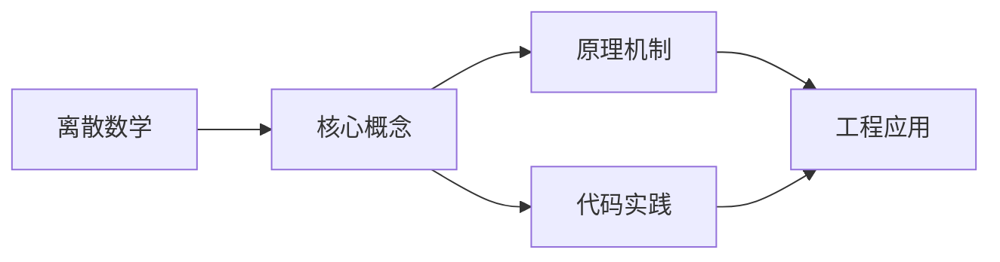

## 1. 学习目标（Bloom 分类）

本节按照布鲁姆教育目标分类学组织学习路径。本文主题为《离散数学》，属于 计算机科学基础 模块，读者可以根据自身阶段选择阅读深度。

记忆层面：能够准确复述本文的核心概念、术语与基本语法或操作步骤，并能够在提问或检索时快速定位对应知识点。能够说出 计算机科学基础 的核心概念、常用命令与流程。

理解层面：能够用自己的语言解释核心原理与工作机制，说明概念之间的因果关系，而不是机械记忆结论。能够解释 计算机科学基础 的工作原理与设计动机。

应用层面：能够在真实项目或练习场景中运用本文知识解决具体问题，写出正确且可维护的实现。能够独立完成 计算机科学基础 的标准操作。

分析层面：能够拆解复杂问题，比较本文主题与相邻概念的异同，识别边界条件与例外情况。能够分析 计算机科学基础 使用中的异常与边界。

评价层面：能够根据约束条件（性能、可读性、安全、成本）评价不同方案的优劣，做出有依据的技术决策。能够评价 计算机科学基础 相关工具与方案。

创造层面：能够把本文知识与其他模块知识组合，设计出新的解决方案或可复用的工程模式。能够把 计算机科学基础 融入团队工作流。

通过本节学习，读者应当能够把《离散数学》纳入自己的知识网络，并与 计算机科学基础 模块的其他主题（数据结构、算法、操作系统、体系结构）建立关联。

## 2. 历史动机与发展脉络

《离散数学》是 计算机科学基础 领域的重要主题。要真正理解它，需要先了解它解决的问题与演进过程。

计算机科学基础是编程的“内功”：数据结构与算法、操作系统、计算机体系结构、网络；框架会过时，基础长期有效。
体系结构：冯诺依曼模型（存储程序）、CPU/内存/I/O、指令流水线、缓存层次。
操作系统：进程与线程、调度、内存管理（虚拟内存）、文件系统、并发原语。

回到本文主题：离散数学 的提出与成熟，正是上述技术背景下的必然产物。早期实现往往以简单可用为目标，随着工程规模扩大，社区逐渐沉淀出标准做法与最佳实践；理解这一脉络，可以帮助读者判断“为什么文档中的推荐写法是现在这个样子”，也能在遇到历史遗留代码时准确识别其设计年代与取舍。


## 3. 形式化定义与核心概念精讲

本节把《离散数学》涉及的核心概念以“定义 + 讲解”的形式展开。读者应把定义当作工具，把讲解当作理解路径；两者结合才能形成可迁移的知识。

数据结构：数组/链表/栈/队列/哈希/树/图；每种结构有插入、查找、删除的时间复杂度特征。
算法分析：大 O 表示增长阶；时间与空间权衡；递归与迭代。
存储层次：寄存器 -> 缓存 -> 内存 -> 磁盘；局部性原理指导性能优化。

### 3.1 原文章节逐一精讲

原文档把主题拆分为 8 个小节，下面按顺序给出每一节的导读讲解，随后保留原文细节供精读。

#### 原文精读（完整保留）


#### 1. 逻辑与证明

##### 1.1 命题逻辑

```
命题逻辑的基本联结词:

  否定:   NOT p          ~p
  合取:   p AND q        p ^ q
  析取:   p OR q         p v q
  蕴含:   p IMPLIES q    p -> q
  等价:   p IFF q        p <-> q

真值表:

  p | q | ~p | p^q | pvq | p->q | p<->q
  --+---+----+-----+-----+------+------
  T | T | F  |  T  |  T  |  T   |  T
  T | F | F  |  F  |  T  |  F   |  F
  F | T | T  |  F  |  T  |  T   |  F
  F | F | T  |  F  |  F  |  T   |  T

重要等价律:

  双重否定:  ~~p <=> p
  德摩根律:  ~(p ^ q) <=> ~p v ~q
             ~(p v q) <=> ~p ^ ~q
  交换律:    p ^ q <=> q ^ p
  结合律:    (p ^ q) ^ r <=> p ^ (q ^ r)
  分配律:    p v (q ^ r) <=> (p v q) ^ (p v r)
  蕴含等价:  p -> q <=> ~p v q
  逆否命题:  p -> q <=> ~q -> ~p
```

##### 1.2 谓词逻辑

```
量词:

  全称量词:  forall x: P(x)   -- 对所有x, P(x)成立
  存在量词:  exists x: P(x)   -- 存在x, 使P(x)成立

量词否定:

  ~forall x: P(x) <=> exists x: ~P(x)
  ~exists x: P(x) <=> forall x: ~P(x)

量词与联结词的分配:

  forall x: (P(x) ^ Q(x)) <=> (forall x: P(x)) ^ (forall x: Q(x))
  exists x: (P(x) v Q(x)) <=> (exists x: P(x)) v (exists x: Q(x))

  注意: forall 对 v 不分配, exists 对 ^ 不分配
```

##### 1.3 证明方法

```
常见证明策略:

1. 直接证明:
   假设P为真, 通过逻辑推导证明Q为真
   用于: P -> Q

2. 反证法 (归谬法):
   假设结论为假, 推导出矛盾
   用于: 证明命题P为真 -> 假设~P, 推出矛盾

3. 逆否证明:
   证明 ~Q -> ~P 等价于证明 P -> Q

4. 数学归纳法:
   基础步: P(1) 为真
   归纳步: P(k) -> P(k+1)
   结论: 对所有 n >= 1, P(n) 为真

   强归纳法:
   归纳步: P(1) ^ P(2) ^ ... ^ P(k) -> P(k+1)

5. 构造性证明:
   直接构造满足条件的对象
   用于: 存在性命题 exists x: P(x)
```

**归纳法示例**：

```
命题: 1 + 2 + ... + n = n(n+1)/2

基础步: n=1: 1 = 1*2/2 = 1  成立

归纳步: 假设 1+2+...+k = k(k+1)/2
  1+2+...+k+(k+1) = k(k+1)/2 + (k+1)
                   = (k+1)(k/2 + 1)
                   = (k+1)(k+2)/2
  成立

结论: 对所有 n >= 1, 公式成立
```

> 跨模块引用：[概述](overview)的停机问题证明使用了反证法。[编译原理](compiler)的类型正确性证明使用了归纳法。[C语言](c/overview)的断言(assert)是命题逻辑在编程中的应用。

---

#### 2. 集合、关系与函数

##### 2.1 集合论基础

```
集合运算:

  并集:  A U B = {x | x in A or x in B}
  交集:  A n B = {x | x in A and x in B}
  差集:  A - B = {x | x in A and x not in B}
  补集:  A^c  = U - A  (U为全集)
  对称差: A xor B = (A-B) U (B-A)

集合恒等式:

  A U (B n C) = (A U B) n (A U C)    分配律
  A n (B U C) = (A n B) U (A n C)    分配律
  (A U B)^c = A^c n B^c              德摩根律
  (A n B)^c = A^c U B^c              德摩根律

幂集:
  P(A) = A的所有子集构成的集合
  |P(A)| = 2^|A|

笛卡尔积:
  A x B = {(a,b) | a in A, b in B}
  |A x B| = |A| * |B|
```

##### 2.2 关系

```
关系定义:
  集合A上的关系R是A x A的子集
  (a,b) in R 写作 aRb

关系的性质:

  自反 (Reflexive):    forall a: aRa
  对称 (Symmetric):    aRb => bRa
  反对称 (Antisymmetric): aRb ^ bRa => a=b
  传递 (Transitive):   aRb ^ bRc => aRc

等价关系: 自反 + 对称 + 传递
  例: 模n同余, 集合的等势

偏序关系: 自反 + 反对称 + 传递
  例: 整除关系, 子集包含, 小于等于

等价类与划分:
  等价关系R将A划分为等价类
  [a] = {x | xRa}
  等价类的集合构成A的划分 (partition)

  例: 模3等价关系将Z划分为:
    [0] = {..., -3, 0, 3, 6, ...}
    [1] = {..., -2, 1, 4, 7, ...}
    [2] = {..., -1, 2, 5, 8, ...}
```

##### 2.3 函数

```
函数定义:
  f: A -> B 是从A到B的映射
  每个a in A 恰好对应一个 b = f(a) in B

函数性质:

  单射 (Injective):   f(a1) = f(a2) => a1 = a2
  满射 (Surjective):  forall b in B, exists a: f(a) = b
  双射 (Bijective):   单射 + 满射

  |A| < |B|: 不存在A到B的满射
  |A| > |B|: 不存在A到B的单射
  |A| = |B|: 存在双射

可数与不可数:

  可数集: 与自然数N等势的集合
    N, Z, Q 都是可数的
    |Q| = |N| (有理数可数)

  不可数集:
    R, P(N) 是不可数的
    |R| > |N| (Cantor对角线论证)

Cantor定理:
  |P(A)| > |A|  对任何集合A
  即: 2^|A| > |A|
```

> 跨模块引用：[操作系统](os)的进程等价类划分（同组进程）使用了等价关系。[计算机网络](network)的子网划分本质上是IP地址集合上的等价关系。[编译原理](compiler)的类型等价判断依赖于名字等价或结构等价关系。

---

#### 3. 图论

##### 3.1 图的基本概念

```
图定义: G = (V, E)
  V = 顶点集合
  E = 边集合 (V中元素的无序/有序对)

图的类型:
  无向图: E中的元素是无序对 {u,v}
  有向图: E中的元素是有序对 (u,v)
  加权图: 每条边有权重 w(e)
  简单图: 无自环, 无重边

基本度量:
  度数 d(v): 与v关联的边数
  握手定理: sum(d(v)) = 2|E|  (无向图)
  入度/出度: 有向图中 d_in(v), d_out(v)
  sum(d_in(v)) = sum(d_out(v)) = |E|
```

##### 3.2 特殊图

```
完全图 K_n:  每对顶点间都有边
  |E| = n(n-1)/2

二部图:  顶点可分为两个独立集, 边只在两集之间
  判定: 图中无奇数长度的环

树:  连通无环图
  |E| = |V| - 1
  任意两点间有唯一路径
  删去任一边则不连通
  添加任一边则产生环

平面图:  可在平面上画出且边不相交
  欧拉公式: |V| - |E| + |F| = 2  (连通平面图)
  |F| = 面数 (含外部面)
  推论: |E| <= 3|V| - 6  (|V| >= 3)

  非平面图: K_5, K_{3,3} (Kuratowski定理)
```

##### 3.3 图的遍历

```
深度优先搜索 (DFS):

DFS(G, v):
  mark v as visited
  for each neighbor w of v:
    if w not visited:
      DFS(G, w)

  应用: 连通性检测, 环检测, 拓扑排序
  时间复杂度: O(|V| + |E|)

广度优先搜索 (BFS):

BFS(G, s):
  queue = [s]
  mark s as visited
  while queue not empty:
    v = queue.dequeue()
    for each neighbor w of v:
      if w not visited:
        mark w as visited
        queue.enqueue(w)

  应用: 最短路径(无权图), 层次遍历
  时间复杂度: O(|V| + |E|)
```

##### 3.4 最小生成树

```
Kruskal算法:

  1. 将所有边按权重排序
  2. 依次取最短边, 若不形成环则加入MST
  3. 直到MST有|V|-1条边

  环检测: 并查集 (Union-Find)
  时间复杂度: O(|E| log |E|)

Prim算法:

  1. 从任一顶点开始
  2. 每次选择连接MST内外且权重最小的边
  3. 将新顶点加入MST
  4. 直到所有顶点都在MST中

  实现: 优先队列
  时间复杂度: O(|E| log |V|)

Dijkstra最短路径:

  1. dist[s] = 0, 其余 = infinity
  2. 选择dist最小的未访问顶点u
  3. 松弛: 对u的每个邻居v: dist[v] = min(dist[v], dist[u] + w(u,v))
  4. 标记u为已访问
  5. 重复直到所有顶点已访问

  要求: 所有边权重非负
  时间复杂度: O(|E| log |V|) (优先队列实现)
```

**Dijkstra伪代码**：

```python
def dijkstra(graph, source):
    dist = {v: float('inf') for v in graph}
    dist[source] = 0
    pq = [(0, source)]
    while pq:
        d, u = heapq.heappop(pq)
        if d > dist[u]:
            continue
        for v, w in graph[u]:
            if dist[u] + w < dist[v]:
                dist[v] = dist[u] + w
                heapq.heappush(pq, (dist[v], v))
    return dist
```

##### 3.5 图着色

```
图着色问题:
  给图的每个顶点着色, 使相邻顶点颜色不同
  最少颜色数 = 色数 chi(G)

  chi(K_n) = n
  chi(二部图) = 2
  chi(平面图) <= 4  (四色定理)

应用:
  [编译原理](compiler)的寄存器分配: 干涉图着色
  [操作系统](os)的资源分配: 无死锁检测
  [计算机网络](network)的信道分配: 频率分配
```

> 跨模块引用：[计算机网络](network)的路由算法（OSPF）基于Dijkstra算法。[编译原理](compiler)的寄存器分配使用图着色算法。[操作系统](os)的资源分配图用于死锁检测。[设计模式](design-patterns)的组合模式形成树结构。

---

#### 4. 组合计数

##### 4.1 基本计数原理

```
加法原理: 若任务A有m种方式, 任务B有n种方式, 且互斥
  则完成A或B有 m+n 种方式

乘法原理: 若任务A有m种方式, 任务B有n种方式, 且独立
  则完成A然后B有 m*n 种方式

排列:
  P(n, k) = n! / (n-k)!    从n个中选k个排列

组合:
  C(n, k) = n! / (k!(n-k)!)  从n个中选k个组合

  C(n, k) = C(n, n-k)
  C(n, 0) = C(n, n) = 1
  C(n, k) = C(n-1, k-1) + C(n-1, k)  (Pascal恒等式)

有重复的排列:
  n^k  (每个位置有n种选择)

有重复的组合:
  C(n+k-1, k)  (k个不可区分物品放入n个可区分盒子)
```

##### 4.2 容斥原理

```
两个集合:
  |A U B| = |A| + |B| - |A n B|

三个集合:
  |A U B U C| = |A| + |B| + |C|
              - |A n B| - |A n C| - |B n C|
              + |A n B n C|

一般形式:
  |U A_i| = sum|A_i| - sum|A_i n A_j| + sum|A_i n A_j n A_k| - ...

应用 - 错排问题:
  D_n = n!(1 - 1/1! + 1/2! - 1/3! + ... + (-1)^n/n!)
  D_n: n个元素的排列中, 没有元素在原来位置的排列数
```

##### 4.3 生成函数

```
普通生成函数 (OGF):
  序列 a_0, a_1, a_2, ... 的OGF:
  A(x) = a_0 + a_1*x + a_2*x^2 + ...

  例: C(n,0), C(n,1), ..., C(n,n) 的OGF:
  (1+x)^n = sum C(n,k) * x^k

常见OGF:
  {1,1,1,...}   -> 1/(1-x)
  {1,2,3,...}   -> x/(1-x)^2
  {C(n,k)}      -> (1+x)^n
  {1/n!}        -> e^x

指数生成函数 (EGF):
  B(x) = b_0 + b_1*x/1! + b_2*x^2/2! + ...

  用于排列计数 (考虑顺序)
```

##### 4.4 递推关系

```
线性递推:

  一阶: a_n = c * a_{n-1}
    解: a_n = c^n * a_0

  二阶常系数齐次: a_n = p*a_{n-1} + q*a_{n-2}
    特征方程: r^2 = p*r + q
    若两不同根 r1, r2: a_n = A*r1^n + B*r2^n
    若重根 r: a_n = (A + B*n) * r^n

  例: Fibonacci数列
    F_n = F_{n-1} + F_{n-2}, F_0=0, F_1=1
    特征方程: r^2 = r + 1
    r1 = (1+sqrt(5))/2, r2 = (1-sqrt(5))/2
    F_n = (r1^n - r2^n) / sqrt(5)

主定理 (Master Theorem):

  T(n) = a*T(n/b) + f(n)

  情况1: f(n) = O(n^(log_b(a)-e))  =>  T(n) = Theta(n^log_b(a))
  情况2: f(n) = Theta(n^log_b(a))   =>  T(n) = Theta(n^log_b(a) * log n)
  情况3: f(n) = Omega(n^(log_b(a)+e)) => T(n) = Theta(f(n))

  例:
    归并排序: T(n) = 2T(n/2) + O(n)  => T(n) = O(n log n)
    二分搜索: T(n) = T(n/2) + O(1)   => T(n) = O(log n)
    Strassen: T(n) = 7T(n/2) + O(n^2) => T(n) = O(n^2.81)
```

> 跨模块引用：[体系结构](architecture)的缓存关联度计算使用组合计数。[编译原理](compiler)的解析表构造使用容斥原理。[计算机网络](network)的子网划分使用组合计数。[概述](overview)的复杂性类分析使用递推关系和主定理。

---

#### 5. 代数结构

##### 5.1 群论基础

```
群 (Group) 定义:
  集合G和运算*满足:
  1. 封闭性: a*b in G
  2. 结合律: (a*b)*c = a*(b*c)
  3. 单位元: exists e: e*a = a*e = a
  4. 逆元:   forall a, exists a^-1: a*a^-1 = e

群的例子:
  (Z, +)       整数加法群
  (Z_n, +_n)   模n加法群 (有限循环群)
  (S_n, o)     n元对称群 (n!个置换)
  (Z_p*, *)    模p乘法群 (p为素数, p-1个元素)

子群判定:
  H是G的子群 <=> forall a,b in H: a*b^-1 in H

Lagrange定理:
  |H| 整除 |G|  (有限群中子群的阶整除群的阶)

循环群:
  生成元g: G = {g^0, g^1, ..., g^(n-1)}
  Z_n是循环群, 生成元为1
  Z_p*是循环群 (p为素数)
```

##### 5.2 环与域

```
环 (Ring):
  集合R和两个运算+, *满足:
  1. (R, +) 是交换群
  2. (R, *) 满足结合律
  3. 分配律: a*(b+c) = a*b + a*c

域 (Field):
  环R满足:
  1. (R-{0}, *) 是交换群
  2. 乘法交换律

域的例子:
  Q (有理数), R (实数), C (复数)
  Z_p (模p, p为素数) -- 有限域 GF(p)

有限域 GF(2^n):
  元素: 次数 < n 的多项式, 系数在 GF(2) = {0,1}
  加法: 多项式加法 (系数模2)
  乘法: 多项式乘法模不可约多项式

  应用:
    AES加密使用 GF(2^8)
    纠错码 (Reed-Solomon, BCH)
```

##### 5.3 数论基础

```
整除与模运算:

  a | b (a整除b): exists k: b = a*k
  a = b*q + r, 0 <= r < b  (带余除法)

  模运算性质:
    (a + b) mod n = ((a mod n) + (b mod n)) mod n
    (a * b) mod n = ((a mod n) * (b mod n)) mod n

最大公因数:
  gcd(a, b) = gcd(b, a mod b)  (Euclid算法)

  扩展Euclid算法:
    gcd(a, b) = s*a + t*b  (Bezout等式)

模逆元:
  a^-1 mod n 存在 <=> gcd(a, n) = 1
  用扩展Euclid算法求

Euler定理:
  a^phi(n) = 1 (mod n), 其中 gcd(a, n) = 1
  phi(n) = Euler函数 = {1 <= k <= n : gcd(k,n) = 1} 的大小

Fermat小定理:
  a^(p-1) = 1 (mod p), p为素数, gcd(a,p) = 1

RSA加密:
  1. 选两个大素数 p, q
  2. n = p*q, phi(n) = (p-1)(q-1)
  3. 选 e: gcd(e, phi(n)) = 1
  4. 计算 d: e*d = 1 (mod phi(n))
  5. 公钥: (n, e), 私钥: (n, d)
  6. 加密: c = m^e mod n
  7. 解密: m = c^d mod n

  正确性: m^(e*d) = m^(1 + k*phi(n)) = m * (m^phi(n))^k = m (mod n)
```

> 跨模块引用：[计算机网络](network)的RSA/ECC加密建立在数论和群论基础上。[编译原理](compiler)的哈希函数使用模运算。[C语言](c/overview)的整数溢出行为与模运算直接相关。[体系结构](architecture)的ALU实现了模2^n的算术运算。

---

#### 6. 形式语言与自动机

##### 6.1 Chomsky层次

```
Chomsky文法层次 (参见 [编译原理](compiler) 8.2节):

Type-0: 无限制文法
  产生式: alpha -> beta (无限制)
  识别器: 图灵机
  语言: 递归可枚举语言

Type-1: 上下文有关文法
  产生式: alpha A beta -> alpha gamma beta (|gamma| >= 1)
  识别器: 线性有界自动机 (LBA)
  语言: 上下文有关语言

Type-2: 上下文无关文法
  产生式: A -> gamma
  识别器: 下推自动机 (PDA)
  语言: 上下文无关语言

Type-3: 正则文法
  产生式: A -> aB 或 A -> a (右线性)
  识别器: 有限自动机 (DFA/NFA)
  语言: 正则语言

包含关系:
  正则语言 C 上下文无关语言 C 上下文有关语言 C 递归可枚举语言
```

##### 6.2 有限自动机

```
DFA (确定性有限自动机):

  M = (Q, Sigma, delta, q0, F)

  Q     = 有限状态集合
  Sigma = 输入字母表
  delta = Q x Sigma -> Q  (转移函数)
  q0    = 初始状态
  F     = 接受状态集合

  DFA状态转移图:

  识别 "以ab结尾的字符串":
        a        b        a        b
  -->[q0]--->[q1]--->[q2]--->[q1]--->[q2]*
                |                    ^
                +---a---(stay q1)---+
                +---b--->(back q0)--+

NFA (非确定性有限自动机):

  delta: Q x (Sigma U {epsilon}) -> P(Q)
  允许: 多个转移, epsilon转移

  NFA -> DFA转换 (子集构造法):
    DFA状态 = NFA状态的子集
    DFA的每个状态对应NFA的一组状态

DFA最小化 (Hopcroft算法):

  1. 初始划分: {接受状态}, {非接受状态}
  2. 对每个划分块, 检查是否可区分:
     若同一块中两个状态对某输入转移到不同块 -> 可区分, 分裂
  3. 重复直到无法再分裂
```

##### 6.3 正则表达式

```
正则表达式运算:

  基本符号: a (匹配字符a)
  连接:     ab (a后跟b)
  选择:     a|b (a或b)
  闭包:     a* (零或多个a)
  正闭包:   a+ (一或多个a)
  可选:     a? (零或一个a)

  优先级: 闭包 > 连接 > 选择

正则表达式 <-> DFA/NFA 等价性:

  正则表达式 -> Thompson构造 -> NFA -> 子集构造 -> DFA -> 最小化

  反方向: DFA -> 状态消除法 -> 正则表达式

  Kleene定理: 正则表达式 = DFA = NFA
  三者描述同一语言类: 正则语言

正则语言的性质:

  封闭性: 并, 交, 补, 连接, 闭包
  判定性质: 空性, 等价性, 包含性 均可判定

  泵引理 (Pumping Lemma):
    若L是正则语言, 则存在p(泵长度), 使得
    L中长度>=p的字符串w可分解为xyz:
      1. |xy| <= p
      2. |y| > 0
      3. xy^iz in L 对所有 i >= 0

    用途: 证明某语言不是正则语言
    例: {a^n b^n | n >= 0} 不是正则语言
```

##### 6.4 下推自动机与上下文无关语言

```
PDA (下推自动机):

  M = (Q, Sigma, Gamma, delta, q0, Z0, F)

  Gamma = 栈字母表
  Z0    = 栈底符号
  delta = Q x (Sigma U {epsilon}) x (Gamma U {epsilon})
          -> P(Q x (Gamma U {epsilon}))

  PDA = NFA + 栈

  例: 识别 {a^n b^n | n >= 0}

  状态转移:
    (q0, a, Z0) -> (q0, AZ0)    读a, 压A
    (q0, a, A)  -> (q0, AA)     读a, 压A
    (q0, b, A)  -> (q1, epsilon) 读b, 弹A
    (q1, b, A)  -> (q1, epsilon) 读b, 弹A
    (q1, epsilon, Z0) -> (q2, Z0) 栈空, 接受

CFL的性质:

  封闭性: 并, 连接, 闭包 (不封闭于交和补)
  CFL交正则语言 = CFL

  CFL泵引理:
    存在p, L中长度>=p的字符串w可分解为uvxyz:
      1. |vxy| <= p
      2. |vy| > 0
      3. uv^ixy^iz in L 对所有 i >= 0

  例: {a^n b^n c^n | n >= 0} 不是CFL
```

> 跨模块引用：[编译原理](compiler)的词法分析使用DFA/正则表达式，语法分析使用CFG/PDA。[概述](overview)的计算理论建立在Chomsky层次之上。[体系结构](architecture)的CPU控制单元本质上是有限状态机。

---

#### 7. 速查表

##### 7.1 逻辑速查

| 等价律   | 公式                  |
| -------- | --------------------- |
| 德摩根   | ~(p^q) = ~~pv~~q      |
| 蕴含     | p->q = ~pvq           |
| 逆否     | p->q = ~q->~p         |
| 双重否定 | ~~p = p               |
| 分配     | pv(q^r) = (pvq)^(pvr) |

##### 7.2 图论速查

| 算法           | 用途                 | 复杂度     |
| -------------- | -------------------- | ---------- |
| DFS            | 遍历/环检测/拓扑排序 | O(V+E)     |
| BFS            | 最短路径(无权)       | O(V+E)     |
| Dijkstra       | 最短路径(非负权)     | O(E log V) |
| Kruskal        | 最小生成树           | O(E log E) |
| Prim           | 最小生成树           | O(E log V) |
| Floyd-Warshall | 全源最短路径         | O(V^3)     |

##### 7.3 计数速查

| 场景        | 公式                          |
| ----------- | ----------------------------- |
| 排列 P(n,k) | n!/(n-k)!                     |
| 组合 C(n,k) | n!/(k!(n-k)!)                 |
| 有重复排列  | n^k                           |
| 有重复组合  | C(n+k-1,k)                    |
| 错排 D_n    | n! \* sum((-1)^i/i!)          |
| 容斥(2集)   | \|AUB\| = \|A\|+\|B\|-\|AnB\| |

##### 7.4 自动机速查

| 自动机  | 栈   | 语言类         | 应用     |
| ------- | ---- | -------------- | -------- |
| DFA/NFA | 无   | 正则语言       | 词法分析 |
| PDA     | 1个  | 上下文无关语言 | 语法分析 |
| LBA     | 受限 | 上下文有关语言 | 语义分析 |
| TM      | 无限 | 递归可枚举     | 通用计算 |

##### 7.5 数论速查

| 定理         | 公式                            |
| ------------ | ------------------------------- |
| Fermat小定理 | a^(p-1) = 1 (mod p)             |
| Euler定理    | a^phi(n) = 1 (mod n)            |
| CRT          | x = a_i (mod m_i) 有解当m_i互素 |
| Wilson定理   | (p-1)! = -1 (mod p)             |

---

#### 延伸阅读

- _Discrete Mathematics and Its Applications_ -- Kenneth H. Rosen
- _Introduction to Automata Theory, Languages, and Computation_ -- Hopcroft, Motwani, Ullman
- _Concrete Mathematics_ -- Graham, Knuth, Patashnik
- _A Course in Number Theory and Cryptography_ -- Neal Koblitz


### 3.2 概念关系图

下面用 Mermaid 图表达本文核心概念之间的关系，帮助读者建立整体图景：



图中展示的是本文知识的结构化关系：核心概念是入口，原理机制解释“为什么”，代码实践演示“怎么做”，工程应用回答“何时用”。读者学习时可以把每个小节的内容挂接到对应节点上。

## 4. 理论推导与原理解析

本节深入《离散数学》背后的原理。理论部分不求面面俱到，而是聚焦“能解释现象、能指导实践”的关键推导。

数据结构：数组/链表/栈/队列/哈希/树/图；每种结构有插入、查找、删除的时间复杂度特征。
算法分析：大 O 表示增长阶；时间与空间权衡；递归与迭代。
存储层次：寄存器 -> 缓存 -> 内存 -> 磁盘；局部性原理指导性能优化。
并发基础：竞态、临界区、锁、信号量、死锁条件与预防。

需要强调的是，理论推导与工程实践之间存在翻译层：理论给出的是理想化模型与边界条件，工程代码则必须处理真实环境中的例外。读者在学习时应先掌握理论的“标准情形”，再通过陷阱章节了解“非标准情形”。

## 5. 代码示例与逐行讲解

本节把原文中的代码示例系统整理，并为每个示例补充用途说明与讲解。读者不应只浏览代码，而应逐段对照讲解理解设计意图。

### 5.1 示例：1.1 命题逻辑

该示例来自原文《1.1 命题逻辑》小节，用于演示离散数学相关操作。阅读时请先看代码结构，再看其后的讲解。

```text
命题逻辑的基本联结词:

  否定:   NOT p          ~p
  合取:   p AND q        p ^ q
  析取:   p OR q         p v q
  蕴含:   p IMPLIES q    p -> q
  等价:   p IFF q        p <-> q

真值表:

  p | q | ~p | p^q | pvq | p->q | p<->q
  --+---+----+-----+-----+------+------
  T | T | F  |  T  |  T  |  T   |  T
  T | F | F  |  F  |  T  |  F   |  F
  F | T | T  |  F  |  T  |  T   |  F
  F | F | T  |  F  |  F  |  T   |  T

重要等价律:

  双重否定:  ~~p <=> p
  德摩根律:  ~(p ^ q) <=> ~p v ~q
             ~(p v q) <=> ~p ^ ~q
  交换律:    p ^ q <=> q ^ p
  结合律:    (p ^ q) ^ r <=> p ^ (q ^ r)
  分配律:    p v (q ^ r) <=> (p v q) ^ (p v r)
  蕴含等价:  p -> q <=> ~p v q
  逆否命题:  p -> q <=> ~q -> ~p
```

讲解：这段代码演示了本节核心知识点。代码中的关键操作可以归纳为三步：准备（定义或初始化）、执行（核心逻辑）、收尾（释放资源或返回结果）。实际项目中，这三步往往被封装为函数或类，以提升复用性与可测试性。

关键点分析：

该示例共 22 行有效代码，结构以数据或配置为主。阅读时应关注：数据字段的含义、配置项的作用，以及它们与运行行为的对应关系。

进阶思考路径：先尝试修改参数观察行为变化，再把示例中的模式迁移到自己的项目中；每次修改都记录预期与实测差异，这是把示例转化为能力的最快方式。

### 5.2 示例：1.2 谓词逻辑

该示例来自原文《1.2 谓词逻辑》小节，用于演示离散数学相关操作。阅读时请先看代码结构，再看其后的讲解。

```text
量词:

  全称量词:  forall x: P(x)   -- 对所有x, P(x)成立
  存在量词:  exists x: P(x)   -- 存在x, 使P(x)成立

量词否定:

  ~forall x: P(x) <=> exists x: ~P(x)
  ~exists x: P(x) <=> forall x: ~P(x)

量词与联结词的分配:

  forall x: (P(x) ^ Q(x)) <=> (forall x: P(x)) ^ (forall x: Q(x))
  exists x: (P(x) v Q(x)) <=> (exists x: P(x)) v (exists x: Q(x))

  注意: forall 对 v 不分配, exists 对 ^ 不分配
```

讲解：这段代码演示了本节核心知识点。代码中的关键操作可以归纳为三步：准备（定义或初始化）、执行（核心逻辑）、收尾（释放资源或返回结果）。实际项目中，这三步往往被封装为函数或类，以提升复用性与可测试性。

关键点分析：

该示例共 10 行有效代码，结构以数据或配置为主。阅读时应关注：数据字段的含义、配置项的作用，以及它们与运行行为的对应关系。

进阶思考路径：先尝试修改参数观察行为变化，再把示例中的模式迁移到自己的项目中；每次修改都记录预期与实测差异，这是把示例转化为能力的最快方式。

### 5.3 示例：1.3 证明方法

该示例来自原文《1.3 证明方法》小节，用于演示离散数学相关操作。阅读时请先看代码结构，再看其后的讲解。

```text
常见证明策略:

1. 直接证明:
   假设P为真, 通过逻辑推导证明Q为真
   用于: P -> Q

2. 反证法 (归谬法):
   假设结论为假, 推导出矛盾
   用于: 证明命题P为真 -> 假设~P, 推出矛盾

3. 逆否证明:
   证明 ~Q -> ~P 等价于证明 P -> Q

4. 数学归纳法:
   基础步: P(1) 为真
   归纳步: P(k) -> P(k+1)
   结论: 对所有 n >= 1, P(n) 为真

   强归纳法:
   归纳步: P(1) ^ P(2) ^ ... ^ P(k) -> P(k+1)

5. 构造性证明:
   直接构造满足条件的对象
   用于: 存在性命题 exists x: P(x)
```

讲解：这段代码演示了本节核心知识点。代码中的关键操作可以归纳为三步：准备（定义或初始化）、执行（核心逻辑）、收尾（释放资源或返回结果）。实际项目中，这三步往往被封装为函数或类，以提升复用性与可测试性。

关键点分析：

该示例共 18 行有效代码，结构以数据或配置为主。阅读时应关注：数据字段的含义、配置项的作用，以及它们与运行行为的对应关系。

进阶思考路径：先尝试修改参数观察行为变化，再把示例中的模式迁移到自己的项目中；每次修改都记录预期与实测差异，这是把示例转化为能力的最快方式。

### 5.4 示例：1.3 证明方法

该示例来自原文《1.3 证明方法》小节，用于演示离散数学相关操作。阅读时请先看代码结构，再看其后的讲解。

```text
命题: 1 + 2 + ... + n = n(n+1)/2

基础步: n=1: 1 = 1*2/2 = 1  成立

归纳步: 假设 1+2+...+k = k(k+1)/2
  1+2+...+k+(k+1) = k(k+1)/2 + (k+1)
                   = (k+1)(k/2 + 1)
                   = (k+1)(k+2)/2
  成立

结论: 对所有 n >= 1, 公式成立
```

讲解：这段代码演示了本节核心知识点。代码中的关键操作可以归纳为三步：准备（定义或初始化）、执行（核心逻辑）、收尾（释放资源或返回结果）。实际项目中，这三步往往被封装为函数或类，以提升复用性与可测试性。

关键点分析：

该示例共 8 行有效代码，结构以数据或配置为主。阅读时应关注：数据字段的含义、配置项的作用，以及它们与运行行为的对应关系。

进阶思考路径：先尝试修改参数观察行为变化，再把示例中的模式迁移到自己的项目中；每次修改都记录预期与实测差异，这是把示例转化为能力的最快方式。

### 5.5 示例：2.1 集合论基础

该示例来自原文《2.1 集合论基础》小节，用于演示离散数学相关操作。阅读时请先看代码结构，再看其后的讲解。

```text
集合运算:

  并集:  A U B = {x | x in A or x in B}
  交集:  A n B = {x | x in A and x in B}
  差集:  A - B = {x | x in A and x not in B}
  补集:  A^c  = U - A  (U为全集)
  对称差: A xor B = (A-B) U (B-A)

集合恒等式:

  A U (B n C) = (A U B) n (A U C)    分配律
  A n (B U C) = (A n B) U (A n C)    分配律
  (A U B)^c = A^c n B^c              德摩根律
  (A n B)^c = A^c U B^c              德摩根律

幂集:
  P(A) = A的所有子集构成的集合
  |P(A)| = 2^|A|

笛卡尔积:
  A x B = {(a,b) | a in A, b in B}
  |A x B| = |A| * |B|
```

讲解：这段代码演示了本节核心知识点。代码中的关键操作可以归纳为三步：准备（定义或初始化）、执行（核心逻辑）、收尾（释放资源或返回结果）。实际项目中，这三步往往被封装为函数或类，以提升复用性与可测试性。

关键点分析：

该示例共 17 行有效代码，结构以数据或配置为主。阅读时应关注：数据字段的含义、配置项的作用，以及它们与运行行为的对应关系。

进阶思考路径：先尝试修改参数观察行为变化，再把示例中的模式迁移到自己的项目中；每次修改都记录预期与实测差异，这是把示例转化为能力的最快方式。

### 5.6 示例：2.2 关系

该示例来自原文《2.2 关系》小节，用于演示离散数学相关操作。阅读时请先看代码结构，再看其后的讲解。

```text
关系定义:
  集合A上的关系R是A x A的子集
  (a,b) in R 写作 aRb

关系的性质:

  自反 (Reflexive):    forall a: aRa
  对称 (Symmetric):    aRb => bRa
  反对称 (Antisymmetric): aRb ^ bRa => a=b
  传递 (Transitive):   aRb ^ bRc => aRc

等价关系: 自反 + 对称 + 传递
  例: 模n同余, 集合的等势

偏序关系: 自反 + 反对称 + 传递
  例: 整除关系, 子集包含, 小于等于

等价类与划分:
  等价关系R将A划分为等价类
  [a] = {x | xRa}
  等价类的集合构成A的划分 (partition)

  例: 模3等价关系将Z划分为:
    [0] = {..., -3, 0, 3, 6, ...}
    [1] = {..., -2, 1, 4, 7, ...}
    [2] = {..., -1, 2, 5, 8, ...}
```

讲解：这段代码演示了本节核心知识点。代码中的关键操作可以归纳为三步：准备（定义或初始化）、执行（核心逻辑）、收尾（释放资源或返回结果）。实际项目中，这三步往往被封装为函数或类，以提升复用性与可测试性。

关键点分析：

该示例共 20 行有效代码，结构以数据或配置为主。阅读时应关注：数据字段的含义、配置项的作用，以及它们与运行行为的对应关系。

进阶思考路径：先尝试修改参数观察行为变化，再把示例中的模式迁移到自己的项目中；每次修改都记录预期与实测差异，这是把示例转化为能力的最快方式。

### 5.7 示例：2.3 函数

该示例来自原文《2.3 函数》小节，用于演示离散数学相关操作。阅读时请先看代码结构，再看其后的讲解。

```text
函数定义:
  f: A -> B 是从A到B的映射
  每个a in A 恰好对应一个 b = f(a) in B

函数性质:

  单射 (Injective):   f(a1) = f(a2) => a1 = a2
  满射 (Surjective):  forall b in B, exists a: f(a) = b
  双射 (Bijective):   单射 + 满射

  |A| < |B|: 不存在A到B的满射
  |A| > |B|: 不存在A到B的单射
  |A| = |B|: 存在双射

可数与不可数:

  可数集: 与自然数N等势的集合
    N, Z, Q 都是可数的
    |Q| = |N| (有理数可数)

  不可数集:
    R, P(N) 是不可数的
    |R| > |N| (Cantor对角线论证)

Cantor定理:
  |P(A)| > |A|  对任何集合A
  即: 2^|A| > |A|
```

讲解：这段代码演示了本节核心知识点。代码中的关键操作可以归纳为三步：准备（定义或初始化）、执行（核心逻辑）、收尾（释放资源或返回结果）。实际项目中，这三步往往被封装为函数或类，以提升复用性与可测试性。

关键点分析：

该示例共 20 行有效代码，结构以数据或配置为主。阅读时应关注：数据字段的含义、配置项的作用，以及它们与运行行为的对应关系。

进阶思考路径：先尝试修改参数观察行为变化，再把示例中的模式迁移到自己的项目中；每次修改都记录预期与实测差异，这是把示例转化为能力的最快方式。

### 5.8 示例：3.1 图的基本概念

该示例来自原文《3.1 图的基本概念》小节，用于演示离散数学相关操作。阅读时请先看代码结构，再看其后的讲解。

```text
图定义: G = (V, E)
  V = 顶点集合
  E = 边集合 (V中元素的无序/有序对)

图的类型:
  无向图: E中的元素是无序对 {u,v}
  有向图: E中的元素是有序对 (u,v)
  加权图: 每条边有权重 w(e)
  简单图: 无自环, 无重边

基本度量:
  度数 d(v): 与v关联的边数
  握手定理: sum(d(v)) = 2|E|  (无向图)
  入度/出度: 有向图中 d_in(v), d_out(v)
  sum(d_in(v)) = sum(d_out(v)) = |E|
```

讲解：这段代码演示了本节核心知识点。代码中的关键操作可以归纳为三步：准备（定义或初始化）、执行（核心逻辑）、收尾（释放资源或返回结果）。实际项目中，这三步往往被封装为函数或类，以提升复用性与可测试性。

关键点分析：

该示例共 13 行有效代码，结构以数据或配置为主。阅读时应关注：数据字段的含义、配置项的作用，以及它们与运行行为的对应关系。

进阶思考路径：先尝试修改参数观察行为变化，再把示例中的模式迁移到自己的项目中；每次修改都记录预期与实测差异，这是把示例转化为能力的最快方式。

### 5.9 示例：3.2 特殊图

该示例来自原文《3.2 特殊图》小节，用于演示离散数学相关操作。阅读时请先看代码结构，再看其后的讲解。

```text
完全图 K_n:  每对顶点间都有边
  |E| = n(n-1)/2

二部图:  顶点可分为两个独立集, 边只在两集之间
  判定: 图中无奇数长度的环

树:  连通无环图
  |E| = |V| - 1
  任意两点间有唯一路径
  删去任一边则不连通
  添加任一边则产生环

平面图:  可在平面上画出且边不相交
  欧拉公式: |V| - |E| + |F| = 2  (连通平面图)
  |F| = 面数 (含外部面)
  推论: |E| <= 3|V| - 6  (|V| >= 3)

  非平面图: K_5, K_{3,3} (Kuratowski定理)
```

讲解：这段代码演示了本节核心知识点。代码中的关键操作可以归纳为三步：准备（定义或初始化）、执行（核心逻辑）、收尾（释放资源或返回结果）。实际项目中，这三步往往被封装为函数或类，以提升复用性与可测试性。

关键点分析：

该示例共 14 行有效代码，结构以数据或配置为主。阅读时应关注：数据字段的含义、配置项的作用，以及它们与运行行为的对应关系。

进阶思考路径：先尝试修改参数观察行为变化，再把示例中的模式迁移到自己的项目中；每次修改都记录预期与实测差异，这是把示例转化为能力的最快方式。

### 5.10 示例：3.3 图的遍历

该示例来自原文《3.3 图的遍历》小节，用于演示离散数学相关操作。阅读时请先看代码结构，再看其后的讲解。

```text
深度优先搜索 (DFS):

DFS(G, v):
  mark v as visited
  for each neighbor w of v:
    if w not visited:
      DFS(G, w)

  应用: 连通性检测, 环检测, 拓扑排序
  时间复杂度: O(|V| + |E|)

广度优先搜索 (BFS):

BFS(G, s):
  queue = [s]
  mark s as visited
  while queue not empty:
    v = queue.dequeue()
    for each neighbor w of v:
      if w not visited:
        mark w as visited
        queue.enqueue(w)

  应用: 最短路径(无权图), 层次遍历
  时间复杂度: O(|V| + |E|)
```

讲解：这段代码演示了本节核心知识点。代码中的关键操作可以归纳为三步：准备（定义或初始化）、执行（核心逻辑）、收尾（释放资源或返回结果）。实际项目中，这三步往往被封装为函数或类，以提升复用性与可测试性。

关键点分析：

该示例共 20 行有效代码，包含 3 类关键结构（if、for、while）。其中：

- 入口与初始化部分负责建立上下文，对应实际项目中的启动或装配逻辑；
- 核心逻辑部分体现本文主题的主要操作，是阅读时最需要对照讲解理解的部分；
- 输出或返回部分把结果交给调用方，注意其类型与边界条件。

进阶思考路径：先尝试修改参数观察行为变化，再把示例中的模式迁移到自己的项目中；每次修改都记录预期与实测差异，这是把示例转化为能力的最快方式。

### 5.11 示例：3.4 最小生成树

该示例来自原文《3.4 最小生成树》小节，用于演示离散数学相关操作。阅读时请先看代码结构，再看其后的讲解。

```text
Kruskal算法:

  1. 将所有边按权重排序
  2. 依次取最短边, 若不形成环则加入MST
  3. 直到MST有|V|-1条边

  环检测: 并查集 (Union-Find)
  时间复杂度: O(|E| log |E|)

Prim算法:

  1. 从任一顶点开始
  2. 每次选择连接MST内外且权重最小的边
  3. 将新顶点加入MST
  4. 直到所有顶点都在MST中

  实现: 优先队列
  时间复杂度: O(|E| log |V|)

Dijkstra最短路径:

  1. dist[s] = 0, 其余 = infinity
  2. 选择dist最小的未访问顶点u
  3. 松弛: 对u的每个邻居v: dist[v] = min(dist[v], dist[u] + w(u,v))
  4. 标记u为已访问
  5. 重复直到所有顶点已访问

  要求: 所有边权重非负
  时间复杂度: O(|E| log |V|) (优先队列实现)
```

讲解：这段代码演示了本节核心知识点。代码中的关键操作可以归纳为三步：准备（定义或初始化）、执行（核心逻辑）、收尾（释放资源或返回结果）。实际项目中，这三步往往被封装为函数或类，以提升复用性与可测试性。

关键点分析：

该示例共 21 行有效代码，结构以数据或配置为主。阅读时应关注：数据字段的含义、配置项的作用，以及它们与运行行为的对应关系。

进阶思考路径：先尝试修改参数观察行为变化，再把示例中的模式迁移到自己的项目中；每次修改都记录预期与实测差异，这是把示例转化为能力的最快方式。

### 5.12 示例：3.4 最小生成树

该示例来自原文《3.4 最小生成树》小节，用于演示离散数学相关操作。阅读时请先看代码结构，再看其后的讲解。

```python
def dijkstra(graph, source):
    dist = {v: float('inf') for v in graph}
    dist[source] = 0
    pq = [(0, source)]
    while pq:
        d, u = heapq.heappop(pq)
        if d > dist[u]:
            continue
        for v, w in graph[u]:
            if dist[u] + w < dist[v]:
                dist[v] = dist[u] + w
                heapq.heappush(pq, (dist[v], v))
    return dist
```

讲解：这段代码演示了本节核心知识点。代码中的关键操作可以归纳为三步：准备（定义或初始化）、执行（核心逻辑）、收尾（释放资源或返回结果）。实际项目中，这三步往往被封装为函数或类，以提升复用性与可测试性。

关键点分析：

该示例共 13 行有效代码，包含 5 类关键结构（def、if、for、while、return）。其中：

- 入口与初始化部分负责建立上下文，对应实际项目中的启动或装配逻辑；
- 核心逻辑部分体现本文主题的主要操作，是阅读时最需要对照讲解理解的部分；
- 输出或返回部分把结果交给调用方，注意其类型与边界条件。

进阶思考路径：先尝试修改参数观察行为变化，再把示例中的模式迁移到自己的项目中；每次修改都记录预期与实测差异，这是把示例转化为能力的最快方式。

### 5.13 示例：3.5 图着色

该示例来自原文《3.5 图着色》小节，用于演示离散数学相关操作。阅读时请先看代码结构，再看其后的讲解。

```text
图着色问题:
  给图的每个顶点着色, 使相邻顶点颜色不同
  最少颜色数 = 色数 chi(G)

  chi(K_n) = n
  chi(二部图) = 2
  chi(平面图) <= 4  (四色定理)

应用:
  [编译原理](compiler)的寄存器分配: 干涉图着色
  [操作系统](os)的资源分配: 无死锁检测
  [计算机网络](network)的信道分配: 频率分配
```

讲解：这段代码演示了本节核心知识点。代码中的关键操作可以归纳为三步：准备（定义或初始化）、执行（核心逻辑）、收尾（释放资源或返回结果）。实际项目中，这三步往往被封装为函数或类，以提升复用性与可测试性。

关键点分析：

该示例共 10 行有效代码，结构以数据或配置为主。阅读时应关注：数据字段的含义、配置项的作用，以及它们与运行行为的对应关系。

进阶思考路径：先尝试修改参数观察行为变化，再把示例中的模式迁移到自己的项目中；每次修改都记录预期与实测差异，这是把示例转化为能力的最快方式。

### 5.14 示例：4.1 基本计数原理

该示例来自原文《4.1 基本计数原理》小节，用于演示离散数学相关操作。阅读时请先看代码结构，再看其后的讲解。

```text
加法原理: 若任务A有m种方式, 任务B有n种方式, 且互斥
  则完成A或B有 m+n 种方式

乘法原理: 若任务A有m种方式, 任务B有n种方式, 且独立
  则完成A然后B有 m*n 种方式

排列:
  P(n, k) = n! / (n-k)!    从n个中选k个排列

组合:
  C(n, k) = n! / (k!(n-k)!)  从n个中选k个组合

  C(n, k) = C(n, n-k)
  C(n, 0) = C(n, n) = 1
  C(n, k) = C(n-1, k-1) + C(n-1, k)  (Pascal恒等式)

有重复的排列:
  n^k  (每个位置有n种选择)

有重复的组合:
  C(n+k-1, k)  (k个不可区分物品放入n个可区分盒子)
```

讲解：这段代码演示了本节核心知识点。代码中的关键操作可以归纳为三步：准备（定义或初始化）、执行（核心逻辑）、收尾（释放资源或返回结果）。实际项目中，这三步往往被封装为函数或类，以提升复用性与可测试性。

关键点分析：

该示例共 15 行有效代码，结构以数据或配置为主。阅读时应关注：数据字段的含义、配置项的作用，以及它们与运行行为的对应关系。

进阶思考路径：先尝试修改参数观察行为变化，再把示例中的模式迁移到自己的项目中；每次修改都记录预期与实测差异，这是把示例转化为能力的最快方式。

### 5.15 示例：4.2 容斥原理

该示例来自原文《4.2 容斥原理》小节，用于演示离散数学相关操作。阅读时请先看代码结构，再看其后的讲解。

```text
两个集合:
  |A U B| = |A| + |B| - |A n B|

三个集合:
  |A U B U C| = |A| + |B| + |C|
              - |A n B| - |A n C| - |B n C|
              + |A n B n C|

一般形式:
  |U A_i| = sum|A_i| - sum|A_i n A_j| + sum|A_i n A_j n A_k| - ...

应用 - 错排问题:
  D_n = n!(1 - 1/1! + 1/2! - 1/3! + ... + (-1)^n/n!)
  D_n: n个元素的排列中, 没有元素在原来位置的排列数
```

讲解：这段代码演示了本节核心知识点。代码中的关键操作可以归纳为三步：准备（定义或初始化）、执行（核心逻辑）、收尾（释放资源或返回结果）。实际项目中，这三步往往被封装为函数或类，以提升复用性与可测试性。

关键点分析：

该示例共 11 行有效代码，结构以数据或配置为主。阅读时应关注：数据字段的含义、配置项的作用，以及它们与运行行为的对应关系。

进阶思考路径：先尝试修改参数观察行为变化，再把示例中的模式迁移到自己的项目中；每次修改都记录预期与实测差异，这是把示例转化为能力的最快方式。

### 5.16 示例：4.3 生成函数

该示例来自原文《4.3 生成函数》小节，用于演示离散数学相关操作。阅读时请先看代码结构，再看其后的讲解。

```text
普通生成函数 (OGF):
  序列 a_0, a_1, a_2, ... 的OGF:
  A(x) = a_0 + a_1*x + a_2*x^2 + ...

  例: C(n,0), C(n,1), ..., C(n,n) 的OGF:
  (1+x)^n = sum C(n,k) * x^k

常见OGF:
  {1,1,1,...}   -> 1/(1-x)
  {1,2,3,...}   -> x/(1-x)^2
  {C(n,k)}      -> (1+x)^n
  {1/n!}        -> e^x

指数生成函数 (EGF):
  B(x) = b_0 + b_1*x/1! + b_2*x^2/2! + ...

  用于排列计数 (考虑顺序)
```

讲解：这段代码演示了本节核心知识点。代码中的关键操作可以归纳为三步：准备（定义或初始化）、执行（核心逻辑）、收尾（释放资源或返回结果）。实际项目中，这三步往往被封装为函数或类，以提升复用性与可测试性。

关键点分析：

该示例共 13 行有效代码，结构以数据或配置为主。阅读时应关注：数据字段的含义、配置项的作用，以及它们与运行行为的对应关系。

进阶思考路径：先尝试修改参数观察行为变化，再把示例中的模式迁移到自己的项目中；每次修改都记录预期与实测差异，这是把示例转化为能力的最快方式。

### 5.17 示例：4.4 递推关系

该示例来自原文《4.4 递推关系》小节，用于演示离散数学相关操作。阅读时请先看代码结构，再看其后的讲解。

```text
线性递推:

  一阶: a_n = c * a_{n-1}
    解: a_n = c^n * a_0

  二阶常系数齐次: a_n = p*a_{n-1} + q*a_{n-2}
    特征方程: r^2 = p*r + q
    若两不同根 r1, r2: a_n = A*r1^n + B*r2^n
    若重根 r: a_n = (A + B*n) * r^n

  例: Fibonacci数列
    F_n = F_{n-1} + F_{n-2}, F_0=0, F_1=1
    特征方程: r^2 = r + 1
    r1 = (1+sqrt(5))/2, r2 = (1-sqrt(5))/2
    F_n = (r1^n - r2^n) / sqrt(5)

主定理 (Master Theorem):

  T(n) = a*T(n/b) + f(n)

  情况1: f(n) = O(n^(log_b(a)-e))  =>  T(n) = Theta(n^log_b(a))
  情况2: f(n) = Theta(n^log_b(a))   =>  T(n) = Theta(n^log_b(a) * log n)
  情况3: f(n) = Omega(n^(log_b(a)+e)) => T(n) = Theta(f(n))

  例:
    归并排序: T(n) = 2T(n/2) + O(n)  => T(n) = O(n log n)
    二分搜索: T(n) = T(n/2) + O(1)   => T(n) = O(log n)
    Strassen: T(n) = 7T(n/2) + O(n^2) => T(n) = O(n^2.81)
```

讲解：这段代码演示了本节核心知识点。代码中的关键操作可以归纳为三步：准备（定义或初始化）、执行（核心逻辑）、收尾（释放资源或返回结果）。实际项目中，这三步往往被封装为函数或类，以提升复用性与可测试性。

关键点分析：

该示例共 21 行有效代码，结构以数据或配置为主。阅读时应关注：数据字段的含义、配置项的作用，以及它们与运行行为的对应关系。

进阶思考路径：先尝试修改参数观察行为变化，再把示例中的模式迁移到自己的项目中；每次修改都记录预期与实测差异，这是把示例转化为能力的最快方式。

### 5.18 示例：5.1 群论基础

该示例来自原文《5.1 群论基础》小节，用于演示离散数学相关操作。阅读时请先看代码结构，再看其后的讲解。

```text
群 (Group) 定义:
  集合G和运算*满足:
  1. 封闭性: a*b in G
  2. 结合律: (a*b)*c = a*(b*c)
  3. 单位元: exists e: e*a = a*e = a
  4. 逆元:   forall a, exists a^-1: a*a^-1 = e

群的例子:
  (Z, +)       整数加法群
  (Z_n, +_n)   模n加法群 (有限循环群)
  (S_n, o)     n元对称群 (n!个置换)
  (Z_p*, *)    模p乘法群 (p为素数, p-1个元素)

子群判定:
  H是G的子群 <=> forall a,b in H: a*b^-1 in H

Lagrange定理:
  |H| 整除 |G|  (有限群中子群的阶整除群的阶)

循环群:
  生成元g: G = {g^0, g^1, ..., g^(n-1)}
  Z_n是循环群, 生成元为1
  Z_p*是循环群 (p为素数)
```

讲解：这段代码演示了本节核心知识点。代码中的关键操作可以归纳为三步：准备（定义或初始化）、执行（核心逻辑）、收尾（释放资源或返回结果）。实际项目中，这三步往往被封装为函数或类，以提升复用性与可测试性。

关键点分析：

该示例共 19 行有效代码，结构以数据或配置为主。阅读时应关注：数据字段的含义、配置项的作用，以及它们与运行行为的对应关系。

进阶思考路径：先尝试修改参数观察行为变化，再把示例中的模式迁移到自己的项目中；每次修改都记录预期与实测差异，这是把示例转化为能力的最快方式。

### 5.19 示例：5.2 环与域

该示例来自原文《5.2 环与域》小节，用于演示离散数学相关操作。阅读时请先看代码结构，再看其后的讲解。

```text
环 (Ring):
  集合R和两个运算+, *满足:
  1. (R, +) 是交换群
  2. (R, *) 满足结合律
  3. 分配律: a*(b+c) = a*b + a*c

域 (Field):
  环R满足:
  1. (R-{0}, *) 是交换群
  2. 乘法交换律

域的例子:
  Q (有理数), R (实数), C (复数)
  Z_p (模p, p为素数) -- 有限域 GF(p)

有限域 GF(2^n):
  元素: 次数 < n 的多项式, 系数在 GF(2) = {0,1}
  加法: 多项式加法 (系数模2)
  乘法: 多项式乘法模不可约多项式

  应用:
    AES加密使用 GF(2^8)
    纠错码 (Reed-Solomon, BCH)
```

讲解：这段代码演示了本节核心知识点。代码中的关键操作可以归纳为三步：准备（定义或初始化）、执行（核心逻辑）、收尾（释放资源或返回结果）。实际项目中，这三步往往被封装为函数或类，以提升复用性与可测试性。

关键点分析：

该示例共 19 行有效代码，结构以数据或配置为主。阅读时应关注：数据字段的含义、配置项的作用，以及它们与运行行为的对应关系。

进阶思考路径：先尝试修改参数观察行为变化，再把示例中的模式迁移到自己的项目中；每次修改都记录预期与实测差异，这是把示例转化为能力的最快方式。

### 5.20 示例：5.3 数论基础

该示例来自原文《5.3 数论基础》小节，用于演示离散数学相关操作。阅读时请先看代码结构，再看其后的讲解。

```text
整除与模运算:

  a | b (a整除b): exists k: b = a*k
  a = b*q + r, 0 <= r < b  (带余除法)

  模运算性质:
    (a + b) mod n = ((a mod n) + (b mod n)) mod n
    (a * b) mod n = ((a mod n) * (b mod n)) mod n

最大公因数:
  gcd(a, b) = gcd(b, a mod b)  (Euclid算法)

  扩展Euclid算法:
    gcd(a, b) = s*a + t*b  (Bezout等式)

模逆元:
  a^-1 mod n 存在 <=> gcd(a, n) = 1
  用扩展Euclid算法求

Euler定理:
  a^phi(n) = 1 (mod n), 其中 gcd(a, n) = 1
  phi(n) = Euler函数 = {1 <= k <= n : gcd(k,n) = 1} 的大小

Fermat小定理:
  a^(p-1) = 1 (mod p), p为素数, gcd(a,p) = 1

RSA加密:
  1. 选两个大素数 p, q
  2. n = p*q, phi(n) = (p-1)(q-1)
  3. 选 e: gcd(e, phi(n)) = 1
  4. 计算 d: e*d = 1 (mod phi(n))
  5. 公钥: (n, e), 私钥: (n, d)
  6. 加密: c = m^e mod n
  7. 解密: m = c^d mod n

  正确性: m^(e*d) = m^(1 + k*phi(n)) = m * (m^phi(n))^k = m (mod n)
```

讲解：这段代码演示了本节核心知识点。代码中的关键操作可以归纳为三步：准备（定义或初始化）、执行（核心逻辑）、收尾（释放资源或返回结果）。实际项目中，这三步往往被封装为函数或类，以提升复用性与可测试性。

关键点分析：

该示例共 27 行有效代码，结构以数据或配置为主。阅读时应关注：数据字段的含义、配置项的作用，以及它们与运行行为的对应关系。

进阶思考路径：先尝试修改参数观察行为变化，再把示例中的模式迁移到自己的项目中；每次修改都记录预期与实测差异，这是把示例转化为能力的最快方式。

### 5.21 示例：6.1 Chomsky层次

该示例来自原文《6.1 Chomsky层次》小节，用于演示离散数学相关操作。阅读时请先看代码结构，再看其后的讲解。

```text
Chomsky文法层次 (参见 [编译原理](compiler) 8.2节):

Type-0: 无限制文法
  产生式: alpha -> beta (无限制)
  识别器: 图灵机
  语言: 递归可枚举语言

Type-1: 上下文有关文法
  产生式: alpha A beta -> alpha gamma beta (|gamma| >= 1)
  识别器: 线性有界自动机 (LBA)
  语言: 上下文有关语言

Type-2: 上下文无关文法
  产生式: A -> gamma
  识别器: 下推自动机 (PDA)
  语言: 上下文无关语言

Type-3: 正则文法
  产生式: A -> aB 或 A -> a (右线性)
  识别器: 有限自动机 (DFA/NFA)
  语言: 正则语言

包含关系:
  正则语言 C 上下文无关语言 C 上下文有关语言 C 递归可枚举语言
```

讲解：这段代码演示了本节核心知识点。代码中的关键操作可以归纳为三步：准备（定义或初始化）、执行（核心逻辑）、收尾（释放资源或返回结果）。实际项目中，这三步往往被封装为函数或类，以提升复用性与可测试性。

关键点分析：

该示例共 19 行有效代码，结构以数据或配置为主。阅读时应关注：数据字段的含义、配置项的作用，以及它们与运行行为的对应关系。

进阶思考路径：先尝试修改参数观察行为变化，再把示例中的模式迁移到自己的项目中；每次修改都记录预期与实测差异，这是把示例转化为能力的最快方式。

### 5.22 示例：6.2 有限自动机

该示例来自原文《6.2 有限自动机》小节，用于演示离散数学相关操作。阅读时请先看代码结构，再看其后的讲解。

```text
DFA (确定性有限自动机):

  M = (Q, Sigma, delta, q0, F)

  Q     = 有限状态集合
  Sigma = 输入字母表
  delta = Q x Sigma -> Q  (转移函数)
  q0    = 初始状态
  F     = 接受状态集合

  DFA状态转移图:

  识别 "以ab结尾的字符串":
        a        b        a        b
  -->[q0]--->[q1]--->[q2]--->[q1]--->[q2]*
                |                    ^
                +---a---(stay q1)---+
                +---b--->(back q0)--+

NFA (非确定性有限自动机):

  delta: Q x (Sigma U {epsilon}) -> P(Q)
  允许: 多个转移, epsilon转移

  NFA -> DFA转换 (子集构造法):
    DFA状态 = NFA状态的子集
    DFA的每个状态对应NFA的一组状态

DFA最小化 (Hopcroft算法):

  1. 初始划分: {接受状态}, {非接受状态}
  2. 对每个划分块, 检查是否可区分:
     若同一块中两个状态对某输入转移到不同块 -> 可区分, 分裂
  3. 重复直到无法再分裂
```

讲解：这段代码演示了本节核心知识点。代码中的关键操作可以归纳为三步：准备（定义或初始化）、执行（核心逻辑）、收尾（释放资源或返回结果）。实际项目中，这三步往往被封装为函数或类，以提升复用性与可测试性。

关键点分析：

该示例共 25 行有效代码，结构以数据或配置为主。阅读时应关注：数据字段的含义、配置项的作用，以及它们与运行行为的对应关系。

进阶思考路径：先尝试修改参数观察行为变化，再把示例中的模式迁移到自己的项目中；每次修改都记录预期与实测差异，这是把示例转化为能力的最快方式。

### 5.23 示例：6.3 正则表达式

该示例来自原文《6.3 正则表达式》小节，用于演示离散数学相关操作。阅读时请先看代码结构，再看其后的讲解。

```text
正则表达式运算:

  基本符号: a (匹配字符a)
  连接:     ab (a后跟b)
  选择:     a|b (a或b)
  闭包:     a* (零或多个a)
  正闭包:   a+ (一或多个a)
  可选:     a? (零或一个a)

  优先级: 闭包 > 连接 > 选择

正则表达式 <-> DFA/NFA 等价性:

  正则表达式 -> Thompson构造 -> NFA -> 子集构造 -> DFA -> 最小化

  反方向: DFA -> 状态消除法 -> 正则表达式

  Kleene定理: 正则表达式 = DFA = NFA
  三者描述同一语言类: 正则语言

正则语言的性质:

  封闭性: 并, 交, 补, 连接, 闭包
  判定性质: 空性, 等价性, 包含性 均可判定

  泵引理 (Pumping Lemma):
    若L是正则语言, 则存在p(泵长度), 使得
    L中长度>=p的字符串w可分解为xyz:
      1. |xy| <= p
      2. |y| > 0
      3. xy^iz in L 对所有 i >= 0

    用途: 证明某语言不是正则语言
    例: {a^n b^n | n >= 0} 不是正则语言
```

讲解：这段代码演示了本节核心知识点。代码中的关键操作可以归纳为三步：准备（定义或初始化）、执行（核心逻辑）、收尾（释放资源或返回结果）。实际项目中，这三步往往被封装为函数或类，以提升复用性与可测试性。

关键点分析：

该示例共 24 行有效代码，结构以数据或配置为主。阅读时应关注：数据字段的含义、配置项的作用，以及它们与运行行为的对应关系。

进阶思考路径：先尝试修改参数观察行为变化，再把示例中的模式迁移到自己的项目中；每次修改都记录预期与实测差异，这是把示例转化为能力的最快方式。

### 5.24 示例：6.4 下推自动机与上下文无关语言

该示例来自原文《6.4 下推自动机与上下文无关语言》小节，用于演示离散数学相关操作。阅读时请先看代码结构，再看其后的讲解。

```text
PDA (下推自动机):

  M = (Q, Sigma, Gamma, delta, q0, Z0, F)

  Gamma = 栈字母表
  Z0    = 栈底符号
  delta = Q x (Sigma U {epsilon}) x (Gamma U {epsilon})
          -> P(Q x (Gamma U {epsilon}))

  PDA = NFA + 栈

  例: 识别 {a^n b^n | n >= 0}

  状态转移:
    (q0, a, Z0) -> (q0, AZ0)    读a, 压A
    (q0, a, A)  -> (q0, AA)     读a, 压A
    (q0, b, A)  -> (q1, epsilon) 读b, 弹A
    (q1, b, A)  -> (q1, epsilon) 读b, 弹A
    (q1, epsilon, Z0) -> (q2, Z0) 栈空, 接受

CFL的性质:

  封闭性: 并, 连接, 闭包 (不封闭于交和补)
  CFL交正则语言 = CFL

  CFL泵引理:
    存在p, L中长度>=p的字符串w可分解为uvxyz:
      1. |vxy| <= p
      2. |vy| > 0
      3. uv^ixy^iz in L 对所有 i >= 0

  例: {a^n b^n c^n | n >= 0} 不是CFL
```

讲解：这段代码演示了本节核心知识点。代码中的关键操作可以归纳为三步：准备（定义或初始化）、执行（核心逻辑）、收尾（释放资源或返回结果）。实际项目中，这三步往往被封装为函数或类，以提升复用性与可测试性。

关键点分析：

该示例共 23 行有效代码，结构以数据或配置为主。阅读时应关注：数据字段的含义、配置项的作用，以及它们与运行行为的对应关系。

进阶思考路径：先尝试修改参数观察行为变化，再把示例中的模式迁移到自己的项目中；每次修改都记录预期与实测差异，这是把示例转化为能力的最快方式。


综合以上示例，可以总结出本主题的代码实践要点：第一，先定义清晰的输入输出契约；第二，核心逻辑保持单一职责；第三，错误处理与边界条件不可省略；第四，命名与注释表达意图而非复述代码。

## 6. 对比分析

对比是理解《离散数学》定位的最快路径。下面从多个维度与相邻方案进行对比。

数组与链表：数组缓存友好随机访问；链表插入删除灵活。
进程与线程：进程隔离重，线程共享轻；goroutine 更轻。
RISC 与 CISC：现代 CPU 融合两者，关注指令集与微架构。

对比的目的不是分出绝对优劣，而是建立选择依据：不同约束条件下，最优解不同。读者应把每个对比维度转化为决策检查清单。

## 7. 常见陷阱与最佳实践

本节整理该主题的高频错误与推荐做法。每个陷阱先描述现象，再解释原因，最后给出最佳实践。

### 7.1 忽视复杂度

数据量上来才崩。设计时估算规模与复杂度。

深入讲解：该问题之所以被归类为“常见陷阱”，是因为它在初学者的代码中反复出现，而且往往不在第一时间暴露——错误通常隐藏在特定数据或特定时序下。

从成因上看，忽视复杂度 一般源于对 计算机科学基础 某个机制的理解偏差：要么误用了默认行为，要么忽略了边界条件，要么把其他语言的思维惯性带了过来。

从影响上看，忽视复杂度 轻则产生错误结果，重则导致资源泄漏、数据损坏或安全事故；这也是为什么工程评审中会把它列为检查项。

从修复策略上看，处理忽视复杂度的正确顺序是：先复现（构造最小用例），再定位（确认机制层面的根因），最后修复并补充回归测试。跳过复现直接改代码，往往治标不治本。

### 7.2 死锁

锁顺序不一致。统一顺序 + 超时。

深入讲解：该问题之所以被归类为“常见陷阱”，是因为它在初学者的代码中反复出现，而且往往不在第一时间暴露——错误通常隐藏在特定数据或特定时序下。

从成因上看，死锁 一般源于对 计算机科学基础 某个机制的理解偏差：要么误用了默认行为，要么忽略了边界条件，要么把其他语言的思维惯性带了过来。

从影响上看，死锁 轻则产生错误结果，重则导致资源泄漏、数据损坏或安全事故；这也是为什么工程评审中会把它列为检查项。

从修复策略上看，处理死锁的正确顺序是：先复现（构造最小用例），再定位（确认机制层面的根因），最后修复并补充回归测试。跳过复现直接改代码，往往治标不治本。

### 7.3 缓存未命中

随机访问大数组慢。利用局部性。

深入讲解：该问题之所以被归类为“常见陷阱”，是因为它在初学者的代码中反复出现，而且往往不在第一时间暴露——错误通常隐藏在特定数据或特定时序下。

从成因上看，缓存未命中 一般源于对 计算机科学基础 某个机制的理解偏差：要么误用了默认行为，要么忽略了边界条件，要么把其他语言的思维惯性带了过来。

从影响上看，缓存未命中 轻则产生错误结果，重则导致资源泄漏、数据损坏或安全事故；这也是为什么工程评审中会把它列为检查项。

从修复策略上看，处理缓存未命中的正确顺序是：先复现（构造最小用例），再定位（确认机制层面的根因），最后修复并补充回归测试。跳过复现直接改代码，往往治标不治本。

### 7.4 栈溢出

深递归。评估深度或改迭代。

深入讲解：该问题之所以被归类为“常见陷阱”，是因为它在初学者的代码中反复出现，而且往往不在第一时间暴露——错误通常隐藏在特定数据或特定时序下。

从成因上看，栈溢出 一般源于对 计算机科学基础 某个机制的理解偏差：要么误用了默认行为，要么忽略了边界条件，要么把其他语言的思维惯性带了过来。

从影响上看，栈溢出 轻则产生错误结果，重则导致资源泄漏、数据损坏或安全事故；这也是为什么工程评审中会把它列为检查项。

从修复策略上看，处理栈溢出的正确顺序是：先复现（构造最小用例），再定位（确认机制层面的根因），最后修复并补充回归测试。跳过复现直接改代码，往往治标不治本。

### 7.5 整数溢出

计数与哈希边界。使用大整数或检查。

深入讲解：该问题之所以被归类为“常见陷阱”，是因为它在初学者的代码中反复出现，而且往往不在第一时间暴露——错误通常隐藏在特定数据或特定时序下。

从成因上看，整数溢出 一般源于对 计算机科学基础 某个机制的理解偏差：要么误用了默认行为，要么忽略了边界条件，要么把其他语言的思维惯性带了过来。

从影响上看，整数溢出 轻则产生错误结果，重则导致资源泄漏、数据损坏或安全事故；这也是为什么工程评审中会把它列为检查项。

从修复策略上看，处理整数溢出的正确顺序是：先复现（构造最小用例），再定位（确认机制层面的根因），最后修复并补充回归测试。跳过复现直接改代码，往往治标不治本。

### 7.6 位操作误用

符号位与移位方向。明确类型与语义。

深入讲解：该问题之所以被归类为“常见陷阱”，是因为它在初学者的代码中反复出现，而且往往不在第一时间暴露——错误通常隐藏在特定数据或特定时序下。

从成因上看，位操作误用 一般源于对 计算机科学基础 某个机制的理解偏差：要么误用了默认行为，要么忽略了边界条件，要么把其他语言的思维惯性带了过来。

从影响上看，位操作误用 轻则产生错误结果，重则导致资源泄漏、数据损坏或安全事故；这也是为什么工程评审中会把它列为检查项。

从修复策略上看，处理位操作误用的正确顺序是：先复现（构造最小用例），再定位（确认机制层面的根因），最后修复并补充回归测试。跳过复现直接改代码，往往治标不治本。

### 7.7 并发可见性

无同步读旧值。使用原子/锁。

深入讲解：该问题之所以被归类为“常见陷阱”，是因为它在初学者的代码中反复出现，而且往往不在第一时间暴露——错误通常隐藏在特定数据或特定时序下。

从成因上看，并发可见性 一般源于对 计算机科学基础 某个机制的理解偏差：要么误用了默认行为，要么忽略了边界条件，要么把其他语言的思维惯性带了过来。

从影响上看，并发可见性 轻则产生错误结果，重则导致资源泄漏、数据损坏或安全事故；这也是为什么工程评审中会把它列为检查项。

从修复策略上看，处理并发可见性的正确顺序是：先复现（构造最小用例），再定位（确认机制层面的根因），最后修复并补充回归测试。跳过复现直接改代码，往往治标不治本。

### 7.8 过早优化

先正确后优化。以测量为准。

深入讲解：该问题之所以被归类为“常见陷阱”，是因为它在初学者的代码中反复出现，而且往往不在第一时间暴露——错误通常隐藏在特定数据或特定时序下。

从成因上看，过早优化 一般源于对 计算机科学基础 某个机制的理解偏差：要么误用了默认行为，要么忽略了边界条件，要么把其他语言的思维惯性带了过来。

从影响上看，过早优化 轻则产生错误结果，重则导致资源泄漏、数据损坏或安全事故；这也是为什么工程评审中会把它列为检查项。

从修复策略上看，处理过早优化的正确顺序是：先复现（构造最小用例），再定位（确认机制层面的根因），最后修复并补充回归测试。跳过复现直接改代码，往往治标不治本。

### 7.0 最佳实践总览

1. 先分析复杂度再写代码。
2. 数据规模假设明确（10³/10⁶/10⁹ 方案不同）。
3. 理解底层（内存、CPU）后再谈优化。
4. 经典算法与数据结构熟练到可手写。

把这些最佳实践固化为团队规范与代码评审检查项，是避免同类问题反复出现的关键。

## 8. 工程实践

本节把《离散数学》放入真实工程场景，给出可复用的模式与组织方法。

面试与竞赛：LeetCode/算法竞赛训练思维。
系统设计：把基础用于设计（缓存、队列、索引）。
性能工程：profiler 定位 -> 复杂度/局部性优化。

### 8.1 工程实践的原则拆解

以上工程实践可以归纳为四条原则。第一，配置与代码分离：计算机科学基础 项目中环境差异应通过配置注入，而不是散落在代码分支中；这保证同一份代码可以在开发、测试、生产环境一致运行。

第二，接口稳定优先：对外接口（函数签名、协议、数据格式）一旦被消费方依赖，变更成本极高；设计时应预留扩展点并保持向后兼容。

第三，可观测性内置：日志、指标与追踪应该在功能开发时同步设计，而不是故障发生后补救；没有观测手段的模块等于黑盒。

第四，变更可回滚：任何发布都应有对应的回滚方案；数据库迁移、配置变更与代码发布一样需要版本管理与逆向路径。

### 8.2 实践落地的检查清单

- [ ] 面试与竞赛：对照本节描述，检查当前项目是否已经落实；未落实的项列入技术债并排期处理。
- [ ] 系统设计：对照本节描述，检查当前项目是否已经落实；未落实的项列入技术债并排期处理。
- [ ] 性能工程：对照本节描述，检查当前项目是否已经落实；未落实的项列入技术债并排期处理。

工程实践的共性原则：配置与代码分离、接口稳定优先、可观测性内置、变更可回滚。这些原则适用于本主题的所有实现。

## 9. 案例研究

本节通过一个完整案例把《离散数学》的知识串起来。案例按“需求分析、方案设计、实现、验证”四步展开。

需求：设计内存中的高频键值存储。
方案：哈希表 + 链表（LRU）组合，O(1) 读写。
要点：扩容策略、并发控制、内存上限。
验证：复杂度分析 + 基准测试。

### 9.1 案例的扩展讨论

把案例中的方案放大到真实规模，需要额外考虑三个问题：

第一，规模：当数据量或并发量上升一个数量级时，原方案中的数据结构、缓存策略与任务调度是否仍然成立？通常需要引入分层与异步。

第二，团队：多人协作时，模块边界、接口契约与代码所有权必须明确；案例中的实现应拆分为可独立测试的单元，并配合文档说明设计意图。

第三，演进：上线后的需求变化不可避免；方案设计时应预留扩展点（配置化、插件化、事件化），并定期用真实指标验证假设。


案例研究的学习方法：先独立阅读需求，尝试在脑中形成方案，再对照实现与讲解，最后思考“如果约束变化（数据量、并发、团队规模），方案应如何调整”。

## 10. 知识要点总结与深入讲解

本节以讲解形式汇总全文要点，替代传统的习题与自测，读者不需要答题，只需跟随解释建立完整的认知框架。

关于《离散数学》的核心结论：

基础决定上限：复杂问题最终落在数据结构与系统机制上。
理论与实践循环：学机制，写代码验证。
长期积累：系统读一本经典（CSAPP/算法导论）。

原文档各小节的要点回顾：

- 1. 逻辑与证明：该小节围绕离散数学展开具体细节，阅读时应关注其与核心结论的对应关系；每个小节都是核心结论在某一个侧面的展开。
- 2. 集合、关系与函数：该小节围绕离散数学展开具体细节，阅读时应关注其与核心结论的对应关系；每个小节都是核心结论在某一个侧面的展开。
- 3. 图论：该小节围绕离散数学展开具体细节，阅读时应关注其与核心结论的对应关系；每个小节都是核心结论在某一个侧面的展开。
- 4. 组合计数：该小节围绕离散数学展开具体细节，阅读时应关注其与核心结论的对应关系；每个小节都是核心结论在某一个侧面的展开。
- 5. 代数结构：该小节围绕离散数学展开具体细节，阅读时应关注其与核心结论的对应关系；每个小节都是核心结论在某一个侧面的展开。
- 6. 形式语言与自动机：该小节围绕离散数学展开具体细节，阅读时应关注其与核心结论的对应关系；每个小节都是核心结论在某一个侧面的展开。
- 7. 速查表：该小节围绕离散数学展开具体细节，阅读时应关注其与核心结论的对应关系；每个小节都是核心结论在某一个侧面的展开。
- 延伸阅读：该小节围绕离散数学展开具体细节，阅读时应关注其与核心结论的对应关系；每个小节都是核心结论在某一个侧面的展开。

把以上要点与第 3-9 节的内容对照复习，即可完成对本文主题的闭环学习。

## 11. 参考文献


CSAPP（深入理解计算机系统）：https://csapp.cs.cmu.edu/
算法导论（CLRS）：https://mitpress.mit.edu/9780262046305/
MIT OpenCourseWare 6.006：https://ocw.mit.edu/courses/6-006-introduction-to-algorithms-spring-2020/
Teach Yourself CS：https://teachyourselfcs.com/

## 12. 延伸阅读


数据结构与算法，见 023-algorithm 模块。
操作系统概念，见 024-cs-fundamentals 模块相关文档。
计算机体系结构，见 001-getting-started 模块相关文档。
尚硅谷 Bilibili 空间（https://space.bilibili.com/302417610 ）提供计算机基础课程。

## 14. 模块知识图谱与学习路径

本文属于 计算机科学基础 模块。为了把《离散数学》放入完整的知识网络，下面列出本模块的全部主题并给出相互关联的导读。学习时建议按模块内顺序推进，并在每个文档中留意交叉引用。


上图为模块主题的推荐学习顺序示意图（仅展示前若干主题）。各主题之间存在三类关联：

第一，前置依赖关系：早期主题是后期主题的基础，例如环境与语法先行、进阶主题随后；

第二，横向并列关系：同一层级主题从不同角度覆盖模块能力，学习顺序可以按兴趣调整；

第三，工程组合关系：多个主题在真实项目中组合使用，例如配置、性能与安全主题往往出现在同一系统的不同层面。

### 14.1 模块主题速查表

| 文档 | 主题 | 与本文的关联 |
| --- | --- | --- |
| 计算机科学概述 | 001-ComputerOverview | 本文的前置基础 |
| 计算机体系结构 | 002-ComputerArchitecture | 本文的并列主题 |
| 操作系统 | 003-OperatingSystem | 本文的并列主题 |
| 计算机网络 | 004-ComputerNetwork | 本文的并列主题 |
| 数字逻辑 | 005-DigitalLogic | 本文的并列主题 |
| 离散数学 | 006-DiscreteMathematics | 本文自身 |
| 计算机组成原理 | 007-ComputerPrinciple | 本文的原理深化 |
| 数据表示与运算 | 008-DataRepresentationOperation | 本文的并列主题 |
| 指令流水线 | 009-DirectivePipeline | 本文的并列主题 |
| 存储系统 | 010-StorageSystem | 本文的并列主题 |
| 总线与接口 | 011-BusAndInterface | 本文的并列主题 |
| 并行计算 | 012-ParallelCalculate | 本文的并列主题 |
| 分布式系统 | 013-DistributedSystem | 本文的并列主题 |
| 算法设计与分析 | 014-AlgorithmDesignAnalysis | 本文的并列主题 |
| 形式语言与自动机 | 015-FormalLanguageAndAutomata | 本文的并列主题 |
| 信息安全基础 | 016-InformationSecurityBasics | 本文的前置基础 |
| 编译原理 | 017-CompilePrinciple | 本文的原理深化 |
| 软件工程 | 018-SoftwareEngineering | 本文的并列主题 |
| 数据库系统原理 | 019-DatabaseSystemPrinciple | 本文的原理深化 |
| 编译原理进阶 | 020-CompilePrincipleAdvanced | 本文的原理深化 |
| 操作系统进阶 | 021-OperatingSystemAdvanced | 本文的并列主题 |
| 计算机网络进阶 | 022-ComputerNetworkAdvanced | 本文的并列主题 |
| 网络安全 | 023-NetworkSecurity | 本文的安全延伸 |
| 多媒体技术 | 024-MultimediaTechnology | 本文的并列主题 |
| 人工智能基础 | 025-AIFundamentals | 本文的前置基础 |
| 计算机图形学 | 026-ComputerShape | 本文的并列主题 |
| 设计模式 | 027-DesignPattern | 本文的并列主题 |
| 软件体系结构 | 028-SoftwareSystemStructure | 本文的并列主题 |
| 人机交互 | 029-HCI | 本文的并列主题 |
| 编程语言理论 | 030-ProgrammingLanguageTheory | 本文的并列主题 |
| 网络协议深度 | 031-NetworkProtocolDeep | 本文的并列主题 |
| 编译与运行时 | 032-CompileAndRuntime | 本文的并列主题 |
| 进程PCB与线程TCB | 033-PCBThreadTCB | 本文的并列主题 |
| 中断与系统调用 | 034-InterruptAndSystemCall | 本文的并列主题 |
| 用户态与内核态切换 | 035-UserModeKernelModeSwitch | 本文的并列主题 |
| 内存分段与分页 | 036-MemorySegmentationAndPaging | 本文的并列主题 |
| 页面置换算法 | 037-PageReplacementAlgorithm | 本文的并列主题 |
| 文件系统inode | 038-FileSystemInode | 本文的并列主题 |
| 磁盘调度 | 039-DiskScheduling | 本文的并列主题 |
| 零拷贝 | 040-ZeroCopy | 本文的并列主题 |
| 进程间通信 | 041-IPC | 本文的并列主题 |
| HTTP缓存策略 | 042-HTTPCacheStrategy | 本文的并列主题 |
| HTTPS握手过程 | 043-HTTPSHandshake | 本文的并列主题 |
| TCP拥塞控制 | 044-TCPControl | 本文的并列主题 |
| TCP粘包与拆包 | 045-TCP | 本文的并列主题 |
| DNS解析流程 | 046-DNSFlow | 本文的并列主题 |
| CDN原理 | 047-CDNPrinciple | 本文的原理深化 |
| WebSocket帧格式 | 048-WebSocketFrameFormat | 本文的并列主题 |
| QUIC协议 | 049-QUIC | 本文的并列主题 |
| ARP协议与ARP欺骗 | 050-ARPARP | 本文的并列主题 |
| BGP路由协议 | 051-BGPRoute | 本文的并列主题 |
| 词法分析 | 052-LexicalAnalysis | 本文的并列主题 |
| 语法分析 | 053-GrammarAnalysis | 本文的并列主题 |
| 语义分析 | 054-SemanticAnalysis | 本文的并列主题 |
| 中间代码 | 055-IntermediateCode | 本文的并列主题 |
| 代码优化 | 056-CodeOptimization | 本文的性能延伸 |
| 目标代码生成 | 057-TargetCodeGeneration | 本文的并列主题 |

速查表的作用是让读者快速判断：哪些文档应在阅读本文前掌握（前置基础），哪些文档应在阅读本文后继续（延伸主题）。本模块的交叉引用体系即以此表为基础。

## 15. 术语表

下表整理《离散数学》及 计算机科学基础 模块中出现的高频术语，给出简明释义。术语按字母序或逻辑序排列，供查阅。

| 术语 | 释义 |
| --- | --- |
| 数据结构 | 数组/链表/栈/队列/哈希/树/图；每种结构有插入、查找、删除的时间复杂度特征。 |
| 算法分析 | 大 O 表示增长阶；时间与空间权衡；递归与迭代。 |
| 存储层次 | 寄存器 -> 缓存 -> 内存 -> 磁盘；局部性原理指导性能优化。 |
| 并发基础 | 竞态、临界区、锁、信号量、死锁条件与预防。 |
| 忽视复杂度（易错点） | 参见常见陷阱章节的详细讲解 |
| 死锁（易错点） | 参见常见陷阱章节的详细讲解 |
| 缓存未命中（易错点） | 参见常见陷阱章节的详细讲解 |
| 栈溢出（易错点） | 参见常见陷阱章节的详细讲解 |
| 整数溢出（易错点） | 参见常见陷阱章节的详细讲解 |
| 位操作误用（易错点） | 参见常见陷阱章节的详细讲解 |

术语表与正文配合使用：先通读正文，遇到模糊术语回查本表；长期使用后术语会自然进入工作记忆。
