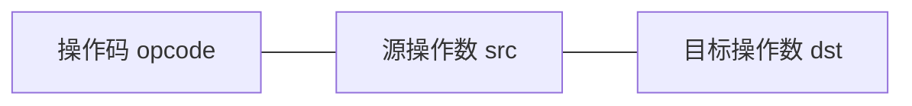

## 1. 计算机系统层次结构

计算机系统从底向上分为多个层次：

```
应用软件层
    ↓
系统软件层（操作系统、编译器）
    ↓
指令集架构层（ISA）
    ↓
微架构层（数据通路、控制器）
    ↓
数字逻辑层（逻辑门、寄存器）
    ↓
电路层（晶体管、连线）
```

**指令集架构（ISA）** 是软件和硬件之间的接口，定义了指令格式、寻址方式、寄存器组等。

## 2. 指令系统

### 2.1 指令格式

指令由操作码和操作数组成：



**指令字长分类**：

| 类型     | 特点             | 代表              |
| -------- | ---------------- | ----------------- |
| 定长指令 | 所有指令长度相同 | RISC（MIPS、ARM） |
| 变长指令 | 指令长度可变     | CISC（x86）       |

### 2.2 寻址方式

| 寻址方式   | 有效地址         | 特点                 |
| ---------- | ---------------- | -------------------- |
| 立即寻址   | 操作数在指令中   | 最快，操作数范围有限 |
| 直接寻址   | $EA = A$         | 简单，地址空间受限   |
| 间接寻址   | $EA = (A)$       | 灵活，需两次访存     |
| 寄存器寻址 | $EA = R_i$       | 最快，寄存器数量有限 |
| 寄存器间接 | $EA = (R_i)$     | 灵活，一次访存       |
| 偏移寻址   | $EA = (R_i) + A$ | 适合数组、结构体     |
| 相对寻址   | $EA = PC + A$    | 适合转移指令         |

### 2.3 RISC vs CISC

| 特性     | RISC              | CISC       |
| -------- | ----------------- | ---------- |
| 指令数量 | 少（<200）        | 多（>300） |
| 指令长度 | 定长              | 变长       |
| 寻址方式 | 少                | 多         |
| 执行周期 | 1个周期           | 多个周期   |
| 流水线   | 易实现            | 难实现     |
| 寄存器   | 多                | 少         |
| 代表     | MIPS、ARM、RISC-V | x86        |

## 3. CPU 数据通路

### 3.1 单周期数据通路

单周期处理器每条指令在一个时钟周期内完成：

```
PC → 指令存储器 → 译码 → 执行 → 数据存储器 → 写回
```

关键组件：

- **PC（程序计数器）**：存储下一条指令地址
- **指令存储器**：存放指令
- **寄存器文件**：32个通用寄存器
- **ALU**：算术逻辑单元
- **数据存储器**：读写数据
- **多路选择器**：选择数据来源

**时钟周期**：取指 + 译码 + 执行 + 访存 + 写回中最慢路径的延迟。

### 3.2 多周期数据通路

将指令执行拆分为多个时钟周期：

| 阶段 | 操作              | 所需周期 |
| ---- | ----------------- | -------- |
| IF   | 取指令            | 1        |
| ID   | 指令译码/读寄存器 | 1        |
| EX   | 执行/计算地址     | 1        |
| MEM  | 访问存储器        | 0~2      |
| WB   | 写回寄存器        | 0~1      |

优势：不同指令使用不同周期数，硬件资源可复用。

### 3.3 ALU 设计

ALU 支持的基本运算：

$$\text{ALU 结果} = \begin{cases} A + B & \text{加法} \\ A - B & \text{减法} \\ A \text{ AND } B & \text{与} \\ A \text{ OR } B & \text{或} \\ A \oplus B & \text{异或} \\ A < B ? 1 : 0 & \text{比较} \end{cases}$$

**标志位**：

- Z（Zero）：结果为零
- N（Negative）：结果为负
- C（Carry）：进位
- V（Overflow）：溢出

## 4. 控制器设计

### 4.1 硬布线控制器

通过组合逻辑电路直接产生控制信号：

$$\text{控制信号} = f(\text{指令操作码}, \text{当前状态}, \text{标志位})$$

优点：速度快
缺点：设计复杂，不易修改和扩展

### 4.2 微程序控制器

将控制信号编码为微指令，存储在控制存储器中：

```
指令操作码 → 微地址形成部件 → 控制存储器 → 微指令 → 控制信号
```

**微指令格式**：

- 水平型：每位对应一个控制信号，并行度高
- 垂直型：编码表示操作，指令短但需译码

优点：灵活，易于修改
缺点：速度较慢（需访问控制存储器）

## 5. 流水线技术

### 5.1 基本流水线

五级流水线：

```
IF → ID → EX → MEM → WB
     IF → ID → EX → MEM → WB
          IF → ID → EX → MEM → WB
```

理想情况下，$n$ 条指令执行时间：

$$T_{pipeline} = (k + n - 1) \times \Delta t$$

其中 $k$ 为流水线级数，$\Delta t$ 为时钟周期。

### 5.2 流水线冒险

**数据冒险**：后续指令需要前一条指令的结果。

解决方案：

- 数据转发（Forwarding/Bypassing）
- 插入气泡（Stall）
- 指令重排序（编译器优化）

**控制冒险**：分支指令改变执行流。

解决方案：

- 分支预测（静态/动态）
- 延迟分支
- 提前计算分支结果

**结构冒险**：多条指令同时访问同一硬件资源。

解决方案：

- 哈佛架构（指令/数据分离）
- 资源复制

### 5.3 分支预测

**静态预测**：

- 总是预测不跳转
- 总是预测跳转
- 根据方向预测（向后跳则跳转）

**动态预测**：

1-bit 预测器：记录上次分支结果

2-bit 预测器（饱和计数器）：

```
强不跳转(00) → 弱不跳转(01) → 弱跳转(10) → 强跳转(11)
```

预测准确率：

$$P_{2bit} > P_{1bit}$$

## 6. 存储体系

### 6.1 存储层次结构

```
寄存器（~1ns, <1KB）
    ↓
L1 Cache（~1ns, 32~64KB）
    ↓
L2 Cache（~5ns, 256KB~1MB）
    ↓
L3 Cache（~10ns, 2~64MB）
    ↓
主存 DRAM（~50ns, 4~128GB）
    ↓
SSD（~100μs, 256GB~4TB）
    ↓
HDD（~10ms, 1~20TB）
```

### 6.2 Cache 映射方式

**直接映射**：

$$\text{Cache 行号} = \text{主存块号} \mod \text{Cache 行数}$$

**全相联映射**：主存块可映射到任意 Cache 行。

**组相联映射**：

$$\text{组号} = \text{主存块号} \mod \text{组数}$$

每组 $n$ 路，称为 $n$ 路组相联。

### 6.3 Cache 性能

**命中率**：

$$h = \frac{\text{Cache 命中次数}}{\text{总访问次数}}$$

**平均访问时间**：

$$t_{avg} = h \times t_{cache} + (1-h) \times t_{memory}$$

**替换策略**：LRU、FIFO、Random、LFU

**写策略**：

- 写直达（Write Through）：同时写 Cache 和主存
- 写回（Write Back）：只写 Cache，替换时写回主存

## 7. I/O 系统

### 7.1 I/O 控制方式

| 方式     | CPU 参与       | 数据传送       |
| -------- | -------------- | -------------- |
| 程序查询 | 全程参与       | CPU 逐字传送   |
| 中断方式 | 启动后等待中断 | CPU 逐字传送   |
| DMA      | 仅初始化和结束 | DMA 控制器传送 |
| 通道方式 | 仅启动         | 通道处理器传送 |

### 7.2 DMA 传送

DMA（直接存储器存取）允许 I/O 设备直接与主存交换数据：

$$\text{DMA 传送效率} = \frac{\text{数据量}}{\text{传送时间}}$$

DMA 与 CPU 可能争用总线，解决方式：

- 周期窃取（Cycle Stealing）
- 交替访存
- CPU 暂停模式

### 7.3 中断系统

中断处理流程：

```
1. 中断请求 → 2. 中断判优 → 3. 中断响应
→ 4. 保存现场 → 5. 中断服务 → 6. 恢复现场 → 7. 中断返回
```

中断优先级通常：机器错误 > 访管 > 程序性中断 > 外部中断 > I/O 中断

## 参考文献

CSAPP（深入理解计算机系统）：https://csapp.cs.cmu.edu/
算法导论（CLRS）：https://mitpress.mit.edu/9780262046305/
MIT OpenCourseWare 6.006：https://ocw.mit.edu/courses/6-006-introduction-to-algorithms-spring-2020/
Teach Yourself CS：https://teachyourselfcs.com/

## 延伸阅读

数据结构与算法，见 023-algorithm 模块。
操作系统概念，见 024-cs-fundamentals 模块相关文档。
计算机体系结构，见 001-getting-started 模块相关文档。
尚硅谷 Bilibili 空间（https://space.bilibili.com/302417610 ）提供计算机基础课程。

## 深度专题扩展

以下专题从不同角度深入本文主题，供有进阶需求的读者研读。每个专题独立成节，内容相互补充。

### 13.1 大 O 分析与复杂度推导

渐进符号：O（上界）、Ω（下界）、Θ（紧界）；常数与低阶项忽略。
常见阶：O(1)、O(log n)、O(n)、O(n log n)、O(n²)、O(2ⁿ)；识别主循环与递归式。
主定理：T(n)=aT(n/b)+f(n) 的三种情形。
实践：先估规模与时限，再选算法与数据结构。

### 13.2 缓存与局部性

时间局部性：近期访问的数据再访问；空间局部性：邻近数据一起访问。
缓存行：64 字节粒度；数组遍历比链表友好。
伪共享：多线程改同一缓存行不同变量，缓存乒乓。
优化手段：数据结构重排、分块（blocking）、无锁队列。

## 模块文档速查表

| 文档 | 主题 | 与本文的关联 |
| --- | --- | --- |
| 计算机科学概述 | 001-ComputerOverview | 本文的前置基础 |
| 计算机体系结构 | 002-ComputerArchitecture | 本文的并列主题 |
| 操作系统 | 003-OperatingSystem | 本文的并列主题 |
| 计算机网络 | 004-ComputerNetwork | 本文的并列主题 |
| 数字逻辑 | 005-DigitalLogic | 本文的并列主题 |
| 离散数学 | 006-DiscreteMathematics | 本文的并列主题 |
| 计算机组成原理 | 007-ComputerPrinciple | 本文自身 |
| 数据表示与运算 | 008-DataRepresentationOperation | 本文的并列主题 |
| 指令流水线 | 009-DirectivePipeline | 本文的并列主题 |
| 存储系统 | 010-StorageSystem | 本文的并列主题 |
| 总线与接口 | 011-BusAndInterface | 本文的并列主题 |
| 并行计算 | 012-ParallelCalculate | 本文的并列主题 |
| 分布式系统 | 013-DistributedSystem | 本文的并列主题 |
| 算法设计与分析 | 014-AlgorithmDesignAnalysis | 本文的并列主题 |
| 形式语言与自动机 | 015-FormalLanguageAndAutomata | 本文的并列主题 |
| 信息安全基础 | 016-InformationSecurityBasics | 本文的前置基础 |
| 编译原理 | 017-CompilePrinciple | 本文的原理深化 |
| 软件工程 | 018-SoftwareEngineering | 本文的并列主题 |
| 数据库系统原理 | 019-DatabaseSystemPrinciple | 本文的原理深化 |
| 编译原理进阶 | 020-CompilePrincipleAdvanced | 本文的原理深化 |
| 操作系统进阶 | 021-OperatingSystemAdvanced | 本文的并列主题 |
| 计算机网络进阶 | 022-ComputerNetworkAdvanced | 本文的并列主题 |
| 网络安全 | 023-NetworkSecurity | 本文的安全延伸 |
| 多媒体技术 | 024-MultimediaTechnology | 本文的并列主题 |
| 人工智能基础 | 025-AIFundamentals | 本文的前置基础 |
| 计算机图形学 | 026-ComputerShape | 本文的并列主题 |
| 设计模式 | 027-DesignPattern | 本文的并列主题 |
| 软件体系结构 | 028-SoftwareSystemStructure | 本文的并列主题 |
| 人机交互 | 029-HCI | 本文的并列主题 |
| 编程语言理论 | 030-ProgrammingLanguageTheory | 本文的并列主题 |
| 网络协议深度 | 031-NetworkProtocolDeep | 本文的并列主题 |
| 编译与运行时 | 032-CompileAndRuntime | 本文的并列主题 |
| 进程PCB与线程TCB | 033-PCBThreadTCB | 本文的并列主题 |
| 中断与系统调用 | 034-InterruptAndSystemCall | 本文的并列主题 |
| 用户态与内核态切换 | 035-UserModeKernelModeSwitch | 本文的并列主题 |
| 内存分段与分页 | 036-MemorySegmentationAndPaging | 本文的并列主题 |
| 页面置换算法 | 037-PageReplacementAlgorithm | 本文的并列主题 |
| 文件系统inode | 038-FileSystemInode | 本文的并列主题 |
| 磁盘调度 | 039-DiskScheduling | 本文的并列主题 |
| 零拷贝 | 040-ZeroCopy | 本文的并列主题 |
| 进程间通信 | 041-IPC | 本文的并列主题 |
| HTTP缓存策略 | 042-HTTPCacheStrategy | 本文的并列主题 |
| HTTPS握手过程 | 043-HTTPSHandshake | 本文的并列主题 |
| TCP拥塞控制 | 044-TCPControl | 本文的并列主题 |
| TCP粘包与拆包 | 045-TCP | 本文的并列主题 |
| DNS解析流程 | 046-DNSFlow | 本文的并列主题 |
| CDN原理 | 047-CDNPrinciple | 本文的原理深化 |
| WebSocket帧格式 | 048-WebSocketFrameFormat | 本文的并列主题 |
| QUIC协议 | 049-QUIC | 本文的并列主题 |
| ARP协议与ARP欺骗 | 050-ARPARP | 本文的并列主题 |
| BGP路由协议 | 051-BGPRoute | 本文的并列主题 |
| 词法分析 | 052-LexicalAnalysis | 本文的并列主题 |
| 语法分析 | 053-GrammarAnalysis | 本文的并列主题 |
| 语义分析 | 054-SemanticAnalysis | 本文的并列主题 |
| 中间代码 | 055-IntermediateCode | 本文的并列主题 |
| 代码优化 | 056-CodeOptimization | 本文的性能延伸 |
| 目标代码生成 | 057-TargetCodeGeneration | 本文的并列主题 |
