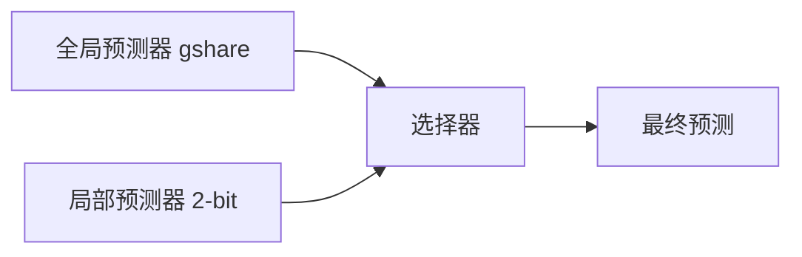

## 1. 流水线基本原理

### 1.1 流水线加速比

理想情况下，$n$ 条指令在 $k$ 级流水线上的执行时间：

$$T_{pipeline} = (k + n - 1) \times \Delta t$$

非流水线执行时间：

$$T_{non-pipeline} = k \times n \times \Delta t$$

加速比：

$$S = \frac{T_{non-pipeline}}{T_{pipeline}} = \frac{k \times n}{k + n - 1}$$

当 $n \to \infty$ 时，$S \to k$（理想加速比等于流水线级数）。

### 1.2 流水线效率

$$E = \frac{n \times k \times \Delta t}{k \times (k + n - 1) \times \Delta t} = \frac{n}{k + n - 1}$$

当 $n \to \infty$ 时，$E \to 1$（100% 效率）。

### 1.3 流水线时钟周期

$$\Delta t = \max(T_{IF}, T_{ID}, T_{EX}, T_{MEM}, T_{WB}) + T_{latch}$$

其中 $T_{latch}$ 为流水线寄存器建立时间。

## 2. 流水线冒险详解

### 2.1 数据冒险分类

**RAW（Read After Write）**：最常见，后续指令读前一条指令的写结果。

```
ADD R1, R2, R3    # 写 R1
SUB R4, R1, R5    # 读 R1（RAW 冒险）
```

**WAR（Write After Read）**：后续指令写前一条指令要读的寄存器（乱序执行中可能出现）。

**WAW（Write After Write）**：两条指令写同一寄存器（乱序执行中可能出现）。

### 2.2 数据冒险解决方案

**转发（Forwarding/Bypassing）**：

```
EX/MEM 寄存器 → 前递到 EX 输入
MEM/WB 寄存器 → 前递到 EX 输入
```

转发条件检测：

```
if (EX/MEM.RegWrite && EX/MEM.Rd != 0 && EX/MEM.Rd == ID/EX.Rs)
    ForwardA = 01  # EX/MEM 前递
if (MEM/WB.RegWrite && MEM/WB.Rd != 0 && MEM/WB.Rd == ID/EX.Rs)
    ForwardA = 10  # MEM/WB 前递
```

**Load-Use 冒险**：即使有转发，Load 后紧跟使用仍需停顿1个周期：

```
LW R1, 0(R2)    # MEM 阶段才有数据
ADD R3, R1, R4  # EX 阶段就需要 R1 → 必须停顿
```

### 2.3 控制冒险

分支指令导致的流水线断流。

**分支代价**：

$$\text{分支代价} = \text{分支频率} \times \text{分支惩罚} \times \text{误预测率}$$

## 3. 分支预测

### 3.1 静态预测

| 策略       | 准确率   | 适用场景         |
| ---------- | -------- | ---------------- |
| 预测不跳转 | ~40%~60% | 简单实现         |
| 预测跳转   | ~60%     | 循环多的程序     |
| BTFN       | ~65%     | 向后跳转预测跳转 |

### 3.2 动态预测

**1-bit 预测器**：记录上次分支结果，预测本次与上次相同。

**2-bit 饱和计数器**：

```
强不跳(00) → 弱不跳(01) → 弱跳(10) → 强跳(11)
   ↑                                    ↓
   ←←←←←←←←←←←←←←←←←←←←←←←←←←←←←←←←←
```

连续两次误预测才改变预测方向，减少嵌套循环的误预测。

**2-bit 预测准确率**：

$$P_{2bit} \approx 1 - \frac{1}{n_{loop}}$$

其中 $n_{loop}$ 为循环迭代次数。

### 3.3 相关分支预测

**两级自适应预测器**：

- 第一级：分支历史寄存器（BHR），记录最近 $k$ 次分支结果
- 第二级：模式历史表（PHT），由 BHR 索引，每个表项为 2-bit 计数器

$$\text{预测} = \text{PHT}[\text{BHR}][\text{PC低位}]$$

**gshare 预测器**：将 PC 和 BHR 异或后索引 PHT。

### 3.4 混合预测器

结合多种预测器的优势：



选择器也是 2-bit 计数器，根据两个预测器的历史表现选择更优者。

现代处理器（如 Intel）的分支预测准确率可达 **97%~99%**。

## 4. 超标量处理器

### 4.1 指令级并行（ILP）

超标量处理器每个时钟周期发射多条指令：

| 类型   | 每周期发射 | 代表                   |
| ------ | ---------- | ---------------------- |
| 标量   | 1 条       | MIPS R2000             |
| 超标量 | 2~6 条     | Intel Core, ARM Cortex |
| VLIW   | 4~8 条     | Itanium, DSP           |

### 4.2 超标量流水线结构

```
取指 → 译码 → 重命名 → 发射 → 执行 → 写回 → 提交
  ↓      ↓       ↓       ↓      ↓      ↓       ↓
 4条    4条    4条    乱序    多功能  重排    顺序
 指令   指令   指令    发射    单元   缓冲   提交
```

### 4.3 寄存器重命名

消除 WAW 和 WAR 冒险：

```
原始代码：
  ADD R1, R2, R3    # R1 = R2 + R3
  MUL R4, R1, R5    # R4 = R1 * R5
  ADD R1, R6, R7    # R1 = R6 + R7  (WAW with first ADD)

重命名后：
  ADD P1, R2, R3    # P1 = R2 + R3
  MUL R4, P1, R5    # R4 = P1 * R5
  ADD P2, R6, R7    # P2 = R6 + R7  (无 WAW)
```

物理寄存器数量 > 架构寄存器数量，通过重命名表维护映射。

### 4.4 乱序执行

**Tomasulo 算法**：

1. 指令发射到保留站（Reservation Station）
2. 操作数就绪后执行（数据流驱动）
3. 通过公共数据总线（CDB）广播结果
4. 等待该结果的所有保留站同时获取

**重排序缓冲（ROB）**：保证精确中断和顺序提交。

```
ROB 表项：[指令, 目标寄存器, 值, 就绪标志]
```

指令按程序顺序进入 ROB，按执行顺序写值，按程序顺序提交。

## 5. 超流水线

### 5.1 超流水线原理

将流水线级数进一步细分，提高时钟频率：

$$f_{super-pipeline} = k \times f_{base-pipeline}$$

| 处理器     | 流水线级数 | 时钟频率 |
| ---------- | ---------- | -------- |
| MIPS R4000 | 8 级       | ~100 MHz |
| Pentium 4  | 31 级      | ~3.8 GHz |
| Intel Core | 14~19 级   | ~5 GHz   |

### 5.2 超流水线的问题

- **分支惩罚增大**：误预测时需刷新更多流水线级
- **流水线寄存器开销**：每级都有锁存器延迟
- **功耗增加**：更多流水线寄存器 → 更多翻转

$$\text{实际加速比} < k \times \text{基础加速比}$$

## 6. VLIW 体系结构

### 6.1 VLIW 原理

由编译器将多个独立操作打包为一条超长指令字：


一条 128 位 VLIW 指令

### 6.2 VLIW 优缺点

**优点**：

- 硬件简单，无需动态调度逻辑
- 编译时确定并行性，无运行时开销
- 功耗低

**缺点**：

- 严重依赖编译器优化
- 代码膨胀（空操作填充）
- 二进制兼容性差
- 非均匀访存延迟导致性能不稳定

## 7. 多线程技术

### 7.1 线程级并行（TLP）

| 类型              | 说明                       | 代表        |
| ----------------- | -------------------------- | ----------- |
| 粗粒度多线程      | 线程切换需多个周期         | 早期处理器  |
| 细粒度多线程      | 每周期切换线程             | Sun Niagara |
| 同步多线程（SMT） | 同一周期执行不同线程的指令 | Intel HT    |

### 7.2 SMT（超线程）

SMT 允许一个物理核心同时执行两个线程的指令：

- 复制架构状态（寄存器、PC）
- 共享执行单元和缓存
- 当一个线程因缓存缺失停顿时，另一个线程可使用执行单元

SMT 加速比通常为 **1.2x~1.8x**。

## 参考文献

CSAPP（深入理解计算机系统）：https://csapp.cs.cmu.edu/
算法导论（CLRS）：https://mitpress.mit.edu/9780262046305/
MIT OpenCourseWare 6.006：https://ocw.mit.edu/courses/6-006-introduction-to-algorithms-spring-2020/
Teach Yourself CS：https://teachyourselfcs.com/

## 延伸阅读

数据结构与算法，见 023-algorithm 模块。
操作系统概念，见 024-cs-fundamentals 模块相关文档。
计算机体系结构，见 001-getting-started 模块相关文档。
尚硅谷 Bilibili 空间（https://space.bilibili.com/302417610 ）提供计算机基础课程。

## 深度专题扩展

以下专题从不同角度深入本文主题，供有进阶需求的读者研读。每个专题独立成节，内容相互补充。

### 13.1 大 O 分析与复杂度推导

渐进符号：O（上界）、Ω（下界）、Θ（紧界）；常数与低阶项忽略。
常见阶：O(1)、O(log n)、O(n)、O(n log n)、O(n²)、O(2ⁿ)；识别主循环与递归式。
主定理：T(n)=aT(n/b)+f(n) 的三种情形。
实践：先估规模与时限，再选算法与数据结构。

### 13.2 缓存与局部性

时间局部性：近期访问的数据再访问；空间局部性：邻近数据一起访问。
缓存行：64 字节粒度；数组遍历比链表友好。
伪共享：多线程改同一缓存行不同变量，缓存乒乓。
优化手段：数据结构重排、分块（blocking）、无锁队列。

## 模块文档速查表

| 文档 | 主题 | 与本文的关联 |
| --- | --- | --- |
| 计算机科学概述 | 001-ComputerOverview | 本文的前置基础 |
| 计算机体系结构 | 002-ComputerArchitecture | 本文的并列主题 |
| 操作系统 | 003-OperatingSystem | 本文的并列主题 |
| 计算机网络 | 004-ComputerNetwork | 本文的并列主题 |
| 数字逻辑 | 005-DigitalLogic | 本文的并列主题 |
| 离散数学 | 006-DiscreteMathematics | 本文的并列主题 |
| 计算机组成原理 | 007-ComputerPrinciple | 本文的原理深化 |
| 数据表示与运算 | 008-DataRepresentationOperation | 本文的并列主题 |
| 指令流水线 | 009-DirectivePipeline | 本文自身 |
| 存储系统 | 010-StorageSystem | 本文的并列主题 |
| 总线与接口 | 011-BusAndInterface | 本文的并列主题 |
| 并行计算 | 012-ParallelCalculate | 本文的并列主题 |
| 分布式系统 | 013-DistributedSystem | 本文的并列主题 |
| 算法设计与分析 | 014-AlgorithmDesignAnalysis | 本文的并列主题 |
| 形式语言与自动机 | 015-FormalLanguageAndAutomata | 本文的并列主题 |
| 信息安全基础 | 016-InformationSecurityBasics | 本文的前置基础 |
| 编译原理 | 017-CompilePrinciple | 本文的原理深化 |
| 软件工程 | 018-SoftwareEngineering | 本文的并列主题 |
| 数据库系统原理 | 019-DatabaseSystemPrinciple | 本文的原理深化 |
| 编译原理进阶 | 020-CompilePrincipleAdvanced | 本文的原理深化 |
| 操作系统进阶 | 021-OperatingSystemAdvanced | 本文的并列主题 |
| 计算机网络进阶 | 022-ComputerNetworkAdvanced | 本文的并列主题 |
| 网络安全 | 023-NetworkSecurity | 本文的安全延伸 |
| 多媒体技术 | 024-MultimediaTechnology | 本文的并列主题 |
| 人工智能基础 | 025-AIFundamentals | 本文的前置基础 |
| 计算机图形学 | 026-ComputerShape | 本文的并列主题 |
| 设计模式 | 027-DesignPattern | 本文的并列主题 |
| 软件体系结构 | 028-SoftwareSystemStructure | 本文的并列主题 |
| 人机交互 | 029-HCI | 本文的并列主题 |
| 编程语言理论 | 030-ProgrammingLanguageTheory | 本文的并列主题 |
| 网络协议深度 | 031-NetworkProtocolDeep | 本文的并列主题 |
| 编译与运行时 | 032-CompileAndRuntime | 本文的并列主题 |
| 进程PCB与线程TCB | 033-PCBThreadTCB | 本文的并列主题 |
| 中断与系统调用 | 034-InterruptAndSystemCall | 本文的并列主题 |
| 用户态与内核态切换 | 035-UserModeKernelModeSwitch | 本文的并列主题 |
| 内存分段与分页 | 036-MemorySegmentationAndPaging | 本文的并列主题 |
| 页面置换算法 | 037-PageReplacementAlgorithm | 本文的并列主题 |
| 文件系统inode | 038-FileSystemInode | 本文的并列主题 |
| 磁盘调度 | 039-DiskScheduling | 本文的并列主题 |
| 零拷贝 | 040-ZeroCopy | 本文的并列主题 |
| 进程间通信 | 041-IPC | 本文的并列主题 |
| HTTP缓存策略 | 042-HTTPCacheStrategy | 本文的并列主题 |
| HTTPS握手过程 | 043-HTTPSHandshake | 本文的并列主题 |
| TCP拥塞控制 | 044-TCPControl | 本文的并列主题 |
| TCP粘包与拆包 | 045-TCP | 本文的并列主题 |
| DNS解析流程 | 046-DNSFlow | 本文的并列主题 |
| CDN原理 | 047-CDNPrinciple | 本文的原理深化 |
| WebSocket帧格式 | 048-WebSocketFrameFormat | 本文的并列主题 |
| QUIC协议 | 049-QUIC | 本文的并列主题 |
| ARP协议与ARP欺骗 | 050-ARPARP | 本文的并列主题 |
| BGP路由协议 | 051-BGPRoute | 本文的并列主题 |
| 词法分析 | 052-LexicalAnalysis | 本文的并列主题 |
| 语法分析 | 053-GrammarAnalysis | 本文的并列主题 |
| 语义分析 | 054-SemanticAnalysis | 本文的并列主题 |
| 中间代码 | 055-IntermediateCode | 本文的并列主题 |
| 代码优化 | 056-CodeOptimization | 本文的性能延伸 |
| 目标代码生成 | 057-TargetCodeGeneration | 本文的并列主题 |
