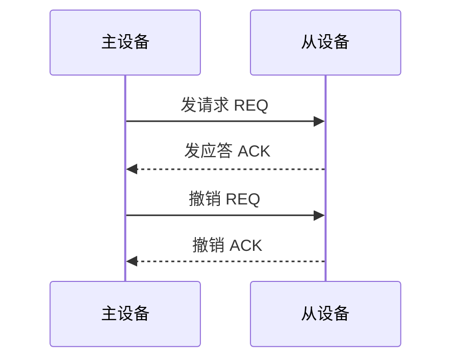
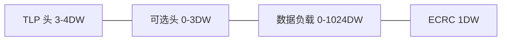
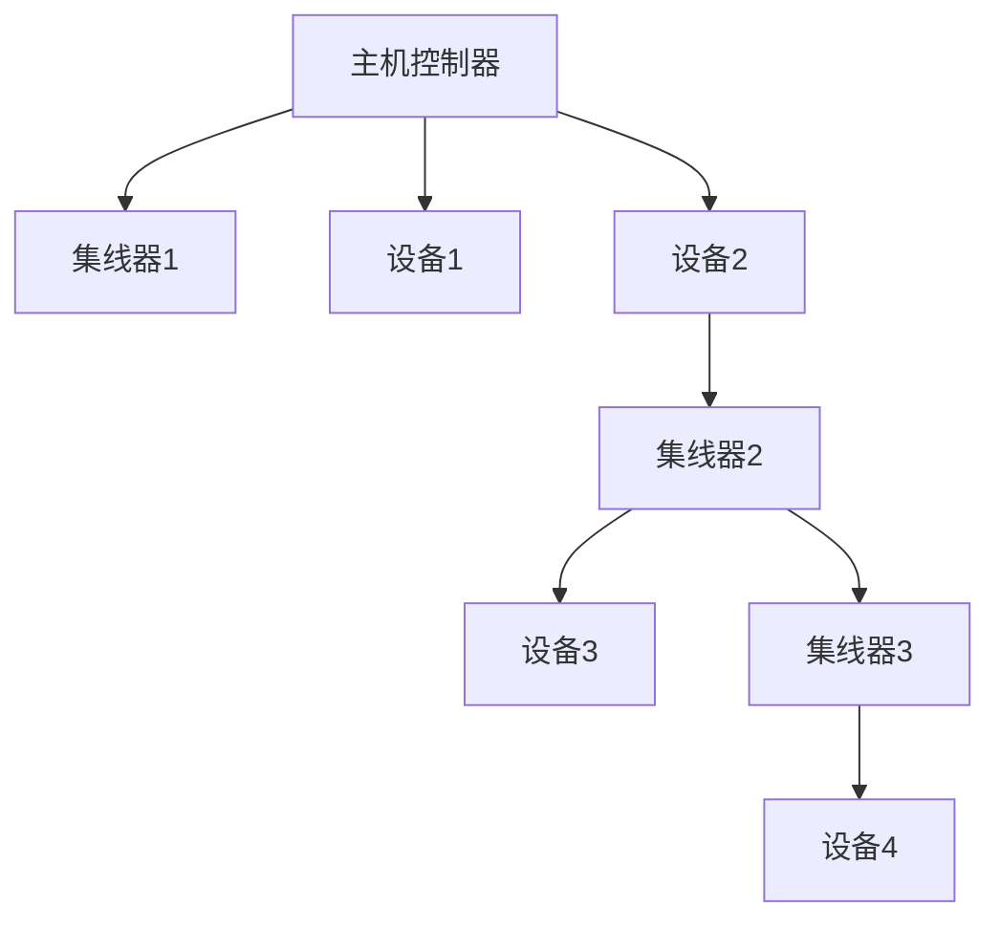

## 1. 总线基本概念

### 1.1 总线分类

| 类型     | 连接对象       | 特点             | 示例     |
| -------- | -------------- | ---------------- | -------- |
| 片内总线 | CPU 内部各部件 | 速度最快，宽度大 | ALU 总线 |
| 系统总线 | CPU、内存、I/O | 速度较快         | 前端总线 |
| 通信总线 | 计算机之间     | 距离远，速度较慢 | 以太网   |

### 1.2 系统总线组成

- **数据总线**：双向，传输数据，宽度决定一次传输的数据量
- **地址总线**：单向（CPU→外设），宽度决定寻址空间
- **控制总线**：读/写信号、中断请求、总线请求等

$$\text{寻址空间} = 2^{\text{地址总线宽度}}$$

例如 32 位地址总线可寻址 $2^{32} = 4\text{GB}$。

### 1.3 总线性能指标

$$\text{总线带宽} = \frac{\text{数据宽度} \times \text{总线频率}}{\text{时钟周期数/传输}}$$

示例：64 位数据总线，200 MHz，每个传输需 2 个时钟周期：

$$\text{带宽} = \frac{64 \times 200 \times 10^6}{2 \times 8} = 800\text{MB/s}$$

## 2. 总线仲裁

### 2.1 集中仲裁

**链式查询（菊花链）**：

```
总线请求 → 仲裁器 → BG 信号 → 设备1 → 设备2 → ... → 设备N
```

- 优先级由物理位置决定（离仲裁器近的优先级高）
- 简单，但优先级固定，对远端设备不公平
- 一个设备故障可能导致后续设备无法获得总线

**计数器定时查询**：

- 仲裁器从当前计数值开始查询
- 计数从0开始：等效于链式查询
- 计数从上次停止处开始：循环优先级

**独立请求方式**：

- 每个设备有独立的总线请求和授权线
- 仲裁器可灵活分配优先级
- 硬件复杂度 $O(n)$，但响应最快

### 2.2 分布仲裁

**自举分布式仲裁**：

每个设备有唯一优先级ID，同时请求时，优先级高的获得总线。

**冲突检测（CSMA/CD）**：

以太网使用的仲裁方式，先听后发，冲突时退避重试。

## 3. 总线定时

### 3.1 同步定时

所有设备使用统一时钟：

```
时钟周期1：主设备发地址
时钟周期2：从设备返回数据
```

优点：控制简单
缺点：时钟频率受最慢设备限制

### 3.2 异步定时

无统一时钟，使用握手协议：

**全互锁握手**：



优点：适应不同速度的设备
缺点：每次传输需要多次握手，开销较大

### 3.3 半同步定时

在同步基础上增加等待信号（WAIT），允许慢设备插入等待周期。

## 4. PCI Express（PCIe）

### 4.1 PCIe 架构

PCIe 采用点对点串行互连，取代 PCI 的并行共享总线：

| 特性     | PCI       | PCIe                |
| -------- | --------- | ------------------- |
| 互连方式 | 共享并行  | 点对点串行          |
| 数据宽度 | 32/64 位  | 1/2/4/8/12/16 通道  |
| 时钟频率 | 33/66 MHz | 2.5/5/8/16/32 GT/s  |
| 最大带宽 | 533 MB/s  | ~63 GB/s (x16 Gen5) |

### 4.2 PCIe 通道

每条 PCIe 通道包含两对差分信号线（发送+接收）：

$$\text{单通道带宽} = \frac{\text{数据速率} \times \text{编码效率}}{8}$$

| PCIe 版本 | 数据速率 | 编码      | 单通道带宽 |
| --------- | -------- | --------- | ---------- |
| Gen1      | 2.5 GT/s | 8b/10b    | 250 MB/s   |
| Gen2      | 5 GT/s   | 8b/10b    | 500 MB/s   |
| Gen3      | 8 GT/s   | 128b/130b | ~985 MB/s  |
| Gen4      | 16 GT/s  | 128b/130b | ~1970 MB/s |
| Gen5      | 32 GT/s  | 128b/130b | ~3940 MB/s |

### 4.3 PCIe 事务层

PCIe 使用数据包传输：



TLP 类型：Memory Read/Write、IO Read/Write、Configuration Read/Write、Message。

## 5. USB

### 5.1 USB 版本演进

| 版本    | 速率       | 别名            |
| ------- | ---------- | --------------- |
| USB 1.1 | 12 Mbps    | Full Speed      |
| USB 2.0 | 480 Mbps   | High Speed      |
| USB 3.0 | 5 Gbps     | SuperSpeed      |
| USB 3.1 | 10 Gbps    | SuperSpeed+     |
| USB 3.2 | 20 Gbps    | SuperSpeed++    |
| USB4    | 40/80 Gbps | 基于Thunderbolt |

### 5.2 USB 传输类型

| 类型     | 方向性 | 可靠性 | 适用场景     |
| -------- | ------ | ------ | ------------ |
| 控制传输 | 双向   | 可靠   | 设备配置     |
| 批量传输 | 单向   | 可靠   | 打印机、存储 |
| 中断传输 | 单向   | 可靠   | 键盘、鼠标   |
| 等时传输 | 单向   | 不可靠 | 音视频流     |

### 5.3 USB 拓扑

USB 采用树形拓扑，最多支持 7 层深度、127 个设备：



## 6. 嵌入式常用总线

### 6.1 I2C

两线制串行总线：SCL（时钟）+ SDA（数据）。

| 特性 | 值                          |
| ---- | --------------------------- |
| 线数 | 2（SCL + SDA）              |
| 速率 | 100kbps / 400kbps / 3.4Mbps |
| 寻址 | 7位或10位地址               |
| 拓扑 | 多主多从                    |
| 距离 | 短距离（<1m）               |

通信流程：

```
起始条件 → 从机地址(7bit) + 读/写位 → ACK → 数据 → ACK → 停止条件
```

### 6.2 SPI

四线制高速串行总线：

| 信号 | 方向  | 说明     |
| ---- | ----- | -------- |
| SCLK | 主→从 | 时钟     |
| MOSI | 主→从 | 主出从入 |
| MISO | 从→主 | 主入从出 |
| CS   | 主→从 | 片选     |

特点：全双工、高速（可达数十Mbps）、无寻址机制（通过片选选择设备）。

### 6.3 UART

异步串行通信：

```
空闲(高) → 起始位(低) → 数据位(5~9bit) → 校验位 → 停止位(高)
```

| 参数   | 典型值        |
| ------ | ------------- |
| 波特率 | 9600 / 115200 |
| 数据位 | 8             |
| 校验   | 无/奇/偶      |
| 停止位 | 1             |

## 7. 系统互连架构

### 7.1 片上网络（NoC）

多核处理器中，核心间通过路由器网络互连：

| 拓扑     | 直径            | 度   | 链路数         |
| -------- | --------------- | ---- | -------------- |
| Mesh     | $2(\sqrt{N}-1)$ | 4    | $2N-2\sqrt{N}$ |
| Torus    | $\sqrt{N}$      | 4    | $2N$           |
| Fat Tree | $2\log N$       | 变化 | 变化           |

### 7.2 路由策略

- **维序路由（XY路由）**：先沿X方向，再沿Y方向，无死锁
- **自适应路由**：根据网络拥塞动态选择路径
- **最短路径路由**：选择跳数最少的路径

## 参考文献

CSAPP（深入理解计算机系统）：https://csapp.cs.cmu.edu/
算法导论（CLRS）：https://mitpress.mit.edu/9780262046305/
MIT OpenCourseWare 6.006：https://ocw.mit.edu/courses/6-006-introduction-to-algorithms-spring-2020/
Teach Yourself CS：https://teachyourselfcs.com/

## 延伸阅读

数据结构与算法，见 023-algorithm 模块。
操作系统概念，见 024-cs-fundamentals 模块相关文档。
计算机体系结构，见 001-getting-started 模块相关文档。
尚硅谷 Bilibili 空间（https://space.bilibili.com/302417610 ）提供计算机基础课程。

## 深度专题扩展

以下专题从不同角度深入本文主题，供有进阶需求的读者研读。每个专题独立成节，内容相互补充。

### 13.1 大 O 分析与复杂度推导

渐进符号：O（上界）、Ω（下界）、Θ（紧界）；常数与低阶项忽略。
常见阶：O(1)、O(log n)、O(n)、O(n log n)、O(n²)、O(2ⁿ)；识别主循环与递归式。
主定理：T(n)=aT(n/b)+f(n) 的三种情形。
实践：先估规模与时限，再选算法与数据结构。

### 13.2 缓存与局部性

时间局部性：近期访问的数据再访问；空间局部性：邻近数据一起访问。
缓存行：64 字节粒度；数组遍历比链表友好。
伪共享：多线程改同一缓存行不同变量，缓存乒乓。
优化手段：数据结构重排、分块（blocking）、无锁队列。

## 模块文档速查表

| 文档 | 主题 | 与本文的关联 |
| --- | --- | --- |
| 计算机科学概述 | 001-ComputerOverview | 本文的前置基础 |
| 计算机体系结构 | 002-ComputerArchitecture | 本文的并列主题 |
| 操作系统 | 003-OperatingSystem | 本文的并列主题 |
| 计算机网络 | 004-ComputerNetwork | 本文的并列主题 |
| 数字逻辑 | 005-DigitalLogic | 本文的并列主题 |
| 离散数学 | 006-DiscreteMathematics | 本文的并列主题 |
| 计算机组成原理 | 007-ComputerPrinciple | 本文的原理深化 |
| 数据表示与运算 | 008-DataRepresentationOperation | 本文的并列主题 |
| 指令流水线 | 009-DirectivePipeline | 本文的并列主题 |
| 存储系统 | 010-StorageSystem | 本文的并列主题 |
| 总线与接口 | 011-BusAndInterface | 本文自身 |
| 并行计算 | 012-ParallelCalculate | 本文的并列主题 |
| 分布式系统 | 013-DistributedSystem | 本文的并列主题 |
| 算法设计与分析 | 014-AlgorithmDesignAnalysis | 本文的并列主题 |
| 形式语言与自动机 | 015-FormalLanguageAndAutomata | 本文的并列主题 |
| 信息安全基础 | 016-InformationSecurityBasics | 本文的前置基础 |
| 编译原理 | 017-CompilePrinciple | 本文的原理深化 |
| 软件工程 | 018-SoftwareEngineering | 本文的并列主题 |
| 数据库系统原理 | 019-DatabaseSystemPrinciple | 本文的原理深化 |
| 编译原理进阶 | 020-CompilePrincipleAdvanced | 本文的原理深化 |
| 操作系统进阶 | 021-OperatingSystemAdvanced | 本文的并列主题 |
| 计算机网络进阶 | 022-ComputerNetworkAdvanced | 本文的并列主题 |
| 网络安全 | 023-NetworkSecurity | 本文的安全延伸 |
| 多媒体技术 | 024-MultimediaTechnology | 本文的并列主题 |
| 人工智能基础 | 025-AIFundamentals | 本文的前置基础 |
| 计算机图形学 | 026-ComputerShape | 本文的并列主题 |
| 设计模式 | 027-DesignPattern | 本文的并列主题 |
| 软件体系结构 | 028-SoftwareSystemStructure | 本文的并列主题 |
| 人机交互 | 029-HCI | 本文的并列主题 |
| 编程语言理论 | 030-ProgrammingLanguageTheory | 本文的并列主题 |
| 网络协议深度 | 031-NetworkProtocolDeep | 本文的并列主题 |
| 编译与运行时 | 032-CompileAndRuntime | 本文的并列主题 |
| 进程PCB与线程TCB | 033-PCBThreadTCB | 本文的并列主题 |
| 中断与系统调用 | 034-InterruptAndSystemCall | 本文的并列主题 |
| 用户态与内核态切换 | 035-UserModeKernelModeSwitch | 本文的并列主题 |
| 内存分段与分页 | 036-MemorySegmentationAndPaging | 本文的并列主题 |
| 页面置换算法 | 037-PageReplacementAlgorithm | 本文的并列主题 |
| 文件系统inode | 038-FileSystemInode | 本文的并列主题 |
| 磁盘调度 | 039-DiskScheduling | 本文的并列主题 |
| 零拷贝 | 040-ZeroCopy | 本文的并列主题 |
| 进程间通信 | 041-IPC | 本文的并列主题 |
| HTTP缓存策略 | 042-HTTPCacheStrategy | 本文的并列主题 |
| HTTPS握手过程 | 043-HTTPSHandshake | 本文的并列主题 |
| TCP拥塞控制 | 044-TCPControl | 本文的并列主题 |
| TCP粘包与拆包 | 045-TCP | 本文的并列主题 |
| DNS解析流程 | 046-DNSFlow | 本文的并列主题 |
| CDN原理 | 047-CDNPrinciple | 本文的原理深化 |
| WebSocket帧格式 | 048-WebSocketFrameFormat | 本文的并列主题 |
| QUIC协议 | 049-QUIC | 本文的并列主题 |
| ARP协议与ARP欺骗 | 050-ARPARP | 本文的并列主题 |
| BGP路由协议 | 051-BGPRoute | 本文的并列主题 |
| 词法分析 | 052-LexicalAnalysis | 本文的并列主题 |
| 语法分析 | 053-GrammarAnalysis | 本文的并列主题 |
| 语义分析 | 054-SemanticAnalysis | 本文的并列主题 |
| 中间代码 | 055-IntermediateCode | 本文的并列主题 |
| 代码优化 | 056-CodeOptimization | 本文的性能延伸 |
| 目标代码生成 | 057-TargetCodeGeneration | 本文的并列主题 |
